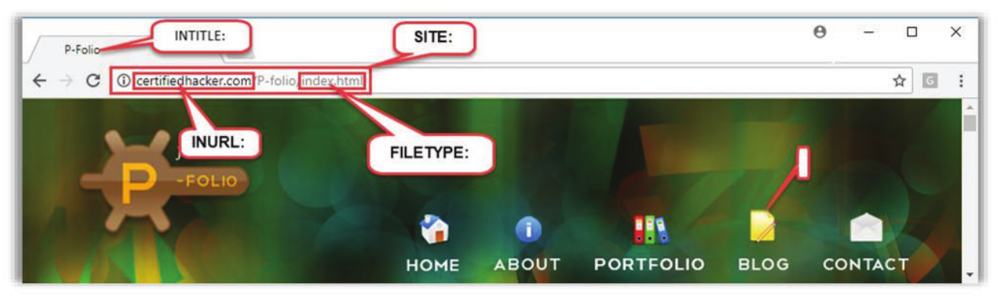

[TOC]


# Module 03 Open Source Intelligence (OSINT)

**Open Source Intelligence (OSINT) gathering is required for all types of penetration tests.**

## Finding the Domain and Sub-domains of the Target

- Check for the company's URL in the engagement letter or use a search engine such as Google or Bing
- Subdomains represent different applications and help in viewing the attack susrface of a target organization

### Tools

### Subbrute

https://github.com/TheRook/subbrute

```
#./subbrute.py certifiedhacker.com
certifiedhacker.com
www.certifiedhacker.com
_tcp.certifiedhacker.com
_tls.certifiedhacker.com
_udp.certifiedhacker.com
_domainkey.certifiedhacker.com
_pkixrep._tcp.certifiedhacker.com
_aix._tcp.certifiedhacker.com
_afpovertcp._tcp.certifiedhacker.com
_autodiscover._tcp.certifiedhacker.com
_caldav._tcp.certifiedhacker.com
_certificates._tcp.certifiedhacker.com
_cisco-phone-http.certifiedhacker.com
_cisco-phone-tftp.certifiedhacker.com
_cisco-uds._tcp.certifiedhacker.com
_ciscowtp._tcp.certifiedhacker.com
_collab-edge._tls.certifiedhacker.com
_crl._tcp.certifiedhacker.com
_cmp._tcp.certifiedhacker.com
_crls._tcp.certifiedhacker.com
_cuplogin._tcp.certifiedhacker.com
_client._smtp._tcp.certifiedhacker.com
_client._smtp.certifiedhacker.com
_finger._tcp.certifiedhacker.com
_ftp._tcp.certifiedhacker.com
_sftp._tcp.certifiedhacker.com

```

### Nmap

```
$nmap --script dns-brute www.certifiedhacker.com
Starting Nmap 7.91 ( https://nmap.org ) at 2021-08-13 23:21 PST
Nmap scan report for www.certifiedhacker.com (162.241.216.11)
Host is up (0.21s latency).
rDNS record for 162.241.216.11: box5331.bluehost.com
Not shown: 983 closed ports
PORT     STATE    SERVICE
21/tcp   open     ftp
22/tcp   open     ssh
25/tcp   filtered smtp
26/tcp   open     rsftp
53/tcp   open     domain
80/tcp   open     http
110/tcp  open     pop3
143/tcp  open     imap
443/tcp  open     https
465/tcp  open     smtps
587/tcp  open     submission
993/tcp  open     imaps
995/tcp  open     pop3s
2222/tcp open     EtherNetIP-1
2525/tcp filtered ms-v-worlds
3306/tcp open     mysql
5432/tcp open     postgresql

Host script results:
| dns-brute: 
|   DNS Brute-force hostnames: 
|     news.certifiedhacker.com - 162.241.216.11
|     mail.certifiedhacker.com - 162.241.216.11
|     blog.certifiedhacker.com - 162.241.216.11
|     ftp.certifiedhacker.com - 162.241.216.11
|     smtp.certifiedhacker.com - 162.241.216.11
|_    www.certifiedhacker.com - 162.241.216.11

Nmap done: 1 IP address (1 host up) scanned in 26.57 seconds
```

### Dnsmap

https://github.com/makefu/dnsmap

```
#dnsmap certifiedhacker.com
dnsmap 0.35 - DNS Network Mapper

[+] searching (sub)domains for certifiedhacker.com using built-in wordlist
[+] using maximum random delay of 10 millisecond(s) between requests

blog.certifiedhacker.com
IP address #1: 162.241.216.11

cpanel.certifiedhacker.com
IP address #1: 162.241.216.11

events.certifiedhacker.com
IP address #1: 162.241.216.11

ftp.certifiedhacker.com
IP address #1: 162.241.216.11

imap.certifiedhacker.com
IP address #1: 162.241.216.11

localhost.certifiedhacker.com
IP address #1: 127.0.0.1
[+] warning: domain might be vulnerable to "same site" scripting (https://seclists.org/bugtraq/2008/Jan/270)

mail.certifiedhacker.com
IP address #1: 162.241.216.11
```

### Fierce

```
#fierce --domain certifiedhacker.com
NS: ns2.bluehost.com. ns1.bluehost.com.
SOA: ns1.bluehost.com. (162.159.24.80)
Zone: failure
Wildcard: failure
Found: blog.certifiedhacker.com. (162.241.216.11)
Nearby:
{'162.241.216.10': '162-241-216-10.unifiedlayer.com.',
 '162.241.216.11': 'box5331.bluehost.com.',
 '162.241.216.12': '162-241-216-12.unifiedlayer.com.',
 '162.241.216.13': '162-241-216-13.unifiedlayer.com.',
 '162.241.216.14': 'box5334.bluehost.com.',
 '162.241.216.15': '162-241-216-15.unifiedlayer.com.',
 '162.241.216.16': '162-241-216-16.unifiedlayer.com.',
 '162.241.216.6': '162-241-216-6.unifiedlayer.com.',
 '162.241.216.7': '162-241-216-7.unifiedlayer.com.',
 '162.241.216.8': '162-241-216-8.unifiedlayer.com.',
 '162.241.216.9': '162-241-216-9.unifiedlayer.com.'}
Found: events.certifiedhacker.com. (162.241.216.11)
Found: ftp.certifiedhacker.com. (162.241.216.11)
```

### Sublist3r

https://github.com/aboul3la/Sublist3r

```
python sublist3r.py -d certifiedhacker.com  -p 80 -e Google
```


### Netcraft

https://searchdns.netcraft.com/

## Finding Similar or Parallel Domains

It is important for a penetration tester to identify similar or parallel registered domain names of the target organization. These domain names help them identify how to exploit typosquatting errors by redirecting the victim to a malicious website. For example, if the target organization is called xsecurity.com, then the penetration tester should look for the following:

- xsecurity.org

- xsecurity.net

- xsecurity.biz

- xsecurity.tv

- wwwxsecurity.com

- wwwxsecuritycom.com
- www-xsecurity.com
- www_xsecurity.com
- www_xsecurity_.com
- ysecurity.cm
- zsecurity.com

### Toools

### URLCrazy

https://github.com/urbanadventurer/urlcrazy

```
# urlcrazy -p microsoft.com
```


## Refining Web Searches using Advanced Operators

Google’s advanced operators can be used to refine a search and create complex queries to find, filter, and sort specific information regarding the target. Google hacking is a hacking technique to locate specific strings within search results by using an advanced operator in the Google search engine. Well-composed queries can return valuable data about a target company. Through Google hacking, a penetration tester can find websites vulnerable to numerous exploits and vulnerabilities. The Google Hacking Database (GHDB), a database of queries, can be used to identify sensitive data. By using advanced Google search operators, the penetration tester can locate specific strings such as specific versions of vulnerable web applications.

The syntax to use an advanced search operator is “operator: search_term.” The following
screenshot demonstrates some advanced search operators.




**The following are some popular Google advanced search operators:**

- or: searches for a given term or its equivalent
- “ ”: searches for a specific term

- "-" : removes pages related with the specified term from the results
- site: restricts the search results to the specified site or domain
- intitle: restricts the results to those pages containing the specified term in the title
  

- allintitle: restricts the results to those pages containing all the query terms specified in the title

- allintext: searches pages with content specified in search criteria inurl: restricts the results to those pages containing the word specified in the URL
- allinurl: restricts the results to those pages containing all the query terms specified in the URL
- link: searches websites or pages that contain links to the specified website or page
- info: finds information for the specified web page
- related: displays websites that are similar or related to the specified URL
- cache: displays Google's cached version of a web page, instead of the current version of the web page
- location: finds information for a specific location
- define: finds definitions of words, phrases, and acronyms
- filetype: allows searching based on a file extension
- id: an undocumented alias for info
- inanchor: restricts results to those pages containing the query terms specified in the anchor text on links to the page
- allinanchor: restricts results to those pages containing all query terms specified in the anchor text on links to the page
- author: restricts Google Groups results to include newsgroup articles by the specified author; the author can be a full or partial name or email address
- group: restricts Google Groups results to newsgroup articles from certain groups or subareas
- insubject: restricts articles in Google Groups to those that contain the specified terms
- intext: restricts results to documents containing the term in the text
- source: restricts results to articles from the news source with the specified ID

### Google Hacking Database

https://www.exploit-db.com/

The GHDB is an authoritative source for querying the ever-widening reach of the Google search engine. Google Hacking/Dorking can be used to perform an advanced search. The GHDB includes search terms for files containing usernames, vulnerable servers, and even passwords. The Exploit Database (Exploit DB) is a Common Vulnerabilities and Exposures (CVE)-compliant archive of public exploits and the corresponding vulnerable software, and it was developed for use by penetration testers and vulnerability researchers.

The following are the categories in the GHDB:

- Footholds
- Files Containing Usernames
- Sensitive Directories
- Web Server Detection
- Vulnerable Files
- Vulnerable Servers
- Error Messages
- Files Containing Juicy Info
- Files Containing Passwords
- Sensitive Online Shopping Info
- Network or Vulnerability Data
- Pages Containing Login Portals
- Various Online Devices
- Advisories and Vulnerabilities

### VOIP Footprinting (Google search queries)

| Google Dork                                                  | Description                                       |
| :----------------------------------------------------------- | ------------------------------------------------- |
| intitle:"Login Page” intext:"Phone Adapter Configuration Utility” | Pages containing login portals                    |
| inurl:/voice/advanced/intitle:Linksys SPA configuration      | Finds the Linksys VoIP router  configuration page |
| intitle:"D-Link VoIP Router" "Welcome"                       | Pages containing D-Link login portals             |
| intitle:asterisk.management.portal web-access                | Looks for the Asterisk Management Portal          |
| inurl:"NetworkConfiguration” cisco                           | Finds Cisco phone details                         |
| inurl:"ccmuser/logon.asp”                                    | Finds the Cisco call manager                      |
| inurl:8080 intitle:"login” intext:"UserLogin“ "English”      | VoIP login portals                                |
| Intitle:"SPA Configuration”                                  | Searches Linksys phones                           |

### VPN Footprinting (Google search queries)

| Google Dork                                  | Description                                                  |
| -------------------------------------------- | ------------------------------------------------------------ |
| filetype:pcf "cisco" "GroupPwd"              | Cisco VPN files with group passwords for remote access       |
| "[main]" "enc_GroupPwd=" ext:txt             | Finds Cisco VPN client passwords (encrypted but easily cracked) |
| "Config" intitle: "Index of" intext:vpn      | Directory with keys of VPN servers                           |
| inurl:/remote/login?lang=en                  | Finds FortiGate Firewall’s SSL-VPN login portal              |
| !Host="*" Intext:enc_UserPassword=*  ext:pcf | Looks for profile configuration files ( .pcf) files containing user VPN profiles |
| filetype:rcf inurl:vpn                       | Finds Sonicwall Global VPN Client files containing sensitive information and login details |
| filetype:pef vpn OR Group                    | Finds publicly accessible.pcf used by VPN clients            |
|                                              |                                                              |

### Tools to automate the Google hacking process

#### SiteDigger

Source: https://www.mcafee.com

SiteDigger searches Google's cache to look for vulnerabilities, errors, configuration issues, proprietary information, and interesting security nuggets on websites. It supports proxy

#### Google Hacking Diggity Project

https://resources.bishopfox.com/resources/tools/google-hacking-diggity/attack-tools/

With the Google Hacking Diggity Project, search engines such as Google, Bing, and Shodan can be utilized to quickly identify vulnerable systems and sensitive data in networks.

Google Hacking Diggity Project attack tools enable finding information disclosures and exposed vulnerabilities before others do. It consists of various attack and defense tools. The following are the Google Hacking Diggity Project attack tools:

- Search Diggity
- GoogleDiggity
- BingDiggity
- FlashDiggity
- DLPDiggity
- LinkFromDomaindiggity
- CodeSearchDiggity
- MalwareDiggity
- PortScanDiggity
- NotinMyBackYard
- Bing BinaryMalware
- SHODANDiggity

### Footprinting Tools

**Shodan**

https://www.shodan.io/

### Finding Geographical Location of a company

#### Google Maps

https://www.google.com/maps

#### Nmap

Nmap Is a utility tor network discovery and security auditing. [he Nmap ip-geolocation script can be used to identify the physical location of an IP address and Global Positioning System (GPS) coordinates of the target. The NSE scripts available for this purpose are listed below:

- **ip-geolocation-geoplugin**

  Attempts to identify the physical location of an IP address using the Geoplugin geolocation web service

- ip-geolocation-ipinfodb

  Attempts to identify the physical location of an IP address using the IPInfoDB geolocation web service

- ip-geolocation-map-bing

  Queries the Nmap registry for the GPS coordinates of targets stored by previous geolocation scripts and renders a Bing Map of markers representing the targets

- ip-geolocation-map-google

  Queries the Nmap registry for the GPS coordinates of targets stored by previous geolocation scripts and renders a Google Map of markers representing the targets

- ip-geolocation-map-kml

  Queries the Nmap registry for the GPS coordinates of targets stored by previous geolocation scripts and produces a Keyhole Markup Language (KML) file of points representing the targets

- ip-geolocation-maxmind

  Attempts to identify the physical location of an IP address using Geolocation Maxmind database file

```
#nmap -sn --script ip-geolocation-* www.microsoft.com
Starting Nmap 7.91 ( https://nmap.org ) at 2021-08-14 03:25 PST
NSE: [ip-geolocation-maxmind] You must specify a Maxmind database file with the maxmind_db argument.
NSE: [ip-geolocation-maxmind] Download the database from http://dev.maxmind.com/geoip/legacy/geolite/
Nmap scan report for www.microsoft.com (202.138.165.182)
Host is up (0.016s latency).
Other addresses for www.microsoft.com (not scanned): 2001:4457:fe4:180::356e 2001:4457:fe4:185::356e 2001:4457:fe4:192::356e

Host script results:
| ip-geolocation-geoplugin: coordinates: 14.5955, 120.9721
|_location: , Philippines

Post-scan script results:
Unprotected error in Lua:
(null)

QUITTING!
```

## Listing Employees and their Email Addresses

### Email Harvesting

#### the Harvester

https://github.com/laramies/theHarvester

```
 #theHarvester -d certifiedhacker.com -l 500 -b google -f myresult.html

*******************************************************************
*  _   _                                            _             *
* | |_| |__   ___    /\  /\__ _ _ ____   _____  ___| |_ ___ _ __  *
* | __|  _ \ / _ \  / /_/ / _` | '__\ \ / / _ \/ __| __/ _ \ '__| *
* | |_| | | |  __/ / __  / (_| | |   \ V /  __/\__ \ ||  __/ |    *
*  \__|_| |_|\___| \/ /_/ \__,_|_|    \_/ \___||___/\__\___|_|    *
*                                                                 *
* theHarvester 3.2.3                                              *
* Coded by Christian Martorella                                   *
* Edge-Security Research                                          *
* cmartorella@edge-security.com                                   *
*                                                                 *
******************************************************************* 


[*] Target: certifiedhacker.com 
 
	Searching 0 results.
	Searching 100 results.
	Searching 200 results.
	Searching 300 results.
	Searching 400 results.
	Searching 500 results.
[*] Searching Google. 

[*] No IPs found.

[*] No emails found.

[*] Hosts found: 4
---------------------
253dwww.certifiedhacker.com
dns.certifiedhacker.com
www.certifiedhacker.com:162.241.216.11

[*] Reporting started.
[*] Reporting finished.
[*] Saving files.
[*] Files saved.
```

#### Phising Frenzy

https://www.phishingfrenzy.com/

#### Metagoofil

```
┌─[✗]─[root@parrot]─[/usr/share/metagoofil]
└──╼ #metagoofil -d certifiedhacker.com -t doc.pdf -l 100 -n 10 -o certifiedhackerfiles 
[+] Adding -w for you
[*] Downloaded files will be saved here: certifiedhackerfiles
[+] Creating folder: certifiedhackerfiles
[*] Searching for 100 .doc.pdf files and waiting 30.0 seconds between searches
[-] EXCEPTION: HTTP Error 429: Too Many Requests
[*] Google is blocking you for making too many requests.  You will need to spread out the Google searches with metagoofil's switches or utilize SSH and dynamic SOCKS proxies.  Don't know how to utilize SSH and dynamic SOCKS proxies?  Do yourself a favor and pick up a copy of The Cyber Plumber's Handbook and interactive lab (https://gumroad.com/l/cph_book_and_lab) to learn all about Secure Shell (SSH) tunneling, port redirection, and bending traffic like a boss.
[*] Exiting for now...
```

#### Pastebin

https://pastebin.com/

#### HaveIBeenpwned

https://haveibeenpwned.com/


#### Whois

```
#whois microsoft.com
   Domain Name: MICROSOFT.COM
   Registry Domain ID: 2724960_DOMAIN_COM-VRSN
   Registrar WHOIS Server: whois.markmonitor.com
   Registrar URL: http://www.markmonitor.com
   Updated Date: 2021-03-12T23:25:32Z
   Creation Date: 1991-05-02T04:00:00Z
   Registry Expiry Date: 2022-05-03T04:00:00Z
   Registrar: MarkMonitor Inc.
   Registrar IANA ID: 292
   Registrar Abuse Contact Email: abusecomplaints@markmonitor.com
   Registrar Abuse Contact Phone: +1.2083895740
   Domain Status: clientDeleteProhibited https://icann.org/epp#clientDeleteProhibited
   Domain Status: clientTransferProhibited https://icann.org/epp#clientTransferProhibited
   Domain Status: clientUpdateProhibited https://icann.org/epp#clientUpdateProhibited
   Domain Status: serverDeleteProhibited https://icann.org/epp#serverDeleteProhibited
   Domain Status: serverTransferProhibited https://icann.org/epp#serverTransferProhibited
   Domain Status: serverUpdateProhibited https://icann.org/epp#serverUpdateProhibited
   Name Server: NS1-205.AZURE-DNS.COM
   Name Server: NS2-205.AZURE-DNS.NET
   Name Server: NS3-205.AZURE-DNS.ORG
   Name Server: NS4-205.AZURE-DNS.INFO
   DNSSEC: unsigned
   URL of the ICANN Whois Inaccuracy Complaint Form: https://www.icann.org/wicf/
>>> Last update of whois database: 2021-08-13T08:16:42Z <<<

For more information on Whois status codes, please visit https://icann.org/epp

NOTICE: The expiration date displayed in this record is the date the
```

#### Nmap (whois)

```
#nmap -sn --script whois-* www.microsoft.com
Starting Nmap 7.91 ( https://nmap.org ) at 2021-08-14 04:17 PST
Nmap scan report for www.microsoft.com (184.51.137.178)
Host is up (0.039s latency).
Other addresses for www.microsoft.com (not scanned): 2001:4457:fe4:192::356e 2001:4457:fe4:185::356e
rDNS record for 184.51.137.178: a184-51-137-178.deploy.static.akamaitechnologies.com

Host script results:
| whois-domain: 
| 
| Domain name record found at whois.verisign-grs.com
|    Domain Name: MICROSOFT.COM\x0D
|    Registry Domain ID: 2724960_DOMAIN_COM-VRSN\x0D
|    Registrar WHOIS Server: whois.markmonitor.com\x0D
|    Registrar URL: http://www.markmonitor.com\x0D
|    Updated Date: 2021-03-12T23:25:32Z\x0D
|    Creation Date: 1991-05-02T04:00:00Z\x0D
|    Registry Expiry Date: 2022-05-03T04:00:00Z\x0D
|    Registrar: MarkMonitor Inc.\x0D
|    Registrar IANA ID: 292\x0D
|    Registrar Abuse Contact Email: abusecomplaints@markmonitor.com\x0D
|    Registrar Abuse Contact Phone: +1.2083895740\x0D
|    Domain Status: clientDeleteProhibited https://icann.org/epp#clientDeleteProhibited\x0D
|    Domain Status: clientTransferProhibited https://icann.org/epp#clientTransferProhibited\x0D
|    Domain Status: clientUpdateProhibited https://icann.org/epp#clientUpdateProhibited\x0D
|    Domain Status: serverDeleteProhibited https://icann.org/epp#serverDeleteProhibited\x0D
|    Domain Status: serverTransferProhibited https://icann.org/epp#serverTransferProhibited\x0D
|    Domain Status: serverUpdateProhibited https://icann.org/epp#serverUpdateProhibited\x0D
|    Name Server: NS1-205.AZURE-DNS.COM\x0D
|    Name Server: NS2-205.AZURE-DNS.NET\x0D
|    Name Server: NS3-205.AZURE-DNS.ORG\x0D
|    Name Server: NS4-205.AZURE-DNS.INFO\x0D
|    DNSSEC: unsigned\x0D
|    URL of the ICANN Whois Inaccuracy Complaint Form: https://www.icann.org/wicf/\x0D
| >>> Last update of whois database: 2021-08-13T08:19:14Z <<<\x0D
| \x0D
| For more information on Whois status codes, please visit https://icann.org/epp\x0D
| \x0D
| NOTICE: The expiration date displayed in this record is the date the\x0D
| registrar's sponsorship of the domain name registration in the registry is\x0D
| currently set to expire. This date does not necessarily reflect the expiration\x0D
| date of the domain name registrant's agreement with the sponsoring\x0D
| registrar.  Users may consult the sponsoring registrar's Whois database to\x0D
| view the registrar's reported date of expiration for this registration.\x0D
| \x0D
| TERMS OF USE: You are not authorized to access or query our Whois\x0D
| database through the use of electronic processes that are high-volume and\x0D
| automated except as reasonably necessary to register domain names or\x0D
| modify existing registrations; the Data in VeriSign Global Registry\x0D
| Services' ("VeriSign") Whois database is provided by VeriSign for\x0D
| information purposes only, and to assist persons in obtaining information\x0D
| about or related to a domain name registration record. VeriSign does not\x0D
| guarantee its accuracy. By submitting a Whois query, you agree to abide\x0D
| by the following terms of use: You agree that you may use this Data only\x0D
| for lawful purposes and that under no circumstances will you use this Data\x0D
| to: (1) allow, enable, or otherwise support the transmission of mass\x0D
| unsolicited, commercial advertising or solicitations via e-mail, telephone,\x0D
| or facsimile; or (2) enable high volume, automated, electronic processes\x0D
| that apply to VeriSign (or its computer systems). The compilation,\x0D
| repackaging, dissemination or other use of this Data is expressly\x0D
| prohibited without the prior written consent of VeriSign. You agree not to\x0D
| use electronic processes that are automated and high-volume to access or\x0D
| query the Whois database except as reasonably necessary to register\x0D
| domain names or modify existing registrations. VeriSign reserves the right\x0D
| to restrict your access to the Whois database in its sole discretion to ensure\x0D
| operational stability.  VeriSign may restrict or terminate your access to the\x0D
| Whois database for failure to abide by these terms of use. VeriSign\x0D
| reserves the right to modify these terms at any time.\x0D
| \x0D
| The Registry database contains ONLY .COM, .NET, .EDU domains and\x0D
|_Registrars.\x0D
| whois-ip: Record found at whois.arin.net
| netrange: 184.50.0.0 - 184.51.255.255
| netname: AKAMAI
| orgname: Akamai Technologies, Inc.
| orgid: AKAMAI
| country: US stateprov: MA
| orgtechname: ipadmin
|_orgtechemail: ip-admin@akamai.com

Nmap done: 1 IP address (1 host up) scanned in 3.10 seconds
```

## Regional Internet Registries

The following are some important RIRs.

### 1. American Registry for Internet Numbers (ARIN)

Source: https://www.arin.net

ARIN provides services related to the technical coordination and management of Internet number resources. ARIN offers its services in three areas:

- Registration - pertains to the technical coordination and management of Internet
  number resources

- Organization - pertains to the interaction of ARIN members and stakeholders with ARIN

- Policy development - facilitates the development of policy for the technical coordination and management of Internet number resources in the ARIN region

  ARIN also develops technical services to support the evolving needs of the Internet community.

  

### 2. African Network Information Center (AFRINIC)

Source: https://www.ofrinic.net

AFRINIC is the RIR for Africa and is responsible for the distribution and management of   Internet number resources such as IP addresses and autonomous system numbers (ASNs)   for the African region.

### 3. Réseaux IP Européens Network Coordination Centre (RIPE NCC)

Source: https://www.ripe.net

RIPE NCC provides Internet resource allocations, registration services, and coordination activities that support the operation of the Internet globally.

 ### 4. Asia Pacific Network Information Center (APNIC)

Source: https://www.apnic.net

APNIC is one of five RIRs charged with ensuring the fair distribution and responsible  management of IP addresses and related resources required for the stable and reliable   operation of the global Internet.

### 5. Latin American and Caribbean Network Information Center (LACNIC)

Source: https://www.lacnic.net

LACNIC is an international nongovernmental organization responsible for assigning and administrating Internet numbering resources (IPv4 and IPv6), ASN, reverse resolution,  and other resources for the Latin American and Caribbean regions.

## Whois Lookup using Perl Script

Whois searches can be automated using Perl or Common Gateway Interface (CGI) scripts. One   can perform standard searches, multi searches, and name searches using such scripts 

The following is a sample Per! script to perform a Whois search:

```
# !/usr/bin/perl -w
use strict;
use Net::Whois::Raw;
die "Usage: perl netRange.pl <IP Address>" unless $ARGV[O];
foreach (split(/\n/,whois (shift))) {
 print $_,"\n" if (m/^(netrange|orgname)/i);
}
```

### Whois IP lookup tool

- **Nslookup**

  


##  Finding DNS Records for the Domain

 ### dig

```
dig google.com

; <<>> DiG 9.16.15-Debian <<>> google.com
;; global options: +cmd
;; Got answer:
;; ->>HEADER<<- opcode: QUERY, status: NOERROR, id: 44496
;; flags: qr rd ra; QUERY: 1, ANSWER: 1, AUTHORITY: 0, ADDITIONAL: 1

;; OPT PSEUDOSECTION:
; EDNS: version: 0, flags:; udp: 512
;; QUESTION SECTION:
;google.com.			IN	A

;; ANSWER SECTION:
google.com.		219	IN	A	142.250.66.46

;; Query time: 72 msec
;; SERVER: 8.8.8.8#53(8.8.8.8)
;; WHEN: Sat Aug 14 04:51:08 PST 2021
;; MSG SIZE  rcvd: 55

OR

dig google.com +short
142.250.66.78

```

```
dig google.com -t SOA

; <<>> DiG 9.16.15-Debian <<>> google.com -t SOA
;; global options: +cmd
;; Got answer:
;; ->>HEADER<<- opcode: QUERY, status: NOERROR, id: 48237
;; flags: qr rd ra; QUERY: 1, ANSWER: 1, AUTHORITY: 0, ADDITIONAL: 1

;; OPT PSEUDOSECTION:
; EDNS: version: 0, flags:; udp: 512
;; QUESTION SECTION:
;google.com.			IN	SOA

;; ANSWER SECTION:
google.com.		37	IN	SOA	ns1.google.com. dns-admin.google.com. 390328977 900 900 1800 60

;; Query time: 32 msec
;; SERVER: 8.8.8.8#53(8.8.8.8)
;; WHEN: Sat Aug 14 04:53:02 PST 2021
;; MSG SIZE  rcvd: 89
```

```
dig google.com -t mx

; <<>> DiG 9.16.15-Debian <<>> google.com -t mx
;; global options: +cmd
;; Got answer:
;; ->>HEADER<<- opcode: QUERY, status: NOERROR, id: 962
;; flags: qr rd ra; QUERY: 1, ANSWER: 5, AUTHORITY: 0, ADDITIONAL: 1

;; OPT PSEUDOSECTION:
; EDNS: version: 0, flags:; udp: 512
;; QUESTION SECTION:
;google.com.			IN	MX

;; ANSWER SECTION:
google.com.		599	IN	MX	10 aspmx.l.google.com.
google.com.		599	IN	MX	40 alt3.aspmx.l.google.com.
google.com.		599	IN	MX	30 alt2.aspmx.l.google.com.
google.com.		599	IN	MX	20 alt1.aspmx.l.google.com.
google.com.		599	IN	MX	50 alt4.aspmx.l.google.com.

;; Query time: 92 msec
;; SERVER: 8.8.8.8#53(8.8.8.8)
;; WHEN: Sat Aug 14 04:54:25 PST 2021
;; MSG SIZE  rcvd: 147
```

```
dig google.com -t mx

; <<>> DiG 9.16.15-Debian <<>> google.com -t mx
;; global options: +cmd
;; Got answer:
;; ->>HEADER<<- opcode: QUERY, status: NOERROR, id: 962
;; flags: qr rd ra; QUERY: 1, ANSWER: 5, AUTHORITY: 0, ADDITIONAL: 1

;; OPT PSEUDOSECTION:
; EDNS: version: 0, flags:; udp: 512
;; QUESTION SECTION:
;google.com.			IN	MX

;; ANSWER SECTION:
google.com.		599	IN	MX	10 aspmx.l.google.com.
google.com.		599	IN	MX	40 alt3.aspmx.l.google.com.
google.com.		599	IN	MX	30 alt2.aspmx.l.google.com.
google.com.		599	IN	MX	20 alt1.aspmx.l.google.com.
google.com.		599	IN	MX	50 alt4.aspmx.l.google.com.

;; Query time: 92 msec
;; SERVER: 8.8.8.8#53(8.8.8.8)
;; WHEN: Sat Aug 14 04:54:25 PST 2021
;; MSG SIZE  rcvd: 147
```

### whois (obtaining name server)

```
┌─[sherwinowen@parrot]─[~/Desktop]
└──╼ $whois google.com > rr
┌─[sherwinowen@parrot]─[~/Desktop]
└──╼ $cat rr 
   Domain Name: GOOGLE.COM
   Registry Domain ID: 2138514_DOMAIN_COM-VRSN
   Registrar WHOIS Server: whois.markmonitor.com
   Registrar URL: http://www.markmonitor.com
   Updated Date: 2019-09-09T15:39:04Z
   Creation Date: 1997-09-15T04:00:00Z
   Registry Expiry Date: 2028-09-14T04:00:00Z
   Registrar: MarkMonitor Inc.
   Registrar IANA ID: 292
   Registrar Abuse Contact Email: abusecomplaints@markmonitor.com
   Registrar Abuse Contact Phone: +1.2083895740
   Domain Status: clientDeleteProhibited https://icann.org/epp#clientDeleteProhibited
   Domain Status: clientTransferProhibited https://icann.org/epp#clientTransferProhibited
   Domain Status: clientUpdateProhibited https://icann.org/epp#clientUpdateProhibited
   Domain Status: serverDeleteProhibited https://icann.org/epp#serverDeleteProhibited
   Domain Status: serverTransferProhibited https://icann.org/epp#serverTransferProhibited
   Domain Status: serverUpdateProhibited https://icann.org/epp#serverUpdateProhibited
   Name Server: NS1.GOOGLE.COM
   Name Server: NS2.GOOGLE.COM
   Name Server: NS3.GOOGLE.COM
   Name Server: NS4.GOOGLE.COM
   DNSSEC: unsigned
   URL of the ICANN Whois Inaccuracy Complaint Form: https://www.icann.org/wicf/
>>> Last update of whois database: 2021-08-13T08:59:13Z <<<

For more information on Whois status codes, please visit https://icann.org/epp

NOTICE: The expiration date displayed in this record is the date the
registrar's sponsorship of the domain name registration in the registry is
currently set to expire. This date does not necessarily reflect the expiration
date of the domain name registrant's agreement with the sponsoring
registrar.  Users may consult the sponsoring registrar's Whois database to
view the registrar's reported date of expiration for this registration.

TERMS OF USE: You are not authorized to access or query our Whois
database through the use of electronic processes that are high-volume and
automated except as reasonably necessary to register domain names or
modify existing registrations; the Data in VeriSign Global Registry
Services' ("VeriSign") Whois database is provided by VeriSign for
information purposes only, and to assist persons in obtaining information
about or related to a domain name registration record. VeriSign does not
guarantee its accuracy. By submitting a Whois query, you agree to abide
by the following terms of use: You agree that you may use this Data only
for lawful purposes and that under no circumstances will you use this Data
to: (1) allow, enable, or otherwise support the transmission of mass
unsolicited, commercial advertising or solicitations via e-mail, telephone,
or facsimile; or (2) enable high volume, automated, electronic processes
that apply to VeriSign (or its computer systems). The compilation,
repackaging, dissemination or other use of this Data is expressly
prohibited without the prior written consent of VeriSign. You agree not to
use electronic processes that are automated and high-volume to access or
query the Whois database except as reasonably necessary to register
domain names or modify existing registrations. VeriSign reserves the right
to restrict your access to the Whois database in its sole discretion to ensure
operational stability.  VeriSign may restrict or terminate your access to the
Whois database for failure to abide by these terms of use. VeriSign
reserves the right to modify these terms at any time.

The Registry database contains ONLY .COM, .NET, .EDU domains and
Registrars.
Domain Name: google.com
Registry Domain ID: 2138514_DOMAIN_COM-VRSN
Registrar WHOIS Server: whois.markmonitor.com
Registrar URL: http://www.markmonitor.com
Updated Date: 2019-09-09T08:39:04-0700
Creation Date: 1997-09-15T00:00:00-0700
Registrar Registration Expiration Date: 2028-09-13T00:00:00-0700
Registrar: MarkMonitor, Inc.
Registrar IANA ID: 292
Registrar Abuse Contact Email: abusecomplaints@markmonitor.com
Registrar Abuse Contact Phone: +1.2083895770
Domain Status: clientUpdateProhibited (https://www.icann.org/epp#clientUpdateProhibited)
Domain Status: clientTransferProhibited (https://www.icann.org/epp#clientTransferProhibited)
Domain Status: clientDeleteProhibited (https://www.icann.org/epp#clientDeleteProhibited)
Domain Status: serverUpdateProhibited (https://www.icann.org/epp#serverUpdateProhibited)
Domain Status: serverTransferProhibited (https://www.icann.org/epp#serverTransferProhibited)
Domain Status: serverDeleteProhibited (https://www.icann.org/epp#serverDeleteProhibited)
Registrant Organization: Google LLC
Registrant State/Province: CA
Registrant Country: US
Registrant Email: Select Request Email Form at https://domains.markmonitor.com/whois/google.com
Admin Organization: Google LLC
Admin State/Province: CA
Admin Country: US
Admin Email: Select Request Email Form at https://domains.markmonitor.com/whois/google.com
Tech Organization: Google LLC
Tech State/Province: CA
Tech Country: US
Tech Email: Select Request Email Form at https://domains.markmonitor.com/whois/google.com
Name Server: ns4.google.com
Name Server: ns1.google.com
Name Server: ns2.google.com
Name Server: ns3.google.com
DNSSEC: unsigned
URL of the ICANN WHOIS Data Problem Reporting System: http://wdprs.internic.net/
>>> Last update of WHOIS database: 2021-08-13T01:53:15-0700 <<<
```

```
─[sherwinowen@parrot]─[~/Desktop]
└──╼ $cat rr | grep Name
   Domain Name: GOOGLE.COM
   Name Server: NS1.GOOGLE.COM
   Name Server: NS2.GOOGLE.COM
   Name Server: NS3.GOOGLE.COM
   Name Server: NS4.GOOGLE.COM
Domain Name: google.com
Name Server: ns4.google.com
Name Server: ns1.google.com
Name Server: ns2.google.com
Name Server: ns3.google.com
┌─[sherwinowen@parrot]─[~/Desktop]
└──╼ $cat rr | grep Name | grep -v Domain
   Name Server: NS1.GOOGLE.COM
   Name Server: NS2.GOOGLE.COM
   Name Server: NS3.GOOGLE.COM
   Name Server: NS4.GOOGLE.COM
Name Server: ns4.google.com
Name Server: ns1.google.com
Name Server: ns2.google.com
Name Server: ns3.google.com
┌─[sherwinowen@parrot]─[~/Desktop]
└──╼ $
```

## dnsrecon

```
$dnsrecon -d www.microsoft.com
[*] Performing General Enumeration of Domain: www.microsoft.com
[-] DNSSEC is not configured for www.microsoft.com
[*] 	 SOA n0dscb.akamaiedge.net 88.221.81.192
[-] Could not Resolve NS Records for www.microsoft.com
[-] Could not Resolve MX Records for www.microsoft.com
[*] 	 CNAME www.microsoft.com www.microsoft.com-c-3.edgekey.net
[*] 	 CNAME www.microsoft.com-c-3.edgekey.net www.microsoft.com-c-3.edgekey.net.globalredir.akadns.net
[*] 	 CNAME www.microsoft.com-c-3.edgekey.net.globalredir.akadns.net e13678.dscb.akamaiedge.net
[*] 	 A e13678.dscb.akamaiedge.net 184.51.137.178
[*] 	 CNAME www.microsoft.com www.microsoft.com-c-3.edgekey.net
[*] 	 CNAME www.microsoft.com-c-3.edgekey.net www.microsoft.com-c-3.edgekey.net.globalredir.akadns.net
[*] 	 CNAME www.microsoft.com-c-3.edgekey.net.globalredir.akadns.net e13678.dscb.akamaiedge.net
[*] 	 AAAA e13678.dscb.akamaiedge.net 2001:4457:fe4:185::356e
[*] 	 AAAA e13678.dscb.akamaiedge.net 2001:4457:fe4:199::356e
[*] 	 AAAA e13678.dscb.akamaiedge.net 2001:4457:fe4:180::356e
[*] 	 AAAA e13678.dscb.akamaiedge.net 2001:4457:fe4:18c::356e
[*] 	 AAAA e13678.dscb.akamaiedge.net 2001:4457:fe4:192::356e
[*] Enumerating SRV Records
[+] 0 Records Found
```

### dnsenum

```
$dnsenum -enum google.com
dnsenum VERSION:1.2.6

-----   google.com   -----


Host's addresses:
__________________

google.com.                              116      IN    A        172.217.26.142


Name Servers:
______________

ns4.google.com.                          21599    IN    A        216.239.38.10
ns2.google.com.                          21599    IN    A        216.239.34.10
ns1.google.com.                          21599    IN    A        216.239.32.10
ns3.google.com.                          21599    IN    A        216.239.36.10


Mail (MX) Servers:
___________________

aspmx.l.google.com.                      292      IN    A        74.125.204.26
alt4.aspmx.l.google.com.                 292      IN    A        142.250.152.26
alt1.aspmx.l.google.com.                 242      IN    A        142.250.141.26
alt3.aspmx.l.google.com.                 292      IN    A        64.233.171.26
alt2.aspmx.l.google.com.                 242      IN    A        142.250.115.26

```

## Performing Reverse Lookups

While a DNS lookup is used for finding the IP addresses for a given domain name, and a reverse DNS lookup is performed to obtain the domain name of a given IP address. When a user types a domain name in browser to look for a domain, the DNS converts that domain name into an IP address and forwards the request for further processing. This conversion of a domain name to an IP address is performed by an A record. Reverse DNS lookup can be performed on an IP range to locate a DNS PTR record for those IP addresses.

When an IP address or a range of IP address is available, penetration testers can perform reverse DNS lookups to obtain the corresponding domain name. Tools such as dnsrecon and Reverse IP Domain Check can be used for performing reverse DNS lookups on the target host.

### dnsrecon

```
dnsrecon -r 162.240.0.0-162.241.255.255
```

### Reverse IP Domain check

https://www.yougetsignal.com/


## Performing DNS Zone Transfer

- If the DNS server allows zone transfers, then use this technique to obtain DNS server names, hostnames, machine names, usernames, IP addresses, aliases, etc. assigned within a target domain.

- Perform DNS zone transfer using tools such as nslookup, dig, and dnsrecon. If the DNS zone transfer setting is enabled on the target name server, it will give the DNS information; else, it will return an error saying it has failed or will deny the zone transfer.

### Linux DNS zone transfer using the dig command 

#### Dig

```
#dig ns certifiedhacker.com

; <<>> DiG 9.16.15-Debian <<>> ns certifiedhacker.com
;; global options: +cmd
;; Got answer:
;; ->>HEADER<<- opcode: QUERY, status: NOERROR, id: 35770
;; flags: qr rd ra; QUERY: 1, ANSWER: 2, AUTHORITY: 0, ADDITIONAL: 1

;; OPT PSEUDOSECTION:
; EDNS: version: 0, flags:; udp: 512
;; QUESTION SECTION:
;certifiedhacker.com.		IN	NS

;; ANSWER SECTION:
certifiedhacker.com.	21599	IN	NS	ns2.bluehost.com.
certifiedhacker.com.	21599	IN	NS	ns1.bluehost.com.

;; Query time: 220 msec
;; SERVER: 8.8.8.8#53(8.8.8.8)
;; WHEN: Sat Aug 14 08:12:06 PST 2021
;; MSG SIZE  rcvd: 93
```

```
#dig @ns1.bluehost.com. certifiedhacker.com axfr

; <<>> DiG 9.16.15-Debian <<>> @ns1.bluehost.com. certifiedhacker.com axfr
; (1 server found)
;; global options: +cmd
; Transfer failed.
```

##### Dnsrecon

```
#dnsrecon -t axfr -d certifiedhacker.com
[*] Testing NS Servers for Zone Transfer
[*] Checking for Zone Transfer for certifiedhacker.com name servers
[*] Resolving SOA Record
['SOA', 'ns1.bluehost.com', '162.159.24.80']
[+] 	 SOA ns1.bluehost.com 162.159.24.80
[*] Resolving NS Records
[-] Could not Resolve NS Records: name 're' is not defined
[*] Removing any duplicate NS server IP Addresses...
[*]  
[*] Trying NS server 162.159.24.80
[+] [] Has port 53 TCP Open
```


### Windows DNS zone transfer using the nslookup command

#### Nslookup

## Drawing a Network Diagram using Traceroute Analysis

A penetration tester must identify the structure of the target organization’s network. By identifying the structure of the network, they can draw the network diagram of the target network to obtain information such as its topology, path to the target hosts in the network and position of firewalls, intrusion detection systems (IDSs), trusted routers, and other access-control devices in the network. By identifying the devices connected in the network, the vulnerabilities in those devices can be discovered.

### Traceroute tools

- traceroute

  ```
  #traceroute microsoft.com
  traceroute to microsoft.com (104.215.148.63), 30 hops max, 60 byte packets
   1  192.168.101.2 (192.168.101.2)  10.645 ms  9.911 ms  9.396 ms
   2  119.95.128.1.static.pldt.net (119.95.128.1)  13.335 ms  13.542 ms  13.727 ms
   3  122.2.175.190.static.pldt.net (122.2.175.190)  13.256 ms  13.878 ms 122.2.175.166.static.pldt.net (122.2.175.166)  18.825 ms
   4  210.213.133.29.static.pldt.net (210.213.133.29)  13.328 ms 210.213.133.31.static.pldt.net (210.213.133.31)  17.153 ms  17.091 ms
   5  115.146.174.98 (115.146.174.98)  17.519 ms  18.085 ms  19.300 ms
   6  ae25-0.icr02.sg3.ntwk.msn.net (104.44.237.51)  52.553 ms  55.012 ms  54.847 ms
  ```

- tracert

  ```
  C:\windows\system32> tracert microsoft.com
  ```

- nmap

  ```
  #nmap --traceroute --script traceroute-geolocation www.certifiedhacker.com
  Starting Nmap 7.91 ( https://nmap.org ) at 2021-08-14 08:38 PST
  Nmap scan report for www.certifiedhacker.com (162.241.216.11)
  Host is up (0.44s latency).
  rDNS record for 162.241.216.11: box5331.bluehost.com
  Not shown: 983 closed ports
  PORT     STATE    SERVICE
  21/tcp   open     ftp
  22/tcp   open     ssh
  25/tcp   filtered smtp
  26/tcp   open     rsftp
  53/tcp   open     domain
  80/tcp   open     http
  110/tcp  open     pop3
  143/tcp  open     imap
  443/tcp  open     https
  465/tcp  open     smtps
  587/tcp  open     submission
  993/tcp  open     imaps
  995/tcp  open     pop3s
  2222/tcp open     EtherNetIP-1
  2525/tcp filtered ms-v-worlds
  3306/tcp open     mysql
  5432/tcp open     postgresql
  
  Host script results:
  | traceroute-geolocation: 
  |   HOP  RTT     ADDRESS                                                       GEOLOCATION
  |   1    23.15   192.168.101.2                                                 - ,- 
  |   2    36.22   119.95.128.1.static.pldt.net (119.95.128.1)                   - ,- 
  |   3    33.27   122.2.175.190.static.pldt.net (122.2.175.190)                 14.595,120.972 Philippines ()
  |   4    25.62   210.213.131.101.static.pldt.net (210.213.131.101)             14.595,120.972 Philippines ()
  |   5    177.60  210.213.131.117.static.pldt.net (210.213.131.117)             14.595,120.972 Philippines ()
  |   6    173.47  ce-0-13-0-3.r01.lsanca07.us.bb.gin.ntt.net (168.143.228.168)  37.751,-97.822 United States ()
  |   7    177.62  ae-6.r24.lsanca07.us.bb.gin.ntt.net (129.250.3.122)           37.751,-97.822 United States ()
  |   8    201.85  ae-3.r24.dllstx09.us.bb.gin.ntt.net (129.250.7.68)            37.751,-97.822 United States ()
  |   9    201.88  ae-0.r29.dllstx09.us.bb.gin.ntt.net (129.250.2.90)            37.751,-97.822 United States ()
  |   10   201.85  ae-9.r10.dllstx09.us.bb.gin.ntt.net (129.250.2.103)           37.751,-97.822 United States ()
  |   11   ...
  |   12   204.83  162-215-243-23.unifiedlayer.com (162.215.243.23)              37.751,-97.822 United States ()
  |   13   203.59  162-215-243-23.unifiedlayer.com (162.215.243.23)              37.751,-97.822 United States ()
  |   14   203.90  po100.router2a.hou1.net.unifiedlayer.com (162.241.0.3)        37.751,-97.822 United States ()
  |   15   213.54  po101.router2a.hou1.net.unifiedlayer.com (162.241.0.7)        - ,- 
  |   16   221.51  108-167-150-122.unifiedlayer.com (108.167.150.122)            37.751,-97.822 United States ()
  |_  17   202.01  box5331.bluehost.com (162.241.216.11)                         37.751,-97.822 United States ()
  
  TRACEROUTE (using port 8080/tcp)
  HOP RTT       ADDRESS
  1   23.15 ms  192.168.101.2
  2   36.22 ms  119.95.128.1.static.pldt.net (119.95.128.1)
  3   33.27 ms  122.2.175.190.static.pldt.net (122.2.175.190)
  4   25.62 ms  210.213.131.101.static.pldt.net (210.213.131.101)
  5   177.60 ms 210.213.131.117.static.pldt.net (210.213.131.117)
  6   173.47 ms ce-0-13-0-3.r01.lsanca07.us.bb.gin.ntt.net (168.143.228.168)
  7   177.62 ms ae-6.r24.lsanca07.us.bb.gin.ntt.net (129.250.3.122)
  8   201.85 ms ae-3.r24.dllstx09.us.bb.gin.ntt.net (129.250.7.68)
  9   201.88 ms ae-0.r29.dllstx09.us.bb.gin.ntt.net (129.250.2.90)
  10  201.85 ms ae-9.r10.dllstx09.us.bb.gin.ntt.net (129.250.2.103)
  11  ...
  12  204.83 ms 162-215-243-23.unifiedlayer.com (162.215.243.23)
  13  203.59 ms 162-215-243-23.unifiedlayer.com (162.215.243.23)
  14  203.90 ms po100.router2a.hou1.net.unifiedlayer.com (162.241.0.3)
  15  213.54 ms po101.router2a.hou1.net.unifiedlayer.com (162.241.0.7)
  16  221.51 ms 108-167-150-122.unifiedlayer.com (108.167.150.122)
  17  202.01 ms box5331.bluehost.com (162.241.216.11)
  ```


## Creating a Topological Map of the Network

- Create physical and logical topology maps of the target organization's network based on the information gathered in the previous step.
- The physical topology map shows the placement of various components of the network such as servers, clients, routers, and hubs, including their location and cable installation, while the logical
  topology map shows how data flow within a network.
- Use tools such as **SmartDraw**, **Gliffy**, etc.

### SmartDraw

https://www.smartdraw.com/

### Gliffy

https://www.gliffy.com/


## Automating the OSINT Proces using Tools / Framework / Scripts

### Maltego


### FOCA

https://github.com/ElevenPaths/FOCA


### Fsociety

https://github.com/ElevenPaths/FOCA


### Pentmenu

https://github.com/GinjaChris/pentmenu.git


## Document the Result

