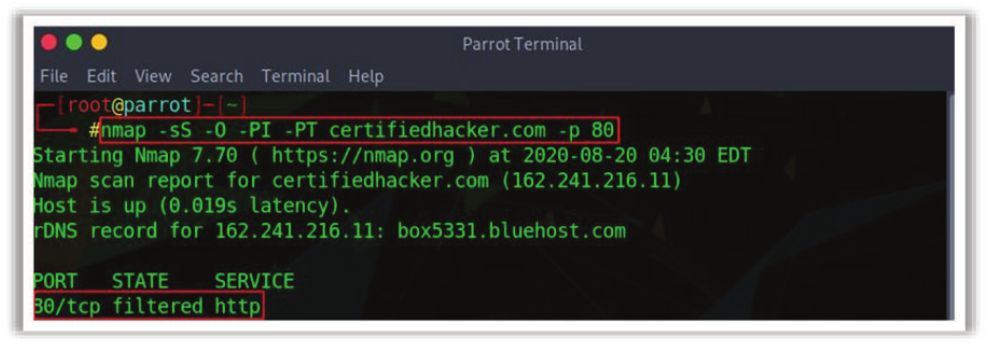
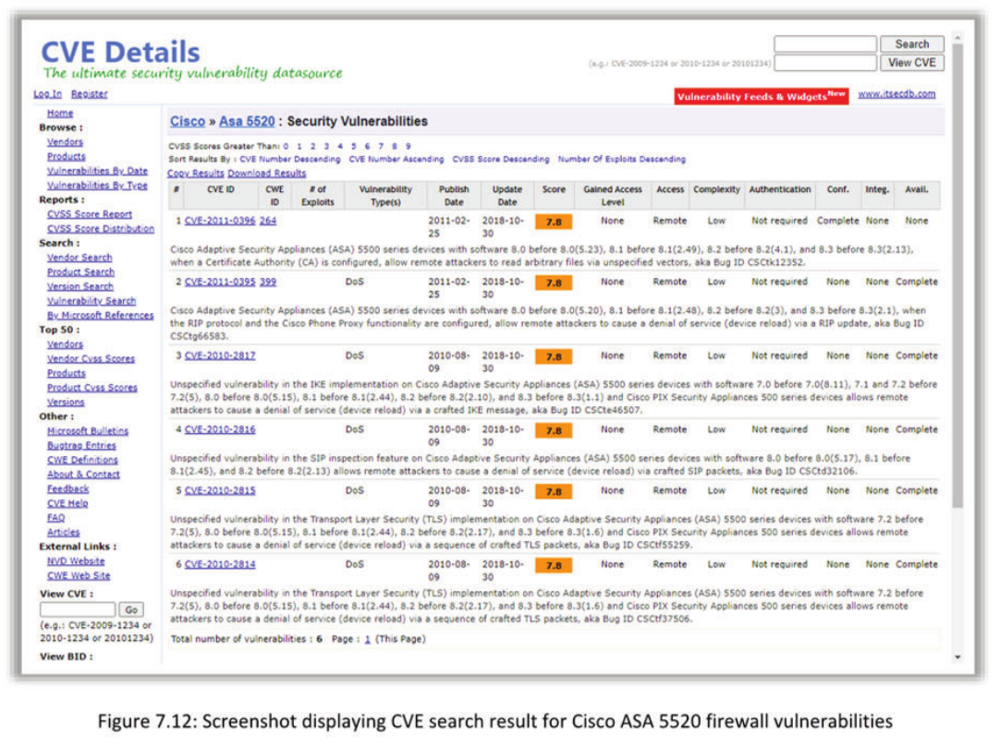
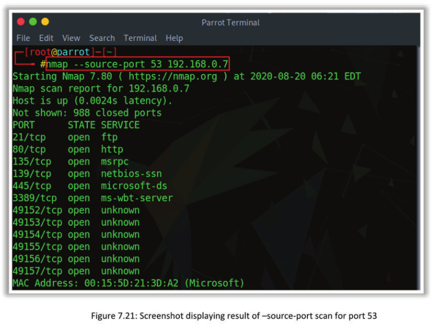
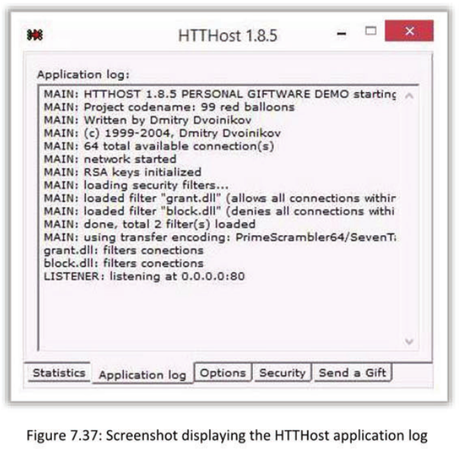

[TOC]


# Module 07 Network Penetration Testing - Perimeter Devices

**Module Objective**
This module discusses how to implement a comprehensive penetration testing methodology for assessing security of network perimeter devices, such as Firewalls, IDSes, Routers and Switches.

## Assessing Firewall Security Implementation

A firewall is a software- or hardware-based system located at the network gateway that protects the resources of a private network from users on other networks. As a network penetration tester, it is essential for you to assess the security of the installed firewall in the organization.

### Testing the Firewall from Both Sides
- Examine the firewall by simultaneously testing both sides of the firewall
- From **outside**, try to send packets to the firewall and check whether it allows them to pass against the configuration
- From **inside**, analyze the packets coming through the firewall and check whether the firewall allows them to pass against the configuration


**Following are some of the activities to be performed for testing the firewall from outside:**

- Identify the firewall rules by using appropriate firewall tools such as firewalking.
- Test whether unauthorized connections can be created to the internal network from outside.
- Check for the reaction of the firewall to fragmented and spoofed packets that can be generated using a packet generator.

**Following are some of the activities to be performed for testing the firewall from inside:**

- Test (possibly using tunneled protocols) whether unauthorized connections from the internal network to the internet can be created.
- Execute a vulnerability scanner on the hosts of the firewall system (i.e., firewall host, internal router, external router) from inside.
- Identify the firewall rules by using appropriate firewall tools (such as firewalking from both sides).

### Find Information aboout the Firewall

1. Check for information about the company’s firewall in the Engagement Letter/Pen Testing Contract or search over internet and publicly available sources (Newsgroup and blog postings made by employees, job postings, trade publications, etc.)
2. Send an email message to a non-existing user of the target organization and check bounced mail header for company’s name server and topographic information


### Locate the Firewall by Conducting Traceroute

- Run a normal traceroute command to find out the access control device, such as a firewall
- “Request timed out” means the packet could not make it there and back. It is due to firewall or other security measures at the target system


### Try to Pass through the Firewall using Hping

- Hping is tcp ping utility that allows you to pass through firewall even if they are blocked
- With the help of Hping, create custom packets to send towards the firewall. It will elicit unique responses from the firewall
- This can also be used to determine the type of firewall
- Craft a SYN packet using Hping or any other packet crafter and send it to the firewall
- Look for ICMP messages coming back from the firewall
- If you get an ICMP unreachable type 13 message (which is an admin prohibited packet) with a source IP address of the access control device, usually this is a packet filter firewall

#### Example 1:

In this scenario, where there is no presence of a packet filter firewall, let us consider crafting and sending 2 SYN packets (-c2 -S) to destination port 21 (-p21), considering numeric don’t resolve option (-n) to target IP address (10.10.1.7), and analyze the result.

Command:

[root@localhost]# hping 10.10.1.7 -c2 -S -p21 -n

Result:

```
# HPING 10.10.1.7 (ethO 10.10.1.1) : S set, 40 data bytes

60 bytes from 10.10.1.1: flags=SA seq=0 ttl=242 id=65121
win=64240 time=144.4 ms
```

From this result, we can analyze that TCP port 21 on 10.10.1.7 is open, given the fact that we received a packet with an SA flag set, which is basically a SYN/ACK packet. This concludes that a port is open, but we do not know if it is the firewall or not.

#### Example 2:

In this scenario, where there is a presence of a packet filter firewall, let us consider crafting and sending 2 SYN packets (-c2 -S) to destination port 80 (-p80), considering numeric don’t resolve option (-n) to target (10.10.1.10), and analyze the result. 

Command:

[root@localhost]# hping 10.10.1.10 -c2 -S -p80 -n

Result:

```
# HPING 10.10.1.10 (ethO 10.10.1.1) : S set, 40 data bytes

ICMP Unreachable type 13 from 10.10.1.8
```

This result, since you got the response as ICMP Unreachable type 13 from IP address 10.10.1.8, demonstrates that ICMP administrator prohibited filter packet. By this you can confirm that there is a firewall present at IP address 10.10.1.8 and it is blocking port 80 on 10.10.1.10.

### Enumerate Firewall Access Control List using Nmap

- Most firewall implementations have default ports in use for remote management purposes, for example, user authentication, management, VPN connections, etc.
- Nmap can be helpful to find out loopholes in firewall implementation 
- With Nmap, you can find state of ports open, filtered, unfiltered and closed on the firewall

**Nmap shows three states of ports:**

- Open — Port is listening
- Filtered — Port is blocked by an access control device (router/firewall)
- Unfiltered — Traffics passing from access control devices (firewall/router), but the port is not open

#### SYN stealth scan for enumeration of Access Control list

```
nmap -sS -O -PI -PT certifiedhacker.com
```

This method uses a packet response to fingerprint the firewall. In the preceding syntax, -sS represents TCP SYN scan, -O enables OS detection and activates the remote host identification via TCP/IP fingerprinting, -PI represents true ping (ICMP echo request) packet where this option is used to find the hosts that are active and looks for subnet-directed broadcast address on the network, and -PT represents TCP ping request on _ target website (www.certifiedhacker.com).


#### SYN stealth scan through Firewall for enumeration of Access Control list

```
nmap -sS -O -PI -PT certifiedhacker.com -p 80
```

This scan determines the feasibility of SYN stealth scanning through the firewall for enumeration. In the preceding syntax, -p represents scan for only specified ports, that is, port number 80.



#### ACK scan for enumeration of Access Control list
``` 
nmap -sA -O -PI -PT certifiedhacker.com
```

This scan is used to determine the firewall’s ability to screen enumeration using the ACK packets. In the preceding syntax, -sA represents TCP ACK scan; this scan is different from other scan methods; it does not determine whether the ports are open or open|filtered. It is used to map out firewall rulesets, to determine whether it is stateful or not, and to find out which ports are filtered. ACK packet is sent along with random-looking acknowledgement/sequence numbers to the specified port. If an RST response comes then the port is classified as “unfiltered.” If nothing is returned, then the port is classified as “filtered.”

Note: Usually Nmap does not print “unfiltered” ports; that means all the probes got through and returned RSTs.


#### Win Packet Scan for Enumeration of Access Control List

```
nmap -sW -O -PI -PT certifiedhacker.com
```

This scan is used to determine the firewall’s ability to screen enumeration using the WIN packets.

In the preceding syntax, -sW represents TCP Window Scan, this scan is exactly same as an ACK scan, except it sometimes detects open ports and filtered/nonfiltered. In addition, it always prints unfiltered when it receives an RST response.


### Scan the Firewall for Vulnerabilities

- Run network vulnerability scanner, such as Nessus against your firewall to determine if there are any problems with it
- Nessus includes a whole category of vulnerability checks just for firewalls 
- It can check the firewall of a host and applications vulnerabilities

Setting up a firewall for any infrastructure is very important, and it is a great way of providing some basic security to the services. A small misconfiguration in a firewall can lead to vulnerabilities and can compromise the target system. Scanning the firewall plays a crucial role in identifying the vulnerabilities in firewall infrastructure. Run network vulnerability scanner such as Nessus against your firewall to determine if there are any problems with it. Nessus includes a whole category of vulnerability checks just for firewalls. It can check the firewall of an against host and applications vulnerabilities. A Nessus scanner can be placed behind the firewall to scan the large networks that are protected by a firewall. By default, the Nessus daemon listens to TCP port 1241. If you are connecting the scanner from the outside, then you need to
connect to port 1241 on the real IP address of the deployed scanner. 

#### Nessus

Source: https://www.tenable.com

Nessus is a vulnerability, configuration, and compliance scanner. It features high-speed discovery, configuration auditing, asset profiling, malware detection, sensitive-data discovery, patch management integration, and vulnerability analysis of a wireless network.

**Features:**

- Provides the real-time values, and there is no need to wait for the scanning to be completed to view the results.
- Provides the same user interface for all operating systems, including Mac, Windows, and Linux.

- Continues scanning in the server even if the UI is disconnected.
- Provides a scan template that creates scan policies for auditing the network.

### Map Firewall Make and Version with Associated Vulnerabilities

- Firewalls have specific vulnerabilities
- If a firewall is not patched up, then it is vulnerable to attacks
- Search the security vulnerabilities associated with specific version, make, model of firewall on the Internet and find out related exploits in Google hacking databases
- Send product-specific exploits against firewall vulnerabilities and test for responses

In this step, you need to search for firewall-specific vulnerabilities. If a firewall is not properly patched, then it is vulnerable to various attacks. You can identify the product-specific vulnerabilities manually by searching the specific version, make, model of firewall on the internet or in the CVE details and find out related exploits in Google hacking databases.

CVE details is a free CVE security vulnerability database that is taken from National Vulnerability Database xml feeds provided by National Institute of Standards and Technology. You can view vulnerability details, references, exploits, Metasploit modules, CVSS score reports, full list of vulnerable products, and vulnerability trends. You can directly go to the CVE details website and search for any product-specific vulnerabilities, for example, Cisco ASA 5520. The details of bugs can be displayed as shown in the screenshots.





### Try to Bypass the Firewall Using Fragmented Packets

During penetration test, you may come across the systems that are behind the firewalls and may be unable to get the information you want. As a tester, you must know how to avoid the firewall rules that are in place, and gather the information about the host. You have to apply various methods in order to bypass a firewall. Using fragmented packets can sometimes allow you to bypass the firewall and gather the information that is beyond the firewall. Fragmented packets are used when the data of the network layer is too big to be transmitted over the data ink layer in a single packet. The data of the network layer is split into several pieces (fragments) and transferred over the network.

#### Nmap
Source: https://nmap.org

- You can use Nmap tool to send the fragmented the packets, thus bypass the packet inspection of firewalls.

  ```
  nmap -f certifiedhacker.com
  ```

  -f represents fragment packets. This option requests the scan to use tiny fragmented IP packets. It divides the TCP header into several packets, which makes it harder for intrusion-detection systems, packet filters, and annoyances to detect what actually the tester is doing. When the option is specified once, it will split the packet into 8 bytes or less after the IP header. Hence, for 20 bytes of TCP header, it will be split into three packets, for 8 bytes it will split into two and for 4 bytes it will splits into one. If “-f’ option is specified again, it uses 16 bytes per fragment. An example of the fragmented packets command along with the result is displayed in the following screenshots.


- You can also send fragmented packets by setting a specific MTU (maximum transmission unit) in your nmap scan.

  ```
  nmap --mtu [packet size] [target]
  ```

  Use --mtu option to create packets with size based on the number that we will give in [packet size]. MTU number that you specify must be a multiple of 8 (8, 16, 24, 32, etc.) Examples of the mtu-based fragment packets along with the results are displayed in the following screenshots.

  


### Try to Bypass the Firewall by Spoofing Packets

- Instruct Nmap to spoof packets from other hosts, making it hard for firewall to determine from which system the scan actually started

  Use followingnmap commands:

  - nmap -D RND:10 [target] (Generates a random number of decoys)
  - nmap -D decoy1,decoy2,decoy3 etc. (Manually specify the IP addresses of the decoys)

Note: The decoys you specify should be online in order for this technique to work. You might accidentally SYN flood your target if the decoys are offline and it will also be easy for the target to determine which host is scanning.

If you want to hide your identity and avoid the detection while performing the scan with Nmap, then you can use Decoy scan option in the Nmap. It scans the target with multiple fake and spoofed IP addresses, making it literally undetectable for the victim to identify the actual source of packets. This way the firewall can be easily bypassed as it cannot detect the scan and thinks it is coming from multiple resources or IP addresses. The decoys, you specified must be online so that this technique can work. With this decoy option, it appears to the remote host that the host(s) you specify as decoys are scanning the target network too. Thus, the target firewall might report 5-10 port scans from unique IP address, but they cannot identify the particular IP address from which the IP scanning is performed.

Syntax 1: **nmap -D <decoyl>, <decoy2>, <decoy3>** **ME** (Manually specify the IP addresses of the decoys)

Each decoy host is separated with commas, and option “ME” can be placed optionally as one of
the decoys to represent the real IP address.

Syntax 2: **nmap -D RND: 10 [target]** (Generates a random number of decoys)

If “ME” is not used, then Nmap will put the real IP address randomly or with “RND” option, and a non-reserved IP address can be generated, RND:<number> to generate <number> addresses.

Decoys are used both at initial and actual port scanning phases. They are also used during the OS detection. Ensure that you use limited number of decoys since usage of too many decoys may result in slowing down the scan and potentially make the result less accurate.

Note: The decoys you specify should be online in order for this technique to work. You might accidentally SYN flood your target if the decoys are offline and it will also be easy for the target to determine which host is scanning.

The decoy scan and its respective captured logs are displayed in the following screenshots:


Traffic Originating from Decoys


### Try to Bypass the Firewall by Spoofed Source Port

Most of the administrators commit the mistake by setting up firewall rule to allow all incoming traffic from specific common ports such as 20 (FTP), 53 (DNS), and 67 (DHCP). To probe the target firewall, Nmap will randomly select an available outgoing source port, whereas --source-port option allows the Nmap tool to choose the specified port as the source for all packets. This option allows us to identify the weakness in the firewall that are configured improperly, or those that blindly accept incoming traffic based on a specified port number.

The following commands are used in Nmap to bypass firewall by spoofing the source port:

Syntax: 

```
nmap --source-port 53 [target]
```



Syntax:

```
nmap -g 53 [target]
```


### Try to Bypass Firewall by MAC Address Spoofing
MAC address spoofing is a simple identity-hiding technique, but it creates a difficult scenario for the victim to identify the host from where the incoming requests are originated. This technique will be more useful when there is a MAC filtering rule to filter traffic from certain MAC addresses, so you need to discover from which MAC address you need to obtain the results. When the firewall allows all the traffic based on the MAC address, you can exploit this firewall configuration by spoofing mac address.

With the help of the Nmap tool you can spoof the MAC address by using the option “--spoof-mac” It will choose a MAC address from a specific vendor. Then on the basis of the vendor name, Nmap will choose completely random MAC address for every scan. Another way is to manually specify the MAC address, so that you can spoof the address of a computer within the same network. Nmap maintains the nmap-mac-prefixes database. Whenever we specify the vendor name, Nmap will consider that database to find the suitable MAC address. 

Following are different ways of performing MAC address spoofing commands:

- Specify MAC address from a vendor -> --spoof-mac Dell/Apple/3Com

- Generate a random MAC address -> --spoof-mac 0

- Specify your own MAC address -> --spoof-mac 00:01:02:25:56:AE


```
nmap -sT -Pn --spoof-mac Dell [target IP]
```


### Try to Bypass the Firewall by IP Address Spoofing

Most of the firewalls filter the packets based on the source IP address. These firewalls examine the source IP address and decide whether the packet is coming from legitimate whitelisted source or illegitimate source. When the firewall allows all the traffic based on the IP address, you can exploit this firewall configuration by spoofing the IP address. To spoof the IP address, you can use the Nmap tool.

IP address spoofing or IP spoofing is a technique in which you can make use of someone’s IP address to hide their identity. In IP spoofing, you can create IP packets by using a forged IP address and gain access over the system or network without authorization.

In some cases, the Nmap tool may not determine the source address, in such scenario use “-S” option with the IP address of an interface through which you wish to send the packets. Another usage of this flag is to spoof the scan to make the victim think that someone else is scanning them. For this kind of scan options “-e” and “~pn” are generally used.

Option “-e” states which interface needs to send and receive packets. Here the Nmap tool should either automatically detect this or tell that it cannot detect it.

Note: Nmap does not produce a useful report, because the replay packets won’t be received since they are addressed to the spoofed IP address.

Syntax: nmap -S <spoofed ip> -e [interface] (use this option to spoof IP address to go undetected)

Example:

```
nmap -e ethO -S 192.168.1.100 192.168.1.109
```

where -e specifies interface and -S specifies source IP address. It will use the ethO interface and spoof a source IP of 192.168.1.100, while scanning 192.168.1.109


### Try to Bypass the Firewall by Varying Packet Size

Most of the firewalls/IDSs either block or log the packets by looking at their data length to identify the potential port scan. This is because most of the scanners send the packets with default data length from Nmap. To avoid such detection, the better way to send nmap packets is to set the data length option “--data-length,” in order to bypass filters and evade IDS systems. The value of data length for the packets can be specified in the arguments as --data- length 25 as shown in the following screenshot.

Assume that, nmap sends packet to the target that is 58 bytes and the following screenshot shows the captured packets with data length 58.


In order to change the above default value, use the command:

```
nmap --data-length 25 [target ip address]
```


Now, recapture the packets on the target machine and you can see that the packet data length is changed to the value 83 as shown in the following screenshot. This method can avoid being discovered by firewalls which will check for the default packet size that nmap generates.


### Try to Bypass the Firewall by Sending Bad Checksums
- Send the packets with bad checksum in an attempt to avoid firewall detection. This will reveal information from systems when it is not properly configured
- If you don’t get any information, it indicates that the system is well configured

Checksum is used to check the integrity of the data. It will check the packet’s checksum against the known record ensuring the integrity of the content is correct and undamaged. Bad checksum is used to ensure network security and to evade firewalls; however, only poorly designed systems will give a response to a packet with a bad checksum. A bad checksum error is the result when the data is damaged. You can send packets with an incorrect checksum to discover whether the information in the system is properly configured or not and whether you are able to avoid firewall detection. The command “--badsum” is used to send packets with bad checksums. If you don’t get any result by using this command, then the target system is well configured.

Syntax: 

```
nmap --badsum [target IP Address]
```


### Try to Bypass the Firewall using Port Redirection

- If you cannot get direct access to a port, then use port redirection
- It is used to bypass port filtering
- Install a port redirector and make it listen on a selected port number
- Packets received on the listening port number are forwarded to the desired port on the remote host
- Tools:
  - fpipe -l 80 -r 139 192.168.10.40
  - datapipe 80 139 192.168.10.40

When a port cannot be accessed directly, port redirection helps gain access to those ports. Port redirection is often used to bypass port filtering. You can compromise a target system that can help bypass the firewall and then exploit it with the use of port redirection. Once the port redirector is installed, it listens to certain port numbers and redirects all packets received on the listening port to a remote host.

The following tools can be used to perform port redirection:

#### Fpipe

Source: https://fpipe.apponic.com
Fpipe is a source port forwarder/redirector. It can create a TCP or UDP stream with a source port of your choice. This is useful for getting past firewalls that allow traffic with source ports of say 23, to connect with internal servers. 

Syntax: 

``` 
fpipe -l 80 -r 139 192.168.10.40
```

#### Datapipe

Source: https://github.com
Datapipe is one of the most popular redirectors that work on Unix-based platforms. It is very time-consuming, because it must run on both the attacker’s system and the compromised host.
Syntax: 

```
datapipe 80 139 192.168.10.40
```

### Try to Bypass the Firewall using IP Address in Place of URL 

- Use online services, such as Host2ip, that convert host/domain names to an IP address to find the IP address of the blocked website
- In order to bypass the firewall, type the IP address directly into the browser’s address bar in place of typing the blocked website’s domain name
  - For example, to access Facebook, type its IP address (173.252.120.6) instead of typing domain name


Use online services, such as Host2ip, that convert host/domain names to an IP address to find the IP address of the blocked website. It will get the IPv4 address associated to the given host name or website. Simply visit the URL http://www.hcidata.info/host2ip.cgi and, for example, type the Host Name as www.facebook.com, and click on Find IP Address as shown in the following screenshot.


The result will be displayed as shown in the following screenshot and the IP address of Facebook is 157.240.1.35.


Note: This method fails if the blocking software tracks the IP address sent to the web server.

### Try to Bypass the Firewall using Anonymous Website Surfing Sites 

- Search over the Internet for anonymous website surfing sites that provide options to encrypt the URLs of the websites
- These websites hide the actual IP address and show another IP address, which could prevent the website from being blocked, thus allowing access to them

Search over the internet for anonymous website surfing sites that provide options to encrypt the URLs of the websites. These websites hide the actual IP address and show another IP address, which could prevent the website from being blocked, thus allowing access to them. Anonymous web-surfing sites and proxies help you to browse the internet anonymously without reflecting your IP address and unblock the blocked websites (i.e., evade Firewall restrictions). There are number of anonymous web-surfing sites available online, some of which provide options to encrypt website URLs.

Here is a list of proxy servers that can help you to access blocked websites:

- Anonymouse
  Source: http://anonymouse.org
  This service allows you to surf the web without revealing any personal information.
- Anonymizer Universal
  Source: https://www.anonymizer.com
  Anonymizer Universal keeps your online activities safe, private, and secure.
- Webproxyserver
  Source: http://www.webproxyserver.net
  Webproxyserver.net is an SSL (or secured proxy server) that helps a user to change their
  IP address online and protect their identity. It has the capability to bypass restrictions,
  thus giving more advantage to the user.
- Proxify
  Source: https://proxify.com
  Proxify is an anonymous proxy service that allows anyone to surf the web privately and securely. Through Proxify, you can use websites, but they cannot uniquely identify or track you. Proxify hides your IP address and its encrypted connection prevents monitoring of your network traffic.
- Spysurfing
  Source: http://www.spysurfing.com
  Spysurfing is a free anonymous web-based proxy service. It ensures your privacy by letting you browse the web as an anonymous user. Websites often track, log, and analyze your IP address, geographical information, web browser, and other personal information. Spysurfing helps you avoid giving out this information by hiding your personal information, such as your IP address, from websites.
- Zendproxy
  Source: https://zendproxy.com
  It is a web proxy for unblocking. An online web proxy is a computer system or website that acts as the middle person between the user and the internet. A web proxy allows users to surf the internet anonymously; the online anonymizer hides the IP address of the user. By hiding the IP address of the user, the online anonymous proxy strips the IP address from the user’s request to view that content, and is then able to view it without restrictions.
- kproxy
  Source: https://kproxy.com
  It is an online anonymous website surfer which can bypass online blocks to access foreign content like a local. It also allows you to surf privately by hiding your IP address (your location and personal information) online and protect your data from snooping by your internet service provider.

### Try to Bypass the Firewall using a Proxy Server

Proxy server acts as an intermediate between two end-point devices such as a computer, and other server from which a client or user is requesting for a service. The proxy server may reside in the same server as a firewall or on a separate server that accepts the requests through the firewall. The proxy server can be used for both legal and illegal purposes. In an organization, it is used to simplify the security and administrative control. In a personal context it is used for anonymous and privacy purpose. Illegally you can use a proxy server to monitor the traffic and weaken the user privacy.

Following are the steps used to bypass a firewall using a proxy server:

- Find an appropriate proxy server
- On the Tools menu of any internet browser, go to LAN of Network Connections tab, and then click LAN/Network Settings
- Under Proxy server settings, select the option: Use a proxy server for LAN
- In the Address box, type the IP address of the proxy server
- In the Port box, type the port number that is used by the proxy server for client connections (by default, 8080)
- Click to select the bypass proxy server for local addresses; check the box if you do not want the proxy-server computer to be used when connected to a computer on the local network
- Click OK to close the LAN Settings dialog box
- Click OK again to close the Internet Options dialog box

### Try to Bypass the Firewall using Source Routing 
- Source routing is a technique in which the sender of a packet partially or completely specifies the route the packet takes through the network
- Modify the addressing information in the IP packet header and the source address bits field in order to bypass the firewall

Using this technique, you can partially or completely designate the route that a packet should take through the network, in such a way that the designated route should bypass the firewall node. Using this technique, you can evade firewall restrictions by modifying the addressing information in the IP packet header and the source address bits field. When these packets travel through the network nodes, each router will check the IP address of the destination and choose the next node to which to forward them. In source routing, you can make some or all of these decisions on the router. Source routing can be performed by two approaches: loose source routing and strict source routing. In a loose source routing, you have to specify one or more stages from which the packet must go through, whereas in strict source routing, you have
to specify the exact route through which the packet must go through.


###  Try to Bypass the Firewall using HTTP Tunneling Method 
- This method can be implemented if the target company has a public web server with port 80 used for HTTP traffic, that is unfiltered on its firewall
- Many firewalls do not examine the payload of an HTTP packet to confirm that it is legitimate HTTP traffic; thus, it is possible to tunnel traffic inside TCP port 80 because it is already allowed
- Tools, such as Super Network Tunnel, HTTPTunnel, HTTPORT, and HTTHOST use this technique of tunneling traffic across TCP port 80
- Upload the server onto the target system and tell it which port is to be redirected through TCP port 80 

This method can be implemented if the target company has a public web server with port 80 used for HTTP traffic, that is unfiltered on its firewall. Many firewalls do not examine the payload of an HTTP packet to confirm that it is legitimate HTTP traffic, thus it is possible to tunnel traffic inside TCP port 80, because it is already allowed.


HTTP tunneling grants access to the network users to achieve restricted connectivity through a firewall or proxy. In such conditions, some applications may lack native communications support. These restrictions include the following: 

- Blocking of TCP/IP ports, traffic initiated from outside the network, and, network protocols except a few commonly used protocols, and so on
- Access to surf on denied websites
- Post in forums anonymously by hiding the IP address
- To use application such as chatting through ICQ or IRC, instant messengers, games, browsers, and so on
- Sharing of confidential resource over HTTP securely
- Downloading files with filtered extensions and/or with malicious code

For instance, consider that organization firewalls restrict users to access all ports except 80 and 443, and a user may want to use FTP. HTTP tunneling enables FTP use via HTTP protocol. HTTP tunnel creates a bidirectional virtual data connection tunneled in HTTP traffic. It works with the help of FTP client software to perform protocol encapsulation by enclosing data packets of one protocol such as SOAP or JRMP within HTTP packets on, for example, local port 80. Then these packets are sent through the firewall or proxy server as normal internet traffic, which is then directed to HTTP tunneling server software located outside the network. Upon receiving the packets, this server then unwraps FTP data and redirects the packet to the remote FTP server.


You can use tools such as Super Network Tunnel, HTTPTunnel, HTTPORT, and HTTHOST to tunnel traffic across TCP port 80. Upload the server onto the target system and tell it which port s to be redirected through TCP port 80.

#### HTTPort and HTTHost

Source: https://www.targeted.org
HTTPort allows you to bypass your HTTP proxy that is blocking you from the internet. With HTTPort you may use various internet software from behind the proxy, for example, email, instant messengers, P2P file sharing, ICQ, News, FTP, IRC, and so on. The basic idea is that you set up your internet software in such a manner that it connects to your own local PC as if it was the remote server it needed. HTTPort then
intercepts that connection and runs it through a tunnel through the proxy.

HTTPort doesn't really care for the proxy as such; it works perfectly with firewalls, transparent accelerators, NATs, and basically anything that lets HTTP protocol through. HTTP is the basis for web surfing, so if you can freely surf the web from where you are, HTTPort will bring you the rest of the internet applications. The remote host method is capable of tunneling through any proxy.

HTTPort uses a special server software called HTTHost, which is installed outside the proxy-blocked network. It is a web server, and thus when HTTPort is tunneling, it sends a series of HTTP requests to the HTTHost. The proxy responds as if the user is surfing a website, and thus allows the user to do so. HTTHost in turn performs half of the tunneling and communicates with the target servers. This mode is much slower, but works in most cases and features strong data encryption that makes proxy logging useless. 




#### Super Network Tunnel

Source: http://www.networktunnel.net

Super Network Tunnel is professional http tunneling software that includes http tunnel client and server software.

It like a secure VPN software that allows you to access your internet programs without being monitored at work, school, or the government, and gives you an extra layer of protection against hackers, spyware, or ID theft. It can easy bypass any firewall, for example, - Surf, IM, P2P, Game, and so on. It is easier than VPN, no complicated settings, portable, plug and play. It can also support http proxy, and normally completes
a tunnel config within 10 minutes.

Despite other http tunnel software, Super Network Tunnel is really a two-way http tunnel software. The client computer can access the server computer's network and control the server's computer. It can run any game/IM/P2P/Stock software via server's network. Also, the server computer can access the client computer’s network and remotely control the client's computer visa.


#### HTTP-Tunnel

Source: http://www.httptunnelclient.com

HTTP-Tunnel technology allows users to perform various internet tasks despite the restrictions imposed by firewalls. This is made possible by sending data through HTTP (port 80). Additionally, HTTP-Tunnel technology is very secure, making it indispensable for both average and business communications.

Following are various applications utilized to implement HTTP-Tunnel technology:

**HTTP-Tunnel Client**: An application that runs in the system tray acting as a SOCKS server, managing all data transmissions between the computer and the network.

**HTTP-Tunnel Server**: A customizable server software solution for both personal and corporate networks.

**HTTP-Tunnel ActiveX Control**: It allows developers to incorporate HTTP-Tunnel technology into their software applications.

**Corporate Messenger (VCM)**: It is a secure and serverless instant messaging application, suitable for corporate intranets.

### Try to Bypass the Firewall using ICMP Tunneling Method 
- It allows tunneling @ backdoor shell in the data portion of ICMP Echo packets:
- RFC 792, which delineates ICMP operation, does not define what should go in the data portion 
- The payload portion is arbitrary and not examined by most firewalls; thus, any data can be inserted into the payload portion of the ICMP packet, Ines a Baekdooe application
- Some administrators keep IMP open on ther firewall because itis useful for tol Whe ping and traceroute
- Assuming that ICMP is allowed through a firewall, use Loki ICMP tunneling to execute commands of choice by tunneling them inside the payload of ICMP echo packets

ICMP protocol is used to send error message to the client. As this service is required for network communication, users often enable this service on their networks. This provides you with full access to target networks, allowing them to tunnel a backdoor shell in the data portion of ICMP Echo packets.

RFC 792 outlines the ICMP operation; it does not define what should go in the data portion. The payload portion is arbitrary and not examined by most firewalls, thus any data can be inserted into the payload portion of the ICMP packet, including a backdoor application. Some administrators keep ICMP open on their firewall, because it is useful for tools, such as ping and traceroute.

Moreover, it does not cause a big threat from the security perspective. You can take advantage of enabled ICMP protocol on the network and perform ICMP tunneling to send your malicious data into the target network. Therefore, you can try to bypass firewall by inserting any data, including a backdoor application, into the payload portion of the ICMP packet. Assuming that ICMP is allowed through a firewall, use Loki ICMP tunneling to execute commands of choice by tunneling them inside the payload of ICMP echo packets.


### Try to Bypass the Firewall using ACK Tunneling Method 
- It allows tunneling a backdoor application with TCP packets with the ACK bit set
- The ACK bit is used to acknowledge receipt of a packet
- Some firewalls do not check packets with the ACK bit set because ACK bits are supposed to be used in response to legitimate traffic that is already being allowed through
- Perform ACK tunneling using tools, such as AckCmd (http://ntsecurity.nu)

In TCP protocol communication, a session is established when the client sends a SYN segment, the server responds with SYN/ACK segment, and the client confirms with a ACK segment. The traffic in the current session consists of ACK segments.

Ordinary packet-filtering firewalls define their rule sets based on when the SYN packet in TCP-level communication is established. This is because such a firewall assumes that only the SYN packet is coming from the client and thus possibly contains malicious code. This kind of firewall ignores the possibility that an attacker can also inject malicious code in the ACK packet. Since ACK packets are sent after establishing a session, ACK traffic is considered legitimate. Another reason why filtering of ACK packets is ignored is to lessen the workload of firewalls, as there can be many ACK packets for one SYN packet.

ACK tunneling allows tunneling a backdoor application with TCP packets with the ACK bit set. The ACK bit acknowledges the receipt of a packet. As stated earlier, some firewalls do not check packets with the ACK bit set because ACK bits are supposed to be used in response to legitimate traffic that has already been allowed to pass through. You can use tools such as AckCmd (http://ntsecurity.nu) to perform ACK tunneling.


### Try to Bypass the Firewall using SSH Tunneling Method C | PENT
- SSH tunneling method allows you to connect to external SSH server
- It creates an SSH tunnel and connects local machine port to the remote port 80 on remote web server in order to bypass firewall restrictions
- Use an SSH connectivity tool, such as OpenSSH, Bitvise, etc., to encrypt and tunnel all the traffic (including passwords) from a local machine to a remote machine to avoid detection by the target organization's perimeter security controls

SSH tunneling method allows you to connect to external SSH server. It creates an SSH tunnel and connects a local machine port to the remote port 80 on remote web server in order to bypass firewall restrictions. It involves sending unencrypted network traffic through an SSH tunnel. For example, suppose you want to transfer files on an unencrypted FTP protocol, but the FTP protocol is blocked on the target firewall, the unencrypted data can be sent over an encrypted SSH protocol using SSH tunneling. You can make use of this technique to bypass firewall restrictions. They connect to external SSH servers and create SSH tunnels to port 80 on the remote server, thereby bypassing firewall restrictions. You can use SSH connectivity tools
such as Open SSH, Bitvise, and so on to encrypt and tunnel all the traffic (including passwords) from a local machine to a remote machine to avoid detection by the target organization’s perimeter security controls.

#### Bitvise

Source: https://www.bitvise.com

Bitvise SSH Server provides secure remote login capabilities to Windows workstations and servers by encrypting data during transmission. It is ideal for remote administration of Windows servers; for advanced users who wish to access their home machine from work, or their work machine from home; and for a wide spectrum of advanced tasks, such as establishing a VPN using the SSH TCP/IP tunneling feature or providing a secure file depository using SFTP.

Bitvise SSH Client for Windows includes terminal emulation, graphical as well as command-line SFTP support, an FTP-to-SFTP bridge, tunneling features—including dynamic port forwarding through integrated proxy—and remote administration for SSH server.


#### OpenSSH

Source: https://www.openssh.com

OpenSSH is the premier connectivity tool for remote login with the SSH protocol. Make use of OpenSSH (OpenBSD Secure Shell) to encrypt and tunnel all traffic from a local machine to a remote machine to avoid detection by perimeter security controls. OpenSSH is a set of computer programs that provides encrypted communication sessions over a computer network using the SSH protocol.

Example:

Syntax:

```
 ssh -f user@certifiedhacker.com -L 5000:certifiedhacker.com:25 -N
```

In the preceding syntax, 

-f refers to background mode, user is the username, and @certifiedhacker.com is the server that you are logging into.

-L 5000:certifiedhacker.com:25 refers to local-port: host: remote-port respectively.

-N option in the syntax refers to “Do not execute the command on the remote system.”

The preceding syntax forwards the local port 5000 to port 25 on certifiedhacker.com encrypted. Simply point your email client to use localhost : 5000 as the SMTP server.

### Try to Bypass the Firewall through MITM Attack

Most security administrators concentrate on the possibility of an external or internal network bypassing their firewall while ignoring the fact that firewalls can be bypassed using MITM attacks on DNS servers. In MITM attacks, you need to make use of DNS servers and routing techniques to bypass firewall restrictions. They may either take over the corporate DNS server or spoof DNS responses to perform the MITM firewall attack.

**Following are the steps for DNS server poisoning process:**

1. User A requests WWW.example.com from the corporate DNS server
2. Corporate DNS server sends the IP address (127.22.16.64) of the attacker
3. User A accesses the attacker's malicious server
4. Attacker connects with the real host and tunnels the user's HHTP traffic
5. The malicious codes embedded in the attacker's web page are downloaded and executed on the user's machine

The schematic diagram for this process is displayed in the following figure:


### Try to Bypass the Firewall using Malicious Contents 
- Create a malicious file using Trojan Horse Construction Kit :
- Embed a malicious file in software installation files, mobile phone software, or text, multimedia, and graphics files to carry malicious content
- Send the contents containing malicious code to the user and trick him/her to open it so that the malicious code can be executed 

Create a malicious file using Trojan Horse Construction Kit. Embed a malicious file in software installation files, mobile phone software, or text, multimedia, and graphics files, to carry malicious content. Send the content containing malicious code to the user and trick him/her to open it, so that the malicious code can be executed. Apart from Trojan Horse Construction Kit, you can use tools such as Batch Trojan Generator, Umbra Loader—Botnet Trojan Maker, DELmE’s Batch Virus Maker, JPS Virus Maker, and so on to create a malicious payload to compromise the target firewall.

## Assessing IDS Security Implementation

To protect the networks, organizations use various network security measures such as firewalls, intrusion detection system (IDS), intrusion prevention system (IPS), and so on.

In this section, we will discuss the penetration steps for assessing the IDS. This section also discusses about the threats associated with IDS and how a well-planned penetration testing helps in protecting it.

### Why IDS Penetration Testing?

The most preferred and trustful defensive measure that most of the organizations follow these days is implementing an IDS that can help to detect and alert their security team on finding any trace of vulnerability. IDS can either be a software or hardware that identifies, logs, and reports any suspected, malicious, and inappropriate activity. The main feature of the IDS is to monitor network activity on the host network/workstation and generate alerts when there is an intrusion. However, these so-called “protective walls of the system” may also give rise to various vulnerabilities and attacks that can lead to unrecoverable damage to the organization. It is the responsibility of the firm to appoint a penetration tester in order to find and fix the loopholes in their intrusion system. Because, their inattention may allow the attackers to
change the settings of alarm in IDS system and thereby access the organization’s resources. IDS penetration testing also helps in evaluating the IDS for ingress and egress traffic-filtering capabilities.

- To check if IDS properly enforces an organization's IDS policy
- To check if the IDS enforces organization's network security policies
- To check if the IDS is good enough to prevent external attacks
- To check the effectiveness of the network's security perimeter
- To check the amount of network information accessible to an intruder
- To check the IDS for potential breaches of security that can be exploited
- To verify whether the security policy is correctly enforced by a sequence of IDS rules

### Common Techniques Used to Evade IDS Systems 
1. Try the pattern matching approach to identify potential attacks within the exploit code
2. Use the Unicode Evasion method, which allows for viewing files on the IIS server
3. Search for the central log server's IP address and crash the system using a DoS attack
4. Send specially crafted packets in order to trigger alerts and breed a large number of false reports
5. Flood the network with noise traffic to exhaust its resources examining risk-free traffic

Following are some of the common techniques that are used to evade IDS system:

- Try the pattern matching approach to identify potential attacks within the exploit code. In this approach, depending on the regularly used strings in the code and the known attacks, potential attacks are recognized. However, this approach has some problems as the input, which is going to trigger a certain vulnerability must be the same, thus small change in input makes it difficult to create a useful pattern.
- Use the Unicode Evasion method that allows viewing files on the IIS server. Every character has a unique identifier for all written languages that provides uniform presentation of every character of each language. Single character may have too many representations, which is difficult to match with the signature.
- Many organizations use central logging server to accumulate IDS alert logs. The main function of the central logging server is to alert the log data. Search for central log server's IP address and crash the  system using a DoS attack.
- Another similar technique to the DoS method is to send specially crafted packets in order to trigger alerts and breed a large number of false reports.
- An IDS primarily depends on its resources, such as memory, power of the processor, and analyzing traffic. Flood the network with noise traffic to exhaust its resources examining risk-free traffic.

### Test for Resource Exhaustion

- Every IDS system has memory, CPU, and bandwidth limitations andis proneto resource exhaustion attacks
- IDS performance might degrade or fail if these resources are exhausted
- Use tools, such as **Colasoft Packet Builder**, **Network Traffic Generator and Monitor**, etc. to generate the traffic
- Test by sending large amounts of traffic to the IDS


Every IDS system has memory, CPU, and bandwidth limitations, and is prone to resource exhaustion attacks. A resource exhaustion attack is a form of DoS attack where the available network resources are exhausted, resulting in a system failure or crash. IDS performance might degrade or fail if these resources are exhausted. Test by sending large amounts of traffic to the IDS. You can use tools such as Colasoft Packet Builder, Network Traffic Generator and Monitor, and so on to generate the traffic.

#### Colasoft Packet Builder

Source: https://www.colasoft.com

Colasoft Packet Builder enables creating custom network packets. As a pen tester, you can use this tool to check the network protection against intrusion detection attacks and intruders.


### Test the IDS by Sending an ARP Flood

- Flood the network by sending ARP packets
- Use tools such as **NetScanTools Pro** to generate the ARP packets
- See the IDS response and how it reacts to this attack

**Other ARP Packet Generator Tools**

- **Arping** (http://www.habets.pp.se)
- **arp-scan** (https://github.com)

The ARP is part of the internet protocol (IP) that maps a computer's IP address with its MAC address. Create a large number of random ARP request packets, attempt to flood the network, and analyze the IDS response and see how it reacts to this ARP flood attack. You can use tools such as NetScanTools Pro to generate the ARP packets and perform ARF flood attack on IDS. 

#### NetScanTools Pro

Source: https://www.netscantools.com
NetScanTools Pro packet generator allows you to construct or build a TCP, UDP, ICMP, CDP (Cisco Discovery Protocol), ARP/RARP, or RAW packet, and sends one or more packets to a target IPv4 address. This tool helps you to bypass IDS rules and generates ARP packets.


**Some of the additional ARP packet generator tools are as follow:**

#### Arping (http://www.habets.pp.se)

#### arp-scan (https://github.com)

### Test the IDS by MAC Spoofing 
- Traffic can be disrupted on a network if two Ethernet adapters have exactly the same hardware (or MAC — Media Access Control) addresses
- Use tools such as SMAC, macof, etc. to generate spoofed MAC addresses
- Test the IDS by sending spoofed MAC addresses

Every hardware device is assigned with a unique MAC address, and in a network, MAC address of various devices is hard-coded in a network interface controller (NIC). It is very important to note that two network devices should not have same MAC Address. If it happens then the traffic in the network may be disrupted. MAC spoofing is a technique of manipulating or masking the MAC address of any network device with a random MAC address. By performing MAC spoofing attack, you can bypass the Access Control Lists on servers, firewalls, IDS, routers, and so on. Test the IDS by sending spoofed MAC addresses and analyze the results. You can use tools such as SMAC, Find MAC Address, macof and so on to generate spoofed MAC addresses.

#### SMAC

Source: http://www.klcconsulting.net

SMAC is a Windows MAC Address Modifying Utility (MAC Address spoofing) that allows users to change MAC address for almost any Network Interface Cards (NIC) on the Windows systems, regardless of whether the manufacturers allow this option or not.

Following are some of the features of SMAC tool:

- MAC Address Lookup
- Automatically activate new MAC address right after changing it (you have the option to manually activate)
- Show the manufacturer of the MAC Address
- Show All or "Only Active" network adapters
- Randomly Generate any new MAC Address or based on a selected manufacturer

- Pre-load MAC addresses list and choose the new MAC address from the list (Professional Edition)
- "IPConfig" button—click to show network adapter (IPConfig) info to confirm changes


#### Find MAC Address

Source: https://lizardsystems.com

This tool finds the MAC address of a local or remote computer on the network. You can select the target and method to find the MAC address of a local or remote computer on the network.

Following are the key features of Find the MAC Address tool:

- Getting the MAC address of the local computer
- Getting the MAC address of one remote computer either by its name or by IP address
- Getting the MAC addresses of all computers on the network
- Getting the MAC addresses of all computers within the specified range of IP
  addresses
- Getting the MAC addresses of all computers from the specified computer list
- Five methods for finding MAC addresses (ARP, NetBIOS, NetAPI, WMI, SNMP)
- Detecting the manufacturer of the network card by its MAC address
- Detecting the names of network cards (only if WMI or SNMP is used)
- Searching the scan results
- Saving the scan results to and loading them from a file in the XML format
- Exporting the network scan results to text files or a web document


### Test the IDS by IP Spoofing

- Spoof the IP address to flood the IDS.
- Check for the responses received by the target system

IP spoofing in a network means generating the IP packets with a fake source IP address for performing various attacks. You can flood the IDS with IP address spoofed packets and analyze the responses received by the target system.

#### Colasoft Packet Builder

Source: https://www.colasoft.com
Colasoft Packet Builder enables creating custom network packets. You can use Colasoft Packet Builder to generate IP packets and perform flood attack on the IDS.


#### Engage Packet Builder

Source: http://www.engagesecurity.com

Engage Packet Builder is a scriptable packet builder for Windows platform. It is completely based on a modified libnet library. It is also used for Firewall and IDS testing. Flood attacks can also be performed with this tool. This tool is also used for spoofing the IP address and performing flood attacks on the target device.


### Test the IDS by Sending SYN Floods

1. Many TCP implementations are vulnerable to a resource-exhaustion attack known as SYN flooding, in which excessive requests are made to create sessions, causing memory utilization to occur
2. If these SYN packets are spoofed from addresses that do not exist, no response packet containing SYN/ACK will be received, and the pending connection queue will expand

Many TCP implementations are vulnerable to a resource-exhaustion attack known as SYN flooding, in which excessive requests are made to create sessions, thus causing excessive memory utilization to occur. In this type of attacks, numerous SYN packets are sent to an open TCP port. The victim host responds with a SYN/ACK packet, creates an entry in its pending- connection queue, and waits to complete the TCP three-way handshake. When the target host waits for the response, it takes a finite amount of memory. Hence, if the target host gets numerous SYN packets and fails to complete the three-way handshake, it can lead to an increase in the memory and make it unable to process the legitimate connection requests.

Spoof the IP address and send the SYN packets to the IDS to test the IDS. If these SYN packets are spoofed from addresses that do not exist, no response packet containing SYN/ACK will be received, and the pending connection queue will expand.

### Test the IDS by Editing and Replaying Captured Network Traffic

- Capture the traffic running on a target computer network by using packet sniffing tools, such as.
  Wireshark
- Use Tepreplay tool for editingand replaying captured network traffic
- Replay the traffic back onto the network

Capture the traffic running on a target computer network by using packet-sniffing tools such as Wireshark. Use tools such as Tcpreplay for editing and replaying captured network traffic, and attempt to Replay the traffic back onto the network.

#### Wireshark

Source: https://www.wireshark.org
Wireshark is a packet-sniffing tool with live capture and offline analysis feature. It runs on multiple platforms such as Windows, Linux, macOS, Solaris, FreeBSD, NetBSD, and many others. Captured network data can be browsed via a GUI, or via the TTY-mode TShark utility. You can use this tool to capture the network traffic where IDS is installed.


#### Tcpreplay

Source: http://tcpreplay.appneta.com

Tcpreplay tool is used to replay & edit pcap files at arbitrary speeds onto the network. It is an open-source utility used for editing and replaying previously captured network traffic. Firstly, it was designed to replay malicious traffic patterns to IDS/IPS. The latest version 4.0.0 supports switches, IP flow/NetFlow appliances, and routers. It supports both single and dual NIC modes for testing both sniffing and in-line devices.


### Test the IDS for a Denial-of-Service (DoS) Attack

- Many IDSes today employ central logging servers that are used exclusively to store IDS alert logs
- Search for the central log server's IP address
- Perform a Denial-of-Service (DoS) attack on the central log server to slow down or crash the central logging system 
- Use DoS Attack tools such as HOIC, DDOSIM, DoS HTTP, Tor's Hammer, etc. to perform the DoS attack

Many IDSes today employ central logging servers that are used exclusively to store IDS alert logs. Hence, you can search for central log server’s IP address and perform a DoS attack to prevent legitimate users in accessing central logging severs, and this may lead to slow down or crash the central logging system. You can use DoS attack tools such as HOIC, DDOSIM, DoS HTTP, Tor’s Hammer, and so on to perform the DoS attack on the target IDS.

#### HOIC

Source: https://sourceforge.net
The HOIC is a popular DDoS attack tool that is free to download and available for Windows, Mac, and Linux platforms. The HOIC is an upgrade to an older program, the Low Orbit lon Cannon (LOIC), documented in IntelliShield Alert 22057, which is an open-source tool written in the C# programming language. You can use this tool to perform DoS attack on the target IDS and analyze the response.


### Try to Bypass IDS using Anonymous Website Surfing Sites and a Proxy Server

- Search over the Internet for anonymous website surfing sites which provide options to encrypt the URLs of the websites
- These websites will hide the actual IP address and will show another IP address, which could prevent the website from being blocked by the IDS, thus allowing access to the target system
- Search the Internet for a proxy server, configure it in your system, and try to bypass the IDS

Search over the Internet for anonymous website surfing sites which provide options to encrypt the URLs of the websites. Anonymous web-surfing sites and proxies help you to browse the internet anonymously without reflecting your IP address and unblock the blocked websites (i.e., evade IDS restrictions). There are number of anonymous web-surfing sites available online, some of which provide options to encrypt website URLs. You can search the Internet for a proxy server, configure it in your system, and try to bypass the IDS.

Here is a list of proxy servers that can help you to access blocked websites:

- **Anonymouse**
  Source: http://anonymouse.org

- **Anonymizer**
  Source: https://www.anonymizer.com

- **Webproxyserver**
  Source: http://www.webproxyserver.net

- **Proxify**
  Source: https://proxify.com

- **Spysurfing**
  Source: http://www.spysurfing.com

- **Zendproxy**
  Source: https://zendproxy.com

- **kproxy**

  Source: https://kproxy.com

In order to bypass an IDS using Proxy Server, you should follow the following steps:

- Find an appropriate proxy server.
- On the Tools menu of any Internet browser, go to LAN of Network Connections tab, and then click LAN/Network Settings.

- Under Proxy server settings, select the use a proxy server for LAN.

- In the Address box, type the IP address of the proxy server.

- In the Port box, type the port number that is used by the proxy server for client connections (by default, 8080).

- Click to select the bypass proxy server for local addresses; check the box if you do not want the proxy- server computer to be used when connected to a computer on the local network.

- Click OK to close the LAN Settings dialog box.

- Click OK again to close the Internet Options dialog box.

### Try to Bypass the IDS using Botnet

- Bots are software applications that run automatedtasks over the Internet and perform simple repetitive tasks, such as web spidering and search engine indexing
- A botnet is a huge network of the compromised systems and can be used to launch DOS
  attacks
- Search the Internet for a botnet builder tool or botnet kit, such as Zeus (2Bot) or Ice IX
- Configure and build a botnet, and try to bypass the IDS ;

Bots are software applications that run automated tasks over the internet and perform simple repetitive tasks, such as web spidering and search engine indexing. A botnet is a huge network of the compromised systems that perform various illegal activities by communicating through command and control. Botnets can be used to launch DOS attacks.

Generally, IDS have two different types of approaches for Botnet detection:

- Signature-based

- Anomaly-based

**Signature-based**: In this technique, IDS uses signatures of the botnets and attempts to match
  with the standard botnet signatures for detection.

**Anomaly-based**: In this technique, IDS considers several different network traffic anomalies to detect the presence of the bots in the network. These network anomalies can include the following:

- High network latency

- High traffic volume

- Traffic on unusual ports

* Unusual system behavior

Search the internet for a botnet builder tool or botnet kit, such as Zeus (ZBot) or Ice IX. Configure and build a botnet, and try to bypass the IDS.

#### Zeus (ZBot)

ZeuS, also known as Zbot, is a banking Trojan that specifically attempts to steal confidential information such as system information, online credentials, and banking details, and so on. Zeus is spread mainly through drive-by downloads and phishing schemes. Detecting ZeuS malware is difficult due to its stealth techniques. This malware creates a network of infected machines and all the machines are connected to a C&C Server. The owners of the infected machines are not aware of the critical situation, since the Trojan runs silently in the background of the infected computer. You can create Zeus bot using Zeus Botnet builder tool and attempt to bypass the IDS.


#### ICE IX

Ice IX is a software used to create botnet to steal personal information of a user from a remote system, windows. ICE IX communicates using the HTTP protocol. It is used for various purposes such as manipulating the backing operations on the infected machines, grabbing the data from the target system, and clearing the storage, and so on to attempt to bypass IDS using ICE IX bot.


### Test the IDS by Sending Inconsistent Packets

- In the IP header, the maximum packet length is 65,635 byes; Internet Header Length (IHL) is a 4-bit field, and the header contains a 16-bit (total length) field
- The TCP header has an Offset field that specifies the length of header and data, whereas the UDP header has a UDP Length field that determines the total size of the UDP packet
- Use packet crafting tools to send specially crafted TCP/IP or UDP/IP packets with different TCP/UDP and IP header sizes to the IDS
- Packets with inconsistent information may bypass the sanity check at the IDS.

IP Header used in the internet communication is called an Internet Header Length (IHL) that consists of 4-bit fields. An IP packet consists of the IP header that can be distinguishable using these 4-bit fields from that of the actual data.

In the IP header, maximum packet length is 65,635 bytes and IHL a 4-bit field, and header contains 16-bit total length field. The TCP header has an offset field that specifies the length of header and data, whereas the UDP header has a UDP length field that determines the total size of the UDP packet. You can use packet-crafting tools to send specially crafted TCP/IP or UDP/IP packets with different TCP/UDP and IP header sizes to the IDS. Packets with inconsistent information may bypass the sanity check at the IDS.

### Test the IDS for IP Packet Fragmentation

1. IP packets must follow standard Maximum Transmission Unit (MTU) size while traveling across the network
2. If the packet size exceeds, it splits into multiple fragments (called fragmentation) and then is reassembled later
3. Send malicious packets to the IDS at regular interval of time (greater than the IDS fragmentation reassembly timeout) to attack the target system
4. See the example in the next slide

IP packets must follow standard maximum transmission unit (MTU) size while traveling across the network. If the packet size exceeds, it splits into multiple fragments (called fragmentation) which are reassembled later.

The IP header contains a fragment ID, fragment offset, fragment length, and fragments flags besides the original data. In a network, the flow of packets is irregular, so the systems need to keep or store the fragments around, wait for future fragments, and then reassemble them in order. You can take advantage of this fragmenting and reassembling process, by sending malicious packets to the IDS at regular intervals of time (greater than the IDS fragmentation reassembly timeout) to attack the target system. This process can help you exploiting the target system without being detected by IDS.

**Packet Fragmentation**

Example: Attacking where the NIDS fragmentation reassembly timeout is less than the victim's fragmentation reassembly timeout

If, for example, the fragment-reassembly timeout is 10 seconds at the IDS and 20 seconds at the target system, an attacker can send the second fragment after 15 seconds of sending the first fragment. In this scenario, the IDS will drop the fragment upon receiving the second fragment after its reassembly timeout, but the target host will reassemble the fragments. Attacker continues sending fragments with intervals of 15 seconds until the attack payload reassembles at the target system. Thus, the victim will reassemble the  fragments and receive the attack code, whereas the IDS will not make any noise or generate alerts as the IDS drops the fragments of packets.


### Test the IDS for Polymorphic Shellcode

1. Most IDSs containsignatures for commonly used strings within shellcode
2. This is easily bypassed by usingencoded shellcode containing a stub that decodes the shellcode that follows
3. Polymorphic shellcode is a shellcode that containshidden malicious code in an encrypted form
4. Use existing buffer-overflow exploit to carry polymorphic shellcode, and set the “return” memory address ‘on the overflowed stack to the entrance point of the decryption code
5. Check whether the IDS identifies the polymorphic shellcode

A signature-based network intrusion detection system (NIDS) identifies an attack by matching attack signatures with incoming and outgoing data packets. Most IDSs contain signatures for commonly used strings with shellcode that can be easily bypassed by using encoded shellcodes containing a stub that decodes the shellcode that follows.

With polymorphic shellcodes, attackers hide their shellcode (malicious code) by encrypting it with an unknown encryption algorithm and including the decryption code as part of the attack packet. To carry out polymorphic shellcode attacks, they use an existing buffer-overflow exploit and set the “return” memory address on the overflowed stack to the entrance point of the decryption code. This makes it difficult for the IDS to identify it as shellcode. Therefore, when attackers modify/transform their attacks in this way, the NIDS cannot identify them. This method also hides the commonly used shellcode strings, thus making the shellcode signatures unusable.

### Try to Evade the IDS by Obfuscating or Encoding the Attack Payload

- Obfuscation is the process of creating obfuscated code that is difficult for the IDS to understand
- Encode the attack patterns in unicode to bypass IDS filters, but be understood by an IIS web server

- Evade the IDS by obfuscating or encoding the attack payload in a way that the target system understands but the IDS does not
- Try to manipulate the path referenced in the signature to fool the IDS

Obfuscation is the process of creating obfuscated code that is difficult for the IDS to understand. Obfuscation makes code harder to understand or read, generally for privacy or security purposes. You can use a tool called as an obfuscator that converts a straightforward program into one that works the same way, but is much harder to understand. Evade the IDS by obfuscating or encoding the attack payload in a way that the target system understands but the IDS does not. Try to manipulate the path referenced in the signature to fool the IDS. Encode the attack patterns in Unicode to bypass IDS filters, but be understood by an IIS web server. You can perform obfuscated attacks on encrypted protocols such as HTTPS.

### Check the IDS for False-Positive Generation

1. Within the IDS, check the packets thatare generating the alerts, and whetherit has activated a large number of false reports
2. Examine the large amount of alert data that is generatedand logged by the IDS
3. To verify the log data, itis very difficult to differentiate between false positives and legitimate attacks
4. With knowledge of the specific IDS, a tester can generate false positives

False positive generation is similar to DoS attack, however, in false positive generation huge amount of alert data is generated. Any person who is an expert at writing specific IDS signatures can generate false positives that can trigger IDS alerts. Just by verifying logs, it is very difficult to differentiate between the false positives and legitimate attacks. As a penetration tester, you have to check the packets that are generating the alerts, and whether it has activated a large number of false reports. Also, examine the large amount of alert data that is generated and logged by the IDS.

### Test the IDS for TTL Evasion

- In the TTL evasion technique, an IDS rejects the packets that an end system accepts
- The tester tries to send request packets, which are mistakenly rejected by the IDS to remove parts of the stream from the IDS's view
- A malicious host uses a combination of TTL to fool the IDS and retransmits the fragments to the target host

TTL-based attacks are the type of attacks for which you must have the prior knowledge about the topology of the network that the victim has, and also you must know the distance to the end host and whether the IDS is placed in front of the end host. This information can be obtained by using different tools. In the TTL evasion technique, an IDS rejects the packets that an end system accepts. Try to send request packets, which are mistakenly rejected by the IDS, to remove parts of the stream from the IDS's view. A malicious host uses a combination of TTL to fool the IDS, and retransmits the fragments to the target host.

### Test the IDS by Sending a Packet to Port 0

- For both TCP and UDP, port 0 traffic is considered unusual because it is officiallya reserved port and
  should not be used for network communications
- Port 0 traffic is probably not legitimate because the packets are probably generated synthetically
- When using port 0, it is recommended that one should block the traffic at the firewall
- The **Gobbler tool** can be used to test port 0 fingerprinting

For both TCP and UDP, port 0 traffic is considered unusual, because it is officially a reserved port and should not be used for network communications. The traffic from this port is considered to be unusual and probably not legitimate, because the packets are probably generated synthetically. IDS/IPS identifies such unusual traffic and blocks them using signatures. The network administrator must be aware that if any communication coming from TCP/IP and UDP packets with a source port 0 could specify some ongoing attacks, such as identifying the target’s host operating system or spoofing. When using port 0, it is recommended that one should block the traffic at the firewall. Send a packet to port 0 to test the IDS whether it will detect such unusual traffic or not. You can use tools such as Gobbler to test port 0 fingerprinting.

### Test the IDS for UDP Checksum

- The UDP checksum is only optionally computed if this 16-bit field is exactly 0; it signifies that the
  UDP checksum was not computed on transmission and should not be checked upon reception 
- Any packets that have the UDP checksum turned off are questionable and may be subtle evasion
  attempts 
- Send UDP packets with a wrong checksum to the IDS, and see the IDS response and how it reacts
  to this packet

UDP offers only a nominal transport service, which is a non-guaranteed datagram delivery. It gives direct access applications to the datagram of the IP layer.

Basically, checksums are used to check the data integrity in most of the network protocols, because during the data transmissions the data might altered, missed, or duplicated. Hence, the checksums are calculated at the transmitter and sent along with the data.

The UDP checksum is only optionally computed if this 16-bit field is exactly 0; it signifies that the UDP checksum was not computed on transmission and should not be checked upon reception. Any packets that have the UDP checksum turned off are questionable and may be subtle evasion attempts. Send UDP packets with a wrong checksum to the IDS, and see the IDS response and how it reacts to this packet.

### Test the IDS for TCP Retransmissions

- TCP retransmits packets to introduce a level of reliability to the unreliable IP transport mechanism
- If an IDS sees a retransmitted packet (with correct checksums) that has different contents than the original packet, it can assume either a buggy TCP/IP implementation or a malicious attack

TCP (Transmission Control Protocol) retransmits packets to introduce a level of reliability to the unreliable IP transport mechanism. Immediately after sending a packet, a host requires an acknowledgment from the destination host whenever it is received. If the sender does not receive any sort of acknowledgment within a certain period of time, then it assumes that the packet did not reach its destination and retransmits the packet. Whenever TCP retransmits a packet, the retransmitted packet must be exactly same as the original packet. Test the IDS for TCP retransmissions. If an IDS sees a retransmitted packet (with correct checksums) that has different contents than the original packet, it can assume either a buggy TCP/IP implementation
or a malicious attack.

### Test the IDS using Covert Channels

- A covert channel can be defined as a hidden communication mechanism
- When a system has been compromised by other means, some hackers will use these covert channels in
  an attempt to hide their activities
- Detect the covert channel's deliberate attempt to make information leaks possible, when bypassing the
  security policy or causing a compromised system to obey an external system

Covert channel can be defined as a hidden communication mechanism through the established security infrastructure. Covert channels are a means used by attackers to conceal their activities. When a system has been compromised by other means, some hackers will use these covert channels in an attempt to hide their activities. As a pen tester, you need to detect the covert channel's deliberate attempt to make information leaks possible when bypassing the security policy or causing a compromised system to obey an external system.

### Test the IDS for Reverse Traversal

- Break apart a signature, such as:

  "/cgi-bin/some.cgi"

  by using reverse traversal directory tricks:

  GET /cgi-bin/blahblah/../some.cgi HTTP/1.0

- Equates to "/cgi-bin/some . cgi" once the directory traversal has been accounted for
  
- Most IDSs can detect this technique

The ideal way for breaking any signature is using reverse traversal directory. This method differs from the URL encoding technique. The raw IDS gives the information that the request contains “7/../.” You can break apart a signature, such as "/cgi-bin/some.cgi" by using reverse traversal directory tricks such as “GET /cgi-bin/blahblah/../some.cgi HTTP/1.0.” This equates to "/egi-bin/some.cgi" once the directory traversal has been accounted for. Most IDSs can detect this technique.

### Test for Self-Referencing Directories
- The “. .” means the parent directory
- ".” means the current directory
- So "c:\temp\.\.\.\.\.\" is equivalent to:
- "C:\temp\" ("/tmp/./././././" being " /tmp/" for you Unix folk)
- This technique will prevent raw IDS systems from matching signatures like "/cgi-bin/phf"

The new technique that is involved in the directory group is termed as self-referencing directory and “. .” refers to parent directory, whereas “.” refers to the current directory. It can be said that "c:\temp\.\.\.\.\.\" is same as "“c:\temp\" whereas in Unix "/tmp/./././././" is equivalent to "/tmp/." This technique can prevent raw IDS systems from matching signatures like "/cgi-bin/phf"

### Test for Premature Request Ending

- Some IDS systems can stop looking after the "HTTP/1.0\r\n"

  GET %20HTTP/1.0%0dt0aHeader:%20/../../
  cgi-bin/some.cgi HTTP/1.0\r\n\r\n

- This translates to:
    GET / HTTP/1.0\r\nHeader: /../../cgi-bin/some.cgi HTTP/1.0\r\n\r\n
    Or:
    GET / HTTP/1.0\r\nHeader: /../../cgi-bin/some.cgi HTTP/1.0\r\n\r\n
- The IDS will decode the encoding first and stop scanning at the fake “premature” ending, rather than the real one

Many IDS stop scanning a request after HTTP/1.0\r\n in order to save time and processing power. The method of premature request ending is mainly aimed at smart IDS. In order to save time and processing power, a smart IDS could choose a reliable way to detect a scan, check any request, and dump the extra data submitted by the client. Following is an example of a typical request:

​		GET /some.file HTTP/1.0\r\n
Header:		 											blah \r\n
Header: 													blah \r\n
Header: 													blah \r\n
Header: 													blah \r\n
\r\n

Considering the examples of any of the following submissions, there is no value if the headers are scanned by the smart IDS.

GET /%20HTTP/1.0%0d%0aHeader: %20/../../cgi-bin/some.cgi
HTTP/1.0\r\n\r\n

This transforms to:

GET / HTTP/1.0\r\nHeader: /../../cgi-bin/some.cgi HTTP/1.0\r\n\r\n
or:
GET / HTTP/1.0\r\n
Header: /../../cgi-bin/some.cgi HTTP/1.0\r\n
\r\n

The IDS will decode the encoding first and stop scanning at the fake “premature” ending, rather than the real one. This kind of request or submission is always acceptable. The scanning is halted if the IDS initially decodes the encoded characters. The actual method would be to logically extract the URL that is based on the parsing rules, convert this particular portion, and then search the entire portion for the string that matches.

### Test for the IDS Parameter Hiding

- The IDS sometimes does not scan the data in the parameters

- Some IDSs may stop processing once the “?” is reached, which indicates the rest of the data is parameters:
  GET/index .htm%fparam=/.. /cgi-bin/some.cgi HTTP/1.0

- This translates to:
  GET/index.htm?param=/../cgi-bin/some.cgi HTTP/1.0

Designing smart IDS involves submission of parameters with dynamic content. An ID sometimes does not scan the data in the parameters. The smart IDS stops the processing once the “?” is encountered. This not only saves the processing power but also time. This gives an indication that the remaining data are parameters. Consider the following example request: 

GET /index.htm%3fparam=/.../cgi-bin/some.cgi HTTP/1.0

which transforms to:

GET /index.htm?param=/../cgi-bin/some.cgi HTTP/1.0

In the preceding example, the request was transformed in to a valid format. The appropriate method for parsing is to extract the required part that is the set of encoded characters to be examined before decoding. This is implemented in Whisker v1.3 as -I 5.

### Test the IDS for HTTP Misformatting

- Some IDS systems that implement minimal signatures depend on the trailing space for matching
- For example, matching "/phf" could lead to many false positives, but "/phf  "(notice the trailing space) helps to ensure that the final requested page is closer to the actual "phf" and not just starting with the letters "phf"

The URL of any request can be extracted by scanning the string without the parameters. This is done by the smart IDS. The v1.0 request of HTTP RFC is:

Method <space> URL <space> HTTP/ Version CRLF

The HTTP protocol segregates each component from another by using the spaces and thereby extracts the required part from the request. Most of the IDSs do not scan the entire request or they implement minimal signatures and depend on trailing space for matching the strings. 

For example, matching "/phf" could lead to many false positives, but "/phf" (notice the
trailing space) helps ensure that the final requested page is closer to the actual “phf,” and not
just starting with the letters “phf.”

The user has to consider the following HTTP v0.9 syntax:

GET <space> URI CRLF

The v0.9 provides the GET method, which does not return headers. This makes the automatic
scanning difficult by CGI scanners.

### Test the IDS for Long URLs

1. Some IDSs only look within the first xx bytes of the request. Generally, this works well since the first line of the request needs to contain the URL

2. However, we can exploit this by submitting a request along the lines of:

   GET /rfprfp<lots of characters>rfprfp/../cgi-bin/some.cgi HTTP/1.0

3. The key is to include enough characters to move the rest of the submitted request, outside the scope of the ID systems’ scan limit

Some IDSs only look within the first xx bytes of the request. Generally, this works well, since the first line of the request needs to contain the URL. However, we can exploit this by submitting a request along the lines of:

GET /rfprfp<lots of characters>rfprfp/../cgi-bin/some.cgi HTTP/1.0

The key is to include enough characters to move the rest of the submitted request, outside the scope of the ID systems' scan limit.


### Test for Null Method Processing

1. Many C string libraries use the NULL character to denote the end of the string
2. Some IDSs still use these libraries, so the occurrence of using NULLs to denote the end of strings is still quite common
3. We can use this to our advantage with the following type of request:
   GET%00 /cgi-bin/some.cgi HTTP/1.0

String conclusion is represented with a NULL character in most of the C string libraries. It is the basic character for denoting the end of the string. Some IDSs still use these libraries, so the occurrence of using NULLs to denote the end of strings is still quite common. We can use this to our advantage with the following type of request:

GET%00 /cgi-bin/some.cgi HTTP/1.0

### Try to Bypass the IDS using Compressed Media Files

- Applications accessing media files (audio, video, and images) can be compressed to smaller size for maximizing data transfer rate 
- Embed the attack code within the compressed media files and transfer it in smaller parts to the target system
- IDS cannot verify the signature of compressed file formats
- Check whether the IDS signatures identify the attack code within the compressed data, or it allows the packet

Media files such as images, audio, and videos can be compressed so that they rapidly transfer as smaller chunks. These applications accessing media files (audio, video, and images) can be compressed to smaller size for maximizing data transfer rate. Since the IDS cannot verify the signature of compressed file formats, you can take advantage of this and attempt to bypass IDS by embedding the attack code within the compressed media files, and transfer it in smaller parts to the target system. Check whether the IDS signatures identify the attack code within the compressed data or it allows the packet.

### Test Session Splicing

- Session splicing is an IDS evasion technique that exploits how some IDSs do not reconstruct sessions before performing pattern matching on the data
- Test the IDS systems in use; they could add delays between packets to bypass reassembly checking
- Check how the IDSs reassemble communication streams; if a packet is not received in a reasonable amount of time, many IDSs stop reassembling and handling that stream
- If the application under attack keeps a session active longer than an IDS will spend on reassembling it, the IDS will stop
- Check the result: any session after the IDS stops reassembling the sessions will be susceptible to malicious data

Session splicing is an IDS evasion technique that exploits how some IDSs do not reconstruct sessions before performing pattern matching on the data. Test the IDS systems in use; they could add delays between packets to bypass reassembly checking.

For example, consider the request "GET / HTTP/1.0." This may split across multiple packets as "GE", "T", "/","H," "T," "TP", "/1", ".0."

Check how the IDSs reassemble communication streams, if a packet is not received in a reasonable amount of time, many IDSs stop reassembling and handling that stream. If the application under attack keeps a session active for longer than an IDS will spend on reassembling it, the IDS will stop. Check the result: any session after the IDS stops reassembling the sessions will be susceptible to malicious data.

### Try to Bypass Invalid RST Packets through the IDS

- The TCP protocol adds a checksum to every transmitted segment that is checked at the receiving end
- When a checksum differs from the checksum expected by the receiving host, the TCP protocol drops the packet at the receiver's end
- The TCP protocol also uses an RST packet to end two-way communications

**Process**

- Send the RST packet to the IDS with an invalid checksum
- The IDS stops processing the packet thinking that the communication session has ended
- The target system will receive the packet, check the RST packet’s checksum, and drop it
- This allows you to communicate with the target system

TCP is one of the core protocols of the Internet Protocol Suite. TCP/IP provides a broad range of communication protocols for various applications on the network. The set of protocols that are included as a part of TCP/IP is called the TCP/IP protocol stack or TCP/IP protocol suite. RST is one of the control bits whose field size is 6 bits, and starts from right to left. The TCP protocol adds a checksum to every transmitted segment that is checked at the receiving end. When a checksum differs from the checksum expected by the receiving host, the TCP protocol drops the packet at the receiver's end. The TCP protocol also uses an RST packet to end a two-way communication.

Bypass invalid RST packets through IDS as follows:

- Send the RST packet to the IDS with an invalid checksum.
- The target system will receive the packet. Check the RST packet’s checksum and drop it.
- The IDS stops processing the packet thinking that the communication session has ended.
- This allows you to communicate with the target system.

## Assessing Security of Routers

A router is a device that forwards data packets by determining the destination network point on the internet. These devices are used to direct the network traffic across the network. As a network penetration tester, it is essential for you to assess the security of the installed routers in the organization.

### Need for Router Testing

- Router testing is needed to provide a single point of reference for router security assessment and countermeasures for identified weaknesses
- You will need to assess end-to-end router security with target knowledge and/or without target knowledge

Router testing is needed to provide a single point of reference for router security assessment and countermeasures for identified weaknesses. You will need to assess end-to-end router security with target knowledge and/or without target knowledge.

Router testing is necessary for the following reasons:

- It helps to assess end-to-end router security with or without target knowledge.
- Isolated testing of router is important to validate functionality.
- Router testing helps to analyze, measure, and record the bandwidth and speed of internet connection.
- It can be used for the manipulation, analysis, and recording the bandwidth of internet connection and the speed of the data transfer.
- It determines the reliability and performance of the router. A router’s performance decides how efficiently it forwards the packets.
- Testing of router helps to guarantee whether the router is able to handle various network environments.
- It provides a single-point reference for router security assessment and a countermeasure for the identified flaws.

### Router Testing Issues

- Test for misconfigurations of routers
- Test for router product-specific vulnerabilities (example: IOS vulnerabilities in Cisco routers)
- A compromised routing device compromises all network traffic
- Without directly compromising a routing device, it can be used to compromise the entire network
- Routing devices are used to direct network traffic, and any one router can be used to manipulate network traffic

While performing the penetration test on a router for security, you should consider the following issues:

- Test for misconfigurations of routers. A misconfigured router presents itself as the best route to the network, resulting in disorder. The routers that use Border Gateway Protocol (BGP) completely trust the other neighboring networks on the internet without requesting for any digital identification. You can take advantage of this situation to redirect the traffic or wire trap data.
- Test for router product-specific vulnerabilities. Consider the example of the IOS vulnerabilities and HTTP configuration administrative access vulnerability in Cisco routers. These vulnerabilities can be found using vulnerability scanners. The vulnerabilities thus known allow successful attacks through remote access.
- A compromised routing device compromises all network traffic.
- Without directly compromising a routing device, it can be used to compromise the entire network.
- Routing devices are used to direct network traffic, and any one router can be used to manipulate network traffic.


### Identify the Router Hostname

- Identifying router hostnames lets you know which router you are working on

- If the router is registered with DNS, a reverse query on the router’s IP address will give the DNS name of the router

- This DNS name might be the same as the hostname

- Tools:

  - DIG

  - Nslookup

Identifying router hostnames lets you know the router on which you are working. If the router is registered with DNS, a reverse query on the router’s IP address will give the DNS name of the router. This DNS name might be the same as the hostname.

#### Nslookup

Source: https://docs.microsoft.com
Nslookup is a tool for querying DNS information for host name resolution. It is bundled with both UNIX and Windows operating systems, and can be accessed at the command prompt. When Nslookup is executed, it shows the host name and IP address of the DNS server that is configured for the local system, and then displays a command prompt for further queries. This is the interactive mode. Interactive mode allows the user to query name servers for information about various hosts and domains, or to print a list of hosts
in a domain. 


### Port Scan the Router

- Port scanning the router pings computers, scans for listening TCP ports, and displays default services and resources that are shared on the network
- Scan for the router’s default services

| Port | Services | Protocol |
| :--: | :------: | :------: |
|  23  |  Telnet  |   TCP    |
|  80  |   HTTP   |   TCP    |
| 161  |   SNMP   |   UDP    |

Port scanning determines the ports that are open. It also scans for the services that are active and also listens to TCP ports, and displays default services and resources that are shared on the network. Each port is enabled with a unique service. Some of the common ports and services used are Telnet with port number 23, FTP with 21, and so on. Since port scanning identifies all open ports and services that are listening for the connection, as a pen tester, you can use tools such as Nmap to perform port scan on the installed routers to identify any such open ports and services that can pose risk to the organization. On identification of such unused open ports on installed router, you can recommend the organization to disable the services and ports that are not in use.

### Identify the Router Operating System and its Version

- If you know the router’s operating system and its version, identify the vulnerabilities in the
  device:
  - Example: Cisco router model 2500 and I0S version 11.2

Tool: Nmap

``` 
nmap -sS -sV -O [router ip address]
```


### Identify Protocols Running

Identify the router protocols running on the router
Example:

- CDP (Cisco Discovery Protocol)

- RIP (Routing Information Protocol)

- RIPv/v2 (Routing Information Protocol Version 2)

- IGMP (Internet Group Management Protocol)

- OSPF (Open Shortest Path First)

As a penetration tester, while performing penetration testing on the routers of an organization, it is essential for you to identify the router protocols that are running on the router. These protocols provide crucial information about the routers security infrastructure. 

Following are some of the router protocols:

- **CDP (Cisco Discovery Protocol)**
  The Cisco Discovery Protocol (CDP) is a self-governing protocol supported by every Cisco networking device. It facilitates you in obtaining information about the adjacent routers directly linked to a router. These details include the uniqueness of the device, hardware platform, the IP address of the adjacent router, and the hold-time for the router. It is activated by default on all routers, regardless of the IOS version used on them. Ensure that it must be deactivated on all routers inside a network.

- **RIP (Routing Information Protocol)**
  The Routing Information Protocol (RIP) is a distance vector routing protocol. To choose the route, the RIP uses hop count, which is a router metric. In a RIP network, the maximum hop count is 15. The sixteenth hop is infinity.

  You can view the RIP information by using the following commands:

  - Syntax: **show ip route**
    This command displays and checks IP routes in the routing table of a router. It displays all IP routes that are connected statically or directly to the local router.

  - Syntax: **show ip protocol**

    This command displays and checks information, such as the protocol used, routing timers, and other information linked with the local router.

- **RIPv/v2 (Routing Information Protocol Version 2)**
  RIPv2 is the version 2 of the distance vector protocol. The protocol includes the ability to carry the subnet information that supports in Classless Inter-Domain Routing (CIDR). RIPv2 supports not only CIDR but also Variable Length Subnet Mask (VLSM). The default version of RIP is version 1. The command version 2 is used to modify RIPv1 to RIPv2.

  You can view the RIPV2 information by using the following command:

  - Syntax: Show ip protocols
    This command helps you to view RIP sending and receiving version 2 updates and whether or not automatic summarization is in effect.

- **IGMP (Internet Group Management Protocol)**
  The Internet Group Management Protocol (IGMP) allows the dynamic participation of the internet hosts using multitasking. A host group is a group of hosts that uses a specific multicast address. The protocol permits the router to decide the host groups existing on the network.

- **OSPF (Open Shortest Path First)**
  The Open Shortest Path First (OSPF) protocol is developed for huge networks with no hop-count constraint. It provides scalability by allowing division of the domain for ease of management. The protocol allows subnetting together with VLSM and non-contiguous subnets.

  The OSPF checks the link operation by sending “hello” packets that do not consume excess bandwidth. Depending on the Type of Service (TOS) field, the protocol routes the  packets. The protocol has the option to tag the routes through which the packets traverse.

### Test for TFTP Connections

- Trivial File TransportProtocol (TFTP) uses UDP for data transfer, and it is a connectionless protocol, which doesn’t support authentication
- TFTP is a limited FTP service with no authentication
- It is commonly used by routers, switches, and other devices : connect to a TFTP server during firmware upgrade 
- In a lot of routers, TFTP is used to fetch and push configuration files to these routers

Trivial File Transport Protocol (TFTP) uses UDP for data transfer and it is a connectionless protocol that doesn’t support authentication. TFTP is a limited FTP service with no authentication. It is commonly used by routers, switches, and other devices to connect to a TFTP server during firmware upgrade. In a lot of routers, TFTP is used to fetch and push configuration files to these routers.

Following are some of the key features of TFTP service:

- It employs UDP (port 69) as a form of transport protocol.

- It cannot enumerate directory contents.

- It has no verification or encoding mechanisms.

- It is employed for reading files from, or writing files to, a remote server.

### Try to Retrieve the Router Configuration File

- Try to sniff TFTP traffic from the wire
- Try to retrieve the router configuration file using tftp commands:
  C:\tftp [tftp server] get [devicename.cfg

Configuration files of a router contain the commands and instructions that drive the functionality of a router. These configuration files can be downloaded or viewed using various protocols such as TFTP, FTP, or RCP. These configuration files provide crucial information about the functioning of the router. You can capture or retrieve these configuration files by sniffing the traffic from the network.

You can use the following TFTP commands to retrieve the router configuration file.
Syntax:

```
C:\tftp <tftp server> get <devicename>.cfg
```


### Test for Router Misconfigurations

- Router config files give useful information to the penetration tester, such as router configuration settings, interfaces, the Access Control Lists (ACLS), SNMP community strings, and router passwords

- Analyze the Router Configuration

- One can identify new targets, sensitive systems, or networks by analyzing the ACLs
- Check for router misconfigurations
- An attacker can easily gain access to the system if the router is misconfigured

Router config files give useful information such as router configuration settings, interfaces, the Access Control Lists (ACLS), SNMP community strings, and router passwords. Analyze the Router Configuration and you can identify new targets, sensitive systems, or networks by analyzing the ACLs. Check for router misconfigurations and if you find any misconfigurations in the router, you can easily gain access to the system. 

#### Rough Auditing Tool for Security (RATS)

You can use tools such as Rough Auditing Tool for Security (RATS) to check the misconfigurations in the CISCO routers.


### Try to Recover Router Passwords from Config File

1.  Locate the router password from the config file; passwords could be plain-text or encrypted using Vigenere/MDS algorithms
2. Use a router password recovery tool, such as Router Password Kracker and RouterPassView to decrypt the encrypted router password

Try to locate the router password from the config file; passwords could be plain-text or encrypted using Vigenere/MDS5 algorithms. You can use router-password-recovery tools such as Router Password Kracker and RouterPassView to decrypt the encrypted router password.

#### Router Password Kracker

Source: https://securityxploded.com
Generally, routers or modems control their access by using HTTP BASIC or DIGEST authentication mechanism. In simple words, when you connect to your modem/router from the browser (typically http://192.168.1.1), you will be asked to enter username and password. Without this password you will not be able to access your router/modem configuration. Even some websites use this BASIC authentication to allow only certain users to access their site. You can use Router Password Kracker to quickly recover the password and access the configuration file.


### Test for VTY/TTY Connections
- Try to connect to the router using the console port
- You should have physical access to the router to try this
- VTY/TTY connections are used to attach a terminal directly into the router
- In the default configuration of a router, no security is, applied to the console port

These VTY/TTY connections will enable you to connect the terminal network devices directly to the router using the console port but to try this, you should have physical access to the router. The console port is not set to the secured mode in the router's default configuration as the setup does not prompt you to do so. This means the VTY/TTY access is insecure. Asynchronous access to the router is possible, which should be checked. To enable connections simultaneously, the 5 ports that are available on the router can be used. To test the VTY/TTY connections, the following information is required:

- IP address of the router

- Telephone number using which the router and modem are connected

- Console access to the router

- Open port to access from the attack point

### Try to Gain Access to the Router

Accessing a router may allow changes to the network's configuration and can help to secure the network better. To access any router, establish a connection with the router to the computer or network. After the connection is established, open any web browser and type 192.168.1.1, which is the router's IP address, and press Enter. Following are the steps that are required to get access to the router:

- Try standard ports for Telnet, SSH, rlogin commands.
- Search for other ports that may be identified using any port scanning tool.
- During the scan, if any modem is found connected to the device:
  - Try dialing into the router.
- If the attempts made to identify modems go unsuccessful, then try to bring up the terminal window (dial-up setting):
    - telnet <Device IP address> <Standard/High Port>
    - ssh <Device IP address> <standard/high port>
- The minimum expected result is a login prompt, if the router is not secured, terminal access will be possible.

### Test for Router Running Modes
Routers are configured for many different modes. Common modes of router are “user mode” and “privileged mode.”

- User mode

  In user mode, the router displays the hostname followed by “>”. Following is an Example of user mode access:

  - TargetRouter >
  - Collect the password hash and decrypt it; you can use tools such as Cain and Abel to decrypt it.


### Privileged Mode Attacks
In the user mode, the commands are limited. Enable mode is also termed as the privileged mode,

- To access the enable mode, type the following command:
  - TargetRouter>enable

* You have fully compromised the router, if the password is not configured and you get
  the following prompt:
  - TargetRouter#

- If the router prompts for the password, perform brute-force password attacks.

### Test for SNMP Capabilities

1. SNMP is a protocol used to manage routers using management stations such as HP OpenView and IBM Tivoli

2. Use a port scanning tool such as Nmap to check if UDP port 161 (SNMP) is open and accessible

3. Check for SNMP version installed on the machine:

   Example: SNMP v1 is insecure and the password is sent as cleartext

4. You can run a tool like snmpsniff to extract the password from the network when someone connects to the device using SNMP

#### snmpsniff

Tool to extract the password from the network when someone connects to the device using SNMP

### Perform SNMP Bruteforcing
Scan the router for SNMP and use an SNMP brute-force tool to decrypt SNMP community strings. You can use tools such as Engineer’s Toolset and ADMsnmp to perform SNMP brute-forcing.

#### Engineer's Toolset

Source: https://www.solarwinds.com

Engineer's Toolset is a collection of over 60 powerful tools that let you discover, configure, monitor, and troubleshoot your network.

Features:

- Automated network discovery

- Real-time monitoring and alerting

- Powerful diagnostic capabilities

- Enhanced network security

- Configuration and log management

- IP address and DHCP scope monitoring


#### ADMsnmp

Source: https://www.freshports.org

ADMsnmp is an snmpd audit scanner and can be used to brute-force the snmp community name (with a wordfile) or make a wordfile list derived the hostname. ADMsnmp can report to you all valid community names found and inform you if writable access to the MIB has been attained.

### Try to Log in using default SNMP Community String
1. SNMP protocol runs on port 161
2. Check whether the default SNMP community string “public” is changed at the router. Try to log in using the default community string as “public”
3. If that does not work, then try brute-force by dictionary attacks

### Test if Finger is Running on the Router
- Finger services expose system user on port 79 TCP/UDP by default
- Verify if finger service is running on the router

- Use **finger -l @router-ip-address** command to enumerate the list of logged in users.
- After acquiring the list of users, you can use **finger -l Hroot@Hrouter-ip-address** command to retrieve the logged in user details.

### Test for CDP Protocol Running on the Router

- Cisco Discovery Protocol (CDP) is a layer 2 protocol used by Cisco routers to discover each other on the same link (segment)
- The CDP protocols used to manage Cisco networks across the organization
- Using CDP, Cisco routers send out the following messages:


By default, CDP is enabled on Cisco routers. The message details that are sent include the MAC address that is visible to all the routers in the segment. The CDP protocol sends this information to a special MAC address (01:00:0C:CC:CC:CC), and it is received from every Cisco router in the same segment. However, the CDP protocol is not routed, and hence the tool is helpful in the local segment. If the default configuration options are not updated, the routers broadcast the messages once in every 30 seconds. Cisco |OS employs the device ID as a tool to identify whether or not the received message is an update and the adjacent routers are already identified.

- You can use a “cdp sniffer” command to find information about the Cisco Discovery Protocol (CDP).
- Disable CDP if it is not required.
- **To disable CDP globally, run the following command:**
  Syntax: **#no cdp run**
- **To disable CDP on an interface (interface command), run the following command:**
  Syntax: **#no cdp enable**

### Test for NTP Protocol

- The Network Time Protocol (NTP) is often used on border routers, and it is enabled by default
- A lot of companies use the border router to synchronize internal servers
- A potential attacker can corrupt time if enabled
- Try to synchronize the router


The Network Time Protocol (NTP) is an internet protocol used for synchronizing time across the computer networks and is enabled by default. NTP is often used on border routers, because many companies use these border routers to synchronize their internal servers. NTP is one of the oldest internet protocols, which is designed to be fault tolerant. 

NTP protocol is enabled on the router by default. NTP enables synchronization of time between the networks. It is a widely used internet protocol on the network borders and is shared by several company networks. 

On the server system with the NTP software, the clock can be set. This time is passed to other systems connected to it. The time is communicated with the systems with time delays. Introducing radio clocks can rectify the communicated time delay. You can change the system clock and can corrupt the time by using following command:

Syntax: 

```
ntpdate [ip address of the router]
```


### Test for Loose and Strict Source Routing
Source routing is a method where the sender specifies a path that a packet should take in order to travel in a network. The path of the packet (outbound and return) is defined in the packet itself. It is used for many purposes, such as mapping the network, trouble shooting, performance, and hacking. Source routing is of two types:

- **Loose source routing**
  In this type of routing, one or more hops that the packet must go through are defined by the sender. Some hops (routing device) in the path are defined, and the rest of the host as usual.

- **Strict source routing**
  In this type of source routing, the exact path a packet must take is defined. Every hop (routing device) in the path is defined, from start to end. 

  You can use the ping utility with the source routing options (on Windows):
  Syntax:
  C:>ping -j <hosts> (for loose)
  C:>ping -k <hosts> (for strict source routing)


### Test for IP Spoofing

- By using IP spoofing, an attacker can spoof by assuming someone’s identity
- If a border router or gateway receives a packet with source as an external IP on its internal interface,
  or a packet with source as an internal IP on its external interface, the packet is most likely spoofed
- ACLs are used on the router; if no access control lists are used then it would be possible to perform
  IP spoofing

IP spoofing is a method where you can access the computer without proper authentication. You can spoof into systems by assuming someone’s identity. You can do this by sending an IP address to a computer and making it appear that the message is coming from a trusted host. If a border router or gateway receives a packet with source as an external IP on its internal interface, or a packet with source as an internal IP on its external interface, the packet is most likely spoofed. Generally, ACLs are used on the router, and if no access control lists are used, then it would be possible for you to perform IP spoofing.

Different types of techniques are available for IP spoofing:

- Domain Name System (DNS)

- TCP sequence number prediction

- Packet forging using UDP

- Source routing

### Test for IP Handling Bugs

ICMP redirect helps in notifying and manipulating the hosts on the data link that a better route is available for a particular destination and can also specify new gateways for the specific networks.


### Test ARP Attacks

The Address Resolution Protocol (ARP) maps the IP addresses to hardware addresses used by the data link layer. ARP is a TCP/IP protocol that operates as the interface between the OSI network and OSI link layer, and is located below the network layer. To test the possibility of ARP attacks, you have to attempt the following: 

- In switched networks, packets are switched based on MAC addresses, and every host on a different network has a unique 48-bit physical address.

- ARP requests are sent as broadcast frames.

- Conduct a test to find out whether ARP spoofing is possible against this router. ARP spoofing is possible only on a local network.

- Attempt a man-in-the-middle attack against the router.

These types of attacks involve you to gain communication access exchanged between two   parties. With the aid of covert channels, you can spoof the identity and can access the   information that is interchanged between the original host and the receiving host, and can alter   the data without the knowledge of either party. This technique enables you to gain confidential   information, thereby violating the robustness of data integrity. This technique can also be  referred to as a man-in-the-middle attack.

#### Ettercap

Source: https://www.ettercap-project.org
Ettercap is a comprehensive suite for man-in-the-middle attacks. It features sniffing of live connections, content filtering on the fly, and many other interesting tricks. It supports active and passive dissection of many protocols and includes many features for network and host analysis.


#### Ufasoft Snif

https://ufasoft.com


#### Arpspoof

https://sourceforge.net


### Test BGP Protocol

- BGP is an external routing protocol which is used to communicate between different autonomous systems
- A BGP session can be hijacked, and incorrect info about the routing tables could be injected with the hijacked session
- Session hijacking is easy for someone who can predict the TCP sequence number for the TCP session the BGP protocol runsover

- Try to hijack BGP sessions using tools, such as **T-sight**

Border Gateway Protocol (BGP) is an external routing protocol. It enables communication between multiple transit autonomous systems. It is efficient and flexible, and requires less bandwidth. It provides greater administrative efficiency by making use of path attributes that include the AS (autonomous system) numbers along with the information of various routes. It supports internal sessions that run between the same autonomous system and external sessions that run between the routers in different autonomous systems.

BGP sessions can be hijacked, and incorrect information about the routing tables can be injected within the hijacked session. If TCP number sequence that uses BGP protocol is identified, session hijacking attack can be attempted. You can use tools, such as T-sight and Hunt to perform BGP session hijacking.

### Test for EIGRP Protocol

-  EIGRP is a proprietary routing protocol of Cisco Systems
- EIGRP authentication works similar to RIP v2
- EIGRP authentication supports only the MDS encryption
- Try to brute-force EIGRP authentication by using dictionary attacks

Enhanced Interior Gateway Routing Protocol (EIGRP) is a proprietary routing protocol of Cisco systems. It is an enhanced version of the IGRP. This uses the distance vector method. The efficient and convergence behavior of the architecture of EIGRP has led to its enhancement. It is extended to be an independent network layered protocol. It has the capability to minimize the use of bandwidth and processing power along with the routing instability that occurs after changes in the topology. The maximum hop count of the packets routed by EIGRP is 224. Its authentication works similar to that of RIP v2 and supports MD5 encryption. You can try to brute-force EIGRP authentication by using dictionary attacks.

### Test Router Denial-of-Service Attacks

**Malformed Packet Attack**

- An attacker uses this malformed packet attack to cause denial of service
- Using this attack, an attacker exploits errors in the TCP/IP stack of the victim’s machine by sending unusually crafted packets

**Packet Flood Attacks**

- These attacks occur when the attacker sends too many packets to the destination and which the destination cannot process(e.g., syn attacks)

The denial-of-service attack is an attack on the network or the computer system that creates a disturbance in the services provided by the service provider. This interruption could be a jam in the network traffic by consuming most of the bandwidth or overloading the system’s resources. There are two ways of network denial-of-service attacks (DoS):

- **Malformed packet attack**
  You can use this malformed packet attack to cause denial of service. Using this attack, you can exploit errors in the TCP/IP stack of the victim machine by sending unusually crafted packets.
- **Packet flood attacks**
  These attacks occur when you send too many packets to the destination that the destination cannot process (e.g., syn attacks).

### Test Router’s HTTP Capabilities

1. Possibly a web server might be running on the router
   (Not necessarily port 80 but some other port like 5644)
2. The new routers can be managed using a web browser
3. Check for the presence of a web server by connecting using a web browser

HTTP is used in remote management of router implementation. Possibly a web server might be running on the router (not necessarily port 80 but some other port such as 5644). The new routers can be managed using a web browser. Check for the presence of a web server by connecting to a web browser.

HTTP is presented in clear text and the passwords can be sniffed if an appropriate access-control technique is used. The prerequisite for this is a web-management port listener on the router. The process checks for the router being managed by the HTTP.

### Test for HTTP Configuration Vulnerabilities in Cisco Routers

HTTP configuration arbitrary administrative access vulnerability enables an attacker to gain full remote administrative access on most of the Cisco devices using affected releases of iOS.

Use a URL of http: //router_address/level/$NUMBER/exec/.... where $NUMBER is an integer between 16 and 99, and try to gain remote administrative access.


### Test through HSRP Attack

Hot Standby Routing Protocol (HSRP) across router maintains consistency through the use of redundancy. Implementation of this attack requires two routers. 

To test the HSRP attack, perform the following steps:

Step 1: Send packets with high priority so that the active router network slows down.

Step 2: Forward all the incoming packets to the correct destination.

Step 3: Test whether the traffic sent via HSRP group is forwarded to your IP address.

Step 4: Check whether the MITM attack is established as all traffic is forwarded to your IP address.

### Router Penetration Testing using Secure Cisco Auditor (SCA)

Source: http://www.secure-bytes.com

The Secure Cisco Auditor is an advanced network security software that conducts security assessments and security auditing on Cisco firewalls, routers, and switches.


## Assessing Security of Switches

The switches are the network communication devices that process the movement of traffic from one system to another in a network. The main purpose of the switches in a network is to provide connectivity, however, if these switches are not properly configured, this may compromise a network and ultimately lead to havoc. It is essential for a penetration tester to secure these switches along with other perimeter devices.

### Look for Security Misconfigurations in Cisco Switch Configuration

Cisco switches are effectively used in various organizations. Any misconfigurations while employing these switches can reveal crucial information. Get the switch configuration document and compare it with standard security configuration baseline to identify the presence of any misconfigurations.


Following are some of the common switch security misconfiguration checks for CISCO and other manufacturers:

* Default vulnerable configurations

- Unused ports

- DHCP snooping

- Port security

- Correct timestamp

### Test for Address of Cache Size

- Send the frames of half of the size of the initial user-specified table size
- Then send generic frames at a specified frame rate
- If the switch is able to handle all of the addresses, increase the frame rate
- Repeat the above steps until the frame loss or flooding is detected

Switch cache size is the size of the cache memory present in the switch. While performing penetration tests on a network switch, it is essential for you to know the size of the cache memory of a switch and its address table size. In order to test the address of cache size, send the frames of half of the size of the initial user-specified table size. Then send generic frames at a specified frame rate. If the switch is able to handle all of the addresses, increase the frame rate. Repeat the preceding steps until the frame loss or flooding is detected.

### Test for Data Integrity and Error Checking

- Check the switch’s ability to forward frames under certain traffic rates without corrupting the payload
- Frames are transmitted with a predefined data pattern
- Verify whether the switch forwards the frames properly
- Calculate the number of sequence errors and the number of data errors 

To ensure the secure functioning of a switch you should ensure that the switch’s data integrity and error checking capability are up to the mark. Check the switch’s ability to forward frames under certain traffic rates without corrupting the payload. Check whether frames are transmitted with a predefined data pattern. Verify whether the switch forwards the frames properly. Calculate the number of sequence errors and the number of data errors. Ensure these errors are minimum for secure operations.

### Test for Back-to-Back Frame Capacity

- The back-to-back value is the number of frames in the longest burst that the switch will handle without the loss of any frames
- Send a burst of frames with minimum inter-frame gaps to the switch and count the number of frames forwarded by the switch
- If the count of transmitted frames is equal to the number of frames forwarded, the length of the burst is increased, and the test is rerun
- If the number of forwarded frames is less than the number transmitted, the length of the burst is reduced, and the test is rerun
- The trial length must be 2 seconds and should be repeated 50 times with the average of the recorded values being reported

The back-to-back value is the number of frames in the longest burst that the switch will handle without the loss of any frames. The main purpose of this test is to determine the maximum duration that the switch can receive and forward without any frame loss at a maximum traffic rate. Send a burst of frames with minimum inter-frame gaps to the switch and count the number of frames forwarded by the switch. If the count of transmitted frames is equal to the number of frames forwarded, the length of the burst is increased and the test is rerun. If the number of forwarded frames is less than the number transmitted, the length of the burst is reduced and the test is rerun. The trial length must be 2 seconds and should be repeated 50 times with the average of the recorded values being reported.

### Test for Frame Loss

- Send a specific number of frames at a specific rate through the switch to be tested and count the frames that are transmitted by the switch
- The frame loss rate at each point is calculated using the following equation ( ( input_count - output_count ) * 100 ) / input_count

Frame loss rate of a switch can be determined by sending a specific number of frames at a specific rate through the switch to be tested and count the number of frames that are transmitted by the switch. Ensure that the frame loss rate of a switch is minimum for a secure functioning of the switch.

The frame loss rate at each point is calculated using the following equation:

( ( input_count — output_count ) * 100 ) / input_count

### Test for Latency
- Send a stream of frames through the switch at the determined rate to a specific destination for a Duration of 120 seconds 
- Provide an identifying tag in one frame after 60 seconds
- Record the time at which this frame is fully transmitted (timestamp A)
- Record the time at which the tagged frame was received by a receiver (timestamp B)
- The latency is timestamp B minus timestamp A
- Repeat the test 20 times with the reported value being the average of the recorded values

Latency is considered as the time delay that takes place before any operation is performed or
transfer of data begins. This latency should always be minimum for fast and effective data
transfer in switches. The purpose of this test is to determine the time required to forward a
frame to every broadcast node by a switch. Latency may not be same for all switches because
there is no specified way for broadcasting frames.

To test the latency of any switch, send a stream of frames through the switch at the determined rate to a specific destination for a duration of 120 seconds. Provide an identifying tag in one frame after 60 seconds. Then record the time at which this frame is fully transmitted (i.e., timestamp A). Also record the time at which the tagged frame was received by a receiver (i.e., timestamp B). Now, the latency can be calculated just by subtracting timestamp B minus timestamp A. Repeat the same test 20 times with the reported value being the average of the recorded values.

### Test for Throughput
1. Send a specific number of frames at a specific rate through the switch and then count the frames that are transmitted by the switch
2. If the count of offered frames is equal to the count of received frames, the fewer frames are received than were transmitted, the rate of the offered stream is reduced, and the test is rerun

Throughput is considered as the maximum rate at which the data is transferred in a channel. Throughput often affects the bandwidth of a network channel. The purpose of the test is to determine the maximum rate at which frames are transmitted to switch. To test the throughput of a switch over a network, send a specific number of frames at a specific rate through the switch and then count the frames that are transmitted by the switch. If the count of offered frames is equal to the count of received frames, the fewer frames are received than were transmitted, the rate of the offered stream is reduced and the test is rerun.

### Test for Frame Error Filtering
A switch should filter out malicious and unauthorized frames to ensure safety. Check if the switch correctly filters illegal frames, such as:

- **Undersized frames**
  Frames that are less than 64 bytes and are being propagated must be filtered by switch. These frames should not be forwarded.
- **Dribble bit errors**
  Frames with dribbling bits must be corrected and forwarded by the switch. Frames that do not end in an octet boundary but have a valid check sequence must be accepted and corrected by the switch before forwarding.
- **Oversized frames**
  Switch must filter the frames that are oversized or larger than 1518 bytes.
- **Frames with CRC errors**
  Switch must filter the frames with error in check sequence validation. These frames should not be forwarded.
- **Alignment errors**
  Combination of both CRC error and dribble bit error is called alignment error. Frames with CRC errors and frames that do not end in an octet boundary are not to be transmitted by the switch.
- **Fragmented frames**

### Test for Fully Meshed Condition C PENT
- Check the total number of IP frames that the switch can handle when it receives frames on all its
  ports

- Each port in the test sends frames to all other ports in an evenly distributed, round-robin type
  fashion at a specific user-defined rate


  This test determines the total number of IP frames that a switch can handle when it receives traffic on all its ports. To test the switch for fully meshed conditions, check the total number of IP frames that the switch can handle when it receives frames on all its ports. Each port in the test sends frames to all other ports in an evenly distributed, round-robin type fashion at a specific user-defined rate.

### Functional Test for Stateless QoS
This test is to determine the performance of the switch when stateless traffic is injected into the network with and without QoS. Stateless traffic is of type Layer 2-3 data and does not match true user application traffic. This test verifies that the latency and the packet loss on the egress traffic port degrades when QoS is enabled on the receiving switch. 

Following are the steps to perform the functionality test for stateless QOS:

- Measure the baseline performance of the switch:
  - With QoS
  - Without QoS
- Measure and record:
    - When QoS is disabled on the switch
    - When QoS with IP Precedence classifying and marking are enabled on the switch
- Inject stateless traffic into the network
- Check the latency and the packet loss on the egress traffic port

### Performance Test for Spanning Tree Network Convergence
**Measure**

- Network convergence based on the handling of topology change notifications

- Configuration BDPUs, as well as traffic switchover

**Performance**

- Check the switch spanning tree convergence performance

**Path Cost**

- Check for any changes in path cost to root changes

**Bridge**

- Check if the bridge link slows down

Spanning Tree Protocol avoids loops in switched environments to prevent the network from becoming saturated and prevents the occurrence of broadcast storms. This can raise inconsistency in MAC table and lead to network crash. 

As a penetration tester, you need to measure the network convergence based on the handling of topology change notifications. Also, measure the configuration of BDPUs as well as traffic switchover. To test the performance, check the switch spanning tree convergence performance. To test the path cost, check for any changes in path cost to root changes. To test the bridge, check if the bridge link slows down.

### Test for OSPF Performance
- Set the defined routes and a topology
- Test the no-drop throughput and latency
- Execute the test either with OSPFv2 or OSPFv3 protocols
- Measure the OSPF performance and scalability of a switch

Open Shortest Path First Protocol avoids excessive consumption of the bandwidth. To test the switch for this OSPF performance, set the defined routes and a topology. Test the no-drop throughput and latency of the switch. Execute the test either with OSPFv2 or OSPFv3 protocols. Then measure the OSPF performance and scalability of a switch.

### Test for VLAN Hopping
- Spoof your computer to appear as another switch

- Check whether the real switch turns on the 802.1Qtrunk

- Check all traffic for all VLANs sent to your computer

- Send a fake DTP negotiate message announcing that you would like to be a trunk

  

VLAN hopping relies on Dynamic Trunking Protocol (DTP). DTP can be used to negotiate   between two switches by IEEE 802.1Q trunking standard. In order to test the switch for VLAN   hopping, spoof your computer to appear as another switch. Check whether the real switch   turns on the 802.1Q trunk. Check all traffic for all VLANs sent to your computer. Then send a fake DTP negotiate message announcing that you would like to be a trunk.

### Test for MAC Table Flooding
- Use the macof tool for flooding the content addressable memory (CAM) with random MAC addresses

- Check whether all ports are flooded

- Check whether you can sniff in a switched environment

  

To test the switch for MAC table flooding attack, you can flood the switch interface with large   number of frames with various fake MAC address. You can use the macof tool for flooding the   content addressable memory (CAM) with random MAC addresses. Check whether all ports are   flooded. Check whether you can sniff in a switched environment.

### Testing for ARP Attack
- Check all the frames being sent to the host addres

- Associate your MAC address with the host MAC address on the MAC address table of the switch

- Check the MAC address of another host

- Send a spoofed Address Resolution Protocol reply toward another host

  

ARP is a stateless protocol, designed to link logical IP addresses with MAC addresses. Check all the frames that are being sent to the host address. Associate your MAC address with the host MAC address on the MAC address table of the switch. Check the MAC address of another host. Send a spoofed Address Resolution Protocol reply toward another host.

### Check for VTP Attack
- Eliminate allthe VLANs by using VTP (VLAN Trunking Protocol)

- Check whether youare on the same VLAN as every other user

- Change your IP to be on the same network on which the other users are present

- Check whether you can attack the host

VLAN Trunking Protocol is a protocol that manages and reduces the complexity of configuration in a switched environment. Eliminate all the VLANs by using VTP (VLAN Trunking Protocol). Check whether you are on the same VLAN as every other user. Change your IP to be on the same network on which the other users are present. Now, check whether you can attack the host.

### Router and Switch Security Auditing Tool: Traffic IQ Professional

Source: https://www.idappcom.com

- TrafficlQ Professional enables security professionals to audit and validate the behavior of security devices by generating standard application traffic or attack traffic between two virtual machines
- It can be used to assess, audit, and test the behavioral characteristics of any non-proxy packet-filtering device, including:
  - Application-layer firewalls
  - Intrusion detection systems
  - Intrusion prevention systems
  - Routers and switch


## Document the Result

- Note down the flaws found in perimeter devices
- Firewall rules though which evasion has been possible
- IDS rules though which evasion has been possible
- Configuration mistakes found in router and switches


## Lab 1

--reject-with type

Type can be:

-icmp-net-unreachable
-icmp-host-unreachable
-icmp-port-unreachable
-icmp-proto-unreachable
-icmp-net-prohibited
-icmp-host-prohibited
-icmp-admin-prohibited

```
iptables -P INPUT DROP

iptable -A INPUT -j REJECT --reject-with icmp-host-prohibited
```

## Lab 2

Bypass windows firewall

**Nmap**

```
nmap --script=firewalk --traceroute [ip address]
```

**Hping**

```
hping3 -S [ip address]-c 100 -p ++1
```


## Lab 3

**HTTP Tunneling**

HTTPort and HTTHost


## Lab 4

**Proxychains**


**Metasploit**

```
msf6 > search socks

Matching Modules
================

   #  Name                                     Disclosure Date  Rank    Check  Description
   -  ----                                     ---------------  ----    -----  -----------
   0  auxiliary/scanner/http/sockso_traversal  2012-03-14       normal  No     Sockso Music Host Server 1.5 Directory Traversal
   1  auxiliary/server/socks4a                                  normal  No     Socks4a Proxy Server
   2  auxiliary/server/socks5                                   normal  No     Socks5 Proxy Server
   3  auxiliary/server/socks_proxy                              normal  No     SOCKS Proxy Server
   4  auxiliary/server/socks_unc                                normal  No     SOCKS Proxy UNC Path Redirection


Interact with a module by name or index. For example info 4, use 4 or use auxiliary/server/socks_unc

msf6 > use auxiliary/server/socks4a

[!] *                   The module auxiliary/server/socks4a is deprecated!                   *
[!] *                   This module will be removed on or about 2020-12-29                   *
[!] *                 Use auxiliary/server/socks_proxy and set VERSION to 4a                 *
msf6 auxiliary(server/socks4a) > info

       Name: Socks4a Proxy Server
     Module: auxiliary/server/socks4a
    License: Metasploit Framework License (BSD)
       Rank: Normal

Provided by:
  sf <stephen_fewer@harmonysecurity.com>

Available actions:
  Name   Description
  ----   -----------
  Proxy  Run SOCKS4a proxy

Check supported:
  No

Basic options:
  Name     Current Setting  Required  Description
  ----     ---------------  --------  -----------
  SRVHOST  0.0.0.0          yes       The address to listen on
  SRVPORT  1080             yes       The port to listen on.

Description:
  This module provides a socks4a proxy server that uses the builtin 
  Metasploit routing to relay connections.

msf6 auxiliary(server/socks4a) > set SRVPORT 9050
SRVPORT => 9050
msf6 auxiliary(server/socks4a) > run
[*] Auxiliary module running as background job 0.

[*] Starting the socks4a proxy server
```

**Check port 9050 is listening**

```
#netstat -ant
Active Internet connections (servers and established)
Proto Recv-Q Send-Q Local Address           Foreign Address         State      
tcp        0      0 0.0.0.0:22              0.0.0.0:*               LISTEN     
tcp        0      0 127.0.0.1:5432          0.0.0.0:*               LISTEN     
tcp        0      0 127.0.0.1:5433          0.0.0.0:*               LISTEN     
tcp        0      0 0.0.0.0:9050            0.0.0.0:*               LISTEN     
tcp        0    172 192.168.101.118:22      192.168.101.122:46378   ESTABLISHED
tcp6       0      0 :::22                   :::*                    LISTEN     
tcp6       0      0 ::1:5432                :::*                    LISTEN     
tcp6       0      0 ::1:5433                :::*                    LISTEN     
tcp6       0      0 ::1:5432                ::1:36400               ESTABLISHED
tcp6       0      0 ::1:36396               ::1:5432                ESTABLISHED
tcp6       0      0 ::1:36398               ::1:5432                ESTABLISHED
tcp6       0      0 ::1:5432                ::1:36398               ESTABLISHED
tcp6       0      0 ::1:36400               ::1:5432                ESTABLISHED
tcp6       0      0 ::1:5432                ::1:36396               ESTABLISHED
```

**Proxychains**

```
proxychains nmap -sT 192.168.101.108
```


## Lab 5

**Pivoting**

