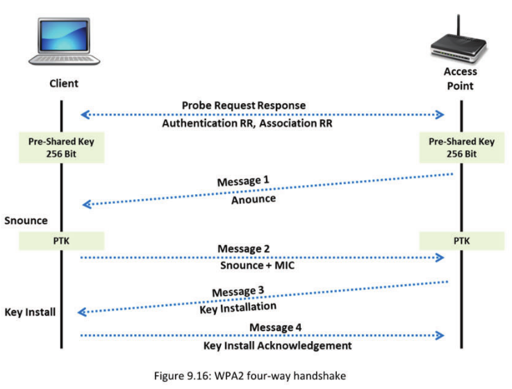

# Wireless Penetration Testing

**Module Objective**

Wireless networks are inexpensive and easy to maintain when compared to wired networks. A malicious outsider may easily compromise a wireless network, if proper security measures are not applied or if there is no appropriate network configuration. You need to perform wireless network penetration testing to determine critical sources, risks, or vulnerabilities associated with it and then check whether the current security mechanism is able to protect the wireless network against all possible attacks. If not, upgrade the security mechanisms.

This module describes various steps involved in wireless network penetration testing. It explains in depth about testing various components of wireless networks, such as wireless LAB, RFID devices, and NFC technology in devices.

## Wireless Penetration Testing
- Wireless network provides extension to the organization's infrastructure perimeter
- Typical wireless infrastructure may include use of the following wireless technology/devices:
  - Wireless local area network (WLAN) (802.11)
  - Radio Frequency Identification (RFID)
  - Near Field Communication (NFC )
  - Mobile Devices
  - Internet of Things (IoT)

- Wireless penetration testing is a process of actively evaluating information security measures implemented in a wireless network to analyze design weaknesses, technical flaws, and vulnerabilities
- Wireless penetration testing should be conducted separately and thoroughly

Wireless network provides extension to the organization's infrastructure perimeter. Typical wireless infrastructure may include use of the following wireless technology/devices: 

- **Wireless local area network (WLAN) (802.11)**: Wireless Network (Wi-Fi) refers to wireless local area networks (WLAN) based on IEEE 802.11 standard where it allows the device to access the network from anywhere within range of an access point (AP).

- **Radio Frequency Identification (RFID)**: RFID is a technology that uses radio signals to identify and record the presence of objects.

- **Near Field Communication (NFC)**: NFC is a type of short-range wireless communication between devices, such as smartphones, tablets, etc.

- **Mobile Devices**: They are portable handheld devices, such as smartphones, tablets, etc.

- **Internet of Things (loT)**: loT is referred as the network of computing devices that are web-enabled and have the capability of sensing, collecting, and sending data using sensors, communication hardware, and processors that are embedded within the device.

Wireless penetration testing is the process of actively evaluating information security measures in a wireless network. This process combines different attack techniques and methods to identify vulnerabilities in the perimeter of the target organization’s wireless network. It involves an active analysis of the information security measures for design weaknesses, vulnerabilities, and technical flaws and the results are documented in a report. Wireless penetration testing should be conducted separately and thoroughly. The report containing the results of security issues is delivered to executive, technical audiences, and management. The wireless penetration testing involves the following factors:

- Security control auditing: To test and validate the efficiency of wireless security protections and controls.
- Data theft detection: Find streams of sensitive data by sniffing the traffic.
- Information system management: Collect information on security protocols, network strength and connected devices, typically using network discovery, service identification modules, port scanner, and OS.
- Risk prevention and response: Provide comprehensive approach of preparation steps that may be taken to prevent upcoming exploitation.
- Upgrading infrastructure: Change or upgrade existing infrastructure of software, hardware, or network design.
- Threat assessment: Identify the wireless threats on information assets of an organization.

## Wireless Local Area Network (WLAN) Penetration Testing

Today organizations face several challenges in securing their wireless networks. There are several threats that are unique to wireless environment from rogue APs to weak encryption algorithms. WLAN penetration testing helps in identifying various possible threats and attacks on the target organization, such as sniffing, MAC filtering and spoofing, DoS, cracking encryption, and man-in-the-middle attack.

### Discover the Wireless Networks
- Discover wireless networks by War-driving
- You need the following to get started:
  - Portable computer or laptop
  - Wireless network discovery tools such as NetSurveyor and InSSIDer
  - WLAN adapter suitable for the specific tool
  - An external antenna (optional, but highly recommended)
  - A GPS receiver for surveying large areas
- Drive around the organization with Wi-Fi-enabled laptops to detect open wireless networks
- Note SSIDs, BSSIDs, encryption technique, and beacon strength of discovered access points
- Identify soft access points; a soft AP is set up on a Wi-Fi adapter without the need for a physical Wi-Fi router (e.g., WiFi in mobile devices)
- Identify the rogue access points:
  - If any new AP which is not present in the authorized list of APs is detected, it would be considered a rogue AP
  - If the MAC of any discovered AP is not present in the authorized list of MAC addresses, it would be considered a rogue AP
  - If a radio media type used by any discovered AP is not present in the authorized list of media types, itis considered a rogue AP
  - If the radio channel used by any discovered AP is not present in ‘the authorized list of channels, it is considered a rogue AP

- Detect access points, soft access points, rogue access points using wireless network discovery tools, such as WirelessMon, NetSurveyor, inSSIDer Office, Xirrus Wi-Fi Inspector, etc.

Discover the wireless networks by wardriving. To discover Wi-Fi networks, the tester needs the following things:

- Portable computer or laptop with Wi-Fi card
- Wireless network discovery tools, such as inSSIDer Office, NetSurveyor, and Xirrus Wi-Fi Inspector
- WLAN adapter suitable for the specific tool
- An external antenna (optional, but highly recommended)
- A GPS receiver for surveying large areas

Wi-Fi networks may be found by driving around with the Wi-Fi enabled laptop. The laptop is recommended to contain the wireless discovery tool installed on it. Using the wireless discovery tool, testers may map out the active wireless networks. Several Wi-Fi network discovery tools, such as inSSIDer Office, NetSurveyor, Xirrus Wi-Fi Inspector, Acrylic Wi-Fi Home, WirelessMon, Ekahau HeatMapper, are available online that give more information about the wireless networks in the vicinity.

Note SSIDs, BSSIDs, encryption technique, and beacon strength of discovered APs. Also, identify soft APs; a soft AP is set up on a Wi-Fi adapter without the need of a physical Wi-Fi router, for example, Wi-Fi in mobile devices

One way to identify the rogue APs is to use the pre-configured authorized list of APs.

- If any new AP which is not present in the authorized list of APs is detected, it would be considered as a rogue AP
- If MAC of any discovered AP is not present in the authorized list of MAC addresses, it would be considered as a rogue AP
- If radio media type used by any discovered AP is not present in the authorized list of media types, it would be considered as a rogue AP
- If radio channel used by any discovered AP is not present in the authorized list of channels. it would be considered as a rogue AP


Use Wireless network discovery tools, such as WirelessMon, NetSurveyor, etc. to detect APs, soft APs, and rogue APs.

#### NetSurveyor

Source: http://nutsaboutnets.com
NetSurveyor is an 802.11 (Wi-Fi) network discovery tool that gathers information about nearby wireless APs in real time and displays it in useful ways. The data is displayed using a variety of different diagnostic views and charts. Data may be recorded for extended periods and played back at a later date/time. Also, reports may be generated in Adobe PDF format. Applications of NetSurveyor are listed below:

- During the installation of a wireless network, it helps in verifying the network is properly configured and antennas are positioned at locations to achieve efficient transmission/reception.

- Trouble-shooting an existing network or wireless environment that is performing poorly
- Reporting the presence of Wi-Fi networks and local APs and the signal strengths of their beacons
- Conducting wireless site surveys where the installer is interested in learning about the coverage of a new or existing AP, roaming capability, presence of RF interference or “dead spots,” and optimum location of APs, their antennas and client stations
- In a secure business environment, it detects the presence of rogue APs
- Helps in understanding the relationship between APs (BSSIDs), wireless networks (SSIDs), and client stations (STAs)


#### WirelessMon

Source: https://www.passmark.com

WirelessMon is a software tool that allows users to monitor the status of wireless Wi-Fi adapter(s) and gather information about nearby wireless APs and hot spots in real time. It may log the information it collects into a file, while also providing comprehensive graphing of signal level and real time IP and 802.11 Wi-Fi statistics.

Features:

- Verifies that the 802.11 network configuration is correct
- Tests Wi-Fi hardware and device drivers are functioning correctly
- Check signal levels from your local Wi-Fi network and nearby networks
- Locates the sources of interferences to a network
- Supports the MetaGeek Wi-Spy (2.4i, 2.4x, and DBx) useful for finding interference from non 802.11A/B/G/N devices transmitting on the same frequencies
- Scan for hot spots in your local area (wardriving)
- Creates signal strength maps of an area (heat maps)
- GPS support for logging and mapping signal strength
- Measures network speed and throughput and view available data rates
- Scans for hot spots in your local area (wardriving)
- Verifies the security settings for local Aps and checks Wi-Fi network coverage and range


### Check Physical Security of AP
- Check the physical location of all authorized access points
- Check if physical access to APs is controlled
- Check the network’s physical security policy and determine who has the authorized physical access to APs

Physical security of AP describes security mechanisms that are designed to restrict access to unauthorized person (including attackers or intruders) from physically accessing an AP. It means, placing APs in such a manner that they cannot be stolen, moved, vandalized, blocked, or damaged. Good physical security of an AP uses the concept of defense in depth, in appropriate combinations to deter and deny access to unauthorized personnel. 

Follow the steps given below to check the physical security of AP:

- Check the physical location of all authorized APs.
- Check if physical access to APs is controlled.
- Check network’s physical security policy and determine who has the authorized physical access to APs.
- In addition, keep track of all APs by creating a spreadsheet including each AP’s location, model type, and MAC and IP address.

### Detect Wireless Connections
- Use wireless network discovery tools, which use two different scanning methodologies to detect, monitor, and log a WLAN device

  

**Types of Scanning Methodologies** 

**Active Scanning**

- Active scanning methodology involves. broadcasting a probe request frame and waiting for responses from available wireless networks

- This method retrieves information, including the WLAN's ESSID, BSSID, signal strength, operation
  channel, and presence of network encryption

- Examples of active wireless scanners include MiniStumbler, inSSIDer Office, etc. 

  

**Passive Scanning**

- Passive scanning methodology involves a way to detect the existence of an AP by sniffing the packets from the airwaves
- It reveals the AP, SSID, and client STA (station) details
- Passive scanners include Kismet, KisMAC, AirPCap, airodump-ng, etc.

Detecting wireless connections allows a tester to identify various network vulnerabilities, such as open ports and services and thereby helps in assessing and determining the security standards of the organization’s wireless network.

You may detect the wireless connections using the wireless network discovery tools, which use two different scanning methodologies to detect, monitor, and log a WLAN device. These two scanning methodologies are active scanning and passive scanning.

Both the methods gather WLAN’s AP information by capturing and decoding a beacon frame which contains network information that includes SSID, BSSID, and the network encryption implemented.

- **Active Scanning**
  Active scanning methodology involves broadcasting a probe request frame and waiting for responses from available wireless networks. This method retrieves information including the WLAN’s ESSID, BSSID, signal strength, operation channel, and presence of network encryption.

  Active scanners uncover the weak points in the network and let you know how an outsider could spot the network. By using the active scanners, you may resolve the uncertainties associated with the network, such as restricting the attacker's IP addresses, etc. Examples of active wireless scanners include MiniStumbler, inSSIDer Office, etc.

- **Passive Scanning**

  Passive scanning methodology involves a way to detect the existence of an AP by sniffing the packets from the airwaves. It reveals the AP, SSID, and client STA (station) details. While active scanners focus on stimulating and resolving the issues, passive scanners, on the other hand, helps you in monitoring the network activities. They simply scan the entire network and indicate the existence of the loopholes that could cause the attacks. Some of the passive scanners include Kismet, KisMAC, AirPCap, airodump-ng, etc.

### Sniff Traffic between the AP and Linked Devices
- Try to passively monitor transmissions to identify communication patterns and participants
- Use wireless packet sniffers, such as Wireshark, OmniPeek, etc. to capture packets and determine which device is linked with the wireless access point
- Look for passwords and other sensitive data traversing the airwaves

The penetration testers are advised to keep their laptop and a wireless network card in open or promiscuous mode in order to sniff traffic between the AP and linked devices. The promiscuous mode allows the radio to scan all available wireless channels and capture information within range.

You may try to passively monitor transmissions to identify communication patterns and participants. By passive monitoring, you may capture all the wireless network traffic regardless of the destination and even without being connected to any AP. Thus, this helps you to look for passwords and other sensitive data traversing the airwaves. 


You may use wireless packet sniffers, such as Wireshark, SteelCentral Packet Analyzer, OmniPeek, CommView for Wifi, Kismet etc. to capture packets and determine which device is linked with the wireless AP.

#### Wireshark

Source: https://www.wireshark.org
Wireshark is a network protocol analyzer. It lets users capture and interactively browse
the traffic running on a target network. Wireshark may read live data from Ethernet,

Token-Ring, FDDI, serial (PPP and SLIP), 802.11 wireless LAN, ATM connections (if the OS on which it’s running allows Wireshark to do so) and any device supported on Linux by recent versions of libpcap. AirPcap may be integrated with Wireshark for complete WLAN traffic analysis, visualization, drill-down, and reporting.

**Features:**

- Live capture and offline analysis
- Standard three-pane packet browser
- Multi-platform: Runs on Windows, Linux, OS X, Solaris, FreeBSD, NetBSD, and many others
- Captured network data may be browsed via a GUI, or via the TTY-mode TShark utility
- Display filters and VoIP analysis
- Read/write many different capture file formats: tcpdump (libpcap), Pcap NG, Catapult DCT2000, Cisco Secure IDS iplog, Microsoft Network Monitor, etc.
- Capture files compressed with gzip may be decompressed on the fly
- Live data may be read from Ethernet, IEEE 802.11, PPP/HDLC, ATM, Bluetooth, USB, Token Ring, Frame Relay, FDDI, and others (depending on your platform)
- Decryption support for many protocols, including IPsec, ISAKMP, Kerberos, SNMPv3, SSL/TLS, WEP, and WPA/WPA2
- Output may be exported to XML, PostScript, CSV, or plaintext


### Create a Rogue Access Point and Try to Create a Promiscuous Client
A promiscuous client can be created by creating an unsecured AP and forcing the user to connect to the unsecured network

1. Choose an appropriate location to plug in your rogue access point that allows maximum coverage
from your connection point

2. Disable the SSID Broadcast (silent mode) and any management features to avoid detection

3. Place the access point behind a firewall, if possible, to avoid network scanners

4. Set up a rogue access point for shorter periods and force the user to connect to the unsecured
network

5. Try to gain access to network data

Rogue APs are the soft APs that are used to bypass the authentication of the security systems of an organization. These APs are used as a backdoor to the network with the purpose of sniffing wireless network traffic, or to get easy access to some other wireless network. You may use rogue APs to identify and analyze various types of possible attacks and the damage caused by such attacks on the target organization.

Promiscuous client may be created by creating unsecured AP and forcing a user to connect to the unsecured network.

1. Choose an appropriate location to plug in your rogue AP that allows maximum coverage from your connection point 
2. Disable the SSID Broadcast (silent mode) and any management features to avoid detection
3. Place the AP behind a firewall, if possible, to avoid network scanners
4. Set up a rogue AP for shorter periods and force the user to connect to the unsecured network
5. Try to gain access to the network data


### Use a Wireless Honeypot to Discover Vulnerable Wireless Clients
- Set up a fake wireless AP (also known as an “evil twin access point” or wireless honeypot) to lure people into connecting to it

- Run tools such as WiFish Finder, AirMagnet, etc. to discover vulnerable wireless clients

Once you find the client:

- Try to capture any email or FTP connections

- Try to access the user's file shares

- Try to capture user’s login credentials by means of captive portal or spoofed DNS caching (displays a fake website that looks like a mirror image of a hotspot or website login page)

You need to discover vulnerable wireless clients and identify the weak wireless APs (WAP) that are allowing the unauthorized clients to connect with the target organization’s network.

In order to do so, you may setup a honeypot (also known as an “evil twin AP” or fake wireless AP) that lures the unauthorized clients into connecting to it and alerts the administrator, leaving the actual network totally secured. Make sure that the honeypot is securely configured so that it does not compromise other hosts on the same network. After setting up the honeypot, run tools, such as Wi-Fish Finder, AirMagnet Wi-Fi Analyzer PRO, etc. to discover vulnerable wireless clients.

Once you find a vulnerable client, try to obtain the following information:

- Try to capture any email or FTP connections

- Try to access the user’s file shares

- Try to capture user’s login credentials by means of captive portal or spoofed DNS caching (displays a fake website that looks like a mirror image of a hotspot or website login page)

  

You may use AirMagnet Wi-Fi Analyzer PRO to identify vulnerable wireless clients in the network:

#### AirMagnet WiFi Analyzer PRO

Source: https://enterprise.netscout.com

Image Source: https://www.fullcontrolnetworks.co.uk/

AirMagnet WiFi Analyzer PRO is a wireless network monitor that provides real-time accurate, independent and reliable Wi-Fi analysis of 802.11a/b/g/n and ac wireless networks, including 3 X 3 802.11ac wireless network analysis without missing any traffic. It is a portable wireless network analyzer that travels to the source of the wireless network troubleshooting problems enabling fast and accurate fault-finding without any AP downtime.

It is a dedicated Wi-Fi network monitoring and troubleshooting software solution guaranteeing any wireless network fault detection as compared to “time-slicing monitoring functionality” built inside the wireless network infrastructure.


### Perform a Denial-of-Service Attack (De-authentication Attack) :
- Wireless DoS attacks disrupt network wireless connections by sending broadcast “de-authenticate” commands
- Broadcast de-authentication forces the clients to disconnect from the AP

Wireless networks are susceptible to DoS attacks. DoS attacks may totally break down or disable WLAN of the target organization. You need to discover the vulnerabilities that lead to DoS attacks on a wireless network. Wireless networks generally operate on unlicensed bands and data transmission takes the form of radio signals. Wireless DoS attacks disrupt network wireless connections by sending multiple broadcast deauthenticate commands. Transmitted deauthentication commands forces the clients to disconnect from the AP. It has the potential to completely disrupt the wireless network performance by flooding the targeted machine with excessive requests to overload the system.


You may also perform “Self DoS attack” by turning the AP into a connection killing machine by sending the malformed packets.


### Attempt Rapid Traffic Generation
1. Sniff the wireless networks to identify the source and destination MAC addresses
2. Determine the hosts on the wireless network on a bridged and wired LAN
3. Use the aireplay-ng tool (Aircrack-ng Suite) to generate traffic

You may perform sniffing on wireless networks to identify the source and destination MAC addresses. You may access the MAC address from the header of the packet even when the content of the packet is encrypted with WEP. Identifying these addresses helps you in discovering the hosts on the wireless network as well as on a bridged and wired LAN.

Wireless networks that use WEP for encryption do not provide any security against replay attacks. Thus, you may capture any packet and retransmit it on to the target network after modifying its content. The packets are strongly encrypted; hence you need to guess its content by analyzing the network traffic. For example, if you may guess an ARP request that generates an ARP response from another host in the network then you may replay the same packet multiple times. This forces the host to provide a huge stream of encrypted responses, thus causing rapid traffic generation.

You may use aireplay-ng tool that comes with the aircrack-ng suite. This tool may generate many packets in few minutes and crack WEP keys after gathering many packets. It comes with the aircrack-ng, so it has many features of aircrack-ng that helps you to crack the WEP keys.


### Attempt Single-packet Decryption
- Perform a chopchop attack, which decrypts a WEP data packet without knowing the key
- This attack does not recover the WEP key itself but simply discloses the plaintext

You may perform Single-Packet decryption using ChopChop attack. This attack works against WEP protocol and allows you to decrypt a WEP data packet without prompting for the WEP key. ChopChop attack does not recover the WEP key itself, but simply discloses the plaintext. You need to test whether the target APs are vulnerable to this attack. Generally, the APs drop the packets containing less than 60 bytes of data. You may use aireplay-ng to guess the missing data of the packet, such as headers. To perform this attack, you need to capture minimum one WEP packet.

Perform this attack on the target organization’s wireless network and analyze the results:

- If you are able to recover the plain text, then compare it with the actual WEP data packets to determine the security level of the target network.

The screenshot given below illustrates performing chopchop attack using aireplay-ng:


You may obtain the result in a file “replay_dec-0201-191706.cap” and view the decrypted packet using tcpdump or Wireshark.


### Perform an ARP Poisoning Attack
- ARP is used to determine the MAC address of an access point whose IP address is known
- Use the Cain & Abel tool to perform ARP poisoning

ARP is used to determine the MAC address of an AP whose IP address is known. ARP poisoning is one way to test the wireless network security. Usually ARP protocol does not provide any authentication to verify whether the received response is a forged one or legitimate response from a valid host. In this test or technique, the tester is advised to try to exploit the lack of verification. The tester is advised to send an ARP Replay packet constructed with a wrong MAC address, this corrupts the ARP cache maintained by the OS.

The ARP poisoning attack has its impact on all the hosts present in a subnet. All stations associated with a subnet will be susceptible to ARP poisoning attack and are vulnerable as most of the APs act as transparent MAC layer bridges. All the hosts connected to a switch or hub are susceptible to ARP poisoning attack, if the AP is connected directly to that switch or hub without any router/firewall in between them. If the tester may break the security of one host in a subnet, then it is possible to compromise the rest of it. This is because, most of the APs act as transparent MAC layer bridges. The following diagram illustrates the ARP poisoning attack process:


You may use tools, such as Cain & Abel to perform ARP poisoning attack on the target wireless network:

#### Cain & Abel

Source: http://www.oxid.it
Cain & Abel is a popular tool to perform ARP poisoning attack. It is used to perform sniffing on switched LANS and man-in-the-middle attacks. Before using this tool, you need to disable the antivirus or firewall installed in your system and you need to configure the tool to work with the network that your system is connected. Next, you need to start the sniffer to populate all the connected hosts on the network. Now select all the hosts in the subnet and ensure that the target device is in the list. Now start performing ARP poisoning. Before spoofing you may run tools, such as Wireshark to capture and monitor ARP poisoning packets to the target device.


### Try to Inject the Encrypted Packet
- Perform a packet injection attack to determine if wireless card can effectively inject and determine the ping response time to the AP
- This attack lists APs in the zone which respond to broadcast probes and perform a 30-packet test
- This attack is also used to test a specific AP or test a hidden SSID

Packet injection, also known as forging packets or spoofing packets, is the process of developing fake packets and inserting them into an established network. This attack may allow an outsider to interrupt communication of authenticated users and restrict their access over certain network services. Packet injection attacks may also list APs in the zone which respond to broadcast probes and perform a 30 packet test.

You may inject custom encrypted packets on the target wireless network to test the network’s vulnerability to certain packet injection attacks. This test also helps you to identify if the wireless card may effectively inject and determine the ping response time to the AP. This attack is also used to test a specific AP or test a hidden SSID.

You may use tools, such as aireplay-ng to inject encrypted packets on the target AP.


### Crack WPA-PSK Keys
How WPA2 Handshake Works:

- The user-entered passphrase along with SSID of an access point are supplied to a Password-Based Key
  Derivation Function 2 (PBKDF2) to generate 256-bit Pre-Shared Key(PSK) or Pairwise Master Key (PMK)
- Either the client or the access point creates PSK, and then 4-way handshake communication takes place
  between them by exchanging packets, such as SNonce, ANonce, client’s MAC, and Access point’s MAC
- This information is then used to create PTK (Pairwise Transient Key) for current session
- The message integrity check (MIC) signature is generated for the packet and is signed by using the PTK

- Pen tester needs to sniff 4-way handshake commination between client and access point and observe the information, such as SNonce, ANonce, client’s MAC, and Access point’s MAC, exchanged during handshake
- Uses dictionary attack where you need to try each of the passphrases in dictionary file and generate PSK
- Observe the message integrity check (MIC) of packet which is signed by using the PTK
- By using the PTK, reconstruct the MIC and compare it to MIC of sniffed packet. If it is matched, you have successfully cracked WPA-PSK key

WPA-PSK is an authentication mechanism. In order to verify the authentication of a wireless network configured with this kind of authentication mechanism, users need to provide some form of credentials. Both WPA and WPA-PSK use the same encryption mechanism, but the only difference is that WPA-PSK authentication requires a simple common password. In general, the shared password systems are vulnerable. Similarly, the Pre-Shared Key (PSK) is also vulnerable to the same risks.

**WPA2 Handshake**

The WPA2 four-way handshake is designed for mutual authentication between the AP (AP) and the wireless client without revealing the key. All the messages between the AP and the client are protected by encryption and may only be decrypted using Pairwise Master Key (PMK), which is already shared by them. The four-way handshake protects the messages from various malicious APs and attacks.

**How WPA2 Handshake Works?**

- The user entered passphrase along with SSID of an AP is supplied to a Password-Based Key Derivation Function 2 (PBKDF2) to generate 256-bit PSK or PMK
- Either the client or the AP creates PSK, and then, 4-way handshake communication takes place between them by exchanging packets, such as SNonce, ANonce, client’s MAC, and AP’s MAC
- This information is then used to create PTK (Pairwise Transient Key) for current session
- The message integrity check (MIC) signature generated for packet and is signed by using the PTK



The drawback in the WPA-PSK is that the authentication messages and keys are encrypted and shared using a four-way handshake mechanism. If you can capture the messages containing keys during the handshake then you may try to crack them using various tools. You need to sniff 4-way handshake communication between the client and the AP and observe the information, such as SNonce, ANonce, client’s MAC, and AP’s MAC exchanged during handshake. You may use Dictionary attack where you need to try each of the passphrases in Dictionary file and generate PSK. Also, observe the message integrity check (MIC) of packet which is signed by using the PTK. Using the PTK, you may reconstruct the MIC and compare it to MIC of sniffed packet. If it is matched, you have successfully cracked WPA-PSK key.


### Crack WPA/WPA2 Enterprise Mode
- Enterprise mode of WPA/WPA2 is more secure than the PSK mode and is only susceptible to Man-in-the-Middle attack

- Use FreeRadius-WPE (a patch for the open-source FreeRADIUS server) to perform an MITM attack if FreeRADIUS server is used for authentication

Steps to perform an MITM attack:

- Set up a fake AP

  - Mirror target network's SSID, encryption type (WPA/WPA2), and band (a, b, g, n)

  - Configure the AP to accept enterprise authentication

  - Set the AP to visible

- Connect the fake AP to the FreeRADIUS-WPE server that authenticates requests
- Wait for users to attach to the fake AP and capture their credentials
  Note: You may de-authenticate clients from the legitimate network
- Now, use programs such as asleap to crack the challenge/response pair to recover the password

WPA Enterprise is a complicated mode that is designed for enterprise wireless networks and it requires additional authentication from a RADIUS server. Enterprise mode of WPA/WPA2 is more secure than the PSK mode as it uses separate username and password to authenticate the devices over the RADIUS server and is also susceptible to man-in-the-middle (MITM) attack. You need to create a fake AP with the same SSID, such as that of an original network and wait for clients to connect to these points. After obtaining the credentials, you may use this information to connect to the wireless network of the target organization.


### Check for MAC Filtering
- Use the aireplay-ng tool to determine whether the target access point used MAC filtering

- Open a terminal window within the BackTrack tool and run the following command:

  ```
  aireplay-ng -fakeauth 0 -e {target ESSID} -a {MAC address of AP) -h {MAC address of your forensic laptop’s wireless card}
  ```

  Example: 

  ```
  aireplay-ng -fakeauth 0 -e belkin54g -a 00:11:50:53:9A:24 -h 00:20:A6:52:23:30
  ```


- Once the command is executed, a message will be displayed, showing whether the authentication and association were successful

MAC filtering is a process used by network administrator to allow only the list of approved MAC addresses to connect to a router in the wireless network. This restricts the unauthorized clients from connecting to the network and thereby safeguarding it from various attacks. 

Use aireplay-ng tool to determine whether the target AP using MAC filtering or not. If the wireless network card supports packet injection, you may attempt a forced association. However, if MAC filtering is active, the association will be denied. For this procedure, you will need BackTrack or similar UNIX/Linux system. Open a terminal window and run the following command using aireplay-ng:

```
aireplay-ng -fakeauth 0 -e {target ESSID} -a {MAC address of AP) -h {MAC address of your forensic laptop’s wireless card}
```

Example: 

``` 
aireplay-ng -fakeauth 0 -e belkin54g -a 00:11:50:53:9A:24 -h 00:20:A6:52:23:30
```

Once the command is executed a message will be displayed, showing whether the authentication and association were successful. However, if MAC filtering is active, the association will be denied. If the association is successful, then it implies that the target wireless network is at risk.


### Spoof the MAC Address

MAC address spoofing allows you to change your MAC address on your Network Interface Controller (NIC) card for legitimate and non-legitimate purpose. You may perform MAC address spoofing to impersonate a legitimate device on the network to circumvent existing security procedures of the target organization. MAC spoofing opens up a variety of attack vectors and can bypass access control list on servers and routers, such as impersonation, DoS, man-in-the- middle attack, etc.

Follow the steps given below to spoof the MAC address of the target host:

1. After determining an allowed MAC address, spoof the MAC address from the captured frame and try to gain access

2. Before changing the MAC, deactivate the wireless network card

3. Close airodump-ng or any other program that utilizes the network card before continuing:

  ```
  ifconfig (interface) down
  ```

4. In BackTrack, type the following command in the MAC changer window:

  ```
  macchanger -m (MAC of currently associated device} (interface)
  ```

5. After the MAC address is changed, the display will show the previous and new MAC address and vendor settings

6. Reactivate the wireless network card:

  ```
  ifconfig (interface) up
  ```

7. Attempt an authentication and association to the access point using the spoofed MAC address

8. If you see the “success” message, MAC filtering is indeed active on the access point


### Create a Direct Connection to the Wireless Access Point
- Plug the network cable between the laptop and the wireless access point
- If the wireless access point and laptop are DHCP enabled, then the laptop will automatically be assigned to an IP in the same network range


- Determine the IP address of the wireless access point by running the ipconfig command in the command prompt

- This shows the default gateway that is most likely the wireless access point IP address


- Try connecting to it by typing it in the address bar of a web browser
- A login window will pop up and ask you to fill in the credentials for obtaining access to the wireless access point


### Additional Wireless Penetration Testing Tools: 

#### Kismet

- Kismet is an 802.11-layer 2 wireless network detector, sniffer, and intrusion detection system
- It identifies networks by passively collecting packets and detecting standard named networks and hidden networks

Wireless penetration testing tools help you to evaluate the information security measures implemented in the target wireless network. These tools help the tester to identify design weaknesses, technical flaws, and vulnerabilities in the wireless networks. You may use some of the popular tools, such as Aircrack-ng suite, Kismet, AirMagnet Wi-Fi Analyzer, AirDefense, etc. to perform wireless penetration testing.

#### Kismet

Source: https://www.kismetwireless.net
Kismet is a wireless network detector, sniffer, and intrusion detection system. Kismet works predominately with Wi-Fi (IEEE 802.11) networks but may be expanded via plug-ins to handle other network types. It identifies networks by passively collecting packets and detecting standard named networks and hidden networks.

To identify the networks and hidden networks, Kismet divides the process in three parts: Kismet drone, Kismet server, and Kismet client. Kismet drone captures the network packets, and then forwards them to the Kismet server for interpretation purpose. Then, the server interprets the packet data and extracts and organizes the wireless information in a well-defined manner. At last, the Kismet client makes connection to the server and displays the collected information.


#### AirDefense

Source: https://www.extremenetworks.com

The Extreme AirDefense Services Platform (ADSP) simplifies the management, monitoring, and protection of your WLAN networks. The platform supports three key functions—security and compliance, network assurance, and proximity awareness and analytics.

**Features:**

- It allows penetration testers to automatically log on to an AP and test for vulnerabilities from the perspective of a wireless hacker. 
- Extreme sensors conduct wireless penetration testing, proactively identifying vulnerabilities before they may be exploited, so you may better manage threats and keep your systems secure.
- It also allows you to capture a complete record of WLAN performance, giving you the ability to rewind and analyze detailed records of wireless activity in support of forensics investigations or network performance troubleshooting.
- Provides a single Ul-based platform for wireless monitoring, intrusion protection, automated threat mitigation, etc.
- It also provides tools for wireless rogue detection, policy enforcement, intrusion prevention, and regulatory compliance and uses distributed sensors that work in tandem with a hardened purpose-built server appliance to monitor all 802.11 (a/b/g/n) wireless traffic in real time.
- It analyzes existing and zero-day threats in real time against historical data to accurately detect all wireless attacks and anomalous behavior.


## RFID Penetration Testing

RFID penetration testing helps the tester to perform vulnerability assessment on RFID systems and identify various possible threats to the target organization. The major weakness of RFID devices is related to its frequency. You may use various RFID pen testing tools to perform frequency analysis of RFID tags and try to decode the data or perform various attacks, such as DoS attack, MITM, RFID cloning, impersonation, replay attack, etc.

### Introduction to RFID Penetration Testing
- RFID (Radio Frequency Identification) technology comes with flaws and attack surfaces that if not
  adequately secured could be exploited with serious consequences
- RFID systems are susceptible to attacks, such as eavesdropping, MITM, DoS, spoofing, etc.
- Performing RFID penetration testing helps to identify vulnerabilities associated with RFID systems
  and fix them beforehand

RFID (Radio Frequency Identification) technology comes with flaws and attack surfaces, that if not adequately secured could be exploited with serious consequences. RFID systems are susceptible to attacks, such as eavesdropping, MITM, DoS, spoofing, etc.

RFID systems include tags that receive signals and send response without any authentication. This vulnerability leads to unauthorized access and alteration of RFID tag data. These unprotected tags are vulnerable to various attacks, such as spoofing, eavesdropping, DoS, traffic analysis, etc. Also, RFID systems use radio signals that cover several meters around the receivers. It is possible to perform eavesdropping and sniffing RFID tags using RFID readers. It is also possible to perform jamming attack by transmitting high power radio signals to jam the entire RFID system down. Many organizations install RFID readers without providing any physical security leading to unauthorized access to the information sent by the readers. Hence, performing RFID penetration testing helps organizations to identify vulnerabilities associated
with RFID systems and fixes them beforehand.

### Perform Reverse Engineering
- Gain access to the chip, and read its memory contents optically to retrieve the PIN, biometric data, personal information, etc.

- Reverse engineering of an RFID tag requires in-depth knowledge of logical gates, electronics, and cryptography

Steps generally used for RFID reverse engineering:

- Visual inspection
- Monitoring Coupling and Frequencies
- Monitoring Energy supply and modulations
- Line encoding, Syntax inference, and Protocol inference using signal Spectrogram
- Cryptanalysis

RFID is an embedded system which often uses proprietary protocols and different cryptographic functions. In this RFID the details of the algorithms are typically kept secret because once its operation principles are known then the system compromise becomes easier. To solve this problem, we are using Legic prime security system. Reverse engineering of its functionality is the necessary step in the security assessment of a proprietary protocols.

According to Merriam-Webster Dictionary definition of reverse engineering is to disassemble and examine in detail to discover the concepts that are involved in manufacture usually in order to produce something similar.

From RFID systems, one may gain information visually, by opening or breaking the components physically and looking for the common things. By physical inspection it is possible to find identifiers, such as manufacturer or product code printed on the device or different specifications of the RFID systems.

The RFID systems are mostly susceptible to reverse engineering as their hardware and software components may be easily analyzed and reproduced. You need to detect the vulnerabilities and
security flaws in these RFID systems.

You may perform reverse engineering by gaining access to the chip and reading its memory contents optically to retrieve the PIN, biometric data, personal information, etc. Reverse engineering of an RFID tag requires in-depth knowledge of logical gates, electronics, and cryptography.

Listed below are the steps to perform RFID reverse engineering:

- **Visual inspection**
  Initially you need to examine the components and look for the details, such as manufacturer, the model, or the RFID standard before analyzing the characteristics of a RFID tag. This information may help you to get details of the basic parameters on the communication protocol.
- **Monitoring Coupling and Frequencies**
  You need to determine the operational frequency by studying the internal components of the RFID. You may do this by disassembling the hardware and analyzing it. You may also monitor suspected frequencies using spectrum analyzer/oscilloscope.
- **Monitoring Energy supply and modulations**
  You are also advised to identify how the RFID tag is powered whether it has its own battery or it is powered by the reader signal. Based on this information you may get the battery details. Also find out various modulation parameters.
- **Line encoding, Syntax inference, and Protocol inference using signal Spectrogram**
  Try to deduce the symbol coding implemented in the RFID tag. Most commonly used code settings are NRZ (non-return to zero), Manchester, and Miller.
- **Cryptanalysis**
  Test different encodings for various combinations of plain text and keys.

### Perform Power Analysis Attack
- Analyzing power consumption patterns allows you to determine when the RFID card receives correct and incorrect password bits
- Perform a power analysis attack by means of a directional antenna and an oscilloscope
- Also, you can perform this attack using a very common device, such as a cell phone

Power analysis is the type of side channel attack that enables you to crack passwords by analyzing power consumption patterns of a network device. The power consumption patterns get changed when the RFID card receives correct and incorrect password bits. By performing power analysis attack, you may discover the correlation between the power consumption and internal state of a device.

You may perform a power analysis attack by means of a directional antenna and an oscilloscope. These devices analyze and collect the information that is leaked by a device during cryptographic operation. Then, static analysis is performed on the collected information to identify the secret key. You may also perform power analysis attack using a very common device, such as a cell phone.

### Perform Eavesdropping
- Access the RFID tag data by eavesdropping the legitimate transmission between it and the RFID reader
- You can use special antennas and receiving equipment to eavesdrop radio signals transmitted from the reader and the tag

Eavesdropping is one of the primary threats to the organizations using the RFID technology. You may easily access the RFID tag data by eavesdropping the legitimate transmission between the tag and the RFID reader. As the RFID signals cover several meters around the receiver, you may use special antennas and receiving equipment to eavesdrop radio signals transmitted from the reader and the tag.

Many RFID systems transmit data in clear text due to various constraints, such as memory, cost, etc. Hence, it is important to establish a secure channel between the tag and reader as there may be serious implications if some sensitive information is leaked. Therefore, you need to interrogate tags if they lack required access controls and eavesdrop on the content of tag. And finally, you need to identify various vulnerabilities in the RFID systems that lead to eavesdropping.

### Perform an MITM Attack
- An RFID system is vulnerable to MITM attacks because the tags are small and low-priced. Also, many RFID tags send and receive data in clear text
- Intercept the communication between the reader and the tag by falsely claiming to be an authentic reader and/or tag 

An RFID system is vulnerable to MITM attacks because the tags are small and low-priced. Also, many RFID tags send and receive data in clear text. The man-in-middle attack (MITM) is similar to the eavesdropping attack the only difference is that in eavesdropping there is no physical medium where as in man-in-the-middle you have to make independent connections with interrogators, tags, and the RFID back end system. In this MITM attack messages are transmitted between victims, making them believe that they are communicating with each other directly but the fact is that the entire conversation is controlled by the tester.

To perform this attack, you need to intercept the communication between the reader and/or tag by falsely claiming to be an authentic reader /or tag. We advise you to have the ability to intercept messages that are being transmitted between the victims and also to be able to inject anew one which may be possible in some RFID systems.

### Perform a DoS Attack
- Flood the RFID system by providing more data than it can handle normally, bringing the whole system to a halt
- DoS attacks can be performed in various ways: attacking the RFID tag, RFID reader, and backend server

- Implement jamming and interference techniques to perform DoS attacks:

  - You can use a high-power radio frequency transmitter to block frequencies used by the RFID system

  - You can block radio signals using jammers, such as Armourcard RFID Jammer, UV30 Jammer, Wave Bubble, etc.

- Another form of DoS is to destroy or disable RFID tags by washing out their contents completely or wrapping them with metal foil

DoS attack is a type of attack in which the services are reduced or made unavailable to the valid user. This type of attack is easy to accomplish but difficult to guard against. To perform DoS attack on a RFID system, flood the RFID system by providing more data than it may handle normally, bringing the whole system to a halt. DoS attacks may be performed in various ways: hacking the RFID tag, RFID reader, and back end server.

Listed below are some of the situations in which DoS attack may be carried out in RFID systems:

- You may physically destroy or remove the tags that are attached to an object to avoid tracking.

- To prevent check-out of the particular item you may also kill the tags in warehouse, supply chain.

- You may protect the tags from being read.

- You may jam the return signals from the tags if you have a powerful signals generator although such action would cause the interrogator to raise an alarm.

You may implement jamming and interference techniques to perform DoS attacks. Forexample, you may use a high-power radio frequency transmitter to block frequencies used by the RFID system. You may also block radio signals using jammers, such as Armourcard RFID Jammer, UV30 Jammer, Wave Bubble, etc. Another form of DoS is to destroy or disable RFID tags by washing out their contents completely or wrapping them with metal foil.

### Perform RFID Cloning/Spoofing
- Capture the data from a legitimate RFID tag, and then create its clone using a new chip

- You can use Proxmark 3, RFID Emulator, RFiDler, etc. to clone RFID tags

- Follow the steps mentioned below to clone a MIFARE Classic RFID tag:

  - Purchase a "magic" MIFARE Classic card (allows you to write block 0 information)
    Note: Block 0 on the MIFARE Classic card contains manufacturer data, including the UID. You cannot write data to this block under normal circumstances as it is blocked by the manufacturer

  - Use Mifare Classic Offline Cracker (MFOC) tool to dump RFID card data

  - Use nfe-mfclassic script (part of the libnfc library) to clone RFID card data

- You can use RFDump to overwrite existing RFID tag data with spoof data (obtained by eavesdropping)

You need to test whether the RFID system is allowing you to perform RFID cloning/spoofing. RFID cloning involves capturing the data from a legitimate RFID tag, and then creates a clone of it using a new chip. That means, that data from one RFID tag is copied into another tag, by changing the Tag ID (TID) but the form factor and data may remain the same. The cloned copy is different from the original RFID tag and it may be easily detected. You may use Proxmark 3, RFID Emulator, RFIDler, etc. to clone RFID tags.

Follow the steps mentioned below to clone a MIFARE Classic RFID tag:

- Purchase a "magic" MIFARE Classic card (allows you to write block 0 information)
  Note: Block 0 on the MIFARE Classic card contains manufacturer data, including the UID. You cannot write data to this block under normal circumstances as it is blocked by the manufacturer.

- Use Mifare Classic Offline Cracker (MFOC) tool to dump RFID card data

- Use nfc-mfclassic script (part of the libnfc library) to clone RFID card data

Before performing RFID spoofing, you need to eavesdrop then read and record the data transmitted from a RFID tag. It is difficult to detect the spoofed RFID tag, as it uses the original Tag ID. You may use RFDump to overwrite existing RFID tag data with the spoofed data (obtained by eavesdropping).

### Perform an RFID Replay Attack
- Intercept the communication between an RFID reader and RFID tag, and capture a valid RFID signal
- You can use Proxmark 3 to perform an RFID replay attack

Replay attack is a process of consuming the computing resources of the tags by repeating/delaying a valid data transmission of the network. To perform replay attack on an RFID device, you need to intercept the signals transmitted between a reader and a tag to obtain a valid RFID signal. Next, you need to replay the captured signal into the RFID system, and as it resembles a valid signal, it is accepted by the system creating an unauthorized effect. 

RFIDs may be more vulnerable to a replay attack than other techniques due to its ability to read at a distance by covert readers. This technique works by combining the capabili ties of both eavesdropping and spoofing. To be secured from a replay attack, every server challenge’s tag’s response is recommended to be unique. To achieve this, the value of tag responses and server challenge is recommended to be unpredictable and by enforcing that, the answers need to be cartographical. You may use Proxmark 3 to perform an RFID replay attack on the target network.

### Perform a Virus Attack
- If RFID software contains vulnerabilities, an RFID tag might be infected with a virus. When a reader scans the infected tag, it may result in compromising backend RFID a systems via an SQL injection attack
- You can inject infective viruses to the memory space of RFID tags

RFID software contains vulnerabilities due to which it might be infected with a virus. When a reader scans the infected tag, it may result in compromising backend RFID middleware systems via an SQL injection attack resulting in a virus attack. This attack prevents the communication between tags, network connections, interrogators, and back end system. For the payload of an RFID tag it is possible to carry either a virus or a link to one. You may inject infective viruses to the memory space of RFID tags.

The virus problem is not particular to RFID such that the tester is advised to address both from the front end as well as the back end part of RFID systems by which the front end part comprises the interrogate and tag. The organizations need to find ways to avoid virus attacks by blocking anomalous bits from the tag.

### Oscilloscopes, RFID Antennas and RFID Readers
**Listed below are some of the popular oscilloscopes used for RFID hacking:**

- Tektronix Oscilloscopes (https://www.tek.com)

* Keysight Oscilloscopes (https://www.keysight.com)

* B&K Precision Oscilloscopes (https://www.bkprecision.com)

* Teledyne LeCroy Oscilloscopes (https://teledynelecroy.com)

* Rigol Digital Oscilloscopes (https://www.rigolna.com)

* National Instruments Oscilloscopes (https://www.ni.com)

**Listed below are some of the popular RFID Antennas used for RFID hacking:**

* Honeywell RFID Antennas (https://www.honeywellaidc.com)
* atlas RFID Antennas (https://www.atlasrfidstore.com)
* Zebra RFID Reader Antennas (https://www.zebra.com)
* Times-7 UHF RFID Antennas (https://www.times-7.com)
* KATHREIN RFID Antennas (https://www.kathrein-solutions.com)
* Ha-VIS RFID antennas (http://www.harting-rfid.com)

**Listed below are some of the popular RFID Readers used for RFID hacking:**

- GAO RFID Readers (https://gaorfid.com)
- atlas RFID Readers (https://www.atlasrfidstore.com)

* Sky RFID Readers (https://skyrfid.com)
* Technology Solutions RFID Readers (https://www.ts/.com)
* TERTIUM RFID Readers (http://www.tertiumtechnology.com)
* ams NFC/HF RFID Reader (https://ams.com)

## NFC Penetration Testing

NFC (Near Field Communication) technology in the mobile devices allow users to access various services within a single device. This technology has several vulnerabilities which may lead to various attacks, such as eavesdropping, data modification, data corruption, etc. You need to test NFC devices to reveal unknown vulnerabilities that may be exploited to gather confidential information, such as credit card numbers, login credentials, etc.

### Introduction to NFC Penetration Testing

1. Near Field Communication (NFC ) uses radio waves to communicate

2. Though NFC has a shorter read range (maximum 20 cm). This standard does not guarantee secure communications
3. NFC technology is susceptible to eavesdropping, data corruption, data modification, spoofing, and MITM attacks
4. Identifying possible NFC vulnerabilities by means of pen testing and resolving them beforehand helps to make a system immune to security attacks

Near Field Communication (NFC) is a short-range, wireless connection standard that uses radio waves to establish communication between electronic devices. It establishes communication either by touching together the devices or by locating them in close proximity. The NFC standard is designed on the basis of RFID standard. It also includes different data exchange formats as well as communication protocols. This standard does not guarantee secure communication even though the communication range is limited to a few centimeters (maximum 20 cm). The reason is that, it does not require any form of passwords or login
credentials to get connected. This provides opportunity to the malicious outsiders to gain access to devices, user credentials, and other confidential information.

NFC is an emerging technology which many organizations use for short range communication. For you, it is important to test the NFC communications of the target organization and reveal the possible threats organizations may face. NFC technology is susceptible to various attacks, such as eavesdropping, data corruption, data modification, spoofing, MITM attack, etc. Hence, NFC penetration testing is required to identify vulnerabilities and also to resolve them beforehand for making a system immune to security attacks.

### Perform Eavesdropping
- As NFC technology broadcasts radio signals in the vicinity of the transmitter and not just to the intended receiver, there is a scope to grab signals
- You can record communications between NFC devices by means of large and sophisticated antennas

NFC technology broadcasts radio signals in the vicinity of the transmitter and not just to the intended receiver, there is a scope to grab signals as the communication takes place between the devices in close proximity. NFC eavesdropping is a consequence in which an antenna is used to record the communication between NFC and other devices or we may simply say that one may record communications between NFC devices by means of large and sophisticated antenna.

The main objective of this attack is to intercept the NFC exchange process to corrupt the information being exchanged and make it useless. You need to test whether the target NFC devices are vulnerable to eavesdropping or not. To perform eavesdropping you need to use an antenna to capture the communication between the NFC devices. Organizations need to secure the NFC communication channel so that the information is encrypted and only an authorized device may decrypt it. Secondly, they need to set the range of NFC so that limited devices may be connected.


### Perform a Data Modification Attack
- Data modification is feasible in rare cases, particularly for NFC communication in active mode
- Use RFID jammers to interfere with the NFC data exchange
- Possibility of this attack depends on various factors, such as the strength of the amplitude modulation

The Data Modification attack is a more dangerous attack that not only captures and stores target’s data exchange but also modifies it using a radio frequency device. It is feasible in rare cases, particularly for NFC communication in active mode. This is a control-data attack that may constrain the NFC data exchange in the target network temporarily. The possibility of this attack depends on various factors, such as the strength of the amplitude modulation. 

Detecting this attack is a bit difficult especially while performing the active mode transmission of NFC information. You may use a RFID jammer to detect this attack and interfere with the NFC data exchange. Try to alter NFC source device code to measure the strength of frequencies and compare them with susceptible frequency range to detect this attack. It is always recommended to check the RF field during transmission as this could help you in identifying this attack.

You may attempt this attack on the target network by modifying the control-flow of programs. In order to do so, primarily you need to capture some running data, get the control over it and then override it using memory corruption errors, such as a Buffer overflow, use-after-free, etc. Try to modify/override configuration data, user input data, policy making data, etc. to analyze the security of target network.

### Perform Data Corruption Attack
- Basically, this is a form of Denial-of-Service attack
- You may interfere with the data transmission, disturbing or blocking the data channel so that the reader fails to read the information
- Transmit valid frequencies of the data spectrum at a correct time Note: Correct time can be calculated based on the used modulation scheme and coding
- Most probably, NFC device can detect this kind of attack by checking the RF signal during data  transmission as the power required to effectively attack a system is considerably higher than the power used to send data

Data corruption attack is a type of DoS attack, where the third-party attempts to corrupt the data being transmitted between the two endpoints. You may perform this attack either by interfering or disrupting the data transmission or blocking the data channel, so that the receiver is not able to decipher or read the data received.

You may attempt the data corruption attack, by transmitting a valid set of data frequencies at a correct time. You may calculate the correct time based on the used modulation scheme and coding. In this attack, you do not have to decipher the data transferred, as the main objective of this attack, is just to destroy or make the legitimate information unavailable to the receiver.

As a preventive measure, the NFC device may detect this kind of attack by checking the RF signal during data transmission, as the power required to effectively attack a system is considerably higher than the power used to send data.

You need to perform this type of attack to test the device’s security and further advise the organization to implement the data validation controls as prevention against data corruption.

### Perform a MITM Attack
- Performing a MITM attack is a difficult task and practically infeasible
- Try to eavesdrop on the communication, manipulate it, and transmit it to the NFC reader

NFC is a short-range wireless technology that is used for financial transactions and data sharing. Due to the lack of device authentication, NFC communication may be exploited to perform attacks, such as man-in-the-middle, masquerading, eavesdropping, etc. NFC tags are used as passive data stores that may be rewritable, which is a serious drawback as data may be modified by performing a man-in-the-middle attack.

Performing a MITM attack is a difficult task and practically infeasible. In this attack, you need to eavesdrop the communication and also try to manipulate and transmit it to the NFC reader. You need to intercept the communication between the two NFC devices, that is your device acts as a relay agent between the communicating devices. After intercepting the data, try to modify the information that is being transmitted and forward it to the other communicating entity. The two legitimate devices cannot notice the interception of messages and MITM attack. 

You need to identify the vulnerabilities in the NFC communication that leads to attacks, such as man-in-the-middle attack. To protect the NFC devices from such type of attacks, organizations need to secure the communication by encryption.

## Document the Result
- Note down the weaknesses found in the configuration of organization's wireless infrastructure.

Documenting the results obtained during penetration testing is an essential step. You are advised to document the result obtained while conducting testing on WLAN, RFID devices, NFC devices, mobile devices, and loT. After the completion of the steps, you are advised to combine and reconstruct the results in a detailed format. Note down the weaknesses found in the configuration of organization's wireless infrastructure. The pen testing report from each section serves as a basis for creating a final report. The final documented report contains a detailed information on all the vulnerabilities, identified in each section, such as:

- Weak encryption mechanisms
- Unencrypted flow of data
- Insecure device's firmware/software
- Poor authentication mechanism
- Weak web interfaces

* Improper data storage mechanism

* Poor storage of encryption keys

* Enabled Universal Plug and Play UPnP service

  

For every identified vulnerability, you need to provide detailed documentation that describes the security vulnerability and how it may be exploited. This makes the document transparent, understandable, and comprehensible for technical administration. Furthermore, this document may be used to make changes in the device configuration and overall security infrastructure to enhance the security of the target network.

