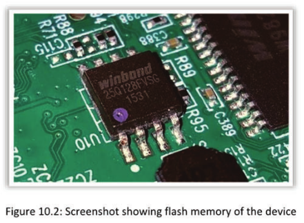
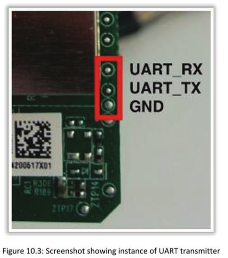
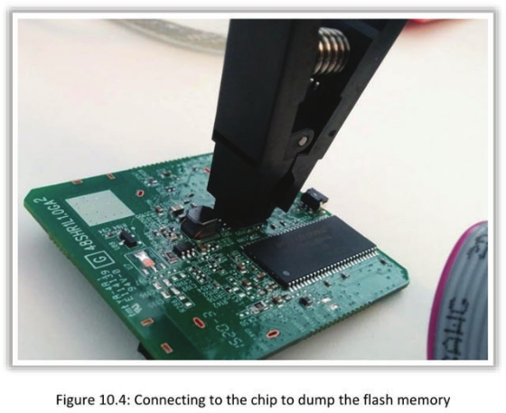
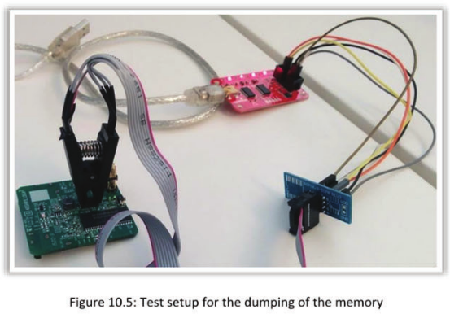
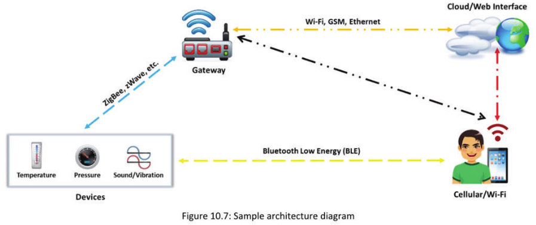
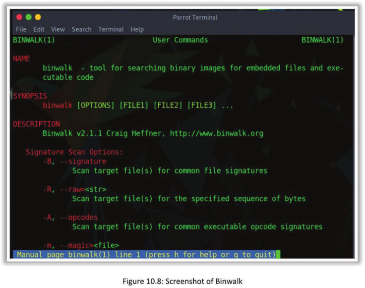
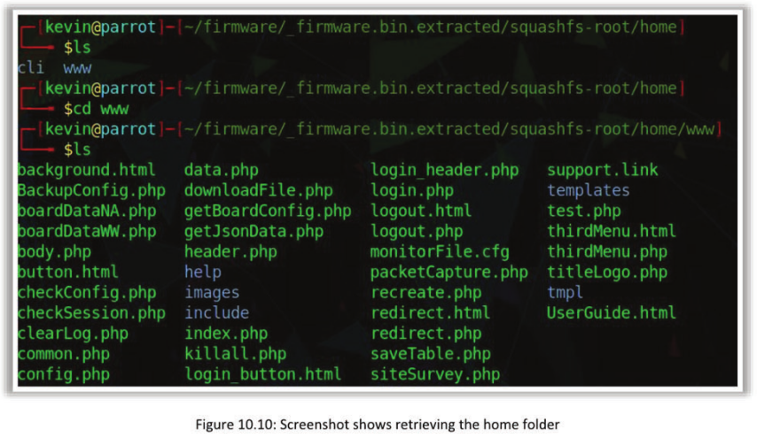
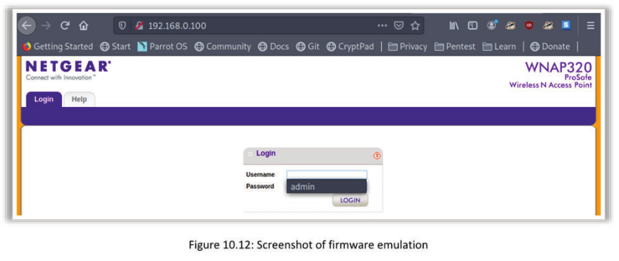

[TOC]


# IOT Penetration Testing

## Module Objective
- Establish a process for assessing loT devices
- Extract firmware from devices
- Mount and run a firmware image
- Explore loT exploitation

## IoT

- Internet of Things
- Nothing new!
- Has an address
- Another node on the network
- A layer 3 device
- The task is to determine and map the attack surface and identify the risk
  - No different than anything else

Like anything else, the Internet of Things (loT) is connected via a network interface. The most common method is a Layer 3 access that is via an IP address, then each device like any node on the network has an attack surface, this is represented by a port which is a Layer 4 interface, this is the same as any other target we go up against. These ports provide us a possible method of access, depending on how the device is setup. The problem is many of these devices have been designed and manufactured with default services running and the default configuration settings. Just as in the past, the manufactures placed these devices into circulation with ports and default credentials. This is how the Mirai botnet came to pass. Their home devices and everything else should be following the best practices principle of least services and privileges, like anything else. It is our job as testers to validate that the devices are not placed on the network with these weak configurations and do not present a vector for an attacker to leverage what is there as an attack surface that had not been changed from the defaults or at least modified to make the device a
more challenging target.

## Popular IoT Hacks
1. Phillips Smart Home

2. UFX Smart Bulb

3. The Jeep Hack

4. Belkin WeMo

5. Insulin Pump

6. Smart Door Locks

7. Hacking Smart Guns and Rifles

This is just a shortlist, there are so many different examples of these types of hacks, and they all have similar characteristics, that is an attack surface and poor design or weak configuration. This is our job as testers, and we have to map this and see what is there, so our clients know what risk they have added to their network. As has been stated, these are all devices that have some type of client-server interaction, and as a result of that, there is an opportunity to leverage and attack this interaction.

### Phillips Smart Home
- Multiple weaknesses

- Hue Worm

  - Leveraged the weakness of hard coded symmetric keys

- Blackouts
  - Authentication provided by the MDS hash of the MAC address
    - Trivial to provide as authentication
    - Led to the ability to continually turn the bulb off and cause a permanent blackout

When we review the weaknesses discovered in the Phillips Smart Home, once again, we see some basic tenets of security not being followed. Hardcoded encryption keys are not a good security practice, and the fact that they were used in more than one place is another problem with the design.

The usage of a MAC address for authentication is not anything that follows best practices either.

### LIFX Smart Bulb
- Serious vulnerabilities discovered

- Packet injection

- Compromised Wi-Fi credentials

- Take over bulbs without providing any authentication

Take over bulbs without providing any authentication
This is an older example, but once again, it is the same premise as before, not following best practices and using poor methods of security. The communication between the devices was encrypted, which provided some forms of protection. In a traditional pentest, we would be at the mercy of attempting to decrypt this traffic, but within an loT device pentest we have other methods we can use, for example, we want to look at this in its entirety, and we can do this by examining the firmware of the device, so we can determine how the packets are getting encrypted. The challenge in loT testing is determining how to extract the firmware. In the case of Lifx bulbs, JTAG gave access to the Lifx firmware, which when reversed led to the identification of the type of encryption, which in this case was Advanced Encryption Standard (AES), the
encryption key, the initialization vector, and the block mode used for encryption. Because this information would have been the same for all the Lifx smart bulbs, an attacker could take control of any light bulb and break into the Wi-Fi because the device was also communicating the Wi-Fi credentials over the radio network, which could now be decrypted.

### The Jeep Hack
- Well publicized attack
- Took control of the Jeep via weak remote access attack surface
- Vulnerabilities were in the Chrysler Uconnect system
- Open port with anonymous authentication

This is one of the most well-known attacks, but when the remote access vector of a protocol is open with  anonymous authentication, we once again see a blatant example of when the manufactures are not even putting in the most basics of protection, the screenshot is the exploit code from the official white paper of the attack. As you review the code, you see how simple this is and moreover, how weak this has been configured by the manufacturer, to allow access via a port and provide a vector where we can use a basic python module and string to connect to a bus and provide code, well nothing else needs to be said, this is notoriously weak.

Once arbitrary command execution was gained, it was possible to perform a lateral movement and send CAN messages taking control of the various elements of the vehicle, such as the steering wheel, brakes, headlights, and so on. The famous picture was when they sent the kill signal, and the Jeep was at the side of the road and completely disabled.


### Belkin WeMo
- A home automation system
- Used an encrypted based firmware
  - Once again, poorly designed and implemented
    - Updates occurred over an unencrypted channel
      - The firmware was protected where it would not allow any malicious firmware packages to be injected
        - Trivial to bypass
          - The firmware downloaded over an open channel
          - The signing key was included in the communication channel

This is an example of how the manufacturer attempted to provide protection, but once again this was poorly implemented, and this is what we do as testers, we identify the weaknesses of the devices be it from a default configuration standpoint or just a weak method of protections and implementation as we have identified here in this example. This was discovered by the researcher Mark Davis of |OActive.

There was a long list of additional vulnerabilities as well, including SQL Injection, etc. The team at FireEye posted a listing of these as well. The top screenshot is of the flash memory of the device.

Part of our research and investigation into a device is to determine the debugging ports, and the bottom screenshot reflects this type of discovery, which in this instance is UART (Universal Asynchronous Receiver/Transmitter). This could also be a JTAG (Joint Test Action Group) port. 

UART is a means of serial communication that can easily be bridged over USB via any UART-to-USB bridge. When looking for UART communication, a lot of times, you will see three to four pins that are grouped together with tracings routed to other parts of the board. To help us identify these pins, we can use a multimeter. By touching each of the suspect pins with the positive end on the pad and negative end to ground (such as the shielding), we can monitor the voltage and identify what the pins are. However, in this case, the WeMo’s circuit board silk screening was friendly enough to label exactly what pads were utilized for interfacing with the device.

JTAG is a dedicated debugging port implemented as a serial interface used for communicating with the target device.





### Insulin Pump
- Hacking the human
- Devices discovered to use clear text messages to communicate
- Made it easy to intercept and modify the insulin dosage

This example was the start of the concept of hacking the human, and it was also discovered that these were not only the devices that were using weak protections, so the process was to test these different medical devices, we have the insulin pump here then we had the pacemakers, etc.

The scary part about this insulin pump attack, when it was demonstrated there was no way to know the amount of insulin being pumped in at the time of the attack, which could be very dangerous to someone with the pump installed.

### Smart Door Locks
- A long list of vulnerabilities have plagued these
- Ability of users to become admin by modifying the user in the network traffic
- Bluetooth Low Energy (BLE) lights
  - Transmission of passwords in clear text
  - Quicklock padlock
    - Reset of the password
    - Packet containing the old and new password contained withing the communication in cleartext

This is another area that has and continues to have problems when it comes to vulnerabilities, the August smart lock allowed the network traffic to be modified from user to superuser within any protections, and any user could escalate privileges. The locks had HTTPS protection, but it was not enforced, and the pinning attributes were trivial to defeat as well.

Once again, we are seeing the fact that the manufacturers are the blame for a lot of these problems. Again, not following the best practices and simple protections that are available.

As an example, in another device, the Danalock Doorlock, one can reverse engineer the mobile application to identify the encryption method and find the hard-coded encryption key (“thisisthesecret”) being used.

### Hacking Smart Guns and Rifles
- Software has become part of firearms
- Provides capability to look at the view of the shot and make adjustments
- Via UART
  - Researchers were able to gain admin access to the Application Programming Interface (API)
  - Access provided
    - Change the bullet weight
    - The wind velocity and direction
    - Changes made without the users knowledge

There have been instances where vulnerabilities or poor design implementation has allowed different methods to bypass any of the protections that are implemented by the manufacturer. In one instance, a security researcher was able to use magnets to bypass the protections. While this is not something you would expect in a traditional engagement, it is an example of how, when we are dealing with loT devices, there are many more parameters that we have to “think out of the box” to gain access to.

## IoT Challenges
- Large variety of protocols
- No specific standard
- Many different types of frameworks that can be used
- Along list of communication protocols
- Complexities in the interface for the devices
- Chances of disparate vendors within the device itself

There are many different types of frameworks. As a result of this, it can be a challenge to assess devices. The communication protocols are many different types, for example:

- Wi-Fi
- BLE
- Cellular/Long Term Evaluation (LTE)
- ZigBee
- Zwave
- 6LoWPAN
- LoRA
- CoAP
- SigFox
- Neul
- MQTT
- AMQP
- Thread
- LoRaWA

As a result of all of these different protocols that we may encounter, there is a requirement for a variety of tools. For instance, Ubertooth One would be required to capture and analyze BLE packets, Atmel RzRaven for ZigBee, and so on.

## IoT Penetration Testing
- Similar to any other penetration test
- Difference in the way the device is integrated into the network
  - Application Gateway (AG)

- Still a form of a client server relationship, the AG is similar to a proxy server where everything with respect to devices reports to it

IT is important to note that an loT penetration test is not a lot different from our normal penetration test. Having said that, there are some differences that you need to be aware of, and we will continue to focus on those in this module.

### Abstract IoT Testing Methodology
1. Scope

2. Attack Surface Mapping

3. Vulnerability Assessment and Exploitation
4. Documentation and Reporting

As with all testing, the first thing we have to do is establish our scope and know what and when we are testing as well as the boundaries and rules of engagement that we are operating within.

Once we know the scope, then like all testing, we want to see what is the attack surface for the device and/or network we are testing. From this attack surface, we need to map the risk which is directly related to the ports that are open and what is bound to those ports and how they are protected if they are at all. Then the last thing we have to do like all testing is to build the report, and that is reliant on our documentation that we have collected from carrying out our systematic process of testing.

### Attack Surface Mapping
- Determining first what ports and services are visible on the devices

- Identifying the entry points

- Once we have mapped the surface

- Look for methods of access

  - Prioritize

  - Which vector we think is the easiest

- Build the target database

With Attack Surface Mapping, we are trying to discover what we can access on the device and from that access, what can we leverage to gain actual control of the device and or network.

This step is useful because it helps you understand the architecture of the entire solution, and at the same time, enables you to establish various tests that you would run on the product, sorted by priority. The priority of the attacks can be determined by ease of exploitation multiplied by the impact of the exploitation. In a case where the exploit is extremely easy and leads to successful compromise and retrieval of sensitive data from the device, that would be classified as a high-priority, high-criticality vulnerability. By contrast, something that is difficult to execute—with output obtained during the test that is not that useful—would be categorized as a low-criticality, low-priority vulnerability. In engagements, whenever we identify the vulnerability of high criticality, we should notify the client as well as potentially the vendor.

### IoT Architecture
- Embedded Device
- Firmware, Software and Applications
- Radio Communications

As you review the list, there is not a significant amount of difference from our normal architecture with the exception of the embedded device since it is the “thing” component in the Internet of Things. This is where we have potential challenges due to the nature of this and the fact that there is no standard that is followed.

The embedded device in an loT product can be used for several different purposes depending on the user case scenario. It could be used as a hub for the entire loT architecture of the device, it could serve as the sensor that collects data from its physical surroundings, or it could be used as a way of displaying the data or performing the action intended by the user. This is usually some matter of collection, monitor, and analysis of data and performs some sort of actions.

A good example of this is a smart home architecture, and this can consist of many different devices to include some type of gateway or hub that each one of the devices reports to. Devices like cameras, motion sensors, light bulbs, etc. 

Despite being disparate devices, the testing of the devices will be the same, and the interface into the gateway will be the same as well.

### Typical IoT Vulnerabilities
1. Serial ports exposed
2. Insecure authentication mechanism used in the serial ports
3. Ability to dump the firmware over JTAG or via Flash chip
4. External media-based attacks
5. Power analysis and side channel-based attacks

To assess the security of the device, the thinking process should be based on these questions: What are the device’s functionalities? What information does the device have access to? Based on these two factors, we can realistically estimate the potential security issues and their impact.

### Steps to Analyzing the IloT Hardware
1. Research the Device
2. Identify the components
3. Identify the debugging ports
4. Dump the flash
5. Extract/analyze the firmware

One of the challenges for the tester is dumping the flash memory.

In many cases, the flash memory is used to store the bootloader and firmware for the device. This is the core component of the device that an attacker would attempt to modify. We have two typical ways to dump the memory off of this component. You can connect to the chip itself and use a tool to dump the flash memory, and this is what is reflected in the screenshot. The other method requires you to remove the chip and use a chip-off method, and this is, of course, is intrusive and risky as well.

The top screenshot is that of connecting the test clip. The bottom screenshot is the entire test setup that was used for the dumping of the memory using a tool known as the Bus Pirate http://dangerousprototypes.com/docs/Bus_Pirate. The screenshot is from a blog post on embedded hardware hacking by FireEye.





### Example IoT Components
- Mobile Application
- Web-Based Dashboard
- Network Interface
- Firmware

Mobile applications, web applications, and embedded devices often communicate with the other components and back-end endpoints through different communication mechanisms such as Representational State Transfer (REST), Simple Object Access Protocol (SOAP), Message Queuing Telemetry Transport (MQTT), Constrained Application Protocol (CoAP), and more, which we cover briefly in the upcoming chapters. Additionally, some of the components would be collecting data and sending it to a remote endpoint on a frequent basis, which could often be also treated as a privacy violation, more aptly than a security issue. The whole focus of attack surface mapping is to ensure that you have enough information to understand all the various aspects and functionalities of the device that will help us understand the security issues in them.

The Mobile Application allows us to control the smart devices and interact with the controls of on, off, etc.

The monitoring of the device is usually via some form of a dashboard that is accessible via a web browser, and this allows for us to have the same types of web application vectors of attack as any other form of web application does.

The network interfaces represent the traditional client-server interaction, and as with any of these, the security of this is limited at best, this is one of the main areas we can use to exploit or gain access into the device, or as we have indicated numerous times is how we can use the extracted hashes and packet contents to get past the protections that are in place. This could be either an exposed port that accepts a connection to the service without any sort of authentication or service that is running a vulnerable and outdated version that has known vulnerabilities against that specific version. Previously, we have pen tested many devices that have been running vulnerable versions of components such as Simple Network Management Protocol (SNMP), File Transfer Protocol (FTP), and so on. These devices are notoriously weak and use old and vulnerable protocols.

Firmware is the heart of the device and controls the various components on the device and is responsible for the actions on the device. As with anything, this can hold the keys to the exploitation of the device. This is why the extraction and subsequent analysis of the firmware is critical with loT.

### Firmware Attacks
- Ability to modify
- Insecure signature and integrity checks
- Hard coded data
- Private certifications
- File system extraction
- Old and insecure software and protocols

### Mobile Application
1. Reverse engineering the app
2. Dumping the source code
3. Insecure authentication and authorization
4. Business and logic flaws
5. Side channel data leakage
6. Runtime manipulation attacks
7. Insecure network communication
8. Outdated libraries

### Web Application

1. Client side injection
2. Insecure direct object reference
3. Insecure authentication and authorization
4. Sensitive data leakage
5. Business logic flaws
6. Cross-site request forgery
7. Cross-site scripting

As we review the list here, we see there is nothing special in the list, this is the same as we encounter, anytime we deal with web applications and come from the list of the OWASP top 10. Again, it is the same concept of a client-server relationship.

It is important to remember that this is just a sample; there are many different methods of interaction with these devices, which will allow for more varieties of weaknesses as well.

### Radio Communication
- Notorious for weak implementation
- Depending on the protocol, special software and tools may be required
- Setting up the tools and the preparation can be a challenge
  - Different protocols present different challenges
  - Similar to the challenges of the wireless tools and their required chipsets

Common protocols that are used are cellular, Wi-Fi, BLE, ZigBee, Wave, and others. During the initial analysis process, you should also list all the different hardware and software items that are required to perform a security assessment of the radio protocols in use. Even though initially, this might appear to be an onerous task, once you have acquired the tools required to perform the assessment, it is just a matter of analyzing the communication using those tools. Some of the most common types of vulnerabilities we find in radio communication protocols and mediums:

- Man-in-the-middle attacks

- Replay-based attacks

- Insecure Cyclic Redundancy Check (CRC) verification

- Jamming-based attacks

- Ability to extract sensitive information from radio packets

- Live radio communication interception and modification

In creating an attack surface map for radio communication, we can look at the entirety of the processes and components of the device and its architecture, some of the questions to ask are:

- What are the roles of the various components involved?
- What component initiates the authentication and pairing mechanism
- What does the pairing process and procedure look like?
- How many devices are the components communicating with?
- What are the operating frequency ranges of the devices?
- The protocols in use, are they standard or proprietary

### Attack Surface Map
- List all of the components
- Prepare an architecture diagram
- Label the components and communication
- Identify the attack vectors for each component
- Rate the attack vectors

This list reflects what is required when it comes to planning for the testing of loT devices.

The initial architecture diagram provides the mechanism for the identification of all of the involved components. This often can and will take specific research, and there are online sites that can assist with this, sites like the fccid.io where you can enter the device FCC ID to discover more information about the device.

loT embedded hardware devices primarily run embedded Linux as its operating system; therefore, the process will typically involve some form of interacting with the file system just like any other testing.

Our initial research that you perform just like in any pentest is critical in creating an effective and efficient testing plan.


### Sample Architecture Diagram
This is just a simple architecture of smart home architecture, but as you see, there are a lot of different vectors that one an attacker can leverage, and two we as testers have to ensure we test for the different vectors. If you take a few minutes and start the mapping, this will quickly become a challenging environment. For example, if we look at the phone being used to query data from the devices which is a common capability, we could see that the communication is using a REST API, so that would be one area to test since each of these communications paths are over RF, all of them are susceptible to interception, so even if the application is coded securely or at least relatively secure then we have the communication channels that we need to test, each of these are potential for access using our famous types of session hijacking and man in the middle techniques.

As a reminder, these Devices can be anything that has an IP address and is part of the network.

A shortlisting of these could be as follows:

- Smart Home Gateway
- Smart home devices
- Light bulb
- Mobile application
- Thermostat
- Web Dashboard
- Web endpoints
- Databases

This is just a shortlist, and then we have to test the communication protocols, the following is offered as an example:

- Mobile app and smart home gateway communicates via Wi-Fi

- Smart home gateway and any of the smart devices communicate over Zigbee

- Mobile app and smart device communicates over BLE
- Mobile app and Web endpoint communicates over a REST API



### The Firmware
- This is the place to start
- Need to extract the firmware
- Once extracted, then we analyze it

A big part of our testing is in the process of analyzing the firmware; once we have captured the flash memory, then we need to get a copy of the firmware of the device. It is time to perform basic reverse engineering, the amount dedicated to this once the firmware is extracted will be predicated by the amount of time and scope of the engagement, the process of reverse engineering is covered in great detail in Module Fourteen.

### Sample Firmware Analysis Process
1. Get a version of the firmware
   - We can ook online as well as getting an equivalent device to get the firmware
   - Use the flash dump that we extracted

2. Reverse engineer and extract the file system and any components encountered
3. Attempt to run the firmware using tools or some form of emulation methods

Using the Internet, you can gain additional details of the device; once you have done this, you can make a list of the specifications of the device itself. A quick list of the methods to get the firmware binary are as follows:

- Vendors web site

- Search engine, community, and support forums

- Reversing the applications

- Intercepting the updating process and procedures

- Dumping from the device

Sometimes it is best when we can just get the firmware from the vendors' web site because then  we have a source that we can use that will definitely match the device, the one trick can be getting the correct version, but even if the version is no longer at the vendors' site, we can still use tools like the WayBack machine at www.archive.org to potentially download it as well.

There is also a good chance the vendor will not have the firmware available, and in that case, we have to explore different methods. 

As a point of reference, firmware usually contains a number of different components inside it, such as the file system, bootloader, and other resources.

To extract the file system from the firmware, we can either do it manually using dd, or we can use an automated approach using the tool called Binwalk.

### Binwalk
Binwalk allows you to perform analysis of firmware binaries, including things such as entropy analysis and file system extraction.



#### Binwalk to Extract the File System

A typical firmware image will end with an extension of the bin. The screenshot shows the usage of binwalk to extract a sample firmware image, and in this case, the image is in the squashfs file system, and this is common. If you want to avoid an error, you might have to install the sasquatch, which can be found at git clone https://github.com/devttys0/sasquatch.git.

The sasquatch project is a set of patches to the standard unsquashfs utility (part of squashfs-tools) that attempts to add support for as many hacked-up vendor-specific SquashFS implementations as possible.

To manually perform an extraction, you need to use your favorite hex tool and then determine the offset of the file system and use dd.

As you see, the extracted image consists of a standard Linux file system, so now the same process you use for any Linux file system can be used here.

```
binwalk -e firmware.bin
```


#### Exploring the File System
- In most cases, it is Linux or a variant of it

- Sample list of file systems

  - Squashfs

  - Cramfs

  - JFFS2

  - YAFFS2

  - ext2

- Same processes can be used

Since these devices are usually small, these file systems are often compressed, a small example of the possible compression algorithms:

- LZMA

- Gzip

- Zip

- Zlib

- Arj

Depending on what file system type and compression type a device is using, the set of tools we will use to extract it will be different.

As the screenshot shows, we discover there is a home folder and within that a www folder and within that a lot of PHP! Well, this is our bonanza of code to work with and see how well the programmer has protected and tested the security of their code. In most of these cases, not very well.

The process here is the same regardless of the device, and we have to get the firmware then, after we get that extracted, we go into normal investigation mode.

Since we have the entire code present with us in PHP, it makes it extremely easy for us to identify vulnerabilities in the code; However, in some of the cases, you would need additional analysis such as reversing a binary using tools such as IDA Pro or Radare2 or use other techniques (firmware diffing, fuzzing, etc.) to find the vulnerabilities.



## Exploitation
- We have to either have the device or use emulation

- **Firmadyne**

  **FIRMADYNE** is an automated and scalable system for performing emulation and dynamic analysis of Linux-based embedded firmware

- **Firmware Analysis Toolkit**

  A Python script tool by Additya Attify that uses and streamlines the Firmadyne tool

From the project GitHub page:
**QUOTE**:
FIRMADYNE is an automated and scalable system for performing emulation and dynamic analysis of Linux-based embedded firmware. It includes the following components:

- modified kernels (MIPS: v2.6.32, ARM: v4.1, v3.10) for instrumentation of firmware execution;

- a userspace NVRAM library to emulate a hardware NVRAM peripheral;

- an extractor to extract a filesystem and kernel from downloaded firmware;

- a small console application to spawn an additional shell for debugging;

- and a scraper to download firmware from 42+ different vendors.

We have also written the following three basic automated analyses using the FIRMADYNE system.

- **Accessible Webpages**: This script iterates through each file within the filesystem of a firmware image that appears to be served by a web server and aggregates the results based on whether they appear to required authentication.
- **SNMP Information**: This script dumps the contents of the public and private SNMP v2c communities to disk using no credentials.
- **Vulnerability Check**: This script tests for the presence of 60 known vulnerabilities using   exploits from Metasploit. In addition, it also checks for 14 previously-unknown vulnerabilities that we discovered. For more information, including affected products and CVE's, refer to analyses/README.md.

In our 2016 Network and Distributed System Security Symposium (NDSS) paper, titled Towards Automated Dynamic Analysis for Linux-based Embedded Firmware, we evaluated the FIRMADYNE system over a dataset of 23,035 firmware images, of which we were able to extract 9,486. Using 60 exploits from the Metasploit Framework, and 14 previously-unknown vulnerabilities that we discovered, we showed that 846 out of 1,971 (43%) firmware images were vulnerable to at least one exploit, which we estimate to affect 89+ different products. For more details, refer to our paper linked above.

Note: This project is a research tool, and is currently not production-ready. In particular, some components are quite immature and rough. We suggest running the system within a virtual machine. No support is offered, but pull requests are greatly appreciated, whether for documentation, tests, or code!

**UNQUOTE:**

As shown in the screenshot, the Firmware Analysis Toolkit (FAT) from Attify can be used to automate much of the firmware analysis process. The script just runs through the different commands and options for the commands that can be used and save us the time of typing them in. But like any script, the running of it will depend on the version or Python and the libraries required.

Firmware Analysis Toolkit (FAT henceforth) is based on Firmadyne with some changes. Firmadyne uses a PostgreSQL database to store information about the emulated images. However, just for the core functionality, i.e., emulating firmware, PostgreSQL is not really needed. Hence FAT does not use it.

This is one of the main reasons to use the FAT since it does not need the Postgres database that the Firmadyne tool requires.


### Firmware Emulation
- Once emulated, creates a tap interface and allows connection over the network

This is the biggest challenge, and that is getting the firmware emulation to work. It does take practice to accomplish.

If you want to set the flags and work through the debugging process, then follow the following procedure:

1. With full-system QEMU emulation, compile a statically-linked gdbserver for the target architecture, copy it into the filesystem, attach it to the process of interest, and connect remotely using gdb-multiarch. You will need a cross-compile toolchain; either use the crossbuild-essential-* packages supplied by Debian/Ubuntu, build it from scratch using e.g. buildroot, or look for GPL sources and/or pre-compiled binaries online. If you have IDA Pro, you can use IDA's pre-compiled debug servers (located in the dbgsrv subdirectory of the install), though they are not GDB-compatible.
2. With full-system QEMU emulation, pass the -s -S parameters to QEMU and connect to the stub using target remote localhost:1234 from gdb-multiarch. However, the debugger won't automatically know where kernel and userspace is in memory, so you may need to manually do add-symbol-file in gdb and break around try_to_run_init_process() in the kernel.
3. With user-mode QEMU emulation, chroot into the firmware image (optional), set LD_LIBRARY_PATH to contain the FIRMADYNE libnvram, and pass both the -L parameter with the correct path to the firmware /lib directory, and the binary of interest to QEMU. This is easiest to debug because you can attach directly to the process using gdb-multiarch, and interact directly with the process. Still, the system state may not be accurate since the host kernel is being used. It is also somewhat insecure because the emulated firmware can access the host filesystem and interact with the host kernel.



##  Module Summary
- Established a process for assessing loT devices
- Extracted firmware from devices
- Mounted and ran a firmware image
- Explored loT exploitation


## Lab 1

**IOT firmware Acquisition, Extraction, Analysis and Emulation**


