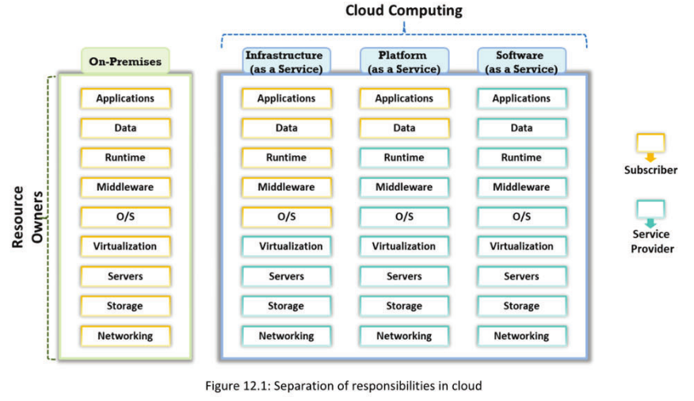

[TOC]


# Cloud Penetration Testing

## Module Objective

This module provides an insight about various concerns and security issues associated with cloud computing. It helps you in learning how to implement a comprehensive penetration testing methodology for assessing security of organization's cloud infrastructure. It also helps you to understand the importance of securing the company’s data stored on cloud and learn the scope of cloud pen testing; and its methodology provides knowledge about the compliance and governance issues that companies face in implementing a cloud infrastructure and helps to detect them. It also explains the processes of verifying user authentication, data retention, and performing security analysis of cloud.

- Cloud Penetration Testing Should be Conducted at Both the Application and Infrastructure Levels.

## Cloud Computing Security and Concerns
- Security of the cloud is designed and implemented with the help of certain security controls and compliance
- There is not much difference in security controls and compliance used in cloud and those used in a typical IT environment
- However, cloud service faces certain other risks, in addition to traditional IT security risks
- Data security is the major concern regarding the cloud, as the organization's critical data can be dispersed ‘geographically without the organization having control of it
- Risks arise according to models employed, operation models, and the technology used to enable the cloud service

Security of the cloud is designed and implemented with the help of certain security controls and compliance. There is not much difference in security controls and compliance used in cloud and those used in a typical IT environment. However, cloud service faces different risks in addition to traditional IT security risks.

Data security is the major concern regarding cloud because it disperses the company's critical data is dispersed geographically without the organization having any control of such dissemination. Risks arise according to models employed, operation models, and the technology used to enable cloud service.
Some of the major cloud computing security concerns are as follows:

- Shared cloud computing services
- System vulnerabilities
- Global distribution of data

* Compliance violations and regulatory actions
* Loss of control over customer actions
* Malware cyberattacks

* Lack of disaster recovery plans

## Security Risks Involved in Cloud Computing
- Risk profile is not known
- Account or service hijacking
- Data loss or leakage
- Vulnerabilities in shared technology
- Malignant insiders
- Insecure application programming interfaces
- Improper use of cloud computing

**Data Breach/Loss**
Data loss issues include:

- Data deletion, modification

- Misplaced, lost, or stolen encryption keys

- Illegal access to the data in cloud due to improper authentication, authorization, and access controls

- Misuse of data by Cloud Service Provider (CSP)

Improperly designed cloud computing environment with multiple clients is greater risk to data breach because a flaw in one client’s app will allow the malicious hackers to access other client’s data. Data loss or leakage is highly dependent on cloud architecture and its operation.

**Abuse of Cloud Services**
Small-to-midsized companies may have difficulties in understanding cloud computing and utilizing them. In some cases, the negative effects of improper use of cloud may override the advantages. The malicious hackers may pretend to be genuine users and obtain anonymous access to cloud services to gain direct access to cloud servers and databases and perpetrate various cyberattacks. They may perform these, such as password and key cracking, building rainbow tables, CAPTCHA-solving farms, and launching dynamic cyberattack points as well as hosting exploits on cloud platforms and malicious data, botnet command, or control and DDoS.

**Insecure Interfaces and APIs**
Users may access and interact with their cloud computing services using interfaces or APIs. Security of these interfaces and APIs, such as authentication, access control, encryption, and monitoring may impact the security of cloud services. As the interfaces are accessible remotely, hackers may exploit these security issues to compromise the services.

**Insufficient Due Diligence**
Ignorance of CSP’s cloud environment pose risks in operational responsibilities, such as security, encryption, incident response, and more issues, such as contractual issues, design, and architectural issues, etc.

**Shared Technology Issues**
Most underlying components that make up cloud infrastructure (for example, GPU, CPU caches, etc.) do not offer strong isolation properties in a multi-tenant environment, which enables hackers to cyberattack other machines if they are able to exploit vulnerabilities in one client’s apps.

laaS vendors use the same infrastructure to cater to multiple clients and most of the shared components do not offer strong isolation properties. To address this issue, vendors install virtualization hypervisors between guest OSs and the physical resources to contain loopholes. Issues include Rutkowska's Red and Blue Pill exploits and Kortchinsky's Cloudburst presentations.

**Inadequate Infrastructure Design and Planning**
An agreement between CSP and customer states the quality of service that the CSP offers, such as downtime, physical and network-based redundancies, standard data backup, restoring processes, and availability periods.

At times, cloud service providers may not satisfy the rapid rise in demand due to shortage of computing resources and/or poor network design (for example, traffic flows through a single point, even though necessary hardware is available) giving rise to unacceptable network latency or inability to meet agreed service levels.

**Conflicts between Client Hardening Procedures and Cloud Environment**
Certain client hardening procedures may conflict with a cloud provider’s environment and implementing them is impossible. The reason for this is because a cloud is a multi-tenant environment, the colocation of many customers certainly causes conflict for cloud providers, as customers’ communication security requirements are likely to diverge from one another.

**Loss of Operational and Security Logs**
The loss of operational logs makes it difficult to evaluate operational variables. The options for solving issues are limited when no data are available for analysis. Loss of security logs may occur in case of under provisioning of storage. 

**Malicious Insiders**
Malicious insiders are disgruntled current/former employees, contractors, or other business partners who have/had authorized access to cloud resources and could intentionally exceed or misuse that access to compromise the confidentiality, integrity, or availability of the company’s information. Threats include loss of reputation, productivity, and financial theft.

**Illegal Access to Cloud**
Weak authentication and authorization controls could lead to illegal access, thereby compromising confidential and critical data stored in cloud. 

**Privilege Escalation**
A mistake in the access allocation system such as coding errors, design flaws, and others may result in a customer, third party, or employee obtaining more access rights than required. This threat arises because of authentication, authorization, and accountability vulnerabilities, user provisioning and deprovisioning vulnerabilities, hypervisor vulnerabilities, unclear roles and responsibilities, misconfiguration, and others.

**Cotenant Activities**
Cloud uses shared resources, thus malicious activity of one co-tenant might affect the reputation of the other, resulting in poor service delivery, data loss, etc. that bring down the company’s reputation. This threat arises because of resource isolation vulnerabilities in the hypervisors, and others.

**Natural Disasters**
Based on geographic location and climate, data centers are prone to natural disasters, such as floods, lightening, earthquakes, etc. that may affect cloud services. 

**Hardware Failure**
Failure of hardware components, such as switches, servers, routers, access points, hard disks, network cards, and processors, in data centers may make cloud data inaccessible. Majority of hardware failures happen because of hard disk problems. Hard disk failures take a lot of time to track and fix because of their low-level complexities. Hardware failure may lead to poor performance delivery to customers and may damage the business.

**Supply Chain Failure**
This threat arises because of incomplete and nontransparent terms of use, hidden dependency created by cross-cloud apps, inappropriate CSP selection, lack of supplier redundancy, and others. Cloud providers outsource certain tasks to third parties. Thus, the security of cloud is directly proportional to security of each link and the extent of dependency on third parties.

A disruption in the chain may lead to loss of data privacy and integrity, services unavailability, violation of SLA, economic, and reputational losses resulting in failure to meet customer demand and cascading failure.

**Modifying Network Traffic**
User provisioning, deprovisioning, communication encryption, and other network vulnerabilities result in network traffic modification by the hackers. In cloud, modification of network traffic may cause loss, alteration, or theft of confidential data and communications.

**Isolation Failure**
Multitenancy and shared resources are the characteristics of cloud computing. Strong isolation or compartmentalization of storage, memory, routing, and reputation between different tenants is lacking. Because of isolation failure, hackers try to control operations of other cloud customers to gain illegal access to the data.

**Cloud Provider Acquisition Countermeasure**
Acquisition of cloud provider may increase the probability of tactical shift and may impact nonbinding agreements at risk. This could make it difficult to cope up with the security requirements.

**Management Interface Compromise**
Improper configuration, system and app vulnerabilities, remote access to the management interface, and other vulnerabilities allow the hackers to compromise management interface. Customer management interfaces of cloud provider are accessible via internet and facilitate access to large number of resources. This enhances the risk, particularly when combined with remote access and web browser vulnerabilities.

**Network Management Failure Countermeasures** 
Poor network management leads to network congestion, misconnection, misconfiguration, lack of resource isolation etc. that affect services and security.

**Authentication Cyberattacks Countermeasures**
Weak authentication mechanisms (weak passwords, reuse passwords, etc.) and inherent limitations of one-factor authentication mechanisms allow the hacker to gain unauthorized access to cloud computing systems.

**VM-Level Cyberattacks**
Cloud computing extensively uses virtualization technologies offered by several vendors including VMware, Xen, Virtual box, and vSphere. Threats to these technologies arise because of vulnerabilities in the hypervisors.

**Lock-In**
Lock-in threats leave the clients unable to shift from one cloud service provider to another or in-house systems due to the lack of necessary tools, procedures, or standard data formats for data, app, and service portability. This threat is due to the inappropriate selection of CSP, incomplete and nontransparent terms of use, lack of standard mechanisms, etc.

**Licensing Risks**
The company may incur huge licensing fee if the CSP charges the software deployed in cloud on a per-instance basis. Therefore, the company is advised to always retain ownership over its software assets located in cloud provider environment. Risks to licensing occur because of incomplete and nontransparent terms of use.

**Loss of Governance**
In using cloud computing services, CSPs have more control over the security related issues compared to the customers. Sometimes, such issues may not be part of the agreement, which leaves the stored data defenseless. Reasons for this threat include uncertain roles and responsibilities, shortage of vulnerability detection process, lack of jurisdiction, unavailability of audit, and others. Loss of governance results in not
complying with security requirements, lack of confidentiality, integrity, and availability of data, poor performance, and quality of service, and so on.

**Loss of Encryption Keys**
Poor management of keys and poor key generation techniques result in loss of encryption keys required for secure communication or systems access and provide a potential hacker with the possibility to access unauthorized assets.

**Risks from Changes of Jurisdiction**
Cloud services may have databases in multiple locations, including places with higher risk possibility and countries with weak digital laws and legal framework. This might result in enforced disclosure or seizure of the data or information system.

**Undertaking Malicious Probes or Scans**
Malicious probes or scanning allows a hacker to collect sensitive information leading to loss of confidentiality, integrity, and availability of services and data. 

**Cloud Service Termination or Failure**
Termination of cloud service because of non-profitability or disputes might lead to data loss, unless customers protect themselves legally. Many factors, such as competitive pressure, lack of financial support, and inadequate business strategy, could lead to termination or failure of cloud service.

**Improper Data Handling and Disposal**
When clients request data deletion, the service provider may not wipe the data completely, this can result in the data traces and metadata to remain on cloud. The hackers may use these traces to recover the data after hacking the infrastructure.

**Loss or Modification of Backup Data**
The hackers might exploit vulnerabilities, such as SQL injection and insecure user behavior (for example, storing or reusing passwords), to gain illegal access to the data backups in cloud. After gaining access, the hackers might delete or modify the backup databases. Lack of data restoration procedures in case of backup data loss keeps the service levels at risk.

**Compliance Risks**
Lack of control over audits and industry standard assessments result in compliance issues. Companies need to comply with the standards; else, the services may be at risk if they do not fulfill the necessary requirements or if the service provider outsources cloud management to third parties.

## Role of Penetration Testing in Cloud Computing
1. The cloud service provider (CSP) should ensure cloud security to the cloud service consumers and clients
2. The cloud service provider should perform periodic pen tests on the cloud environment to ensure its security
3. The pen tester should test the target cloud service against the implementation of all security controls, as well as for compliance, for a complete security ass

Advancement in technology has improved benefits of cloud, such as scalability, ease of use, etc., which has led to multifold adoption of cloud across various companies. This has also resulted in increased risk factors and has put cloud on the radar of hackers as a premium target. Therefore, the hackers are trying to find vulnerabilities and security flaws in systems, app, networks, and servers that may provide access to cloud and its data.

The cloud service provider (CSP) should ensure cloud security to the cloud service consumers and clients. Therefore, we recommend both companies to conduct regular pen tests of cloud. Cloud pen testing is the process of evaluating security posture of cloud. It involves detection of potential vulnerabilities resulting from hardware or software flaws, shared resources, system misconfigurations, operational weaknesses, and other sources.

Pen testing a cloud ensures confidentiality, integrity, and security of the data it hosts. It helps the companies to ensure that all their information assets are auditable, comply with industry regulations, and do not jeopardize their data and app.

The process includes in-depth evaluation of all the components such as apps, networks, servers, and databases that form cloud. The tests will analyze complete security of cloud and its resources to ensure security of hosted data, apps, and services.

Pen testing will help the companies in complying with the local and international standards to avoid legal issues, detecting malicious insiders, finding the weak security policies and configurations, and determine the weak network spots.

Black box pen testing (that is, testing cloud infrastructure without prior knowledge of cloud) is the most effective method of assessing cloud security. Cloud pen testing may be either manual, using industry standard techniques, or automated, which includes use of software apps, such as Core Cloudinspect, CloudPassage Halo, Alert Logic, and SecludIT.

## Do Remember: Cloud Penetration Testing
1. Cloud Penetration Testing is not totally different from the other types of penetration testing
2. It is performediin a similar way as traditional penetration testing in a typical IT environment

3. It follows the same tradition penetration testing steps: reconnaissance, vulnerability assessment, vulnerability exploitation and post-exploitation

4. The expectation from cloud penetration testing is the same as in the traditional penetration testing, such as reduced attack surface area, defense in depth, etc

5. Some attack vectors also remain the same for cloud environment, such as application-level vulnerabilities, operating system vulnerabilities, database vulnerabilities, etc.

6. In addition, the cloud can be under risk of certain cloud specific attack vectors


Cloud Penetration Testing is not totally different from the other types of penetration testing. It is performed in a similar way as traditional penetration testing in a typical IT environment. It follows the same tradition penetration testing steps: reconnaissance, vulnerability assessment, vulnerability exploitation and post-exploitation. The expectation from cloud penetration testing is the same as in the traditional penetration testing, such as reduced attack surface area, defense in depth, etc. Some attack vectors also remain the same for cloud environment, such as application-level vulnerabilities, operating system vulnerabilities, database vulnerabilities, etc. In addition, the cloud can be under risk of certain cloud specific attack vectors.

We recommend the testers to check the following points before performing cloud pen testing:

- Go through the Service Level Agreement (SLA) to check if CSP and client have developed and implemented proper security policies
- Ensure appropriate division of responsibilities between CSP and subscriber
- Check the SLA document and track the record of CSP as well as identify role and responsibility to maintain cloud resources
- Verify the usage policy of computer and internet to ensure that the CSP has implemented it as per the proper policy
- Observe cloud networks for unused ports and protocols and ensure that the CSP blocks these services
- Check if the CSP encrypts the data before storing it in cloud servers by default
- Find if cloud uses two factor authentication service and validate the OTP to ensure the network security
- Check the SSL certificates for cloud services in the URL and make sure certificates are purchased from repudiated Certificate Authority

## Scope of Cloud Pen Testing
**Web application / Web service Penetration Testing**

- Includes testing application and web service security in your cloud 

**Network Penetration Testing**

- Includes the pen testing network, databases, firewalls, and other systems in your cloud network

Cloud Penetration Testing

-  Includes the conduction of various security assessment steps against risks specific to a cloud that could expose it to serious threats

Determining the scope of cloud pen testing is important because cloud security is a responsibility shared between the CSP and the client and offers a multi-tenant environment. Cloud also includes dynamic resources, such as dynamic IP addresses, scalable storage, architecture, networks, client apps, etc.; the testers need to calculate the scope very cautiously to prevent accidental testing of resources not included in the scope.

Therefore, we recommend the testers to determine the scope based on the contracting party, cloud deployment model, offered service model, technologies deployed, and the SLA. The testers may ask the contracting party to provide the detailed of the test or evaluate the test based on the type of cloud service provided. They are advised to also read the SLAs signed between the CSP and clients using clouds to understand the limitations, service, and deployment model, as well as type of access provided.

The scope of cloud pen testing consists of three segments including:

- **App/Web Service Penetration Testing**: App refers to the software program that allows clients and users to sign in onto cloud to access, store, and exchange data. The type of service determines the developer of the app and its deployment side. We recommend the testers to test the app and its services for any vulnerabilities and weaknesses.
- **Network Penetration Testing**: On the CSP side, cloud network consisting of the network connecting cloud storage media with the servers includes databases, firewalls, and other systems whereas the client network may include systems used to access cloud app and routers connecting the systems with the internet.

- **Cloud Penetration Testing**: Cloud pen test refers to evaluation of security across virtual machines, installed apps, and operating systems in a cloud. It includes conducting various security assessment steps against risks specific to a cloud that could expose it to serious threats.

## Perform network penetration testing on the cloud in the way the traditional network penetration testing is done.
## Understand Shared Responsibilities in Cloud
- Before proceeding with cloud penetration testing, penetration tester has to understand that security of the cloud is a shared responsibility
- This will help you understanding the scope of the penetration test

In a cloud environment, the shared responsibility presents various limitations based on the type of service cloud is offering. In such cases, we recommend the companies conducting the test to limit it to the resources they control and also ensure that the tests do not disrupt any services or result in failure of network or app leading to losses for other parties.



Based on the resources a company controls, the responsibilities of CSP and the clients vary in different cloud services as follows:

- **Infrastructure as a Service (laaS)**: CSP controls the hardware, network, storage, servers, and virtualization part of cloud while the client will control the operating systems, services, data, and apps on cloud. As this service provides clear responsibility of resource, both the parties will be responsible to perform pen tests of their resources.

- **Platform as a Service (PaaS)**: In PaaS, the client will be responsible for the data stored on cloud and apps running on it while the CSP will be controlling all the other resources. Therefore, the pen testers on client side may analyze the security of apps whereas the CSP side testers will be able to analyze the remaining resources.

- **Software as a Service (SaaS)**: In SaaS, CSP will be controlling all the resources except for the data stored on cloud and may perform complete pen test of cloud. The client will not be able to assess security of any of the resources but will be able to demand regular pen reports to ensure that cloud is secure.

Cloud Penetration testing is not allowed in SaaS cloud due to the impact of the infrastructure   and the difference in the level of responsibilities. It is allowed in PaaS and laaS with the   coordination of CSP.

The deployment model of cloud, such as public, private, and hybrid, may impact the limitations of pen testing. The public model has more limitations as various companies may be part of it. The private cloud model has only one company using cloud to store and offer its services. The hybrid model is the most complex and has more limitations as it comprises companies using cloud as private and public service.

Another limitation of cloud pen testing that we recommend is that the tester to not perform DDoS cyberattacks on the service, as it may impact the entire network and other crucial resources and result in unavailability of complete cloud.

In a cloud, we recommend the testers to not use the pivot cyberattack, which uses a compromised system in a network as a base to cyberattack other systems. These cyberattacks may result in compromise of the resources belonging to other tenants.

## Understand Penetration Testing Process, Policies, and Limitations
Before conducting any type of penetration test

- The penetration tester must first research and understand the process, legal requirements, policies,
  and procedures for penetration testing recommended by cloud provider

- Failure to comply with these can lead to significant problems

- Penetration tester must understand limitations, such as:

  - Cloud provider may enforce restrictions by specifying what is and is not permitted during the
    pen testing process

  - Cloud penetration testing is not Permitted in SaaS clouds due to the potential impact on
    infrastructure and the difference in the separation of responsibilities

  - It is permitted in PaaS and laas, with the coordination of cloud service provider (CSP)

- Penetration Tester must notify the CSP before performing a penetration test
- CSPs do not appreciate unannounced penetration testing

## Identify the Type of Cloud to be Tested
- Identify the type of cloud under test

We recommend the testers Identify the type of cloud under test (i.e.) identify if the company they are testing is a cloud provider or tenant. It is also possible that the company acts as a cloud provider as well as tenant. This will help in determining type of cloud services the testers target and define the scope of cloud pen test. Different types of clouds based on the service provided are as follows:

- Infrastructure as a Service (laaS): In laaS, cloud provider supplies hardware and network connectivity to the tenant and the tenant is responsible for the Virtual machine and everything that runs within it. For example, rackspace, amazon web services, etc.

- Platform as a Service (PaaS): In PaaS, cloud provider supplies all the components required to run the app and the tenant supplies the app they wish to deploy. For example, Microsoft Azure, CloudBees, etc.

- Software as a Service (SaaS): In SaaS, cloud provider supplies the app and all the components required to run it. For example, salesforce, mailchimp, etc.

The cloud service model directly affects the scope of testing, as it determines the resources controlled by the target company and if the test is possible. Therefore, we recommend the testers to identify the type of cloud services offered prior to initiating the tests.


## Identify What is to be Tested in the Cloud Environment
- First, identify the systems/instances and applications that the client wants to get tested
- You will find it in your scoping and engagement letter

## Identify Tools for Penetration Testing
1. Identify tools that automate testing and fulfill requirements
2. You can choose from on-premises and cloud-based pen testing tools for your cloud penetration test
3. While on-premises tools are popular, cloud-based pen testing tools can be more cost-effective

We recommend you to find the tools that may help you in performing different tests on cloud environment based on cloud type and tests the company wants to conduct and to find the tools that may completely automate the process and meet the pen goals of the company.

## Perform Cloud Reconnaissance
- In traditional network penetration testing, you will start your penetration test with reconnaissance phase activities like mapping network range, port scanning, ping sweeping, etc.

- However, in cloud penetration testing, you need to start your penetration test by looking at your client’s
  cloud configuration

**You need to look for:**

- List of publicly accessible resources
- Security groups
- Routing tables, network ACL
- Subnets
- Permissions
- Identity and Access Management (IAM) policies

In traditional network penetration testing, you will start your penetration test with reconnaissance phase activities like mapping network range, port scanning, ping sweeping, etc. However, in cloud penetration testing, you need to start your penetration test by looking at your client’s cloud configuration. In performing pen testing as well as vulnerability scanning, information about the target will play an important role. Information refers to the details such as hardware, software, networks, databases, operating systems, and their versions to find the known vulnerabilities present on cloud.

Reconnaissance refers to the process of searching and gathering the information about a target to detect its weaknesses and flaws. The testers perform cloud reconnaissance to identify the security flaws and vulnerabilities and exploit them to penetrate cloud security or simulate cyberattacks.

As a pen tester, we recommend that you look for the following components and resources of cloud to perform successful test:

- List of publicly accessible resources
- Security groups

- Routing tables, network ACL

- Subnets

- Permissions

- Identity and Access Management (IAM) policies

## Check for Lock-in Problems
1. “Lock-in” refers to a situation in which a subscriber cannot switch to another CSP
2. Lock-in may lead to a severe impact on business services if the particular CSP discontinues its services
3. Check the service-level agreement (SLA) between the subscriber and cloud service, and determine the provisions for switching over to other CSPs

Vendor lock-in problem is the major drawback of cloud computing. Lock-in” refers to a situation in which a subscriber cannot switch to another CSP. It is the act of making a customer dependent on a vendor for products and services and unable to use another vendor without substantial switching costs.

Lock-in may lead to a severe impact on business services if the particular CSP discontinues its services. The lock-in problem occurs when a company wants to change its cloud providers and not able to move apps or data across different cloud services, due to difference in the operating systems and configurations of resources and services of cloud providers. The incompatible resources, settings, and configurations make it difficult for the clients to interoperate, shift, or manage data and services, and collaborate with other customers or vendors. Therefore, we recommend the client to have flexibility to change cloud providers as per the business requirement.

The testers may access and read the SLAs and other documents related to cloud service contract to understand the lock-in terms and conditions. Determine the terms and conditions the subscriber needs to follow to migrate to other clouds. Ensure that the client does not face any lock-in issues with cloud service.

## Check for Governance Issues
As testers, we recommend you to check the SLA document and track record of CSP to find if it
had any governance issues in the past and to check for the following issues and processes to
find if the client may have governance issues with the CSP:

Check the service-level agreement (SLA) document, and track the CSP to determine:

- Roles and responsibilities of the CSP and subscribers in managing the cloud resources including infrastructure, data, and security systems

- Any discrepancy in SLA clauses and their implementation

- Visibility of the CSP’s audit, certification, and vulnerability assessment processes

- Hidden dependency to resources outside the cloud

- Lack of transparency on the use of standard technologies and storage of data in multiple jurisdictions

- Source escrow agreement

- Jurisdictions over CSP- for SLA-related issues

- Completeness and transparency in terms of use

- Cloud asset ownership
  

## Check for Compliance Issues

1. Compliance to PCI, SOX, and other acts is a major concern for shifting to cloud computing
2. Check the SLA for whether the CSP is regularly audited and certified for compliance issues
3. Determine the regulations that the CSP complies with
4. Check the responsibilities of the CSP and subscribers in maintaining compliance, and check whether the SLA provides transparency on this issue

We recommend the testers check if cloud services abide to the regulations and standards of all the regions, where the client is operating or offering services. Check if the service is compliant with international standards for data protection belonging to the different industries served by the client. Some of the standards include PCI for banking, SOX for corporate disclosure, etc. 

We recommend you read the SLA documents carefully to find if the CSP performs regular audits and tests of the resources used to offer cloud services. Determine the regulations that CSP complies and check if they meet the requirements of the client. Check the responsibilities of the CSP and subscribers in maintaining compliance, and check whether the SLA provides transparency on this issue.

Some of the compliance issues presented by using cloud services to store, access, and manage information belonging to various companies include:

- **Privacy compliance**: We recommend that you check if the cloud provider is able to provide proper security to the sensitive client data stored on cloud. Cross examine the privacy of data offered with the local laws and SLAs signed between the subscriber and GSP.

- **Geographical compliance**: Cloud computing is a globally accessible service and a CSP residing in one or more nations may offer services to companies residing in other nations. All the countries have different approach to data security and compliance. For example, a country might have provisions to access and verify data stored on databases stored in it in case of civil or legal issues while the client’s country may have no such laws. Therefore, we recommend the testers verify if the cloud provider complies with data security norms of all the nations they provide services from and to, as well as check
  if it fits the client's data security policies.

- **Industry compliance**: Companies selecting cloud services may be from different industries and may have different data and apps to store or run on cloud environment.   We recommend these companies to strictly operate under the defined industrial   standards, regulations, and security laws. Therefore, we recommend the testers to understand the industrial regulations the client company to comply with and check if cloud services comply with them.

  **Factors of compliance**

  The testers may evaluate the following factors to see if cloud services comply with all the regulations:

- **Accessibility**: Check for all the users and authorities having access to the data stored in client using logs to ensure that only authorized personnel may access it. Verify the processes that determine users and their access rights. Ensure that the cloud provided privileged access to limited and authorized personnel only, and only the client has complete authority to escalate privileges of any user.
- **Location**: Request the CSP to provide data about the location of all databases storing the client data and servers providing the access.

  * **Platform integrity and security**: Determine the technology used to store, process, and transfer data across cloud. Ensure that the CSP uses the latest technology with all the updates installed to provide data integrity and security.
    
  * **Alerting systems**: Find if the CSP has installed any alerting systems on cloud that reports all the security issues and if there is any process of reporting a security incident to the client. The alerts are also required to include details about the severity of incident, impact on the client and actions required.

- **Auditing**: We recommend the testers to find the process of auditing and reporting followed by the CSP and to ensure that it meets the industrial standards and regulations. Check the regulations followed by the CSP and its compliance with various sectors of the industries.

## Check for Right Implementation of Security Management
- Check whether the right employee(s) with the right knowledge is appointed to look for cloud
  security

- Check whether the right set of policies and procedures are implemented to ensure cloud
  security

- Check whether proper security and business-continuity-process models are implemented

The proper security management process assists the company in finding and fixing the various security vulnerabilities and risks. It includes regular audits, scans, and checks of all the hardware devices and software programs to find missing updates, vulnerabilities, and configuration flaws. This will help the company to mitigate the risks and reduce the impact of cyberattacks that exploit security shortcomings.

Check if the company has hired employees having fair knowledge of working with cloud based technologies. Verify the different security, authentication, and authorization processes these employees follow. Check if the employees working on ensuring security of cloud have right knowledge and if they use all the necessary tools.

We recommend the testers verify if the client company has implemented necessary policies and procedures regarding the use of cloud services. We recommend the company have proper policies regarding system settings, network, access, authorization, remote access, and proper physical access procedures across all it branches. It is advised to implement strict employee, device, email, and software policies to ensure secure cloud usage.

We recommend the companies check whether proper security and business-continuity-process models are implemented. Check whether companies have process for risk assessment, vulnerability assessment, risk capture, risk mitigation, etc. We advice you to also check if the company has implemented proper processes for handling security incidents by deploying proper backup and disaster recovery mechanisms. Check for idle resources the company has in reserve to implement business continuity process.

## Check the Cloud for Resource Isolation

CSPs use multi-tenant and multi-deployment models to provide cloud services to the client. Improper isolation of data, app, and other client resources will impact resources of one client when other client is over using the resources or is under cyberattack. Therefore, we recommend the testers to always check if the CSP provides isolation of resources in cloud. Penetrations may check resource isolation in a cloud using the following methods.

* Check if activity of one subscriber affects the others: We recommend you check if the performance of other cloud tenants is impacting the quality of service. Analyze the resource and bandwidth offered during normal hours and peak hours. Examine the logs and find service drops, slower connection speeds, inability to rescale the space, and other activities.

* Check the CSP’s client feedback and expert reviews: Go through the CSP website, forums, and other social media campaigns to read the customer feedback, complaints, and expert reviews regarding the services provided as well as interruptions. Frequent complaints, bad feedback, and poor reviews display that the services are at fault.

- Check the track record and any security of the CSP’s services: Look at the past performance of cloud and verify if the CSP has any previous issues regarding the services and resource isolation activity. Check if the same issues exist on cloud by communicating with the users using same services.

## Check whether Anti-Malware Applications are Installed and Updated on Every Device
- Check to ensure that each component of the cloud infrastructure, ie., data center, access points, devices, and suppliers, is protected using appropriate security controls
- Check for updates, outbreak alerts, and automatic scans
- 70 percent of businesses estimated some chance that a severe data breach could put the company out of business (McAfee Labs report)

We recommend the testers to ensure security of all the components used to access or build cloud services, such as system, app, server, database, routing devices, data center, access points, devices, and suppliers, etc. All these devices are also recommended to be enabled to handle and avert any malware cyberattacks targeted towards cloud. Therefore, ensure that all the components have antimalware apps along with facility to install regular updates automatically.

Each component may have a different malware component cyberattacking it, based on the operating system, functionality, and other specifications. 70 percent of businesses estimated some chance that a severe data breach could put the company out of business (McAfee Labs report). These components are recommended to contain proper antimalware apps that may detect customized risks and alert the administrator about the cyberattack.

You may use the audit reports to find all the components and devices at the client location as well as the antimalware solutions installed on them. You may also use manual methods of testing and verifying the apps installed on them.

## Check whether Firewalls are Installed at Every Network Entry Point
- Check whether the firewalls are installed at every network entry point
- Unused ports, protocols, and services should be blocked

Firewalls monitor incoming and outgoing network traffic and decide whether to allow or block specific traffic based on defined set of security rules. They also create logs of averted traffic along with other details. Therefore, we recommend the testers manually check if the CSP has installed firewalls at every network entry point to provided cloud services and verify their effectiveness in preventing transmission of malicious traffic.

We recommend you check the service provider's firewall implementation policy to find details about the type of firewall, update type and schedule, firewall rules, etc. Check the firewall logs and network configuration based on the firewall settings. We recommend the testers check the list of persons who may access the firewall, modify the configuration, and perform regular audits.

Finally, check the alert mechanism of the firewall and the process of managing the alerts and reports in the company. Ensure that the firewall is up to date and is capable of blocking all kinds of malicious traffic. Also ensure unused ports, protocols, and services are blocked.

## Check that Strong Authentication is Deployed for Every Remote User
- All remote users should use an eight-character alphanumeric password
- Two-factor authentication should be used to validate those using an OTP (one-time password) for
  accessing the network to ensure security

In cloud computing, the major risk is the process of establishing a secure environment supported by strong authentication mechanism. In most of the cases, the client will be responsible for implementing a strong password policy for authentication of users trying to access cloud either from local or remote locations. The process is to ideally include a two-factor authentication process as well.

As a tester, we recommend you check if the client has implemented strong authentication policies for users accessing cloud services and if the company has a good password policy and if it has implemented it successfully.

We recommend that the strong authentication policy to include the following:

- The password to have at least eight characters that is alphanumeric in nature

- Include two-factor authentication to validate users by sending OTP (One Time Password) for accessing the network to ensure security
- The server to use private/public PKI key pairs to encrypt the transferred data
- Use encrypted communications only, such as SSH or VPNs
- Deploy MAC address or IP address filtering
- Deny telnet access to the unit, as it does not encrypt the communications channel

## Check the SSL Certificates for the Cloud Services in the URL

1. Check the cloud services for SSL encryption in the access URL, security certificates from reputed vendors, and security pad locks
2. Check whether a VPN and secure email services are used for communication
3. Check security and privacy policies of the cloud service

To ensure the safe and secure file transfers to/from cloud servers, we recommend the tester to ensure that the CSP uses encryption on the transport layer of cloud. You may check the following to ensure that the CSP has proper encryption mechanism deployed:

- **Check cloud services for TLS encryption**
  Transport Layer Security (TLS) encryption is essential for the transfer of files to/from cloud, as it establishes an encrypted link between cloud server and web browser of the user. Installing the SSL certificate on a cloud server activates the secure http protocol (https) and a padlock. The padlock and https depict that the connection established between cloud server and user’s web browser is completely secure.

- **Check whether cloud uses VPN and secure email services for communication**
  Virtual Private Network (VPN) uses various techniques such as tunneling for implementing a secure communication over the network. It encrypts the files and ensures that nobody on the public network could read the files, except the person having the right decryption key. Hence, we recommend the testers ensure the use of VPN services to secure file transfer in cloud environment.

  Various companies use virtual mail servers in the cloud to handle company mails and messages. We recommend the testers to ensure the security of these mail messages with use of proper encryption and security mechanisms.

- **Check security and privacy policies of cloud service**
  Security and privacy policies of cloud service protect not only the integrity of systems and the data itself, but also maintain their customers’ privacy.

## Check whether Files Stored on the Cloud Servers are Encrypted
- Check whether data stored in cloud servers is encrypted, by default
- Determine the algorithms used to encrypt the data
- Check whether CSPs or service users hold the algorithmic keys for encryption

We recommend CSPs to implement methods to encrypt not only the transferred files, but also the files stored on cloud by default. We recommend them to use strong algorithm to encrypt the data and use combination of public and private key pairs to encrypt the data. Encrypting the stored files will help in securing the data even if the hackers have gained unauthorized access to cloud.

We recommend you verify the algorithms that CSP uses to secure the data. Find the details of the authorities having access to the algorithm and its keys. It is important because, these keys may allow the users to decrypt the stored data.

## Check the Data Retention Policy of Service Providers
1. Check the data retention policy of service providers

2. Determine if they are bound by the law of the land to disclose the data to third parties such as law enforcement agencies
3. Check the duration of the data retention in the cloud and procedures to completely erase the data from the cloud
4. Check how data retention will be handled, in case the service provider is acquired by another service provider or ceases to exist for other reasons

Data retention has become a big issue in financial services for regulatory and risk management reasons like the sudden market fall, sub-prime mortgage meltdown, financial standards caused by computer-generated algorithmic trades. We recommend you ensure that the cloud provider policies and data retention polices meet the company’s needs and comply with internal corporate policy. For a cloud service provider, data retention assurance demonstration is easy when compared with data destruction. Make sure that the CSP perform regular backups and recovery tests to assure logical segregation and controls.

Find if the CSP has a data retention policy by reading the SLA document carefully. We recommend the testers evaluate the CSP’s data retention policy and check its terms and conditions. Determine if the data retention policy of the CSP complies with the laws and regulations of the client country or region. Determine for sure that the process of data retention was followed and find the process of disclosing and the third parties to whom the CSP will disclose the data.

Verify if the duration of the data retention in cloud is minimal and does not result in losses to the client. Ensure that the CSP provides an option to completely erase the data from cloud. 

Contact the CSP and check how it handles the data retention in case another company acquires the service provider or if the CSP ceases to exit or the business ceases to exist. Find the type of procedures they will follow to report changes to the client and the time interval and other provisions they will offer to the client to shift or extract the data or services present in cloud.

## Check that all Users Follow Safe Internet Practices
- Check whether a documented computer and Internet usage policy exist and are implemented properly in the organization
- Check that firewalls, IDS/IPS systems, and anti-malware applications are configured properly to facilitate the implementation of safe Internet practices 
- Check that the staff is regularly educated not to engage in the activities which may pose the organization to potential risk. These activities may include sharing passwords, clicking phishing emails, downloading applications and documents without verifying their source, etc. 

All the companies implement internet usage policy that governs the employee internet usage from inside the company. This policy includes do’s and don’ts for the employees to safely use the internet. We recommend the client companies using cloud services to also define and strictly implement such policies.

We recommend the testers check if the company has a documented computer and internet usage policy and effectiveness of implementing it across all the systems and devices. We recommend the testers check the logs for violation of the policies by the employees and ensure that the company has proper measures to tackle such events.

We recommend that the policy has to clearly state the implementation of security solutions, such as firewalls, IDS/IPS systems, and antimalware apps, across all the network devices. The policy should also define a process for alerting the security personnel in case of breach of the policy and actions they need to take.

Ensure that the company has hired educated staff, who also understand the importance of policies and implement them to maintain the security of data and other corporate assets. We recommend the policy define the process of framing security, creating passwords, responding to phishing emails, downloading apps and documents from the internet, etc. and the staff to have knowledge on the process of verifying source before downloading and verifying the information or the sender’s email address and the information prior to sharing across the company.

## Perform a Detailed Vulnerability Assessment
- Perform vulnerability assessment of each component as you would for normal physical machines

Vulnerability assessment refers to the process of scanning and discovering the security threats in cloud services. As a tester, we recommend you scan all cloud services for vulnerabilities using different methods and tools and analyze all the components of cloud for vulnerabilities. A tester should perform vulnerability assessment of each component as he would for normal physical machines.

## Try to Gain Passwords to Hijack the Cloud Service
- Use password grabbing techniques such as password guessing, keylogging, brute-forcing, social engineering , etc. to gain or reset the password of cloud service
- Perform network sniffing to gain sensitive information such as passwords, session cookies, etc.

In today’s cyber world, hackers may find one or other way to penetrate cloud and gain access to the user’s confidential data. To make sure that cloud is safe from various hackers’ tactics, it is important to perform all possible tests on it.

Password grabbing, network sniffing, keylogging, Brute forcing, and social engineering are the most noted techniques that a hacker would use to gain your cloud password. To ensure that the password is safe and cloud is defensive against such password hacking techniques, we recommend you simulate similar password cracking cyberattacks against cloud resources handled by the client company.

We recommend you use password grabbing techniques, such as password guessing, keylogging, Brute forcing, social engineering, etc., to gain or reset the password of cloud service. Try these cyberattacks on cloud apps that the company controls. Other cyberattacks you are advised to perform include, network sniffing cyberattacks such as passwords, session cookies, etc., that may help to gain other sensitive information about cloud.

We recommend these tests to be inside the scope and not interrupt or impact any of the resources, which the company does not control.

## Test for Virtualization Management (VM) Security
- The cloud infrastructure may use virtualization to facilitate the sharing of underlying resources such as a server, storage device, or network

- It provides many benefitsto the cloud service. However, it can expose the cloud services to potential VM-level Attacks

Test your cloud for VM-level vulnerabilities

1. Check whether the hostis updated with latest patches and normal updates
2. Check the complexity of the password used for VM OS
3. Check whether any unneeded services/programs are running on the VM OS
4. Check whether the host is individually firewalled
5. Check whether the VM host is physically secured
6. Check whether file integrity checks are implemented
7. Check whether virtual machines in VM are secured or not

Cloud infrastructure uses the virtualization technique as it provides a blend of technologies as a single service, based on the user requirement. Virtual Management is the process of administrating and ensuring the functioning of the virtual platforms, infrastructure, storage devices, operating system, and every service that a virtual machine delivers.

There are various risks associated with virtualization in cloud. The most hazardous and noticeable risk is compromising the virtual machine hypervisor, which is the major source that provides all the virtualization services. It is also prone to cyberattacks due to network traffic that flows to/from the virtual machines.

We recommend you evaluate the security of the virtualized resources to find the vulnerabilities and flaws in their security configuration. This will help in eradicating the vulnerabilities and fixing the flaws.

Test the cloud for the following VM-level vulnerabilities:

- If CSP updates the host with latest patches and normal updates
- Complexity of the password used for VM OS
- Any unnecessary services/programs are running on the VM OS
- If the hosts have individual firewalls
- Check whether the VM host is physically secure
- If cloud has file integrity checks
- Check whether virtual machines in VM are secure

## Check Audit and Evidence-Gathering Features in the Cloud Service
- Check if the cloud service provider offers features for cloning of virtual machines when required
- Cloning of virtual machines helps to minimize the down time as affected machines and evidence can be analyzed offline, facilitating the investigation of a suspected security breach
- Multiple clones can also save the investigation time and improve the chances of tracing perpetrators

We recommend the testers check if the cloud provider includes provisions for performing audit and gathering evidence in case of a security incident. These will simplify the process of investigation and forensics to find the cyberattack path, method, and source. Check if cloud service provider offers features for cloning of virtual machines when required.

Cloning of virtual machines helps in minimizing the down-time, because they allow the investigators to clone the affected machines and use them to gather evidence for investigation without disrupting the services. The CSP has to provide enough storage to create multiple clones and analyze them in parallel for the sake of reducing investigation time as well as for improving chances of tracing perpetrators.

Check for the mention of such features across the SLA and also check the type of provisions the CSP would provide in case of a cyberattack and how it may help in the investigation process.

## Recommendations for Cloud Testing
Some recommendations for the CSP to follow to secure cloud are as follows:

- Find out whether cloud provider will accommodate your own security policies
- Compare the provider's security precautions to the present levels of security to ensure the provider is achieving better security levels for the user
- Ensure that cloud computing partners suggest risk assessment techniques and information on how to reduce the uncovered security risks
- Make sure that a cloud service provider may provide their policies and procedures for any security agreement that an agency faces
- Pay attention to the service provider's agreement to secure the coding policies Authenticate users with a user name and password each
- Ensure that all credentials, such as accounts and passwords assigned to cloud provider is advised to be changed regularly by the company
- Strong password policies are advised as mandatory and need to be deployed by cloud pen testing agencies
- Use a centralized authentication or single sign on for the firms that use SaaS apps
- Make sure that your existing business IT security protocols are up-to-date and flexible enough to handle the risks involved in cloud computing
- Make sure that the workers are provided with the best training possible to comply with these security parameters
- Make sure that you may offer IT support and use more stringent layers of security to prevent potential data breaches
- Pay special attention to cloud hypervisors, the servers that run multiple operating systems
- Make sure that the access to virtual environment management interfaces is highly restricted
- Password encryption is advisable
- Protect the information that is uncovered during the test

## AWS Specific Penetration Testing

### Understand AWS Shared Responsibility Model
- AWS security is centered around the AWS Shared Responsibility Model

- There are three AWS Shared Responsibility Models

  - Shared Responsibility Model for Infrastructure Services

  - Shared Responsibility Model for Container Services

  - Shared Responsibility Model for Abstract Services

These models help define boundaries of responsibility between AWS and the customer, i.e. which aspects of security are the responsibility of AWS, and which are of the customer

### Shared Responsibility Model: Infrastructure Services
EC2 is an example of AWS Infrastructure services include:


### Shared Responsibility Model: Container Services
Examples of AWS container services:

- AWS Relational Database Service (RDS)
- AWS Elastic Map Reduce (EMR)
- AWS Elastic Beanstalk


### Shared Responsibility Model: Abstract Services
Examples of Abstract Services:

- Simple Storage Service (S3)
- DynamoDB
- Amazon Glacier
- SQS


### Understand AWS Penetration Testing Policy and Procedures
Visit AWS website to familiarize with and understand policies, permissions, procedures, terms, and conditions regarding AWS penetration testing.


### Attempt to Identify S3 Buckets
- There are various ways to find AWS S3 buckets of a target application

- Manual Methods to identify S3 buckets:

  - HTML inspection 
- Brute-force 
  - Google Dork 
- DNS Caching 
  - Bing reverse IP
- Using Github
  - Using CDN object URL
- Using the burp suite

In automated methods, you can identify S3 buckets using Tools such as Bucket Finder, S3 inspector, S3Scanner, Lazy S3, S3 Bucket Finder, etc.


### Check for S3 Bucket Permissions
- Check Access Control Lists (ACLs) on S3 bucket at the bucket level or object level:

AWS CLI commands to test ACLs:

- READ - ***aws s3 1s s3://[bucketname] --no-sign-request*** (to list objects hosted in the bucket)

- WRITE - ***aws s3 cp localfile s3://[bucketname]/test.txt --no-sign-request*** (to upload a file “test.txt” to the bucket)

- READ_ACP - ***aws s3api get-bucket-acl --bucket [bucketname] --no-sign*** (to retrieve the access control list of the bucket)
- WRITE_ACP - ***aws s3api  put-bucket-acl --bucket [bucketname] [ACLPERMISSIONS] --no-sign-request*** (to set the access control list of the bucket (WRITE_ACP) without actually changing it)

### Attempt to Create New Policy Version
- Check whether it is possible obtain access to AWS administrator account by creating new policy versions

- Attempt to create a new managed policy for the AWS account using the below example command:

  ```
  aws iam create-policy-version -policy-arn target_policy_arn -policy-document [policy-document-name/path].json -set-as-default
  ```

  

### Attempt to Set an Existing Policy Version as Default
Attempt to set an existing policy version as the default version to check the risk associated with the permission-levels of inactive policy versions. Attempt below steps to set an existing policy version as default version:

- Select an IAM policy (you need to have access to it), which has multiple versions

- Change the default policy to an existing IAM policy version using the below comman

  ```
  aws iam set-default-policy-version --policy-arn target_policy_arn --version-id [new version-id]
  ```

  

### Attempt to Obtain Access to the set of EC2 Instance/Role Permissions

Attempt to obtain access to the set of EC2 instance/role permissions of an AWS account.
Attempt to create an EC2 instance with an existing instance profile:

- Use the iam: PassRole and ec2:RunInstances permissions to create a new EC2 instance and pass an existing EC2 instance profile/service role

- Login to the EC2 instance

- List the EC2 metadata and retrieve the associated AWS keys from EC2 instance metadata for accessing the permissions related to the EC2 instance profile/service role 

- To access instance, create or import an SSH key and add it with EC2 instance using the below example command:

  ```
  aws ec2 run-instances -image-id [image-id] -instance-type [instance-type] -iam-instance-profile Name=[iam-instance-profileName] -key-name [key-name] -security-group-ids [security-group-ids]
  ```

  

### Attempt to Create a New User Access Key
- To test whether it is possible to escalate privileges to obtain AWS administrator account access, attempt to create an access key with normal user accounts
- Try to create a new user access key ID and secret key for a user with the below command
  ***aws iam create-access-key -user-name target_user***

### Attempt to Create a New Login Profile
- To test whether it is possible to escalate privileges to obtain AWS administrator account access, attempt to perform actions against permission levels, such as by creating a login profile with a normal
  user account
- Try to create a new login profile using the below commands

First, create a JSON file called create-login-profile. json:

```
aws iamcreate-login-profile --generate-cli-skeleton > create-login-profile.json
```

To create a password for an IAM user, use the create-login-profile command again and pass the --cli-input-json parameter to specify the created JSON file:

```
aws iam create-login-profile --cli-input-json file://create-login-profile.json
```

### Attempt to Update an Existing Login Profile
1. To test whether it is possible to escalate privileges to obtain AWS administrator account access, attempt to update the login profile with regular user accounts

2. Try to update an existing login profile using the below command 

   ```
   aws iam update-login-profile --user-name John --password <password>
   ```

   

### Attempt to Attach a Policy to a User
- Attempt to escalate privileges by attaching AWS managed policy to an IAM user

- Try the below command to attach a policy to an IAM user

  ```
  aws iam attach-user-policy --policy-arn arn:aws:iam:ACCOUNT-ID:aws:policy/AdministratorAccess --user-name John
  ```

  

### Attempt to Attach a Policy to a Group

- Attempt to escalate privileges by attaching AWS managed policy to an IAM group

- Try the below command to attach a policy to an IAM group

  ```\
  aws iam attach-group-policy --policy-arn arn:aws:iam: :aws:policy/ReadOnlyAccess
  --group-name Accounts
  ```

  

### Attempt to Attach a Policy to a Role
- Attempt to escalate privileges by attaching AWS managed policy to an IAM role

- Try the below command to attach a policy to an IAM role

  ```
  aws iam attach-role-policy --policy-arn arn:aws:iam::aws:policy/ReadOnlyAccess --role-name ReadOnlyRole
  ```

  

### Attempt to Create/Update an Inline Policy for a User
- Attempt to identify a policy that enables performing any action on a resource to escalate privileges

- Try the below command to create/update an inline policy for an IAM user

  ```
  aws iam put-user-policy --user-name Bob --policy-name ExamplePolicy --policy-document file://AdminPolicy.json
  ```

### Attempt to Create/Update an Inline Policy for a Group
- Attempt to identify a policy that enables performing any action ona resource to escalate privileges

- Try the below command to create/update an inline policy for an IAM group

  ```
  aws iam put-group-policy --group-name Administrator --policy-document file://AdminPolicy.json --policy-name AdminRoot
  ```

  

### Attempt to Create/Update an Inline Policy for a Role
- Attempt to identify a policy that enables performing any action on a resource to escalate privileges

- Try the below command to create/update an inline policy for an IAM role

  ```
  aws iam put-role-policy --role-name RoleTest --policy-name ExamplePolicy --policy-document file://AdminPolicy.json
  ```

  

### Attempt to Add a User to a Group
- Attempt to add a user to an IAM Group from the user account and obtain escalated privileges of the IAM group

- Try the below command to add a user to an IAM group

  ```
  aws iam add-user-to-group --user-name John --group-name Administrators
  ```

  

### Attempt to Update AssumeRolePolicyDocument of a Role
- Attempt to modify the assume role policy document of an IAM role to enable the user to assume that role, and obtain escalated privileges attached to the IAM role

- Try the below command to update the AssumeRolePolicyDocument of a role

  ```
  aws iam update-assume-role-policy --role-name RoleTest --policy-document file: //RoleTest-Trust-Policy.json
  ```

  

## Azure Specific Penetration Testing

Understand Azure’s Shared Responsibility Model


### Understand Azure Penetration Testing Policy and Procedures
Visit Microsoft Azure website to familiarize with and understand policies, permissions, procedures, rules of engagement, terms, and conditions regarding Azure penetration testing


### Assess Azure Environment with Azure Security Center
- Azure Security Center recommendations are based on security policies
- Based on the selected security policy, Azure Security Center identifies vulnerabilities, and provides recommendations to secure them


### Check Assigned Role of Users
- With regards to user access control, the most commonmisconfiguration is providing greater privileges and permissions to employees than they require for their jobs
- RBAC enables granular access control to the resources that are hosted in Azure

To check assigned role of users

- Login to Azure Portal, click on All services
- Click on Access control (IAM)
- Click on Role assignments tab
- Assigned Role of users are then displayed


### Check whether access to the Azure AD Portal is Restricted
- Azure Administrative portal (AD portal) contains sensitive data. Therefore, to avoid exposure of
  sensitive information to non-administrators, access should be restricted to the Azure AD Portal
- To check whether the access to the Azure AD portal is restricted
  - Sign in to Azure Portal, click on Azure Active Directory
  - Navigate to User Settings and click on it
  - Check whether Restrict access to Azure administrative portal is set to Yes


### Check whether Multi-Factor Authentication (MFA) is Enabled for Every User
- The most common misconfiguration in the Azure infrastructure is the failure to leverage MFA

- MFA offers an extra layer of security with additional authentication through SMS, mobile app, phone call, or third-party OATH token for users to log into the portal

**To check whether MFA is enabled for every user**

1. Go to Azure AD Active Directory settings

2. Click Users >All Users under Manage Section

3. Select Multi-Factor Authentication on the horizontal menubar

4. In new tab, click users and check whether MFA is enabled for every user


### Check whether WAF is installed on Microsoft Azure
**To check Web Application Firewall (WAF) on Microsoft Azure**

1. Sign in to Azure Portal with a user account possessing Security Admin privileges

2. Click on Security Center
3. Navigate to Resource Security Hygiene, click on Compute & Apps
4. In the Overview tab search field, type Firewall
5. Click Add a web application firewall
6. Check whether WAF is installed


### Check whether Data is Encrypted at Rest
- Storage service encryption safeguards data at rest

- To check whether storage service encryption is turned on,
  - Browse to Storage Accounts
  - Select the storage account that needs to be checked
  - In BLOB SERVICE, navigate and click on Encryption
  - Check whether Storage service encryption is Enabled


### Check whether Azure SQL Databases are Encrypted

To check whether transparent data encryption is turned on,

1. Navigate to SQL databases
2. Select the database instance that needs to be checked
3. In Settings, navigate to Transparent data encryption
4. Check whether Data encryption is set as On


### Check the Data Retention Time in Microsoft Azure
- Due to increasing threats to the security of data, backup and recovery systems are crucial for data protection
- Check the data retention time setting in Microsoft Azure, and set the data retention time and storage
  capacity as per organization’s requirement
- To check date retention time
  1. Sign in to Azure portal
  2. Click on All Resources, choose the Azure Time Series Insights environment
  3. Check Data retention time (in days)
  4. Set the desired time


### Check whether Network Security Groups Diagnostic logs are turned On
**Check whether the Network Security Groups Diagnostic Logs are turned On**

1. Navigate to Monitor
2. Click on All Services and type network security groups
3. Select the network security group that needs to be checked
4. Click on Diagnostic logs under Monitoring, and check whether the NSG diagnostic logs are turned On


### Check whether Azure Network Watcher is Enabled
- Azure Network Watcher is used to monitor the health of networks of laaS products such as VMs, VNet, and load balancers

Check whether Azure Network Watcher is Enabled

1. From Azure Home Page, Navigate to Network Watcher
2. Click Regionon the webpage
3. The status of the Network Watcher is displayed in the Status column
4. If the Network Watcher is Disabled, then click context menu, and click Enable network watcher


### Check whether JIT VM Access is Enabled

- Just-in-time (JIT) VM Access offers controlled access to VMs utilizing the firewall and NSG rules. Thus, it
  minimizes exposure to network volumetric attacks
- When JIT VM access is enabled, it locks down the inbound traffic to Azure VMs by creating a rule in
  the network security group
- To check whether JIT VM Access is Enabled
  1. Type “virtual machine” in Azure portal search box
  2. Choose the virtual machine that needs to be checked
  3. If JIT is not enabled for the selected VM, a prompt to enable it is displayed


## Google Cloud Platform Specific Penetration Testing

### Understand Google Cloud Shared Responsibility Model


### Google Cloud’s Provision for Penetration Testing

Visit the Google Cloud Platform website to familiarize with and understand policies, permissions, procedures, rules of engagement, terms, and conditions regarding Google Cloud penetration testing.


### Check whether Security Health Analytics is Enabled
- Security Health Analytics (a native scanner in Security Command Center (SSC)) assesses the overall security state and activity of virtual machines, containers, network, storage, and identity and access management policies
- Security Health Analytics can identify various misconfigurations and vulnerabilities such as open storage buckets, instances that have not implemented SSL, and resources without an enabled Web UI.
- To check whether security health analytics is enabled
  1. From Google Cloud Platform navigation menu, navigate and click on Security
  2. Click on Security Command Center
  3. Click on ADD NEW SECURITY SOURCES
  4. Under Built-in Services, check whether Security Health Analytics is Enabled or not


### Check whether Cloud Web Security Scanner is Enabled
- Cloud web security scanner (a built-in feature in Cloud Security Command Center) identifies vulnerabilities such as cross site scripting and outdated libraries during development before they enter
  into production
- Check whether cloud web security scanner is enabled
  1. From Google Cloud Platform navigation menu, navigate and click on Security
  2. Click on Security Command Center
  3. Click on SECURITY SOURCES
  4. Check whether Cloud Web Security Scanner is Enabled or not


### Check whether Cloud Anomaly Detection is Enabled
- Cloud anomaly detection (a built-in feature in Cloud Security Command Center) utilizes behavioral signals to detect security abnormalities like unusual activity and leaked credentials in virtual machines or GCP projects

- To check whether cloud web security scanner is enabled
  1. From Google Cloud Platform navigation menu, navigate and click on Security
  2. Click on Security Command Center
  3. Click on SECURITY SOURCES
  4. Check whether Cloud Anomaly Detection is Enabled or not


### Check whether Container Threat Detection is Enabled
- Container threat detection (a built-in service in SCC premium subscription of Google Cloud Platform)
  detects common container runtime attacks and provides alerts in SCC and optionally in Cloud Logging
- To check whether container threat detection is enabled
  1. From Google Cloud Platform navigation menu, navigate and click on Security
  2. Click on Security Command Center
  3. In the Security Command Center page, click on SETTINGS
  4. Check whether container threat detection is Enabled or not


### Check whether Event Threat Detection is Enabled
- Event threat detection (a built-in service in SCC premium) monitors the organization’s Cloud Logging stream and collects logs from one or multiple projects to detect security breaches such as presence of malware, brute force SSH attempts, and cryptomining
- To check whether Event Threat Detection is enabled
  1. From Google Cloud Platform navigation menu, navigate and click on Security
  2. Click on Security Command Center
  3. In the Security Command Center page, click on SETTINGS
  4. Check whether Event Threat Detection is Enabled or not


## Document The Result
- Note down the weaknesses found in the configuration of an organization's cloud infrastructure

