[TOC]


# Binary Analysis and Exploitation

**Module Objective**

- Explore binary exploitation
- Introduce buffer-overflow concepts
- Review the memory layout for a stack
- Analyze the memory and look for weaknesses
- Modify the execution of a program
- Bypass basic stack protections

## Binary Coding Concepts

**Machine Instructions**

- Each machine instruction is binary code.
- Usually represented by 6 bits
  - 3 bits for the mode
  - 3 bits for the register

Binary Coding: Each instruction is associated with a binary code that will be directly interpreted by the processor during program execution (the machine code). To simplify the translation of all possible combinations of operations and operands into machine code, each instruction is divided into fields. For the 68000 assembly, these fields are as follows:

- **opcode**: the name of the operation (ADD or MOVE)

* **size**: byte, word, and long word

* **address**: mode and effective address of the operand(s)

Not all instructions present all of these fields; in some cases, they would not make sense. In the section above, several examples of instructions following this general format were presented. 

To obtain the machine code corresponding to an assembly instruction, one must look up the   tables that identify the binary codes corresponding to each operation code, operand size, and   effective operand addresses. The binary code for specifying the effective address of operands   follows a pattern, although not all cases apply to all instructions. In general, each effective   address is represented by six bits, three of which are for the mode and three are for the register. 

The following table presents only a small sample; a reference should be used when performing binary analysis.

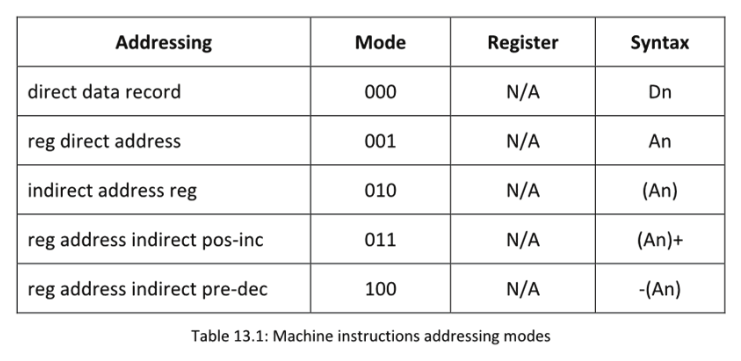

## Sample Stack Frame

The following screenshot shows a superficial representation of how the program is stored in memory at run time. Since there are many references on this topic, further details will not be provided here. The main aspect to understand is the area in which the data is stored is finite; thus, it is up to the programmer to boundary check it. Unfortunately, many do not perform a boundary check, which is why we have had buffer overflows for a very long time and continue to have them.

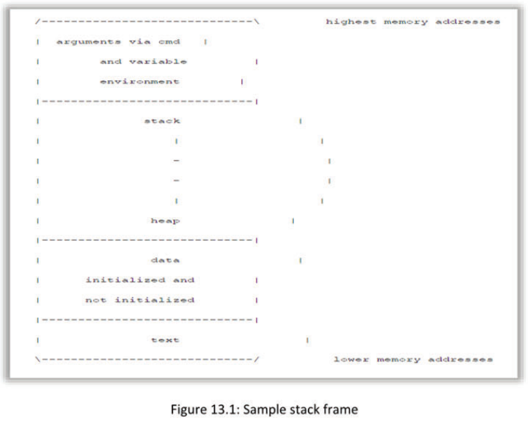

## C program memory
The table in the slide shows an example of how memory is structured in a C program.

- **Text segment**: This block of memory stores the executable code of the program and is usually read-only.
- **Data segment**: This segment stores static/global variables initialized by the programmer.
  For example, a variable defined as static int Num = 3 will be stored in the data segment.
- **Block Started by Symbol (BSS) segment**: This segment stores uninitialized static/global variables and will be filled with zeros by the operating system (OS). Consequently, an uninitialized variable will be full of zeros.
- **Heap**: The heap is used to provide space for dynamic memory allocation and is managed by function calls such as malloc, calloc, realloc, and free.
- **Stack**: The stack is used for storing local variables defined inside functions, as well as data
  related to function calls such as the return address and arguments.

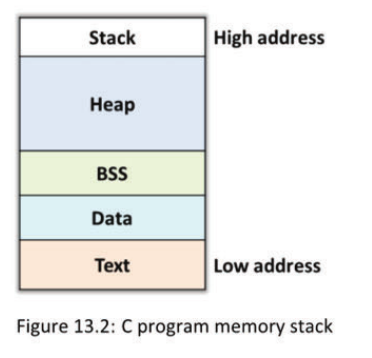

## Analyzing Binaries
| Command      | Description                                                  |
| ------------ | ------------------------------------------------------------ |
| file command | It determines what type of data is saved in a specific system file and reports the file type in a simple-to-understand format known as MIME. |
| rabin2       | It extracts useful binary information such as headers, compositions, strings, and entry points and even allows exporting in various formats. |
| strings      | It prints the printable strings of at least 4 characters (or the number provided with options), which are followed by a nonprinting character. |
| xxd          | It outputs a hex or dump from a given file.                  |
| gdb          | Classic debugger                                             |
| PEDA         | Python Exploit Development Assistance for GDB                |
| EDB          | Evans debugger                                               |


The file command is a typical application on Linux that determines what type of data is saved in specific system file. It reports the file type in a simple-to-understand format known as MIME. The command offers various uses. For example, it helps in understanding why a particular file cannot be read on a system. The file command also helps in determining the folder type; socket; and first in, first out (FIFO; pipes), as well as in blocking specific files. Only zero-length files can be viewed on a Linux system with the file command.

**Syntax of the file command on Linux** 

The basic syntax for the file command is as follows:

```
file [options] [filename]
```

- file instructs the terminal to execute the file Linux command.

* [options] is where variables can be added to the command.

* [filename] is the file to inspect with the command.

The rabin2 command extracts useful binary information such as headers, compositions, strings,   and entry points, and it even allows exporting in various formats.   

The strings command prints the printable strings of at least 4 characters (or the number provided with the options below), which are followed by a nonprinting character. By default, it only prints sequences of initialized and loaded sections of object files. For other file types, it prints the strings   of the entire file. The strings command is primarily used for determining the content of non-text files. It can be used for fun by generating outputs in sequences of 0 and 1. It is also used by hackers to alter or correct program files in a binary format.

The xxd command outputs hexadecimal values or a dump from a given file. It can also perform the opposite process of converting a file with hexadecimal content to the original binary or text mode.

- **GNU Project debugger**

  The GNU Project debugger (GDB) allows the observation of activity “inside” another program while it executes or at the moment it crashed.

  GDB can perform four main kinds of actions (plus others in support of these) to help catch bugs:

  - Start a program, specifying anything that might affect its behavior.

  - Make the program stop under specified conditions.

  - Examine what occurred when the program stopped.

  - Change certain aspects of the program to experiment and correct the effects of one bug and proceed to learn about another.

    

- **Python Exploit Development Assistance**

  Python Exploit Development Assistance (PEDA) for GDB can enhance the display of GDB by colorizing and displaying disassembly codes, registers, and memory information during debugging. Commands can be added to support debugging and exploit development (for a full list of commands, use peda help).

- **Evans debugger**
  The Evans debugger (EDB) is a graphical user interface (GUI)-based debugger capable of performing static and dynamic analysis of binaries, similar to GDB. The only difference is that GDB does not have a GUI. 

There are various other analysis tools, and you are encouraged to explore them on your own.

## 32-bit Assembly
**Two types of syntaxes**

- AT&T
- Intel

When working with 32-bit assembly on Ubuntu virtual machines, two primary syntaxes will be encountered. The default configuration of our tools follows the AT&T syntax format, but we will use the Intel syntax throughout.

We used the objdump tool with different arguments to highlight the difference between the AT&T syntax and the Intel syntax for, in this case, the 32-bit version of Bash. The first command we issued used the -d command-line argument of objdump to disassemble the Bash binary. The output in the below screenshot shows, from left to right, the address of the instruction, the opcodes for the instruction and operands, the instruction itself, the source operand, a comma, and finally, the destination operand. In short, by using the last two columns of the below screenshot only, the AT&T syntax is formatted as follows:

```
AT&T Syntax<instruction> <source operand>,<destination operand>
```

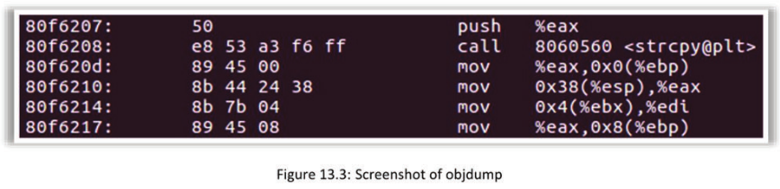

Subsequently, the first command-line instruction is repeated but with the -M intel command-line argument added, which instructs the objdump tool to format the output using the Intel syntax. The below screenshot shows a truncated version of a much larger output and contains the same instructions as the first screenshot, except that it is formatted using the Intel syntax.

Moving from left to right across the four columns, the first column shows the address in memory of the instruction, the second column shows the opcodes for the instruction and operands, the third column shows the instruction itself, and the final column shows the destination operand, a comma, and the source operand. In summary, the Intel syntax is formatted as follows:

```
Intel Syntax<instruction> <destination operand>,<source operand>
```

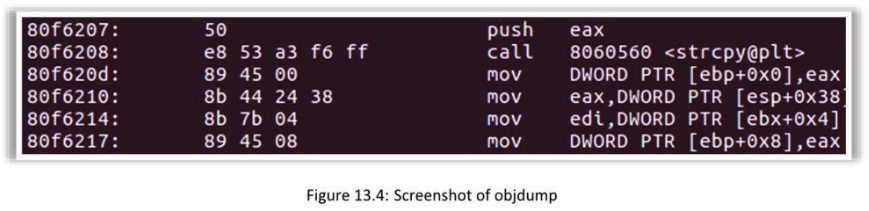

## IA-32 Registers on Linux
- Eight general-purpose registers
- Six segment registers
- EFLAGS register
- Instruction pointer register

Some might ask why 32-bit registers need to be covered when dealing with all of this 64-bit code. The answer is that 32-bit registers provide a natural progression into 64 bit, and a large amount of 32-bit code still runs on machines. Moreover, many exploits are written for 32 bit vice 64 bit. 

Some processors even contain additional registers to handle floating-point mathematical operations and extended registers for additional functionality. For simplicity, only the general-purpose registers, EFLAGS register, and instruction pointer register will be covered here.

While all of the nuances will not be covered here, these extended registers can be used to implement obfuscation techniques when writing shellcode.

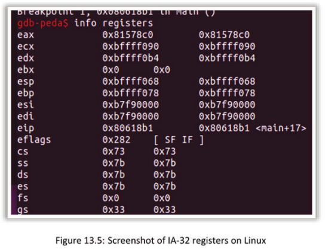

## Registers

| Register | Description                                      |
| -------- | ------------------------------------------------ |
| EAX      | Accumulator register                             |
| EBX      | Stores the address data in the data segment (DS) |
| ECX      | Counter                                          |
| EDX      | Input and output operations                      |
| ESI      | Source pointer for string operations             |
| EDI      | Destination pointer for string operations        |
| ESP      | Points to the address of the top of the stack    |
| EBP      | Points to the address of the base of the stack   |
| EIP      | Next instruction                                 |


**EAX**: Also known as the accumulator register, EAX is 32 bits wide and encompasses a 16-bit-wide register called AX, an 8-bit-wide high register called AH, and an 8-bit-wide low register called AL. EAX is responsible for holding result data from return operations of system calls, for example, and operands.

**EBX**: This register is used to store the addresses of data in the data segment (DS) register. It encompasses a 16-bit-wide register called BX, an 8-bit-wide high register called BH, and an 8-bit-wide low register called BL.

**ECX**: Also known as the counter register, ECX is 32 bits wide and encompasses a 16-bit-wide register called CX, an 8-bit-wide high register called CH, and an 8-bit-wide low register called CL. ECX serves as a counter for string and loop operations.

**EDX**: This register is used to store addresses for input and output operations. EDX is 32 bits wide and encompasses a 16-bit-wide register called DX, an 8-bit-wide high register called DH, and an 8-bit-wide low register called DL.

**ESI**: This register is 32 bits wide and encompasses a 16-bit-wide register called SI. ESI is used as a source pointer for string operations.

**EDI**: This register is 32 bits wide and encompasses a 16-bit-wide register called DI. EDI is used as a destination pointer for string operations.

**ESP**: Also known as the extended stack pointer, ESP is 32 bits wide and contains a 16-bit-wide register called SP. ESP points to the address of the top of the stack.

**EBP**: Also known as the extended base pointer, EBP is 32 bits wide and contains a 16-bit-wide register called BP. EBP points to the address of the base of the stack.

**EIP**: Also known as the extended instruction pointer, EIP is 32 bits wide and points to the address of the next instruction. EIP is extremely important for exploit writing because, if the value in EIP can be controlled, program flow can be redirected to execute malicious code.

A pointer is basically an address. Stating that EIP is the instruction pointer implies that the value stored in the EIP register is merely the address in memory of the next instruction.

The EFLAGS register is 32 bits wide and contains several different flags that are used in various operations.

**Zero flag (ZF)**: This flag is located at bit 6 and has a value of 1 if itis set or a value of O if it is cleared. It is set when the loop counters reach 0, if comparisons are equal, or if a mathematical operation results in 0.

**Carry flag (CF)**: This flag is located at bit 0 and is used in mathematical operations. If unsigned integers are used in mathematical operations, it results in an overflow condition. This is also the only flag that can directly be set with specific instructions.

**Auxiliary carry flag (AF)**: This flag is located at bit 4 and is used in mathematical operations if an operation results in a carry or borrow.

**Sign flag (SF)**: This flag is located at bit 7 and is used to indicate a signed integer, where 0 is a positive value and 1 indicates a negative value.

**Overflow flag (OF)**: This flag is located at bit 11 and is set if an integer is too large or too ‘small to fit in the destination and if an overflow condition exists in mathematical operations.

**Direction flag (DF)**: This flag is located at bit 10 and is used to determine the direction of string operations. When set to 1, string instructions operate from a high address space to a low address space, and when unset, that is, set to 0, string instructions operate from a low address space to a high address space.

**Parity flag (PF)**: This flag is located at bit 2 and is set if the least significant byte contains an even number of single bits.

The segment registers, CS, SS, DS, ES, FS, and GS are important for certain aspects of programming in assembly but not for the present purpose.

The quintessential reference on assembly is the Intel Software Developers Manual:
https://software.intel.com/sites/default/files/managed/39/c5/325462-sdm-vol-1-2abcd-3abcd,pdf

## Important IA-32 Instructions for Pen Testing

| Instruction | Description                                                  |
| ----------- | ------------------------------------------------------------ |
| MOV         | Copies the source operand to the destination operand         |
| LEA         | Loads the address of the source operand                      |
| XCHG        | Swaps values between the source and destination operand      |
| PUSH        | Pushes values onto the stack and automatically adjusts the value of ESP accordingly |
| POP         | Pops values off the top of the stack and automatically adjusts the value of ESP |
| XOR         | Performs a bit-wise XOR operation between the source and destination operands |
| AND         | Performs a bitwise AND operation                             |
| OR          | Performs a bitwise OR operation                              |
| ADD         | Adds source and destination operands                         |
| SUB         | Subtracts the source operand from the destination operand    |

To develop custom shellcode in assembly or to attain an improved understanding of disassembled binaries, these instructions must be well understood. This section discusses instructions that copy values; instructions that allow the redirection of program flow by jumping elsewhere in the program; instructions that allow addition or subtraction, multiplication, or division; instructions that allow safely zeroing out registers to avoid troublesome null bytes; instructions that allow interaction with and manipulation of the stack; and many more. Quite a few of the instructions will be covered, but not all.

- **MOV**: Also known as the move instruction, MOV is used to copy the source operand into the destination operand. This instruction allows copying data such as integers into a register, registers into registers (i.e., the value of a register into another register), the address of a memory region into a register, and the value of a register into a memory location.
- **LEA**: The Load Effective Address (LEA) instruction is used to load the address of the source operand, that is, the pointer, into the destination operand. For example, this instruction may be used to load the address of another register, thereby pointing to the value at that location in memory.
- **XCHG**: Also known as the exchange instruction, XCHG is used to swap values between the source operand and destination operand. This instruction is limited to swapping values between two registers or between memory locations within a register. 
- **PUSH**: This instruction pushes values onto the stack and automatically adjusts the value of ESP accordingly.

- **POP**: This instruction pops values off the top of the stack and automatically adjusts the value of ESP accordingly.

  Recall that the stack isa last in first out (LIFO) portion of memory that grows from higher ‘memory regions to lower memory regions ands used for local variable storage and return address storage. The PUSH instruction places a value onto the stack and adjusts the stack pointer by subtracting the length of whatever was pushed onto the stack from the current value in ESP. Likewise, the POP instruction removes a value off the top of the stack and adjusts the stack pointer by adding the length of whatever was taken off the stack to the value in ESP, thereby adjusting the stack pointer accordingly.


- **XOR**: This instruction is the bitwise exclusive OR instruction and is used for bit-wise operations between the source and destination operands. Using XOR against the same register has the effect of zeroing out that register. This is a useful technique to avoid unintended null bytes in shellcode.

- **AND**: This instruction is the bit-wise AND instruction and is used to perform a bit-wise AND operation against the source and destination operands.

- **OR**: This is the bit-wise inclusive OR instruction and is used to perform a bitwise inclusive OR against the source and destination operands. This instruction is useful for aligning registers to the start of a memory page when employing the egg hunter technique in shelicode.

- **ADD**: This instruction adds the source and destination operands and stores the result in the destination operand. This instruction works on signed and unsigned integer values.

- **SUB**: This instruction subtracts the source operand from the destination operand and stores the value in the destination operand. This works on signed and unsigned integers. The results of this instruction may set or unset the ZF, SF, OF, AF, PF, and CF flags in the EFLAGS register.

- **MUL**: This instruction multiplies the source and destination operands and stores the result based on the size of the operands. For 8-bit operations, ALis used as the destination operand, and AX stores the result. For operations involving 16 bits, AX is the implied destination register, and the result of the operation is stored in AX and DX. For 32-bit multiplication, EAX is used as the implied destination operand, and the result is stored in both EAX and EDX. n 16-bit and 32-bit multiplication, the high-order bits of the result are stored in DX and EDX, respectively, and the low-order bits of the result are stored in AX and EAX, respectively. This instruction works on unsigned integers only.

- **DIV**: This instruction performs unsigned division on an implied destination operand and the listed source operand and stores the result based on the size of the operation. An 8-bit division uses the AX register as the dividend and the source operand asthe divisor for storing the result in AL and the remainder in DL. A 16-bit unsigned division uses the values in AX and DX as the dividend, and the source operand isthe divisor for storing the result in AX and the remainder in DX. In 32-bit unsigned division, EAX and EDX are used as the dividend, and the source operand is the divisor storing the results in EAX and the remainder in EDX. Division by 0 causes a divide error.

- INC: This instruction increments the provided operand by 1 and can operate on an 8-bit register (AL, AH, BL, BH, and so on), a 16-bit register (DI, SI, BX, CX, and so on), a 32-bit register (EAX, EBX, ECX, and so on), or an 8-bit, 16-bit, or 32-bit memory location ([eax], [ebx], and so on).

- DEC: Similar to the INC instruction, it only decreases the operand by 10 and can operate on the same set of restrictions as the increment instruction.

  

There are many more instructions, but some of these are best left to research for you; they can be found in volume 2 of the Intel Software Developer’s Manual. Specifically, focus on understanding the jump, looping, and arithmetic instructions to familiarize yourself with referencing the Intel Software Developer’s Manual when working in assembly or when reviewing disassembled binaries. As a steppingstone to the next recipe, also research the program interrupt INT instruction because it is a necessary instruction for making system calls in |A-32 on Linux.


## Netwide Assembler
- Abbreviated as NASM
- Used to enhance assembly programs
- Specific symbols and labels

The Netwide Assembler (NASM) has its own set of additional instructions and functionalities that can be used to enhance assembly programs. Outside of the Intel Software Developer’s Manual, NASM allows defining and initializing data using labels and NASM-specific instructions, as well as special symbols such as $ and $$, which serve a specific purpose, especially for string operations. It is highly recommended that you read the NASM manual for the very same reasons listed in the previous section.

The NASM manual can be found at https://www.nasm.us/xdoc/2.14.02/nasmdoc.pdf.

## Executable and Linkable Format
- Abbreviated as ELF
- Predominant on Linux
- Begins with the ELF header

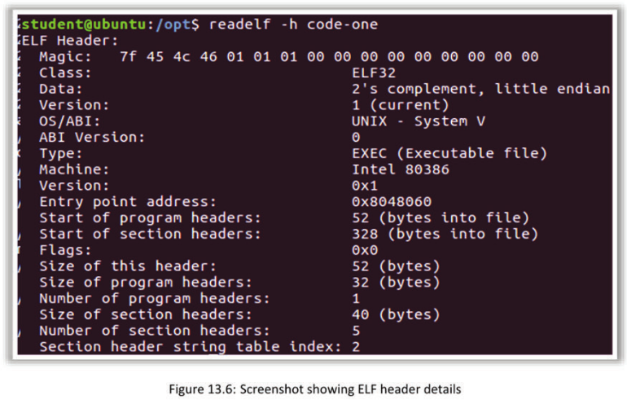

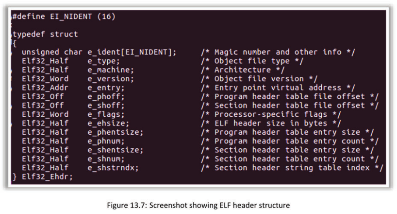

As shown in the screenshot, the Executable and Linkable Format (ELF) header begins with a character array containing a magic number and other information.

The bytes 7£ 45 4c 46 01 01 01 00 00 00 00 00 00 00 00 00 canbe found next to the “Magic:” label. The 7£ byte represents the first byte in all ELF files. The next three bytes, 45 4C 46, are printable characters.

The next byte is 01. This byte represents whether the format or computer architecture is ELF32 or ELF64. This corresponds to the “Class:” label in the step 10 output image. A value of 01 represents ELF32, while a value of 02 represents ELF64. The next byte, 01, is set based on how data are formatted in memory—little endian, big endian, or none.

A value of 00 represents ELFDATANONE (none); a value of 01 represents ELFDATA2LSB (two’s complement; little endian), where LSB stands for the least significant byte; and a value of 02 represents ELFDATA2MSB (two’s complement; big endian), where MSB stands for the most significant byte. Since our host stores data in memory with the least significant bytes first, a value of 01 is observed, representing a little-endian data format. The next byte, 01, represents the current ELF version, as indicated by the first “Version:” label in the output in the top image.


## ELF Binary
| Item                 | Description                                                  |
| -------------------- | ------------------------------------------------------------ |
| ELF header           | Beginning of the ELF binary                                  |
| Program header table | Indexes each segment as program headers                      |
| Segment              | A collection of sections into useable chunks for execution   |
| Section header table | Indexes each section header present within an ELF binary     |
| Section header       | Describes each section within an ELF binary                  |
| Section              | Contains either data or code and is described by the section header |

- **ELF header**: It is always located at the beginning of the ELF binary and contains information about the layout of the rest of the binary.

- **Program header table**: It is responsible for indexing each segment as program headers. The program header table is optional for relocatable files used in linking but mandatory for execution and laying out the process image during execution.

- **Segment**: It is a collection of sections into useable chunks for execution, indexed as program headers by the program header table. Each segment can contain zero or more sections.

- **Section header table**: It is responsible for indexing each section header present within an ELF binary and is necessary for relocatable object files that are used in linking.

- **Section header**: It is responsible for describing each section within an ELF binary and is necessary for relocatable object files that are used in linking.

- **Section**: It is a part of the binary that contains either data or code and is described by the section header. Sections are necessary for relocatable object files that are used in linking.

See http://refspecs.linuxbase.org/elf/elf.pdf for more information.

## Simple Code Injection Techniques for ELF

- Binary modification using a hex editor
- Modifying a shared library
- Inject a new code section

The most straightforward method to modify an existing binary is by directly editing it using a hex editor, which is a program that represents the bytes of a binary file in the hexadecimal format and allows editing these bytes. Usually, a disassembler is used first to identify the code or data bytes to be changed, following which a hex editor is to make the changes.

The advantage of this approach is that it is simple and requires only basic tools. The disadvantage is that it only allows in-place editing: code or data bytes can be changed, but new content cannot be added. Inserting a new byte causes all the bytes after it to shift to another address, which breaks references to the shifted bytes. It is difficult (or even impossible) to correctly identify and fix all the broken references because the relocation information needed for this is usually discarded after the linking phase. If the binary contains any padding bytes, dead code (such as unused functions), or unused data, those parts of the binary can be overwritten with new content.

LD_PRELOAD is the name of an environment variable that influences the behavior of the dynamic linker. It allows specifying one or more libraries for the linker to load before any other library, including standard system libraries such as libc.so. If a preloaded library contains a function with the same name as a function in a library loaded later, the first function is the one that will be used at runtime.

## Limitations of Simple Code Injection Techniques
- Only possible on small coding problems

- Hex editor

  - Only allows in-place editing

  - Can change code or data bytes but not add anything new

- LD_PRELOAD
  - Allows easy addition of new code but can only be used to modify library calls

## Advanced Binary Analysis
- Customized disassembly

- Build a specialized disassembly engine as per requirements

- Capstone

  - A disassembly framework that provides full control over the entire analysis process

- General-purpose tools lack the functionality required for advanced analysis
- Allows efficient batch processing of binaries

## Obfuscation Challenges
- Custom disassemblers assist with binaries that are obfuscated
- Instruction overlapping
  - Possible for one instruction to occupy a set of code addresses already occupied by another
    instruction
  - Result is a hidden code branch

As shown in the below screenshot, the jne jumps to the middle of the instruction and is not at an actual address, which could potentially be missed by the disassembler. Consequently, an additional code branch could be missed, which is the objective of obfuscation.

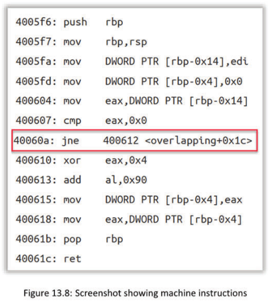

As shown in the below figure, the instructions 400610 and 400611 then jump into the middle of the XOR function at 460010, resulting in an add instruction. This changes the results and data within the program, which is the goal. As one can imagine, such obfuscations can complicate the analysis.


Some obfuscated programs are riddled with overlapping code sequences such as that shown in this example, making the code extremely tedious and difficult to investigate manually.

## Framework
**Capstone**

- Lightweight multi-platform, multi-architecture disassembly framework 
- Clean/simple/lightweight/intuitive architecture-neutral application programming interface (API) 
- Special support for embedding into firmware or operating system (0S) kernel 
- High performance & suitable for malware analysis (capable of handling various x86 malware tricks)
- Distributed under the open-source BSD license 

From a high-level perspective, Capstone takes a memory buffer containing a block of code bytes as an input and outputs instructions disassembled from those bytes. The most basic approach to use Capstone is to feed it a buffer containing all the code bytes in the .text section of a given binary and then linearly disassemble those instructions into a human-readable form or instruction mnemonics. Aside from some initialization and output-parsing code, Capstone allows implementing this mode of usage through only a single application programming interface (API) call to the cs_disasm function.

## Binary Instrumentation
- Add new code at every point in the binary

  - New code cannot be simply inserted into an existing binary code section, because the new code will shift existing code to different addresses.

    - This could and most likely will break the references within the code and make it practically impossible to locate the required references to keep the code running.

- Good news!
  - Tools are available for this purpose.
  - They allow install callbacks and insert the code at the specified instrumentation points.

As with most analysis methods, there are two types of binary instrumentation, static and dynamic, which operate and behave in the same manner as within other analyses at rest and at runtime.

## IA-64
- Similar to 32 bits in terms of registers, except that there are 64 bits in total and some added registers.


**RAX**: It is still the accumulator register but is now 64 bits wide and contains EAX (32 bits), AX (16 bits), AH (8 bits high), and AL (8 bits low).

**RBX**: It is 64 bits wide and contains EBX (32 bits), BX (16 bits), BH (8 bits high), and BL (8 bits low).

**RCX**: It is still the counter register but is now 64 bits wide and contains ECX (32 bits), CX (16 bits), CH (8 bits high), and CL (8 bits low).

**RDX**: It is 64 bits wide and contains EDX (32 bits), DX (16 bits), DH (8 bits high), and DL (8 bits low).

**RSI**: It is 64 bits wide, still serves as the source pointer for string operations, and contains ESI (32 bits), SI (16 bits), and SIL (8 bits).

**RDI**: It is 64 bits wide, still serves as the destination pointer for string operations, and contains EDI (32 bits), DI (16 bits), and a new register called DIL (8 bits).

**RBP**: It still serves as the pointer for the base of the stack, is 64 bits wide, and contains EBP (32 bits), BP (16 bits), and BPL (8 bits).

**RSP**: It still serves as the pointer for the top of the stack, is 64 bits wide, and contains ESP (32 bits), SP (16 bits), and SPL (8 bits).

**R8**: It is a new register that is 64 bits wide and contains R8D (32 bits), R8W (16 bits), and R8L (8 bits).

**R9**: It is a new register that is 64 bits wide and contains R9D (32 bits), ROW (16 bits), and ROL (8 bits).

**R10**: It is a new register that is 64 bits wide and contains R10D (32 bits), RLOW (16 bits), and R10L (8 bits).

**R11**: It is a new register that is 64 bits wide and contains R11D (32 bits), R11W (16 bits), and R11L (8 bits).

**R12**: It is a new register that is 64 bits wide and contains R12D (32 bits), R12W (16 bits), and R12L (8 bits).

**R13**: It is a new register that is 64 bits wide and contains R13D (32 bits), R13W (16 bits), and R13L (8 bits).

**R14**: It is a new register that is 64 bits wide and contains R14D (32 bits), R14W (16 bits), and R14L (8 bits).

**R15**: It is a new register that is 64 bits wide and contains R15D (32 bits), RISW (16 bits), and R1S5L (8 bits).

**RIP**: It is still the instruction pointer register, is 64 bits wide, and supports a new mode of operation called RIP-relative addressing. Essentially, this allows access to areas of memory as it relates to the address of the next instruction stored in this register. 

**RFLAGS**: It is now 64 bits wide, the upper 32 bits of which are reserved and the lower 32 bits are the same as the EFLAGS register in IA-32.

The AH, BH, CH, and DH registers cannot be accessed when accessing AL, BL, CL, and DL. Nevertheless, AL, BL, CL, and DL as well as R8L—R15L, SIL, DIL, SPL, and BPL can be accessed.

For further details, consult Volume 1, Chapter 3, page 13 (Volume 1 3-13) underneath Figure 3-2 of the Intel Software Developer’s Manual:
https://software.intel.com/sites/default/files/managed/39/c5/325462-sdm-vol-1-2abcd-3abcd.pdf

To learn more about IA-64 in relation to the segment registers and the flat memory model, refer to the Intel Software Developer’s Manual Volume 1, Chapter 3, Section 3.4.2. Specific details pertaining to the 64-bit operation mode are found in Section 3.4.2.1 on pages 3-15.

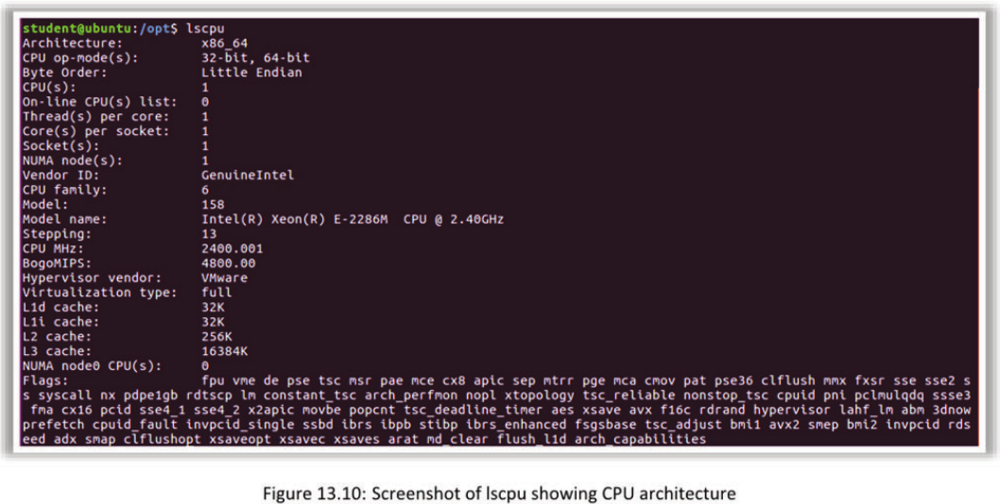

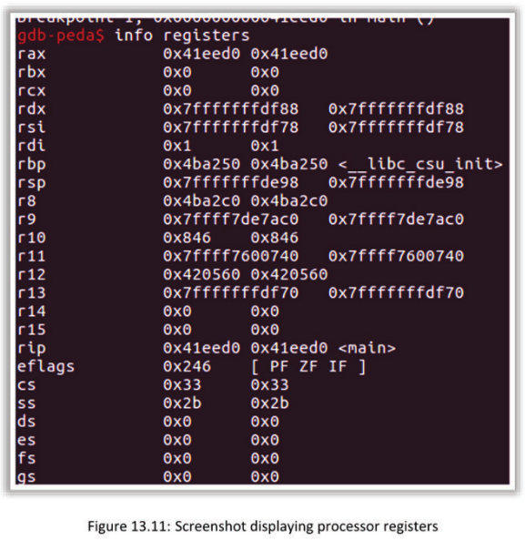

## IA-64 System Calls
```
cat /usr/include/x86_64-linux-gnu/asm/unistd_64.h
```

As shown in below figure, there are many more system calls with 64 bits.

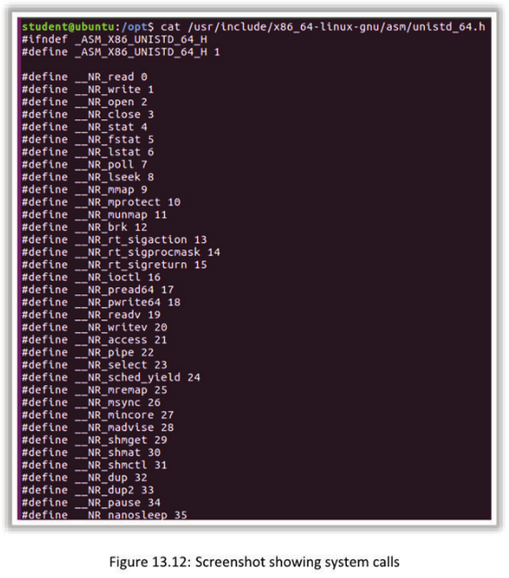

## Binary Analysis Methodology
1. Discovery
2. Information gathering
3. Static analysis
4. Dynamic analysis
5. Iterating each step

When performing penetration assessments, an iteratively designed methodology should be followed to accomplish the goal of the assessment. Tackling binary analysis is no different. A guiding methodology is needed, as well as a plan that can be used iteratively, much like some of the penetration assessment methodologies that exist today. The lack of a methodology may lead to missed steps, missed information, or the possibility of self-infection with malware. Before creating this plan, it would be useful to list some of the tools that will help in implementing each phase of the methodology. In this manner, the necessary foundation can be laid to use these tools to accomplish the task of analyzing binaries. However, owing to the limited scope, it is not possible to cover all of the tools available on Linux here.

### Binary Discovery
- find
- file
- ls
- updatedb/locate
- ps
- Bash

One of the important aspects of binary analysis is the ability to discover unknown binaries on a system or to discover when a known binary has been replaced with one using the same name. A plethora of tools can be used, including both open source and commercial tools, but open-source tools will be used here. All of these tools work on either 32 or 64 bits.

### Information Gathering
- Essential to success
- Necessary to determine the architecture

Assuming that the name of the file in question is known, the types of information to gather and the questions to answer include the following:

- Is the file executable?

- Is the file binary?

- For which architecture (x86 or x86-64) is the binary compiled?

- Which format is the binary in?

- Is the binary stripped of its symbol table?

- Can any useful strings be identified within the binary?

- Is there a running process associated with this binary?

- What is the Secure Hash Algorithm (SHA) hash of the binary?

- Is the hash a known malicious file hash?

- What was the original programming language used?

- Can any useful function names be identified?

- Can any libraries used be identified?

- When was the binary written to disk?

For a nonmalicious binary such as an application developed within an organization that is meant to run on Linux, similar questions can be asked but in a more targeted approach for vulnerability analysis, as opposed to analysis designed to identify malicious functionality:

- Does the application take any input (user or otherwise)? Does the application validate all input?

- Does the application safely manage memory?

- Does the application use up-to-date libraries or third-party frameworks?

- How is the application compiled?

- Are there any noticeable strings containing sensitive data such as hardcoded passwords?

Gathering as much information as possible about an unknown binary will set the foundation to succeed when determining whether a binary can be analyzed safely, i.e., without self-infecting in case the binary is discovered to have a malicious functionality. Alternatively, effective information gathering can help in discovering vulnerabilities in applications developed in the organization by ensuring the identification of as many attack vectors as possible against the application.

As shown in the screenshots below, the strings command yields some very interesting results.


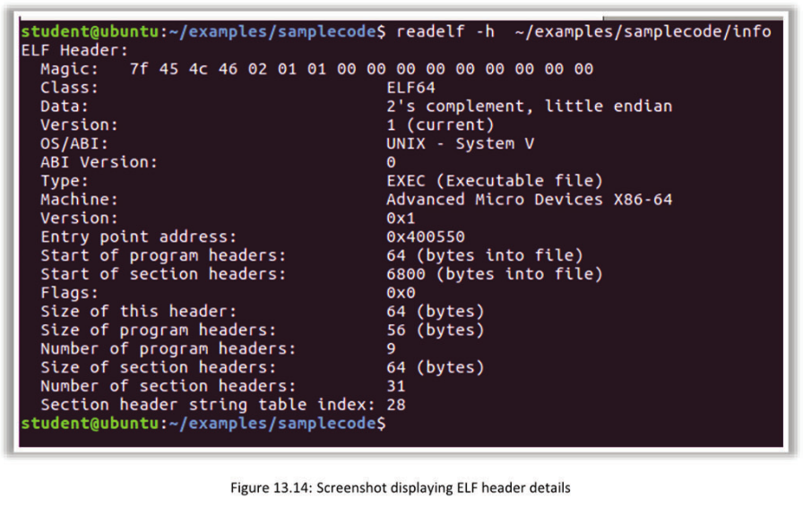

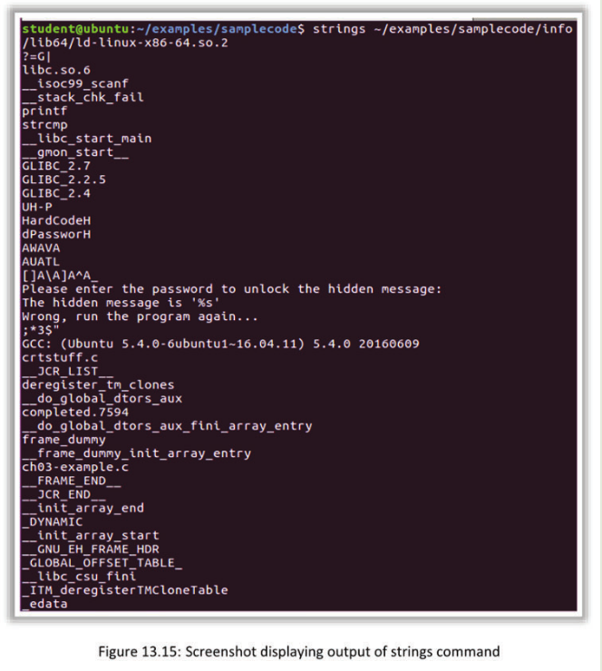

### Static Analysis
- Analyze the code in an offline (not running) state.
- Obfuscation and other methods can present false information.
- Disassemble the binary.
- Tool for analysis: Netwide Disassembler
  - Companion program to NASMs

Static analysis is the analysis of a binary when it is not running. Tools are used to disassemble a binary, which will provide a glimpse of how the binary interacts with the processor, memory, shared libraries, and other aspects that may benefit the analysis. Static analysis is typically safe because the binary is not being executed. However, there are some caveats in that, occasionally, obfuscation techniques are encountered.

- The ndisasm command can disassemble 16-, 32-, or 64-bit code equally easily, provided the number of bits is specified. If no -b switch is present, ndisasm works in the 16-bit mode by default. The -u switch (for USE32) also invokes the 32-bit mode. 
- Two more command-line options are -x, which reports the version number of ndisasm, and -h, which displays a short summary of command-line options. The ndisasm command is designed to falsify the output of static analysis techniques and tools, and the tools are only as good as the binary allows.

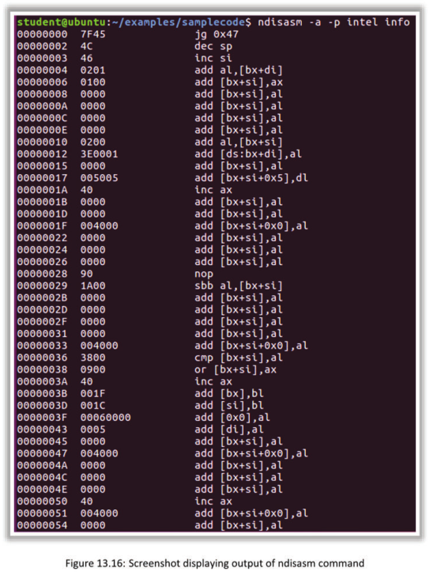

### Dynamic Analysis
- Analysis is performed while the program is in a running state.
- Caution is advised!
- Use an isolated or sandbox environment.
  - Disconnect the network adapters.

Dynamic analysis provides great insight into how a binary interacts with a system while it is running. However, it is important to understand some shortcomings of the tools used for dynamic analysis. First, there will be a heavy reliance on the power of debuggers such as GDB and EDB to step through each instruction. This means that the gathered information is only as complete as the understanding of the tool’s features, and any anti-debugging functionality built into the binary may make the analysis efforts increasingly more challenging. This also means that missing the execution of some of the binary’s functionalities will lead to shortcomings in the understanding of what that functionality does.

The dynamic analysis step should extract as much information as possible about the binary while it is running.

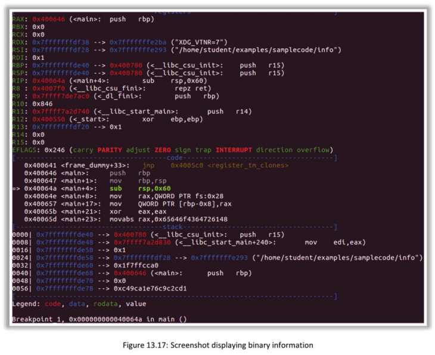

### Iterating Each Step
- Analysis might reveal library files that require restarting of the methodology.
- The process remains the same; switch and target the library file with the process.

At some point in the methodology, it may be necessary to loop back to the beginning and start over. For example, when analyzing a binary that incorporates another binary, say, as a library, it may be necessary to use the methodology on that library as well. Thus, it is necessary to identify when and where to apply iteration throughout the analysis if the goal is to determine the purpose of all the analyzed binaries.

In addition to merely incorporating shared libraries, some binaries also use static libraries and their associated functions. A similar iterative approach can be applied to analyze static libraries and their functions. Static libraries can be created using the GNU ar command.

The process consists of assembling a program into an object file and then using the ar command to create an archive file with the .a file extension. The archive file will contain all the functions from the assembled object file created from a C program, as well as all the necessary symbols for proper linking to any binary employing the static library.

Another possible scenario is when a binary incorporates the execution of a separate binary, say, in a piece of malware that includes a separate binary for making copies of itself. Iteration can be applied to the methodology to examine the binary responsible for making copies of the malware. There are nearly endless situations where iteration can be applied to this methodology to attain a deep understanding of the analysis target.

## Sample Program

```
int num = 100;

int main()

{

//data stored on the stack

int 2ndnumber=2;
float float-number=2.5;
static int 3rdnumber;

//allocate memory on the heap
int *ptr = (int *) malloc(2*sizeof(int)) ;

//walues 5 and 6 stored on heap
ptr[0]=5;
ptr[1]=6;

//deallocate memory on heap
free (ptr) ;

return 1;

}
```

This program uses the variable numas a global variable initialized inside the program; this variable will be allocated in the data segment. The variable 3rdnumber is a static variable that is uninitialized; thus, it is allocated to the BSS segment. The variables 2ndnumber and float-number are local variables; thus, they are stored on the program stack. The variable ptr is also a local variable and is stored on the stack; however, ptr is a pointer that points to a block of memory in the heap that is dynamically allocated. Consequently, the values 5 and 6 assigned to ptr are stored on the heap.

## Sample x86 C Program
Initially, a layout of a C program running on an x86 architecture will be used. Note that there are many variations; however, to some extent, all of them are derive from the following.

The following sample program is a deliberately vulnerable C program.

```
/* Vulnerable program: stack.c */
#include <stdlib.h>
#include <stdio.h>
#linclude <string.h>
/* Changing this size will change the layout of the stack.
 * Instructors can change this value each year so that students
 * will not be able to use the solutions from the past.
 * Suggested value: between 0 and 400 */
  #ifndef BUF_SIZE
  fidefine BUF_SIZE 24
  #endif
  int bof(char *str)
  {
	  char buffer [BUF_SIZE] ;
 	  /* The following statement has a buffer overflow problem */
	  strcepy (buffer, str);
	  return 1;
}
int main(int argc, char **argv)
{
	char str[517];
	FILE *badfile;
	/* Change the size of the dummy array to randomize the param
	  for this lab. The array must be used at least once */
	char dummy[BUF_SIZE]; memset (dummy, 0, BUF_SIZE);
	badfile = fopen("badfile", "r");
	fread(str, sizeof(char), 517, badfile) ;
	bof (str) ;
	printf ("Returned Properly\n") ;
	return 1;
}
```

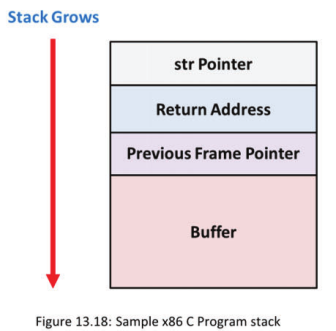

This program contains two functions, main() and bof(). The main() function reads the content of the file badfile into an str buffer that has a length of 517 bytes, following which the address is passed as a parameter to bof through bof (str). Since there are no bounds, checking this parameter is susceptible to buffer overflow. As a result of no-bounds checking, strepy will continue to copy all the data sent to it. Eventually, it will copy too much data, causing the stack to crash. Taking control of the instruction pointer in this situation results in buffer overflow.

Since the user is in control of the file that is sent, the user can overwrite the contents of the bof function and, in effect, overwrite the return address of the methods stack frame, which in turn allows the user to control where the execution will jump to on the return.

## Shellcode
- Code is required to access the machine on taking control of the instruction pointer (IP).
- The access will be the same as that of the program that is running.

As shellcode is required when taking control of the instruction pointer, an example is presented here from the Internet and the University of Syracuse SEED labs. It is a good idea to explore and experiment with shellcode and derive a variety of different types.

The entire shellcode C program is as follows:

```
#include <stdio.h>

int main()

{char*name[2] ;

name[0] = "/bin/sh";

name[1] = NULL;

execve(name[0], name, NULL) ;

}
```

The above is merely an assembly version of this program.

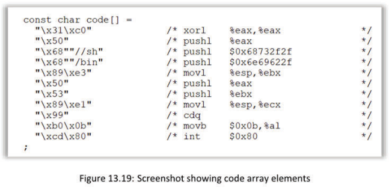

## Obstacles to Exploitation
- Vendors have improved the protections on their machines.

- Protection techniques: 

  - address space layout randomization (ASLR) 

  - DEP

- For learning, we disable protections.

For the present purpose of exploitation, 32-bit assembly is considered. Protections are disabled until we have seen how the process works. Subsequently, protections are added, and we explore methods to circumvent them. The process is the same for 64 bits. We stay with 32 bits for the most part to enhance our skills then move on to 64 bits once we are ready. The time required to move on to 64 bits varies for different people, and it is best to practice the process slowly until that time arrives.

Guessing addresses is one of the critical steps of buffer-overflow attacks. Ubuntu and several other Linux-based systems use address space randomization to randomize the starting address of a heap and stack. This makes guessing the exact addresses difficult.

The following screenshot shows the disabling of address space layout randomization (ASLR) in an Ubuntu machine.

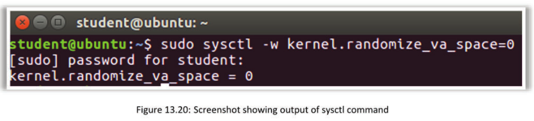

The GNU Compiler Collection (GCC) implements a security mechanism called StackGuard to prevent buffer overflows. In the presence of this protection, buffer-overflow attacks do not work. We can disable this protection during the compilation using the -fno-stack-protector option. 

```
gcc -fno-stack-protector example.c
```

Ubuntu used to allow executable stacks, but this has now changed: the binary images of programs (and shared libraries) must declare whether they require executable stacks, i.e., they need to mark a field in the program header. A kernel or dynamic linker uses this marking to decide whether to make the stack of this running program executable. This marking is performed automatically by recent versions of GCC, and by default, stacks are set to be nonexecutable. To change that, the following option is used when compiling programs:

```
gcc -z noexecstack -o test test.c
```

## ASLR
- When enabled, the addresses change each time a program is run, making it difficult to obtain the  addresses since the address in the exploit used was static. Therefore, ASLR must be bypassed.
- On 32-bit machines, the number of different address possibilities is just over 500,00.
  - Thus, the address can potentially be brute-forced.

As it should, ASLR makes it difficult to guess addresses since the address changes each time the program is run. On a 32-bit machine, there are about 524,288 possibilities, which can be exhausted in a relatively short amount of time. Therefore, one of the methods that can be used to guess addresses is brute forcing by running a loop.

## Return-to-libc vulnerability
- The libc library is shared and loaded into memory once, following which all programs share it.

- When the stack is set to no execute, our code cannot be run. This is where libc comes in.

- Our shellcode cannot run using the conventional method.

- The OS sets the memory as no execute if it is enabled at compile time.

  - When memory allocation occurs, the OS checks the non-executable stack bit and then does not execute the code.

Stack-based buffer overflow fails when the stack is marked to no execute. The Libc function can be used to bypass this protection when it is in place. This is because nothing needs to run on the stack.

### Sample Code

This code below places a shellcode in the buffer on the stack and then casts the buffer as a function. Subsequently, it calls the function. Consequently, a shellcode is called, and a shell is created.

```
#include <string.h>
const char code[]=
“\x31\xc0\x50\x68//sh\68/bin”
“\x89\xe3\x50\x53\x89\xel\x99”
“\xb0\x0b\xcd\x80” ;
int main(int argc, char **argv)
{
char buffer[sizeof (code)];
strcepy (buffer, code);
((void(*) ( ))buffer) ( );
}
```


### Comparison

As shown in the screenshot available in the slide, the first option was compiled with gece -z execstack, and the second option was compiled with gcc -z noexecstack.

The first compile with execstack works without any problems, but when noexecstack is set, the program no longer works.

As one can imagine, we only need the code to execute, and it does not matter where it executes. This is the approach to defeat this protection.

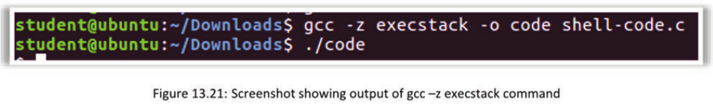

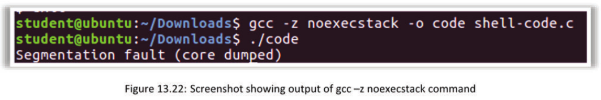

### Sample Code

The program shown in the screenshot below has a buffer-overflow vulnerability. It first reads an input of size 300 bytes from a file called badfile and then copies it into a buffer of 12 bytes; copying 300 bytes into a buffer of 12 bytes will not work. The code will be set to a set-UID program so that a normal user exploiting it can obtain root privileges. As in the previous section, badfile is used to create a shellcode and then have it copied into a 12-byte buffer.

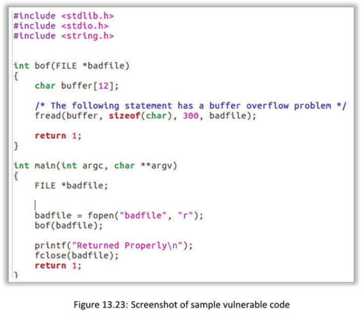

## Defeating the No-execute Stack
1. An external location with respect to the program must be used to run the code.
2. system () is used in libc.
3. This requires the shell to be loaded in memory.
4. The address must be known.
5. There are multiple ways to determine the address.
   - The use of environment variables is a common method.

The attack strategy is to jump to the system () function and get it to execute a command, which in this case is /bin/sh. For this purpose, /bin/sh must be in memory first, and that address must be passed to system() in libc. One of the ways to do this is to use an environment variable; there are other ways as well.

```
export MYSHELL=/bin/sh
env | grep MYSHELL
MYSHELL=/bin/sh
```


Now, the following small program uses the address variable as an argument to system () :

```
void main()
{
	char* shell = getenv(“MYSHELL”) ;
	if (shell)
		printf (“%x\n”, (unsigned int) shell) ;
}
```


This will print the address of the environment variable.

## Return-to-libc Limitations
- Can only chain two functions together
- Led to the development of another return-oriented programming (ROP) attack
  - ROP
    - Chain many functions together
    - Chain blocks of code together

This type of attack was introduced by Hovav Shacham of Stanford University in his paper titled, “The Geometry of Innocent Flesh on the Bone:Return-into-libc without Function Calls (on the x86).” The paper describes “new return-into-libce techniques that allow arbitrary computation (and that are not, therefore, straight-line limited) and that do not require calling any functions whatsoever.”

According to the above, this type of attack can perform arbitrary computation without the necessary use of library functions by reusing code chunks called gadgets, which are a small group of instructions ending with an x86 RET instruction. For example, mov eax, 10; ret is a gadget that allows setting eax to 10 (decimal). These gadgets can be chained together to make them work as a simple unit to perform arbitrary computations. For example, we can chain three gadgets together to perform addition on them. 

**Return-oriented Programming Attacks (Loading and Storing Data)**
Return-oriented programming (ROP) is not limited to calculations. It can also be used to perform code branching and check for conditions (equal, less than, and greater than) on the given data. 

There are certain gadgets that allows storing and loading data from one place to another. Modes of transfer include the following:

- 1: register to register

- 2: register to memory

- 3: memory to register

**Register to Register**

The following are some gadgets related to register-to-register copying:

mov eax, ebx

mov ecx, eax


## 64-bit Fundamentals
- Registers expanded to 64 bits

  - RAX, RBX, RCX, RDX, RSI, and RDI

- Instruction pointer, base pointer, and stack pointer expanded to 64 bits
- Additional registers R8-R15
- Pointers are 8 bytes wide.
- The maximum canonical address is OxO0007FFFFFFFFFFF.
- Parameters to functions are passed through registers.

**X86-64 from Wikipedia:**

x86-64 (also known as x64, x86_64, AMD64 and Intel 64) is the 64-bit version of the x86 instruction set. It introduces two new modes of operation, the 64-bit mode and compatibility mode, along with a new 4-level paging mode. With the 64-bit mode and the new paging mode, it supports vastly larger amounts of virtual memory and physical memory than is possible on its 32-bit predecessors, allowing programs to store larger amounts of data in memory. x86-64 also expands general-purpose registers to 64 bit, extends the number of them from 8 (some of which had limited or fixed functionality, e.g., for stack management) to 16 (fully general), and provides numerous other enhancements. Floating-point operations are supported via mandatory SSE2-like instructions, and x87/MMx-style registers are generally not used (but still available even in the 64-bit mode); instead, a set of 32 vector registers of 128 bits each is used. Each can store one
or two double-precision numbers, one to four single precision numbers, or various integer formats. In the 64-bit mode, instructions are modified to support 64-bit operands and the 64-bit addressing mode. The compatibility mode allows 16- and 32-bit user applications to run unmodified in coexistence with 64-bit applications if the 64-bit OS supports them. As the full x86 16-bit and 32-bit instruction sets remain implemented in hardware without any intervening emulation, these older executables can run with little or no performance penalty, while newer or modified applications can take advantage of the new features of processor design to achieve performance improvements. Moreover, a processor supporting x86-64 still powers on in the real mode for full backward compatibility, as x86 processors have done since the 80286.

The original specification, created by AMD and released in 2000, has been implemented by AMD, Intel, and VIA. The AMD K8 microarchitecture, in the Opteron and Athlon 64 processors, was the first to implement it. This was the first significant addition to the x86 architecture designed by a company other than Intel. Intel was forced to follow suit and introduced a modified NetBurst family, which was software-compatible with AMD's specification. VIA Technologies introduced x86-64 in their VIA Isaiah architecture, with the VIA Nano.

The x86-64 architecture is distinct from the Intel Itanium architecture (formerly |A-64), which is not compatible on the native instruction-set level with the x86 architecture. OSes and applications compiled for one cannot be run on the other.

## Why use ROP?
- Gadgets are mainly located on segments without ASLR and on pages marked as executables.
  - It can bypass ASLR.
  - It can bypass the NX bit.

## Attack using ROP
**Find gadgets**

- Store the addresses of gadgets on the stack.

- The saved EIP must be overwritten with the address of the first gadget.

**How to find gadgets**

- Conventional method: objdump and grep
  - Some gadgets will not be found.
  - Objdump aligns instructions.
  - Make a custom tool that scans an executable segment.
  - Use an existing tool.

This is the roadmap and steps to perform the attack.
The following are some tools that can be used to perform the attack:

- Rp++

- Ropeme

- Rope

- Nrop

- ROPgadget

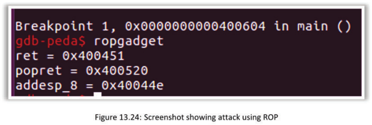

The following an example of a five-step process:

- Step 1: Write-what-where gadgets—write “/bin/sh” in memory
- Step 2: Init syscall number gadgets—setup execve syscall number
- Step 3: Init syscall arguments gadgets—setup execve arguments
- Step 4: Syscall gadgets—find the syscall interrupt
- Step 5: Build the ROP chain—build the python payload

## Build a Custom ROP Gadget tool
- The process is to build the custom disassembler as shown earlier.

### Sample Code

An obvious buffer overflow exists in the vuln () function when read () can copy up to 400 bytes into an 80-byte buffer. Technically, 400 bytes are passed in, the buffer should overflow and RIP should be overwritten with the payload.

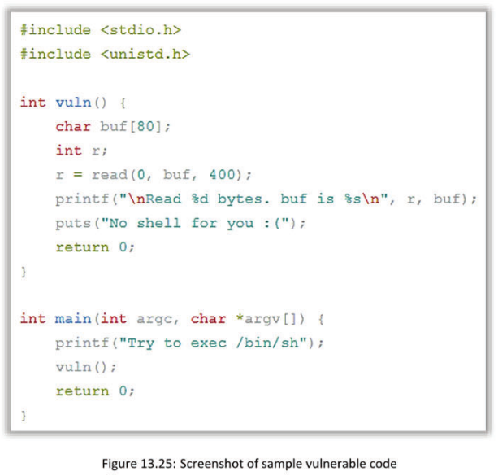

## Module Summary
- Explored binary exploitation
- Introduced buffer-overflow concepts
- Reviewed the memory layout for a stack
- Analyzed the memory and looked for weaknesses
- Modified the execution of a program
- Bypassed basic stack protections

## Lab 1 

**Binary Analysis**

```
sherwinowen@ubuntu:~/Desktop$ ./crackme0x00a 
Enter password: password
Wrong!
Enter password: 
```

### File

```
$ file crackme0x00a
crackme0x00a: ELF 32-bit LSB executable, Intel 80386, version 1 (SYSV), dynamically linked, interpreter /lib/ld-linux.so.2, for GNU/Linux 2.6.15, BuildID[sha1]=a01d6d16a59c7f0d7ec00ab5454eed2eb22bd20d, not stripped
```

### Rabin2

```
sherwinowen@ubuntu:~/Desktop$ rabin2 -I crackme0x00a 
file	/home/sherwinowen/Desktop/crackme0x00a
type	EXEC (Executable file)
pic	false
has_va	true
root	elf
class	ELF32
lang	c
arch	x86
bits	32
machine	Intel 80386
os	linux
subsys	linux
endian	little
strip	false
static	false
linenum	true
lsyms	true
relocs	true
rpath	NONE
```

### Strings

```
sherwinowen@ubuntu:~/Desktop$ strings crackme0x00a 
/lib/ld-linux.so.2
__gmon_start__
libc.so.6
_IO_stdin_used
__isoc99_scanf
puts
__stack_chk_fail
printf
strcmp
__libc_start_main
GLIBC_2.7
GLIBC_2.4
GLIBC_2.0
PTRh
D$,1
T$,e3
UWVS
[^_]
Enter password: 
Congrats!
Wrong!
;*2$"
g00dJ0B!
GCC: (Ubuntu/Linaro 4.6.1-9ubuntu3) 4.6.1
.symtab
.strtab
.shstrtab
.interp
.note.ABI-tag
.note.gnu.build-id
.gnu.hash
.dynsym
.dynstr
.gnu.version
.gnu.version_r
.rel.dyn
.rel.plt
.init
.text
.fini
.rodata
.eh_frame_hdr
.eh_frame
.ctors
.dtors
.jcr
.dynamic
.got
.got.plt
.data
.bss
.comment
crtstuff.c
__CTOR_LIST__
__DTOR_LIST__
__JCR_LIST__
__do_global_dtors_aux
completed.6086
dtor_idx.6088
frame_dummy
__CTOR_END__
__FRAME_END__
__JCR_END__
__do_global_ctors_aux
pass1.c
pass.1685
__init_array_end
_DYNAMIC
__init_array_start
_GLOBAL_OFFSET_TABLE_
__libc_csu_fini
strcmp@@GLIBC_2.0
__i686.get_pc_thunk.bx
data_start
printf@@GLIBC_2.0
_edata
_fini
__stack_chk_fail@@GLIBC_2.4
__DTOR_END__
__data_start
puts@@GLIBC_2.0
__gmon_start__
__dso_handle
_IO_stdin_used
__libc_start_main@@GLIBC_2.0
__libc_csu_init
_end
_start
_fp_hw
__bss_start
main
_Jv_RegisterClasses
__isoc99_scanf@@GLIBC_2.7
_init
```

### xxd

```
$ xxd crackme0x00a | more
00000000: 7f45 4c46 0101 0100 0000 0000 0000 0000  .ELF............
00000010: 0200 0300 0100 0000 3084 0408 3400 0000  ........0...4...
00000020: 5811 0000 0000 0000 3400 2000 0900 2800  X.......4. ...(.
00000030: 1e00 1b00 0600 0000 3400 0000 3480 0408  ........4...4...
00000040: 3480 0408 2001 0000 2001 0000 0500 0000  4... ... .......
00000050: 0400 0000 0300 0000 5401 0000 5481 0408  ........T...T...
00000060: 5481 0408 1300 0000 1300 0000 0400 0000  T...............
00000070: 0100 0000 0100 0000 0000 0000 0080 0408  ................
00000080: 0080 0408 6007 0000 6007 0000 0500 0000  ....`...`.......
00000090: 0010 0000 0100 0000 140f 0000 149f 0408  ................
000000a0: 149f 0408 1c01 0000 2401 0000 0600 0000  ........$.......
000000b0: 0010 0000 0200 0000 280f 0000 289f 0408  ........(...(...
000000c0: 289f 0408 c800 0000 c800 0000 0600 0000  (...............
000000d0: 0400 0000 0400 0000 6801 0000 6881 0408  ........h...h...
000000e0: 6881 0408 4400 0000 4400 0000 0400 0000  h...D...D.......
000000f0: 0400 0000 50e5 7464 6806 0000 6886 0408  ....P.tdh...h...
00000100: 6886 0408 3400 0000 3400 0000 0400 0000  h...4...4.......
00000110: 0400 0000 51e5 7464 0000 0000 0000 0000  ....Q.td........
00000120: 0000 0000 0000 0000 0000 0000 0600 0000  ................
00000130: 0400 0000 52e5 7464 140f 0000 149f 0408  ....R.td........
00000140: 149f 0408 ec00 0000 ec00 0000 0400 0000  ................
00000150: 0100 0000 2f6c 6962 2f6c 642d 6c69 6e75  ..../lib/ld-linu
00000160: 782e 736f 2e32 0000 0400 0000 1000 0000  x.so.2..........
00000170: 0100 0000 474e 5500 0000 0000 0200 0000  ....GNU.........
00000180: 0600 0000 0f00 0000 0400 0000 1400 0000  ................
00000190: 0300 0000 474e 5500 a01d 6d16 a59c 7f0d  ....GNU...m.....
000001a0: 7ec0 0ab5 454e ed2e b22b d20d 0200 0000  ~...EN...+......
000001b0: 0800 0000 0100 0000 0500 0000 0020 0020  ............. . 
000001c0: 0000 0000 0800 0000 ad4b e3c0 0000 0000  .........K......
000001d0: 0000 0000 0000 0000 0000 0000 5500 0000  ............U...
000001e0: 0000 0000 0000 0000 1200 0000 4e00 0000  ............N...
000001f0: 0000 0000 0000 0000 1200 0000 3d00 0000  ............=...
00000200: 0000 0000 0000 0000 1200 0000 3800 0000  ............8...
00000210: 0000 0000 0000 0000 1200 0000 0100 0000  ................
00000220: 0000 0000 0000 0000 2000 0000 5c00 0000  ........ ...\...
00000230: 0000 0000 0000 0000 1200 0000 2900 0000  ............)...
00000240: 0000 0000 0000 0000 1200 0000 1a00 0000  ................
00000250: 3c86 0408 0400 0000 1100 0f00 005f 5f67  <............__g
00000260: 6d6f 6e5f 7374 6172 745f 5f00 6c69 6263  mon_start__.libc
00000270: 2e73 6f2e 3600 5f49 4f5f 7374 6469 6e5f  .so.6._IO_stdin_
00000280: 7573 6564 005f 5f69 736f 6339 395f 7363  used.__isoc99_sc
00000290: 616e 6600 7075 7473 005f 5f73 7461 636b  anf.puts.__stack
000002a0: 5f63 686b 5f66 6169 6c00 7072 696e 7466  _chk_fail.printf
000002b0: 0073 7472 636d 7000 5f5f 6c69 6263 5f73  .strcmp.__libc_s
000002c0: 7461 7274 5f6d 6169 6e00 474c 4942 435f  tart_main.GLIBC_
000002d0: 322e 3700 474c 4942 435f 322e 3400 474c  2.7.GLIBC_2.4.GL
000002e0: 4942 435f 322e 3000 0000 0200 0200 0300  IBC_2.0.........
.....
```

### Rabin2

```
$ rabin2 -z crackme0x00a 
[strings]
addr=0x08048640 off=0x00000640 ordinal=000 sz=17 section=.rodata string=Enter password: 
addr=0x08048651 off=0x00000651 ordinal=001 sz=3 section=.rodata string=%s
addr=0x08048654 off=0x00000654 ordinal=002 sz=10 section=.rodata string=Congrats!
addr=0x0804865e off=0x0000065e ordinal=003 sz=7 section=.rodata string=Wrong!
addr=0x0804a024 off=0x00001024 ordinal=000 sz=9 section=.data string=g00dJ0B!

5 strings
```

### Radare2

```
sherwinowen@ubuntu:~/Desktop$ radare2 crackme0x00a 
[0x08048430]> ?
Usage: [.][times][cmd][~grep][@[@iter]addr!size][|>pipe] ; ...
Append '?' to any char command to get detailed help
Prefix with number to repeat command N times (f.ex: 3x)
 $alias=value          alias commands (simple macros)
 (macro arg0 arg1)     manage scripting macros
 .[ -|file|!sh|cmd]    interpret cparse, r2 or rlang file (see -?)
 = [cmd]               run this command via rap://
 /[xmp/]               search for bytes, regexps, patterns, ..
 ![cmd]                run given command as in system(3)
 #[algo] [len]         calculate hash checksum of current block
 a                     perform analysis of code
 b [bsz]               get or change block size
 c[dqxXfg] [arg]       compare block with given data
 C[Cf..]               code metadata management
 d[hrscb]              debugger commands
 e [a[=b]]             list/get/set config evaluable vars
 f [name][sz][at]      set flag at current address
 g[wcilper] [arg]      go compile shellcodes with r_egg
 i[acdeiIosSz] [file]  get info about opened file
 l[-num][ num| msg]    log utility
 m[lyogfdps]           mountpoints commands
 o [file] (addr)       open file at optional address
 p[?] [len]            print current block with format and length
 P[osi?]               project management utilities
 q [ret]               quit program with a return value
 r[+- ][len]           resize file
 s [addr]              seek to address (also for '0x', '0x1' == 's 0x1')
 S?[size] [vaddr]      io section manipulation information
 V[vcmds]              enter visual mode (vcmds=visualvisual  keystrokes)
 w[mode] [arg]         multiple write operations
 x [len]               alias for 'px' (print hexadecimal)
 y [len] [off]         yank/paste bytes from/to memory
 ?[??] [expr]          help or evaluate math expression
 ?$?                   show available '$' variables
 ?@?                   show help for '@' and '~' suffix
[0x08048430]>pdf@main
Cannot find function at 0x080484e4
Cannot find function at 0x080484e4
            ;-- sym.main:
            0x080484e4    55           push ebp
            0x080484e5    89e5         mov ebp, esp
            0x080484e7    83e4f0       and esp, 0xfffffff0
            0x080484ea    83ec30       sub esp, 0x30
            0x080484ed    65a114000000 mov eax, [gs:0x14]
            0x080484f3    8944242c     mov [esp+0x2c], eax
            0x080484f7    31c0         xor eax, eax
     .----> 0x080484f9    b840860408   mov eax, str.Enterpassword
     |      0x080484fe    890424       mov [esp], eax
     |      0x08048501    e8cafeffff   call 0x1080483d0
     |         0x080483d0(unk) ; sym.imp.printf
     |      0x08048506    b851860408   mov eax, str.s
     |      0x0804850b    8d542413     lea edx, [esp+0x13]
     |      0x0804850f    89542404     mov [esp+0x4], edx
     |      0x08048513    890424       mov [esp], eax
     |      0x08048516    e805ffffff   call 0x108048420
     |         0x08048420() ; sym.imp.__isoc99_scanf
     |      0x0804851b    8d442413     lea eax, [esp+0x13]
     |      0x0804851f    89442404     mov [esp+0x4], eax
     |      0x08048523    c7042424a00. mov dword [esp], sym.pass.1685
     |      0x0804852a    e891feffff   call 0x1080483c0
     |         0x080483c0() ; sym.imp.strcmp
     |      0x0804852f    85c0         test eax, eax
     |  ,=< 0x08048531    7521         jnz 0x8048554
     |  |   0x08048533    c7042454860. mov dword [esp], str.Congrats
     |  |   0x0804853a    e8b1feffff   call 0x1080483f0
     |  |      0x080483f0() ; sym.imp.puts
     |  |   0x0804853f    90           nop
     |  |   0x08048540    b800000000   mov eax, 0x0
     |  |   0x08048545    8b54242c     mov edx, [esp+0x2c]
     |  |   0x08048549    65331514000. xor edx, [gs:0x14]
     | ,==< 0x08048550    7415         jz 0x8048567
     |,===< 0x08048552    eb0e         jmp 0x8048562
     |||`-> 0x08048554    c704245e860. mov dword [esp], str.Wrong
     |||    0x0804855b    e890feffff   call 0x1080483f0
     |||       0x080483f0() ; sym.imp.puts
     `====< 0x08048560    eb97         jmp 0x1080484f9
      `---> 0x08048562    e879feffff   call 0x1080483e0
      `--->    0x080483e0() ; sym.imp.__stack_chk_fail
       `--> 0x08048567    c9           leave
            0x08048568    c3           ret
            0x08048569    90           nop
            0x0804856a    90           nop
            0x0804856b    90           nop
            0x0804856c    90           nop
            0x0804856d    90           nop
            0x0804856e    90           nop
            0x0804856f    90           nop
            ;-- sym.__libc_csu_init:
            0x08048570    55           push ebp
            0x08048571    57           push edi
            0x08048572    56           push esi
            0x08048573    53           push ebx
            0x08048574    e869000000   call sym.__i686.get_pc_thunk.bx
               0x080485e2(unk, unk, unk, unk) ; sym.__i686.get_pc_thunk.bx
            0x08048579    81c37b1a0000 add ebx, 0x1a7b
            0x0804857f    83ec1c       sub esp, 0x1c
            0x08048582    8b6c2430     mov ebp, [esp+0x30]
            0x08048586    8dbb20ffffff lea edi, [ebx-0xe0]
            0x0804858c    e8ebfdffff   call 0x10804837c
               0x0804837c() ; sym._init
            0x08048591    8d8320ffffff lea eax, [ebx-0xe0]
            0x08048597    29c7         sub edi, eax
            0x08048599    c1ff02       sar edi, 0x2
            0x0804859c    85ff         test edi, edi
    ,=====< 0x0804859e    7429         jz 0x80485c9
    |       0x080485a0    31f6         xor esi, esi
    |       0x080485a2    8db600000000 lea esi, [esi]
   .------> 0x080485a8    8b442438     mov eax, [esp+0x38]
   ||       0x080485ac    892c24       mov [esp], ebp
   ||       0x080485af    89442408     mov [esp+0x8], eax
   ||       0x080485b3    8b442434     mov eax, [esp+0x34]
   ||       0x080485b7    89442404     mov [esp+0x4], eax
   ||       0x080485bb    ff94b320fff. call dword [ebx+esi*4-0xe0]
   ||          0x080484e2() ; sym.frame_dummy
   ||       0x080485c2    83c601       add esi, 0x1
   ||       0x080485c5    39fe         cmp esi, edi
   `======< 0x080485c7    75df         jnz 0x1080485a8
    `-----> 0x080485c9    83c41c       add esp, 0x1c
            0x080485cc    5b           pop ebx
            0x080485cd    5e           pop esi
            0x080485ce    5f           pop edi
            0x080485cf    5d           pop ebp
            0x080485d0    c3           ret
  ,=======< 0x080485d1    eb0d         jmp sym.__libc_csu_fini
  |         0x080485d3    90           nop
  |         0x080485d4    90           nop
  |         0x080485d5    90           nop
  |         0x080485d6    90           nop
  |         0x080485d7    90           nop
  |         0x080485d8    90           nop
  |         0x080485d9    90           nop
  |         0x080485da    90           nop
  |         0x080485db    90           nop
  |         0x080485dc    90           nop
  |         0x080485dd    90           nop
  |         0x080485de    90           nop
  |         0x080485df    90           nop
  |         ;-- sym.__libc_csu_fini:
  `-------> 0x080485e0    f3c3         repe ret
            ;-- sym.__i686.get_pc_thunk.bx:
            0x080485e2    8b1c24       mov ebx, [esp]
            0x080485e5    c3           ret
            0x080485e6    90           nop
            0x080485e7    90           nop
            0x080485e8    90           nop
            0x080485e9    90           nop
            0x080485ea    90           nop
            0x080485eb    90           nop
            0x080485ec    90           nop
            0x080485ed    90           nop
            0x080485ee    90           nop
            0x080485ef    90           nop
            ;-- sym.__do_global_ctors_aux:
            0x080485f0    55           push ebp
            0x080485f1    89e5         mov ebp, esp
            0x080485f3    53           push ebx
            0x080485f4    83ec04       sub esp, 0x4
            0x080485f7    a1149f0408   mov eax, [sym.__init_array_start]
            0x080485fc    83f8ff       cmp eax, 0xffffffff
        ,=< 0x080485ff    7413         jz 0x8048614
        |   0x08048601    bb149f0408   mov ebx, sym.__init_array_start
        |   0x08048606    6690         nop
       .--> 0x08048608    83eb04       sub ebx, 0x4
       ||   0x0804860b    ffd0         call eax
       ||      0x00000000(unk, unk)        
       ||   0x0804860d    8b03         mov eax, [ebx]
       ||   0x0804860f    83f8ff       cmp eax, 0xffffffff
       `==< 0x08048612    75f4         jnz 0x108048608
        `-> 0x08048614    83c404       add esp, 0x4
            0x08048617    5b           pop ebx
            0x08048618    5d           pop ebp
            0x08048619    c3           ret
            0x0804861a    90           nop
            0x0804861b    90           nop
   ;      [13] va=0x0804861c pa=0x0000061c sz=26 vsz=26 rwx=-r-x .fini
            ;-- section..fini:
            0x0804861c    53           push ebx
            0x0804861d    83ec08       sub esp, 0x8
            0x08048620    e800000000   call 0x8048625
               0x08048625(unk) ; sym._fini
            0x08048625    5b           pop ebx
            0x08048626    81c3cf190000 add ebx, 0x19cf
            0x0804862c    e82ffeffff   call 0x108048460
               0x08048460() ; sym.__do_global_dtors_aux
            0x08048631    83c408       add esp, 0x8
            0x08048634    5b           pop ebx
            0x08048635    c3           ret
            ;-- section_end..fini:
            0x08048636    0000         add [eax], al
   ;      [14] va=0x08048638 pa=0x00000638 sz=45 vsz=45 rwx=-r-- .rodata
            ;-- section..rodata:
            0x08048638 hex length=4 delta=0
 0300 0000                                ....            
            ;-- sym._IO_stdin_used:
            0x0804863c hex length=4 delta=0
 0100 0200                                ....            
            ;-- str.Enterpassword:
            0x08048640     .string "Enter password: " ; len=17
  |||||     ;-- str.s:
  |||||     0x08048651     .string "%s" ; len=3
  |||||     ;-- str.Congrats:
  |||||     0x08048654     .string "Congrats!" ; len=10
  |||||     ;-- str.Wrong:
  |||||     0x0804865e     .string "Wrong!" ; len=7
  |||||     ;-- section_end..rodata:
  |||||     0x08048665    0000         add [eax], al
  ||| |     0x08048667    0001         add [ecx], al
  ||| |     0x08048669    1b03         sbb eax, [ebx]
  ||| |     0x0804866b    3b30         cmp esi, [eax]
  ||| |     0x0804866d    0000         add [eax], al
  ||| |     0x0804866f    000500000048 add [0x48000000], al
  ||| |     0x08048675    fd           std
            0x08048676    ff           invalid
            0x08048677    ff4c0000     dec dword [eax+eax]
            0x0804867b    007cfeff     add [esi+edi*8-0x1], bh
            0x0804867f    ff7000       push dword [eax]
            0x08048682    0000         add [eax], al
            0x08048684    08ff         or bh, bh
            0x08048686    ff           invalid
            0x08048687    ff9000000078 call dword [eax+0x78000000]
               0x8004868d(unk) ; sym.dtor_idx.6088
            0x0804868d    ff           invalid
            0x0804868e    ff           invalid
            0x0804868f    ffcc         dec esp
            0x08048691    0000         add [eax], al
            0x08048693    007aff       add [edx-0x1], bh
            0x08048696    ff           invalid
            0x08048697    ffe0         jmp eax
            0x08048699    0000         add [eax], al
            0x0804869b    001400       add [eax+eax], dl
            0x0804869e    0000         add [eax], al
            0x080486a0    0000         add [eax], al
            0x080486a2    0000         add [eax], al
            0x080486a4    017a52       add [edx+0x52], edi
            0x080486a7    0001         add [ecx], al
        ,=< 0x080486a9    7c08         jl 0x80486b3
        |   0x080486ab    011b         add [ebx], ebx
        |   0x080486ad    0c04         or al, 0x4
        |   0x080486af    0488         add al, 0x88
        |   0x080486b1    0100         add [eax], eax
        `-> 0x080486b3    0020         add [eax], ah
            0x080486b5    0000         add [eax], al
            0x080486b7    001c00       add [eax+eax], bl
            0x080486ba    0000         add [eax], al
            0x080486bc    f4           hlt
            0x080486bd    fc           cld
            0x080486be    ff           invalid
            0x080486bf    ff8000000000 inc dword [eax]
            0x080486c5    0e           push cs
            0x080486c6    08460e       or [esi+0xe], al
            0x080486c9    0c4a         or al, 0x4a
            0x080486cb    0f0b         ud2
       ,==< 0x080486cd    7404         jz 0x80486d3
      ,===< 0x080486cf    7800         js 0x80486d1
      `---> 0x080486d1    3f           aas
       |    0x080486d2    1a3b         sbb bh, [ebx]
            0x080486d4    2a32         sub dh, [edx]
            0x080486d6    2422         and al, 0x22
            0x080486d8    1c00         sbb al, 0x0
            0x080486da    0000         add [eax], al
            0x080486dc    40           inc eax
            0x080486dd    0000         add [eax], al
            0x080486df    0004fe       add [esi+edi*8], al
            0x080486e2    ff           invalid
            0x080486e3    ff8500000000 inc dword [ebp]
            0x080486e9    41           inc ecx
            0x080486ea    0e           push cs
            0x080486eb    088502420d05 or [ebp+0x50d4202], al
            0x080486f1    0281c50c0404 add al, [ecx+0x4040cc5]
            0x080486f7    0038         add [eax], bh
            0x080486f9    0000         add [eax], al
            0x080486fb    006000       add [eax], ah
            0x080486fe    0000         add [eax], al
     `----> 0x08048700    70fe         jo 0x108048700
            0x08048702    ff           invalid
            0x08048703    ff6100       jmp dword [ecx]
            0x08048706    0000         add [eax], al
            0x08048708    00410e       add [ecx+0xe], al
            0x0804870b    088502410e0c or [ebp+0xc0e4102], al
            0x08048711    8703         xchg [ebx], eax
            0x08048713    41           inc ecx
            0x08048714    0e           push cs
            0x08048715    108604410e14 adc [esi+0x140e4104], al
            0x0804871b    83054e0e300. add dword [0x2300e4e], 0x4a
            0x08048722    0e           push cs
            0x08048723    1441         adc al, 0x41
            0x08048725    0e           push cs
            0x08048726    10c3         adc bl, al
            0x08048728    41           inc ecx
            0x08048729    0e           push cs
            0x0804872a    0cc6         or al, 0xc6
            0x0804872c    41           inc ecx
            0x0804872d    0e           push cs
            0x0804872e    08c7         or bh, al
            0x08048730    41           inc ecx
            0x08048731    0e           push cs
            0x08048732    04c5         add al, 0xc5
            0x08048734    1000         adc [eax], al
            0x08048736    0000         add [eax], al
            0x08048738    9c           pushfd
            0x08048739    0000         add [eax], al
            0x0804873b    00a4feffff0. add [esi+edi*8+0x2ffff], ah
            0x08048742    0000         add [eax], al
            0x08048744    0000         add [eax], al
            0x08048746    0000         add [eax], al
            0x08048748    1000         adc [eax], al
            0x0804874a    0000         add [eax], al
            0x0804874c    b000         mov al, 0x0
            0x0804874e    0000         add [eax], al
            0x08048750    92           xchg edx, eax
            0x08048751    fe           invalid
            0x08048752    ff           invalid
            0x08048753    ff0400       inc dword [eax+eax]
            0x08048756    0000         add [eax], al
            0x08048758    0000         add [eax], al
            0x0804875a    0000         add [eax], al
            ;-- sym.__FRAME_END__:
            0x0804875c    0000         add [eax], al
            0x0804875e    0000         add [eax], al
            ;-- section_end..eh_frame:
            0x08048760    0000         add [eax], al
            0x08048762    0000         add [eax], al
            0x08048764    0000         add [eax], al
            0x08048766    0000         add [eax], al
            0x08048768    0000         add [eax], al
            0x0804876a    0000         add [eax], al
            0x0804876c    0000         add [eax], al

```


Get the address of the string compare. 

```
0x0804852a <+70>:	call   0x80483c0 <strcmp@plt>
```

### GBD

```
sherwinowen@ubuntu:~/Desktop$ gdb crackme0x00a 
GNU gdb (Ubuntu 7.11.1-0ubuntu1~16.5) 7.11.1
Copyright (C) 2016 Free Software Foundation, Inc.
License GPLv3+: GNU GPL version 3 or later <http://gnu.org/licenses/gpl.html>
This is free software: you are free to change and redistribute it.
There is NO WARRANTY, to the extent permitted by law.  Type "show copying"
and "show warranty" for details.
This GDB was configured as "i686-linux-gnu".
Type "show configuration" for configuration details.
For bug reporting instructions, please see:
<http://www.gnu.org/software/gdb/bugs/>.
Find the GDB manual and other documentation resources online at:
<http://www.gnu.org/software/gdb/documentation/>.
For help, type "help".
Type "apropos word" to search for commands related to "word"...
Reading symbols from crackme0x00a...(no debugging symbols found)...done.
(gdb) disassemble main
Dump of assembler code for function main:
   0x080484e4 <+0>:	push   %ebp
   0x080484e5 <+1>:	mov    %esp,%ebp
   0x080484e7 <+3>:	and    $0xfffffff0,%esp
   0x080484ea <+6>:	sub    $0x30,%esp
   0x080484ed <+9>:	mov    %gs:0x14,%eax
   0x080484f3 <+15>:	mov    %eax,0x2c(%esp)
   0x080484f7 <+19>:	xor    %eax,%eax
   0x080484f9 <+21>:	mov    $0x8048640,%eax
   0x080484fe <+26>:	mov    %eax,(%esp)
   0x08048501 <+29>:	call   0x80483d0 <printf@plt>
   0x08048506 <+34>:	mov    $0x8048651,%eax
   0x0804850b <+39>:	lea    0x13(%esp),%edx
   0x0804850f <+43>:	mov    %edx,0x4(%esp)
   0x08048513 <+47>:	mov    %eax,(%esp)
   0x08048516 <+50>:	call   0x8048420 <__isoc99_scanf@plt>
   0x0804851b <+55>:	lea    0x13(%esp),%eax
   0x0804851f <+59>:	mov    %eax,0x4(%esp)
   0x08048523 <+63>:	movl   $0x804a024,(%esp)
   0x0804852a <+70>:	call   0x80483c0 <strcmp@plt>
   0x0804852f <+75>:	test   %eax,%eax
   0x08048531 <+77>:	jne    0x8048554 <main+112>
   0x08048533 <+79>:	movl   $0x8048654,(%esp)
   0x0804853a <+86>:	call   0x80483f0 <puts@plt>
   0x0804853f <+91>:	nop
   0x08048540 <+92>:	mov    $0x0,%eax
   0x08048545 <+97>:	mov    0x2c(%esp),%edx
   0x08048549 <+101>:	xor    %gs:0x14,%edx
   0x08048550 <+108>:	je     0x8048567 <main+131>
   0x08048552 <+110>:	jmp    0x8048562 <main+126>
   0x08048554 <+112>:	movl   $0x804865e,(%esp)
   0x0804855b <+119>:	call   0x80483f0 <puts@plt>
   0x08048560 <+124>:	jmp    0x80484f9 <main+21>
   0x08048562 <+126>:	call   0x80483e0 <__stack_chk_fail@plt>
   0x08048567 <+131>:	leave  
   0x08048568 <+132>:	ret    
End of assembler dump.
(gdb)  break *0x0804852a
Breakpoint 1 at 0x804852a
(gdb) run
Starting program: /home/sherwinowen/Desktop/crackme0x00a 
Enter password: 


```


```
sherwinowen@ubuntu:~/Desktop$ ./crackme0x00a 
Enter password: g00dJ0B!
Congrats!
```


### Evans Debugger

