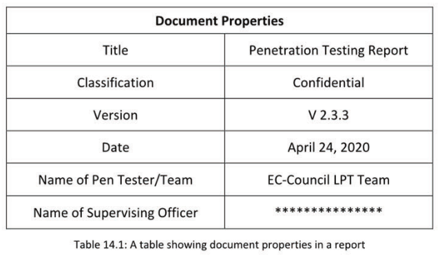
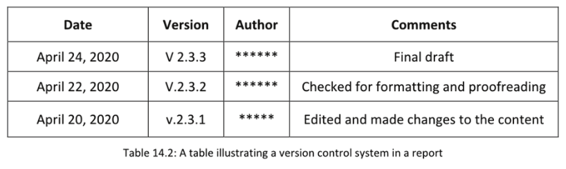
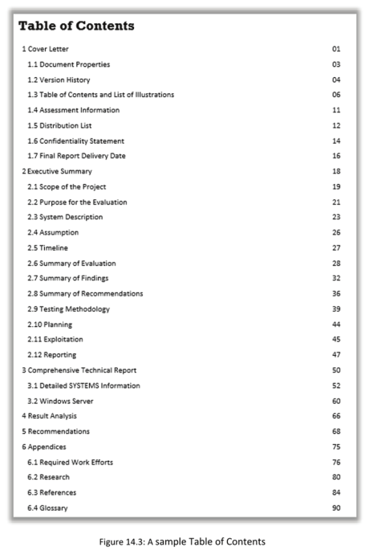
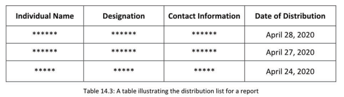

[TOC]

# Module 14 Report Writing and Post Testing Actions

## MODULE OBJECTIVE
Learn how to write a comprehensive penetration testing report for the target audience.

In this module, you will learn about the various components of a penetration test report and learn the process of writing a comprehensive report for the target audience. This module will also discuss various post pen testing activities that penetration testers (also referred to as “pen testers”) should perform to complete the contract with the client. The module also contains post-test activities for organizations that will help improve their security posture. 

## Penetration Testing Report: An Overview
This section provides an overview of the penetration testing report, including its goal, included deliverables, audience types, format, types of reports, characteristics of a good report, common mistakes, and details about writing the final report.

## Goal of the Penetration Testing Report
- The penetration testing report is a structured report that details the findings of the penetration tests that are conducted for a client.

- The penetration test report is recorded by the involved pen testers such that a one-to-one correspondence exists between the documentation and the testing process.

**Goal of the Penetration Testing Report**

1. Help executive management make decisions about implementing security controls in the organization.
2. Help those responsible for information system security implement security controls and patch any flaw
     discovered during pen testing.
3. Assure the organization that the testing team sincerely wishes to improve the organization’s security
     posture; bear this in mind when writing the report.

In addition to hacking into the system, explaining the hacking process to the client in a step-by-step manner and recommending how to remove or mitigate the risk is essential. The penetration testing report is a structured report that details the findings of the penetration tests that were conducted for a client. The pen testers record the report in such a way that a direct relationship exists between the documentation and the testing process. The report explains what was done and how. The test report provides information about all the phases starting from the test execution phase. The report should disclose all the technical findings that emerged from the assessment of the client’s network and also include remediation plans,
suggestions, and recommendations for the client that help them implement security controls. It further explains the process followed and assists the client in understanding how they can reduce their risk.

The team performing the test should set the following main objectives in order to achieve the goal of the test report:

- List the security flaws, vulnerabilities, security misconfigurations, and other exploitable resources found during the testing.
- Analyze the options available to mitigate the vulnerability.
- Suggest solutions for security risks.
- Clarify prioritization of corrections for the client’s assets
- Recommend actions to prevent possible future cyberattacks.
- Help executive management make decisions about implementing security controls in the organization.

- Help those responsible for information system security implement security controls and patch any flaw discovered during testing.
- Assure the organization that the testing team sincerely wishes to improve the organization’s security posture.

## Penetration Testing Deliverables
- Detailed analysis of the methodology used
- Penetration testing reports
- Evidence of any successful penetration
- Supplementary material to corroborate the findings
- Documentation on remediation of any identified security flaws

The penetration testing deliverables are the documents that the pen testing team is advised to submit to the organization after completing the testing process. It is recommended that the following documents be provided as part of the test contract:

- A document that offers a detailed analysis of the methodologies used in the testing such as Penetration Testing Execution Standard (PTES), Information Systems Security Assessment Framework (ISSAF), and Open Source Security Testing Methodology Manual (OSSTMM). Each methodology follows a different approach to testing; including the type of cyberattacks performed, scanning techniques used, etc. is advised.
- A test report with detailed information about all the activities performed and their results in a clear standard format
- Evidence of successful tests of the organizational resources in the form of pictures, videos, and documents. Providing detailed information about the affected resources, cyberattacks performed, tools used, etc. is recommended.
- Documents that corroborate the test findings. These documents can include information on the availability of updates, data from the compromised servers, details of the compromised accounts, etc.
- Documents containing tips for remediating the security flaws, eliminating vulnerabilities, and strengthening the security of the tested components

## Report Audience

While developing a penetration testing report, the target audience and their level of understanding of the test results must be considered. Precise reports that describe terms, metrics, risk mitigation, and financial aspects are suitable for a management or executive-level audience. Reports containing in-depth technical descriptions about the findings and their remediation steps are suitable for a technical audience such as IT administrators, network administrators, and developers.

**Management**: The requirements of the management include the following.

- Such personnel want to know if the organization is secure.

- Provide clarity about the responsible stakeholders when an issue is found.

- Order of priority for corrections to be provided based on the importance of the identified issues

  - Specify what needs to be fixed first.

- Discuss terms, metrics, risk mitigation, and financial loss.

  - Graphics and statistics are most effective for this audience.

**Technicians**: The requirements of technicians include the following:

- Such personnel are responsible for fixing the identified technical issues and hence require detailed technical information.
- Offer concise recommendations.
- Describe the steps for remediation.

- Offer a prioritized list of corrections.

**Developers**: The requirements of developers include the following.

- Such personnel required technically detailed information, so that they can fix the code.
- The report is most efficient when a code review is included in the scope.
  - Details of the weakness if possible

- Provide attack scenarios to enhance remediation requirements.
- Risk-related data should be prioritized by severity and required remediations.
  - Include effort estimations if available.

## Report Formats

**Narrative**

- Contains an in-depth description of the technical findings

- Suitable for a technical audience

- Not recommended for a management/executive-level audience

**Well-structured**

- Contains a high-level representation of the test results

- Suitable for a management/executive-level audience

- Not recommended for a technical audience

  

**In-depth technical**

- Contains a detailed description of the findings along with their criticality and mitigation steps

- Suitable for a technical audience

- Not recommended for a management/executive-level audience

**Hybrid**

- Contains both an executive summary and detailed technical findings
- Suitable for both management/executive-level and technical audiences

Based on the audience, pen testing reports can be created in four different formats.

- **Narrative**: Narrative reports contain an in-depth description of the technical aspects of the report. Such reports are suitable for a technical audience but not for a management/executive-level audience.
- **Well-structured**: Well-structured reports contain a high-level representation of the test results in the form of charts and graphs. These reports are intended for a management/executive-level audience and are not recommended for a technical audience.
- **In-depth technical**: In-depth technical reports include a detailed description of the findings along with criticality and mitigation steps. Hence, such reports are suitable only for a technical audience.
- **Hybrid**: Hybrid reports contain two sections. The first section includes a summary of the penetration testing project for a management/executive-level audience. The second section includes detailed technical findings intended for a technical audience. Hence, hybrid reports are suitable for all types of audiences.

## Types of Pen Test Resports

1. **Executive Report**

- It provides a summary of the complete pen testing process, its outcomes, and recommendations.

2. **Host Report**

- It provides details of the various hosts that were tested.

3. **Client-Side Test Report**

- It provides details of the client-side test, including the email template sent, exploits launched, test
    result, and details about compromised systems. 

4. **User Report**
- It provides details of all the users who were identified and targeted during the testing process
    along with the tasks performed by them.

5. **Vulnerability Report**
- It provides details of various vulnerabilities discovered during pen testing.

6. **Activity Report**

- It provides detailed information about all the tasks performed during penetration testing.

There are different types of penetrations test reports based on the information they provide.

- **Executive report**: This report is a short briefing of the complete testing process and includes details of the tested components, vulnerabilities, misconfigurations, updates required, and other details that can help the authorities make decisions for securing the target.
- **Host report**: This report provides information about the hosts tested, vulnerabilities found, exploited hosts, etc.
- **Client-side test report**: This report includes the details of the client-side test such as phishing, spear-phishing, spam, and social engineering attacks used during the testing. It also provides detailed information about compromised client-side systems.
- **User report**: This report includes the information of users who were identified and targeted during the testing process along with the tasks performed by them. 
- **Vulnerability report**: This report provides detailed information about all the vulnerabilities found during the pen testing process. It is recommended that the report lists the components with vulnerabilities and also offers solutions to eliminate the vulnerabilities.
- **Activity report**: This report includes all the activities that the testing team had performed across the organization and can also include various documents to support the claims.

**Note**: All these reports should be included in the final penetration testing report.

## Characteristics of a Good Pen Testing Report
- The report should be concise and easy to understand.

- It should be written in a professional manner using formal language.

- The final report must clearly state the findings with the help of screenshots showing Proof of Concepts (PoC) of the existence of the identified vulnerability and its potential risks.

- It should clearly justify the recommendations and analysis made by the pen tester.

  **Note**: Standard techniques and methodologies should be followed while preparing a report.

A penetration tester must be aware of the process of creating a good penetration testing report. The report must comply with the standard reporting procedures of the client organization and must be acceptable globally.

Characteristics of a good penetration report are as follows:

- It should be written in simple language that everyone can easily understand.
- It should be written in a professional manner using formal language.
- It must be comprehensible to both technical and nontechnical personnel such as security admins and stakeholders.
- It should clearly explain the purpose of the penetration test as well as that of writing the report.

* It should provide complete information to the reader in a clear format and not contain unnecessary information.

* It should be grammatically correct, punctuated appropriately, and free of typographical errors.

* It should provide accurate information and support it with proper evidence, such as screenshots of the test results and stolen credentials.

* It should not contain biased information.

* It must contain information sorted according to the security risks, with the highest risks being prioritized.

* It should be structured logically.

* The style of presentation and the usage of words should be attractive to readers.

* It should contain screenshots and other findings such as obtained open ports information and results obtained from tools, which act as evidence for the identified vulnerabilities and their potential risks.

* It should contain unbiased recommendations and suggestions based on the analysis by the pen testers

  **Note**: Standard techniques and methodologies should be followed while preparing a report.

## Common Mistakes
Some of the common mistakes made by organizations initiating a penetration testing process are discussed below:

- Not understanding the scope of the pen testing service

- Not asking for a retest

- Not asking for a letter of attestation

- Using a vendor without creating and signing a contract

- Not receiving guidance on the type of test to conduct

- Not asking for a detailed debrief or report walkthrough

- Not asking for a report with detailed steps and reproducible results

- Using vendors and tools that provide reports with hundreds or thousands of vulnerabilities that are mostly not critical

- Employing an inexperienced pen tester who creates reports using automated tools

**Writing the Final Report**
The final penetration testing report is the tangible output of the entire testing process. Without an appropriate report, it is extremely difficult to explain the entire process followed and the criticality of the findings. The final report should be easy to understand for the client’s management and information security personnel. The report must meet the requirements of both the management as well as technical personnel. A report that is too technical is of no use to the upper management; however, an overly simplistic report is not recommended, as the information security personnel may be unable to appropriately implement the recommended changes.

An ideal final report should include the following.

- **Final report delivery date**: The delivery date should be included in the report so that the client organization can have that information for its records.
- **Cover letter**: The cover letter should include the tester’s name, the name of the organization the tester works for, and the tester’s email address. It should be addressed to the client organization’s contact person. An ideal cover letter also includes details about the tester and acknowledges those who helped in the successful completion of the pen test.
- **Executive summary**: The report should include a summary that allows authorized client personnel to make a decision after reading it and the following topics.
  - **Organization synopsis**: This section includes a brief description of the organization and its network.
  - **Purpose for the evaluation**: This section defines the reason for undertaking penetration testing.
  - System description: This section includes a brief description of the systems used across the client organization.
  - **Scope of the project**: This section includes the total number of IP addresses, apps, devices, hosts, and other network resources that the organization had mentioned in the contract.
  - **Summary of evaluation**: This section should contain a summary of the tests performed by the pen testers and the results obtained.
  - **Assumptions/Timeline**: This section should specify all the assumptions made during the testing process and include all the commencement and completion dates for each test.
  - **Major findings and recommendations**: This section should include a summary of the major findings and any issues that could lead to future cyberattacks. The testers should also mention any recommended actions to mitigate the vulnerabilities.
  - **Testing methodology**: This section specifies the standard frameworks and techniques followed to perform penetration testing.
  - **Planning**: This section includes the details of the planned penetration testing process and how the actual process was performed.
  - **Exploitation**: This section includes all the detailed exploitation processes followed during the penetration test.
  - **Conclusions**: This is the concluding section of the report. These conclusions include any further suggestions from the testing team.

##  Phases of Report Development
**Report Development Process**

1.  Plan the report 
2. Collect and document the information
3.  Write a draft report
4. Review and finalize the report
   

### Plan the Report
1. **Report Objectives**
- Clearly outline the primary goal of writing the report and the main purpose of the security audit.
2. **Target Audience**
- Clearly know the target audience for whom the reports being written.
3. **Time frame**
- Consider the reporting time frame during the pen test project planning and adhere to the same.
4. **Confidentiality** 
- Determine the confidentiality level of the various pen testing reports and identify the controls to maintain the confidentiality of reports, as the reports contain lot of sensitive information.
5. **Format** 
- Determine the format of the final report according to the Rules of Engagement (RoE) with the client.
6. **Distribution** 
      - Consider how the reports will be distributed to the concerned stakeholders.

It is recommended that the testers plan the report after evaluating the time frame, audience, criticality of the results reported, and format of the report. This will help in avoiding last-minute dilemmas and confusion while creating the report and facilitate the creation of a checklist for report inclusions. The following should be considered while planning the report.

- **Report objectives**: The main objective of creating a report and the primary purpose of the security audit should be defined. The defined objective should act as a guideline that drives the framing and completion of an effective report.
- **Target audience**: The audience of a report can include both technical personnel such as network and security administrators who implement the recommendations and nontechnical personnel such as the stakeholders and CEO who are the primary decision makers. Therefore, identifying the target audience of the test report will help choose a format that both types of audiences can understand without much difficulty. For example, the senior management will review and analyze an executive summary, while
  the IT development team will focus on the technical details of the report.
- **Time frame**: The time required to create and submit the reports should be evaluated. The report submission is a part of the testing process, and the client will not allot a separate time frame for this. Therefore, it is advised to perform the test and develop the report within the allotted time frame.
- **Confidentiality:** The confidentiality level of the various pen testing reports should be determined, and controls should be identified to maintain the confidentiality of reports, as the reports contain a lot of sensitive information. Reports can contain sensitive information about the client such as vulnerabilities in the networks and systems, security implemented, and types of storage used. The reports should be secured from unauthorized access, and security controls should be implemented.
- **Format**: The final report should be prepared in a format requested by the client or as per the requirements of the Rules of Engagement (ROE). The client may want the report in a hardcopy or softcopy format. The report should be prepared after identifying the requirement correctly.
- **Distribution**: It is important to consider how the reports will be distributed to the concerned stakeholders. The report should be submitted within the given time frame, and copies should be distributed to the authorized personnel recommended by the client. A systematic approach should be maintained while distributing hard copies of the final report.

### Collect and Document the Information
It is important to gather information at every stage of the testing pertaining to the nature and scope of the security assessment such as documenting every process with a detailed description about the methods and tools utilized, key areas where exploits are carried out, outcomes of the scanning, vulnerability evaluation, countermeasures, and recommendations. 

Key guidelines to collect information:

1. Compile and sort all the information collected during each step of pen testing.
2. Prepare notes after each step.
3. Note the information on activity logs and network traffic.
4. Maintain a list of scanned reports and screenshots for clarity and reference.

After performing tests at each phase, information should be collected about the complete testing process, and the results should be collected and documented. Every process should be documented with a detailed description of methods and tools utilized, vulnerabilities present, cyberattack surface areas, scanning outcomes, vulnerability evaluation, countermeasures, and recommendations.

It is also recommended to take screenshots of the results, save versions of the tools used for tests, and take videos capturing the process and results if possible. This will help retain critical information safely and create the reports that need to be submitted to the target organization. Such evidence will also act as a proof of the tests and provide a basis for the recommendations. 

Key guidelines while collecting the information include the following:

- Compile the information from all the phases of the testing process such as intelligence gathering and footprinting, scanning, and exploitation and sort all the information collected at these phases.
- For each step of the test, prepare notes about the significance and result of the test along with details such as tools and their versions used, vulnerabilities found, and recommendations.
- Document all the activities and gather the network traffic logs as proof.
- Capture the screenshots for different tasks such as the outcome of the tool, scanning results, and traffic sniffed and document them for further reference where possible. 
- List the devices, servers, databases, as well as other hardware and software components tested in the test report as evidence. Maintain this list of scanned reports and screenshots for clarity and reference.

### Write a Draft Report
- Gather all the information collected during the pen test and preparea rough draft, including details from the report planning phase to the documentation phase.
- Arrange the information according to a predetermined report format.
- Ensure that all the information is gathered and documented appropriately in order to avoid missing any important information.
- Create a final draft report keeping the target audience in mind and following standard methodologies.

A draft report refers to the rough copy of a report before finalizing the process flow. This report should utilize the information and documents collected during the test. A rough draft should be prepared, including details from the report planning phase to the documentation phase. The information should be arranged according to the report format that was predetermined during the planning of the report. Information such as the results of various scanning techniques, findings from different tests performed, the output from tools, vulnerabilities identified, and recommendations should be included.

It must be ensured that all the information has been gathered and documented appropriately, and the draft should be checked for missing any important information. A final draft report should be created keeping the target audience in mind and following standard methodologies. The audience of the report may include both technical and nontechnical readers.

### Review and Finalize the Report
1. It is highly recommended that the rough draft be first reviewed by peers for a second opinion,

2. If a team has collectively participated in the documentation process, the whole team should review and edit the report.
3. After the documents are reviewed and edited by teams and peer, it is essential to appropriately document and finalize the changes.
4. Prepare the final report with all the changes in a specfic format that is widely accepted.
5. The final report should be presented in a professional manner matching the organization’s standards
6. The report should clearly mention the importance of penetration testing to the client along with the associated vulnerabilities and risks to the organization.
7. Recommendations should be made depending on the assessment and research conducted by the team that justify the organization’s security needs.

In this phase, the report is reviewed for errors, and the necessary corrections are made. It is highly recommended that the rough draft be first reviewed by peers for a second opinion. If a team has collectively participated in the documentation process, the whole team is advised to review and edit the report. After completion of the review, feedback should be collected from the reviewers, and the necessary suggestions should be incorporated in the document before finalizing the report.

The final report should be created carefully without mistakes and in a presentable manner. It should contain all the changes in a widely accepted format. The final report should be presented in a professional manner matching the organization’s standards.

The report should clearly mention the importance of penetration testing to the client along with the associated vulnerabilities and risks to the organization. Recommendations should be made based on the assessment and research conducted by the team that justify the organization’s security needs.

## Sample Pen Testing Report Format
A sample penetration testing report format is shown in the below figure.

**1.0 Report Details**

- Document Details

* Version History Information

* Recipient

* Penetration Testing Team Members

* Contact Information

**2.0 Executive Summary**

- Project Objectives

* Project Scope

* Target Systems

* Assumptions and Timeline

* Summary of Evaluations, Findings, and Recommendations

* Testing Methodology

* Planning

* Exploitation

* Reporting

**3.0 General Opinion**

* Personnel

* Policies and Procedures

* Critical Vulnerabilities

* Identification and Authentication

* Intrusion Detection

* Conclusion

**4.0 Comprehensive Technical Report**

- Web Application Assessment
- Security Management
- Security Architecture
- Access Control Methodologies
- Physical and Operational Security
- Telecommunications and Network Security

+ Applications and Systems Security
+ List of Tests Performed
* Network-Based Tests

* List of IP Addresses Tested

* Specific ISS Tests Conducted during Point Scans

* Specific NetRecon Tests Conducted during Point Scans

* Specific ESM Policy Tests Conducted

* Remote Access Phone Dialing Tests

* Physical Security Tests

* Social Engineering Tests

**5.0 Result Analysis**
**6.0 Recommendations**
**7.0 Supplemental CD Readme File**
**8.0 Appendix**
**9.0 List of Illustrations**
**10.0 List of Tables**

## Report Components

This section discusses the following various components of a penetration testing:

1. Cover letter
2. Document properties/version history
3. Table of contents and list of illustrations/final report-delivery date
4. Assessment information/contact information
5. Distribution list/confidentiality statement
6. Executive summary
7. Comprehensive technical report
8. Result analysis
9. Recommendations
10. Appendices

### Cover Letter
Cover Letter - it contains the report title, details about the author and client organization, date of submission, and a disclaimer.

The organization synopsis includes the following:

1. A brief description of the nature, scope, and structure of the organization's information security system
2. The purpose and need for undertaking the vulnerability assessment
3. Views on the current level of security risks and threats 
4. Details about people involved in the project, namely, whether a single tester or a team of testers has worked on the project
5. The knowledge and skill set of the pen tester, with details of prior studies and research conducted in this field

A cover letter provides a brief description of the final report submitted. It contains the report title, details of the author and the client organization, date of submission, and a disclaimer. The cover letter should refer to the client organization stakeholder to whom the report is being submitted and should include the details of the authors and the organization for which the work was undertaken and their positions and skills.

It is recommended that the cover letter includes a summary of the target organization comprising the following:

- A brief description of the nature, scope, and structure of the organization’s information security system
- The purpose and need for performing the vulnerability assessment
- Views on the current level of security risks and threats
- Details about the people involved in the project, namely, whether a single tester or a team of testers has worked on the project
- The knowledge and skill set of the tester, with details of prior studies and research conducted in this field

### Document Properties/Version History
**Document Properties**

- Contain valuable information about the report, including title, author, version, date andtime, and
  classification of the document

- Also lists the names of people involved in the documentation process, including those of the final
  draft approver, andin some cases, the names of the people to whom the report will be submitted

**Version History**

- A record of all the version control tracked changes   made on the report, including the names of the people  who made revisions, date and time when they made the changes, and a description of the changes they made 

**Document Properties**
Document properties refer to the description of the document being submitted to the target organization. The properties include valuable information about the report such as title, author, version, date and time, and classification of the document. The names of the people involved in the documentation process, including those of the final draft approver, and in some cases, the names of the people to whom the report will be submitted, are also listed.

**Version History**

Version history refers to a record of all the version control tracked changes made on the report, including the names of the people who made the revisions, date and time when they made the changes, and a description of the changes made.

### Table of Contents/Final Report
**Table of Contents and List of Ilustrations**

- This is a list of all the important points covered in the report with page numbers.

- It also includes a list of illustrations and figures in a diagrammatic and sequential form such as network application architecture, network diagram, and captured screenshots list.

**Final Report - Delivery Date **

- This includesall the key information on the report timeline - from the project inception date to the project delivery date along with important dates when the report was reviewed, edited, finalized, etc.
- Testing should be planned, prepared, and performed keeping the delivery date of the report in mind.

**Table of Contents and List of Illustrations**

A test report should contain a table of contents, which the readers can use for easily navigating the contents. All the important topics and subtopics of the report should be listed with their page numbers. A list of illustrations, diagrams, charts, and tables should also be included. The table of contents will help the clients learn about the flow of the testing process and also improve the presentation of the report.

**Final Report-Delivery Date**

The final report should include details of the report timeline, which specifies details of the test ranging from the project inception date to the project delivery date along with important dates on which the report was reviewed, edited, and finalized. Planning, preparing, and performing the testing based on the delivery date of the report is advised.

### Assessment Information/Contact Information
- This section covers details of all the members of the penetration testing team, including account executive, assessment team members, project manager, etc.
- Include the name of each member and their role/designation along with their ‘contact information such as email address and phone number.
- It is recommended to include client details such as company name, address, and ‘contact information.

The test report should contain assessment information that covers details of all the members of the penetration testing team, including account executive, assessment team members, project manager, etc. The name of each member and their role/designation along with their contact information such as email address and phone number should be included. 

This section should also contain client details such as company name, address, and contact information.

### Distribution List/Confidentiality Statement
**Distribution List**

- Contains details about all the report audiences 

- Include each individual's name, designation, contact details email address/phone number), date of distribution, and mode of distribution.

**Confidentiality Statement**

- Describes the importance of maintaining the confidentiality of the information contained in
    the report
- It also includes actions to be taken in case of redistribution, duplication, or misuse of such
    proprietary and confidential information.

**Distribution List**

Including a distribution list in the final report is recommended. This list contains details about all the target audiences of the report. Each individual’s name, designation, contact details (email address/phone number), date of distribution, and mode of distribution should be included.

**Confidentiality Statement**

Including a confidentiality statement in the final pen test report is highly recommended. This statement describes the importance of maintaining the confidentiality of the information contained in the report. It also includes actions to be taken in case of redistribution, duplication, or misuse of such proprietary and confidential information. To distribute or share this document, the client and the penetration testing team need to negotiate a nondisclosure agreement to meet compliance requirements.

### Executive Summary
1. The executive summary provides a high-level view of the test goals and results in the form of both risks
   and business impact in a simple and understandable way.
2. It is intended for non-technical readers such as high-level executives, business leaders, and  management.
3. They can review this summary and gain insight into the current security posture and the concerns
   highlighted in the document.
4. It allows them to make informed decisions for improving the security of their company.
5. Including visual communication while generating an executive summary is highly recommended to
   simplify complex information.
6. Use graph or chart-based representations to communicate a summary of the findings and their criticality.

