# Alibaba Cloud Associate (ACA)

# Section 2: Cloud Computing

## Cloud Computing Models

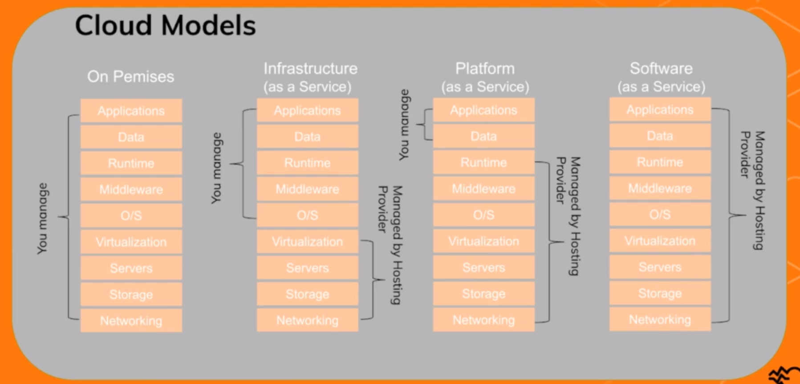

### Infrastructure as a Service (laaS) 

- is a virtual provision of computing resources over the cloud.

- An laaS cloud provider can give you the entire range of computing infrastructures such as storage, servers, networking hardware alongside maintenance support.

+ Businesses can opt for computing resources of their requirement without the need to install hardware on their premises.

### Platform as a Service (PaaS)

- simplifies the process of enterprise software development. 
- The virtual runtime environment provided by PaaS gives a favorable space for developing and testing applications.
- The entire resources offered in the form servers, storage and networking are manageable by the 
  company or a platform provider.

### Software as a Service (SaaS) 

- is a model that gives quick to cloud-based web applications.
- The vendor controls the entire computing stack, which you can access using a web browser.
- These applications run on the cloud and you can use them by a paid licensed subscription or for free with limited access.
- SaaS does not require any installations or downloads in your existing computing infrastructure. This eliminates the need for installing applications on each of your computers with the
  maintenance and support taken over by the vendor.

## Cloud Computing Deployment Models

### Public Cloud

- The cloud resources like services and storages are owned and operated by a third party cloud service provider and delivered over the Internet.
- All hardware, software and other supporting infrastructure is owned and managed by the cloud provider.
- The public cloud is multitenant. You share the same hardware, storage and network devices with other organizations.
- Access services and manage your account using a web browser.

**Advantages of public clouds**

- **Lower costs.**
  - no need to purchase hardware or software and you pay only for the service you use. 
- **No maintenance.**
  - your service provider provides you the maintenance,
- **Near-unlimited scalability.**
  - On- Demand resources are available to meet your business needs 
- **High reliability**
  - a vast network of servers insure against failure,

### Private Cloud

- consists of computing resources used exclusively by one business or organization.

- The private cloud can be physically located at your organization's onsite data center or it can be hosted by a third party service provider.
- The services and infrastructure are always maintained on a private network, and the hardware and software are dedicated solely to your organization.

**Advantages of private clouds** 

- **More flexibility** 
  - your organization can customize its cloud environment to meet specific business needs.
- **Improved security** 
  - resources are not shared with others, so high levels of control and security are possible.
- **High scalability** 
  - private clouds still afford the scalability and efficiency of public cloud.

### Hybrid Cloud

- combines on premises infrastructure or private clouds with public clouds so organizations can reap the advantages of both 
- In a hybrid cloud, data and applications can move between private and public clouds for greater flexibility and more deployment options.
- You can use the public cloud for high volume, lower security needs and the private cloud for sensitive business critical operations.

**Advantages of hybrid clouds** 

- **Control** 
  - your organization can maintain a private infrastructure for sensitive assets 
- **Flexibility** 
  - you can take advantage of additional resources in the public cloud when you need them.
- **Cost effectiveness** 
  - with the ability to scale to the public cloud you pay for extra computing power only when needed 
- **Ease** 
  - transitioning to the cloud doesn't have to be overwhelming because you can migrate gradually.

## Cloud Computing Basic Concepts

**Scalability** 

- is the ability to increase or decrease the resources, size or count.

  **Horizontal scaling** 

  - increasing and decreasing the resources count.

  **Vertical Scaling**

  - increasing or decreasing the resources size.

**Elasticity** 

- is the ability to increase and decrease resources dynamically as needed to adapt to work load changes automatically. 

**Availability** 

- amount of time a cloud provider guarantees that your data and services are available. It is usually measured in percentage. For example, 99 percent.

**Recovery** 

- is the ability to recover from a disaster or a system failure. It can be, for example, a backup.

**Intranet** 

- is a **private connection** that uses **private IP addresses**.
- **free of charge** and the **services must be deployed in the same region**.
- One example for this is a **connection between two ECS instances in the same region**.

**Internet** 

- is a **public connection** that uses **public IP addresses**.

- It is **charged** and the **services can be deployed anywhere**.
- An example is a **connection between two ECS instances in different regions**.

**Stateless** 

- Means that the session data is not stored on the server.

- That means that the data is being transmitted without any information about the sender or receiver being retained by either 

  

**Stateful**

- Store a session data on the server.
- Typically via Log-in.

## Alibaba Cloud Global Infrastructure

**Region** 

- refers to the geographical area or city where Alibaba cloud provides the cloud computing service.
- choose a region to optimize latency, minimize costs or address regulatory requirements.
- Intranet communication between Alibaba cloud products that are not in the same region is not supported,
- Currently there are 28 regions and 86 availability *zones* around the world.'

**Zone** 

- refers to within a region, the physical data center with independent power supply and network.

- With the zone option, you can choose the resource in different zones based on your distribution policy.

- Every region contains between 1 - 3 zones.

- Creating resources in multiple zones can facilitate high availability, creating resources in the same

  zone, facilitate slower communication latency.

- Zones in the same region are interconnected and provide inexpensive, low latency Intranet connectivity to other zones.

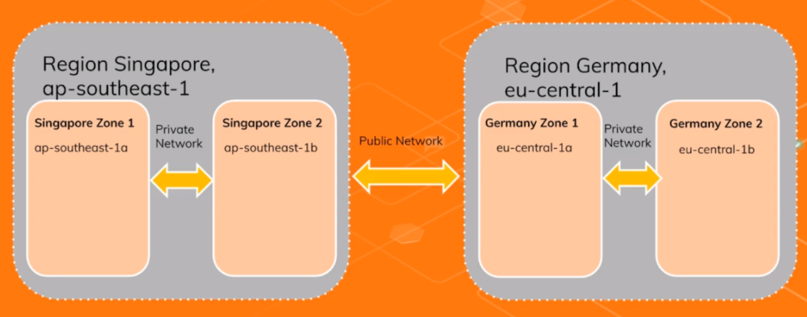

- We have the region AP Southeast one in Singapore and the region EU central one in Germany,
- Both with two zones A and B within the region. 
- The zones in the same region are interconnected via **Intranet** and the regions are connected via **Internet**.

## Alibaba Cloud Support Services

**Consulting Services** 

- readiness assessment,

- solution architecture
- security architecture 
- service management consulting

**Managed Services** 

- aftersales support 
- event management 
- platform operations services

**System Integration Services**

- initial deployment
- migration implementation 
- load performance tests 
- architecture optimization services

## After-Sales Support Plan

**Basic plan** 

- is ideal for getting a taste of Alibaba cloud services for trial versions of some technical support and ticket handling services.
- The basic plan is free to everybody already registered on Alibaba Cloud.

**Developer plan** 

- is designed for individual developers.

- It provides Alibaba cloud technical resources, and it is dedicated to make work more efficient.

- $18.99 / month

**Business plan** 

- is perfect for small scale businesses.

- It meets the demand of service quality and provides professional guidance as well as safeguards the security and continuity of business productions.

- $100 / month

**Enterprise plan**

- tailored for enterprises with large workloads and low tolerance for errors.
- It provides dedicated technical service managers to enable quicker responses for severe cases and ensure secure and stable cloud business operations.
- $8,000 / month

## Quiz 1 - **Cloud Computing Quiz**

1. What stands IaaS for?

   - Information as a Service

   - Information as a Standard
   - **Infrastructure as a Service**
   - Infrastructure as a Standard

2. What stands SaaS for?
   - Standard as a Service
   - Software as a Standard
   - **Software as a Service**
   - Service as a Software

3. It refers to a geographical area where Alibaba Cloud provides the cloud computing service. We are talking about a ______?

   - **Region**
   - Zone
   - Edge
   - Area
4. It refers to the physical datacenter with independent power supply and network. We are talking about a ______?
   - Region
   - **Zone**
   - Edge
   - Area
5. An automotive company has an application running in many servers spread across multiple zones within a region. Suddenly, they decide to change the region and they want to migrate the application to another region. Which of the following statement is most correct?
   - Change the region of the servers
   - Change the zone of the servers
   - Create new servers in the new region
   - **The region of the servers cannot be changed after creation**
6. Which Cloud deployment model is multitenant so that you share the same hardware, storage and network devices with other organizations?
   - **Public Cloud**
   - Private Cloud
   - Hybrid Cloud
   - On-premise

# Section 3: Elastic Compute Service

## ECS Overview

**Exam Overview**

- **30%** of the exam questions related to the **Elastic Compute Service**.

- Familiar with ECS related concepts, including regions and zones, instances, disks, snapshots, images, networks and security groups.
- Have knowledge about the advantages billing policies, application scenarios, API s and SDK  of ECS
- Able to deploy applications based on ECS products.
- Familiar with the usage and operations of ECS instances, disks, security groups, snapshots, images and tags.

## ECS Concept

### **What is Elastic Compute Service (ECS)**

**Elastic Compute Service**

-  a computing service with flexible processing capacity.
- ECS  can easily deploy and manage applications with high service performance, stability, reliability and scalability.
- Provides resizable compute capacity in the cloud.
- Launch instances with a variety of operating systems 
- Run as many or few systems as you desire.

### ECS: Infrastructure as a Service (IaaS)

- this means that you do not have to purchase hardware or construct data centers upfront.
- Alibaba Cloud takes care of this, you must take care of the operating system, the middleware, the runtime, the data and the application.

### ECS: Benefits

- Instances are delivered within minutes 
  - enabling rapid deployment and reducing time to market.
- You can make use of resources in data centers and BGP grids around the world.
- You can scale and release resources based on actual business needs.
- You can use ECS to access other Alibaba cloud services over the internal network reducing traffic costs.
- It also provides a host of security solutions such as virtual firewalls, permission control, internal network isolation, virus protection and traffic throttling.
- It provides a performance monitoring framework and proactive O and M systems.

- It also provides standardised APIs to improve ease of use and applicability 

### ECS: Architecture

- You cannot change an ECS  instance region after the purchase 
- And ECS  instances in different zones in the same region under the same account are interconnected via the Intranet.

### ECS: Billing

- ECS provides multiple billing methods to cater to the cost effectiveness requirements in different scenarios.

- Subscription

- Pay as you go (PAYG)
- Reserved instance
  - Common use is if you plan to make a long term commitment with pay as you go. ECS instances, you can purchase reserved instances to offset your bill. 
  - This method is more flexible and cost effective.
- Preemptible Instance
  - are a type of on-demand instances that reduce overall ECS instantance costs. 
  - Preventable instances may be reclaimed.

- After you create an ECS instance, you can switch an instance from pay as you go to subscription.

However, there are some restrictions to keep in mind:

-  the instance is in running or stopped status.
- No time to release is set for the instance.

- No unpaid switch order for the instance.
- The instance type is not any one of generation 1 
- and the instance type is not n1, n2 or e3

### ECS: Billing: Pay As You Go (PAYG)

- PAYG allows you to pay for the amount of resources you actually use.
- You can purchase and release resources on demand and scale up as your business grows.
- They are billed based on the billing cycle and paid each hour.
- There are no long term commitments or upfront payments with this billing method.

### ECX: Billing: Subscription

- Subscription is billing method that allows you to use resources only after payment for them is received with subscription.
- You can reserve resources in advance and reduce your costs with the discounted rates.
- It is cheaper than the pay as you go pricing.
- It is available in either monthly or yearly subscriptions.
- And last but not least, it is better suited for those requiring long term resources.

### ECS: Monitoring

- You can monitor your ECS instances by using the ECS Monitoring Service or CloudMonitor.
- ECS provides CPU Utilization, Network Traffic and Disk I/O monitoring for a specified instance
- CloudMonitor helps you collect and get multiple monitoring metrics for ECS instances and set alerting rules for various metrics to improve your monitoring and  O&M efficiency.

## ECS Instance

### What is an ECS instance?

- An ECS instance is a virtual machine that contains basic computing components such as the C.P.U memory operating system and network.
- You can fully customize and modify all configurations of an ECS instance.
- ECS provides a wide selection of instant types optimized to fit different use cases.
- Instance types comprise varying combinations of CPU, memory, storage and networking capacity.

### ECS Instance Families

- ECS instances can be divided into multiple specification types based on the business and usage scenarios.
- You can select current and previous instance families for a business scenario,
- An instance family also has many instance types based on different CPU and memory configurations.

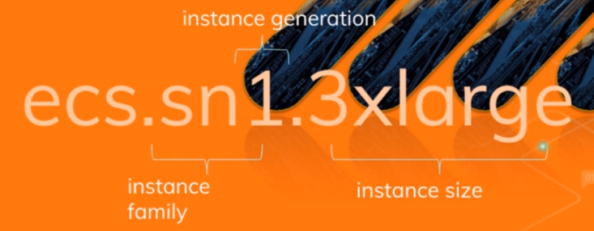

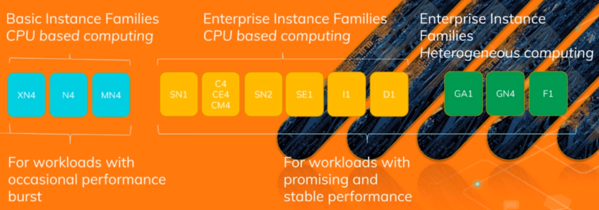

### ECS Instance Failover

- When a physical machine goes down, the ECS system initiates a downtime fail over 
- Instances can only be migrated within the same zone.
- The process can take 5-10 minutes.

### ECS Instance Status

- If an ECS instance is stopped:

  - A new public IP will be assigned to that instance when restarting it
  - The EIP and the Intranet IP will remain the same.
  - You are not billed for the CPU and RAM usage.
  - You still will be billed for disc (system and data )usage as well as for the bandwidth and for the EIP.

- If an ECS instance is released, 

  - All data will be lost.

  - The ECS instance will be shut down immediately or at the date you specify 

- If an ECS instance is restarted.
  - There are no changes and all will remain the same.

### ECS Instance Metdata

- The metadata of an instance is the basic information of the ECS instance, including the InstanceID

  IP address, OS  and other related information 

- You can use an instance's metadata to better manage and configure an instance.
- Linux: curl http://100.100.100.200/latest/metadata/
- Windows: Invoke-RestMethod http://100.100.100.200/latest/metadata/

### ECS Instance User-defined Data

- User defined data is a function to customize the start of behavior of an ECS instance and to pass into an ECS instance.
- This function works on an easy instance, running either Windows or Linux
- There are two types of user defined data:
  - General-purpose data, which can be passed to an instance to be referred within the instance 
  - User-defined scripts which can be passed into an instance to run when the instance started. Linux and Windows ECS instances are supported.

## ECS Storage

### ECS CLoud Disk

- ECS utilizes cloud disk as a system and data disk.
- Cloud disks, a block level data storage products for ECS
- Cloud disks support data redundancy Through the replication of data three times by default and the storage of the data copies across different servers
- Provides 99.99999999%  data reliability for ECS instances
- You can partition and format cloud disks attached to an ECS instance and create a file system and stored data on the cloud disk.

- A cloud disk can be separately purchased:
- It can be mounted to any instance in the same zone
- Cross-zone mounting not supported
- It can be mounted to only one instance at a time.
- Support volume-based payment only 
- To be able to resize the cloud disk. The easiest instance must be stopped.

**2 Types of Clod Disk**

1. **SSD Cloud Disk**
2. **Ultra Cloud Disk**

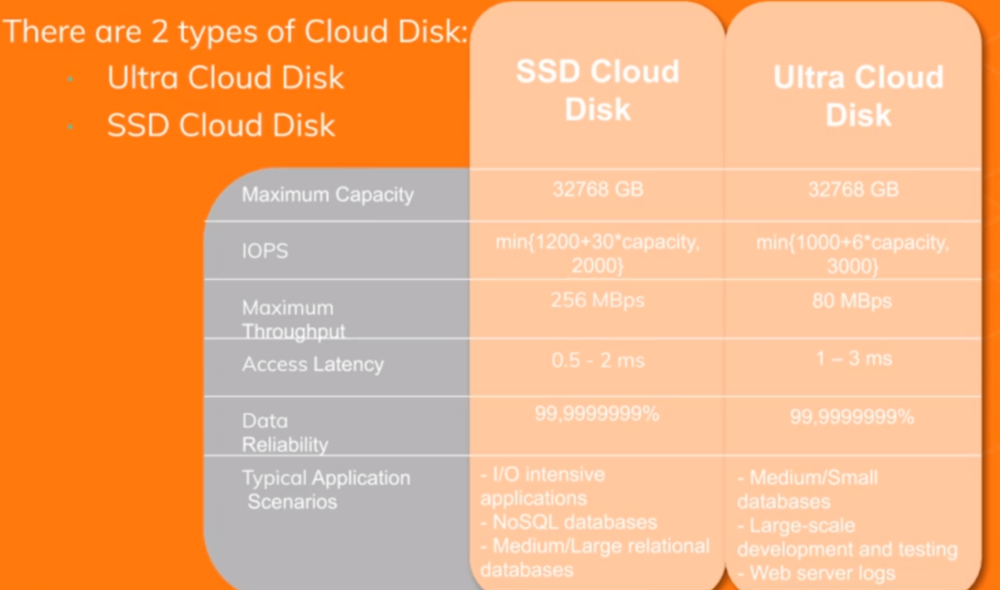

### ECS Disk Snapshot

- Disk snapshots are read only copies of disk data, certain points in time.

- Snapshots can be stored in OSS (Object Storage Service)

-  Snapshots can also be created manually and automatically

- Use case:

  - Common usage of snapshot is to backup data
  - The system disk snapshot can be used to create a custom image file.
  - The image file can then be used to quickly create duplicate ECS instances.
  - The data disk snapshots can be used to create a new disk containing the same data.

- ECS Snapshot is incremental. Only the changed path between two snapshots will be reported as shown in the picture.

  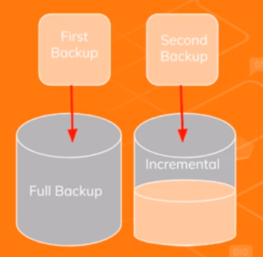

  - When the second snapshot is created, only the incremental part has been changed. So the incremental backup will only include those changes.

  
### ECS Disk Image

- An ECS Disk image is the template that stores information for creating an ECS instance.

- You must select an image when you create an ECS instance.
- An image works as a copy that stores data from one or more disks 
- An ECS  image may store data from a system disk or from both system and data disks.

**3 types of disk images** 

1. System Images (Public Images)

   - Public images are Alibaba cloud provided images of Linux and Windows.
   - This is the default option if you do not choose any image.

2. Marketplace Images

   - Alibaba cloud provided third party images with some software or value added services pre-installed 

3. User-defined Images (Custom Image):
   - A user defined images created from the system disk snapshot of an ECS instance. 
   - These images are the basis of the auto scaling service.

## ECS Networking

- Virtual Private Cloud (VPC) is a private network in your own logically isolated area within the Alibaba cloud.
- You have full control over your VPC
  - which you can define and customize by specifying the IP address range and configuring these Vswitches,  Vrouters, route tables and network gateways.
- You can connect your VPC to other VPCs or to your existing data center 
  - through a dedicated line or VPN to form a hybrid cloud.
- You can also launch Alibaba cloud resources such as ECS, RDS and SLB in your own VPC
- VPCs support both IPv4 and IPv6 addressing protocols.

**3 Essential Components of a VPC**

1. Vswitches

   - VSwitches is a basic network device that connects different cloud resources in a VPC.

   - You can create one or more subnets in the VPC by creating V switches.

   - The Vswitches within a VPC are interconnected.

   - You can deploy your applications in these switches that belong to different zones to improve service availability.

   - Each Vswitch can only be associated with one route table 

2. Vrouter 
   - is a hub that connects all Vswitches in a VPC and serves as a gateway between the VPC and other networks.
   - After VPC is created, a router is automatically created for the VPC.
   - Each Vrouter is associated with a route table.
3. Route Table 
   - is a list of route entries in a VPC.
   - The network traffic routed is based on the configurations of the route entries in the route table
   - A route entry specifies the destination of traffic 
   - Consists of the destination CIDR block, the next hop type, and the next hop.

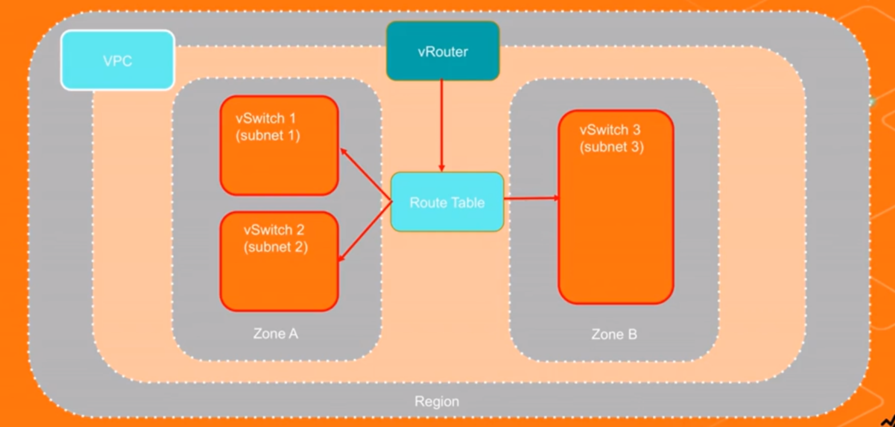

### Security Groups

- Security groups act as virtual firewalls and are used to isolate security domains on the cloud.

- Control the inbound and outbound traffic of ECS instances  within the security group.
- Security groups incdes the network protocol port, action and source IP Address.

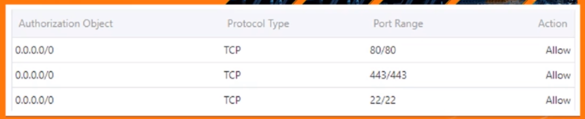

- Each ECS instance must belong to at least one security group and can be added to multiple security groups at the same time.
- A security group can manage multiple ECS instances.
- By default, ECS instances in the same security group can communicate with each other over the internal network
- Instances in different security groups cannot communicate with each other when no security group rule that allows access is configured.
- Security groups are stateful.

## Quiz 2: ECS Quiz

1. What does ECS stand for?
   - Elastic Cloud Service
   - Elastic Cloud Storage
   - **Elastic Compute Service**
   - Elastic Compute Storage
2. A company wants to use Alibaba Cloud service to replace their self-built virtual servers, which of the following services should it choose?
   - **ECS**
   - SLB
   - RDS
   - OSS
3. Which of the following cloud model is an Elastic Compute Service (ECS)?
   - **IaaS**
   - PaaS
   - SaaS
   - On-premise
4. A European company builds its full infrastructure in the *eu-central-1* region. Now, they want to expand their business to China and they have decided to change the existing ECS instance region to the *cn-shanghai* region. Which is the procedure for changing the ECS instance region?
   - Change the region using the Alibaba Cloud CLI or via console
   - First, change the zones, and then change the region using the Alibaba Cloud CLI or via console
   - ECS instances are not regional, they are global, so you don´t have to do anything
   - **You cannot change an ECS instance region after the purchase**
5. A logistics company wants to migrate his data from on-premise to the Alibaba Cloud. They want to move all to ECS instances. Since they want to reduce the infrastructure costs as much as possible, they are looking for a long-term commitment. Which ECS billing method should they choose?
   - Basic
   - Enterprise
   - Pay As You Go (PAYG)
   - **Subscription**
6. ________ are read-only copies of disk data at certain points in time. Which Alibaba Cloud service is it?
   - ECS instances
   - ECS cloud disks
   - **ECS snapshots**
   - ECS disk images

# Section 4: Server Load Balancer

## Exam Overview

- 20% of the exam questions related to the server load balancer in order to pass the exam.
- Familiar with server load balancer related basic concepts and features, including the server load balance of definition, implementation principles, supported protocols, session persistence, health checks, backend server weights, certificates and forwarding policies.
- Familiar with server load balances, product advantages and its application scenarios.
- Have knowledge about usage, operation and maintenance of server load balances, including server load, balancer configuration, maintenance precautions and problem identification and handling.

## SLB Concept

- Server Load Balancer (SLB) distributes incoming traffic across multiple ECS instances.
- SLB provides high availability by utilizing multiple zones
- A single point of failure is avoided and additionally to that provides high availability SLB routes, incoming requests to multiple ECAC instances.
- It's elastically expands capacity according to service loading without affecting external services.
- SLB is a managed service (PaaS)

**SLB Layer 4** 

- supports TCP and UDP protocols with SSL.
- Operates at the intermediate transport layer
  - which deals with delivery of messages with no regard to the content of the messages.
- No header modification 
- Can only make limited routing decisions 
  - by inspecting the first few packets in the TCP stream.

**SLB Layer 7** 

- supports HTTP and HTTPS protocols.
- Connection terminated at the load balancer and pooled to the server
- Headers maybe modified 
-  X-Forwarded-For header contains the clients IP address.
- And a very important topic for the exam, content based routing allows requests to be routed to different applications behind a single load balancer.

### SLB: Auto Scaling

SLB integrates with auto scaling to manage the scaling of the ECS instances attached to the SLB.

Maintain ECS instance availability:

- Detects impaired ECS instances 
- Replaces the intances automatically.

Automatically scale your ECS fleet:

- Follow the demand curve for your applications.
- Reduces the need to manually provide ECS capacity.
- Automatically bound added ECS instances to the SLB
- Run them at optimal utilization.

### SLB: Security

- Up to 5 Gbps DDos protection
- All traffic from the Internet must first go through Anti-DDoS basic service and then arrive at the Service Load Balancer.
- Anti-DDoS can defend attacks such as HTTP, flood attacks, UDP flood, DNS query flood, etc. 
- Anti-DDoS basic sets the cleaning threshold and black hole threshold according to the public network bandwidth configured with the SLB
  - **Flow cleaning** is triggered when the incoming Internet traffic exceeds the cleaning threshold or matches a certain attack traffic model.
  - **Black hole** is triggered when the incoming Internet traffic exceeds the default traffic threshold. All the traffic will be discarded for the security of the cluster.

### SLB: Pricing

- SLB only supports purchasing in Pay-As-You-Go mode. Depending on the network type there are two pricing models:

  **Public network SLB: PAYG**

  - Pay for instance  renting and the public traffic fee.
  - Bills you for the exact volume you actually use by hours.
  - No long term commitments or upfront payments.

  **Private network SLB: Free**

  - This type of SLB can only be used in a private network environment
  - Recommended to be adopted in a multi-tier architecture and to distribute flows in a private network.  

## SLB Components

 ### SLB Instance

- SLB instance is a running load balancing service that receives and distributes the incoming traffic to the backend servers.
- To use the SLB service, you must create an SLB instance with at least **1 listener** and **2 ECS instances** configured
- You have to choose the **region**, the **zone** given name to the instance, and you will also need to **specify the network configuration**.

### SLB: Listener

- **SLB listener** checks the client's requests and forwards the requests to the back end servers.

- It also performs health checks on the back end servers.
- Define the **protocol** and the **port** on which the load balancer listens for incoming connections.
- Each load balancer needs at least **1 listener** to accept incoming traffic.
- Each listener corresponds to an application deployed on the ECS.

The next four points are important to know before taking the exam.

- Routing forwarding rules are defined on liisteners
- Session stickiness (session persistence) is set at the listener level.

- Health check configurations are done at listener level.
- Peak bandwidth can be done at the instance level.

### SLB: Listeners Forwarding Rules

1. **Round Robin**
   - Requests are distributed across the group of backend ECS servers, sequentially.
2. **Weighted Round Robin (WRR)**
   - You can set a weight for each backend server
   - Servers with higher weights received more requests than those with lower weights 

3. **Weighted Least Connections (WLC)**
   - In addition to the weight set to each backend ECS server, the number of connections to the client is also considered.

### SLB: Listener Health Checks

- **Health checks** allow for traffic to be shifted away from impaired or failed instances.

- Health checks ensure that request traffic is shifted away from a failed instance.
- Health checks are supported by HTTP, HTTPS, TCP health checks.
- Customize the frequency failure thresholds and list of successful response codes 

### SLB: Backend Servers

- **SLB backend servers** are the ECS instances added to an SLB instance to process the distributed requests.

- You can group that ECS instances hosting different applications or functioning different roles into different server groups.

- ECS instances can be registered with the same listener using multiple ports.

- SLB service forwards, external requests to backend servers to process according to the rules defined.

- Server Load Balancer **does not support cross region deployment**.

- Users must ensure that the region of the EC instances and the server load balancer instance is the same.

- Server Load Balancer **does not limit the operating system used** in the ECS instances as long as the application deployed in the ECS instances is the same

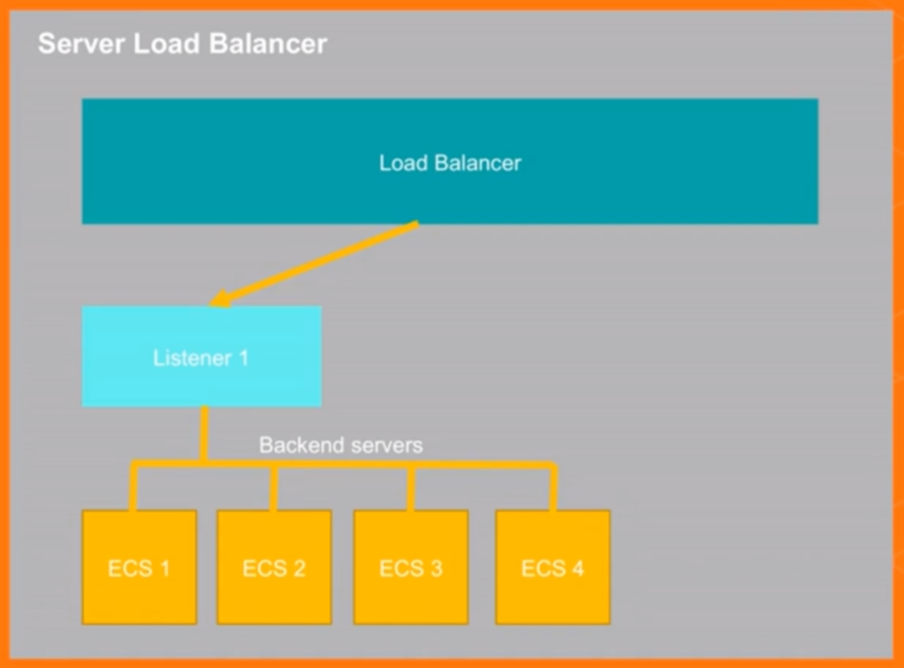

## SLB Disaster Recovery

**2 Type of SLB Disaster Recovery**

1. **The SLB Multi-zone Disaster Recovery** 

   - Utilizes the primary and backup cells feature in SLB.
   - If the primary zone becomes unavailable, the server load balancer rapidly switches to a backup zone to restore its service capabilities within 30 seconds.
   - When the primary zone becomes available, the server load balancer automatically switches back to the primary zone.

   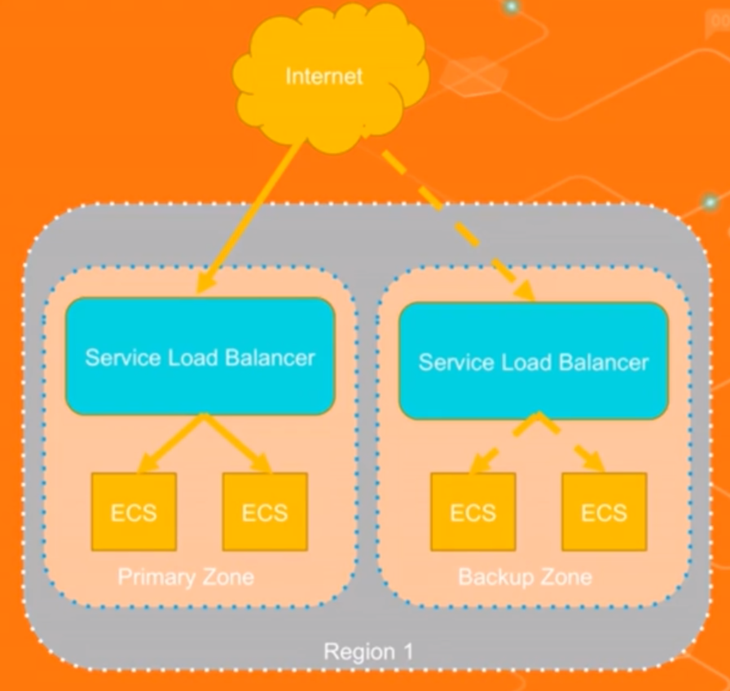

   

2. **SLB Cross-region Disaster Recovery**

   -  has a very similar concept, but instead of using zones, it uses regions.
   - Utilizes the primary and backup region feature in SLB.
   - If the primary region becomes unavailable, the server load balancer rapidly switches to a backup region to restore its service capabilities within 30 seconds.
   - When the primary region becomes available, the server load balancer automatically switches back to the primary region

   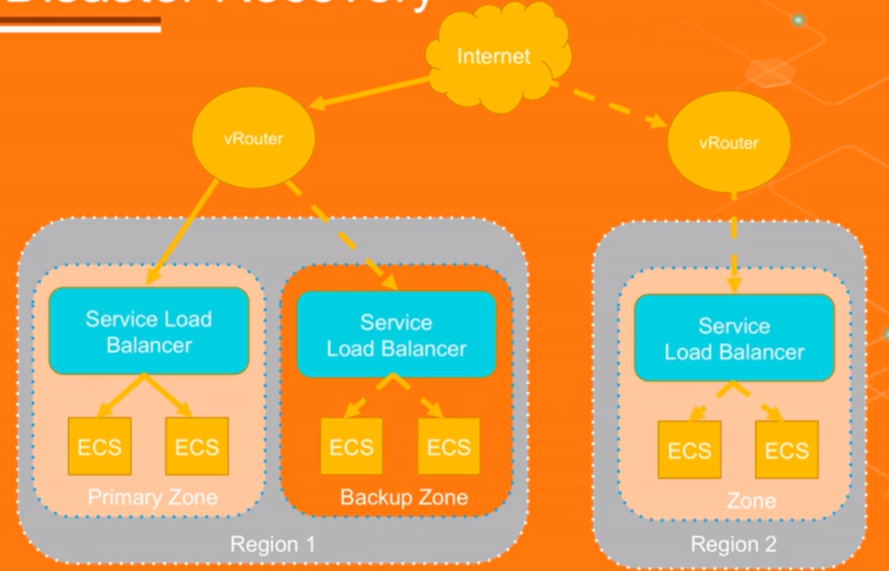

   

## Quiz 3: SLB QUIZ

1. What does SLB stand for?
   - Standard Load Balancer
   - Storage Load Balancer
   - **Server Load Balancer**
   - Single Load Balancer
2. Which of the following cloud model is Server Load Balancer (SLB)?
   - IaaS
   - **PaaS**
   - SaaS
   - On-premise
3. A company wants to use Alibaba Cloud service to replace their self-built load balancers, which of the following services should it choose?
   - CLB
   - **SLB**
   - ALB
   - NLB
4. Alibaba Cloud SLB distributes incoming application traffic across multiple applications hosted on ECS instances. By utilizing multiple zones provides high _________.
   - Elasticity
   - Scalability
   - Disaster Recovery
   - **Availability**
5. Depending on the network type there are two pricing models for the Alibaba Cloud SLB. Which is the pricing model if the SLB is in a Public network?
   - **Pay As You Go (PAYG)**
   - Reserved
   - Subscription
   - Free of charges
6. When using Alibaba Cloud SLB, you can set health checks for backend ECS instances. Which of the following statements is correct?
   - **Health checks ensure that request traffic is shifted away from a failed instance**
   - Health checks ensure that request traffic is shifted to failed instances
   - Health checks ensure that request traffic is shifted away from instances
   - Health checks ensure that request traffic is shifted to instances

# Section 5: Auto Scaling

## Exam Overview

- 10 % of the exam are questions related to the server load balancer

- Familiar with basic concepts related to auto scaling, including scaling groups, scaling configuration, scaling rules, scaling activities, scaling trigger tasks, scaling mode and freezing time.

-  Familiar with auto scaling features, product advantages and common application scenarios.

## Auto Scaling Concept

- Auto scaling is a service that automatically adjusts elastic computing resources based on your volume of user requests.
- When the demand for computing resources increases or to scaling automatically adds ECS instances to serve additional user requests or alternatively removes instances in the case of decreased user requests.
- The service is available free of charge. You will only be charged for the standard cost of adding additional ECS resources.

### **3 Auto Scaling modes**

1. **Elastic scale up** 
   - adds additional computing resources to the pool during peak hours.
   
2. **Elastic scaled down** 
   - releases computing resources when requests decrease

3. **Elastic self healing**
   - when an unhealthy ECS instance is detected and it automatically replaces it with a new one.

### Auto Scaling Features

**On demand**

- Adjust resources to fit the demand curve in real time. You about your computing capacity when demand surges.

**Automated**

-  Automatically create and release ECS instances  base on the policies you specify. Configure the Server Load Balancer and RDS whitelists with no manual operation.

**Flexible**

- You can setup scheduled scaling, dynamic scaling based on targets monitored, scaling fixed number of instances, and automated replacing of unhealthy instances. It also can use external monitoring systems through APIs.

**Intelligent**

- Can be applied to complicated scenarios.

### Auto Scaling Procedure

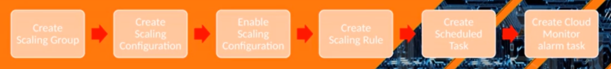

1. Create a scaling group.  Configure the minimum and maximum number of ECS instances in the scaling group and select the associated SLB and RDF instances.
2. Create a scaling configuration. Configure the ECS instances attributes for Auto scaling such as image ID and instant type.
3. Enable the scaling group with the scaling configuration created in step 2
4. Create a scaling rule.
   - For example: add an ECS instances.
5. Create a scheduled task.
   -  For example: to trigger the scaling rule created in step four at 12 AM.
6. Create a Cloud Monitor alarm task, 
   - For example:  to add one ECS instance, when the average CPU usage is greater than or equal to 80%

### Auto Scaling Components

- **Scaling Group** is a group of Elastic Compute Service (ECS) instances that are dynamically scaled based on the configured scenario.
- After you configure an elastic compute service instance template for a scaling group and enable the scaling group, auto scaling can automatically scale ECS instances in the scaling group based on a scaling rule.
- You can also manually add existing ECS instances to the scaling group
- Specify the maximum and minimum number of ECS instances of an auto scaling group.
- The maximum number of ECS instances defined in the scaling group cannot be exceeded.
- The same applies with the minimum number of ECS instances defined in the scaling group and cannot be reduced.

#### Auto Scaling : Cooldown Period

- **Cooldown period** is the period during which auto scaling cannot execute any new scaling activity
- During the cooldown time, the system rejects all scaling activities triggered by monitoring tasks toward a scaling group.
- The cooldown time starts after the last ECS instance is added to or removed from the scaling group and a scaling activity 
- Manually executed scaling rules and scheduled tasks can immediately trigger scaling activities without waiting for the cooldown time to expire.

#### Auto Scaling: Scaling Configuration

- The **scaling configuration** defines the configuration information of ECS instances.

- You can create scaling configurations for scaling groups. Then scaling groups can create ECS instances in scaled-out activities based on the scaling configurations.
- When creating a scaling configuration, you must set the parameters for creating an ECS instance, such as the instance type, image type, storage size, and the secure shell (SSH) key pair that is used to log on to the ECS instance.
- You must create at least one scaling group before creating a scaling configuration. The number of scaling configurations that you can create for a scaling group is limited.

#### Auto Scaling: Scaling Rule

- **A scaling rule** defines a specific scaling actions like adding over removing ECS instances
- Auto scaling scales, ECS instances in a scaling group based on scaling rule and the maximum or minimum number of ECS instances specified for the scaling group.

#### Auto Scaling: Scaling Activity

- When the scaling rule is triggered, a **scaling activity** is generated. 

- The scaling activity is mainly used to describe the variation of ECS instances in the scaling group.

- Only one scaling activity can be executed at a time, and a scaling group

- An ongoing scaling activity cannot be terminated.

  For example: 

  If a scaling activity is being executed to create 26 instances but only five have been created, you cannot forcibly terminate the scaling activity.

- If an ECS instance fails to be added or removed in a scaling activity, the system preserves the transactional integrity of each ECS instance instead of the whole scaling activity. The system rolls back the ECS instance that failed to be added or removed. But not the scaling activity.

  For example: 

  If 26 instances are created for a scaling group, but only 19 ECS instances are added to the backend to serve a group of a server load balancer instance only that ECS instance that failed to be added is released.

#### Auto Scaling: Scaling Trigger Task

- **Scaling trigger tasks** are tasks that trigger scaling rule such as scheduled tasks and Cloud Monitor alert tasks.

## Quiz 4: AutoScaling QuiZ

1. A company wants to use an Alibaba Cloud service to automatically scale the ECS instances fleet, which of the following services should it choose?
   - SLB
   - **Auto Scaling**
   - OSS
   - CDN
2. Which of the following Auto Scaling modes is not supported?
   - Elastic scale-up
   - Elastic scale down
   - **Elastic scale-out**
   - Elastic self-healing
3. Which of the following statements about Scaling Group is correct?
   - The minimum number of ECS instances defined in the Scaling Group can be reduced
   - **The minimum number of ECS instances defined in the Scaling Group cannot be reduced**
   - The maximum number of ECS instances defined in the Scaling Group can be exceed
   - The maximum and minimum number of ECS instances defined in the Scaling Group can be exceed
4. An automotive company has configured an Auto Scaling group with a maximum number of 10 ECS instances and a scaling rule that adds 5 ECS instances at 10 pm. If the company has 7 instances running before 10 pm, how many instances will be running after 10 pm?
   - 5
   - 7
   - **10**
   - 12

# Section 6: ApsaraDB for RDS

## ApsaraDB for RDS Overview

- 10 percent of the exam are questions related to general knowledge about cloud computing.
- Familiar with RDS related concepts and the database type supported, include MySQL, SQL Server, PostgreSQL and PPAS
- Has knowledge about the advantages, application scenarios and billing models of RDS products.
- Has knowledge about  the management, use and operations of RDS instance, such as connecting to RDS, read only and backup, etc.

## ApsaraDB for RDS Concept

- **ApsaraDB for Relational Database Service (RDS)** is a managed relational database service that is simple to deploy, easy to scale, reliable and cost effective.
- Based on the Apsara distributed file system and incorporated with high performance SSDs
- RDS supports:
  - MySQL 
  - PostgreSQL
  - SQL Server
  - PostgreSQL Plus Advanced Server (PPAS)
  - MariDB  engines.
- RDS  does not support Oracle.

**Fully Managed host an OS** 

- No access to the database host operating system 
- Limited ability to modify the configuration that is managed on the host operating system.
- No functions that rely on the configuration from the host OS
- Grab-and-go service that provides additional operation, monitoring and security tools
- Guarantees up to 99.9% of business availability 
- Provides automatic fail over in case primary instances are not available.

**Fully Managed Storage** 

- Max storage limits
- Supports up to 20,000 IOPS and 2 TB storage for each instance.
- Upgrade the instance memory and disk space according to your requirements.

## ApsaraDB for RDS Intances

- **RDS instance** is a database service running on a virtual computing environment. You decide the database engine, CPU, memory, storage and network used by RDS instance.
- RDS provides a wide selection of instant types optimized to fit different use cases.
- Instance types comprise varying combinations of CPU, memory, storage and network capacity.

**RDS provides 3 editions of instances** 

1. **Basic Edition**
   - uses the storage-computing, isolated architecture and a single computing node, which realizes super high cost effectiveness.
2.  **High-availability Edition**
   - uses the classic high availability architecture with one master node and one slave node. 
   - The ephemeral SSD storage provides the best and balanced performance.
3. **Finance Edition** 
   - uses the three node architecture with one master node and two slave nodes.
   - This architecture guarantees strong data consistency through synchronizing multiple log copies and provides financial-level data reliability and cross-IDC disaster tolerance.

## ApsaraDB for RDS Features

### RDS Backup

2 types of RDS backup

1. **Automatic backup.**

   - You can configure a backup policy to just the cycle of RDS data backup and log backup and thereby realize automatic backup.

     You will need to specify the:

     - Data retention days
     - Frequency (daily, weekly weekends)
     - Log retention period.

   - Automatic backup supports physical backup.

2. **Manual backup.**

   - You can backup RDS data at any time you want using manual backup 
   - Manual backup supports both physical backup and logical backup.

Some features of the RDS backup are:

-  If  your total backup data is below 5 GB, there will be no extra charge.
- You can obtain temporary links to download their backup data as needed.
- The storage module also supports dumping backup files to an OSS archive storage for cheaper and steady offline storage.

### RDS Recovery

3 ways to recover data in RDS

1. Master node rollback
   - used to restore a node to the state that it was in at a specific point in time.
2. Slave node repair 
   - used to automatically create a new slave node to reduce risks when an irreparable failure occurs to the slave node.
3. Temporary instance (recommended)
   - You can create a temporary instance with your backup and migrate data to the for master instance
   - Valid for 48 hours 
   - Only one temporary instance can be generated at the same time.
   - Inherits the account and password of the backup file
   - Uses its instance name as the password.

### RDS Read-only instances 

- **Read-only instances** are instances that you can directly attached to RDF in order to distribute the read pressure on the master.
- Instance, this feature is only supported for MySQL
- If a large volume of read requests overwhelm the primary instance, your business may be interrupted.
- Each read-only instance has an independent connection string and the read pressure can be automatically distributed on the application side.
- When you create to read-only instance, the system copies data from the primary instance to ensure data consistency.

### RDS Migration Service

- Iigrate data from a local database to ApsaraDB or migrate an AbsaraDB instance to another instance.

**Data transfer service** **(DTG)** is an ApsaraDB tool to facilitate quick database migration

**3 migration modes**

1. **Structural migration** 
   - migrates the structural definitions of migration objects to the target instance.
   - can migrate tables, views, triggers, stored procedures and stored functions
2. **Full migration**
   - migrates all existing data in the source database migration objects to the target instance.
3. **Incremental migration** 
   - synchronizes data changes made in the migration process to the target instance.

## ApsaraDB for RDS Security and Monitoring

### RDS Security

**3 Level Security Defense System**

1. **Anti-DDoS** 
   - provides Real-Time traffic monitoring at network entry points.
   - If any high traffic is identified, source IPs are either cleaned or blacklisted.
2. **IP Whitelist Configuration** 
   - supports a configuration of up to 1,000 IP addresses.
   - These can be connected to an ApsaraDB for RDS instance so that the risks are directly controlled at the source.
3. **Protection of Databased from Various Attacks** 
   - Intercepts SQL injection, brute force attacks and other forms of database attacks 
   - ApsaraDB for SQL provides SQL audits, allowing you to keep track of who access the instance when and what action was taken at that time.

- RDS will require the IP addresses to be white listed before the clients running them can access any   database. This includes both the external client and the ECS  clients in the same VPC
- RDS  allows setting up SSL connections from ECS to RDS via the Load Balancers. This will allow the clients to perform an end to end encryption of the connection.

### RDS Monitoring

RDS provides easy and various options to monitor various RDBMS metrics.

**Real-Time Monitoring** 

- provides crucial instance information like CPU utilization, IOPS connections, and disk space utilization in real time so that you can monitor and protect business critical applications

**ApsaraDB for RDS Manager**

- Schedule inspections and customize inspection metrics.
- Provides expert suggestions on SQL statement optimization and diagnostic reports on the performance of your instances.

**Alibaba CloudMonitor metrics for RDS**

- You can monitor metrics like:
  - CPU utilization
  - Storage 
  - Memory 
  - Many more

## Quiz 5: RDS Quiz

1. What does RDS stand for?
   - **Relational Database Service**
   - Read Disk Service
   - Relational Database Storage
   - Read Database Service
2. Which of the following is not supported by ApsaraDB for RDS?
   - PostgreSQL
   - **Oracle**
   - MySQL
   - SQL Server
3. Which of the following cloud model is ApsaraDB for RDS?
   - IaaS
   - **PaaS**
   - SaaS
   - On-premise
4. A company is planning to migrate an on-premise relational database to the Alibaba Cloud platform. Which service they should use?
   - OSS
   - ECS
   - **RDS**
   - CDN
5. An Alibaba Cloud customer is using RDS. During the peak hours RDS is getting a large volume of read requests, which is overwhelming the primary instance, causing business interruptions. Which is the best approach to solve this issue?
   - Create an automatic backup
   - Change the RDS instance edition
   - Attach Write-only instances to RDS
   - **Attach Read-only instances to RDS**

