[TOC]

# Asterisk Troubleshooting

```
sip show peer 164000

sip show peers | grep 164000


tail -f /var/log/astersik/full | grep 164000

sngrep host 

```

```

alias edit="until isanyonethere-stevens; do sleep 1; done; vim /etc/asterisk/wa2.conf"
astpeer() {
  asterisk -rvx "sip show peer $1"
}
astfind() {
  tail -f /var/log/asterisk/full | grep $1
}
astreload() {
  asterisk -rx "dialplan reload"
}
dundilookup() {
  asterisk -rx "dundi lookup $1@hosttel"
}
dndoff() {
  asterisk -rx "sip donotdisturb off $1"
}
sipstatus() {
  asterisk -rx "sip show peers like ^$1" | awk '{print $1}' | awk -F'/' '{print $1}' | grep $1 --color=never | while read p; do astpeer $p; done | egrep '(Name|DND|Status)' | grep -v Named | egrep '\* Name.+$|Yes|$'
}

```


# Asterisk Lecture

## What is Asterisk

- open source communications platform
- communication server 

**Open Source Communications Platform**

- Telephony
  - Traditional
  - VoIP
- Calendering
- Email
- Instanst Messaging
- Web Apps
- Video Chat

## Asterisk Use Cases

- Analog PBX
- VOIP PBX
- Hybrid PBX
- VOIP Gateway
- Feature Server
- Call Center
- Carrier Platform

### Analog PBX

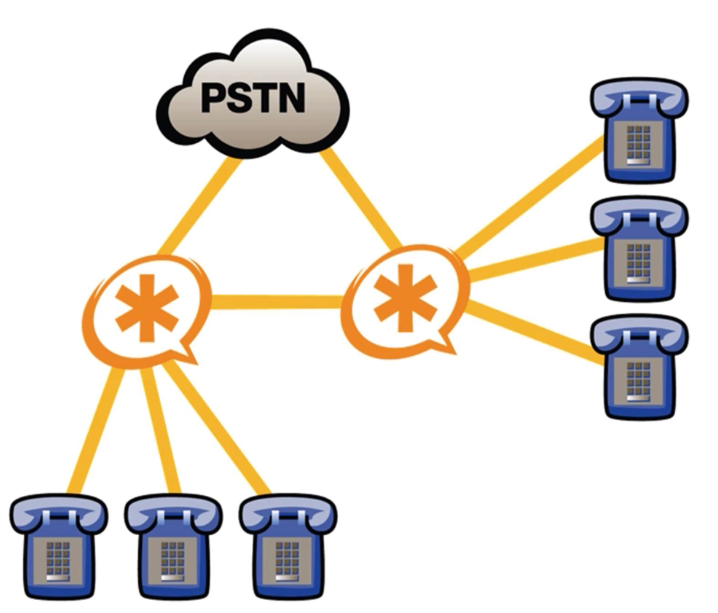

### VOIP PBX

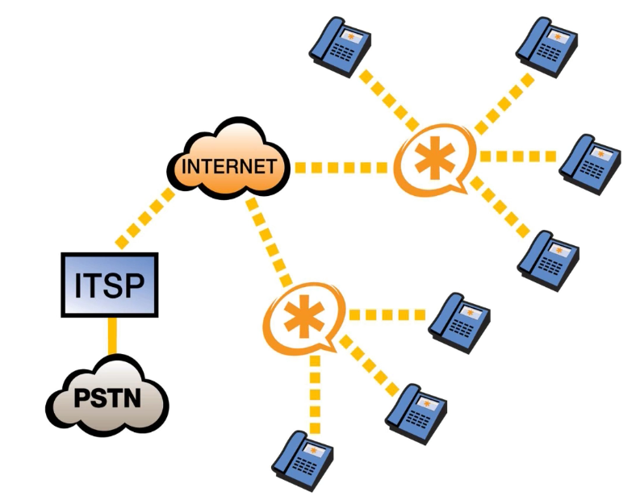

### VoIP & TDM Hybrid PBX

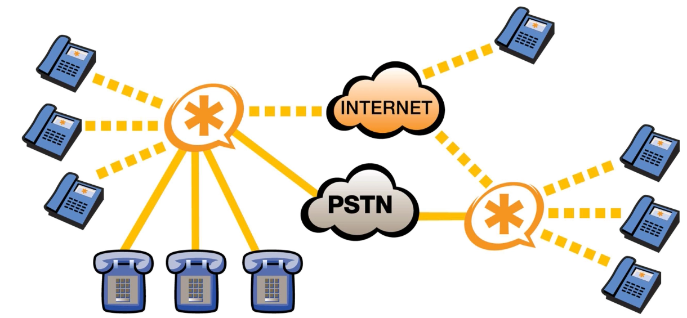


### Toll Bypass - Asterisk as a VOIP Gateway

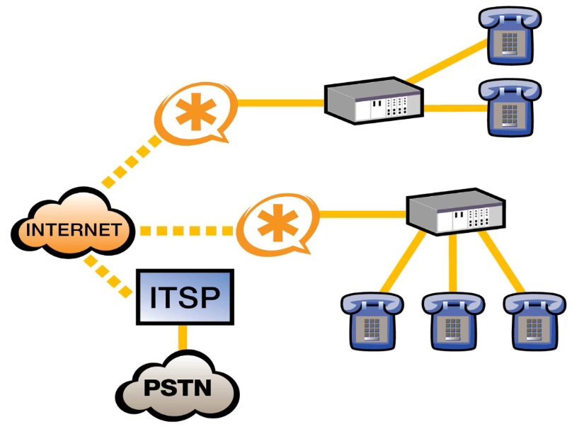

### Feature Server

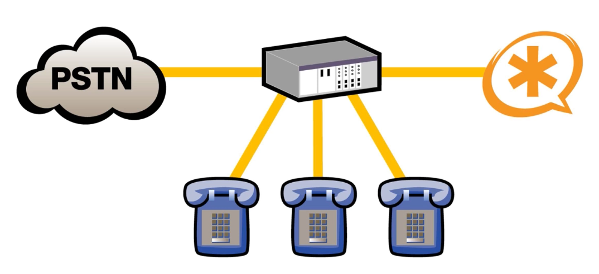


**PSTN** - Public Switched Telephone Network

**TDM (Time Division Multiplexing)** 
**PBX (Private Branch Exchange)**

**TDM PBX**

- TDM PBX is the most common type of voice  infrastructure, as it has been around the longest. This model was  designed before contemporary server technology was invented, and  therefore consists of proprietary, self-contained systems. This system  involves a cabinet with many different boards that can be purchased to  perform certain functions (such as, intercom functionality boards or  analog extension boards).

- TDM PBX boards are incompatible with all systems except those from  the same vendor as the overall architecture. This can become expensive  and limiting. These systems are outdated, and are mostly used by  companies that have not updated their network cabling.

**Hybrid PBX**

- Hybrid PBX was created when VoIP became a popular  business tool. These systems allow IP phones to connect to the PBX; it  is hybrid because it allows both IP and TDM extensions. In addition to  connecting extensions through IP, entire cabinets can be distributed and connected to the main system through IP. Many businesses that used TDM  PBX have upgraded to hybrid models.

- The advantage of the Hybrid PBX is that it cuts down on the costs of a total migration when a company wants to upgrade to VoIP. It modifies  existing infrastructure rather than requiring an entirely new system,  and is easier for users familiar with the old TDM PBX system to use.

**IP PBX** 

- IP PBX architecture involves gateways that establish links between  TDM and IP. The main system for this type of infrastructure is a server  (or multiple servers) that operates on top-performing hardware. New  applications can be added easily.

- IP PBX has many advantages, including reduced maintenance costs,  increased scalability, voice and data network integration, greater  mobility, and SIP capabilities.

**SIP**

- Session Initiation Protocol (**SIP**) is a signaling protocol used for initiating, maintaining, modifying and terminating real-time sessions that involve video, voice, messaging and other communications applications and services between two or more  endpoints on IP networks.

**IVR**

- IVR stands for Interactive Voice Response, a technology that automates  routine customer service interactions by allowing callers to interact  using touch tone digits or their voice.

## Install Asterisk

### Package Manager

```
# sudo apt install asterisk
```

### Install from source code

#### Install dependencies

```
# tar -xzvf asterisk-18-current.tar.gz
# cd asterisk-18.3.0 
```

asterisk-18.3.0/contrib/scripts/install_prereq

**Run in test mode to print the dependencies for version**

```
# cd asterisk-18.3.0/contrib/scripts
# sudo ./install_prereq test
```

**Run install mode to reach out to your repos to install the dependencies for version** 

```
# sudo ./install_prereq install
```

#### Configure

```
# tar -xzvf asterisk-18-current.tar.gz
# cd asterisk-18.3.0 
# ./configure
```

#### Make

``` 
# Select modules to be installed
make menuselect

make && make install

# Copy sample config/files to /etc/asterisk
make samples

# asterisk will run in startup
make config

# systemctl start asterisk
```


## Asterisk CLI Command

``` 
sudo asterisk -rvvvvvv
```


#### Run linux command in Asterisk CLI

```
> !ifconfig
```

#### Run asterisk cli command in linux terminal

```
# sudo asterisk -rx 'core show version'
```

### Module command

```
# Show modules
asterisk*CLI>modole show like [keywork]  

# Load module
asterisk*CLI>modole load [module name]  

# Unload module
asterisk*CLI>modole unload [module name]

# reload module
asterisk*CLI>modole reload [module name]  
```


## Channels

A channel is a pathway in and out of the Asterisk

- SIP (Session Initiation Protocol)

  - Session Initiation Protocol, the most common VOIP protocol
  - are used to interface with SIP capable VOIP devices, such as phones, channel banks, other PBXs or Internet Telephony Service Providers.

  - channel driver chan_sip

- PJSIP

  - channel driver chan_pjsip

- IAX (Inter-Asterisk Exchange protocol)

  **[IAX](https://www.voip-info.org/asterisk-iax-channels)** and **[IAX2](https://www.voip-info.org/asterisk-iax-channels)**: Inter-Asterisk Exchange protocol, Asterisk’s own VOIP protocol

- DAHDI (Digium Asterisk Hardware Device Interface)

  - are used to interface with DAHDI drivers and PRI libraries. In this case chan_dahdi allows you to use any DAHDI capable devices, such as Digium's line of T1/E1/J1 interface cards.
  - channels driver chan_dahdi

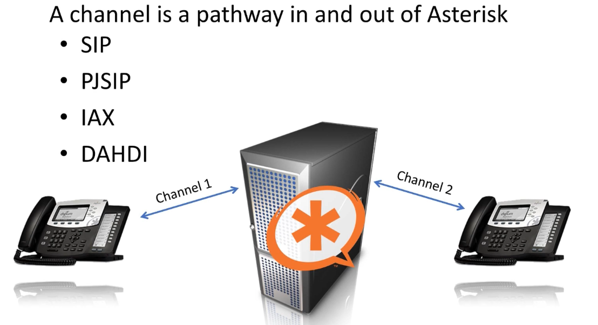


### Channel driver configuration

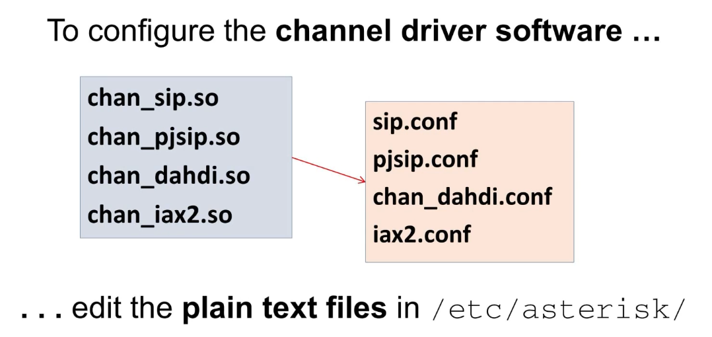


## Dialplan

- is the heart of any Asterisk system
- it defines the behavior of the system
- it consist of a list of instructions

​	

### Context

- Contexts are containers that separate extensions
- [context-name]

### Extensions

- it is the mapping between a dialplan address and a named set of actions

  - Instead of an endpoint
  - Think of it more like a script
  - Each action is executed by an "application"

  extension@context

  ```
  [context]
  extension
  - application
  - application
  - application
  ```

Extension Syntax

  - Alpha-numeric names acceptable

    "1000" and "Tom" are both valid

- Syntax

  exten => name,priority,application

  exten => 1000,1,Dial (PJSIP/digium-phone)

  exten => Tom,1,Dial (PJSIP/digium-phone)

  exten => 1234,1,NoOp (Hello World!)

#### List of applications

```
asterisk*CLI> core show applications
    -= Registered Asterisk Applications =-
        AddQueueMember: Dynamically adds queue members. 
              ADSIProg: Load Asterisk ADSI Scripts into phone 
                AELSub: Launch subroutine built with AEL 
            AgentLogin: Login an agent. 
          AgentRequest: Request an agent to connect with the channel. 
                   AGI: Executes an AGI compliant application. 
         AlarmReceiver: Provide support for receiving alarm reports from a burglar or fire 
....
```

#### Info about specific application

```
asterisk*CLI> core show application Playback 

  -= Info about application 'Playback' =- 

[Synopsis]
Play a file. 

[Description]
Plays back given filenames (do not put extension of wav/alaw etc). The playback
command answer the channel if no options are specified. If the file is
non-existant it will fail
This application sets the following channel variable upon completion:
${PLAYBACKSTATUS}: The status of the playback attempt as a text string.
    SUCCESS
    FAILED
See Also: Background (application) -- for playing sound files that are
interruptible
WaitExten (application) -- wait for digits from caller, optionally play music
on hold

[Syntax]
Playback(filename[&filename2[&...]][,options])
```

**Multi-line Extensions**

```
exten => 6000,1,Playback(hello-world)
exten => 6000,2,Playback(goodbye)
exten => 6000,3,Hangup()
```

OR

```
exten => 6000,1,Playback(hello-world)
 same =>      2,Playback(goodbye)
 same =>      3,Hangup()
```

OR

```
exten => 6000,1,Playback(hello-world)
 same => n,Playback(goodbye)
 same => n,Hangup()
```

## Priority labels


## What else can Goto do?


### Goto syntax


##  Check the asterisk is working

```
# sudo asterisk -r
```

## Asterisk configuration files

```
/etc/asterisk
sherwinowen@ubuntu:/etc/asterisk$ ls
acl.conf                 cel_odbc.conf            iax.conf                 res_curl.conf
adsi.conf                cel_pgsql.conf           iaxprov.conf             res_fax.conf
agents.conf              cel_sqlite3_custom.conf  indications.conf         res_ldap.conf
alarmreceiver.conf       cel_tds.conf             logger.conf              res_odbc.conf
alsa.conf                chan_dahdi.conf          manager.conf             resolver_unbound.conf
amd.conf                 chan_mobile.conf         manager.d                res_parking.conf
app_mysql.conf           cli_aliases.conf         meetme.conf              res_pgsql.conf
app_skel.conf            cli.conf                 minivm.conf              res_pktccops.conf
ari.conf                 cli_permissions.conf     misdn.conf               res_snmp.conf
ast_debug_tools.conf     codecs.conf              modules.conf             res_stun_monitor.conf
asterisk.adsi            confbridge.conf          motif.conf               rtp.conf
asterisk.conf            config_test.conf         musiconhold.conf         say.conf
calendar.conf            console.conf             muted.conf               sip.conf
ccss.conf                dbsep.conf               ooh323.conf              sip_notify.conf
cdr_adaptive_odbc.conf   dnsmgr.conf              osp.conf                 sla.conf
cdr_beanstalkd.conf      dsp.conf                 oss.conf                 smdi.conf
cdr.conf                 enum.conf                phone.conf               sorcery.conf
cdr_custom.conf          extconfig.conf           phoneprov.conf           ss7.timers
cdr_manager.conf         extensions.ael           pjproject.conf           stasis.conf
cdr_mysql.conf           extensions.conf          pjsip.conf               statsd.conf
cdr_odbc.conf            extensions.lua           pjsip_notify.conf        telcordia-1.adsi
cdr_pgsql.conf           extensions_minivm.conf   pjsip_wizard.conf        test_sorcery.conf
cdr_sqlite3_custom.conf  features.conf            queuerules.conf          udptl.conf
cdr_syslog.conf          festival.conf            queues.conf              users.conf
cdr_tds.conf             followme.conf            res_config_mysql.conf    voicemail.conf
cel_beanstalkd.conf      func_odbc.conf           res_config_sqlite3.conf  vpb.conf
cel.conf                 hep.conf                 res_config_sqlite.conf   xmpp.conf
cel_custom.conf          http.conf                res_corosync.conf

```

## Modules

/usr/lib/asterisk/modules

```
sherwinowen@ubuntu:/usr/lib/asterisk/modules$ ls

app_adsiprog.so                      codec_g722.so              res_config_ldap.so
app_agent_pool.so                    codec_g726.so              res_config_odbc.so
app_alarmreceiver.so                 codec_gsm.so               res_config_pgsql.so
app_amd.so                           codec_lpc10.so             res_config_sqlite3.so
app_authenticate.so                  codec_resample.so          res_convert.so
app_bridgeaddchan.so                 codec_speex.so             res_crypto.so
app_bridgewait.so                    codec_ulaw.so              res_curl.so
app_cdr.so                           format_g719.so             res_fax.so
app_celgenuserevent.so               format_g723.so             res_fax_spandsp.so
app_chanisavail.so                   format_g726.so             res_format_attr_amr.so
app_channelredirect.so               format_g729.so             res_format_attr_celt.so
app_chanspy.so                       format_gsm.so              res_format_attr_g729.so
app_confbridge.so                    format_h263.so             res_format_attr_h263.so
app_controlplayback.so               format_h264.so             res_format_attr_h264.so
app_db.so                            format_ilbc.so             res_format_attr_ilbc.so
app_dial.so                          format_ogg_speex.so        res_format_attr_opus.so
app_dictate.so                       format_ogg_vorbis.so       res_format_attr_silk.so
app_directed_pickup.so               format_pcm.so              res_format_attr_siren14.so
app_directory.so                     format_siren14.so          res_format_attr_siren7.so
app_disa.so                          format_siren7.so           res_format_attr_vp8.so
app_dumpchan.so                      format_sln.so              res_hep_pjsip.so
app_echo.so                          format_vox.so              res_hep_rtcp.so
app_exec.so                          format_wav_gsm.so          res_hep.so
app_externalivr.so                   format_wav.so              res_http_media_cache.so
app_festival.so                      func_aes.so                res_http_post.so
app_followme.so                      func_base64.so             res_http_websocket.so
app_forkcdr.so                       func_blacklist.so          res_limit.so
app_getcpeid.so                      func_callcompletion.so     res_manager_devicestate.so
app_ices.so                          func_callerid.so           res_manager_presencestate.so
app_image.so                         func_cdr.so                res_monitor.so
app_jack.so                          func_channel.so            res_musiconhold.so
app_macro.so                         func_config.so             res_mutestream.so
app_milliwatt.so                     func_curl.so               res_odbc.so
app_minivm.so                        func_cut.so                res_odbc_transaction.so
app_mixmonitor.so                    func_db.so                 res_parking.so
```

Asterisk CLI

```
$ sudo asterisk -vvvvr
ubuntu*CLI> module show like so
res_pjsip_publish_asterisk.so  PJSIP Asterisk Event PUBLISH Support     0          Running              core
res_pjsip_pubsub.so            PJSIP event resource                     11         Running              core
res_pjsip_refer.so             PJSIP Blind and Attended Transfer Suppor 1          Running              core
res_pjsip_registrar.so         PJSIP Registrar Support                  0          Running              core
res_pjsip_rfc3326.so           PJSIP RFC3326 Support                    0          Running              core
res_pjsip_sdp_rtp.so           PJSIP SDP RTP/AVP stream handler         0          Running              core
res_pjsip_send_to_voicemail.so PJSIP REFER Send to Voicemail Support    0          Running              core
res_pjsip_session.so           PJSIP Session resource                   15         Running              core
res_pjsip_sips_contact.so      UAC SIPS Contact support                 0          Running              core
res_pjsip_t38.so               PJSIP T.38 UDPTL Support                 0          Running              core
res_pjsip_transport_websocket.so PJSIP WebSocket Transport Support        0          Not Running          core
res_pjsip_xpidf_body_generator.so PJSIP Extension State PIDF Provider      0          Running              core
res_realtime.so                Realtime Data Lookup/Rewrite             0          Running              core
res_resolver_unbound.so        Unbound DNS Resolver Support             1          Running              core

```


## Interfaces

- Configuration files (/etc/asterisk) 

- Command Line Interface (CLI)

- Asterisk Gateway Interface (AGI)

  

- Asterisk Manager Interface (AMI)

  /etc/asterisk/manager.conf

- Asterisk RESTful Interface (ARI)


## Config File Basics

/etc/asterisk/

```
[section-heading]
key=value
;comment

;---Multiple line comment
comment
comment
comment---;
```


## Configuring Endpoints

### 1. Configure an account on Asterisk

#### SIP Configuration

/et/asterisk/sip.conf

```
[acccount-name]
type=friend
host=dynamic
context=inside
secret=password
```

**Account Settings Breakdown**

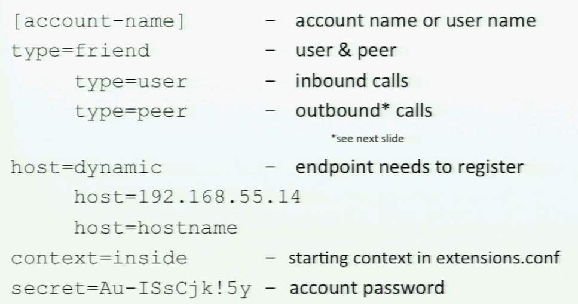

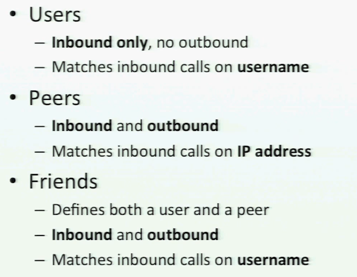


#### PJSIP Configuration

/etc/asterisk/pjsip.conf

```
[transport-udp]
type=transport
protocol=udp
bind=0.0.0.0
```

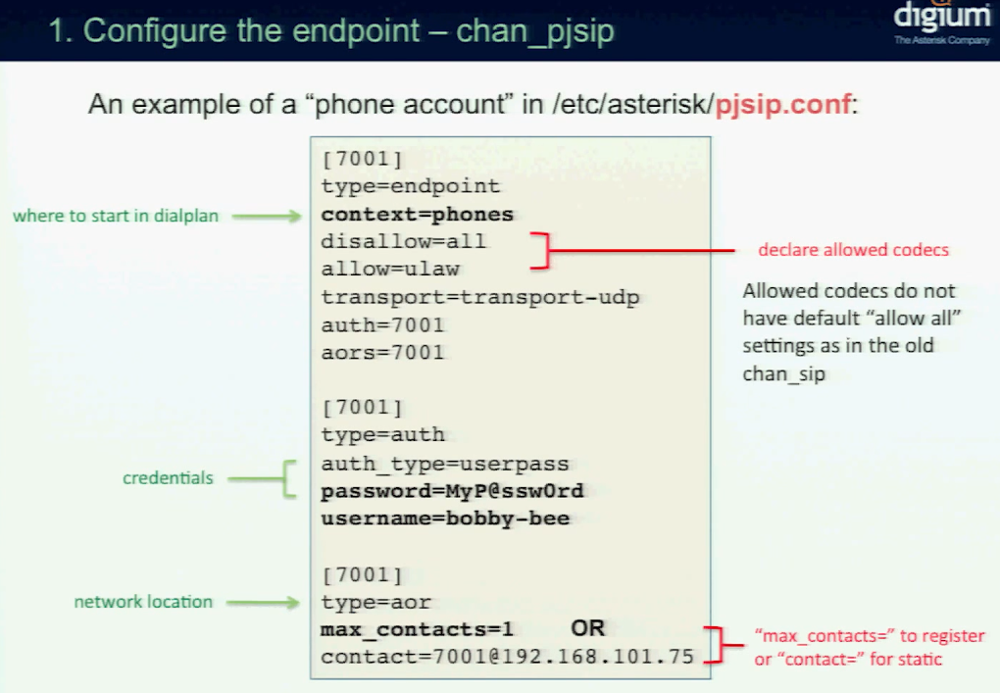

sip show peers | grep 

### 2.Create an extension to dial the account

/etc/asterisk/extensions.conf

```
[inside]
exten => 7001,1,Dial(SIP/7001,20)
```

#### SIP Call Flow

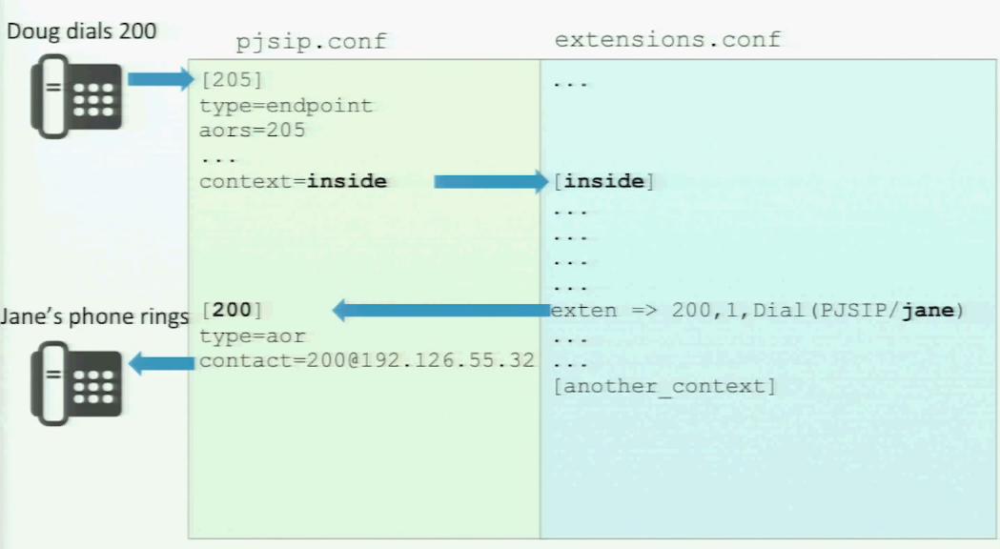


### 3. Configure the endpoint to match

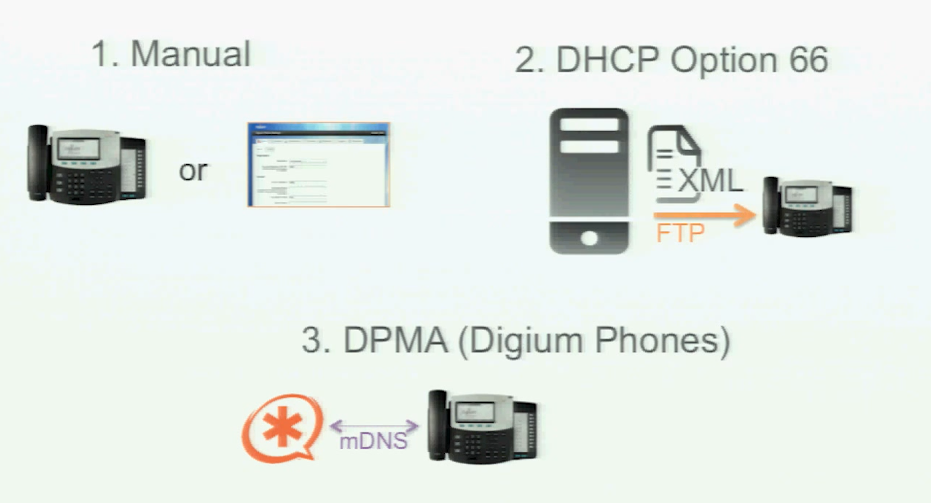

**DPMA Configuration**

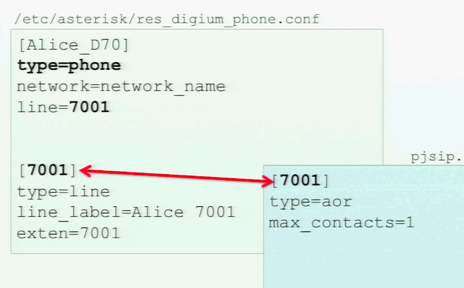


## Interactive Dial Plan

### Build a voice menu

- IVR (Interactive Voice Response)
  - Takes input from acaller
    - DTMF (Dual Tone Multi Frequency)
    - Voice
  - Return a result
    - Often connecting to an external database to retrieve that information for the caller
- Auto-attendant
  - Plays a message
  - Transfers to extension of voicemail
  - Goes to a sub menu
  - Repeat choices

**IVR Menu**

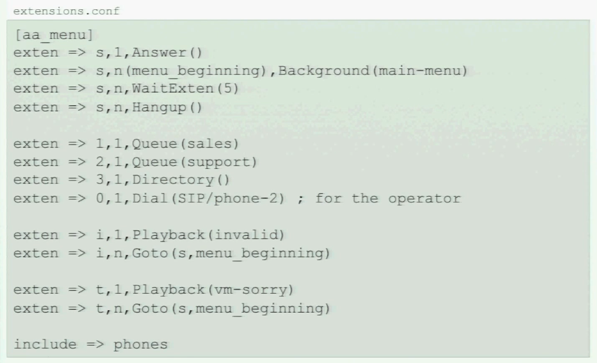


### Setup Voice Mail


# Asterisk in Ubuntu 20.04


```
sudo apt install asterisk
```

voicemail.conf

```
[main]
7001 => 7001

7002 => 7002
```

extensions.conf

```
[internal]
exten => 7001,1,Answer()
exten => 7001,2,Dial(SIP/7001,60)
exten => 7001,3,Playback(vm-nobodyavail)
exten => 7001,4,VoiceMail(7001@main)
exten => 7001,5,Hangup()

exten => 7002,1,Answer()
exten => 7002,2,Dial(SIP/7002,60)
exten => 7002,3,Playback(vm-nobodyavail)
exten => 7002,4,VoiceMail(7001@main)
exten => 7002,5,Hangup()

exten => 8001,1,VoicemailMain(7001@main)
exten => 8001,2,Hangup()

exten => 8002,1,VoicemailMain(7002@main)
exten => 8002,2,Hangup()
```

sip.conf

```
[general]
context=internal
allowguest=no
allowoverlap=no
bindport=5060
bindaddr=0.0.0.0
srvlookup=no
disallow=all
allow=ulaw
alwaysauthreject=yes
canreinvite=no
nat=yes
session-timers=refuse
localnet=192.168.0.0/255.255.255.0

[7001]
type=friend
host=dynamic
secret=7001
context=internal

[7002]
type=friend
host=dynamic
secret=7002
context=internal
```


# 

