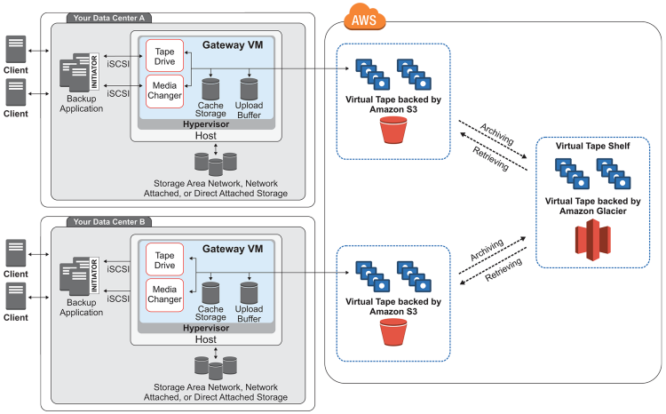

# AWS

April 19, 2020

## AWS  Global Infrastructure

**Region** 

* is a physical location in the world which consists of two or more Availabilty Zones (AZ)
* is a geographical area that consists of different availability zones. Each region consists of 2 (or more) Availability Zones.
* each Region consists of 2 or more Availability Zones
* 20 Launched Regions / 5 Announced Regions

**Availability Zone (AZ)** 
* is one or more discrete data centers, each with redundant power, networking and connectivity, housed in separate facilities.
* is simply a data center
* 70 AZ

**Edge Locations**

* are endpoints for AWS which are used for caching content
* typically this consists of CloudFront, Amazon's Content Delivery Network (CDN)
* 205 Edge Locations and 11 Regional Edge Caches         


### Asia Pacific
* 20 Availability Zones  
* 6 geographic Regions 
* 1 Local Region
* 34 Edge Network locations
* 5 Regional Edge Cache locations.

**Regions (Availability Zones):**
Hong Kong SAR (3), Mumbai (3), Seoul (3), Singapore (3), Sydney (3), Tokyo (4), Osaka (1)

**Edge Locations:**
Bangalore, India (3); Chennai, India (2); Hong Kong SAR,  China (3); Hyderabad, India (4); Kuala Lumpur, Malaysia; Mumbai, India  (2); Manila, Philippines; New Delhi, India (5); Osaka, Japan; Seoul,  South Korea (4); Singapore (3); Taipei, Taiwan(3); Tokyo, Japan (16);  Melbourne; Perth; Sydney (2); Beijing, China (1); Shanghai, China (1);  Zhongwei, China (1); Shenzhen, China (1)

**Regional Edge Caches:**
Mumbai, India; Singapore; Seoul, South Korea; Tokyo, Japan; Sydney, Australia

**Local Regions:**
Osaka


### Europe / Middle East / Africa

* 18 Availability Zones 
* 6 geographic Regions
* 39 Edge Network locations
* 2 Regional Edge Cache locations.

**Regions (Availability Zones):**
Frankfurt (3), Ireland (3), London (3), Paris (3), Stockholm (3), Bahrain (3)

**Edge Locations:**
Amsterdam, The Netherlands (2); Berlin, Germany; Cape  Town, South Africa; Dublin, Ireland; Frankfurt, Germany (10); Helsinki,  Finland; Johannesburg, South Africa; London, England (7); Madrid, Spain  (2); Manchester, England; Marseille, France; Milan, Italy; Munich,  Germany; Dusseldorf, Germany; Palermo, Italy; Paris, France (3); Prague, Czech Republic; Stockholm, Sweden (3); Vienna, Austria; Warsaw, Poland; Zurich, Switzerland; Lisbon, Portugal; Brussels, Belgium; Athens,  Greece; Bucharest, Romania; Budapest, Hungary; Nairobi, Kenya; Sofia,  Bulgaria

**Regional Edge Caches:**
Frankfurt, Germany; London, England


### South America
* 3 Availability Zones
* 1 geographic Region
* 4 Edge Network locations
* 1 Regional Edge Cache location.

**Edge Locations:**
Rio de Janeiro (2), Brazil; Sao Paulo, Brazil (2); Bogota, Colombia; Buenos Aires, Argentina; Santiago, Chile

**Regional Edge Caches:**
Sao Paulo, Brazil


### North America
* 25 Availability Zones
* 6 geographic Regions
* 44 Edge Network locations
* 2 Regional Edge Cache locations.

**Edge Locations:**
Ashburn, VA (3); Atlanta GA (3); Boston, MA; Chicago, IL (2); Dallas/Fort Worth, TX (5); Denver, CO (2); Hayward, CA; Jacksonville, FL; Los Angeles, CA (4); Miami, FL (3); Minneapolis, MN; Montreal, QC; New York, NY (3); Newark, NJ (3); Palo Alto, CA; Phoenix, AZ; Philadelphia, PA; San Jose, CA (2); Seattle, WA (3); South Bend, IN; St. Louis, MO; Toronto, ON

**Regional Edge Caches:**
Northern Virginia; Ohio; Oregon


## Amazon Web Services Cloud Platform

### Compute Services

**EC2**
* Elastic Compute Cloud
*  is a web service that provides secure, resizable compute capacity in the cloud.
*  is a virtual machine in the cloud on which you have OS level control. You can run this cloud server whenever you want.

**EC2  Container Service**
* is a highly scalable, high performance **container** management **service** that supports Docker **containers** and allows you to easily run distributed applications on a managed cluster of Amazon **EC2** instances.

**Elastic Beanstalk**
* is an easy-to-use service for deploying and scaling web applications and services
* The tool offers automated deployment and provisioning of resources like a highly scalable production website.

**Lambda**
*  lets you run code without provisioning or managing servers. You pay only for the compute time you consume.
* This AWS service allows you to run functions in the cloud. The tool is a big cost saver for you as you to pay only when your functions execute.

**Lightsail**
* is an easy-to-use cloud platform that offers you everything needed to build an application or website, plus a cost-effective, monthly plan.
* This cloud computing tool automatically deploys and manages the computer, storage, and networking capabilities required to run your applications.

**Batch**
* enables developers, scientists, and engineers to easily and efficiently run hundreds of thousands of batch computing jobs on AWS.

### Storage Services

**S3**
* Simple Storage Service
* can be used to store and retrieve any amount of data.
* is an object storage service that offers industry-leading scalability, data availability, security, and performance.

**EFS**
* Elastic File System
* provides a simple, scalable, elastic file system for Linux-based workloads for use with AWS Cloud services and on-premises resources.
* It is built to scale on demand to petabytes without disrupting applications, growing and shrinking automatically as you add and remove files, so your applications have the storage they need – when they need it.

**Glacier**
*  is a low-cost storage service that provides secure and durable storage for data archiving and backup.
*   a secure, durable, and extremely low-cost storage service for data archiving and long-term backup.

**Snowball**


**Storage Gateway**
* is connecting on-premises software applications with cloud-based storage. It offers secure integration between the company's on-premises and AWS's storage infrastructure.
* is a hybrid storage service that enables your on-premises applications to seamlessly use AWS cloud storage.
* You can use the service for backup and archiving, disaster recovery, cloud data processing, storage tiering, and migration.

### Databases Services

**RDS**
* Relational Database Service
* makes it easy to set up, operate, and scale familiar relational databases in the cloud.

**DynamoDB**
* is a scalable NoSQL data store that manages distributed replicas of your data for high availability.

**Elasticache**
* improves appliciation performance by allowing you to retrieve information from an in-memory caching system.
* is a web service which makes it easy to deploy, operate, and scale an in-memory cache in the cloud.

**Red Shift**
* is a fast, fully managed, petabyte-scale data warehouse that makes it cost-effective to analyze all your data using your existing business intell­igence tools.
* is Amazon's data warehousing solution which you can use to perform complex OLAP queries.


### Migration Services

**AWS Migration Hub**
* provides a single location to track the progress of application migrations across multiple AWS and partner solutions.
* allows you to choose the AWS and partner migration tools that best fit your needs, while providing visibility into the status of migrations across your portfolio of applications.

**Application Discovery Service**
* helps enterprise customers plan migration projects by gathering information about their on-premises data centers.


**Database Migration Service**
* service can be used to migrate on-site databases to AWS. It helps you to migrate from one type of database to another for example, Oracle to MySQL.

** Server Migration Service**
* allows you to migrate on-site servers to AWS easily and quickly.

**Snowball**
* is a small application which allows you to transfer terabytes of data inside and outside of AWS environment.

### Networking & Content Delivery  Services

**VPC**
* Virtual Private Cloud
* lets you provision a logically isolated section of the AWS Cloud where you can launch AWS resources in a virtual network that you define.


**CloudFront**
* Amazon's Content Delivery Network (CDN)
* is a fast content delivery network (CDN) service that securely delivers data, videos, applications, and APIs to customers globally with low latency, high transfer speeds, all within a developer-friendly environment.

**Route53**
* AWS DNS service
* is a highly available and scalable cloud Domain Name System (DNS) web service.
* is a scalable and highly available Domain Name System (DNS) and Domain Name Registration service.

**API Gateway**
* is a fully managed service that makes it easy for developers to create, publish, maintain, monitor, and secure APIs at any scale.

**Direct Connect**
* makes it easy to establish a dedicated network connection from your premises to AWS.
* you can establish private connectivity between AWS and your data center, office, or co-location environment, which in many cases can reduce your network costs, increase bandwidth throughput, and provide a more consistent network experience than Internet-based connections.

### Management and Governance Services

**CloudWatch**
* is a monitoring and management service built for developers, system operators, site reliability engineers (SRE), and IT managers.
* collects monitoring and operational data in the form of logs, metrics, and events, providing you with a unified view of AWS resources, applications and services that run on AWS, and on-premises servers. 
* is an automated provisioning engine designed to deploy entire cloud environments via a JSON script.
* gives developers and systems administrators an easy way to create and manage a collection of related AWS resources, provisioning and updating them in an orderly and predictable fashion.


**CloudTrail**
* is a web service that records AWS API calls for your account and delivers log files to you.
* The recorded information includes the identity of the API caller, the time of the API call, the source IP address of the API caller, the request parameters, and the response elements returned by the AWS service.

**Config**
* is a fully managed service that provides you with an AWS resource inventory, configuration history, and configuration change notifications to enable security and governance. 

**OpsWorks**
* is a configuration management service that provides managed instances of Chef and Puppet. Chef and Puppet are automation platforms that allow you to use code to automate the configurations of your servers. 

**Server Catalog**
* allows organizations to create and manage catalogs of IT services that are approved for use on AWS. These IT services can include everything from virtual machine images, servers, software, and databases to complete multi-tier application architectures. 

**Systems Manager**
* gives you visibility and control of your infrastructure on AWS.
* provides a unified user interface so you can view operational data from multiple AWS services and allows you to automate operational tasks across your AWS resources

**Trusted Advisor**
* is an online resource to help you reduce cost, increase performance, and improve security by optimizing your AWS environment. 
* provides real-time guidance to help you provision your resources following AWS best practices.

**Managed Services**
* provides ongoing management of your AWS infrastructure so you can focus on your applications.
* helps to reduce your operational overhead and risk.
* automates common activities such as change requests, monitoring, patch management, security, and backup services, and provides full-lifecycle services to provision, run, and support your infrastructure.

### Analytics Services


**Athena**
* is an interactive query service that makes it easy to analyze data in Amazon S3 using standard SQL.
* is serverless, so there is no infrastructure to manage, and you pay only for the queries that you run.


**EMR**
* provides a managed Hadoop framework that makes it easy, fast, and cost-effective to process vast amounts of data across dynamically scalable Amazon EC2 instances.
* You can also run other popular distributed frameworks such as Apache Spark, HBase, Presto, and Flink in Amazon EMR, and interact with data in other AWS data stores such as Amazon S3 and Amazon DynamoDB.

**CloudsSearch**
* is a managed service in the AWS Cloud that makes it simple and cost-effective to set up, manage, and scale a search solution for your website or application.
* supports 34 languages and popular search features such as highlighting, autocomplete, and geospatial search.


**ElasticSearch Service**
* makes it easy to deploy, secure, operate, and scale Elasticsearch to search, analyze, and visualize data in real-time.


**Kinesis**
* makes it easy to collect, process, and analyze real-time, streaming data so you can get timely insights and react quickly to new information.
* offers key capabilities to cost-effectively process streaming data at any scale, along with the flexibility to choose the tools that best suit the requirements of your application.


**Kinesis Video Streams**
* makes it easy to securely stream video from connected devices to AWS for analytics, machine learning (ML), playback, and other processing. 
* automatically provisions and elastically scales all the infrastructure needed to ingest streaming video data from millions of devices.

**QuickSight**
* is a fast, cloud-powered business intelligence (BI) service that makes it easy for you to deliver insights to everyone in your organization.
* lets you create and publish interactive dashboards that can be accessed from browsers or mobile devices.

**Data Pipeline**
*  is a web service that helps you reliably process and move data between different AWS compute and storage services, as well as on-premises data sources, at specified intervals.
* you can regularly access your data where it’s stored, transform and process it at scale, and efficiently transfer the results to AWS services such as Amazon S3, Amazon RDS, Amazon DynamoDB, and Amazon EMR. 

**Glue**
* is a fully managed extract, transform, and load (ETL) service that makes it easy for customers to prepare and load their data for analytics.
* discovers your data and stores the associated metadata (e.g. table definition and schema) in the AWS Glue Data Catalog.

### Security, Identity, and Compliance Services

**IAM**
* Identity Access Management
* enables you to securely control access to AWS services and resources for your users.
* you can create and manage AWS users and groups, and use permissions to allow and deny their access to AWS resources.

**Cognito**
* 

**Security Hub**
* gives you a comprehensive view of your high-priority security alerts and compliance status across AWS accounts.
* you now have a single place that aggregates, organizes, and prioritizes your security alerts, or findings, from multiple AWS services, such as Amazon GuardDuty, Amazon Inspector, and Amazon Macie, as well as from AWS Partner solutions.

**GuardDuty**
*  is a threat detection service that continuously monitors for malicious or unauthorized behavior to help you protect your AWS accounts and workloads.
* It monitors for activity such as unusual API calls or potentially unauthorized deployments that indicate a possible account compromise.
* also detects potentially compromised instances or reconnaissance by attackers. 


**Inspector**
* is an automated security assessment service that helps improve the security and compliance of applications deployed on AWS.
* automatically assesses applications for exposure, vulnerabilities, and deviations from best practices. 

**Macie**
* is a security service that uses machine learning to automatically discover, classify, and protect sensitive data in AWS.
* recognizes sensitive data such as personally identifiable information (PII) or intellectual property, and provides you with dashboards and alerts that give visibility into how this data is being accessed or moved.

**Certificate Manager**
* is a service that lets you easily provision, manage, and deploy Secure Sockets Layer/Transport Layer Security (SSL/TLS) certificates for use with AWS services and your internal connected resources.
* removes the time-consuming manual process of purchasing, uploading, and renewing SSL/TLS certificates.

**CloudHSM**
* is a cloud-based hardware security module (HSM) that enables you to easily generate and use your own encryption keys on the AWS Cloud.

**Cloud Directory**
* enables you to build flexible, cloud-native directories for organizing hierarchies of data along multiple dimensions.
*  you can create directories for a variety of use cases, such as organizational charts, course catalogs, and device registries.

**Directory Service**
* for Microsoft Active Directory, also known as AWS Managed Microsoft AD, enables your directory-aware workloads and AWS resources to use managed Active Directory in the AWS Cloud.
* is built on actual Microsoft Active Directory and does not require you to synchronize or replicate data from your existing Active Directory to the cloud.

**Firewall Manager**
* is a security management service that makes it easier to centrally configure and manage AWS WAF rules across your accounts and applications.
* you can easily roll out AWS WAF rules for your Application Load Balancers and Amazon CloudFront distributions across accounts in AWS Organizations

**Key Management Service**
* makes it easy for you to create and manage keys and control the use of encryption across a wide range of AWS services and in your applications.
* is a secure and resilient service that uses FIPS 140-2 validated hardware security modules to protect your keys.
* is integrated with AWS CloudTrail to provide you with logs of all key usage to help meet your regulatory and compliance needs.

** Organizations**
* offers policy-based management for multiple AWS accounts. 
* you can create groups of accounts, automate account creation, apply and manage policies for those groups.
* enables you to centrally manage policies across multiple accounts, without requiring custom scripts and manual processes.

**Secrets Manager**
*  helps you protect secrets needed to access your applications, services, and IT resources.
* The service enables you to easily rotate, manage, and retrieve database credentials, API keys, and other secrets throughout their lifecycle. 

**WAF**
* Web Application Firewall
* is a web application firewall that helps protect your web applications from common web exploits that could affect application availability, compromise security, or consume excessive resources.
* gives you control over which traffic to allow or block to your web application by defining customizable web security rules.
* to create custom rules that block common attack patterns, such as SQL injection or cross-site scripting, and rules that are designed for your specific application.

**Shield**
*  is a managed Distributed Denial of Service (DDoS) protection service that safeguards web applications running on AWS.
* provides always-on detection and automatic inline mitigations that minimize application downtime and latency, so there is no need to engage AWS Support to benefit from DDoS protection. 

**Single Sign-On**
*  is a cloud SSO service that makes it easy to centrally manage SSO access to multiple AWS accounts and business applications.
* you can easily manage SSO access and user permissions to all of your accounts in AWS Organizations centrally.
* also includes built-in SAML integrations to many business applications, such as Salesforce, Box, and Office 365.

**Artifact**
* is your go-to, central resource for compliance-related information that matters to you.
* It provides on-demand access to AWS’ security and compliance reports and select online agreements.
* It provides on-demand access to AWS’ security and compliance reports and select online agreements.


### Application Integration Services

**Step Functions**
* lets you coordinate multiple AWS services into serverless workflows so you can build and update apps quickly.
*  you can design and run workflows that stitch together services such as AWS Lambda and Amazon ECS into feature-rich applications.


**MQ**
* is a managed message broker service for Apache ActiveMQ that makes it easy to set up and operate message brokers in the cloud.
* allow different software systems–often using different programming languages, and on different platforms–to communicate and exchange information.
* reduces your operational load by managing the provisioning, setup, and maintenance of ActiveMQ, a popular open-source message broker.


**SNS**
* Simple Notification Service
* is a highly available, durable, secure, fully managed pub/sub messaging service that enables you to decouple microservices, distributed systems, and serverless applications.
* provides topics for high-throughput, push-based, many-to-many messaging. Using Amazon SNS topics, your publisher systems can fan out messages to a large number of subscriber endpoints for parallel processing, including Amazon SQS queues, AWS Lambda functions, and HTTP/S webhooks.
* can be used to fan out notifications to end users using mobile push, SMS, and email.


**SQS**
* Simple Queue Service 
* is a fully managed message queuing service that enables you to decouple and scale microservices, distributed systems, and serverless applications.
* eliminates the complexity and overhead associated with managing and operating message oriented middleware, and empowers developers to focus on differentiating work.
* you can send, store, and receive messages between software components at any volume, without losing messages or requiring other services to be available.

**SWF**
Simple Workflow
* helps developers build, run, and scale background jobs that have parallel or sequential steps.
* You can think of Amazon SWF as a fully-managed state tracker and task coordinator in the cloud.
* If your application’s steps take more than 500 milliseconds to complete, you need to track the state of processing.


### Desktop & Apps Streaming Services

**Workspaces**
* is a fully managed, secure cloud desktop service.
* You can use Amazon WorkSpaces to provision either Windows or Linux desktops in just a few minutes and quickly scale to provide thousands of desktops to workers across the globe.

**AppStrem 2.0**
* is a fully managed application streaming service.
* You centrally manage your desktop applications on AppStream 2.0 and securely deliver them to any computer.


## Identity Access Management (IAM) Overview

* allows you to manage users and their level of access to the AWS Console.

###  What does IAM gives you?
* Centralized control of your AWS account 
* Shared Access to your AWS account 
* Granular Permissions
* Identity Federation (including Active Directory, Facebook, Linkedin etc)
* Multifactor Autnentication
* Provide temporary access for users/devices and services where necessary
* Allows you to set up your own password rotation policy
* Integrates with many different AWS services
* Supports PCI DDS Compliance

### Critical Terms
* Users - End Users (think people)
* Groups - A collection of users under one set of permissions.
* Roles - You create roles and can then assign them to AWS resources
* Policies - A document that defines one or more permissions

Notes: 
**Access key ID** and **Secret acces key** are user to programmtically access AWS console

### What have we learnt so far?

* IAM is universal. It does not apply  to regions at this time.
* The "root account" is simply the account created when first setup your AWS account. It has complete Admin access.
* New users have no permissions when we first created.
* New users are assigned **Access Key ID** and **Secret Access Keys** when first created.
* These are not the same as a password, and you cannot use the **Access key ID** & **Secret Access Key** to login to the console. You can use this to access AWS via the APIs and Command Line however.
* You only get to view these once. If you lose them, you have to regenerate them. So save them in a secure localtion.
* Always setup Multifactor Authentication on your root account
* You can create and customise you own password rotation policies

### Create A Billing Alarm

#### Enabling Billing Alerts
1. Open the Billing and Cost Management console at 	https://console.aws.amazon.com/billing/
2. In the navigation pane, choose Billing Preferences.
3. Choose Receive Billing Alerts.
4. Choose Save preferences.
	
#### Creating a Billing Alarm
1. Open the CloudWatch console at https://console.aws.amazon.com/cloudwatch/
2. If necessary, change the Region to US East (N. Virginia). Billing metric data is stored in 	         this Region and represents worldwide charges.
3. In the navigation pane, choose Alarms, Create Alarm.
4. Choose Select metric. In the All metrics tab, choose Billing, Total Estimated Charge.
5. Select the check box next to EstimatedCharges, and choose Select metric.
6. Under Conditions, choose Static.
7. For Whenever EstimatedCharges is, choose Greater.
8. For than, enter the monetary amount (for example, 200) that must be exceeded to 		    trigger the alarm.
Note:
The preview graph displays your current charges for the month.
9. Choose Next.
10. Under Notification, select an SNS topic to notify when the alarm is in ALARM state.
To have the alarm send multiple notifications for the same alarm state or for different alarm states, choose Add notification.
11. When finished, choose Next.
12. Enter a name and description for the alarm. The name must contain only ASCII characters. Then choose Next.
13. Under Preview and create, confirm that the information and conditions are what you want, then choose Create alarm.


## Simple Storage Service (S3) Overview

* provides developers and IT teams with secure, durable, highly-scalable object storage
* is easy to use, with a simple web services interface to store and retrieve any amount of data from anywhere on the web.
* is a safe place to store your files
* object based storage
* data is spread across multiple devices and facilities

### S3 Basics
* S3 is object based i.e. allows you to upload files.
* Files can be from 0 bytes to 5 TB
* There is unlimited storage
* Files are stored in Buckets
* S3 is a universal namespace i.e. names must be unique globally.
* https://s3-eu-west-1.amazonaws.com/acloudguru
* When you upload a file to S3 you will receive a HTTP 200 code if the upload is successful

### Data Consistency Model For S3
* Read after Write consistency for PUTS of new Objects i.e. **when you write new object you can immediately read it**
* Eventual Consistency for overwrite PUTS and DELETES (can take some time to propagate) **when you update or delete an object it takes time to be consistent inside S3 bucket**


### S3 is a simple key, value store
* S3 is object based. Object consist of the following:
	* Key (This is simply the name of the object)
	* Value (This is simply the data and is made up of a sequence of bytes)
	* Version ID (Important for versioning)
	* Metadata (Data about the data you are storing)
	
### Create an S3 Bucket - Exam Tips
* Buckets are a universal name space
* Upload an object to S3 recive a HTTP 200 code
* S3 Storage Classes
	* S3 Standard, S3 Intelligent-Tiering, S3 Standard-IA (Infrequent Access), S3 One Zone-Infrequent Access (S3 One Zone-IA) , S3 Reduced Redundancy Storage
* Encryption 
	* Client Side Encryption
	* Server Side Encryption
		* Server side encryption with Amazon S3 Managed Keys (SSE-S3)
		* Server side encryption with KMS (SSE-KMS)
		* Server side encryption with Customer Provided Keys (SSE-C)
* Control access to buckets using either a bucket ACL or using Bucket Policies
* BY DEFAULT BUKKETS ARE PRIVATE AND ALL OBJECTS STORED INSIDE THEM ARE PRIVATE

### S3 Versioning

### S3 Versioning Exam Tips
* Stores all versions of an object (including all writes and even if you delete an object)
* Great backup toll
* Once enabled, Versioning cannot be disabled, only suspended.
* Integrates with Lifecycle rules
* Versioning's MFA Delete capability, which uses multi-factor authentication, can be used to provide an additional layer of security.

### S3 Cross Region Replication

### Installing the AWS CLI version 2 on Linux
```
curl "https://awscli.amazonaws.com/awscli-exe-linux-x86_64.zip" -o "awscliv2.zip"
unzip awscliv2.zip
sudo ./aws/install

# Configure AWS CLI
aws configure
AWS Access Key ID [****************4SOZ]: 
AWS Secret Access Key [****************q1GZ]: 
Default region name [ap-southeast-1]: 
Default output format [None]: 

# List AWS S3 Buckets
$ aws s3 ls
2020-04-20 20:37:54 sherwinowen-bucket
2020-04-20 20:36:34 sherwinowen-bucket-sydney

# Copy all files in S3 Bucket to another S3 Bucket
$ aws s3 cp --recursive s3://sherwinowen-bucket s3://sherwinowen-bucket-sydney 
copy: s3://sherwinowen-bucket/Oratio-Imperata-Covid-19-English.pdf to s3://sherwinowen-bucket-sydney/Oratio-Imperata-Covid-19-English.pdf
copy: s3://sherwinowen-bucket/owen_pic.jpg to s3://sherwinowen-bucket-sydney/owen_pic.jpg
copy: s3://sherwinowen-bucket/owen_resume_12022019.pdf to s3://sherwinowen-bucket-sydney/owen_resume_12022019.pdf
```

### S3 Cross Region Replication Exam Tips
* Versioning must be enabled on both the source and destination buckets
* Region must be unique
* Files in an existing bucket are not replicated automatically. All subsequent updated files will be replicated automatically.
* You cannot replicate to multiple buckets or use daisy chaining (at this time)
* Delete markers are replicated
* Deleting individual versions or delete markers will not be replicated
* Understand what Cross Resion Replication is at a high level.


### S3 Life Cycle Management

### S3 Life Cycle Management Exam Tips

* Can be used in conjunction with versioning (can be used with or without versioning)
* Can be applied to current versions and previous versions
* Following actions can now be done;
	* Transition to the Standard-Infrequent Aceess Storage Class (128Kb and 30 days after the creation date).
	* Archieve to the Glacier Storage Class (30 days after IA, if relevant)
	* Permanently Delete

## Cloudfront Overview

**Content Delivery Network (CDN)**
* is a system of distributed server (network) that deliver webpages and other web content to a user based on the geographic locations of the user, the origin of the webpage and a content delivery server.
	
### CloudFront Key Terminology
* **Edge Location** - This is the location where content will be cached. This is separate to an AWS Region/AZ
* **Origin** - This is the origin of all the files that the CDN will distribute. This can be either an S3Bucket, an EC@ Instance, an Elastic Load Balancer or Route53.
* **Distribution** - This is the name given the CDN which consists of a collection of Edge Locations.
* **Web Distribution** - typically used for Websites
* **RTMP (Real Time Messaging Protocol)** - used for Media Streaming 

### What is CloudFront
* can be used to deliver your entire website, including dynamic, static, streaming, and interactive content using a global network of edge automatically routed to the nearest edge location, so content is delivered with the best possible performance.
* is optimized to work with other Amazon Web Services like Amazon S3, Amazon EC2, Amazon Elastic Load Balancing, and Amazon Route53.
* also works seamlessly with any non-AWS origin server, which stores the original, definitive versions of your files. 

### CloudFront Exam Tips
* **Edge Location** - This is the location where content will be cached. This is separate to an AWS Region/AZ
* **Origin** - This is the origin of all the files that the CDN will distribute. This can be either an S3Bucket, an EC@ Instance, an Elastic Load Balancer or Route53.
* **Distribution** - This is the name given the CDN which consists of a collection of Edge Locations.
* **Web Distribution** - typically used for Websites
* **RTMP (Real Time Messaging Protocol)** - used for Media Streaming 
* Edge locations are not just READ only, you can write to them too. (i.e. put an object on to them)
* Ojects are cached for the life of the TTL (Time To Live)
* You can clear cached objects, but you will be charged.

### S3 Security Encryption

#### Securing your buckets
* By default, all newly created buckets are **PRIVATE**
* You can setup access control to your buckets using:
	* Boucket Policies
	* Access Control Lists
* S3 buckets can be configured to create access logs which log requests made to the S3 bucket. This can be done to another bucket.

#### S3 Encryption
* In Transit: 
	* SSL/TLS
* At Rest
	* Server Side Encryption
		* S3 Managed Keys - SSE-S3 (256-bit Advanced Encryption Standard (AES-256)
		* AWS Key Management Service, Managed Keys - SSE-KMS
		* Server-Side Encryption with Customer-Provided Keys - SSE-C
	* Client Side Encryption

## Storage Gateway

* AWS Storage Gateway is a service that connects an on-premises software appliance with cloud-based storage to provide seamless and secure integration between an organization's on premises IT environment and AWS's storage infrastructure. The service enables you to securely store data to the AWS cloud for scalable and cost-effective storage.

* AWS Storage Gateway's software is available for download as virtual machine (VM) image that you will install on a host in your data center. Storage gateway supports either VMware ESXi or Microsoft Hyper-V. Once installed your gateway and associated it with your AWS account through activation process, you can use the AWS Management Console to create the storage gateway option that is right for you.

### Types of Storage Gateways
#### File Gateway (NFS or SMB) Network File System or Server Message Block
* To use a file gateway, you start by downloading a VM image for the file gateway. You then activate the file gateway from the AWS Management Console or through the Storage Gateway API. You can also create a file gateway using an Amazon EC2 image. 
* After the file gateway is activated, you create and configure your file share and associate that share with your Amazon S3 bucket. Doing this makes the share accessible by clients using either the NFS or SMB protocol. Files written to a file share become objects in Amazon S3, with the path as the key.                               


####  Volumes Gateway (iSCSI) Internet Small Computer Systems Interface

* The volume interface presents your applications with disk volumes using the iSCSI block protocol.
* Data written to these volumes can be asynchronously backed up as point-in-time snapshots of your volumes, and stored in the cloud as Amazon EBS (Elastic Block Store) snapshopts.
* Snapshots are incremental backups that capture only changed blocks. All snapshot storage is also compressed to minimized your storage charges.

**Stored Volumes**

* If you need low-latency access to your entire dataset, first configure your on-premises gateway to store all your data locally. Then asynchronously back up point-in-time snapshots of this data to Amazon S3. This configuration provides durable and inexpensive offsite backups that you can recover to your local data center or Amazon Elastic Compute Cloud (Amazon EC2). For example, if you need replacement capacity for disaster recovery, you can recover the backups to Amazon EC2.

  Store volumes let you store your primary data locally, while asynchronously backing up that data to AWS. Stored volumes  provide you on-premises applications with low-latency access to their entire datasets, while providing durable, offsite backups. You can create storage volumes and mount them as iSCSI devices from you on-premises application servers. Data written to your stored volumes is stored on your on-premises storage hardware. This data is asynchronously backed up to Amazon Simple Storage Service (Amazon S3) in the form of Amazon Elastic Block Store (Amazon EBS) snapshots.  1GB - 16 GB in size for Stored Volumes.

  


**Cached Volumes**

* You store your data in Amazon Simple Storage Service (Amazon S3) and retain a copy of frequently accessed data subsets locally. Cached volumes offer a substantial cost savings on primary storage and minimize the need to scale your storage on-premises. You also retain low-latency access to your frequently accessed data.

* By using cached volumes, you can use Amazon S3 as your primary data storage, while retaining frequently accessed data locally in your storage gateway.

  

  Cached volumes let you use Amazon S3 as your primary data storage while retaining frequently accessed data locally in your storage gateway.  Cached volumes minimize the need to scale your on- premises storage infrastructure, while still providing your applications with low-latency access to their frequently accessed data. You can create storage volumes up to 32 TB in size and attach to them as iSCSI devices from your on-premises application servers. Your gateway stores data you write to these volumes in Amazon S3 and retains recently read data in your on-premises storage gateway's cache and upload buffer storage. 1GB - 32 GB in size for Cached Volumes.

  


#### Tape Gateway (VTL) Virtual Tape Library

* Tape Gateway offers a durable, cost-effective solution to archive your  data in the AWS Cloud. The VTL interface it provides lets your leverage  your existing tape-based backup application infrastructure to store data on virtual tape cartridges that you create on your tape gateway. Each  tape gateway is preconfigured with a media changer and tape drives,  which are available to your existing client backup applications as ISCSI devices. You add tape cartridges as your need to archive your data.  Supported by NetBackup, Backup Exec, Veeam etc.



#### Storage Gateway  Exam Tips
* File Gateway - For flat files, stored directly on S3
  Volume Gateway:
  * Stored Volumes - Entire dataset is stored on site and is asynchronously backed up to S3
  * Cached Volumes - Entire dataset is stored on S3 and the most frequently accessed data is cached on site
* Gateway Virtual Tape Library (VTL) - Used for backup and uses popular backup applications like NetBackup, Backup Exec, Veeam etc.


