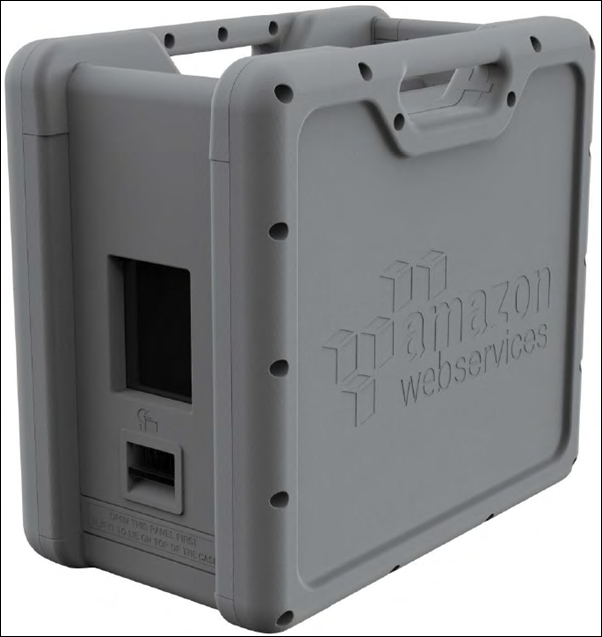
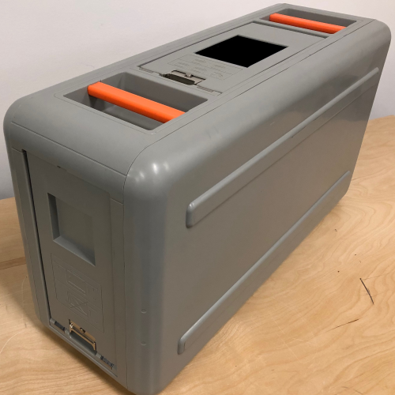
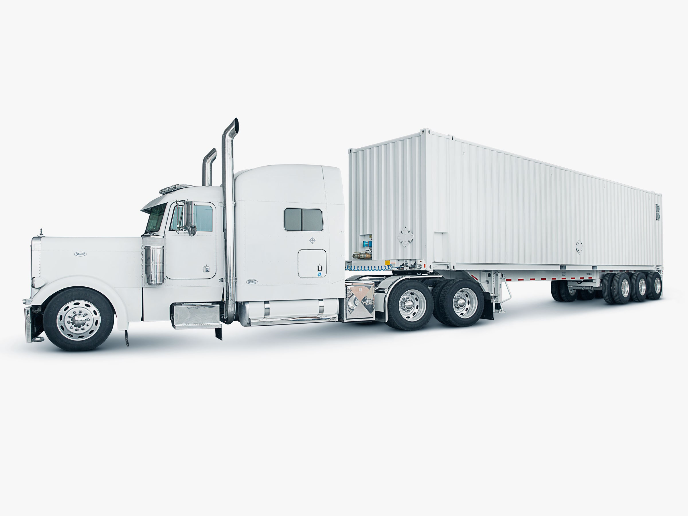

## Simple Storage Service (S3) Overview

* provides developers and IT teams with secure, durable, highly-scalable object storage
* is easy to use, with a simple web services interface to store and retrieve any amount of data from anywhere on the web.
* is a safe place to store your files
* object based storage
* data is spread across multiple devices and facilities

### S3 Basics

* S3 is object based i.e. allows you to upload files.
* Files can be from 0 bytes to 5 TB
* There is unlimited storage
* Files are stored in Buckets
* S3 is a universal namespace i.e. names must be unique globally.
* https://s3-eu-west-1.amazonaws.com/acloudguru
* When you upload a file to S3 you will receive a HTTP 200 code if the upload is successful

### Data Consistency Model For S3

* Read after Write consistency for PUTS of new Objects i.e. **when you write new object you can immediately read it**
* Eventual Consistency for overwrite PUTS and DELETES (can take some time to propagate) **when you update or delete an object it takes time to be consistent inside S3 bucket**


### S3 is a simple key, value store

* S3 is object based. Object consist of the following:
  * Key (This is simply the name of the object)
  * Value (This is simply the data and is made up of a sequence of bytes)
  * Version ID (Important for versioning)
  * Metadata (Data about the data you are storing)

### Create an S3 Bucket - Exam Tips

* Buckets are a universal name space
* Upload an object to S3 recive a HTTP 200 code
* S3 Storage Classes
  * S3 Standard, S3 Intelligent-Tiering, S3 Standard-IA (Infrequent Access), S3 One Zone-Infrequent Access (S3 One Zone-IA) , S3 Reduced Redundancy Storage
* Encryption 
  * Client Side Encryption
  * Server Side Encryption
    * Server side encryption with Amazon S3 Managed Keys (SSE-S3)
    * Server side encryption with KMS (SSE-KMS)
    * Server side encryption with Customer Provided Keys (SSE-C)
* Control access to buckets using either a bucket ACL or using Bucket Policies
* BY DEFAULT BUKKETS ARE PRIVATE AND ALL OBJECTS STORED INSIDE THEM ARE PRIVATE

### S3 Versioning

### S3 Versioning - Exam Tips

* Stores all versions of an object (including all writes and even if you delete an object)
* Great backup toll
* Once enabled, Versioning cannot be disabled, only suspended.
* Integrates with Lifecycle rules
* Versioning's MFA Delete capability, which uses multi-factor authentication, can be used to provide an additional layer of security.

### S3 Cross Region Replication

### Installing the AWS CLI version 2 on Linux

```
curl "https://awscli.amazonaws.com/awscli-exe-linux-x86_64.zip" -o "awscliv2.zip"
unzip awscliv2.zip
sudo ./aws/install

# Configure AWS CLI
aws configure
AWS Access Key ID [****************4SOZ]: 
AWS Secret Access Key [****************q1GZ]: 
Default region name [ap-southeast-1]: 
Default output format [None]: 

# List AWS S3 Buckets
$ aws s3 ls
2020-04-20 20:37:54 sherwinowen-bucket
2020-04-20 20:36:34 sherwinowen-bucket-sydney

# Copy all files in S3 Bucket to another S3 Bucket
$ aws s3 cp --recursive s3://sherwinowen-bucket s3://sherwinowen-bucket-sydney 
copy: s3://sherwinowen-bucket/Oratio-Imperata-Covid-19-English.pdf to s3://sherwinowen-bucket-sydney/Oratio-Imperata-Covid-19-English.pdf
copy: s3://sherwinowen-bucket/owen_pic.jpg to s3://sherwinowen-bucket-sydney/owen_pic.jpg
copy: s3://sherwinowen-bucket/owen_resume_12022019.pdf to s3://sherwinowen-bucket-sydney/owen_resume_12022019.pdf
```

### S3 Cross Region Replication - Exam Tips

* Versioning must be enabled on both the source and destination buckets
* Region must be unique
* Files in an existing bucket are not replicated automatically. All subsequent updated files will be replicated automatically.
* You cannot replicate to multiple buckets or use daisy chaining (at this time)
* Delete markers are replicated
* Deleting individual versions or delete markers will not be replicated
* Understand what Cross Resion Replication is at a high level.


### S3 Life Cycle Management

### S3 Life Cycle Management - Exam Tips

* Can be used in conjunction with versioning (can be used with or without versioning)
* Can be applied to current versions and previous versions
* Following actions can now be done;
  * Transition to the Standard-Infrequent Aceess Storage Class (128Kb and 30 days after the creation date).
  * Archieve to the Glacier Storage Class (30 days after IA, if relevant)
  * Permanently Delete

## Cloudfront Overview

**Content Delivery Network (CDN)**

* is a system of distributed server (network) that deliver webpages and other web content to a user based on the geographic locations of the user, the origin of the webpage and a content delivery server.

### CloudFront Key Terminology

* **Edge Location** - This is the location where content will be cached. This is separate to an AWS Region/AZ
* **Origin** - This is the origin of all the files that the CDN will distribute. This can be either an S3Bucket, an EC@ Instance, an Elastic Load Balancer or Route53.
* **Distribution** - This is the name given the CDN which consists of a collection of Edge Locations.
* **Web Distribution** - typically used for Websites
* **RTMP (Real Time Messaging Protocol)** - used for Media Streaming 

### What is CloudFront

* can be used to deliver your entire website, including dynamic, static, streaming, and interactive content using a global network of edge automatically routed to the nearest edge location, so content is delivered with the best possible performance.
* is optimized to work with other Amazon Web Services like Amazon S3, Amazon EC2, Amazon Elastic Load Balancing, and Amazon Route53.
* also works seamlessly with any non-AWS origin server, which stores the original, definitive versions of your files. 

### CloudFront - Exam Tips

* **Edge Location** - This is the location where content will be cached. This is separate to an AWS Region/AZ
* **Origin** - This is the origin of all the files that the CDN will distribute. This can be either an S3Bucket, an EC@ Instance, an Elastic Load Balancer or Route53.
* **Distribution** - This is the name given the CDN which consists of a collection of Edge Locations.
* **Web Distribution** - typically used for Websites
* **RTMP (Real Time Messaging Protocol)** - used for Media Streaming 
* Edge locations are not just READ only, you can write to them too. (i.e. put an object on to them)
* Ojects are cached for the life of the TTL (Time To Live)
* You can clear cached objects, but you will be charged.

### S3 Security Encryption

#### Securing your buckets

* By default, all newly created buckets are **PRIVATE**
* You can setup access control to your buckets using:
  * Boucket Policies
  * Access Control Lists
* S3 buckets can be configured to create access logs which log requests made to the S3 bucket. This can be done to another bucket.

#### S3 Encryption

* In Transit: 
  * SSL/TLS
* At Rest
  * Server Side Encryption
    * S3 Managed Keys - SSE-S3 (256-bit Advanced Encryption Standard (AES-256)
    * AWS Key Management Service, Managed Keys - SSE-KMS
    * Server-Side Encryption with Customer-Provided Keys - SSE-C
  * Client Side Encryption

## Storage Gateway

* AWS Storage Gateway is a service that connects an on-premises software appliance with cloud-based storage to provide seamless and secure integration between an organization's on premises IT environment and AWS's storage infrastructure. The service enables you to securely store data to the AWS cloud for scalable and cost-effective storage.

* AWS Storage Gateway's software is available for download as virtual machine (VM) image that you will install on a host in your data center. Storage gateway supports either VMware ESXi or Microsoft Hyper-V. Once installed your gateway and associated it with your AWS account through activation process, you can use the AWS Management Console to create the storage gateway option that is right for you.

### Types of Storage Gateways

#### File Gateway (NFS or SMB) Network File System or Server Message Block

* To use a file gateway, you start by downloading a VM image for the file gateway. You then activate the file gateway from the AWS Management Console or through the Storage Gateway API. You can also create a file gateway using an Amazon EC2 image. 
* After the file gateway is activated, you create and configure your file share and associate that share with your Amazon S3 bucket. Doing this makes the share accessible by clients using either the NFS or SMB protocol. Files written to a file share become objects in Amazon S3, with the path as the key.                               


####  Volumes Gateway (iSCSI) Internet Small Computer Systems Interface

* The volume interface presents your applications with disk volumes using the iSCSI block protocol.
* Data written to these volumes can be asynchronously backed up as point-in-time snapshots of your volumes, and stored in the cloud as Amazon EBS (Elastic Block Store) snapshopts.
* Snapshots are incremental backups that capture only changed blocks. All snapshot storage is also compressed to minimized your storage charges.

**Stored Volumes**

* If you need low-latency access to your entire dataset, first configure your on-premises gateway to store all your data locally. Then asynchronously back up point-in-time snapshots of this data to Amazon S3. This configuration provides durable and inexpensive offsite backups that you can recover to your local data center or Amazon Elastic Compute Cloud (Amazon EC2). For example, if you need replacement capacity for disaster recovery, you can recover the backups to Amazon EC2.

  Store volumes let you store your primary data locally, while asynchronously backing up that data to AWS. Stored volumes  provide you on-premises applications with low-latency access to their entire datasets, while providing durable, offsite backups. You can create storage volumes and mount them as iSCSI devices from you on-premises application servers. Data written to your stored volumes is stored on your on-premises storage hardware. This data is asynchronously backed up to Amazon Simple Storage Service (Amazon S3) in the form of Amazon Elastic Block Store (Amazon EBS) snapshots.  1GB - 16 GB in size for Stored Volumes.

  


**Cached Volumes**

* You store your data in Amazon Simple Storage Service (Amazon S3) and retain a copy of frequently accessed data subsets locally. Cached volumes offer a substantial cost savings on primary storage and minimize the need to scale your storage on-premises. You also retain low-latency access to your frequently accessed data.

* By using cached volumes, you can use Amazon S3 as your primary data storage, while retaining frequently accessed data locally in your storage gateway.

  

  Cached volumes let you use Amazon S3 as your primary data storage while retaining frequently accessed data locally in your storage gateway.  Cached volumes minimize the need to scale your on- premises storage infrastructure, while still providing your applications with low-latency access to their frequently accessed data. You can create storage volumes up to 32 TB in size and attach to them as iSCSI devices from your on-premises application servers. Your gateway stores data you write to these volumes in Amazon S3 and retains recently read data in your on-premises storage gateway's cache and upload buffer storage. 1GB - 32 GB in size for Cached Volumes.

  


#### Tape Gateway (VTL) Virtual Tape Library

* Tape Gateway offers a durable, cost-effective solution to archive your  data in the AWS Cloud. The VTL interface it provides lets your leverage  your existing tape-based backup application infrastructure to store data on virtual tape cartridges that you create on your tape gateway. Each  tape gateway is preconfigured with a media changer and tape drives,  which are available to your existing client backup applications as ISCSI devices. You add tape cartridges as your need to archive your data.  Supported by NetBackup, Backup Exec, Veeam etc.


#### Storage Gateway  Exam Tips

* File Gateway - For flat files, stored directly on S3
  Volume Gateway:
  * Stored Volumes - Entire dataset is stored on site and is asynchronously backed up to S3
  * Cached Volumes - Entire dataset is stored on S3 and the most frequently accessed data is cached on site
* Gateway Virtual Tape Library (VTL) - Used for backup and uses popular backup applications like NetBackup, Backup Exec, Veeam etc.

## Snowball

### Import/Export Disk

AWS Import/Export Disk accelerates moving large amounts of data into  and out of the AWS cloud using portable storage devices for transport.  AWS Import/Export Disk transfers your data directly onto and off of  storage devices using Amazon's high-speed internal network and bypassing the Internet.

### Types of Snowballs

- Snowball
- Snowball Edge
- Snowmobile

### Snowball

- Snowball is a petabyte-scale data transport solution that uses  secure appliances to transfer large amounts of data into and out of AWS. Using Snowball addresses common challenges with large-scale data  transfers including high network costs, long transfer times, and  security concerns. Transferring data with Snowball is simple, fast,  secure, and can be as little as one-fifth the cost of high-speed  Internet.

80 TB snowball in all regions. Snowball uses multiple layers of  security designed to protect your data including tamper-resistant  enclosures, 256-bit encryption, and an industry-standard Trusted  Platform Module (TPM) designed to ensure both security and full  chain-of-custody of your data. Once the data transfer job has been  processed and verified, AWS performs a software erasure of the Snowball  appliance.

### 

### Snowball Edge

AWS Snowball Edge is a 100 TB data transfer device with on-board  storage and compute capabilities. You can use Snowball Edge to move  large amounts of data into and out of AWS, as a temporary storage tier  for large local datasets, or to support local workloads in remote or  offline locations.

Snowball Edge connects to your existing applications and  infrastructure using standard storage interfaces, streamlining the data  transfer process and minimizing setup and integration. Snowball Edge can cluster together to form a local storage tier and process your data  on-premises, helping ensure your applications continue to run even when  they are not able to access the cloud.

### 

### Snowmobile

AWS Snowmobile is an Exabyte-scale data transfer service used to move extremely large amounts of data to AWS. You can transfer up to 100 PB  per Snowmobile, a 45-foot long ruggedized shipping container, pulled by a semi-trailer truck. Snowmobile makes it easy to move massive volumes of data to the cloud, including video libraries, image repositories, or  even a complete data center migration. Transferring data with Snowmobile is secure, fast, and cost effective.




### Snowball - Exam Tips

- Understand what Snowball is
- Understand what Import/Export is
- Snowball can:
  - Import to S3
  - Export to S3


### What is S3 Transfer Acceleration?

S3 Transfer Acceleration utilizes the CloudFront Edge Network to  accelerate your uploads to S3. Instead of uploading directly to your S3  bucket, you can use a distinct URL to upload directly to an edge  location which will then transfer that file to S3. You will get a  distinct URL to upload to.

### Summary

- Know the core fundamentals of S3:
  - Key (name)
  - Value (data)
  - Version ID
  - Metadata
  - Access control lists
- Object based storage only (for files)
- **Not suitable to install an operating system on**
- Remember that S3 is Object based i.e. allows you to upload files
- Files can be from 0 bytes to 5 TB
- There is unlimited storage
- Files are stored in buckets
- S3 is a universal namespace, that is, names must be unique globally
- Sample URL: https://s3-eu-west-1.amazonaws.com/
- Read after Write consistency for PUTS of new Objects
- Eventual Consistency for overwrite PUTS and DELETES (can take some time to propagate)

#### 

#### Summary - S3 Storage Tiers/Classes

- Know the different storage tiers/classes:
  - S3 Standard
  - S3-IA
  - S3 One Zone-IA
  - Glacier

#### 

#### Summary - S3 Versioning

- Stores all versions of an object (including all writes and even if you delete an object)
- Great backup tool
- Once enabled, cannot be disabled, only suspended
- Integrates with Lifecycle rules
- Versioning's MFA Delete capability, which uses multi-factor  authentication, can be used to provide an additional layer of security
- Cross Region Replication, requires versioning enabled on the source bucket

#### 

#### Summary - S3 Lifecycle Management

- Can be used in conjunction with versioning
- Can be applied to current versions and previous versions
- Following actions can now be done:
  - Transition to the Standard - Infrequent Access Storage Class (128 Kb and 30 days after the creation date)
  - Archive to the Glacier Storage Class (30 days after IA, if relevant)
  - Permanently Delete

#### 

#### Summary - CloudFront

- Edge Location - This is the location where content will be cached. This is separate to an AWS AZ
- Origin - This is the origin of all the files that the CDN will  distribute. This can be either an S3 Bucket, an EC2 Instance, an Elastic Load Balancer or Route 53
- Distribution - This is the name given the CDN which consists of a collection of Edge Locations. There are different types:
  - Web Distribution - Typically used for websites
  - RTMP - Used for media streaming
- Edge locations are not just READ only, you can write to them too
- Objects are cached for the life of the TTL (Time to Live)
- You can clear cached objects but you will be charged

#### 

#### Summary - Securing your buckets

- By default, all newly created buckets are PRIVATE
- You can setup access control to your buckets using:
  - Bucket Policies
  - Access Control Lists
- S3 buckets can be configured to create access logs which log all  requests made to the S3 bucket. This can be done to another bucket

#### 

#### Summary - Encryption

- In Transit:
  - SSL/TLS
- At Rest:
  - Server Side Encryption
    - S3 Managed Keys - SSE-S3
    - AWS Key Management Service, Managed Keys - SSE-KMS
    - Server Side Encryption with Customer Provided Keys - SSE-C
  - Client Side Encryption

#### 

#### Summary - Storage Gateway

- File Gateway - For flat files, stored directly on S3
- Volume Gateway:
  - Stored Volumes - Entire dataset is stored on site and is asynchronously backed up to S3
  - Cached Volumes - Entire dataset is stored on S3 and the most frequently accessed data is cached on site
- Gateway Virtual Tape Library (VTL)
  - Used for backup and uses popular backup applications like NetBackup, Backup Exec, Veeam etc.

#### 

#### Summary - Snowball

Types of snowball:

- Snowball
- Snowball Edge
- Snowmobile

#### 

#### Summary - S3 Transfer Acceleration

- You can speed up transfers to S3 using S3 transfer acceleration.  This costs extra and has the greatest impact on people who are in a  faraway location

#### 

#### S3 Static Websites

- You can use S3 to host static websites
- Serverless
- Very cheap, scales automatically
- STATIC only, cannot host dynamic sites

#### 

#### Summary - Last Few Tips

- Write to S3 - HTTP 200 code for a successful write
- You can load files to S3 much faster by enabling multipart upload

- Read the S3 FAQ before taking the exam. It comes up A LOT!

## 