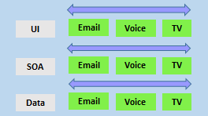

# AZ-400 Exam Lecture

# Get started on a DevOps transformation journey

[AZ-400: Get started on a DevOps transformation journey](https://learn.microsoft.com/en-us/training/paths/az-400-get-started-devops-transformation-journey/)

## Introduction to Devops

### What is DevOps?

- "Dev" and "Ops" refers to replacing siloed Development and Operations
- .The idea is to create multidisciplinary teams that now work together with shared and efficient practices and tools. 
- Essential DevOps practices include agile planning, continuous integration, continuous delivery, and monitoring of applications. 


### Understand your cycle time

- OODA (Observe, Orient, Decide, Act) loop
  - Observing business, market, needs, current user behavior, and available telemetry data
  - Orient with the enumeration of options for what you can deliver, perhaps with experiments
  - Decide what to pursue
  - Act by delivering working software to real users


### Become data-informed

- We recommend you use data to inform what to do in your next cycle. 

  - 1/3 of the deployments will have negative business results. 

  - 1/3 will have positive results, and 

  - 1/3  will make no difference. 

- Fail fast on effects that do not advance the business and double down on outcomes that support the business. 

- Sometimes the approach is called **pivot or persevere**.

###  Strive for validated learning

- How quickly you can fail fast or double down is determined by your cycle time. 
- Also, in how long that loop takes, or in lean terms. 
- Your cycle time determines how quickly you can gather feedback to determine what happens in the next loop. 
- The feedback that you collect with each cycle should be factual, actionable data. 
- We call it **validated learning**.


### Shorten your cycle time

When you adopt DevOps practices:

- You shorten your cycle time by working in smaller batches.
- Using more automation.
- Hardening your release pipeline.
- Improving your telemetry.
- Deploying more frequently.


### Optimize validated learning

- The more frequently you deploy, the more you can experiment. 
- The more opportunity you have to pivot or persevere and gain validated learning each cycle. 
- This acceleration in validated learning is the value of the improvement. 
- Think of it as the sum of progress that you achieve and the failures that you avoid.


### Explore the DevOps journey

Remember, the goal is to shorten cycle time. Start with the release pipeline. How long does it take to deploy a change of one line of code or configuration? Ultimately, that is the brake on your velocity.

- Continuous Integration drives the ongoing merging and testing of code, leading to an early finding of defects. Other benefits include less time wasted fighting merge issues and rapid feedback for development teams.

  

- Continuous Delivery of software solutions to production and testing environments helps organizations quickly fix bugs and respond to ever-changing business requirements.

  

- Version Control, usually with a Git-based Repository, enables teams worldwide to communicate effectively during daily development activities. Also, integrate with software development tools for monitoring activities such as deployments.

  

- Use Agile planning and lean project management techniques to:

  - Plan and isolate work into sprints.
  - Manage team capacity and help teams quickly adapt to changing business needs.
  - A DevOps Definition of Done is working software collecting telemetry against the intended business goals.

  

- Monitoring and Logging of running applications. Including production environments for application health and customer usage. It helps organizations create a hypothesis and quickly validate or disprove strategies. Rich data is captured and stored in various logging formats.

  

- Public and Hybrid Clouds have made the impossible easy. The cloud has removed traditional bottlenecks and helped commoditize Infrastructure. You can use Infrastructure as a Service (IaaS) to lift and shift your existing apps or Platform as a Service (PaaS) to gain unprecedented productivity. The cloud gives you a data center without limits.


- Infrastructure as Code (IaC): Enables the automation and validation of the creation and teardown of environments to help deliver secure and stable application hosting platforms.

  

- Use Microservices architecture to isolate business use cases into small reusable services that communicate via interface contracts. This architecture enables scalability and efficiency.


- Containers are the next evolution in virtualization. They're much more lightweight than virtual machines, allow much faster hydration, and easily configure files.

  

### DevOps may hurt at first.

If it hurts, do it more often. Adopting new practices like going to the gym is likely to hurt first. The more you exercise the new techniques, the easier they'll become.

Like training at the gym, where you first exercise large muscles before small muscles, adopt practices that have the most significant impact. Cross-train to develop synergy.


### Explore shared goals and define timelines

#### Explore shared goals

These outcomes should include specific, measurable targets like:

- Reduce the time spent on fixing bugs by 60%.
- Reduce the time spent on unplanned work by 70%.
- Reduce the out-of-hours work required by staff to no more than 10% of total working time.
- Remove all direct patching of production systems.

#### Define timelines for goals

Measurable goals also need to have timelines. While it is easy to set longer-term goals, it is also easy to put off work when you do not require it for a while.

It is essential to have an ongoing series of short-term goals. Overall, projects should have timelines that span anywhere from a few months to a year or two in any DevOps transformation project.

Every few weeks, the improvements should be clear and measurable. Ideally, evident to the organization or its customers.

- The timeline should not be too short and should always be challenging yet achievable.
-  A review should occur after each short-term goal to help plan the next one.

There are several advantages of the shorter timelines:

- It is easier to change plans or priorities when necessary.
- The reduced delay between doing work and getting feedback helps ensure that the learnings and feedback are incorporated quickly.
- It is easier to keep organizational support when positive outcomes are clear.

### Knowledge check

1. Which of the following choices best describes DevOps?

- DevOps is the role of who manages source control, pipelines, and monitor environments to continue delivering value to the software project.

- **DevOps is the union of people, process, and products to enable continuous delivery of value to our end users.**

- DevOps is the new process of creating continuous delivery and continuous integration for software projects.

2. Which of the following choices drives the ongoing merging and testing of code that leads to finding defects early?

- **Continuous Integration.**

- Continuous Delivery.

- Continuous Feedback.

3. Which of the following choices is a practice that enables the automated creation of environments?

- Infrastructure as a Service (IaaS).

- **Infrastructure as Code (IaC).**

- Software as a Service (SaaS).

### Summary

This module explored the key areas that organizations must apply to start their DevOps transformation Journey, changing the team's mindset, and defining timelines and goals.

You learned how to describe the benefits and usage of:

- Understand what DevOps is and the steps to accomplish it.
- Identify teams to implement the process.
- Plan for the transformation with shared goals and timelines.
- Plan and define timelines for goals.

# Choose the right project

## Explore greenfield and brownfield projects

The terms greenfield and brownfield have their origins in residential and industrial building projects.

**greenfield project**

- is one done on a green field, undeveloped land. 

**brownfield project** 

- is done on the used ground for other purposes.

Because of the land use that has once occurred, there could be challenges reusing the land.

Like existing buildings, some would be obvious but less obvious, like polluted soil.

## Applied to software or DevOps Projects

- Greenfield DevOps project would be easier to manage and to achieve success.
  - There was no existing codebase.
  - No existing team dynamics of politics. Possibly no current, rigid processes.

- A common misconception is that DevOps is only for greenfield projects and suits startups best. 

- However, DevOps can also succeed with brownfield projects.

## Decide when to use greenfield and brownfield projects

- When starting a DevOps transformation, you might need to choose between greenfield and brownfield projects.

- There's a common misconception that we need to demystify that DevOps suits greenfield projects better than brownfield projects.

### Greenfield projects

- A greenfield project will always appear to be a more accessible starting point. A blank slate offers the chance to implement everything the way that you want.

- You might also have a better chance of avoiding existing business processes that don't align with your project plans.

- Suppose current IT policies don't allow the use of cloud-based infrastructure. In that case, the project might be qualified for entirely new applications designed for that environment from scratch.

- For example, you can sidestep internal political issues that are well entrenched.

### Brownfield projects

Usually, brownfield projects come with:

- The baggage of existing codebases.
- Existing teams.
- A significant amount of technical debt.

## Decide when to use systems of record versus systems of engagement

### Systems of record

- Systems that provide the truth about data elements are often-called systems of record. 
- These systems have historically evolved slowly and carefully.
-  For example, it is crucial that a banking system accurately reflects your bank balance.
-  Systems of record emphasize accuracy and security.

### Systems of engagement

-  Systems of engagement are modified regularly. Usually, it is a priority to make quick changes over ensuring that the changes are correct.

- There is a perception that DevOps suits systems of engagement more than systems of record. The lessons from high-performing companies show that is not the case.

## Identify groups to minimize initial resistance

Not all staff members within an organization will be receptive to the change required for a DevOps transformation.

In discussions around continuous delivery, we usually categorize users into three general buckets:

- **Canary** users voluntarily test bleeding edge features as soon as they're available.
- **Early adopters** who voluntarily preview releases, considered more refined than the code that exposes canary users.
- **Users** who consume the products after passing through canary and early adopters.

### Ideal target improvements

It's also important to roll out changes incrementally. There is an old saying in the industry that any successful large IT system was previously a successful small IT system.

Large-scale systems rolled out all at once have an abysmal record of success. Most fail, no matter how much support management has provided.

When starting, it is essential to find an improvement goal that:

- It can be used to gain early wins.
- It is small enough to be achievable in a reasonable timeframe.
- Has benefits that are significant enough to be evident to the organization.

It allows constant learning from rapid feedback and recovering from mistakes quickly.

## Identify project metrics and key performance indicators (KPIs)

- We spoke earlier about the importance of shared goals. It was also agreed upon by team members that the goals needed to be specific, measurable, and time-bound.

- It is essential to establish (and agree upon) appropriate metrics and Key Performance Indicators (KPIs) to ensure these goals are measurable.

While there is no specific list of metrics and KPIs that apply to all DevOps Projects, the following are commonly used:

### Faster outcomes

- **Deployment Frequency**. Increasing the frequency of deployments is often a critical driver in DevOps Projects.
- **Deployment Speed**. It is necessary to reduce the time that they take.
- **Deployment Size**. How many features, stories, and bug fixes are being deployed each time?
- **Lead Time**. How long does it take from the creation of a work item until it is completed?

### Efficiency

- **Server to Admin Ratio**. Are the projects reducing the number of administrators required for a given number of servers?
- **Staff Member to Customers Ratio**. Is it possible for fewer staff members to serve a given number of customers?
- **Application Usage**. How busy is the application?
- **Application Performance**. Is the application performance improving or dropping? (Based upon application metrics)?

### Quality and security

- **Deployment failure rates**. How often do deployments (or applications) fail?
- **Application failure rates**. How often do application failures occur, such as configuration failures, performance timeouts, and so on?
- **Mean time to recover**. How quickly can you recover from a failure?
- **Bug report rates**. You do not want customers finding bugs in your code. Is the amount they are seeing increasing or lowering?
- **Test pass rates**. How well is your automated testing working?
- **Defect escape rate**. What percentage of defects are being found in production?
- **Availability**. What percentage of time is the application truly available for customers?
- **Service level agreement achievement**. Are you meeting your service level agreements (SLAs)?
- **Mean time to detection**. If there is a failure, how long does it take for it to be detected?

### Culture

- **Employee morale**. Are employees happy with the transformation and where the organization is heading? Are they still willing to respond to further changes? This metric can be challenging to measure but is often done by periodic, anonymous employee surveys.
- **Retention rates**. Is the organization losing staff?

### Knowledge check

1. In which of the following choices would you find large amounts of technical debt?

- Greenfield project.
- **Brownfield project.**
- Bluefield project.

2. Which of the following choices would a system that manages inventory in a warehouse be considered?

- **System of Record.**

- System of Engagement.

- System of History.

3. Which of the following choices are the categorized user groups most adopted in Continuous Delivery?

- **Canaries, Early adopters, and Users.**

- Alpha and Beta Users.

- Blue and Green Users.

### Summary

You learned how to describe the benefits and usage of:

- Understand what DevOps is and the steps to accomplish it.
- Identify teams to implement the process.
- Plan for the transformation with shared goals and timelines.
- Plan and define timelines for goals.

# Describe team structures

## Explore agile development practices

### Waterfall

Traditional software development practices involve:

- Determining a problem.
- Analyzing the requirements.
- Building and testing the required code.
- The delivery outcome to users.

### Agile

- Agile methodology constantly emphasizes adaptive planning and early delivery with continual improvement.

- Rather than restricting development to rigid specifications, it encourages rapid and flexible responses to changes as they occur.

They said that:

- Development needs to favor individuals and interactions over processes and tools.
- Working software over comprehensive documentation.
- Customer collaboration over contract negotiation.
- Respond to changes over following a plan.

Agile software development methods are based on releases and iterations:

- One release might consist of several iterations.
- Each iteration is like a small independent project.
- After being estimated and prioritization:
  - Features, bug fixes, enhancements, and refactoring width are assigned to a release.
  - And then assigned again to a specific iteration within the release, generally on a priority basis.
- At the end of each iteration, there should be tested working code.
- In each iteration, the team must focus on the outcomes of the previous iteration and learn from them.

### Comparison of the waterfall and agile methodologies 

| **Waterfall**                                                | **Agile**                                                    |
| :----------------------------------------------------------- | :----------------------------------------------------------- |
| Divided into distinct phases.                                | Separates the project development lifecycle into sprints.    |
| It can be rigid.                                             | Known for flexibility.                                       |
| All project development phases, such as design, development, and test, are completed once. | It follows an iterative development approach so that each phase may appear more than once. |
| Define requirements at the start of the project with little change expected. | Requirements are expected to change and evolve.              |
| Focus on completing the project.                             | Focus on meeting customers' demands.                         |

### Explore principles of agile development

The [Agile Alliance](https://www.agilealliance.org/) says its mission is to support people who explore and apply agile values and principles. Also, practices to make building software solutions more effective, humane, and sustainable.

They have published a [Manifesto for Agile Software Development](https://www.agilealliance.org/agile101/the-agile-manifesto/).

And from the publication, they have distilled the [12 Principles Behind the Agile Manifesto](https://www.agilealliance.org/agile101/12-principles-behind-the-agile-manifesto/).

- Our highest priority is to satisfy the customer through the early and continuous delivery of valuable software.
- Welcome changing requirements, even late in development. Agile processes harness change for the customer's competitive advantage.
- Deliver working software frequently, from a couple of months to a couple of weeks, with a preference for a shorter timescale.
- Businesspeople and developers must work together daily throughout the project.
- Build projects around motivated individuals. Give them the environment and support they need and trust them to get the job done.
- The most efficient and effective method of conveying information to and within a development team is face-to-face conversation.
- Working software is the primary measure of progress.
- Agile processes promote sustainable development. The sponsors, developers, and users should be able to maintain a constant pace indefinitely.
- Continuous attention to technical excellence and good design enhances agility.
- Simplicity - the art of maximizing the amount of work not done - is essential.
- The best architectures, requirements, and designs emerge from self-organizing teams.
- The team regularly reflects on how to become more effective, then tunes and adjusts its behavior accordingly.

### Define organization structure for agile practices

For most organizations, reorganizing to be agile is difficult. It requires a mind-shift and a culture-shift that challenges many existing policies and processes within the organization.

Good governance in organizations, particularly in large organizations, often leads to many relatively rigid rules, operating structures, and methods. It also tends to avoid a broad delegation of authority.

While most large organizations have not moved to an agile structure, most are now experimenting with doing so.

Their business environments are volatile and complex, and they have seen the limitations of their current systems, mainly an inability to cope with change quickly.

They realize that it is common today for long-term established businesses and their industries to be disrupted by startups.

## Horizontal vs. vertical teams

- **horizontal team** structures divide teams according to the software architecture. In this example, the teams have been divided into the user interface, service-oriented architecture, and data teams:



- **vertical team** structures span the architecture and are aligned with skillsets or disciplines:


- Vertical teams have been shown to provide more good outcomes in Agile projects. Each product must have an identified owner.

- Another key benefit of the vertical team structure is that scaling can occur by adding teams. In this example, feature teams have been created rather than just project teams:


## Explore ideal DevOps team members

For a successful DevOps transformation, the aim is to find team members with the following characteristics:

- They already think there is a need to change.
- They have previously shown an ability to innovate.
- They are already well respected within the organization.
- They have a broad knowledge of the organization and how it operates.
- Ideally, they already believe that DevOps practices are what is needed.

## Mentoring team members on agile practices

- While it's desirable to have formal agile training for staff members, no matter how good any agile course is, there is a world of difference between learning a concept within a few days and putting it into practice.

- When they first start an agile transformation, many teams hire external coaches or mentors.

- Agile coaches help teams or individuals to adopt agile methods or to improve the current techniques and practices.

- They must be agents of change by helping people understand how they work and encouraging them to adopt new approaches.

- Agile coaches typically work with more than one team and remove any roadblocks from inside or outside the organization.

- This work requires various skills, including coaching, mentoring, teaching, and making easier. Agile coaches must be both trainers and consultants.

There is more than one type of agile coach.

- Some coaches are technical experts who aim to show staff members how to apply specific concepts—for example, test-driven development and continuous integration or deployment.
  - These coaches might do peer programming sessions with staff members.
- Other coaches are focused on agile processes, determining requirements, and managing work activities.
  - They might help how to run effective stand-up and review meetings.
  - Some coaches may themselves act as scrum masters.
    - They might mentor staff in how to fill these roles.

## Enable in-team and cross-team collaboration

- Effective collaboration is critical for well-functioning Agile teams. Enabling it requires cultural changes, cross-functional team collaboration, and tooling.

### Cultural changes

- Over recent decades, offices have often become open spaces with few walls. At the time of writing, a significant shift to working from home started as a response to the pandemic. Both situations can limit collaboration, and ambient noise and distractions often reduce productivity. Staff tends to work better when they have comfortable working environments. Defined meeting times and locations let teams choose when they want to interact with others.

- Asynchronous communication should be encouraged, but there should not be an expectation that all communications will be responded to urgently. Staff should focus on their primary tasks without feeling like they are being left out of important decisions.

- All meetings should have strict timeframes and, more importantly, have a plan. If there is no plan, there should be no meeting.

- As it is becoming harder to find the required staff, great teams will be as comfortable with remote or work-from-home as with workers in the office.

- To be successful, though, collaboration via communication should become part of the organization's DNA.

- Staff should be encouraged to communicate openly and frankly. Learning to deal with conflict is essential for any team, as there will be disagreements at some point. Mediation skills training would be helpful.

### Cross-functional teams

- Team members need good collaboration. It is also essential to have a great partnership with wider teams to bring people with different functional expertise together to work toward a common goal.

- Often, there will be people from other departments within an organization.

- Faster and better innovation can occur in these cross-functional teams.

- People from different areas of the organization will have different views of the same problem and are more likely to come up with alternate solutions to problems or challenges. Existing entrenched ideas are more likely to be challenged.

- Cross-functional teams can also minimize turf wars within organizations. The more widely a project appears to have ownership, the easier it will be to be widely accepted. Bringing cross-functional teams together also helps to spread knowledge across an organization.

- Recognizing and rewarding collective behavior across cross-functional teams can also help to increase team cohesion.

### Collaboration tools

Agile teams commonly use the following collaboration tools:

[Teams (Microsoft)](https://products.office.com/microsoft-teams/group-chat-software): A group chat application from Microsoft. It provides a combined location with workplace chat, meetings, notes, and storage of file attachments. A user can be a member of many teams.

[Slack](https://slack.com/): A commonly used tool for collaboration in Agile and DevOps teams. From a single interface, it provides a series of separate communication channels that can be organized by project, team, or topic. Conversations are kept and are searchable. It is straightforward to add both internal and external team members. Slack integrates with many third-party tools like [GitHub](https://github.com/) for source code and [DropBox](https://dropbox.com/) for document and file storage.

[Jira](https://www.atlassian.com/software/jira): A commonly used tool for planning, tracking, releasing, and reporting.

[Asana](https://asana.com/): A standard tool designed to keep team plans, progress, and discussions in a single place. It has strong capabilities around timelines and boards.

[Glip](https://glip.com/): An offering from Ring Central that provides chat, video, and task management.

Other standard tools with collaboration offerings include ProofHub, RedBooth, Trello, DaPulse, and many others.

## Select tools and processes for agile practices

- While developing agile methods does not require specific tooling, tools can often enhance the achieved outcomes.
- It is essential to realize that the vital tool for agile development is the process itself.
- Become familiar with the procedures you need to follow before working out how to implement tools. Several categories of tools are commonly used.

### Physical tools

- Not all tools need to be digital tools. Many teams use whiteboards to collaborate on ideas, index cards for recording stories, and sticky notes for moving around tasks.

- Even when digital tools are available, it might be more convenient to use these physical tools during stand-up and other meetings.

### Project management tools

These tools usually include:

- Project planning and execution monitoring abilities (including how to respond to impediments).
- Automation for stand-up meetings.
- Management and tracking of releases.
- A way to record and work with the outcomes of retrospectives.
- Many include Kanban boards and detailed sprint planning options.

These tools will also provide detailed visualizations, often as a graphic dashboard that shows team progress against assigned goals and targets.

Some tools integrate directly with code repositories and CI/CD tools and add code-related metrics, including quality metrics and direct support for code reviews.

As a complete CI/CD system, we have Azure DevOps and GitHub that includes:

- Flexibility in Kanban boards.
- Traceability through Backlogs.
- Customizability in dashboards.
- Built-in scrum boards.
- Integrability directly with code repositories.
- Code changes can be linked directly to tasks or bugs.

Apart from Azure DevOps and GitHub, other standard tools include:

- Jira.
- Trello.
- Active Collab.
- Agilo for Scrum.
- SpiraTeam.
- Icescrum.
- SprintGround.
- Gravity.
- Taiga.
- VersionOne.
- Agilean.
- Wrike.
- Axosoft.
- Assembla.
- PlanBox.
- Asana.
- Binfire.
- Proggio.
- VivifyScrum, and many others.

## Screen recording tools

It might seem odd to add screen recording tools to this list. Still, they are beneficial when:

- Work with remote team members.
- Recording bugs in action.
- Building walkthroughs and tutorials that demonstrate actual or potential features.

A screen recorder is built into Windows, but other common ones include **SnagIt**, **Camtasia**, **OBS**, and **Loom**.

## Knowledge check

1. An Agile tool manages and visualizes work by showing tasks moving from left to right across columns representing stages. What is this tool commonly called?

- Backlog.

- **Kanban Board.**

- Delivery Plans.

2. Which of the following choices isn't describing processes and methodologies correctly?

- **It is required to implement Waterfall to evolve and implement Agile.** 
- It is possible to start with Waterfall and evolve to Agile.
- Agile is the best and most used methodology and the best to start your project.

3. Which of the following choices isn't an Agile/Project management tool?

- Azure DevOps.

- GitHub.

- **Camtasia**.

## Summary

This module explored agile development practices and helped define and configure teams and tools for collaboration.

You learned how to describe the benefits and usage of:

- Understand agile practices and principles of agile development.
- Create a team and agile organizational structure.
- Identify ideal DevOps team members.
- Select and configure tools for collaboration.

# Plan Agile with GitHub Projects and Azure Boards

## Learning objectives

After completing this module, students and professionals can:

- Describe GitHub Projects and Azure Boards.
- Link Azure Boards and GitHub.
- Configure and Manage GitHub Projects and boards.
- Customize Project views.

## Introduction to GitHub Projects and Project boards

## Project Boards

- With Project boards, you can control specific feature work, roadmaps, release plans, etc.
- Project boards are made up of issues, pull requests, and notes categorized as cards you can drag and drop into your chosen columns. 
- The cards contain relevant metadata for issues and pull requests, like labels, assignees, the status, and who opened it.


There are different types of project boards:

- **User-owned project boards:** Can contain issues and pull requests from any personal repository.
- **Organization-wide project boards:** Can contain issues and pull requests from any repository that belongs to an organization.
- **Repository project boards:** Are scoped to issues and pull requests within a single repository.

To create a project board for your organization, you must be an organization member.

It's possible to use templates to set up a new project board that will include columns and cards with tips. The templates can be automated and already configured.

| **Templates**                | **Description**                                              |
| :--------------------------- | :----------------------------------------------------------- |
| Basic kanban                 | Track your tasks with: To do, In progress, and Done columns. |
| Automated kanban             | Cards automatically move between: To do, In progress, and Done columns. |
| Automated kanban with review | Cards automatically move between: To do, In progress, and Done columns, with extra triggers for pull request review status. |
| Bug triage                   | Triage and prioritize bugs with: To do, High priority, Low priority, and Closed columns. |

## Projects

Projects are a new, customizable and flexible tool version of projects for planning and tracking work on GitHub.

A project is a customizable spreadsheet in which you can configure the layout by filtering, sorting, grouping your issues and PRs, and adding custom fields to track metadata.

You can use different views such as Board or spreadsheet/table.


If you change your pull request or issue, your project reflects that change.

You can use custom fields in your tasks. For example:

- A date field to track target ship dates.
- A number field to track the complexity of a task.
- A single select field to track whether a task is Low, Medium, or High priority.
- A text field to add a quick note.
- An iteration field to plan work week-by-week, including support for breaks.

## Introduction to Azure Boards

Azure Boards is a customizable tool to manage software projects supporting Agile, Scrum, and Kanban processes by default. Track work, issues, and code defects associated with your project. Also, you can create your custom process templates and use them to create a better and more customized experience for your company.

You have multiple features and configurations to support your teams, such as calendar views, configurable dashboards, and integrated reporting.

The Kanban board is one of several tools that allows you to add, update, and filter user stories, bugs, features, and epics.


## Delivery plans

It's possible to create another view with deliverables and track dependencies across several teams in a calendar view using Delivery Plans.


Delivery plans are fully interactive, supporting the following tasks:

- View up to 15 team backlogs, including a mix of backlogs and teams from different projects.
- View custom portfolio backlogs and epics.
- View work that spans several iterations.
- Add backlog items from a plan.
- View rollup progress of features, epics, and other portfolio items.
- View dependencies that exist between work items.

## Link GitHub to Azure Boards

## Use GitHub, track work in Azure Boards

Use Azure Boards to plan and track your work and GitHub as source control for software development.

Connect Azure Boards with GitHub repositories, enabling linking GitHub commits, pull requests, and issues to work items in Boards.


## Azure Boards App

The integration is created using the Azure Boards App, acting as a bridge between Azure Boards and GitHub.

To install the app, you must be an administrator or owner of the GitHub repository or the GitHub organization.

The app is installed from the GitHub Marketplace


## Authenticating to GitHub

Azure Boards can connect to GitHub. For GitHub in the cloud, when adding a GitHub connection, the authentication options are:

- Username/Password
- Personal Access Token (PAT)

For a walkthrough on making the connection, see: [Connect Azure Boards to GitHub](https://learn.microsoft.com/en-us/azure/devops/boards/github/connect-to-github).

## Supported integration scenarios

Azure Boards-GitHub integration supports the following connections:

- From GitHub:
  - Support integration for all repositories for a GitHub account or organization or select repositories.
  - Add or remove GitHub repositories participating in the integration and configure the project they connect to.
  - Suspend Azure Boards-GitHub integration or uninstall the app.
- From Azure Boards:
  - Connect one or more GitHub repositories to an Azure Boards project.
  - Add or remove GitHub repositories from a GitHub connection within an Azure Boards project.
  - Completely remove a GitHub connection for a project.
  - Allow a GitHub repository to connect to one or more Azure Boards projects within the same Azure DevOps organization or collection.

Azure Boards-GitHub integration supports the following operational tasks:

- Create links between work items and GitHub commits, pull requests, and issues based on GitHub mentions.
- Support state transition of work items to a Done or Completed state when using GitHub mention by using fix, fixes, or fixed.
- Support full traceability by posting a discussion comment to GitHub when linking from a work item to a GitHub commit, pull request, or issue.
- Show linked to GitHub code artifacts within the work item Development section.
- Show linked to GitHub artifacts as annotations on Kanban board cards.
- Support status badges of Kanban board columns added to GitHub repositories.

## Configure GitHub Projects

## Create a project

To start working with GitHub Projects, you first need to create an organization or user project.


To create an **organization project**:

1. On GitHub, navigate to the main page of your organization.
2. Click **Projects**.
3. Select the **New project** drop-down menu and click **New project.**

To create a **user project**:

1. On any GitHub page, click on your avatar, then select **Your projects**.
2. Select the **New project** drop-down menu and click **New project**.

Create a project **description** or a **README** file:

1. Navigate to your project.
2. In the top-right, click to open the menu.
3. In the menu, click **Settings**.
4. Under Add a description, type your description in the text box and click **Save**.
5. To update your project's README, type your content in the text box under README.
6. Click Save.

## Adding issues

When your new project initializes, it prompts you to add items.

Click on the plus (+) sign to add more issues.


## Project settings and permissions

You can view and make quick changes to your project description and README by navigating to your project and clicking on the top right.


You can create custom fields to add to your project.


Manage access and permissions by adding collaborators.


## Manage work with GitHub Project boards

GitHub Projects allow you to control project deliverables, release dates, and iterations to plan upcoming work.

You can create an iteration to:

- Associate items with specific repeating blocks of time.
- Set to any length of time.
- Include breaks.

It's possible to configure your project to group by iteration to visualize the balance of upcoming work.

When you first create an iteration field, three iterations are automatically created. You can add other iterations if needed.


## Iteration field

You can use the command palette or the project's interface to create an iteration field.

Start typing any part of "Create new field". When "Create new field" displays in the command palette, select it.

Or follow the steps using the interface:

1. Navigate to your project.
2. Click in the plus (**+**) sign in the rightmost field header. A drop-down menu with the project fields will appear.
3. Click in the **New field**.
4. Enter a name for the new iteration field.
5. Select the dropdown menu below and click Iteration.
6. (Optional) Change the starting date from the current day, select the calendar dropdown next to Starts on, and click on a new starting date.
7. To change the duration of each iteration, type a new number, then select the dropdown and click either days or weeks.
8. Click Save and create.


## Adding new iterations

1. Navigate to your project.
2. In the top-right, click to open the menu.
3. In the menu, click **Settings** to access the project settings.
4. Click the name of the iteration field you want to adjust.
5. To add a new iteration of the same duration, click **Add iteration**.
6. (Optional) Customize the duration of the new iteration and when it starts.
   1. Click next to Add iteration.
   2. Select a starting date and duration.
   3. Click **Add**.
7. Click Save changes.


Also, you can insert breaks into your iterations to communicate when you're taking time away from scheduled work.

For more information about iterations, see:

- [Managing iterations in projects (beta) - GitHub Docs](https://docs.github.com/issues/trying-out-the-new-projects-experience/managing-iterations).
- [Best practices for managing projects (beta) - GitHub Docs](https://docs.github.com/issues/trying-out-the-new-projects-experience/best-practices-for-managing-projects).

## Knowledge check

1. Which of the following choices best describes the Azure DevOps and GitHub integration?

- **Azure Boards have direct integration with Azure Repos, but it can also be integrated with GitHub to plan and track work linking commits, PRs, and issues.**
- Azure Boards has direct integration with Azure Repos. Azure Repos only integrates with GitHub using extensions from Marketplace for the read-only track.
- Azure Boards has direct integration with GitHub for tracking activities and moving tasks on both sides Azure Boards to GitHub and GitHub to Azure Repos.

2. Which of the following Project boards types can contain issues and pull requests from any personal repository?

- **User-owned project boards.**
- Organization-wide project boards.
- Repository project boards

3. Which of the following choices isn't a Project Boards supported template by default?

- Basic kanban.
- Automated kanban with review.
- **Automated CMMI.**

# Introduction to source control

## Learning objectives

After completing this module, students and professionals can:

- Understand source control.
- Apply best practices for source control.
- Describe the benefits of using source control.

## Explore DevOps foundational practices

The [State of DevOps Report 2021](https://puppet.com/resources/report/2021-state-of-devops-report) highlights version control in almost all stages of DevOps evolution.


It is helpful for non-developers in an organization to understand the fundamentals of the discipline.

Also, it is so deeply rooted in the daily life of software engineers. Essential if those individuals decide which version control tools and platforms to use.


Version control is essential for all software development projects and is vital at large businesses and enterprises.

Enterprises have many stakeholders. For example:

- Distributed teams.
- Strict processes and workflows.
- Siloed organizations.
- Hierarchical organizations.

All those characteristics represent coordination and integration challenges when it comes to merging and deploying code.

Companies within highly regulated industries need a practical way to ensure that all standards are met appropriately and mitigate risk—for example, banking and healthcare.


## What is source control?

- A Source control system (or version control system) allows developers to collaborate on code and track changes. 
- Use version control to save your work and coordinate code changes across your team. 
- Source control is an essential tool for multi-developer projects.

There are several perspectives on version control.

- For developers, it's a daily enabler for work and collaboration to happen. It's part of the daily job, one of the most-used tools.
- For management, the critical value of version control is in:
  - IP security.
  - Risk management.
  - Time-to-market speed through Continuous Delivery, where version control is a fundamental enabler.

## Explore benefits of source control

Some of the advantages of using source control are,

- **Create workflows**. Version control workflows prevent the chaos of everyone using their development process with different and incompatible tools. Version control systems provide process enforcement and permissions, so everyone stays on the same page.
- **Work with versions**. Every version has a description in the form of a comment. These descriptions help you follow changes in your code by version instead of by individual file changes. Code stored in versions can be viewed and restored from version control at any time as needed. It makes it easy to base new work on any version of code.
- **Collaboration**. Version control synchronizes versions and makes sure that your changes do not conflict with other changes from your team. Your team relies on version control to help resolve and prevent conflicts, even when people make changes simultaneously.
- **Maintains history of changes**. Version control keeps a record of changes as your team saves new versions of your code. This history can be reviewed to find out who, why, and when changes were made. The history gives you the confidence to experiment since you can roll back to a previous good version at any time. The history lets your base work from any code version, such as fixing a bug in an earlier release.
- **Automate tasks**. Version control automation features save your team time and generate consistent results. Automate testing, code analysis, and deployment when new versions are saved to version control.

## Common software development values

- **Reusability** – why do the same thing twice? Reuse of code is a common practice and makes building on existing assets simpler.
- **Traceability** – Audits are not just for fun; in many industries, it is a legal matter. All activities must be traced, and managers can produce reports when needed. Traceability also makes debugging and identifying root cause easier. Additionally, it helps with feature reuse as developers can link requirements to implementation.
- **Manageability** – Can team leaders define and enforce workflows, review rules, create quality gates and enforce QA throughout the lifecycle?
- **Efficiency** – are we using the right resources for the job, minimizing time and effort? This one is self-explanatory.
- **Collaboration** – When teams work together, quality tends to improve. We catch one another's mistakes and can build on each other's strengths.
- **Learning** – Organizations benefit when they invest in employees learning and growing. It is important for onboarding new team members, the lifelong learning of seasoned members, and the opportunity for workers to contribute to the bottom line and the industry.

## Explore best practices for source control

- **Make small changes**. In other words, commit early and commit often. Be careful not to commit any unfinished work that could break the build.
- **Do not commit personal files**. It could include application settings or SSH keys. Often personal files are committed accidentally but cause problems later when other team members work on the same code.
- **Update often and right before pushing to avoid merge conflicts**.
- **Verify your code change before pushing it to a repository**; ensure it compiles and tests are passing.
- **Pay close attention to commit messages, as it will tell you why a change was made**. Consider committing messages as a mini form of documentation for the change.
- **Link code changes to work items**. It will concretely link what was created to why it was created—or modified by providing traceability across requirements and code changes.
- **No matter your background or preferences, be a team player and follow agreed conventions and workflows**. Consistency is essential and helps ensure quality, making it easier for team members to pick up where you left off, review your code, debug, and so on.

## Knowledge check

1. Which of the following choices isn't a benefit of source control?

- Manageability.

- Efficiency.

- **Accountability.**

2. Which of the following choices isn't a source control best practice?

- Make small changes.

- **Commit personal and secure files.**

- Link code changes to work items.

3. Which of the following choices correctly describes one of the most valuable version control features?

- **Version control is a solution for managing and saving changes made to manually created assets. If you make changes to the source code, you can go back in time and easily roll back to previous-working versions.**

- Version control is a solution for automatically incrementing the version number for deployments.

- Version control is a solution for managing and saving changes made to manually created assets. If you make changes to the source code, be careful, you can't go back in time and easily roll back to previous-working versions.

# Describe types of source control systems

## Learning objectives

After completing this module, students and professionals can:

- Apply source control practices in your development process.
- Explain the differences between centralized and distributed version control.
- Understand Git and Team Foundation Version Control (TFVC).
- Develop using Git.

## Understand centralized source control


Centralized source control systems are based on the idea that there's a single "central" copy of your project somewhere (probably on a server). Programmers will check in (or commit) their changes to this central copy.

"Committing" a change means to record the difference in the central system. Other programmers can then see this change.

Also, it's possible to pull down the change. The version control tool will automatically update the contents of any files that were changed.

Most modern version control systems deal with "changesets," which are a group of changes (possibly too many files) that should be treated as a cohesive whole.

Programmers no longer must keep many copies of files on their hard drives manually. The version control tool can talk to the central copy and retrieve any version they need on the fly.

Some of the most common-centralized version control systems you may have heard of or used are **Team Foundation Version Control (TFVC), CVS, Subversion (or SVN)**, and **Perforce**.

## A typical centralized source control workflow

If working with a centralized source control system, your workflow for adding a new feature or fixing a bug in your project will usually look something like this:

- Get the latest changes other people have made from the central server.
- Make your changes, and make sure they work correctly.
- Check in your changes to the main server so that other programmers can see them.

## Understand distributed source control


- Over time, so-called "distributed" source control or version control systems (DVCS for short) have become the most important.

- The three most popular are **Git**, **Mercurial**, and **Bazaar**. 
- These systems don't necessarily rely on a central server to store all the versions of a project's files. Instead, every developer "clones" a repository copy and has the project's complete history on their local storage. This copy (or "clone") has all the original metadata.

## Advantages over centralized source control

The act of cloning an entire repository gives distributed source control tools several advantages over centralized systems:

- Doing actions other than pushing and pulling changesets is fast because the tool only needs to access the local storage, not a remote server.
- Committing new changesets can be done locally without anyone else seeing them. Once you have a group of changesets ready, you can push all of them at once.
- Everything but pushing and pulling can be done without an internet connection. So, you can work on a plane, and you won't be forced to commit several bug fixes as one large changeset.
- Since each programmer has a full copy of the project repository, they can share changes with one, or two other people to get feedback before showing the changes to everyone.

## Disadvantages compared to centralized source control

There are almost no disadvantages to using a distributed source control system over a centralized one.

Distributed systems don't prevent you from having a single "central" repository; they provide more options.

There are only two major inherent disadvantages to using a distributed system:

- If your project contains many large, binary files that can't be efficiently compressed, the space needed to store all versions of these files can accumulate quickly.
- If your project has a long history (50,000 changesets or more), downloading the entire history can take an impractical amount of time and disk space.

## Explore Git and Team Foundation Version Control

### Git (distributed)

Git is a distributed version control system. Each developer has a copy of the source repository on their development system. Developers can commit each set of changes on their dev machine.

Branches are lightweight. When you need to switch contexts, you can create a private local branch. You can quickly switch from one branch to another to pivot among different variations of your codebase. Later, you can merge, publish, or dispose of the branch.

### Team Foundation Version Control (TFVC-centralized)

Team Foundation Version Control (TFVC) is a centralized version control system.

Typically, team members have only one version of each file on their dev machines. Historical data is maintained only on the server. Branches are path-based and created on the server.

TFVC has two workflow models:

- **Server workspaces** - Before making changes, team members publicly check out files. Most operations require developers to be connected to the server. This system helps lock workflows. Other software that works this way includes Visual Source Safe, Perforce, and CVS. You can scale up to huge codebases with millions of files per branch—also, large binary files with server workspaces.
- **Local workspaces** - Each team member copies the latest codebase version with them and works offline as needed. Developers check in their changes and resolve conflicts as necessary. Another system that works this way is Subversion.

## Understand objections to using Git

There are three common objections I often hear to migrating to Git:

- I can overwrite history.
- I have large files.
- There is a steep learning curve.

# Knowledge check

1. Which of the following choices correctly describes what is source control?

- Source control is the practice of controlling what is deployed to test and production environments.

- Source control is the practice of controlling security through code files.

- **Source control is the practice of tracking and managing changes to code.**

2. Which of the following choices isn't a benefit of using distributed version control?

- Complete offline support

- **Allows exclusive file locking.**

- Portable history.

3. Which of the following choices isn't a benefit of using centralized version control?

- Easily scales for large codebases.

- **An open-source friendly code review model via pull requests.**

- Allows exclusive file locking.

# Work with Azure Repos and GitHub

## Learning objectives

After completing this module, students and professionals can:

- Describe Azure Repos and GitHub.
- Migrate from TFVC to Git.
- Work with GitHub Codespaces.

## Introduction to Azure Repos

Azure Repos is a set of version control tools that you can use to manage your code.

Using version control is a good idea whether your software project is large or small.

Azure Repos provides two types of version control:

- **Git: distributed version control**
- **Team Foundation Version Control (TFVC): centralized version control**

## What do I get with Azure Repos?

- Use free private Git repositories, pull requests, and code search: Get unlimited private Git repository hosting and support for TFVC that scales from a hobby project to the world’s largest repository.
- Support for any Git client: Securely connect with and push code into your Git repository from any IDE, editor, or Git client.
- Web hooks and API integration: Add validations and extensions from the marketplace or build your own-using web hooks and REST APIs.
- Semantic code search: Quickly find what you are looking for with a code-aware search that understands classes and variables.
- Collab to build better code: Do more effective Git code reviews with threaded discussion and continuous integration for each change. Use forks to promote collaboration with inner source workflows.
- Automation with built-in CI/CD: Set up continuous integration/continuous delivery (CI/CD) to automatically trigger builds, tests, and deployments. Including every completed pull request using Azure Pipelines or your tools.
- Protection of your code quality with branch policies: Keep code quality high by requiring code reviewer sign-out, successful builds, and passing tests before merging pull requests. Customize your branch policies to maintain your team’s high standards.
- Usage of your favorite tools: Use Git and TFVC repositories on Azure Repos with your favorite editor and IDE.

## Introduction to GitHub

- GitHub is the largest open-source community in the world. Microsoft owns GitHub. GitHub is a development platform inspired by the way you work.

- You can host and review code, manage projects, and build software alongside 40 million developers from open source to business.

- GitHub is a Git repository hosting service that adds many of its features.

- While Git is a command-line tool, GitHub provides a Web-based graphical interface.

## What are some of the features offered by GitHub?

- Automate from code to cloud: Cycle your production code faster and simplify your workflow with GitHub Packages and built-in CI/CD using GitHub Actions.
  - Automate your workflows: Build, test, deploy, and run CI/CD how you want in the same place you manage code. Trigger Actions from any GitHub event to any available API. Build your Actions in the language of your choice, or choose from thousands of workflows and Actions created by the community.
  - Packages at home with their code: Use Actions to automatically publish new package versions to GitHub Packages. Install packages and images hosted on GitHub Packages or your preferred packages registry in your CI/CD workflows. It is always free for open source, and data transfer within Actions is unlimited for everyone.
- Securing software together: GitHub plays a role in securing the world's code—developers, maintainers, researchers, and security teams. On GitHub, development teams everywhere can work together to secure the world's software supply chain, from fork to finish.
  - Get alerts about vulnerabilities in your code: GitHub continuously scans security advisories for popular languages. Also, it sends security alerts to maintainers of affected repositories with details so they can remediate risks.
  - Automatically update vulnerabilities: GitHub monitors your project dependencies and automatically opens pull requests to update dependencies to the minimum version that resolves known vulnerabilities.
  - Stay on top of CVEs: Stay updated with the latest Common Vulnerabilities and Exposures (CVEs), and learn how they affect you with the GitHub Advisory Database.
  - Find vulnerabilities that other tools miss: CodeQL is the industry's leading semantic code analysis engine. GitHub's revolutionary approach treats code as data to identify security vulnerabilities faster.
  - Eliminate variants: Never make the same mistake twice. Proactive vulnerability scanning prevents vulnerabilities from ever reaching production.
  - Keep your tokens safe: Accidentally commit a token to a public repository? GitHub got you. With support from 20 service providers, GitHub takes steps to keep you safe.
- Seamless code review: Code review is the surest path to better code and is fundamental to how GitHub works. Built-in review tools make code review an essential part of your team's process.
  - Propose changes: Better code starts with a Pull Request, a living conversation about changes where you can talk through ideas, assign tasks, discuss details, and conduct reviews.
  - Request reviews: If you are on the other side of a review, you can request reviews from your peers to get the detailed feedback you need.
  - See the difference: Reviews happen faster when you know exactly what changes. Diffs compare versions of your source code, highlighting the new, edited, or deleted parts.
  - Comment in context: Discussions happen in comment threads within your code—bundle comments into one review or reply to someone else who is in line to start a conversation.
  - Give clear feedback: Your teammates should not have to think too hard about what a thumbs-up emoji means. Specify whether your comments are required changes or just a few suggestions.
  - Protect branches: Only merge the highest-quality code. You can configure repositories to require status checks, reducing human error and administrative overhead.
- All your code and documentation in one place: Hundreds of millions of private, public, and open-source repositories are hosted on GitHub. Every repository has tools to help you host, version, and release code and documentation.
  - Code where you collaborate: Repositories keep code in one place and help your teams collaborate with the tools they love, even if you work with large files using Git LFS. You can create or import as many projects as possible with unlimited private repositories for individuals and groups.
  - Documentation alongside your code: Host your documentation directly from your repositories with GitHub Pages. Use Jekyll as a static site generator and publish your Pages from the /docs folder on your main branch.
- Manage your ideas: Coordinate early, stay aligned, and get more done with GitHub's project management tools.
  - See your project's large picture: See everything happening in your project and choose where to focus your team's efforts with Projects and task boards that live right where they belong: close to your code.
  - Track and assign tasks: Issues help you identify, assign, and keep track of tasks within your team. You can open an Issue to track a bug, discuss an idea with an @mention, or start distributing work.
- The human side of software: Building software is more about managing teams and communities than coding. Whether on a group of two or 2000, GitHub has the support your people need.
  - Manage and grow teams: Help people organize with GitHub teams, level up to access administrative roles, and fine-tune your permissions with nested teams.
  - Keep conversations: Moderation tools, like issue and pull request locking, help your team stay focused on code. And if you maintain an open-source project, user blocking reduces noise and ensures productive conversations.
  - Set community guidelines: Set roles and expectations without starting from scratch. Customize standard codes of conduct to create the perfect one for your project. Then choose a pre-written license right from your repository.

## Migrate from TFVC to Git

Most teams wish they could reorganize their source control structure.

Typically, the structure the team is using today was set up by a well-meaning developer a decade ago, but it is not optimal.

Migrating to Git could be an excellent opportunity to restructure your repo.

In this case, it probably does not make sense to migrate history anyway since you are going to restructure the code (or break the code into multiple repos).

The process is simple:

- Create an empty Git repo (or multiple empty repos).
- Get-latest from TFS.
- Copy/reorganize the code into the empty Git repos.
- Commit and push, and you are there!

## Check your knowledge

1. Which of the following choices isn't a supported Azure Repos version control system?

- Git.

- Team Foundation Version Control (TFVC).

- **Source Safe.**

2. Which of the following choices is the exact number of days of history you can import Team Foundation Version Control (TFVC) to Git using the "Import repository" feature in Azure DevOps?

- 90 days.

- **180 days.**

- 365 days.

3. Which of the following choices describe GitHub Codespaces?

- It's a platform for hosting and managing packages, including containers and other dependencies.

- It's an AI pair programmer that helps you write code faster and with less work.

- **It's an online implementation of Visual Studio Code.**

# Development for enterprise DevOps

## Structure your Git Repo

## Learning objectives

By the end of this module, you'll be able to:

- Understand Git repositories
- Implement mono repo or multiple repos
- Explain how to structure Git Repos
- Implement a change log

## Explore monorepo versus multiple repos

When it comes to organizing your repositories, there are two main philosophies: using a single repository (Monorepo) or multiple repositories.

- **Monorepos** - is a source control pattern where all source code is kept in one repository. It's easy to give all employees access to everything at once. Clone it, and you're done.
- **Multiple repos** - organizing your projects into separate repositories 

## Implement a change log

The concept of a changelog is simple enough: It's a file that has a list of changes made to a project, usually in date order. The typical breakdown is to separate a list of versions, and then within each version, show:

- Added features
- Modified/Improved features
- Deleted features

Some teams will post changelogs as blog posts; others will create a CHANGELOG.md file in a GitHub repository.

## Automated change log tooling

While changelogs can be created and manually maintained, you might want to consider using an automated changelog creation tool. At least as a starting point.

## Using native GitHub commands

The git log command can be useful for automatically creating content. Example: create a new section per version:

Bash

```Bash
git log [options] vX.X.X..vX.X.Y | helper-script > projectchangelogs/X.X.Y
```

## Git changelog

One standard tool is [gitchangelog](https://pypi.org/project/gitchangelog/). This tool is based on Python.

## GitHub changelog generator

Another standard tool is called [github-changelog-generator.](https://github.com/github-changelog-generator/github-changelog-generator)

Bash

```Bash
$ github_changelog_generator -u github-changelog-generator -p TimerTrend-3.0
```

This tool is based on Gem.

## Should you use autogenerated log-based data?

Preference is always to avoid dumping log entries into a changelog. Logs are "noisy," so it's easy to generate a mess that isn't helpful.

## Knowledge check

1. Which of the following choices isn't a repository strategy?

- Monorepo.

- Multiple Repo.

- **Feature Repo.**

2. Which of the following choices is the fundamental difference between the monorepo and multiple repos philosophies?

- Allow teams to have their own repositories to develop.

- **Allow teams working together on a system to go faster.**

- Avoid teams losing their changes.

3. Which of the following choices is a common tool to create a changelog?

- **gitchangelog.**

- gitlogchange.

- gitloggenerator.

# Manage Git branches and workflows

## Learning objectives

After completing this module, students and professionals can:

- Describe Git branching workflows.
- Implement feature branches.
- Fork a repo.