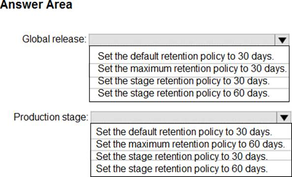
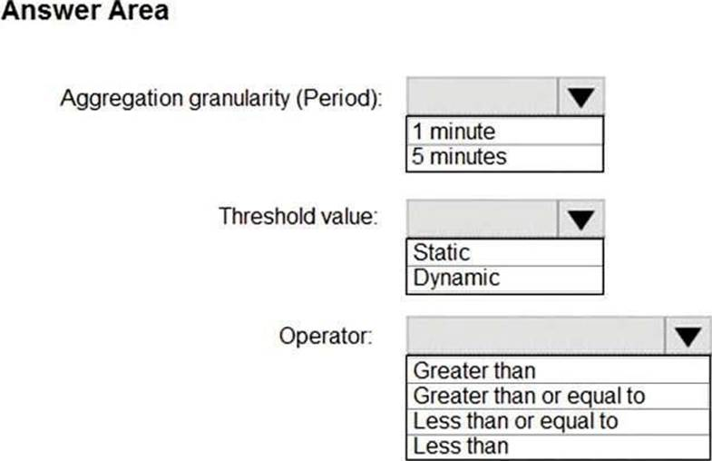
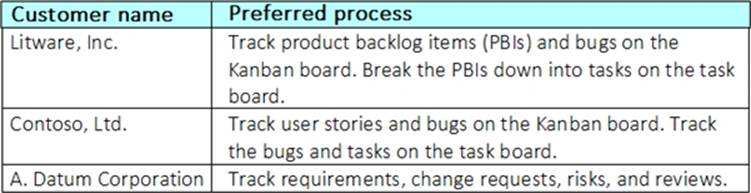
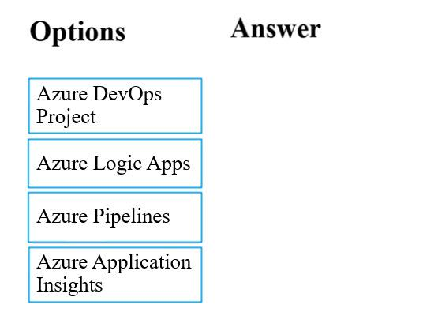

1. You plan to create a project in Azure DevOps. Multiple developers will work on the project. The developers will work offline frequently and will require access to the full project history while they are offline. Which version control solution should you use?

- [ ] TortoiseSVN.
- [ ] Team Foundation Version Control.
- [ ] Subversion.
- [x] Git.

2. You use Azure SQL Database Intelligent Insights and Azure Application Insights for monitoring. Which query language should you use?

- [x] Kusto Query Language (KQL).
- [ ] PL/pgSQL.
- [ ] PL/SQL.
- [ ] Transact-SQL.

3. Contoso, Ltd. is a manufacturing company that has a main office in Chicago. Contoso plans to improve its IT development and operations processes by implementing Azure DevOps principles. Contoso has an Azure subscription and creates an Azure DevOps organization. The Azure DevOps organization includes: The Docker extension. A deployment pool named Pool7 that contains 10 Azure virtual machines that run Windows Server 2016. The Azure subscription contains an Azure Automation account. Contoso plans to create projects in Azure DevOps as shown in the following table. Contoso identifies the following technical requirements: Implement build agents for Project 1. Whenever possible, use Azure resources. Avoid using deprecated technologies. Implement a code flow strategy for Project2 that will: Enable Team2 to submit pull requests for Project2. Enable Team2 to work independently on changes to a copy of Project2. Ensure that any intermediary changes performed by Team2 on a copy of Project2 will be subject to the same restrictions as the ones defined in the build policy of Project2. Whenever possible implement automation and minimize administrative effort. Implement Protect3, Project5, Project6, and Project7 based on the planned changes. Implement Project4 and configure the project to push Docker images to Azure Container Registry. You need to implement the code flow strategy for Project2 in Azure DevOps. Which three actions should you perform in sequence?

​	

​	

- [x] Box 1: Create a repository. Box 2: Create a fork. Box 3: Add a build validation policy.
- [ ] Box 1: Create a fork. Box 2: Create a branch. Box 3: Add a build validation policy.
- [ ] Box 1: Create a repository. Box 2: Add a build policy. Box 3: Add a build validation policy.
- [ ] Box 1: Create a repository. Box 2: Add a build policy. Box 3: Create a branch.

4. Litware, Inc. an independent software vendor (ISV) Litware has a main office and five branch offices. Application Architecture The company' s primary application is a single monolithic retirement fund management system based on ASP.NET web forms that use logic written in VB.NET. Some new sections of the application are written in C#. Variations of the application are created for individual customers. Currently, there are more than 80 have code branches in the application's code base. The application was developed by using Microsoft Visual Studio. Source code is stored in Team Foundation Server (TFS) in the main office. The branch offices access of the source code by using TFS proxy servers. Architectural Issues Litware focuses on writing new code for customers. No resources are provided to refactor or remove existing code. Changes to the code base take a long time, AS dependencies are not obvious to individual developers. Merge operations of the code often take months and involve many developers. Code merging frequently introduces bugs that are difficult to locate and resolve. Customers report that ownership costs of the retirement fund management system increase continually. The need to merge unrelated code makes even minor code changes expensive. Requirements Planned Changes Litware plans to develop a new suite of applications for investment planning. The investment planning Applications will require only minor integration with the easting retirement fund management system. The investment planning applications suite will include one multi-tier web application and two iOS mobile applications. One mobile application will be used by employees; the other will be used by customers. Litware plans to move to a more agile development methodology. Shared code will be extracted into a series of package. Litware has started an internal cloud transformation process and plans to use cloud based services whenever suitable. Litware wants to become proactive m detecting failures, rather than always waning for customer bug reports. Technical Requirements The company's investment planning applications suite must meet the following technical requirements: New incoming connections through the firewall must be minimized. Members of a group named Developers must be able to install packages. The principle of least privilege must be used for all permission assignments A branching strategy that supports developing new functionality in isolation must be used. Members of a group named Team leaders must be able to create new packages and edit the permissions of package feeds Visual Studio App Center must be used to centralize the reporting of mobile application crashes and device types in use. By default, all App Center must be used to centralize the reporting of mobile application crashes and device types in use. Code quality and release quality are critical. During release, deployments must not proceed between stages if any active bugs are logged against the release. The mobile applications must be able to call the share pricing service of the existing retirement fund management system. Until the system is upgraded, the service will only support basic authentication over HUPS. The required operating system configuration tor the test servers changes weekly. Azure Automation State Configuration must be used to ensure that the operating system on each test servers configured the same way when the servers are created and checked periodically. The test servers are configured correctly when first deployed, but they experience configuration drift over time. Azure Automation State Configuration fails to correct the configurations. Azure Automation State Configuration nodes are registered by using the following command. How should you complete the code to initialize App Center in the mobile application?

   

   

- [x] Box 1: [MSAnalytics.self. Box 2: MSCrasches.self].
- [ ] Box 1: [MSDistribute.self. Box 2: MSAnalytics.self].
- [ ] Box 1: [MSPush.self. Box 2: MSCrasches.self].
- [ ] Box 1: [MSAnalytics.self. Box 2: MSCrasches.self].

Explanation/Reference: Scenario: Visual Studio App Center must be used to centralize the reporting of mobile application crashes and device types in use. In order to use App Center, you need to opt in to the service(s) that you want to use, meaning by default no services are started and you will have to explicitly call each of them when starting the SDK. * The required operating system configuration tor the test servers changes weekly. Azure Automation State Configuration must be used to ensure that the operating system on each test servers configured the same way when the servers are created and checked periodically. Dumpsgate.com Correct Answer: Insert the following line to start the SDK in your app's AppDelegate class in the didFinishLaunchingWithOptions method. MSAppCenter.start('{Your App Secret}', withServices: [MSAnalytics.self, MSCrashes.self]) References: https://docs.microsoft.com/en-us/appcenter/sdk/getting-started/ios

5. You manage a project in Azure DevOps. You need to prevent the configuration of the project from changing over time. Solution: Perform a Subscription Health scan when packages are created. Does this meet the goal?

- [ ] Yes.
- [x] No.

Instead implement Continuous Assurance for the project.
Note: The Subscription Security health check features in AzSK contains a set of scripts that examines a subscription and flags off security issues, misconfigurations or obsolete artifacts/settings which can put your subscription at higher risk.
Reference:
https://azsk.azurewebsites.net/04-Continous-Assurance/Readme.html

6. You have an existing build pipeline in Azure Pipelines. You need to use incremental builds without purging the environment between pipeline executions. What should you use?

- [ ] File Transform task.
- [x] Self-hosted agent.
- [ ] Microsoft-hosted parallel jobs.

When you run a pipeline on a self-hosted agent, by default, none of the subdirectories are cleaned in between two consecutive runs. As a result, you can do incremental builds and deployments, provided that tasks are implemented to make use of that. You can override this behavior using the workspace setting on the job.
Incorrect Answers:
B: The workspace clean options are applicable only for self-hosted agents. When using Microsoft-hosted agents job are always run on a new agent.
Reference:
https://docs.microsoft.com/en-us/azure/devops/pipelines/process/phases

7. Woodgrove Bank is a financial services company that has a main office in the United Kingdom. Woodgrove Bank plans to implement the following project management changes: Implement Azure DevOps for project tracking. Centralize source code control in private GitHub repositories. Implement Azure Pipelines for build pipelines and release pipelines. Woodgrove Bank plans to implement the following changes to the identity environment: Deploy an Azure AD tenant named woodgrovebank.com. Sync the Active Directory domain to Azure AD. Configure App1 to use a service principal. Integrate GitHub with Azure AD. Woodgrove Bank plans to implement the following changes to the core apps: Migrate App1 to ASP.NET Core. Integrate Azure Pipelines and the third-party build tool used to develop App2. Woodgrove Bank plans to implement the following changes to the DevOps environment: Deploy App1 to Azure App Service. Implement source control for the DB1 schema. Migrate all the source code from TFS1 to GitHub. Deploy App2 to an Azure virtual machine named VM1. Merge the POC branch into the GitHub default branch. Implement an Azure DevOps dashboard for stakeholders to monitor development progress. Woodgrove Bank identifies the following technical requirements: The initial databases for new environments must contain both schema and reference data. An Azure Monitor alert for VM1 must be configured to meet the following requirements: The commit history of the POC branch must replace the history of the default branch. The Azure DevOps dashboard must display the metrics shown in the following table. Access to Azure DevOps must be restricted to specific IP addresses. Page load times for App1 must be captured and monitored. Administrative effort must be minimized. You need to configure Azure Pipelines to control App2 builds. Which authentication method should you use?

- [ ] Windows NTLM.
- [ ] Certificate.
- [ ] SAML.
- [x] Personal Access Token (PAT).

8. You have an Azure function hosted in an App Service plan named az400-123456789-func1. You need to configure az400-123456789-func1 to upgrade the functions automatically whenever new code is committed to the master branch of https://github.com/Azure-Samples/functions-quickstart. To complete this task, sign in to the Microsoft Azure portal.

​	

1. Open Microsoft Azure Portal
2. Log into your Azure account, select App Services in the Azure portal left navigation, and then select configure az400-123456789-func1.
3. On the app page, select Deployment Center in the left menu.
4. On the Build provider page, select Azure Pipelines (Preview), and then select Continue.
5. On the Configure page, in the Code section:

For GitHub, drop down and select the Organization, Repository, and Branch you want to deploy continuously.

6. Select Continue.
7. On the Test page, choose whether to enable load tests, and then select Continue.
8. Depending on your App Service plan pricing tier, you may see a Deploy to staging page. Choose whether to enable deployment slots, and then select Continue.
9. After you configure the build provider, review the settings on the Summary page, and then select Finish.

Reference:
https://docs.microsoft.com/en-us/azure/app-service/deploy-continuous-deployment

9. Woodgrove Bank is a financial services company that has a main office in the United Kingdom. Woodgrove Bank plans to implement the following project management changes: Implement Azure DevOps for project tracking. Centralize source code control in private GitHub repositories. Implement Azure Pipelines for build pipelines and release pipelines. Woodgrove Bank plans to implement the following changes to the identity environment: Deploy an Azure AD tenant named woodgrovebank.com. Sync the Active Directory domain to Azure AD. Configure App1 to use a service principal. Integrate GitHub with Azure AD. Woodgrove Bank plans to implement the following changes to the core apps: Migrate App1 to ASP.NET Core. Integrate Azure Pipelines and the third-party build tool used to develop App2. Woodgrove Bank plans to implement the following changes to the DevOps environment: Deploy App1 to Azure App Service. Implement source control for the DB1 schema. Migrate all the source code from TFS1 to GitHub. Deploy App2 to an Azure virtual machine named VM1. Merge the POC branch into the GitHub default branch. Implement an Azure DevOps dashboard for stakeholders to monitor development progress. Woodgrove Bank identifies the following technical requirements: The initial databases for new environments must contain both schema and reference data. An Azure Monitor alert for VM1 must be configured to meet the following requirements: The commit history of the POC branch must replace the history of the default branch. The Azure DevOps dashboard must display the metrics shown in the following table. Access to Azure DevOps must be restricted to specific IP addresses. Page load times for App1 must be captured and monitored. Administrative effort must be minimized. You need to replace the existing DevOps tools to support the planned changes. What should you use?

    

   

- [x] Trello: Azure Boards. Bamboo: Azure Pipelines. BitBucket: GitHub repositories.
- [ ] Trello: Azure Test Plans. Bamboo: GitHub Actions. BitBucket: Azure Artifacts.
- [ ] Trello: GitHub repositories. Bamboo: Azure Artifacts. BitBucket: Azure Pipelines.
- [ ] Trello: Azure Boards. Bamboo: GitHub Actions. BitBucket: Azure Artifacts.

10. You are building an application that has the following assets: Source code. Logs from automated tests and builds. Large and frequently updated binary assets. A common library used by multiple applications. Where should you store each asset?

    

- [ ] Source code: Azure Repos. A common library used by multiple applications: Azure Storage. Logs from automated tests and builds: Azure Pipelines. Large and frequently updated binary assets: Azure Storage.
- [ ] Source code: Azure Repos. A common library used by multiple applications: Azure Artifacts. Logs from automated tests and builds: Azure Pipelines. Large and frequently updated binary assets: Azure Test Plans.
- [ ] Source code: Azure Test Plans. A common library used by multiple applications: Azure Artifacts. Logs from automated tests and builds: Azure Pipelines. Large and frequently updated binary assets: Azure Storage.
- [x] Source code: Azure Repos. A common library used by multiple applications: Azure Artifacts. Logs from automated tests and builds: Azure Pipelines. Large and frequently updated binary assets: Azure Storage.

11. You are defining release strategies for two applications as shown in the following table. Which release strategy should you use for each application?

    

    

- [x] App1: Canary deployment. App2: Blue/Green deployment.
- [ ] App1: Blue/Green deployment. App2: Rolling deployment.
- [ ] App1: Canary deployment. App2: Rolling deployment.
- [ ] App1: Rolling deployment. App2: Canary deployment.

12. Contoso, Ltd. is a manufacturing company that has a main office in Chicago. Contoso plans to improve its IT development and operations processes by implementing Azure DevOps principles. Contoso has an Azure subscription and creates an Azure DevOps organization. The Azure DevOps organization includes: The Docker extension. A deployment pool named Pool7 that contains 10 Azure virtual machines that run Windows Server 2016. The Azure subscription contains an Azure Automation account. Contoso plans to create projects in Azure DevOps as shown in the following table. Contoso identifies the following technical requirements: Implement build agents for Project 1. Whenever possible, use Azure resources. Avoid using deprecated technologies. Implement a code flow strategy for Project2 that will: Enable Team2 to submit pull requests for Project2. Enable Team2 to work independently on changes to a copy of Project2. Ensure that any intermediary changes performed by Team2 on a copy of Project2 will be subject to the same restrictions as the ones defined in the build policy of Project2. Whenever possible implement automation and minimize administrative effort. Implement Protect3, Project5, Project6, and Project7 based on the planned changes. Implement Project4 and configure the project to push Docker images to Azure Container Registry. You need to implement Project4. What should you do first?

    

- [ ] Add the FROM instruction in the Dockerfile file.
- [ ] Add a Copy and Publish Build Artifacts task to the build pipeline.
- [x] Add a Docker task to the build pipeline.
- [ ] Add the MAINTAINER instruction in the Dockerfile file.

13. Your company uses Azure DevOps to manage the build and release processes for applications. You use a Git repository for applications source control. You plan to create a new branch from an existing pull request. Later, you plan to merge the new branch and the target branch of the pull request. You need to use a pull request action to create the new branch. The solution must ensure that the branch uses only a portion of the code in the pull request. Which pull request action should you use?

- [ ] Set as default branch.
- [ ] Approve with suggestions.
- [x] Cherry-pick.
- [ ] ReactivateRevert.
- [ ] Revert.

14. Woodgrove Bank is a financial services company that has a main office in the United Kingdom. Woodgrove Bank plans to implement the following project management changes: Implement Azure DevOps for project tracking. Centralize source code control in private GitHub repositories. Implement Azure Pipelines for build pipelines and release pipelines. Woodgrove Bank plans to implement the following changes to the identity environment: Deploy an Azure AD tenant named woodgrovebank.com. Sync the Active Directory domain to Azure AD. Configure App1 to use a service principal. Integrate GitHub with Azure AD. Woodgrove Bank plans to implement the following changes to the core apps: Migrate App1 to ASP.NET Core. Integrate Azure Pipelines and the third-party build tool used to develop App2. Woodgrove Bank plans to implement the following changes to the DevOps environment: Deploy App1 to Azure App Service. Implement source control for the DB1 schema. Migrate all the source code from TFS1 to GitHub. Deploy App2 to an Azure virtual machine named VM1. Merge the POC branch into the GitHub default branch. Implement an Azure DevOps dashboard for stakeholders to monitor development progress. Woodgrove Bank identifies the following technical requirements: The initial databases for new environments must contain both schema and reference data. An Azure Monitor alert for VM1 must be configured to meet the following requirements: The commit history of the POC branch must replace the history of the default branch. The Azure DevOps dashboard must display the metrics shown in the following table. Access to Azure DevOps must be restricted to specific IP addresses. Page load times for App1 must be captured and monitored. Administrative effort must be minimized. You need to configure authentication for App1. The solution must support the planned changes. Which three actions should you perform in sequence? You need to replace the existing DevOps tools to support the planned changes. What should you use?

- [x] Box 1: Create an app. Box 2: Add a secret. Box 3: Configure the ID and secret for App1.
- [ ] Box 1: Create a managed service identity. Box 2: Create a credential. Box 3: Configure the ID and secret for App 1.
- [ ] Box 1: Add a secret. Box 2: Create an app. Box 3: Create a managed service identity.
- [ ] Box 1: Create an app. Box 2: Create a managed service identity. Box 3: Configure the ID and secret for App1.

15. You have a Microsoft ASP.NET Core web app in Azure that is accessed worldwide. You need to run a URL ping test once every five minutes and create an alert when the web app is unavailable from specific Azure regions. The solution must minimize development time. What should you do?

- [x] Create an Azure Application Insights availability test and alert.
- [ ] Create an Azure Service Health alert for the specific regions.
- [ ] Create an Azure Monitor Availability metric and alert.
- [ ] Write an Azure function and deploy the function to the specific regions.

16. You have a private GitHub repository. You need to display the commit status of the repository on Azure Boards. What should you do first?

- [ ] Create a GitHub action in GitHub.
- [ ] Add the Azure Pipelines app to the GitHub repository.
- [ ] Configure multi-factor authentication (MFA) for your GitHub account.
- [x] Add the Azure Boards app to the repository.

17. You are configuring Azure DevOps build pipelines. You plan to use hosted build agents. Which build agent pool should you use to compile each application type?

- [ ] An application that runs on iOS: Hosted Windows Container. An Internet Information Services (IS) web application that runs in Docker: Hosted Ubuntu 1604.
- [x] An application that runs on iOS: Hosted macOS. An Internet Information Services (IS) web application that runs in Docker: Hosted.
- [ ] An application that runs on iOS: Hosted. An Internet Information Services (IS) web application that runs in Docker: Default.
- [ ] An application that runs on iOS: Hosted Windows Container. An Internet Information Services (IS) web application that runs in Docker: Default.

18. How should you configure the release retention policy for the investment planning applications suite?

- [x] Global release: Set the default retention policy to 30 days. Production stage: Set the stage retention policy to 60 days.
- [ ] Global release: Set the maximum retention policy to 30 days. Production stage: Set the default retention policy to 30 days.
- [ ] Global release: Set the stage retention policy to 60 days. Production stage: Set the maximum retention policy to 60 days.
- [ ] Global release: Set the stage retention policy to 30 days. Production stage: Set the stage retention policy to 30 days.

19. You are automating the testing process for your company. You need to automate UI testing of a web application. Which framework should you use?

- [ ] JaCoco.
- [x] Selenium.
- [ ] Xamarin.UITest.
- [ ] Microsoft.CodeAnalysis.

20. You are automating the testing process for your company. You need to automate UI testing of a web application. Which framework should you use?

- [ ] JaCoco.
- [x] Playwright.
- [ ] Xamarin.UITest.
- [ ] Microsoft.CodeAnalysis.

21. You have an approval process that contains a condition. The condition requires that releases be approved by a team leader before they are deployed. You have a policy stating that approvals must occur within eight hours. You discover that deployments fail if the approvals lake longer than two hours. You need to ensure that the deployments only fail if the approvals take longer than eight hours. Solution: From Pre-deployment conditions, you modify the Timeout setting for pre-deployment approvals. Does this meet the goal?

- [x] Yes.
- [ ] No.

22. Contoso, Ltd. is a manufacturing company that has a main office in Chicago. Contoso plans to improve its IT development and operations processes by implementing Azure DevOps principles. Contoso has an Azure subscription and creates an Azure DevOps organization. The Azure DevOps organization includes: The Docker extension. A deployment pool named Pool7 that contains 10 Azure virtual machines that run Windows Server 2016. The Azure subscription contains an Azure Automation account. Contoso plans to create projects in Azure DevOps as shown in the following table. Contoso identifies the following technical requirements: Implement build agents for Project 1. Whenever possible, use Azure resources. Avoid using deprecated technologies. Implement a code flow strategy for Project2 that will: Enable Team2 to submit pull requests for Project2. Enable Team2 to work independently on changes to a copy of Project2. Ensure that any intermediary changes performed by Team2 on a copy of Project2 will be subject to the same restrictions as the ones defined in the build policy of Project2. Whenever possible implement automation and minimize administrative effort. Implement Protect3, Project5, Project6, and Project7 based on the planned changes. Implement Project4 and configure the project to push Docker images to Azure Container Registry. You need to configure Azure Automation for the computers in Group7. Which three actions should you perform in sequence?

- [x] Box 1: Create a Desired State Configuration (DSC) configuration file that has an extension of .ps1. Box 2: Run the Import-AzureRmAutomationDscConfiguration Azure PowerShell cmdlet. Box 3: Run the Start-AzureRmAutomationDscCompilationJob Azre PowerShell cmdlet.
- [ ] Box 1: Run the Import-AzureRmAutomationDscConfiguration Azure PowerShell cmdlet. Box 2: Create a Desired State Configuration (DSC) configuration file that has an extension of .ps1. Box 3: Run the New-AzureRmResourceGroupDeployment Azure PowerShell cmdlet.
- [ ] Box 1: Run the New-AzureRmResourceGroupDeployment Azure PowerShell cmdlet. Box 2: Create an Azure Resource Manager template file that hasan extension of .json. Box 3: Run the New-AzureRmResourceGroupDeployment Azure PowerShell cmdlet.
- [ ] Box 1: Create an Azure Resource Manager template file that has an extension of .json. Box 2: Run the New-AzureRmResourceGroupDeployment Azure PowerShell cmdlet. Box 3: Run the Import-AzureRmAutomationDscConfiguration Azure PowerShell cmdlet.

23. Woodgrove Bank is a financial services company that has a main office in the United Kingdom. Woodgrove Bank plans to implement the following project management changes: Implement Azure DevOps for project tracking. Centralize source code control in private GitHub repositories. Implement Azure Pipelines for build pipelines and release pipelines. Woodgrove Bank plans to implement the following changes to the identity environment: Deploy an Azure AD tenant named woodgrovebank.com. Sync the Active Directory domain to Azure AD. Configure App1 to use a service principal. Integrate GitHub with Azure AD. Woodgrove Bank plans to implement the following changes to the core apps: Migrate App1 to ASP.NET Core. Integrate Azure Pipelines and the third-party build tool used to develop App2. Woodgrove Bank plans to implement the following changes to the DevOps environment: Deploy App1 to Azure App Service. Implement source control for the DB1 schema. Migrate all the source code from TFS1 to GitHub. Deploy App2 to an Azure virtual machine named VM1. Merge the POC branch into the GitHub default branch. Implement an Azure DevOps dashboard for stakeholders to monitor development progress. Woodgrove Bank identifies the following technical requirements: The initial databases for new environments must contain both schema and reference data. An Azure Monitor alert for VM1 must be configured to meet the following requirements: The commit history of the POC branch must replace the history of the default branch. The Azure DevOps dashboard must display the metrics shown in the following table. Access to Azure DevOps must be restricted to specific IP addresses. Page load times for App1 must be captured and monitored. Administrative effort must be minimized. You need to meet the technical requirements for controlling access to Azure DevOps. What should you use?

- [ ] Azure Multi-Factor Authentication (MFA).
- [ ] On-premises firewall rules.
- [x] Conditional access policies in Azure AD.
- [ ] Azure role-based access control (Azure RBAC).

24. You are configuring the Azure DevOps dashboard. The solution must meet the technical requirements. Which widget should you use for each metric?

- [x] Box 1: Sprint burndown. Box 2: Release pipeline overview. Box 3: Query tile.
- [ ] Box 1: Query tile. Box 2: Velocity. Box 3: Cumulative flow diagram.
- [ ] Box 1: Velocity. Box 2: Release pipeline overview. Box 3: Query tile.
- [ ] Box 1: Velocity. Box 2: Sprint burndown. Box 3: Query tile.

25. You company has a prefect in Azure DevOps for a new web application. You need to ensure that when code is checked in, a build runs automatically. Solution: From the Triggers tab of the build pipeline, you selected Batch changes while a build is in progress. Does this meet the goal?

- [ ] Yes.
- [x] No.

26. You need to find and isolate shared code. The shared code will be maintained in a series of packages. Which three actions should you perform in sequence?

- [x] Box 1: Create a dependency graph for the application. Box 2: Group the related components. Box 3: Assign ownership to each component group.
- [ ] Box 1: Identify the most common language used. Box 2: Group the related components. Box 3: Assign ownership to each component group.
- [ ] Box 1: Rewrite the components in the most common language. Box 2: Create a dependency graph for the application. Box 3: Group the related components.
- [ ] Box 1: Assign ownership to each component group. Box 2: Rewrite the components in the most common language. Box 3: Identify the most common language used.

27. You are configuring an Azure DevOps deployment pipeline. The deployed application will authenticate to a web service by using a secret stored in an Azure key vault. You need to use the secret in the deployment pipeline. Which three actions should you perform in sequence?

- [ ] Box 1: Add an app registration in Azure Active Directory (Azure AD). Box 2: Create a service principal in Azure Active Directory (Azure AD). Box 3: Add an Azure Resource Manager service connection to the pipeline.
- [x] Box 1: Create a service principal in Azure Active Directory (Azure AD). Box 2: Configure an access policy in the key vault. Box 3: Add an Azure Resource Manager service connection to the pipeline.
- [ ] Box 1: Export a certificate from the key vault. Box 2: Add an Azure Resource Manager service connection to the pipeline. Box 3: Generate a self-signed certificate.
- [ ] Box 1: Generate a self-signed certificate. Box 2: Create a service principal in Azure Active Directory (Azure AD). Box 3: Export a certificate from the key vault.

28. You have a multi-tier application. The front end of the application is hosted in Azure App Service. You need to identify the average load times of the application pages. What should you use?

- [ ] Diagnostics logs of the App Service.
- [x] Azure Application Insights.
- [ ] Azure Advisor.
- [ ] Activity log of the App Service.

29. You have an application that consists of several Azure App Service web apps and Azure functions. You need to access the security of the web apps and the functions. Which Azure feature can you use to provide a recommendation for the security of the application?

- [ ] Security & Compliance in Azure Log Analytics.
- [ ] Resource health in Azure Service Health.
- [ ] Smart Detection in Azure Application Insights.
- [x] Compute & apps in Azure Security Center.

30. You need to configure a virtual machine named VM1 to securely access stored secrets in an Azure Key Vault named az400-11566895-kv. To complete this task, sign in to the Microsoft Azure portal.

- [x] 1. Sign in to Azure portal. 2. Locate virtual machine VM1. 3. Select Identity. 4. Enable the system-assigned identity for VM1 by setting the Status to On. 5. Allow the managed identity of VM1 in Key vault using Access control (IAM) blade role assignment.

31. You have an Azure virtual machine named VM1 that runs Linux. You plan to deploy the Desired State Configuration (DSC) extension to VM1. You need to grant the Log Analytics agent the appropriate directory permissions. How should you complete the command?

- [ ] Box 1: r. Box 2: /lib.
- [ ] Box 1: rx. Box 2: /etc.
- [x] Box 1: rwx. Box 2: /tmp.
- [ ] Box 1: x. Box 2: /usr.

32. During a code review, you discover many quality issues. Many modules contain unused variables and empty catch blocks. You need to recommend a solution to improve the quality of the code. What should you recommend?

- [ ] In a Gradle build task, select Run Checkstyle.
- [ ] In a Xcode build task, select Use xcpretty from Advanced.
- [ ] In a Grunt build task, select Enabled from Control Options.
- [x] In a Maven build task, select Run PMD.

33. You are using GitHub as a source code repository. You create a client-side Git hook on the commit-msg event. The hook requires that each commit message contain a custom work item tag. You need to make a commit that does not have a work item tag. Which git commit parameter should you use?

- [ ] –squash.
- [x] –no-verify.
- [ ] –message ".
- [ ] –no-post-rewrite.

34. Contoso, Ltd. is a manufacturing company that has a main office in Chicago. Contoso plans to improve its IT development and operations processes by implementing Azure DevOps principles. Contoso has an Azure subscription and creates an Azure DevOps organization. The Azure DevOps organization includes: The Docker extension. A deployment pool named Pool7 that contains 10 Azure virtual machines that run Windows Server 2016. The Azure subscription contains an Azure Automation account. Contoso plans to create projects in Azure DevOps as shown in the following table. Contoso identifies the following technical requirements: Implement build agents for Project 1. Whenever possible, use Azure resources. Avoid using deprecated technologies. Implement a code flow strategy for Project2 that will: Enable Team2 to submit pull requests for Project2. Enable Team2 to work independently on changes to a copy of Project2. Ensure that any intermediary changes performed by Team2 on a copy of Project2 will be subject to the same restrictions as the ones defined in the build policy of Project2. Whenever possible implement automation and minimize administrative effort. Implement Protect3, Project5, Project6, and Project7 based on the planned changes. Implement Project4 and configure the project to push Docker images to Azure Container Registry. You need to implement Project6. Which three actions should you perform in sequence?

- [x] Box 1: Open the release pipeline editor. Box 2: Enable Gates. Box 3: Add Query Work Items.
- [ ] Box 1: Add Query Work Items. Box 2: Enable Gates. Box 3: Open the Triggers tab.
- [ ] Box 1: Add a manual intervention task. Box 2: Open the release pipeline editor. Box 3: Enable Gates.
- [ ] Box 1: Open the Triggers tab. Box 2: Add a manual intervention task. Box 3: Add Query Work Items.

35. Contoso, Ltd. is a manufacturing company that has a main office in Chicago. Contoso plans to improve its IT development and operations processes by implementing Azure DevOps principles. Contoso has an Azure subscription and creates an Azure DevOps organization. The Azure DevOps organization includes: The Docker extension. A deployment pool named Pool7 that contains 10 Azure virtual machines that run Windows Server 2016. The Azure subscription contains an Azure Automation account. Contoso plans to create projects in Azure DevOps as shown in the following table. Contoso identifies the following technical requirements: Implement build agents for Project 1. Whenever possible, use Azure resources. Avoid using deprecated technologies. Implement a code flow strategy for Project2 that will: Enable Team2 to submit pull requests for Project2. Enable Team2 to work independently on changes to a copy of Project2. Ensure that any intermediary changes performed by Team2 on a copy of Project2 will be subject to the same restrictions as the ones defined in the build policy of Project2. Whenever possible implement automation and minimize administrative effort. Implement Protect3, Project5, Project6, and Project7 based on the planned changes. Implement Project4 and configure the project to push Docker images to Azure Container Registry. How should you configure the filters for the Project5 trigger?

- [ ] Box 1: branch filter to exclude. Box 2: branch filter to exclude.
- [ ] Box 1: path filter to include. Box 2: path filter to exclude.
- [ ] Box 1: path filter to exclude. Box 2: branch filter to include.
- [x] Box 1: path filter to exclude. Box 2: path filter to include.

36. You are designing the security validation strategy for a project in Azure DevOps. You need to identify package dependencies that have known security issues and can be resolved by an update. What should you use?

- [ ] Octopus Deploy.
- [ ] Jenkins.
- [ ] Gradle.
- [x] SonarQube.

37. You are configuring the settings of a new Git repository in Azure Repos. You need to ensure that pull requests in a branch meet the following criteria before they are merged: Committed code must compile successfully. Pull requests must have a Quality Gate status of Passed in SonarCloud. Which policy type should you configure for each requirement?

- [x] Committed code must compile successfully: A build policy. Pull requests must have a Quality Gate status of Passed in SonarCloud: A status policy.
- [ ] Committed code must compile successfully: A status policy. Pull requests must have a Quality Gate status of Passed in SonarCloud: A build policy.
- [ ] Committed code must compile successfully: A build policy. Pull requests must have a Quality Gate status of Passed in SonarCloud: A check-in policy.
- [ ] Committed code must compile successfully: A check-in policy. Pull requests must have a Quality Gate status of Passed in SonarCloud: A build policy.

38. You are deploying a server application that will run on a Server Core installation of Windows Server 2019. You create an Azure key vault and a secret. You need to use the key vault to secure API secrets for third-party integrations. Which three actions should you perform?

- [ ] Configure RBAC for the key vault.
- [x] Modify the application to access the key vault.
- [x] Configure a Key Vault access policy.
- [ ] Deploy an Azure Desired State Configuration (DSC) extension.Deploy a virtual machine that uses a system-assigned managed identity.
- [x] Deploy a virtual machine that uses a system-assigned managed identity.

39. Woodgrove Bank is a financial services company that has a main office in the United Kingdom. Woodgrove Bank plans to implement the following project management changes: Implement Azure DevOps for project tracking. Centralize source code control in private GitHub repositories. Implement Azure Pipelines for build pipelines and release pipelines. Woodgrove Bank plans to implement the following changes to the identity environment: Deploy an Azure AD tenant named woodgrovebank.com. Sync the Active Directory domain to Azure AD. Configure App1 to use a service principal. Integrate GitHub with Azure AD. Woodgrove Bank plans to implement the following changes to the core apps: Migrate App1 to ASP.NET Core. Integrate Azure Pipelines and the third-party build tool used to develop App2. Woodgrove Bank plans to implement the following changes to the DevOps environment: Deploy App1 to Azure App Service. Implement source control for the DB1 schema. Migrate all the source code from TFS1 to GitHub. Deploy App2 to an Azure virtual machine named VM1. Merge the POC branch into the GitHub default branch. Implement an Azure DevOps dashboard for stakeholders to monitor development progress. Woodgrove Bank identifies the following technical requirements: The initial databases for new environments must contain both schema and reference data. An Azure Monitor alert for VM1 must be configured to meet the following requirements: The commit history of the POC branch must replace the history of the default branch. The Azure DevOps dashboard must display the metrics shown in the following table. Access to Azure DevOps must be restricted to specific IP addresses. Page load times for App1 must be captured and monitored. Administrative effort must be minimized. You need to configure the alert for VM1. The solution must meet the technical requirements. Which two settings should you configure?

- [ ] Threshold value: 80%. Aggregation granularity (Period): 5 minutes.
- [x] Threshold value: 80%. Aggregation granularity (Period): 15 minutes.
- [ ] Threshold value: 50%. Aggregation granularity (Period): 15 minutes.
- [ ] Threshold value: 50%. Aggregation granularity (Period): 5 minutes.

40. Contoso, Ltd. is a manufacturing company that has a main office in Chicago. Contoso plans to improve its IT development and operations processes by implementing Azure DevOps principles. Contoso has an Azure subscription and creates an Azure DevOps organization. The Azure DevOps organization includes: The Docker extension. A deployment pool named Pool7 that contains 10 Azure virtual machines that run Windows Server 2016. The Azure subscription contains an Azure Automation account. Contoso plans to create projects in Azure DevOps as shown in the following table. Contoso identifies the following technical requirements: Implement build agents for Project 1. Whenever possible, use Azure resources. Avoid using deprecated technologies. Implement a code flow strategy for Project2 that will: Enable Team2 to submit pull requests for Project2. Enable Team2 to work independently on changes to a copy of Project2. Ensure that any intermediary changes performed by Team2 on a copy of Project2 will be subject to the same restrictions as the ones defined in the build policy of Project2. Whenever possible implement automation and minimize administrative effort. Implement Protect3, Project5, Project6, and Project7 based on the planned changes. Implement Project4 and configure the project to push Docker images to Azure Container Registry. You need to recommend a procedure to implement the build agent for Project1. Which three actions should you recommend be performed in sequence?

- [x] Box 1: Sign in to Azure DevOps by using an account that is assigned the Administrator service connection security role. Box 2: Create a personal access token in the Azure DevOps organization of Contoso. Box 3: Install and register the Azure Pipelines agent on an Azure virtual machine.
- [ ] Box 1: Sign in to Azure DevOps by using an account that is assigned the Administrator service connection security role. Box 2: Install the Azure Pipelines agent on on- premises virtual machine. Box 3: Sign in to Azure DevOps by using an account that is assigned the agent pool administrator role.
- [ ] Box 1: Create a personal access token in the Azure DevOps organization of Contoso. Box 2: Install the Azure Pipelines agent on on- premises virtual machine. Box 3: Sign in to Azure DevOps by using an account that is assigned the agent pool administrator role.
- [ ] Box 1: Sign in to Azure DevOps by using an account that is assigned the agent pool administrator role. Box 2: Install the Azure Pipelines agent on on- premises virtual machine. Box 3: Create a personal access token in the Azure DevOps organization of Contoso.

41. Contoso, Ltd. is a manufacturing company that has a main office in Chicago. Contoso plans to improve its IT development and operations processes by implementing Azure DevOps principles. Contoso has an Azure subscription and creates an Azure DevOps organization. The Azure DevOps organization includes: The Docker extension. A deployment pool named Pool7 that contains 10 Azure virtual machines that run Windows Server 2016. The Azure subscription contains an Azure Automation account. Contoso plans to create projects in Azure DevOps as shown in the following table. Contoso identifies the following technical requirements: Implement build agents for Project 1. Whenever possible, use Azure resources. Avoid using deprecated technologies. Implement a code flow strategy for Project2 that will: Enable Team2 to submit pull requests for Project2. Enable Team2 to work independently on changes to a copy of Project2. Ensure that any intermediary changes performed by Team2 on a copy of Project2 will be subject to the same restrictions as the ones defined in the build policy of Project2. Whenever possible implement automation and minimize administrative effort. Implement Protect3, Project5, Project6, and Project7 based on the planned changes. Implement Project4 and configure the project to push Docker images to Azure Container Registry. You add the virtual machines as managed nodes in Azure Automation State Configuration. You need to configure the computer in Group7. What should you do?

- [x] Run the Register-AzureRmAutomationDscNode Azure Powershell cmdlet.
- [ ] Modify the ConfigurationMode property of the Local Configuration Manager (LCM).
- [ ] Install PowerShell Core.
- [ ] Modify the RefreshMode property of the Local Configuration Manager (LCM).

42. Woodgrove Bank is a financial services company that has a main office in the United Kingdom. Woodgrove Bank plans to implement the following project management changes: Implement Azure DevOps for project tracking. Centralize source code control in private GitHub repositories. Implement Azure Pipelines for build pipelines and release pipelines. Woodgrove Bank plans to implement the following changes to the identity environment: Deploy an Azure AD tenant named woodgrovebank.com. Sync the Active Directory domain to Azure AD. Configure App1 to use a service principal. Integrate GitHub with Azure AD. Woodgrove Bank plans to implement the following changes to the core apps: Migrate App1 to ASP.NET Core. Integrate Azure Pipelines and the third-party build tool used to develop App2. Woodgrove Bank plans to implement the following changes to the DevOps environment: Deploy App1 to Azure App Service. Implement source control for the DB1 schema. Migrate all the source code from TFS1 to GitHub. Deploy App2 to an Azure virtual machine named VM1. Merge the POC branch into the GitHub default branch. Implement an Azure DevOps dashboard for stakeholders to monitor development progress. Woodgrove Bank identifies the following technical requirements: The initial databases for new environments must contain both schema and reference data. An Azure Monitor alert for VM1 must be configured to meet the following requirements: The commit history of the POC branch must replace the history of the default branch. The Azure DevOps dashboard must display the metrics shown in the following table. Access to Azure DevOps must be restricted to specific IP addresses. Page load times for App1 must be captured and monitored. Administrative effort must be minimized. You need to perform the GitHub code migration. The solution must support the planned changes for the DevOps environment. What should you use?

- [ ] git clone.
- [ ] GitHub Importer.
- [ ] Import repository in Azure Repos.
- [x] git-tfs.

43. Contoso, Ltd. is a manufacturing company that has a main office in Chicago. Contoso plans to improve its IT development and operations processes by implementing Azure DevOps principles. Contoso has an Azure subscription and creates an Azure DevOps organization. The Azure DevOps organization includes: The Docker extension. A deployment pool named Pool7 that contains 10 Azure virtual machines that run Windows Server 2016. The Azure subscription contains an Azure Automation account. Contoso plans to create projects in Azure DevOps as shown in the following table. Contoso identifies the following technical requirements: Implement build agents for Project 1. Whenever possible, use Azure resources. Avoid using deprecated technologies. Implement a code flow strategy for Project2 that will: Enable Team2 to submit pull requests for Project2. Enable Team2 to work independently on changes to a copy of Project2. Ensure that any intermediary changes performed by Team2 on a copy of Project2 will be subject to the same restrictions as the ones defined in the build policy of Project2. Whenever possible implement automation and minimize administrative effort. Implement Protect3, Project5, Project6, and Project7 based on the planned changes. Implement Project4 and configure the project to push Docker images to Azure Container Registry. In Azure DevOps, you create Project3. You need to meet the requirements of the project. What should you do first?

- [ ] From Azure DevOps, create a service endpoint.
- [ ] From SonarQube, obtain an authentication token.
- [ ] From Azure DevOps, modify the build definition.
- [x] From SonarQube, create a project.

44. Your company implements an Agile development methodology. You plan to implement retrospectives at the end of each sprint. Which three questions should you include?

- [ ] Who performed well?
- [ ] Who should have performed better?
- [x] What could have gone better?
- [x] What went well?
- [x] What should we try next?

45. Your company hosts a web application in Azure. The company uses Azure Pipelines for the build and release management of the application. Stakeholders report that the past few releases have negatively affected system performance. You configure alerts in Azure Monitor. You need to ensure that new releases are only deployed to production if the releases meet defined performance baseline criteria in the staging environment first. What should you use to prevent the deployment of releases that fail to meet the performance baseline?

- [ ] Azure Scheduler job.
- [ ] Trigger.
- [x] Gate.
- [ ] Azure function.

46. Your company hosts a web application in Azure, and makes use of Azure Pipelines for managing the build and release of the application. When stakeholders report that system performance has been adversely affected by the most recent releases, you configure alerts in Azure Monitor. You are informed that new releases must satisfy specified performance baseline conditions in the staging environment before they can be deployed to production. You need to make sure that releases not satisfying the performance baseline are prevented from being deployed. Which of the following actions should you take?

- [ ] You should make use of a branch control check.
- [ ] You should make use of an alert trigger.
- [x] You should make use of a gate.
- [ ] You should make use of an approval check.

47. Your company uses Azure DevOps. Only users who have accounts in Azure Active Directory can access the Azure DevOps environment. You need to ensure that only devices that are connected to the on-premises network can access the Azure DevOps environment. What should you do?

- [ ] Assign the Stakeholder access level to all users.
- [ ] In Azure Active Directory, configure risky sign-ins.
- [ ] In Azure DevOps, configure Security in Project Settings.
- [x] In Azure Active Directory, configure conditional access.

48. Your company uses Azure DevOps to manage the build and release processes for applications. You use a Git repository for applications source control. You need to implement a pull request strategy that reduces the history volume in the master branch. Solution: You implement a pull request strategy that uses a three-way merge. Does this meet the goal?

- [ ] Yes.
- [x] No.

49. Your company uses Azure DevOps to manage the build and release processes for applications. You use a Git repository for applications source control. You need to implement a pull request strategy that reduces the history volume in the master branch. Solution: You implement a pull request strategy that uses an explicit merge. Does this meet the goal?

- [ ] Yes.
- [x] No.

50. Your company uses Azure DevOps to manage the build and release processes for applications. You use a Git repository for applications source control. You need to implement a pull request strategy that reduces the history volume in the master branch. You implement a pull request strategy that uses fast-forward merges. Does this meet the goal?

- [ ] Yes.
- [x] No.

51. Your company uses Azure DevOps to manage the build and release processes for applications. You use a Git repository for applications source control. You need to implement a pull request strategy that reduces the history volume in the master branch. You implement a pull request strategy that uses squash merges. Does this meet the goal?

- [x] Yes.
- [ ] No.

52. You integrate a cloud-hosted Jenkins server and a new Azure DevOps deployment. You need Azure DevOps to send a notification to Jenkins when a developer commits changes to a branch in Azure Repos. Solution: You add a trigger to the build pipeline. Does this meet the goal?

- [ ] Yes.
- [x] No.

53. You integrate a cloud-hosted Jenkins server and a new Azure DevOps deployment. You need Azure DevOps to send a notification to Jenkins when a developer commits changes to a branch in Azure Repos. Solution: You create a service hook subscription that uses the code pushed event. Does this meet the goal?

- [x] Yes.
- [ ] No.

54. You integrate a cloud-hosted Jenkins server and a new Azure DevOps deployment. You need Azure DevOps to send a notification to Jenkins when a developer commits changes to a branch in Azure Repos. Solution: You create an email subscription to an Azure DevOps notification. Does this meet the goal?

- [ ] Yes.
- [x] No.

55. You are designing the development process for your company. You need to recommend a solution for continuous inspection of the company's code base to locate common code patterns that are known to be problematic. What should you include in the recommendation?

- [ ] Microsoft Visual Studio test plans.
- [ ] Gradle wrapper scripts.
- [x] SonarCloud analysis.
- [ ] JavaScript task runner.

56. Your company has a project in Azure DevOps for a new application. The application will be deployed to several Azure virtual machines that run Windows Server 2016. You need to recommend a deployment strategy for the virtual machines. The strategy must meet the- following requirements: Ensure that the virtual machines maintain a consistent configuration. Minimize administrative effort to configure the virtual machines. What should you include in the recommendation?

- [ ] Deployment YAML and Azure pipeline stage templates.
- [ ] Azure Resource Manager templates and the Custom Script Extension for Windows.
- [x] Azure Resource Manager templates and the PowerShell Desired State Configuration (DSC) extension for Windows.
- [ ] Deployment YAML and Azure pipeline deployment groups.

57. Your company has a project in Azure DevOps for a new application. The application will be deployed to several Azure virtual machines that run Windows Server 2019. You need to recommend a deployment strategy for the virtual machines. The strategy must meet the following requirements: Ensure that the virtual machines maintain a consistent configuration. Minimize administrative effort to configure the virtual machines. What should you include in the recommendation?

- [ ] Deployment YAML and Azure pipeline stage templates.
- [ ] Azure Resource Manager templates and the Custom Script Extension for Windows.
- [x] Azure Resource Manager templates and the PowerShell Desired State Configuration (DSC) extension for Windows.
- [ ] Deployment YAML and Azure pipeline deployment groups.

58. You have created an Azure DevOps project for a new application that will be deployed to a number of Windows Server 2016 Azure virtual machines. You are preparing a deployment solution that allows for the virtual machines to maintain a uniform configuration, and -also keep administrative effort with regards to configuring the virtual machines to a minimum. Which of the following should be part of your solution? (Choose two.)

- [x] Azure Resource Manager templates.
- [x] PowerShell Desired State Configuration (DSC) extension for Windows.
- [ ] Azure pipeline deployment groups.
- [ ] Custom Script Extension for Windows.
- [ ] Azure pipeline stage templates.

59. You use Azure SQL Database Intelligent Insights and Azure Application Insights for monitoring. You need to write ad-hoc queries against the monitoring data. Which query language should you use?

- [ ] PL/pgSQL.
- [ ] Transact-SQL.
- [x] Azure Log Analytics.
- [ ] PL/SQL.

60. Where should the build and release agents for the investment planning application suite run?

- [ ] Build agent: A hosted service. Release agent: The developers' computers.
- [x] Build agent: A hosted service. Release agent: A hosted service.
- [ ] Build agent: The developers' computers. Release agent: A hosted service.
- [ ] Build agent: A source control system. Release agent: A hosted service.

61. You have Azure Pipelines and GitHub integrated as a source code repository. The build pipeline has continuous integration enabled. You plan to trigger an automated build whenever code changes are committed to the repository. You need to ensure that the system will wait until a build completes before queuing another build. What should you implement?

- [ ] Path filters.
- [x] Batch changes.
- [ ] Scheduled builds.
- [ ] Branch filters.

Batching CI runs -
If you have many team members uploading changes often, you may want to reduce the number of runs you start. If you set batch to true, when a pipeline is running, the system waits until the run is completed, then starts another run with all changes that have not yet been built.
Example:
\# specific branch build with batching
trigger:
batch: true
branches:
include:
\- master
To clarify this example, let us say that a push A to master caused the above pipeline to run. While that pipeline is running, additional pushes B and C occur into the repository. These updates do not start new independent runs immediately. But after the first run is completed, all pushes until that point of time are batched together and a new run is started.
Reference:
https://docs.microsoft.com/en-us/azure/devops/pipelines/repos/github

62. You manage a project in Azure DevOps. You need to prevent the configuration of the project from changing over time. Solution: Implement Continuous Assurance for the project. Does this meet the goal?

- [x] Yes.
- [ ] No.

. The basic idea behind Continuous Assurance (CA) is to **setup the ability to check for "drift" from what is considered a secure snapshot of a system**. Support for Continuous Assurance lets us treat security truly as a 'state' as opposed to a 'point in time' achievement.

63. You manage a project in Azure DevOps. You need to prevent the configuration of the project from changing over time. Solution: Implement Continuous Integration for the project. Does this meet the goal?

- [ ] Yes.
- [x] No.

Continuous integration (CI) is **a practice development teams use to automate merging and testing code**. CI helps to catch bugs early in the development cycle, making them less expensive to fix.

64. You manage a project in Azure DevOps. You need to prevent the configuration of the project from changing over time. Solution: Add a code coverage step to the build pipelines. Does this meet the goal?

- [ ] Yes.
- [x] No.

65. You have an Azure DevOps organization named Contoso and an Azure subscription. The subscription contains an Azure virtual machine scale set named VMSS1 that is configured for autoscaling. You have a project in Azure DevOps named Project1. Project1 is used to build a web app named App1 and deploy App1 to VMSS1. You need to ensure that an email alert is generated whenever VMSS1 scales in or out. Solution: From Azure DevOps, configure the Service hooks settings for . Does this meet the goal?

- [ ] Yes.
- [x] No.

An action group is a collection of notification preferences defined by the owner of an Azure subscription. Azure Monitor, Service Health and Azure Advisor alerts use action groups to notify users that an alert has been triggered.

66. You have an Azure DevOps organization named Contoso and an Azure subscription. The subscription contains an Azure virtual machine scale set named VMSS1 that is configured for autoscaling. You have a project in Azure DevOps named Project1. Project1 is used to build a web app named App1 and deploy App1 to VMSS1. You need to ensure that an email alert is generated whenever VMSS1 scales in or out. Solution: From Azure DevOps, configure the Notifications settings for Project1. Does this meet the goal?

- [ ] Yes.
- [x] No.

An action group is a collection of notification preferences defined by the owner of an Azure subscription. Azure Monitor, Service Health and Azure Advisor alerts use action groups to notify users that an alert has been triggered.

67. You are using PowerShell to administer Azure Log Analytics workspaces. You need to list the available workspaces and their properties. How should you complete the command?

- [x] Box 1: Get-AzResource. Box 2: -ResourceType.
- [ ] Box 1: Get-AzResourceProvider. Box 2: -ResourceGroupName.
- [ ] Box 1: Get-AzResource. Box 2: -ResourceId.
- [ ] Box 1: Get-AzResourceGroup. Box 2: -Get-AzResource.

68. You have a project in Azure DevOps named Project1. Project1 contains a pipeline that builds a container image named Image1 and pushes Image1 to an Azure container registry named ACR1. Image1 uses a base image stored in Docker Hub. You need to ensure that Image1 is updated automatically whenever the base image is updated. What should you do?

- [x] Create and run an Azure Container Registry task.
- [ ] Add a Docker Hub service connection to Azure Pipelines.
- [ ] Enable the Azure Event Grid resource provider and subscribe to registry events.
- [ ] Create a service hook in Project1.

69. Your company has four projects. The version control requirements for each project are shown in the following table. You plan to use Azure Repos for all the projects. Which version control system should you use for each project?

- [ ] Project 1: Team Foundation Version Control. Project 2: Git. Project 3: Subversion. Project 4: Git.
- [ ] Project 1: Git. Project 2: Perforce. Project 3: Subversion. Project 4: Team Foundation Version Control.
- [x] Project 1: Team Foundation Version Control. Project 2: Git. Project 3: Git. Project 4: Team Foundation Version Control.
- [ ] Project 1: Subversion. Project 2: Perforce. Project 3: Team Foundation Version Control. Project 4: Git.

70. Your company is building a new solution in Java. The company currently uses a SonarQube server to analyze the code of .NET solutions. You need to analyze and monitor the code quality of the Java solution. Which task types should you add to the build pipeline?

- [ ] CocoaPods.
- [ ] Xcode.
- [x] Maven.
- [ ] Gulp.

**[⬆ Back to Top](#table-of-contents)**

71. Your company is building a new solution in Java. The company currently uses a SonarQube server to analyze the code of .NET solutions. You need to analyze and monitor the code quality of the Java solution. Which task types should you add to the build pipeline?

- [ ] Chef.
- [x] Gradle.
- [ ] Octopus.
- [ ] CocoaPods.

**[⬆ Back to Top](#table-of-contents)**

72. **Your development team is building a new web solution by using the Microsoft Visual Studio integrated development environment (IDE). You need to make a custom package available to all the developers. The package must be managed centrally, and the latest version must be available for consumption in Visual Studio automatically. Which three actions should you perform?**

- [x] Publish the package to a feed.
- [x] Create a new feed in Azure Artifacts.
- [ ] Upload a package to a Git repository.
- [ ] Add the package URL to the Environment settings in Visual Studio.
- [x] Add the package URL to the NuGet Package Manager settings in Visual Studio.
- [ ] Create a Git repository in Azure Repos.

73. You have an Azure Kubernetes Service (AKS) implementation that is RBAC-enabled. You plan to use Azure Container Instances as a hosted development environment to run containers in the AKS implementation. You need to configure Azure Container Instances as a hosted environment for running the containers in AKS. Which three actions should you perform in sequence?

- [x] Box 1: Create a YAML file. Box 2: Run kubectl apply. Box 3: Run helm init.
- [ ] Box 1: Run az role assignment create. Box 2: Create a YAML file. Box 3: Run helm init.
- [ ] Box 1: Run az aks install-connector. Box 2: Run kubectl apply. Box 3: Run az aks install-connector.
- [ ] Box 1: Run helm init. Box 2: Run az role assignment create. Box 3: Run kubectl apply.

Step 1: Create a YAML file.
If your AKS cluster is RBAC-enabled, you must create a service account and role binding for use with Tiller. To create a service account and role binding, create a file named rbac-virtual-kubelet.yaml
Step 2: Run kubectl apply.
Apply the service account and binding with kubectl apply and specify your rbac-virtual-kubelet.yaml file.
Step 3: Run helm init.
Configure Helm to use the tiller service account:
helm init --service-account tiller
You can now continue to installing the Virtual Kubelet into your AKS cluster.
Reference:
https://docs.microsoft.com/en-us/azure/aks/virtual-kubelet

74. You integrate a cloud-hosted Jenkins server and a new Azure DevOps deployment. You need Azure DevOps to send a notification to Jenkins when a developer commits changes to a branch in Azure Repos. Solution: You create a service hook subscription that uses the build completed event. Does this meet the goal?

- [ ] Yes.
- [x] No.

75. **Your company uses cloud-hosted Jenkins for builds. You need to ensure that Jenkins can retrieve source code from Azure Repos. Which three actions should you perform?**

- [x] Add the Team Foundation Server (TFS) plug-in to Jenkins.
- [x] Create a Personal Access Token in your Azure DevOps account.
- [ ] Create a webhook in Jenkins.
- [x] Create a service hook in Azure DevOps.
- [ ] Add a Personal Access Token to your Jenkins account.

76. **Your company builds a multi tier web application. You use Azure DevOps and host the production application on Azure virtual machines. Your team prepares an Azure Resource Manager template of the virtual machine that you mil use to test new features. You need to create a staging environment in Azure that meets the following requirements: Minimizes the cost of Azure hosting. Provisions the virtual machines automatically. Use the custom Azure Resource Manager template to provision the virtual machines. What should you do?**

- [x] In Azure DevOps, configure new tasks in the release pipeline to create and delete the virtual machines m Azure DevTest Labs.
- [ ] From Azure Cloud Shell, run Azure PowerShell commands to create and delete the new virtual machines in a staging resource group.
- [ ] In Azure DevOps, configure new tasks in the release pipeline to deploy to Azure Cloud Services.
- [ ] In Azure Cloud Shell, run Azure CLI commands to create and delete the new virtual machines in a staging resource group.

77. **Your company uses Team Foundation Server 2013 (TFS 2013). You plan to migrate to Azure DevOps. You need to recommend a migration strategy that meets the following requirements: Preserves the dates of Team Foundation Version Control changesets. Preserves the changes dates of work items revisions. Minimizes migration effort. Migrates all TFS artifacts. What should you recommend?**

- [x] On the TFS server: Upgrade TFS to the most recent RTW release. To perform the migration: Use the TFS Database Import Service.
- [ ] On the TFS server: Install the TFS Java SDK. To perform the migration: Copy the assets manually.
- [ ] On the TFS server: Upgrade to the most recent version of PowerShell Core. To perform the migration: Use the TFS Integration Platform.
- [ ] On the TFS server: Install the TFS Java SDK. To perform the migration: Use the TFS Database Import Service.

78. **Your company is currently making use of Team Foundation Server 2013 (TFS 2013), but intend to migrate to Azure DevOps. You have been tasked with supplying a migration approach that allows for the preservation of Team Foundation Version Control changesets dates, as well as the changes dates of work items revisions. The approach should also allow for the migration of all TFS artifacts, while keeping migration effort to a minimum. You have suggested upgrading TFS to the most recent RTW release. Which of the following should also be suggested?**

- [ ] Installing the TFS Java SDK.
- [x] Using the TFS Database Import Service to perform the upgrade.
- [ ] Upgrading PowerShell Core to the latest version.
- [ ] Using the TFS Integration Platform to perform the upgrade.

79. **Litware, Inc. an independent software vendor (ISV) Litware has a main office and five branch offices. Application Architecture The company' s primary application is a single monolithic retirement fund management system based on ASP.NET web forms that use logic written in V8.NET. Some new sections of the application are written in C#. Variations of the application are created for individual customers. Currently, there are more than 80 have code branches in the application's code base. The application was developed by using Microsoft Visual Studio. Source code is stored in Team Foundation Server (TFS) in the main office. The branch offices access of the source code by using TFS proxy servers. Architectural Issues Litware focuses on writing new code for customers. No resources are provided to refactor or remove existing code. Changes to the code base take a long time, AS dependencies are not obvious to individual developers. Merge operations of the code often take months and involve many developers. Code merging frequently introduces bugs that are difficult to locate and resolve. Customers report that ownership costs of the retirement fund management system increase continually. The need to merge unrelated code makes even minor code changes expensive. Requirements Planned Changes Litware plans to develop a new suite of applications for investment planning. The investment planning Applications will require only minor integration with the easting retirement fund management system. The investment planning applications suite will include one multi-tier web application and two iOS mobile applications. One mobile application will be used by employees; the other will be used by customers. Litware plans to move to a more agile development methodology. Shared code will be extracted into a series of package. Litware has started an internal cloud transformation process and plans to use cloud based services whenever suitable. Litware wants to become proactive m detecting failures, rather than always waning for customer bug reports. Technical Requirements The company's investment planning applications suite must meet the following technical requirements: New incoming connections through the firewall must be minimized. Members of a group named Developers must be able to install packages. The principle of least privilege must be used for all permission assignments A branching strategy that supports developing new functionality in isolation must be used. Members of a group named Team leaders must be able to create new packages and edit the permissions of package feeds Visual Studio App Center must be used to centralize the reporting of mobile application crashes and device types in use. By default, all App Center must be used to centralize the reporting of mobile application crashes and device types in use. Code quality and release quality are critical. During release, deployments must not proceed between stages if any active bugs are logged against the release. The mobile applications must be able to call the share pricing service of the existing retirement fund management system. Until the system is upgraded, the service will only support basic authentication over HUPS. The required operating system configuration tor the test servers changes weekly. Azure Automation State Configuration must be used to ensure that the operating system on each test servers configured the same way when the servers are created and checked periodically. The test servers are configured correctly when first deployed, but they experience configuration drift over time. Azure Automation State Configuration fails to correct the configurations. Azure Automation State Configuration nodes are registered by using the following command. What should you use to implement the code quality restriction on the release pipeline for the investment planning applications suite?**

- [ ] Trigger.
- [ ] Pre-deployment approval.
- [ ] Post-deployment approval.
- [x] Deployment gate.

80. **You use Azure DevOps to manage the build and deployment of an app named App1. You have a release pipeline that deploys a virtual machine named VM1. You plan to monitor the release pipeline by using Azure Monitor. You need to create an alert to monitor the performance of VM1. The alert must be triggered when the average CPU usage exceeds 70 percent for five minutes. The alert must calculate the average once every minute. How should you configure the alert rule?**

- [x] Aggregation granularity (Period): 5 minutes. Threshold value: Static. Operator: Greater than.
- [ ] Aggregation granularity (Period): 1 minute. Threshold value: Static. Operator: Greater than.
- [ ] Aggregation granularity (Period): 1 minute. Threshold value: Dynamic. Operator: Greater than.
- [ ] Aggregation granularity (Period): 5 minutes. Threshold value: Dynamic. Operator: Less than.

81. You have an Azure DevOps organization named Contoso and an Azure subscription. The subscription contains an Azure virtual machine scale set named VMSS1 that is configured for autoscaling. You have a project in Azure DevOps named Project1. Project1 is used to build a web app named App1 and deploy App1 to VMSS1. You need to ensure that an email alert is generated whenever VMSS1 scales in or out. Solution: From Azure Monitor, create an action group. Does this meet the goal?

- [x] Yes.
- [ ] No.

**[⬆ Back to Top](#table-of-contents)**

82. You have a project in Azure DevOps. You plan to deploy a self-hosted agent by using an unattended configuration script. Which two values should you define in the configuration script?

- [x] Authorization credentials.
- [ ] Project name.
- [ ] Deployment group name.
- [x] Organization URL.
- [ ] Agent pool name.

**[⬆ Back to Top](#table-of-contents)**

83. Your company has a project in Azure DevOps. You plan to create a release pipeline that will deploy resources by using Azure Resource Manager templates. The templates will reference secrets stored in Azure Key Vault. You need to recommend a solution for accessing the secrets stored in the key vault during deployments. The solution must use the principle of least privilege. What should you include in the recommendation?

- [ ] Restrict access to delete the key vault: a personal access token (PAT). Restrict access to the secrets in Key Vault by using: a personal access token (PAT).
- [ ] Restrict access to delete the key vault: a personal access token (PAT). Restrict access to the secrets in Key Vault by using: RBAC.
- [ ] Restrict access to delete the key vault: an Azure Key Vault access policy. Restrict access to the secrets in Key Vault by using: RBAC.
- [x] Restrict access to delete the key vault: RBAC. Restrict access to the secrets in Key Vault by using: an Azure Key Vault access policy.

**[⬆ Back to Top](#table-of-contents)**

84. You provision an Azure Kubernetes Service (AKS) cluster that has RBAC enabled. You have a Helm chart for a client application. You need to configure Helm and Tiller on the cluster and install the chart. Which three commands should you recommend be run in sequence?

- [ ] Box 1: helm init. Box 2: kubectl create. Box 3: helm install.
- [x] Box 1: kubectl create. Box 2: helm init. Box 3: helm install.
- [ ] Box 1: helm init. Box 2: helm serve. Box 3: helm completion.
- [ ] Box 1: kubectl create. Box 2: helm init. Box 3: helm serve.

**[⬆ Back to Top](#table-of-contents)**

85. You need to recommend a solution for deploying charts by using Helm and Tiller to Azure Kubernetes Service (AKS) in an RBAC-enabled cluster. Which three commands should you recommend be run in sequence?

- [ ] Box 1: helm init. Box 2: kubectl create. Box 3: helm install.
- [x] Box 1: kubectl create. Box 2: helm init. Box 3: helm install.
- [ ] Box 1: helm init. Box 2: helm serve. Box 3: helm completion.
- [ ] Box 1: kubectl create. Box 2: helm init. Box 3: helm serve.

**[⬆ Back to Top](#table-of-contents)**

86. You have an Azure DevOps organization named Contoso, an Azure DevOps project named Project1, an Azure subscription named Sub1, and an Azure key vault named vault1. You need to ensure that you can reference the values of the secrets stored in vault1 in all the pipelines of Proj-ect1. The solution must prevent the values from being stored in the pipelines. What should you do?

- [x] Create a variable group in Project1.
- [ ] Add a secure file to Project1.
- [ ] Modify the security settings of the pipelines.
- [ ] Configure the security policy of Contoso.

**[⬆ Back to Top](#table-of-contents)**

87. You have an Azure DevOps organization named Contoso that contains a project named Project1. You provision an Azure key vault named Keyvault1. You need to reference Keyvault1 secrets in a build pipeline of Project1. What should you do first?

- [ ] Add a secure file to Project1.
- [ ] Create an XAML build service.
- [x] Create a variable group in Project1.
- [ ] Configure the security policy of Contoso.

**[⬆ Back to Top](#table-of-contents)**

88. You have a project in Azure DevOps. You have an Azure Resource Group deployment project in Microsoft Visual Studio that is checked in to the Azure DevOps project. You need to create a release pipeline that will deploy resources by using Azure Resource Manager templates. The solution must minimize administrative effort. Which task type should you include in the solution?

- [ ] Azure Cloud Service Deployment.
- [ ] Azure RM Web App Deployment.
- [x] Azure PowerShell.
- [ ] Azure App Service Manage.

**[⬆ Back to Top](#table-of-contents)**

89. You need to use Azure Automation State Configuration to manage the ongoing consistency of virtual machine configurations. Which five actions should you perform in sequence?

- [x] Box 1: Upload a configuration to Azure Automation State Configuration. Box 2: Compile a configuration into a node configuration. Box 3: Onboard the virtual machines to Azure Automation State Configuration. Box 4: Assign the node configuration. Box 5: Check the compliance status of the node.
- [ ] Box 1: Onboard the virtual machines to Azure Automation State Configuration. Box 2: Assign tags to the virtual machines. Box 3: Upload a configuration to Azure Automation State Configuration. Box 4: Compile a configuration into a node configuration. Box 5: Assign the node configuration.
- [ ] Box 1: Assign tags to the virtual machines. Box 2: Assign the node configuration. Box 3: Create a management group. Box 4: Check the compliance status of the node. Box 5: Onboard the virtual machines to Azure Automation State Configuration.
- [ ] Box 1: Assign the node configuration. Box 2: Upload a configuration to Azure Automation State Configuration. Box 3: Compile a configuration into a node configuration. Box 4: Onboard the virtual machines to Azure Automation State Configuration. Box 5: Check the compliance status of the node.

**[⬆ Back to Top](#table-of-contents)**

90. You are automating the build process for a Java-based application by using Azure DevOps. You need to add code coverage testing and publish the outcomes to the pipeline. What should you use?

- [x] Cobertura.
- [ ] Bullseye Coverage.
- [ ] MSTest.
- [ ] Coverlet.
- [ ] Coverage.py.
- [ ] NUnit.

**[⬆ Back to Top](#table-of-contents)**

91. You have a private distribution group that contains provisioned and unprovisioned devices. You need to distribute a new iOS application to the distribution group by using Microsoft Visual Studio App Center. What should you do?

- [ ] Request the Apple ID associated with the user of each device.
- [x] Register the devices on the Apple Developer portal.
- [ ] Create an active subscription in App Center Test.
- [ ] Add the device owner to the organization in App Center.

**[⬆ Back to Top](#table-of-contents)**

92. You have a private distribution group that contains provisioned and unprovisioned devices. You need to distribute a new iOS application to the distribution group by using Microsoft Visual Studio App Center. What should you do?

- [x] Select Register devices and sign my app.
- [ ] Create an active subscription in App Center Test.
- [ ] Create an unsigned build.
- [ ] Add the device owner to the collaborators group.

**[⬆ Back to Top](#table-of-contents)**

93. Your company is concerned that when developers introduce open source libraries, it creates licensing compliance issues. You need to add an automated process to the build pipeline to detect when common open source libraries are added to the code base. What should you use?

- [ ] Code Style.
- [ ] OWASP ZAP.
- [x] WhiteSource Bolt.
- [ ] Jenkins.

**[⬆ Back to Top](#table-of-contents)**

94. Your company is concerned that when developers introduce open source libraries, it creates licensing compliance issues. You need to add an automated process to the build pipeline to detect when common open source libraries are added to the code base. What should you use?

- [ ] SourceGear.
- [ ] Microsoft Visual SourceSafe.
- [x] Black Duck.
- [ ] PDM.

**[⬆ Back to Top](#table-of-contents)**

95. You are planning projects for three customers. Each customer's preferred process for work items is shown in the following table. The customers all plan to use Azure DevOps for work item management. Which work item process should you use for each customer?

- [ ] Litware: XP. Contoso: CMMI. A. Datum: Agile.
- [ ] Litware: Scrum. Contoso: Agile. A. Datum: CMMI.
- [x] Litware: Scrum. Contoso: Agile. A. Datum: CMMI.
- [ ] Litware: XP. Contoso: CMMI. A. Datum: Scrum.

**[⬆ Back to Top](#table-of-contents)**

96. Your company plans to use an agile approach to software development. You need to recommend an application to provide communication between members of the development team who work in locations around the world. The applications must meet the following requirements: Provide the ability to isolate the members of different project teams into separate communication channels and to keep a history of the chats within those channels. Be available on Windows 10, Mac OS, iOS, and Android operating systems. Provide the ability to add external contractors and suppliers to projects. Integrate directly with Azure DevOps. What should you recommend?

- [ ] Microsoft Project.
- [ ] Bamboo.
- [ ] Microsoft Lync.
- [x] Microsoft Teams.

**[⬆ Back to Top](#table-of-contents)**

97. Your company plans to use an agile approach to software development. You need to recommend an application to provide communication between members of the development team who work in locations around the world. The applications must meet the following requirements: Provide the ability to isolate the members of different project teams into separate communication channels and to keep a history of the chats within those channels. Be available on Windows 10, Mac OS, iOS, and Android operating systems. Provide the ability to add external contractors and suppliers to projects. Integrate directly with Azure DevOps. What should you recommend?

- [ ] Skype for Business.
- [ ] Bamboo.
- [ ] Octopus.
- [x] Slack.

**[⬆ Back to Top](#table-of-contents)**

98. You have an Azure Resource Manager template that deploys a multi-tier application. You need to prevent the user who performs the deployment from viewing the account credentials and connection strings used by the application. What should you use?

- [ ] Azure Resource Manager parameter file.
- [ ] Azure Storage table.
- [ ] Appsettings.json files.
- [x] Azure Key Vault.
- [ ] Web.config file.

**[⬆ Back to Top](#table-of-contents)**

99. Your company has a project in Azure DevOps for a new web application. You need to ensure that when code is checked in, a build runs automatically. Solution: From the Continuous deployment trigger settings of the release pipeline, you enable the Pull request trigger setting. Does the meet the goal?

- [ ] Yes.
- [x] No.

**[⬆ Back to Top](#table-of-contents)**

100. Your company has a project in Azure DevOps for a new web application. You need to ensure that when code is checked in, a build runs automatically. Solution: From the Pre-deployment conditions settings of the release pipeline, you select Batch changes while a build is in progress. Does this meet the goal?

- [ ] Yes.
- [x] No.

**[⬆ Back to Top](#table-of-contents)**

101. Your company has a project in Azure DevOps for a new web application. You need to ensure that when code is checked in, a build runs automatically. Solution: From the Pre-deployment conditions settings of the release pipeline, you select After stage. Does this meet the goal?

- [ ] Yes.
- [x] No.

**[⬆ Back to Top](#table-of-contents)**

102. You are developing a multi-tier application. The application will use Azure App Service web apps as the front end and an Azure SQL database as the back end. The application will use Azure functions to write some data to Azure Storage. You need to send the Azure DevOps team an email message when the front end fails to return a status code of 200. Which feature should you use?

- [ ] Service Map in Azure Log Analytics.
- [ ] Profiler in Azure Application Insights.
- [x] Availability tests in Azure Application Insights.
- [ ] Application Map in Azure Application Insights.

**[⬆ Back to Top](#table-of-contents)**

103. You have a multi-tier application that has an Azure Web Apps front end and an Azure SQL Database back end. You need to recommend a solution to capture and store telemetry data. The solution must meet the following requirements: Support using ad-hoc queries to identify baselines. Trigger alerts when metrics in the baseline are exceeded. Store application and database metrics in a central location. What should you include in the recommendation?

- [ ] Azure Event Hubs.
- [ ] Azure SQL Database Intelligent Insights.
- [ ] Azure Application Insights.
- [x] Azure Log Analytics.

**[⬆ Back to Top](#table-of-contents)**

104. You have an approval process that contains a condition. The condition requires that releases be approved by a team leader before they are deployed. You have a policy stating that approvals must occur within eight hours. You discover that deployments fail if the approvals lake longer than two hours. You need to ensure that the deployments only fail if the approvals take longer than eight hours. Solution: From Post-deployment conditions, you modify the Time between re-evaluation of gates option. Does this meet the goal?

- [ ] Yes.
- [x] No.

**[⬆ Back to Top](#table-of-contents)**

105. You have an approval process that contains a condition. The condition requires that releases be approved by a team leader before they are deployed. You have a policy stating that approvals must occur within eight hours. You discover that deployments fail if the approvals lake longer than two hours. You need to ensure that the deployments only fail if the approvals take longer than eight hours. Solution: From Pre-deployment conditions, you modify the Time between re-evaluation of gates option. Does this meet the goal?

- [ ] Yes.
- [x] No.

**[⬆ Back to Top](#table-of-contents)**

106. You have an approval process that contains a condition. The condition requires that releases be approved by a team leader before they are deployed. You have a policy stating that approvals must occur within eight hours. You discover that deployments fail if the approvals lake longer than two hours. You need to ensure that the deployments only fail if the approvals take longer than eight hours. Solution: From Post-deployment conditions, you modify the Timeout setting for post-deployment approvals. Does this meet the goal?

- [ ] Yes.
- [x] No.

**[⬆ Back to Top](#table-of-contents)**

107. You use Azure Artifacts to host NuGet packages that you create. You need to make one of the packages available to anonymous users outside your organization. The solution must minimize the number of publication points. What should you do?

- [ ] Create a new feed for the package.
- [x] Publish the package to a public NuGet repository.
- [ ] Promote the package to a release view.
- [ ] Change the feed URL of the package.

**[⬆ Back to Top](#table-of-contents)**

108. Your company creates a web application. You need to recommend a solution that automatically sends to Microsoft Teams a daily summary of the exceptions that occur in the application. Which two Azure services should you recommend?

- [ ] Microsoft Visual Studio App Center.
- [ ] Azure DevOps Project.
- [x] Azure Logic Apps.
- [ ] Azure PipelinesAzure Application Insights.
- [x] Azure Application Insights.

**[⬆ Back to Top](#table-of-contents)**

109. You have recently created a web application for your company. You have been tasked with making sure that a summary of the exceptions that transpire in the application is automatically sent to Microsoft Teams on a daily basis. Which of the following Azure services should you use?

- [x] Azure Logic Apps, Azure Application Insights.
- [ ] Azure Application Insights, Azure DevOps Project.
- [ ] Azure DevOps Project, Azure Pipelines.
- [ ] Azure Logic Apps, Azure Pipelines.

**[⬆ Back to Top](#table-of-contents)**

110. Your company has a project in Azure DevOps for a new web application. The company identifies security as one of the highest priorities. You need to recommend a solution to minimize the likelihood that infrastructure credentials will be leaked. What should you recommend?

- [ ] Add a Run Inline Azure PowerShell task to the pipeline.
- [ ] Add a PowerShell task to the pipeline and run Set-AzureKeyVaultSecret.
- [ ] Add a Azure Key Vault task to the pipeline.
- [x] Add Azure Key Vault references to Azure Resource Manger templates.

**[⬆ Back to Top](#table-of-contents)**
