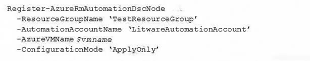
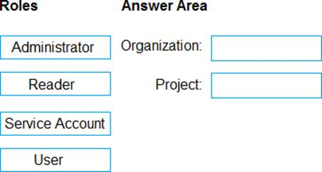
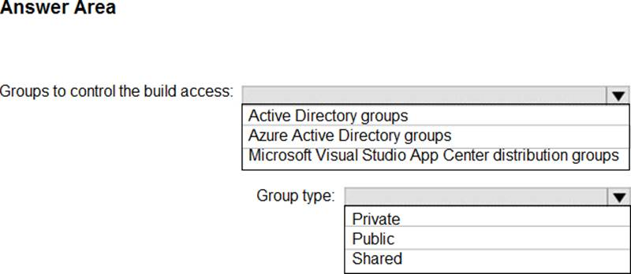
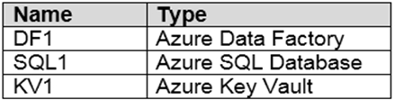
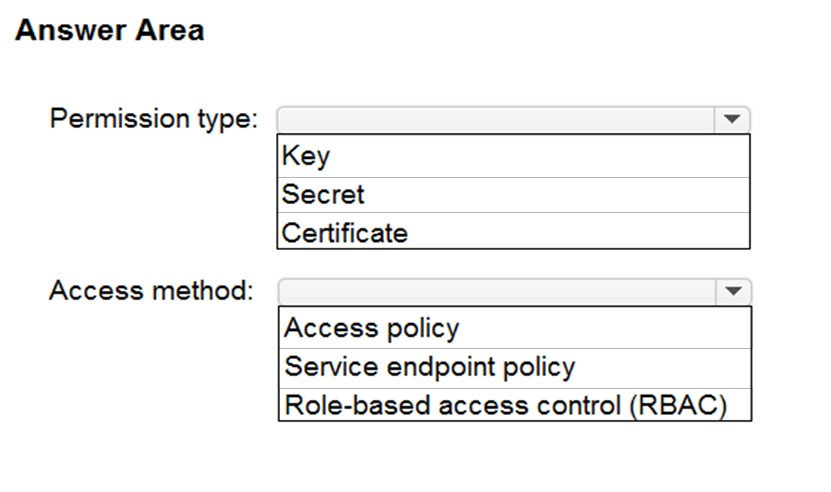
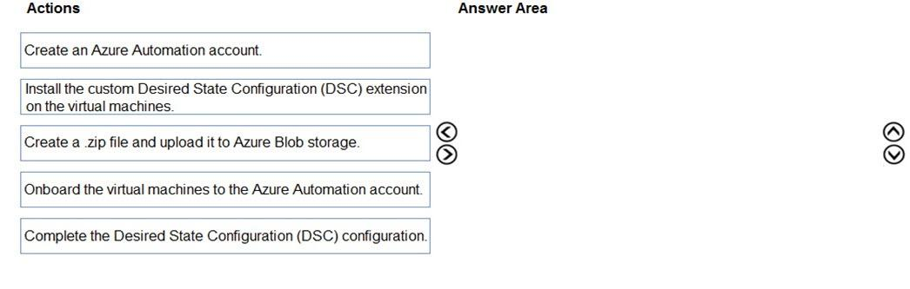

111. Your company has a hybrid cloud between Azure and Azure Stack. The company uses Azure DevOps for its CI/CD pipelines. Some applications are built by using Erlang and Hack. You need to ensure that Erlang and Hack are supported as part of the build strategy across the hybrid cloud. The solution must minimize management overhead. What should you use to execute the build pipeline?

- [ ] Azure DevOps self-hosted agents on Azure DevTest Labs virtual machines.
- [x] Azure DevOps self-hosted agents on virtual machine that run on Azure Stack.
- [ ] Azure DevOps self-hosted agents on Hyper-V virtual machines.
- [ ] Microsoft-hosted agent.

**[⬆ Back to Top](#table-of-contents)**

112. You plan to create an image that will contain a .NET Core application. You have a Dockerfile file that contains the following code. You need to ensure that the image is as small as possible when the image is built. Which line should you modify in the file?

- [ ] 1.
- [ ] 3.
- [x] 4.
- [ ] 7.

**[⬆ Back to Top](#table-of-contents)**

113. Your company develops an app for iOS. All users of the app have devices that are members of a private distribution group in Microsoft Visual Studio App Center. You plan to distribute a new release of the app. You need to identify which certificate file you require to distribute the new release from App Center. Which file type should you upload to App Center?

- [ ] .cer.
- [ ] .pvk.
- [ ] .pfx.
- [x] .p12.

**[⬆ Back to Top](#table-of-contents)**

114. Your company has a prefect in Azure DevOps for a new web application. You need to ensure that when code is checked in, a build runs automatically. Solution: from the Triggers tab of the build pipeline, you select Enable continuous integration Does this meet the goal?

- [x] Yes.
- [ ] No.

**[⬆ Back to Top](#table-of-contents)**

115. You have a project Azure DevOps. You plan to create a build pipeline that will deploy resources by using Azure Resource Manager templates. The templates will reference secretes stored in Azure Key Vault. You need to ensure that you can dynamically generate the resource ID of the key vault during template deployment. What should you include in the template?

- [ ] Box 1: Microsoft.KeyVault/vaults. Box 2: templateLink.
- [x] Box 1: Microsoft.Resources/deployment. Box 2: templateLink.
- [ ] Box 1: Microsoft.KeyVault/vaults. Box 2: deployment.
- [ ] Box 1: templateLink. Box 2: deployment.

**[⬆ Back to Top](#table-of-contents)**

116. Litware, Inc. an independent software vendor (ISV) Litware has a main office and five branch offices. Application Architecture The company' s primary application is a single monolithic retirement fund management system based on ASP.NET web forms that use logic written in V8.NET. Some new sections of the application are written in C#. Variations of the application are created for individual customers. Currently, there are more than 80 have code branches in the application's code base. The application was developed by using Microsoft Visual Studio. Source code is stored in Team Foundation Server (TFS) in the main office. The branch offices access of the source code by using TFS proxy servers. Architectural Issues Litware focuses on writing new code for customers. No resources are provided to refactor or remove existing code. Changes to the code base take a long time, AS dependencies are not obvious to individual developers. Merge operations of the code often take months and involve many developers. Code merging frequently introduces bugs that are difficult to locate and resolve. Customers report that ownership costs of the retirement fund management system increase continually. The need to merge unrelated code makes even minor code changes expensive. Requirements Planned Changes Litware plans to develop a new suite of applications for investment planning. The investment planning Applications will require only minor integration with the easting retirement fund management system. The investment planning applications suite will include one multi-tier web application and two iOS mobile applications. One mobile application will be used by employees; the other will be used by customers. Litware plans to move to a more agile development methodology. Shared code will be extracted into a series of package. Litware has started an internal cloud transformation process and plans to use cloud based services whenever suitable. Litware wants to become proactive m detecting failures, rather than always waning for customer bug reports. Technical Requirements The company's investment planning applications suite must meet the following technical requirements: New incoming connections through the firewall must be minimized. Members of a group named Developers must be able to install packages. The principle of least privilege must be used for all permission assignments A branching strategy that supports developing new functionality in isolation must be used. Members of a group named Team leaders must be able to create new packages and edit the permissions of package feeds Visual Studio App Center must be used to centralize the reporting of mobile application crashes and device types in use. By default, all App Center must be used to centralize the reporting of mobile application crashes and device types in use. Code quality and release quality are critical. During release, deployments must not proceed between stages if any active bugs are logged against the release. The mobile applications must be able to call the share pricing service of the existing retirement fund management system. Until the system is upgraded, the service will only support basic authentication over HUPS. The required operating system configuration tor the test servers changes weekly. Azure Automation State Configuration must be used to ensure that the operating system on each test servers configured the same way when the servers are created and checked periodically. The test servers are configured correctly when first deployed, but they experience configuration drift over time. Azure Automation State Configuration fails to correct the configurations. Azure Automation State Configuration nodes are registered by using the following command. Which branching strategy should you recommend for the investment planning applications suite?

- [ ] Release isolation.
- [ ] Main only.
- [ ] Development isolation.
- [x] Feature isolation.

**[⬆ Back to Top](#table-of-contents)**

117. You intend to make use of Azure Artifacts to share packages that you wrote, tested, validated, and deployed. You want to use a solitary feed to release several builds of each package. You have to make sure that the release of packages that are in development is restricted. Which of the following actions should you take?

- [ ] You should make use of static code analysis.
- [x] You should make use of views.
- [ ] You should make use of dynamic code analysis.
- [ ] You should make use of upstream sources.

**[⬆ Back to Top](#table-of-contents)**

118. You plan to share packages that you wrote, tested, validated, and deployed by using Azure Artifacts. You need to release multiple builds of each package by using a single feed. The solution must limit the release of packages that are in development. What should you use?

- [ ] Global symbols.
- [ ] Local symbols.
- [ ] Upstream sources.
- [x] Views.

**[⬆ Back to Top](#table-of-contents)**

119. You need to configure access to Azure DevOps agent pools to meet the following requirements: Use a project agent pool when authoring build release pipelines. View the agent pool and agents of the organization. Use the principle of least privilege. Which role memberships are required for the Azure DevOps organization and the project?

- [ ] Organization: Service Account. Project: Administrator.
- [ ] Organization: User. Project: Service Account.
- [x] Organization: Reader. Project: User.
- [ ] Organization: Reader. Project: Service Account.

**[⬆ Back to Top](#table-of-contents)**

120. Your company has an Azure subscription. The company requires that all resource groups in the subscription have a tag named organization set to a value of Contoso. You need to implement a policy to meet the tagging requirement. How should you complete the policy?

- [ ] Box 1: "Deny". Box 2: "Microsoft Resources/subscriptions/resourceGroups".
- [ ] Box 1: "Append". Box 2: "Microsoft Resources/subscriptions/resourceGroups".
- [x] Box 1: "Microsoft Resources/subscriptions/resourceGroups". Box 2: "Append".
- [ ] Box 1: "Microsoft Resources/subscriptions/resourceGroups". Box 2: "Deny".

**[⬆ Back to Top](#table-of-contents)**

121. You have 50 Node.js-based projects that you scan by using WhiteSource. Each project includes Package.json, Package-lock.json, and Npm-shrinkwrap.json files. You need to minimize the number of libraries reports by WhiteSource to only the libraries that you explicitly reference. What should you do?

- [ ] Configure the File System Agent plug in.
- [ ] Delete Package lock.json.
- [ ] Configure the Artifactory plug-in.
- [x] Add a devDependencies section to Package.json.

**[⬆ Back to Top](#table-of-contents)**

122. Your company develops a client banking application that processes a large volume of data. Code quality is an ongoing issue for the company. Recently, the code quality has deteriorated because of an increase in time pressure on the development team. You need to implement static code analysis. During which phase should you use static code analysis?

- [x] Build.
- [ ] Production release.
- [ ] Staging.
- [ ] Integration testing.

**[⬆ Back to Top](#table-of-contents)**

123. You have a GitHub repository. You create a new repository in Azure DevOps. You need to recommend a procedure to clone the repository from GitHub to Azure DevOps. What should you recommend?

- [ ] Create a webhook.
- [ ] Create a service connection for GitHub.
- [x] From Import a Git repository, click Import.
- [ ] Create a pull request.
- [ ] Create a Personal Access Token in Azure DevOps.

**[⬆ Back to Top](#table-of-contents)**

124. Your company is building a mobile app that targets Android devices and OS devices. Your team uses Azure DevOps to manage all work items and release cycles. You need to recommend a solution to perform the following tasks. Collect crash reports for issue analysis. Distribute beta releases to your testers. Get user feedback on the functionality of new apps. What should you include in the recommendation?

- [ ] Jenkins integration.
- [ ] Azure Application Insights widgets.
- [ ] Microsoft Test & Feedback extension.
- [x] Microsoft Visual Studio App Center integration.

**[⬆ Back to Top](#table-of-contents)**

125. You are in the process of building a mobile app aimed at Android and iOS devices. All work items and release cycles are managed via Azure DevOps. You want to make sure that crash reports for issue analysis is collected, and that beta releases are distributed to your testers. Also, you want to ensure that user feedback on the functionality of new apps is received. Which of the following must be part of your solution?

- [x] Microsoft Test & Feedback extension.
- [ ] OWASP ZAP.
- [ ] TFS Integration Platform.
- [ ] Code Style.

**[⬆ Back to Top](#table-of-contents)**

126. You manage build pipelines and deployment pipelines by using Azure DevOps. Your company has a team of 500 developers. New members are added continually to the team. You need to automate the management of users and licenses whenever possible. Which task must you perform manually?

- [ ] Modifying group memberships.
- [x] Procuring licenses.
- [ ] Adding users.
- [ ] Assigning entitlements.

**[⬆ Back to Top](#table-of-contents)**

127. You are making use of Azure DevOps manage build pipelines, and also deploy pipelines. The development team is quite large, and is regularly added to. You have been informed that the management of users and licenses must be automated when it can be. Which of the following is a task that can't be automated?

- [ ] Group membership changes.
- [ ] License assignment.
- [ ] Assigning entitlements.
- [x] License procurement.

**[⬆ Back to Top](#table-of-contents)**

128. You are developing an open source solution that uses a GitHub repository. You create a new public project in Azure DevOps. You plan to use Azure Pipelines for continuous build. The solution will use the GitHub Checks API. Which authentication type should you use?

- [ ] Personal Access Token.
- [ ] SAML.
- [x] GitHub App.
- [ ] OAuth.

**[⬆ Back to Top](#table-of-contents)**

129. You need to recommend a Docker container build strategy that meets the following requirements: Minimizes image sizes. Minimizes the security surface area of the final image. What should you include in the recommendation?

- [x] Multi-stage builds.
- [ ] Single-stage builds.
- [ ] PowerShell Desired State Configuration (DSC).
- [ ] Docker Swarm.

**[⬆ Back to Top](#table-of-contents)**

130. During a code review, you discover quality issues in a Java application. You need to recommend a solution to detect quality issues including unused variables and empty catch blocks. What should you recommend?

- [x] In a Maven build task, select Run PM.
- [ ] In an Xcode build task, select Use xcpretty from Advanced.
- [ ] In a Gulp build task, specify a custom condition expression.
- [ ] In a Grunt build task, select Enabled from Control Options.

**[⬆ Back to Top](#table-of-contents)**

131. You create a Microsoft ASP.NET Core application. You plan to use Azure Key Vault to provide secrets to the application as configuration data. You need to create a Key Vault access policy to assign secret permissions to the application. The solution must use the principle of least privilege. Which secret permissions should you use?

- [ ] List only.
- [x] Get only.
- [ ] Get and List.

**[⬆ Back to Top](#table-of-contents)**

132. You have a branch policy in a project in Azure DevOps. The policy requires that code always builds successfully. You need to ensure that a specific user can always merge changes to the master branch, even if the code fails to compile. The solution must use the principle of least privilege. What should you do?

- [ ] Add the user to the Build Administrators group.
- [ ] Add the user to the Project Administrators group.
- [ ] From the Security settings of the repository, modify the access control for the user.
- [x] From the Security settings of the branch, modify the access control for the user.

**[⬆ Back to Top](#table-of-contents)**

133. Your team uses an agile development approach. You need to recommend a branching strategy for the team's Git repository. The strategy must meet the following requirements. Provide the ability to work on multiple independent tasks in parallel. Ensure that checked-in code remains in a releasable state always. Ensure that new features can be abandoned at any time. Encourage experimentation. What should you recommend?

- [ ] Single long-running branch without forking.
- [ ] Multiple long-running branches.
- [ ] Single fork per team member.
- [x] Single long-running branch with multiple short-lived topic branches.

**[⬆ Back to Top](#table-of-contents)**

134. You plan to use a NuGet package in a project in Azure DevOps. The NuGet package is in a feed that requires authentication. You need to ensure that the project can restore the NuGet package automatically. What should the project use to automate the authentication?

- [ ] Azure Automation account.
- [x] Azure Artifacts Credential Provider.
- [ ] Azure Active Directory (Azure AD) account that has multi-factor authentication (MFA) enabled.
- [ ] Azure Active Directory (Azure AD) service principal.

**[⬆ Back to Top](#table-of-contents)**

135. You are implementing a package management solution for a Node.js application by using Azure Artifacts. You need to configure the development environment to connect to the package repository. The solution must minimize the likelihood that credentials will be leaked. Which file should you use to configure each connection?

- [ ] Feed registry information: The .npmrc file in the user's home folder. Credentials: The .npmrc file in the project.
- [ ] Feed registry information: The Package.json file in the project. Credentials: The Project.json file in the project.
- [ ] Feed registry information: The Project.json file in the project. Credentials: The .npmrc file in the project.
- [x] Feed registry information: The .npmrc file in the project. Credentials: The .npmrc file in the user's home folder.

**[⬆ Back to Top](#table-of-contents)**

136. Your company plans to deploy an application to the following endpoints: Ten virtual machines hosted in Azure. Ten virtual machines hosted in an on-premises data center environment. All the virtual machines have the Azure Pipelines agent. You need to implement a release strategy for deploying the application to the endpoints. What should you recommend using to deploy the application to the endpoints?

- [ ] Ten virtual machines hosted in Azure: A management group. Ten virtual machines hosted in an on-premises data center environment: Application roles.
- [ ] Ten virtual machines hosted in Azure: A resource group. Ten virtual machines hosted in an on-premises data center environment: A management group.
- [x] Ten virtual machines hosted in Azure: A deployment group. Ten virtual machines hosted in an on-premises data center environment: A deployment group.
- [ ] Ten virtual machines hosted in Azure: Application roles. Ten virtual machines hosted in an on-premises data center environment: A resource group.

**[⬆ Back to Top](#table-of-contents)**

137. You need to recommend project metrics for dashboards in Azure DevOps. Which chart widgets should you recommend for each metric?

- [ ] The elapsed time from the creation of work items to their completion: Burndown. The elapsed time to complete work items once they are active: Lead Time. The remaining work: Cycle Time.
- [ ] The elapsed time from the creation of work items to their completion: Cycle Time. The elapsed time to complete work items once they are active: Burndown. The remaining work: Lead Time.
- [x] The elapsed time from the creation of work items to their completion: Lead Time. The elapsed time to complete work items once they are active: Cycle Time. The remaining work: Burndown.
- [ ] The elapsed time from the creation of work items to their completion: Burndown. The elapsed time to complete work items once they are active: Lead Time. The remaining work: Velocity.

**[⬆ Back to Top](#table-of-contents)**

138. To find when common open source libraries- are added to the code base, you should add [Jenkins] to the build pipeline.

- [ ] No adjustment required.
- [ ] SourceGear Vault.
- [x] WhiteSource.
- [ ] OWASP ZAP.

**[⬆ Back to Top](#table-of-contents)**

139. Your company is concerned that when developers introduce open source libraries, it creates licensing compliance issues. You need to add an automated process to the build pipeline to detect when common open source libraries are added to the code base. What should you use?

- [ ] SourceGear Vault.
- [ ] Jenkins.
- [ ] Microsoft Visual SourceSafe.
- [x] WhiteSource Bolt.

**[⬆ Back to Top](#table-of-contents)**

140. You have several apps that use an Azure SQL D-atabase named db1. You need to ensure that queries to db1 are tuned by Azure over time. The solution must only apply to db1. To complete this task, sign in to the Microsoft Azure portal.

- [x] 1. To enable automatic tuning on a single database, navigate to the database in the Azure portal and select Automatic tuning. 2. Select the automatic tuning options you want to enable and select Apply.

**[⬆ Back to Top](#table-of-contents)**

141. You need to ensure that the https://contoso.com/statushook webhook is called every time a repository named az4009940427acr1 receives a new version of an image named dotnetapp. To complete this task, sign in to the Microsoft Azure portal.

- [x] 1. Sign in to the Azure portal. 2. Navigate to the container registry az4009940427acr1. 3. Under Services, select Webhooks. 4. Select the existing webhook https://contoso.com/statushook, and double-click on it to get its properties. 5. For Trigger actions select image push.

**[⬆ Back to Top](#table-of-contents)**

142. You need to ensure that an Azure web app named az400-123456789-main can retrieve secrets from an Azure key vault named az400-123456789-kv1 by using a system managed identity. The solution must use the principle of least privilege. To complete this task, sign in to the Microsoft Azure portal.

- [x] 1. In Azure portal navigate to the az400-123456789-main app. 2. Scroll down to the Settings group in the left navigation. 3. Select Managed identity. 4. Within the System assigned tab, switch Status to On. Click Save.

**[⬆ Back to Top](#table-of-contents)**

143. You have an Azure key vault named KV1 and three web servers. You plan to deploy an app named App1 to the web servers. You need to ensure that App1 can retrieve a secret from KV1. The solution must meet the following requirements: Minimize the number of permission grants required. Follow the principle of least privilege. What should you include in the solution?

- [ ] Role-based access control (RBAC) permission.
- [ ] System-assigned managed identity.
- [x] User-assigned managed identity.
- [ ] Service principal.

**[⬆ Back to Top](#table-of-contents)**

144. You need to create deployment files for an Azure Kubernetes Service (AKS) cluster. The deployments must meet the provisioning storage requirements shown in the following table.

- [ ] Deployment 1: azurekeyvault-flexvolume. Deployment 2: blobfuse-flexvol. Deployment 3: volume.beta.kubernetes.io/storage-provisioner.
- [ ] Deployment 1: kubernetes.io/azure-disk. Deployment 2: kubernetes.io/azure-file. Deployment 3: volume.beta.kubernetes.io/storage-provisioner.
- [ ] Deployment 1: azurekeyvault-flexvolume. Deployment 2: blobfuse-flexvol. Deployment 3: kubernetes.io/azure-file.
- [x] Deployment 1: kubernetes.io/azure-file. Deployment 2: kubernetes.io/azure-disk. Deployment 3: azurekeyvault-flexvolume.

**[⬆ Back to Top](#table-of-contents)**

145. You need to create deployment files for an Azure Kubernetes Service (AKS) cluster. The deployments must meet the provisioning storage requirements shown in the following table.

- [ ] Deployment 1: blobfuse-flexvol. Deployment 2: blobfuse-flexvol. Deployment 3: volume.beta.kubernetes.io/storage-provisioner.
- [ ] Deployment 1: provisioner: kubernetes.io/azure-disk. Deployment 2: provisioner: kubernetes.io/azure-file. Deployment 3: volume.beta.kubernetes.io/storage-provisioner.
- [ ] Deployment 1: driver: secrets-store.csi.k8s.io. Deployment 2: blobfuse-flexvol. Deployment 3: provisioner: kubernetes.io/azure-file.
- [x] Deployment 1: provisioner: kubernetes.io/azure-file. Deployment 2:  provisioner: kubernetes.io/azure-disk. Deployment 3: driver: secrets-store.csi.k8s.io.

**[⬆ Back to Top](#table-of-contents)**

146. Your company uses Git as a source code control system for a complex app named App1. You plan to add a new functionality to App1. You need to design a branching model for the new functionality. Which branch lifetime and branch time should you use in the branching model?

- [ ] Branch lifetime: Long-lived. Branch type: Feature.
- [ ] Branch lifetime: Short-lived. Branch type: Integration.
- [x] Branch lifetime: Short-lived. Branch type: Feature.
- [ ] Branch lifetime: Long-lived. Branch type: Integration.

**[⬆ Back to Top](#table-of-contents)**

147. You store source code in a Git repository in Azure Repos. You use a third-party continuous integration (CI) tool to control builds. What will Azure DevOps use to authenticate with the tool?

- [ ] Certificate authentication.
- [x] Personal Access Token (PAT).
- [ ] Shared Access Signature (SAS) token.
- [ ] NTLM authentication.

**[⬆ Back to Top](#table-of-contents)**

148. You are configuring Azure Pipelines for three projects in Azure DevOps as shown in the following table. Which version control system should you recommend for each project?

- [ ] Project1: Git in Azure Repos. Project2: GitHub Enterprise. Project3: Bitbucket Cloud.
- [x] Project1: Git in Azure Repos. Project2: GitHub Enterprise. Project3: Subversion.
- [ ] Project1: Bitbucket Cloud. Project2: Assembla Subversion. Project3: GitHub Enterprise.
- [ ] Project1: GitHub Enterprise. Project2: Assembla Subversion. Project3: Git in Azure Repos.

**[⬆ Back to Top](#table-of-contents)**

149. You have been tasked with strengthening the security of your team's development process. You need to suggest a security tool type for the Continuous Integration (CI) phase of the development process. Which of the following is the option you would suggest?

- [ ] Penetration Testing.
- [x] Static Code Analysis.
- [ ] Threat Modeling.
- [ ] Dynamic Code Analysis.

**[⬆ Back to Top](#table-of-contents)**

150. You need to increase the security of your team's development process. Which type of security tool should you recommend for each stage of the development process?

- [ ] Pull request: Threat modeling. Continuous integration: Static code analysis. Continuous delivery: Penetration testing.
- [x] Pull request: Static code analysis. Continuous integration: Static code analysis. Continuous delivery: Penetration testing.
- [ ] Pull request: Penetration testing. Continuous integration: Threat modeling. Continuous delivery: Static code analysis.
- [ ] Pull request: Static code analysis. Continuous integration: Penetration testing. Continuous delivery: Threat modeling.

**[⬆ Back to Top](#table-of-contents)**

151. You plan to use Azure Kubernetes Service (AKS) to host containers deployed from images hosted in a Docker Trusted Registry. You need to recommend a solution for provisioning and connecting to AKS. The solution must ensure that AKS is RBAC-enabled and uses a custom service principal. Which three commands should you recommend be run in sequence?

- [ ] Box 1: az aks create. Box 2: az ad sp create-for-rbac. Box 3: kubectl create.
- [ ] Box 1: kubectl create. Box 2: az aks get-credentials. Box 3: az ad sp create-for-rbac.
- [x] Box 1: az ad sp create-for-rbac. Box 2: az aks create. Box 3: az role assignment create.
- [ ] Box 1: az aks create. Box 2: az role assignment create. Box 3: kubectl create.

**[⬆ Back to Top](#table-of-contents)**

152. You need to deploy Azure Kubernetes Service (AKS) to host an application. The solution must meet the following requirements: Containers must only be published internally. AKS clusters must be able to create and manage containers in Azure. What should you use for each requirement?

- [ ] Containers must only be published internally: Azure Container Registry. AKS clusters must be able to create and manage containers in Azure: An Azure Active Directory (Azure AD) group.
- [ ] Containers must only be published internally: Azure Container Instances. AKS clusters must be able to create and manage containers in Azure: An Azure Automation account.
- [ ] Containers must only be published internally: Dockerfile. AKS clusters must be able to create and manage containers in Azure: An Azure service principal.
- [x] Containers must only be published internally: Azure Container Registry. AKS clusters must be able to create and manage containers in Azure: An Azure service principal.

**[⬆ Back to Top](#table-of-contents)**

153. Your company is creating a suite of three mobile applications. You need to control access to the application builds. The solution must be managed at the organization level. What should you use?

- [ ] Groups to control the build access: Azure Active Directory groups. Group type: Private.
- [ ] Groups to control the build access: Azure Active Directory groups. Group type: Public.
- [x] Groups to control the build access: Microsoft Visual Studio App Center distribution groups. Group type: Shared.
- [ ] Groups to control the build access: Active Directory groups. Group type: Shared.

**[⬆ Back to Top](#table-of-contents)**

154. Your company has 60 developers who are assigned to four teams. Each team has 15 members. The company uses an agile development methodology. You need to structure the work of the development teams so that each team owns their respective work while working together to reach a common goal. Which parts of the taxonomy should you enable the team to perform autonomously?

- [ ] Features and Tasks.
- [ ] Initiatives and Epics.
- [ ] Epics and Features.
- [x] Stories and Tasks.

**[⬆ Back to Top](#table-of-contents)**

155. Your company has an Azure DevOps project, The source code for the project is stored in an on-premises repository and uses on an on-premises build server. You plan to use Azure DevOps to control the build process on the build server by using a self-hosted agent. You need to implement the self-hosted agent. You download and install the agent on the build server. Which two actions should you perform next?

- [ ] From Azure, create a shared access signature (SAS).
- [ ] From the build server, create a certificate, and then upload the certificate to Azure Storage.
- [ ] From the build server, create a certificate, and then upload the certificate to Azure Key Vault.
- [x] From DevOps, create a Personal Access Token (PAT).
- [x] From the build server, run config.cmd.

**[⬆ Back to Top](#table-of-contents)**

156. Your company creates a new Azure DevOps team. You plan to use Azure DevOps for sprint planning. You need to visualize the flow of your work by using an agile methodology. Which Azure DevOps component should you use?

- [x] Kanban boards.
- [ ] sprint planning.
- [ ] delivery plans.
- [ ] portfolio backlogs.

**[⬆ Back to Top](#table-of-contents)**

157. You are implementing an Azure DevOps strategy for mobile devices using App Center. You plan to use distribution groups to control access to releases. You need to create the distribution groups shown in the following table. Which type of distribution group should you use for each group?

- [ ] Group 1: Shared. Group 2: Public. Group 3: Private.
- [ ] Group 1: Private. Group 2: Shared. Group 3: Public.
- [x] Group 1: Private. Group 2: Public. Group 3: Shared.
- [ ] Group 1: Public. Group 2: Shared. Group 3: Private.

**[⬆ Back to Top](#table-of-contents)**

158. Your company is building a new web application. You plan to collect feedback from pilot users on the features being delivered. All the pilot users have a corporate computer that has Google Chrome and the Microsoft Test & Feedback extension installed. The pilot users will test the application by using Chrome. You need to identify which access levels are required to ensure that developers can request and gather feedback from the pilot users. The solution must use the principle of least privilege. Which access levels in Azure DevOps should you identify?

- [x] Developers: Basic. Pilot users: Stakeholder.
- [ ] Developers: Stakeholder. Pilot users: Basic.
- [ ] Developers: Stakeholder. Pilot users: Stakeholder.
- [ ] Developers: Basic. Pilot users: Basic.

**[⬆ Back to Top](#table-of-contents)**

159. Your company has a project in Azure DevOps. You need to ensure that when there are multiple builds pending deployment, only the most recent build is deployed. What should you use?

- [x] Deployment queue settings.
- [ ] Deployment conditions.
- [ ] Release gates.
- [ ] Pull request triggers.

**[⬆ Back to Top](#table-of-contents)**

160. You have an Azure DevOps organization named Contoso and an Azure DevOps project named Project1. You plan to use Microsoft-hosted agents to build container images that will host full Microsoft .NET Framework apps in a YAML pipeline in Project1. What are two possible virtual machine images that you can use for the Microsoft-hosted agent pool?

- [x] windows-2019.
- [x] ubuntu-22.04.
- [ ] win1803.
- [ ] macOS-10.13.
- [ ] vs.2015-win2012r2.

**[⬆ Back to Top](#table-of-contents)**

161. You are configuring a release pipeline in Azure DevOps as shown in the exhibit.

- [x] How many stages have triggers set?: 7. Which component should you modify to enable continuous delivery?: The Web Application artifact.
- [ ] How many stages have triggers set?: 0. Which component should you modify to enable continuous delivery?: The Production stage.
- [ ] How many stages have triggers set?: 2. Which component should you modify to enable continuous delivery?: The Develooment stage.
- [ ] How many stages have triggers set?: 7. Which component should you modify to enable continuous delivery?: The Internal Review stage.

**[⬆ Back to Top](#table-of-contents)**

162. Litware, Inc. an independent software vendor (ISV) Litware has a main office and five branch offices. Application Architecture The company' s primary application is a single monolithic retirement fund management system based on ASP.NET web forms that use logic written in V8.NET. Some new sections of the application are written in C#. Variations of the application are created for individual customers. Currently, there are more than 80 have code branches in the application's code base. The application was developed by using Microsoft Visual Studio. Source code is stored in Team Foundation Server (TFS) in the main office. The branch offices access of the source code by using TFS proxy servers. Architectural Issues Litware focuses on writing new code for customers. No resources are provided to refactor or remove existing code. Changes to the code base take a long time, AS dependencies are not obvious to individual developers. Merge operations of the code often take months and involve many developers. Code merging frequently introduces bugs that are difficult to locate and resolve. Customers report that ownership costs of the retirement fund management system increase continually. The need to merge unrelated code makes even minor code changes expensive. Requirements Planned Changes Litware plans to develop a new suite of applications for investment planning. The investment planning Applications will require only minor integration with the easting retirement fund management system. The investment planning applications suite will include one multi-tier web application and two iOS mobile applications. One mobile application will be used by employees; the other will be used by customers. Litware plans to move to a more agile development methodology. Shared code will be extracted into a series of package. Litware has started an internal cloud transformation process and plans to use cloud based services whenever suitable. Litware wants to become proactive m detecting failures, rather than always waning for customer bug reports. Technical Requirements The company's investment planning applications suite must meet the following technical requirements: New incoming connections through the firewall must be minimized. Members of a group named Developers must be able to install packages. The principle of least privilege must be used for all permission assignments A branching strategy that supports developing new functionality in isolation must be used. Members of a group named Team leaders must be able to create new packages and edit the permissions of package feeds Visual Studio App Center must be used to centralize the reporting of mobile application crashes and device types in use. By default, all App Center must be used to centralize the reporting of mobile application crashes and device types in use. Code quality and release quality are critical. During release, deployments must not proceed between stages if any active bugs are logged against the release. The mobile applications must be able to call the share pricing service of the existing retirement fund management system. Until the system is upgraded, the service will only support basic authentication over HUPS. The required operating system configuration tor the test servers changes weekly. Azure Automation State Configuration must be used to ensure that the operating system on each test servers configured the same way when the servers are created and checked periodically. The test servers are configured correctly when first deployed, but they experience configuration drift over time. Azure Automation State Configuration fails to correct the configurations. Azure Automation State Configuration nodes are registered by using the following command. Which package feed access levels should be assigned to the Developers and Team Leaders groups for the investment planning applications suite?

- [x] Developers: Reader. Team Leaders: Owner.
- [ ] Developers: Collaborator. Team Leaders: Reader.
- [ ] Developers: Contributor. Team Leaders: Owner.
- [ ] Developers: Contributor. Team Leaders: Collaborator.

**[⬆ Back to Top](#table-of-contents)**

163. Your company uses Azure DevOps for the build pipelines and deployment pipelines of Java-based projects. You need to recommend a strategy for managing technical debt. Which two actions should you include in the recommendation?

- [ ] Configure post-deployment approvals in the deployment pipeline.
- [x] Configure pre-deployment approvals in the deployment pipeline.
- [x] Integrate Azure DevOps and SonarQube.
- [ ] Integrate Azure DevOps and Azure DevTest Labs.

**[⬆ Back to Top](#table-of-contents)**

164. Your company uses Azure DevOps for the build pipelines and deployment pipelines of Java-based projects. You need to recommend a strategy for managing technical debt. Which action should you include in the recommendation?

- [ ] Configure post-deployment approvals in the deployment pipeline.
- [x] Integrate Azure DevOps and SonarQube.
- [ ] Integrate Azure DevOps and Azure DevTest Labs.

**[⬆ Back to Top](#table-of-contents)**

165. Your company deploys applications in Docker containers. You want to detect known exploits in the Docker images used to provision the Docker containers. You need to integrate image scanning into the application lifecycle. The solution must expose the exploits as early as possible during the application lifecycle. What should you configure?

- [x] Task executed in the continuous integration pipeline and a scheduled task that analyzes the image registry.
- [ ] Manual tasks performed during the planned phase and the deployment phase.
- [ ] Task executed in the continuous deployment pipeline and a scheduled task against a running production container.
- [ ] Task executed in the continuous integration pipeline and a scheduled task that analyzes the production container.

**[⬆ Back to Top](#table-of-contents)**

166. Your company uses a Git repository in Azure Repos to manage the source code of a web application. The master branch is protected from direct updates. Developers work on new features in the topic branches. Because of the high volume of requested features, it is difficult to follow the history of the changes to the master branch. You need to enforce a pull re-quest merge strategy. The strategy must meet the following requirements: Consolidate commit histories. Merge the changes into a single commit. Which merge strategy should you use in the branch policy?

- [x] Squash merge.
- [ ] Fast-forward merge.
- [ ] Git fetch.
- [ ] No-fast-forward merge

**[⬆ Back to Top](#table-of-contents)**

167. You use a Git repository in Azure Repos to manage the source code of a web application. Developers commit changes directly to the master branch. You need to implement a change management procedure that meets the following requirements: The master branch must be protected, and new changes must be built in the feature branches first. Changes must be reviewed and approved by at least one release manager before each merge. Changes must be brought into the master branch by using pull requests. What should you configure in Azure Repos?

- [x] Branch policies of the master branch.
- [ ] Services in Project Settings.
- [ ] Deployment pools in Project Settings.
- [ ] Branch security of the master branch.

**[⬆ Back to Top](#table-of-contents)**

168. Your company has an on-premises Bitbucket Server that is used for Git-based source control. The server is protected by a firewall that blocks inbound Internet traffic. You plan to use Azure DevOps to manage the build and release processes. Which two components are required to integrate Azure DevOps and Bitbucket?

- [ ] Deployment group.
- [ ] Microsoft-hosted agent.
- [ ] Service hooks.
- [x] Self-hosted agent.
- [x] External Git service connection.

**[⬆ Back to Top](#table-of-contents)**

169. You have an on-premises Bitbucket Server with a firewall configured to block inbound Internet traffic. The server is used for Git-based source control. You intend to manage the build and release processes using Azure DevOps. This plan requires you to integrate Azure DevOps and Bitbucket. Which of the following will allow for this integration?

- [ ] A Microsoft-hosted agent, Service hooks.
- [ ] Service hooks, A Microsoft-hosted agent.
- [ ] Service hooks, A Microsoft-hosted agent.
- [x] A self-hosted agent, An External Git service connection.

**[⬆ Back to Top](#table-of-contents)**

170. You are preparing to deploy an Azure resource group via Terraform. To achieve your goal, you have to install the necessary frameworks. Which of the following are the frameworks you should use?

- [ ] Vault, Terratest.
- [ ] Yeoman, Tiller.
- [x] Yeoman, Terratest.
- [ ] Terratest, Yeoman.

**[⬆ Back to Top](#table-of-contents)**

171. You are creating a YAML-based Azure pipeline to deploy an Azure Data factory instance that has the following requirements: If a Data Factory instance exists already, the instance must be overwritten. No other resources in a resource group named Fabrikam must be affected. How should you complete the code?

- [x] Box 1: 'Create Or Update Resource Group'. Box 2: 'Incremental'.
- [ ] Box 1: 'Select Resource Group'. Box 2: 'Complete'.
- [ ] Box 1: 'Select Resource Group'. Box 2: 'Validation only'.
- [ ] Box 1: 'Start'. Box 2: 'Incremental'.

**[⬆ Back to Top](#table-of-contents)**

172. You use release pipelines in Azure Pipelines to deploy an app. Secrets required be the pipeline are stored as pipeline variables. Logging of commands is enabled for the Azure Pipelines agent. You need to prevent the values of the secrets from being logged. What should you do?

- [x] Store the secrets in the environment variables instead of the pipeline variables.
- [ ] Pass the secrets on the command line instead of in the pipeline variables.
- [ ] Apply a prefix of secret to the name of the variables.
- [ ] Echo the values of the secrets to the command line.

**[⬆ Back to Top](#table-of-contents)**

173. You are using the Dependency Tracker extension in a project in Azure DevOps. You generate a risk graph for the project. What should you use in the risk graph to identify the number of dependencies and the risk level of the project?

- [ ] Number of dependencies: Node color. Risk level: Link color.
- [ ] Number of dependencies: Link color. Risk level: Link length.
- [ ] Number of dependencies: Node color. Risk level: Link length.
- [x] Number of dependencies: Link width. Risk level: Link color.

**[⬆ Back to Top](#table-of-contents)**

174. You need to recommend an integration strategy for the build process of a Java application. The solution must meet the following requirements: The builds must access an on-premises dependency management system. The build outputs must be stored as Server artifacts in Azure DevOps. The source code must be stored in a Git repository in Azure DevOps. Solution: Configure the build pipeline to use a Hosted Ubuntu agent pool. Include the Java Tool Installer task in the build pipeline. Does this meet the goal?

- [ ] Yes.
- [x] No.

**[⬆ Back to Top](#table-of-contents)**

175. You need to recommend an integration strategy for the build process of a Java application. The solution must meet the following requirements: The builds must access an on-premises dependency management system. The build outputs must be stored as Server artifacts in Azure DevOps. The source code must be stored in a Git repository in Azure DevOps. Solution: Configure the build pipeline to use a Microsoft-hosted agent pool running a Linux image. Include the Java Tool Installer task in the build pipeline. Does this meet the goal?

- [ ] Yes.
- [x] No.

**[⬆ Back to Top](#table-of-contents)**

176. You need to recommend an integration strategy for the build process of a Java application. The solution must meet the following requirements: The builds must access an on-premises dependency management system. The build outputs must be stored as Server artifacts in Azure DevOps. The source code must be stored in a Git repository in Azure DevOps. Solution: Configure the build pipeline to use a Hosted VS 2019 agent pool. Include the Java Tool Installer task in the build pipeline. Does this meet the goal?

- [ ] Yes.
- [x] No.

**[⬆ Back to Top](#table-of-contents)**

177. You need to recommend an integration strategy for the build process of a Java application. The solution must meet the following requirements: The builds must access an on-premises dependency management system. The build outputs must be stored as Server artifacts in Azure DevOps. The source code must be stored in a Git repository in Azure DevOps. Solution: Install and configure a self-hosted build agent on an on-premises machine. Configure the build pipeline to use the Default agent pool. Include the Java Tool Installer task in the build pipeline. Does this meet the goal?

- [x] Yes.
- [ ] No.

**[⬆ Back to Top](#table-of-contents)**

178. You have an Azure solution that contains a build pipeline in Azure Pipelines. You experience intermittent delays before the build pipeline starts. You need to reduce the time it takes to start the build pipeline. What should you do?

- [x] Enable self-hosted build agents.
- [ ] Create a new agent pool.
- [ ] Split the build pipeline into multiple stages.
- [ ] Purchase an additional parallel job.

**[⬆ Back to Top](#table-of-contents)**

179. You have a project in Azure DevOps. You create the following YAML template named Template1.yml. steps: – script: npm install. – script: yarn install. – script: npm run compile. You create the following pipeline named File1.yml. parameters: usersteps: – task: MyTask@1. – script: echo Done. You need to ensure that Template1.yaml runs before File1.yml. How should you update File1.yml?

- [ ] parameters: usersteps: extends: template: template1.yml. – task: MyTask@1 – script: echo Done.
- [ ] template: template1.yml parameters: usersteps: – task: MyTask@1. – script: echo Done.
- [x] extends: template: templatel.yml parameters: usersteps: – task: MyTask@1. – script: echo Done.
- [ ] parameters: usersteps: – template: templatel.yml – task: MyTask@1. – script: echo Done.

**[⬆ Back to Top](#table-of-contents)**

180. You plan to use Desired State Configuration (DSC) to maintain the configuration state of virtual machines that run Windows Server. You need to perform the following: Install Internet Information Services (IIS) on the virtual machines. Update the default home page of the IIS web server. How should you configure the DSC configuration file?

- [x] Box 1: WindowsFeature. Box 2: File.
- [ ] Box 1: Script. Box 2: Package.
- [ ] Box 1: WindowsFeature. Box 2: Package.
- [ ] Box 1: Script. Box 2: WindowsFeature.

**[⬆ Back to Top](#table-of-contents)**

181. You plan to use Desired State Configuration (DSC) to maintain the configuration of a server that runs Windows Server 2019. The server must have the following features installed: A web server. An email server. How should you complete the DSC configuration file?

- [ ] Box 1: = @("Mail-Server", "IIS"). Box 2: Ensure.
- [x] Box 1: = @("SMTP-Server", "Web-Server"). Box 2: Ensure.
- [ ] Box 1: = @("Mail-Server", "Web-Server"). Box 2: Install.
- [ ] Box 1: = @("SMTP-Server", "IIS"). Box 2: Required.

**[⬆ Back to Top](#table-of-contents)**

182. You plan to onboard 10 new developers. You need to recommend a development environment that meets the following requirements: Integrates with GitHub. Provides integrated debugging tools. Supports remote workers and hot-desking environments. Supports developers who use browsers, tablets, and Chromebooks What should you recommend?

- [ ] VS Code.
- [ ] Xamarin Studio.
- [ ] MonoDevelop.
- [x] GitHub Studio Codespaces.

**[⬆ Back to Top](#table-of-contents)**

183. You have a project in Azure DevOps that has a release pipeline. You need to integrate work item tracking and an Agile project management system to meet the following requirements: Ensure that developers can track whether their commits are deployed to production. Report the deployment status. Minimize integration effort. Which system should you use?

- [ ] Asana.
- [ ] Basecamp.
- [ ] Trello.
- [x] Jira.

**[⬆ Back to Top](#table-of-contents)**

184. You have several Azure Active Directory (Azure AD) accounts. You need to ensure that users use multi-factor authentication (MFA) to access Azure apps from untrusted networks. What should you configure in Azure AD?

- [ ] Access reviews.
- [ ] Managed identities.
- [ ] Entitlement management.
- [x] Conditional access.

**[⬆ Back to Top](#table-of-contents)**

185. You have an Azure subscription that contains the resources shown in the following table. You plan to create a linked service in DF1. The linked service will connect to SQL1 by using Microsoft SQL Server authentication. The password for the SQL Server login will be stored in KV1. You need to configure DF1 to retrieve the password when the data factory connects to SQL1. The solution must use the principle of least privilege. How should you configure DF1?

- [ ] Permission type: Access policy. Access method: Secret.
- [ ] Permission type: Access policy. Access method: Role-based access control (RBAC).
- [x] Permission type: Secret. Access method: Access policy.
- [ ] Permission type: Role-based access control (RBAC). Access method: Secret.

**[⬆ Back to Top](#table-of-contents)**

186. You configure Azure Application Insights and the shared service plan tier for a web app. You enable Smart Detection. You confirm that standard metrics are visible in the logs, but when you test a failure, you do not receive a Smart Detection notification. What prevents the Smart Detection notification from being sent?

- [ ] You must enable the Snapshot Debugger for the web app.
- [x] Smart Detection uses the first 24 hours to establish the normal behavior of the web app.
- [ ] The web app is configured to use the shared service plan tier.
- [ ] You must restart the web app before Smart Detection is enabled.

**[⬆ Back to Top](#table-of-contents)**

187. You have an Azure DevOps organization named Contoso. You have 10 Azure virtual machines that run Windows Server 2019. The virtual machines host an application that you build and deploy by using Azure Pipelines. Each virtual machine has the Web Server (IIS) role installed and configured. You need to ensure that the web server configurations on the virtual machines is maintained automatically. The solution must provide centralized management of the configuration settings and minimize management overhead. Which four actions should you perform in sequence?

- [ ] Box 1: Create an Azure Automation account. Box 2: Install the custom Desired State Configuration (DSC) extension on the virtual machines. Box 3: Onboard the virtual machines to the Azure Automation account. Box 4: Complete the Desired State Configuration (DSC) configuration.
- [ ] Box 1: Install the custom Desired State Configuration (DSC) extension on the virtual machines. Box 2: Create a zip file and upload it to Azure Blob storage. Box 3: Onboard the virtual machines to the Azure Automation account. Box 4: Complete the Desired State Configuration (DSC) configuration.
- [x] Box 1: Create an Azure Automation account. Box 2: Complete the Desired State Configuration (DSC) configuration. Box 3: Onboard the virtual machines to the Azure Automation account. Box 4: Install the custom Desired State Configuration (DSC) extension on the virtual machines.
- [ ] Box 1: Onboard the virtual machines to the Azure Automation account. Box 2: Complete the Desired State Configuration (DSC) configuration. Box 3: Create a zip file and upload it to Azure Blob storage. Box 4: Create an Azure Automation account.

**[⬆ Back to Top](#table-of-contents)**

188. You have an Azure Kubernetes Service (AKS) cluster. You need to deploy an application to the cluster by using Azure DevOps. Which three actions should you perform in sequence?

- [ ] Box 1: Add a Helm package and deploy a task to the deployment pipeline. Box 2: Configure RBAC roles in the cluster. Box 3: Create a service account in the cluster.
- [x] Box 1: Create a service principal in Azure Active Directory (Azure AD). Box 2: Configure RBAC roles in the cluster. Box 3: Add a Helm package and deploy a task to the deployment pipeline.
- [ ] Box 1: Create a service account in the cluster. Box 2: Configure RBAC roles in the cluster. Box 3: Add a llelm package and deploy a task to the deployment pipeline.
- [ ] Box 1: Create a service principal in Azure Active Directory (Azure AD). Box 2: Add a Helm package and deploy a task to the deployment pipeline. Box 3: Add a Docker Compose task to the deployment pipeline.

**[⬆ Back to Top](#table-of-contents)**

189. You have a project in Azure DevOps. You need to associate an automated test to a test case. Which three actions should you perform in sequence?

- [ ] Box 1: Debug the project. Box 2: Add the automated test to a build pipeline. Box 3: Create a work item.
- [x] Box 1: Create a test project. Box 2: Check in a project to the Azure DevOps repository. Box 3: Add the automated test to a build pipeline.
- [ ] Box 1: Debug the project. Box 2: Add the automated test to a build pipeline. Box 3: Create a work item.
- [ ] Box 1: Create a work item. Box 2: Check in a project to the Azure DevOps repository. Box 3: Debug the project.

**[⬆ Back to Top](#table-of-contents)**

190. You have a project in Azure DevOps named Project that has a release pipeline in Azure Pipeline named ReleaseP1. You need to ensure that when a new release is generated for ReleaseP1, a new release note document is created. The release notes must contain new features and bug fixes. Which three actions should you perform in sequence?

- [ ] Box 1: Create a personal access token (PAT). Box 2: Create a service principal. Box 3: Create a PowerShell task in ReleaseP1 that writes the retrieved data to a markdown file.
- [x] Box 1: Create a personal access token (PAT). Box 2: Create a query that retrieves the feature and bug fix information. Box 3: Create a PowerShell task in ReleaseP1 that writes the retrieved data to a markdown file.
- [ ] Box 1: Create a query that retrieves the feature and bug fix information. Box 2: Create a personal access token (PAT). Box 3: Create a PowerShell task in ReleaseP1 that writes the retrieved data to a markdown file.
- [ ] Box 1: Create a query that retrieves the feature and bug fix information. Box 2: Create a service principal. Box 3: Add a dashboard widget that retrieves the feature and bug fix information.

**[⬆ Back to Top](#table-of-contents)**

191. You use Azure Pipelines to manage project builds and deployments. You plan to use Azure Pipelines for Microsoft Teams to notify the legal team when a new build is ready for release. You need to configure the Organization Settings in Azure DevOps to support Azure Pipelines for Microsoft Teams. What should you turn on?

- [x] Third-party application access via OAuth.
- [ ] Azure Active Directory Conditional Access Policy Validation.
- [ ] Alternate authentication credentials.
- [ ] SSH authentication.

**[⬆ Back to Top](#table-of-contents)**

192. You use Azure Pipelines to manage the build and deployment of apps. You are planning the release strategies for a new app. You need to choose strategies for the following scenarios: Releases will be made available to users who are grouped by their tolerance for software faults. Code will be deployed to enable functionality that will be available in later releases of the app. When a new release occurs, the existing deployment will remain active to minimize recovery time if a return to the previous version is required. Which strategy should you choose for each scenario?

- [x] Releases will be made available to users who are grouped by their tolerance for software faults: Progressive exposure. Code will be deployed to enable functionality that will be available in later releases of the app: Feature flags. When a new release occurs, the existing deployment will remain active to minimize recovery time if a return to the previous version is required: Blue/green.
- [ ] Releases will be made available to users who are grouped by their tolerance for software faults: Blue/green. Code will be deployed to enable functionality that will be available in later releases of the app: Progressive exposure. When a new release occurs, the existing deployment will remain active to minimize recovery time if a return to the previous version is required: Feature flags.
- [ ] Releases will be made available to users who are grouped by their tolerance for software faults: Feature flags. Code will be deployed to enable functionality that will be available in later releases of the app: Progressive exposure. When a new release occurs, the existing deployment will remain active to minimize recovery time if a return to the previous version is required: Blue/green.
- [ ] Releases will be made available to users who are grouped by their tolerance for software faults: Blue/green. Code will be deployed to enable functionality that will be available in later releases of the app: Feature flags. When a new release occurs, the existing deployment will remain active to minimize recovery time if a return to the previous version is required: Progressive exposure.

**[⬆ Back to Top](#table-of-contents)**

193. As part of your application build process, you need to deploy a group of resources to Azure by using an Azure Resource Manager template located on GitHub. Which three action should you perform in sequence?

- [x] Box 1: Create a release pipeline. Box 2: Add an Azure Resource Group Deployment task. Box 3: Set the template parameters.
- [ ] Box 1: Set the template parameters. Box 2: Create a job agent. Box 3: Create a release pipeline.
- [ ] Box 1: Create a job agent. Box 2: Create a package. Box 3: Add an Azure Resource Group Deployment task.
- [ ] Box 1: Create a release pipeline. Box 2: Create a package. Box 3: Set the template parameters.

**[⬆ Back to Top](#table-of-contents)**

194. You are finalizing a release in GitHub. You need to apply the following labels to the release: Name. Email. Release v3.0. Release date. How should you complete the git command?

- [ ] Box 1: add. Box 2: -c. Box 3: -b.
- [ ] Box 1: commit. Box 2: -b. Box 3: -c.
- [ ] Box 1: push. Box 2: -a. Box 3: -a.
- [x] Box 1: tag. Box 2: -a. Box 3: -m.

**[⬆ Back to Top](#table-of-contents)**

195. You manage the Git repository for a large enterprise application. During the development of the application, you use a file named Config.json. You need to prevent Config.json from being committed to the source control whenever changes to the application are committed. Which three actions should you perform in sequence?

- [ ] Box 1: Delete and recreate the repository. Box 2: Add Config.json to the .gitignore file. Box 3: Run the git add .gitignore command.
- [x] Box 1: Add Config.json to the .gitignore file. Box 2: Run the git add .gitignore command. Box 3: Run the git commit command.
- [ ] Box 1: Delete and recreate the repository. Box 2: Run the git commit command. Box 3: Run the git reflog expire command.
- [ ] Box 1: Run the git add .gitignore command. Box 2: Add Config.json to the .gitignore file. Box 3: Delete and recreate the repository.

**[⬆ Back to Top](#table-of-contents)**

196. You manage the Git repository for a large enterprise application. You need to minimize the data size of the repository. How should you complete the commands?

- [x] Box 1: --aggressive. Box 2: prune.
- [ ] Box 1: --prune. Box 2: auto.
- [ ] Box 1: --prune. Box 2: force.
- [ ] Box 1: --auto. Box 2: aggressive.

**[⬆ Back to Top](#table-of-contents)**

197. You plan to deploy a website that will be hosted in two Azure regions. You need to create an Azure Traffic Manager profile named az400123456789n1-tm in a resource group named RG1lod123456789. The solution must ensure that users will always connect to a copy of the website that is in the same country. To complete this task, sign in to the Microsoft Azure portal.

- [x] 1. Go to the Azure portal, navigate to Traffic Manager profiles and click on the Add button to create a routing profile. 2. In the Create Traffic Manager profile, enter, or select these settings: Name: az400123456789n1-tm. Routing method: Geographic. Resource group: RG1lod123456789.

**[⬆ Back to Top](#table-of-contents)**

198. You are developing an iOS application by using Azure DevOps. You need to test the application manually on 10 devices without releasing the application to the public. Which two actions should you perform?

- [ ] Create a Microsoft Intune device compliance policy.
- [ ] Deploy a certificate from an internal certification authority (CA) to each device.
- [ ] Register the application in the iTunes store.
- [ ] Onboard the devices into Microsoft Intune.
- [x] Distribute a new release of the application.
- [x] Register the IDs of the devices in the Apple Developer portal.

**[⬆ Back to Top](#table-of-contents)**

199. Your company develops an application named App1 that is deployed in production. As part of an application update, a new service is being added to App1. The new service requires access to an application named App2 that is currently in development. You need to ensure that you can deploy the update to App1 before App2 becomes available. You must be able to enable the service in App1 once App2 is deployed. What should you do?

- [x] Implement a feature flag.
- [ ] Create a fork in the build.
- [ ] Create a branch in the build.
- [ ] Implement a branch policy.

**[⬆ Back to Top](#table-of-contents)**

200. You have an Azure DevOps project named Project1 and an Azure subscription named Sub1. Sub1 contains an Azure SQL database named DB1. You need to create a release pipeline that uses the Azure SQL Database Deployment task to update DB1. Which artifact should you deploy?

- [ ] BACPAC.
- [x] DACPAC.
- [ ] LDF file.
- [ ] MDF file.

**[⬆ Back to Top](#table-of-contents)**

201. You have an Azure DevOps project named Project1 and an Azure subscription named Sub1. You need to prevent releases from being deployed unless the releases comply with the Azure Policy rules assigned to Sub1. What should you do in the release pipeline of Project1?

- [x] Add a deployment gate.
- [ ] Modify the Deployment queue settings.
- [ ] Configure a deployment trigger.
- [ ] Create a pipeline variable.

**[⬆ Back to Top](#table-of-contents)**

202. You have a free tier of an Azure DevOps organization named Contoso. Contoso contains 10 private projects. Each project has multiple jobs with no dependencies. The build process requires access to resource files located in an onpremises file system. You frequently run the jobs on five self-hosted agents but experience long build times and frequently queued builds. You need to minimize the number of queued builds and the time it takes to run the builds. What should you do?

- [ ] Configure the pipelines to use the Microsoft-hosted agents.
- [ ] Register additional self-hosted agents.
- [x] Purchase self-hosted parallel jobs.
- [ ] Purchase Microsoft-hosted parallel jobs.

**[⬆ Back to Top](#table-of-contents)**

203. Your company plans to implement a new compliance strategy that will require all Azure web apps to be backed up every five hours. You need to back up an Azure web app named az400-123456789-main every five hours to an Azure Storage account in your resource group.

- [x] 1. Open the App Service az400-123456789-main, which you want to protect, in the Azure Portal and browse to Settings > Backups. Click Configure and a Backup Configuration blade should appear. 2. Select the storage account. 3. Click + to create a private container. You could name this container after the web app or App Service. 4. Select the container. 5. If you want to schedule backups, then set Scheduled Backup to On and configure a schedule: every five hours. 6. Select your retention. Note that 0 means never delete backups. 7. Decide if at least one backup should always be retained. 8. Choose if any connected databases should be included in the web app backup. 9. Click Save to finalize the backup configuration.

**[⬆ Back to Top](#table-of-contents)**

204. You plan to implement a CI/CD strategy for an Azure Web App named az400-123456789-main. You need to configure a staging environment for az400-123456789-main. To complete this task, sign in to the Microsoft Azure portal.

- [x] 1. In the Azure portal, search for and select App Services and select your app az400-123456789-main. 2. In the left pane, select Deployment slots > Add Slot. 3. In the Add a slot dialog box, give the slot a name, and select whether to clone an app configuration from another deployment slot. Select Add to continue. 4. After the slot is added, select Close to close the dialog box. The new slot is now shown on the Deployment slots page.

**[⬆ Back to Top](#table-of-contents)**

205. You plan to use Terraform to deploy an Azure resource group. You need to install the required frameworks to support the planned deployment. Which two frameworks should you install?

- [ ] Vault.
- [x] Terratest.
- [ ] Node.js.
- [x] Yeoman.
- [ ] Tiller.

**[⬆ Back to Top](#table-of-contents)**

206. You need to create a virtual machine template in an Azure DevTest Labs environment named az400-123456789-dtl1. The template must be based on Windows Server 2019 Datacenter. Virtual machines created from the template must include the selenium tool and the Google Chrome browser. To complete this task, sign in to the Microsoft Azure portal.

- [x] 1. Open Microsoft Azure Portal. 2. Select All Services, and then select DevTest Labs in the DEVOPS section. 3. From the list of labs, select the az400-123456789-dtl1 lab. 4. On the home page for your lab, select + Add on the toolbar. 5. Select the Windows Server 2019 Datacenter base image for the VM. 6. Select automation options at the bottom of the page above the Submit button. 7. You see the Azure Resource Manager template for creating the virtual machine. 8. The JSON segment in the resources section has the definition for the image type you selected earlier.

**[⬆ Back to Top](#table-of-contents)**

207. Your company has a release pipeline in an Azure DevOps project. You plan to deploy to an Azure Kubernetes Services (AKS) cluster by using the Helm package and deploy task. You need to install a service in the AKS namespace for the planned deployment. Which service should you install?

- [ ] Azure Container Registry.
- [ ] Chart.
- [ ] Kubectl.
- [x] Tiller.

**[⬆ Back to Top](#table-of-contents)**

208. You plan to add a new web farm that will be published by using an IP address of 10.0.0.5. You need to allow traffic from the web farm to an Azure Database for MySQL server named az400-11566895-mysql. To complete this task, sign in to the Microsoft Azure portal.

- [x] 1. On the MySQL server page, under Settings heading, click Connection Security to open the Connection Security page for the Azure Database for MySQL. 2. In the firewall rules for the Azure Database for MySQL, you can specify a single IP address or a range of addresses. If you want to limit the rule to a single IP address, type the same address in the Start IP and End IP fields. Opening the firewall enables administrators, users, and application to access any database on the MySQL server to which they have valid credentials. 3. Click Save on the toolbar to save this server-level firewall rule. Wait for the confirmation that the update to the firewall rules is successful.

**[⬆ Back to Top](#table-of-contents)**

209. You have an Azure DevOps project that contains a release pipeline and a Git repository. When a new code revision is committed to the repository, a build and release is triggered. You need to ensure that release information for the pipeline is added automatically to the work items associated to the Git commit. What should you do?

- [x] Modify the Integrations options for the pipeline.
- [ ] Modify the post-deployment conditions for the last stage of the pipeline.
- [ ] Add an agentless job to the pipeline.
- [ ] Modify the service hooks for the project.

**[⬆ Back to Top](#table-of-contents)**

210. You are designing a build pipeline in Azure Pipelines. The pipeline requires a self-hosted agent. The build pipeline will run once daily and will take 30 minutes to complete. You need to recommend a compute type for the agent. The solution must minimize costs. What should you recommend?

- [ ] Azure Kubernetes Service (AKS) cluster.
- [x] Azure Container Instances.
- [ ] Azure virtual machine scale set.
- [ ] Azure virtual machines.

**[⬆ Back to Top](#table-of-contents)**

211. You have an Azure subscription that contains multiple Azure services. You need to send an SMS alert when scheduled maintenance is planned for the Azure services. Which two actions should you perform?

- [ ] Enable Azure Security Center.
- [ ] Create and configure an Azure Monitor alert rule.
- [x] Create an Azure Service Health alert.
- [x] Create and configure an action group.

**[⬆ Back to Top](#table-of-contents)**

212. Your company makes use of Azure SQL Database Intelligent Insights and Azure Application Insights for monitoring purposes. You have been tasked with analyzing the monitoring using ad-hoc queries. You need to utilize the correct query language. Solution: You use Azure Log Analytics. Does the solution meet the goal?

- [ ] Yes.
- [x] No.

**[⬆ Back to Top](#table-of-contents)**

213. Your company makes use of Azure SQL Database Intelligent Insights and Azure Application Insights for monitoring purposes. You have been tasked with analyzing the monitoring using ad-hoc queries. You need to utilize the correct query language. Solution: You use the Contextual Query Language (CQL). Does the solution meet the goal?

- [ ] Yes.
- [x] No.

**[⬆ Back to Top](#table-of-contents)**

214. Your company makes use of Azure SQL Database Intelligent Insights and Azure Application Insights for monitoring purposes. You have been tasked with analyzing the monitoring using ad-hoc queries. You need to utilize the correct query language. Solution: You use the Transact-SQL. Does the solution meet the goal?

- [ ] Yes.
- [x] No.

**[⬆ Back to Top](#table-of-contents)**

215. Your company makes use of Azure SQL Database Intelligent Insights and Azure Application Insights for monitoring purposes. You have been tasked with analyzing the monitoring using ad-hoc queries. You need to utilize the correct query language. Solution: You use the Kusto Query Language (KQL). Does the solution meet the goal?

- [x] Yes.
- [ ] No.

**[⬆ Back to Top](#table-of-contents)**

216. Your company has a multi-tier application that has its front end hosted in Azure App Service. To pinpoint the average load times of the application pages, you should make use of [Azure Event Hubs].

- [ ] No adjustment required.
- [x] Azure Application Insights.
- [ ] Azure Log Analytics.
- [ ] Azure Advisor.

**[⬆ Back to Top](#table-of-contents)**

217. Your company has an application that contains a number of Azure App Service web apps and Azure functions. You would like to view recommendations with regards to the security of the web apps and functions. You plan to navigate to Compute and Apps to achieve your goal. Which of the following should you access to make use of Compute and Apps?

- [ ] Azure Log Analytics.
- [ ] Azure Event Hubs.
- [ ] Azure Advisor.
- [x] Azure Security Center.

**[⬆ Back to Top](#table-of-contents)**

218. Your company has an Azure DevOps project, which includes a build pipeline that makes use of roughly fifty open source libraries. You have been tasked with making sure that you are able to scan project for common security weaknesses in the open source libraries. Which of the following actions should you take?

- [x] You should create a build task and use the WhiteSource Bolt service.
- [ ] You should create a deployment task and use the WhiteSource Bolt service.
- [ ] You should create a build task and use the Chef service.
- [ ] You should create a deployment task and use the Chef service.

**[⬆ Back to Top](#table-of-contents)**

219. You have an Azure DevOps project that contains a build pipeline. The build pipeline uses approximately 50 open source libraries. You need to ensure that all the open source libraries comply with your company's licensing standards. Which service should you use?

- [ ] NuGet.
- [ ] Maven.
- [x] Black Duck.
- [ ] Helm.

220. You have an Azure DevOps project that contains a build pipeline. The build pipeline uses approximately 50 open source libraries. You need to ensure that all the open source libraries comply with your company's licensing standards. Which service should you use?

- [ ] Ansible.
- [ ] Maven.
- [x] WhiteSource Bolt.
- [ ] Helm.
