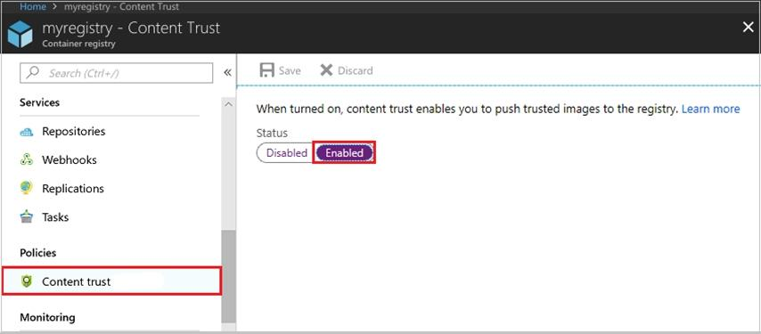
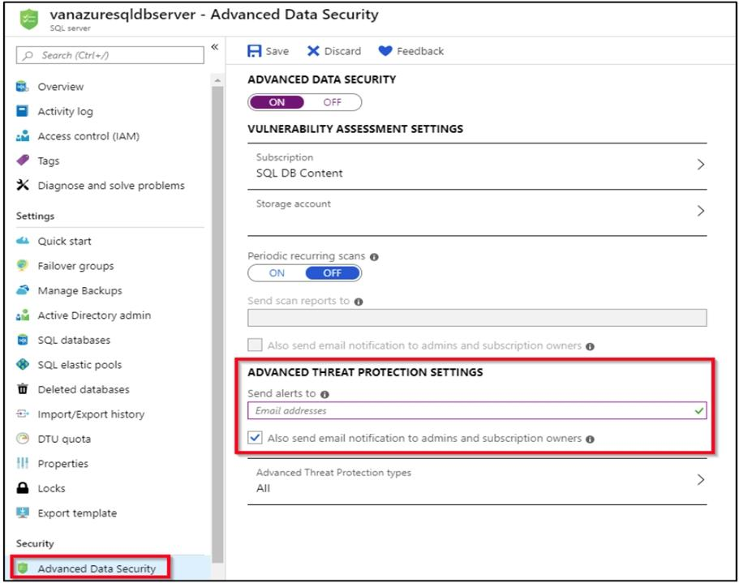
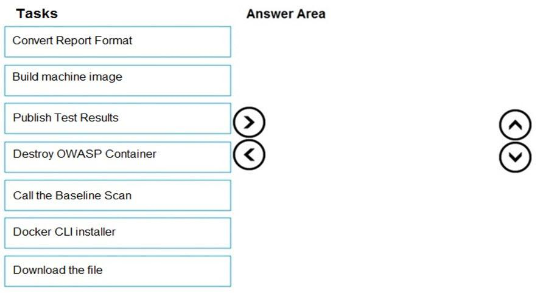
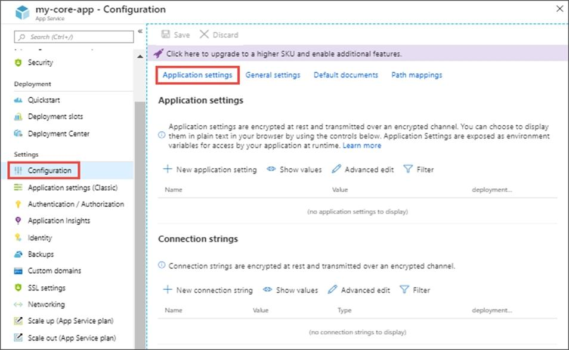
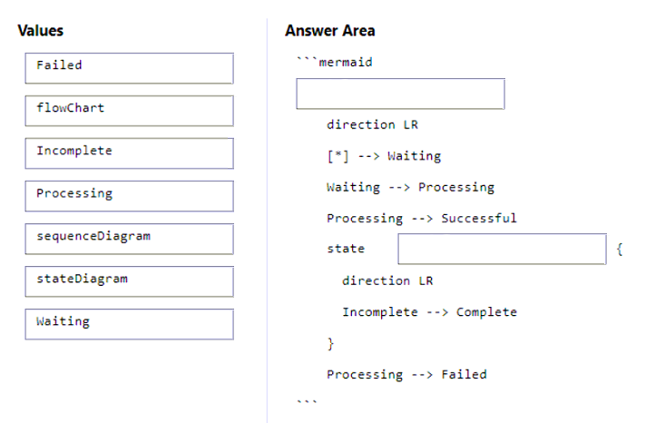

221. You are currently defining a release strategy for an app, named APP-01. The strategy should allow you to keep the time it takes to deploy new releases of the app to a minimum. The strategy should also allow you to roll back in the shortest time required. Which of the following is the release strategy you should use?

- [x] Red/Black deployment.
- [ ] Rolling deployment.
- [ ] Big Bang deployment.
- [ ] Canary deployment.

**[⬆ Back to Top](#table-of-contents)**

222. You scan a Node.js application using WhiteSource Bolt. The scan finds numerous libraries with invalid licenses, but are only used during development. You have to make sure that only production dependencies are scanned by WhiteSource Bolt. Which of the following is a command you should run?

- [ ] npm edit.
- [ ] npm publish.
- [x] npm install.
- [ ] npm update.

**[⬆ Back to Top](#table-of-contents)**

223. You use WhiteSource Bolt to scan a Node.js application. The WhiteSource Bolt scan identifies numerous libraries that have invalid licenses. The libraries are used only during development and are not part of a production deployment. You need to ensure that WhiteSource Bolt only scans production dependencies. Which two actions should you perform?

- [x] Run npm install and specify the –production flag.
- [ ] Modify the WhiteSource Bolt policy and set the action for the licenses used by the development tools to Reassign.
- [ ] Modify the devDependencies section of the project's Package.json file.
- [x] Configure WhiteSource Bolt to scan the node_modules directory only.

**[⬆ Back to Top](#table-of-contents)**

224. You are making use of Azure DevOps to configure Azure Pipelines for project, named PROJ-01. You are preparing to use a version control system that allows for source code to be stored on a managed Windows server located on the company network. Which of the following is the version control system you should use?

- [x] Github Enterprise.
- [ ] Bitbucket cloud.
- [ ] Github Professional.
- [ ] Git in Azure Repos.

**[⬆ Back to Top](#table-of-contents)**

225. You have a GitHub repository. You need to ensure that all the code in the repository is scanned for vulnerabilities. What should you use?

- [ ] Dependabot alerts.
- [ ] branch protection rules.
- [x] CodeQL actions.
- [ ] GitHub Advisory Database databases.

**[⬆ Back to Top](#table-of-contents)**

226. You have an Azure DevOps project that contains a build pipeline. The build pipeline uses approximately 50 open source libraries. You need to ensure that the project can be scanned for known security vulnerabilities in the open source libraries. What should you do?

- [x] Object to create: A build task. Service to use: WhiteSource Bolt.
- [ ] Object to create: An artifacts repository. Service to use: WhiteSource Bolt.
- [ ] Object to create: A deployment task. Service to use: A build task.
- [ ] Object to create: WhiteSource Bolt. Service to use: A build task.

**[⬆ Back to Top](#table-of-contents)**

227. You plan to store signed images in an Azure Container Registry instance named az4009940427acr1. You need to modify the SKU for az4009940427acr1 to support the planned images. The solution must minimize costs. To complete this task, sign in to the Microsoft Azure portal.

- [x] 1. Open Microsoft Azure Portal, and select the Azure Container Registry instance named az4009940427acr1. 2. Under Policies, select Content Trust > Enabled > Save.

**[⬆ Back to Top](#table-of-contents)**

228. Your company has an Azure DevOps environment that can only be accessed by Azure Active Directory users. You are instructed to make sure that the Azure DevOps environment can only be accessed from devices connected to the company's on-premises network. Which of the following actions should you take?

- [ ] Assign the devices to a security group.
- [ ] Create a GPO.
- [ ] Configure Security in Project Settings from Azure DevOps.
- [x] Configure conditional access in Azure Active Directory.

**[⬆ Back to Top](#table-of-contents)**

229. You run the Register-AzureRmAutomationDscNode command in your company's environment. You need to make sure that your company's test servers remain correctly configured, regardless of configuration drift. Solution: You set the -ConfigurationMode parameter to ApplyAndAutocorrect. Does the solution meet the goal?

- [x] Yes.
- [ ] No.

**[⬆ Back to Top](#table-of-contents)**

230. Establish if the solution satisfies the requirements. You run the Register-AzureRmAutomationDscNode command in your company's environment. You need to make sure that your company's test servers remain correctly configured, regardless of configuration drift. Solution: You set the -ConfigurationMode parameter to ApplyAndMonitor. Does the solution meet the goal?

- [ ] Yes.
- [x] No.

**[⬆ Back to Top](#table-of-contents)**

231. Establish if the solution satisfies the requirements. You run the Register-AzureRmAutomationDscNode command in your company's environment. You need to make sure that your company's test servers remain correctly configured, regardless of configuration drift. Solution: You set the -ConfigurationMode parameter to ApplyOnly. Does the solution meet the goal?

- [ ] Yes.
- [x] No.

**[⬆ Back to Top](#table-of-contents)**

232. You are currently developing a project for a client that will be managing work items via Azure DevOps. You want to make sure that the work item process you use for the client allows for requirements, change requests, risks, and reviews to be tracked. Which of the following is the option you would choose?

- [ ] Basic.
- [ ] Agile.
- [ ] Scrum.
- [x] CMMI.

**[⬆ Back to Top](#table-of-contents)**

233. The [Burnup widget] measures the elapsed time from creation of work items to their completion.

- [ ] No adjustment required.
- [x] Lead time.
- [ ] Test results trend.
- [ ] Burndown.

**[⬆ Back to Top](#table-of-contents)**

234. You are configuring project metrics for dashboards in Azure DevOps. You need to configure a chart widget that measures the elapsed time to complete work items once they become active. Which of the following is the widget you should use?

- [ ] Cumulative Flow Diagram.
- [ ] Burnup.
- [x] Cycle time.
- [ ] Burndown.

**[⬆ Back to Top](#table-of-contents)**

235. You administer an Azure DevOps project that includes package feeds. You need to ensure that developers can unlist and deprecate packages. The solution must use the principle of least privilege. Which access level should you grant to the developers?

- [ ] Collaborator.
- [x] Contributor.
- [ ] Owner.

**[⬆ Back to Top](#table-of-contents)**

236. You are creating a NuGet package. You plan to distribute the package to your development team privately. You need to share the package and test that the package can be consumed. Which four actions- should you perform in sequence?

- [ ] Box 1: Configure a self-hosted agent. Box 2: Create a new Azure Artifacts feed. Box 3: Publish a package. Box 4: Connect to an Azure Artifacts feed.
- [x] Box 1: Create a new Azure Artifacts feed. Box 2: Publish a package. Box 3: Connect to an Azure Artifacts feed. Box 4: Install a package.
- [ ] Box 1: Configure a self-hosted agent. Box 2: Publish a package. Box 3: Connect to an Azure Artifacts feed. Box 4: Create a new Azure Artifacts feed.
- [ ] Box 1: Create a new Azure Artifacts feed. Box 2: Connect to an Azure Artifacts feed. Box 3: Publish a package. Box 4: Configure a self-hosted agent.

**[⬆ Back to Top](#table-of-contents)**

237. You need to deploy Internet Information Services (IIS) to an Azure virtual machine that runs Windows Server 2019. How should you complete the Desired State Configuration (DSC) configuration script?

- [x] Box 1: Configuration. Box 2: WindowsFeature.
- [ ] Box 1: IncludeAllSubFeature. Box 2: File.
- [ ] Box 1: Configuration. Box 2: DependsOn.
- [ ] Box 1: WindowsFeature. Box 2: Configuration.

**[⬆ Back to Top](#table-of-contents)**

238. You need to configure GitHub to use Azure Active Directory (Azure AD) for authentication. What should you do first?

- [ ] Create a conditional access policy in Azure AD.
- [x] Register GitHub in Azure AD.
- [ ] Create an Azure Active Directory B2C (Azure AD B2C) tenant.
- [ ] Modify the Security settings of the GitHub organization.

**[⬆ Back to Top](#table-of-contents)**

239. You manage a website that uses an Azure SQL Database named db1 in a resource group named RG1lod11566895. You need to modify the SQL database to protect against SQL injection. To complete this task, sign in to the Microsoft Azure portal.

- [x] 1. From the Azure portal, open your server or managed instance. 2. Under the Security heading, select Security Center. 3. Select Enable Azure Defender for SQL.

**[⬆ Back to Top](#table-of-contents)**

240. Your company has a project in Azure DevOps for a new web application. The company uses ServiceNow for change management. You need to ensure that a change request is processed before any components can be deployed to the production environment. What are two ways to integrate ServiceNow into the Azure DevOps release pipeline?

- [ ] Define a deployment control that invokes the ServiceNow REST API.
- [x] Define a pre-deployment gate before the deployment to the Prod stage.
- [ ] Define a deployment control that invokes the ServiceNow SOAP API.
- [x] Define a post-deployment gate after the deployment to the QA stage.

**[⬆ Back to Top](#table-of-contents)**

241. You have an application named App1 that has a custom domain of app.contoso.com. You create a test in Azure Application Insights as shown in the following exhibit.

- [ ] The test will execute [...]: every five minutes at a random location. The test will pass if [...] within 30 seconds: all the HTML, JavaScripts, and images of App1 load.
- [x] The test will execute [...]: every five minutes per location. The test will pass if [...] within 30 seconds: all the HTML, JavaScripts, and images of App1 load.
- [ ] The test will execute [...]: the HTML of App1 and the HTML from URLs in <a> tags load. The test will pass if [...] within 30 seconds: App1 responds to an ICMP ping.
- [ ] The test will execute [...]: all the HTML, JavaScripts, and images of App1 load. The test will pass if [...] within 30 seconds: App1 responds to an ICMP ping.

**[⬆ Back to Top](#table-of-contents)**

242. You are creating a build pipeline in Azure Pipelines. You define several tests that might fail due to third-party applications. You need to ensure that the build pipeline completes successfully if the third-party applications are unavailable. What should you do?

- [ ] Configure the build pipeline to use parallel jobs.
- [x] Configure flaky tests.
- [ ] Increase the test pass percentage.
- [ ] Add the Requirements quality widget to your dashboard.

**[⬆ Back to Top](#table-of-contents)**

243. You have a build pipeline in Azure Pipelines that occasionally fails. You discover that a test measuring the response time of an API endpoint causes the failures. You need to prevent the build pipeline from failing due to the test. Which two actions should you perform?

- [ ] Set Flaky test detection to Off.
- [x] Clear Flaky tests included in test pass percentage.
- [ ] Enable Test Impact Analysis (TIA).
- [x] Manually mark the test as flaky.
- [ ] Enable test slicing.

**[⬆ Back to Top](#table-of-contents)**

244. You have a build pipeline in Azure Pipelines that uses different jobs to compile an application for 10 different architectures. The build pipeline takes approximately one day to complete. You need to reduce the time it takes to execute the build pipeline. Which two actions should you perform?

- [ ] Move to a blue/green deployment pattern.
- [ ] Create a deployment group.
- [x] Increase the number of parallel jobs.
- [ ] Reduce the size of the repository.
- [x] Create an agent pool.

**[⬆ Back to Top](#table-of-contents)**

245. You have an Azure subscription that contains a resources group named RG1. RG1 contains the following resources: Four Azure virtual machines that run Windows Server and have Internet Services (IIS) installed. SQL Server on an Azure virtual machine. An Azure Load Balancer. You need to deploy an application to the virtual machines in RG1 by using Azure Pipelines. Which four actions should you perform in sequence?

- [ ] Box 1: Create an agent pool. Box 2: Create a deployment group. Box 3: Execute the Azure Pipelines Agent extension to the virtual machines. Box 4: Add and configure a deployment group job for the pipeline.
- [ ] Box 1: Create an agent pool. Box 2: Execute the Azure Pipelines Agent extension to the virtual machines. Box 3: Create a deployment group. Box 4: .Add the Puppet Agent extension to the virtual machines
- [ ] Box 1: Add and configure a deployment group job for the pipeline. Box 2: Create an agent pool. Box 3: Create a deployment group. Box 4: Add the Puppet Agent extension to the virtual machines.
- [x] Box 1: Create a deployment group. Box 2: Add the Puppet Agent extension to the virtual machines. Box 3: Add and configure a deployment group job for the pipeline. Box 4: Execute the Azure Pipelines Agent extension to the virtual machines.

**[⬆ Back to Top](#table-of-contents)**

246. You company uses a Git source-code repository. You plan to implement Gitflow as a workflow strategy. You need to identify which branch types are used for production code and preproduction code in the strategy. Which branch type should you identify for each code type?

- [ ] Production code: Develop. Preproduction code: Feature.
- [ ] Production code: Feature. Preproduction code: Main.
- [x] Production code: Main. Preproduction code: Develop.
- [ ] Production code: Main. Preproduction code: Feature.

**[⬆ Back to Top](#table-of-contents)**

247. You have an Azure DevOps release pipeline as shown in the following exhibit. You need to complete the pipeline to configure OWASP ZAP for security testing. Which five Azure CLI tasks should you add in sequence?

- [x] Box 1: Call the Baseline Scan. Box 2: Download the file. Box 3: Convert Report Format. Box 4: Publish Test Results. Box 5: Destroy OWASP Container.
- [ ] Box 1: Docker CLI installer. Box 2: Destroy OWASP Container. Box 3: Publish Test Results. Box 4: Call the Baseline Scan. Box 5: Download the file.
- [ ] Box 1: Call the Baseline Scan. Box 2: Destroy OWASP Container. Box 3: Download the file. Box 4: Build machine image. Box 5: Publish Test Results.
- [ ] Box 1: Download the file. Box 2: Publish Test Results. Box 3: Destroy OWASP Container. Box 4: Call the Baseline Scan. Box 5: Docker CLI installer.

**[⬆ Back to Top](#table-of-contents)**

248. You need to execute inline testing of an Azure DevOps pipeline that uses a Docker deployment model. The solution must prevent the results from being published to the pipeline. What should you use for the inline testing?

- [ ] Single stage Dockerfile.
- [ ] Azure Kubernetes Service (AKS) pod.
- [x] Multi-stage Dockerfile.
- [ ] Docker Compose file.

**[⬆ Back to Top](#table-of-contents)**

249. You have an Azure Pipelines application CI/CD pipeline named Pipeline1. You need to add OWASP ZAP testing to Pipeline1. Which four actions should you add to Pipeline1 in sequence?

- [ ] Box 1: Start a container. Box 2: Run the baseline. Box 3: Run an active scan. Box 4: Report the results.
- [x] Box 1: Pull OWASP ZAP Weekly. Box 2: Start a container. Box 3: Run the baseline. Box 4: Report the results.
- [ ] Box 1: Spider the site. Box 2: Run the baseline. Box 3: Run an active scan. Box 4: Report the results.
- [ ] Box 1: Spider the site. Box 2: Run the baseline. Box 3: Pull OWASP ZAP Weekly. Box 4: Report the results.

**[⬆ Back to Top](#table-of-contents)**

250. You have an Azure subscription that contains an Azure Active Directory (Azure AD) tenant. You are configuring a build pipeline in Azure Pipelines that will include a task named Task1. Task1 will authenticate by using an Azure AD service principal. Which three values should you configure for Task1?

- [x] Tenant ID.
- [ ] Subscription ID.
- [x] Client secret.
- [x] App ID.
- [ ] Object ID.

**[⬆ Back to Top](#table-of-contents)**

251. You have a tenant in Microsoft Azure Active Directory (Azure AD), part of Microsoft Entra. The tenant contains three groups named Group1, Group2, and Group3. You create a new project in Azure DevOps named Project1. You need to secure the service connections for Project1. The solution must meet the following requirements: The members of Group1 must be able to share and unshare a service connection with other projects. The members of Group2 must be able to rename a service connection and update the description. The members of Group3 must be able to use the service connection within build or release pipelines. The principle of least privilege must be followed. Which permission should you grant to each group?

- [ ] Group 1: Project-level Administrator. Group 2: Contributor. Group 3: User.
- [ ] Group 1: Project-level Administrator. Group 2: Contributor. Group 3: Organizational-level Administrator.
- [x] Group 1: Organizational-level Administrator. Group 2: Project-level Administrator. Group 3: User.
- [ ] Group 1: Organizational-level Administrator. Group 2: Creator. Group 3: User.

**[⬆ Back to Top](#table-of-contents)**

252. You are deploying a new application that uses Azure virtual machines. You plan to use the Desired State Configuration (DSC) extension on the virtual machines. You need to ensure that the virtual machines always have the same Windows feature installed. Which three actions should you perform in sequence?

- [ ] Box 1: Create a YAML configuration file. Box 2: Load the file to Azure Blob storage. Box 3: Create a PowerShell configuration file.
- [ ] Box 1: Create a PowerShell configuration file. Box 2: Load the file to Azure Blob storage. Box 3: Configure the Custom Script Extension on the virtual machines.
- [x] Box 1: Create a PowerShell configuration file. Box 2: Load the file to Azure Blob storage. Box 3: Configure the DSC extension on the virtual machines.
- [ ] Box 1: Load the file to Azure Files. Box 2: Load the file to Azure Blob storage. Box 3: Create a PowerShell configuration file.

**[⬆ Back to Top](#table-of-contents)**

253. You are developing an application. The application source has multiple branches. You make several changes to a branch used for experimentation. You need to update the main branch to capture the changes made to the experimentation branch and override the history of the Git repository. Which Git option should you use?

- [x] Rebase.
- [ ] Fetch.
- [ ] Merge.
- [ ] Push.

**[⬆ Back to Top](#table-of-contents)**

254. You plan to update the Azure DevOps strategy of your company. You need to identify the following issues as they occur during the company's development process: Licensing violations. Prohibited libraries. Solution: You implement pre-deployment gates. Does this meet the goal?

- [ ] Yes.
- [x] No.

**[⬆ Back to Top](#table-of-contents)**

255. You plan to update the Azure DevOps strategy of your company. You need to identify the following issues as they occur during the company's development process: Licensing violations. Prohibited libraries. Solution: You implement automated security testing. Does this meet the goal?

- [ ] Yes.
- [x] No.

**[⬆ Back to Top](#table-of-contents)**

256. You plan to update the Azure DevOps strategy of your company. You need to identify the following issues as they occur during the company's development process: Licensing violations. Prohibited libraries. Solution: You implement continuous integration. Does this meet the goal?

- [ ] Yes.
- [x] No.

**[⬆ Back to Top](#table-of-contents)**

257. You plan to update the Azure DevOps strategy of your company. You need to identify the following issues as they occur during the company's development process: Licensing violations. Prohibited libraries. Solution: You implement continuous deployment. Does this meet the goal?

- [ ] Yes.
- [x] No.

**[⬆ Back to Top](#table-of-contents)**

258. You plan to create alerts that will be triggered based on the page load performance of a home page. You have the Application Insights log query shown in the following exhibit.

- [x] To create an alert based on the page load experience of most users, the alerting level must be based on [...]: percentile_duration_95. To only create an alert when authentication error occurs on the server, the query must be filtered on [...]: resultCode.
- [ ] To create an alert based on the page load experience of most users, the alerting level must be based on [...]: percentile_duration_95. To only create an alert when authentication error occurs on the server, the query must be filtered on [...]: success.
- [ ] To create an alert based on the page load experience of most users, the alerting level must be based on [...]: success. To only create an alert when authentication error occurs on the server, the query must be filtered on [...]: percentile_duration_95.
- [ ] To create an alert based on the page load experience of most users, the alerting level must be based on [...]: percentile_duration_50. To only create an alert when authentication error occurs on the server, the query must be filtered on [...]: source.

**[⬆ Back to Top](#table-of-contents)*

259. You plan to deploy a runbook that will create Azure AD user accounts. You need to ensure that runbooks can run the Azure PowerShell cmdlets for Azure Active Directory. To complete this task, sign in to the Microsoft Azure portal.

- [x] 1. Select the Automation account with the runbook. 2. select Modules, the "browse gallery". 3. search "AzureAD" and install it.

**[⬆ Back to Top](#table-of-contents)**

260. You are creating a container for an ASP.NET Core app. You need to create a Dockerfile file to build the image. The solution must ensure that the size of the image is minimized. How should you configure the file?

- [ ] Box 1: mcr.microsoft.com/dotnet/sdk:5.0. Box 2: dotnet restore. Box 3: mcr.microsoft.com/dotnet/aspnet:5.0.
- [ ] Box 1: mcr.microsoft.com/dotnet/aspnet:5.0. Box 2: mcr.microsoft.com/dotnet/sdk:5.0. Box 3: dotnet restore.
- [x] Box 1: mcr.microsoft.com/dotnet/sdk:5.0. Box 2: dotnet publish -c Release -o out. Box 3: mcr.microsoft.com/dotnet/aspnet:5.0.
- [ ] Box 1: dotnet restore. Box 2: mcr.microsoft.com/dotnet/sdk:5.0. Box 3: mcr.microsoft.com/dotnet/aspnet:5.0.

**[⬆ Back to Top](#table-of-contents)**

261. You are creating a container for an ASP.NET Core app. You need to create a Dockerfile file to build the image. The solution must ensure that the size of the image is minimized. How should you configure the file?

- [ ] Box 1: Microsoft/dotnet:2.2-sdk. Box 2: dotnet restore. Box 3: microsoft/dotnet:2.2-aspnetcore-runtime.
- [ ] Box 1: microsoft/dotnet:2.2-aspnetcore-runtime. Box 2: Microsoft/dotnet:2.2-sdk. Box 3: dotnet restore.
- [x] Box 1: Microsoft/dotnet:2.2-sdk. Box 2: dotnet publish -c Release -o out. Box 3: microsoft/dotnet:2.2-aspnetcore-runtime.
- [ ] Box 1: dotnet restore. Box 2: Microsoft/dotnet:2.2-sdk. Box 3: microsoft/dotnet:2.2-aspnetcore-runtime.

**[⬆ Back to Top](#table-of-contents)**

262. Your company uses ServiceNow for incident management. You develop an application that runs on Azure. The company needs to generate a ticket in ServiceNow when the application fails to authenticate. Which Azure Log Analytics solution should you use?

- [ ] Application Insights Connector.
- [ ] Automation & Control.
- [x] IT Service Management Connector (ITSM).
- [ ] Insight & Analytics.

**[⬆ Back to Top](#table-of-contents)**

263. You need to configure an Azure web app named az400-123456789-main to contain an environmental variable named 'MAX_ITEMS'. The environmental variable must have a value of 50. To complete this task, sign in to the Microsoft Azure portal.

- [x] 1. In the Azure portal, navigate to the az400-123456789-main app's management page. In the app's left menu, click Configuration > Application settings. 2. Click New Application settings. 3. Enter the following: Name: MAX_ITEMS. Value: 50.

**[⬆ Back to Top](#table-of-contents)**

264. You need to prepare a network security group (NSG) named az400-123456789-nsg1 to host an Azure DevOps pipeline agent. The solution must allow only the required outbound port for Azure DevOps and deny all other inbound and outbound access to the Internet. To complete this task, sign in to the Microsoft Azure portal.

- [x] 1. Open Microsoft Azure Portal and Log into your Azure account. 2. Select network security group (NSG) named az400-123456789-nsg1. 3. Select Settings, Outbound security rules, and click Add 4. Click Advanced. 5. Change the following settings: Name: Allow-Outbound. Priority: 100 (or any number lower than 65000). Source: Any. Source Port Range: *. Destination: Any. Destination Port Range: 443. Protocol: TCP. Action: Allow.

**[⬆ Back to Top](#table-of-contents)**

265. You plan to create a release pipeline that will deploy Azure resources by using Azure Resource Manager templates. The release pipeline will create the following resources: Two resource groups. Four Azure virtual machines in one resource group. Two Azure SQL databases in other resource group. You need to recommend a solution to deploy the resources. Solution: Create a single standalone template that will deploy all the resources. Does this meet the goal?

- [ ] Yes.
- [x] No.

**[⬆ Back to Top](#table-of-contents)**

266. You plan to create a release pipeline that will deploy Azure resources by using Azure Resource Manager templates. The release pipeline will create the following resources: Two resource groups. Four Azure virtual machines in one resource group. Two Azure SQL databases in other resource group. You need to recommend a solution to deploy the resources. Solution: Create two standalone templates, each of which will deploy the resources in its respective group. Does this meet the goal?

- [x] Yes.
- [ ] No.

**[⬆ Back to Top](#table-of-contents)**

267. You plan to create a release pipeline that will deploy Azure resources by using Azure Resource Manager templates. The release pipeline will create the following resources: Two resource groups. Four Azure virtual machines in one resource group. Two Azure SQL databases in other resource group. You need to recommend a solution to deploy the resources. Solution: Create a main template that will deploy the resources in one resource group and a nested template that will deploy the resources in the other resource group. Does this meet the goal?

- [ ] Yes.
- [x] No.

**[⬆ Back to Top](#table-of-contents)**

268. When moving to Azure DevOps, JIRA must be replaced with the build pipelines Azure [DevOps] service.

- [ ] No adjustment required.
- [ ] Repos.
- [ ] Release pipelines.
- [x] Boards.

**[⬆ Back to Top](#table-of-contents)**

269. You currently use JIRA, Jenkins, and Octopus as part of your DevOps processes. You plan to use Azure DevOps to replace these tools. Which Azure DevOps service should you use to replace each tool?

- [ ] JIRA: Release pipelines. Jenkins: Repos. Octopus: Build pipelines.
- [ ] JIRA: Repos. Jenkins: Release pipelines. Octopus: Repos.
- [ ] JIRA: Build pipelines. Jenkins: Boards. Octopus: Build pipelines.
- [x] JIRA: Boards. Jenkins: Build pipelines. Octopus: Release pipelines.

**[⬆ Back to Top](#table-of-contents)**

270. You are developing a full Microsoft .NET Framework solution that includes unit tests. You need to configure SonarQube to perform a code quality validation of the C# code as part of the build pipelines. Which four tasks should you perform in sequence?

- [ ] Box 1: Visual Studio Build. Box 2: Run Code Analysis. Box 3: Publish Build Artifacts. Box 4: Prepare Analysis Configuration.
- [ ] Box 1: Visual Studio Test. Box 2: Visual Studio Build. Box 3: Prepare Analysis Configuration. Box 4: Visual Studio Test.
- [ ] Box 1: Publish Build Artifacts. Box 2: Prepare Analysis Configuration. Box 3: Visual Studio Build. Box 4: Run Code Analysis.
- [x] Box 1: Prepare Analysis Configuration. Box 2: Visual Studio Build. Box 3: Visual Studio Test. Box 4: Run Code Analysis.

**[⬆ Back to Top](#table-of-contents)**

271. To compile an Internet Information Services (IIS) web application that runs docker, you should use a [Default build agent pool].

- [ ] No adjustment required.
- [x] Hosted Windows Container.
- [ ] Hosted.
- [ ] Hosted macOS

**[⬆ Back to Top](#table-of-contents)**

272. To deploy an application to a number of Azure virtual machines, you should create a [universal] group.

- [ ] No adjustment required.
- [ ] Security.
- [x] Deployment.
- [ ] Resource.

**[⬆ Back to Top](#table-of-contents)**

273. [Black Duck] can be used to make sure that all the open source libraries conform to your company's licensing criteria.

- [x] No adjustment required.
- [ ] Maven.
- [ ] Bamboo.
- [ ] CMAKE.

**[⬆ Back to Top](#table-of-contents)**

274. You manage an Azure web app that supports an e-commerce website. You need to increase the logging level when the web app exceeds normal usage patterns. The solution must minimize administrative overhead. Which two resources should you include in the solution?

- [x] Azure Automation runbook.
- [x] Azure Monitor alert that has a dynamic threshold.
- [ ] Azure Monitor alert that has a static threshold.
- [ ] Azure Monitor autoscale settings.
- [ ] Azure Monitor alert that uses an action group that has an email action.

**[⬆ Back to Top](#table-of-contents)**

275. You have an Azure Kubernetes Service (AKS) pod. You need to configure a probe to perform the following actions: Confirm that the pod is responding to service requests. Check the status of the pod four times a minute. Initiate a shutdown if the pod is unresponsive. How should you complete the YAML configuration file?

- [ ] Box 1: readinessProbe: 15. Box 2: timeoutSeconds: 15.
- [x] Box 1: livenessProbe:. Box 2: periodSeconds: 15.
- [ ] Box 1: ShutdownProbe:. Box 2: initialDelaySeconds: 15.
- [ ] Box 1: readinessProbe:. Box 2: periodSeconds: 15.

**[⬆ Back to Top](#table-of-contents)**

276. You need to create an instance of Azure Application Insights named az400-123456789-main and configure the instance to receive telemetry data from an Azure web app named az400-123456789-main. To complete this task, sign in to the Microsoft Azure portal.

- [x] 1. Login to Az Portal 2. Create an App Insights resource. 3. Locate your Az Web App, if it does not exist, create it. 4. Go to the resource, to Settings, to Application Insights and enable it. Select the App Insights resource you created earlier and Apply.

**[⬆ Back to Top](#table-of-contents)**

277. Your company wants to use Azure Application Insights to understand how user behaviors affect an application. Which Application Insights tool should you use to analyze each behavior?

- [ ] Feature usage: Impact. Number of people who used the actions and its features: Impact. The effect that the performance of the application has on the usage of a page or a feature: User Flows.
- [x] Feature usage: Users. Number of people who used the actions and its features: User Flows. The effect that the performance of the application has on the usage of a page or a feature: Impact.
- [ ] Feature usage: User Flows. Number of people who used the actions and its features: Users. The effect that the performance of the application has on the usage of a page or a feature: Impact.
- [ ] Feature usage: Users. Number of people who used the actions and its features: User Flows. The effect that the performance of the application has on the usage of a page or a feature: Impact.

**[⬆ Back to Top](#table-of-contents)**

278. You have an Azure DevOps project named Project1 and an Azure subscription named Sub1. Sub1 contains an Azure virtual machine scale set named VMSS1. VMSS1 hosts a web application named WebApp1. WebApp1 uses stateful sessions. The WebApp1 installation is managed by using the Custom Script extension. The script resides in an Azure Storage account named sa1. You plan to make a minor change to a UI element of WebApp1 and to gather user feedback about the change. You need to implement limited user testing for the new version of WebApp1 on VMSS1. Which three actions should you perform?

- [ ] Modify the load balancer settings of VMSS1.
- [ ] Redeploy VMSS1.
- [x] Upload a custom script file to sa1.
- [x] Modify the Custom Script extension settings of VMSS1.
- [x] Update the configuration of a virtual machine in VMSS1.

**[⬆ Back to Top](#table-of-contents)**

279. You have several Azure virtual machines that run Windows Server 2019. You need to identify the distinct event IDs of each virtual machine as shown in the following table. How should you complete the Azure Monitor query?

- [ ] Box 1: count(). Box 2: summarize.
- [ ] Box 1: mv-expand. Box 2: render.
- [ ] Box 1: summarize. Box 2: makelist(EventID).
- [x] Box 1: summarize. Box 2: makeset(EventID).

**[⬆ Back to Top](#table-of-contents)**

280. You have a GitHub repository that contains the source code for an app named App1. You need to create process documentation for App1. The solution must include a diagram that displays the relationships between the phases of App1 as shown in the following exhibit. How should you complete the markdown code?

- [ ] Box 1: sequenceDiagram. Box 2: flowChart.
- [x] Box 1: stateDiagram. Box 2: Processing.
- [ ] Box 1: stateDiagram. Box 2: Failed.
- [ ] Box 1: sequenceDiagram. Box 2: Waiting.

**[⬆ Back to Top](#table-of-contents)**

281. You have an Azure web app named Webapp1. You need to use an Azure Monitor query to create a report that details the top 10 pages of Webapp1 that failed. How should you complete the query?

- [x] Box 1: requests. Box 2: success == false.
- [ ] Box 1: itemType == "availabilityResult". Box 2: traces.
- [ ] Box 1: pageViews. Box 2: success == false.
- [ ] Box 1: traces. Box 2: requests.

**[⬆ Back to Top](#table-of-contents)**

282. You are monitoring the health and performance of an Azure web app by using Azure Application Insights. You need to ensure that an alert is sent when the web app has a sudden rise in performance issues and failures. What should you use?

- [ ] Custom events.
- [ ] Application Insights Profiler.
- [ ] Usage analysis.
- [x] Smart Detection.
- [ ] Continuous export.

**[⬆ Back to Top](#table-of-contents)**

283. You have a project in Azure DevOps named Contoso App that contains pipelines in Azure Pipelines for GitHub repositories. You need to ensure that developers receive Microsoft Teams notifications when there are failures in a pipeline of Contoso App. What should you run in Teams?

- [ ] Box 1: signin. Box 2: https://dev.azure.com/contoso/contoso-app/_work-items.
- [ ] Box 1: feedback. Box 2: https://dev.azure.com/contoso/contoso-app/_packaging.
- [ ] Box 1: subscriptions. Box 2: https://dev.azure.com/contoso/contoso-app/_work-items.
- [x] Box 1: subscribe. Box 2: https://dev.azure.com/contoso/contoso-app/.

**[⬆ Back to Top](#table-of-contents)**

284. You are integrating Azure Pipelines and Microsoft Teams. You install the Azure Pipelines app in Microsoft Teams. You have an Azure DevOps organization named Contoso that contains a project name Project1. You subscribe to Project1 in Microsoft Teams. You need to ensure that you only receive events about failed builds in Microsoft Teams. What should you do first?

- [ ] From Microsoft Teams, run @azure pipelines subscribe https://dev.azure.com/Contoso/Project1.
- [ ] From Azure Pipelines, add a Publish Build Artifacts task to Project1.
- [x] From Microsoft Teams, run @azure pipelines subscriptions.
- [ ] From Azure Pipelines, enable continuous integration for Project1.

**[⬆ Back to Top](#table-of-contents)**

285. You have an Azure DevOps organization named Contoso. You need to receive Microsoft Teams notifications when work items are updated. What should you do?

- [ ] From Azure DevOps, configure a service hook subscription.
- [x] From Microsoft Teams, configure a connector.
- [ ] From the Microsoft Teams admin center, configure external access.
- [ ] From Microsoft Teams, add a channel.
- [ ] From Azure DevOps, install an extension.

**[⬆ Back to Top](#table-of-contents)**

286. You create an alert rule in Azure Monitor as s-hown in the following exhibit. Which action will trigger an alert?

- [x] Failed attempt to delete the ASP-9bb7 resource.
- [ ] Change to a role assignment for the ASP-9bb7 resource.
- [ ] Successful attempt to delete the ASP-9bb7 resource.
- [ ] Failed attempt to scale up the ASP-9bb7 resource.

**[⬆ Back to Top](#table-of-contents)**

287. You have a web app hosted on Azure App Service. The web app stores data in an Azure SQL database. You need to generate an alert when there are 10,000 simultaneous connections to the database. The solution must minimize development effort. Which option should you select in the Diagnostics settings of the database?

- [x] Send to Log Analytics.
- [ ] Stream to an event hub.
- [ ] Archive to a storage account.

**[⬆ Back to Top](#table-of-contents)**

288. You have an Azure DevOps organization named Contoso and an Azure subscription. The subscription contains an Azure virtual machine scale set named VMSS1 that is configured for autoscaling. You have a project in Azure DevOps named Project1. Project1 is used to build a web app named App1 and deploy App1 to VMSS1. You need to ensure that an email alert is generated whenever VMSS1 scales in or out. Solution: From Azure Monitor, configure the autoscale settings.

- [ ] Yes.
- [x] No.

**[⬆ Back to Top](#table-of-contents)**

289. You configure an Azure Application Insights availability test. You need to notify the customer services department at your company by email when availability is degraded. You create an Azure logic app that will handle the email and follow up actions. Which type of trigger should you use to invoke the logic app?

- [ ] HTTPWebhook trigger.
- [ ] HTTP trigger.
- [x] Request trigger.
- [ ] ApiConnection trigger.

**[⬆ Back to Top](#table-of-contents)**

290. You have an Azure DevOps organization named Contoso and an Azure subscription. You use Azure DevOps to build a containerized app named App1 and deploy App1 to an Azure container instance named ACI1. You need to restart ACI1 when App1 stops responding. What should you do?

- [x] Add a liveness probe to the YAML configuration of App1.
- [ ] Add a readiness probe to the YAML configuration of App1.
- [ ] Use Connection Monitor in Azure Network Watcher.
- [ ] Use IP flow verify in Azure Network Watcher.

**[⬆ Back to Top](#table-of-contents)**

291. You use Azure Pipelines to automate Continuous Integration/Continuous Deployment (CI/CD) for an Azure web app named WebApp1. You configure an Azure Monitor alert that is triggered when WebApp1 generates an error. You need to configure the alert to forward details of the error to a third-party system. The solution must minimize administrative effort. Which three actions should you perform in sequence?

- [x] Box 1: Create an Azure logic app. Box 2: Select the HTTP request trigger. Box 3: Update the action group in Azure Monitor.
- [ ] Box 1: Select the HTTP request trigger. Box 2: Select the Recurrence trigger. Box 3: Update the action group in Azure Monitor.
- [ ] Box 1: Select the HTTP request trigger. Box 2: Select the Recurrence trigger. Box 3: Create an Azure logic app.
- [ ] Box 1: Update the action group in Azure Monitor. Box 2: Create an Azure logic app. Box 3: Select the Recurrence trigger.

**[⬆ Back to Top](#table-of-contents)**

292. Your company has an Azure subscription named Subscription1. Subscription1 is associated to an Azure Active Directory tenant named contoso.com. You need to provision an Azure Kubernetes Services (AKS) cluster in Subscription1 and set the permissions for the cluster by using RBAC roles that reference the identities in contoso.com. Which three objects should you create in sequence?

- [ ] Box 1: a cluster. Box 2: an RBAC binding. Box 3: a system-assigned managed identity.
- [ ] Box 1: a cluster. Box 2: a system-assigned managed identity. Box 3: an RBAC binding.
- [x] Box 1: an application registration in contoso.com. Box 2: a cluster. Box 3: an RBAC binding.
- [ ] Box 1: a system-assigned managed identity. Box 2: an RBAC binding. Box 3: a cluster.

**[⬆ Back to Top](#table-of-contents)**

293. You have an Azure DevOps organization named Contoso and an Azure subscription. The subscription contains an Azure virtual machine scale set named VMSS1 that is configured for autoscaling. You use Azure DevOps to build a web app named App1 and deploy App1 to VMSS1. App1 is used heavily and has usage patterns that vary on a weekly basis. You need to recommend a solution to detect an abnormal rise in the rate of failed requests to App1. The solution must minimize administrative effort. What should you include in the recommendation?

- [x] Smart Detection feature in Azure Application Insights.
- [ ] Failures feature in Azure Application Insights.
- [ ] Azure Service Health alert.
- [ ] Azure Monitor alert that uses an Azure Log Analytics query.

**[⬆ Back to Top](#table-of-contents)**

294. You manage build and release pipelines by using Azure DevOps. Your entire managed environment resides in Azure. You need to configure a service endpoint for accessing Azure Key Vault secrets. The solution must meet the following requirements: Ensure that the secrets are retrieved by Azure DevOps. Avoid persisting credentials and tokens in Azure DevOps. How should you configure the service endpoint?

- [ ] Service connection type: Managed Service Identity Authentication. Authentication/authorization method for the connection: Team Foundation Server / Azure Pipelines service connection.
- [ ] Service connection type: Team Foundation Server / Azure Pipelines service connection. Authentication/authorization method for the connection: Azure Active Directory Auth 2.0.
- [ ] Service connection type: Team Foundation Server / Azure Pipelines service connection. Authentication/authorization method for the connection: Managed Service Identity Authentication.
- [x] Service connection type: Azure Resource Manager. Authentication/authorization method for the connection: Managed Service Identity Authentication.

**[⬆ Back to Top](#table-of-contents)**

295. You have the following Azure policy. You assign the policy to the Tenant root group. What is the effect of the policy?

- [ ] Prevents all HTTP traffic to existing Azure Storage accounts.
- [x] Ensures that all traffic to new Azure Storage accounts is encrypted.
- [ ] Prevents HTTPS traffic to new Azure Storage accounts when the accounts are accessed over the Internet.
- [ ] Ensures that all data for new Azure Storage accounts is encrypted at rest.

**[⬆ Back to Top](#table-of-contents)**

296. You use GitHub Enterprise Server as a source code repository. You create an Azure DevOps organization named Contoso. In the Contoso organization, you create a project named Project1. You need to link GitHub commits, pull requests, and issues to the work items of Project1. The solution must use OAuth-based authentication. Which three actions should you perform in sequence?

- [ ] Box 1: From Project Settings in Azure DevOps, add a GitHub connection. Box 2: From Organization settings in Azure DevOps, add an Auth configuration. Box 3: From Developer settings in GitHub Enterprise Server, register a new OAuth app.
- [ ] Box 1: From Organization settings in Azure DevOps, add an Auth configuration. Box 2: From Developer settings in GitHub Enterprise Server, register a new OAuth app. Box 3: From Project Settings in Azure DevOps, add a GitHub connection.
- [ ] Box 1: From Developer settings in GitHub Enterprise Server, generate a private kev. Box 2: From Organization settings in Azure DevOps, connect to Azure Active Directory (Azure AD). Box 3: From Developer settings in GitHub Enterprise Server, register a new OAuth app.
- [x] Box 1: From Developer settings in GitHub Enterprise Server, register a new OAuth app. Box 2: From Organization settings in Azure DevOps, add an Auth configuration. Box 3: From Project Settings in Azure DevOps, add a GitHub connection.

**[⬆ Back to Top](#table-of-contents)**

297. You use Exabeam Fusion SIEM and the Azure cloud platform. You need to integrate Exabeam and Azure. The solution must use OAuth authentication. Which three actions should you perform in sequence?

- [ ] Box 1: Create a client secret. Box 2: Register an Exabeam application in Microsoft Azure Active Directory (Azure AD), part of Microsoft Entra. Box 3: Configure the Exabeam Azure cloud connector.
- [x] Box 1: Register an Exabeam application in Microsoft Azure Active Directory (Azure AD), part of Microsoft Entra. Box 2: Configure the Exabeam Azure cloud connector. Box 3: Configure API permissions.
- [ ] Box 1: Create a client secret. Box 2: Register an Exabeam application in Microsoft Azure Active Directory (Azure AD), part of Microsoft Entra. Box 3: Upload a certificate.
- [ ] Box 1: Configure API permissions. Box 2: Register an Exabeam application in Microsoft Azure Active Directory (Azure AD), part of Microsoft Entra. Box 3: Configure the Exabeam Azure cloud connector.

**[⬆ Back to Top](#table-of-contents)**

298. You have a private project in Azure DevOps and two users named User1 and User2. You need to add User1 and User2 to groups to meet the following requirements: User1 must be able to create a code wiki. User2 must be able to edit wiki pages. The solution must use the principle of least privilege. To which group should you add each user?

- [ ] User 1: Project Valid Users. User 2: Project Administrators.
- [x] User 1: Project Administrators. User 2: Contributors.
- [ ] User 1: Project Administrators. User 2: Stakeholders.
- [ ] User 1: Contributors. User 2: Project Administrators.

**[⬆ Back to Top](#table-of-contents)**

299. You have a project in Azure DevOps that has three teams as shown in the Teams exhibit. You create a new dashboard named Dash1. You configure the dashboard permissions for the Contoso project as shown in the Permissions exhibit. All other permissions have the default values set. Web Team can delete Dash1.

- [ ] Yes.
- [x] No.

**[⬆ Back to Top](#table-of-contents)**

300. You have a project in Azure DevOps that has three teams as shown in the Teams exhibit. You create a new dashboard named Dash1. You configure the dashboard permissions for the Contoso project as shown in the Permissions exhibit. All other permissions have the default values set. Contoso Team can view Dash1.

- [x] Yes.
- [ ] No.

**[⬆ Back to Top](#table-of-contents)**

301. You have a project in Azure DevOps that has three teams as shown in the Teams exhibit. You create a new dashboard named Dash1. You configure the dashboard permissions for the Contoso project as shown in the Permissions exhibit. All other permissions have the default values set. Project administrators can create new dashboards.

- [x] Yes.
- [ ] No.

**[⬆ Back to Top](#table-of-contents)**

302. You have a project in Azure DevOps named Project1 that contains two Azure DevOps pipelines named Pipeline1 and Pipeline2. You need to ensure that Pipeline1 can deploy code successfully to an Azure web app named webapp1. The solution must ensure that Pipeline2 does not have permission to webapp1. Which three actions should you perform in sequence?

- [ ] Box 1: Create a service principal in Azure Active Directory. Box 2: In Project1, create a service connection. Box 3: In Project1, configure permissions.
- [ ] Box 1: In Project1, create a service connection. Box 2: Create a service principal in Azure Active Directory. Box 3: Create a system-assigned managed identity in Azure Active Directory.
- [ ] Box 1: In Pipeline1, create a variable. Box 2: Create a service principal in Azure Active Directory. Box 3: Create a service principal in Azure Active Directory.
- [x] Box 1: Create a service principal in Azure Active Directory. Box 2: In Project1, create a service connection. Box 3: In Pipeline1, authorize the service connection.

**[⬆ Back to Top](#table-of-contents)**

303. You have an Azure subscription that contains resources in several resource groups. You need to design a monitoring strategy that will provide a consolidated view. The solution must support the following requirements: Support role-based access control (RBAC) by using Azure Active Directory (Azure AD) identifies. Include visuals from Azure Monitor that are generated by using the Kusto query language. Support documentation written in markdown. Use the latest data available for each visual. What should you use to create the consolidated view?

- [ ] Azure Monitor.
- [ ] Microsoft Power BI.
- [ ] Azure Data Explorer.
- [x] Azure dashboards.

**[⬆ Back to Top](#table-of-contents)**

304. You are building an ASP.NET Core application. You plan to create an application utilization baseline by capturing telemetry data. You need to add code to the application to capture the telemetry data. The solution must minimize the costs of storing the telemetry data. Which two actions should you perform?

- [ ] Add the <InitialSamplingPercentage>99</InitialSamplingPercentage> parameter to the ApplicationInsights.config file.
- [ ] From the code of the application, enable adaptive sampling.
- [x] From the code of the application, add Azure Application Insights telemetry.
- [ ] Add the <MaxTelemetryItemsPerSecond>5</MaxTelemetryItemsPerSecond> parameter to the ApplicationInsights.config file.
- [x] From the code of the application, disable adaptive sampling.

**[⬆ Back to Top](#table-of-contents)**

305. Your company uses the following resources: Windows Server 2019 container images hosted in an Azure Container Registry. Azure virtual machines that run the latest version of Ubuntu. An Azure Log Analytics workspace. Azure Active Directory (Azure AD). An Azure key vault. For which two resources can you receive vulnerability assessments in Azure Security Center?

- [ ] Azure Log Analytics workspace.
- [ ] Azure key vault.
- [x] Azure virtual machines that run the latest version of Ubuntu.
- [ ] Azure Active Directory (Azure AD).
- [x] Windows Server 2019 container images hosted in the Azure Container Registry.

**[⬆ Back to Top](#table-of-contents)**

306. Your company uses GitHub for source control. GitHub repositories store source code and store process documentation. The process documentation is saved as Microsoft Word documents that contain simple flow charts stored as .bmp files. You need to optimize the integration and versioning of the process documentation and the flow charts. The solution must meet the following requirements: Store documents as plain text. Minimize the number of files that must be maintained. Simplify the modification, merging, and reuse of flow charts. Simplify the modification, merging, and reuse of documents.

- [ ] Convert the .docx files to: LaTex Typesetting (.tex). Convert the flow charts to: Markdown (.md).
- [x] Convert the .docx files to: Markdown (.md). Convert the flow charts to: Mermaid diagrams.
- [ ] Convert the .docx files to: Portable Document Format (.pdf). Convert the flow charts to: Portable Network Graphics (.png).
- [ ] Convert the .docx files to: LaTex Typesetting (tex). Convert the flow charts to: Markdown (.md).

**[⬆ Back to Top](#table-of-contents)**

307. You have a project in Azure DevOps that uses packages from multiple public feeds. Some of the feeds are unreliable. You need to consolidate the packages into a single feed. Which three actions should you perform in sequence?

- [ ] Box 1: Create a Microsoft Visual Studio project that includes all the packages. Box 2: Create a NuGet package. Box 3: Create an Azure Artifacts feed that uses upstream sources.
- [ ] Box 1: Create a NuGet package. Box 2: Create an Azure Artifacts feed that uses upstream sources. Box 3: Create a Microsoft Visual Studio project that includes all the packages.
- [x] Box 1: Create an Azure Artifacts feed that uses upstream sources. Box 2: Modify the configuration files to reference the Azure Artifacts feed. Box 3: Run an initial package restore.
- [ ] Box 1: Create a Microsoft Visual Studio project that includes all the packages. Box 2: Create a NuGet package. Box 3: Create a NuGet package.

**[⬆ Back to Top](#table-of-contents)**

308. You use Azure Pipelines to manage build pipelines, GitHub to store source code, and Dependabot to manage dependencies. You have an app named App1. Dependabot detects a dependency in App1 that requires an update. What should you do first to apply the update?

- [ ] Create a pull request.
- [x] Approve the pull request.
- [ ] Create a branch.
- [ ] Perform a commit.

**[⬆ Back to Top](#table-of-contents)**

309. You are designing a configuration management solution to support five apps hosted on Azure App Service. Each app is available in the following three environments: development, test, and production. You need to recommend a configuration management solution that meets the following requirements: Supports feature flags. Tracks configuration changes from the past 30 days. Stores hierarchically structured configuration values. Controls access to the configurations by using role-based access control (RBAC) permissions. Stores shared values as key/value pairs that can be used by all the apps. Which Azure service should you recommend as the configuration management solution?

- [ ] Azure Cosmos DB.
- [ ] Azure App Service.
- [x] Azure App Configuration.
- [ ] Azure Key Vault.

**[⬆ Back to Top](#table-of-contents)**

310. You have a containerized solution that runs in Azure Container Instances. The solution contains a frontend container named App1 and a backend container named DB1. DB1 loads a large amount of data during startup. You need to verify that DB1 can handle incoming requests before users can submit requests to App1. What should you configure?

- [ ] Liveness probe.
- [ ] Performance log.
- [x] Readiness probe.
- [ ] Azure Load Balancer health probe.

**[⬆ Back to Top](#table-of-contents)**

311. You are designing a strategy to monitor the baseline metrics of Azure virtual machines that run Windows Server. You need to collect detailed data about the processes running in the guest operating system. Which two agents should you deploy?

- [ ] Telegraf agent.
- [x] Azure Log Analytics agent.
- [ ] Azure Network Watcher Agent for Windows.
- [x] Dependency agent.

**[⬆ Back to Top](#table-of-contents)**

312. You plan to provision a self-hosted Linux agent. Which authentication mechanism should you use to register the self-hosted agent?

- [x] Personal Access Token (PAT).
- [ ] SSH key.
- [ ] Alternate credentials.
- [ ] Certificate.

**[⬆ Back to Top](#table-of-contents)**

313. You are building a Microsoft ASP.NET application that requires authentication. You need to authenticate users by using Azure Active Directory (Azure AD). What should you do first?

- [ ] Assign an enterprise application to users and groups.
- [x] Create an app registration in Azure AD.
- [ ] Configure the application to use a SAML endpoint.
- [ ] Create a new OAuth token from the application.
- [ ] Create a membership database in an Azure SQL database.

**[⬆ Back to Top](#table-of-contents)**

314. You have an Azure DevOps organization named Contoso. You need to recommend an authentication mechanism that meets the following requirements: Supports authentication from Git. Minimizes the need to provide credentials during authentication. What should you recommend?

- [x] Personal Access Tokens (PATs) in Azure DevOps.
- [ ] Alternate credentials in Azure DevOps.
- [ ] user accounts in Azure Active Directory (Azure AD).
- [ ] managed identities in Azure Active Directory (Azure AD).

**[⬆ Back to Top](#table-of-contents)**

315. You have an existing project in Azure DevOps. You plan to integrate GitHub as the repository for the project. You need to ensure that Azure Pipelines runs under the Azure Pipelines identity. Which authentication mechanism should you use?

- [ ] Personal Access Token (PAT).
- [x] GitHub App.
- [ ] Azure Active Directory (Azure AD).
- [ ] OAuth.

**[⬆ Back to Top](#table-of-contents)**

316. The lead developer at your company reports that adding new application features takes longer than expected due to a large accumulated technical debt. You need to recommend changes to reduce the accumulated technical debt. Solution: You recommend reducing the code coupling and the dependency cycles. Does this meet the goal?

- [x] Yes.
- [ ] No.

**[⬆ Back to Top](#table-of-contents)**

317. The lead developer at your company reports that adding new application features takes longer than expected due to a large accumulated technical debt. You need to recommend changes to reduce the accumulated technical debt. Solution: You recommend increasing the test coverage. Does this meet the goal?

- [ ] Yes.
- [x] No.

**[⬆ Back to Top](#table-of-contents)**

318. The lead developer at your company reports that adding new application features takes longer than expected due to a large accumulated technical debt. You need to recommend changes to reduce the accumulated technical debt. Solution: You recommend reducing the code complexity. Does this meet the goal?

- [x] Yes.
- [ ] No.

**[⬆ Back to Top](#table-of-contents)**

319. The lead developer at your company reports that adding new application features takes longer than expected due to a large accumulated technical debt. You need to recommend changes to reduce the accumulated technical debt. Solution: You recommend increasing the code duplication. Does this meet the goal?

- [ ] Yes.
- [x] No.

**[⬆ Back to Top](#table-of-contents)**

320. You use GitHub for source control. A file that contains sensitive data is committed accidentally to the Git repository of a project. You need to delete the file and its history form the repository. Which two tools can you use?

- [x] Git filter-branch command.
- [x] BFG Repo-Cleaner.
- [ ] Git rebase command.
- [ ] GitHub Desktop.

**[⬆ Back to Top](#table-of-contents)**

321. You manage source code control and versioning by using GitHub. A large file is committed to a repository accidentally. You need to reduce the size of the repository. The solution must remove the file from the repository. What should you use?

- [x] bfg.
- [ ] lfs.
- [ ] gvfs.
- [ ] init.

**[⬆ Back to Top](#table-of-contents)**

322. You are integrating an Azure Boards project and a GitHub repository. You need to authenticate Azure Boards to GitHub. Which two authentication methods can you use?

- [ ] Trusted root certificate.
- [ ] Publisher certificate.
- [ ] Microsoft Azure Active Directory (Azure AD), part of Microsoft Entra.
- [x] GitHub user credentials.
- [x] Personal Access Token (PAT).

**[⬆ Back to Top](#table-of-contents)**

323. You plan to deploy a new database environment. The solution must meet the technical requirements. You need to prepare the database for the deployment. How should you format the export?

- [ ] NDF.
- [ ] MDF.
- [x] BACPAC.
- [ ] DACPAC.

**[⬆ Back to Top](#table-of-contents)**

324. Litware, Inc. an independent software vendor (ISV) Litware has a main office and five branch offices. Application Architecture The company' s primary application is a single monolithic retirement fund management system based on ASP.NET web forms that use logic written in V8.NET. Some new sections of the application are written in C#. Variations of the application are created for individual customers. Currently, there are more than 80 have code branches in the application's code base. The application was developed by using Microsoft Visual Studio. Source code is stored in Team Foundation Server (TFS) in the main office. The branch offices access of the source code by using TFS proxy servers. Architectural Issues Litware focuses on writing new code for customers. No resources are provided to refactor or remove existing code. Changes to the code base take a long time, AS dependencies are not obvious to individual developers. Merge operations of the code often take months and involve many developers. Code merging frequently introduces bugs that are difficult to locate and resolve. Customers report that ownership costs of the retirement fund management system increase continually. The need to merge unrelated code makes even minor code changes expensive. Requirements Planned Changes Litware plans to develop a new suite of applications for investment planning. The investment planning Applications will require only minor integration with the easting retirement fund management system. The investment planning applications suite will include one multi-tier web application and two iOS mobile applications. One mobile application will be used by employees; the other will be used by customers. Litware plans to move to a more agile development methodology. Shared code will be extracted into a series of package. Litware has started an internal cloud transformation process and plans to use cloud based services whenever suitable. Litware wants to become proactive m detecting failures, rather than always waning for customer bug reports. Technical Requirements The company's investment planning applications suite must meet the following technical requirements: New incoming connections through the firewall must be minimized. Members of a group named Developers must be able to install packages. The principle of least privilege must be used for all permission assignments A branching strategy that supports developing new functionality in isolation must be used. Members of a group named Team leaders must be able to create new packages and edit the permissions of package feeds Visual Studio App Center must be used to centralize the reporting of mobile application crashes and device types in use. By default, all App Center must be used to centralize the reporting of mobile application crashes and device types in use. Code quality and release quality are critical. During release, deployments must not proceed between stages if any active bugs are logged against the release. The mobile applications must be able to call the share pricing service of the existing retirement fund management system. Until the system is upgraded, the service will only support basic authentication over HUPS. The required operating system configuration tor the test servers changes weekly. Azure Automation State Configuration must be used to ensure that the operating system on each test servers configured the same way when the servers are created and checked periodically. The test servers are configured correctly when first deployed, but they experience configuration drift over time. Azure Automation State Configuration fails to correct the configurations. Azure Automation State Configuration nodes are registered by using the following command. To resolve the current technical issue, what should you do to the Register-AzureRmAutomationDscNode command?

- [x] Change the value of the ConfigurationMode parameter.
- [ ] Replace the Register-AzureRmAutomationDscNode cmdlet with Register-AzureRmAutomationScheduledRunbook.
- [ ] Add the AllowModuleOverwrite parameter.
- [ ] Add the DefaultProfile parameter.

**[⬆ Back to Top](#table-of-contents)**

325. Your team uses Azure Pipelines to deploy applications. You need to ensure that when a failure occurs during the build or release process, all the team members are notified by using Microsoft Teams. The solution must minimize development effort. What should you do?

- [ ] Use Azure Automation to connect to the Azure DevOps REST API and notify the team members.
- [x] Install the Azure Pipelines app for Teams and configure a subscription to receive notifications in a channel.
- [ ] Install the Azure Boards app for Teams and configure a subscription to receive notifications in a channel.
- [ ] Use an Azure function to connect to the Azure DevOps REST API and notify the team members.

**[⬆ Back to Top](#table-of-contents)**

326. You have an Azure DevOps project that uses many package feeds. You need to simplify the project by using a single feed that stores packages produced by your company and packages consumed from remote feeds. The solution must support public feeds and authenticated feeds. What should you enable in DevOps?

- [ ] Universal Packages.
- [ ] Views in Azure Artifacts.
- [x] Upstream sources.
- [ ] Symbol server.

**[⬆ Back to Top](#table-of-contents)**

327. Litware, Inc. an independent software vendor (ISV) Litware has a main office and five branch offices. Application Architecture The company' s primary application is a single monolithic retirement fund management system based on ASP.NET web forms that use logic written in V8.NET. Some new sections of the application are written in C#. Variations of the application are created for individual customers. Currently, there are more than 80 have code branches in the application's code base. The application was developed by using Microsoft Visual Studio. Source code is stored in Team Foundation Server (TFS) in the main office. The branch offices access of the source code by using TFS proxy servers. Architectural Issues Litware focuses on writing new code for customers. No resources are provided to refactor or remove existing code. Changes to the code base take a long time, AS dependencies are not obvious to individual developers. Merge operations of the code often take months and involve many developers. Code merging frequently introduces bugs that are difficult to locate and resolve. Customers report that ownership costs of the retirement fund management system increase continually. The need to merge unrelated code makes even minor code changes expensive. Requirements Planned Changes Litware plans to develop a new suite of applications for investment planning. The investment planning Applications will require only minor integration with the easting retirement fund management system. The investment planning applications suite will include one multi-tier web application and two iOS mobile applications. One mobile application will be used by employees; the other will be used by customers. Litware plans to move to a more agile development methodology. Shared code will be extracted into a series of package. Litware has started an internal cloud transformation process and plans to use cloud based services whenever suitable. Litware wants to become proactive m detecting failures, rather than always waning for customer bug reports. Technical Requirements The company's investment planning applications suite must meet the following technical requirements: New incoming connections through the firewall must be minimized. Members of a group named Developers must be able to install packages. The principle of least privilege must be used for all permission assignments A branching strategy that supports developing new functionality in isolation must be used. Members of a group named Team leaders must be able to create new packages and edit the permissions of package feeds Visual Studio App Center must be used to centralize the reporting of mobile application crashes and device types in use. By default, all App Center must be used to centralize the reporting of mobile application crashes and device types in use. Code quality and release quality are critical. During release, deployments must not proceed between stages if any active bugs are logged against the release. The mobile applications must be able to call the share pricing service of the existing retirement fund management system. Until the system is upgraded, the service will only support basic authentication over HUPS. The required operating system configuration tor the test servers changes weekly. Azure Automation State Configuration must be used to ensure that the operating system on each test servers configured the same way when the servers are created and checked periodically. The test servers are configured correctly when first deployed, but they experience configuration drift over time. Azure Automation State Configuration fails to correct the configurations. Azure Automation State Configuration nodes are registered by using the following command. You need to configure a cloud service to store the secrets required by the mobile applications to call the share pricing service. What should you include in the solution?

- [ ] Required secrets: Certificate. Storage location: Azure Data Lake.
- [ ] Required secrets: Shared Access Authorization token. Storage location: Azure Storage with HTTPS access.
- [ ] Required secrets: Shared Access Authorization token. Storage location: Azure Storage with HTTP access.
- [x] Required secrets: Username and password. Storage location: Azure Key Vault.

**[⬆ Back to Top](#table-of-contents)**

328. You are designing an Azure DevOps strategy for your company's development team. You suspect that the team's pro-ductivity is low due to accumulate technical debt. You need to recommend a metric to assess the amount of the team's technical debt. What should you recommend?

- [ ] Number of code modules in an application.
- [ ] Number of unit test failures.
- [ ] Percentage of unit test failures.
- [x] Percentage of overall time spent on rework.

**[⬆ Back to Top](#table-of-contents)**

329. You have an Azure subscription that contains multiple Azure pipelines. You need to deploy a monitoring solution for the pipelines. The solution must meet the following requirements: Parse logs from multiple sources. Identify the root cause of issues. What advanced feature of a monitoring tool should include in the solution?

- [ ] Directed monitoring.
- [x] Synthetic monitoring.
- [ ] Analytics.
- [ ] Alert Management.

**[⬆ Back to Top](#table-of-contents)**

330. You manage code by using GitHub. You need to ensure that repository owners are notified if a new vulnerable dependency or malware is found in their repository. What should you do?

- [ ] Configure branch protection rules for each repository.
- [x] Configure Dependabot alerts.
- [ ] Configure CodeQL scanning actions.
- [ ] Subscribe all the repository owners to the GitHub Advisory Database.

**[⬆ Back to Top](#table-of-contents)**

331. You have a project in Azure DevOps named Project1. You need to ensure that all new pipelines in Project1 execute three specific tasks during pipeline execution. What should you create?

- [x] Task group.
- [ ] JSON template.
- [ ] YAML template.
- [ ] PowerShell task.

**[⬆ Back to Top](#table-of-contents)**

332. You use Azure Pipelines to build and test a React.js application. You have a pipeline that has a single job. You discover that installing JavaScript packages from npm takes approximately five minutes each time you run the pipeline. You need to recommend a solution to reduce the pipeline execution time. Solution: You recommend enabling pipeline caching. Does this meet the goal?

- [x] Yes.
- [ ] No.

**[⬆ Back to Top](#table-of-contents)**

333. You use Azure Pipelines to build and test a React.js application. You have a pipeline that has a single job. You discover that installing JavaScript packages from npm takes approximately five minutes each time you run the pipeline. You need to recommend a solution to reduce the pipeline execution time. Solution: You recommend defining a container job that uses a custom container that has the JavaScript packages preinstalled. Does this meet the goal?

- [ ] Yes.
- [x] No.

**[⬆ Back to Top](#table-of-contents)**

334. You have a project in Azure DevOps named Project1. Project1 contains a build pipeline named Pipe1 that builds an application named Appl. You have an agent pool named Pool1 that contains a Windows Server 2019-based self-hosted agent. Pipe1 uses Pool1. You plan to implement another project named Project2. Project2 will have a build pipeline named Pipe2 that builds an application named App2. App1 and App2 have conflicting dependencies. You need to minimize the possibility that the two build pipelines will conflict with each other. The solution must minimize infrastructure costs. What should you do?

- [x] Create two container jobs.
- [ ] Change the self-hosted agent to use Red Hat Enterprise Linux (RHEL) 9.
- [ ] Add another self-hosted agent.
- [ ] Add a Docker Compose task to the build pipelines.

**[⬆ Back to Top](#table-of-contents)**

335. You have an Azure subscription that uses Azure Automation State Configuration to manage the configuration of virtual machines. You need to identify which nodes are noncompliant. How should you complete the query?

- [x] Box 1: Category. Box 2: OperationName. Box 3: ResultType.
- [ ] Box 1: Category. Box 2: ResultType. Box 3: OperationName.
- [ ] Box 1: OperationName. Box 2: Category. Box 3: ResultType.
- [ ] Box 1: ResultType. Box 2: OperationName. Box 3: Category.

**[⬆ Back to Top](#table-of-contents)**

336. You have the services shown in the following table. You manage a project by using Azure Boards. You need to notify the services Of build Status changes. Which services can be notified by using a web hook?

- [ ] Service1 only.
- [ ] Service2 only.
- [x] Service1 and Service2 only.

**[⬆ Back to Top](#table-of-contents)**

337. You have an Azure subscription that contains the resources shown in the following table. Project1 produces npm packages that are published to Feed1. Feed1 is consumed by multiple projects. You need to ensure that only tested packages are available for consumption. The solution must minimize development effort. What should you do?

- [ ] Create a feed view named @default. After the npm packages test successfully, configure a release pipeline that tags the packages as release.
- [ ] Create a feed view named @release and set @release as the default view. After the npm packages test successfully, configure a release pipeline that tags the packages as release.
- [x] Create a feed view named @release and set @release as the default view. After the npm packages test successfully, configure a release pipeline that promotes a package to the @release view.
- [ ] Create a feed view named @default. After the npm packages test successfully, configure a release pipeline that promotes a package to the @default view.

**[⬆ Back to Top](#table-of-contents)**

338. You use GitHub for source control and project-related discussions. You receive a notification when an entry is made to any team discussion. You need to ensure that you receive email notifications only for discussions in which you commented or in which you are mentioned. Which two Notifications settings should you clear?

- [ ] Participating.
- [x] Automatically watch repositories.
- [x] Automatically watch teams.
- [ ] Watching.

**[⬆ Back to Top](#table-of-contents)**

339. You have an Azure subscription. The subscription contains virtual machines that run either Windows Server or Linux. You plan to use Prometheus to monitor performance metrics. You need to integrate Prometheus and Azure Monitor. Which two actions should you perform?

- [x] Install a Prometheus server on a Windows virtual machine in Azure.
- [x] On each virtual machine, expose the metrics endpoint.
- [ ] On each virtual machine, enable the Azure Diagnostics extension.
- [ ] On each virtual machine, enable the containerized agent for Azure Monitor.
- [ ] Expose a virtual network service endpoint for Azure Storage.
- [ ] Install a Prometheus server on a Linux virtual machine in Azure.

**[⬆ Back to Top](#table-of-contents)**

340. You have a private project in Azure DevOps. You need to ensure that a project manager can create custom work item queries to report on the project's progress. The solution must use the principle of least privilege. To which security group should you add the project manager?

- [ ] Project Collection Administrators.
- [ ] Reader.
- [ ] Project Administrators.
- [x] Contributor.

**[⬆ Back to Top](#table-of-contents)**

341. You need to the merge the POC branch into the default branch. The solution must meet the technical requirements. Which command should you run?

- [ ] git push.
- [ ] git merge —-allow-unrelated-histories.
- [x] git rebase.
- [ ] git merge --squash.

**[⬆ Back to Top](#table-of-contents)**

342. Woodgrove Bank is a financial services company that has a main office in the United Kingdom. Woodgrove Bank plans to implement the following project management changes: Implement Azure DevOps for project tracking. Centralize source code control in private GitHub repositories. Implement Azure Pipelines for build pipelines and release pipelines. Woodgrove Bank plans to implement the following changes to the identity environment: Deploy an Azure AD tenant named woodgrovebank.com. Sync the Active Directory domain to Azure AD. Configure App1 to use a service principal. Integrate GitHub with Azure AD. Woodgrove Bank plans to implement the following changes to the core apps: Migrate App1 to ASP.NET Core. Integrate Azure Pipelines and the third-party build tool used to develop App2. Woodgrove Bank plans to implement the following changes to the DevOps environment: Deploy App1 to Azure App Service. Implement source control for the DB1 schema. Migrate all the source code from TFS1 to GitHub. Deploy App2 to an Azure virtual machine named VM1. Merge the POC branch into the GitHub default branch. Implement an Azure DevOps dashboard for stakeholders to monitor development progress. Woodgrove Bank identifies the following technical requirements: The initial databases for new environments must contain both schema and reference data. An Azure Monitor alert for VM1 must be configured to meet the following requirements: The commit history of the POC branch must replace the history of the default branch. The Azure DevOps dashboard must display the metrics shown in the following table. Access to Azure DevOps must be restricted to specific IP addresses. Page load times for App1 must be captured and monitored. Administrative effort must be minimized. You need to meet the technical requirements for monitoring App1. What should you use?

- [ ] Splunk.
- [x] Azure Application Insights.
- [ ] Azure Advisor.
- [ ] App Service logs.

**[⬆ Back to Top](#table-of-contents)**

343. You have an Azure DevOps organization named Contoso and an Azure subscription. The subscription contains an Azure virtual machine scale set named VMSS1 and an Azure Standard Load Balancer named LB1. LB1 distributes incoming requests across VMSS1 instances. You use Azure DevOps to build a web app named App1 and deploy App1 to VMSS1. App1 is accessible via HTTPS only and configured to require mutual authentication by using a client certificate. You need to recommend a solution for implementing a health check of App1. The solution must meet the following requirements: Identify whether individual instances of VMSS1 are eligible for an upgrade operation. Minimize administrative effort. What should you include in the recommendation?

- [ ] Azure Load Balancer health probe.
- [ ] Azure Monitor autoscale.
- [ ] Custom Script Extension.
- [x] Application Health extension.

**[⬆ Back to Top](#table-of-contents)**

344. You have an Azure DevOps organization that contains a project named Project1. You need to create a published wiki in Project1. What should you do first?

- [ ] Modify the Storage settings of Project1.
- [ ] In Project1, create an Azure DevOps pipeline.
- [x] In Project1, create an Azure DevOps repository.
- [ ] Modify the Team configuration settings of Project1.

**[⬆ Back to Top](#table-of-contents)**

345. You have a project in Azure DevOps named Project1. Project1 contains a published wiki. You need to change the order of pages in the navigation pane of the published wiki in the Azure DevOps portal. What should you do?

- [x] At the root of the wiki, create a file named .order that defines the page hierarchy.
- [ ] At the root of the wiki, create a file named wiki.md that defines the page hierarchy.
- [ ] Rename the pages in the navigation panel.
- [ ] Drag and drop the pages in the navigation panel.

**[⬆ Back to Top](#table-of-contents)**

346. You manage projects by using Azure Boards. You have a current work item name itemA that is dependant on a work item named itemB. You need to define the dependency for itemA. What should you do in the web portal for Azure DevOps?

- [x] From Backlogs, open the context menu, select Add link, and then select itemA. Set Link type to Successor and add the ID of itemB.
- [ ] From itemA, open the Links tab, and then select Add link. Set Link type to Related and add the ID of itemB.
- [ ] From Queries, open the context menu, select Add link, and then select Existing Item. Set Link type to Affected By and add the ID of itemB.
- [ ] From itemA, open the Links tab, and then select Add link. Set Link type to References and add the ID of itemB.

**[⬆ Back to Top](#table-of-contents)**

347. You have an on-premises app named App1 that accesses Azure resources by using credentials stored in a configuration file. You plan to upgrade App1 to use an Azure service principal. What is required for App1 to programmatically sign in to Azure Active Directory (Azure AD)?

- [ ] Application ID, a client secret, and the object ID.
- [ ] Client secret, the object ID, and the tenant ID.
- [x] Application ID, a client secret, and the tenant ID.
- [ ] Application ID, a client secret, and the subscription ID.

