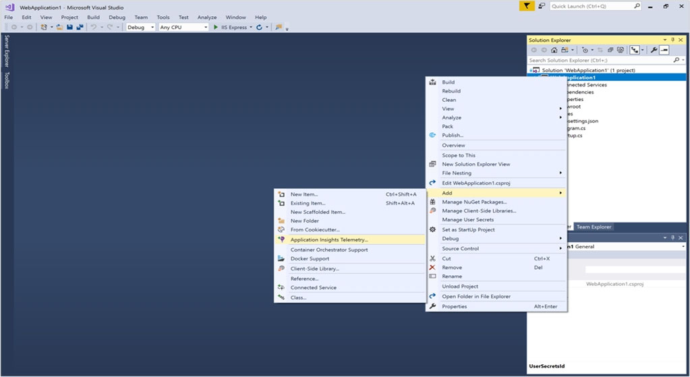
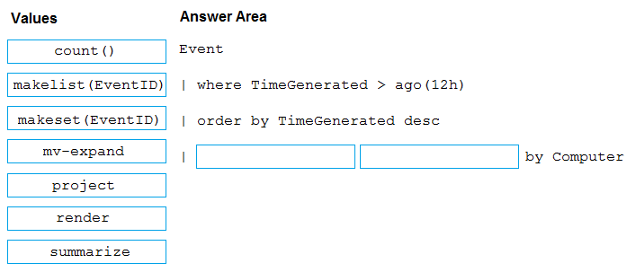
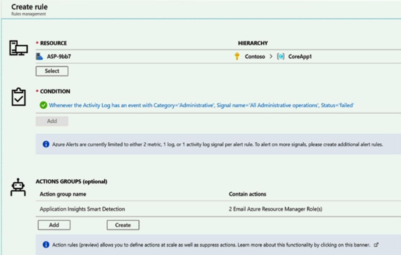
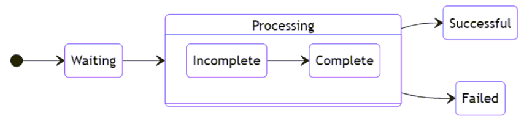
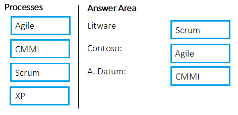
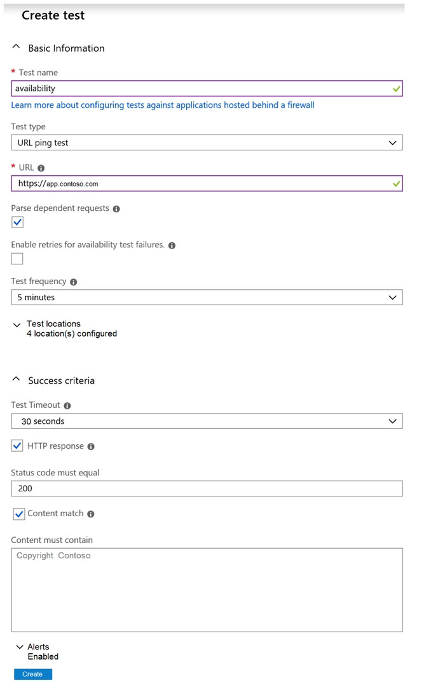

# AZ-400 Practice Exam (examtopics)

## Question Set 1

1. You are configuring project metrics for dashboards in Azure DevOps.
   You need to configure a chart widget that measures the elapsed time to complete work items once they become active.
   Which of the following is the widget you should use?
   
   - A. Cumulative Flow Diagram
   
   - B. Burnup
   
   - **C. Cycle time** 
   
   - D. Burndown
   
   
   
   Cycle time measures the time it takes for your team to complete work items once they begin actively working on them.
     Reference:
     https://docs.microsoft.com/en-us/azure/devops/report/dashboards/cycle-time-and-lead-time?view=vsts
     

2. You need to consider the underlined segment to establish whether it is accurate.
   The Burnup widget measures the elapsed time from creation of work items to their completion.
   Select `No adjustment required` if the underlined segment is accurate. If the underlined segment is inaccurate, select the accurate option.
   - A. No adjustment required.
   - **B. Lead time** 
   - C. Test results trend
   - D. Burndown

​	Reference:
https://docs.microsoft.com/en-us/azure/devops/report/dashboards/cycle-time-and-lead-time?view=vsts

3. You are making use of Azure DevOps manage build pipelines, and also deploy pipelines.
   The development team is quite large, and is regularly added to.
   You have been informed that the management of users and licenses must be automated when it can be.
   Which of the following is a task that can't be automated?

   - A. Group membership changes
   - B. License assignment
   - C. Assigning entitlements
   - **D. License procurement**

4. You have been tasked with strengthening the security of your team's development process.
   You need to suggest a security tool type for the Continuous Integration (CI) phase of the development process.
   Which of the following is the option you would suggest?

   - A. Penetration testing
   - **B. Static code analysis**
   - C. Threat modeling
   - D. Dynamic code analysis

   Validation in the CI/CD begins before the developer commits his or her code. Static code analysis tools in the IDE provide the first line of defense to help ensure that security vulnerabilities are not introduced into the CI/CD process.
   Reference:
   https://docs.microsoft.com/en-us/azure/devops/articles/security-validation-cicd-pipeline?view=vsts
   

5. Your company is currently making use of Team Foundation Server 2013 (TFS 2013), but intend to migrate to Azure DevOps.
   You have been tasked with supplying a migration approach that allows for the preservation of Team Foundation Version Control changesets dates, as well as the changes dates of work items revisions. The approach should also allow for the migration of all TFS artifacts, while keeping migration effort to a minimum.
   You have suggested upgrading TFS to the most recent RTW release.
   Which of the following should also be suggested?

   - A. Installing the TFS kava SDK
   - **B. Using the TFS Database Import Service to perform the upgrade.**
   - C. Upgrading PowerShell Core to the latest version.
   - D. Using the TFS Integration Platform to perform the upgrade.

   

   In Phase 3 of your migration project, you will work on upgrading your Team Foundation Server to one of the supported versions for the Database Import Service in Azure Devops Services.

6. DRAG DROP -
   You have an on-premises Bitbucket Server with a firewall configured to block inbound Internet traffic. The server is used for Git-based source control.
   You intend to manage the build and release processes using Azure DevOps. This plan requires you to integrate Azure DevOps and Bitbucket.
   Which of the following will allow for this integration? Answer by dragging the correct options from the list to the answer area.
   Select and Place:

   

   Answer:

   

7. You are currently developing a project for a client that will be managing work items via Azure DevOps.
   You want to make sure that the work item process you use for the client allows for requirements, change requests, risks, and reviews to be tracked.
   Which of the following is the option you would choose?

   - A. Basic
   - B. Agile
   - C. Scrum
   - **D. CMMI**

   Choose CMMI when your team follows more formal project methods that require a framework for process improvement and an auditable record of decisions. With this process, you can track requirements, change requests, risks, and reviews.
   Incorrect Answers:
   A. Choose Basic when your team wants the simplest model that uses Issues, Tasks, and Epics to track work.
   B. This process works great if you want to track user stories and (optionally) bugs on the Kanban board, or track bugs and tasks on the taskboard.
   C. This process works great if you want to track product backlog items (PBIs) and bugs on the Kanban board, or break PBIs and bugs down into tasks on the taskboard.
   Reference:
   https://docs.microsoft.com/en-us/azure/devops/boards/work-items/guidance/choose-process?view=azure-devops

8. Note: The question is included in a number of questions that depicts the identical set-up. However, every question has a distinctive result. Establish if the solution satisfies the requirements.
   You run the Register-AzureRmAutomationDscNode command in your company's environment.
   You need to make sure that your company's test servers remain correctly configured, regardless of configuration drift.
   Solution: You set the -ConfigurationMode parameter to ApplyOnly.
   Does the solution meet the goal?

   - A. Yes
   - **B. No**

   Reference:
   https://docs.microsoft.com/en-us/powershell/module/azurerm.automation/register-azurermautomationdscnode?view=azurermps-6.13.0

   

9. Note: The question is included in a number of questions that depicts the identical set-up. However, every question has a distinctive result. Establish if the solution satisfies the requirements.
   You run the Register-AzureRmAutomationDscNode command in your company's environment.
   You need to make sure that your company's test servers remain correctly configured, regardless of configuration drift.
   Solution: You set the -ConfigurationMode parameter to ApplyAndMonitor.
   Does the solution meet the goal?

   - A. Yes
   - **B. No**

   Reference:
   https://docs.microsoft.com/en-us/powershell/module/azurerm.automation/register-azurermautomationdscnode?view=azurermps-6.13.0

10. Note: The question is included in a number of questions that depicts the identical set-up. However, every question has a distinctive result. Establish if the solution satisfies the requirements.
    You run the Register-AzureRmAutomationDscNode command in your company's environment.
    You need to make sure that your company's test servers remain correctly configured, regardless of configuration drift.
    Solution: You set the -ConfigurationMode parameter to ApplyAndAutocorrect.
    Does the solution meet the goal?

    - **A. Yes**
    - B. No

    Reference:
    https://docs.microsoft.com/en-us/powershell/module/azurerm.automation/register-azurermautomationdscnode?view=azurermps-6.13.0

11. You need to consider the underlined segment to establish whether it is accurate.
    To compile an Internet Information Services (IIS) web application that runs docker, you should use a Default build agent pool.
    Select `No adjustment required` if the underlined segment is accurate. If the underlined segment is inaccurate, select the accurate option.

    - A. No adjustment required.
    - **B. Hosted Windows Container**
    - C. Hosted
    - D. Hosted macOS

    Search for correct answer

12. Your company has an Azure DevOps environment that can only be accessed by Azure Active Directory users.
    You are instructed to make sure that the Azure DevOps environment can only be accessed from devices connected to the company's on-premises network.
    Which of the following actions should you take?

    - A. Assign the devices to a security group.
    - B. Create a GPO.
    - C. Configure Security in Project Settings from Azure DevOps.
    - **D. Configure conditional access in Azure Active Directory.**

    Conditional Access is a capability of Azure Active Directory. With Conditional Access, you can implement automated access control decisions for accessing your cloud apps that are based on conditions.
    Conditional Access policies are enforced after the first-factor authentication has been completed.
    Reference:
    https://docs.microsoft.com/en-us/azure/active-directory/conditional-access/overview
    

13. You are making use of Azure DevOps to configure Azure Pipelines for project, named PROJ-01.
    You are preparing to use a version control system that allows for source code to be stored on a managed Windows server located on the company network.
    Which of the following is the version control system you should use?

    - **A. Github Enterprise**
    - B. Bitbucket cloud
    - C. Github Professional
    - D. Git in Azure Repos

    GitHub Enterprise is the on-premises version of GitHub.com. GitHub Enterprise includes the same great set of features as GitHub.com but packaged for running on your organization's local network. All repository data is stored on machines that you control, and access is integrated with your organization's authentication system (LDAP, SAML, or CAS).
    Reference:
    https://www.azuredevopslabs.com/labs/azuredevops/yaml/
    

14. You need to consider the underlined segment to establish whether it is accurate.
    When moving to Azure DevOps, JIRA must be replaced with the build pipelines Azure DevOps service.
    Select `No adjustment required` if the underlined segment is accurate. If the underlined segment is inaccurate, select the accurate option.

    - A. No adjustment required.
    - B. repos
    - C. release pipelines
    - **D. boards**

    

15. You scan a Node.js application using WhiteSource Bolt.
    The scan finds numerous libraries with invalid licenses, but are only used during development.
    You have to make sure that only production dependencies are scanned by WhiteSource Bolt.
    Which of the following is a command you should run?

    - A. npm edit
    - B. npm publish
    - **C. npm install**
    - D. npm update

    Reference:
    https://whitesource.atlassian.net/wiki/spaces/WD/pages/34209870/NPM+Plugin https://nodejs.org/en/knowledge/getting-started/npm/what-is-the-file-package-json

16. You are currently defining a release strategy for an app, named APP-01.
    The strategy should allow you to keep the time it takes to deploy new releases of the app to a minimum. The strategy should also allow you to roll back in the shortest time required.
    Which of the following is the release strategy you should use?

    - **A. Red/Black deployment**
    - B. Rolling deployment
    - C. ג€Big Bangג€ deployment
    - D. Canary deployment

17. Your company hosts a web application in Azure, and makes use of Azure Pipelines for managing the build and release of the application.
    When stakeholders report that system performance has been adversely affected by the most recent releases, you configure alerts in Azure Monitor.
    You are informed that new releases must satisfy specified performance baseline conditions in the staging environment before they can be deployed to production.
    You need to make sure that releases not satisfying the performance baseline are prevented from being deployed.
    Which of the following actions should you take?

    - A. You should make use of a branch control check.
    - B. You should make use of an alert trigger.
    - **C. You should make use of a gate.**
    - D. You should make use of an approval check.

    Scenarios and use cases for gates include:
    ✑ Quality validation. Query metrics from tests on the build artifacts such as pass rate or code coverage and deploy only if they are within required thresholds.
    Use Quality Gates to integrate monitoring into your pre-deployment or post-deployment. This ensures that you are meeting the key health/performance metrics
    (KPIs) as your applications move from dev to production and any differences in the infrastructure environment or scale is not negatively impacting your KPIs.
    Note: Gates allow automatic collection of health signals from external services, and then promote the release when all the signals are successful at the same time or stop the deployment on timeout. Typically, gates are used in connection with incident management, problem management, change management, monitoring, and external approval systems.
    Reference:
    https://docs.microsoft.com/en-us/azure/azure-monitor/continuous-monitoring https://docs.microsoft.com/en-us/azure/devops/pipelines/release/approvals/gates?view=azure-devops

18. You need to consider the underlined segment to establish whether it is accurate.
    To deploy an application to a number of Azure virtual machines, you should create a universal group.
    Select `No adjustment required` if the underlined segment is accurate. If the underlined segment is inaccurate, select the accurate option.

    - A. No adjustment required.
    - B. security
    - **C. deployment**
    - D. resource

    When authoring an Azure Pipelines or TFS Release pipeline, you can specify the deployment targets for a job using a deployment group.
    If the target machines are Azure VMs, you can quickly and easily prepare them by installing the Azure Pipelines Agent Azure VM extension on each of the VMs, or by using the Azure Resource Group Deployment task in your release pipeline to create a deployment group dynamically.
    Reference:
    https://docs.microsoft.com/en-us/azure/devops/pipelines/release/deployment-groups
    

19. DRAG DROP -
    You are preparing to deploy an Azure resource group via Terraform.
    To achieve your goal, you have to install the necessary frameworks.
    Which of the following are the frameworks you should use? Answer by dragging the correct options from the list to the answer area.
    Select and Place:
    

    **Correct Answer:** **
    You can use the combination of Terraform and Yeoman. Terraform is a tool for creating infrastructure on Azure. Yeoman makes it easy to create Terraform modules.
    Terratest provides a collection of helper functions and patterns for common infrastructure testing tasks, like making HTTP requests and using SSH to access a specific virtual machine. The following list describes some of the major advantages of using Terratest:
    ✑ Convenient helpers to check infrastructure - This feature is useful when you want to verify your real infrastructure in the real environment.
    ✑ Organized folder structure - Your test cases are organized clearly and follow the standard Terraform module folder structure.
    Test cases are written in Go - Many developers who use Terraform are Go developers. If you're a Go developer, you don't have to learn another programming
     language to use Terratest.
    ✑ Extensible infrastructure - You can extend additional functions on top of Terratest, including Azure-specific features.
    Reference:
    https://docs.microsoft.com/en-us/azure/developer/terraform/create-base-template-using-yeoman https://docs.microsoft.com/en-us/azure/developer/terraform/test-modules-using-terratest

20. You intend to make use of Azure Artifacts to share packages that you wrote, tested, validated, and deployed.
    You want to use a solitary feed to release several builds of each package. You have to make sure that the release of packages that are in development is restricted.
    Which of the following actions should you take?

    - A. You should make use of static code analysis.
    - B. You should make use of views.
    - C. You should make use of dynamic code analysis.
    - **D. You should make use of upstream sources.**

    Upstream sources enable you to manage all of your product's dependencies in a single feed. We recommend publishing all of the packages for a given product to that product's feed, and managing that product's dependencies from remote feeds in the same feed, via upstream sources. This setup has a few benefits:
    ✑ Simplicity: your NuGet.config, .npmrc, or settings.xml contains exactly one feed (your feed).
    ✑ Determinism: your feed resolves package requests in order, so rebuilding the same codebase at the same commit or changeset uses the same set of packages
    ✑ Provenance: your feed knows the provenance of packages it saved via upstream sources, so you can verify that you're using the original package, not a custom or malicious copy published to your feed
    ✑ Peace of mind: packages used via upstream sources are guaranteed to be saved in the feed on first use; if the upstream source is disabled/removed, or the remote feed goes down or deletes a package you depend on, you can continue to develop and build
    Reference:
    https://docs.microsoft.com/en-us/azure/devops/artifacts/concepts/upstream-sources?view=vsts

21. You need to consider the underlined segment to establish whether it is accurate.
    To find when common open source libraries are added to the code base, you should add Jenkins to the build pipeline.
    Select `No adjustment required` if the underlined segment is accurate. If the underlined segment is inaccurate, select the accurate option.

    - A. No adjustment required.
    - B. SourceGear Vault
    - **C. WhiteSource**
    - D. OWASP ZAP

    WhiteSource is the leader in continuous open source software security and compliance management. WhiteSource integrates into your build process, irrespective of your programming languages, build tools, or development environments. It works automatically, continuously, and silently in the background, checking the security, licensing, and quality of your open source components against WhiteSource constantly-updated definitive database of open source repositories.
    Azure DevOps integration with WhiteSource Bolt will enable you to:

    1. Detect and remedy vulnerable open source components.
    2. Generate comprehensive open source inventory reports per project or build.
    3. Enforce open source license compliance, including dependencies' licenses.
    4. Identify outdated open source libraries with recommendations to update.

    Note: Black duck would also be a good answer, but it is not an option here.
    Reference:
    https://www.azuredevopslabs.com/labs/vstsextend/WhiteSource/

22. Your company has an Azure DevOps project, which includes a build pipeline that makes use of roughly fifty open source libraries.
    You have been tasked with making sure that you are able to scan project for common security weaknesses in the open source libraries.
    Which of the following actions should you take?

    - **A. You should create a build task and use the WhiteSource Bolt service.**
    - B. You should create a deployment task and use the WhiteSource Bolt service.
    - C. You should create a build task and use the Chef service.
    - D. You should create a deployment task and use the Chef service.

    Reference:
    https://www.azuredevopslabs.com/labs/vstsextend/whitesource/

23. You need to consider the underlined segment to establish whether it is accurate.
    Black Duck can be used to make sure that all the open source libraries conform to your company's licensing criteria.
    Select `No adjustment required` if the underlined segment is accurate. If the underlined segment is inaccurate, select the accurate option.

    - **A. No adjustment required.**
    - B. Maven
    - C. Bamboo
    - D. CMAKE

    Secure and Manage Open Source Software
    Black Duck helps organizations identify and mitigate open source security, license compliance and code-quality risks across application and container portfolios.
    Black Duck Hub and its plugin for Team Foundation Server (TFS) allows you to automatically find and fix open source security vulnerabilities during the build process, so you can proactively manage risk. The integration allows you to receive alerts and fail builds when any Black Duck Hub policy violations are met.
    Reference:
    https://marketplace.visualstudio.com/items?itemName=black-duck-software.hub-tfs

24. You have created an Azure DevOps project for a new application that will be deployed to a number of Windows Server 2016 Azure virtual machines.
    You are preparing a deployment solution that allows for the virtual machines to maintain a uniform configuration, and also keep administrative effort with regards to configuring the virtual machines to a minimum.
    Which of the following should be part of your solution? (Choose two.)

    - **A. Azure Resource Manager templates**
    - **B. The PowerShell Desired State Configuration (DSC) extension for Windows**
    - C. Azure pipeline deployment groups
    - D. The Custom Script Extension for Windows
    - E. Azure pipeline stage templates

    Check if correct

25. Your company has an application that contains a number of Azure App Service web apps and Azure functions.
    You would like to view recommendations with regards to the security of the web apps and functions. You plan to navigate to Compute and Apps to achieve your goal.
    Which of the following should you access to make use of Compute and Apps?

    - A. Azure Log Analytics
    - B. Azure Event Hubs
    - C. Azure Advisor
    - **D. Azure Security Center**

    Monitor compute and app services: Compute & apps include the App Services tab, which App services: list of your App service environments and current security state of each.

    Recommendations -
    This section has a set of recommendations for each VM and computer, web and worker roles, Azure App Service Web Apps, and Azure App Service Environment that Security Center monitors. The first column lists the recommendation. The second column shows the total number of resources that are affected by that recommendation. The third column shows the severity of the issue.
    Reference:
    https://docs.microsoft.com/en-us/azure/azure-monitor/app/proactive-diagnostics

26. You need to consider the underlined segment to establish whether it is accurate.
    Your company has a multi-tier application that has its front end hosted in Azure App Service.
    To pinpoint the average load times of the application pages, you should make use of Azure Event Hubs.
    Select `No adjustment required` if the underlined segment is accurate. If the underlined segment is inaccurate, select the accurate option.

    - A. No adjustment required.
    - **B. Azure Application Insights**
    - C. Azure Log Analytics
    - D. Azure Advisor

    Application Insights will tell you about any performance issues and exceptions, and help you find and diagnose the root causes.
    Application Insights can monitor both Java and ASP.NET web applications and services, WCF services. They can be hosted on-premises, on virtual machines, or as Microsoft Azure websites.
    On the client side, Application Insights can take telemetry from web pages and a wide variety of devices including iOS, Android, and Windows Store apps.
    Reference:
    https://docs.microsoft.com/en-us/azure/azure-monitor/app/web-monitor-performance

27. Your company makes use of Azure SQL Database Intelligent Insights and Azure Application Insights for monitoring purposes.
    You have been tasked with analyzing the monitoring using ad-hoc queries. You need to utilize the correct query language.
    Solution: You use the Contextual Query Language (CQL).
    Does the solution meet the goal?

    - A. Yes
    - **B. No**

    Reference:
    https://docs.microsoft.com/en-us/azure/azure-monitor/insights/azure-sql

28. Your company makes use of Azure SQL Database Intelligent Insights and Azure Application Insights for monitoring purposes.
    You have been tasked with analyzing the monitoring using ad-hoc queries. You need to utilize the correct query language.
    Solution: You use the Transact-SQL.
    Does the solution meet the goal?

    - A. Yes
    - **B. No**

    Reference:
    https://docs.microsoft.com/en-us/azure/azure-monitor/insights/azure-sql

29. Your company makes use of Azure SQL Database Intelligent Insights and Azure Application Insights for monitoring purposes.
    You have been tasked with analyzing the monitoring using ad-hoc queries. You need to utilize the correct query language.
    Solution: You use Azure Log Analytics.
    Does the solution meet the goal?

    - A. Yes 
    - **B. No** 

    KQL (Kusto Querry Language)

30. DRAG DROP -
    You have recently created a web application for your company.
    You have been tasked with making sure that a summary of the exceptions that transpire in the application is automatically sent to Microsoft Teams on a daily basis.
    Which of the following Azure services should you use? Answer by dragging the correct options from the list to the answer area.
    Select and Place:
    

    

    Exceptions in your live web app are reported by Application Insights.
    Note: Periodical reports help keep a team informed on how their business critical services are doing. Developers, DevOps/SRE teams, and their managers can be productive with automated reports reliably delivering insights without requiring everyone to sign in the portal. Such reports can also help identify gradual increases in latencies, load or failure rates that may not trigger any alert rules.
    You can programmatically query Application Insights data to generate custom reports on a schedule. The following options can help you get started quickly:
    Automate reports with Microsoft Flow
    
    ✑ Automate reports with Logic Apps
    Reference:
    https://docs.microsoft.com/en-us/azure/azure-monitor/app/asp-net-exceptions https://docs.microsoft.com/en-us/azure/azure-monitor/app/automate-custom-reports

31. You are in the process of building a mobile app aimed at Android and iOS devices.
    All work items and release cycles are managed via Azure DevOps.
    You want to make sure that crash reports for issue analysis is collected, and that beta releases are distributed to your testers. Also, you want to ensure that user feedback on the functionality of new apps is received.
    Which of the following must be part of your solution?

    - **A. The Microsoft Test & Feedback extension.**
    - B. OWASP ZAP
    - C. TFS Integration Platform
    - D. Code Style

    The "Exploratory Testing" extension is now "Test & Feedback" and is now Generally Available.
    Anyone can now test web apps and give feedback, all directly from the browser on any platform: Windows, Mac, or Linux. Available for Google Chrome and
    Mozilla Firefox (required version 50.0 or above) currently. Support for Microsoft Edge is in the pipeline and will be enabled once Edge moves to a Chromium- compatible web platform.
    Reference:
    https://marketplace.visualstudio.com/items?itemName=ms.vss-exploratorytesting-web

## Question Set 2

1. DRAG DROP -
   You need to recommend project metrics for dashboards in Azure DevOps.
   Which chart widgets should you recommend for each metric? To answer, drag the appropriate chart widgets to the correct metrics. Each chart widget may be used once, more than once, or not at all. You may need to drag the split bar between panes or scroll to view content.
   NOTE: Each correct selection is worth one point.
   Select and Place:
   

   **Correct Answer:** **
   Box 1: Lead time -
   Lead time measures the total time elapsed from the creation of work items to their completion.

   Box 2: Cycle time -
   Cycle time measures the time it takes for your team to complete work items once they begin actively working on them.

   Box 3: Burndown -
   Burndown charts focus on remaining work within a specific time period.
   Incorrect Answers:
   Velocity provides a useful metric for these activities:

   Support sprint planning -
   Forecast future sprints and the backlog items that can be completed
   A guide for determining how well the team estimates and meets their planned commitments
   Reference:
   https://docs.microsoft.com/en-us/azure/devops/report/dashboards/velocity-guidance?view=vsts https://docs.microsoft.com/en-us/azure/devops/report/dashboards/cycle-time-and-lead-time?view=vsts https://docs.microsoft.com/en-us/azure/devops/report/dashboards/configure-burndown-burnup-widgets?view=vsts

2. HOTSPOT -
   You plan to create alerts that will be triggered based on the page load performance of a home page.
   You have the Application Insights log query shown in the following exhibit.
   
   Use the drop-down menus to select the answer choice that completes each statement based on the information presented in the graphic.
   NOTE: Each correct selection is worth one point.
   Hot Area:
   

   **
   Box 1: percentile_duration_95 -

   Box 2: success -
   For example ג€"
   requests
   | project name, url, success
   | where success == "False"
   This will return all the failed requests in my App Insights within the specified time range.
   Reference:
   https://devblogs.microsoft.com/premier-developer/alerts-based-on-analytics-query-using-custom-log-search/

3. You manage an Azure web app that supports an e-commerce website.
   You need to increase the logging level when the web app exceeds normal usage patterns. The solution must minimize administrative overhead.
   Which two resources should you include in the solution? Each correct answer presents part of the solution.
   NOTE: Each correct selection is worth one point.

   - **A. an Azure Automation runbook**
   - **B. an Azure Monitor alert that has a dynamic threshold**
   - C. an Azure Monitor alert that has a static threshold
   - D. the Azure Monitor autoscale settings
   - E. an Azure Monitor alert that uses an action group that has an email action

   B: Metric Alert with Dynamic Thresholds detection leverages advanced machine learning (ML) to learn metrics' historical behavior, identify patterns and anomalies that indicate possible service issues. It provides support of both a simple UI and operations at scale by allowing users to configure alert rules through the Azure
   Resource Manager API, in a fully automated manner.
   A: You can use Azure Monitor to monitor base-level metrics and logs for most services in Azure. You can call Azure Automation runbooks by using action groups or by using classic alerts to automate tasks based on alerts.
   Reference:
   https://docs.microsoft.com/en-us/azure/azure-monitor/platform/alerts-dynamic-thresholds https://docs.microsoft.com/en-us/azure/automation/automation-create-alert-triggered-runbook

4. HOTSPOT -
   You have an Azure Kubernetes Service (AKS) pod.
   You need to configure a probe to perform the following actions:
   ✑ Confirm that the pod is responding to service requests.
   ✑ Check the status of the pod four times a minute.
   ✑ Initiate a shutdown if the pod is unresponsive.
   How should you complete the YAML configuration file? To answer, select the appropriate options in the answer area.
   NOTE: Each correct selection is worth one point.
   Hot Area:
   

   **
   Box 1: readinessProbe:
   For containerized applications that serve traffic, you might want to verify that your container is ready to handle incoming requests. Azure Container Instances supports readiness probes to include configurations so that your container can't be accessed under certain conditions.
   Incorrect Answers:
   livenessProbe: Containerized applications may run for extended periods of time, resulting in broken states that may need to be repaired by restarting the container. Azure Container Instances supports liveness probes so that you can configure your containers within your container group to restart if critical functionality is not working.

   Box 2: periodSeconds: 15 -
   The periodSeconds property designates the readiness command should execute every 15 seconds.
   Reference:
   https://docs.microsoft.com/en-us/azure/container-instances/container-instances-readiness-probe

5. You have a Microsoft ASP.NET Core web app in Azure that is accessed worldwide.
   You need to run a URL ping test once every five minutes and create an alert when the web app is unavailable from specific Azure regions. The solution must minimize development time.
   What should you do?

   - A. Create an Azure Monitor Availability metric and alert.
   - **B. Create an Azure Application Insights availability test and alert.**
   - C. Write an Azure function and deploy the function to the specific regions.
   - D. Create an Azure Service Health alert for the specific regions.

   There are three types of Application Insights availability tests:
   URL ping test: a simple test that you can create in the Azure portal.
   
   ✑ Multi-step web test
   ✑ Custom Track Availability Tests
   Note: After you've deployed your web app/website, you can set up recurring tests to monitor availability and responsiveness. Azure Application Insights sends web requests to your application at regular intervals from points around the world. It can alert you if your application isn't responding, or if it responds too slowly.
   You can set up availability tests for any HTTP or HTTPS endpoint that is accessible from the public internet. You don't have to make any changes to the website you're testing. In fact, it doesn't even have to be a site you own. You can test the availability of a REST API that your service depends on.
   Reference:
   https://docs.microsoft.com/en-us/azure/azure-monitor/app/monitor-web-app-availability#create-a-url-ping-test

6. You have a multi-tier application. The front end of the application is hosted in Azure App Service.
   You need to identify the average load times of the application pages.
   What should you use?

   - **A. Azure Application Insights**
   - B. the activity log of the App Service
   - C. the diagnostics logs of the App Service
   - D. Azure Advisor

   Application Insights will tell you about any performance issues and exceptions, and help you find and diagnose the root causes.
   Application Insights can monitor both Java and ASP.NET web applications and services, WCF services. They can be hosted on-premises, on virtual machines, or as Microsoft Azure websites.
   On the client side, Application Insights can take telemetry from web pages and a wide variety of devices including iOS, Android, and Windows Store apps.
   Reference:
   https://docs.microsoft.com/en-us/azure/azure-monitor/app/web-monitor-performance

7. You need to create an instance of Azure Application Insights named az400-123456789-main and configure the instance to receive telemetry data from an Azure web app named az400-123456789-main.
   To complete this task, sign in to the Microsoft Azure portal.

   Step 1: Create an instance of Azure Application Insights

   1. Open Microsoft Azure Portal
   2. Log into your Azure account, Select Create a resource > Developer tools > Application Insights.

   

   3. Enter the following settings, and then select Review + create.

   Name: az400-123456789-main -
   Step 2: Configure App Insights SDK

   1. Open your ASP.NET Core Web App project in Visual Studio > Right-click on the AppName in the Solution Explorer > Select Add > Application Insights

   Telemetry.
   

   2. Click the Get Started button
   3. Select your account and subscription > Select the Existing resource you created in the Azure portal > Click Register.

   Reference:
   https://docs.microsoft.com/bs-latn-ba/azure/azure-monitor/learn/dotnetcore-quick-start?view=vs-2017

8. Your company uses ServiceNow for incident management.
   You develop an application that runs on Azure.
   The company needs to generate a ticket in ServiceNow when the application fails to authenticate.
   Which Azure Log Analytics solution should you use?

   - A. Application Insights Connector
   - B. Automation & Control
   - **C. IT Service Management Connector (ITSM)**
   - D. Insight & Analytics

   The IT Service Management Connector (ITSMC) allows you to connect Azure and a supported IT Service Management (ITSM) product/service.
   ITSMC supports connections with the following ITSM tools:
   ✑ ServiceNow
   ✑ System Center Service Manager
   ✑ Provance
   ✑ Cherwell

   With ITSMC, you can -
   ✑ Create work items in ITSM tool, based on your Azure alerts (metric alerts, Activity Log alerts and Log Analytics alerts).
   ✑ Optionally, you can sync your incident and change request data from your ITSM tool to an Azure Log Analytics workspace.
   Reference:
   https://docs.microsoft.com/en-us/azure/azure-monitor/platform/itsmc-overview

9. HOTSPOT -

10. HOTSPOT -
    Your company is building a new web application.
    You plan to collect feedback from pilot users on the features being delivered.
    All the pilot users have a corporate computer that has Google Chrome and the Microsoft Test & Feedback extension installed. The pilot users will test the application by using Chrome.
    You need to identify which access levels are required to ensure that developers can request and gather feedback from the pilot users. The solution must use the principle of least privilege.
    Which access levels in Azure DevOps should you identify? To answer, select the appropriate options in the answer area.
    NOTE: Each correct selection is worth one point.
    Hot Area:
    

**Correct Answer:** **
Box 1: Basic -
Assign Basic to users with a TFS CAL, with a Visual Studio Professional subscription, and to users for whom you are paying for Azure Boards & Repos in an organization.

Box 2: Stakeholder -
Assign Stakeholders to users with no license or subscriptions who need access to a limited set of features.
Note:
You assign users or groups of users to one of the following access levels:
Basic: provides access to most features
VS Enterprise: provides access to premium features
Stakeholders: provides partial access, can be assigned to unlimited users for free
Reference:
https://docs.microsoft.com/en-us/azure/devops/organizations/security/access-levels?view=vsts

10. You use Azure SQL Database Intelligent Insights and Azure Application Insights for monitoring.
    You need to write ad-hoc queries against the monitoring data.
    Which query language should you use?

    - **A. Kusto Query Language (KQL)**
    - B. PL/pgSQL
    - C. PL/SQL
    - D. Transact-SQL

    Azure Monitor Logs is based on Azure Data Explorer, and log queries are written using the same Kusto query language (KQL). This is a rich language designed to be easy to read and author, and you should be able to start using it with minimal guidance.
    Reference:
    https://docs.microsoft.com/en-us/azure/azure-monitor/log-query/log-query-overview

11. Your company creates a web application.
    You need to recommend a solution that automatically sends to Microsoft Teams a daily summary of the exceptions that occur in the application.
    Which two Azure services should you recommend? Each correct answer presents part of the solution.
    NOTE: Each correct selection is worth one point.

    - **A. Azure Logic Apps**
    - B. Azure Pipelines
    - C. Microsoft Visual Studio App Center
    - D. Azure DevOps Project
    - **E. Azure Application Insights**

    E: Exceptions in your live web app are reported by Application Insights.
    Note: Periodical reports help keep a team informed on how their business critical services are doing. Developers, DevOps/SRE teams, and their managers can be productive with automated reports reliably delivering insights without requiring everyone to sign in the portal. Such reports can also help identify gradual increases in latencies, load or failure rates that may not trigger any alert rules.
    A: You can programmatically query Application Insights data to generate custom reports on a schedule. The following options can help you get started quickly:
    ✑ Automate reports with Microsoft Flow
    ✑ Automate reports with Logic Apps
    Reference:
    https://docs.microsoft.com/en-us/azure/azure-monitor/app/asp-net-exceptions https://docs.microsoft.com/en-us/azure/azure-monitor/app/automate-custom-reports

    12. DRAG DROP -
        Your company wants to use Azure Application Insights to understand how user behaviors affect an application.
        Which Application Insights tool should you use to analyze each behavior? To answer, drag the appropriate tools to the correct behaviors. Each tool may be used once, more than once, or not at all. You may need to drag the split bar between panes or scroll to view content.
        NOTE: Each correct selection is worth one point.
        Select and Place:
        

        **Correct Answer:** **
        Box 1: User Flows -
        The User Flows tool visualizes how users navigate between the pages and features of your site. It's great for answering questions like:
        How do users navigate away from a page on your site?
        What do users click on a page on your site?
        Where are the places that users churn most from your site?
        Are there places where users repeat the same action over and over?

        Box 2: Users -
        Counting Users: The user behavior analytics tools don't currently support counting users or sessions based on properties other than anonymous user ID, authenticated user ID, or session ID.

        Box 3: Impact -
        Impact analyzes how load times and other properties influence conversion rates for various parts of your app. To put it more precisely, it discovers how any dimension of a page view, custom event, or request affects the usage of a different page view or custom event.
        Reference:
        https://docs.microsoft.com/en-us/azure/azure-monitor/app/usage-flows https://docs.microsoft.com/en-us/azure/azure-monitor/app/usage-impact https://docs.microsoft.com/en-us/azure/azure-monitor/app/usage-troubleshoot

12. Your company is building a mobile app that targets Android and iOS devices.
     Your team uses Azure DevOps to manage all work items and release cycles.
     You need to recommend a solution to perform the following tasks:
     ✑ Collect crash reports for issue analysis.
     ✑ Distribute beta releases to your testers.
     ✑ Get user feedback on the functionality of new apps.
     What should you include in the recommendation?

     - A. the Microsoft Test & Feedback extension
     - **B. Microsoft Visual Studio App Center integration**
     - C. Azure Application Insights widgets
     - D. Jenkins integration

     Check answer

13. Your company is building a mobile app that targets Android and iOS devices.
    Your team uses Azure DevOps to manage all work items and release cycles.
    You need to recommend a solution to perform the following tasks:
    ✑ Collect crash reports for issue analysis.
    ✑ Distribute beta releases to your testers.
    ✑ Get user feedback on the functionality of new apps.
    What should you include in the recommendation?

    - A. the Microsoft Test & Feedback extension
    - **B. Microsoft Visual Studio App Center integration Most Voted**
    - C. Azure Application Insights widgets
    - D. Jenkins integration

    Check answer

14. You have an Azure DevOps project named Project1 and an Azure subscription named Sub1. Sub1 contains an Azure virtual machine scale set named VMSS1.
     VMSS1 hosts a web application named WebApp1. WebApp1 uses stateful sessions.
     The WebApp1 installation is managed by using the Custom Script extension. The script resides in an Azure Storage account named sa1.
     You plan to make a minor change to a UI element of WebApp1 and to gather user feedback about the change.
      You need to implement limited user testing for the new version of WebApp1 on VMSS1.
     Which three actions should you perform? Each correct answer presents part of the solution.
     NOTE: Each correct selection is worth one point.

     - A. Modify the load balancer settings of VMSS1.
     - B. Redeploy VMSS1.
     - **C. Upload a custom script file to sa1.**
     - **D. Modify the Custom Script extension settings of VMSS1.**
     - **E. Update the configuration of a virtual machine in VMSS1.**

    Check answer

15. SIMULATION -
    You need to create a notification if the peak average response time of an Azure web app named az400-123456789-main is more than five seconds when evaluated during a five-minute period. The notification must trigger the `https://contoso.com/notify` webhook.
    To complete this task, sign in to the Microsoft Azure portal.

    1. Open Microsoft Azure Portal
    2. Log into your Azure account and go to App Service and look under Monitoring then you will see Alert.
    3. Select Add an alert rule
    4. Configure the alert rule as per below and click Ok.

    Source: Alert on Metrics -
    Resource Group: az400-123456789-main
    
    Resource: az400-123456789-main -
    
    Threshold: 5 -
    
    Period: Over the last 5 minutes -
    Webhook: https://contoso.com/notify
    
    Reference:
    https://azure.microsoft.com/es-es/blog/webhooks-for-azure-alerts/

16. You need to create and configure an Azure Storage account named az400lod123456789stor in a resource group named RG1lod123456789 to store the boot diagnostics for a virtual machine named VM1.
    To complete this task, sign in to the Microsoft Azure portal.

    Step 1: To create a general-purpose v2 storage account in the Azure portal, follow these steps:

    1. On the Azure portal menu, select All services. In the list of resources, type Storage Accounts. As you begin typing, the list filters based on your input. Select

    Storage Accounts.

    2. On the Storage Accounts window that appears, choose Add.
    3. Select the subscription in which to create the storage account.
    4. Under the Resource group field, select RG1lod123456789
    5. Next, enter a name for your storage account named: az400lod123456789stor
    6. Select Create.

    Step 2: Enable boot diagnostics on existing virtual machine
    To enable Boot diagnostics on an existing virtual machine, follow these steps:

    1. Sign in to the Azure portal, and then select the virtual machine VM1.
    2. In the Support + troubleshooting section, select Boot diagnostics, then select the Settings tab.
    3. In Boot diagnostics settings, change the status to On, and from the Storage account drop-down list, select the storage account az400lod123456789stor.
    4. Save the change.

    
    You must restart the virtual machine for the change to take effect.
    Reference:
    https://docs.microsoft.com/en-us/azure/storage/common/storage-account-create https://docs.microsoft.com/en-us/azure/virtual-machines/troubleshooting/boot-diagnostics

17. SIMULATION -
    You have a web app that connects to an Azure SQL Database named db1.
    You need to configure db1 to send Query Store runtime statistics to Azure Log Analytics.
    To complete this task, sign in to the Microsoft Azure portal.

    To enable streaming of diagnostic telemetry for a single or a pooled database, follow these steps:

    1. Go to Azure SQL database resource.
    2. Select Diagnostics settings.
    3. Select Turn on diagnostics if no previous settings exist, or select Edit setting to edit a previous setting. You can create up to three parallel connections to stream diagnostic telemetry.
    4. Select Add diagnostic setting to configure parallel streaming of diagnostics data to multiple resources.

    

    5. Enter a setting name for your own reference.
    6. Select a destination resource for the streaming diagnostics data: Archive to storage account, Stream to an event hub, or Send to Log Analytics.
    7. For the standard, event-based monitoring experience, select the following check boxes for database diagnostics log telemetry: QueryStoreRuntimeStatistics

    

    8. For an advanced, one-minute-based monitoring experience, select the check box for Basic metrics.
    9. Select Save.

    Reference:
    https://docs.microsoft.com/en-us/azure/azure-sql/database/metrics-diagnostic-telemetry-logging-streaming-export-configure

18. DRAG DROP -
    You have several Azure virtual machines that run Windows Server 2019.
    You need to identify the distinct event IDs of each virtual machine as shown in the following table.
    
    How should you complete the Azure Monitor query? To answer, drag the appropriate values to the correct locations. Each value may be used once, more than once, or not at all. You may need to drag the split bar between panes or scroll to view content.
    NOTE: Each correct selection is worth one point.
    Select and Place:
    

    **
    You can use makelist to pivot data by the order of values in a particular column. For example, you may want to explore the most common order events take place on your machines. You can essentially pivot the data by the order of EventIDs on each machine.
    Example:

    Event -
    | where TimeGenerated > ago(12h)
    | order by TimeGenerated desc
    | summarize makelist(EventID) by Computer
    Reference:
    https://docs.microsoft.com/en-us/azure/azure-monitor/log-query/advanced-aggregations

19. HOTSPOT -
    You have an Azure web app named Webapp1.
    You need to use an Azure Monitor query to create a report that details the top 10 pages of Webapp1 that failed.
    How should you complete the query? To answer, select the appropriate options in the answer area.
    NOTE: Each correct selection is worth one point.
    Hot Area:
    

    **Correct Answer:** **
    Box 1: requests -
    Failed requests (requests/failed):
    The count of tracked server requests that were marked as failed.
    Kusto code:
    requests
    | where success == 'False'

    Box 2: success == false -
    Reference:
    https://docs.microsoft.com/en-us/azure/azure-monitor/platform/app-insights-metrics

20. You are monitoring the health and performance of an Azure web app by using Azure Application Insights.
    You need to ensure that an alert is sent when the web app has a sudden rise in performance issues and failures.
    What should you use?

    - A. custom events
    - B. Application Insights Profiler
    - C. usage analysis
    - **D. Smart Detection**
    - E. Continuous export

    Smart Detection automatically warns you of potential performance problems and failure anomalies in your web application. It performs proactive analysis of the telemetry that your app sends to Application Insights. If there is a sudden rise in failure rates, or abnormal patterns in client or server performance, you get an alert.
    Reference:
    https://docs.microsoft.com/en-us/azure/azure-monitor/app/proactive-diagnostics

21. HOTSPOT -
    You have a project in Azure DevOps named Contoso App that contains pipelines in Azure Pipelines for GitHub repositories.
    You need to ensure that developers receive Microsoft Teams notifications when there are failures in a pipeline of Contoso App.
    What should you run in Teams? To answer, select the appropriate options in the answer area.
    NOTE: Each correct selection is worth one point.
    Hot Area:
    

    **Correct Answer:** **
    Box 1: subscribe -
    To start monitoring all pipelines in a project, use the following command inside a channel:
    @azure pipelines subscribe [project url]
    Box 2: https://dev.azure.com/contoso/contoso-app/
    Subscribe to a pipeline or all pipelines in a project to receive notifications:
    @azure pipelines subscribe [pipeline url/ project url]

22. You have a private GitHub repository.
    You need to display the commit status of the repository on Azure Boards.
    What should you do first?

    - A. Configure multi-factor authentication (MFA) for your GitHub account.
    - B. Add the Azure Pipelines app to the GitHub repository.
    - **C. Add the Azure Boards app to the repository.**
    - D. Create a GitHub action in GitHub.

    To connect Azure Boards to GitHub.com, connect and configure from Azure Boards. Or, alternatively, install and configure the Azure Boards app from GitHub.
    Both methods have been streamlined and support authenticating and operating via the app rather than an individual.
    Note (see step 4 below):
    Add a GitHub connection:

    1. Sign into Azure Boards.
    2. Choose (1) Project Settings, choose (2) GitHub connections and then (3) Connect your GitHub account.
    3. If this is your first time connecting to GitHub from Azure Boards, you will be asked to sign in using your GitHub credentials. Choose an account for which you are an administrator for the repositories you want to connect to.
    4. The Add GitHub Repositories dialog automatically displays and selects all GitHub.com repositories for which you are an administrator. Unselect any repositories that you don't want to participate in the integration.

    Reference:
    https://docs.microsoft.com/en-us/azure/devops/boards/github/connect-to-github

23. You are integrating Azure Pipelines and Microsoft Teams.
    You install the Azure Pipelines app in Microsoft Teams.
    You have an Azure DevOps organization named Contoso that contains a project name Project1.
    You subscribe to Project1 in Microsoft Teams.
    You need to ensure that you only receive events about failed builds in Microsoft Teams.
    What should you do first?

    - A. From Microsoft Teams, run @azure pipelines subscribe https://dev.azure.com/Contoso/Project1.
    - B. From Azure Pipelines, add a Publish Build Artifacts task to Project1.
    - **C. From Microsoft Teams, run @azure pipelines subscriptions.**
    - D. From Azure Pipelines, enable continuous integration for Project1.

    **Check answer**

24. You have an Azure DevOps organization named Contoso.
    You need to receive Microsoft Teams notifications when work items are updated.
    What should you do?

    - A. From Azure DevOps, configure a service hook subscription
    - **B. From Microsoft Teams, configure a connector**
    - C. From the Microsoft Teams admin center, configure external access
    - D. From Microsoft Teams, add a channel
    - E. From Azure DevOps, install an extension

    Check answer

25. You create an alert rule in Azure Monitor as shown in the following exhibit.
    
    Which action will trigger an alert?

    - **A. a failed attempt to delete the ASP-9bb7 resource**
    - B. a change to a role assignment for the ASP-9bb7 resource
    - C. a successful attempt to delete the ASP-9bb7 resource
    - D. a failed attempt to scale up the ASP-9bb7 resource

    Check Answer

26. You have a web app hosted on Azure App Service. The web app stores data in an Azure SQL database.
    You need to generate an alert when there are 10,000 simultaneous connections to the database. The solution must minimize development effort.
    Which option should you select in the Diagnostics settings of the database?

    - **A. Send to Log Analytics**
    - B. Stream to an event hub
    - C. Archive to a storage account

    ENABLE DIAGNOSTICS TO LOG ANALYTICS
    This configuration is done PER DATABASE

    1. Click on Diagnostics Settings and then Turn On Diagnostics

    

    2. Select to Send to Log Analytics and select the Log Analytics workspace. For this sample I will selected only Errors

    
    Reference:
    https://techcommunity.microsoft.com/t5/azure-database-support-blog/azure-sql-db-and-log-analytics-better-together-part-1/ba-p/794833

27. HOTSPOT -
    You use Azure DevOps to manage the build and deployment of an app named App1.
    You have a release pipeline that deploys a virtual machine named VM1.
    You plan to monitor the release pipeline by using Azure Monitor.
    You need to create an alert to monitor the performance of VM1. The alert must be triggered when the average CPU usage exceeds 70 percent for five minutes.
    The alert must calculate the average once every minute.
    How should you configure the alert rule? To answer, select the appropriate options in the answer area.
    NOTE: Each correct selection is worth one point.
    Hot Area:
    

    **Correct Answer:** **
    Box 1: 5 minutes -
    The alert must calculate the average once every minute.
    Note: We [Microsoft] recommend choosing an Aggregation granularity (Period) that is larger than the Frequency of evaluation, to reduce the likelihood of missing the first evaluation of added time series

    Box 2: Static -

    Box 3: Greater than -
    Example, say you have an App Service plan for your website. You want to monitor CPU usage on multiple instances running your web site/app. You can do that using a metric alert rule as follows:
    ✑ Target resource: myAppServicePlan
    ✑ Metric: Percentage CPU
    ✑ Condition Type: Static
    ✑ Dimensions
    ✑ Instance = InstanceName1, InstanceName2
    ✑ Time Aggregation: Average
    ✑ Period: Over the last 5 mins
    ✑ Frequency: 1 min
    ✑ Operator: GreaterThan
    ✑ Threshold: 70
    ✑ Like before, this rule monitors if the average CPU usage for the last 5 minutes exceeds 70%.
    ✑ Aggregation granularity
    Reference:
    https://docs.microsoft.com/en-us/azure/azure-monitor/platform/alerts-metric-overview

28. You have an Azure virtual machine that is monitored by using Azure Monitor.
    The virtual machine has the Azure Log Analytics agent installed.
    You plan to deploy the Service Map solution from the Azure Marketplace.
    What should you deploy to the virtual machine to support the Service Map solution?

    - **A. the Dependency agent**
    - B. the Telegraf agent
    - C. the Windows Azure diagnostics extension (WAD)
    - D. the Azure monitor agent

    Use the Dependency agent if you need to use the Map feature VM insights or the Service Map solution.
    Note: Consider the following when using the Dependency agent:
    The Dependency agent requires the Log Analytics agent to be installed on the same machine.
    On Linux computers, the Log Analytics agent must be installed before the Azure Diagnostic Extension.
    On both the Windows and Linux versions of the Dependency Agent, data collection is done using a user-space service and a kernel driver.
    Reference:
    https://docs.microsoft.com/en-us/azure/azure-monitor/agents/agents-overview

29. HOTSPOT -
    You have a project in Azure DevOps that contains a Continuous Integration/Continuous Deployment (CI/CD) pipeline.
    You need to enable detailed logging by defining a pipeline variable.
    How should you configure the variable? To answer, select the appropriate options in the answer area.
    NOTE: Each correct selection is worth one point.
    Hot Area:
    

    **
    Box 1: system.debug -
    To configure verbose logs for all runs, you can add a variable named system.debug and set its value to true.
    Note: Verbose logging is the practice of recording to a persistent medium as much information as you possibly can about events that occur while the software runs.

    Box 2: true -
    Reference:
    https://docs.microsoft.com/en-us/azure/devops/pipelines/troubleshooting/review-logs

30. You build an iOS app.
    You receive crash reports from Crashlytics.
    You need to capture the following data:
    ✑ Crash-free users
    ✑ Custom events
    ✑ Breadcrumbs
    What should you do?

    - A. Configure the xcworkspace file in the project
    - B. Add the GoogleAnalytics pod to the app.
    - C. Configure the Crashlytics pod in the app.
    - **D. Import the Firebase module to UIApplicationDelegate.**

    Check answer

    Step 1: Add the Firebase Crashlytics SDK to your app.
    Configure the Firebase module:
    Import the Firebase module in your App struct or UIApplicationDelegate
    Reference:
    https://firebase.google.com/docs/crashlytics/get-started?platform=ios

31. You have multiple teams that work on multiple projects in Azure DevOps.

    You need to plan and manage the consumers and producers for each project. The solution must provide an overview of all the projects.

    What should you do?

    - A. Add a Predecessor or Successor link to the feature or user story for the items of each project.
    - B. Add a Parent or Child link to the feature or user story for the items of each project.
    - **C. Install the Dependency Tracker extension and create dependencies for each project.**
    - D. Create a custom query to show the consumers and producers and add a widget to a dashboard.

32. DRAG DROP
    \-

    You have a GitHub repository that contains the source code for an app named App1.

    You need to create process documentation for App1. The solution must include a diagram that displays the relationships between the phases of App1 as shown in the following exhibit.

    

    How should you complete the markdown code? To answer, drag the appropriate values to the correct targets. Each value may be used once, more than once, or not at all. You may need to drag the split bar between panes or scroll to view content.

    NOTE: Each correct selection is worth one point.

    

    

33. HOTSPOT
    \-

    You have an Azure web app named webapp1 that uses the .NET Core runtime stack. You have an Azure Application Insights resource named AppInsights1 that collects telemetry data generated by webapp1.

    You plan to deploy webapp1 by using an Azure DevOps pipeline.

    You need to modify the sampling rate of the telemetry data processed by AppInsights1 without having to redeploy webapp1 after each modification.

    What should you do? To answer, select the appropriate options in the answer area.

    NOTE: Each correct selection is worth one point.

    

    

34. Your company has multiple microservices-based apps that use the following tracing libraries:

    • OpenTelemetry
    • OpenCensus
    • OpenTracing
    • Honeycomb
    • Jaeger

    The company purchases an Azure subscription and implements Application Insights in Azure Monitor.

    You plan to centralize distributed tracing for the apps.

    You need to identify which libraries can integrate directly with Application Insights.

    Which two libraries should you identify? Each correct answer presents a complete solution.

    NOTE: Each correct solution is worth one point.

    - A. Honeycomb
    - B. OpenTracing
    - C. Jaeger
    - **D. OpenTelemtry**
    - **E. OpenCensus**

    Check answer

35. You have an Azure web app named webapp1 that uses the .NET Core runtime stack. You have an Azure Application Insights resource named AppInsights1. Webapp1 sends telemetry data to AppInsights1.

    You need to ensure that webapp1 sends the telemetry data at a fixed sampling rate.

    What should you do?

    - A. From the code repository of webapp1, modify the ApplicationInsights.config file.
    - **B. From the code repository of webapp1, modify the Startup.cs file.**
    - C. From AppInsights1, modify the Usage and estimated costs settings.
    - D. From AppInsights1, configure the Continuous export settings.

    Check answer

36. DRAG DROP
    \-

    You have an app named App1. You have a Log Analytics workspace named Workspace1 that contains two tables named Events and Logs. App1 manages events in multiple locations and writes logs to Workspace1.

    You need to query Workspace1 for all log entries related to Asia that occurred during the last two days.

    In which order should you arrange the query statements? To answer, move all statements from the list of statements to the answer area and arrange them in the correct order.

    

    

37. DRAG DROP
    \-

    You have a web app named App1 that uses Application Insights in Azure Monitor.

    You need to compare the hourly CPU usage of App1 from the last 24 hours. The solution must include a graph that has a threshold line at 75 percent.

    How should you complete the query? To answer, drag the appropriate values to the correct targets. Each value may be used once, more than once, or not at all. You may need to drag the split bar between panes or scroll to view content.

    NOTE: Each correct selection is worth one point.

    

    

38. You use Azure Pipelines to build and deploy an app named App1.

    You plan to monitor App1 by using Application Insights.

    You create an Application Insights instance named AI1.

    You need to configure App1 to use AI1.

    Which file should you modify?

    - A. appsettings.json
    - B. launchSettings.json
    - **C. startup.cs**
    - D. project.json

    Check answer

39. HOTSPOT
    \-

    You have an Azure virtual machine named web1.

    You need to query the amount of free memory that was available on web1 during the past seven days. The solution must meet the following requirements:

    • Display the data as a time chart.
    • Calculate the average value per hour.

    How should you complete the KQL query? To answer, select the appropriate options in the answer area.

    NOTE: Each correct selection is worth one point.

    

    

40. DRAG DROP
    \-

    You have a web app named App1 that uses Application Insights in Azure Monitor to store log data. App1 has users in multiple locations.

    You need to query App1 requests from London and Paris that return a 404 error. The solution must meet the following requirements:
    • Return the timestamp url, resultCode, and duration fields
    • Only show requests made during the last hour.

    How should you complete the query? To answer, drag the appropriate values to the correct targets. Each value may be used once, more than once, or not at all.

    

    

41. DRAG DROP
    \-

    You have a project in Azure DevOps.

    You need to configure a dashboard. The solution must include the following metrics:

    • Bottlenecks in the software development process
    • A burndown chart for the work in a single iteration
    • How long it takes to close a work item after the item was started

    Which type of widget should you use for each metric? To answer, drag the appropriate widget types to the correct metrics. Each widget type may be used once, more than once, or not at all. You may need to drag the split bar between panes or scroll to view content.

    NOTE: Each correct selection is worth one point.

    

    

42. You have an Azure subscription that contains a Log Analytics workspace named WS1 and a virtual machine named VM1.

    You need to install the Microsoft Enterprise Cloud Monitoring extension on VM1.

    Which two values are required to configure the extension? Each correct answer presents part of the solution.

    NOTE: Each correct answer is worth one point.

    - **A. the secret key of WS1**
    - B. the ID of the subscription
    - C. the system-assigned managed identity of VM1
    - **D. the ID of WS1**
    - E. the resource ID of VM1

    Check answer

43. You have an app named App1 that uses Application Insights to monitor application performance.

    You need to analyze how often a page in App1 is accessed.

    Which pane in Application Insights should you use?

    - **A. Events**
    - B. Sessions
    - C. Impact
    - D. Users

    Check answer

44. HOTSPOT
    \-

    You have a project in Azure DevOps that includes two users named User1 and User2.

    You plan to use Azure Monitor to manage logs.

    You need to ensure that the users can perform the actions shown in following the table.

    

    The solution must follow the principle of least privilege.

    Which role should you assign to each user? To answer, select the appropriate options in the answer area.

    NOTE: Each correct selection is worth one point.

    

    

## Question Set 3

1. You have an Azure subscription that contains multiple Azure services.
   You need to send an SMS alert when scheduled maintenance is planned for the Azure services.
   Which two actions should you perform? Each correct answer presents part of the solution.
   NOTE: Each correct selection is worth one point.

   - A. Enable Azure Security Center.
   - B. Create and configure an Azure Monitor alert rule.
   - **C. Create an Azure Service Health alert.**
   - **D. Create and configure an action group.**

   Creating planned maintenance alerts using Azure Service Health

   1. Login into the Azure portal and select Service Health.
   2. Select Health alerts followed by + Create service health alert from the top of the window on the right.
   3. In the Edit Alert blade, give the alert a Name, Description, check the subscription is correct and choose a resource group.
   4. The next step is to work through the Criteria section choosing which services, regions and types of event alerts should be monitored. For the purpose of this article all services and regions have been checked but only planned maintenance events.
   5. Select or create an Action group. (An Action group is a group of actions to be taken, should an event be logged.)
   6. Configure the actions to be taken. We are only configuring an email alert, so we first name the action, then chose Email/SMS/Push/Voice from the drop down list.

   Note: Azure Service Health can be used to view problems with Azure services that may impact any of your cloud services. Service Health monitors three types of health event:
   Service issues ג€" Azure services that are currently experiencing problems
   Planned maintenance ג€" Any known future maintenance that may affect the availability of your services
   Health advisories ג€" Changes in services, for example, deprecated features or exceeded quota usage.
   Reference:
   https://www.techkb.onl/azure-using-service-health-to-alert-against-planned-maintenance/

2. Note: This question is part of a series of questions that present the same scenario. Each question in the series contains a unique solution that might meet the stated goals. Some question sets might have more than one correct solution, while others might not have a correct solution.
   After you answer a question in this section, you will NOT be able to return to it. As a result, these questions will not appear in the review screen.
   You have an Azure DevOps organization named Contoso and an Azure subscription. The subscription contains an Azure virtual machine scale set named VMSS1 that is configured for autoscaling.
   You have a project in Azure DevOps named Project1. Project1 is used to build a web app named App1 and deploy App1 to VMSS1.
   You need to ensure that an email alert is generated whenever VMSS1 scales in or out.
   Solution: From Azure Monitor, configure the autoscale settings.
   Does this meet the goal?

   - A. Yes
   - **B. No**

   Check answer

   Instead create an action group.
   Note: An action group is a collection of notification preferences defined by the owner of an Azure subscription. Azure Monitor, Service Health and Azure Advisor alerts use action groups to notify users that an alert has been triggered.
   Reference:
   https://docs.microsoft.com/en-us/azure/azure-monitor/alerts/action-groups

3. You configure Azure Application Insights and the shared service plan tier for a web app.
   You enable Smart Detection.
   You confirm that standard metrics are visible in the logs, but when you test a failure, you do not receive a Smart Detection notification.
   What prevents the Smart Detection notification from being sent?

   - A. You must enable the Snapshot Debugger for the web app.
   - **B. Smart Detection uses the first 24 hours to establish the normal behavior of the web app.**
   - C. The web app is configured to use the shared service plan tier.
   - D. You must restart the web app before Smart Detection is enabled.

   After setting up Application Insights for your project, and if your app generates a certain minimum amount of data, Smart Detection of failure anomalies takes 24 hours to learn the normal behavior of your app, before it is switched on and can send alerts.
   Reference:
   https://docs.microsoft.com/en-us/azure/azure-monitor/app/proactive-failure-diagnostics

4. DRAG DROP -
   You are planning projects for three customers. Each customer's preferred process for work items is shown in the following table.
   
   The customers all plan to use Azure DevOps for work item management.
   Which work item process should you use for each customer? To answer, drag the appropriate work item processes to the correct customers. Each work item process may be used once, more than once, or not at all. You may need to drag the split bar between panes or scroll to view content.
   NOTE: Each correct selection is worth one point.
   Select and Place:
   

   **Correct Answer:** **
   Box 1: Scrum -
   Choose Scrum when your team practices Scrum. This process works great if you want to track product backlog items (PBIs) and bugs on the Kanban board, or break PBIs and bugs down into tasks on the taskboard.

   Box 2: Agile -
   Choose Agile when your team uses Agile planning methods, including Scrum, and tracks development and test activities separately. This process works great if you want to track user stories and (optionally) bugs on the Kanban board, or track bugs and tasks on the taskboard.

   Box 3: CMMI -
   Choose CMMI when your team follows more formal project methods that require a framework for process improvement and an auditable record of decisions. With this process, you can track requirements, change requests, risks, and reviews.
   Incorrect Answers:
   XP:
   The work tracking objects contained within the default DevOps processes and DevOps process templates are Basic, Agile, CMMI, and Scrum
   XP (Extreme Programming) and DevOps are different things. They don't contradict with each other, they can be used together, but they have different base concepts inside them.
   Reference:
   https://docs.microsoft.com/en-us/azure/devops/boards/work-items/guidance/choose-process?view=azure-devops

5. You configure an Azure Application Insights availability test.
   You need to notify the customer services department at your company by email when availability is degraded.
   You create an Azure logic app that will handle the email and follow up actions.
   Which type of trigger should you use to invoke the logic app?

   - A. an HTTPWebhook trigger
   - B. an HTTP trigger
   - **C. a Request trigger**
   - D. an ApiConnection trigger

   Check answer

   You can use webhooks to route an Azure alert notification to other systems for post-processing or custom actions. You can use a webhook on an alert to route it to services that send SMS messages, to log bugs, to notify a team via chat or messaging services, or for various other actions.
   Reference:
   https://docs.microsoft.com/en-us/azure/azure-monitor/platform/alerts-webhooks

6. You have an Azure DevOps organization named Contoso and an Azure subscription.
   You use Azure DevOps to build a containerized app named App1 and deploy App1 to an Azure container instance named ACI1.
   You need to restart ACI1 when App1 stops responding.
   What should you do?

   - **A. Add a liveness probe to the YAML configuration of App1.**
   - B. Add a readiness probe to the YAML configuration of App1.
   - C. Use Connection Monitor in Azure Network Watcher.
   - D. Use IP flow verify in Azure Network Watcher.

   Check answer

   For containerized applications that serve traffic, you might want to verify that your container is ready to handle incoming requests. Azure Container Instances supports readiness probes to include configurations so that your container can't be accessed under certain conditions. The readiness probe behaves like a
   Kubernetes readiness probe. For example, a container app might need to load a large data set during startup, and you don't want it to receive requests during this time.
   YAML is used to setup a liveness probe.
   Reference:
   https://docs.microsoft.com/en-us/azure/container-instances/container-instances-readiness-probe

7. You have a multi-tier application that has an Azure Web Apps front end and an Azure SQL Database back end.
   You need to recommend a solution to capture and store telemetry data. The solution must meet the following requirements:
   ✑ Support using ad-hoc queries to identify baselines.
   ✑ Trigger alerts when metrics in the baseline are exceeded.
   ✑ Store application and database metrics in a central location.
   What should you include in the recommendation?

   - A. Azure Event Hubs
   - B. Azure SQL Database Intelligent Insights
   - C. Azure Application Insights
   - **D. Azure Log Analytics**

   Check answer

   Azure Platform as a Service (PaaS) resources, like Azure SQL and Web Sites (Web Apps), can emit performance metrics data natively to Log Analytics.
   The Premium plan will retain up to 12 months of data, giving you an excellent baseline ability.
   There are two options available in the Azure portal for analyzing data stored in Log analytics and for creating queries for ad hoc analysis.
   Incorrect Answers:
   B: Intelligent Insights analyzes database performance by comparing the database workload from the last hour with the past seven-day baseline workload.
   However, we need handle application metrics as well.
   Reference:
   https://docs.microsoft.com/en-us/azure/azure-monitor/platform/collect-azurepass-posh

8. You have an Azure DevOps organization named Contoso and an Azure subscription. The subscription contains an Azure virtual machine scale set named VMSS1 that is configured for autoscaling.
   You use Azure DevOps to build a web app named App1 and deploy App1 to VMSS1. App1 is used heavily and has usage patterns that vary on a weekly basis.
   You need to recommend a solution to detect an abnormal rise in the rate of failed requests to App1. The solution must minimize administrative effort.
   What should you include in the recommendation?

   - **A. the Smart Detection feature in Azure Application Insights**
   - B. the Failures feature in Azure Application Insights
   - C. an Azure Service Health alert
   - D. an Azure Monitor alert that uses an Azure Log Analytics query

   After setting up Application Insights for your project, and if your app generates a certain minimum amount of data, Smart Detection of failure anomalies takes 24 hours to learn the normal behavior of your app, before it is switched on and can send alerts.
   Reference:
   https://docs.microsoft.com/en-us/azure/azure-monitor/app/proactive-failure-diagnostics

9. SIMULATION -
   You need to ensure that Microsoft Visual Studio 2017 can remotely attach to an Azure Function named fa-11566895.
   To complete this task, sign in to the Microsoft Azure portal.

   Enable Remote Debugging -
   Before we start a debugging session to our Azure Function app we need to enable the functionality.

   1. Navigate in the Azure portal to your function app fa-11566895
   2. Go to the ג€Application settingsג€
   3. Under ג€Debuggingג€ set Remote Debugging to On and set Remote Visual Studio version to 2017.

   Reference:
   https://www.locktar.nl/uncategorized/azure-remote-debugging-manually-in-visual-studio-2017/

10. You have an Azure subscription that contains resources in several resource groups.
    You need to design a monitoring strategy that will provide a consolidated view. The solution must support the following requirements:
    ✑ Support role-based access control (RBAC) by using Azure Active Directory (Azure AD) identifies.
    ✑ Include visuals from Azure Monitor that are generated by using the Kusto query language.
    ✑ Support documentation written in markdown.
    ✑ Use the latest data available for each visual.
    What should you use to create the consolidated view?

    - A. Azure Monitor
    - B. Microsoft Power BI
    - C. Azure Data Explorer
    - **D. Azure dashboards**

    Check answer

11. You are automating the testing process for your company.
    You need to automate UI testing of a web application.
    Which framework should you use?

    - A. JaCoco
    - **B. Selenium**
    - C. Xamarin.UITest
    - D. Microsoft.CodeAnalysis

    Performing user interface (UI) testing as part of the release pipeline is a great way of detecting unexpected changes, and need not be difficult. Selenium can be used to test your website during a continuous deployment release and test automation.
    Reference:
    https://docs.microsoft.com/en-us/azure/devops/pipelines/test/continuous-test-selenium?view=azure-devops

12. You are building an ASP.NET Core application.
    You plan to create an application utilization baseline by capturing telemetry data.
    You need to add code to the application to capture the telemetry data. The solution must minimize the costs of storing the telemetry data.
    Which two actions should you perform? Each correct answer presents part of the solution.
    NOTE: Each correct selection is worth one point

    - A. Add the <InitialSamplingPercentage>99</InitialSamplingPercentage> parameter to the ApplicationInsights.config file.
    - B. From the code of the application, enable adaptive sampling.
    - C. From the code of the application, add Azure Application Insights telemetry.
    - D. Add the <MaxTelemetryItemsPerSecond>5</MaxTelemetryItemsPerSecond> parameter to the ApplicationInsights.config file.
    - E. From the code of the application, disable adaptive sampling.

    Check answer

13. You have an Azure DevOps organization named Contoso and an Azure subscription. The subscription contains an Azure virtual machine scale set named VMSS1 and an Azure Standard Load Balancer named LB1. LB1 distributes incoming requests across VMSS1 instances.
    You use Azure DevOps to build a web app named App1 and deploy App1 to VMSS1. App1 is accessible via HTTPS only and configured to require mutual authentication by using a client certificate.
    You need to recommend a solution for implementing a health check of App1. The solution must meet the following requirements:
    ✑ Identify whether individual instances of VMSS1 are eligible for an upgrade operation.
    ✑ Minimize administrative effort.
    What should you include in the recommendation?

    - A. an Azure Load Balancer health probe
    - B. Azure Monitor autoscale
    - C. the Custom Script Extension
    - **D. the Application Health extension**

    Monitoring your application health is an important signal for managing and upgrading your deployment. Azure virtual machine scale sets provide support for rolling upgrades including automatic OS-image upgrades, which rely on health monitoring of the individual instances to upgrade your deployment. You can also use health extension to monitor the application health of each instance in your scale set and perform instance repairs using automatic instance repairs.
    Reference:
    https://docs.microsoft.com/en-us/azure/virtual-machine-scale-sets/virtual-machine-scale-sets-health-extension

14. HOTSPOT -
    You have an application named App1 that has a custom domain of app.contoso.com.
    You create a test in Azure Application Insights as shown in the following exhibit.
    
    Use the drop-down menus to select the answer choice that completes each statement based on the information presented in the graphic.
    NOTE: Each correct selection is worth one point.
    Hot Area:
    

15. You have a build pipeline in Azure Pipelines that occasionally fails.
    You discover that a test measuring the response time of an API endpoint causes the failures.
    You need to prevent the build pipeline from failing due to the test.
    Which two actions should you perform? Each correct answer presents part of the solution.
    NOTE: Each correct selection is worth one point.

    - A. Set Flaky test detection to Off.
    - **B. Clear Flaky tests included in test pass percentage.**
    - C. Enable Test Impact Analysis (TIA).
    - **D. Manually mark the test as flaky.**
    - E. Enable test slicing.

    D: You can mark or unmark a test as flaky based on analysis or context, by choosing Flaky.
    To configure flaky test management, choose Project settings, and select Test management in the Pipelines section.
    B:
    Slide the On/Off button to On.
    
    Reference:
    https://docs.microsoft.com/en-us/azure/devops/pipelines/test/flaky-test-management

16. Your company hosts a web application in Azure. The company uses Azure Pipelines for the build and release management of the application.
    Stakeholders report that the past few releases have negatively affected system performance.
    You configure alerts in Azure Monitor.
    You need to ensure that new releases are only deployed to production if the releases meet defined performance baseline criteria in the staging environment first.
    What should you use to prevent the deployment of releases that fall to meet the performance baseline?

    - A. an Azure Scheduler job
    - B. a trigger
    - **C. a gate**
    - D. an Azure function

    Scenarios and use cases for gates include:
    ✑ Quality validation. Query metrics from tests on the build artifacts such as pass rate or code coverage and deploy only if they are within required thresholds.
    Use Quality Gates to integrate monitoring into your pre-deployment or post-deployment. This ensures that you are meeting the key health/performance metrics
    (KPIs) as your applications move from dev to production and any differences in the infrastructure environment or scale is not negatively impacting your KPIs.
    Note: Gates allow automatic collection of health signals from external services, and then promote the release when all the signals are successful at the same time or stop the deployment on timeout. Typically, gates are used in connection with incident management, problem management, change management, monitoring, and external approval systems.
    Reference:
    https://docs.microsoft.com/en-us/azure/azure-monitor/continuous-monitoring https://docs.microsoft.com/en-us/azure/devops/pipelines/release/approvals/gates?view=azure-devops

17. Note: This question is part of a series of questions that present the same scenario. Each question in the series contains a unique solution that might meet the stated goals. Some question sets might have more than one correct solution, while others might not have a correct solution.
    After you answer a question in this section, you will NOT be able to return to it. As a result, these questions will not appear in the review screen.
    You manage a project in Azure DevOps.
    You need to prevent the configuration of the project from changing over time.
    Solution: Perform a Subscription Health scan when packages are created.
    Does this meet the goal?

    - A. Yes
    - **B. No**

    Instead implement Continuous Assurance for the project.
    Note: The Subscription Security health check features in AzSK contains a set of scripts that examines a subscription and flags off security issues, misconfigurations or obsolete artifacts/settings which can put your subscription at higher risk.
    Reference:
    https://azsk.azurewebsites.net/04-Continous-Assurance/Readme.html

18. Your company uses the following resources:
    ✑ Windows Server 2019 container images hosted in an Azure Container Registry.
    ✑ Azure virtual machines that run the latest version of Ubuntu
    ✑ An Azure Log Analytics workspace
    ✑ Azure Active Directory (Azure AD)
    ✑ An Azure key vault
    For which two resources can you receive vulnerability assessments in Azure Security Center? Each correct answer presents part of the solution.
    NOTE: Each correct selection is worth one point.

    - A. the Azure Log Analytics workspace
    - B. the Azure key vault
    - **C. the Azure virtual machines that run the latest version of Ubuntu**
    - D. Azure Active Directory (Azure AD)
    - **E. The Windows Server 2019 container images hosted in the Azure Container Registry.**

    Check answer

19. You use Azure Pipelines to manage build pipelines, GitHub to store source code, and Dependabot to manage dependencies.
    You have an app named App1.
    Dependabot detects a dependency in App1 that requires an update.
    What should you do first to apply the update?

    - A. Create a pull request.
    - **B. Approve the pull request.**
    - C. Create a branch.
    - D. Perform a commit.

    DependaBot is a useful tool to regularly check for dependency updates. By helping to keep your project up to date, DependaBot can reduce technical debt and immediately apply security vulnerabilities when patches are released. How does DependaBot work?

    1. DependaBot regularly checks dependencies for updates
    2. If an update is found, DependaBot creates a new branch with this upgrade and Pull Request for approval
    3. You review the new Pull Request, ensure the tests passed, review the code, and decide if you can merge the change

    Reference:
    https://samlearnsazure.blog/2019/12/20/github-using-dependabot/

    *Community vote distribution*

20. Note: This question is part of a series of questions that present the same scenario. Each question in the series contains a unique solution that might meet the stated goals. Some question sets might have more than one correct solution, while others might not have a correct solution.
    After you answer a question in this section, you will NOT be able to return to it. As a result, these questions will not appear in the review screen.
    You manage a project in Azure DevOps.
    You need to prevent the configuration of the project from changing over time.
    Solution: Add a code coverage step to the build pipelines.
    Does this meet the goal?

    - A. Yes
    - **B. No**

    Instead implement Continuous Assurance for the project.
    Reference:
    https://azsk.azurewebsites.net/04-Continous-Assurance/Readme.html

21. Note: This question is part of a series of questions that present the same scenario. Each question in the series contains a unique solution that might meet the stated goals. Some question sets might have more than one correct solution, while others might not have a correct solution.
    After you answer a question in this section, you will NOT be able to return to it. As a result, these questions will not appear in the review screen.
    You manage a project in Azure DevOps.
    You need to prevent the configuration of the project from changing over time.
    Solution: Implement Continuous Integration for the project.
    Does this meet the goal?

    - A. Yes
    - **B. No**

    Instead implement Continuous Assurance for the project.
    Reference:
    https://azsk.azurewebsites.net/04-Continous-Assurance/Readme.html

22. Note: This question is part of a series of questions that present the same scenario. Each question in the series contains a unique solution that might meet the stated goals. Some question sets might have more than one correct solution, while others might not have a correct solution.
    After you answer a question in this section, you will NOT be able to return to it. As a result, these questions will not appear in the review screen.
    You manage a project in Azure DevOps.
    You need to prevent the configuration of the project from changing over time.
    Solution: Implement Continuous Assurance for the project.
    Does this meet the goal?

    - **A. Yes**
    - B. No

    The basic idea behind Continuous Assurance (CA) is to setup the ability to check for "drift" from what is considered a secure snapshot of a system. Support for
    Continuous Assurance lets us treat security truly as a 'state' as opposed to a 'point in time' achievement. This is particularly important in today's context when
    'continuous change' has become a norm.
    There can be two types of drift:
    ✑ Drift involving 'baseline' configuration: This involves settings that have a fixed number of possible states (often pre-defined/statically determined ones). For instance, a SQL DB can have TDE encryption turned ON or OFFג€¦or a Storage Account may have auditing turned ON however the log retention period may be less than 365 days.
    ✑ Drift involving 'stateful' configuration: There are settings which cannot be constrained within a finite set of well-known states. For instance, the IP addresses configured to have access to a SQL DB can be any (arbitrary) set of IP addresses. In such scenarios, usually human judgment is initially required to determine whether a particular configuration should be considered 'secure' or not. However, once that is done, it is important to ensure that there is no "stateful drift" from the attested configuration. (E.g., if, in a troubleshooting session, someone adds the IP address of a developer machine to the list, the Continuous Assurance feature should be able to identify the drift and generate notifications/alerts or even trigger 'auto-remediation' depending on the severity of the change).
    Reference:
    https://azsk.azurewebsites.net/04-Continous-Assurance/Readme.html

23. You are designing a configuration management solution to support five apps hosted on Azure App Service. Each app is available in the following three environments: development, test, and production.
    You need to recommend a configuration management solution that meets the following requirements:
    ✑ Supports feature flags
    ✑ Tracks configuration changes from the past 30 days
    ✑ Stores hierarchically structured configuration values
    ✑ Controls access to the configurations by using role-based access control (RBAC) permissions
    ✑ Stores shared values as key/value pairs that can be used by all the apps
    Which Azure service should you recommend as the configuration management solution?

    - A. Azure Cosmos DB
    - B. Azure App Service
    - **C. Azure App Configuration**
    - D. Azure Key Vault

    The Feature Manager in the Azure portal for App Configuration provides a UI for creating and managing the feature flags that you use in your applications.
    App Configuration offers the following benefits:
    ✑ A fully managed service that can be set up in minutes
    ✑ Flexible key representations and mappings
    ✑ Tagging with labels
    ✑ Point-in-time replay of settings
    ✑ Dedicated UI for feature flag management
    ✑ Comparison of two sets of configurations on custom-defined dimensions
    Enhanced security through Azure-managed identities
    
    ✑ Encryption of sensitive information at rest and in transit
    ✑ Native integration with popular frameworks
    App Configuration complements Azure Key Vault, which is used to store application secrets.
    Reference:
    https://docs.microsoft.com/en-us/azure/azure-app-configuration/overview

24. You have a containerized solution that runs in Azure Container Instances. The solution contains a frontend container named App1 and a backend container named DB1. DB1 loads a large amount of data during startup.
    You need to verify that DB1 can handle incoming requests before users can submit requests to App1.
    What should you configure?

    - A. a liveness probe
    - B. a performance log
    - **C. a readiness probe**
    - D. an Azure Load Balancer health probe

    For containerized applications that serve traffic, you might want to verify that your container is ready to handle incoming requests. Azure Container Instances supports readiness probes to include configurations so that your container can't be accessed under certain conditions.
    Incorrect Answers:
    A: Containerized applications may run for extended periods of time, resulting in broken states that may need to be repaired by restarting the container. Azure
    Container Instances supports liveness probes so that you can configure your containers within your container group to restart if critical functionality is not working.
    Reference:
    https://docs.microsoft.com/en-us/azure/container-instances/container-instances-readiness-probe

25. You are designing a strategy to monitor the baseline metrics of Azure virtual machines that run Windows Server.
    You need to collect detailed data about the processes running in the guest operating system.
    Which two agents should you deploy? Each correct answer presents part of the solution.
    NOTE: Each correct selection is worth one point.

    - A. the Telegraf agent
    - **B. the Azure Log Analytics agent**
    - C. the Azure Network Watcher Agent for Windows
    - **D. the Dependency agent**

    The following table provide a quick comparison of the Azure Monitor agents for Windows.
    
    Reference:
    https://docs.microsoft.com/en-us/azure/azure-monitor/platform/agents-overview

26. DRAG DROP -
    You use Azure Pipelines to automate Continuous Integration/Continuous Deployment (CI/CD) for an Azure web app named WebApp1.
    You configure an Azure Monitor alert that is triggered when WebApp1 generates an error.
    You need to configure the alert to forward details of the error to a third-party system. The solution must minimize administrative effort.
    Which three actions should you perform in sequence? To answer, move the appropriate actions from the list of actions to the answer area and arrange them in the correct order.
    Select and Place:
    

    **
    Box 1: Create an Azure logic app.
    Box 2: Select the HTTP request trigger.
    Box 3: Updated the action group in Azure Monitor.
    Reference:
    https://docs.microsoft.com/en-us/azure/azure-monitor/alerts/action-groups-logic-app

27. Note: This question is part of a series of questions that present the same scenario. Each question in the series contains a unique solution that might meet the stated goals. Some question sets might have more than one correct solution, while others might not have a correct solution.
    After you answer a question in this section, you will NOT be able to return to it. As a result, these questions will not appear in the review screen.
    You have an Azure DevOps organization named Contoso and an Azure subscription. The subscription contains an Azure virtual machine scale set named VMSS1 that is configured for autoscaling.
    You have a project in Azure DevOps named Project1. Project1 is used to build a web app named App1 and deploy App1 to VMSS1.
    You need to ensure that an email alert is generated whenever VMSS1 scales in or out.
    Solution: From Azure DevOps, configure the Notifications settings for Project1.
    Does this meet the goal?

    - A. Yes
    - **B. No**

    Notifications help you and your team stay informed about activity that occurs within your projects in Azure DevOps. You can get notified when changes occur to the following items:
    ✑ work items
    ✑ code reviews
    ✑ pull requests
    ✑ source control files
    builds
    
    Reference:
    https://docs.microsoft.com/en-us/azure/devops/notifications/about-notifications?view=azure-devops

28. Note: This question is part of a series of questions that present the same scenario. Each question in the series contains a unique solution that might meet the stated goals. Some question sets might have more than one correct solution, while others might not have a correct solution.
    After you answer a question in this section, you will NOT be able to return to it. As a result, these questions will not appear in the review screen.
    You have an Azure DevOps organization named Contoso and an Azure subscription. The subscription contains an Azure virtual machine scale set named VMSS1 that is configured for autoscaling.
    You have a project in Azure DevOps named Project1. Project1 is used to build a web app named App1 and deploy App1 to VMSS1.
    You need to ensure that an email alert is generated whenever VMSS1 scales in or out.
    Solution: From Azure DevOps, configure the Service hooks settings for Project1.
    Does this meet the goal?

    - A. Yes
    - **B. No**

29. Note: This question is part of a series of questions that present the same scenario. Each question in the series contains a unique solution that might meet the stated goals. Some question sets might have more than one correct solution, while others might not have a correct solution.
    After you answer a question in this section, you will NOT be able to return to it. As a result, these questions will not appear in the review screen.
    You have an Azure DevOps organization named Contoso and an Azure subscription. The subscription contains an Azure virtual machine scale set named VMSS1 that is configured for autoscaling.
    You have a project in Azure DevOps named Project1. Project1 is used to build a web app named App1 and deploy App1 to VMSS1.
    You need to ensure that an email alert is generated whenever VMSS1 scales in or out.
    Solution: From Azure Monitor, create an action group.
    Does this meet the goal?

    - **A. Yes**
    - B. No

    An action group is a collection of notification preferences defined by the owner of an Azure subscription. Azure Monitor, Service Health and Azure Advisor alerts use action groups to notify users that an alert has been triggered.
    Reference:
    https://docs.microsoft.com/en-us/azure/azure-monitor/alerts/action-groups

30. DRAG DROP -
    You are using the Dependency Tracker extension in a project in Azure DevOps.
    You generate a risk graph for the project.
    What should you use in the risk graph to identify the number of dependencies and the risk level of the project? To answer, drag the appropriate elements to the correct data points. Each element may be used once, more than once, or not at all. You may need to drag the split bar between panes or scroll to view content.
    NOTE: Each correct selection is worth one point.
    Select and Place:
    

    **
    Box 1: Link width -
    The width of the lines indicates how many dependencies exist in that area, the thicker the link the more dependencies as indicated in the legend.

    Box 2: Link color -
    Reference:
    https://docs.microsoft.com/en-us/azure/devops/boards/extensions/dependency-tracker?view=azure-devops#risk-graph

## Question Set 4

1. HOTSPOT -
   You have an Azure subscription that contains the resources shown in the following table.
   
   You plan to create a linked service in DF1. The linked service will connect to SQL1 by using Microsoft SQL Server authentication. The password for the SQL

   Server login will be stored -
   in KV1.
   You need to configure DF1 to retrieve the password when the data factory connects to SQL1. The solution must use the principle of least privilege.
   How should you configure DF1? To answer, select the appropriate options in the answer area.
   NOTE: Each correct selection is worth one point.
   Hot Area:
   

   **
   Box 1: Secret -
   Store credential in Azure Key Vault by reference secret stored in key vault.
   To reference a credential stored in Azure Key Vault, you need to:

   1. Retrieve data factory managed identity
   2. Grant the managed identity access to your Azure Key Vault. In your key vault -> Access policies -> Add Access Policy, search this managed identity to grant

   Get permission in Secret permissions dropdown. It allows this designated factory to access secret in key vault.

   3. Create a linked service pointing to your Azure Key Vault.
   4. Create data store linked service, inside which reference the corresponding secret stored in key vault.

   Box 2: Access policy -
   Reference:
   https://docs.microsoft.com/en-us/azure/data-factory/store-credentials-in-key-vault

2. You have several Azure Active Directory (Azure AD) accounts.
   You need to ensure that users use multi-factor authentication (MFA) to access Azure apps from untrusted networks.
   What should you configure in Azure AD?

   - A. access reviews
   - B. managed identities
   - C. entitlement management
   - **D. conditional access**

   You can configure a Conditional Access policy that requires MFA for access from untrusted networks.
   Reference:
   https://docs.microsoft.com/en-us/azure/active-directory/conditional-access/howto-conditional-access-policy-all-users-mfa

3. You plan to provision a self-hosted Linux agent.
   Which authentication mechanism should you use to register the self-hosted agent?

   - **A. personal access token (PAT)**
   - B. SSH key
   - C. Alternate credentials
   - D. certificate

   Note: PAT Supported only on Azure Pipelines and TFS 2017 and newer. After you choose PAT, paste the PAT token you created into the command prompt window. Use a personal access token (PAT) if your Azure DevOps Server or TFS instance and the agent machine are not in a trusted domain. PAT authentication is handled by your Azure DevOps Server or TFS instance instead of the domain controller.
   Reference:
   https://docs.microsoft.com/en-us/azure/devops/pipelines/agents/v2-linux

4. You are building a Microsoft ASP.NET application that requires authentication.
   You need to authenticate users by using Azure Active Directory (Azure AD).
   What should you do first?

   - A. Assign an enterprise application to users and groups
   - **B. Create an app registration in Azure AD**
   - C. Configure the application to use a SAML endpoint
   - D. Create a new OAuth token from the application
   - E. Create a membership database in an Azure SQL database

   Register your application to use Azure Active Directory. Registering the application means that your developers can use Azure AD to authenticate users and request access to user resources such as email, calendar, and documents.
   Reference:
   https://docs.microsoft.com/en-us/azure/active-directory/manage-apps/developer-guidance-for-integrating-applications

5. You have an Azure DevOps organization named Contoso.
   You need to recommend an authentication mechanism that meets the following requirements:
   ✑ Supports authentication from Git
   ✑ Minimizes the need to provide credentials during authentication
   What should you recommend?

   - **A. personal access tokens (PATs) in Azure DevOps**
   - B. Alternate credentials in Azure DevOps
   - C. user accounts in Azure Active Directory (Azure AD)
   - D. managed identities in Azure Active Directory (Azure AD)

   Personal access tokens (PATs) give you access to Azure DevOps and Team Foundation Server (TFS), without using your username and password directly.
   These tokens have an expiration date from when they're created. You can restrict the scope of the data they can access. Use PATs to authenticate if you don't already have SSH keys set up on your system or if you need to restrict the permissions that are granted by the credential.
   Incorrect Answers:
   B: Azure DevOps no longer supports Alternate Credentials authentication since the beginning of March 2, 2020. If you're still using Alternate Credentials, we
   [Microsoft] strongly encourage you to switch to a more secure authentication method (for example, personal access tokens).
   Reference:
   https://docs.microsoft.com/en-us/azure/devops/repos/git/auth-overview

6. You have an application that consists of several Azure App Service web apps and Azure functions.
   You need to assess the security of the web apps and the functions.
   Which Azure feature can you use to provide a recommendation for the security of the application?

   - A. Security & Compliance in Azure Log Analytics
   - B. Resource health in Azure Service Health
   - C. Smart Detection in Azure Application Insights
   - **D. Compute & apps in Azure Security Center**

   Monitor compute and app services: Compute & apps include the App Services tab, which App services: list of your App service environments and current security state of each.

   Recommendations -
   This section has a set of recommendations for each VM and computer, web and worker roles, Azure App Service Web Apps, and Azure App Service Environment that Security Center monitors. The first column lists the recommendation. The second column shows the total number of resources that are affected by that recommendation. The third column shows the severity of the issue.
   Incorrect Answers:
   C: Smart Detection automatically warns you of potential performance problems, not security problems in your web application.
   Reference:
   https://docs.microsoft.com/en-us/azure/azure-monitor/app/proactive-diagnostics

7. Your company has a project in Azure DevOps for a new web application.
   The company identifies security as one of the highest priorities.
   You need to recommend a solution to minimize the likelihood that infrastructure credentials will be leaked.
   What should you recommend?

   - A. Add a Run Inline Azure PowerShell task to the pipeline.
   - **B. Add a PowerShell task to the pipeline and run Set-AzureKeyVaultSecret.**
   - C. Add an Azure Key Vault task to the pipeline.
   - D. Add Azure Key Vault references to Azure Resource Manger templates.

   Check answer

8. SIMULATION -
   You need to ensure that an Azure web app named az400-123456789-main can retrieve secrets from an Azure key vault named az400-123456789-kv1 by using a system managed identity.
   The solution must use the principle of least privilege.
   To complete this task, sign in to the Microsoft Azure portal.

   1. In Azure portal navigate to the az400-123456789-main app.
   2. Scroll down to the Settings group in the left navigation.
   3. Select Managed identity.
   4. Within the System assigned tab, switch Status to On. Click Save.

   
   Reference:
   https://docs.microsoft.com/en-us/azure/app-service/overview-managed-identity

9. You create a Microsoft ASP.NET Core application.
   You plan to use Azure Key Vault to provide secrets to the application as configuration data.
   You need to create a Key Vault access policy to assign secret permissions to the application. The solution must use the principle of least privilege.
   Which secret permissions should you use?

   - A. List only
   - **B. Get only**
   - C. Get and List

   Check answer

   Application data plane permissions:
   ✑ Keys: sign
   ✑ Secrets: get
   Reference:
   https://docs.microsoft.com/en-us/azure/key-vault/key-vault-secure-your-key-vault

10. DRAG DROP -
   Your company has a project in Azure DevOps.
   You plan to create a release pipeline that will deploy resources by using Azure Resource Manager templates. The templates will reference secrets stored in Azure
   Key Vault.
   You need to recommend a solution for accessing the secrets stored in the key vault during deployments. The solution must use the principle of least privilege.
   What should you include in the recommendation? To answer, drag the appropriate configurations to the correct targets. Each configuration may be used once, more than once, or not at all. You may need to drag the split bar between panes or scroll to view content.
   NOTE: Each correct selection is worth one point.
   Select and Place:
   

   **
   Box 1: A key Vault advanced access policy
   

   Box 2: RBAC -
   Management plane access control uses RBAC.
   The management plane consists of operations that affect the key vault itself, such as:
   ✑ Creating or deleting a key vault.
   ✑ Getting a list of vaults in a subscription.
   ✑ Retrieving Key Vault properties (such as SKU and tags).
   ✑ Setting Key Vault access policies that control user and application access to keys and secrets.
   Reference:
   https://docs.microsoft.com/en-us/azure/azure-resource-manager/resource-manager-tutorial-use-key-vault

11. DRAG DROP -
    You need to configure access to Azure DevOps agent pools to meet the following requirements:
    ✑ Use a project agent pool when authoring build or release pipelines.
    ✑ View the agent pool and agents of the organization.
    ✑ Use the principle of least privilege.
    Which role memberships are required for the Azure DevOps organization and the project? To answer, drag the appropriate role memberships to the correct targets. Each role membership may be used once, more than once, or not at all. You may need to drag the split bar between panes or scroll to view content.
    NOTE: Each correct selection is worth one point.
    Select and Place:
    

    **Correct Answer:** **
    Box 1: Reader -
    Members of the Reader role can view the organization agent pool as well as agents. You typically use this to add operators that are responsible for monitoring the agents and their health.

    Box 2: Service account -
    Members of the Service account role can use the organization agent pool to create a project agent pool in a project. If you follow the guidelines above for creating new project agent pools, you typically do not have to add any members here.
    Incorrect Answers:
    In addition to all the permissions given the Reader and the Service Account role, members of the administrator role can register or unregister agents from the organization agent pool. They can also refer to the organization agent pool when creating a project agent pool in a project. Finally, they can also manage membership for all roles of the organization agent pool. The user that created the organization agent pool is automatically added to the Administrator role for that pool.
    Reference:
    https://docs.microsoft.com/en-us/azure/devops/pipelines/agents/pools-queues

12. You have a branch policy in a project in Azure DevOps. The policy requires that code always builds successfully.
    You need to ensure that a specific user can always merge changes to the master branch, even if the code fails to compile. The solution must use the principle of least privilege.
    What should you do?

    - A. Add the user to the Build Administrators group.
    - B. Add the user to the Project Administrators group.
    - C. From the Security settings of the repository, modify the access control for the user.
    - **D. From the Security settings of the branch, modify the access control for the user.**

    In some cases, you need to bypass policy requirements so you can push changes to the branch directly or complete a pull request even if branch policies are not satisfied. For these situations, grant the desired permission from the previous list to a user or group. You can scope this permission to an entire project, a repo, or a single branch. Manage this permission along the with other Git permissions.
    Reference:
    https://docs.microsoft.com/en-us/azure/devops/repos/git/branch-policies

13. You have an Azure Resource Manager template that deploys a multi-tier application.
    You need to prevent the user who performs the deployment from viewing the account credentials and connection strings used by the application.
    What should you use?

    - **A. Azure Key Vault**
    - B. a Web.config file
    - C. an Appsettings.json file
    - D. an Azure Storage table
    - E. an Azure Resource Manager parameter file

    When you need to pass a secure value (like a password) as a parameter during deployment, you can retrieve the value from an Azure Key Vault. You retrieve the value by referencing the key vault and secret in your parameter file. The value is never exposed because you only reference its key vault ID. The key vault can exist in a different subscription than the resource group you are deploying to.
    Reference:
    https://docs.microsoft.com/en-us/azure/azure-resource-manager/resource-manager-keyvault-parameter

14. SIMULATION -
    Your company plans to implement a new compliance strategy that will require all Azure web apps to be backed up every five hours.
    You need to back up an Azure web app named az400-123456789-main every five hours to an Azure Storage account in your resource group.
    To complete this task, sign in to the Microsoft Azure portal.

    **Correct Answer:** *See explanation below.*
    With the storage account ready, you can configure backs up in the web app or App Service.

    1. Open the App Service az400-123456789-main, which you want to protect, in the Azure Portal and browse to Settings > Backups. Click Configure and a

    Backup Configuration blade should appear.

    2. Select the storage account.
    3. Click + to create a private container. You could name this container after the web app or App Service.
    4. Select the container.
    5. If you want to schedule backups, then set Scheduled Backup to On and configure a schedule: every five hours
    6. Select your retention. Note that 0 means never delete backups.
    7. Decide if at least one backup should always be retained.
    8. Choose if any connected databases should be included in the web app backup.
    9. Click Save to finalize the backup configuration.

    
    Reference:
    https://petri.com/backing-azure-app-service

15. SIMULATION -
    You need to configure a virtual machine named VM1 to securely access stored secrets in an Azure Key Vault named az400-123456789-kv.
    To complete this task, sign in to the Microsoft Azure portal.

    You can use a system-assigned managed identity for a Windows virtual machine (VM) to access Azure Key Vault.

    1. Sign in to Azure portal
    2. Locate virtual machine VM1.
    3. Select Identity
    4. Enable the system-assigned identity for VM1 by setting the Status to On.

    
    Note: Enabling a system-assigned managed identity is a one-click experience. You can either enable it during the creation of a VM or in the properties of an existing VM.
    Reference:
    https://docs.microsoft.com/en-us/azure/active-directory/managed-identities-azure-resources/tutorial-windows-vm-access-nonaad

16. 