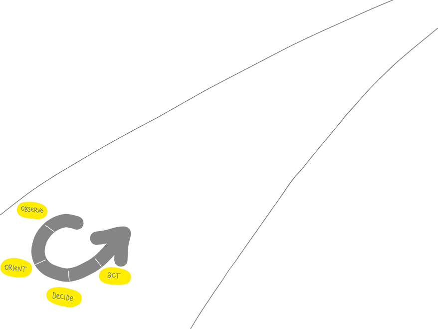
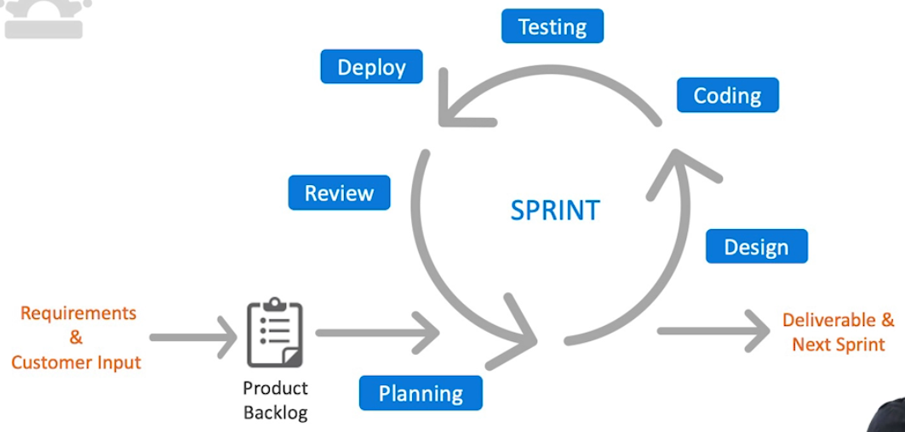
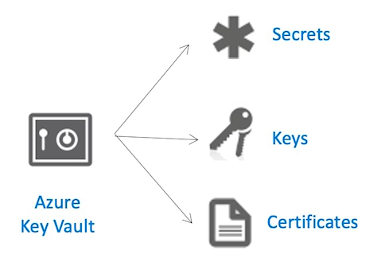
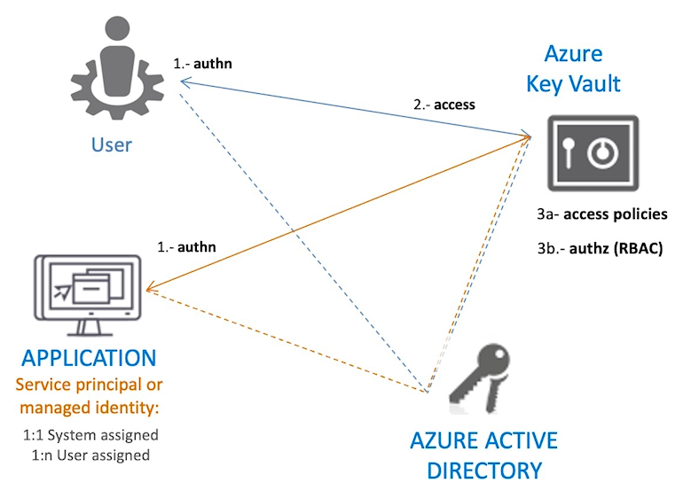
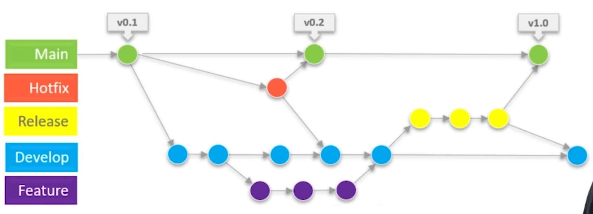
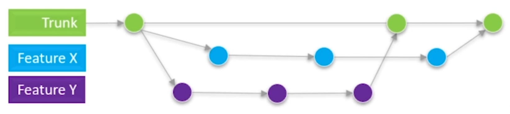
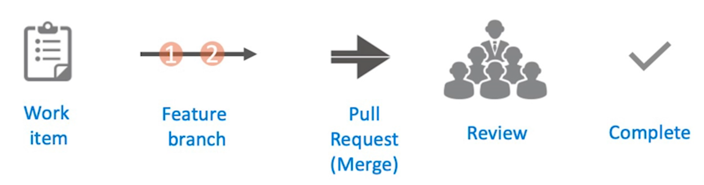
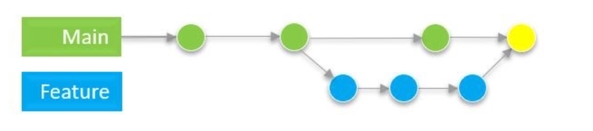
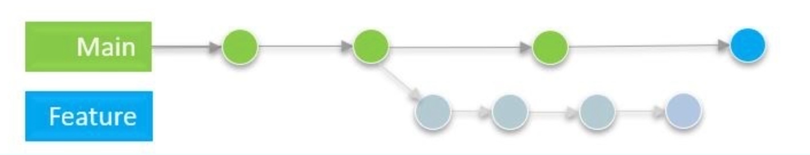
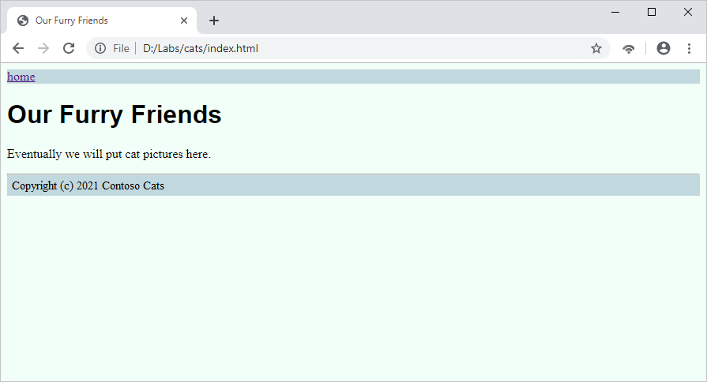

# Microsoft Certified DevOps Engineer Expert - AZ-400

# What is DevOps?

- The contraction of "Dev" and "Ops" refers to replacing siloed Development and Operations. 
- The idea is to create multidisciplinary teams that now work together with shared and efficient practices and tools. 
- Essential DevOps practices include agile planning, continuous integration, continuous delivery, and monitoring of applications. 
- DevOps is a constant journey.


- Plan

- Build

- Continous Integration

- Deploy

- Operate

- Continues Feedback

  

## Understand your cycle time

**OODA**

- Observe
- Orient
- Decide
- Act



## Explore the DevOps journey

**Continuous Integration** 

- drives the ongoing merging and testing of code, leading to an early finding of defects. 
- Other benefits include less time wasted fighting merge issues and rapid feedback for development teams.

**Continuous Delivery** 

- of software solutions to production and testing environments helps organizations quickly fix bugs and respond to ever-changing business requirements.

**Version Control**

- usually with a Git-based Repository, enables teams worldwide to communicate effectively during daily development activities. 
- Also, integrate with software development tools for monitoring activities such as deployments.

**Use Agile planning and lean project management techniques to:**

- Plan and isolate work into sprints.
- Manage team capacity and help teams quickly adapt to changing business needs.
- A DevOps Definition of Done is working software collecting telemetry against the intended business goals.

**Monitoring and Logging of running applications.** 

- Including production environments for application health and customer usage. 
- It helps organizations create a hypothesis and quickly validate or disprove strategies. Rich data is captured and stored in various logging formats.

**Public and Hybrid Clouds have made the impossible easy.** 

- The cloud has removed traditional bottlenecks and helped commoditize Infrastructure. 

  You can use 

- **Infrastructure as a Service (IaaS)** 

  - to lift and shift your existing apps 

- **Platform as a Service (PaaS)** 

  - to gain unprecedented productivity. The cloud gives you a data center without limits.

- **Infrastructure as Code (IaC)** 

  - Enables the automation and validation of the creation and teardown of environments to help deliver secure and stable application hosting platforms.

- **Use Microservices architecture** 

  - to isolate business use cases into small reusable services that communicate via interface contracts. This architecture enables scalability and efficiency.

- **Containers are the next evolution in virtualization.** 
  - They're much more lightweight than virtual machines, allow much faster hydration, and easily configure files.


## Understanding Azure Devops

 


### **WORK ITEMS**

- Task/activity, such as a bug, epic, feature, issue, task, test case, or user
story

- Work-item types depend on the selected process for the Azure DevOps
project (Basic, Scrum, Agile, CMMI)

- Assigned to project members and sprints

### **AZURE DEVOPS PROCESSES: BASIC**

- Track work with issues, tasks and epics

- Workflow states: to do, doing, done

### **AZURE DEVOPS PROCESSES: SCRUM**

- Track work with product backlog items, tasks, epics, features & bugs
- Ideal if your team practices Scrum
- Workflow states: new, approved, committed, done & removed

### **AZURE DEVOPS PROCESSES: AGILE**

- Track work with user stories, tasks, epics, features and bugs

- Ideal if your team uses Agile planning methods including scrum

- Development and test activities are tracked separately

- Workflow states: new, active, resolved, closed & removed

### **AZURE DEVOPS PROCESSES: CAPABILITY MATURITY MODEL INDEX**

- Track work with requirements, change requests, risk & reviews, as well as
epics, features & bugs

- Ideal if your team requires a framework for process improvement & an
auditable record of decisions

- Workflow states: proposed, active, resolved & closed

## Azure Devops Board

- Track work items throughout the workflow states (columns: new, resolved,
etc..) of the project

- Work items are presented as cards which you can easily drag and drop
throughout the workflow states

- Visualize the flow of work of your team and collaborate with others

  

### AZURE DEVOPS BOARDS: CONCEPTS

- Sprint: Period of time in which specific work must be completed

- Backlog items: List with work items required by the application

- Features: Group of backlog items

- Epics: Group of several features

- Effort/story points/size: Measure the size/complexity of a work item

### AZURE DEVOPS BOARDS AND GITHUB INTEGRATION

- Connect Azure Boards to GitHub repos

- Link Azure Boards work items to GitHub commits, pull requests and issues

- Sync GitHub issues to Azure Boards work items 

## Explore Azure Devops Boards

https://dev.azure.com/

## Integrate Azure Boards to Github

Goto Azure Devops Board > Organization > Project Settings > Github Connections

## Azure Devops: Wiki

- Share information about the project to help users understand, use and
  contribute to your project

- Supports collaborative editing of content & structure

### CREATING A WIKI

- New wiki git repository

- Publish code as wiki

- Format wiki content:

  - Markdown

  - HTML Tags

  - Images & files

  - Link to Work Items

### PERMISSIONS

- Read: Anyone with access to the project

- Contributor: Add or edit wiki pages

- Create repository: Publish code as wiki/create git repository

## Azure Devops: Dashboard

- Provide visibility to stakeholders and team members of the overall progress of a team or project in real time.

### WIDGETS

- Display chart

- User-configurable information

- Links

- Type: Out of box, marketplace, custom

### QUERY BASED CHARTS

- Work item, analytics report, release pipelines, build tests

### PERMISSIONS

- Anyone with access to the project can view dashboards

- Members with basic access+ and dashboard permissions or team admin/project admin can add, edit or manage a dashboard 7


## Integrate  external tools

**MESSAGING APPS**

Microsoft Teams and Sl ack can be integrated with Azure DevOps

- Create a team
- Install Boards/Repos/Pipelines app or plugin
- Create a channel for

### **MESSAGING: INTEGRATING AZURE DEVOPS BOARDS**

- **Authenticate:**
   "@azure boards signin"
   "/azboards signin"
- **Link channel to project:**
   "@azure boards link <project url>"
   "/azboards link < project url>"
- **Setup & manage subscriptions:**
   "@azure boards subscriptions"
   "/azboards subscriptions"

### **MESSAGING: INTEGRATING AZURE DEVOPS PIPELINES**

- **Authenticate:**
   "@azure pipelines signin"
   "/azpipelines signin"
- **Monitor pipelines in a project:**
   "@azure pipelines subscribe < project/pipeline url>"
   "/azpipelines subscribe < project/pipeline url>"
- **Manage subscriptions:**
   "@azure pipelines subscriptions"
   "/azpipelines subscriptions"

## SERVICE HOOKS

These subscriptions can be used to integrate Azure DevOps with third-party services.

- Triggered by a specific Azure DevOps Event.
  Example: pushing code, build completing, etc.

- You select a specific action a card/listto be performed.
  Example: creating in Trello

Webhooks are similar - they run with a trigger and as an action post JSON to an HTTP(S) endpoint

## **SERVICE MANAGEMENT**

- Service Management Tools can be connected to Azure with the IT Service Management Connector (ITSMC).

### Supported ITSM tools:

- Service Now
- System Center Service Manager

### Actions:

Create work items based on Azure alerts, sync incident and change request data from ITSM tool to Azure log analytics workspace

## Design an authentication strategy

**AZURE ACTIVE DIRECTORY**

- Identity and access management solution based in Azure cloud.

- Provides authentication for internet services, applications and third-party SaaS applications.

**Azure Tenant:** Represents a single organization. Automatically created upon signing up for a Microsoft cloud service subscription.

**Identity**: Can be a user, application or server that may require authentication.

**AZURE ACTIVE DIRECTORY AUTHENTICATION FEATURES**

**Azure AD Domain Services**: Allows you to join Azure virtual machines to a domain without the need for domain controllers

**Azure Application Management**: Allows you to register applications in an azure tenant to manage and secure access to the app

**Azure Service Principal**: Provides an identity for applications running in Azure resources (such as VMs, containers, and more) so that they can connect to other AD resources.

**Azure Managed Identity:**

- System-assigned
- User-assigned

**AZURE ACTIVE DIRECTORY SECURITY FEATURES**

**Azure AD Conditional Access: **Policies that enforce a set of rules/conditions to be satisfied in order to allow access

**Azure Multi-Factor Authentication:**
Additional form of identification during sign-in

- MS authenticator app,
- SMS,
- Voice call,
- OATH software/hardware token

**Azure Privileged Identity Management:** Time-based and approval-based role activation to allow access to Azure AD and resources

**AZURE ACTIVE DIRECTORY EXTERNAL IDENTITY FEATURES**

**Azure AD Business to Customer (B2C):**

- Customers use their preferred social, enterprise, or local account identity

- Provides SSO access to applications and APls

**Azure AD Business to Business (B2B):**

- Securely share applications and services with a guest by sending them an email invitation link
- Guest uses their own identity solution

## Authentication in Azure Devops

### **INTEGRATING ACTIVE DIRECTORY**

- You can connect an Azure DevOps organization to Active Directory to manage access

- Conditional Access Policies: Require multi-factor authentication, block access for unsupported devices, block access by location

### **AZURE REPOS AUTHENTICATION**

- You can authenticate to Azure DevOps Repos by using git in command prompt or any git client that supports SSH & HTTP authentication.

**SSH: Safer, public and private key pair, associated to your username:**

- id_rsa -> Private Key 
- id_rsa.pub -> Public Key

**Personal Access Token**: 

- easy to create and revoke, scoped permissions 	

### SERVICE CONNECTION AUTHENTICATION

**Basic**: Azure Repos

**Service Principal/Azure-Managed Service Identity**: Azure resource manager, Power Platform Built Tools, Azure Web Apps, Azure Kubernetes Service (AKS)

**Public/Private key pair**: Chef, Docker host, Ext. Git, SSH

**Token/API key-based**: Azure DevOps Repos, Ext. Git, Generic, Github, Maven, NPM, NuGet, Python, VS App Center

**Credentials based**: Azure Classic service, ARM, Subversion

## Integrate Microsoft Entra ID in Azure Devops

Goto Azure Devops > Organization Setting > Microsoft Entry  and click connect directory


## Authorization and governance

### SECURITY POLICIES IN AZURE DEVOPS

You can configure several policies at the Azure DevOps organizational level to:

- Restrict access via Oauth
- Restrict SSH authentication
- Restrict creation of public projects
- Restrict invites to Github users

### AUTHORIZATION IN AZURE DEVOPS

- Access to Azure DevOps features is based on security group and access level.

**Access levels:**

- Stakeholder, Basic, "Basic + Test Plans", Visual studio subscription

**Security group:**

- Project level - Readers, Contributors, Project Administrators Organizational level - Start with prefix "Project Collection" < group name>

### SERVICE CONNECTIONS

- Integrate third party services to execute tasks from a pipeline job.

**User permissions:**

- User: Reader, User, Creator, Administrator
- Scopes: Project, Organization

**Project & pipeline permissions:**

- Restrict/share the service connection between projects and pipelines

## Learn About Azure Key Vault

Azure Key Vault is a cloud service for securely storing and accessing secrets

- Centralize application secrets
- Securely store secrets and keys
- Monitor access and use




### USE CASE

- Azure Pipeline tasks (Azure Key Vault task, CLI/Powershell tasks, etc..)
- Azure DevOps (variable groups)
- ARM templates
- Terraform
- Applications

### AZURE CLI

```
az keyvault create --name "<your-unique-keyvault-name>" --resource-group "myResourceGroup" --location "EastUS"
```


### POWERSHELL

```
New-AzKeyVault -Name "‹your-unique-keyvault-name>" -ResourceGroupName "myResourceGroup" -Location "East US"
```


### KEY VAULT AUTHENTICATION

- Authentication is done with Azure AD. For authorization RBAC or Access policies can be used.

### KEY VAULT AUTHORIZATION

**Management plane:** Authorization to manage Key Vault (creating/deleting Key Vault...) uses RBAC

**Data plane**: manage secrets/keys/certificates Access policies can be used as well as RBAC.

### **PERMISSIONS/SECRET ACCESS CONTROL:**

- Get
- List
- Set
- Delete





## Learn about Azure DevOps variables

- Control job behavior, store values that you can use in your pipeline and help avoid hard-coding values

### User-defined

- Defined by user, can be set at root, stage and job level as well as in the Ul.

### Predefined/System variables

- Automatically set by the system
- Read-only variables

### Environment variables

- Variables injected to the pipeline which are specific to the OS

### Variable scopes (ordered by precedence)

- Job level
- Stage level
- Root level

### VARIABLE GROUPS

- Store values and secrets
- Shared across pipelines in the same project
- Link Azure Key Vault and map selective secrets

### SECRET VARIABLES

- Encrypt the variable and preventing it from appearing in the output of Azure Pipelines


## Learn about SCM (Source Code Management)/VCS (Version Control System)

### AZURE REPOS

- **Git**: Distributed VCS, branch policy, pull requests

- **Team Foundation Version Control**: Centralized VCS, path-based branches,
Granular permission and access restriction at file level

### GITHUB/GITHUB ENTERPRISE

- Decentralized VCS, git based, structure consists of organizations and user
  accounts.

### BITBUCKET CLOUD/BITBUCKET SERVER

- Git based, includes ci/cd pipelines

### APACHE SUBVERSION

- Centralized VCS, repositories accessed through filesystem, http:// or svn://

## Learn Git

### WINDOWS

Installed from https://git-scm.com/downloads

### LINUX & MACOS

Pre-installed

### AZURE REPOS AUTHENTICATION

- **SSH**: Public and private key pair

- **Personal access token (PAT)**: Name and token, scoped access, custom
expiration

- **Git credential manager core (GCM)**: Uses Azure DevOps services
credentials. Supports multi-factor authentication with Azure Repos and two-factor authentication with Github repositories. 

### Git Commands

**git config**

- This command sets the author name and email address respectively to be used with your commits.

````
git config –global user.name “[name]”
git config –global user.email “[email address]”
````

**git init** 

- This command is used to start a new repository.

```
git init [repository name]
```

**git clone**

- This command is used to obtain a repository from an existing URL.

```
git clone [repo name] [url]
```

**git remote**

- This command is used to connect your local repository to the remote server.

```
git remote add [variable name] [Remote Server Link]
```

**git add**

- This command adds a file to the staging area.

```
git add [file]  
```

**git commit**

- This command records or snapshots the file permanently in the version history.

```
git commit -m “[ Type in the commit message]” 
```

**git branch**

- This command creates a new branch.

```
git branch [branch name]
```

**git checkout**

- This command is used to switch from one branch to another.

```
git checkout [branch name]
```

- This command creates a new branch and also switches to it.

```
git checkout -b [branch name]
```

**git merge**

- This command merges the specified branch’s history into the current branch.

```
git merge [branch name]
```

**git push**

- This command sends the committed changes of master branch to your remote repository.

```
git push [remote] [branch]
```

**git fetch**

- Download objects and refs from another repository

```
git fetch [remote]
```

**git pull**

- This command fetches and merges changes on the remote server to your working directory.

```
git pull [remote]
```


## Git workflows, tags and branches

### WORKFLOWS

- **Git flow**
- **Github flow**
- **Trunk based development**

### BRANCHES

- **Main**: Default branch, production-ready state, tags
- **Development**: Copy of main; new features are merged into this branch
- **Feature**: Branch to work on a specific functionality
- **Release**: Copy of development branch; used for testing & documentation
- **Hotfix**: Copy of main; used to resolve bugs & issues

### TAGS

Used to capture a point in a git history that marks a version release

- **Lightweight tags**: Points to a specific commit, includes tag name
- **Annotated tags**: Points to a specific commit and includes metadata such as name, message and date.

### Gitflow

Strict branching model designed around a project release

- Published in 2010 by Vincent Driessen (https://nvie.com)
- Great for teams with junior developers
- Ideal for projects with a scheduled release cycle
- Projects where you work with vendors/third party or open-source
- Multiple versions of software need to be supported and maintained




### Trunk-based development

No concept of release; every feature is pushed live immediately

- Simpler and easier to adopt
- Main and release branches are combined into "trunk" branch
- New short-lived branches are created for every new feature
- Hotfixes are treated just like feature branches

**Trunk-based:**

- Commits from feature branches are preserved in trunk
- Daily commits; unfinished code is hidden with a feature toggle
- Branch by abstraction




## Pull Request

- Used to merge code, it allows teams to review code and provide feedback

### PERMISSIONS

- **Access Level**: Basic or higher to view/review pull request. Stakeholder in case of a public project
- **Security group**: Readers allows you to contribute to a pull request; contributors allows you to create or complete a pull request

### PULL REQUEST WORKFLOW



## BRANCH POLICIES

Help protect branches, enforce guidelines, restrict use, limit access

- **Require reviewers**: Require approval from minimum number of reviewers
- **Linked work items**: Require association between pull request and work items
- **Limit merge types**: Restrict merging to allow certain types
- **Build validation**: Build must succeed in order to complete pull request
- **Bypass branch policies**: Allows you to push changes even if policies are not satisfied

## BRANCH PROTECTION

- **Branch locking**: Prevent updates to the branch

- **Branch permissions**:

  - **Git:** Set policies and permissions for individual users/groups in a branch

  - **TFVC**: Set policies, permissions for individual users/groups are more granular (read, merge, label, lock)


## Merge types

### BASIC MERGE

- Maintains the commit history of the feature (source) branch
- Creates a merge commit in the target (destination) branch



### SQUASH MERGE

- Reduces git history by grouping changes into one single commit
- Adds this single commit to the front of target branch



 

### REBASE AND FAST FORWARD MERGE:

- Adds feature branch commits to the front of the target branch without grouping these changes in a new commit


### SEMI-LINEAR MERGE (REBASE WITH MERGE COMMIT):

- Adds feature branch commits to the front of the target branch and creates a merge commit


## Advanced repository features

### GIT REPOSITORY USAGE BEST PRACTICES:

- Repositories should generally be no larger than 10gb
- Don't commit large binaries, compressed files, logs or diagnostics data
- Don't commit compiled code or binary dependencies
- Do Commit: Source code, text formats

### GIT LFS (Large File Storage):

- Git extension, stores large binary files in separate storage
- Requires installation of Git LFS client

### GIT SUBMODULES:

\- Integrate another git repository into your repository

### FORKS:

\- Copy repository to a new repository

### MERGE CONFLICT:

\- Different branches being merged & updating same lines of code

### •gitignore:

- File within your git repository to prevent tracking of files

### Git go (garbage collection):

- Removes all unused data from repository

### Git prune:

- Cleans up unreachable (commits not accessed through a branch or log) or orphaned git objects

### Git partial clone and shallow clone:

- Allow you to work in a repository without downloading every version in the git history

### Git sparse-checkout:

- Specify which directories to download from the remote repository

# Getting started with GIT 

https://git-scm.com/

## What is version control?

- A version control system (VCS) is a program or set of programs that tracks changes to a collection of files. 
- One goal of a VCS is to easily recall earlier versions of individual files or of the entire project. 
- Another goal is to allow several team members to work on a project, even on the same files, at the same time without affecting each other's work.
- Another name for a VCS is a software configuration management (SCM) system. 

With a VCS, you can:

- See all the changes made to your project, when the changes were made, and who made them.
- Include a message with each change to explain the reasoning behind it.
- Retrieve past versions of the entire project or of individual files.
- Create *branches*, where changes can be made experimentally. This feature allows several different sets of changes (for example, features or bug fixes) to be worked on at the same time, possibly by different people, without affecting the main branch. Later, you can merge the changes you want to keep back into the main branch.
- Attach a tag to a version—for example, to mark a new release.


## GIT

- Git is a fast, versatile, highly scalable, free, open-source VCS. 
- Its primary author is Linus Torvalds, the creator of Linux.

## Git terminology

To understand Git, you have to understand the terminology. Here's a short list of terms that Git users frequently use. Don't be concerned about the details for now; all these terms will become familiar as you work your way through the exercises in this module.

- **Working tree**: The set of nested directories and files that contain the project that's being worked on.
- **Repository (repo)**: The directory, located at the top level of a working tree, where Git keeps all the history and metadata for a project. Repositories are almost always referred to as *repos*. A *bare repository* is one that isn't part of a working tree; it's used for sharing or backup. A bare repo is usually a directory with a name that ends in *.git*—for example, *project.git*.
- **Hash**: A number produced by a hash function that represents the contents of a file or another object as a fixed number of digits. Git uses hashes that are 160 bits long. One advantage to using hashes is that Git can tell whether a file has changed by hashing its contents and comparing the result to the previous hash. If the file time-and-date stamp is changed, but the file hash isn’t changed, Git knows the file contents aren’t changed.
- **Object**: A Git repo contains four types of *objects,* each uniquely identified by an SHA-1 hash. 
  - A ***blob*** object contains an ordinary file. 
  - A ***tree*** object represents a directory; it contains names, hashes, and permissions. 
  - A ***commit*** object represents a specific version of the working tree. 
  - A ***tag*** is a name attached to a commit.
- **Commit**: When used as a verb, *commit* means to make a commit object. This action takes its name from commits to a database. It means you are committing the changes you have made so that others can eventually see them, too.
- **Branch**: A branch is a named series of linked commits. The most recent commit on a branch is called the *head*. The default branch, which is created when you initialize a repository, is called `main`, often named `master` in Git. The head of the current branch is named `HEAD`. Branches are an incredibly useful feature of Git because they allow developers to work independently (or together) in branches and later merge their changes into the default branch.
- **Remote**: A remote is a named reference to another Git repository. When you create a repo, Git creates a remote named `origin` that is the default remote for push and pull operations.
- **Commands**, **subcommands**, and **options**: Git operations are performed by using commands like `git push` and `git pull`. `git` is the command, and `push` or `pull` is the subcommand. The subcommand specifies the operation you want Git to perform. Commands frequently are accompanied by options, which use hyphens (-) or double hyphens (--). For example, `git reset --hard`.

## Configure Git

1. In Cloud Shell, to double-check that Git is installed, type `git --version`:

   Bash

   ```bash
   git --version
   ```

    Tip

   You can use the **Copy** button to copy commands to the clipboard. To paste, right-click on a new line in the Cloud Shell terminal and select **Paste**, or use the Shift+Insert keyboard shortcut (⌘+V on macOS).

2. You should see output that looks something like this example:

   Output

   ```output
   git version 2.7.4
   ```

3. To configure Git, you must define some global variables: `user.name` and `user.email`. Both are required for you to make commits.

4. Set your name in Cloud Shell with the following command. Replace `<USER_NAME>` with the user name you want to use.

   Bash

   ```bash
   git config --global user.name "<USER_NAME>"
   ```

5. Now, use this command to create a `user.email` configuration variable, replacing `<USER_EMAIL>` with your e-mail address:

   Bash

   ```bash
   git config --global user.email "<USER_EMAIL>"
   ```

6. Run the following command to check that your changes worked:

   Bash

   ```bash
   git config --list
   ```

7. Confirm that the output includes two lines that are similar to the following example. Your name and e-mail address will be different from what's shown in the example.

   Output

   ```output
   user.name=User Name
   user.email=user-name@contoso.com
   ```

## Set up your Git repository

Git works by checking for changes to files within a certain folder. We'll create a folder to serve as our *working tree* (project directory) and let Git know about it, so it can start tracking changes. We tell Git to start tracking changes by initializing a Git repository into that folder.

Start by creating an empty folder for your project, and then initialize a Git repository inside it.

1. Create a folder named *Cats*. This folder will be the project directory, also called the working tree. The project directory is where all files related to your project are stored. In this exercise, it's where your website and the files that create the website and its contents are stored.

   Bash

   ```bash
   mkdir Cats
   ```

2. Change to the project directory by using the `cd` command:

   Bash

   ```bash
   cd Cats
   ```

3. Now, initialize your new repository and set the name of the default branch to `main`:

   If you're running Git version 2.28.0 or later, use the following command:

   Bash

   ```bash
   git init --initial-branch=main
   ```

   Or use the following command:

   Bash

   ```bash
   git init -b main
   ```

   For earlier versions of Git, use these commands:

   Bash

   ```bash
   git init
   git checkout -b main
   ```

   After you run the initialize command, you should see output that's similar to this example:

   Output

   ```output
   Initialized empty Git repository in /home/<user>/Cats/.git/
   
   Switched to a new branch 'main'
   ```

4. Now, use a `git status` command to show the status of the working tree:

   Bash

   ```bash
   git status
   ```

   Git responds with this output, which indicates that `main` is the current branch. (It's also the only branch.) So far, so good.

   Output

   ```output
    On branch main
   
    No commits yet
   
    nothing to commit (create/copy files and use "git add" to track)        
   ```

5. Use an `ls` command to show the contents of the working tree:

   Bash

   ```bash
   ls -a
   ```

## Get help from Git

Git, like most command-line tools, has a built-in help function that you can use to look up commands and keywords.

1. Type the following command to get help with what you can do with Git:

   Bash

   ```bash
   git --help
   ```

2. The command displays the following output:

   Output

   ```output
   usage: git [--version] [--help] [-C <path>] [-c name=value]
          [--exec-path[=<path>]] [--html-path] [--man-path] [--info-path]
          [-p | --paginate | --no-pager] [--no-replace-objects] [--bare]
          [--git-dir=<path>] [--work-tree=<path>] [--namespace=<name>]
          <command> [<args>]
   
   These are common Git commands used in various situations:
   
   start a working area (see also: git help tutorial)
      clone      Clone a repository into a new directory
      init       Create an empty Git repository or reinitialize an existing one
   
   work on the current change (see also: git help everyday)
      add        Add file contents to the index
      mv         Move or rename a file, a directory, or a symlink
      reset      Reset current HEAD to the specified state
      rm         Remove files from the working tree and from the index
   
   examine the history and state (see also: git help revisions)
      bisect     Use binary search to find the commit that introduced a bug
      grep       Print lines matching a pattern
      log        Show commit logs
      show       Show various types of objects
      status     Show the working tree status
   
   grow, mark and tweak your common history
      branch     List, create, or delete branches
      checkout   Switch branches or restore working tree files
      commit     Record changes to the repository
      diff       Show changes between commits, commit and working tree, etc
      merge      Join two or more development histories together
      rebase     Forward-port local commits to the updated upstream head
      tag        Create, list, delete or verify a tag object signed with GPG
   
   collaborate (see also: git help workflows)
      fetch      Download objects and refs from another repository
      pull       Fetch from and integrate with another repository or a local branch
      push       Update remote refs along with associated objects
   
   'git help -a' and 'git help -g' list available subcommands and some
   concept guides. See 'git help <command>' or 'git help <concept>'
   to read about a specific subcommand or concept.
   ```


## Basic Git commands

### git status

The first and most commonly used Git command is `git status`. You've already used it once, in the preceding exercise, to see that you had initialized your Git repo properly.

`git status` displays the state of the working tree (and of the staging area—we'll talk more about the staging area soon). It lets you see which changes are currently being tracked by Git, so you can decide whether you want to ask Git to take another snapshot.

### git add

`git add` is the command you use to tell Git to start keeping track of changes in certain files.

The technical term is *staging* these changes. You'll use `git add` to stage changes to prepare for a commit. All changes in files that have been added but not yet committed are stored in the *staging area*.

### git commit

After you've staged some changes for commit, you can save your work to a snapshot by invoking the `git commit` command.

*Commit* is both a verb and a noun. It has essentially the same meaning as when you commit to a plan or commit a change to a database. As a verb, committing changes means you put a copy (of the file, directory, or other "stuff") in the repository as a new version. As a noun, a commit is the small chunk of data that gives the changes you committed a unique identity. The data that's saved in a commit includes the author's name and e-mail address, the date, comments about what you did (and why), an optional digital signature, and the unique identifier of the preceding commit.

### git log

The `git log` command allows you to see information about previous commits. Each commit has a message attached to it (a commit message), and the `git log` command prints information about the most recent commits, like their time stamp, the author, and a commit message. This command helps you keep track of what you've been doing and what changes have been saved.

### git help

You've already tried out the `git help` command, but it's worth reminding you about. Use this command to easily get information about all the commands you've learned so far, and more.

Remember, each command comes with its *own* help page, too. You can find these help pages by typing `git <command> --help`. For example, `git commit --help` brings up a page that tells you more about the `git commit` command and how to use it.

## Exercise - Start a project

Completed100 XP

- 1 minute

Now that you've spent time learning the essential git commands, lets move onto creating a project in git.

In the exercises that follow, you'll start using Git by adding a simple HTML file to your working tree. Then, you'll make some changes in the directory and learn how to commit the changes.

### Create and add (stage) a file

Git doesn't do much with empty directories, so let's add a file to the working tree to serve as the home page for the cat photo website.

1. Make sure your Cloud Shell session is still active and that you're in your repo folder named *Cats*.

2. Use a `touch` command to create a file named *index.html*:

   Bash

   ```bash
   touch index.html
   ```

   `touch` updates a file's last-modified time if the file exists. If the file doesn't exist, Git creates an empty file with that file name.

3. Now, use `git status` to get the status of the working tree:

   Bash

   ```bash
   git status
   ```

   Git responds by informing you that nothing has been committed, but the directory does contain a new file:

   Output

   ```output
   No commits yet
   
   Untracked files:
     (use "git add <file>..." to include in what will be committed)
   
       index.html
   
   nothing added to commit but untracked files present (use "git add" to track)
   ```

   Notice that `git status` gives you hints about what you can do next. Git can be configured to be less wordy, but at this stage, more is better.

4. Use `git add` to add the new file to Git's *index*, followed by `git status` to check the status. *Don't forget the period at the end of the command*. It tells Git to index all the files in the current directory that have been added or modified.

   Bash

   ```bash
   git add .
   ```

   A commit has now been staged. Git's index is a staging area for commits. It's a list of all the file versions that will be part of the *next* commit you make.

   Rather than use `git add .`, you could have used `git add index.html` because *index.html* was the only new file in the directory. But if several files had been added, `git add .` would have covered them all.

5. Finally, use `git status` again to make sure your changes were staged properly:

   Bash

   ```bash
   git status
   ```

6. You should see output like this example:

   Output

   ```output
   On branch main
   
   Initial commit
   
   Changes to be committed:
     (use "git rm --cached <file>..." to unstage)
   
       new file:   index.html
   ```

### Make your first commit

Now that *index.html* has been added to the index, the next step is to commit it.

1. Use the following command to create a commit:

   Bash

   ```bash
   git commit index.html -m "Create an empty index.html file"
   ```

   The `-m` *flag* in this command tells Git that you're providing a commit message.

   There are many different ways to phrase commit messages, but a good guideline is to write the first line so that it says *what the commit does to the tree*. It's also common to capitalize the first letter, and to leave off the closing period to save space. Imagine that the first line of the message completes the sentence starting with "When pushed, this commit will..."

   A commit message can have multiple lines. The first line should have no more than 50 characters and should be followed by a blank line. Subsequent lines should have no more than 72 characters. These requirements aren't firm, and they harken back to the days of punch cards and "dumb" terminals, but they do make `git log` output look better.

2. Git responds with a confirmation of what you did:

   Output

   ```output
   [main (root-commit) 87e874c] Create an empty index.html file
    1 file changed, 0 insertions(+), 0 deletions(-)
    create mode 100644 index.html
   ```

3. Follow up with a `git status` command and confirm that the working tree is clean—that is, the working tree contains no changes that haven't been committed.

4. Now, use a `git log` command to show information about the commit:

   Bash

   ```bash
   git log
   ```

5. Git's response should be something like this example:

   Output

   ```output
   commit 87e874c4aeeb3f9692ae5d9875235353708d7dd5
   Author: User Name <user-name@contoso.com>
   Date:   Fri Nov 15 20:47:05 2019 +0000
   
   Create an empty index.html file
   ```

### Modify index.html and commit the change

*index.html* was created to serve as the website's home page, but it's currently empty. The next step is to add some HTML to it. We'll start simple by using the Cloud Shell built-in editor to add a single line of HTML.

1. Open *index.html* in the online editor by typing `code index.html` at the terminal prompt:

   Bash

   ```bash
   code index.html
   ```

2. Type or paste the following statements in the editor:

   HTML

   ```html
   <h1>Our Feline Friends</h1>
   ```

3. Save the file and close the online editor. You can select the ellipsis "..." in the right corner of the Cloud Shell editor or use the accelerator key (Ctrl+S on Windows and Linux, Cmd+S on macOS).

4. Use a `git status` command to check the status of the working tree:

   Bash

   ```bash
   git status
   ```

5. You can see that Git is aware of the changes you made:

   Output

   ```output
   On branch main
   Changes not staged for commit:
     (use "git add <file>..." to update what will be committed)
     (use "git checkout -- <file>..." to discard changes in working directory)
   
       modified:   index.html
   
   no changes added to commit (use "git add" and/or "git commit -a")
   ```

6. Now, commit the changes:

   Bash

   ```bash
   git commit -a -m "Add a heading to index.html"
   ```

   Note that we didn't run the `git add` command this time to stage our changes. Instead, we used the `-a` flag in the `git commit` command. The `-a` option adds all the files you modified since the last commit. It won't add *new* files. To add new files, you still need `git add`.

7. Check the output. It should look like this example:

   Output

   ```output
   [main 8c9143a] Add a heading to index.html
    1 file changed, 1 insertion(+)
   ```

The change to *index.html* has been committed. There are now two versions of the file in the repo, although you see only one of them (the current one). One of the benefits of using Git is that you can roll back the changes you have made, or you can go backward in time and see previous versions. More on this important topic later.


## Exercise - Make changes and track them with Git

Completed100 XP

- 1 minute

Most development projects are iterative. You write some code, and then you test the code and make sure it works. Then, you write more code and invite other people to contribute code. Iteration means many changes: code additions, bug fixes, deletions, and replacements.

As you work on your project, Git helps keep track of the changes you make. It also lets you undo mistakes. In the next exercises, you continue building out the website you're working on and learn some important new commands, like `git diff`.

### Modify index.html

The website's home page, *index.html*, currently contains just one line of HTML. Let's update it to do more, and then commit the change to Git.

1. Reopen the *index.html* file in the online editor for Cloud Shell (`code index.html`) and replace the file contents with the following HTML:

   HTML

   ```html
   <!DOCTYPE html>
   <html>
     <head>
       <meta charset='UTF-8'>
       <title>Our Feline Friends</title>
     </head>
     <body>
       <h1>Our Feline Friends</h1>
       <p>Eventually we will put cat pictures here.</p>
       <hr>
     </body>
   </html>
   ```

2. Save the file and close the online editor.

3. Use a `git diff` command to see what changed:

   Bash

   ```bash
   git diff
   ```

   The output format is the same as the Unix `diff` command, and the Git command has many of the same options. A plus sign appears in front of lines that were added, and a minus sign indicates lines that were deleted.

   The default is for `git diff` to compare the working tree to the index. In other words, it shows you all the changes that haven't been staged (added to Git's index) yet. To compare the working tree to the last commit, you can use `git diff HEAD`.

   If the command doesn't return to the prompt after it executes, enter `q` to exit the diff view.

4. Next, commit the change. Instead of using the `-a` flag, you can explicitly name a file to be staged and committed if Git already has the file in the index (the `commit` command looks only for the existence of a file).

   Bash

   ```bash
   git commit -m "Add HTML boilerplate to index.html" index.html
   ```

5. Use `git diff` again to compare the working tree to the index:

   Bash

   ```bash
   git diff
   ```

   This time, `git diff` produces no output because the working tree, index, and `HEAD` are all in agreement.

6. Let's say you decide "furry" sounds friendlier than "feline." Replace the two occurrences of "Feline" in *index.html* with "Furry." Then, save the file.

   If you used the built-in code editor by using the `code` command, you won't see anything unusual. But, if you happened to use another editor, including an editor called *sed*, the editor probably created an *index.html.bak* file that you don't want to commit. Editors like Vim and Emacs create backup files with names like *index.html~* and *index.html.~1~*, depending on how they're configured.

7. Use the following command to create and open a file named *.gitignore* in the built-in code editor:

   Bash

   ```bash
   code .gitignore
   ```

8. Add the following lines to the file:

   Bash

   ```bash
   *.bak
   *~
   ```

   This line instructs Git to ignore files that have file names ending in *.bak* or *~*.

   *.gitignore* is a very important file in the Git world because it prevents extraneous files from being submitted to version control. Boilerplate *.gitignore* files are available for popular programming environments and languages.

9. Save and close the editor, and then use these commands to commit the changes:

   Bash

   ```bash
   git add -A
   git commit -m "Make small wording change; ignore editor backups"
   ```

   This example uses the `-A` option with `git add` to add all untracked (and not ignored) files, and the files that have changed, to the files that are already under Git control.

If you do a `git diff` right now, the output will be empty because the changes have been committed. However, you can always use a `git diff HEAD^` command to compare differences between the latest commit and previous commit. Try it and see. Don't forget to include the caret `^` character at the end of the command.

### Add a subdirectory

Most websites use HTML *and* CSS style sheets, and the site you're building is no exception. Style sheets typically are stored in a subdirectory, so let's create a subdirectory named *CSS* and add it to the repo.

1. Begin by creating a subdirectory named *CSS* in the project directory:

   Bash

   ```bash
   mkdir CSS
   ```

2. Then, do a `git status`:

   Bash

   ```bash
   git status
   ```

   Why does Git report that there's nothing to commit?

   People often are surprised to learn that Git doesn't consider adding an empty directory to be a change. That's because Git tracks only changes to *files*, not changes to directories.

   Sometimes, especially in the initial stages of development, you *want* to have empty directories as placeholders. A common convention is to create an empty file, often called *.git-keep*, in a placeholder directory.

3. Use the following commands to create an empty file with that name in the *CSS* subdirectory and add the contents of the subdirectory to the index:

   Bash

   ```bash
   touch CSS/.git-keep
   git add CSS
   ```

4. Follow up by using `git status` again to check the status of the repo. Confirm that it reports one new file.

### Replace a file

Now, let's replace *.git-keep* with a CSS file and update *index.html* to reference it.

1. Delete *.git-keep* from the *CSS* subdirectory:

   Bash

   ```bash
   rm CSS/.git-keep
   ```

2. Use the built-in editor to create a file named *site.css* in the *CSS* subdirectory:

   Bash

   ```bash
   cd CSS
   code site.css
   ```

3. Add the following CSS to the file. Then, save and close the file.

   css

   ```css
   h1, h2, h3, h4, h5, h6 { font-family: sans-serif; }
   body { font-family: serif; }
   ```

4. Now, add the following line to *index.html* (don't forget to go back up to the *Cats* directory) after the `<title>` line, and save the modified file:

   HTML

   ```html
   <link rel="stylesheet" href="CSS/site.css">
   ```

5. Use `git status` to see a summary of the files that have changed. Then, use the following commands to stage untracked files to version control and commit your changes to *site.css* and *index.html*:

   Bash

   ```bash
   git add .
   git commit -m "Add a simple stylesheet"
   ```

Unlike most VCSes, Git records the contents of your files rather than the deltas (changes) between them. That's a large part of what makes committing, branching, and switching between branches so fast in Git. Other VCSes have to apply a list of changes to get between one version of a file and another. Git just unzips the other version.

### List commits

Now that you have a reasonable number of changes recorded, you can use `git log` to look at them. As with most Git commands, there are plenty of options to choose from. One of the most useful is `--oneline`.

1. Use the following command to review all your commits:

   Bash

   ```bash
   git log
   ```

2. Check the output. It should look similar to this example:

   Output

   ```output
   commit ae3f99c45db2547e59d8fcd8a6723e81bbc03b70
   Author: User Name <user-name@contoso.com>
   Date:   Fri Nov 15 22:04:05 2019 +0000
   
       Add a simple stylesheet
   
   commit 4d07803d7c706bb48c52fcf006ad50946a2a9503
   Author: User Name <user-name@contoso.com>
   Date:   Fri Nov 15 21:59:10 2019 +0000
   
       Make small wording change; ignore editor backups
   
   ...
   ```

3. Now, use this command to get a more concise listing:

   Bash

   ```bash
   git log --oneline
   ```

4. Check the output again. This time, it should look like this example:

   Output

   ```output
   ae3f99c Add a simple stylesheet
   4d07803 Make small wording change; ignore editor backups
   f827c71 Add HTML boilerplate to index.html
   45535f0 Add a heading to index.html
   a69fe78 Create an empty index.html file
   ```

You can see why, when you're hundreds (or thousands) of commits into a project, the `--oneline` option might be your best friend. Another useful option is `-nX`, where `X` is a commit number: 1 for the latest commit, 2 for the one before that, and so on. To see for yourself, try a `git log -n2` command.

We've made substantial progress by using the basic functionality of Git. Next up: Step it up a level and learn how to use Git to recover from common mistakes.

## Amend a commit: --amend flag

In the preceding exercise, you updated the *index.html* file to modify the path to the style sheet. You should have added the following statement:

HTML

```html
<link rel="stylesheet" href="CSS/site.css">
```

Suppose you discover that you made an error when you entered the statement. Instead of specifying the folder path as `CSS`, you entered `CS`:

HTML

```html
<link rel="stylesheet" href="CS/site.css">
```

When you refresh the page in your browser, you notice that your CSS style sheet isn't applied. After you investigate, you realize that you entered the path values incorrectly.

So, you update *index.html* with the correct path to the style sheet. At this point, you could just commit the corrected version of *index.html*, but instead, you prefer to put it in the same commit as the original. The `--amend` option to `git commit` lets you change history (and how often does one get the chance to change history?).

Bash

```bash
git commit --amend --no-edit
```

The `--no-edit` option tells Git to make the change without changing the commit message. You can also use `--amend` to edit a commit message, to add files that were accidentally left out of the commit, or to remove files that were added by mistake.

 Note

The ability to change history is one of Git's most powerful features. As with most power tools, you must use it carefully. In particular, it's a bad idea to change any commits that have been shared with another developer, or which were published in a shared repository, like GitHub.

### Recover a deleted file: git checkout

Imagine that you made a change to a source code file that broke the entire project, so you want to revert to the previous version of that file. Or perhaps you accidentally deleted a file altogether. Git makes it easy to retrieve an earlier version, even if the current version no longer exists. Your best friend in this situation is the [git checkout](https://git-scm.com/docs/git-checkout) command.

`git checkout` has multiple uses, but in the next exercise, we'll use it to recover a deleted file. `git checkout` updates files in the working tree to match the version in the index or in the specified tree.

If you've accidentally deleted a file, you can recover it by bringing the version from the index back into the working tree by using this command:

Bash

```bash
git checkout -- <file_name>
```

You can also check out a file from an earlier commit (typically, the head of another branch), but the default is to get the file from the index. The `--` in the argument list serves to separate the commit from the list of file paths. It's not strictly needed in this case, but if you had a branch named <file_name> (perhaps because that's the name of the file being worked on in that branch), `--` would prevent Git from getting confused.

Later, you'll learn that you also use `checkout` to switch branches.

### Recover files: git reset

You also can delete a file by using `git rm`. This command deletes the file on your disk, but it also has Git record the file deletion in the index.

So, if you ran this command:

Bash

```bash
git rm index.html
git checkout -- index.html
```

Git would *not* happily restore *index.html*! Instead, you'd get an error like this example:

Output

```output
error: pathspec 'index.html' did not match any file(s) known to git.
```

To recover *index.html*, we would have to use a different technique: `git reset`. You can use `git reset` to unstage changes.

You could recover *index.html* by using these two commands:

Bash

```bash
git reset HEAD index.html
git checkout -- index.html
```

Here, `git reset` unstages the file deletion from Git. This command brings the file back to the index, but the file is still deleted on disk. You can then restore it to the disk from the index by using `git checkout`.

Here's another "Aha!" moment for new Git users. Many VCSes make files read-only to ensure that only one person at a time can make changes; users use an unrelated `checkout` command to get a writable version of the file. They also use `checkin` for an operation similar to what Git does with a combination of `add`, `commit`, and `push`. This fact occasionally causes confusion when people begin to use Git.

### Revert a commit: git revert

The last important command to know for fixing mistakes with Git is `git revert`. `git checkout` works only in situations where the changes to undo are in the index. After you've committed changes, you need to use a different strategy to undo them. In this case, we can use `git revert` to revert our previous commit. It works by making *another* commit that cancels out the first commit.

We can use `git revert HEAD` to make a commit that's the exact *opposite* of our last commit, undoing the previous commit while leaving all history intact. The `HEAD` part of the command just tells Git that we want to "undo" only the last commit.

As an aside, you can also remove the most recent commit by using the `git reset` command:

Bash

```bash
git reset --hard HEAD^
```

Git offers several types of resets. The default is `--mixed`, which resets the index but not the working tree; it also moves HEAD, if you specify a different commit. The `--soft` option moves `HEAD` only, and it leaves both the index and the working tree unchanged. This option leaves all your changes as "changes to be committed", as `git status` would put it. A `--hard` reset changes both the index and the working tree to match the specified commit; any changes that you made to tracked files are discarded.

### Practice recovering a deleted file

1. First, try deleting *index.html*:

   Bash

   ```bash
   rm index.html
   ```

   It might seem like a bad idea, but remember: Git has your back!

2. Use an `ls` command to verify that *index.html* was deleted:

   Bash

   ```bash
   ls
   ```

3. You should see the following output. Note that now, there's no *index.html* file!

   Output

   ```output
   CSS
   ```

4. Let's recover *index.html*. Use `git checkout` to bring back index.html:

   Bash

   ```bash
   git checkout -- index.html
   ```

5. Use `ls` again to check the contents of the current directory. Has *index.html* been restored?

   Yes! Now, the output should have an *index.html* file and a *CSS* directory:

   Output

   ```output
   CSS  index.html
   ```

### Practice recovering a file that was deleted: git rm

When you want to recover deleted files, things are a little more complicated if you delete them by using `git rm` instead of by using `rm`.

1. To see what happens, try this command:

   Bash

   ```bash
   git rm index.html
   ```

2. Again, look for *index.html* by running `ls`. You should not see *index.html*.

3. Try to recover *index.html* the same way that you did last time:

   Bash

   ```bash
   git checkout -- index.html
   ```

4. This time, Git complains that it knows nothing about *index.html*. That's because Git not only deleted the file, it recorded the deletion in the index:

   Output

   ```output
   error: pathspec 'index.html' did not match any file(s) known to git.
   ```

5. Unstage the deletion of *index.html* with the `git reset` command:

   Bash

   ```bash
   git reset HEAD index.html
   ```

6. Check for this output, which confirms it:

   Output

   ```output
   Unstaged changes after reset:
   D       index.html
   ```

7. Now, you can recover your file from the index with the command you used before:

   Bash

   ```bash
   git checkout -- index.html
   ```

   `git reset` unstaged the change, but the file was still deleted, so you had to use `checkout` to get it back.

8. Double-check that it worked by running `ls`.

### Revert a commit

Now, let's make things more complicated. Suppose you accidentally overwrite one file with another file, or you make a change to a file that turns out to be a big mistake. You want to revert to the previous version of the file, but you had already committed the changes. In this case, a simple `git checkout` won't do the trick.

One solution to this problem is to revert the previous commit.

1. Open *index.html* with `code`:

   Bash

   ```bash
   code index.html
   ```

2. Replace the contents of *index.html* with this code:

   HTML

   ```html
   <h1>That was a mistake!</h1>
   ```

3. Save and close the file.

4. Use these commands to commit the changes, and show the latest commit:

   Bash

   ```bash
   git commit -m "Purposely overwrite the contents of index.html" index.html
   git log -n1
   ```

   The `-n1` flag here tells Git that we want only the most recent commit entry.

5. Use the following commands to attempt to restore *index.html*:

   Bash

   ```bash
   git checkout -- index.html
   ```

6. Open *index.html* in the editor:

   Bash

   ```bash
   code index.html
   ```

   Which version of *index.html* do you see? The old version or the new version?

   In this situation, the best course of action is to *revert* the change by making another commit that cancels out the first one. That's a job for `git revert`.

7. Close the file and use `git revert` to undo your committed changes:

   Bash

   ```bash
   git revert --no-edit HEAD
   ```

   The `--no-edit` flag tells Git that we don't want to add a commit message for this action.

8. Check the output. It should look similar to this example:

   Output

   ```output
   [main 6a27310] Revert "Purposely overwrite the contents of index.html"
   1 file changed, 13 insertions(+), 1 deletion(-)
   ```

9. Follow up with a `git log` command to show the latest commit:

   Bash

   ```bash
   git log -n1
   ```

10. Check the output again. It should look like this example:

    Output

    ```output
    Author: User Name <user-name@contoso.com>
    Date:   Tue Nov 19 23:42:26 2019 +0000
    
    Revert "Purposely overwrite the contents of index.html"
    
    This reverts commit 15d3bded388470c98881a632025bc15190fe9d17.
    ```

11. Finally, open the *index.html* file to make sure the content is the correct version.

Reverting isn't the only way to remedy this situation; you could just edit *index.html* and commit the corrected file. That option is harder if the changes you committed were extensive. In any case, `git revert` is a good way to signal your intent.

# Collaborate with Git

## Collaborate by using a pull command


In your downtime outside of your new job, you've been working on a website that hosts photos of cats. You've been using Git for version control, and it's time to invite collaborators into the project. During a pizza party at your house, your friend and fellow cat lover Alice offers to help bring your vision to fruition, and you eagerly accept.

Alice first needs to make a copy of your Git project. Then, Alice will want to send their changes to you as they make them. This situation is where Git's *distributed* nature shines. Using Git, two or more people can work together on a project without fear of overwriting the other's work. Moreover, you can check Alice's work before merging it with your work. (Alice is talented, but no developer is perfect. Trust but verify.)

In this lesson, you learn how to clone a repository (also called a *repo*) to make it available to other people. You also learn to use one of Git's most important features: pull requests.

**Clone a repository (git clone)**

In Git, you copy a repo by *cloning* it using the `git clone` command. You can clone a repo no matter where it's stored, as long as you have a URL or path to point it to.

`git clone` accepts a file system path; an SSH path (for example, `git@example.com:alice/Cats`—you'll be familiar with this form if you've used Rsync or SCP); or a URL, typically one that starts with `file:`, `git:`, or `ssh`. The various forms are described in the documentation for `git clone`. In Unix and Linux, the cloning operation uses hard links, so it's fast and uses minimal space because only the directory entries need to be copied, not the files.

**Remote repositories (git pull)**

When Git clones a repository, it creates a reference to the original repo that's called a *remote* by using the name `origin`. It sets up the cloned repo so that the cloned repo will *pull* from, or retrieve data from, the remote repository. (Git also can *push*. You'll learn about pushing in Git later in this module.) `origin` is the default location for Git to pull changes from and push changes to. `git pull` copies changes from the remote repository to the local one. The `git pull` command is very efficient because it copies only *new* commits and objects, and then it checks them into your working tree.

You pull from `origin` by using the `git pull` command. It's useful to compare `git pull` with other methods of copying files. The `scp` command copies everything. (`scp` is similar to the Unix `cp` command, except that the files being copied don't have to be on the same computer.) If there are 10,000 files in the remote directory, `scp` copies them all. A more efficient program called Rsync looks at every file in the local and remote directories and copies only the ones that are different. Rsync often is used for making backups, but it still has to hash every file unless the files have different sizes or creation dates.

Git looks only at commits. It already knows the last commit that it got from the remote repository because it saved the list of commits. Then, Git tells the computer that it's copying from to send everything that changed, including the new commits and the objects they point to. Those commits and objects are bundled up in a file called a *pack* and sent over in one batch. Finally, Git updates the working tree by unpacking all the objects that changed and merging them (if necessary) with the commits and objects in the working tree.

Git pulls or pushes only when you tell it to. That's different from, say, Dropbox, which has to ask the operating system to notify it of any changes you make in its folder and occasionally ask the server whether anyone else has made changes.

**Create pull requests (git request-pull)**

After another developer, like Alice, has cloned your repo and made some changes locally, they will want to incorporate those changes back into the original repo. It might seem like pushing those changes to the original repo is the right approach. However, a push to the original repo would fail because other users don't have permission to make changes to your repo. And that's as it should be. For now, you want to review incoming changes before merging them into the main code base.

For now, Alice will have to submit a *pull request* to ask you to pull their changes into the main code base. Alice can do that by using `git request-pull`, which might look like this example:

Bash

```bash
git request-pull -p origin/main .
```

Alice refers to the `main` branch on the `origin` remote as `origin/main`.

This pull request is essentially the same thing as a pull request on GitHub (GitHub is a place to store code, which we don't cover in this module). A pull request gives you a chance to review other collaborators' changes before you incorporate their work into the work you're doing on the website. Code reviews are an important part—some would say the most important part—of collaborative programming.

**Create a remote (git remote) and complete the pull request (git pull)**

As a project owner, you need to know how to merge pull requests. First, you use the `git remote` command to set up another developer's repo as a *remote*. Then, you use that remote for pulls and pull requests by using the `git pull` command.

Behind the scenes, `git pull` is a combination of two simpler operations: `git fetch`, which gets the changes, and `git merge`, which merges those changes into your repository. In this case, the merge was *fast-forward*, meaning that Alice had your latest commit in their repository, so their commit could be added to the front of your history without any modification.


## Setup

Git is already installed for us in Azure Cloud Shell, so we can use Git in Cloud Shell to the right.

1. Use the `mkdir` command to create a folder named *Cats*:

   Bash

   ```bash
   mkdir Cats
   ```

2. Use the `cd` command to change to the project folder:

   Bash

   ```bash
   cd Cats
   ```

3. Now, initialize the new repository and set the name of the default branch to `main`.

   If you're running Git version 2.28.0 or later, use the following commands:

   Bash

   ```bash
   git init --initial-branch=main
   git init -b main
   ```

   For earlier versions of Git, use these commands:

   Bash

   ```bash
   git init
   git checkout -b main
   ```

4. Configure Git by adding your credentials. Replace `<USER_NAME>` and `<USER_EMAIL>` with your own information (for example, "User Name" and "user-name@contoso.com").

   Bash

   ```bash
   git config user.name "<USER_NAME>"
   git config user.email "<USER_EMAIL>"
   ```

5. Create some files by using the `touch` command, and then stage and commit the files by using Git:

   Bash

   ```bash
   touch index.html
   mkdir CSS
   touch CSS/site.css
   git add .
   git commit -m "Create empty index.html, site.css files"
   ```

6. Add some HTML to your *index.html* file by using the Cloud Shell code editor, which you can open by using the `code` command at the terminal prompt:

   Bash

   ```bash
   code index.html
   ```

7. Paste in this HTML code:

   HTML

   ```html
   <!DOCTYPE html>
   <html>
     <head>
       <meta charset='UTF-8'>
       <title>Our Feline Friends</title>
       <link rel="stylesheet" href="CSS/site.css">
     </head>
     <body>
       <h1>Our Feline Friends</h1>
       <p>Eventually we will put cat pictures here.</p>
       <hr>
     </body>
   </html>
   ```

8. Save the file and close the editor. You can select the ellipsis "..." in the right corner of the editor, or use the accelerator key (Ctrl+S on Windows and Linux, Cmd+S on macOS).

9. Change to the *CSS* directory and open *site.css* in the editor:

   Bash

   ```bash
   cd CSS
   code site.css
   ```

10. Add the following CSS to *site.css*:

    css

    ```css
    h1, h2, h3, h4, h5, h6 { font-family: sans-serif; }
    body { font-family: serif; }
    ```

    Then, save the file and close the editor.

11. Go back to the *Cats* directory.

    Bash

    ```bash
    cd ..
    ```

12. Finally, commit your changes again:

    Bash

    ```bash
    git add .
    git commit -m "Add simple HTML and stylesheet"
    ```

13. Quickly check your Git log to make sure everything looks good:

    Bash

    ```bash
    git log --oneline
    ```

14. Check the output. You should see output like this example:

    Output

    ```output
    2bf69ab Add simple HTML and stylesheet
    bb371c8 Create empty index.html, site.css files
    ```

## Clone a repository

Now, let's assume the role of Alice and practice cloning a repository to collaborate on.

To simulate Alice cloning your repo onto their computer, you'll create a directory named *Alice* on your computer and clone your project directory into it. In real life, you would accomplish this collaboration by setting up a network share or a remote that's reachable by URL.

1. Create a directory named *Alice* to clone the repo into. It must *not* be a subdirectory of your project directory (*Cats*), so `cd` up again to the parent directory from your project directory to make *Alice* a sibling of the project directory. Then, `cd` into the *Alice* directory.

   Bash

   ```bash
   cd ..
   mkdir Alice
   cd Alice
   ```

2. Now, use `git clone` to clone the repo that's in your project directory into the *Alice* directory. Be sure to include the period at the end of the command:

   Bash

   ```bash
   git clone ../Cats .
   ```

   `../Cats` tells Git where to clone from and `.` tells Git where to clone to. In Unix, `.` refers to your current directory.

3. Check the output. Git should display this text to let you know that it worked:

   Output

   ```output
   Cloning into '.'...
   done.
   ```

A clone of the repo that's in your project directory is now in your *Alice* directory!

## Exercise - Make a pull request

In the sandbox, make sure you’re still in the *Alice* directory, which is the top folder for Alice’s clone of the Cats repo. You can use the command `pwd` to verify your folder location.

Bash

```bash
pwd
```

Right now, there's nothing for Alice to pull because you haven't made any changes since Alice cloned the repo. You can prove that by using the following command, which shows the output `Already up-to-date`:

Bash

```bash
git pull
```

### Make a change and submit a pull request

Alice starts working on the website. Alice's first decision is to change the site's background color. Alice experiments locally and ultimately chooses their favorite shade of light blue.

1. Set up an identity for Alice by running the following commands:

   Bash

   ```bash
   git config user.name "Alice"
   git config user.email "alice@contoso.com"
   ```

   These `config` settings are stored in the repo in the *.git/config* file, so you won't have to enter them again. Each time you change to the *Alice* directory, you effectively assume Alice's identity.

2. Open the *site.css* file in the *Alice/CSS* directory:

   Bash

   ```bash
   code CSS/site.css
   ```

3. To change the background color of the page to light blue, replace the second line in the file with the following statement:

   css

   ```css
   body { font-family: serif; background-color: #F0FFF8; }
   ```

   Then, save the file and close the editor.

4. Now, commit the change:

   Bash

   ```bash
   git commit -a -m "Change background color to light blue"
   ```

5. Then, make a pull request back to the original repo:

   Bash

   ```bash
   git request-pull -p origin/main .
   ```

6. Check the output. You should see output similar to the following example:

   Output

   ```output
   The following changes since commit 2bf69ab0226d8d35efd1e92c83cd92c5cc09a7ae:
   
     Add simple HTML and stylesheet (2019-11-21 01:57:24 +0000)
   
   are available in the git repository at:
   
     .
   
   for you to fetch changes up to 95bbc3b6929953e9b04353920e97230b463022f0:
   
     Change background color to light blue (2019-11-21 02:33:48 +0000)
   
   ----------------------------------------------------------------
   Alice (1):
         Change background color to light blue
   
    CSS/site.css | 2 +-
    1 file changed, 1 insertion(+), 1 deletion(-)
   
   diff --git a/CSS/site.css b/CSS/site.css
   index caefc86..86d41e8 100644
   --- a/CSS/site.css
   +++ b/CSS/site.css
   @@ -1,2 +1,2 @@
    h1, h2, h3, h4, h5, h6 { font-family: sans-serif; }
   -body { font-family: serif; }
   \ No newline at end of file
   +body { font-family: serif; background-color: #F0FFF8; }
   \ No newline at end of file
   ```

### Create a remote and complete the pull request

Because your project directory and the *Alice* directory are on the same computer, you can pull directly from the *Alice* directory. In real life, the *Alice* directory would be on Alice's computer. You solve this situation by setting up a *remote* by using the `git remote` command. Then, you use that remote for pull and push requests. For this exercise, it's not practical to set up two machines to do these steps, so we'll set up a remote that uses a local path name. In reality, you would use a network path or URL instead.

1. Change back to the project directory and use the `git remote` command to create a remote named `remote-alice` that targets Alice's project directory:

   Bash

   ```bash
   cd ../Cats
   git remote add remote-alice ../Alice
   ```

2. Now, execute a pull:

   Bash

   ```bash
   git pull remote-alice main
   ```

   Notice that you have to specify a branch, `main`, in the pull command. You will learn in the next lesson how to set up an upstream URL for the branch.

3. Check the output. You should see output like this example, which shows that you successfully completed the pull request:

   Output

   ```output
   remote: Counting objects: 4, done.
   remote: Compressing objects: 100% (3/3), done.
   remote: Total 4 (delta 1), reused 0 (delta 0)
   Unpacking objects: 100% (4/4), done.
   From ../Alice
    * branch            main     -> FETCH_HEAD
    * [new branch]      main     -> remote-alice/main
   Updating 2bf69ab..95bbc3b
   Fast-forward
    CSS/site.css | 2 +-
    1 file changed, 1 insertion(+), 1 deletion(-)
   ```

The fun is just beginning! In the next lesson, you learn how to set up and use a shared repository, which makes collaborating simpler and more convenient.

## Exercise - Collaborate by using a shared repo

Pulling directly from someone else's repository works, provided you're both on the same network. But, it's a clumsy process, and most collaborators aren't on the same network. It's better to set up a central repository that all collaborators can push to and pull from.

When you tell your developer friend Bob about your project and Bob asks to participate, that's exactly what you decide to do—set up a central repository, which is also called a *bare repository*.

## Create a bare repository

What you need is a repository that doesn't have a working tree. A bare repository has several advantages over a working tree:

- Without a working tree, everybody can push changes without worrying about which branch is checked out.
- It's easy for Git to detect when another user has pushed changes that might conflict with yours.
- A shared repo scales to any number of developers. With a bare repo, you have to know only about the shared repo, and not about all the other collaborators from whom you might need to pull.
- By putting the shared repo on a server that you all can access, you don't have to worry about firewalls and permissions.
- You don't need separate accounts on the server because Git keeps track of who made each commit. (GitHub has millions of users who all share the `git` account. Everyone uses the Secure Shell (SSH) cryptographic network protocol, and users are distinguished by their public keys.)

Creating a bare repo for sharing is easy:

1. Create a new directory named *Shared.git* at the same level as the *Alice* and *Cats* directories to hold the bare repo:

   Bash

   ```bash
   cd ..
   mkdir Shared.git
   cd Shared.git
   ```

   The directory name isn't important, but we'll refer to it as the *Shared.git* directory, or just the *shared* directory, in these exercises.

   Naming the directory *Shared.git* follows the longstanding tradition of assigning bare repositories a name that ends in `.git` to distinguish them from working trees. It is a convention, but not a requirement.

2. Now, use the following command to create a bare repo in the shared directory:

   Bash

   ```bash
   git init --bare
   ```

3. When a repo is still bare, the `git checkout` command can't be used to set the name of the default branch. To accomplish this task, you can change the `HEAD` branch to point at a different branch; in this case, it's the `main` branch:

   Bash

   ```bash
   git symbolic-ref HEAD refs/heads/main
   ```

4. The next step is to get the contents of *your* repo into the shared repo. Use these commands to return to the project directory where your repo is stored, set up an `origin` remote, and perform an initial push:

   Bash

   ```bash
   cd ../Cats
   git remote add origin ../Shared.git
   git push origin main
   ```

5. Check the output. The output should indicate success:

   Output

   ```output
   Counting objects: 12, done.
   Delta compression using up to 2 threads.
   Compressing objects: 100% (8/8), done.
   Writing objects: 100% (12/12), 1.07 KiB | 0 bytes/s, done.
   Total 12 (delta 1), reused 0 (delta 0)
   To ../Shared.git
    * [new branch]      main -> main
   ```

6. You want `push` and `pull` to use the `main` branch of `origin` by default, as if you had made your repo by cloning it in the first place. But first, you need to tell Git which branch to track.

   Bash

   ```bash
   git branch --set-upstream-to origin/main
   ```

7. Check for this output:

   Output

   ```output
   Branch main set up to track remote branch main from origin.
   ```

   Git would complain if you try to run this command before the initial push, because the new repository had no branches. Git can't track a branch that doesn't exist. All Git is doing under the hood is looking in `.git/refs/remotes/origin` for a file named *trunk*.

## Set up for collaborators

The next step is for Bob to clone the bare repository, and then for Alice to set the origin in their repo to target the shared repo for pushes and pulls.

1. Create a directory named *Bob* that's a sibling of the project directory, and then change to the *Bob* directory:

   Bash

   ```bash
   cd ..
   mkdir Bob
   cd Bob
   ```

2. Now, clone the shared repo (be sure to include the period at the end of the command):

   Bash

   ```bash
   git clone ../Shared.git .
   ```

3. Currently, Alice's repo is configured to push to and pull from their own repo. Use the following commands to change to the *Alice* directory and change `origin` to point to the shared repo:

   Bash

   ```bash
   cd ../Alice
   git remote set-url origin ../Shared.git
   ```

## Begin collaborating

Now that Bob is set up to work on the website, Bob decides to add a footer to the bottom of the page. Let's take on Bob and Alice's persona for a few moments and learn the basics of collaboration.

1. Begin by going to the *Bob* directory and working as Bob:

   Bash

   ```bash
   cd ../Bob
   git config user.name Bob
   git config user.email bob@contoso.com
   ```

2. Open *index.html* and replace the `<hr>` element with this line (found at the end of the `<body>` element):

   HTML

   ```html
   <footer><hr>Copyright (c) 2021 Contoso Cats</footer>
   ```

   Then, save the file and close the editor.

3. Commit the changes and push to the remote origin:

   Bash

   ```bash
   git commit -a -m "Put a footer at the bottom of the page"
   git push
   ```

4. Check the output. If you see a warning like the following example, don't worry. This warning just lets users know about a change to Git's default behaviors. If you'd like to make sure that you don't see this warning again, you can run `git config --global push.default simple`.

   Output

   ```output
   warning: push.default is unset; its implicit value has changed in
   Git 2.0 from 'matching' to 'simple'. To squelch this message
   and maintain the traditional behavior, use:
   
     git config --global push.default matching
   
   To squelch this message and adopt the new behavior now, use:
   
     git config --global push.default simple
   
   When push.default is set to 'matching', git will push local branches
   to the remote branches that already exist with the same name.
   
   Since Git 2.0, Git defaults to the more conservative 'simple'
   behavior, which only pushes the current branch to the corresponding
   remote branch that 'git pull' uses to update the current branch.
   
   See 'git help config' and search for 'push.default' for further information.
   (the 'simple' mode was introduced in Git 1.7.11. Use the similar mode
   'current' instead of 'simple' if you sometimes use older versions of Git)
   ```

5. While Bob is editing the site, Alice is, too. Alice decides to add a nav bar to the page. This addition requires Alice to modify two files: *index.html* and *site.css*. Begin by returning to the *Alice* directory:

   Bash

   ```bash
   cd ../Alice
   ```

6. Now, open *index.html* and insert the following line right after the `<body>` tag on line 8:

   HTML

   ```html
   <nav><a href="./index.html">home</a></nav>
   ```

   Then, save the file and close the editor.

7. Then, open *site.css* in the *CSS* folder and add the following line at the bottom:

   css

   ```css
   nav { background-color: #C0D8DF; }
   ```

   Save the file and close the editor.

8. Now, let's assume that Alice receives an e-mail from Bob saying that Bob made changes to the site. Alice decides to pull Bob's changes before committing their own. (If Alice had already committed their changes, they would have a different problem, which is discussed in another module.) Alice runs this command:

   Bash

   ```bash
   git pull
   ```

9. Check the output. From the output, it looks as if Git has prevented a problem:

   Output

   ```output
   remote: Counting objects: 3, done.
   remote: Compressing objects: 100% (3/3), done.
   remote: Total 3 (delta 2), reused 0 (delta 0)
   Unpacking objects: 100% (3/3), done.
   From ../Shared
      843d142..2cf6cbf  main     -> origin/main
   Updating 843d142..2cf6cbf
   error: Your local changes to the following files would be overwritten by merge:
           index.html
   Please commit your changes or stash them before you can merge.
   Aborting
   ```

   Git warns that the pull would overwrite Alice's version of *index.html* and lose their changes. That's because Bob modified *index.html*, too. If Alice hadn't changed *index.html*, Git would have committed the merge.

10. Use a `git diff` command to see what changes Bob made to *index.html*:

    Bash

    ```bash
    git diff origin -- index.html
    ```

11. Check the output. From the output, it's evident that Alice's changes and Bob's changes don't overlap. Now, Alice can *stash* their changes.

    `git stash` saves the state of the working tree and index by making a couple temporary commits. Think of the stash as a way to save your current work while you do something else, without making a "real" commit or affecting your repository history.

    In reality, Alice should have stashed or committed their changes before they tried to pull. Pulling to a "dirty" working tree is risky, because it can do things from which you can't easily recover.

    Use the following command to stash Alice's changes:

    Bash

    ```bash
    git stash
    ```

12. Check the output. It should look like this example:

    Output

    ```output
    Saved working directory and index state WIP on main: 95bbc3b Change background color to light blue
    HEAD is now at 95bbc3b Change background color to light blue
    ```

13. Now, it's safe for Alice to pull, after which they can "pop" the stash, which is organized as a stack. (In fact, `git stash` is shorthand for `git stash push`. It's a lot like the stack where you put bills that you haven't gotten around to paying yet.) Run these commands:

    Bash

    ```bash
    git pull
    git stash pop
    ```

    Popping the stash merges the changes. If changes overlap, there might be a conflict. You can learn how to resolve those situations in a more advanced Git module from Microsoft Learn.

14. Check the output. Alice should see this output, which lets them know that the merge was successful and that their changes are back, but not yet staged for commit:

    Output

    ```output
    Auto-merging index.html
    On branch main
    Your branch is up-to-date with 'origin/main'.
    Changes not staged for commit:
      (use "git add <file>..." to update what will be committed)
      (use "git checkout -- <file>..." to discard changes in working directory)
    
            modified:   CSS/site.css
            modified:   index.html
    
    no changes added to commit (use "git add" and/or "git commit -a")
    Dropped refs/stash@{0} (0cfb7b75d56611d9fc6a6ab660a51f5582b8d9c5)
    ```

    At this point, Alice can continue working or just commit and push their changes. Let's make another change as Alice by assigning footers the same style as nav bars.

15. Open *site.css* in the *CSS* folder and replace the third line—the one that styles `<nav>` elements—with this shared CSS rule. Then, as usual, save your changes and close the editor.

    HTML

    ```html
    nav, footer { background-color: #C0D8DF; }
    ```

16. Now, commit the changes and push them to the shared repo:

    Bash

    ```bash
    git commit -a -m "Stylize the nav bar"
    git push
    ```

    The updated site is now in the shared repo.

17. Finish up returning to the project directory and doing a pull:

    Bash

    ```bash
    cd ../Cats
    git pull
    ```

18. Open *index.html* (the one in the project directory) to confirm that the changes made by both Bob and Alice are present in your local repo by. Verify that *index.html* has the most up-to-date code:

    HTML

    ```html
    <!DOCTYPE html>
    <html>
      <head>
        <meta charset='UTF-8'>
        <title>Our Feline Friends</title>
        <link rel="stylesheet" href="CSS/site.css">
      </head>
      <body>
        <nav><a href="./index.html">home</a></nav>
        <h1>Our Feline Friends</h1>
        <p>Eventually we will put cat pictures here.</p>
        <footer><hr>Copyright (c) 2021 Contoso Cats</footer>
      </body>
    </html>
    ```

19. At the moment, your repo and Alice's repo are synced, but Bob's repo is not. Finish up by getting Bob up to date, too:

    Bash

    ```bash
    cd ../Bob
    git pull
    ```

All three repos are now in alignment. The shared repo is the single source of truth for all users, and all pushes and pulls are directed to the shared repo.

If you're curious what the website looks like, here's a preview:



If you'd like, you can download your files to preview them locally:

1. Zip the *Cats* folder:

   Bash

   ```bash
   cd ..
   zip -r Cats.zip Cats
   ```

2. Download the zipped file:

   Bash

   ```bash
   download Cats.zip
   ```

3. Now, unzip the file on your local computer and open *index.hml* to see for yourself!

 

# [Edit code through branching and merging in Git](https://learn.microsoft.com/en-us/training/modules/branch-merge-git/)

## Setup

Before you can assume the role of Alice, you must do some work to set up a bare repo for everyone to share, and then add some files.

Git is already installed for us in Azure Cloud Shell, so we can use Git in Cloud Shell to the right.

### Create a shared bare repo

1. Create a new directory named *Shared.git* to hold the bare repo:

   Bash

   ```bash
   mkdir Shared.git
   cd Shared.git
   ```

2. Now, run the following command to create a bare repo in the shared directory:

   Bash

   ```bash
   git init --bare
   ```

3. Set the name of the default branch for the new repo. To accomplish this step, you can change the `HEAD` branch to point at a different branch; in this case, the `main` branch:

   Bash

   ```bash
   git symbolic-ref HEAD refs/heads/main
   ```

### Clone the shared repo for Bob

1. Move up one level from this directory and create a directory for Bob to store his repo:

   Bash

   ```bash
   cd ..
   mkdir Bob
   ```

2. Clone and configure the repo for Bob:

   Bash

   ```bash
   cd Bob
   git clone ../Shared.git .
   git config user.name Bob
   git config user.email bob@contoso.com
   git symbolic-ref HEAD refs/heads/main
   ```

 Note

Because you want to start with the default branch of `main`, you need to change `HEAD` to point to `refs/heads/main` rather than `refs/heads/master` which is the default branch name.

### Add base files

As a final setup step, we'll add our base website files and push them to the shared repo. For these commands, we're still working in the *Bob* directory.

1. Create some files by running the Linux `touch` command, and then stage and commit them by using Git:

   Bash

   ```bash
   touch index.html
   mkdir Assets
   touch Assets/site.css
   git add .
   git commit -m "Create empty index.html and site.css files"
   ```

2. Now, add some HTML to your file by using the Cloud Shell code editor. You can open the editor by running the `code` command. Open *index.html* in the online editor by entering `code index.html` at the terminal prompt:

   Bash

   ```bash
   code index.html
   ```

3. Paste in this HTML code:

   HTML

   ```html
   <!DOCTYPE html>
   <html>
     <head>
       <meta charset='UTF-8'>
       <title>Our Feline Friends</title>
       <link rel="stylesheet" href="CSS/site.css">
     </head>
     <body>
       <nav><a href="./index.html">home</a></nav>
       <h1>Our Feline Friends</h1>
       <p>Eventually we will put cat pictures here.</p>
       <footer><hr>Copyright (c) 2021 Contoso Cats</footer>
     </body>
   </html>
   ```

4. Save the file, and close the editor. You can select the ellipsis "..." in the right corner of the editor, or use the accelerator key (press Ctrl+S on Windows and Linux; press Cmd+S on macOS).

5. Change to the *Assets* directory, and then open *site.css* in the editor:

   Bash

   ```bash
   cd Assets
   code site.css
   ```

6. Add the following CSS to the file:

   css

   ```css
   h1, h2, h3, h4, h5, h6 { font-family: sans-serif; }
   body { font-family: serif; background-color: #F0FFF8; }
   nav, footer { background-color: #C0D8DF; }
   ```

   Save the file and close the editor.

7. Go back to the *Bob* directory, and commit again:

   Bash

   ```bash
   cd ..
   git add .
   git commit -m "Add simple HTML and stylesheet"
   git push --set-upstream origin main
   ```

    Note

   Because we are using a different default branch name, you have to tell git to associate your main branch to the main branch of the source repository.

8. Check the output. If you see a warning like this example, don't worry. This warning is just letting users know about a change to Git's default behaviors.

   Output

   ```output
   warning: push.default is unset; its implicit value has changed in
   Git 2.0 from 'matching' to 'simple'. To squelch this message
   and maintain the traditional behavior, use:
   
     git config --global push.default matching
   
   To squelch this message and adopt the new behavior now, run:
   
     git config --global push.default simple
   
   When push.default is set to 'matching', git will push local branches
   to the remote branches that already exist with the same name.
   
   Since Git 2.0, Git defaults to the more conservative 'simple'
   behavior, which only pushes the current branch to the corresponding
   remote branch that 'git pull' uses to update the current branch.
   
   See 'git help config' and search for 'push.default' for further information.
   (the 'simple' mode was introduced in Git 1.7.11. Use the similar mode
   'current' instead of 'simple' if you sometimes use older versions of Git)
   ```

   If you'd like to make sure you don't see this warning again, you can run this command:

   Bash

   ```bash
   git config --global push.default simple
   ```

9. Check the output for this indicator of success:

   Output

   ```output
   Counting objects: 9, done.
   Delta compression using up to 2 threads.
   Compressing objects: 100% (6/6), done.
   Writing objects: 100% (9/9), 953 bytes | 953.00 KiB/s, done.
   Total 9 (delta 0), reused 0 (delta 0)
   To ../Shared.git
    * [new branch]      main -> main
   ```

## Create a branch for Alice

Alice wants to create a topic branch named `add-style` to do their work in. Let's assume the role of Alice, and then create the branch and add some code to this branch.

1. Move up one level from this directory, and create a directory for Alice for their copy of the repo:

   Bash

   ```bash
   cd ..
   mkdir Alice
   ```

2. Clone the repo for Alice, and then configure it:

   Bash

   ```bash
   cd Alice
   git clone ../Shared.git .
   git config user.name Alice
   git config user.email alice@contoso.com
   ```

3. You now have a current copy of the repository. To confirm, you can list the file contents and run `git status` to confirm the state of the repository.

   Bash

   ```bash
   ls
   git status
   ```

4. Run the `git branch` command to create a branch named `add-style`. Then, run the `git checkout` command to switch to that branch (make it the *current branch*).

   Bash

   ```bash
   git branch add-style
   git checkout add-style
   ```

5. In the *Alice/Assets* directory, open *site.css*. Add the following CSS class definition to the bottom of the file:

   css

   ```css
   .cat { max-width: 40%; padding: 5 }
   ```

   Save the changes to the file, and close the editor.

6. Commit the change:

   Bash

   ```bash
   git commit -a -m "Add style for cat pictures"
   ```

7. At this point, Alice wants to make their style available to everyone else, so they switch back to `main` and do a pull in case anyone else has made changes:

   Bash

   ```bash
   git checkout main
   git pull
   ```

8. The output says that the `main` branch is up to date (in other words, `main` on Alice's computer matches `main` in the shared repo). So, Alice merges the `add-style` branch into the `main` branch by running `git merge --ff-only` to perform a *fast-forward* merge. Then, Alice pushes `main` from their repo to the shared repo.

   Bash

   ```bash
   git merge --ff-only add-style
   git push
   ```

In this case, a fast-forward merge wasn't strictly necessary because the `main` branch had no changes, and Git would have merged the changes anyway. But using the `--ff only` flag is a good practice because an `--ff-only` merge fails if `main` has changed.

## Exercise - Merge Bob's branch

Completed100 XP

- 10 minutes

This module requires a sandbox to complete. You have used 1 of 10 sandboxes for today. More sandboxes will be available tomorrow.


Activate sandbox

While Alice is working on CSS for the website, Bob is working away at home, blissfully unaware of the work Alice is doing. This arrangement is just fine because they're both using branches! Bob decides to make some changes of their own.

### Create a branch for Bob

1. Return to the *Bob* directory, and run the following command to create a branch named `add-cat`. Use the popular `checkout -b` option to create the branch and switch to it in a single command.

   Bash

   ```bash
   cd ../Bob
   git checkout -b add-cat
   ```

2. Download the zip file that contains [some website resources](https://github.com/MicrosoftDocs/mslearn-branch-merge-git/raw/main/git-resources.zip). Then, unzip the resource files:

   Bash

   ```bash
   wget https://github.com/MicrosoftDocs/mslearn-branch-merge-git/raw/main/git-resources.zip
   unzip git-resources.zip
   ```

3. Now, move the *bobcat2-317x240.jpg* file into Bob's *Assets* directory. Delete the other files. You'll download the files and use them again later.

   Bash

   ```bash
   mv bobcat2-317x240.jpg Assets/bobcat2-317x240.jpg
   rm git-resources.zip
   rm bombay-cat-180x240.jpg
   ```

4. Next, open the *index.html* file and replace the line that says "Eventually we will put cat pictures here" with the following line:

   HTML

   ```html
   
   ```

5. Save the file, and close the editor.

6. You've made two changes to Bob's `add-cat` branch — you added one file and modified another. Run `git status` to double-check your changes:

   Bash

   ```bash
   git status
   ```

7. Then, run the following commands to add the new file in the *Assets* directory to the index and commit all changes:

   Bash

   ```bash
   git add .
   git commit -a -m "Add picture of Bob's cat"
   ```

8. Bob now does the same action that Alice did earlier. Bob switches back to the `main` branch, and executes a pull to see if anything has changed:

   Bash

   ```bash
   git checkout main
   git pull
   ```

9. Check the output. This time, the output indicates that changes *have* been made to the `main` branch in the shared repo (the result of Alice's push). It also indicates that the changes pulled from `main` in the shared repo have been merged with `main` in Bob's repo:

   Output

   ```output
   remote: Counting objects: 4, done.
   remote: Compressing objects: 100% (3/3), done.
   remote: Total 4 (delta 1), reused 0 (delta 0)
   Unpacking objects: 100% (4/4), done.
   From D:/Labs/Git/Bob/../Shared
      e81ae09..1d2bfea  main     -> origin/main
   Updating e81ae09..1d2bfea
   Fast-forward
    Assets/site.css | 3 ++-
    1 file changed, 2 insertions(+), 1 deletion(-)
   ```

10. Next, Bob merges their branch into the `main` branch so that `main` in their repo will have their changes *and* Alice's changes. Then, Bob pushes `main` on their computer to the `main` branch in the shared repo:

    Bash

    ```bash
    git merge add-cat --no-edit
    git push
    ```

Bob didn't use the `--ff-only` flag because they knew that `main` had changed. A fast-forward only merge would have failed.

### Sync the repos

At this point, Bob has an up-to-date repo, but Alice doesn't. Alice needs to do a `git pull` from the shared repo to make sure they have the latest and greatest version of the site.

Run the following commands to sync Alice's repo with the shared repo:

Bash

```bash
cd ../Alice
git pull
```

Take a moment to verify that Alice's repo and Bob's repo are synced. Each of the repos should have a JPG file in the *Assets* directory, and an `` element declared in the *index.html* file. The *site.css* file in each repo's *Assets* folder should contain a line that defines a CSS style named *cat*. This style was added by Alice when they made their changes.

If you open *index.html* in a browser, you'll see this image:


In the next lesson, you'll learn how to resolve merge conflicts, which occur when changes made by two or more developers overlap.

## Exercise - Resolve merge conflicts

Conflicts like this can happen, so you *must* know how to deal with them. The good news is that Git provides solutions for dealing with merge conflicts.

### Create branches for Alice and Bob

Let's begin by creating a branch for Alice and a branch for Bob. Both of your developer friends are updating files in the project repo at the same time. They're not aware of each other's changes because they're making updates in their local branches.

1. Be sure you're in the *Alice* directory, and then create a branch named `add-cat` for Alice to work in:

   Bash

   ```bash
   git checkout -b add-cat
   ```

2. Change to the *Bob* directory, and then create a branch named `style-cat` for Bob to work in:

   Bash

   ```bash
   cd ../Bob
   git checkout -b style-cat
   ```

Now, let's make some changes in the branches.

### Make a change as Alice

Start by assuming the role of Alice and make a change to the website home page. Replace the picture of Bob's cat with a picture of Alice's.

1. Change back to the *Alice* directory:

   Bash

   ```bash
   cd ../Alice
   ```

2. If you didn't download the resources earlier, download the zip file that contains the [resources that accompany this lesson](https://github.com/MicrosoftDocs/mslearn-branch-merge-git/raw/main/git-resources.zip). Unzip the resource files:

   Bash

   ```bash
   wget https://github.com/MicrosoftDocs/mslearn-branch-merge-git/raw/main/git-resources.zip
   unzip git-resources.zip
   ```

3. Move the *bombay-cat-180x240.jpg* file into Alice's *Assets* directory, and delete the other files:

   Bash

   ```bash
   mv bombay-cat-180x240.jpg Assets/bombay-cat-180x240.jpg
   rm git-resources.zip
   rm bobcat2-317x240.jpg
   ```

4. Open the *index.html* file, and then replace this statement (which uses one of Bob's cat pictures):

   HTML

   ```html
   
   ```

   with this statement (which uses one of Alice's cat pictures):

   HTML

   ```html
   
   ```

5. Save the file and close the editor.

6. Now, run the following Git commands to push the changes to the project repo. First, we'll add the commits made in the *Assets* folder. Then, we'll switch back to the `main` branch, and run `git pull` to make sure nothing has changed. Finally, we'll merge the `add-cat` local branch into the `main` branch, and then push the changes to the repo.

   Bash

   ```bash
   git add Assets
   git commit -a -m "Add picture of Alice's cat"
   git checkout main
   git pull
   git merge --ff-only add-cat
   git push
   ```

Finish by confirming that the push succeeded.

### Make a change as Bob

Without knowing what Alice is doing, Bob notices that Alice's last push added a CSS style named `cats` to the *site.css* file for the repo. So, Bob decides to apply that class to their cat picture.

1. Return to the *Bob* directory:

   Bash

   ```bash
   cd ../Bob
   ```

2. Open the *index.html* file. Replace the statement that uses Bob's cat picture with the following statement that adds a `class="cat"` attribute to the `` element:

   HTML

   ```html
   
   ```

3. Save the file, and close the editor.

4. Now, run the following Git commands to sync the changes to the project repo like you did for the updates to Alice's repo. Commit the change, switch to the `main` branch, run `git pull`, and then merge the style change:

   Bash

   ```bash
   git commit -a -m "Style Bob's cat"
   git checkout main
   git pull
   git merge style-cat
   ```

And there it is: *the dreaded merge conflict*. The same line in the same file was changed by two people. Git sees the conflict, and reports "Automatic merge failed." Git has no way of knowing whether the `src` attribute in the `` element should reference the *bobcat2-317x240.jpg* file or the *bombay-cat-180x240.jpg* file.

Output

```output
Auto-merging index.html
CONFLICT (content): Merge conflict in index.html
Automatic merge failed; fix conflicts and then commit the result.
```

The output from Git identifies the *index.html* file as the source of the conflict.

The question now is: What is Bob to do?

### Resolve the merge conflict

Bob has a few options at this point. Bob can take one of these actions:

- Run the `git merge --abort` command to restore the `main` branch to what it was before the attempted merge. Run the `git pull` command to get Alice's changes. Then, create a new branch, make their changes, and merge their branch into the `main` branch. Last, they push their changes.
- Run the `git reset --hard` command to get back to where they were before they started the merge.
- Resolve the conflict manually by using information that Git inserts into the affected files.

Developers seem to prefer the last option. When Git detects a conflict in content versions, it inserts *both* versions of the content into the file. Git uses special formatting to help you identify and resolve the conflict: left angle brackets `<<<<<<<`, double dashes (equal signs) `=======`, and right angle brackets `>>>>>>>`. The content above the line of dashes `=======` shows your changes in your branch. The content below the separator line shows the version of the content in the branch that you're trying to merge into.

Here's what the *index.html* file in Bob's repo looks like now. Notice the special formatting around the content with conflicts:

HTML

```html
<!DOCTYPE html>
<html>
  <head>
    <meta charset='UTF-8'>
    <title>Our Feline Friends</title>
    <link rel="stylesheet" href="CSS/site.css">
  </head>
  <body>
    <nav><a href="./index.html">home</a></nav>
    <h1>Our Feline Friends</h1>
    <<<<<<< HEAD
    
    =======
    
    >>>>>>> style-cat
    <footer><hr>Copyright (c) 2021 Contoso Cats</footer>
  </body>
</html>
```

Let's resolve the merge conflict by editing the *index.html* file. Because this merge conflict is a quick fix, you'll make the change directly in the `main` branch, even though you're still in the *Bob* directory.

1. Open the *index.html* file, and then delete the special formatting lines. Don't remove any other statements.

   HTML

   ```html
   <<<<<<< HEAD
   =======
   >>>>>>> style-cat
   ```

2. Save the file, and close the editor.

   The *index.html* file now has two `` elements: one for Bob's cat picture and one for Alice's.

   Some text editors feature Git integration and offer to help when they see text that indicates a merge conflict. If you open the *index.html* file in Visual Studio Code, you'll see the following code:

   

   If you select **Accept Both Changes**, the editor removes the lines around the `` elements and leaves both elements intact.

3. Run the following commands to commit the change:

   Bash

   ```bash
   git add index.html
   git commit -a -m "Style Bob's cat"
   ```

   The `git add` command tells Git that the conflict in the *index.html* file has been resolved.

4. Push the changes to the `main` branch on the remote:

   Bash

   ```bash
   git push
   ```

5. Finish by syncing the changes into Alice's repo:

   Bash

   ```bash
   cd ../Alice
   git pull
   ```

6. Finally, open Alice's *index.html* file and confirm that their version also has two `` tags with cat pictures.

