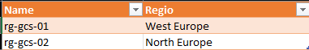
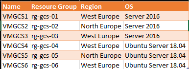
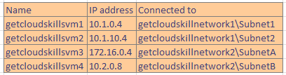
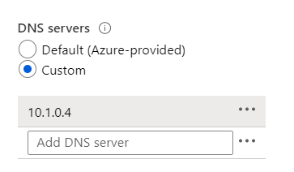
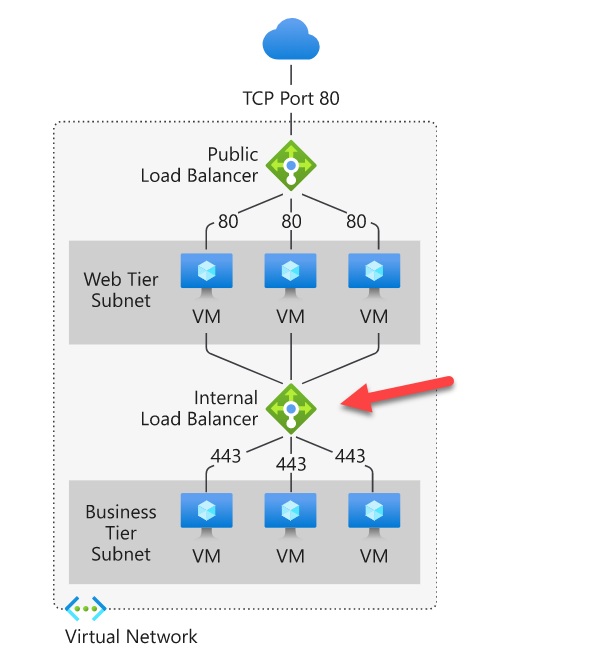
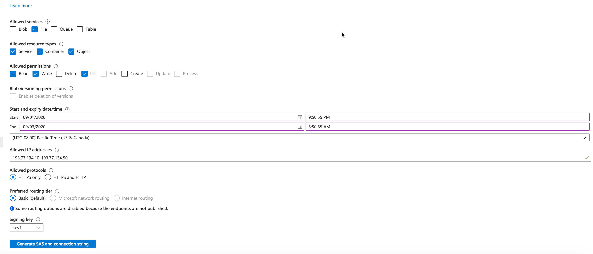
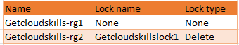
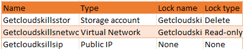
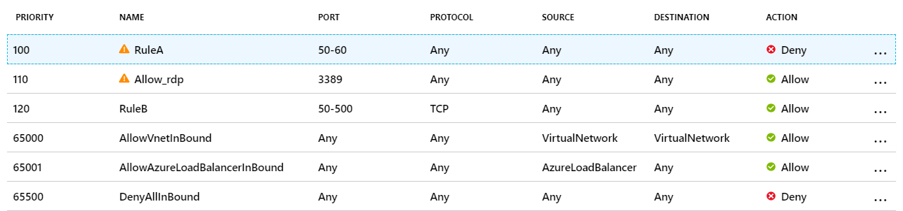
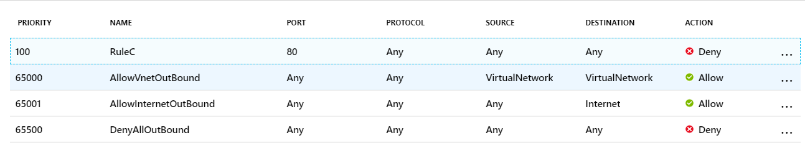

# AZ-104 Micrsoft Azure Administrator Practice Exam 

1. A company has a requirement to retain any blob data that might accidentally be deleted. The deleted data needs to be retained for 14 days. From which of the following section of the Storage account would you modify to fulfill this requirement?
   - Lifecycle Management
   - **Soft Delete**
   - Advanced security
   - Firewall and virtual networks

   #### Explanation

   For more information on the soft delete feature, go to:

   https://docs.microsoft.com/en-us/azure/storage/blobs/soft-delete-blob-overview

   https://docs.microsoft.com/en-us/azure/storage/blobs/soft-delete-blob-enable?tabs=azure-portal

2. You have an Azure subscription named Getcloudskillsstaging. Under the subscription, you create a Resource group named Getcloudskillsrg.

   You then create an Azure policy based on the “Not allowed resources types” definition. You define the parameters as Microsoft.Network. virtual networks as the not allowed resource type. You assign this policy to the Tenant Root Group. A Virtual Network does not already exist in this subscription.

   Would you be able to create a virtual machine in the Getcloudskillsrg Resource group?

   - **No**
   - Yes

   #### Explanation

   Since the policy is applied to the Tenant Root Group, it would be applied to all subscriptions and Resource groups. If you need to create a virtual machine, you must have permission to create virtual network resources required for VM provisioning. Hence the policy restricts the creation of the Vnet resources. You wouldn't be able to create a new VM in this resource group.

   For more information on creating Azure Policies, go to:

   https://docs.microsoft.com/en-us/azure/governance/policy/overview

3. What does Azure DNS allow you to do?

   - Register new domain names, removing the need to use a domain registrar.
   - **Manage and host your registered domain and associated records.**
   - Manage the security and access to your website.

   

4. What kind of account would you create to allow an external organization easy access?

   - An external account for each member of the external team.
   - An administrator account for each member of the external team.
   - **A guest user account for each member of the external team.**

5. A company has the following resource groups defined as part of its Azure subscription:

   

   The following virtual machines are then created in the subscription:

   

   The Recovery Services vault is located in West Europe in the rg-gsc-01 Resouce Group.

   The company wants to ensure that as many virtual machines as possible are backed up using the Recovery Services Vault.

   Which of the following virtual machines can be backed up using the Recovery Services vault?

   - VMGCS1 and VMGCS3 only
   - VMGCS3 and VMGCS6 only
   - All of them
   - **VMGCS1, VMGCS3 VMGCS4 and VMGCS6 only**
   - VMGCS1 only

   #### Explanation

   The Recovery Services vault and the virtual machine need to be in the same region. This condition is fulfilled by VMGCS1, VMGCS3 VMGCS4 and VMGCS6 only.

   For more information on backing up Azure virtual machines using the Azure backup feature, go to:

   https://docs.microsoft.com/en-us/azure/backup/backup-azure-vms-first-look-arm

6. Your company has the following resources deployed to Azure:

   

   You install a DNS service on virtual machine getcloudskillsvm1.

   The DNS server settings are then configured for each virtual network, as shown below:

   

   You have to ensure that all virtual machines in your vnet can resolve DNS names by using the DNS service on the virtual machine getcloudskillsvm1. Which of the following would you implement for this requirement?

   - Add service endpoints for the virtual network getcloudskillsnetwork2 and getcloudskillsnetwork3.
   - Configure a conditional forwarder for the getcloudskillsvm1 virtual machine.
   - Add a service endpoint for the virtual network getcloudskillsnetwork1.
   - **Configure virtual network peering connections between all virtual networks.**

   #### Explanation

   Since the networks are isolated from each other, you still need to ensure that the machines can communicate across the virtual networks. This can be accomplished with the help of virtual network peering connections.

   For more information on virtual network peering connections, go to:

   https://docs.microsoft.com/en-us/azure/virtual-network/virtual-network-peering-overview

   

7. A company is planning to deploy an application to a set of Virtual Machines in an Azure network. The company needs to have an SLA of 99.999% for the application hosted on the Virtual machines. Which of the following should be implemented to guarantee an SLA of 99.999% on the infrastructure level?

   - Assign a standard public IP address to the virtual machines.
   - Deploy single virtual machines across multiple regions.
   - **Deploy the virtual machines in an availability zone across multiple regions**
   - Make the virtual machines part of an availability set.

   #### Explanation

   For more information on availability zones, go to:

   https://docs.microsoft.com/en-us/azure/availability-zones/az-overview

   

8. A new Network interface named Secondary has been created. The Network interface needs to be added to the Virtual machine. What must be done first in order to ensure that the network interface can be attached to the Virtual Machine?

   - The public IP needs to be deallocated from the primary network interface

   - **The machine needs to be stopped first**

   - The primary network interface needs to be removed

     

9. Users are reporting that when they attempt to access myapps.microsoft.com, they are prompted multiple times to sign in and are forced to use an account name that ends with onmicrosoft.com. You discover that there is a UPN mismatch between Azure AD and the on-premises Active Directory. You need to ensure that the users can use single-sign-on (SSO) to access Azure resources. What should you do first?

   - From the on-premises network, request a new certificate that contains the Active Directory domain name.
   - From the on-premises network, deploy Active Directory Federation Services in a clustered environment.
   - From the server that runs Azure AD Connect, modify the filtering options.
   - **From Azure AD, add and verify a custom domain name.**

   

10. A company has set up a Load balancer that load balances traffic on ports 80 and 443 across 3 virtual machines. You have to ensure that all RDP traffic is directed towards a VM named getcloudskillsvm. How would you achieve this?

    - By creating a new IP configuration

    - **By creating an inbound NAT rule**

    - By creating a new internal load balancer for getcloudskillsvm

    - By creating a new public load balancer for getcloudskillsvm

      

11. Which Azure Service is the centralized spot for all Activity Logs, Metrics, Alerts, and Diagnostics for all resources across your subscription?

    - Azure Stream Analytics

    - Azure Log Analytics

    - **Azure Monitor**

    - Event Hub

      

12. A company is planning to deploy a set of virtual machines across different system tiers.

    The following requirement needs to be met:

    \- Incoming requests to the Business Logic tier (50 VMs that are not accessible from the internet) from the web servers (5 VMs that are accessible from the internet) need to be spread equally across the virtual machines.

    Which of the following would you implement?

    - A Public Load Balancer
    - An application gateway that uses the WAF tier
    - A network security group
    - An application gateway that uses the Standard tier
    - **An Internal Load Balancer**

    #### Explanation

    The Business Logic Tier has the requirement of NOT being accessible from the Internet. This means we should spin up an Internal Load Balancer.

    

    For more information on the Azure Load Balancer, go to:

    https://docs.microsoft.com/en-us/azure/load-balancer/concepts-limitations

    

13. You create an App Service plan B1 for your web app. You want Azure to be able to add up to 10 VM instances to run your app automatically during the highest traffic on your site.

    What are two configuration options you should implement to achieve your goal in the most cost-effective way?

    - Scale up the service plan to P1
    - **Scale up the service plan to S1**
    - Scale out the service plan to S1
    - **Scale-out based on a metric**
    - Scale out the service plan to P1
    - Scale out based on a schedule
    - Scale up based on a metric
    - ## Scale up based on a schedule

    

14. True or false: Microsoft ExpressRoute is a virtual networking technology that operates over the public Internet that allows secure, scalable access to Microsoft Azure services while ensuring performance, security, and reliability.

    - **False**
    - True

    #### Explanation

    ExpressRoute operates over a private network, not the Internet. You must connect through a communications service provider to arrange a private direct connection.

    

15. Which of the following network watcher feature would you use for the following requirement?

    *Find out if there is outbound connectivity between an Azure virtual machine and an external host.*

    - Traffic Analytics
    - **Connection Monitor**
    - Next Hop
    - IP Flow Verify

    

16. Your company has an Azure subscription. In the subscription, you create an Azure file share named **share1**. You also create a shared access signature (SAS) named **SASdemo** as shown in the following exhibit:

    

    If you run Microsoft Azure Storage Explorer on a computer that has an IP address of 193.77.134.1, and you use **SASdemo** to connect to the storage account, then you...

    - will be prompted for the credentials.
    - will have read, write and list access.
    - **will have no access.**
    - will have read-only access.

    #### Explanation

    Since the IP address is not in the valid IP address range defined by the SAS, you will be denied access.

    For more information on Shared access signatures, go to:

    https://docs.microsoft.com/en-us/azure/storage/common/storage-dotnet-shared-access-signature-part-1

    

17. You need to allow traffic onto certain FQDN’s via the Azure Firewall. Which of the following rules would you create for this requirement?

    - NAT collections rules

    - Network collection rules

    - **Application collection rules**

    - FQDN collection rules

      

18. A company has an Azure AD tenant. They have users that are also synced with their on-premise environment. Getcloudskillsusr1 has the Reports Reader role assigned.

    The administrator has enabled self-service password reset (SSPR) for all users.

    \- The administrator has enabled the following SSPR settings:

    \- Number of methods required to reset – 2

    \- Methods available to users – Mobile phone and Security questions

    \- Number of questions to register – 3

    \- Number of questions to reset – 3

    The following security questions are chosen:

    \- In what city was your first job?

    \- What was the name of the first school you attended?

    Would Getcloudskillsusr1 be required to answer the security question “In what city was your first job?” to reset their password?

    - No
    - **Yes**

    #### Explanation

    Yes, here, since SSPR has been enabled for all users, the user would need to answer the security-related question to reset their password.

    For more information on how password reset works, visit the following URL:

    https://docs.microsoft.com/en-us/azure/active-directory/authentication/concept-sspr-howitworks

    

19. You have created a storage account named Getcloudskills. You have created a file share named demo using the file service. You need to ensure that users can connect to the file share from their home computers. Which of the following port should be open to ensure connectivity?

    - 80
    - 3389
    - **445**
    - 443
    
20. Your company goes ahead and registers a domain name of demodomain.com. You then go ahead and create an Azure DNS zone named demodomain.com. You then add an A record to the zone for a host named www that has an IP address of 123.10.9.143. But the users complain that they cannot resolve the URL www.demodomain.com to 123.10.9.143. This issue needs to be resolved.

    You propose a solution to modify the name server at the domain registrar.

    Would this solution resolve the issue?

    - **Yes**
    - No

    #### Explanation

    If you create a DNS zone in Azure, then you need to first make a note of the Name servers for the DNS zone. Then go to your DNS provider and enter the Name servers for your Domain.

    

21. A company has an Azure subscription that contains the following Resource Groups:

    

    The Resource Group **Getcloudskills-rg1** contains the following resources:

    

    Would you be able to move the resource **Getcloudskillsstor** from the Resource Group **Getcloudskills-rg1** to **Getcloudskills-rg2?**

    - No
    - **Yes**

    #### Explanation

    We would be able to move the resource **Getcloudskillsstor** from the resource group **Getcloudskills-rg1** to **Getcloudskills-rg2**. The storage account **Getcloudskillsstor** has a Delete lock. It means that we can't delete this resource without removing the lock. But this lock doesn't prevent us from moving a resource from one resource group to another. The current **Getcloudskillsstor** Resource Group doesn't have any locks. The destination resource group **Getcloudskills-rg2** similarly to the Storage account has a Delete lock. This lock prevents the deletion of this Resource Group and all resources within it. But it doesn't restrict the movement of the resources to this group from other groups.

    For more information on Resource locks, go to:

    https://docs.microsoft.com/en-us/azure/azure-resource-manager/management/lock-resources

    

22. You create Azure AD administrative units for the subsidiaries of your organization. Each of the subsidiaries includes several hundred employees. You need to add these employees as administrative unit members. Select the tool you can use to achieve your goal.

    - Microsoft Office Admin center
    - Microsoft Graph
    - **Azure AD Portal**
    - PowerShell
    - Azure CLI

    #### Explanation

    Microsoft Office Admin center, Microsoft Graph, and PowerShell are incorrect because the Microsoft Office Admin center, Microsoft Graph, and PowerShell can manage individual users in the administrative units but not the list of the users in a bulk manner.

    Azure CLI is incorrect because the Azure CLI does not have the functionality to create and manage administrative units.

    For more information about the management of the Azure AD Administrative Units, visit the below URLs:

    https://docs.microsoft.com/en-us/azure/active-directory/roles/administrative-units

    https://docs.microsoft.com/en-us/azure/active-directory/roles/admin-units-add-manage-users

    

23. You have defined an autoscale condition with four autoscale rules. The first rule scales out when the CPU utilization reaches 70 percent. The second rule scales back in when the CPU utilization drops below 50 percent. The third rule scales out if memory occupancy exceeds 75 percent. The fourth rule scales back in when memory occupancy falls below 50 percent. When will the system scale out?

    - When CPU utilization reaches 70 percent, and memory occupancy exceeds 75 percent
    - You can't do this with a single autoscale condition. An autoscale condition can only contain autoscale rules that use the same metrics
    - **When CPU utilization reaches 70 percent, or memory occupancy exceeds 75 percent**

    

24. Your company has an Azure AD tenant named getcloudskills.com.

    The following user is part of the tenant:

    \- Getcloudskillsusr1 is a User administrator.

    The following VM is part of the tenant:

    \- Getclouskillsvm1 is a Windows 10 device that is AAD registered.

    The following group is part of the tenant:

    \- Getcloudskillsgroup1 is a Dynamic Device group, Getcloudskillsusr1 is an owner of that group.

    Would user Getcloudskillsusr1 be able to add device Getclouskillsvm1 to group Getcloudskillsgroup1?

    - Yes
    - **No**
    
25. In order to use ARM templates in automation, what other file is usually required besides the ARM template JSON file itself?

    - A .PS1 PowerShell script file

    - **No other files are required. But a parameter JSON file would be used if the template had parameters as inputs.**

    - The parameter XML file

    - The parameter JSON file

    - A .SH file to contain the Shell Script in CLI

      

26. A company has the following App Service Plans defined as part of their Azure subscription:

    \- Plan1 runs Linux in East US.

    \- Plan2 runs Windows in East US.

    \- Plan 3 runs Windows in UK South.

    The company is planning on deploying the following Azure Web App Instances:

    \- App1 runs on runtime stack .Net Core 3.1 in East us.

    \- App2 runs on runtime stack ASP.NET v4.7 in East us.

    Which of the following App service plans can you use for App1?

    - **Plan1 and Plan2 only**
    - Plan2 only
    - Plan1 only
    - Plan2 and Plan 3 only
    - Plan1, Plan2 and Plan 3

    #### Explanation

    If we need to deploy App1 in the East US region, we need to choose the App Service Plan in the same region. The Web App and the App Service Plan need to be located in the same region.

    There are two plans in the East US region: Plan1 and Plan2. You can deploy a .Net Core application on either a Windows OS or a Linux OS.

    For more information on the Linux App Service Plan, go to:

    https://docs.microsoft.com/en-us/azure/app-service/overview-hosting-plans

    https://docs.microsoft.com/en-us/azure/app-service/app-service-plan-manage

    https://docs.microsoft.com/en-us/azure/app-service/containers/app-service-linux-intro

    

27. A company has an Azure subscription and an Azure tenant named getcloudskills.onmicrosoft.com. Getcloudskillsusr1 has Global Administrator permissions in Azure Active Directory.

    The user getcloudskillsusr1 creates a new directory named staging.getcloudskills.onmicrosoft.com. New users need to be added to the new tenant. The company asks getcloudskillsusr1 to create user accounts.

    Would this fulfill the requirement?

    - No
    - **Yes**

    #### Explanation

    Getcloudskillsusr1 has the Global Administrator role and has created the new directory. The user would have the required permissions to create new users in the directory.

    For more information on creating a new directory, please visit:

    https://docs.microsoft.com/en-us/azure/active-directory/fundamentals/active-directory-access-create-new-tenant

    

28. Which of the following needs to be implemented on the Azure virtual network to deploy the Azure Bastion Host?

    - Enable DDoS protection for the virtual network.
    - Add a new address space.
    - **Add a new subnet.**
    - Add a service endpoint.

    #### Explanation

    For more information about deploying an Azure Bastion, go to:

    https://docs.microsoft.com/en-us/azure/bastion/bastion-create-host-portal

    

29. Your company needs to deploy an application to a set of three virtual machines. You have to ensure that two virtual machines are always available in the event of a data center failure at any point in time.

    You decide to deploy the virtual machines as part of an Availability Set.

    Would this fulfill the requirement?

    - **No**
    - Yes

    #### Explanation

    Availability sets can’t protect virtual machines from a data center-level failure. Availability zones protect VMs from data center failure.

    You need to distribute your virtual machines across three Availability Zones.

    For more information on Availability sets, go to:

    \- https://docs.microsoft.com/en-us/azure/virtual-machines/windows/manage-availability

    \- https://social.technet.microsoft.com/wiki/contents/articles/51828.azure-vms-availability-sets-and-availability-zones.aspx

    

30. Your company runs its Azure virtual machines in an availability set. All of the websites are running in the same availability set. They do this to increase the availability of their application when planned or unplanned outages happen. What is the maximum number of fault domains (FD) and update domains (UD) that your application can be spread across?

    - 2 FD and 5 UD
    - 20 FD and 3 UD
    - 2 FD and 10 UD
    - Unlimited FD and UD
    - **3 FD and 20 UD**

    

31. A company has started using Azure and set up a subscription. They want to see the costs being incurred for each type of resource. Which of the following can help you get these details?

    - Go to your Azure AD directory and go to Licences.
    - Go to your Subscription and go to Resource Groups.
    - Go to your Azure AD directory and go to Cost Analysis.
    - **Go to your Subscription and go to Cost Analysis.**

    #### Explanation

    If you go to your subscription, look at the Cost Analysis, you can see a breakdown of each resource's costs.

    The Cost Analysis section for the Subscription allows you to see all the costs. Hence all other options are incorrect.

    For more information on Cost Analysis, go to: https://docs.microsoft.com/en-us/azure/cost-management/quick-acm-cost-analysis

    

32. Select all true statements that apply to the use of Azure Disk Encryption (ADE) for Windows Azure VM disk protection.

    - **ADE encrypted VM can be backed up to the Recovery Service Vault.**
    - ADE uses DM-Crypt for Windows VM-controlled disks.
    - ADE can use Azure Key Vault and Azure Recovery Service Vault from different Azure regions.
    - ADE encrypts all data at rest and in transit.
    - **ADE is integrated with Azure Key Vault.**
    - ADE supports the encryption of Basic tier VM's.
    - **ADE uses BitLocker for Windows VM-controlled disks.**
    - **ADE uses DM-Crypt for Linux-based VMs.**

    #### Explanation

    For more information about the Azure Disk Encryption, go to:

    https://docs.microsoft.com/en-us/azure/security/fundamentals/azure-disk-encryption-vms-vmss

    https://docs.microsoft.com/en-us/learn/modules/secure-your-azure-virtual-machine-disks/2-encryption-options-for-protecting-windows-and-linux-vms

    

33. You have set up a computer named getcloudskillsclient1 that has a point-to-site VPN connection to an Azure virtual network named getcloudskillsnetwork. The point-to-site connection makes use of a self-signed certificate. You now have to establish a point-to-site VPN connection to the same virtual network from another computer named getcloudskillsclient2. The VPN client configuration package is downloaded and installed on the getcloudskillsclient2 computer.

    You decide to join the getcloudskillsclient2 computer to Azure AD.

    Would this fulfill the requirement?

    - **No**
    - Yes

    #### Explanation

    Here you have to ensure that the client certificate is installed on every client computer that needs to establish a Point-to-Site VPN connection to the Azure virtual network

    For more information on Point-to-Site VPN connections, go to:

    https://docs.microsoft.com/en-us/azure/vpn-gateway/point-to-site-about

    

34. A file named **audio.log** has been uploaded to a Storage account container called **demo**.

    You need to allow users to download the object. The access should be granted for a day only. You need to provide a secure way to access the object. Which of the following would you implement for this purpose?

    - Mark public access on the object.
    - Provide access Keys.
    - **Generate a shared access signature.**
    - Mark public access on the container.

    #### Explanation

    For more information on Shared access signatures, go to: https://docs.microsoft.com/en-us/azure/storage/common/storage-sas-overview

    

35. A company has set up an Azure subscription and a tenant. They want to ensure that only Virtual Machines of a particular SKU size can be created in their Azure account.

    They decide to implement Role-Based Access Control.

    Does this fulfill the requirement?

    - Yes
    - **No**

    #### Explanation

    Role-Based Access Control (RBAC) helps you manage who has access to Azure resources, what they can do with those resources, and what areas they have access to.

    For more information on Role-Based Access Control, go to:

    https://docs.microsoft.com/en-us/azure/role-based-access-control/overview

    

36. You need to deploy two Azure virtual machines named VM1 and VM2 based on the Windows server 2016 image. The deployment must meet the following requirements:

    \- Provide a Service Level Agreement (SLA) of 99.95 percent availability.

    \- Use managed disks.

    You propose a solution to create a scale set for the requirement. Would the solution meet the goal?

    - No
    - Yes

37. Imagine your company has the following storage accounts in place as part of its Azure subscription:

    \- General Purpose V1

    \- General Purpose V2

    \- Blob Storage

    Which of the following storage account/accounts could be used to store objects as part of the Archive tier?

    - All Storage accounts
    - General Purpose V1 and Blob Storage only
    - **General Purpose V2 and Blob Storage only**
    - General Purpose V1 and General Purpose V2 only
    - General Purpose V1 only
    - General Purpose V2 only
    - Blob Storage only

    #### Explanation

    For more information on storage accounts, go to:

    https://docs.microsoft.com/en-us/azure/storage/common/storage-account-overview

    

38. A company has an application deployed across a set of virtual machines. Users connect to the application either using point-to-site VPN or site-to-site VPN connections. You need to ensure that connections to the application are spread across all of the virtual machines. Which of the following could you set up for this requirement? Choose 2 answers from the options given below.

    - A Traffic Manager Profile
    - **An Internal Load Balancer**
    - **An Azure Application Gateway**
    - An Azure Content Delivery Network
    - A Public Load Balancer

    #### Explanation

    All of the other options are incorrect since the users access the Azure virtual machines via private IP addresses. This is because the users are connecting via VPNs. So we need to use internal load balancing solutions.

    For more information on the load balancer and the application gateway, go to:

    https://docs.microsoft.com/en-us/azure/load-balancer/load-balancer-overview

    https://docs.microsoft.com/en-us/azure/application-gateway/overview

    

39. What benefit does a Content Delivery Network (CDN) provide its users?

    - Allows you to store data that can be retrieved later in an extremely fast and inexpensive manner
    - Allows you to keep temporarily session information on the web visitor such as their login ID or their name
    - **Allows you to reduce the traffic coming into a web server for static, unchanging files such as images, videos, and PDFs**
    - For a small fee, Azure will take over management of your virtual machine, perform OS updates and ensure it's running well

    #### Explanation

    A Content Delivery Network allows you to improve performance by removing the burden of serving static, unchanging files from the main server to a network of servers around the globe; a CDN can reduce traffic to a server by 50% or more, which means you can serve more users or serve the same users faster.

40. A company has an Azure subscription. They want to transfer around 6 TB of data to the subscription. They plan to use the Azure Import/Export service. Which of the following can they use as the destination for the imported data?

    - Azure SQL Database
    - Azure File Sync Storage
    - **Azure Blob storage**
    - Azure Data Lake Storage

    #### Explanation

    For more information on the Import-Export service, go to:

    https://docs.microsoft.com/en-us/azure/storage/common/storage-import-export-service

    

41. When adding custom domain names, which of the following record needs to be added to your custom domain registrar?

    - NS record.
    - PTR record.
    - A record.
    - **TXT record and Updating Name Server (NS) Records.**

    

42. In the context of alerts, you can create an Action Group. Which of the following is not an Action Type that can exist inside an Action Group?

    - Logic App

    - Azure Function

    - **Facebook Messenger message**

    - SMS text message

      

43. Which of the following can be used to organize resources for cost reporting? Choose the most complete answer.

    - **Subscriptions, resource groups, and tags**

    - Tags

    - Cost Center, subscriptions, resource groups, and tags

    - Resource groups and tags

      

44. Your company has the following resources created as part of its Azure subscription:

    \- 100 Azure virtual machines

    \- 10 Azure SQL databases

    \- 50 Azure file shares

    You need to create a daily backup of all resources by using Azure Backup. What is the minimum number of backup policies you have to create for this requirement?

    - 100
    - 3
    - 160
    - 1
    - **2**

    #### Explanation

    In this task, there are three types of resources that require a backup. One of them is the Azure SQL database. We don't need to create a daily backup for Azure SQL Database because Azure provides a backup as an automatic service for every database by default. Azure SQL Database is an Azure fully managed platform-as-a-service (PaaS) database engine. It includes automatic patching, monitoring, and backups. The Azure SQL Database service is different from SQL Server that runs in Azure VM. SQL Server in VM requires the user to provide database maintenance and setup backups.

    For the two other types, Azure VM and Azure File shares, we need to create daily backup policies. For multiple VMs, Microsoft recommends creating a Recovery Services vault and adding backup policies from the Backup policies option.

    For more information on an example of using the Azure backup service, go to:

    https://docs.microsoft.com/en-us/azure/backup/backup-azure-vms-first-look-arm

    https://docs.microsoft.com/en-us/azure/backup/backup-afs

    https://docs.microsoft.com/en-us/learn/modules/backup-restore-azure-sql/2-protect-database-with-backup

45. Which of the following would you implement for the below requirement?

    *All web servers need to be protected from SQL injection attacks.*

    - An Internal Load Balancer
    - A Public Load Balancer
    - **An application gateway with a WAF**
    - A network security group
    - An application gateway that uses the Standard tier

    #### Explanation

    To protect the web servers against SQL injection attacks, one can use the Web Application Firewall feature.

    The Microsoft documentation mentions the following:

    

    Since this is clearly mentioned in the documentation, all other options are incorrect.

    For more information on the Web Application Firewall, go to:

    https://docs.microsoft.com/en-us/azure/web-application-firewall/ag/ag-overview

    

46. Which of the following Network watcher feature would you use for the following requirement?

    *Find out if a network security rule is preventing a network packet from reaching a virtual machine hosted in an Azure virtual network.*

    - Packet Capture
    - **IP Flow Verify**
    - Traffic Analysis
    - Next Hop

    

47. In order to get diagnostics from an Azure virtual machine you own, what is the first step to doing that?

    - A diagnostics agent needs to be installed on the VM
    - **You need to create a storage account to store it**
    - You need to grant RBAC permissions to the user requesting diagnostics

    

48. A company needs to create a storage account that must follow the requirements below:

    \- Users should be able to add files, such as images and videos.

    \- Ability to store archive data.

    \- File shares need to be in place, which can be accessed across several VM’s.

    \- The data needs to be available, even if a region goes down.

    \- The solution needs to be cost-effective.

    What is the type of replication they need to implement for the storage account?

    - Locally redundant storage (LRS)
    - Read-access geo-redundant storage (RA-GRS)
    - Zone-redundant storage (ZRS)
    - **Geo-redundant storage (GRS)**

    #### Explanation

    LRS and ZRS are incorrect since these replication strategies don’t replicate the data across regions.

    Option RA-GRS is incorrect because additional read access to data in another region is not mentioned, and we also have to keep the cost to a minimum.

    For more information on storage redundancy, go to:

    https://docs.microsoft.com/en-us/azure/storage/common/storage-redundancy-grs

    

49. You need to synchronize the files in the file share with an on-premise server named Getcloudskillsserver. Which of the following would you need to implement to fulfill this requirement? Choose 3 answers from the options given below.

    - Download an automation script
    - **Create a sync group**
    - Create a container instance
    - **Install the Azure File Sync agent on Getcloudskillsserver**
    - **Register Getcloudskillsserver**

    #### Explanation

    For more information on deploying Azure File Sync, go to:

    https://docs.microsoft.com/en-us/azure/storage/files/storage-sync-files-deployment-guide?tabs=portal

    

50. Which of the following needs to be set up in Azure for the Site-to-Site VPN connection?

    - A gateway Virtual Machine

    - **A gateway subnet**

    - An additional address space for the Virtual Network

    - A service endpoint

      

51. A company has set up a Virtual Machine in Azure. A web server listening on port 80 and a DNS server has been installed on the Virtual machine. A network security group is attached to the network interface for the virtual machine. The rules for the NSG are given below:

    

    

    Select all server(s) that internet users will connect to on the Virtual machine if RuleB is deleted.

    - DNS server only
    - **RDP server only**
    - RDP, web, and DNS servers
    - Both web and DNS servers
    - Webserver only

    #### Explanation

    If RuleB is deleted, users won’t be able to access port 80 and the webserver.

    There is a Deny rule of RuleA for ports 50-60. Since DNS listens on port 53, you will not be able to access the DNS server. But you will still be able to connect to the virtual machine using RDP under the Allow_rdp rule.

    Because of this logic, all other options are incorrect.

    For more information on network security, go to:

    https://docs.microsoft.com/en-us/azure/virtual-network/security-overview

    

52. You plan to deploy five virtual machines to a virtual network subnet.

    Each virtual machine will have a public IP address and a private IP address.

    Each virtual machine requires the same inbound and outbound security rules.

    What is the minimum number of network interfaces that you require?

    - 20
    - **10**
    - 5
    - 15

    #### Explanation

    For more information on the virtual network interfaces in Azure, go to:

    https://docs.microsoft.com/en-us/azure/virtual-network/virtual-network-network-interface

    

53. You have an application in the East US region, running on a virtual network also in the East US region. You need to establish an encrypted, private connection to a data source that exists in Azure's Japan region, and that data source does not have a public endpoint. Attempting to connect with the Japanese data source from East US results in an error. What is the best way to establish a connection between the two regions?

    - Install Gateway devices in both the East US and Japan regions, and connect the gateways together.

    - **Use Global VNet Peering.**

    - Install a Network Gateway in the Japan region. And have the East US application establish a private point-to-site VPN to Japan.

      

54. You need to connect Azure resources like Azure virtual machines across geographical regions. Which Azure networking option should you use?

    - Azure ExpressRoute

    - VPN Gateway

    - **Virtual network peering**

      

55. In your company, all virtual networks are hosting virtual machines with varying workloads. A virtual machine named getcloudskillsvm is hosted in Vnet getcloudskills-vnet1. This virtual machine will have intrusion detection software installed on it. All traffic on all other virtual networks must be routed via this virtual machine.

    You need to complete the required steps for implementing this requirement.

    Which of the following would you need to create additional to ensure that traffic is sent via the virtual machine hosting the intrusion software?

    - **A new route table**
    - Add DNS servers
    - Add an address space
    - Add a service endpoint

    #### Explanation

    In order to ensure that traffic is routed via the intrusion-based device, you need to set up a route table and add the route table to the subnets in the other virtual networks.

    For more information on working with route tables, go to:

    https://docs.microsoft.com/en-us/azure/virtual-network/tutorial-create-route-table-portal

    https://docs.microsoft.com/en-us/azure/virtual-wan/scenario-route-through-nva

    

56. If no rules other than the default NSG rules are in place, are VM's on SubnetA and SubnetB be able to connect to the Internet?

    - **Yes**
    - No

    #### Explanation
    
    The Outbound rules contain a Rule with the Name of “AllowInternetOutBound”. This would allow all Outbound traffic to the Internet.
    
    


# Practice Assessment for Exam AZ-104: Microsoft Azure Administrator

1. You have an Azure subscription that contains network security groups (NSGs).

   Which two resources can be associated with a NSG? Each correct answer presents a complete solution.

   Select all answers that apply.

   - Azure Monitor

   - Azure Network Watcher

   - **network interfaces**

   - **subnets**

   You can use a network security group (NSG) to be assigned to a network interface. NSGs can be associated with subnets or individual virtual machine instances within that subnet. When an NSG is associated with a subnet, the access control list (ACL) rules apply to all virtual machine instances of that subnet.

   [Azure network security groups overview | Microsoft Learn](https://learn.microsoft.com/azure/virtual-network/network-security-groups-overview)

   [Configure network security groups - Training | Microsoft Learn](https://learn.microsoft.com/training/modules/configure-network-security-groups/)

2. You have three network security groups (NSGs) named NSG1, NSG2, and NSG3. Port 80 is blocked in NSG3 and allowed in NSG1 and NSG2.

   You have four Azure virtual machines that have the following configurations:

   VM1:

   - Subnet: Subnet1
   - Network card: NIC1
   - NIC1 is assigned to NSG2.

   VM2:

   - Subnet: Subnet1
   - Network card: NIC2
   - NIC2 is assigned to NSG3.

   VM3:

   - Subnet: Subnet3
   - Network card: NIC3
   - NIC3 is assigned to NSG3.

   VM4:

   - Subnet: Subnet2

   You have the following subnets:

   - Subnet1 is assigned to NSG1.
   - Subnet2 is assigned to NSG3.
   - Subnet 3 does not have an NSG assigned.

   Which virtual machine will allow traffic from the internet on port 80?

   Select only one answer.

   - **VM1**

   - VM2

   - VM3

   - VM4

   On VM1, both NSGs assigned to Subnet1 and the NIC1 card allow traffic on port 80. On VM2, NSG1 allows traffic, but NSG3 blocks traffic for the network interface. On VM3 and VM4, NSG3 blocks traffic.

   [Network security group - how it works | Microsoft Learn](https://learn.microsoft.com/azure/virtual-network/network-security-group-how-it-works)

   [Configure network security groups - Training | Microsoft Learn](https://learn.microsoft.com/training/modules/configure-network-security-groups/)

3. Your company plans to migrate servers from on-premises to Azure. There will be dev, test, and production virtual machines on a single virtual network.

   You need to restrict traffic between the dev, test, and production virtual machines to specific ports.

   What should you use?

   Select only one answer.

   - **a network security group (NSG)**

   - an Azure firewall

   - an Azure load balancer

   - an Azure VPN gateway

   Must configure network security group (NSG) rules to allow TCP or ICMP traffic for specific ports. Azure Firewall is a managed service that protects your Azure services across multiple virtual networks. Load balancers are used to distribute incoming traffic to available backend servers. Azure VPN is used to have a connection establishment between on-premises and Azure.

   [Azure network security groups overview | Microsoft Learn](https://learn.microsoft.com/azure/virtual-network/network-security-groups-overview)

   [Configure network security groups - Training | Microsoft Learn](https://learn.microsoft.com/training/modules/configure-network-security-groups/)

4. You have an Azure subscription that contains an ASP.NET application. The application is hosted on four Azure virtual machines that run Windows Server.

   You have a load balancer named LB1 to load balances requests to the virtual machines.

   You need to ensure that site users connect to the same web server for all requests made to the application.

   Which two actions should you perform? Each correct answer presents part of the solution.

   Select all answers that apply.

   - Configure an inbound NAT rule.

   - **Set Session persistence to Client IP.named VM1 and VM2 in an availability set named AVSet1.**

   - Set Session persistence to None.

   - **Set Session persistence to Protocol.**

   By setting Session persistence to Client IP and Protocol, you ensure that site users connect to the same web server for all requests made to the application. Setting Session persistence to None disables sticky sessions and an inbound NAT rule is used to forward traffic from a load balancer frontend to a backend pool.

   [Azure Load Balancer distribution modes | Microsoft Learn](https://learn.microsoft.com/azure/load-balancer/distribution-mode-concepts)

   [Configure Azure Load Balancer - Training | Microsoft Learn](https://learn.microsoft.com/training/modules/configure-azure-load-balancer/)

5. **You have an Azure subscription that contains a resource group named RG1. RG1 has a virtual network named VNet3, a virtual machine named VM1, and a public IP address named PubIP1. All the resources are in the West US Azure region.**

   **You plan to create and configure a network security group (NSG) named NSG1 for the following types of traffic:**

   - **Remote Desktop Management**
   - **HTTP**

   **NSG1 will be used on the subnets of multiple virtual networks.**

   **Which two cmdlets should you run? Each correct answer presents part of the solution.**

   Select all answers that apply.

   - Add-AzLoadBalancerFrontendIpConfig
   - Add-AzNetworkInterfaceTapConfig
   - **New-AzNetworkSecurityGroup**
   - **New-AzNetworkSecurityRuleConfig**

   `New-AzNetworkSecurityRuleConfig` allows you to create a rule and provide the type, protocol, direction, and port number. `New-AzNetworkSecurityGroup` creates a network security group (NSG). `-SecurityRules` specifies a list of network security rule objects to create in a NSG.

   [New-AzNetworkSecurityRuleConfig (Az.Network) | Microsoft Learn](https://learn.microsoft.com/powershell/module/az.network/new-aznetworksecurityruleconfig?view=azps-9.2.0&viewFallbackFrom=azps-7.5.0)

   [New-AzNetworkSecurityGroup (Az.Network) | Microsoft Learn](https://learn.microsoft.com/powershell/module/az.network/new-aznetworksecuritygroup?view=azps-9.2.0&viewFallbackFrom=azps-7.5.0)

   [Azure network security groups overview | Microsoft Learn](https://learn.microsoft.com/azure/virtual-network/network-security-groups-overview)

   [Configure network security groups - Training | Microsoft Learn](https://learn.microsoft.com/training/modules/configure-network-security-groups/)

6. You have an Azure subscription that contains two virtual networks named VNet1 and VNet2.

   You need to ensure that the resources on both VNet1 and VNet2 can communicate seamlessly between both networks.

   What should you configure from the Azure portal?

   Select only one answer.

   - connected devices
   - firewall
   - **peerings**
   - service endpoints

   You can connect virtual networks to each other with virtual network peering. Once the virtual networks are peered, the resources on both virtual networks can communicate with each other with the same latency and bandwidth as though the resources were on the same virtual network.

   [Configure Azure Virtual Network peering - Training | Microsoft Learn](https://learn.microsoft.com/training/modules/configure-vnet-peering/)

   [Connect virtual networks with VNet peering - Azure PowerShell | Microsoft Learn](https://learn.microsoft.com/azure/virtual-network/tutorial-connect-virtual-networks-powershell)

7. You have an Azure subscription that contains a virtual network named VNet1 and a virtual machine named VM1.

   VM1 can only be accessed from the internal network.

   An external contractor needs access to VM1. The solution must minimize administrative effort.

   What should you configure?

   Select only one answer.

   - **a public IP address**
   - a second private IP address
   - a Site-to-Site (S2S) VPN
   - Azure Firewall

   To share a virtual machine with an external user, you must add a public IP address to the virtual machine. An additional IP address or firewall configuration will not help in this case. Configuring a S2S VPN does not have minimal administrative effort.

   [Virtual networks and virtual machines in Azure | Microsoft Learn](https://learn.microsoft.com/azure/virtual-network/network-overview)

   [Quickstart - Create a Windows VM in the Azure portal - Azure Virtual Machines | Microsoft Learn](https://learn.microsoft.com/azure/virtual-machines/windows/quick-create-portal)

8. You have an Azure subscription.

   You plan to implement four Azure virtual networks that will be peered. All virtual machines will use a DNS suffix of contoso.com.

   You need to configure name resolution for the virtual networks to ensure that all the virtual machines can communicate by using their FQDNs. The solution must minimize administrative effort.

   What should you use?

   Select only one answer.

   - a DNS server on an Azure virtual machine

   - **an Azure Private DNS zone**
   - an Azure public DNS zone
   - Azure-provided name resolution

   Azure Private DNS allows for private name resolution between Azure virtual networks. Azure public DNS provides DNS for public access, such as name resolution for a publicly accessible website. Azure-provided name resolution does not support user-defined domain names and only supports a single virtual network. A DNS server on a virtual machine can also be used to achieve the goal but involves much more administrative effort to implement and maintain than using Azure Private DNS.

   [Name resolution for resources in Azure virtual networks | Microsoft Learn](https://learn.microsoft.com/azure/virtual-network/virtual-networks-name-resolution-for-vms-and-role-instances#azure-provided-name-resolution)

   [Host your domain on Azure DNS - Training | Microsoft Learn](https://learn.microsoft.com/training/modules/host-domain-azure-dns/)

9. You have an Azure subscription that contains an Azure DNS zone named contoso.com.

   You add a new subdomain named test.contoso.com.

   You plan to delegate test.contoso.com to a different DNS server.

   How should you configure the domain delegation?

   Select only one answer.

   - Add an A record for test.contoso.com.
   - **Add an NS record set named test to the contoso.com zone.**
   - Create the SOA record for test.contoso.com.
   - Modify the A record for contoso.com.

   You must create a DNS NS record set named test in the contoso.com zone. An NS zone must be created at the apex of the zone named contoso.com. You do not need to create the SOA record set in test.contoso.com. It must only be created in contoso.com. You do not need to create or modify the DNS A record.

   [Delegate a subdomain - Azure DNS | Microsoft Learn](https://learn.microsoft.com/azure/dns/delegate-subdomain)

   [Host your domain on Azure DNS - Training | Microsoft Learn](https://learn.microsoft.com/training/modules/host-domain-azure-dns/)

10. You have an Azure subscription that contains four virtual machines. Each virtual machine is connected to a subnet on a different virtual network.

   You install the DNS Server role on a virtual machine named VM1.

   You configure each virtual network to use the IP address of VM1 as the DNS server.

   You need to ensure that all four virtual machines can resolve IP addresses by using VM1.

   What should you do?

   Select only one answer.

   - Configure a DNS server on all four virtual machines.

   - **Configure network peering.**

   - Create and associate a route table to all four subnets.

   - Create Site-to-Site (S2S) VPNs.

   By default, Azure virtual machines can communicate only with other virtual machines that are connected to the same virtual network. If you want a virtual machine to communicate with other virtual machines that are connected to other virtual networks, you must configure network peering.

   A route table controls how network traffic is routed. But without network peering, network traffic is still limited to single virtual network.

   Configuring a Site-to-Site (S2S) VPN is incorrect because you are not connecting on-premises virtual machines to the cloud.

   [Azure virtual network service endpoints | Microsoft Learn](https://learn.microsoft.com/azure/virtual-network/virtual-network-service-endpoints-overview)

   [Configure network routing and endpoints - Training | Microsoft Learn](https://learn.microsoft.com/training/modules/configure-network-routing-endpoints/)

11. **You need to generate the shared access signature (SAS) token required to authorize a request to a resource.**

    **Which two parameters are required for the SAS token? Each correct answer presents part of the solution**

    Select all answers that apply.

    - SignedIP (sip)
    - **SignedResourceTypes (srt)**
    - **SignedServices (ss)** 
    - SignedStart (st)

    `SignedServices (ss)` is required to refer blobs, queues, tables, and files. `SignedResourceTypes (srt)` is required to refer services, containers, or objects. `SignedStart (st)` is an optional parameter that refers to the time when the SAS becomes valid. If unmentioned, the start time is assumed to be the time when the storage service receives the request. `SignedIP (sip)` is an optional parameter that refers to the range of IP addresses from which to accept requests.

    [Create an account SAS - Azure Storage | Microsoft Learn](https://learn.microsoft.com/rest/api/storageservices/create-account-sas)

    [Configure Azure Storage security - Training | Microsoft Learn](https://learn.microsoft.com/training/modules/configure-storage-security/)

12. You need to create an Azure Storage account that supports the Azure Data Lake Storage Gen2 capabilities.

    Which two types of storage accounts can you use? Each correct answer presents a complete solution.

    Select all answers that apply.

    - **premium block blobs**
    - premium file shares
    - **standard general-purpose v2**
    - premium page blobs

    To support Data Lake Storage, the storage account must support blob storage, which is available as standard general-purpose v2 and premium block blobs. Additionally, when you create the storage account, you must enable the hierarchical namespace.

    [Create a storage account for Azure Data Lake Storage Gen2 - Azure Storage | Microsoft Learn](https://learn.microsoft.com/azure/storage/blobs/create-data-lake-storage-account)

    [Determine storage account types - Training | Microsoft Learn](https://learn.microsoft.com/training/modules/configure-storage-accounts/4-determine-storage-account-kinds)

13. You need to create an Azure Storage account that meets the following requirements:

    - Stores data in multiple Azure regions
    - Supports reading the data from primary and secondary regions

    Which type of storage redundancy should you use?

    Select only one answer.

    - geo-redundant storage (GRS)
    - locally-redundant storage (LRS)
    - **read-access geo-redundant storage (RA-GRS)**
    - zone-redundant storage (ZRS)

    Since you must ensure that data can be read from a secondary region, you must choose read-access geo-redundant storage (RA-GRS).

    [Data redundancy - Azure Storage | Microsoft Learn](https://learn.microsoft.com/azure/storage/common/storage-redundancy)

    [Determine replication strategies - Training | Microsoft Learn](https://learn.microsoft.com/training/modules/configure-storage-accounts/5-determine-replication-strategies)

14. You have an Azure Storage account named corpimages and an on-premises shared folder named \\server1\images.

    You need to migrate all the contents from \\server1\images to corpimages.

    Which two commands can you use? Each correct answer presents a complete solution?

    Select all answers that apply.

    - **Azcopy copy \\server1\images https://corpimages.blob.core.windows.net/public -recursive**
    - Azcopy sync \\server1\images https://corpimages.blob.core.windows.net/public -recursive
    - **Get-ChildItem -Path \\server1\images -Recurse | Set-AzStorageBlobContent -Container " corpimages"**
    - Set-AzStorageBlobContent -Container "ContosoUpload" -File "\\server1\images" -Blob " corporateimages "

    The AzCopy command allows you to copy all files to a storage account. You then use `Get-ChildItem` with the `path` parameter, recurse to select everything, and then use the `Set-AzureStorageBlobContent` cmdlet.

    [Copy or move data to Azure Storage by using AzCopy v10 | Microsoft Learn](https://learn.microsoft.com/azure/storage/common/storage-use-azcopy-v10#transfer-data)

    [Set-AzureStorageBlobContent (Azure.Storage) | Microsoft Learn](https://learn.microsoft.com/powershell/module/azure.storage/set-azurestorageblobcontent?view=azurermps-6.13.0)

    [Configure Azure Storage with tools - Training | Microsoft Learn](https://learn.microsoft.com/training/modules/configure-storage-tools/)

15. **You have two premium block blob Azure Storage accounts named storage1 and storage2.**

    **You need to configure object replication from storage1 to storage2.**

    **Which three features should be enabled before configuring object replication? Each correct answer presents part of the solution.**

    Select all answers that apply.

    - **blob versioning for storage1**
    - **blob versioning for storage2**
    - **change feed for storage1**
    - change feed for storage2
    - point-in-time restore for the containers on storage1
    - point-in-time restore for the containers on storage2

    Object replication can be used to replicate blobs between storage accounts. Before configuring object replication, you must enable blob versioning for both storage accounts, and you must enable the change feed for the source account.

    [Configure object replication - Azure Storage | Microsoft Learn](https://learn.microsoft.com/azure/storage/blobs/object-replication-configure?tabs=portal)

    [Configure Azure Blob Storage - Training | Microsoft Learn](https://learn.microsoft.com/training/modules/configure-blob-storage/)

16. You have an Azure Storage account named storageaccount1 with a blob container named container1 that stores confidential information.

    You need to ensure that content in container1 is not modified or deleted for six months after the last modification date.

    What should you configure?

    Select only one answer.

    - a custom Azure role
    - lifecycle management
    - the change feed
    - **the immutability policy**

    A timed-based retention policy or legal hold policies can be applied to block deletion. Immutability policies can be scoped to a blob version or to a container.

    [Overview of immutable storage for blob data - Azure Storage | Microsoft Learn](https://learn.microsoft.com/azure/storage/blobs/immutable-storage-overview?tabs=azure-portal)

    [Configure Azure Blob Storage - Training | Microsoft Learn](https://learn.microsoft.com/training/modules/configure-blob-storage/)

17. You have an Azure subscription and an on-premises Hyper-V virtual machine named VM1. VM1 contains a single virtual disk.

    You plan to use VM1 as a template to deploy 25 new Azure virtual machines.

    You need to upload VM1 to Azure.

    Which cmdlet should you run?

    Select only one answer.

    - **Add-AzVhd**
    - New-AzDataShare
    - New-AzDisk 
    - New-AzVM

    `Add-AzVhd`: Uploads an on-premises VHD to Azure

    `New-AzVM`: Used to create a new virtual machine

    `New-AzDisk`: Used to create a managed disk

    `New-AzDataShare`: Used to create an Azure data share

    [Create a VM from an uploaded generalized Windows VHD - Azure Virtual Machines | Microsoft Learn](https://learn.microsoft.com/azure/virtual-machines/windows/upload-generalized-managed)

    [Upload a VHD to Azure or copy a disk across regions - Azure PowerShell - Azure Virtual Machines | Microsoft Learn](https://learn.microsoft.com/azure/virtual-machines/windows/disks-upload-vhd-to-managed-disk-powershell)

    [Configure virtual machines - Training | Microsoft Learn](https://learn.microsoft.com/training/modules/configure-virtual-machines/)

18. You have an Azure subscription that contains a storage account named storage1 and a Microsoft Entra tenant named contoso.com.

    You plan to provide identity-based access to storage1.

    Which storage1 data service can be configured to use identity-based access?

    Select only one answer.

    - containers
    - **file shares**
    - queues
    - tables

    File shares can be configured to use Microsoft Entra Kerberos to provide identity-based access to data storage.

    [Configure storage accounts - Training | Microsoft Learn](https://learn.microsoft.com/training/modules/configure-storage-accounts/)

    [Compare storage for file shares and blob data - Training | Microsoft Learn](https://learn.microsoft.com/training/modules/configure-azure-files-file-sync/2-compare-files-to-blobs)

19. **You have an Azure subscription that contains a storage account named storage1.**

    **You need to ensure that public network access is disabled from all networks, including the internet.**

    **What should you configure on storage1?**

    Select only one answer.

    - Access keys
    - Data protection
    - Encryption
    - **Networking**

    The Networking node of a storage account provides settings to configure public network access and network routing. To disable public network access, you can disable public network access, or configure the access to only allow specific virtual networks and IP addresses.

    [Configure Azure Storage security - Training | Microsoft Learn](https://learn.microsoft.com/training/modules/configure-storage-security/)

    [Configure Azure Storage firewalls and virtual networks | Microsoft Learn](https://learn.microsoft.com/azure/storage/common/storage-network-security?tabs=azure-portal)

20. You have an Azure subscription.

    You plan to create a storage account named storage1 to store images.

    You need to replicate the images to a new storage account.

    What are three requirements of storage1? Each correct answer presents part of a complete solution.

    Select all answers that apply.

    - **a container**
    - a file share
    - **blob versioning**
    - queues
    - **standard general-purpose v2**

    Versioning must be enabled for the source and target. An object type container is needed to replicate the images. You must create a StandardV2 storage account. File shares are not needed, and queues are unsupported for replication.

    [Object replication overview - Azure Storage | Microsoft Learn](https://learn.microsoft.com/azure/storage/blobs/object-replication-overview)

    [Configure Azure Blob Storage - Training | Microsoft Learn](https://learn.microsoft.com/training/modules/configure-blob-storage/)

21. You have an Azure Resource Manager (ARM) template named deploy.json that is stored in an Azure Blob storage container.

    You plan to deploy the template by running the `New-AzDeployment` cmdlet.

    Which parameter should you use to reference the template?

    Select only one answer.

    - -Tag 
    - -Templatefile 
    - -TemplateSpecId
    - **-TemplateUri**

    The PowerShell deployment cmdlets can be used to deploy JSON templates that are stored locally in a resources group as a template spec, or from a web-based location. You can use the `-TemplateUri` parameter to specify a web-based location, such as GitHub or an Azure Blob Storage account. You can use `-Templatefile` to specify a local file. You can use `-TemplateSpecId` to specify a template that was save to Azure as a template spec.

    [Deploy resources with PowerShell and template - Azure Resource Manager | Microsoft Learn](https://learn.microsoft.com/azure/azure-resource-manager/templates/deploy-powershell)

    [Deploy Azure infrastructure by using JSON ARM templates - Training | Microsoft Learn](https://learn.microsoft.com/training/modules/create-azure-resource-manager-template-vs-code/)

    [Automate Azure tasks using scripts with PowerShell - Training | Microsoft Learn](https://learn.microsoft.com/training/modules/automate-azure-tasks-with-powershell/)

22. You plan to deploy an Azure virtual machine based on a basic template stored in the Azure Resource Manager (ARM) library.

    What can you configure during the deployment of the template?

    Select only one answer.

    - the disk assigned to virtual machine

    - the operating system

    - **the resource group**
    - the size of virtual machine

    When you deploy a resource by using a template, you can mention the resource group for the deployment. The resource group is a container for Azure resources and makes it easier to manage the resources.

    [Deploy template - Azure portal - Azure Resource Manager | Microsoft Learn](https://learn.microsoft.com/azure/azure-resource-manager/templates/quickstart-create-templates-use-the-portal)

    [New-AzResourceGroupDeployment (Az.Resources) | Microsoft Learn](https://learn.microsoft.com/powershell/module/az.resources/new-azresourcegroupdeployment?view=azps-9.2.0&viewFallbackFrom=azps-8.0.0)

    [Configure resources with Azure Resource Manager templates - Training | Microsoft Learn](https://learn.microsoft.com/training/modules/configure-resources-arm-templates/)

23. Your company has a set of resources deployed to an Azure subscription. The resources are deployed to a resource group named app-grp1 by using Azure Resource Manager (ARM) templates.

    You need to verify the date and the time that the resources in app-grp1 were created.

    Which blade should you review for app-grp1 in the Azure portal?

    Select only one answer.

    - **Deployments**
    - Diagnostics setting
    - Metrics
    - Policy

    Navigating to the Diagnostics settings blade provides the ability to diagnose errors or review warnings. Navigating to the Metrics blade provides metrics information (CPU, resources) to users. On the Deployments blade for the resource group (app-grp1), all the details related to a deployment, such as the name, status, date last modified, and duration, are visible. Navigating to the Policy blade only provides information related to the policies enforced on the resource group.

    [Azure AD deployment checklist - Microsoft Entra | Microsoft Learn](https://learn.microsoft.com/azure/active-directory/fundamentals/active-directory-deployment-checklist-p2)

    [Configure Azure resources with tools - Training | Microsoft Learn](https://learn.microsoft.com/training/modules/configure-azure-resources-tools/)

24. **You are creating an Azure virtual machine that will run Windows Server.**

    **You need to ensure that VM1 will be part of a virtual machine scale set.**

    **Which setting should you configure during the creation of the virtual machine?**

    Select only one answer.

    - **Availability options**
    - Azure Spot instance
    - Management
    - Region

    You must configure the virtual machine scale set from the availability options. Azure spot instance is used to add virtual machines with a discounted price. Region will not affect the configuration of the availability options. The management setting allows you to configure the monitoring and management options for the virtual machine.

    [Availability options for Azure Virtual Machines - Azure Virtual Machines | Microsoft Learn](https://learn.microsoft.com/azure/virtual-machines/availability)

    [Configure virtual machine availability - Training | Microsoft Learn](https://learn.microsoft.com/training/modules/configure-virtual-machine-availability/)

25. Your company plans to host an application on four Azure virtual machines.

    You need to ensure that at least two virtual machines are available if a single Azure datacenter fails.

    Which availability option should you select for the virtual machine?

    Select only one answer.

    - an availability set
    - **an availability zone**
    - scale sets

    To protect against datacenter level failures, and if you want connectivity to multiple machines, you must ensure that the virtual machines are deployed across various availability zones.

    [What are Azure regions and availability zones? | Microsoft Learn](https://learn.microsoft.com/azure/reliability/availability-zones-overview)

    [Configure virtual machine availability - Training | Microsoft Learn](https://learn.microsoft.com/training/modules/configure-virtual-machine-availability/)

26. **You have an Azure subscription that contains an Azure Storage account named vmstorageaccount1.**

    **You create an Azure container instance named container1.**

    **You need to configure persistent storage for container1.**

    **What should you create in vmstorageaccount1?**

    Select only one answer.

    - a blob container
    - **a file share**
    - a queue
    - a table

    An Azure container instance (Docker container) can mount Azure File Storage shares as directories and use them as persistent storage. An Azure container instance cannot mount and use as persistent storage blob containers, queues and tables.

    [Persistent Docker volumes with Azure File Storage | Azure Blog and Updates | Microsoft Azure](https://azure.microsoft.com/blog/persistent-docker-volumes-with-azure-file-storage/)

    [Configure Azure Container Instances - Training | Microsoft Learn](https://learn.microsoft.com/training/modules/configure-azure-container-instances/)

27. Your development team plans to deploy an Azure container instance. The container needs a persistent storage layer.

    Which service should you use?

    Select only one answer.

    - Azure Blob storage
    - **Azure Files**
    - Azure Queue Storage
    - Azure SQL Database

    You can persist data for Azure Container Instances with the use of Azure Files. Azure Files offers fully managed file shares hosted in Azure Storage that are accessible via the industry standard Server Message Block (SMB) protocol.

    [Mount Azure Files volume to container group - Azure Container Instances | Microsoft Learn](https://learn.microsoft.com/azure/container-instances/container-instances-volume-azure-files)

    [Explore Azure Storage services - Training | Microsoft Learn](https://learn.microsoft.com/training/modules/configure-storage-accounts/3-explore-azure-storage-services?ns-enrollment-type=learningpath&ns-enrollment-id=learn.az-104-manage-storage)

28. You have an Azure subscription that contains a Docker container image named container1.

    You plan to create a new Azure web app named WebApp1.

    You need to ensure that you can use container1 for WebApp1.

    Which WebApp1 setting should you configure?

    Select only one answer.

    - Continuous deployment

    - Pricing plan

    - **Publish**

    - Runtime stack

    If you want to run a Docker container as an Azure web service, you must configure the Publish option and select Docker container.

    Runtime stack specifies the stack that you want to use for the web app. If you want to deploy a Docker container as web app, the runtime stack option is unavailable.

    Pricing plan specifies the location, features, and costs of the web app.

    Continuous deployment is a strategy for software releases. This option is unavailable when you publish a Docker container as an Azure web app.

    [Overview - Azure App Service | Microsoft Learn](https://learn.microsoft.com/azure/app-service/overview)

    [Configure Azure Container Instances - Training | Microsoft Learn](https://learn.microsoft.com/training/modules/configure-azure-container-instances/)

29. You have an Azure subscription that contains multiple resource groups and Azure App Service web apps. A resource group named RG1 hosts a web app named appservice1. The App Service uses a free App Service Managed SSL certificate.

    You create a resource group named RG2.

    You plan to move all the resources in RG1 to RG2.

    Which two actions should you perform? Each correct answer presents part of the solution.

    Select all answers that apply.You have a Basic Azure App Service plan that contains a web app.

    You need to ensure that the web app can scale automatically when the CPU percentage goes beyond 80 percent for a duration of 15 minutes.

    Which two actions should you perform? Each correct answer presents part of the solution.

    Select all answers that apply.

    Configure a deployment slot.

    Configure a scaling condition to scale based on a metric, and then add the rules.
    This answer is correct.

    Configure a scaling condition to scale based on an instance count, and then set the instance count.

    Scale out the App Service plan.

    Scale up the App Service plan.
    This answer is correct.
    Scale up the web app by adding more CPU, memory, and disk space to fulfill the requirement. Increase the number of virtual machine instances that run the app. The scale settings take only seconds to apply and affect all the apps in the App Service plan. Then, you must set up a scaling condition with the required metrics to scale up/down and scale out/in when certain thresholds are met.

    Scale up features and capacities - Azure App Service | Microsoft Learn

    Configure Azure App Service - Training | Microsoft Learn

    - Create a new App Service plan in RG2.

    - Create a new web app in RG2.
    - **Delete the SSL Certificate from RG1 and upload it to RG2.**
    - **Move all the resources from RG1 to RG2.**

    The SSL certificate must be deleted. You will have to move all other resources to RG2.

    [Move Azure App Service resources across resource groups or subscriptions - Azure Resource Manager | Microsoft Learn](https://learn.microsoft.com/azure/azure-resource-manager/management/move-limitations/app-service-move-limitations)

    [Configure Azure App Service - Training | Microsoft Learn](https://learn.microsoft.com/training/modules/configure-azure-app-services/)

30. **You have an Azure subscription that contains an Azure App Service web app named App1.**

    **You have the following diagnostic logging configurations:**

    - **Application Logging (FileSystem): Error**
    - **Application Logging (Blob): Information**
    - **Detailed Error Message: Warning**
    - **Web Server Logging: Verbose**

    **You need to configure diagnostic logging to store all warnings or higher.**

    **Which types of diagnostic logging and severity should you enable?**

    Select all answers that apply.

    - **Application Logging (Blob)**
    - Application Logging (FileSystem)
    - Detailed Error Message
    - Verbose
    - **Warning**

    You must enable the Application Logging (Blob) diagnostic, which can be stored for more than a week. You must also set the severity level to warning, to store warning, error, and critical log messages.

    [Enable diagnostics logging - Azure App Service | Microsoft Learn](https://learn.microsoft.com/azure/app-service/troubleshoot-diagnostic-logs)

    [Configure Azure App Service - Training | Microsoft Learn](https://learn.microsoft.com/training/modules/configure-azure-app-services/)

31. **You have an Azure subscription that contains a container app named App1. App1 is configured to use cached data.**

    **You plan to create a new container.**

    **You need to ensure that the new container automatically refreshes the cache used by App1.**

    **Which type of container should you configure?**

    Select only one answer.

    - blob
    - init
    - privileged
    - **sidecar**

    Azure Container Apps manages the details of Kubernetes and container orchestration. Containers in Azure Container Apps can use any runtime, programming language, or development stack of your choice. You can define multiple containers in a single container app to implement the sidecar pattern, for example, an agent that reads logs from the primary app container in a shared volume and forwards them to a logging service.

    [Containers in Azure Container Apps | Microsoft Learn](https://learn.microsoft.com/azure/container-apps/containers)

32. You have an Azure subscription that contains a web app named App1.

    You configure App1 with a custom domain name of webapp1.contoso.com.

    You need to create a DNS record for App1. The solution must ensure that App1 remains accessible if the IP address changes.

    Which type of DNS record should you create?

    Select only one answer.

    - A
    - **CNAME**
    - SOA
    - SRV
    - TXT

    For web apps, you create either an A (Address) record or a CNAME (Canonical Name) record. An A record maps a domain name to an IP address. A CNAME record maps a domain name to another domain name. DNS uses the second name to look up the address. Users still see the first domain name in their browser. If the IP address changes, a CNAME entry is still valid, whereas an A record must be updated.

    [Configure Azure App Service - Training | Microsoft Learn](https://learn.microsoft.com/training/modules/configure-azure-app-services/)

    [Create custom domain names - Training | Microsoft Learn](https://learn.microsoft.com/training/modules/configure-azure-app-services/8-create-custom-domain-names)

33. **You have a Microsoft Entra tenant that uses Microsoft Entra Connect to sync with an Active Directory Domain Services (AD DS) domain.**

    **You need to ensure that users can reset their AD DS password from the Azure portal. The users must be able to use two methods to reset their password.**

    **Which two actions should you perform? Each correct answer presents part of the solution.**

    Select all answers that apply.

    - **From Password reset in the Azure portal, configure the Authentication methods settings.**
    - From Password reset in the Azure portal, configure the Notifications settings.
    - From Password reset in the Azure portal, configure the Registration settings.
    - Run Microsoft Entra Connect and select Device writeback.
    - **Run Microsoft Entra Connect and select Password writeback.**

    You must run the Microsoft Entra Connect Wizard to enable Password writeback. You must configure the authentication option to enable the two methods required to reset a password.

    [Enable Azure Active Directory password writeback - Microsoft Entra | Microsoft Learn](https://learn.microsoft.com/azure/active-directory/authentication/tutorial-enable-sspr-writeback)

    [Implement Azure AD self-service password reset - Training | Microsoft Learn](https://learn.microsoft.com/training/modules/allow-users-reset-their-password/3-implement-azure-ad-self-service-password-reset)

34. **You have a Microsoft Entra tenant.**

    **You create a new user named User1.**

    **You need to assign a Microsoft 365 E5 license to User1.**

    **Which user attribute should be configured for User1 before you can assign the license?**

    Select only one answer.

    - First name

    - Last name

    - Other email address
    - **Usage location**
    - User type

    Not all Microsoft 365 services are available in all locations. Before a license can be assigned to a user, you must specify the Usage location. The attributes of First name, Last name, Other email address, and User type are not mandatory for license assignment.

    [Assign or remove licenses - Microsoft Entra | Microsoft Learn](https://learn.microsoft.com/azure/active-directory/fundamentals/license-users-groups)

35. Your Microsoft Entra tenant and on-premises Active Directory domain contain multiple users.

    You need to configure self-service password reset (SSPR) password writeback functionality. The solution must minimize costs.

    Which Microsoft Entra ID edition should you use?

    Select only one answer.

    - Microsoft Entra ID Free

    - **Microsoft Entra ID P1**

    - Microsoft Entra ID P2

    Only Microsoft Entra ID P1 and P2 support SSPR, but Microsoft Entra ID P1 is the lower cost option.

    [Enable Azure Active Directory self-service password reset - Microsoft Entra | Microsoft Learn](https://learn.microsoft.com/azure/active-directory/authentication/tutorial-enable-sspr)

    [What is self-service password reset in Azure Active Directory? - Training | Microsoft Learn](https://learn.microsoft.com/training/modules/allow-users-reset-their-password/2-self-service-password-reset)

36. You have the following resource groups, management groups, and Azure subscriptions:

    - Two resource groups named RG1 and RG2 that are associated with a subscription named 111-222-333 and a management group named MG1
    - Two resource groups named RG3 and RG4 that are associated with a subscription named 777-888-999 and a management group named MG1
    - Two resource groups named RG5 and RG6 that are associated with a subscription named 444-555-666 and a management group named MG1
    - Two resource group named RG10 and RG11 that are associated with a subscription named 222-333-444 and a management group named MG2
    - Two resource group named RG11 and RG12 that are associated with a subscription named 555-666-888 and a management group named MG2

    You need to assign a role to a user to ensure the user can view all the resources in the subscriptions. The solution must use the principle of least privilege.

    Which role should you assign?

    Select only one answer.

    - the Billing Reader role for all the subscriptions

    - the Billing Reader role for MG1 and MG2
    - the Contributor role for MG1 and MG2
    - **the Reader role for MG1 and MG2**

    Assigning the Reader role for MG1 and MG2 is correct because the simplest way to give user access to all resources is to assign a role at the management group level.

    [Steps to assign an Azure role - Azure RBAC | Microsoft Learn](https://learn.microsoft.com/azure/role-based-access-control/role-assignments-steps)

    [Configure role-based access control - Training | Microsoft Learn](https://learn.microsoft.com/training/modules/configure-role-based-access-control/)

37. You have an Azure subscription that contains multiple virtual machines.

    You need to ensure that a user named User1 can view all the resources in a resource group named RG1. You must use the principle of least privilege.

    Which role should you assign to User1?

    Select only one answer.

    - Billing Reader
    - Contributor
    - **Reader**
    - Tag Contributor

    The Reader role allows you to view all the resources but does not allow you to make any changes. The Contributor role allows you to manage all the resources, the Billing Reader role provides read access only to billing data, and the Tag Contributor role allows you to manage entity tags without providing access to the entities themselves.

    [Azure built-in roles - Azure RBAC | Microsoft Learn](https://learn.microsoft.com/azure/role-based-access-control/built-in-roles)

    [Configure role-based access control - Training | Microsoft Learn](https://learn.microsoft.com/training/modules/configure-role-based-access-control/)

38. You have an Azure subscription that contains a resource group named RG1. RG1 contains a virtual machine that runs daily reports.

    You need to ensure that the virtual machine shuts down when resource group costs exceed 75 percent of the allocated budget.

    Which two actions should you perform? Each correct answer presents part of the solution.

    Select all answers that apply.

    - Create an action group of type Runbook, and then select Scale Up VM.

    - **Create an action group of type Runbook, and then select Stop VM as an action.**

    - From Cost Management + Billing, create a new cost analysis.

    - **From Cost Management + Billing, modify the Budgets settings.**

    You must go to Cost Management + Billing, and then Budgets to edit the budget associated with the resource group resources. You must also create a new action group of the Runbook type, and then choose Stop VM as an action. The cost analysis will not stop the virtual machine from running and the Scale Up VM action group is not required.

    [Tutorial - Create and manage Azure budgets - Microsoft Cost Management | Microsoft Learn](https://learn.microsoft.com/azure/cost-management-billing/costs/tutorial-acm-create-budgets)

    [Configure subscriptions - Training | Microsoft Learn](https://learn.microsoft.com/training/modules/configure-subscriptions/)

39. You have several management groups and Azure subscriptions.

    You want to prevent the accidental deletion of resources.

    To which three resource types can you apply delete locks? Each correct answer presents a complete solution.

    Select all answers that apply.

    - management groups
    - **resource groups**
    - storage account data
    - **subscriptions**
    - **virtual machines**

    You can use delete locks to block the deletion of virtual machines, subscriptions, and resource groups. You cannot use delete locks on management groups or storage account data.

    [Protect your Azure resources with a lock - Azure Resource Manager | Microsoft Learn](https://learn.microsoft.com/azure/azure-resource-manager/management/lock-resources?tabs=json)

    [Use Azure Resource Manager - Training | Microsoft Learn](https://learn.microsoft.com/training/modules/use-azure-resource-manager/)

40. You have an Azure subscription that contains 25 virtual machines.

    You need to ensure that each virtual machine is associated to a specific department for reporting purposes.

    What should you use?

    Select only one answer.

    - administrative units
    - management groups
    - storage accounts
    - **tags**

    Tags are metadata elements that can be applied to Azure resources. Tags can be used for tracking resources such as virtual machines and associating each resource to a department for billing and reporting purposes.

    Administrative units are containers used for delegating administrative roles to manage a specific portion of Microsoft Entra. Administrative units cannot contain Azure virtual machines.

    Management groups are containers that can be used to manage access, policy, and compliance across multiple Azure subscriptions.

    Azure Storage accounts contain Azure Storage data objects, including blobs, file shares, queues, tables, and disks. A storage account cannot contain virtual machines.

    [Tag resources, resource groups, and subscriptions for logical organization - Azure Resource Manager | Microsoft Learn](https://learn.microsoft.com/azure/azure-resource-manager/management/tag-resources?tabs=json)

    [Configure virtual machines - Training | Microsoft Learn](https://learn.microsoft.com/training/modules/configure-virtual-machines/)

41. You have an Azure subscription that contains 200 virtual machines.

    You plan to use Azure Advisor to provide cost recommendations when underutilized virtual machines are detected.

    You need to ensure that all Azure admins are notified whenever an Advisor alert is generated. The solution must minimize administrative effort.

    What should you configure?

    Select only one answer.

    - **an action group**
    - an application security group
    - an Azure Automation account
    - a capacity reservation group

    Whenever Azure Advisor detects a new recommendation for resources, an event is stored in the Azure Activity log. You can set up alerts for these events from Azure Advisor. You can select a subscription and optionally a resource group to specify the resources for which you want to receive alerts. You also need to create an action group that will contain all the users to be notified.

    [Create action groups - Training | Microsoft Learn](https://learn.microsoft.com/training/modules/configure-azure-alerts/4-create-action-groups?ns-enrollment-type=learningpath&ns-enrollment-id=learn.az-104-monitor-backup-resources)

    [Create Azure Advisor alerts for new recommendations using Azure portal - Azure Advisor | Microsoft Learn](https://learn.microsoft.com/azure/advisor/advisor-alerts-portal)

42. You have an Azure subscription.

    You plan to create an Azure Policy definition named Policy1.

    You need to include remediation information to indicate when users use Microsoft Defender for Cloud Regulatory and Compliance.

    To which definition section should you add remediation information for Policy1?

    Select only one answer.

    - **metadata**
    - mode
    - parameters
    - policyRule

    You must use the RemediationDescription field in the metadata section from properties to specify a custom recommendation. The remaining options are Azure policies, but do not allow specific custom remediation information.

    [Create custom Azure security policies in Microsoft Defender for Cloud | Microsoft Learn](https://learn.microsoft.com/azure/defender-for-cloud/custom-security-policies?pivots=azure-portal#enhance-your-custom-recommendations-with-detailed-information)

    [Configure Azure Policy - Training | Microsoft Learn](https://learn.microsoft.com/training/modules/configure-azure-policy/)

43. **You have an Azure subscription that contains a tenant named contoso.com.**

    **All users in contoso.com are currently able to invite external users to B2B collaboration.**

    **You need to ensure that only members of the Guest Inviter, User Administrator, and Global Administrator roles can invite guest users.**

    **What should you configure?**

    Select only one answer.

    - Access reviews
    - Conditional Access
    - Cross-tenant access settings
    - **External collaboration settings**

    External collaboration settings let you specify which roles in your organization can invite external users for B2B collaboration. These settings also include options for allowing or blocking specific domains and options for restricting which external guest users can see in your Microsoft Entra directory.

    Conditional Access allows you to apply rules to strengthen authentication and block access to resources from unknown locations.

    Cross-tenant access settings are used to configure collaboration with a specific Microsoft Entra organization.

    Access reviews are not used to control who can invite guest users.

    [Create Azure users and groups in Azure Active Directory - Training | Microsoft Learn](https://learn.microsoft.com/training/modules/create-users-and-groups-in-azure-active-directory/)

    [Enable B2B external collaboration settings - Microsoft Entra | Microsoft Learn](https://learn.microsoft.com/azure/active-directory/external-identities/external-collaboration-settings-configure)

44. **You need to create Azure alerts based on metric values and activity log events.**

    **The solution must meet the following requirements:**

    - **Set a limit on how many times an alert notification is sent.**
    - **Call an Azure function when an alert is triggered.**
    - **Configure the alert to have a severity of warning when triggered.**

    **Which two resources should you create? Each correct answer presents part of the solution.**

    Select all answers that apply.

    - **an action group**
    - **an alert rule**
    - a notification
    - a secure webhook

    You must create an action group to set up an action and create an alert rule to set the severity of the errors. A notification is only used to send email and you do not need to call a webhook.

    [Manage action groups in the Azure portal - Azure Monitor | Microsoft Learn](https://learn.microsoft.com/azure/azure-monitor/alerts/action-groups)

    [Configure Azure alerts - Training | Microsoft Learn](https://learn.microsoft.com/training/modules/configure-azure-alerts/)

45. You have an Azure virtual machine named Server1 that runs Windows Server.

    You need to configure Azure Backup to back up files and folders.

    What should you install on Server1?

    Select only one answer.

    - Microsoft Azure Backup Server (MABS)
    - Microsoft Azure Site Recovery Provider
    - the Azure Connected Machine agent
    - **the Microsoft Azure Recovery Services (MARS) agent**

    The Microsoft Azure Recovery Service (MARS) agent must be installed on the servers. The MARS agent is mandatory to perform backup and recovery services for any servers.

    [Manage the Azure recovery services agent - Training | Microsoft Learn](https://learn.microsoft.com/training/modules/configure-file-folder-backups/6-manage-azure-recovery-services-agent?ns-enrollment-type=learningpath&ns-enrollment-id=learn.az-104-monitor-backup-resources)

46. You have an Azure virtual machine named VM1 that is protected by using Azure site recovery.

    You fail over VM1 from the primary region to the secondary region.

    You need to reprotect VM1 after the failover so that VM1 will replicate back to the primary region.

    What is the VM1 status before the reprotection?

    Select only one answer.

    - Committing failover
    - **Failover committed**
    - Failover confirmed
    - Starting failover

    Before you begin, you must ensure that the virtual machine status is Failover committed. This will ensure replication back to the primary region.

    [Tutorial to fail over Azure VMs to a secondary region for disaster recovery with Azure Site Recovery. - Azure Site Recovery | Microsoft Learn](https://learn.microsoft.com/azure/site-recovery/azure-to-azure-tutorial-failover-failback)

    [Configure file and folder backups - Training | Microsoft Learn](https://learn.microsoft.com/training/modules/configure-file-folder-backups/)

47. You have an Azure subscription that contains a resource group named RG1. RG1 contains two virtual machines named VM1 and VM2.

    You need to inspect all the network traffic from VM1 to VM2.The solution must use Azure Monitor metrics.

    Which two actions should you perform? Each correct answer presents part of the solution.

    Select all answers that apply.

    - Configure a log alert.
    - Configure Network In and Network Out.
    - **Install AzureNetworkWatcherExtension.**
    - **Use packet capture.**

    Azure Network Watcher variable packet capture allows you to create packet capture sessions to track traffic to and from a virtual machine. Packet capture helps to diagnose network anomalies both reactively and proactively.

    [Tutorial: Monitor network communication between two virtual machines using the Azure portal | Microsoft Learn](https://learn.microsoft.com/azure/network-watcher/connection-monitor)

    [Introduction to Packet capture in Azure Network Watcher | Microsoft Learn](https://learn.microsoft.com/azure/network-watcher/network-watcher-packet-capture-overview)

    [Configure Network Watcher - Training | Microsoft Learn](https://learn.microsoft.com/training/modules/configure-network-watcher/)

48. You plan to provision an Azure subscription that will contain the following virtual networks:

    - VNet1 in the East US Azure region with two subnets
    - VNet2 in the East US region with four subnets
    - VNet3 in the West Europe Azure region with four subnets
    - VNet4 in the West Europe region with two subnets

    How many Azure Network Watcher instances will be provisioned as part of the deployment?

    Select only one answer.

    - 1
    - **2**
    - 4
    - 12

    Azure Network Watcher is a regional service that allows you to monitor and diagnose conditions at a network scenario level in, to, and from Azure. When you create or update a virtual network in a subscription, Network Watcher will be enabled automatically in the virtual network's region. There is no impact on resources or associated charges for automatically enabling Network Watcher.

    [Create an Azure Network Watcher instance | Microsoft Learn](https://learn.microsoft.com/azure/network-watcher/network-watcher-create)

    [Configure Network Watcher - Training | Microsoft Learn](https://learn.microsoft.com/training/modules/configure-network-watcher/)

49. **You have an Azure subscription that contains virtual machines, virtual networks, application gateways, and load balancers.**

    **You need to monitor the network health of the resources.**

    **Which Azure service should you use?**

    Select only one answer.

    - Azure Monitor
    - **Azure Network Watcher**
    - Azure Resource Manager
    - network security groups (NSGs)

    Azure Network Watcher provides tools to monitor, diagnose, view metrics, and enable or disable logs for resources on an Azure virtual network. Azure Resource Manager is the deployment and management service for Azure. Network security groups (NSGs) are used only for security, not monitoring. Azure Monitor is used for the HTTP Data Collector API to send log data to Log Analytics.

    [Azure Network Watcher | Microsoft Learn](https://learn.microsoft.com/azure/network-watcher/network-watcher-monitoring-overview)

    [Configure Network Watcher - Training | Microsoft Learn](https://learn.microsoft.com/training/modules/configure-network-watcher/)

50. You plan to create an alert in Azure Monitor that will have an action group to send SMS messages.

    What is the maximum number of SMS messages that will be sent every hour if the alert gets triggered every minute?

    Select only one answer.

    - 4
    - 6
    - **12**
    - 60

    A maximum of one SMS message can be sent every five minutes. Therefore, a maximum of 12 messages will be sent per hour.

    [Rate limiting for SMS, emails, push notifications - Azure Monitor | Microsoft Learn](https://learn.microsoft.com/azure/azure-monitor/alerts/alerts-rate-limiting)

    [Configure Azure alerts - Training | Microsoft Learn](https://learn.microsoft.com/training/modules/configure-azure-alerts/)

51. **You have an Azure subscription that contains multiple storage accounts.**

    **A storage account named storage1 has a file share that stores marketing videos. Users reported that 99 percent of the assigned storage is used.**

    **You need to ensure that the file share can support large files and store up to 100 TiB.**

    **Which two PowerShell commands should you run? Each correct answer presents part of the solution.**

    Select all answers that apply.

    - New-AzRmStorageShare -ResourceGroupName RG1 -Name -StorageAccountName storage1 -Name share1 -QuotaGiB 100GB
    - **Set-AzStorageAccount -ResourceGroupName RG1 -Name storage1 -EnableLargeFileShare**
    - Set-AzStorageAccount -ResourceGroupName RG1 -Name storage1 -Type "Standard_RAGRS"
    - **Update-AzRmStorageShare -ResourceGroupName RG1 -Name -StorageAccountName storage1 -Name share1 -QuotaGiB 102400**

    

    You must enable the storage account to support large files and update the storage account quota to 102,400 GB. You do not need to change the type of storage account, and you are updating the existing share.

    [Object replication overview - Azure Storage | Microsoft Learn](https://learn.microsoft.com/azure/storage/blobs/object-replication-overview)

    [Configure Azure Blob Storage - Training | Microsoft Learn](https://learn.microsoft.com/training/modules/configure-blob-storage/)

52. You create an Azure Storage account.

    You need to create a lifecycle management rule to move blobs to Cool storage if the blobs have not been used for 30 days.

    What should you do first?

    Select only one answer.

    - **Enable access tracking.**

    - Enable versioning for blobs.
    - Refresh the blob inventory.
    - Rotate the storage account keys.

    A lifecycle management rule can be used to move or delete blobs automatically. The rule can be based on the time the blob was last modified or the time the blob was last accessed (read or write). To perform an action based on the access time, access tracking must be enabled. This can incur additional storage costs.

    [Configure a lifecycle management policy - Azure Storage | Microsoft Learn](https://learn.microsoft.com/azure/storage/blobs/lifecycle-management-policy-configure?tabs=azure-portal)

    [Configure Azure Blob Storage - Training | Microsoft Learn](https://learn.microsoft.com/training/modules/configure-blob-storage/)

53. You have an Azure subscription that contains a storage account named storage1.

    You need to provide storage1 with access to a partner organization. Access to storage1 must expire after 24 hours.

    What should you configure?

    Select only one answer.

    - **a shared access signature (SAS)**

    - an access key
    - Azure Content Delivery Network (CDN)
    - lifecycle management

    A SAS provides secure delegated access to resources in a storage account. With a SAS, you have granular control over how a client can access data, including time restrictions.

    Access keys and Azure CDN provide permanent access to resources. They will require manual steps to remove access. Lifecycle management is not needed.

    [Configure Azure Storage security - Training | Microsoft Learn](https://learn.microsoft.com/training/modules/configure-storage-security/)

    [Grant limited access to data with shared access signatures (SAS) - Azure Storage | Microsoft Learn](https://learn.microsoft.com/azure/storage/common/storage-sas-overview)

54. You have an Azure Storage account named storage1.

    You plan to store long-term backups in storage1. The solution must minimize costs.

    Which storage tier should you use for the backups?

    Select only one answer.

    - **Archive**

    - Cold

    - Cool

    - Hot

    Archive is an offline tier that is optimized for storing data that is rarely accessed and has flexible latency requirements. Data in the Archive tier must be stored for a minimum of 180 days.

    [Hot, cool, and archive access tiers for blob data - Azure Storage | Microsoft Learn](https://learn.microsoft.com/azure/storage/blobs/access-tiers-overview)

    [Assign blob access tiers - Training | Microsoft Learn](https://learn.microsoft.com/training/modules/configure-blob-storage/4-create-blob-access-tiers)

55. You have an Azure virtual machine that hosts a third-party application named App1.

    Users report that they experience performance issues when they use the application.

    You need to find the root cause of the performance issue.

    What should you use?

    Select only one answer.

    - activity logs

    - Azure Advisor

    - Azure Cost

    - **Azure Monitor**

    Azure Monitor stores metrics in a time-series database that is optimized for analyzing time-stamped data. Activity logs detect and address issues before users notice them proactivity. Azure Advisor analyzes configuration and usage metrics but does not provide time-lapsed data. Azure Cost only helps to optimize and reduce overall Azure spending.

    [Overview of Azure Monitor Alerts - Azure Monitor | Microsoft Learn](https://learn.microsoft.com/azure/azure-monitor/alerts/alerts-overview)

    [Configure Azure alerts - Training | Microsoft Learn](https://learn.microsoft.com/training/modules/configure-azure-alerts/)

56. You have an Azure virtual machine that runs Linux. The virtual machine hosts a custom application that outputs log data in the JSON format.

    You need to recommend a solution to collect the logs in Log Analytics workspace.

    What should you include in the recommendation?

    Select only one answer.

    - the Azure VMAccess extension

    - the Custom Script Extension Version 2 extension

    - the DSC extension for Linux

    - **the Azure Monitor agent for Linux**

    You can use the Log Analytics agent for Linux as part of a solution to collect JSON output from the Linux virtual machines.

    The Azure Custom Script Extension is used for post-deployment configuration, software installation, or any other configuration or management task.

    Desired State Configuration (DSC) is a management platform that you can use to manage an IT and development infrastructure with configuration as code.

    The Azure VMAccess extension acts as a KVM switch that allows you to access the console to reset access to Linux or perform disk-level maintenance.

    [Collecting custom JSON data sources with the Log Analytics agent for Linux in Azure Monitor - Azure Monitor | Microsoft Learn](https://learn.microsoft.com/azure/azure-monitor/agents/data-sources-json)

    [Configure Azure Monitor - Training | Microsoft Learn](https://learn.microsoft.com/training/modules/configure-azure-monitor/)

57. **You have an Azure subscription that contains two protected virtual machines named VM1 and VM2. VM1 and VM2 are backed up to a Recovery Service vault named Vault1 by using the same backup policy.**

    **Your company plans to create additional virtual machines and Recovery Services vaults. During this process, Vault1 will be decommissioned.**

    **You need to delete Vault1.**

    **Which three actions should you perform before you can delete Vault1? Each correct answer presents part of the solution.**

    Select all answers that apply.

    - Delete VM1 and VM2.

    - **Disable the soft delete feature and delete all data.**

    - Enable a Read lock on Vault1.

    - **Permanently remove any items in the soft delete state.**

    - **Stop the backup of VM1 and VM2.**

    

    You must stop the backups so that you can prepare to move to the new policy. The soft delete feature is enabled by default, so it must be disabled. You must remove all the items that are in the soft delete state. Deleting the virtual machines is not required. You cannot delete the policy without deleting the vault and backup, and a new policy is not required.

    [Overview of Recovery Services vaults - Azure Backup | Microsoft Learn](https://learn.microsoft.com/azure/backup/backup-azure-recovery-services-vault-overview)

    [Delete a Microsoft Azure Recovery Services vault - Azure Backup | Microsoft Learn](https://learn.microsoft.com/azure/backup/backup-azure-delete-vault?tabs=portal)

    [Configure virtual machine backups - Training | Microsoft Learn](https://learn.microsoft.com/training/modules/configure-virtual-machine-backups/)

58. You have an Azure subscription that contains the following virtual networks:

    - VNet1 has an IP address range of 192.168.0.0/24.
    - VNet2 has an IP address range of 10.10.0.0/24.
    - VNet3 has an IP address range of 192.168.0.0/16.

    You need configure virtual network peering.

    Which two peerings can you create? Each correct answer presents complete solution.

    Select all answers that apply.

    - **VNet1 can be peered with VNet2.**

    - VNet1 can be peered with VNet3.

    - **VNet2 can be peered with VNet3.**

    - VNet3 can be peered with VNet1.

    VNet1 and VNet2 have non-overlapping IP addresses. For virtual network peering, both virtual networks must have non-overlapping IP addresses.

    [Azure Virtual Network peering | Microsoft Learn](https://learn.microsoft.com/azure/virtual-network/virtual-network-peering-overview)

    [Configure virtual network peering - Training | Microsoft Learn](https://learn.microsoft.com/training/modules/configure-vnet-peering/)

59. **You have an Azure virtual network that contains four subnets. Each subnet contains 10 virtual machines.**

    **You plan to configure a network security group (NSG) that will allow inbound traffic over TCP port 8080 to two virtual machines on each subnet. The NSG will be associated to each subnet.**

    **You need to recommend a solution to configure the inbound access by using the fewest number of NSG rules possible.**

    **What should you use as the destination in the NSG?**

    Select only one answer.

    - **an application security group**

    - a service tag

    - the subnets of the virtual machines

    Application security groups allow you to group together the network interfaces from multiple virtual machines, and then use the group as the source or destination in an NSG rule. The network interfaces must be in the same virtual network.

    You can use the IP address of each virtual machine as the destination, but you must create a rule for each virtual machine.

    Using the subnets will require four rules and will also allow traffic to all the virtual machines on those subnets.

    Service tags are for specific Azure services, such as Azure App Service or Azure Backup.

    [Azure application security groups overview | Microsoft Learn](https://learn.microsoft.com/azure/virtual-network/application-security-groups)

    [Configure network security groups - Training | Microsoft Learn](https://learn.microsoft.com/training/modules/configure-network-security-groups/)

60. You have a virtual machine named VM1 that is assigned to a network security group (NSG) named NSG1.

    NSG1 has the following outbound security rules:

    Rule1:

    - Priority: 900
    - Name: BlockInternet
    - Port: 80
    - Protocol: TCP
    - Source: Any
    - Destination: Any
    - Action: Block

    Rule2:

    - Priority: 1000
    - Name: AllowInternet
    - Port: 80
    - Protocol: TCP
    - Source: Any
    - Destination: Any
    - Action: Allow

    You need to ensure that internet access to VM1 on port 80 is allowed.

    What should you do?

    Select only one answer.

    - Change the action of Rule2.

    - Change the name of Rule1.

    - **Change the priority of Rule2.**

    - Change the source of Rule 2.

    Rule1 has higher priority, so the action will be blocked. You can increase the priority of Rule2, decrease the priority of Rule1, or change the action of Rule1 to achieve the goal.

    [Azure network security groups overview | Microsoft Learn](https://learn.microsoft.com/azure/virtual-network/network-security-groups-overview)

    [Configure network security groups - Training | Microsoft Learn](https://learn.microsoft.com/training/modules/configure-network-security-groups/)

61. **You deploy web servers to two virtual machines named VM1 and VM2 in an availability set named AVSet1.**

    **You need to configure Azure Load Balancer with a backend pool of VM1 and VM2. The solution must minimize costs.**

    **Which SKU should you use for the Azure Load Balancer configuration?**

    Select only one answer.

    - Azure Standard Load Balancer with Basic SKU public IP

    - Azure Standard Load Balancer with Standard SKU public IP

    - **Basic Azure Load Balancer with Basic SKU public IP**

    - Basic Azure Load Balancer with Standard SKU public IP

    Basic Azure Load Balancer supports deployment in a single availability zone. Basic Azure Load Balancer supports only Basic SKU public IP. Azure Standard Load Balancer is zone-redundant, but has a higher cost.

    [Azure Load Balancer SKUs | Microsoft Learn](https://learn.microsoft.com/azure/load-balancer/skus)

    [Configure Azure Load Balancer - Training | Microsoft Learn](https://learn.microsoft.com/training/modules/configure-azure-load-balancer/)

62. **You have an Azure subscription that contains a virtual network named VNet1.**

    **You plan to deploy a virtual machine named VM1 to be used as a network inspection appliance.**

    **You need to ensure that all network traffic passes through VM1.**

    **What should you do?**

    Select only one answer.

    - **Configure a user-defined route.**

    - Create a virtual network gateway.

    - Modify the default route.

    - Modify the system route.

    Azure automatically creates a route table for each subnet on an Azure virtual network and adds system default routes to the table. You can override some of the Azure system routes with custom user-defined routes and add more custom routes to route tables. Azure routes outbound traffic from a subnet based on the routes on a subnet's route table.

    [Configure network routing and endpoints - Training | Microsoft Learn](https://learn.microsoft.com/training/modules/configure-network-routing-endpoints/)

    [Azure virtual network traffic routing | Microsoft Learn](https://learn.microsoft.com/azure/virtual-network/virtual-networks-udr-overview)

63. **You have an Azure virtual network named VNet1.**

    **You create an Azure Private DNS zone named contoso.com.**

    **You need to ensure that the virtual machines on VNet1 register in the contoso.com private DNS zone.**

    **What should you do?**

    Select only one answer.

    - **Add a virtual network link to contoso.com.**

    - Add Azure DNS Private Resolver to VNet1.

    - Configure each virtual machine to use a custom DNS server.

    - Configure VNet1 to use a custom DNS server.

    To associate a virtual network to a private DNS zone, you add the virtual network to the zone by creating a virtual network link.

    Azure DNS Private Resolver is used to proxy DNS queries between on-premises environments and Azure DNS.

    A custom DNS server will work if you deploy a DNS server as a virtual machine or an appliance, however, this configuration does not work with a private DNS zone.

    [Quickstart - Create an Azure private DNS zone using the Azure portal | Microsoft Learn](https://learn.microsoft.com/azure/dns/private-dns-getstarted-portal)

    [Configure Azure DNS - Training | Microsoft Learn](https://learn.microsoft.com/training/modules/configure-azure-dns/)

64. **From PowerShell, you run the `Get-MgUser` cmdlet for a user and receive the following details:**

    - **`Id: 8755b347-3545-3876-3987-999999999999`**
    - **`DisplayName: Ben Smith`**
    - **`Mail: bsmith@contoso.com`**
    - **`UserPrincipalName: bsmith_contoso.com#EXT#@fabrikam.com`**

    Which statement accurately describes the user?

    Select only one answer.

    - The user account is disabled.

    - **The user is a guest in the tenant.**

    - The user is assigned an administrative role.

    - The user is deleted.

    For guest users, the user principal name (UPN) will contain the email of the guest user (bsmith_contoso.com) followed by #EXT# followed by the domain name of the tenant (@fabrikam.com). Regular Microsoft Entra users appear in a format of user@fabrikam.com.

    [B2B collaboration overview - Azure AD - Microsoft Entra | Microsoft Learn](https://learn.microsoft.com/azure/active-directory/external-identities/what-is-b2b)

    [Create Azure users and groups in Azure Active Directory - Training | Microsoft Learn](https://learn.microsoft.com/training/modules/create-users-and-groups-in-azure-active-directory/)

65. You have an Azure subscription and a user named User1.

    You need to assign User1 a role that allows the user to create and manage all types of resources in the subscription. The solution must prevent User1 from assigning roles to other users.

    Which Azure role-based access control (RBAC) role should you assign to User1?

    Select only one answer.

    - API Management Service Contributor

    - **Contributor**

    - Owner

    - Reader

    Users with the Contributor role can create and manage all types of resources but cannot delegate new access to other users. Users with the Reader role can view existing Azure resources but cannot perform any action against them. Users with the API Management Service Contributor role can only manage API Management services and APIs. Users with the Owner role provides full access to all resources, including the right to delegate access to others.

    [Azure built-in roles - Azure RBAC | Microsoft Learn](https://learn.microsoft.com/azure/role-based-access-control/built-in-roles)

    [Configure role-based access control - Training | Microsoft Learn](https://learn.microsoft.com/training/modules/configure-role-based-access-control/)

66. **You have an Azure subscription that contains hundreds of virtual machines that were migrated from a local datacenter.**

    **You need to identify which virtual machines are underutilized.**

    **Which Azure Advisor settings should you use?**

    Select only one answer.

    - **Cost**

    - High Availability

    - Operational Excellence

    - Performance

    The Cost blade allows you to optimize and reduce your overall Azure spending. You can use this to identify the virtual machines that are underutilized. The Performance blade allows you to improve the speed of your applications. High availability is unavailable via Azure Advisor. Operational Excellence helps you achieve process and workflow efficiency, resource manageability, and deployment best practices.

    [Introduction to Azure Advisor - Training | Microsoft Learn](https://learn.microsoft.com/training/modules/intro-to-azure-advisor/)

67. Y**ou have an Azure subscription that contains a resource group named RG1. RG1 contains an Azure virtual machine named VM1.**

    **You need to use VM1 as a template to create a new Azure virtual machine.**

    **Which three methods can you use to complete the task? Each correct answer presents a complete solution.**

    Select all answers that apply.

    - From Azure Cloud Shell, run the `Get-AzVM` and `New-AzVM` cmdlets.

    - From Azure Cloud Shell, run the `Save-AzDeploymentScriptLog` and `New-AzResourceGroupDeployment` cmdlets.

    - **From Azure Cloud Shell, run the `Save-AzDeploymentTemplate` and `New-AzResourceGroupDeployment` cmdlets.**

    - **From RG1, select Export template, select Download, and then, from Azure Cloud Shell, run the `New-AzResourceGroupDeployment` cmdlet.**

    - **From VM1, select Export template, and then select Deploy.**

    

    From RG1, selecting the Download option from the Export template page exports the Azure Resource Manager (ARM) template from the resource group properties. You can then deploy the ARM template by running the `New-AzResourceGroupDeployment` cmdlet.

    By using the `Save-AzDeploymentTemplate` cmdlet, you can save the resource ARM template. You can then deploy the ARM template by running the `New-AzResourceGroupDeployment` cmdlet.

    From VM1, selecting the Deploy option from the Export template page allows you to deploy a new Azure virtual machine and use the configuration of VM1 as the template.

    The `Save-AzDeploymentScriptLog` cmdlet is used to save the log of a deployment script execution.

    The `Get-AzVM` cmdlet generates a list of virtual machines that are created in the Azure subscription.

    [Export template in Azure portal - Azure Resource Manager | Microsoft Learn](https://learn.microsoft.com/azure/azure-resource-manager/templates/export-template-portal)

    [Export template in Azure PowerShell - Azure Resource Manager | Microsoft Learn](https://learn.microsoft.com/azure/azure-resource-manager/templates/export-template-powershell)

    [Automate Azure tasks using scripts with PowerShell - Training | Microsoft Learn](https://learn.microsoft.com/training/modules/automate-azure-tasks-with-powershell/)

68. You have an Azure Resource Manager (ARM) template named deploy.json that is stored in an Azure Blob storage container.

    You plan to deploy the template by running the `New-AzDeployment` cmdlet.

    Which parameter should you use to reference the template?

    Select only one answer.

    - -Tag 
    - -Templatefile 
    - -TemplateSpecId
    - **-TemplateUri**

    The PowerShell deployment cmdlets can be used to deploy JSON templates that are stored locally in a resources group as a template spec, or from a web-based location. You can use the `-TemplateUri` parameter to specify a web-based location, such as GitHub or an Azure Blob Storage account. You can use `-Templatefile` to specify a local file. You can use `-TemplateSpecId` to specify a template that was save to Azure as a template spec.

    [Deploy resources with PowerShell and template - Azure Resource Manager | Microsoft Learn](https://learn.microsoft.com/azure/azure-resource-manager/templates/deploy-powershell)

    [Deploy Azure infrastructure by using JSON ARM templates - Training | Microsoft Learn](https://learn.microsoft.com/training/modules/create-azure-resource-manager-template-vs-code/)

    [Automate Azure tasks using scripts with PowerShell - Training | Microsoft Learn](https://learn.microsoft.com/training/modules/automate-azure-tasks-with-powershell/)

69. **You have an Azure subscription that contains an Azure container app named cont1.**

    **You plan to add scaling rules to cont1.**

    **You need to ensure that cont1 replicas are created based on received messages in Azure Service Bus.**

    **Which scale trigger should you use?**

    Select only one answer.

    - CPU usage

    - **event-driven**

    - HTTP traffic

    - memory usage

    Azure Container Apps allows a set of triggers to create new instances, called replicas. For Azure Service Bus, an event-driven trigger can be used to run the escalation method. The remaining scale triggers cannot use a scale rule based on messages in an Azure service bus.

    [Scaling in Azure Container Apps | Microsoft Learn](https://learn.microsoft.com/azure/container-apps/scale-app)

    [Configure Azure Container Instances - Training | Microsoft Learn](https://learn.microsoft.com/training/modules/configure-azure-container-instances/)

70. **You have a Basic Azure App Service plan that contains a web app.**

    **You need to ensure that the web app can scale automatically when the CPU percentage goes beyond 80 percent for a duration of 15 minutes.**

    **Which two actions should you perform? Each correct answer presents part of the solution.**

    Select all answers that apply.

    - Configure a deployment slot.

    - **Configure a scaling condition to scale based on a metric, and then add the rules.**

    - Configure a scaling condition to scale based on an instance count, and then set the instance count.

    - Scale out the App Service plan.

    - **Scale up the App Service plan.**

    Scale up the web app by adding more CPU, memory, and disk space to fulfill the requirement. Increase the number of virtual machine instances that run the app. The scale settings take only seconds to apply and affect all the apps in the App Service plan. Then, you must set up a scaling condition with the required metrics to scale up/down and scale out/in when certain thresholds are met.

    [Scale up features and capacities - Azure App Service | Microsoft Learn](https://learn.microsoft.com/azure/app-service/manage-scale-up)

    [Configure Azure App Service - Training | Microsoft Learn](https://learn.microsoft.com/training/modules/configure-azure-app-services/)

71. **You have an Azure subscription that contains a resource group named RG1. RG1 contains an application named App1 and a container app named containerapp1.**

    **App1 is experiencing performance issues when attempting to add messages to the containerapp1 queue.**

    **You need to create a job to perform an application resource cleanup when a new message is added to a queue.**

    **Which command should you run?**

    Select only one answer.

    - **az containerapp job create \ --name "my-job" --resource-group "RG1" -trigger-type "Event" \ -replica-timeout 60 --replica-retry-limit 1 ...**
    - az containerapp job create \ --name "my-job" --resource-group " RG1" -trigger-type "Manual" \ -replica-timeout 60 --replica-retry-limit 1 ...
    - az containerapp job start \ --name "my-job" --resource-group " RG1" -trigger-type "Schedule" \ -replica-timeout 60 --replica-retry-limit 1 ...
    - az containerapp job start \ --name "my-job" --resource-group " RG1" -trigger-type "Event" \ -replica-timeout 60 --replica-retry-limit 1 ...

    Azure Container Apps jobs enable you to run containerized tasks that execute for a finite duration, and then exit. You can use jobs to perform tasks such as data processing, machine learning, or any scenario where on-demand processing is required. Container apps and jobs run in the same environment, allowing them to share capabilities such as networking and logging.

    A job's trigger type determines how the job is started. The following trigger types are available:

    Manual: Manual jobs are triggered on demand.

    Schedule: Scheduled jobs are triggered at specific times and can run repeatedly.

    Event: Event-driven jobs are triggered by events such as a message arriving in a queue.

    [Jobs in Azure Container Apps (preview) | Microsoft Learn](https://learn.microsoft.com/azure/container-apps/jobs?tabs=azure-cli)

72. You have an Azure Storage account.

    You need to copy data to the storage account by using the AzCopy tool.

    Which two types of data storage are supported by AzCopy? Each correct answer presents a complete solution.

    Select all answers that apply.

    - **blob**

    - **file**

    - queue

    - table

    You can provide authorization credentials by using Microsoft Entra, or by using a shared access signature (SAS) token. Both storage types, blob and file, are supported in AzCopy.

    [Copy or move data to Azure Storage by using AzCopy v10 | Microsoft Learn](https://learn.microsoft.com/azure/storage/common/storage-use-azcopy-v10)

    [Configure Azure Storage with tools - Training | Microsoft Learn](https://learn.microsoft.com/training/modules/configure-storage-tools/)

73. **You have an Azure subscription.**

    **You plan to create a storage account named storage1.**

    **You need to ensure that storage1 provides POSIX-compliant access control lists (ACLs).**

    **Which option should you configure when creating storage1?**

    Select only one answer.

    - access tier

    - **hierarchical namespace**

    - SFTP

    - version-level immutable support

    To enable POSIX-compliant access control lists (ACLs), the hierarchical namespace must be used. The remaining options are valid for a storage account, but do not provide the POSIX-compliant feature.

    [Azure Data Lake Storage Gen2 Hierarchical Namespace | Microsoft Learn](https://learn.microsoft.com/azure/storage/blobs/data-lake-storage-namespace)

    [Configure storage accounts - Training | Microsoft Learn](https://learn.microsoft.com/training/modules/configure-storage-accounts/)

74. You have two Azure subscriptions named Sub1 and Sub2.

    Sub1 contains a virtual network named VNet1 and a VPN gateway. Sub2 contains a virtual network named VNet2.

    You have an on-premises device named Device1 that runs Windows and has a Point-to-Site (P2S) VPN client installed.

    You configure network peering between VNet1 and VNet2.

    You need to ensure that Device1 can access VNet2 when a VPN connection is established.

    What should you do?

    - Select only one answer.

    - Create a private endpoint in Sub2.

    - Deploy Azure Front Door to Sub2.

    - **Download and reinstall the P2S VPN client on Device1.**

    Run the `New-SelfSignedCertificate` cmdlet on Device1.

    Point-to-Site (P2S) VPN clients must be downloaded and reinstalled again after virtual network peering is successfully configured to ensure that the new routes are downloaded to the client.

    A private endpoint and Azure Front Door are not required nor used to be able to access VNet2 from VNet1.

    Device1 already has a digital certificate when you install the P2S VPN client, so you do not need to create new certificate manually.

    [Create, change, or delete an Azure virtual network peering | Microsoft Learn](https://learn.microsoft.com/azure/virtual-network/virtual-network-manage-peering?tabs=peering-portal#requirements-and-constraints)

    [Configure virtual network peering - Training | Microsoft Learn](https://learn.microsoft.com/training/modules/configure-vnet-peering/)

75. **You have a Microsoft Entra tenant named contoso.com. Microsoft Entra Connect is configured to sync users to the tenant.**

    **You need to assign licenses to the users based on Microsoft Entra ID attributes. The solution must minimize administrative effort.**

    **Which two actions should you perform? Each correct answer presents part of the solution.**

    Select all answers that apply.

    - **Assign the licenses to the dynamic groups.**

    - Assign the licenses to the security groups.

    - Create an automatic assignment policy.

    - **Create dynamic groups.**

    - Create security groups.

    To assign licenses to users based on Microsoft Entra ID attributes, you must create a dynamic security group and configure rules based on custom attributes. The dynamic group must be added to a license group for automatic synchronization. All users in the groups will get the license automatically. Microsoft Entra evaluates the users in the organization that are in scope for an assignment policy rule and creates assignments for the users who don't have assignments to an access package; automatic assignment policies are not used for licensing.

    [Assign licenses to a group - Azure Active Directory - Microsoft Entra | Microsoft Learn](https://learn.microsoft.com/azure/active-directory/enterprise-users/licensing-groups-assign)

    [Configure user and group accounts - Training | Microsoft Learn](https://learn.microsoft.com/training/modules/configure-user-group-accounts/)

76. **You have an Azure subscription that contains multiple users and administrators.**

    **You are creating a new custom role by using the following JSON.**

    ```
    { 
    
      "Name": "Custom Role", 
    
      "Id": null, 
    
      "IsCustom": true, 
    
      "Description": "Custom Role description", 
    
      "Actions": [ 
    
        "Microsoft.Compute/*/read", 
    
        “Microsoft.Compute/snapshots/write”, 
    
        “Microsoft.Compute/snapshots/read”, 
    
        "Microsoft.Support/*" 
    
      ], 
    
      "NotActions": [ 
    
      “Microsoft.Compute/snapshots/delete” 
    
      ], 
    
      "AssignableScopes": [ 
    
        "/subscriptions/00000000-0000-0000-0000-000000000000", 
    
        "/subscriptions/11111111-1111-1111-1111-111111111111" 
    
      ] 
    
    } 
    ```

    Which three actions can be performed by a user that is assigned the custom role? Each correct answer presents a complete solution.

    Select all answers that apply.

    - **Call Microsoft Support.**
    - Create and delete a snapshot.
    - **Create and read a snapshot.**
    - Create virtual machines.
    - **Read all virtual machine settings.**

    The role can read all compute resources, call Microsoft support roles, and allow the creation and reading of a snapshot.

    [Azure custom roles - Azure RBAC | Microsoft Learn](https://learn.microsoft.com/azure/role-based-access-control/custom-roles)

    [Configure role-based access control - Training | Microsoft Learn](https://learn.microsoft.com/training/modules/configure-role-based-access-control/)

77. **You have an Azure subscription.**

    **An administrator manages access to resources at the resource group level. The assignment process is automated by running the following PowerShell script nightly.**

    ```
    $rg = "RG1" 
    $RoleName = "CustomRole1" 
    $Role = Get-AzRoleDefinition -Name $RoleName 
    New-AzRoleAssignment -SignInName user1@contoso.com `   
        -RoleDefinitionName $Role.Name `
        -ResourceGroupName $rg
    ```

    User1 is unable to access the RG1 resource group. You discover that the script fails to complete for new users.

    You run `Get-AzRoleDefinition | Format-Table -Property Name, Id` and receive the following information:

    ```
    Name: Custom Role 1, ID: 111-222-333
    Name: Owner, ID: 222-333-444
    Name: Contributor, ID: 333-444-555
    Name: Reader, ID: 666-777-888
    ```

    You need to modify the script to ensure that it does not fail in the future.

    What should you change in the script?

    Select only one answer.

    - $Role = Add-AzRoleDefinition -Name $RoleName
    - $Role = Get-AzRoleAssignment -Name $RoleName 
    - $Role = Set-AzRoleAssignment -Name $RoleName
    - **$RoleName = "111-222-333"**

    You should use the ID of the role in case the role name was changed to prevent such a change from breaking the script.

    [Assign Azure roles using Azure PowerShell - Azure RBAC | Microsoft Learn](https://learn.microsoft.com/azure/role-based-access-control/role-assignments-powershell)

    [Configure role-based access control - Training | Microsoft Learn](https://learn.microsoft.com/training/modules/configure-role-based-access-control/)

78. **You have an Azure subscription that contains several storage accounts.**

    **You need to provide a user with the ability to perform the following tasks:**

    - **Manage containers within the storage accounts.**
    - **View storage account access keys.**

    **The solution must use the principle of least privilege.**

    **Which role should you assign to the user?**

    Select only one answer.

    - Owner
    - Reader
    - **Storage Account Contributor**
    - Storage Blob Data Contributor

    Storage Account Contributor allows the management of storage accounts. It provides access to the account key, which can be used to access data via Shared Key authorization. Storage Blob Data Contributor grants permissions to read, write, and delete Azure Storage containers and blobs. Reader allows you to view all resources but does not allow you to make any changes. Owner grants full access to manage all resources, including the ability to assign roles in Azure RBAC.

    [Azure built-in roles - Azure RBAC | Microsoft Learn](https://learn.microsoft.com/azure/role-based-access-control/built-in-roles)

    [Configure role-based access control - Training | Microsoft Learn](https://learn.microsoft.com/training/modules/configure-role-based-access-control/)

79. **You have a Log Analytics workspace that collects data from various data sources.**

    **You create a new Azure Monitor log query.**

    **You plan to view data pinned as a chart to a shared dashboard.**

    **What is the maximum number of days for which data can be pinned as a chart on the dashboard?**

    Select only one answer.

    - **14**
    - 30
    - 90
    - 180

    Data pinned on a shared dashboard can only be displayed for a maximum of 14 days.

    [Azure Monitor workbook chart visualizations - Azure Monitor | Microsoft Learn](https://learn.microsoft.com/azure/azure-monitor/visualize/workbooks-chart-visualizations)

    [Configure Azure Monitor - Training | Microsoft Learn](https://learn.microsoft.com/training/modules/configure-azure-monitor/)

80. You have multiple Azure virtual machines and an Azure recovery services vault. Virtual machines are configured with the default backup policy.

    What is the retention period of virtual machine backups in the default backup policy?

    Select only one answer.

    - 7 days
    - 14 days
    - 30 days
    - 90 days

    By default, backups of virtual machines are kept for 30 days.

    [Back up an Azure VM from the VM settings - Azure Backup | Microsoft Learn](https://learn.microsoft.com/azure/backup/backup-azure-vms-first-look-arm)

    [Configure virtual machine backups - Training | Microsoft Learn](https://learn.microsoft.com/training/modules/configure-virtual-machine-backups/)

81. You have an Azure virtual machine that you back up by using Azure Backup.

    The backup policy sub type is Standard, and the backup policy has the following configurations:

    - Backup schedule frequency: Weekly
    - Retain instant recovery snapshot(s) for: 5 days
    - Retention of weekly backup point: On Sunday at 8:00 AM for 12 weeks

    You plan to reduce the amount of storage used by Instant Restore.

    You need to instance recovery snapshots to be retained for only two days.

    What should you do first?

    Select only one answer.

    - Change Policy sub type to Enhanced.
    - Change Retention of weekly backup point to 1 week.
    - **Change the backup schedule frequency to Daily.**
    - Provision an additional blob storage container.

    You can choose to store between one and five instant recovery snapshots and the default value is two. However, when the backup schedule frequency is weekly, you must retain five instant recovery snapshots.

    [Azure Instant Restore Capability - Azure Backup | Microsoft Learn](https://learn.microsoft.com/azure/backup/backup-instant-restore-capability)

    [Configure file and folder backups - Training | Microsoft Learn](https://learn.microsoft.com/training/modules/configure-file-folder-backups/)

82. You have an Azure subscription that contains 20 virtual networks and 500 virtual machines.

    You deploy a new virtual machine named VM501.

    You discover that VM501 is unable to communicate with a virtual machine named VM20 in the subscription. You suspect that a network security group (NSG) is the cause of the issue.

    You need to identify whether an NSG is blocking communications. The solution must minimize administrative effort.

    What should you use?

    Select only one answer.

    - diagnostic logs
    - **IP flow verify**
    - NSG flow logs
    - packet capture

    IP flow verify lets you specify a source and destination IPv4 address, port, protocol (TCP or UDP), and traffic direction (inbound or outbound). IP flow verify can identify the specific network security group (NSG) that prevents communication. NSG flow logs is a feature of Azure Network Watcher that allows you to log information about IP traffic flowing through an NSG. Although the logs may help you identify the source of the issue, it requires much more configuration and manual evaluation. Packet capture allows you to create packet capture sessions to track traffic to and from a virtual machine. Packet capture may help narrow down the scope of the issue, but it will not identify the specific NSG that prevents communication.

    [Azure Network Watcher | Microsoft Learn](https://learn.microsoft.com/azure/network-watcher/network-watcher-monitoring-overview)

    [Configure Network Watcher - Training | Microsoft Learn](https://learn.microsoft.com/training/modules/configure-network-watcher/)

83. **You have two Azure virtual machines named VM1 and VM2 that run Windows Server.**

    **VM1 has a single data disk that stores backup files.**

    **You need to move the data disk from VM1 to VM2 as quickly as possible.**

    **What should you do first?**

    Select only one answer.

    - **Detach the data disk from VM1.**
    - Restart VM1.
    - Stop VM1.
    - Stop VM2.

    You can detach a disk from a running virtual machine (hot removal). You do not need to stop VM2 or restart the VM1.

    [Detach a data disk from a Windows VM - Azure - Azure Virtual Machines | Microsoft Learn](https://learn.microsoft.com/azure/virtual-machines/windows/detach-disk)

    [Configure virtual machines - Training | Microsoft Learn](https://learn.microsoft.com/training/modules/configure-virtual-machines/)

84. **You are deploying a virtual machine by using an availability set in the East US Azure region.**

    **You have deployed 18 virtual machines in two fault domains and 10 update domains.**

    **Microsoft performed planned physical hardware maintenance in the East US region.**

    **What is the maximum number of virtual machines that will be unavailable?**

    Select only one answer.

    - **2**

    - 8

    - 9

    - 18

    18 virtual machines are shared across 10 update domains. The first 10 virtual machines go to 10 update domains, so eight update domains will have two virtual machines. When there is physical hardware maintenance, some virtual machines will be unavailable based on their configuration. If there was a rack failure, then 18 virtual machines will be distributed to two fault domains with nine virtual machines each.

    [Availability sets overview - Azure Virtual Machines | Microsoft Learn](https://learn.microsoft.com/azure/virtual-machines/availability-set-overview)

    [Configure virtual machine availability - Training | Microsoft Learn](https://learn.microsoft.com/training/modules/configure-virtual-machine-availability/)

85. You plan to deploy an Azure virtual machine.

    You are evaluating whether to use an Azure Spot instance.

    Which two factors can cause an Azure Spot instance to be evicted? Each correct answer presents a complete solution.

    Select all answers that apply.

    - the average CPU usages of the instance

    - **the Azure capacity needs**

    - **the current price of the instance**

    - the time of day

    Azure Spot instances allow you to provision virtual machines at a reduced cost, but these virtual machines can be stopped by Azure when Azure needs the capacity for other pay-as-you-go workloads, or when the price of the spot instance exceeds the maximum price that you have set. These virtual machines are good for dev, testing, or for workloads that do not require any specific SLA.

    [Use Azure Spot Virtual Machines - Azure Virtual Machines | Microsoft Learn](https://learn.microsoft.com/azure/virtual-machines/spot-vms)

    [Configure virtual machine availability - Training | Microsoft Learn](https://learn.microsoft.com/training/modules/configure-virtual-machine-availability/)

86. **You have an Azure subscription.**

    **You plan to deploy a web app in a Linux-based Docker container.**

    **You need to recommend a solution for the deployment of the web app that meets the following requirements:**

    - **Supports a custom domain name**
    - **Provides the ability to scale out automatically based on demand.**
    - **Minimizes administrative effort**
    - **Minimizes costs**

    **Which solution should you recommend?**

    Select only one answer.

    - **Azure App Service**

    - Azure Container Instances

    - Azure Kubernetes Service (AKS)

    - Azure Virtual Machine Scale Sets

    Azure App Service fulfills all the stated requirements. Azure Virtual Machine Scale Sets, Azure Kubernetes Service (AKS), and Azure Container Instances are more difficult to administer and more costly.

    [Overview - Azure App Service | Microsoft Learn](https://learn.microsoft.com/azure/app-service/overview)

    [Configure Azure App Service plans - Training | Microsoft Learn](https://learn.microsoft.com/training/modules/configure-app-service-plans/)

87. 