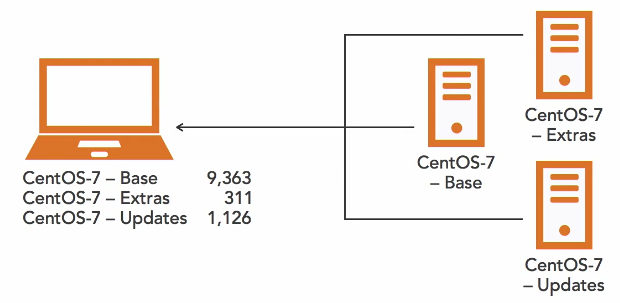
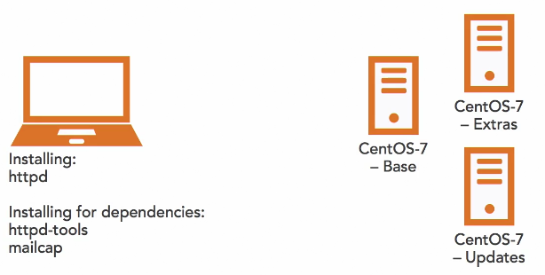

# Linux

[TOC]

## Linux Boot Process

1. Firmware stage

- Execute code in the BIOS for legacy systems
- Execute code in the UEFI firmware for new computers
- Start boot loader

2. Bootloader stage

- Firmware executes bootloader (grub2) code on drive (Ubuntu)

- Bootloader reads its configuration file

  - Location dependent on distribution and BIOS/UEFI

- Executes the kernel

3. Kernel Stage

- Kernel loads the RAMDisk into RAM
- Kernel loads device drivers and config files from RamDisk
- Kernel unmounts RAMDisk and mounts root filesystem
- Starts Initialization stage

4. Initialization stage

- Granfather process (systemd) is started by the kernel
- systemd starts system services
- systemd starts login shells and GUI interface

**System Targets**

- Target is a specific configuration
- Default target is graphical.target
-  Systems can be booted into different tragets


## How to reset root on password

1. Boot Up your system and on the Grub2 boot Menu screen, Press **e** on the Keyboard to enter.`Grub Edit Mode`
2. After pressing “**e**“, scroll down to **vmlinux** line and move to the end of the line press **ctrl+e** and to move to the front of the line press **ctrl+a.** 
3. Add the following Full line will be similar to:linux16 /vmlinuz-3.10.0-327.el7.x86_64 root=/dev/mapper/centos-root \ ro rd.lvm.lv=centos/root rd.lvm.lv=centos/swap **rd.break**
4. To boot the system with the New parameter parsed, press **ctrl+x** which will take you to prompt window.
5. Mount the file system asread and write, you cannot change the password when the filesystem is not writable. Remount is as writable by typing the following command.

```
# mount -o remount,rw  /sysroot
```

6. Chroot into the **/sysroot**

```
# chroot /sysroot
```

7. Now change the password

```
# passwd
```

8. Set SELinux relabeling on next boot

```
# touch /.autorelabel
```

## Go to the emergency mode

systemd.unit=emergency


## How to set default target (default runlevel)

**To Check current default target**

```
# systemctl get-default
```

**To list the predefined systemd run level target units :**

```
# find / -name "runlevel*.target"
/usr/lib/systemd/system/runlevel4.target
/usr/lib/systemd/system/runlevel5.target
/usr/lib/systemd/system/runlevel6.target
/usr/lib/systemd/system/runlevel1.target
/usr/lib/systemd/system/runlevel2.target
/usr/lib/systemd/system/runlevel3.target
/usr/lib/systemd/system/runlevel0.target
```

 **To set default target**

```
# systemctl set-default mutliuser.target
```


| Run Level | Target Units                             | Description                            |
| :-------- | :--------------------------------------- | :------------------------------------- |
| 0         | runlevel0.target, poweroff.target        | Shut down and power off                |
| 1         | runlevel1.target, rescue.target          | Set up a rescue shell                  |
| 2,3,4     | runlevel[234].target, multi- user.target | Set up a nongraphical multi-user shell |
| 5         | runlevel5.target, graphical.target       | Set up a graphical multi-user shell    |
| 6         | runlevel6.target, reboot.target          | Shut down and reboot the system        |


## Update Kernels

### Set kernel boot options

```
# grub2-set-default 1
```

* boot list starts at 0

### Check the kernel installed

```
# yum list installed kernel-*
Loaded plugins: fastestmirror, langpacks
Loading mirror speeds from cached hostfile
 * base: mirror.xtom.com.hk
 * extras: mirror.xtom.com.hk
 * updates: mirror.xtom.com.hk
Installed Packages
kernel.x86_64                                            3.10.0-1160.el7                                      @anaconda
kernel.x86_64                                            3.10.0-1160.49.1.el7                                 @updates
kernel-debug-devel.x86_64                                3.10.0-1160.49.1.el7                                 @updates
kernel-devel.x86_64                                      3.10.0-1160.49.1.el7                                 @updates
kernel-headers.x86_64                                    3.10.0-1160.49.1.el7                                 @updates
kernel-tools.x86_64                                      3.10.0-1160.49.1.el7                                 @updates
kernel-tools-libs.x86_64                                 3.10.0-1160.49.1.el7                                 @updates
```

### All installed kernels reside in /boot directory

```
# ls -l /boot
total 195016
-rw-r--r--. 1 root root   153596 Nov 30 23:55 config-3.10.0-1160.49.1.el7.x86_64
-rw-r--r--. 1 root root   153591 Oct 20  2020 config-3.10.0-1160.el7.x86_64
drwx------. 3 root root       17 Jul 29  2020 efi
drwxr-xr-x. 2 root root       27 Jan  6 20:18 grub
drwx------. 5 root root       97 Jan  6 20:43 grub2
-rw-------. 1 root root 79699095 Jan  6 20:24 initramfs-0-rescue-2290d4b2b5e17749a3f266340bdd5764.img
-rw-------. 1 root root 31706377 Jan  6 20:53 initramfs-3.10.0-1160.49.1.el7.x86_64.img
-rw-------. 1 root root 14031948 Jan  6 20:46 initramfs-3.10.0-1160.49.1.el7.x86_64kdump.img
-rw-------. 1 root root 31707646 Jan  6 20:44 initramfs-3.10.0-1160.el7.x86_64.img
-rw-------. 1 root root 14029731 Jan  6 20:41 initramfs-3.10.0-1160.el7.x86_64kdump.img
-rw-r--r--. 1 root root   320671 Nov 30 23:55 symvers-3.10.0-1160.49.1.el7.x86_64.gz
-rw-r--r--. 1 root root   320648 Oct 20  2020 symvers-3.10.0-1160.el7.x86_64.gz
-rw-------. 1 root root  3620596 Nov 30 23:55 System.map-3.10.0-1160.49.1.el7.x86_64
-rw-------. 1 root root  3616707 Oct 20  2020 System.map-3.10.0-1160.el7.x86_64
-rwxr-xr-x. 1 root root  6769256 Jan  6 20:24 vmlinuz-0-rescue-2290d4b2b5e17749a3f266340bdd5764
-rwxr-xr-x. 1 root root  6773352 Nov 30 23:55 vmlinuz-3.10.0-1160.49.1.el7.x86_64
-rwxr-xr-x. 1 root root  6769256 Oct 20  2020 vmlinuz-3.10.0-1160.el7.x86_64
```

### See the kernel release

```
# uname -r
3.10.0-1160.49.1.el7.x86_64
```


### List the available kernel update

```
# yum list available kernel
Loaded plugins: fastestmirror, langpacks
Loading mirror speeds from cached hostfile
 * base: mirror.xtom.com.hk
 * extras: mirror.xtom.com.hk
 * updates: mirror.xtom.com.hk
Available Packages
kernel.x86_64                            3.10.0-1160.53.1.el7                             updates
```

### Update kernel

```
# yum update -y kernel
```

### Remove unused kernels

```
# yum remove kernel
```


## Manage kernel modules

### Kernel Modules folder

```
# ls /lib/modules/$(uname -r)/kernel
arch  crypto  drivers  fs  kernel  lib  mm  net  sound  virt
```

### See the current loaded modules

```
# lsmod
Module                  Size  Used by
xt_CHECKSUM            12549  1
ipt_MASQUERADE         12678  3
nf_nat_masquerade_ipv4    13463  1 ipt_MASQUERADE
tun                    36164  1
devlink                60067  0
ip6t_rpfilter          12595  1
ip6t_REJECT            12625  2
nf_reject_ipv6         13717  1 ip6t_REJECT
ipt_REJECT             12541  4
nf_reject_ipv4         13373  1 ipt_REJECT
xt_conntrack           12760  12
ebtable_nat            12807  1
ebtable_broute         12731  1
bridge                151336  1 ebtable_broute
stp                    12976  1 bridge
```

### Get more information about the module

```
# modinfo cdrom
filename:       /lib/modules/3.10.0-1160.53.1.el7.x86_64/kernel/drivers/cdrom/cdrom.ko.xz
license:        GPL
retpoline:      Y
rhelversion:    7.9
srcversion:     9354225F1E3AD5837E4D30F
depends:
intree:         Y
vermagic:       3.10.0-1160.53.1.el7.x86_64 SMP mod_unload modversions
signer:         CentOS Linux kernel signing key
sig_key:        87:E5:16:0E:55:99:B4:50:B2:48:34:5F:17:61:A1:76:E0:8A:6D:FD
sig_hashalgo:   sha256
parm:           debug:bool
parm:           autoclose:bool
parm:           autoeject:bool
parm:           lockdoor:bool
parm:           check_media_type:bool
parm:           mrw_format_restart:bool
```

 ###  Add and remove modules

```
# modprobe -va [module name]

# modprobe -vr [module name]
```

### Scan new hardware local

```
# depmod -v
```

## Configure Network Connections

### Static Network Config

- /etc/sysconfig/networkscripts/ifcfg-eth0

```
TYPE="Ethernet"
BOOTPROTO=none
IPV6INIT="yes"
NAME="eth0"
UUID="e9f08541-ce05-41 19-abeb-3849fcb76516"
DEVICE="eth0"
ONBOOT="yes"
HWADDR=52:54:00:99:63:49
IPADDR=192.168.1.206
GATEWAY=192.168.1.1
```

### DHCP Configuration File

```
BOOTPROTO=dhcp
DEVICE=eth0
ONBOOT=yes
```

### Static Configuration File

```
DEVICE=eth0
BOOTPROTO=none
ONBOOT=yes
PREFIX=24
IPADDR=192.168.1.206
```

### General Configuration Options

* DEVICE=name

* IPADDR=address

* IPV6ADDR=address

* HWADDR=MAC-address

* MACADDR=MAC-address

* BOOTPROTO=protocol (none, bootp, dhcp)
* ONBOOT=answer (yes,no)

* IPV6INIT=answer (yes, no)

### DNS Configuration Options

- PEERDNS=answer (yes, no)

* DNS{1,2j=address

### Netmask Configuration Options

- PREFIX = CIDR bits
- NETMASK = mask in dotted notation

### Control Configurartion Options

- NM_CONTROLLED=answer (yes,no)
- USERCTL=answer (yes,no)


**Systemd Network Interface Naming**

| Interface Type         | Interface Name |
| ---------------------- | -------------- |
| Firmware/BIOS supplied | enol           |
| PCI Express Slot       | ens1           |
| PCI Slot               | enp3s0         |
| Invalid firmware info  | ethO           |

### Change hostname

```
# hostnamectl set-hostname rhhost1.localnet.com
```

### Host Configuration

- /etc/hosts

```
192.168.1.100	rhhost1.localnet.com	rhhosts1
192.168.1.200	rhhost2.localnet.com	rhhosts2
```

### Interface Administrator Commands

- ifup/ifdown
- ip
- nm-cli
- nm-tui
- nm-connection-editor

### Nameserver Configuration

- /etc/resolv,conf

### Nmcli

Show nmcli examples

```
$ man nmcli-examples
NMCLI-EXAMPLES(7)                       Examples                      NMCLI-EXAMPLES(7)

NAME
       nmcli-examples - usage examples of nmcli

SYNOPSIS
       nmcli [OPTIONS...]

DESCRIPTION
       nmcli is a command-line client for NetworkManager. It allows controlling
       NetworkManager and reporting its status. For more information please refer to
       nmcli(1) manual page.

       The purpose of this manual page is to provide you with various examples and
       usage scenarios of nmcli.

EXAMPLES
       Example 1. Listing available Wi-Fi APs

           $ nmcli device wifi list
           *  SSID               MODE    CHAN  RATE       SIGNAL  BARS  SECURITY
              netdatacomm_local  Infra   6     54 Mbit/s  37      ▂▄__  WEP
           *  F1                 Infra   11    54 Mbit/s  98      ▂▄▆█  WPA1
              LoremCorp          Infra   1     54 Mbit/s  62      ▂▄▆_  WPA2 802.1X
              Internet           Infra   6     54 Mbit/s  29      ▂___  WPA1
              HPB110a.F2672A     Ad-Hoc  6     54 Mbit/s  22      ▂___  --
              Jozinet            Infra   1     54 Mbit/s  19      ▂___  WEP
              VOIP               Infra   1     54 Mbit/s  20      ▂___  WEP
              MARTINA            Infra   4     54 Mbit/s  32      ▂▄__  WPA2
              N24PU1             Infra   7     11 Mbit/s  22      ▂___  --
              alfa               Infra   1     54 Mbit/s  67      ▂▄▆_  WPA2
              bertnet            Infra   5     54 Mbit/s  20      ▂___  WPA1 WPA2

```


**Bring down interface**

```
nmcli dev disconnect enp0s3
```

**Bring down interface**

```
nmcli con up enp0s3
```

Reload interface configuration****

```
# nmcli con load /etc/sysconfig/network-scripts/ifcfg-enp0s3
```

**Show all network connection**

```
nmcli con show
NAME                UUID                                  TYPE      DEVICE
Wired connection 1  fa4b8c06-1a57-3450-9f84-e8cee9f03a62  ethernet  enp0s8
enp0s3              97972afa-cd62-44b8-ae57-5e64c8afa0f9  ethernet  enp0s3
virbr0              e1c136af-784a-4fe2-b4a8-678a486e3396  bridge    virbr0
```

**Show active connection**

```
# nmcli con show --active
```

Show status of conn**ection**

```
nmcli general status
STATE      CONNECTIVITY  WIFI-HW  WIFI     WWAN-HW  WWAN
connected  full          enabled  enabled  enabled  enabled
```

**Configure connection**

```
nmcli connection edit
Valid connection types: 6lowpan, 802-11-olpc-mesh (olpc-mesh), 802-11-wireless (wifi), 802-3-ethernet (ethernet), adsl, bluetooth, bond, bridge, cdma, dummy, generic, gsm, infiniband, ip-tunnel, macsec, macvlan, ovs-bridge, ovs-interface, ovs-port, pppoe, team, tun, vlan, vpn, vxlan, wifi-p2p, wimax, wireguard, wpan, bond-slave, bridge-slave, team-slave
Enter connection type:
```

## Configure interface bonding

 **Check status of NetworkManager**

```
# systemctl status NetworkManager
```

**Install module bonding and check if installed **

```
# modprobe bonding
# lsmod | grep bonding
bonding               152979  0
```


**Create connection**

```
# sudo nmcli connection add type bond con-name bond0 ifname bond0 mode balance-rr ipv4.addresses 192.168.100.101/24 gw4 192.168.100.1
```

**Add interface connection to the bond**

```
# nmcli connection add type bond-slave ifname enp0s8 master bond0
Connection 'bond-slave-enp0s8' (e684a83b-db3c-4d7b-81b4-37e8d8048e91) successfully added.
# nmcli connection add type bond-slave ifname enp0s9 master bond0
Connection 'bond-slave-enp0s9' (4c91105f-164d-4bcf-8a6b-4872703e51b0) successfully added.
```


```
# cat /etc/sysconfig/network-scripts/ifcfg-bond-slave-enp0s8
TYPE=Ethernet
NAME=bond-slave-enp0s8
UUID=e684a83b-db3c-4d7b-81b4-37e8d8048e91
DEVICE=enp0s8
ONBOOT=yes
MASTER=bond0
SLAVE=yes

# cat /etc/sysconfig/network-scripts/ifcfg-bond-slave-enp0s9
TYPE=Ethernet
NAME=bond-slave-enp0s9
UUID=4c91105f-164d-4bcf-8a6b-4872703e51b0
DEVICE=enp0s9
ONBOOT=yes
MASTER=bond0
SLAVE=yes
```


```
# nmcli connection up bond0
Connection successfully activated (master waiting for slaves) (D-Bus active path: /org/freedesktop/NetworkManager/ActiveConnection/38)

# ip addr | grep bond0
11: bond0: <NO-CARRIER,BROADCAST,MULTICAST,MASTER,UP> mtu 1500 qdisc noqueue state DOWN group default qlen 1000

# nmcli con show | grep bond
bond0               3b5b5c62-a629-4b31-b399-6649c6e37bbf  bond      bond0
bond-slave-enp0s8   e684a83b-db3c-4d7b-81b4-37e8d8048e91  ethernet  enp0s8
bond-slave-enp0s9   4c91105f-164d-4bcf-8a6b-4872703e51b0  ethernet  enp0s9
[root@rhhost1 user1]#

```


## List, create and delete partitions on MBR and GPT disk


### Get list of drives in a system

```
# cat /proc/partitions
major minor  #blocks  name

   8        0    8388608 sda
   8        1    1048576 sda1
   8        2    7339008 sda2
   8       16    1048576 sdb
   8       32    1048576 sdc
   8       48    1048576 sdd
   8       64    1048576 sde
  11        0    1048575 sr0
 253        0    6496256 dm-0
 253        1     839680 dm-1
```

or

```
# lsblk
NAME            MAJ:MIN RM  SIZE RO TYPE MOUNTPOINT
sda               8:0    0    8G  0 disk
├─sda1            8:1    0    1G  0 part /boot
└─sda2            8:2    0    7G  0 part
  ├─centos-root 253:0    0  6.2G  0 lvm  /
  └─centos-swap 253:1    0  820M  0 lvm  [SWAP]
sdb               8:16   0    1G  0 disk
sdc               8:32   0    1G  0 disk
sdd               8:48   0    1G  0 disk
sde               8:64   0    1G  0 disk
sr0              11:0    1 1024M  0 rom
```

or

**List all partitions**

```
# fdisk -l
```

**List specific partition**

```
# fdisk -l /dev/sdb

Disk /dev/sdb: 1073 MB, 1073741824 bytes, 2097152 sectors
Units = sectors of 1 * 512 = 512 bytes
Sector size (logical/physical): 512 bytes / 512 bytes
I/O size (minimum/optimal): 512 bytes / 512 bytes
```


### Partion Tools

- fdisk
- gdisk
- gparted


### Legacy Systems

- Boot with a BIOS
- Master boot record (MBR)
- Four real primary partitions
- Accessible size of 2 TB
- One extended partition

**MBR Partioning Number**

- Primary or extended partitions (1-4)
- Logical partitions (5-11)

**Tools**

- fdisk
- sfdisk (scripts)
- cfdisk (curses interface)


### Modern Systems

- Boot with a Unified Extensible Firmware Interface (UEFI)
- Use GUID Partition Tables (GPTs)
- Unlimited partitions
- Accessible size of 18 exabytes

**Tools**

- gdisk
- sgdisk (scripts)
- cgdisk (curses interface)
- parted

### Create partion using gdisk

```
# gdisk /dev/sdb
GPT fdisk (gdisk) version 0.8.10

Partition table scan:
  MBR: not present
  BSD: not present
  APM: not present
  GPT: not present

Creating new GPT entries.

Command (? for help): n
Partition number (1-128, default 1):
First sector (34-2097118, default = 2048) or {+-}size{KMGTP}:
Last sector (2048-2097118, default = 2097118) or {+-}size{KMGTP}: +500M
Current type is 'Linux filesystem'
Hex code or GUID (L to show codes, Enter = 8300):
Changed type of partition to 'Linux filesystem'

Command (? for help): p
Disk /dev/sdb: 2097152 sectors, 1024.0 MiB
Logical sector size: 512 bytes
Disk identifier (GUID): A73A7BEB-9341-490F-9D1F-0353051099D6
Partition table holds up to 128 entries
First usable sector is 34, last usable sector is 2097118
Partitions will be aligned on 2048-sector boundaries
Total free space is 1073085 sectors (524.0 MiB)

Number  Start (sector)    End (sector)  Size       Code  Name
   1            2048         1026047   500.0 MiB   8300  Linux filesystem

Command (? for help): w

Final checks complete. About to write GPT data. THIS WILL OVERWRITE EXISTING
PARTITIONS!!

Do you want to proceed? (Y/N): Y
OK; writing new GUID partition table (GPT) to /dev/sdb.
The operation has completed successfully.
```


**Put filesystem in new partition**

```
# mkfs -t ext4 /dev/sdb1
mke2fs 1.42.9 (28-Dec-2013)
Filesystem label=
OS type: Linux
Block size=1024 (log=0)
Fragment size=1024 (log=0)
Stride=0 blocks, Stripe width=0 blocks
128016 inodes, 512000 blocks
25600 blocks (5.00%) reserved for the super user
First data block=1
Maximum filesystem blocks=34078720
63 block groups
8192 blocks per group, 8192 fragments per group
2032 inodes per group
Superblock backups stored on blocks:
        8193, 24577, 40961, 57345, 73729, 204801, 221185, 401409

Allocating group tables: done
Writing inode tables: done
Creating journal (8192 blocks): done
Writing superblocks and filesystem accounting information: done
```

### Create partion using parted

```
# parted
(parted) print all
Model: ATA VBOX HARDDISK (scsi)
Disk /dev/sda: 8590MB
Sector size (logical/physical): 512B/512B
Partition Table: msdos
Disk Flags:

Number  Start   End     Size    Type     File system  Flags
 1      1049kB  1075MB  1074MB  primary  xfs          boot
 2      1075MB  8590MB  7515MB  primary               lvm


Model: ATA VBOX HARDDISK (scsi)
Disk /dev/sdb: 1074MB
Sector size (logical/physical): 512B/512B
Partition Table: gpt
Disk Flags:

Number  Start   End    Size   File system  Name              Flags
 1      1049kB  525MB  524MB  ext4         Linux filesystem


Error: /dev/sdc: unrecognised disk label
Model: ATA VBOX HARDDISK (scsi)
Disk /dev/sdc: 1074MB
Sector size (logical/physical): 512B/512B
Partition Table: unknown
Disk Flags:

Error: /dev/sdd: unrecognised disk label
Model: ATA VBOX HARDDISK (scsi)
Disk /dev/sdd: 1074MB
Sector size (logical/physical): 512B/512B
Partition Table: unknown
Disk Flags:

Error: /dev/sde: unrecognised disk label
Model: ATA VBOX HARDDISK (scsi)
Disk /dev/sde: 1074MB
Sector size (logical/physical): 512B/512B
Partition Table: unknown
Disk Flags:

Model: Linux device-mapper (linear) (dm)
Disk /dev/mapper/centos-swap: 860MB
Sector size (logical/physical): 512B/512B
Partition Table: loop
Disk Flags:

Number  Start  End    Size   File system     Flags
 1      0.00B  860MB  860MB  linux-swap(v1)


Model: Linux device-mapper (linear) (dm)
Disk /dev/mapper/centos-root: 6652MB
Sector size (logical/physical): 512B/512B
Partition Table: loop
Disk Flags:

Number  Start  End     Size    File system  Flags
 1      0.00B  6652MB  6652MB  xfs

(parted) print devices
/dev/sda (8590MB)
/dev/sdb (1074MB)
/dev/sdc (1074MB)
/dev/sdd (1074MB)
/dev/sde (1074MB)
/dev/mapper/centos-swap (860MB)
/dev/mapper/centos-root (6652MB)
(parted) select /dev/sdc
Using /dev/sdc
(parted) print free
Error: /dev/sdc: unrecognised disk label
Model: ATA VBOX HARDDISK (scsi)
Disk /dev/sdc: 1074MB
Sector size (logical/physical): 512B/512B
Partition Table: unknown
Disk Flags:
(parted) mklabel msdos
(parted) print
Model: ATA VBOX HARDDISK (scsi)
Disk /dev/sdc: 1074MB
Sector size (logical/physical): 512B/512B
Partition Table: msdos
Disk Flags:
(parted) mkpart primary 1 500MB
(parted) print
Model: ATA VBOX HARDDISK (scsi)
Disk /dev/sdc: 1074MB
Sector size (logical/physical): 512B/512B
Partition Table: msdos
Disk Flags:

Number  Start   End    Size   Type     File system  Flags
 1      1049kB  500MB  499MB  primary
```


### Create partion using fdisk

```
$ sudo fdisk /dev/sdc

Welcome to fdisk (util-linux 2.34).
Changes will remain in memory only, until you decide to write them.
Be careful before using the write command.

Device does not contain a recognized partition table.
Created a new DOS disklabel with disk identifier 0x40857866.

Command (m for help): p
Disk /dev/sdc: 1 GiB, 1073741824 bytes, 2097152 sectors
Disk model: VMware Virtual S
Units: sectors of 1 * 512 = 512 bytes
Sector size (logical/physical): 512 bytes / 512 bytes
I/O size (minimum/optimal): 512 bytes / 512 bytes
Disklabel type: dos
Disk identifier: 0x40857866

Command (m for help): n
Partition type
   p   primary (0 primary, 0 extended, 4 free)
   e   extended (container for logical partitions)
Select (default p): p
Partition number (1-4, default 1): 1
First sector (2048-2097151, default 2048): 
Last sector, +/-sectors or +/-size{K,M,G,T,P} (2048-2097151, default 2097151): +500M
Created a new partition 1 of type 'Linux' and of size 500 MiB.

Command (m for help): p
Disk /dev/sdc: 1 GiB, 1073741824 bytes, 2097152 sectors
Disk model: VMware Virtual S
Units: sectors of 1 * 512 = 512 bytes
Sector size (logical/physical): 512 bytes / 512 bytes
I/O size (minimum/optimal): 512 bytes / 512 bytes
Disklabel type: dos
Disk identifier: 0x40857866

Device     Boot Start     End Sectors  Size Id Type
/dev/sdc1        2048 1026047 1024000  500M 83 Linux

Command (m for help): w
The partition table has been altered.
Calling ioctl() to re-read partition table.
Syncing disks.
```


## Resize partitions without losing data


## Manage LVM volumes and Volume Groups

### Create Physical Volume

```
# pvcreate /dev/sdb1
  Physical volume "/dev/sdb1" successfully created.
```


### Display various attributes of physical volume

```
# pvdisplay 
  --- Physical volume ---
  PV Name               /dev/sdb1
  VG Name               vgdata
  PV Size               1022.98 MiB / not usable 2.98 MiB
  Allocatable           yes 
  PE Size               4.00 MiB
  Total PE              255
  Free PE               255
  Allocated PE          0
  PV UUID               OGrmim-rzWw-Hcha-DVte-IexI-G4SZ-ncnyjH
   
  --- Physical volume ---
  PV Name               /dev/sda3
  VG Name               ubuntu-vg
  PV Size               <18.50 GiB / not usable 0   
  Allocatable           yes 
  PE Size               4.00 MiB
  Total PE              4735
  Free PE               2175
  Allocated PE          2560
  PV UUID               qyLTxi-Qpue-NtZv-bvA3-gOZL-sD6f-Oi1GBe

```


### Display physical volumes summary

```
# pvs
  PV         VG        Fmt  Attr PSize    PFree   
  /dev/sda3  ubuntu-vg lvm2 a--   <18.50g   <8.50g
  /dev/sdb1            lvm2 ---  1022.98m 1022.98m
```

### Create Volume Group

```
# vgcreate vgdata /dev/sdb1 
  Volume group "vgdata" successfully created
```


### Display various attributes of  volume group

```
# vgdisplay 
  --- Volume group ---
  VG Name               vgdata
  System ID             
  Format                lvm2
  Metadata Areas        1
  Metadata Sequence No  1
  VG Access             read/write
  VG Status             resizable
  MAX LV                0
  Cur LV                0
  Open LV               0
  Max PV                0
  Cur PV                1
  Act PV                1
  VG Size               1020.00 MiB
  PE Size               4.00 MiB
  Total PE              255
  Alloc PE / Size       0 / 0   
  Free  PE / Size       255 / 1020.00 MiB
  VG UUID               tW9pGf-e1Dn-wPbw-AbTi-fZts-Idnq-ok3PfH
   
  --- Volume group ---
  VG Name               ubuntu-vg
  System ID             
  Format                lvm2
  Metadata Areas        1
  Metadata Sequence No  4
  VG Access             read/write
  VG Status             resizable
  MAX LV                0
  Cur LV                1
  Open LV               1
  Max PV                0
  Cur PV                1
  Act PV                1
  VG Size               <18.50 GiB
  PE Size               4.00 MiB
  Total PE              4735
  Alloc PE / Size       2560 / 10.00 GiB
  Free  PE / Size       2175 / <8.50 GiB
  VG UUID               wj8jtg-X72X-B2fP-otgY-jNSr-Ee4o-FtmeP3
```


### Display volume group summary

```
# vgs
  VG        #PV #LV #SN Attr   VSize    VFree   
  ubuntu-vg   1   1   0 wz--n-  <18.50g   <8.50g
  vgdata      1   0   0 wz--n- 1020.00m 1020.00mm
```


### Create logical volume

```
# lvcreate -L 500M -n lvdata vgdata
  Logical volume "lvdata" created.
```


### Display logical volume summary

```
# lvs
  LV        VG        Attr       LSize   Pool Origin Data%  Meta%  Move Log Cpy%Sync Convert
  ubuntu-lv ubuntu-vg -wi-ao----  10.00g                                                    
  lvdata    vgdata    -wi-a----- 500.00m  
```


### Display various attributes of  logical volume

```
# lvdisplay 
  --- Logical volume ---
  LV Path                /dev/vgdata/lvdata
  LV Name                lvdata
  VG Name                vgdata
  LV UUID                Injzvs-3phl-QqAN-yz0M-V8Oi-eVpl-bx6GH0
  LV Write Access        read/write
  LV Creation host, time ubuntu-server, 2022-02-25 06:47:43 +0000
  LV Status              available
  # open                 0
  LV Size                500.00 MiB
  Current LE             125
  Segments               1
  Allocation             inherit
  Read ahead sectors     auto
  - currently set to     256
  Block device           253:1
   
  --- Logical volume ---
  LV Path                /dev/ubuntu-vg/ubuntu-lv
  LV Name                ubuntu-lv
  VG Name                ubuntu-vg
  LV UUID                8Ge2rh-29oS-Y9u3-IxuT-tQA0-r1dB-CCVRS2
  LV Write Access        read/write
  LV Creation host, time ubuntu-server, 2022-02-25 02:10:20 +0000
  LV Status              available
  # open                 1
  LV Size                10.00 GiB
  Current LE             2560
  Segments               1
  Allocation             inherit
  Read ahead sectors     auto
  - currently set to     256
  Block device           253:0
```

### Format Logical Volume

```
# mkfs -t ext4 /dev/vgdata/lvdata 
mke2fs 1.45.5 (07-Jan-2020)
Creating filesystem with 128000 4k blocks and 128000 inodes
Filesystem UUID: 2045a544-067d-42e3-9c26-cf42d9af48ec
Superblock backups stored on blocks: 
	32768, 98304

Allocating group tables: done                            
Writing inode tables: done                            
Creating journal (4096 blocks): done
Writing superblocks and filesystem accounting information: done
```


### Verify if File System created

```
# blkid 
/dev/fd0: SEC_TYPE="msdos" UUID="5459-5107" TYPE="vfat"
/dev/sr0: UUID="2022-02-25-10-08-07-00" LABEL="CDROM" TYPE="iso9660"
/dev/sr1: UUID="2022-02-23-09-27-00-00" LABEL="Ubuntu-Server 20.04.4 LTS amd64" TYPE="iso9660" PTUUID="492bdcc4" PTTYPE="dos"
/dev/sda2: UUID="5ad1c3ca-0b9d-47b1-9d23-40d0592ad390" TYPE="ext4" PARTUUID="61e94aee-2ced-42a4-8ad7-9f95c01377aa"
/dev/sda3: UUID="qyLTxi-Qpue-NtZv-bvA3-gOZL-sD6f-Oi1GBe" TYPE="LVM2_member" PARTUUID="39b90254-d4da-4d47-a513-945f26496902"
/dev/mapper/ubuntu--vg-ubuntu--lv: UUID="65238bf3-8a36-4379-8276-298243687ce2" TYPE="ext4"
/dev/loop0: TYPE="squashfs"
/dev/loop1: TYPE="squashfs"
/dev/loop2: TYPE="squashfs"
/dev/sda1: PARTUUID="fbc83446-9f88-4d6a-ac2a-4814d123e721"
/dev/sdb1: UUID="OGrmim-rzWw-Hcha-DVte-IexI-G4SZ-ncnyjH" TYPE="LVM2_member" PARTLABEL="Linux filesystem" PARTUUID="3841d75f-43f9-464c-9d93-45192a03cf04"
/dev/mapper/vgdata-lvdata: UUID="2045a544-067d-42e3-9c26-cf42d9af48ec" TYPE="ext4"
```


### Mount the logical volume

```
# mkdir /media/lvdata

# mount /dev/vgdata/lvdata /media/lvdata

# df -h
Filesystem                         Size  Used Avail Use% Mounted on
udev                               933M     0  933M   0% /dev
tmpfs                              196M  1.3M  194M   1% /run
/dev/mapper/ubuntu--vg-ubuntu--lv  9.8G  4.3G  5.1G  46% /
tmpfs                              977M     0  977M   0% /dev/shm
tmpfs                              5.0M     0  5.0M   0% /run/lock
tmpfs                              977M     0  977M   0% /sys/fs/cgroup
/dev/loop0                          62M   62M     0 100% /snap/core20/1328
/dev/loop1                          44M   44M     0 100% /snap/snapd/14978
/dev/loop2                          68M   68M     0 100% /snap/lxd/21835
/dev/sda2                          1.5G  110M  1.3G   8% /boot
tmpfs                              196M     0  196M   0% /run/user/1000
/dev/mapper/vgdata-lvdata          469M  768K  433M   1% /media/lvdata

# lsblk 
NAME                      MAJ:MIN RM  SIZE RO TYPE MOUNTPOINT
fd0                         2:0    1  1.4M  0 disk 
loop0                       7:0    0 61.9M  1 loop /snap/core20/1328
loop1                       7:1    0 43.6M  1 loop /snap/snapd/14978
loop2                       7:2    0 67.2M  1 loop /snap/lxd/21835
sda                         8:0    0   21G  0 disk 
├─sda1                      8:1    0    1M  0 part 
├─sda2                      8:2    0  1.5G  0 part /boot
└─sda3                      8:3    0 18.5G  0 part 
  └─ubuntu--vg-ubuntu--lv 253:0    0   10G  0 lvm  /
sdb                         8:16   0    1G  0 disk 
└─sdb1                      8:17   0 1023M  0 part 
  └─vgdata-lvdata         253:1    0  500M  0 lvm  /media/lvdata
sr0                        11:0    1 97.2M  0 rom  
sr1                        11:1    1  1.2G  0 rom  
```


### Linux File System

| FS    | Max FS Size | Max File Size | Notes                                                        |
| ----- | ----------- | ------------- | ------------------------------------------------------------ |
| ext2  | 16-32 TiB   | 2 TiB         | Not journalized                                              |
| ext3  | 16-32 TiB   | 2 TiB         | ext2 with a journal                                          |
| ext4  | 1 EiB       | 16 TiB        | Suppots solid-state disks. larger disks, robusts             |
| XFS   | 8 EiB       | 8EiB          | Cannot be shrunk, supports snaphots                          |
| Btrfs | 16 EiB      | 16 EiB        | Supports automatic defragmentation, copy-on-write, RAID, subvolumes, online data correction, snapshots |


### Extend existing logical volumes

1. Check volume group free space

   **Using lsblk command**

   ```
   # lsblk 
   NAME                      MAJ:MIN RM  SIZE RO TYPE MOUNTPOINT
   fd0                         2:0    1  1.4M  0 disk 
   loop0                       7:0    0 67.2M  1 loop /snap/lxd/21835
   loop1                       7:1    0 61.9M  1 loop /snap/core20/1328
   loop2                       7:2    0 43.6M  1 loop /snap/snapd/14978
   loop3                       7:3    0 61.9M  1 loop /snap/core20/1361
   loop4                       7:4    0 67.9M  1 loop /snap/lxd/22526
   sda                         8:0    0   21G  0 disk 
   ├─sda1                      8:1    0    1M  0 part 
   ├─sda2                      8:2    0  1.5G  0 part /boot
   └─sda3                      8:3    0 18.5G  0 part 
     └─ubuntu--vg-ubuntu--lv 253:1    0   10G  0 lvm  /
   sdb                         8:16   0    1G  0 disk 
   └─sdb1                      8:17   0 1023M  0 part 
     └─vgdata-lvdata         253:0    0  500M  0 lvm  
   sr0                        11:0    1 97.2M  0 rom  
   sr1                        11:1    1  1.2G  0 rom  
   ```

   **Using vgdispaly commnd**

   ```
   # vgdisplay | grep Free
     Free  PE / Size       130 / 520.00 MiB
     Free  PE / Size       2175 / <8.50 GiB
   ```

2. Extend logical volume

   ```
   # lvextend -L +500M /dev/vgdata/lvdata 
     Size of logical volume vgdata/lvdata changed from 500.00 MiB (125 extents) to 1000.00 MiB (250 extents).
     Logical volume vgdata/lvdata successfully resized.
   ```

3. Check logical volume

   **Using vgdispaly commnd**

   ```
   # lsblk 
   NAME                      MAJ:MIN RM  SIZE RO TYPE MOUNTPOINT
   fd0                         2:0    1  1.4M  0 disk 
   loop0                       7:0    0 67.2M  1 loop /snap/lxd/21835
   loop1                       7:1    0 61.9M  1 loop /snap/core20/1328
   loop2                       7:2    0 43.6M  1 loop /snap/snapd/14978
   loop3                       7:3    0 61.9M  1 loop /snap/core20/1361
   loop4                       7:4    0 67.9M  1 loop /snap/lxd/22526
   sda                         8:0    0   21G  0 disk 
   ├─sda1                      8:1    0    1M  0 part 
   ├─sda2                      8:2    0  1.5G  0 part /boot
   └─sda3                      8:3    0 18.5G  0 part 
     └─ubuntu--vg-ubuntu--lv 253:1    0   10G  0 lvm  /
   sdb                         8:16   0    1G  0 disk 
   └─sdb1                      8:17   0 1023M  0 part 
     └─vgdata-lvdata         253:0    0 1000M  0 lvm  
   sr0                        11:0    1 97.2M  0 rom  
   sr1                        11:1    1  1.2G  0 rom  
   ```

   **Using vgdispaly commnd**

   ```
   # vgdisplay | grep Free
     Free  PE / Size       5 / 20.00 MiB
     Free  PE / Size       2175 / <8.50 GiB
   ```

4. Resize file system

   **For ext4** 

   ```
   # resize2fs /dev/vgdata/lvdata 
   ```

   **For xfs**

   ```
   # xfs_growfs /dev/vgdata/lvdata 
   ```

   

### Automount File Systems on Linux 

1. Get the Name, UUID and File System Type

   ```
   # blkid 
   /dev/fd0: SEC_TYPE="msdos" UUID="5459-5107" TYPE="vfat"
   /dev/sda2: UUID="5ad1c3ca-0b9d-47b1-9d23-40d0592ad390" TYPE="ext4" PARTUUID="61e94aee-2ced-42a4-8ad7-9f95c01377aa"
   /dev/sda3: UUID="qyLTxi-Qpue-NtZv-bvA3-gOZL-sD6f-Oi1GBe" TYPE="LVM2_member" PARTUUID="39b90254-d4da-4d47-a513-945f26496902"
   /dev/sr0: UUID="2022-02-25-10-08-07-00" LABEL="CDROM" TYPE="iso9660"
   /dev/sdb1: UUID="OGrmim-rzWw-Hcha-DVte-IexI-G4SZ-ncnyjH" TYPE="LVM2_member" PARTLABEL="Linux filesystem" PARTUUID="3841d75f-43f9-464c-9d93-45192a03cf04"
   /dev/mapper/ubuntu--vg-ubuntu--lv: UUID="65238bf3-8a36-4379-8276-298243687ce2" TYPE="ext4"
   /dev/mapper/vgdata-lvdata: UUID="2045a544-067d-42e3-9c26-cf42d9af48ec" TYPE="ext4"
   /dev/loop0: TYPE="squashfs"
   /dev/loop1: TYPE="squashfs"
   /dev/loop2: TYPE="squashfs"
   /dev/loop3: TYPE="squashfs"
   /dev/loop4: TYPE="squashfs"
   /dev/sda1: PARTUUID="fbc83446-9f88-4d6a-ac2a-4814d123e721"
   ```

   

2. Make a Mount Point For Your Drive

   ```
   # mkdir /mnt/sdb1
   ```

3. Edit /etc/fstab File

   ```
   sudo nano /etc/fstab
   ```

   We need to append one line of code at the end of the file. The format of this line of code is as follows:

   ```
   UUID=<uuid-of-your-drive>  <mount-point>  <file-system-type>  <mount-option>  <dump>  <pass>
   ```

   Note that you need to separate these items with Tab key. For example, I added the following line to the end of `/etc/fstab`.

   ```
   UUID=2045a544-067d-42e3-9c26-cf42d9af48ec /mnt/sdb1 ext4 defaults 0 1
   ```

   Save and close the file. Then run the following command to see if it works.

   ```
   sudo mount -a
   ```


### Reduce existing logical volumes

#### Automated

**Decrease logical volume size using lvresize**

```
# lvresize -r -L 300M /dev/vgdata/lvdata 
Do you want to unmount "/mnt/sdb1" ? [Y|n] y
fsck from util-linux 2.34
/dev/mapper/vgdata-lvdata: 11/128000 files (0.0% non-contiguous), 8302/128000 blocks
resize2fs 1.45.5 (07-Jan-2020)
Resizing the filesystem on /dev/mapper/vgdata-lvdata to 76800 (4k) blocks.
The filesystem on /dev/mapper/vgdata-lvdata is now 76800 (4k) blocks long.

  Size of logical volume vgdata/lvdata changed from 500.00 MiB (125 extents) to 300.00 MiB (75 extents).
  Logical volume vgdata/lvdata successfully resized.

# df -h
Filesystem                         Size  Used Avail Use% Mounted on
udev                               933M     0  933M   0% /dev
tmpfs                              196M  1.3M  194M   1% /run
/dev/mapper/ubuntu--vg-ubuntu--lv  9.8G  4.5G  4.9G  48% /
tmpfs                              977M     0  977M   0% /dev/shm
tmpfs                              5.0M     0  5.0M   0% /run/lock
tmpfs                              977M     0  977M   0% /sys/fs/cgroup
/dev/loop0                          62M   62M     0 100% /snap/core20/1328
/dev/loop2                          68M   68M     0 100% /snap/lxd/22526
/dev/loop1                          68M   68M     0 100% /snap/lxd/21835
/dev/loop4                          62M   62M     0 100% /snap/core20/1361
/dev/loop3                          44M   44M     0 100% /snap/snapd/14978
/dev/sda2                          1.5G  110M  1.3G   8% /boot
tmpfs                              196M     0  196M   0% /run/user/1000
/dev/mapper/vgdata-lvdata          273M  520K  251M   1% /mnt/sdb1
```

**Increase logical volume size using lvresize**

```
# lvresize -r -L 700M /dev/vgdata/lvdata 
  Size of logical volume vgdata/lvdata changed from 300.00 MiB (75 extents) to 700.00 MiB (175 extents).
  Logical volume vgdata/lvdata successfully resized.
resize2fs 1.45.5 (07-Jan-2020)
Filesystem at /dev/mapper/vgdata-lvdata is mounted on /mnt/sdb1; on-line resizing required
old_desc_blocks = 1, new_desc_blocks = 1
The filesystem on /dev/mapper/vgdata-lvdata is now 179200 (4k) blocks long.

# df -h
Filesystem                         Size  Used Avail Use% Mounted on
udev                               933M     0  933M   0% /dev
tmpfs                              196M  1.3M  194M   1% /run
/dev/mapper/ubuntu--vg-ubuntu--lv  9.8G  4.5G  4.9G  48% /
tmpfs                              977M     0  977M   0% /dev/shm
tmpfs                              5.0M     0  5.0M   0% /run/lock
tmpfs                              977M     0  977M   0% /sys/fs/cgroup
/dev/loop0                          62M   62M     0 100% /snap/core20/1328
/dev/loop2                          68M   68M     0 100% /snap/lxd/22526
/dev/loop1                          68M   68M     0 100% /snap/lxd/21835
/dev/loop4                          62M   62M     0 100% /snap/core20/1361
/dev/loop3                          44M   44M     0 100% /snap/snapd/14978
/dev/sda2                          1.5G  110M  1.3G   8% /boot
tmpfs                              196M     0  196M   0% /run/user/1000
/dev/mapper/vgdata-lvdata          661M 1016K  630M   1% /mnt/sdb1
```


#### Manual

1. Check the mount

   ```
   # df -h
   Filesystem                         Size  Used Avail Use% Mounted on
   udev                               933M     0  933M   0% /dev
   tmpfs                              196M  1.3M  194M   1% /run
   /dev/mapper/ubuntu--vg-ubuntu--lv  9.8G  4.5G  4.9G  48% /
   tmpfs                              977M     0  977M   0% /dev/shm
   tmpfs                              5.0M     0  5.0M   0% /run/lock
   tmpfs                              977M     0  977M   0% /sys/fs/cgroup
   /dev/loop0                          62M   62M     0 100% /snap/core20/1328
   /dev/loop2                          68M   68M     0 100% /snap/lxd/22526
   /dev/loop1                          68M   68M     0 100% /snap/lxd/21835
   /dev/loop4                          62M   62M     0 100% /snap/core20/1361
   /dev/loop3                          44M   44M     0 100% /snap/snapd/14978
   /dev/sda2                          1.5G  110M  1.3G   8% /boot
   /dev/mapper/vgdata-lvdata          953M  1.3M  886M   1% /mnt/sdb1
   tmpfs                              196M     0  196M   0% /run/user/1000
   ```

2. Unmount logical volume and check if unmounted

   Note: Always unmount logical volumes when reducing the size and leave it mounted when increasing it.

   ```
   # umount /mnt/sdb1 
   
   # df -h
   Filesystem                         Size  Used Avail Use% Mounted on
   udev                               933M     0  933M   0% /dev
   tmpfs                              196M  1.3M  194M   1% /run
   /dev/mapper/ubuntu--vg-ubuntu--lv  9.8G  4.5G  4.9G  48% /
   tmpfs                              977M     0  977M   0% /dev/shm
   tmpfs                              5.0M     0  5.0M   0% /run/lock
   tmpfs                              977M     0  977M   0% /sys/fs/cgroup
   /dev/loop0                          62M   62M     0 100% /snap/core20/1328
   /dev/loop2                          68M   68M     0 100% /snap/lxd/22526
   /dev/loop1                          68M   68M     0 100% /snap/lxd/21835
   /dev/loop4                          62M   62M     0 100% /snap/core20/1361
   /dev/loop3                          44M   44M     0 100% /snap/snapd/14978
   /dev/sda2                          1.5G  110M  1.3G   8% /boot
   tmpfs                              196M     0  196M   0% /run/user/1000
   ```

3. Run file system check

   Note: If all 5 system file check is pass, proceed if not resolve the error first.

   ```
   # e2fsck -ff /dev/mapper/vgdata-lvdata 
   e2fsck 1.45.5 (07-Jan-2020)
   Pass 1: Checking inodes, blocks, and sizes
   Pass 2: Checking directory structure
   Pass 3: Checking directory connectivity
   Pass 4: Checking reference counts
   Pass 5: Checking group summary information
   /dev/mapper/vgdata-lvdata: 11/256000 files (0.0% non-contiguous), 12438/256000 blocks
   ```

4.  Resize the file system

   ```
   # resize2fs /dev/mapper/vgdata-lvdata 500M
   resize2fs 1.45.5 (07-Jan-2020)
   Resizing the filesystem on /dev/mapper/vgdata-lvdata to 128000 (4k) blocks.
   The filesystem on /dev/mapper/vgdata-lvdata is now 128000 (4k) blocks long.
   ```

5. Reduce the logical volume

   ```
   # lvresize -L 500M /dev/vgdata/lvdata 
     WARNING: Reducing active logical volume to 500.00 MiB.
     THIS MAY DESTROY YOUR DATA (filesystem etc.)
   Do you really want to reduce vgdata/lvdata? [y/n]: y
     Size of logical volume vgdata/lvdata changed from 1000.00 MiB (250 extents) to 500.00 MiB (125 extents).
     Logical volume vgdata/lvdata successfully resized.
   ```

6. Verify the logical volume size

   ```
   # lvs
     LV        VG        Attr       LSize   Pool Origin Data%  Meta%  Move Log Cpy%Sync Convert
     ubuntu-lv ubuntu-vg -wi-ao----  10.00g                                                    
     lvdata    vgdata    -wi-a----- 500.00m     
   ```

7. Mount the volume again and check the size

   ```
   # mount /dev/mapper/vgdata-lvdata /mnt/sdb1
   
   # df -h
   Filesystem                         Size  Used Avail Use% Mounted on
   udev                               933M     0  933M   0% /dev
   tmpfs                              196M  1.3M  194M   1% /run
   /dev/mapper/ubuntu--vg-ubuntu--lv  9.8G  4.5G  4.9G  48% /
   tmpfs                              977M     0  977M   0% /dev/shm
   tmpfs                              5.0M     0  5.0M   0% /run/lock
   tmpfs                              977M     0  977M   0% /sys/fs/cgroup
   /dev/loop0                          62M   62M     0 100% /snap/core20/1328
   /dev/loop2                          68M   68M     0 100% /snap/lxd/22526
   /dev/loop1                          68M   68M     0 100% /snap/lxd/21835
   /dev/loop4                          62M   62M     0 100% /snap/core20/1361
   /dev/loop3                          44M   44M     0 100% /snap/snapd/14978
   /dev/sda2                          1.5G  110M  1.3G   8% /boot
   tmpfs                              196M     0  196M   0% /run/user/1000
   /dev/mapper/vgdata-lvdata          469M  768K  433M   1% /mnt/sdb1
   ```


### Replace a physical volume

1. Create partition

   ```
   # gdisk /dev/sdd
   
   # lsblk 
   NAME                      MAJ:MIN RM  SIZE RO TYPE MOUNTPOINT
   fd0                         2:0    1  1.4M  0 disk 
   loop0                       7:0    0 61.9M  1 loop /snap/core20/1361
   loop1                       7:1    0 61.9M  1 loop /snap/core20/1376
   loop2                       7:2    0 67.9M  1 loop /snap/lxd/22526
   loop3                       7:3    0 67.8M  1 loop /snap/lxd/22753
   loop4                       7:4    0 43.6M  1 loop /snap/snapd/14978
   loop5                       7:5    0 43.6M  1 loop /snap/snapd/15177
   sda                         8:0    0   21G  0 disk 
   ├─sda1                      8:1    0    1M  0 part 
   ├─sda2                      8:2    0  1.5G  0 part /boot
   └─sda3                      8:3    0 18.5G  0 part 
     └─ubuntu--vg-ubuntu--lv 253:1    0   10G  0 lvm  /
   sdb                         8:16   0    1G  0 disk 
   └─sdb1                      8:17   0 1023M  0 part 
     └─vgdata-lvdata         253:0    0  1.5G  0 lvm  /mnt/sdb1
   sdc                         8:32   0    1G  0 disk 
   └─sdc1                      8:33   0  500M  0 part 
     └─vgdata-lvdata         253:0    0  1.5G  0 lvm  /mnt/sdb1
   sdd                         8:48   0    1G  0 disk 
   └─sdd1                      8:49   0  500M  0 part 
   sr0                        11:0    1 97.2M  0 rom  
   sr1                        11:1    1 1024M  0 rom  
   ```

2. Extend volume group

   ```
   # vgextend vgdata /dev/sdd1
   
   # vgs
     VG        #PV #LV #SN Attr   VSize   VFree  
     ubuntu-vg   1   1   0 wz--n- <18.50g  <8.50g
     vgdata      3   1   0 wz--n-   1.96g 496.00m
     
   # pvs
     PV         VG        Fmt  Attr PSize    PFree  
     /dev/sda3  ubuntu-vg lvm2 a--   <18.50g  <8.50g
     /dev/sdb1  vgdata    lvm2 a--  1020.00m      0 
     /dev/sdc1  vgdata    lvm2 a--   496.00m      0 
     /dev/sdd1  vgdata    lvm2 a--   496.00m 496.00m
   ```

3. Move the data from /dev/sdc1 to /dev/sdd1

   ```
   # pvmove /dev/sdc1 /dev/sdd1 
     /dev/sdc1: Moved: 14.52%
     /dev/sdc1: Moved: 100.00%
     
   # pvs
     PV         VG        Fmt  Attr PSize    PFree  
     /dev/sda3  ubuntu-vg lvm2 a--   <18.50g  <8.50g
     /dev/sdb1  vgdata    lvm2 a--  1020.00m      0 
     /dev/sdc1  vgdata    lvm2 a--   496.00m 496.00m
     /dev/sdd1  vgdata    lvm2 a--   496.00m      0 
   ```

4. Remove /dev/sdc1 in volume group

   ````
   # vgreduce vgdata /dev/sdc1 
     Removed "/dev/sdc1" from volume group "vgdata"
   
   # pvs
     PV         VG        Fmt  Attr PSize    PFree  
     /dev/sda3  ubuntu-vg lvm2 a--   <18.50g  <8.50g
     /dev/sdb1  vgdata    lvm2 a--  1020.00m      0 
     /dev/sdc1            lvm2 ---   500.00m 500.00m
     /dev/sdd1  vgdata    lvm2 a--   496.00m      0 
   ````


### Create EXT filesystems

```
# ls /sbin/mk*
/sbin/mkdosfs   /sbin/mkfs.btrfs   /sbin/mkfs.ext4   /sbin/mkfs.ntfs         /sbin/mkinitramfs
/sbin/mke2fs    /sbin/mkfs.cramfs  /sbin/mkfs.fat    /sbin/mkfs.vfat         /sbin/mklost+found
/sbin/mkfs      /sbin/mkfs.ext2    /sbin/mkfs.minix  /sbin/mkfs.xfs          /sbin/mkntfs
/sbin/mkfs.bfs  /sbin/mkfs.ext3    /sbin/mkfs.msdos  /sbin/mkhomedir_helper  /sbin/mkswap
```


####  Check the file system type

**df command**

```
# df -T
Filesystem                        Type     1K-blocks    Used Available Use% Mounted on
udev                              devtmpfs    954688       0    954688   0% /dev
tmpfs                             tmpfs       199936    1360    198576   1% /run
/dev/mapper/ubuntu--vg-ubuntu--lv ext4      10255636 5572836   4142128  58% /
tmpfs                             tmpfs       999668       0    999668   0% /dev/shm
tmpfs                             tmpfs         5120       0      5120   0% /run/lock
tmpfs                             tmpfs       999668       0    999668   0% /sys/fs/cgroup
/dev/loop0                        squashfs     63488   63488         0 100% /snap/core20/1361
/dev/loop2                        squashfs     69632   69632         0 100% /snap/lxd/22526
/dev/loop1                        squashfs     63488   63488         0 100% /snap/core20/1376
/dev/loop3                        squashfs     69504   69504         0 100% /snap/lxd/22753
/dev/loop4                        squashfs     44672   44672         0 100% /snap/snapd/14978
/dev/sda2                         ext4       1515376  213136   1207216  16% /boot
/dev/loop5                        squashfs     44800   44800         0 100% /snap/snapd/15177
/dev/mapper/vgdata-lvdata         ext4       1487856    1512   1423968   1% /mnt/sdb1
tmpfs                             tmpfs       199932       0    199932   0% /run/user/1000
```


**lsblk command** 

```
# lsblk -f
NAME                      FSTYPE      LABEL UUID                                   FSAVAIL FSUSE% MOUNTPOINT
fd0                                                                                               
loop0                     squashfs                                                       0   100% /snap/core20/1361
loop1                     squashfs                                                       0   100% /snap/core20/1376
loop2                     squashfs                                                       0   100% /snap/lxd/22526
loop3                     squashfs                                                       0   100% /snap/lxd/22753
loop4                     squashfs                                                       0   100% /snap/snapd/14978
loop5                     squashfs                                                       0   100% /snap/snapd/15177
sda                                                                                               
├─sda1                                                                                            
├─sda2                    ext4              5ad1c3ca-0b9d-47b1-9d23-40d0592ad390      1.2G    14% /boot
└─sda3                    LVM2_member       qyLTxi-Qpue-NtZv-bvA3-gOZL-sD6f-Oi1GBe                
  └─ubuntu--vg-ubuntu--lv ext4              65238bf3-8a36-4379-8276-298243687ce2        4G    54% /
sdb                                                                                               
└─sdb1                    LVM2_member       OGrmim-rzWw-Hcha-DVte-IexI-G4SZ-ncnyjH                
  └─vgdata-lvdata         ext4              2045a544-067d-42e3-9c26-cf42d9af48ec      1.4G     0% /mnt/sdb1
sdc                                                                                               
└─sdc1                    LVM2_member       brtPGC-kBHw-2Ihi-ri61-1MH1-9IqE-IdmkLB                
sdd                                                                                               
└─sdd1                    LVM2_member       AprsUu-7y7W-Um3H-f2C1-knv4-AiY5-gyxxgU                
  └─vgdata-lvdata         ext4              2045a544-067d-42e3-9c26-cf42d9af48ec      1.4G     0% /mnt/sdb1
sr0                       iso9660     CDROM 2022-02-25-10-08-07-00                                
sr1                                                                                       
```


#### Reformat file system

- note specifying the type default is ext2 file system

```
# umount /mnt/sdb1 

# mkfs /dev/vgdata/lvdata
mke2fs 1.45.5 (07-Jan-2020)
/dev/vgdata/lvdata contains a ext4 file system
	last mounted on Tue Mar 29 03:09:34 2022
Proceed anyway? (y,N) y
Creating filesystem with 388096 4k blocks and 97152 inodes
Filesystem UUID: 3766b9b7-5102-47c7-b011-94a2180eb609
Superblock backups stored on blocks: 
	32768, 98304, 163840, 229376, 294912

Allocating group tables: done                            
Writing inode tables: done                            
Writing superblocks and filesystem accounting information: done 

# lsblk -f
NAME                      FSTYPE      LABEL UUID                                   FSAVAIL FSUSE% MOUNTPOINT
fd0                                                                                               
loop0                     squashfs                                                       0   100% /snap/core20/1361
loop1                     squashfs                                                       0   100% /snap/core20/1376
loop2                     squashfs                                                       0   100% /snap/lxd/22526
loop3                     squashfs                                                       0   100% /snap/lxd/22753
loop4                     squashfs                                                       0   100% /snap/snapd/14978
loop5                     squashfs                                                       0   100% /snap/snapd/15177
sda                                                                                               
├─sda1                                                                                            
├─sda2                    ext4              5ad1c3ca-0b9d-47b1-9d23-40d0592ad390      1.2G    14% /boot
└─sda3                    LVM2_member       qyLTxi-Qpue-NtZv-bvA3-gOZL-sD6f-Oi1GBe                
  └─ubuntu--vg-ubuntu--lv ext4              65238bf3-8a36-4379-8276-298243687ce2        4G    54% /
sdb                                                                                               
└─sdb1                    LVM2_member       OGrmim-rzWw-Hcha-DVte-IexI-G4SZ-ncnyjH                
  └─vgdata-lvdata         ext2              3766b9b7-5102-47c7-b011-94a2180eb609                  
sdc                                                                                               
└─sdc1                    LVM2_member       brtPGC-kBHw-2Ihi-ri61-1MH1-9IqE-IdmkLB                
sdd                                                                                               
└─sdd1                    LVM2_member       AprsUu-7y7W-Um3H-f2C1-knv4-AiY5-gyxxgU                
  └─vgdata-lvdata         ext2              3766b9b7-5102-47c7-b011-94a2180eb609                  
sr0                       iso9660     CDROM 2022-02-25-10-08-07-00                                
sr1                                                                                         
```


#### Convert ext2 to ext3

```
#  tune2fs -j /dev/vgdata/lvdata 
tune2fs 1.45.5 (07-Jan-2020)
Creating journal inode: done

# lsblk -f
NAME                      FSTYPE      LABEL UUID                                   FSAVAIL FSUSE% MOUNTPOINT
fd0                                                                                               
loop0                     squashfs                                                       0   100% /snap/core20/1361
loop1                     squashfs                                                       0   100% /snap/core20/1376
loop2                     squashfs                                                       0   100% /snap/lxd/22526
loop3                     squashfs                                                       0   100% /snap/lxd/22753
loop4                     squashfs                                                       0   100% /snap/snapd/14978
loop5                     squashfs                                                       0   100% /snap/snapd/15177
sda                                                                                               
├─sda1                                                                                            
├─sda2                    ext4              5ad1c3ca-0b9d-47b1-9d23-40d0592ad390      1.2G    14% /boot
└─sda3                    LVM2_member       qyLTxi-Qpue-NtZv-bvA3-gOZL-sD6f-Oi1GBe                
  └─ubuntu--vg-ubuntu--lv ext4              65238bf3-8a36-4379-8276-298243687ce2        4G    54% /
sdb                                                                                               
└─sdb1                    LVM2_member       OGrmim-rzWw-Hcha-DVte-IexI-G4SZ-ncnyjH                
  └─vgdata-lvdata         ext3              3766b9b7-5102-47c7-b011-94a2180eb609                  
sdc                                                                                               
└─sdc1                    LVM2_member       brtPGC-kBHw-2Ihi-ri61-1MH1-9IqE-IdmkLB                
sdd                                                                                               
└─sdd1                    LVM2_member       AprsUu-7y7W-Um3H-f2C1-knv4-AiY5-gyxxgU                
  └─vgdata-lvdata         ext3              3766b9b7-5102-47c7-b011-94a2180eb609                  
sr0                       iso9660     CDROM 2022-02-25-10-08-07-00                                
sr1                                                                                      
```


#### Convert to ext4

```
# mount -t ext4 /dev/vgdata/lvdata /mnt/sdb1  

# df -T
Filesystem                        Type     1K-blocks    Used Available Use% Mounted on
udev                              devtmpfs    954688       0    954688   0% /dev
tmpfs                             tmpfs       199936    1360    198576   1% /run
/dev/mapper/ubuntu--vg-ubuntu--lv ext4      10255636 5581460   4133504  58% /
tmpfs                             tmpfs       999668       0    999668   0% /dev/shm
tmpfs                             tmpfs         5120       0      5120   0% /run/lock
tmpfs                             tmpfs       999668       0    999668   0% /sys/fs/cgroup
/dev/loop0                        squashfs     63488   63488         0 100% /snap/core20/1361
/dev/loop2                        squashfs     69632   69632         0 100% /snap/lxd/22526
/dev/loop1                        squashfs     63488   63488         0 100% /snap/core20/1376
/dev/loop3                        squashfs     69504   69504         0 100% /snap/lxd/22753
/dev/loop4                        squashfs     44672   44672         0 100% /snap/snapd/14978
/dev/sda2                         ext4       1515376  213136   1207216  16% /boot
/dev/loop5                        squashfs     44800   44800         0 100% /snap/snapd/15177
tmpfs                             tmpfs       199932       0    199932   0% /run/user/1000
/dev/mapper/vgdata-lvdata         ext4       1495184    2316   1415252   1% /mnt/sdb1

```


### Repair EXT filesystem

#### Check file system with errors

```
# fsck -n /dev/vgdata/lvdata 
```

#### fsck Functionality

| Option   | Function                                        |
| -------- | ----------------------------------------------- |
| fsck -A  | Checks all file systems                         |
| fsck -AR | Checks all file systems except root             |
| fsck -f  | Checks file systems even if they are clean      |
| fsck -a  | Fixes safe problems automatically               |
| fsck -y  | Answers all questions with a yes                |
| fsck -n  | Doesn't fix anything; just displays the results |

#### Fix the errors

```
# fsck /dev/vgdata/lvdata 
OR
# fsck -y /dev/vgdata/lvdata 
```


### Create and repair XFS filesystems

**Create XFS filesystem**

```
# mkfs -t xfs -f /dev/vgdata/lvdata
meta-data=/dev/vgdata/lvdata     isize=512    agcount=4, agsize=97024 blks
         =                       sectsz=512   attr=2, projid32bit=1
         =                       crc=1        finobt=1, sparse=1, rmapbt=0
         =                       reflink=1
data     =                       bsize=4096   blocks=388096, imaxpct=25
         =                       sunit=0      swidth=0 blks
naming   =version 2              bsize=4096   ascii-ci=0, ftype=1
log      =internal log           bsize=4096   blocks=2560, version=2
         =                       sectsz=512   sunit=0 blks, lazy-count=1
realtime =none                   extsz=4096   blocks=0, rtextents=0


# lsblk -f
NAME                      FSTYPE      LABEL UUID                                   FSAVAIL FSUSE% MOUNTPOINT
fd0                                                                                               
loop0                     squashfs                                                       0   100% /snap/core20/1376
loop1                     squashfs                                                       0   100% /snap/lxd/22526
loop2                     squashfs                                                       0   100% /snap/core20/1405
loop3                     squashfs                                                       0   100% /snap/snapd/14978
loop4                     squashfs                                                       0   100% /snap/snapd/15177
loop5                     squashfs                                                       0   100% /snap/lxd/22753
sda                                                                                               
├─sda1                                                                                            
├─sda2                    ext4              5ad1c3ca-0b9d-47b1-9d23-40d0592ad390      1.2G    14% /boot
└─sda3                    LVM2_member       qyLTxi-Qpue-NtZv-bvA3-gOZL-sD6f-Oi1GBe                
  └─ubuntu--vg-ubuntu--lv ext4              65238bf3-8a36-4379-8276-298243687ce2      3.9G    55% /
sdb                                                                                               
└─sdb1                    LVM2_member       OGrmim-rzWw-Hcha-DVte-IexI-G4SZ-ncnyjH                
  └─vgdata-lvdata         xfs               8012f799-2ca9-444a-8d15-4f2c0a2b06cf                  
sdc                                                                                               
└─sdc1                    LVM2_member       brtPGC-kBHw-2Ihi-ri61-1MH1-9IqE-IdmkLB                
sdd                                                                                               
└─sdd1                    LVM2_member       AprsUu-7y7W-Um3H-f2C1-knv4-AiY5-gyxxgU                
  └─vgdata-lvdata         xfs               8012f799-2ca9-444a-8d15-4f2c0a2b06cf                  
sr0                       iso9660     CDROM 2022-02-25-10-08-07-00                                
sr1                                                                     
```

**Repair XFS filesystem**

```
# xfs_repair /dev/vgdata/lvdata 
Phase 1 - find and verify superblock...
Phase 2 - using internal log
        - zero log...
        - scan filesystem freespace and inode maps...
        - found root inode chunk
Phase 3 - for each AG...
        - scan and clear agi unlinked lists...
        - process known inodes and perform inode discovery...
        - agno = 0
        - agno = 1
        - agno = 2
        - agno = 3
        - process newly discovered inodes...
Phase 4 - check for duplicate blocks...
        - setting up duplicate extent list...
        - check for inodes claiming duplicate blocks...
        - agno = 0
        - agno = 2
        - agno = 3
        - agno = 1
Phase 5 - rebuild AG headers and trees...
        - reset superblock...
Phase 6 - check inode connectivity...
        - resetting contents of realtime bitmap and summary inodes
        - traversing filesystem ...
        - traversal finished ...
        - moving disconnected inodes to lost+found ...
Phase 7 - verify and correct link counts...
done
```

**XFS Tools**

| Option     | Function                                      |
| ---------- | --------------------------------------------- |
| xfs_admin  | Changes parameters of the file system         |
| xfsdump    | Provides incremental file system dump ability |
| xfs_freeze | Suspends access to a file system              |
| xfs_quota  | Handles XFS quotas                            |
| xfs_growfs | Resizes XFS file systems larger               |


### Delete Volume Group (LVM) in Linux

1. Check mounted Logical Volume using df command

   ```
   # df -h
   Filesystem                         Size  Used Avail Use% Mounted on
   udev                               933M     0  933M   0% /dev
   tmpfs                              196M  1.4M  194M   1% /run
   /dev/mapper/ubuntu--vg-ubuntu--lv  9.8G  5.9G  3.4G  64% /
   tmpfs                              977M     0  977M   0% /dev/shm
   tmpfs                              5.0M     0  5.0M   0% /run/lock
   tmpfs                              977M     0  977M   0% /sys/fs/cgroup
   /dev/loop0                          62M   62M     0 100% /snap/core20/1405
   /dev/loop1                          68M   68M     0 100% /snap/lxd/22526
   /dev/loop2                          62M   62M     0 100% /snap/core20/1376
   /dev/loop3                          44M   44M     0 100% /snap/snapd/15177
   /dev/loop4                          68M   68M     0 100% /snap/lxd/22753
   /dev/loop5                          44M   44M     0 100% /snap/snapd/14978
   /dev/sda2                          1.5G  307M  1.1G  23% /boot
   tmpfs                              196M     0  196M   0% /run/user/1000
   ```

2. Unmount the Volume using umount command

   ```
   # umount /dev/sdb1
   ```

3. Check Logical Volume status

   ```
   # lvscan 
     ACTIVE            '/dev/vgdata/lvdata' [1.48 GiB] inherit
     ACTIVE            '/dev/ubuntu-vg/ubuntu-lv' [10.00 GiB] inherit
   ```

4. Delete Logical Volume using lvremove command

   ```
   # lvremove /dev/vgdata/lvdata
   Do you really want to remove and DISCARD active logical volume vgdata/lvdata? [y/n]: y
     Logical volume "lvdata" successfully removed
   
   # lvscan 
     ACTIVE            '/dev/ubuntu-vg/ubuntu-lv' [10.00 GiB] inherit
   ```

5. Check Volume Group status

   ```
   # vgscan 
     Found volume group "vgdata" using metadata type lvm2
     Found volume group "ubuntu-vg" using metadata type lvm2
   ```

6. Delete Volume Group using vgremove command

   ```
   # vgremove vgdata
     Volume group "vgdata" successfully removed
   
   # vgscan 
     Found volume group "ubuntu-vg" using metadata type lvm2
   ```

   

## MDRAID or DMRAID

**MDRAID**

- Replaced RAID tools
- Administer with mdadm
- /dev/mdx device names

**MDRAID Raid Levels**

- RAID 0
- RAID 1
- RAID 4
- RAID S
- RAID 6
- RAID 10
- Linear
- Multi-path

 **DMRAID - Device Mapper RAID**

- Uses device mapper
- Administer with LVM
- /dev/volumegroup/logicalvolume device names

**DMRAID Raid Levels**

- RAID 0
- RAID 1
- RAID 4
- RAID S
- RAID 6
- RAID 10
- Mirrors

## Create a RAID 5 using LVM

```
# vgcreate vgraid /dev/sdb1 /dev/sdc1 /dev/sdd1
  Volume group "vgraid" successfully created
    
# pvs
  PV         VG        Fmt  Attr PSize    PFree   
  /dev/sda3  ubuntu-vg lvm2 a--   <18.50g   <8.50g
  /dev/sdb1  vgraid    lvm2 a--  1020.00m 1020.00m
  /dev/sdc1  vgraid    lvm2 a--   496.00m  496.00m
  /dev/sdd1  vgraid    lvm2 a--   496.00m  496.00m
  
# lvcreate --type raid5 -i 2 -l 100%VG -n lvraid vgraid
  Using default stripesize 64.00 KiB.
  Rounding size (503 extents) down to stripe boundary size (502 extents)
WARNING: xfs signature detected on /dev/vgraid/lvraid_rmeta_0 at offset 0. Wipe it? [y/n]: y
  Wiping xfs signature on /dev/vgraid/lvraid_rmeta_0.
  Logical volume "lvraid" created.

# lvs
  LV        VG        Attr       LSize   Pool Origin Data%  Meta%  Move Log Cpy%Sync Convert
  ubuntu-lv ubuntu-vg -wi-ao----  10.00g                                                    
  lvraid    vgraid    rwi-a-r--- 984.00m                                    100.00   
  
# mkfs -t ext4 /dev/vgraid/lvraid
mke2fs 1.45.5 (07-Jan-2020)
Creating filesystem with 251904 4k blocks and 62976 inodes
Filesystem UUID: 3b14f8f1-905d-4b4f-8c1a-ad1ad8bef6f1
Superblock backups stored on blocks: 
	32768, 98304, 163840, 229376

Allocating group tables: done                            
Writing inode tables: done                            
Creating journal (4096 blocks): done
Writing superblocks and filesystem accounting information: done

# mkdir /media/lvraid

# mount /dev/vgraid/lvraid /media/lvraid

# df -h
Filesystem                         Size  Used Avail Use% Mounted on
udev                               933M     0  933M   0% /dev
tmpfs                              196M  1.4M  194M   1% /run
/dev/mapper/ubuntu--vg-ubuntu--lv  9.8G  5.9G  3.4G  64% /
tmpfs                              977M     0  977M   0% /dev/shm
tmpfs                              5.0M     0  5.0M   0% /run/lock
tmpfs                              977M     0  977M   0% /sys/fs/cgroup
/dev/loop0                          62M   62M     0 100% /snap/core20/1405
/dev/loop1                          68M   68M     0 100% /snap/lxd/22526
/dev/loop2                          62M   62M     0 100% /snap/core20/1376
/dev/loop3                          44M   44M     0 100% /snap/snapd/15177
/dev/loop4                          68M   68M     0 100% /snap/lxd/22753
/dev/loop5                          44M   44M     0 100% /snap/snapd/14978
/dev/sda2                          1.5G  307M  1.1G  23% /boot
tmpfs                              196M     0  196M   0% /run/user/1000
/dev/mapper/vgraid-lvraid          953M  2.5M  885M   1% /media/lvraid
```


## Create a RAID 5 using mdadm

**MDADM Operation Modes**

- Assemble
- Create
- Build
- Monitor
- Grow
- Incremental Assembly
- Manage
- Misc

```
root@ubuntu-server:~# mdadm --create /dev/md/mdraid /dev/sdb1 /dev/sdc1 /dev/sdd1 /dev/sde1 --level=5 --raid-devices=4 --bitmap=internal
mdadm: largest drive (/dev/sdb1) exceeds size (509952K) by more than 1%
Continue creating array? y
mdadm: Defaulting to version 1.2 metadata
mdadm: array /dev/md/mdraid started.

root@ubuntu-server:~# lsblk 
NAME                      MAJ:MIN RM  SIZE RO TYPE  MOUNTPOINT
fd0                         2:0    1  1.4M  0 disk  
loop0                       7:0    0 61.9M  1 loop  /snap/core20/1376
loop1                       7:1    0 61.9M  1 loop  /snap/core20/1405
loop2                       7:2    0 43.6M  1 loop  /snap/snapd/14978
loop3                       7:3    0 67.9M  1 loop  /snap/lxd/22526
loop4                       7:4    0 43.6M  1 loop  /snap/snapd/15177
loop5                       7:5    0 67.8M  1 loop  /snap/lxd/22753
sda                         8:0    0   21G  0 disk  
├─sda1                      8:1    0    1M  0 part  
├─sda2                      8:2    0  1.5G  0 part  /boot
└─sda3                      8:3    0 18.5G  0 part  
  └─ubuntu--vg-ubuntu--lv 253:0    0   10G  0 lvm   /
sdb                         8:16   0    1G  0 disk  
└─sdb1                      8:17   0 1023M  0 part  
  └─md127                   9:127  0  1.5G  0 raid5 
sdc                         8:32   0    1G  0 disk  
└─sdc1                      8:33   0  500M  0 part  
  └─md127                   9:127  0  1.5G  0 raid5 
sdd                         8:48   0    1G  0 disk  
└─sdd1                      8:49   0  500M  0 part  
  └─md127                   9:127  0  1.5G  0 raid5 
sde                         8:64   0    1G  0 disk  
└─sde1                      8:65   0 1023M  0 part  
  └─md127                   9:127  0  1.5G  0 raid5 
sr0                        11:0    1 97.2M  0 rom   
sr1                        11:1    1 1024M  0 rom   

root@ubuntu-server:~# cat /proc/mdstat 
Personalities : [linear] [multipath] [raid0] [raid1] [raid6] [raid5] [raid4] [raid10] 
md127 : active raid5 sde1[4] sdd1[2] sdc1[1] sdb1[0]
      1529856 blocks super 1.2 level 5, 512k chunk, algorithm 2 [4/4] [UUUU]
      bitmap: 0/1 pages [0KB], 65536KB chunk

unused devices: <none>

root@ubuntu-server:~# mdadm --detail -scan
ARRAY /dev/md/mdraid metadata=1.2 name=ubuntu-server:mdraid UUID=2732dfc0:69b85134:b2bf14cc:1e1224a6

root@ubuntu-server:~# systemctl enable mdmonitor
root@ubuntu-server:~# systemctl start mdmonitor

root@ubuntu-server:~# mkfs -t xfs /dev/md/mdraid
log stripe unit (524288 bytes) is too large (maximum is 256KiB)
log stripe unit adjusted to 32KiB
meta-data=/dev/md/mdraid         isize=512    agcount=8, agsize=47872 blks
         =                       sectsz=512   attr=2, projid32bit=1
         =                       crc=1        finobt=1, sparse=1, rmapbt=0
         =                       reflink=1
data     =                       bsize=4096   blocks=382464, imaxpct=25
         =                       sunit=128    swidth=384 blks
naming   =version 2              bsize=4096   ascii-ci=0, ftype=1
log      =internal log           bsize=4096   blocks=2560, version=2
         =                       sectsz=512   sunit=8 blks, lazy-count=1
realtime =none                   extsz=4096   blocks=0, rtextents=0

root@ubuntu-server:~# mkdir /mnt/mdraid

root@ubuntu-server:~# mount /dev/md/mdraid /mnt/mdraid

root@ubuntu-server:~# lsblk 
NAME                      MAJ:MIN RM  SIZE RO TYPE  MOUNTPOINT
fd0                         2:0    1  1.4M  0 disk  
loop0                       7:0    0 61.9M  1 loop  /snap/core20/1376
loop1                       7:1    0 61.9M  1 loop  /snap/core20/1405
loop2                       7:2    0 43.6M  1 loop  /snap/snapd/14978
loop3                       7:3    0 67.9M  1 loop  /snap/lxd/22526
loop4                       7:4    0 43.6M  1 loop  /snap/snapd/15177
loop5                       7:5    0 67.8M  1 loop  /snap/lxd/22753
sda                         8:0    0   21G  0 disk  
├─sda1                      8:1    0    1M  0 part  
├─sda2                      8:2    0  1.5G  0 part  /boot
└─sda3                      8:3    0 18.5G  0 part  
  └─ubuntu--vg-ubuntu--lv 253:0    0   10G  0 lvm   /
sdb                         8:16   0    1G  0 disk  
└─sdb1                      8:17   0 1023M  0 part  
  └─md127                   9:127  0  1.5G  0 raid5 /mnt/mdraid
sdc                         8:32   0    1G  0 disk  
└─sdc1                      8:33   0  500M  0 part  
  └─md127                   9:127  0  1.5G  0 raid5 /mnt/mdraid
sdd                         8:48   0    1G  0 disk  
└─sdd1                      8:49   0  500M  0 part  
  └─md127                   9:127  0  1.5G  0 raid5 /mnt/mdraid
sde                         8:64   0    1G  0 disk  
└─sde1                      8:65   0 1023M  0 part  
  └─md127                   9:127  0  1.5G  0 raid5 /mnt/mdraid
sr0                        11:0    1 97.2M  0 rom   
sr1                        11:1    1 1024M  0 rom   
```

**Summary Information**

```
mdadm --query /dev/md/mdraid
```

**Detailed Information**

```
mdadm --detail /dev/md/mdraid
```

**Mark Drive as Failed**

```
mdadm --fail /dev/sdc1
```

**Remove Drive**

```
mdadm --remove /dev/sdc1
```

**Add a New Drive**

```
mdadm --add /dev/sdf1
```

**Stop the Array**

```
mdadm --stop /dev/md/mdraid
```

**Remove the Array**

```
mdadm --remove /dev/md/mdraid
```

**Remove RAID Metadata**

```
mdmadm --zero-superblock /dev/sdc1
```


```
root@ubuntu-server:~# gdisk /dev/sdb
GPT fdisk (gdisk) version 1.0.5

Partition table scan:
  MBR: protective
  BSD: not present
  APM: not present
  GPT: present

Found valid GPT with protective MBR; using GPT.

Command (? for help): t
Using 1
Current type is 8300 (Linux filesystem)
Hex code or GUID (L to show codes, Enter = 8300): fd00
Changed type of partition to 'Linux RAID'

Command (? for help): w

Final checks complete. About to write GPT data. THIS WILL OVERWRITE EXISTING
PARTITIONS!!

Do you want to proceed? (Y/N): Y
OK; writing new GUID partition table (GPT) to /dev/sdd.
The operation has completed successfully.
```


```
root@ubuntu-server:~# umount /media/lvraid 

root@ubuntu-server:~# pvs
  PV         VG        Fmt  Attr PSize    PFree  
  /dev/sda3  ubuntu-vg lvm2 a--   <18.50g  <8.50g
  /dev/sdb1  vgraid    lvm2 a--  1020.00m 524.00m
  /dev/sdc1  vgraid    lvm2 a--   496.00m      0 
  /dev/sdd1  vgraid    lvm2 a--   496.00m      0 

root@ubuntu-server:~# vgs
  VG        #PV #LV #SN Attr   VSize   VFree  
  ubuntu-vg   1   1   0 wz--n- <18.50g  <8.50g
  vgraid      3   1   0 wz--n-   1.96g 524.00m

root@ubuntu-server:~# vgremove vgraid 
Do you really want to remove volume group "vgraid" containing 1 logical volumes? [y/n]: y
Do you really want to remove and DISCARD active logical volume vgraid/lvraid? [y/n]: y
  Logical volume "lvraid" successfully removed
  Volume group "vgraid" successfully removed

root@ubuntu-server:~# lsblk 
NAME                      MAJ:MIN RM  SIZE RO TYPE MOUNTPOINT
fd0                         2:0    1  1.4M  0 disk 
loop0                       7:0    0 61.9M  1 loop /snap/core20/1405
loop1                       7:1    0 67.9M  1 loop /snap/lxd/22526
loop2                       7:2    0 61.9M  1 loop /snap/core20/1376
loop3                       7:3    0 43.6M  1 loop /snap/snapd/15177
loop4                       7:4    0 67.8M  1 loop /snap/lxd/22753
loop5                       7:5    0 43.6M  1 loop /snap/snapd/14978
sda                         8:0    0   21G  0 disk 
├─sda1                      8:1    0    1M  0 part 
├─sda2                      8:2    0  1.5G  0 part /boot
└─sda3                      8:3    0 18.5G  0 part 
  └─ubuntu--vg-ubuntu--lv 253:1    0   10G  0 lvm  /
sdb                         8:16   0    1G  0 disk 
└─sdb1                      8:17   0 1023M  0 part 
sdc                         8:32   0    1G  0 disk 
└─sdc1                      8:33   0  500M  0 part 
sdd                         8:48   0    1G  0 disk 
└─sdd1                      8:49   0  500M  0 part 
sr0                        11:0    1 97.2M  0 rom  
sr1                        11:1    1 1024M  0 rom  

root@ubuntu-server:~# pvremove /dev/sdb1
  Labels on physical volume "/dev/sdb1" successfully wiped.

root@ubuntu-server:~# pvremove /dev/sdc1
  Labels on physical volume "/dev/sdc1" successfully wiped.

root@ubuntu-server:~# pvremove /dev/sdd1
  Labels on physical volume "/dev/sdd1" successfully wiped.
```

## Removal of mdadm RAID Devices

**Step 1: Unmount and Remove all Filesystems**

We need to make sure all filesystems have been unmounted. For that, we use umount. It also ensures we have exclusive access to the disk.

```
umount /dev/md1
```

**Step 2: Determine mdadm RAID Devices**

To do so, we run the following command:

```
# cat /proc/mdstat 
Personalities : [raid6] [raid5] [raid4] [linear] [multipath] [raid0] [raid1] [raid10] 
md127 : active raid5 sdc1[1] sde1[4] sdb1[0] sdd1[2]
      1529856 blocks super 1.2 level 5, 512k chunk, algorithm 2 [4/4] [UUUU]
      bitmap: 0/1 pages [0KB], 65536KB chunk

unused devices: <none>
```


Now, we need to make sure we take a note of the disks that are part of the RAID group.

When we proceed to step 5, we will need the names.

**Step 3: Stop mdadm RAID Device**

Our next step is to stop the device.

```
# mdadm --stop /dev/md127 
mdadm: stopped /dev/md127
```


**Step 4: Remove mdadm RAID Device**

```
# mdadm --remove /dev/md127
```

**Step 5: Remove the Superblocks**

```
# mdadm --zero-superblock /dev/sdb1 /dev/sdc1 /dev/sdd1 /dev/sde1 
```

**Step 6: Verify RAID Device Was Removed**

Finally, we use lsblk and cat /proc/mdstat and confirm there are no active RAID devices.

```
# cat /proc/mdstat 
Personalities : [raid6] [raid5] [raid4] [linear] [multipath] [raid0] [raid1] [raid10] 
```


## Backup and restore an EXT file system

```
# umount /dev/vgdata/lvdata 
umount: /dev/vgdata/lvdata: not mounted

# e2fsck /dev/vgdata/lvdata 
e2fsck 1.42.9 (28-Dec-2013)
/dev/vgdata/lvdata: clean, 12/128016 files, 26686/512000 blocks

# sosreport

sosreport (version 3.9)

This command will collect diagnostic and configuration information from
this CentOS Linux system and installed applications.

An archive containing the collected information will be generated in
/var/tmp/sos.j3_qgz and may be provided to a CentOS support
representative.

Any information provided to CentOS will be treated in accordance with
the published support policies at:

  https://wiki.centos.org/support

The generated archive may contain data considered sensitive and its
content should be reviewed by the originating organization before being
passed to any third party.

No changes will be made to system configuration.

Press ENTER to continue, or CTRL-C to quit.

Please enter the case id that you are generating this report for []: 

 Setting up archive ...
 Setting up plugins ...
[plugin:firewalld] skipped command 'nft list ruleset': required kmods missing: nf_tables.  Use '--allow-system-changes' to enable collection.
[plugin:networking] skipped command 'nft list ruleset': required kmods missing: nf_tables. 
[plugin:networking] skipped command 'ip -s macsec show': required kmods missing: macsec.  Use '--allow-system-changes' to enable collection.
[plugin:networking] skipped command 'ss -peaonmi': required kmods missing: inet_diag, udp_diag, tcp_diag, netlink_diag, af_packet_diag, unix_diag.  Use '--allow-system-changes' to enable collection.
 Running plugins. Please wait ...

  Finishing plugins              [Running: processor]                                     
  Finished running plugins                                                               
Creating compressed archive...

Your sosreport has been generated and saved in:
  /var/tmp/sosreport-centos-2022-04-04-wyibtgs.tar.xz

 Size	9.03MiB
 Owner	root
 md5	ba45e4e50111301881ff9aa4f7fa8631

Please send this file to your support representative.

# dump -0uf /home/lvdata.dump /dev/vgdata/lvdata 
  DUMP: Date of this level 0 dump: Mon Apr  4 15:26:31 2022
  DUMP: Dumping /dev/vgdata/lvdata (an unlisted file system) to /home/lvdata.dump
  DUMP: Label: none
  DUMP: Writing 10 Kilobyte records
  DUMP: mapping (Pass I) [regular files]
  DUMP: mapping (Pass II) [directories]
  DUMP: estimated 55 blocks.
  DUMP: Volume 1 started with block 1 at: Mon Apr  4 15:26:31 2022
  DUMP: dumping (Pass III) [directories]
  DUMP: dumping (Pass IV) [regular files]
  DUMP: Closing /home/lvdata.dump
  DUMP: Volume 1 completed at: Mon Apr  4 15:26:31 2022
  DUMP: Volume 1 50 blocks (0.05MB)
  DUMP: 50 blocks (0.05MB) on 1 volume(s)
  DUMP: finished in less than a second
  DUMP: Date of this level 0 dump: Mon Apr  4 15:26:31 2022
  DUMP: Date this dump completed:  Mon Apr  4 15:26:31 2022
  DUMP: Average transfer rate: 0 kB/s
  DUMP: DUMP IS DONE

# ls -lh /home/lvdata.dump 
-rw-r--r--. 1 root root 50K Apr  4 15:26 /home/lvdata.dump

# cd /media/lvdata1

# restore -rf /home/lvdata.dump 
restore: ./lost+found: File exists

[root@centos lvdata1]# ls -l 
total 221
drwx------. 2 root root  12288 Apr  4 14:11 lost+found
-rw-r--r--. 1 root root     30 Apr  4 14:16 owen.txt
-rw-------. 1 root root 210008 Apr  4 15:44 restoresymtable
```


## Linux sofware management systems

### Package Managers

**Debian - dpkg**

**Redhat - rpm**

- Install software
- Upgrade software
- Remove software
- Query package database
- Check package dependencies

### Repository-based Package Managers

- APT - Debian
- Yum - Redhat
- Zypper - Suse
- Urpmi - Mandriva

### Repository Package Manager Operation

- Maintains list of available software
- Calculates dependencies
- Downloads all packages
- Uses the local package manager to install packages

### Advantages of Repo Package Managers

- Install software and dependencies
- Can upgrade entire OS
- Full support of cryptographic signatures
- Access to many thousands of software packages

### Yum Overview

- Yum uses RPM to install packages on Red Hat—like distributions
- Yum resolves dependencies automatically
- Yum has concept of software package groups
- Yum repositories contain RPM software packages
- Yum client maintains local list of repositories
- Yum client maintains local list of all available


### Install process using YUM

1. Yum contacts configured repositories.

   

2. Yum gets list of available software

   

3. User selects software package (CLI or GUI)

   

4. Yum calculates dependencies

   

5. Yum downloads packages and installs them using RPM libraries

   

6. Yum updates RPM database.

   

### Yum Groups

- Yum groups contain multiple software packages
- All software in a group can be installed at once
- All software in a group can be removed at once
- Groups can contain optional software
- Groups make configuring a system quicker

### RPM qeury

- Query database
- Query package
- Query file

```
# rpm -qa

# rpm -qa | sort

# rpm -qi bash
Name        : bash
Version     : 4.2.46
Release     : 35.el7_9
Architecture: x86_64
Install Date: Mon 04 Apr 2022 03:08:14 PM PST
Group       : System Environment/Shells
Size        : 3667724
License     : GPLv3+
Signature   : RSA/SHA256, Wed 01 Dec 2021 10:13:51 PM PST, Key ID 24c6a8a7f4a80eb5
Source RPM  : bash-4.2.46-35.el7_9.src.rpm
Build Date  : Thu 25 Nov 2021 12:35:49 AM PST
Build Host  : x86-01.bsys.centos.org
Relocations : (not relocatable)
Packager    : CentOS BuildSystem <http://bugs.centos.org>
Vendor      : CentOS
URL         : http://www.gnu.org/software/bash
Summary     : The GNU Bourne Again shell
Description :
The GNU Bourne Again shell (Bash) is a shell or command language
interpreter that is compatible with the Bourne shell (sh). Bash
incorporates useful features from the Korn shell (ksh) and the C shell
(csh). Most sh scripts can be run by bash without modification

# rpm -qa Group="System Environment/Shells"
bash-4.2.46-35.el7_9.x86_64

# rpm -qa Group="System Environment/Shells"
bash-4.2.46-35.el7_9.x86_64
```

**Query configuration files**

```
# rpm -qc yum
/etc/logrotate.d/yum
/etc/yum.conf
/etc/yum/version-groups.conf
```

**Query documentation files**

```
# rpm -qd yum
/usr/share/doc/yum-3.4.3/AUTHORS
/usr/share/doc/yum-3.4.3/COPYING
/usr/share/doc/yum-3.4.3/ChangeLog
/usr/share/doc/yum-3.4.3/INSTALL
/usr/share/doc/yum-3.4.3/PLUGINS
/usr/share/doc/yum-3.4.3/README
/usr/share/doc/yum-3.4.3/TODO
/usr/share/doc/yum-3.4.3/comps.rng
/usr/share/man/man5/yum.conf.5
/usr/share/man/man8/yum-shell.8
/usr/share/man/man8/yum.8
```

**Query where the file where package came from**

```
# rpm -qf /bin/bash
bash-4.2.46-35.el7_9.x86_64
```

**List capabilities that this package provides**

```
# rpm -q --provides bash
/bin/bash
/bin/sh
bash = 4.2.46-35.el7_9
bash(x86-64) = 4.2.46-35.el7_9
config(bash) = 4.2.46-35.el7_9
```

**List capabilities required by package(s)**

```
rpm -q --requires bash
/bin/sh
config(bash) = 4.2.46-35.el7_9
libc.so.6()(64bit)
libc.so.6(GLIBC_2.11)(64bit)
libc.so.6(GLIBC_2.14)(64bit)
libc.so.6(GLIBC_2.15)(64bit)
libc.so.6(GLIBC_2.2.5)(64bit)
libc.so.6(GLIBC_2.3)(64bit)
libc.so.6(GLIBC_2.3.4)(64bit)
libc.so.6(GLIBC_2.4)(64bit)
libc.so.6(GLIBC_2.8)(64bit)
libdl.so.2()(64bit)
libdl.so.2(GLIBC_2.2.5)(64bit)
libtinfo.so.5()(64bit)
rpmlib(BuiltinLuaScripts) <= 4.2.2-1
rpmlib(CompressedFileNames) <= 3.0.4-1
rpmlib(FileDigests) <= 4.6.0-1
rpmlib(PayloadFilesHavePrefix) <= 4.0-1
rtld(GNU_HASH)
rpmlib(PayloadIsXz) <= 5.2-1
```

**List change logs for this package**

```
# rpm -q --changelog bash
```

**Install yum plugin downloadonly**

```
# yum install -y yum-plugin-downloadonly 
```

**Download http package**

```
$ sudo yum install --downloadonly --downloaddir=/tmp/packages httpd

$ ls -l /tmp/packages/
total 3108
-rw-r--r--. 1 root root  106124 Oct 15  2020 apr-1.4.8-7.el7.x86_64.rpm
-rw-r--r--. 1 root root   94132 Jul  4  2014 apr-util-1.5.2-6.el7.x86_64.rpm
-rw-r--r--. 1 root root 2847720 Mar 25 02:21 httpd-2.4.6-97.el7.centos.5.x86_64.rpm
-rw-r--r--. 1 root root   96468 Mar 25 02:21 httpd-tools-2.4.6-97.el7.centos.5.x86_64.rpm
-rw-r--r--. 1 root root   31264 Jul  4  2014 mailcap-2.1.41-2.el7.noarch.rpm
```

**Query package**

```
$ rpm -qip httpd-2.4.6-97.el7.centos.5.x86_64.rpm 
Name        : httpd
Version     : 2.4.6
Release     : 97.el7.centos.5
Architecture: x86_64
Install Date: (not installed)
Group       : System Environment/Daemons
Size        : 9821136
License     : ASL 2.0
Signature   : RSA/SHA256, Friday, 25 March, 2022 02:21:56 AM PST, Key ID 24c6a8a7f4a80eb5
Source RPM  : httpd-2.4.6-97.el7.centos.5.src.rpm
Build Date  : Thursday, 24 March, 2022 10:59:42 PM PST
Build Host  : x86-02.bsys.centos.org
Relocations : (not relocatable)
Packager    : CentOS BuildSystem <http://bugs.centos.org>
Vendor      : CentOS
URL         : http://httpd.apache.org/
Summary     : Apache HTTP Server
Description :
The Apache HTTP Server is a powerful, efficient, and extensible
web server.
```

**Query the files inside the package**

```
$ rpm -qlp httpd-2.4.6-97.el7.centos.5.x86_64.rpm
```

### Manage software with yum

**Download whois package offline**

```
$ sudo yum install --downloadonly --downloaddir=/tmp/packages whois
[sudo] password for sherwinowen: 
Loaded plugins: fastestmirror
Loading mirror speeds from cached hostfile
 * base: repo.virtualhosting.hk
 * extras: repo.virtualhosting.hk
 * updates: repo.virtualhosting.hk
Resolving Dependencies
--> Running transaction check
---> Package whois.x86_64 0:5.1.1-2.el7 will be installed
--> Finished Dependency Resolution

Dependencies Resolved

======================================================================================================================
 Package                   Arch                       Version                          Repository                Size
======================================================================================================================
Installing:
 whois                     x86_64                     5.1.1-2.el7                      base                      72 k

Transaction Summary
======================================================================================================================
Install  1 Package

Total download size: 72 k
Installed size: 222 k
Background downloading packages, then exiting:
whois-5.1.1-2.el7.x86_64.rpm                                                                   |  72 kB  00:00:00     
exiting because "Download Only" specified

$ ls -l /tmp/packages/
total 76
-rw-r--r--. 1 root root 74168 Jul  4  2014 whois-5.1.1-2.el7.x86_64.rpm

```

**Install local packages using yum**

```
$ sudo yum localinstall whois-5.1.1-2.el7.x86_64.rpm 
Loaded plugins: fastestmirror
Examining whois-5.1.1-2.el7.x86_64.rpm: whois-5.1.1-2.el7.x86_64
Marking whois-5.1.1-2.el7.x86_64.rpm to be installed
Resolving Dependencies
--> Running transaction check
---> Package whois.x86_64 0:5.1.1-2.el7 will be installed
--> Finished Dependency Resolution

Dependencies Resolved

======================================================================================================================
 Package              Arch                  Version                    Repository                                Size
======================================================================================================================
Installing:
 whois                x86_64                5.1.1-2.el7                /whois-5.1.1-2.el7.x86_64                222 k

Transaction Summary
======================================================================================================================
Install  1 Package

Total size: 222 k
Installed size: 222 k
Is this ok [y/d/N]: y
Downloading packages:
Running transaction check
Running transaction test
Transaction test succeeded
Running transaction
  Installing : whois-5.1.1-2.el7.x86_64                                                                           1/1 
  Verifying  : whois-5.1.1-2.el7.x86_64                                                                           1/1 

Installed:
  whois.x86_64 0:5.1.1-2.el7                                                                                          

Complete!
```

**Skip packages with depsolving problems**

```
$ sudo yum reinstall --skip-broken whois
```

**Update packages**

```
# sudo yum upgrade whois
```

**Remove packages**

````
# sudo yum remove whois
````

**Remove packages and its dependencies**

```
# sudo yum autoremove wireshark
```

**List packages that are no longer needed**

```
$ package-cleanup --leaves
Loaded plugins: fastestmirror
libsysfs-2.1.0-16.el7.x86_64

# Install package-cleanup command
$ sudo yum install -y yum-utils
```

### Manage software groups with yum

```
$ yum group list ids
Loaded plugins: fastestmirror
There is no installed groups file.
Maybe run: yum groups mark convert (see man yum)
Determining fastest mirrors
 * base: mirror-hk.koddos.net
 * extras: mirror-hk.koddos.net
 * updates: mirror-hk.koddos.net
Available Environment Groups:
   Minimal Install (minimal)
   Compute Node (compute-node-environment)
   Infrastructure Server (infrastructure-server-environment)
   File and Print Server (file-print-server-environment)
   Basic Web Server (web-server-environment)
   Virtualization Host (virtualization-host-environment)
   Server with GUI (graphical-server-environment)
   GNOME Desktop (gnome-desktop-environment)
   KDE Plasma Workspaces (kde-desktop-environment)
   Development and Creative Workstation (developer-workstation-environment)
Available Groups:
   Compatibility Libraries (compat-libraries)
   Console Internet Tools (console-internet)
   Development Tools (development)
   Graphical Administration Tools (graphical-admin-tools)
   Legacy UNIX Compatibility (legacy-unix)
   Scientific Support (scientific)
   Security Tools (security-tools)
   Smart Card Support (smart-card)
   System Administration Tools (system-admin-tools)
   System Management (system-management)
Done
```

**Group install**

```
yum group install "Security Tools"

yum group install security-tools

yum install @"Security Tools"

yum install @security-tools
```

**Remove group install**

```
sudo yum autoremove @security-tools
```

**Update group install**

```
sudo yum group update development
```


## Work with yum repositories

```
[sherwinowen@centos ~]$ cd /etc/yum.repos.d/

[sherwinowen@centos yum.repos.d]$ ls -l 
total 40
-rw-r--r--. 1 root root 1664 Nov 23  2020 CentOS-Base.repo
-rw-r--r--. 1 root root 1309 Nov 23  2020 CentOS-CR.repo
-rw-r--r--. 1 root root  649 Nov 23  2020 CentOS-Debuginfo.repo
-rw-r--r--. 1 root root  314 Nov 23  2020 CentOS-fasttrack.repo
-rw-r--r--. 1 root root  630 Nov 23  2020 CentOS-Media.repo
-rw-r--r--. 1 root root 1331 Nov 23  2020 CentOS-Sources.repo
-rw-r--r--. 1 root root 8515 Nov 23  2020 CentOS-Vault.repo
-rw-r--r--. 1 root root  616 Nov 23  2020 CentOS-x86_64-kernel.repo
```


**CentOS-Base.repo**

```
# CentOS-Base.repo
#
# The mirror system uses the connecting IP address of the client and the
# update status of each mirror to pick mirrors that are updated to and
# geographically close to the client.  You should use this for CentOS updates
# unless you are manually picking other mirrors.
#
# If the mirrorlist= does not work for you, as a fall back you can try the 
# remarked out baseurl= line instead.
#
#

[base]
name=CentOS-$releasever - Base
mirrorlist=http://mirrorlist.centos.org/?release=$releasever&arch=$basearch&repo=os&infra=$infra
#baseurl=http://mirror.centos.org/centos/$releasever/os/$basearch/
gpgcheck=1
gpgkey=file:///etc/pki/rpm-gpg/RPM-GPG-KEY-CentOS-7

#released updates 
[updates]
name=CentOS-$releasever - Updates
mirrorlist=http://mirrorlist.centos.org/?release=$releasever&arch=$basearch&repo=updates&infra=$infra
#baseurl=http://mirror.centos.org/centos/$releasever/updates/$basearch/
gpgcheck=1
gpgkey=file:///etc/pki/rpm-gpg/RPM-GPG-KEY-CentOS-7

#additional packages that may be useful
[extras]
name=CentOS-$releasever - Extras
mirrorlist=http://mirrorlist.centos.org/?release=$releasever&arch=$basearch&repo=extras&infra=$infra
#baseurl=http://mirror.centos.org/centos/$releasever/extras/$basearch/
gpgcheck=1
gpgkey=file:///etc/pki/rpm-gpg/RPM-GPG-KEY-CentOS-7

#additional packages that extend functionality of existing packages
[centosplus]
name=CentOS-$releasever - Plus
mirrorlist=http://mirrorlist.centos.org/?release=$releasever&arch=$basearch&repo=centosplus&infra=$infra
#baseurl=http://mirror.centos.org/centos/$releasever/centosplus/$basearch/
gpgcheck=1
enabled=0
gpgkey=file:///etc/pki/rpm-gpg/RPM-GPG-KEY-CentOS-7
```

**List repositories**

```
$ yum repolist
Loaded plugins: fastestmirror
Loading mirror speeds from cached hostfile
 * base: mirror-hk.koddos.net
 * extras: mirror-hk.koddos.net
 * updates: mirror-hk.koddos.net
repo id                                                repo name                                                status
!base/7/x86_64                                         CentOS-7 - Base                                          10,072
!extras/7/x86_64                                       CentOS-7 - Extras                                           509
!updates/7/x86_64                                      CentOS-7 - Updates                                        3,598
repolist: 14,179
```

**Show enabled repositories**

```
$ yum repolist enabled
Loaded plugins: fastestmirror
Loading mirror speeds from cached hostfile
 * base: mirror-hk.koddos.net
 * extras: mirror-hk.koddos.net
 * updates: mirror-hk.koddos.net
repo id                                                repo name                                                status
!base/7/x86_64                                         CentOS-7 - Base                                          10,072
!extras/7/x86_64                                       CentOS-7 - Extras                                           509
!updates/7/x86_64                                      CentOS-7 - Updates                                        3,598
repolist: 14,179
```

**Show disabled repositories**

```
$ yum repolist disabled
```

**Displays info about repository** 

```
$ yum repoinfo
```

**List packages from disabled repo**

```
$ sudo yum --disablerepo="*" --enablerepo="centosplus" list available
```

**Install package from disabled repo**

```
$ sudo yum --disablerepo="*" --enablerepo="centosplus" install golang
```


## Get package information with dpkg and APT

**apt**

```
# search in package descriptions
apt search whois

# show package details
apt info whois OR apt info whois

# list packages based on package names
apt list whois

# check if package is installed
apt list --installed whois

# Download package
apt download whois
Get:1 http://ph.archive.ubuntu.com/ubuntu focal/main amd64 whois amd64 5.5.6 [44.7 kB]
Fetched 44.7 kB in 1s (38.2 kB/s)
```

**dpkg**

```
# Show package details
dpkg --info whois_5.5.6_amd64.deb

# See where the files will be installed
$ dpkg -c whois_5.5.6_amd64.deb 
drwxr-xr-x root/root         0 2020-02-16 09:25 ./
drwxr-xr-x root/root         0 2020-02-16 09:25 ./usr/
drwxr-xr-x root/root         0 2020-02-16 09:25 ./usr/bin/
-rwxr-xr-x root/root     26856 2020-02-16 09:25 ./usr/bin/mkpasswd
-rwxr-xr-x root/root    160480 2020-02-16 09:25 ./usr/bin/whois
drwxr-xr-x root/root         0 2020-02-16 09:25 ./usr/share/
drwxr-xr-x root/root         0 2020-02-16 09:25 ./usr/share/doc/
drwxr-xr-x root/root         0 2020-02-16 09:25 ./usr/share/doc/whois/
-rw-r--r-- root/root       939 2013-03-31 23:27 ./usr/share/doc/whois/README
-rw-r--r-- root/root      1100 2020-02-16 09:25 ./usr/share/doc/whois/changelog.gz
-rw-r--r-- root/root       206 2013-03-30 01:31 ./usr/share/doc/whois/copyright
drwxr-xr-x root/root         0 2020-02-16 09:25 ./usr/share/man/
drwxr-xr-x root/root         0 2020-02-16 09:25 ./usr/share/man/man1/
-rw-r--r-- root/root       999 2020-02-16 09:25 ./usr/share/man/man1/mkpasswd.1.gz
-rw-r--r-- root/root      3003 2020-02-16 09:25 ./usr/share/man/man1/whois.1.gz
drwxr-xr-x root/root         0 2020-02-16 09:25 ./usr/share/man/man5/
-rw-r--r-- root/root       813 2020-02-16 09:25 ./usr/share/man/man5/whois.conf.5.gz

# Install package
sudo dpkg -i whois_5.5.6_amd64.deb 
Selecting previously unselected package whois.
(Reading database ... 108512 files and directories currently installed.)
Preparing to unpack whois_5.5.6_amd64.deb ...
Unpacking whois (5.5.6) ...
Setting up whois (5.5.6) ...
Processing triggers for man-db (2.9.1-1) ...

# List package  
$ sudo dpkg -L whois 
/.
/usr
/usr/bin
/usr/bin/mkpasswd
/usr/bin/whois
/usr/share
/usr/share/doc
/usr/share/doc/whois
/usr/share/doc/whois/README
/usr/share/doc/whois/changelog.gz
/usr/share/doc/whois/copyright
/usr/share/man
/usr/share/man/man1
/usr/share/man/man1/mkpasswd.1.gz
/usr/share/man/man1/whois.1.gz
/usr/share/man/man5
/usr/share/man/man5/whois.conf.5.gz

# Find package(s) owning file(s).
$ sudo dpkg -S /usr/bin/whois 
whois: /usr/bin/whois
```

## Manage software with dpkg and APT

```
# List upgradable packages
$ sudo apt list --upgradable
Listing... Done
cloud-init/focal-updates 22.1-14-g2e17a0d6-0ubuntu1~20.04.3 all [upgradable from: 22.1-14-g2e17a0d6-0ubuntu1~20.04.2]
landscape-common/focal-updates 19.12-0ubuntu4.3 amd64 [upgradable from: 19.12-0ubuntu4.2]
libnetplan0/focal-updates 0.104-0ubuntu2~20.04.1 amd64 [upgradable from: 0.103-0ubuntu5~20.04.6]
netplan.io/focal-updates 0.104-0ubuntu2~20.04.1 amd64 [upgradable from: 0.103-0ubuntu5~20.04.6]

# Remove package
$ apt remove apache2
OR
$ dpkg -r apache2

# Remove packages that are no longer needed
$ apt autoremove

# Remove packages dependencies and configuration files
$ apt purge apache2

# Distribution upgrade
$ apt full-upgrade
```

## Work with APT repositories

**Repository Configuration Locations**

- /etc/apt/sources.list
- /etc/apt/sources.list.d/*

**List repositories**

```
$ grep '^deb' /etc/apt/sources.list /etc/apt/sources.list.d/*
/etc/apt/sources.list:deb http://ph.archive.ubuntu.com/ubuntu focal main restricted
/etc/apt/sources.list:deb http://ph.archive.ubuntu.com/ubuntu focal-updates main restricted
/etc/apt/sources.list:deb http://ph.archive.ubuntu.com/ubuntu focal universe
/etc/apt/sources.list:deb http://ph.archive.ubuntu.com/ubuntu focal-updates universe
/etc/apt/sources.list:deb http://ph.archive.ubuntu.com/ubuntu focal multiverse
/etc/apt/sources.list:deb http://ph.archive.ubuntu.com/ubuntu focal-updates multiverse
/etc/apt/sources.list:deb http://ph.archive.ubuntu.com/ubuntu focal-backports main restricted universe multiverse
/etc/apt/sources.list:deb http://ph.archive.ubuntu.com/ubuntu focal-security main restricted
/etc/apt/sources.list:deb http://ph.archive.ubuntu.com/ubuntu focal-security universe
/etc/apt/sources.list:deb http://ph.archive.ubuntu.com/ubuntu focal-security multiverse
grep: /etc/apt/sources.list.d/*: No such file or directory
```

**Add repository**

```
add-apt-repository 'deb http://ph.archive.ubuntu.com/ubuntu focal universe'

OR 

add-apt-repository ppa:libreoffice/ppa
```

**Remove repository**

```
add-apt-repository --remove 'deb http://ph.archive.ubuntu.com/ubuntu focal universe'

OR 

add-apt-repository --remove ppa:libreoffice/ppa
```

**Install software from source**

```
# Install Development Tools
$ sudo yum group install -y "Development Tools"

$ sudo yum install -y gettext-devel openssl-devel perl-CPAN perl-devel zlib-devel

# Download git 
$ wget https://github.com/git/git/archive/refs/tags/v2.35.1.tar.gz

$ cd git-2.35.1/
[sherwinowen@centos git-2.35.1]$ make configure

[sherwinowen@centos git-2.35.1]$ ./configure --prefix=/usr/local

[sherwinowen@centos git-2.35.1]$ sudo make install 

[sherwinowen@centos ~]$ git --version
git version 2.35.1
```

## Create and delete local user accounts

**Location of User Account Information**

| Configuration Settings                                       | Configuration File |
| ------------------------------------------------------------ | ------------------ |
| Account name, user ID, primary group ID, home directory, default shell | /etc/passwd        |
| Encoded password, account aging information                  | /etc/shadow        |
| Starting user ID and group IDs, password encoding type       | /etc/login.defs    |

```
# Create user
$ sudo useradd bob

# Show account aging information
$ sudo chage -l bob
Last password change					: Apr 05, 2022
Password expires					: never
Password inactive					: never
Account expires						: never
Minimum number of days between password change		: 0
Maximum number of days between password change		: 99999
Number of days of warning before password expires	: 7

# Delete User 
$ sudo userdel bob

# Delete User and remove home directory
$ sudo userdel -r bob
```

## Modify local user accounts

| Usermod Option               | Functionality                                              |
| ---------------------------- | ---------------------------------------------------------- |
| -d, -home <homedir>          | Specifies user's home directory                            |
| -g <group id> / -u <user id> | Changes primary group or user ID                           |
| -G <groups>                  | Specifies supplemental groups                              |
| -a                           | Combined with -G, appends users to supplemental group list |
| -l  <login name>             | Change user's login name                                   |
| -L                           | Lock account                                               |
| -U                           | Unlock account                                             |
| -m                           | Moves home directory                                       |
| -s <shell>                   | Specifies shell                                            |

**Add user sally to group audio**

```
$ sudo usermod -a -G audio sally
```

**Disable login**

```
sudo usermod -s /sbin/nologin sally
```

**Enable login**

```
sudo usermod -s /bin/bash sally
```

## Locale and date tools

**localectl**

```
$ localectl 
   System Locale: LANG=en_US.UTF-8
       VC Keymap: us
      X11 Layout: us

$ localectl list-locales | grep ^en_US
en_US
en_US.iso88591
en_US.iso885915
en_US.utf8

$ localectl set-locale LANG=en_US.utf8

$ localectl list-keymaps | grep ^us
us
us-acentos
us-alt-intl
us-altgr-intl
us-colemak
us-dvorak
us-dvorak-alt-intl
us-dvorak-classic
us-dvorak-intl
us-dvorak-l
us-dvorak-r
us-dvp
us-euro
us-hbs
us-intl
us-mac
us-olpc2
us-workman
us-workman-intl

$ localectl set-keymap us
```

**date**

```
$ date
Wed Apr  6 17:12:35 PST 2022

# print or set Coordinated Universal Time (UTC)
$ date --utc
Wed Apr  6 09:12:54 UTC 2022

$ date +"%h %d %Y"
Apr 06 2022
$ date +"%s"
1649236969

# Compute for date for the given seconds
$ date --date='@1649236969'
Wed Apr  6 17:22:49 PST 2022

$ date --date '10 days'
Sat Apr 16 17:26:36 PST 2022

$ date --date 'next thursday'
Thu Apr  7 00:00:00 PST 2022
```

cal

```
$ cal
     April 2022     
Su Mo Tu We Th Fr Sa
                1  2
 3  4  5  6  7  8  9
10 11 12 13 14 15 16
17 18 19 20 21 22 23
24 25 26 27 28 29 30

# Shows 3 months
$ cal -3
     March 2022            April 2022             May 2022      
Su Mo Tu We Th Fr Sa  Su Mo Tu We Th Fr Sa  Su Mo Tu We Th Fr Sa
       1  2  3  4  5                  1  2   1  2  3  4  5  6  7
 6  7  8  9 10 11 12   3  4  5  6  7  8  9   8  9 10 11 12 13 14
13 14 15 16 17 18 19  10 11 12 13 14 15 16  15 16 17 18 19 20 21
20 21 22 23 24 25 26  17 18 19 20 21 22 23  22 23 24 25 26 27 28
27 28 29 30 31        24 25 26 27 28 29 30  29 30 31      

# Shows calendar for year 1976
$ cal 1976
                               1976                               

       January               February                 March       
Su Mo Tu We Th Fr Sa   Su Mo Tu We Th Fr Sa   Su Mo Tu We Th Fr Sa
             1  2  3    1  2  3  4  5  6  7       1  2  3  4  5  6
 4  5  6  7  8  9 10    8  9 10 11 12 13 14    7  8  9 10 11 12 13
11 12 13 14 15 16 17   15 16 17 18 19 20 21   14 15 16 17 18 19 20
18 19 20 21 22 23 24   22 23 24 25 26 27 28   21 22 23 24 25 26 27
25 26 27 28 29 30 31   29                     28 29 30 31

        April                   May                   June        
Su Mo Tu We Th Fr Sa   Su Mo Tu We Th Fr Sa   Su Mo Tu We Th Fr Sa
             1  2  3                      1          1  2  3  4  5
 4  5  6  7  8  9 10    2  3  4  5  6  7  8    6  7  8  9 10 11 12
11 12 13 14 15 16 17    9 10 11 12 13 14 15   13 14 15 16 17 18 19
18 19 20 21 22 23 24   16 17 18 19 20 21 22   20 21 22 23 24 25 26
25 26 27 28 29 30      23 24 25 26 27 28 29   27 28 29 30
                       30 31
        July                  August                September     
Su Mo Tu We Th Fr Sa   Su Mo Tu We Th Fr Sa   Su Mo Tu We Th Fr Sa
             1  2  3    1  2  3  4  5  6  7             1  2  3  4
 4  5  6  7  8  9 10    8  9 10 11 12 13 14    5  6  7  8  9 10 11
11 12 13 14 15 16 17   15 16 17 18 19 20 21   12 13 14 15 16 17 18
18 19 20 21 22 23 24   22 23 24 25 26 27 28   19 20 21 22 23 24 25
25 26 27 28 29 30 31   29 30 31               26 27 28 29 30

       October               November               December      
Su Mo Tu We Th Fr Sa   Su Mo Tu We Th Fr Sa   Su Mo Tu We Th Fr Sa
                1  2       1  2  3  4  5  6             1  2  3  4
 3  4  5  6  7  8  9    7  8  9 10 11 12 13    5  6  7  8  9 10 11
10 11 12 13 14 15 16   14 15 16 17 18 19 20   12 13 14 15 16 17 18
17 18 19 20 21 22 23   21 22 23 24 25 26 27   19 20 21 22 23 24 25
24 25 26 27 28 29 30   28 29 30               26 27 28 29 30 31
31


```


### Introduction to system services

**System Services**

- Web servers
- File servers
- Mail servers
- Network servers
- Authentication servers

**Daemon** = system service

Daemon: Latin word for a Greek mythological term for a genius or deity regarded as a good spirit or angel

**Linux Service Naming Conventions**

- httpd
- smbd
- sshd
- dhcpd

**Linux System Services**

- SysV Init

- Launchd

- Upstart

- **Systemd**

## Get systemd service status

```
$ systemctl list-unit-files -at service
UNIT FILE                                     STATE   
auditd.service                                enabled 
autovt@.service                               enabled 
blk-availability.service                      disabled
brandbot.service                              static  
console-getty.service                         disabled
console-shell.service                         disabled
container-getty@.service                      static  
cpupower.service                              disabled
crond.service                                 enabled 
dbus-org.fedoraproject.FirewallD1.service     enabled 
dbus-org.freedesktop.hostname1.service        static  
dbus-org.freedesktop.import1.service          static  
dbus-org.freedesktop.locale1.service          static  
dbus-org.freedesktop.login1.service           static  
dbus-org.freedesktop.machine1.service         static  
dbus-org.freedesktop.nm-dispatcher.service    enabled 
dbus-org.freedesktop.timedate1.service        static  
dbus.service                                  static  
debug-shell.service                           disabled
dm-event.service                              static  
dracut-cmdline.service                        static  
dracut-initqueue.service                      static  
dracut-mount.service                          static  
dracut-pre-mount.service                      static  
dracut-pre-pivot.service                      static  
```


```
$ systemctl list-units -at service
  UNIT                                          LOAD      ACTIVE   SUB     DESCRIPTION
  auditd.service                                loaded    active   running Security Auditing Service
  cpupower.service                              loaded    inactive dead    Configure CPU power related settings
  crond.service                                 loaded    active   running Command Scheduler
  dbus.service                                  loaded    active   running D-Bus System Message Bus
● display-manager.service                       not-found inactive dead    display-manager.service
  dm-event.service                              loaded    inactive dead    Device-mapper event daemon
  dracut-cmdline.service                        loaded    inactive dead    dracut cmdline hook
  dracut-initqueue.service                      loaded    inactive dead    dracut initqueue hook
  dracut-mount.service                          loaded    inactive dead    dracut mount hook
  dracut-pre-mount.service                      loaded    inactive dead    dracut pre-mount hook
  dracut-pre-pivot.service                      loaded    inactive dead    dracut pre-pivot and cleanup hook
  dracut-pre-trigger.service                    loaded    inactive dead    dracut pre-trigger hook
  dracut-pre-udev.service                       loaded    inactive dead    dracut pre-udev hook
  dracut-shutdown.service                       loaded    inactive dead    Restore /run/initramfs
  ebtables.service                              loaded    inactive dead    Ethernet Bridge Filtering tables
  emergency.service                             loaded    inactive dead    Emergency Shell
● exim.service                                  not-found inactive dead    exim.service
  firewalld.service                             loaded    active   running firewalld - dynamic firewall daemon
  getty@tty1.service                            loaded    active   running Getty on tty1
  initrd-cleanup.service                        loaded    inactive dead    Cleaning Up and Shutting Down Daemons
  initrd-parse-etc.service                      loaded    inactive dead    Reload Configuration from the Real Root
  initrd-switch-root.service                    loaded    inactive dead    Switch Root
  initrd-udevadm-cleanup-db.service             loaded    inactive dead    Cleanup udevd DB
● ip6tables.service                             not-found inactive dead    ip6tables.service
● ipset.service                                 not-found inactive dead    ipset.service

```


  ```
  $ systemctl list-units -t service --state running
  UNIT                     LOAD   ACTIVE SUB     DESCRIPTION
  auditd.service           loaded active running Security Auditing Service
  crond.service            loaded active running Command Scheduler
  dbus.service             loaded active running D-Bus System Message Bus
  firewalld.service        loaded active running firewalld - dynamic firewall daemon
  getty@tty1.service       loaded active running Getty on tty1
  lvm2-lvmetad.service     loaded active running LVM2 metadata daemon
  NetworkManager.service   loaded active running Network Manager
  polkit.service           loaded active running Authorization Manager
  postfix.service          loaded active running Postfix Mail Transport Agent
  rsyslog.service          loaded active running System Logging Service
  sshd.service             loaded active running OpenSSH server daemon
  systemd-journald.service loaded active running Journal Service
  systemd-logind.service   loaded active running Login Service
  systemd-udevd.service    loaded active running udev Kernel Device Manager
  tuned.service            loaded active running Dynamic System Tuning Daemon
  
  LOAD   = Reflects whether the unit definition was properly loaded.
  ACTIVE = The high-level unit activation state, i.e. generalization of SUB.
  SUB    = The low-level unit activation state, values depend on unit type.
  
  15 loaded units listed. Pass --all to see loaded but inactive units, too.
  To show all installed unit files use 'systemctl list-unit-files'.
  ```


```
$ systemctl cat rsyslog
# /usr/lib/systemd/system/rsyslog.service
[Unit]
Description=System Logging Service
;Requires=syslog.socket
Wants=network.target network-online.target
After=network.target network-online.target
Documentation=man:rsyslogd(8)
Documentation=http://www.rsyslog.com/doc/

[Service]
Type=notify
EnvironmentFile=-/etc/sysconfig/rsyslog
ExecStart=/usr/sbin/rsyslogd -n $SYSLOGD_OPTIONS
Restart=on-failure
UMask=0066
StandardOutput=null
Restart=on-failure

[Install]
WantedBy=multi-user.target
;Alias=syslog.service
```


```
$ systemctl status rsyslog
● rsyslog.service - System Logging Service
   Loaded: loaded (/usr/lib/systemd/system/rsyslog.service; enabled; vendor preset: enabled)
   Active: active (running) since Wed 2022-04-06 12:19:03 PST; 5h 44min ago
     Docs: man:rsyslogd(8)
           http://www.rsyslog.com/doc/
 Main PID: 1058 (rsyslogd)
   CGroup: /system.slice/rsyslog.service
           └─1058 /usr/sbin/rsyslogd -n

Apr 06 12:19:03 centos systemd[1]: Starting System Logging Service...
Apr 06 12:19:03 centos rsyslogd[1058]:  [origin software="rsyslogd" swVersion="8.24.0-57.el7_9.1" x-pid="1058"...start
Apr 06 12:19:03 centos systemd[1]: Started System Logging Service.
Hint: Some lines were ellipsized, use -l to show in full.
```

**Restrict service from running**

```
$ sudo systemctl mask httpd
```

**Unmask service**

```
$ sudo systemctl unmask httpd
```

**Check if the service is enabled**

```
$ systemctl is-enabled auditd
enabled
```

## Manage sysvinit services

**SysV Init Process**

1. Kernel runs /sbin/init.

2. Init loads /etc/inittab.

3. Inittab configures...
   Default runlevel
   Control-Alt-Del
   Executes links in /etc/rc.d/rc.<runlevel>

4. Runlevel scripts start services.

**SysV Init Levels**

- Runlevel 0 = halt
- Runlevel 1 - single user mode
- Runlevel 2 - multi-user mode
- Runlevel 3 - multi-user mode with networking
- Runlevel 4 - undefined
- Runlevel 5 - multi-user with networking and GUI
- Runlevel 6 - reboot

**SysV Init Runlevel Script Names**

**Services start based on the script name and number**

- S01Boot
- S02Network
- S99Local

**Services stop based on the script name and number**

- KO2Network
- K99Local

**Manage Persistent Services**

- chkconfig --add httpd
- chkconfig --del httpd
- chkconfig --level 345 httpd on

**Manage Live Services**

- service httpd start

- service httpd stop

- service httpd restart

- service httpd reload

- service httpd status

- service --status-all

- /etc/init.d/httpd start

**Change Runlevel**

- init 3

## Manage one-time jobs wi AT

**at Time Formats**

- 4:25am
- 16:45
- midnight
- noon
- 12:05 tomorrow
- 4pm + 2 days
- Now + 3 hours
- teatime
- 3:00 5/15/15
- 3:00 5-15-15
- 10am Jul 31

**Install at service**

```
$ sudo yum install -y at

$ sudo systemctl start atd

sudo systemctl enable atd
```

**To create a jobs that will run in 10 minutes**

```
$ at now +10min
at> mkdir ~/Downloads.bak
at> rsync -a ~/Downloads ~/Downloads.bak
at> <EOT>  [press ctrl+d to save]
job 1 at Thu Apr  7 15:27:00 2022

# To verify the jobs we added
$ atq
1	Thu Apr  7 15:27:00 2022 a sherwinowen

# To view the job
$ at -c <job id>

# To cancel job
$ atrm <job id>
```

**batch**

```
$ batch 
at> touch ~/batchfile.txt
at> <EOT> [press ctrl+d to save]
job 3 at Thu Apr  7 15:44:00 2022
```

## Manage reoccuring users jobs with cron

 ### Types of cron jobs

**User cron jobs**

- Specific to each user

- Managed by users

- Stored in /var/spool/cron/<user>

**System cron jobs**

- Systemwide
- Managed by root
- Stored in /etc/cron.d

**Cron job example**


**Install cron service**

```
$ sudo yum install -y cronie crontabs

$ sudo systemctl start crond

$ sudo systemctl enable crond
```

**edit user's crontab**

```
$ crontab -e
```

**list user's crontab**

```
$ crontab -l
0 1 * * * rsync -a ~/Downloads/ ~/Downloads.bak
```

 

## Manage reoccuring system jobs with cron

```
$ sudo vi /etc/cron.d/backupdocs
```

insert this line

```
0 1 * * * root -a /home/sherwinowen/Downloads/ /home/sherwinowen/Downloads.bak
```

```
ls -d /etc/cron.*
/etc/cron.d  /etc/cron.daily  /etc/cron.deny  /etc/cron.hourly  /etc/cron.monthly  /etc/cron.weekly
```

## Linux Graphical Interface Stack


### Destop Environments

- Gnome

- KDE

- Cinnamon

- Mate

- XFCE


## GUI remote access

  ### SSH Attributes

- Fast
- Secure
- Low memory footprint
- Default method of remote access in linux

### Remote Desktop Protocols

- VNC
- RDP
- NX

### Remote CLI Protocols

- SSH
- Rlogin
- Telnet

## Uses for SSH

- Remote login (SSH)
- Remote command execution (SSH)
- Remote copy (SCP)
- Interactive FTP-like interface (SFTP)
- Generic encrypted tunnel
- Static port forwarding (SSH -L, SSH -R)
- SOCKS proxy (SSH -D)

### Local Port Forwarding

- Open a local port and send traffic to a remote port
- Used to provide local access to a remote service
- A forwarded port takes input and sends it to another port


```
$ ssh -L 8080:localhost:80 sherwinowen@192.168.231.215
```

```
$ ssh -L 8080:192.168.231.215:80 sherwinowen@192.168.231.216
```


### Remote Port Forwarding

- Open a remote port and send traffic to a local port
- Useful for accessing the local host from the remote host
- Useful for making a local resource available to the remote host


```
$ ssh -R 5432:localhost:22 sherwinowen@192.168.231.215

# SSH back to client
$ ssh -p 5432 sherwinowen@localhost
```


### Dynamic Port Forwarding

- Open a local port that can send any traffic to the remote host or its network
- Creates a SOCKS proxy on the local host
- A SOCKS proxy redirects traffic
- Can be used to provide a VPN through an SSH connection


```
$ ssh -D 8888 sherwinowen@192.168.231.215
```

Change the proxy setting in the browserand start browsing.

###  Options to use with port forwarding

### Useful Options with Forwarding

| Option | Result                                   |
| ------ | ---------------------------------------- |
| -f     | Fork the SSH process into the background |
| -n     | Don't read from STDIN                    |
| -N     | Don't run remote commands                |
| -T     | Don't allocate a TTY                     |


```
# Process goes to the background
$ ssh -fnNT -D 3000 user@server

# Find the process
$ ps x | grep ssh

# Kill proces
$ kill <process id>
```

### Forwarding in Config Files

```
~/.ssh/config
...
Host serveri
Hostname 10.0.1.110
# Access remote port 3306 through local port 3333
LocalForward 3333:localhost:3306
# Access local port 22 through remote port 5432
RemoteForward 22:localhost:5432
# Start a SOCKS proxy on local port 3000
DynamicForward 3000
```

## Secure SSH Server

- Set some security options in /etc/ssh/sshd_config
- Consider the whole system and network, too

### Configuration File Settings

**Don’t allow the root user to login**

- PermitRootLogin no (or prohibit-password)

**Prevent password logins, and allow keys**

- PasswordAuthentication no
- PubkeyAuthentication yes

**Change the service port**

- Port 3719 (but this isn’t very effective anymore)

**Change the encryption ciphers the server allows**

- Ciphers ... (seeman sshd_config)

**Enact user control**

- AllowUser, DenyUser, AllowGroup, DenyGroup

### System and Network Options

- Consider using software like **Fail2ban** to help prevent repeated malicious login attempts
- Consider designing your system to use a **bastion host**
- Consider putting your SSH server or bastion host behind a VPN

### Troubleshooting SSH

#### SSH Server Troubleshooting Tips

- **Ensure the sshd process is running**

  - systemctl status sshd / systemctl restart sshd

  - journalctl -u ssh

  - Typos in sshd_config can cause the server to not start

- **Ensure the firewall is not blocking access to the SSH service**

  - ufw status

- **Check the user account**

  - Ensure there is a local user

  - Check that it isn't locked

    - cat /etc/shadow | grep <username>
    - usermod -U <username>
  
  - Verify that the user is allowed access in the config
  
- **Check authentication parameters**
  
  - Is the user using the correct password?
  
#### SSH Client Troubleshooting Tips

- **Has the server fingerprint changed?**

  - Check ~/.ssh/known_hosts for the correct fingerprint
  - Is there an address conflict with another server

- **Check the client configurations**

  - ~/.ssh/config
  - /etc/ssh/ssh_config

- **Is the network link being disrupted?**
  - A “broken pipe” error indicates that the connection was lost
  - Consider using a service like Mosh if clients have unreliable connectivity conditions


## Hard-link


### Hark-Linked Negatives

- Cannot link to directories
- Cannot link across file systems
- Hard to identify

### Hark-Linked Positives

- Take up virtually no space
- Don't break when target is deleted


```
$ touch file.txt

$ ls -l 
total 0
-rw-rw-r--. 1 sherwinowen sherwinowen 0 Apr  9 11:56 file.txt

# Create hard link
$ ln file.txt filelink.txt 

[sherwinowen@centos Documents]$ ls -l 
total 0
-rw-rw-r--. 2 sherwinowen sherwinowen 0 Apr  9 11:56 filelink.txt
-rw-rw-r--. 2 sherwinowen sherwinowen 0 Apr  9 11:56 file.txt

# Display file or file system status
$ stat file.txt 
  File: ‘file.txt’
  Size: 0         	Blocks: 0          IO Block: 4096   regular empty file
Device: fd00h/64768d	Inode: 11237207    Links: 2
Access: (0664/-rw-rw-r--)  Uid: ( 1000/sherwinowen)   Gid: ( 1000/sherwinowen)
Context: unconfined_u:object_r:user_home_t:s0
Access: 2022-04-09 11:56:55.172968379 +0800
Modify: 202Hark-Linked Positives2-04-09 11:56:55.172968379 +0800
Change: 2022-04-09 11:59:05.360966911 +0800
 Birth: -

$ stat filelink.txt 
  File: ‘filelink.txt’
  Size: 0         	Blocks: 0          IO Block: 4096   regular empty file
Device: fd00h/64768d	Inode: 11237207    Links: 2
Access: (0664/-rw-rw-r--)  Uid: ( 1000/sherwinowen)   Gid: ( 1000/sherwinowen)
Context: unconfined_u:object_r:user_home_t:s0
Access: 2022-04-09 11:56:55.172968379 +0800
Modify: 2022-04-09 11:56:55.172968379 +0800
Change: 2022-04-09 11:59:05.360966911 +0800
 Birth: -

```

## Symbolic Link

### Symbolic Link Negatives

- Take up a small anount of space
- Break if the target is deleted

### Symbolic Link Positives

- Can link across  file systems
- Can link to directories
- Easy to identify

```
$ ln -s file.txt filesymlink.txt

$ ls -l 
total 0
-rw-rw-r--. 2 sherwinowen sherwinowen 0 Apr  9 11:56 filelink.txt
lrwxrwxrwx. 1 sherwinowen sherwinowen 8 Apr  9 12:11 filesymlink.txt -> file.txt
-rw-rw-r--. 2 sherwinowen sherwinowen 0 Apr  9 11:56 file.txt
```

## Named and Unnamed Pipes

### Unnamed Pipe

```
$ grep tcp /etc/services | less
tcpmux          1/tcp                           # TCP port service multiplexer
tcpmux          1/udp                           # TCP port service multiplexer
rje             5/tcp                           # Remote Job Entry
echo            7/tcp
discard         9/tcp           sink null
systat          11/tcp          users
daytime         13/tcp
qotd            17/tcp          quote
msp             18/tcp                          # message send protocol (historic)
chargen         19/tcp          ttytst source
ftp-data        20/tcp
ftp             21/tcp
ssh             22/tcp                          # The Secure Shell (SSH) Protocol
telnet          23/tcp
lmtp            24/tcp                          # LMTP Mail Delivery
smtp            25/tcp          mail
time            37/tcp          timserver
rlp             39/tcp          resource        # resource location
nameserver      42/tcp          name            # IEN 116
nicname         43/tcp          whois
tacacs          49/tcp                          # Login Host Protocol (TACACS)
re-mail-ck      50/tcp                          # Remote Mail Checking Protocol
domain          53/tcp                          # name-domain server

$ grep tcp /etc/services | awk '{print $1}' | less
tcpmux
tcpmux
rje
echo
discard
systat
daytime
qotd
msp
chargen
ftp-data
ftp
ssh
telnet
lmtp
smtp
time
rlp
nameserver
nicname
tacacs
re-mail-ck
domain

$ grep tcp /etc/services | awk '{print $1}' | sort | less
1ci-smcs
3com-amp3
3comfaxrpc
3comnetman
3com-net-mgmt
3com-njack-1
3com-njack-2
3Com-nsd
#3com-tsmux
3com-webview
3d-nfsd
3ds-lm
3exmp
3gpp-cbsp
3link
3l-l1
3m-image-lm
3par-evts
3par-mgmt
3par-mgmt-ssl
3par-rcopy
4talk
```

### Named Pipe (FIFO)


**Create named pipe**

```
$ mkfifo named_pipe

$ echo "Hi" > named_pipe 

$ ls -l
total 4
-rw-rw-r--. 2 sherwinowen sherwinowen  0 Apr  9 11:56 filelink.txt
lrwxrwxrwx. 1 sherwinowen sherwinowen  8 Apr  9 12:11 filesymlink.txt -> file.txt
-rw-rw-r--. 2 sherwinowen sherwinowen  0 Apr  9 11:56 file.txt
prw-rw-r--. 1 sherwinowen sherwinowen  0 Apr  9 13:48 named_pipe
-rw-rw-r--. 1 sherwinowen sherwinowen 82 Apr  9 13:29 vifile.txt
```

Cat the named pipe

```
$ cat named_pipe 
Hi
```


**Redirect STDOUT to a file and overwrite**

```
ls  > /home/lsout.txt
```

**Redirect STDOUT to a file and append**

```
ls  >> /home/lsout.txt
```

**Redirect STDERR to a file and overwrite**

```
ls  2> /home/lsout.err
```

**Redirect STDERR to a file and append**

```
ls  2>> /home/lsout.err
```

**Redirect Both to a File**

```
ls &> /home/lsout.err
```

**Redirect Both to a File and Append**

```
ls &>> /home/lsout.err
```

**Redirect in and out of a Command**

```
sort < /home/lsout.txt > /home/sorted.txt
```

**Send Output to a File and Screen**

```
ls | tee lsout.txt
```

**Send Output to a File and Screen and Append**

```
ls | tee -a lsout.txt
```

**Hide any output from the command**

````
$ find /etc &> /dev/null
````

```
$ find /etc | sort | tee etcsort.txt | wc -l
find: ‘/etc/grub.d’: Permission denied
find: ‘/etc/pki/CA/private’: Permission denied
find: ‘/etc/pki/rsyslog’: Permission denied
find: ‘/etc/lvm/archive’: Permission denied
find: ‘/etc/lvm/backup’: Permission denied
find: ‘/etc/lvm/cache’: Permission denied
find: ‘/etc/polkit-1/rules.d’: Permission denied
find: ‘/etc/polkit-1/localauthority’: Permission denied
find: ‘/etc/dhcp’: Permission denied
find: ‘/etc/selinux/targeted/active’: Permission denied
find: ‘/etc/selinux/final’: Permission denied
find: ‘/etc/firewalld’: Permission denied
find: ‘/etc/audisp’: Permission denied
find: ‘/etc/audit’: Permission denied
find: ‘/etc/sudoers.d’: Permission denied
724
```

```
$ find /etc 2> etcerr.txt | sort | tee etcsort.txt | wc -l
724
[sherwinowen@centos Documents]$ cat etcerr.txt 
find: ‘/etc/grub.d’: Permission denied
find: ‘/etc/pki/CA/private’: Permission denied
find: ‘/etc/pki/rsyslog’: Permission denied
find: ‘/etc/lvm/archive’: Permission denied
find: ‘/etc/lvm/backup’: Permission denied
find: ‘/etc/lvm/cache’: Permission denied
find: ‘/etc/polkit-1/rules.d’: Permission denied
find: ‘/etc/polkit-1/localauthority’: Permission denied
find: ‘/etc/dhcp’: Permission denied
find: ‘/etc/selinux/targeted/active’: Permission denied
find: ‘/etc/selinux/final’: Permission denied
find: ‘/etc/firewalld’: Permission denied
find: ‘/etc/audisp’: Permission denied
find: ‘/etc/audit’: Permission denied
find: ‘/etc/sudoers.d’: Permission denied
```

## Find files using Locate

**Install locate commnd**

```
$ sudo yum install mlocate
```

**Update Your DB**

```
$ sudo updatedb
```

```
$ locate bzip2
/usr/bin/bzip2
/usr/bin/bzip2recover
/usr/share/doc/bzip2-1.0.6
/usr/share/doc/bzip2-libs-1.0.6
/usr/share/doc/bzip2-1.0.6/CHANGES
/usr/share/doc/bzip2-1.0.6/LICENSE
/usr/share/doc/bzip2-1.0.6/README
/usr/share/doc/bzip2-libs-1.0.6/LICENSE
/usr/share/man/man1/bzip2.1.gz
/usr/share/man/man1/bzip2recover.1.gz
/usr/src/kernels/3.10.0-1160.59.1.el7.x86_64.debug/include/config/decompress/bzip2.h
/usr/src/kernels/3.10.0-1160.59.1.el7.x86_64.debug/include/config/have/kernel/bzip2.h
/usr/src/kernels/3.10.0-1160.59.1.el7.x86_64.debug/include/config/rd/bzip2.h

# Count of found entries
$ locate -c bzip2
13

# Ignore case distinctions when matching patterns
$ locate -i high
/home/sherwinowen/Downloads/git-2.35.1/contrib/diff-highlight
/home/sherwinowen/Downloads/git-2.35.1/contrib/diff-highlight/.gitignore
/home/sherwinowen/Downloads/git-2.35.1/contrib/diff-highlight/DiffHighlight.pm
/home/sherwinowen/Downloads/git-2.35.1/contrib/diff-highlight/Makefile
/home/sherwinowen/Downloads/git-2.35.1/contrib/diff-highlight/README
/home/sherwinowen/Downloads/git-2.35.1/contrib/diff-highlight/diff-highlight.perl
/home/sherwinowen/Downloads/git-2.35.1/contrib/diff-highlight/t
/home/sherwinowen/Downloads/git-2.35.1/contrib/diff-highlight/t/.gitignore
/home/sherwinowen/Downloads/git-2.35.1/contrib/diff-highlight/t/Makefile
/home/sherwinowen/Downloads/git-2.35.1/contrib/diff-highlight/t/t9400-diff-highlight.sh
/usr/lib/firewalld/services/high-availability.xml
/usr/lib/firmware/ar3k/1020201coex/ramps_0x01020201_26_HighPriority.dfu
/usr/lib/firmware/ar3k/30101coex/PS_ASIC_aclHighPri.pst
/usr/lib/modules/3.10.0-1160.59.1.el7.x86_64/kernel/net/ipv4/tcp_highspeed.ko.xz
/usr/lib/modules/3.10.0-1160.el7.x86_64/kernel/net/ipv4/tcp_highspeed.ko.xz
/usr/lib64/python2.7/idlelib/config-highlight.def
/usr/share/doc/git-1.8.3.1/contrib/diff-highlight
/usr/share/doc/git-1.8.3.1/contrib/diff-highlight/README
/usr/share/doc/git-1.8.3.1/contrib/diff-highlight/diff-highlight
/usr/share/man/man3/bn_mul_high.3ssl.gz
/usr/share/man/man3/bn_set_high.3ssl.gz
/usr/share/perl5/unicore/lib/Blk/HighPUSu.pl
/usr/share/perl5/unicore/lib/Blk/HighSurr.pl

# search for basic regexp REGEXP instead of patterns
$ locate --regexp '^/usr.*backgrounds.*jpg$'
/usr/share/backgrounds/day.jpg
/usr/share/backgrounds/default.jpg
/usr/share/backgrounds/morning.jpg
/usr/share/backgrounds/night.jpg

# patterns are extended regexps
$ locate --regex '^/usr.*(backgrounds|wallpapers).*jpg$'
/usr/share/backgrounds/day.jpg
/usr/share/backgrounds/default.jpg
/usr/share/backgrounds/morning.jpg
/usr/share/backgrounds/night.jpg
/usr/share/wallpapers/CentOS7/contents/images/2560x1600.jpg

# Statistics
$ locate -S
Database /var/lib/mlocate/mlocate.db:
	9,974 directories
	70,855 files
	3,879,783 bytes in file names
	1,694,208 bytes used to store database
```


## Finding files with Find

```
$ sudo find / -name bzip2
/usr/bin/bzip2

$ sudo find / -name *bzip2* | sort
/usr/bin/bzip2
/usr/bin/bzip2recover
/usr/share/doc/bzip2-1.0.6
/usr/share/doc/bzip2-libs-1.0.6
/usr/share/man/man1/bzip2.1.gz
/usr/share/man/man1/bzip2recover.1.gz
/usr/src/kernels/3.10.0-1160.62.1.el7.x86_64.debug/include/config/decompress/bzip2.h
/usr/src/kernels/3.10.0-1160.62.1.el7.x86_64.debug/include/config/have/kernel/bzip2.h
/usr/src/kernels/3.10.0-1160.62.1.el7.x86_64.debug/include/config/rd/bzip2.h
/var/lib/yum/yumdb/b/9d9d6ea32bd27381897e80ae0eec0526cf638213-bzip2-1.0.6-13.el7-x86_64
/var/lib/yum/yumdb/b/fdf683c5a9852bb4ccf883ff042042923b8cd33f-bzip2-libs-1.0.6-13.el7-x86_64

$ sudo find / -user sherwinowen

$ sudo find / -group sherwinowen

# Shows file larger than 50K
$ sudo find / -size +50k


$ sudo find / -size +1M -exec stat -c "%s %n" {} \;

$ sudo find / -size +1M -exec stat -c "%s %n" {} \; | sort -n

# Find file modified less or more than a day
$ sudo find / -mtime -1
$ sudo find / -mtime +1

# Find files 
$ sudo find /home -type f

# Find Directory
$ sudo find /home -type d
```

## Use grep and regular expression to analyze text

**Syntax**

grep [options] 'search criteria' file.txt

**Useful grep Options**

| Option | Function                        |
| ------ | ------------------------------- |
| - i    | Ignore case                     |
| - v    | Invert search                   |
| - c    | Count match results             |
| - o    | Only characters that match      |
| - r    | Read files recursively          |
| - E    | Use extended regular expression |

**Anchors**

| Anchor | Description         |
| ------ | ------------------- |
| ^      | Anchor to beginning |
| $      | Anchor to end       |

**Character Sets**

| Pattern      | Match        |
| ------------ | ------------ |
| user[0-9]    | user1, user2 |
| user[a-z]    | usera, userb |
| user[abc123] | usera, user1 |


| Class      | Match                                     |
| ---------- | ----------------------------------------- |
| [:digit:]  | Numbers                                   |
| [:upper:]  | Uppercase characters                      |
| [:lower:]  | Lowercase characters                      |
| [:alpha:]  | Uppercase and lowercase                   |
| [:alnum:]  | Uppercase and lowercase plus numbers      |
| [:space:]  | Spaces, tabs, and newlines                |
| [:graph:]  | Printable characters not including spaces |
| [:print:]  | Printable characters including spaces     |
| [:punct:]  | Punctuation                               |
| [:cntrl:]  | Nonprintable control characters           |
| [:xdigit:] | Hexadecimal characters                    |

**Extended Regular Expressions**

sed -r, egrep, awk, bash [[ =~ ]]

 

| Pattern    | Match                                   |
| ---------- | --------------------------------------- |
| .          | One character                           |
| *          | Zero or more of the previous characters |
| ?          | Zero or one of the previous characters  |
| +          | One or more of the previous characters  |
| {2}        | Two of the previous characters          |
| {2,4}      | Two or four of the previous characters  |
| (ab)       | Match group of characters               |
| (ab){2}    | Two of the previous group               |
| (cat\|dog) | Match cat or dog                        |

**grep Example**

```
$ grep -i 'root' /etc/passwd
root:x:0:0:root:/root:/bin/bash
operator:x:11:0:operator:/root:/sbin/nologin

$ grep 'user[0-9]' file.txt


$ sudo find / -name *.txt | grep apache

grep 'user[0-9]' file.txt
grep 'user[[:digit]]' file.txt
grep 'user[[:digit:][:spaces:]]' file.txt

# Negating Character Classes
grep 'user[![:digit:]]' file.txt


$ grep '^http.*tcp.*service$' /etc/services
http-wmap	8990/tcp	# webmail HTTP service
https-wmap	8991/tcp	# webmail HTTPS service

$ grep '^http.*tcp.*service$' /etc/services
http-wmap	8990/tcp	# webmail HTTP service
https-wmap	8991/tcp	# webmail HTTPS service

$ egrep ^http.*(tcp|udp).*service$' /etc/services
http-wmap	8990/tcp	# webmail HTTP service
http-wmap 	8990/udp 	# webmail HTTP service
https-wmap  8991/tcp	# webmail HTTPS service
https-wmap  8991/udp	# webmail HTTPS service


```

# Archive files

**Create archive**

```
# Create archive and preserve metadata
$ sudo tar --xattrs -cvpf etc.tar /etc

# with gzip
$ sudo tar --xattrs --gzip -cvpf etc.tar.gz /etc

# with bzip2
$ sudo tar --xattrs --bzip2 -cvpf etc.tar.bz2 /etc

# with xz
$ sudo tar --xattrs --xz -cvpf etc.tar.xz /etc 

$ ls -lh
total 63M
-rw-rw-r--. 1 sherwinowen sherwinowen    0 Apr  7 15:45 batchfile.txt
drwxrwxr-x. 2 sherwinowen sherwinowen  155 Apr  9 14:22 Documents
drwxrwxr-x. 3 sherwinowen sherwinowen   46 Apr  5 16:59 Downloads
-rw-r--r--. 1 root        root         35M Apr 12 15:14 etc.tar
-rw-r--r--. 1 root        root        9.6M Apr 12 15:25 etc.tar.bz2
-rw-r--r--. 1 root        root         11M Apr 12 15:22 etc.tar.gz
-rw-r--r--. 1 root        root        7.8M Apr 12 15:26 etc.tar.xz


# View files inside archive
$ tar -tf etc.tar

$ tar -tf etc.tar | grep firewall
etc/logrotate.d/firewalld
etc/modprobe.d/firewalld-sysctls.conf
etc/systemd/system/multi-user.target.wants/firewalld.service
etc/sysconfig/firewalld
etc/selinux/targeted/active/modules/100/firewalld/
etc/selinux/targeted/active/modules/100/firewalld/cil
etc/selinux/targeted/active/modules/100/firewalld/hll
etc/selinux/targeted/active/modules/100/firewalld/lang_ext
etc/selinux/targeted/active/modules/100/firewallgui/
etc/selinux/targeted/active/modules/100/firewallgui/cil
etc/selinux/targeted/active/modules/100/firewallgui/hll
etc/selinux/targeted/active/modules/100/firewallgui/lang_ext
etc/firewalld/
etc/firewalld/firewalld.conf
etc/firewalld/helpers/
etc/firewalld/icmptypes/
etc/firewalld/ipsets/
etc/firewalld/lockdown-whitelist.xml
etc/firewalld/services/
etc/firewalld/zones/
etc/firewalld/zones/public.xml
etc/firewalld/zones/public.xml.old
```

**Extract archive**

```
$ sudo tar --xattrs -xvpf etc.tar

# Specify directory to extract to
$ sudo tar --xattrs -xvpf etc.tar
```

## Compress files

```
$ cp /etc/services .

# Compress (gzip)
$ gzip services

# Uncompress 
$ gunzip services.gz

# Compress (bzip2)
$ bzip2 services

# Uncompress 
$ bunzip2 services.bz2

# Compress (xz)
$ xz services

# Uncompress 
$ unxz services.bz2

# Compress (zip)
$ zip services.zip services
```


## What is a file

**Directory**

```
drwxrwxr-x. 2 sherwinowen sherwinowen      155 Apr 12 15:38 Documents
```

**Regular File**

```
-rw-r--r--. 1 sherwinowen sherwinowen   670293 Apr 12 15:53 services
```

**Symbolic Link**

```
lrwxrwxrwx. 1 root root 7 Feb 2 14:10 bin -> usr/bin
```

**Character Device File**

```
crw-rw-rw-. 1 root root 1, 8 Feb 2 18:58 random
```

**Block Device File**

- hard drive or usb thumd drive

```
brw-rw----. 1 root disk 8, © Feb 2 18:58 sda
```

**Socket File**

````
srw-rw-rw-. 1 root root @ Feb 2 18:58 log
````

**Named Pipe File**

```
prw-------, 1 root root @ Feb 2 18:58 /run/dmeventd-client
```

**Virtual File in /proc**

```
-r--r--r--.  1 root        root                      0 Apr 12 16:50 uptime
-r--r--r--.  1 root        root                      0 Apr 12 16:50 version
-r--------.  1 root        root                      0 Apr 12 16:50 vmallocinfo
-r--r--r--.  1 root        root                      0 Apr 12 16:50 vmstat
-r--r--r--.  1 root        root                      0 Apr 12 16:50 zoneinfo
```

## Get file attributes

**Metadata**

- File name
- File size
- Permissions
- Ownership
- Last access time

```
# Show hidden files
$ ls -la

# Show file type
$ file /etc/passwd
/etc/passwd: ASCII text

# Show metadata of a file
$ stat /etc/passwd
  File: ‘/etc/passwd’
  Size: 1064      	Blocks: 8          IO Block: 4096   regular file
Device: fd00h/64768d	Inode: 5373178     Links: 1
Access: (0644/-rw-r--r--)  Uid: (    0/    root)   Gid: (    0/    root)
Context: system_u:object_r:passwd_file_t:s0
Access: 2022-04-12 13:30:00.588000031 +0800
Modify: 2022-04-08 14:23:59.818879884 +0800
Change: 2022-04-08 14:23:59.819879884 +0800
 Birth: -
```

## Extended Attributes

### 1. Extended security attributes

**SELinux security context**

- A mandatory access contro! (MAC) system
- Layered over the Linux discretionary access control (DAC) system
- Created by the US National Security Agency (NSA)
- Multilevel security (MSL)
- Role-based access control (RBAC)
- Type enforcement

**Display security context** 

```
$ ls -Z /etc/passwd
-rw-r--r--. root root system_u:object_r:passwd_file_t:s0 /etc/passwd
```

### 2. Extended system attributes

**Access control lists**

- Additional layer of discretionary permissions
- Permissions for multiple users on a file
- Permissions for multiple groups on a file
- Inheritance for user and group permissions
- Backing up and restoring permissions

```
# Set file access control lists
$ setfacl -m user:root:rwx aclfile.txt 

# Get file access control lists
$ getfacl -t aclfile.txt 
# file: aclfile.txt
USER   sherwinowen  rw-     
user   root         rwx     
GROUP  sherwinowen  rw-     
mask                rwx     
other               r--     
```


### 3. Extended user attributes

**Extended attributes**

-   Append only
- Auto-compress files
- Make files immutable
- Auto-backup on single files

```
$ sudo chattr +i afile.txt 

$ lsattr afile.txt 
----i----------- afile.txt

```


## File and directory modes

**File Permission modes**

1. Read
   - read contents of file
2. Write
   - write/modify contents of file
3. Execute
   - load file into memory and run on the CPU

**Directory Permission modes**

1. Read

   - read the metadata of files in the directory

2. Write

   - create new files in the directory

3. Execute

   - enter or traverse the directory

## File ownership

```
$ ls -l 
total 792
-rw-rwxr--+ 1 sherwinowen sherwinowen      0 Apr 13 16:01 aclfile.txt
-rw-rw-r--. 1 sherwinowen sherwinowen      0 Apr 13 16:39 afile.txt

# Change ownership
$ chown bob file.txt

$ chown :bobgroup file.txt

$ chown bob:bobgroup file.txt
```

# Set permission

### Numeric

```
$ chmod 750 file.txt 

$ ls -l 
-rwxr-x---. 1 sherwinowen sherwinowen      0 Apr 13 17:27 file.txt
```

### Symbolic

 ```
 $ chmod u=rwx,g=rx,o= file.txt
 
 $ chmod u-w,g-x,o+rwx file.txt
 
 $ chmod ugo-x file.txt
 OR
 $ chmod a-x file.txt
 ```


## Default permission using umask

### Maximum Initial Permissions

| Symbolic  | Numeric | Description                                 |
| --------- | ------- | ------------------------------------------- |
| rwxrwxrwx | 777     | Maximum initial permissions for directories |
| rw-rw-rw  | 666     | Maximum initial permissions for files       |

 ### Calculating Default Directory Permissions


### Calculating Default File Permissions


```
$ umask 
0002

$ umask -S
u=rwx,g=rwx,o=rx

# Change umask
$ umask 022
```


### Changing umask in bash startup file (.bashrc)

```
$ vi ~/.bashrc
```

```
# .bashrc

# Source global definitions
if [ -f /etc/bashrc ]; then
        . /etc/bashrc
fi

# Uncomment the following line if you don't like systemctl's auto-paging feature:
# export SYSTEMD_PAGER=

# User specific aliases and functions
umask 0022
```


### Changing umask system wide

```
sudo vi /etc/profile.d/umask.sh
```

```
if [ "$UID" -ge 1000 ] ;then
		umask 022
fi
```


## Special file bits SUID and SGID

```
$ ls -l /usr/bin/su
-rwsr-xr-x. 1 root root 32128 Feb  3  2021 /usr/bin/su
```

- SUID: Regular user Bob executes su.
- Runs as the user owner

### Set SUID permissions

```
$ chmod 4755 /usr/bin/su
OR
$ chmod u+s /usr/bin/su
```


```
$ ls -l /usr/bin/screen
-rwxr-sr-x. 1 root screen 475240 Mar  9  2021 /usr/bin/screen
```

- SGID: Regular user Bob executes screen.
- SGID: It runs as the group owner.

### Set SGID permissions

```
$ chmod 2755 /usr/bin/screen
OR
$ chmod g+s /usr/bin/screen
```

### Find SUID bits set

```$ sudo find / -perm -4000
[sudo] password for sherwinowen: 
find: ‘/proc/1563/task/1563/fd/6’: No such file or directory
find: ‘/proc/1563/task/1563/fdinfo/6’: No such file or directory
find: ‘/proc/1563/fd/5’: No such file or directory
find: ‘/proc/1563/fdinfo/5’: No such file or directory
/usr/bin/chage
/usr/bin/gpasswd
/usr/bin/chfn
/usr/bin/chsh
/usr/bin/newgrp
/usr/bin/su
/usr/bin/sudo
/usr/bin/mount
/usr/bin/umount
/usr/bin/crontab
/usr/bin/pkexec
/usr/bin/passwd
/usr/bin/staprun
/usr/bin/at
/usr/sbin/unix_chkpwd
/usr/sbin/pam_timestamp_check
/usr/sbin/usernetctl
/usr/lib/polkit-1/polkit-agent-helper-1
/usr/libexec/dbus-1/dbus-daemon-launch-helper
```

### Find SGID bits set

```
$ sudo find / -perm -2000
find: ‘/proc/1599/task/1599/fd/6’: No such file or directory
find: ‘/proc/1599/task/1599/fdinfo/6’: No such file or directory
find: ‘/proc/1599/fd/5’: No such file or directory
find: ‘/proc/1599/fdinfo/5’: No such file or directory
/run/log/journal
/run/log/journal/aaa22441582e4672a6ab7ccb51ad8ed9
/usr/bin/wall
/usr/bin/write
/usr/bin/ssh-agent
/usr/bin/locate
/usr/bin/screen
/usr/sbin/netreport
/usr/sbin/postdrop
/usr/sbin/postqueue
/usr/libexec/utempter/utempter
/usr/libexec/openssh/ssh-keysign

```

## Special directory bits SGID and Sticky

**Add sticky bit in directory stickydir**

```
$ sudo chmod 1777 stickydir

$ ls -l 
total 52
drwxrwxrwt. 2 root        root            6 Apr 18 15:20 stickydir
```

- purpose of sticky bit in a directory is to prevent users to delete and moving each others file

## Read access control lists

**get file access control lists**

```
$ getfacl aclfile.txt 
# file: aclfile.txt
# owner: sherwinowen
# group: sherwinowen
user::rw-
group::rw-
other::r--

$ getfacl -t aclfile.txt 
# file: aclfile.txt
USER   sherwinowen  rw-     
GROUP  sherwinowen  rw-     
other               r--     
```

**set file access control lists**

```
$ setfacl -m user:root:rwx aclfile.txt 

$ ls -l 
total 0
-rw-rwxr--+ 1 sherwinowen sherwinowen 0 Apr 18 16:08 aclfile.txt

$  getfacl aclfile.txt 
# file: aclfile.txt
# owner: sherwinowen
# group: sherwinowen
user::rw-
user:root:rwx
group::rw-
mask::rwx
other::r--
```

- Note: Plus (+) sign means that there is Access Control List ( ACL) in the file.


````
getfacl -R /home > home-perms.txt
````

```
$ cat home-perms.txt
# file: home/sherwinowen/umaskdir
# owner: sherwinowen
# group: sherwinowen
user::rwx
group::rwx
other::r-x

# file: home/sherwinowen/umaskfile.txt
# owner: sherwinowen
# group: sherwinowen
user::rw-
group::rw-
other::r--

# file: home/sherwinowen/aclexercise
# owner: sherwinowen
# group: sherwinowen
user::rwx
group::rwx
other::r-x

# file: home/sherwinowen/aclexercise/aclfile.txt
# owner: sherwinowen
# group: sherwinowen
user::rw-
user:root:rwx
group::rw-
mask::rwx
other::r--
```

## **Set Access Control Lists**

**Syntax for setfacl**

```
setfacl - m user:<username>:<permission> <file>
```

**Example**

```
setfacl -m user:root:rwx aclfile.txt 
```

```
$ sudo setfacl -m user:root:rwx aclfile.txt 

$ sudo setfacl -m group:accounting:rx file.txt

$ sudo setfacl -m user:bob:rwx,group:accounting:rx file.txt

$ sudo setfacl -m user::rwx file.txt 

$ getfacl 
Usage: getfacl [-aceEsRLPtpndvh] file ...
Try `getfacl --help' for more information.
[sherwinowen@centos acldir]$ getfacl file.txt
# file: file.txt
# owner: root
# group: root
user::rwx
user:bob:rwx
group::r--
group:accounting:r-x
mask::rwx
other::r--
```

## Configure inheritance with default access control lists

```
$ getfacl dir1
# file: dir1
# owner: root
# group: root
user::rwx
user:bob:rwx
group::r-x
mask::rwx
other::r-x

# recurse into subdirectories
$ sudo setfacl -R -m user:bob:rwx dir1
```

### Default ACL's Provide Inheritance 

```
# operations apply to the default ACL
$ sudo setfacl -d -m user:bob:rwx dir1

$ getfacl dir1
# file: dir1
# owner: root
# group: root
user::rwx
user:bob:rwx
group::r-x
mask::rwx
other::r-x
default:user::rwx
default:user:bob:rwx
default:group::r-x
default:mask::rwx
default:other::r-x

```

## Delete access control lists

### Remove options for setfacl

| Option | Function                                  |
| ------ | ----------------------------------------- |
| -x     | remove entries from the ACL(s) of file(s) |
| -k     | remove the default ACL                    |
| -b     | remove all extended ACL entries           |

**Example**

```
# Remove group root acl
$ setfacl -x group:root acldeldir/

# Delete root user acl
$ setfacl -x root acldeldir/

# Remove all default acl 
$ setfacl -k  acldeldir/

# Delete all acl
$ setfacl -b acldeldir/
```

## List and Identify SELinux file and process context

```
$ id -Z
unconfined_u:unconfined_r:unconfined_t:s0-s0:c0.c1023
```

```
$ ps -eZ
LABEL                              PID TTY          TIME CMD
system_u:system_r:init_t:s0          1 ?        00:00:05 systemd
system_u:system_r:kernel_t:s0        2 ?        00:00:00 kthreadd
system_u:system_r:kernel_t:s0        4 ?        00:00:00 kworker/0:0H
system_u:system_r:kernel_t:s0        6 ?        00:00:00 ksoftirqd/0
system_u:system_r:kernel_t:s0        7 ?        00:00:00 migration/0
system_u:system_r:kernel_t:s0        8 ?        00:00:00 rcu_bh
system_u:system_r:kernel_t:s0        9 ?        00:00:01 rcu_sched
system_u:system_r:kernel_t:s0       10 ?        00:00:00 lru-add-drain
system_u:system_r:kernel_t:s0       11 ?        00:00:00 watchdog/0
system_u:system_r:kernel_t:s0       13 ?        00:00:00 kdevtmpfs
system_u:system_r:kernel_t:s0       14 ?        00:00:00 netns
system_u:system_r:kernel_t:s0       15 ?        00:00:00 khungtaskd
system_u:system_r:kernel_t:s0       16 ?        00:00:00 writeback
system_u:system_r:kernel_t:s0       17 ?        00:00:00 kintegrityd
system_u:system_r:kernel_t:s0       18 ?        00:00:00 bioset
system_u:system_r:kernel_t:s0       19 ?        00:00:00 bioset
system_u:system_r:kernel_t:s0       20 ?        00:00:00 bioset
system_u:system_r:kernel_t:s0       21 ?        00:00:00 kblockd
system_u:system_r:kernel_t:s0       22 ?        00:00:00 md
system_u:system_r:kernel_t:s0       23 ?        00:00:00 edac-poller
system_u:system_r:kernel_t:s0       24 ?        00:00:00 watchdogd
system_u:system_r:kernel_t:s0       30 ?        00:00:00 kswapd0
system_u:system_r:kernel_t:s0       31 ?        00:00:00 ksmd
system_u:system_r:kernel_t:s0       32 ?        00:00:00 khugepaged
system_u:system_r:kernel_t:s0       33 ?        00:00:00 crypto
system_u:system_r:kernel_t:s0       41 ?        00:00:00 kthrotld
system_u:system_r:kernel_t:s0       42 ?        00:00:00 kworker/u256:1
system_u:system_r:kernel_t:s0       43 ?        00:00:00 kmpath_rdacd
system_u:system_r:kernel_t:s0       44 ?        00:00:00 kaluad
system_u:system_r:kernel_t:s0       45 ?        00:00:00 kpsmoused
system_u:system_r:kernel_t:s0       46 ?        00:00:00 ipv6_addrconf
system_u:system_r:kernel_t:s0       60 ?        00:00:00 deferwq
system_u:system_r:kernel_t:s0       95 ?        00:00:00 kauditd
system_u:system_r:kernel_t:s0      257 ?        00:00:00 kworker/u256:2
system_u:system_r:kernel_t:s0      274 ?        00:00:00 nfit
system_u:system_r:kernel_t:s0      275 ?        00:00:00 ata_sff
system_u:system_r:kernel_t:s0      276 ?        00:00:00 scsi_eh_0
system_u:system_r:kernel_t:s0      277 ?        00:00:00 scsi_tmf_0
system_u:system_r:kernel_t:s0      279 ?        00:00:00 scsi_eh_1
system_u:system_r:kernel_t:s0      280 ?        00:00:00 scsi_tmf_1
system_u:system_r:kernel_t:s0      282 ?        00:00:00 mpt_poll_0
system_u:system_r:kernel_t:s0      283 ?        00:00:00 mpt/0
system_u:system_r:kernel_t:s0      290 ?        00:00:00 scsi_eh_2
system_u:system_r:kernel_t:s0      291 ?        00:00:00 scsi_tmf_2
system_u:system_r:kernel_t:s0      307 ?        00:00:00 irq/16-vmwgfx
system_u:system_r:kernel_t:s0      308 ?        00:00:00 ttm_swap
system_u:system_r:kernel_t:s0      413 ?        00:00:00 kdmflush
system_u:system_r:kernel_t:s0      414 ?        00:00:00 bioset
system_u:system_r:kernel_t:s0      424 ?        00:00:00 kdmflush
system_u:system_r:kernel_t:s0      425 ?        00:00:00 bioset
system_u:system_r:kernel_t:s0      437 ?        00:00:00 bioset
system_u:system_r:kernel_t:s0      438 ?        00:00:00 xfsalloc
system_u:system_r:kernel_t:s0      439 ?        00:00:00 xfs_mru_cache
system_u:system_r:kernel_t:s0      440 ?        00:00:00 xfs-buf/dm-0
system_u:system_r:kernel_t:s0      441 ?        00:00:00 xfs-data/dm-0
system_u:system_r:kernel_t:s0      442 ?        00:00:00 xfs-conv/dm-0
system_u:system_r:kernel_t:s0      443 ?        00:00:00 xfs-cil/dm-0
system_u:system_r:kernel_t:s0      444 ?        00:00:00 xfs-reclaim/dm-
system_u:system_r:kernel_t:s0      445 ?        00:00:00 xfs-log/dm-0
system_u:system_r:kernel_t:s0      446 ?        00:00:00 xfs-eofblocks/d
system_u:system_r:kernel_t:s0      447 ?        00:00:01 xfsaild/dm-0
system_u:system_r:kernel_t:s0      448 ?        00:00:00 kworker/0:1H
system_u:system_r:syslogd_t:s0     526 ?        00:00:00 systemd-journal
system_u:system_r:lvm_t:s0         547 ?        00:00:00 lvmetad
system_u:system_r:udev_t:s0-s0:c0.c1023 555 ?   00:00:00 systemd-udevd
system_u:system_r:kernel_t:s0      606 ?        00:00:00 kworker/u257:0
system_u:system_r:kernel_t:s0      611 ?        00:00:00 hci0
system_u:system_r:kernel_t:s0      613 ?        00:00:00 hci0
system_u:system_r:kernel_t:s0      617 ?        00:00:00 kworker/u257:2
system_u:system_r:kernel_t:s0      619 ?        00:00:00 xfs-buf/sda1
system_u:system_r:kernel_t:s0      620 ?        00:00:00 xfs-data/sda1
system_u:system_r:kernel_t:s0      621 ?        00:00:00 xfs-conv/sda1
system_u:system_r:kernel_t:s0      624 ?        00:00:00 xfs-cil/sda1
system_u:system_r:kernel_t:s0      625 ?        00:00:00 xfs-reclaim/sda
system_u:system_r:kernel_t:s0      626 ?        00:00:00 xfs-log/sda1
system_u:system_r:kernel_t:s0      629 ?        00:00:00 xfs-eofblocks/s
system_u:system_r:kernel_t:s0      633 ?        00:00:00 xfsaild/sda1
system_u:system_r:kernel_t:s0      634 ?        00:00:00 kdmflush
system_u:system_r:kernel_t:s0      635 ?        00:00:00 bioset
system_u:system_r:kernel_t:s0      638 ?        00:00:00 kdmflush
system_u:system_r:kernel_t:s0      639 ?        00:00:00 bioset
system_u:system_r:auditd_t:s0      697 ?        00:00:00 auditd
system_u:system_r:policykit_t:s0   722 ?        00:00:00 polkitd
system_u:system_r:system_dbusd_t:s0-s0:c0.c1023 723 ? 00:00:00 dbus-daemon
system_u:system_r:systemd_logind_t:s0 730 ?     00:00:00 systemd-logind
system_u:system_r:crond_t:s0-s0:c0.c1023 735 ?  00:00:00 atd
system_u:system_r:crond_t:s0-s0:c0.c1023 737 ?  00:00:00 crond
system_u:system_r:local_login_t:s0-s0:c0.c1023 743 ? 00:00:00 login
system_u:system_r:firewalld_t:s0   745 ?        00:00:00 firewalld
system_u:system_r:NetworkManager_t:s0 748 ?     00:00:00 NetworkManager
system_u:system_r:dhcpc_t:s0       872 ?        00:00:00 dhclient
system_u:system_r:sshd_t:s0-s0:c0.c1023 1051 ?  00:00:00 sshd
system_u:system_r:syslogd_t:s0    1052 ?        00:00:02 rsyslogd
system_u:system_r:tuned_t:s0      1054 ?        00:00:05 tuned
system_u:system_r:postfix_master_t:s0 1215 ?    00:00:00 master
system_u:system_r:postfix_qmgr_t:s0 1221 ?      00:00:00 qmgr
unconfined_u:unconfined_r:unconfined_t:s0-s0:c0.c1023 1318 tty1 00:00:00 bash
system_u:system_r:sshd_t:s0-s0:c0.c1023 1341 ?  00:00:00 sshd
unconfined_u:unconfined_r:unconfined_t:s0-s0:c0.c1023 1345 ? 00:00:03 sshd
unconfined_u:unconfined_r:unconfined_t:s0-s0:c0.c1023 1346 pts/0 00:00:00 bash
system_u:system_r:postfix_pickup_t:s0 6922 ?    00:00:00 pickup
system_u:system_r:kernel_t:s0     9119 ?        00:00:01 kworker/0:3
system_u:system_r:kernel_t:s0     9611 ?        00:00:00 kworker/0:1
system_u:system_r:kernel_t:s0     9856 ?        00:00:00 kworker/0:0
unconfined_u:unconfined_r:unconfined_t:s0-s0:c0.c1023 9995 pts/0 00:00:00 ps
```

```
$ ls -lZ
drwxrwxr-x. sherwinowen sherwinowen unconfined_u:object_r:user_home_t:s0 acldeldir
drwxrwxr-x. sherwinowen sherwinowen unconfined_u:object_r:user_home_t:s0 aclexercise
-rw-rwxr--+ sherwinowen sherwinowen unconfined_u:object_r:user_home_t:s0 aclfile.txt
-rw-rw-r--. sherwinowen sherwinowen unconfined_u:object_r:user_home_t:s0 afile.txt
-rw-rw-r--. sherwinowen sherwinowen unconfined_u:object_r:user_home_t:s0 batchfile.txt
drwxrwxr-x. sherwinowen sherwinowen unconfined_u:object_r:user_home_t:s0 Documents
drwxrwxr-x. sherwinowen sherwinowen unconfined_u:object_r:user_home_t:s0 Downloads
-r-xr--rwx. sherwinowen sherwinowen unconfined_u:object_r:user_home_t:s0 file.txt
-rw-r--r--. sherwinowen sherwinowen unconfined_u:object_r:user_home_t:s0 services
-rw-rw-r--. sherwinowen sherwinowen unconfined_u:object_r:user_home_t:s0 services.zip
drwxrwxr-x. sherwinowen sherwinowen unconfined_u:object_r:user_home_t:s0 umaskdir
-rw-rw-r--. sherwinowen sherwinowen unconfined_u:object_r:user_home_t:s0 umaskfile.txt
```

## Restore SELinux default file contexts

```
$ ls -lZ /home
-r-xr--rwx. sherwinowen sherwinowen unconfined_u:object_r:user_home_t:s0 file.txt

# Change type
$ chcon -t etc_t file.txt
 
$ ls -lZ /home
-r-xr--rwx. sherwinowen sherwinowen unconfined_u:object_r:etc_t:s0   file.txt

# Restore SELinux default file contexts
$ restorecon file.txt

$ ls -lZ /home
-r-xr--rwx. sherwinowen sherwinowen unconfined_u:object_r:user_home_t:s0 file.txt
```

### Reset security context of every file in the operating system

```
$ sudo touch /.autorelabel

AND reboot
```

- Note: expect the boot process to take more time

### If you want security context not restored and reset

```
$ sudo semanage fcontext -a -t etc_t file.txt 

$ sudo semanage fcontext -l | grep file.txt 
file.txt                                           all files          system_u:object_r:etc_t:s0 

```

## Use Boolean to modify SELinux behavior

```
# List of SELinux boolean
$ getsebool -a
abrt_anon_write --> off
abrt_handle_event --> off
abrt_upload_watch_anon_write --> on
antivirus_can_scan_system --> off
antivirus_use_jit --> off
auditadm_exec_content --> on
authlogin_nsswitch_use_ldap --> off
authlogin_radius --> off
authlogin_yubikey --> off
awstats_purge_apache_log_files --> off
...

OR 

$ sestatus -b
SELinux status:                 enabled
SELinuxfs mount:                /sys/fs/selinux
SELinux root directory:         /etc/selinux
Loaded policy name:             targeted
Current mode:                   enforcing
Mode from config file:          enforcing
Policy MLS status:              enabled
Policy deny_unknown status:     allowed
Max kernel policy version:      31

Policy booleans:
abrt_anon_write                             off
abrt_handle_event                           off
abrt_upload_watch_anon_write                on
antivirus_can_scan_system                   off
antivirus_use_jit                           off
auditadm_exec_content                       on
authlogin_nsswitch_use_ldap                 off
authlogin_radius                            off
authlogin_yubikey                           off
awstats_purge_apache_log_files              off
...

OR

$ sudo semanage boolean -l
SELinux boolean                State  Default Description

privoxy_connect_any            (on   ,   on)  Allow privoxy to connect any
smartmon_3ware                 (off  ,  off)  Allow smartmon to 3ware
mpd_enable_homedirs            (off  ,  off)  Allow mpd to enable homedirs
xdm_sysadm_login               (off  ,  off)  Allow xdm to sysadm login
xen_use_nfs                    (off  ,  off)  Allow xen to use nfs
mozilla_read_content           (off  ,  off)  Allow mozilla to read content
ssh_chroot_rw_homedirs         (off  ,  off)  Allow ssh to chroot rw homedirs
mount_anyfile                  (on   ,   on)  Allow mount to anyfile
cron_userdomain_transition     (on   ,   on)  Allow cron to userdomain transition
xdm_write_home                 (off  ,  off)  Allow xdm to write home
openvpn_can_network_connect    (on   ,   on)  Allow openvpn to can network connect

```

### Get specific SELinux boolean

```
$ getsebool mozilla_plugin_use_gps
mozilla_plugin_use_gps --> off

```

### Set SELinux boolean on anf off

**Temporary**

```
$ sudo setsebool mozilla_plugin_use_gps on

$ getsebool mozilla_plugin_use_gps
mozilla_plugin_use_gps --> on
```

**Permanent**

```
$ getsebool -P mozilla_plugin_use_gps

$ sudo semanage boolean -l | egrep 'SELinux|mozilla_plugin_use_gps'
SELinux boolean                State  Default Description
mozilla_plugin_use_gps         (on   ,  on)  Allow mozilla to plugin use gps
```


## Change default password policies

- /etc/security/pwquality.conf

```
# Configuration for systemwide password quality limits
# Defaults:
#
# Number of characters in the new password that must not be present in the
# old password.
# difok = 5
#
# Minimum acceptable size for the new password (plus one if
# credits are not disabled which is the default). (See pam_cracklib manual.)
# Cannot be set to lower value than 6.
# minlen = 9
#
# The maximum credit for having digits in the new password. If less than 0
# it is the minimum number of digits in the new password.
# dcredit = 1
#
# The maximum credit for having uppercase characters in the new password.
# If less than 0 it is the minimum number of uppercase characters in the new
# password.
# ucredit = 1
#
# The maximum credit for having lowercase characters in the new password.
# If less than 0 it is the minimum number of lowercase characters in the new
# password.
# lcredit = 1
#
# The maximum credit for having other characters in the new password.
# If less than 0 it is the minimum number of other characters in the new
# password.
# ocredit = 1
#
# The minimum number of required classes of characters for the new
# password (digits, uppercase, lowercase, others).
# minclass = 0
#
# The maximum number of allowed consecutive same characters in the new password.
# The check is disabled if the value is 0.
# maxrepeat = 0
#
# The maximum number of allowed consecutive characters of the same class in the
# new password.
# The check is disabled if the value is 0.
# maxclassrepeat = 0
#
# Whether to check for the words from the passwd entry GECOS string of the user.
# The check is enabled if the value is not 0.
# gecoscheck = 0
#
# Path to the cracklib dictionaries. Default is to use the cracklib default.
# dictpath =
[sherwinowen@centos ~]$ q1
-bash: q1: command not found
[sherwinowen@centos ~]$ cat /etc/security/pwquality.conf 
# Configuration for systemwide password quality limits
# Defaults:
#
# Number of characters in the new password that must not be present in the
# old password.
# difok = 5
#
# Minimum acceptable size for the new password (plus one if
# credits are not disabled which is the default). (See pam_cracklib manual.)
# Cannot be set to lower value than 6.
# minlen = 9
#
# The maximum credit for having digits in the new password. If less than 0
# it is the minimum number of digits in the new password.
# dcredit = 1
#
# The maximum credit for having uppercase characters in the new password.
# If less than 0 it is the minimum number of uppercase characters in the new
# password.
# ucredit = 1
#
# The maximum credit for having lowercase characters in the new password.
# If less than 0 it is the minimum number of lowercase characters in the new
# password.
# lcredit = 1
#
# The maximum credit for having other characters in the new password.
# If less than 0 it is the minimum number of other characters in the new
# password.
# ocredit = 1
#
# The minimum number of required classes of characters for the new
# password (digits, uppercase, lowercase, others).
# minclass = 0
#
# The maximum number of allowed consecutive same characters in the new password.
# The check is disabled if the value is 0.
# maxrepeat = 0
#
# The maximum number of allowed consecutive characters of the same class in the
# new password.
# The check is disabled if the value is 0.
# maxclassrepeat = 0
#
# Whether to check for the words from the passwd entry GECOS string of the user.
# The check is enabled if the value is not 0.
# gecoscheck = 0
#
# Path to the cracklib dictionaries. Default is to use the cracklib default.
# dictpath =
```

### Expire the password for the named account

```
$ sudo passwd --expire bob
```

### Set date of last password change to LAST_DAY

```
$ sudo chage -d 0 bob
```


## Lock user accounts and change password aging

### Account Aging using chage command

```
-d, --lastday LAST_DAY        set date of last password change to LAST_DAY
-E, --expiredate EXPIRE_DATE  set account expiration date to EXPIRE_DATE
-h, --help                    display this help message and exit
-I, --inactive INACTIVE       set password inactive after expiration to INACTIVE
-l, --list                    show account aging information
-m, --mindays MIN_DAYS        set minimum number of days before password
                              change to MIN_DAYS
-M, --maxdays MAX_DAYS        set maximum number of days before password
                              change to MAX_DAYS
-R, --root CHROOT_DIR         directory to chroot into
-W, --warndays WARN_DAYS      set expiration warning days to WARN_DAYS
```

**Show account aging information**

```
$ chage -l sherwinowen
Last password change					: never
Password expires					: never
Password inactive					: never
Account expires						: never
Minimum number of days between password change		: 0
Maximum number of days between password change		: 99999
Number of days of warning before password expires	: 7
```


## Implementing SSH keypairs for authentications

```
# Create ssh key
$ ssh-keygen -t rsa -b 4096 -C "sherwinowen" -f ~/.ssh/sherwinowen-key

# Copy public key to to host autorized_keys file
$ ssh-copy-id sherwinowen@192.168.231.215
```


## Deny access using TCP Wrappers

### Restricting Network Access

- Firewalls block ports
- Firewalls can’t see inside encrypted packets
- The service receiving the data has access to encrypted data
- TCP Wrappers should be used in conjunction with a firewall

### Tcp Wrappers

- /etc/hosts.allow
- /etc/hosts.deny

**Allow/Deny Syntax**

```
<services>:<clients>: [:<option1>:<option2>:]
```

**Client Wildcards**

- ALL - matches everything (clients and hosts)
- LOCAL - matches hosts without a dot in their FODN
- KNOWN - hostnames that are known
- UNKNOWN - hostnames that are unknown
- PARANOID - drops connection if DNS lookups don’t match

**Deny Vs. Allow**

- hosts.deny only denies
- hosts.allow can allow or deny

**Rule Startegies**

1. Deny everything in hosts. deny and then allow in hosts.allow
2. Only use hosts .deny to deny-allow is automatic
3. Only use hosts. allow to allow and den

**Be Aware**

- If a rule exists in hosts.allow then access is allowed
- If a rule exists in hosts.deny then access is denied
- If a rule conflicting rule exists in both files access is allowed
- Only one rule per service in either file
- Order is important; rules are matched top to bottom
- By default access is granted
- All changes to the files are immediate

**/etc/hosts.deny**

```
ALL: ALL
```

**/etc/hosts.allow**

```
ALL: 192.168.1.100

sshd, vsftpd: 192.168.1.100,LOCAL
```

 **Troubleshooting**

- tepdchk
- tcpdmatch
- man hosts_options
- man hosts_access

 **Check if there tcp wrappers support**

```
$ ldd /usr/sbin/sshd | grep libwrap.so
	libwrap.so.0 => /lib64/libwrap.so.0 (0x00007f1d91cdf000)
```

## Restrict access to TTY consoles

```
$ sudo vi /etc/securetty 
```

```
console
vc/1
vc/2
vc/3
vc/4
vc/5
vc/6
vc/7
vc/8
vc/9
vc/10
vc/11
tty1
tty2
tty3
tty4
tty5
tty6
tty7
tty8
tty9
tty10
tty11
ttyS0
ttysclp0
sclp_line0
3270/tty1
```

## Security best practices

### Bootloader Security

- UEFI/BIOS password
- Boot loader password

### Authentication Methods

- Multifactor authentication
- OTP (One Time Password)
- Biometrics
- RADIUS server
- LDAP
- Kerberos

### Restrict Root Logins

- Don't login as root
- Restict root logins via SSH in the sshd.conf
- Restict root logins via SSH using pam_access
- Use PKI (Public Key Infrastructure) for passwordless logins

### Separation of Data

- Chroot jail services
- Isolate services in containers or even VMs.
- Separate OS data from application data
- Use disk encryption with LUKS
- Restrict use of USB devices

### Access Control

- Use SELinux to contain services
- Find and limit SUID and SGID binaries
- Use file ACLs to increase file permissions
- Secure TTYs

### Manage Installed and Running Services

- Always run a firewall
- Use dynamic rules
- Use TCP Wrappers for services
- Use PAM for granular network access
- Change default service ports
- Restrict remote logins to trusted hosts
- Use VPN connections

## Compare and contrast Linux firewalls

### Linux Firewalls

- kernel 2.0 ipfwadm
- kernel 2.2 ipchains
- kernel 2.4 netfilter/iptables

### Netfilter

**API in the kernel**

- Extensible
- Stateful packet inspection
- Connection tracking
- Network address translation

**Example iptables Rule**

```
iptables -A INPUT -p tcp --dport 80 -j ACCEPT
```

### iptables Packet Filtering

- Packet filter by adding rules added to chains
- Traffic destined for our host is filtered on the INPUT chain
- Traffic exiting our host is filtered on the OUTPUT chain
- Traffic entering our host but not destined for it is filtered on the FORWARD chain

### iptables Tables

- filter
- nat
- mangle

**iptables**

- Stateless packet filtering (port blocking)
- Stateful packet filtering

 ### iptables Problems

- Firewall rules are static
- Changes require a complete firewall restart
- Firewall restarts break stateful firewalling and established connections
- iptables came out in 2001 and can be improved

### firewalld New Features

- Dynamically managed firewall
- Supports network zones with trust levels
- Applies changes without restarting the entire firewall
- No need to reload firewall kernel modules
- firewalld service monitors the firewall
  - Provides information via D-Bus
  - Accepts changes via D-Bus using policykit

**Example iptables Rule**

```
iptables -A INPUT -p tcp -s 192.168.1.100 -d 8.8.8.8 --dport 53 -m state -state NEW,ESTABLISHED -j ACCEPT
```

### Custom iptables Chains

- iptables -N INTERNAL
- iptables -N EXTERNAL
- iptables -A INPUT -i eth1 -j INTERNAL
- iptables -A INPUT -i eth0 -j EXTERNAL

### firewalld vs.iptables

- firewalld uses zones and services
- iptables uses chains and rules

### firewalld Zones

- dmz
- external
- home
- internal
- public
- trusted
- work

```
firewall-cmd --zone=public --permanent --add-service=ssh

iptables -A INPUT -p tcp --dport 22 -m state --state NEW,ESTABLISHED -j ACCEPT
```

 

## Use firewalld for packet filtering

```
# Start firewalld
$ sudo systemctl start firewalld

# Start firewalld on startup
$ sudo systemctl enable firewalld

# Check firewalld status
$ sudo systemctl status firewalld
```


```
# Firewall Reset Timeout
$ sudo firewall-cmd --timeout=60

# Persistent Firewall Rules
$ sudo firewall-cmd --permanent 

# Add permanent rule to allow http service
$ sudo firewall-cmd --permanent --add-service=http

# Add permanent rule to remove http service
$ sudo firewall-cmd --permanent --remove-service=http

# Add permanent rule to allow port
$ sudo firewall-cmd --permanent --add-port=443/tcp


$ sudo firewall-cmd --permanent --add-port=5901-5910/tcp

# Reload firewall
$ sudo firewall-cmd --reload
```

**List ports added for a zone**

```
$ sudo firewall-cmd --list-ports
443/tcp
```

**List services added for a zone**

```
$ sudo firewall-cmd --list-services
dhcpv6-client http ssh
```

**List services we can used by name**

```
$ sudo firewall-cmd --get-services
RH-Satellite-6 RH-Satellite-6-capsule amanda-client amanda-k5-client amqp amqps apcupsd audit bacula bacula-client bgp bitcoin bitcoin-rpc bitcoin-testnet bitcoin-testnet-rpc ceph ceph-mon cfengine condor-collector ctdb dhcp dhcpv6 dhcpv6-client distcc dns docker-registry docker-swarm dropbox-lansync elasticsearch etcd-client etcd-server finger freeipa-ldap freeipa-ldaps freeipa-replication freeipa-trust ftp ganglia-client ganglia-master git gre high-availability http https imap imaps ipp ipp-client ipsec irc ircs iscsi-target isns jenkins kadmin kerberos kibana klogin kpasswd kprop kshell ldap ldaps libvirt libvirt-tls lightning-network llmnr managesieve matrix mdns minidlna mongodb mosh mountd mqtt mqtt-tls ms-wbt mssql murmur mysql nfs nfs3 nmea-0183 nrpe ntp nut openvpn ovirt-imageio ovirt-storageconsole ovirt-vmconsole plex pmcd pmproxy pmwebapi pmwebapis pop3 pop3s postgresql privoxy proxy-dhcp ptp pulseaudio puppetmaster quassel radius redis rpc-bind rsh rsyncd rtsp salt-master samba samba-client samba-dc sane sip sips slp smtp smtp-submission smtps snmp snmptrap spideroak-lansync squid ssh steam-streaming svdrp svn syncthing syncthing-gui synergy syslog syslog-tls telnet tftp tftp-client tinc tor-socks transmission-client upnp-client vdsm vnc-server wbem-http wbem-https wsman wsmans xdmcp xmpp-bosh xmpp-client xmpp-local xmpp-server zabbix-agent zabbix-server
```

## Use firewalls zones

### Built-in Zones

- drop - drop with no response
- block - drop with icmp-host-prohibited response
- external - external network connections with masquerade
- dmz - computers in the DMZ with limited access to inside hosts
- public, work, home, internal - for the areas specified
- trusted - all network connections are accepted

```
# List the deafult zone
$ firewall-cmd --get-default-zone
public

# List all zones
$ firewall-cmd --list-all-zones

# Create new zone
$ firewall-cmd --permanent --new-zone=coffeeshop

$ firewall-cmd --list-all --zone=coffeeshop
coffeeshop
  target: default
  icmp-block-inversion: no
  interfaces: 
  sources: 
  services: http
  ports: 
  protocols: 
  masquerade: no
  forward-ports: 
  source-ports: 
  icmp-blocks: 
  rich rules: 
```

## Use firewalld for NAT

```
# Enable IPv4 masquerade for a zone
$ firewall-cmd --permanent --zone=coffeeshop --add-masquerade

# Check if masquerade is enable
$ firewall-cmd --permanent --query-masquerade


$ firewall-cmd --permanent --zone=coffeeshop --add-rich-rule='rule family=ipv4 source address=192.168.100.0/24 masquerade'
success

$ firewall-cmd --permanent --zone=coffeeshop --add-forward-port=port=22:proto=tcp:toport=2222:toaddr=192.168.100.101

$ firewall-cmd --permanent --zone=coffeeshop --add-rich-rule='rule family=ipv4 source address=192.168.100.0/24 forward-port port=22 protocol=tcp to-port=2222 to-addr=192.168.100.101

$ firewall-cmd --permanent --list-all --zone=coffeeshop
coffeeshop
  target: default
  icmp-block-inversion: no
  interfaces: 
  sources: 
  services: http
  ports: 
  protocols: 
  masquerade: yes
  forward-ports: port=22:proto=tcp:toport=2222:toaddr=192.168.100.101
  source-ports: 
  icmp-blocks: 
  rich rules: 
	rule family="ipv4" source address="192.168.100.0/24" masquerade

```

## Create dynamic rules

### Dynamic Rules

- Denyhosts
- Fail2ban

### Denyhosts

- Uses TCP Wrappers
- /etc/hosts.deny
- Only works with services that support TCP Wrappers
- Sharable deny files

### Fail2ban

- Uses iptables and firewalld rules
- Good for banning all kinds of protocols
- Every rule slows the firewall somewhat

```
# Install Fail2ban
$ sudo yum install -y fail2ban fail2ban-systemd

$ sudo cp /etc/fail2ban/jail.conf /etc/fail2ban/jail.local
```

**Edit jail.local**

```
$ sudo vi /etc/fail2ban/jail.local
```

```
# Change the following
backend = systemd

# Add
[sshd]
enabled = true
```

**Check firewalld and fail2band is enables**

```
$ sudo systemctl status firewalld
$ sudo systemctl start firewalld
$ sudo systemctl enable firewalld

$ sudo systemctl status fail2ban
$ sudo systemctl start fail2ban
$ sudo systemctl enable fail2ban

$ sudo fail2ban-client status
```

## Linux Logging

1. rsyslog
2. journald

### rsyslog

1. Compatible with sysklogd
2. Persistent logs

3. Logs are text files

4. Can log remotely

```
$ sudo systemctl status rsyslog
$ sudo systemctl start rsyslog

# rsyslog configuration file
$ less -N /etc/rsyslog.conf
```

**rsyslog rule - selector priority**


**Useful command to view logs**

```
# select non-matching lines
$ sudo grep -v 'systemd:' /var/log/messages

# output appended data as the file grows
$ sudo tail -f /var/log/messages
```

### Log rotate

```
/etc/logrotate.conf

/etc/cron.daily/logrotate
```

### Write log to system log

```
$ logger "RHCSA is so worth it"
```

### journald

1. Nonpersistent by default
2. Logs are binary

3. Logs in to RAM

4. Very fast

## Reading the system journal

- Journal stored in /var/run
- /var/run is in RAM
- Journal is not persistent
- Journal has a fixed size
- Journal is structured
- Journal is indexed
- Searches are very fast
- Can be configured to be persistent

```
# Show cron logs
$ sudo journalctl /sbin/crond 

# Show logs from the specified unit
$ sudo journalctl -u crond
[sudo] password for sherwinowen: 
-- Logs begin at Thu 2022-04-21 13:29:38 PST, end at Thu 2022-04-21 13:52:47 PST. --
Apr 21 13:29:45 centos systemd[1]: Started Command Scheduler.
Apr 21 13:29:45 centos crond[737]: (CRON) INFO (RANDOM_DELAY will be scaled with factor 3% if used.)
Apr 21 13:29:49 centos crond[737]: (CRON) INFO (running with inotify support)

# Follow the journal like tail -f
$ sudo journalctl -f
-- Logs begin at Thu 2022-04-21 13:29:38 PST. --
Apr 21 13:52:47 centos sudo[1361]: pam_unix(sudo:session): session opened for user root by sherwinowen(uid=0)
Apr 21 13:52:48 centos sudo[1361]: pam_unix(sudo:session): session closed for user root
Apr 21 13:52:53 centos sudo[1367]: sherwinowen : TTY=pts/0 ; PWD=/home/sherwinowen ; USER=root ; COMMAND=/bin/journalctl /sbin/crond
Apr 21 13:52:53 centos sudo[1367]: pam_unix(sudo:session): session opened for user root by sherwinowen(uid=0)
Apr 21 13:52:53 centos sudo[1367]: pam_unix(sudo:session): session closed for user root
Apr 21 13:54:13 centos sudo[1371]: sherwinowen : TTY=pts/0 ; PWD=/home/sherwinowen ; USER=root ; COMMAND=/bin/journalctl --help
Apr 21 13:54:13 centos sudo[1371]: pam_unix(sudo:session): session opened for user root by sherwinowen(uid=0)
Apr 21 13:55:27 centos sudo[1371]: pam_unix(sudo:session): session closed for user root
Apr 21 13:55:30 centos sudo[1375]: sherwinowen : TTY=pts/0 ; PWD=/home/sherwinowen ; USER=root ; COMMAND=/bin/journalctl -f
Apr 21 13:55:30 centos sudo[1375]: pam_unix(sudo:session): session opened for user root by sherwinowen(uid=0)
```

### Make journal persistent

```
$ sudo mkdir -p /var/log/journal

$ sudo systemctl restart systemd-journald

$ ls -l /var/log/journal
total 0
drwxr-xr-x. 2 root root 28 Apr 21 14:04 aaa22441582e4672a6ab7ccb51ad8ed9

$ sudo journalctl -b 1
```

### Show journal entries by time/date

```
$ journalctl --since "2015-01-10 17:15:00"

$ journalctl --since "2015-01-10" --until "2015-01-11 03:00"

$ journalctl --since yesterday

$ journalctl --since 09:00 --until "1 hour ago"
```


## Rsyslog filters

**/etc/logrotate.conf**

```
# see "man logrotate" for details
# rotate log files weekly
weekly

# keep 4 weeks worth of backlogs
rotate 4

# create new (empty) log files after rotating old ones
create

# use date as a suffix of the rotated file
dateext

# uncomment this if you want your log files compressed
#compress

# RPM packages drop log rotation information into this directory
include /etc/logrotate.d

# no packages own wtmp and btmp -- we'll rotate them here
/var/log/wtmp {
    monthly
    create 0664 root utmp
        minsize 1M
    rotate 1
}

/var/log/btmp {
    missingok
    monthly
    create 0600 root utmp
    rotate 1
}

# system-specific logs may be also be configured here.
```

**/etc/logrotate.d/**

```
$ ls -l /etc/logrotate.d/
total 28
-rw-r--r--. 1 root root  91 Sep 30  2020 bootlog
-rw-r--r--. 1 root root 363 Nov 24  2020 fail2ban
-rw-r--r--. 1 root root  93 Apr 28  2021 firewalld
-rw-r--r--. 1 root root 194 Jan  8 00:08 httpd
-rw-r--r--. 1 root root 224 Jan 14 03:10 syslog
-rw-r--r--. 1 root root 100 Mar 16  2021 wpa_supplicant
-rw-r--r--. 1 root root 103 Oct  2  2020 yum
```

## Rsyslog actions

**Synced Static Path**

```
cron.* /var/log/cron.log
```

**Non-Synced Static Path**

```
cron.* -/var/log/cron.log
```

**Dynamic Path (Using a Template)**

```
template (name="dynamiccronlog” type="list”) {
	constant (value="/var/log/cron_logs/”)
	property(name="timegenerated”)
	constant (value=”-cron.log”)
}
```

## Rotating log files


### Rsyslog facilities

| Numerical Code | Facility | Description                              |
| :------------- | :------- | :--------------------------------------- |
| 0              | kern     | kernel messages                          |
| 1              | user     | user-level messages                      |
| 2              | mail     | mail system                              |
| 3              | daemon   | system daemons                           |
| 4              | auth     | security/authorization messages          |
| 5              | syslog   | messages generated internally by syslogd |
| 6              | lpr      | line printer subsystem                   |
| 7              | news     | network news subsystem                   |
| 8              | uucp     | UUCP subsystem                           |
| 9              | cron     | clock daemon                             |
| 10             | security | security/authorization messages          |
| 11             | ftp      | FTP daemon                               |
| 12             | ntp      | NTP subsystem                            |
| 13             | logaudit | log audit                                |
| 14             | logalert | log alert                                |
| 15             | clock    | clock daemon (note 2)                    |
| 16             | local0   | local use 0 (local0)                     |
| 17             | local1   | local use 1 (local1)                     |
| 18             | local2   | local use 2 (local2)                     |
| 19             | local3   | local use 3 (local3)                     |
| 20             | local4   | local use 4 (local4)                     |
| 21             | local5   | local use 5 (local5)                     |
| 22             | local6   | local use 6 (local6)                     |
| 23             | local7   | local use 7 (local7)                     |

### Rsyslog priorities

| Numerical Code | Severity | Description                      |
| :------------- | :------- | :------------------------------- |
| 0              | emerg    | system is unusable               |
| 1              | alert    | action must be taken immediately |
| 2              | crit     | critical conditions              |
| 3              | error    | error conditions                 |
| 4              | warning  | warning conditions               |
| 5              | notice   | normal but significant condition |
| 6              | info     | informational messages           |
| 7              | debug    | debug-level messages             |


**Rsyslog forced priority**

mail.=crit

**Rsyslog ignore priority**

mail.!crit

**Rsyslog all priorities**

mail.*

**Rsyslog property-based filter**

:msg, contains, "openvpn"

**Other filters**

- Contains
- Isequal
- Startswith
- Regex
- Eregex
- Isempty

**Example**

```
# Filter hostname = server1
:hostname,isequal,"server1"

# Expression-based filters

if $programname == ‘openvpn’ then {
	action(type="omfile" file="/var/Log/openvpn.log")
	if $msg contains ‘init’ then
		action(type="omfile" file="/var/log/init.log")
	else
		action(type="omfile" file="/var/log/noinit.log")
}
```


## Monitor the network and remediate

 ### Dynamic Rules

- Routing
- Network saturation
- Packet drop
- Timeouts
- Name resolution
- Network adapters
- Network interface configurations

 ### Routing issues

```
$ route
Kernel IP routing table
Destination     Gateway         Genmask         Flags Metric Ref    Use Iface
default         gateway         0.0.0.0         UG    100    0        0 ens33
192.168.231.0   0.0.0.0         255.255.255.0   U     100    0        0 ens33

$ netstat -r
Kernel IP routing table
Destination     Gateway         Genmask         Flags   MSS Window  irtt Iface
default         gateway         0.0.0.0         UG        0 0          0 ens33
192.168.231.0   0.0.0.0         255.255.255.0   U         0 0          0 ens33

$ ip route
default via 192.168.231.1 dev ens33 proto dhcp metric 100 
192.168.231.0/24 dev ens33 proto kernel scope link src 192.168.231.215 metric 100 
```

### Troubleshoot Packet Hops

**nmap**

```
$ sudo nmap -sn --traceroute google.com
[sudo] password for sherwinowen: 

Starting Nmap 6.40 ( http://nmap.org ) at 2022-04-21 16:45 PST
Nmap scan report for google.com (172.217.31.14)
Host is up (0.020s latency).
rDNS record for 172.217.31.14: hkg12s38-in-f14.1e100.net

TRACEROUTE (using proto 1/icmp)
HOP RTT      ADDRESS
1   2.20 ms  192.168.231.1
2   1.61 ms  116.93.102.81
3   1.52 ms  116.93.92.53
4   2.38 ms  116.93.92.61
5   16.22 ms 121.127.1.26
6   19.30 ms 121.127.0.33
7   20.10 ms 116.93.51.6
8   23.88 ms 108.170.241.97
9   24.22 ms 142.250.58.83
10  21.55 ms hkg12s38-in-f14.1e100.net (172.217.31.14)

Nmap done: 1 IP address (1 host up) scanned in 13.31 seconds
```

**traceroute**

```
$ traceroute google.com
traceroute to google.com (172.217.31.14), 30 hops max, 60 byte packets
 1  gateway (192.168.231.1)  3.376 ms  3.611 ms  3.287 ms
 2  116.93.102.81 (116.93.102.81)  2.950 ms  3.283 ms  3.019 ms
 3  116.93.92.53 (116.93.92.53)  3.653 ms  3.274 ms  3.269 ms
 4  116.93.92.61 (116.93.92.61)  9.006 ms  8.441 ms  8.096 ms
 5  ip-converge.1.127.121.in-addr.arpa (121.127.1.26)  7.577 ms  7.144 ms  6.408 ms
 6  ip-converge.0.127.121.in-addr.arpa (121.127.0.33)  21.768 ms  20.014 ms  19.872 ms
 7  116.93.51.6 (116.93.51.6)  20.393 ms  20.745 ms  22.269 ms
 8  108.170.241.65 (108.170.241.65)  24.462 ms  24.370 ms  24.278 ms
 9  108.170.233.21 (108.170.233.21)  21.715 ms  23.013 ms  22.614 ms
10  del03s01-in-f14.1e100.net (172.217.31.14)  22.174 ms  21.929 ms  21.775 ms
```

**mtr**

```
$ mtr -r -c 15 google.com
Start: Thu Apr 21 17:23:08 2022
HOST: centos                      Loss%   Snt   Last   Avg  Best  Wrst StDev
  1.|-- gateway                    0.0%    15    2.0   2.2   1.4   6.0   1.0
  2.|-- 116.93.102.81              0.0%    15    3.1   2.1   1.3   3.1   0.3
  3.|-- 116.93.92.53               0.0%    15  402.2  31.4   1.6 402.2 103.0
  4.|-- 116.93.92.61               0.0%    15  304.4  28.2   2.1 304.4  77.5
  5.|-- ip-converge.1.127.121.in-  0.0%    15  204.9  23.3   2.7 204.9  50.8
  6.|-- ip-converge.0.127.121.in-  0.0%    15  120.6  26.6  19.0 120.6  26.1
  7.|-- 116.93.51.6                0.0%    15   33.8  22.6  19.0  38.7   5.7
  8.|-- 108.170.241.97             0.0%    15   21.9  21.5  20.8  22.1   0.0
  9.|-- 142.250.58.83              0.0%    15   22.4  22.9  21.5  33.5   2.9
 10.|-- hkg12s38-in-f14.1e100.net  0.0%    15   20.3  21.6  19.3  42.6   5.8
```

**tracepath**

```
$ tracepath -n google.com
 1?: [LOCALHOST]                                         pmtu 1500
 1:  192.168.231.1                                         2.545ms 
 1?: 192.168.231.1                                       asymm  2 
 1?: 192.168.231.1                                       asymm  3 
 2?: 192.168.231.1                                       asymm  4 
 1:  192.168.231.1                                         3.720ms 
 2?: 192.168.231.1                                       
 3?: 192.168.231.1                                       asymm  5 
 2:  116.93.102.81                                         3.210ms asymm  1 
 3?: 116.93.102.81                                       asymm  2 
 3?: 192.168.231.1                                       
 4?: 192.168.231.1                                       asymm  6 
 4?: 116.93.102.81                                       asymm  3 
 4?: 192.168.231.1                                       
 4?: 116.93.102.81                                       
 4?: 192.168.231.1                                       asymm  7 
 3:  116.93.92.53                                          5.176ms asymm  2 
 4?: 116.93.92.53                                        asymm  3 
 4:  116.93.92.61                                          4.912ms asymm  3 
 4?: 116.93.92.61                                        
 4?: 192.168.231.1                                       asymm  5 
 4?: 116.93.102.81                                       asymm  5 
 4?: 192.168.231.1                                       asymm  8 
 4?: 116.93.92.53                                        
 4?: 116.93.92.61                                        asymm  5 
 4?: 192.168.231.1                                       asymm  6 
 4?: 116.93.102.81                                       asymm  6 
 4?: 192.168.231.1                                       asymm  9 
 5?: 116.93.102.81                                       asymm  7 
 5?: 116.93.92.53                                        
 6?: 116.93.92.61                                        
 6?: 192.168.231.1                                       asymm  7 
 6?: 192.168.231.1                                       asymm 10 
 6?: 116.93.102.81                                       asymm  8 
 6?: 116.93.92.53                                        
 6?: 116.93.102.81                                       asymm  9 
 6?: 116.93.92.61                                        asymm  7 
 6?: 192.168.231.1                                       asymm  8 
 6?: 192.168.231.1                                       asymm 11 
 6?: 116.93.92.53                                        asymm  7 
 5:  121.127.1.26                                          3.642ms asymm  4 
 6?: 121.127.1.26                                        asymm  5 
 7?: 116.93.102.81                                       asymm 10 
 8?: 116.93.92.61                                        
 8?: 192.168.231.1                                       asymm  9 
 8?: 192.168.231.1                                       asymm 12 
 8?: 116.93.92.53                                        
 8?: 121.127.1.26                                        asymm  6 
 9?: 116.93.92.61                                        
 9?: 192.168.231.1                                       asymm 10 
 9?: 192.168.231.1                                       asymm 13 
 9?: 116.93.92.53                                        
 9?: 121.127.1.26                                        asymm  7 
10?: 116.93.92.61                                        
10?: 192.168.231.1                                       asymm 11 
10?: 192.168.231.1                                       asymm 14 
11?: 116.93.92.53                                        asymm 10 
11?: 116.93.102.81                                       
12?: 121.127.1.26                                        asymm  8 
12?: 116.93.92.61                                        asymm 11 
12?: 192.168.231.1                                       
12?: 192.168.231.1                                       asymm 15 
12?: 116.93.92.53                                        asymm 11 
12?: 121.127.1.26                                        asymm  9 
12?: 116.93.102.81                                       
13?: 116.93.92.61                                        asymm 12 
13?: 192.168.231.1                                       
13?: 192.168.231.1                                       asymm 16 
14?: 116.93.102.81                                       asymm 13 
15?: 116.93.92.53                                        asymm 12 
16?: 121.127.1.26                                        asymm 10 
16?: 116.93.92.61                                        asymm 13 
16?: 192.168.231.1                                       asymm 14 
16?: 192.168.231.1                                       asymm 17 
17?: 116.93.102.81                                       asymm 14 
18?: 116.93.92.53                                        asymm 13 
18?: 121.127.1.26                                        asymm 11 
18?: 116.93.92.61                                        asymm 14 
18?: 192.168.231.1                                       asymm 15 
18?: 192.168.231.1                                       
18?: 116.93.102.81                                       asymm 15 
19?: 116.93.102.81                                       asymm 16 
20?: 116.93.102.81                                       asymm 17 
21?: 116.93.92.53                                        asymm 14 
21?: 121.127.1.26                                        asymm 12 
21?: 116.93.92.61                                        asymm 15 
21?: 192.168.231.1                                       asymm 16 
21?: 192.168.231.1                                       asymm 19 
22?: 116.93.102.81                                       asymm 18 
23?: 116.93.92.53                                        asymm 15 
23?: 121.127.1.26                                        asymm 13 
23?: 116.93.92.61                                        asymm 16 
24?: 116.93.102.81                                       asymm 19 
 6:  121.127.0.33                                         20.695ms asymm  4 
25?: 121.127.0.33                                        asymm  5 
26?: 192.168.231.1                                       asymm 17 
26?: 192.168.231.1                                       asymm 20 
26?: 116.93.92.53                                        asymm 16 
26?: 121.127.1.26                                        asymm 14 
26?: 116.93.92.61                                        asymm 17 
26?: 116.93.102.81                                       asymm 20 
26?: 121.127.0.33                                        asymm  6 
27?: 192.168.231.1                                       asymm 18 
27?: 192.168.231.1                                       asymm 21 
27?: 116.93.92.53                                        asymm 17 
27?: 121.127.1.26                                        asymm 15 
27?: 116.93.92.61                                        asymm 18 
27?: 121.127.0.33                                        asymm  7 
27?: 116.93.102.81                                       asymm 21 
28?: 192.168.231.1                                       asymm 19 
29?: 116.93.102.81                                       asymm 22 
30?: 192.168.231.1                                       asymm 22 
30?: 116.93.92.53                                        asymm 18 
30?: 121.127.1.26                                        asymm 16 
30?: 116.93.92.61                                        asymm 19 
30?: 121.127.0.33                                        asymm  8 
30?: 116.93.102.81                                       asymm 23 
30?: 192.168.231.1                                       asymm 20 
 7:  116.93.51.6                                          23.410ms asymm  5 
30?: 116.93.51.6                                         asymm  6 
     Too many hops: pmtu 1500
     Resume: pmtu 1500 
```

### Troubleshoot ARP

```
$ arp
Address                  HWtype  HWaddress           Flags Mask            Iface
192.168.231.97                   (incomplete)                              ens33
192.168.231.198                  (incomplete)                              ens33
192.168.231.42           ether   f4:7b:09:0c:b7:b9   C                     ens33
192.168.231.15           ether   80:2b:f9:9b:12:ad   C                     ens33
192.168.231.123          ether   d4:1b:81:ac:67:eb   C                     ens33
192.168.231.18           ether   74:40:bb:75:01:57   C                     ens33
192.168.231.2            ether   98:de:d0:5a:42:86   C                     ens33
192.168.231.99                   (incomplete)                              ens33
gateway                  ether   70:c9:c6:1b:c5:69   C                     ens33
192.168.231.109          ether   b6:61:1f:00:e0:de   C                     ens33
192.168.231.194                  (incomplete)                              ens33
192.168.231.186                  (incomplete)                              ens33
192.168.231.112          ether   d6:60:71:ff:62:36   C                     ens33
192.168.231.236                  (incomplete)                              ens33
192.168.231.193                  (incomplete)                              ens33
192.168.231.119          ether   d6:89:37:72:8c:d6   C                     ens33
192.168.231.14           ether   c0:b5:d7:53:2b:33   C                     ens33
192.168.231.111          ether   9a:13:49:dd:af:a4   C                     ens33
192.168.231.45           ether   f0:d5:bf:e4:e9:04   C                     ens33
192.168.231.103                  (incomplete)                              ens33
192.168.231.95                   (incomplete)                              ens33
192.168.231.48           ether   10:5b:ad:54:46:0d   C                     ens33
192.168.231.180                  (incomplete)                              ens33
192.168.231.106                  (incomplete)                              ens33
192.168.231.172                  (incomplete)                              ens33
192.168.231.195                  (incomplete)                              ens33
192.168.231.187                  (incomplete)                              ens33
192.168.231.24                   (incomplete)                              ens33
192.168.231.179                  (incomplete)                              ens33
192.168.231.113          ether   0a:ea:d7:14:b9:e2   C                     ens33
```

### Troubleshoot Network Saturation

**iftop**

```
$ sudo iftop -i ens33
```

**iperf**

**Server**

```
$ sudo iperf -s -f M 
------------------------------------------------------------
Server listening on TCP port 5001
TCP window size: 0.08 MByte (default)
------------------------------------------------------------
[  4] local 192.168.231.215 port 5001 connected with 192.168.231.45 port 43030
[ ID] Interval       Transfer     Bandwidth
[  4]  0.0-10.0 sec   530 MBytes  53.0 MBytes/sec

```

**Client**

```
$ iperf -c 192.168.231.215
------------------------------------------------------------
Client connecting to 192.168.231.215, TCP port 5001
TCP window size:  280 KByte (default)
------------------------------------------------------------
[  3] local 192.168.231.45 port 43030 connected with 192.168.231.215 port 5001
[ ID] Interval       Transfer     Bandwidth
[  3]  0.0-10.0 sec   530 MBytes   444 Mbits/sec
```

### Troubleshoot Packet Drops and Timeouts

- ping
- tcpdump
- wireshark
- netcat

### Troubleshoot DNS

- nslookup
- dig
- host
- whois

### Troubleshoot Network Adapters

- ethtool

  ````
  $ ethtool ens33
  Settings for ens33:
  	Supported ports: [ TP ]
  	Supported link modes:   10baseT/Half 10baseT/Full 
  	                        100baseT/Half 100baseT/Full 
  	                        1000baseT/Full 
  	Supported pause frame use: No
  	Supports auto-negotiation: Yes
  	Supported FEC modes: Not reported
  	Advertised link modes:  10baseT/Half 10baseT/Full 
  	                        100baseT/Half 100baseT/Full 
  	                        1000baseT/Full 
  	Advertised pause frame use: No
  	Advertised auto-negotiation: Yes
  	Advertised FEC modes: Not reported
  	Speed: 1000Mb/s
  	Duplex: Full
  	Port: Twisted Pair
  	PHYAD: 0
  	Transceiver: internal
  	Auto-negotiation: on
  	MDI-X: off (auto)
  Cannot get wake-on-lan settings: Operation not permitted
  	Current message level: 0x00000007 (7)
  			       drv probe link
  	Link detected: yes
  ````

  

- nmcli

  ```
  $ nmcli dev status
  DEVICE  TYPE      STATE      CONNECTION 
  ens33   ethernet  connected  ens33      
  lo      loopback  unmanaged  --         
  
  $ nmcli connection
  NAME   UUID                                  TYPE      DEVICE 
  ens33  ba783fae-3242-4bae-9e92-59d2ea8ac2d7  ethernet  ens33  
  ```

  

- ip

  ```
  $ ip add
  1: lo: <LOOPBACK,UP,LOWER_UP> mtu 65536 qdisc noqueue state UNKNOWN group default qlen 1000
      link/loopback 00:00:00:00:00:00 brd 00:00:00:00:00:00
      inet 127.0.0.1/8 scope host lo
         valid_lft forever preferred_lft forever
      inet6 ::1/128 scope host 
         valid_lft forever preferred_lft forever
  2: ens33: <BROADCAST,MULTICAST,UP,LOWER_UP> mtu 1500 qdisc pfifo_fast state UP group default qlen 1000
      link/ether 00:0c:29:39:ab:d5 brd ff:ff:ff:ff:ff:ff
      inet 192.168.231.215/24 brd 192.168.231.255 scope global noprefixroute dynamic ens33
         valid_lft 26693sec preferred_lft 26693sec
      inet6 fe80::a7b2:153e:ea59:f811/64 scope link noprefixroute 
         valid_lft forever preferred_lft forever
  ```

  

- ifconfig

  ```
  $ ifconfig 
  ens33: flags=4163<UP,BROADCAST,RUNNING,MULTICAST>  mtu 1500
          inet 192.168.231.215  netmask 255.255.255.0  broadcast 192.168.231.255
          inet6 fe80::a7b2:153e:ea59:f811  prefixlen 64  scopeid 0x20<link>
          ether 00:0c:29:39:ab:d5  txqueuelen 1000  (Ethernet)
          RX packets 1801442  bytes 1854030548 (1.7 GiB)
          RX errors 0  dropped 0  overruns 0  frame 0
          TX packets 68598  bytes 12592848 (12.0 MiB)
          TX errors 0  dropped 0 overruns 0  carrier 0  collisions 0
  
  lo: flags=73<UP,LOOPBACK,RUNNING>  mtu 65536
          inet 127.0.0.1  netmask 255.0.0.0
          inet6 ::1  prefixlen 128  scopeid 0x10<host>
          loop  txqueuelen 1000  (Local Loopback)
          RX packets 797  bytes 70060 (68.4 KiB)
          RX errors 0  dropped 0  overruns 0  frame 0
          TX packets 797  bytes 70060 (68.4 KiB)
          TX errors 0  dropped 0 overruns 0  carrier 0  collisions 0
  ```


## CPU Monitoring and Configuration

### /proc/cpuinfo

```
# /proc/cpuinfo
-bash: /proc/cpuinfo: Permission denied
[root@centos ~]# cat /proc/cpuinfo
processor	: 0
vendor_id	: GenuineIntel
cpu family	: 6
model		: 78
model name	: Intel(R) Core(TM) i7-6600U CPU @ 2.60GHz
stepping	: 3
microcode	: 0xea
cpu MHz		: 2807.985
cache size	: 4096 KB
physical id	: 0
siblings	: 1
core id		: 0
cpu cores	: 1
apicid		: 0
initial apicid	: 0
fpu		: yes
fpu_exception	: yes
cpuid level	: 22
wp		: yes
flags		: fpu vme de pse tsc msr pae mce cx8 apic sep mtrr pge mca cmov pat pse36 clflush mmx fxsr sse sse2 ss syscall nx pdpe1gb rdtscp lm constant_tsc arch_perfmon nopl xtopology tsc_reliable nonstop_tsc eagerfpu pni pclmulqdq ssse3 fma cx16 pcid sse4_1 sse4_2 x2apic movbe popcnt tsc_deadline_timer aes xsave avx f16c rdrand hypervisor lahf_lm abm 3dnowprefetch invpcid_single ssbd ibrs ibpb stibp fsgsbase tsc_adjust bmi1 avx2 smep bmi2 invpcid rdseed adx smap clflushopt xsaveopt xsavec arat md_clear spec_ctrl intel_stibp flush_l1d arch_capabilities
bogomips	: 5615.97
clflush size	: 64
cache_alignment	: 64
address sizes	: 43 bits physical, 48 bits virtual
power management:
```


### uptime

```
# uptime 
 13:53:42 up  2:02,  2 users,  load average: 0.00, 0.01, 0.04

```


### Sysstat Tools

- sar - collects and displays all system activities

- sadf — generates report in CSV, XML and others

- iostat - generates CPU and IO statistics

  ```
  # iostat 
  Linux 3.10.0-1160.62.1.el7.x86_64 (centos) 	04/25/2022 	_x86_64_	(1 CPU)
  
  avg-cpu:  %user   %nice %system %iowait  %steal   %idle
             0.13    0.00    0.24    0.02    0.00   99.61
  
  Device:            tps    kB_read/s    kB_wrtn/s    kB_read    kB_wrtn
  sda               1.37        43.92        10.22     338070      78630
  sdb               0.02         0.58         0.00       4464          0
  sdc               0.02         0.58         0.00       4464          0
  dm-0              1.35        42.33         9.95     325790      76562
  dm-1              0.01         0.29         0.00       2204          0
  dm-2              0.01         0.13         0.00       1036          0
  dm-3              0.01         0.13         0.00       1036          0
  ```

- mpstat - displays CPU statistics

  ```
  # mpstat 
  Linux 3.10.0-1160.62.1.el7.x86_64 (centos) 	04/25/2022 	_x86_64_	(1 CPU)
  
  02:02:41 PM  CPU    %usr   %nice    %sys %iowait    %irq   %soft  %steal  %guest  %gnice   %idle
  02:02:41 PM  all    0.13    0.00    0.23    0.02    0.00    0.01    0.00    0.00    0.00   99.61
  ```

  

- pidstat - reports statistics on process ID

  ```
  # pidstat 
  Linux 3.10.0-1160.62.1.el7.x86_64 (centos) 	04/25/2022 	_x86_64_	(1 CPU)
  
  02:03:08 PM   UID       PID    %usr %system  %guest    %CPU   CPU  Command
  02:03:08 PM     0         1    0.00    0.02    0.00    0.02     0  systemd
  02:03:08 PM     0         5    0.00    0.00    0.00    0.00     0  kworker/u256:0
  02:03:08 PM     0         6    0.00    0.00    0.00    0.00     0  ksoftirqd/0
  02:03:08 PM     0         9    0.00    0.02    0.00    0.02     0  rcu_sched
  02:03:08 PM     0        11    0.00    0.00    0.00    0.00     0  watchdog/0
  02:03:08 PM     0        32    0.00    0.00    0.00    0.00     0  khugepaged
  02:03:08 PM     0       286    0.00    0.00    0.00    0.00     0  scsi_eh_1
  02:03:08 PM     0       287    0.00    0.01    0.00    0.01     0  kworker/u256:2
  02:03:08 PM     0       299    0.00    0.01    0.00    0.01     0  irq/16-vmwgfx
  02:03:08 PM     0       448    0.00    0.01    0.00    0.01     0  xfsaild/dm-0
  02:03:08 PM     0       449    0.00    0.00    0.00    0.00     0  kworker/0:1H
  02:03:08 PM     0       527    0.00    0.00    0.00    0.00     0  systemd-journal
  02:03:08 PM     0       548    0.00    0.00    0.00    0.00     0  lvmetad
  02:03:08 PM     0       561    0.00    0.00    0.00    0.00     0  systemd-udevd
  02:03:08 PM     0       701    0.00    0.00    0.00    0.00     0  auditd
  02:03:08 PM   999       726    0.00    0.00    0.00    0.00     0  polkitd
  02:03:08 PM    81       728    0.00    0.00    0.00    0.00     0  dbus-daemon
  02:03:08 PM     0       737    0.00    0.00    0.00    0.00     0  systemd-logind
  02:03:08 PM     0       744    0.00    0.01    0.00    0.01     0  crond
  02:03:08 PM     0       748    0.00    0.00    0.00    0.00     0  login
  02:03:08 PM     0       750    0.01    0.00    0.00    0.01     0  firewalld
  02:03:08 PM     0       753    0.00    0.00    0.00    0.01     0  NetworkManager
  02:03:08 PM     0       877    0.00    0.00    0.00    0.00     0  dhclient
  02:03:08 PM     0      1057    0.02    0.00    0.00    0.02     0  tuned
  02:03:08 PM     0      1058    0.00    0.00    0.00    0.00     0  sshd
  02:03:08 PM     0      1059    0.00    0.01    0.00    0.01     0  rsyslogd
  02:03:08 PM     0      1215    0.00    0.00    0.00    0.00     0  master
  02:03:08 PM    89      1222    0.00    0.00    0.00    0.00     0  qmgr
  02:03:08 PM     0      1323    0.00    0.00    0.00    0.00     0  sshd
  02:03:08 PM  1000      1326    0.00    0.00    0.00    0.01     0  sshd
  02:03:08 PM  1000      1327    0.00    0.00    0.00    0.00     0  bash
  02:03:08 PM  1000      1348    0.00    0.00    0.00    0.00     0  bash
  02:03:08 PM    89      1918    0.00    0.00    0.00    0.00     0  pickup
  02:03:08 PM     0      1919    0.00    0.04    0.00    0.04     0  kworker/0:3
  02:03:08 PM     0      1923    0.00    0.00    0.00    0.00     0  sudo
  02:03:08 PM     0      1927    0.00    0.00    0.00    0.00     0  su
  02:03:08 PM     0      1928    0.00    0.00    0.00    0.00     0  bash
  02:03:08 PM     0      1990    0.00    0.00    0.00    0.00     0  kworker/0:1
  02:03:08 PM     0      2080    0.00    0.00    0.00    0.00     0  pidstat
  ```

  

- Ksar — not a part of sysstat; Java GUI to display SAR reports

### Tuning the Kernel

- sysctl - kernel tuning tool
- tuned - kernel tuning service

### Troubleshoot Memory Issues

- vmstat - process, memory, paging, block IO, traps, disks, and CPU activity

  ```
  $ vmstat 
  procs -----------memory---------- ---swap-- -----io---- -system-- ------cpu-----
   r  b   swpd   free   buff  cache   si   so    bi    bo   in   cs us sy id wa st
   0  0      0 1831740 809900 7113732    0    0   106    68  661  760 10  6 83  1  0
  ```

  

- free  - shows free memory

  ```
  $ free -h
                total        used        free      shared  buff/cache   available
  Mem:           15Gi       6.1Gi       1.8Gi       1.9Gi       7.5Gi       7.2Gi
  Swap:         5.0Gi          0B       5.0Gi
  ```

- /proc/meminfo

  ```
  # cat /proc/meminfo 
  MemTotal:         995640 kB
  MemFree:          412456 kB
  MemAvailable:     639092 kB
  Buffers:            2108 kB
  Cached:           332516 kB
  SwapCached:            0 kB
  Active:           265688 kB
  Inactive:         138600 kB
  Active(anon):      70232 kB
  Inactive(anon):     1056 kB
  Active(file):     195456 kB
  Inactive(file):   137544 kB
  Unevictable:           0 kB
  Mlocked:               0 kB
  SwapTotal:       1048572 kB
  SwapFree:        1048572 kB
  Dirty:                 0 kB
  Writeback:             0 kB
  AnonPages:         69696 kB
  Mapped:            28364 kB
  Shmem:              1624 kB
  Slab:              84416 kB
  SReclaimable:      42668 kB
  SUnreclaim:        41748 kB
  KernelStack:        4016 kB
  PageTables:         4976 kB
  NFS_Unstable:          0 kB
  Bounce:                0 kB
  WritebackTmp:          0 kB
  CommitLimit:     1546392 kB
  Committed_AS:     284888 kB
  VmallocTotal:   34359738367 kB
  VmallocUsed:      180368 kB
  VmallocChunk:   34359310332 kB
  Percpu:            33280 kB
  HardwareCorrupted:     0 kB
  AnonHugePages:      8192 kB
  CmaTotal:              0 kB
  CmaFree:               0 kB
  HugePages_Total:       0
  HugePages_Free:        0
  HugePages_Rsvd:        0
  HugePages_Surp:        0
  Hugepagesize:       2048 kB
  DirectMap4k:       81792 kB
  DirectMap2M:      966656 kB
  DirectMap1G:           0 kB
  ```

### Process States

- 'D' = UNINTERRUPTABLE_SLEEP
- 'R' = RUNNING & RUNNABLE
- 'S' = INTERRRUPTABLE_SLEEP
- 'T' = STOPPED
- 'Z' = ZOMBIE

### Process Priorities

- nice - sets initial process nice level

- renice - changes process nice level

- top - allows changing process nice level interactively

  ```
  # top
  
  top - 14:32:09 up  2:40,  2 users,  load average: 0.00, 0.01, 0.05
  Tasks: 109 total,   1 running, 108 sleeping,   0 stopped,   0 zombie
  %Cpu(s):  0.0 us,  0.3 sy,  0.0 ni, 99.7 id,  0.0 wa,  0.0 hi,  0.0 si,  0.0 st
  KiB Mem :   995640 total,   411360 free,   206520 used,   377760 buff/cache
  KiB Swap:  1048572 total,  1048572 free,        0 used.   638432 avail Mem 
  
     PID USER      PR  NI    VIRT    RES    SHR S %CPU %MEM     TIME+ COMMAND                                           
    2116 root      20   0  162076   2200   1552 R  0.7  0.2   0:00.12 top                                               
       1 root      20   0  128144   6812   4192 S  0.0  0.7   0:01.85 systemd                                           
       2 root      20   0       0      0      0 S  0.0  0.0   0:00.00 kthreadd                                          
       4 root       0 -20       0      0      0 S  0.0  0.0   0:00.00 kworker/0:0H       
  ```

### Ending Processes

- Kill signals
  - 9 - Forced termination; cannot be trapped
  - 15 - Terminate; can be trapped
- kill - kill by pid
- killall - kill by name
- pkill - kill by pattern
- top - kill interactively

