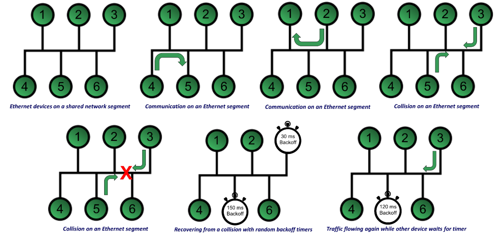
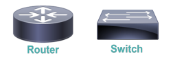

[TOC]

## Ethernet Fundamentals

- In early computer networks, there were many different network technologies competing for a portion of the market share

- Ethernet, Token Ring, Fiber Distributed Data Interface (FDDI), and others fought for dominance

- Currently, Ethernet is dominant for Layer 1

- Due to Ethernet’s popularity, it is important to understand the fundamentals of Ethernet

## Origins of Ethernet

- Was first run over coax cables (10Base5, 10Base2)

- Ethernet has changed to using twisted pair cables

- 10BASE-T is Unshielded Twisted Pair

  - Maximum speed: 10 Mbps

  - Maximum distance: 100 meters

## How should devices access the network?

  - Deterministic
      - Very organized and orderly
      - Need an electronic token to transmit
      - For example, Token Ring networks
      
- Contention-based

- Very chaotic

- Transmit (almost) whenever you want

- For example, Ethernet networks

## Carrier Sense Multiple Access/ Collision Detect (CSMA/CD)
- Ethernet devices transmit based on a principle called carrier sense multiple access/collision detect (CSMA/CD)
- Carrier sense

  - Listen to the wire, verify it is not busy
- Multiple access

  - All devices have access at any time
  
- Collision detect
  - If two devices transmit at the same time, a collision occurs
  - Back off, wait a random time, and try again

## Example of CSMA/CD

## Collision Domains with Switches
- Ethernet switches increase scalability of the network by creating multiple collision domains 

- Each port on a switch is a collision domain, no chance of collisions, and increases speed

- Switches can operate in full-duplex mode

  

## Speed Limitations

|    Ethernet Type     | Bandwidth Capacity |         Description         |
| :------------------: | :----------------: | :-------------------------: |
|       Ethernet       |      10 Mbps       | 10 million bits per second  |
|    Fast Ethernet     |      100 Mbps      | 100 million bits per second |
|   Gigabit Ethernet   | 1000 Mbps (1Gbps)  |  1 billion bits per second  |
| 10-Gigabit Ethernet  |      10 Gbps       | 10 billion bits per second  |
| 100-Gigabit Ethernet |      100 Gbps      | 100 billion bits per second |

- Bandwidth is the measure of how many bits the network can transmit in 1-second (bps)
- Type of cable determines the bandwidth capacity of the network

## Distance Limitations

| Ethernet Standard |   Media Type    | Bandwidth Capacity | Distance Limitation |
| :---------------: | :-------------: | :----------------: | :-----------------: |
|     10BASE-T      | Cat 3 or higher |      10 Mbps       |        100 m        |
|    100BASE-TX     | Cat 5 or higher |      100 Mbps      |        100 m        |
|    1000BASE-TX    | Cat 6 or higher |       1 Gbps       |        100 m        |
|    1000BASE-SX    |       MMF       |       1 Gbps       |        220 m        |
|    1000BASE-LX    |       MMF       |       1 Gbps       |        550 m        |
|    1000BASE-LX    |       SMF       |       1 Gbps       |        5 km         |
|    1000BASE-ZX    |       SMF       |       1 Gbps       |        70 km        |

- Type of cable determines the distance limitation of the network

## Network Infrastructure Devices
Network Infrastructure

- Primary devices used in our networks

  

- Devices they evolved from

  

### Hub
- Layer 1 device used to connect multiple network devices/workstations

- Known as multiport repeaters

  

Three basic types of Ethernet hubs:
**Passive hub**

- Repeats signal with no amplification

**Active hub**

- Repeats signal with amplification

**Smart hub**

- Active hub with enhanced features like SNMP

**Collision Domains**

- Multiple network segments connected together by hubs
- Hubs (layer 1) were used to connect multiple network segments together
- Each LAN segment becomes a separate collision domain

### Bridges
- Bridges analyze source MAC addresses in frames entering the bridge and populate an internal MAC address table

- Makes intelligent forwarding decisions based on destination MAC address in the frames

### Switch
- Layer 2 device used to connect multiple network segments together
- Essentially a multiport bridge
- Switches learn MAC addresses and make forwarding decisions based on them
- Switches analyze source MAC addresses in frames entering the switch and populate an internal MAC address table based on them

### Layer 2 Switch

- Each port on a switch represents an individual collision domain
- All ports belong to the same broadcast domain

### Router

- Layer 3 device used to connect multiple networks together

- Make forwarding decisions based on logical network address information

  - Such as using IP addresses (IPv4 or IPv6)

- Routers are typically more feature rich and support a broader range of interface types than multilayer switches
- Each port is a separate collision domain
- Each port is a separate broadcast domain

### Layer 3 Switch
- Layer 3 device used to connect multiple network segments together
- Can make Layer 3 routing decisions and interconnect entire networks (like a router), not just network segments (like a switch)

### Summary of Network Infrastructure

| Device Type       | Collision Domains Possible | Broadcast Domains Possible | OSI Layer of Operation |
| ----------------- | -------------------------- | -------------------------- | ---------------------- |
| Hub               | 1                          | 1                          | 1                      |
| Bridge            | 1 per port                 | 1                          | 2                      |
| Switch            | 1 per port                 | 1                          | 2                      |
| Multilayer switch | 1 per port                 | 1 per port                 | 3+                     |
| Router            | 1 per port                 | 1 per port                 | 3+                     |

## Additional Ethernet Features

- Features to enhance network performance, redundancy, security, management, flexibility, and scalability

**Common switch features**

- Virtual LANs (VLANs)
- Trunking
- Spanning Tree Protocol (STP)
- Link aggregation
- Power over Ethernet
- Port monitoring
- User authentication

### Link Aggregation (802.3ad)

- Congestion can occur when ports all operate at the same speed

- Allows for combination of multiple physical connections into a single logical connection
- Bandwidth available is increased and the congestion is minimized or prevented

### Power Over Ethernet (PoE 802.3af, PoE+ 802.3at)

- Supplies electrical power over Ethernet
- Requires CAT 5 or higher copper cable
- Provides up to 15.4 watts of power to device
- PoE+ provides up to 25.5 W of power to device

**Two device types**

- Power Sourcing Equipment (PSE)
- Powered Device (PD)

### Port Monitoring or Mirroring
- Helpful to analyze packet flow over network

  - Connect a network sniffer to a hub and it sees all

  - But, switches require port monitoring for network analyzer to see all the traffic

- Port mirroring makes a copy of all traffic destined for a port and sends it to another port

  

### User Authentication (802.1x)
- For security purposes, switches can require users to authenticate themselves before gaining access to the network
- Once authenticated, a key is generated and shared between the supplicant (device wanting access) and the switch (authenticator)

- Authentication server checks the supplicant’s credentials and creates the key
- Key is used to encrypt the traffic coming from and being sent to the client

### Management Access and Authentication
- To configure and manage switches, you can use two options:

SSH

- Remote administration program that allows you to connect to the switch over the network

Console port
- Allows for local administration of the switch using a separate laptop and a rollover cable (DB-9 to RJ-45)

### Out-of-band (OOB)
- Management involves keeping all network configuration devices on a separate network

### First-Hop Redundancy
- Hot Standby Router Protocol (HSRP) uses virtual IP and MAC addresses to provide a “active router” and a “standby router”
  - HSRP is a Cisco-proprietary protocol
  - If Active is offline, then standby answers

**Other First-Hop Redundancy Protocols**

- Gateway Load Balancing Protocol (GLBP)
  - Cisco-proprietary protocol
- Virtual Router Redundancy Protocol (VRRP)
  - Open-source protocol
- Common Address Redundancy Protocol (CARP)
  - Open-source protocol

### MAC Filtering
- Permits or denies traffic based on a device’s MAC address to improve security

### Traffic Filtering
- Multilayer switches may permit or deny traffic based on IP addresses or application ports

### Quality of Service (QoS)
- Forwards traffic based on priority markings

### Spanning Tree Protocol (STP) (802.1D)
- Permits redundant links between switches and prevents traffic loops

- Availability is measured in 9’s

  - Five 9’s is 99.999% uptime and allows only 5 minutes down per year

- Shortest Path Bridging (SPB) is used for larger network environments instead

- Without STP, MAC Address table corruption can occur

#### Broadcast Storms
- If broadcast frame received by both switches, they can forward frames to each other
- Multiple copies of frame are forwarded, replicated, and forwarded again until the network is consumed with forwarding many copies of the same initial frame

#### Root and Nonroot Bridges
**Root bridge**

- Switch elected to act as a reference point for a spanning tree

- Switch with the lowest bridge ID (BID) is elected as the root bridge

- BID is made up of a priority value and a MAC address (with the lowest value considered root)

**Nonroot bridge**

- All other switches in an STP topology

  

- MAC Address table corruption can occur

#### Root, Designated, and Non-Designated Ports
**Root Port**

- Every non-root bridge has a single root port
- Port closest to the root bridge in terms of cost
- If costs are equal, lowest port number is chosen

**Designated Port**

- Every network segment has a designated port
- Port closest to the root bridge in terms of cost
- All ports on root bridge are designated ports

**Non-Designated Port**

- Ports that block traffic to create loop-free topology

#### Root and Nonroot Bridges

- Single root port on non-root bridge
- All other ports on non-root bridge are non-designated
- All ports on root bridge are designated

#### Port States

- Non-designated ports do not forward traffic during normal operation, but do receive bridge protocol data units (BPDUs)
- If a link in the topology goes down, the non-designated port detects the failure and determines whether it needs to transition to a forwarding state
- To get to the forwarding state, though, it has to transition through four states
- **Blocking**
- BPDUs are received but they are not forwarded
  
- Used at beginning and on redundant links
- **Listening**
  - Populates MAC address table
  - Does not forward frames
- **Learning**
    - Processes BPDUs
    - Switch determines its role in the spanning tree
- **Forwarding**
    - Forwards frames for operations
- Root and Non-designated port are blocking
- Designated ports are forwarding

| Speed    | Ethernet Type        | STP Port Cost |
| -------- | -------------------- | ------------- |
| 10 Mbps  | Ethernet             | 100           |
| 100 Mbps | Fast Ethernet        | 19            |
| 1 Gps    | Gigabit Ethernet     | 4             |
| 10 Gbps  | 10-Gigabit Ethernert | 2             |

- Long STP is being adopted due to higher link speeds over 10 Gbps
- Values range from 2,000,000 for 10-Mbps Ethernet to as little as 2 for 10 Tbps

### Virtual Local Area Network (VLAN)
#### VLANs

- Switch ports are in a single broadcast domain

- Allow you to break out certain ports to be in different broadcast domains

- Before VLANs, you had to use routers to separate departments, functions, or subnets

- Allow different logical networks to share the same physical hardware

- Provides added security and efficiency

#### Before VLANs
- Different switches were required for each LAN for separation
#### Using VLANs
- Same switches but switch ports can be in different VLANs
#### VLAN Trunking (802.1q)
- Multiple VLANs transmitted over the same physical cable
- VLANs are each tagged with 4-byte identifier
  - Tag Protocol Identifier (TPI)
  - Tag Control Identifier (TCI)
- One VLAN is left untagged
  - Called the Native VLAN

### Specialized Network Devices
#### Virtual Private Network (VPN)
- Creates a secure VPN or virtual tunnel over an untrusted network like the Internet

#### VPN Concentrator
- Virtual private network (VPN) creates a secure, virtual tunnel network over an untrusted network, like the Internet
- One of the devices that can terminate VPN tunnels is a VPN concentrator, although firewalls can also perform this function

#### VPN Headend
- A specific type of VPN concentrator used to terminate IPSec VPN tunnels within a router or other device

#### Firewalls
- Network security appliance at your boundary
- Firewalls can be software or hardware
- Stateful firewalls
  - Allows traffic that originates from inside the network and go out to the Internet
  - Blocks traffic originated from the Internet from getting into the network

#### Next-Generation Firewall (NGFW)
- Conducts deep packet inspection at Layer 7
- Detects and prevents attacks
- Much more powerful than basic stateless or stateful firewalls
- Continually connects to cloud resources for latest information on threats

#### Intrusion Detection or Prevention System (IDS/IPS)
- IDS recognizes attacks through signatures and anomalies
- IPS recognizes and responds
- Host or network-based devices

#### Proxy Server
- A specialized device that makes requests to an external network on behalf of a client

#### Content Engine/Caching Engine
- Dedicated appliance that performs the caching functions of a proxy server

#### Content Switch/Load Balancer
- Distributes incoming requests across various servers in a server farm

#### Other devices you may find on your network
#### VoIP Phone

- A hardware device that connects to your IP network to make a connection to a call manager within your network

#### Unified Communications (or Call) Manager
- Used to perform the call processing for hardware and software-based IP phones

#### Industrial Control System (ICS)
- Describes the different types of control systems and associated instrumentation

#### Supervisory Control and Data Acquisition (SCADA)
- Acquires and transmits data from different systems to a central panel for monitoring and control

#### Virtual Network Devices
- Major shift in the way data centers are designed, fielded, and operated

