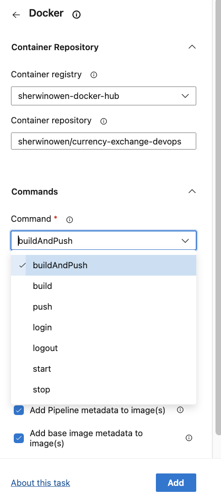

[TOC]


# Start DevOps with Docker

https://github.com/in28minutes/devops-master-class

https://github.com/sherwin-ad/devops-master-class 

**Pause all processes within one or more containers**

```
docker pause [container]
```

**Unpause all processes within one or more containers**

```
docker unpaue [container]
```


- **Docker force stop container command sends a SIGTERM signal to the main process running inside the container.** 
- **This signal instructs the process to gracefully stop, allowing it to clean up and exit.**

```
docker stop [container]
```

- **The Docker force kill container command, on the other hand, sends a SIGKILL signal to the main process inside the container.** 
- **This signal immediately terminates the process without giving it any chance to perform cleanup operations.**

```
docker kill [container]
```

**List containers**

```
docker ps
CONTAINER ID   IMAGE                                          COMMAND                  CREATED        STATUS        PORTS                    NAMES
c32eb814ea78   sherwinowen/hello-world-java:0.0.1.RELEASE     "sh -c 'java -jar /h…"   14 hours ago   Up 14 hours   0.0.0.0:5003->5000/tcp   goofy_brattain
dbfc7d8cd797   sherwinowen/hello-world-nodejs:0.0.1.RELEASE   "docker-entrypoint.s…"   14 hours ago   Up 14 hours   0.0.0.0:5002->5000/tcp   vigilant_swirles
7897a02aae36   sherwinowen/hello-world-python:0.0.1.RELEASE   "/bin/sh -c 'python …"   16 hours ago   Up 16 hours   0.0.0.0:5001->5000/tcp   flamboyant_lamarr
```

**Return low-level information on Docker objects**

```
docker inspect [container]
```

**Remove all stopped containers**

```
docker container prune
```

**Show docker disk usage**

```
docker system df
TYPE            TOTAL     ACTIVE    SIZE      RECLAIMABLE
Images          8         6         1.774GB   1.376GB (77%)
Containers      7         4         394.1kB   180.7kB (45%)
Local Volumes   1         1         513.6kB   0B (0%)
Build Cache     159       0         3.318GB   3.318GB
```

**Get real time events from the server**

```
docker system events
```

**Display system-wide information**

```
docker system info
```

**Remove unused data**

```
docker system prune
```

**Display a live stream of container(s) resource usage statistics**

```
docker stats [container id]
CONTAINER ID   NAME             CPU %     MEM USAGE / LIMIT     MEM %     NET I/O           BLOCK I/O     PIDS
c32eb814ea78   goofy_brattain   0.22%     330.5MiB / 4.316GiB   7.48%     3.61kB / 1.02kB   0B / 4.14MB   36
```

**Assign specific memory and cpu in container**

```
docker run -p 5003:5000 -d -m 512m --cpu-quota=5000 sherwinowen/hello-world-java:0.0.1.RELEASE
```

## The difference between Docker ENTRYPOINT and CMD

To reiterate what we’ve discussed above, ENTRYPOINT and CMD are similar but separate instructions that complement each other:

- **ENTRYPOINT** is the **process** that’s executed inside the container.
- **CMD** is the default set of **arguments** that are supplied to the ENTRYPOINT process.

There are also differences in how you override these values when you start a container:

- **CMD** is easily overridden by appending your own arguments to the `docker run` command.
- **ENTRYPOINT** can be changed using the `--entrypoint` flag, but this should rarely be necessary for container images being used in the way they were intended. If you do change the ENTRYPOINT, you’ll almost certainly need to set a custom CMD too—as otherwise, your new ENTRYPOINT is likely to receive arguments that it doesn’t understand.

## Microservices

**Github Repository**

https://github.com/in28minutes/devops-master-class/tree/master/projects/microservices

**Docker hub**

https://hub.docker.com/r/in28min/currency-conversion

https://hub.docker.com/r/in28min/currency-exchange

**Run currency-exchange**

```
docker run -d -p 8000:8000 --name=currency-exchange in28min/currency-exchange:0.0.1-RELEASE
```

http://localhost:8000/currency-exchange/from/EUR/to/INR

```
{
  "id": 10002,
  "from": "EUR",
  "to": "INR",
  "conversionMultiple": 75.00,
  "exchangeEnvironmentInfo": "37f1ad927c6e v1 27c6e"
}
```

**Run currency-conversion**

```
docker run -d -p 8100:8100 --env CURRENCY_EXCHANGE_SERVICE_HOST=http://currency-exchange --name=currency-conversion --link currency-exchange in28min/currency-conversion:0.0.1-RELEASE
```

http://localhost:8100/currency-conversion/from/EUR/to/INR/quantity/10

```
{
  "id": 10002,
  "from": "EUR",
  "to": "INR",
  "conversionMultiple": 75.00,
  "quantity": 10,
  "totalCalculatedAmount": 750.00,
  "exchangeEnvironmentInfo": "37f1ad927c6e v1 27c6e",
  "conversionEnvironmentInfo": "fb6316b5713d v1 5713d"
}
```

**How does Currency Conversion know the location of Currency Exchange?**

- You don't want to HARDCODE
- Configure an Environment Variable - `CURRENCY_EXCHANGE_SERVICE_HOST`
- --env CURRENCY_EXCHANGE_SERVICE_HOST=[http://currency-exchange](http://currency-exchange/)


## **Using custom networking to connect microservices**

### [Drivers](https://docs.docker.com/network/#drivers)

The following network drivers are available by default, and provide core networking functionality:

| Driver    | Description                                                  |
| :-------- | :----------------------------------------------------------- |
| `bridge`  | The default network driver.                                  |
| `host`    | Remove network isolation between the container and the Docker host. |
| `none`    | Completely isolate a container from the host and other containers. |
| `overlay` | Overlay networks connect multiple Docker daemons together.   |
| `ipvlan`  | IPvlan networks provide full control over both IPv4 and IPv6 addressing. |
| `macvlan` | Assign a MAC address to a container.                         |


**Create custom network**

```
docker network create currency-network
```

**Run currency-exchange**

```
docker run -d -p 8000:8000 --name=currency-exchange --network=currency-network in28min/currency-exchange:0.0.1-RELEASE
```

http://localhost:8000/currency-exchange/from/EUR/to/INR

```
{
  "id": 10002,
  "from": "EUR",
  "to": "INR",
  "conversionMultiple": 75.00,
  "exchangeEnvironmentInfo": "37f1ad927c6e v1 27c6e"
}
```

**Run currency-converiosn**

```
docker run -d -p 8100:8100 --env CURRENCY_EXCHANGE_SERVICE_HOST=http://currency-exchange --name=currency-conversion --network=currency-network in28min/currency-conversion:0.0.1-RELEASE
```

http://localhost:8100/currency-conversion/from/EUR/to/INR/quantity/10

```
{
  "id": 10002,
  "from": "EUR",
  "to": "INR",
  "conversionMultiple": 75.00,
  "quantity": 10,
  "totalCalculatedAmount": 750.00,
  "exchangeEnvironmentInfo": "37f1ad927c6e v1 27c6e",
  "conversionEnvironmentInfo": "fb6316b5713d v1 5713d"
}
```


## Using Docker Compose to Simplify Microservices launch

docker-compose.yml

```
version: '3.7'
services:
  currency-exchange:
    image: in28min/currency-exchange:0.0.1-RELEASE
    ports:
      - "8000:8000"
    restart: always
    networks:
      - currency-compose-network

  currency-conversion:
    image: in28min/currency-conversion:0.0.1-RELEASE
    ports:
      - "8100:8100"
    restart: always
    environment:
      CURRENCY_EXCHANGE_SERVICE_HOST: http://currency-exchange
    depends_on:
      - currency-exchange
    networks:
      - currency-compose-network
  
# Networks to be created to facilitate communication between containers
networks:
  currency-compose-network:
```

**Run docker-compose**

```
docker-compose up -d
```


# DevOps with Docker and Kubernetes on Google Kubernetes Engine


## Creating Kubernetes Cluster in Google Kubernetes Engine (GKE)

1. Goto > GKE > Click Create Cluster (Standard)

2. Goto cluster created and click connect button
   ```
   gcloud container clusters get-credentials busybee-cluster --zone us-central1-c --project ccc-moodle-lms
   ```

   **List nodes**

   ```
   kubectl get nodes
   NAME                                             STATUS   ROLES    AGE   VERSION
   gke-busybee-cluster-default-pool-f2b430eb-8bkb   Ready    <none>   21m   v1.29.5-gke.1091002
   gke-busybee-cluster-default-pool-f2b430eb-kffx   Ready    <none>   21m   v1.29.5-gke.1091002
   gke-busybee-cluster-default-pool-f2b430eb-pw1r   Ready    <none>   21m   v1.29.5-gke.1091002
   ```


**Create deployment**

```
$ kubectl create deployment hello-world-rest-api --image=in28min/hello-world-rest-api:0.0.1.RELEASE
```

**List deployment**

```
kubectl get deployments
NAME                   READY   UP-TO-DATE   AVAILABLE   AGE
hello-world-rest-api   1/1     1            1           11m
```

**Expose deployment**

```
$ kubectl expose deployment hello-world-rest-api --type=LoadBalancer --port=8080
```

**List service**

```
kubectl get service
NAME                   TYPE           CLUSTER-IP       EXTERNAL-IP     PORT(S)          AGE
hello-world-rest-api   LoadBalancer   34.118.227.127   34.171.94.226   8080:31349/TCP   10m
```


**List all events**

```
kubectl get events
LAST SEEN   TYPE      REASON                                   OBJECT                                                MESSAGE
47m         Normal    Starting                                 node/gke-busybee-cluster-default-pool-f2b430eb-8bkb   Starting kubelet.
43m         Normal    NodeHasSufficientMemory                  node/gke-busybee-cluster-default-pool-f2b430eb-8bkb   Node gke-busybee-cluster-default-pool-f2b430eb-8bkb status is now: NodeHasSufficientMemory
43m         Normal    NodeHasNoDiskPressure                    node/gke-busybee-cluster-default-pool-f2b430eb-8bkb   Node gke-busybee-cluster-default-pool-f2b430eb-8bkb status is now: NodeHasNoDiskPressure
44m         Normal    NodeHasSufficientPID                     node/gke-busybee-cluster-default-pool-f2b430eb-8bkb   Node gke-busybee-cluster-default-pool-f2b430eb-8bkb status is now: NodeHasSufficientPID
47m         Normal    NodeAllocatableEnforced                  node/gke-busybee-cluster-default-pool-f2b430eb-8bkb   Updated Node Allocatable limit across pods
42m         Warning   NodeRegistrationCheckerStart             node/gke-busybee-cluster-default-pool-f2b430eb-8bkb   Tue Jul 16 23:40:52 UTC 2024 - ** Starting Node Registration Checker **
42m         Normal    RegisteredNode                           node/gke-busybee-cluster-default-pool-f2b430eb-8bkb   Node gke-busybee-cluster-default-pool-f2b430eb-8bkb event: Registered Node gke-busybee-cluster-default-pool-f2b430eb-8bkb in Controller
42m         Normal    Synced                                   node/gke-busybee-cluster-default-pool-f2b430eb-8bkb   Node synced successfully
42m         Normal    Starting                                 node/gke-busybee-cluster-default-pool-f2b430eb-8bkb
40m         Warning   NodeRegistrationCheckerDidNotRunChecks   node/gke-busybee-cluster-default-pool-f2b430eb-8bkb   Tue Jul 16 23:47:52 UTC 2024 - **     Node ready and registered. **
47m         Normal    Starting                                 node/gke-busybee-cluster-default-pool-f2b430eb-kffx   Starting kubelet.
47m         Warning   InvalidDiskCapacity                      node/gke-busybee-cluster-default-pool-f2b430eb-kffx   invalid capacity 0 on image filesystem
43m         Normal    NodeHasSufficientMemory                  node/gke-busybee-cluster-default-pool-f2b430eb-kffx   Node gke-busybee-cluster-default-pool-f2b430eb-kffx status is now: NodeHasSufficientMemory
44m         Normal    NodeHasNoDiskPressure                    node/gke-busybee-cluster-default-pool-f2b430eb-kffx   Node gke-busybee-cluster-default-pool-f2b430eb-kffx status is now: NodeHasNoDiskPressure
44m         Normal    NodeHasSufficientPID                     node/gke-busybee-cluster-default-pool-f2b430eb-kffx   Node gke-busybee-cluster-default-pool-f2b430eb-kffx status is now: NodeHasSufficientPID
47m         Normal    NodeAllocatableEnforced                  node/gke-busybee-cluster-default-pool-f2b430eb-kffx   Updated Node Allocatable limit across pods
42m         Warning   NodeRegistrationCheckerStart             node/gke-busybee-cluster-default-pool-f2b430eb-kffx   Tue Jul 16 23:40:56 UTC 2024 - ** Starting Node Registration Checker **
42m         Normal    Synced                                   node/gke-busybee-cluster-default-pool-f2b430eb-kffx   Node synced successfully
42m         Normal    Starting                                 node/gke-busybee-cluster-default-pool-f2b430eb-kffx
42m         Normal    RegisteredNode                           node/gke-busybee-cluster-default-pool-f2b430eb-kffx   Node gke-busybee-cluster-default-pool-f2b430eb-kffx event: Registered Node gke-busybee-cluster-default-pool-f2b430eb-kffx in Controller
40m         Warning   NodeRegistrationCheckerDidNotRunChecks   node/gke-busybee-cluster-default-pool-f2b430eb-kffx   Tue Jul 16 23:47:57 UTC 2024 - **     Node ready and registered. **
47m         Normal    Starting                                 node/gke-busybee-cluster-default-pool-f2b430eb-pw1r   Starting kubelet.
47m         Warning   InvalidDiskCapacity                      node/gke-busybee-cluster-default-pool-f2b430eb-pw1r   invalid capacity 0 on image filesystem
43m         Normal    NodeHasSufficientMemory                  node/gke-busybee-cluster-default-pool-f2b430eb-pw1r   Node gke-busybee-cluster-default-pool-f2b430eb-pw1r status is now: NodeHasSufficientMemory
44m         Normal    NodeHasNoDiskPressure                    node/gke-busybee-cluster-default-pool-f2b430eb-pw1r   Node gke-busybee-cluster-default-pool-f2b430eb-pw1r status is now: NodeHasNoDiskPressure
44m         Normal    NodeHasSufficientPID                     node/gke-busybee-cluster-default-pool-f2b430eb-pw1r   Node gke-busybee-cluster-default-pool-f2b430eb-pw1r status is now: NodeHasSufficientPID
47m         Normal    NodeAllocatableEnforced                  node/gke-busybee-cluster-default-pool-f2b430eb-pw1r   Updated Node Allocatable limit across pods
42m         Normal    RegisteredNode                           node/gke-busybee-cluster-default-pool-f2b430eb-pw1r   Node gke-busybee-cluster-default-pool-f2b430eb-pw1r event: Registered Node gke-busybee-cluster-default-pool-f2b430eb-pw1r in Controller
42m         Normal    Synced                                   node/gke-busybee-cluster-default-pool-f2b430eb-pw1r   Node synced successfully
42m         Normal    Starting                                 node/gke-busybee-cluster-default-pool-f2b430eb-pw1r
42m         Warning   NodeRegistrationCheckerStart             node/gke-busybee-cluster-default-pool-f2b430eb-pw1r   Tue Jul 16 23:40:53 UTC 2024 - ** Starting Node Registration Checker **
40m         Warning   NodeRegistrationCheckerDidNotRunChecks   node/gke-busybee-cluster-default-pool-f2b430eb-pw1r   Tue Jul 16 23:47:53 UTC 2024 - **     Node ready and registered. **
16m         Normal    Scheduled                                pod/hello-world-rest-api-d68b65f76-mt25j              Successfully assigned default/hello-world-rest-api-d68b65f76-mt25j to gke-busybee-cluster-default-pool-f2b430eb-kffx
16m         Normal    Pulling                                  pod/hello-world-rest-api-d68b65f76-mt25j              Pulling image "in28min/hello-world-rest-api:0.0.1.RELEASE"
16m         Normal    Pulled                                   pod/hello-world-rest-api-d68b65f76-mt25j              Successfully pulled image "in28min/hello-world-rest-api:0.0.1.RELEASE" in 3.621s (3.621s including waiting)
16m         Normal    Created                                  pod/hello-world-rest-api-d68b65f76-mt25j              Created container hello-world-rest-api
16m         Normal    Started                                  pod/hello-world-rest-api-d68b65f76-mt25j              Started container hello-world-rest-api
16m         Normal    SuccessfulCreate                         replicaset/hello-world-rest-api-d68b65f76             Created pod: hello-world-rest-api-d68b65f76-mt25j
16m         Normal    ScalingReplicaSet                        deployment/hello-world-rest-api                       Scaled up replica set hello-world-rest-api-d68b65f76 to 1
14m         Normal    EnsuringLoadBalancer                     service/hello-world-rest-api                          Ensuring load balancer
13m         Normal    EnsuredLoadBalancer                      service/hello-world-rest-api                          Ensured load balancer
```

## Understanding Pods in Kubernetes

- Pod is a collection of containers that can run on a host. 
- This resource is created by clients and scheduled onto hosts.

```
kubectl explain pods
KIND:       Pod
VERSION:    v1

DESCRIPTION:
    Pod is a collection of containers that can run on a host. This resource is
    created by clients and scheduled onto hosts.
```


**List pods**

```
kubectl get pods
NAME                                   READY   STATUS    RESTARTS   AGE
hello-world-rest-api-d68b65f76-mt25j   1/1     Running   0          58m
```

```
kubectl get pods -o wide
NAME                                   READY   STATUS    RESTARTS   AGE   IP           NODE                                             NOMINATED NODE   READINESS GATES
hello-world-rest-api-d68b65f76-mt25j   1/1     Running   0          53m   10.120.2.5   gke-busybee-cluster-default-
```

**Show details about the pod**

```
kubectl describe pod hello-world-rest-api-d68b65f76-mt25j
Name:             hello-world-rest-api-d68b65f76-mt25j
Namespace:        default
Priority:         0
Service Account:  default
Node:             gke-busybee-cluster-default-pool-f2b430eb-kffx/10.128.0.7
Start Time:       Wed, 17 Jul 2024 08:11:44 +0800
Labels:           app=hello-world-rest-api
                  pod-template-hash=d68b65f76
Annotations:      <none>
Status:           Running
IP:               10.120.2.5
IPs:
  IP:           10.120.2.5
Controlled By:  ReplicaSet/hello-world-rest-api-d68b65f76
Containers:
  hello-world-rest-api:
    Container ID:   containerd://e839ef1062f5b5aa941ec0f6f9ed002dfe53261c4a8267b6850b0b3a6ef1ba7d
    Image:          in28min/hello-world-rest-api:0.0.1.RELEASE
    Image ID:       docker.io/in28min/hello-world-rest-api@sha256:00469c343814aabe56ad1034427f546d43bafaaa11208a1eb0720993743f72be
    Port:           <none>
    Host Port:      <none>
    State:          Running
      Started:      Wed, 17 Jul 2024 08:11:48 +0800
    Ready:          True
    Restart Count:  0
    Environment:    <none>
    Mounts:
      /var/run/secrets/kubernetes.io/serviceaccount from kube-api-access-7htjx (ro)
Conditions:
  Type                        Status
  PodReadyToStartContainers   True
  Initialized                 True
  Ready                       True
  ContainersReady             True
  PodScheduled                True
Volumes:
  kube-api-access-7htjx:
    Type:                    Projected (a volume that contains injected data from multiple sources)
    TokenExpirationSeconds:  3607
    ConfigMapName:           kube-root-ca.crt
    ConfigMapOptional:       <nil>
    DownwardAPI:             true
QoS Class:                   BestEffort
Node-Selectors:              <none>
Tolerations:                 node.kubernetes.io/not-ready:NoExecute op=Exists for 300s
                             node.kubernetes.io/unreachable:NoExecute op=Exists for 300s
Events:
  Type    Reason     Age   From               Message
  ----    ------     ----  ----               -------
  Normal  Scheduled  60m   default-scheduler  Successfully assigned default/hello-world-rest-api-d68b65f76-mt25j to gke-busybee-cluster-default-pool-f2b430eb-kffx
  Normal  Pulling    60m   kubelet            Pulling image "in28min/hello-world-rest-api:0.0.1.RELEASE"
  Normal  Pulled     60m   kubelet            Successfully pulled image "in28min/hello-world-rest-api:0.0.1.RELEASE" in 3.621s (3.621s including waiting)
  Normal  Created    60m   kubelet            Created container hello-world-rest-api
  Normal  Started    60m   kubelet            Started container hello-world-rest-api
```

## Understanding Replicasets in Kubernetes

-  ReplicaSet ensures that a specified number of pod replicas are running at any given time.

```
kubectl explain replicasets
GROUP:      apps
KIND:       ReplicaSet
VERSION:    v1

DESCRIPTION:
    ReplicaSet ensures that a specified number of pod replicas are running at
    any given time.
```

**List replicasets**

```
kubectl get replicasets
NAME                             DESIRED   CURRENT   READY   AGE
hello-world-rest-api-d68b65f76   1         1         1       68m
```

**Try to delete pod and it will create new pod**

```
sherwinowen@Owen-MBA ~ % kubectl get pods
NAME                                   READY   STATUS    RESTARTS   AGE
hello-world-rest-api-d68b65f76-mt25j   1/1     Running   0          69m

sherwinowen@Owen-MBA ~ % kubectl delete pod hello-world-rest-api-d68b65f76-mt25j
pod "hello-world-rest-api-d68b65f76-mt25j" deleted

sherwinowen@Owen-MBA ~ % kubectl get pods
NAME                                   READY   STATUS    RESTARTS   AGE
hello-world-rest-api-d68b65f76-kztkf   1/1     Running   0          6s
```

**Scale deployment**

```
kubectl scale deployment hello-world-rest-api --replicas=3
```

```
kubectl get pods -o wide
NAME                                   READY   STATUS    RESTARTS   AGE     IP            NODE                                             NOMINATED NODE   READINESS GATES
hello-world-rest-api-d68b65f76-bcshm   1/1     Running   0          16s     10.120.0.5    gke-busybee-cluster-default-pool-f2b430eb-8bkb   <none>           <none>
hello-world-rest-api-d68b65f76-kztkf   1/1     Running   0          9m37s   10.120.2.6    gke-busybee-cluster-default-pool-f2b430eb-kffx   <none>           <none>
hello-world-rest-api-d68b65f76-z5qtr   1/1     Running   0          15s     10.120.1.11   gke-busybee-cluster-default-pool-f2b430eb-pw1r   <none>           <none>
```

**List replicasets**

```
kubectl get replicasets
NAME                             DESIRED   CURRENT   READY   AGE
hello-world-rest-api-d68b65f76   3         3         3       3h22m
```

## Understanding Deployments in Kubernetes

- Deployment enables declarative updates for Pods and ReplicaSets.

```
kubectl explain deployments
GROUP:      apps
KIND:       Deployment
VERSION:    v1

DESCRIPTION:
    Deployment enables declarative updates for Pods and ReplicaSets.
```

**Try to update the image in the deployment with the wrong image**

```
kubectl set image deployment hello-world-rest-api hello-world-rest-api=DUMMY_IMAGE
deployment.apps/hello-world-rest-api image updated
```

```
kubectl get rs -o wide
NAME                             DESIRED   CURRENT   READY   AGE     CONTAINERS             IMAGES                                       SELECTOR
hello-world-rest-api-d68b65f76   3         3         3       5h26m   hello-world-rest-api   in28min/hello-world-rest-api:0.0.1.RELEASE   app=hello-world-rest-api,pod-template-hash=d68b65f76
hello-world-rest-api-dd679b5d9   1         1         0       60s     hello-world-rest-api   DUMMY_IMAGE                                  app=hello-world-rest-api,pod-template-hash=dd679b5d9
```

```
kubectl get pods
NAME                                   READY   STATUS             RESTARTS   AGE
hello-world-rest-api-d68b65f76-bcshm   1/1     Running            0          4h6m
hello-world-rest-api-d68b65f76-kztkf   1/1     Running            0          4h16m
hello-world-rest-api-d68b65f76-z5qtr   1/1     Running            0          4h6m
hello-world-rest-api-dd679b5d9-rjnt2   0/1     InvalidImageName   0          71s
```

```
kubectl describe pod hello-world-rest-api-dd679b5d9-rjnt2
Name:             hello-world-rest-api-dd679b5d9-rjnt2
Namespace:        default
Priority:         0
Service Account:  default
Node:             gke-busybee-cluster-default-pool-f2b430eb-kffx/10.128.0.7
Start Time:       Wed, 17 Jul 2024 13:36:51 +0800
Labels:           app=hello-world-rest-api
                  pod-template-hash=dd679b5d9
Annotations:      <none>
Status:           Pending
IP:               10.120.2.7
IPs:
  IP:           10.120.2.7
Controlled By:  ReplicaSet/hello-world-rest-api-dd679b5d9
Containers:
  hello-world-rest-api:
    Container ID:
    Image:          DUMMY_IMAGE
    Image ID:
    Port:           <none>
    Host Port:      <none>
    State:          Waiting
      Reason:       InvalidImageName
    Ready:          False
    Restart Count:  0
    Environment:    <none>
    Mounts:
      /var/run/secrets/kubernetes.io/serviceaccount from kube-api-access-jds2q (ro)
Conditions:
  Type                        Status
  PodReadyToStartContainers   True
  Initialized                 True
  Ready                       False
  ContainersReady             False
  PodScheduled                True
Volumes:
  kube-api-access-jds2q:
    Type:                    Projected (a volume that contains injected data from multiple sources)
    TokenExpirationSeconds:  3607
    ConfigMapName:           kube-root-ca.crt
    ConfigMapOptional:       <nil>
    DownwardAPI:             true
QoS Class:                   BestEffort
Node-Selectors:              <none>
Tolerations:                 node.kubernetes.io/not-ready:NoExecute op=Exists for 300s
                             node.kubernetes.io/unreachable:NoExecute op=Exists for 300s
Events:
  Type     Reason         Age                   From               Message
  ----     ------         ----                  ----               -------
  Normal   Scheduled      3m                    default-scheduler  Successfully assigned default/hello-world-rest-api-dd679b5d9-rjnt2 to gke-busybee-cluster-default-pool-f2b430eb-kffx
  Warning  Failed         43s (x12 over 2m59s)  kubelet            Error: InvalidImageName
  Warning  InspectFailed  32s (x13 over 2m59s)  kubelet            Failed to apply default image tag "DUMMY_IMAGE": couldn't parse image name "DUMMY_IMAGE": invalid reference format: repository name (library/DUMMY_IMAGE) must be lowercase
```

```
kubectl get events
LAST SEEN   TYPE      REASON              OBJECT                                      MESSAGE
4m16s       Normal    Scheduled           pod/hello-world-rest-api-dd679b5d9-rjnt2    Successfully assigned default/hello-world-rest-api-dd679b5d9-rjnt2 to gke-busybee-cluster-default-pool-f2b430eb-kffx
108s        Warning   InspectFailed       pod/hello-world-rest-api-dd679b5d9-rjnt2    Failed to apply default image tag "DUMMY_IMAGE": couldn't parse image name "DUMMY_IMAGE": invalid reference format: repository name (library/DUMMY_IMAGE) must be lowercase
119s        Warning   Failed              pod/hello-world-rest-api-dd679b5d9-rjnt2    Error: InvalidImageName
4m16s       Normal    SuccessfulCreate    replicaset/hello-world-rest-api-dd679b5d9   Created pod: hello-world-rest-api-dd679b5d9-rjnt2
4m16s       Normal    ScalingReplicaSet   deployment/hello-world-rest-api             Scaled up replica set hello-world-rest-api-dd679b5d9 to 1
```

**Update image deployment**

```
kubectl set image deployment hello-world-rest-api hello-world-rest-api=in28min/hello-world-rest-api:0.0.2.RELEASE
```

```
kubectl get pods
NAME                                    READY   STATUS    RESTARTS   AGE
hello-world-rest-api-5df8fb76f9-4p5lh   1/1     Running   0          12s
hello-world-rest-api-5df8fb76f9-h7vnl   1/1     Running   0          9s
hello-world-rest-api-5df8fb76f9-xqx2d   1/1     Running   0          15s
```

```
kubectl get rs
NAME                              DESIRED   CURRENT   READY   AGE
hello-world-rest-api-5df8fb76f9   3         3         3       39s
hello-world-rest-api-d68b65f76    0         0         0       5h33m
hello-world-rest-api-dd679b5d9    0         0         0       7m59s
```

```
kubectl get events
LAST SEEN   TYPE      REASON              OBJECT                                       MESSAGE
86s         Normal    Scheduled           pod/hello-world-rest-api-5df8fb76f9-4p5lh    Successfully assigned default/hello-world-rest-api-5df8fb76f9-4p5lh to gke-busybee-cluster-default-pool-f2b430eb-8bkb
85s         Normal    Pulling             pod/hello-world-rest-api-5df8fb76f9-4p5lh    Pulling image "in28min/hello-world-rest-api:0.0.2.RELEASE"
84s         Normal    Pulled              pod/hello-world-rest-api-5df8fb76f9-4p5lh    Successfully pulled image "in28min/hello-world-rest-api:0.0.2.RELEASE" in 922ms (922ms including waiting)
84s         Normal    Created             pod/hello-world-rest-api-5df8fb76f9-4p5lh    Created container hello-world-rest-api
84s         Normal    Started             pod/hello-world-rest-api-5df8fb76f9-4p5lh    Started container hello-world-rest-api
83s         Normal    Scheduled           pod/hello-world-rest-api-5df8fb76f9-h7vnl    Successfully assigned default/hello-world-rest-api-5df8fb76f9-h7vnl to gke-busybee-cluster-default-pool-f2b430eb-pw1r
83s         Normal    Pulling             pod/hello-world-rest-api-5df8fb76f9-h7vnl    Pulling image "in28min/hello-world-rest-api:0.0.2.RELEASE"
81s         Normal    Pulled              pod/hello-world-rest-api-5df8fb76f9-h7vnl    Successfully pulled image "in28min/hello-world-rest-api:0.0.2.RELEASE" in 1.207s (1.207s including waiting)
81s         Normal    Created             pod/hello-world-rest-api-5df8fb76f9-h7vnl    Created container hello-world-rest-api
81s         Normal    Started             pod/hello-world-rest-api-5df8fb76f9-h7vnl    Started container hello-world-rest-api
89s         Normal    Scheduled           pod/hello-world-rest-api-5df8fb76f9-xqx2d    Successfully assigned default/hello-world-rest-api-5df8fb76f9-xqx2d to gke-busybee-cluster-default-pool-f2b430eb-kffx
88s         Normal    Pulling             pod/hello-world-rest-api-5df8fb76f9-xqx2d    Pulling image "in28min/hello-world-rest-api:0.0.2.RELEASE"
87s         Normal    Pulled              pod/hello-world-rest-api-5df8fb76f9-xqx2d    Successfully pulled image "in28min/hello-world-rest-api:0.0.2.RELEASE" in 1.533s (1.533s including waiting)
87s         Normal    Created             pod/hello-world-rest-api-5df8fb76f9-xqx2d    Created container hello-world-rest-api
87s         Normal    Started             pod/hello-world-rest-api-5df8fb76f9-xqx2d    Started container hello-world-rest-api
89s         Normal    SuccessfulCreate    replicaset/hello-world-rest-api-5df8fb76f9   Created pod: hello-world-rest-api-5df8fb76f9-xqx2d
86s         Normal    SuccessfulCreate    replicaset/hello-world-rest-api-5df8fb76f9   Created pod: hello-world-rest-api-5df8fb76f9-4p5lh
83s         Normal    SuccessfulCreate    replicaset/hello-world-rest-api-5df8fb76f9   Created pod: hello-world-rest-api-5df8fb76f9-h7vnl
84s         Normal    Killing             pod/hello-world-rest-api-d68b65f76-bcshm     Stopping container hello-world-rest-api
86s         Normal    Killing             pod/hello-world-rest-api-d68b65f76-kztkf     Stopping container hello-world-rest-api
81s         Normal    Killing             pod/hello-world-rest-api-d68b65f76-z5qtr     Stopping container hello-world-rest-api
86s         Normal    SuccessfulDelete    replicaset/hello-world-rest-api-d68b65f76    Deleted pod: hello-world-rest-api-d68b65f76-kztkf
84s         Normal    SuccessfulDelete    replicaset/hello-world-rest-api-d68b65f76    Deleted pod: hello-world-rest-api-d68b65f76-bcshm
81s         Normal    SuccessfulDelete    replicaset/hello-world-rest-api-d68b65f76    Deleted pod: hello-world-rest-api-d68b65f76-z5qtr
8m49s       Normal    Scheduled           pod/hello-world-rest-api-dd679b5d9-rjnt2     Successfully assigned default/hello-world-rest-api-dd679b5d9-rjnt2 to gke-busybee-cluster-default-pool-f2b430eb-kffx
3m46s       Warning   InspectFailed       pod/hello-world-rest-api-dd679b5d9-rjnt2     Failed to apply default image tag "DUMMY_IMAGE": couldn't parse image name "DUMMY_IMAGE": invalid reference format: repository name (library/DUMMY_IMAGE) must be lowercase
6m32s       Warning   Failed              pod/hello-world-rest-api-dd679b5d9-rjnt2     Error: InvalidImageName
8m49s       Normal    SuccessfulCreate    replicaset/hello-world-rest-api-dd679b5d9    Created pod: hello-world-rest-api-dd679b5d9-rjnt2
89s         Normal    SuccessfulDelete    replicaset/hello-world-rest-api-dd679b5d9    Deleted pod: hello-world-rest-api-dd679b5d9-rjnt2
8m49s       Normal    ScalingReplicaSet   deployment/hello-world-rest-api              Scaled up replica set hello-world-rest-api-dd679b5d9 to 1
89s         Normal    ScalingReplicaSet   deployment/hello-world-rest-api              Scaled down replica set hello-world-rest-api-dd679b5d9 to 0 from 1
89s         Normal    ScalingReplicaSet   deployment/hello-world-rest-api              Scaled up replica set hello-world-rest-api-5df8fb76f9 to 1 from 0
86s         Normal    ScalingReplicaSet   deployment/hello-world-rest-api              Scaled down replica set hello-world-rest-api-d68b65f76 to 2 from 3
86s         Normal    ScalingReplicaSet   deployment/hello-world-rest-api              Scaled up replica set hello-world-rest-api-5df8fb76f9 to 2 from 1
84s         Normal    ScalingReplicaSet   deployment/hello-world-rest-api              Scaled down replica set hello-world-rest-api-d68b65f76 to 1 from 2
83s         Normal    ScalingReplicaSet   deployment/hello-world-rest-api              Scaled up replica set hello-world-rest-api-5df8fb76f9 to 3 from 2
81s         Normal    ScalingReplicaSet   deployment/hello-world-rest-api              Scaled down replica set hello-world-rest-api-d68b65f76 to 0 from 1
```

## Understanding Services in Kubernetes

- Service is a named abstraction of software service (for example, mysql) consisting of local port (for example 3306) that the proxy listens on, and the selector that determines which pods will answer requests sent through the proxy.

```
kubectl explain service
KIND:       Service
VERSION:    v1

DESCRIPTION:
    Service is a named abstraction of software service (for example, mysql)
    consisting of local port (for example 3306) that the proxy listens on, and
    the selector that determines which pods will answer requests sent through
    the proxy.
```

**Expose deployment**

```
$ kubectl expose deployment hello-world-rest-api --type=LoadBalancer --port=8080
```

**List services**

```
kubectl get service
NAME                   TYPE           CLUSTER-IP       EXTERNAL-IP     PORT(S)          AGE
hello-world-rest-api   LoadBalancer   34.118.227.127   34.171.94.226   8080:31349/TCP   6h33m
kubernetes             ClusterIP      34.118.224.1     <none>          443/TCP          7h3m
```

## Understanding Kubernetes Architecture Master Node and Nodes


**Master Node**

- Manage, plan, schedule, monitor nodes

- The master is another node with Kubernetes installed in it, and is configured as a Master. 
- The master watches over the nodes in the cluster and is responsible for the actual orchestration of
  containers on the worker nodes.


#### 	

**Worker Node or Node**

Host Application as Containers


### Components

#### 1. API server

- acts as the front-end for kubernetes. The users, management devices, Command line interfaces all talk to the API server to interact with the kubernetes cluster.
- is responsible for orchestrating all operations within the cluster.

#### 2. Etcd

- key-value store. 
- is a distributed reliable key-value store used by kubernetes to store all data used to manage the cluster. Think of it this way, when you have multiple nodes and multiple masters in your cluster, etcd stores all that information on all the nodes in the cluster in a distributed manner. 
- is responsible for implementing locks within the cluster to ensure there are no conflicts between the Masters.

#### 3. Scheduler

- is responsible for distributing work or containers across multiple nodes. 
- It looks for newly created containers and assigns them to Nodes.

#### 4. Controller Manager

- The controllers are the brain behind orchestration. 
- They are responsible for noticing and responding when nodes, containers or endpoints goes down. 
- The controllers makes decisions to bring up new containers in such cases.

##### 	Node controller 

- takes care of nodes
- responsible for onboarding new nodes to he cluster handling situations where nodes become unavailable or get gets destroyed 

##### 	Replication Controller

- ensures that the desired number of containers are running at all times in your replication group

#### 5. Container Runtime

- The container runtime is the underlying software that is used to run containers. In our case it happens to be Docker.

#### 6. Kubelet (Captain of the ships)

- Kubelet is the agent that runs on each node in the cluster. 
- The agent is responsible for making sure that the containers are running on the nodes as expected.

#### 7. Kube-proxy service

- ensures that the necessary rules are in place on the worker nodes to allow the containers running on them to reach each other.
- helps in enabling communication between services within the cluster.

**View component status**

```
kubectl get componentstatuses
Warning: v1 ComponentStatus is deprecated in v1.19+
NAME                 STATUS    MESSAGE   ERROR
controller-manager   Healthy   ok
scheduler            Healthy   ok
etcd-0               Healthy
etcd-1               Healthy
```

## Understanding Kubernetes Rollouts

**View rollout history**

```
kubectl rollout history deployment hello-world-rest-api
deployment.apps/hello-world-rest-api
REVISION  CHANGE-CAUSE
1         <none>
2         <none>
```

**Update image deployment**

```
kubectl set image deployment hello-world-rest-api hello-world-rest-api=in28min/hello-world-rest-api:0.0.3.RELEASE --record=true
```

```
kubectl rollout history deployment hello-world-rest-api
deployment.apps/hello-world-rest-api
REVISION  CHANGE-CAUSE
1         <none>
2         <none>
3         kubectl set image deployment hello-world-rest-api hello-world-rest-api=in28min/hello-world-rest-api:0.0.3.RELEASE --record=true
```

```
curl http://34.42.154.237:8080/hello-world
Hello World  V3 zz4k2%
```


**Undo a previous rollout (rollback)**

```
kubectl rollout undo deployment hello-world-rest-api  --to-revision=1
```

```
kubectl rollout history deployment hello-world-rest-api
deployment.apps/hello-world-rest-api
REVISION  CHANGE-CAUSE
2         <none>
3         kubectl set image deployment hello-world-rest-api hello-world-rest-api=in28min/hello-world-rest-api:0.0.3.RELEASE --record=true
4         <none>
```

```
curl http://34.42.154.237:8080/hello-world
Hello World  V1 zz4k2%
```

 **Print the logs for a container in a pod**

```
$ kubectl logs -f hello-world-rest-api-5b78b5c566-zz4k2
```

## Generate Kebernetes YAML Configuration for Deployment and Services

```
kubectl get deployments hello-world-rest-api -o yaml
apiVersion: apps/v1
kind: Deployment
metadata:
  annotations:
    deployment.kubernetes.io/revision: "5"
  creationTimestamp: "2024-07-17T00:11:43Z"
  generation: 6
  labels:
    app: hello-world-rest-api
  name: hello-world-rest-api
  namespace: default
  resourceVersion: "303524"
  uid: 4ab41570-a531-4a77-bf2a-8a06ec5f9ff7
spec:
  progressDeadlineSeconds: 600
  replicas: 3
  revisionHistoryLimit: 10
  selector:
    matchLabels:
      app: hello-world-rest-api
  strategy:
    rollingUpdate:
      maxSurge: 25%
      maxUnavailable: 25%
    type: RollingUpdate
  template:
    metadata:
      creationTimestamp: null
      labels:
        app: hello-world-rest-api
    spec:
      containers:
      - image: in28min/hello-world-rest-api:0.0.2.RELEASE
        imagePullPolicy: IfNotPresent
        name: hello-world-rest-api
        resources: {}
        terminationMessagePath: /dev/termination-log
        terminationMessagePolicy: File
      dnsPolicy: ClusterFirst
      restartPolicy: Always
      schedulerName: default-scheduler
      securityContext: {}
      terminationGracePeriodSeconds: 30
status:
  availableReplicas: 3
  conditions:
  - lastTransitionTime: "2024-07-17T01:31:11Z"
    lastUpdateTime: "2024-07-17T01:31:11Z"
    message: Deployment has minimum availability.
    reason: MinimumReplicasAvailable
    status: "True"
    type: Available
  - lastTransitionTime: "2024-07-17T00:11:44Z"
    lastUpdateTime: "2024-07-17T08:06:41Z"
    message: ReplicaSet "hello-world-rest-api-5df8fb76f9" has successfully progressed.
    reason: NewReplicaSetAvailable
    status: "True"
    type: Progressing
  observedGeneration: 6
  readyReplicas: 3
  replicas: 3
  updatedReplicas: 3
```

**Create deployment.yaml via output**

```
kubectl get  deployments hello-world-rest-api -o yaml > deployment.yaml
```

**Edit deployment.yaml file replicas from 3 to 2**

```
spec:
  progressDeadlineSeconds: 600
  replicas: 2
  revisionHistoryLimit: 10
  selector:
```

**Apply a configuration to a resource by file name**

```
kubectl apply -f deployment.yaml
```

**List pods**

```
kubectl get pods
NAME                                   READY   STATUS    RESTARTS   AGE
hello-world-rest-api-d68b65f76-c4r8t   1/1     Running   0          36m
hello-world-rest-api-d68b65f76-zjkbn   1/1     Running   0          40m
```

## Understand and Improve Kubernetes YAML Configuration

```
kubectl get all -o wide
NAME                                       READY   STATUS    RESTARTS   AGE   IP          NODE                                             NOMINATED NODE   READINESS GATES
pod/hello-world-rest-api-d68b65f76-c4r8t   1/1     Running   0          86m   10.88.1.5   gke-busybee-cluster-default-pool-9d24d5cb-5grn   <none>           <none>
pod/hello-world-rest-api-d68b65f76-zjkbn   1/1     Running   0          90m   10.88.0.5   gke-busybee-cluster-default-pool-9d24d5cb-727w   <none>           <none>

NAME                           TYPE           CLUSTER-IP       EXTERNAL-IP    PORT(S)          AGE   SELECTOR
service/hello-world-rest-api   LoadBalancer   34.118.238.144   35.224.94.44   8080:30091/TCP   88m   app=hello-world-rest-api
service/kubernetes             ClusterIP      34.118.224.1     <none>         443/TCP          97m   <none>

NAME                                   READY   UP-TO-DATE   AVAILABLE   AGE   CONTAINERS             IMAGES                                       SELECTOR
deployment.apps/hello-world-rest-api   2/2     2            2           90m   hello-world-rest-api   in28min/hello-world-rest-api:0.0.1.RELEASE   app=hello-world-rest-api

NAME                                             DESIRED   CURRENT   READY   AGE   CONTAINERS             IMAGES                                       SELECTOR
replicaset.apps/hello-world-rest-api-d68b65f76   2         2         2       90m   hello-world-rest-api   in28min/hello-world-rest-api:0.0.1.RELEASE   app=hello-world-rest-api,pod-template-hash=d68b65f76
```

**Delete pods, deployment,  service and replicaset**

```
kubectl delete all -l app=hello-world-rest-api
pod "hello-world-rest-api-d68b65f76-c4r8t" deleted
pod "hello-world-rest-api-d68b65f76-zjkbn" deleted
service "hello-world-rest-api" deleted
deployment.apps "hello-world-rest-api" deleted
```

```
kubectl get all -o wide
NAME                 TYPE        CLUSTER-IP     EXTERNAL-IP   PORT(S)   AGE    SELECTOR
service/kubernetes   ClusterIP   34.118.224.1   <none>        443/TCP   103m   <none>
```


```
$ kubectl get all -o wide
NAME                                        READY   STATUS    RESTARTS   AGE   IP           NODE                                       NOMINATED NODE   READINESS GATES
pod/hello-world-rest-api-5b78b5c566-lsz7d   1/1     Running   0          77m   10.36.1.17   gke-cluster-1-default-pool-c1e05bf6-1b3l   <none>           <none>
pod/hello-world-rest-api-5b78b5c566-zz4k2   1/1     Running   0          77m   10.36.0.10   gke-cluster-1-default-pool-c1e05bf6-vs10   <none>           <none>

NAME                           TYPE           CLUSTER-IP    EXTERNAL-IP     PORT(S)          AGE    SELECTOR
service/hello-world-rest-api   LoadBalancer   10.70.68.23   34.42.154.237   8080:31069/TCP   168m   app=hello-world-rest-api
service/kubernetes             ClusterIP      10.70.64.1    <none>          443/TCP          3h8m   <none>

NAME                                   READY   UP-TO-DATE   AVAILABLE   AGE    CONTAINERS             IMAGES                                       SELECTOR
deployment.apps/hello-world-rest-api   2/2     2            2           171m   hello-world-rest-api   in28min/hello-world-rest-api:0.0.1.RELEASE   app=hello-world-rest-api

NAME                                              DESIRED   CURRENT   READY   AGE    CONTAINERS             IMAGES                                       SELECTOR
replicaset.apps/hello-world-rest-api-5b78b5c566   2         2         2       171m   hello-world-rest-api   in28min/hello-world-rest-api:0.0.1.RELEASE   app=hello-world-rest-api,pod-template-hash=5b78b5c566
replicaset.apps/hello-world-rest-api-7dc5897557   0         0         0       150m   hello-world-rest-api   in28min/hello-world-rest-api:0.0.2.RELEASE   app=hello-world-rest-api,pod-template-hash=7dc5897557
replicaset.apps/hello-world-rest-api-89577dcb8    0         0         0       87m    hello-world-rest-api   in28min/hello-world-rest-api:0.0.3.RELEASE   app=hello-world-rest-api,pod-template-hash=89577dcb8
```

## Using Kubernetes YAML Configuration to create Resources

**Combine deployment and service yaml and clean yaml file** 

deployment.yaml

```
apiVersion: apps/v1
kind: Deployment
metadata:
  annotations:
    deployment.kubernetes.io/revision: "1"
  creationTimestamp: "2024-07-18T00:20:54Z"
  generation: 2
  labels:
    app: hello-world-rest-api
  name: hello-world-rest-api
  namespace: default
spec:
  replicas: 2
  selector:
    matchLabels:
      app: hello-world-rest-api
  strategy:
    rollingUpdate:
      maxSurge: 25%
      maxUnavailable: 25%
    type: RollingUpdate
  template:
    metadata:
      labels:
        app: hello-world-rest-api
    spec:
      containers:
      - image: in28min/hello-world-rest-api:0.0.1.RELEASE
        imagePullPolicy: IfNotPresent
        name: hello-world-rest-api
      restartPolicy: Always
      terminationGracePeriodSeconds: 30
---
apiVersion: v1
kind: Service
metadata:
  annotations:
    cloud.google.com/neg: '{"ingress":true}'
  labels:
    app: hello-world-rest-api
  name: hello-world-rest-api
  namespace: default
spec:
  ports:
  - nodePort: 30091
    port: 8080
    protocol: TCP
    targetPort: 8080
  selector:
    app: hello-world-rest-api
  sessionAffinity: None
  type: LoadBalancer
```

**Apply a configuration to a resource by file name**

```
kubectl apply -f deployment.yaml
```

```
kubectl get all
NAME                                       READY   STATUS    RESTARTS   AGE
pod/hello-world-rest-api-d68b65f76-5xv6r   1/1     Running   0          17m
pod/hello-world-rest-api-d68b65f76-krbjq   1/1     Running   0          17m

NAME                           TYPE           CLUSTER-IP       EXTERNAL-IP      PORT(S)          AGE
service/hello-world-rest-api   LoadBalancer   34.118.225.138   34.122.129.218   8080:30091/TCP   17m
service/kubernetes             ClusterIP      34.118.224.1     <none>           443/TCP          127m

NAME                                   READY   UP-TO-DATE   AVAILABLE   AGE
deployment.apps/hello-world-rest-api   2/2     2            2           17m

NAME                                             DESIRED   CURRENT   READY   AGE
replicaset.apps/hello-world-rest-api-d68b65f76   2         2         2       17m
```

**It will execute curl http://34.122.129.218:8080/hello-world every 2 seconds**

```
watch curl http://34.122.129.218:8080/hello-world
```


**Change the replicas number from 2 to 3 in deployment.yaml**

**Check the difference**

```
kubectl diff -f deployment.yaml
diff -u -N /var/folders/90/vwjfl3h95blcntzqdvxyhswh0000gn/T/LIVE-2422538268/apps.v1.Deployment.default.hello-world-rest-api /var/folders/90/vwjfl3h95blcntzqdvxyhswh0000gn/T/MERGED-2711573039/apps.v1.Deployment.default.hello-world-rest-api
--- /var/folders/90/vwjfl3h95blcntzqdvxyhswh0000gn/T/LIVE-2422538268/apps.v1.Deployment.default.hello-world-rest-api	2024-07-18 11:04:21
+++ /var/folders/90/vwjfl3h95blcntzqdvxyhswh0000gn/T/MERGED-2711573039/apps.v1.Deployment.default.hello-world-rest-api	2024-07-18 11:04:21
@@ -6,7 +6,7 @@
     kubectl.kubernetes.io/last-applied-configuration: |
       {"apiVersion":"apps/v1","kind":"Deployment","metadata":{"annotations":{"deployment.kubernetes.io/revision":"1"},"creationTimestamp":"2024-07-18T00:20:54Z","generation":2,"labels":{"app":"hello-world-rest-api"},"name":"hello-world-rest-api","namespace":"default"},"spec":{"replicas":2,"selector":{"matchLabels":{"app":"hello-world-rest-api"}},"strategy":{"rollingUpdate":{"maxSurge":"25%","maxUnavailable":"25%"},"type":"RollingUpdate"},"template":{"metadata":{"labels":{"app":"hello-world-rest-api"}},"spec":{"containers":[{"image":"in28min/hello-world-rest-api:0.0.1.RELEASE","imagePullPolicy":"IfNotPresent","name":"hello-world-rest-api"}],"restartPolicy":"Always","terminationGracePeriodSeconds":30}}}}
   creationTimestamp: "2024-07-18T02:03:12Z"
-  generation: 1
+  generation: 2
   labels:
     app: hello-world-rest-api
   name: hello-world-rest-api
@@ -15,7 +15,7 @@
   uid: 6684feda-9a47-45db-ba89-c09c698ceb2e
 spec:
   progressDeadlineSeconds: 600
-  replicas: 2
+  replicas: 3
   revisionHistoryLimit: 10
   selector:
     matchLabels:
```

**Apply a configuration to a resource by file name**

```
kubectl apply -f deployment.yaml
```

```
kubectl get pods
NAME                                   READY   STATUS    RESTARTS   AGE
hello-world-rest-api-d68b65f76-5xv6r   1/1     Running   0          64m
hello-world-rest-api-d68b65f76-krbjq   1/1     Running   0          64m
hello-world-rest-api-d68b65f76-v6s7m   1/1     Running   0          31s
```


## **Quick fix to reduce release downtime with minReadySeconds**

deployment.yaml 

```
apiVersion: apps/v1
kind: Deployment
metadata:
  labels:
    app: hello-world-rest-api
  name: hello-world-rest-api
  namespace: default
spec:
  replicas: 3
  minReadySeconds: 45
  selector:
    matchLabels:
      app: hello-world-rest-api
  strategy:
    rollingUpdate:
      maxSurge: 25%
      maxUnavailable: 25%
    type: RollingUpdate
  template:
    metadata:
      labels:
        app: hello-world-rest-api
    spec:
      containers:
      - image: in28min/hello-world-rest-api:0.0.2.RELEASE
        imagePullPolicy: IfNotPresent
        name: hello-world-rest-api
      restartPolicy: Always
      terminationGracePeriodSeconds: 30
---
apiVersion: v1
kind: Service
metadata:
  labels:
    app: hello-world-rest-api
  name: hello-world-rest-api
  namespace: default
spec:
  ports:
  - nodePort: 31069
    port: 8080
    protocol: TCP
    targetPort: 8080
  selector:
    app: hello-world-rest-api
  sessionAffinity: None
  type: LoadBalancer
```


## Understanding Replica Sets in Depth Using Kubernetes YAML Config

```
kubectl delete all -l app=hello-world-rest-api
pod "hello-world-rest-api-6c5fb9dfdb-4rmvv" deleted
pod "hello-world-rest-api-6c5fb9dfdb-qdpqv" deleted
pod "hello-world-rest-api-6c5fb9dfdb-wcqwf" deleted
service "hello-world-rest-api" deleted
deployment.apps "hello-world-rest-api" deleted
```

Change kind to ReplicaSet and remove strategy

```
apiVersion: apps/v1
kind: ReplicaSet
metadata:
  annotations:
    deployment.kubernetes.io/revision: "1"
  creationTimestamp: "2024-07-18T00:20:54Z"
  generation: 2
  labels:
    app: hello-world-rest-api
  name: hello-world-rest-api
  namespace: default
spec:
  replicas: 3
  minReadySeconds: 45
  selector:
    matchLabels:
      app: hello-world-rest-api
  # strategy:
  #   rollingUpdate:
  #     maxSurge: 25%
  #     maxUnavailable: 25%
  #   type: RollingUpdate
  template:
    metadata:
      labels:
        app: hello-world-rest-api
    spec:
      containers:
      - image: in28min/hello-world-rest-api:0.0.3.RELEASE
        imagePullPolicy: IfNotPresent
        name: hello-world-rest-api
      restartPolicy: Always
      terminationGracePeriodSeconds: 30
---
apiVersion: v1
kind: Service
metadata:
  annotations:
    cloud.google.com/neg: '{"ingress":true}'
  labels:
    app: hello-world-rest-api
  name: hello-world-rest-api
  namespace: default
spec:
  ports:
  - nodePort: 30091
    port: 8080
    protocol: TCP
    targetPort: 8080
  selector:
    app: hello-world-rest-api
  sessionAffinity: None
  type: LoadBalancer
```

### Key Differences between Deployment and Replicaset

|                         Deployments                          |                          ReplicaSet                          |
| :----------------------------------------------------------: | :----------------------------------------------------------: |
| **High-level abstractions that manage replica sets.**It provides additional features such as rolling updates, rollbacks, and versioning of the application. | **A lower-level abstraction that manages the desired number of replicas of a pod**.Additionally, it provides basic scaling and self-healing mechanisms. |
| *Deployment* **manages a template of pods** and uses replica sets to ensure that the specified number of replicas of the pod is running. | *ReplicaSet* only **manages the desired number of replicas of a pod**. |
| ***Deployment\* provides a mechanism for rolling updates and rollbacks of the application**, enabling seamless updates and reducing downtime. |    Applications must be manually updated or rolled back.     |
| **It provides versioning of the application, allowing us to manage multiple versions of the same application**. It also makes it easy to roll back to a previous version if necessary. |          *ReplicaSet* doesn’t provide this feature.          |


## Configure multiple kubernetes deployments with one service

- Change back Kine to Deployment and uncomment strategy part.

deployment.yaml

```
apiVersion: apps/v1
kind: Deployment
metadata:
  labels:
    app: hello-world-rest-api
    version: v1
  name: hello-world-rest-api-v1
  namespace: default
spec:
  replicas: 2
  minReadySeconds: 45
  selector:
    matchLabels:
      app: hello-world-rest-api
      version: v1
  strategy:
    rollingUpdate:
      maxSurge: 25%
      maxUnavailable: 25%
    type: RollingUpdate
  template:
    metadata:
      labels:
        app: hello-world-rest-api
        version: v1
    spec:
      containers:
      - image: in28min/hello-world-rest-api:0.0.1.RELEASE
        imagePullPolicy: IfNotPresent
        name: hello-world-rest-api
      restartPolicy: Always
      terminationGracePeriodSeconds: 30
---
apiVersion: apps/v1
kind: Deployment
metadata:
  labels:
    app: hello-world-rest-api
    version: v2
  name: hello-world-rest-api-v2
  namespace: default
spec:
  replicas: 2
  minReadySeconds: 45
  selector:
    matchLabels:
      app: hello-world-rest-api
      version: v2
  strategy:
    rollingUpdate:
      maxSurge: 25%
      maxUnavailable: 25%
    type: RollingUpdate
  template:
    metadata:
      labels:
        app: hello-world-rest-api
        version: v2
    spec:
      containers:
      - image: in28min/hello-world-rest-api:0.0.2.RELEASE
        imagePullPolicy: IfNotPresent
        name: hello-world-rest-api
      restartPolicy: Always
      terminationGracePeriodSeconds: 30
---
apiVersion: v1
kind: Service 
metadata:
  labels:
    app: hello-world-rest-api
  name: hello-world-rest-api
  namespace: default
spec:
  ports:
  - nodePort: 31069
    port: 8080
    protocol: TCP
    targetPort: 8080
  selector:
    app: hello-world-rest-api
  sessionAffinity: None
  type: LoadBalancer

```

```
kubectl get all
NAME                                           READY   STATUS    RESTARTS   AGE
pod/hello-world-rest-api-v1-867f8bd649-69ptw   1/1     Running   0          32m
pod/hello-world-rest-api-v1-867f8bd649-x8nm9   1/1     Running   0          32m
pod/hello-world-rest-api-v2-5f4bdc6757-bf8vq   1/1     Running   0          32m
pod/hello-world-rest-api-v2-5f4bdc6757-xr4gg   1/1     Running   0          32m

NAME                           TYPE           CLUSTER-IP    EXTERNAL-IP     PORT(S)          AGE
service/hello-world-rest-api   LoadBalancer   10.70.76.13   34.136.96.135   8080:31069/TCP   49m
service/kubernetes             ClusterIP      10.70.64.1    <none>          443/TCP          7h53m

NAME                                      READY   UP-TO-DATE   AVAILABLE   AGE
deployment.apps/hello-world-rest-api-v1   2/2     2            2           32m
deployment.apps/hello-world-rest-api-v2   2/2     2            2           32m

NAME                                                 DESIRED   CURRENT   READY   AGE
replicaset.apps/hello-world-rest-api-v1-867f8bd649   2         2         2       32m
replicaset.apps/hello-world-rest-api-v2-5f4bdc6757   2         2         2       32m
```

- Change the selector in Service to only v1 or V2

deployment.yaml

```
apiVersion: apps/v1
kind: Deployment
metadata:
  labels:
    app: hello-world-rest-api
    version: v1
  name: hello-world-rest-api-v1
  namespace: default
spec:
  replicas: 2
  minReadySeconds: 45
  selector:
    matchLabels:
      app: hello-world-rest-api
      version: v1
  strategy:
    rollingUpdate:
      maxSurge: 25%
      maxUnavailable: 25%
    type: RollingUpdate
  template:
    metadata:
      labels:
        app: hello-world-rest-api
        version: v1
    spec:
      containers:
      - image: in28min/hello-world-rest-api:0.0.1.RELEASE
        imagePullPolicy: IfNotPresent
        name: hello-world-rest-api
      restartPolicy: Always
      terminationGracePeriodSeconds: 30
---
apiVersion: apps/v1
kind: Deployment
metadata:
  labels:
    app: hello-world-rest-api
    version: v2
  name: hello-world-rest-api-v2
  namespace: default
spec:
  replicas: 2
  minReadySeconds: 45
  selector:
    matchLabels:
      app: hello-world-rest-api
      version: v2
  strategy:
    rollingUpdate:
      maxSurge: 25%
      maxUnavailable: 25%
    type: RollingUpdate
  template:
    metadata:
      labels:
        app: hello-world-rest-api
        version: v2
    spec:
      containers:
      - image: in28min/hello-world-rest-api:0.0.2.RELEASE
        imagePullPolicy: IfNotPresent
        name: hello-world-rest-api
      restartPolicy: Always
      terminationGracePeriodSeconds: 30
---
apiVersion: v1
kind: Service 
metadata:
  labels:
    app: hello-world-rest-api
  name: hello-world-rest-api
  namespace: default
spec:
  ports:
  - nodePort: 31069
    port: 8080
    protocol: TCP
    targetPort: 8080
  selector:
    app: hello-world-rest-api
  sessionAffinity: None
  type: LoadBalancer
---
apiVersion: v1
kind: Service 
metadata:
  labels:
    app: hello-world-rest-api
  name: hello-world-rest-api
  namespace: default
spec:
  ports:
  - nodePort: 31069
    port: 8080
    protocol: TCP
    targetPort: 8080
  selector:
    app: hello-world-rest-api
    version: v1
  sessionAffinity: None
  type: LoadBalancer
```


## Kubernetes commands top node and pod

**Show services | all namespace | sort by namespace**

```
$ kubectl get service --all-namespaces --sort-by=.metadata.namespace
NAMESPACE     NAME                   TYPE           CLUSTER-IP     EXTERNAL-IP     PORT(S)            AGE
default       hello-world-rest-api   LoadBalancer   10.70.76.13    34.136.96.135   8080:31069/TCP     60m
default       kubernetes             ClusterIP      10.70.64.1     <none>          443/TCP            8h
gmp-system    alertmanager           ClusterIP      None           <none>          9093/TCP           8h
gmp-system    gmp-operator           ClusterIP      10.70.72.199   <none>          8443/TCP,443/TCP   8h
kube-system   default-http-backend   NodePort       10.70.68.235   <none>          80:32027/TCP       8h
kube-system   kube-dns               ClusterIP      10.70.64.10    <none>          53/UDP,53/TCP      8h
kube-system   metrics-server         ClusterIP      10.70.76.211   <none>          443/TCP
```

**Print the address of the control plane and cluster services**

```
$ kubectl cluster-info
Kubernetes control plane is running at https://34.28.54.91
GLBCDefaultBackend is running at https://34.28.54.91/api/v1/namespaces/kube-system/services/default-http-backend:http/proxy
KubeDNS is running at https://34.28.54.91/api/v1/namespaces/kube-system/services/kube-dns:dns/proxy
Metrics-server is running at https://34.28.54.91/api/v1/namespaces/kube-system/services/https:metrics-server:/proxy

To further debug and diagnose cluster problems, use 'kubectl cluster-info dump'.
```

**Display resource (CPU/memory) usage of nodes**

```
$ kubectl top node
NAME                                       CPU(cores)   CPU%   MEMORY(bytes)   MEMORY%
gke-cluster-1-default-pool-c1e05bf6-1b3l   79m          8%     1142Mi          40%
gke-cluster-1-default-pool-c1e05bf6-1t8k   84m          8%     1571Mi          55%
gke-cluster-1-default-pool-c1e05bf6-vs10   60m          6%     1543Mi          54%
```

**Display resource (CPU/memory) usage of pods**

```
$ kubectl top pods
NAME                                       CPU(cores)   MEMORY(bytes)
hello-world-rest-api-v1-867f8bd649-69ptw   2m           232Mi
hello-world-rest-api-v1-867f8bd649-x8nm9   2m           234Mi
hello-world-rest-api-v2-5f4bdc6757-bf8vq   2m           229Mi
hello-world-rest-api-v2-5f4bdc6757-xr4gg   2m           237Mi
```

**Delete hello world deployments**

```
$ kubectl delete all -l app=hello-world-rest-api
pod "hello-world-rest-api-v1-867f8bd649-69ptw" deleted
pod "hello-world-rest-api-v1-867f8bd649-x8nm9" deleted
pod "hello-world-rest-api-v2-5f4bdc6757-bf8vq" deleted
pod "hello-world-rest-api-v2-5f4bdc6757-xr4gg" deleted
service "hello-world-rest-api" deleted
deployment.apps "hello-world-rest-api-v1" deleted
deployment.apps "hello-world-rest-api-v2" deleted
```


# **Infrastructure as a Code (IAAS)**

- is the managing and provisioning of infrastructure through code instead of through manual processes.


**Provisioning Server Tools**

- AWS CloudFormation
- Terraform

**Configuration Management Tools**

- Ansible
- Chef
- Puppet

# Continues Integration Deployment and Delivery

https://github.com/sherwin-ad/azure-devops-kubernetes-terraform-pipeline.git

## Tools for Continues Integration Deployment and Delivery

- **Azure Devops**
- **Jenkins**

## Steps in CI/CD Pipeline

1. **Code Commit**

   **Tools**

   - Git Repository

2. **Unit Test**

   - is a quality assurance technique where application code is broken down into component building blocks – along with each block or unit’s associated data, usage processes, and functions – to ensure that each block works as expected. 

   **Tools**

   - Mocha / Jest (Javascript)
   - Pytest (Python)
   - Unit (Java)

3. Integration Tests

   - These tests validate the interactions between different components of the application, ensuring they work seamlessly together.

   **Tools**

   - Cucumber
   - Selenium
   - Protractor

4. **Package**

   - Once all of the tests are passing, you can now move on to packaging the code. Exactly how you package your application depends on your programming language and target environment.

   **Package Manager Tools**

   - NPM (javascript)
   - PIP (python)
   - MAVEN / GRADLE (java)

5. **Deploy**

   - The deploy stage is the final part of the CI/CD pipeline, where the application is released into the production environment, making it accessible to end-users. 
   - The deployment process varies based on the nature of the application and the production environment. For instance, it could involve deploying
     -  **a Docker container to a Kubernetes cluster,** 
     - **updating a web application on a cloud service like AWS or Google Cloud, or simply uploading files to a server.**

   **Tools**

   - Azure Devops
   - Jenkins

6. **Automated Tests**

   - Smoke test
   - Load test
   - Performance test
## Continues Integration

- is the practice where developers merge the changes to the code base to the main branch as often as possible. 
- These changes are validated by creating a build and then running automated tests against the build. 
- If these tests don’t pass, the changes aren’t merged, and developers avoid integration challenges that can happen. 

### Benefits of Continuous Integration 

This process also causes fewer bugs to be shipped to production as the issues are caught early and integration issues are solved before release. 


## Continues Delivery

- is an extension of CI since it enables automation to deploy all the code changes to an environment (dev, qa, stage, prod, etc.) after the changes have been merged. 
- The artifact may be built as part of CI or as part of this process since the source of truth (your repository) is reliable given your CI process. 

### Benefits of Continuous Delivery 

Since developers can deploy their changes at any time, it’s recommended to deploy the changes to production as often as possible, making troubleshooting easier and providing your users with access to the best your product has to offer as soon as possible.

## Continues Deployment

- takes the process one step further than continuous delivery. Here, all changes that pass the verification steps at each stage in the pipeline are released to production. 
- This process is completely automated and only a failed verification step will prevent pushing the changes to production. 

### Benefits of Continuous Deployment 

- Apart from the fact that customers get updates quicker, developers also get feedback faster which means there is less pressure as small changes are pushed incrementally compared to big updates not that often. 
- In order to successfully accomplish Continuous Deployment, tracking metrics around **Mean Time to Repair** and **Change Failure Rate** is critical to the success of fully automated deployments. 


# Azure Devops

1. Create project in Azure Devops

   **Project name**: azure-devops-kubernetes-terraform

2. Setting up Git Repository for Azure Devops Pipeline

   **Git Repository**

   https://github.com/sherwin-ad/azure-devops-kubernetes-terraform-pipeline.git

3. Create Azure Devops Pipeline

   1. Sign in to your Azure DevOps organization and go to your project.
   2. Go to **Pipelines**, and then select **New pipeline** or **Create pipeline** if creating your first pipeline.
   3. Do the steps of the wizard by first selecting **GitHub** as the location of your source code.
   4. You might be redirected to GitHub to sign in. If so, enter your GitHub credentials.
   5. When you see the list of repositories, select your repository.
   6. You might be redirected to GitHub to install the Azure Pipelines app. If so, select **Approve & install**.
   7. Select Starter pipeline
   8. Review, save and run

4. Azure Devops Agents and Jobs

   01-first-azure-pipelines.yml

   ```
   # Starter pipeline
   # Start with a minimal pipeline that you can customize to build and deploy your code.
   # Add steps that build, run tests, deploy, and more:
   # https://aka.ms/yaml
   
   trigger:
   - main
   
   pool:
     vmImage: ubuntu-latest
   
   steps:
   - script: echo Hello, world, changed!
     displayName: 'Run a one-line script'
   
   - script: |
       echo Add other tasks to build, test, and deploy your project.
       echo See https://aka.ms/yaml
       echo more information
     displayName: 'Run a multi-line script'
   ```

5. Azure Devops Agents and Job2

   01-first-azure-pipelines.yml

   ```
   # Starter pipeline
   # Start with a minimal pipeline that you can customize to build and deploy your code.
   # Add steps that build, run tests, deploy, and more:
   # https://aka.ms/yaml
   
   trigger:
   - main
   
   pool:
     vmImage: ubuntu-latest
   
   jobs:
   - job: Job1
     steps:
     - script: echo Job1 -  Hello, world, changed!
       displayName: 'Run a one-line script'
     - script: |
         echo Add other tasks to build, test, and deploy your project.
         echo See https://aka.ms/yaml
         echo more information
       displayName: 'Run a multi-line script'
   
   - job: Job2
     steps:
     - script: echo Job2!
       displayName: 'Run a one-line script'   
   ```

6. Using dependsOn with jobs

   01-first-azure-pipelines.yml

   ```
   # Starter pipeline
   # Start with a minimal pipeline that you can customize to build and deploy your code.
   # Add steps that build, run tests, deploy, and more:
   # https://aka.ms/yaml
   
   trigger:
   - main
   
   pool:
     vmImage: ubuntu-latest
   
   jobs:
   - job: Job1
     steps:
     - script: echo Job1 -  Hello, world, changed!
       displayName: 'Run a one-line script'
     - script: |
         echo Add other tasks to build, test, and deploy your project.
         echo See https://aka.ms/yaml
         echo more information
       displayName: 'Run a multi-line script'
   
   - job: Job2
     dependsOn: Job1
     steps:
     - script: echo Job2!
       displayName: 'Run a one-line script'   
   
   - job: Job3
     dependsOn: Job1
     steps:
     - script: echo Job3!
       displayName: 'Run a one-line script'   
   
   - job: Job4
     dependsOn: 
     - Job2
     - Job3
     steps:
     - script: echo Job4!
       displayName: 'Run a one-line script'
   ```

7. Creating Azure Devops Pipeline for Playing with Stages

   02-understanding-stages.yml

   ```
   # Starter pipeline
   # Start with a minimal pipeline that you can customize to build and deploy your code.
   # Add steps that build, run tests, deploy, and more:
   # https://aka.ms/yaml
   
   trigger:
   - main
   
   pool:
     vmImage: ubuntu-latest
   
   stages:
   - stage: Build
     jobs:
     - job: FirstJob
       steps:
       - bash: echo BuildFirstJob
     - job: SecondJob
       steps:
       - bash: echo BuildSecondJob  
   
   - stage: DevDeploy
     dependsOn: Build
     jobs:
     - job: DevDeployJob
       steps:
       - bash: echo DevDeployJob
   
   - stage: QADeploy
     dependsOn: Build
     jobs:
     - job: QADeployJob
       steps:
       - bash: echo QADeployJob
   
   - stage: ProdDeploy
     dependsOn:
     - DevDeploy
     - QADeploy 
     jobs:
     - job: ProdDeployJob
       steps:
       - bash: echo ProdDeployJob
   ```

8. Playing with variables and dependson for stages

   ```
   trigger:
   - main
   
   pool:
     vmImage: ubuntu-latest
   
   stages:
   - stage: Build
     jobs:
     - job: FirstJob
       variables:
         jobnum: First
       steps:
       - bash: echo Build$(jobnum)Job
       - bash: echo $(PipelineLevelVariable)
     - job: SecondJob
       steps:
       - bash: echo BuildSecondJob
   
   - stage: DevDeploy
     variables:
       environment: Dev
     dependsOn: Build
     jobs:
     - job: DevDeployJob
       steps:
       - bash: echo $(environment)DeployJob
   
   - stage: QADeploy
     variables:
       environment: QA
     dependsOn: Build
     jobs:
     - job: QADeployJob
       steps:
       - bash: echo $(environment)DeployJob
   
   - stage: ProdDeploy
     variables:
       environment: Prod
     dependsOn:
     - DevDeploy
     - QADeploy 
     jobs:
     - job: ProdDeployJob
       steps:
       - bash: echo $(environment)DeployJob
   ```

9. Understanding Azure DevopsPipeline Variables

   **Predefined variables in Azure Devops**

   https://learn.microsoft.com/en-us/azure/devops/pipelines/build/variables?view=azure-devops&tabs=yaml

   ```
   # Starter pipeline
   # Start with a minimal pipeline that you can customize to build and deploy your code.
   # Add steps that build, run tests, deploy, and more:
   # https://aka.ms/yaml
   
   trigger:
   - main
   
   pool:
     vmImage: ubuntu-latest
   
   stages:
   - stage: Build
     jobs:
     - job: FirstJob
       variables:
         jobnum: First
       steps:
       - bash: echo Build$(jobnum)Job
       - bash: echo $(PipelineLevelVariable)
       - bash: echo $(Build.BuildNumber)
       - bash: echo $(Build.BuildId)
       - bash: echo $(Build.SourceBranchName)
       - bash: echo $(Build.SourceDirectory)
       - bash: echo $(System.DefaultWorkingDirectory)
       - bash: ls -R $(System.DefaultWorkingDirectory)
       - bash: echo $(Build.ArtifactStagingDirectory)
     # - job: SecondJob
     #   steps:
     #   - bash: echo BuildSecondJob
   
   # - stage: DevDeploy
   #   variables:
   #     environment: Dev
   #   dependsOn: Build
   #   jobs:
   #   - job: DevDeployJob
   #     steps:
   #     - bash: echo $(environment)DeployJob
   
   # - stage: QADeploy
   #   variables:
   #     environment: QA
   #   dependsOn: Build
   #   jobs:
   #   - job: QADeployJob
   #     steps:
   #     - bash: echo $(environment)DeployJob
   
   # - stage: ProdDeploy
   #   variables:
   #     environment: Prod
   #   dependsOn:
   #   - DevDeploy
   #   - QADeploy 
   #   jobs:
   #   - job: ProdDeployJob
   #     steps:
   #     - bash: echo $(environment)DeployJob
   ```

10. Task for copy files and publish artifacts

   **Copy files**

   ```
   trigger:
   - main
   
   pool:
     vmImage: ubuntu-latest
   
   stages:
   - stage: Build
     jobs:
     - job: FirstJob
       variables:
         jobnum: First 
       steps:
       - bash: echo Build$(jobnum)Job
       - bash: echo $(PipelineLevelVariable)
       - bash: echo $(Build.BuildNumber)
       - bash: echo $(Build.BuildId)
       - bash: echo $(Build.SourceBranchName)
       - bash: echo $(Build.SourceDirectory)
       - bash: echo $(System.DefaultWorkingDirectory)
       - bash: ls -R $(System.DefaultWorkingDirectory)
       - bash: echo $(Build.ArtifactStagingDirectory)
       - bash: java -version
       - bash: node --version
       - bash: python --version
       - bash: mvn -version
       - bash: ls -R $(Build.ArtifactStagingDirectory)
       - task: CopyFiles@2
         inputs:
           SourceFolder: '$(System.DefaultWorkingDirectory)'
           Contents: |
             **/*.yaml
             **/*.tf
           TargetFolder: '$(Build.ArtifactStagingDirectory)'
       - bash: ls -R $(Build.ArtifactStagingDirectory)    
   ```

   **Publish build artifacts**

   ```
   trigger:
   - main
   
   pool:
     vmImage: ubuntu-latest
   
   stages:
   - stage: Build
     jobs:
     - job: FirstJob
       variables:
         jobnum: First 
       steps:
       - bash: echo Build$(jobnum)Job
       - bash: echo $(PipelineLevelVariable)
       - bash: echo $(Build.BuildNumber)
       - bash: echo $(Build.BuildId)
       - bash: echo $(Build.SourceBranchName)
       - bash: echo $(Build.SourceDirectory)
       - bash: echo $(System.DefaultWorkingDirectory)
       - bash: ls -R $(System.DefaultWorkingDirectory)
       - bash: echo $(Build.ArtifactStagingDirectory)
       - bash: java -version
       - bash: node --version
       - bash: python --version
       - bash: mvn -version
       - bash: ls -R $(Build.ArtifactStagingDirectory)
       - task: CopyFiles@2
         inputs:
           SourceFolder: '$(System.DefaultWorkingDirectory)'
           Contents: |
             **/*.yaml
             **/*.tf
           TargetFolder: '$(Build.ArtifactStagingDirectory)'
       - bash: ls -R $(Build.ArtifactStagingDirectory)
       - task: PublishBuildArtifacts@1
         inputs:
           PathtoPublish: '$(Build.ArtifactStagingDirectory)'
           ArtifactName: 'drop'
           publishLocation: 'Container'
   ```

11. Running Azure Devops Jobs on Multiple Agents

    ```
    trigger:
    - main
    
    strategy:
     matrix:
       linux:
         operatingSystem: 'ubuntu-latest'
       mac:
         operatingSystem: 'macos-latest'  
    
    pool:
      vmImage: $(operatingSystem)
    
    steps:
    - script: echo Running on $(operatingSystem)!
      displayName: 'Run a one-line script'
    ```

12. Understanding Azure Devops Deployment Jobs Environments and Approval

    ```
    trigger:
    - main
    
    pool:
      vmImage: 'ubuntu-latest'
    
    stages:
    - stage: Build
      jobs:
      - job: BuildJob
        steps:
        - bash: echo "Do the build"
    - stage: DevDeploy
      jobs:
      - deployment: DevDeployJob
        environment: Dev
        strategy:
          runOnce:
            deploy:
              steps:
                - script: echo deploy to Dev 
    - stage: QADeploy
      jobs:
      - deployment: QADeployJob
        environment: QA
        strategy:
          runOnce:
            deploy:
              steps:
                - script: echo deploy to QA 
    ```

13. Build and Push Docker Image in Azure Devops

    1. Goto Project Settings > Pipelines > Service connections  

       Click New Service connection > select Docker Registry

    


2. Crreate new pipeline

   - Connect - Github

   - Select Repository - azure-devops-kubernetes-terraform-pipeline

   - Configure - Build a docker image

     

   

   ```
   trigger:
   - main
   
   resources:
   - repo: self
   
   variables:
     tag: '$(Build.BuildId)'
   
   stages:
   - stage: Build
     displayName: Build image
     jobs:
     - job: Build
       displayName: Build
       pool:
         vmImage: ubuntu-latest
       steps:
       - task: Docker@2
         displayName: Build an image
         inputs:
           containerRegistry: 'sherwinowen-docker-hub'
           repository: 'sherwinowen/currency-exchange-devops'
           command: 'buildAndPush'
           Dockerfile: '**/Dockerfile'
           tags: '$(tag)'
   ```

   

13. Playing with Azure Devops Releases

    1. Goto Releases and click New pipeline and select Empty job

    2. Add an Artifact

       

    3. Enable deployment trigger in Artifacts

       

    4. Goto Dev Stage and Add task - Bash
    
       
    
       Goto Agent job and select ubuntu lates in the Agent Specification
    
       

# IAAC Azure AKS with Azure Devops, Terraform and Kubernetes

https://github.com/sherwin-ad/azure-devops-kubernetes-terraform-pipeline.git

**Prerequisite**

- Azure Account
- Azure Devops
- Docker
- Kubernetes
- Terraform
- Visual Studio

## Azure Kubernetes Cluster Creation

### Create Service Account To Create Azure K8S Cluster using Terraform

```
$ az login
$ az ad sp create-for-rbac --role="Contributor" --scopes="/subscriptions/<<azure_subscription_id>>"
```

### Create Azure Devops Pipeline for Azure Kubernetes Cluster IAAC

Goto Project Settings > Service connections > create New service connection

Choose a service or connection type > Azure Resource Manager


#### Install Terraform plugins in Azure Devops

- Terraform 1 (https://marketplace.visualstudio.com/items?itemName=ms-devlabs.custom-terraform-tasks)
- Terraform 2 (https://marketplace.visualstudio.com/acquisition?itemName=JasonBJohnson.azure-pipelines-tasks-terraform)

#### Add public key

Goto Pipelines > Library > Secure files > add the ssh public key

#### Create pipeline

05-azure-kubernetes-cluster-iaac-pipeline.yml

```
trigger:
- main

pool:
  vmImage: ubuntu-latest

steps:
- script: echo K8s Terraform Azure!
  displayName: 'Run a one-line script'

- task: DownloadSecureFile@1
  name: publickey
  inputs:
    secureFile: 'id_rsa.pub'
  
- task: TerraformCLI@2
  inputs:
    command: 'init'
    workingDirectory: '$(System.DefaultWorkingDirectory)/configuration/iaac/azure/kubernetes'
    commandOptions: '-var client_id=$(lesclient_id) -var client_secret=$(client_secret) -var ssh_public_key=$(publickey.secureFilePath)'
    backendType: 'azurerm'
    backendServiceArm: 'azure-resource-manager-service-connection'
    ensureBackend: true
    backendAzureRmResourceGroupName: 'terraform-backend-rg'
    backendAzureRmResourceGroupLocation: 'westeurope'
    backendAzureRmStorageAccountName: 'storageacctowen001'
    backendAzureRmContainerName: 'storageacctcontainer'
    backendAzureRmKey: 'kubernetes-dev-tfstate'
    allowTelemetryCollection: true
```

#### Add variables


05-azure-kubernetes-cluster-iaac-pipeline.yml

```
trigger:
- main

pool:
  vmImage: ubuntu-latest

steps:
- script: echo K8s Terraform Azure!
  displayName: 'Run a one-line script'

- task: DownloadSecureFile@1
  name: publickey
  inputs:
    secureFile: 'id_rsa.pub'
  
- task: TerraformCLI@2
  inputs:
    command: 'init'
    workingDirectory: '$(System.DefaultWorkingDirectory)/configuration/iaac/azure/kubernetes'
    # commandOptions: '-var client_id=$(client_id) -var client_secret=$(client_secret) -var ssh_public_key=$(publickey.secureFilePath)'
    backendType: 'azurerm'
    backendServiceArm: 'azure-resource-manager-service-connection'
    ensureBackend: true
    backendAzureRmResourceGroupName: 'terraform-backend-rg'
    backendAzureRmResourceGroupLocation: 'westeurope'
    backendAzureRmStorageAccountName: 'storageacctowen001'
    backendAzureRmContainerName: 'storageacctcontainer'
    backendAzureRmKey: 'kubernetes-dev-tfstate'

- task: TerraformCLI@2
  inputs:
    command: 'apply'
    workingDirectory: '$(System.DefaultWorkingDirectory)/configuration/iaac/azure/kubernetes'
    environmentServiceName: 'azure-resource-manager-service-connection'
    commandOptions: '-var client_id=$(client_id) -var client_secret=$(client_secret) -var ssh_public_key=$(publickey.secureFilePath)'
```

### Connecting to Azure Kubernetes Cluster using Azure CLI

**Get access credentials for a managed Kubernetes cluster.**

```
$ az aks get-credentials --name k8stest_dev --resource-group kubernetes_dev
Merged "k8stest_dev" as current context in /Users/sherwinowen/.kube/config

$ kubectl get nodes
NAME                                STATUS   ROLES   AGE   VERSION
aks-agentpool-43035792-vmss000000   Ready    agent   32m   v1.28.5
aks-agentpool-43035792-vmss000001   Ready    agent   33m   v1.28.5

```

### Creating Azure Devops Pipeline for Deploying Microservices to Azure AKS

#### Create connection to the Azure Kubernetes Cluster

Goto to Project Settings > Pipelines > Service connections > select Kubernetes


#### Create new pipeline


## Jenkins

### Install Jenkins

https://www.jenkins.io/doc/book/installing/docker/

1. Add Maven and Docker

   Goto Manage Jenkins > Tools

2. Create job

   - Item Name:  jenkin-devops-microservice-pipeline
   - Select Pipeline

3. 
