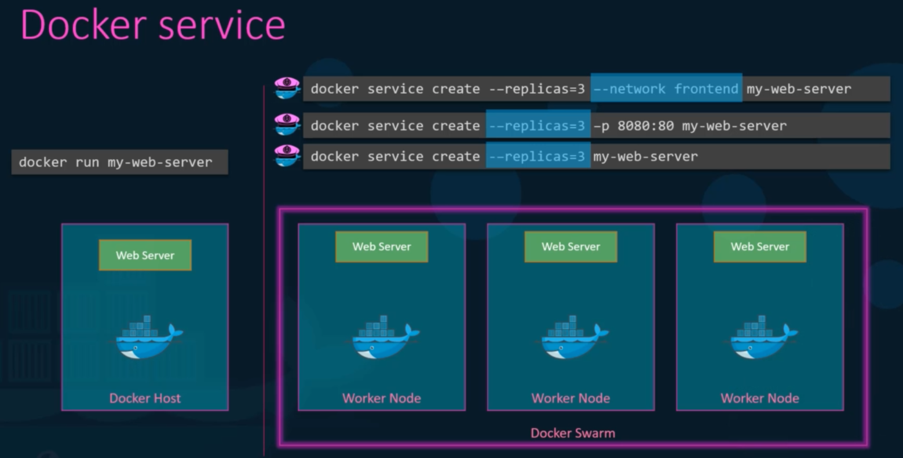
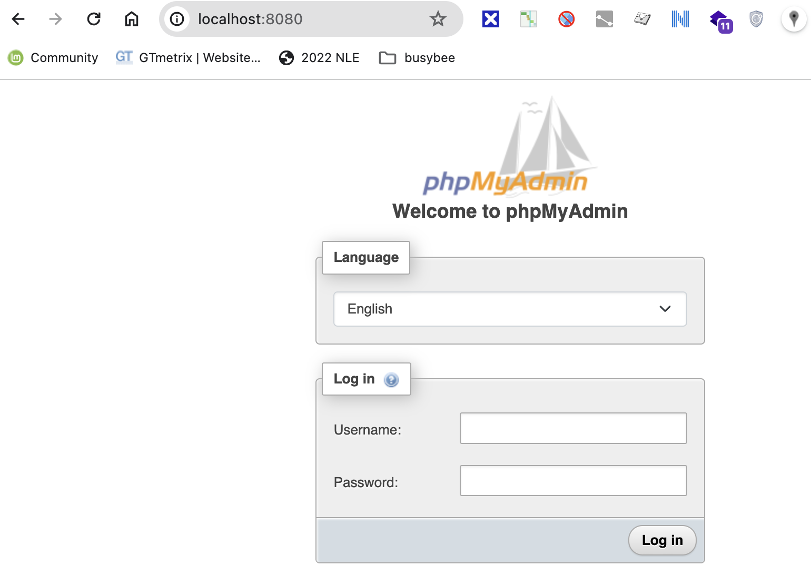
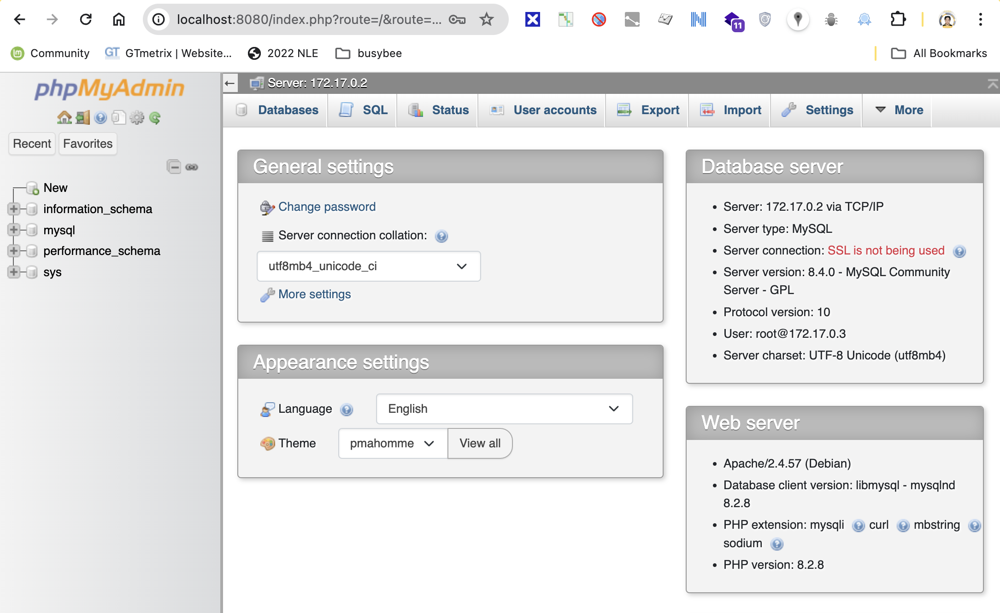

# Docker Lecture

## run

- start a container

```
docker run kodekloud/simple-webapp
```

- run the container in the background

```
docker run -d kodekloud/simple-webapp
```

- start a Bash shell in a Docker container

```
docker run -it centos bash
[root@86792eecaccd /]# cat /etc/*release*
CentOS Linux release 8.4.2105
Derived from Red Hat Enterprise Linux 8.4
NAME="CentOS Linux"
VERSION="8"
ID="centos"
ID_LIKE="rhel fedora"
VERSION_ID="8"
PLATFORM_ID="platform:el8"
PRETTY_NAME="CentOS Linux 8"
ANSI_COLOR="0;31"
CPE_NAME="cpe:/o:centos:centos:8"
HOME_URL="https://centos.org/"
BUG_REPORT_URL="https://bugs.centos.org/"
CENTOS_MANTISBT_PROJECT="CentOS-8"
CENTOS_MANTISBT_PROJECT_VERSION="8"
CentOS Linux release 8.4.2105
CentOS Linux release 8.4.2105
cpe:/o:centos:centos:8
[root@86792eecaccd /]# ls
bin  etc   lib	  lost+found  mnt  proc  run   srv  tmp  var
dev  home  lib64  media       opt  root  sbin  sys  usr
```

- run command in the container

```
docker run -it centos ls
bin  etc   lib	  lost+found  mnt  proc  run   srv  tmp  var
dev  home  lib64  media       opt  root  sbin  sys  usr

docker run -it centos cat /etc/*release*
cat: /etc/lsb-release: No such file or directory
NAME="CentOS Linux"
VERSION="8"
ID="centos"
ID_LIKE="rhel fedora"
VERSION_ID="8"
PLATFORM_ID="platform:el8"
PRETTY_NAME="CentOS Linux 8"
ANSI_COLOR="0;31"
CPE_NAME="cpe:/o:centos:centos:8"
HOME_URL="https://centos.org/"
BUG_REPORT_URL="https://bugs.centos.org/"
CENTOS_MANTISBT_PROJECT="CentOS-8"
CENTOS_MANTISBT_PROJECT_VERSION="8"
cat: /etc/upstream-release: No such file or directory

```

### tag

```
# Run latest version of centos
docker run centos:latest

# Run version 7 of centos
docker run centos:7

# Pull latest version of centos
docker pull centos:latest

# Run version 7 of centos
docker pull centos:7
```


### port

```
docker run -p 8001:5000 kodekloud/webapp
 * Running on http://0.0.0.0:5000/ (Press CTRL+C to quit)
172.17.0.1 - - [19/Jul/2022 02:16:48] "GET / HTTP/1.1" 200 -
172.17.0.1 - - [19/Jul/2022 02:16:48] "GET /favicon.ico HTTP/1.1" 404 -

docker run -p 8002:5000 kodekloud/webapp
 * Running on http://0.0.0.0:5000/ (Press CTRL+C to quit)
192.168.101.123 - - [19/Jul/2022 02:22:18] "GET / HTTP/1.1" 200 -
192.168.101.123 - - [19/Jul/2022 02:22:18] "GET /favicon.ico HTTP/1.1" 404 -
```

### volume

```
docker run --name my-mysql -v /Users/sherwinowen/datadir:/var/lib/mysql -e MYSQL_ROOT_PASSWORD=mypassword -d mysql
```


### cpu

- limit cpu usage

```
docker run --cpu=.5 ubuntu
```


### memory

- limit memory usage

```
docker run --memory=100m ubuntu
```


 ## attach

```
docker ps
CONTAINER ID   IMAGE                          COMMAND           CREATED         STATUS        PORTS                                                                                            NAMES
14a9f9c30318   kodekloud/simple-webapp        "python app.py"   2 seconds ago   Up 1 second   8080/tcp                                                                                         trusting_galileo

docker attach 14a9f9c30318
172.17.0.1 - - [19/Jul/2022 00:37:14] "GET / HTTP/1.1" 200 -
172.17.0.1 - - [19/Jul/2022 00:37:15] "GET / HTTP/1.1" 200 -
172.17.0.1 - - [19/Jul/2022 00:37:18] "GET / HTTP/1.1" 200 -
```


## ps

- list containers

```
docker ps
CONTAINER ID   IMAGE                          COMMAND        CREATED       STATUS        PORTS                                                                                            NAMES
ce58945a2343   portainer/portainer-ce:2.9.3   "/portainer"   4 weeks ago   Up 17 hours   0.0.0.0:8000->8000/tcp, :::8000->8000/tcp, 0.0.0.0:9443->9443/tcp, :::9443->9443/tcp, 9000/tcp   portainer

```

- Show all containers

```
docker ps -a
CONTAINER ID   IMAGE                              COMMAND                  CREATED          STATUS                      PORTS                                                                                            NAMES
acecb984d1bb   nginx                              "/docker-entrypoint.…"   3 minutes ago    Exited (0) 2 minutes ago                                                                                                     elated_rubin
f928d8ebd583   docker/whalesay                    "cowsay Hello-World!"    10 minutes ago   Exited (0) 10 minutes ago                                                                                                    pedantic_satoshi
ce58945a2343   portainer/portainer-ce:2.9.3       "/portainer"             4 weeks ago      Up 17 hours                 0.0.0.0:8000->8000/tcp, :::8000->8000/tcp, 0.0.0.0:9443->9443/tcp, :::9443->9443/tcp, 9000/tcp   portainer

```

## stop

- stop a container

```
docker stop elated_rubin
```

## rm

- remove a container

```
docker rm elated_rubin
```

- remove all containers

```
dcoker rm $(docker ps -aq)
```


## images

- list images

```
docker images
REPOSITORY                                      TAG       IMAGE ID       CREATED        SIZE
nginx                                           latest    41b0e86104ba   6 days ago     142MB
parrotsec/security                              latest    248b22cee236   3 weeks ago    5.46GB
portainer/portainer-ce                          2.9.3     ad0ecf974589   8 months ago   252MB
docker/whalesay                                 latest    6b362a9f73eb   7 years ago    247MB
```

## rmi

- remove images

```
docker rmi nginx
```

- remove all images

```
docker rmi $(docker images -aq)
```


## pull

- download an image

```
docker pull nginx
```

## exec

- Run a command in a running container

```
docker ps
CONTAINER ID   IMAGE                          COMMAND        CREATED         STATUS         PORTS                                                                                            NAMES
3fa0ceab3657   ubuntu                         "sleep 1000"   3 minutes ago   Up 3 minutes                                                                                                    boring_engelbart


docker exec 3fa0ceab3657 cat /etc/*release*
DISTRIB_ID=Ubuntu
DISTRIB_RELEASE=22.04
DISTRIB_CODENAME=jammy
DISTRIB_DESCRIPTION="Ubuntu 22.04 LTS"
PRETTY_NAME="Ubuntu 22.04 LTS"
NAME="Ubuntu"
VERSION_ID="22.04"
VERSION="22.04 LTS (Jammy Jellyfish)"
VERSION_CODENAME=jammy
ID=ubuntu
ID_LIKE=debian
HOME_URL="https://www.ubuntu.com/"
SUPPORT_URL="https://help.ubuntu.com/"
BUG_REPORT_URL="https://bugs.launchpad.net/ubuntu/"
PRIVACY_POLICY_URL="https://www.ubuntu.com/legal/terms-and-policies/privacy-policy"
UBUNTU_CODENAME=jammy

```

## tag

- version

```
# Run latest version of centos
docker run centos:latest

# Run version 7 of centos
docker run centos:7

# Pull latest version of centos
docker pull centos:latest

# Run version 7 of centos
docker pull centos:7
```

## inspect

- Return low-level information on Docker objects

```
$ docker ps
CONTAINER ID   IMAGE              COMMAND                  CREATED              STATUS              PORTS                    NAMES
4db5d3603aad   mysql              "docker-entrypoint.s…"   About a minute ago   Up About a minute   3306/tcp, 33060/tcp      my-mysql

docker inspect my-mysql
[
    {
        "Id": "4db5d3603aade7c89afb6b26497b3f68f55b1dc78241c47cb347c36843bb3773",
        "Created": "2022-07-19T04:51:16.167955469Z",
        "Path": "docker-entrypoint.sh",
        "Args": [
            "mysqld"
        ],
        "State": {
            "Status": "running",
            "Running": true,
            "Paused": false,
            "Restarting": false,
            "OOMKilled": false,
            "Dead": false,
            "Pid": 3851,
            "ExitCode": 0,
            "Error": "",
            "StartedAt": "2022-07-19T04:51:16.629367678Z",
            "FinishedAt": "0001-01-01T00:00:00Z"
        },
        "Image": "sha256:02662e079c08f45f90a837cf583cfb18bc58a400342d4fefde11199f3d1f4102",
        "ResolvConfPath": "/var/lib/docker/containers/4db5d3603aade7c89afb6b26497b3f68f55b1dc78241c47cb347c36843bb3773/resolv.conf",
        "HostnamePath": "/var/lib/docker/containers/4db5d3603aade7c89afb6b26497b3f68f55b1dc78241c47cb347c36843bb3773/hostname",
        "HostsPath": "/var/lib/docker/containers/4db5d3603aade7c89afb6b26497b3f68f55b1dc78241c47cb347c36843bb3773/hosts",
        "LogPath": "/var/lib/docker/containers/4db5d3603aade7c89afb6b26497b3f68f55b1dc78241c47cb347c36843bb3773/4db5d3603aade7c89afb6b26497b3f68f55b1dc78241c47cb347c36843bb3773-json.log",
        "Name": "/my-mysql",
        "RestartCount": 0,
        "Driver": "overlay2",
        "Platform": "linux",
        "MountLabel": "",
        "ProcessLabel": "",
        "AppArmorProfile": "",
        "ExecIDs": null,
        "HostConfig": {
            "Binds": [
                "/Users/sherwinowen/datadir:/var/lib/mysql"
            ],
            "ContainerIDFile": "",
            "LogConfig": {
                "Type": "json-file",
                "Config": {}
            },
            "NetworkMode": "default",
            "PortBindings": {},
            "RestartPolicy": {
                "Name": "no",
                "MaximumRetryCount": 0
            },
            "AutoRemove": false,
            "VolumeDriver": "",
            "VolumesFrom": null,
            "CapAdd": null,
            "CapDrop": null,
            "CgroupnsMode": "private",
            "Dns": [],
            "DnsOptions": [],
            "DnsSearch": [],
            "ExtraHosts": null,
            "GroupAdd": null,
            "IpcMode": "private",
            "Cgroup": "",
            "Links": null,
            "OomScoreAdj": 0,
            "PidMode": "",
            "Privileged": false,
            "PublishAllPorts": false,
            "ReadonlyRootfs": false,
            "SecurityOpt": null,
            "UTSMode": "",
            "UsernsMode": "",
            "ShmSize": 67108864,
            "Runtime": "runc",
            "ConsoleSize": [
                0,
                0
            ],
            "Isolation": "",
            "CpuShares": 0,
            "Memory": 0,
            "NanoCpus": 0,
            "CgroupParent": "",
            "BlkioWeight": 0,
            "BlkioWeightDevice": [],
            "BlkioDeviceReadBps": null,
            "BlkioDeviceWriteBps": null,
            "BlkioDeviceReadIOps": null,
            "BlkioDeviceWriteIOps": null,
            "CpuPeriod": 0,
            "CpuQuota": 0,
            "CpuRealtimePeriod": 0,
            "CpuRealtimeRuntime": 0,
            "CpusetCpus": "",
            "CpusetMems": "",
            "Devices": [],
            "DeviceCgroupRules": null,
            "DeviceRequests": null,
            "KernelMemory": 0,
            "KernelMemoryTCP": 0,
            "MemoryReservation": 0,
            "MemorySwap": 0,
            "MemorySwappiness": null,
            "OomKillDisable": null,
            "PidsLimit": null,
            "Ulimits": null,
            "CpuCount": 0,
            "CpuPercent": 0,
            "IOMaximumIOps": 0,
            "IOMaximumBandwidth": 0,
            "MaskedPaths": [
                "/proc/asound",
                "/proc/acpi",
                "/proc/kcore",
                "/proc/keys",
                "/proc/latency_stats",
                "/proc/timer_list",
                "/proc/timer_stats",
                "/proc/sched_debug",
                "/proc/scsi",
                "/sys/firmware"
            ],
            "ReadonlyPaths": [
                "/proc/bus",
                "/proc/fs",
                "/proc/irq",
                "/proc/sys",
                "/proc/sysrq-trigger"
            ]
        },
        "GraphDriver": {
            "Data": {
                "LowerDir": "/var/lib/docker/overlay2/1fae8247a72e4dc877ea2818eaedc1fa4666e2ee9d8512c8a9487ece54e4f180-init/diff:/var/lib/docker/overlay2/cddf4b91ed81eb9b927a2f39fb682a14b93a431ad461ecc25f4792b7310c548c/diff:/var/lib/docker/overlay2/184618309c0c0422446a512ee1384fcb37c2f19af869d124b3e18247e5c32360/diff:/var/lib/docker/overlay2/b1932f1074bda8352796f27acca98378587de42d78b9f6932cfc1fee641b7649/diff:/var/lib/docker/overlay2/48b41a12b55451787910e9dbf379a2940476cbe5144131a215fba42cef6bfadd/diff:/var/lib/docker/overlay2/9ee138426766fabdd61a8a09080948fd93620b683f5663016ace0be210c4ca63/diff:/var/lib/docker/overlay2/9c4780c44a0d937c0c1d5328e54c2e84914a6863f1274eed68a58f65cae11ff2/diff:/var/lib/docker/overlay2/7a2ad3437e7aca568ac67a6f6aa2e3e90425777f69c9440da526cd4d453558e7/diff:/var/lib/docker/overlay2/a146327f0ca17cd4a9aa5d7ff0568abeae41d2383403676e61a56f7aedfbab44/diff:/var/lib/docker/overlay2/905eeb4f86ca7775653be42ade35d3636425fc192c0e14b46dfb65af6bae134c/diff:/var/lib/docker/overlay2/9b0a170e3d5f01dad763d75f11f77fc2a3ae51ae5a2de6c1fa809b0cf1c7efc6/diff:/var/lib/docker/overlay2/324447f06fa7e865eb7d548a7a2364cd2bf7e5124b3ece53588a365cbf7da83c/diff",
                "MergedDir": "/var/lib/docker/overlay2/1fae8247a72e4dc877ea2818eaedc1fa4666e2ee9d8512c8a9487ece54e4f180/merged",
                "UpperDir": "/var/lib/docker/overlay2/1fae8247a72e4dc877ea2818eaedc1fa4666e2ee9d8512c8a9487ece54e4f180/diff",
                "WorkDir": "/var/lib/docker/overlay2/1fae8247a72e4dc877ea2818eaedc1fa4666e2ee9d8512c8a9487ece54e4f180/work"
            },
            "Name": "overlay2"
        },
        "Mounts": [
            {
                "Type": "bind",
                "Source": "/Users/sherwinowen/datadir",
                "Destination": "/var/lib/mysql",
                "Mode": "",
                "RW": true,
                "Propagation": "rprivate"
            }
        ],
        "Config": {
            "Hostname": "4db5d3603aad",
            "Domainname": "",
            "User": "",
            "AttachStdin": false,
            "AttachStdout": false,
            "AttachStderr": false,
            "ExposedPorts": {
                "3306/tcp": {},
                "33060/tcp": {}
            },
            "Tty": false,
            "OpenStdin": false,
            "StdinOnce": false,
            "Env": [
                "MYSQL_ROOT_PASSWORD=mypassword",
                "PATH=/usr/local/sbin:/usr/local/bin:/usr/sbin:/usr/bin:/sbin:/bin",
                "GOSU_VERSION=1.14",
                "MYSQL_MAJOR=8.0",
                "MYSQL_VERSION=8.0.29-1.el8",
                "MYSQL_SHELL_VERSION=8.0.29-1.el8"
            ],
            "Cmd": [
                "mysqld"
            ],
            "Image": "mysql",
            "Volumes": {
                "/var/lib/mysql": {}
            },
            "WorkingDir": "",
            "Entrypoint": [
                "docker-entrypoint.sh"
            ],
            "OnBuild": null,
            "Labels": {}
        },
        "NetworkSettings": {
            "Bridge": "",
            "SandboxID": "fb2fcdf59072ecf4b816b440a90d41239b2dd48fe759e69b1d7798c9196d1dab",
            "HairpinMode": false,
            "LinkLocalIPv6Address": "",
            "LinkLocalIPv6PrefixLen": 0,
            "Ports": {
                "3306/tcp": null,
                "33060/tcp": null
            },
            "SandboxKey": "/var/run/docker/netns/fb2fcdf59072",
            "SecondaryIPAddresses": null,
            "SecondaryIPv6Addresses": null,
            "EndpointID": "e161955d845e3b48db75f77b6774bf8af347591e15db8f568182223b2e1ad506",
            "Gateway": "172.17.0.1",
            "GlobalIPv6Address": "",
            "GlobalIPv6PrefixLen": 0,
            "IPAddress": "172.17.0.4",
            "IPPrefixLen": 16,
            "IPv6Gateway": "",
            "MacAddress": "02:42:ac:11:00:04",
            "Networks": {
                "bridge": {
                    "IPAMConfig": null,
                    "Links": null,
                    "Aliases": null,
                    "NetworkID": "61e8b6559784be1265455907450cbff5a9f660c5e3d5acf8a0b6581d3ec5ff78",
                    "EndpointID": "e161955d845e3b48db75f77b6774bf8af347591e15db8f568182223b2e1ad506",
                    "Gateway": "172.17.0.1",
                    "IPAddress": "172.17.0.4",
                    "IPPrefixLen": 16,
                    "IPv6Gateway": "",
                    "GlobalIPv6Address": "",
                    "GlobalIPv6PrefixLen": 0,
                    "MacAddress": "02:42:ac:11:00:04",
                    "DriverOpts": null
                }
            }
        }
    }
]
```

## logs

- Fetch the logs of a container

```
docker logs my-mysql
2022-07-19 04:51:16+00:00 [Note] [Entrypoint]: Entrypoint script for MySQL Server 8.0.29-1.el8 started.
2022-07-19 04:51:16+00:00 [Note] [Entrypoint]: Switching to dedicated user 'mysql'
2022-07-19 04:51:16+00:00 [Note] [Entrypoint]: Entrypoint script for MySQL Server 8.0.29-1.el8 started.
2022-07-19 04:51:16+00:00 [Note] [Entrypoint]: Initializing database files
2022-07-19T04:51:16.850031Z 0 [System] [MY-013169] [Server] /usr/sbin/mysqld (mysqld 8.0.29) initializing of server in progress as process 43
2022-07-19T04:51:16.860436Z 0 [Warning] [MY-010159] [Server] Setting lower_case_table_names=2 because file system for /var/lib/mysql/ is case insensitive
2022-07-19T04:51:16.876556Z 1 [System] [MY-013576] [InnoDB] InnoDB initialization has started.
2022-07-19T04:51:21.115210Z 1 [System] [MY-013577] [InnoDB] InnoDB initialization has ended.
2022-07-19T04:51:23.196110Z 6 [Warning] [MY-010453] [Server] root@localhost is created with an empty password ! Please consider switching off the --initialize-insecure option.
2022-07-19 04:51:27+00:00 [Note] [Entrypoint]: Database files initialized
2022-07-19 04:51:27+00:00 [Note] [Entrypoint]: Starting temporary server
2022-07-19T04:51:28.236640Z 0 [System] [MY-010116] [Server] /usr/sbin/mysqld (mysqld 8.0.29) starting as process 92
2022-07-19T04:51:28.243364Z 0 [Warning] [MY-010159] [Server] Setting lower_case_table_names=2 because file system for /var/lib/mysql/ is case insensitive
2022-07-19T04:51:28.262059Z 1 [System] [MY-013576] [InnoDB] InnoDB initialization has started.
2022-07-19T04:51:29.327911Z 1 [System] [MY-013577] [InnoDB] InnoDB initialization has ended.
2022-07-19T04:51:29.684359Z 0 [Warning] [MY-010068] [Server] CA certificate ca.pem is self signed.
2022-07-19T04:51:29.684394Z 0 [System] [MY-013602] [Server] Channel mysql_main configured to support TLS. Encrypted connections are now supported for this channel.
2022-07-19T04:51:29.688397Z 0 [Warning] [MY-011810] [Server] Insecure configuration for --pid-file: Location '/var/run/mysqld' in the path is accessible to all OS users. Consider choosing a different directory.
2022-07-19T04:51:29.734636Z 0 [System] [MY-010931] [Server] /usr/sbin/mysqld: ready for connections. Version: '8.0.29'  socket: '/var/run/mysqld/mysqld.sock'  port: 0  MySQL Community Server - GPL.
2022-07-19T04:51:29.734990Z 0 [System] [MY-011323] [Server] X Plugin ready for connections. Socket: /var/run/mysqld/mysqlx.sock
2022-07-19 04:51:29+00:00 [Note] [Entrypoint]: Temporary server started.
'/var/lib/mysql/mysql.sock' -> '/var/run/mysqld/mysqld.sock'
Warning: Unable to load '/usr/share/zoneinfo/iso3166.tab' as time zone. Skipping it.
Warning: Unable to load '/usr/share/zoneinfo/leapseconds' as time zone. Skipping it.
Warning: Unable to load '/usr/share/zoneinfo/tzdata.zi' as time zone. Skipping it.
Warning: Unable to load '/usr/share/zoneinfo/zone.tab' as time zone. Skipping it.
Warning: Unable to load '/usr/share/zoneinfo/zone1970.tab' as time zone. Skipping it.

2022-07-19 04:51:32+00:00 [Note] [Entrypoint]: Stopping temporary server
2022-07-19T04:51:32.405203Z 10 [System] [MY-013172] [Server] Received SHUTDOWN from user root. Shutting down mysqld (Version: 8.0.29).
2022-07-19T04:51:33.720131Z 0 [System] [MY-010910] [Server] /usr/sbin/mysqld: Shutdown complete (mysqld 8.0.29)  MySQL Community Server - GPL.
2022-07-19 04:51:34+00:00 [Note] [Entrypoint]: Temporary server stopped

2022-07-19 04:51:34+00:00 [Note] [Entrypoint]: MySQL init process done. Ready for start up.

2022-07-19T04:51:34.645730Z 0 [System] [MY-010116] [Server] /usr/sbin/mysqld (mysqld 8.0.29) starting as process 1
2022-07-19T04:51:34.652281Z 0 [Warning] [MY-010159] [Server] Setting lower_case_table_names=2 because file system for /var/lib/mysql/ is case insensitive
2022-07-19T04:51:34.669835Z 1 [System] [MY-013576] [InnoDB] InnoDB initialization has started.
2022-07-19T04:51:35.423027Z 1 [System] [MY-013577] [InnoDB] InnoDB initialization has ended.
2022-07-19T04:51:35.836219Z 0 [Warning] [MY-010068] [Server] CA certificate ca.pem is self signed.
2022-07-19T04:51:35.836304Z 0 [System] [MY-013602] [Server] Channel mysql_main configured to support TLS. Encrypted connections are now supported for this channel.
2022-07-19T04:51:35.842433Z 0 [Warning] [MY-011810] [Server] Insecure configuration for --pid-file: Location '/var/run/mysqld' in the path is accessible to all OS users. Consider choosing a different directory.
2022-07-19T04:51:35.895031Z 0 [System] [MY-011323] [Server] X Plugin ready for connections. Bind-address: '::' port: 33060, socket: /var/run/mysqld/mysqlx.sock
2022-07-19T04:51:35.895042Z 0 [System] [MY-010931] [Server] /usr/sbin/mysqld: ready for connections. Version: '8.0.29'  socket: '/var/run/mysqld/mysqld.sock'  port: 3306  MySQL Community Server - GPL.
```

## Create docker image

### How to create own image

1. OS - Ubuntu
2. Update apt repo
3. Install dependencies using apt
4. Install Python dependencies using pip
5. Copy source code to /opt folder
6. Run the web server using “flask” command

**Dockerfile**

```
FROM ubuntu:20.04

RUN apt-get update
RUN apt-get install -y python python3-pip
RUN pip install flask

COPY app.py /opt/app.py

ENTRYPOINT FLASK_APP=/opt/app.py flask run --host=0.0.0.0
```

**app.py**

```
import os
from flask import Flask
app = Flask(__name__)

@app.route("/")
def main():
    return "Welcome!"

@app.route('/how are you')
def hello():
    return 'I am good, how about you?'

if __name__ == "__main__":
    app.run(host="0.0.0.0", port=8080)
```

## build

```
docker build . -t my-custom-app:latest
```

## push

```
$ docker build . -t sherwinowen/my-custom-app:latest

$ docker images
REPOSITORY                                      TAG       IMAGE ID       CREATED         SIZE
my-custom-app                                   latest    036ac37b63ec   6 minutes ago   459MB

$ docker push sherwinowen/my-custom-app:latest
```

## Docker compose

```
$ git clone https://github.com/dockersamples/example-voting-app.git

$ cd example-voting-app

$ cd vote

# Build voting-app image
example-voting-app/vote$ docker build . -t voting-app

$ docker run -d --name=redis redis

$ docker run -p 5000:80 --link redis:redis voting-app
[2022-07-19 13:17:20 +0000] [1] [INFO] Starting gunicorn 20.1.0
[2022-07-19 13:17:20 +0000] [1] [INFO] Listening at: http://0.0.0.0:80 (1)
[2022-07-19 13:17:20 +0000] [1] [INFO] Using worker: sync
[2022-07-19 13:17:20 +0000] [6] [INFO] Booting worker with pid: 6
[2022-07-19 13:17:20 +0000] [7] [INFO] Booting worker with pid: 7
[2022-07-19 13:17:20 +0000] [8] [INFO] Booting worker with pid: 8
[2022-07-19 13:17:20 +0000] [9] [INFO] Booting worker with pid: 9
[2022-07-19 13:17:32,151] INFO in app: Received vote for a
[2022-07-19 13:17:32 +0000] [7] [INFO] Received vote for a
192.168.101.123 - - [19/Jul/2022:13:17:32 +0000] "POST / HTTP/1.1" 200 1688 "http://192.168.101.123:5000/" "Mozilla/5.0 (X11; Linux x86_64) AppleWebKit/537.36 (KHTML, like Gecko) Chrome/103.0.0.0 Safari/537.36"
192.168.101.123 - - [19/Jul/2022:13:17:32 +0000] "GET /static/stylesheets/style.css HTTP/1.1" 304 0 "http://192.168.101.123:5000/" "Mozilla/5.0 (X11; Linux x86_64) AppleWebKit/537.36 (KHTML, like Gecko) Chrome/103.0.0.0 Safari/537.36"
[2022-07-19 13:17:33,693] INFO in app: Received vote for b
[2022-07-19 13:17:33 +0000] [6] [INFO] Received vote for b
192.168.101.123 - - [19/Jul/2022:13:17:33 +0000] "POST / HTTP/1.1" 200 1688 "http://192.168.101.123:5000/" "Mozilla/5.0 (X11; Linux x86_64) AppleWebKit/537.36 (KHTML, like Gecko) Chrome/103.0.0.0 Safari/537.36"
192.168.101.123 - - [19/Jul/2022:13:17:33 +0000] "GET /static/stylesheets/style.css HTTP/1.1" 304 0 "http://192.168.101.123:5000/" "Mozilla/5.0 (X11; Linux x86_64) AppleWebKit/537.36 (KHTML, like Gecko) Chrome/103.0.0.0 Safari/537.36"
[2022-07-19 13:17:34,673] INFO in app: Received vote for a
[2022-07-19 13:17:34 +0000] [6] [INFO] Received vote for a
192.168.101.123 - - [19/Jul/2022:13:17:34 +0000] "POST / HTTP/1.1" 200 1688 "http://192.168.101.123:5000/" "Mozilla/5.0 (X11; Linux x86_64) AppleWebKit/537.36 (KHTML, like Gecko) Chrome/103.0.0.0 Safari/537.36"
192.168.101.123 - - [19/Jul/2022:13:17:34 +0000] "GET /static/stylesheets/style.css HTTP/1.1" 304 0 "http://192.168.101.123:5000/" "Mozilla/5.0 (X11; Linux x86_64) AppleWebKit/537.36 (KHTML, like Gecko) Chrome/103.0.0.0 Safari/537.36"


$ docker run --name=db -d -e POSTGRES_PASSWORD=postgres -e POSTGRES_USER=postgres postgres:9.4
0f016a317f9dba3b49eeb5def32a7ecf79a7113fd171a23ebcbc6e27aa825395


# Build worker-app image
~/my_lab/example-voting-app/worker$ docker build . -t worker-app

$ docker run --link redis:redis --link db:db worker-app
Connected to db
Connecting to redis
Found redis at 172.17.0.3
Processing vote for 'a' by '87c285087f989c4'
Processing vote for 'b' by '87c285087f989c4'
Processing vote for 'a' by '87c285087f989c4'
Processing vote for 'a' by '87c285087f989c4'
Processing vote for 'b' by '87c285087f989c4'
Processing vote for 'a' by '87c285087f989c4'

# Build result-app image
~/my_lab/example-voting-app/result$ docker build . -t result-app

$ docker run -p 5001:80 --link db:db result-app
Tue, 19 Jul 2022 13:38:06 GMT body-parser deprecated bodyParser: use individual json/urlencoded middlewares at server.js:73:9
Tue, 19 Jul 2022 13:38:06 GMT body-parser deprecated undefined extended: provide extended option at ../node_modules/body-parser/index.js:105:29
App running on port 80
Connected to db
```

docker-compose.yml

```
version: '3'

services:
  redis:
    image: redis

  db:
    image: postgres:9.4
    environment:
      POSTGRES_USER: "postgres"
      POSTGRES_PASSWORD: "postgres"

  vote:
    image: voting-app
    ports: 
      - 5000:80
    links:
      - redis   

  worker:
    image: worker-app
    links:
      - db
      - redis

  result:
    image: result-app
    ports:
      - 5001:80
    links:
      - db  
```

```
$ docker-compose up
Creating network "my-voting-app_default" with the default driver
Recreating my-voting-app_db_1    ... done
Recreating my-voting-app_redis_1 ... done
Recreating my-voting-app_result_1 ... done
Recreating my-voting-app_vote_1   ... done
Recreating my-voting-app_worker_1 ... done

```

## Deploy Private Registry

```
docker run -d -p 5000:5000 -name registry registry:2

docker image tag my-image localhost:5000/my-image

docker push locahost:5000/my-image

docker pull locahost:5000/my-image

docker pull 192.168.101.123:5000/my-image
```

## Docker Storage

### File system

```
$ sudo ls -l /var/lib/docker/
total 84
drwx--x--x   4 root root  4096 Jun 15 11:18 buildkit
drwx--x---  58 root root 12288 Jul 20 08:41 containers
drwx------   3 root root  4096 Jun 15 11:18 image
drwxr-x---   3 root root  4096 Jun 15 11:18 network
drwx--x--- 290 root root 32768 Jul 20 08:41 overlay2
drwx------   4 root root  4096 Jun 15 11:18 plugins
drwx------   2 root root  4096 Jul 20 06:21 runtimes
drwx------   2 root root  4096 Jun 15 11:18 swarm
drwx------   2 root root  4096 Jul 20 08:39 tmp
drwx------   2 root root  4096 Jun 15 11:18 trust
drwx-----x  20 root root  4096 Jul 20 07:41 volumes 
```

## volume

- manage volumes

```
$ docker volume create mysql_data


$ ls -l /var/lib/docker/volumes/mysql_data
total 4
drwxr-xr-x 2 root root 4096 Jul 20 09:02 _data
```

### Mounting of volume

**Old way**

```
docker run --name my-mysql -v mysql_data:/var/lib/mysql -e MYSQL_ROOT_PASSWORD=password -d mysql
```

**New way** 

```
docker run --mount type=bind,source=/data/mysql,target=/var/lib/mysql -e MYSQL_ROOT_PASSWORD=password mysql
```


## info

- Display system-wide information

```
$ docker info 
Client:
 Context:    default
 Debug Mode: false
 Plugins:
  app: Docker App (Docker Inc., v0.9.1-beta3)
  buildx: Docker Buildx (Docker Inc., v0.8.2-docker)
  compose: Docker Compose (Docker Inc., v2.6.0)
  scan: Docker Scan (Docker Inc., v0.17.0)

Server:
 Containers: 57
  Running: 3
  Paused: 0
  Stopped: 54
 Images: 54
 Server Version: 20.10.17
 Storage Driver: overlay2
  Backing Filesystem: extfs
  Supports d_type: true
  Native Overlay Diff: true
  userxattr: false
 Logging Driver: json-file
 Cgroup Driver: cgroupfs
 Cgroup Version: 1
 Plugins:
  Volume: local
  Network: bridge host ipvlan macvlan null overlay
  Log: awslogs fluentd gcplogs gelf journald json-file local logentries splunk syslog
 Swarm: inactive
 Runtimes: io.containerd.runc.v2 io.containerd.runtime.v1.linux runc
 Default Runtime: runc
 Init Binary: docker-init
 containerd version: 10c12954828e7c7c9b6e0ea9b0c02b01407d3ae1
 runc version: v1.1.2-0-ga916309
 init version: de40ad0
 Security Options:
  apparmor
  seccomp
   Profile: default
 Kernel Version: 5.4.0-121-generic
 Operating System: Linux Mint 20.3
 OSType: linux
 Architecture: x86_64
 CPUs: 8
 Total Memory: 15.5GiB
 Name: owenbox
 ID: WMYZ:B2UF:EJ53:VBWW:I5UB:ZUBL:A25E:A5EQ:S6LK:34BX:7OWJ:LSFO
 Docker Root Dir: /var/lib/docker
 Debug Mode: false
 Registry: https://index.docker.io/v1/
 Labels:
 Experimental: false
 Insecure Registries:
  127.0.0.0/8
 Live Restore Enabled: false

WARNING: No swap limit support
```

## history

- Show the history of an image

```
$ docker history result-app:latest 
IMAGE          CREATED         CREATED BY                                      SIZE      COMMENT
4b027fe3a80c   20 hours ago    /bin/sh -c #(nop)  CMD ["/tini" "--" "node" …   0B        
ef45e807c564   20 hours ago    /bin/sh -c #(nop)  EXPOSE 80                    0B        
8eb87af0eb25   20 hours ago    /bin/sh -c #(nop)  ENV PORT=80                  0B        
a34c03873527   20 hours ago    /bin/sh -c #(nop) COPY dir:a8404560ef4b46fd1…   469kB     
00902a2bedfd   20 hours ago    /bin/sh -c npm ci  && npm cache clean --forc…   5.49MB    
10f638684b9c   20 hours ago    /bin/sh -c #(nop) COPY multi:94486ef69667ea7…   31.8kB    
b73ab2601558   20 hours ago    /bin/sh -c npm install -g nodemon               2.44MB    
97c1d41a2267   20 hours ago    /bin/sh -c #(nop) WORKDIR /app                  0B        
de3dcc25fba2   20 hours ago    /bin/sh -c chmod +x /tini                       24.1kB    
f390e676c728   20 hours ago    /bin/sh -c #(nop) ADD 84b50f1acc38c999c31383…   24.1kB    
3f2440741e9f   20 hours ago    /bin/sh -c #(nop)  ENV TINI_VERSION=v0.19.0     0B        
dec82fbda2a1   20 hours ago    /bin/sh -c apt-get update     && apt-get ins…   13.9MB    
6fbcbbb5c603   15 months ago   /bin/sh -c #(nop)  CMD ["node"]                 0B        
<missing>      15 months ago   /bin/sh -c #(nop)  ENTRYPOINT ["docker-entry…   0B        
<missing>      15 months ago   /bin/sh -c #(nop) COPY file:238737301d473041…   116B      
<missing>      15 months ago   /bin/sh -c set -ex   && savedAptMark="$(apt-…   10.3MB    
<missing>      15 months ago   /bin/sh -c #(nop)  ENV YARN_VERSION=1.22.5      0B        
<missing>      15 months ago   /bin/sh -c ARCH= && dpkgArch="$(dpkg --print…   68.4MB    
<missing>      15 months ago   /bin/sh -c #(nop)  ENV NODE_VERSION=10.24.1     0B        
<missing>      15 months ago   /bin/sh -c groupadd --gid 1000 node   && use…   333kB     
<missing>      15 months ago   /bin/sh -c #(nop)  CMD ["bash"]                 0B        
<missing>      15 months ago   /bin/sh -c #(nop) ADD file:70cd6967491943999…   55.3MB    
```


## system

**Show docker disk usage**

```
$ docker system df
TYPE            TOTAL     ACTIVE    SIZE      RECLAIMABLE
Images          30        21        12.32GB   4.575GB (37%)
Containers      55        3         491.2MB   491.2MB (99%)
Local Volumes   19        9         493MB     74.1MB (15%)
Build Cache     0         0         0B        0B
```

**Show detailed information on space usage**

```
$ docker system df -v
Images space usage:

REPOSITORY                                      TAG        IMAGE ID       CREATED         SIZE      SHARED SIZE   UNIQUE SIZE   CONTAINERS
result-app                                      latest     4b027fe3a80c   20 hours ago    156.7MB   134.3MB       22.35MB       2
worker-app                                      latest     c7e74ec987f2   20 hours ago    192.8MB   189.8MB       2.971MB       3
<none>                                          <none>     0efd5c13d404   20 hours ago    753.2MB   714.1MB       39.13MB       0
voting-app                                      latest     6921794b0da7   21 hours ago    144.6MB   124.7MB       19.98MB       5
sherwinowen/my-custom-app                       latest     036ac37b63ec   23 hours ago    458.9MB   72.77MB       386.1MB       2
registry                                        2          d1fe2eaf6101   34 hours ago    24.11MB   0B            24.11MB       1
redis                                           latest     3edbb69f9a49   38 hours ago    116.8MB   80.39MB       36.42MB       2
mysql                                           latest     33037edcac9b   7 days ago      444MB     0B            444MB         2
mcr.microsoft.com/dotnet/core/sdk               3.1        494f43db3daa   7 days ago      714.1MB   714.1MB       0B            0
mcr.microsoft.com/dotnet/core/runtime           3.1        6301c68b664c   7 days ago      189.8MB   189.8MB       0B            0
python                                          3.9-slim   ae64b82339a8   7 days ago      124.7MB   124.7MB       0B            0
parrotsec/security                              latest     248b22cee236   3 weeks ago     5.465GB   0B            5.465GB       1
elastdocker/kibana                              7.16.2     46ab40412bce   5 weeks ago     1.295GB   1.295GB       0B            1
elastdocker/logstash                            7.16.2     4d5c6d2e48dd   5 weeks ago     997.5MB   997.5MB       0B            1
elastdocker/elasticsearch                       7.16.2     1d469a1c823d   5 weeks ago     646.4MB   646.3MB       446B          1
localhost:5000/my-ubuntu                        latest     27941809078c   6 weeks ago     77.82MB   0B            77.82MB       3
ubuntu                                          20.04      20fffa419e3a   6 weeks ago     72.77MB   72.77MB       0B            1
docker.elastic.co/elasticsearch/elasticsearch   7.16.2     66c29cde15ce   7 months ago    646.3MB   646.3MB       0B            0
docker.elastic.co/logstash/logstash             7.16.2     b2e5a301659d   7 months ago    997.5MB   997.5MB       0B            0
docker.elastic.co/kibana/kibana                 7.16.2     8c46ec23123e   7 months ago    1.295GB   1.295GB       0B            0
portainer/portainer-ce                          2.9.3      ad0ecf974589   8 months ago    251.8MB   0B            251.8MB       1
centos                                          7          eeb6ee3f44bd   10 months ago   203.9MB   203.9MB       0B            2
centos                                          latest     5d0da3dc9764   10 months ago   231.3MB   231.3MB       0B            9
node                                            10-slim    6fbcbbb5c603   15 months ago   134.3MB   134.3MB       0B            0
postgres                                        9.4        ed5a45034282   2 years ago     250.7MB   0B            250.7MB       2
kodekloud/simple-prompt-docker                  latest     c0848fde57d1   2 years ago     4.413MB   4.413MB       95B           4
kodekloud/simple-webapp                         latest     c6e3cd9aae36   3 years ago     84.85MB   4.413MB       80.44MB       3
tomcat                                          8.0        ef6a7c98d192   3 years ago     356.2MB   0B            356.2MB       0
kodekloud/webapp                                latest     1a45ba829f10   4 years ago     432.4MB   0B            432.4MB       4
docker/whalesay                                 latest     6b362a9f73eb   7 years ago     247MB     0B            247MB         1

Containers space usage:

CONTAINER ID   IMAGE                              COMMAND                  LOCAL VOLUMES   SIZE      CREATED        STATUS                      NAMES
1d6ac58c9f5c   mysql                              "docker-entrypoint.s…"   1               65B       8 hours ago    Up 8 hours                  my-mysql
62d6945e2c95   mysql                              "docker-entrypoint.s…"   1               0B        8 hours ago    Exited (1) 8 hours ago      compassionate_nash
f06143d3d403   registry:2                         "/entrypoint.sh /etc…"   1               0B        10 hours ago   Up 10 hours                 registry
c2984a5f8959   worker-app                         "dotnet Worker.dll"      0               0B        19 hours ago   Exited (143) 17 hours ago   my-voting-app_worker_1
cf1dfb688ac7   voting-app                         "gunicorn app:app -b…"   0               502kB     19 hours ago   Exited (0) 17 hours ago     my-voting-app_vote_1
0e626cde171b   result-app                         "docker-entrypoint.s…"   0               0B        19 hours ago   Exited (143) 17 hours ago   my-voting-app_result_1
dcb04d9ee056   redis                              "docker-entrypoint.s…"   1               0B        19 hours ago   Exited (0) 17 hours ago     my-voting-app_redis_1
28fbb3129a8b   postgres:9.4                       "docker-entrypoint.s…"   1               0B        19 hours ago   Exited (0) 17 hours ago     my-voting-app_db_1
e4983cc3f95a   result-app                         "docker-entrypoint.s…"   0               0B        20 hours ago   Exited (130) 20 hours ago   amazing_edison
829b7d5d68fb   voting-app                         "gunicorn app:app -b…"   0               502kB     20 hours ago   Exited (0) 20 hours ago     quizzical_jemison
dcb4040fd2db   worker-app                         "dotnet Worker.dll"      0               0B        20 hours ago   Exited (130) 20 hours ago   vigilant_vaughan
0f016a317f9d   postgres:9.4                       "docker-entrypoint.s…"   1               0B        20 hours ago   Exited (0) 20 hours ago     db
a0be6a92b063   worker-app                         "dotnet Worker.dll"      0               0B        20 hours ago   Exited (130) 20 hours ago   festive_jackson
cf0d5182b2cf   voting-app                         "gunicorn app:app -b…"   0               502kB     20 hours ago   Exited (0) 20 hours ago     heuristic_sanderson
56e29d5ef3af   voting-app                         "gunicorn app:app -b…"   0               502kB     21 hours ago   Exited (0) 20 hours ago     relaxed_hertz
cc6f11725cff   redis                              "docker-entrypoint.s…"   1               0B        21 hours ago   Exited (0) 20 hours ago     redis
1626f84a665c   voting-app                         "gunicorn app:app -b…"   0               502kB     21 hours ago   Exited (0) 21 hours ago     loving_shamir
8ba4be89dee4   sherwinowen/my-custom-app          "/bin/sh -c 'FLASK_A…"   0               529B      22 hours ago   Exited (137) 22 hours ago   affectionate_hugle
83f3fa2ad6c3   036ac37b63ec                       "/bin/sh -c 'FLASK_A…"   0               529B      23 hours ago   Exited (137) 23 hours ago   trusting_lumiere
ab1a9c22ed00   ubuntu:20.04                       "bash"                   0               422MB     23 hours ago   Exited (0) 23 hours ago     laughing_hellman
f964ce9de82b   27941809078c                       "bash"                   0               35.2MB    23 hours ago   Exited (130) 23 hours ago   compassionate_cartwright
38922a0a127e   cd14cecfdb3a                       "/bin/tini -- /usr/l…"   0               0B        24 hours ago   Exited (130) 24 hours ago   my-jenkins
f4ba52f8f03f   cd14cecfdb3a                       "/bin/tini -- /usr/l…"   1               0B        24 hours ago   Exited (130) 24 hours ago   strange_khorana
01f840986b14   kodekloud/webapp                   "/bin/sh -c 'FLASK_A…"   0               570B      31 hours ago   Exited (137) 26 hours ago   interesting_beaver
3f87f4815b24   kodekloud/webapp                   "/bin/sh -c 'FLASK_A…"   0               570B      31 hours ago   Exited (137) 26 hours ago   gallant_zhukovsky
a942b48b1396   kodekloud/webapp                   "/bin/sh -c 'FLASK_A…"   0               570B      31 hours ago   Exited (137) 26 hours ago   practical_lamarr
7cac1e956ba8   kodekloud/webapp                   "/bin/sh -c 'FLASK_A…"   0               570B      32 hours ago   Exited (137) 31 hours ago   zen_driscoll
66e4af3a99d8   kodekloud/simple-prompt-docker     "sh /opt/app.sh"         0               0B        32 hours ago   Exited (137) 26 hours ago   frosty_pike
dc8ded758211   kodekloud/simple-prompt-docker     "sh /opt/app.sh"         0               0B        32 hours ago   Exited (0) 32 hours ago     crazy_dirac
35d30ad93e77   kodekloud/simple-prompt-docker     "sh /opt/app.sh"         0               0B        32 hours ago   Exited (0) 32 hours ago     stupefied_chatterjee
c61eeca61f25   kodekloud/simple-prompt-docker     "sh /opt/app.sh"         0               0B        32 hours ago   Exited (0) 32 hours ago     epic_wescoff
5be70b3f6432   centos:latest                      "cat /etc/lsb-releas…"   0               0B        32 hours ago   Exited (1) 32 hours ago     wizardly_montalcini
03f57a91ba08   centos:7                           "cat /etc/lsb-releas…"   0               0B        32 hours ago   Exited (1) 32 hours ago     gifted_einstein
6a05144c7de1   centos:7                           "cat /etc/issue"         0               0B        32 hours ago   Exited (0) 32 hours ago     keen_mcclintock
26bd4d6a7896   27941809078c                       "cat /etc/lsb-releas…"   0               0B        33 hours ago   Exited (1) 33 hours ago     awesome_goldwasser
3fa0ceab3657   27941809078c                       "sleep 1000"             0               0B        33 hours ago   Exited (0) 32 hours ago     boring_engelbart
696e90dbda41   centos                             "sleep 2000"             0               0B        33 hours ago   Exited (137) 33 hours ago   dazzling_khayyam
26cd96c1fd85   centos                             "sleep 10"               0               0B        33 hours ago   Exited (0) 33 hours ago     laughing_cerf
7407437f92f8   centos                             "cat /etc/lsb-releas…"   0               0B        33 hours ago   Exited (1) 33 hours ago     nifty_stonebraker
3767f090d188   centos                             "ls"                     0               0B        33 hours ago   Exited (0) 33 hours ago     heuristic_haslett
86792eecaccd   centos                             "bash"                   0               27B       33 hours ago   Exited (0) 33 hours ago     cool_elbakyan
e7cbd9e790c9   parrotsec/security                 "/bin/sh -c 'bash $@…"   0               97B       33 hours ago   Exited (0) 33 hours ago     objective_hawking
5fe7b0c4d917   centos                             "bash"                   0               48B       33 hours ago   Exited (0) 33 hours ago     jolly_jang
814442ac2422   centos                             "bash"                   0               8B        33 hours ago   Exited (0) 33 hours ago     dreamy_kapitsa
91789b8c1847   centos                             "/bin/bash"              0               0B        33 hours ago   Exited (0) 33 hours ago     mystifying_leavitt
14a9f9c30318   kodekloud/simple-webapp            "python app.py"          0               390kB     33 hours ago   Exited (0) 33 hours ago     trusting_galileo
880056c767ab   kodekloud/simple-webapp            "python app.py"          0               390kB     33 hours ago   Exited (0) 33 hours ago     sleepy_kapitsa
c9d02abe267c   kodekloud/simple-webapp            "python app.py"          0               390kB     33 hours ago   Exited (0) 33 hours ago     thirsty_montalcini
4cdba6535787   41b0e86104ba                       "/docker-entrypoint.…"   0               1.09kB    34 hours ago   Exited (0) 34 hours ago     distracted_buck
acecb984d1bb   41b0e86104ba                       "/docker-entrypoint.…"   0               1.09kB    34 hours ago   Exited (0) 34 hours ago     elated_rubin
f928d8ebd583   docker/whalesay                    "cowsay Hello-World!"    0               0B        35 hours ago   Exited (0) 35 hours ago     pedantic_satoshi
b758762095ea   elastdocker/elasticsearch:7.16.2   "/bin/tini -- /usr/l…"   1               768kB     5 weeks ago    Exited (127) 3 weeks ago    elastic_elasticsearch_1
9091738ecd3c   elastdocker/kibana:7.16.2          "/bin/tini -- /usr/l…"   0               36B       5 weeks ago    Exited (127) 3 weeks ago    elastic_kibana_1
f24e3779f315   elastdocker/logstash:7.16.2        "/usr/local/bin/dock…"   0               29.2MB    5 weeks ago    Exited (127) 3 weeks ago    elastic_logstash_1
ce58945a2343   portainer/portainer-ce:2.9.3       "/portainer"             1               0B        5 weeks ago    Up 11 hours                 portainer

Local Volumes space usage:

VOLUME NAME                                                        LINKS     SIZE
elastic_elasticsearch-data                                         1         26.83MB
81032b2b3282fe937dd1e948b5c84f9bc29a3a11129dee03959bb8a185b4374a   1         30.43MB
1503d5559a88000c1ca0276a309114be198a48a5ce3149db151aa0898725ff47   0         37.12MB
3cddcfd4092fb26cb3af022d625a1c8cd96ffb535490b42324b69bc4e9d90f90   1         81.91MB
portainer_data                                                     1         331.2kB
6ac7eadd7a344efda1c19d626b5fc9c1e39ededad99385f2258ff92b95564e26   1         37.16MB
2b9dc56340c4c8549fe67e9efb5c15ef9aec839685cd58829bd91a4d47626e9f   1         37.16MB
dcf73decc854ad3461987a21efd3ed0f381b4473350730f0ead97f033f1293e6   0         36.99MB
mysql_data                                                         2         205.1MB
9defe0ebbf3e032653f928a6502bee7bddc60aadb3db07fe610a0b4bcbf9dec6   1         88B

Build cache usage: 0B

CACHE ID   CACHE TYPE   SIZE      CREATED   LAST USED   USAGE     SHARED
```

## Docker Networking

## network

- Manage networks

```
$ docker network create --driver bridge --subnet 172.25.0.0/16 owen-network
41df799e487c8c065f9f4aa6cc513afe3990f398711dd92b116c8b0fb754b243

$ docker network ls
NETWORK ID     NAME                    DRIVER    SCOPE
ef9b1d2115de   bridge                  bridge    local
8c85b61b2229   elastic                 bridge    local
2fb70d151e86   elastic_default         bridge    local
e079e40df869   host                    host      local
6c59fb5d7c35   my-voting-app_default   bridge    local
8c6bb759d296   none                    null      local
41df799e487c   owen-network            bridge    local

$ docker network inspect owen-network 
[
    {
        "Name": "owen-network",
        "Id": "41df799e487c8c065f9f4aa6cc513afe3990f398711dd92b116c8b0fb754b243",
        "Created": "2022-07-20T17:59:52.60650112+08:00",
        "Scope": "local",
        "Driver": "bridge",
        "EnableIPv6": false,
        "IPAM": {
            "Driver": "default",
            "Options": {},
            "Config": [
                {
                    "Subnet": "172.25.0.0/16"
                }
            ]
        },
        "Internal": false,
        "Attachable": false,
        "Ingress": false,
        "ConfigFrom": {
            "Network": ""
        },
        "ConfigOnly": false,
        "Containers": {},
        "Options": {},
        "Labels": {}
    }
]
```

## Container Orchestration

- Docker Swarm (Docker)
- Kubernetes (Google)
- Mesos (Apache)

### Docker Swarm




# Nginx

index.html

```
<!DOCTYPE html>
<html lang="en">
<head>
    <meta charset="UTF-8">
    <meta name="viewport" content="width=device-width, initial-scale=1.0">
    <title>Document</title>
    <link rel="apple-touch-icon" sizes="180x180" href="/apple-touch-icon.png">
    <link rel="icon" type="image/png" sizes="32x32" href="/favicon-32x32.png">
    <link rel="icon" type="image/png" sizes="16x16" href="/favicon-16x16.png">
    <link rel="manifest" href="/site.webmanifest">
</head>
<body>
    <h1>Hello from the First Nginx!</h1>
</body>
</html>
```

```
$ docker run -it -v $PWD:/usr/share/nginx/html -p 80:80 -d nginx
```


# Python

hello-world.py

```
print('Hello from the Python container')
```

```
$ docker run -it -v $PWD:/app -w /app python python3 hello-world.py
Hello from the Python container
```

aalendar-app.py

```
import calendar

print('Welcome to the Calendar application!')

year = int(input('Please enter any year:'))
month = int(input('Please enter any month number:'))

print(calendar.month(year, month))

print('Have a nice day!')
```

```
$ docker run -it -v $PWD:/app -w /app python python3 calendar-app.py
Welcome to the Calendar application!
Please enter any year:1976
Please enter any month number:11
   November 1976
Mo Tu We Th Fr Sa Su
 1  2  3  4  5  6  7
 8  9 10 11 12 13 14
15 16 17 18 19 20 21
22 23 24 25 26 27 28
29 30

Have a nice day!
```


# Node

## Express

- Add handling of the SIGINT and SIGTERM signals

index.js

```
const express = require('express')
const process = require('process')
const app = express()

process.on('SIGINT', () => {
    console.log('Application is being interrupted...')
    process.exit(0)
})

process.on('SIGTERM', () => {
    console.log('Application is being terminated...')
    process.exit(0)
})

app.get('/', function (req, res) {
  res.send('This Express app was executed by Node.js container inside of the Docker')
})

app.listen(3000)
```

```
docker run -v$PWD:/app -w /app -it node npm init
This utility will walk you through creating a package.json file.
It only covers the most common items, and tries to guess sensible defaults.

See `npm help init` for definitive documentation on these fields
and exactly what they do.

Use `npm install <pkg>` afterwards to install a package and
save it as a dependency in the package.json file.

Press ^C at any time to quit.
package name: (app)
version: (1.0.0)
description:
git repository:
keywords:
author:
license: (ISC)
About to write to /app/package.json:

{
  "name": "app",
  "version": "1.0.0",
  "main": "index.js",
  "scripts": {
    "test": "echo \"Error: no test specified\" && exit 1"
  },
  "author": "",
  "license": "ISC",
  "dependencies": {
    "express": "^4.19.2"
  },
  "devDependencies": {},
  "description": ""
}


Is this OK? (yes)

npm notice
npm notice New minor version of npm available! 10.7.0 -> 10.8.0
npm notice Changelog: https://github.com/npm/cli/releases/tag/v10.8.0
npm notice To update run: npm install -g npm@10.8.0
npm notice
```

```
$ docker run -v $PWD:/app -w /app node npm install express
```

```
$ docker run -it -p 3000:3000 -v $PWD:/app -w /app node node index.js
```


file/index.js

```
const fs = require('fs')
const readline = require('readline').createInterface({
    input: process.stdin,
    output: process.stdout
})

readline.question('Enter filename: ', filename => {
    readline.question('Enter some text: ', text => {
        fs.writeFile(`${filename}.txt`, text, err => {
            if (err) throw err
            console.log('File was created')
            readline.close()
        })
    })
})
```

```
docker run -it -v $PWD:/app -w /app node node index.js
Enter filename: myfile
Enter some text: Hey there
File was created
```


# Mongodb

**Start a mongo server instance**

```console
$ docker run --name some-mongo -d mongo
```

**Connect to MongoDB  Docker container**

```
$ docker exec -it some-mongo  mongosh
sherwinowen@Owen-MBA ~ % docker exec -it some-mongo  mongosh
Current Mongosh Log ID:	66551cda6fa851438099ea71
Connecting to:		mongodb://127.0.0.1:27017/?directConnection=true&serverSelectionTimeoutMS=2000&appName=mongosh+2.2.5
Using MongoDB:		7.0.9
Using Mongosh:		2.2.5

For mongosh info see: https://docs.mongodb.com/mongodb-shell/

------
   The server generated these startup warnings when booting
   2024-05-27T23:50:41.721+00:00: Using the XFS filesystem is strongly recommended with the WiredTiger storage engine. See http://dochub.mongodb.org/core/prodnotes-filesystem
   2024-05-27T23:50:42.862+00:00: Access control is not enabled for the database. Read and write access to data and configuration is unrestricted
   2024-05-27T23:50:42.863+00:00: /sys/kernel/mm/transparent_hugepage/enabled is 'always'. We suggest setting it to 'never' in this binary version
   2024-05-27T23:50:42.863+00:00: vm.max_map_count is too low
------
test> db.version()
7.0.9
test> show dbs
admin   40.00 KiB
config  12.00 KiB
local   40.00 KiB
test> db.animals.insert({"animal": "cat"})
DeprecationWarning: Collection.insert() is deprecated. Use insertOne, insertMany, or bulkWrite.
{
  acknowledged: true,
  insertedIds: { '0': ObjectId('66551da26fa851438099ea72') }
}
test> db.animals.insert({"animal": "dog"})
{
  acknowledged: true,
  insertedIds: { '0': ObjectId('66551ddc6fa851438099ea73') }
}
test> db.animals.insert({"animal": "monkey"})
{
  acknowledged: true,
  insertedIds: { '0': ObjectId('66551dee6fa851438099ea74') }
}
test> db.animals.find()
[
  { _id: ObjectId('66551da26fa851438099ea72'), animal: 'cat' },
  { _id: ObjectId('66551ddc6fa851438099ea73'), animal: 'dog' },
  { _id: ObjectId('66551dee6fa851438099ea74'), animal: 'monkey' }
]
```


**Start mongodb container with volume**

```
$ docker run -d --name owen-mongo -v $PWD/db:/data/db mongo
```

**Connect to MongoDB  Docker container**

```
docker exec -it owen-mongo bash
root@ab5cdd72b2c5:/# mongosh
Current Mongosh Log ID:	66566e2af3313fc4c199ea71
Connecting to:		mongodb://127.0.0.1:27017/?directConnection=true&serverSelectionTimeoutMS=2000&appName=mongosh+2.2.5
Using MongoDB:		7.0.9
Using Mongosh:		2.2.5

For mongosh info see: https://docs.mongodb.com/mongodb-shell/


To help improve our products, anonymous usage data is collected and sent to MongoDB periodically (https://www.mongodb.com/legal/privacy-policy).
You can opt-out by running the disableTelemetry() command.

------
   The server generated these startup warnings when booting
   2024-05-28T23:50:54.732+00:00: Access control is not enabled for the database. Read and write access to data and configuration is unrestricted
   2024-05-28T23:50:54.734+00:00: /sys/kernel/mm/transparent_hugepage/enabled is 'always'. We suggest setting it to 'never' in this binary version
   2024-05-28T23:50:54.737+00:00: vm.max_map_count is too low
------

test> use mydb
switched to db mydb
mydb> show dbs
admin   40.00 KiB
config  12.00 KiB
local   40.00 KiB
mydb> db.posts.insert({"post": "Hey there"})
DeprecationWarning: Collection.insert() is deprecated. Use insertOne, insertMany, or bulkWrite.
{
  acknowledged: true,
  insertedIds: { '0': ObjectId('66566e79f3313fc4c199ea72') }
}
mydb> db.posts.insert({"post": "How are you?"})
{
  acknowledged: true,
  insertedIds: { '0': ObjectId('66566e9ff3313fc4c199ea73') }
}
mydb> db.posts.insert({"post": "Doing well"})
{
  acknowledged: true,
  insertedIds: { '0': ObjectId('66566eaaf3313fc4c199ea74') }
}
mydb> db.posts.find()
[
  { _id: ObjectId('66566e79f3313fc4c199ea72'), post: 'Hey there' },
  { _id: ObjectId('66566e9ff3313fc4c199ea73'), post: 'How are you?' },
  { _id: ObjectId('66566eaaf3313fc4c199ea74'), post: 'Doing well' }
]
mydb> exit
```


# Wordpress 

## Network and communication between containers

**Run 2 busybox containers**

**busybox1 container**

````
$ docker run -it --name busybox1 busybox
/ # hostname -i
172.17.0.2
/ # ping 172.17.0.3
PING 172.17.0.3 (172.17.0.3): 56 data bytes
64 bytes from 172.17.0.3: seq=0 ttl=64 time=2.405 ms
64 bytes from 172.17.0.3: seq=1 ttl=64 time=1.217 ms
64 bytes from 172.17.0.3: seq=2 ttl=64 time=0.425 ms
64 bytes from 172.17.0.3: seq=3 ttl=64 time=0.514 ms
64 bytes from 172.17.0.3: seq=4 ttl=64 time=0.718 ms
^C
--- 172.17.0.3 ping statistics ---
5 packets transmitted, 5 packets received, 0% packet loss
round-trip min/avg/max = 0.425/1.055/2.405 ms
````

**busybox2 container**

```
$ docker run -it --name busybox2 busybox
/ # hostname -i
172.17.0.3
/ # ping 172.17.0.2
PING 172.17.0.2 (172.17.0.2): 56 data bytes
64 bytes from 172.17.0.2: seq=0 ttl=64 time=2.162 ms
64 bytes from 172.17.0.2: seq=1 ttl=64 time=0.217 ms
64 bytes from 172.17.0.2: seq=2 ttl=64 time=0.243 ms
64 bytes from 172.17.0.2: seq=3 ttl=64 time=0.605 ms
64 bytes from 172.17.0.2: seq=4 ttl=64 time=0.276 ms
^C
--- 172.17.0.2 ping statistics ---
5 packets transmitted, 5 packets received, 0% packet loss
round-trip min/avg/max = 0.217/0.700/2.162 ms
```

## Exploring environment variables

```
$ docker run -it busybox
/ # env
HOSTNAME=b6de0e65fccf
SHLVL=1
HOME=/root
TERM=xterm
PATH=/usr/local/sbin:/usr/local/bin:/usr/sbin:/usr/bin:/sbin:/bin
PWD=/
```

```
$ docker exec b6de0e65fccf env
PATH=/usr/local/sbin:/usr/local/bin:/usr/sbin:/usr/bin:/sbin:/bin
HOSTNAME=b6de0e65fccf
HOME=/root
```

# Mysql container with environment variable

```
$ docker run mysql
2024-05-29 23:52:53+00:00 [Note] [Entrypoint]: Entrypoint script for MySQL Server 8.4.0-1.el9 started.
2024-05-29 23:52:53+00:00 [Note] [Entrypoint]: Switching to dedicated user 'mysql'
2024-05-29 23:52:53+00:00 [Note] [Entrypoint]: Entrypoint script for MySQL Server 8.4.0-1.el9 started.
2024-05-29 23:52:54+00:00 [ERROR] [Entrypoint]: Database is uninitialized and password option is not specified
    You need to specify one of the following as an environment variable:
    - MYSQL_ROOT_PASSWORD
    - MYSQL_ALLOW_EMPTY_PASSWORD
    - MYSQL_RANDOM_ROOT_PASSWORD
```

```
$ docker run -e MYSQL_ROOT_PASSWORD=Abcd@1234 mysql
```

```
$ docker ps
CONTAINER ID   IMAGE     COMMAND                  CREATED          STATUS          PORTS                 NAMES
7b0b324da3f6   mysql     "docker-entrypoint.s…"   40 seconds ago   Up 39 seconds   3306/tcp, 33060/tcp   crazy_lamarr
```

```
docker exec 7b0b324da3f6 env
PATH=/usr/local/sbin:/usr/local/bin:/usr/sbin:/usr/bin:/sbin:/bin
HOSTNAME=7b0b324da3f6
MYSQL_ROOT_PASSWORD=Abcd@1234
GOSU_VERSION=1.17
MYSQL_MAJOR=8.4
MYSQL_VERSION=8.4.0-1.el9
MYSQL_SHELL_VERSION=8.4.0-1.el9
HOME=/root
```

# Launching phpMyAdmin container

```
$ docker run -d -p 8080:80 phpmyadmin/phpmyadmin
```

```
$ docker ps
CONTAINER ID   IMAGE                   COMMAND                  CREATED          STATUS          PORTS                  NAMES
9eb307f504e8   phpmyadmin/phpmyadmin   "/docker-entrypoint.…"   6 seconds ago    Up 5 seconds    0.0.0.0:8080->80/tcp   jolly_matsumoto
7b0b324da3f6   mysql                   "docker-entrypoint.s…"   32 minutes ago   Up 32 minutes   3306/tcp, 33060/tcp    crazy_lamarr
```



# Connecting phpmyadmin to mysql container

Run phpmyadmin container

- Get the IP of the mysql container

  ```
  $ docker inspect (mysql container)
  ```

  

```
$ docker run -p 8080:80 -d -e PMA_HOST=172.17.0.2 phpmyadmin/phpmyadmin
```




# Creating busybox containers in the custom network

Create new custom bridge network

```
$ docker network create custom
```

Run 2 busybox container

```
$ docker run -it --network custom busybox
/ # hostname -i
172.18.0.2
/ # hostname
4a1e566d6c77
/ # ping 4ffaaaee9986
PING 4ffaaaee9986 (172.18.0.3): 56 data bytes
64 bytes from 172.18.0.3: seq=0 ttl=64 time=1.322 ms
64 bytes from 172.18.0.3: seq=1 ttl=64 time=0.279 ms
64 bytes from 172.18.0.3: seq=2 ttl=64 time=0.136 ms
64 bytes from 172.18.0.3: seq=3 ttl=64 time=0.161 ms
64 bytes from 172.18.0.3: seq=4 ttl=64 time=1.875 ms
64 bytes from 172.18.0.3: seq=5 ttl=64 time=0.201 ms
64 bytes from 172.18.0.3: seq=6 ttl=64 time=1.142 ms
64 bytes from 172.18.0.3: seq=7 ttl=64 time=0.205 ms
^C
--- 4ffaaaee9986 ping statistics ---
8 packets transmitted, 8 packets received, 0% packet loss
round-trip min/avg/max = 0.136/0.665/1.875 ms
```


```
$ docker run -it --network custom busybox
/ # hostname -i
172.18.0.3
/ # hostname
4ffaaaee9986
/ # ping 4a1e566d6c77
PING 4a1e566d6c77 (172.18.0.2): 56 data bytes
64 bytes from 172.18.0.2: seq=0 ttl=64 time=2.495 ms
64 bytes from 172.18.0.2: seq=1 ttl=64 time=0.162 ms
64 bytes from 172.18.0.2: seq=2 ttl=64 time=0.328 ms
64 bytes from 172.18.0.2: seq=3 ttl=64 time=0.552 ms
64 bytes from 172.18.0.2: seq=4 ttl=64 time=0.217 ms
^C
--- 4a1e566d6c77 ping statistics ---
5 packets transmitted, 5 packets received, 0% packet loss
round-trip min/avg/max = 0.162/0.750/2.495 ms
/ #
```


# Using custom persistent names for connectivity in the custom network

Run 2 busybox container

```
$ docker run -it --network custom --name busybox1 busybox
/ # hostname
2c7207152f48
/ # ping busybox2
PING busybox2 (172.18.0.3): 56 data bytes
64 bytes from 172.18.0.3: seq=0 ttl=64 time=2.012 ms
64 bytes from 172.18.0.3: seq=1 ttl=64 time=0.380 ms
64 bytes from 172.18.0.3: seq=2 ttl=64 time=0.203 ms
64 bytes from 172.18.0.3: seq=3 ttl=64 time=3.536 ms
64 bytes from 172.18.0.3: seq=4 ttl=64 time=0.356 ms
```


```
$ docker run -it --network custom --name busybox2 busybox
/ # hostname
f16bc2f58dcd
/ # ping busybox1
PING busybox1 (172.18.0.2): 56 data bytes
64 bytes from 172.18.0.2: seq=0 ttl=64 time=1.055 ms
64 bytes from 172.18.0.2: seq=1 ttl=64 time=0.646 ms
64 bytes from 172.18.0.2: seq=2 ttl=64 time=0.443 ms
```


# Mysql and phpMyadmin in the custom network

**Create custom bridge network**

```
docker network create mysql
```

**Create mysql container**

```
docker run \
--network mysql \
-e MYSQL_ROOT_PASSWORD=Abcd@1234 \
--name mysql \
-d mysql
```

**Create phpmyadmin container**

```
docker run \
--network mysql \
-p 8080:80 \
-e PMA_HOST=mysql \
-d phpmyadmin/phpmyadmin
```

# Wordpress with Mysql and phpmyadmin

**Create custom bridge network**

```
docker network create wordpress
```

**Create mysql container**

```
docker run \
--network wordpress \
-e MYSQL_ROOT_PASSWORD=Abcde@12345 \
-e MYSQL_DATABASE=wpdb \
-e MYSQL_USER=wpuser \
-e MYSQL_PASSWORD=Abcd@1234 \
-v $PWD/mysql/dbdata:/var/lib/mysql \
--name mysql \
-d mysql:5.7.13
```

**Create Wordpress container**

```
docker run \
--network wordpress \
-p 8080:80 \
-v $PWD/wordpress/htdocs:/var/www/html \
--name wordpress \
-d wordpress:5.4.2
```

**Create phpmyadmin container**

```
docker run \
--network wordpress \
-p 8081:80 \
-e PMA_HOST=mysql \
--name phpmyadmin \
-d phpmyadmin/phpmyadmin
```


# Getting docker image with curl utility

```
docker pul appropriate/curl
```

````
docker run -it appropriate/curl sh
WARNING: The requested image's platform (linux/amd64) does not match the detected host platform (linux/arm64/v8) and no specific platform was requested
/ #
````

```
docker run -it appropriate/curl curl google.com
WARNING: The requested image's platform (linux/amd64) does not match the detected host platform (linux/arm64/v8) and no specific platform was requested
<HTML><HEAD><meta http-equiv="content-type" content="text/html;charset=utf-8">
<TITLE>301 Moved</TITLE></HEAD><BODY>
<H1>301 Moved</H1>
The document has moved
<A HREF="http://www.google.com/">here</A>.
</BODY></HTML>
```


# Run Elasticsearch and curl containers in the custom network

**Create custom bridge network**

```
docker network create elasticsearch
```

**Create elasticsearch container**

```
docker run -d \
--network elasticsearch \
-e "discovery.type=single-node" \
-p 9200:9200 \
--name elasticsearch \
docker.elastic.co/elasticsearch/elasticsearch:7.10.2
```

**Create appropriate/curl container**

```
docker run -it \
--network elasticsearch \
--name curl \
appropriate/curl sh
```


# Inserting documents into Elasticsearch index

**CREATE INDEX

````
curl -XPUT http://elasticsearch:9200/my-index
curl -XGET http://elasticsearch:9200/_cat/indices?v
````

**INSERT DOCUMENTS INTO THE INDEX**

```
curl -XPOST http://elasticsearch:9200/my-index/cities/1 \
    -H 'Content-Type: application/json' \
    -d '{"city":"New York"}'
```

```
curl -XPOST http://elasticsearch:9200/my-index/cities/2 \
    -H 'Content-Type: application/json' \
    -d '{"city":"Paris"}'
```

```
curl -XPOST http://elasticsearch:9200/my-index/cities/3 \
    -H 'Content-Type: application/json' \
    -d '{"city":"London"}'
```

**READ FIELDS MAPPING FOR THE INDEX**

```
curl -XGET http://elasticsearch:9200/my-index/_mapping?pretty
```

**GET DOCUMENT BY ID**

```
curl -XGET http://elasticsearch:9200/my-index/cities/1?pretty
```

**SEARCH ALL DOCUMENTS**

```
curl -XGET http://elasticsearch:9200/my-index/_search?pretty
```

**SEARCH USING QUERY PARAMETER**

```
curl -XGET http://elasticsearch:9200/my-index/_search?q=city:new
```


# Redis

**Run redis container**

```
docker run redis
```

**Connect to redis container**

```
$ docker ps
CONTAINER ID   IMAGE     COMMAND                  CREATED          STATUS          PORTS      NAMES
dd82253021e8   redis     "docker-entrypoint.s…"   10 minutes ago   Up 10 minutes   6379/tcp   stoic_wiles
```

```
docker exec -it dd redis-cli
127.0.0.1:6379> ping
PONG
127.0.0.1:6379> SET key1 "Hey there"
OK
127.0.0.1:6379> GET key1
"Hey there"
```


# Redis and Redis-commander

**Create custom bridge network**

```
docker network create redis
```

**Create redistribution container**

```
docker run \
	--network redis \
	--name redis \
	-d redis
```

**Create Redis-commander container**

```
docker run \
	--network redis \
	--name redis-commander \
	-e REDIS_HOST=redis \
	-p 8081:8081 \
	-d rediscommander/redis-commander
```


# Apache container

```
docker run -p 8080:80 httpd
```


