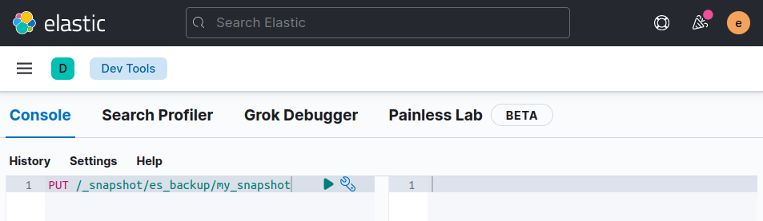

## Installation of Elasticsearch Logtash and Kibana 

 **Requirements**

- Docker 17.05 or higher

- Docker-Compose 3 or higher

- 4GB RAM (For Windows and MacOS make sure Docker's VM has more than 4GB+ memory.)


1. Clone the Repository

   ```
   $ git clone https://github.com/sherifabdlnaby/elastdocker.git
   ```

2. Initialize Elasticsearch Keystore and TLS Self-Signed Certificates

   ```
   $ cd elastdocker
   $ make setup
   ```

   Note:

   For Linux's docker hosts only. By default virtual memory is not enough so run 	the next command as root sysctl -w vm.max_map_count=262144

3. Start Elastic Stack

   ```
   $ make elk  
   
   OR     
   
   $ docker-compose up -d
   ```

   

4. Visit Kibana at https://localhost:5601 or https://<your_ip>:5601

    - Default Username: elastic, Password: changeme


Note:
​Kibana is configured to use HTTPS, so you'll need to write https:// before localhost:5601 in the browser.

Modify .env file for your needs, most importantly ELASTIC_PASSWORD that setup your superuser elastic's password.


## Create ELK Snapshot

1. Create a local directory inside elastic_elasticsearch_1 container  to store the Snapshot.

Edit the docker-compose configuration file named: docker-compose.yml

Add the following:

      es_backup:   
      es_backup:/usr/share/elasticsearch/es_backup  

Like this

```
version: '3.5'

# To Join any other app setup using another network, change name and set external = true
networks:
  default:
    name: elastic
    external: false

# will contain all elasticsearch data.
volumes:
  elasticsearch-data:
  es_backup:        

secrets:
  elasticsearch.keystore:
    file: ./secrets/keystore/elasticsearch.keystore
  elastic.ca:
    file: ./secrets/certs/ca/ca.crt
  elasticsearch.certificate:
    file: ./secrets/certs/elasticsearch/elasticsearch.crt
  elasticsearch.key:
    file: ./secrets/certs/elasticsearch/elasticsearch.key
  kibana.certificate:
    file: ./secrets/certs/kibana/kibana.crt
  kibana.key:
    file: ./secrets/certs/kibana/kibana.key

services:
  elasticsearch:
    image: docker.elastic.co/elasticsearch/elasticsearch:${ELK_VERSION}
    restart: unless-stopped
    environment:
      ELASTIC_USERNAME: ${ELASTIC_USERNAME}
      ELASTIC_PASSWORD: ${ELASTIC_PASSWORD}
      ELASTIC_CLUSTER_NAME: ${ELASTIC_CLUSTER_NAME}
      ELASTIC_NODE_NAME: ${ELASTIC_NODE_NAME}
      ELASTIC_INIT_MASTER_NODE: ${ELASTIC_INIT_MASTER_NODE}
      ELASTIC_DISCOVERY_SEEDS: ${ELASTIC_DISCOVERY_SEEDS}
      ES_JAVA_OPTS: "-Xmx${ELASTICSEARCH_HEAP} -Xms${ELASTICSEARCH_HEAP} -Des.enforce.bootstrap.checks=true -Dlog4j2.formatMsgNoLookups=true"
      bootstrap.memory_lock: "true"
    volumes:
      - elasticsearch-data:/usr/share/elasticsearch/data
      - es_backup:/usr/share/elasticsearch/es_backup  
      - ./elasticsearch/config/elasticsearch.yml:/usr/share/elasticsearch/config/elasticsearch.yml
      - ./elasticsearch/config/log4j2.properties:/usr/share/elasticsearch/config/log4j2.properties
    secrets:
      - source: elasticsearch.keystore
        target: /usr/share/elasticsearch/config/elasticsearch.keystore
      - source: elastic.ca
        target: /usr/share/elasticsearch/config/certs/ca.crt
      - source: elasticsearch.certificate
        target: /usr/share/elasticsearch/config/certs/elasticsearch.crt
      - source: elasticsearch.key
        target: /usr/share/elasticsearch/config/certs/elasticsearch.key
```

2. Change the ownership of the es_backup.

Access elasticsearch terminal

```
docker exec -it elastic_elasticsearch_1 bash
```

Change the ownership

```
chown -R elasticsearch:elasticsearch es_backup
```

3. Edit the Elasticsearch configuration file named: elasticsearch.yml

```
vi elasticsearch/config/elasticsearch.yml
```

Add the following line at the end of the file.

```
path.repo: ["/usr/share/elasticsearch/es_backup"]
```

Stop and start ELK containers

```
$ docker-compose down

$ docker-compose up -d 
```

4. Register a new Snapshot repository

Open Kibana goto Management > Stack Management > Snapshot and Restore > Repositories > Register repository


5. Create snapshot of all the indices

Open Kibana goto Management > Dev Tools

```
PUT /_snapshot/es_backup/my_snapshot
```

- In our example, we created a snapshot named: my_snapshot.
- In our example, we stored this snapshot inside the repository named: es_backup 



Check the snapshot is created.

Open Kibana goto Management > Stack Management > Snapshot and Restore > Snapshots


## Restore ELK Snapshot

1. Copy repository folder in elastic_elasticsearch_1 container

```
docker cp -a es_backup/. elastic_elasticsearch_1:/usr/share/elasticsearch/es_backup/
```

2. Register a new Snapshot repository

Open Kibana goto Management > Stack Management > Snapshot and Restore > Repositories  and click Register repository


3. Restore the snapshot

Open Kibana goto Management > Stack Management > Snapshot and Restore and click restore


