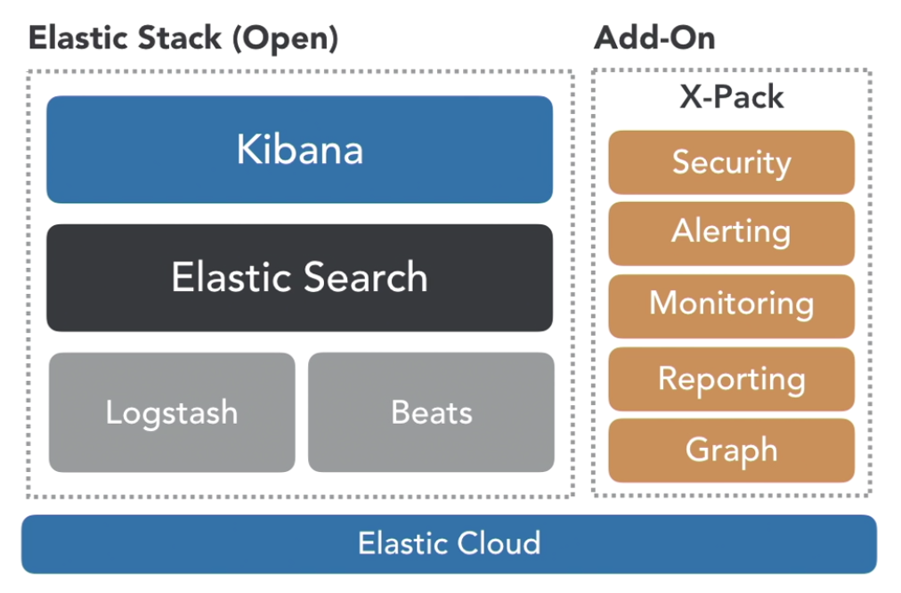

## ELK


### Elastic Stack Overview




#### 4 Key Advantages of Elastic Stack

* Scalability

* Near Real-Time 

* NoSQL/Schemaless (Speed of ingesting data)

* Advance Query Languange

  

#### ELastic Stack Use Cases

* Security/log analytics
* Marketing (from web logs)
* Operations 
* Search


#### Elasticsearch Concept

**Node**
It refers to a single running instance of Elasticsearch. Single  physical and virtual server accommodates multiple nodes depending upon  the capabilities of their physical resources like RAM, storage and  processing power.

**Cluster**
It is a collection of one or more nodes. Cluster provides collective  indexing and search capabilities across all the nodes for entire data.

### Index
It is a collection of different type of documents and their  properties. Index also uses the concept of shards to improve the  performance. For example, a set of document contains data of a social  networking application.

**Document**
It is a collection of fields in a specific manner defined in JSON  format. Every document belongs to a type and resides inside an index.  Every document is associated with a unique identifier called the UID.

**Shard**
Indexes are horizontally subdivided into shards. This means each  shard contains all the properties of document but contains less number  of JSON objects than index. The horizontal separation makes shard an  independent node, which can be store in any node. Primary shard is the  original horizontal part of an index and then these primary shards are  replicated into replica shards.

**Replicas**
Elasticsearch allows a user to create replicas of their indexes and  shards. Replication not only helps in increasing the availability of  data in case of failure, but also improves the performance of searching  by carrying out a parallel search operation in these replicas.

#### Comparison between Elasticsearch and RDBMS

| Elasticsearch | RDBMS    |
| ------------- | -------- |
| Cluster       | Database |
| Shard         | Shard    |
| Index         | Table    |
| Field         | Column   |
| Document      | Row      |


| <REST Verb> | <Index> | <Type> | <ID> |
| ----------- | ------- | ------ | ---- |
| PUT         | sales   | order  | 123  |
| GET         | sales   | order  | 123  |
| DELETE      | sales   |        |      |


#### REST API

* Cluster health
* Admin functions
* CRUD (Create, Read, Update, Delete) operations
* Advances search capability


#### Exercise:

**Overall Cluster Health**
GET /_cat/health?v

**Node Health**
GET /_cat/nodes?v

**List Indices**
GET /_cat/indices?v

**Create 'sales' Index**
PUT /sales

**Add 'order' to 'sales' index**
PUT /sales/order/123
{
  "orderID":"123",
  "orderAmount":"500"
}

**Retrieve document**
GET /sales/order/123

**Delete index**
DELETE /sales

**List indices**
GET /_cat/indices?v


#### Bulk API

* /_bulk
* new-line JSON
* Index, Create, Delete, Update
* --data-binary

#### Exercise:

**Create File with Requests (make sure to include new line at end of file)**
```
$ vi reqs
# insert the following lines:
{ "index" : { "_index" : "my-test", "_type" : "my-type", "_id" : "1" } }
{ "col1" : "val1"}
{ "index" : { "_index" : "my-test", "_type" : "my-type", "_id" : "2" } }
{ "col1" : "val2"}
{ "index" : { "_index" : "my-test", "_type" : "my-type", "_id" : "1" } }
{ "col1" : "val3" }
```

**Load from CURL**

```
$ curl -s -H "Content-Type: application/x-ndjson" -XPOST localhost:9200/_bulk --data-binary "@reqs"; echo
```
```
curl -H "Content-Type: application/json" -XPOST "localhost:9200/bank/_bulk?pretty&refresh" --data-binary "@accounts.json"
```


**Check in Kibana console**

```
GET /my-test
GET /my-test/my-type/1
```

**Load from Kibana Console**

```
POST _bulk
{ "index" : { "_index" : "my-test-console", "_type" : "my-type", "_id" : "1" } }
{ "col1" : "val1" }
{ "index" : { "_index" : "my-test-console", "_type" : "my-type", "_id" : "2" } }
{ "col1" : "val2"}
{ "index" : { "_index" : "my-test-console", "_type" : "my-type", "_id" : "3" } }
{ "col1" : "val3" }
```


#### Start Searching

**Retrieves all documents in the `bank` index sorted by account number**

```
GET bank/_search
{
  "query": { "match_all": {}}
  , "sort": [
    {
      "account_number": {
        "order": "desc"
      }
    }
  ]
}
```


**Request gets hits 10 through 19**

```
GET /bank/_search
{
  "query": { "match_all": {}}
  , "sort": [
    {
      "account_number": {
        "order": "asc"
      }
    }
  ],
  "from": 10,
  "size": 10
}
```


**Request searches the `address` field to find customers whose addresses contain `mill` or `lane`**

```
GET /bank/_search
{
  "query": {"match": { "address": "mill lane" }}
}
```


**Request only matches addresses that contain the phrase mill lane**

```
GET bank/_search
{
  "query": { "match_phrase": { "address": "mill lane" }}
}
```


**Searches the `bank` index for accounts that belong to customers who are 40 years old, but excludes anyone who lives in Idaho (ID)**

```
GET bank/_search
{
  "query": { "bool": { "must": [
    { "match": {
      "age": "40"
    }}
  ], "must_not": [
    { "match": {
      "state": "ID"
    }}
  ]}}
}
```


**Request uses a range filter to limit the results to accounts with a balance between $20,000 and $30,000 (inclusive)**

```
GET /bank/_search
{
  "query": {
    "bool": {
      "must": [
        { "match_all": {}}
      ]
      , "filter": [
        { "range": {
          "balance": {
            "gte": 20000,
            "lte": 30000
          }
        }}
      ]
    }
  }
}
```


### Analyze results with aggregations


**Retrieves all documents in the bank index sorted by account number:**

```
GET /bank/_search
{
  "query": { "match_all": {} },
  "sort": [
    { "account_number": "asc" }
  ]
```

**Find CA accounts only**

```
GET bank/_search
{
  "query": {
    "match": {
      "state": "CA"
    }
  }
}
```


**Find "Techade" accounts in CA only**

```
GET bank/_search
{
  "query": {
    "bool": {
      "must": [
        {"match": {
          "state": "CA"
        }},
        { "match": {
          "employer": "Techade"
        }}
      ]
    }
  }
}

```


**Find non "Techade" accounts outside of CA**

```
GET bank/_search
{
  "query": {
    "bool": {
      "must_not": [
        {"match": {
          "state": "CA"
        }},
        { "match": {
          "employer": "Techade"
        }}
      ]
    }
  }
}
```


**Boost results for Smith**

```
GET bank/_search
{
  "query": {
    "bool": {
      "should": [
        { "match": { "state": "CA" }},
        { "match": { "lastname": {"query": "Smith", "boost": 3}}}
        
      ]
    }
  }
}
```


###  Term Query

```
GET bank/account/_search
{
  "query": {
    "term": {
      "account_number": 516
    }
  }
}
```


**Returns null because "state" is a text field (hence not an exact match)**

```
GET bank/account/_search
{
  "query": {
    "term": {
      "state": "RI"
    }
  }
}
```


**This works because it uses the "analysis" process**

```
GET bank/account/_search
{
  "query": {
    "match": {
      "state": "RI"
    }
  }
}
```


**Terms can return multiple results**

```
GET bank/account/_search
{
"query": {
    "terms": {
      "account_number": [516,851]
    }
  }
}
```


### Range Queries
* gte = Greater-than or equal to
* gt = Greater-than
* lte = Less-than or equal to
*  lt = Less-than

**Show all accounts between 516 and 851, boosting the importance**
```
GET bank/account/_search
{
  "query": {
    "range": {PUT /idx1
{
  "mappings": {
    "t1": {
      "properties": {
        "title": {
            "type": "text",
            "analyzer" : "standard"
        },
        "english_title": {
            "type":     "text",
            "analyzer": "english"
        }
      }
    }
  }
}
      "account_number": {
        "gte": 516,
        "lte": 851,
        "boost": 2
      }
    }
  }
}
```

**Show all account holders older than 35**
```
GET bank/account/_search
{
  "query": {
    "range": {
      "age": {
        "gt": 35
      }
    }
  }
}
```

**Basic Example**
```
GET bank/_analyze
{
  "tokenizer" : "standard",
  "text" : "The Moon is Made of Cheese Some Say"
}
```

**Mixed String**
```
GET bank/_analyze
{
  "tokenizer" : "standard",
  "text" : "The Moon-is-Made of Cheese.Some Say$"
}
```

**Use the letter tokenizer**

```
GET bank/_analyze
{
  "tokenizer" : "letter",
  "text" : "The Moon-is-Made of Cheese.Some Say$"
}
```

**How about a URL**
```
GET bank/_analyze
{
  "tokenizer": "standard",
  "text": "you@example.com login at https://bensullins.com attempt"
}
```

**Parse URL and email** 

```
GET bank/_analyze
{
  "tokenizer": "uax_url_email",
  "text": "you@example.com login at https://bensullins.com attempt"
}
```

### Analyze results with aggregations

For example, the following request uses a `terms` aggregation to group all of the accounts in the `bank` index by state, and returns the ten states with the most accounts in descending order:

```
GET /bank/_search
{
  "size": 0,
  "aggs": {
    "group_by_state": {
      "terms": {
        "field": "state.keyword"
      }
    }
  }
}
```

You can combine aggregations to build more complex summaries of your data. For example, the following request nests an `avg` aggregation within the previous `group_by_state` aggregation to calculate the average account balances for each state.

```
GET /bank/_search
{
  "size": 0,
  "aggs": {
    "group_by_state": {
      "terms": {
        "field": "state.keyword"
      },
  "aggs": {
    "average_balance": {
      "avg": {
        "field": "balance"
        }
      }
     }    
   }
  }
}
```

Instead of sorting the results by count, you could sort using the result of the nested aggregation by specifying the order within the `terms` aggregation:

```
GET /bank/_search
{
  "size": 0,
  "aggs": {
    "group_by_state": {
      "terms": {
        "field": "state.keyword",
        "order": {
          "average_balance": "desc"
        }
      },
  "aggs": {
    "average_balance": {
      "avg": {
        "field": "balance"
        }
      }
     }    
   }
  }
}
```


### Field datatypes

Elasticsearch supports a number of different datatypes for the fields in a document:

#### Core datatypes

- string

  [`text`](https://www.elastic.co/guide/en/elasticsearch/reference/6.8/text.html) and [`keyword`](https://www.elastic.co/guide/en/elasticsearch/reference/6.8/keyword.html)

- [Numeric datatypes](https://www.elastic.co/guide/en/elasticsearch/reference/6.8/number.html)

  `long`, `integer`, `short`, `byte`, `double`, `float`, `half_float`, `scaled_float`

- [Date datatype](https://www.elastic.co/guide/en/elasticsearch/reference/6.8/date.html)

  `date`

- [Boolean datatype](https://www.elastic.co/guide/en/elasticsearch/reference/6.8/boolean.html)

  `boolean`

- [Binary datatype](https://www.elastic.co/guide/en/elasticsearch/reference/6.8/binary.html)

  `binary`

- [Range datatypes](https://www.elastic.co/guide/en/elasticsearch/reference/6.8/range.html)

  `integer_range`, `float_range`, `long_range`, `double_range`, `date_range`, `ip_range`

#### Complex datatypes

- [Object datatype](https://www.elastic.co/guide/en/elasticsearch/reference/6.8/object.html)

  `object` for single JSON objects

- [Nested datatype](https://www.elastic.co/guide/en/elasticsearch/reference/6.8/nested.html)

  `nested` for arrays of JSON objects

#### Geo datatypes

- [Geo-point datatype](https://www.elastic.co/guide/en/elasticsearch/reference/6.8/geo-point.html)

  `geo_point` for lat/lon points

- [Geo-Shape datatype](https://www.elastic.co/guide/en/elasticsearch/reference/6.8/geo-shape.html)

  `geo_shape` for complex shapes like polygons

#### Specialised datatypes

- [IP datatype](https://www.elastic.co/guide/en/elasticsearch/reference/6.8/ip.html)

  `ip` for IPv4 and IPv6 addresses

- [Completion datatype](https://www.elastic.co/guide/en/elasticsearch/reference/6.8/search-suggesters-completion.html)

  `completion` to provide auto-complete suggestions

- [Token count datatype](https://www.elastic.co/guide/en/elasticsearch/reference/6.8/token-count.html)

  `token_count` to count the number of tokens in a string

- [`mapper-murmur3`](https://www.elastic.co/guide/en/elasticsearch/plugins/6.8/mapper-murmur3.html)

  `murmur3` to compute hashes of values at index-time and store them in the index

- [`mapper-annotated-text`](https://www.elastic.co/guide/en/elasticsearch/plugins/6.8/mapper-annotated-text.html)

  `annotated-text` to index text containing special markup (typically used for identifying named entities)

- [Percolator type](https://www.elastic.co/guide/en/elasticsearch/reference/6.8/percolator.html)

  Accepts queries from the query-dsl

- [`join` datatype](https://www.elastic.co/guide/en/elasticsearch/reference/6.8/parent-join.html)

  Defines parent/child relation for documents within the same index

- [Alias datatype](https://www.elastic.co/guide/en/elasticsearch/reference/6.8/alias.html)

  Defines an alias to an existing field.

#### Arrays

In Elasticsearch, arrays do not require a dedicated field datatype. Any field can contain zero or more values by default, however, all values in the array must be of the same datatype. See [Arrays](https://www.elastic.co/guide/en/elasticsearch/reference/6.8/array.html).

#### Multi-fields
It is often useful to index the same field in different ways for different purposes. For instance, a `string` field could be mapped as a `text` field for full-text search, and as a `keyword` field for sorting or aggregations.  Alternatively, you could index a text field with the [`standard` analyzer](https://www.elastic.co/guide/en/elasticsearch/reference/6.8/analysis-standard-analyzer.html), the [`english`](https://www.elastic.co/guide/en/elasticsearch/reference/6.8/analysis-lang-analyzer.html#english-analyzer) analyzer, and the [`french` analyzer](https://www.elastic.co/guide/en/elasticsearch/reference/6.8/analysis-lang-analyzer.html#french-analyzer).

This is the purpose of *multi-fields*.  Most datatypes support multi-fields via the [`fields`](https://www.elastic.co/guide/en/elasticsearch/reference/6.8/multi-fields.html) parameter.