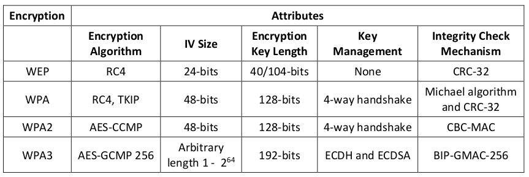

[TOC]

# Ethical Hacking Essentials

## Module 1 Information Security Fundamentals

### Elements of Information Security

**Confidentiality**

- Confidentiality is the assurance that the information is accessible only to authorized. Confidentiality breaches may occur due to improper data handling or a hacking attempt. Confidentiality controls include data classification, data encryption, and proper disposal of equipment (such as DVDs, USB drives, etc.).

**Integrity**

- Integrity is the trustworthiness of data or resources in the prevention of improper and unauthorized changes—the assurance that information is sufficiently accurate for its purpose. Measures to maintain data integrity may include a checksum (a number produced by a mathematical function to verify that a given block of data is not changed) and access control (which ensures that only authorized people can update, add, or delete
  

**Availability**

- Availability is the assurance that the systems responsible for delivering, storing, and processing information are accessible when required by authorized users. Measures to maintain data availability can include disk arrays for redundant systems and clustered machines, antivirus software to combat malware, and distributed denial-of-service (DDoS) prevention systems.

**Authenticity**

- Authenticity refers to the characteristic of communication, documents, or any data that ensures the quality of being genuine or uncorrupted. The major role of authentication is to confirm that a user is genuine. Controls such as biometrics, smart cards, and digital certificates ensure the authenticity of data, transactions, communications, and documents.

**Non-Repudiation**

- Non-repudiation is a way to guarantee that the sender of a message cannot later deny   having sent the message and that the recipient cannot deny having received the   message. Individuals and organizations use digital signatures to ensure non-repudiation.

### The level of security in any system can be defined by the strength of three components:
**Functionality**

- The set of features provided by the system.

**Usability**
- The GUI components used to design the system for ease of use.

**Security**
- Restrictions imposed on accessing the components of the system.

### Security Challenges

- Compliance to government laws and regulations
- Lack of qualified and skilled cybersecurity professionals
- Difficulty in centralizing security in a distributed computing environment
- Difficulty in overseeing end-to-end processes due to complex IT infrastructure
- Fragmented and complex privacy and data protection regulations
- Use of a serverless architecture and applications that rely on third-party cloud providers
- Compliance issues and issues with data removal and retrieval due to the implementation of Bring Your Own Device (BYOD) policies in companies
- Relocation of sensitive data from legacy data centers to the cloud without proper configuration
- Weak links in supply-chain management
- Increase in cybersecurity risks such as data loss and unpatched vulnerabilities and errors due to the usage of shadow IT
- Shortage of research visibility and training for IT employees

### Motives, Goals, and Objectives of Information Security Attacks

- Disrupting business continuity
- Stealing information and manipulating data
- Creating fear and chaos by disrupting critical infrastructures
- Causing financial loss to the target
- Damaging the reputation of the target

### Classification of Attacks

**Passive Attacks**

- Do not tamper with the data and involve intercepting and monitoring network traffic and data flow on the target network
- Examples
  - Footprinting
  - Sniffing and eavesdropping
  - Network traffic analysis
  - Decryption of weakly encrypted traffic

**Active Attacks**

- Tamper with the data in transit or disrupt the communication or services between the systems to bypass or break into secured systems
- Examples 
  - Denial-of-service (DoS) attack 
  - Bypassing protection mechanisms 
  - Malware attacks (such as viruses, worms, ransomware) 
  - Modification of information 
  - Spoofing attacks
  - Replay attacks
  - Password-based attacks
  - Session hijacking
  - Man-in-the-Middle attack
  - DNS and ARP poisoning
  - Privilege escalation
  - Cryptography attacks
  - SQL injection
  - XSS attacks
  - Directory traversal attacks
  - Exploitation of application and OS software
  - Compromised-key attack

**Close-in Attacks**

- Are performed when the attacker is in close physical proximity with the target system or network in order to gather, modify, or disrupt access to information
- Examples
  - social engineering such as eavesdropping, shoulder surfing, and dumpster diving

**Insider Attacks**

- Involve using privileged access to violate rules or intentionally cause a threat to the organization’s information or information systems
- Examples 
  - Eavesdropping and wiretapping
  - Theft of physical devices
  - Social engineering
  - Data theft and spoliation
  - Pod slurping
  - Planting keyloggers, backdoors, or malware

**Distribution Attacks**

- Occur when attackers tamper with hardware or software prior to installation
- Attackers tamper with the hardware or software at its source or in transit

### Information Security Attack Vectors

**Cloud Computing Threats**

- Cloud computing is an on-demand delivery of IT capabilities where sensitive data of organizations, and their clients is stored. Flaw in one client’s application cloud allow attackers to access other client’s data

**Advanced Persistent Threats (APT)**

- An attack that is focused on stealing information from the victim machine without the user
  being aware of it

**Viruses and Worms**

- The most prevalent networking threat that are capable of infecting a network within seconds

## Module 02 Ethical Hacking Fundamentals

### Cyber Kill Chain Methodology

**Reconnaissance**

- Gather data on the target to probe for weak points

- Activities of the adversary include the following:
  - Gathering information about the target organization by searching the Internet or through social engineering
  - Performing analysis of various online activities and publicly available information
  - Gathering information from social networking sites and web services
  - Obtaining information about websites visited
  - Monitoring and analyzing the target organization’s website
  - Performing Whois, DNS, and network footprinting
  - Performing scanning to identify open ports and services

**Weaponization**

- Create a deliverable malicious payload using an exploit and a backdoor
- The following are the activities of the adversary:
  - Identifying appropriate malware payload based on the analysis
  - Creating a new malware payload or selecting, reusing, modifying the available malware payloads based on the identified vulnerability
  - Creating a phishing email campaign
  - Leveraging exploit kits and botnets

**Delivery**

- Send weaponized bundle to the victim using email, USB, etc.

- The following are the activities of the adversary:
  - Sending phishing emails to employees of the target organization
  - Distributing USB drives containing malicious payload to employees of the target organization
  - Performing attacks such as watering hole on the compromised website
  - Implementing various hacking tools against the operating systems, applications, and servers of the target organization

**Exploitation**

- Exploit a vulnerability by executing code on the victim’s system

- Activities of the adversary include the following:
  - Exploiting software or hardware vulnerabilities to gain remote access to the target system

**Installation**

- Install malware on the target system
- The following are the activities of the adversary:
  - Downloading and installing malicious software such as backdoors
  - Gaining remote access to the target system
  - Leveraging various methods to keep backdoor hidden and running
  - Maintaining access to the target system

**Command and Control**

- Create a command and control channel to communicate and pass data back and forth

- The following are the activities of the adversary:
  - Establishing a two-way communication channel between the victim’s system and the adversary-controlled server
  - Leveraging channels such as web traffic, email communication, and DNS messages
  - Applying privilege escalation techniques
  - Hiding any evidence of compromise using techniques such as encryption

**Actions on Objectives**

- Perform actions to achieve intended objectives/goals

  

## Module 08 Wireless Attack and Countermeasures

### Wireless Terminology

**Global System for Mobile Communications (GSM)**

- It is a universal system used for mobile data transmission in wireless networks worldwide.

**Bandwidth**

- It describes the amount of information that may be broadcast over a connection. Usually, bandwidth refers to the data transfer rate and is measured in bits (amount of data) per second (bps).

**Access point (AP)**

An AP is used to connect wireless devices to a wireless/wired network. It allows wireless communication devices to connect to a wireless network through wireless standards such as Bluetooth and Wi-Fi. It serves as a switch or hub between a wired LAN and wireless network.

**Basic service set identifier (BSSID)**

It is the media access control (MAC) address of an  access point (AP) or base station that has set up a basic service set (BSS). Generally,   users are unaware of the BSS to which they belong. When a user moves a device, the   BSS used by the device could change because of a variation in the range covered by the
AP, but this change may not affect the connectivity of the wireless device.

**Industrial, scientific, and medical (ISM) band**: This band is a set of frequencies used by the international industrial, scientific, and medical communities.

**Hotspot**

These are places where wireless networks are available for public use. Hotspots refer to areas with Wi-Fi availability, where users can enable Wi-Fi on their devices and connect to the Internet.

**Association**

It refers to the process of connecting a wireless device to an AP. 

**Service set identifier (SSID)** 

An SSID is a 32-alphanumeric-character unique identifier given to a wireless local area network (WLAN) that acts as a wireless identifier of the network. The SSID permits connections to the desired network among available independent networks. Devices connecting to the same WLAN should use the same SSID to establish connections.

**Orthogonal frequency-division multiplexing (OFDM)**

An OFDM is a method of digital modulation of data in which a signal, at a chosen frequency, is split into multiple carrier frequencies that are orthogonal (occurring at right angles) to each other. OFDM maps
information on the changes in the carrier phase, frequency, amplitude, or a combination of these and shares bandwidth with other independent channels. It produces a transmission scheme that supports higher bit rates than parallel channel operation. It is also a method of encoding digital data on multiple carrier frequencies.

**Multiple input, multiple output-orthogonal frequency-division multiplexing (MIMO-OFDM)**

MIMO-OFDM influences the spectral efficiency of 4G and 5G wireless communication services. Adopting the MIMO-OFDM technique reduces interference and increases the channel robustness.

**Direct-sequence spread spectrum (DSSS)**

DSSS is a spread spectrum technique that multiplies the original data signal with a pseudo-random noise-spreading code. Also referred to as a data transmission scheme or modulation scheme, the technique   protects signals against interference or jamming.

**Frequency-hopping spread spectrum (FHSS)**

FHSS, also known as frequency-hopping code-division multiple access (FH-CDMA), is a method of transmitting radio signals by rapidly switching a carrier among many frequency channels. It decreases the efficiency of unauthorized interception or jamming of telecommunications. In FHSS, a transmitter hops between available frequencies using a specified algorithm in a pseudorandom sequence known to both the sender and receiver.

### Wireless Networks

- Wireless network (Wi-Fi) refers to WLANs based on **IEEE 802.11 standard**, which allows the device to
  access the network from anywhere within an **AP range**
- Devices, such as a personal computer, video-game console, and smartphone, use Wi-Fi to connect to
  a **network resource**, such as the Internet, via a **wireless network AP**

**The following are some of the advantages and disadvantages of wireless networks:**

**Advantages**

- Installation is fast and easy without the need for wiring through walls and ceilings

- Easily provides connectivity in areas where it is difficult to lay cables

- The network can be accessed from anywhere within the range of an AP

- Public spaces such as airports, libraries, schools, and even coffee shops offer constant Internet connections through WLANs

**Disadvantages**

- Security may not meet expectations
- The bandwidth suffers as the number of devices in the network increases
- Wi-Fi upgrades may require new wireless cards and/or APs
- Some electronic equipment can interfere with Wi-Fi networks

### Types of Wireless Networks

**1. Extension to a Wired Network**
A user can extend a wired network by placing APs between a wired network and wireless devices. A wireless network can also be created using an AP.

**The types of APs include the following:**

**Software APs (SAPs)**: SAPs can be connected to a wired network, and they run on a computer equipped with a wireless network interface card (NIC). 

**Hardware APs (HAPs)** : HAPs support most wireless features. 

In this type of network, the AP acts as a switch, providing connectivity for computers that use a wireless NIC. The AP can connect wireless clients to a wired LAN, which allows wireless access to LAN resources such as file servers and Internet connections.

**2. Multiple Access Points**

This type of network connects computers wirelessly using multiple APs. If a single AP cannot cover an area, multiple APs or extension points can be established.

**3. LAN-to-LAN Wireless Network**
APs provide wireless connectivity to local computers, and local computers on different networks can be interconnected. All hardware APs have the capability to interconnect with other hardware APs. However, interconnecting LANs over wireless connections is a complex task.

**4. 3G/4G Hotspot**
A 3G/4G hotspot is a type of wireless network that provides Wi-Fi access to Wi-Fi-enabled devices, including MP3 players, notebooks, tablets, cameras, PDAs, netbooks, and more

### Wireless Standards

### Different Types of Wireless Encryption

**802.11i**: It is an IEEE amendment that specifies security mechanisms for 802.11 wireless networks.
**WEP**: WEP is an encryption algorithm for IEEE 802.11 wireless networks. It is an old wireless security standard and can be cracked easily.
**EAP**: The Extensible Authentication Protocol (EAP) supports multiple authentication methods, such as token cards, Kerberos, and certificates.
**LEAP**: Lightweight EAP (LEAP) is a proprietary version of EAP developed by Cisco.
**WPA**: It is an advanced wireless encryption protocol using TKIP and Message Integrity Check (MIC) to provide strong encryption and authentication. It uses a 48-bit initialization vector (IV), 32-bit cyclic redundancy check (CRC), and TKIP encryption for wireless security.
**TKIP**: It is a security protocol used in WPA as a replacement for WEP.
**WPA2**: It is an upgrade to WPA using AES and the Counter Mode Cipher Block Chaining Message Authentication Code Protocol (CCMP) for wireless data encryption.
**AES**: It is a symmetric-key encryption used in WPA2 as a replacement for TKIP.
**CCMP**: It is an encryption protocol used in WPA2 for strong encryption and authentication.
**WPA2 Enterprise**: It integrates EAP standards with WPA2 encryption.
**RADIUS**: It is a centralized authentication and authorization management system.
**PEAP**: It is a protocol that encapsulates the EAP within an encrypted and authenticated Transport Layer Security (TLS) tunnel.
**WPA3**: It is a third-generation Wi-Fi security protocol that provides new features for personal and enterprise usage. It uses Galois/Counter Mode-256 (GCMP-256) for encryption and the 384-bit hash message authentication code with the Secure Hash Algorithm (HMAC-SHA-384) for authentication.

### Comparison of WEP, WPA, WPA2, and WPA3

### Wireless Network-Specific Attack Techniques

## Module 11 Cloud Computing Threats and Countermeasures

### Characteristics of Cloud Computing

**On-demand self-service**: A type of service rendered by cloud service providers that allow provisions for cloud resources, such as computing power, storage, and network, always on-demand, without the need for human interaction with the service providers.

**Distributed storage**: Distributed storage in the cloud offers better scalability, availability, and reliability of data. However, cloud distributed storage can potentially raise security and compliance concerns.

**Rapid elasticity**: The cloud offers instant provisioning of capabilities to rapidly scale up or down, according to demand. To the consumers, the resources available for provisioning seem to be unlimited and can be purchased in any quantity at any point of time.

**Automated management**: By minimizing user involvement, cloud automation speeds up the process and reduces labor costs and the possibility of human error.

**Broad network access**: Cloud resources are available over the network and accessed through standard procedures via a wide variety of platforms, including laptops, mobile phones, and personal digital assistants (PDAs).

**Resource pooling**: The cloud service provider pools all the resources together to serve multiple customers in the multi-tenant environment, with physical and virtual resources dynamically assigned and reassigned on demand by the consumer of the cloud.

**Measured service**: Cloud systems employ the “pay-per-use” metering method. Subscribers pay for cloud services by monthly subscription or according to the usage of resources such as storage levels, processing power, and bandwidth. Cloud service providers monitor, control, report, and charge consumption of resources by customers with complete transparency.

**Virtualization technology**: Virtualization technology in the cloud enables the rapid scaling of resources in a way that non-virtualized environments cannot achieve.

### Limitations of Cloud Computing

- Limited control and flexibility of organizations
- Proneness to outages and other technical issues
- Security, privacy, and compliance issues
- Contracts and lock-ins
- Dependence on network connections
- Potential vulnerability to attacks as every component is online
- Difficulty in migrating from one service provider to another

### Types of Cloud Computing Services

**Infrastructure-as-a-Service (IaaS)**

- Provides virtual machines and other abstracted hardware and operating systems which may be controlled through a service API
- E.g., Amazon EC2, Microsoft OneDrive, or Rackspace

**Platform-as-a-Service (PaaS)**

- Offers development tools, configuration management, and deployment platforms on-demand that
  can be used by subscribers to develop custom applications
  
- E.g., Google App Engine, Salesforce, or Microsoft Azure

**Software-as-a-Service (SaaS)**

- Offers software to subscribers on-demand over the Internet
- E.g., web-based office applications like Google Docs or Calendar, Salesforce CRM, or Freshbooks

**Identity-as-a-Service (IDaaS)**

- Offers IAM services including SSO, MFA, IGA, and intelligence collection
- E.g., OneLogin, Centrify Identity Service, Microsoft Azure Active Directory, or Okta

**Container-as-a-Service (CaaS)**

- Offers virtualization of container engines, and management of containers, applications, and
  clusters, through a web portal or API

- E.g., Amazon AWS EC2, or Google Kubernetes Engine (GKE)

**Security-as-a-Service (SECaaS)**

- Provides penetration testing, authentication, intrusion detection, anti-malware, security incident, and event management services 
- E.g., eSentire MDR, Switchfast Technologies, OneNeck IT Solutions, or McAfee Managed
  Security Services

**Function-as-a-Service (FaaS)**

- Provides a platform for developing, running, and managing application functionalities for microservices 
- E.g., AWS Lambda, Google Cloud Functions, Microsoft Azure Functions, or Oracle Cloud Fn

### Cloud Deployment Models

**Public Cloud**

- services are rendered over a network that is open for public use

**Private Cloud**

- Cloud infrastructure is operated for a single organization only

**Community Cloud**

- Shared infrastructure between several organizations from a specific community with common concerns (security, compliance, jurisdiction, etc.)

**Hybrid Cloud**

- Combination of two or more clouds (private, community, or public) that remain unique entities but are bound together, thereby offering the benefits of multiple deployment models

**Multi Cloud**

- Dynamic heterogeneous environment that combines workloads across multiple cloud vendors, managed via one proprietary interface to achieve long term business goals

### NIST Cloud Deployment Reference Architecture

NIST cloud computing reference architecture defines five major actors:

**Cloud Consumer**
A person or organization that uses **cloud computing services**

**Cloud Provider**
A person or organization providing services to interested parties

**Cloud Carrier**
An intermediary for **providing connectivity** and **transport services** between cloud consumers and providers

**Cloud Auditor**
A party for making **independent assessments of cloud service controls** and taking an opinion thereon

**Cloud Broker**
An entity that **manages cloud services** in terms of use, performance, and delivery, and maintains the
relationship between cloud providers and consumers

### Cloud Storage Architecture

- Cloud storage is a data storage medium used to store digital data in logical pools using a network
- The cloud storage architecture consists of three main layers namely, front-end, middleware, and
  back-end
- The **Front-end layer** is accessed by the **end user** where it provides APIs for the management of
  data storage
- The **Middleware** layer performs several **functions** such as data de-duplication and replication of
  data

- The **Back-end layer** is where the hardware is implemented

### What is a Container?

- A container is a package of an application/software including all its dependencies such as library files, configuration files, binaries, and other resources that run independently of other processes in the cloud environment
- CaaS is a service that includes the virtualization of containers and container management through orchestrators

### Container Technology Architecture

- **Tier-1: Developer machines** - image creation, testing and accreditation
- **Tier-2: Testing and accreditation systems** - verification and validation of image contents, signing images and sending them to the registries
- **Tier-3: Registries** - storing images and disseminating images to the orchestrators based on requests
- **Tier-4: Orchestrators** - transforming images into containers and deploying containers to hosts
- **Tier-5: Hosts** - operating and managing containers as instructed by the orchestrator

### Containers Vs. Virtual Machines

- Virtualization is the ability to **run multiple operating systems on a single physical system** and share the underlying resources such as a server, storage device, or network
- Containers are placed on the top of one physical server and host operating system, and **share the operating system’s kernel binaries and libraries,** thereby reducing the need for reproducing the OS

### What is Docker?

- Docker is an open source technology used for developing, packaging, and running applications and all its dependencies in the form of containers, to ensure that the application works in a seamless environment\
- Docker provides a Platform-as-a-Service (PaaS) through **OS-level virtualization** and delivers containerized software package

### Docker Architecture

**Docker Daemon**: The Docker daemon ( dockerd ) processes the API requests and handles various Docker objects, such as containers, volumes, images, and networks.

**Docker Client**: It is the primary interface through which users communicate with Docker. When commands such as docker run are initiated, the client passes related commands to dockerd , which then executes them. Docker commands use the Docker API for communication.

**Docker Registries**: Docker registries are locations where images are stored and pulled, and can be either private or public. Docker Cloud and Docker Hub are two popular public registries. Docker Hub is a predefined location of Docker images, which can be used by all users.

**Docker Objects**: Docker objects are used to assemble an application. The most important Docker objects are as follows:

- **Images**: Images are used to store and deploy containers. They are read-only binary templates with instructions for container creation.
- **Containers**: Application resources run inside the containers. A container is a runnable instance of an application image. Docker CLI or API is used to create, launch, stop, and destroy these containers.
- **Services**: Services enable users to extend the number of containers across daemons, and together they serve as a swarm with several managers and workers. Each swarm member is a daemon, and all these daemons can interact with each other using Docker API.
- **Networking**: It is a channel through which all isolated containers communicate.
- **Volumes**: It is a storage where persisting data created by Docker and used by Docker containers are stored.

### Microservices Vs. Docker

- Monolithic applications are broken down into cloud-hosted sub-applications called microservices that work together, each performing a unique task
- As each microservice is packaged into the Docker container along with the required libraries, frameworks, and configuration files, microservices belonging to a single application can be developed and managed using multiple platforms

### Docker Networking

- Docker connects multiple containers and services or other non-Docker workloads together 
- The Docker networking architecture is developed on a set of interfaces known as the Container Network Model (CNM)
- The CNM provides application portability across heterogeneous infrastructures

The CNM includes multiple high-level constructs as discussed below:

**Sandbox**: Sandbox comprises the container network stack configuration for the management of container interfaces, routing tables, and domain name system (DNS) settings.

**Endpoint**: To maintain application portability, an endpoint is connected to a network and is abstracted away from the application, so that services can implement different network drivers.

**Network**: A network is an interconnected collection of endpoints. Endpoints that do not have network connection cannot communicate over the network.

### What is Kubernetes?

- Kubernetes, also known as K8s, is an open-source, portable, extensible, orchestration platform developed by Google for managing containerized applications and microservices

- Kubernetes provides a resilient framework for managing distributed containers, generating deployment patterns, and performing failover and redundancy for the applications

**Kubernetes Features:**

- **Service discovery**: Kubernetes allows a service to be discovered via a DNS name or IP address
- **Load balancing**: When a container receives heavy traffic, Kubernetes automatically distributes the traffic to other containers and performs load balancing.
- **Storage orchestration**: Kubernetes allows developers to mount their own storage capabilities, such as local and public cloud storage.
- **Automated rollouts and rollbacks**: Kubernetes automates the process of creating new containers, destroying existing containers, and moving all resources from one container to another.
- **Automatic bin packing**: Kubernetes can manage a cluster of nodes that run containerized applications. If you specify the resources needed to run the container, such as processing power and memory, Kubernetes can automatically allocate and deallocate resources to the containers.

- **Self-healing**: Kubernetes automatically performs a health check of the containers, replaces the failed containers with new containers, destroys failed containers, and avoids advertising unavailable containers to clients.
- **Secret and configuration management**: Kubernetes allows users to store and manage sensitive information such as credentials, secure shell (SSH) keys, and OAuth tokens. Application configuration and sensitive information can be deployed and updated without the need to rebuild the container images.

### Kubernetes Cluster Architecture

**Master Components**: The components of the master node provide a cluster control panel and perform various activities, such as scheduling, detecting, and handling cluster events. These master components can be executed by any computer in the cluster.

- **Kube-apiserver**: The API server is an integral part of the Kubernetes control panel that responds to all API requests. It serves as a front-end utility for the control panel and it is the only component that interacts with the etcd cluster and ensures data storage.
- **Etcd cluster**: It is a distributed and consistent key-value storage where Kubernetes cluster data, service discovery details, API objects, etc. are stored.
- **Kube-scheduler**: Kube-scheduler is a master component that scans newly generated pods and allocates a node for them. It assigns the nodes based on factors such as the overall resource requirement, data locality, software/hardware/policy restrictions, and internal workload interventions.
- **Kube-controller-manager**: Kube-controller-manager is a master component that runs controllers. Controllers are generally individual processes (e.g., node controller, endpoint controller, replication controller, service account and token controller) but are combined into a single binary and run together in a single process to reduce complexity.
- **cloud-controller-manager**: This is the master component used to run controllers that communicate with cloud providers. Cloud-controller-manager enables the Kubernetes code and cloud provider code to evolve separately.

**Node components**: Node or worker components run on each node in the cluster, managing working pods and supplying the Kubernetes runtime services.

- Kubelet: Kubelet is an important service agent that runs on each node and ensures containers running in a pod. It also ensures pods and containers are healthy and running as expected. Kubelet does not handle containers that are not generated by Kubernetes.

- Kube-proxy: It is a network proxy service that also runs on every worker node. This service maintains the network rules that enable network connection to the pods.

- Container Runtime: Container runtime is a software designed to run the containers. Kurbernetes supports various container runtimes, such as Docker, rktlet, containerd, and cri-o.

  

### Kubernetes Vs. Docker

- Docker is open source software that can be installed on any host to build, deploy, and run containerized applications on a single operating system
- When Docker is installed on multiple hosts with different operating systems, you can use Kubernetes to manage these Docker hosts
- Kubernetes is a container orchestration platform that automates the process of creating, managing, updating, scaling, and destroying containers
- Kubernetes can be coupled with any containerization technology such as Docker, Rkt, RunC, and cri-o
- Both Dockers and Kubernetes are based on microservices architecture, and built using the Go programming language to deploy small, lightweight binaries, and YAML files for specifying application configurations and stacks

### Container Security Challenges

**Inflow of vulnerable source code**
Containers constitute an open-source platform used by developers to regularly update, store, and use images in a repository. This results in an enormous uncontrolled code that may include vulnerabilities, which can compromise security.

**Large attack surface**
The host OS consists of many containers, applications, VMs, and databases in the cloud or on-premises. A large attack surface implies a large number of vulnerabilities and an increased difficulty in detecting them.

**Lack of visibility**
A container engine runs the container, interfaces with the Linux kernel, and creates another layer of abstraction camouflaging the actions of the containers and making it difficult to track activities of specific containers or users.

**Compromising secrets**
Containers require sensitive information, such as API keys, usernames, or passwords, for accessing any services. Attackers who illicitly gain access to this sensitive information can compromise security.

**DevOps speed**
Containers can be executed promptly and, after execution, are stopped and removed. This fugitiveness helps attackers launch attacks and hide themselves without installing any malicious code.

**Noisy neighboring containers**
A container may consume and exhaust all available system resources, which directly affects the operation of other neighboring containers creating a denial-of-service (DoS) attack.

**Container breakout to the host**
Containers that runs as root may break the containment and gain access to the host OS through privilege escalation.

**Network-based attacks**
Attackers may exploit failed containers having active raw sockets and outbound network connections to launch various network-based attacks.

**Bypassing isolation**
Attackers, after compromising the security of a container, may escalate privileges to gain access to other containers or the host itself.

**Ecosystem complexity**
Containers are built, deployed, and managed using multiple vendors and sources. This makes it complex to secure and update the individual components because they originate from different repositories.

### Cloud Computing Threats and Countermeasures

**Cloud Attacks: Side-Channel Attacks or Cross-guest VM Breaches**

- The attacker compromises the cloud by placing a malicious virtual machine near to a target cloud server and then launches a side-channel attack
- In a side-channel attack, the attacker runs a virtual machine on the same physical host as the victim’s virtual machine and takes advantage of the shared physical resources (processor cache) to steal data (cryptographic keys) from the victim
- Side-channel attacks can be implemented by any co-resident user due to the vulnerabilities in shared technology resources

**Cloud Attacks: Wrapping Attack**

A wrapping attack is performed during the translation of the SOAP message in the TLS layer where attackers duplicate the body of the message and sends it to the server as a legitimate user

**Cloud Attacks: Man-in-the-Cloud (MITC) Attack**

1. MITC attacks are an advanced version of Man-in-the-middle (MITM) attacks
2. The attacker tricks the victim into installing a malicious code, which plants the attacker’s synchronization token on the victim’s drive
3. Then, the attacker steals the victim’s synchronization token and uses the stolen token to gain access to the victim’s files 
4. Later, the attacker restores the malicious token with the original synchronized token of the victim, thus
   returning the drive application to its original state and stays undetected

**Cloud Attacks: Cloud Hopper Attack**

- Cloud Hopper attacks are triggered at the managed service providers (MSPs) and their users
- Attackers initiate spear-phishing emails with custom-made malware to compromise the accounts of staff or cloud service firms to obtain confidential information

**Cloud Attacks: Cloud Cryptojacking**

- Cryptojacking is the unauthorized use of the victim’s computer to stealthily mine digital currency
- Cryptojacking attacks are highly lucrative, which involve both external attackers and rogue insiders
- To perform this attack, the attackers leverage attack vectors like cloud misconfigurations, compromised websites, and client or server-side vulnerabilities
