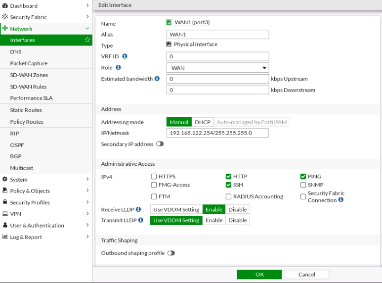
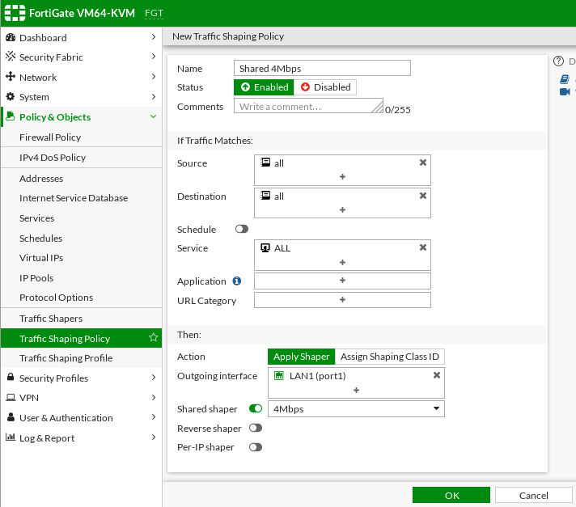
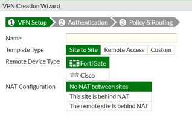
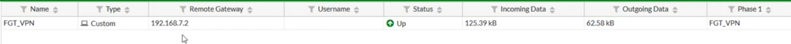
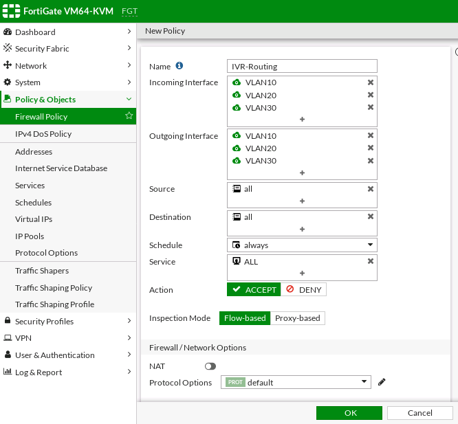

[TOC]


# Fortigate Firewall

## Fortigate Intial Setup

### Default Management IP

- 192.168.1.99 (Port 1)

1. Set hostname

   ```
   # config system global
   (global) # set hostname FGT
   (global) # end 
   ```

2. Configure IP address in port 1

   ```
   # configure system interface
   # edit port1
   (port1) # set mode static
   (port1) # set ip 192.168.1.99/24
   (port1) # set allowaccess ping http ssh 
   (port1) # set role lan
   (port1) # set alias LAN1
   (port1) # end
   ```

3. 


## CLI

### Set hostname

```
# config system global
(global) # set hostname FGT
(global) # end
```

### Configure IP address

```
# configure system interface
# edit port1
(port1) # set mode static
(port1) # set ip 192.168.1.99/24
(port1) # set allowaccess ping http ssh
(port1) # set role lan
(port1) # set alias LAN1
(port1) # end
```

### Create admin

```
# config system admin
(admin) # edit user
new entry 'user' added
(user) # set vdom root
(user) # set accprofile super_admin
(user) # set password seperadmin
(user) # end
```


### Get IP in the physical interface

```
FGT # get system interface physical 
== [onboard]
        ==[port1]
                mode: static
                ip: 192.168.1.99 255.255.255.0
                ipv6: ::/0
                status: up
                speed: 1000Mbps (Duplex: full)
        ==[port2]
                mode: static
                ip: 0.0.0.0 0.0.0.0
                ipv6: ::/0
                status: down
                speed: n/a
        ==[port3]
                mode: dhcp
                ip: 192.168.122.45 255.255.255.0
                ipv6: ::/0
                status: up
                speed: 1000Mbps (Duplex: full)
        ==[port4]
                mode: static
                ip: 0.0.0.0 0.0.0.0
                ipv6: ::/0
```


### Backup Config

1. Setup Tftp server
2. Execute the following command in Fortigate Firewall console
   - execute backup config tftp [config filename] [TFTP server ip address]

```
FGT # execute backup config tftp FGT-config 192.168.122.1
```


### Setup DHCP Server

```
FGT # config system dhcp server

FGT (server) # edit 1

FGT (1) # set netmask 255.255.255.0

FGT (1) # set interface port1

FGT (1) # set default-gateway 192.168.1.99

FGT (1) # set vci-match disable 

FGT (1) # config ip-range 

FGT (ip-range) # edit 1

FGT (1) # set start-ip 192.168.1.10

FGT (1) # set end-ip 192.168.1.50

FGT (1) # end

FGT (1) # set dns-server1 8.8.8.8

FGT (1) # end
```


### Email Alert

**Show email-server config**

```
FGT # config system email-server 

FGT (email-server) # show
```


### Top Diagnostics

```
FGT # get system status 
Version: FortiGate-VM64-KVM v6.4.5,build1828,210217 (GA)
Virus-DB: 1.00000(2018-04-09 18:07)
Extended DB: 1.00000(2018-04-09 18:07)
Extreme DB: 1.00000(2018-04-09 18:07)
IPS-DB: 6.00741(2015-12-01 02:30)
IPS-ETDB: 6.00741(2015-12-01 02:30)
APP-DB: 6.00741(2015-12-01 02:30)
INDUSTRIAL-DB: 6.00741(2015-12-01 02:30)
Serial-Number: FGVMEVSL6IBFBH57
IPS Malicious URL Database: 1.00001(2015-01-01 01:01)
License Status: Valid
Evaluation License Expires: Tue Mar  8 18:51:04 2022
VM Resources: 1 CPU/1 allowed, 1000 MB RAM/2048 MB allowed
Log hard disk: Available
Hostname: FGT
Operation Mode: NAT
Current virtual domain: root
Max number of virtual domains: 1
Virtual domains status: 1 in NAT mode, 0 in TP mode
Virtual domain configuration: disable
FIPS-CC mode: disable
Current HA mode: standalone
Branch point: 1828
Release Version Information: GA
FortiOS x86-64: Yes
System time: Wed Feb 23 16:42:43 2022
```


```
FGT # get hardware nic port1
Name:            port1
Driver:          e1000
Version:         7.3.21-k8-NAPI
Bus:             0000:00:03.0
Hwaddr:          0c:d2:f3:57:00:00
Permanent Hwaddr:0c:d2:f3:57:00:00
State:           up
Link:            up
Mtu:             1500
Supported:       auto 10half 10full 100half 100full 1000full
Advertised:      auto 10half 10full 100half 100full 1000full
Speed:           1000full
Auto:            enabled
RX Ring:                 256
TX Ring:                 256
Rx packets:              1342
Rx bytes:                423370
Rx compressed:           0
Rx dropped:              0
Rx errors:               0
  Rx Length err:         0
  Rx Buf overflow:       0
  Rx Crc err:            0
  Rx Frame err:          0
  Rx Fifo overrun:       0
  Rx Missed packets:     0
Tx packets:              1087
Tx bytes:                832500
Tx compressed:           0
Tx dropped:              0
Tx errors:               0
  Tx Aborted err:        0
  Tx Carrier err:        0
  Tx Fifo overrun:       0
  Tx Heartbeat err:      0
  Tx Window err:         0
Multicasts:              0
Collisions:              0
```


```
FGT # get system performance status
CPU states: 0% user 0% system 0% nice 99% idle 0% iowait 1% irq 0% softirq
CPU0 states: 0% user 0% system 0% nice 99% idle 0% iowait 1% irq 0% softirq
Memory: 1024108k total, 688360k used (67.2%), 192228k free (18.8%), 143520k freeable (14.0%)
Average network usage: 8 / 12 kbps in 1 minute, 7 / 12 kbps in 10 minutes, 2 / 4 kbps in 30 minutes
Average sessions: 13 sessions in 1 minute, 9 sessions in 10 minutes, 5 sessions in 30 minutes
Average session setup rate: 0 sessions per second in last 1 minute, 0 sessions per second in last 10 minutes, 0 sessions per second in last 30 minutes
Virus caught: 0 total in 1 minute
IPS attacks blocked: 0 total in 1 minute
Uptime: 0 days,  0 hours,  27 minutes
```


## Secure Access


### Restrict login to trusted hosts

Go to System > Administrators > select user and click edit


### Password Policy


## Password Recovery

### Get Serial number

```
FGT # get system status
Version: FortiGate-VM64-KVM v6.4.5,build1828,210217 (GA)
Virus-DB: 1.00000(2018-04-09 18:07)
Extended DB: 1.00000(2018-04-09 18:07)
Extreme DB: 1.00000(2018-04-09 18:07)
IPS-DB: 6.00741(2015-12-01 02:30)
IPS-ETDB: 6.00741(2015-12-01 02:30)
APP-DB: 6.00741(2015-12-01 02:30)
INDUSTRIAL-DB: 6.00741(2015-12-01 02:30)
Serial-Number: FGVMEVSL6IBFBH57
IPS Malicious URL Database: 1.00001(2015-01-01 01:01)
License Status: Valid
Evaluation License Expires: Tue Mar  8 18:51:04 2022
VM Resources: 1 CPU/1 allowed, 1000 MB RAM/2048 MB allowed
Log hard disk: Available
Hostname: FGT
Operation Mode: NAT
Current virtual domain: root
Max number of virtual domains: 1
Virtual domains status: 1 in NAT mode, 0 in TP mode
Virtual domain configuration: disable
FIPS-CC mode: disable
Current HA mode: standalone
Branch point: 1828
Release Version Information: GA
FortiOS x86-64: Yes
System time: Tue Feb 22 01:14:23 2022
```

Login as:

username: maintainer
password: bcpb+serial number

```
# config system admin
(admin) # edit admin
(admin) # set password [newpassword]
(admin) # end
```

## Configuration Bacup and Restore


## Firmware upgrade

Go to System > Firmware


## DHCP Server

Go to Network > Interfaces > select port no. and click edit


## Fortigate Internet Access

1. **Setup Wan Interface**

   **Go to Network > Interfaces**

   Fill up the following:

   - Role > WAN
   - IP/Netmask

   

   

   **Check in the console if the IP address on the other side is reachable**

   ```
   # execute ping 192.168.122.1
   ```

   

2. **Create static route**

   Go to Network > Interfaces and click Create new

   Fill up the following:

   - Gateway Address > 192.168.122.1
   - Interface > port3 (WAN interface)

   

   **Check in the console if the firewall can access the internet**

   ```
   # execute ping 8.8.8.8
   ```

3.  Create a policy for client to access the internet

   Go to Policy and Objects > Firewall Policy and click Create new

   Fill up the following:

   - Name > Internet
   - Incoming Interface > port1
   - Outgoing Interface > port3
   - Source > all
   - Destination > all
   - Service > all
   - NAT > enable
   - Log Allowed Traffic > All Sessions

   

    **Check if the client now can access the internet**

   ```
   # ping 8.8.8.8
   ```


## Email Alerts

1. Configure Email Server

​	Go to System > Settings go down to Email Service


2. Configure the Alerts

   Go to Security Fabric > Automation > click Create New

   - Name - Email Alert
   - Trigger - select FortiOS Event Log
     - Event - Admin login failed
   - Action - select Email

   

   


## Control Traffic Using Policies


**Control policy between interfaces**


## Traffic Shaping

- Control Bandwith and Quality of Service

### Shared Traffic Shaper

1. Create traffic shaper

   Go to Policy & Objects > Traffic Shapers > click Create New

   - Select Shared Type 
   - Maximum bandwidth - 4
   - Guaranteed bandwidth - 1
   - users with 1 Mbps each banwidth 

​	

2. Create Traffic Shaping Policy

   Go to Policy & Objects > Traffic Shaping Policy > click Create New

   - Source, Destination, Service - ALL

   - Enable Shared shaper - Select the Traffic Shapers created earlier

     

   

	### Per IP Shaper

1. Create traffic shaper

   Go to Policy & Objects > Traffic Shapers > click Create New

   - Select Per IP Shaper Type
   - Maximum bandwidth - 2 Mbps

    

2. Create Traffic Shaping Policy

   Go to Policy & Objects > Traffic Shaping Policy > click Create New

   - Source, Destination, Service - ALL
   - Enable Per IP shaper - Select the Traffic Shapers created earlier


## Creating VPN IPSec Site to Site connection

1. Create IPSec VPN Tunnels

   - Go to VPN > IPsec Tunnels > click Create New

   - Input Name and click Custom 

   

   - Input IP Address, Interface and Pre-shared Key

   - Phase 1 Proposal Encryption (SHA-256)

   

   

   - Phase 2 Selectors 

   - Input Local and Remote Address
   - Encryption (SHA-256)

   

   

   - Click Advanced check encryption and Diffie-Helman Group is the same

     

2. Create IPv4 Policy

   - Go to Policy and Objects > IPv4 Policy > click Create New

   - To allow outgoing traffic from local network (192.168.22.0/24) to remote network (192.168.44.0/24) specified in VPN settings 

   - Disable NAT

     

   - To allow incoming traffic from remote network (192.168.44.0/24 to local network (192.168.22.0/24)

   - Disable NAT

     

3. Create Static Route

   - Go to Network . Static Routes > click Create New

   - Create route to remote network (192.168.44.0/24) through VPN interface

     

4. Verify Connection

   - Go to Monitor > IPSec Monitor

     


## Configure SSL VPN

### SSL VP Modes

**Web Mode**

- Access applications only using web browser

**Tunnel Mode**

- Access all applications using Forticlient

  - **Full Tunnel**

    - Internet access through VPN

  - **Split Tunnel**

    - Internet access through local gateway

    

  


1. Create users

   - Go to *User & Device > User Definition* to create a local user *sslvpnuser1*.
   - Go to *User & Device > User Groups* to create a group *sslvpngroup* with the member *sslvpnuser1*.

2. Create SSL VPN Portal Web and Tunnel mode

   - Go to VPN > SSL-VPN Portals > click Create New

   

3. Configure SSL VPN settings:

   1. Go to *VPN > SSL-VPN Settings*.
   2. For *Listen on Interface(s)*, select *wan1*.
   3. Set *Listen on Port* to *10443*.
   4. Optionally, set *Restrict Access* to *Limit access to specific hosts*, and specify the addresses of the hosts that are allowed to connect to this VPN.
   5. Choose a certificate for *Server Certificate*. The default is *Fortinet_Factory*.
   6. In *Authentication/Portal Mapping* *All Other Users/Groups*, set the *Portal* to *tunnel-access*.
   7. Create new *Authentication/Portal Mapping* for group *sslvpngroup* mapping portal *my-split-tunnel-portal*.

   

   

      

   

4. Create the policy

   1. Go to *Policy & Objects > IPv4 Policy*.
   2. Fill in the firewall policy name. In this example, *sslvpn split tunnel access*.
   3. Incoming interface must be *SSL-VPN tunnel interface(ssl.root)*.
   4. Choose an *Outgoing Interface*. In this example, *port1*.
   5. Set the *Source* to *SSLVPN_TUNNEL_ADDR1* and group to *sslvpngroup*. The source address references the tunnel IP addresses that the remote clients are using.
   6. In this example, the *Destination* is *192.168.1.0*.
   7. Set *Schedule* to *always*, *Service* to *ALL*, and *Action* to *Accept*.
   8. Click *OK*.

   


## Configure SD-WAN

**SD-WAN (Software-defined Wide Area Network) ** 

- is a virtualized service that connects and extends enterprise networks over large geographical distances.

- monitors the performance of WAN connections and manages traffic in an effort to maintain high speeds and optimize connectivity.

- is a virtual interface consisting of a group of physical interfaces, and each of those interfaces are connected to different gateways, 

- help us to manage our different WAN Networks to get the best of them. 

**Benefits:**

  - Provide effictive wan usage with various load balancing algorithms.

  - support link quality. 


1. Create SD-WAN Zones

   - Go to Network > SD-WAN Zones > click Create New > SD-WAN Zone

   - Add SD-WAN Member

     

     

     

     

   

2. Create Health Check

   - Go to Network > Performance SLA > click Create New

     

     

   - Check health check status 

     

     


3. Create static route

   - Goto Network > Static Routes > click Create New

   - Select SD-WAN interface

     

   - Check firewall have internet access

     
     
     

4. Create firewall policy

   - Go to Policy & Objects > Firewall Policy > click Create New

     


5. Check Load Balancing

   - Go to Network > SD-WAN Rules > select sd-wan and click Edit

   - Check Load Balancing Algorithm

     - Source IP

     - Sessions

     - Spillover

     - Source-Destination IP

     - Volume

       

     


## VLAN Configuration


1. Configure switch

   **Create VLAN**

   ```
   Switch#conf t
   Switch(config)#vlan10
   Switch(config-vlan)#vlan 20
   Switch(config-vlan)#vlan 30
   ```

   **Assign ip address in vlan**

   ```
   Switch(config)#int vlan 10
   Switch(config-if)#no shutdown
   Switch(config-if)#ip address 192.168.10.100 255.255.255.0
   Switch(config-if)#exit
   
   Switch(config)#int vlan 20
   Switch(config-if)#no shutdown
   Switch(config-if)#ip address 192.168.20.100 255.255.255.0
   Switch(config-if)#exit
   
   Switch(config)#int vlan 30
   Switch(config-if)#no shutdown
   Switch(config-if)#ip address 192.168.30.100 255.255.255.0
   Switch(config-if)#exit
   ```

    **Show IP configration**

   ```
   Switch#show ip interface brief
   ```

   **Assign port to designated vlan**

   ```
   Switch(config)#interface range g0/0-1
   Switch(config-if-range)#switchport access vlan 10
   
   Switch(config)#interface g0/2
   Switch(config-if)#switchport access vlan 20
   
   Switch(config)#interface g0/3
   Switch(config-if)#switchport access vlan 30
   ```

   **Show vlan configuration**

   ```
   Switch#show vlan brief
   ```

2. Configure PC 1 and 2

   **Configure IP**

   ```
   PC-1> ip 192.168.20.10/24 192.168.20.100
   
   PC-2> ip 192.168.30.10/24 192.168.30.100
   ```

   **Show IP**

   ```
   PC-1> show ip
   
   PC-2> show ip 
   ```

3. Add static route to Fortigate FW

   

4. Create VLAN in Fortigate FW

   **Terminal**

   ```
   GT # config system interface
   
   FGT (interface) # edit VLAN10
   
   FGT (VLAN10) # set vdom root 
   
   FGT (VLAN10) # set type vlan 
   
   FGT (VLAN10) # set vlanid 10
   
   FGT (VLAN10) # set interface port1
   
   FGT (VLAN10) # set ip 192.168.10.1/24
   
   FGT (VLAN10) # set allowaccess http ping ssh
   
   FGT (VLAN10) # end
   ```

   **GUI**

   

   

5. Configure the switch port to trunk

   ```
   Switch(config)#interface g0/2
   Switch(config-if)#switchport trunk encapsulation dot1q
   Switch(config-if)#switchport mode trunk
   ```


## InterVLAN Routing

### Method 1 - via Creating a policy

1. Enable Multiple Interface Policies

   Got to System > Feature Visibility > Multiple Interface Policies and click Apply

   

2. Create policy

   Go to Policy & Objects > Firewall Policy > click Create New

   


3. Configure the gateway of the PC to the VLAN IP address

   ```
   PC-1> ip 192.168.20.10/24 192.168.20.1
   
   PC-2> ip 192.168.30.10/24 192.168.30.1
   ```


### Method 2 - via Zone

- We cannot see the traffic passing through our Fortigate FW

1. Go to Network > Interfaces > click Create New > Zone

   - Disable intra-zone traffic

   


## Redundant Interface


**CLI**

```
FGT # config system interface 

FGT (interface) # edit LAN3
new entry 'LAN3' added

FGT (LAN3) # set vdom root 

FGT (LAN3) # set type redundant 

FGT (LAN3) # set member port9 port10

FGT (LAN3) # set ip 192.168.100.1/24

FGT (LAN3) # set allowaccess http ping ssh

FGT (LAN3) # set role lan 

FGT (LAN3) # end
```

**GUI**

Go to Network > Interfaces > click Create New > Interface


## Link Aggregation (LACP)

- It will add the bandwidth of 2 interface

**1. Configure Fortigate Firewall**

**CLI**

```
FGT # config system interface 

FGT (interface) # edit LACP
new entry 'LACP' added

FGT (LACP) # set vdom root

FGT (LACP) # set type aggregate 

FGT (LACP) # set member port5 port6

FGT (LACP) # set lacp-mode active 

FGT (LACP) # end 
```

**2. Configure Switch**

**CLI**

```
SW1>enable
SW1#configure terminal 
Enter configuration commands, one per line.  End with CNTL/Z.
SW1(config)#interface range gigabitEthernet 0/1 - 2
SW1(config-if-range)#channel-group 1 mode active 
SW1(config-if-range)#channel-protocol lacp 
SW1(config-if-range)#exit
SW1(config)#exit
```


```
SW1(config)#interface port-channel 1
SW1(config-if)#switchport trunk encapsulation dot1q
SW1(config-if)#switchport mode trunk
```


**GUI**

Go to Network > Interface > click Create New > Interface


## Fortigate Firewall Operation Mode (NAT and Transparent)

**NAT** (default)

- act as a router
- we can assign IP address on the interfaces
- we can do routing

**TRANSPARENT**

- act as a switch


## Dynamic Routing


### RIP

**1. Configure Fortigate FW**

Go to Network > RIP


**2. Configure Router**

```
R1#conf t
R1(config)#router rip
R1(config-router)#version 2
R1(config-router)#network 41.141.1.0
R1(config-router)#network 41.141.2.0
R1(config-router)#end
```


**3. Check the Routing Monitor Dashboard**

Go to Dashboard > Routing Monitor


**4. Ping 41.141.2.1**

```
FGT # execute ping 41.141.2.1
PING 41.141.2.1 (41.141.2.1): 56 data bytes
64 bytes from 41.141.2.1: icmp_seq=0 ttl=255 time=44.3 ms
64 bytes from 41.141.2.1: icmp_seq=1 ttl=255 time=7.1 ms
64 bytes from 41.141.2.1: icmp_seq=2 ttl=255 time=9.0 ms
64 bytes from 41.141.2.1: icmp_seq=3 ttl=255 time=10.7 ms
64 bytes from 41.141.2.1: icmp_seq=4 ttl=255 time=12.0 ms

--- 41.141.2.1 ping statistics ---
5 packets transmitted, 5 packets received, 0% packet loss
round-trip min/avg/max = 7.1/16.6/44.3 ms
```


### OSPF

**1. Configure Fortigate Firewall**

Go to Network > OSPF


**2. Configure Router**

```
R1#configure terminal
R1(config)#router ospf 1
R1(config-router)#router-id 2.2.2.2
R1(config-router)#network 41.141.1.0 0.0.0.255 area 0
R1(config-router)#network 41.141.2.0 0.0.0.255 area 0
R1(config-router)#end
```


**3. Check the Routing Monitor Dashboard**

Go to Dashboard > Routing Monitor


  **4. Ping 41.141.2.1**

```
FGT # execute ping 41.141.2.1
PING 41.141.2.1 (41.141.2.1): 56 data bytes
64 bytes from 41.141.2.1: icmp_seq=0 ttl=255 time=44.3 ms
64 bytes from 41.141.2.1: icmp_seq=1 ttl=255 time=7.1 ms
64 bytes from 41.141.2.1: icmp_seq=2 ttl=255 time=9.0 ms
64 bytes from 41.141.2.1: icmp_seq=3 ttl=255 time=10.7 ms
64 bytes from 41.141.2.1: icmp_seq=4 ttl=255 time=12.0 ms

--- 41.141.2.1 ping statistics ---
5 packets transmitted, 5 packets received, 0% packet loss
round-trip min/avg/max = 7.1/16.6/44.3 ms
```


### BGP

Go to Network > BGP


**2. Configure Router**

```
R1#configure terminal
R1(config)#router bgp 10
R1(config-router)#bgp router-id 2.2.2.2
R1(config-router)#neighbor 41.141.1.2 remote-as 10
R1(config-router)#network 41.141.1.0 mask 255.255.255.0
R1(config-router)#network 41.141.2.0 mask 255.255.255.0
R1(config-router)#end
```


**3. Check the Routing Monitor Dashboard**

Go to Dashboard > Routing Monitor


  **4. Ping 41.141.2.1**

```
FGT # execute ping 41.141.2.1
PING 41.141.2.1 (41.141.2.1): 56 data bytes
64 bytes from 41.141.2.1: icmp_seq=0 ttl=255 time=44.3 ms
64 bytes from 41.141.2.1: icmp_seq=1 ttl=255 time=7.1 ms
64 bytes from 41.141.2.1: icmp_seq=2 ttl=255 time=9.0 ms
64 bytes from 41.141.2.1: icmp_seq=3 ttl=255 time=10.7 ms
64 bytes from 41.141.2.1: icmp_seq=4 ttl=255 time=12.0 ms

--- 41.141.2.1 ping statistics ---
5 packets transmitted, 5 packets received, 0% packet loss
round-trip min/avg/max = 7.1/16.6/44.3 ms
```


## Static Routing

**CLI**

```
FGT # config router static 

FGT (static) # show 
config router static
    edit 1
        set dst 192.168.20.0 255.255.255.0
        set gateway 192.168.10.100
        set device "port1"
    next
    edit 2
        set dst 192.168.30.0 255.255.255.0
        set gateway 192.168.10.100
        set device "port1"
    next
end

FGT (static) # edit 3
new entry '3' added

FGT (3) # set dst 41.141.2.0 255.255.255.0

FGT (3) # set gateway 41.141.1.1

FGT (3) # set device port3

FGT (3) # end
```

**Try to ping the other network**

```
GT # execute ping 41.141.2.1
PING 41.141.2.1 (41.141.2.1): 56 data bytes
64 bytes from 41.141.2.1: icmp_seq=0 ttl=255 time=22.8 ms
64 bytes from 41.141.2.1: icmp_seq=1 ttl=255 time=3.7 ms
64 bytes from 41.141.2.1: icmp_seq=2 ttl=255 time=10.3 ms
64 bytes from 41.141.2.1: icmp_seq=3 ttl=255 time=10.1 ms
64 bytes from 41.141.2.1: icmp_seq=4 ttl=255 time=9.8 ms

--- 41.141.2.1 ping statistics ---
5 packets transmitted, 5 packets received, 0% packet loss
round-trip min/avg/max = 3.7/11.3/22.8 ms
```


## High Availability


**HA Mode**

1. Active-Active
   - primary unit that receives all communication sessions and load balances them among the primary unit and all of the subordinate units
   - policy created in primary fw will be replicated to secondary fw and vice versa
2. Active-Passive
   - provides hot standby failover protection
   - the configuration of the subordinate units is synchronized with the configuration of the primary unit and the subordinate units monitor the status of the primary unit


1. Configure FGT1 

   Go to System > HA

   

2. Connect 2 interfaces port 9 and 10 from FGT1 to FGT2

3. Configure FGT2

   Go to System > HA

   

4. Check status

   

   Click Refresh

   

5. Change the management IP of FGT2

   ```
   FGT1 # executeha manage
   <id>	please input peer boxindex.
   <1>		Subsidary unit FGVMEVN3ZTSYRLC1
   
   FGT1 # execute ha manage 1 admin
   admin@169.254.0.2's password:
   FGT2 # config system interface
   
   FGT2 (interface) # edit port3
   
   FGT2 (port3) # set management-ip 192.168.112.132/24
   
   FGT2 (port3) # end
   
   ```


## Load Balancing


1. Enable the Load balancing feature

   Go to System > Feature Select and enable Load Balance

   

2. Create Health Check

   Go to Policy & Objects > Health Check  and Create New Health Check

   

3. Create Virtual Servers

   Go to Policy & Objects > Virtual Servers  and Create New Virtual Servers

   

4. Create Real Servers

   Go to Policy & Objects > Real Servers  and Create New Real Servers

   **First Real Server**

   

   **Second Real Server**

   

5. Create IP4 Policy

   Go to Policy & Objects > IPv4 Policy  and Create New Policy

   
