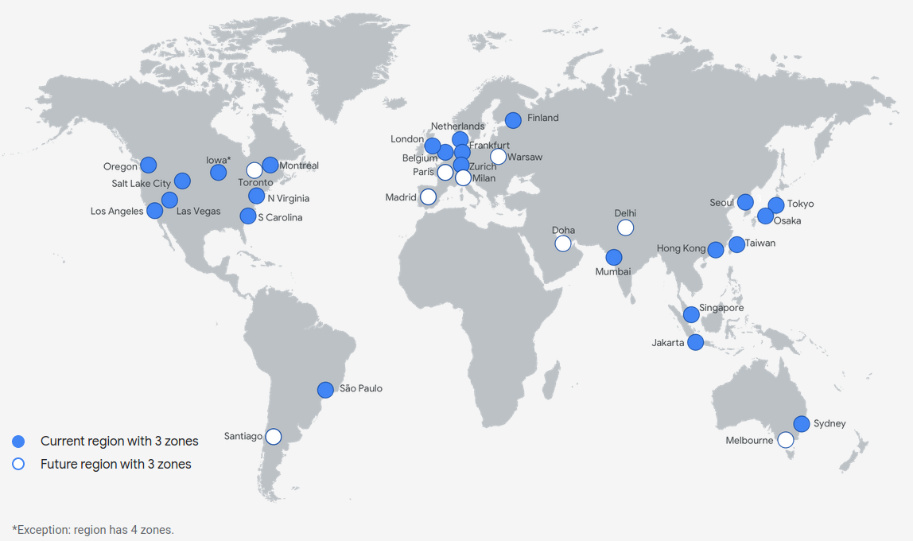
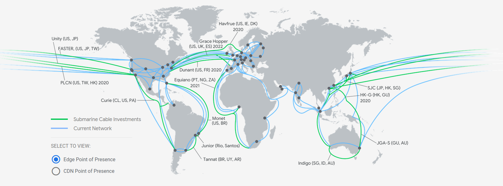

# Google Cloud Certified Associate Cloud Engineer

## Intro to Google Cloud Platform (GCP)

### Competition (External Context)

* Amazon Web Services (AWS) is currently the runaway market leader
* in 2015 AWS delivers over 10X the utilized cloud capacity of its largest 14 competitors combined
* AWS 90%, Azure 5%, GCP and all other clouds combined remaining 5%

### Innovation (Internal Context)

* Google is all about big data; huge scale
  - Google's history its mission statement from 1998 was to organize the world's information and make it universally accessible and useful.
* Google hires very smart people (Googlers)
* Lots of internal Innovation
  - To accomplish this ambitious goal Google's hired a lot of really smart people and they've developed a lot of innovative things internally.
* Published many whitepapers
  -  E.g. Map Reduce, Google File System, Colossus
* Released some things as open source
  - E.g. Kubernetes(from Borg)
* Commercialized some things in GCP
  - E.g. BigTable, Spanner, GCS (built in Colossus), BigQuerry(from Dremel)


### Google Organization

* Google hires Site Reliability Engineers (SREs) not Operations people
* GCP was built from dev towards ops/infra
* AWS was built from ops/infra towards dev


### History of GCP

* Grew some services internally
  - Built by Googlers for Google
  - Not originally for Enterprise
* Purchased some services
  - like Firebase, Stackdriver, Apigee
* Catch-up to AWS
  - Some functionality missing
  - Avoided some mistakes
  - More willing to be "a cloud" that you use, not just "the cloud" that you use


## GCP Structure and Design

### Design Principles

* Global
* Secure
* Huge Scale
* For Developers

### Global System

* GCP is intrinsically global

  - generally built to serve worldwide customers
  - giving a good user experience to each of the people in their different locations around the world.

* AWS is intrinsically region-scoped

  - Simplifies data sovereignty

* Global Model

  - Easier to handle latency and failures in a global way

  - Could be more sensitive to multi-region/global failures modes

    - Due to service failures, not underlying hardware issues

    

### Physical Infrastructure

* vCPU
* Phyical server
* Rack
* Data center (building)
* Zone
* Region
* Multi-Region
* Private global network
* Points of Presence (POPs) - Network edges and CDN locations
* Global system


Global Regions Map




Network Map




### Network Ingress Egress

* Normal network: Routes via Internet to edge location closest to destination
* Google network: Routes so traffic enters from Internet at edge closest to source

  - Enables very interesting scenarios
- Single global IP address can load balance worldwide
  - Sidesteps many DNS issues
* Can now opt for "normal" network routing to reduce price (and functionality)


### Pricing

* **Provisioned** - "You tell Google to make sure you're ready to handle this amount of load"
* **Usage** - "Handle whatever I use and charge me for that"
* **Network traffic**
  - Free on the way in (ingress)
  - Charged on the way out (egress), by GBs used
  - Egress to GCP services sometimes free
    - Depends on the destination service
    - Depends on the location of that service


### Security

* Separation of duties of Google staff and physical security of the Data Centers
* Absolutely everything always encrypted at rest
* Strong key and Identity Management
* Network encryption
  - All control info encrypted
  - All WAN traffic to be encrypted automatically
  - Moving towards encrypting all local traffic within data centers
* Distrust the network anyway
  - BeyondCorp security model
    - shifts access controls from the network perimeter to individual devices and users.
    - This can allow employees to work securely from any location without needing a VPN.
    - https://cloud.google.com/beyondcorp/


### Scale and Automation

* Scalability must be unbounded

  - In theory everything has to be able to scale basically infinitely

* Devs don't want to answer pages

  - It can all be automated.


### Resource Quotas (Soft Limits)

*  Scope
  - Regional
  - Global
* Changes
  - Automatic
  - By request
    - Response in 24-48h
    - May be refused
* Queryable
  - running gloud command "gcloud compute project-info describe --project myprojectid"
  - this asks Google to tell you what your current limits are for this particular project.


### Organization

* Projects are similar to AWS accounts
* Projects own resources
* Resources can be shared with other projects
* Projects can be grouped and controlled in a hierarchy


## Introduction to GCP Products/Services


### Compute Products

1. **Compute Engine** - VMs, GPUs, TPUs, Disks
2. **App Engine** - Managed app platform
3. **Kubernetes Engine (GKE)** - Managed Kubernetes/containers
4. **Cloud Functions** - Event-driven serverless functions


### Database Products

1. Cloud SQL - Managed MySQL,PostgreSQL,SQL Server
2. Cloud Spanner - Horizontally scalable Relational DB
3. Cloud Datastore - Horizontally scalable Document DB
4. Cloud Firestore -  Serverless NoSQL document DB
5. Cloud Bigtable -  Petabyte-scale, low-latency, non-relational


### Networking Products

1. Virtual Private Cloud - Software defined networking
2. Dedicated Interconnect - Dedicated private network connection
3. Cloud NAT - Network address translation service
4. Cloud Load Balancing - Multi-region load distribution/balancing
5. Network Service Tiers - Price vs performance tiering
6. Cloud Armor - DDoS protection and WAF
7. Cloud CDN - Content delivery network
8. Cloud DNS - Programmable DNS serving


### Data and Analytics Products

1. Cloud Dataflow - Stream/batch data processing
2. Cloud Dataproc - Managed Spark and Hadoop
3. Google Genomics - Managed Genomics Platform
4. Cloud Pub/Sub - Global real-time messaging
5. BigQuery - Data warehouse/analytics


### Storage Products

1. **Cloud Storage** - Multi-class multi-region object storage (object-based)
2. **Nearline** - Archival Occasional Access Storge
3. **Coldline** - Archival Rare Access Storage
4. **Cloud Filestore** - Managed NFS server (file-based)
5. **Persistent Disk** - Block storage for VMs (block-based)
6. **Local SSD** - VM locally attached SSDs


### AI and Machine Learning Products

1. **Cloud TPU** (Tensor Processing Unit) - Specilaized hardware for Machine Learning

   Tensor Processing Units (TPUs) are ASIC (Application-specific Integrated Circuit) devices designed specifically to handle the computational demands of machine learning applications.

2. Cloud Natural Language API - Text parsing and analysis

3. Cloud Speech-To-Text API - Convert audio to text

4. Cloud Text-To-Speech API - Convert text to audio

5. AI Platform - Managed platform for ML

6. AI Platform Deep Learning VMs - Preconfigured VMs for deep learning

7. AI Platform Deep Learning Containers - Preconfigured containers for deep learning

8. AutoML Natural Language - Custom text classification  models

9. AutoML Translation - Custom domain-specific translation

10. AutoML Vision - Custom image classification models


### Management Tools Products

1. Cloud/Stackdriver Monitoring - Infrastructure and application monitoring
2. Cloud Logging - Centralized logging


### Identity and Security Products

1. Cloud Identity - Manage users, devices & apps

2. Cloud IAM - Resource access control

3. Cloud HSM - Hardware security module service

   - can use that to manage your encryption keys and certificates

4. Cloud Data Loss Prevention API - Classify and redact sensitive data

   -  machine learning service that can classify and redact sensitive data from what you point it at.

     

## Account Setup

### GCP Free Trail

* Billing account that does not get charged

  - Must be manually upgraded to a paying account
  - Still requires a creadit card, for verification

* $300 USD credit that can last 12 months

  - "When you're free trial ends your account will be paused and you'll have the option to upgrade to a paid account."

* Exellent for learning!

* "Business accounts are not elligible for the free trial."

* Has some restrictions

  

### Free Trial Restrictions

* No more than 8 vCPUs (total simultaneously)

  - No GPUs (video card chips)
  - No TPU (custom chips for TensorFlow)
  - No quota increases
  - No cryptomining allowed
  - No SLAs
  - No premium OS lincenses (e.g. Windows)
  - No Cloud Launcher products with extra usage fees


### ALways Free

* "Always free usage doesn't even count against your free trial credits."

* Last beyond the end of free trial

* https://cloud.google.com/free/

  

### Setup Billing Export

**Overview**

* Tools for monitoring analyzing and optimizing cost have become an important part of managing development. Billing export to big query enables you to export your daily usage and cost estimates automatically throughout the day to a big query data set you specify you can then access your billing data from big query.

### Steps to Enable Billing Export to BigQuery

1. Go to Google Cloud Platform Console and select your internal project:


2. Open the main menu in the top left corner and select Billing.


3. If you have more billing accounts, choose the option Go to linked billing account to manage the billing of the project you have selected. To select a different billing account, click Manage billing accounts.

4. Click on the account you will be exporting And then click Billing export


5. Select BigQuery export.

6. Select the project where your BigQuery dataset is stored from the Project list. If you don't have any BigQuery dataset yet, you'll be prompted to create one (step 7 below).

7. To create a new dataset (if you don't have any): 
    In the BigQuery web UI, on the left navigation, click the down arrow next to your project name, then click Create new dataset. 

  Specify the Dataset ID (no spaces allowed), Data location, and Data expiration, then click OK


8. In the console, go back to Billing - Billing export, select your project from the Project dropdown (if not selected already). Click Edit Settings botton.
Then choose a dataset to export data to from the Billing export dataset list. If you just created a new dataset, select it's name. Click Save.


### Setup Billing Alert

**Overview**

* To help you with project planning and controlling costs, you can set a budget. Setting a budget lets you track how your spend is growing toward that amount.
* You can apply a budget to either a billing account or a project and you can set the budget at a specific amount or match it to the previous month's spend. 
* You can also create alerts to notify billing administrators when spending exceeds a percentage of your budget.

### Create Budget Alert

1. Sign in to the Google Cloud Console.
2. Open the console Navigation menu menu, and then select Billing.
3. In the Billing navigation menu, select Budgets & alerts.
4. Click add_box CREATE BUDGET.


## Cloud Shell and Data Flows

### Cloud Shell And Editor

* Google Cloud shell provides you with command line access to your cloud resources directly from your browser. You can easily manage your projects on resources without having to install the Google cloud SDK or other tools on your system.  With cloud shell, the cloud SDK gcloud command line tool and other utilities you need are always available up to date and fully authenticated when you need them.


```
$ git clone https://github.com/ACloudGuru/gcp-cloud-engineer.git

$ cd gcp-cloud-engineer

$ cd cloud-shell-hello

$ node hello.js
Server running at http://127.0.0.1:8080/
```


```
$ nodemon hello.js
[nodemon] 2.0.4
[nodemon] to restart at any time, enter `rs`
[nodemon] watching path(s): *.*
[nodemon] watching extensions: js,mjs,json
[nodemon] starting `node hello.js`
Server running at http://127.0.0.1:8080/

$ diff hello.js html-hello.js
4c4
< const port = 8080;
---
> const port = 8081;
6,7c6,7
< const message = 'Hello Cloud Gurus!!!!! Welocme Sherwin Owen';
< const fullMessage = `${message}\n`;
---
> const message = 'Hello Cloud Gurus and welcome to this lab!';
> const fullMessage = `<html><body><h1>${message}</h1></body></html>\n`;
11c11
<   response.setHeader('Content-Type', 'text/plain');
---
>   response.setHeader('Content-Type', 'text/html');
```


