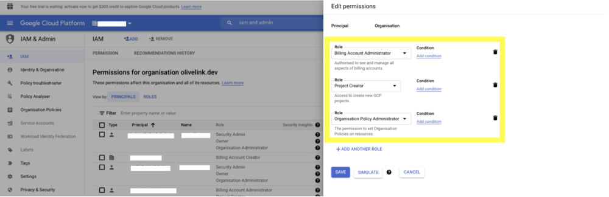

# Migrating Google Cloud Projects between Organisations

https://olivelink.net/blog/migrating-google-cloud-projects-between-organisations-a-step-by-step-guide

## Before you get started, make sure you have the following handy:

1. The project ID of the project you want to migrate.
2. The destination organisation’s organisation ID.
3. The source organisation’s organisation ID.


## ASSIGNING PERMISSIONS IN THE *SOURCE* ORGANISATION

1. In the google cloud platform dashboard of the source organisation, search ‘IAM and Admin’.

   

2. Ensure your Google account is listed as a principal in your organisation and assign yourself the following roles: 

   - **Project Mover** 
   - **Billing Account Administrator**
   - **Owner** (you only have to be the owner for the project that you are migrating but if you are the owner of the organisation you will inherit the permissions for the project while it is still in your organisation) 
   - **Organisation Policy Administrator**

   

## ASSIGNING PERMISSIONS IN THE *DESTINATION ORGANISATION*

1) In the google cloud platform dashboard of the destination organisation, search ‘IAM and Admin’.

   

2) Using the email address of the person in charge of the project migration, assign them the following roles: 

   - **Project Creator**
   - **Billing Account Administrator** and 
   - **Organisation Policy Administrator** 

   

##  CONFIGURING ORGANISATION POLICIES FOR EXPORTING IN THE *SOURCE ORGANISATION*

1. In the cloud platform dashboard of the source organisation, search ‘Organisation policies’. Click on the page labelled ‘Organisation policies (IAM and admin)’.

   

2. In the organisation policies click on ‘allowed destinations for exporting resources’.

   

3. Click on the ‘edit’ button next to ‘policy details’. Note: If you don’t see the ‘edit’ option, it’s because you haven’t been assigned the ‘Organisation Policy Administrator’ role in the source organisation. Check that you have been assigned this role and try again. 

   

4. Click the ‘customise’ option, ‘merge with parent’. Then ‘add rule’. For policy values select ‘custom’ and policy type ‘allow’. For the custom values enter ‘under:organizations/SOURCE_ORG_ID’ and click ‘Done’. This will grant the permissions for your project to be exported to the destination organisation.

   

   


## CONFIGURING ORGANISATION POLICIES FOR IMPORTING IN THE *DESTINATION ORGANISATION*

1.  In the cloud platform dashboard of the destination organisation, search ‘organisation policies’. Click on the page labelled ‘organisation policies (IAM and admin).'

   

2. In the organisation policies of the destination organisation click on ‘allowed sources for importing resources’.

   

3. Click on the ‘edit’ button next to ‘policy details’. Ensure you have the ‘Organisation Policy Administrator’ role assigned to your account.

   

4. Click the ‘customise’ option, ‘merge with parent’. Then ‘add rule’. For policy values select ‘custom’ and policy type ‘allow’. For the custom values enter ‘under:organizations/SOURCE_ORGANIZATION_ID’.

   

   


## CHANGING THE BILLING ACCOUNT FOR THE PROJECT

1. To change the billing account for an existing project, you must have the roles/owner role on the project, and the roles/billing.admin role on the destination billing account.

2. In the cloud platform dashboard of the source organisation, search ‘billing’.

   

3. Navigate to the ‘My Projects’ tab of the ‘Billing’ page.

   

4. Click on the ‘Change Billing’ option of the Actions menu for the relevant project.

   

5.  If you have been granted the relevant permissions, you should be able to see the billing account of the destination organisation. Select the destination organisation’s billing account and click ‘Set Account’.

   


## PERFORMING THE MIGRATION USING CLOUD SDK

1. Install [Cloud SDK](https://cloud.google.com/sdk/docs/install) on your machine.

2. Ensure you are logged into Cloud SDK using the email address that has been granted all the relevant permissions for project migration.

3. To migrate a project under an organisation, run the following command:

   ```
   gcloud beta projects move PROJECTID *--*organization DESTINATION_ORGANIZATION_ID
   ```
4) You can also specify a folder as the target resource, with the following command:

   ```
   gcloud beta projects move PROJECTID *--*folder DESTINATION_FOLDER_ID
   ```
5) Once you’ve run the command, you should find that the project is now located in the specified location in the destination organisation’s resource hierarchy. The migration is now complete!