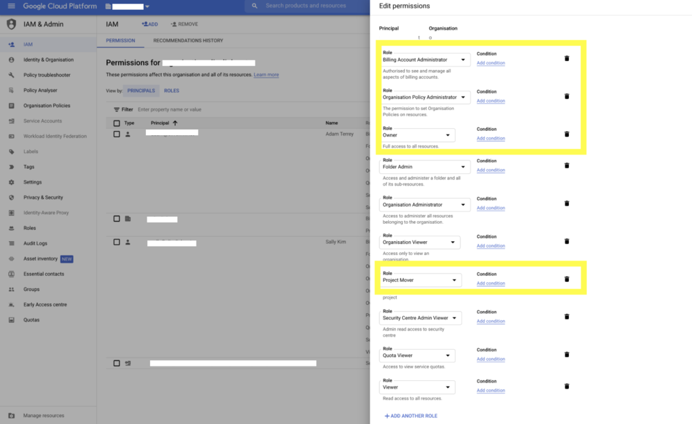
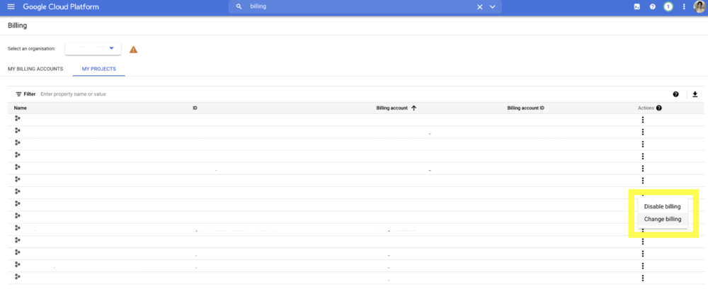

# Migrating Google Cloud Projects between Organisations

## Preparation

In the effort of preparation for the **project migration between different Organizations in Google Cloud**, you will need to gather the following information.

In Google Cloud’s hierarchy, Projects are created under Organizations. You can also use a two-level hierarchy and assign Projects under Folders which are children of Organizations.

### 1. Project ID(s) of the project(s) you want to migrate

In order to locate ID(s) of the project(s) you want to migrate, navigate to the Welcome/Dashboard page of your Google Cloud Console account and click on the project selector in the top left corner, next to the Google Cloud logo. A modal window will open with a list of Organizations and Projects you have access to, with their respective Organization or Project IDs.


### 2. The source organization’s Organization ID

You can find your Organization ID following steps from the previous bullet point. Your Organization is listed along with your Projects, as seen on the screenshot above.

### 3. The destination organization’s Organization ID

You will have to ask the owner/administrator of the organization where you want to migrate your project(s) to, to send their Organization ID.

## Assign user Permissions and configure organization Policies

As we gathered IDs of project(s) which we need to migrate, and IDs of the source and destination Organizations, you need to set up user permissions and policies as follows:

### 1. Assign permissions in the Source organization

You need a particular set of IAM permission roles to migrate project(s) between organizations in Google Cloud.

You can get the necessary permissions by acquiring the following roles:

- **Project Mover** ( `roles/resourcemanager.projectMover` ) on the project you want to migrate or its parent resource.
- **Organization Policy Administrator** ( `roles/orgpolicy.policyAdmin` ) on the parent organization resource.

In order to assign the necessary permissions, search for ‘**iam and admin**’ in the source organization’s Google Cloud Console account. Then click on the page labeled ‘**IAM & Admin**‘.


Click on the pencil icon next to the user you want to assign the permissions to, and select necessary roles, as seen on the screenshot below.


### 2. Assign permissions in the Destination organization

In the destination organization, you will need following permissions:

- **Project Creator** ( `roles/resourcemanager.projectCreator` ) on the parent organization resource.
- **Project Billing Manager** ( `roles/billing.projectManager` ) on the project you’ve migrated or its parent resource.
- **Organization Policy Administrator** ( `roles/orgpolicy.policyAdmin` ) on the parent organization resource.


### 3. Configure organization Policies in the Source organization

To migrate a project to a new organization, you will also need specific set of permissions to create and manage organization policies.

1. Open the Welcome / Dashboard page of the source organization’s Google Cloud Console account and search for **organization policies**. Then click on the page labeled **Organization policies (IAM and admin)**.

   

2. On the Organization policies page, click on the ‘**Allowed Destinations for Exporting Resources**’ option.

   

3. Click on the **MANAGE POLICY** button next to the ‘**Policy for Allowed Destinations for Exporting Resources**’ heading.

   Note:

   If you don’t see the ‘**MANAGE POLICY**’ button, it means you haven’t been assigned the ‘**Organization Policy Administrator**’ role in the source organization. Confirm if you have been assigned this role and try again.

   

   

4. Select the **Customize** radio button, and the **Merge with parent**. Then click on **ADD A RULE**. For the Policy values select **Custom**, and for the Policy type select **Allow**. In the Custom values section enter 

    **under:organizations/DESTINATION_ORGANIZATION_ID**and click **DONE**.

   

This will grant the permissions for your project to be exported to the destination organization.

### 4. Configure organization Policies in the Destination organization

In the destination organization, you will need following policies.

1. Open the Welcome / Dashboard page of the destination organization’s Google Cloud Console account and search for ‘**organization policies**’. Then click on the page labeled ‘**Organization policies (IAM and admin)**‘.

   

2. On the Organization policies page, click on the ‘**Allowed Sources for Importing Resources**’ option.

   

3. Click on the ‘**MANAGE POLICY**’ button next to the ‘Policy for Allowed Sources for Importing Resources’ heading.

   Note:

   If you don’t see the ‘**MANAGE POLICY**’ option, it means you haven’t been assigned the ‘**Organization Policy Administrator**’ role in the destination organization. Confirm if you have been assigned this role and try again.

   

   

4. Select the ‘**Customize**’ radio button, and the ‘**Merge with parent**’. Then click on ‘**ADD A RULE**’. For the Policy values select ‘**Custom**’, and for the Policy type select ‘**Allow**’. In the Custom values section enter ‘

   **under:organizations/SOURCE_ORGANIZATION_ID** ’ and click ‘**DONE**’.

   

## Change Billing Account for the migrated Project(s)

Google Cloud Billing accounts can be used across organization resources. Moving a project from one organization to another won’t impact billing, and charges will continue against the old billing account. However, if you have the proper permissions, you can migrate billing to a new account, by following these steps:

1. Open the Welcome / Dashboard page of the source organization’s Google Cloud Console account and search for ‘**billing**’. Then click on the ‘**Billing accounts**‘ page.

   

2. Switch to the ‘**MY PROJECTS**‘ tab of the Billing page. Then in the Actions menu for the relevant project, click on the ‘**Change Billing**‘ option.

   

3. In the modal window, select the billing account of the destination organization and click on ‘**SET ACCOUNT**‘ button.

   

## Perform the migration with Cloud SDK

If you have the appropriate IAM permissions and the required organization policies are enforced in both organizations, you are ready to start migrating Google Cloud projects between organizations.

Here are instructions how to migrate project(s) from one organization to another.

1. Install [gcloud CLI](https://cloud.google.com/sdk/docs/install) (Google Cloud CLI) on your local computer.

2. Log into gcloud CLI account using the Google Cloud user which has been granted all the required permissions for project migration.

3. Run this command to migrate a project:

   ```
   gcloud beta projects move PROJECT_ID --organization DESTINATION_ORGANIZATION_ID
   ```

   If you would like to migrate a project to a folder under the destination organization, then use this command:

   ```
   gcloud beta projects move PROJECT_ID --folder DESTINATION_FOLDER_ID
   ```

   Replace the following fields:

   - **PROJECT_ID** is the ID of the project you wish to migrate.
   - **DESTINATION_ORGANIZATION_ID** is the ID of the destination organization resource to which you want to move the project to.
   - **DESTINATION_FOLDER_ID** is the ID of the folder under the the destination organization to which you want to move the project.

4. **Booyah!** The project migration to the new organization has been completed.


# **Steps to Migrate a GCP Project to Another Organization**

## **1. Prerequisites**

- **Source Organization:** You need `Project Mover` (`roles/resourcemanager.projectMover`) and `Owner` (`roles/owner`) roles on the project.
- **Destination Organization:** You need `Project Creator` (`roles/resourcemanager.projectCreator`) and `Folder Admin` (`roles/resourcemanager.folderAdmin`) roles.
- **Billing Setup:** Ensure the destination organization has an active billing account.
- **Policy & Compliance:** Check organizational policies that may restrict project migration.

## **2. Check and Remove Constraints (If Any)**

Some policies can prevent a project from being moved:

```
gcloud org-policies list --organization=SOURCE_ORG_ID
```

If needed, remove or modify policies in `SOURCE_ORG_ID` and `DEST_ORG_ID` to allow the migration.

## **3. Move the Project**

Use the following command to move the project to the new organization:

```
gcloud beta projects move PROJECT_ID --organization=DEST_ORG_ID
```

Alternatively, if you are moving the project to a folder:

```
gcloud beta projects move PROJECT_ID --folder=DEST_FOLDER_ID
```

## **4. Reconfigure Billing**

- Link the project to the billing account of the new organization:

```
gcloud beta billing projects link PROJECT_ID --billing-account=NEW_BILLING_ACCOUNT_ID
```

## **5. Review and Update IAM Policies**

- Check current IAM bindings:

```
gcloud projects get-iam-policy PROJECT_ID
```

- Add necessary users or roles in the new organization:

```
gcloud projects add-iam-policy-binding PROJECT_ID --member="user:EMAIL" --role="roles/owner"
```

## **6. Update Organization Policies & Security Settings**

Ensure the new organization’s security settings, VPC networks, and access controls align with your compliance requirements.

## **7. Verify and Test**

- Confirm resources, APIs, and permissions are intact.
- Run tests to ensure no breakage in application functionality.

Would you like assistance in verifying any specific policies or IAM configurations?


https://olivelink.net/blog/migrating-google-cloud-projects-between-organisations-a-step-by-step-guide

## Before you get started, make sure you have the following handy:

1. The project ID of the project you want to migrate.
2. The destination organisation’s organisation ID.
3. The source organisation’s organisation ID.


## ASSIGNING PERMISSIONS IN THE *SOURCE* ORGANISATION

1. In the google cloud platform dashboard of the source organisation, search ‘IAM and Admin’.

   

2. Ensure your Google account is listed as a principal in your organisation and assign yourself the following roles: 

   - **Project Mover** 
   - **Billing Account Administrator**
   - **Owner** (you only have to be the owner for the project that you are migrating but if you are the owner of the organisation you will inherit the permissions for the project while it is still in your organisation) 
   - **Organisation Policy Administrator**

   

## ASSIGNING PERMISSIONS IN THE *DESTINATION ORGANISATION*

1) In the google cloud platform dashboard of the destination organisation, search ‘IAM and Admin’.

   

2) Using the email address of the person in charge of the project migration, assign them the following roles: 

   - **Project Creator**
   - **Billing Account Administrator** and 
   - **Organisation Policy Administrator** 

   

##  CONFIGURING ORGANISATION POLICIES FOR EXPORTING IN THE *SOURCE ORGANISATION*

1. In the cloud platform dashboard of the source organisation, search ‘Organisation policies’. Click on the page labelled ‘Organisation policies (IAM and admin)’.

   

2. In the organisation policies click on ‘allowed destinations for exporting resources’.

   

3. Click on the ‘edit’ button next to ‘policy details’. Note: If you don’t see the ‘edit’ option, it’s because you haven’t been assigned the ‘Organisation Policy Administrator’ role in the source organisation. Check that you have been assigned this role and try again. 

   

4. Click the ‘customise’ option, ‘merge with parent’. Then ‘add rule’. For policy values select ‘custom’ and policy type ‘allow’. For the custom values enter ‘under:organizations/SOURCE_ORG_ID’ and click ‘Done’. This will grant the permissions for your project to be exported to the destination organisation.

   

   


## CONFIGURING ORGANISATION POLICIES FOR IMPORTING IN THE *DESTINATION ORGANISATION*

1.  In the cloud platform dashboard of the destination organisation, search ‘organisation policies’. Click on the page labelled ‘organisation policies (IAM and admin).'

   

2. In the organisation policies of the destination organisation click on ‘allowed sources for importing resources’.

   

3. Click on the ‘edit’ button next to ‘policy details’. Ensure you have the ‘Organisation Policy Administrator’ role assigned to your account.

   

4. Click the ‘customise’ option, ‘merge with parent’. Then ‘add rule’. For policy values select ‘custom’ and policy type ‘allow’. For the custom values enter ‘under:organizations/SOURCE_ORGANIZATION_ID’.

   

   


## CHANGING THE BILLING ACCOUNT FOR THE PROJECT

1. To change the billing account for an existing project, you must have the roles/owner role on the project, and the roles/billing.admin role on the destination billing account.

2. In the cloud platform dashboard of the source organisation, search ‘billing’.

   

3. Navigate to the ‘My Projects’ tab of the ‘Billing’ page.

   

4. Click on the ‘Change Billing’ option of the Actions menu for the relevant project.

   

5.  If you have been granted the relevant permissions, you should be able to see the billing account of the destination organisation. Select the destination organisation’s billing account and click ‘Set Account’.

   


## PERFORMING THE MIGRATION USING CLOUD SDK

1. Install [Cloud SDK](https://cloud.google.com/sdk/docs/install) on your machine.

2. Ensure you are logged into Cloud SDK using the email address that has been granted all the relevant permissions for project migration.

3. To migrate a project under an organisation, run the following command:

   ```
   gcloud beta projects move PROJECTID *--*organization DESTINATION_ORGANIZATION_ID
   ```
4) You can also specify a folder as the target resource, with the following command:

   ```
   gcloud beta projects move PROJECTID *--*folder DESTINATION_FOLDER_ID
   ```
5) Once you’ve run the command, you should find that the project is now located in the specified location in the destination organisation’s resource hierarchy. The migration is now complete!


