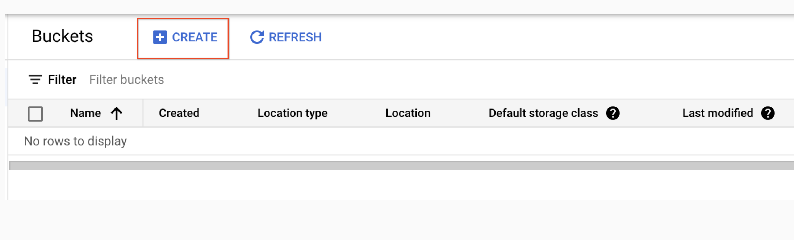
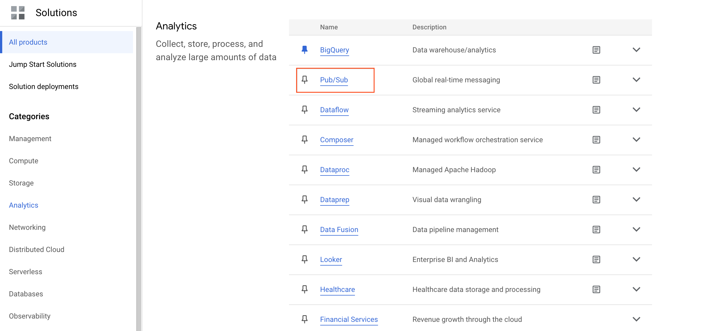
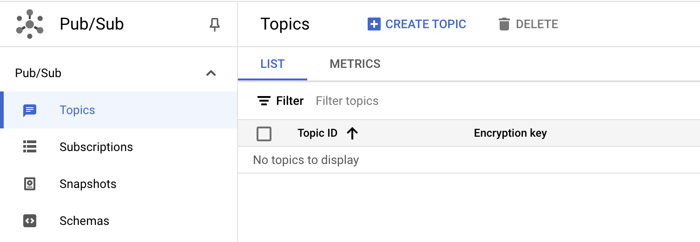
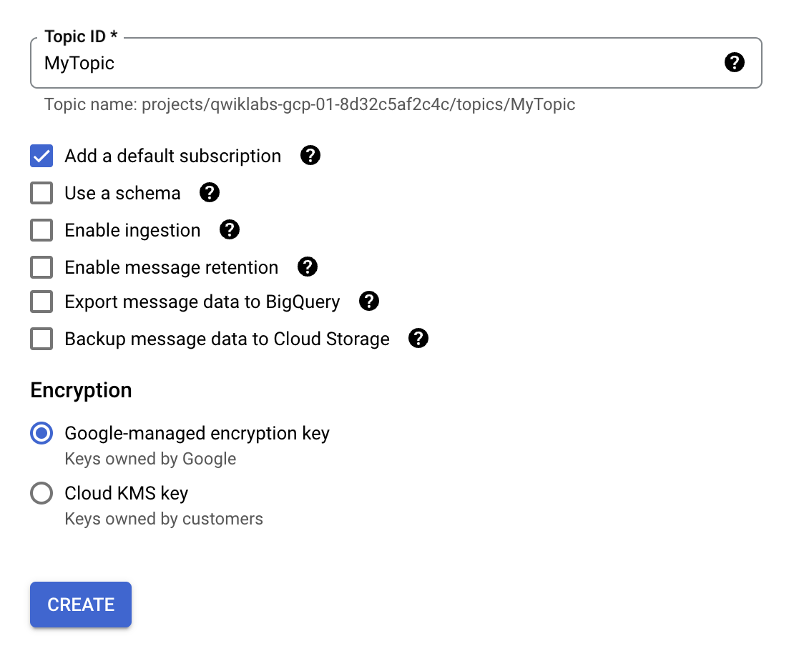
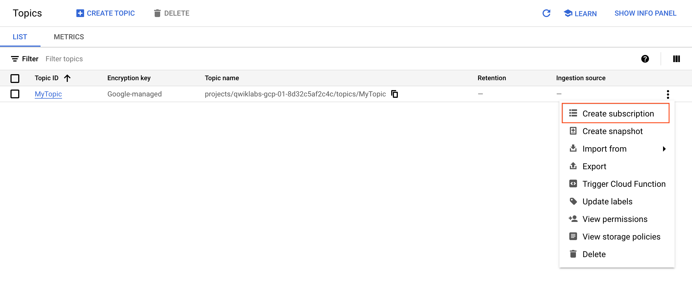
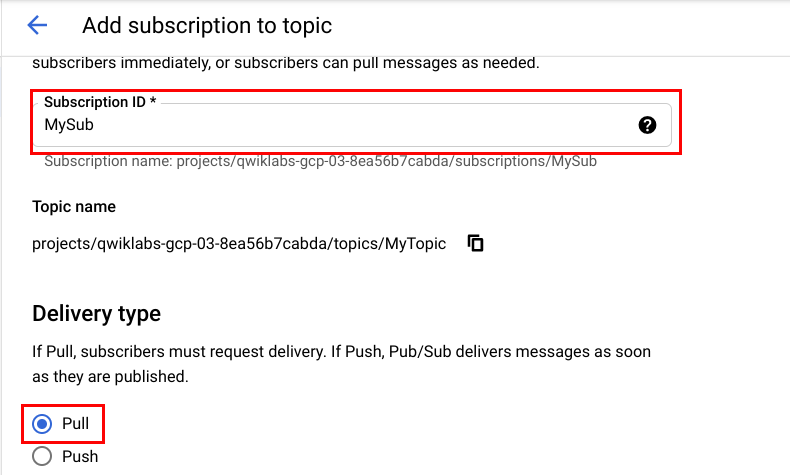
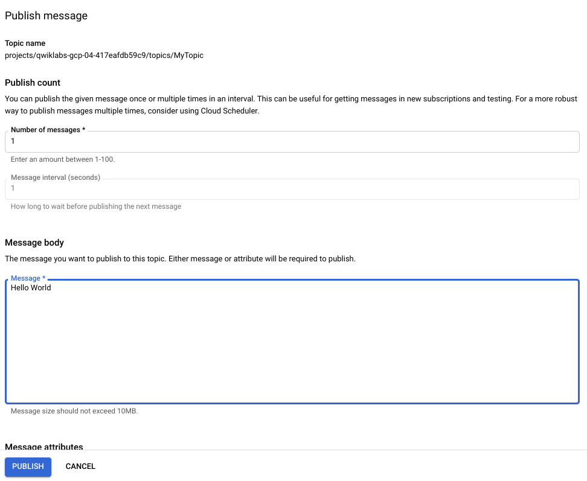
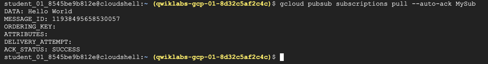
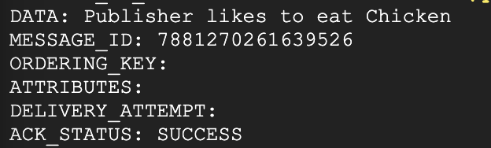
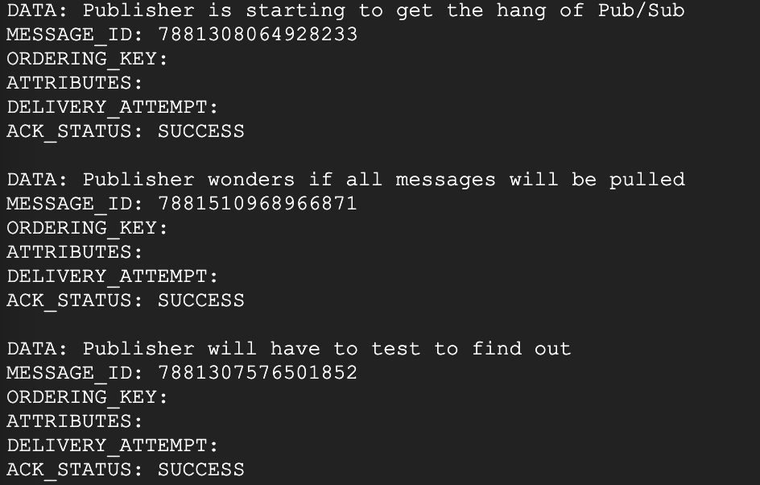

# Set Up an App Dev Environment on Google Cloud


## I. Cloud Storage: Qwik Start - Cloud Console

## Task 1. Create a bucket

*Buckets* are the basic containers that hold your data in Cloud Storage.

To create a bucket:

1. In the Cloud console, go to **Navigation menu** > **Cloud Storage** > **Buckets**.
2. Click **+ Create**:



1. Enter your bucket information and click **Continue** to complete each step:

   - **Name your bucket:** Enter a unique name for your bucket. For this lab, you can use your **Project ID** as the bucket name because it will always be unique.

   **Bucket naming rules:**

   - Do not include sensitive information in the bucket name, because the bucket namespace is global and publicly visible.
   - Bucket names must contain only lowercase letters, numbers, dashes (-), underscores (_), and dots (.). Names containing dots require [verification](https://cloud.google.com/storage/docs/domain-name-verification).
   - Bucket names must start and end with a number or letter.
   - Bucket names must contain 3 to 63 characters. Names containing dots can contain up to 222 characters, but each dot-separated component can be no longer than 63 characters.
   - Bucket names cannot be represented as an IP address in dotted-decimal notation (for example, 192.168.5.4).
   - Bucket names cannot begin with the "goog" prefix. Bucket names cannot contain "google" or close misspellings of "google".*
   - Also, for DNS compliance and future compatibility, you should not use underscores (_) or have a period adjacent to another period or dash. For example, ".." or "-." or ".-" are not valid in DNS names.
   - Choose **Region** for **Location type** and `<filled in at lab start>` for **Location**.
   - Choose **Standard** for **default storage class**.
   - Choose **Uniform** for **Access control** and **uncheck** *Enforce public access prevention on this bucket* to turn it off.

2. Leave the rest of the fields as their default values and click **Create**.

That's it — you've just created a Cloud Storage bucket!

**Note:** If you are prompted with Public access will be prevented, uncheck *Enforce public access prevention on this bucket* and click **Confirm**.

### Test completed task

Click **Check my progress** to verify your performed task. If you have successfully created a Cloud Storage bucket, you will see an assessment score.

Create a bucket

Check my progress


### Test your understanding

Below are multiple choice questions to reinforce your understanding of this lab's concepts. Answer them to the best of your ability.


Every bucket must have a unique name across the entire Cloud Storage namespace.

- **True**

- False


## Task 2. Upload an object into the bucket


To upload the image above into your new bucket:

1. Right-click on the image above and download it to your computer. Save the image as **kitten.png**, renaming it on download.
2. In the Cloud Storage browser page, click the name of the bucket that you created.
3. In the **Objects** tab, click **Upload files**.
4. In the file dialog, go to the file that you downloaded and select it.
5. Ensure the file is named **kitten.png**. If it is not, click the **three dot** icon for your file, select **Rename** from the dropdown, and rename the file to **kitten.png**.

After the upload completes, you should see the file name and information about the file, such as its size and type.

### Test completed task

Click **Check my progress** to verify your performed task. If you have successfully uploaded an object to your bucket, you will see an assessment score.

Upload an object into the bucket (kitten.png)

Check my progress


### Test your understanding

Below are multiple choice questions to reinforce your understanding of this lab's concepts. Answer them to the best of your ability.


Object names must be unique only within a given bucket.

- **True**

- False


## Task 3. Share a bucket publicly

To allow public access to the bucket and create a publicly accessible URL for the image:

1. Click the **Permissions** tab above the list of files.
2. Ensure the view is set to **Principals**. Click **Grant Access** to view the **Add principals** pane.
3. In the **New principals** box, enter *allUsers*.
4. In the **Select a role** drop-down, select **Cloud Storage** > **Storage Object Viewer**.
5. Click **Save**.
6. In the **Are you sure you want to make this resource public?** window, click **Allow public access**.

### Test completed task

Click **Check my progress** to verify your performed task. If you have successfully shared an object publicly from your bucket, you will see an assessment score.

Share a kitten.png object publicly

Check my progress


1. To verify, click the **Objects** tab to return to the list of objects. Your object's **Public access** column should read **Public to internet**.

**Note:** If your object does not appear to be public after following the previous steps, you may need to refresh your browser page.

1. Press the **Copy URL** button for your object and paste it into a separate tab to view your image.

The **Copy URL** button provides a shareable URL similar to the following:

```
https://storage.googleapis.com/YOUR_BUCKET_NAME/kitten.png
```

## Task 4. Create folders

1. In the **Objects** tab, click **Create folder**.
2. Enter **folder1** for **Name** and click **Create**.

You should see the folder in the bucket with an image of a folder icon to distinguish it from objects.

Create a subfolder and upload a file to it:

1. Click **folder1**.
2. Click **Create folder**.
3. Enter **folder2** for **Name** and click **Create**.
4. Click **folder2**.
5. Click **Upload files**.
6. In the file dialog, navigate to the screenshot that you downloaded and select it.

After the upload completes, you should see the file name and information about the file, such as its size and type.

## Task 5. Delete a folder

1. Click the arrow next to **Bucket details** to return to the buckets level.
2. Select the bucket.
3. Click on the **Delete** button.
4. In the window that opens, type `DELETE` to confirm the deletion of the folder.
5. Click **Delete** to permanently delete the folder and all objects and subfolders in it.


# II. Cloud Storage: Qwik Start - CLI/SDK

### Activate Cloud Shell

Cloud Shell is a virtual machine that is loaded with development tools. It offers a persistent 5GB home directory and runs on the Google Cloud. Cloud Shell provides command-line access to your Google Cloud resources.

1. Click **Activate Cloud Shell**  at the top of the Google Cloud console.

When you are connected, you are already authenticated, and the project is set to your **Project_ID**, `PROJECT_ID`. The output contains a line that declares the **Project_ID** for this session:

```
Your Cloud Platform project in this session is set to "PROJECT_ID"
```

`gcloud` is the command-line tool for Google Cloud. It comes pre-installed on Cloud Shell and supports tab-completion.

1. (Optional) You can list the active account name with this command:

```
gcloud auth list
```

Copied!

content_copy

1. Click **Authorize**.

**Output:**

```
ACTIVE: *
ACCOUNT: "ACCOUNT"

To set the active account, run:
    $ gcloud config set account `ACCOUNT`
```

1. (Optional) You can list the project ID with this command:

```
gcloud config list project
```

Copied!

content_copy

**Output:**

```
[core]
project = "PROJECT_ID"
```

**Note:** For full documentation of `gcloud`, in Google Cloud, refer to [the gcloud CLI overview guide](https://cloud.google.com/sdk/gcloud).

### Set the region

Set the project region for this lab:

```
gcloud config set compute/region "REGION"
```

Copied!

content_copy

### Task 1. Create a bucket

The Cloud Storage utility tool, [gsutil](https://cloud.google.com/storage/docs/gsutil), is installed and ready to use in Google Cloud. In this lab you use `gsutil` in Cloud Shell.

When you create a bucket you must follow the universal bucket naming rules, below.

**Bucket naming rules**

- Do not include sensitive information in the bucket name, because the bucket namespace is global and publicly visible.
- Bucket names must contain only lowercase letters, numbers, dashes (-), underscores (_), and dots (.). Names containing dots require [verification](https://cloud.google.com/storage/docs/domain-name-verification).
- Bucket names must start and end with a number or letter.
- Bucket names must contain 3 to 63 characters. Names containing dots can contain up to 222 characters, but each dot-separated component can be no longer than 63 characters.
- Bucket names cannot be represented as an IP address in dotted-decimal notation (for example, 192.168.5.4).
- Bucket names cannot begin with the "goog" prefix.
- Bucket names cannot contain "google" or close misspellings of "google".
- Also, for DNS compliance and future compatibility, you should not use underscores (_) or have a period adjacent to another period or dash. For example, ".." or "-." or ".-" are not valid in DNS names.

Use the make bucket (`mb`) command to make a bucket, replacing `<YOUR_BUCKET_NAME>` with a unique name that follows the bucket naming rules:

```
gsutil mb gs://<YOUR-BUCKET-NAME>
```

Copied!

content_copy

This command is creating a bucket with default settings. To see what those default settings are, use the Cloud console **Navigation menu** > **Cloud Storage**, then click on your bucket name, and click on the **Configuration** tab.

That's it — you've just created a Cloud Storage bucket!

**Note:** If the bucket name is already taken, either by you or someone else, the command returns:

```
Creating gs://YOUR-BUCKET-NAME/...`
`ServiceException: 409 Bucket YOUR-BUCKET-NAME already exists.
```

Try again with a different bucket name.

#### Test completed task

Click **Check my progress** to verify your performed task. If you've successfully created a Cloud Storage bucket, you'll see an assessment score.

Create a Cloud Storage bucket.

Check my progress


#### Test your understanding

Below is a multiple choice question to reinforce your understanding of this lab's concepts. Answer it to the best of your ability.


Each bucket has a default storage class, which you can specify when you create your bucket.

True

False


### Task 2. Upload an object into your bucket

Use Cloud Shell to upload an object into a bucket.

1. To download this image (ada.jpg) into your bucket, enter this command into Cloud Shell:

```
curl https://upload.wikimedia.org/wikipedia/commons/thumb/a/a4/Ada_Lovelace_portrait.jpg/800px-Ada_Lovelace_portrait.jpg --output ada.jpg
```

Copied!

content_copy

1. Use the `gsutil cp` command to upload the image from the location where you saved it to the bucket you created:

```
gsutil cp ada.jpg gs://YOUR-BUCKET-NAME
```

Copied!

content_copy

**Note:** When typing your bucket name, you can use the tab key to autocomplete it.

You can see the image load into your bucket from the command line.

You've just stored an object in your bucket!

1. Now remove the downloaded image:

```
rm ada.jpg
```

Copied!

content_copy

### Task 3. Download an object from your bucket

- Use the `gsutil cp` command to download the image you stored in your bucket to Cloud Shell:

```
gsutil cp -r gs://YOUR-BUCKET-NAME/ada.jpg .
```

Copied!

content_copy

If successful, the command returns:

```
Copying gs://YOUR-BUCKET-NAME/ada.jpg...
/ [1 files][360.1 KiB/2360.1 KiB]
Operation completed over 1 objects/360.1 KiB.
```

You've just downloaded the image from your bucket.

### Task 4. Copy an object to a folder in the bucket

- Use the `gsutil cp` command to create a folder called `image-folder` and copy the image (ada.jpg) into it:

```
gsutil cp gs://YOUR-BUCKET-NAME/ada.jpg gs://YOUR-BUCKET-NAME/image-folder/
```

Copied!

content_copy

**Note:** Compared to local file systems, [folders in Cloud Storage](https://cloud.google.com/storage/docs/gsutil/addlhelp/HowSubdirectoriesWork) have limitations, but many of the same operations are supported.

If successful, the command returns:

```
Copying gs://YOUR-BUCKET-NAME/ada.jpg [Content-Type=image/png]...
- [1 files] [ 360.1 KiB/ 360.1 KiB]
Operation completed over 1 objects/360.1 KiB
```

The image file has been copied into a new folder in your bucket.

#### Test completed task

Click **Check my progress** to verify your performed task. If you have successfully uploaded an object into a folder in your Cloud Storage bucket, you'll see an assessment score.

Copy an object to a folder in the bucket (ada.jpg).

Check my progress


### Task 5. List contents of a bucket or folder

- Use the `gsutil ls` command to list the contents of the bucket:

```
gsutil ls gs://YOUR-BUCKET-NAME
```

Copied!

content_copy

If successful, the command returns a message similar to:

```
gs://YOUR-BUCKET-NAME/ada.jpg
gs://YOUR-BUCKET-NAME/image-folder/
```

That's everything currently in your bucket.

### Task 6. List details for an object

- Use the `gsutil ls` command, with the `-l` flag to get some details about the image file you uploaded to your bucket:

```
gsutil ls -l gs://YOUR-BUCKET-NAME/ada.jpg
```

Copied!

content_copy

If successful, the command returns a message similar to:

```
306768  2017-12-26T16:07:570Z  gs://YOUR-BUCKET-NAME/ada.jpg
TOTAL: 1 objects, 30678 bytes (360.1 KiB)
```

Now you know the image's size and date of creation.

### Task 7. Make your object publicly accessible

- Use the `gsutil acl ch` command to grant all users read permission for the object stored in your bucket:

```
gsutil acl ch -u AllUsers:R gs://YOUR-BUCKET-NAME/ada.jpg
```

Copied!

content_copy

If successful, the command returns:

```
Updated ACL on gs://YOUR-BUCKET-NAME/ada.jpg
```

Your image is now public, and can be made available to anyone.

#### Test completed ask

Click **Check my progress** to verify your performed task. If you have successfully shared an object from your storage bucket, you will see an assessment score.

Make your object publicly accessible

Check my progress


Validate that your image is publicly available.

- Go to **Navigation menu** > **Cloud Storage**, then click on the name of your bucket.

You should see your image with the **Public link** box. Click the **Copy URL** and open the URL in a new browser tab.

**Note:** Who are you looking at? This is [Ada Lovelace](https://en.wikipedia.org/wiki/Ada_Lovelace), credited with being the first computer programmer. She worked with mathematician and computer pioneer Charles Babbage, who proposed the [Analytical Engine](https://en.wikipedia.org/wiki/Analytical_Engine).

Her interest in the Analytical Engine lead to translating a paper on the machine by Italian mathematician Luigi Menabrea, adding her own extensive annotations. These notes are considered the first computer program - an algorithm designed to be carried out by the machine. She developed a vision of the capability of computers, going beyond number crunching, and examined how individuals and society relate to technology as a collaborative tool.

**Citation:** Ada Lovelace. (2015, October 22). Wikimedia Commons, the free media repository. Retrieved 08:01, May 31, 2022 from https://commons.wikimedia.org/w/index.php?title=Ada_Lovelace&oldid=176490980, .

#### Test your understanding

Below is a multiple choice question to reinforce your understanding of this lab's concepts. Answer it to the best of your ability.


An access control list (ACL) is a mechanism you can use to define who has access to your buckets and objects.

True

False


### Task 8. Remove public access

1. To remove this permission, use the command:

```
gsutil acl ch -d AllUsers gs://YOUR-BUCKET-NAME/ada.jpg
```

Copied!

content_copy

If successful, the command returns:

```
Updated ACL on gs://YOUR-BUCKET-NAME/ada.jpg
```

You have removed public access to this object.

1. Verify that you've removed public access by clicking the **Refresh** button in the console. The checkmark will be removed.

#### Test your understanding

Below is a multiple choice question to reinforce your understanding of this lab's concepts. Answer it to the best of your ability.


You can stop publicly sharing an object by removing the permission entry that has:

By updating storage class

By removing project owner role

allUsers

Submit


### Delete objects

1. Use the `gsutil rm` command to delete an object - the image file in your bucket:

```
gsutil rm gs://YOUR-BUCKET-NAME/ada.jpg
```

Copied!

content_copy

If successful, the command returns:

```
Removing gs://YOUR-BUCKET-NAME/ada.jpg...
```

1. Refresh the console. The copy of the image file is no longer stored on Cloud Storage (though the copy you made in the `image-folder/` folder still exists).

### Congratulations!

You created a storage bucket, organized it by creating folders and subfolders, then uploaded objects to it. You also made objects in your bucket publicly accessible using Cloud Shell.


# III. Cloud IAM: Qwik Start

## Setup and requirements

As mentioned earlier, this lab provides two sets of credentials to illustrate IAM policies and what permissions are available for specific roles.

In the **Lab Connection** panel on the left side of your lab, you see a list of credentials that resembles the following:


Notice that there are *two* usernames: Username 1 and Username 2. These represent identities in Cloud IAM, each with different access permissions allocated to them. These "roles" set constraints on what you can and cannot do with Google Cloud resources in the project you've been allocated.

### Sign in to Cloud Console as the first user

1. Click on the **Open Google Console** button. This opens a new browser tab. If you are asked to **Choose an account**, click **Use another account**.
2. The Google Cloud sign in page opens. A Sign in page opens—copy and paste the **Username 1** credential that resembles `googlexxxxxx_student@qwiklabs.net` into the "Email or phone" field and then click **Next**.
3. Copy the password from the **Lab Connection** panel and paste into the Google Sign in password field.
4. Click **Next** and then **Accept** the terms of service. The Cloud Console opens. Agree to the terms of service and click **Agree and Continue**.

### Sign in to Cloud Console as the second user

1. Click on the **Open Google Console** button again. A new browser tab opens, if you are asked to **Choose an account**, click **Use another account**.
2. The Google Cloud sign in page opens. Copy and paste the **Username 2** credential that resembles `googlexxxxxx_student@qwiklabs.net` into the **Email or phone** field and then click **Next**.
3. Copy the password from the **Lab Connection** panel and paste into the Google Sign in password field.
4. Click **Next** and then **Accept** the terms of service. The Cloud Console opens. Agree to the terms of service and click **Agree and Continue**.

You should now have two Cloud Console tabs open in your browser—one signed in with Username 1 and the other with Username 2.

### View or reset the user in a browser tab

Occasionally, a user is overwritten in a browser tab or you may be confused about which user is signed into which browser tab.

To view which user is signed into a browser tab, hover over your Avatar to view your username in that browser tab.


To reset which user is signed into a browser tab:

1. Click your Avatar and click **Sign out** to sign out.
2. In the **Lab Connection** panel, click **Open Google Console** and sign in back using the appropriate Username and Password.

## Task 1. Explore the IAM console and project level roles

1. Return to the **Username 1** Cloud Console page.
2. Select **Navigation menu** > **IAM & Admin** > **IAM**. You are now in the "IAM & Admin" console.
3. Click **+GRANT ACCESS** button at the top of the page.
4. Scroll down to **Basic** in Select a role section and mouse over.

There are three roles:

- Editor
- Owner
- Viewer

These are *primitive roles* in Google Cloud. Primitive roles set project-level permissions and unless otherwise specified, they control access and management to all Google Cloud services.

The following table pulls definitions from the Google Cloud IAM article, [Basic roles](https://cloud.google.com/iam/docs/understanding-roles#primitive_roles), which gives a brief overview of browser, viewer, editor, and owner role permissions:

| **Role Name** | **Permissions**                                              |
| ------------- | ------------------------------------------------------------ |
| roles/viewer  | Permissions for read-only actions that do not affect state, such as viewing (but not modifying) existing resources or data. |
| roles/editor  | All viewer permissions, plus permissions for actions that modify state, such as changing existing resources. |
| roles/owner   | All editor permissions and permissions for the following actions:Manage roles and permissions for a project and all resources within the project.Set up billing for a project. |

Since you are able to manage roles and permissions for this project, Username 1 has Project owner permissions.

1. Click **CANCEL** to exit out of the "Add principal" panel.

### Explore the editor role

Now switch to the **Username 2** console.

1. Navigate to the IAM & Admin console, select **Navigation menu** > **IAM & Admin** > **IAM**.
2. Search through the table to find Username 1 and Username 2 and examine the roles they are granted. The Username 1 and Username 2 roles are listed inline and to the right of each user.

You should see:

- Username 2 has the "Viewer" role granted to it.
- The **+GRANT ACCESS** button at the top is grayed out—if you try to click on it you get the message, "You need permissions for this action. Required permission(s): resource manager.projects.setIamPolicy".

This is one example of how IAM roles affect what you can and cannot do in Google Cloud.

1. Switch back to the **Username 1** console for the next step.

## Task 2. Prepare a Cloud Storage bucket for access testing

Ensure that you are in the **Username 1** Cloud Console.

### Create a bucket

1. Create a Cloud Storage bucket with a unique name. From the Cloud Console, select **Navigation menu** > **Cloud Storage** > **Buckets**.
2. Click **+CREATE**.

**Note:** If you get a permissions error for bucket creation, sign out and then sign in back in with the Username 1 credentials.

1. Update the following fields, leave all others at their default values:

| **Property**       | **Value**                                                    |
| ------------------ | ------------------------------------------------------------ |
| **Name**:          | *globally unique name (create it yourself!) and click **CONTINUE**.* |
| **Location Type:** | Multi-Region                                                 |

Note the bucket name. You will use it in a later step.

1. Click **CREATE**.
2. If prompted, Public access will be prevented, click **Confirm**.

**Note:** If you get a permissions error for bucket creation, sign out and then sign in back in with the Username 1 credentials.

### Upload a sample file

1. On the Bucket Details page click **UPLOAD FILES**.
2. Browse your computer to find a file to use. Any text or html file will do.
3. Click on the three dots at the end of the line containing the file and click **Rename**.
4. Rename the file ‘`sample.txt`'.
5. Click **RENAME**.

Click **Check my progress** to verify the objective.

Create a bucket and upload a sample file

Check my progress


### Verify project viewer access

1. Switch to the **Username 2** console.
2. From the Console, select **Navigation menu** > **Cloud Storage** > **Buckets**. Verify that this user can see the bucket.

Username 2 has the "Viewer" role prescribed which allows them read-only actions that do not affect state. This example illustrates this feature—they can view Cloud Storage buckets and files that are hosted in the Google Cloud project that they've been granted access to.

## Task 3. Remove project access

Switch to the **Username 1** console.

### Remove Project Viewer for Username 2

1. Select **Navigation menu** > **IAM & Admin** > **IAM**. Then click the pencil icon inline and to the right of **Username 2**.

**Note:** You may have to widen the screen to see the pencil icon.

1. Remove Project Viewer access for **Username 2** by clicking the trashcan icon next to the role name. Then click **SAVE**.

Notice that the user has disappeared from the Member list! The user has no access now.

**Note:** It can take up to 80 seconds for such a change to take effect as it propagates. Read more about Google Cloud IAM in the Google Cloud IAMResource Documentation, [Frequently asked questions](https://cloud.google.com/iam/docs/faq).

### Verify that Username 2 has lost access

1. Switch to **Username 2** Cloud Console. Ensure that you are still signed in with Username 2's credentials and that you haven't been signed out of the project after permissions were revoked. If signed out, sign in back with the proper credentials.
2. Navigate back to Cloud Storage by selecting **Navigation menu** > **Cloud Storage** > **Buckets**.

You should see a permission error.

**Note**: As mentioned before, it can take up to 80 seconds for permissions to be revoked. If you haven't received a permission error, wait a 2 minutes and then try refreshing the console.

Click **Check my progress** to verify the objective.

Remove project access

Check my progress


## Task 4. Add Cloud Storage permissions

1. Copy **Username 2** name from the **Lab Connection** panel.
2. Switch to **Username 1** console. Ensure that you are still signed in with Username 1's credentials. If you are signed out, sign in back with the proper credentials.
3. In the Console, select **Navigation menu** > **IAM & Admin** > **IAM**.
4. Click **+GRANT ACCESS** button and paste the **Username 2** name into the **New principals** field.
5. In the **Select a role** field, select **Cloud Storage** > **Storage Object Viewer** from the drop-down menu.
6. Click **SAVE**.

### Verify access

1. Switch to the **Username 2** console. You'll still be on the Storage page.

**Username 2** doesn't have the Project Viewer role, so that user can't see the project or any of its resources in the Console. However, this user has specific access to Cloud Storage, the Storage Object Viewer role - check it out now.

1. Click **Activate Cloud Shell**  to open the Cloud Shell command line. If prompted click **Continue**.
2. Open up a Cloud Shell session and then enter in the following command, replace `[YOUR_BUCKET_NAME]` with the name of the bucket you created earlier:

```
gsutil ls gs://[YOUR_BUCKET_NAME]
```

Copied!

content_copy

You should receive a similar output:

```
gs://[YOUR_BUCKET_NAME]/sample.txt
```

**Note:** If you see `AccessDeniedException`, wait a minute and run the previous command again.

1. As you can see, you gave **Username 2** view access to the Cloud Storage bucket.

Click **Check my progress** to verify the objective.

Add Cloud Storage permissions

Check my progress


## Congratulations!

In this lab, you exercised granting and revoking Cloud IAM roles to a user.


# IV. Cloud Monitoring: Qwik Start

## Overview

Cloud Monitoring provides visibility into the performance, uptime, and overall health of cloud-powered applications. Cloud Monitoring collects metrics, events, and metadata from Google Cloud, Amazon Web Services, hosted uptime probes, application instrumentation, and a variety of common application components including Cassandra, Nginx, Apache Web Server, Elasticsearch, and many others. Cloud Monitoring ingests that data and generates insights via dashboards, charts, and alerts. Cloud Monitoring alerting helps you collaborate by integrating with Slack, PagerDuty, HipChat, Campfire, and more.

In this lab you'll install monitoring and logging agents to collect information from your instance, which could include metrics and logs from 3rd party apps.

## Objectives

In this lab, you learn how to:

- Monitor a Compute Engine virtual machine (VM) instance with Cloud Monitoring.
- Install monitoring and logging agents for your VM

## Setup and requirements

### Before you click the Start Lab button

Read these instructions. Labs are timed and you cannot pause them. The timer, which starts when you click **Start Lab**, shows how long Google Cloud resources will be made available to you.

This hands-on lab lets you do the lab activities yourself in a real cloud environment, not in a simulation or demo environment. It does so by giving you new, temporary credentials that you use to sign in and access Google Cloud for the duration of the lab.

To complete this lab, you need:

- Access to a standard internet browser (Chrome browser recommended).

**Note:** Use an Incognito or private browser window to run this lab. This prevents any conflicts between your personal account and the Student account, which may cause extra charges incurred to your personal account.

- Time to complete the lab---remember, once you start, you cannot pause a lab.

**Note:** If you already have your own personal Google Cloud account or project, do not use it for this lab to avoid extra charges to your account.

### How to start your lab and sign in to the Google Cloud console

1. Click the **Start Lab** button. If you need to pay for the lab, a pop-up opens for you to select your payment method. On the left is the **Lab Details** panel with the following:

   - The **Open Google Cloud console** button
   - Time remaining
   - The temporary credentials that you must use for this lab
   - Other information, if needed, to step through this lab

2. Click **Open Google Cloud console** (or right-click and select **Open Link in Incognito Window** if you are running the Chrome browser).

   The lab spins up resources, and then opens another tab that shows the **Sign in** page.

   ***Tip:\*** Arrange the tabs in separate windows, side-by-side.

   **Note:** If you see the **Choose an account** dialog, click **Use Another Account**.

3. If necessary, copy the **Username** below and paste it into the **Sign in** dialog.

   ```
   "Username"
   ```

   Copied!

   content_copy

   You can also find the **Username** in the **Lab Details** panel.

4. Click **Next**.

5. Copy the **Password** below and paste it into the **Welcome** dialog.

   ```
   "Password"
   ```

   Copied!

   content_copy

   You can also find the **Password** in the **Lab Details** panel.

6. Click **Next**.

   **Important:** You must use the credentials the lab provides you. Do not use your Google Cloud account credentials.

   **Note:** Using your own Google Cloud account for this lab may incur extra charges.

7. Click through the subsequent pages:

   - Accept the terms and conditions.
   - Do not add recovery options or two-factor authentication (because this is a temporary account).
   - Do not sign up for free trials.

After a few moments, the Google Cloud console opens in this tab.

**Note:** To view a menu with a list of Google Cloud products and services, click the **Navigation menu** at the top-left. 

### Activate Cloud Shell

Cloud Shell is a virtual machine that is loaded with development tools. It offers a persistent 5GB home directory and runs on the Google Cloud. Cloud Shell provides command-line access to your Google Cloud resources.

1. Click **Activate Cloud Shell**  at the top of the Google Cloud console.

When you are connected, you are already authenticated, and the project is set to your **Project_ID**, `PROJECT_ID`. The output contains a line that declares the **Project_ID** for this session:

```
Your Cloud Platform project in this session is set to "PROJECT_ID"
```

`gcloud` is the command-line tool for Google Cloud. It comes pre-installed on Cloud Shell and supports tab-completion.

1. (Optional) You can list the active account name with this command:

```
gcloud auth list
```

Copied!

content_copy

1. Click **Authorize**.

**Output:**

```
ACTIVE: *
ACCOUNT: "ACCOUNT"

To set the active account, run:
    $ gcloud config set account `ACCOUNT`
```

1. (Optional) You can list the project ID with this command:

```
gcloud config list project
```

Copied!

content_copy

**Output:**

```
[core]
project = "PROJECT_ID"
```

**Note:** For full documentation of `gcloud`, in Google Cloud, refer to [the gcloud CLI overview guide](https://cloud.google.com/sdk/gcloud).

### Set your region and zone

Certain Compute Engine resources live in regions and zones. A region is a specific geographical location where you can run your resources. Each region has one or more zones.

Learn more about regions and zones and see a complete list in [Regions & Zones documentation](https://cloud.google.com/compute/docs/regions-zones/).

Run the following gcloud commands in Cloud Console to set the default region and zone for your lab:

```
gcloud config set compute/zone "ZONE"
export ZONE=$(gcloud config get compute/zone)

gcloud config set compute/region "REGION"
export REGION=$(gcloud config get compute/region)
```

Copied!

content_copy

## Task 1. Create a Compute Engine instance

1. In the Cloud Console dashboard, go to **Navigation menu** > **Compute Engine** > **VM instances**, then click **Create instance**.

2. Fill in the fields as follows, leaving all other fields at the default value:

   | Field        | Value                          |
   | :----------- | :----------------------------- |
   | Name         | lamp-1-vm                      |
   | Region       | `REGION`                       |
   | Zone         | `ZONE`                         |
   | Series       | E2                             |
   | Machine type | e2-medium                      |
   | Boot disk    | Debian GNU/Linux 12 (bookworm) |
   | Firewall     | Check Allow HTTP traffic       |

3. Click **Create**.

   Wait a couple of minutes, you'll see a green check when the instance has launched.

Click **Check my progress** below. A green check confirms you're on track.

Create a Compute Engine instance

Check my progress


## Task 2. Add Apache2 HTTP Server to your instance

1. In the Console, click **SSH** in line with `lamp-1-vm` to open a terminal to your instance.
2. Run the following commands in the SSH window to set up Apache2 HTTP Server:

```
sudo apt-get update
```

Copied!

content_copy

```
sudo apt-get install apache2 php7.0
```

Copied!

content_copy

1. When asked if you want to continue, enter **Y**.

**Note:** If you cannot install php7.0, use php5.

```
sudo service apache2 restart
```

Copied!

content_copy

Click **Check my progress** below. A green check confirms you're on track.

Add Apache2 HTTP Server to your instance

Check my progress


1. Return to the Cloud Console, on the VM instances page. Click the `External IP` for `lamp-1-vm` instance to see the Apache2 default page for this instance.

**Note:** If you are unable to find `External IP` column then click on **Column Display Options** icon on the right side of the corner, select `External IP` checkbox and click **OK**.

Click **Check my progress** below. A green check confirms you're on track.

Get a success response over External IP of VM instance

Check my progress


### Create a Monitoring Metrics Scope

Set up a Monitoring Metrics Scope that's tied to your Google Cloud Project. The following steps create a new account that has a free trial of Monitoring.

- In the Cloud Console, click **Navigation menu** () > View All Products > Observability > **Monitoring**.

When the Monitoring **Overview** page opens, your metrics scope project is ready.

### Install the Monitoring and Logging agents

Agents collect data and then send or stream info to Cloud Monitoring in the Cloud Console.

The *Cloud Monitoring agent* is a collected-based daemon that gathers system and application metrics from virtual machine instances and sends them to Monitoring. By default, the Monitoring agent collects disk, CPU, network, and process metrics. Configuring the Monitoring agent allows third-party applications to get the full list of agent metrics. On the Google Cloud, Operations website, see [Cloud Monitoring Documentation](https://cloud.google.com/monitoring/docs#) for more information.

In this section, you install the *Cloud Logging agent* to stream logs from your VM instances to Cloud Logging. Later in this lab, you see what logs are generated when you stop and start your VM.

**Note:** It is best practice to run the Cloud Logging agent on all your VM instances.

1. Run the Monitoring agent install script command in the SSH terminal of your VM instance to install the Cloud Monitoring agent:

```
curl -sSO https://dl.google.com/cloudagents/add-google-cloud-ops-agent-repo.sh
```

Copied!

content_copy

```
sudo bash add-google-cloud-ops-agent-repo.sh --also-install
```

Copied!

content_copy

1. If asked if you want to continue, press **Y**.
2. Run the Logging agent install script command in the SSH terminal of your VM instance to install the Cloud Logging agent:

```
sudo systemctl status google-cloud-ops-agent"*"
```

Copied!

content_copy

Press **q** to exit the status.

```
sudo apt-get update
```

Copied!

content_copy

## Task 3. Create an uptime check

Uptime checks verify that a resource is always accessible. For practice, create an uptime check to verify your VM is up.

1. In the Cloud Console, in the left menu, click **Uptime checks**, and then click **Create Uptime Check**.

2. For **Protocol**, select **HTTP**.

3. For **Resource Type**, select **Instance**.

4. For **Instance**, select **lamp-1-vm**.

5. For **Check Frequency**, select **1 minute**.

6. Click **Continue**.

7. In Response Validation, accept the defaults and then click **Continue**.

8. In Alert & Notification, accept the defaults, and then click **Continue**.

9. For Title, type **Lamp Uptime Check**.

10. Click **Test** to verify that your uptime check can connect to the resource.

    When you see a green check mark everything can connect.

11. Click **Create**.

    The uptime check you configured takes a while for it to become active. Continue with the lab, you'll check for results later. While you wait, create an alerting policy for a different resource.

## Task 4. Create an alerting policy

Use Cloud Monitoring to create one or more alerting policies.

1. In the left menu, click **Alerting**, and then click **+Create Policy**.
2. Click on **Select a metric** dropdown. Uncheck the **Active**.
3. Type **Network traffic** in filter by resource and metric name and click on **VM instance > Interface**. Select `Network traffic` (agent.googleapis.com/interface/traffic) and click **Apply**. Leave all other fields at the default value.
4. Click **Next**.
5. Set the **Threshold position** to `Above threshold`, **Threshold value** to `500` and **Advanced Options > Retest window** to `1 min`. Click **Next**.
6. Click on the drop down arrow next to **Notification Channels**, then click on **Manage Notification Channels**.

A **Notification channels** page will open in a new tab.

1. Scroll down the page and click on **ADD NEW** for **Email**.
2. In the **Create Email Channel** dialog box, enter your personal email address in the **Email Address** field and a **Display name**.
3. Click on **Save**.
4. Go back to the previous **Create alerting policy** tab.
5. Click on **Notification Channels** again, then click on the **Refresh icon** to get the display name you mentioned in the previous step.
6. Click on **Notification Channels** again if necessary, select your **Display name** and click **OK**.
7. Add a message in documentation, which will be included in the emailed alert.
8. Mention the **Alert name** as `Inbound Traffic Alert`.
9. Click **Next**.
10. Review the alert and click **Create Policy**.

You've created an alert! While you wait for the system to trigger an alert, create a dashboard and chart, and then check out Cloud Logging.

Click **Check my progress** below. A green check confirms you're on track.

Create an uptime check and alerting policy

Check my progress


## Task 5. Create a dashboard and chart

You can display the metrics collected by Cloud Monitoring in your own charts and dashboards. In this section you create the charts for the lab metrics and a custom dashboard.

1. In the left menu select **Dashboards**, and then **+Create Dashboard**.
2. Name the dashboard `Cloud Monitoring LAMP Qwik Start Dashboard`.

### Add the first chart

1. Click on **+ ADD WIDGET**
2. Select the **Line** option under **Visualization** in the **Add widget**.
3. Name the Widget title **CPU Load**.
4. Click on **Select a metric** dropdown. Uncheck the **Active**.
5. Type **CPU load (1m)** in filter by resource and metric name and click on **VM instance > Cpu**. Select `CPU load (1m)` and click **Apply**. Leave all other fields at the default value. Refresh the tab to view the graph.

### Add the second chart

1. Click **+ Add WIDGET** and select **Line** option under **Visualization** in the **Add widget**.
2. Name this Widget title **Received Packets**.
3. Click on **Select a metric** dropdown. Uncheck the **Active**.
4. Type **Received packets** in filter by resource and metric name and click on **VM instance > Instance**. Select `Received packets` and click **Apply**. Refresh the tab to view the graph.
5. Leave the other fields at their default values. You see the chart data.

## Task 6. View your logs

Cloud Monitoring and Cloud Logging are closely integrated. Check out the logs for your lab.

1. Select **Navigation menu** > **Logging** > **Logs Explorer**.
2. Select the logs you want to see, in this case, you select the logs for the lamp-1-vm instance you created at the start of this lab:
   - Click on **Resource**.
   - Select **VM Instance** > **lamp-1-vm** in the Resource drop-down menu.
   - Click **Apply**.
   - Leave the other fields with their default values.
   - Click the **Stream logs**.

You see the logs for your VM instance.

### Check out what happens when you start and stop the VM instance.

To best see how Cloud Monitoring and Cloud Logging reflect VM instance changes, make changes to your instance in one browser window and then see what happens in the Cloud Monitoring, and then Cloud Logging windows.

1. Open the Compute Engine window in a new browser window. Select **Navigation menu** > **Compute Engine**, right-click **VM instances** > **Open link in new window**.

2. Move the Logs Viewer browser window next to the Compute Engine window. This makes it easier to view how changes to the VM are reflected in the logs

3. In the Compute Engine window, select the `lamp-1-vm` instance, click the three vertical dots at the right of the screen and then click **Stop**, and then confirm to stop the instance.

   It takes a few minutes for the instance to stop.

4. Watch in the Logs View tab for when the VM is stopped.

5. In the VM instance details window, click the three vertical dots at the right of the screen and then click **Start/resume**, and then confirm. It will take a few minutes for the instance to re-start. Watch the log messages to monitor the start up.

## Task 7. Check the uptime check results and triggered alerts

1. In the Cloud Logging window, select **Navigation menu** > **Monitoring** > **Uptime checks**. This view provides a list of all active uptime checks, and the status of each in different locations.

   You will see Lamp Uptime Check listed. Since you have just restarted your instance, the regions are in a failed status. It may take up to 5 minutes for the regions to become active. Reload your browser window as necessary until the regions are active.

2. Click the name of the uptime check, `Lamp Uptime Check`.

   Since you have just restarted your instance, it may take some minutes for the regions to become active. Reload your browser window as necessary.

### Check if alerts have been triggered

1. In the left menu, click **Alerting**.
2. You see incidents and events listed in the Alerting window.
3. Check your email account. You should see Cloud Monitoring Alerts.

**Note:** Remove the email notification from your alerting policy. The resources for the lab may be active for a while after you finish, and this may result in a few more email notifications getting sent out.

## Congratulations!

You have successfully set up and monitored a VM with Cloud Monitoring. You've also created an uptime check, an alerting policy, and a dashboard and chart. You've seen how Cloud Logging reflects changes to your VM instance.


# V. Cloud Functions: Qwik Start - Console

## Overview

A cloud function is a piece of code that runs in response to an event, such as an HTTP request, a message from a messaging service, or a file upload. Cloud events are *things* that happen in your cloud environment. These might be things like changes to data in a database, files added to a storage system, or a new virtual machine instance being created.

Since cloud functions are event-driven, they only run when something happens. This makes them a good choice for tasks that need to be done quickly or that don't need to be running all the time.

For example, you can use a cloud function to:

- automatically generate thumbnails for images that are uploaded to Cloud Storage.
- send a notification to a user's phone when a new message is received in Cloud Pub/Sub.
- process data from a Cloud Firestore database and generate a report.

You can write your code in any language that supports Node.js, and you can deploy your code to the cloud with a few clicks. Once your cloud function is deployed, it will automatically start running in response to events.

This hands-on lab shows you how to create, deploy, and test a cloud function using the Google Cloud console.

### What you'll do

- Create a Cloud Run functions
- Deploy and test the function
- View logs

## Setup and requirements

### Before you click the Start Lab button

Read these instructions. Labs are timed and you cannot pause them. The timer, which starts when you click **Start Lab**, shows how long Google Cloud resources will be made available to you.

This hands-on lab lets you do the lab activities yourself in a real cloud environment, not in a simulation or demo environment. It does so by giving you new, temporary credentials that you use to sign in and access Google Cloud for the duration of the lab.

To complete this lab, you need:

- Access to a standard internet browser (Chrome browser recommended).

**Note:** Use an Incognito or private browser window to run this lab. This prevents any conflicts between your personal account and the Student account, which may cause extra charges incurred to your personal account.

- Time to complete the lab---remember, once you start, you cannot pause a lab.

**Note:** If you already have your own personal Google Cloud account or project, do not use it for this lab to avoid extra charges to your account.

### How to start your lab and sign in to the Google Cloud console

1. Click the **Start Lab** button. If you need to pay for the lab, a pop-up opens for you to select your payment method. On the left is the **Lab Details** panel with the following:

   - The **Open Google Cloud console** button
   - Time remaining
   - The temporary credentials that you must use for this lab
   - Other information, if needed, to step through this lab

2. Click **Open Google Cloud console** (or right-click and select **Open Link in Incognito Window** if you are running the Chrome browser).

   The lab spins up resources, and then opens another tab that shows the **Sign in** page.

   ***Tip:\*** Arrange the tabs in separate windows, side-by-side.

   **Note:** If you see the **Choose an account** dialog, click **Use Another Account**.

3. If necessary, copy the **Username** below and paste it into the **Sign in** dialog.

   ```
   "Username"
   ```

   Copied!

   content_copy

   You can also find the **Username** in the **Lab Details** panel.

4. Click **Next**.

5. Copy the **Password** below and paste it into the **Welcome** dialog.

   ```
   "Password"
   ```

   Copied!

   content_copy

   You can also find the **Password** in the **Lab Details** panel.

6. Click **Next**.

   **Important:** You must use the credentials the lab provides you. Do not use your Google Cloud account credentials.

   **Note:** Using your own Google Cloud account for this lab may incur extra charges.

7. Click through the subsequent pages:

   - Accept the terms and conditions.
   - Do not add recovery options or two-factor authentication (because this is a temporary account).
   - Do not sign up for free trials.

After a few moments, the Google Cloud console opens in this tab.

**Note:** To view a menu with a list of Google Cloud products and services, click the **Navigation menu** at the top-left. 

## Task 1. Create a function

In this step, you're going to create a cloud function using the console.

1. In the console, on the **Navigation menu ()** click **VIEW ALL PRODUCTS** and click **Serverless > Cloud Run functions**.
2. Click **Create function**.
3. In the **Create function** dialog, enter the following values:

| **Field**                                                    | **Value**                                                    |
| ------------------------------------------------------------ | ------------------------------------------------------------ |
| Environment                                                  | Cloud Run function                                           |
| Function name                                                | GCFunction                                                   |
| Region                                                       | `REGION`                                                     |
| Trigger type                                                 | **HTTPS**                                                    |
| Authentication                                               | Allow unauthenticated invocations                            |
| Memory allocated (In Runtime, Build, Connections and Security Settings) | Keep it default                                              |
| Autoscaling                                                  | Set the **Maximum number of instance** to **5** and then click **Next** |

**Note:** A helpful popup may appear to validate the required APIs are enabled in the project. Click the **ENABLE** button when requested.

You deploy the function in the next section.

## Task 2. Deploy the function

1. Still in the **Create function** dialog, in Source code for **Inline editor** use the default `helloWorld` function implementation already provided for index.js.
2. At the bottom, click **Deploy** to deploy the function.
3. After you click **Deploy**, the console redirects to the **Cloud Functions Overview** page.

**Note:**While the function is being deployed, the icon next to it is a small spinner. When it's deployed, the spinner is a green check mark.

### Test completed task

Click **Check my progress** to verify your performed task. If you have completed the task successfully you will be granted an assessment score.

Deploy the function.

Check my progress


## Task 3. Test the function

Test the deployed function.

1. In the **Cloud Functions Overview** page, click on **GCFunction**.

   

2. On function details dashboard, to test the function click on **TESTING**.

   

3. In the Triggering event field, enter the following text between the brackets `{}` and click **Test the function**.

   ```
   "message":"Hello World!"
   ```

   Copied!

   content_copy

In the **Output** field, you should see the message `Success: Hello World!`

In the **Logs** field, a status code of **200** indicates success. (It may take a minute for the logs to appear.)


## Task 4. View logs

View logs from the Cloud Functions Overview page.

1. Click the blue arrow to go back to the **Cloud Functions Overview** page.

   

2. Display the menu for your function, and click **View logs**.

   

   Example of the log history that displays in **Query results**:

   

   Your application is deployed, tested, and you can view the logs.

   Test the function

   Check my progress

## Task 5. Test your understanding

Below are multiple-choice questions to reinforce your understanding of this lab's concepts. Answer them to the best of your abilities.

Cloud Functions is a serverless execution environment for event driven services on Google Cloud.

True

False


Which type of trigger is used while creating Cloud Function in the lab?

Cloud Storage

HTTP

Firebase

Google Cloud Pub/Sub

Submit


## Congratulations!

You used the Google Cloud console to create, deploy, and test a cloud function.

### Take your next lab

- This lab is also part of a series of labs called Qwik Starts. These labs are designed to give you a little taste of the many features available with Google Cloud. Search for "Qwik Starts" in [Google Cloud Skill Bost](https://google.qwiklabs.com/catalog) to find the next lab you'd like to take!
- Now that you used the console to start a Google Cloud Function, try and compare starting a Cloud Function using the command line. See [Cloud Functions: Qwik Start - Using the Command Line](https://google.qwiklabs.com/catalog_lab/924).

### Next steps / Learn more

- For more information on creating triggers and associating them with your functions, see [the Events and Triggers section of the Cloud Functions Guides](https://cloud.google.com/functions/docs/concepts/events-triggers).

### Google Cloud training and certification

...helps you make the most of Google Cloud technologies. [Our classes](https://cloud.google.com/training/courses) include technical skills and best practices to help you get up to speed quickly and continue your learning journey. We offer fundamental to advanced level training, with on-demand, live, and virtual options to suit your busy schedule. [Certifications](https://cloud.google.com/certification/) help you validate and prove your skill and expertise in Google Cloud technologies.


# VI. Cloud Functions: Qwik Start - Command Line

## Overview

A cloud function is a piece of code that runs in response to an event, such as an HTTP request, a message from a messaging service, or a file upload. Cloud events are *things* that happen in your cloud environment. These might be things like changes to data in a database, files added to a storage system, or a new virtual machine instance being created.

Since cloud functions are event-driven, they only run when something happens. This makes them a good choice for tasks that need to be done quickly or that don't need to be running all the time.

For example, you can use a cloud function to:

- automatically generate thumbnails for images that are uploaded to Cloud Storage.
- send a notification to a user's phone when a new message is received in Cloud Pub/Sub.
- process data from a Cloud Firestore database and generate a report.

You can write your code in any language that supports Node.js, and you can deploy your code to the cloud with a few clicks. Once your cloud function is deployed, it will automatically start running in response to events.

This hands-on lab shows you how to create, deploy, and test a cloud function using the Google Cloud console.

This hands-on lab shows you how to create, deploy, and test a cloud function using the Google Cloud Shell command line.

### What you'll do

- Create a cloud function
- Deploy and test the cloud function
- View logs

## Setup

### Before you click the Start Lab button

Read these instructions. Labs are timed and you cannot pause them. The timer, which starts when you click **Start Lab**, shows how long Google Cloud resources will be made available to you.

This hands-on lab lets you do the lab activities yourself in a real cloud environment, not in a simulation or demo environment. It does so by giving you new, temporary credentials that you use to sign in and access Google Cloud for the duration of the lab.

To complete this lab, you need:

- Access to a standard internet browser (Chrome browser recommended).

**Note:** Use an Incognito or private browser window to run this lab. This prevents any conflicts between your personal account and the Student account, which may cause extra charges incurred to your personal account.

- Time to complete the lab---remember, once you start, you cannot pause a lab.

**Note:** If you already have your own personal Google Cloud account or project, do not use it for this lab to avoid extra charges to your account.

### How to start your lab and sign in to the Google Cloud console

1. Click the **Start Lab** button. If you need to pay for the lab, a pop-up opens for you to select your payment method. On the left is the **Lab Details** panel with the following:

   - The **Open Google Cloud console** button
   - Time remaining
   - The temporary credentials that you must use for this lab
   - Other information, if needed, to step through this lab

2. Click **Open Google Cloud console** (or right-click and select **Open Link in Incognito Window** if you are running the Chrome browser).

   The lab spins up resources, and then opens another tab that shows the **Sign in** page.

   ***Tip:\*** Arrange the tabs in separate windows, side-by-side.

   **Note:** If you see the **Choose an account** dialog, click **Use Another Account**.

3. If necessary, copy the **Username** below and paste it into the **Sign in** dialog.

   ```
   "Username"
   ```

   Copied!

   content_copy

   You can also find the **Username** in the **Lab Details** panel.

4. Click **Next**.

5. Copy the **Password** below and paste it into the **Welcome** dialog.

   ```
   "Password"
   ```

   Copied!

   content_copy

   You can also find the **Password** in the **Lab Details** panel.

6. Click **Next**.

   **Important:** You must use the credentials the lab provides you. Do not use your Google Cloud account credentials.

   **Note:** Using your own Google Cloud account for this lab may incur extra charges.

7. Click through the subsequent pages:

   - Accept the terms and conditions.
   - Do not add recovery options or two-factor authentication (because this is a temporary account).
   - Do not sign up for free trials.

After a few moments, the Google Cloud console opens in this tab.

**Note:** To view a menu with a list of Google Cloud products and services, click the **Navigation menu** at the top-left. 

### Activate Cloud Shell

Cloud Shell is a virtual machine that is loaded with development tools. It offers a persistent 5GB home directory and runs on the Google Cloud. Cloud Shell provides command-line access to your Google Cloud resources.

1. Click **Activate Cloud Shell**  at the top of the Google Cloud console.

When you are connected, you are already authenticated, and the project is set to your **Project_ID**, `PROJECT_ID`. The output contains a line that declares the **Project_ID** for this session:

```
Your Cloud Platform project in this session is set to "PROJECT_ID"
```

`gcloud` is the command-line tool for Google Cloud. It comes pre-installed on Cloud Shell and supports tab-completion.

1. (Optional) You can list the active account name with this command:

```
gcloud auth list
```

Copied!

content_copy

1. Click **Authorize**.

**Output:**

```
ACTIVE: *
ACCOUNT: "ACCOUNT"

To set the active account, run:
    $ gcloud config set account `ACCOUNT`
```

1. (Optional) You can list the project ID with this command:

```
gcloud config list project
```

Copied!

content_copy

**Output:**

```
[core]
project = "PROJECT_ID"
```

**Note:** For full documentation of `gcloud`, in Google Cloud, refer to [the gcloud CLI overview guide](https://cloud.google.com/sdk/gcloud).

## Task 1. Create a function

First, you're going to create a simple function named `helloWorld`. This function writes a message to the Cloud Functions logs. It is triggered by cloud function events and accepts a callback function used to signal completion of the function.

For this lab the cloud function event is a cloud pub/sub topic event. A pub/sub is a messaging service where the senders of messages are decoupled from the receivers of messages. When a message is sent or posted, a subscription is required for a receiver to be alerted and receive the message. To learn more about pub/subs, in Cloud Pub/Sub Guides, see [Google Cloud Pub/Sub: A Google-Scale Messaging Service](https://cloud.google.com/pubsub/architecture).

To learn more about the event parameter and the callback parameter, in Cloud Functions Documentation, see [Background Functions](https://cloud.google.com/functions/docs/writing/background).

To create a cloud function:

1. In Cloud Shell, run the following command to set the default region:

   ```
   gcloud config set run/region REGION
   ```

   Copied!

   content_copy

2. Create a directory for the function code:

   ```
   mkdir gcf_hello_world && cd $_
   ```

   Copied!

   content_copy

3. Create and open `index.js` to edit:

   ```
   nano index.js
   ```

   Copied!

   content_copy

4. Copy the following into the `index.js` file:

   ```
   const functions = require('@google-cloud/functions-framework');
   
   // Register a CloudEvent callback with the Functions Framework that will
   // be executed when the Pub/Sub trigger topic receives a message.
   functions.cloudEvent('helloPubSub', cloudEvent => {
     // The Pub/Sub message is passed as the CloudEvent's data payload.
     const base64name = cloudEvent.data.message.data;
   
     const name = base64name
       ? Buffer.from(base64name, 'base64').toString()
       : 'World';
   
     console.log(`Hello, ${name}!`);
   });
   ```

   Copied!

   content_copy

5. Exit nano (Ctrl+x) and save (Y) the file.

6. Create and open `package.json` to edit:

7. Copy the following into the `package.json` file:

   ```
   {
     "name": "gcf_hello_world",
     "version": "1.0.0",
     "main": "index.js",
     "scripts": {
       "start": "node index.js",
       "test": "echo \"Error: no test specified\" && exit 1"
     },
     "dependencies": {
       "@google-cloud/functions-framework": "^3.0.0"
     }
   }
   ```

   Copied!

   content_copy

8. Exit nano (Ctrl+x) and save (Y) the file.

9. Install the package dependencies

   ```
   npm install
   ```

   Copied!

   content_copy

   **Expected Output:**

   ```
   added 140 packages, and audited 141 packages in 9s
   
   27 packages are looking for funding
   run `npm fund` for details
   
   found 0 vulnerabilities
   ```

## Task 2. Deploy your function

For this lab, you'll set the `--trigger-topic` as `cf_demo`.

**Note:**
Cloud Functions are event driven, meaning a trigger type must be specified. When deploying a new function, `--trigger-topic`, `--trigger-bucket`, or `--trigger-http` are common trigger events. When deploying an update to an existing function, the function keeps the existing trigger unless otherwise specified.

1. Deploy the **helloPubSub** function to a pub/sub topic named **cf-demo**

   ```
   gcloud functions deploy nodejs-pubsub-function \
     --gen2 \
     --runtime=nodejs20 \
     --region=REGION \
     --source=. \
     --entry-point=helloPubSub \
     --trigger-topic cf-demo \
     --stage-bucket PROJECT_ID-bucket \
     --service-account cloudfunctionsa@PROJECT_ID.iam.gserviceaccount.com \
     --allow-unauthenticated
   ```

   Copied!

   content_copy

   **Note:**
   If you get a service account **serviceAccountTokenCreator** notification select **"n"**.

2. Verify the status of the function:

   ```
   gcloud functions describe nodejs-pubsub-function \
     --region=REGION 
   ```

   Copied!

   content_copy

   An ACTIVE status indicates that the function has been deployed.

   **Expected Output:**

   ```
   BuildConfig:
     automaticUpdatePolicy: {}
     build: projects/630521560493/locations/REGION/builds/7ff9d415-50d9-4557-9bcd-5afad42a6390
     dockerRegistry: ARTIFACT_REGISTRY
     dockerRepository: projects/PROJECT_ID/locations/REGION/repositories/gcf-artifacts
     entryPoint: helloPubSub
   ...
   State: ACTIVE
   ...
   UpdateTime: '2024-08-05T13:51:05.317298824Z'
   Url: https://REGION-PROJECT_ID.cloudfunctions.net/nodejs-pubsub-function
   ```

Every message published in the topic triggers function execution, the message contents are passed as input data.

### Test Completed Task

Click **Check my progress** to verify your performed task. If you have completed the task successfully you will receive an assessment score.

Deploy the function.

Check my progress


## Task 3. Test the function

After you deploy the function and know that it's active, test that the function writes a message to the cloud log after detecting an event.

1. Invoke the PubSub with some data.

   ```
   gcloud pubsub topics publish cf-demo --message="Cloud Function Gen2"
   ```

   Copied!

   content_copy

   **Example output:**

   ```
   messageIds:
   - '11927162971409664'
   ```

View logs to confirm that there are log messages with that execution ID.

## Task 4. View logs

1. Check the logs to see your messages in the log history:

   ```
   gcloud functions logs read nodejs-pubsub-function \
     --region=REGION 
   ```

   Copied!

   content_copy

   **Note:**
   The logs can take around 10 mins to appear. Also, the alternative way to view the logs is, go to **Logging** > **Logs Explorer**.

   The cloud function will output information similar to below:

   ```
   LEVEL: 
   NAME: nodejs-pubsub-function
   EXECUTION_ID: h4v6akxf4sxt
   TIME_UTC: 2024-08-05 15:15:25.723
   LOG: Hello, Cloud Function Gen2!
   
   
   LEVEL: I
   NAME: nodejs-pubsub-function
   EXECUTION_ID: 
   TIME_UTC: 2024-08-05 15:15:25.711
   LOG: 
   
   LEVEL: 
   NAME: nodejs-pubsub-function
   EXECUTION_ID: h4oxfjn7zlyu
   TIME_UTC: 2024-08-05 15:10:34.303
   LOG: Hello, Friend!
   
   
   LEVEL: I
   NAME: nodejs-pubsub-function
   EXECUTION_ID: 
   TIME_UTC: 2024-08-05 15:10:34.291
   LOG: 
   
   LEVEL: 
   NAME: nodejs-pubsub-function
   EXECUTION_ID: h4fjhyfxua3k
   TIME_UTC: 2024-08-05 15:03:16.342
   LOG: Hello, "SGVsbG8gZnJvbSB0aGUgY29tbWFuZCBsaW5l"!
   ```

Your application is deployed, tested, and you can view the logs.

## Task 5. Test your understanding

1. Below are multiple-choice questions to reinforce your understanding of this lab's concepts. Answer them to the best of your abilities.

   Serverless lets you write and deploy code without the hassle of managing the underlying infrastructure.

   True

   False

## Congratulations!

You used the Google Cloud console to create, deploy, and test a cloud function using the command line.


# VII. Pub/Sub: Qwik Start - Console

## Overview

Pub/Sub is a messaging service for exchanging event data among applications and services. A producer of data publishes messages to a Pub/Sub topic. A consumer creates a subscription to that topic. Subscribers either pull messages from a subscription or are configured as webhooks for push subscriptions. Every subscriber must acknowledge each message within a configurable window of time.

### What you'll learn

- Set up a topic to hold data.
- Subscribe to a topic to access the data.
- Publish and then consume messages with a pull subscriber.

## Setup and requirements

### Before you click the Start Lab button

Read these instructions. Labs are timed and you cannot pause them. The timer, which starts when you click **Start Lab**, shows how long Google Cloud resources will be made available to you.

This hands-on lab lets you do the lab activities yourself in a real cloud environment, not in a simulation or demo environment. It does so by giving you new, temporary credentials that you use to sign in and access Google Cloud for the duration of the lab.

To complete this lab, you need:

- Access to a standard internet browser (Chrome browser recommended).

**Note:** Use an Incognito or private browser window to run this lab. This prevents any conflicts between your personal account and the Student account, which may cause extra charges incurred to your personal account.

- Time to complete the lab---remember, once you start, you cannot pause a lab.

**Note:** If you already have your own personal Google Cloud account or project, do not use it for this lab to avoid extra charges to your account.

### How to start your lab and sign in to the Google Cloud console

1. Click the **Start Lab** button. If you need to pay for the lab, a pop-up opens for you to select your payment method. On the left is the **Lab Details** panel with the following:

   - The **Open Google Cloud console** button
   - Time remaining
   - The temporary credentials that you must use for this lab
   - Other information, if needed, to step through this lab

2. Click **Open Google Cloud console** (or right-click and select **Open Link in Incognito Window** if you are running the Chrome browser).

   The lab spins up resources, and then opens another tab that shows the **Sign in** page.

   ***Tip:\*** Arrange the tabs in separate windows, side-by-side.

   **Note:** If you see the **Choose an account** dialog, click **Use Another Account**.

3. If necessary, copy the **Username** below and paste it into the **Sign in** dialog.

   ```
   "Username"
   ```

   Copied!

   content_copy

   You can also find the **Username** in the **Lab Details** panel.

4. Click **Next**.

5. Copy the **Password** below and paste it into the **Welcome** dialog.

   ```
   "Password"
   ```

   Copied!

   content_copy

   You can also find the **Password** in the **Lab Details** panel.

6. Click **Next**.

   **Important:** You must use the credentials the lab provides you. Do not use your Google Cloud account credentials.

   **Note:** Using your own Google Cloud account for this lab may incur extra charges.

7. Click through the subsequent pages:

   - Accept the terms and conditions.
   - Do not add recovery options or two-factor authentication (because this is a temporary account).
   - Do not sign up for free trials.

After a few moments, the Google Cloud console opens in this tab.

**Note:** To view a menu with a list of Google Cloud products and services, click the **Navigation menu** at the top-left. 

### Activate Cloud Shell

Cloud Shell is a virtual machine that is loaded with development tools. It offers a persistent 5GB home directory and runs on the Google Cloud. Cloud Shell provides command-line access to your Google Cloud resources.

1. Click **Activate Cloud Shell**  at the top of the Google Cloud console.

When you are connected, you are already authenticated, and the project is set to your **Project_ID**, `PROJECT_ID`. The output contains a line that declares the **Project_ID** for this session:

```
Your Cloud Platform project in this session is set to "PROJECT_ID"
```

`gcloud` is the command-line tool for Google Cloud. It comes pre-installed on Cloud Shell and supports tab-completion.

1. (Optional) You can list the active account name with this command:

```
gcloud auth list
```

Copied!

content_copy

1. Click **Authorize**.

**Output:**

```
ACTIVE: *
ACCOUNT: "ACCOUNT"

To set the active account, run:
    $ gcloud config set account `ACCOUNT`
```

1. (Optional) You can list the project ID with this command:

```
gcloud config list project
```

Copied!

content_copy

**Output:**

```
[core]
project = "PROJECT_ID"
```

**Note:** For full documentation of `gcloud`, in Google Cloud, refer to [the gcloud CLI overview guide](https://cloud.google.com/sdk/gcloud).

## Task 1. Setting up Pub/Sub

To use Pub/Sub, you create a topic to hold data and a subscription to access data published to the topic.

1. From the **Navigation menu** () click **View All Products**. Go to **Analytics** section, click **Pub/Sub** > **Topics**.



1. Click **Create topic**.



1. The topic must have a unique name. For this lab, name your topic

    

   ```
   MyTopic
   ```

   . In the

    

   Create a topic

    

   dialog:

   - For **Topic ID**, type `MyTopic`.
   - Leave other fields at their default value.
   - Click **Create**.



You've created a topic.

### Test completed task

Click **Check my progress** to verify your performed task. If you have successfully created a Cloud Pub/Sub topic, you will see an assessment score.

Create a Pub/Sub topic.

Check my progress


## Task 2. Add a subscription

Now you'll make a subscription to access the topic.

1. Click **Topics** in the left panel to return to the **Topics** page. For the topic you just made click the three dot icon > **Create subscription**.



1. In the

    

   Add subscription to topic

    

   dialog:

   - Type a name for the subscription, such as `MySub`
   - Set the Delivery Type to **Pull**.
   - Leave all other options at the default values.



1. Click **Create**.

Your subscription is listed in the Subscription list.

### Test completed task

Click **Check my progress** to verify your performed task. If you have successfully created a subscription for Cloud Pub/Sub topic, you will see an assessment score.

Add a subscription.

Check my progress


## Task 3. Test your understanding

Below are multiple choice questions to reinforce your understanding of this lab's concepts. Answer them to the best of your abilities.


A publisher application creates and sends messages to a ____. Subscriber applications create a ____ to a topic to receive messages from it.

- topic, topic

- **topic, subscription**

- subscription, topic

- subscription, subscription


Cloud Pub/Sub is an asynchronous messaging service designed to be highly reliable and scalable.

- **True**

- False


## Task 4. Publish a message to the topic

1. Navigate back to **pub/sub** > **Topics** and open **MyTopics** page.
2. In the Topics details page, click **Messages** tab and then click **Publish Message**.
3. Enter `Hello World` in the **Message** field and click **Publish**.



## Task 5. View the message

To view the message, use the subscription (`MySub`) to pull the message (`Hello World`) from the topic (`MyTopic`).

- Enter the following command in Cloud Shell:

```
gcloud pubsub subscriptions pull --auto-ack MySub
```

Copied!

content_copy

The message appears in the DATA field of the command output.



You created a Pub/Sub topic, published to the topic, created a subscription, then used the subscription to pull data from the topic.

## Congratulations!

You created a Pub/Sub topic, published to the topic, created a subscription, then used the subscription to pull data from the topic.


# VIII. Pub/Sub: Qwik Start - Command Line

## Overview

Pub/Sub is a messaging service for exchanging event data among applications and services. By decoupling senders and receivers, it allows for secure and highly available communication between independently written applications. Pub/Sub delivers low-latency/durable messaging, and is commonly used by developers in implementing asynchronous workflows, distributing event notifications, and streaming data from various processes or devices.

### What you'll learn

In this lab, you will do the following:

- Create, delete, and list Pub/Sub topics and subscriptions
- Publish messages to a topic
- How to use a pull subscriber

### Prerequisites

This is an **introductory** level lab. This assumes little or no prior experience with Pub/Sub, and it will teach you the basics of setting up and using this Google Cloud service.

## Setup and requirements

### Before you click the Start Lab button

Read these instructions. Labs are timed and you cannot pause them. The timer, which starts when you click **Start Lab**, shows how long Google Cloud resources will be made available to you.

This hands-on lab lets you do the lab activities yourself in a real cloud environment, not in a simulation or demo environment. It does so by giving you new, temporary credentials that you use to sign in and access Google Cloud for the duration of the lab.

To complete this lab, you need:

- Access to a standard internet browser (Chrome browser recommended).

**Note:** Use an Incognito or private browser window to run this lab. This prevents any conflicts between your personal account and the Student account, which may cause extra charges incurred to your personal account.

- Time to complete the lab---remember, once you start, you cannot pause a lab.

**Note:** If you already have your own personal Google Cloud account or project, do not use it for this lab to avoid extra charges to your account.

### How to start your lab and sign in to the Google Cloud console

1. Click the **Start Lab** button. If you need to pay for the lab, a pop-up opens for you to select your payment method. On the left is the **Lab Details** panel with the following:

   - The **Open Google Cloud console** button
   - Time remaining
   - The temporary credentials that you must use for this lab
   - Other information, if needed, to step through this lab

2. Click **Open Google Cloud console** (or right-click and select **Open Link in Incognito Window** if you are running the Chrome browser).

   The lab spins up resources, and then opens another tab that shows the **Sign in** page.

   ***Tip:\*** Arrange the tabs in separate windows, side-by-side.

   **Note:** If you see the **Choose an account** dialog, click **Use Another Account**.

3. If necessary, copy the **Username** below and paste it into the **Sign in** dialog.

   ```
   student-02-c7327a175de5@qwiklabs.net
   ```

   Copied!

   content_copy

   You can also find the **Username** in the **Lab Details** panel.

4. Click **Next**.

5. Copy the **Password** below and paste it into the **Welcome** dialog.

   ```
   cGBNkE7oc2Zk
   ```

   Copied!

   content_copy

   You can also find the **Password** in the **Lab Details** panel.

6. Click **Next**.

   **Important:** You must use the credentials the lab provides you. Do not use your Google Cloud account credentials.

   **Note:** Using your own Google Cloud account for this lab may incur extra charges.

7. Click through the subsequent pages:

   - Accept the terms and conditions.
   - Do not add recovery options or two-factor authentication (because this is a temporary account).
   - Do not sign up for free trials.

After a few moments, the Google Cloud console opens in this tab.

**Note:** To view a menu with a list of Google Cloud products and services, click the **Navigation menu** at the top-left. 

### Activate Cloud Shell

Cloud Shell is a virtual machine that is loaded with development tools. It offers a persistent 5GB home directory and runs on the Google Cloud. Cloud Shell provides command-line access to your Google Cloud resources.

1. Click **Activate Cloud Shell**  at the top of the Google Cloud console.

When you are connected, you are already authenticated, and the project is set to your **Project_ID**, `qwiklabs-gcp-03-630650d4ffc1`. The output contains a line that declares the **Project_ID** for this session:

```
Your Cloud Platform project in this session is set to qwiklabs-gcp-03-630650d4ffc1
```

`gcloud` is the command-line tool for Google Cloud. It comes pre-installed on Cloud Shell and supports tab-completion.

1. (Optional) You can list the active account name with this command:

```
gcloud auth list
```

Copied!

content_copy

1. Click **Authorize**.

**Output:**

```
ACTIVE: *
ACCOUNT: student-02-c7327a175de5@qwiklabs.net

To set the active account, run:
    $ gcloud config set account `ACCOUNT`
```

1. (Optional) You can list the project ID with this command:

```
gcloud config list project
```

Copied!

content_copy

**Output:**

```
[core]
project = qwiklabs-gcp-03-630650d4ffc1
```

**Note:** For full documentation of `gcloud`, in Google Cloud, refer to [the gcloud CLI overview guide](https://cloud.google.com/sdk/gcloud).

## Pub/Sub basics

As stated earlier, Pub/Sub is an asynchronous global messaging service. There are three terms in Pub/Sub that appear often: `topics`, `publishing`, and `subscribing`.

- A `topic` is a shared string that allows applications to connect with one another through a common thread.
- Publishers push (or `publish`) a message to a Cloud Pub/Sub topic.
- Subscribers make a "`subscription`" to a topic where they will either pull messages from the subscription or configure webhooks for push subscriptions. Every subscriber must acknowledge each message within a configurable window of time.

To sum it up, a producer publishes messages to a topic and a consumer creates a subscription to a topic to receive messages from it.

## Task 1. Pub/Sub topics

Pub/Sub comes preinstalled in Cloud Shell, so there are no installations or configurations required to get started with this service.

1. Run the following command to create a topic called `myTopic`:

```
gcloud pubsub topics create myTopic
```


**Test completed task**

Click **Check my progress** to verify your performed task. If you have completed the task successfully you will be granted an assessment score.

Create a Pub/Sub topic.

1. For good measure, create two more topics; one called `Test1` and the other called `Test2`:

```
gcloud pubsub topics create Test1
```

```
gcloud pubsub topics create Test2
```

1. To see the three topics you just created, run the following command:

```
gcloud pubsub topics list
```


Your output should resemble the following:

```
name: projects/qwiklabs-gcp-3450558d2b043890/topics/myTopic
---
name: projects/qwiklabs-gcp-3450558d2b043890/topics/Test2
---
name: projects/qwiklabs-gcp-3450558d2b043890/topics/Test1
```

1. Time to clean up. Delete `Test1` and `Test2` by running the following commands:

```
gcloud pubsub topics delete Test1
```


```
gcloud pubsub topics delete Test2
```


1. Run the `gcloud pubsub topics list` command one more time to verify the topics were deleted:

```
gcloud pubsub topics list
```


You should get the following output:

```
---
name: projects/qwiklabs-gcp-3450558d2b043890/topics/myTopic
```

## Task 2. Pub/Sub subscriptions

Now that you're comfortable creating, viewing, and deleting topics, time to work with subscriptions.

1. Run the following command to create a subscription called `mySubscription` to topic `myTopic`:

```
gcloud  pubsub subscriptions create --topic myTopic mySubscription
```


**Test completed task**

Click **Check my progress** to verify your performed task. If you have completed the task successfully you will be granted an assessment score.

Create Pub/Sub Subscription.

Check my progress


1. Add another two subscriptions to `myTopic`. Run the following commands to make `Test1` and `Test2` subscriptions:

```
gcloud  pubsub subscriptions create --topic myTopic Test1
```

```
gcloud  pubsub subscriptions create --topic myTopic Test2
```

1. Run the following command to list the subscriptions to myTopic:

```
gcloud pubsub topics list-subscriptions myTopic
```

Your output should resemble the following:

```
---
  projects/qwiklabs-gcp-3450558d2b043890/subscriptions/Test2
---
  projects/qwiklabs-gcp-3450558d2b043890/subscriptions/Test1
---
  projects/qwiklabs-gcp-3450558d2b043890/subscriptions/mySubscription
```

**Test your understanding**

Below are multiple choice questions to reinforce your understanding of this lab's concepts. Answer them to the best of your abilities.


To receive messages published to a topic, you must create a subscription to that topic.

- **True**

- False


1. Now delete the `Test1` and `Test2` subscriptions. Run the following commands:

```
gcloud pubsub subscriptions delete Test1
```


```
gcloud pubsub subscriptions delete Test2
```


1. See if the `Test1` and `Test2` subscriptions were deleted. Run the `list-subscriptions` command one more time:

```
gcloud pubsub topics list-subscriptions myTopic
```


You should get the following output:

```
---
  projects/qwiklabs-gcp-3450558d2b043890/subscriptions/mySubscription
```

## Task 3. Pub/Sub publishing and pulling a single message

Next you'll learn how to publish a message to a Pub/Sub topic.

1. Run the following command to publish the message `"hello"` to the topic you created previously (`myTopic`):

```
gcloud pubsub topics publish myTopic --message "Hello"
```


1. Publish a few more messages to `myTopic`. Run the following commands (replacing `<YOUR NAME>` with your name and `<FOOD>` with a food you like to eat):

```
gcloud pubsub topics publish myTopic --message "Publisher's name is <YOUR NAME>"
```

```
gcloud pubsub topics publish myTopic --message "Publisher likes to eat <FOOD>"
```

```
gcloud pubsub topics publish myTopic --message "Publisher thinks Pub/Sub is awesome"
```


Next, use the `pull` command to get the messages from your topic. The pull command is subscription based, meaning it should work because earlier you set up the subscription `mySubscription` to the topic `myTopic`.

1. Use the following command to pull the messages you just published from the Pub/Sub topic:

```
gcloud pubsub subscriptions pull mySubscription --auto-ack
```

Your output should resemble the following:



What's going on here? You published 4 messages to your topic, but only 1 was outputted.

Now is an important time to mention a couple features of the `pull` command that often trip developers up:

- **Using the pull command without any flags will output only one message, even if you are subscribed to a topic that has more held in it.**
- **Once an individual message has been outputted from a particular subscription-based pull command, you cannot access that message again with the pull command.**

1. To see what the second bullet is talking about, run the last command three more times. You will see that it will output the other messages you published before.
2. Now, run the command a 4th time. You'll get the following output (since there were none left to return):

```
gcpstaging20394_student@cloudshell:~ (qwiklabs-gcp-3450558d2b043890)$ gcloud pubsub subscriptions pull mySubscription --auto-ack
Listed 0 items.
```

In the last section, you will learn how to pull multiple messages from a topic with a `flag`.

## Task 4. Pub/Sub pulling all messages from subscriptions

Since you pulled all of the messages from your topic in the last example, populate `myTopic` with a few more messages.

1. Run the following commands:

```
gcloud pubsub topics publish myTopic --message "Publisher is starting to get the hang of Pub/Sub"
```

```
gcloud pubsub topics publish myTopic --message "Publisher wonders if all messages will be pulled"
```

```
gcloud pubsub topics publish myTopic --message "Publisher will have to test to find out"
```

1. Add a `flag` to your command so you can output all three messages in one request.

You may have not noticed, but you have actually been using a flag this entire time: the `--auto-ack` part of the `pull` command is a flag that has been formatting your messages into the neat boxes that you see your pulled messages in.

`limit` is another flag that sets an upper limit on the number of messages to pull.

1. Wait a minute to let the topics get created. Run the pull command with the `limit` flag:

```
gcloud pubsub subscriptions pull mySubscription --auto-ack --limit=3
```

Your output should match the following:



Now you know how to add flags to a Pub/Sub command to output a larger pool of messages. You are well on your way to becoming a Pub/Sub master.

## Congratulations!

In this lab, you learned the basics of Pub/Sub topics, subscriptions, the pull command, and flags.


# IX. Pub/Sub: Qwik Start - Python

## Overview

The Pub/Sub service allows applications to exchange messages reliably, quickly, and asynchronously. To accomplish this, a data producer publishes messages to a Cloud Pub/Sub topic. A subscriber client then creates a subscription to that topic and consumes messages from the subscription. Cloud Pub/Sub persists messages that could not be delivered reliably for up to seven days.

In this lab, you will learn how to get started publishing messages with Pub/Sub using the Python client library.

### What you'll do

In this lab, you'll do the following:

- Learn the basics of Pub/Sub
- Create, delete, and list Pub/Sub topics and subscriptions
- Publish messages to a topic.
- Use a pull subscriber to output individual topic messages.

## Setup and Requirements

### Before you click the Start Lab button

Read these instructions. Labs are timed and you cannot pause them. The timer, which starts when you click **Start Lab**, shows how long Google Cloud resources will be made available to you.

This hands-on lab lets you do the lab activities yourself in a real cloud environment, not in a simulation or demo environment. It does so by giving you new, temporary credentials that you use to sign in and access Google Cloud for the duration of the lab.

To complete this lab, you need:

- Access to a standard internet browser (Chrome browser recommended).

**Note:** Use an Incognito or private browser window to run this lab. This prevents any conflicts between your personal account and the Student account, which may cause extra charges incurred to your personal account.

- Time to complete the lab---remember, once you start, you cannot pause a lab.

**Note:** If you already have your own personal Google Cloud account or project, do not use it for this lab to avoid extra charges to your account.

### How to start your lab and sign in to the Google Cloud console

1. Click the **Start Lab** button. If you need to pay for the lab, a pop-up opens for you to select your payment method. On the left is the **Lab Details** panel with the following:

   - The **Open Google Cloud console** button
   - Time remaining
   - The temporary credentials that you must use for this lab
   - Other information, if needed, to step through this lab

2. Click **Open Google Cloud console** (or right-click and select **Open Link in Incognito Window** if you are running the Chrome browser).

   The lab spins up resources, and then opens another tab that shows the **Sign in** page.

   ***Tip:\*** Arrange the tabs in separate windows, side-by-side.

   **Note:** If you see the **Choose an account** dialog, click **Use Another Account**.

3. If necessary, copy the **Username** below and paste it into the **Sign in** dialog.

   ```
   "Username"
   ```

   Copied!

   content_copy

   You can also find the **Username** in the **Lab Details** panel.

4. Click **Next**.

5. Copy the **Password** below and paste it into the **Welcome** dialog.

   ```
   "Password"
   ```

   Copied!

   content_copy

   You can also find the **Password** in the **Lab Details** panel.

6. Click **Next**.

   **Important:** You must use the credentials the lab provides you. Do not use your Google Cloud account credentials.

   **Note:** Using your own Google Cloud account for this lab may incur extra charges.

7. Click through the subsequent pages:

   - Accept the terms and conditions.
   - Do not add recovery options or two-factor authentication (because this is a temporary account).
   - Do not sign up for free trials.

After a few moments, the Google Cloud console opens in this tab.

**Note:** To view a menu with a list of Google Cloud products and services, click the **Navigation menu** at the top-left. 

### Activate Cloud Shell

Cloud Shell is a virtual machine that is loaded with development tools. It offers a persistent 5GB home directory and runs on the Google Cloud. Cloud Shell provides command-line access to your Google Cloud resources.

1. Click **Activate Cloud Shell**  at the top of the Google Cloud console.

When you are connected, you are already authenticated, and the project is set to your **Project_ID**, `PROJECT_ID`. The output contains a line that declares the **Project_ID** for this session:

```
Your Cloud Platform project in this session is set to "PROJECT_ID"
```

`gcloud` is the command-line tool for Google Cloud. It comes pre-installed on Cloud Shell and supports tab-completion.

1. (Optional) You can list the active account name with this command:

```
gcloud auth list
```

Copied!

content_copy

1. Click **Authorize**.

**Output:**

```
ACTIVE: *
ACCOUNT: "ACCOUNT"

To set the active account, run:
    $ gcloud config set account `ACCOUNT`
```

1. (Optional) You can list the project ID with this command:

```
gcloud config list project
```

Copied!

content_copy

**Output:**

```
[core]
project = "PROJECT_ID"
```

**Note:** For full documentation of `gcloud`, in Google Cloud, refer to [the gcloud CLI overview guide](https://cloud.google.com/sdk/gcloud).

## Task 1. Create a virtual environment

Python virtual environments are used to isolate package installation from the system.

1. Install the `virtualenv` environment:

```
sudo apt-get install -y virtualenv
```

Copied!

content_copy

1. Build the virtual environment:

```
python3 -m venv venv
```

Copied!

content_copy

1. Activate the virtual environment.

```
source venv/bin/activate
```

Copied!

content_copy

## Task 2. Install the client library

1. Run the following to install the client library:

```
pip install --upgrade google-cloud-pubsub
```

Copied!

content_copy

1. Get the sample code by cloning a GitHub repository:

```
git clone https://github.com/googleapis/python-pubsub.git
```

Copied!

content_copy

1. Navigate to the directory:

```
cd python-pubsub/samples/snippets
```

Copied!

content_copy

## Task 3. Pub/Sub - the Basics

Pub/Sub is an asynchronous global messaging service. There are three terms in Pub/Sub that appear often: *topics*, *publishing*, and *subscribing*.

A topic is a shared string that allows applications to connect with one another through a common thread.

Publishers push (or publish) a message to a Pub/Sub topic. Subscribers will then make a *subscription* to that thread, where they will either pull messages from the topic or configure webhooks for push subscriptions. Every subscriber must acknowledge each message within a configurable window of time.

In sum, a publisher creates and sends messages to a topic and a subscriber creates a subscription to a topic to receive messages from it.

### Pub/Sub in Google CLoud

Pub/Sub comes preinstalled in Cloud Shell, so there are no installations or configurations required to get started with this service. In this lab you use Python to create the topic, subscriber, and then view the message. You use a gcloud command to publish the message to the topic.

## Task 4. Create a topic

To publish data to Pub/Sub you create a topic and then configure a publisher to the topic.

1. In Cloud Shell, your Project ID should automatically be stored in the environment variable `GOOGLE_CLOUD_PROJECT`:

```
echo $GOOGLE_CLOUD_PROJECT
```

Copied!

content_copy

1. Ensure the output is the same as the Project ID in your CONNECTION DETAILS.

`publisher.py` is a script that demonstrates how to perform basic operations on topics with the Cloud Pub/Sub API. View the content of publisher script:

```
cat publisher.py
```

Copied!

content_copy

**Note:** Alternatively, you can use the shell editors that are installed on Cloud Shell, such as nano or vim or use the Cloud Shell code editor to view `python-pubsub/samples/snippets/publisher.py`.

1. For information about the publisher script:

```
python publisher.py -h
```

Copied!

content_copy

*Example output:*

```
usage: publisher.py [-h]
                    project
                    {list,create,delete,publish,publish-with-custom-attributes,publish-with-futures,publish-with-error-handler,publish-with-batch-settings}
                    ...

This application demonstrates how to perform basic operations on topics
with the Cloud Pub/Sub API.

For more information, see the README.md under /pubsub and the documentation
at https://cloud.google.com/pubsub/docs.

positional arguments:
  project               Your Google Cloud project ID
  {list,create,delete,publish,publish-with-custom-attributes,publish-with-futures,publish-with-error-handler,publish-with-batch-settings}
    list                Lists all Pub/Sub topics in the given project.
    create              Create a new Pub/Sub topic.
    delete              Deletes an existing Pub/Sub topic.
    publish             Publishes multiple messages to a Pub/Sub topic.
    publish-with-custom-attributes
                        Publishes multiple messages with custom attributes to
                        a Pub/Sub topic.
    publish-with-futures
                        Publishes multiple messages to a Pub/Sub topic and
                        prints their message IDs.
    publish-with-error-handler
                        Publishes multiple messages to a Pub/Sub topic with an
                        error handler.
    publish-with-batch-settings
                        Publishes multiple messages to a Pub/Sub topic with
                        batch settings.

optional arguments:
  -h, --help            show this help message and exit
```

1. Run the publisher script to create Pub/Sub Topic:

```
python publisher.py $GOOGLE_CLOUD_PROJECT create MyTopic
```

Copied!

content_copy

*Example output:*

```
Topic created: name: "projects/qwiklabs-gcp-fe27729bc161fb22/topics/MyTopic"
```

**Test Completed Task**

Click **Check my progress** to verify your performed task. If you have successfully created a Cloud Pub/Sub topic, you will see an assessment score.

Create a topic.

Check my progress


1. This command returns a list of all Pub/Sub topics in a given project:

```
python publisher.py $GOOGLE_CLOUD_PROJECT list
```

Copied!

content_copy

*Example output:*

```
name: "projects/qwiklabs-gcp-fe27729bc161fb22/topics/MyTopic"
```

You can also view the topic you just made in the Cloud Console.

1. Navigate to **Navigation menu** > **Pub/Sub** > **Topics**.

You should see `MyTopic`.

## Task 5. Create a subscription

1. Create a Pub/Sub subscription for topic with `subscriber.py` script:

```
python subscriber.py $GOOGLE_CLOUD_PROJECT create MyTopic MySub
```

Copied!

content_copy

**Test Completed Task**

Click **Check my progress** to verify your performed task. If you have successfully created a Cloud Pub/Sub subscription, you will see an assessment score.

Create a subscription.

Check my progress


1. This command returns a list of subscribers in given project:

```
python subscriber.py $GOOGLE_CLOUD_PROJECT list-in-project
```

Copied!

content_copy

You'll see only one subscription because you've made only one subscription.

*Example output:*

```
projects/qwiklabs-gcp-7877af129f04d8b3/subscriptions/MySub
```

1. Check out the subscription you just made in the console. In the left pane, click **Subscriptions**. You should see the subscription name and other details.
2. For information about the `subscriber` script:

```
python subscriber.py -h
```

Copied!

content_copy

*Output:*

```
usage: subscriber.py [-h]
                     project
                     {list_in_topic,list_in_project,create,create-push,delete,update,receive,receive-custom-attributes,receive-flow-control,receive-synchronously,listen_for_errors}
                     ...

This application demonstrates how to perform basic operations on
subscriptions with the Cloud Pub/Sub API.

For more information, see the README.md under /pubsub and the documentation
at https://cloud.google.com/pubsub/docs.

positional arguments:
  project               Your Google Cloud project ID
  {list_in_topic,list_in_project,create,create-push,delete,update,receive,receive-custom-attributes,receive-flow-control,receive-synchronously,listen_for_errors}
    list_in_topic       Lists all subscriptions for a given topic.
    list_in_project     Lists all subscriptions in the current project.
    create              Create a new pull subscription on the given topic.
    create-push         Create a new push subscription on the given topic.
    delete              Deletes an existing Pub/Sub topic.
    update              Updates an existing Pub/Sub subscription's push
                        endpoint URL. Note that certain properties of a
                        subscription, such as its topic, are not modifiable.
    receive             Receives messages from a pull subscription.
    receive-custom-attributes
                        Receives messages from a pull subscription.
    receive-flow-control
                        Receives messages from a pull subscription with flow
                        control.
    receive-synchronously
                        Pulling messages synchronously.
    listen_for_errors   Receives messages and catches errors from a pull
                        subscription.

optional arguments:
  -h, --help            show this help message and exit
```

## Task 6. Publish messages

Now that you've set up `MyTopic` (the topic) and a subscription to `MyTopic` (`MySub`), use `gcloud` commands to publish a message to `MyTopic`.

1. Publish the message "Hello" to `MyTopic`:

```
gcloud pubsub topics publish MyTopic --message "Hello"
```

Copied!

content_copy

1. Publish a few more messages to `MyTopic`—run the following commands (replacing <YOUR NAME> with your name and <FOOD> with a food you like to eat):

```
gcloud pubsub topics publish MyTopic --message "Publisher's name is <YOUR NAME>"
```

Copied!

content_copy

```
gcloud pubsub topics publish MyTopic --message "Publisher likes to eat <FOOD>"
```

Copied!

content_copy

```
gcloud pubsub topics publish MyTopic --message "Publisher thinks Pub/Sub is awesome"
```

Copied!

content_copy

## Task 7. View messages

Now that you've published messages to MyTopic, pull and view the messages using MySub.

1. Use MySub to pull the message from MyTopic:

```
python subscriber.py $GOOGLE_CLOUD_PROJECT receive MySub
```

Copied!

content_copy

*Example output:*

```
Listening for messages on projects/qwiklabs-gcp-7877af129f04d8b3/subscriptions/MySub
Received message: Message {
  data: 'Publisher thinks Pub/Sub is awesome'
  attributes: {}
}
Received message: Message {
  data: 'Hello'
  attributes: {}
}
Received message: Message {
  data: "Publisher's name is Harry"
  attributes: {}
}
Received message: Message {
  data: 'Publisher likes to eat cheese'
  attributes: {}
}
```

1. Click **Ctrl**+**c** to stop listening.

## Task 8. Test your understanding

Below are multiple-choice questions to reinforce your understanding of this lab's concepts. Answer them to the best of your abilities.

Google Cloud Pub/Sub service allows applications to exchange messages reliably, quickly, and asynchronously.

- **True**

- False


A _____ is a shared string that allows applications to connect with one another.

- message

- subscription

- **topic**

- Submit


## Congratulations!

You used Python to create a Pub/Sub topic, published to the topic, created a subscription, then used the subscription to pull data from the topic.


# X. Set Up an App Dev Environment on Google Cloud: Challenge Lab

## Introduction

In a challenge lab you’re given a scenario and a set of tasks. Instead of following step-by-step instructions, you will use the skills learned from the labs in the course to figure out how to complete the tasks on your own! An automated scoring system (shown on this page) will provide feedback on whether you have completed your tasks correctly.

When you take a challenge lab, you will not be taught new Google Cloud concepts. You are expected to extend your learned skills, like changing default values and reading and researching error messages to fix your own mistakes.

To score 100% you must successfully complete all tasks within the time period!

This lab is recommended for students who have enrolled in the [Set Up an App Dev Environment on Google Cloud](https://www.cloudskillsboost.google/course_templates/637) skill badge. Are you ready for the challenge?

## Setup

### Before you click the Start Lab button

Read these instructions. Labs are timed and you cannot pause them. The timer, which starts when you click **Start Lab**, shows how long Google Cloud resources will be made available to you.

This hands-on lab lets you do the lab activities yourself in a real cloud environment, not in a simulation or demo environment. It does so by giving you new, temporary credentials that you use to sign in and access Google Cloud for the duration of the lab.

To complete this lab, you need:

- Access to a standard internet browser (Chrome browser recommended).

**Note:** Use an Incognito or private browser window to run this lab. This prevents any conflicts between your personal account and the Student account, which may cause extra charges incurred to your personal account.

- Time to complete the lab---remember, once you start, you cannot pause a lab.

**Note:** If you already have your own personal Google Cloud account or project, do not use it for this lab to avoid extra charges to your account.

## Challenge scenario

You are just starting your junior cloud engineer role with Jooli inc. So far you have been helping teams create and manage Google Cloud resources.

You are expected to have the skills and knowledge for these tasks, so don’t expect step-by-step guides.

### Your challenge

You are asked to help a newly formed development team with some of their initial work on a new project around storing and organizing photographs, called **Memories**. You have been asked to assist the Memories team with initial configuration for their application development environment.

You receive the following request to complete the following tasks:

- Create a bucket for storing the photographs.
- Create a Pub/Sub topic that will be used by a Cloud Run Function you create.
- Create a Cloud Run Function.
- Remove the previous cloud engineer’s access from the memories project.

Some Jooli Inc. standards you should follow:

- Create all resources in the `REGION` region and `ZONE` zone, unless otherwise directed.
- Use the project VPCs.
- Naming is normally *team-resource*, e.g. an instance could be named **kraken-webserver1**
- Allocate cost effective resource sizes. Projects are monitored and excessive resource use will result in the containing project's termination (and possibly yours), so beware. This is the guidance the monitoring team is willing to share; unless directed, use **e2-micro** for small Linux VMs and **e2-medium** for Windows or other applications such as Kubernetes nodes.

Each task is described in detail below, good luck!

## Task 1. Create a bucket

You need to create a bucket called `Bucket Name` for the storage of the photographs. Ensure the resource is created in the `REGION` region and `ZONE` zone.

Click *Check my progress* to verify the objective.

Create a bucket called `Bucket Name`

Check my progress


## Task 2. Create a Pub/Sub topic

Create a Pub/Sub topic called `Topic Name` for the Cloud Run Function to send messages.

Click *Check my progress* to verify the objective.

Create a Pub/Sub topic called `Topic Name`

Check my progress


## Task 3. Create the thumbnail Cloud Run Function

Create a Cloud Run Function `Cloud Run Function Name` that will to create a thumbnail from an image added to the `Bucket Name` bucket. Ensure the Cloud Run Function is using the **Cloud Run function** environment (which is 2nd generation). Ensure the resource is created in the `REGION` region and `ZONE` zone.

1. Create a Cloud Run Function called `Cloud Run Function Name`

**Note:** The Cloud Run Function is required to executes every time an object is created in the bucket created in Task 1. During the process Cloud Run Function may request permission to enable APIs. Please enable each of the required APIs as requested.

1. Make sure you set the **Entry point** (Function to execute) to `Cloud Run Function Name` and **Trigger** to `Cloud Storage`.
2. Add the following code to the `index.js`:

```
const functions = require('@google-cloud/functions-framework');
const crc32 = require("fast-crc32c");
const { Storage } = require('@google-cloud/storage');
const gcs = new Storage();
const { PubSub } = require('@google-cloud/pubsub');
const imagemagick = require("imagemagick-stream");

functions.cloudEvent('', cloudEvent => {
  const event = cloudEvent.data;

  console.log(`Event: ${event}`);
  console.log(`Hello ${event.bucket}`);

  const fileName = event.name;
  const bucketName = event.bucket;
  const size = "64x64"
  const bucket = gcs.bucket(bucketName);
  const topicName = "";
  const pubsub = new PubSub();
  if ( fileName.search("64x64_thumbnail") == -1 ){
    // doesn't have a thumbnail, get the filename extension
    var filename_split = fileName.split('.');
    var filename_ext = filename_split[filename_split.length - 1];
    var filename_without_ext = fileName.substring(0, fileName.length - filename_ext.length );
    if (filename_ext.toLowerCase() == 'png' || filename_ext.toLowerCase() == 'jpg'){
      // only support png and jpg at this point
      console.log(`Processing Original: gs://${bucketName}/${fileName}`);
      const gcsObject = bucket.file(fileName);
      let newFilename = filename_without_ext + size + '_thumbnail.' + filename_ext;
      let gcsNewObject = bucket.file(newFilename);
      let srcStream = gcsObject.createReadStream();
      let dstStream = gcsNewObject.createWriteStream();
      let resize = imagemagick().resize(size).quality(90);
      srcStream.pipe(resize).pipe(dstStream);
      return new Promise((resolve, reject) => {
        dstStream
          .on("error", (err) => {
            console.log(`Error: ${err}`);
            reject(err);
          })
          .on("finish", () => {
            console.log(`Success: ${fileName} → ${newFilename}`);
              // set the content-type
              gcsNewObject.setMetadata(
              {
                contentType: 'image/'+ filename_ext.toLowerCase()
              }, function(err, apiResponse) {});
              pubsub
                .topic(topicName)
                .publisher()
                .publish(Buffer.from(newFilename))
                .then(messageId => {
                  console.log(`Message ${messageId} published.`);
                })
                .catch(err => {
                  console.error('ERROR:', err);
                });
          });
      });
    }
    else {
      console.log(`gs://${bucketName}/${fileName} is not an image I can handle`);
    }
  }
  else {
    console.log(`gs://${bucketName}/${fileName} already has a thumbnail`);
  }
});
```

Copied!

content_copy

1. Add the following code to the `package.json`:

```
{
  "name": "thumbnails",
  "version": "1.0.0",
  "description": "Create Thumbnail of uploaded image",
  "scripts": {
    "start": "node index.js"
  },
  "dependencies": {
    "@google-cloud/functions-framework": "^3.0.0",
    "@google-cloud/pubsub": "^2.0.0",
    "@google-cloud/storage": "^5.0.0",
    "fast-crc32c": "1.0.4",
    "imagemagick-stream": "4.1.1"
  },
  "devDependencies": {},
  "engines": {
    "node": ">=4.3.2"
  }
}
```

Copied!

content_copy

Verify the thumbnail was successfully created.

**Note:** If you get a permission denied error stating it may take a few minutes before all necessary permissions are propagated to the Service Agent, wait a few minutes and try again. Ensure you have the relevant roles (Eventarc Service Agent, Eventarc Event Receiver, Service Account Token Creator, and Pub/Sub Publisher) assigned to the correct service accounts.

Click *Check my progress* to verify the objective.

Verify the Cloud Run Function

Check my progress


## Task 4. Test the Infrastructure

You must upload one JPG or PNG image into the bucket

1. Upload a PNG or JPG image to `Bucket Name` bucket.

**Note:** Alternatively Download this image `https://storage.googleapis.com/cloud-training/gsp315/map.jpg` to your machine. Then upload it to the bucket.

1. You will see a thumbnail image appear shortly afterwards (use **REFRESH** in the bucket details).

## Task 5. Remove the previous cloud engineer

You will see that there are two users defined in the project.

- One is your account (`Username 1` with the role of Owner).
- The other is the previous cloud engineer (`Username 2` with the role of Viewer).

1. Remove the previous cloud engineer’s access from the project.

Click *Check my progress* to verify the objective.

Remove the previous cloud engineer

Check my progress


## Congratulations!

