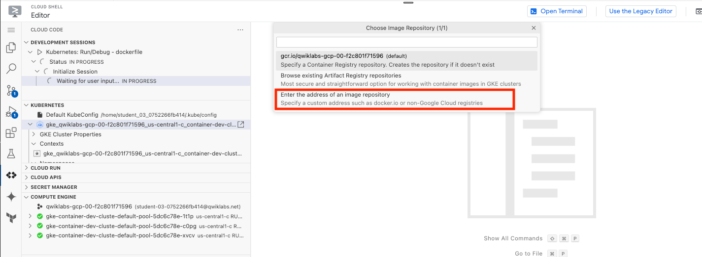

# LAB Managing Deployments Using Kubernetes Engine

## Overview

Dev Ops practices will regularly make use of multiple deployments to manage application deployment scenarios such as "Continuous deployment", "Blue-Green deployments", "Canary deployments" and more. This lab teaches you how to scale and manage containers so you can accomplish these common scenarios where multiple heterogeneous deployments are being used.

## Objectives

In this lab, you will learn how to perform the following tasks:

- Use the `kubectl` tool
- Create deployment `yaml` files
- Launch, update, and scale deployments
- Update deployments and learn about deployment styles

### Prerequisites

To maximize your learning, the following is recommended for this lab:

- You've taken these Google Cloud Skills Boost labs:
  - [Introduction to Docker](https://google.qwiklabs.com/catalog_lab/944)
  - [Hello Node Kubernetes](https://google.qwiklabs.com/catalog_lab/468)
- You have Linux System Administration skills.
- You understand DevOps theory, concepts of continuous deployment.

## Introduction to deployments

Heterogeneous deployments typically involve connecting two or more distinct infrastructure environments or regions to address a specific technical or operational need. Heterogeneous deployments are called "hybrid", "multi-cloud", or "public-private", depending upon the specifics of the deployment.

For this lab, heterogeneous deployments include those that span regions within a single cloud environment, multiple public cloud environments (multi-cloud), or a combination of on-premises and public cloud environments (hybrid or public-private).

Various business and technical challenges can arise in deployments that are limited to a single environment or region:

- **Maxed out resources**: In any single environment, particularly in on-premises environments, you might not have the compute, networking, and storage resources to meet your production needs.
- **Limited geographic reach**: Deployments in a single environment require people who are geographically distant from one another to access one deployment. Their traffic might travel around the world to a central location.
- **Limited availability**: Web-scale traffic patterns challenge applications to remain fault-tolerant and resilient.
- **Vendor lock-in**: Vendor-level platform and infrastructure abstractions can prevent you from porting applications.
- **Inflexible resources**: Your resources might be limited to a particular set of compute, storage, or networking offerings.

Heterogeneous deployments can help address these challenges, but they must be architected using programmatic and deterministic processes and procedures. One-off or ad-hoc deployment procedures can cause deployments or processes to be brittle and intolerant of failures. Ad-hoc processes can lose data or drop traffic. Good deployment processes must be repeatable and use proven approaches for managing provisioning, configuration, and maintenance.

Three common scenarios for heterogeneous deployment are:

- multi-cloud deployments
- fronting on-premises data
- continuous integration/continuous delivery (CI/CD) processe

The following exercises practice some common use cases for heterogeneous deployments, along with well-architected approaches using Kubernetes and other infrastructure resources to accomplish them.

## Setup and requirements

### Before you click the Start Lab button

Read these instructions. Labs are timed and you cannot pause them. The timer, which starts when you click **Start Lab**, shows how long Google Cloud resources will be made available to you.

This hands-on lab lets you do the lab activities yourself in a real cloud environment, not in a simulation or demo environment. It does so by giving you new, temporary credentials that you use to sign in and access Google Cloud for the duration of the lab.

To complete this lab, you need:

- Access to a standard internet browser (Chrome browser recommended).

**Note:** Use an Incognito or private browser window to run this lab. This prevents any conflicts between your personal account and the Student account, which may cause extra charges incurred to your personal account.

- Time to complete the lab---remember, once you start, you cannot pause a lab.

**Note:** If you already have your own personal Google Cloud account or project, do not use it for this lab to avoid extra charges to your account.

### How to start your lab and sign in to the Google Cloud console

1. Click the **Start Lab** button. If you need to pay for the lab, a pop-up opens for you to select your payment method. On the left is the **Lab Details** panel with the following:

   - The **Open Google Cloud console** button
   - Time remaining
   - The temporary credentials that you must use for this lab
   - Other information, if needed, to step through this lab

2. Click **Open Google Cloud console** (or right-click and select **Open Link in Incognito Window** if you are running the Chrome browser).

   The lab spins up resources, and then opens another tab that shows the **Sign in** page.

   ***Tip:\*** Arrange the tabs in separate windows, side-by-side.

   **Note:** If you see the **Choose an account** dialog, click **Use Another Account**.

3. If necessary, copy the **Username** below and paste it into the **Sign in** dialog.

   ```
   student-02-c7327a175de5@qwiklabs.net
   ```

   Copied!

   content_copy

   You can also find the **Username** in the **Lab Details** panel.

4. Click **Next**.

5. Copy the **Password** below and paste it into the **Welcome** dialog.

   ```
   cGBNkE7oc2Zk
   ```

   Copied!

   content_copy

   You can also find the **Password** in the **Lab Details** panel.

6. Click **Next**.

   **Important:** You must use the credentials the lab provides you. Do not use your Google Cloud account credentials.

   **Note:** Using your own Google Cloud account for this lab may incur extra charges.

7. Click through the subsequent pages:

   - Accept the terms and conditions.
   - Do not add recovery options or two-factor authentication (because this is a temporary account).
   - Do not sign up for free trials.

After a few moments, the Google Cloud console opens in this tab.

**Note:** To view a menu with a list of Google Cloud products and services, click the **Navigation menu** at the top-left. 

### Activate Cloud Shell

Cloud Shell is a virtual machine that is loaded with development tools. It offers a persistent 5GB home directory and runs on the Google Cloud. Cloud Shell provides command-line access to your Google Cloud resources.

1. Click **Activate Cloud Shell**  at the top of the Google Cloud console.

When you are connected, you are already authenticated, and the project is set to your **Project_ID**, `qwiklabs-gcp-01-97f91d923d3d`. The output contains a line that declares the **Project_ID** for this session:

```
Your Cloud Platform project in this session is set to qwiklabs-gcp-01-97f91d923d3d
```

`gcloud` is the command-line tool for Google Cloud. It comes pre-installed on Cloud Shell and supports tab-completion.

1. (Optional) You can list the active account name with this command:

```
gcloud auth list
```

Copied!

content_copy

1. Click **Authorize**.

**Output:**

```
ACTIVE: *
ACCOUNT: student-02-c7327a175de5@qwiklabs.net

To set the active account, run:
    $ gcloud config set account `ACCOUNT`
```

1. (Optional) You can list the project ID with this command:

```
gcloud config list project
```

Copied!

content_copy

**Output:**

```
[core]
project = qwiklabs-gcp-01-97f91d923d3d
```

**Note:** For full documentation of `gcloud`, in Google Cloud, refer to [the gcloud CLI overview guide](https://cloud.google.com/sdk/gcloud).

## Set the zone

Set your working Google Cloud zone by running the following command, substituting the local zone as `us-east1-d`:

```
gcloud config set compute/zone us-east1-d
```

Copied!

content_copy

## Get sample code for this lab

1. Get the sample code for creating and running containers and deployments:

```
gsutil -m cp -r gs://spls/gsp053/orchestrate-with-kubernetes .
cd orchestrate-with-kubernetes/kubernetes
```

Copied!

content_copy

1. Create a cluster with 3 nodes (this will take a few minutes to complete):

```
gcloud container clusters create bootcamp \
  --machine-type e2-small \
  --num-nodes 3 \
  --scopes "https://www.googleapis.com/auth/projecthosting,storage-rw"
```

Copied!

content_copy

## Task 1. Learn about the deployment object

To get started, take a look at the deployment object.

1. The `explain` command in `kubectl` can tell us about the deployment object:

```
kubectl explain deployment
```

Copied!

content_copy

1. You can also see all of the fields using the `--recursive` option:

```
kubectl explain deployment --recursive
```

Copied!

content_copy

1. You can use the explain command as you go through the lab to help you understand the structure of a deployment object and understand what the individual fields do:

```
kubectl explain deployment.metadata.name
```

Copied!

content_copy

## Task 2. Create a deployment

1. Update the `deployments/auth.yaml` configuration file:

```
vi deployments/auth.yaml
```

Copied!

content_copy

1. Start the editor:

```
i
```

Copied!

content_copy

1. Change the `image` in the containers section of the deployment to the following:

```
...
containers:
- name: auth
  image: "kelseyhightower/auth:1.0.0"
...
```

Copied!

content_copy

1. Save the `auth.yaml` file: press `<Esc>` then type:

```
:wq
```

Copied!

content_copy

1. Press `<Enter>`. Now create a simple deployment. Examine the deployment configuration file:

```
cat deployments/auth.yaml
```

Copied!

content_copy

Output:

```
apiVersion: apps/v1
kind: Deployment
metadata:
  name: auth
spec:
  replicas: 1
  selector:
    matchLabels:
      app: auth
  template:
    metadata:
      labels:
        app: auth
        track: stable
    spec:
      containers:
        - name: auth
          image: "kelseyhightower/auth:1.0.0"
          ports:
            - name: http
              containerPort: 80
            - name: health
              containerPort: 81
...
```

Notice how the deployment is creating one replica and it's using version 1.0.0 of the auth container.

When you run the `kubectl create` command to create the auth deployment, it will make one pod that conforms to the data in the deployment manifest. This means you can scale the number of Pods by changing the number specified in the `replicas` field.

1. Go ahead and create your deployment object using `kubectl create`:

```
kubectl create -f deployments/auth.yaml
```

Copied!

content_copy

1. Once you have created the deployment, you can verify that it was created:

```
kubectl get deployments
```

Copied!

content_copy

1. Once the deployment is created, Kubernetes will create a `ReplicaSet` for the deployment. You can verify that a `ReplicaSet` was created for the deployment:

```
kubectl get replicasets
```

Copied!

content_copy

You should see a `ReplicaSet` with a name like `auth-xxxxxxx`

1. View the Pods that were created as part of the deployment. The single Pod is created by the Kubernetes when the `ReplicaSet` is created:

```
kubectl get pods
```

Copied!

content_copy

It's time to create a service for the auth deployment. You've already seen service manifest files, so the details won't be shared here.

1. Use the `kubectl create` command to create the auth service:

```
kubectl create -f services/auth.yaml
```

Copied!

content_copy

1. Now, do the same thing to create and expose the `hello` deployment:

```
kubectl create -f deployments/hello.yaml
kubectl create -f services/hello.yaml
```

Copied!

content_copy

1. And one more time to create and expose the `frontend` deployment:

```
kubectl create secret generic tls-certs --from-file tls/
kubectl create configmap nginx-frontend-conf --from-file=nginx/frontend.conf
kubectl create -f deployments/frontend.yaml
kubectl create -f services/frontend.yaml
```

Copied!

content_copy

**Note:** You created a `ConfigMap` for the frontend.

1. Interact with the frontend by grabbing its external IP and then curling to it:

```
kubectl get services frontend
```

Copied!

content_copy

**Note:** It may take a few seconds before the External-IP field is populated for your service. This is normal. Just re-run the above command every few seconds until the field is populated.

```
curl -ks https://<EXTERNAL-IP>
```

Copied!

content_copy

And you get the hello response back.

1. You can also use the output templating feature of `kubectl` to use curl as a one-liner:

```
curl -ks https://`kubectl get svc frontend -o=jsonpath="{.status.loadBalancer.ingress[0].ip}"`
```

Copied!

content_copy

### Test completed task

Click **Check my progress** below to check your lab progress. If you successfully created Kubernetes cluster and Auth, Hello and Frontend deployments, you'll see an assessment score.

Create a Kubernetes cluster and deployments (Auth, Hello, and Frontend)

Check my progress


### Scale a deployment

Now that you have a deployment created, you can scale it. Do this by updating the `spec.replicas` field.

1. Look at an explanation of this field using the `kubectl explain` command again:

```
kubectl explain deployment.spec.replicas
```

Copied!

content_copy

1. The replicas field can be most easily updated using the `kubectl scale` command:

```
kubectl scale deployment hello --replicas=5
```

Copied!

content_copy

**Note:** It may take a minute or so for all the new pods to start up.

After the deployment is updated, Kubernetes will automatically update the associated `ReplicaSet` and start new Pods to make the total number of Pods equal 5.

1. Verify that there are now 5 `hello` Pods running:

```
kubectl get pods | grep hello- | wc -l
```

Copied!

content_copy

1. Now scale back the application:

```
kubectl scale deployment hello --replicas=3
```

Copied!

content_copy

1. Again, verify that you have the correct number of Pods:

```
kubectl get pods | grep hello- | wc -l
```

Copied!

content_copy

Now you know about Kubernetes deployments and how to manage & scale a group of Pods.

## Task 3. Rolling update

Deployments support updating images to a new version through a rolling update mechanism. When a deployment is updated with a new version, it creates a new `ReplicaSet` and slowly increases the number of replicas in the new `ReplicaSet` as it decreases the replicas in the old `ReplicaSet`.


### Trigger a rolling update

1. To update your deployment, run the following command:

```
kubectl edit deployment hello
```

Copied!

content_copy

1. Change the `image` in the containers section of the deployment to the following:

```
...
containers:
  image: kelseyhightower/hello:2.0.0
...
```

Copied!

content_copy

1. **Save** and **exit**.

The updated deployment will be saved to your cluster and Kubernetes will begin a rolling update.

1. See the new `ReplicaSet` that Kubernetes creates.:

```
kubectl get replicaset
```

Copied!

content_copy

1. You can also see a new entry in the rollout history:

```
kubectl rollout history deployment/hello
```

Copied!

content_copy

### Pause a rolling update

If you detect problems with a running rollout, pause it to stop the update.

1. Run the following to pause the rollout:

```
kubectl rollout pause deployment/hello
```

Copied!

content_copy

1. Verify the current state of the rollout:

```
kubectl rollout status deployment/hello
```

Copied!

content_copy

1. You can also verify this on the Pods directly:

```
kubectl get pods -o jsonpath --template='{range .items[*]}{.metadata.name}{"\t"}{"\t"}{.spec.containers[0].image}{"\n"}{end}'
```

Copied!

content_copy

### Resume a rolling update

The rollout is paused which means that some pods are at the new version and some pods are at the older version.

1. Continue the rollout using the `resume` command:

```
kubectl rollout resume deployment/hello
```

Copied!

content_copy

1. When the rollout is complete, you should see the following when running the `status` command:

```
kubectl rollout status deployment/hello
```

Copied!

content_copy

Output:

```
deployment "hello" successfully rolled out
```

### Roll back an update

Assume that a bug was detected in your new version. Since the new version is presumed to have problems, any users connected to the new Pods will experience those issues.

You will want to roll back to the previous version so you can investigate and then release a version that is fixed properly.

1. Use the `rollout` command to roll back to the previous version:

```
kubectl rollout undo deployment/hello
```

Copied!

content_copy

1. Verify the roll back in the history:

```
kubectl rollout history deployment/hello
```

Copied!

content_copy

1. Finally, verify that all the Pods have rolled back to their previous versions:

```
kubectl get pods -o jsonpath --template='{range .items[*]}{.metadata.name}{"\t"}{"\t"}{.spec.containers[0].image}{"\n"}{end}'
```

Copied!

content_copy

Great! You learned how to do a rolling update for Kubernetes deployments and how to update applications without downtime.

## Task 4. Canary deployments

When you want to test a new deployment in production with a subset of your users, use a canary deployment. Canary deployments allow you to release a change to a small subset of your users to mitigate risk associated with new releases.

### Create a canary deployment

A canary deployment consists of a separate deployment with your new version and a service that targets both your normal, stable deployment as well as your canary deployment.


1. First, create a new canary deployment for the new version:

```
cat deployments/hello-canary.yaml
```

Copied!

content_copy

Output:

```
apiVersion: apps/v1
kind: Deployment
metadata:
  name: hello-canary
spec:
  replicas: 1
  selector:
    matchLabels:
      app: hello
  template:
    metadata:
      labels:
        app: hello
        track: canary
        # Use ver 2.0.0 so it matches version on service selector
        version: 2.0.0
    spec:
      containers:
        - name: hello
          image: kelseyhightower/hello:2.0.0
          ports:
            - name: http
              containerPort: 80
            - name: health
              containerPort: 81
...
```

1. Now create the canary deployment:

```
kubectl create -f deployments/hello-canary.yaml
```

Copied!

content_copy

1. After the canary deployment is created, you should have two deployments, `hello` and `hello-canary`. Verify it with this `kubectl` command:

```
kubectl get deployments
```

Copied!

content_copy

On the `hello` service, the `app:hello` selector will match pods in **both** the prod deployment and canary deployment. However, because the canary deployment has a fewer number of pods, it will be visible to fewer users.

### Verify the canary deployment

1. You can verify the `hello` version being served by the request:

```
curl -ks https://`kubectl get svc frontend -o=jsonpath="{.status.loadBalancer.ingress[0].ip}"`/version
```

Copied!

content_copy

1. Run this several times and you should see that some of the requests are served by hello 1.0.0 and a small subset (1/4 = 25%) are served by 2.0.0.

#### Test completed task

Click **Check my progress** below to check your lab progress. If you successfully created Canary deployment, you'll see an assessment score.

Canary Deployment

Check my progress


### Canary deployments in production - session affinity

In this lab, each request sent to the Nginx service had a chance to be served by the canary deployment. But what if you wanted to ensure that a user didn't get served by the canary deployment? A use case could be that the UI for an application changed, and you don't want to confuse the user. In a case like this, you want the user to "stick" to one deployment or the other.

You can do this by creating a service with session affinity. This way the same user will always be served from the same version. In the example below, the service is the same as before, but a new `sessionAffinity` field has been added, and set to `ClientIP`. All clients with the same IP address will have their requests sent to the same version of the `hello` application.

```
kind: Service
apiVersion: v1
metadata:
  name: "hello"
spec:
  sessionAffinity: ClientIP
  selector:
    app: "hello"
  ports:
    - protocol: "TCP"
      port: 80
      targetPort: 80
```

Due to it being difficult to set up an environment to test this, you don't need to here, but you may want to use `sessionAffinity` for canary deployments in production.

## Task 5. Blue-green deployments

Rolling updates are ideal because they allow you to deploy an application slowly with minimal overhead, minimal performance impact, and minimal downtime. There are instances where it is beneficial to modify the load balancers to point to that new version only after it has been fully deployed. In this case, blue-green deployments are the way to go.

Kubernetes achieves this by creating two separate deployments; one for the old "blue" version and one for the new "green" version. Use your existing `hello` deployment for the "blue" version. The deployments will be accessed via a service which will act as the router. Once the new "green" version is up and running, you'll switch over to using that version by updating the service.


**Note:** A major downside of blue-green deployments is that you will need to have at least 2x the resources in your cluster necessary to host your application. Make sure you have enough resources in your cluster before deploying both versions of the application at once.

### The service

Use the existing hello service, but update it so that it has a selector `app:hello`, `version: 1.0.0`. The selector will match the existing "blue" deployment. But it will not match the "green" deployment because it will use a different version.

- First update the service:

```
kubectl apply -f services/hello-blue.yaml
```

Copied!

content_copy

**Note:** Ignore the warning that says `resource service/hello is missing` as this is patched automatically.

### Updating using Blue-Green deployment

In order to support a blue-green deployment style, you will create a new "green" deployment for the new version. The green deployment updates the version label and the image path.

```
apiVersion: apps/v1
kind: Deployment
metadata:
  name: hello-green
spec:
  replicas: 3
  selector:
    matchLabels:
      app: hello
  template:
    metadata:
      labels:
        app: hello
        track: stable
        version: 2.0.0
    spec:
      containers:
        - name: hello
          image: kelseyhightower/hello:2.0.0
          ports:
            - name: http
              containerPort: 80
            - name: health
              containerPort: 81
          resources:
            limits:
              cpu: 0.2
              memory: 10Mi
          livenessProbe:
            httpGet:
              path: /healthz
              port: 81
              scheme: HTTP
            initialDelaySeconds: 5
            periodSeconds: 15
            timeoutSeconds: 5
          readinessProbe:
            httpGet:
              path: /readiness
              port: 81
              scheme: HTTP
            initialDelaySeconds: 5
            timeoutSeconds: 1
```

1. Create the green deployment:

```
kubectl create -f deployments/hello-green.yaml
```

Copied!

content_copy

1. Once you have a green deployment and it has started up properly, verify that the current version of 1.0.0 is still being used:

```
curl -ks https://`kubectl get svc frontend -o=jsonpath="{.status.loadBalancer.ingress[0].ip}"`/version
```

Copied!

content_copy

1. Now, update the service to point to the new version:

```
kubectl apply -f services/hello-green.yaml
```

Copied!

content_copy

1. When the service is updated, the "green" deployment will be used immediately. You can now verify that the new version is always being used:

```
curl -ks https://`kubectl get svc frontend -o=jsonpath="{.status.loadBalancer.ingress[0].ip}"`/version
```

Copied!

content_copy

### Blue-Green rollback

If necessary, you can roll back to the old version in the same way.

1. While the "blue" deployment is still running, just update the service back to the old version:

```
kubectl apply -f services/hello-blue.yaml
```

Copied!

content_copy

1. Once you have updated the service, your rollback will have been successful. Again, verify that the right version is now being used:

```
curl -ks https://`kubectl get svc frontend -o=jsonpath="{.status.loadBalancer.ingress[0].ip}"`/version
```

Copied!

content_copy

You did it! You learned about blue-green deployments and how to deploy updates to applications that need to switch versions all at once.

## Congratulations!

You've had the opportunity to work more with the `kubectl` command-line tool, and many styles of deployment configurations set up in YAML files to launch, update, and scale your deployments. With this foundation of practice you should feel comfortable applying these skills to your own DevOps practice.

# Working with Artifact Registry

## Overview

As the evolution of Container Registry, [Artifact Registry](https://cloud.google.com/artifact-registry) is a single place for your organization to manage container images and language packages (such as Maven and npm). It is fully integrated with Google Cloud's tooling and runtimes and comes with support for native artifact protocols. This makes it simple to integrate it with your CI/CD tooling to set up automated pipelines.

In this lab you will learn about some of the features available in Artifact Registry.

## Objectives

In this lab, you learn how to:

- Create repositories for Containers and Language Packages
- Manage container images with Artifact Registry
- Integrate Artifact Registry with Cloud Code
- Configure Maven to use Artifact Registry for Java Dependencies

## Setup and requirement

### Before you click the Start Lab button

Read these instructions. Labs are timed and you cannot pause them. The timer, which starts when you click **Start Lab**, shows how long Google Cloud resources will be made available to you.

This hands-on lab lets you do the lab activities yourself in a real cloud environment, not in a simulation or demo environment. It does so by giving you new, temporary credentials that you use to sign in and access Google Cloud for the duration of the lab.

To complete this lab, you need:

- Access to a standard internet browser (Chrome browser recommended).

**Note:** Use an Incognito or private browser window to run this lab. This prevents any conflicts between your personal account and the Student account, which may cause extra charges incurred to your personal account.

- Time to complete the lab---remember, once you start, you cannot pause a lab.

**Note:** If you already have your own personal Google Cloud account or project, do not use it for this lab to avoid extra charges to your account.

### How to start your lab and sign in to the Google Cloud console

1. Click the **Start Lab** button. If you need to pay for the lab, a pop-up opens for you to select your payment method. On the left is the **Lab Details** panel with the following:

   - The **Open Google Cloud console** button
   - Time remaining
   - The temporary credentials that you must use for this lab
   - Other information, if needed, to step through this lab

2. Click **Open Google Cloud console** (or right-click and select **Open Link in Incognito Window** if you are running the Chrome browser).

   The lab spins up resources, and then opens another tab that shows the **Sign in** page.

   ***Tip:\*** Arrange the tabs in separate windows, side-by-side.

   **Note:** If you see the **Choose an account** dialog, click **Use Another Account**.

3. If necessary, copy the **Username** below and paste it into the **Sign in** dialog.

   ```
   "Username"
   ```

   Copied!

   content_copy

   You can also find the **Username** in the **Lab Details** panel.

4. Click **Next**.

5. Copy the **Password** below and paste it into the **Welcome** dialog.

   ```
   "Password"
   ```

   Copied!

   content_copy

   You can also find the **Password** in the **Lab Details** panel.

6. Click **Next**.

   **Important:** You must use the credentials the lab provides you. Do not use your Google Cloud account credentials.

   **Note:** Using your own Google Cloud account for this lab may incur extra charges.

7. Click through the subsequent pages:

   - Accept the terms and conditions.
   - Do not add recovery options or two-factor authentication (because this is a temporary account).
   - Do not sign up for free trials.

After a few moments, the Google Cloud console opens in this tab.

**Note:** To view a menu with a list of Google Cloud products and services, click the **Navigation menu** at the top-left. 

### Activate Cloud Shell

Cloud Shell is a virtual machine that is loaded with development tools. It offers a persistent 5GB home directory and runs on the Google Cloud. Cloud Shell provides command-line access to your Google Cloud resources.

1. Click **Activate Cloud Shell**  at the top of the Google Cloud console.

When you are connected, you are already authenticated, and the project is set to your **Project_ID**, `PROJECT_ID`. The output contains a line that declares the **Project_ID** for this session:

```
Your Cloud Platform project in this session is set to "PROJECT_ID"
```

`gcloud` is the command-line tool for Google Cloud. It comes pre-installed on Cloud Shell and supports tab-completion.

1. (Optional) You can list the active account name with this command:

```
gcloud auth list
```

Copied!

content_copy

1. Click **Authorize**.

**Output:**

```
ACTIVE: *
ACCOUNT: "ACCOUNT"

To set the active account, run:
    $ gcloud config set account `ACCOUNT`
```

1. (Optional) You can list the project ID with this command:

```
gcloud config list project
```

Copied!

content_copy

**Output:**

```
[core]
project = "PROJECT_ID"
```

**Note:** For full documentation of `gcloud`, in Google Cloud, refer to [the gcloud CLI overview guide](https://cloud.google.com/sdk/gcloud).

You must wait for the lab to provision before making any changes to the environment! The pre-configured parts of the environment that you need to work with will be available to you as soon as the lab indicates it is ready.

## Task 1. Prepare the lab environment

### Set up variables

- In Cloud Shell, set your project ID and project number. Save them as `PROJECT_ID` and `PROJECT_NUMBER` variables:

```
export PROJECT_ID=$(gcloud config get-value project)
export PROJECT_NUMBER=$(gcloud projects describe $PROJECT_ID --format='value(projectNumber)')
export REGION="REGION"
gcloud config set compute/region $REGION
```

Copied!

content_copy

### Enable Google services

- Run the following to enable necessary Google services:

```
gcloud services enable \
  cloudresourcemanager.googleapis.com \
  container.googleapis.com \
  artifactregistry.googleapis.com \
  containerregistry.googleapis.com \
  containerscanning.googleapis.com
```

Copied!

content_copy

### Get the source code

The source code for this lab is located in the GoogleCloudPlatform org on GitHub.

- Clone the source code with the command below, then change into the directory.

```
git clone https://github.com/GoogleCloudPlatform/cloud-code-samples/
cd ~/cloud-code-samples
```

Copied!

content_copy

### Provision the infrastructure used in this lab

In this lab you will deploy code to Kubernetes Engine (GKE).

- Run the setup script below to prepare this infrastructure:

```
gcloud container clusters create container-dev-cluster --zone="ZONE"
```

Copied!

content_copy

Click **Check my progress** to verify the objective.

Enable Google Services and create GKE cluster

Check my progress


## Task 2. Working with container images

### Create a Docker Repository on Artifact registry

Artifact Registry supports managing container images and language packages. Different artifact types require different specifications. For example, the requests for Maven dependencies are different from requests for Node dependencies.

To support the different API specifications, Artifact Registry needs to know what format you want the API responses to follow. To do this you will create a repository and pass in the `--repository-format` flag indicating the type of repository desired.

1. From Cloud Shell run the following command to create a repository for Docker images:

```
gcloud artifacts repositories create container-dev-repo --repository-format=docker \
  --location=$REGION \
  --description="Docker repository for Container Dev Workshop"
```

Copied!

content_copy

Click **Authorize** if the Cloud Shell authorization prompt appears.

1. In the Cloud console, go to **Artifact Registry** > **Repositories** and notice your newly created Docker repository named `container-dev-repo`. If you click on it you can see that it's empty at the moment.

Click **Check my progress** to verify the objective. (It may take a minute to validate. If you have completed successfully and it is not validating, wait a minute and try again.)

Working with container images

Check my progress


### Configure Docker Authentication to Artifact Registry

When connecting to Artifact Registry credentials are required in order to provide access. Rather than set up separate credentials, Docker can be configured to use your `gcloud` credentials seamlessly.

1. From Cloud Shell run the following command to configure Docker to use the Google Cloud CLI to authenticate requests to Artifact Registry in the `<filled in at lab start>` region:

```
gcloud auth configure-docker "Filled in at lab start"-docker.pkg.dev
```

Copied!

content_copy

1. The command will prompt for a confirmation to change the Cloud Shell docker configuration, click **ENTER**.

### Explore the sample Application

A sample application is provided in the git repository you cloned.

- Change into the java directory and review the application code:

```
cd ~/cloud-code-samples/java/java-hello-world
```

Copied!

content_copy

The folder contains an example Java application that renders a simple web page: in addition to various files not relevant for this specific lab, it contains the source code, under the `src` folder, and a Dockerfile you will use to build a container image locally.

### Build the Container Image

Before you can store container images in Artifact Registry you need to create one.

- Run the following command to build the container image and tag it properly:

```
docker build -t "REGION"-docker.pkg.dev/"PROJECT_ID"/container-dev-repo/java-hello-world:tag1 .
```

Copied!

content_copy

### Push the Container Image to Artifact Registry

- Run the following command to push the container image to the repository you created:

```
docker push "REGION"-docker.pkg.dev/"PROJECT_ID"/container-dev-repo/java-hello-world:tag1
```

Copied!

content_copy

### Review the image in Artifact Registry

1. In **Artifact Registry > Repositories**, click into `container-dev-repo` and check that the `java-hello-world` image is there.
2. Click on the image and note the image tagged `tag1`. You can see that Vulnerability Scanning is running or already completed and the number of vulnerabilities detected is visible.


Click on the number of vulnerabilities and you will see the list of vulnerabilities detected in the image, with the CVE bulletin name and the severity. Click **VIEW** on each listed vulnerability to get more details:


## Task 3. Integration with Cloud Code

In this section you use the Artifact Registry Docker image repository with [Cloud Code](https://cloud.google.com/code).

### Deploy the Application to GKE Cluster from Cloud Code

1. From the `java-hello-world` folder run the following command to open Cloud Shell Editor and add the application folder to this workspace:

```
cd ~/cloud-code-samples/
cloudshell workspace .
```

Copied!

content_copy

The Cloud Shell editor will open with the explorer in the application folder.

1. From the left menu, select **Cloud Code** and then expand the **COMPUTE ENGINE** option and click on **Select a Project** and choose the project ID provided in the Lab Instruction.


Also, expand the **KUBERNETES** option. You will be able to see the cluster loading.

Wait until you see the cluster listed under **KUBERNETES** as well as under **COMPUTE ENGINE**.

1. The following steps will require you to enter your Artifact Registry repository location. The format for the location is:

```
"REGION"-docker.pkg.dev/"PROJECT_ID"/container-dev-repo
```

Click **Navigation menu** under the Cloud Shell Editor **View > Command Palette...** and type **Run on Kubernetes** and select **Cloud Code: Run on Kubernetes**.


1. Choose **cloud-code-samples/java/java-hello-world/skaffold.yaml** and then **dockerfile**.
2. If Prompted for a context, select **Yes** to use the current context.
3. In the prompt for the image registry select **Enter the address of an image repository** and put the address location you located below and press **Enter**.



```
"REGION"-docker.pkg.dev/"PROJECT_ID"/container-dev-repo
```

Copied!

content_copy

1. When you execute **Run on Kubernetes** for the first time Cloud Code prompts you for the target image repository location. Once provided, the repository url is stored in the file `.vscode/launch.json` which is created in the application folder.

In the output pane you see that the build starts for the application image `java-hello-world,` the image is uploaded to the Artifact Registry repository configured previously.

1. In **Artifact Registry > Repositories** click into `container-dev-repo` and check that the `java-hello-world` image and note a new image tagged `latest`.

### Review the Deployed Application

1. Go back to Cloud Shell Editor. When deployment is complete Skaffold/Cloud Code will print the exposed url where the service have been forwarded, click on the link - **Follow link**:


In the new browser window you see the hello world app page.


### Update application code

Now update the application to see the change implemented immediately in the deployment on the cluster:

1. Open the `HelloWorldController.java` by clicking on the **Navigation menu** under the Cloud Shell Editor  **View > Command Palette...** and then click one backspace and then enter the path **src/main/java/cloudcode/helloworld/web** and click the option starting with `Hello..` .
2. Change the text in row 20 from "It's running!" to "It's updated!". You should see the build and deployment process starting immediately.
3. At the end of the deploy click again on the forwarded url or refresh the browser window with the application to see your change deployed:


1. In the Cloud console go to **Navigation Menu > Artifact Registry > Repositories** and click into `container-dev-repo` to check that the `java-hello-world` image and note the new image.

Click **Check my progress** to verify the objective.

Integration with Cloud Code

Check my progress


## Task 4. Working with language packages

In this section you will set up an Artifact Registry Java repository and upload packages to it, leveraging them in different applications.

### Create a Java package repository

1. From Cloud Shell run the following command to create a repository for Java artifacts:

```
gcloud artifacts repositories create container-dev-java-repo \
    --repository-format=maven \
    --location="REGION" \
    --description="Java package repository for Container Dev Workshop"
```

Copied!

content_copy

1. Click Authorize if the Cloud Shell authorization prompt appears
2. In the Cloud console go to **Artifact Registry > Repositories** and notice your newly created Maven repository named `container-dev-java-repo`, if you click on it you can see that it's empty at the moment.

Click **Check my progress** to verify the objective.

Create a Java package repository

Check my progress


### Set up authentication to Artifact Repository

- Use the following command to update the well-known location for Application Default Credentials (ADC) with your user account credentials so that the Artifact Registry credential helper can authenticate using them when connecting with repositories:

```
gcloud auth login --update-adc
```

Copied!

content_copy

If prompted to authenticate:

- Choose **Y**.
- Paste the code into a browser window.
- Select Google Sign In and sign in using the credentials in the lab.
- Copy the authentication code from the browser back into the console to complete the authentication.

### Configure Maven for Artifact Registry

1. Run the following command to print the repository configuration to add to your Java project:

```
gcloud artifacts print-settings mvn \
    --repository=container-dev-java-repo \
    --location="REGION"
```

Copied!

content_copy

1. Open the `pom.xml` in Cloud Shell Editor and add the returned settings to the appropriate sections in the file:

- Add the **distributionManagement** section.

```
  <distributionManagement>
    <snapshotRepository>
      <id>artifact-registry</id>
      <url>artifactregistry://"REGION"-maven.pkg.dev/"PROJECT_ID"/container-dev-java-repo</url>
    </snapshotRepository>
    <repository>
      <id>artifact-registry</id>
      <url>artifactregistry://"REGION"-maven.pkg.dev/"PROJECT_ID"/container-dev-java-repo</url>
    </repository>
  </distributionManagement>
```

Copied!

content_copy

- Add the **repositories** section.

```
 <repositories>
   <repository>
     <id>artifact-registry</id>
     <url>artifactregistry://"REGION"-maven.pkg.dev/"PROJECT_ID"/container-dev-java-repo</url>
     <releases>
       <enabled>true</enabled>
     </releases>
     <snapshots>
       <enabled>true</enabled>
     </snapshots>
   </repository>
 </repositories>
```

Copied!

content_copy

- Update the **extensions in the Builds** section.

```
<extensions>
     <extension>
       <groupId>com.google.cloud.artifactregistry</groupId>
       <artifactId>artifactregistry-maven-wagon</artifactId>
       <version>2.1.0</version>
     </extension>
   </extensions>
```

Copied!

content_copy

Here's an example of the complete file for your reference.

```
<?xml version="1.0" encoding="UTF-8"?>
<project xmlns="http://maven.apache.org/POM/4.0.0" xmlns:xsi="http://www.w3.org/2001/XMLSchema-instance"
       xsi:schemaLocation="http://maven.apache.org/POM/4.0.0 http://maven.apache.org/xsd/maven-4.0.0.xsd">
 <modelVersion>4.0.0</modelVersion>

 <artifactId>hello-world</artifactId>
 <packaging>jar</packaging>
 <name>Cloud Code Hello World</name>
 <description>Getting started with Cloud Code</description>
 <version>1.0.0</version>
<distributionManagement>
   <snapshotRepository>
     <id>artifact-registry</id>
     <url>artifactregistry://"REGION"-maven.pkg.dev/"PROJECT_ID"/container-dev-java-repo</url>
   </snapshotRepository>
   <repository>
     <id>artifact-registry</id>
     <url>artifactregistry://"REGION"-maven.pkg.dev/"PROJECT_ID"/container-dev-java-repo</url>
   </repository>
 </distributionManagement>

 <repositories>
   <repository>
     <id>artifact-registry</id>
     <url>artifactregistry://"REGION"-maven.pkg.dev/"PROJECT_ID"/container-dev-java-repo</url>
     <releases>
       <enabled>true</enabled>
     </releases>
     <snapshots>
       <enabled>true</enabled>
     </snapshots>
   </repository>
 </repositories>

 <parent>
   <groupId>org.springframework.boot</groupId>
   <artifactId>spring-boot-starter-parent</artifactId>
   <version>2.6.3</version>
 </parent>

 <properties>
   <java.version>1.8</java.version>
   <checkstyle.config.location>./checkstyle.xml</checkstyle.config.location>
 </properties>

 <build>
   <plugins>
     <plugin>
       <groupId>com.google.cloud.tools</groupId>
       <artifactId>jib-maven-plugin</artifactId>
       <version>3.2.0</version>
     </plugin>
     <plugin>
       <groupId>org.springframework.boot</groupId>
       <artifactId>spring-boot-maven-plugin</artifactId>
     </plugin>
     <plugin>
       <groupId>org.apache.maven.plugins</groupId>
       <artifactId>maven-checkstyle-plugin</artifactId>
       <version>3.1.2</version>
     </plugin>
   </plugins>
   <extensions>
     <extension>
       <groupId>com.google.cloud.artifactregistry</groupId>
       <artifactId>artifactregistry-maven-wagon</artifactId>
       <version>2.1.0</version>
     </extension>
   </extensions>
 </build>

 <!-- The Spring Cloud GCP BOM will manage spring-cloud-gcp version numbers for you. -->
 <dependencyManagement>
   <dependencies>
     <dependency>
       <groupId>org.springframework.cloud</groupId>
       <artifactId>spring-cloud-gcp-dependencies</artifactId>
       <version>1.2.8.RELEASE</version>
       <type>pom</type>
       <scope>import</scope>
     </dependency>
   </dependencies>
 </dependencyManagement>

 <dependencies>

   <dependency>
     <groupId>org.springframework.boot</groupId>
     <artifactId>spring-boot-starter</artifactId>
   </dependency>

   <dependency>
     <groupId>org.springframework.boot</groupId>
     <artifactId>spring-boot-starter-jetty</artifactId>
   </dependency>

   <dependency>
     <groupId>org.springframework</groupId>
     <artifactId>spring-webmvc</artifactId>
   </dependency>

   <dependency>
     <groupId>org.springframework.boot</groupId>
     <artifactId>spring-boot-starter-thymeleaf</artifactId>
   </dependency>

   <dependency>
     <groupId>org.springframework.boot</groupId>
     <artifactId>spring-boot-starter-test</artifactId>
     <scope>test</scope>
   </dependency>

   <dependency>
     <groupId>org.springframework.cloud</groupId>
     <artifactId>spring-cloud-gcp-starter-logging</artifactId>
   </dependency>

 </dependencies>

</project>
```

Copied!

content_copy

### Upload your Java package to Artifact Registry

With Artifact Registry configured in Maven, you can now use Artifact Registry to store Java Jars for use by other projects in your organization.

- Enter the below command to change to `java-hello-world` folder.

```
cd ~/cloud-code-samples/java/java-hello-world
```

Copied!

content_copy

- Run the following command to upload your Java package to Artifact Registry:

```
mvn deploy
```

Copied!

content_copy

### Check the Java package in Artifact Registry

In the Cloud console go to **Artifact Registry > Repositories** and click into `container-dev-java-repo` to check that the `hello-world` binary artifact is there:


## Congratulations!

In this lab you learned about some of the features available in Artifact Registry. You first created repositories for containers and language packages. You then managed container images with Artifact Registry and integrated it with Cloud Code. Finally, you configured Maven to use Artifact Registry for Java dependencies. You now have a solid understanding of features available in Artifact Registry.