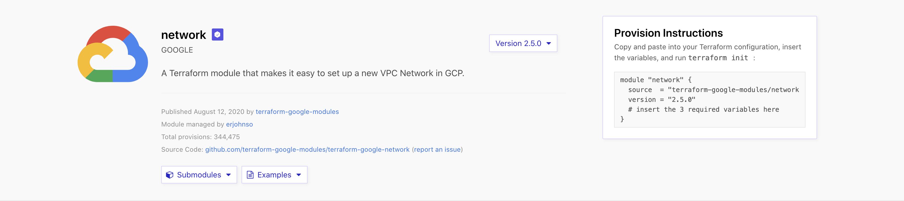
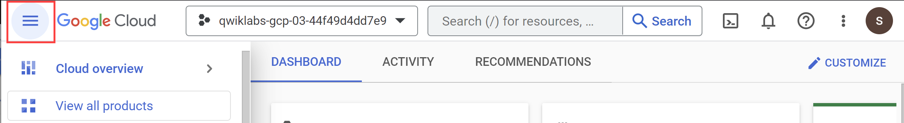
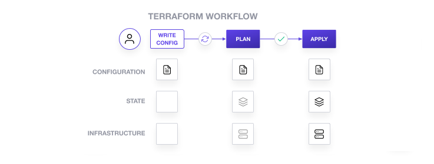
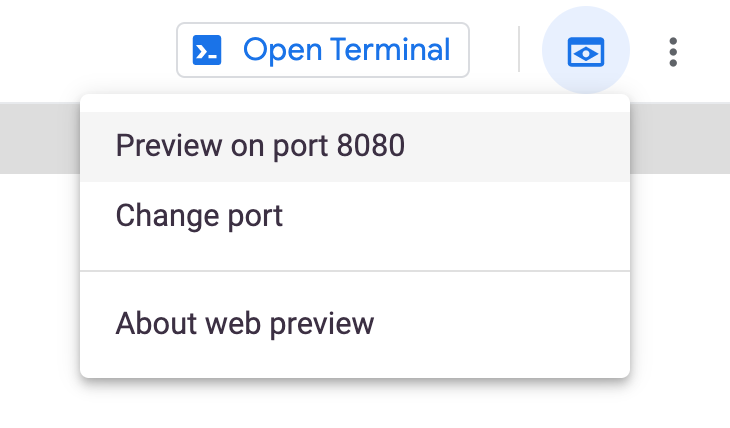

# Lab - Build Infrastructure with Terraform on Google Cloud

## Terraform Fundamentals

### Overview

Terraform enables you to safely and predictably create, change, and improve infrastructure. It is an open source tool that codifies APIs into declarative configuration files that can be shared among co-workers, treated as code, edited, reviewed, and versioned.

### Objectives

In this lab, you will learn how to perform the following tasks:

- Get started with Terraform in Google Cloud
- Install Terraform from installation binaries
- Create a VM instance infrastructure using Terraform

### Setup and requirements

### Before you click the Start Lab button

Read these instructions. Labs are timed and you cannot pause them. The timer, which starts when you click **Start Lab**, shows how long Google Cloud resources will be made available to you.

This hands-on lab lets you do the lab activities yourself in a real cloud environment, not in a simulation or demo environment. It does so by giving you new, temporary credentials that you use to sign in and access Google Cloud for the duration of the lab.

To complete this lab, you need:

- Access to a standard internet browser (Chrome browser recommended).

**Note:** Use an Incognito or private browser window to run this lab. This prevents any conflicts between your personal account and the Student account, which may cause extra charges incurred to your personal account.

- Time to complete the lab---remember, once you start, you cannot pause a lab.

**Note:** If you already have your own personal Google Cloud account or project, do not use it for this lab to avoid extra charges to your account.

### How to start your lab and sign in to the Google Cloud console

1. Click the **Start Lab** button. If you need to pay for the lab, a pop-up opens for you to select your payment method. On the left is the **Lab Details** panel with the following:

   - The **Open Google Cloud console** button
   - Time remaining
   - The temporary credentials that you must use for this lab
   - Other information, if needed, to step through this lab

2. Click **Open Google Cloud console** (or right-click and select **Open Link in Incognito Window** if you are running the Chrome browser).

   The lab spins up resources, and then opens another tab that shows the **Sign in** page.

   ***Tip:\*** Arrange the tabs in separate windows, side-by-side.

   **Note:** If you see the **Choose an account** dialog, click **Use Another Account**.

3. If necessary, copy the **Username** below and paste it into the **Sign in** dialog.

   ```
   "Username"
   ```

   

   You can also find the **Username** in the **Lab Details** panel.

4. Click **Next**.

5. Copy the **Password** below and paste it into the **Welcome** dialog.

   ```
   "Password"
   ```

   

   You can also find the **Password** in the **Lab Details** panel.

6. Click **Next**.

   **Important:** You must use the credentials the lab provides you. Do not use your Google Cloud account credentials.

   **Note:** Using your own Google Cloud account for this lab may incur extra charges.

7. Click through the subsequent pages:

   - Accept the terms and conditions.
   - Do not add recovery options or two-factor authentication (because this is a temporary account).
   - Do not sign up for free trials.

After a few moments, the Google Cloud console opens in this tab.

**Note:** To view a menu with a list of Google Cloud products and services, click the **Navigation menu** at the top-left. 

### Activate Cloud Shell

Cloud Shell is a virtual machine that is loaded with development tools. It offers a persistent 5GB home directory and runs on the Google Cloud. Cloud Shell provides command-line access to your Google Cloud resources.

1. Click **Activate Cloud Shell**  at the top of the Google Cloud console.

When you are connected, you are already authenticated, and the project is set to your **Project_ID**, `PROJECT_ID`. The output contains a line that declares the **Project_ID** for this session:

```
Your Cloud Platform project in this session is set to "PROJECT_ID"
```

`gcloud` is the command-line tool for Google Cloud. It comes pre-installed on Cloud Shell and supports tab-completion.

1. (Optional) You can list the active account name with this command:

```
gcloud auth list
```


1. Click **Authorize**.

**Output:**

```
ACTIVE: *
ACCOUNT: "ACCOUNT"

To set the active account, run:
    $ gcloud config set account `ACCOUNT`
```

1. (Optional) You can list the project ID with this command:

```
gcloud config list project
```


**Output:**

```
[core]
project = "PROJECT_ID"
```

**Note:** For full documentation of `gcloud`, in Google Cloud, refer to [the gcloud CLI overview guide](https://cloud.google.com/sdk/gcloud).

### What is Terraform?

Terraform is a tool for building, changing, and versioning infrastructure safely and efficiently. Terraform can manage existing, popular service providers and custom in-house solutions.

Configuration files describe to Terraform the components needed to run a single application or your entire data center. Terraform generates an execution plan describing what it will do to reach the desired state, and then executes it to build the described infrastructure. As the configuration changes, Terraform can determine what changed and create incremental execution plans that can be applied.

The infrastructure Terraform can manage includes both low-level components such as compute instances, storage, and networking, and high-level components such as DNS entries and SaaS features.

### Key features

#### Infrastructure as code

Infrastructure is described using a high-level configuration syntax. This allows a blueprint of your data center to be versioned and treated as you would any other code. Additionally, infrastructure can be shared and re-used.

#### Execution plans

Terraform has a planning step in which it generates an execution plan. The execution plan shows what Terraform will do when you execute the `apply` command. This lets you avoid any surprises when Terraform manipulates infrastructure.

#### Resource graph

Terraform builds a graph of all your resources and parallelizes the creation and modification of any non-dependent resources. Because of this, Terraform builds infrastructure as efficiently as possible, and operators get insight into dependencies in their infrastructure.

#### Change automation

Complex changesets can be applied to your infrastructure with minimal human interaction. With the previously mentioned execution plan and resource graph, you know exactly what Terraform will change and in what order, which helps you avoid many possible human errors.

### Task 1. Verifying Terraform installation

Terraform comes pre-installed in Cloud Shell.

- Open a new Cloud Shell tab, and verify that Terraform is available:

```
terraform
```


The resulting help output should be similar to this:

```
Usage: terraform [--version] [--help]  [args]

The available commands for execution are listed below. The most common, useful commands are shown first, followed by less common or more advanced commands. If you're just getting started with Terraform, stick with the common commands. For the other commands, please read the help and docs before usage.

Common commands: apply Builds or changes infrastructure console Interactive console for Terraform interpolations destroy Destroy Terraform-managed infrastructure env Workspace management fmt Rewrites config files to canonical format get Download and install modules for the configuration graph Create a visual graph of Terraform resources import Import existing infrastructure into Terraform init Initialize a Terraform working directory output Read an output from a state file plan Generate and show an execution plan providers Prints a tree of the providers used in the configuration push Upload this Terraform module to Atlas to run refresh Update local state file against real resources show Inspect Terraform state or plan taint Manually mark a resource for recreation untaint Manually unmark a resource as tainted validate Validates the Terraform files version Prints the Terraform version workspace Workspace management

All other commands: debug Debug output management (experimental) force-unlock Manually unlock the terraform state state Advanced state management 
```

### Task 2. Build infrastructure

With Terraform installed, you can immediately start creating some infrastructure.

### Configuration

The set of files used to describe infrastructure in Terraform is simply known as a `Terraform configuration`. In this section, you will write your first configuration to launch a single VM instance. The format of the configuration files can be found in the [Terraform Language Documentation](https://www.terraform.io/docs/configuration/index.html). We recommend using JSON for creating configuration files.

1. In Cloud Shell, create an empty configuration file named `instance.tf` with the following command:

```
touch instance.tf
```


1. Click **Open Editor** on the Cloud Shell toolbar.
   To switch between Cloud Shell and the code editor, click **Open Editor** or **Open Terminal** as required, or click **Open in a new window** to leave the Editor open in a separate tab.
2. Click the `instance.tf` file and add the following content in it:

```
resource "google_compute_instance" "terraform" {
  project      = ""
  name         = "terraform"
  machine_type = "e2-medium"
  zone         = ""

  boot_disk {
    initialize_params {
      image = "debian-cloud/debian-11"
    }
  }

  network_interface {
    network = "default"
    access_config {
    }
  }
}
```


This is a complete configuration that Terraform is ready to apply. The general structure should be intuitive and straightforward.

The "resource" block in the `instance.tf` file defines a resource that exists within the infrastructure. A resource might be a physical component such as an VM instance.

The resource block has two strings before opening the block: the **resource type** and the **resource name**. For this lab, the resource type is `google_compute_instance` and the name is `terraform.` The prefix of the type maps to the provider: `google_compute_instance` automatically tells Terraform that it is managed by the `Google` provider.

Within the resource block itself is the configuration needed for the resource.

1. In Cloud Shell, verify that your new file has been added and that there are no other `*.tf` files in your directory, because Terraform loads all of them:

```
ls
```


### Initialization

The first command to run for a new configuration—or after checking out an existing configuration from version control—is `terraform init`. This will initialize various local settings and data that will be used by subsequent commands.

Terraform uses a plugin-based architecture to support the numerous infrastructure and service providers available. Each "provider" is its own encapsulated binary that is distributed separately from Terraform itself. The `terraform init` command will automatically download and install any provider binary for the providers to use within the configuration, which in this case is just the Google provider.

1. Download and install the provider binary:

```
terraform init
```


The Google provider plugin is downloaded and installed in a subdirectory of the current working directory, along with various other book keeping files. You will see an "Initializing provider plugins" message. Terraform knows that you're running from a Google project, and it is getting Google resources.

```
Installing hashicorp/google v4.77.0...
```

**Note:** Your version number may be higher.

The output specifies which version of the plugin is being installed and suggests that you specify this version in future configuration files to ensure that `terraform init` will install a compatible version.

1. Create an execution plan:

```
terraform plan
```


Terraform performs a refresh, unless explicitly disabled, and then determines what actions are necessary to achieve the desired state specified in the configuration files. This command is a convenient way to check whether the execution plan for a set of changes matches your expectations without making any changes to real resources or to the state. For example, you might run this command before committing a change to version control, to create confidence that it will behave as expected.

**Note:** The optional `-out` argument can be used to save the generated plan to a file for later execution with `terraform apply`.

### Apply changes

1. In the same directory as the `instance.tf` file you created, run this command:

```
terraform apply
```


This output shows the Execution Plan, which describes the actions Terraform will take in order to change real infrastructure to match the configuration. The output format is similar to the diff format generated by tools like Git.

There is a `+` next to `google_compute_instance.terraform`, which means that Terraform will create this resource. Following that are the attributes that will be set. When the value displayed is `<computed>`, it means that the value won't be known until the resource is created.

**Example output:**

```
An execution plan has been generated and is shown below.
Resource actions are indicated with the following symbols:
  + create

Terraform will perform the following actions:

  # google_compute_instance.default will be created
  + resource "google_compute_instance" "default" {
      + can_ip_forward       = false
      + cpu_platform         = (known after apply)
      + deletion_protection  = false
      + guest_accelerator    = (known after apply)
      + id                   = (known after apply)
      + instance_id          = (known after apply)
      + label_fingerprint    = (known after apply)
      + machine_type         = "e2-medium"
      + metadata_fingerprint = (known after apply)
      + name                 = "terraform"
      + project              = "qwiklabs-gcp-42390cc9da8a4c4b"
      + self_link            = (known after apply)
      + tags_fingerprint     = (known after apply)
      + zone                 = "us-west1-c"

      + boot_disk {
          + auto_delete                = true
          + device_name                = (known after apply)
          + disk_encryption_key_sha256 = (known after apply)
          + kms_key_self_link          = (known after apply)
          + source                     = (known after apply)

          + initialize_params {
              + image  = "debian-cloud/debian-11"
              + labels = (known after apply)
              + size   = (known after apply)
              + type   = (known after apply)
            }
        }

      + network_interface {
          + address            = (known after apply)
          + name               = (known after apply)
          + network            = "default"
          + network_ip         = (known after apply)
          + subnetwork         = (known after apply)
          + subnetwork_project = (known after apply)

          + access_config {
              + assigned_nat_ip = (known after apply)
              + nat_ip          = (known after apply)
              + network_tier    = (known after apply)
            }
        }

      + scheduling {
          + automatic_restart   = (known after apply)
          + on_host_maintenance = (known after apply)
          + preemptible         = (known after apply)

          + node_affinities {
              + key      = (known after apply)
              + operator = (known after apply)
              + values   = (known after apply)
            }
        }

    }

Plan: 1 to add, 0 to change, 0 to destroy.

Do you want to perform these actions? Terraform will perform the actions described above. Only 'yes' will be accepted to approve.

Enter a value: 
```

If the plan was created successfully, Terraform will now pause and wait for approval before proceeding. In a production environment, if anything in the Execution Plan seems incorrect or dangerous, it's safe to cancel here. No changes have been made to your infrastructure.

1. For this case the plan looks acceptable, so type `yes` at the confirmation prompt to proceed.
   Executing the plan will take a few minutes because Terraform waits for the VM instance to become available.

After this, Terraform is all done!

**Test completed task**

Click **Check my progress** to verify your performed task. If you have completed the task successfully, you will receive an assessment score.

Create a VM instance in the `ZONE` zone with Terraform.


Check my progress


1. In the Google Cloud Console, on the **Navigation menu**, click **Compute Engine** > **VM instances**. The **VM instances** page opens and you'll see the VM instance you just created in the **VM instances** list.

Terraform has written some data into the `terraform.tfstate` file. This state file is extremely important: it keeps track of the IDs of created resources so that Terraform knows what it is managing.

1. In Cloud Shell, inspect the current state:

```
terraform show
```


**Example output:**

```
# google_compute_instance.default:
resource "google_compute_instance" "default" {
    can_ip_forward       = false
    cpu_platform         = "Intel Haswell"
    deletion_protection  = false
    guest_accelerator    = []
    id                   = "terraform"
    instance_id          = "3408292216444307052"
    label_fingerprint    = "42WmSpB8rSM="
    machine_type         = "e2-medium"
    metadata_fingerprint = "s6I5s2tjfKw="
    name                 = "terraform"
    project              = "qwiklabs-gcp-42390cc9da8a4c4b"
    self_link            = "https://www.googleapis.com/compute/v1/projects/qwiklabs-gcp-42390cc9da8a4c4b/zones/{{{project_0.default_zone}}}/instances/terraform"
    tags_fingerprint     = "42WmSpB8rSM="
    zone                 = "{{{project_0.default_zone}}}"

    boot_disk {
        auto_delete = true
        device_name = "persistent-disk-0"
        source      = "https://www.googleapis.com/compute/v1/projects/qwiklabs-gcp-42390cc9da8a4c4b/zones/{{{project_0.default_zone}}}/disks/terraform"

.... 
```

You can see that by creating this resource, you've also gathered a lot of information about it. These values can be referenced to configure additional resources or outputs.

Congratulations! You've built your first infrastructure with Terraform. You've seen the configuration syntax and an example of a basic execution plan and understand the state file.

### Task 3. Test your understanding

The following multiple choice questions should reinforce your understanding of this lab's concepts. Answer them to the best of your abilities.

Terraform enables you to safely and predictably create, change, and improve infrastructure.

True

False


With Terraform, you can create your own custom provider plugins.

True

False


### Congratulations

Congratulations on completing this lab! You've learned how to use Terraform to create and manage infrastructure on Google Cloud.

## Infrastructure as Code with Terraform

### Overview

Terraform is the infrastructure as code offering from HashiCorp. It is a tool for building, changing, and managing infrastructure in a safe, repeatable way. Operators and Infrastructure teams can use Terraform to manage environments with a configuration language called the HashiCorp Configuration Language (HCL) for human-readable, automated deployments.

Infrastructure as code is the process of managing infrastructure in a file or files rather than manually configuring resources in a user interface. A resource in this instance is any piece of infrastructure in a given environment, such as a virtual machine, security group, network interface, etc. At a high level, Terraform allows operators to use HCL to author files containing definitions of their desired resources on almost any provider (AWS, Google Cloud, GitHub, Docker, etc.) and automates the creation of those resources at the time of apply.

A simple workflow for deployment will follow closely to the steps below:

- **Scope** - Confirm what resources need to be created for a given project.
- **Author** - Create the configuration file in HCL based on the scoped parameters.
- **Initialize** - Run `terraform init` in the project directory with the configuration files. This will download the correct provider plug-ins for the project.
- **Plan & Apply** - Run `terraform plan` to verify creation process and then `terraform apply` to create real resources as well as the state file that compares future changes in your configuration files to what actually exists in your deployment environment.

### Objectives

In this lab, you will learn how to perform the following tasks:

- Build, change, and destroy infrastructure with Terraform
- Create Resource Dependencies with Terraform
- Provision infrastructure with Terraform

### Setup and requirements

### Before you click the Start Lab button

Read these instructions. Labs are timed and you cannot pause them. The timer, which starts when you click **Start Lab**, shows how long Google Cloud resources will be made available to you.

This hands-on lab lets you do the lab activities yourself in a real cloud environment, not in a simulation or demo environment. It does so by giving you new, temporary credentials that you use to sign in and access Google Cloud for the duration of the lab.

To complete this lab, you need:

- Access to a standard internet browser (Chrome browser recommended).

**Note:** Use an Incognito or private browser window to run this lab. This prevents any conflicts between your personal account and the Student account, which may cause extra charges incurred to your personal account.

- Time to complete the lab---remember, once you start, you cannot pause a lab.

**Note:** If you already have your own personal Google Cloud account or project, do not use it for this lab to avoid extra charges to your account.

### How to start your lab and sign in to the Google Cloud console

1. Click the **Start Lab** button. If you need to pay for the lab, a pop-up opens for you to select your payment method. On the left is the **Lab Details** panel with the following:

   - The **Open Google Cloud console** button
   - Time remaining
   - The temporary credentials that you must use for this lab
   - Other information, if needed, to step through this lab

2. Click **Open Google Cloud console** (or right-click and select **Open Link in Incognito Window** if you are running the Chrome browser).

   The lab spins up resources, and then opens another tab that shows the **Sign in** page.

   ***Tip:\*** Arrange the tabs in separate windows, side-by-side.

   **Note:** If you see the **Choose an account** dialog, click **Use Another Account**.

3. If necessary, copy the **Username** below and paste it into the **Sign in** dialog.

   ```
   "Username"
   ```

   

   You can also find the **Username** in the **Lab Details** panel.

4. Click **Next**.

5. Copy the **Password** below and paste it into the **Welcome** dialog.

   ```
   "Password"
   ```

   

   You can also find the **Password** in the **Lab Details** panel.

6. Click **Next**.

   **Important:** You must use the credentials the lab provides you. Do not use your Google Cloud account credentials.

   **Note:** Using your own Google Cloud account for this lab may incur extra charges.

7. Click through the subsequent pages:

   - Accept the terms and conditions.
   - Do not add recovery options or two-factor authentication (because this is a temporary account).
   - Do not sign up for free trials.

After a few moments, the Google Cloud console opens in this tab.

**Note:** To view a menu with a list of Google Cloud products and services, click the **Navigation menu** at the top-left. 

### Activate Cloud Shell

Cloud Shell is a virtual machine that is loaded with development tools. It offers a persistent 5GB home directory and runs on the Google Cloud. Cloud Shell provides command-line access to your Google Cloud resources.

1. Click **Activate Cloud Shell**  at the top of the Google Cloud console.

When you are connected, you are already authenticated, and the project is set to your **Project_ID**, `PROJECT_ID`. The output contains a line that declares the **Project_ID** for this session:

```
Your Cloud Platform project in this session is set to "PROJECT_ID"
```

`gcloud` is the command-line tool for Google Cloud. It comes pre-installed on Cloud Shell and supports tab-completion.

1. (Optional) You can list the active account name with this command:

```
gcloud auth list
```


1. Click **Authorize**.

**Output:**

```
ACTIVE: *
ACCOUNT: "ACCOUNT"

To set the active account, run:
    $ gcloud config set account `ACCOUNT`
```

1. (Optional) You can list the project ID with this command:

```
gcloud config list project
```


**Output:**

```
[core]
project = "PROJECT_ID"
```

**Note:** For full documentation of `gcloud`, in Google Cloud, refer to [the gcloud CLI overview guide](https://cloud.google.com/sdk/gcloud).

### Task 1. Build infrastructure

Terraform comes pre-installed in Cloud Shell. With Terraform already installed, you can dive right in and create some infrastructure.

Start by creating your example configuration to a file named `main.tf`. Terraform recognizes files ending in `.tf` or `.tf.json` as configuration files and will load them when it runs.

1. Create the `main.tf` file:

```
touch main.tf
```


1. Click the **Open Editor** button on the toolbar of Cloud Shell. (You can switch between Cloud Shell and the code editor by using the **Open Editor** and **Open Terminal** icons as required, or click the **Open in new window** button to leave the Editor open in a separate tab).
2. In the Editor, add the following content to the `main.tf` file.

```
terraform {
  required_providers {
    google = {
      source = "hashicorp/google"
      version = "3.5.0"
    }
  }
}

provider "google" {

  project = "PROJECT ID"
  region  = "REGION"
  zone    = "ZONE"
}

resource "google_compute_network" "vpc_network" {
  name = "terraform-network"
}
```


**Note:** To use this snippet with Terraform 0.12, remove the `terraform {}` block.

### Terraform block

The `terraform {}` block is required so Terraform knows which provider to download from the [Terraform Registry](https://registry.terraform.io/). In the configuration above, the `google` provider's source is defined as `hashicorp/google` which is shorthand for `registry.terraform.io/hashicorp/google`.

You can also assign a version to each provider defined in the `required_providers` block. The `version` argument is optional, but recommended. It is used to constrain the provider to a specific version or a range of versions in order to prevent downloading a new provider that may possibly contain breaking changes. If the version isn't specified, Terraform will automatically download the most recent provider during initialization.

To learn more, on the HashiCorp Terraform website, see [Provider Requirements](https://www.terraform.io/docs/configuration/provider-requirements.html).

### Providers

The `provider` block is used to configure the named provider, in this case `google`. A provider is responsible for creating and managing resources. Multiple provider blocks can exist if a Terraform configuration manages resources from different providers.

### Initialization

The first command to run for a new configuration -- or after checking out an existing configuration from version control -- is `terraform init`, which initializes various local settings and data that will be used by subsequent commands.

- Initialize your new Terraform configuration by running the `terraform init` command in the same directory as your `main.tf` file:

```
terraform init
```


### Creating resources

1. Apply you configuration now by running the command `terraform apply`:

```
terraform apply
```


The output has a `+` next to resource `"google_compute_network" "vpc_network"`, meaning that Terraform will create this resource. Beneath that, it shows the attributes that will be set. When the value displayed is `(known after apply)`, it means that the value won't be known until the resource is created.

If the plan was created successfully, Terraform will now pause and wait for approval before proceeding. If anything in the plan seems incorrect or dangerous, it is safe to abort here with no changes made to your infrastructure.

If `terraform apply` failed with an error, read the error message and fix the error that occurred.

1. The plan looks acceptable here, so type `yes` at the confirmation prompt to proceed.

Executing the plan will take a few minutes since Terraform waits for the network to be created successfully:

```
# ...
  Enter a value: yes

google_compute_network.vpc_network: Creating...
google_compute_network.vpc_network: Still creating... [10s elapsed]
google_compute_network.vpc_network: Still creating... [20s elapsed]
google_compute_network.vpc_network: Still creating... [30s elapsed]
google_compute_network.vpc_network: Still creating... [40s elapsed]
google_compute_network.vpc_network: Still creating... [50s elapsed]
google_compute_network.vpc_network: Creation complete after 58s [id=terraform-network]

Apply complete! Resources: 1 added, 0 changed, 0 destroyed.
```

After this, Terraform is all done! You can go to the Cloud Console to see the network you have provisioned.

1. In the Console, from the **Navigation menu**, navigate to **VPC network**. You will see the `terraform-network` has been provisioned.


1. In Cloud Shell run the `terraform show` command to inspect the current state:

```
terraform show
```


These values can be referenced to configure other resources or outputs, which will be covered later in this lab.

Click *Check my progress* to verify the objective.

Creating Resources in terraform


Check my progress


### Task 2. Change infrastructure

In the previous section, you created basic infrastructure with Terraform: a VPC network. In this section, you're going to modify your configuration, and see how Terraform handles change.

Infrastructure is continuously evolving, and Terraform was built to help manage and enact that change. As you change Terraform configurations, Terraform builds an execution plan that only modifies what is necessary to reach your desired state.

By using Terraform to change infrastructure, you can version control not only your configurations but also your state so you can see how the infrastructure evolves over time.

### Adding resources

You can add new resources by adding them to your Terraform configuration and running `terraform apply` to provision them.

1. In the Editor, add a compute instance resource to `main.tf`:

```
resource "google_compute_instance" "vm_instance" {
  name         = "terraform-instance"
  machine_type = "e2-micro"

  boot_disk {
    initialize_params {
      image = "debian-cloud/debian-11"
    }
  }

  network_interface {
    network = google_compute_network.vpc_network.name
    access_config {
    }
  }
}
```


This resource includes a few more arguments. The name and machine type are simple strings, but `boot_disk` and `network_interface` are more complex blocks. You can see all of the available options in the [google_compute_instance documentation](https://www.terraform.io/docs/providers/google/r/compute_instance).

For this example, your compute instance will use a Debian operating system, and will be connected to the VPC Network you created earlier. Notice how this configuration refers to the network's name property with `google_compute_network.vpc_network.name` -- `google_compute_network.vpc_network` is the ID, matching the values in the block that defines the network, and `name` is a property of that resource.

The presence of the `access_config` block, even without any arguments, ensures that the instance will be accessible over the internet.

1. Now run `terraform apply` to create the compute instance:

```
terraform apply
```


1. Once again, answer `yes` to the confirmation prompt.

This is a fairly straightforward change - you added a "google_compute_instance" resource named "vm_instance" to your configuration, and Terraform created the resource in Google Cloud.

### Changing resources

In addition to creating resources, Terraform can also make changes to those resources.

1. Add a `tags` argument to your "vm_instance" so that it looks like this:

```
resource "google_compute_instance" "vm_instance" {
  name         = "terraform-instance"
  machine_type = "e2-micro"
  tags         = ["web", "dev"]
  # ...
}
```


1. Run `terraform apply` again to update the instance:

```
terraform apply
```


1. The prefix `~` means that Terraform will update the resource in-place. You can go and apply this change now by responding `yes`, and Terraform will add the tags to your instance.

Click *Check my progress* to verify the objective.

Change Infrastructure


Check my progress


### Destructive changes

A destructive change is a change that requires the provider to replace the existing resource rather than updating it. This usually happens because the cloud provider doesn't support updating the resource in the way described by your configuration.

Changing the disk image of your instance is one example of a destructive change.

1. Edit the `boot_disk` block inside the `vm_instance` resource in your configuration file and change it to the following:

```
  boot_disk {
    initialize_params {
      image = "cos-cloud/cos-stable"
    }
  }
```


1. Now run `terraform apply` again to see how Terraform will apply this change to the existing resources:

```
terraform apply
```


The prefix `-/+` means that Terraform will destroy and recreate the resource, rather than updating it in-place. While some attributes can be updated in-place (which are shown with the `~` prefix), changing the boot disk image for an instance requires recreating it. Terraform and the Google Cloud provider handle these details for you, and the execution plan makes it clear what Terraform will do.

Additionally, the execution plan shows that the disk image change is what required your instance to be replaced. Using this information, you can adjust your changes to possibly avoid destroy/create updates if they are not acceptable in some situations.

1. Once again, Terraform prompts for approval of the execution plan before proceeding. Answer `yes` to execute the planned steps.

As indicated by the execution plan, Terraform first destroyed the existing instance and then created a new one in its place. You can use `terraform show` again to see the new values associated with this instance.

### Destroy infrastructure

You have now seen how to build and change infrastructure. Before moving on to creating multiple resources and showing resource dependencies, you will see how to completely destroy your Terraform-managed infrastructure.

Destroying your infrastructure is a rare event in production environments. But if you're using Terraform to spin up multiple environments such as development, testing, and staging, then destroying is often a useful action.

Resources can be destroyed using the `terraform destroy` command, which is similar to `terraform apply` but it behaves as if all of the resources have been removed from the configuration.

- Try the `terraform destroy` command. Answer `yes` to execute this plan and destroy the infrastructure:

```
terraform destroy
```


The `-` prefix indicates that the instance and the network will be destroyed. As with apply, Terraform shows its execution plan and waits for approval before making any changes.

Just like with `terraform apply`, Terraform determines the order in which things must be destroyed. Google Cloud won't allow a VPC network to be deleted if there are resources still in it, so Terraform waits until the instance is destroyed before destroying the network. When performing operations, Terraform creates a dependency graph to determine the correct order of operations. In more complicated cases with multiple resources, Terraform will perform operations in parallel when it's safe to do so.

Click *Check my progress* to verify the objective.

Destructive Changes


Check my progress


### Task 3. Create resource dependencies

In this section, you will learn more about resource dependencies and how to use resource parameters to share information about one resource with other resources.

Real-world infrastructure has a diverse set of resources and resource types. Terraform configurations can contain multiple resources, multiple resource types, and these types can even span multiple providers.

In this section, you will be shown a basic example of how to configure multiple resources and how to use resource attributes to configure other resources.

- Recreate your network and instance. After you respond to the prompt with `yes`, the resources will be created:

```
terraform apply
```


### Assigning a static IP address

1. Now add to your configuration by assigning a static IP to the VM instance in `main.tf`:

```
resource "google_compute_address" "vm_static_ip" {
  name = "terraform-static-ip"
}
```


This should look familiar from the earlier example of adding a VM instance resource, except this time you're creating a "google_compute_address" resource type. This resource type allocates a reserved IP address to your project.

1. Next, run `terraform plan`:

```
terraform plan
```


You can see what will be created with `terraform plan`:

```
$ terraform plan
Refreshing Terraform state in-memory prior to plan...
The refreshed state will be used to calculate this plan, but will not be
persisted to local or remote state storage.

google_compute_network.vpc_network: Refreshing state... [id=terraform-network]
google_compute_instance.vm_instance: Refreshing state... [id=terraform-instance]

------------------------------------------------------------------------

An execution plan has been generated and is shown below.
Resource actions are indicated with the following symbols:
  + create

Terraform will perform the following actions:

  # google_compute_address.vm_static_ip will be created
  + resource "google_compute_address" "vm_static_ip" {
      + address            = (known after apply)
      + address_type       = "EXTERNAL"
      + creation_timestamp = (known after apply)
      + id                 = (known after apply)
      + name               = "terraform-static-ip"
      + network_tier       = (known after apply)
      + project            = (known after apply)
      + region             = (known after apply)
      + self_link          = (known after apply)
      + subnetwork         = (known after apply)
      + users              = (known after apply)
    }

Plan: 1 to add, 0 to change, 0 to destroy.

------------------------------------------------------------------------

Note: You didn't specify an "-out" parameter to save this plan, so Terraform can't guarantee that exactly these actions will be performed if
"terraform apply" is subsequently run.
```

Unlike `terraform apply`, the `plan` command will only show what would be changed, and never actually apply the changes directly. Notice that the only change you have made so far is to add a static IP. Next, you need to attach the IP address to your instance.

1. Update the `network_interface` configuration for your instance like so:

```
  network_interface {
    network = google_compute_network.vpc_network.self_link
    access_config {
      nat_ip = google_compute_address.vm_static_ip.address
    }
  }
```


The `access_config` block has several optional arguments, and in this case you'll set `nat_ip` to be the static IP address. When Terraform reads this configuration, it will:

- Ensure that `vm_static_ip` is created before `vm_instance`
- Save the properties of `vm_static_ip` in the state
- Set `nat_ip` to the value of the `vm_static_ip.address` property

1. Run terraform plan again, but this time, save the plan:

```
terraform plan -out static_ip
```


Saving the plan this way ensures that you can apply exactly the same plan in the future. If you try to apply the file created by the plan, Terraform will first check to make sure the exact same set of changes will be made before applying the plan.

In this case, you can see that Terraform will create a new `google_compute_address` and update the existing VM to use it.

1. Run `terraform apply "static_ip"` to see how Terraform plans to apply this change:

```
terraform apply "static_ip"
```


As shown above, Terraform created the static IP before modifying the VM instance. Due to the interpolation expression that passes the IP address to the instance's network interface configuration, Terraform is able to infer a dependency, and knows it must create the static IP before updating the instance.

Click *Check my progress* to verify the objective.

Create Resource Dependencies


Check my progress


### Implicit and explicit dependencies

By studying the resource attributes used in interpolation expressions, Terraform can automatically infer when one resource depends on another. In the example above, the reference to `google_compute_address.vm_static_ip.address` creates an *implicit dependency* on the `google_compute_address` named `vm_static_ip`.

Terraform uses this dependency information to determine the correct order in which to create and update different resources. In the example above, Terraform knows that the `vm_static_ip` must be created before the `vm_instance` is updated to use it.

Implicit dependencies via interpolation expressions are the primary way to inform Terraform about these relationships, and should be used whenever possible.

Sometimes there are dependencies between resources that are *not* visible to Terraform. The `depends_on` argument can be added to any resource and accepts a list of resources to create explicit dependencies for.

For example, perhaps an application you will run on your instance expects to use a specific Cloud Storage bucket, but that dependency is configured inside the application code and thus not visible to Terraform. In that case, you can use `depends_on` to explicitly declare the dependency.

1. Add a Cloud Storage bucket and an instance with an explicit dependency on the bucket by adding the following to `main.tf`:

```
# New resource for the storage bucket our application will use.
resource "google_storage_bucket" "example_bucket" {
  name     = "<UNIQUE-BUCKET-NAME>"
  location = "US"

  website {
    main_page_suffix = "index.html"
    not_found_page   = "404.html"
  }
}

# Create a new instance that uses the bucket
resource "google_compute_instance" "another_instance" {
  # Tells Terraform that this VM instance must be created only after the
  # storage bucket has been created.
  depends_on = [google_storage_bucket.example_bucket]

  name         = "terraform-instance-2"
  machine_type = "e2-micro"

  boot_disk {
    initialize_params {
      image = "cos-cloud/cos-stable"
    }
  }

  network_interface {
    network = google_compute_network.vpc_network.self_link
    access_config {
    }
  }
}
```


**Note:** Storage buckets must be globally unique. Because of this, you will need to replace `UNIQUE-BUCKET-NAME` with a unique, valid name for a bucket. Using your name and the date is usually a good way to guess a unique bucket name.

You may wonder where in your configuration these resources should go. The order that resources are defined in a terraform configuration file has no effect on how Terraform applies your changes. Organize your configuration files in a way that makes the most sense for you and your team.

main.tf

```
terraform {
  required_providers {
    google = {
      source = "hashicorp/google"
      version = "3.5.0"
    }
  }
}

provider "google" {

  project = "qwiklabs-gcp-01-1f2e00690c06"
  region  = "us-west1"
  zone    = "us-west1-a"
}

resource "google_compute_network" "vpc_network" {
  name = "terraform-network"
}

resource "google_compute_address" "vm_static_ip" {
  name = "terraform-static-ip"
}

resource "google_compute_instance" "vm_instance" {
  name         = "terraform-instance"
  machine_type = "e2-micro"
  tags = ["web", "dev"]

  boot_disk {
    initialize_params {
      image = "cos-cloud/cos-stable"
    }
  }

  network_interface {
    network = google_compute_network.vpc_network.self_link
    access_config {
      nat_ip = google_compute_address.vm_static_ip.address
    }
  }
}

# New resource for the storage bucket our application will use.
resource "google_storage_bucket" "example_bucket" {
  name     = "qwiklabs-gcp-01-1f2e00690c06"
  location = "US"

  website {
    main_page_suffix = "index.html"
    not_found_page   = "404.html"
  }
}

# Create a new instance that uses the bucket
resource "google_compute_instance" "another_instance" {
  # Tells Terraform that this VM instance must be created only after the
  # storage bucket has been created.
  depends_on = [google_storage_bucket.example_bucket]

  name         = "terraform-instance-2"
  machine_type = "e2-micro"

  boot_disk {
    initialize_params {
      image = "cos-cloud/cos-stable"
    }
  }

  network_interface {
    network = google_compute_network.vpc_network.self_link
    access_config {
    }
  }
}
```


1. Now run terraform plan and terraform apply to see these changes in action:

```
terraform plan
terraform apply
```


Click *Check my progress* to verify the objective.

Create bucket dependent instance


Check my progress


1. Before moving on, remove these new resources from your configuration and run `terraform apply` once again to destroy them. You won't use the bucket or the second instance any further in this lab.

### Task 4. Provision infrastructure

The compute instance you launched at this point is based on the Google image given, but has no additional software installed or configuration applied.

Google Cloud allows customers to manage their own [custom operating system images](https://cloud.google.com/compute/docs/images/create-delete-deprecate-private-images). This can be a great way to ensure the instances you provision with Terraform are pre-configured based on your needs. [Packer](https://www.packer.io/) is the perfect tool for this and includes a [builder for Google Cloud](https://www.packer.io/docs/builders/googlecompute.html).

Terraform uses provisioners to upload files, run shell scripts, or install and trigger other software like configuration management tools.

### Defining a provisioner

1. To define a provisioner, modify the resource block defining the first `vm_instance` in your configuration to look like the following:

```
resource "google_compute_instance" "vm_instance" {
  name         = "terraform-instance"
  machine_type = "e2-micro"
  tags         = ["web", "dev"]

  provisioner "local-exec" {
    command = "echo ${google_compute_instance.vm_instance.name}:  ${google_compute_instance.vm_instance.network_interface[0].access_config[0].nat_ip} >> ip_address.txt"
  }

  # ...
}
```


This adds a `provisioner` block within the `resource` block. Multiple `provisioner` blocks can be added to define multiple provisioning steps. Terraform supports [many provisioners](https://www.terraform.io/docs/provisioners/index.html), but for this example you are using the `local-exec` provisioner.

The `local-exec` provisioner executes a command locally on the machine running Terraform, not the VM instance itself. You're using this provisioner versus the others so we don't have to worry about specifying any [connection info](https://www.terraform.io/docs/provisioners/connection.html) right now.

This also shows a more complex example of string interpolation than you've seen before. Each VM instance can have multiple network interfaces, so refer to the first one with `network_interface[0]`, count starting from 0, as most programming languages do. Each network interface can have multiple access_config blocks as well, so once again you specify the first one.

1. Run `terraform apply`:

```
terraform apply
```


At this point, the output may be confusing at first.

Terraform found nothing to do - and if you check, you'll find that there's no `ip_address.txt` file on your local machine.

Terraform treats provisioners differently from other arguments. Provisioners only run when a resource is created, but adding a provisioner does not force that resource to be destroyed and recreated.

1. Use `terraform taint` to tell Terraform to recreate the instance:

```
terraform taint google_compute_instance.vm_instance
```


A tainted resource will be destroyed and recreated during the next `apply`.

1. Run `terraform apply` now:

```
terraform apply
```


1. Verify everything worked by looking at the contents of the `ip_address.txt` file.

It contains the IP address, just as you asked.

### Failed provisioners and tainted resources

If a resource is successfully created but fails a provisioning step, Terraform will error and mark the resource as *tainted*. A resource that is tainted still exists, but shouldn't be considered safe to use, since provisioning failed.

When you generate your next execution plan, Terraform will remove any tainted resources and create new resources, attempting to provision them again after creation.

### Destroy provisioners

Provisioners can also be defined that run only during a destroy operation. These are useful for performing system cleanup, extracting data, etc.

For many resources, using built-in cleanup mechanisms is recommended if possible (such as init scripts), but provisioners can be used if necessary.

This lab won't show any destroyed provisioner examples. If you need to use destroy provisioners, please see the [Provisioners documentation](https://www.terraform.io/docs/provisioners/).

### Congratulations!

In this lab, you learned how to build, change, and destroy infrastructure with Terraform. You then created resource dependencies, and provisioned basic infrastructure with Terraform configuration files.


## Interact with Terraform Modules

### Overview

As you manage your infrastructure with Terraform, increasingly complex configurations will be created. There is no intrinsic limit to the complexity of a single Terraform configuration file or directory, so it is possible to continue writing and updating your configuration files in a single directory. However, if you do, you may encounter one or more of the following problems:

- Understanding and navigating the configuration files will become increasingly difficult.
- Updating the configuration will become more risky, because an update to one block may cause unintended consequences to other blocks of your configuration.
- Duplication of similar blocks of configuration may increase, for example, when you configure separate dev/staging/production environments, which will cause an increasing burden when updating those parts of your configuration.
- If you want to share parts of your configuration between projects and teams, cutting and pasting blocks of configuration between projects could be error-prone and hard to maintain.

In this lab, you will learn how modules can address these problems, the structure of a Terraform module, and best practices when using and creating modules.

### What are modules for?

Here are some of the ways that modules help solve the problems listed above:

- **Organize configuration:** Modules make it easier to navigate, understand, and update your configuration by keeping related parts of your configuration together. Even moderately complex infrastructure can require hundreds or thousands of lines of configuration to implement. By using modules, you can organize your configuration into logical components.
- **Encapsulate configuration:** Another benefit of using modules is to encapsulate configuration into distinct logical components. Encapsulation can help prevent unintended consequences—such as a change to one part of your configuration accidentally causing changes to other infrastructure—and reduce the chances of simple errors like using the same name for two different resources.
- **Re-use configuration:** Writing all of your configuration without using existing code can be time-consuming and error-prone. Using modules can save time and reduce costly errors by re-using configuration written either by yourself, other members of your team, or other Terraform practitioners who have published modules for you to use. You can also share modules that you have written with your team or the general public, giving them the benefit of your hard work.
- **Provide consistency and ensure best practices:** Modules also help to provide consistency in your configurations. Consistency makes complex configurations easier to understand, and it also helps to ensure that best practices are applied across all of your configuration. For example, cloud providers offer many options for configuring object storage services, such as Amazon S3 (Simple Storage Service) or Google's Cloud Storage buckets. Many high-profile security incidents have involved incorrectly secured object storage, and because of the number of complex configuration options involved, it's easy to accidentally misconfigure these services.

Using modules can help reduce these errors. For example, you might create a module to describe how all of your organization's public website buckets will be configured, and another module for private buckets used for logging applications. Also, if a configuration for a type of resource needs to be updated, using modules allows you to make that update in a single place and have it be applied to all cases where you use that module.

### Objectives

In this lab, you will learn how to perform the following tasks:

- Use a module from the Registry
- Build a module

### Setup and requirements

### Before you click the Start Lab button

Read these instructions. Labs are timed and you cannot pause them. The timer, which starts when you click **Start Lab**, shows how long Google Cloud resources will be made available to you.

This hands-on lab lets you do the lab activities yourself in a real cloud environment, not in a simulation or demo environment. It does so by giving you new, temporary credentials that you use to sign in and access Google Cloud for the duration of the lab.

To complete this lab, you need:

- Access to a standard internet browser (Chrome browser recommended).

**Note:** Use an Incognito or private browser window to run this lab. This prevents any conflicts between your personal account and the Student account, which may cause extra charges incurred to your personal account.

- Time to complete the lab---remember, once you start, you cannot pause a lab.

**Note:** If you already have your own personal Google Cloud account or project, do not use it for this lab to avoid extra charges to your account.

### How to start your lab and sign in to the Google Cloud console

1. Click the **Start Lab** button. If you need to pay for the lab, a pop-up opens for you to select your payment method. On the left is the **Lab Details** panel with the following:

   - The **Open Google Cloud console** button
   - Time remaining
   - The temporary credentials that you must use for this lab
   - Other information, if needed, to step through this lab

2. Click **Open Google Cloud console** (or right-click and select **Open Link in Incognito Window** if you are running the Chrome browser).

   The lab spins up resources, and then opens another tab that shows the **Sign in** page.

   ***Tip:\*** Arrange the tabs in separate windows, side-by-side.

   **Note:** If you see the **Choose an account** dialog, click **Use Another Account**.

3. If necessary, copy the **Username** below and paste it into the **Sign in** dialog.

   ```
   "Username"
   ```

   

   You can also find the **Username** in the **Lab Details** panel.

4. Click **Next**.

5. Copy the **Password** below and paste it into the **Welcome** dialog.

   ```
   "Password"
   ```

   

   You can also find the **Password** in the **Lab Details** panel.

6. Click **Next**.

   **Important:** You must use the credentials the lab provides you. Do not use your Google Cloud account credentials.

   **Note:** Using your own Google Cloud account for this lab may incur extra charges.

7. Click through the subsequent pages:

   - Accept the terms and conditions.
   - Do not add recovery options or two-factor authentication (because this is a temporary account).
   - Do not sign up for free trials.

After a few moments, the Google Cloud console opens in this tab.

**Note:** To view a menu with a list of Google Cloud products and services, click the **Navigation menu** at the top-left. 

### Activate Cloud Shell

Cloud Shell is a virtual machine that is loaded with development tools. It offers a persistent 5GB home directory and runs on the Google Cloud. Cloud Shell provides command-line access to your Google Cloud resources.

1. Click **Activate Cloud Shell**  at the top of the Google Cloud console.

When you are connected, you are already authenticated, and the project is set to your **Project_ID**, `PROJECT_ID`. The output contains a line that declares the **Project_ID** for this session:

```
Your Cloud Platform project in this session is set to "PROJECT_ID"
```

`gcloud` is the command-line tool for Google Cloud. It comes pre-installed on Cloud Shell and supports tab-completion.

1. (Optional) You can list the active account name with this command:

```
gcloud auth list
```


1. Click **Authorize**.

**Output:**

```
ACTIVE: *
ACCOUNT: "ACCOUNT"

To set the active account, run:
    $ gcloud config set account `ACCOUNT`
```

1. (Optional) You can list the project ID with this command:

```
gcloud config list project
```


**Output:**

```
[core]
project = "PROJECT_ID"
```

**Note:** For full documentation of `gcloud`, in Google Cloud, refer to [the gcloud CLI overview guide](https://cloud.google.com/sdk/gcloud).

### What is a Terraform module?

A Terraform module is a set of Terraform configuration files in a single directory. Even a simple configuration consisting of a single directory with one or more `.tf` files is a module. When you run Terraform commands directly from such a directory, it is considered the **root module**. So in this sense, every Terraform configuration is part of a module. You may have a simple set of Terraform configuration files like this:

```
├── LICENSE
├── README.md
├── main.tf
├── variables.tf
├── outputs.tf
```

In this case, when you run Terraform commands from within the `minimal-module` directory, the contents of that directory are considered the root module.

### Calling modules

Terraform commands will only directly use the configuration files in one directory, which is usually the current working directory. However, your configuration can use module blocks to call modules in other directories. When Terraform encounters a module block, it loads and processes that module's configuration files.

A module that is called by another configuration is sometimes referred to as a "child module" of that configuration.

### Local and remote modules

Modules can be loaded from either the local filesystem or a remote source. Terraform supports a variety of remote sources, including the Terraform Registry, most version control systems, HTTP URLs, and Terraform Cloud or Terraform Enterprise private module registries.

### Module best practices

In many ways, Terraform modules are similar to the concepts of libraries, packages, or modules found in most programming languages, and they provide many of the same benefits. Just like almost any non-trivial computer program, real-world Terraform configurations should almost always use modules to provide the benefits mentioned above.

It is recommended that every Terraform practitioner use modules by following these best practices:

- Start writing your configuration with a plan for modules. Even for slightly complex Terraform configurations managed by a single person, the benefits of using modules outweigh the time it takes to use them properly.
- Use local modules to organize and encapsulate your code. Even if you aren't using or publishing remote modules, organizing your configuration in terms of modules from the beginning will significantly reduce the burden of maintaining and updating your configuration as your infrastructure grows in complexity.
- Use the public [Terraform Registry](https://registry.terraform.io/) to find useful modules. This way you can quickly and confidently implement your configuration by relying on the work of others.
- Publish and share modules with your team. Most infrastructure is managed by a team of people, and modules are an important tool that teams can use to create and maintain infrastructure. As mentioned earlier, you can publish modules either publicly or privately. You will see how to do this in a later lab in this series.

### Task 1. Use modules from the Registry

In this section, you use modules from the [Terraform Registry](https://registry.terraform.io/) to provision an example environment in Google Cloud. The concepts you use here will apply to any modules from any source.

- Open the [Terraform Registry page](https://registry.terraform.io/modules/terraform-google-modules/network/google/3.3.0) for the Terraform Network module in a new browser tab or window. The page will look like this:



The page includes information about the module and a link to the source repository. The right side of the page includes a dropdown interface to select the module version and instructions for using the module to provision infrastructure.

When you call a module, the `source` argument is required. In this example, Terraform will search for a module in the Terraform Registry that matches the given string. You could also use a URL or local file path for the source of your modules. See the [Terraform documentation](https://www.terraform.io/docs/modules/sources.html) for a list of possible module sources.

The other argument shown here is the `version`. For supported sources, the version will let you define what version or versions of the module will be loaded. In this lab, you will specify an exact version number for the modules you use. You can read about more ways to specify versions in the [module documentation](https://www.terraform.io/docs/configuration/modules.html#module-versions).

Other arguments to module blocks are treated as input variables to the modules.

### Create a Terraform configuration

1. To start, run the following commands in Cloud Shell to clone the example simple project from the Google Terraform modules GitHub repository and switch to the `v6.0.1` branch:

```
git clone https://github.com/terraform-google-modules/terraform-google-network
cd terraform-google-network
git checkout tags/v6.0.1 -b v6.0.1
```


This ensures that you're using the correct version number.

1. On the Cloud Shell toolbar, click **Open Editor**. To switch between Cloud Shell and the code editor, click **Open Editor** or **Open Terminal** as required, or click **Open in a new window** to leave the Editor open in a separate tab.
2. In the editor, navigate to `terraform-google-network/examples/simple_project`, and open the `main.tf` file. Your `main.tf` configuration will look like this:

```
module "test-vpc-module" {
  source       = "terraform-google-modules/network/google"
  version      = "~> 6.0"
  project_id   = var.project_id 
  network_name = "my-custom-mode-network"
  mtu          = 1460

  subnets = [
    {
      subnet_name   = "subnet-01"
      subnet_ip     = "10.10.10.0/24"
      subnet_region = "us-west1"
    },
    {
      subnet_name           = "subnet-02"
      subnet_ip             = "10.10.20.0/24"
      subnet_region         = "us-west1"
      subnet_private_access = "true"
      subnet_flow_logs      = "true"
    },
    {
      subnet_name               = "subnet-03"
      subnet_ip                 = "10.10.30.0/24"
      subnet_region             = "us-west1"
      subnet_flow_logs          = "true"
      subnet_flow_logs_interval = "INTERVAL_10_MIN"
      subnet_flow_logs_sampling = 0.7
      subnet_flow_logs_metadata = "INCLUDE_ALL_METADATA"
      subnet_flow_logs_filter   = "false"
    }
  ]
}
```

This configuration includes one important block:

- `module "test-vpc-module"` defines a Virtual Private Cloud (VPC), which will provide networking services for the rest of your infrastructure.

### Set values for module input variables

Some input variables are *required*, which means that the module doesn't provide a default value; an explicit value must be provided in order for Terraform to run correctly.

- Within the module `"test-vpc-module"` block, review the input variables you are setting. Each of these input variables is documented in the [Terraform Registry](https://registry.terraform.io/modules/terraform-google-modules/network/google/3.3.0?tab=inputs). The required inputs for this module are:
  - `network_name`: The name of the network being created
  - `project_id`: The ID of the project where this VPC will be created
  - `subnets`: The list of subnets being created

In order to use most modules, you will need to pass input variables to the module configuration. The configuration that calls a module is responsible for setting its input values, which are passed as arguments to the module block. Aside from `source` and `version`, most of the arguments to a module block will set variable values.

On the Terraform Registry page for the Google Cloud network module, an Inputs tab describes all of the [input variables](https://registry.terraform.io/modules/terraform-google-modules/network/google/3.3.0?tab=inputs) that module supports.

### Define root input variables

Using input variables with modules is very similar to how you use variables in any Terraform configuration. A common pattern is to identify which module input variables you might want to change in the future, and then create matching variables in your configuration's `variables.tf` file with sensible default values. Those variables can then be passed to the module block as arguments.

1. To retrieve your Project ID, run the following command in Cloud Shell:

```
gcloud config list --format 'value(core.project)'
```


1. In the Editor, still in the same directory, navigate to `variables.tf`.
2. Fill in the variable `project_id` with the output of the previous command. You must follow the format below and set the `default` value for the variable:

```
variable "project_id" {
  description = "The project ID to host the network in"
  default     = "FILL IN YOUR PROJECT ID HERE"
}
```


1. In `variables.tf`, add in the variable `network_name`. You can use the name `example-vpc` or any other name you'd like. You must follow the format below and set the `default` value for the variable:

```
variable "network_name" {
  description = "The name of the VPC network being created"
  default     = "example-vpc"
}
```


1. Back in the `main.tf` file, update the `network_name` parameter to use the variable you just defined by setting the value to `var.network_name`.

```
module "test-vpc-module" {
  ...
  project_id   = var.project_id
  network_name = var.network_name
  ...
```


1. In the `main.tf` file, update the subnet regions on lines **35**, **40**, and **47** from `us-west1` to `REGION`. This will ensure that the subnets are created in your project's allowed region. Your module should resemble the following:

```
  subnets = [
    {
      subnet_name   = "subnet-01"
      subnet_ip     = "10.10.10.0/24"
      subnet_region = "REGION"
    },
    {
      subnet_name           = "subnet-02"
      subnet_ip             = "10.10.20.0/24"
      subnet_region         = "REGION"
      subnet_private_access = "true"
      subnet_flow_logs      = "true"
    },
    {
      subnet_name               = "subnet-03"
      subnet_ip                 = "10.10.30.0/24"
      subnet_region             = "REGION"
      ...
      ..
    }
```


### Define root output values

Modules also have output values, which are defined within the module with the `output` keyword. You can access them by referring to `module.<MODULE NAME>.<OUTPUT NAME>`. Like input variables, module outputs are listed under the `outputs` tab in the [Terraform Registry](https://registry.terraform.io/modules/terraform-google-modules/network/google/3.3.0?tab=inputs).

Module outputs are usually either passed to other parts of your configuration or defined as outputs in your root module. You will see both uses in this lab.

- Navigate to the `outputs.tf` file inside of your configuration's directory. Verify that the file contains the following:

```
output "network_name" {
  value       = module.test-vpc-module.network_name
  description = "The name of the VPC being created"
}

output "network_self_link" {
  value       = module.test-vpc-module.network_self_link
  description = "The URI of the VPC being created"
}

output "project_id" {
  value       = module.test-vpc-module.project_id
  description = "VPC project id"
}

output "subnets_names" {
  value       = module.test-vpc-module.subnets_names
  description = "The names of the subnets being created"
}

output "subnets_ips" {
  value       = module.test-vpc-module.subnets_ips
  description = "The IP and cidrs of the subnets being created"
}

output "subnets_regions" {
  value       = module.test-vpc-module.subnets_regions
  description = "The region where subnets will be created"
}

output "subnets_private_access" {
  value       = module.test-vpc-module.subnets_private_access
  description = "Whether the subnets will have access to Google API's without a public IP"
}

output "subnets_flow_logs" {
  value       = module.test-vpc-module.subnets_flow_logs
  description = "Whether the subnets will have VPC flow logs enabled"
}

output "subnets_secondary_ranges" {
  value       = module.test-vpc-module.subnets_secondary_ranges
  description = "The secondary ranges associated with these subnets"
}

output "route_names" {
  value       = module.test-vpc-module.route_names
  description = "The routes associated with this VPC"
}
```

### Provision infrastructure

1. In Cloud Shell, navigate to your `simple_project` directory:

```
cd ~/terraform-google-network/examples/simple_project
```


1. Initialize your Terraform configuration:

```
terraform init
```


1. Create your VPC:

```
terraform apply
```


1. To apply the changes and continue, respond to the prompt with **yes**.

Great! You've just used your first module. Your configuration's output should look like this:

```
Outputs:
network_name = "example-vpc"
network_self_link = "https://www.googleapis.com/compute/v1/projects/qwiklabs-gcp-01-a68489b0625b/global/networks/example-vpc"
project_id = ""
route_names = []
subnets_flow_logs = [
  false,
  true,
  true,
]
subnets_ips = [
  "10.10.10.0/24",
  "10.10.20.0/24",
  "10.10.30.0/24",
]
subnets_names = [
  "subnet-01",
  "subnet-02",
  "subnet-03",
]
....
....
```

### Understand how modules work

When using a new module for the first time, you must run either `terraform init` or `terraform get` to install the module. When either of these commands is run, Terraform will install any new modules in the `.terraform/modules` directory within your configuration's working directory. For local modules, Terraform will create a symlink to the module's directory. Because of this, any changes to local modules will be effective immediately, without your having to re-run `terraform get`.

### Clean up your infrastructure

Now you have seen how to use modules from the Terraform Registry, how to configure those modules with input variables, and how to get output values from those modules.

1. Destroy the infrastructure you created:

```
terraform destroy
```


1. Respond to the prompt with `yes`. Terraform will destroy the infrastructure you created.
2. Once you've destroyed your resourced, delete the `terraform-google-network` folder.

```
cd ~
rm -rd terraform-google-network -f
```


Click *Check my progress* to verify the objective.

Provision infrastructure.


Check my progress


### Task 2. Build a module

In the last task, you used a module from the Terraform Registry to create a VPC network in Google Cloud. Although using existing Terraform modules correctly is an important skill, every Terraform practitioner will also benefit from learning how to create modules. We recommend that you create every Terraform configuration with the assumption that it may be used as a module, because this will help you design your configurations to be flexible, reusable, and composable.

As you may already know, Terraform treats every configuration as a module. When you run `terraform` commands, or use Terraform Cloud or Terraform Enterprise to remotely run Terraform, the target directory containing Terraform configuration is treated as the root module.

In this task, you create a module to manage Compute Storage buckets used to host static websites.

### Module structure

Terraform treats any local directory referenced in the `source` argument of a `module` block as a module. A typical file structure for a new module is:

```
├── LICENSE
├── README.md
├── main.tf
├── variables.tf
├── outputs.tf
```

**Note:** None of these files are required or has any special meaning to Terraform when it uses your module. You can create a module with a single `.tf` file or use any other file structure you like.

Each of these files serves a purpose:

- `LICENSE` contains the license under which your module will be distributed. When you share your module, the LICENSE file will let people using it know the terms under which it has been made available. Terraform itself does not use this file.
- `README.md` contains documentation in markdown format that describes how to use your module. Terraform does not use this file, but services like the Terraform Registry and GitHub will display the contents of this file to visitors to your module's Terraform Registry or GitHub page.
- `main.tf` contains the main set of configurations for your module. You can also create other configuration files and organize them in a way that makes sense for your project.
- `variables.tf` contains the variable definitions for your module. When your module is used by others, the variables will be configured as arguments in the module block. Because all Terraform values must be defined, any variables that don't have a default value will become required arguments. A variable with a default value can also be provided as a module argument, thus overriding the default value.
- `outputs.tf` contains the output definitions for your module. Module outputs are made available to the configuration using the module, so they are often used to pass information about the parts of your infrastructure defined by the module to other parts of your configuration.

Be aware of these files and ensure that you don't distribute them as part of your module:

- `terraform.tfstate` and `terraform.tfstate.backup` files contain your Terraform state and are how Terraform keeps track of the relationship between your configuration and the infrastructure provisioned by it.
- The `.terraform` directory contains the modules and plugins used to provision your infrastructure. These files are specific to an individual instance of Terraform when provisioning infrastructure, not the configuration of the infrastructure defined in `.tf` files.
- `*.tfvars`files don't need to be distributed with your module unless you are also using it as a standalone Terraform configuration because module input variables are set via arguments to the module block in your configuration.

**Note:** If you are tracking changes to your module in a version control system such as Git, you will want to configure your version control system to ignore these files. For an example, see this [.gitignore file](https://github.com/github/gitignore/blob/master/Terraform.gitignore) from GitHub.

### Create a module

Navigate to your home directory and create your root module by constructing a new `main.tf` configuration file. Then create a directory called **modules** that contains another folder called `gcs-static-website-bucket`. You will work with three Terraform configuration files inside the `gcs-static-website-bucket` directory: `website.tf`, `variables.tf`, and `outputs.tf`.

1. Create the directory for your new module:

```
cd ~
touch main.tf
mkdir -p modules/gcs-static-website-bucket
```


1. Navigate to the module directory and run the following commands to create three empty files:

```
cd modules/gcs-static-website-bucket
touch website.tf variables.tf outputs.tf
```


1. Inside the `gcs-static-website-bucket` directory, run the following command to create a file called `README.md` with the following content:

```
tee -a README.md <<EOF
# GCS static website bucket

This module provisions Cloud Storage buckets configured for static website hosting.
EOF
```


**Note:** Choosing the correct license for your modules is out of the scope of this lab. This lab will use the Apache 2.0 open source license.

1. Create another file called `LICENSE` with the following content:

```
tee -a LICENSE <<EOF
Licensed under the Apache License, Version 2.0 (the "License");
you may not use this file except in compliance with the License.
You may obtain a copy of the License at

    http://www.apache.org/licenses/LICENSE-2.0

Unless required by applicable law or agreed to in writing, software
distributed under the License is distributed on an "AS IS" BASIS,
WITHOUT WARRANTIES OR CONDITIONS OF ANY KIND, either express or implied.
See the License for the specific language governing permissions and
limitations under the License.
EOF
```


**Note:** Neither of these files is required or used by Terraform. Having them is a best practice for modules that might be shared with others.

Your current module directory structure should now look like this:

```
main.tf
modules/
└── gcs-static-website-bucket
    ├── LICENSE
    ├── README.md
    ├── website.tf
    ├── outputs.tf
    └── variables.tf
```

1. Add this Cloud Storage bucket resource to your `website.tf` file inside the `modules/gcs-static-website-bucket` directory:

```
resource "google_storage_bucket" "bucket" {
  name               = var.name
  project            = var.project_id
  location           = var.location
  storage_class      = var.storage_class
  labels             = var.labels
  force_destroy      = var.force_destroy
  uniform_bucket_level_access = true

  versioning {
    enabled = var.versioning
  }

  dynamic "retention_policy" {
    for_each = var.retention_policy == null ? [] : [var.retention_policy]
    content {
      is_locked        = var.retention_policy.is_locked
      retention_period = var.retention_policy.retention_period
    }
  }

  dynamic "encryption" {
    for_each = var.encryption == null ? [] : [var.encryption]
    content {
      default_kms_key_name = var.encryption.default_kms_key_name
    }
  }

  dynamic "lifecycle_rule" {
    for_each = var.lifecycle_rules
    content {
      action {
        type          = lifecycle_rule.value.action.type
        storage_class = lookup(lifecycle_rule.value.action, "storage_class", null)
      }
      condition {
        age                   = lookup(lifecycle_rule.value.condition, "age", null)
        created_before        = lookup(lifecycle_rule.value.condition, "created_before", null)
        with_state            = lookup(lifecycle_rule.value.condition, "with_state", null)
        matches_storage_class = lookup(lifecycle_rule.value.condition, "matches_storage_class", null)
        num_newer_versions    = lookup(lifecycle_rule.value.condition, "num_newer_versions", null)
      }
    }
  }
}
```


The provider documentation is [GitHub](https://github.com/terraform-google-modules/terraform-google-cloud-storage/tree/master/modules/simple_bucket).

1. Navigate to the `variables.tf` file in your module and add the following code:

```
variable "name" {
  description = "The name of the bucket."
  type        = string
}

variable "project_id" {
  description = "The ID of the project to create the bucket in."
  type        = string
}

variable "location" {
  description = "The location of the bucket."
  type        = string
}

variable "storage_class" {
  description = "The Storage Class of the new bucket."
  type        = string
  default     = null
}

variable "labels" {
  description = "A set of key/value label pairs to assign to the bucket."
  type        = map(string)
  default     = null
}


variable "bucket_policy_only" {
  description = "Enables Bucket Policy Only access to a bucket."
  type        = bool
  default     = true
}

variable "versioning" {
  description = "While set to true, versioning is fully enabled for this bucket."
  type        = bool
  default     = true
}

variable "force_destroy" {
  description = "When deleting a bucket, this boolean option will delete all contained objects. If false, Terraform will fail to delete buckets which contain objects."
  type        = bool
  default     = true
}

variable "iam_members" {
  description = "The list of IAM members to grant permissions on the bucket."
  type = list(object({
    role   = string
    member = string
  }))
  default = []
}

variable "retention_policy" {
  description = "Configuration of the bucket's data retention policy for how long objects in the bucket should be retained."
  type = object({
    is_locked        = bool
    retention_period = number
  })
  default = null
}

variable "encryption" {
  description = "A Cloud KMS key that will be used to encrypt objects inserted into this bucket"
  type = object({
    default_kms_key_name = string
  })
  default = null
}

variable "lifecycle_rules" {
  description = "The bucket's Lifecycle Rules configuration."
  type = list(object({
    # Object with keys:
    # - type - The type of the action of this Lifecycle Rule. Supported values: Delete and SetStorageClass.
    # - storage_class - (Required if action type is SetStorageClass) The target Storage Class of objects affected by this Lifecycle Rule.
    action = any

    # Object with keys:
    # - age - (Optional) Minimum age of an object in days to satisfy this condition.
    # - created_before - (Optional) Creation date of an object in RFC 3339 (e.g. 2017-06-13) to satisfy this condition.
    # - with_state - (Optional) Match to live and/or archived objects. Supported values include: "LIVE", "ARCHIVED", "ANY".
    # - matches_storage_class - (Optional) Storage Class of objects to satisfy this condition. Supported values include: MULTI_REGIONAL, REGIONAL, NEARLINE, COLDLINE, STANDARD, DURABLE_REDUCED_AVAILABILITY.
    # - num_newer_versions - (Optional) Relevant only for versioned objects. The number of newer versions of an object to satisfy this condition.
    condition = any
  }))
  default = []
}
```


1. Add an output to your module in the `outputs.tf` file inside your module:

```
output "bucket" {
  description = "The created storage bucket"
  value       = google_storage_bucket.bucket
}
```


Like variables, outputs in modules perform the same function as they do in the root module but are accessed in a different way. A module's outputs can be accessed as read-only attributes on the module object, which is available within the configuration that calls the module.

1. Return to the `main.tf` in your **root directory** and add a reference to the new module:

```
module "gcs-static-website-bucket" {
  source = "./modules/gcs-static-website-bucket"

  name       = var.name
  project_id = var.project_id
  location   = "REGION"

  lifecycle_rules = [{
    action = {
      type = "Delete"
    }
    condition = {
      age        = 365
      with_state = "ANY"
    }
  }]
}
```


1. In your **root directory**, create an `outputs.tf` file for your root module:

```
cd ~
touch outputs.tf
```


1. Add the following code in the `outputs.tf` file:

```
output "bucket-name" {
  description = "Bucket names."
  value       = "module.gcs-static-website-bucket.bucket"
}
```


1. In your **root directory**, create a `variables.tf` file:

```
touch variables.tf
```


1. Add the following code to the `variables.tf` file. Set the variables `project_id` and `name` to default to your Project ID: `PROJECT_ID`.

```
variable "project_id" {
  description = "The ID of the project in which to provision resources."
  type        = string
  default     = "FILL IN YOUR PROJECT ID HERE"

}

variable "name" {
  description = "Name of the buckets to create."
  type        = string
  default     = "FILL IN A (UNIQUE) BUCKET NAME HERE"
}
```


**Note:** The name of your storage bucket must be globally unique. Using your name and the date is usually a good way to create a unique bucket name. You can also use your Project ID.

### Install the local module

Whenever you add a new module to a configuration, Terraform must install the module before it can be used. Both the `terraform get` and `terraform init` commands will install and update modules. The `terraform init` command will also initialize backends and install plugins.

1. Install the module:

```
terraform init
```


1. Provision your bucket:

```
terraform apply
```


1. Respond **yes** to the prompt. Your bucket and other resources will be provisioned.

### Upload files to the bucket

You have now configured and used your own module to create a static website. You may want to visit this static website. Right now there is nothing inside your bucket, so there is nothing to see at the website. In order to see any content, you will need to upload objects to your bucket. You can upload the contents of the `www` directory in the GitHub repository.

1. Download the sample contents to your home directory:

```
cd ~
curl https://raw.githubusercontent.com/hashicorp/learn-terraform-modules/master/modules/aws-s3-static-website-bucket/www/index.html > index.html
curl https://raw.githubusercontent.com/hashicorp/learn-terraform-modules/blob/master/modules/aws-s3-static-website-bucket/www/error.html > error.html
```


1. Copy the files over to the bucket, replacing `YOUR-BUCKET-NAME` with the name of your storage bucket:

```
gsutil cp *.html gs://YOUR-BUCKET-NAME
```


1. In a new tab in your browser, go to the website `https://storage.cloud.google.com/YOUR-BUCKET-NAME/index.html`, replacing `YOUR-BUCKET-NAME` with the name of your storage bucket.

You should see a basic HTML web page that says **Nothing to see here**.

Click *Check my progress* to verify the objective.

Build a module.


Check my progress


### Clean up the website and infrastructure

Lastly, you will clean up your project by destroying the infrastructure you just created.

1. Destroy your Terraform resources:

```
terraform destroy
```


After you respond to the prompt with `yes`, Terraform will destroy all of the resources you created by following this lab.

### Congratulations!

In this lab, you learned the foundations of Terraform modules and how to use a pre-existing module from the Registry. You then built your own module to create a static website hosted on a Cloud Storage bucket. In doing so, you defined inputs, outputs, and variables for your configuration files and learned the best-practices for building modules.


## Managing Terraform State

### Overview

Terraform must store the state about your managed infrastructure and configuration. This state is used by Terraform to map real-world resources to your configuration, keep track of metadata, and improve performance for large infrastructures.

This state is stored by default in a local file named `terraform.tfstate`, but it can also be stored remotely, which works better in a team environment.

Terraform uses this local state to create plans and make changes to your infrastructure. Before any operation, Terraform does a [refresh](https://www.terraform.io/docs/commands/refresh.html) to update the state with the real infrastructure.

The primary purpose of Terraform state is to store bindings between objects in a remote system and resource instances declared in your configuration. When Terraform creates a remote object in response to a change of configuration, it will record the identity of that remote object against a particular resource instance and then potentially update or delete that object in response to future configuration changes.

### Objectives

In this lab, you will learn how to perform the following tasks:

- Create a local backend
- Create a Cloud Storage backend
- Refresh your Terraform state
- Import a Terraform configuration
- Manage the imported configuration with Terraform

### Setup and requirements

### Before you click the Start Lab button

Read these instructions. Labs are timed and you cannot pause them. The timer, which starts when you click **Start Lab**, shows how long Google Cloud resources will be made available to you.

This hands-on lab lets you do the lab activities yourself in a real cloud environment, not in a simulation or demo environment. It does so by giving you new, temporary credentials that you use to sign in and access Google Cloud for the duration of the lab.

To complete this lab, you need:

- Access to a standard internet browser (Chrome browser recommended).

**Note:** Use an Incognito or private browser window to run this lab. This prevents any conflicts between your personal account and the Student account, which may cause extra charges incurred to your personal account.

- Time to complete the lab---remember, once you start, you cannot pause a lab.

**Note:** If you already have your own personal Google Cloud account or project, do not use it for this lab to avoid extra charges to your account.

### How to start your lab and sign in to the Google Cloud console

1. Click the **Start Lab** button. If you need to pay for the lab, a pop-up opens for you to select your payment method. On the left is the **Lab Details** panel with the following:

   - The **Open Google Cloud console** button
   - Time remaining
   - The temporary credentials that you must use for this lab
   - Other information, if needed, to step through this lab

2. Click **Open Google Cloud console** (or right-click and select **Open Link in Incognito Window** if you are running the Chrome browser).

   The lab spins up resources, and then opens another tab that shows the **Sign in** page.

   ***Tip:\*** Arrange the tabs in separate windows, side-by-side.

   **Note:** If you see the **Choose an account** dialog, click **Use Another Account**.

3. If necessary, copy the **Username** below and paste it into the **Sign in** dialog.

   ```
   "Username"
   ```

   

   You can also find the **Username** in the **Lab Details** panel.

4. Click **Next**.

5. Copy the **Password** below and paste it into the **Welcome** dialog.

   ```
   "Password"
   ```

   

   You can also find the **Password** in the **Lab Details** panel.

6. Click **Next**.

   **Important:** You must use the credentials the lab provides you. Do not use your Google Cloud account credentials.

   **Note:** Using your own Google Cloud account for this lab may incur extra charges.

7. Click through the subsequent pages:

   - Accept the terms and conditions.
   - Do not add recovery options or two-factor authentication (because this is a temporary account).
   - Do not sign up for free trials.

After a few moments, the Google Cloud console opens in this tab.

**Note:** To view a menu with a list of Google Cloud products and services, click the **Navigation menu** at the top-left. 

### Activate Cloud Shell

Cloud Shell is a virtual machine that is loaded with development tools. It offers a persistent 5GB home directory and runs on the Google Cloud. Cloud Shell provides command-line access to your Google Cloud resources.

1. Click **Activate Cloud Shell**  at the top of the Google Cloud console.

When you are connected, you are already authenticated, and the project is set to your **Project_ID**, `PROJECT_ID`. The output contains a line that declares the **Project_ID** for this session:

```
Your Cloud Platform project in this session is set to "PROJECT_ID"
```

`gcloud` is the command-line tool for Google Cloud. It comes pre-installed on Cloud Shell and supports tab-completion.

1. (Optional) You can list the active account name with this command:

```
gcloud auth list
```


1. Click **Authorize**.

**Output:**

```
ACTIVE: *
ACCOUNT: "ACCOUNT"

To set the active account, run:
    $ gcloud config set account `ACCOUNT`
```

1. (Optional) You can list the project ID with this command:

```
gcloud config list project
```


**Output:**

```
[core]
project = "PROJECT_ID"
```

**Note:** For full documentation of `gcloud`, in Google Cloud, refer to [the gcloud CLI overview guide](https://cloud.google.com/sdk/gcloud).

### Purpose of Terraform state

State is a necessary requirement for Terraform to function. People sometimes ask whether Terraform can work without state or not use state and just inspect cloud resources on every run. In the scenarios where Terraform may be able to get away without state, doing so would require shifting massive amounts of complexity from one place (state) to another place (the replacement concept). This section will help explain why Terraform state is required.

### Mapping to the real world

Terraform requires some sort of database to map Terraform config to the real world. When your configuration contains a `resource resource "google_compute_instance" "foo"`, Terraform uses this map to know that instance `i-abcd1234` is represented by that resource.

Terraform expects that each remote object is bound to only one resource instance, which is normally guaranteed because Terraform is responsible for creating the objects and recording their identities in the state. If you instead import objects that were created outside of Terraform, you must verify that each distinct object is imported to only one resource instance.

If one remote object is bound to two or more resource instances, Terraform may take unexpected actions against those objects because the mapping from configuration to the remote object state has become ambiguous.

### Metadata

In addition to tracking the mappings between resources and remote objects, Terraform must also track metadata such as resource dependencies.

Terraform typically uses the configuration to determine dependency order. However, when you remove a resource from a Terraform configuration, Terraform must know how to delete that resource. Terraform can see that a mapping exists for a resource that is not in your configuration file and plan to destroy. However, because the resource no longer exists, the order cannot be determined from the configuration alone.

To ensure correct operation, Terraform retains a copy of the most recent set of dependencies within the state. Now Terraform can still determine the correct order for destruction from the state when you delete one or more items from the configuration.

This could be avoided if Terraform knew a required ordering between resource types. For example, Terraform could know that servers must be deleted before the subnets they are a part of. The complexity for this approach quickly becomes unmanageable, however: in addition to understanding the ordering semantics of every resource for every cloud, Terraform must also understand the ordering across providers.

Terraform also stores other metadata for similar reasons, such as a pointer to the provider configuration that was most recently used with the resource in situations where multiple aliased providers are present.

### Performance

In addition to basic mapping, Terraform stores a cache of the attribute values for all resources in the state. This is an optional feature of Terraform state and is used only as a performance improvement.

When running a `terraform plan`, Terraform must know the current state of resources in order to effectively determine the changes needed to reach your desired configuration.

For small infrastructures, Terraform can query your providers and sync the latest attributes from all your resources. This is the default behavior of Terraform: for every `plan` and `apply`, Terraform will sync all resources in your state.

For larger infrastructures, querying every resource is too slow. Many cloud providers do not provide APIs to query multiple resources at the same time, and the round trip time for each resource is hundreds of milliseconds. In addition, cloud providers almost always have API rate limiting, so Terraform can only request a limited number of resources in a period of time. Larger users of Terraform frequently use both the `-refresh=false` flag and the `-target` flag in order to work around this. In these scenarios, the cached state is treated as the record of truth.

### Syncing

In the default configuration, Terraform stores the state in a file in the current working directory where Terraform was run. This works when you are getting started, but when Terraform is used in a team, it is important for everyone to be working with the same state so that operations will be applied to the same remote objects.

[Remote state](https://www.terraform.io/docs/state/remote.html) is the recommended solution to this problem. With a fully featured state backend, Terraform can use remote locking as a measure to avoid multiple different users accidentally running Terraform at the same time; this ensures that each Terraform run begins with the most recent updated state.

### State locking

If supported by your [backend](https://www.terraform.io/docs/backends/), Terraform will lock your state for all operations that could write state. This prevents others from acquiring the lock and potentially corrupting your state.

State locking happens automatically on all operations that could write state. You won't see any message that it is happening. If state locking fails, Terraform will not continue. You can disable state locking for most commands with the `-lock` flag, but it is not recommended.

If acquiring the lock is taking longer than expected, Terraform will output a status message. If Terraform doesn't output a message, state locking is still occurring.

Not all backends support locking. View the list of [backend types](https://www.terraform.io/language/settings/backends/configuration#backend-types) for details on whether a backend supports locking.

### Workspaces

Each Terraform configuration has an associated [backend](https://www.terraform.io/docs/backends/index.html) that defines how operations are executed and where persistent data such as the Terraform state is stored.

The persistent data stored in the backend belongs to a *workspace*. Initially the backend has only one workspace, called *default*, and thus only one Terraform state is associated with that configuration.

Certain backends support *multiple* named workspaces, which allows multiple states to be associated with a single configuration. The configuration still has only one backend, but multiple distinct instances of that configuration can be deployed without configuring a new backend or changing authentication credentials

### Task 1. Working with backends

A *backend* in Terraform determines how state is loaded and how an operation such as `apply` is executed. This abstraction enables non-local file state storage, remote execution, etc.

By default, Terraform uses the "local" backend, which is the normal behavior of Terraform you're used to. This is the backend that was being invoked throughout the previous labs.

Here are some of the benefits of backends:

- **Working in a team:** Backends can store their state remotely and protect that state with locks to prevent corruption. Some backends, such as Terraform Cloud, even automatically store a history of all state revisions.
- **Keeping sensitive information off disk:** State is retrieved from backends on demand and only stored in memory.
- **Remote operations:** For larger infrastructures or certain changes, `terraform apply` can take a long time. Some backends support remote operations, which enable the operation to execute remotely. You can then turn off your computer, and your operation will still complete. Combined with remote state storage and locking (described above), this also helps in team environments.

**Backends are completely optional:** You can successfully use Terraform without ever having to learn or use backends. However, they do solve pain points that afflict teams at a certain scale. If you're working as an individual, you can probably succeed without ever using backends.

Even if you only intend to use the "local" backend, it may be useful to learn about backends because you can also change the behavior of the local backend.

### Add a local backend

In this section, you will configure a local backend.

When configuring a backend for the first time (moving from no defined backend to explicitly configuring one), Terraform will give you the option to migrate your state to the new backend. This lets you adopt backends without losing any existing state.

To be extra careful, we always recommend that you also manually back up your state. You can do this by simply copying your `terraform.tfstate` file to another location. The initialization process should also create a backup, but it never hurts to be safe!

Configuring a backend for the first time is no different from changing a configuration in the future: create the new configuration and run `terraform init`. Terraform will guide you the rest of the way.

1. In a new Cloud Shell window, create your `main.tf` configuration file:

```
touch main.tf
```


1. To retrieve your Project ID, run the following command:

```
gcloud config list --format 'value(core.project)'
```


1. On the Cloud Shell toolbar, click **Open Editor**. To switch between Cloud Shell and the code editor, click **Open Editor** or **Open Terminal** as required, or click **Open in new window** to leave the Editor open in a separate tab.

1. Copy the Cloud Storage bucket resource code into your `main.tf` configuration file, replacing the `project` and `name` variable definitions with your Project ID:

```
provider "google" {
  project     = "# REPLACE WITH YOUR PROJECT ID"
  region      = "REGION"
}

resource "google_storage_bucket" "test-bucket-for-state" {
  name        = "# REPLACE WITH YOUR PROJECT ID"
  location    = "US"
  uniform_bucket_level_access = true
}
```


Learn more about Cloud Storage resources from the [Terraform Documentation](https://www.terraform.io/docs/providers/google/r/storage_bucket).

1. Add a local backend to your `main.tf` file:

```
terraform {
  backend "local" {
    path = "terraform/state/terraform.tfstate"
  }
}
```


This will reference a `terraform.tfstate` file in the `terraform/state` directory. To specify a different file path, change the `path` variable.

The local backend stores state on the local filesystem, locks that state using system APIs, and performs operations locally.

Terraform must initialize any configured backend before use. To do this, you will run `terraform init`. The `terraform init` command should be run by any member of your team on any Terraform configuration as a first step. It is safe to execute multiple times and performs all the setup actions required for a Terraform environment, including initializing the backend.

The `init` command must be called:

- On any new environment that configures a backend
- On any change of the backend configuration (including type of backend)
- On removing backend configuration completely

You don't need to remember these exact cases. Terraform will detect when initialization is required and present an error message in that situation. Terraform doesn't auto-initialize because it might require additional information from the user or perform state migrations, etc.

1. On the Cloud Shell toolbar, click **Open Terminal**, then initialize Terraform:

```
terraform init
```


1. Apply the changes. Type **yes** at the prompt to confirm:

```
terraform apply
```


The Cloud Shell Editor should now display the state file called `terraform.tfstate` in the `terraform/state` directory.

1. Examine your state file:

```
terraform show
```


Your `google_storage_bucket.test-bucket-for-state` resource should be displayed.

### Add a Cloud Storage backend

A Cloud Storage backend stores the state as an object in a configurable prefix in a given bucket on Cloud Storage. This backend also supports [state locking](https://www.terraform.io/docs/state/locking.html). This will lock your state for all operations that could write state. This prevents others from acquiring the lock and potentially corrupting your state.

State locking happens automatically on all operations that could write state. You won't see any message that it is happening. If state locking fails, Terraform will not continue. You can disable state locking for most commands with the `-lock` flag, but this is not recommended.

1. Navigate back to your `main.tf` file in the editor. You will now replace the current local backend with a `gcs` backend.
2. To change the existing local backend configuration, copy the following configuration into your file, replacing the `local` backend:

```
terraform {
  backend "gcs" {
    bucket  = "# REPLACE WITH YOUR BUCKET NAME"
    prefix  = "terraform/state"
  }
}
```


**Note:** Be sure to update the variable definition of the `bucket`. If you didn't change the configuration, it will be the `name` from the `google_storage_bucket` resource. This bucket will be used to host the state file.

1. Initialize your backend again, this time to automatically migrate the state:

```
terraform init -migrate-state
```


Type **yes** at the prompt to confirm.

1. In the Cloud Console, in the **Navigation menu**, click **Cloud Storage > Buckets**.
2. Click on your bucket and navigate to the file `terraform/state/default.tfstate`. Your state file now exists in a Cloud Storage bucket!

**Note:** If you no longer want to use any backend, you can simply remove the configuration from the file. Terraform will detect this like any other change and prompt you to reinitialize.


As part of the reinitialization, Terraform will ask whether you want to migrate your state back down to normal local state. When this is complete, Terraform returns to behaving as it does by default.

### Refresh the state

The `terraform refresh` command is used to reconcile the state Terraform knows about (via its state file) with the real-world infrastructure. This can be used to detect any drift from the last-known state and to update the state file.

This does not modify infrastructure, but does modify the state file. If the state is changed, this may cause changes to occur during the next plan or apply.

1. Return to your storage bucket in the Cloud Console. Select the check box next to the name.
2. Click the **Labels** tab.
3. Click **Add Label**. Set the **Key 1** = `key` and **Value 1** = `value`.
4. Click **Save**.
5. Return to Cloud Shell and use the following command to update the state file:

```
terraform refresh
```


1. Examine the updates:

```
terraform show
```


The `"key" = "value"` key-value pair should be displayed in the labels attribute of the configuration.

Click *Check my progress* to verify the objective.

Working with backends


Check my progress


### Clean up your workspace

Before continuing to the next task, destroy your provisioned infrastructure.

1. First, revert your backend to `local` so you can delete the storage bucket. Copy and replace the `gcs` configuration with the following:

```
terraform {
  backend "local" {
    path = "terraform/state/terraform.tfstate"
  }
}
```


1. Initialize the `local` backend again:

```
terraform init -migrate-state
```


Type **yes** at the prompt to confirm.

1. In the `main.tf` file, add the `force_destroy = true` argument to your `google_storage_bucket` resource. When you delete a bucket, this boolean option will [delete all contained objects](https://www.terraform.io/docs/providers/google/r/storage_bucket#force_destroy). If you try to delete a bucket that contains objects, Terraform will fail that run. Your resource configuration should resemble the following:

```
resource "google_storage_bucket" "test-bucket-for-state" {
  name        = "qwiklabs-gcp-03-c26136e27648"
  location    = "US"
  uniform_bucket_level_access = true
  force_destroy = true
}
```


1. Apply the changes:

```
terraform apply
```


Type `yes` at the prompt to confirm.

1. You can now successfully destroy your infrastructure:

```
terraform destroy
```


Type **yes** at the prompt to confirm.

### Task 2. Import Terraform configuration

In this section, you will import an existing Docker container and image into an empty Terraform workspace. By doing so, you will learn strategies and considerations for importing real-world infrastructure into Terraform.

The default Terraform workflow involves creating and managing infrastructure entirely with Terraform.

- Write a Terraform configuration that defines the infrastructure you want to create.
- Review the Terraform plan to ensure that the configuration will result in the expected state and infrastructure.
- Apply the configuration to create your Terraform state and infrastructure.



After you create infrastructure with Terraform, you can update the configuration and plan and apply those changes. Eventually you will use Terraform to destroy the infrastructure when it is no longer needed. This workflow assumes that Terraform will create an entirely new infrastructure.

However, you may need to manage infrastructure that wasn’t created by Terraform. Terraform import solves this problem by loading supported resources into your Terraform workspace’s state.

The import command doesn’t automatically generate the configuration to manage the infrastructure, though. Because of this, importing existing infrastructure into Terraform is a multi-step process.

Bringing existing infrastructure under Terraform’s control involves five main steps:

- Identify the existing infrastructure to be imported.
- Import the infrastructure into your Terraform state.
- Write a Terraform configuration that matches that infrastructure.
- Review the Terraform plan to ensure that the configuration matches the expected state and infrastructure.
- Apply the configuration to update your Terraform state.


In this section, first you will create a Docker container with the Docker CLI. Next, you will import it into a new Terraform workspace. Then you will update the container’s configuration using Terraform before finally destroying it when you are done.

**Warning**: Importing infrastructure manipulates Terraform state in ways that could leave existing Terraform projects in an invalid state. Make a backup of your `terraform.tfstate` file and `.terraform` directory before using Terraform import on a real Terraform project, and store them securely.

### Create a Docker container

1. Create a container named `hashicorp-learn` using the latest NGINX image from Docker Hub, and preview the container on the Cloud Shell virtual machine over port 80 (HTTP):

```
docker run --name hashicorp-learn --detach --publish 8080:80 nginx:latest
```


1. Verify that the container is running:

```
docker ps
```


1. In the Cloud Shell pane, click **Web Preview**, and then click **Preview on port 8080**.



Cloud Shell opens the preview URL on its proxy service in a new browser window and displays the NGINX default index page. Now you have a Docker image and container to import into your workspace and manage with Terraform.

### Import the container into Terraform

1. Clone the example repository:

```
git clone https://github.com/hashicorp/learn-terraform-import.git
```


1. Change into that directory:

```
cd learn-terraform-import
```


This directory contains two Terraform configuration files that make up the configuration you will use in this guide:

- `main.tf` file configures the Docker provider.
- `docker.tf` file will contain the configuration necessary to manage the Docker container you created in an earlier step.

1. Initialize your Terraform workspace:

```
terraform init
```


**Note:** If you are getting an error like **Error: Failed to query available provider packages** then run this command: `terraform init -upgrade`

1. In the Cloud Shell Editor, navigate to `learn-terraform-import/main.tf`.
2. Find the `provider: docker` resource and **comment out or delete** the `host` argument:

```
provider "docker" {
#   host    = "npipe:////.//pipe//docker_engine"
}
```


**Note:** This is a current workaround for a known issue with a Docker initialization error.

1. Next, navigate to `learn-terraform-import/docker.tf`.
2. Under the commented-out code, define an empty `docker_container` resource in your `docker.tf` file, which represents a Docker container with the Terraform resource ID `docker_container.web`:

```
resource "docker_container" "web" {}
```


1. Find the name of the container you want to import: in this case, the container you created in the previous step:

```
docker ps
```


1. Run the following `terraform import` command to attach the existing Docker container to the `docker_container.web` resource you just created. Terraform import requires this Terraform resource ID and the full Docker container ID. The command `docker inspect -f {{.ID}} hashicorp-learn` returns the full SHA256 container ID:

```
terraform import docker_container.web $(docker inspect -f {{.ID}} hashicorp-learn)
```


**Note:** The ID accepted by `terraform import` varies by resource type and is documented in the provider documentation for any resource that can be imported to Terraform. For this example, consult the [Docker provider documentation](https://www.terraform.io/docs/providers/docker/r/container#import)

1. Verify that the container has been imported into your Terraform state:

```
terraform show
```


This state contains everything that Terraform knows about the Docker container you just imported. However, Terraform import does **not** create the configuration for the resource.

### Create configuration

You’ll need to create Terraform configuration before you can use Terraform to manage this container.

1. Run the following code:

```
terraform plan
```


**Note:** **Terraform will show errors** for the missing required arguments `image` and `name`. Terraform cannot generate a plan for a resource that is missing required arguments.

There are two approaches to update the configuration in `docker.tf` to match the state you imported. You can either accept the entire current state of the resource into your configuration as-is or select the required attributes into your configuration individually. Each of these approaches can be useful in different circumstances.

- Using the current state is often faster, but can result in an overly verbose configuration because every attribute is included in the state, whether it is necessary to include in your configuration or not.
- Individually selecting the required attributes can lead to more manageable configuration, but requires you to understand which attributes need to be set in the configuration.

For this lab's purposes, you will use the current state as the resource.

1. Copy your Terraform state into your `docker.tf` file:

```
terraform show -no-color > docker.tf
```


**Note:** The `>` symbol will replace the entire contents of docker.tf with the output of the `terraform show` command. Although this works for this example, importing a resource into a configuration that already manages resources will require you to edit the output of `terraform show` to remove existing resources whose configuration you do not want to replace completely and merge the new resources into your existing configuration.

1. Inspect the `docker.tf` file to see that its contents have been replaced with the output of the terraform show command you just ran.
2. Run the following code:

```
terraform plan
```


Terraform will show warnings and errors about a deprecated argument ('links'), and several read-only arguments (`ip_address`, `network_data`, `gateway`, `ip_prefix_length`, `id`).

These read-only arguments are values that Terraform stores in its state for Docker containers but that it cannot set via configuration because they are managed internally by Docker. Terraform can set the links argument with configuration, but still displays a warning because it is deprecated and might not be supported by future versions of the Docker provider.

Because the approach shown here loads all of the attributes represented in Terraform state, your configuration includes optional attributes whose values are the same as their defaults. Which attributes are optional, and their default values, will vary from provider to provider, and are listed in the [provider documentation](https://www.terraform.io/docs/providers/docker/r/container).

1. You can now selectively remove these optional attributes. **Remove** all of these attributes, *keeping only the required attributes*: `image`, `name`, and `ports`. After removing these optional attributes, your configuration should match the following:

```
resource "docker_container" "web" {
    image = "sha256:87a94228f133e2da99cb16d653cd1373c5b4e8689956386c1c12b60a20421a02"
    name  = "hashicorp-learn"
    ports {
        external = 8080
        internal = 80
        ip       = "0.0.0.0"
        protocol = "tcp"
    }
}
```


When importing real infrastructure, consult the provider documentation to learn what each argument does. This will help you to determine how to handle any errors or warnings from the plan step. For instance, the documentation for the `links` argument is in the [Docker provider documentation](https://www.terraform.io/docs/providers/docker/r/container#links).

1. Verify that the errors have been resolved:

```
terraform plan
```


The plan should now execute successfully. Notice that the plan indicates that Terraform will update the container to add the `attach`, `logs`, `must_run`, and `start` attributes.

Terraform uses these attributes to create Docker containers, but Docker doesn’t store them. As a result, `terraform import` didn’t load their values into state. When you plan and apply your configuration, the Docker provider will assign the default values for these attributes and save them in state, but they won’t affect the running container.

1. Apply the changes and finish the process of syncing your updated Terraform configuration and state with the Docker container they represent. Type **yes** at the prompt to confirm.

```
terraform apply
```


Now your configuration file, Terraform state, and the container are all in sync, and you can use Terraform to manage the Terraform container as you normally would.

### Create image resource

In some cases, you can bring resources under Terraform's control without using the `terraform import` command. This is often the case for resources that are defined by a single unique ID or tag, such as Docker images.

In your `docker.tf` file, the `docker_container.web` resource specifies the SHA256 hash ID of the image used to create the container. This is how docker stores the image ID internally, and so `terraform import` loaded the image ID directly into your state. However the image ID is not as human readable as the image tag or name, and it may not match your intent. For example, you might want to use the latest version of the "nginx" image.

1. To retrieve the image's tag name, run the following command, replacing `<IMAGE-ID>` with the image ID from `docker.tf`:

```
docker image inspect <IMAGE-ID> -f {{.RepoTags}}
```


1. Add the following configuration to your `docker.tf` file to represent this image as a resource:

```
resource "docker_image" "nginx" {
  name         = "nginx:latest"
}
```


**Note:** Do not replace the image value in the `docker_container.web` resource yet, or Terraform will destroy and recreate your container. Because Terraform hasn’t loaded the `docker_image.nginx` resource into state yet, it does not have an image ID to compare with the hardcoded one, which will cause Terraform to assume the container must be replaced. To work around this situation, create the image first, and then update the container to use it, as shown in this lab.

1. Create an image resource in state. Type `yes` at the prompt to confirm.

```
terraform apply
```


Now that Terraform has created a resource for the image, you can reference it in your container’s configuration.

1. Change the image value for `docker_container.web` to reference the new image resource:

```
resource "docker_container" "web" {
    image = docker_image.nginx.image_id
    name  = "hashicorp-learn"
    ports {
        external = 8080
        internal = 80
        ip       = "0.0.0.0"
        protocol = "tcp"
    }
}
```


1. Look for changes. Type `yes` at the prompt to confirm.

```
terraform apply
```


Because `docker_image.nginx.latest` will match the hardcoded image ID you replaced, running `terraform apply` at this point will show no changes.

**Note:** If the image ID for the tag "nginx:latest" changed between the time you first created the Docker container and when you run this command, the container will be destroyed and recreated with the new image.

### Manage the container with Terraform

Now that Terraform manages the Docker container, use Terraform to change the configuration.

1. In your `docker.tf` file, change the container's external port from `8080` to `8081`:

```
resource "docker_container" "web" {
  name  = "hashicorp-learn"
  image = docker_image.nginx.image_id

  ports {
    external = 8081
    internal = 80
    ip       = "0.0.0.0"
    protocol = "tcp"
  }
}
```


1. Apply the change:

```
terraform apply
```


Type `yes` at the prompt to confirm.

This will cause Terraform to destroy and recreate the container with the new port configuration.

1. Verify that the container has been replaced with a new one with the new configuration:

```
docker ps
```


Notice that the container ID has changed. Because changing the port configuration required destroying and recreating it, this is a completely new container.

### Destroy infrastructure

You have now imported your Docker container and the image used to create it into Terraform.

1. Destroy the container and image:

```
terraform destroy
```


Type `yes` at the prompt to confirm.

1. Validate that the container was destroyed:

```
docker ps --filter "name=hashicorp-learn"
```


**Note:** Because you added the image to both your Terraform configuration and the container, the image will be removed from both Docker and the container. If another container was using the same image, the destroy step would fail. Remember that importing a resource into Terraform means that Terraform will manage the entire lifecycle of the resource, including destruction.

### Limitations and other considerations

There are several important things to consider when importing resources into Terraform.

Terraform import can only know the current state of infrastructure as reported by the Terraform provider. It does not know:

- Whether the infrastructure is working correctly.
- The intent of the infrastructure.
- Changes you've made to the infrastructure that aren't controlled by Terraform; for example, the state of a Docker container's filesystem.

Importing involves manual steps which can be error-prone, especially if the person importing resources lacks the context of how and why those resources were created originally.

Importing manipulates the Terraform state file; you may want to create a backup before importing new infrastructure.

Terraform import doesn’t detect or generate relationships between infrastructure.

Terraform doesn’t detect default attributes that don’t need to be set in your configuration.

Not all providers and resources support Terraform import.

Importing infrastructure into Terraform does not mean that it can be destroyed and recreated by Terraform. For example, the imported infrastructure could rely on other unmanaged infrastructure or configuration.

Following infrastructure as code (IaC) best practices such as [immutable infrastructure](https://www.hashicorp.com/resources/what-is-mutable-vs-immutable-infrastructure) can help prevent many of these problems, but infrastructure created manually is unlikely to follow IaC best practices.

Tools such as [Terraformer](https://github.com/GoogleCloudPlatform/terraformer) can automate some manual steps associated with importing infrastructure. However, these tools are not part of Terraform itself and are not endorsed or supported by HashiCorp.

### Congratulations!

In this lab, you learned how to manage backends and state with Terraform. You created local and Cloud Storage backends to manage your state file, refreshed your state, and imported configuration into Terraform. You then updated the configuration and manually edited to fully manage the Docker container with Terraform.


## Build Infrastructure with Terraform on Google Cloud: Challenge Lab

### Overview

In a challenge lab you’re given a scenario and a set of tasks. Instead of following step-by-step instructions, you will use the skills learned from the labs in the course to figure out how to complete the tasks on your own! An automated scoring system (shown on this page) will provide feedback on whether you have completed your tasks correctly.

When you take a challenge lab, you will not be taught new Google Cloud concepts. You are expected to extend your learned skills, like changing default values and reading and researching error messages to fix your own mistakes.

To score 100% you must successfully complete all tasks within the time period!

This lab is recommended for students who have enrolled in the [Build Infrastructure with Terraform on Google Cloud](https://www.cloudskillsboost.google/course_templates/636) course. Are you ready for the challenge?

### Topics tested:

- Import existing infrastructure into your Terraform configuration.
- Build and reference your own Terraform modules.
- Add a remote backend to your configuration.
- Use and implement a module from the Terraform Registry.
- Re-provision, destroy, and update infrastructure.
- Test connectivity between the resources you've created.

### Setup and requirements

### Before you click the Start Lab button

Read these instructions. Labs are timed and you cannot pause them. The timer, which starts when you click **Start Lab**, shows how long Google Cloud resources will be made available to you.

This hands-on lab lets you do the lab activities yourself in a real cloud environment, not in a simulation or demo environment. It does so by giving you new, temporary credentials that you use to sign in and access Google Cloud for the duration of the lab.

To complete this lab, you need:

- Access to a standard internet browser (Chrome browser recommended).

**Note:** Use an Incognito or private browser window to run this lab. This prevents any conflicts between your personal account and the Student account, which may cause extra charges incurred to your personal account.

- Time to complete the lab---remember, once you start, you cannot pause a lab.

**Note:** If you already have your own personal Google Cloud account or project, do not use it for this lab to avoid extra charges to your account.

### Challenge scenario

You are a cloud engineer intern for a new startup. For your first project, your new boss has tasked you with creating infrastructure in a quick and efficient manner and generating a mechanism to keep track of it for future reference and changes. You have been directed to use [Terraform](https://www.terraform.io/) to complete the project.

For this project, you will use Terraform to create, deploy, and keep track of infrastructure on the startup's preferred provider, Google Cloud. You will also need to import some mismanaged instances into your configuration and fix them.

In this lab, you will use Terraform to import and create multiple VM instances, a VPC network with two subnetworks, and a firewall rule for the VPC to allow connections between the two instances. You will also create a Cloud Storage bucket to host your remote backend.

**Note:** At the end of every section, `plan` and `apply` your changes to allow your work to be successfully verified. Since we will be updating many terraform files in this lab make sure to use the correct file path and maintain the correct indentation.

### Task 1. Create the configuration files

1. In Cloud Shell, create your Terraform configuration files and a directory structure that resembles the following:

```
main.tf
variables.tf
modules/
└── instances
    ├── instances.tf
    ├── outputs.tf
    └── variables.tf
└── storage
    ├── storage.tf
    ├── outputs.tf
    └── variables.tf
```

```
touch main.tf
touch variables.tf
mkdir modules
cd modules
mkdir instances
cd instances
touch instances.tf
touch outputs.tf
touch variables.tf
cd ..
mkdir storage
cd storage
touch storage.tf
touch outputs.tf
touch variables.tf
```

1. Fill out the `variables.tf` files in the root directory and within the modules. Add three variables to each file: `region`, `zone`, and `project_id`. For their default values, use ``, `<filled in at lab start>`, and your Google Cloud Project ID.

**Note:** You should use these variables anywhere applicable in your resource configurations.

variables.tf

```
variable "region" {
 default = "YOUR_REGION"
}

variable "zone" {
 default = "YOUR_ZONE"
}

variable "project_id" {
 default = "PROJECT_ID"
}
```

1. Add the Terraform block and the [Google Provider](https://registry.terraform.io/providers/hashicorp/google/latest/docs) to the `main.tf` file. Verify the **zone** argument is added along with the **project** and **region** arguments in the Google Provider block.

main.tf

````
terraform {
  required_providers {
    google = {
      source = "hashicorp/google"
      version = "4.53.0"
    }
  }
}

provider "google" {
  project     = var.project_id
  region      = var.region
  zone        = var.zone
}

module "instances" {
  source     = "./modules/instances"
}
````

2. Initialize Terraform.

```
terraform init 
```


### Task 2. Import infrastructure

1. In the Google Cloud Console, on the **Navigation menu**, click **Compute Engine > VM Instances**. Two instances named **tf-instance-1** and **tf-instance-2** have already been created for you.

**Note:** by clicking on one of the instances, you can find its **Instance ID**, **boot disk image**, and **machine type**. These are all necessary for writing the configurations correctly and importing them into Terraform.

1. [Import](https://www.terraform.io/docs/cli/commands/import.html#example-import-into-module) the existing instances into the **instances** module. To do this, you will need to follow these steps:

- First, add the module reference into the `main.tf` file then re-initialize Terraform.

- Next, write the

   

  resource configurations

   

  in the

   

  ```
  instances.tf
  ```

   

  file to match the pre-existing instances.

  - Name your instances `tf-instance-1` and `tf-instance-2`.
  - For the purposes of this lab, the resource configuration should be as minimal as possible. To accomplish this, you will only need to include the following additional arguments in your configuration: `machine_type`, `boot_disk`, `network_interface`, `metadata_startup_script`, and `allow_stopping_for_update`. For the last two arguments, use the following configuration as this will ensure you won't need to recreate it:

  ```
  metadata_startup_script = <<-EOT
          #!/bin/bash
      EOT
  allow_stopping_for_update = true
  ```

  modules/instances/instances.tf 

  ```
  resource "google_compute_instance" "tf-instance-1" {
    name         = "tf-instance-1"
    machine_type = "n1-standard-1"
    zone         = "us-east1-c"
  
    boot_disk {
      initialize_params {
        image = "projects/debian-cloud/global/images/debian-12-bookworm-v20241009"
      }
    }
  
    network_interface {
   network = "default"
    }
    metadata_startup_script = <<-EOT
          #!/bin/bash
      EOT
    allow_stopping_for_update = true
  }
  
  resource "google_compute_instance" "tf-instance-2" {
    name         = "tf-instance-2"
    machine_type = "n1-standard-1"
    zone         =  "us-east1-c"
  
    boot_disk {
      initialize_params {
        image = "projects/debian-cloud/global/images/debian-12-bookworm-v20241009"
      }
    }
  
    network_interface {
   network = "default"
    }
    metadata_startup_script = <<-EOT
          #!/bin/bash
      EOT
    allow_stopping_for_update = true
  }
  ```

  

- Once you have written the resource configurations within the module, use the `terraform import` command to import them into your **instances** module.

1. Apply your changes. Note that since you did not fill out all of the arguments in the entire configuration, the `apply` will **update the instances in-place**. This is fine for lab purposes, but in a production environment, you should make sure to fill out all of the arguments correctly before importing.

Click *Check my progress* to verify the objective.

Import infrastructure.

```
$ terraform import module.instances.google_compute_instance.tf-instance-1 tf-instance-1

module.instances.google_compute_instance.tf-instance-1: Importing from ID "tf-instance-1"...
module.instances.google_compute_instance.tf-instance-1: Import prepared!
  Prepared google_compute_instance for import
module.instances.google_compute_instance.tf-instance-1: Refreshing state... [id=projects/qwiklabs-gcp-02-f1e36eb5228e/zones/us-east1-c/instances/tf-instance-1]

Import successful!

The resources that were imported are shown above. These resources are now in
your Terraform state and will henceforth be managed by Terraform.
```

```
$ terraform import module.instances.google_compute_instance.tf-instance-2 tf-instance-2

module.instances.google_compute_instance.tf-instance-2: Importing from ID "tf-instance-2"...
module.instances.google_compute_instance.tf-instance-2: Import prepared!
  Prepared google_compute_instance for import
module.instances.google_compute_instance.tf-instance-2: Refreshing state... [id=projects/qwiklabs-gcp-02-f1e36eb5228e/zones/us-east1-c/instances/tf-instance-2]

Import successful!

The resources that were imported are shown above. These resources are now in
your Terraform state and will henceforth be managed by Terraform.
```

```
terraform plan
terraform apply
```


Check my progress


### Task 3. Configure a remote backend

1. Create a [Cloud Storage bucket resource](https://registry.terraform.io/providers/hashicorp/google/latest/docs/resources/storage_bucket) inside the `storage` module. For the bucket **name**, use **`Bucket Name`**. For the rest of the arguments, you can simply use:
   - `location = "US"`
   - `force_destroy = true`
   - `uniform_bucket_level_access = true`


storage/storage.tf

```
resource "google_storage_bucket" "storage-bucket" {
  name          = "YOUR_BUCKET_NAME"
  location      = "us"
  force_destroy = true
  uniform_bucket_level_access = true
}
```


**Note:** You can optionally add output values inside of the `outputs.tf` file.

1. Add the module reference to the `main.tf` file. Initialize the module and `apply` the changes to create the bucket using Terraform.

   Add following to main.tf

   ```
   module "storage" {
     source     = "./modules/storage"
   }
   ```

   main.tf

   ```
   terraform {
     required_providers {
       google = {
         source = "hashicorp/google"
         version = "6.9.0"
       }
     }
   }
   
   provider "google" {
     project     = var.project_id
     region      = var.region
     zone        = var.zone
   }
   
   module "instances" {
     source     = "./modules/instances"
   }
   
   module "storage" {
     source     = "./modules/storage"
   }
   ```

   ```
   terraform init
   terraform apply
   ```

2. Configure this storage bucket as the [remote backend](https://www.terraform.io/docs/language/settings/backends/gcs.html) inside the `main.tf` file. Be sure to use the **prefix** `terraform/state` so it can be graded successfully.

   Update following code to main.tf

   ```
   terraform {
     backend "gcs" {
       bucket = "tf-bucket-949131"
       prefix = "terraform/state"
     }  
     required_providers {
       google = {
         source = "hashicorp/google"
         version = "4.53.0"
       }
     }
   }
   
   provider "google" {
     project     = var.project_id
     region      = var.region
     zone        = var.zone
   }
   
   module "instances" {
     source     = "./modules/instances"
   }
   
   module "storage" {
     source = "./modules/storage"
   }
   ```

   

3. If you've written the configuration correctly, upon `init`, Terraform will ask whether you want to copy the existing state data to the new backend. Type `yes` at the prompt.

   ```
   $ terraform init
   
   Initializing the backend...
   Do you want to copy existing state to the new backend?
     Pre-existing state was found while migrating the previous "local" backend to the
     newly configured "gcs" backend. No existing state was found in the newly
     configured "gcs" backend. Do you want to copy this state to the new "gcs"
     backend? Enter "yes" to copy and "no" to start with an empty state.
   
     Enter a value: yes
   
   
   Successfully configured the backend "gcs"! Terraform will automatically
   use this backend unless the backend configuration changes.
   Initializing modules...
   
   Initializing provider plugins...
   - Reusing previous version of hashicorp/google from the dependency lock file
   - Using previously-installed hashicorp/google v6.9.0
   
   Terraform has been successfully initialized!
   
   You may now begin working with Terraform. Try running "terraform plan" to see
   any changes that are required for your infrastructure. All Terraform commands
   should now work.
   
   If you ever set or change modules or backend configuration for Terraform,
   rerun this command to reinitialize your working directory. If you forget, other
   commands will detect it and remind you to do so if necessary.
   ```

   

Click *Check my progress* to verify the objective.

Configure a remote backend.


Check my progress


### Task 4. Modify and update infrastructure

1. Navigate to the **instances** module and modify the **tf-instance-1** resource to use an `e2-standard-2` machine type.
2. Modify the **tf-instance-2** resource to use an `e2-standard-2` machine type.
3. Add a third instance resource and name it **`Instance Name`**. For this third resource, use an `e2-standard-2` machine type. Make sure to change the machine type to `e2-standard-2` **to all the three instances**.
4. Initialize Terraform and `apply` your changes.

 instance.tf

```
resource "google_compute_instance" "tf-instance-1" {
  name         = "tf-instance-1"
  machine_type = "n1-standard-2"
  zone         = "us-east1-c"

  boot_disk {
    initialize_params {
      image = "projects/debian-cloud/global/images/debian-12-bookworm-v20241009"
    }
  }

  network_interface {
 network = "default"
  }
  metadata_startup_script = <<-EOT
        #!/bin/bash
    EOT
  allow_stopping_for_update = true
}

resource "google_compute_instance" "tf-instance-2" {
  name         = "tf-instance-2"
  machine_type = "n1-standard-2"
  zone         =  "us-east1-c"

  boot_disk {
    initialize_params {
      image = "projects/debian-cloud/global/images/debian-12-bookworm-v20241009"
    }
  }

  network_interface {
 network = "default"
  }
  metadata_startup_script = <<-EOT
        #!/bin/bash
    EOT
  allow_stopping_for_update = true
}

resource "google_compute_instance" "tf-instance-3" {
  name         = "tf-instance-780496"
  machine_type = "n1-standard-2"
  zone         =  "us-east1-c"

  boot_disk {
    initialize_params {
      image = "projects/debian-cloud/global/images/debian-12-bookworm-v20241009"
    }
  }

  network_interface {
 network = "default"
  }
  metadata_startup_script = <<-EOT
        #!/bin/bash
    EOT
  allow_stopping_for_update = true
}
```

```
terraform init
terraform apply
```


**Note:** Optionally, you can add output values from these resources in the `outputs.tf` file within the module.

Click *Check my progress* to verify the objective.

Modify and update infrastructure.


Check my progress


### Task 5. Destroy resources

1. Destroy the third instance **`Instance Name`** by removing the resource from the configuration file. After removing it, initialize terraform and `apply` the changes.

   Instances.tf

   ```
   resource "google_compute_instance" "tf-instance-1" {
     name         = "tf-instance-1"
     machine_type = "e2-standard-2"
     zone         = "us-east4-a"
   
     boot_disk {
       initialize_params {
         image = "projects/debian-cloud/global/images/debian-11-bullseye-v20241009"
       }
     }
   
     network_interface {
    network = "default"
     }
     metadata_startup_script = <<-EOT
           #!/bin/bash
       EOT
     allow_stopping_for_update = true
   }
   
   resource "google_compute_instance" "tf-instance-2" {
     name         = "tf-instance-2"
     machine_type = "e2-standard-2"
     zone         =  "us-east4-a"
   
     boot_disk {
       initialize_params {
         image = "projects/debian-cloud/global/images/debian-11-bullseye-v20241009"
       }
     }
   
     network_interface {
    network = "default"
     }
     metadata_startup_script = <<-EOT
           #!/bin/bash
       EOT
     allow_stopping_for_update = true
   }
   ```

   ```
   terraform init
   terraform apply
   ```

   

Click *Check my progress* to verify the objective.

Destroy resources.


Check my progress


### Task 6. Use a module from the Registry

1. In the Terraform Registry, browse to the [Network Module](https://registry.terraform.io/modules/terraform-google-modules/network/google/6.0.0).
2. Add this module to your `main.tf` file. Use the following configurations:

- Use version `6.0.0` (different versions might cause compatibility errors).
- Name the VPC **`VPC Name`**, and use a **global** routing mode.
- Specify **2** subnets in the ``region, and name them `subnet-01` and `subnet-02`. For the subnets arguments, you just need the **Name**, **IP**, and **Region**.
- Use the IP `10.10.10.0/24` for `subnet-01`, and `10.10.20.0/24` for `subnet-02`.
- You do **not** need any secondary ranges or routes associated with this VPC, so you can omit them from the configuration.

main.tf

```
terraform {
  backend "gcs" {
    bucket = "tf-bucket-352571"
  prefix = "terraform/state"  
  }  
  required_providers {
    google = {
      source = "hashicorp/google"
      version = "4.53.0"
    }
  }
}


module "instances" {
  source     = "./modules/instances"
}

module "storage" {
  source = "./modules/storage"
}

module "vpc" {
    source  = "terraform-google-modules/network/google"
    version = "~> 6.0.0"

    project_id   = var.project_id
    network_name = "tf-vpc-360234"
    routing_mode = "GLOBAL"

    subnets = [
        {
            subnet_name           = "subnet-01"
            subnet_ip             = "10.10.10.0/24"
            subnet_region         = "us-east4"
        },
        {
            subnet_name           = "subnet-02"
            subnet_ip             = "10.10.20.0/24"
            subnet_region         = "us-east4"
            subnet_private_access = "true"
            subnet_flow_logs      = "true"
            description           = "Subscribe TO ATUL GUPTA"
        },
    ]
}
```

```
terraform init
terraform apply
```


1. Once you've written the module configuration, initialize Terraform and run an `apply` to create the networks.
2. Next, navigate to the `instances.tf` file and update the configuration resources to connect **tf-instance-1** to `subnet-01` and **tf-instance-2** to `subnet-02`.

instances.tf

```
resource "google_compute_instance" "tf-instance-1" {
  name         = "tf-instance-1"
  machine_type = "e2-standard-2"
  zone         = "us-east1-c"

  boot_disk {
    initialize_params {
      image = "projects/debian-cloud/global/images/debian-12-bookworm-v20241009"
    }
  }

  network_interface {
 network = "tf-vpc-526977"
 subnetwork = "subnet-01"
  }
  metadata_startup_script = <<-EOT
        #!/bin/bash
    EOT
  allow_stopping_for_update = true
}

resource "google_compute_instance" "tf-instance-2" {
  name         = "tf-instance-2"
  machine_type = "e2-standard-2"
  zone         =  "us-east1-c"

  boot_disk {
    initialize_params {
      image = "projects/debian-cloud/global/images/debian-12-bookworm-v20241009"
    }
  }

  network_interface {
 network = "tf-vpc-526977"
 subnetwork = "subnet-02"
  }
  metadata_startup_script = <<-EOT
        #!/bin/bash
    EOT
  allow_stopping_for_update = true
}
```

```
terraform init
terraform apply
```


**Note:** Within the instance configuration, you will need to update the **network** argument to `VPC Name`, and then add the **subnetwork** argument with the correct subnet for each instance.

Click *Check my progress* to verify the objective.

Use a module from the Registry.


Check my progress


### Task 7. Configure a firewall

- Create a

   

  firewall rule

   

  resource in the

   

  ```
  main.tf
  ```

   

  file, and name it

   

  tf-firewall

  .

  - This firewall rule should permit the **`VPC Name`** network to allow ingress connections on *all* IP ranges (`0.0.0.0/0`) on **TCP port 80**.
  - Make sure you add the `source_ranges` argument with the correct IP range (`0.0.0.0/0`).
  - Initialize Terraform and `apply` your changes.
  
  Add the following in main.tf
  
  ```
  resource "google_compute_firewall" "tf-firewall"{
    name    = "tf-firewall"
   network = "projects/qwiklabs-gcp-00-93fcf6a9c6fc/global/networks/tf-vpc-526977"
  
    allow {
      protocol = "tcp"
      ports    = ["80"]
    }
  
    source_tags = ["web"]
    source_ranges = ["0.0.0.0/0"]
  }
  ```
  
  ```
  terraform init
  terraform apply
  ```
  
  

**Note:** To retrieve the required `network` argument, you can inspect the state and find the **ID** or **self_link** of the `google_compute_network` resource you created. It will be in the form `projects/PROJECT_ID/global/networks/VPC Name`.

Click *Check my progress* to verify the objective.

Configure a firewall.


Check my progress


### Congratulations!

If you managed to import, create, modify, and configure the architecture within the allotted time, you've shown great competency in your Terraform skills! In this lab, you started by importing two pre-configured VMs into Terraform and creating a Cloud Storage bucket to configure your backend. You then added another instance and practiced modifying and updating the resource configurations within your modules. Lastly, you used a module from the Terraform Registry to create a VPC with two subnets, connected the instances to it, and created a firewall rule to allow connections between them.