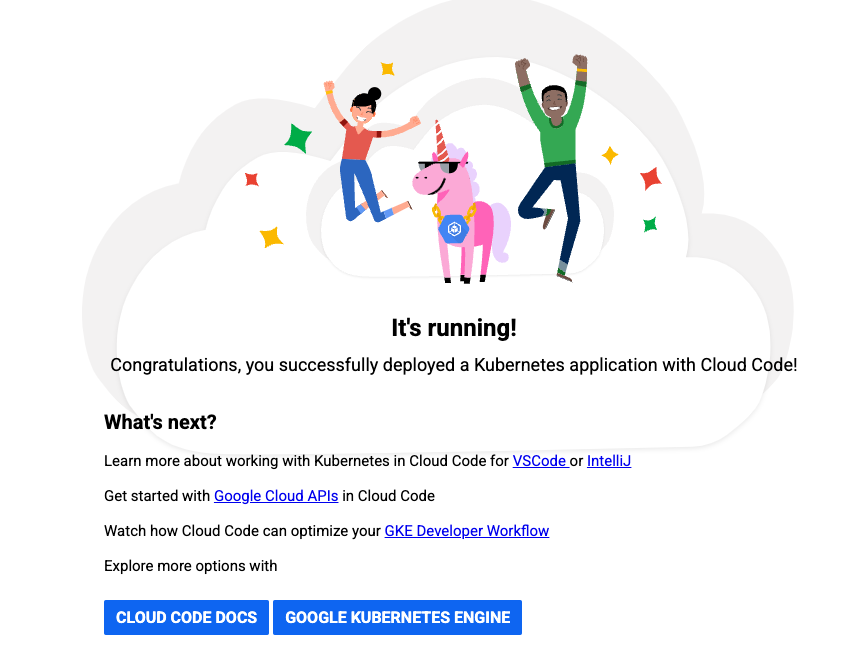
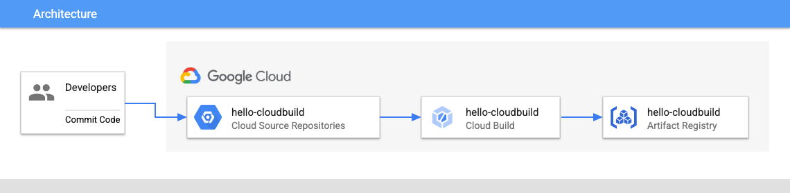

# Implement CI/CD Pipelines on Google Cloud

# Working with Artifact Registry

## Overview

As the evolution of Container Registry, [Artifact Registry](https://cloud.google.com/artifact-registry) is a single place for your organization to manage container images and language packages (such as Maven and npm). It is fully integrated with Google Cloud's tooling and runtimes and comes with support for native artifact protocols. This makes it simple to integrate it with your CI/CD tooling to set up automated pipelines.

In this lab you will learn about some of the features available in Artifact Registry.

## Objectives

In this lab, you learn how to:

- Create repositories for Containers and Language Packages
- Manage container images with Artifact Registry
- Integrate Artifact Registry with Cloud Code
- Configure Maven to use Artifact Registry for Java Dependencies

## Setup and requirement

### Before you click the Start Lab button

Read these instructions. Labs are timed and you cannot pause them. The timer, which starts when you click **Start Lab**, shows how long Google Cloud resources will be made available to you.

This hands-on lab lets you do the lab activities yourself in a real cloud environment, not in a simulation or demo environment. It does so by giving you new, temporary credentials that you use to sign in and access Google Cloud for the duration of the lab.

To complete this lab, you need:

- Access to a standard internet browser (Chrome browser recommended).

**Note:** Use an Incognito or private browser window to run this lab. This prevents any conflicts between your personal account and the Student account, which may cause extra charges incurred to your personal account.

- Time to complete the lab---remember, once you start, you cannot pause a lab.

**Note:** If you already have your own personal Google Cloud account or project, do not use it for this lab to avoid extra charges to your account.

### How to start your lab and sign in to the Google Cloud console

1. Click the **Start Lab** button. If you need to pay for the lab, a pop-up opens for you to select your payment method. On the left is the **Lab Details** panel with the following:

   - The **Open Google Cloud console** button
   - Time remaining
   - The temporary credentials that you must use for this lab
   - Other information, if needed, to step through this lab

2. Click **Open Google Cloud console** (or right-click and select **Open Link in Incognito Window** if you are running the Chrome browser).

   The lab spins up resources, and then opens another tab that shows the **Sign in** page.

   ***Tip:\*** Arrange the tabs in separate windows, side-by-side.

   **Note:** If you see the **Choose an account** dialog, click **Use Another Account**.

3. If necessary, copy the **Username** below and paste it into the **Sign in** dialog.

   ```
   "Username"
   ```

   Copied!

   content_copy

   You can also find the **Username** in the **Lab Details** panel.

4. Click **Next**.

5. Copy the **Password** below and paste it into the **Welcome** dialog.

   ```
   "Password"
   ```

   Copied!

   content_copy

   You can also find the **Password** in the **Lab Details** panel.

6. Click **Next**.

   **Important:** You must use the credentials the lab provides you. Do not use your Google Cloud account credentials.

   **Note:** Using your own Google Cloud account for this lab may incur extra charges.

7. Click through the subsequent pages:

   - Accept the terms and conditions.
   - Do not add recovery options or two-factor authentication (because this is a temporary account).
   - Do not sign up for free trials.

After a few moments, the Google Cloud console opens in this tab.

**Note:** To view a menu with a list of Google Cloud products and services, click the **Navigation menu** at the top-left. 

### Activate Cloud Shell

Cloud Shell is a virtual machine that is loaded with development tools. It offers a persistent 5GB home directory and runs on the Google Cloud. Cloud Shell provides command-line access to your Google Cloud resources.

1. Click **Activate Cloud Shell**  at the top of the Google Cloud console.

When you are connected, you are already authenticated, and the project is set to your **Project_ID**, `PROJECT_ID`. The output contains a line that declares the **Project_ID** for this session:

```
Your Cloud Platform project in this session is set to "PROJECT_ID"
```

`gcloud` is the command-line tool for Google Cloud. It comes pre-installed on Cloud Shell and supports tab-completion.

1. (Optional) You can list the active account name with this command:

```
gcloud auth list
```

Copied!

content_copy

1. Click **Authorize**.

**Output:**

```
ACTIVE: *
ACCOUNT: "ACCOUNT"

To set the active account, run:
    $ gcloud config set account `ACCOUNT`
```

1. (Optional) You can list the project ID with this command:

```
gcloud config list project
```

Copied!

content_copy

**Output:**

```
[core]
project = "PROJECT_ID"
```

**Note:** For full documentation of `gcloud`, in Google Cloud, refer to [the gcloud CLI overview guide](https://cloud.google.com/sdk/gcloud).

You must wait for the lab to provision before making any changes to the environment! The pre-configured parts of the environment that you need to work with will be available to you as soon as the lab indicates it is ready.

## Task 1. Prepare the lab environment

### Set up variables

- In Cloud Shell, set your project ID and project number. Save them as `PROJECT_ID` and `PROJECT_NUMBER` variables:

```
export PROJECT_ID=$(gcloud config get-value project)
export PROJECT_NUMBER=$(gcloud projects describe $PROJECT_ID --format='value(projectNumber)')
export REGION="REGION"
gcloud config set compute/region $REGION
```

Copied!

content_copy

### Enable Google services

- Run the following to enable necessary Google services:

```
gcloud services enable \
  cloudresourcemanager.googleapis.com \
  container.googleapis.com \
  artifactregistry.googleapis.com \
  containerregistry.googleapis.com \
  containerscanning.googleapis.com
```

Copied!

content_copy

### Get the source code

The source code for this lab is located in the GoogleCloudPlatform org on GitHub.

- Clone the source code with the command below, then change into the directory.

```
git clone https://github.com/GoogleCloudPlatform/cloud-code-samples/
cd ~/cloud-code-samples
```

Copied!

content_copy

### Provision the infrastructure used in this lab

In this lab you will deploy code to Kubernetes Engine (GKE).

- Run the setup script below to prepare this infrastructure:

```
gcloud container clusters create container-dev-cluster --zone="ZONE"
```

Copied!

content_copy

Click **Check my progress** to verify the objective.

Enable Google Services and create GKE cluster

Check my progress


## Task 2. Working with container images

### Create a Docker Repository on Artifact registry

Artifact Registry supports managing container images and language packages. Different artifact types require different specifications. For example, the requests for Maven dependencies are different from requests for Node dependencies.

To support the different API specifications, Artifact Registry needs to know what format you want the API responses to follow. To do this you will create a repository and pass in the `--repository-format` flag indicating the type of repository desired.

1. From Cloud Shell run the following command to create a repository for Docker images:

```
gcloud artifacts repositories create container-dev-repo --repository-format=docker \
  --location=$REGION \
  --description="Docker repository for Container Dev Workshop"
```

Copied!

content_copy

Click **Authorize** if the Cloud Shell authorization prompt appears.

1. In the Cloud console, go to **Artifact Registry** > **Repositories** and notice your newly created Docker repository named `container-dev-repo`. If you click on it you can see that it's empty at the moment.

Click **Check my progress** to verify the objective. (It may take a minute to validate. If you have completed successfully and it is not validating, wait a minute and try again.)

Working with container images

Check my progress


### Configure Docker Authentication to Artifact Registry

When connecting to Artifact Registry credentials are required in order to provide access. Rather than set up separate credentials, Docker can be configured to use your `gcloud` credentials seamlessly.

1. From Cloud Shell run the following command to configure Docker to use the Google Cloud CLI to authenticate requests to Artifact Registry in the `<filled in at lab start>` region:

```
gcloud auth configure-docker "Filled in at lab start"-docker.pkg.dev
```

Copied!

content_copy

1. The command will prompt for a confirmation to change the Cloud Shell docker configuration, click **ENTER**.

### Explore the sample Application

A sample application is provided in the git repository you cloned.

- Change into the java directory and review the application code:

```
cd ~/cloud-code-samples/java/java-hello-world
```

Copied!

content_copy

The folder contains an example Java application that renders a simple web page: in addition to various files not relevant for this specific lab, it contains the source code, under the `src` folder, and a Dockerfile you will use to build a container image locally.

### Build the Container Image

Before you can store container images in Artifact Registry you need to create one.

- Run the following command to build the container image and tag it properly:

```
docker build -t "REGION"-docker.pkg.dev/"PROJECT_ID"/container-dev-repo/java-hello-world:tag1 .
```

Copied!

content_copy

### Push the Container Image to Artifact Registry

- Run the following command to push the container image to the repository you created:

```
docker push "REGION"-docker.pkg.dev/"PROJECT_ID"/container-dev-repo/java-hello-world:tag1
```

Copied!

content_copy

### Review the image in Artifact Registry

1. In **Artifact Registry > Repositories**, click into `container-dev-repo` and check that the `java-hello-world` image is there.
2. Click on the image and note the image tagged `tag1`. You can see that Vulnerability Scanning is running or already completed and the number of vulnerabilities detected is visible.


Click on the number of vulnerabilities and you will see the list of vulnerabilities detected in the image, with the CVE bulletin name and the severity. Click **VIEW** on each listed vulnerability to get more details:


## Task 3. Integration with Cloud Code

In this section you use the Artifact Registry Docker image repository with [Cloud Code](https://cloud.google.com/code).

### Deploy the Application to GKE Cluster from Cloud Code

1. From the `java-hello-world` folder run the following command to open Cloud Shell Editor and add the application folder to this workspace:

```
cd ~/cloud-code-samples/
cloudshell workspace .
```

Copied!

content_copy

The Cloud Shell editor will open with the explorer in the application folder.

1. From the left menu, select **Cloud Code** and then expand the **COMPUTE ENGINE** option and click on **Select a Project** and choose the project ID provided in the Lab Instruction.


Also, expand the **KUBERNETES** option. You will be able to see the cluster loading.

Wait until you see the cluster listed under **KUBERNETES** as well as under **COMPUTE ENGINE**.

1. The following steps will require you to enter your Artifact Registry repository location. The format for the location is:

```
"REGION"-docker.pkg.dev/"PROJECT_ID"/container-dev-repo
```

Click **Navigation menu** under the Cloud Shell Editor **View > Command Palette...** and type **Run on Kubernetes** and select **Cloud Code: Run on Kubernetes**.


1. Choose **cloud-code-samples/java/java-hello-world/skaffold.yaml** and then **dockerfile**.
2. If Prompted for a context, select **Yes** to use the current context.
3. In the prompt for the image registry select **Enter the address of an image repository** and put the address location you located below and press **Enter**.


```
"REGION"-docker.pkg.dev/"PROJECT_ID"/container-dev-repo
```

Copied!

content_copy

1. When you execute **Run on Kubernetes** for the first time Cloud Code prompts you for the target image repository location. Once provided, the repository url is stored in the file `.vscode/launch.json` which is created in the application folder.

In the output pane you see that the build starts for the application image `java-hello-world,` the image is uploaded to the Artifact Registry repository configured previously.

1. In **Artifact Registry > Repositories** click into `container-dev-repo` and check that the `java-hello-world` image and note a new image tagged `latest`.

### Review the Deployed Application

1. Go back to Cloud Shell Editor. When deployment is complete Skaffold/Cloud Code will print the exposed url where the service have been forwarded, click on the link - **Follow link**:


In the new browser window you see the hello world app page.



### Update application code

Now update the application to see the change implemented immediately in the deployment on the cluster:

1. Open the `HelloWorldController.java` by clicking on the **Navigation menu** under the Cloud Shell Editor  **View > Command Palette...** and then click one backspace and then enter the path **src/main/java/cloudcode/helloworld/web** and click the option starting with `Hello..` .
2. Change the text in row 20 from "It's running!" to "It's updated!". You should see the build and deployment process starting immediately.
3. At the end of the deploy click again on the forwarded url or refresh the browser window with the application to see your change deployed:


1. In the Cloud console go to **Navigation Menu > Artifact Registry > Repositories** and click into `container-dev-repo` to check that the `java-hello-world` image and note the new image.

Click **Check my progress** to verify the objective.

Integration with Cloud Code

Check my progress


## Task 4. Working with language packages

In this section you will set up an Artifact Registry Java repository and upload packages to it, leveraging them in different applications.

### Create a Java package repository

1. From Cloud Shell run the following command to create a repository for Java artifacts:

```
gcloud artifacts repositories create container-dev-java-repo \
    --repository-format=maven \
    --location="REGION" \
    --description="Java package repository for Container Dev Workshop"
```

Copied!

content_copy

1. Click Authorize if the Cloud Shell authorization prompt appears
2. In the Cloud console go to **Artifact Registry > Repositories** and notice your newly created Maven repository named `container-dev-java-repo`, if you click on it you can see that it's empty at the moment.

Click **Check my progress** to verify the objective.

Create a Java package repository

Check my progress


### Set up authentication to Artifact Repository

- Use the following command to update the well-known location for Application Default Credentials (ADC) with your user account credentials so that the Artifact Registry credential helper can authenticate using them when connecting with repositories:

```
gcloud auth login --update-adc
```

Copied!

content_copy

If prompted to authenticate:

- Choose **Y**.
- Paste the code into a browser window.
- Select Google Sign In and sign in using the credentials in the lab.
- Copy the authentication code from the browser back into the console to complete the authentication.

### Configure Maven for Artifact Registry

1. Run the following command to print the repository configuration to add to your Java project:

```
gcloud artifacts print-settings mvn \
    --repository=container-dev-java-repo \
    --location="REGION"
```

Copied!

content_copy

1. Open the `pom.xml` in Cloud Shell Editor and add the returned settings to the appropriate sections in the file:

- Add the **distributionManagement** section.

```
  <distributionManagement>
    <snapshotRepository>
      <id>artifact-registry</id>
      <url>artifactregistry://"REGION"-maven.pkg.dev/"PROJECT_ID"/container-dev-java-repo</url>
    </snapshotRepository>
    <repository>
      <id>artifact-registry</id>
      <url>artifactregistry://"REGION"-maven.pkg.dev/"PROJECT_ID"/container-dev-java-repo</url>
    </repository>
  </distributionManagement>
```

Copied!

content_copy

- Add the **repositories** section.

```
 <repositories>
   <repository>
     <id>artifact-registry</id>
     <url>artifactregistry://"REGION"-maven.pkg.dev/"PROJECT_ID"/container-dev-java-repo</url>
     <releases>
       <enabled>true</enabled>
     </releases>
     <snapshots>
       <enabled>true</enabled>
     </snapshots>
   </repository>
 </repositories>
```

Copied!

content_copy

- Update the **extensions in the Builds** section.

```
<extensions>
     <extension>
       <groupId>com.google.cloud.artifactregistry</groupId>
       <artifactId>artifactregistry-maven-wagon</artifactId>
       <version>2.1.0</version>
     </extension>
   </extensions>
```

Copied!

content_copy

Here's an example of the complete file for your reference.

```
<?xml version="1.0" encoding="UTF-8"?>
<project xmlns="http://maven.apache.org/POM/4.0.0" xmlns:xsi="http://www.w3.org/2001/XMLSchema-instance"
       xsi:schemaLocation="http://maven.apache.org/POM/4.0.0 http://maven.apache.org/xsd/maven-4.0.0.xsd">
 <modelVersion>4.0.0</modelVersion>

 <artifactId>hello-world</artifactId>
 <packaging>jar</packaging>
 <name>Cloud Code Hello World</name>
 <description>Getting started with Cloud Code</description>
 <version>1.0.0</version>
<distributionManagement>
   <snapshotRepository>
     <id>artifact-registry</id>
     <url>artifactregistry://"REGION"-maven.pkg.dev/"PROJECT_ID"/container-dev-java-repo</url>
   </snapshotRepository>
   <repository>
     <id>artifact-registry</id>
     <url>artifactregistry://"REGION"-maven.pkg.dev/"PROJECT_ID"/container-dev-java-repo</url>
   </repository>
 </distributionManagement>

 <repositories>
   <repository>
     <id>artifact-registry</id>
     <url>artifactregistry://"REGION"-maven.pkg.dev/"PROJECT_ID"/container-dev-java-repo</url>
     <releases>
       <enabled>true</enabled>
     </releases>
     <snapshots>
       <enabled>true</enabled>
     </snapshots>
   </repository>
 </repositories>

 <parent>
   <groupId>org.springframework.boot</groupId>
   <artifactId>spring-boot-starter-parent</artifactId>
   <version>2.6.3</version>
 </parent>

 <properties>
   <java.version>1.8</java.version>
   <checkstyle.config.location>./checkstyle.xml</checkstyle.config.location>
 </properties>

 <build>
   <plugins>
     <plugin>
       <groupId>com.google.cloud.tools</groupId>
       <artifactId>jib-maven-plugin</artifactId>
       <version>3.2.0</version>
     </plugin>
     <plugin>
       <groupId>org.springframework.boot</groupId>
       <artifactId>spring-boot-maven-plugin</artifactId>
     </plugin>
     <plugin>
       <groupId>org.apache.maven.plugins</groupId>
       <artifactId>maven-checkstyle-plugin</artifactId>
       <version>3.1.2</version>
     </plugin>
   </plugins>
   <extensions>
     <extension>
       <groupId>com.google.cloud.artifactregistry</groupId>
       <artifactId>artifactregistry-maven-wagon</artifactId>
       <version>2.1.0</version>
     </extension>
   </extensions>
 </build>

 <!-- The Spring Cloud GCP BOM will manage spring-cloud-gcp version numbers for you. -->
 <dependencyManagement>
   <dependencies>
     <dependency>
       <groupId>org.springframework.cloud</groupId>
       <artifactId>spring-cloud-gcp-dependencies</artifactId>
       <version>1.2.8.RELEASE</version>
       <type>pom</type>
       <scope>import</scope>
     </dependency>
   </dependencies>
 </dependencyManagement>

 <dependencies>

   <dependency>
     <groupId>org.springframework.boot</groupId>
     <artifactId>spring-boot-starter</artifactId>
   </dependency>

   <dependency>
     <groupId>org.springframework.boot</groupId>
     <artifactId>spring-boot-starter-jetty</artifactId>
   </dependency>

   <dependency>
     <groupId>org.springframework</groupId>
     <artifactId>spring-webmvc</artifactId>
   </dependency>

   <dependency>
     <groupId>org.springframework.boot</groupId>
     <artifactId>spring-boot-starter-thymeleaf</artifactId>
   </dependency>

   <dependency>
     <groupId>org.springframework.boot</groupId>
     <artifactId>spring-boot-starter-test</artifactId>
     <scope>test</scope>
   </dependency>

   <dependency>
     <groupId>org.springframework.cloud</groupId>
     <artifactId>spring-cloud-gcp-starter-logging</artifactId>
   </dependency>

 </dependencies>

</project>
```

Copied!

content_copy

### Upload your Java package to Artifact Registry

With Artifact Registry configured in Maven, you can now use Artifact Registry to store Java Jars for use by other projects in your organization.

- Enter the below command to change to `java-hello-world` folder.

```
cd ~/cloud-code-samples/java/java-hello-world
```

Copied!

content_copy

- Run the following command to upload your Java package to Artifact Registry:

```
mvn deploy
```

Copied!

content_copy

### Check the Java package in Artifact Registry

In the Cloud console go to **Artifact Registry > Repositories** and click into `container-dev-java-repo` to check that the `hello-world` binary artifact is there:


## Congratulations!

In this lab you learned about some of the features available in Artifact Registry. You first created repositories for containers and language packages. You then managed container images with Artifact Registry and integrated it with Cloud Code. Finally, you configured Maven to use Artifact Registry for Java dependencies. You now have a solid understanding of features available in Artifact Registry.


# Google Kubernetes Engine Pipeline using Cloud Build

## Overview

In this lab, you create a CI/CD pipeline that automatically builds a container image from committed code, stores the image in Artifact Registry, updates a Kubernetes manifest in a Git repository, and deploys the application to Google Kubernetes Engine using that manifest.


For this lab you will create 2 Git repositories:

- app repository: contains the source code of the application itself
- env repository: contains the manifests for the Kubernetes Deployment

When you push a change to the **app repository**, the Cloud Build pipeline runs tests, builds a container image, and pushes it to Artifact Registry. After pushing the image, Cloud Build updates the Deployment manifest and pushes it to the **env repository**. This triggers another Cloud Build pipeline that applies the manifest to the GKE cluster and, if successful, stores the manifest in another branch of the **env repository**.

The app and env repositories are kept separate because they have different lifecycles and uses. The main users of the **app repository** are actual humans and this repository is dedicated to a specific application. The main users of the **env repository** are automated systems (such as Cloud Build), and this repository might be shared by several applications. The **env repository** can have several branches that each map to a specific environment (you only use production in this lab) and reference a specific container image, whereas the **app repository** does not.

When you finish this lab, you have a system where you can easily:

- Distinguish between failed and successful deployments by looking at the Cloud Build history.
- Access the manifest currently used by looking at the production branch of the **env repository**.
- Rollback to any previous version by re-executing the corresponding Cloud Build build.


## Objectives

In this lab, you learn how to perform the following tasks:

- Create Kubernetes Engine clusters
- Create Cloud Source Repositories
- Trigger Cloud Build from Cloud Source Repositories
- Automate tests and publish a deployable container image via Cloud Build
- Manage resources deployed in a Kubernetes Engine cluster via Cloud Build

## Setup and requirements

### Before you click the Start Lab button

Read these instructions. Labs are timed and you cannot pause them. The timer, which starts when you click **Start Lab**, shows how long Google Cloud resources will be made available to you.

This hands-on lab lets you do the lab activities yourself in a real cloud environment, not in a simulation or demo environment. It does so by giving you new, temporary credentials that you use to sign in and access Google Cloud for the duration of the lab.

To complete this lab, you need:

- Access to a standard internet browser (Chrome browser recommended).

**Note:** Use an Incognito or private browser window to run this lab. This prevents any conflicts between your personal account and the Student account, which may cause extra charges incurred to your personal account.

- Time to complete the lab---remember, once you start, you cannot pause a lab.

**Note:** If you already have your own personal Google Cloud account or project, do not use it for this lab to avoid extra charges to your account.

### How to start your lab and sign in to the Google Cloud console

1. Click the **Start Lab** button. If you need to pay for the lab, a pop-up opens for you to select your payment method. On the left is the **Lab Details** panel with the following:

   - The **Open Google Cloud console** button
   - Time remaining
   - The temporary credentials that you must use for this lab
   - Other information, if needed, to step through this lab

2. Click **Open Google Cloud console** (or right-click and select **Open Link in Incognito Window** if you are running the Chrome browser).

   The lab spins up resources, and then opens another tab that shows the **Sign in** page.

   ***Tip:\*** Arrange the tabs in separate windows, side-by-side.

   **Note:** If you see the **Choose an account** dialog, click **Use Another Account**.

3. If necessary, copy the **Username** below and paste it into the **Sign in** dialog.

   ```
   "Username"
   ```

   Copied!

   content_copy

   You can also find the **Username** in the **Lab Details** panel.

4. Click **Next**.

5. Copy the **Password** below and paste it into the **Welcome** dialog.

   ```
   "Password"
   ```

   Copied!

   content_copy

   You can also find the **Password** in the **Lab Details** panel.

6. Click **Next**.

   **Important:** You must use the credentials the lab provides you. Do not use your Google Cloud account credentials.

   **Note:** Using your own Google Cloud account for this lab may incur extra charges.

7. Click through the subsequent pages:

   - Accept the terms and conditions.
   - Do not add recovery options or two-factor authentication (because this is a temporary account).
   - Do not sign up for free trials.

After a few moments, the Google Cloud console opens in this tab.

**Note:** To view a menu with a list of Google Cloud products and services, click the **Navigation menu** at the top-left. 

### Activate Cloud Shell

Cloud Shell is a virtual machine that is loaded with development tools. It offers a persistent 5GB home directory and runs on the Google Cloud. Cloud Shell provides command-line access to your Google Cloud resources.

1. Click **Activate Cloud Shell**  at the top of the Google Cloud console.

When you are connected, you are already authenticated, and the project is set to your **Project_ID**, `PROJECT_ID`. The output contains a line that declares the **Project_ID** for this session:

```
Your Cloud Platform project in this session is set to "PROJECT_ID"
```

`gcloud` is the command-line tool for Google Cloud. It comes pre-installed on Cloud Shell and supports tab-completion.

1. (Optional) You can list the active account name with this command:

```
gcloud auth list
```

Copied!

content_copy

1. Click **Authorize**.

**Output:**

```
ACTIVE: *
ACCOUNT: "ACCOUNT"

To set the active account, run:
    $ gcloud config set account `ACCOUNT`
```

1. (Optional) You can list the project ID with this command:

```
gcloud config list project
```

Copied!

content_copy

**Output:**

```
[core]
project = "PROJECT_ID"
```

**Note:** For full documentation of `gcloud`, in Google Cloud, refer to [the gcloud CLI overview guide](https://cloud.google.com/sdk/gcloud).

## Task 1. Initialize Your Lab

1. In Cloud Shell, set your project ID and project number. Save them as `PROJECT_ID` and `PROJECT_NUMBER` variables:

```
export PROJECT_ID=$(gcloud config get-value project)
export PROJECT_NUMBER=$(gcloud projects describe $PROJECT_ID --format='value(projectNumber)')
export REGION=
gcloud config set compute/region $REGION
```

Copied!

content_copy

In the next task you will prepare your Google Cloud Project for use by enabling the required APIs, initializing the git configuration in Cloud Shell, and downloading the sample code used later in the lab.

1. Run the following command to enable the APIs for GKE, Cloud Build, Cloud Source Repositories and Container Analysis:

```
gcloud services enable container.googleapis.com \
    cloudbuild.googleapis.com \
    sourcerepo.googleapis.com \
    containeranalysis.googleapis.com
```

Copied!

content_copy

1. Create an Artifact Registry Docker repository named my-repository in the `<filled in at lab start>` region to store your container images:

```
gcloud artifacts repositories create my-repository \
  --repository-format=docker \
  --location=$REGION
```

Copied!

content_copy

1. Create a GKE cluster to deploy the sample application of this lab:

```
  gcloud container clusters create hello-cloudbuild --num-nodes 1 --region $REGION
```

Copied!

content_copy

1. If you have never used Git in Cloud Shell, configure it with your name and email address. Git will use those to identify you as the author of the commits you will create in Cloud Shell (if you don't have a github account, you can just fill in this with your current information. No account is necessary for this lab):

```
git config --global user.email "you@example.com"  
```

Copied!

content_copy

```
git config --global user.name "Your Name"
```

Copied!

content_copy

Click **Check my progress** to verify the objective.

Enable services, create an artifact registry and the GKE cluster

Check my progress


## Task 2. Create the Git repositories in Cloud Source Repositories

In this task, you create the two Git repositories (**hello-cloudbuild-app** and **hello-cloudbuild-env**) and initialize **hello-cloudbuild-app** with some sample code.

1. In Cloud Shell, run the following to create the two Git repositories:

```
gcloud source repos create hello-cloudbuild-app
```

Copied!

content_copy

```
gcloud source repos create hello-cloudbuild-env
```

Copied!

content_copy

1. Download the sample code from Cloud Storage:

```
cd ~
mkdir hello-cloudbuild-app
```

Copied!

content_copy

```
gcloud storage cp -r gs://spls/gsp1077/gke-gitops-tutorial-cloudbuild/* hello-cloudbuild-app
```

Copied!

content_copy

1. Configure Cloud Source Repositories as a remote:

```
cd ~/hello-cloudbuild-app
```

Copied!

content_copy

```
export REGION="REGION"
sed -i "s/us-central1/$REGION/g" cloudbuild.yaml
sed -i "s/us-central1/$REGION/g" cloudbuild-delivery.yaml
sed -i "s/us-central1/$REGION/g" cloudbuild-trigger-cd.yaml
sed -i "s/us-central1/$REGION/g" kubernetes.yaml.tpl
```

Copied!

content_copy

```
PROJECT_ID=$(gcloud config get-value project)
```

Copied!

content_copy

```
git init
git add .
git remote add google "https://source.developers.google.com/p/${PROJECT_ID}/r/hello-cloudbuild-app"
git commit -m "Initial commit"
```

Copied!

content_copy

The code you just cloned contains a simple "Hello World" application.

```
from flask import Flask
app = Flask('hello-cloudbuild')
@app.route('/')
def hello():
  return "Hello World!\n"
if __name__ == '__main__':
  app.run(host = '0.0.0.0', port = 8080)
```

Click **Check my progress** to verify the objective.

Create the Git repositories

Check my progress


## Task 3. Create a container image with Cloud Build

The code you cloned already contains the following Dockerfile.

```
FROM python:3.7-slim
RUN pip install flask
WORKDIR /app
COPY app.py /app/app.py
ENTRYPOINT ["python"]
CMD ["/app/app.py"]
```

With this Dockerfile, you can create a container image with Cloud Build and store it in Artifact Registry.

1. In Cloud Shell, create a Cloud Build build based on the latest commit with the following command:

```
cd ~/hello-cloudbuild-app
```

Copied!

content_copy

```
COMMIT_ID="$(git rev-parse --short=7 HEAD)"
```

Copied!

content_copy

```
gcloud builds submit --tag="${REGION}-docker.pkg.dev/${PROJECT_ID}/my-repository/hello-cloudbuild:${COMMIT_ID}" .
```

Copied!

content_copy

Cloud Build streams the logs generated by the creation of the container image to your terminal when you execute this command.

1. After the build finishes, in the Cloud console go to **Artifact Registry > Repositories** to verify that your new container image is indeed available in Artifact Registry. Click **my-repository**.


Click **Check my progress** to verify the objective.

Create the container image with Cloud Build

Check my progress


## Task 4. Create the Continuous Integration (CI) pipeline

In this task, you will configure Cloud Build to automatically run a small unit test, build the container image, and then push it to Artifact Registry. Pushing a new commit to Cloud Source Repositories triggers this pipeline automatically. The **cloudbuild.yaml** file already included in the code is the pipeline's configuration.



1. In the Cloud console, go to **Cloud Build > Triggers**.
2. Click **Create Trigger**
3. In the Name field, type `hello-cloudbuild`.
4. Under **Event**, select **Push to a branch**.
5. Under **Source**, select **hello-cloudbuild-app** as your **Repository** and `.* (any branch)` as your **Branch**.
6. Under **Build configuration**, select **Cloud Build configuration file**.
7. In the **Cloud Build configuration file location** field, type `cloudbuild.yaml` after the /.
8. For the **Service account**, use the Compute Engine default service account.
9. Click **Create**.


When the trigger is created, return to the Cloud Shell. You now need to push the application code to Cloud Source Repositories to trigger the CI pipeline in Cloud Build.

1. To start this trigger, run the following command:

```
cd ~/hello-cloudbuild-app
```

Copied!

content_copy

```
git add .
```

Copied!

content_copy

```
git commit -m "Type Any Commit Message here"
```

Copied!

content_copy

```
git push google master
```

Copied!

content_copy

1. In the Cloud console, go to **Cloud Build > Dashboard**.
2. You should see a build running or having recently finished. You can click on the build to follow its execution and examine its logs.


Click **Check my progress** to verify the objective.

Create the Continuous Integration (CI) Pipeline

Check my progress


## Task 5. Create the Test Environment and CD pipeline

Cloud Build is also used for the continuous delivery pipeline. The pipeline runs each time a commit is pushed to the candidate branch of the **hello-cloudbuild-env** repository. The pipeline applies the new version of the manifest to the Kubernetes cluster and, if successful, copies the manifest over to the production branch. This process has the following properties:

- The candidate branch is a history of the deployment attempts.
- The production branch is a history of the successful deployments.
- You have a view of successful and failed deployments in Cloud Build.
- You can rollback to any previous deployment by re-executing the corresponding build in Cloud Build. A rollback also updates the production branch to truthfully reflect the history of deployments.

Next you will modify the continuous integration pipeline to update the candidate branch of the **hello-cloudbuild-env** repository, triggering the continuous delivery pipeline.

### Grant Cloud Build access to GKE

To deploy the application in your Kubernetes cluster, Cloud Build needs the Kubernetes Engine Developer Identity and Access Management role.

1. In Cloud Shell execute the following command:

```
PROJECT_NUMBER="$(gcloud projects describe ${PROJECT_ID} --format='get(projectNumber)')"
```

Copied!

content_copy

```
gcloud projects add-iam-policy-binding ${PROJECT_NUMBER} \
--member=serviceAccount:${PROJECT_NUMBER}@cloudbuild.gserviceaccount.com \
--role=roles/container.developer
```

Copied!

content_copy

You need to initialize the **hello-cloudbuild-env** repository with two branches (production and candidate) and a Cloud Build configuration file describing the deployment process.

The first step is to clone the **hello-cloudbuild-env** repository and create the production branch. It is still empty.

1. In Cloud Shell execute the following command:

```
cd ~
```

Copied!

content_copy

```
gcloud source repos clone hello-cloudbuild-env
```

Copied!

content_copy

```
cd ~/hello-cloudbuild-env
```

Copied!

content_copy

```
git checkout -b production
```

Copied!

content_copy

1. Next you need to copy the **cloudbuild-delivery.yaml** file available in the **hello-cloudbuild-app** repository and commit the change:

```
cd ~/hello-cloudbuild-env
```

Copied!

content_copy

```
cp ~/hello-cloudbuild-app/cloudbuild-delivery.yaml ~/hello-cloudbuild-env/cloudbuild.yaml
```

Copied!

content_copy

```
git add .
```

Copied!

content_copy

```
git commit -m "Create cloudbuild.yaml for deployment"
```

Copied!

content_copy

The `cloudbuild-delivery.yaml` file describes the deployment process to be run in Cloud Build. It has two steps:

- Cloud Build applies the manifest on the GKE cluster.
- If successful, Cloud Build copies the manifest on the production branch.

1. Create a candidate branch and push both branches for them to be available in Cloud Source Repositories:

```
git checkout -b candidate
```

Copied!

content_copy

```
git push origin production
```

Copied!

content_copy

```
git push origin candidate
```

Copied!

content_copy

1. Grant the Source Repository Writer IAM role to the Cloud Build service account for the **hello-cloudbuild-env** repository:

```
PROJECT_NUMBER="$(gcloud projects describe ${PROJECT_ID} \
--format='get(projectNumber)')"
cat >/tmp/hello-cloudbuild-env-policy.yaml <<EOF
bindings:
- members:
  - serviceAccount:${PROJECT_NUMBER}@cloudbuild.gserviceaccount.com
  role: roles/source.writer
EOF
```

Copied!

content_copy

```
gcloud source repos set-iam-policy \
hello-cloudbuild-env /tmp/hello-cloudbuild-env-policy.yaml
```

Copied!

content_copy

### Create the trigger for the continuous delivery pipeline

1. In the Cloud console, go to **Cloud Build > Triggers**.
2. Click **Create Trigger**.
3. In the Name field, type `hello-cloudbuild-deploy`.
4. Under **Event**, select **Push to a branch**.
5. Under **Source**, select **hello-cloudbuild-env** as your **Repository** and `^candidate$` as your **Branch**.
6. Under **Build configuration**, select **Cloud Build configuration file**.
7. In the **Cloud Build configuration file location** field, type `cloudbuild.yaml` after the /.
8. For the **Service account**, use the Compute Engine default service account.
9. Click **Create**.


### Modify the continuous integration pipeline to trigger the continuous delivery pipeline.

Next, add some steps to the continuous integration pipeline that will generate a new version of the Kubernetes manifest and push it to the **hello-cloudbuild-env** repository to trigger the continuous delivery pipeline.

1. Copy the extended version of the **cloudbuild.yaml** file for the **app repository**:

```
cd ~/hello-cloudbuild-app
```

Copied!

content_copy

```
cp cloudbuild-trigger-cd.yaml cloudbuild.yaml
```

Copied!

content_copy

The **cloudbuild-trigger-cd.yaml** is an extended version of the **cloudbuild.yaml** file. It adds the steps below: they generate the new Kubernetes manifest and trigger the continuous delivery pipeline.

This pipeline uses a simple `sed` to render the manifest template. In reality, you will benefit from using a dedicated tool such as kustomize or skaffold. They allow for more control over the rendering of the manifest templates.

1. Commit the modifications and push them to Cloud Source Repositories:

```
cd ~/hello-cloudbuild-app
```

Copied!

content_copy

```
git add cloudbuild.yaml
```

Copied!

content_copy

```
git commit -m "Trigger CD pipeline"
```

Copied!

content_copy

```
git push google master
```

Copied!

content_copy

This triggers the continuous integration pipeline in Cloud Build.

Click **Check my progress** to verify the objective.

Create the Test Environment and CD Pipeline

Check my progress


## Task 6. Review Cloud Build Pipeline

1. In the Cloud console, go to **Cloud Build > Dashboard**.
2. Click into the **hello-cloudbuild-app** trigger to follow its execution and examine its logs. The last step of this pipeline pushes the new manifest to the **hello-cloudbuild-env** repository, which triggers the continuous delivery pipeline.


1. Return to the main **Dashboard**.
2. You should see a build running or having recently finished for the **hello-cloudbuild-env** repository. You can click on the build to follow its execution and examine its logs.


## Task 7. Test the complete pipeline

The complete CI/CD pipeline is now configured. Test it from end to end.

1. In the Cloud console, go to **Kubernetes Engine > Gateways,Services & Ingress**.

There should be a single service called **hello-cloudbuild** in the list. It has been created by the continuous delivery build that just ran.

1. Click on the endpoint for the **hello-cloudbuild** service. You should see "Hello World!". If there is no endpoint, or if you see a load balancer error, you may have to wait a few minutes for the load balancer to be completely initialized. Click **Refresh** to update the page if needed.


1. In Cloud Shell, replace "Hello World" with "Hello Cloud Build", both in the application and in the unit test:

```
cd ~/hello-cloudbuild-app
```

Copied!

content_copy

```
sed -i 's/Hello World/Hello Cloud Build/g' app.py
```

Copied!

content_copy

```
sed -i 's/Hello World/Hello Cloud Build/g' test_app.py
```

Copied!

content_copy

1. Commit and push the change to Cloud Source Repositories:

```
git add app.py test_app.py
```

Copied!

content_copy

```
git commit -m "Hello Cloud Build"
```

Copied!

content_copy

```
git push google master
```

Copied!

content_copy

1. This triggers the full CI/CD pipeline.

After a few minutes, reload the application in your browser. You should now see "Hello Cloud Build!".


## Task 8. Test the rollback

In this task, you rollback to the version of the application that said "Hello World!".

1. In the Cloud console, go to **Cloud Build > Dashboard**.
2. Click on *View all* link under **Build History** for the **hello-cloudbuild-env** repository.
3. Click on the second most recent build available.
4. Click **Rebuild**.


When the build is finished, reload the application in your browser. You should now see "Hello World!" again.


## Congratulations!

Now you can use Cloud Build to create and rollback continuous integration pipelines with GKE on Google Cloud!


# Continuous Delivery with Google Cloud Deploy