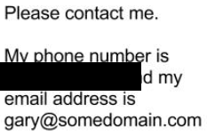
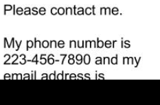

# Lab - Redacting Critical Data with Sensitive Data Protection

## Overview

The Cloud Data Loss Prevention (DLP) API is part of Sensitive Data Protection, which is a fully managed service designed to help discover, classify, and protect sensitive information.

You can use the DLP API to classify data in a variety of ways, including data type, sensitivity level, and catagories.

The DLP API protects sensitive data in a variety of ways, including:

- **Redaction:** redact sensitive data from a document or file.
- **Masking:** mask sensitive data with a placeholder, such as `*`.
- **Tokenization:** replace sensitive data with a unique identifier.
- **Encryption:** encrypt sensitive data.

In this lab, you learn the basic capabilities of the DLP API and try out various ways to use the API to protect data.

## What you'll learn

In this lab, you use the DLP API to do the following:

- Inspect strings and files for matching info types
- Learn about de-identification techniques and de-identify data
- Redact info types in strings and images

## Setup and requirements

### Before you click the Start Lab button

Read these instructions. Labs are timed and you cannot pause them. The timer, which starts when you click **Start Lab**, shows how long Google Cloud resources will be made available to you.

This hands-on lab lets you do the lab activities yourself in a real cloud environment, not in a simulation or demo environment. It does so by giving you new, temporary credentials that you use to sign in and access Google Cloud for the duration of the lab.

To complete this lab, you need:

- Access to a standard internet browser (Chrome browser recommended).

**Note:** Use an Incognito or private browser window to run this lab. This prevents any conflicts between your personal account and the Student account, which may cause extra charges incurred to your personal account.

- Time to complete the lab---remember, once you start, you cannot pause a lab.

**Note:** If you already have your own personal Google Cloud account or project, do not use it for this lab to avoid extra charges to your account.

### How to start your lab and sign in to the Google Cloud console

1. Click the **Start Lab** button. If you need to pay for the lab, a pop-up opens for you to select your payment method. On the left is the **Lab Details** panel with the following:

   - The **Open Google Cloud console** button
   - Time remaining
   - The temporary credentials that you must use for this lab
   - Other information, if needed, to step through this lab

2. Click **Open Google Cloud console** (or right-click and select **Open Link in Incognito Window** if you are running the Chrome browser).

   The lab spins up resources, and then opens another tab that shows the **Sign in** page.

   ***Tip:\*** Arrange the tabs in separate windows, side-by-side.

   **Note:** If you see the **Choose an account** dialog, click **Use Another Account**.

3. If necessary, copy the **Username** below and paste it into the **Sign in** dialog.

   ```
   "Username"
   ```

   Copied!

   You can also find the **Username** in the **Lab Details** panel.

4. Click **Next**.

5. Copy the **Password** below and paste it into the **Welcome** dialog.

   ```
   "Password"
   ```

   Copied!

   You can also find the **Password** in the **Lab Details** panel.

6. Click **Next**.

   **Important:** You must use the credentials the lab provides you. Do not use your Google Cloud account credentials.

   **Note:** Using your own Google Cloud account for this lab may incur extra charges.

7. Click through the subsequent pages:

   - Accept the terms and conditions.
   - Do not add recovery options or two-factor authentication (because this is a temporary account).
   - Do not sign up for free trials.

After a few moments, the Google Cloud console opens in this tab.

**Note:** To view a menu with a list of Google Cloud products and services, click the **Navigation menu** at the top-left. 

### Activate Cloud Shell

Cloud Shell is a virtual machine that is loaded with development tools. It offers a persistent 5GB home directory and runs on the Google Cloud. Cloud Shell provides command-line access to your Google Cloud resources.

1. Click **Activate Cloud Shell**  at the top of the Google Cloud console.

When you are connected, you are already authenticated, and the project is set to your **Project_ID**, `PROJECT_ID`. The output contains a line that declares the **Project_ID** for this session:

```
Your Cloud Platform project in this session is set to "PROJECT_ID"
```

`gcloud` is the command-line tool for Google Cloud. It comes pre-installed on Cloud Shell and supports tab-completion.

1. (Optional) You can list the active account name with this command:

```
gcloud auth list
```

Copied!

1. Click **Authorize**.

**Output:**

```
ACTIVE: *
ACCOUNT: "ACCOUNT"

To set the active account, run:
    $ gcloud config set account `ACCOUNT`
```

1. (Optional) You can list the project ID with this command:

```
gcloud config list project
```

Copied!

**Output:**

```
[core]
project = "PROJECT_ID"
```

**Note:** For full documentation of `gcloud`, in Google Cloud, refer to [the gcloud CLI overview guide](https://cloud.google.com/sdk/gcloud).

### Set the region

Set the region for your project:

```
gcloud config set compute/region Region
```

Copied!

## Task 1. Clone the repo and enable APIs

1. In Cloud Shell, run the following command to download the Cloud Data Loss Prevention Node.js Client repository:

```
git clone https://github.com/googleapis/synthtool
```

Copied!

1. Once you download the project code, change into the `samples` directory and install the required `Node.js` packages:

```
cd synthtool/tests/fixtures/nodejs-dlp/samples/ && npm install
```

Copied!

**Note:** Ignore any warning messages.

1. Make sure you're using the correct project by setting it with the following `gcloud` command:

```
export PROJECT_ID=""
gcloud config set project $PROJECT_ID
```

Copied!

### Enable APIs

Here are the APIs needed to enable your project:

- **DLP API** - Provides methods for detection, risk analysis, and de-identification of privacy-sensitive fragments in text, images, and Google Cloud storage repositories.
- **Cloud Key Management Service (KMS) API** - Google Cloud KMS allows encryption key management and performs cryptographic operations with those keys.

1. Enable the required APIs with the following `gcloud` command:

```
gcloud services enable dlp.googleapis.com cloudkms.googleapis.com \
--project $PROJECT_ID
```

Copied!

Click **Check my progress** to verify the objective.

Enable the APIs


Check my progress


## Task 2. Inspect strings and files

The samples directory of the project downloaded in the preceding step contains several javascript files that make use of the different functionality of the DLP API. The file, [`inspectString.js`](https://github.com/googleapis/nodejs-dlp/blob/main/samples/inspectString.js), inspects a provided string for sensitive info types.

1. Provide the string option and a sample string with some potentially sensitive information:

```
node inspectString.js $PROJECT_ID "My email address is jenny@somedomain.com and you can call me at 555-867-5309" > inspected-string.txt
```

Copied!

The output tells you the findings for each matched info type, which includes:

- **InfoType**: the information type detected for that part of the string. Find a full list of possible info types here. By default, `inspectString.js` inspects only for info types `CREDIT_CARD_NUMBER`, `PHONE_NUMBER`, `PERSON_NAME` AND `EMAIL_ADDRESS`
- **Likelihood**: the results are categorized based on how likely they each represent a match. Likelihood can range from `VERY_UNLIKELY` to `VERY_LIKELY`.

Check the output using below command:

```
cat inspected-string.txt
```

Copied!

The findings for the request above are:

```
Findings:
    Info type: PERSON_NAME
    Likelihood: POSSIBLE
    Info type: EMAIL_ADDRESS
    Likelihood: LIKELY
    Info type: PHONE_NUMBER
    Likelihood: VERY_LIKELY
```

1. Similarly, you can inspect files for info types. Run the following command to review the sample [`accounts.txt`](https://github.com/googleapis/nodejs-dlp/blob/master/samples/resources/accounts.txt) file:

```
cat resources/accounts.txt
```

Copied!

The file includes the following text:

```
My credit card number is 1234 5678 9012 3456, and my CVV is 789.
```

1. Use the [`inspectFile.js`](https://github.com/googleapis/nodejs-dlp/blob/main/samples/inspectFile.js) file to inspect the provided file for sensitive info types:

```
node inspectFile.js $PROJECT_ID resources/accounts.txt > inspected-file.txt
```

Copied!

Check the output using below command:

```
cat inspected-file.txt
```

Copied!

The results:

```
Findings:
    Info type: CREDIT_CARD_NUMBER
    Likelihood: VERY_LIKELY
```

Below is the asynchronous function that uses the API to inspect the string input:

```
async function inspectString(
  ProjectId,
  string,
  minLikelihood,
  maxFindings,
  infoTypes,
  customInfoTypes,
  includeQuote
) {
...
}
```

The arguments provided for the parameters above are used to construct a request object. That request is then provided to the `inspectContent` function to get a response that results in the output:

```
// Construct item to inspect
const item = {value: string};

// Construct request
const request = {
  parent: `projects/${projectId}/locations/global`,
  inspectConfig: {
    infoTypes: infoTypes,
    customInfoTypes: customInfoTypes,
    minLikelihood: minLikelihood,
    includeQuote: includeQuote,
    limits: {
      maxFindingsPerRequest: maxFindings,
    },
  },
  item: item,
};

// Run request
const [response] = await dlp.inspectContent(request);
```

### Upload output to Cloud Storage

Run the following commands to upload the responses on Cloud Storage for activity tracking validation:

```
gsutil cp inspected-string.txt gs://bucket_name_filled_after_lab_start
gsutil cp inspected-file.txt gs://bucket_name_filled_after_lab_start
```

Copied!

Click **Check my progress** to verify the objective.

Inspect strings and files


Check my progress


## Task 3. De-identification

Beyond inspecting and detecting sensitive data, you can also use Sensitive Data Protection to perform de-identification using the DLP API. De-identification is the process of removing identifying information from data. The API detects sensitive data as defined by info types, then uses a de-identification transformation to mask, delete, or otherwise obscure the data.

1. Run the following command to use [`deidentifyWithMask.js`](https://github.com/googleapis/nodejs-dlp/blob/main/samples/deidentifyWithMask.js) to try de-identification with a mask:

```
node deidentifyWithMask.js $PROJECT_ID "My order number is F12312399. Email me at anthony@somedomain.com" > de-identify-output.txt
```

Copied!

Check the output using below command:

```
cat de-identify-output.txt
```

Copied!

With a mask, the API replaces the characters of the matching info type with a different character, * by default. Example output:

```
My order number is F12312399. Email me at *****************************
```

Notice that the email address in the string is obfuscated while the arbitrary order number is intact. (Custom info types are possible but out of scope of this lab).

Look at the function that uses the DLP API to de-identify with a mask. Once again, these arguments are used to construct a request object. This time it's provided to the `deidentifyContent` function:

```
async function deidentifyWithMask() {
    const request = {
      parent: `projects/${projectId}/locations/global`,
      deidentifyConfig: {
        infoTypeTransformations: {
          transformations: [
            {
              primitiveTransformation: {
                characterMaskConfig: {
                  maskingCharacter: maskingCharacter,
                  numberToMask: numberToMask,
                },
              },
            },
          ],
        },
      },
      item: item,
    };

    // Run deidentification request
    const [response] = await dlp.deidentifyContent(request);
```

### Upload output to Cloud Storage

Run the following commands to upload the responses on Cloud Storage for activity tracking validation:

```
gsutil cp de-identify-output.txt gs://bucket_name_filled_after_lab_start
```

Copied!

Click **Check my progress** to verify the objective.

De-identification


Check my progress


## Task 4. Redact strings and images

Another method of obfuscating sensitive information is **redaction**. Redaction replaces a match with the info type it's identified to match with.

1. Use [`redactText.js`](https://github.com/googleapis/nodejs-dlp/blob/main/samples/redactText.js) to redact text from a sample input:

```
node redactText.js $PROJECT_ID  "Please refund the purchase to my credit card 4012888888881881" CREDIT_CARD_NUMBER > redacted-string.txt
```

Copied!

Check the output using below command:

```
cat redacted-string.txt
```

Copied!

The output replaces the sample credit card number with the info type `CREDIT_CARD_NUMBER`:

```
Please refund the purchase on my credit card [CREDIT_CARD_NUMBER]
```

This is useful if you'd like to hide sensitive information but still identify the type of information that's being removed. The DLP API can similarly redact information from images that contain text. Take a look at a sample image (located in the `samples/resources` directory):


1. To redact the phone number from the image above, run the following command:

```
node redactImage.js $PROJECT_ID resources/test.png "" PHONE_NUMBER ./redacted-phone.png
```

Copied!

As specified, a new image named `redacted-phone.png` is generated with the requested information blacked out. To verify, open the `samples/redacted-phone.png` file using Cloud Shell Code Editor:

**Note:** In the Cloud Shell Code Editor, use the left (Explorer) pane to navigate to **synthtool > tests > fixtures > nodejs-dlp > samples > redacted-phone.png**



1. Try it again to redact the email address from the image:

```
node redactImage.js $PROJECT_ID resources/test.png "" EMAIL_ADDRESS ./redacted-email.png
```

Copied!

As specified, a new image named `redacted-email.png` is generated with the requested information blacked out. To verify, open the `samples/redacted-email.png` file in the Cloud Shell Code Editor:



Here is the function that is used to redact from a string:

```
async function redactText(
  callingProjectId,
  string,
  minLikelihood,
  infoTypes
) {
...}
```

And here is the request provided to the `deidentifyContent` function:

```
const request = {
    parent: `projects/${projectId}/locations/global`,
    item: {
      value: string,
    },
    deidentifyConfig: {
      infoTypeTransformations: {
        transformations: [replaceWithInfoTypeTransformation],
      },
    },
    inspectConfig: {
      minLikelihood: minLikelihood,
      infoTypes: infoTypes,
    },
  };
  const [response] = await dlp.deidentifyContent(request);
```

Similarly, here is the function for redacting an image:

```
async function redactImage(
  callingProjectId,
  filepath,
  minLikelihood,
  infoTypes,
  outputPath
) {
...}
```

And here is the request provided to the `redactImage` function:

```
// Construct image redaction request
    const request = {
      parent: `projects/${projectId}/locations/global`,
      byteItem: {
        type: fileTypeConstant,
        data: fileBytes,
      },
      inspectConfig: {
        minLikelihood: minLikelihood,
        infoTypes: infoTypes,
      },
      imageRedactionConfigs: imageRedactionConfigs,
    };
```

### Upload output to Cloud Storage

Run the following commands to upload the responses on Cloud Storage for activity tracking validation:

```
gsutil cp redacted-string.txt gs://bucket_name_filled_after_lab_start
gsutil cp redacted-phone.png gs://bucket_name_filled_after_lab_start
gsutil cp redacted-email.png gs://bucket_name_filled_after_lab_start
```

Copied!

Click **Check my progress** to verify the objective.

Redact strings and images


Check my progress


## Congratulations!

The Cloud Data Loss Prevention (DLP) API is a powerful tool that provides access to a powerful sensitive data inspection, classification, and de-identification platform. You used the DLP API to inspect strings and files for multiple info types, and then redact data from a string and an image.