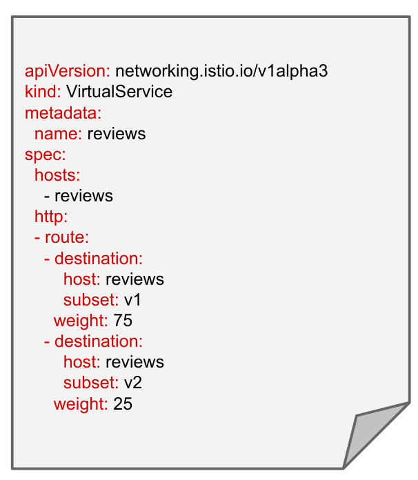

# Professional Cloud DevOps Engineer Certification Learning Path

# I. Developing a Google SRE Culture

## Module 1 Welcome to Developing a Google SRE Culture 

### Key Points 

- Customers’ experiences with your service tell you how reliable it is. 
- In many IT organizations, development and operations teams have conflicting priorities. 
- Site Reliability Engineering (SRE) is the practice of balancing the velocity of development features with the risk to reliability. 
- SRE can benefit IT teams, regardless of whether they are using cloud or on-premises technology, for both large projects and daily work.

### Module 1 Quiz

Your score: 100% Passing score: 100%

1. What is Site Reliability Engineering (SRE)?

- A philosophy designed to reduce the friction between development and operations.

- **Practices that balance the velocity of development features with the risk to reliability.** 
- A methodology for agile software development within the Google Cloud environment.
- A set of frameworks designed to reduce the friction between development and operations.


## Module 2 DevOps, SRE, and Why They Exist

### Key Points

● DevOps emerged to help close gaps and break down silos between development and operations teams. 

● DevOps is a philosophy, not a development methodology or technology. 

● SRE is a practical way to implement DevOps philosophy. 

● Developers focus on feature velocity and innovation; operators focus on reliability and consistency. 

● SRE consists of both technical and cultural practices. 

● SRE practices align to DevOps pillars:


### Module 2 DevOps and SRE Quiz

1. Which is a key pillar of DevOps philosophy?

- Implement blameless postmortems.

- Share ownership.

- **Accept failure as normal.**

- Reduce the cost of failure.

Accepting failure as normal is a key pillar of DevOps.

2. How do DevOps and SRE relate to each other?

- SRE and DevOps originated together.

- DevOps is a way to implement SRE.

- SRE is a way to implement DevOps.

- DevOps developed in response to SRE practice.

SRE practices developed as a way to implement DevOps philosophy.


3. Which philosophy closes the gap between development and operations?

- Waterfall

- SRE

- **DevOps**

- Agile

DevOps philosophy emerged as a way to close the gap between developers and operators.


4. Which is an SRE practice that promotes sharing ownership in IT?

- Design thinking

- **Error budgets**

- Blameless postmortems

- Monitoring

Error budgets created shared incentive and ownership between developers and SREs.


## Module 3 SLOs with Consequences

### Glossary 

● **Blameless postmortem**: Detailed documentation of an incident or outage, its root cause, its impact, actions taken to resolve it, and follow-up actions to prevent its recurrence. 

● **Reliability**: The number of “good” interactions divided by the number of total interactions. This leaves you with a numerical fraction of real users who experience a service that is available and working. 

● **Error budget**: The amount of unreliability you are willing to tolerate. 

● **Service level indicator (SLI)**: A quantifiable measure of the reliability of your service from your users' perspective. 

● **Service level objective (SLO)**: Sets the target for an SLI over a period of time.

### Key Points 

● The mission of SRE is to protect, provide for, and progress software and systems with consistent focus on availability, latency, performance, and capacity. 

● Understanding SRE practices and norms will help you build a common language to use when speaking with your IT teams and support your organization’s adoption of SRE both in the short and long term. 

● Experienced SREs are comfortable with failure. 

● Failures are documented in postmortems, which focus on systems and processes versus people. 

● 100% reliability is the wrong target because it slows the release of new features, which is what drives your business.

● SLOs and error budgets create shared responsibility and ownership between developers and SREs. 

● Fostering psychologically safe environments is necessary for learning and innovation in organizations. 

● Organizations developing an SRE culture should focus on creating a unified vision, determining what collaboration looks like, and sharing knowledge among teams.

### Module 3 Quiz

1. What are Site Reliability Engineers comfortable with?

- **Failure**
- Unknown outage reasons
- System-wide updates
- 100% reliability

SREs are comfortable with failing and learning from mistakes.

2. What can happen when team members don't feel psychologically safe?

- More people express dissatisfaction.

- Innovation increases.

- **Moments of learning are lost.**

- Fewer people are punished for mistakes.

People don’t speak up or ask questions in work environments with low psychological safety, therefore moments of learning are inevitably lost.

3. What is one value SRE provides to an IT team?

- Developers are able to spend more time focusing on system reliability.

- The business is able to focus primarily on its users.

- Team members gain time to focus on the more manual tasks.

- **Developers are enabled to work at a higher velocity while maintaining reliability.**

SRE practices help developers to work faster with less risk to reliability.


4. What is your team's clear and compelling goal that it strives to achieve?

- **Mission**

- Purpose

- Strategy

- Vision

Your team’s mission is a clear and compelling goal that it wants to achieve.


5. What is a reasonable degree of target reliability for an SLO?

- 50%

- **99.9%**

- 100%

- 0%

99.9% is a reasonable target for reliability as it is just short of 100% and still leaves room to focus on feature development.

## Module 4 Make Tomorrow Beter than Today

### Glossary

- **Continuous integration:** Building, integrating, and testing code within the development environment. 
- **Continuous delivery**: Deploying to production frequently, or at the rate the business chooses. 
- **Canarying**: Deploying a change in service to a group of users who don’t know they are receiving the change, evaluating the impact to that group, and then deciding how to proceed. 
- **Toil**: Work directly tied to a service that is manual, repetitive, automatable, tactical, or without enduring value, or that scales linearly as the service grows. 

### Key Points

- Change is best when small and frequent. 
- Design thinking methodology has five phases: empathize, define, ideate, prototype, and test. 
- Prototyping culture encourages teams to try more ideas, leading to an increase in faster failures and more successes. 
- Excessive toil is toxic to the SRE role. 
- By eliminating toil, SREs can focus the majority of their time on work that will either reduce future toil or add service features.
- Resistance to change is usually a fear of loss. 
- Present change as an opportunity, not a threat. 
- People react to change in many ways, and IT leaders need to understand how to communicate with and support each group.


### Module 4 Quiz

1. What would be the best way to practice canarying?

- Deploy a significant code change to any type of user.

- Test the code change in a different environment than production.

- Roll out a feature change to 90% of users.

- **Deploy a small feature change to users that are a representative subset of your typical customers.**

Deploying a small feature change to users that are a representative subset of your typical customers is a canarying best practice.

2. Why is toil a problem?

- **It becomes toxic in large quantities.**

- It is low-risk and low-stress.

- It is unavoidable.

- It is unbounded.

- Toil becomes a problem and is toxic when it occurs in large quantities, as it takes SRE’s time away from real project work.

3. What should you present change to your team members as?

- An inevitability

- A requirement

- A threat

- **An opportunity**

Since resistance to change is usually a fear of loss, presenting change as an opportunity helps motivate employees to embrace and accept it.


4. Which is the third phase of design thinking?

- Define

- **Ideate**

- Prototype

- Empathize

The phases of design thinking in order are empathize, define, ideate, prototype, and test.


5. What is a benefit of continuous integration and continuous delivery (CI/CD)?

- It allows large changes to be rolled out slower.

- It decreases the need for automation.

- **It is less disruptive for customers.**

- It allows for testing of only the production change.

CI/CD is a way to implement gradual change so it is less disruptive to customers.

## Module 5 Regulate Workload

### Glossary

- **Affinity bias**: Tendency to gravitate toward those who are similar to you, such as with race, gender, socioeconomic background, or education level. 
- **Confirmation bias**: Tendency to find information, input, or data that supports your preconceived notions. 
- **Selective attention bias**: Tendency to pay attention to things, ideas, and input from people whom you tend to gravitate toward. 
- **Labeling bias**: Tendency to form opinions based on how people look, dress, or appear externally.

### Key Points

- Measure reliability with good service level indicators (SLIs). 
- A good SLI correlates with user experience with your service; that is, a good SLI tells you when users are happy or unhappy. 
- Measure toil by identifying it, selecting an appropriate unit of measure, and tracking the measurements continuously. 
- Monitoring allows you to gain visibility into a system, which is a core requirement for judging service health and diagnosing your service when things go wrong. 
- Goal-setting, transparency, and data-driven decision making are key components of SRE measurement culture. 
- To make truly data-driven decisions, you need to remove any unconscious biases. 

### Module 5 Quiz

1. What does Google use OKRs as?

- **KPIs**

- SLOs

- Feedback loops

- SLIs

Google uses OKRs as its KPIs.

2. Which bias is the tendency to find information, input, or data that supports your preconceived notions?

- Labeling bias

- Affinity bias

- Selective attention bias

- **Confirmation bias**

Confirmation bias is the tendency to find information, input, or data that supports your preconceived notions.


3. SLIs need to provide a clear definition of what?

- **Good and bad events**

- Total user interactions

- Service downtime

- User happiness

SLIs need to provide a clear definition of good and bad events that will correlate with your users’ experience with the service.


4. What does monitoring allow for?

- Reporting on outage causes

- Improved security

- **Visibility into a system**

- SLI measurement

The SRE practice of monitoring allows for visibility into a system.

## Module 6 Apply SRE in Your Organization

### Key Points

- **Kitchen Sink/”Everything SRE” team**: We recommend this approach for organizations that have few applications and user journeys and where the scope is small enough that only one team is necessary, but a dedicated SRE team is needed in order to implement its practices. 
- **Infrastructure team**: This type of team focuses on maintaining shared services and components related to infrastructure, versus an SRE team dedicated to working on services related to products, like customer-facing code. 
- **Tools team**: This type of SRE team tends to focus on building software to help their developer counterparts measure, maintain, and improve system reliability or other aspects of SRE work, such as capacity planning. 
- **Product/Application team**: This type of SRE team works to improve the reliability of a critical application or business area. We recommend this implementation for organizations that already have a Kitchen Sink, Infrastructure, or Tools-focused SRE team and have a key user-facing application with high reliability needs. 
- **Embedded team**: This team has SREs embedded with their developer counterparts, usually one per developer team in scope. The work relationship between the embedded SREs and developers tends to be project- or time-bounded and usually very hands-on, where they perform work like changing code and configuration of the services in scope. 
- **Consulting team**: This implementation is very similar to the embedded implementation, except SRE are usually less hands-on. We recommend staffing one or two part-time consultants before you staff your first SRE team.
- Organizations with high SRE maturity have well-documented and user-centric SLOs, error budgets, blameless postmortem culture, and a low tolerance for toil. 
- Engineers with operations experience and systems administrators with scripting experience are good first SREs to hire. 
- Upskill current team members with necessary SRE skills such as operations and software engineering, monitoring systems, production automation, system architecture, troubleshooting, culture of trust, and incident management. 
- Contact your Account Executive or Account Director to learn how the Google Cloud Professional Services team can support your organization’s adoption of SRE.

### Module 6 Quiz

1. Which Google team can support you in jumpstarting your SRE implementation?

- Google Engineering Services team

- Google Cloud Customer Experience team

- **Google Cloud Professional Services team**

- Google Cloud SRE team

The Google Cloud Professional Services team can help customers jumpstart their SRE implementations.

2. What practice does Google recommend that you establish before forming your first SRE team?

- Monitoring

- **Blameless postmortem culture**

- Toil automation

- Continuous integration/continuous delivery

Blameless postmortem culture is one practice that Google recommends your organization establishes before forming your first SRE team.

3. Which type of IT role does Google recommend as a possible new SRE hire?

- **Systems administrator**

- Sales engineer

- Systems architect

- Systems analyst

Google recommends systems administrators as good first new SRE hires because of their experience working IT operations and managing production systems.

4. Scope is generally unbounded for which type of SRE implementation?

- **Kitchen Sink**

- Embedded

- Consulting

- Tools

Scope is usually unbounded for Kitchen Sink/”Everything SRE” teams.


## Final Assessment

Passing score: 75%

*check*

1. Your team members are unsure what goals they are trying to achieve within the team. What part of your team vision should you work to clarify?

- Service-oriented meetings

- The strategy

- The values

- **The mission**

Correct! Your team’s mission is the goals it strives to achieve.


2. Which DevOps pillar led to Google SRE practices, such as SLOs and error budgets, that promote shared ownership between developers and SREs?

- Implement gradual change

- **Reduce organizational silos**

- Leverage tooling and automation

- Accept failure as normal

Correct! Reduce organizational silos is the DevOps pillar that led to SRE practices like SLOs and error budgets which promote shared ownership between developers and SREs.


3. What does a blameless postmortem not help with?

- Ensuring that all the root causes are properly understood by the team

- **Decreasing engineering costs incurred after launch**

- Avoiding multiplying complexity

- Reducing the likelihood of stressful outages

Correct! Blameless postmortems and its culture do not correlate with decrease in engineering costs incurred after launch.


4. What do OKRs primarily help an organization do?

- Prototype

- Overcome biases

- **Set goals**

- Share feedback

Correct! OKRs are KPIs that help organizations set goals.


5. SREs believe that change is best when what?

- Fast and big

- **Small and frequent**

- Small and dispersed

- Frequent and global

Correct! SREs believe change is best when small and frequent.


6. Which type of SRE team implementation does Google recommend for an organization's first SRE team?

- Consulting

- **Kitchen Sink**

- Infrastructure

- Embedded

Correct! Google recommends the Kitchen Sink/”Everything SRE” team as an organization’s first SRE team.


7. Which is the term that describes breaking down the silos and closing gaps between development and operations teams?

- Agile

- Monitoring

- Site Reliability Engineering

- **DevOps**

Correct! DevOps philosophy describes breaking down the silos and closing gaps between development and operations teams?


8. SREs are regularly on-call and required to solve problems fast. What is a primary skill SREs need for this?

- Monitoring systems

- System architecting

- Operations and software engineering

- **Troubleshooting**

Correct! Since SREs are regularly on-call, they require excellent troubleshooting skills in order to diagnose and solve problems fast.


9. Which phase of the SRE journey includes automating toil?

- Regulate Workload

- SLOs with Consequences

- **Make Tomorrow Better than Today**

- Reliability Measurement

Correct! Make Tomorrow Better than Today includes toil automation.


10. You've decided to adopt SRE practices and culture in your company. As change begins to happen, you notice that Naveen, one of your operations managers is avoiding new protocols and continuing with his normal work routine. In which group of people would you categorize Naveen?

- Critic

- **Bystander**

- Navigator

- Victim

Correct! Bystanders tend to ignore change and continue on with their normal routine as though change is not happening.


11. Generally, whose experience with a production service determines its availability?

- The operator’s

- The developer’s

- The SRE’s

- **The customer’s**

Correct! Your customer’s experience with your service tells you how available or not it is.


12. What is one benefit of measuring toil?

- **It triggers a reduction effort.**

- It reveals error budget burn.

- It allows design thinking.

- It helps SREs choose SLIs.

Correct! When teams are able to see how much toil they have, they focus on reducing it.


13. What can you build with your team by acknowledging your own fallibility as a leader?

- Unified vision

- Data-driven decision making

- Service-level indicators (SLIs)

- **Psychological safety**

Correct! Acknowledging your own fallibility is one way to build psychological safety with your teams.


14. What does Google recommend you do with the four golden signals?

- Create SLIs

- Automate features

- Translate data

- **Monitor the system**

Correct! Google recommends you monitor the system using the four golden signals—latency, traffic, errors, and saturation,


15. What is continuous delivery?

- **Deploying to production frequently, or at the rate the business chooses.**

- Building, integrating, and testing code within the development environment.

- Deploying a change in service to a group of users who don’t know they are receiving the change.

- Minimizing time between build and deployment.

Correct! Continuous delivery is deploying to production frequently, or at the rate the business chooses.


16. What often accompanies toil automation that leaders should be prepared for?

- Shared vision

- Linear scaling of work with complexity

- Blameless culture

- **Resistance to change**

Correct! Leaders should be prepared for resistance to change when implementing toil automation.


17. Your developers have felt inundated with too many manual and repetitive tasks that are tied to the production service. What is this called?

- **Toil**

- Discomfort discharge

- Overhead

- Automation

Correct! Toil is work that is mundane, repetitive, without enduring value, automatable, and scales linearly as the service grows.


18. What are the five steps in design thinking methodology?

- **Empathize, Define, Ideate, Prototype, Test**

- Define, Ideate, Prototype, Test, Resolve

- Empathize, Define, Design, Prototype, Test

- Empathize, Discuss, Ideate, Prototype, Test

Correct! The five phases of design thinking are Empathize, Define, Ideate, Prototype, and Test.


19. What is a service-level objective (SLO)?

- The amount of unreliability you are willing to tolerate.

- An indicator of how well your service is doing at any moment in time.

- Code that is built, integrated, and tested within the development environment.

- **A precise numerical target for system reliability.**

Correct! An SLO is a precise numerical target for system reliability.


20. Why should toil be limited to a bounded part of the SRE role?

- It allows SREs to focus on project work without worrying about the team's SLOs.

- It frees SREs to completely focus on reliability work.

- It helps IT teams decide what to automate.

- **It prevents SREs from doing only sysadmin work.**

Correct! Keeping toil limited to a bounded part of the SRE role prevents SREs from solely doing system admin work.


# II. Reliable Google Cloud Infrastructure: Design and Process


## Defining Services

### Module Quiz

1. Which most accurately describes a user story?

- **It is a short description of a feature written from the user's point of view.**
- It is a narrative that describes the sequence of steps a typical user would perform to accomplish some task or goal when using the system.
- It is a requirement of the system you are developing.
- It is a short description of a typical person using the system.

Correct, because it describes a feature from the user's point of view

2. Using SMART criteria, which below would be the least effective KPI?

- Clicks per session
- User sign ups per month
- Page views per hour
- **User experience design**

Correct, user experience design is not measurable or time bound and so would not make a relevant KPI.

3. Which best describes an SLO?

- It is a measurable, time bound key performance indicator for your application.
- It is a short, measurable description of an application feature.
- **It is a target measure you want your service to achieve.**
- It is a contract with end users that guarantees service quality

Correct, an SLO is the agreed-upon target for a measurement or range of values for a service. Reliability could be one of these.


## Microservice Design and Architecture


### Module Quiz


1. Which below would violate 12-factor app best practices?

- Treat logs as event streams and aggregate logs into a single source.

- **Store configuration information in your source repository for easy versioning.**

- Explicitly declare and isolate dependencies.

- Keep development, testing, and production as similar as possible.

Correct. Code and config should be separated, because config varies across deployments but code does not. The true test is whether the repository could be open-sourced without compromising any credentials.

2. You’re writing a service, and you need to handle a client sending you invalid data in the request. What should you return from the service?

- A 200 error code

- An XML exception

- A 500 error code

- **A 400 error code**

Correct. 400 is a HTTP status code indicating that a request could not be processed due to an apparent client error.

3. You’re building a RESTful microservice. Which would be a valid data format for returning data to the client?

- XML

- JSON

- HTML

- **All options are correct.**

Correct. They have a standard Content-Type that can be set on the response header and are text-based. It is usual to use JSON, but both XML and JSON are valid.

4. You’ve re-architected a monolithic web application so state is not stored in memory on the web servers, but in a database instead. This has caused slow performance when retrieving user sessions though. What might be the best way to fix this?

- Increase the number of CPUs in the database server.

- Make sure all web servers are in the same zone as the database.

- **Use a caching service like Memorystore for Redis.**

- Move session state back onto the web servers and use sticky sessions in the load balancer.

Correct. Services should be stateless, and a service like Memorystore for Redis provides a fast caching service to store state. They enable services to be stateless and support scale and high availability.


## DevOps Automation

### Building a DevOps Pipeline Lab

#### Overview

In this lab, you will build a continuous integration pipeline using Cloud Source Repositories, Cloud Build, build triggers, and Artifact Registry.


#### Objectives

In this lab, you will learn how to perform the following tasks:

- Create a Git repository
- Create a simple Python application
- Test Your web application in Cloud Shell
- Define a Docker build
- Manage Docker images with Cloud Build and Artifact Registry
- Automate builds with triggers
- Test your build changes

#### Set up your lab environment

For each lab, you get a new Google Cloud project and set of resources for a fixed time at no cost.

1. Sign in to Qwiklabs using an **incognito window**.
2. Note the lab's access time (for example, `1:15:00`), and make sure you can finish within that time.
   There is no pause feature. You can restart if needed, but you have to start at the beginning.
3. When ready, click **Start lab**.
4. Note your lab credentials (**Username** and **Password**). You will use them to sign in to the Google Cloud Console.
5. Click **Open Google Console**.
6. Click **Use another account** and copy/paste credentials for **this** lab into the prompts.
   If you use other credentials, you'll receive errors or **incur charges**.
7. Accept the terms and skip the recovery resource page.

**Note:** Do not click **End Lab** unless you have finished the lab or want to restart it. This clears your work and removes the project.

#### Task 1. Create a Git repository

First, you will create a Git repository using the Cloud Source Repositories service in Google Cloud. This Git repository will be used to store your source code. Eventually, you will create a build trigger that starts a continuous integration pipeline when code is pushed to it.

1. On the Google Cloud console title bar, type **Source Repositories** in the **Search** field, then click **Source Repositories** in the **Products & Pages** section.
2. Click **Add repository**.
3. Select **Create new repository** and click **Continue**.
4. Name the repository **devops-repo**.
5. Select your current project ID from the list.
6. Click **Create**.
7. Click **Cloud Console**, and in the new tab click **Activate Cloud Shell** ().
8. If prompted, click **Continue**.
9. Enter the following command in Cloud Shell to create a folder called `gcp-course`:

```
mkdir gcp-course
```


content_copy

1. Change to the folder you just created:

```
cd gcp-course
```


content_copy

1. Now clone the empty repository you just created. If prompted, click **Authorize**:

```
gcloud source repos clone devops-repo
```


content_copy

**Note:** You may see a warning that you have cloned an empty repository. That is expected at this point.

1. The previous command created an empty folder called `devops-repo`. Change to that folder:

```
cd devops-repo
```


content_copy

Click *Check my progress* to verify the objective.

Assessment Completed!

Create a git repository.

Check my progress

*Assessment Completed!*


#### Task 2. Create a simple Python application

You need some source code to manage. So, you will create a simple Python Flask web application. The application will be only slightly better than "hello world", but it will be good enough to test the pipeline you will build.

1. In Cloud Shell, click **Open Editor** () to open the code editor. If prompted click **Open in a new window**.
2. Select the **gcp-course > devops-repo** folder in the explorer tree on the left.
3. Click on **devops-repo**.
4. Click **New File**.
5. Name the file `main.py` and press **Enter**.
6. Paste the following code into the file you just created:

```
from flask import Flask, render_template, request

app = Flask(__name__)

@app.route("/")
def main():
    model = {"title": "Hello DevOps Fans."}
    return render_template('index.html', model=model)

if __name__ == "__main__":
    app.run(host='0.0.0.0', port=8080, debug=True, threaded=True)
```


content_copy

1. To save your changes. Press **CTRL + S**.
2. Click on the `devops-repo` folder.
3. Click **New Folder**.
4. Name the folder `templates` and press **Enter**.
5. Right-click on the `templates` folder and create a new file called `layout.html`.
6. Add the following code and save the file as you did before:

```
<!doctype html>
<html lang="en">
<head>
    <title>{{model.title}}</title>
    <!-- Bootstrap CSS -->
    <link rel="stylesheet" href="https://stackpath.bootstrapcdn.com/bootstrap/4.4.1/css/bootstrap.min.css">

</head>
<body>
    <div class="container">

        

        <footer></footer>
    </div>
</body>
</html>
```


content_copy

1. Also in the templates folder, add another new file called `index.html`.
2. Add the following code and save the file as you did before:

```


<div class="jumbotron">
    <div class="container">
        <h1>{{model.title}}</h1>
    </div>
</div>

```


content_copy

1. In Python, application prerequisites are managed using pip. Now you will add a file that lists the requirements for this application.
2. In the **devops-repo** folder (*not the templates folder*), create a **New File** and add the following to that file and save it as `requirements.txt`:

```
Flask>=2.0.3
```


content_copy

1. You have some files now, so save them to the repository. First, you need to add all the files you created to your local Git repo. Click **Open Terminal** and in Cloud Shell, enter the following code:

```
cd ~/gcp-course/devops-repo
git add --all
```


content_copy

1. To commit changes to the repository, you have to identify yourself. Enter the following commands, but with your information (*you can just use your Gmail address or any other email address*):

```
git config --global user.email "you@example.com"
git config --global user.name "Your Name"
```


content_copy

1. Now, commit the changes locally:

```
git commit -a -m "Initial Commit"
```


content_copy

1. You committed the changes locally, but have not updated the Git repository you created in Cloud Source Repositories. Enter the following command to push your changes to the cloud:

```
git push origin master
```


content_copy

1. Refresh the **Source Repositories** web page. You should see the files you just created.

#### Task 3. Define a Docker build

The first step to using Docker is to create a file called **Dockerfile**. This file defines how a Docker container is constructed. You will do that now.

1. Click **Open Editor**, and expand the **gcp-course/devops-repo** folder. With the **devops-repo** folder selected, click **New File** and name the new file **Dockerfile**.

The file *Dockerfile* is used to define how the container is built.

1. At the top of the file, enter the following:

```
FROM python:3.9
```


content_copy

This is the base image. You could choose many base images. In this case, you are using one with Python already installed on it.

1. Enter the following:

```
WORKDIR /app
COPY . .
```


content_copy

These lines copy the source code from the current folder into the /app folder in the container image.

1. Enter the following:

```
RUN pip install gunicorn
RUN pip install -r requirements.txt
```


content_copy

This uses pip to install the requirements of the Python application into the container. Gunicorn is a Python web server that will be used to run the web app.

1. Enter the following:

```
ENV PORT=80
CMD exec gunicorn --bind :$PORT --workers 1 --threads 8 main:app
```


content_copy

The environment variable sets the port that the application will run on (in this case, 80). The last line runs the web app using the gunicorn web server.

1. Verify that the completed file looks as follows and save it:

```
FROM python:3.9
WORKDIR /app
COPY . .
RUN pip install gunicorn
RUN pip install -r requirements.txt
ENV PORT=80
CMD exec gunicorn --bind :$PORT --workers 1 --threads 8 main:app
```


content_copy

#### Task 4. Manage Docker images with Cloud Build and Artifact Registry

The Docker image has to be built and then stored somewhere. You will use **Cloud Build** and **Artifact Registry**.

1. Click **Open Terminal** to return to Cloud Shell. Make sure you are in the right folder:

```
cd ~/gcp-course/devops-repo
```


content_copy

1. The Cloud Shell environment variable DEVSHELL_PROJECT_ID automatically has your current project ID stored. The project ID is required to store images in Artifact Registry. Enter the following command to view your project ID:

```
echo $DEVSHELL_PROJECT_ID
```


content_copy

1. Enter the following command to create an Artifact Registry repository named devops-repo:

```
gcloud artifacts repositories create devops-repo \
    --repository-format=docker \
    --location=us-east4
```


content_copy

1. To configure Docker to authenticate to the Artifact Registry Docker repository, enter the following command:

```
gcloud auth configure-docker us-east4-docker.pkg.dev
```


content_copy

1. To use Cloud Build to create the image and store it in Artifact Registry, type the following command:

```
gcloud builds submit --tag us-east4-docker.pkg.dev/$DEVSHELL_PROJECT_ID/devops-repo/devops-image:v0.1 .
```


content_copy

*Notice the environment variable in the command*. The image will be stored in Artifact Registry.

1. On the Google Cloud console title bar, type **Artifact Registry** in the **Search** field, then click **Artifact Registry** in the **Products & Pages** section.
2. Click **devops-repo**.
3. Click **devops-image**. Your image should be listed.
4. On the Google Cloud console title bar, type **Cloud Build** in the **Search** field, then click **Cloud Build** in the **Products & Pages** section. Your build should be listed in the history.

You will now try running this image from a Compute Engine virtual machine.

1. On the **Navigation menu**, click **Compute Engine > VM Instance**.
2. Click **Create Instance** to create a VM.
3. On the **Create an instance** page, specify the following, and leave the remaining settings as their defaults:

| **Property**        | **Value**                                                    |
| :------------------ | :----------------------------------------------------------- |
| **Container**       | Click DEPLOY CONTAINER                                       |
| **Container image** | '`us-east4`-docker.pkg.dev/`qwiklabs-gcp-01-cd7e68eede49`/devops-repo/devops-image:v0.1` and click SELECT |
| **Firewall**        | Allow HTTP traffic                                           |

1. Click **Create**.
2. Once the VM starts, click the VM's external IP address. A browser tab opens and the page displays `Hello DevOps Fans.`

**Note:** You might have to wait a minute or so after the VM is created for the Docker container to start.

1. You will now save your changes to your Git repository. In Cloud Shell, enter the following to make sure you are in the right folder and add your new Dockerfile to Git:

```
cd ~/gcp-course/devops-repo
git add --all
```


content_copy

1. Commit your changes locally:

```
git commit -am "Added Docker Support"
```


content_copy

1. Push your changes to Cloud Source Repositories:

```
git push origin master
```


content_copy

1. Return to Cloud Source Repositories and verify that your changes were added to source control.

Click *Check my progress* to verify the objective.

Manage Docker images with Cloud Build and Artifact Registry.

Check my progress


#### Task 5. Automate builds with triggers

1. On the **Navigation menu**, click **Cloud Build**. The **Build history** page should open, and one or more builds should be in your history.
2. Click the **Triggers** link on the left.
3. Click **Create trigger** and specify the following:

| **Property**           | **Value**                                     |
| :--------------------- | :-------------------------------------------- |
| **Name**               | devops-trigger                                |
| **Region**             | `us-east4`                                    |
| **Repository**         | devops-repo(Cloud Source Repositories)        |
| **Branch**             | .*(any branch)                                |
| **Configuration Type** | Cloud Build configuration file (yaml or json) |
| **Location**           | Inline                                        |

1. Click **Open Editor** and replace the code with the code metioned below and click **Done**.

```
steps:
  - name: 'gcr.io/cloud-builders/docker'
    args: ['build', '-t', 'us-east4-docker.pkg.dev/qwiklabs-gcp-01-cd7e68eede49/devops-repo/devops-image:$COMMIT_SHA', '.']
images:
  - 'us-east4-docker.pkg.dev/qwiklabs-gcp-01-cd7e68eede49/devops-repo/devops-image:$COMMIT_SHA'
options:
  logging: CLOUD_LOGGING_ONLY
```


content_copy

1. For **Service account** select the service account starting with your project-id that look similar to (`qwiklabs-gcp-01-cd7e68eede49`@`qwiklabs-gcp-01-cd7e68eede49`.iam.gserviceaccount.com) and and click **Create**.
2. To test the trigger, click **Run** and then **Run trigger**.
3. Click the **History** link and you should see a build running. Wait for the build to finish, and then click the link to it to see its details.
4. Scroll down and look at the logs. The output of the build here is what you would have seen if you were running it on your machine.
5. Return to the Artifact Registry service. You should see a new image in the **devops-repo** > **devops-image** folder.
6. Return to the **Cloud Shell Code Editor**. Find the file `main.py` in the `gcp-course/devops-repo` folder.
7. In the main() function, change the title property to `"Hello Build Trigger."` as shown below:

```
@app.route("/")
def main():
    model = {"title":  "Hello Build Trigger."}
    return render_template("index.html", model=model)
```

1. Commit the change with the following command:

```
cd ~/gcp-course/devops-repo
git commit -a -m "Testing Build Trigger"
```


content_copy

1. Enter the following to push your changes to Cloud Source Repositories:

```
git push origin master
```


content_copy

1. Return to the Cloud Console and the **Cloud Build** service. You should see another build running.

Click *Check my progress* to verify the objective.

Automate Builds with Trigger.

Check my progress


#### Task 6. Test your build changes

1. When the build completes, click on it to see its details.
2. Click **Execution Details**,
3. Click the **Image name**. This redirects you to the image page in Artifact Registry.
4. At the top of the pane, click **copy** next to the image name. You will need this for the next steps. The format will look as follows.

'`us-east4`-docker.pkg.dev/`qwiklabs-gcp-01-cd7e68eede49`/devops-demo/devops-image@sha256:8aede81a8b6ba1a90d4d808f509d05ddbb1cee60a50ebcf0cee46e1df9a54810`

**Note:** Do not use the image name located in Digest.

1. Go to the **Compute Engine** service. As you did earlier, create a new virtual machine to test this image. Click **DEPLOY CONTAINER** and paste the image you just copied.
2. Select **Allow HTTP traffic**.
3. When the machine is created, test your change by making a request to the VM's external IP address in your browser. Your new message should be displayed.

**Note:** You might have to wait a few minutes after the VM is created for the Docker container to start.

Click *Check my progress* to verify the objective.

Test your Build Changes.

Check my progress


#### Congratulations!

In this lab, you built a continuous integration pipeline using the Google Cloud tools Cloud Source Repositories, Cloud Build, build triggers, and Artifact Registry.


### Module Quiz

1. What Google Cloud feature would be easiest to use to automate a build in response to code being checked into your source code repository?

- AppEngine

- Cloud Functions

- **Build triggers**

- CloudScheduler

This answer is correct. Cloud Build triggers have been designed specifically to trigger a build automatically when changes are made to source code.

2. Which Google Cloud tools can be used to build a continuous integration pipeline?

- Artifact Registry

- **All of these**

- Cloud Build

- Cloud Source Repositories

All of the options are correct. Source Repositories provides a private Git repository, Cloud Build builds containers, and Artifact Registry is a Docker images repository that performs vulnerability analysis. All three components are typically used in a continuous integration pipeline where on a commit, code is built and tested and an image is built and published to a registry.


## Choosing Storage Solutions

### Module Quiz

1. You need to store user preferences, product information, and reviews for a website you are building. There won't be a huge amount of data. What would be a simple, cost-effective, managed solution?

- BigQuery.

- **Firestore**

- Spanner

- Cloud SQL

This answer is correct. Firestore provides automatic scale ACID transactions and live synchronization and is integrated with Google Cloud and Firebase. It also has a free tier.


2. You are a global financial services company with users all over the world. You need a database service that can provide low latency worldwide with strong consistency. Which service might you choose?

- Firestore

- Cloud SQL

- **Spanner**

- BigQuery

This answer is correct. A key feature of Spanner is scale for relational data with strong consistency, and it is globally distributed to provide low latency. The high availability and automatic replication are also strong features for financial services.

3. Currently, you are using Firestore to store information about products, reviews, and user sessions. You'd like to speed up data access in a simple, cost-effective way. What would you recommend?

- Move the data to Spanner.

- Move the data to Bigtable.

- Move the data to BigQuery.

- **Cache the data using Memorystore.**

This answer is correct. Memorystore provides the best fit when considering data model, performance, scale, cost, and availability.


4. You want to analyze sales trends. To help achieve this, you want to combine data from your on-premises Oracle database with Google Analytics data and your web server logs. Where might you store the data so it is both easy to query and cost-effective?

- Spanner

- **BigQuery**

- Cloud SQL

- Firestore

This answer is correct. BigQuery is a data warehouse used for data analytics, and so is built for this type of use case. It provides the infrastructure to ingest data from many different sources, which is a requirement too. The cost model of paying for storage and then only for queries run is attractive too.

## Google Cloud and Hybrid Network Architecture

### Module Quiz

1. You are a large bank deploying an online banking service to Google Cloud. The service needs high volume access to mainframe data on-premises. Which connectivity option would likely be most suitable?

- HTTPS

- Peering

- **Cloud Interconnect**

- VPN

This answer is correct, because Cloud Interconnect provides high bandwidth and low latency. It does need encryption at the application level.

2. You are deploying a large-scale web application with users all over the world and a lot of static content. Which load balancer configuration would likely be the most suitable?

- TCP load balancer with SSL configured.

- **HTTP load balancer with SSL configured and the CDN enabled.**

- HTTP load balancer with SSL configured.

- UDP load balancer with SSL configured and the CDN enabled.

This answer is correct, because the traffic is HTTP(S), the load balancer should be external and global, and CDN enabled will help performance and cost.

3. You want a secure, private connection between your network and a Google Cloud network. There is not a lot of volume, but the connection needs to be extremely reliable. Which configuration below would you choose?

- VPN

- Cloud Interconnect

- VPC peering

- **VPN with high availability and Cloud Router.**

This is the correct choice, because this offers a secure extremely reliable connection and is more cost-effective than Cloud Interconnect.

4. You have a contract with a service provider to manage your Google VPC networks. You want to connect a network they own to your VPC. Both networks are in Google Cloud. Which Connection option should you choose?

- **VPN with high availability and Cloud Router.**

- Cloud Interconnect

- VPN

- VPC peering

This is the correct choice, because this offers a secure extremely reliable connection and is more cost-effective than Cloud Interconnect.


## Deploying Applications to Google Cloud

### Lab Deploying Apps to Google Cloud

#### Overview

In this lab, you will deploy applications to the Google Cloud services App Engine, Kubernetes Engine, and Cloud Run.


#### Objectives

In this lab, you will learn how to perform the following tasks:

- Download a sample app from GitHub
- Deploy to App Engine
- Deploy to Kubernetes Engine
- Deploy to Cloud Run

#### Set up your lab environment

For each lab, you get a new Google Cloud project and set of resources for a fixed time at no cost.

1. Sign in to Qwiklabs using an **incognito window**.
2. Note the lab's access time (for example, `1:15:00`), and make sure you can finish within that time.
   There is no pause feature. You can restart if needed, but you have to start at the beginning.
3. When ready, click **Start lab**.
4. Note your lab credentials (**Username** and **Password**). You will use them to sign in to the Google Cloud Console.
5. Click **Open Google Console**.
6. Click **Use another account** and copy/paste credentials for **this** lab into the prompts.
   If you use other credentials, you'll receive errors or **incur charges**.
7. Accept the terms and skip the recovery resource page.

**Note:** Do not click **End Lab** unless you have finished the lab or want to restart it. This clears your work and removes the project.

#### Task 1. Download a sample app from GitHub

Download a sample application from GitHub and preview it in Cloud Shell.

1. In the Cloud Console, click **Activate Cloud Shell** ().
2. If prompted, click **Continue**.
3. To create a new folder, run the following command:

```
mkdir gcp-course
```


content_copy

1. Change to the folder you just created:

```
cd gcp-course
```


content_copy

1. Clone a simple Python Flask app from GitHub:

```
git clone https://GitHub.com/GoogleCloudPlatform/training-data-analyst.git
```


content_copy

1. Change to the `deploying-apps-to-gcp` folder:

```
cd training-data-analyst/courses/design-process/deploying-apps-to-gcp
```


content_copy

1. To test the program, type the following command to build a Docker container of the image:

```
docker build -t test-python .
```


content_copy

1. To run the Docker image, type the following command:

```
docker run --rm -p 8080:8080 test-python
```


content_copy

1. To see the program running, click **Web Preview** () in the toolbar of Google Cloud Shell. Then, select **Preview on port 8080**.

The program should be displayed in a new browser tab.

1. In Cloud Shell, type `Ctrl+C` to stop the program.

#### Task 2. Deploy to App Engine

App Engine is a completely automated deployment platform. It supports many languages, including Python, Java, JavaScript, and Go. To use it, you create a configuration file and deploy your applications with a couple of simple commands. In this task, you create a file named *app.yaml* and deploy it to App Engine.

1. In Cloud Shell, click **Open Editor** (), then click **Open in a new window** if required.
2. Select the `gcp-course/training-data-analyst/courses/design-process/deploying-apps-to-gcp` folder in the explorer tree on the left.
3. Click **New File**, name the file **app.yaml**, and then press **Enter**.
4. Paste the following into the file you just created:

```
runtime: python39
```


content_copy

1. **Save** your changes.

**Note:** There are other settings you can add to the app.yaml file, but in this case only the language runtime is required.

1. In a project, an App Engine application has to be created. This is done just once using the `gcloud app create` command and specifying the region where you want the app to be created. Click **Open Terminal** and type the following command. If prompted, click **Authorize**:

```
gcloud app create --region=us-central
```


content_copy

1. Now deploy your app with the following command:

```
gcloud app deploy --version=one --quiet
```


content_copy

**Note:** This command will take a couple of minutes to complete.

1. On the Google Cloud console title bar, type **App Engine** in the Search field, then click **App Engine** in the Products & Pages section.
2. In the upper-right corner of the dashboard is a link to your application, similar to this:


**Note:** By default, the URL to an App Engine application is in the form of `https://project-id.appspot.com`.

1. Click on the link to test your program.
2. Make a change to the program to see how easy the App Engine makes managing versions.
3. In the code editor, expand the `training-data-analyst/courses/design-process/deploying-apps-to-gcp` folder in the navigation pane on the left. Then, click **main.py** to open it.
4. In the **main()** function, change the title to `Hello App Engine` as shown below:

```
@app.route("/")
def main():
    model = {"title" "Hello App Engine"}
    return render_template('index.html', model=model)
```

1. Click **File > Save** in the code editor toolbar to save your change.
2. Now, deploy version two with the following command:

```
gcloud app deploy --version=two --no-promote --quiet
```


content_copy

**Note:** The `--no-promote` parameter tells App Engine to continue serving requests with the old version. This allows you to test the new version before putting it into production.

1. When the command completes, return to the App Engine dashboard. Click the link again, and version one will still be returned. It should return `Hello GCP`. This is because of the `--no-promote` parameter in the previous command.
2. On the left, click the **Versions** tab. Notice that two versions are listed.

**Note:** You might have to click **Refresh** to see version **two**.

1. Click on the version **two** link to test it. It should return `Hello App Engine`.
2. To migrate production traffic to version two, click **Split Traffic** at the top. Change the version to two, and click **Save**.
3. Give it a minute to complete. Refresh the browser tab that earlier returned `Hello GCP`. It should now return the new version.

Click **Check my progress** to verify the objective.

Deploy to App Engine

Check my progress


#### Task 3. Deploy to Kubernetes Engine with Cloud Build and Artifact Registry

Kubernetes Engine allows you to create a cluster of machines and deploy any number of applications to it. Kubernetes abstracts the details of managing machines and allows you to automate the deployment of your applications with simple CLI commands.

To deploy an application to Kubernetes, you first need to create the cluster. Then you need to add a configuration file for each application you will deploy to the cluster.

1. On the **Navigation menu** (), click **Kubernetes Engine**. If a message appears saying the Kubernetes API is being initialized, wait for it to complete.
2. Click **Create Cluster**.
3. Accept all the defaults, select region `us-central1` and click **Create**. It will take a couple of minutes for the Kubernetes Engine cluster to be created. When the cluster is ready, a green check appears.
4. Click the three dots to the right of the cluster and then click **Connect**.
5. In the **Connect to the cluster** screen, click **Run in Cloud Shell**. This opens Cloud Shell with the connect command entered automatically.
6. Press **Enter** to connect to the cluster.
7. To test your connection, type the following command:

```
kubectl get nodes
```


content_copy

This command simply shows the machines in your cluster. If it works, you're connected.

1. In Cloud Shell, click **Open Editor** ().
2. Expand the `training-data-analyst/courses/design-process/deploying-apps-to-gcp` folder in the navigation pane on the left. Then, click **main.py** to open it.
3. In the **main()** function, change the title to `Hello Kubernetes Engine` as shown below:

```
@app.route("/")
def main():
    model = {"title" "Hello Kubernetes Engine"}
    return render_template('index.html', model=model)
```

1. **Save** your change.
2. Add a file named `kubernetes-config.yaml` to the `training-data-analyst/courses/design-process/deploying-apps-to-gcp` folder.
3. Paste the following code in that file to configure the application:

```
---
apiVersion: apps/v1
kind: Deployment
metadata:
  name: devops-deployment
  labels:
    app: devops
    tier: frontend
spec:
  replicas: 3
  selector:
    matchLabels:
      app: devops
      tier: frontend
  template:
    metadata:
      labels:
        app: devops
        tier: frontend
    spec:
      containers:
      - name: devops-demo
        image: <YOUR IMAGE PATH HERE>
        ports:
        - containerPort: 8080

---
apiVersion: v1
kind: Service
metadata:
  name: devops-deployment-lb
  labels:
    app: devops
    tier: frontend-lb
spec:
  type: LoadBalancer
  ports:
  - port: 80
    targetPort: 8080
  selector:
    app: devops
    tier: frontend
```


content_copy

**Note:** In the first section of the YAML file above, you are configuring a deployment. In this case, you are deploying 3 instances of your Python web app. Notice the image attribute. You will update this value with your image in a minute after you build it. In the second section, you are configuring a service of the type "load balancer". The load balancer will have a public IP address. Users will access your application through the load balancer.

For more information on Kubernetes deployments and services, see the links below:

- [Kubernetes Deployments page](https://kubernetes.io/docs/concepts/workloads/controllers/deployment/)
- [Kubernetes Create an External Load Balancer page](https://kubernetes.io/docs/tasks/access-application-cluster/create-external-load-balancer/)

1. In **Cloud Shell** type the following command to create an Artifact Registry repository named devops-demo:

```
gcloud artifacts repositories create devops-demo \
    --repository-format=docker \
    --location=us-central1
```


content_copy

1. To configure Docker to authenticate to the Artifact Registry Docker repository, type the following command:

```
gcloud auth configure-docker us-central1-docker.pkg.dev
```


content_copy

1. To use Kubernetes Engine, you need to build a Docker image. Type the following commands to use Cloud Build to create the image and store it in Artifact Registry:

```
cd ~/gcp-course/training-data-analyst/courses/design-process/deploying-apps-to-gcp
gcloud builds submit --tag us-central1-docker.pkg.dev/$DEVSHELL_PROJECT_ID/devops-demo/devops-image:v0.2 .
```


content_copy

1. When the previous command completes, the image name will be listed in the output. The image name is in the form `us-central1`-docker.pkg.dev/PROJECT_ID/devops-demo/devops-image:v0.2.
2. Highlight your image name and copy it to the clipboard. Paste that value in the `kubernetes-config.yaml` file, overwriting the string `<YOUR IMAGE PATH HERE>.`

You should see something similar to below:

```
spec:
  containers:
  - name: devops-demo
    image: us-central1-docker.pkg.dev/PROJECT_ID/devops-demo/devops-image:v0.2
    ports:
```

1. Type the following Kubernetes command to deploy your application:

```
kubectl apply -f kubernetes-config.yaml
```


content_copy

1. In the configuration file, three replicas of the application were specified. Type the following command to see whether three instances have been created:

```
kubectl get pods
```


content_copy

Make sure all the pods are ready. If they aren't, wait a few seconds and try again.

1. A load balancer was also added in the configuration file. Type the following command to see whether it was created:

```
kubectl get services
```


content_copy

You should see something similar to below:


If the load balancer's external IP address says "pending", wait a few seconds and try again.

1. When you have an external IP, open a browser tab and make a request to it. It should return `Hello Kubernetes Engine`. It might take a few seconds to be ready.

Click **Check my progress** to verify the objective.

Deploy to Kubernetes Engine

Check my progress


#### Task 4. Deploy to Cloud Run

Cloud Run simplifies and automates deployments to Kubernetes. When you use Cloud Run, you don't need a configuration file. You simply choose a cluster for your application. With Cloud Run, you can use a cluster managed by Google, or you can use your own Kubernetes cluster.

To use Cloud Run, your application needs to be deployed using a Docker image and it must be stateless.

1. Open the Cloud Shell code editor and expand the `training-data-analyst/courses/design-process/deploying-apps-to-gcp` folder in the navigation pane on the left. Then, click **main.py** to open it.
2. In the **main()** function, change the title to `Hello Cloud Run` as shown below:

```
@app.route("/")
def main():
    model = {"title" "Hello Cloud Run"}
    return render_template('index.html', model=model)
```

1. **Save** your change.
2. To use Cloud Run, you need to build a Docker image. In Cloud Shell, type the following commands to use Cloud Build to create the image and store it in Artifact Registry:

```
cd ~/gcp-course/training-data-analyst/courses/design-process/deploying-apps-to-gcp
gcloud builds submit --tag us-central1-docker.pkg.dev/$DEVSHELL_PROJECT_ID/devops-demo/cloud-run-image:v0.1 .
```


content_copy

1. When the build completes, on the Google Cloud console title bar, type **Cloud Run** in the Search field, then click **Cloud Run** in the Products & Pages section.
2. Click **Create service**. This enables the Cloud Run API.
3. Click the **Select** link in the `Container image URL` text box and then click **Artifact Registry**. In the resulting dialog, expand **devops-demo** image > **cloud-run-image** and select the image listed. Then click **Select**.
4. In **Service name**, type **hello-cloud-run** and select region `us-central1`.
5. For **Authentication**, select **Allow unauthenticated invocations**.
6. In **Container(s), Volumes, Networking, Security**, select **default** in the **Execution environment** section.
7. In **Autoscaling**, set the **Maximum number of instances** to **6**. Leave the rest as defaults.
8. Finally, click **Create**.
9. It shouldn't take long for the service to deploy. When a green check appears, click on the URL that is automatically generated for the application. It should return `Hello Cloud Run`.

Click **Check my progress** to verify the objective.

Deploy to Cloud Run

Check my progress


#### Congratulations!

In this lab, you deployed applications to the Google Cloud services App Engine, Kubernetes Engine, and Cloud Run.


### Module Quiz

1. You need to deploy an existing application that was written in .NET version 4. The application requires Windows servers, and you don't want to change it. Which should you use?

- GKE

- **Compute Engine**

- Cloud Functions

- App Engine

This is the correct answer, because the approach is a lift-and-shift, which is best supported by Compute Engine because Compute Engine offers full control over virtual machines including operating systems. No repackaging would be required.

2. You have containerized multiple applications using Docker and have deployed them using Compute Engine VMs. You want to save on costs and simplify container management. What might you do?

Rewrite the applications to run in App Engine standard environment.

- Write Terraform scripts for all deployment.

- Rewrite the applications to run in Cloud Functions.

- **Migrate the containers to GKE.**

This is the correct answer. The applications are containerized, and GKE will help with the resource efficiency and hence cost, automate many aspects of the container management, and provide the best solution for the scenario.

3. You've been asked to write a program that uses Vision API to check for inappropriate content in photos that are uploaded to a Cloud Storage bucket. Any photos that are inappropriate should be deleted. What might be the simplest, cheapest way to deploy in this program?

- App Engine

- **Cloud Functions**

- GKE

- Compute Engine

This is the correct answer, because the requirements for simplest and cheapest are met with Cloud Functions. Cloud Functions are for single purpose functions like image analysis. Cloud Functions also can be triggered by Cloud Storage events, so they provide seamless integration. The payment model based on number of requests, processing time of request (measured in 100ms units), and then other resources consumed is the most suitable of all options offered above. There is a free tier too. Cloud Functions also provides automatic scaling, high availability, and fault tolerance.


## Designing Reliable Systems

### Module Quiz

1. You need a relational database for a system that requires extremely high availability (99.999%). The system must run uninterrupted even in the event of a regional outage. Which database would you choose?

- BigQuery

- Cloud SQL

- Firestore

- **Spanner**

This answer is correct, because Spanner meets all the requirements. It is a global relational database with high availability. Multi-regional instances have a monthly uptime of >=99.999%.

*close*

2. You're creating a service and you want to protect it from being overloaded by too many client retries in the event of a partial outage. Which design pattern would you implement?

- Overload feedback repudiation

- Lazy caching

- **Circuit breaker**

- Truncated exponential backoff

This answer is correct, because the circuit breaker will attempt to prevent an operation that is likely to fail and therefore will protect the resource that is in partial outage and hopefully prevent cascading failure.


## Security

### Module Quiz

1. You don't want programmers to have access to production resources. What's the easiest way to do this in Google Cloud?

- Set up private access and Identity-Aware Proxy.

- Use different service accounts for production and development resources with your project.

- Create a firewall rule that blocks developer access to production servers and databases.

- **Create development and production projects, and don't give developers access to production.**

This is the correct answer, because the simplest way is to have separate projects and not give developers access to the production project.


2. Which Google Cloud features could help reduce the risk of DDoS attacks?

- Google Cloud Armor

- **All of these**

- HTTP global load balancer

- CloudCDN

This answer is correct, because HTTP Load Balancing mitigates and absorbs many layer 4 below attacks such as SYN flood, IP fragment floods, and port exhaustion. CDN caches cacheable content at points of presence close to users. In the event of a DDoS attack for cacheable content, the requests are sent to points of presence, not to your servers/infrastructures, thus increasing the likelihood of the attack being absorbed. Google Cloud Armor is built for DDos mitigation, working with Cloud Load Balancing to detect DDoS attacks.


3. What do you have to do to enable encryption when using Cloud Storage?

- **Nothing as encryption is enabled by default.**

- Create an encryption key using Cloud Key Management Service, and select it when creating a Cloud Storage bucket.

- Simply enable encryption when configuring a bucket.

- Enable encryption and upload a key.

This answer is correct, because Cloud Storage always encrypts data on the server side before it is written to disk. For server side encryption there are options of customer supplied or customer managed encryption keys, but these are only usually used for compliance reasons and are not necessary.


4. What Google Cloud service can you use to enforce the principle of least privilege when using Google Cloud?

- **IAM members and roles**
- Firewall rules

- Encryption keys

- SSL certificates

This is the correct answer, because the principle of least privilege requires user permissions that are just enough to do what they need, and no more. IAM provides this level of control.


## Maintenance and Monitoring

### LAB Monitoring Applications in Google Cloud 

#### Overview

In this lab, you will deploy an application to Google Cloud and then use the tools provided by Google Cloud to monitor it. You will use Cloud Logging, Trace, Profiler, and dashboards and create uptime checks and alerting policies.

#### Objectives

In this lab, you will learn how to perform the following tasks:

- Download a sample app from Github
- Deploy an application to App Engine
- Examine the Cloud logs
- View Profiler information
- Explore Cloud Trace
- Monitor resources using dashboards
- Create uptime checks and alerts

#### Setup

For each lab, you get a new Google Cloud project and set of resources for a fixed time at no cost.

1. Sign in to Qwiklabs using an **incognito window**.
2. Note the lab's access time (for example, `1:15:00`), and make sure you can finish within that time.
   There is no pause feature. You can restart if needed, but you have to start at the beginning.
3. When ready, click **Start lab**.
4. Note your lab credentials (**Username** and **Password**). You will use them to sign in to the Google Cloud Console.
5. Click **Open Google Console**.
6. Click **Use another account** and copy/paste credentials for **this** lab into the prompts.
   If you use other credentials, you'll receive errors or **incur charges**.
7. Accept the terms and skip the recovery resource page.

**Note:** Do not click **End Lab** unless you have finished the lab or want to restart it. This clears your work and removes the project.

#### Task 1. Download a sample app from Github

Download a sample application from GitHub and preview it in Cloud Shell.

1. In the Cloud Console, click **Activate Cloud Shell** ().
2. If prompted, click **Continue**. Once connected to Cloud Shell, you should see that you are already authenticated and that the project is already set to your project ID.
3. Run the following command in Cloud Shell to confirm that you are authenticated. If prompted, click **Authorize**:

```
gcloud auth list
```


content_copy

**Command output:**

```
Credentialed Accounts
ACTIVE  ACCOUNT
*      [my_account]@[my_domain.com]

To set the active account, run:
    $ gcloud config set account `ACCOUNT`
```

**Note:** The gcloud command-line tool is the powerful and unified command-line tool in Google Cloud. It comes preinstalled in Cloud Shell. Among its features, gcloud offers tab completion in the shell. For more information, see [gcloud command-line tool overview](https://cloud.google.com/sdk/gcloud).

1. Run the following command to confirm that you are using the correct project for this lab:

```
gcloud config list project
```


content_copy

**Command output**

```
[core]
project = [PROJECT_ID]
```

1. If the correct project is not listed, you can set it with this command:

```
gcloud config set project [PROJECT_ID]
```


content_copy

**Command output:**

```
Updated property [core/project].
```

1. To create a folder called `gcp-logging`, run the following command:

```
mkdir gcp-logging
```


content_copy

1. Change to the folder you just created:

```
cd gcp-logging
```


content_copy

1. Clone a simple Python Flask app from Github:

```
git clone https://GitHub.com/GoogleCloudPlatform/training-data-analyst.git
```


content_copy

1. Change to the `deploying-apps-to-gcp` folder:

```
cd training-data-analyst/courses/design-process/deploying-apps-to-gcp
```


content_copy

1. In Cloud Shell, click **Open Editor** ().
2. Expand the **gcp-logging/training-data-analyst/courses/design-process/deploying-apps-to-gcp** folder in the navigation pane, and then click **main.py** to open it.
3. Add the following import statement at the top of the file (*line 2*):

```
import googlecloudprofiler
```


content_copy

**Note:** Profiler allows you to monitor the resources your applications use. For more information, refer to the [Google Cloud Profiler documentation](https://cloud.google.com/profiler/docs/).

1. After the **main()** function, add the following code snippet to start Profiler (*after line 11*):

```
try:
    googlecloudprofiler.start(verbose=3)
except (ValueError, NotImplementedError) as exc:
    print(exc)
```


content_copy

Profiler will continuously report application metrics. Your code should look like this:


**Note:** This code simply turns Profiler on. Once on, Profiler starts reporting application metrics to Google Cloud.

1. You also have to add the Profiler library to your `requirements.txt` file. Open that file in the code editor and add the following:

```
google-cloud-profiler==3.0.6
protobuf==3.20.1
```


content_copy

The file should look like this:


1. Profiler has to be enabled in the project. In Cloud Shell, enter the following command:

```
gcloud services enable cloudprofiler.googleapis.com
```


content_copy

1. To test the program, enter the following command to build a Docker container of the image:

```
docker build -t test-python .
```


content_copy

1. To run the Docker image, enter the following command:

```
docker run --rm -p 8080:8080 test-python
```


content_copy

1. To see the program running, click **Web Preview** () in the Google Cloud Shell toolbar. Then select **Preview on port 8080**.

The program should be displayed in a new browser tab.

1. In Cloud Shell, type Ctrl+C to stop the program.

Click *Check my progress* to verify the objective.

Enable the Profiler

Check my progress


#### Task 2. Deploy an application to App Engine and examine the Cloud logs

Now you will deploy the program to App Engine and use Google Cloud tools to monitor it.

1. In the Cloud Shell code editor, in the Explorer pane, select the **gcp-logging/training-data-analyst/courses/design-process/deploying-apps-to-gcp** folder.
2. Click **New File**, and then name the file **app.yaml**.
3. Paste the following into the file you just created:

```
runtime: python39
```


content_copy

1. Save your changes.

2. In a project, an App Engine application has to be created. This is done just once using the `gcloud app create` command and specifying the region where you want the app to be created. In Cloud Shell, type the following command:

   ```
   gcloud app create --region=us-east1
   ```

   

   content_copy

3. Now deploy your app with the following command:

```
gcloud app deploy --version=one --quiet
```


content_copy

**Note:** This command will take a couple of minutes to complete. Wait for it to complete before continuing.

1. On the Google Cloud console title bar, type **App Engine** in the Search field, then click **App Engine** in the Products & Pages section.
2. Click **App Engine** > **Dashboard**. The upper-right corner of the dashboard should display a link to your application similar to this:


**Note:** By default, the URL to an App Engine instance is in the form of `https://project-id/appspot.com`.

1. Click on the link to test your program.
2. Refresh your browser a few times to make some requests.
3. Return to the Console and click the **App Engine** > **Versions**.
4. In **Diagnose** column of the table click **Logs**.
5. The logs should indicate that Profiler has started and profiles are being generated. If you get to this point too quickly, wait a minute and click **Refresh**.


Click *Check my progress* to verify the objective.

Deploy an application to App Engine and examine the Cloud logs

Check my progress


#### Task 3. View Profiler information

1. On the Google Cloud console title bar, type **Profiler** in the Search field, then click **Profiler** in the Products & Pages section. The screen should look similar to this:


**Note:** The gray bar at the top represents the total amount of CPU time used by the program. The bars below represent the amount of CPU time used by the program's functions relative to the total. At this point, there is no traffic, so the chart is not very interesting. Throw some load at the application.

1. On the **Navigation menu**, click **Compute Engine**.
2. Click **Create Instance** to create a virtual machine.
3. Change the region to someplace other than `us-east1` (*the App Engine app is in `us-east1`*). Accept all the rest of the defaults and click **Create**.

Click *Check my progress* to verify the objective.

Create an instance

Check my progress


1. When the VM is ready, click **SSH** to log in to it.
2. If prompted allow SSH-in-browser to connect to VMs, click **Authorize**.
3. You will generate some traffic to your App Engine app using the web testing tool called Apache Bench. Enter the following commands to install it:

```
sudo apt update
sudo apt install apache2-utils -y
```


content_copy

1. Update `<your-project-id>` with your PROJECT_ID from connection details panel and enter the following command to generate some traffic to your App Engine application:

```
ab -n 1000 -c 10 https://<your-project-id>.appspot.com/
```


content_copy

The command will make a thousand requests, 10 at a time, to your application.

**Note:** You have to change the URL to point to your application. Recall that you can find the URL in the App Engine Dashboard. It is also on the browser tab you used to test your app, if you haven't closed it. Also, make sure you insert a slash (/) at the end of the URL.

1. When the requests are finished, on the Google Cloud console title bar, type **Profiler** in the Search field, then click **Profiler** in the Products & Pages section.

Now there is a more interesting chart. Each bar represents a function. The width of the bars represents how much CPU time each function consumed.

The Profiler is a way developers can track down parts of a program that are consuming too many resources.


#### Task 4. Explore Cloud Trace

1. Every request to your application is added to the **Trace** list. On the Google Cloud console title bar, type **Trace Explorer** in the Search field, then click **Trace Explorer** in the Products & Pages section.

This shows a history of requests and their latency. Again, it's not very exciting because the application hasn't been running for very long. The chart in the upper-left plots requests and how long they took. The table to the right shows a list of requests. If you select a request, more detail will be displayed at the bottom of the screen.

1. Return to the SSH window where you entered the Apache Bench command previously.
2. Enter the ab command again:

```
ab -n 1000 -c 10 https://<your-project-id>.appspot.com/
```


content_copy

You can also experiment with different values for the -n and -c parameters.

1. Repeat this a couple of times, and then return to the Trace Explorer page.

#### Task 5. Monitor resources using Dashboards

1. On the Google Cloud console title bar, type **Monitoring** in the Search field, then click **Monitoring (Infrastructure and application quality checks)** in the Products & Pages section.
2. In the left pane, click **Dashboards**. Cloud Monitoring analyzes the resources used in your projects and generates some default dashboards for you. In this exercise you have used App Engine and Compute Engine virtual machines, so a table similar to the one shown below should be displayed:


1. Click on the **App Engine** dashboard, and then select your project name. A dashboard of pertinent information for your App Engine application will appear.
2. In the left pane, click **Dashboards**.
3. Click on the **VM Instances** dashboard, and then select your instance. A dashboard for your VM will appear.

**Note:** If you don't see VM Instances right away, wait a minute and refresh your browser.

1. Alternatively, return to the Dashboards page and click the **+Create Dashboard**. Try to create a custom dashboard.
2. For **New Dashboard Name**, type the custom dashboard name you have chosen. You can continue with your custom dashboard by adding the charts.

#### Task 6. Create uptime checks and alerts

1. In the left pane, click **Uptime checks**, and then click the **+ Create Uptime Check** link at the top. Fill out the form as follows:

| **Property**        | **Value**                       |
| :------------------ | :------------------------------ |
| **Protocol**        | HTTPS                           |
| **Resource Type**   | URL                             |
| **Hostname**        | `<your-project-id>.appspot.com` |
| **Path**            | /                               |
| **Check Frequency** | 1 minute                        |

1. Click Continue and in **Review** section enter `App Engine Uptime Check` in **Title**.
2. Click **Test** to verify that your uptime check can connect to the resource. When you see a green check mark everything can connect. Click **Create**.
3. In the **Uptime checks** page click on 3 vertical dots next to your uptime check and select **Add alert policy**.
4. In **Notifications and name** click on the drop down arrow next to **Notification Channels**, then click on **Manage Notification Channels**. A **Notification channels** page will open in a new tab.
5. Scroll down the page and click on **ADD NEW** for Email.
6. In the **Create Email Channel** dialog box, enter your personal email address in the **Email Address** field and a **Display name**.
7. Click on **Save**.
8. Go back to the previous tab. Click on **Notification Channels** again, then click on the **Refresh icon** to get the display name you mentioned in the previous step.


1. Now, select your **Display name** and click **OK**.
2. Name the alert policy as **Uptime Check Alert**.
3. Click **Create Policy**. The uptime check you configured takes a while for it to become active.

Click *Check my progress* to verify the objective.

Create uptime checks and alerts

Check my progress


1. Return to the open App Engine tab in order to disable the application to see whether your uptime check and alerting policy work.
2. Click **Settings**.
3. Click **Disable application**. Follow the instructions to disable the application.
4. Return to the **App Engine Dashboard** and test the URL. It shouldn't work anymore.
5. Return to the tab that contains **Monitoring**, and then click **Uptime checks**. Your uptime check should be failing. *If you get there too fast, wait a minute and click refresh*.
6. Click **Alerting**. An incident should have been fired.
7. Check your email. You should get a message from Cloud Monitoring.
8. Return to **App Engine Settings** and re-enable your application.Then return to the **Uptime checks** page. The uptime check should be working again. *If not, wait a minute and then click refresh*.
9. Return to the **Alerting** page. Your incident should be resolved. *As before, you might have to wait a minute and then click refresh*.
10. Check your email again. You should get a second email indicating that the alert recovered.
11. To make sure you don't get any emails after the project is deleted, delete your alerting policy and then delete your notification channel. At the top of the **Alerting** page, click **Edit Notification Channels**.
12. Find your email address and click the trash can icon to delete it.
13. Now click **Uptime checks** and delete your App Engine Uptime check.

#### Congratulations!

In this lab, you deployed an application to Google Cloud and then used the tools provided by Google Cloud to monitor it. You used Cloud Logging, Trace, Profiler, and dashboards and created uptime checks and alerting policies.


### Module Quiz

1. You're deploying test environments using Compute Engine VMs. Some downtime is acceptable, and it is very important to deploy them as inexpensively as possible. What single thing below could save you the most money?

- Sustained use discount

- **Preemptible machines**

- Sole tenant nodes

- Committed use discount

This answer is correct. These are the most cost-effective solution as required in the question(up to 80% lower than equivalent non-preemptible machines) and the fact that some downtime is acceptable means that the requirement can be met with preemptible machines.

2. You made a minor update to a service and would like to test it in production by sending a small portion of requests to the new version. Which would you choose?

- A/B testing

- Rolling update

- Blue/green deployment

- Canary deployment

This answer is correct. Canary deployment aims to eliminate/reduce risks by applying the update to a small subset of users to test out a new feature and best fits the requirements of the question.

3. You've made a minor fix to one of your services. You want to deploy the new version with no downtime. Which would you choose?

- Blue/green deployment

- Canary deployment

- **Rolling update**

- A/B test

This answer is correct. A rolling update will update instances incrementally until all have been updated. This strategy can be controlled, for example, by using a managed instance group with Compute Engine or with GKE.

4. Your service has an availability SLO of 99%. What could you use to monitor whether you are meeting it?

- Health check

- Readiness probe

- Liveness probe

- **Uptime check**

This answer is correct. Availability is the percentage of time a system is running and able to process requests. Monitoring this metric will enable the derivation of the SLO metric.


# III. Logging and Monitoring in Google Cloud

## Introduction to Google Cloud Operations Suite

### Quiz - Introduction to Monitoring in Google Cloud

1. You want to calculate the uptime of a service and receive alerts if the uptime value falls below a certain threshold. Which tool will help you with this requirement?

- Profiler

- Logs Explorer

- Error Reporting

- **Cloud Monitoring**

  

2. Users have reported that an application occasionally returns garbage data instead of the intended results, but you have been unable to reproduce this problem in your test environment. Which tool might be of best help?

- **Error Reporting**

- Logs Explorer

- Trace

- Profiler


3. You want a simple way to see the latency of requests for a web application you deployed to Cloud Run. What Google Cloud tool should you use?

- **Trace**

- Metrics Explorer

- Profiler

- Logs Explorer

  

4. You want to examine messages generated by running code. Which tool might be best for doing this?

- Trace

- Metrics Explorer

- Profiler

- **Logs Explorer**


## Monitoring Critical Systems

### Lab - Monitoring and Dashboarding Multiple Projects

### Overview

Cloud Monitoring empowers users with the ability to monitor multiple projects from a single metrics scope. In this exercise, you start with three Google Cloud projects, two with monitorable resources, and the third you use to host a metrics scope. You attach the two resource projects to the metrics scope, build uptime checks, and construct a centralized dashboard.

### Objectives

- Configure a Worker project.
- Create a metrics scope and link the two worker projects into it.
- Create and configure Monitoring Groups.
- Create and test an uptime check.

### Setup and requirements

For each lab, you get a new Google Cloud project and set of resources for a fixed time at no cost.

1. Sign in to Qwiklabs using an **incognito window**.
2. Note the lab's access time (for example, `1:15:00`), and make sure you can finish within that time.
   There is no pause feature. You can restart if needed, but you have to start at the beginning.
3. When ready, click **Start lab**.
4. Note your lab credentials (**Username** and **Password**). You will use them to sign in to the Google Cloud Console.
5. Click **Open Google Console**.
6. Click **Use another account** and copy/paste credentials for **this** lab into the prompts.
   If you use other credentials, you'll receive errors or **incur charges**.
7. Accept the terms and skip the recovery resource page.

**Note:** Do not click **End Lab** unless you have finished the lab or want to restart it. This clears your work and removes the project.

After you complete the initial sign-in steps, the project dashboard appears.


### Activate Google Cloud Shell

Google Cloud Shell is a virtual machine that is loaded with development tools. It offers a persistent 5GB home directory and runs on the Google Cloud.

Google Cloud Shell provides command-line access to your Google Cloud resources.

1. In Cloud console, on the top right toolbar, click the Open Cloud Shell button.

   

2. Click **Continue**.

It takes a few moments to provision and connect to the environment. When you are connected, you are already authenticated, and the project is set to your *PROJECT_ID*. For example:


**gcloud** is the command-line tool for Google Cloud. It comes pre-installed on Cloud Shell and supports tab-completion.

- You can list the active account name with this command:

```
gcloud auth list
```


**Output:**

```
Credentialed accounts:
 - @.com (active)
```

**Example output:**

```
Credentialed accounts:
 - google1623327_student@qwiklabs.net
```

- You can list the project ID with this command:

```
gcloud config list project
```


**Output:**

```
[core]
project = 
```

**Example output:**

```
[core]
project = qwiklabs-gcp-44776a13dea667a6
```

**Note:** Full documentation of **gcloud** is available in the [gcloud CLI overview guide ](https://cloud.google.com/sdk/gcloud).

### Task 1. Configure the resource projects

Your lab environment has three projects pre-created in it, the project IDs are displayed in the upper-left corner of the lab steps page.


The first project (ID 1) will be the scoping project. Projects ID 2 and ID 3 will be the monitored/resource projects. Per Google's recommended best practices, the project we use to host the metrics scope will not be one of the projects actually housing monitored resources.

In this task, you:

- Create an NGINX web server in each of your worker projects.

### Configure two resource projects

Let's start by building some resources to monitor.

1. Open a text document on your computer and in it, make note of the three project IDs.

   - Label Project ID 1 as **Monitoring Project**.
   - Label Project ID 2 as **Worker 1**.
   - Label Project ID 3 as **Worker 2**.

   In the rest of this exercise, the project IDs are referred to by these names.

2. In the Google Cloud console page, use the project dropdown near the upper-left corner of the interface to switch to the `Worker 1` project. Remember, it is the project with the ID you labeled **Worker 1** in the text file you created in Step 1.

**Note:** If you don't see all three projects, type **qwiklabs** in the search box and the missing projects should appear.

1. On the **Navigation menu** (), click **Compute Engine** > **VM Instances**.

   This may take a minute to initialize for the first time.

2. To create a new instance, click **CREATE INSTANCE**.

3. There are many parameters you can configure when creating a **new instance**. Use the following for this lab:

| Field            | Value                                                        | Additional Information                                       |
| :--------------- | :----------------------------------------------------------- | :----------------------------------------------------------- |
| **Name**         | **worker-1-server**                                          | Name for the VM instance                                     |
| **Region**       | `<REGION>`                                                   | For more information about regions, see the Compute Engine guide, [Regions and Zones](https://cloud.google.com/compute/docs/zones). |
| **Zone**         | `<ZONE>`                                                     | **Note:** Remember the zone that you selected to use later. For more information about zones, see the Compute Engine guide, [Regions and Zones](https://cloud.google.com/compute/docs/zones). |
| **Series**       | **E2**                                                       | Name of the series                                           |
| **Machine Type** | **2 vCPU**                                                   | This is an (e2-medium), 2-CPU, 4GB RAM instance. Several machine types are available, ranging from micro instance types to 32-core/208GB RAM instance types. For more information, see the Compute Engine guide, [About machine families](https://cloud.google.com/compute/docs/machine-types). **Note:** A new project has a default [resource quota](https://cloud.google.com/compute/docs/resource-quotas), which may limit the number of CPU cores. You can request more when you work on projects outside this lab. |
| **Boot Disk**    | **New 10 GB balanced persistent disk** **OS Image: Debian GNU/Linux 11 (bullseye)** | Several images are available, including Debian, Ubuntu, CoreOS, and premium images such as Red Hat Enterprise Linux and Windows Server. For more information, see Operating System documentation. |
| **Firewall**     | **Allow HTTP traffic**                                       | Select this option in order to access a web server that you install later. **Note:** This automatically creates a firewall rule to allow HTTP traffic on port 80. |

1. Click **Create**.

   It should take about a minute for the VM, `worker-1-server`, to be created. After `worker-1-server` is created, the **VM Instances** page lists it in the VM instances list.

2. To use **SSH** to connect to the VM, click **SSH** to the right of the instance name, `worker-1-server`.

   This launches an SSH client directly from your browser. If prompted, click **Authorize**.

   **Note:** Learn more about how to use SSH to connect to an instance from the Compute Engine guide, [Connect to Linux VMs using Google tools](https://cloud.google.com/compute/docs/instances/connecting-to-instance).

Now you install an NGINX web server, one of the most popular web servers in the world, to connect your VM to something.

1. Update the OS:

   ```
   sudo apt-get update
   ```

   

   **Expected output:**

   ```
    Get:1 http://security.debian.org stretch/updates InRelease [94.3 kB]
    Ign http://deb.debian.org strech InRelease
    Get:2 http://deb.debian.org strech-updates InRelease [91.0 kB]
    ...
   ```

2. Install NGINX:

   ```
   sudo apt-get install -y nginx
   ```

   

   **Expected output:**

   ```
    Reading package lists... Done
    Building dependency tree
    Reading state information... Done
    The following additional packages will be installed:
    ...
   ```

3. Confirm that NGINX is running:

   ```
   ps auwx | grep nginx
   ```

   

   **Expected output:**

```
 root      2330  0.0  0.0 159532  1628 ?        Ss   14:06   0:00 nginx: master process /usr/sbin/nginx -g daemon on; master_process on;
 www-data  2331  0.0  0.0 159864  3204 ?        S    14:06   0:00 nginx: worker process
 www-data  2332  0.0  0.0 159864  3204 ?        S    14:06   0:00 nginx: worker process
 root      2342  0.0  0.0  12780   988 pts/0    S+   14:07   0:00 grep nginx
```

1. To see the web page, return to the Cloud console and click the **External IP** link in the row for your machine, or add the **External IP** value to `http://EXTERNAL_IP/` in a new browser window or tab.
2. If you see a message that the site does not support a secure connection, click **Continue to site**. The default web page should open.


1. Use the project dropdown to switch to `Worker 2` project.
2. Perform similar steps in Worker 2:
   - Create a VM instance with **worker-2-server**.
   - Allow HTTP traffic.
   - SSH the VM instance.
   - Install NGINX.
3. Use the project dropdown to switch back to `Worker 1` project.
4. Use the **Navigation menu** to view your new **Compute Engine > VM instances**.
5. Copy the `External IP` and paste it in a new browser tab. Make sure you can see your new Worker 1 web server.
6. In the text file you created in Step 1, add a new entry **worker-1-server**, and next to it, paste your copied external IP.
7. Use the project dropdown to switch to `Worker 2` project. You should still be on the `VM instances` page. Again:
   - Copy the `External IP` value.
   - Paste it in the browser and view the new server 2 home page
   - Add a new **worker-2-server** entry into your text file and add its IP.

To check your progress in this lab, click **Check my progress** below. A checkmark means you're successful.

Click *Check my progress* to verify the objective.

Configure two resource projects


Check my progress


### Task 2. Create a metrics scope and link the two worker projects into it

There are a number of ways you might want to configure the relationship between the host project doing the monitoring, and the project or projects being monitored.

In general, if you're going for the multiple projects being centrally monitored approach, then it's recommended that the monitoring project contains nothing but monitoring related resources and configurations. That's exactly the approach taken here.

In this task, you:

- Configure the central monitoring link to the Worker 1 and 2 projects.

### Configure the monitoring link to the Worker 1 and 2 projects

1. Use the project dropdown to switch to the `Monitoring Project`.
2. In the Cloud console, on the **Navigation menu** (), click **View All Products** > **Observability > Monitoring**.
3. Click **Settings**.
4. Click **Metric scope**, and then click **Add GCP projects**.
5. Click **Select Projects** and select the `Worker 1` and `Worker 2` projects.
6. Click **Add projects**.
7. Switch to the **Dashboards** page.

**Note:** If you don't see anything, refresh the page and after a minute or two, you'll see the Disks, Firewalls, Infrastructure Summary, and VM Instances from the other two projects.

1. Click **VM Instances**. Take a few minutes and explore the dashboard.
2. Click **Dashboards** and take a few minutes exploring the other available dashboards, especially Infrastructure Summary.

### Task 3. Create and configure Monitoring groups

Cloud Monitoring lets you monitor a set of resources together as a single group. Groups can then be linked to alerting policies, dashboards, etc. Each metrics scope can support up to five-hundred groups and up to six layers of sub-groups. Groups can be created using a variety of criteria, including labels, regions, and applications.

You add a label `component=frontend` to each of the web servers as a way to track your servers that are externally facing. In this case, it also allow you to easily add them to the same group.

In this task, you:

- Assign labels to the web servers to make them easier to track.
- Create a resource group and place the servers into it.
- Create a sub-group just for frontend dev servers.

### Assign labels to your web servers to make them easier to track

1. Use the **Navigation menu** to navigate to the **Cloud overview > Dashboard** page.
2. Use the project dropdown to switch to the `Worker 1` project.
3. Use the **Navigation menu** to navigate to your **Compute Engine > VM instances**.
4. Click the link to navigate to the **worker-1-server** settings.
5. Click the **Edit** button.
6. Click the **Manage labels** button.
7. Click the **+Add label** button and create a label with the key `component` and the value `frontend`.
8. Click the **+Add label** button and create a label with the key `stage` and the value `dev`.
9. Click **Save**.
10. **Save** the configuration changes.
11. Use the project dropdown to switch to the `Worker 2` project.
12. Perform similar tasks:
    - Edit the settings for the **worker-2-server**.
    - Click the **Manage labels** button.
    - Click the **+Add label** button and create a label with the key `component` and the value `frontend`.
    - Click the **+Add label** button and create a label with the key `stage` and the value `test`. (Note the **test** value)
    - **Save** the changes.

### Create a resource group and place the servers into it

1. Use the project dropdown to switch to the `Monitoring Project`.
2. On the **Navigation menu** (), click **View All Products** > **Observability > Monitoring**.
3. In the left-hand menu, navigate to **Groups**.
4. Create a new monitoring group using the **+CREATE GROUP** link.
5. Name the group `Frontend Servers`.
6. For the criteria, use:

| **Setting** | **Value**     |
| :---------- | :------------ |
| Type        | **Tag**       |
| Tag         | **component** |
| Operator    | **Equals**    |
| Value       | **frontend**  |

1. Make sure that `Resources Selected` on the right hand of the page is displaying **2 VM Instances currently selected.** If not, double-check your criteria.
2. **Create** the group.
3. Refresh the page and after a minute or so, you should see several metrics and charts for your two VMs.

### Create a sub-group just for frontend dev servers

1. In the `Frontend Servers` group, locate the `Subgroups` section and click **CREATE SUBGROUP**.
2. Configure the subgroup with the following settings:

| Setting        | Value          |
| :------------- | :------------- |
| Name           | `Frontend Dev` |
| **Criteria 1** |                |
| Type           | `Tag`          |
| Tag            | `component`    |
| Operator       | `Equals`       |
| Value          | `frontend`     |

1. Click **Done** for the first criteria, then **Add a criterion**:

| Setting        | Value    |
| :------------- | :------- |
| **Criteria 2** |          |
| Type           | `Tag`    |
| Tag            | `stage`  |
| Operator       | `Equals` |
| value          | `dev`    |

1. Click **Done** for the second criteria, then select the **And** combine criteria operator to join them.
2. Click **Create**.
3. Navigate back to the `Groups` home page. Notice how the `Frontend Servers` group can now be expanded to show its sub-group. The UI also displays a clickable link containing a little information about the types of resources contained by the group.

Click *Check my progress* to verify the objective.

Create and configure Monitoring groups


Check my progress


### Task 4. Create and test an uptime check

Google Cloud uptime checks test the liveliness of externally facing HTTP, HTTPS, or TCP applications by accessing said applications from multiple locations around the world. The subsequent report includes information on uptime, latency, and status. Uptime checks can also be used in alerting policies and dashboards.

In this task, you:

- Create an uptime check for the Frontend Servers group.
- Investigate out how an uptime check handles failure.

### Create an uptime check for the Frontend Servers group

If you've already created a group that contains the same resources that need to be uptime checked, then it's easy to create a single uptime check for multiple servers.

1. In the Monitoring section of your `Monitoring Project`, click **Uptime checks**.
2. At the top of the page, follow the link to **+CREATE UPTIME CHECK**.
3. Configure a new uptime check with the following settings (don't press Save yet):

| Setting         | Value              |
| :-------------- | :----------------- |
| Protocol        | `HTTP`             |
| Resource Type   | `Instance`         |
| Applies To      | `Group`            |
| Group           | `Frontend Servers` |
| Path            | `/`                |
| Check Frequency | `1 minute`         |

1. Click **Continue**, to leave other options as defaults.
2. Click **Continue**, in the Response Validation section.
3. If you like, in the **Alert & Notification** section, click **Notification Channels** dropdown and use **Manage Notification Channels** to add your email address as a valid notification option. The Alert will be enabled by default but won't actually notify anyone otherwise.
4. Click **Continue**.
5. Set **Title** as `Frontend Servers Uptime`.
6. Click **Test** and verify a 200 response.
7. **Create** the uptime check.
8. In the list of uptime checks, click your new **Frontend Servers Uptime** to view its dashboard.
9. Wait a few minutes and refresh. The dashboard populates information about the check results. Explore the charts and data.
10. On the right side of the page in the `Configuration` box, copy the `Check ID` value and paste it in your notes text file. It should read `frontend-servers-uptime.`

### Check out how an uptime check handles failure

Our uptime check is working, but how about if there was a failure? Let's trigger a failure and investigate the resulting uptime check and alert behavior.

1. Make sure you have a few minutes of data in your uptime check's dashboard before proceeding.
2. Using the **Navigation menu** to navigate to the **Cloud overview > Dashboard** page.
3. Use the project dropdown to switch to the `Worker 1` project.
4. Use the **Navigation menu** to navigate to your **Compute Engine > VM instances**.
5. Select the checkbox next to **worker-1-server** and **STOP** it running.
6. Refresh the `VM instances` page and wait until you see the server has stopped running.
7. Use the project dropdown to switch to the `Monitoring Project`.
8. On the **Navigation menu** (), click **View All Products** > **Observability > Monitoring > Uptime checks > Frontend Servers Uptime**.
9. Examine the `Uptime Check Latency` and the `Passed Checks` chart. It could take a minute for the failures to start displaying.

### What can Cloud Monitoring, Logging, and Alerting tell us?

1. Navigate to **Monitoring > Metrics explorer**.
2. Click `Select a metric` dropdown, select **VM Instance > Uptime_check > Check passed** and click **Apply**. On a side note, after you investigate the Check passed metric, you might try searching for "uptime_check" will display some of the other metrics you might like to investigate.
3. Click `ADD FILTER`:

| Setting       | Value                  |
| :------------ | :--------------------- |
| Metric labels | `checked_resource_id`  |
| Value         | `Select from dropdown` |

1. Take a moment to examine the results.
2. On the **Navigation menu**, click **Logs Explorer**.
3. Enable **Show query**, and delete anything there. Click **All log names**. Locate and add the **uptime_checks** log, then select **Apply**. Click **Run query**.
4. Expand and examine one of the log entries. What useful information does it provide?
5. In the same entry, examine the `labels` section and locate the `check_id.` Consult your text notes document and compare the id you recorded there. They should match.
6. On the **Navigation menu** (), click **View All Products** > **Observability > Monitoring > Alerting**.
7. Investigate the firing alert. If you added yourself as a notification channel, review the email.

**Note:** If a Monitoring group is created based on labels, then the group will keep checking for powered off server for 5 minutes. After 5 minutes, Google Cloud determines the server should no longer be counted as a member of the group.


**This is important because if an uptime check is tied to the group, then it will only report failures while the group reports that missing server.**


When the group quits reporting the off server, the uptime check quits checking for it, and suddenly the check starts passing again. This can be a real issue if you're not careful.

Click *Check my progress* to verify the objective.

Create and test an uptime check


Check my progress


### Task 5. Create a custom dashboard

There will be times when the humans running a Google Cloud system want to investigate its status. This may be related to curiosity, capacity planning, or perhaps in response to an alert.

Regardless, when data is expressed in chart form, as opposed to a list of items or values, it tends to be easier to spot trends, anomalies, and highs or lows. In this task, we add a chart for our developers to use as a way to track some of the happenings on the frontend servers.

In this task, you:

- Create a developer dashboard and add an uptime chart to it.
- Add and test a CPU utilization chart to the dashboard.

### Create a developer dashboard and add an uptime chart to it

If you were interested in what was happening on your developer webserver, it would be helpful to have a dashboard of charts just for that single server. In this section, you create a dashboard with an uptime check summary chart.

1. Using the **Navigation menu**, navigate to the **Cloud overview > Dashboard** page.
2. Use the project dropdown to switch to the `Worker 1` project.
3. Use the **Navigation menu** to navigate to your **Compute Engine > VM instances**.
4. Select the checkbox next to **worker-1-server** and **START** it running.
5. Use the project dropdown to switch to the `Monitoring Project`.
6. On the **Navigation menu** (), click **View All Products** > **Observability > Monitoring > Dashboards**.
7. At the top of the page, press **+CREATE DASHBOARD**.
8. For **New Dashboard Name**, type **Developer's Frontend**.
9. Click **+ ADD WIDGET** and click **Line** chart.

| Setting         | Value                                       |
| :-------------- | :------------------------------------------ |
| Widget Title    | `Dev Server Uptime`                         |
| Select a metric | `VM Instance > Uptime_check > check_passed` |

1. Click **Apply**.
2. Examine the values displayed on the chart. Our worker-1-server is our core development server. Take note of the `checked_resource_id` value from one of its check response rows. You must pick the value from a list in the next step.
3. Click `ADD FILTER`:

| Setting         | Value                  |
| :-------------- | :--------------------- |
| Resource labels | `instance_id`          |
| Value           | `Select from dropdown` |

1. For **Aggregation** select **Configure Aligner**, set the `Alignment function` to **Count true**.
2. Click the **Plus icon** (Add query element) and set `Min interval` period **5m**.
3. Click **Apply**.

### Add and test a CPU utilization chart to the dashboard

Another key piece of information about what's going on inside your development server is its CPU load. Overall it is nice to know what's happening with the NGINX server itself, but without the installation of the logging and monitoring agents, you can't do that yet.

1. Add another chart to our dashboard. Click **+ ADD WIDGET** and click **Line** chart.
2. In the **Select a metric**, search/select **VM Instance > Instance > cpu utilization**.
3. Click **Apply**.
4. Click `ADD FILTER`:

| Setting       | Value             |
| :------------ | :---------------- |
| Metric labels | `instance_name`   |
| Value         | `worker-1-server` |

1. Click **Apply**.
2. Cloud Shell doesn't always work well as a platform for generating load test traffic, since it sometimes thinks you're doing something malicious and terminates your session. Use your second web server to generate the load instead. Expand the **Navigation menu**, right-click **Compute Engine**, and open the link in a new tab or window.
3. Use the project dropdown to switch to the `Worker 2` project.
4. **SSH** into your `worker-2-server`.
5. Update the server's package database and install the apache2-utils. Apache Bench is a quick easy tool you can use to generate HTTP load:

```
sudo apt-get update
sudo apt-get install apache2-utils
```


Enter `Y` if asked "Do you want to continue? [Y/n]"

1. Before you use Bench, set up a URL to your server. Find your `worker-1-server` external IP in your notes file and use it to construct the URL environmental variable below. Don't omit the "http://":

```
URL=http://[worker-1-server ip]
```


1. Throw some load at your server. The following command executes 100 requests at a time and continues to do so up to a total of 100,000 requests. Don't miss the trailing "/" after the URL:

```
ab -s 120 -n 100000 -c 100 $URL/
```


1. Once Bench finishes its run, wait a minute or so and then execute:

```
ab -s 120 -n 500000 -c 500 $URL/
```


1. While the second series of traffic is generated, switch back to your dashboard. After a little time, you see the two distinct spikes in CPU load.

Click *Check my progress* to verify the objective.

Create a custom dashboard


Check my progress


### Review

### Congratulations!

You now know how to set up a central project for monitoring other projects, can create monitoring resource groups, uptime checks, and custom dashboards. You are well on your way. Nice job.

### Quiz - Monitoring critical systems


1. You want to analyze the error rate in your load balancing environment. Which interface helps you view a chart with a ratio of 500 responses to all responses

- Liveness probe

- Metrics Explorer
- Uptime check
- **MQL**


2. What is the name of the project that hosts a metrics scope?

- Hosting project

- **Scoping project**

- Evaluating project

- Monitored project


3. You want to be notified if your application is down. What Google Cloud tool makes this easy?

- Health check

- Liveness probe

- **Uptime check**

- Readiness probe


## Alerting Policies

### Lab - Alerting in Google Cloud

#### Overview

In this lab, you deploy an application to App Engine and then create alerting policies to notify you if the application is not accessible or is generating errors.

#### Objectives

In this lab, you learn how to perform the following tasks:

- Download a sample app from GitHub.
- Deploy an application to App Engine.
- Create uptime checks and alerts.
- Optionally, create an alerting policy with the CLI.

#### Setup and requirements

For each lab, you get a new Google Cloud project and set of resources for a fixed time at no cost.

1. Sign in to Qwiklabs using an **incognito window**.
2. Note the lab's access time (for example, `1:15:00`), and make sure you can finish within that time.
   There is no pause feature. You can restart if needed, but you have to start at the beginning.
3. When ready, click **Start lab**.
4. Note your lab credentials (**Username** and **Password**). You will use them to sign in to the Google Cloud Console.
5. Click **Open Google Console**.
6. Click **Use another account** and copy/paste credentials for **this** lab into the prompts.
   If you use other credentials, you'll receive errors or **incur charges**.
7. Accept the terms and skip the recovery resource page.

**Note:** Do not click **End Lab** unless you have finished the lab or want to restart it. This clears your work and removes the project.

After you complete the initial sign-in steps, the project dashboard appears.


#### Activate Google Cloud Shell

Google Cloud Shell is a virtual machine that is loaded with development tools. It offers a persistent 5GB home directory and runs on the Google Cloud.

Google Cloud Shell provides command-line access to your Google Cloud resources.

1. In Cloud console, on the top right toolbar, click the Open Cloud Shell button.

   

2. Click **Continue**.

It takes a few moments to provision and connect to the environment. When you are connected, you are already authenticated, and the project is set to your *PROJECT_ID*. For example:


**gcloud** is the command-line tool for Google Cloud. It comes pre-installed on Cloud Shell and supports tab-completion.

- You can list the active account name with this command:

```
gcloud auth list
```


**Output:**

```
Credentialed accounts:
 - @.com (active)
```

**Example output:**

```
Credentialed accounts:
 - google1623327_student@qwiklabs.net
```

- You can list the project ID with this command:

```
gcloud config list project
```


**Output:**

```
[core]
project = 
```

**Example output:**

```
[core]
project = qwiklabs-gcp-44776a13dea667a6
```

**Note:** Full documentation of **gcloud** is available in the [gcloud CLI overview guide ](https://cloud.google.com/sdk/gcloud).

Run the following commands to update the python environment

```
 python3 -m pip install --upgrade pip
 python3 -m venv myenv
 source myenv/bin/activate 
```


#### Task 1. Download and test a sample app from GitHub

1. Clone the Google Training Data Analyst from GitHub into your Cloud Shell environment. The repo contains a simple application which is perfect for the requirements in this exercise.

   ```
   git clone --depth 1 https://github.com/GoogleCloudPlatform/training-data-analyst.git
   ```

   

2. Once the cloning completes, change to the `deploying-apps-to-gcp` folder in the repository that contains our sample app:

   ```
   cd ~/training-data-analyst/courses/design-process/deploying-apps-to-gcp
   ```

   

3. Open the `main.py` file in the Cloud Shell editor. If prompted click **Open in a new window**. Take a moment to explore the basic "Hello GCP" Python Flask application.

   ```
   edit main.py
   ```

   

4. Close the editor and switch back to the Cloud Shell terminal. Click **Open terminal** at the top right to open the Terminal window. To test the program, load all of the Python application dependencies and then start the app.

   ```
    pip3 install -r requirements.txt
    python3 main.py
   ```

   

5. To see the program running, click the **Web Preview** button in the toolbar of Cloud Shell, and then select **Preview on port 8080**.


The program should open a new browser tab and display the `Hello GCP` message.

1. Close the tab and switch back to Cloud Shell, then press CTRL+C to exit the running Flask server.

#### Task 2. Deploy an application to App Engine

Now that we know the application works, let's deploy it to the App Engine.

1. Switch to (or reopen) the Cloud Shell code editor. Expand the `training-data-analyst/courses/design-process/deploying-apps-to-gcp` folder in the explorer tree on the left.

2. From the **File** menu, select **New File** and name the file **app.yaml**.

3. Paste the following into the file you just created:

   ```
   runtime: python312
   ```

   

4. To make sure the file is saved, select **File > Save**.

Every project needs to first create an App Engine application before it can be used. This is done just once per project using the console, or the `gcloud app create` command. Either way, you need to specify the region where you want the app to be created.

1. Execute the following command in your Cloud Shell terminal. You may have to **Authorize** Cloud Shell to make such a change:

   ```
   gcloud app create --region=us-east4
   ```

   

2. Deploy the basic application to App Engine. The following command looks in the current directory for the application. It sees the app.yaml file declaring it a Python application and it assumes the rest of the folder contains the application itself, with a starting point in main.py. It loads the dependencies, packages the application, and deploys into the App Engine as a Service.

   ```
   gcloud app deploy --version=one --quiet
   ```

   

3. Wait for the application to finish deploying, then in the Google Cloud console window, use the **Navigation menu** () click on **VIEW ALL PRODUCTS** to navigate to **Serverless > App Engine > Dashboard**.

4. In the upper right of the dashboard, you see a link to your application similar to what is shown below.


**Note:** By default, the URL to an App Engine is the form of `https://project-id.wl.r.appspot.com`.

1. Click the link to test your newly deployed app. It should function exactly like it did when we ran it in Cloud Shell.
2. Click refresh a number of times so Google Cloud can gather some sample data.

Click *Check my progress* to verify the objective.

Deploy an application to App Engine.


Check my progress


#### Task 3. Examine the App Engine logs

1. Switch back to the Console and on the left side under `App Engine`, click the **Versions** link.
2. Select **Logs** from the `Diagnose` column.


1. In the logs, you see the requests you just made. If you get here too fast, wait a few seconds and click the **Jump to Now** button.

#### Task 4. Create an App Engine latency alert

Now that we have the application running, let's create an alert to watch for unusually high latency. To start, let's explore our application's current latency.

##### Check current application latency in Metrics explorer

1. In the Google Cloud console, use the **Navigation menu** click on **VIEW ALL PRODUCTS** to navigate to **Observability > Monitoring > Metrics explorer**.
2. Click on **Select a metric** drop-down and uncheck the **Active** option.
3. Set the `Metric` to **GAE Application > Http > Response latency**. Click **Apply**. Make sure the metric is an App Engine metric, and not an uptime check metric. Because we don't currently have an uptime check, the second option won't work.
4. In the **Aggregation** field click on the dropdown and select **99th percentile**.
5. Take a moment and examine the chart.

We don't have a lot of data but we should have enough to display a chart line showing us the average time it took our application to return a response to the fastest 99% of requests, cutting off 1% of anomalies.

##### Create an alert based on the same metric

Our application is performing as expected now. There may have been a few slow responses when the application was first launched, but on average, you should be seeing response times under 200ms.

Let's create an alert to notify us if we have response times over 5s for more than a minute.

1. Use the **Navigation menu** click on **VIEW ALL PRODUCTS** to navigate to **Observability > Monitoring > Alerting**.
2. At the top, click **Edit Notification Channels** and scroll to the Email section. Use **Add New** to add your email address as a valid notification channel. For `Display name` , choose any name and then click **SAVE**.
3. Switch back to the main **Alerting** page and click **Create Policy**.
4. Click **Select a metric** and uncheck the **Active** option to display the same metric explorer page. Once again, set the `Metric` to **GAE Application > Http > Response latency**. Click **Apply**. Set **rolling window** to `1 min` and then click **Next**.

You'll notice the new `Configuration` section that's been added to the standard Metrics explorer window in the lower left.

1. Set up a condition so that if **Any time series violates** the `Threshold postion` **is above** and `Threshold value` to **8000ms**, it should trigger an alert.

2. Set the `condition name` to **Response latency [MEAN] for 99th% over 8s**.

3. Take a moment to examine the alert's chart. It's the same chart we created earlier with the Metrics explorer, but this time there should be an alert line drawn at 8s.

4. Click **Next**.

5. For `Notifications and name`, expand the `Notification Channel` and check yourself, click **OK** (the notification channel you created earlier in this section).

6. Name the alert **Hello too slow** and click **Next**. Review alert and click **Create Policy**.

7. Update the application code to add a delay. Return to the Cloud Shell code editor. Expand the **training-data-analyst/courses/design-process/deploying-apps-to-gcp** folder in the explorer tree on the left.

8. Click `main.py` to open it in the editor. Near the top at line 2, add the following imports statements (some will be used later in the exercise):

   ```
   import time
   import random
   import json
   ```

   

9. Replace the current `main()` function with the one below. This new version adds a sleep command which pauses the code for 10s in the middle of each request. This will be well over the threshold.

   ```
   @app.route("/")
   def main():
       model = {"title": "Hello GCP."}
       time.sleep(10)
       return render_template('index.html', model=model)
   ```

   

10. Now re-deploy your application by rerunning:

    ```
    gcloud app deploy --version=two --quiet
    ```

    

11. Wait for the command to finish the re-deployment.

12. After the command completes, return to the **App Engine > Dashboard** and make sure the link works.

13. To generate some consistent load, in Cloud Shell, enter the following command:

    ```
    while true; do curl -s https://$DEVSHELL_PROJECT_ID.appspot.com/ | grep -e "<title>" -e "error";sleep .$[( $RANDOM % 10 )]s;done
    ```

    

**Note:** This command makes requests to the App Engine app continuously in a loop. The grep command will display the title of the page when the request works. It also displays the error, if it doesn’t work. Every iteration, the thread sleeps a random amount of time less than a second, but with the 10s response time delay it will seem much longer.

1. Wait and after a few minutes (typically about 5), you should receive an email notifying you of the alert. When you do, switch back to the Cloud Shell terminal and use CTRL+C to stop the load tester loop.
2. Use the **Navigation menu** click on **VIEW ALL PRODUCTS** to view the **Observability > Monitoring > Alerting** page in the Google Cloud Console.

Notice the firing alert and how it created an incident.

1. Click the incident to view details.
2. Investigate the details page, then scroll to the bottom and add a comment. Finally, scroll to the top and select **Acknowledge Incident**.
3. Switch back to the main **Alerting** page and notice the changes.

Click *Check my progress* to verify the objective.

Create an App Engine latency alert.


Check my progress


#### Task 5. (Optional) Creating an Alerting Policy with the CLI

The Alerting CLI (and API) can be very effective when applying alerting policies with code or scripts.

1. Return to the Cloud Shell code editor. Select the **training-data-analyst/courses/design-process/deploying-apps-to-gcp** folder in the explorer tree on the left.
2. From the **File** menu, select **New File** and name the file **app-engine-error-percent-policy.json**.
3. Create an alerting policy which divides the number of 500 errors by the total number of responses, then triggers when the 500 errors exceed 1 percent. Paste the following into the file you just created:

```
{
    "displayName": "HTTP error count exceeds 1 percent for App Engine apps",
    "combiner": "OR",
    "conditions": [
        {
            "displayName": "Ratio: HTTP 500s error-response counts / All HTTP response counts",
            "conditionThreshold": {
                 "filter": "metric.label.response_code>=\"500\" AND metric.label.response_code<\"600\" AND metric.type=\"appengine.googleapis.com/http/server/response_count\" AND resource.type=\"gae_app\"",
                 "aggregations": [
                    {
                        "alignmentPeriod": "60s",
                        "crossSeriesReducer": "REDUCE_SUM",
                        "groupByFields": [
                          "project",
                          "resource.label.module_id",
                          "resource.label.version_id"
                        ],
                        "perSeriesAligner": "ALIGN_DELTA"
                    }
                ],
                "denominatorFilter": "metric.type=\"appengine.googleapis.com/http/server/response_count\" AND resource.type=\"gae_app\"",
                "denominatorAggregations": [
                   {
                      "alignmentPeriod": "60s",
                      "crossSeriesReducer": "REDUCE_SUM",
                      "groupByFields": [
                        "project",
                        "resource.label.module_id",
                        "resource.label.version_id"
                       ],
                      "perSeriesAligner": "ALIGN_DELTA"
                    }
                ],
                "comparison": "COMPARISON_GT",
                "thresholdValue": 0.01,
                "duration": "0s",
                "trigger": {
                    "count": 1
                }
            }
        }
    ]
}
```


1. Save your file. Make sure you are in the correct folder and that your alerting policy was saved there.

   ```
   cd ~/training-data-analyst/courses/design-process/deploying-apps-to-gcp
   ls
   ```

   

2. Deploy the alerting policy with the following command:

   ```
   gcloud alpha monitoring policies create --policy-from-file="app-engine-error-percent-policy.json"
   ```

   

3. Back in the Google Cloud console, return to the **Observability > Monitoring > Alerting** page. In the **Policies** section, you should see the alerting policy you just deployed.

4. Click your **HTTP error…** policy to see its details. Edit the notification channel so you receive an email when the alert fires.

5. Deploy the App Engine app with a random error to test this policy. Return to the Cloud Shell code editor. Expand the **training-data-analyst/courses/design-process/deploying-apps-to-gcp** folder in the explorer tree on the left.

6. Open the `main.py` file in the Cloud Shell editor.

7. Replace the current `main()` function with the one below. This new function removes our sleep command and uses the random number generator to return a 500 error about 2% of the time. This should be enough to cause your HTTP error count policy to trigger.

```
@app.route("/")
def main():
    num = random.randrange(49)
    if num == 0:
        return json.dumps({"error": 'Error thrown randomly'}), 500
    else:
        model = {"title": "Hello GCP."}
        return render_template('index.html', model=model)
```


1. Redeploy your application with the following command:

   ```
   gcloud app deploy --version=two --quiet
   ```

   

2. Wait for the command to finish the redeployment.

3. After the command completes, return to the **App Engine > Dashboard** and make sure the link works.

4. In Cloud Shell, rerun the load generator command from earlier:

   ```
   while true; do curl -s https://$DEVSHELL_PROJECT_ID.appspot.com/ | grep -e "<title>" -e "error";sleep .$[( $RANDOM % 10 )]s;done
   ```

   

In Cloud Shell, you should see an error appear randomly about 2% of the time. Leave the command running.

1. In the console, go to **Observability > Monitoring > Alerting**, wait another few minutes, and then you should see an alerting incident fire. You should also get an email. This won’t happen immediately, you have to be patient.
2. Once you get the email and see the incident fire, go back to Cloud Shell and press CTRL+C to stop the requests.

If you wait a couple more minutes, you see the incident resolve itself and get another email.

1. To make sure you don’t get any emails after the project is deleted, delete your notification channels. Click the **HTTP error count…** policy to see its details. Click the **Edit** link, expand the Notification Channel and uncheck yourself. Toggle off `Use notification channel`. Save your changes and then **Delete** the policy.
2. Repeat the previous step to your Uptime check alerting policy.

#### Review

In this exercise, you used the Google Cloud Console and CLI to create and test alerting policies. Good job!


### Lab - Service Monitoring

#### Overview

Google Cloud's Service Monitoring streamlines the creation of microservice Service Level Objectives (SLOs) based on availability, latency, or custom Service Level Indicators (SLIs). In this lab, you use Service Monitoring to create a 99.5% availability SLO and corresponding alert.

#### Objectives

In this lab, you learn how to perform the following tasks:

- Deploy a test application.
- Use Service Monitoring to create an SLO.
- Tie an alert to the SLO.

#### Setup and requirements

#### Access Qwiklabs

For each lab, you get a new Google Cloud project and set of resources for a fixed time at no cost.

1. Sign in to Qwiklabs using an **incognito window**.
2. Note the lab's access time (for example, `1:15:00`), and make sure you can finish within that time.
   There is no pause feature. You can restart if needed, but you have to start at the beginning.
3. When ready, click **Start lab**.
4. Note your lab credentials (**Username** and **Password**). You will use them to sign in to the Google Cloud Console.
5. Click **Open Google Console**.
6. Click **Use another account** and copy/paste credentials for **this** lab into the prompts.
   If you use other credentials, you'll receive errors or **incur charges**.
7. Accept the terms and skip the recovery resource page.

**Note:** Do not click **End Lab** unless you have finished the lab or want to restart it. This clears your work and removes the project.

#### Activate Google Cloud Shell

Google Cloud Shell is a virtual machine that is loaded with development tools. It offers a persistent 5GB home directory and runs on the Google Cloud.

Google Cloud Shell provides command-line access to your Google Cloud resources.

1. In Cloud console, on the top right toolbar, click the Open Cloud Shell button.

   

2. Click **Continue**.

It takes a few moments to provision and connect to the environment. When you are connected, you are already authenticated, and the project is set to your *PROJECT_ID*. For example:


**gcloud** is the command-line tool for Google Cloud. It comes pre-installed on Cloud Shell and supports tab-completion.

- You can list the active account name with this command:

```
gcloud auth list
```


**Output:**

```
Credentialed accounts:
 - @.com (active)
```

**Example output:**

```
Credentialed accounts:
 - google1623327_student@qwiklabs.net
```

- You can list the project ID with this command:

```
gcloud config list project
```


**Output:**

```
[core]
project = 
```

**Example output:**

```
[core]
project = qwiklabs-gcp-44776a13dea667a6
```

**Note:** Full documentation of **gcloud** is available in the [gcloud CLI overview guide ](https://cloud.google.com/sdk/gcloud).

#### Task 1. Deploy a test application

In this task, you deploy a test application to App Engine.

#### Deploy a test application to App Engine

To have something for Service Monitoring to connect to, deploy a basic Node.js application to App Engine standard.

1. In your Cloud Shell terminal, clone `https://github.com/haggman/HelloLoggingNodeJS.git` repo:

```
git clone https://github.com/haggman/HelloLoggingNodeJS.git
```


This repository contains a basic Node.js web application used for testing. This is the same application you saw pieces of in the lecture module.

1. Change into the `HelloLoggingNodeJS` folder and open the `index.js` in the Cloud Shell code editor:

```
cd HelloLoggingNodeJS
edit index.js
```


**Note:** If an error indicates that the code editor could not be loaded because third-party cookies are disabled, click **Open in New Window** and switch to the new tab.

1. Take a few minutes to peruse the code.
2. In the cloud shell code editor, look at the `app.yaml` file. And update the runtime nodejs version.

```
runtime: nodejs20
```


App Engine standard uses this file to define the runtime required by the application.

1. In the cloud shell code editor, look at the `package.json` file.

Not only does this define the Node.js application dependencies, but it also defines the start script App Engine uses to serve requests.

1. Return to the Cloud Shell window. If the Cloud Shell is not visible, click **Open Terminal**.
2. In the Cloud Shell terminal, create a new App Engine app:

```
gcloud app create --region=us-east1
```


This must be done once in each new project that is running App Engine applications. App Engine is a regional technology, thus the *region* switch.

1. Deploy the Hello Logging app to App Engine:

```
gcloud app deploy
```


Wait until the deploy completes before moving on.

1. When prompted, type **y** and press **Enter**.
2. Copy the URL to your newly deployed app from the console (https://qwiklabs-gcp-****************.appspot.com) and open it in a new browser tab.
3. Verify a `Hello World!` response.

Click *Check my progress* to verify the objective.

Deploy an application to App Engine.


Check my progress


#### Task 2. Use Service Monitoring to create an availability SLO

In this task, you:

- Use Service Monitoring to create an availability SLO.
- Create an alert tied to your SLO.
- Trigger the alert.

#### Place some load on the application

1. At the top of the Cloud Shell interface, press the **Add** icon to Open a new tab.
2. In the new tab, use a simple bash *while* loop to generate load on your application:

```
while true; \
do curl -s https://$DEVSHELL_PROJECT_ID.appspot.com/random-error \
-w '\n' ;sleep .1s;done
```


The loop generates ten requests per second. The URL is to the /random-error route, which generates an error about every 1000 requests, so you should see approximately 1 error every 100s.

1. Leave the loop running in its Cloud Shell tab and move on to the next step.

#### Use Service Monitoring to create an availability SLO

We have a working App Engine application that is currently throwing an error approximately every 1000 requests. Imagine we want to create an availability SLO with a target of 99.5%, and an alert that will notify us if our SLO is in danger. That's exactly what Service Monitoring makes easy.

1. In the Google Cloud Console, use the **Navigation menu** () to navigate to **App Engine | Dashboard**. You can already see information on your running service and the load you are placing on it.
2. Scroll down to the `Server Errors` section. Have any errors been generated yet? If not, wait a couple of minutes and refresh the page. You should see one every few minutes.
3. Use the **Navigation menu** to navigate to **Error Reporting**.

Notice the error is also being caught here. We will discuss Error Reporting in a later module.

1. Use the **Navigation menu** to navigate to **Monitoring**.

It takes a moment for the monitoring workspace to create.

1. Once it loads, click **SLOs**.
2. Notice that Service Monitoring already sees your `default` App Engine application. "If it doesn't, wait a minute, refresh the page and click `+Define a service`, select `default`, and submit it."
3. Click the `default` App Engine application to drill into it.
4. Click **+Create SLO** to start the new SLO dialog.
5. Select the **Availability** metric, leave the evaluation method set to **Request-based**, and then click **Continue**.
6. Take a moment to investigate the details the SLI details displayed, then click **Continue**.
7. To define the SLO, set the `Period type` to **Rolling** and the `Period length` to **7** days to calculate the SLO on a constantly moving 7-day window of time.
8. Set the `Goal` to **99.5**% and the charts fill in, though it's typically difficult to see that 99.5 to 99.9 difference.
9. Click the red dashed line, and the chart will zoom in to make things easier to see.
10. Click **Continue**, notice the default name, and submit the new SLO by clicking **Create SLO**.

#### Investigate the new SLO and create an alert for it

- Under the `Current status of 1 SLO` section, expand the new SLO and investigate the information it displays. Move between the three tabs, **Service level indicator**, **Error budget**, and **Alerts firing**, investigating each.


#### Create an alert tied to the availability SLO

The SLO has been created and so far, you are well within your objective. Since the SLO target is 99.5%, and the SLI should be showing a current measurement level of about 99.9%, that means that your application is using approximately 1/5 of its error budget, so the error budget should be displaying about 80%. If you start to burn through your error budget at an unexpectedly fast rate, it would be nice for an alert to fire to let you know.

There are several ways to create an alert for an SLO in Service Monitoring.

1. Because you are looking at the expanded SLO interface, click the **Alerts firing** tab and select **CREATE SLO ALERT**.


1. Set the `Display name` to **Really short window test**. Because you are doing a test and not setting values, that would make sense in production.
2. Set the `Lookback duration` to **10** minutes and the burn rate threshold to **1.5**.
3. Click **Next**.
4. Click on drop down arrow next to **Notification Channels**, then click on **Manage Notification Channels**.


A **Notification channels** page will open in new tab.

1. Scroll down the page and click on **ADD NEW** for **Email**.
2. In **Create Email Channel** dialog box, enter your personal email address in the **Email Address** field and a **Display name**.
3. Click on **Save**.
4. For `Who should be notified`, use the `Manage notification channels` link to add your email address as a notification channel and select that. Remember, this link opens a new tab so close it once your email address has been added, and then **Save** the new alert.
5. Click on **Notification Channels** again, then click on the **Refresh icon** to get the display name you mentioned in the previous step.
6. Now, select your **Display name** and click **OK**.
7. Click **Next**.
8. Skip **What are the steps to fix the issue? (optional)** and click **Save**.
9. On the SLO page, switch back to the **Service level indicator** tab. It should not display our alert as a red dotted line.
10. Once again, clicking the line will zoom in the view. In the upper-right corner of the page, click **Auto Refresh** so the charts update automatically.

#### Trigger the alert

Modify our application and trigger the alert.

1. Switch back to your Cloud Shell view and **Open Editor**, if it's not already displayed, and re-open `index.js`.
2. Scroll to the `/random-error` route found at approximately line 126 and modify the value next to `Math.random` from 1000 to 20.

So instead of generating an error every 1000 requests, we are not going to get an error every 20 requests. That will drop our availability from 99.9$ to about 95%, which should trigger the alert.

1. Close the Cloud Shell code editor and switch to the terminal window.

You have two tabs, one that's running the test loop and one that's standard.

1. In the standard (non-busy) tab, redeploy the change to App Engine:

```
gcloud app deploy
```


1. When prompted, type **y** and press **Enter**.
2. Once the redeploy completes, switch to the tab running the test loop and verify the uptick in errors.
3. Switch back to the your Service Monitoring page and in the upper-right corner, verify a green check next to auto refresh.
4. Verify that your SLO is expanded and that you can see the Service level indicator.

After a few minutes, the SLI value and chart should show clearly the decrease in performance down to about the 95% level. Within a few minutes, you should also receive the alert notification email.

**Note:**You may see your error budget quickly drop disproportionately. The error budget calculation is made over the whole SLO window, which should be a rolling period of 7 days, but because you just started the application, your total dataset is very small, thus causing the SLO interface to display a much larger decrease in your error budget than is really happening.


If you fixed the problem, the error budget would rapidly fill back up and you would see you actually have budget remaining, though it might take a couple of days to show that.

Click *Check my progress* to verify the objective.

Create an SLO and tie an alert to the SLO


Check my progress


Congratulations! You used Service Monitoring to create an availability related SLO and corresponding alert. Nice job.


### Quiz - Alerting Policies

1. In the statement “Maintain an error rate of less than 0.3% for the billing system”, what is an SLI?

- Less than 0.3%

- **Error rate**

- 0.3%

- Billing system

  

2. Explain error budget.

- **The proportion of alerts detected that were relevant to the sum of relevant alerts and missed alerts.**

- The proportion of alerts detected that were relevant to the sum of relevant and irrelevant alerts.

- How long it takes to send notifications in various conditions.

- How long alerts fire after an issue is resolved.


3. In evaluating your alerting policies, which below best describes precision?

- How long alerts fire after an issue is resolved.

- How long alerts take to be acknowledged.

- How long it takes to send notifications in various conditions.

- **The proportion of events detected that were significant.**


## Advanced Logging and Analysis

### Lab - Log Analytics on Google Cloud

#### Overview

In this lab you will learn about the features and tools provided by Cloud Logging to gain insight of your applications.

#### What you'll learn

- How to use Cloud Logging effectively and get insight about applications running on GKE
- How to effectively build and run queries using log analytics

#### The demo application used in the lab

To use a concrete example, you will work through a scenario based on this [microservices demo](https://github.com/GoogleCloudPlatform/microservices-demo) sample app deployed to a GKE cluster. In this demo app, there are many microservices and dependencies among them.


#### Setup and Requirements

#### Before you click the Start Lab button

Read these instructions. Labs are timed and you cannot pause them. The timer, which starts when you click **Start Lab**, shows how long Google Cloud resources will be made available to you.

This hands-on lab lets you do the lab activities yourself in a real cloud environment, not in a simulation or demo environment. It does so by giving you new, temporary credentials that you use to sign in and access Google Cloud for the duration of the lab.

To complete this lab, you need:

- Access to a standard internet browser (Chrome browser recommended).

**Note:** Use an Incognito or private browser window to run this lab. This prevents any conflicts between your personal account and the Student account, which may cause extra charges incurred to your personal account.

- Time to complete the lab---remember, once you start, you cannot pause a lab.

**Note:** If you already have your own personal Google Cloud account or project, do not use it for this lab to avoid extra charges to your account.

#### How to start your lab and sign in to the Google Cloud console

1. Click the **Start Lab** button. If you need to pay for the lab, a pop-up opens for you to select your payment method. On the left is the **Lab Details** panel with the following:

   - The **Open Google Cloud console** button
   - Time remaining
   - The temporary credentials that you must use for this lab
   - Other information, if needed, to step through this lab

2. Click **Open Google Cloud console** (or right-click and select **Open Link in Incognito Window** if you are running the Chrome browser).

   The lab spins up resources, and then opens another tab that shows the **Sign in** page.

   ***Tip:\*** Arrange the tabs in separate windows, side-by-side.

   **Note:** If you see the **Choose an account** dialog, click **Use Another Account**.

3. If necessary, copy the **Username** below and paste it into the **Sign in** dialog.

   ```
   "Username"
   ```

   

   You can also find the **Username** in the **Lab Details** panel.

4. Click **Next**.

5. Copy the **Password** below and paste it into the **Welcome** dialog.

   ```
   "Password"
   ```

   

   You can also find the **Password** in the **Lab Details** panel.

6. Click **Next**.

   **Important:** You must use the credentials the lab provides you. Do not use your Google Cloud account credentials.

   **Note:** Using your own Google Cloud account for this lab may incur extra charges.

7. Click through the subsequent pages:

   - Accept the terms and conditions.
   - Do not add recovery options or two-factor authentication (because this is a temporary account).
   - Do not sign up for free trials.

After a few moments, the Google Cloud console opens in this tab.

**Note:** To view a menu with a list of Google Cloud products and services, click the **Navigation menu** at the top-left. 

#### Activate Cloud Shell

Cloud Shell is a virtual machine that is loaded with development tools. It offers a persistent 5GB home directory and runs on the Google Cloud. Cloud Shell provides command-line access to your Google Cloud resources.

1. Click **Activate Cloud Shell**  at the top of the Google Cloud console.

When you are connected, you are already authenticated, and the project is set to your **Project_ID**, `PROJECT_ID`. The output contains a line that declares the **Project_ID** for this session:

```
Your Cloud Platform project in this session is set to "PROJECT_ID"
```

`gcloud` is the command-line tool for Google Cloud. It comes pre-installed on Cloud Shell and supports tab-completion.

1. (Optional) You can list the active account name with this command:

```
gcloud auth list
```


1. Click **Authorize**.

**Output:**

```
ACTIVE: *
ACCOUNT: "ACCOUNT"

To set the active account, run:
    $ gcloud config set account `ACCOUNT`
```

1. (Optional) You can list the project ID with this command:

```
gcloud config list project
```


**Output:**

```
[core]
project = "PROJECT_ID"
```

**Note:** For full documentation of `gcloud`, in Google Cloud, refer to [the gcloud CLI overview guide](https://cloud.google.com/sdk/gcloud).

#### Task 1. Infrastructure setup

#### Verify the GKE cluster

Connect to a Google Kubernetes Engine cluster and validate that it's been created correctly.

1.In Cloud Shell, set the zone in `gcloud`:

```
gcloud config set compute/zone placeholder
```


1. Use the following command to see the cluster's status:

```
gcloud container clusters list
```


You should see a similar status:

```
NAME: day2-ops
LOCATION: placeholder
MASTER_VERSION: 1.24.3-gke.2100
MASTER_IP: 34.68.183.6
MACHINE_TYPE: e2-standard-2
NODE_VERSION: 1.24.3-gke.2100
NUM_NODES: 4
STATUS: RUNNING
```

The cluster status will say RUNNING. If it's still PROVISIONING, wait a moment and run the command above again. Repeat until the status is RUNNING.

You can also check the progress in the Cloud Console - **Navigation menu** > **Kubernetes Engine** > **Clusters**.

1. Once your cluster has RUNNING status, get the cluster credentials:

```
gcloud container clusters get-credentials day2-ops --region placeholder
```


(Output)

```
Fetching cluster endpoint and auth data.
kubeconfig entry generated for day2-ops.
```

1. Verify that the nodes have been created:

```
kubectl get nodes
```


Your output should look like this:

```
NAME                                      STATUS   ROLES    AGE     VERSION
gke-day2-ops-default-pool-b3081059-bskv   Ready    <none>   3m32s   v1.24.3-gke.2100
gke-day2-ops-default-pool-b3081059-dt73   Ready    <none>   3m30s   v1.24.3-gke.2100
gke-day2-ops-default-pool-b3081059-g1m3   Ready    <none>   3m31s   v1.24.3-gke.2100
gke-day2-ops-default-pool-b3081059-wq4b   Ready    <none>   3m31s   v1.24.3-gke.2100
```

#### Task 2. Deploy application

Next, you will deploy a microservices application called Online Boutique to your cluster to create an actual workload you can monitor.

1. Run the following to clone the repo:

```
git clone https://github.com/GoogleCloudPlatform/microservices-demo.git
```


1. Change to the `microservices-demo` directory:

```
cd microservices-demo
```


1. Install the app using `kubectl`:

```
kubectl apply -f release/kubernetes-manifests.yaml
```


1. Confirm everything is running correctly:

```
kubectl get pods
```


The output should look similar to the output below. Re-run the command until all pods are reporting a Running status before moving to the next step.

```
NAME                                     READY     STATUS    RESTARTS   AGE
adservice-55f94cfd9c-4lvml               1/1       Running   0          20m
cartservice-6f4946f9b8-6wtff             1/1       Running   2          20m
checkoutservice-5688779d8c-l6crl         1/1       Running   0          20m
currencyservice-665d6f4569-b4sbm         1/1       Running   0          20m
emailservice-684c89bcb8-h48sq            1/1       Running   0          20m
frontend-67c8475b7d-vktsn                1/1       Running   0          20m
loadgenerator-6d646566db-p422w           1/1       Running   0          20m
paymentservice-858d89d64c-hmpkg          1/1       Running   0          20m
productcatalogservice-bcd85cb5-d6xp4     1/1       Running   0          20m
recommendationservice-685d7d6cd9-pxd9g   1/1       Running   0          20m
redis-cart-9b864d47f-c9xc6               1/1       Running   0          20m
shippingservice-5948f9fb5c-vndcp         1/1       Running   0          20m
```

1. Run the following to get the **external** IP of the application. An IP address is only returned once the service has been deployed. So, you may need to repeat the commands until there's an external IP address assigned:

```
export EXTERNAL_IP=$(kubectl get service frontend-external -o jsonpath="{.status.loadBalancer.ingress[0].ip}")
echo $EXTERNAL_IP
```


(Example output)

```
35.222.235.86
```


1. Finally, confirm that the app is up and running:

```
curl -o /dev/null -s -w "%{http_code}\n"  http://${EXTERNAL_IP}
```


Your confirmation will look like this:

```
200
```

After the application is deployed, you can also go to the Cloud Console and view the status.

1. In the **Kubernetes Engine** > **Workloads** page you'll see that all the pods are OK.


1. Now click **Gateways, Services & Ingress**, verify that all services are OK.

#### Open the application

Under **Gateways, Services & Ingress**, click the **Endpoint** IP of the service **frontend-external:**


It should open the application and you will have a page like the following:


Click **Check my progress** to verify the objective.

Deploy application


Check my progress


#### Task 3. Manage log buckets

There are two ways you can enable Log Analytics. One way is to upgrade an existing bucket. The other is to create a new log bucket with Log Analytics enabled.

#### Upgrade an existing bucket

You can use the following steps to upgrade an existing log bucket.

1. On the Navigation menu, click **Logging**, then click **Logs Storage**.
2. Click **UPGRADE** for an existing bucket, for example, the `_Default` bucket.


1. Click **UPGRADE** in the popup window.
2. Wait for the upgrade to complete. Initially the status changes to **Not eligible for upgrade** before you see the **Upgraded** status.
3. Click the **OPEN** dropdown button.
4. Select the view `_AllLogs`, the Log Analytics page will open for you.

#### Create a new Log bucket

Alternatively, you can configure Cloud Logging to create a new log bucket with Log Analytics enabled.

1. On the left-hand menu open **Logging,** then click **Logs Storage.**
2. Click **CREATE LOG BUCKET** at top.
3. Provide a name such as **day2ops-log** to the bucket.
4. Check both **Upgrade to use Log Analytics** and **Create a new BigQuery dataset that links to this bucket**.
5. Type in a dataset name such as: **day2ops_log**


Selecting *Create a linked dataset in BigQuery* will create a dataset for you in BigQuery if it does not exist. This way you can run queries in BigQuery if you want to.

1. Finally, click **Create bucket** to create the log bucket.

Click **Check my progress** to verify the objective.

Create a Log bucket


Check my progress


#### **Write to the new Log bucket**

You can create a log sink to use the new log bucket. You can do it from the **Logs Router** directly. Another easy way to do this is from **Logs Explorer**. You can run log queries to select and filter the logs you are interested in and create a sink. Once nice thing from that approach is the log query will be automatically copied to the sing configuration as the filter.

1. On the **Navigation menu**, click **Logging**, then click **Logs Explorer**.
2. In the top-right of **Logs Explorer**, enable **Show query** and run the following query in the query field:

```
resource.type="k8s_container"
```


1. Click on **More actions** then click **Create sink**.


1. Provide a name such as **day2ops-sink** as the sink name.
2. Click **NEXT**.
3. Select **Logging bucket** in the sink service dropdown list.
4. Select the new log bucket you just created.
5. Click **NEXT**.

You should see the resource type query already in the filter.


1. Click **CREATE SINK**.

Wait a little bit and your sink should be created.

Click **Check my progress** to verify the objective.

create the log sink


Check my progress


#### **Read from the new Log bucket**

Go back to the Logs Explorer. Notice that there are many different resource types for the logs as highlighted in the screenshot below.


1. To view the logs in the new log bucket, click **REFINE SCOPE** at the top of the page.
2. Select **Log view** and the new log bucket you just created.
3. Click **APPLY**.

You will see Kubernetes Containers is now the only resource type and there are much less log entries now. That's because only filtered logs will be sent to the bucket.

#### Task 4. Log analysis

- On the left side, under **Logging**, click **Log Analytics** to access the feature. You should see something like the following:


If your query field is empty or you forget which table you want to use, you can click the **Query** button to get the sample query back.

Now you can run your own queries in the query field. The following are some examples.

**Important:** The log view name in the `FROM` clause is different for the log buckets. You need to make sure you use the correct view name. You can use the previous step to verify.

#### **To find the most recent errors:**

You want to find the most recent errors for from the containers:

```
SELECT
 TIMESTAMP,
 JSON_VALUE(resource.labels.container_name) AS container,
 json_payload
FROM
 `"PROJECT_ID".global.day2ops-log._AllLogs`
WHERE
 severity="ERROR"
 AND json_payload IS NOT NULL
ORDER BY
 1 DESC
LIMIT
 50
```


After run the query, you should see the output like the following:


#### **To find the min, max, and average latency:**

You can view the min, max, and average latencies in a timeframe for the frontend service:

```
SELECT
hour,
MIN(took_ms) AS min,
MAX(took_ms) AS max,
AVG(took_ms) AS avg
FROM (
SELECT
  FORMAT_TIMESTAMP("%H", timestamp) AS hour,
  CAST( JSON_VALUE(json_payload,
      '$."http.resp.took_ms"') AS INT64 ) AS took_ms
FROM
  `"PROJECT_ID".global.day2ops-log._AllLogs`
WHERE
  timestamp > TIMESTAMP_SUB(CURRENT_TIMESTAMP(), INTERVAL 24 HOUR)
  AND json_payload IS NOT NULL
  AND SEARCH(labels,
    "frontend")
  AND JSON_VALUE(json_payload.message) = "request complete"
ORDER BY
  took_ms DESC,
  timestamp ASC )
GROUP BY
1
ORDER BY
1
```


After run the query, you should see the output like the following:


#### **Product page visit number**

You want to know how many times users visit a certain product page in the past hour:

```
SELECT
count(*)
FROM
`"PROJECT_ID".global.day2ops-log._AllLogs`
WHERE
text_payload like "GET %/product/L9ECAV7KIM %"
AND
timestamp > TIMESTAMP_SUB(CURRENT_TIMESTAMP(), INTERVAL 1 HOUR)
```


After run the query, you should see the output like the following:


#### **Sessions with shopping cart checkout**

You can run the following query to view how many sessions end up with checkout (POST call to the /cart/checkout service):

```
SELECT
 JSON_VALUE(json_payload.session),
 COUNT(*)
FROM
 `"PROJECT_ID".global.day2ops-log._AllLogs`
WHERE
 JSON_VALUE(json_payload['http.req.method']) = "POST"
 AND JSON_VALUE(json_payload['http.req.path']) = "/cart/checkout"
 AND timestamp > TIMESTAMP_SUB(CURRENT_TIMESTAMP(), INTERVAL 1 HOUR)
GROUP BY
 JSON_VALUE(json_payload.session)
```


After run the query, you should see the output like the following:


#### Congratulations!

You now have experience using Cloud Logging to get insight about applications running on GKE, and you built and ran queries using log analytics.

### Quiz - Advanced Logging and Analysis

1. You want to compare resource utilization for VMs used for production, development, and testing. What should you do?

- **Add a label called “state” to your VMs with the values “dev”, “test”, and “prod” and group by that label in your monitoring chart.**

- Name the VMs with a prefix like “dev-”, “test-”, and “prod-” and filter on the name property when reporting.

- Put those resources in different projects and use dataflow to create an aggregation of log values for each.

- Export all machine logs to Cloud Storage and use Cloud Functions to build reports based on the VM tags.

2. Your manager wants a daily report of resource utilization by application. Where would the best export sink be?

- **Cloud Storage**

- BigQuery

- Spanner

- Pub/Sub


## Working with Audit Logs

### Lab - Cloud Audit Logs

### Overview

In this lab, you investigate Google Cloud Audit Logs. Cloud Audit Logging maintains multiple audit logs for each project, folder, and organization, all of which help answer the question, "Who did what, when, and where?"

### Objectives

In this lab, you learn how to:

- Enable data access logs on Cloud Storage.
- Generate admin and data access activity.
- View Audit logs.

### Setup and requirements

For each lab, you get a new Google Cloud project and set of resources for a fixed time at no cost.

1. Sign in to Qwiklabs using an **incognito window**.
2. Note the lab's access time (for example, `1:15:00`), and make sure you can finish within that time.
   There is no pause feature. You can restart if needed, but you have to start at the beginning.
3. When ready, click **Start lab**.
4. Note your lab credentials (**Username** and **Password**). You will use them to sign in to the Google Cloud Console.
5. Click **Open Google Console**.
6. Click **Use another account** and copy/paste credentials for **this** lab into the prompts.
   If you use other credentials, you'll receive errors or **incur charges**.
7. Accept the terms and skip the recovery resource page.

**Note:** Do not click **End Lab** unless you have finished the lab or want to restart it. This clears your work and removes the project.

After you complete the initial sign-in steps, the project dashboard appears.


### Activate Google Cloud Shell

Google Cloud Shell is a virtual machine that is loaded with development tools. It offers a persistent 5GB home directory and runs on the Google Cloud.

Google Cloud Shell provides command-line access to your Google Cloud resources.

1. In Cloud console, on the top right toolbar, click the Open Cloud Shell button.

   

2. Click **Continue**.

It takes a few moments to provision and connect to the environment. When you are connected, you are already authenticated, and the project is set to your *PROJECT_ID*. For example:


**gcloud** is the command-line tool for Google Cloud. It comes pre-installed on Cloud Shell and supports tab-completion.

- You can list the active account name with this command:

```
gcloud auth list
```


**Output:**

```
Credentialed accounts:
 - @.com (active)
```

**Example output:**

```
Credentialed accounts:
 - google1623327_student@qwiklabs.net
```

- You can list the project ID with this command:

```
gcloud config list project
```


**Output:**

```
[core]
project = 
```

**Example output:**

```
[core]
project = qwiklabs-gcp-44776a13dea667a6
```

**Note:** Full documentation of **gcloud** is available in the [gcloud CLI overview guide ](https://cloud.google.com/sdk/gcloud).

### Task 1. Enable data access logs on Cloud Storage

Data Access audit logs (except for BigQuery) are disabled by default. Let's start by enabling data access logs on Cloud Storage.

1. In the Google Cloud Console window, use the **Navigation menu** () to navigate to **IAM & Admin > Audit Logs**.
2. Scroll or use `Filter` to locate `Google Cloud Storage`, then check the box next to it. This should display the `Info Panel` with options on `LOG TYPES`.

Data Access audit logs are divided into different categories:

- Admin Read: Records operations that read metadata or configuration information. Admin Activity audit logs record writes of metadata and configuration information. They can't be disabled.
- Data Read: Records operations that read user-provided data.
- Data Write: Records operations that write user-provided data.

1. Select **Admin Read**, **Data Read** and **Data Write**, and then click **SAVE**.

Click *Check my progress* to verify the objective.

Enable data access logs on Cloud Storage


Check my progress


### Task 2. Generate some admin and data access activity

The data access logs are now enabled for Cloud Storage. Use Cloud Shell to upload a file to a new storage bucket, create a network, create a VM, and then examine the Cloud Audit Logs.

1. Open or switch to your Cloud Shell terminal.
2. Use `gsutil` to create a Cloud Storage bucket with the same name as your project:

```
gsutil mb gs://$DEVSHELL_PROJECT_ID
```


1. Make sure the bucket successfully created:

```
gsutil ls
```


1. Create a simple "Hello World" type of text file and upload it to your bucket:

```
echo "Hello World!" > sample.txt
gsutil cp sample.txt gs://$DEVSHELL_PROJECT_ID
```


1. Verify the file is in the bucket:

```
gsutil ls gs://$DEVSHELL_PROJECT_ID
```


1. Create a new auto mode network named **mynetwork**, then create a new virtual machine and place it on the new network:

```
gcloud compute networks create mynetwork --subnet-mode=auto
```


```
gcloud compute instances create default-us-vm \
--zone=Zone --network=mynetwork \
--machine-type=e2-medium
```


Click *Check my progress* to verify the objective.

Check the creation of bucket, network and virtual machine instance


Check my progress


1. Delete the storage bucket:

```
gsutil rm -r gs://$DEVSHELL_PROJECT_ID
```


### Task 3. Viewing audit logs

Admin Activity logs contain log entries for API calls or other administrative actions that modify the configuration or metadata of resources. For example, the logs record when VM instances and App Engine applications are created, or when permissions are changed. To view the logs, you must have the Cloud Identity and Access Management roles Logging/Logs Viewer or Project/Viewer.

Admin Activity logs are always enabled so there is no need to enable them. There is no charge for your Admin Activity audit logs.

1. Use the **Navigation menu** to navigate to **Logging > Logs Explorer**.

2. Enable **Show query** and delete the contents of **Query** box.

3. Click the **Log name** dropdown and use the filter to locate the **activity** log under **CLOUD AUDIT** section and **Apply** it to the query.

4. Press the **Run query** button, and then use the `Log fields` explorer to filter to **GCS Bucket** entries.

5. Locate the log entry for when the Cloud Storage was deleted.

6. Expand the delete entry, then drill into **protoPayload** > **authenticationInfo** field and notice you can see the email address of the user that performed this action.

   Feel free to explore other fields in the entry. Also, notice how many of the values can be clicked to add inclusions/exclusions to the query.

7. Delete the existing query and use **Log Name** to view the **data_access** logs.

What operations can you see now?

Click *Check my progress* to verify the objective.

Viewing audit logs


Check my progress


### Using the Cloud SDK

Log entries can also be read using the Cloud SDK command:

Example:

```
gcloud logging read [FILTER]
```


1. Switch to or reopen a Cloud Shell terminal.
2. If we wanted to see those same data access logs using the command line, we could run the following:

```
gcloud logging read \
"logName=projects/$DEVSHELL_PROJECT_ID/logs/cloudaudit.googleapis.com%2Fdata_access"
```


### Congratulations!

In this exercise, you examined and worked with Google Cloud's Audit Logs. Now you can do a better job figuring out exactly who, did what, when. Nice job.


### Quiz - Working with Audit Logs

1. If you want to provide an external auditor access to your logs, what IAM role would be best?

- Project Viewer

- Logging Admin

- Project Editor

- **Logging Viewer**


2. Why are the Data Access audit logs off by default? Select three.

- They can be small

- They are formatted incorrectly

- **They can be large**

- **May contain sensitive information**

- **They can be expensive to store**

- They cannot be filtered


# IV. Getting Started with Terraform for Google Cloud

## Introduction to Terraform for Google Cloud

### Quiz : Introduction to Terraform for Google Cloud

1. Which one of the following statements is true regarding Terraform?

- **Terraform can be used for multi-cloud deployments.**

- Terraform uses the imperative approach to define infrastructure components.

- Terraform can only be used for on-premises deployments.

- Terraform is used to configure applications on Google Cloud.

  

2. What is infrastructure as code (IaC)?

- IaC is a cloud computing model that offers resources on demand to businesses and individuals by using the cloud.

- **IaC is a process to define, provision, and manage cloud infrastructure by writing code in files.**

- IaC is a tool to maintain consistency in an application deployment environment.

- IaC is a data warehouse running on serverless infrastructure.


3. Select the two use cases for Terraform.

*info*Note: To get credit for a multiple-select question, you must select all of the correct options and none of the incorrect ones.

- **Standardize configurations**

- Provision an application

- Run OS level customization

- Provide financial analytics

- **Automate changes**


4. Select the three Terraform editions available in production.


- **Terraform Community Edition**

- Terraform Cyber

- **Terraform Cloud**

- Terraform Analytics

- **Terraform Enterprise**


## Terms and Concepts

### Lab - Infrastructure as Code with Terraform

#### Overview

In this lab, you will use Terraform to create, update, and destroy Google Cloud resources. You will start by defining Google Cloud as the provider.

You will then create a VM instance without mentioning the network to see how terraform parses the configuration code. You will then edit the code to add network and create a VM instance on Google Cloud.

You will explore how to update the VM instance. You will edit the existing configuration to add tags and then edit the machine type. You will then execute terraform commands to destroy the resources created.

#### Objectives

In this lab you will learn how to perform the following tasks:

- Verify Terraform installation
- Define Google Cloud as the provider
- Create, change, and destroy Google Cloud resources by using Terraform

#### Task 1. Sign in to the Cloud Console

For each lab, you get a new Google Cloud project and set of resources for a fixed time at no cost.

1. Sign in to Qwiklabs using an **incognito window**.
2. Note the lab's access time (for example, `1:15:00`), and make sure you can finish within that time.
   There is no pause feature. You can restart if needed, but you have to start at the beginning.
3. When ready, click **Start lab**.
4. Note your lab credentials (**Username** and **Password**). You will use them to sign in to the Google Cloud Console.
5. Click **Open Google Console**.
6. Click **Use another account** and copy/paste credentials for **this** lab into the prompts.
   If you use other credentials, you'll receive errors or **incur charges**.
7. Accept the terms and skip the recovery resource page.

**Note:** Do not click **End Lab** unless you have finished the lab or want to restart it. This clears your work and removes the project.

#### Task 2. Check Terraform Installation

1. On the **Google Cloud** menu, click **Activate Cloud Shell** (). If a dialog box appears, click **Continue**.
2. If prompted, click Continue.
3. Confirm that Terraform is installed by running the following command:

**Note:** Don't worry if you get a warning that the version of Terraform is out of date, as the lab instructions will work with Terraform v1.0.5 and later.

```
terraform --version
```


**Note:** The available downloads for the latest version of Terraform can be found on the Terraform website. Terraform is distributed as a binary package for all supported platforms and architectures and Cloud Shell uses Linux 64-bit.

The output should look like this **(do not copy; this is example output)**:

```
Terraform v1.2.2
```

Terraform comes pre-installed in Cloud Shell. With Terraform already installed, you can directly create some infrastructure.

#### Task 3. Add Google Cloud provider

1. Create the `main.tf` file:

```
touch main.tf
```


1. Click **Open Editor** on the toolbar of Cloud Shell. Click **Open in a new window** to leave the Editor open in a separate tab.
2. Copy the following code in the `main.tf` file.

```
terraform {
  required_providers {
    google = {
      source = "hashicorp/google"
    }
  }
}

provider "google" {

  project = "Project ID"
  region  = "Region"
  zone    = "Zone"
}
```


1. Click **File** > **Save**.
2. Switch to the Cloud Shell and run the `terraform init` command.

```
terraform init
```


The output should look like this (**do not copy; this is example output**):

```
Initializing the backend...

Initializing provider plugins...
- Finding hashicorp/google versions matching "4.15.0"...
- Installing hashicorp/google v4.15.0...
- Installed hashicorp/google v4.15.0 (signed by HashiCorp)

Terraform has created a lock file .terraform.lock.hcl to record the provider
selections it made above. Include this file in your version control repository
so that Terraform can guarantee to make the same selections by default when
you run "terraform init" in the future.

Terraform has been successfully initialized!
```

#### Task 4. Build the infrastructure

Let us try creating a compute instance without specifying the network parameter and see how terraform processes such configuration.

1. Switch to the editor window. Within the `main.tf` file, enter the following code block.

```
resource "google_compute_instance" "terraform" {
  name         = "terraform"
  machine_type = "e2-micro"
  boot_disk {
    initialize_params {
      image = "debian-cloud/debian-11"
    }
  }
}
```


1. Save the main.tf file by clicking **File** > **Save**.
2. Now run the following command to preview if the compute engine will be created.

```
terraform plan
```


1. The configuration fails with the following error. This is because you cannot configure a compute engine without a network.

```
│ Error: Insufficient network_interface blocks
│
│ on main.tf line 15, in resource "google_compute_instance" "terraform":
│ 15: resource "google_compute_instance" "terraform" {
│
│ At least 1 "network_interface" blocks are required.
```

1. Now add the network by including the following code segment to the `google_compute_instance` block.

```
network_interface {
    network = "default"
    access_config {
    }
}
```


The final code in **main.tf** file will look like this:

```
terraform {
  required_providers {
    google = {
      source = "hashicorp/google"
    }
  }
}

provider "google" {

  project = "Project ID"
  region  = "Region"
  zone    = "Zone"
}

resource "google_compute_instance" "terraform" {
  name         = "terraform"
  machine_type = "e2-micro"
  boot_disk {
    initialize_params {
      image = "debian-cloud/debian-11"
    }
  }
  network_interface {
    network = "default"
    access_config {
    }
  }
}
```


1. Save the main.tf file by clicking **File** > **Save**.
2. Now run the `terraform plan` command to preview if the compute engine will be created.

```
terraform plan
```


Click **Authorize** when prompted.

The output should look like this (**do not copy; this is example output**):

```
Terraform used the selected providers to generate the following execution plan. Resource actions are indicated with the following symbols:
  + create

Terraform will perform the following actions:

  # google_compute_instance.terraform will be created
  + resource "google_compute_instance" "terraform" {
      + can_ip_forward       = false
      + cpu_platform         = (known after apply)
      + current_status       = (known after apply)
      + deletion_protection  = false
      ...
Plan: 1 to add, 0 to change, 0 to destroy.
```

1. Apply the desired changes by running the following command.

```
terraform apply
```


1. Confirm the planned actions by typing `yes`.

The output should look like this (**do not copy; this is example output**):

```
...
Apply complete! Resources: 1 added, 0 changed, 0 destroyed.
```

**Note:** If you get an error, revisit the previous steps to ensure that you have the correct code entered in the main.tf file.

Click **Check my progress** to verify the compute engine created.

Build the infrastructure


Check my progress


#### Verify on Cloud Console

In the Cloud Console, verify that the resources were created.

1. In the Cloud Console, on the **Navigation menu** (), click **Compute Engine** > **VM instances**.
2. View the **terraform** instance created. 

#### Task 5. Change the infrastructure

In this task, we will be performing 2 types of changes to the infrastructure:

- Adding network tags
- Editing the machine-type

#### Adding tags to the compute resource

In addition to creating resources, Terraform can also make changes to those resources.

1. Add a `tags` argument to the instance we just created so that it looks like this:

```
resource "google_compute_instance" "terraform" {
  name         = "terraform"
  machine_type = "e2-micro"
  tags         = ["web", "dev"]
  # ...
}
```


1. Run `terraform plan`

```
terraform plan
```


1. Run `terraform apply` to update the instance.

```
terraform apply
```


The output should look like this (**do not copy; this is example output**):

```
Terraform used the selected providers to generate the following execution plan. Resource actions are indicated with the following symbols:
  ~ update in-place

Terraform will perform the following actions:

  # google_compute_instance.terraform will be updated in-place
  ~ resource "google_compute_instance" "terraform" {
        id                   = "projects/qwiklabs-gcp-00-da04aeabe9ab/zones/us-central1-c/instances/terraform"
        name                 = "terraform"
      ~ tags                 = [
          + "dev",
          + "web",
        ]
        # (17 unchanged attributes hidden)


        # (4 unchanged blocks hidden)
    }

Plan: 0 to add, 1 to change, 0 to destroy.
```

The prefix `~` means that Terraform will update the resource in-place.

1. Respond `yes` when promoted, and Terraform will add the tags to your instance.

Click *Check my progress* to verify the tags were added.

Adding tags to the compute resource


Check my progress


#### Editing the machine type without stopping the VM

Machine type of a VM cannot be changed on a running VM. Let us see how terraform processes the change in machine type for a running VM.

1. Navigate to **main.tf** and edit the machine_type argument of terraform instance from `e2-micro` to `e2-medium` so that it looks like this:

```
resource "google_compute_instance" "terraform" {
  name         = "terraform"
  machine_type = "e2-medium"
  tags         = ["web", "dev"]
  # ...
}
```


1. Run `terraform plan`

```
terraform plan
```


1. Run `terraform apply` again to update the instance.

```
terraform apply
```


The terraform apply fails with a warning as shown below. (**do not copy; this is example output**)

```
╷
│ Error: Changing the machine_type, min_cpu_platform, service_account, enable_display, shielded_instance_config, scheduling.node_affinities or network_interface.[#d].(network/subnetwork/subnetwork_project) or advanced_machine_features on a started instance requires stopping it. To acknowledge this, please set allow_stopping_for_update = true in your config. You can also stop it by setting desired_status = "TERMINATED", but the instance will not be restarted after the update.
│
│   with google_compute_instance.terraform,
│   on main.tf line 31, in resource "google_compute_instance" "terraform":
│   31: resource "google_compute_instance" "terraform" {
```

1. The machine-type cannot be changed on a running VM. To ensure the VM stops before updating the `machine_type`, set `allow_stopping_for_update argument` to `true` so that the code looks like this:

```
resource "google_compute_instance" "terraform" {
  name         = "terraform"
  machine_type = "e2-medium"

  tags         = ["web", "dev"]

  boot_disk {
    initialize_params {
      image = "debian-cloud/debian-11"
    }
  }

  network_interface {
    network = "default"
    access_config {
    }
  }
  allow_stopping_for_update = true
}
```


1. Run `terraform plan`

```
terraform plan
```


1. Run `terraform apply` again to update the instance.

```
terraform apply
```


1. Respond `yes` when promoted.
2. Verify the change in machine-type and the tags added by navigating to the **VM Instances** on the Cloud Console and clicking the **terraform** instance created.  

Click **Check my progress** to verify the compute engine terraform machine type is e2-medium.

Change the infrastructure for machine-type


Check my progress


#### Task 6. Destroy the infrastructure

You have now seen how to build and change infrastructure. Before moving on to creating multiple resources and showing resource dependencies, you will see how to completely destroy your Terraform-managed infrastructure.

1. Execute the following command. Answer `yes` to execute this plan and destroy the infrastructure:

```
terraform destroy
```


The `-` prefix indicates that the instance and the network will be destroyed.

1. Verify that the instance terraform no longer exists by navigating to the **VM Instances** on the Cloud Console.

Click *Check my progress* to verify the infrastructure was destroyed.

Destroy the Infrastructure


Check my progress


#### Congratulations!

In this lab, you learned how to:

- Verify Terraform installation
- Define Google Cloud as the provider
- Create, change, and destroy Google Cloud resources by using Terraform

### Quiz: Terms and Concepts


1. In which phase of the Terraform workflow do you write configuration files based on the scope defined by your organization?

- Apply

- Scope

- **Author**

- Plan

- Initialize


2. In which phase of the Terraform workflow can you run pre-deployment checks against the policy library?

- **Validate**

- Scope

- Plan

- Initialize


3. Which command creates infrastructure resources?

- terraform fmt

- **terraform apply**

- terraform init

- terraform plan


## Writing Infrastructure Code for Google Cloud

### Lab - Creating Resource Dependencies with Terraform

#### Overview

In this lab, you will create two VMs in the default network. We will use variables to define the VM's attributes at runtime and use output values to print a few resource attributes.

We will then add a static IP address to the first VM to examine how terraform handles implicit dependencies. We will then create a GCS bucket by mentioning explicit dependency to the VM to examine how terraform handles explicit dependency.

#### Objectives

In this lab, you learn how to perform the following tasks:

- Use variables and output values
- Observe implicit dependency
- Create explicit resource dependency

#### Task 1. Sign in to the Cloud Console

For each lab, you get a new Google Cloud project and set of resources for a fixed time at no cost.

1. Sign in to Qwiklabs using an **incognito window**.
2. Note the lab's access time (for example, `1:15:00`), and make sure you can finish within that time.
   There is no pause feature. You can restart if needed, but you have to start at the beginning.
3. When ready, click **Start lab**.
4. Note your lab credentials (**Username** and **Password**). You will use them to sign in to the Google Cloud Console.
5. Click **Open Google Console**.
6. Click **Use another account** and copy/paste credentials for **this** lab into the prompts.
   If you use other credentials, you'll receive errors or **incur charges**.
7. Accept the terms and skip the recovery resource page.

**Note:** Do not click **End Lab** unless you have finished the lab or want to restart it. This clears your work and removes the project.

#### Task 2. Initialize Terraform

Let us initialize Terraform by setting Google as the provider.

1. Open Cloud Shell () and execute the following command to verify that terraform is installed.

```
terraform -version
```


The output should look like this **(do not copy; this is example output)**:

```
Terraform v1.5.7
```

Terraform comes pre-installed in Cloud Shell. With Terraform already installed, you can directly create infrastructure resources.

1. Create a directory for your Terraform configuration and navigate to it by running the following command:

```
mkdir tfinfra && cd $_
```


1. In Cloud Shell, click **Open Editor** to open Cloud Shell Editor.
2. Click **Open in a new window** button to leave the Editor open in a separate tab..
3. To create a new file in the `tfinfra` folder, right-click on `tfinfra` folder and click **New File**.
4. Name the new file **provider.tf**, and then click **OK**.
5. Add the following code into `provider.tf`:

```
  provider "google" {
  project = "Project ID"
  region  = ""REGION""
  zone    = ""ZONE""
}
```


1. To save `provider.tf`, click **File** > **Save**.
2. Initialize Terraform by running the following commands:

```
terraform init
```


The output should look like this (**do not copy; this is example output**):

```
Initializing the backend...

Initializing provider plugins...
- Finding hashicorp/google versions matching "4.15.0"...
- Installing hashicorp/google v4.15.0...
- Installed hashicorp/google v4.15.0 (signed by HashiCorp)

Terraform has created a lock file .terraform.lock.hcl to record the provider
selections it made above. Include this file in your version control repository
so that Terraform can guarantee to make the same selections by default when
you run "terraform init" in the future.

Terraform has been successfully initialized!
```

Terraform has now installed the necessary plug-ins to interact with the Google Cloud API. Authentication is not required for API. The Cloud Shell credentials give access to the project and APIs.

**Question:**

Which command installs the necessary plug-ins to interact with the Google Cloud API?

- terraform plan

- **terraform init**

- terraform apply


In the remaining part of the lab, we will cover the two types of dependencies that Terraform can handle:

1. Implicit dependencies: Dependencies known to Terraform
2. Explicit dependencies: Dependencies unknown to Terraform

#### Task 3. View Implicit Resource Dependency

To demonstrate how Terraform infers an implicit dependency, we assign a static IP address to the VM instance.

#### Create a VM instance

Let us create a VM instance and parameterize its configuration by defining variables:

1. To create a new file, right-click on `tfinfra` folder and click **New File**.
2. Name the new file **instance.tf**, and then open it.
3. Copy the following code into `instance.tf`:

```
resource google_compute_instance "vm_instance" {
name         = "${var.instance_name}"
zone         = "${var.instance_zone}"
machine_type = "${var.instance_type}"
boot_disk {
    initialize_params {
      image = "debian-cloud/debian-11"
      }
  }
 network_interface {
    network = "default"
    access_config {
      # Allocate a one-to-one NAT IP to the instance
    }
  }
}
```


1. To save `instance.tf`, click **File > Save**.

#### Create variables

1. Right-click on `tfinfra` folder and click **New File** to create a new file for variables.
2. Name the new file `variables.tf`, and then click **OK**.
3. Add the following properties to `variables.tf`:

```
variable "instance_name" {
  type        = string
  description = "Name for the Google Compute instance"
}
variable "instance_zone" {
  type        = string
  description = "Zone for the Google Compute instance"
}
variable "instance_type" {
  type        = string
  description = "Disk type of the Google Compute instance"
  default     = "e2-medium"
  }
```


By giving **instance_type** a default value, you make the variable optional. The **instance_name**, and **instance_zone** are required, and you will define them at run time.

1. To save `variable.tf`, click **File > Save**.

#### Create output values

1. Right-click on `tfinfra` folder and click **New File** to create a new file for outputs.
2. Name the new file `outputs.tf`, and then click **OK**.
3. Add the following properties to `outputs.tf`:

```
output "network_IP" {
  value = google_compute_instance.vm_instance.instance_id
  description = "The internal ip address of the instance"
}
output "instance_link" {
  value = google_compute_instance.vm_instance.self_link
  description = "The URI of the created resource."
}
```


1. To save `outputs.tf`, click **File > Save**.

#### Assign a static IP

1. Now add to your configuration by assigning a static IP to the VM instance in `instance.tf`

```
resource "google_compute_address" "vm_static_ip" {
  name = "terraform-static-ip"
}
```


This should look familiar from the earlier example of adding a VM instance resource, except this time you're creating a `google_compute_address` resource type. This resource type allocates a reserved IP address to your project.

1. Update the network_interface configuration for your instance like so:

```
 network_interface {
    network = "default"
    access_config {
      # Allocate a one-to-one NAT IP to the instance
      nat_ip = google_compute_address.vm_static_ip.address
    }
  }
```


The final code is as shown below.

```
 resource "google_compute_address" "vm_static_ip" {
  name = "terraform-static-ip"
}
 resource google_compute_instance "vm_instance" {
name         = "${var.instance_name}"
zone         = "${var.instance_zone}"
machine_type = "${var.instance_type}"
boot_disk {
    initialize_params {
      image = "debian-cloud/debian-11"
      }
  }
 network_interface {
    network = "default"
    access_config {
      # Allocate a one-to-one NAT IP to the instance
      nat_ip = google_compute_address.vm_static_ip.address
    }
  }
}
```


1. Initialize terraform by running the following command.

```
terraform init
```


1. Run the following command to preview the resources created.

```
terraform plan
```


1. If prompted, enter the details for the instance creation as shown below:

- var.instance_name: `myinstance`
- var.instance_zone: `ZONE`

1. Run the following command to view the order of resource creation.

```
terraform apply
```


1. If prompted, enter the details for the instance creation as shown below:

- var.instance_name: `myinstance`
- var.instance_zone: `ZONE`

1. Confirm the planned actions by typing `yes`.

**Note:** Observe that Terraform handles implicit dependency automatically by creating a static IP address before the instance.

```
google_compute_address.vm_static_ip: Creating...
google_compute_address.vm_static_ip: Creation complete after 2s [id=projects/qwiklabs-gcp-03-4662a5b49176/regions/"REGION"/addresses/terraform-static-ip]
google_compute_instance.vm_instance: Creating...
google_compute_instance.vm_instance: Still creating... [10s elapsed]
google_compute_instance.vm_instance: Creation complete after 15s [id=projects/qwiklabs-gcp-03-4662a5b49176/zones/"ZONE"/instances/myinstance]

Apply complete! Resources: 2 added, 0 changed, 0 destroyed.
```

#### Verify on Cloud Console

In the Cloud Console, verify that the resources were created.

1. In the Cloud Console, on the **Navigation menu** (), click **Compute Engine** > **VM instances**.
2. View that an instance named **myinstance** is created. 
3. Verify the static IP address. On the **Navigation menu** (), click **VPC networks** > **IP addresses** > **External IP addresses**. 

Click **Check my progress** to verify static IP address created

Create static IP using implicit dependency


Check my progress


Click **Check my progress** to verify VM is created

Create VM instance using implicit dependency


Check my progress


#### Task 4. Create Explicit Dependency

Explicit dependencies are used to inform dependencies between resources that are not visible to Terraform. In this example, consider that you will run on your instance that expects to use a specific Cloud Storage bucket, but that dependency is configured inside the application code and thus not visible to Terraform. In that case, you can use `depends_on` to explicitly declare the dependency.

1. To create a new file, right-click on `tfinfra` folder and click **New File**.
2. Name the new file **exp.tf**, and then click **OK**.
3. Add a Cloud Storage bucket and an instance with an explicit dependency on the bucket by adding the following base code into `exp.tf`:

```
# Create a new instance that uses the bucket
resource "google_compute_instance" "another_instance" {

  name         = "terraform-instance-2"
  machine_type = "e2-micro"
  boot_disk {
    initialize_params {
      image = "debian-cloud/debian-11"
    }
  }
  network_interface {
    network = "default"
    access_config {
    }
  }
  # Tells Terraform that this VM instance must be created only after the
  # storage bucket has been created.
  depends_on = [google_storage_bucket.example_bucket]
}
```


1. Add the following code to create a bucket.

```
# New resource for the storage bucket our application will use.
resource "google_storage_bucket" "example_bucket" {
  name     = "<UNIQUE-BUCKET-NAME>"
  location = "US"
  website {
    main_page_suffix = "index.html"
    not_found_page   = "404.html"
  }
}
```


**Note:** Storage buckets must be globally unique. Because of this, you will need to replace `UNIQUE-BUCKET-NAME` with a unique, valid name for a bucket. Using the project name and the date is usually a good way to create a unique bucket name.

Notice that in our code the VM instance configuration is added before the GCS bucket. When executing `Terraform apply` you will notice that the order that resources are defined in a terraform configuration file has no effect on how Terraform applies your changes.

The final code is as show below:

```
resource "google_compute_instance" "another_instance" {

  name         = "terraform-instance-2"
  machine_type = "e2-micro"
  boot_disk {
    initialize_params {
      image = "debian-cloud/debian-11"
    }
  }
  network_interface {
    network = "default"
    access_config {
    }
  }
  # Tells Terraform that this VM instance must be created only after the
  # storage bucket has been created.
  depends_on = [google_storage_bucket.example_bucket]
}
resource "google_storage_bucket" "example_bucket" {
  name     = "<UNIQUE-BUCKET-NAME>"
  location = "US"
  website {
    main_page_suffix = "index.html"
    not_found_page   = "404.html"
  }
}
```


1. To save `exp.tf`, click **File > Save**.
2. Run the following command to preview the resources created.

```
terraform plan
```


If prompted, enter the details for the instance creation as shown below:

- var.instance_name: `myinstance`
- var.instance_zone: `ZONE`

1. Run the following command to view the order of resource creation.

```
terraform apply
```


If prompted, enter the details for the instance creation as shown below:

- var.instance_name: `myinstance`
- var.instance_zone: `ZONE`

1. Confirm the planned actions by typing `yes`.
2. Observe that due explicit dependency, the compute instance is created after the creation of the Cloud Storage Bucket.

```
Enter a value: yes

google_storage_bucket.example_bucket: Creating...
google_storage_bucket.example_bucket: Creation complete after 1s [id=qwiklabs-gcp-03-4662a5b49176-abc]
google_compute_instance.another_instance: Creating...
google_compute_instance.another_instance: Still creating... [10s elapsed]
google_compute_instance.another_instance: Creation complete after 14s [id=projects/qwiklabs-gcp-03-4662a5b49176/zones/"ZONE"/instances/terraform-instance-2]

Apply complete! Resources: 2 added, 0 changed, 0 destroyed.
```

#### Verify on Cloud Console

In the Cloud Console, verify that the resources were created.

1. In the Cloud Console, on the **Navigation menu** (), click **Compute Engine** > **VM instances**.
2. View the **terraform-instance-2** instance created.
3. Verify the Cloud Storage bucket created. On the **Navigation menu** (), click **Cloud Storage**.

Click **Check my progress** to verify that the bucket is created

Create cloud storage bucket using explicit dependency


Check my progress


Click **Check my progress** to verify that the VM is created

Create VM instance resource using explicit dependency


Check my progress


**Note:** If you get an error, revisit the previous steps to ensure that your configuration matches the lab instructions. If you cannot troubleshoot the issue of your configuration, download and then look at these finished configurations:[exp.tf](https://storage.googleapis.com/cloud-training/T-TFGC-B/EN/1.0/student/Lab files/Creating resource dependencies/tfinfra/exp.tf)[instance.tf](https://storage.googleapis.com/cloud-training/T-TFGC-B/EN/1.0/student/Lab files/Creating resource dependencies/tfinfra/instance.tf)[outputs.tf](https://storage.googleapis.com/cloud-training/T-TFGC-B/EN/1.0/student/Lab files/Creating resource dependencies/tfinfra/outputs.tf)[provider.tf](https://storage.googleapis.com/cloud-training/T-TFGC-B/EN/1.0/student/Lab files/Creating resource dependencies/tfinfra/provider.tf)[variable.tf](https://storage.googleapis.com/cloud-training/T-TFGC-B/EN/1.0/student/Lab files/Creating resource dependencies/tfinfra/variable.tf)

#### Task 5. View Dependency Graph

1. To view resource dependency graph of the resource created, execute the following command

```
terraform graph | dot -Tpng > graph.png
```


1. Switch to the editor and notice a file called **graph.png** created. Click the file to view the dependency graph.

To understand how to read this graph, please visit this [page](https://developer.hashicorp.com/terraform/internals/graph)

#### Review

In this lab, you have a VM instance with a static IP address to view how implicit resource dependencies are handled with Terraform. You then created an explicit dependency by adding the `depend_on` argument so that you can create a GCS bucket before creating a VM instance. You also viewed the dependency graph that terraform uses to trace the order of resource creation.

### Quiz: Writing Infrastructure Code for Google Cloud

1. Can a variable be assigned values in multiple ways?

- No

- **Yes**

  

2.What is the most common use case for output values in Terraform?

- Declare a resource within a Terraform configuration.

- Parameterize a resource configuration.

- **Print resource attributes of a root module CLI after its deployment.**


3. How many resource types can be represented in a single resource block?

- Two

- **One**

- Three

- Four


4. Which dependency can be automatically detected by Terraform?

- Explicit dependency

- **Implicit dependency**


## Organizing and Reusing Configuration with Terraform Modules

### Lab - Automating the Deployment of Infrastructure Using Terraform

#### Overview

Terraform enables you to safely and predictably create, change, and improve infrastructure. It is an open-source tool that codifies APIs into declarative configuration files that can be shared among team members, treated as code, edited, reviewed, and versioned.

In this lab, you create a Terraform configuration with a module to automate the deployment of Google Cloud infrastructure. Specifically, you deploy one auto mode network with a firewall rule and two VM instances, as shown in this diagram:


#### Objectives

In this lab, you learn how to perform the following tasks:

- Create a configuration for an auto mode network
- Create a configuration for a firewall rule
- Create a module for VM instances
- Create and deploy a configuration
- Verify the deployment of a configuration

#### Setup

For each lab, you get a new Google Cloud project and set of resources for a fixed time at no cost.

1. Sign in to Qwiklabs using an **incognito window**.
2. Note the lab's access time (for example, `1:15:00`), and make sure you can finish within that time.
   There is no pause feature. You can restart if needed, but you have to start at the beginning.
3. When ready, click **Start lab**.
4. Note your lab credentials (**Username** and **Password**). You will use them to sign in to the Google Cloud Console.
5. Click **Open Google Console**.
6. Click **Use another account** and copy/paste credentials for **this** lab into the prompts.
   If you use other credentials, you'll receive errors or **incur charges**.
7. Accept the terms and skip the recovery resource page.

**Note:** Do not click **End Lab** unless you have finished the lab or want to restart it. This clears your work and removes the project.

#### Task 1. Set up Terraform and Cloud Shell

Configure your Cloud Shell environment to use Terraform.

#### Install Terraform

Terraform is now integrated into Cloud Shell. Verify which version is installed.

1. In the Cloud Console, click **Activate Cloud Shell** ().
2. If prompted, click **Continue**.
3. To confirm that Terraform is installed, run the following command:

```
terraform --version
```


The output should look like this:

```
Terraform v1.3.3
```

**Note:** Don't worry if you get a warning that the version of Terraform is out of date, because the lab instructions will work with Terraform v1.3.3 and later. The available downloads for the latest version of Terraform are on the [Terraform website](https://www.terraform.io/downloads). Terraform is distributed as a binary package for all supported platforms and architectures, and Cloud Shell uses Linux 64-bit.

1. To create a directory for your Terraform configuration, run the following command:

```
mkdir tfinfra
```


1. In Cloud Shell, click **Open editor** ().

**Note:** If you see the message **"Unable to load code editor because third-party cookies are disabled"**, click **Open in New Window.** The code editor will open in a new tab. Return to the original tab, click **Open Terminal** and then switch back to the code editor tab. You will periodically need to switch back to the Cloud Shell terminal in this lab.

1. In the left pane of the code editor, expand the **tfinfra** folder.

#### Initialize Terraform

Terraform uses a plugin-based architecture to support the numerous infrastructure and service providers available. Each "provider" is its own encapsulated binary distributed separately from Terraform itself. Initialize Terraform by setting Google as the provider.

1. To create a new file inside **tfinfra** folder, `right-click` on **tfinfra** folder and then click **New File**.
2. Name the new file **provider.tf**, and then open it.
3. Copy the code into `provider.tf`:

```
provider "google" {}
```


1. To save **provider.tf**, click **File** > **Save**.
2. To initialize Terraform, run the following command:

```
cd tfinfra
terraform init
```


The output should look like this:

```
* provider.google: version = "~> 4.43.0"
Terraform has been successfully initialized!
```

You are now ready to work with Terraform in Cloud Shell.

#### Task 2. Create mynetwork and its resources

Create the auto mode network **mynetwork** along with its firewall rule and two VM instances (**mynet_vm_1** and **mynet_vm_2**).

#### Configure mynetwork

Create a new configuration, and define **mynetwork**.

1. To create a new file inside **tfinfra**, `right-click` on **tfinfra** folder and then click **New File**.
2. Name the new file **mynetwork.tf**, and then open it.
3. Copy the following base code into `mynetwork.tf`:

```
# Create the mynetwork network
resource [RESOURCE_TYPE] "mynetwork" {
name = [RESOURCE_NAME]
# RESOURCE properties go here
}
```


This base template is a great starting point for any Google Cloud resource. The **name** field allows you to name the resource, and the **type** field allows you to specify the Google Cloud resource that you want to create. You can also define properties, but these are optional for some resources.

1. In `mynetwork.tf`, replace `[RESOURCE_TYPE]` with `"google_compute_network"` (with the quotes).

**Note:** The **google_compute_network** resource is a VPC network. Available resources are in the [Google Cloud provider documentation](https://www.terraform.io/docs/providers/google/index.html). Learn more about this specific resource in the [Terraform documentation](https://www.terraform.io/docs/providers/google/r/compute_network).

1. In `mynetwork.tf`, replace `[RESOURCE_NAME]` with `"mynetwork"` (with the quotes).
2. Add the following property to `mynetwork.tf`:

```
auto_create_subnetworks = "true"
```


By definition, an auto mode network automatically creates a subnetwork in each region. Therefore, you are setting **auto_create_subnetworks** to **true**.

1. Verify that **mynetwork.tf** file look like this:

```
# Create the mynetwork network
resource "google_compute_network" "mynetwork" {
name = "mynetwork"
# RESOURCE properties go here
auto_create_subnetworks = "true"
}
```


1. To save `mynetwork.tf`, click **File** > **Save**.

#### Configure the firewall rule

Define a firewall rule to allow HTTP, SSH, RDP, and ICMP traffic on mynetwork.

1. Add the following base code to `mynetwork.tf`:

```
# Add a firewall rule to allow HTTP, SSH, RDP and ICMP traffic on mynetwork
resource [RESOURCE_TYPE] "mynetwork-allow-http-ssh-rdp-icmp" {
name = [RESOURCE_NAME]
# RESOURCE properties go here
}
```


1. In `mynetwork.tf`, replace `[RESOURCE_TYPE]` with `"google_compute_firewall"` (with the quotes).

**Note:** The **google_compute_firewall** resource is a firewall rule. Learn more about this specific resource in the [Terraform documentation](https://www.terraform.io/docs/providers/google/r/compute_firewall).

1. In `mynetwork.tf`, replace `[RESOURCE_NAME]` with `"mynetwork-allow-http-ssh-rdp-icmp"` (with the quotes).
2. Add the following property to `mynetwork.tf`:

```
network = google_compute_network.mynetwork.self_link
```


**Note:** Because this firewall rule depends on its network, you are using the **google_compute_network.mynetwork.self_link** reference to instruct Terraform to resolve these resources in a dependent order. In this case, the network is created before the firewall rule.

1. Add the following properties to `mynetwork.tf`:

```
allow {
    protocol = "tcp"
    ports    = ["22", "80", "3389"]
    }
allow {
    protocol = "icmp"
    }
source_ranges = ["0.0.0.0/0"]
```


The list of **allow** rules specifies which protocols and ports are permitted.

1. Verify that your `mynetwork.tf` file look like this:

```
# Create the mynetwork network
resource "google_compute_network" "mynetwork" {
name = "mynetwork"
# RESOURCE properties go here
auto_create_subnetworks = "true"
}
# Add a firewall rule to allow HTTP, SSH, RDP and ICMP traffic on mynetwork
resource "google_compute_firewall" "mynetwork-allow-http-ssh-rdp-icmp" {
name = "mynetwork-allow-http-ssh-rdp-icmp"
# RESOURCE properties go here
network = google_compute_network.mynetwork.self_link
allow {
    protocol = "tcp"
    ports    = ["22", "80", "3389"]
    }
allow {
    protocol = "icmp"
    }
source_ranges = ["0.0.0.0/0"]
}
```


1. To save **mynetwork.tf**, click **File** > **Save**.

#### Configure the VM instance

Define the VM instances by creating a VM instance module. A module is a reusable configuration inside a folder. You will use this module for both VM instances of this lab.

1. To create a new folder inside **tfinfra**, select the **tfinfra** folder, and then click **File** > **New Folder**.
2. Name the new folder **instance**.
3. To create a new file inside **instance**, `right-click` on **instance** folder and then click **New File**.
4. Name the new file **main.tf**, and then open it.

You should have the following folder structure in Cloud Shell:


1. Copy the following base code into **main.tf**:

```
resource [RESOURCE_TYPE] "vm_instance" {
  name = [RESOURCE_NAME]
  # RESOURCE properties go here
}
```


1. In `main.tf`, replace `[RESOURCE_TYPE]` with `"google_compute_instance"` (with the quotes).

**Note:** The **google_compute_instance** resource is a Compute Engine instance. Learn more about this specific resource in the [Terraform documentation](https://www.terraform.io/docs/providers/google/r/compute_instance).

1. In `main.tf`, replace `[RESOURCE_NAME]` with `"${var.instance_name}"` (with the quotes).

Because you will be using this module for both VM instances, you are defining the instance name as an input variable. This allows you to control the name of the variable from mynetwork.tf. Learn more about input variables in the [Terraform: Define Input Variables Guide](https://learn.hashicorp.com/terraform/getting-started/variables).

1. Add the following properties to `main.tf`:

```
  zone         = "${var.instance_zone}"
  machine_type = "${var.instance_type}"
```


These properties define the zone and machine type of the instance as input variables.

1. Add the following properties to `main.tf`:

```
  boot_disk {
    initialize_params {
      image = "debian-cloud/debian-11"
      }
  }
```


This property defines the boot disk to use the Debian 11 OS image. Because both VM instances will use the same image, you can hard-code this property in the module.

1. Add the following properties to `main.tf`:

```
  network_interface {
    network = "${var.instance_network}"
    access_config {
      # Allocate a one-to-one NAT IP to the instance
    }
  }
```


This property defines the network interface by providing the network name as an input variable and the access configuration. Leaving the access configuration empty results in an ephemeral external IP address (required in this lab). To create instances with only an internal IP address, remove the access_config section. For more information, see the [Terraform documentation](https://www.terraform.io/docs/providers/google/r/compute_instance).

1. Verify that `main.tf` looks like this, including brackets `{}`

```
resource "google_compute_instance" "vm_instance" {
  name         = "${var.instance_name}"
  zone         = "${var.instance_zone}"
  machine_type = "${var.instance_type}"
  boot_disk {
    initialize_params {
      image = "debian-cloud/debian-11"
      }
  }
  network_interface {
    network = "${var.instance_network}"
    access_config {
      # Allocate a one-to-one NAT IP to the instance
    }
  }
}
```


1. To save main.tf, click **File** > **Save**.
2. To create a new file inside **instance**, `right-click` on **instance** folder and then click **New File**.
3. Name the new file **variables.tf**, and then open it.
4. Define the 4 input variables in `variables.tf`.

```
variable "instance_name" {}
variable "instance_zone" {}
variable "instance_type" {
  default = "e2-micro"
  }
variable "instance_network" {}
```


By giving **instance_type** a default value, you make the variable optional. The **instance_name**, **instance_zone**, and **instance_network** are required, and you will define them in `mynetwork.tf`.

1. To save variables.tf, click **File** > **Save**.
2. Add the following VM instances to `mynetwork.tf`:

```
# Create the mynet-vm-1 instance
module "mynet-vm-1" {
  source           = "./instance"
  instance_name    = "mynet-vm-1"
  instance_zone    = "us-west1-a"
  instance_network = google_compute_network.mynetwork.self_link
}

# Create the mynet-vm-2" instance
module "mynet-vm-2" {
  source           = "./instance"
  instance_name    = "mynet-vm-2"
  instance_zone    = "us-central1-a"
  instance_network = google_compute_network.mynetwork.self_link
}
```


These resources are leveraging the module in the **instance** folder and provide the name, zone, and network as inputs. Because these instances depend on a VPC network, you are using the **google_compute_network.mynetwork.self_link** reference to instruct Terraform to resolve these resources in a dependent order. In this case, the network is created before the instance.

**Note:** The benefit of writing a Terraform module is that it can be reused across many configurations. Instead of writing your own module, you can also leverage existing modules from the [Terraform Module registry](https://registry.terraform.io/browse?provider=google&verified=true).

1. To save `mynetwork.tf`, click **File** > **Save**.
2. Verify that `mynetwork.tf` looks like this, including brackets `{}`

```
# Create the mynetwork network
resource "google_compute_network" "mynetwork" {
name = "mynetwork"
# RESOURCE properties go here
auto_create_subnetworks = "true"
}
# Add a firewall rule to allow HTTP, SSH, RDP and ICMP traffic on mynetwork
resource "google_compute_firewall" "mynetwork-allow-http-ssh-rdp-icmp" {
name = "mynetwork-allow-http-ssh-rdp-icmp"
# RESOURCE properties go here
network = google_compute_network.mynetwork.self_link
allow {
    protocol = "tcp"
    ports    = ["22", "80", "3389"]
    }
allow {
    protocol = "icmp"
    }
source_ranges = ["0.0.0.0/0"]
}
# Create the mynet-vm-1 instance
module "mynet-vm-1" {
  source           = "./instance"
  instance_name    = "mynet-vm-1"
  instance_zone    = "us-west1-a"
  instance_network = google_compute_network.mynetwork.self_link
}
# Create the mynet-vm-2" instance
module "mynet-vm-2" {
  source           = "./instance"
  instance_name    = "mynet-vm-2"
  instance_zone    = "us-central1-a"
  instance_network = google_compute_network.mynetwork.self_link
}
```


#### Create mynetwork and its resources

It's time to apply the mynetwork configuration.

1. To rewrite the Terraform configuration files to a canonical format and style, run the following command:

```
terraform fmt
```


The output should look like this:

```
mynetwork.tf
```

**Note:** If you get an error, revisit the previous steps to ensure that your configuration matches the lab instructions. If you cannot troubleshoot the issue of your configuration, download and then look at these finished configurations:

- [mynetwork.tf](https://storage.googleapis.com/cloud-training/archinfra/terraform/mynetwork.tf)
- [main.tf](https://storage.googleapis.com/cloud-training/archinfra/terraform/instance/main.tf)
- [provider.tf](https://storage.googleapis.com/cloud-training/archinfra/terraform/provider.tf)
- [variables.tf](https://storage.googleapis.com/cloud-training/archinfra/terraform/instance/variables.tf)

1. To initialize Terraform, run the following command:

```
terraform init
```


The output should look like this:

```
Initializing modules...
- mynet-vm-2 in instance
- mynet-vm-2 in instance
...
* provider.google: version = "~> 4.43.0"

Terraform has been successfully initialized!
```

**Note:** If you get an error, revisit the previous steps to ensure that you have the correct folder/file structure. If you cannot troubleshoot the issue of your configuration, refer to the finished configurations linked above. When you have corrected the issue, re-run the previous command.

1. To create an execution plan, run the following command:

```
terraform plan
```


The output should look like this:

```
...
Plan: 4 to add, 0 to change, 0 to destroy.
...
```

Terraform determined that the following 4 resources need to be added:

| Name                              | Description                                    |
| :-------------------------------- | :--------------------------------------------- |
| mynetwork                         | VPC network                                    |
| mynetwork-allow-http-ssh-rdp-icmp | Firewall rule to allow HTTP, SSH, RDP and ICMP |
| mynet-vm-2                        | VM instance in `us-west1-a`                    |
| mynet-vm-2                        | VM instance in `us-central1-a`                 |

1. To apply the desired changes, run the following command:

```
terraform apply
```


1. To confirm the planned actions, type:

```
yes
```


The output should look like this:

```
...
Apply complete! Resources: 4 added, 0 changed, 0 destroyed.
```

Click **Check my progress** to verify the objective.

Create mynetwork and its resources


Check my progress


**Note:** If you get an error during the execution, revisit the previous steps to ensure that you have the correct folder/file structure. If you cannot troubleshoot the issue of your configuration, refer to the finished configurations linked above. When you have corrected the issue, re-run the previous command.

#### Task 3. Verify your deployment

In the Cloud Console, verify that the resources were created.

#### **Verify your network in the Cloud Console**

1. In the Cloud Console, on the **Navigation menu** (), click **VPC network** > **VPC networks**.
2. View the **mynetwork** VPC network with a subnetwork in every region.
3. On the **Navigation menu**, click **VPC network** > **Firewall**.
4. Sort the firewall rules by **Network**.
5. View the **mynetwork-allow-http-ssh-rdp-icmp** firewall rule for **mynetwork**.

#### **Verify your VM instances in the Cloud Console**

1. On the **Navigation menu** (), click **Compute Engine** > **VM instances**.
2. View the **mynet-vm-1** and **mynet-vm-2** instances.
3. Note the internal IP address for **mynet-vm-2**.
4. For **mynet-vm-1**, click **SSH** to launch a terminal and connect.
5. To test connectivity to **mynet-vm-2**'s internal IP address, run the following command in the SSH terminal (replacing mynet-vm-2's internal IP address with the value noted earlier):

```
ping -c 3 <Enter mynet-vm-2's internal IP here>
```


**Note:** This should work because both VM instances are on the same network, and the firewall rule allows ICMP traffic!

#### Task 4. Review

In this lab, you created a Terraform configuration with a module to automate the deployment of Google Cloud infrastructure. As your configuration changes, Terraform can create incremental execution plans, which allows you to build your overall configuration step by step.

The instance module allowed you to re-use the same resource configuration for multiple resources while providing properties as input variables. You can leverage the configuration and module that you created as a starting point for future deployments.


### Quiz: Organizing and Reusing Configuration with Terraform Modules

1. What happens when a version argument is specified in a module block?

- Terraform automatically downgrades the modules to the specific version.

- **Terraform automatically upgrades the module to the latest version matching the specified version constraint.**

- Terraform automatically downgrades the module to the oldest version.

- Terraform automatically upgrades the modules to the specific version.


2. Which code construct of Terraform helps you parameterize a configuration?

- Output values

- Resources

- Modules

- **Variables**

  

3. What is the purpose of output values within modules?

- Initialize Terraform to download the plugins.

- Ensure that the syntax is in canonical format.

- Parameterize a configuration.

- **Pass resource attributes outside a module.**

  

4. State true or false. The source of a module can only be remote.

- True

- **False**


## Introduction to Terraform State

### Lab - Creating a Remote Backend

#### Overview

In this lab, you will create a local backend and then create a Cloud Storage bucket to migrate the state to a remote backend

#### Objectives

In this lab, you will learn how to perform the following tasks:

- Create a local backend.
- Create a Cloud Storage backend.
- Refresh your Terraform state.

#### Task 1. Sign in to the Cloud Console

For each lab, you get a new Google Cloud project and set of resources for a fixed time at no cost.

1. Sign in to Qwiklabs using an **incognito window**.
2. Note the lab's access time (for example, `1:15:00`), and make sure you can finish within that time.
   There is no pause feature. You can restart if needed, but you have to start at the beginning.
3. When ready, click **Start lab**.
4. Note your lab credentials (**Username** and **Password**). You will use them to sign in to the Google Cloud Console.
5. Click **Open Google Console**.
6. Click **Use another account** and copy/paste credentials for **this** lab into the prompts.
   If you use other credentials, you'll receive errors or **incur charges**.
7. Accept the terms and skip the recovery resource page.

**Note:** Do not click **End Lab** unless you have finished the lab or want to restart it. This clears your work and removes the project.

#### Task 2. Verify Terraform is installed

1. On the **Google Cloud** menu, click **Activate Cloud Shell**.
2. If prompted, click Continue.
3. Confirm that Terraform is installed by running the following command:

```
terraform --version
```


#### Task 3. Add a local backend

In this section, you will configure a local backend which will then be moved to a Cloud Storage bucket.

1. In a new Cloud Shell window, create a `main.tf` configuration file.

```
touch main.tf
```


1. To retrieve your Project ID, run the following command:

```
gcloud config list --format 'value(core.project)'
```


1. On the Cloud Shell toolbar, click **Open Editor**. To switch between Cloud Shell and the code editor, click **Open Editor** or **Open Terminal** as required.
2. Copy the Cloud Storage bucket resource code into your `main.tf` configuration file:

```
provider "google" {
  project     = "Project ID"
  region      = "Region"
}
resource "google_storage_bucket" "test-bucket-for-state" {
  name        = "Project ID"
  location    = "US" # Replace with EU for Europe region
  uniform_bucket_level_access = true
}
```


1. Add a local backend to your `main.tf` file:

```
terraform {
  backend "local" {
    path = "terraform/state/terraform.tfstate"
  }
}
```


This will reference a `terraform.tfstate` file in the `terraform/state` directory.

The final code in `main.tf` is as shown below.

```
provider "google" {
  project     = "Project ID"
  region      = "Region"
}
resource "google_storage_bucket" "test-bucket-for-state" {
  name        = "Project ID"
  location    = "US" # Replace with EU for Europe region
  uniform_bucket_level_access = true
}
terraform {
  backend "local" {
    path = "terraform/state/terraform.tfstate"
  }
}
```


Terraform must initialize any configured backend before use.

1. On the Cloud Shell toolbar, click **Open Terminal**, then initialize Terraform using the following command:

```
terraform init
```


1. Apply the changes. Type **yes** at the prompt to confirm.

```
terraform apply
```


The Cloud Shell Editor should now display the state file called `terraform.tfstate` in the `terraform/state` directory.

1. Examine your state file:

```
terraform show
```


Your `google_storage_bucket.test-bucket-for-state` resource should be displayed.

Click **Check my progress** to verify local backend is created.

Add a local backend


Check my progress


#### Task 4. Add a Cloud Storage backend

1. Navigate back to your `main.tf` file in the editor. You will now replace the current local backend with a `gcs` backend.
2. To change the existing local backend configuration, replace the code for local backend with the following configuration in the `main.tf` file.

```
terraform {
  backend "gcs" {
    bucket  = "Project ID"
    prefix  = "terraform/state"
  }
}
```


The final code in `main.tf` is as shown below:

```
provider "google" {
  project     = "Project ID"
  region      = "Region"
}
resource "google_storage_bucket" "test-bucket-for-state" {
  name        = "Project ID"
  location    = "US" # Replace with EU for Europe region
  uniform_bucket_level_access = true
}
terraform {
  backend "gcs" {
    bucket  = "Project ID"
    prefix  = "terraform/state"
  }
}
```


1. Initialize your backend again. Type **yes** at the prompt to confirm.

```
terraform init -migrate-state
```


1. In the Cloud Console, in the **Navigation menu**, click **Cloud Storage** and then **Bucket**.
2. Click on your bucket and navigate to the file `terraform/state/default.tfstate`.

Your state file now exists in a Cloud Storage bucket!


Click **Check my progress** to verify remote backend is created.

Add a Cloud Storage backend


Check my progress


#### Task 5. Refresh the state

The `terraform refresh` command is used to reconcile the state Terraform knows about (via its state file) with the real-world infrastructure. This can be used to detect any drift from the last-known state and to update the state file. This does not modify infrastructure, but does modify the state file. If the state is changed, this may cause changes to occur during the next plan or apply.

1. Return to your storage bucket in the Cloud Console. Select the check box next to the name, and click the **Labels** button on the top. The info panel with **Labels** tabs will open up.
2. Click **+ADD LABEL**. Set the **Key1** = `key` and **Value1** = `value`.
3. Click **Save**.
4. Return to Cloud Shell and use the following command to update the state file:

```
terraform refresh
```


Click **Check my progress** to verify terraform is refreshed.

Refresh the state


Check my progress


#### Task 6. Clean up the workspace

1. First, revert your backend to `local` so you can delete the storage bucket. Copy and replace the `gcs` configuration with the following:

```
terraform {
  backend "local" {
    path = "terraform/state/terraform.tfstate"
  }
}
```


1. Initialize the `local` backend again. Type **yes** at the prompt to confirm.

```
terraform init -migrate-state
```


1. In the `main.tf` file, add the `force_destroy = true` argument to your `google_storage_bucket` resource. When you delete a bucket, this boolean option will [delete all contained objects](https://www.terraform.io/docs/providers/google/r/storage_bucket.html#force_destroy).

**Note:** If you try to delete a bucket that contains objects, Terraform will fail that run.

Your resource configuration should resemble the following:

```
resource "google_storage_bucket" "test-bucket-for-state" {
  name        = "Project ID"
  location    = "US" # Replace with EU for Europe region
  uniform_bucket_level_access = true
  force_destroy = true
}
```


1. Apply the changes. Type **yes** at the prompt to confirm.

```
terraform apply
```


1. You can now successfully destroy your infrastructure. Type **yes** at the prompt to confirm.

```
terraform destroy
```


Click **Check my progress** to verify the backend is deleted.

Clean up the workspace


Check my progress


#### Congratulations!

In this lab, you learned how to manage backends and state with Terraform. You created local and Cloud Storage backends to manage your state file, and also refreshed the state. In this lab, you learned how to perform the following tasks:

- Create a local backend.
- Create a Cloud Storage backend.
- Refresh your Terraform state.


#### Quiz: Introduction to Terraform State


1. State true or false. A state file is stored by default in a local file named terraform.tfstate.

- False

- **True**


2. Select the three benefits of storing a Terraform state file remotely.

- **Sharing and delegation**

- **Secure access**

- Usage analytics

- **Locking**
- Automatic insights


# V. Cloud Operations and Service Mesh with Anthos

## Introducing Anthos Service Mesh

### Lab - AHYBRID032 Anthos Service Mesh Walkthrough

### Overview

This lab shows you the benefits of using Anthos Service Mesh to manage a microservices-based application deployed across multiple GKE clusters. Microservices are the centric component of a modern application. Organizations, teams, and products are organized to build resilient, secure, scalable services that solve customer needs.

Every service needs four qualities: resiliency, scale, security, and ease of management. Resiliency is important because services need to adapt to infrastructure and machine or human error. Scale allows services to run across clusters, regions, and zones to fulfill customer requests in a timely fashion. Security means encrypting all traffic between services and being able to implement and enforce policies to and from every service. Ease of management involves being able to observe metrics in a service, deliver traffic to the right service, and reliably roll out new versions.

To provide resiliency, you must be able to recover from infrastructure failure such as losing a cluster where a service might be running. To do this, you can run a service in multiple clusters with the so-called *distributed services*. A distributed service is a set of Kubernetes services that acts as a single logical service. Distributed services are more resilient than Kubernetes services because they run on multiple Kubernetes clusters in the same namespace.

A distributed service provides multi-regional availability and remains up even if one or more GKE clusters are down, but only if the healthy clusters can serve the desired load. Running distributed services makes cluster lifecycle management easier because you can bring clusters down for maintenance or upgrades while other clusters service traffic. In order to create a distributed service, service mesh functionality provided by Anthos Service Mesh is used to link services running on multiple clusters together to act as a single logical service.

### Introduction

Two GKE clusters called `gke-region1` and `gke-region2` have been provisioned in `REGION` and `REGION 2`. Anthos Service Mesh has been configured across these clusters to provide cross-cluster service discoverability and secure routing so that a microservice pod running on `gke-region2` can seamlessly communicate with a pod on `gke-region1`. Additionally, the Bank of Anthos application has been deployed across these two clusters as shown in the following diagram.


### Objectives

In this lab, you learn how to perform the following tasks:

- Navigate Google Cloud and explore Anthos clusters from the Google Cloud Console.
- Perform east-west cross-cluster traffic routing.
- Observe distributed services, view metrics, set up SLOs, and investigate network topology.
- Use the Anthos Service Mesh Dashboards to verify security and encryption configuration.

### Setup and requirements

In this task, you use Qwiklabs and perform initialization steps for your lab.

For each lab, you get a new Google Cloud project and set of resources for a fixed time at no cost.

1. Sign in to Qwiklabs using an **incognito window**.
2. Note the lab's access time (for example, `1:15:00`), and make sure you can finish within that time.
   There is no pause feature. You can restart if needed, but you have to start at the beginning.
3. When ready, click **Start lab**.
4. Note your lab credentials (**Username** and **Password**). You will use them to sign in to the Google Cloud Console.
5. Click **Open Google Console**.
6. Click **Use another account** and copy/paste credentials for **this** lab into the prompts.
   If you use other credentials, you'll receive errors or **incur charges**.
7. Accept the terms and skip the recovery resource page.

**Note:** Do not click **End Lab** unless you have finished the lab or want to restart it. This clears your work and removes the project.

### **Google Cloud Platform Console**

After you complete the initial sign-in steps, the project dashboard appears.

- Click **Select a project**, select your GCP Project ID, and click **Open** to select your project.

### Activate Google Cloud Shell

Google Cloud Shell is a virtual machine that is loaded with development tools. It offers a persistent 5GB home directory and runs on the Google Cloud.

Google Cloud Shell provides command-line access to your Google Cloud resources.

1. In Cloud console, on the top right toolbar, click the Open Cloud Shell button.

   

2. Click **Continue**.

It takes a few moments to provision and connect to the environment. When you are connected, you are already authenticated, and the project is set to your *PROJECT_ID*. For example:


**gcloud** is the command-line tool for Google Cloud. It comes pre-installed on Cloud Shell and supports tab-completion.

- You can list the active account name with this command:

```
gcloud auth list
```


**Output:**

```
Credentialed accounts:
 - @.com (active)
```

**Example output:**

```
Credentialed accounts:
 - google1623327_student@qwiklabs.net
```

- You can list the project ID with this command:

```
gcloud config list project
```


**Output:**

```
[core]
project = 
```

**Example output:**

```
[core]
project = qwiklabs-gcp-44776a13dea667a6
```

**Note:** Full documentation of **gcloud** is available in the [gcloud CLI overview guide ](https://cloud.google.com/sdk/gcloud).

### Task 1. Explore the app deployed in Anthos clusters

1. On the **Navigation menu**, click **Kubernetes Engine > Clusters**, and verify that two Anthos clusters are registered.
2. In the navigation pane, click **Workloads**, and verify that every microservice is deployed on both GKE clusters except from the two databases, **accounts-db** and **ledger-db**, which are only running in **gke-region1**.


1. In the navigation pane, click **Gateways, Services & Ingress**, and verify that every microservice is deployed on both GKE clusters, including the two databases, **accounts-db** and **ledger-db**, which are needed for traffic routing.
   **istio-ingressgateway** is also in the list and should be available in both clusters.

This component provides a public IP address, creates a Cloud Load Balancer, and enables access to the application from outside the cluster.

1. To open websites, click on the IP addresses for each of the instances of **istio-ingressgateway**.
   This will open the sign-in page for each website.
2. Click **Sign In** to sign in with an existing test user.
3. Deposit funds or send a payment, which will create a new transaction on the shared database.
4. Refresh the pages and confirm that both **Transaction History** and **Current Balance** are the same across clusters.

**Note:** Notice that even though all services are replicated across clusters, they are both using the same database because the **ledger-db** is only deployed on one cluster. Anthos Service Mesh routes requests to the available pods regardless of the cluster you are ingressing from. This is called east-west routing.

### Task 2. Force cross-cluster traffic routing

In this task, you delete all frontend pods in one cluster to force the traffic to be routed to the other cluster from the ingress gateway. That simulates a scenario where an application might be unavailable due to an upgrade or a spike in traffic.

1. In the Google Cloud Console, return to **Kubernetes Engine > Workloads**.
2. To open the dashboard, click on the **frontend** deployment in the **gke-region2** cluster.
3. On the **Actions** dropdown, select **Scale** **>** **Edit replicas**.
4. Enter **0** replicas, and click **Scale**.
5. Return to the **istio-ingressgateways** IP addresses that you opened before.
   The application should continue to work.

Congratulations! You successfully tested your application resiliency. You removed all pods from one cluster, and the application continued to work without experiencing any downtime.

1. Return to your **frontend** deployment and scale it back to 1 replica.

### Task 3. Observe distributed services

1. To return to the home page of the Anthos Service Mesh dashboard, on the **Navigation menu**, click **Anthos > Service Mesh**.
2. Under **Topology View**. A chart that represents your service mesh is displayed.


1. Click on the frontend workload node, and note the services called by that workload.


Take a couple of minutes to explore further and better understand the architecture of the application. You can rearrange nodes, drill down into workloads to see constituent deployments and pods, change time spans, investigate queries per second (QPS), etc.

1. Under **List View**. A list of distributed services in your mesh across your two clusters is displayed.
2. Click on the **frontend** service. This displays an overview of the inbound and outbound services it is communicating with. Also, you can see the golden signals: latency, traffic, errors, and saturation.
3. Click **Metrics**. This displays a default dashboard that is automatically created for each service on a mesh. It provides breakdown metrics on requests per second, error rates, latencies, and more.
4. Click **Health**. Here you can create Service Level Objectives (SLOs) to make sure that your metrics are always within certain parameters, so that you can monitor and alert when certain thresholds are surpassed.
5. Click **Create SLO**.
6. Select **Latency** as the metric, and click **Continue**.
7. Set the latency threshold to **350 ms**, and click **Continue**.
8. Set the **Period length** to **Calendar day**, and set the **Goal** to **99.5**%.
9. Click **Continue**.
10. Review the details and check the JSON object in case you might want to automate this operation in the future, and then click **Create SLO**.

Notice that the created SLO is already out-of-budget. You could also set up an alert so that when this happens you can investigate any possible problems. This helps you understand and tune your services to provide a better user experience.

Congratulations!You learned to view the topology of your service mesh, viewed service metrics, and set up SLOs.

### Task 4. Verify service mesh security

- From the **frontend** service ASM Dashboard, open the **Security** tab. The following diagram is displayed:


Notice that all service to service communication has a green lock. That's because all the communication is encrypted over mutual TLS. Also, notice that an unknown source has an open red lock. That means that an unauthenticated agent is accessing the frontend service that is communicating over plain text. This unauthenticated agent is the browser.

**Note:** Anthos Service Mesh automatically enables mutual TLS (mTLS) across services, so that all communications are authenticated and encrypted.

The table at the bottom of the page also shows the HTTP operations that clients are allowed to perform on the frontend service. In this case, the ingressgateway and the loadgenerator are allowed to perform HTTP GET and HTTP Post requests, but unauthenticated actors are only able to perform HTTP GET requests.

**Note:** Anthos Service Mesh provides L7 networking policies that can be used in combination with Kubernetes L4 networking polices to provide in-depth security.

### Congratulations!

In this lab, you explored Anthos clusters in the Google Cloud Console and learned about the benefits of using Anthos Service Mesh to create distributed services. You observed distributed services, viewed metrics, set up SLOs, investigated network topology, and verified security and encryption configuration using the Anthos Service Mesh Dashboards.


- 
  Lab instructions and tasks
- [Overview](https://partner.cloudskillsboost.google/course_templates/435/labs/427979#step1)
- [Setup and requirements](https://partner.cloudskillsboost.google/course_templates/435/labs/427979#step2)
- [Task 1. Install Cloud Service Mesh with tracing enabled](https://partner.cloudskillsboost.google/course_templates/435/labs/427979#step3)
- [Task 2. Install the microservices-demo application on the cluster](https://partner.cloudskillsboost.google/course_templates/435/labs/427979#step4)
- [Task 3. Review Google Cloud's operations suite functionality](https://partner.cloudskillsboost.google/course_templates/435/labs/427979#step5)
- [Task 4. Deploy a canary release that has high latency](https://partner.cloudskillsboost.google/course_templates/435/labs/427979#step6)
- [Task 5. Define your service level objective](https://partner.cloudskillsboost.google/course_templates/435/labs/427979#step7)
- [Task 6. Diagnose the problem](https://partner.cloudskillsboost.google/course_templates/435/labs/427979#step8)
- [Task 7. Roll back the release and verify an improvement](https://partner.cloudskillsboost.google/course_templates/435/labs/427979#step9)
- [Task 8. Visualize your mesh with the Cloud Service Mesh dashboard](https://partner.cloudskillsboost.google/course_templates/435/labs/427979#step10)
- [Review](https://partner.cloudskillsboost.google/course_templates/435/labs/427979#step11)
- [End your lab](https://partner.cloudskillsboost.google/course_templates/435/labs/427979#step12)

### Lab - AHYBRID041 Observing Anthos Services

### Overview

In this lab, you learn to install [Cloud Service Mesh (CSM)](https://cloud.google.com/products/service-mesh) on Google Kubernetes Engine. Cloud Service Mesh is a managed service based on [Istio](http://istio.io/), the leading open source service mesh.

A service mesh gives you a framework for connecting, securing, and managing microservices. It provides a networking layer on top of Kubernetes with features such as advanced load balancing capabilities, service-to-service authentication, and monitoring without requiring any changes in service code.

Cloud Service Mesh has a suite of additional features and tools that help you observe and manage secure, reliable services in a unified way. In this lab you also learn how to use some of these features:

- **Service metrics and logs** for HTTP(S) traffic within your mesh's GKE cluster are automatically ingested to Google Cloud.
- **Preconfigured service dashboards** give you the information you need to understand your services.
- In-depth **telemetry** lets you dig deep into your metrics and logs, filtering and slicing your data on a wide variety of attributes.
- **Service-to-service relationships** at a glance help you understand who connects to which service and the services that each service depends on.
- **Service-level objectives (SLOs)** provide insights into the health of your services. You can easily define an SLO and alert on your own standards of service health.

Cloud Service Mesh is the easiest and richest way to implement an Istio-based service mesh on your GKE Enterprise clusters.

### Objectives

In this lab, you learn how to perform the following tasks:

- Install Cloud Service Mesh, with tracing enabled and configured to use Cloud Trace as the backend.
- Deploy Bookinfo, an Istio-enabled multi-service application.
- Enable external access using an Istio Ingress Gateway.
- Use the Bookinfo application.
- Evaluate service performance using Cloud Trace features within Google Cloud.
- Create and monitor service-level objectives (SLOs).
- Leverage the Cloud Service Mesh Dashboard to understand service performance.

### Setup and requirements

For each lab, you get a new Google Cloud project and set of resources for a fixed time at no cost.

1. Sign in to Qwiklabs using an **incognito window**.
2. Note the lab's access time (for example, `1:15:00`), and make sure you can finish within that time.
   There is no pause feature. You can restart if needed, but you have to start at the beginning.
3. When ready, click **Start lab**.
4. Note your lab credentials (**Username** and **Password**). You will use them to sign in to the Google Cloud Console.
5. Click **Open Google Console**.
6. Click **Use another account** and copy/paste credentials for **this** lab into the prompts.
   If you use other credentials, you'll receive errors or **incur charges**.
7. Accept the terms and skip the recovery resource page.

**Note:** Do not click **End Lab** unless you have finished the lab or want to restart it. This clears your work and removes the project.

After you complete the initial sign-in steps, the project dashboard appears.

1. Click **Select a project**, highlight your *GCP Project ID*, and click **Open** to select your project.

### Activate Google Cloud Shell

Google Cloud Shell is a virtual machine that is loaded with development tools. It offers a persistent 5GB home directory and runs on the Google Cloud.

Google Cloud Shell provides command-line access to your Google Cloud resources.

1. In Cloud console, on the top right toolbar, click the Open Cloud Shell button.

   

2. Click **Continue**.

It takes a few moments to provision and connect to the environment. When you are connected, you are already authenticated, and the project is set to your *PROJECT_ID*. For example:


**gcloud** is the command-line tool for Google Cloud. It comes pre-installed on Cloud Shell and supports tab-completion.

- You can list the active account name with this command:

```
gcloud auth list
```


**Output:**

```
Credentialed accounts:
 - @.com (active)
```

**Example output:**

```
Credentialed accounts:
 - google1623327_student@qwiklabs.net
```

- You can list the project ID with this command:

```
gcloud config list project
```


**Output:**

```
[core]
project = 
```

**Example output:**

```
[core]
project = qwiklabs-gcp-44776a13dea667a6
```

**Note:** Full documentation of **gcloud** is available in the [gcloud CLI overview guide ](https://cloud.google.com/sdk/gcloud).

**Note:** The lab environment has already been partially configured: a GKE cluster named **gke** has been created and registered.

### Task 1. Install Cloud Service Mesh with tracing enabled

A Google Kubernetes Engine (GKE) cluster named **gke** has already been created and registered. You will install Cloud Service Mesh onto this cluster and override the standard configuration to enable the optional tracing components.

### Configure cluster access for kubectl and verify the cluster

To set environment variables for use in scripts, in Cloud Shell, run the following commands:

1. Set the Name environment variable.

   ```
   CLUSTER_NAME=gke
   ```

   

2. Set the Zone and Region environment variables.

   ```
   CLUSTER_ZONE="Zone added at lab start"
   CLUSTER_REGION="Region added at lab start"
   ```

   

3. Set the Project ID environment variable.

   ```
   PROJECT_ID="PROJECT ID added at lab start"
   ```

   

4. Set the Project Number environment variable.

   ```
   PROJECT_NUMBER=$(gcloud projects describe ${PROJECT_ID} \
     --format="value(projectNumber)")
   ```

   

5. Set the Fleet Project ID environment variable.

   ```
   FLEET_PROJECT_ID="${PROJECT_ID}"
   ```

   

6. Set the IDNS environment variable.

   ```
   IDNS="${PROJECT_ID}.svc.id.goog"
   ```

   

7. Set the output directory.

   ```
   DIR_PATH=.
   ```

   

8. Verify the environment variables are set correctly.

   ```
   printf '\nCLUSTER_NAME:'$CLUSTER_NAME'\nCLUSTER_ZONE:'$CLUSTER_ZONE'\nPROJECT_ID:'$PROJECT_ID'\nPROJECT_NUMBER:'$PROJECT_NUMBER'\nFLEET PROJECT_ID:'$FLEET_PROJECT_ID'\nIDNS:'$IDNS'\nDIR_PATH:'$DIR_PATH'\n'
   ```

   

   **Output:**

   ```
   CLUSTER_NAME:gke
   CLUSTER_ZONE:"Zone"
   PROJECT_ID:"PROJECT ID"
   PROJECT_NUMBER:946429310725
   FLEET PROJECT_ID:"PROJECT ID"
   IDNS:"PROJECT ID".svc.id.goog
   DIR_PATH:.
   ```

9. Configure `kubectl` to manage your GKE cluster:

   ```
    gcloud container clusters get-credentials $CLUSTER_NAME \
        --zone $CLUSTER_ZONE --project $PROJECT_ID
   ```

   

10. Review your kubectl configuration:

    ```
    kubectl config view
    ```

    

**Output:**

```
 apiVersion: v1
 clusters:
 - cluster:
     certificate-authority-data: DATA+OMITTED
     server: https://34.67.123.27
   name: gke_qwiklabs-gcp-04-6163e6198bad__gke
 contexts:
 - context:
     cluster: gke_qwiklabs-gcp-04-6163e6198bad__gke
     user: gke_qwiklabs-gcp-04-6163e6198bad__gke
   name: gke
 current-context: gke
 kind: Config
 preferences: {}
 users:
 - name: gke_qwiklabs-gcp-04-6163e6198bad__gke
   user:
     auth-provider:
       config:
         cmd-args: config config-helper --format=json
         cmd-path: /usr/lib/google-cloud-sdk/bin/gcloud
         expiry-key: '{.credential.token_expiry}'
         token-key: '{.credential.access_token}'
       name: gcp
```

1. Check that your cluster is running:

```
gcloud container clusters list
```


**Output:**

```
NAME: gke
LOCATION: 
MASTER_VERSION: 1.24.8-gke.2000
MASTER_IP: 35.192.65.244
MACHINE_TYPE: e2-standard-2
NODE_VERSION: 1.24.8-gke.2000
NUM_NODES: 3
STATUS: RUNNING
```

**Note:**

The master version in your installation might be different because you are using GKE's regular release channel to install the cluster.

### Enable GKE Enterprise

1. Enable GKE Enterprise from the command line. This also automatically enables the Fleet (GKE Hub) API.

```
gcloud services enable --project="${PROJECT_ID}" \
anthos.googleapis.com
```


1. Register the GKE cluster called `gke` to the Fleet in the project.

```
gcloud container clusters update gke --enable-fleet --region "${CLUSTER_ZONE}"
```


1. Verify that the cluster got registered in your fleet successfully.

```
gcloud container fleet memberships list --project "${PROJECT_ID}"
```


### Install Cloud Service Mesh

1. Enable Cloud Service Mesh on the fleet project.

```
gcloud container fleet mesh enable --project "${PROJECT_ID}"
```


1. Enable automatic management of the Cloud Service Mesh control plane.

```
gcloud container fleet mesh update \
  --management automatic \
  --memberships gke \
  --project "${PROJECT_ID}" \
  --location "$CLUSTER_REGION"
```


1. Verify that the control plane is being managed.

```
gcloud container fleet mesh describe --project "${PROJECT_ID}"
```


Wait until the controlPlaneManagement appears changes the state from PROVISIONING to REVISION_READY. This might take several minutes.

**Output:**

```
createTime: '2024-10-09T08:36:54.101719145Z'
membershipSpecs:
projects/251431549018/locations/us-east1/memberships/gke:
   mesh:
      management: MANAGEMENT_AUTOMATIC
membershipStates:
projects/251431549018/locations/us-east1/memberships/gke:
   servicemesh:
      conditions:
      - code: VPCSC_GA_SUPPORTED
      details: This control plane supports VPC-SC GA.
      documentationLink: http://cloud.google.com/service-mesh/docs/managed/vpc-sc
      severity: INFO
      controlPlaneManagement:
      details:
      - code: REVISION_READY
         details: 'Ready: asm-managed'
      implementation: TRAFFIC_DIRECTOR
      state: ACTIVE
      dataPlaneManagement:
      details:
      - code: MANAGED_CONTROL_PLANE_REQUIRED
         details: Requires active managed control plane.
      state: FAILED_PRECONDITION
   state:
      code: OK
      description: 'Revision ready for use: asm-managed.'
      updateTime: '2024-10-09T08:46:33.932321311Z'
name: projects/qwiklabs-gcp-04-e66a83de81ad/locations/global/features/servicemesh
resourceState:
state: ACTIVE
spec: {}
updateTime: '2024-10-09T08:38:23.722727135Z'
```

1. Enable Cloud Service Mesh to send telemetry to Cloud Trace.

```
cat <<EOF | kubectl apply -n istio-system -f -
apiVersion: telemetry.istio.io/v1alpha1
kind: Telemetry
metadata:
   name: enable-cloud-trace
   namespace: istio-system
spec:
   tracing:
   - providers:
     - name: stackdriver
EOF
```


1. Verify the config map has been enabled:

   ```
   kubectl get configmap
   ```

   

**Output:**

```
NAME               DATA   AGE
kube-root-ca.crt   1      48m
```

**Congratulations!**

You now have a GKE cluster with Cloud Service Mesh installed. Kubernetes Metrics are being recorded to Cloud Monitoring, logs are being recorded to Cloud Logging, and distributed trace information is being sent to Cloud Trace.

### Task 2. Install the microservices-demo application on the cluster

**Online Boutique** is a cloud-native microservices demo application. Online Boutique consists of a 10-tier microservices application. The application is a web-based ecommerce app where users can browse items, add them to the cart, and purchase them.

Google uses this application to demonstrate use of technologies like Kubernetes/GKE, Istio/ASM, Google Operations Suite, gRPC and OpenCensus. This application works on any Kubernetes cluster (such as a local one) and on Google Kubernetes Engine. It’s easy to deploy with little to no configuration.

For more information about the application, refer to the [github repo](https://github.com/GoogleCloudPlatform/microservices-demo).

### Configure the mesh data plane

1. Enable Istio sidecar injection:

   ```
   kubectl label namespace default istio.io/rev- istio-injection=enabled --overwrite
   ```

   

   **Output:**

   ```
   namespace/default labeled
   ```

1. To enable Google to manage your data plane so that the sidecar proxies will be automatically updated for you, annotate the namespace:

   ```
   kubectl annotate --overwrite namespace default \
     mesh.cloud.google.com/proxy='{"managed":"true"}'
   ```

   

   **Output:**

   ```
   namespace/default annotated 
   ```

### Install the Online Boutique application on the GKE cluster

1. Deploy the application:

   ```
   kubectl apply -f https://raw.githubusercontent.com/GoogleCloudPlatform/microservices-demo/master/release/kubernetes-manifests.yaml
   kubectl patch deployments/productcatalogservice -p '{"spec":{"template":{"metadata":{"labels":{"version":"v1"}}}}}'
   ```

   

2. To be able to access the application from outside the cluster, install the ingress Gateway:

   ```
   git clone https://github.com/GoogleCloudPlatform/anthos-service-mesh-packages
   kubectl apply -f anthos-service-mesh-packages/samples/gateways/istio-ingressgateway
   ```

   

3. Install the required custom resource definitions

   ```
   kubectl apply -k "github.com/kubernetes-sigs/gateway-api/config/crd/experimental?ref=v0.6.0"
   kubectl kustomize "https://github.com/GoogleCloudPlatform/gke-networking-recipes.git/gateway-api/config/mesh/crd" | kubectl apply -f -
   ```

   

4. Configure the Gateway:

   ```
   kubectl apply -f https://raw.githubusercontent.com/GoogleCloudPlatform/microservices-demo/master/release/istio-manifests.yaml
   ```

   

5. Return to **Kubernetes** click on **Workloads** and then under **Networking** click **Gateways,Services & Ingress** pages, and verify that the new deployments and services have been created on the gke cluster.

   **Note:** You can filter these pages by cluster, object type, and namespace to make it easier to parse the information presented.

6. Take a couple of minutes to investigate the demo application using the console and UI.

   **Note:** When the workloads show an **OK** status, use the IP address associated with the **frontend-external** service (for either cluster) to do one of the following:Look on the **Services & Ingress** page within the console.

7. Explore the cluster using Cloud Shell.

8. View the deployment using Cloud Shell

   ```
   kubectl get deployments
   ```

   

   **Output:**

   ```
   NAME                    READY   UP-TO-DATE   AVAILABLE   AGE
   adservice               1/1     1            1           2m39s
   cartservice             1/1     1            1           2m41s
   checkoutservice         1/1     1            1           2m44s
   currencyservice         1/1     1            1           2m40s
   emailservice            1/1     1            1           2m45s
   frontend                1/1     1            1           2m43s
   istio-ingressgateway    3/3     3            3           2m24s
   loadgenerator           1/1     1            1           2m41s
   paymentservice          1/1     1            1           2m42s
   productcatalogservice   1/1     1            1           2m42s
   recommendationservice   1/1     1            1           2m43s
   redis-cart              1/1     1            1           2m39s
   shippingservice         1/1     1            1           2m40s
   ```

9. View the services using Cloud Shell

   ```
   kubectl get services 
   ```

   

   **Output:**

   ```
   NAME                    TYPE           CLUSTER-IP     EXTERNAL-IP     PORT(S)                                      AGE
   adservice               ClusterIP      10.28.7.144              9555/TCP                                     7m37s
   cartservice             ClusterIP      10.28.12.9               7070/TCP                                     7m40s
   checkoutservice         ClusterIP      10.28.15.239             5050/TCP                                     7m42s
   currencyservice         ClusterIP      10.28.14.145             7000/TCP                                     7m39s
   emailservice            ClusterIP      10.28.11.181             5000/TCP                                     7m43s
   frontend                ClusterIP      10.28.1.40               80/TCP                                       7m41s
   frontend-external       LoadBalancer   10.28.15.84    34.66.85.60     80:31445/TCP                                 7m41s
   istio-ingressgateway    LoadBalancer   10.28.0.95     34.68.255.184   15021:30153/TCP,80:31266/TCP,443:30286/TCP   7m22s
   kubernetes              ClusterIP      10.28.0.1                443/TCP                                      62m
   paymentservice          ClusterIP      10.28.1.138              50051/TCP                                    7m41s
   productcatalogservice   ClusterIP      10.28.8.22               3550/TCP                                     7m40s
   recommendationservice   ClusterIP      10.28.0.104              8080/TCP                                     7m42s
   redis-cart              ClusterIP      10.28.5.71               6379/TCP                                     7m38s
   shippingservice         ClusterIP      10.28.5.69               50051/TCP                                    7m39s
   ```

10. Open a new tab and enter the IP address for the `frontend-external` service.

11. Click through various pages to get a sense of the application.

### Task 3. Review Google Cloud's operations suite functionality

When you install a GKE or an Anthos cluster, you can enable cluster logs and metrics to be collected and forwarded to Cloud Logging and Cloud Monitoring. That gives you visibility about the cluster, the nodes, the pods and even the containers in that cluster. However, GKE and Anthos don't monitor the communication between microservices.

With Cloud Service Mesh, because every request goes through an Envoy proxy, microservice telemetry information can be collected and inspected. Envoy proxy extensions then send that telemetry to Google Cloud, where you can inspect it. Use Cloud Trace dashboards to investigate requests and their latencies and obtain a breakdown from all services involved in a request.

1. In the Google Cloud Console, on the **Navigation menu**, click **Trace**.

   A trace graph displays service requests made within the demo application.

2. Click on a dot that displays higher up in the graph (representing a higher overall) request time.

- How long did the request take?
- When did the request occur?
- What service was being called?
- What other services were called during execution of this request?
- Where was most of the time spent in processing this request?

Review the [Cloud Trace documentation](https://cloud.google.com/trace/docs/viewing-details) for more details on understanding trace information.

### Task 4. Deploy a canary release that has high latency

In this task, you deploy a new version of a service that has an issue which causes high latency. In subsequent tasks, you use the observability tools to diagnose and resolve.

1. In Cloud Shell, clone the repository that has the configuration files you need for this part of the lab:

   ```
   git clone https://github.com/GoogleCloudPlatform/istio-samples.git \
     ~/istio-samples
   ```

   

2. Create the new destination rule on the **gke** cluster:

   ```
   kubectl apply -f ~/istio-samples/istio-canary-gke/canary/destinationrule.yaml
   ```

   

3. Create the new product catalog on the **gke** cluster:

   ```
   kubectl apply -f ~/istio-samples/istio-canary-gke/canary/productcatalog-v2.yaml
   ```

   

4. Create a traffic split on the **gke** cluster:

   ```
   kubectl apply -f ~/istio-samples/istio-canary-gke/canary/vs-split-traffic.yaml
   ```

   

   **Note:** You are creating:

   

   - A DestinationRule to set routing of requests between the service versions
   - A new deployment of the product catalog service that has high latency
   - A VirtualService to split product catalog traffic 75% to v1 and 25% to v2

   

   You can open each of the configuration files in the Cloud Shell editor to better understand the definition of each new resource.

### Task 5. Define your service level objective

When you are not using Cloud Service Mesh, you can define SLOs with the [Service Monitoring](https://cloud.google.com/monitoring/service-monitoring) API. When you are using Cloud Service Mesh, as with the **gke** cluster, you can define and monitor SLOs via the Cloud Service Mesh dashboard.

1. In the Google Cloud Console, on the **Navigation menu**, click **Kubernetes Engine** to open the **GKE** Dashboard.

   Notice that there is one cluster registered in the fleet.

2. On the side pannel, under **Features** click **Service Mesh** to go to the Cloud Service Mesh dashboard.

   A summary of service performance, including SLO information, is displayed. You will define a new SLO for the product catalog service.

3. In the **Services** list, click **productcatalogservice**.

4. In the menu pane, click **Health**.

5. Click **+CreateSLO**.

6. In the **Set your SLI** slideout, for **metric**, select **Latency**.

7. Select **Request-based** as the method of evaluation.

8. Click **Continue**.

9. Set **Latency Threshold** to **1000**, and click **Continue**.

10. Set **Period type** to **Calendar**.

11. Set **Period length** to **Calendar day**.

    **Note:** Ninety-nine percent availability over a single day is different from 99% availability over a month. The first SLO would not permit more than 14 minutes of consecutive downtime (24 hrs * 1%), but the second SLO would allow consecutive downtime up to ~7 hours (30 days * 1%).

12. Set **Performance goal** to **99.5%**.

    The **Preview** graph shows how your goal is reflected against real historical data.

13. Click **Continue**.

14. Review **Display name**: **99.5% - Latency - Calendar day**.

    You can adjust this as needed.

    The autogenerated JSON document is also displayed. You could use the APIs instead to automate the creation of SLOs in the future.

15. To create the SLO, click **+CreateSLO**.

### Task 6. Diagnose the problem

### Use service metrics to see where the problem is

1. Click on your SLO entry in the SLO list.

   This displays an expanded view. Your SLO will probably show that you are already out of error budget. If not, wait 3-5 minutes and refresh the page. Eventually, you will exhaust your error budget, because too many of the requests to this service will hit the new backend, which has high latency.

2. In the menu pane, click **Metrics**.

   Scroll down to the **Latency** section of the **Metrics** view and note that the service latency increased a few minutes earlier, around the time you deployed the canary version of the service.

3. From the **Breakdown By** dropdown, select **Source service**.

   Which pods are showing high latency and causing the overall failure to hit your SLO?

4. To return to the Service Mesh page, in the menu pane, click **Service Mesh**.

   One SLO is flagged as out of error budget, and a warning indicator is displayed next to the problem service in the **Services** listing.

   **Note:** You have only defined a single SLO for a single service. In a real production environment, you would probably have multiple SLOs for each service.

   

   Also, you have not defined any alerting policy for your SLO. You would probably have Cloud Monitoring execute an alert if you are exhausting your error budget faster than expected.

### Use Cloud Trace to better understand where the delay is

1. In the Google Cloud Console, on the **Navigation menu**, click **Trace > Trace explorer**.

2. Click on a dot that charts at around 3000ms; it should represent one of the requests to the product catalog service.

   Note that all the time seems to be spent within the catalog service itself. Although calls are made to other services, they all appear to return very quickly, and something within the product catalog service is taking a long time.

   **Note:** Cloud Service Mesh is automatically collecting information about network calls within the mesh and providing trace data that documents time spent on these calls. This is useful and required no extra developer effort.

   

   However, how time is spent within the workload, in this case the product catalog service pod, isn't instrumented directly by Istio. If needed, to get this level of detail, the developer would add instrumentation logic within the service itself.

### Task 7. Roll back the release and verify an improvement

1. In Cloud Shell, back out the destination rule canary release:

   ```
   kubectl delete -f ~/istio-samples/istio-canary-gke/canary/destinationrule.yaml
   ```

   

2. In Cloud Shell, back out the product catalog canary release:

   ```
   kubectl delete -f ~/istio-samples/istio-canary-gke/canary/productcatalog-v2.yaml
   ```

   

3. In Cloud Shell, back out the traffic split canary release:

   ```
   kubectl delete -f ~/istio-samples/istio-canary-gke/canary/vs-split-traffic.yaml
   ```

   

4. In the Google Cloud Console, on the **Navigation menu**, click **Anthos > Service Mesh**.

5. Click on **productcatalogservice**, and then in the menu pane, click **Health**.

   Note the current compliance percentage.

6. Click **Metrics**.

   On the latency chart, all the latency series show a dip that corresponds to when you rolled back the bad version of the workload.

7. Return to the **Health** page.

8. Compare the current compliance metric with the one you saw earlier. It should be higher now, reflecting the fact that you are no longer seeing high-latency requests.

### Task 8. Visualize your mesh with the Cloud Service Mesh dashboard

1. On the **Navigation menu**, click **Kuberenetes Engine > Service Mesh**.

2. View the **Topology** on the right side.

   A chart representing your service mesh is displayed.

   

   If you don't see a full topology chart like this, it's possible that not all the topology data has been collected. It can take 10+ minutes for this data to be reflected in the chart. You can proceed to the next section and return later to see the chart.

3. Click on the frontend workload node and note the services called by that workload.

   

Take a couple of minutes to explore further and better understand the architecture of the application. You can rearrange nodes, drill down into workloads to see constituent deployments and pods, change time spans, etc.

**Congratulations!** You've used Google Cloud's operations suite tooling to evaluate, troubleshoot, and improve service performance on your GKE Enterprise cluster.

### Review

In this lab, you learned about logging, monitoring, and tracing using Google Cloud's operations suite.

### Test your knowledge


1. Which CLI tool is used to install and manage Anthos Service Mesh?

- gcloud

- meshctl

- **asmcli**

- kubectl

In the lecture, you learned that the asmcli utility is used to install Anthos Service Mesh. You download the asmcli utility on to a machine with direct access to your cluster in order to perform the installation.

2. The Anthos Service Mesh control plane interacts with the Envoy proxies to

- Secure requests using mTLS as they flow through the mesh.

- **Configure them on pod creation.**

- Check quotas and ACLs as requests flow through the mesh.

- Route requests as they flow through the mesh.

The Anthos Service Mesh control plane configures the Envoy proxies when the pods are created.

3. Wasm plugins can be used to send telemetry to external backend such as Cloud Monitoring.

- **True**

- False

Anthos Service Mesh installs a WebAssembly plugin in the Envoy proxy that contains the functionality to call the Cloud Monitoring and Cloud Tracing APIs.


## Managing Traffic Flow with Anthos Service Mesh

### Lab - AHYBRID051 Managing Traffic Flow with Anthos Service Mesh

#### Overview

With Anthos Service Mesh, you can manage service discovery, traffic routing, and load balancing for your services without having to update code in your services. Anthos Service Mesh simplifies configuration of service-level properties like timeouts and retries, and makes it straightforward to set up tasks like staged rollouts with percentage-based traffic splits.

Anthos Service Mesh’s traffic management model relies on the following two components:

- Control plane: manages and configures the Envoy proxies to route traffic and enforce policies.
- Data plane: encompasses all network communication between microservices performed at runtime by the Envoy proxies.


These components enable mesh traffic management features including:

- Service discovery
- Load balancing
- Traffic routing and control

#### Objectives

In this lab, you learn how to perform the following tasks:

- Configure and use Istio Gateways
- Apply default destination rules, for all available versions
- Apply virtual services to route by default to only one version
- Route to a specific version of a service based on user identity
- Shift traffic gradually from one version of a microservice to another
- Use the Anthos Service Mesh dashboard to view routing to multiple versions
- Setup networking best practices such as retries, circuit breakers and timeouts

#### Setup and requirements

In this task, you use Qwiklabs and perform initialization steps for your lab.

For each lab, you get a new Google Cloud project and set of resources for a fixed time at no cost.

1. Sign in to Qwiklabs using an **incognito window**.
2. Note the lab's access time (for example, `1:15:00`), and make sure you can finish within that time.
   There is no pause feature. You can restart if needed, but you have to start at the beginning.
3. When ready, click **Start lab**.
4. Note your lab credentials (**Username** and **Password**). You will use them to sign in to the Google Cloud Console.
5. Click **Open Google Console**.
6. Click **Use another account** and copy/paste credentials for **this** lab into the prompts.
   If you use other credentials, you'll receive errors or **incur charges**.
7. Accept the terms and skip the recovery resource page.

**Note:** Do not click **End Lab** unless you have finished the lab or want to restart it. This clears your work and removes the project.

After you complete the initial sign-in steps, the project dashboard appears.


1. Click **Select a project**, highlight your *GCP Project ID*, and click **OPEN** to select your project.

#### Activate Google Cloud Shell

Google Cloud Shell is a virtual machine that is loaded with development tools. It offers a persistent 5GB home directory and runs on the Google Cloud.

Google Cloud Shell provides command-line access to your Google Cloud resources.

1. In Cloud console, on the top right toolbar, click the Open Cloud Shell button.

   

2. Click **Continue**.

It takes a few moments to provision and connect to the environment. When you are connected, you are already authenticated, and the project is set to your *PROJECT_ID*. For example:


**gcloud** is the command-line tool for Google Cloud. It comes pre-installed on Cloud Shell and supports tab-completion.

- You can list the active account name with this command:

```
gcloud auth list
```


**Output:**

```
Credentialed accounts:
 - @.com (active)
```

**Example output:**

```
Credentialed accounts:
 - google1623327_student@qwiklabs.net
```

- You can list the project ID with this command:

```
gcloud config list project
```


**Output:**

```
[core]
project = 
```

**Example output:**

```
[core]
project = qwiklabs-gcp-44776a13dea667a6
```

**Note:** Full documentation of **gcloud** is available in the [gcloud CLI overview guide ](https://cloud.google.com/sdk/gcloud).

#### Task 1. Review Traffic Management use cases

Different traffic management capabilities are enabled by using different configuration options.

#### Example: traffic splitting

Route traffic to multiple versions of a service.



#### Example: timeouts

Set a timeout, the amount of time Istio waits for a response to a request. The timeout for HTTP requests is 15 seconds, but it can be overridden.


#### Example: retries

A retry is an attempt to complete an operation multiple times if it fails. Adjust the maximum number of retry attempts, or the number of attempts possible within the default or overridden timeout period.


#### Example: fault injection: inserting delays

Fault injection is a testing method that introduces errors into a system to ensure that it can withstand and recover from error conditions.


This example introduces a 5 second delay in 10% of the requests to the "v1" version of the ratings microservice.

#### Example: fault injection: inserting aborts


The above example returns an HTTP 400 error code for 10% of the requests to the ratings service "v1".

#### Example: conditional routing: based on source labels


A rule can indicate that it only applies to calls from workloads (pods) implementing the version v2 of the reviews service.

#### Example: conditional routing: based on request headers


The above rule only applies to an incoming request if it includes a custom "end-user" header that contains the string “atharvak”.

#### Task 2. Complete lab setup

This lab environment has already been partially configured.

- A GKE cluster named `gke` was created.
- Anthos Service Mesh has been installed
- The Bookinfo multi-service sample application was deployed.

#### Configure cluster access for kubectl

1. Set the Zone environment variable:

   ```
   CLUSTER_ZONE="Zone added at lab start"
   ```

   

2. In **Cloud Shell**, set environment variables cluster name:

   ```
   export CLUSTER_NAME=gke
   ```

   

3. Configure `kubectl` command line access by running:

   ```
   export GCLOUD_PROJECT=$(gcloud config get-value project)
   gcloud container clusters get-credentials $CLUSTER_NAME \
       --zone $CLUSTER_ZONE --project $GCLOUD_PROJECT
   ```

   

   If prompted, click the **Authorize** button.

#### Verify cluster and Anthos Service Mesh installation

1. Check that your cluster is up and running:

   ```
   gcloud container clusters list
   ```

   

   **Output:**

   ```
   NAME: gke
   LOCATION: "Zone"
   MASTER_VERSION: 1.24.8-gke.2000
   MASTER_IP: 35.222.150.207
   MACHINE_TYPE: e2-standard-4
   NODE_VERSION: 1.24.8-gke.2000
   NUM_NODES: 2
   STATUS: RUNNING
   ```

2. Ensure the Kubernetes pods for the Anthos Service Mesh control plane are deployed:

   ```
   kubectl get pods -n istio-system
   ```

   

**Output:**

```
NAME                                    READY   STATUS    ...
istiod-asm-1120-4-86bf846958-6xskt      1/1     Running
istiod-asm-1120-4-86bf846958-9277m      1/1     Running
```

Pod status should be **Running** or **Completed**.

1. Ensure corresponding Kubernetes services for the Anthos Service Mesh control plane are deployed:

   ```
   kubectl get service -n istio-system
   ```

   

**Output:**

```
NAME                        TYPE            ...
istiod                      ClusterIP
istiod-asm-1120-4           ClusterIP
```

1. Ensure corresponding Kubernetes pods for the Anthos Service Mesh control plane are deployed, so that telemetry data is displayed in the ASM Dashboard:

   ```
   kubectl get pods -n asm-system
   ```

   

   **Output:**

   ```
   NAME                                                    READY  STATUS  ...
   canonical-service-controller-manager-7684454647-4pgx7   2/2    Running
   ```

   Pod status should be **Running**.

#### Verify the Bookinfo deployment

1. Confirm that the application has been deployed correctly:

   ```
   kubectl get pods
   ```

   

   **Output:**

   ```
   NAME                              READY     STATUS
   details-v1-1520924117-48z17       2/2       Running
   productpage-v1-560495357-jk1lz    2/2       Running
   ratings-v1-734492171-rnr5l        2/2       Running
   reviews-v1-874083890-f0qf0        2/2       Running
   reviews-v2-1343845940-b34q5       2/2       Running
   reviews-v3-1813607990-8ch52       2/2       Running
   ```

   **Note:** See how each pod has two containers? That's the application container and the Istio sidecar proxy.

2. Review running application services:

   ```
   kubectl get services
   ```

   

   **Output:**

   ```
    NAME          TYPE        CLUSTER-IP    EXTERNAL-IP   ...
    details       ClusterIP   10.7.248.49   
    kubernetes    ClusterIP   10.7.240.1    
    productpage   ClusterIP   10.7.248.22   
    ratings       ClusterIP   10.7.247.26   
    reviews       ClusterIP   10.7.246.22   
   ```

#### Task 3. Install Gateways to enable ingress

In a Kubernetes environment, the Kubernetes Ingress Resource is used to specify services that should be exposed outside the cluster. In Anthos Service Mesh, a better approach, which also works in Kubernetes and other environments, is to use a Gateway resource. A Gateway allows mesh features such as monitoring, mTLS, and advanced routing capabilities rules to be applied to traffic **entering** the cluster.


Gateways overcome Kubernetes Ingress shortcomings by separating the L4-L6 spec from L7. The **Gateway** configures the L4-L6 functions, such as the ports to expose, or the protocol to use. Then service owners bind **VirtualService** to configure L7 traffic routing options, such as routing based on paths, headers, weights, etc.

There are two options for deploying gateways, either shared or dedicated. Shared gateways use a single centralized gateway is that used by many applications, possibly across many namespaces. In the example below, the Gateway in the ingress namespace delegates ownership of routes to application namespaces, but retains control over TLS configuration. This works well when using shared TLS certificates or shared infrastructure. In this lab we will use this option.


Dedicated gateways give full control and ownership to a single namespace, since an application namespace has its own dedicated gateway. This works well for applications that require isolation for security or performance.


#### Install an ingress gateway in your cluster

1. Create a namespace for the gateway:

   ```
   kubectl create namespace ingress
   ```

   

2. Label the gateway namespace with a revision label for auto-injection:

   ```
   kubectl label namespace ingress \
     istio.io/rev=$(kubectl -n istio-system get pods -l app=istiod -o json | jq -r '.items[0].metadata.labels["istio.io/rev"]') \
     --overwrite
   ```

   

   The revision label is used by the sidecar injector webhook to associate injected proxies with a particular control plane revision.

   You can ignore the message "istio-injection not found" in the output. That means that the namespace didn't previously have the istio-injection label, which you should expect in new installations of Anthos Service Mesh or new deployments.

   Because auto-injection fails if a namespace has both the istio-injection and the revision label, all kubectl label commands in the Anthos Service Mesh documentation includes removing the istio-injection label.

3. Download and apply the gateway configuration files. These include the pods and services that will first receive the incoming requests from outside the cluster:

   ```
   git clone https://github.com/GoogleCloudPlatform/anthos-service-mesh-packages
   kubectl apply -n ingress -f anthos-service-mesh-packages/samples/gateways/istio-ingressgateway
   ```

   

4. After you create the deployment, verify that the new services are working:

   ```
   kubectl get pod,service -n ingress
   ```

   

   Notice the resource is a `LoadBalancer`. This ingress gateway uses an external TCP load balancer in GCP.

5. Deploy the Gateway to specify the port and protocol to be used. In this case, the gateway enables `HTTP` traffic over port 80:

   ```
   cat <<EOF | kubectl apply -f -
   apiVersion: networking.istio.io/v1
   kind: Gateway
   metadata:
     name: bookinfo-gateway
     namespace: ingress
   spec:
     selector:
       istio: ingressgateway
     servers:
     - port:
         number: 80
         name: http
         protocol: HTTP
       hosts:
       - "*"
   EOF
   ```

   

   The Gateway resource must be located in the same namespace as the gateway deployment.

6. Deploy the VirtualService to route traffic from the gateway pods and service that you just created into the BookInfo application:

   ```
   cat <<EOF | kubectl apply -f -
   apiVersion: networking.istio.io/v1
   kind: VirtualService
   metadata:
     name: bookinfo
   spec:
     hosts:
     - "*"
     gateways:
     - ingress/bookinfo-gateway
     http:
     - match:
       - uri:
           exact: /productpage
       - uri:
           prefix: /static
       - uri:
           exact: /login
       - uri:
           exact: /logout
       - uri:
           prefix: /api/v1/products
       route:
       - destination:
           host: productpage
           port:
             number: 9080
   EOF
   ```

   

   The VirtualService resource must be located in the same namespace as the application. Notice that it establishes the `productpage` service as the default destination.

7. Verify that the Gateway and VirtualService have been created and notice that the VirtualService is pointing to the Gateway:

   ```
   kubectl get gateway,virtualservice
   ```

   

8. Save this external IP in your **Cloud Shell** environment:

   ```
   export GATEWAY_URL=$(kubectl get svc -n ingress istio-ingressgateway \
   -o=jsonpath='{.status.loadBalancer.ingress[0].ip}')
   echo The gateway address is $GATEWAY_URL
   ```

   

**Note:** If the gateway address is empty, wait 1-2 minutes and try the last command again. Do this until you have an address in your $GATEWAY_URL variable.

#### Generate some background traffic

Generate some background traffic against the application so that when you explore the Anthos Service Mesh dashboard, there's some interesting data to view.

1. In Cloud Shell, install **siege**, a load generation tool:

   ```
   sudo apt install siege
   ```

   

2. Use **siege** to create traffic against your services:

   ```
   siege http://${GATEWAY_URL}/productpage
   ```

   

#### Access the BookInfo application

1. In Cloud Shell, open another tab by clicking on the **+** icon in the Cloud Shell menu bar.

2. Set the Zone environment variable:

   ```
   CLUSTER_ZONE="Zone added at lab start"
   ```

   

3. Initialize the new Cloud Shell tab:

   ```
   export CLUSTER_NAME=gke
   export GCLOUD_PROJECT=$(gcloud config get-value project)
   gcloud container clusters get-credentials $CLUSTER_NAME \
       --zone $CLUSTER_ZONE --project $GCLOUD_PROJECT
   export GATEWAY_URL=$(kubectl get svc istio-ingressgateway \
   -o=jsonpath='{.status.loadBalancer.ingress[0].ip}' -n ingress)
   ```

   

4. Confirm that the Bookinfo application responds by sending a `curl` request to it from some pod, **within** the cluster, for example from `ratings`:

   ```
   kubectl exec -it \
   $(kubectl get pod -l app=ratings -o jsonpath='{.items[0].metadata.name}') \
   -c ratings -- curl productpage:9080/productpage \
   | grep -o "<title>.*</title>"
   ```

   

   **Output:**

   ```
   <title>Simple Bookstore App</title>
   ```

5. Check that the Bookinfo app responds to a `curl` request sent to it from **outside** the cluster, using the external IP saved earlier:

   ```
   curl -I http://${GATEWAY_URL}/productpage
   ```

   

   **Output:**

   ```
    HTTP/1.1 200 OK
    content-type: text/html; charset=utf-8
    content-length: 5293
    server: istio-envoy
    date: Wed, 01 Feb 2023 13:28:58 GMT
    x-envoy-upstream-service-time: 27
   ```

6. Open the Bookinfo application in your browser. Run this command in the Cloud Shell to get the full URL:

   ```
   echo http://${GATEWAY_URL}/productpage
   ```

   

**Congratulations!** You exposed an HTTP endpoint for the Bookinfo productpage service to external traffic. The Gateway configuration resources allow external traffic to enter the service mesh and make the traffic management and policy features available for edge services.

### Task 4. Use the Anthos Service Mesh dashboard view routing to multiple versions

There are a couple of items to note when it comes to viewing data in the Anthos Service Mesh dashboard.

The first is that, for most pages, it takes 1-2 minutes for the data to be available for display. That means that if you look at a page, it might not have the data you expect for 1-2 minutes. If you don't see the data you want, wait for a minute or so and then refresh the page.

The Topology page also has a big initial delay before data is shown. It can take up to 5+ minutes for the initial set of data to be available. If you see a message that there is no data, wait a bit and then refresh the page and return to the Topology view.

In the previous paragraphs, you are instructed to wait AND to refresh the page. As it turns out, not only is the data a bit delayed in arriving, but many pages won't show the available data without a page refresh. So if you expect the data to be available and you don't see it, make sure to do a refresh of the page in your browser.

### View routing information in the Table View

1. From the **Navigation menu**, select **Anthos > Service Mesh**.

   

**Note:** If the Topology view is not displayed, refresh the browser window.

1. Click on the **productpage** service, then select **Connected Services** on the left.


1. Select the **OUTBOUND** tab and note the two services called by the **productpage** pods.


1. Click on the **reviews** service.

   

2. Note the service statistics, then select the **Infrastructure** link on the left-hand menu.


You can see that there are multiple pods, running different versions of the reviews logic, that receive traffic sent to the reviews service.

1. Click on **Traffic** in the left-hand menu to see another view of traffic distribution.

   

   You can see that there is relatively even distribution of traffic across the three backend pods running the different versions of the application logic.

### View routing information in the Topology View

1. Click on the Anthos Service Mesh logo in the upper left corner to return to the main dashboard page.

**Note:** If you see an error message indicating that there is no data available to graph, or you see a chart that doesn't have all the traffic you expect, wait 1-2 minutes and try again.

1. Rearrange the mesh graph so that you can easily view:

   - The **productpage** service going to **productpage** deployment
   - The **productpage** deployment going to **reviews** service
   - The **reviews** service going to three version of **reviews**

   

2. Click on the **reviews** service node and see relative qps for each backend version.

   

### Task 5. Apply default destination rules, for all available versions

In this task, you define all the available versions, called subsets, in destination rules.

1. Review the configuration found in [Github](https://github.com/istio/istio/blob/master/samples/bookinfo/networking/destination-rule-all.yaml). This configuration defines 4 `DestinationRule` resources, 1 for each service.

2. Apply the configuration with the following command in Cloud Shell:

   ```
   kubectl apply -f https://raw.githubusercontent.com/istio/istio/master/samples/bookinfo/networking/destination-rule-all.yaml
   ```

   

   **Output:**

   ```
   destinationrule.networking.istio.io/productpage created
   destinationrule.networking.istio.io/reviews created
   destinationrule.networking.istio.io/ratings created
   destinationrule.networking.istio.io/details created
   ```

3. Check that 4 `DestinationRule` resources were defined.

   ```
   kubectl get destinationrules
   ```

   

   **Output:**

   ```
   NAME          HOST          AGE
   details       details       1m
   productpage   productpage   1m
   ratings       ratings       1m
   reviews       reviews       1m
   ```

4. Review the details of the destination rules:

   ```
   kubectl get destinationrules -o yaml
   ```

   

   Notice that `subsets` are defined within the `spec` of a `DestinationRule`.

5. Wait for 1-2 minutes, then return to the Anthos Service Mesh dashboard.

6. Look in both the table and topology views and confirm that the traffic continues to be evenly distributed across the three backend versions. You can click **SHOW TIMELINE** to adjust the period of time that is being charted, making it easier to zero in on the data you are interested in.

### Task 6. Apply virtual services to route by default to only one version

In this task, you apply virtual services for each service that routes all traffic to v1 of the service workload.

1. Review the configuration found in [Github](https://github.com/istio/istio/blob/master/samples/bookinfo/networking/virtual-service-all-v1.yaml). This configuration defines 4 `VirtualService` resources, 1 for each service.

2. Apply the configuration with the following command in Cloud Shell:

   ```
   kubectl apply -f https://raw.githubusercontent.com/istio/istio/master/samples/bookinfo/networking/virtual-service-all-v1.yaml
   ```

   

   **Output:**

   ```
   virtualservice.networking.istio.io/productpage created
   virtualservice.networking.istio.io/reviews created
   virtualservice.networking.istio.io/ratings created
   virtualservice.networking.istio.io/details created
   ```

   Because configuration propagation is eventually consistent, wait a few seconds for the virtual services to take effect.

3. Check that 4 routes, `VirtualService` resources, were defined:

   ```
   kubectl get virtualservices
   ```

   

   **Output:**

   ```
   NAME          GATEWAYS             HOSTS
   bookinfo      ["bookinfo-gateway"]   ["*"]
   details                            ["details"]
   productpage                        ["productpage"]
   ratings                            ["ratings"]
   reviews                            ["reviews"]
   ```

4. In **Cloud Shell**, get the **external IP** address of the **ingress gateway**:

   ```
   echo $GATEWAY_URL
   ```

   

5. Test the new routing configuration using the Bookinfo UI.

   - Open the Bookinfo site in your browser. The URL is `http://[GATEWAY_URL]/productpage`, where `GATEWAY_URL` is the External IP address of the ingress.
   - Refresh the page a few times to issue multiple requests.

   Notice that the **Book Reviews** part of the page displays with no rating stars, no matter how many times you refresh. This is because you configured the mesh to route all traffic for the reviews service to the version **reviews:v1** and this version of the service does **not** access the star ratings service.

6. Wait for 1-2 minutes, then return to the Anthos Service Mesh dashboard by navigating to **Navigation menu > Anthos > Service Mesh > reviews > Infrastructure**.

7. Select **SHOW TIMELINE** and focus the chart on the last 5 minutes of traffic. You should see that the traffic goes from being evenly distributed to being routed to the version 1 workload 100% of the time.

   

   You can also see the new traffic distribution by looking at the **Traffic** tab or the topology view - though these both take a couple extra minutes before the data is shown.

### Task 7. Route to a specific version of a service based on user identity

In this task, you change the route configuration so that all traffic from a specific user is routed to a specific service version. In this case, all traffic from user `jason` will be routed to the service `reviews:v2`, the version that includes the star ratings feature.

**Note:** Istio does not have any special, built-in understanding of user identity. This example is enabled by the fact that the productpage service adds a custom end-user header to all outbound HTTP requests to the reviews service.

1. Review the configuration found in [Github](https://github.com/istio/istio/blob/master/samples/bookinfo/networking/virtual-service-reviews-test-v2.yaml). This configuration defines 1 `VirtualService` resource.

2. Apply the configuration with the following command in Cloud Shell:

   ```
   kubectl apply -f https://raw.githubusercontent.com/istio/istio/master/samples/bookinfo/networking/virtual-service-reviews-test-v2.yaml
   ```

   

   **Output:**

   ```
   virtualservice.networking.istio.io/reviews configured
   ```

3. Confirm the rule is created:

   ```
   kubectl get virtualservice reviews
   ```

   

   **Output:**

   ```
   NAME      GATEWAYS   HOSTS       AGE
   reviews              ["reviews"]   35m
   ```

4. Test the new routing configuration using the Bookinfo UI:

   - Browse again to `/productpage` of the Bookinfo application.
   - This time, click **Sign in**, and use **User Name** of `jason` with no password.
   - Notice the UI shows stars from the rating service.

   You can sign out, and try signing in as other users. You will no longer see stars with reviews.

To better visualize the effect of the new traffic routing, you can create a new background load of authenticated requests to the service.

1. Start a new siege session, generating only 20% of the traffic of the first, but with all requests being authenticated as `jason`:

   ```
   curl -c cookies.txt -F "username=jason" -L -X \
       POST http://$GATEWAY_URL/login
   cookie_info=$(grep -Eo "session.*" ./cookies.txt)
   cookie_name=$(echo $cookie_info | cut -d' ' -f1)
   cookie_value=$(echo $cookie_info | cut -d' ' -f2)
   siege -c 5 http://$GATEWAY_URL/productpage \
       --header "Cookie: $cookie_name=$cookie_value"
   ```

   

2. Wait for 1-2 minutes, refresh the page showing the Infrastructure telemetry, adjust the timeline to show the current time, and then check in the Anthos Dashboard and you should see that roughly 85% of requests over the last few minutes have gone to version 1 because they are unauthenticated. About 15% have gone to version two because they are made as `jason`.

3. In Cloud Shell, cancel the siege session by typing `Ctrl+c`.

4. Clean up from this task by removing the application virtual services:

   ```
   kubectl delete -f https://raw.githubusercontent.com/istio/istio/master/samples/bookinfo/networking/virtual-service-all-v1.yaml
   ```

   

   **Output:**

   ```
   virtualservice.networking.istio.io "productpage" deleted
   virtualservice.networking.istio.io "reviews" deleted
   virtualservice.networking.istio.io "ratings" deleted
   virtualservice.networking.istio.io "details" deleted
   ```

5. You can wait for 1-2 minutes, refresh the Anthos Service Mesh dashboard, adjust the timeline to show the current time, and confirm that traffic is once again evenly balanced across versions.

   

### Task 8. Shift traffic gradually from one version of a microservice to another

In this task, you gradually migrate traffic from one version of a microservice to another. For example, you might use this approach to migrate traffic from an older version to a new version.

You will send 50% of traffic to reviews:v1 and 50% to reviews:v3. Then, you will complete the migration by sending 100% of traffic to reviews:v3.

In Anthos Service Mesh, you accomplish this goal by configuring a sequence of rules that route a percentage of traffic to one service or another.

1. In Cloud Shell, route all traffic to the v1 version of each service:

   ```
   kubectl apply -f https://raw.githubusercontent.com/istio/istio/master/samples/bookinfo/networking/virtual-service-all-v1.yaml
   ```

   

   **Output:**

   ```
   virtualservice.networking.istio.io/productpage created
   virtualservice.networking.istio.io/reviews created
   virtualservice.networking.istio.io/ratings created
   virtualservice.networking.istio.io/details created
   ```

2. Browse again to `/productpage` of the Bookinfo application and confirm that you do not see stars with reviews. All traffic is being routed to the v1 backend.

3. Wait 1 minute, then refresh the Anthos Service Mesh dashboard, adjust the timeline to show the current time, and confirm that all traffic has been routed to the v1 backend.

4. Transfer 50% of the traffic from reviews:v1 to reviews:v3.

   ```
   kubectl apply -f \
       https://raw.githubusercontent.com/istio/istio/master/samples/bookinfo/networking/virtual-service-reviews-50-v3.yaml
   ```

   

   **Output:**

   ```
   virtualservice.networking.istio.io/reviews configured
   ```

5. Browse again to `/productpage` of the Bookinfo application.

6. Refresh your view to issue multiple requests.

   Notice a roughly even distribution of reviews with no stars, from v1, and reviews with red stars, from v3, that accesses the ratings service.

7. Wait 1 minute, then refresh the page, adjust the timeline to show the, current time, and confirm in the Anthos Service Mesh dashboard that traffic to the reviews service is split 50/50 between v1 and v3.

   

8. Transfer the remaining 50% of traffic to reviews:v3.

9. Assuming you decide that the reviews:v3 service is stable, route 100% of the traffic to reviews:v3 by applying this virtual service:

   ```
   kubectl apply -f https://raw.githubusercontent.com/istio/istio/master/samples/bookinfo/networking//virtual-service-reviews-v3.yaml
   ```

   

   **Output:**

   ```
   virtualservice.networking.istio.io/reviews configured
   ```

10. Test the new routing configuration using the Bookinfo UI.

11. Browse again to `/productpage` of the Bookinfo application.

12. Refresh the `/productpage`; you will always see book reviews with red colored star ratings for each review.

13. Wait 1 minute, refresh the page, then confirm in the Anthos Service Mesh dashboard that all traffic to the reviews service is sent to v3.

    

14. Clean up from this exercise, by removing the application virtual services.

    ```
    kubectl delete -f https://raw.githubusercontent.com/istio/istio/master/samples/bookinfo/networking/virtual-service-all-v1.yaml
    ```

    

    **Output:**

    ```
    virtualservice.networking.istio.io "productpage" deleted
    virtualservice.networking.istio.io "reviews" deleted
    virtualservice.networking.istio.io "ratings" deleted
    virtualservice.networking.istio.io "details" deleted
    ```

In this task you migrated traffic from an old version to a new version of the reviews service using Anthos Service Mesh weighted routing feature. This is very different than doing version migration using the deployment features of container orchestration platforms, which use instance scaling to manage the traffic.

With Anthos Service Mesh, you can allow the two versions of the reviews service to scale up and down independently, without affecting the traffic distribution between them.

### Task 9. Add timeouts to avoid waiting indefinitely for service replies

A timeout for HTTP requests can be specified using the timeout field of the route rule. By default, the request timeout is disabled, but in this task you override the reviews service timeout to 1 second. To see its effect, however, you also introduce an artificial 2 second delay in calls to the ratings service. We will start by introducing the delay.

1. In Cloud Shell, route all traffic to the v1 version of each service:

   ```
   kubectl apply -f https://raw.githubusercontent.com/istio/istio/master/samples/bookinfo/networking/virtual-service-all-v1.yaml
   ```

   

   **Output:**

   ```
   virtualservice.networking.istio.io/productpage created
   virtualservice.networking.istio.io/reviews created
   virtualservice.networking.istio.io/ratings created
   virtualservice.networking.istio.io/details created
   ```

2. Route requests to v2 of the reviews service, i.e., a version that calls the ratings service:

   ```
   kubectl apply -f - <<EOF
   apiVersion: networking.istio.io/v1
   kind: VirtualService
   metadata:
     name: reviews
   spec:
     hosts:
     - reviews
     http:
     - route:
       - destination:
           host: reviews
           subset: v2
   EOF
   ```

   

3. Add a 2 second delay to calls to the ratings service:

   ```
   kubectl apply -f - <<EOF
   apiVersion: networking.istio.io/v1
   kind: VirtualService
   metadata:
     name: ratings
   spec:
     hosts:
     - ratings
     http:
     - fault:
         delay:
           percent: 100
           fixedDelay: 2s
       route:
       - destination:
           host: ratings
           subset: v1
   EOF
   ```

   

4. Open the Bookinfo URL `http://$GATEWAY_URL/productpage` in your browser. You should see the Bookinfo application working normally (with ratings stars displayed), but there is a 2 second delay whenever you refresh the page. (If the Bookinfo application does not work normally, change the delay to 1 second and try again.)

5. Navigate to reviews / metrics to see that the latency is spiking to 2 seconds. (If you changed the delay to 1 second, the latency should spike to 1 second.)

   

6. Now add a half second request timeout for calls to the reviews service:

   ```
   kubectl apply -f - <<EOF
   apiVersion: networking.istio.io/v1
   kind: VirtualService
   metadata:
     name: reviews
   spec:
     hosts:
     - reviews
     http:
     - route:
       - destination:
           host: reviews
           subset: v2
       timeout: 0.5s
   EOF
   ```

   

7. Refresh the Bookinfo web page.

You should now see that it returns in about 1 second, instead of 2, and the reviews are unavailable.

**Note:** The reason why the response takes 1 second, even though the timeout is configured at half a second, is because there is a hard-coded retry in the productpage service, so it calls the timing out reviews service twice before returning. If you want to change the retry setting, configure the VirtualService by executing the command shown below.

```
kubectl apply -f - <<EOF
apiVersion: networking.istio.io/v1
kind: VirtualService
metadata:
  name: productpage
spec:
  hosts:
  - productpage
  http:
  - route:
    - destination:
        host: productpage
        subset: v1
    retries:
      attempts: 1
      perTryTimeout: 2s
EOF
```


1. Clean up from this exercise, by removing the application virtual services.

   ```
   kubectl delete -f https://raw.githubusercontent.com/istio/istio/master/samples/bookinfo/networking/virtual-service-all-v1.yaml
   ```

   

   **Output:**

   ```
   virtualservice.networking.istio.io "productpage" deleted
   virtualservice.networking.istio.io "reviews" deleted
   virtualservice.networking.istio.io "ratings" deleted
   virtualservice.networking.istio.io "details" deleted
   ```

In this task, you used Istio to set the request timeout for calls to the reviews microservice for half a second. By default the request timeout is disabled. Since the reviews service subsequently calls the ratings service when handling requests, you used Istio to inject a 2 second delay in calls to ratings to cause the reviews service to take longer than half a second to complete and consequently you could see the timeout in action.

You observed that instead of displaying reviews, the Bookinfo product page (which calls the reviews service to populate the page) displayed the message: "Sorry, product reviews are currently unavailable for this book". This was the result of it receiving the timeout error from the reviews service.

### Task 10. Add circuit breakers to enhance your microservices' resiliency

This task shows you how to configure circuit breaking for connections, requests, and outlier detection.

Circuit breaking is an important pattern for creating resilient microservice applications. Circuit breaking allows you to write applications that limit the impact of failures, latency spikes, and other undesirable effects of network peculiarities.

In this task, you will configure circuit breaking rules and then test the configuration by intentionally “tripping” the circuit breaker.

1. In Cloud Shell, route all traffic to the v1 version of each service:

   ```
   kubectl apply -f https://raw.githubusercontent.com/istio/istio/master/samples/bookinfo/networking/virtual-service-all-v1.yaml
   ```

   

   **Output:**

   ```
   virtualservice.networking.istio.io/productpage created
   virtualservice.networking.istio.io/reviews created
   virtualservice.networking.istio.io/ratings created
   virtualservice.networking.istio.io/details created
   ```

2. Create a destination rule to apply circuit breaking settings when calling the productpage service:

   ```
   kubectl apply -f - <<EOF
   apiVersion: networking.istio.io/v1
   kind: DestinationRule
   metadata:
     name: productpage
   spec:
     host: productpage
     subsets:
     - name: v1
       labels:
         version: v1
     trafficPolicy:
       connectionPool:
         tcp:
           maxConnections: 1
         http:
           http1MaxPendingRequests: 1
           maxRequestsPerConnection: 1
       outlierDetection:
         consecutive5xxErrors: 1
         interval: 1s
         baseEjectionTime: 3m
         maxEjectionPercent: 100
   EOF
   ```

   

3. In Cloud Shell, go to the first tab and run `Ctrl+c` to stop the siege.

4. Create a client to send traffic to the productpage service.

The client is a simple load-testing client called fortio. Fortio lets you control the number of connections, concurrency, and delays for outgoing HTTP calls. You will use this client to “trip” the circuit breaker policies you set in the DestinationRule:

```
  kubectl apply -f https://raw.githubusercontent.com/istio/istio/release-1.9/samples/httpbin/sample-client/fortio-deploy.yaml
```


1. Log in to the client pod and use the fortio tool to call the `productpage`. Pass in curl to indicate that you just want to make one call:

   ```
   export FORTIO_POD=$(kubectl get pods -lapp=fortio -o 'jsonpath={.items[0].metadata.name}')
   kubectl exec "$FORTIO_POD" -c fortio -- /usr/bin/fortio curl -quiet http://${GATEWAY_URL}/productpage
   ```

   

2. Call the service with two concurrent connections (`-c 2`) and send 20 requests (`-n 20`):

   ```
   kubectl exec "$FORTIO_POD" -c fortio -- /usr/bin/fortio load -c 2 -qps 0 -n 20 -loglevel Warning http://${GATEWAY_URL}/productpage
   ```

   

   It’s interesting to see that almost all requests made it through! That's interesting because `maxConnections: 1` and `http1MaxPendingRequests: 1`. These rules indicate that if you exceed more than one connection and request concurrently, you should see some failures when the istio-proxy opens the circuit for further requests and connections.

   However, we see that the istio-proxy does allow for some leeway:

   ```
   Code 200 : 17 (85.0 %)
   Code 503 : 3 (15.0 %)
   ```

3. Bring the number of concurrent connections up to 3:

   ```
   kubectl exec "$FORTIO_POD" -c fortio -- /usr/bin/fortio load -c 3 -qps 0 -n 30 -loglevel Warning http://${GATEWAY_URL}/productpage
   ```

   

   Now you start to see the expected circuit breaking behavior. Only 36.7% of the requests succeeded and the rest were trapped by circuit breaking:

   ```
   Code 200 : 11 (36.7 %)
   Code 503 : 19 (63.3 %)
   ```

### Review

In this lab, you learned about many different ways to manage and route traffic for different purposes. You also experimented with adjusting and viewing traffic shifting for yourself, including some layer 7, application layer, routing, that looks at request headers.

### Next steps

- Read more about [Istio Traffic Management](https://istio.io/docs/concepts/traffic-management/)
- Read more about [Canary Deployments using Istio](https://istio.io/blog/2017/0.1-canary/) with Istio.

### Test your knowledge


1. How does service discovery work in an Anthos Service Mesh?

- **Mesh control plane reads the Kubernetes endpoints and services.**

- You must configure a ServiceEntry for each service you create.

- Mesh learns the services in the network using machine learning.

- You have to tell the mesh which services are available.

The service mesh control plane adapters read the Kubernetes topology under it and register it in a service registry.

*close*

2. You can reduce errors in your applications with the help of Anthos Service Mesh by (select all that apply)

- **Doing canary deployments using weights in your VirtualServices.**

Canary deployments are very useful in reducing application errors; you can test your changes out on a small number of users before rolling changes to your entire user community. However, this is not the only correct answer.

- **Introducing retries in the Envoy proxies.**

Retries can enhance service availability and application performance - but it’s not the only correct answer.

- **Mirroring traffic to new versions.**

Mirroring live traffic to a new version before deploying the version can be a great way to minimize risk. However, it’s not the only correct answer.

- **Setting connection pools on mesh services.**

Setting connection pools on mes services can help reduce errors - but it’s not the only correct answer.

3. An Ingress Gateway runs as

- The DNS service in your cluster.

- The Google Router.

- A Kubernetes DaemonSet.

- **A Kubernetes deployment.**

The Ingress Gateway is a Kubernetes deployment and Kubernetes Service of type LoadBalancer.

## Securing Network Traffic with Anthos Service Mesh

### Lab - AHYBRID061 Securing Traffic with Anthos Service Mesh

#### Overview

Anthos Service Mesh security helps you mitigate insider threats and reduce the risk of a data breach by ensuring that all communications between workloads are encrypted, mutually authenticated, and authorized.

In this lab, you learn how PERMISSIVE mode mTLS allows services to receive both plaintext and mTLS traffic from clients, allowing you to incrementally adopt mTLS. You also enabled STRICT mode mTLS across your service mesh effectively blocking plaintext traffic to all your Istio injected services and then you scoped STRICT mode mTLS down to a single namespace

#### Objectives

In this lab, you learn how to perform the following tasks:

- Enforce STRICT mTLS mode across the service mesh
- Enforce STRICT mTLS mode on a single namespace
- Explore the security configurations in the Anthos Service Mesh Dashboard
- Add authorization policies to enforce access based on a JSON Web Token (JWT)
- Add authorization policies for HTTP traffic in an Istio mesh

#### Setup and requirements

In this task, you use Qwiklabs and perform initialization steps for your lab.

For each lab, you get a new Google Cloud project and set of resources for a fixed time at no cost.

1. Sign in to Qwiklabs using an **incognito window**.
2. Note the lab's access time (for example, `1:15:00`), and make sure you can finish within that time.
   There is no pause feature. You can restart if needed, but you have to start at the beginning.
3. When ready, click **Start lab**.
4. Note your lab credentials (**Username** and **Password**). You will use them to sign in to the Google Cloud Console.
5. Click **Open Google Console**.
6. Click **Use another account** and copy/paste credentials for **this** lab into the prompts.
   If you use other credentials, you'll receive errors or **incur charges**.
7. Accept the terms and skip the recovery resource page.

**Note:** Do not click **End Lab** unless you have finished the lab or want to restart it. This clears your work and removes the project.

After you complete the initial sign-in steps, the project dashboard appears.


#### Activate Google Cloud Shell

Google Cloud Shell is a virtual machine that is loaded with development tools. It offers a persistent 5GB home directory and runs on the Google Cloud.

Google Cloud Shell provides command-line access to your Google Cloud resources.

1. In Cloud console, on the top right toolbar, click the Open Cloud Shell button.

   

2. Click **Continue**.

It takes a few moments to provision and connect to the environment. When you are connected, you are already authenticated, and the project is set to your *PROJECT_ID*. For example:


**gcloud** is the command-line tool for Google Cloud. It comes pre-installed on Cloud Shell and supports tab-completion.

- You can list the active account name with this command:

```
gcloud auth list
```


**Output:**

```
Credentialed accounts:
 - @.com (active)
```

**Example output:**

```
Credentialed accounts:
 - google1623327_student@qwiklabs.net
```

- You can list the project ID with this command:

```
gcloud config list project
```


**Output:**

```
[core]
project = 
```

**Example output:**

```
[core]
project = qwiklabs-gcp-44776a13dea667a6
```

**Note:** Full documentation of **gcloud** is available in the [gcloud CLI overview guide ](https://cloud.google.com/sdk/gcloud).

#### Task 1. Confirm Anthos Service Mesh setup

This lab environment has already been partially configured. A GKE cluster with 2 nodes has been provisioned for you. If you would like to investigate how the cluster creation process happened, look at the **setup-vm** startup-script.

#### Configure cluster access for kubectl

1. Set the Zone environment variable:

   ```
   CLUSTER_ZONE="Zone added at lab start"
   ```

   

2. Set environment variables for the zone and cluster name:

   ```
   export CLUSTER_NAME=gke
   ```

   

3. In Cloud Shell, configure **kubectl** command line access by running:

   ```
   # get the project id
   export GCLOUD_PROJECT=$(gcloud config get-value project)
   
   # configure kubectl
   gcloud container clusters get-credentials $CLUSTER_NAME \
       --zone $CLUSTER_ZONE --project $GCLOUD_PROJECT
   ```

   

#### Verify cluster and Anthos Service Mesh installation

1. Check that your cluster is up and running:

   ```
   gcloud container clusters list
   ```

   

   **Output:**

   ```
   NAME: gke
   LOCATION: "ZONE"
   MASTER_VERSION: 1.28.8-gke.1095000
   MASTER_IP: 35.186.181.121
   MACHINE_TYPE: e2-standard-2
   NODE_VERSION: 1.28.8-gke.1095000
   NUM_NODES: 3
   STATUS: RUNNING   
   ```

2. Ensure the following Kubernetes **istiod** services are deployed:

   ```
   kubectl get service -n istio-system
   ```

   

   **Output:**

   ```
   NAME                      TYPE             CLUSTER-IP
   istiod-asm-1153-6         ClusterIP        10.7.249.134
   istiod                    ClusterIP        10.7.249.95
   ```

3. Ensure the corresponding Kubernetes **istiod-\*** pods are deployed and all containers are up and running:

   ```
   kubectl get pods -n istio-system
   ```

   

   **Output:**

   ```
   NAME                                      READY   STATUS
   istiod-asm-1153-6-6d66584796-865d8        1/1     Running
   istiod-asm-1153-6-6d66584796-bph5h        1/1     Running
   ...
   ```

#### Task 2. Deploy sleep and httpbin services

In this task, you create a set of namespaces to host the [httpbin](https://github.com/istio/istio/tree/release-1.6/samples/httpbin), and [sleep](https://github.com/istio/istio/tree/release-1.6/samples/sleep) services. You will use those services to explore the impact of mTLS on traffic. The **sleep** service acts as the client and will call the **httpbin** service, which acts as a server.

#### Setup the authentication example

You will deploy this example configuration and then use it to explore the authentication options that Istio offers:


1. In Cloud Shell, create namespaces for the example clients and services. Traffic in the **legacy-*** namespaces takes place over plain text, while traffic in the **mtls-*** namespaces happens over mTLS:

   ```
   kubectl create ns mtls-client
   kubectl create ns mtls-service
   kubectl create ns legacy-client
   kubectl create ns legacy-service
   
   kubectl get namespaces
   ```

   

   **Output:**

   ```
   NAME              STATUS   AGE
   ...
   legacy-client     Active   5m50s
   legacy-service    Active   5m34s
   mtls-client       Active   5m56s
   mtls-service      Active   5m40s
   ```

2. Deploy the legacy services in the **legacy-*** namespaces. You call them legacy because they are not part of the mesh:

   ```
   #configurations are stored in Github
   
   kubectl apply -f \
   https://raw.githubusercontent.com/istio/istio/release-1.6/samples/sleep/sleep.yaml \
   -n legacy-client
   
   kubectl apply -f \
   https://raw.githubusercontent.com/istio/istio/release-1.6/samples/httpbin/httpbin.yaml \
   -n legacy-service
   ```

   

3. Enable auto-injection of the Istio sidecar proxy on the **mtls-*** namespaces:

   ```
   # get the revision label
   export DEPLOYMENT=$(kubectl get deployments -n istio-system | grep istiod)
   export VERSION=asm-$(echo $DEPLOYMENT | cut -d'-' -f 3)-$(echo $DEPLOYMENT \
       | cut -d'-' -f 4 | cut -d' ' -f 1)
   
   # enable auto-injection on the namespaces
   kubectl label namespace mtls-client istio.io/rev=${VERSION} --overwrite
   kubectl label namespace mtls-service istio.io/rev=${VERSION} --overwrite
   ```

   

4. Deploy the services in the **mtls-*** namespaces:

   ```
   kubectl apply -f \
   https://raw.githubusercontent.com/istio/istio/release-1.6/samples/sleep/sleep.yaml \
   -n mtls-client
   
   kubectl apply -f \
   https://raw.githubusercontent.com/istio/istio/release-1.6/samples/httpbin/httpbin.yaml \
   -n mtls-service
   ```

   

5. Verify that the **sleep** service and the **httpbin** service are each deployed in both the **mtls-service** and **legacy-service** namespaces:

   ```
   kubectl get services --all-namespaces
   ```

   

   **Output:**

   ```
   NAMESPACE        NAME                        TYPE           CLUSTER-IP     EXTERNAL-IP   PORT(S)                                                      AGE
   ...
   legacy-client    sleep                       ClusterIP      10.7.248.186           80/TCP                                                       31s
   legacy-service   httpbin                     ClusterIP      10.7.248.121           8000/TCP                                                     14s
   mtls-client      sleep                       ClusterIP      10.7.252.127           80/TCP                                                       99s
   mtls-service     httpbin                     ClusterIP      10.7.247.200           8000/TCP                                                     50s
   ```

6. Verify that a **sleep** pod is running in the **mtls-client** and **legacy-client** namespaces and that an **httpbin** pod is running in the **mtls-service** and **legacy-service** namespaces:

   ```
   kubectl get pods --all-namespaces
   ```

   

   **Output:**

   ```
   NAMESPACE        NAME                                                       READY   STATUS    RESTARTS   AGE
   ...
   legacy-client    sleep-f8cbf5b76-5v8f9                                      1/1     Running   0          65s
   legacy-service   httpbin-779c54bf49-5fr9k                                   1/1     Running   0          47s
   mtls-client      sleep-64d4546bdb-gnpc5                                     2/2     Running   0          2m13s
   mtls-service     httpbin-5d7bdc9d78-7mfn5                                   2/2     Running   0          84s
   ```

#### Verify that the two sleep clients can communicate with the two httpbin services

- Use Cloud Shell to run this nested command loop:

  ```
  for from in "mtls-client" "legacy-client"; do
    for to in "mtls-service" "legacy-service"; do
      kubectl exec $(kubectl get pod -l app=sleep -n ${from} -o jsonpath={.items..metadata.name}) -c sleep -n ${from} -- curl "http://httpbin.${to}:8000/ip" -s -o /dev/null -w "sleep.${from} to httpbin.${to}: %{http_code}\n"
    done
  done
  ```

  

  **Output:**

  ```
  sleep.mtls-client to httpbin.mtls-service: 200
  sleep.mtls-client to httpbin.legacy-service: 200
  sleep.legacy-client to httpbin.mtls-service: 200
  sleep.legacy-client to httpbin.legacy-service: 200
  ```

Now you're ready to enforce security policies for this application.

#### Task 3. Understand authentication and enable service to service authentication with mTLS

#### Anthos Service Mesh

1. In the console, go to **Navigation Menu > Kubernetes Engine > Service Mesh**.

   In the Anthos Service Mesh dashboard, you will see the 2 services that were created in the `mtls-service` and `mtls-client/sleep` namespaces. You don't see the legacy services because you did not label their namespace, and therefore they remain outside of the mesh.

2. In the list view section Click on **>** icon next to **httpbin** (**mtls-service/httpbin**) namespace.

3. Click on **Go to dashboard**

4. In the left side panel, go to **Connected Services**.

   Notice that you have 2 services:

   - The `sleep` service in the `mtls-client` namespace, which is part of the mesh and has a sidecar proxy. Therefore you see the real name and communication goes over mTLS, as it's the default behavior in Istio.
   - An `unknown` service, which represents the `sleep` service in the `legacy-client`, which is not part of the mesh and has no sidecar proxy. Therefore you do not see the real name and the communication goes over plain text.

5. Use your mouse to hover over the lock symbol in the **Request port** column, and verify that green means mTLS and red means plain text.


1. Now check out the **Security** tab in the left side panel. It shows you that the **httpbin** service has received both plaintext and mTLS traffic.


#### Test auto mutual TLS

By default, Istio configures destination workloads in `PERMISSIVE` mode. When `PERMISSIVE` mode is enabled a service can accept both plaintext and mTLS traffic. mTLS is used when the request contains the **X-Forwarded-Client-Cert** header.

1. Use the Cloud Shell to send a request from the **sleep** service in the **mtls-client** namespace to the **httpbin** service in the **mtls-service** namespace:

   ```
   kubectl exec $(kubectl get pod -l app=sleep -n mtls-client -o jsonpath={.items..metadata.name}) -c sleep -n mtls-client -- curl http://httpbin.mtls-service:8000/headers -s | grep X-Forwarded-Client-Cert
   ```

   

   **Output:**

   ```
   "X-Forwarded-Client-Cert": "By=spiffe:// ...
   ```

   The traffic included the **X-Forwarded-Client-Cert** header and therefore was mutually authenticated and encrypted

2. Now send a request from the **sleep** service in the **mtls-client** namespace to the **httpbin** service in the **legacy-service** namespace:

   ```
   kubectl exec $(kubectl get pod -l app=sleep -n mtls-client -o jsonpath={.items..metadata.name}) -c sleep -n mtls-client -- curl http://httpbin.legacy-service:8000/headers -s | grep X-Forwarded-Client-Cert
   ```

   

   The **X-Forwarded-Client-Cert** header isn't present so the traffic was sent and received in plaintext.

3. Finally, send a request from the **sleep** service in the **legacy-client** namespace to the **httpbin** service in the **mtls-service** namespace:

   ```
   kubectl exec $(kubectl get pod -l app=sleep -n legacy-client -o jsonpath={.items..metadata.name}) -c sleep -n legacy-client -- curl http://httpbin.mtls-service:8000/headers -s | grep X-Forwarded-Client-Cert
   ```

   

   The **X-Forwarded-Client-Cert** header isn't present so the traffic was sent and received in plaintext

**Note:** The **httpbin** service in the **mtls-service** namespace accepted mTLS traffic from the **sleep** service in the **mtls-client** namespace and plaintext from the **sleep** service in the **legacy-client** namespace.

#### Enforce STRICT mTLS mode across the service mesh

In `STRICT` mode, services injected with the Istio proxy will not accept plaintext traffic and will mutually authenticate with their clients.

You can enforce `STRICT` mTLS mode across the whole mesh or on a per-namespace basis by creating PeerAuthentication resources.


1. Create a Peer Authentication resources for the entire Service Mesh:

   ```
   kubectl apply -n istio-system -f - <<EOF
   apiVersion: "security.istio.io/v1beta1"
   kind: "PeerAuthentication"
   metadata:
     name: "mesh-wide-mtls"
   spec:
       mtls:
           mode: STRICT
   EOF
   ```

   

2. Run this nested command loop:

   ```
   for from in "mtls-client" "legacy-client"; do
     for to in "mtls-service" "legacy-service"; do
       kubectl exec $(kubectl get pod -l app=sleep -n ${from} -o jsonpath={.items..metadata.name}) -c sleep -n ${from} -- curl "http://httpbin.${to}:8000/ip" -s -o /dev/null -w "sleep.${from} to httpbin.${to}: %{http_code}\n"
     done
   done
   ```

   

   **Output:**

   ```
   sleep.mtls-client to httpbin.mtls-service: 200
   sleep.mtls-client to httpbin.legacy-service: 200
   sleep.legacy-client to httpbin.mtls-service: 000
   command terminated with exit code 56
   sleep.legacy-client to httpbin.legacy-service: 200
   ```

**Note:** The **httpbin** service in the **mtls-service** namespace now rejects the plaintext traffic it receives from the **sleep** client in the **legacy-client** namespace.

1. Remove the mesh wide mTLS PeerAuthentication resource by running this command in Cloud Shell:

   ```
   kubectl delete pa mesh-wide-mtls -n istio-system
   ```

   

#### Enforce STRICT mTLS mode on a single namespace

1. In Cloud Shell create a namespace for `STRICT` mTLS:

   ```
   kubectl create ns strict-mtls-service
   ```

   

2. Enable auto-injection of the Istio sidecar proxy on the new namespace:

   ```
   # get the revision label
   export DEPLOYMENT=$(kubectl get deployments -n istio-system | grep istiod)
   export VERSION=asm-$(echo $DEPLOYMENT | cut -d'-' -f 3)-$(echo $DEPLOYMENT \
       | cut -d'-' -f 4 | cut -d' ' -f 1)
   
   # enable auto-injection on the namespaces
   kubectl label namespace strict-mtls-service istio.io/rev=${VERSION} --overwrite
   ```

   

3. Use Cloud Shell to deploy another instance of the httpbin service in the **strict-mtls-service** namespace:

   ```
   kubectl apply -f \
   https://raw.githubusercontent.com/istio/istio/release-1.6/samples/httpbin/httpbin.yaml \
   -n strict-mtls-service
   ```

   

4. Create a PeerAuthentication resource for the **strict-mtls-service** namespace:

   ```
   kubectl apply -n strict-mtls-service -f - <<EOF
   apiVersion: "security.istio.io/v1beta1"
   kind: "PeerAuthentication"
   metadata:
       name: "restricted-mtls"
       namespace: strict-mtls-service
   spec:
       mtls:
           mode: STRICT
   EOF
   ```

   

5. Verify that the **httpbin** service in the **mtls-service** namespace still accepts plaintext traffic:

   ```
   kubectl exec $(kubectl get pod -l app=sleep -n legacy-client -o jsonpath={.items..metadata.name}) -c sleep -n legacy-client -- curl "http://httpbin.mtls-service:8000/ip" -s -o /dev/null -w "sleep.legacy-client to httpbin.mtls-service: %{http_code}\n"
   ```

   

   **Output:**

   ```
   sleep.legacy-client to httpbin.mtls-service: 200
   ```

6. Now check to see that the **strict-mtls-service** namespace **httpbin** service does not accept plaintext traffic:

   ```
   kubectl exec $(kubectl get pod -l app=sleep -n legacy-client -o jsonpath={.items..metadata.name}) -c sleep -n legacy-client -- curl "http://httpbin.strict-mtls-service:8000/ip" -s -o /dev/null -w "sleep.legacy-client to httpbin.strict-mtls-service: %{http_code}\n"
   ```

   

   **Output:**

   ```
   sleep.legacy-client to httpbin.strict-mtls-service: 000
   command terminated with exit code 56
   ```

7. Verify that the **httpbin** service in the **strict-mtls-service** namespace does accept mTLS traffic:

   ```
   kubectl exec $(kubectl get pod -l app=sleep -n mtls-client -o jsonpath={.items..metadata.name}) -c sleep -n mtls-client -- curl "http://httpbin.strict-mtls-service:8000/ip" -s -o /dev/null -w "sleep.mtls-client to httpbin.strict-mtls-service: %{http_code}\n"
   ```

   

   **Output:**

   ```
   sleep.mtls-client to httpbin.strict-mtls-service: 200
   ```

8. In the Google Cloud console, select **Navigation Menu > Kubernetes Engine > > Service Mesh**.

In Anthos Service Mesh dashboard, you will see that you have 3 services now.

1. In the list view section Click on **>** icon next to **strict-mtls-service/httpbin** namespace.

2. Click on **Go to dashboard**

3. In the left side panel, click on **Connected Services**.

4. Use your mouse to hover over the lock symbol in the **Request Port** column to see that only **mTLS** traffic has been received. Traffic might take a couple of minutes to be reflected in the dashboard. If you don't see the `sleep` service, wait 1-2 minutes and refresh the dashboard.

5. Now check out the **Security** tab in the left side panel. Again only **mTLS** traffic has been received.

6. Remove the **strict-mtls-service** peer authentication policy by running this command in Cloud Shell:

   ```
   kubectl delete pa restricted-mtls -n strict-mtls-service
   ```

   

#### Task 4. Leverage RequestAuthentication and AuthorizationPolicy resources

This task shows you how to set up and use RequestAuthentication and AuthorizationPolicy resources. Ultimately, you will allow requests that have an approved JWT, and deny requests that don't.

#### RequestAuthentication

A RequestAuthentication resource defines the request authentication methods that are supported by a workload. Requests with invalid authentication information will be rejected. Requests with no authentication credentials will be accepted but will not have any authenticated identity.

1. Create a RequestAuthentication resource for the `httpbin` workload in the `mtls-service` namespace. This policy allows the workload to accept requests with a JWT issued by `testing@secure.istio.io`.

   ```
   kubectl apply -f - <<EOF
   apiVersion: "security.istio.io/v1beta1"
   kind: "RequestAuthentication"
   metadata:
     name: "jwt-example"
     namespace: mtls-service
   spec:
     selector:
       matchLabels:
         app: httpbin
     jwtRules:
     - issuer: "testing@secure.istio.io"
       jwksUri: "https://raw.githubusercontent.com/istio/istio/release-1.8/security/tools/jwt/samples/jwks.json"
   EOF
   ```

   

2. Verify that a request with an invalid JWT is denied:

   ```
   kubectl exec "$(kubectl get pod -l app=sleep -n mtls-client -o jsonpath={.items..metadata.name})" -c sleep -n mtls-client -- curl "http://httpbin.mtls-service:8000/headers" -s -o /dev/null -H "Authorization: Bearer invalidToken" -w "%{http_code}\n"
   ```

   

   **Output:**

   ```
   401
   ```

3. Verify that a request without any JWT is allowed:

   ```
   kubectl exec "$(kubectl get pod -l app=sleep -n mtls-client -o jsonpath={.items..metadata.name})" -c sleep -n mtls-client -- curl "http://httpbin.mtls-service:8000/headers" -s -o /dev/null -w "%{http_code}\n"
   ```

   

   **Output:**

   ```
   200
   ```

#### AuthorizationPolicy

1. Create an AuthorizationPolicy resource for the `httpbin` workload in the `mtls-service` namespace:

   ```
   kubectl apply -f - <<EOF
   apiVersion: security.istio.io/v1beta1
   kind: AuthorizationPolicy
   metadata:
     name: require-jwt
     namespace: mtls-service
   spec:
     selector:
       matchLabels:
         app: httpbin
     action: ALLOW
     rules:
     - from:
       - source:
          requestPrincipals: ["testing@secure.istio.io/testing@secure.istio.io"]
   EOF
   ```

   

   The policy requires all requests to the `httpbin` workload to have a valid JWT with `requestPrincipal` set to `testing@secure.istio.io/testing@secure.istio.io`. Istio constructs the `requestPrincipal` by combining the `iss` and `sub` of the JWT token with a / separator as shown:

2. Download a legitimate JWT that can be used to send accepted requests:

   ```
   TOKEN=$(curl https://raw.githubusercontent.com/istio/istio/release-1.8/security/tools/jwt/samples/demo.jwt -s) && echo "$TOKEN" | cut -d '.' -f2 - | base64 --decode -
   ```

   

   **Output:**

   ```
   {"exp":4685989700,"foo":"bar","iat":1532389700,"iss":"testing@secure.istio.io","sub":"testing@secure.istio.io"}
   ```

   Note that the `iss` and `sub` keys are set to `testing@secure.istio.io`. This causes Istio to generate the attribute `requestPrincipal` with the value `testing@secure.istio.io/testing@secure.istio.io`:

3. Verify that a request with a valid JWT is allowed:

   ```
   kubectl exec "$(kubectl get pod -l app=sleep -n mtls-client -o jsonpath={.items..metadata.name})" -c sleep -n mtls-client -- curl "http://httpbin.mtls-service:8000/headers" -s -o /dev/null -H "Authorization: Bearer $TOKEN" -w "%{http_code}\n"
   ```

   

   **Output:**

   ```
   200
   ```

4. Verify that a request without a JWT is denied:

   ```
   kubectl exec "$(kubectl get pod -l app=sleep -n mtls-client -o jsonpath={.items..metadata.name})" -c sleep -n mtls-client -- curl "http://httpbin.mtls-service:8000/headers" -s -o /dev/null -w "%{http_code}\n"
   ```

   

   **Output:**

   ```
   403
   ```

#### Task 5. Authorizing requests based on method and path

This task shows you how to control access to workloads by using an AuthorizationPolicy that evaluates the request type and URL.

1. Update the `require-jwt` authorization policy for the `httpbin` workload in the `mtls-service` namespace. The new policy will still have the JWT requirement that you set up in the previous task. In addition, you are going to limit the type of HTTP requests, so that clients can only perform GET requests to the `/ip` endpoint:

   ```
   kubectl apply -f - <<EOF
   apiVersion: security.istio.io/v1beta1
   kind: AuthorizationPolicy
   metadata:
     name: require-jwt
     namespace: mtls-service
   spec:
     selector:
       matchLabels:
         app: httpbin
     action: ALLOW
     rules:
     - from:
       - source:
           requestPrincipals: ["testing@secure.istio.io/testing@secure.istio.io"]
       to:
       - operation:
           methods: ["GET"]
           paths: ["/ip"]
   EOF
   ```

   

2. Verify that a request to the `httpbin`'s `/ip` endpoint works:

   ```
   kubectl exec "$(kubectl get pod -l app=sleep -n mtls-client -o jsonpath={.items..metadata.name})" -c sleep -n mtls-client -- curl "http://httpbin.mtls-service:8000/ip" -s -o /dev/null -H "Authorization: Bearer $TOKEN" -w "%{http_code}\n"
   ```

   

   **Output:**

   ```
   200
   ```

3. Verify that a request to the `httpbin`'s `/headers` endpoint is denied:

   ```
   kubectl exec "$(kubectl get pod -l app=sleep -n mtls-client -o jsonpath={.items..metadata.name})" -c sleep -n mtls-client -- curl "http://httpbin.mtls-service:8000/headers" -s -o /dev/null -H "Authorization: Bearer $TOKEN" -w "%{http_code}\n"
   ```

   

   **Output:**

   ```
   403
   ```

4. Remove the **require-jwt** authorization policy by running this command:

   ```
   kubectl delete AuthorizationPolicy require-jwt -n mtls-service
   ```

   

#### Review

In this lab, you explored **mutual TLS** authentication in Istio. You saw how PERMISSIVE mode mTLS allows services to receive both plaintext and mTLS traffic from clients, allowing you to incrementally adopt mTLS. You also enabled STRICT mode mTLS across your service mesh effectively blocking plaintext traffic to all your Istio injected services and then you scoped STRICT mode mTLS down to a single namespace.

In addition, you explored **RequestAuthentication** and **AuthorizationPolicy** resources in Istio.

#### Next steps

- Learn more about [Concepts: Istio Security](https://istio.io/docs/concepts/security/).
- Learn more about expanding authorization to entire namespaces [here](https://istio.io/docs/tasks/security/authz-http/#namespace-level-access-control).
- Learn about [TLS Origination for Egress Traffic](https://istio.io/docs/tasks/traffic-management/egress/egress-tls-origination/).
