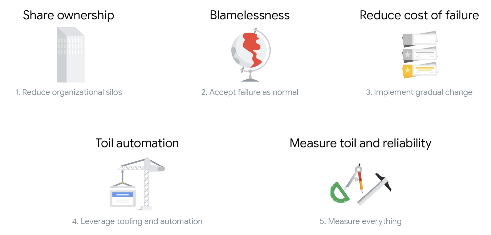

## Professional Cloud DevOps Engineer Certification Learning Path

# I. Developing a Google SRE Culture

## Module 1 Welcome to Developing a Google SRE Culture 

### Key Points 

- Customers’ experiences with your service tell you how reliable it is. 
- In many IT organizations, development and operations teams have conflicting priorities. 
- Site Reliability Engineering (SRE) is the practice of balancing the velocity of development features with the risk to reliability. 
- SRE can benefit IT teams, regardless of whether they are using cloud or on-premises technology, for both large projects and daily work.

### Module 1 Quiz

Your score: 100% Passing score: 100%

1. What is Site Reliability Engineering (SRE)?

- A philosophy designed to reduce the friction between development and operations.

- **Practices that balance the velocity of development features with the risk to reliability.** 
- A methodology for agile software development within the Google Cloud environment.
- A set of frameworks designed to reduce the friction between development and operations.


## Module 2 DevOps, SRE, and Why They Exist

### Key Points

● DevOps emerged to help close gaps and break down silos between development and operations teams. 

● DevOps is a philosophy, not a development methodology or technology. 

● SRE is a practical way to implement DevOps philosophy. 

● Developers focus on feature velocity and innovation; operators focus on reliability and consistency. 

● SRE consists of both technical and cultural practices. 

● SRE practices align to DevOps pillars:





### Module 2 DevOps and SRE Quiz

1. Which is a key pillar of DevOps philosophy?

- Implement blameless postmortems.

- Share ownership.

- **Accept failure as normal.**

- Reduce the cost of failure.

Accepting failure as normal is a key pillar of DevOps.

2. How do DevOps and SRE relate to each other?

- SRE and DevOps originated together.

- DevOps is a way to implement SRE.

- SRE is a way to implement DevOps.

- DevOps developed in response to SRE practice.

SRE practices developed as a way to implement DevOps philosophy.


3. Which philosophy closes the gap between development and operations?

- Waterfall

- SRE

- **DevOps**

- Agile

DevOps philosophy emerged as a way to close the gap between developers and operators.


4. Which is an SRE practice that promotes sharing ownership in IT?

- Design thinking

- **Error budgets**

- Blameless postmortems

- Monitoring

Error budgets created shared incentive and ownership between developers and SREs.


## Module 3 SLOs with Consequences

### Glossary 

● **Blameless postmortem**: Detailed documentation of an incident or outage, its root cause, its impact, actions taken to resolve it, and follow-up actions to prevent its recurrence. 

● **Reliability**: The number of “good” interactions divided by the number of total interactions. This leaves you with a numerical fraction of real users who experience a service that is available and working. 

● **Error budget**: The amount of unreliability you are willing to tolerate. 

● **Service level indicator (SLI)**: A quantifiable measure of the reliability of your service from your users' perspective. 

● **Service level objective (SLO)**: Sets the target for an SLI over a period of time.

### Key Points 

● The mission of SRE is to protect, provide for, and progress software and systems with consistent focus on availability, latency, performance, and capacity. 

● Understanding SRE practices and norms will help you build a common language to use when speaking with your IT teams and support your organization’s adoption of SRE both in the short and long term. 

● Experienced SREs are comfortable with failure. 

● Failures are documented in postmortems, which focus on systems and processes versus people. 

● 100% reliability is the wrong target because it slows the release of new features, which is what drives your business.

● SLOs and error budgets create shared responsibility and ownership between developers and SREs. 

● Fostering psychologically safe environments is necessary for learning and innovation in organizations. 

● Organizations developing an SRE culture should focus on creating a unified vision, determining what collaboration looks like, and sharing knowledge among teams.

### Module 3 Quiz

1. What are Site Reliability Engineers comfortable with?

- **Failure**
- Unknown outage reasons
- System-wide updates
- 100% reliability

SREs are comfortable with failing and learning from mistakes.

2. What can happen when team members don't feel psychologically safe?

- More people express dissatisfaction.

- Innovation increases.

- **Moments of learning are lost.**

- Fewer people are punished for mistakes.

People don’t speak up or ask questions in work environments with low psychological safety, therefore moments of learning are inevitably lost.

3. What is one value SRE provides to an IT team?

- Developers are able to spend more time focusing on system reliability.

- The business is able to focus primarily on its users.

- Team members gain time to focus on the more manual tasks.

- **Developers are enabled to work at a higher velocity while maintaining reliability.**

SRE practices help developers to work faster with less risk to reliability.


4. What is your team's clear and compelling goal that it strives to achieve?

- **Mission**

- Purpose

- Strategy

- Vision

Your team’s mission is a clear and compelling goal that it wants to achieve.


5. What is a reasonable degree of target reliability for an SLO?

- 50%

- **99.9%**

- 100%

- 0%

99.9% is a reasonable target for reliability as it is just short of 100% and still leaves room to focus on feature development.

## Module 4 Make Tomorrow Beter than Today

### Glossary

- **Continuous integration:** Building, integrating, and testing code within the development environment. 
- **Continuous delivery**: Deploying to production frequently, or at the rate the business chooses. 
- **Canarying**: Deploying a change in service to a group of users who don’t know they are receiving the change, evaluating the impact to that group, and then deciding how to proceed. 
- **Toil**: Work directly tied to a service that is manual, repetitive, automatable, tactical, or without enduring value, or that scales linearly as the service grows. 

### Key Points

- Change is best when small and frequent. 
- Design thinking methodology has five phases: empathize, define, ideate, prototype, and test. 
- Prototyping culture encourages teams to try more ideas, leading to an increase in faster failures and more successes. 
- Excessive toil is toxic to the SRE role. 
- By eliminating toil, SREs can focus the majority of their time on work that will either reduce future toil or add service features.
- Resistance to change is usually a fear of loss. 
- Present change as an opportunity, not a threat. 
- People react to change in many ways, and IT leaders need to understand how to communicate with and support each group.


### Module 4 Quiz

1. What would be the best way to practice canarying?

- Deploy a significant code change to any type of user.

- Test the code change in a different environment than production.

- Roll out a feature change to 90% of users.

- **Deploy a small feature change to users that are a representative subset of your typical customers.**

Deploying a small feature change to users that are a representative subset of your typical customers is a canarying best practice.

2. Why is toil a problem?

- **It becomes toxic in large quantities.**

- It is low-risk and low-stress.

- It is unavoidable.

- It is unbounded.

- Toil becomes a problem and is toxic when it occurs in large quantities, as it takes SRE’s time away from real project work.

3. What should you present change to your team members as?

- An inevitability

- A requirement

- A threat

- **An opportunity**

Since resistance to change is usually a fear of loss, presenting change as an opportunity helps motivate employees to embrace and accept it.


4. Which is the third phase of design thinking?

- Define

- **Ideate**

- Prototype

- Empathize

The phases of design thinking in order are empathize, define, ideate, prototype, and test.


5. What is a benefit of continuous integration and continuous delivery (CI/CD)?

- It allows large changes to be rolled out slower.

- It decreases the need for automation.

- **It is less disruptive for customers.**

- It allows for testing of only the production change.

CI/CD is a way to implement gradual change so it is less disruptive to customers.

## Module 5 Regulate Workload

### Glossary

- **Affinity bias**: Tendency to gravitate toward those who are similar to you, such as with race, gender, socioeconomic background, or education level. 
- **Confirmation bias**: Tendency to find information, input, or data that supports your preconceived notions. 
- **Selective attention bias**: Tendency to pay attention to things, ideas, and input from people whom you tend to gravitate toward. 
- **Labeling bias**: Tendency to form opinions based on how people look, dress, or appear externally.

### Key Points

- Measure reliability with good service level indicators (SLIs). 
- A good SLI correlates with user experience with your service; that is, a good SLI tells you when users are happy or unhappy. 
- Measure toil by identifying it, selecting an appropriate unit of measure, and tracking the measurements continuously. 
- Monitoring allows you to gain visibility into a system, which is a core requirement for judging service health and diagnosing your service when things go wrong. 
- Goal-setting, transparency, and data-driven decision making are key components of SRE measurement culture. 
- To make truly data-driven decisions, you need to remove any unconscious biases. 

### Module 5 Quiz

1. What does Google use OKRs as?

- **KPIs**

- SLOs

- Feedback loops

- SLIs

Google uses OKRs as its KPIs.

2. Which bias is the tendency to find information, input, or data that supports your preconceived notions?

- Labeling bias

- Affinity bias

- Selective attention bias

- **Confirmation bias**

Confirmation bias is the tendency to find information, input, or data that supports your preconceived notions.


3. SLIs need to provide a clear definition of what?

- **Good and bad events**

- Total user interactions

- Service downtime

- User happiness

SLIs need to provide a clear definition of good and bad events that will correlate with your users’ experience with the service.


4. What does monitoring allow for?

- Reporting on outage causes

- Improved security

- **Visibility into a system**

- SLI measurement

The SRE practice of monitoring allows for visibility into a system.

## Module 6 Apply SRE in Your Organization

### Key Points

- **Kitchen Sink/”Everything SRE” team**: We recommend this approach for organizations that have few applications and user journeys and where the scope is small enough that only one team is necessary, but a dedicated SRE team is needed in order to implement its practices. 
- **Infrastructure team**: This type of team focuses on maintaining shared services and components related to infrastructure, versus an SRE team dedicated to working on services related to products, like customer-facing code. 
- **Tools team**: This type of SRE team tends to focus on building software to help their developer counterparts measure, maintain, and improve system reliability or other aspects of SRE work, such as capacity planning. 
- **Product/Application team**: This type of SRE team works to improve the reliability of a critical application or business area. We recommend this implementation for organizations that already have a Kitchen Sink, Infrastructure, or Tools-focused SRE team and have a key user-facing application with high reliability needs. 
- **Embedded team**: This team has SREs embedded with their developer counterparts, usually one per developer team in scope. The work relationship between the embedded SREs and developers tends to be project- or time-bounded and usually very hands-on, where they perform work like changing code and configuration of the services in scope. 
- **Consulting team**: This implementation is very similar to the embedded implementation, except SRE are usually less hands-on. We recommend staffing one or two part-time consultants before you staff your first SRE team.
- Organizations with high SRE maturity have well-documented and user-centric SLOs, error budgets, blameless postmortem culture, and a low tolerance for toil. 
- Engineers with operations experience and systems administrators with scripting experience are good first SREs to hire. 
- Upskill current team members with necessary SRE skills such as operations and software engineering, monitoring systems, production automation, system architecture, troubleshooting, culture of trust, and incident management. 
- Contact your Account Executive or Account Director to learn how the Google Cloud Professional Services team can support your organization’s adoption of SRE.

### Module 6 Quiz

1. Which Google team can support you in jumpstarting your SRE implementation?

- Google Engineering Services team

- Google Cloud Customer Experience team

- **Google Cloud Professional Services team**

- Google Cloud SRE team

The Google Cloud Professional Services team can help customers jumpstart their SRE implementations.

2. What practice does Google recommend that you establish before forming your first SRE team?

- Monitoring

- **Blameless postmortem culture**

- Toil automation

- Continuous integration/continuous delivery

Blameless postmortem culture is one practice that Google recommends your organization establishes before forming your first SRE team.

3. Which type of IT role does Google recommend as a possible new SRE hire?

- **Systems administrator**

- Sales engineer

- Systems architect

- Systems analyst

Google recommends systems administrators as good first new SRE hires because of their experience working IT operations and managing production systems.

4. Scope is generally unbounded for which type of SRE implementation?

- **Kitchen Sink**

- Embedded

- Consulting

- Tools

Scope is usually unbounded for Kitchen Sink/”Everything SRE” teams.


## Final Assessment

Passing score: 75%

*check*

1. Your team members are unsure what goals they are trying to achieve within the team. What part of your team vision should you work to clarify?

- Service-oriented meetings

- The strategy

- The values

- **The mission**

Correct! Your team’s mission is the goals it strives to achieve.


2. Which DevOps pillar led to Google SRE practices, such as SLOs and error budgets, that promote shared ownership between developers and SREs?

- Implement gradual change

- **Reduce organizational silos**

- Leverage tooling and automation

- Accept failure as normal

Correct! Reduce organizational silos is the DevOps pillar that led to SRE practices like SLOs and error budgets which promote shared ownership between developers and SREs.


3. What does a blameless postmortem not help with?

- Ensuring that all the root causes are properly understood by the team

- **Decreasing engineering costs incurred after launch**

- Avoiding multiplying complexity

- Reducing the likelihood of stressful outages

Correct! Blameless postmortems and its culture do not correlate with decrease in engineering costs incurred after launch.


4. What do OKRs primarily help an organization do?

- Prototype

- Overcome biases

- **Set goals**

- Share feedback

Correct! OKRs are KPIs that help organizations set goals.


5. SREs believe that change is best when what?

- Fast and big

- **Small and frequent**

- Small and dispersed

- Frequent and global

Correct! SREs believe change is best when small and frequent.


6. Which type of SRE team implementation does Google recommend for an organization's first SRE team?

- Consulting

- **Kitchen Sink**

- Infrastructure

- Embedded

Correct! Google recommends the Kitchen Sink/”Everything SRE” team as an organization’s first SRE team.


7. Which is the term that describes breaking down the silos and closing gaps between development and operations teams?

- Agile

- Monitoring

- Site Reliability Engineering

- **DevOps**

Correct! DevOps philosophy describes breaking down the silos and closing gaps between development and operations teams?


8. SREs are regularly on-call and required to solve problems fast. What is a primary skill SREs need for this?

- Monitoring systems

- System architecting

- Operations and software engineering

- **Troubleshooting**

Correct! Since SREs are regularly on-call, they require excellent troubleshooting skills in order to diagnose and solve problems fast.


9. Which phase of the SRE journey includes automating toil?

- Regulate Workload

- SLOs with Consequences

- **Make Tomorrow Better than Today**

- Reliability Measurement

Correct! Make Tomorrow Better than Today includes toil automation.


10. You've decided to adopt SRE practices and culture in your company. As change begins to happen, you notice that Naveen, one of your operations managers is avoiding new protocols and continuing with his normal work routine. In which group of people would you categorize Naveen?

- Critic

- **Bystander**

- Navigator

- Victim

Correct! Bystanders tend to ignore change and continue on with their normal routine as though change is not happening.


11. Generally, whose experience with a production service determines its availability?

- The operator’s

- The developer’s

- The SRE’s

- **The customer’s**

Correct! Your customer’s experience with your service tells you how available or not it is.


12. What is one benefit of measuring toil?

- **It triggers a reduction effort.**

- It reveals error budget burn.

- It allows design thinking.

- It helps SREs choose SLIs.

Correct! When teams are able to see how much toil they have, they focus on reducing it.


13. What can you build with your team by acknowledging your own fallibility as a leader?

- Unified vision

- Data-driven decision making

- Service-level indicators (SLIs)

- **Psychological safety**

Correct! Acknowledging your own fallibility is one way to build psychological safety with your teams.


14. What does Google recommend you do with the four golden signals?

- Create SLIs

- Automate features

- Translate data

- **Monitor the system**

Correct! Google recommends you monitor the system using the four golden signals—latency, traffic, errors, and saturation,


15. What is continuous delivery?

- **Deploying to production frequently, or at the rate the business chooses.**

- Building, integrating, and testing code within the development environment.

- Deploying a change in service to a group of users who don’t know they are receiving the change.

- Minimizing time between build and deployment.

Correct! Continuous delivery is deploying to production frequently, or at the rate the business chooses.


16. What often accompanies toil automation that leaders should be prepared for?

- Shared vision

- Linear scaling of work with complexity

- Blameless culture

- **Resistance to change**

Correct! Leaders should be prepared for resistance to change when implementing toil automation.


17. Your developers have felt inundated with too many manual and repetitive tasks that are tied to the production service. What is this called?

- **Toil**

- Discomfort discharge

- Overhead

- Automation

Correct! Toil is work that is mundane, repetitive, without enduring value, automatable, and scales linearly as the service grows.


18. What are the five steps in design thinking methodology?

- **Empathize, Define, Ideate, Prototype, Test**

- Define, Ideate, Prototype, Test, Resolve

- Empathize, Define, Design, Prototype, Test

- Empathize, Discuss, Ideate, Prototype, Test

Correct! The five phases of design thinking are Empathize, Define, Ideate, Prototype, and Test.


19. What is a service-level objective (SLO)?

- The amount of unreliability you are willing to tolerate.

- An indicator of how well your service is doing at any moment in time.

- Code that is built, integrated, and tested within the development environment.

- **A precise numerical target for system reliability.**

Correct! An SLO is a precise numerical target for system reliability.


20. Why should toil be limited to a bounded part of the SRE role?

- It allows SREs to focus on project work without worrying about the team's SLOs.

- It frees SREs to completely focus on reliability work.

- It helps IT teams decide what to automate.

- **It prevents SREs from doing only sysadmin work.**

Correct! Keeping toil limited to a bounded part of the SRE role prevents SREs from solely doing system admin work.


# II. Reliable Google Cloud Infrastructure: Design and Process


## Defining Services

### Module Quiz

1. Which most accurately describes a user story?

- **It is a short description of a feature written from the user's point of view.**
- It is a narrative that describes the sequence of steps a typical user would perform to accomplish some task or goal when using the system.
- It is a requirement of the system you are developing.
- It is a short description of a typical person using the system.

Correct, because it describes a feature from the user's point of view

2. Using SMART criteria, which below would be the least effective KPI?

- Clicks per session
- User sign ups per month
- Page views per hour
- **User experience design**

Correct, user experience design is not measurable or time bound and so would not make a relevant KPI.

3. Which best describes an SLO?

- It is a measurable, time bound key performance indicator for your application.
- It is a short, measurable description of an application feature.
- **It is a target measure you want your service to achieve.**
- It is a contract with end users that guarantees service quality

Correct, an SLO is the agreed-upon target for a measurement or range of values for a service. Reliability could be one of these.


## Microservice Design and Architecture


### Module Quiz


1. Which below would violate 12-factor app best practices?

- Treat logs as event streams and aggregate logs into a single source.

- **Store configuration information in your source repository for easy versioning.**

- Explicitly declare and isolate dependencies.

- Keep development, testing, and production as similar as possible.

Correct. Code and config should be separated, because config varies across deployments but code does not. The true test is whether the repository could be open-sourced without compromising any credentials.

2. You’re writing a service, and you need to handle a client sending you invalid data in the request. What should you return from the service?

- A 200 error code

- An XML exception

- A 500 error code

- **A 400 error code**

Correct. 400 is a HTTP status code indicating that a request could not be processed due to an apparent client error.

3. You’re building a RESTful microservice. Which would be a valid data format for returning data to the client?

- XML

- JSON

- HTML

- **All options are correct.**

Correct. They have a standard Content-Type that can be set on the response header and are text-based. It is usual to use JSON, but both XML and JSON are valid.

4. You’ve re-architected a monolithic web application so state is not stored in memory on the web servers, but in a database instead. This has caused slow performance when retrieving user sessions though. What might be the best way to fix this?

- Increase the number of CPUs in the database server.

- Make sure all web servers are in the same zone as the database.

- **Use a caching service like Memorystore for Redis.**

- Move session state back onto the web servers and use sticky sessions in the load balancer.

Correct. Services should be stateless, and a service like Memorystore for Redis provides a fast caching service to store state. They enable services to be stateless and support scale and high availability.


## DevOps Automation

### Building a DevOps Pipeline Lab

#### Overview

In this lab, you will build a continuous integration pipeline using Cloud Source Repositories, Cloud Build, build triggers, and Artifact Registry.


#### Objectives

In this lab, you will learn how to perform the following tasks:

- Create a Git repository
- Create a simple Python application
- Test Your web application in Cloud Shell
- Define a Docker build
- Manage Docker images with Cloud Build and Artifact Registry
- Automate builds with triggers
- Test your build changes

#### Set up your lab environment

For each lab, you get a new Google Cloud project and set of resources for a fixed time at no cost.

1. Sign in to Qwiklabs using an **incognito window**.
2. Note the lab's access time (for example, `1:15:00`), and make sure you can finish within that time.
   There is no pause feature. You can restart if needed, but you have to start at the beginning.
3. When ready, click **Start lab**.
4. Note your lab credentials (**Username** and **Password**). You will use them to sign in to the Google Cloud Console.
5. Click **Open Google Console**.
6. Click **Use another account** and copy/paste credentials for **this** lab into the prompts.
   If you use other credentials, you'll receive errors or **incur charges**.
7. Accept the terms and skip the recovery resource page.

**Note:** Do not click **End Lab** unless you have finished the lab or want to restart it. This clears your work and removes the project.

#### Task 1. Create a Git repository

First, you will create a Git repository using the Cloud Source Repositories service in Google Cloud. This Git repository will be used to store your source code. Eventually, you will create a build trigger that starts a continuous integration pipeline when code is pushed to it.

1. On the Google Cloud console title bar, type **Source Repositories** in the **Search** field, then click **Source Repositories** in the **Products & Pages** section.
2. Click **Add repository**.
3. Select **Create new repository** and click **Continue**.
4. Name the repository **devops-repo**.
5. Select your current project ID from the list.
6. Click **Create**.
7. Click **Cloud Console**, and in the new tab click **Activate Cloud Shell** ().
8. If prompted, click **Continue**.
9. Enter the following command in Cloud Shell to create a folder called `gcp-course`:

```
mkdir gcp-course
```

Copied!

content_copy

1. Change to the folder you just created:

```
cd gcp-course
```

Copied!

content_copy

1. Now clone the empty repository you just created. If prompted, click **Authorize**:

```
gcloud source repos clone devops-repo
```

Copied!

content_copy

**Note:** You may see a warning that you have cloned an empty repository. That is expected at this point.

1. The previous command created an empty folder called `devops-repo`. Change to that folder:

```
cd devops-repo
```

Copied!

content_copy

Click *Check my progress* to verify the objective.

Assessment Completed!

Create a git repository.

Check my progress

*Assessment Completed!*


#### Task 2. Create a simple Python application

You need some source code to manage. So, you will create a simple Python Flask web application. The application will be only slightly better than "hello world", but it will be good enough to test the pipeline you will build.

1. In Cloud Shell, click **Open Editor** () to open the code editor. If prompted click **Open in a new window**.
2. Select the **gcp-course > devops-repo** folder in the explorer tree on the left.
3. Click on **devops-repo**.
4. Click **New File**.
5. Name the file `main.py` and press **Enter**.
6. Paste the following code into the file you just created:

```
from flask import Flask, render_template, request

app = Flask(__name__)

@app.route("/")
def main():
    model = {"title": "Hello DevOps Fans."}
    return render_template('index.html', model=model)

if __name__ == "__main__":
    app.run(host='0.0.0.0', port=8080, debug=True, threaded=True)
```

Copied!

content_copy

1. To save your changes. Press **CTRL + S**.
2. Click on the `devops-repo` folder.
3. Click **New Folder**.
4. Name the folder `templates` and press **Enter**.
5. Right-click on the `templates` folder and create a new file called `layout.html`.
6. Add the following code and save the file as you did before:

```
<!doctype html>
<html lang="en">
<head>
    <title>{{model.title}}</title>
    <!-- Bootstrap CSS -->
    <link rel="stylesheet" href="https://stackpath.bootstrapcdn.com/bootstrap/4.4.1/css/bootstrap.min.css">

</head>
<body>
    <div class="container">

        

        <footer></footer>
    </div>
</body>
</html>
```

Copied!

content_copy

1. Also in the templates folder, add another new file called `index.html`.
2. Add the following code and save the file as you did before:

```


<div class="jumbotron">
    <div class="container">
        <h1>{{model.title}}</h1>
    </div>
</div>

```

Copied!

content_copy

1. In Python, application prerequisites are managed using pip. Now you will add a file that lists the requirements for this application.
2. In the **devops-repo** folder (*not the templates folder*), create a **New File** and add the following to that file and save it as `requirements.txt`:

```
Flask>=2.0.3
```

Copied!

content_copy

1. You have some files now, so save them to the repository. First, you need to add all the files you created to your local Git repo. Click **Open Terminal** and in Cloud Shell, enter the following code:

```
cd ~/gcp-course/devops-repo
git add --all
```

Copied!

content_copy

1. To commit changes to the repository, you have to identify yourself. Enter the following commands, but with your information (*you can just use your Gmail address or any other email address*):

```
git config --global user.email "you@example.com"
git config --global user.name "Your Name"
```

Copied!

content_copy

1. Now, commit the changes locally:

```
git commit -a -m "Initial Commit"
```

Copied!

content_copy

1. You committed the changes locally, but have not updated the Git repository you created in Cloud Source Repositories. Enter the following command to push your changes to the cloud:

```
git push origin master
```

Copied!

content_copy

1. Refresh the **Source Repositories** web page. You should see the files you just created.

#### Task 3. Define a Docker build

The first step to using Docker is to create a file called **Dockerfile**. This file defines how a Docker container is constructed. You will do that now.

1. Click **Open Editor**, and expand the **gcp-course/devops-repo** folder. With the **devops-repo** folder selected, click **New File** and name the new file **Dockerfile**.

The file *Dockerfile* is used to define how the container is built.

1. At the top of the file, enter the following:

```
FROM python:3.9
```

Copied!

content_copy

This is the base image. You could choose many base images. In this case, you are using one with Python already installed on it.

1. Enter the following:

```
WORKDIR /app
COPY . .
```

Copied!

content_copy

These lines copy the source code from the current folder into the /app folder in the container image.

1. Enter the following:

```
RUN pip install gunicorn
RUN pip install -r requirements.txt
```

Copied!

content_copy

This uses pip to install the requirements of the Python application into the container. Gunicorn is a Python web server that will be used to run the web app.

1. Enter the following:

```
ENV PORT=80
CMD exec gunicorn --bind :$PORT --workers 1 --threads 8 main:app
```

Copied!

content_copy

The environment variable sets the port that the application will run on (in this case, 80). The last line runs the web app using the gunicorn web server.

1. Verify that the completed file looks as follows and save it:

```
FROM python:3.9
WORKDIR /app
COPY . .
RUN pip install gunicorn
RUN pip install -r requirements.txt
ENV PORT=80
CMD exec gunicorn --bind :$PORT --workers 1 --threads 8 main:app
```

Copied!

content_copy

#### Task 4. Manage Docker images with Cloud Build and Artifact Registry

The Docker image has to be built and then stored somewhere. You will use **Cloud Build** and **Artifact Registry**.

1. Click **Open Terminal** to return to Cloud Shell. Make sure you are in the right folder:

```
cd ~/gcp-course/devops-repo
```

Copied!

content_copy

1. The Cloud Shell environment variable DEVSHELL_PROJECT_ID automatically has your current project ID stored. The project ID is required to store images in Artifact Registry. Enter the following command to view your project ID:

```
echo $DEVSHELL_PROJECT_ID
```

Copied!

content_copy

1. Enter the following command to create an Artifact Registry repository named devops-repo:

```
gcloud artifacts repositories create devops-repo \
    --repository-format=docker \
    --location=us-east4
```

Copied!

content_copy

1. To configure Docker to authenticate to the Artifact Registry Docker repository, enter the following command:

```
gcloud auth configure-docker us-east4-docker.pkg.dev
```

Copied!

content_copy

1. To use Cloud Build to create the image and store it in Artifact Registry, type the following command:

```
gcloud builds submit --tag us-east4-docker.pkg.dev/$DEVSHELL_PROJECT_ID/devops-repo/devops-image:v0.1 .
```

Copied!

content_copy

*Notice the environment variable in the command*. The image will be stored in Artifact Registry.

1. On the Google Cloud console title bar, type **Artifact Registry** in the **Search** field, then click **Artifact Registry** in the **Products & Pages** section.
2. Click **devops-repo**.
3. Click **devops-image**. Your image should be listed.
4. On the Google Cloud console title bar, type **Cloud Build** in the **Search** field, then click **Cloud Build** in the **Products & Pages** section. Your build should be listed in the history.

You will now try running this image from a Compute Engine virtual machine.

1. On the **Navigation menu**, click **Compute Engine > VM Instance**.
2. Click **Create Instance** to create a VM.
3. On the **Create an instance** page, specify the following, and leave the remaining settings as their defaults:

| **Property**        | **Value**                                                    |
| :------------------ | :----------------------------------------------------------- |
| **Container**       | Click DEPLOY CONTAINER                                       |
| **Container image** | '`us-east4`-docker.pkg.dev/`qwiklabs-gcp-01-cd7e68eede49`/devops-repo/devops-image:v0.1` and click SELECT |
| **Firewall**        | Allow HTTP traffic                                           |

1. Click **Create**.
2. Once the VM starts, click the VM's external IP address. A browser tab opens and the page displays `Hello DevOps Fans.`

**Note:** You might have to wait a minute or so after the VM is created for the Docker container to start.

1. You will now save your changes to your Git repository. In Cloud Shell, enter the following to make sure you are in the right folder and add your new Dockerfile to Git:

```
cd ~/gcp-course/devops-repo
git add --all
```

Copied!

content_copy

1. Commit your changes locally:

```
git commit -am "Added Docker Support"
```

Copied!

content_copy

1. Push your changes to Cloud Source Repositories:

```
git push origin master
```

Copied!

content_copy

1. Return to Cloud Source Repositories and verify that your changes were added to source control.

Click *Check my progress* to verify the objective.

Manage Docker images with Cloud Build and Artifact Registry.

Check my progress


#### Task 5. Automate builds with triggers

1. On the **Navigation menu**, click **Cloud Build**. The **Build history** page should open, and one or more builds should be in your history.
2. Click the **Triggers** link on the left.
3. Click **Create trigger** and specify the following:

| **Property**           | **Value**                                     |
| :--------------------- | :-------------------------------------------- |
| **Name**               | devops-trigger                                |
| **Region**             | `us-east4`                                    |
| **Repository**         | devops-repo(Cloud Source Repositories)        |
| **Branch**             | .*(any branch)                                |
| **Configuration Type** | Cloud Build configuration file (yaml or json) |
| **Location**           | Inline                                        |

1. Click **Open Editor** and replace the code with the code metioned below and click **Done**.

```
steps:
  - name: 'gcr.io/cloud-builders/docker'
    args: ['build', '-t', 'us-east4-docker.pkg.dev/qwiklabs-gcp-01-cd7e68eede49/devops-repo/devops-image:$COMMIT_SHA', '.']
images:
  - 'us-east4-docker.pkg.dev/qwiklabs-gcp-01-cd7e68eede49/devops-repo/devops-image:$COMMIT_SHA'
options:
  logging: CLOUD_LOGGING_ONLY
```

Copied!

content_copy

1. For **Service account** select the service account starting with your project-id that look similar to (`qwiklabs-gcp-01-cd7e68eede49`@`qwiklabs-gcp-01-cd7e68eede49`.iam.gserviceaccount.com) and and click **Create**.
2. To test the trigger, click **Run** and then **Run trigger**.
3. Click the **History** link and you should see a build running. Wait for the build to finish, and then click the link to it to see its details.
4. Scroll down and look at the logs. The output of the build here is what you would have seen if you were running it on your machine.
5. Return to the Artifact Registry service. You should see a new image in the **devops-repo** > **devops-image** folder.
6. Return to the **Cloud Shell Code Editor**. Find the file `main.py` in the `gcp-course/devops-repo` folder.
7. In the main() function, change the title property to `"Hello Build Trigger."` as shown below:

```
@app.route("/")
def main():
    model = {"title":  "Hello Build Trigger."}
    return render_template("index.html", model=model)
```

1. Commit the change with the following command:

```
cd ~/gcp-course/devops-repo
git commit -a -m "Testing Build Trigger"
```

Copied!

content_copy

1. Enter the following to push your changes to Cloud Source Repositories:

```
git push origin master
```

Copied!

content_copy

1. Return to the Cloud Console and the **Cloud Build** service. You should see another build running.

Click *Check my progress* to verify the objective.

Automate Builds with Trigger.

Check my progress


#### Task 6. Test your build changes

1. When the build completes, click on it to see its details.
2. Click **Execution Details**,
3. Click the **Image name**. This redirects you to the image page in Artifact Registry.
4. At the top of the pane, click **copy** next to the image name. You will need this for the next steps. The format will look as follows.

'`us-east4`-docker.pkg.dev/`qwiklabs-gcp-01-cd7e68eede49`/devops-demo/devops-image@sha256:8aede81a8b6ba1a90d4d808f509d05ddbb1cee60a50ebcf0cee46e1df9a54810`

**Note:** Do not use the image name located in Digest.

1. Go to the **Compute Engine** service. As you did earlier, create a new virtual machine to test this image. Click **DEPLOY CONTAINER** and paste the image you just copied.
2. Select **Allow HTTP traffic**.
3. When the machine is created, test your change by making a request to the VM's external IP address in your browser. Your new message should be displayed.

**Note:** You might have to wait a few minutes after the VM is created for the Docker container to start.

Click *Check my progress* to verify the objective.

Test your Build Changes.

Check my progress


#### Congratulations!

In this lab, you built a continuous integration pipeline using the Google Cloud tools Cloud Source Repositories, Cloud Build, build triggers, and Artifact Registry.


### Module Quiz

1. What Google Cloud feature would be easiest to use to automate a build in response to code being checked into your source code repository?

- AppEngine

- Cloud Functions

- **Build triggers**

- CloudScheduler

This answer is correct. Cloud Build triggers have been designed specifically to trigger a build automatically when changes are made to source code.

2. Which Google Cloud tools can be used to build a continuous integration pipeline?

- Artifact Registry

- **All of these**

- Cloud Build

- Cloud Source Repositories

All of the options are correct. Source Repositories provides a private Git repository, Cloud Build builds containers, and Artifact Registry is a Docker images repository that performs vulnerability analysis. All three components are typically used in a continuous integration pipeline where on a commit, code is built and tested and an image is built and published to a registry.


## Choosing Storage Solutions

### Module Quiz

1. You need to store user preferences, product information, and reviews for a website you are building. There won't be a huge amount of data. What would be a simple, cost-effective, managed solution?

- BigQuery.

- **Firestore**

- Spanner

- Cloud SQL

This answer is correct. Firestore provides automatic scale ACID transactions and live synchronization and is integrated with Google Cloud and Firebase. It also has a free tier.


2. You are a global financial services company with users all over the world. You need a database service that can provide low latency worldwide with strong consistency. Which service might you choose?

- Firestore

- Cloud SQL

- **Spanner**

- BigQuery

This answer is correct. A key feature of Spanner is scale for relational data with strong consistency, and it is globally distributed to provide low latency. The high availability and automatic replication are also strong features for financial services.

3. Currently, you are using Firestore to store information about products, reviews, and user sessions. You'd like to speed up data access in a simple, cost-effective way. What would you recommend?

- Move the data to Spanner.

- Move the data to Bigtable.

- Move the data to BigQuery.

- **Cache the data using Memorystore.**

This answer is correct. Memorystore provides the best fit when considering data model, performance, scale, cost, and availability.


4. You want to analyze sales trends. To help achieve this, you want to combine data from your on-premises Oracle database with Google Analytics data and your web server logs. Where might you store the data so it is both easy to query and cost-effective?

- Spanner

- **BigQuery**

- Cloud SQL

- Firestore

This answer is correct. BigQuery is a data warehouse used for data analytics, and so is built for this type of use case. It provides the infrastructure to ingest data from many different sources, which is a requirement too. The cost model of paying for storage and then only for queries run is attractive too.

## Google Cloud and Hybrid Network Architecture

### Module Quiz

1. You are a large bank deploying an online banking service to Google Cloud. The service needs high volume access to mainframe data on-premises. Which connectivity option would likely be most suitable?

- HTTPS

- Peering

- **Cloud Interconnect**

- VPN

This answer is correct, because Cloud Interconnect provides high bandwidth and low latency. It does need encryption at the application level.

2. You are deploying a large-scale web application with users all over the world and a lot of static content. Which load balancer configuration would likely be the most suitable?

- TCP load balancer with SSL configured.

- **HTTP load balancer with SSL configured and the CDN enabled.**

- HTTP load balancer with SSL configured.

- UDP load balancer with SSL configured and the CDN enabled.

This answer is correct, because the traffic is HTTP(S), the load balancer should be external and global, and CDN enabled will help performance and cost.

3. You want a secure, private connection between your network and a Google Cloud network. There is not a lot of volume, but the connection needs to be extremely reliable. Which configuration below would you choose?

- VPN

- Cloud Interconnect

- VPC peering

- **VPN with high availability and Cloud Router.**

This is the correct choice, because this offers a secure extremely reliable connection and is more cost-effective than Cloud Interconnect.

4. You have a contract with a service provider to manage your Google VPC networks. You want to connect a network they own to your VPC. Both networks are in Google Cloud. Which Connection option should you choose?

- **VPN with high availability and Cloud Router.**

- Cloud Interconnect

- VPN

- VPC peering

This is the correct choice, because this offers a secure extremely reliable connection and is more cost-effective than Cloud Interconnect.


## Deploying Applications to Google Cloud

### Lab Deploying Apps to Google Cloud

#### Overview

In this lab, you will deploy applications to the Google Cloud services App Engine, Kubernetes Engine, and Cloud Run.


#### Objectives

In this lab, you will learn how to perform the following tasks:

- Download a sample app from GitHub
- Deploy to App Engine
- Deploy to Kubernetes Engine
- Deploy to Cloud Run

#### Set up your lab environment

For each lab, you get a new Google Cloud project and set of resources for a fixed time at no cost.

1. Sign in to Qwiklabs using an **incognito window**.
2. Note the lab's access time (for example, `1:15:00`), and make sure you can finish within that time.
   There is no pause feature. You can restart if needed, but you have to start at the beginning.
3. When ready, click **Start lab**.
4. Note your lab credentials (**Username** and **Password**). You will use them to sign in to the Google Cloud Console.
5. Click **Open Google Console**.
6. Click **Use another account** and copy/paste credentials for **this** lab into the prompts.
   If you use other credentials, you'll receive errors or **incur charges**.
7. Accept the terms and skip the recovery resource page.

**Note:** Do not click **End Lab** unless you have finished the lab or want to restart it. This clears your work and removes the project.

#### Task 1. Download a sample app from GitHub

Download a sample application from GitHub and preview it in Cloud Shell.

1. In the Cloud Console, click **Activate Cloud Shell** ().
2. If prompted, click **Continue**.
3. To create a new folder, run the following command:

```
mkdir gcp-course
```

Copied!

content_copy

1. Change to the folder you just created:

```
cd gcp-course
```

Copied!

content_copy

1. Clone a simple Python Flask app from GitHub:

```
git clone https://GitHub.com/GoogleCloudPlatform/training-data-analyst.git
```

Copied!

content_copy

1. Change to the `deploying-apps-to-gcp` folder:

```
cd training-data-analyst/courses/design-process/deploying-apps-to-gcp
```

Copied!

content_copy

1. To test the program, type the following command to build a Docker container of the image:

```
docker build -t test-python .
```

Copied!

content_copy

1. To run the Docker image, type the following command:

```
docker run --rm -p 8080:8080 test-python
```

Copied!

content_copy

1. To see the program running, click **Web Preview** () in the toolbar of Google Cloud Shell. Then, select **Preview on port 8080**.

The program should be displayed in a new browser tab.

1. In Cloud Shell, type `Ctrl+C` to stop the program.

#### Task 2. Deploy to App Engine

App Engine is a completely automated deployment platform. It supports many languages, including Python, Java, JavaScript, and Go. To use it, you create a configuration file and deploy your applications with a couple of simple commands. In this task, you create a file named *app.yaml* and deploy it to App Engine.

1. In Cloud Shell, click **Open Editor** (), then click **Open in a new window** if required.
2. Select the `gcp-course/training-data-analyst/courses/design-process/deploying-apps-to-gcp` folder in the explorer tree on the left.
3. Click **New File**, name the file **app.yaml**, and then press **Enter**.
4. Paste the following into the file you just created:

```
runtime: python39
```

Copied!

content_copy

1. **Save** your changes.

**Note:** There are other settings you can add to the app.yaml file, but in this case only the language runtime is required.

1. In a project, an App Engine application has to be created. This is done just once using the `gcloud app create` command and specifying the region where you want the app to be created. Click **Open Terminal** and type the following command. If prompted, click **Authorize**:

```
gcloud app create --region=us-central
```

Copied!

content_copy

1. Now deploy your app with the following command:

```
gcloud app deploy --version=one --quiet
```

Copied!

content_copy

**Note:** This command will take a couple of minutes to complete.

1. On the Google Cloud console title bar, type **App Engine** in the Search field, then click **App Engine** in the Products & Pages section.
2. In the upper-right corner of the dashboard is a link to your application, similar to this:


**Note:** By default, the URL to an App Engine application is in the form of `https://project-id.appspot.com`.

1. Click on the link to test your program.
2. Make a change to the program to see how easy the App Engine makes managing versions.
3. In the code editor, expand the `training-data-analyst/courses/design-process/deploying-apps-to-gcp` folder in the navigation pane on the left. Then, click **main.py** to open it.
4. In the **main()** function, change the title to `Hello App Engine` as shown below:

```
@app.route("/")
def main():
    model = {"title" "Hello App Engine"}
    return render_template('index.html', model=model)
```

1. Click **File > Save** in the code editor toolbar to save your change.
2. Now, deploy version two with the following command:

```
gcloud app deploy --version=two --no-promote --quiet
```

Copied!

content_copy

**Note:** The `--no-promote` parameter tells App Engine to continue serving requests with the old version. This allows you to test the new version before putting it into production.

1. When the command completes, return to the App Engine dashboard. Click the link again, and version one will still be returned. It should return `Hello GCP`. This is because of the `--no-promote` parameter in the previous command.
2. On the left, click the **Versions** tab. Notice that two versions are listed.

**Note:** You might have to click **Refresh** to see version **two**.

1. Click on the version **two** link to test it. It should return `Hello App Engine`.
2. To migrate production traffic to version two, click **Split Traffic** at the top. Change the version to two, and click **Save**.
3. Give it a minute to complete. Refresh the browser tab that earlier returned `Hello GCP`. It should now return the new version.

Click **Check my progress** to verify the objective.

Deploy to App Engine

Check my progress


#### Task 3. Deploy to Kubernetes Engine with Cloud Build and Artifact Registry

Kubernetes Engine allows you to create a cluster of machines and deploy any number of applications to it. Kubernetes abstracts the details of managing machines and allows you to automate the deployment of your applications with simple CLI commands.

To deploy an application to Kubernetes, you first need to create the cluster. Then you need to add a configuration file for each application you will deploy to the cluster.

1. On the **Navigation menu** (), click **Kubernetes Engine**. If a message appears saying the Kubernetes API is being initialized, wait for it to complete.
2. Click **Create Cluster**.
3. Accept all the defaults, select region `us-central1` and click **Create**. It will take a couple of minutes for the Kubernetes Engine cluster to be created. When the cluster is ready, a green check appears.
4. Click the three dots to the right of the cluster and then click **Connect**.
5. In the **Connect to the cluster** screen, click **Run in Cloud Shell**. This opens Cloud Shell with the connect command entered automatically.
6. Press **Enter** to connect to the cluster.
7. To test your connection, type the following command:

```
kubectl get nodes
```

Copied!

content_copy

This command simply shows the machines in your cluster. If it works, you're connected.

1. In Cloud Shell, click **Open Editor** ().
2. Expand the `training-data-analyst/courses/design-process/deploying-apps-to-gcp` folder in the navigation pane on the left. Then, click **main.py** to open it.
3. In the **main()** function, change the title to `Hello Kubernetes Engine` as shown below:

```
@app.route("/")
def main():
    model = {"title" "Hello Kubernetes Engine"}
    return render_template('index.html', model=model)
```

1. **Save** your change.
2. Add a file named `kubernetes-config.yaml` to the `training-data-analyst/courses/design-process/deploying-apps-to-gcp` folder.
3. Paste the following code in that file to configure the application:

```
---
apiVersion: apps/v1
kind: Deployment
metadata:
  name: devops-deployment
  labels:
    app: devops
    tier: frontend
spec:
  replicas: 3
  selector:
    matchLabels:
      app: devops
      tier: frontend
  template:
    metadata:
      labels:
        app: devops
        tier: frontend
    spec:
      containers:
      - name: devops-demo
        image: <YOUR IMAGE PATH HERE>
        ports:
        - containerPort: 8080

---
apiVersion: v1
kind: Service
metadata:
  name: devops-deployment-lb
  labels:
    app: devops
    tier: frontend-lb
spec:
  type: LoadBalancer
  ports:
  - port: 80
    targetPort: 8080
  selector:
    app: devops
    tier: frontend
```

Copied!

content_copy

**Note:** In the first section of the YAML file above, you are configuring a deployment. In this case, you are deploying 3 instances of your Python web app. Notice the image attribute. You will update this value with your image in a minute after you build it. In the second section, you are configuring a service of the type "load balancer". The load balancer will have a public IP address. Users will access your application through the load balancer.

For more information on Kubernetes deployments and services, see the links below:

- [Kubernetes Deployments page](https://kubernetes.io/docs/concepts/workloads/controllers/deployment/)
- [Kubernetes Create an External Load Balancer page](https://kubernetes.io/docs/tasks/access-application-cluster/create-external-load-balancer/)

1. In **Cloud Shell** type the following command to create an Artifact Registry repository named devops-demo:

```
gcloud artifacts repositories create devops-demo \
    --repository-format=docker \
    --location=us-central1
```

Copied!

content_copy

1. To configure Docker to authenticate to the Artifact Registry Docker repository, type the following command:

```
gcloud auth configure-docker us-central1-docker.pkg.dev
```

Copied!

content_copy

1. To use Kubernetes Engine, you need to build a Docker image. Type the following commands to use Cloud Build to create the image and store it in Artifact Registry:

```
cd ~/gcp-course/training-data-analyst/courses/design-process/deploying-apps-to-gcp
gcloud builds submit --tag us-central1-docker.pkg.dev/$DEVSHELL_PROJECT_ID/devops-demo/devops-image:v0.2 .
```

Copied!

content_copy

1. When the previous command completes, the image name will be listed in the output. The image name is in the form `us-central1`-docker.pkg.dev/PROJECT_ID/devops-demo/devops-image:v0.2.
2. Highlight your image name and copy it to the clipboard. Paste that value in the `kubernetes-config.yaml` file, overwriting the string `<YOUR IMAGE PATH HERE>.`

You should see something similar to below:

```
spec:
  containers:
  - name: devops-demo
    image: us-central1-docker.pkg.dev/PROJECT_ID/devops-demo/devops-image:v0.2
    ports:
```

1. Type the following Kubernetes command to deploy your application:

```
kubectl apply -f kubernetes-config.yaml
```

Copied!

content_copy

1. In the configuration file, three replicas of the application were specified. Type the following command to see whether three instances have been created:

```
kubectl get pods
```

Copied!

content_copy

Make sure all the pods are ready. If they aren't, wait a few seconds and try again.

1. A load balancer was also added in the configuration file. Type the following command to see whether it was created:

```
kubectl get services
```

Copied!

content_copy

You should see something similar to below:


If the load balancer's external IP address says "pending", wait a few seconds and try again.

1. When you have an external IP, open a browser tab and make a request to it. It should return `Hello Kubernetes Engine`. It might take a few seconds to be ready.

Click **Check my progress** to verify the objective.

Deploy to Kubernetes Engine

Check my progress


#### Task 4. Deploy to Cloud Run

Cloud Run simplifies and automates deployments to Kubernetes. When you use Cloud Run, you don't need a configuration file. You simply choose a cluster for your application. With Cloud Run, you can use a cluster managed by Google, or you can use your own Kubernetes cluster.

To use Cloud Run, your application needs to be deployed using a Docker image and it must be stateless.

1. Open the Cloud Shell code editor and expand the `training-data-analyst/courses/design-process/deploying-apps-to-gcp` folder in the navigation pane on the left. Then, click **main.py** to open it.
2. In the **main()** function, change the title to `Hello Cloud Run` as shown below:

```
@app.route("/")
def main():
    model = {"title" "Hello Cloud Run"}
    return render_template('index.html', model=model)
```

1. **Save** your change.
2. To use Cloud Run, you need to build a Docker image. In Cloud Shell, type the following commands to use Cloud Build to create the image and store it in Artifact Registry:

```
cd ~/gcp-course/training-data-analyst/courses/design-process/deploying-apps-to-gcp
gcloud builds submit --tag us-central1-docker.pkg.dev/$DEVSHELL_PROJECT_ID/devops-demo/cloud-run-image:v0.1 .
```

Copied!

content_copy

1. When the build completes, on the Google Cloud console title bar, type **Cloud Run** in the Search field, then click **Cloud Run** in the Products & Pages section.
2. Click **Create service**. This enables the Cloud Run API.
3. Click the **Select** link in the `Container image URL` text box and then click **Artifact Registry**. In the resulting dialog, expand **devops-demo** image > **cloud-run-image** and select the image listed. Then click **Select**.
4. In **Service name**, type **hello-cloud-run** and select region `us-central1`.
5. For **Authentication**, select **Allow unauthenticated invocations**.
6. In **Container(s), Volumes, Networking, Security**, select **default** in the **Execution environment** section.
7. In **Autoscaling**, set the **Maximum number of instances** to **6**. Leave the rest as defaults.
8. Finally, click **Create**.
9. It shouldn't take long for the service to deploy. When a green check appears, click on the URL that is automatically generated for the application. It should return `Hello Cloud Run`.

Click **Check my progress** to verify the objective.

Deploy to Cloud Run

Check my progress


#### Congratulations!

In this lab, you deployed applications to the Google Cloud services App Engine, Kubernetes Engine, and Cloud Run.


### Module Quiz

1. You need to deploy an existing application that was written in .NET version 4. The application requires Windows servers, and you don't want to change it. Which should you use?

- GKE

- **Compute Engine**

- Cloud Functions

- App Engine

This is the correct answer, because the approach is a lift-and-shift, which is best supported by Compute Engine because Compute Engine offers full control over virtual machines including operating systems. No repackaging would be required.

2. You have containerized multiple applications using Docker and have deployed them using Compute Engine VMs. You want to save on costs and simplify container management. What might you do?

Rewrite the applications to run in App Engine standard environment.

- Write Terraform scripts for all deployment.

- Rewrite the applications to run in Cloud Functions.

- **Migrate the containers to GKE.**

This is the correct answer. The applications are containerized, and GKE will help with the resource efficiency and hence cost, automate many aspects of the container management, and provide the best solution for the scenario.

3. You've been asked to write a program that uses Vision API to check for inappropriate content in photos that are uploaded to a Cloud Storage bucket. Any photos that are inappropriate should be deleted. What might be the simplest, cheapest way to deploy in this program?

- App Engine

- **Cloud Functions**

- GKE

- Compute Engine

This is the correct answer, because the requirements for simplest and cheapest are met with Cloud Functions. Cloud Functions are for single purpose functions like image analysis. Cloud Functions also can be triggered by Cloud Storage events, so they provide seamless integration. The payment model based on number of requests, processing time of request (measured in 100ms units), and then other resources consumed is the most suitable of all options offered above. There is a free tier too. Cloud Functions also provides automatic scaling, high availability, and fault tolerance.


## Designing Reliable Systems

### Module Quiz

1. You need a relational database for a system that requires extremely high availability (99.999%). The system must run uninterrupted even in the event of a regional outage. Which database would you choose?

- BigQuery

- Cloud SQL

- Firestore

- **Spanner**

This answer is correct, because Spanner meets all the requirements. It is a global relational database with high availability. Multi-regional instances have a monthly uptime of >=99.999%.

*close*

2. You're creating a service and you want to protect it from being overloaded by too many client retries in the event of a partial outage. Which design pattern would you implement?

- Overload feedback repudiation

- Lazy caching

- **Circuit breaker**

- Truncated exponential backoff

This answer is correct, because the circuit breaker will attempt to prevent an operation that is likely to fail and therefore will protect the resource that is in partial outage and hopefully prevent cascading failure.


## Security

### Module Quiz

1. You don't want programmers to have access to production resources. What's the easiest way to do this in Google Cloud?

- Set up private access and Identity-Aware Proxy.

- Use different service accounts for production and development resources with your project.

- Create a firewall rule that blocks developer access to production servers and databases.

- **Create development and production projects, and don't give developers access to production.**

This is the correct answer, because the simplest way is to have separate projects and not give developers access to the production project.


2. Which Google Cloud features could help reduce the risk of DDoS attacks?

- Google Cloud Armor

- **All of these**

- HTTP global load balancer

- CloudCDN

This answer is correct, because HTTP Load Balancing mitigates and absorbs many layer 4 below attacks such as SYN flood, IP fragment floods, and port exhaustion. CDN caches cacheable content at points of presence close to users. In the event of a DDoS attack for cacheable content, the requests are sent to points of presence, not to your servers/infrastructures, thus increasing the likelihood of the attack being absorbed. Google Cloud Armor is built for DDos mitigation, working with Cloud Load Balancing to detect DDoS attacks.


3. What do you have to do to enable encryption when using Cloud Storage?

- **Nothing as encryption is enabled by default.**

- Create an encryption key using Cloud Key Management Service, and select it when creating a Cloud Storage bucket.

- Simply enable encryption when configuring a bucket.

- Enable encryption and upload a key.

This answer is correct, because Cloud Storage always encrypts data on the server side before it is written to disk. For server side encryption there are options of customer supplied or customer managed encryption keys, but these are only usually used for compliance reasons and are not necessary.


4. What Google Cloud service can you use to enforce the principle of least privilege when using Google Cloud?

- **IAM members and roles**
- Firewall rules

- Encryption keys

- SSL certificates

This is the correct answer, because the principle of least privilege requires user permissions that are just enough to do what they need, and no more. IAM provides this level of control.


## Maintenance and Monitoring

### LAB Monitoring Applications in Google Cloud 

#### Overview

In this lab, you will deploy an application to Google Cloud and then use the tools provided by Google Cloud to monitor it. You will use Cloud Logging, Trace, Profiler, and dashboards and create uptime checks and alerting policies.

#### Objectives

In this lab, you will learn how to perform the following tasks:

- Download a sample app from Github
- Deploy an application to App Engine
- Examine the Cloud logs
- View Profiler information
- Explore Cloud Trace
- Monitor resources using dashboards
- Create uptime checks and alerts

#### Setup

For each lab, you get a new Google Cloud project and set of resources for a fixed time at no cost.

1. Sign in to Qwiklabs using an **incognito window**.
2. Note the lab's access time (for example, `1:15:00`), and make sure you can finish within that time.
   There is no pause feature. You can restart if needed, but you have to start at the beginning.
3. When ready, click **Start lab**.
4. Note your lab credentials (**Username** and **Password**). You will use them to sign in to the Google Cloud Console.
5. Click **Open Google Console**.
6. Click **Use another account** and copy/paste credentials for **this** lab into the prompts.
   If you use other credentials, you'll receive errors or **incur charges**.
7. Accept the terms and skip the recovery resource page.

**Note:** Do not click **End Lab** unless you have finished the lab or want to restart it. This clears your work and removes the project.

#### Task 1. Download a sample app from Github

Download a sample application from GitHub and preview it in Cloud Shell.

1. In the Cloud Console, click **Activate Cloud Shell** ().
2. If prompted, click **Continue**. Once connected to Cloud Shell, you should see that you are already authenticated and that the project is already set to your project ID.
3. Run the following command in Cloud Shell to confirm that you are authenticated. If prompted, click **Authorize**:

```
gcloud auth list
```

Copied!

content_copy

**Command output:**

```
Credentialed Accounts
ACTIVE  ACCOUNT
*      [my_account]@[my_domain.com]

To set the active account, run:
    $ gcloud config set account `ACCOUNT`
```

**Note:** The gcloud command-line tool is the powerful and unified command-line tool in Google Cloud. It comes preinstalled in Cloud Shell. Among its features, gcloud offers tab completion in the shell. For more information, see [gcloud command-line tool overview](https://cloud.google.com/sdk/gcloud).

1. Run the following command to confirm that you are using the correct project for this lab:

```
gcloud config list project
```

Copied!

content_copy

**Command output**

```
[core]
project = [PROJECT_ID]
```

1. If the correct project is not listed, you can set it with this command:

```
gcloud config set project [PROJECT_ID]
```

Copied!

content_copy

**Command output:**

```
Updated property [core/project].
```

1. To create a folder called `gcp-logging`, run the following command:

```
mkdir gcp-logging
```

Copied!

content_copy

1. Change to the folder you just created:

```
cd gcp-logging
```

Copied!

content_copy

1. Clone a simple Python Flask app from Github:

```
git clone https://GitHub.com/GoogleCloudPlatform/training-data-analyst.git
```

Copied!

content_copy

1. Change to the `deploying-apps-to-gcp` folder:

```
cd training-data-analyst/courses/design-process/deploying-apps-to-gcp
```

Copied!

content_copy

1. In Cloud Shell, click **Open Editor** ().
2. Expand the **gcp-logging/training-data-analyst/courses/design-process/deploying-apps-to-gcp** folder in the navigation pane, and then click **main.py** to open it.
3. Add the following import statement at the top of the file (*line 2*):

```
import googlecloudprofiler
```

Copied!

content_copy

**Note:** Profiler allows you to monitor the resources your applications use. For more information, refer to the [Google Cloud Profiler documentation](https://cloud.google.com/profiler/docs/).

1. After the **main()** function, add the following code snippet to start Profiler (*after line 11*):

```
try:
    googlecloudprofiler.start(verbose=3)
except (ValueError, NotImplementedError) as exc:
    print(exc)
```

Copied!

content_copy

Profiler will continuously report application metrics. Your code should look like this:


**Note:** This code simply turns Profiler on. Once on, Profiler starts reporting application metrics to Google Cloud.

1. You also have to add the Profiler library to your `requirements.txt` file. Open that file in the code editor and add the following:

```
google-cloud-profiler==3.0.6
protobuf==3.20.1
```

Copied!

content_copy

The file should look like this:


1. Profiler has to be enabled in the project. In Cloud Shell, enter the following command:

```
gcloud services enable cloudprofiler.googleapis.com
```

Copied!

content_copy

1. To test the program, enter the following command to build a Docker container of the image:

```
docker build -t test-python .
```

Copied!

content_copy

1. To run the Docker image, enter the following command:

```
docker run --rm -p 8080:8080 test-python
```

Copied!

content_copy

1. To see the program running, click **Web Preview** () in the Google Cloud Shell toolbar. Then select **Preview on port 8080**.

The program should be displayed in a new browser tab.

1. In Cloud Shell, type Ctrl+C to stop the program.

Click *Check my progress* to verify the objective.

Enable the Profiler

Check my progress


#### Task 2. Deploy an application to App Engine and examine the Cloud logs

Now you will deploy the program to App Engine and use Google Cloud tools to monitor it.

1. In the Cloud Shell code editor, in the Explorer pane, select the **gcp-logging/training-data-analyst/courses/design-process/deploying-apps-to-gcp** folder.
2. Click **New File**, and then name the file **app.yaml**.
3. Paste the following into the file you just created:

```
runtime: python39
```

Copied!

content_copy

1. Save your changes.

2. In a project, an App Engine application has to be created. This is done just once using the `gcloud app create` command and specifying the region where you want the app to be created. In Cloud Shell, type the following command:

   ```
   gcloud app create --region=us-east1
   ```

   Copied!

   content_copy

3. Now deploy your app with the following command:

```
gcloud app deploy --version=one --quiet
```

Copied!

content_copy

**Note:** This command will take a couple of minutes to complete. Wait for it to complete before continuing.

1. On the Google Cloud console title bar, type **App Engine** in the Search field, then click **App Engine** in the Products & Pages section.
2. Click **App Engine** > **Dashboard**. The upper-right corner of the dashboard should display a link to your application similar to this:


**Note:** By default, the URL to an App Engine instance is in the form of `https://project-id/appspot.com`.

1. Click on the link to test your program.
2. Refresh your browser a few times to make some requests.
3. Return to the Console and click the **App Engine** > **Versions**.
4. In **Diagnose** column of the table click **Logs**.
5. The logs should indicate that Profiler has started and profiles are being generated. If you get to this point too quickly, wait a minute and click **Refresh**.


Click *Check my progress* to verify the objective.

Deploy an application to App Engine and examine the Cloud logs

Check my progress


#### Task 3. View Profiler information

1. On the Google Cloud console title bar, type **Profiler** in the Search field, then click **Profiler** in the Products & Pages section. The screen should look similar to this:


**Note:** The gray bar at the top represents the total amount of CPU time used by the program. The bars below represent the amount of CPU time used by the program's functions relative to the total. At this point, there is no traffic, so the chart is not very interesting. Throw some load at the application.

1. On the **Navigation menu**, click **Compute Engine**.
2. Click **Create Instance** to create a virtual machine.
3. Change the region to someplace other than `us-east1` (*the App Engine app is in `us-east1`*). Accept all the rest of the defaults and click **Create**.

Click *Check my progress* to verify the objective.

Create an instance

Check my progress


1. When the VM is ready, click **SSH** to log in to it.
2. If prompted allow SSH-in-browser to connect to VMs, click **Authorize**.
3. You will generate some traffic to your App Engine app using the web testing tool called Apache Bench. Enter the following commands to install it:

```
sudo apt update
sudo apt install apache2-utils -y
```

Copied!

content_copy

1. Update `<your-project-id>` with your PROJECT_ID from connection details panel and enter the following command to generate some traffic to your App Engine application:

```
ab -n 1000 -c 10 https://<your-project-id>.appspot.com/
```

Copied!

content_copy

The command will make a thousand requests, 10 at a time, to your application.

**Note:** You have to change the URL to point to your application. Recall that you can find the URL in the App Engine Dashboard. It is also on the browser tab you used to test your app, if you haven't closed it. Also, make sure you insert a slash (/) at the end of the URL.

1. When the requests are finished, on the Google Cloud console title bar, type **Profiler** in the Search field, then click **Profiler** in the Products & Pages section.

Now there is a more interesting chart. Each bar represents a function. The width of the bars represents how much CPU time each function consumed.

The Profiler is a way developers can track down parts of a program that are consuming too many resources.


#### Task 4. Explore Cloud Trace

1. Every request to your application is added to the **Trace** list. On the Google Cloud console title bar, type **Trace Explorer** in the Search field, then click **Trace Explorer** in the Products & Pages section.

This shows a history of requests and their latency. Again, it's not very exciting because the application hasn't been running for very long. The chart in the upper-left plots requests and how long they took. The table to the right shows a list of requests. If you select a request, more detail will be displayed at the bottom of the screen.

1. Return to the SSH window where you entered the Apache Bench command previously.
2. Enter the ab command again:

```
ab -n 1000 -c 10 https://<your-project-id>.appspot.com/
```

Copied!

content_copy

You can also experiment with different values for the -n and -c parameters.

1. Repeat this a couple of times, and then return to the Trace Explorer page.

#### Task 5. Monitor resources using Dashboards

1. On the Google Cloud console title bar, type **Monitoring** in the Search field, then click **Monitoring (Infrastructure and application quality checks)** in the Products & Pages section.
2. In the left pane, click **Dashboards**. Cloud Monitoring analyzes the resources used in your projects and generates some default dashboards for you. In this exercise you have used App Engine and Compute Engine virtual machines, so a table similar to the one shown below should be displayed:


1. Click on the **App Engine** dashboard, and then select your project name. A dashboard of pertinent information for your App Engine application will appear.
2. In the left pane, click **Dashboards**.
3. Click on the **VM Instances** dashboard, and then select your instance. A dashboard for your VM will appear.

**Note:** If you don't see VM Instances right away, wait a minute and refresh your browser.

1. Alternatively, return to the Dashboards page and click the **+Create Dashboard**. Try to create a custom dashboard.
2. For **New Dashboard Name**, type the custom dashboard name you have chosen. You can continue with your custom dashboard by adding the charts.

#### Task 6. Create uptime checks and alerts

1. In the left pane, click **Uptime checks**, and then click the **+ Create Uptime Check** link at the top. Fill out the form as follows:

| **Property**        | **Value**                       |
| :------------------ | :------------------------------ |
| **Protocol**        | HTTPS                           |
| **Resource Type**   | URL                             |
| **Hostname**        | `<your-project-id>.appspot.com` |
| **Path**            | /                               |
| **Check Frequency** | 1 minute                        |

1. Click Continue and in **Review** section enter `App Engine Uptime Check` in **Title**.
2. Click **Test** to verify that your uptime check can connect to the resource. When you see a green check mark everything can connect. Click **Create**.
3. In the **Uptime checks** page click on 3 vertical dots next to your uptime check and select **Add alert policy**.
4. In **Notifications and name** click on the drop down arrow next to **Notification Channels**, then click on **Manage Notification Channels**. A **Notification channels** page will open in a new tab.
5. Scroll down the page and click on **ADD NEW** for Email.
6. In the **Create Email Channel** dialog box, enter your personal email address in the **Email Address** field and a **Display name**.
7. Click on **Save**.
8. Go back to the previous tab. Click on **Notification Channels** again, then click on the **Refresh icon** to get the display name you mentioned in the previous step.


1. Now, select your **Display name** and click **OK**.
2. Name the alert policy as **Uptime Check Alert**.
3. Click **Create Policy**. The uptime check you configured takes a while for it to become active.

Click *Check my progress* to verify the objective.

Create uptime checks and alerts

Check my progress


1. Return to the open App Engine tab in order to disable the application to see whether your uptime check and alerting policy work.
2. Click **Settings**.
3. Click **Disable application**. Follow the instructions to disable the application.
4. Return to the **App Engine Dashboard** and test the URL. It shouldn't work anymore.
5. Return to the tab that contains **Monitoring**, and then click **Uptime checks**. Your uptime check should be failing. *If you get there too fast, wait a minute and click refresh*.
6. Click **Alerting**. An incident should have been fired.
7. Check your email. You should get a message from Cloud Monitoring.
8. Return to **App Engine Settings** and re-enable your application.Then return to the **Uptime checks** page. The uptime check should be working again. *If not, wait a minute and then click refresh*.
9. Return to the **Alerting** page. Your incident should be resolved. *As before, you might have to wait a minute and then click refresh*.
10. Check your email again. You should get a second email indicating that the alert recovered.
11. To make sure you don't get any emails after the project is deleted, delete your alerting policy and then delete your notification channel. At the top of the **Alerting** page, click **Edit Notification Channels**.
12. Find your email address and click the trash can icon to delete it.
13. Now click **Uptime checks** and delete your App Engine Uptime check.

#### Congratulations!

In this lab, you deployed an application to Google Cloud and then used the tools provided by Google Cloud to monitor it. You used Cloud Logging, Trace, Profiler, and dashboards and created uptime checks and alerting policies.


# Module Quiz

1. You're deploying test environments using Compute Engine VMs. Some downtime is acceptable, and it is very important to deploy them as inexpensively as possible. What single thing below could save you the most money?

- Sustained use discount

- **Preemptible machines**

- Sole tenant nodes

- Committed use discount

This answer is correct. These are the most cost-effective solution as required in the question(up to 80% lower than equivalent non-preemptible machines) and the fact that some downtime is acceptable means that the requirement can be met with preemptible machines.

2. You made a minor update to a service and would like to test it in production by sending a small portion of requests to the new version. Which would you choose?

- A/B testing

- Rolling update

- Blue/green deployment

- Canary deployment

This answer is correct. Canary deployment aims to eliminate/reduce risks by applying the update to a small subset of users to test out a new feature and best fits the requirements of the question.

3. You've made a minor fix to one of your services. You want to deploy the new version with no downtime. Which would you choose?

- Blue/green deployment

- Canary deployment

- **Rolling update**

- A/B test

This answer is correct. A rolling update will update instances incrementally until all have been updated. This strategy can be controlled, for example, by using a managed instance group with Compute Engine or with GKE.

4. Your service has an availability SLO of 99%. What could you use to monitor whether you are meeting it?

- Health check

- Readiness probe

- Liveness probe

- **Uptime check**

This answer is correct. Availability is the percentage of time a system is running and able to process requests. Monitoring this metric will enable the derivation of the SLO metric.


