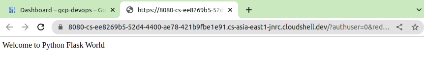

# GCP Cloud Devops Engineer

## Create a Simple WebApp on Cloud Shell

 Check if python and flask is installed in Cloud Shell

```
sherwinowen@cloudshell:~ (gcp-devops-379408)$ python3
Python 3.9.2 (default, Feb 28 2021, 17:03:44)
[GCC 10.2.1 20210110] on linux
Type "help", "copyright", "credits" or "license" for more information.
>>> import flask
>>> flask.__version__
'2.2.3'
```

or

```
sherwinowen@cloudshell:~ (gcp-devops-379408)$ pip3 show flask
Name: Flask
Version: 2.2.3
Summary: A simple framework for building complex web applications.
Home-page: https://palletsprojects.com/p/flask
Author: Armin Ronacher
Author-email: armin.ronacher@active-4.com
License: BSD-3-Clause
Location: /usr/local/lib/python3.9/dist-packages
Requires: Jinja2, importlib-metadata, itsdangerous, Werkzeug, click
Required-by: Flask-PyMongo
```

main.py

```
from flask import Flask

app = Flask(__name__)


@app.route('/')
def index():
        return 'Welcome to Python Flask World'

if __name__ == '__main__':
    app.run(host='0.0.0.0', port=8080)
```


```
sherwinowen@cloudshell:~ (gcp-devops-379408)$ python3 main.py
 * Serving Flask app 'main'
 * Debug mode: off
WARNING: This is a development server. Do not use it in a production deployment. Use a production WSGI server instead.
 * Running on all addresses (0.0.0.0)
 * Running on http://127.0.0.1:8080
 * Running on http://172.17.0.4:8080
Press CTRL+C to quit
127.0.0.1 - - [03/Mar/2023 01:15:41] "GET /?authuser=0&redirectedPreviously=true HTTP/1.1" 200 -
127.0.0.1 - - [03/Mar/2023 01:15:41] "GET /favicon.ico HTTP/1.1" 404 -
```


Click Web Preview button



## Create Dockerfile


