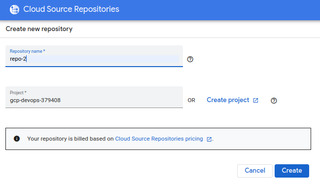
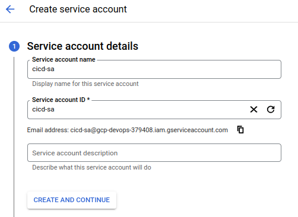
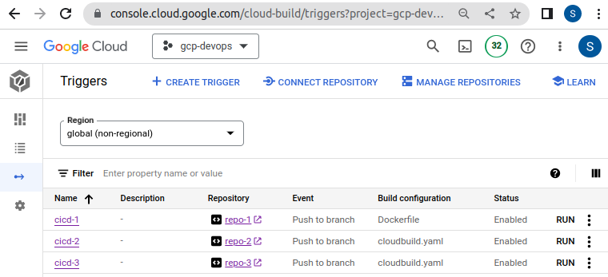
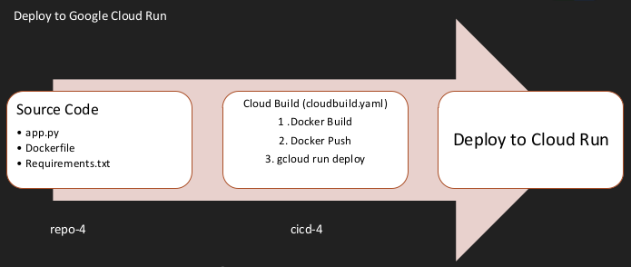
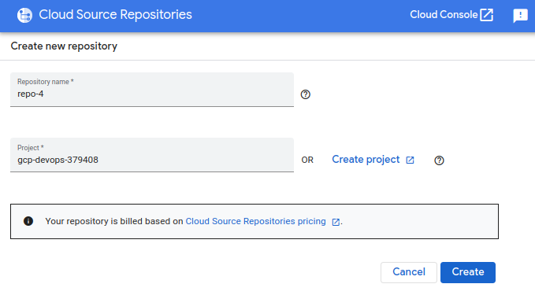
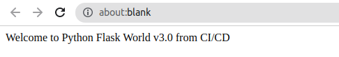
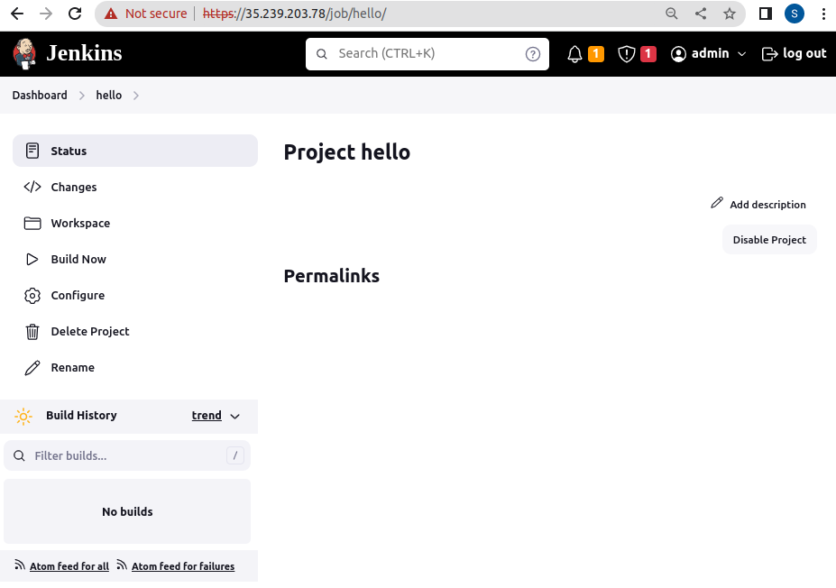
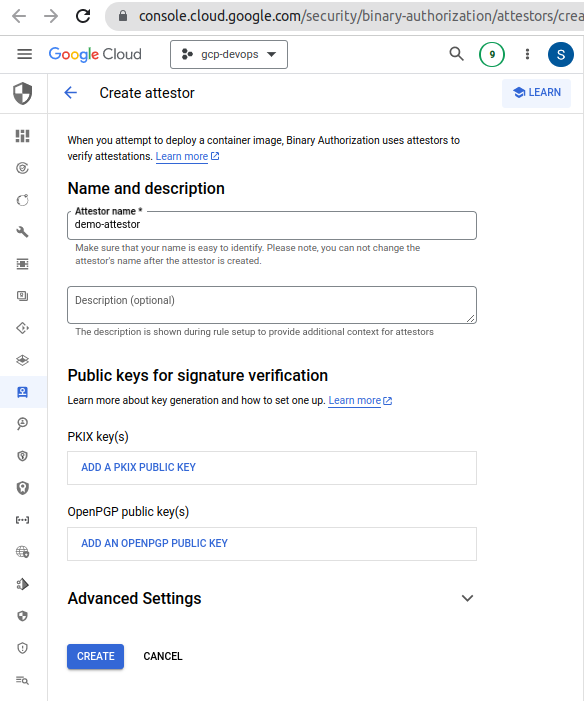
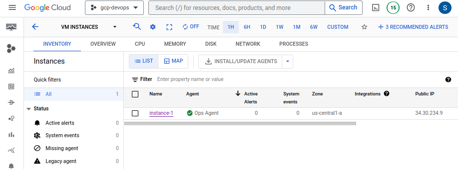
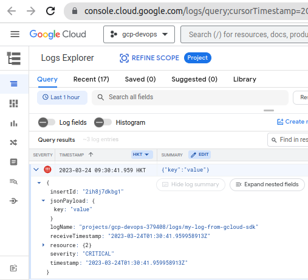

# GCP Cloud Devops Engineer

## Basics of Docker

### Create a Simple WebApp on Cloud Shell

 Check if python and flask is installed in Cloud Shell

```
sherwinowen@cloudshell:~ (gcp-devops-379408)$ python3
Python 3.9.2 (default, Feb 28 2021, 17:03:44)
[GCC 10.2.1 20210110] on linux
Type "help", "copyright", "credits" or "license" for more information.
>>> import flask
>>> flask.__version__
'2.2.3'
```

or

```
sherwinowen@cloudshell:~ (gcp-devops-379408)$ pip3 show flask
Name: Flask
Version: 2.2.3
Summary: A simple framework for building complex web applications.
Home-page: https://palletsprojects.com/p/flask
Author: Armin Ronacher
Author-email: armin.ronacher@active-4.com
License: BSD-3-Clause
Location: /usr/local/lib/python3.9/dist-packages
Requires: Jinja2, importlib-metadata, itsdangerous, Werkzeug, click
Required-by: Flask-PyMongo
```

main.py

```
from flask import Flask

app = Flask(__name__)


@app.route('/')
def index():
        return 'Welcome to Python Flask World'

if __name__ == '__main__':
    app.run(host='0.0.0.0', port=8080)
```


```
sherwinowen@cloudshell:~ (gcp-devops-379408)$ python3 main.py
 * Serving Flask app 'main'
 * Debug mode: off
WARNING: This is a development server. Do not use it in a production deployment. Use a production WSGI server instead.
 * Running on all addresses (0.0.0.0)
 * Running on http://127.0.0.1:8080
 * Running on http://172.17.0.4:8080
Press CTRL+C to quit
127.0.0.1 - - [03/Mar/2023 01:15:41] "GET /?authuser=0&redirectedPreviously=true HTTP/1.1" 200 -
127.0.0.1 - - [03/Mar/2023 01:15:41] "GET /favicon.ico HTTP/1.1" 404 -
```


Click Web Preview button


### Create Dockerfile

Dockerfile

```
FROM python:3.9-slim
RUN pip install flask
WORKDIR /myapp
COPY main.py /myapp/main.py
CMD ["python", "/myapp/main.py"]
```

main.py

```
from flask import Flask

app = Flask(__name__)


@app.route('/')
def index():
        return 'Welcome to Python Flask World'

if __name__ == '__main__':
    app.run(host='0.0.0.0', port=8080)
```

**Build image**

```
$ docker build -t gcr.io/gcp-devops-379408/myfimage:v1.0 .
[+] Building 10.2s (9/9) FINISHED
 => [internal] load .dockerignore                                                                                                                 0.1s
 => => transferring context: 2B                                                                                                                   0.0s
 => [internal] load build definition from Dockerfile                                                                                              0.1s

$ docker images
REPOSITORY                          TAG       IMAGE ID       CREATED          SIZE
gcr.io/gcp-devops-379408/myfimage   v1.0      f425c92fc927   37 seconds ago   136MB
```

**Run image**

```
$ docker run -p 9090:8080 gcr.io/gcp-devops-379408/myfimage:v1.0
 * Serving Flask app 'main'
 * Debug mode: off
WARNING: This is a development server. Do not use it in a production deployment. Use a production WSGI server instead.
 * Running on all addresses (0.0.0.0)
 * Running on http://127.0.0.1:8080
 * Running on http://172.18.0.2:8080
Press CTRL+C to quit
```

**Push image**

```
$ docker push gcr.io/gcp-devops-379408/myfimage:v1.0
The push refers to repository [gcr.io/gcp-devops-379408/myfimage]
eeac318eb8a2: Pushed
9cce845236fb: Pushed
96b40c8bf4bb: Pushed
1982ff1bb0b0: Layer already exists
8efb5f7a4a15: Layer already exists
0d8a86274fa7: Layer already exists
7d13900c8624: Layer already exists
650abce4b096: Layer already exists
v1.0: digest: sha256:b13077d87de14cf2d37fd5bc70004d9993f73d03a335c4ee4e93a6b192f9b
```


## Docker, Container and Registry

### Create first docker images

**server.js**

```
var http = require('http');
var handleRequest = function(request, response) {
    response.writeHead(200);
    response.end("<h1> Welcome to Container world : Docker </h1>");
}
var www = http.createServer(handleRequest);
www.listen(8080);
```

**Dockerfile**

```
FROM node
EXPOSE 8080
COPY server.js .
CMD node server.js
```

**Test server.js  script**

```
$ node server.js
```


**Build image**

```
$ docker build -t myapp:v1.0 .
[+] Building 21.7s (7/7) FINISHED
 => [internal] load build definition from Dockerfile                                                                                              0.1s
 => => transferring dockerfile: 94B                                                                                                               0.0s
 => [internal] load .dockerignore                                                                                                                 0.0s
 => => transferring context: 2B                                                                                                                   0.0s
 => [internal] load metadata for docker.io/library/node:latest                                                                                    1.1s
 => [internal] load build context                                                                                                                 0.0s
 => => transferring context: 276B                                                                                                                 0.0s
 => [1/2] FROM docker.io/library/node@sha256:83841d113e09345a28b146e431f15b062341c5449218e501ba45ef8f9cff6049                                    18.9s
 => => resolve docker.io/library/node@sha256:83841d113e09345a28b146e431f15b062341c5449218e501ba45ef8f9cff6049                                     0.0s
 => => sha256:5b1b50e1f3f5943112b837836b060376fefecdf1d8d049a9514086b6d52b1fb8 2.21kB / 2.21kB                                                    0.0s
 => => sha256:d6dfff1f6f3ddd2194ea0775f199572e8b2d75c38713eef0444d6b1fd0ac7604 10.88MB / 10.88MB                                                  0.2s
 => => sha256:83841d113e09345a28b146e431f15b062341c5449218e501ba45ef8f9cff6049 1.21kB / 1.21kB                                                    0.0s
 => => sha256:fe9a4b9e181a9dd1b2c87e89dad17f0e7624e97b7bb0ea0bffceac139ca4ddc6 7.51kB / 7.51kB                                                    0.0s
 => => sha256:32fb02163b6bb519a30f909008e852354dae10bdfd6b34190dbdfe8f15403ea0 55.05MB / 55.05MB                                                  0.7s
 => => sha256:167c7feebee855d117e192389484ea8367be1ba84e7ee35f4e5e5663195facbf 5.17MB / 5.17MB                                                    0.2s
 => => sha256:e9cdcd4942ebc7445d8a70117a83ecbc77dcc5ffc72c4b6f8e24c0c76cfee15d 54.59MB / 54.59MB                                                  0.9s
 => => sha256:ca3bce705f6c47c25b6e7896b4da514bf271c5827b1d19f51611c4a149dd713c 196.81MB / 196.81MB                                                3.3s
 => => sha256:4f4cf292bc62eeea8a34b4160f3ef1f335b6b7b2bb9d28c605dc4002c8a24bc2 4.21kB / 4.21kB                                                    0.7s
 => => sha256:8347f8b4b86bb4cef9be45637fde2c2718c758a5842f3acf19c1c06e2768dbf5 46.16MB / 46.16MB                                                  1.6s
 => => extracting sha256:32fb02163b6bb519a30f909008e852354dae10bdfd6b34190dbdfe8f15403ea0                                                         2.9s
 => => sha256:c5f20f1b08565a46ecc130c2c8c302015f74d03d88278d7ee72889b06e120898 2.28MB / 2.28MB                                                    1.1s
 => => sha256:d220dfa3e18768d4b6befe0f90b462e6136a99543be319110a2324e963765f42 449B / 449B                                                        1.1s
 => => extracting sha256:167c7feebee855d117e192389484ea8367be1ba84e7ee35f4e5e5663195facbf                                                         0.3s
 => => extracting sha256:d6dfff1f6f3ddd2194ea0775f199572e8b2d75c38713eef0444d6b1fd0ac7604                                                         0.3s
 => => extracting sha256:e9cdcd4942ebc7445d8a70117a83ecbc77dcc5ffc72c4b6f8e24c0c76cfee15d                                                         2.4s
 => => extracting sha256:ca3bce705f6c47c25b6e7896b4da514bf271c5827b1d19f51611c4a149dd713c                                                         7.5s
 => => extracting sha256:4f4cf292bc62eeea8a34b4160f3ef1f335b6b7b2bb9d28c605dc4002c8a24bc2                                                         0.0s
 => => extracting sha256:8347f8b4b86bb4cef9be45637fde2c2718c758a5842f3acf19c1c06e2768dbf5                                                         2.5s
 => => extracting sha256:c5f20f1b08565a46ecc130c2c8c302015f74d03d88278d7ee72889b06e120898                                                         0.2s
 => => extracting sha256:d220dfa3e18768d4b6befe0f90b462e6136a99543be319110a2324e963765f42                                                         0.0s
 => [2/2] COPY server.js .                                                                                                                        1.5s
 => exporting to image                                                                                                                            0.0s
 => => exporting layers                                                                                                                           0.0s
 => => writing image sha256:2ca21b8a8263ebc6589b584567225fd807c6aa85769bbcdbbc08fa6fa9a1aa89                                                      0.0s
 => => naming to docker.io/library/myapp:v1.0                                                              
```

**List images**

```
$ docker images
REPOSITORY   TAG       IMAGE ID       CREATED          SIZE
myapp        v1.0      2ca21b8a8263   38 seconds ago   999MB
```


### Optimize dcocker images and run docker container

**Dockerfile**

```
FROM node:
EXPOSE 8080
COPY server.js .
CMD node server.js
```

**Build image**

```
$ docker build -t myapp:v1.0 .
[+] Building 5.1s (7/7) FINISHED
 => [internal] load .dockerignore                                                                                                                 0.0s
 => => transferring context: 2B                                                                                                                   0.0s
 => [internal] load build definition from Dockerfile                                                                                              0.0s
 => => transferring dockerfile: 109B                                                                                                              0.0s
 => [internal] load metadata for docker.io/library/node:19-alpine3.16                                                                             1.2s
 => [internal] load build context                                                                                                                 0.0s
 => => transferring context: 276B                                                                                                                 0.0s
 => [1/2] FROM docker.io/library/node:19-alpine3.16@sha256:f5b2f5862dec95bd1d83991efe71470b31607e915b7d3495f73e078726a0ab04                       3.1s
 => => resolve docker.io/library/node:19-alpine3.16@sha256:f5b2f5862dec95bd1d83991efe71470b31607e915b7d3495f73e078726a0ab04                       0.0s
 => => extracting sha256:ef5531b6e74e7865f5d142926b572d742ad47c153211de707903b4f5dd8d9e77                                                         0.2s
 => => sha256:d50abd2625cdf62d2db66d62a8f8dd5be9316ade7df50913a08e71547b9b24e0 47.94MB / 47.94MB                                                  0.7s
 => => sha256:bb413c268b2046cfeb14cb07cff40874ba407529dcb80da5c4ec2f0e14236678 2.35MB / 2.35MB                                                    0.1s
 => => sha256:df6096689c3e44d6098ddab5f742db1e6d34d907eaa7f789c077426ea60772ff 450B / 450B                                                        0.2s
 => => sha256:f5b2f5862dec95bd1d83991efe71470b31607e915b7d3495f73e078726a0ab04 1.43kB / 1.43kB                                                    0.0s
 => => sha256:790c72e7ddea6f08470cb33bdcdd39b24c4f767ff297f3130626e0c98b80ee7a 1.16kB / 1.16kB                                                    0.0s
 => => sha256:d75ece5b9b346378f87bcf3b63595c9a7298e3d661d94612346c571ea1a4d648 6.44kB / 6.44kB                                                    0.0s
 => => sha256:ef5531b6e74e7865f5d142926b572d742ad47c153211de707903b4f5dd8d9e77 2.81MB / 2.81MB                                                    0.1s
 => => extracting sha256:d50abd2625cdf62d2db66d62a8f8dd5be9316ade7df50913a08e71547b9b24e0                                                         1.8s
 => => extracting sha256:bb413c268b2046cfeb14cb07cff40874ba407529dcb80da5c4ec2f0e14236678                                                         0.1s
 => => extracting sha256:df6096689c3e44d6098ddab5f742db1e6d34d907eaa7f789c077426ea60772ff                                                         0.0s
 => [2/2] COPY server.js .                                                                                                                        0.7s
 => exporting to image                                                                                                                            0.0s
 => => exporting layers                                                                                                                           0.0s
 => => writing image sha256:a6148e1b38f60cd61ef5fae0fec52e156bf352e1ca62ec5cbe872fb6b22fe9bc                                                      0.0s
 => => naming to docker.io/library/myapp:v1.0                                                                                                            
```

**List image**

```
$ docker images
REPOSITORY   TAG       IMAGE ID       CREATED          SIZE
myapp        v1.0      a6148e1b38f6   10 seconds ago   174MB
```

**Run docker image**

```
$ docker run -d -p 8082:8080 myapp:v1.0
a24301d47fe2fafcbde3a7eca401b4f2f11449c1c9ca68cc9af426ced5d211dc

$ docker ps
CONTAINER ID   IMAGE        COMMAND                  CREATED              STATUS              PORTS                    NAMES
a24301d47fe2   myapp:v1.0   "docker-entrypoint.s…"   About a minute ago   Up About a minute   0.0.0.0:8082->8080/tcp   zen_spence
```


**Stop running container** 

```
$ docker stop a24301d47fe2
a24301d47fe2

$ docker ps -a
CONTAINER ID   IMAGE        COMMAND                  CREATED         STATUS                        PORTS     NAMES
a24301d47fe2   myapp:v1.0   "docker-entrypoint.s…"   5 minutes ago   Exited (137) 20 seconds ago             zen_spence
```

**Remove container**

```
$ docker rm a24301d47fe2
a24301d47fe2

$ docker ps -a
CONTAINER ID   IMAGE     COMMAND   CREATED   STATUS    PORTS     NAMES
```

### Push docker image to Container registry

**Naming convention**

- HostName/ProjectID/ImageName
- gcr.io/[ProjectID]/nginx:1.0

**Create a tag TARGET_IMAGE**

```
$ docker tag myapp:v1.0 gcr.io/$DEVSHELL_PROJECT_ID/myapp:v1.0

$ docker images
REPOSITORY                       TAG       IMAGE ID       CREATED          SIZE
myapp                            v1.0      a6148e1b38f6   26 minutes ago   174MB
gcr.io/gcp-devops-379408/myapp   v1.0      a6148e1b38f6   26 minutes ago   174MB
```

**Push image to Container registry**

```
$ docker push gcr.io/gcp-devops-379408/myapp:v1.0
The push refers to repository [gcr.io/gcp-devops-379408/myapp]
9cb91f58bfb5: Pushed
ffa7464fd1a4: Layer already exists
cef63ef2ff34: Layer already exists
1bbd7bb69a3a: Layer already exists
aa5968d388b8: Layer already exists
v1.0: digest: sha256:37ad21e7cf123ae6c72c32c9deb7a622c631343dba9ed1a51019c6723ac82386 size: 1365
```


### Introduction to Artifact Registry

**Artifact Registry**

- Artifact Registry comes with fine-grained access control via Cloud IAM

- Multiple Repository per project

- Regional & Multi-region repositories

- It can store not just Docker image but many more thing like NPM, maven, Python

- asia-southeast1-docker.pkg.dev/[ProjectID]/[repo]/nginx:v1.0

- Create Repo (Not Required for Container Registry)

  

**Artifact Registry Role**


### Push docker image to Artifact Registry

- Configure :

  - gcloud auth configure-docker asia-southeast1-docker.pkg.dev

    ```
    $ gcloud auth configure-docker asia-southeast1-docker.pkg.dev
    ```

    **Check configurastion**

    ```
    $ cat /home/sherwinowen/.docker/config.json 
    {
      "credHelpers": {
        "gcr.io": "gcloud",
        "us.gcr.io": "gcloud",
        "eu.gcr.io": "gcloud",
        "asia.gcr.io": "gcloud",
        "staging-k8s.gcr.io": "gcloud",
        "marketplace.gcr.io": "gcloud",
        "asia-east1-docker.pkg.dev": "gcloud",
        "asia-southeast1-docker.pkg.dev": "gcloud"
      }
    }
    ```

    

- Let's see

  - How to configure via gcloud
  
  - Push image to Artifact Registry
  
    **Create a tag TARGET_IMAGE**
  
    ```
    $ docker tag myapp:v1.0 asia-southeast1-docker.pkg.dev/gcp-devops-379408/demorepo/myapp:v1.0
    
    $ docker images
    REPOSITORY                                                        TAG       IMAGE ID       CREATED             SIZE
    asia-southeast1-docker.pkg.dev/gcp-devops-379408/demorepo/myapp   v1.0      a6148e1b38f6   About an hour ago   174MB
    myapp                                                             v1.0      a6148e1b38f6   About an hour ago   174MB
    gcr.io/gcp-devops-379408/myapp                                    v1.0      a6148e1b38f6   About an hour ago   174MB
    ```
  
    **Push image to Artifact Registry**
  
    ```
    $ docker push asia-southeast1-docker.pkg.dev/gcp-devops-379408/demorepo/myapp:v1.0
    The push refers to repository [asia-southeast1-docker.pkg.dev/gcp-devops-379408/demorepo/myapp]
    9cb91f58bfb5: Pushed
    ffa7464fd1a4: Pushed
    cef63ef2ff34: Pushed
    1bbd7bb69a3a: Pushed
    aa5968d388b8: Pushed
    v1.0: digest: sha256:37ad21e7cf123ae6c72c32c9deb7a622c631343dba9ed1a51019c6723ac82386 size: 1365
    ```
  
    


## Deploy Application on Google Cloud

### Deployment methods

- **Blue/green Deployment**

  

- **Rolling Deployment**

  

- **Canary Deployment**

  

- **Traffic splitting Deployment**

  - Small Percentage of user will be served new version (ex : 10-20%)
  - If everything is fine, Redirect all user to new version.
  - Traffic splitting can be used for A/B Testing.


### Deploy Cloud Functions

- this is the event-driven model.
- based on some kind of event, you can execute microservice kind of very single task, simple microservices.

1. Create function 

   

2. Runtine select Python3.7 and deploy.

   

   3. Go to trigger tab and click Triger URL

      

      **Triger URL**

      


### Deploy app on Google App Engine

**Check python and flask version**

```
$ python3
Python 3.9.2 (default, Feb 28 2021, 17:03:44)
[GCC 10.2.1 20210110] on linux
Type "help", "copyright", "credits" or "license" for more information.
>>> import flask
>>> print(flask.__version__)
2.2.3
```

**main.py**

```
from flask import Flask

app = Flask(__name__)


@app.route('/')
def index():
        return 'Welcome to Python Flask World'

if __name__ == '__main__':
    app.run(host='0.0.0.0', port=8080)
```

**requirements.txt**

```
Flask==2.2.3
```

**app.yaml**

```
runtime: python37
```


```
sherwinowen@cloudshell:~/devops/deploy-app/app-engine (gcp-devops-379408)$ gcloud app deploy
Services to deploy:

descriptor:                  [/home/sherwinowen/devops/deploy-app/app-engine/app.yaml]
source:                      [/home/sherwinowen/devops/deploy-app/app-engine]
target project:              [gcp-devops-379408]
target service:              [default]
target version:              [20230310t100650]
target url:                  [https://gcp-devops-379408.uc.r.appspot.com]
target service account:      [App Engine default service account]


Do you want to continue (Y/n)? Y

Beginning deployment of service [default]...
Created .gcloudignore file. See `gcloud topic gcloudignore` for details.
Uploading 3 files to Google Cloud Storage
33%
67%
100%
100%
File upload done.
Updating service [default]...done.     
Setting traffic split for service [default]...done.     
Deployed service [default] to [https://gcp-devops-379408.uc.r.appspot.com]

You can stream logs from the command line by running:
  $ gcloud app logs tail -s default

To view your application in the web browser run:
  $ gcloud app browse
```


```
sherwinowen@cloudshell:~/devops/deploy-app/app-engine (gcp-devops-379408)$ gcloud app browse
Did not detect your browser. Go to this link to view your app:
https://gcp-devops-379408.uc.r.appspot.com
```


**Deploy version 2**

**Edit main.py**

```
from flask import Flask

app = Flask(__name__)


@app.route('/')
def index():
        return 'Welcome to Python Flask World V2.0'

if __name__ == '__main__':
    app.run(host='0.0.0.0', port=8080)
```

Deploy without any traffic to be serve in version 2.0

```
sherwinowen@cloudshell:~/devops/deploy-app/app-engine (gcp-devops-379408)$ gcloud app deploy --no-promote --version 2
Services to deploy:

descriptor:                  [/home/sherwinowen/devops/deploy-app/app-engine/app.yaml]
source:                      [/home/sherwinowen/devops/deploy-app/app-engine]
target project:              [gcp-devops-379408]
target service:              [default]
target version:              [2]
target url:                  [https://2-dot-gcp-devops-379408.uc.r.appspot.com]
target service account:      [App Engine default service account]


     (add --promote if you also want to make this service available from
     [https://gcp-devops-379408.uc.r.appspot.com])

Do you want to continue (Y/n)? Y

Beginning deployment of service [default]...
Uploading 1 file to Google Cloud Storage
100%
100%
File upload done.
Updating service [default]...done.     
Deployed service [default] to [https://2-dot-gcp-devops-379408.uc.r.appspot.com]

You can stream logs from the command line by running:
  $ gcloud app logs tail -s default

To view your application in the web browser run:
  $ gcloud app browse
```

There are 2 versions now


Split traffic


Put all the traffic to version 2


### Deploy Docker image on Cloud Run

**Create service**


**Create service version 2**

main.py

```
from flask import Flask

app = Flask(__name__)


@app.route('/')
def index():
    return 'Welcome to Python Flask World v2.0'


if __name__ == '__main__':
    app.run(host='0.0.0.0', port=8080)
```

Build docker image

```
sherwinowen@cloudshell:~/devops/docker-basics (gcp-devops-379408)$ docker build -t gcr.io/gcp-devops-379408/myfimage:v2.0 .
[+] Building 9.1s (9/9) FINISHED
 => [internal] load .dockerignore                                                                                                                                        0.0s
 => => transferring context: 2B                                                                                                                                          0.0s
 => [internal] load build definition from Dockerfile                                                                                                                     0.0s
 => => transferring dockerfile: 156B                                                                                                                                     0.0s
 => [internal] load metadata for docker.io/library/python:3.7-slim                                                                                                       1.2s
 => [1/4] FROM docker.io/library/python:3.7-slim@sha256:f9b06aae870f02611984695ab7d63a88b78ae86c4ebc1d2aa7d03237f2ac1a63                                                 2.7s
 => => resolve docker.io/library/python:3.7-slim@sha256:f9b06aae870f02611984695ab7d63a88b78ae86c4ebc1d2aa7d03237f2ac1a63                                                 0.0s
 => => sha256:f9b06aae870f02611984695ab7d63a88b78ae86c4ebc1d2aa7d03237f2ac1a63 1.86kB / 1.86kB                                                                           0.0s
 => => sha256:3b2af3fa6a7c1b5abbbe67a771d839ed0db8f4afb83827a8cc47ed1d2b8f2457 1.37kB / 1.37kB                                                                           0.0s
 => => sha256:e1a1a27f6a343b8047bf2b28d9cfe6b58153cff8024928ea153c1280225a9f9f 8.39kB / 8.39kB                                                                           0.0s
 => => sha256:3f9582a2cbe7197f39185419c0ced2c986389f8fc6aa805e1f5c090eea6511e0 31.41MB / 31.41MB                                                                         0.3s
 => => sha256:57d9937f91c017aba99f0f612c832a63021706b0ebe3e2f1cf33c382135ad5fd 1.08MB / 1.08MB                                                                           0.1s
 => => sha256:e7f1bb2e27ccad69654fde0da28a49bef5756a2aeff0b73e7c1fbe6fc10a6d90 10.73MB / 10.73MB                                                                         0.2s
 => => sha256:22765ac5f463e1b9735cc236faf16f33a490fd5026318a04192825fc651ae9ce 233B / 233B                                                                               0.1s
 => => sha256:da7b9537ddd2441355a1f1cb84a6688683dc0545c09056199cf7ea0e51a11df9 3.17MB / 3.17MB                                                                           0.2s
 => => extracting sha256:3f9582a2cbe7197f39185419c0ced2c986389f8fc6aa805e1f5c090eea6511e0                                                                                1.2s
 => => extracting sha256:57d9937f91c017aba99f0f612c832a63021706b0ebe3e2f1cf33c382135ad5fd                                                                                0.1s
 => => extracting sha256:e7f1bb2e27ccad69654fde0da28a49bef5756a2aeff0b73e7c1fbe6fc10a6d90                                                                                0.4s
 => => extracting sha256:22765ac5f463e1b9735cc236faf16f33a490fd5026318a04192825fc651ae9ce                                                                                0.0s
 => => extracting sha256:da7b9537ddd2441355a1f1cb84a6688683dc0545c09056199cf7ea0e51a11df9                                                                                0.2s
 => [internal] load build context                                                                                                                                        0.0s
 => => transferring context: 230B                                                                                                                                        0.0s
 => [2/4] RUN pip install flask                                                                                                                                          4.9s
 => [3/4] WORKDIR /myapp                                                                                                                                                 0.0s
 => [4/4] COPY main.py /myapp/main.py                                                                                                                                    0.0s
 => exporting to image                                                                                                                                                   0.2s
 => => exporting layers                                                                                                                                                  0.2s
 => => writing image sha256:13db842d8d6353739cad7c4e9332accb03f3898ebb8d77f2f449cb57c778c033                                                                             0.0s
 => => naming to gcr.io/gcp-devops-379408/myfimage:v2.0                                   
```

List imags

```
sherwinowen@cloudshell:~/devops/docker-basics (gcp-devops-379408)$ docker images
REPOSITORY                          TAG       IMAGE ID       CREATED         SIZE
gcr.io/gcp-devops-379408/myfimage   v2.0      13db842d8d63   2 minutes ago   135MB
```

Push images to the Container Registry

```
sherwinowen@cloudshell:~/devops/docker-basics (gcp-devops-379408)$ docker push gcr.io/gcp-devops-379408/myfimage:v2.0
The push refers to repository [gcr.io/gcp-devops-379408/myfimage]
ca943e2ebc32: Pushed
15b65af28eab: Pushed
f0536a916e51: Pushed
98a4c639afe6: Layer already exists
4921c2a1a9b8: Layer already exists
7de256fe1ffa: Layer already exists
7d13900c8624: Layer already exists
650abce4b096: Layer already exists
v2.0: digest: sha256:f3df88bef8f2e6aa452955c96093957f75fce2f78d70580ffebbc414b65adab0 size: 1994
```

Check image if uploaded to Container Registry


Select myfimage service and click "EDIT & DEPLOY NEW REVISION"


Select the myfimage v2.0 


Unchek "Serve this revision immediately" and click "DEPLOY"


Click Manage Traffic and save


### Deploy Docker image on GKE

1. Create cluster

   Select "Standard"

    

2. Workload deployment

   Create a deployment and Specify container select "myfimage v1.0"

   

   Deployment name "myfimage-v1" snd click "Deploy"

   

3. Expose service

   

   Go to Services & Ingress and click the "External Endpoints"

   


Deploy "myfimage v2.0" via Rolling Update

Go to Container Registry to copy the "myfimage v2.0" image


Goto GKE > Worloads > myfimage Deployment and click Actions > Rolling Update

- Paste the "myfimage v2.0" image in the Container images and click "Update"


Check the status of the pods


### Deploy to Compute Engine

#### Deploy Containerized App in GCE

Go to Container Registry > Select v1.0 and Deploy to GCE


Change container images to "myfimage v1" image and clik "Create"


Create a firewall rule to allow port 8080


### Deploy Instance Group

#### 1. Create Instance Template


Startup script

```
#! /bin/bash
apt update 
apt -y install apache2
echo "<h3>Apache Home page from $(hostname) $(hostname -i) $(hostname -d) </h3>" > /var/www/html/index.html
```


#### 2. Create Instance Group


#### 3. Create Load Balancer

Goto Networking Services > Load Balancing > HTTP(S) Load Balancing > 


Backend configuration > Create a backend service


​		Create Health Check


Check Load Balancer


### CI/CD Pipeline-1

1. Create repository in GCP Cloud Source Repositories

   

   Put repository name "repo-1" and select "gcp-devops" project and click "Create"

   

   **Google Cloud SDK**

   1. Install the [Google Cloud SDK ](https://cloud.google.com/sdk).

   2. Provide your authentication credentials:

      ```
      gcloud init 
      ```

   3. Clone this repository to a local Git repository:

      ```
      gcloud source repos clone repo-1 --project=gcp-devops-379408
      ```

      Note: This may display the following message that is safe to ignore:
      "Warning: remote HEAD refers to a nonexistent ref, unable to checkout."

   4. Switch to your new local Git repository:

      ```
      cd repo-1
      ```

   5. After you've committed code to your local Git repository, push it to this repository:

      ```
      git push -u origin master content_copy
      ```

   6. If you are using a version of Git with main as the default branch instead of master, after you've committed code to your local Git repository, push it to this repository using:

      ```
      git push -u origin main
      ```

   7. Once you've completed all these steps, refresh your browser.

   **SSH Authentication**

   1. Setup SSH key.

      Learn how 

      If you already have a SSH key on your machine, skip to step 2. [Find SSH Keys on your machine ](https://cloud.google.com/source-repositories/docs/authentication#use_existing_keys).

   2. [Register the SSH key ](https://source.cloud.google.com/user/ssh_keys?register=true)with Google Cloud.

   3. Clone this repository to a local Git repository:

      - Clone with command line

        ```
        git clone ssh://sherwinowen@gmail.com@source.developers.google.com:2022/p/gcp-devops-379408/r/repo-1
        ```

      - Or clone with VS Code [Clone](vscode://vscode.git/clone?url=ssh://sherwinowen@gmail.com@source.developers.google.com:2022/p/gcp-devops-379408/r/repo-1)

      Note: This may display the following message that is safe to ignore:
      "warning: You appear to have cloned an empty repository."

   4. Switch to your new local Git repository:

      ```
      cd repo-1
      ```

   5. After you've committed code to your local Git repository, push it to this repository:

      ```
      git push -u origin master
      ```

   6. If you are using a version of Git with main as the default branch instead of master, after you've committed code to your local Git repository, push it to this repository using:

      ```
      git push -u origin main
      ```

   7. Once you've completed all these steps, refresh your browser.

2. Clone repository

   - Register ssh key

   ```
   git clone ssh://sherwinowen@gmail.com@source.developers.google.com:2022/p/gcp-devops-379408/r/repo-1
   ```

3. Add files "Dockerfile" and "main.py" in repo-1

   Dockerfile

   ```
   FROM python:3.7-slim
   RUN pip install flask
   WORKDIR /myapp
   COPY main.py /myapp/main.py
   CMD ["python", "/myapp/main.py"]
   ```

   main.py

   ```
   from flask import Flask
   
   app = Flask(__name__)
   
   
   @app.route('/')
   def index():
       return 'Welcome to Python Flask World v1.0'
   
   
   if __name__ == '__main__':
       app.run(host='0.0.0.0', port=8080)
   ```

4. Push files to the repository

   ```
   sherwinowen@owenbox:~/Documents/cicd-pipeline/repo-1$ git status
   On branch master
   No commits yet
   Untracked files:
     (use "git add <file>..." to include in what will be committed)
   	Dockerfile
   	main.py
   nothing added to commit but untracked files present (use "git add" to track)
   
   sherwinowen@owenbox:~/Documents/cicd-pipeline/repo-1$ git add .
   
   sherwinowen@owenbox:~/Documents/cicd-pipeline/repo-1$ git status
   On branch master
   No commits yet
   Changes to be committed:
     (use "git rm --cached <file>..." to unstage)
   	new file:   Dockerfile
   	new file:   main.py
   
   sherwinowen@owenbox:~/Documents/cicd-pipeline/repo-1$ git commit -m "first commit" 
   [master (root-commit) 64ca7f7] first commit
    2 files changed, 17 insertions(+)
    create mode 100644 Dockerfile
    create mode 100644 main.py
   
   sherwinowen@owenbox:~/Documents/cicd-pipeline/repo-1$ git push -u origin master
   Enumerating objects: 4, done.
   Counting objects: 100% (4/4), done.
   Delta compression using up to 8 threads
   Compressing objects: 100% (4/4), done.
   Writing objects: 100% (4/4), 494 bytes | 494.00 KiB/s, done.
   Total 4 (delta 0), reused 0 (delta 0)
   To ssh://gmail.com@source.developers.google.com:2022/p/gcp-devops-379408/r/repo-1
    * [new branch]      master -> master
   Branch 'master' set up to track remote branch 'master' from 'origin'.
   
   ```

5. Create trigger in Cloud Build

   

   

   

   Run the trigger manually

   

   Check the History

   

   Check the Cointainer Registry if "image1" is created

   

6. Automatic Trigger when push to the repository is done.

   Edit main.py

   ```
   sherwinowen@owenbox:~/Documents/cicd-pipeline/repo-1$ git status 
   On branch master
   Your branch is up to date with 'origin/master'.
   
   Changes not staged for commit:
     (use "git add <file>..." to update what will be committed)
     (use "git restore <file>..." to discard changes in working directory)
   	modified:   main.py
   
   no changes added to commit (use "git add" and/or "git commit -a")
   
   sherwinowen@owenbox:~/Documents/cicd-pipeline/repo-1$ git add main.py 
   
   sherwinowen@owenbox:~/Documents/cicd-pipeline/repo-1$ git status 
   On branch master
   Your branch is up to date with 'origin/master'.
   
   Changes to be committed:
     (use "git restore --staged <file>..." to unstage)
   	modified:   main.py
   
   
   sherwinowen@owenbox:~/Documents/cicd-pipeline/repo-1$ git commit -m "automate build"
   [master 67dfdb2] automate build
    1 file changed, 1 insertion(+), 1 deletion(-)
   
   sherwinowen@owenbox:~/Documents/cicd-pipeline/repo-1$ git push -u origin master
   Enumerating objects: 5, done.
   Counting objects: 100% (5/5), done.
   Delta compression using up to 8 threads
   Compressing objects: 100% (3/3), done.
   Writing objects: 100% (3/3), 328 bytes | 328.00 KiB/s, done.
   Total 3 (delta 1), reused 0 (delta 0)
   remote: Resolving deltas: 100% (1/1)
   To ssh://gmail.com@source.developers.google.com:2022/p/gcp-devops-379408/r/repo-1
      db2ab79..67dfdb2  master -> master
   Branch 'master' set up to track remote branch 'master' from 'origin'.
   
   ```

   Check the Cointainer Registry if new image is created

   


### CI/CD Pipeline-2

#### Deploy Pythn Web app to Google App Engine


1. Create repository

   

   2. Clone reposistory

      ```
      sherwinowen@owenbox:~/Documents/my_lab/cicd-pipeline$ git clone ssh://sherwinowen@gmail.com@source.developers.google.com:2022/p/gcp-devops-379408/r/repo-2
      ```

      ```
      sherwinowen@owenbox:~/Documents/my_lab/cicd-pipeline/repo-2$ cp ~/Documents/my_tutorials/gcp/cloud_devops_engineer/devops/deploy-app/app-engine/*.* 
      ```

      main.py

      ```
      from flask import Flask
      
      app = Flask(__name__)
      
      
      @app.route('/')
      def index():
          return 'Welcome to Python Flask World V1.0 from CI/CD pipeline'
      
      
      if __name__ == '__main__':
          app.run(host='0.0.0.0', port=8080)
      ```

      app.yaml

      ```
      runtime: python37
      ```

      requirements.txt

      ```
      Flask==2.0.2
      ```

      cloudbuild.yaml

      ```
      steps:
      - name: 'gcr.io/google.com/cloudsdktool/cloud-sdk'
        entrypoint: 'bash'
        args: ['-c', 'gcloud config set app/cloud_build_timeout 1600 && gcloud app deploy']
      options:
        logging: CLOUD_LOGGING_ONLY
      timeout: 1600s
      ```

      **Push to "repo-2" repository**

      ```
      $ git add .
      
      $ git commit -m "first app deploy commit"
      
      $ git push -u origin master
      Warning: Permanently added the ECDSA host key for IP address '[108.177.125.82]:2022' to the list of known hosts.
      Enumerating objects: 6, done.
      Counting objects: 100% (6/6), done.
      Delta compression using up to 8 threads
      Compressing objects: 100% (4/4), done.
      Writing objects: 100% (6/6), 712 bytes | 237.00 KiB/s, done.
      Total 6 (delta 0), reused 0 (delta 0)
      To ssh://gmail.com@source.developers.google.com:2022/p/gcp-devops-379408/r/repo-2
       * [new branch]      master -> master
      Branch 'master' set up to track remote branch 'master' from 'origin'.
      ```

   3.  Create service account 

      Go to IAM and Admin > Service Accounts

      

      

      

   4. Create trigger in Cloud Build

      

      

      Run trigger "dicd-2"

      

      **Go to App Engine > Services**

      

      

      **Browse the "default" service**

      

   5. Try to edit main.py and build v2.0 image

      main.py

      ```
      from flask import Flask
      
      app = Flask(__name__)
      
      
      @app.route('/')
      def index():
          return 'Welcome to Python Flask World V2.0 from CI/CD pipeline'
      
      
      if __name__ == '__main__':
          app.run(host='0.0.0.0', port=8080)
      
      ```

      ```
      sherwinowen@owenbox:~/Documents/my_lab/cicd-pipeline/repo-2$ git add .
      
      sherwinowen@owenbox:~/Documents/my_lab/cicd-pipeline/repo-2$ git commit -m "v2.0"
      [master a753e37] v2.0
       1 file changed, 1 insertion(+), 1 deletion(-)
      
      sherwinowen@owenbox:~/Documents/my_lab/cicd-pipeline/repo-2$ git push -u origin master 
      Enumerating objects: 5, done.
      Counting objects: 100% (5/5), done.
      Delta compression using up to 8 threads
      Compressing objects: 100% (3/3), done.
      Writing objects: 100% (3/3), 284 bytes | 284.00 KiB/s, done.
      Total 3 (delta 2), reused 0 (delta 0)
      remote: Resolving deltas: 100% (2/2)
      To ssh://gmail.com@source.developers.google.com:2022/p/gcp-devops-379408/r/repo-2
         f93803f..a753e37  master -> master
      Branch 'master' set up to track remote branch 'master' from 'origin'.
      ```

      **Check Cloud Build > History**

      

      **Go to App Engine > Services**

      

      **Browse the "default" service**

      


### CI/CD Pipeline-3

#### Deploy to Google Cloud Function


1. Create repository

   

   2. Goto Cloud Functions and download the source code zip file 

      

   3. Clone "repo-3" repository 

      ```
      sherwinowen@owenbox:~/Documents/my_lab/cicd-pipeline$ git clone ssh://sherwinowen@gmail.com@source.developers.google.com:2022/p/gcp-devops-379408/r/repo-3
      Cloning into 'repo-3'...
      warning: You appear to have cloned an empty repository.
      
      sherwinowen@owenbox:~/Documents/my_lab/cicd-pipeline$ cd repo-
      repo-1/ repo-2/ repo-3/ 
      
      sherwinowen@owenbox:~/Documents/my_lab/cicd-pipeline$ cd repo-3/
      ```

      cloudbuild.yaml

      ```
      steps:
      - name: 'gcr.io/google.com/cloudsdktool/cloud-sdk'
        args:
        - gcloud
        - functions
        - deploy
        - function_cicd
        - --region=us-central1
        - --source=.
        - --trigger-http
        - --runtime=python37 
        - --allow-unauthenticated
      ```

      main.py

      ```
      def function_cicd(request):
          """Responds to any HTTP request.
          Args:
              request (flask.Request): HTTP request object.
          Returns:
              The response text or any set of values that can be turned into a
              Response object using
              `make_response <http://flask.pocoo.org/docs/1.0/api/#flask.Flask.make_response>`.
          """
          request_json = request.get_json()
          if request.args and 'message' in request.args:
              return request.args.get('message')
          elif request_json and 'message' in request_json:
              return request_json['message']
          else:
              return f'Function1 - V1.0 with CI/CD Pipeline '
      ```

      

      ```
      sherwinowen@owenbox:~/Documents/my_lab/cicd-pipeline/repo-3$ git add .
      
      sherwinowen@owenbox:~/Documents/my_lab/cicd-pipeline/repo-3$ git commit -m "first commit for CI/CD - Cloud Function"
      [master (root-commit) c8e7279] first commit for CI/CD - Cloud Function
       2 files changed, 12 insertions(+)
       create mode 100644 cloudbuild.yaml
       create mode 100644 function-source.zip
      
      sherwinowen@owenbox:~/Documents/my_lab/cicd-pipeline/repo-3$ git push -u origin master
      Enumerating objects: 4, done.
      Counting objects: 100% (4/4), done.
      Delta compression using up to 8 threads
      Compressing objects: 100% (4/4), done.
      Writing objects: 100% (4/4), 979 bytes | 979.00 KiB/s, done.
      Total 4 (delta 0), reused 0 (delta 0)
      To ssh://gmail.com@source.developers.google.com:2022/p/gcp-devops-379408/r/repo-3
       * [new branch]      master -> master
      Branch 'master' set up to track remote branch 'master' from 'origin'.
      ```

   4. Goto Cloud Build and create trigger

      

      

   5. Goto to Cloud Build and manually run the trigger "cicd-3"

      

      Check Build History

      

      Check Cloud Function

      

      Goto Cloud Function > click function_cicd > Permissions

      - Grant access "allUsers" > "Cloud Functions Invoker"

      

      Goto Cloud Function > click function_cicd > Trigger and click "Trigger URL"

      

      


### CI/CD Pipeline-4

#### Deploy to Google Cloud Run



1. Create repository

   
   
   Clone repository
   
   ```
   git clone ssh://sherwinowen@gmail.com@source.developers.google.com:2022/p/gcp-devops-379408/r/repo-4
   ```
   
   main.py
   
   ```
   from flask import Flask
   
   app = Flask(__name__)
   
   
   @app.route('/')
   def index():
       return 'Welcome to Python Flask World v2.0'
   
   
   if __name__ == '__main__':
       app.run(host='0.0.0.0', port=8080)
   ```
   
   Dockerfile
   
   ```
   FROM python:3.7-slim
   RUN pip install flask
   WORKDIR /myapp
   COPY main.py /myapp/main.py
   CMD ["python", "/myapp/main.py"]
   ```
   
   cloudbuild.yaml
   
   ```
   steps:
   # Build the container image
   - name: 'gcr.io/cloud-builders/docker'
     args: ['build', '-t', 'gcr.io/gcp-devops-379408/runimage', '.']
   # Push the container image to Container Registry
   - name: 'gcr.io/cloud-builders/docker'
     args: ['push', 'gcr.io/gcp-devops-379408/runimage']
   # Deploy container image to Cloud Run
   - name: 'gcr.io/google.com/cloudsdktool/cloud-sdk'
     entrypoint: gcloud
     args: ['run', 'deploy', 'runwithcicd', '--image', 'gcr.io/gcp-devops-379408/runimage', '--region', 'us-central1', '--allow-unauthenticated']
   images:
   - gcr.io/gcp-devops-379408/runimage
   ```
   
   Push to "repo-4" repository
   
   ```
   sherwinowen@Owen-MBA repo-4 % git add .
   
   sherwinowen@Owen-MBA repo-4 % git commit -m "first commit for cicd Cloud Run dem
   o"
   [master (root-commit) 0f5733a] first commit for cicd Cloud Run demo
    3 files changed, 31 insertions(+)
    create mode 100644 Dockerfile
    create mode 100644 cloudbuild.yaml
    create mode 100644 main.py
   
   sherwinowen@Owen-MBA repo-4 % git push -u origin master
   Enter passphrase for key '/Users/sherwinowen/.ssh/id_rsa':
   Enumerating objects: 5, done.
   Counting objects: 100% (5/5), done.
   Delta compression using up to 8 threads
   Compressing objects: 100% (5/5), done.
   Writing objects: 100% (5/5), 816 bytes | 816.00 KiB/s, done.
   Total 5 (delta 0), reused 0 (delta 0), pack-reused 0
   To ssh://gmail.com@source.developers.google.com:2022/p/gcp-devops-379408/r/repo-4
    * [new branch]      master -> master
   branch 'master' set up to track 'origin/master'.
   ```
   
   
   
   2. Goto Cloud Build and create Trigger
   
      
   
      Run Trigger and check Build History
   
      
   
   3. Goto Cloud Run and check for "runwithcicd" service browse the URL
   
      
   
      
   
      
   
      
### CI/CD Pipeline-5

#### Deploy to Google Kubernetes Engine


1. **Create GKE Cluster using gcloud command** 

   ```
   sherwinowen@cloudshell:~ (gcp-devops-379408)$ gcloud container clusters create cicd-cluster --machine-type=g1-small --num-nodes=2 --zone=us-central1-a
   Default change: VPC-native is the default mode during cluster creation for versions greater than 1.21.0-gke.1500. Tocreate advanced routes based clusters, please pass the `--no-enable-ip-alias` flag
   Default change: During creation of nodepools or autoscaling configuration changes for cluster versions greater than 1.24.1-gke.800 a default location policy is applied. For Spot and PVM it defaults to ANY, and for all other VM kinds a BALANCED policy is used. To change the default values use the `--location-policy` flag.
   Note: Your Pod address range (`--cluster-ipv4-cidr`) can accommodate at most 1008 node(s).
   Creating cluster cicd-cluster in us-central1-a... Cluster is being health-checked (master is healthy)...done.     
   Created [https://container.googleapis.com/v1/projects/gcp-devops-379408/zones/us-central1-a/clusters/cicd-cluster].
   To inspect the contents of your cluster, go to: https://console.cloud.google.com/kubernetes/workload_/gcloud/us-central1-a/cicd-cluster?project=gcp-devops-379408
   kubeconfig entry generated for cicd-cluster.
   NAME: cicd-cluster
   LOCATION: us-central1-a
   MASTER_VERSION: 1.24.9-gke.3200
   MASTER_IP: 34.132.132.61
   MACHINE_TYPE: g1-small
   NODE_VERSION: 1.24.9-gke.3200
   NUM_NODES: 2
   STATUS: RUNNING
   ```

   

2. **Deploy some sample Docker Images**

   **Goto GKE > Workloads and Deploy**

   

   

   **Expose Development**

   

   

   Go to Services & Ingress and click the Endpoint

   

   

3. Create Source Code Repository

   

   Clone repository

   ```
   $ git clone ssh://sherwinowen@gmail.com@source.developers.google.com:2022/p/gcp-devops-379408/r/repo-5
   
   sherwinowen@owenbox:~/Documents/my_lab/cicd-pipeline$ ls -l 
   drwxrwxr-x 3 sherwinowen sherwinowen 4096 Mar 16 14:47 repo-1
   drwxrwxr-x 3 sherwinowen sherwinowen 4096 Mar 16 17:38 repo-2
   drwxrwxr-x 3 sherwinowen sherwinowen 4096 Mar 17 11:45 repo-3
   drwxrwxr-x 3 sherwinowen sherwinowen 4096 Mar 17 12:06 repo-4
   drwxrwxr-x 3 sherwinowen sherwinowen 4096 Mar 20 10:43 repo-5
   ```

   main.py

   ```
   from flask import Flask
   
   app = Flask(__name__)
   
   
   @app.route('/')
   def index():
       return 'Welcome to Python Flask World v1.0 from CICD pipeline GKE'
   
   
   if __name__ == '__main__':
       app.run(host='0.0.0.0', port=8080)
   ```

   **Dockerfile**

   ```
   FROM python:3.7-slim
   RUN pip install flask
   WORKDIR /myapp
   COPY main.py /myapp/main.py
   CMD ["python", "/myapp/main.py"]
   ```

   **cloudbuild-gke.yaml**

   ```
   # Clone Repository
   
   steps:
   - name:  'gcr.io/cloud-builders/git'
     args: ['clone', 'https://source.developers.google.com/p/gcp-devops-379408/r/repo-5']
   
   # Build Image
   - name:  'gcr.io/cloud-builders/docker'
     args: ['build','-t','gcr.io/${_PROJECT_ID}/${_CINAME}:${_VERSION}','.']
   
   
   # Push Image
   - name:  'gcr.io/cloud-builders/docker'
     args: ['push','gcr.io/${_PROJECT_ID}/${_CINAME}:${_VERSION}']
   
   substitutions:
     _PROJECT_ID: gcp-devops-379408
     _CINAME: gke-image
     _VERSION: v1.0
   ```

   **Push source code to "repo-5" repository**

   ```
   sherwinowen@owenbox:~/Documents/my_lab/cicd-pipeline/repo-5$ git add .
   
   sherwinowen@owenbox:~/Documents/my_lab/cicd-pipeline/repo-5$ git commit -m "first commit"
   [master (root-commit) 39b7459] first commit
    3 files changed, 37 insertions(+)
    create mode 100644 Dockerfile
    create mode 100644 cloudbuild-gke.yaml
    create mode 100644 main.py
   
   sherwinowen@owenbox:~/Documents/my_lab/cicd-pipeline/repo-5$ git push
   Enumerating objects: 5, done.
   Counting objects: 100% (5/5), done.
   Delta compression using up to 8 threads
   Compressing objects: 100% (5/5), done.
   Writing objects: 100% (5/5), 820 bytes | 820.00 KiB/s, done.
   Total 5 (delta 0), reused 0 (delta 0)
   To ssh://gmail.com@source.developers.google.com:2022/p/gcp-devops-379408/r/repo-5
    * [new branch]      master -> master
   ```

4. Create Cloud Build Trigger

   

   

5. Update new image in GKE

   cloudbuild-gke.yaml

   ```
   # Clone Repository
   
   steps:
   - name:  'gcr.io/cloud-builders/git'
     args: ['clone', 'https://source.developers.google.com/p/gcp-devops-379408/r/repo-5']
   
   # Build Image
   - name:  'gcr.io/cloud-builders/docker'
     args: ['build','-t','gcr.io/${_PROJECT_ID}/${_CINAME}:${_VERSION}','.']
   
   
   # Push Image
   - name:  'gcr.io/cloud-builders/docker'
     args: ['push','gcr.io/${_PROJECT_ID}/${_CINAME}:${_VERSION}']
   
   # Update images in Kubernetes cluster
   # kubectl set image deployment/cicd-app-1 runimage-sha256-1=gcr.io/${_PROJECT_ID}/${_CINAME}:${_VERSION}
   - name:  'gcr.io/cloud-builders/kubectl'
     args:
     - 'set'
     - 'image'
     - 'deployment/cicd-app-1' 
     - 'runimage-sha256-1=gcr.io/${_PROJECT_ID}/${_CINAME}:${_VERSION}'
     env:
     - 'CLOUDSDK_COMPUTE_ZONE=us-central1-a'
     - 'CLOUDSDK_CONTAINER_CLUSTER=cicd-cluster'
   
   
   substitutions:
     _PROJECT_ID: gcp-devops-379408
     _CINAME: gke-image
     _VERSION: v2.0
   ```

   main.py

   ```
   from flask import Flask
   
   app = Flask(__name__)
   
   
   @app.route('/')
   def index():
       return 'Welcome to Python Flask World v2.0 from CICD pipeline GKE'
   
   
   if __name__ == '__main__':
       app.run(host='0.0.0.0', port=8080)
   ```

   

​		**Enable Kubernetes Engine Developer in cloudbuild service account**


**Push source code to "repo-5" repository**

```
$ git add .

$ git commit -m "V2.0"

$ git push
Enumerating objects: 5, done.
Counting objects: 100% (5/5), done.
Delta compression using up to 8 threads
Compressing objects: 100% (5/5), done.
Writing objects: 100% (5/5), 820 bytes | 820.00 KiB/s, done.
Total 5 (delta 0), reused 0 (delta 0)
To ssh://gmail.com@source.developers.google.com:2022/p/gcp-devops-379408/r/repo-5
 * [new branch]      master -> master
```

**Check Cloud Build > History details**


**Goto Container Registry and check "gke-image"** 


**Go to GKE and check the endpoint**


**Go back to version 2.0**

- **Goto GKE and edit cicd-app-1 deployment**

- **Change "gke-image:v3.0" to "gke-image:v2.0"** 

  ```
  spec:
        containers:
        - image: gcr.io/gcp-devops-379408/gke-image:v2.0
  ```

**Save and browse the endpoint**


## Jenkins

- Popular Open source tool for CI/CD
- Alternative to Cloud Build

### Install Jenkins

Goto GCP console > search "Jenkins"  and select "Jenkins Google Click to Deploy" and click "Launch"


1. **Create job in Jenkins**

   

   **Goto Build Steps > Execute shell** 

   

   **Goto "hello" job and click "Build Now"**

   

   **Goto Console Output** 

   

   

## Infrastructure as a code (IAC)

- Process of managing and provisioning cloud resources with some descriptive language
- Create Shell/Python script for creating VM
- But writing/maintaining such code is tedious task
- Need better language to create resource

**Tool for IAC**   

- Cloud Native tool available for infrastructure provisioning
- Azure – Template
- Google – Deployment manager
- AWS - Cloud Formation
- JSON/YAML
- Terraform is cloud agnostic.
- With Multiple provider, resource can be provisioned for multiple cloud.

### Terraform

- Terraform is the one of the most popular tool for Infrastructure provisioning
- Free – Open source
- Developed by HashiCorp
- Quick & easy to get started with single binary file
- Master HCL (HashiCorp Configuration Language)– terraform in short span of time
- Terraform has multiple provider are available.
- Apart from Public cloud, lots pf different other provider are available for network, DNS, Firewall, database
- Write configuration in HCL/JSON.
  - HCL (HashiCorp Configuration Language) is preferred.
- Terraform is agentless tool
- It is not configuration tool. Work well with Ansible.


### Terraform Create VM

1. Create service account

   - Goto IAM & Admin > Service Account and click "Create Service Account"

   

   - Goto "tf-sa service account and Add Key

     

   - Download the key and upload it to "devops/terraform" folder and rename it "keys-tf.json"

     ```
     sherwinowen@cloudshell:~/devops/terraform (gcp-devops-379408)$ ll
     total 20
     drwxr-xr-x 2 sherwinowen sherwinowen 4096 Mar 20 10:56 ./
     drwxr-xr-x 6 sherwinowen sherwinowen 4096 Mar 20 10:46 ../
     -rw-r--r-- 1 sherwinowen        1001 2328 Mar 20 10:48 keys-tf.json
     ```
     
   - Grant access to "tf-sa" service account

     

2. **Create provider.tf and main.tf**

   **provider.tf**

   ```
   terraform {
      required_providers {
        google = {
           source = "hashicorp/google"
           version = "3.85.0"
        }
      }
    }
   
   provider "google" {
     # Configuration options
     project = "gcp-devops-379408"
     region = "us-central1"
     zone = "us-central1-a"
     credentials = "keys-tf.json"
   }
   ```

   **main.tf**

   ```
   resource "google_compute_instance" "vm-from-tf" {
     name = "vm-from-tf"
     machine_type = "n1-standard-1"
   
     boot_disk {
       initialize_params {
         image = "debian-10-buster-v20230306"
       }
     }
   
     network_interface {
       network = "default"
       subnetwork = "default"
     }
   }
   ```

    **Prepare your working directory for other commands**

   ```
   sherwinowen@cloudshell:~/devops/terraform (gcp-devops-379408)$ terraform init
   
   Initializing the backend...
   
   Initializing provider plugins...
   - Finding hashicorp/google versions matching "3.85.0"...
   - Installing hashicorp/google v3.85.0...
   - Installed hashicorp/google v3.85.0 (signed by HashiCorp)
   
   Terraform has created a lock file .terraform.lock.hcl to record the provider
   selections it made above. Include this file in your version control repository
   so that Terraform can guarantee to make the same selections by default when
   you run "terraform init" in the future.
   
   Terraform has been successfully initialized!
   
   You may now begin working with Terraform. Try running "terraform plan" to see
   any changes that are required for your infrastructure. All Terraform commands
   should now work.
   
   If you ever set or change modules or backend configuration for Terraform,
   rerun this command to reinitialize your working directory. If you forget, other
   commands will detect it and remind you to do so if necessary.
   ```

   **Show changes required by the current configuration**

   ```
   sherwinowen@cloudshell:~/devops/terraform (gcp-devops-379408)$ terraform plan
   
   Terraform used the selected providers to generate the following execution plan. Resource actions are indicated with the following symbols:
     + create
   
   Terraform will perform the following actions:
   
     # google_compute_instance.vm-from-tf will be created
     + resource "google_compute_instance" "vm-from-tf" {
         + can_ip_forward       = false
         + cpu_platform         = (known after apply)
         + current_status       = (known after apply)
         + deletion_protection  = false
         + guest_accelerator    = (known after apply)
         + id                   = (known after apply)
         + instance_id          = (known after apply)
         + label_fingerprint    = (known after apply)
         + machine_type         = "n1-standard-1"
         + metadata_fingerprint = (known after apply)
         + min_cpu_platform     = (known after apply)
         + name                 = "vm-from-tf"
         + project              = (known after apply)
         + self_link            = (known after apply)
         + tags_fingerprint     = (known after apply)
         + zone                 = (known after apply)
   
         + boot_disk {
             + auto_delete                = true
             + device_name                = (known after apply)
             + disk_encryption_key_sha256 = (known after apply)
             + kms_key_self_link          = (known after apply)
             + mode                       = "READ_WRITE"
             + source                     = (known after apply)
   
             + initialize_params {
                 + image  = "debian-10-buster-v20230306"
                 + labels = (known after apply)
                 + size   = (known after apply)
                 + type   = (known after apply)
               }
           }
   
         + confidential_instance_config {
             + enable_confidential_compute = (known after apply)
           }
   
         + network_interface {
             + name               = (known after apply)
             + network            = "default"
             + network_ip         = (known after apply)
             + subnetwork         = "us-central1"
             + subnetwork_project = (known after apply)
           }
   
         + reservation_affinity {
             + type = (known after apply)
   
             + specific_reservation {
                 + key    = (known after apply)
                 + values = (known after apply)
               }
           }
   
         + scheduling {
             + automatic_restart   = (known after apply)
             + min_node_cpus       = (known after apply)
             + on_host_maintenance = (known after apply)
             + preemptible         = (known after apply)
   
             + node_affinities {
                 + key      = (known after apply)
                 + operator = (known after apply)
                 + values   = (known after apply)
               }
           }
       }
   
   Plan: 1 to add, 0 to change, 0 to destroy.
   ```

   **Create or update infrastructure**

   ```
   sherwinowen@cloudshell:~/devops/terraform (gcp-devops-379408)$ terraform apply
   
   Terraform used the selected providers to generate the following execution plan. Resource actions are indicated with the following symbols:
     + create
   
   Terraform will perform the following actions:
   
     # google_compute_instance.vm-from-tf will be created
     + resource "google_compute_instance" "vm-from-tf" {
         + can_ip_forward       = false
         + cpu_platform         = (known after apply)
         + current_status       = (known after apply)
         + deletion_protection  = false
         + guest_accelerator    = (known after apply)
         + id                   = (known after apply)
         + instance_id          = (known after apply)
         + label_fingerprint    = (known after apply)
         + machine_type         = "n1-standard-1"
         + metadata_fingerprint = (known after apply)
         + min_cpu_platform     = (known after apply)
         + name                 = "vm-from-tf"
         + project              = (known after apply)
         + self_link            = (known after apply)
         + tags_fingerprint     = (known after apply)
         + zone                 = (known after apply)
   
         + boot_disk {
             + auto_delete                = true
             + device_name                = (known after apply)
             + disk_encryption_key_sha256 = (known after apply)
             + kms_key_self_link          = (known after apply)
             + mode                       = "READ_WRITE"
             + source                     = (known after apply)
   
             + initialize_params {
                 + image  = "debian-10-buster-v20230306"
                 + labels = (known after apply)
                 + size   = (known after apply)
                 + type   = (known after apply)
               }
           }
   
         + confidential_instance_config {
             + enable_confidential_compute = (known after apply)
           }
   
         + network_interface {
             + name               = (known after apply)
             + network            = "default"
             + network_ip         = (known after apply)
             + subnetwork         = "default"
             + subnetwork_project = (known after apply)
           }
   
         + reservation_affinity {
             + type = (known after apply)
   
             + specific_reservation {
                 + key    = (known after apply)
                 + values = (known after apply)
               }
           }
   
         + scheduling {
             + automatic_restart   = (known after apply)
             + min_node_cpus       = (known after apply)
             + on_host_maintenance = (known after apply)
             + preemptible         = (known after apply)
   
             + node_affinities {
                 + key      = (known after apply)
                 + operator = (known after apply)
                 + values   = (known after apply)
               }
           }
       }
   
   Plan: 1 to add, 0 to change, 0 to destroy.
   
   Do you want to perform these actions?
     Terraform will perform the actions described above.
     Only 'yes' will be accepted to approve.
   
     Enter a value: yes
   
   google_compute_instance.vm-from-tf: Creating...
   google_compute_instance.vm-from-tf: Still creating... [10s elapsed]
   google_compute_instance.vm-from-tf: Creation complete after 18s [id=projects/gcp-devops-379408/zones/us-central1-a/instances/vm-from-tf]
   
   Apply complete! Resources: 1 added, 0 changed, 0 destroyed.
   ```

   **Check GCP VM Instance**

   

# Secure Container Deployment

- Google managed base images
- Container analysis
- Binary authorization

**Secure Base Image**

- Base image is made of Ubuntu/debian based OS
- Choosing right base image is important
- So, How to pick right base image
- Solution is : Google marketplace
- Google maintained these images & deploy for their own app deployment.

**Container Scanning**

- Container Analysis provides
  - automated vulnerability scanning
  - manual vulnerability scanning
- For containers in Artifact Registry and Container Registry
    - Works exactly same for both Registry
    - Manual
      - gcloud artifacts docker images scan imageurl –remote
- Automate
    - Let’s see in action

##  Scanning & Base image

**Manual scanning**

- Goto cloud shell

```
sherwinowen@cloudshell:~ (gcp-devops-379408)$ gcloud artifacts docker images scan gcr.io/gcp-devops-379408/runimage@sha256:babe59cd7e9cb487032544f9acbb2806987e58c0ef0beddbfcc86d5346cae488 --remote
|  Scanning container image
|  Scanning container image                                              
  |  Remotely initiating analysis of packages and versions
  |  Remotely initiating analysis of packages and versions
\  Scanning container image                                                                                                                   
OK Scanning container image
  \  Remotely initiating analysis of packages and versions
  OK Remotely initiating analysis of packages and versions                    
  OK Waiting for analysis operation to complete [projects/gcp-devops-379408/locations/us/operations/075144ce-52ac-4b08-9462-e9700bd74d8f]
Done.
done: true
metadata:
  '@type': type.googleapis.com/google.cloud.ondemandscanning.v1.AnalyzePackagesMetadata
  createTime: '2023-03-21T01:17:34.176117Z'
  resourceUri: gcr.io/gcp-devops-379408/runimage@sha256:babe59cd7e9cb487032544f9acbb2806987e58c0ef0beddbfcc86d5346cae488
name: projects/gcp-devops-379408/locations/us/operations/075144ce-52ac-4b08-9462-e9700bd74d8f
response:
  '@type': type.googleapis.com/google.cloud.ondemandscanning.v1.AnalyzePackagesResponse
  scan: projects/gcp-devops-379408/locations/us/scans/6cabacb0-7705-4cba-98e7-680f5057d4ff
```

**Automated scanning**

- Goto Container Registry > Settings  and "Turn On" vulnerability scanning

- You can also "Turn On" vulnerability scanning in Artifacts Registry

  

  **main.py**

  ```
  from flask import Flask
  
  app = Flask(__name__)
  
  
  @app.route('/')
  def index():
      return 'Welcome to Python Flask World v2.0'
  
  
  if __name__ == '__main__':
      app.run(host='0.0.0.0', port=8080)
  ```

  **Dockerfile**

  ```
  FROM python:3.7-slim
  RUN pip install flask
  WORKDIR /myapp
  COPY main.py /myapp/main.py
  CMD ["python", "/myapp/main.py"]
  ```

  **Build docker image**

  ```
  sherwinowen@cloudshell:~/devops/secure (gcp-devops-379408)$ docker build -t gcr.io/gcp-devops-379408/sec-image:v1.0 .
  [+] Building 9.6s (9/9) FINISHED
   => [internal] load .dockerignore                                                                                                          0.0s
   => => transferring context: 2B                                                                                                            0.0s
   => [internal] load build definition from Dockerfile                                                                                       0.1s
   => => transferring dockerfile: 156B                                                                                                       0.0s
   => [internal] load metadata for docker.io/library/python:3.7-slim                                                                         1.1s
   => [1/4] FROM docker.io/library/python:3.7-slim@sha256:27d5f7c2d108b7c97b9a7829f441c529df1e2866d94037e42f20e052a5ebdd01                   2.8s
   => => resolve docker.io/library/python:3.7-slim@sha256:27d5f7c2d108b7c97b9a7829f441c529df1e2866d94037e42f20e052a5ebdd01                   0.0s
   => => sha256:a09893073b59ef998525c79a5d14c561fcf5d762d51e12825dbb10abc96f8c5c 10.64MB / 10.64MB                                           0.3s
   => => sha256:27d5f7c2d108b7c97b9a7829f441c529df1e2866d94037e42f20e052a5ebdd01 1.86kB / 1.86kB                                             0.0s
   => => sha256:daa9e58dbf2ccb7515de5cbc0d6a5a297c3250e2e69e06e7b33d0459dd241a7e 1.37kB / 1.37kB                                             0.0s
   => => sha256:22bf9d1adb34cd6737e37bcd53c2aea74bfea9a88c07dc8f5b561657c9923f43 8.52kB / 8.52kB                                             0.0s
   => => sha256:3f9582a2cbe7197f39185419c0ced2c986389f8fc6aa805e1f5c090eea6511e0 31.41MB / 31.41MB                                           0.4s
   => => sha256:57d9937f91c017aba99f0f612c832a63021706b0ebe3e2f1cf33c382135ad5fd 1.08MB / 1.08MB                                             0.1s
   => => sha256:00457f9c7d41c54047f0f3613cea9b2f9073d8e70a7f301ef01ddd0d201b9554 233B / 233B                                                 0.2s
   => => sha256:0850f6fed9e08f1ee50cd5f54ba55a2d37071fca6a01eb214be4ee27029aad91 3.20MB / 3.20MB                                             0.4s
   => => extracting sha256:3f9582a2cbe7197f39185419c0ced2c986389f8fc6aa805e1f5c090eea6511e0                                                  1.1s
   => => extracting sha256:57d9937f91c017aba99f0f612c832a63021706b0ebe3e2f1cf33c382135ad5fd                                                  0.1s
   => => extracting sha256:a09893073b59ef998525c79a5d14c561fcf5d762d51e12825dbb10abc96f8c5c                                                  0.4s
   => => extracting sha256:00457f9c7d41c54047f0f3613cea9b2f9073d8e70a7f301ef01ddd0d201b9554                                                  0.0s
   => => extracting sha256:0850f6fed9e08f1ee50cd5f54ba55a2d37071fca6a01eb214be4ee27029aad91                                                  0.2s
   => [internal] load build context                                                                                                          0.0s
   => => transferring context: 230B                                                                                                          0.0s
   => [2/4] RUN pip install flask                                                                                                            5.3s
   => [3/4] WORKDIR /myapp                                                                                                                   0.0s
   => [4/4] COPY main.py /myapp/main.py                                                                                                      0.0s
   => exporting to image                                                                                                                     0.2s
   => => exporting layers                                                                                                                    0.2s
   => => writing image sha256:32a5599bf4b3a58054b076eed47e0431f9880116dfa668181d49407b92f4313d                                               0.0s
   => => naming to gcr.io/gcp-devops-379408/sec-image:v1.0                                                                                   0.0s
  ```

  **List docker images**

  ```
  sherwinowen@cloudshell:~/devops/secure (gcp-devops-379408)$ docker images
  REPOSITORY                           TAG       IMAGE ID       CREATED          SIZE
  gcr.io/gcp-devops-379408/sec-image   v1.0      32a5599bf4b3   16 seconds ago   135MB
  ```

  **Push to docker image to Container Registry**

  ```
  sherwinowen@cloudshell:~/devops/secure (gcp-devops-379408)$ docker push gcr.io/gcp-devops-379408/sec-image:v1.0
  The push refers to repository [gcr.io/gcp-devops-379408/sec-image]
  bdd11fb43074: Pushed
  58ac82d37931: Pushed
  89de9cc3f857: Pushed
  0e4f5f10b4fc: Layer already exists
  62b85f91b5da: Layer already exists
  4e5fb93c5bf9: Layer already exists
  7d13900c8624: Layer already exists
  650abce4b096: Layer already exists
  v1.0: digest: sha256:1e6d884931af3e6261219dd47b3cba31990ef0ca87847fb87e9172b2a772db08 size: 1994
  ```

  **Goto Container Registry and check the image**

  

  

## Create docker image from Google Marketplace

Get the image URI from

https://console.cloud.google.com/gcr/images/cloud-marketplace/global/google/python


**Dockerfile**

```
FROM marketplace.gcr.io/google/python:latest
RUN pip install flask
WORKDIR /myapp
COPY main.py /myapp/main.py
CMD ["python", "/myapp/main.py"]
```

**main.py**

```
from flask import Flask

app = Flask(__name__)


@app.route('/')
def index():
    return 'Welcome to Python Flask World v2.0'


if __name__ == '__main__':
    app.run(host='0.0.0.0', port=8080)
```

Build image

```
sherwinowen@cloudshell:~/devops/secure (gcp-devops-379408)$ docker build -t gcr.io/gcp-devops-379408/sec-image:v2.0 .
[+] Building 32.3s (10/10) FINISHED
 => [internal] load .dockerignore                                                                                                          0.0s
 => => transferring context: 2B                                                                                                            0.0s
 => [internal] load build definition from Dockerfile                                                                                       0.0s
 => => transferring dockerfile: 205B                                                                                                       0.0s
 => [internal] load metadata for marketplace.gcr.io/google/python:latest                                                                   3.0s
 => [auth] google/python:pull token for marketplace.gcr.io                                                                                 0.0s
 => [internal] load build context                                                                                                          0.0s
 => => transferring context: 29B                                                                                                           0.0s
 => [1/4] FROM marketplace.gcr.io/google/python:latest@sha256:c6480acd38ca4605e0b83f5196ab6fe8a8b59a0288a7b8216c42dbc45b5de8f6            21.4s
 => => resolve marketplace.gcr.io/google/python:latest@sha256:c6480acd38ca4605e0b83f5196ab6fe8a8b59a0288a7b8216c42dbc45b5de8f6             0.0s
 => => sha256:3c2cba919283a210665e480bcbf943eaaf4ed87a83f02e81bb286b8bdead0e75 49B / 49B                                                   0.2s
 => => sha256:6c5b97b864a653d10b2da9fe9e48b9bea155199471b64a28c40a809c39393b00 46.72MB / 46.72MB                                           2.9s
 => => sha256:8ca77d5ce16632222cc29e986c56ca5fc37250470c8ce90c42d71a7f2ecf8c12 10.51MB / 10.51MB                                           1.4s
 => => sha256:c6480acd38ca4605e0b83f5196ab6fe8a8b59a0288a7b8216c42dbc45b5de8f6 2.83kB / 2.83kB                                             0.0s
 => => sha256:ce284ab20159170e6b579dac1c7b3013ac0d31bb421a5db89a016ac1287d42b0 6.12kB / 6.12kB                                             0.0s
 => => sha256:ebeccf37c57f19e886c07977d70aab82a7ce41fc2f7e0659c13d6693524f12d8 564B / 564B                                                 0.8s
 => => sha256:42ebf62db3f550fab9733a5d864080b1e76252ece3cf95e115adbc41e74fffc0 339B / 339B                                                 1.0s
 => => sha256:c0c3f74f3f7cca6be583ed147be75101be2ff55cf084e47e7117921dad8e8285 179.45MB / 179.45MB                                         8.6s
 => => sha256:6d5fad3b20f09eb4aa04055e27d971be5b0e14bc34f932ccbb59ca860ba9bb28 7.38MB / 7.38MB                                             2.7s
 => => sha256:906c5911ea69d0ec61518fe6da40e9ac813327ce05df636fa7dcdf1f752dbae8 114.82MB / 114.82MB                                         7.8s
 => => extracting sha256:6c5b97b864a653d10b2da9fe9e48b9bea155199471b64a28c40a809c39393b00                                                  2.2s
 => => sha256:3c18b1c18dfc0e2327493926a6c5ef901f3df70ed08e8a4c9f879c70108d9def 1.27kB / 1.27kB                                             3.1s
 => => sha256:0360f916794e3fbe9c8ab4462a8aee8763d1d3f32a6d48508bca1e8839daf76d 32.54MB / 32.54MB                                           5.6s
 => => extracting sha256:8ca77d5ce16632222cc29e986c56ca5fc37250470c8ce90c42d71a7f2ecf8c12                                                  0.5s
 => => sha256:e90908c49002686c5a5c1b931cd27dad70df54a34ac0e53e3cb5c9a9771aa161 103B / 103B                                                 5.8s
 => => extracting sha256:3c2cba919283a210665e480bcbf943eaaf4ed87a83f02e81bb286b8bdead0e75                                                  0.0s
 => => sha256:392df4c613fda0a3dedc09db4351fe5d60960639f4503db21e4ba8d30f289458 166B / 166B                                                 6.2s
 => => extracting sha256:ebeccf37c57f19e886c07977d70aab82a7ce41fc2f7e0659c13d6693524f12d8                                                  0.0s
 => => extracting sha256:42ebf62db3f550fab9733a5d864080b1e76252ece3cf95e115adbc41e74fffc0                                                  0.0s
 => => extracting sha256:c0c3f74f3f7cca6be583ed147be75101be2ff55cf084e47e7117921dad8e8285                                                  5.4s
 => => extracting sha256:6d5fad3b20f09eb4aa04055e27d971be5b0e14bc34f932ccbb59ca860ba9bb28                                                  0.3s
 => => extracting sha256:906c5911ea69d0ec61518fe6da40e9ac813327ce05df636fa7dcdf1f752dbae8                                                  4.9s
 => => extracting sha256:3c18b1c18dfc0e2327493926a6c5ef901f3df70ed08e8a4c9f879c70108d9def                                                  0.0s
 => => extracting sha256:0360f916794e3fbe9c8ab4462a8aee8763d1d3f32a6d48508bca1e8839daf76d                                                  1.2s
 => => extracting sha256:e90908c49002686c5a5c1b931cd27dad70df54a34ac0e53e3cb5c9a9771aa161                                                  0.0s
 => => extracting sha256:392df4c613fda0a3dedc09db4351fe5d60960639f4503db21e4ba8d30f289458                                                  0.0s
 => [2/4] RUN pip install flask                                                                                                            7.6s
 => [3/4] WORKDIR /myapp                                                                                                                   0.0s
 => [4/4] COPY main.py /myapp/main.py                                                                                                      0.0s
 => exporting to image                                                                                                                     0.1s
 => => exporting layers                                                                                                                    0.1s
 => => writing image sha256:93267e4cd06a2e63ea2b03d7bf0280395f7c3164bda04b92647454c810349b21                                               0.0s
 => => naming to gcr.io/gcp-devops-379408/sec-image:v2.0                                   
```

**List docker images**

```
sherwinowen@cloudshell:~/devops/secure (gcp-devops-379408)$ docker images
REPOSITORY                           TAG       IMAGE ID       CREATED          SIZE
gcr.io/gcp-devops-379408/sec-image   v2.0      93267e4cd06a   53 seconds ago   1.08GB
gcr.io/gcp-devops-379408/sec-image   v1.0      32a5599bf4b3   50 minutes ago   135MB
```

**Push docker image**

```
sherwinowen@cloudshell:~/devops/secure (gcp-devops-379408)$ docker push gcr.io/gcp-devops-379408/sec-image:v2.0
The push refers to repository [gcr.io/gcp-devops-379408/sec-image]
0de2024f6d3b: Pushed
12bc8388cded: Pushed
ffcd43d9360a: Pushed
087d7553d285: Layer already exists
16919ab89eca: Layer already exists
74bcef7f7402: Layer already exists
bc9e931c388e: Layer already exists
20896f2c3dd8: Layer already exists
7b80c69caf34: Layer already exists
3bbec54fac0c: Layer already exists
4006ffa4c683: Layer already exists
844d958e8cbe: Layer already exists
84ff92691f90: Layer already exists
b49bce339f97: Layer already exists
dcb7197db903: Layer already exists
v2.0: digest: sha256:e9ea719f83a9346840fb7067a7baa3ee239222e4448d118d0b1cd06d52aba931 size: 3456
```

**Check the image in Container Registry**


# Binary Authorization

- How to Prevent from deployment
- Binary authorization
- Binary Authorization is a deploy-time security control
- It ensures only trusted container images are deployed on Google Kubernetes Engine (GKE) or Cloud Run
- Let’s see in action
  - For Cloud Run
  - For GKE

**Goto Security > Binary Authorization**


# Binary Authorization - Cloud Run

1. Create Attestor

   - Goto Security > Binary Authorization and "Add Attestor"

   

   - Create keyimage-20230321113246033

     

   - Copy resource name of key-1

     

   - ADD A PKIX PUBLIC KEY

     - import from Cloud KMS

     - projects/gcp-devops-379408/locations/global/keyRings/key-ring-1/cryptoKeys/key-1/cryptoKeyVersions/1

       

   - Edit Policy and add attestor

     
     
     

2. Apply Binary Authorization in Cloud Run

   - Goto Security and check "Verify container deployment with Binary Authorization"

     

3. Sign docker image with Attestor

   ```
   sherwinowen@cloudshell:~ (gcp-devops-379408)$ gcloud beta container binauthz attestations sign-and-create --artifact-url="gcr.io/gcp-devops-379408/sec-image@sha256:e9ea719f83a9346840fb7067a7baa3ee239222e4448d118d0b1cd06d52aba931" --attestor="demo-attestor" --attestor-project="gcp-devops-379408" --keyversion-project="gcp-devops-379408" --keyversion-location="global" --keyversion-keyring="key-ring-2" --keyversion-key="key-2" --keyversion="1"
   ```

4. Create service in CLOUD RUN using the signed image

   


# Binary Authorization - GKE

1. Create Kubernetes cluster and Enable Binary Authorization

   - Goto Cluster Security'

     


# Cloud Operation Tool

## Operation Tool

- Operation like Monitoring, Logging
- Why Logging – Monitoring is required
- What is Logging
- Kinds of Log – Audit Logs
- Log Collection
- Log Routing
- Log Export
- Cloud Monitoring – Metrics, Dashboard, Uptime check, Alerts
- Cloud Debugger, Trace, Profiler, Error Reporting

## Why such tool

- Software Development + Maintenance

- Everyone want their software run smoothly

- But No software is bug free

- issues come at dev stage, Test or Prod level

- How to find root cause behind it

- You need to continuously monitor resources

  - Space is sufficient

  - Is application is slow

  - Is CPU usage going beyond 90%

  - Who did What with Prod (even if by mistake)

- So to know all those answer & many more, such tool is required


## Cloud Monitoring

- Monitor various cloud Resources
- Different Metrics can be measured
- Monitor one or more GCP Project or AWS Account
- Workspace
- Multiple metrics can be added
- Default workspace & custom workspace
- Let’s see in action – Monitoring UI

**Goto Cloud Monitoring > Dashboard > VM Instances > CPU tab**


### Installing the Ops Agent

**SSH to the VM instance and run the following commands**

```
curl -sSO https://dl.google.com/cloudagents/add-google-cloud-ops-agent-repo.sh

sudo bash add-google-cloud-ops-agent-repo.sh --also-install
```

**Check the VM Instance Dashboard**

- **Goto Cloud Monitoring > Dashboard > VM Instances > Inventory tab **

  


### Create Custom Dashboard

**Goto Cloud Monitoring > Dashboard > Create Dashboard**


### Setup Uptime Check

**Goto Cloud Monitoring  > Uptime Checks**


### Setup Alerting Policy

**Goto Cloud Monitoring > Alerting > Create Policy**


### Resource Grouping

- monitong groups of instance

**Goto Cloud Monitoring > Groups > Create Groups**


## Cloud Logging

- Log management tool
- Fully managed service
- Store Exabyte scale data
- Log can collected from multiple source
- Search & analyze log
- Let’s explore Logging UI
  - Logs Explorer, Dashboard, Log Metrics, Logs Router

### Log Explorer

**Goto Logging > Log explorer**


### Types of Cloud Audit Logging

- Who did what, when, where


#### Admin Activity Logs

**Goto Logging > Logs Explorer > Select VM instance and Log Name - Cloud Audit - activity**


OR

Goto Cloud Overview > Dashboard > Activity 

- Select Activity type "Configuration" and  Resource Type " VM Instance"


#### System Event Logs

**Goto Logging > Logs Explorer > Select VM instance and Log Name - Cloud Audit - system_event**


- Create Pre-emptible VM machine and check in the system_event log when Google stop the pre-emptible vm instance

 

#### Data Access Logs

**View Data access logs**

- **Goto Logging > Logs Explorer > Select VM instance and Log Name - Cloud Audit - data_access**


OR

**Goto Cloud Overview > Activity**


**Enable Audit logs**

- **Goto IAM & Admin > Audit Logs and select the service you want to enable**

  


## Log Collection

- Log read/write via gcloud SDK
- Automatically
  - Cloud Run, GKE, App Engine
- Logging Agent
  - For Compute Engine on Google cloud / AWS VM
  - Legacy agent/ Ops agent
- Cloud Logging API
  - Python/Java SDK
  - From On-premises

## Log Collection via Gcloud SDK

**Write a log**

```
sherwinowen@cloudshell:~ (gcp-devops-379408)$ gcloud logging write my-log-from-gcloud-sdk "Log from Cloud Shell with Gcloud"
Created log entry.
```

**Check Log explorer**


**Write a log**

```
sherwinowen@cloudshell:~ (gcp-devops-379408)$ gcloud logging write my-log-from-gcloud-sdk '{"key": "value"}' --payload-type=json
Created log entry.

sherwinowen@cloudshell:~ (gcp-devops-379408)$ gcloud logging write my-log-from-gcloud-sdk '{"key": "value"}' --payload-type=json --severity=CRITICAL
Created log entry.
```

**Check Log explorer**




**Read logs**

```
sherwinowen@cloudshell:~ (gcp-devops-379408)$ gcloud logging read "resource.type=global"
---
insertId: 2ih8j7dkbg1
jsonPayload:
  key: value
logName: projects/gcp-devops-379408/logs/my-log-from-gcloud-sdk
receiveTimestamp: '2023-03-24T01:30:41.959958913Z'
resource:
  labels:
    project_id: gcp-devops-379408
  type: global
severity: CRITICAL
timestamp: '2023-03-24T01:30:41.959958913Z'
---
insertId: 1r9qkmmfaulcwz
jsonPayload:
  key: value
logName: projects/gcp-devops-379408/logs/my-log-from-gcloud-sdk
receiveTimestamp: '2023-03-24T01:02:56.128639617Z'
resource:
  labels:
    project_id: gcp-devops-379408
  type: global
timestamp: '2023-03-24T01:02:56.128639617Z'
---
insertId: ldlo00f12ppt6
logName: projects/gcp-devops-379408/logs/my-log-from-gcloud-sdk
receiveTimestamp: '2023-03-24T00:58:47.641023652Z'
resource:
  labels:
    project_id: gcp-devops-379408
  type: global
textPayload: Log from Cloud Shell with Gcloud
timestamp: '2023-03-24T00:58:47.641023652Z'
```

```
sherwinowen@cloudshell:~ (gcp-devops-379408)$ gcloud logging read "severity>=CRITICAL"
---
insertId: 2ih8j7dkbg1
jsonPayload:
  key: value
logName: projects/gcp-devops-379408/logs/my-log-from-gcloud-sdk
receiveTimestamp: '2023-03-24T01:30:41.959958913Z'
resource:
  labels:
    project_id: gcp-devops-379408
  type: global
severity: CRITICAL
timestamp: '2023-03-24T01:30:41.959958913Z'
```


