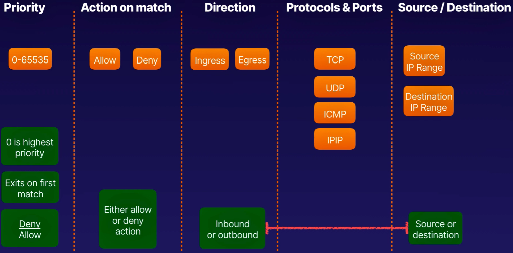

[TOC]


# Professional Cloud Network Engineer


## RFC1918

- IP Address Allocation for Private Internets

| RFC1918 name | IP address range              | Number of addresses | CIDR Range (subnet mask)     | Description                     |
| ------------ | ----------------------------- | ------------------- | ---------------------------- | ------------------------------- |
| 24-bit block | 10.0.0.0 – 10.255.255.255     | 16,777,216          | 10.0.0.0/8 (255.0.0.0)       | single class A network          |
| 20-bit block | 172.16.0.0 – 172.31.255.255   | 1,048,576           | 172.16.0.0/12 (255.240.0.0)  | 16 contiguous class B networks  |
| 16-bit block | 192.168.0.0 – 192.168.255.255 | 65,536              | 192.168.0.0/16 (255.255.0.0) | 256 contiguous class C networks |


|         | CIDR range     | First usable addresses | Last usable addresses | Hosts |
| ------- | -------------- | ---------------------- | --------------------- | ----- |
| 8 bits  | 172.16.12.0/24 | 172.16.12.2            | 172.16.12.254         | 254   |
| 9 bits  | 172.16.12.0/23 | 172.16.12.2            | 172.16.13.254         | 510   |
| 10 bits | 172.16.12.0/22 | 172.16.12.2            | 172.16.15.254         | 1022  |
| 11 bits | 172.16.12.0/21 | 172.16.12.2            | 172.16.19.2254        | 2046  |


### Route summarization


### RFC1918 Summary


## Identity Access Management (IAM)


### Authentication and Authorization


### IAM Policies


### Type of Identities


### Role-based Access Control (RBAC)

- refers to the idea of assigning permissions to users based on their role within a organization.
- it provides fine-grained control and offers a simple, manageable approach to access management that is less prone to error than assigning permisions to users individually.


### Organizational Hierarchy


### Cloud IAM Policy Bindings


## Network IAM Roles


### Organization Admin


### Top 5 Predefined Roles

| Title                       | Role                        | Decription                                                   |
| --------------------------- | --------------------------- | ------------------------------------------------------------ |
| 1. Compute Network Admin    | roles/compute.networkAdmin  | Full control of Compute Engine networking resources          |
| 2, Compute Security Admin   | roles/compute.securityAdmin | Full control of Compute Engine security resources            |
| 3. Compute Shared VPC Admin | roles/compute.xpnAdmin      | Manage host and service projects, set permissions on subnetworks for users. |
| 4. Compute Network User     | roles/compute.networkUser   | Provides access to a shared VPC network                      |
| 5. Computer Network Viewer  | roles/compute.networkViewer | Read-only access to Compute Engine networking resources.     |


```
$ gcloud iam roles --help
Available commands for gcloud iam roles:

      copy                    Create a role from an existing role.
      create                  Create a custom role for a project or an
                              organization.
      delete                  Delete a custom role from an organization or a
                              project.
      describe                Show metadata for a role.
      list                    List the roles defined at a parent organization or
                              a project.
      undelete                Undelete a custom role from an organization or a
                              project.
      update                  Update an IAM custom role.

  
# Display list of roles 
$ gcloud iam roles list --filter="network"

# Display the permisions of the role 
$ gcloud iam roles describe roles/compute.instanceAdmin.v1


$ gcloud iam 
Available groups for gcloud iam:

      roles                   Create and manipulate roles.
      service-accounts        Create and manipulate service accounts.

Available commands for gcloud iam:

      list-grantable-roles       List IAM grantable roles for a resource.
      list-testable-permissions  List IAM testable permissions for a resource.
```


### Service Account Management

1.  **Service accounts do not have passwords.**

   Service accounts do not have passwords, and cannot log in via browsers or cookies.

2.  **Service accounts use RSA key pairs for AuthN**.

   Service accounts are associated with private/ public RSA key pairs that are used for authentication to  Google.

3.  **Service account user role**

   Grants permissions to get, list, or impersonate a service account.


### Service Account JSON


```
$ gcloud iam service-accounts
Available groups for gcloud iam service-accounts:

      keys                    Manage service account keys.

Available commands for gcloud iam service-accounts:

      add-iam-policy-binding     Add an IAM policy binding to an IAM service
                                 account.
      create                     Create a service account for a project.
      delete                     Delete a service account from a project.
      describe                   Show metadata for a service account from a
                                 project.
      disable                    Disable an IAM service account.
      enable                     Enable an IAM service account.
      get-iam-policy             Get the IAM policy for a service account.
      list                       List all of a project's service accounts.
      remove-iam-policy-binding  Remove IAM policy binding from a service
                                 account.
      set-iam-policy             Set IAM policy for a service account.
      sign-blob                  Sign a blob with a managed service account key.
      update                     Update an IAM service account.

# List all the project's service accounts
$ gcloud iam service-accounts list
NAME                                    EMAIL                                               DISABLED
Compute Engine default service account  459894858353-compute@developer.gserviceaccount.com  False
App Engine default service account      owen-project-285301@appspot.gserviceaccount.com     False

Disable an IAM service account
$ gcloud iam service-accounts disable [service account email]

# Show metadata for a service account
$ gcloud iam service-accounts describe [service account email] 

# Display list of roles 
gcloud iam roles list --filter="serviceAccount"
```


## GCP Global Network


### Premium VS Standard Tier

|                  | Premium Tier                                                 | Standard Tier                                                |
| ---------------- | ------------------------------------------------------------ | ------------------------------------------------------------ |
| Ingress to GCP   | Traffic from your users enters Google's network at a location nearestto them. | Traffic from your users enters Goggle's network through peering, ISP, or transit networks in the region where you have deployed your GCP resources. |
| Engress from GCP | Egress traffic is sent through Google's network backbone, leaving at a global edge POP closest to your users. | Egress traffic is sent to the internet via peering or transit network, local to the GCP region from which it originates. |


### Summary


### Making a VPC


### GCP - VPC


### Adding IP Ranges to Subnets


### Alias IP Addresses


### Subnet creation modes

| Default                                             | Auto Mode                                            | Custom Mode                             |
| --------------------------------------------------- | ---------------------------------------------------- | --------------------------------------- |
| Every project                                       | User created                                         | User created                            |
| One subnet per region /20                           | One subnet per region /20                            | User-specified regions up to /8         |
| 4 default firewall rules / 2 implied firewall rules | Optional - firewall rules / 2 implied firewall rules | User defined / 2 implied firewall rules |
| subnet expands to /16                               | subnet expands to /16                                | Maximum size /8                         |


### GCP Reserved IPs

|          Name          |                         Description                          | Reserved Address |
| :--------------------: | :----------------------------------------------------------: | :--------------: |
|        Network         |     First address in the primary IP range for the subnet     |   192.168.0.0    |
|        Gateway         |    Second address in the primary IP range for the subnet     |   192.168.0.1    |
| Second to last address | Second to last address in the primary range reserved by GCP for potential future use |  192.168.0.254   |
|       Broadcast        |     Last address in the primary IP range for the subnet      |  192.168.0.255   |


### Metadata (internal dns)


### Internal vs External IPs

|                         Internal IPs                         |                         External IPs                         |
| :----------------------------------------------------------: | :----------------------------------------------------------: |
| IP address allocated to VMs by DHCP from regional subnetworks. | External IP address assigned from pool of ephemeral IPs managed by GCP |
|                  DHCP renews every 24 hours                  |                  DHCP renews every 24 hours                  |
|   Hostname and IP address are registered with internal DNS   | VM doesn't know about the external IP, mapped to internal IP by the VPC |
| Alias IP - additional IPs assigned to VM,mapped to or is a primary IP |       Allows communications from outside the project.        |


## VPC Routes

### VPC Route Creation

1. System-generated Routes
   - Subnet routes
   - Default
2. Custom Routes
   - Static
   - Dynamic

### Sytem-Generated Routes

|     Type      |              Destination               |                      Next Hop                       |                         Removable                         |
| :-----------: | :------------------------------------: | :-------------------------------------------------: | :-------------------------------------------------------: |
| Subnet route  | Primary and Secondary Subnet IP ranges | VPC network, forwards packets to VMs in ots subnets | Only if Subnet is deleted or we change secondary IP range |
| Default route |               0.0.0.0/0                |              Default internat gateway               |                            Yes                            |

#### System-generated: Subnet routes


#### System-generated: Default route


### Custom Routes

|     Type      |                         Destination                          |                           Next Hop                           |                          Removable                           |                          Applies To                          |
| :-----------: | :----------------------------------------------------------: | :----------------------------------------------------------: | :----------------------------------------------------------: | :----------------------------------------------------------: |
| Static Route  | 1.  IP range broader than a subnet IP range / 2.  IP range does not overlap with subnet IP range | One of: 1. Instance by name / 2. Instance by IP address 3. Cloud VPN Tunnel |                             Yes                              | Either: 1. All instance in network / 2. Specific instance in network identified by network tag |
| Dynamic Route | 1. IP range broader than a subnet IP range / 2. IP range does not overlap with subnet IP range |          IP address of the Cloud Router's BGP peer           | Only by a Cloud Router if it no longer receives route from its BGP peer. | 1. Instances in the same region as a Cloud Router if the VPC network is in regional dynamic routing. / 2. If Global - all instances in the VPC |


### Custom Routes vs System-generated Routes


## Firewall Rules

### Firewall rule components




### Firewall rule


## VPC Peering

### What it is

- Access G Suite and Google Cloud features over VPN or the internet, while cutting egress fees.
- Connect directly with Direct Peering, or choose a partner with Carrier Peering.

### Two-Way Coneection


### Requirement of VPC Network Peering

- No overlapping CIDR blocks. VPC peering creation is denied if any subnet ranges overlap.


### Peered Routing Table


### IAM roles required to create VPC peering

- IAM roles: **Project Owner**, **Project Editor** and **Network Admin**


### On-premises Access from Peer Network


### Transitive Peering ins not Supported

- Each VPC will only shared routes with directly peered VPC's


## Shared VPC

### What it is

- Used to connect to a common VPC network.
- Resources in those projects can communicate with each other securely and efficiently across project boundaries using internal IPs.

### Shared VPC creation


### Shared VPC Roles

**Organization Admin**

- Organization Admins have the **resourcemanager.organizationAdmin** nominate Shared VPC Admins by granting them appropriate project creation and deletion roles

**Shared VPC Admin**

- Shared VPC Admin have the **Compute Shared VPC Admin (compute.xpnAdmin)** and **Project IAM Admin (resourcemanager.project.Iam Admin)** roles for the organization

**Service Project Admin**

- A Shared VPC Admin defines a Service Project Admin by granting an IAM member the **Network User (compute.networkUser)** role to either the wholw host project or select subnets of its Shared VPC networks.

**Network Admin**

- Shared VPC Admin define a Network Admin  by granting an IAM memeber the **Network Admin (compute.networkAdmin)**  role to the host project.

- Network Admin have full control over all network resources except for firewall rules and SSL certificates.

**Security Admin**

- Shared VPC Admin can define a Security Admin by granting an IAM member the **Security Admin (compute.securityAdmin)** role to the host project.
- Security Admins manage the firewall rules and SSL certificates.

**Network User**

* Network Admin role does not include all of the permissions in the Network User role. 
* IAM members having only the Network Admin role do not have permission to use the host project or subnets in its Shared VPC networks.


**Note:**

1.  A project cannot be a Host Project or a Service Project simultaneously.
2.  You cannot connect Service Project  to other Service Project.
3.  You can only connect to Service Project to one Host Project at a time.


## Cloud NAT

### What is Cloud NAT

Allows virtual machine (VM) instances without external IP addresses and private (GKE) clusters to connect to the internet.

### Cloud NAT setup


### Cloud NAT in action


**Note:  **

**1. It does not implement inbound NAT it means connection from the Internet cannot reach internal instances.**
**2. If VM has external IP even if cloud NAT is enable the VM while the External IP to connect ot the internet.**


### CLoud NAT translation in example


- **Allows uo to 64k port per external IP**


### Benefits

**Security**

- Create instances without public IP addresses.
- These servers can still access the internet for patches, updates, and maintenance.

**High Availability**

- Managed service without user intervention.
- A failure in Cloud Router or NAT Gateway dous not affect the NAT configuration or result in the host ability to utilize NAT gateway

**Scalabilty**

- Seamlessly scales with the number of instances and volume of network traffic.
- All instances have available bandwidth similar to instances with an external IP address.


## Private Google Access

**Private Google access** allows your instances to reach Google APIs and services using an internal IP address rather than a public IP address.


## Kubernetes Cluster Networking

### Nodes and Service Addresses

| Address Format | Subnet Mask (binary) | Subnet Mask (decimal) | Addresses | 2<sup>n</sup> |
| ------------ | --------------- | ----------------- | --------- | ---- |
| *a.b.c.d/29* | +*0.0.0.7* | *255.255.255.248* | 8         | 2<sup>3</sup>   |
| *a.b.c.d/28*   | +*0.0.0.15* | *255.255.255.240* | 16        | 2<sup>4</sup>   |
| *a.b.c.d/27*   | +*0.0.0.31* | *255.255.255.224* | 32        | 2<sup>5</sup>   |
| *a.b.c.d/26* | +*0.0.0.63*     | *255.255.255.192* | 64        | 2<sup>6</sup>|
| *a.b.c.d/25* | +*0.0.0.127*    | *255.255.255.128* | 128       | 2<sup>7</sup>   |
| *a.b.c.0/24* | +*0.0.0.255*    | *255.255.255.0*   | 256       | 2<sup>8</sup>   |
| *a.b.c.0/23* | +*0.0.1.255*    | *255.255.254.0*   | 512       | 2<sup>9</sup>   |
| *a.b.c.0/22* | +*0.0.3.255*    | *255.255.252.0*   | 1,024     | 2<sup>10</sup>  |
| *a.b.c.0/21* | +*0.0.7.255*    | *255.255.248.0*   | 2,048     | 2<sup>11</sup>  |
| *a.b.c.0/20* | +*0.0.15.255*   | *255.255.240.0*   | 4,096     | 2<sup>12</sup>  |
| *a.b.c.0/19* | +*0.0.31.255*   | *255.255.224.0*   | 8,192     | 2<sup>13</sup>  |
| *a.b.c.0/18* | +*0.0.63.255*   | *255.255.192.0*   | 16,384    | 2<sup>14</sup>  |
| *a.b.c.0/17* | +*0.0.127.255*  | *255.255.128.0*   | 32,768    | 2<sup>15</sup>  |
| *a.b.0.0/16* | +*0.0.255.255*  | *255.255.0.0*     | 65,536    | 2<sup>16</sup>  |
| *a.b.0.0/15* | +*0.1.255.255*  | *255.254.0.0*     | 131,072   | 2<sup>17</sup>  |
| *a.b.0.0/14* | +*0.3.255.255*  | *255.252.0.0*     | 262,144   | 2<sup>18</sup>  |
| *a.b.0.0/13* | +*0.7.255.255*  | *255.248.0.0*     | 524,288   | 2<sup>19</sup>  |
| *a.b.0.0/12* | +*0.15.255.255* | *255.240.0.0*     | 1,048,576 | 2<sup>20</sup>  |


### Kubernetes Cluster


**Google Kubernetes Engine**

- provides a managed environment for deploying, managing, and scaling your containerized applications using Google infrastructure.

**Cluster**

- consists of at least one **cluster master** and multiple nodes.
- these master and node machines run the Kubernetes cluster orchestration system.

**Nodes**

- They are the worker machines that run your containerized applications and workloads Each node is managed from the master.
- VM instance running Kubernetes agents
- Kublet and kube-proxy agents provide resource and network control. Node pool ID Tag.

**Pods**

- are the smallest, most basic deployable objects in Kubernetes. 
- contains one or more containers.
- unit of deployment in Kubernetes
- run one or more container images, mount storage, and provide an IP address.

**Services**

- endpoit for application access

- Supplies a stable IP address, DNS, and port for accessing pod services.

  

### IP Addresses Per Resource

|  Range  | Default Size | Minimum Size | Maximum Size |                       Maximum #                       |
| :-----: | :----------: | :----------: | :----------: | :---------------------------------------------------: |
|  Nodes  |     /20      |      29      |      /8      |   4,092 (default) 4 (minumum) 16,777,212 (maximum)    |
|   Pod   |     /14      |     /19      |      /9      | 262,144 (default) 8,192 (minimum) 8,388,608 (maximum) |
| Service |     /20      |     /27      |     /16      |     4,096 (default) 32 (minimum) 65,536 (maximum)     |

### Service IP


## GKE Cluster IP Allocation


### GKE Cluster availability choices

### Zonal clusters

- have a single control plane in a single [zone](https://cloud.google.com/compute/docs/regions-zones). 
- Depending on your availability requirements, you can choose to distribute your nodes for your zonal cluster in a single zone or in multiple zones.

#### Single-zone clusters

- has a single control plane running in one [zone](https://cloud.google.com/compute/docs/regions-zones). This control plane manages workloads on nodes running in the same zone.


#### Multi-zonal clusters

- has a single replica of the control plane running in a single zone, and has nodes running in multiple zones. 
- During an upgrade of the cluster or an outage of the zone where the control plane runs, workloads still run. 
- However, the cluster, its nodes, and its workloads cannot be configured until the control plane is available. 
- Multi-zonal clusters balance availability and cost for consistent workloads.


### Regional clusters

- has multiple replicas of the control plane, running in multiple zones within a given region. 
- Nodes also run in each zone where a replica of the control plane runs. 
- Because a regional cluster replicates the control plane and nodes, 
- it consumes more Compute Engine resources than a similar single-zone or multi-zonal cluster.


### VPC-native and Routes-based clusters

Google Kubernetes Engine (GKE) clusters network mode:

**VPC Native** 

- A cluster that uses **Alias IPs**
- Uses alias IP ranges to allocate IP addresses to K8s resources
- Services IP range is distinctly reserved independent of the pod address range
- Required for shared VPC clusters
- Ability to customize pods per node


**Route based** 

-  A cluster that uses Google Cloud Routes
- Uses routes to pass traffic to the Kubernetes network, count agints Custom Route Quota
- Pods and services share a single CIDR range known as the Pod address range


VPC-native is the recommended network mode for new clusters.

| Cluster creation method                            | Cluster network mode |
| :------------------------------------------------- | :------------------- |
| Google Cloud Console                               | VPC-native           |
| REST API                                           | Routes-based         |
| `gcloud` v256.0.0 and higher or v250.0.0 and lower | Routes-based         |
| `gcloud` v251.0.0 - 255.0.0                        | VPC-native           |


## GKE Private Cluster

1. **Public Masters - Public Nodes**

   Default Cluster configuration, allows access from non-GCP sources to reach both master and node externatl IP addreses.

2. **Public Master - Private Nodes**

   Removes the external IP address assignment from Nodes, enables access to Masters via public external IP address. Use Cloud NAT to enable coutbound connectivity for Node workloads.

3. **Private Master - Private Nodes**

   Removes external IP from both Master and Nodes. Use Authorized Master networks to enable connectivity from outside the VPC.


## GKE Shared VPC Cluster


**Top 3 Tips Shared VPC Clusters**

1. **Pre-Create the IP address for Clusters**

   Node, Pod, and Services IP address ranges must be pre-defined in the Host Project Prior to Service Project GKE cluster creation.

2. **Only Supported by VPC-Native Clusters**

   Using GKE Clusters in Shared VPC networks only support the use of VPC Native Clusters using Alias IP subnets.

3. **Roles for GKE Service Accounts**

   Know the permissions to grant to the GKE Service Accounts in order to utilize the VPC Networks resources. Host Service Agent User & Network User role for the Host Project.


## GKE Network Policy

**GKE Network Policy**

- allows you to limit connections between Pods
- providing better security by reducing the compromise radius. 

**Default deny all ingress traffic** 

```
---
apiVersion: networking.k8s.io/v1
kind: NetworkPolicy
metadata:
  name: default-deny-ingress
spec:
  podSelector: {}
  policyTypes:
  - Ingress
```

**Default allow all ingress traffic**

```
---
apiVersion: networking.k8s.io/v1
kind: NetworkPolicy
metadata:
  name: allow-all-ingress
spec:
  podSelector: {}
  ingress:
  - {}
  policyTypes:
  - Ingress
```

**Default deny all egress traffic**

```
---
apiVersion: networking.k8s.io/v1
kind: NetworkPolicy
metadata:
  name: default-deny-egress
spec:
  podSelector: {}
  policyTypes:
  - Egress
```

**Default allow all egress traffic** 

```
---
apiVersion: networking.k8s.io/v1
kind: NetworkPolicy
metadata:
  name: allow-all-egress
spec:
  podSelector: {}
  egress:
  - {}
  policyTypes:
  - Egress
```


### Allow Ingress from Web to Database

```
---
apiVersion: networking.k8s.io/v1
kind: NetworkPolicy
metadata:
  name: database-allow-from-web
spec:
  policyTypes:
  podSelector:
  	matchLabels:
  		app: database
  ingress:
  - from
  	-podSelector:
  	   matchLabels:
  	     app: web
```


* Network Policy rules are stateful and by default database will able to respond from web service  without a network policy

## Load Balancing

### Load Balance Overview

**Load balancer** 

- Distributes user traffic across multiple instances of your applications. 
- By spreading the load, load balancing reduces the risk that your applications experience performance issues.

**Layer 4 Load Balancing  / TCP Load Balancing**

- The ability to direct traffic based on the data from network and transport layer protocols, such as IP address and TCP port.

1. **SSL Proxy**

   Load balancer for TCP with SSL offload, global, external. (25, 43, 110, 143,195, 443, 465, 587,
   700, 993, 995, 1883, and 5222)

2. **TCP Proxy**

   Load balancer for TCP without SSL, global, external  (25, 43, 110, 143,195, 443, 465, 587,
   700, 993, 995, 1883, and 5222)

**Network Load Balancer**

- Load balancer for TCP/UDP no SSL offload, regional, external  (any port)

**Layer 7 Load Balancing** / **HTTP(S) Load balancer**

- With content switching , allows for routing decisions based on application layer data and attributes, such as HTTP header, uniform resource identifier, ssl session ids, or html form data, etc.

- Load balancer for HTTP(S) traffic, global, external, 80 or 8080 on 443.

  

**Global Server Load Balancing**

- Extends the core L4 and L7 capabilities so that they are applicable across geographically distributed server farms.


| Load Balancer    | Traffice Type          | Preserve Client IP | Global or Regional | External or Internal | Destination Ports                                            | Proxy or Pass-Through |
| ---------------- | ---------------------- | ------------------ | ------------------ | -------------------- | ------------------------------------------------------------ | --------------------- |
| HTTTP(S)         | HTTP or HTTPS          | No                 | Global             | External             | HTTP on 80 or 8080; HTTPS on 443                             | Proxy                 |
| SSL Proxy        | TCP with SSL offload   | No                 | Global             | External             | 25, 43, 110, 143,195, 443, 465, 587, 700, 993, 995, 1883, and 5222 | Proxy                 |
| TCP Proxy        | TCP without SLL ofload | No                 | Global             | External             | 25, 43, 110, 143,195, 443, 465, 587, 700, 993, 995, 1883, and 5223 | Proxy                 |
| Network TCP/UDP  | TCP or UDP             | Yes                | Regional           | External             | Any                                                          | Pass-through          |
| Internal TCP/UDP | TCP or UDP             | Yes                | Regional           | Internal             | Any                                                          | Pass-through          |
| Internal HTTP(S) | HTTP or HTTPS          | No                 | Regiopnal          | Internal             | HTTP on 80 or 8080; HTTPS on 443                             | Pass-through          |


### Global HTTP(S ) Load Balancing

|          | Load balancer type              | Google Software Stack |
| -------- | ------------------------------- | --------------------- |
| Global   | HTTP(s) Load Balancing          | Google Front End      |
| Global   | SSL Load Balancing              | Google Front End      |
| Global   | TCP Proxy Load Balancing        | Google Front End      |
| Regional | Internal HTTP(S) Load Balancing | Andromeda/Envoy       |
| Regional | Internal TCP/UDP Load Balancing | Andromeda             |
| Regional | Network TCP/UDP Load Balancing  | Maglev                |

**Google Front Ends (GFEs)** - are software-defined, distributed systems that are located in Google points of presence (PoPs) and perform global load balancing in conjunction with other systems and control planes.

**Andromeda** - is Google Cloud's software-defined network virtualization stack.

**Maglev** - is a distributed system for Network Load Balancing.

**Envoy**  - proxy is an open source edge and service proxy, designed for cloud-native applications.

**Traffic type**
The type of traffic that you need your load balancer to handle is another factor in determining which load balancer to use:

**For HTTP and HTTPS traffic, use:**

- External HTTP(S) Load Balancing

- Internal HTTP(S) Load Balancing

**For TCP traffic, use:**

- TCP Proxy Load Balancing

- Network Load Balancing

- Internal TCP/UDP Load Balancing

**For UDP traffic, use:**

- Network Load Balancing
- Internal TCP/UDP Load  Balancing


### Session affinity
- provides a best-effort attempt to send requests from a particular client to the same backend for as long as the backend is healthy and has the capacity, according to the configured balancing mode.

Google Cloud HTTP(S) Load Balancing offers three types of session affinity:

1. **NONE**. Session affinity is not set for the load balancer.
2. **Client IP affinity** sends requests from the same client IP address to the same backend.
3. **Generated cookie affinity** sets a client cookie when the first request is made, and then sends requests with that cookie to the same backend.


### Managed Instance Groups

- contains identical instances that you can manage as a single entity in a single zone.
- support Autoscaling, load balancing, rolling updates, autohealing, and more.


You can create:

1. **Zonal MIGs**
   -  Single zone
2. **Regional MIGs.** 
   - Multi-zone
   - provide higher availability compared to zonal MIGs because a regional MIG's managed instances are spread across multiple zones in a single region.

**Autoscaling**

- configure managed instance groups to automatically add or remove instances based on their workloads. 
- Your applications can gracefully handle increases in traffic, and you can reduce your costs when the need for compute resources is lower.

**Autoscaling policy and target utilization**
To create an autoscaler, specify the autoscaling policy and a target utilization level that the autoscaler uses to determine when to scale the group. You can choose to scale using the following policies:

1. **Average CPU utilization.**
2. **HTTP load balancing serving capacity, which can be based on either utilization or requests per second.**
3. **Cloud Monitoring metrics.**

### Unmanaged Instance Groups

- are collections of instances that are not necessarily identical and do not share a common instance
  template.
- do not create, delete, or scale the number of instances in the group.


## Network Endpoints Groups

**Network Endpoint Group (NEG)**

- is a configuration object that specifies a group of backend endpoints or services. 
- common use case for this configuration is deploying services in containers. 
- You can also distribute traffic in a granular fashion to applications running on your backend instances.

- You can use NEGs as backends for some load balancers.

Zonal and internet NEGs define how endpoints should be reached, whether they are reachable, and where they are located. Unlike these NEG types, serverless NEGs don't contain endpoints.

**Zonal NEG** 

- contains one or more endpoints that can be Compute Engine VMs or services running on the VMs. 
- Each endpoint is specified as an IP:port combination.

**Internet NEG** 

- contains a single endpoint that is hosted outside of Google Cloud. 
- This endpoint is specified by hostname FQDN:port or IP:port.


## Cloud Armor

**Google Cloud Armor**

- Help protect your applications and websites against denial of service and web attacks.
- Security Policies are set of rules you define to enforce application layer firewall rules protecting externally facing applications or services.
- Each rule is evaluated with respect to incoming traffic.
- supports only for external client connections to the **Global Http(s)  Load Balancer**
- not compatible with **Cloud CDN**, **Cloud Storage Backends** and **Internal HTTP(S) Load Balancing**

**Summary**

**Security Admin Role**

- Creating, modifying, updating, adn deleting a Google Cloud Armor security policy

**Network Admin Role**

- Setting a Google Cloud Armor security policy for a backend service

**Google Cloud Armor Security Policy**

- Filter incoming traffic to HTTP(S) Load Balancing by creating Google Cloud Armor security policies

**Benefits**

- This prevents unwelcome traffic from consuming resources or entering our Virtual Private Cloud (VPC) networks.

**Rules language and enforcement engine**

- Ability to write custom rule expressions that filter based on layer3, 4 and 7 attributes of incoming requests.

**Preview Mode**

- Ability to review the effects of the rules in a security policy in Stackdriver logs without enforcing the actions in the rules.


## Monitoring Network Operations

**Cloud Logging and Monitoring**


**Logging IAM Roles**

1. **Logging Admin**

   Access to all logging permissions, and dependent permissions.

2. **Logs Configuration Writer**

   Access to configure log exporting and metrics.

3. **Logs Viewer**

   Access to view logs, except for logs with private contents.

4. **Logs Writer**

   Access to write logs.

5. **Private Logs Viewer**

   Access to view all logs, including logs with private contents.

**Pricing**

|   Feature    |                             Type                             | Free Allotment per Month | Price              | Custom Retention | Retention |
| :----------: | :----------------------------------------------------------: | :----------------------: | ------------------ | :--------------: | :-------: |
| Logging data | Admin Activity audit logs, System Event, and Access Transparency logs |           All            | N/A                |       N/A        | 400 days  |
| Logging data |                        All other logs                        | First 50/GB per project  | $0.50/GB per month |  1 day to 3650   |  30 days  |


**Logging Summary**


## VPC Flow Logs

**VPC Flow Logs** 

- records a sample of network flows sent from and received by VM instances, including instances used as GKE nodes. 
- These logs can be used for network monitoring, forensics, real-time security analysis, and expense optimization.


## Firewall Rule Logs

**Observing GCP Firewall Rules**

1. Ensure the firewall rules are doing (or not doing) what they were created for.
2. Understanding what is logged for firewall rules when we turn on logging.
3. Audit who modified firewall rules states using Cloud Audit Logs.


**IAM Roles to enable Firewall Rule Logging**

**Enable Firewall Rule Logs**

| Task                                     | Required Role (any of the following)                       |
| ---------------------------------------- | ---------------------------------------------------------- |
| create, delete, or update firewall rules | compute admin, **compute security admin**, owner or editor |


**View Firewall Rule Logs**

| Task      | Required Role (any of the following)                         |
| :-------- | ------------------------------------------------------------ |
| View Logs | **loging viewer**, project owner, project editor, project viewer |


## Cloud Monitoring 

**Metric Components**

1. **Monitored Resource**

   The resource being monitored, it might include geographical locations, disk IDs, APIs, tables in the database, anything that might be at the source of measurements.

2. **Metric Types**

   Is a term used for a collection of metrics, grouped by the type of service which produce it. Values typically numeric, but can vary based on what you're measuring.

3. **Time-series**

   The set of time-stamped values over a time period 

**Monitoring Agent Dependencies**

1. VM service account
2. Monitoring Metric Writer role
3. Copy private-key file to VM instance


**Monitoring IAM Roles**

| Role ID Role name                                            | Description                                                  |
| :----------------------------------------------------------- | :----------------------------------------------------------- |
| `roles/monitoring.viewer` **Monitoring Viewer**              | Gives you read-only access to Monitoring in the Google Cloud Console and API. |
| `roles/monitoring.editor` **Monitoring Editor**              | Gives you read-write access to Monitoring in the Google Cloud Console and API, and lets you create a Workspace. |
| `roles/monitoring.admin` **Monitoring Admin**                | Gives you full access to Monitoring in the Google Cloud Console and lets you create a Workspace. |
| `roles/monitoring.metricWriter`<br/>**Monitoring Metric Writer** | Permits writing monitoring data to a Workspace; doesn't permit access to Monitoring in the Google Cloud Console. For service accounts. |


## Managing Network Operations - Need to know

**Cloud Logging**

- Enable logging for GCP resources and reviewing logs.
- Assign IAM roles to allow Network users to use Cloud Logging.
- Install and configure the Cloud Logging agent to send log.


**Log Exports**

- Configure exports to Cloud Storage, Big Quesry and third party tooling.
- Enable advanced quesries on logs using Big Query
- Stream your logs to other applications using Cloud Pub/Sub.


**VPC Flow Logs**

- Enable and view VPC Flow Logs per VPC Subnet
- Adjust the collection rate and flow log sampling to reduce cost
- Only TCP and UDP are supported.


**Firewall Rule Logs**

- Ability to enable and disable Firewall Rule logging per Firewall Rule in a VPC.
- Only TCP and UDP supported.
- Logging cannot be enabled for the default or implied firewall rules.


**Cloud Monitoring**

- Centralize GCP project monitoring using workspaces.

- Grant network users IAM roles to utilize the workspace to monitor GCP resorces.

- Create alertsand uptime checks for workload state notifications.

  

## Hybrid Connections

### Dedicated Interconnect

- Use dedicated Interconnect to connect to Google's network through a highly available, low latency connection. (=>10 Gbps)
- Connect your on-premises network to your Google Cloud VPC network by connecting a new fiber to your equipment.


**Summary**

1. **Find a Colocation Facility**

   This is a location where GCP has Point of Presence and offers Direct Interconnect connections.

2. **Connect On-Premise to Colocation Facilty**

   Establish a connection to the On-Premises environment & Connection to GCP.

3. **Order LOA-CFA**

   Letter of Authorization and Connecting Facility Assignment (LOA-CFA)

4. **LOA-CFS via email**

   Wait for GCP to provide the LOA_CFA via email

5. **LOA-CFA to Service Provider**

   Service Provider provisions the cross-connect between Google's hardware and our Business

6. **Test and Verify with GCP**

   Testing must occur before the Dedicated Interconnect connection is considered to be Active.


### Partner Interconnect

- To connect to Google through a supported service provider. (from 50 MB up) <10 Gbps


**Requesting Connections**

1.  **Pairing Keys**

   Your VLAN attachment's pairing key: This pairing key is generated when you create the VLAN attachment

2. **VLAN Attachment Regions**

   The region you select must be supported by a partner interconnect location, which is a city where the service provider's network meets Google's network.

3. **Connection Capacity**

   This can range from 50Mbps to 10Gbps. The capacity depends on your bandwidth requirements and what's offered by your service provider.


### Cloud VPN

- Connect your on-premises or other public cloud networks to GCP Virtual Private Cloud (VPC)
  securely over the internet through IPSec VPN. <3 Gbps


**VPN Options**

1. **High-availability (HA) VPN**

   - Supports dynamic routing (BGP only)
   - Supports high availability (99.99 SLA, with region)
   
   
   
2. **Classic VPN**

   - Supports dynamic and staic routing
   - No high availability (99.9 SLA)
   
   


#### Cloud VPN Best Practices

1. Configure HA VPN

2. Use active/passive routing

3. Use custom mode network

4. Dynamic routing with BGP

5. Strong Pre-shared key

6. Classic VPN 99.9% uptime


**VLAN attachment**

- allocates a VLAN on an interconnect and associates that VLAN with the pecified Cloud Router

**Cloud Router**

- Specify a Cloud Router that's in the region containing the subnets that you want to reach

**Multiple Routes**

- Utilize multiple VLAN attachments simultaneously for egress traffic in a VPC network implementing an ECMP routing design using MED values


## Cloud Router


**Cloud Router**

- enables you to dynamically exchange routes between your Virtual Private Cloud (VPC) and on-premises networks by using Border Gateway Protocol (BGP).


## Peered Connections

**Direct Peering**

- Access to Google and Google Cloud propertie sover a direct connection
- no SLA


**Benefits of Direct Peering**

1. **No Setup Cost or maintenance**

   Establishing a direct peering connection with Google is free. There are no costs per port or fractional port, and no per hour charges.

2. **Reduce Egress Rates**

   Reduce internet egress rates to your on-premises network from GCP resources in the same continental location and in an enabled project. 

3. **Cloud VPN**

   Gives you direct access to G Suite and Google servies, including the full suite of Google Cloud Platform products, from on-premises network.

**Direct Peering - technical requirements**

1. **Publicly Routable ASN (Autonomous System Number)**

   An ASN in the public range is globally unique and may be announced on the global internet to you ISP or at an internet exchange point (peering point) via BGP

2. **Publicly Routable Address Space**

   At least one /24 of IPv4 and/or one /48 of IPv6 space.

3. **ASN Record in Peering DB**

   PeeringDBis a freely available user-maintained, database of networks, and the go-to location for interconnection data


**Carrier Peering**

- Access to Google and Google Cloud properties via Carrier Peering partner.
- no SLA


**Summary**


## Highly Available Hybrid Connections

### Availability Measured by Nines

|             SLA              | Allowed Monthly Downtime | Allowed Annual Downtime |
| :--------------------------: | :----------------------: | :---------------------: |
|            99.0%             |        7.31 hours        |        3.65 days        |
|     99.9% (Classic VPNs)     |      43.83 minutes       |       8.77 hours        |
| 99.99% (Google Cloud HA VPN) |       4.38 minutes       |      52.60 minutes      |
|           99.999%            |      26.30 seconds       |      5.26 minutes       |


**HA Design 99.9%**


**HA Design 99.99%**


**Private ASN numbers**

- 64512 - 65534
- 4200000000- 4294967294

**Autonomous System Numbers (ASN)**

- is a unique number assigned to an autonomous system (AS) by the Internet Assigned Numbers Authority (IANA).
- is a unique identifier that is globally available and allows its autonomous system to exchange routing information with other systems.

**Border Gateway Protocol (BGP)**

- is a standardized exterior gateway protocol designed to exchange routing and reachability information between autonomous systems (AS) on the Internet.


**Maximum Transmission Unit (MTU)**

- is the largest packet or frame size, specified in octets (eight-bit bytes) that can be sent in a packet- or frame-based network such as the internet
- 1460 max

