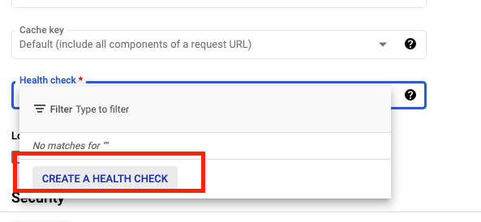

# Professional Cloud Network Engineer Certification Learning Path

Mentor contact info:

Name: Sanjeev Singh

Email: sssskumar@google.com , sanjeev@gcptrain.org  

Social Media:[ ](https://www.google.com/url?q=https://www.linkedin.com/in/sanjeevvepsun/&sa=D&source=editors&ust=1747368775419653&usg=AOvVaw3Od0tJJroC3aPS7TeTbg2w)[https://www.linkedin.com/in/sanjeevvepsun/](https://www.google.com/url?q=https://www.linkedin.com/in/sanjeevvepsun/&sa=D&source=editors&ust=1747368775419767&usg=AOvVaw2fPlrlX42ZivQvmxKNnFt-) 


GCP Partner Support Team - [cloud-partner-training@google.com](mailto:cloud-partner-training@google.com)


**Must for Cert voucher : \**\** (within 30 days from start of training)**

**[https://partner.cloudskillsboost.google/course_templates/645](https://www.google.com/url?q=https://partner.cloudskillsboost.google/course_templates/645&sa=D&source=editors&ust=1747368775420256&usg=AOvVaw3NK8eQQm5CUQcParu_lqVk)**

**[https://partner.cloudskillsboost.google/course_templates/785](https://www.google.com/url?q=https://partner.cloudskillsboost.google/course_templates/785&sa=D&source=editors&ust=1747368775420399&usg=AOvVaw3V8ryVk1FADtQwHJibPIF2)**

**[https://partner.cloudskillsboost.google/course_templates/856](https://www.google.com/url?q=https://partner.cloudskillsboost.google/course_templates/856&sa=D&source=editors&ust=1747368775420538&usg=AOvVaw3z-sbKGPnJURpZoOLlYY69)** 

**[https://partner.cloudskillsboost.google/course_templates/654](https://www.google.com/url?q=https://partner.cloudskillsboost.google/course_templates/654&sa=D&source=editors&ust=1747368775420677&usg=AOvVaw30lVYGGzyI_0LHGW1EFHXd)** 


**PCNE Exam guide**


**[https://services.google.com/fh/files/misc/professional_cloud_network_engineer_exam_guide_english.pdf](https://www.google.com/url?q=https://services.google.com/fh/files/misc/professional_cloud_network_engineer_exam_guide_english.pdf&sa=D&source=editors&ust=1747368775420972&usg=AOvVaw39vZOjeC3Em9c-LZDevojA)** 


**Partner Skillboost for Self paced study**


[https://partner.cloudskillsboost.google/paths/78%20](https://www.google.com/url?q=https://partner.cloudskillsboost.google/paths/78%20&sa=D&source=editors&ust=1747368775421229&usg=AOvVaw0iFs7JfjZd1uLhQXdgEcH6)


**Slide deck**


**[https://partner.cloudskillsboost.google/classrooms/28854/notes/4773335](https://www.google.com/url?q=https://partner.cloudskillsboost.google/classrooms/28854/notes/4773335&sa=D&source=editors&ust=1747368775421524&usg=AOvVaw2c8lT1ljZuyO7A-YyVsjwo)** 


**Sample QA**


**[https://docs.google.com/forms/d/e/1FAIpQLServ0tNGkr-dYAfmez_Gdk74dmVypZjzUKrkVFtFcArzhmPow/viewform](https://www.google.com/url?q=https://docs.google.com/forms/d/e/1FAIpQLServ0tNGkr-dYAfmez_Gdk74dmVypZjzUKrkVFtFcArzhmPow/viewform&sa=D&source=editors&ust=1747368775421818&usg=AOvVaw3VMd9IBtoSLbR03sXT40mg)** **(19 QA)**


Labs


[https://services.google.com/fh/files/misc/pcne_ca.pdf](https://www.google.com/url?q=https://services.google.com/fh/files/misc/pcne_ca.pdf&sa=D&source=editors&ust=1747368775422178&usg=AOvVaw0TRGZZqk-tpJUhXvb3azj4) 


**GCP Networking Blog:**

[https://cloud.google.com/blog/products/networking](https://www.google.com/url?q=https://cloud.google.com/blog/products/networking&sa=D&source=editors&ust=1747368775422399&usg=AOvVaw1vhJBzFkLb-RZfLsnL31Hs) 


**[https://www.youtube.com/watch?v=X-kZ_eNtxyU&list=WL&index=5](https://www.google.com/url?q=https://www.youtube.com/watch?v%3DX-kZ_eNtxyU%26list%3DWL%26index%3D5&sa=D&source=editors&ust=1747368775422619&usg=AOvVaw0GfJkgm1Tjjr-cZTf5wyYj)**


**[https://www.youtube.com/watch?v=MHtg2Au78LI&list=PLIivdWyY5sqLO-4ePY-A2yROgONOA6Cz4](https://www.google.com/url?q=https://www.youtube.com/watch?v%3DMHtg2Au78LI%26list%3DPLIivdWyY5sqLO-4ePY-A2yROgONOA6Cz4&sa=D&source=editors&ust=1747368775422817&usg=AOvVaw0FrzoP4dqLJzb1Be5AwxRI)**


**[https://www.youtube.com/watch?v=cNb7xKyya5c&list=PLIivdWyY5sqJ0oXcnZYqOnuNRsLF9H48u](https://www.google.com/url?q=https://www.youtube.com/watch?v%3DcNb7xKyya5c%26list%3DPLIivdWyY5sqJ0oXcnZYqOnuNRsLF9H48u&sa=D&source=editors&ust=1747368775423037&usg=AOvVaw2g3ze9xov36GGe2phT9WPC)** 


**[https://www.youtube.com/watch?v=xXk1YlkKW_k&list=WL&index=4](https://www.google.com/url?q=https://www.youtube.com/watch?v%3DxXk1YlkKW_k%26list%3DWL%26index%3D4&sa=D&source=editors&ust=1747368775423199&usg=AOvVaw31VVuAdSiDV4mUVCyvwEfG)**


**[https://www.youtube.com/watch?v=bIL8Gb3D8Yg](https://www.google.com/url?q=https://www.youtube.com/watch?v%3DbIL8Gb3D8Yg&sa=D&source=editors&ust=1747368775423344&usg=AOvVaw3lbpLU_BVlZ9f4b6eqjiwX)**


**Professional Cloud Network Engineer Exam Prep**


**Resources**

- ​        **[Google Cloud documentation](https://www.google.com/url?q=https://cloud.google.com/docs&sa=D&source=editors&ust=1747368775423646&usg=AOvVaw0X8w27w1Sebx7Hbit2Btlj)**
- ​        **[Partner Cloud Skills Boost Learning Path](https://www.google.com/url?q=https://partner.cloudskillsboost.google/paths/78%20&sa=D&source=editors&ust=1747368775423793&usg=AOvVaw3UspAXfHuz0YfaJUa-3WJh)**
- ​        **[Google Cloud Practice Questions](https://www.google.com/url?q=https://docs.google.com/forms/d/e/1FAIpQLServ0tNGkr-dYAfmez_Gdk74dmVypZjzUKrkVFtFcArzhmPow/viewform&sa=D&source=editors&ust=1747368775423992&usg=AOvVaw0nnXgvRXU2UPsPFbTn73KO)**
- ​        **[Ammett Williams’ Study Prep Notes](https://www.google.com/url?q=https://drive.google.com/file/d/1wcIzflC-Zc10izmQWauYmu-JZnO5QzLc/view&sa=D&source=editors&ust=1747368775424166&usg=AOvVaw2xWcPlMcwbUU47s3Ib_Sfb)**
- ​        **[Networking: End to End - YouTube Playlist by Stephanie Wong](https://www.google.com/url?q=https://www.youtube.com/watch?v%3DcNb7xKyya5c%26list%3DPLIivdWyY5sqJ0oXcnZYqOnuNRsLF9H48u%26ab_channel%3DGoogleCloudTech&sa=D&source=editors&ust=1747368775424407&usg=AOvVaw1NCwcv5LeHq6qU9_MeDVOo)**
- ​        **[Google Cloud Network Professional Certification - YouTube Playlist](https://www.google.com/url?q=https://www.youtube.com/playlist?list%3DPLxQzKf1gjjCPfFXjRa1pa-ykwBhKs4T0J&sa=D&source=editors&ust=1747368775424621&usg=AOvVaw2GMsO9HBBizs3xRBqWZD9t)**
- ​        **[ ](https://www.google.com/url?q=https://partner.cloudskillsboost.google/course_templates/383&sa=D&source=editors&ust=1747368775424740&usg=AOvVaw2-D-oX-P6Gj7stBWJjcfwN)****[Preparing for Your Professional Cloud Network Engineer Journey](https://www.google.com/url?q=https://partner.cloudskillsboost.google/course_templates/383&sa=D&source=editors&ust=1747368775424847&usg=AOvVaw0dFtFo8LzIWbnEwmRvCvcr)**


**Network Topic Deep Dives**

**The Google Cloud documentation is technical. Here are a few of my recommendations for topics you can read up on.**

- ​        **[Network best practices](https://www.google.com/url?q=https://cloud.google.com/docs/enterprise/best-practices-for-enterprise-organizations%23networking_and_security&sa=D&source=editors&ust=1747368775425302&usg=AOvVaw3vXoMQGOf26qasIx6kKu9a)**
- ​        **[Organizational constraints](https://www.google.com/url?q=https://cloud.google.com/resource-manager/docs/organization-policy/overview&sa=D&source=editors&ust=1747368775425451&usg=AOvVaw21F8MvG4uij8TjCLmcpK4h)**
- ​        **[Private service access](https://www.google.com/url?q=https://cloud.google.com/vpc/docs/configure-private-services-access&sa=D&source=editors&ust=1747368775425587&usg=AOvVaw0YVE7QV-j3vpcJ7daGHZMR)****,** **[Private Google access](https://www.google.com/url?q=https://cloud.google.com/vpc/docs/configure-private-google-access-hybrid%23config&sa=D&source=editors&ust=1747368775425680&usg=AOvVaw33wzWAB3hw3PHlyd6W2lPn)**
- ​        **[Cloud router](https://www.google.com/url?q=https://cloud.google.com/network-connectivity/docs/router/concepts/overview&sa=D&source=editors&ust=1747368775425798&usg=AOvVaw2lKdcx1q0LjqT9PwOrHXIx)**
- ​        **[DNS best practices](https://www.google.com/url?q=https://cloud.google.com/dns/docs/best-practices%23best_practices_for_dns_forwarding_zones_and_server_policies&sa=D&source=editors&ust=1747368775425972&usg=AOvVaw2RnJ0BZVmKxKRlcpheXfg2)**
- ​        **[Choosing a Load balancer](https://www.google.com/url?q=https://cloud.google.com/load-balancing/docs/choosing-load-balancer&sa=D&source=editors&ust=1747368775426100&usg=AOvVaw0YGc7jGD9dFeg2x5jvVVkr)****,** **[Ingress](https://www.google.com/url?q=https://cloud.google.com/kubernetes-engine/docs/tutorials/http-balancer&sa=D&source=editors&ust=1747368775426176&usg=AOvVaw3aDDlANiwn8o0zA5js5URk)****,** **[Session affinity](https://www.google.com/url?q=https://cloud.google.com/load-balancing/docs/backend-service%23session_affinity&sa=D&source=editors&ust=1747368775426265&usg=AOvVaw099C1aOLnlJFnn8XI9g8oG)**
- ​        **[Networking on GKE](https://www.google.com/url?q=https://cloud.google.com/kubernetes-engine/docs/concepts/network-overview&sa=D&source=editors&ust=1747368775426389&usg=AOvVaw09Bg4wTUwLgLHkdrrQjM2g)**
- ​        **[Hybrid connectivity options](https://www.google.com/url?q=https://cloud.google.com/hybrid-connectivity/&sa=D&source=editors&ust=1747368775426518&usg=AOvVaw1Xbzy-_aBs9xA0szGWgYRW)**
- ​        **[Cloud CDN](https://www.google.com/url?q=https://cloud.google.com/cdn/docs/overview&sa=D&source=editors&ust=1747368775426617&usg=AOvVaw0UnY-Iq-o_axVSo6X645zZ)**
- ​        **[Invalidations](https://www.google.com/url?q=https://cloud.google.com/cdn/docs/cache-invalidation-overview&sa=D&source=editors&ust=1747368775426741&usg=AOvVaw1cp4bBByX-3f-Y6RxqDvPM)**
- ​        **[Troubleshooting](https://www.google.com/url?q=https://cloud.google.com/cdn/docs/troubleshooting-steps%23compression-not-working&sa=D&source=editors&ust=1747368775426871&usg=AOvVaw1Hch51e88QG59Je4pjhM-N)**
- ​        **[Signed urls](https://www.google.com/url?q=https://cloud.google.com/cdn/docs/using-signed-urls%23:~:text%3DSigned%20URLs%20contain%20authentication%20information,request%20associated%20with%20the%20URL.&sa=D&source=editors&ust=1747368775427006&usg=AOvVaw0Ar_NQ68mWTzrktGVJZFkg)**
- ​        **[NGFW](https://www.google.com/url?q=https://cloud.google.com/architecture/architecture-centralized-network-appliances-on-google-cloud?hl%3Den%23choosing_an_option_for_attaching_network_segments&sa=D&source=editors&ust=1747368775427161&usg=AOvVaw0jrQ8GtkF2eb3NQ0X59mrH)**
- ​        **[Cloud Armour](https://www.google.com/url?q=https://cloud.google.com/armor/docs/cloud-armor-overview&sa=D&source=editors&ust=1747368775427278&usg=AOvVaw0IjQh1EslmJGJ3Q_9Qh-Am)**
- ​        **[Cloud NAT](https://www.google.com/url?q=https://cloud.google.com/nat/docs/overview&sa=D&source=editors&ust=1747368775427381&usg=AOvVaw2TcdKW8wjyzfev7X99zCvK)**
- ​        **[VPC](https://www.google.com/url?q=https://cloud.google.com/vpc/docs/vpc&sa=D&source=editors&ust=1747368775427473&usg=AOvVaw1Xdlamm8LMwyg1jbd7x0hu)**
- ​        **[VPC service controls](https://www.google.com/url?q=https://cloud.google.com/vpc-service-controls/docs/overview&sa=D&source=editors&ust=1747368775427591&usg=AOvVaw2osK_LGE_slLDkel_jgc2a)**
- ​        **[Network Intelligence Centre](https://www.google.com/url?q=https://cloud.google.com/network-intelligence-center/docs&sa=D&source=editors&ust=1747368775427715&usg=AOvVaw0H7KjdGQXcZoeC7V9x4Wts)**


**Additional Ref**


[https://cloud.google.com/architecture/framework](https://www.google.com/url?q=https://cloud.google.com/architecture/framework&sa=D&source=editors&ust=1747368775428047&usg=AOvVaw3l5FrS2N539G2asIjuAHK0)


[https://cloud.google.com/architecture/networking](https://www.google.com/url?q=https://cloud.google.com/architecture/networking&sa=D&source=editors&ust=1747368775428199&usg=AOvVaw2m2Ls1RZGQpVdg1knTR3wM)


[https://cloud.google.com/products/networking?hl=en](https://www.google.com/url?q=https://cloud.google.com/products/networking?hl%3Den&sa=D&source=editors&ust=1747368775428398&usg=AOvVaw25ByWuerG5sa3NkcfsuUu1) 


[https://cloud.google.com/architecture/best-practices-vpc-design](https://www.google.com/url?q=https://cloud.google.com/architecture/best-practices-vpc-design&sa=D&source=editors&ust=1747368775428617&usg=AOvVaw2SurgszptOX9tcDMmhB8kr)


 


**Publicly accessible**


\# 1 From your device to Google Cloud API: Networking basics

[https://cloud.google.com/blog/topics/developers-practitioners/your-device-google-cloud-api-networking-basics](https://www.google.com/url?q=https://cloud.google.com/blog/topics/developers-practitioners/your-device-google-cloud-api-networking-basics&sa=D&source=editors&ust=1747368775429162&usg=AOvVaw0RK4ecgCFWc4RjVWusvWiG)


\# 2- IP addressing options in Google Cloud: Networking basics

[https://cloud.google.com/blog/topics/developers-practitioners/ip-addressing-options-google-cloud-networking-basics](https://www.google.com/url?q=https://cloud.google.com/blog/topics/developers-practitioners/ip-addressing-options-google-cloud-networking-basics&sa=D&source=editors&ust=1747368775429516&usg=AOvVaw1Jj5Ns5sqrzSO5fN6snjB9)


\# 3 - 10 considerations to help you design cloud networks

[https://cloud.google.com/blog/topics/developers-practitioners/10-considerations-help-you-design-cloud-networks](https://www.google.com/url?q=https://cloud.google.com/blog/topics/developers-practitioners/10-considerations-help-you-design-cloud-networks&sa=D&source=editors&ust=1747368775430023&usg=AOvVaw2CtdYvb-Mb6_L0bKzWxjRj)


\# 4 bookmark and check out the repo- The networking 101 GCP reference sheet: Networking basics

[https://cloud.google.com/blog/topics/developers-practitioners/networking-101-gcp-reference-sheet](https://www.google.com/url?q=https://cloud.google.com/blog/topics/developers-practitioners/networking-101-gcp-reference-sheet&sa=D&source=editors&ust=1747368775430598&usg=AOvVaw3ewPsVdzFL8h6iL9zxHwGH)


\# 5 - Google Cloud Global External HTTP(S) Load Balancer - Deep Dive

[https://cloud.google.com/blog/topics/developers-practitioners/google-cloud-global-external-https-load-balancer-deep-dive](https://www.google.com/url?q=https://cloud.google.com/blog/topics/developers-practitioners/google-cloud-global-external-https-load-balancer-deep-dive&sa=D&source=editors&ust=1747368775431229&usg=AOvVaw2t9n1N4YGk3swIq7vfHvVG)


\# 6 - Understanding basic networking in GKE - Networking basics

[https://cloud.google.com/blog/topics/developers-practitioners/understanding-basic-networking-gke-networking-basics](https://www.google.com/url?q=https://cloud.google.com/blog/topics/developers-practitioners/understanding-basic-networking-gke-networking-basics&sa=D&source=editors&ust=1747368775431779&usg=AOvVaw3RqEmXY0cVR64WZBCN2WHT)


\# 7 Must read - 6 Building blocks for cloud networking - Networking Architecture

[https://cloud.google.com/blog/topics/developers-practitioners/6-building-blocks-cloud-networking-networking-architecture](https://www.google.com/url?q=https://cloud.google.com/blog/topics/developers-practitioners/6-building-blocks-cloud-networking-networking-architecture&sa=D&source=editors&ust=1747368775432376&usg=AOvVaw3CzInm42JnaTuHgvsv2bH8)


\# 8 Must read - When should I use Cloud Armor?

[https://cloud.google.com/blog/topics/developers-practitioners/when-should-i-use-cloud-armor/](https://www.google.com/url?q=https://cloud.google.com/blog/topics/developers-practitioners/when-should-i-use-cloud-armor/&sa=D&source=editors&ust=1747368775432848&usg=AOvVaw2yQd4buOrMkumZJ0zCExsi)


Media CDN with Google Ad Manager Integration -

Check out this demo with [Prakash Daga](https://www.google.com/url?q=https://www.linkedin.com/in/ACoAAAF8NRwBht0XkG-Zw_bb0B5AnAc_XgDzcSI&sa=D&source=editors&ust=1747368775433252&usg=AOvVaw2MzEUylKJnFZYl9CLxaA-e) [David Lin](https://www.google.com/url?q=https://www.linkedin.com/in/ACoAABHAdFIBlz8Jm7VG1_35IxN5wIwv6JqI5i0&sa=D&source=editors&ust=1747368775433374&usg=AOvVaw1nojmhVphqjJEt9BcpSnUJ)

[https://www.youtube.com/watch?v=ETo6KufUWUM](https://www.google.com/url?q=https://www.youtube.com/watch?v%3DETo6KufUWUM&sa=D&source=editors&ust=1747368775433509&usg=AOvVaw3CvEW6ipqtvZTm2_J3JQZ_)


Designing networks for migrating enterprise workloads: Architectural approaches

[https://cloud.google.com/architecture/network-architecture](https://www.google.com/url?q=https://cloud.google.com/architecture/network-architecture&sa=D&source=editors&ust=1747368775433808&usg=AOvVaw2quJEu920-_NmSk5kdjuYq)


Google Cloud VPC Design Patterns

[https://www.youtube.com/watch?v=dx37hzWr5wQ](https://www.google.com/url?q=https://www.youtube.com/watch?v%3Ddx37hzWr5wQ&sa=D&source=editors&ust=1747368775434006&usg=AOvVaw3oeagT45UZH0GNpk8XFJ3O)


________________________________________________________________________________________________


**For Partners only Resources to be accessed from** **[Partner Advantage](https://www.google.com/url?q=https://partneradvantage.goog/&sa=D&source=editors&ust=1747368775434379&usg=AOvVaw2ISeypPSxezxu98qIzg4QR)** (Connect with your partner login)

help page ([https://support.google.com/googlecloud/topic/9198654#zippy=](https://www.google.com/url?q=https://support.google.com/googlecloud/topic/9198654%23zippy%3D&sa=D&source=editors&ust=1747368775434573&usg=AOvVaw1kToXcVIY4zMn9IBmCdA4S) )


Cloud Foundations Networking Requirements Questionnaire | PSO | Y23

[https://docs.google.com/spreadsheets/d/1CrT0djPLer6GjpjdLR7Q3U2VpFx5eMaCG82q-PVgHw4/edit?resourcekey=0-DEXphXH1T2ieCih84yb71g#gid=1932769610](https://www.google.com/url?q=https://docs.google.com/spreadsheets/d/1CrT0djPLer6GjpjdLR7Q3U2VpFx5eMaCG82q-PVgHw4/edit?resourcekey%3D0-DEXphXH1T2ieCih84yb71g%23gid%3D1932769610&sa=D&source=editors&ust=1747368775435079&usg=AOvVaw2Fl_StSFrKSRYbGdQQjU9L)


Cloud Foundations Networking Technical Deep Dive | PSO | Y23

[https://docs.google.com/presentation/d/1-AxfQ1LyBVy5XsWUk2nbG95Vnlx6oxD7iwc9QAqfyEI/edit#slide=id.g25db881308f_32_29273](https://www.google.com/url?q=https://docs.google.com/presentation/d/1-AxfQ1LyBVy5XsWUk2nbG95Vnlx6oxD7iwc9QAqfyEI/edit%23slide%3Did.g25db881308f_32_29273&sa=D&source=editors&ust=1747368775435510&usg=AOvVaw1huT9Kr1IMgDYlTIyqnZGR)


Google Cloud Networking Design Patterns | Technical | Y22

[https://docs.google.com/presentation/d/1aPMoRWCxp59hqXm43Cd51wYksq0NAQvyEzddx8u3ibw/edit?resourcekey=0-GzYqkDb2qAFGBY4EqYqtwA#slide=id.g1154b3b950f_2_2241](https://www.google.com/url?q=https://docs.google.com/presentation/d/1aPMoRWCxp59hqXm43Cd51wYksq0NAQvyEzddx8u3ibw/edit?resourcekey%3D0-GzYqkDb2qAFGBY4EqYqtwA%23slide%3Did.g1154b3b950f_2_2241&sa=D&source=editors&ust=1747368775436025&usg=AOvVaw1ZLhmupq_tewtgXcd7V1bf)


Networking Cost Optimization | PSO | Y21

[https://docs.google.com/document/d/1hXIvQwcpDAe1S6-o4o1E-ZBd0eJ3icUwKFrxSRlyLMc/edit](https://www.google.com/url?q=https://docs.google.com/document/d/1hXIvQwcpDAe1S6-o4o1E-ZBd0eJ3icUwKFrxSRlyLMc/edit&sa=D&source=editors&ust=1747368775436403&usg=AOvVaw2NuCADm6YkEJ39FO0G1R1B)


AWS to Google Cloud - Network Design Patterns | PSO | Y21

[https://docs.google.com/document/d/189nJZnqznaEZY21Q0wAAClqaPcZ4sYxbH3WB_rR_Meo/edit?pli=1&resourcekey=0-2HxyrWDmt1cPkrJcoQgAiw](https://www.google.com/url?q=https://docs.google.com/document/d/189nJZnqznaEZY21Q0wAAClqaPcZ4sYxbH3WB_rR_Meo/edit?pli%3D1%26resourcekey%3D0-2HxyrWDmt1cPkrJcoQgAiw&sa=D&source=editors&ust=1747368775436797&usg=AOvVaw2qC5M-nZRc1LOMHqOTQiFB)


Google Cloud VMware Engine Networking Technical Design Document | PSO | Y21

[https://docs.google.com/document/d/1WpB6JoIXY4AXU3eGEOm6wVBkNMM4z2F2m66hqC67fhE/edit#heading=h.rfygc3ssiug](https://www.google.com/url?q=https://docs.google.com/document/d/1WpB6JoIXY4AXU3eGEOm6wVBkNMM4z2F2m66hqC67fhE/edit%23heading%3Dh.rfygc3ssiug&sa=D&source=editors&ust=1747368775437138&usg=AOvVaw39-qyqxpBBGaTjKqd2P4Cp) 


Anthos GKE deployed on-prem: Networking diagrams | Technical | Google Cloud | Professional Services | Y20

[https://docs.google.com/presentation/d/1mCe0jxHzFv3UwAGhhYDu4Lcnxubn31lGb6YEh0YRTDo/edit#slide=id.g7291406d8d_2_153](https://www.google.com/url?q=https://docs.google.com/presentation/d/1mCe0jxHzFv3UwAGhhYDu4Lcnxubn31lGb6YEh0YRTDo/edit%23slide%3Did.g7291406d8d_2_153&sa=D&source=editors&ust=1747368775437521&usg=AOvVaw3jaMiYUJ0J9mcS9PWiLv47)


GKE Networking Considerations | Technical | Kubernetes| Professional Services | Y19

[https://docs.google.com/presentation/d/1hEFmXjGkiZhvFQ-ePvEqUK-JYk0WdKfJIcaa-v3f2vc/edit#slide=id.g7913b767fa_0_891](https://www.google.com/url?q=https://docs.google.com/presentation/d/1hEFmXjGkiZhvFQ-ePvEqUK-JYk0WdKfJIcaa-v3f2vc/edit%23slide%3Did.g7913b767fa_0_891&sa=D&source=editors&ust=1747368775437857&usg=AOvVaw24vEix0hbLA0M_54jhaZf3)


**Network design - Partner Advantage** 


[https://docs.google.com/presentation/d/1aPMoRWCxp59hqXm43Cd51wYksq0NAQvyEzddx8u3ibw/edit?resourcekey=0-GzYqkDb2qAFGBY4EqYqtwA#slide=id.g1154b3b950f_2_2370](https://www.google.com/url?q=https://docs.google.com/presentation/d/1aPMoRWCxp59hqXm43Cd51wYksq0NAQvyEzddx8u3ibw/edit?resourcekey%3D0-GzYqkDb2qAFGBY4EqYqtwA%23slide%3Did.g1154b3b950f_2_2370&sa=D&source=editors&ust=1747368775438347&usg=AOvVaw0nyw4hNBK9f0j5XZRmhYWJ) 

Sanjeev Kumar

Email: sssskumar@google.com , sanjeev@gcptrain.org


# 01 - Preparing for Your Professional Cloud Network Engineer Journey 

- [Designing and planning a Google Cloud network](documents/T-GCPPCN-A-m0-l6-en-file-6.en.pdf)
- [Implementing Virtual Private Cloud (VPC) networks](documents/T-GCPPCN-A-m2-l6-en-file-16.en.pdf)
- [Implementing hybrid network interconnectivity](documents/T-GCPPCN-A-m3-l6-en-file-26.en.pdf)
- [Managing, monitoring, and troubleshooting network operations](documents/T-GCPPCN-A-m5-l6-en-file-31.en.pdf)


# 02 - Google Cloud Fundamentals: Core Infrastructure


[Module 1: Introduction to Google Cloud](documents/M1 _ Introducing Google Cloud v5.2 _ ILT.pdf)
[Module 2: Resources and Access in the Cloud](documents/M2 _ Resouces and Access in the Cloud v5.2 _ ILT.pdf)
[Module 3: Virtual Machines and Networks in the Cloud](documents/M3 _ Virtual Machines and Networks in the Cloud v5.2 _ ILT.pdf)
[Module 4: Storage in the Cloud](documents/M4 _ Storage in the Cloud v5.2 _ ILT.pdf)
[Module 5: Containers in the Cloud](documents/M5 _ Containers in the Cloud v5.2 _ ILT.pdf)
[Module 6: Applications in the Cloud](documents/M6 _ Applications in the Cloud v5.2 _ ILT.pdf)
[Module 7: Prompt Engineering](documents/M7 _ Prompt Engineering v5.2 _ ILT.pdf)
[Course Summary](documents/M8 _ Course Summary v5.2 _ ILT.pdf)

# 03 - Automate Deployment and Manage Traffic on a Google Cloud Network

## LAB-01 - Automating the Deployment of Networks with Terraform

**Overview**

In this lab, you create a Terraform configuration with a module to automate the deployment of a custom network with resources. Specifically, you deploy 3 networks with firewall rules and VM instances.

**Objectives**

- Create a configuration for a custom-mode network
- Create a configuration for a firewall rule
- Create a module for VM instances
- Create a configuration for an auto-mode network
- Create and deploy a configuration
- Verify the deployment of a configuration

**Setup and requirements**

**Before you click the Start Lab button**

Read these instructions. Labs are timed and you cannot pause them. The timer, which starts when you click **Start Lab**, shows how long Google Cloud resources are made available to you.

This hands-on lab lets you do the lab activities in a real cloud environment, not in a simulation or demo environment. It does so by giving you new, temporary credentials you use to sign in and access Google Cloud for the duration of the lab.

To complete this lab, you need:

- Access to a standard internet browser (Chrome browser recommended).

**Note:** Use an Incognito (recommended) or private browser window to run this lab. This prevents conflicts between your personal account and the student account, which may cause extra charges incurred to your personal account.

- Time to complete the lab—remember, once you start, you cannot pause a lab.

**Note:** Use only the student account for this lab. If you use a different Google Cloud account, you may incur charges to that account.

**How to start your lab and sign in to the Google Cloud console**

1. Click the **Start Lab** button. If you need to pay for the lab, a dialog opens for you to select your payment method. On the left is the Lab Details pane with the following:

   - The Open Google Cloud console button
   - Time remaining
   - The temporary credentials that you must use for this lab
   - Other information, if needed, to step through this lab

2. Click **Open Google Cloud console** (or right-click and select **Open Link in Incognito Window** if you are running the Chrome browser).

   The lab spins up resources, and then opens another tab that shows the Sign in page.

   ***Tip:\*** Arrange the tabs in separate windows, side-by-side.

   **Note:** If you see the **Choose an account** dialog, click **Use Another Account**.

3. If necessary, copy the **Username** below and paste it into the **Sign in** dialog.

   ```
   student-02-4d083c8034dc@qwiklabs.net
   ```

   

   You can also find the Username in the Lab Details pane.

4. Click **Next**.

5. Copy the **Password** below and paste it into the **Welcome** dialog.

   ```
   IvANZG3SQcEs
   ```

   

   You can also find the Password in the Lab Details pane.

6. Click **Next**.

   **Important:** You must use the credentials the lab provides you. Do not use your Google Cloud account credentials.

   **Note:** Using your own Google Cloud account for this lab may incur extra charges.

7. Click through the subsequent pages:

   - Accept the terms and conditions.
   - Do not add recovery options or two-factor authentication (because this is a temporary account).
   - Do not sign up for free trials.

After a few moments, the Google Cloud console opens in this tab.

**Note:** To access Google Cloud products and services, click the **Navigation menu** or type the service or product name in the **Search** field. 

**Activate Cloud Shell**

Cloud Shell is a virtual machine that is loaded with development tools. It offers a persistent 5GB home directory and runs on the Google Cloud. Cloud Shell provides command-line access to your Google Cloud resources.

1. Click **Activate Cloud Shell**  at the top of the Google Cloud console.
2. Click through the following windows:
   - Continue through the Cloud Shell information window.
   - Authorize Cloud Shell to use your credentials to make Google Cloud API calls.

When you are connected, you are already authenticated, and the project is set to your **Project_ID**, `qwiklabs-gcp-01-dc17b7977396`. The output contains a line that declares the **Project_ID** for this session:

```
Your Cloud Platform project in this session is set to qwiklabs-gcp-01-dc17b7977396
```

`gcloud` is the command-line tool for Google Cloud. It comes pre-installed on Cloud Shell and supports tab-completion.

1. (Optional) You can list the active account name with this command:

```
gcloud auth list
```


1. Click **Authorize**.

**Output:**

```
ACTIVE: *
ACCOUNT: student-02-4d083c8034dc@qwiklabs.net

To set the active account, run:
    $ gcloud config set account `ACCOUNT`
```

1. (Optional) You can list the project ID with this command:

```
gcloud config list project
```


**Output:**

```
[core]
project = qwiklabs-gcp-01-dc17b7977396
```

**Note:** For full documentation of `gcloud`, in Google Cloud, refer to [the gcloud CLI overview guide](https://cloud.google.com/sdk/gcloud).

**Task 1. Set up Terraform and Cloud Shell**

Terraform enables you to safely and predictably create, change, and improve infrastructure. It is an open-source tool that codifies APIs into declarative configuration files that can be shared among team members, treated as code, edited, reviewed, and versioned.

**Initialize Terraform**

Terraform uses a plugin-based architecture to support the numerous infrastructure and service providers available. Each "Provider" is its own encapsulated binary distributed separately from Terraform itself. Initialize Terraform by setting Google as the provider.

1. Create a directory for your Terraform configuration by running the following command:

```
mkdir tfnet
```


1. In Cloud Shell, click **Open Editor** to open Cloud Shell Editor. Click **Open in a new window** if required.

2. Expand the **tfnet** folder in the left pane of the code editor.

3. To create a new file in the **tfnet** folder, click **File** > **New File**.

4. Name the new file **provider.tf**, and then open it.

5. Copy the code into **provider.tf**:

   ```
   provider "google" {}
   ```

   

6. Initialize Terraform by running the following commands:

   ```
   cd tfnet
   terraform init
   ```

   

The output should look like this:

```
* provider.google: version = "~> 3.63"
Terraform has been successfully initialized!
```

You are now ready to work with Terraform in Cloud Shell.

**Task 2. Create managementnet and its resources**

Create the custom-mode network **managementnet** along with its firewall rule and VM instance (**managementnet-us-vm**).

**Configure managementnet**

Create a new configuration and define **managementnet**.

1. To create a new file, click **File** > **New File**.
2. Name the new file **managementnet.tf**, and then open it.
3. Copy the following base code into **managementnet.tf**:

```
# Create the managementnet network
resource [RESOURCE_TYPE] "managementnet" {
name = [RESOURCE_NAME]
#RESOURCE properties go here
}
```


This base template is a great starting point for any Google Cloud resource. The **name** field allows you to name the resource, and the **type** field allows you to specify the Google Cloud resource that you want to create. You can also define properties, but these are optional for some resources.

1. In **managementnet.tf**, replace `[RESOURCE_TYPE]` with `"google_compute_network"`.

**Note:** The **google_compute_network** resource is a VPC network. Available resources can be found on the [Google Cloud provider documentation](https://www.terraform.io/docs/providers/google/index.html). For more information on this specific resource, refer to the [Terraform documentation](https://www.terraform.io/docs/providers/google/r/compute_network.html).

1. In managementnet.tf, replace `[RESOURCE_NAME]` with `"managementnet"`.
2. Add the following property to **managementnet.tf**:

```
auto_create_subnetworks = "false"
```


Unlike an auto-mode network, a custom mode network does not automatically create a subnetwork in each region. Therefore, you are setting **auto_create_subnetworks** to `false`.

1. Verify that **managementnet.tf** looks like this:

```
 # Create managementnet network
 resource "google_compute_network" "managementnet" {
   name                    = "managementnet"
   auto_create_subnetworks = "false"
 }
```

1. To save **managementnet.tf**, click **File** > **Save**.

**Add a subnet to managementnet**

Add **managementsubnet-us** to the VPC network.

1. Add the following resource to **managementnet.tf**:

```
# Create managementsubnet-us subnetwork
resource "google_compute_subnetwork" "managementsubnet-us" {
  name          = "managementsubnet-us"
  region        = "us-east4"
  network       = google_compute_network.managementnet.self_link
  ip_cidr_range = "10.130.0.0/20"
}
```


**Note:** The **google_compute_subnetwork** resource is a subnet. You are specifying the name, region, VPC network and IP CIDR range for **managementsubnet-us**. For more information on this specific resource, refer to the [Terraform documentation](https://www.terraform.io/docs/providers/google/r/compute_subnetwork.html).

1. To save **managementnet.tf**, click **File** > **Save**.

**Configure the firewall rule**

Define a firewall rule to allow HTTP, SSH, RDP and ICMP traffic on managementnet.

1. Add the following base code to **managementnet.tf**:

```
# Add a firewall rule to allow HTTP, SSH, RDP and ICMP traffic on managementnet
resource [RESOURCE_TYPE] "managementnet-allow-http-ssh-rdp-icmp" {
  name = [RESOURCE_NAME]
  source_ranges = [
    "0.0.0.0/0"
  ]
#RESOURCE properties go here
}
```


1. In **managementnet.tf**, replace `[RESOURCE_TYPE]` with `"google_compute_firewall"`:

**Note:** The **google_compute_firewall** resource is a firewall rule. For more information on this specific resource, refer to the [Terraform documentation](https://www.terraform.io/docs/providers/google/r/compute_firewall.html).

1. In **managementnet.tf**, replace `[RESOURCE_NAME]` with `"managementnet-allow-http-ssh-rdp-icmp"`.
2. Add the following property to **managementnet.tf**:

```
network = google_compute_network.managementnet.self_link
```


**Note:** Because this firewall rule depends on its network, you are using the **google_compute_network.managementnet.self_link** reference to instruct Terraform to resolve these resources in a dependent order. In this case, the network is created before the firewall rule.

1. Add the following properties to **managementnet.tf**:

```
allow {
    protocol = "tcp"
    ports    = ["22", "80", "3389"]
  }
allow {
    protocol = "icmp"
  }
```


The list of **allow** rules specify which protocols and ports are permitted.

1. Verify that your additions to **managementnet.tf** look like this:

```
# Create a firewall rule to allow HTTP, SSH, RDP and ICMP traffic on managementnet
resource "google_compute_firewall" "managementnet_allow_http_ssh_rdp_icmp" {
  name    = "managementnet-allow-http-ssh-rdp-icmp"
  source_ranges = [
    "0.0.0.0/0"
  ]
  network = google_compute_network.managementnet.self_link

  allow {
    protocol = "tcp"
    ports    = ["22", "80", "3389"]
  }

  allow {
    protocol = "icmp"
  }
}
```

1. To save **managementnet.tf**, click **File** > **Save**.

**Configure the VM instance**

Define the VM instance by creating a VM instance module. A module is a reusable configuration inside a folder. You will use this module for all VM instances of this lab.

1. To create a new folder inside **tfnet**, select the **tfnet** folder, and then click **File** > **New Folder**.
2. Name the new folder **instance**.
3. To create a new file inside **instance**, select the **instance** folder, and then click **File** > **New File**.
4. Name the new file **main.tf**, and then open it.

You should have the following folder structure in Cloud Shell:


1. Copy the following base code into **main.tf**:

```
resource [RESOURCE_TYPE] "vm_instance" {
name = [RESOURCE_NAME]
#RESOURCE properties go here
}
```


1. In **main.tf**, replace `[RESOURCE_TYPE]` with `"google_compute_instance"`.

**Note:** The **google_compute_instance** resource is a Compute Engine instance. For more information on this specific resource, refer to the [Terraform documentation](https://www.terraform.io/docs/providers/google/r/compute_instance.html).

1. In **main.tf**, replace `[RESOURCE_NAME]` with `var.instance_name`.

Because you will be using this module for all VM instances, you are defining the instance name as an input variable. This allows you to control the name of the variable from managementnet.tf. For more information about input variables, refer to the [Define Input Variables documentation](https://learn.hashicorp.com/terraform/getting-started/variables.html).

1. Add the following properties to **main.tf**:

```
zone         = var.instance_zone
machine_type = var.instance_type
```


These properties define the zone and machine type of the instance as input variables.

1. Add the following properties to **main.tf**:

```
  boot_disk {
    initialize_params {
      image = "debian-cloud/debian-11"
    }
  }
```


This property defines the boot disk to use the Debian 11 OS image. Because all four VM instances will use the same image, you can hard-code this property in the module.

1. Add the following properties to **main.tf**:

```
  network_interface {
    subnetwork = var.instance_subnetwork
    access_config {
      # Allocate a one-to-one NAT IP to the instance
    }
  }
```


This property defines the network interface by providing the subnetwork name as an input variable and the access configuration. Leaving the access configuration empty results in an ephemeral external IP address. For more information, see the [Terraform documentation](https://www.terraform.io/docs/providers/google/r/compute_instance.html).

1. Define the 4 input variables at the top of **main.tf** and verify that **main.tf** looks like this, including brackets `{}`:

```
variable "instance_name" {}
variable "instance_zone" {}

variable "instance_type" {
  default = "e2-standard-2"
}

variable "instance_subnetwork" {}

resource "google_compute_instance" "vm_instance" {
  name         = var.instance_name
  zone         = var.instance_zone
  machine_type = var.instance_type

  boot_disk {
    initialize_params {
      image = "debian-cloud/debian-11"
    }
  }

  network_interface {
    subnetwork = var.instance_subnetwork

    access_config {
      # Allocate a one-to-one NAT IP to the instance
    }
  }
}
```


By giving **instance_type** a default value, the variable is optional. The **instance_name**, **instance_zone**, and **instance_subnetwork** are required, and you will define them in **managementnet.tf**.

1. To save **main.tf**, click **File** > **Save**.
2. Add the following VM instance to **managementnet.tf**:

```
# Add the managementnet-us-vm instance
module "managementnet-us-vm" {
  source              = "./instance"
  instance_name       = "managementnet-us-vm"
  instance_zone       = "us-east4-b"
  instance_subnetwork = google_compute_subnetwork.managementsubnet-us.self_link
}
```


This resource is leveraging the module in the **instance** folder and provides the name, zone, and network as inputs. Because this instance depends on a VPC network, you are using the **google_compute_subnetwork.managementsubnet-us.self_link** reference to instruct Terraform to resolve these resources in a dependent order. In this case, the subnet is created before the instance.

**Note:** The benefit of writing a Terraform module is that it can be reused across many configurations. Instead of writing your own module, you can also leverage existing modules from the [Terraform Module registry](https://registry.terraform.io/browse?provider=google&verified=true).

1. To save **managementnet.tf**, click **File** > **Save**.

**Create managementnet and its resources**

It's time to apply the managementnet configuration.

1. Rewrite the Terraform configurations files to a canonical format and style by running the following command:

```
terraform fmt
```


**Note:** If you get an error, revisit the previous steps to ensure that your configuration matches the lab instructions. If you cannot troubleshoot the issue of your configuration, look at these finished configurations:[managementnet.tf](https://storage.googleapis.com/spls/gsp460/managementnet.tf)[main.tf](https://storage.googleapis.com/spls/gsp460/main.tf)[provider.tf](https://storage.googleapis.com/spls/gsp460/provider.tf)

1. Initialize Terraform by running the following command:

```
terraform init
```


The output should look like this:

```
Initializing the backend...
...
* provider.google: version = "~> 3.63"
Terraform has been successfully initialized!
```

**Note:** If you get an error, revisit the previous steps to ensure that you have the correct folder/file structure. If you cannot troubleshoot the issue of your configuration, refer to the finished configurations linked above. When you have corrected the issue, re-run the previous command.

1. Create an execution plan by running the following command:

```
terraform plan
```


The output should look like this:

```
...
Plan: 4 to add, 0 to change, 0 to destroy.
...
```

Terraform determined that the following 4 resources need to be added:

| Name                                  | Description                                    |
| :------------------------------------ | :--------------------------------------------- |
| managementnet                         | VPC network                                    |
| managementsubnet-us                   | Subnet of managementnet in `us-east4`          |
| managementnet_allow_http_ssh_rdp_icmp | Firewall rule to allow HTTP, SSH, RDP and ICMP |
| managementnet-us-vm                   | VM instance in `us-east4-b`                    |

1. Apply the desired changes by running the following command:

```
terraform apply
```


1. Confirm the planned actions by typing:

```
yes
```


The output should look like this:

```
...
Apply complete! Resources: 4 added, 0 changed, 0 destroyed.
```

Notice that when the VPC network is created, the firewall rule and subnet are created. After the subnet is created, the VM instance is created. That's because the firewall rule and subnet relied on the network, and the VM instance relied on the subnet through `self_link` references.

**Note:** If you get an error during the execution, revisit the previous steps to ensure that you have the correct folder/file structure. If you cannot troubleshoot the issue of your configuration, refer to the finished configurations linked above. When you have corrected the issue, re-run the previous command.

**Verify managementnet and its resources**

In the Cloud Console, verify that the resources were created.

1. In the Cloud Console, select **Navigation menu** > **VPC network** > **VPC networks**.
2. View the **managementnet** VPC network with its subnetwork.
3. In the left pane, click **Firewall**.
4. View the **managementnet_allow_http_ssh_rdp_icmp** firewall rule for the VPC network that was created.
5. Select **Navigation menu** > **Compute Engine** > **VM instances**.
6. Note the **managementnet-us-vm** instance.
7. Return to Cloud Shell.

Click **Check my progress** to verify the objective.

Create managementnet and its resources


Check my progress


**Task 3. Create privatenet and its resources**

Create the custom-mode network **privatenet** along with its firewall rule and VM instance (**privatenet-us-vm**).

**Configure privatenet**

Create a new configuration and define **privatenet**.

1. To create a new file in the **tfnet** folder, click **File** > **New File**.
2. Name the new file **privatenet.tf**, and then open it.

You should have the following folder structure in Cloud Shell:


1. Add the VPC network by copying the following code into **privatenet.tf**:

```
# Create privatenet network
resource "google_compute_network" "privatenet" {
  name                    = "privatenet"
  auto_create_subnetworks = false
}
```


1. Add the privatesubnet-us subnet resource to **privatenet.tf**:

```
# Create privatesubnet-us subnetwork
resource "google_compute_subnetwork" "privatesubnet-us" {
  name          = "privatesubnet-us"
  region        = "us-east4"
  network       = google_compute_network.privatenet.self_link
  ip_cidr_range = "172.16.0.0/24"
}
```


1. Add the privatesubnet-second-subnet subnet resource to **privatenet.tf**:

```
# Create privatesubnet-second-subnet subnetwork
resource "google_compute_subnetwork" "privatesubnet-second-subnet" {
  name          = "privatesubnet-second-subnet"
  region        = "us-central1"
  network       = google_compute_network.privatenet.self_link
  ip_cidr_range = "172.20.0.0/24"
}
```


1. To save **privatenet.tf**, click **File** > **Save**.

**Configure the firewall rule**

Define a firewall rule to allow HTTP, SSH, and RDP traffic on privatenet.

1. Add the firewall resource to **privatenet.tf**:

```
# Create a firewall rule to allow HTTP, SSH, RDP and ICMP traffic on privatenet
resource "google_compute_firewall" "privatenet-allow-http-ssh-rdp-icmp" {
  name    = "privatenet-allow-http-ssh-rdp-icmp"
  source_ranges = [
    "0.0.0.0/0"
  ]
  network = google_compute_network.privatenet.self_link

  allow {
    protocol = "tcp"
    ports    = ["22", "80", "3389"]
  }

  allow {
    protocol = "icmp"
  }
}
```


**Note:** Alternatively, you could create a module for the firewall rule because the only difference to the previous firewall rule is the VPC network that it applies to.

1. To save **privatenet.tf**, click **File** > **Save**.

**Configure the VM instance**

Use the instance module to configure **privatenet-us-vm**.

1. Add the VM instance resource to **privatenet.tf**:

```
# Add the privatenet-us-vm instance
module "privatenet-us-vm" {
  source              = "./instance"
  instance_name       = "privatenet-us-vm"
  instance_zone       = "us-east4-b"
  instance_subnetwork = google_compute_subnetwork.privatesubnet-us.self_link
}
```


1. To save **privatenet.tf**, click **File** > **Save**.

**Create privatenet and its resources**

It's time to apply the privatenet configuration.

1. Rewrite the Terraform configurations files to a canonical format and style by running the following command:

```
terraform fmt
```


**Note:** If you get an error, revisit the previous steps to ensure that your configuration matches the lab instructions. If you cannot troubleshoot the issue of your configuration, take a look at these finished configurations:[privatenet.tf](https://storage.googleapis.com/spls/gsp460/privatenet.tf)[managementnet.tf](https://storage.googleapis.com/spls/gsp460/managementnet.tf)[main.tf](https://storage.googleapis.com/spls/gsp460/main.tf)[provider.tf](https://storage.googleapis.com/spls/gsp460/provider.tf)

1. Initialize Terraform by running the following command:

```
terraform init
```


The output should look like this:

```
Initializing the backend...
...
* provider.google: version = "~> 3.63"
Terraform has been successfully initialized!
```

**Note:** If you get an error, revisit the previous steps to ensure that you have the correct folder/file structure. If you cannot troubleshoot the issue of your configuration, refer to the finished configurations linked above. When you have corrected the issue, re-run the previous command.

1. Create an execution plan by running the following command:

```
terraform plan
```


The output should look like this:

```
...
Plan: 5 to add, 0 to change, 0 to destroy.
...
```

Terraform determined that the following 5 resources need to be added:

| Name                               | Description                                    |
| :--------------------------------- | :--------------------------------------------- |
| privatenet                         | VPC network                                    |
| privatesubnet-us                   | Subnet of privatenet in `us-east4`             |
| privatesubnet-second-subnet        | Subnet of privatenet in `us-central1`          |
| privatenet-allow-http-ssh-rdp-icmp | Firewall rule to allow HTTP, SSH, RDP and ICMP |
| privatenet-us-vm                   | VM instance in `us-east4-b`                    |

1. Apply the desired changes by running the following command:

```
terraform apply
```


1. Confirm the planned actions by typing:

```
yes
```


The output should look like this:

```
...
Apply complete! Resources: 5 added, 0 changed, 0 destroyed.
```

**Note:** If you get an error during the execution, revisit the previous steps to ensure that you have the correct folder/file structure. If you cannot troubleshoot the issue of your configuration, refer to the finished configurations linked above. When you have corrected the issue, re-run the previous command.

**Verify privatenet and its resources**

In the Cloud Console, verify that the resources were created.

1. In the Cloud Console, select **Navigation menu** > **VPC network** > **VPC networks**.
2. View the **privatenet** VPC network with its subnetworks.
3. In the left pane, click **VPC network** > **Firewall**.
4. View the **privatenet_allow_http_ssh_rdp_icmp** firewall rule for the VPC network that was created.
5. Select **Navigation menu** > **Compute Engine** > **VM instances**.
6. Note the internal IP addresses for **privatenet-us-vm**.
7. For **managementnet-us-vm**, click **SSH** to launch a terminal and connect.
8. To test connectivity to **privatenet-us-vm**'s internal IP address, run the following command in the SSH terminal (replacing privatenet-us-vm's internal IP address with the value noted earlier):

```
ping -c 3 <Enter privatenet-us-vm's internal IP here>
```


**Note:** This should not work because both VM instances are on separate VPC networks!

1. Return to Cloud Shell.

Click **Check my progress** to verify the objective.

Create privatenet and its resources


Check my progress


**Task 4. Create mynetwork and its resources**

Create the auto-mode network **mynetwork** along with its firewall rule and two VM instances (**mynet_us_vm** and **mynet_second_vm**).

**Configure mynetwork**

Create a new configuration and define **mynetwork**.

1. To create a new file in the **tfnet** folder, click **File** > **New File**.
2. Name the new file **mynetwork.tf**, and then open it.

You should have the following folder structure in Cloud Shell:


1. Copy the following code into **mynetwork.tf**:

```
# Create the mynetwork network
resource "google_compute_network" "mynetwork" {
name                    = "mynetwork"
#RESOURCE properties go here
}
```


1. Add the following property to **mynetwork.tf**:

```
auto_create_subnetworks = "true"
```


By definition, an auto-mode network automatically creates a subnetwork in each region. Therefore, you are setting **auto_create_subnetworks** to **true**.

1. Verify that **mynetwork.tf** looks like this:

```
# Create the mynetwork network
resource "google_compute_network" "mynetwork" {
  name                    = "mynetwork"
  auto_create_subnetworks = "true"
}
```

1. To save **mynetwork.tf**, click **File** > **Save**.

**Configure the firewall rule**

Define a firewall rule to allow HTTP, SSH, and RDP traffic on mynetwork.

1. Add the firewall resource to **mynetwork.tf**:

```
# Create a firewall rule to allow HTTP, SSH, RDP and ICMP traffic on mynetwork
resource "google_compute_firewall" "mynetwork-allow-http-ssh-rdp-icmp" {
  name    = "mynetwork-allow-http-ssh-rdp-icmp"
  source_ranges = [
    "0.0.0.0/0"
  ]
  network = google_compute_network.mynetwork.self_link

  allow {
    protocol = "tcp"
    ports    = ["22", "80", "3389"]
  }

  allow {
    protocol = "icmp"
  }
}
```


1. To save **mynetwork.tf**, click **File** > **Save**.

**Configure the VM instance**

Use the instance module to configure **mynetwork-us-vm** and **mynetwork-second-vm**.

1. Add the following VM instances to **mynetwork.tf**:

```
# Create the mynet-us-vm instance
module "mynet-us-vm" {
  source              = "./instance"
  instance_name       = "mynet-us-vm"
  instance_zone       = "us-east4-b"
  instance_subnetwork = google_compute_network.mynetwork.self_link
}

# Create the mynet-second-vm" instance
module "mynet-second-vm" {
  source              = "./instance"
  instance_name       = "mynet-second-vm"
  instance_zone       = "us-central1-f"
  instance_subnetwork = google_compute_network.mynetwork.self_link
}
```


1. To save **mynetwork.tf**, click **File** > **Save**.

**Create mynetwork and its resources**

It's time to apply the mynetwork configuration.

1. Rewrite the Terraform configurations files to a canonical format and style by running the following command:

```
terraform fmt
```


**Note:** If you get an error, revisit the previous steps to ensure that your configuration matches the lab instructions. If you cannot troubleshoot the issue of your configuration, take a look at these finished configurations:[privatenet.tf](https://storage.googleapis.com/spls/gsp460/privatenet.tf)[managementnet.tf](https://storage.googleapis.com/spls/gsp460/managementnet.tf)[mynetwork.tf](https://storage.googleapis.com/spls/gsp460/mynetwork.tf)[main.tf](https://storage.googleapis.com/spls/gsp460/main.tf)[provider.tf](https://storage.googleapis.com/spls/gsp460/provider.tf)

1. Initialize Terraform by running the following command:

```
terraform init
```


The output should look like this:

```
Initializing the backend...
...
* provider.google: version = "~> 3.63"
Terraform has been successfully initialized!
```

**Note:** If you get an error, revisit the previous steps to ensure that you have the correct folder/file structure. If you cannot troubleshoot the issue of your configuration, refer to the finished configurations linked above. When you have corrected the issue, re-run the previous command.

1. Create an execution plan by running the following command:

```
terraform plan
```


The output should look like this:

```
...
Plan: 4 to add, 0 to change, 0 to destroy.
...
```

Terraform determined that the following 4 resources need to be added:

| Name                              | Description                                    |
| :-------------------------------- | :--------------------------------------------- |
| mynetwork                         | VPC network                                    |
| mynetwork-allow-http-ssh-rdp-icmp | Firewall rule to allow HTTP, SSH, RDP and ICMP |
| mynet-us-vm                       | VM instance in `us-east4-b`                    |
| mynet-second-vm                   | VM instance in `us-central1-f`                 |

1. Apply the desired changes by running the following command:

```
terraform apply
```


1. Confirm the planned actions by typing:

```
yes
```


The output should look like this:

```
...
Apply complete! Resources: 4 added, 0 changed, 0 destroyed.
```

**Note:** If you get an error during the execution, revisit the previous steps to ensure that you have the correct folder/file structure. If you cannot troubleshoot the issue of your configuration, refer to the finished configurations linked above. When you have corrected the issue, re-run the previous command.

**Verify mynetwork and its resources**

In the Cloud Console, verify that the resources were created.

1. In the Cloud Console, select **Navigation menu** > **VPC network** > **VPC networks**.
2. View the **mynetwork** VPC network with its subnetworks.
3. In the left pane, click **Firewall**.
4. View the **mynetwork-allow-http-ssh-rdp-icmp** firewall rule for the VPC network that was created.
5. Select **Navigation menu** > **Compute Engine** > **VM instances**.
6. View the **mynet-us-vm** and **mynet-second-vm** instances.
7. Note the internal IP addresses for **mynet-second-vm**.
8. For **mynet-us-vm**, click **SSH** to launch a terminal and connect.
9. To test connectivity to **mynet-second-vm**'s internal IP address, run the following command in the SSH terminal (replacing mynet-second-vm's internal IP address with the value noted earlier):

```
ping -c 3 <Enter mynet-second-vm's internal IP here>
```


**Note:** This should work because both VM instances are on the same network, and ICMP traffic is allowed!

Click **Check my progress** to verify the objective.

Create mynetwork and its resources


Check my progress


**Congratulations!**


## LAB-02: Application Load Balancer with Cloud Armor

**Overview**

Google Cloud Application Load Balancing is implemented at the edge of Google's network in Google's points of presence (POP) around the world. User traffic directed to an Application Load Balancer enters the POP closest to the user and is then load balanced over Google's global network to the closest backend that has sufficient capacity available.

Cloud Armor IP allowlist/denylist enable you to restrict or allow access to your Application Load Balancer at the edge of the Google Cloud, as close as possible to the user and to malicious traffic. This prevents malicious users or traffic from consuming resources or entering your Virtual Private Cloud (VPC) networks.

In this lab, you configure an Application Load Balancer with global backends, as shown in the diagram below. Then, you stress test the Load Balancer and denylist the stress test IP with Cloud Armor.


**Objectives**

In this lab, you learn how to perform the following tasks:

- Create HTTP and health check firewall rules
- Configure two instance templates
- Create two managed instance groups
- Configure an Application Load Balancer with IPv4 and IPv6
- Stress test an Application Load Balancer
- Denylist an IP address to restrict access to an Application Load Balancer

**Setup and requirements**

**Before you click the Start Lab button**

Read these instructions. Labs are timed and you cannot pause them. The timer, which starts when you click **Start Lab**, shows how long Google Cloud resources are made available to you.

This hands-on lab lets you do the lab activities in a real cloud environment, not in a simulation or demo environment. It does so by giving you new, temporary credentials you use to sign in and access Google Cloud for the duration of the lab.

To complete this lab, you need:

- Access to a standard internet browser (Chrome browser recommended).

**Note:** Use an Incognito (recommended) or private browser window to run this lab. This prevents conflicts between your personal account and the student account, which may cause extra charges incurred to your personal account.

- Time to complete the lab—remember, once you start, you cannot pause a lab.

**Note:** Use only the student account for this lab. If you use a different Google Cloud account, you may incur charges to that account.

**How to start your lab and sign in to the Google Cloud console**

1. Click the **Start Lab** button. If you need to pay for the lab, a dialog opens for you to select your payment method. On the left is the Lab Details pane with the following:

   - The Open Google Cloud console button
   - Time remaining
   - The temporary credentials that you must use for this lab
   - Other information, if needed, to step through this lab

2. Click **Open Google Cloud console** (or right-click and select **Open Link in Incognito Window** if you are running the Chrome browser).

   The lab spins up resources, and then opens another tab that shows the Sign in page.

   ***Tip:\*** Arrange the tabs in separate windows, side-by-side.

   **Note:** If you see the **Choose an account** dialog, click **Use Another Account**.

3. If necessary, copy the **Username** below and paste it into the **Sign in** dialog.

   ```
   student-02-8571c1631352@qwiklabs.net
   ```

   

   You can also find the Username in the Lab Details pane.

4. Click **Next**.

5. Copy the **Password** below and paste it into the **Welcome** dialog.

   ```
   IsvsjBKNohRF
   ```

   

   You can also find the Password in the Lab Details pane.

6. Click **Next**.

   **Important:** You must use the credentials the lab provides you. Do not use your Google Cloud account credentials.

   **Note:** Using your own Google Cloud account for this lab may incur extra charges.

7. Click through the subsequent pages:

   - Accept the terms and conditions.
   - Do not add recovery options or two-factor authentication (because this is a temporary account).
   - Do not sign up for free trials.

After a few moments, the Google Cloud console opens in this tab.

**Note:** To access Google Cloud products and services, click the **Navigation menu** or type the service or product name in the **Search** field. 

**Task 1. Configure HTTP and health check firewall rules**

Configure firewall rules to allow HTTP traffic to the backends and TCP traffic from the Google Cloud health checker.

**Create the HTTP firewall rule**

Create a firewall rule to allow HTTP traffic to the backends.

1. In the Cloud console, navigate to **Navigation menu** () > **VPC network** > **Firewall**.

2. Notice the existing **ICMP**, **internal**, **RDP**, and **SSH** firewall rules.

   Each Google Cloud project starts with the **default** network and these firewall rules.

3. Click **Create Firewall Rule**.

4. Set the following values, leave all other values at their defaults:

   | Property            | Value (type value or select option as specified)             |
   | :------------------ | :----------------------------------------------------------- |
   | Name                | default-allow-http                                           |
   | Network             | default                                                      |
   | Targets             | Specified target tags                                        |
   | Target tags         | http-server                                                  |
   | Source filter       | IPv4 Ranges                                                  |
   | Source IPv4 ranges  | 0.0.0.0/0                                                    |
   | Protocols and ports | Specified protocols and ports, and then *check* TCP, *type:* 80 |

Make sure to include the **/0** in the **Source IPv4 ranges** to specify all networks.

1. Click **Create**.

**Create the health check firewall rules**

Health checks determine which instances of a load balancer can receive new connections. For Application Load Balancing, the health check probes to your load balanced instances come from addresses in the ranges `130.211.0.0/22` and `35.191.0.0/16`. Your firewall rules must allow these connections.

1. Still in the **Firewall policies** page, click **Create Firewall Rule**.

2. Set the following values, leave all other values at their defaults:

   | Property            | Value (type value or select option as specified)    |
   | :------------------ | :-------------------------------------------------- |
   | Name                | default-allow-health-check                          |
   | Network             | default                                             |
   | Targets             | Specified target tags                               |
   | Target tags         | http-server                                         |
   | Source filter       | IPv4 Ranges                                         |
   | Source IPv4 ranges  | `130.211.0.0/22`, `35.191.0.0/16`                   |
   | Protocols and ports | Specified protocols and ports, and then *check* TCP |

   **Note:** Make sure to enter the two **Source IPv4 ranges** one-by-one and press SPACE in between them.

3. Click **Create**.

Click *Check my progress* to verify the objective.

Configure HTTP and health check firewall rules


Check my progress


**Task 2. Configure instance templates and create instance groups**

A managed instance group uses an instance template to create a group of identical instances. Use these to create the backends of the Application Load Balancer.

**Configure the instance templates**

An instance template is an API resource that you use to create VM instances and managed instance groups. Instance templates define the machine type, boot disk image, subnet, labels, and other instance properties.

Create one instance template for `us-west1` and one for `europe-west1`.

1. In the Cloud console, go to **Navigation menu** () > **Compute Engine** > **Instance templates**, and then click **Create instance template**.

2. For **Name**, type **`us-west1`-template**.

3. For **Location**, Select **Global**.

4. For **Series**, select **E2**.

5. For **Machine Type**, select **e2-micro**.

6. Click **Advanced Options**.

7. Click **Networking**. Set the following value and leave all other values at their defaults:

   | Property     | Value (type value or select option as specified) |
   | :----------- | :----------------------------------------------- |
   | Network tags | http-server                                      |

8. Click **default** under **Network interfaces**. Set the following values and leave all other values at their defaults:

   | Property   | Value (type value or select option as specified) |
   | :--------- | :----------------------------------------------- |
   | Network    | default                                          |
   | Subnetwork | default `us-west1`                               |

   Click **Done**.

The network tag **http-server** ensures that the **HTTP** and **Health Check** firewall rules apply to these instances.

1. Click the **Management** tab.

2. Under **Metadata**, click **+ ADD ITEM** and specify the following:

   | Key                | Value                                        |
   | :----------------- | :------------------------------------------- |
   | startup-script-url | gs://cloud-training/gcpnet/httplb/startup.sh |

The `startup-script-url` specifies a script that executes when instances are started. This script installs Apache and changes the welcome page to include the client IP and the name, region, and zone of the VM instance. Feel free to explore [this script](https://storage.googleapis.com/cloud-training/gcpnet/httplb/startup.sh).

1. Click **Create**.
2. Wait for the instance template to be created.

Now create another instance template for **subnet-b** by copying **`us-west1`-template**:

1. Click on **`us-west1`-template** and then click on the **+CREATE SIMILAR** option from the top.
2. For **Name**, type **`europe-west1`-template**.
3. Ensure **Location** is selected **Global**.
4. Click **Advanced Options**.
5. Click **Networking**.
6. Ensure **http-server** is added as a **network tag**.
7. In **Network interfaces**, for **Subnetwork**, select **default (`europe-west1`)**.
8. Click **Done**.
9. Click **Create**.

**Create the managed instance groups**

Create a managed instance group in **`us-west1`** and one in **`europe-west1`**.

1. Still in **Compute Engine**, click **Instance groups** in the left menu.

2. Click **Create instance group**.

3. Set the following values, leave all other values at their defaults:

   | Property                                           | Value (type value or select option as specified)             |
   | :------------------------------------------------- | :----------------------------------------------------------- |
   | Name                                               | `us-west1`-mig (if required, remove extra space from the name) |
   | Instance template                                  | `us-west1`-template                                          |
   | Location                                           | Multiple zones                                               |
   | Region                                             | `us-west1`                                                   |
   | Minimum number of instances                        | 1                                                            |
   | Maximum number of instances                        | 2                                                            |
   | Autoscaling signals > Click dropdown > Signal type | CPU utilization                                              |
   | Target CPU utilization                             | 80, click **Done**.                                          |
   | Initialization period                              | 45                                                           |

Managed instance groups offer **autoscaling** capabilities that allow you to automatically add or remove instances from a managed instance group based on increases or decreases in load. Autoscaling helps your applications gracefully handle increases in traffic and reduces cost when the need for resources is lower. You just define the autoscaling policy and the autoscaler performs automatic scaling based on the measured load.

1. Click **Create**.

Now repeat the same procedure to create a second instance group for **`europe-west1`-mig** in **`europe-west1`**:

1. Click **Create Instance group**.

2. Set the following values, leave all other values at their defaults:

   | Property                                           | Value (type value or select option as specified) |
   | :------------------------------------------------- | :----------------------------------------------- |
   | Name                                               | `europe-west1`-mig                               |
   | Instance template                                  | `europe-west1`-template                          |
   | Location                                           | Multiple zones                                   |
   | Region                                             | `europe-west1`                                   |
   | Minimum number of instances                        | 1                                                |
   | Maximum number of instances                        | 2                                                |
   | Autoscaling signals > Click dropdown > Signal type | CPU utilization                                  |
   | Target CPU utilization                             | 80, click **Done**.                              |
   | Initialization period                              | 45                                               |

3. Click **Create**.

Click *Check my progress* to verify the objective.

Configure instance templates and instance group


Check my progress


**Verify the backends**

Verify that VM instances are being created in both regions and access their HTTP sites.

1. Still in **Compute Engine**, click **VM instances** in the left menu.

2. Notice the instances that start with `us-west1`-mig and `europe-west1`-mig.

   These instances are part of the managed instance groups.

3. Click on the **External IP** of an instance of `us-west1`-mig.

   You should see the **Client IP** (your IP address), the **Hostname** (starts with `us-west1`-mig) and the **Server Location** (a zone in `us-west1`).

4. Click on the **External IP** of an instance of `europe-west1`-mig.

   You should see the **Client IP** (your IP address), the **Hostname** (starts with `europe-west1`-mig) and the **Server Location** (a zone in `europe-west1`).

**Note:** The **Hostname** and **Server Location** identifies where the Application Load Balancer sends traffic.


Which of these fields identify the region of the backend?


Server Location


Hostname


Client IP


Submit


**Task 3. Configure the Application Load Balancer**

Configure the Application Load Balancer to balance traffic between the two backends (**`us-west1`-mig** in `us-west1` and **`europe-west1`-mig** in `europe-west1`), as illustrated in the network diagram:


**Start the configuration**

1. In the Cloud console, click **Navigation menu** () > click **VIEW ALL PRODUCTS** > **Networking** > **Network Services** > **Load balancing**.
2. click **Create load balancer**.
3. Under **Application Load Balancer HTTP(S)**, click Next.
4. For **Public facing or internal**, select **Public facing (external)** and click Next.
5. For **Global or single region deployment**, select **Best for global workloads** and click Next.
6. For **Load balancer generation**, select **Global external Application Load Balancer** and click Next.
7. For **Create load balancer**, click **Configure**.
8. Set **Load Balancer Name** to `http-lb`.

**Configure the frontend**

The host and path rules determine how your traffic will be directed. For example, you could direct video traffic to one backend and static traffic to another backend. However, you are not configuring the Host and path rules in this lab.

1. Click on **Frontend configuration**.

2. Specify the following, leaving all other values at their defaults:

   | Property   | Value (type value or select option as specified) |
   | :--------- | :----------------------------------------------- |
   | Protocol   | HTTP                                             |
   | IP version | IPv4                                             |
   | IP address | Ephemeral                                        |
   | Port       | 80                                               |

3. Click **Done**.

4. Click **Add Frontend IP and port**.

5. Specify the following, leaving all other values at their defaults:

   | Property   | Value (type value or select option as specified) |
   | :--------- | :----------------------------------------------- |
   | Protocol   | HTTP                                             |
   | IP version | IPv6                                             |
   | IP address | Auto-allocate                                    |
   | Port       | 80                                               |

6. Click **Done**.

Application Load Balancing supports both IPv4 and IPv6 addresses for client traffic. Client IPv6 requests are terminated at the global load balancing layer, then proxied over IPv4 to your backends.

**Configure the backend**

Backend services direct incoming traffic to one or more attached backends. Each backend is composed of an instance group and additional serving capacity metadata.

1. Click on **Backend configuration**.

2. For **Backend services & backend buckets**, click **Create a backend service**.

3. Set the following values, leave all other values at their defaults:

   | Property       | Value (select option as specified) |
   | :------------- | :--------------------------------- |
   | Name           | http-backend                       |
   | Instance group | `us-west1`-mig                     |
   | Port numbers   | 80                                 |
   | Balancing mode | Rate                               |
   | Maximum RPS    | 50                                 |
   | Capacity       | 100                                |

This configuration means that the load balancer attempts to keep each instance of **`us-west1`-mig** at or below 50 requests per second (RPS).

1. Click **Done**.

2. Click **Add a backend**.

3. Set the following values, leave all other values at their defaults:

   | Property                    | Value (select option as specified) |
   | :-------------------------- | :--------------------------------- |
   | Instance group              | `europe-west1`-mig                 |
   | Port numbers                | 80                                 |
   | Balancing mode              | Utilization                        |
   | Maximum backend utilization | 80                                 |
   | Capacity                    | 100                                |

This configuration means that the load balancer attempts to keep each instance of **`europe-west1`-mig** at or below 80% CPU utilization.

1. Click **Done**.

2. For **Health Check**, select **Create a health check**.

3. Set the following values, leave all other values at their defaults:

   | Property | Value (select option as specified) |
   | :------- | :--------------------------------- |
   | Name     | http-health-check                  |
   | Protocol | TCP                                |
   | Port     | 80                                 |

Health checks determine which instances receive new connections. This HTTP health check polls instances every 5 seconds, waits up to 5 seconds for a response and treats 2 successful or 2 failed attempts as healthy or unhealthy, respectively.

1. Click **Save**.
2. Check the **Enable Logging** box.
3. Set the **Sample Rate** to `1`.
4. Click **Create** to create the backend service.
5. Click **Ok**.

**Review and create the Application Load Balancer**

1. Click on **Review and finalize**.
2. Review the **Backend** and **Frontend** services.
3. Click on **Create**.
4. Wait for the load balancer to be created.
5. Click on the name of the load balancer (**http-lb**).
6. Note the IPv4 and IPv6 addresses of the load balancer for the next task. They will be referred to as `[LB_IP_v4]` and `[LB_IP_v6]`, respectively.

**Note:** The IPv6 address is the one in hexadecimal format.

Click *Check my progress* to verify the objective.

Configure the Application Load Balancer


Check my progress


**Task 4. Test the Application Load Balancer**

Now that you created the Application Load Balancer for your backends, verify that traffic is forwarded to the backend service.


The Application Load Balancer should forward traffic to the region that is closest to you.


True


False


**Access the Application Load Balancer**

To test IPv4 access to the Application Load Balancer, open a new tab in your browser and navigate to `http://[LB_IP_v4]`. Make sure to replace `[LB_IP_v4]` with the IPv4 address of the load balancer.

**Note:** It might take up to 5 minutes to access the Application Load Balancer. In the meantime, you might get a 404 or 502 error. Keep trying until you see the page of one of the backends.

**Note:** Depending on your proximity to **`us-west1`** and **`europe-west1`**, your traffic is either forwarded to a **`us-west1`-mig** or **`europe-west1`-mig** instance.

If you have a local IPv6 address, try the IPv6 address of the Application Load Balancer by navigating to `http://[LB_IP_v6]`. Make sure to replace `[LB_IP_v6]` with the IPv6 address of the load balancer.

**Stress test the Application Load Balancer**

Create a new VM to simulate a load on the Application Load Balancer using `siege`. Then, determine if traffic is balanced across both backends when the load is high.

1. In the console, navigate to **Navigation menu** () > **Compute Engine** > **VM instances**.

2. Click **Create instance**.

3. In the **Machine configuration**:

   Select the following values:

   | Property | Value (type value or select option as specified) |
   | :------- | :----------------------------------------------- |
   | Name     | siege-vm                                         |
   | Region   | `europe-west4`                                   |
   | Zone     | `europe-west4-c`                                 |
   | Series   | `E2`                                             |

Given that **`europe-west4`** is closer to **`us-west1`** than to **`europe-west1`**, traffic should be forwarded only to **`us-west1`-mig** (unless the load is too high).

1. Click **Create**.
2. Wait for the **siege-vm** instance to be created.
3. For **siege-vm**, click **SSH** to launch a terminal and connect.
4. Run the following command, to install siege:

```
sudo apt-get -y install siege
```


1. To store the IPv4 address of the Application Load Balancer in an environment variable, run the following command, replacing `[LB_IP_v4]` with the IPv4 address:

```
export LB_IP=[LB_IP_v4]
```


1. To simulate a load, run the following command:

```
siege -c 150 -t120s http://$LB_IP
```


1. In the Cloud console, click **Navigation menu** () > click **VIEW ALL PRODUCTS** > **Networking** > **Network Services** > **Load balancing**.
2. Click **Backends**.
3. Click **http-backend**.
4. Navigate to **http-lb**.
5. Click on the **Monitoring** tab.
6. Monitor the **Frontend Location (Total inbound traffic)** between North America and the two backends for 2 to 3 minutes.

At first, traffic should just be directed to **`us-west1`-mig** but as the RPS increases, traffic is also directed to **`europe-west1`**.

This demonstrates that by default traffic is forwarded to the closest backend but if the load is very high, traffic can be distributed across the backends.

1. Return to the **SSH** terminal of **siege-vm**.
2. Press **CTRL+C** to stop siege if it's still running.

The output should look like this:

```
New configuration template added to /home/student-02-dd02c94b8808/.siege
Run siege -C to view the current settings in that file
{       "transactions":                        24729,
        "availability":                       100.00,
        "elapsed_time":                       119.07,
        "data_transferred":                     3.77,
        "response_time":                        0.66,
        "transaction_rate":                   207.68,
        "throughput":                           0.03,
        "concurrency":                        137.64,
        "successful_transactions":             24729,
        "failed_transactions":                     0,
        "longest_transaction":                 10.45,
        "shortest_transaction":                 0.03
}
```

**Task 5. Denylist the siege-vm**

Use Cloud Armor to denylist the **siege-vm** from accessing the Application Load Balancer.

**Create the security policy**

Create a Cloud Armor security policy with a denylist rule for the **siege-vm**.

1. In the console, navigate to **Navigation menu** () > **Compute Engine** > **VM instances**.
2. Note the **External IP** of the **siege-vm**. This will be referred to as `[SIEGE_IP]`.

**Note:** There are ways to identify the external IP address of a client trying to access your Application Load Balancer. For example, you could examine traffic captured by [VPC Flow Logs in BigQuery](https://cloud.google.com/vpc/docs/using-flow-logs#exporting_logs_to_bigquery_name_short_pubsub_name_short_and_custom_targets) to determine a high volume of incoming requests.

1. In the Cloud console, click **Navigation menu** () > click **VIEW ALL PRODUCTS** > **Networking** > **Network Security** > **Cloud Armor policies**.

2. Click **Create policy**.

3. Set the following values, leave all other values at their defaults:

   | Property            | Value (type value or select option as specified) |
   | :------------------ | :----------------------------------------------- |
   | Name                | denylist-siege                                   |
   | Default rule action | Allow                                            |

4. Click **Next step**.

5. Click **Add a rule**.

6. Set the following values, leave all other values at their defaults:

   | Property          | Value (type value or select option as specified) |
   | :---------------- | :----------------------------------------------- |
   | Condition > Match | *Enter the SIEGE_IP*                             |
   | Action            | Deny                                             |
   | Response code     | 403 (Forbidden)                                  |
   | Priority          | 1000                                             |

7. Click **Save Change to Rule**.

8. Click **Next step**.

9. Click **Add Target**.

10. For **Type**, select **Backend service (external application load balancer)**.

11. For **Target**, select **http-backend** and if prompted confirm **Replace**.

12. Click **Create policy**.

**Note:** Alternatively, you could set the default rule to **Deny** and only allowlist or allow traffic from authorized users/IP addresses.

1. Wait for the policy to be created before moving to the next step.

Click *Check my progress* to verify the objective.

Denylist the siege-vm


Check my progress


**Verify the security policy**

Verify that the **siege-vm** cannot access the Application Load Balancer.

1. Return to the **SSH** terminal of **siege-vm**.
2. To access the load balancer, run the following:

```
curl http://$LB_IP
```


The output should look like this:

```
<!doctype html><meta charset="utf-8"><meta name=viewport content="width=device-width, initial-scale=1"><title>403</title>403 Forbidden
```

**Note:** It might take a couple of minutes for the security policy to take effect. If you are able to access the backends, keep trying until you get the **403 Forbidden error**.

1. Open a new tab in your browser and navigate to `http://[LB_IP_v4]`. Make sure to replace `[LB_IP_v4]` with the IPv4 address of the load balancer.

**Note:** You can access the Application Load Balancer from your browser because of the default rule to **allow** traffic; however, you cannot access it from the **siege-vm** because of the **deny** rule that you implemented.

1. Back in the SSH terminal of siege-vm, to simulate a load, run the following command:

```
siege -c 150 -t120s http://$LB_IP
```


The command will not generate any output.

Explore the security policy logs to determine if this traffic is also blocked.

1. In the console, navigate to **Navigation menu** > **Network Security** > **Cloud Armor Policies**.
2. Click **denylist-siege**.
3. Click **Logs**.
4. Click **View policy logs**.
5. On the Logging page, make sure to clear all the text in the **Query preview**. Select resource to **Application Load Balancer** > **http-lb-forwarding-rule** > **http-lb** then click **Apply**.
6. Now click **Run Query**.
7. Expand a log entry in **Query results**.
8. Expand **httpRequest**.

The request should be from the **siege-vm** IP address. If not, expand another log entry.

1. Expand **jsonPayload**.
2. Expand **enforcedSecurityPolicy**.
3. Notice that the **configuredAction** is to `DENY` with the **name** `denylist-siege`.


Cloud Armor security policies create logs that can be explored to determine when traffic is denied and when it is allowed, along with the source of the traffic.

**Congratulations!**


## LAB-03: Create an Internal Load Balancer

**Overview**

Google Cloud offers Internal Load Balancing for your TCP/UDP-based traffic. Internal Load Balancing enables you to run and scale your services behind a private load balancing IP address that is accessible only to your internal virtual machine instances.

In this lab you create two managed instance groups in the same region. Then, you configure and test an Internal Load Balancer with the instances groups as the backends, as shown in this network diagram:


**Objectives**

In this lab you learn how to perform the following tasks:

- Create HTTP and health check firewall rules
- Configure two instance templates
- Create two managed instance groups
- Configure and test an internal load balancer

**Setup and requirements**

**Before you click the Start Lab button**

Read these instructions. Labs are timed and you cannot pause them. The timer, which starts when you click **Start Lab**, shows how long Google Cloud resources are made available to you.

This hands-on lab lets you do the lab activities in a real cloud environment, not in a simulation or demo environment. It does so by giving you new, temporary credentials you use to sign in and access Google Cloud for the duration of the lab.

To complete this lab, you need:

- Access to a standard internet browser (Chrome browser recommended).

**Note:** Use an Incognito (recommended) or private browser window to run this lab. This prevents conflicts between your personal account and the student account, which may cause extra charges incurred to your personal account.

- Time to complete the lab—remember, once you start, you cannot pause a lab.

**Note:** Use only the student account for this lab. If you use a different Google Cloud account, you may incur charges to that account.

**How to start your lab and sign in to the Google Cloud console**

1. Click the **Start Lab** button. If you need to pay for the lab, a dialog opens for you to select your payment method. On the left is the Lab Details pane with the following:

   - The Open Google Cloud console button
   - Time remaining
   - The temporary credentials that you must use for this lab
   - Other information, if needed, to step through this lab

2. Click **Open Google Cloud console** (or right-click and select **Open Link in Incognito Window** if you are running the Chrome browser).

   The lab spins up resources, and then opens another tab that shows the Sign in page.

   ***Tip:\*** Arrange the tabs in separate windows, side-by-side.

   **Note:** If you see the **Choose an account** dialog, click **Use Another Account**.

3. If necessary, copy the **Username** below and paste it into the **Sign in** dialog.

   ```
   student-04-f85f9dfa1365@qwiklabs.net
   ```

   

   You can also find the Username in the Lab Details pane.

4. Click **Next**.

5. Copy the **Password** below and paste it into the **Welcome** dialog.

   ```
   K9NxE0OEA9KK
   ```

   

   You can also find the Password in the Lab Details pane.

6. Click **Next**.

   **Important:** You must use the credentials the lab provides you. Do not use your Google Cloud account credentials.

   **Note:** Using your own Google Cloud account for this lab may incur extra charges.

7. Click through the subsequent pages:

   - Accept the terms and conditions.
   - Do not add recovery options or two-factor authentication (because this is a temporary account).
   - Do not sign up for free trials.

After a few moments, the Google Cloud console opens in this tab.

**Note:** To access Google Cloud products and services, click the **Navigation menu** or type the service or product name in the **Search** field. 

**Task 1. Configure HTTP and health check firewall rules**

Configure firewall rules to allow HTTP traffic to the backends and TCP traffic from the Google Cloud health checker.

**Explore the my-internal-app network**

The network `my-internal-app` with subnet-a and subnet-b along with firewall rules for RDP, SSH, and ICMP traffic have been configured for you.

1. In the console, navigate to **Navigation menu** > **VPC network** > **VPC networks**.

2. Scroll down and notice the **my-internal-app** network with its subnets: **subnet-a** and **subnet-b**

   Each Google Cloud project starts with the **default** network. In addition, the **my-internal-app** network has been created for you, as part of your network diagram.

   You will create the managed instance groups in **subnet-a** and **subnet-b**. Both subnets are in the `us-east1` region because an Internal Load Balancer is a regional service. The managed instance groups will be in different zones, making your service immune to zonal failures.

**Create the HTTP firewall rule**

Create a firewall rule to allow HTTP traffic to the backends from the Load Balancer and the internet (to install Apache on the backends).

1. Still in **VPC network**, in the left pane click **Firewall**.

2. Notice the **app-allow-icmp** and **app-allow-ssh-rdp** firewall rules.

   These firewall rules have been created for you.

3. Click **+ Create Firewall Rule**.

4. Set the following values, leave all other values at their defaults:

   | Property            | Value (type value or select option as specified)             |
   | :------------------ | :----------------------------------------------------------- |
   | Name                | app-allow-http                                               |
   | Network             | my-internal-app                                              |
   | Targets             | Specified target tags                                        |
   | Target tags         | lb-backend                                                   |
   | Source filter       | IPv4 Ranges                                                  |
   | Source IPv4 ranges  | 10.10.0.0/16                                                 |
   | Protocols and ports | Specified protocols and ports, and then *check* tcp, *type:* 80 |

**Note:** Make sure to include the **/16** in the **Source IPv4 ranges** to specify all networks.

1. Click **Create**.

**Create the health check firewall rules**

Health checks determine which instances of a Load Balancer can receive new connections. For Internal load balancing, the health check probes to your load balanced instances come from addresses in the ranges `130.211.0.0/22` and `35.191.0.0/16`. Your firewall rules must allow these connections.

1. Still in the **Firewall rules** page, click **+ Create Firewall Rule**.

2. Set the following values, leave all other values at their defaults:

   | Property            | Value (type value or select option as specified)    |
   | :------------------ | :-------------------------------------------------- |
   | Name                | app-allow-health-check                              |
   | Network             | my-internal-app                                     |
   | Targets             | Specified target tags                               |
   | Target tags         | lb-backend                                          |
   | Source filter       | IPv4 Ranges                                         |
   | Source IPv4 ranges  | 130.211.0.0/22 and 35.191.0.0/16                    |
   | Protocols and ports | Specified protocols and ports, and then *check* tcp |

**Note:** Make sure to enter the two **Source IPv4 ranges** one-by-one and pressing SPACE in between them.

1. Click **Create**.

Click Check my progress to verify the objective.

Configure HTTP and health check firewall rules


Check my progress


**Task 2. Configure instance templates and create instance groups**

A managed instance group uses an instance template to create a group of identical instances. Use these to create the backends of the Internal Load Balancer.

**Configure the instance templates**

An instance template is an API resource that you can use to create VM instances and managed instance groups. Instance templates define the machine type, boot disk image, subnet, labels, and other instance properties. Create an instance template for both subnets of the **my-internal-app** network.

1. In the Console, navigate to **Navigation menu** > **Compute Engine** > **Instance templates**.

2. Click **Create instance template**.

3. For **Name**, type **instance-template-1**.

4. For **Location**, Select **Global**.

5. For **Series**, select **E2**.

6. For **Machine type**, select **Shared-core** > **e2-micro**.

7. Click **Advanced options**.

8. Click **Networking**.

9. For **Network tags**, specify **lb-backend**.

   **Note:** The network tag **lb-backend** ensures that the **HTTP** and **Health Check** firewall rules apply to these instances.

10. For **Network interfaces**, click the dropdown icon to edit.

11. Set the following values, leave all other values at their defaults:

    | Property              | Value (type value or select option as specified) |
    | :-------------------- | :----------------------------------------------- |
    | Network               | my-internal-app                                  |
    | Subnetwork            | subnet-a                                         |
    | External IPv4 Address | None                                             |

12. Click **Done**.

13. Click **Management**.

14. Under **Metadata**, click **Add item** and specify the following:

    | Key 1              | Value 1                                   |
    | :----------------- | :---------------------------------------- |
    | startup-script-url | gs://cloud-training/gcpnet/ilb/startup.sh |

**Note:** The **startup-script-url** specifies a script that will be executed when instances are started. This script installs Apache and changes the welcome page to include the client IP and the name, region and zone of the VM instance. Feel free to explore [this script](https://storage.googleapis.com/cloud-training/gcpnet/ilb/startup.sh).

1. Click **Create**.
2. Wait for the instance template to be created.

**Configure the next instance template**

Create another instance template for **subnet-b** by copying **instance-template-1**:

1. Still in **Instance templates**, check the box next to **instance-template-1**, then click **Copy**. Make sure to update the name as **instance-template-2**.
2. Click **Advanced options**.
3. Click the **Networking** tab.
4. For **Network interfaces**, click the dropdown icon to edit.
5. Select **subnet-b** as the **Subnetwork**.
6. Click **Done** and then click **Create**.

**Create the managed instance groups**

Create a managed instance group in **subnet-a** and one **subnet-b**.

**Note:** Identify one of the other zones in the same region as **subnet-a**. For example, if your zone of **subnet-a** is `us-west2-a`, you could select `us-west2-b` for **subnet-b**.

1. Still in **Compute Engine**, in the left pane click **Instance groups**, and then click **Create Instance group**.

2. Set the following values, leave all other values at their defaults:

   | Property                                                     | Value (type value or select option as specified) |
   | :----------------------------------------------------------- | :----------------------------------------------- |
   | Name                                                         | instance-group-1                                 |
   | Instance template                                            | instance-template-1                              |
   | Location                                                     | Single-zone                                      |
   | Region                                                       | `us-east1`                                       |
   | Zone                                                         | `us-east1-c`                                     |
   | Autoscaling > Minimum number of instances                    | 1                                                |
   | Autoscaling > Maximum number of instances                    | 1                                                |
   | Autoscaling > Autoscaling signals (click the dropdown icon to edit) > Signal type | CPU utilization                                  |
   | Target CPU utilization                                       | 80                                               |
   | Initialization period                                        | 45                                               |

**Note:** Managed instance groups offer **autoscaling** capabilities that allow you to automatically add or remove instances from a managed instance group based on increases or decreases in load. Autoscaling helps your applications gracefully handle increases in traffic and reduces cost when the need for resources is lower. You just define the autoscaling policy and the autoscaler performs automatic scaling based on the measured load.

1. Click **Create**.

   Repeat the same procedure for **instance-group-2** in the different zone of same region as **subnet-a**:

2. Click **Create Instance group**.

3. Set the following values, leave all other values at their defaults:

   | Property                                                     | Value (type value or select option as specified)         |
   | :----------------------------------------------------------- | :------------------------------------------------------- |
   | Name                                                         | instance-group-2                                         |
   | Instance template                                            | instance-template-2                                      |
   | Location                                                     | Single-zone                                              |
   | Region                                                       | `us-east1`                                               |
   | Zone                                                         | Zone (Use the different zone in same region as subnet-a) |
   | Autoscaling > Minimum number of instances                    | 1                                                        |
   | Autoscaling > Maximum number of instances                    | 1                                                        |
   | Autoscaling > Autoscaling signals (click the dropdown icon to edit) > Signal type | CPU utilization                                          |
   | Target CPU utilization                                       | 80                                                       |
   | Initialization period                                        | 45                                                       |

4. Click **Create**.

**Verify the backends**

Verify that VM instances are being created in both subnets and create a utility VM to access the backends' HTTP sites.

1. Still in **Compute Engine**, click **VM instances**.

2. Notice two instances that start with `instance-group-1` and `instance-group-2`.

   These instances are in separate zones and their internal IP addresses are part of the **subnet-a** and **subnet-b** CIDR blocks.

3. To create a new instance, click **Create Instance**.

4. In the **Machine configuration**.

   Select the following values:

   | Property     | Value (type value or select option as specified) |
   | :----------- | :----------------------------------------------- |
   | Name         | utility-vm                                       |
   | Region       | `us-east1`                                       |
   | Zone         | `us-east1-c`                                     |
   | Series       | `E2`                                             |
   | Machine Type | `e2-micro` (1 shared vCPU)                       |

5. Click **Networking**.

   For **Network interfaces**, click **Toggle** to Edit network interface.

   Specify the following:

   | Property                      | Value (type value or select option as specified) |
   | :---------------------------- | :----------------------------------------------- |
   | Network                       | my-internal-app                                  |
   | Subnetwork                    | subnet-a                                         |
   | Primary internal IPv4 address | Ephemeral (Custom)                               |
   | Custom ephemeral IP address   | 10.10.20.50                                      |

6. Click **Done** and then click **Create**.

Click Check my progress to verify the objective.

Configure instance templates and create instance groups


Check my progress


1. Note that the internal IP addresses for the backends are `10.10.20.2` and `10.10.30.2`.

**Note:** If these IP addresses are different, replace them in the two **curl** commands below.

1. For **utility-vm**, click **SSH** to launch a terminal and connect.
2. To verify the welcome page for `instance-group-1-xxxx`, run the following command:

```
curl 10.10.20.2
```


The output should look like this:

```
<h1>Internal Load Balancing Lab</h1><h2>Client IP</h2>Your IP address : 10.10.20.50<h2>Hostname</h2>Server Hostname:
 instance-group-1-1zn8<h2>Server Location</h2>Region and Zone: us-central1-a
```

1. To verify the welcome page for `instance-group-2-xxxx`, run the following command:

```
curl 10.10.30.2
```


The output should look like this:

```
<h1>Internal Load Balancing Lab</h1><h2>Client IP</h2>Your IP address : 10.10.20.50<h2>Hostname</h2>Server Hostname:
 instance-group-2-q5wp<h2>Server Location</h2>Region and Zone: us-central1-b
```


Which of these fields identify the location of the backend?


Server Location


Client IP


Server Hostname


Submit


**Note:** The **curl** commands demonstrate that each VM instance lists the Client IP and its own name and location. This will be useful when verifying that the Internal Load Balancer sends traffic to both backends.

1. Close the SSH terminal to **utility-vm**:

```
exit
```


**Task 3. Configure the Internal Load Balancer**

Configure the Internal Load Balancer to balance traffic between the two backends (**instance-group-1** and **instance-group-2**), as illustrated in this diagram:


**Start the configuration**

1. From the Navigation Menu, select **View All Products**. Under **Networking**, select **Network Services**.
2. Select the **Load balancing** page.
3. Click **Create load balancer**.
4. For **Type of load balancer**, select **Network Load Balancer (TCP/UDP/SSL)**.
5. For **Proxy or passthrough**, select **Passthrough load balancer**.
6. For **Public facing or internal**, select **Internal**.
7. Click **CONFIGURE**.
8. For **Name**, type `my-ilb`.
9. For **Region**, select `us-east1`.
10. For **Network**, select **my-internal-app**.

**Configure the regional backend service**

The backend service monitors instance groups and prevents them from exceeding configured usage.

1. Click on **Backend configuration**.

2. Set the following values, leave all other values at their defaults:

   | Property       | Value (select option as specified) |
   | :------------- | :--------------------------------- |
   | Instance group | instance-group-1                   |

3. Click **Add a backend**.

4. For **Instance group**, select **instance-group-2**.

5. For **Health Check**, select **Create a health check**.

6. Set the following values, leave all other values at their defaults:

   | Property | Value (select option as specified) |
   | :------- | :--------------------------------- |
   | Name     | my-ilb-health-check                |
   | Protocol | TCP                                |
   | Port     | 80                                 |

**Note:** Health checks determine which instances can receive new connections. This HTTP health check polls instances every 5 seconds, waits up to 5 seconds for a response and treats 2 successful or 2 failed attempts as healthy or unhealthy, respectively.

1. Click **Save**.
2. Verify that there is a blue check mark next to **Backend configuration** in the Cloud Console. If not, double-check that you have completed all the steps above.

**Configure the frontend**

The frontend forwards traffic to the backend.

1. Click on **Frontend configuration**.

2. Specify the following, leaving all other values with their defaults:

   | Property    | Value (type value or select option as specified)  |
   | :---------- | :------------------------------------------------ |
   | Subnetwork  | subnet-b                                          |
   | Internal IP | Under **IP address** select **Create IP address** |

3. Specify the following, leaving all other values with their defaults:

   | Property          | Value (type value or select option as specified) |
   | :---------------- | :----------------------------------------------- |
   | Name              | my-ilb-ip                                        |
   | Static IP address | Let me choose                                    |
   | Custom IP address | 10.10.30.5                                       |

4. Click **Reserve**.

5. In **Port number**, type `80`.

6. Click **Done** .

**Review and create the Internal Load Balancer**

1. Click on **Review and finalize**.
2. Review the **Backend** and **Frontend**.
3. Click on **Create**. Wait for the Load Balancer to be created, before moving to the next task.

Click Check my progress to verify the objective.

Configure the Internal Load Balancer


Check my progress


**Task 4. Test the Internal Load Balancer**

Verify that the `my-ilb` IP address forwards traffic to **instance-group-1** and **instance-group-2**.

**Access the Internal Load Balancer**

1. In the Cloud Console, navigate to **Navigation menu** > **Compute Engine** > **VM instances**.
2. For **utility-vm**, click **SSH** to launch a terminal and connect.
3. To verify that the Internal Load Balancer forwards traffic, run the following command:

```
curl 10.10.30.5
```


The output should look like this:

```
<h1>Internal Load Balancing Lab</h1><h2>Client IP</h2>Your IP address : 10.10.20.50<h2>Hostname</h2>Server Hostname:
 instance-group-1-1zn8<h2>Server Location</h2>Region and Zone: us-central1-a
```

**Note:** As expected, traffic is forwarded from the Internal Load Balancer (10.10.30.5) to the backend.

1. Run the same command a couple more times.

In the output, you should be able to see responses from **instance-group-1** in `us-east1-c` and **instance-group-2** in the different zone of same region.

**Congratulations!**


## LAB-04: Configuring Network Connectivity Center as a Transit Hub

**Overview**

Network Connectivity Center (NCC) enables connecting different enterprise networks together that are outside of Google Cloud by leveraging Google's network—providing enterprises instant access to planet-scale reach and high reliability. Traffic between non-Google networks is referred to as data transfer traffic, which can occur using existing standard cloud network connectivity resources such as Cloud VPN, Dedicated or Partner Interconnect.

In this lab, you will go through the process of setting up NCC as a transit hub to route traffic between two non-Google networks using Google's backbone network.

**Architecture**

NCC consists of hub and spoke resources.

**Hub**

A hub is a global Google Cloud resource that supports multiple attached spokes. It provides a simple way to connect spokes together to enable data transfer across them. A hub can provide data transfer between different on-premises locations and a Virtual Private Cloud (VPC) network through its attached spokes.

**Spoke**

A spoke is a Google Cloud network resource connected to a hub. It is part of the hub, and can't be created without creating the hub first. A spoke routes traffic to remote network address blocks and enables the connection of multiple remote networks.

Spokes can be of one of the following types:

- HA VPN tunnels
- VLAN attachments
- Router appliance instances that you or select partners deploy within Google Cloud

The following network topology is similar to a typical customer deployment having branch offices located in two geographically separate locations. For this lab, you are simulating two VPCs *vpc-a*, and *vpc-b* in `us-east1`, and `us-central1` as the branch offices respectively.

The branch offices are connected to a VPC, *vpc-transit*, which is a central hub terminating a pair of HA VPNs. These VPNs are configured in a region closest to the branch offices. In the real world, these VPNs could be replaced using Interconnects.

You will configure the NCC hub in the *vpc-transit* network, and the two remote branch offices will be connected using the HA VPN tunnels as spokes.


In this lab, you will achieve the following objectives:

1. Create a hub VPC called *vpc-transit*.
2. Create two remote branch office VPCs namely *vpc-a* and *vpc-b*.
3. Create HA VPN from *vpa-a* to *vpc-transit*, and *vpc-b* to *vpc-transit*.
4. Create a NCC hub resource and attach the HA VPNs as spokes.
5. Test the setup end to end deploying VMs in the remote branch office VPCs.

**Prerequisites**

- Basic knowledge of Google VPC Networking, and Compute Engine.
- It is helpful to have completed the [Networking 101](https://google.qwiklabs.com/catalog_lab/311) and [VPC Networking: Cloud HA-VPN](https://www.qwiklabs.com/focuses/6270?parent=catalog) labs.

**Task 1. Create vpc-transit**

1. In the Google Cloud console, in the top-right toolbar, click the **Activate Cloud Shell** button and run the following command to delete the **default** network.


```
gcloud compute networks delete default
```


1. In the Google Cloud console, from the **Navigation Menu ()**, go to **VPC network**.
2. Click **CREATE VPC NETWORK**.
3. Enter a Name for the network: **vpc-transit**.
4. You do not need to create a subnet for the *vpc-transit* so click **Delete** next to New Subnet.
5. Choose the Dynamic routing mode for the VPC network as **Global**.

**Note:** Learn more about dynamic routing from the [dynamic routing mode documentation](https://cloud.google.com/vpc/docs/vpc#routing_for_hybrid_networks).

1. Click **Create**.

Click *Check my progress* to verify the objective.

Create vpc-transit network


Check my progress


**Task 2. Create remote branch office VPCs**

1. In the Google Cloud console, from the **Navigation menu**, go to the **VPC network**.
2. Click **CREATE VPC NETWORK**.
3. Enter a Name for the network as **vpc-a**.
4. Choose **Custom** for the Subnet creation mode.
5. In the New subnet section, specify the following configuration parameters for a subnet:
   - Name for the subnet: **vpc-a-sub1-use4**.
   - Region: **`us-east1`**.
   - IP address range **10.20.10.0/24**. This is the primary IP range for the subnet.
6. Click **Done**.
7. Choose the Dynamic routing mode for the VPC network as **Regional**.
8. Click **Create**.
9. To add the second remote branch office VPC, click **CREATE VPC NETWORK**.
10. Enter a Name for the network as **vpc-b**.
11. Choose **Custom** for the Subnet creation mode.
12. In the New subnet section, specify the following configuration parameters for a subnet:
13. Provide a Name for the subnet as **vpc-b-sub1-usw2**.
14. Select Region as **`us-central1`**.
15. Enter an IP address range **10.20.20.0/24**.
16. Click **Done**.
17. Choose the Dynamic routing mode for the VPC network as **Regional**.
18. Click **Create**.

Now you should be able to view all 3 VPCs in the VPC networks console like this:


Click *Check my progress* to verify the objective.

Create remote branch office VPCs namely vpc-a and vpc-b


Check my progress


**Task 3. Configure HA VPN between the remote branch office VPCs and the transit hub VPC**

**Note:** In this lab you are simulating the remote branch offices as Google Cloud VPCs, therefore using the steps listed to [Create HA VPN between Google Cloud Networks](https://cloud.google.com/network-connectivity/docs/vpn/how-to/creating-ha-vpn2).


For any practical implementation, you may replace the steps listed below with the steps for [Creating an HA VPN gateway to a peer VPN gateway](https://cloud.google.com/network-connectivity/docs/vpn/how-to/creating-ha-vpn) if you are using HA VPNs to connect to your branch offices.

In this section you will configure an HA VPN between the remote branch office VPCs (*vpc-a* and *vpc-b*) and the transit hub VPC (*vpc-transit*). HA VPN uses BGP for dynamically exchanging routes between Google Cloud and the peer network. Before configuring the HA VPNs, you need to create Cloud Routers associated with each VPC network.

**Note:** Learn more about Cloud Routers [in the Cloud Router overview documentation](https://cloud.google.com/network-connectivity/docs/router/concepts/overview).

**Step 1: Create cloud routers**

To create a new Cloud Router for each VPC, specify the following:

1. On the Google Cloud console title bar, type **Network Connectivity** in the Search field, then click **Network Connectivity** from the **Search results**.
2. Click **Pin** next to **Network Connectivity**.
3. Select **Cloud Router**, and click **Create router**.
4. Enter name as **cr-vpc-transit-use4-1**.
5. Select the network as **vpc-transit**.
6. Select the region as **`us-east1`**.
7. Enter the **ASN** as **65000**.
8. Select **Advertise all subnets visible to the Cloud Router (Default)**.
9. Click **Create**.
10. Use the steps mentioned above to create additional cloud routers using the following details:

| **Name**                | **Network** | **Region**    | **Cloud Router ASN** |
| ----------------------- | ----------- | ------------- | -------------------- |
| *cr-vpc-transit-usw2-1* | vpc-transit | `us-central1` | 65000                |
| *cr-vpc-a-use4-1*       | vpc-a       | `us-east1`    | 65001                |
| *cr-vpc-b-usw2-1*       | vpc-b       | `us-central1` | 65002                |

**Step 2: Create HA VPN gateways**

Create an HA VPN gateway in the *vpc-transit* network for `us-east1` region, using the following steps:

1. From the **Navigation menu**, go to **Network Connectivity** and select **VPN**.
2. Click **Create VPN connection**.
3. Select **High-availability (HA) VPN**.
4. Click **Continue**.
5. Specify a VPN gateway name as **vpc-transit-gw1-use4**.
6. For Network, select **vpc-transit**.
7. Select a Region as **`us-east1`**.
8. Click **Create and continue**.

**Note:** Before adding VPN tunnels, you need to create additional VPN gateways.

1. From **Add VPN tunnels** page, click **Cancel**.
2. Select **Cloud VPN Gateways**, and click **Create VPN Gateway**.
3. Use the step mentioned to create the additional VPN gateways using the following details:

| **VPN gateway name**   | **VPC Network** | **Region**    |
| ---------------------- | --------------- | ------------- |
| *vpc-transit-gw1-usw2* | vpc-transit     | `us-central1` |
| *vpc-a-gw1-use4*       | vpc-a           | `us-east1`    |
| *vpc-b-gw1-usw2*       | vpc-b           | `us-central1` |

Click *Check my progress* to verify the objective.

Create cloud routers and HA VPN gateways


Check my progress


**Step 3: Create a pair of VPN tunnels between vpc-transit to vpc-a**

**Add VPN tunnels from vpc-transit to vpc-a**

Create a pair of VPN tunnels using the following steps:

1. From the VPN page, click on **Cloud VPN Gateways** and select **vpc-transit-gw1-use4**.
2. Click to **Add VPN tunnel**.
3. For the Peer VPN Gateway, select **Google Cloud VPN Gateways**.
4. Select the **Project Id** associated with the lab.
5. Select the remote VPN gateway, **vpc-a-gw1-use4**.
6. For high availability, select **Create a pair of VPN tunnels**.
7. Select the Cloud Router **cr-vpc-transit-use4-1**.
8. Click on the VPN tunnel to enter the tunnel details:
   - The Cloud VPN and the associated peer VPN gateway interface information should be pre-populated
   - Name: **transit-to-vpc-a-tu1**
   - IKE version: IKEv2
   - IKE pre-shared key: **gcprocks**
9. Click **Done**.
10. Repeat steps for the second tunnel:
    - Name: **transit-to-vpc-a-tu2**
    - IKE version: IKEv2
    - IKE pre-shared key: **gcprocks**
11. Click **Done**.
12. Click **Create & Continue**.

**Add BGP sessions for each VPN tunnel configured from vpc-transit to vpc-a**

The next step is to configure BGP session for the VPN tunnel *transit-to-vpc-a-tu1*

1. Click

    

   Configure BGP Session for transit-to-vpc-a-tu1

   :

   - BGP session name: **transit-to-vpc-a-bgp1**
   - Peer ASN: **65001**
   - Allocate BGP IPv4 address: *Manually*
   - Cloud Router BGP IPv4 address: **169.254.1.1**
   - BGP peer IPv4 address: **169.254.1.2**

2. Click **Save and continue**.

- Repeat steps to configure BGP session for the VPN tunnel *transit-to-vpc-a-tu2*.

1. Click **Configure BGP Session for transit-to-vpc-a-tu2**:

- BGP session name: **transit-to-vpc-a-bgp2**
- Peer ASN: **65001**
- Allocate BGP IPv4 address: *Manually*
- Cloud Router BGP IPv4 address: **169.254.1.5**
- BGP peer IPv4 address: **169.254.1.6**

1. Click **Save and continue**.
2. Click on **Save BGP configuration**.
3. Click **OK**.

**Add VPN tunnels from vpc-a to vpc-transit**

Now create a pair of VPN tunnels from the *vpc-a* to *vpc-transit* to complete the bidirectional tunnel configuration using the following steps:

1. From the VPN page, select **Cloud VPN Gateways** *vpc-a-gw1-use4*:
2. Click to **Add VPN tunnel**.
3. For the Peer VPN Gateway, select **Google Cloud VPN Gateways**.
4. Select the **Project Id** associated with the lab.
5. Select the remote VPN gateway, **vpc-transit-gw1-use4**
6. For high availability, select **Create a pair of VPN tunnels**.
7. Select the Cloud Router, **cr-vpc-a-use4-1**
8. Click on the VPN tunnel to enter the tunnel details:
   - The Cloud VPN and peer VPN gateway interface information should be pre-populated.
   - Name: **vpc-a-to-transit-tu1**
   - IKE version: IKEv2
   - IKE pre-shared key: **gcprocks**
9. Click **Done**.
10. Repeat steps for the second tunnel:
    - Name: **vpc-a-to-transit-tu2**
    - IKE version: IKEv2
    - IKE pre-shared key: **gcprocks**
11. Click **Done**.
12. Click **Create & Continue**.

**Add BGP sessions for each VPN tunnel configured from vpc-a to vpc-transit**

The next step is to configure BGP session for the VPN tunnel: *transit-to-vpc-a-tu1*

1. Click

    

   Configure BGP Session for vpc-a-to-transit-tu1

   - BGP session name: **vpc-a-to-transit-bgp1**
   - Peer ASN: **65000**
   - Allocate BGP IPv4 address: *Manually*
   - Cloud Router BGP IPv4 address: **169.254.1.2**
   - BGP peer IPv4 address: **169.254.1.1**

2. Click **Save and continue**.

Repeat steps to configure BGP session for the VPN tunnel: *transit-to-vpc-a-tu2*

1. Click

    

   Configure BGP Session for vpc-a-to-transit-tu2

   - BGP session name: **vpc-a-to-transit-bgp2**
   - Peer ASN: **65000**
   - Allocate BGP IPv4 address: *Manually*
   - Cloud Router BGP IPv4 address: **169.254.1.6**
   - BGP peer IPv4 address: **169.254.1.5**

2. Click **Save and continue**.

3. Click on **Save BGP configuration**.

4. Click **OK**.

Once this step is complete the VPN tunnel status should reflect *Established* and BGP status should reflect *BGP established*.

**Step 4: Create a pair of VPN tunnels between vpc-transit to vpc-b**

- Repeat steps listed above (step 3) to create the bidirectional HA VPN tunnels between the vpc-transit and vpc-b networks using the details below.

**Add VPN tunnels from vpc-transit to vpc-b**

| Peer VPN gateway name | *vpc-b-gw1-usw2*        |
| --------------------- | ----------------------- |
| Cloud Router          | *cr-vpc-transit-usw2-1* |
| VPN tunnel one        | *transit-to-vpc-b-tu1*  |
| Pre-shared key        | *gcprocks*              |
| VPN tunnel two        | *transit-to-vpc-b-tu2*  |
| Pre-shared key        | *gcprocks*              |

**Add BGP sessions for each VPN tunnel configured from vpc-transit to vpc-b**

BGP session for tunnel *transit-to-vpc-b-tu1* :

| BGP session                   | *transit-to-vpc-b-bgp1* |
| ----------------------------- | ----------------------- |
| Peer ASN                      | *65002*                 |
| Cloud Router BGP IPv4 address | 169.254.1.9             |
| BGP peer IPv4 address         | 169.254.1.10            |

BGP session for tunnel *transit-to-vpc-b-tu2* :

| BGP session                   | *transit-to-vpc-b-bgp2* |
| ----------------------------- | ----------------------- |
| Peer ASN                      | *65002*                 |
| Cloud Router BGP IPv4 address | 169.254.1.13            |
| BGP peer IPv4 address         | 169.254.1.14            |

**Add VPN tunnels from vpc-b to vpc-transit**

| Peer VPN gateway name | *vpc-transit-gw1-usw2* |
| --------------------- | ---------------------- |
| Cloud Router          | *cr-vpc-b-usw2-1*      |
| VPN tunnel one        | *vpc-b-to-transit-tu1* |
| Pre-shared key        | *gcprocks*             |
| VPN tunnel second     | *vpc-b-to-transit-tu2* |
| Pre-shared key        | *gcprocks*             |

**Add BGP sessions for each VPN tunnel configured from vpc-b to vpc-transit**

BGP session for tunnel *vpc-b-to-transit-tu1* :

| BGP session                   | *vpc-b-to-transit-bgp1* |
| ----------------------------- | ----------------------- |
| Peer ASN                      | *65000*                 |
| Cloud Router BGP IPv4 address | 169.254.1.10            |
| BGP peer IPv4 address         | 169.254.1.9             |

BGP session for tunnel *vpc-b-to-transit-tu2* :

| BGP session                   | *vpc-b-to-transit-bgp2* |
| ----------------------------- | ----------------------- |
| Peer ASN                      | *65000*                 |
| Cloud Router BGP IPv4 address | 169.254.1.14            |
| BGP peer IPv4 address         | 169.254.1.13            |

**Step 5: Verify the all the VPN connections status from the VPN page**

- Scroll down the page to confirm that all connections are good.


Click *Check my progress* to verify the objective.

Create a pair of VPN tunnels between vpc-transit to vpc-a and vpc-b


Check my progress


**Task 4. Create NCC hub resources and attach the HA VPNs as spokes**

In this section you will create a VPC and create 2 subnets inside that VPC. This will all be done using gcloud CLI commands inside Google Cloud Shell.

Before you can perform any tasks for Network Connectivity Center, you must enable the Network Connectivity API.

1. From the **Navigation Menu**, search for **API & Services**.
2. Click on **Library**, and search for **Network Connectivity API**.
3. Select the **Network Connectivity API**.


1. Click **Enable**.
2. In this lab `gcloud` commands are used to configure the Network Connectivity Center. In order to authorize Cloud Shell to run the gcloud commands, open the Google Cloud Shell by clicking **Activate Cloud Shell**().
3. Run the following command to list the active account name:

```
gcloud auth list
```


1. Click **Authorize**.

**Step 1: Create NCC hub**

- You can click on the "clipboard" icon in the upper right corner of the text box to copy the contents:

```
gcloud alpha network-connectivity hubs create transit-hub \
   --description=Transit_hub
```


**Step 2: Create the spoke for branch office 1**

- You can click on the "clipboard" icon in the upper right corner of the text box to copy the contents:

```
gcloud alpha network-connectivity spokes create bo1 \
    --hub=transit-hub \
    --description=branch_office1 \
    --vpn-tunnel=transit-to-vpc-a-tu1,transit-to-vpc-a-tu2 \
    --region=us-east1
```


**Step 3: Create the spoke for branch office 2**

- You can click on the "clipboard" icon in the upper right corner of the text box to copy the contents.

```
gcloud alpha network-connectivity spokes create bo2 \
    --hub=transit-hub \
    --description=branch_office2 \
    --vpn-tunnel=transit-to-vpc-b-tu1,transit-to-vpc-b-tu2 \
    --region=us-central1
```


Click *Check my progress* to verify the objective.

Create NCC hub resources and attach the HA VPNs as spokes


Check my progress


**Task 5. Test the setup end to end deploying VMs in the remote branch office VPCs**

After configuring the hub and its spokes, you should be able to pass traffic from the virtual machine (VM) instance in *branch office1* to the VM instance in *branch office2*. To do this, create a *vpc-a-vm-1* in *vpc-a* and vpc-b-vm-1 in *vpc-b* respectively.

First, create firewall rules: *fw-a* for *vpc-a-vm-1* in *vpc-a-sub1-use4* subnet and *fw-b* for *vpc-b-vm-1* in *vpc-b-sub1-usw2* subnet respectively to allow ingress SSH and ICMP traffic.


**Step 1: Create Firewall rule for vpc-a**

1. In the Cloud Platform Console, click **Navigation menu** () at the top left of the screen.
2. Then navigate to **VPC network** > **Firewall**.
3. Click on **CREATE FIREWALL RULE** and specify the details as shown.

 

1. Similarly, create firewall rule **fw-b** for **vpc-b**.

**Step 2: Create VM in vpc-a**

1. In the **Cloud console**, on the **Navigation menu** (☰), click **Compute Engine** > **VM Instances**, then click **Create instance**.

**Note:** This may take a minute to initialize for the first time.

There are many parameters you can configure when creating a new instance. Use the following for this lab:

1. In the **Machine configuration**

   Enter the values for the following fields:

   | Field       | Value        |
   | :---------- | :----------- |
   | **Name**    | `vpc-a-vm-1` |
   | **Region**  | `us-east1`   |
   | **Zone**    | `us-east1-b` |
   | **Series**  | `E2`         |
   | **Machine** | `e2-medium`  |

2. Click **OS and storage**

   Click **Change** to begin configuring your boot disk and select the values for:

   | Field                | Value                                   |
   | :------------------- | :-------------------------------------- |
   | **Operating system** | `Debian`                                |
   | **Version**          | `Debian GNU/Linux 11 (bullseye) x86/64` |
   | **Boot disk type**   | `balanced persistent disk`              |
   | **Size (GB)**        | `10 GB`                                 |

3. Click **Networking**

   - Network interfaces

      

     : click on

      

     ```
     default
     ```

      

     to edit.

     - **Network**: `vpc-a`
     - **Subnetwork**: `vpc-a-sub1-use4`

4. Once all sections are configured, scroll down and click **Create** to launch your virtual machine instance.

**Note:** The instance creation process is asynchronous. You can check on the status of the task using the top right-hand side **Activities** icon. Wait for it to finish - it shouldn't take more than a minute.

**Note:** If you receive an error when creating a VM, click into **Details**. Most likely you need to try again with a different zone.

Once finished, you should see the new virtual machine in the **VM Instances** page.

Similarly, create another VM in **vpc-b** using the following parameters:

1. In the **Machine configuration**

   Enter the values for the following fields:

   | Field       | Value        |
   | :---------- | :----------- |
   | **Name**    | `vpc-b-vm-1` |
   | **Region**  | `us-east1`   |
   | **Zone**    | `us-east1-b` |
   | **Series**  | `E2`         |
   | **Machine** | `e2-medium`  |

2. Click **OS and storage**

   Click **Change** to begin configuring your boot disk and select the values for:

   | Field                | Value                                   |
   | :------------------- | :-------------------------------------- |
   | **Operating system** | `Debian`                                |
   | **Version**          | `Debian GNU/Linux 11 (bullseye) x86/64` |
   | **Boot disk type**   | `balanced persistent disk`              |
   | **Size (GB)**        | `10 GB`                                 |

3. Click **Networking**

   - Network interfaces

      

     : click on

      

     ```
     default
     ```

      

     to edit.

     - **Network**: `vpc-b`
     - **Subnetwork**: `vpc-b-sub1-usw2`

4. Once all sections are configured, scroll down and click **Create** to launch your virtual machine instance.

Once finished, you should see the two virtual machines in the **VM Instances** page.

1. Copy the internal IP of **vpc-b-vm-1**.


Click *Check my progress* to verify the objective.

Create VMs in the remote branch office VPCs


Check my progress


**Step 3: Run the ping command and verify connectivity to bo2 via NCC transit**

To verify the end to end connectivity, run a ping test between *vpc-a-vm-1* and *vpc-b-vm-1* using the following steps:

1. SSH into **vpc-a-vm-1** by clicking on **SSH** on the right hand side of vpc-a-vm-1. This launches a SSH client directly from your browser.

**Note:** You can also SSH into the virtual machine. Learn more about SSH from the [Connect to an instance using ssh documentation](https://cloud.google.com/compute/docs/instances/connecting-to-instance).


1. Run a ping test from **vpc-a-vm-1** to the internal IP of **vpc-b-vm-1**.
2. You can click on the "clipboard" icon in the upper right corner of the text box to copy the contents.

```
ping -c 5 <INTERNAL_IP_OF_VPC-B-VM-1>
```


**Congratulations!**


# 04 - Networking in Google Cloud: Fundamentals


[Module 1: VPC Networking Fundamentals](documents/01_ VPC Networking Fundamentals_ILT.pdf))

[Module 2: Sharing VPC Networks](documents/02_Sharing VPC Networks_ILT.pdf))

[Module 3: Network Monitoring and Logging](documents/03_Network Monitoring and Logging_ILT.pdf)


# 05 - Networking in Google Cloud: Routing and Addressing


[Module 1: Network Routing and Addressing in Google Cloud](documents/04_Network Routing and Addressing in Google Cloud_ILT.pdf)

[Module 2: Private connection options](documents/05 Private Connection Options_ILT.pdf)


# 06 - Networking in Google Cloud: Network Architecture


[Module 1: Introduction to Network Architecture ](documents/06_Introduction to Network Architecture_ILT.pdf)

[Module 2: Network topology](documents/07 Network Topologies_ILT.pdf)

# 07 - Networking in Google Cloud: Network Security


[Module 1: Distributed Denial of Service (DDoS) Protection](documents/08_Distributed Denial of Service (DDoS) Protection_ILT.pdf)

[Module 2: Controlling Access to VPC Networks](documents/09_Controlling Access to VPC Networks_ILT.pdf)

[Module 3: Advanced Security Monitoring and Analysis](documents/10_Advanced Security Monitoring and Analysis.pdf)


# 08 - Networking in Google Cloud: Load Balancing


[Module 1: Hybrid Load Balancing and Traffic Management ](documents/11_Hybrid Load Balancing and Traffic Management_ILT.pdf)

[Module 2: Caching and optimizing load balancing](documents/12_Caching and Optimizing Load Balancing_ILT.pdf)


# 09 - Networking in Google Cloud: Hybrid and Multicloud


[Module 1: Connectivity options ](documents/13_Connectivity options_ILT.pdf)

[Module 2: Cloud VPN](documents/14_Cloud VPN_ILT.pdf)


# 10 - Logging and Monitoring in Google Cloud


[Module 1: Introduction to Google Cloud Operations Suite](documents/T-STACKD-B-m7-l1-file-en-38.pdf)

[Module 2: Monitoring Critical Systems](documents/T-STACKD-B-m7-l2-file-en-39.pdf)

[Module 3: Alerting Policies](documents/T-STACKD-B-m7-l3-file-en-40.pdf)

[Module 4: Advanced Logging and Analysis](documents/T-STACKD-B-m7-l4-file-en-41.pdf)

[Module 5: Working with Cloud Audit Logs](documents/T-STACKD-B-m7-l5-file-en-42.pdf)


# 11 - Observability in Google Cloud


[Course Introduction ](documents/T-STACKD-B_00_Course2_introduction.pdf)

[Module 1: Configuring Google Cloud Services for Observability](documents/T-STACKD-B_01_Configuring Google Cloud Services for Observability.pdf)

[Module 2: Monitoring Google Cloud Network](documents/T-STACKD-B_02_Monitoring Google Cloud Network.pdf)

[Module 3: Investigating Application Performance Issues ](documents/T-STACKD-B_03_Investigating_Application_Performance_Issues.pdf)

[Module 4: Optimizing the Costs for Google Cloud Observability ](documents/T-STACKD-B_04_Optimizing_the_Costs_for_Google_Cloud_Observability.pdf)

[Course Summary](documents/T-STACKD-B_00_Course2_summary.pdf)


# 12 - Implement Load Balancing on Compute Engine


## LAB-01: Create a Virtual Machine

**Overview**

Compute Engine allows you to create virtual machines (VMs) that run different operating systems, including multiple flavors of Linux (Debian, Ubuntu, Suse, Red Hat, CoreOS) and Windows Server, on Google infrastructure. You can run thousands of virtual CPUs on a system that is designed to be fast and to offer strong consistency of performance.

In this hands-on lab, you create VM instances of various machine types using the Google Cloud console and the `gcloud` command line in Cloud Shell. You also learn how to connect an NGINX web server to your VM.

Although you can easily copy and paste commands from the lab to the appropriate place, it is recommended that you type the commands yourself to reinforce your understanding of the core concepts.

**Objectives**

In this lab, you learn how to perform the following tasks:

- Create a VM with the Cloud console.
- Create a VM with the `gcloud` command line.
- Deploy a web server and connect it to a VM.

**Prerequisites**

- Familiarity with standard Linux text editors such as `vim`, `emacs`, or `nano`.

**Setup and requirements**

**Before you click the Start Lab button**

Read these instructions. Labs are timed and you cannot pause them. The timer, which starts when you click **Start Lab**, shows how long Google Cloud resources are made available to you.

This hands-on lab lets you do the lab activities in a real cloud environment, not in a simulation or demo environment. It does so by giving you new, temporary credentials you use to sign in and access Google Cloud for the duration of the lab.

To complete this lab, you need:

- Access to a standard internet browser (Chrome browser recommended).

**Note:** Use an Incognito (recommended) or private browser window to run this lab. This prevents conflicts between your personal account and the student account, which may cause extra charges incurred to your personal account.

- Time to complete the lab—remember, once you start, you cannot pause a lab.

**Note:** Use only the student account for this lab. If you use a different Google Cloud account, you may incur charges to that account.

**How to start your lab and sign in to the Google Cloud console**

1. Click the **Start Lab** button. If you need to pay for the lab, a dialog opens for you to select your payment method. On the left is the Lab Details pane with the following:

   - The Open Google Cloud console button
   - Time remaining
   - The temporary credentials that you must use for this lab
   - Other information, if needed, to step through this lab

2. Click **Open Google Cloud console** (or right-click and select **Open Link in Incognito Window** if you are running the Chrome browser).

   The lab spins up resources, and then opens another tab that shows the Sign in page.

   ***Tip:\*** Arrange the tabs in separate windows, side-by-side.

   **Note:** If you see the **Choose an account** dialog, click **Use Another Account**.

3. If necessary, copy the **Username** below and paste it into the **Sign in** dialog.

   ```
   "Username"
   ```

   

   You can also find the Username in the Lab Details pane.

4. Click **Next**.

5. Copy the **Password** below and paste it into the **Welcome** dialog.

   ```
   "Password"
   ```

   

   You can also find the Password in the Lab Details pane.

6. Click **Next**.

   **Important:** You must use the credentials the lab provides you. Do not use your Google Cloud account credentials.

   **Note:** Using your own Google Cloud account for this lab may incur extra charges.

7. Click through the subsequent pages:

   - Accept the terms and conditions.
   - Do not add recovery options or two-factor authentication (because this is a temporary account).
   - Do not sign up for free trials.

After a few moments, the Google Cloud console opens in this tab.

**Note:** To access Google Cloud products and services, click the **Navigation menu** or type the service or product name in the **Search** field. 

**Activate Cloud Shell**

Cloud Shell is a virtual machine that is loaded with development tools. It offers a persistent 5GB home directory and runs on the Google Cloud. Cloud Shell provides command-line access to your Google Cloud resources.

1. Click **Activate Cloud Shell**  at the top of the Google Cloud console.
2. Click through the following windows:
   - Continue through the Cloud Shell information window.
   - Authorize Cloud Shell to use your credentials to make Google Cloud API calls.

When you are connected, you are already authenticated, and the project is set to your **Project_ID**, `PROJECT_ID`. The output contains a line that declares the **Project_ID** for this session:

```
Your Cloud Platform project in this session is set to "PROJECT_ID"
```

`gcloud` is the command-line tool for Google Cloud. It comes pre-installed on Cloud Shell and supports tab-completion.

1. (Optional) You can list the active account name with this command:

```
gcloud auth list
```


1. Click **Authorize**.

**Output:**

```
ACTIVE: *
ACCOUNT: "ACCOUNT"

To set the active account, run:
    $ gcloud config set account `ACCOUNT`
```

1. (Optional) You can list the project ID with this command:

```
gcloud config list project
```


**Output:**

```
[core]
project = "PROJECT_ID"
```

**Note:** For full documentation of `gcloud`, in Google Cloud, refer to [the gcloud CLI overview guide](https://cloud.google.com/sdk/gcloud).

**Understanding Regions and Zones**

Certain Compute Engine resources live in regions or zones. A region is a specific geographical location where you can run your resources. Each region has one or more zones. For example, the us-central1 region denotes a region in the Central United States that has zones `us-central1-a`, `us-central1-b`, `us-central1-c`, and `us-central1-f`.

| Regions        | Zones                                                      |
| :------------- | :--------------------------------------------------------- |
| Western US     | us-west1-a, us-west1-b                                     |
| Central US     | us-central1-a, us-central1-b, us-central1-d, us-central1-f |
| Eastern US     | us-east1-b, us-east1-c, us-east1-d                         |
| Western Europe | europe-west1-b, europe-west1-c, europe-west1-d             |
| Eastern Asia   | asia-east1-a, asia-east1-b, asia-east1-c                   |

Resources that live in a zone are referred to as zonal resources. Virtual machine Instances and persistent disks live in a zone. To attach a persistent disk to a virtual machine instance, both resources must be in the same zone. Similarly, if you want to assign a static IP address to an instance, the instance must be in the same region as the static IP.

Learn more about regions and zones and see a complete list in the Compute Engine page, [Regions and zones documentation](https://cloud.google.com/compute/docs/regions-zones/)).

**Set the region and zone**

1. Run the following command to set the project region for this lab:

```
gcloud config set compute/region REGION
```


1. To create a variable for region, run the following command:

```
export REGION=REGION
```


1. Run the following command to create a variable for the zone:

```
export ZONE=Zone
```


Learn more from the [Regions and zones](https://cloud.google.com/compute/docs/regions-zones/regions-zones) documentation.

**Note:** When you run `gcloud` on your own machine, the config settings are persisted across sessions. But in Cloud Shell, you need to set this for every new session or reconnection.

**Task 1. Create a new instance from the Cloud console**

In this section, you create new predefined machine types with Compute Engine from the Cloud console.

1. In the **Cloud console**, on the **Navigation menu** (☰), click **Compute Engine** > **VM Instances**.

   > This may take a minute to initialize for the first time.

2. To create a new instance, click **Create Instance**.

3. In the **Machine configuration**:

   Enter the values for the following fields:

   | Field            | Value       | Additional Information                                       |
   | :--------------- | :---------- | :----------------------------------------------------------- |
   | **Name**         | **gcelab**  | Name for the VM instance                                     |
   | **Region**       | `<REGION>`  | For more information about regions, see the Compute Engine guide, [Regions and Zones](https://cloud.google.com/compute/docs/zones). |
   | **Zone**         | `<ZONE>`    | **Note:** Remember the zone that you selected to use later. For more information about zones, see the Compute Engine guide, [Regions and Zones](https://cloud.google.com/compute/docs/zones). |
   | **Series**       | `E2`        |                                                              |
   | **Machine Type** | `e2-medium` | This is an e2-medium, 2-CPU, 4GB RAM instance. Several machine types are available, ranging from micro instance types to 32-core/208GB RAM instance types. For more information, see the Compute Engine guide, [About machine families](https://cloud.google.com/compute/docs/machine-types). |

**Note:** A new project has a default [resource quota ](https://cloud.google.com/compute/docs/resource-quotas), which may limit the number of CPU cores. You can request more when you work on projects outside this lab.

1. Click **OS and storage**.

   Click **Change** to begin configuring your boot disk and select the values for:

   - **Operating system**: Debian
   - **Version**: Debian GNU/Linux 11 (bullseye)
   - **Boot disk type**: Balanced persistent disk
   - **Size**: 10 GB

   Several images are available, including Debian, Ubuntu, CoreOS, and premium images such as Red Hat Enterprise Linux and Windows Server. For more information, see the [Operating System documentation](https://cloud.google.com/compute/docs/images).

2. Click **Networking**.

   - **Firewall**: Allow HTTP traffic

   Select this option in order to access a web server that you install later.

   **Note:** This automatically creates a firewall rule to allow HTTP traffic on port 80.

3. Once all sections are configured, scroll down and click **Create** to launch your new virtual machine instance.

   It should take about a minute for the VM, `gcelab`, to be created. After `gcelab` is created, the **VM Instances** page lists it in the VM instances list.

4. To use SSH to connect to the VM, click **SSH** to the right of the instance name, `gcelab`.

   This launches an SSH client directly from your browser.

**Note:** Learn more about how to use SSH to connect to an instance from the Compute Engine guide, [Connect to Linux VMs using Google tools ](https://cloud.google.com/compute/docs/instances/connecting-to-instance).

**Task 2. Install an NGINX web server**

Now you install an NGINX web server, one of the most popular web servers in the world, to connect your VM to something.

1. Run the following command to update the OS:

   ```
   sudo apt-get update
   ```

   

   **Expected output:**

   ```
   Get:1 file:/etc/apt/mirrors/debian.list Mirrorlist [30 B]
   Get:5 file:/etc/apt/mirrors/debian-security.list Mirrorlist [39 B]
   Get:7 https://packages.cloud.google.com/apt google-compute-engine-bookworm-stable InRelease [1321 B]
   Get:2 https://deb.debian.org/debian bookworm InRelease [151 kB]                         
   Get:3 https://deb.debian.org/debian bookworm-updates InRelease [55.4 kB]
   Get:4 https://deb.debian.org/debian bookworm-backports InRelease [59.0 kB]
   Hit:8 https://packages.cloud.google.com/apt cloud-sdk-bookworm InRelease
   Hit:6 https://deb.debian.org/debian-security bookworm-security InRelease
   Fetched 267 kB in 1s (274 kB/s)
   Reading package lists... Done
   ```

2. Run the following command to install NGINX:

   ```
   sudo apt-get install -y nginx
   ```

   

   **Expected output:**

   ```
    Reading package lists... Done
    Building dependency tree
    Reading state information... Done
    The following NEW packages will be installed:
    ...
   ```

3. Run the following command to confirm that NGINX is running:

   ```
   ps auwx | grep nginx
   ```

   

   **Expected output:**

   ```
    root      2330  0.0  0.0 159532  1628 ?        Ss   14:06   0:00 nginx: master process /usr/sbin/nginx -g daemon on; master_process on;
    www-data  2331  0.0  0.0 159864  3204 ?        S    14:06   0:00 nginx: worker process
    www-data  2332  0.0  0.0 159864  3204 ?        S    14:06   0:00 nginx: worker process
    root      2342  0.0  0.0  12780   988 pts/0    S+   14:07   0:00 grep nginx
   ```

4. To see the web page, return to the Cloud console and click the **External IP** link in the row for your machine, or add the **External IP** value to `http://EXTERNAL_IP/` in a new browser window or tab.

   A default web page should open that says: **Welcome to nginx!**

   To check your progress in this lab, click **Check my progress** below. A checkmark means you're successful.

   Create a Compute Engine instance and add an NGINX Server to your instance with necessary firewall rules.

   

   Check my progress

   

**Task 3. Create a new instance with gcloud**

Instead of using the Cloud console to create a VM instance, use the command line tool `gcloud`, which is pre-installed in [Google Cloud Shell](https://cloud.google.com/developer-shell/#how_do_i_get_started). Cloud Shell is an interactive shell environment for Google Cloud loaded with all the development tools you need (`gcloud`, `git`, and others) and offers a persistent 5-GB home directory.

**Note:** If you want to try this on your own machine, read the [gcloud command line tool guide](https://cloud.google.com/sdk/gcloud/).

1. In Cloud Shell, run the following `gcloud` command to create a new VM instance from the command line:

   ```
   gcloud compute instances create gcelab2 --machine-type e2-medium --zone=$ZONE
   ```

   

   **Expected output:**

   ```
        Created [...gcelab2].
        NAME: gcelab2
        ZONE: Zone
        MACHINE_TYPE: e2-medium
        PREEMPTIBLE:
        INTERNAL_IP: 10.128.0.3
        EXTERNAL_IP: 34.136.51.150
        STATUS: RUNNING
   ```

   To check your progress in this lab, click **Check my progress** below. A checkmark means you're successful.

   Create a new instance with gcloud.

   

   Check my progress

   

   The new instance has these default values:

   - The [Debian 11 (bullseye)](https://cloud.google.com/compute/docs/images#debian) image.
   - The `e2-medium` [machine type](https://cloud.google.com/compute/docs/machine-types).
   - A root persistent disk with the same name as the instance; the disk is automatically attached to the instance.

   When working in your own project, you can specify a [custom machine type](https://cloud.google.com/compute/docs/instances/creating-instance-with-custom-machine-type).

2. To see all the defaults, run the following command:

   ```
   gcloud compute instances create --help
   ```

   

   **Note:** You can set the default region and zones that `gcloud` uses if you are always working within one region/zone and you don't want to append the `--zone` flag every time.

   To do this, run these commands:

   `gcloud config set compute/zone ...`

   `gcloud config set compute/region ...`

3. To exit `help`, press **CTRL+C**.

4. In the Cloud console, on the **Navigation menu** (), click **Compute Engine > VM instances**. Or if you still had the VM instances page open, just click **Refresh**. Your two new instances should be listed.

5. You can also use SSH to connect to your instance via `gcloud`. Make sure to add your zone, or omit the `--zone` flag if you've set the option globally:

   ```
   gcloud compute ssh gcelab2 --zone=Zone
   ```

   

6. Enter **Y** to continue.

   ```
      Do you want to continue? (Y/n)
   ```

7. Press **Enter** through the passphrase section to leave the passphrase empty.

   ```
      Generating public/private rsa key pair.
      Enter passphrase (empty for no passphrase)
   ```

8. After connecting, disconnect from SSH by exiting from the remote shell with the command that follows:

   ```
   exit
   ```

   

**Task 4. Test your knowledge**

Test your knowledge about Google Cloud by taking the quiz. (Please select multiple correct options if necessary.)


Through which of the following ways can you create a VM instance in Compute Engine?


The Cloud console


The gcloud command line tool


Submit


**Congratulations!**


## LAB-02: Compute Engine: Qwik Start - Windows

**Overview**

Compute Engine lets you create and run virtual machines on Google infrastructure. Compute Engine offers scale, performance, and value that allows you to easily launch large compute clusters on Google's infrastructure.

You can run your Windows applications on Compute Engine and take advantage of many benefits available to virtual machine instances, such as reliable [storage options](https://cloud.google.com/compute/docs/disks/), the speed of the [Google network](https://cloud.google.com/compute/docs/vpc), and [Autoscaling](https://cloud.google.com/compute/docs/autoscaler/).

In this hands-on lab, you learn how to launch a Windows Server instance in Compute Engine and use Remote Desktop Protocol (RDP) to connect to it.

**Setup and requirements**

**Before you click the Start Lab button**

Read these instructions. Labs are timed and you cannot pause them. The timer, which starts when you click **Start Lab**, shows how long Google Cloud resources are made available to you.

This hands-on lab lets you do the lab activities in a real cloud environment, not in a simulation or demo environment. It does so by giving you new, temporary credentials you use to sign in and access Google Cloud for the duration of the lab.

To complete this lab, you need:

- Access to a standard internet browser (Chrome browser recommended).

**Note:** Use an Incognito (recommended) or private browser window to run this lab. This prevents conflicts between your personal account and the student account, which may cause extra charges incurred to your personal account.

- Time to complete the lab—remember, once you start, you cannot pause a lab.

**Note:** Use only the student account for this lab. If you use a different Google Cloud account, you may incur charges to that account.

**How to start your lab and sign in to the Google Cloud console**

1. Click the **Start Lab** button. If you need to pay for the lab, a dialog opens for you to select your payment method. On the left is the Lab Details pane with the following:

   - The Open Google Cloud console button
   - Time remaining
   - The temporary credentials that you must use for this lab
   - Other information, if needed, to step through this lab

2. Click **Open Google Cloud console** (or right-click and select **Open Link in Incognito Window** if you are running the Chrome browser).

   The lab spins up resources, and then opens another tab that shows the Sign in page.

   ***Tip:\*** Arrange the tabs in separate windows, side-by-side.

   **Note:** If you see the **Choose an account** dialog, click **Use Another Account**.

3. If necessary, copy the **Username** below and paste it into the **Sign in** dialog.

   ```
   "Username"
   ```

   

   You can also find the Username in the Lab Details pane.

4. Click **Next**.

5. Copy the **Password** below and paste it into the **Welcome** dialog.

   ```
   "Password"
   ```

   

   You can also find the Password in the Lab Details pane.

6. Click **Next**.

   **Important:** You must use the credentials the lab provides you. Do not use your Google Cloud account credentials.

   **Note:** Using your own Google Cloud account for this lab may incur extra charges.

7. Click through the subsequent pages:

   - Accept the terms and conditions.
   - Do not add recovery options or two-factor authentication (because this is a temporary account).
   - Do not sign up for free trials.

After a few moments, the Google Cloud console opens in this tab.

**Note:** To access Google Cloud products and services, click the **Navigation menu** or type the service or product name in the **Search** field. 

**Activate Cloud Shell**

Cloud Shell is a virtual machine that is loaded with development tools. It offers a persistent 5GB home directory and runs on the Google Cloud. Cloud Shell provides command-line access to your Google Cloud resources.

1. Click **Activate Cloud Shell**  at the top of the Google Cloud console.
2. Click through the following windows:
   - Continue through the Cloud Shell information window.
   - Authorize Cloud Shell to use your credentials to make Google Cloud API calls.

When you are connected, you are already authenticated, and the project is set to your **Project_ID**, `PROJECT_ID`. The output contains a line that declares the **Project_ID** for this session:

```
Your Cloud Platform project in this session is set to "PROJECT_ID"
```

`gcloud` is the command-line tool for Google Cloud. It comes pre-installed on Cloud Shell and supports tab-completion.

1. (Optional) You can list the active account name with this command:

```
gcloud auth list
```


1. Click **Authorize**.

**Output:**

```
ACTIVE: *
ACCOUNT: "ACCOUNT"

To set the active account, run:
    $ gcloud config set account `ACCOUNT`
```

1. (Optional) You can list the project ID with this command:

```
gcloud config list project
```


**Output:**

```
[core]
project = "PROJECT_ID"
```

**Note:** For full documentation of `gcloud`, in Google Cloud, refer to [the gcloud CLI overview guide](https://cloud.google.com/sdk/gcloud).

**Create a virtual machine instance**

1. In the Cloud Console, on the **Navigation menu** (), click **Compute Engine > VM instances**, and then click **Create Instance**.

2. In the **Machine configuration**.

   Select the following values:

   | Property | Value (type value or select option as specified) |
   | :------- | :----------------------------------------------- |
   | Region   | `<REGION>`                                       |
   | Zone     | `<ZONE>`                                         |
   | Series   | E2                                               |

3. Click **OS and storage**.

   Click **Change** to begin configuring your boot disk and select the following values:

   - **Operating system**: `Windows Server`
   - **Version**: `Windows Server 2022 Datacenter`

   Click **Select**.

4. Click **Create** to create the instance.

**Test completed task**

**Click** **Check my progress** to verify your performed task.

Create a virtual machine instance.


Check my progress


**Remote Desktop (RDP) into the Windows Server**

**Test the status of Windows Startup**

After a short time, the Windows Server instance will be provisioned and listed on the VM Instances page with a green status icon.

The server instance may not be ready to accept RDP connections, as it takes a while for all OS components to initialize.

1. To see whether the server instance is ready for an RDP connection, run the following command at your Cloud Shell terminal command line and please make to replace `[instance]` with the VM Instance that you created earlier.

```
gcloud compute instances get-serial-port-output [instance] --zone=ZONE
```


1. If prompted, type N and press ENTER.

Repeat the command until you see the following in the command output, which tells you that the OS components have initialized and the Windows Server is ready to accept your RDP connection.

```
------------------------------------------------------------
Instance setup finished. instance is ready to use.
------------------------------------------------------------
```

**RDP into the Windows Server**

1. To set a password for logging into the RDP, run the following command in Cloud Shell. Be sure you replace `[instance]` with the VM Instance that you created and set `[username]` as **admin**.

```
gcloud compute reset-windows-password [instance] --zone ZONE --user [username]
```


1. If asked `Would you like to set or reset the password for [admin] (Y/n)?`, enter Y. Record the password for use in later steps to connect.

2. Connect to your server. There are different ways to connect to your server through RDP, depending on whether you are on Windows or not:

   - If you are using a Chromebook or other machine at a Google Cloud event there is likely an RDP app already installed on the computer. Click the icon as below, if it is present, in the lower left corner of the screen and enter the external IP of your VM.

   

   - If you are not on Windows but using Chrome, you can connect to your server through RDP directly from the browser using the [Spark View](https://chrome.google.com/webstore/detail/spark-view-faster-than-an/ddnnpdbioplhcagobicknkjkbhdefjkg?hl=en) extension. Click on **Add to Chrome**. Then, click **Launch app**.

3. Once launched, the **Spark View (RDP)** window opens. Use your Windows username **admin** and password you previously recorded in Step 2.

4. Add your VM instance's External IP as your Domain. Click Connect to confirm you want to connect.

If you are on a Macintosh, there are several freely accessible RDP Client packages available to install, such as [CoRD](https://www.google.com/url?sa=t&rct=j&q=&esrc=s&source=web&cd=3&cad=rja&uact=8&ved=0ahUKEwjthJbPzPDVAhVBZFAKHclnDRQQFgg_MAI&url=http%3A%2F%2Fcord.sourceforge.net%2F&usg=AFQjCNGyH4EJo932rqm3QgiuHfDRmQfFVA). After installing, connect as above to the External IP address of the Windows server. Once it has connected, it will open up a login page where you can specify Windows username **admin** and password from the output of above mentioned command to log in (ignore the Domain: field).

Once logged in, you should see the Windows desktop!

**Copy and paste with the RDP client**

Once you are securely logged into your instance, you may find yourself copying and pasting commands from the lab manual.

To paste, hold the **CTRL-V** keys (if you are a Mac user, using **CMND-V** will not work.) If you are in a Powershell window, be sure that you have clicked into the window or else the paste shortcut won't work.

If you are pasting into putty, **right click**.

**Test completed task**

Click **Check my progress** to verify your performed task.

RDP into the Windows Server.


Check my progress


**Test your understanding**

The following multiple-choice questions can reinforce your understanding of this lab's concepts.


We can create a Windows instance in Google Cloud by changing its ____ in the VM instance console.


Firewall rules


Machine Type


API Access


Boot disk to Windows image


Submit


Which command is used to check whether the server is ready for an RDP connection?


gcloud compute instances get-serial-port-output


gcloud compute ssh


gcloud compute instances create


gcloud compute instances list


Submit


**Congratulations!**


## LAB-03: Getting Started with Cloud Shell and gcloud

**Overview**

Cloud Shell provides you with command-line access to computing resources hosted on Google Cloud. Cloud Shell is a Debian-based virtual machine with a persistent 5-GB home directory, which makes it easy for you to manage your Google Cloud projects and resources. The `gcloud` command-line tool and other utilities you need are pre-installed in Cloud Shell, which allows you to get up and running quickly.

In this hands-on lab, you learn how to connect to computing resources hosted on Google Cloud via Cloud Shell with the `gcloud` tool.

You are encouraged to type the commands themselves, which reinforces the core concepts. Many labs will include a code block that contains the required commands. You can easily copy and paste the commands from the code block into the appropriate places during the lab.

**What you'll do**

- Practice using `gcloud` commands.
- Connect to compute services hosted on Google Cloud.

**Prerequisites**

- Familiarity with standard Linux text editors such as `vim`, `emacs`, or `nano`.

**Setup and requirements**

**Before you click the Start Lab button**

Read these instructions. Labs are timed and you cannot pause them. The timer, which starts when you click **Start Lab**, shows how long Google Cloud resources are made available to you.

This hands-on lab lets you do the lab activities in a real cloud environment, not in a simulation or demo environment. It does so by giving you new, temporary credentials you use to sign in and access Google Cloud for the duration of the lab.

To complete this lab, you need:

- Access to a standard internet browser (Chrome browser recommended).

**Note:** Use an Incognito (recommended) or private browser window to run this lab. This prevents conflicts between your personal account and the student account, which may cause extra charges incurred to your personal account.

- Time to complete the lab—remember, once you start, you cannot pause a lab.

**Note:** Use only the student account for this lab. If you use a different Google Cloud account, you may incur charges to that account.

**How to start your lab and sign in to the Google Cloud console**

1. Click the **Start Lab** button. If you need to pay for the lab, a dialog opens for you to select your payment method. On the left is the Lab Details pane with the following:

   - The Open Google Cloud console button
   - Time remaining
   - The temporary credentials that you must use for this lab
   - Other information, if needed, to step through this lab

2. Click **Open Google Cloud console** (or right-click and select **Open Link in Incognito Window** if you are running the Chrome browser).

   The lab spins up resources, and then opens another tab that shows the Sign in page.

   ***Tip:\*** Arrange the tabs in separate windows, side-by-side.

   **Note:** If you see the **Choose an account** dialog, click **Use Another Account**.

3. If necessary, copy the **Username** below and paste it into the **Sign in** dialog.

   ```
   "Username"
   ```

   

   You can also find the Username in the Lab Details pane.

4. Click **Next**.

5. Copy the **Password** below and paste it into the **Welcome** dialog.

   ```
   "Password"
   ```

   

   You can also find the Password in the Lab Details pane.

6. Click **Next**.

   **Important:** You must use the credentials the lab provides you. Do not use your Google Cloud account credentials.

   **Note:** Using your own Google Cloud account for this lab may incur extra charges.

7. Click through the subsequent pages:

   - Accept the terms and conditions.
   - Do not add recovery options or two-factor authentication (because this is a temporary account).
   - Do not sign up for free trials.

After a few moments, the Google Cloud console opens in this tab.

**Note:** To access Google Cloud products and services, click the **Navigation menu** or type the service or product name in the **Search** field. 

**Activate Cloud Shell**

Cloud Shell is a virtual machine that is loaded with development tools. It offers a persistent 5GB home directory and runs on the Google Cloud. Cloud Shell provides command-line access to your Google Cloud resources.

1. Click **Activate Cloud Shell**  at the top of the Google Cloud console.
2. Click through the following windows:
   - Continue through the Cloud Shell information window.
   - Authorize Cloud Shell to use your credentials to make Google Cloud API calls.

When you are connected, you are already authenticated, and the project is set to your **Project_ID**, `PROJECT_ID`. The output contains a line that declares the **Project_ID** for this session:

```
Your Cloud Platform project in this session is set to "PROJECT_ID"
```

`gcloud` is the command-line tool for Google Cloud. It comes pre-installed on Cloud Shell and supports tab-completion.

1. (Optional) You can list the active account name with this command:

```
gcloud auth list
```


1. Click **Authorize**.

**Output:**

```
ACTIVE: *
ACCOUNT: "ACCOUNT"

To set the active account, run:
    $ gcloud config set account `ACCOUNT`
```

1. (Optional) You can list the project ID with this command:

```
gcloud config list project
```


**Output:**

```
[core]
project = "PROJECT_ID"
```

**Note:** For full documentation of `gcloud`, in Google Cloud, refer to [the gcloud CLI overview guide](https://cloud.google.com/sdk/gcloud).

After Cloud Shell is activated, you can use the command line to invoke the Cloud SDK `gcloud` tool or other tools available on the virtual machine instance. Later in the lab, you will use your `$HOME` directory, which is used in persistent disk storage to store files across projects and between Cloud Shell sessions. Your `$HOME` directory is private to you and cannot be accessed by other users.

**Task 1. Configuring your environment**

In this section, you'll learn about aspects of the development environment that you can adjust.

**Understanding regions and zones**

Certain [Google Compute Engine](https://cloud.google.com/compute/docs/instances) resources live in regions or zones. A region is a specific geographical location where you can run your resources. Each region has one or more zones. For example, the `us-central1` region denotes a region in the Central United States that has zones `us-central1-a`, `us-central1-b`, `us-central1-c`, and `us-central1-f`. The following table shows zones in their respective regions:

| Western US | Central US    | Eastern US | Western Europe | Eastern Asia  |
| :--------- | :------------ | :--------- | :------------- | :------------ |
| us-west1-a | us-central1-a | us-east1-b | europe-west1-b | asia-east1-a  |
| us-west1-b | us-central1-b | us-east1-c | europe-west1c  | asia-east1-b  |
| -          | us-central1-c | us-east1-d | europe-west1-d | aisia-east1-c |
| -          | us-central1-f | -          | -              | -             |

Resources that live in a zone are referred to as *zonal* resources. Virtual machine instances and persistent disks live in a zone. If you want to attach a persistent disk to a virtual machine instance, both resources must be in the same zone. Similarly, if you want to assign a static IP address to an instance, the instance must be in the same region as the static IP address.

**Note:** Learn more about regions and zones and see a complete list in Google Cloud Compute Engine's [Regions and Zones documentation](https://cloud.google.com/compute/docs/regions-zones/).

1. Set the region to `<REGION>`

   ```
   gcloud config set compute/region REGION
   ```

   

2. To view the project region setting, run the following command:

   ```
   gcloud config get-value compute/region
   ```

   

3. Set the zone to `<ZONE>`:

   ```
   gcloud config set compute/zone ZONE
   ```

   

4. To view the project zone setting, run the following command:

   ```
   gcloud config get-value compute/zone
   ```

   

**Finding project information**

1. Copy your project ID to your clipboard or text editor. The project ID is listed in 2 places:

   - In the Cloud Console, on the Dashboard, under **Project info**. (Click **Navigation menu** (), and then click **Cloud overview > Dashboard**.)
   - On the lab tab near your username and password.

2. In Cloud Shell, run the following `gcloud` command, to view the project id for your project:

   ```
   gcloud config get-value project
   ```

   

3. In Cloud Shell, run the following `gcloud` command to view details about the project:

   ```
   gcloud compute project-info describe --project $(gcloud config get-value project)
   ```

   

   Find the zone and region metadata values in the output. You'll use the zone (`google-compute-default-zone`) from the output later in this lab.

   **Note:** When the `google-compute-default-region` and `google-compute-default-zone` keys and values are missing from the output, no default zone or region is set. The output includes other useful information regarding your project. Take some time to explore this in more detail.

**Setting environment variables**

Environment variables define your environment and help save time when you write scripts that contain APIs or executables.

1. Create an environment variable to store your Project ID:

   ```
   export PROJECT_ID=$(gcloud config get-value project)
   ```

   

2. Create an environment variable to store your Zone:

   ```
   export ZONE=$(gcloud config get-value compute/zone)
   ```

   

3. To verify that your variables were set properly, run the following commands:

   ```
   echo -e "PROJECT ID: $PROJECT_ID\nZONE: $ZONE"
   ```

   

   If the variables were set correctly, the echo commands will output your Project ID and Zone.

**Creating a virtual machine with the gcloud tool**

Use the `gcloud` tool to create a new virtual machine (VM) instance.

1. To create your VM, run the following command:

   ```
   gcloud compute instances create gcelab2 --machine-type e2-medium --zone $ZONE
   ```

   

   **Output**:

   ```
   Created [https://www.googleapis.com/compute/v1/projects/qwiklabs-gcp-04-326fae68bc3d/zones/us-east1-c/instances/gcelab2].
   NAME     ZONE           MACHINE_TYPE   PREEMPTIBLE  INTERNAL_IP  EXTERNAL_IP   STATUS
   gcelab2  ZONE     e2-medium               10.128.0.2   34.67.152.90  RUNNING
   ```

   **Command details**

   - `gcloud compute` allows you to manage your Compute Engine resources in a format that's simpler than the Compute Engine API.
   - `instances create` creates a new instance.
   - `gcelab2` is the name of the VM.
   - The `--machine-type` flag specifies the machine type as *e2-medium*.
   - The `--zone` flag specifies where the VM is created.
   - If you omit the `--zone` flag, the `gcloud` tool can infer your desired zone based on your default properties. Other required instance settings, such as `machine type` and `image`, are set to default values if not specified in the `create` command.

   #### Test completed task

   Click **Check my progress** to verify your performed task. If you have successfully created a virtual machine with the `gcloud` tool, an assessment score is displayed.

   Create a virtual machine with gcloud

   

   Check my progress

   - To open help for the `create` command, run the following command:

   ```
   gcloud compute instances create --help
   ```

   

   **Note:** Press **Enter** or the spacebar to scroll through the help content. To exit the content, type **Q**.

**Exploring gcloud commands**

The `gcloud` tool offers simple usage guidelines that are available by adding the `-h` flag (for help) onto the end of any `gcloud` command.

1. Run the following command:

   ```
   gcloud -h
   ```

   

You can access more verbose help by appending the `--help` flag onto a command or running the `gcloud help` command.

1. Run the following command:

   ```
   gcloud config --help
   ```

   

   To exit type `Q` and hit **Enter**.

2. Run the following command:

   ```
   gcloud help config
   ```

   

   The results of the `gcloud config --help` and `gcloud help config` commands are equivalent. Both return long, detailed help.

   There are [global flags](https://cloud.google.com/sdk/gcloud/reference/) in `gcloud` that govern the behavior of commands on a per-invocation level. Flags override any values set in SDK properties.

3. View the list of configurations in your environment:

   ```
   gcloud config list
   ```

   

4. To see all properties and their settings:

   ```
   gcloud config list --all
   ```

   

5. List your components:

   ```
   gcloud components list
   ```

   

   This command displays the `gcloud` components that are ready for you to use in this lab.

**Task 2. Filtering command-line output**

The `gcloud` command-line interface (CLI) is a powerful tool for working at the command line. You may want specific information to be displayed.

1. List the compute instance available in the project:

   ```
   gcloud compute instances list
   ```

   

   **Note:** Having multiple resources deployed in a project is very common. Fortunately `gcloud` has some clever formatting that can help identify specific resources.

   **Example Output**:

   ```
   NAME: gcelab2
   ZONE: ZONE
   MACHINE_TYPE: e2-medium
   PREEMPTIBLE:
   INTERNAL_IP: 10.142.0.2
   EXTERNAL_IP: 35.237.43.111
   STATUS: RUNNING
   ```

2. List the gcelab2 virtual machine:

   ```
   gcloud compute instances list --filter="name=('gcelab2')"
   ```

   

   **Example Output**:

   ```
   NAME: gcelab2
   ZONE: ZONE
   MACHINE_TYPE: e2-medium
   PREEMPTIBLE:
   INTERNAL_IP: 10.142.0.2
   EXTERNAL_IP: 35.237.43.111
   STATUS: RUNNING
   ```

In the above command, you asked `gcloud` to only show the information matching the criteria i.e. a virtual instance name matching the criteria.

**Note:** Your output format may differ from the one provided in the lab manual.

1. List the firewall rules in the project:

   ```
   gcloud compute firewall-rules list
   ```

   

   **Output**:

   ```
   NAME                         NETWORK      DIRECTION  PRIORITY  ALLOW                         DENY  DISABLED
   default-allow-icmp           default      INGRESS    65534     icmp                                False
   default-allow-internal       default      INGRESS    65534     tcp:0-65535,udp:0-65535,icmp        False
   default-allow-rdp            default      INGRESS    65534     tcp:3389                            False
   default-allow-ssh            default      INGRESS    65534     tcp:22                              False
   dev-net-allow-ssh            dev-network  INGRESS    1000      tcp:22                              False
   serverless-to-vpc-connector  dev-network  INGRESS    1000      icmp,udp:665-666,tcp:667            False
   vpc-connector-egress         dev-network  INGRESS    1000      icmp,udp,tcp                        False
   vpc-connector-health-check   dev-network  INGRESS    1000      tcp:667                             False
   vpc-connector-to-serverless  dev-network  EGRESS     1000      icmp,udp:665-666,tcp:667            False
   ```

2. List the firewall rules for the default network:

   ```
   gcloud compute firewall-rules list --filter="network='default'"
   ```

   

   **Output**:

   ```
   NAME                         NETWORK      DIRECTION  PRIORITY  ALLOW                         DENY  DISABLED
   default-allow-icmp           default      INGRESS    65534     icmp                                False
   default-allow-internal       default      INGRESS    65534     tcp:0-65535,udp:0-65535,icmp        False
   default-allow-rdp            default      INGRESS    65534     tcp:3389                            False
   default-allow-ssh            default      INGRESS    65534     tcp:22                              False
   ```

3. List the firewall rules for the default network where the allow rule matches an ICMP rule:

   ```
   gcloud compute firewall-rules list --filter="NETWORK:'default' AND ALLOW:'icmp'"
   ```

   

   **Output**:

   ```
   NAME                         NETWORK      DIRECTION  PRIORITY  ALLOW                         DENY  DISABLED
   default-allow-icmp           default      INGRESS    65534     icmp                                False
   default-allow-internal       default      INGRESS    65534     tcp:0-65535,udp:0-65535,icmp        False
   ```

**Task 3. Connecting to your VM instance**

`gcloud compute` makes connecting to your instances easy. The `gcloud compute ssh` command provides a wrapper around SSH, which takes care of authentication and the mapping of instance names to IP addresses.

1. To connect to your VM with SSH, run the following command:

   ```
   gcloud compute ssh gcelab2 --zone $ZONE
   ```

   

   **Output**:

   ```
   WARNING: The public SSH key file for gcloud does not exist.
   WARNING: The private SSH key file for gcloud does not exist.
   WARNING: You do not have an SSH key for gcloud.
   WARNING: [/usr/bin/ssh-keygen] will be executed to generate a key.
   This tool needs to create the directory
   [/home/gcpstaging306_student/.ssh] before being able to generate SSH Keys.
   ```

   ```
   Do you want to continue? (Y/n)
   ```

2. To continue, type **Y**.

   ```
   Generating public/private rsa key pair.
   Enter passphrase (empty for no passphrase)
   ```

3. To leave the passphrase empty, press **Enter** twice.

   **Note:** You have connected to the virtual machine created earlier in the lab. Did you notice how the command prompt changed?

   

   The prompt now says something similar to **sa_107021519685252337470@gcelab2**.

   

   - The reference before the **@** indicates the account being used.
   - After the **@** sign indicates the host machine being accessed.

4. Install `nginx` web server on to virtual machine:

   ```
   sudo apt install -y nginx
   ```

   

5. You don't need to do anything here. To disconnect from SSH and exit the remote shell, run the following command:

   ```
   exit
   ```

   

   You should be back at your project's command prompt.

**Task 4. Updating the firewall**

When using compute resources such as virtual machines, it's important to understand the associated firewall rules.

1. List the firewall rules for the project:

   ```
   gcloud compute firewall-rules list
   ```

   

   **Output**:

   ```
   NAME                         NETWORK      DIRECTION  PRIORITY  ALLOW                         DENY  DISABLED
   default-allow-icmp           default      INGRESS    65534     icmp                                False
   default-allow-internal       default      INGRESS    65534     tcp:0-65535,udp:0-65535,icmp        False
   default-allow-rdp            default      INGRESS    65534     tcp:3389                            False
   default-allow-ssh            default      INGRESS    65534     tcp:22                              False
   dev-net-allow-ssh            dev-network  INGRESS    1000      tcp:22                              False
   serverless-to-vpc-connector  dev-network  INGRESS    1000      icmp,udp:665-666,tcp:667            False
   vpc-connector-egress         dev-network  INGRESS    1000      icmp,udp,tcp                        False
   vpc-connector-health-check   dev-network  INGRESS    1000      tcp:667                             False
   vpc-connector-to-serverless  dev-network  EGRESS     1000      icmp,udp:665-666,tcp:667            False
   ```

   From the above you can see there are two networks available. The `default` network is where the virtual machine `gcelab2` is located.

2. Try to access the nginx service running on the `gcelab2` virtual machine.

   **Note:** Communication with the virtual machine will fail as it does not have an appropriate firewall rule. The **nginx** web server is expecting to communicate on **tcp:80**. To get communication working you need to:

   - Add a tag to the gcelab2 virtual machine
   - Add a firewall rule for http traffic

3. Add a tag to the virtual machine:

   ```
   gcloud compute instances add-tags gcelab2 --tags http-server,https-server
   ```

   

4. Update the firewall rule to allow:

   ```
   gcloud compute firewall-rules create default-allow-http --direction=INGRESS --priority=1000 --network=default --action=ALLOW --rules=tcp:80 --source-ranges=0.0.0.0/0 --target-tags=http-server
   ```

   

   Click *Check my progress* to verify the objective.

   Update the firewall

   

   Check my progress

   

5. List the firewall rules for the project:

   ```
   gcloud compute firewall-rules list --filter=ALLOW:'80'
   ```

   

   **Output**:

   ```
   NAME                NETWORK  DIRECTION  PRIORITY  ALLOW   DENY  DISABLED
   default-allow-http  default  INGRESS    1000      tcp:80        False
   ```

6. Verify communication is possible for http to the virtual machine:

   ```
   curl http://$(gcloud compute instances list --filter=name:gcelab2 --format='value(EXTERNAL_IP)')
   ```

   

You will see the default `nginx` output.

**Task 5. Viewing the system logs**

Viewing logs is essential to understanding the working of your project. Use `gcloud` to access the different logs available on Google Cloud.

1. View the available logs on the system:

   ```
   gcloud logging logs list
   ```

   

   **Output**:

   ```
   NAME: projects/qwiklabs-gcp-01-4b75909db302/logs/GCEGuestAgent
   NAME: projects/qwiklabs-gcp-01-4b75909db302/logs/OSConfigAgent
   NAME: projects/qwiklabs-gcp-01-4b75909db302/logs/autoscaler.googleapis.com%2Fstatus_change
   NAME: projects/qwiklabs-gcp-01-4b75909db302/logs/cloudaudit.googleapis.com%2Factivity
   NAME: projects/qwiklabs-gcp-01-4b75909db302/logs/cloudaudit.googleapis.com%2Fdata_access
   NAME: projects/qwiklabs-gcp-01-4b75909db302/logs/cloudaudit.googleapis.com%2Fsystem_event
   NAME: projects/qwiklabs-gcp-01-4b75909db302/logs/compute.googleapis.com%2Fautoscaler
   NAME: projects/qwiklabs-gcp-01-4b75909db302/logs/compute.googleapis.com%2Finstance_group_manager_events
   NAME: projects/qwiklabs-gcp-01-4b75909db302/logs/compute.googleapis.com%2Fshielded_vm_integrity
   NAME: projects/qwiklabs-gcp-01-4b75909db302/logs/run.googleapis.com%2Fstderr
   NAME: projects/qwiklabs-gcp-01-4b75909db302/logs/run.googleapis.com%2Fstdout
   ```

2. View the logs that relate to compute resources:

   ```
   gcloud logging logs list --filter="compute"
   ```

   

   **Output**:

   ```
   NAME: projects/qwiklabs-gcp-01-4b75909db302/logs/compute.googleapis.com%2Fautoscaler
   NAME: projects/qwiklabs-gcp-01-4b75909db302/logs/compute.googleapis.com%2Finstance_group_manager_events
   NAME: projects/qwiklabs-gcp-01-4b75909db302/logs/compute.googleapis.com%2Fshielded_vm_integrity
   ```

3. Read the logs related to the resource type of `gce_instance`:

   ```
   gcloud logging read "resource.type=gce_instance" --limit 5
   ```

   

4. Read the logs for a specific virtual machine:

   ```
   gcloud logging read "resource.type=gce_instance AND labels.instance_name='gcelab2'" --limit 5
   ```

   

**Task 6. Testing your understanding**

The following multiple-choice question should reinforce your understanding of this lab's concepts.


Three basic ways to interact with Google Cloud services and resources are:

- Client libraries
- GStreamer
- Command-line interface
- Cloud Console
- GLib


Submit


**Congratulations!**


## LAB-04: Set Up Network and Application Load Balancers

**Overview**

In this hands-on lab you learn the differences between a Network Load Balancer and an Application Load Balancer, and how to set them up for your applications running on Compute Engine virtual machines (VMs).

There are several ways you can [load balance on Google Cloud](https://cloud.google.com/load-balancing/docs/load-balancing-overview#a_closer_look_at_cloud_load_balancers). This lab takes you through the setup of the following load balancers:

- [Network Load Balancer](https://cloud.google.com/compute/docs/load-balancing/network/)
- [Application Load Balancer](https://cloud.google.com/compute/docs/load-balancing/http/)

You are encouraged to type the commands yourself, which can help you learn the core concepts. Many labs include a code block that contains the required commands. You can easily copy and paste the commands from the code block into the appropriate places during the lab.

**Objectives**

In this lab, you learn how to perform the following tasks:

- Configure the default region and zone for your resources.
- Create multiple web server instances.
- Configure a load balancing service.
- Create an Application Load Balancer.

**Setup and requirements**

**Before you click the Start Lab button**

Read these instructions. Labs are timed and you cannot pause them. The timer, which starts when you click **Start Lab**, shows how long Google Cloud resources are made available to you.

This hands-on lab lets you do the lab activities in a real cloud environment, not in a simulation or demo environment. It does so by giving you new, temporary credentials you use to sign in and access Google Cloud for the duration of the lab.

To complete this lab, you need:

- Access to a standard internet browser (Chrome browser recommended).

**Note:** Use an Incognito (recommended) or private browser window to run this lab. This prevents conflicts between your personal account and the student account, which may cause extra charges incurred to your personal account.

- Time to complete the lab—remember, once you start, you cannot pause a lab.

**Note:** Use only the student account for this lab. If you use a different Google Cloud account, you may incur charges to that account.

**How to start your lab and sign in to the Google Cloud console**

1. Click the **Start Lab** button. If you need to pay for the lab, a dialog opens for you to select your payment method. On the left is the Lab Details pane with the following:

   - The Open Google Cloud console button
   - Time remaining
   - The temporary credentials that you must use for this lab
   - Other information, if needed, to step through this lab

2. Click **Open Google Cloud console** (or right-click and select **Open Link in Incognito Window** if you are running the Chrome browser).

   The lab spins up resources, and then opens another tab that shows the Sign in page.

   ***Tip:\*** Arrange the tabs in separate windows, side-by-side.

   **Note:** If you see the **Choose an account** dialog, click **Use Another Account**.

3. If necessary, copy the **Username** below and paste it into the **Sign in** dialog.

   ```
   "Username"
   ```

   

   You can also find the Username in the Lab Details pane.

4. Click **Next**.

5. Copy the **Password** below and paste it into the **Welcome** dialog.

   ```
   "Password"
   ```

   

   You can also find the Password in the Lab Details pane.

6. Click **Next**.

   **Important:** You must use the credentials the lab provides you. Do not use your Google Cloud account credentials.

   **Note:** Using your own Google Cloud account for this lab may incur extra charges.

7. Click through the subsequent pages:

   - Accept the terms and conditions.
   - Do not add recovery options or two-factor authentication (because this is a temporary account).
   - Do not sign up for free trials.

After a few moments, the Google Cloud console opens in this tab.

**Note:** To access Google Cloud products and services, click the **Navigation menu** or type the service or product name in the **Search** field. 

**Activate Cloud Shell**

Cloud Shell is a virtual machine that is loaded with development tools. It offers a persistent 5GB home directory and runs on the Google Cloud. Cloud Shell provides command-line access to your Google Cloud resources.

1. Click **Activate Cloud Shell**  at the top of the Google Cloud console.
2. Click through the following windows:
   - Continue through the Cloud Shell information window.
   - Authorize Cloud Shell to use your credentials to make Google Cloud API calls.

When you are connected, you are already authenticated, and the project is set to your **Project_ID**, `PROJECT_ID`. The output contains a line that declares the **Project_ID** for this session:

```
Your Cloud Platform project in this session is set to "PROJECT_ID"
```

`gcloud` is the command-line tool for Google Cloud. It comes pre-installed on Cloud Shell and supports tab-completion.

1. (Optional) You can list the active account name with this command:

```
gcloud auth list
```


1. Click **Authorize**.

**Output:**

```
ACTIVE: *
ACCOUNT: "ACCOUNT"

To set the active account, run:
    $ gcloud config set account `ACCOUNT`
```

1. (Optional) You can list the project ID with this command:

```
gcloud config list project
```


**Output:**

```
[core]
project = "PROJECT_ID"
```

**Note:** For full documentation of `gcloud`, in Google Cloud, refer to [the gcloud CLI overview guide](https://cloud.google.com/sdk/gcloud).

**Task 1. Set the default region and zone for all resources**

1. Set the default region:

   ```
   gcloud config set compute/region Region
   ```

   

2. In Cloud Shell, set the default zone:

   ```
   gcloud config set compute/zone Zone
   ```

   

   Learn more about choosing zones and regions in Compute Engine's [Regions and zones](https://cloud.google.com/compute/docs/zones) documentation.

**Task 2. Create multiple web server instances**

For this load balancing scenario, you create three Compute Engine VM instances and install Apache on them, then add a firewall rule that allows HTTP traffic to reach the instances.

The code provided sets the zone to `Zone`. Setting the `tags` field lets you reference these instances all at once, such as with a firewall rule. These commands also install Apache on each instance and give each instance a unique home page.

1. Create a virtual machine, `www1`, in your default zone using the following code:

   ```
     gcloud compute instances create www1 \
       --zone=Zone \
       --tags=network-lb-tag \
       --machine-type=e2-small \
       --image-family=debian-11 \
       --image-project=debian-cloud \
       --metadata=startup-script='#!/bin/bash
         apt-get update
         apt-get install apache2 -y
         service apache2 restart
         echo "
   <h3>Web Server: www1</h3>" | tee /var/www/html/index.html'
   ```

   

2. Create a virtual machine, `www2`, in your default zone using the following code:

   ```
     gcloud compute instances create www2 \
       --zone=Zone \
       --tags=network-lb-tag \
       --machine-type=e2-small \
       --image-family=debian-11 \
       --image-project=debian-cloud \
       --metadata=startup-script='#!/bin/bash
         apt-get update
         apt-get install apache2 -y
         service apache2 restart
         echo "
   <h3>Web Server: www2</h3>" | tee /var/www/html/index.html'
   ```

   

3. Create a virtual machine, `www3`, in your default zone.

   ```
     gcloud compute instances create www3 \
       --zone=Zone  \
       --tags=network-lb-tag \
       --machine-type=e2-small \
       --image-family=debian-11 \
       --image-project=debian-cloud \
       --metadata=startup-script='#!/bin/bash
         apt-get update
         apt-get install apache2 -y
         service apache2 restart
         echo "
   <h3>Web Server: www3</h3>" | tee /var/www/html/index.html'
   ```

   

4. Create a firewall rule to allow external traffic to the VM instances:

   ```
   gcloud compute firewall-rules create www-firewall-network-lb \
       --target-tags network-lb-tag --allow tcp:80
   ```

   

Now you need to get the external IP addresses of your instances and verify that they are running.

1. Run the following to list your instances. You'll see their IP addresses in the `EXTERNAL_IP` column:

   ```
   gcloud compute instances list
   ```

   

2. Verify that each instance is running with `curl`, replacing **[IP_ADDRESS]** with the external IP address for each of your VMs:

   ```
   curl http://[IP_ADDRESS]
   ```

   

   Click **Check my progress** to verify that you've created a group of web servers.

   Create multiple web server instances

   

   Check my progress

   

**Task 3. Configure the load balancing service**

When you configure the load balancing service, your virtual machine instances receives packets that are destined for the static external IP address you configure. Instances made with a Compute Engine image are automatically configured to handle this IP address.

**Note:** Learn more about how to set up Network Load Balancing from the [Backend service-based external passthrough Network Load Balancer overview](https://cloud.google.com/compute/docs/load-balancing/network/) guide.

1. Create a static external IP address for your load balancer:

   ```
   gcloud compute addresses create network-lb-ip-1 \
     --region Region
   ```

   

   **Output:**

   ```
      Created [https://www.googleapis.com/compute/v1/projects/qwiklabs-gcp-03-xxxxxxxxxxx/regions//addresses/network-lb-ip-1].
   ```

2. Add a legacy HTTP health check resource:

   ```
   gcloud compute http-health-checks create basic-check
   ```

   

3. Add a target pool in the same region as your instances. Run the following to create the target pool and use the health check, which is required for the service to function:

   ```
   gcloud compute target-pools create www-pool \
     --region Region --http-health-check basic-check
   ```

   

4. Add the instances to the pool:

   ```
   gcloud compute target-pools add-instances www-pool \
       --instances www1,www2,www3
   ```

   

5. Add a forwarding rule:

   ```
   gcloud compute forwarding-rules create www-rule \
       --region  Region \
       --ports 80 \
       --address network-lb-ip-1 \
       --target-pool www-pool
   ```

   

   Click **Check my progress** to verify that you've created an L4 Network Load Balancer that points to the web servers.

   Configure the load balancing service

   

   Check my progress

   

**Task 4. Send traffic to your instances**

Now that the load balancing service is configured, you can start sending traffic to the forwarding rule and watch the traffic be dispersed to different instances.

1. Enter the following command to view the external IP address of the www-rule forwarding rule used by the load balancer:

   ```
   gcloud compute forwarding-rules describe www-rule --region Region
   ```

   

2. Access the external IP address:

   ```
   IPADDRESS=$(gcloud compute forwarding-rules describe www-rule --region Region --format="json" | jq -r .IPAddress)
   ```

   

3. Show the external IP address:

   ```
   echo $IPADDRESS
   ```

   

4. Use the `curl` command to access the external IP address, replacing `IP_ADDRESS` with an external IP address from the previous command:

   ```
   while true; do curl -m1 $IPADDRESS; done
   ```

   

   The response from the `curl` command alternates randomly among the three instances. If your response is initially unsuccessful, wait approximately 30 seconds for the configuration to be fully loaded and for your instances to be marked healthy before trying again.

5. Use **Ctrl** + **C** to stop running the command.

**Task 5. Create an Application Load Balancer**

Application Load Balancing is implemented on Google Front End (GFE). GFEs are distributed globally and operate together using Google's global network and control plane. You can configure URL rules to route some URLs to one set of instances and route other URLs to other instances.

Requests are always routed to the instance group that is closest to the user, if that group has enough capacity and is appropriate for the request. If the closest group does not have enough capacity, the request is sent to the closest group that **does** have capacity.

To set up a load balancer with a Compute Engine backend, your VMs need to be in an instance group. The managed instance group provides VMs running the backend servers of an external Application Load Balancer. For this lab, backends serve their own hostnames.

1. First, create the load balancer template:

   ```
   gcloud compute instance-templates create lb-backend-template \
      --region=Region \
      --network=default \
      --subnet=default \
      --tags=allow-health-check \
      --machine-type=e2-medium \
      --image-family=debian-11 \
      --image-project=debian-cloud \
      --metadata=startup-script='#!/bin/bash
        apt-get update
        apt-get install apache2 -y
        a2ensite default-ssl
        a2enmod ssl
        vm_hostname="$(curl -H "Metadata-Flavor:Google" \
        http://169.254.169.254/computeMetadata/v1/instance/name)"
        echo "Page served from: $vm_hostname" | \
        tee /var/www/html/index.html
        systemctl restart apache2'
   ```

   

   [Managed instance groups](https://cloud.google.com/compute/docs/instance-groups) (MIGs) let you operate apps on multiple identical VMs. You can make your workloads scalable and highly available by taking advantage of automated MIG services, including: autoscaling, autohealing, regional (multiple zone) deployment, and automatic updating.

2. Create a managed instance group based on the template:

   ```
   gcloud compute instance-groups managed create lb-backend-group \
      --template=lb-backend-template --size=2 --zone=Zone
   ```

   

3. Create the `fw-allow-health-check` firewall rule.

   ```
   gcloud compute firewall-rules create fw-allow-health-check \
     --network=default \
     --action=allow \
     --direction=ingress \
     --source-ranges=130.211.0.0/22,35.191.0.0/16 \
     --target-tags=allow-health-check \
     --rules=tcp:80
   ```

   

   **Note:** The ingress rule allows traffic from the Google Cloud health checking systems (`130.211.0.0/22` and `35.191.0.0/16`). This lab uses the target tag `allow-health-check` to identify the VMs

4. Now that the instances are up and running, set up a global static external IP address that your customers use to reach your load balancer:

   ```
   gcloud compute addresses create lb-ipv4-1 \
     --ip-version=IPV4 \
     --global
   ```

   

   **Note the IPv4 address that was reserved:**

   ```
   gcloud compute addresses describe lb-ipv4-1 \
     --format="get(address)" \
     --global
   ```

   

   

   Click here for hint!

5. Create a health check for the load balancer:

   ```
   gcloud compute health-checks create http http-basic-check \
     --port 80
   ```

   

   **Note:** Google Cloud provides health checking mechanisms that determine whether backend instances respond properly to traffic. For more information, please refer to the [Creating health checks](https://cloud.google.com/load-balancing/docs/health-checks) documentation.

6. Create a backend service:

   ```
   gcloud compute backend-services create web-backend-service \
     --protocol=HTTP \
     --port-name=http \
     --health-checks=http-basic-check \
     --global
   ```

   

7. Add your instance group as the backend to the backend service:

   ```
   gcloud compute backend-services add-backend web-backend-service \
     --instance-group=lb-backend-group \
     --instance-group-zone=Zone \
     --global
   ```

   

8. Create a [URL map](https://cloud.google.com/load-balancing/docs/url-map-concepts) to route the incoming requests to the default backend service:

   ```
   gcloud compute url-maps create web-map-http \
       --default-service web-backend-service
   ```

   

   **Note:** URL map is a Google Cloud configuration resource used to route requests to backend services or backend buckets. For example, with an external Application Load Balancer, you can use a single URL map to route requests to different destinations based on the rules configured in the URL map:

   

   - Requests for https://example.com/video go to one backend service.
   - Requests for https://example.com/audio go to a different backend service.
   - Requests for https://example.com/images go to a Cloud Storage backend bucket.
   - Requests for any other host and path combination go to a default backend service.

9. Create a target HTTP proxy to route requests to your URL map:

   ```
   gcloud compute target-http-proxies create http-lb-proxy \
       --url-map web-map-http
   ```

   

10. Create a global forwarding rule to route incoming requests to the proxy:

    ```
    gcloud compute forwarding-rules create http-content-rule \
       --address=lb-ipv4-1\
       --global \
       --target-http-proxy=http-lb-proxy \
       --ports=80
    ```

    

**Note:** A [forwarding rule](https://cloud.google.com/load-balancing/docs/using-forwarding-rules) and its corresponding IP address represent the frontend configuration of a Google Cloud load balancer. Learn more about the general understanding of forwarding rules from the [Forwarding rules overview](https://cloud.google.com/load-balancing/docs/forwarding-rule-concepts) guide.

Click **Check my progress** to verify that you've created an L7 Application Load Balancer.

Create an Application Load Balancer


Check my progress


**Task 6. Test traffic sent to your instances**

1. On the Google Cloud console title bar, type **Load balancing** in the **Search** field, then choose **Load balancing** from the search results.
2. Click on the load balancer that you just created, **web-map-http**.
3. In the **Backend** section, click on the name of the backend and confirm that the VMs are **Healthy**. If they are not healthy, wait a few moments and try reloading the page.
4. When the VMs are healthy, test the load balancer using a web browser, going to `http://IP_ADDRESS/`, replacing `IP_ADDRESS` with the load balancer's IP address that you copied previously.

**Note:** This may take three to five minutes. If you do not connect, wait a minute, and then reload the browser.

Your browser should render a page with content showing the name of the instance that served the page, along with its zone (for example, `Page served from: lb-backend-group-xxxx`).

**Congratulations!**


## LAB-05: Implement Load Balancing on Compute Engine: Challenge Lab

**Overview**

In a challenge lab you’re given a scenario and a set of tasks. Instead of following step-by-step instructions, you will use the skills learned from the labs in the course to figure out how to complete the tasks on your own! An automated scoring system (shown on this page) will provide feedback on whether you have completed your tasks correctly.

When you take a challenge lab, you will not be taught new Google Cloud concepts. You are expected to extend your learned skills, like changing default values and reading and researching error messages to fix your own mistakes.

To score 100% you must successfully complete all tasks within the time period!

This lab is recommended for students who have enrolled in the [Implement Load Balancing on Compute Engine](https://www.cloudskillsboost.google/course_templates/648) skill badge. Are you ready for the challenge?

**Topics tested**

- Create an instance.
- Create an HTTP load balancer in front of two web servers.

**Setup and requirements**

**Before you click the Start Lab button**

Read these instructions. Labs are timed and you cannot pause them. The timer, which starts when you click **Start Lab**, shows how long Google Cloud resources are made available to you.

This hands-on lab lets you do the lab activities in a real cloud environment, not in a simulation or demo environment. It does so by giving you new, temporary credentials you use to sign in and access Google Cloud for the duration of the lab.

To complete this lab, you need:

- Access to a standard internet browser (Chrome browser recommended).

**Note:** Use an Incognito (recommended) or private browser window to run this lab. This prevents conflicts between your personal account and the student account, which may cause extra charges incurred to your personal account.

- Time to complete the lab—remember, once you start, you cannot pause a lab.

**Note:** Use only the student account for this lab. If you use a different Google Cloud account, you may incur charges to that account.

**How to start your lab and sign in to the Google Cloud console**

1. Click the **Start Lab** button. If you need to pay for the lab, a dialog opens for you to select your payment method. On the left is the Lab Details pane with the following:

   - The Open Google Cloud console button
   - Time remaining
   - The temporary credentials that you must use for this lab
   - Other information, if needed, to step through this lab

2. Click **Open Google Cloud console** (or right-click and select **Open Link in Incognito Window** if you are running the Chrome browser).

   The lab spins up resources, and then opens another tab that shows the Sign in page.

   ***Tip:\*** Arrange the tabs in separate windows, side-by-side.

   **Note:** If you see the **Choose an account** dialog, click **Use Another Account**.

3. If necessary, copy the **Username** below and paste it into the **Sign in** dialog.

   ```
   "Username"
   ```

   

   You can also find the Username in the Lab Details pane.

4. Click **Next**.

5. Copy the **Password** below and paste it into the **Welcome** dialog.

   ```
   "Password"
   ```

   

   You can also find the Password in the Lab Details pane.

6. Click **Next**.

   **Important:** You must use the credentials the lab provides you. Do not use your Google Cloud account credentials.

   **Note:** Using your own Google Cloud account for this lab may incur extra charges.

7. Click through the subsequent pages:

   - Accept the terms and conditions.
   - Do not add recovery options or two-factor authentication (because this is a temporary account).
   - Do not sign up for free trials.

After a few moments, the Google Cloud console opens in this tab.

**Note:** To access Google Cloud products and services, click the **Navigation menu** or type the service or product name in the **Search** field. 

**Challenge scenario**

You have started a new role as a Junior Cloud Engineer for Jooli, Inc. You are expected to help manage the infrastructure at Jooli. Common tasks include provisioning resources for projects.

You are expected to have the skills and knowledge for these tasks, so step-by-step guides are not provided.

Some Jooli, Inc. standards you should follow:

1. Create all resources in the default region or zone, unless otherwise directed. The default region is `REGION`, and the default zone is `ZONE`.
2. Naming normally uses the format *team-resource*; for example, an instance could be named **nucleus-webserver1**.
3. Make sure to create an instance template in `global` location.
4. Allocate cost-effective resource sizes. Projects are monitored, and excessive resource use will result in the containing project's termination (and possibly yours), so plan carefully. This is the guidance the monitoring team is willing to share: unless directed, use **e2-micro** for small Linux VMs, and use **e2-medium** for Windows or other applications, such as Kubernetes nodes.

**Your challenge**

As soon as you sit down at your desk and open your new laptop, you receive several requests from the Nucleus team. Read through each description, and then create the resources.

**Task 1. Create a project jumphost instance**

You will use this instance to perform maintenance for the project.

**Requirements:**

- Name the instance **`Instance name`**.
- Create the instance in the `ZONE` zone.
- Use an *e2-micro* machine type.
- Use the default image type (Debian Linux).

Click *Check my progress* to verify the objective.

Create a project jumphost instance


Check my progress


**Task 2. Set up an HTTP load balancer**

You will serve the site via nginx web servers, but you want to ensure that the environment is fault-tolerant. Create an HTTP load balancer with a managed instance group of **2 nginx web servers**. Use the following code to configure the web servers; the team will replace this with their own configuration later.

```
cat << EOF > startup.sh
#! /bin/bash
apt-get update
apt-get install -y nginx
service nginx start
sed -i -- 's/nginx/Google Cloud Platform - '"\$HOSTNAME"'/' /var/www/html/index.nginx-debian.html
EOF
```


**Note:** There is a limit to the resources you are allowed to create in your project, so do not create more than 2 instances in your managed instance group. If you do, the lab might end and you might be banned.

You need to:

- Create an instance template. Don't use the default machine type. Make sure you specify **e2-medium** as the machine type and create the **Global** template.
- Create a managed instance group based on the template.
- Create a firewall rule named as `Firewall rule` to allow traffic (80/tcp).
- Create a health check.
- Create a backend service and add your instance group as the backend to the backend service group with named port (http:80).
- Create a URL map, and target the HTTP proxy to route the incoming requests to the default backend service.
- Create a target HTTP proxy to route requests to your URL map
- Create a forwarding rule.

**Note:** You may need to wait for `5 to 7 minutes` to get the score for this task.

Click *Check my progress* to verify the objective.

Create the website behind the HTTP load balancer


Check my progress


**Congratulations!**


# 13 - Configure Google Kubernetes Engine Networking


## GKE Networking Overview

### Introduction

[Introduction](documents/T-GKENET-I-m1-l1-file-en-1.pdf)

### Cluster and services

[Cluster and Services](documents/T-GKENET-I-m1-l2-file-en-2.pdf)

### LAB - Creating Services and Ingress Resources

**Overview**

In this lab, you will create two deployments of Pods and work with three different types of services, including the Ingress resource, and explore how Kubernetes services in GKE are associated with Google Cloud Network Load Balancers.

**Objectives**

In this lab, you learn how to perform the following tasks:

- Observe Kubernetes DNS in action.
- Define various service types (ClusterIP, NodePort, LoadBalancer) in manifests along with label selectors to connect to existing labeled Pods and deployments, deploy those to a cluster, and test connectivity.
- Deploy an Ingress resource that connects clients to two different services based on the URL path entered.
- Verify Google Cloud network load balancer creation for type=LoadBalancer services.

**Lab setup**

**Access Qwiklabs**

For each lab, you get a new Google Cloud project and set of resources for a fixed time at no cost.

1. Sign in to Qwiklabs using an **incognito window**.
2. Note the lab's access time (for example, `1:15:00`), and make sure you can finish within that time.
   There is no pause feature. You can restart if needed, but you have to start at the beginning.
3. When ready, click **Start lab**.
4. Note your lab credentials (**Username** and **Password**). You will use them to sign in to the Google Cloud Console.
5. Click **Open Google Console**.
6. Click **Use another account** and copy/paste credentials for **this** lab into the prompts.
   If you use other credentials, you'll receive errors or **incur charges**.
7. Accept the terms and skip the recovery resource page.

**Note:** Do not click **End Lab** unless you have finished the lab or want to restart it. This clears your work and removes the project.

After you complete the initial sign-in steps, the project dashboard appears.

**Open Cloud Shell**

You will do most of the work for this lab in [Cloud Shell](https://cloud.google.com/developer-shell/#how_do_i_get_started).

1. On the Google Cloud Console title bar, click **Activate Cloud Shell (** **)**.
2. Click **Continue**.

After a moment of provisioning, the Cloud Shell prompt appears.

**Task 1. Connect to the lab GKE cluster and test DNS**

In this task, you connect to the lab GKE cluster and create a deployment manifest for a set of Pods within the cluster that you will then use to test DNS resolution of Pod and service names.

**Connect to the lab GKE cluster**

1. In Cloud Shell, type the following command to create environment variables for the Google Cloud zone and cluster name that will be used to create the cluster for this lab:

```
export my_zone=ZONE
export my_cluster=standard-cluster-1
```


1. Configure tab completion for the kubectl command-line tool:

```
source <(kubectl completion bash)
```


1. Configure access to your cluster for kubectl:

```
gcloud container clusters get-credentials $my_cluster --zone $my_zone
```


**Task 2. Create Pods and services to test DNS resolution**

You will create a service called `dns-demo` with two sample application Pods called `dns-demo-1` and `dns-demo-2`.

**Clone the source file repository and deploy the sample application pods**

The pods that you will use to test network connectivity via Kubernetes services are deployed using the `dns-demo.yaml` manifest file that has been provided for you in the source repository. You will use these pods later to test connectivity via various services from systems inside your Kubernetes cluster.

You will also test connectivity from external addresses using the Cloud Shell. You can use the Cloud Shell for this because it is on a network that is completely separate to your Kubernetes cluster networks.

```
apiVersion: v1
kind: Service
metadata:
  name: dns-demo
spec:
  selector:
    name: dns-demo
  clusterIP: None
  ports:
  - name: dns-demo
    port: 1234
    targetPort: 1234
---
apiVersion: v1
kind: Pod
metadata:
  name: dns-demo-1
  labels:
    name: dns-demo
spec:
  hostname: dns-demo-1
  subdomain: dns-demo
  containers:
  - name: nginx
    image: nginx
---
apiVersion: v1
kind: Pod
metadata:
  name: dns-demo-2
  labels:
    name: dns-demo
spec:
  hostname: dns-demo-2
  subdomain: dns-demo
  containers:
  - name: nginx
    image: nginx
```

1. In Cloud Shell enter the following command to clone the repository to the lab Cloud Shell:

```
git clone https://github.com/GoogleCloudPlatform/training-data-analyst
```


1. Create a soft link as a shortcut to the working directory:

```
ln -s ~/training-data-analyst/courses/ak8s/v1.1 ~/ak8s
```


1. Change to the directory that contains the sample files for this lab:

```
cd ~/ak8s/GKE_Services/
```


1. Create the service and Pods:

```
kubectl apply -f dns-demo.yaml
```


1. Verify that your Pods are running:

```
kubectl get pods
```


The output should look like this example.

**Output:**

```
NAME                        READY     STATUS    RESTARTS   AGE
dns-demo-1                  1/1       Running   0          8s
dns-demo-2                  1/1       Running   0          8s
```

Click **Check my progress** to verify the objective.

Create Pods and services to test DNS resolution


Check my progress


1. To get inside the cluster, open an interactive session to `bash` running from dns-demo-1:

```
kubectl exec -it dns-demo-1 -- /bin/bash
```


Now that you are inside a container in the cluster, subsequent commands will run from that context and you will use this to test network connectivity by pinging various targets in later tasks. However, you don't have a tool to ping in this container, so you need to install the `ping` command first.

1. Update `apt-get` and install a `ping` tool:

```
apt-get update
apt-get install -y iputils-ping
```


1. Ping dns-demo-2:

```
ping dns-demo-2.dns-demo.default.svc.cluster.local
```


This ping should succeed and report that the target has the ip-address you found earlier for the `dns-demo-2` Pod.

1. Press **Ctrl+C** to abort the ping command.
2. Ping the `dns-demo` service's FQDN, instead of a specific Pod inside the service:

```
ping dns-demo.default.svc.cluster.local
```


This ping should also succeed but it will return a response from the FQDN of one of the two demo-dns Pods. This Pod might be either `demo-dns-1` or `demo-dns-2`.

1. Press **Ctrl+C** to abort the ping command.

When you deploy applications, your application code runs inside a container in the cluster, and thus your code can access other services by using the FQDNs of those services from inside that cluster. This approach is simpler than using IP addresses or even Pod names, because those are more likely to change.

1. Leave the interactive shell on dns-demo-1 running.

**Task 3. Deploy a sample workload and a ClusterIP service**

In this task, you create a deployment manifest for a set of Pods within the cluster and then expose them using a ClusterIP service.

**Deploy a sample web application to your Kubernetes Engine cluster**

In this task you will deploy a sample web application container image that listens on an HTTP server on port 8080 using the following manifest that has already been created for you in the `hello-v1.yaml` manifest file.

```
apiVersion: apps/v1
kind: Deployment
metadata:
  name: hello-v1
spec:
  replicas: 3
  selector:
    matchLabels:
      run: hello-v1
  template:
    metadata:
      labels:
        run: hello-v1
        name: hello-v1
    spec:
      containers:
      - image: gcr.io/google-samples/hello-app:1.0
        name: hello-v1
        ports:
        - containerPort: 8080
          protocol: TCP
```

1. In the Cloud Shell menu bar, click the plus sign () to start a new Cloud Shell session.


A second Cloud Shell session appears in your Cloud Shell window. You can switch sessions by clicking them in the menu bar.

1. In the second Cloud Shell tab, change to the directory that contains the sample files for this lab:

```
cd ~/ak8s/GKE_Services/
```


1. To create a deployment from the `hello-v1.yaml` file, execute the following command:

```
kubectl create -f hello-v1.yaml
```


1. To view a list of deployments, execute the following command:

```
kubectl get deployments
```


The output should look like this example.

**Output:**

```
NAME       READY    UP-TO-DATE   AVAILABLE   AGE
hello-v1   3/3      3            3           14s
```

**Define service types in the manifest**

In this task you will deploy a Service using a ClusterIP using the `hello-svc.yaml` sample manifest that has already been created for you.

```
apiVersion: v1
kind: Service
metadata:
  name: hello-svc
spec:
  type: ClusterIP
  selector:
    name: hello-v1
  ports:
  - protocol: TCP
    port: 80
    targetPort: 8080
```

1. To deploy the ClusterIP service, execute the following command:

```
kubectl apply -f ./hello-svc.yaml
```


This manifest defines a ClusterIP service and applies it to Pods that correspond to the selector. In this case, the manifest is applied to the hello-v1 Pods that you deployed. This service will automatically be applied to any other deployments with the `name: hello-v1` label.

1. Verify that the service was created and that a Cluster-IP was allocated:

```
kubectl get service hello-svc
```


Your IP address might be different from the example output.

**Output:**

```
NAME        TYPE        CLUSTER-IP      EXTERNAL-IP   PORT(S)   AGE
hello-svc   ClusterIP   10.11.253.203   <none>        80/TCP    20s
</none>
```

No external IP is allocated for this service. Because the Kubernetes Cluster IP addresses are not externally accessible by default, creating this service does not make your application accessible outside of the cluster.

Click **Check my progress** to verify the objective.

Deploy a sample workload and a ClusterIP service


Check my progress


**Test your application**

1. In the Cloud Shell, attempt to open an HTTP session to the new service using the following command:

```
curl hello-svc.default.svc.cluster.local
```


The connection should fail because that service is not exposed outside of the cluster.

**Output:**

```
curl: (6) Could not resolve host: hello-svc.default.svc.cluster.local
```

Now you will test the service from inside the cluster using the interactive shell you have running on the `dns-demo-1` Pod.

1. Return to your first Cloud Shell window, which is currently redirecting the stdin and stdout of the `dns-demo-1` Pod.
2. Install `curl` so you can make calls to web services from the command line:

```
apt-get install -y curl
```


1. Use the following command to test the HTTP connection between the Pods:

```
curl hello-svc.default.svc.cluster.local
```


This connection should succeed and provide a response similar to the output below. Your hostname might be different from the example output.

**Output:**

```
root@dns-demo-1:/# curl hello-svc.default.svc.cluster.local
Hello, world!
Version: 1.0.0
Hostname: hello-v1-85b99869f-mp4vd
root@dns-demo-1:/#
```

This connection works because the clusterIP can be resolved using the internal DNS within the Kubernetes Engine cluster.

**Task 4. Convert the service to use NodePort**

In this task, you will convert your existing ClusterIP service to a NodePort service and then retest access to the service from inside and outside the cluster.

A modified version of the hello-svc.yaml file called `hello-nodeport-svc.yaml` that changes the service type to NodePort has already been created for you.

```
apiVersion: v1
kind: Service
metadata:
  name: hello-svc
spec:
  type: NodePort
  selector:
    name: hello-v1
  ports:
  - protocol: TCP
    port: 80
    targetPort: 8080
    nodePort: 30100
```

1. Return to your second Cloud Shell window. This is the window NOT connected to the stdin and stdout of the dns-test Pod.
2. To deploy the manifest that changes the service type for the `hello-svc` to NodePort, execute the following command:

```
kubectl apply -f ./hello-nodeport-svc.yaml
```


This manifest redefines `hello-svc` as a NodePort service and assigns the service port 30100 on each node of the cluster for that service.

1. Enter the following command to verify that the service type has changed to NodePort:

```
kubectl get service hello-svc
```


Your IP address might be different from the example output.

**Output:**

```
NAME        TYPE       CLUSTER-IP      EXTERNAL-IP   PORT(S)        AGE
hello-svc   NodePort   10.11.253.203   <none>        80:30100/TCP   59m
</none>
```

**Note:** There is still no external IP allocated for this service.

Click **Check my progress** to verify the objective.

Convert the service to use NodePort


Check my progress


**Test your application**

1. In the Cloud Shell, attempt to open an HTTP session to the new service using the following command:

```
curl hello-svc.default.svc.cluster.local
```


The connection should fail because that service is not exposed outside of the cluster.

**Output:**

```
curl: (6) Could not resolve host: hello-svc.default.svc.cluster.local
```

Now you will test the service from another Pod.

1. Return to your first Cloud Shell window, which is currently redirecting the stdin and stdout of the dns-test Pod.
2. Use the following command to test the HTTP connection between the Pods:

```
curl hello-svc.default.svc.cluster.local
```


This connection should succeed and provide a response similar to the output below. Your hostname might be different from the example output.

**Output:**

```
root@dns-demo-1:/# curl hello-svc.default.svc.cluster.local
Hello, world!
Version: 1.0.0
Hostname: hello-v1-85b99869f-mp4vd
root@dns-demo-1:/#
```

This connection works because the clusterIP can be resolved using the internal DNS within the GKE cluster.

**Task 5. Create static public IP addresses using Google Cloud Networking**

**Reserve Google Cloud Networking Static IP Addresses**

1. In the Google Cloud Console navigation menu, navigate to **Networking** > **VPC Network** > **IP Addresses**.
2. Click **Reserve External Static Address**.
3. Enter `regional-loadbalancer` for the **Name**.
4. Explore the options but leave the remaining settings at their defaults. Note that the default type is **Regional**.

**Note:** The default region must match the region where you have deployed your GKE cluster. If this is not the case then change the region here to match the region you used to create your cluster. If you accepted the lab defaults then that should be the `REGION` region.

1. Click **Reserve**.
2. Make a note of the external ip-address called `regional-loadbalancer`. You will use this in a later task.
3. Click **Reserve External Static Address**.
4. Enter `global-ingress` for the **Name**.
5. Change the Type to **Global**.
6. Leave the remaining settings at their defaults.
7. Click **Reserve**.
8. Make a note of the external ip-address called `global-ingress`. You will use this in a later task.

Click **Check my progress** to verify the objective.

Create static public IP addresses using Google Cloud Networking


Check my progress


**Task 6. Deploy a new set of Pods and a LoadBalancer service**

You will now deploy a new set of Pods running a different version of the application so that you can easily differentiate the two services. You will then expose the new Pods as a LoadBalancer service and access the service from outside the cluster.

A second Deployment manifest called `hello-v2.yaml` has been created for you that creates a new deployment that runs version 2 of the sample hello application on port 8080.

```
apiVersion: apps/v1
kind: Deployment
metadata:
  name: hello-v2
spec:
  replicas: 3
  selector:
    matchLabels:
      run: hello-v2
  template:
    metadata:
      labels:
        run: hello-v2
        name: hello-v2
    spec:
      containers:
      - image: gcr.io/google-samples/hello-app:2.0
        name: hello-v2
        ports:
        - containerPort: 8080
          protocol: TCP
```

1. Return to your second Cloud Shell window. This is the window NOT connected to the stdin and stdout of the dns-test Pod.
2. To deploy the manifest that creates the `hello-v2` deployment execute the following command:

```
kubectl create -f hello-v2.yaml
```


1. To view a list of deployments, execute the following command:

```
kubectl get deployments
```


The output should look like this example.

**Output:**

```
NAME       READY   UP-TO-DATE   AVAILABLE   AGE
hello-v1   3/3     3            3           18m
hello-v2   3/3     3            3           7s
```

**Define service types in the manifest**

In this task you will deploy a LoadBalancer Service using the `hello-lb-svc.yaml` sample manifest that has already been created for you.

You will use the sed command to replace the 10.10.10.10 placeholder address in the load balancer yaml file with the static address you reserved earlier for the load balancer.

```
apiVersion: v1
kind: Service
metadata:
  name: hello-lb-svc
spec:
  type: LoadBalancer
  loadBalancerIP: 10.10.10.10
  selector:
    name: hello-v2
  ports:
  - protocol: TCP
    port: 80
    targetPort: 8080
```

1. Make sure you are still in the second Cloud Shell window. This is the window NOT connected to the stdin and stdout of the dns-test Pod.

2. Enter the following command in the Cloud Shell to save the regional static IP-address you created earlier into an environment variable:

   ```
   export STATIC_LB=$(gcloud compute addresses describe regional-loadbalancer --region REGION --format json | jq -r '.address')
   ```

   

3. Enter the following command in the Cloud Shell to replace the placeholder address with the regional static IP-address:

```
sed -i "s/10\.10\.10\.10/$STATIC_LB/g" hello-lb-svc.yaml
```


1. To check that the external ip-address has been replaced correctly enter the following command in the Cloud shell:

```
cat hello-lb-svc.yaml
```


The `loadBalancerIP` should match the address you recorded earlier for the `regional-loadbalancer` reserved static ip-address.

1. To deploy your LoadBalancer service manifest, execute the following command:

```
kubectl apply -f ./hello-lb-svc.yaml
```


This manifest defines a LoadBalancer service, which deploys a Google Cloud Network Load Balancer to provide external access to the service. This service is only applied to the Pods with the `name: hello-v2` selector.

1. Verify that the service was created and that a node port was allocated:

```
kubectl get services
```


Your IP address might be different from the example output.

**Output:**

```
NAME         TYPE          CLUSTER-IP     EXTERNAL-IP    PORT(S)        AGE
dns-demo     ClusterIP     None           <none>         1234/TCP       1h
hello-lb-svc LoadBalancer  10.11.253.48   35.184.45.240  80:30103/TCP   2m
hello-svc    NodePort      10.11.253.203  <none>         80:30100/TCP   1h
kubernetes   ClusterIP     10.11.240.1    <none>         443/TCP        2h
</none></none></none>
```

Notice that the new LoadBalancer service lists the `regional-loadbalancer` reserved address as its external IP address. In GKE environments the external load balancer for the LoadBalancer service type is implemented using a Google Cloud load balancer and will take a few minutes to create. This external IP address makes the service accessible from outside the cluster.

**Confirm that a regional Google Cloud load balancer has been created**

1. In the Google Cloud Console Navigate to **Networking** > **Network Services** > **Load Balancing**.

You should see a TCP Load Balancer listed with 1 target pool backend and 2 instances.

1. Click the name to open the details page.

The details should show that it is a regional TCP load balancer using the static IP address you called `regional-loadbalancer` when you reserved it earlier.

Click **Check my progress** to verify the objective.

Deploy a new set of Pods and a LoadBalancer service


Check my progress


**Test your application**

1. In the Cloud Shell, attempt to open an HTTP session to the new service using the following command:

```
curl hello-lb-svc.default.svc.cluster.local
```


The connection should fail because that service name is not exposed outside of the cluster.

**Output:**

```
curl: (6) Could not resolve host: hello-lb-svc.default.svc.cluster.local
```

This occurs because the external IP address is not registered with this hostname.

1. Try the connection again using the External IP address associated with the Regional Load Balancer service. Type the following command and substitute `[external_IP]` with your service's external IP address:

```
curl [external_IP]
```


**Example:**

```
curl 35.184.45.240
```

This time the connection does not fail because the LoadBalancer's external ip-address can be reached from outside Google Cloud.

**Note:** This may take up to 5 minutes to become available.

**Output:**

```
Hello, world!
Version: 2.0.0
Hostname: hello-v2-59c99d8b65-jrx2d
```

1. Return to your first Cloud Shell window, which is currently redirecting the stdin and stdout of the `dns-demo-1` Pod.
2. Use the following command to test the HTTP connection between the Pods:

```
curl hello-lb-svc.default.svc.cluster.local
```


This connection should succeed and provide a response similar to the output below. Your hostname will be different from the example output.

**Output:**

```
root@dns-demo-1:/# curl hello-lb-svc.default.svc.cluster.local
Hello, world!
Version: 2.0.0
Hostname: hello-v2-59c99d8b65-78ggz
root@dns-demo-1:/#
```

The internal DNS name works within the Pod, and you can see that you are accessing the same v2 version of the application as you were from outside of the cluster using the external ip address.

1. Try the connection again within the Pod using the External IP address associated with the service. Type the following command and substitute `[external_IP]` with your service's external IP address:

```
curl [external_IP]
```


**Example:**

```
curl 35.184.45.240
```

**Output:**

```
root@dns-demo-1:/# curl 35.184.45.240
Hello, world!
Version: 2.0.0
Hostname: hello-v2-59c99d8b65-jrx2d
root@dns-demo-1:/#
```

The external IP also works from inside Pods running in the cluster, and returns a result from the same v2 version of the applications.

1. Exit the console redirection session to the Pod by typing exit:

```
exit
```


This will return you to the Cloud Shell command prompt.

**Task 7. Deploy an ingress resource**

You have two services in your cluster for the hello application. One service is hosting version 1.0 via a NodePort service, while the other service is hosting version 2.0 via a LoadBalancer service. You will now deploy an Ingress resource that will direct traffic to both services based on the URL entered by the user.

**Create an ingress resource**

Ingress is a Kubernetes resource that encapsulates a collection of rules and configuration for routing external HTTP(S) traffic to internal services.

On GKE, Ingress is implemented using Cloud Load Balancing. When you create an ingress resource in your cluster, GKE creates an HTTP(S) load balancer and configures it to route traffic to your application.

A sample manifest called `hello-ingress.yaml` that will configure an ingress resource has been created for you.

```
apiVersion: networking.k8s.io/v1
kind: Ingress
metadata:
  name: hello-ingress
  annotations:
    nginx.ingress.kubernetes.io/rewrite-target: /
    kubernetes.io/ingress.global-static-ip-name: "global-ingress"
spec:
  rules:
  - http:
      paths:
      - path: /v1
        pathType: ImplementationSpecific
        backend:
          service:
            name: hello-svc
            port:
              number: 80
      - path: /v2
        pathType: ImplementationSpecific
        backend:
          service:
            name: hello-lb-svc
            port:
              number: 80
```

This configuration file defines an ingress resource that will attach to the `global-ingress` static ip-address you created in a previous step. This ingress resource will create a global HTTP(S) load balancer that directs traffic to your web services based on the path entered.

The `kubernetes.io/ingress.global-static-ip-name` annotation allows you to specify a named reserved ip-address that the Ingress resource will use when creating the Google Cloud Global HTTP(S) load balancer for the Ingress resource.

- To deploy this ingress resource, execute the following command:

```
kubectl apply -f hello-ingress.yaml
```


When you deploy this manifest, Kubernetes creates an ingress resource on your cluster. The ingress controller running in your cluster is responsible for creating an HTTP(S) load balancer to route all external HTTP traffic (on port 80) to the web NodePort service and the LoadBalancer service that you exposed.

**Confirm that a global HTTP(S) Load Balancer has been created**

1. In the Google Cloud Console Navigate to **Networking** > **Network Services** > **Load Balancing**. You should now also see a HTTP(S) Load Balancer listed.
2. Click the name to open the details page. The details should show that it is a global HTTP(S) load balancer using the static IP address you called `global-ingress` when you reserved it earlier.

Click **Check my progress** to verify the objective.

Deploy an Ingress resource


Check my progress


**Test your application**

1. To get the external IP address of the load balancer serving your application, execute the following command:

```
kubectl describe ingress hello-ingress
```


**Partial output:**

```
Name:             hello-ingress
Namespace:        default
Address:          35.244.173.44
Default backend:  default-http-backend:80 (10.8.2.5:8080)
Rules:
  Host  Path  Backends
  ----  ----  --------
 *
        /v1   hello-svc:80 (<none>)
        /v2   hello-lb-svc:80 (<none>)
[...]
  ingress.kubernetes.io/backends:{"k8s-[...]"HEALTHY"[...]}
[...]

Events:
 Type   Reason Age From                    Message
 ----   ------ --- ----                    -------
 Normal ADD    5m  loadbalancer-controller default/hello-ingress
 Normal CREATE 5m  loadbalancer-controller ip: 35.244.173.44
</none></none>
```

**Note:** You need to wait for a few minutes for the load balancer to become active, and for the health checks to succeed, before the external address will be displayed.

Repeat the command every few minutes to check if the Ingress resource has finished initializing. When the Google Cloud global HTTP(S) load balancer has been created and initialized the command will report the external ip-address which will match the global static ip-address you reserved earlier that you called `global-ingress`.

1. Use the External IP address associated with the Ingress resource, and type the following command, substituting `[external_IP]` with the Ingress resource's external IP address. Be sure to include the /v1 in the URL path:

```
curl http://[external_IP]/v1
```


**Example:**

```
curl http://35.201.92.69/v1
```

**Output:**

```
Hello, world!
Version: 1.0.0
Hostname: hello-v1-85b99869f-4rmqw
```

The v1 URL is configured in `hello-ingress.yaml` to point to the `hello-svc` NodePort service that directs traffic to the v1 application Pods.

**Note:** GKE might take a few minutes to set up forwarding rules until the Global load balancer used for the Ingress resource is ready to serve your application.


In the meantime, you might get errors such as HTTP 404 or HTTP 500 until the load balancer configuration is propagated across the globe.

1. Now test the v2 URL path from Cloud Shell. Use the External IP address associated with the Ingress resource, and type the following command, substituting `[external_IP]` with the Ingress resource's external IP address. Be sure to include the /v2 in the URL path:

```
curl http://[external_IP]/v2
```


The v2 URL is configured in `hello-ingress.yaml` to point to the `hello-lb-svc` LoadBalancer service that directs traffic to the v2 application Pods.

**Example:**

```
curl http://35.201.92.69/v2
```

**Output:**

```
Hello, world!
Version: 2.0.0
Hostname: hello-v2-59c99d8b65-jrx2d
```

**Inspect the changes to your networking resources in the Google Cloud Console**

1. In Google Cloud Console, on the **Navigation menu** , click **Networking** > **Network services** > **Load balancing**.

There are now two load balancers listed:

- There is the initial regional load balancer for the `hello-lb-svc` service. This has a UID style name and is configured to load balance TCP port 80 traffic to the cluster nodes.
- The second was created for the Ingress object and is a full HTTP(S) load balancer that includes host and path rules that match the Ingress configuration. This will have `hello-ingress` in its name.

1. Click the load balancer with `hello-ingress` in the name.

This will display the summary information about the protocols, ports, paths and backend services of the Google Cloud Global HTTP(S) load balancer created for your Ingress resource.

**End your lab**

### Pod DNS

[Pod DNS](documents/T-GKENET-I-m1-l4-file-en-3.pdf)


### Quiz


1. Sasha checked the VPC flow logs and observed that traffic ingresses and egresses through a load balancer. Sasha wants egress traffic to bypass the load balancer. What can they do?

- **Create a new cluster using Dataplane V2, and deploy your applications to the new cluster.**

- **Create an external passthrough Network Load Balancer for use with your Ingress.**

- Edit the cluster to use Dataplane V2; the nodes will automatically use the change.

- Edit the cluster to use Dataplane V2 and the node pool.

  

2. (Choose all that apply) Which statements about GKE standard mode clusters are true?

- Google configures the node pool scaling for you.

- Standard mode clusters use Dataplane V2 by default.

- **Standard mode clusters support more pods than autopilot mode.**

- **An Alias IP range is used to assign IP addresses to pods.**

  

3. (Choose all that apply) For a cluster in autopilot mode, you can set:

- The dataplane to use
- The GKE version
- **Network tags**
- **The service address range**
- **The node subnet**


## Anthos Service Mesh

### Introduction to Anthos Service Mesh

[Introduction to Anthos Service Mesh](documents/T-GKENET-I-m2-l1-file-en-4.pdf)

### LAB: Installing Cloud Service Mesh on Google Kubernetes Engine

**Overview**

[Istio](http://istio.io/) is an open source framework for connecting, securing, and managing microservices. It can be used with any services, including but not limited to services that are hosted in a Kubernetes cluster. Istio lets you create a network of deployed services with load balancing, service-to-service authentication, monitoring, and more, without requiring any changes in service code.

As one example - in reliable distributed systems, it's common for a system to want to retry a request after a failure, possibly with an exponential backoff delay. There are libraries for Java, Golang and NodeJS that do this. However, employing them within the app means each different app will need to solve that problem independently. The Istio sidecar could do this for the app, automatically.

**Cloud Service Mesh**

[Cloud Service Mesh (ASM)](https://cloud.google.com/anthos/service-mesh) is powered by Istio. With Cloud Service Mesh, you get an Anthos tested, fully supported, distribution of Istio, letting you create and deploy a service mesh with Anthos GKE, whether your cluster is operating in Google Cloud or on-premises.

You can use included configuration profiles with recommended settings customized for either Google Kubernetes Engine or Anthos GKE on-prem.

Finally, Cloud Service Mesh has a suite of additional features and tools that help you observe and manage secure, reliable services in a unified way:

- **Service metrics and logs** for HTTP(S) traffic within your mesh's GKE cluster are automatically ingested to Google Cloud.
- **Preconfigured service dashboards** give you the information you need to understand your services.
- In-depth **telemetry** lets you dig deep into your metrics and logs, filtering and slicing your data on a wide variety of attributes.
- **Service-to-service relationships** at a glance help you understand who connects to which service and the services that each service depends on.
- **Service Level Objectives (SLOs)** provide insights into the health of your services. You can easily define an SLO and alert on your own standards of service health.

Cloud Service Mesh is the easiest and richest way to implement an Istio-based service mesh on your Anthos clusters.

In this lab, you will install Cloud Service Mesh on a GKE cluster.

**What you'll learn**

In this lab, you will learn how to perform the following tasks:

- Provision a cluster on Google Kubernetes Engine (GKE)
- Install and configure Cloud Service Mesh
- Deploy Bookinfo, an Istio-enabled multi-service application
- Enable external access using an Istio Ingress Gateway
- Use the Bookinfo application
- Monitor service performance with the Cloud Service Mesh Dashboard

**Setup and requirements**

**Before you click the Start Lab button**

Read these instructions. Labs are timed and you cannot pause them. The timer, which starts when you click **Start Lab**, shows how long Google Cloud resources are made available to you.

This hands-on lab lets you do the lab activities in a real cloud environment, not in a simulation or demo environment. It does so by giving you new, temporary credentials you use to sign in and access Google Cloud for the duration of the lab.

To complete this lab, you need:

- Access to a standard internet browser (Chrome browser recommended).

**Note:** Use an Incognito (recommended) or private browser window to run this lab. This prevents conflicts between your personal account and the student account, which may cause extra charges incurred to your personal account.

- Time to complete the lab—remember, once you start, you cannot pause a lab.

**Note:** Use only the student account for this lab. If you use a different Google Cloud account, you may incur charges to that account.

**How to start your lab and sign in to the Google Cloud console**

1. Click the **Start Lab** button. If you need to pay for the lab, a dialog opens for you to select your payment method. On the left is the Lab Details pane with the following:

   - The Open Google Cloud console button
   - Time remaining
   - The temporary credentials that you must use for this lab
   - Other information, if needed, to step through this lab

2. Click **Open Google Cloud console** (or right-click and select **Open Link in Incognito Window** if you are running the Chrome browser).

   The lab spins up resources, and then opens another tab that shows the Sign in page.

   ***Tip:\*** Arrange the tabs in separate windows, side-by-side.

   **Note:** If you see the **Choose an account** dialog, click **Use Another Account**.

3. If necessary, copy the **Username** below and paste it into the **Sign in** dialog.

   ```
   student-02-e6e1cfa62ccc@qwiklabs.net
   ```

   Copied!

   You can also find the Username in the Lab Details pane.

4. Click **Next**.

5. Copy the **Password** below and paste it into the **Welcome** dialog.

   ```
   SDP5CwMYLouM
   ```

   Copied!

   You can also find the Password in the Lab Details pane.

6. Click **Next**.

   **Important:** You must use the credentials the lab provides you. Do not use your Google Cloud account credentials.

   **Note:** Using your own Google Cloud account for this lab may incur extra charges.

7. Click through the subsequent pages:

   - Accept the terms and conditions.
   - Do not add recovery options or two-factor authentication (because this is a temporary account).
   - Do not sign up for free trials.

After a few moments, the Google Cloud console opens in this tab.

**Note:** To access Google Cloud products and services, click the **Navigation menu** or type the service or product name in the **Search** field. 

**Activate Cloud Shell**

Cloud Shell is a virtual machine that is loaded with development tools. It offers a persistent 5GB home directory and runs on the Google Cloud. Cloud Shell provides command-line access to your Google Cloud resources.

1. Click **Activate Cloud Shell**  at the top of the Google Cloud console.
2. Click through the following windows:
   - Continue through the Cloud Shell information window.
   - Authorize Cloud Shell to use your credentials to make Google Cloud API calls.

When you are connected, you are already authenticated, and the project is set to your **Project_ID**, `qwiklabs-gcp-00-41830d28aab6`. The output contains a line that declares the **Project_ID** for this session:

```
Your Cloud Platform project in this session is set to qwiklabs-gcp-00-41830d28aab6
```

`gcloud` is the command-line tool for Google Cloud. It comes pre-installed on Cloud Shell and supports tab-completion.

1. (Optional) You can list the active account name with this command:

```
gcloud auth list
```

Copied!

1. Click **Authorize**.

**Output:**

```
ACTIVE: *
ACCOUNT: student-02-e6e1cfa62ccc@qwiklabs.net

To set the active account, run:
    $ gcloud config set account `ACCOUNT`
```

1. (Optional) You can list the project ID with this command:

```
gcloud config list project
```

Copied!

**Output:**

```
[core]
project = qwiklabs-gcp-00-41830d28aab6
```

**Note:** For full documentation of `gcloud`, in Google Cloud, refer to [the gcloud CLI overview guide](https://cloud.google.com/sdk/gcloud).

**Task 1. Set up your project**

**Verify the SDK configuration**

1. In Cloud Shell, verify your default **account** is configured.

   Verify that the Cloud SDK is configured to use your Qwiklabs-generated user **account**.

   ```
   gcloud config list
   ```

   Copied!

   **Output:**

   ```
   [component_manager]
   disable_update_check = True
   [compute]
   gce_metadata_read_timeout_sec = 5
   [core]
   account = student-xx-xxxx@qwiklabs.net
   disable_usage_reporting = False
   project = qwiklabs-gcp-yy-####
   [metrics]
   environment = devshell
   Your active configuration is: [cloudshell-#####]
   ```

2. Update **project** configuration if needed.

   If the SDK does not have the default **project** set correctly, update the configuration. Replace `[project_id]` with the name of the project provided in the **credential** section of the Qwiklabs instructions page:

   ```
   gcloud config set project [project_id]
   ```

   Copied!

**Configure environment variables**

1. Configure environment variables that will be used in the setup and installation commands:

```
export PROJECT_ID=$(gcloud config get-value project)
export PROJECT_NUMBER=$(gcloud projects describe ${PROJECT_ID} \
    --format="value(projectNumber)")
export CLUSTER_NAME=central
export CLUSTER_ZONE=europe-west1-d
export WORKLOAD_POOL=${PROJECT_ID}.svc.id.goog
export MESH_ID="proj-${PROJECT_NUMBER}"
```

Copied!

**Note:****WORKLOAD_POOL** will be used to enable Workload Identity, which is the recommended way to safely access Google Cloud services from GKE applications.**MESH_ID** will be used to set the **mesh_id** label on the cluster, which is required for metrics to get displayed on the Cloud Service Mesh Dashboard in the Cloud Console.

**Verify sufficient permissions**

- In Cloud Shell, verify that your user account has the **Owner** role assigned:

```
gcloud projects get-iam-policy $PROJECT_ID \
    --flatten="bindings[].members" \
    --filter="bindings.members:user:$(gcloud config get-value core/account 2>/dev/null)"
```

Copied!

**Output:**

```
bindings:
members: user:student-xx-xxxx@qwiklabs.net
role: roles/owner
...
```

**Note:** Your student user also possesses **viewer** privileges.

**Note:** To complete setup, you need the permissions associated with these roles:Project EditorKubernetes Engine AdminProject IAM AdminGKE Hub AdminService Account AdminService Account key AdminIf you have the **Owner** role, you have all these permissions and more, so you're ready to proceed.

**Task 2. Set up your GKE cluster**

**Create the cluster**

1. Now run the following command in Cloud Shell to create the Kubernetes cluster `central`:

```
gcloud config set compute/zone ${CLUSTER_ZONE}
gcloud container clusters create ${CLUSTER_NAME} \
    --machine-type=e2-standard-4 \
    --num-nodes=4 \
    --subnetwork=default \
    --release-channel=regular \
    --labels mesh_id=${MESH_ID} \
    --workload-pool=${WORKLOAD_POOL} \
    --logging=SYSTEM,WORKLOAD
```

Copied!

**Output:**

```
NAME: central
LOCATION: zone
MASTER_VERSION: 1.27.3-gke.100
MASTER_IP: 35.245.2.147
MACHINE_TYPE: e2-standard-4
NODE_VERSION: 1.27.3-gke.100
NUM_NODES: 4
STATUS: RUNNING
```

It will take several minutes for cluster creation to complete.

1. After your cluster finishes creating, run this command to ensure you have the `cluster-admin` role on your cluster:

```
kubectl create clusterrolebinding cluster-admin-binding   --clusterrole=cluster-admin   --user=$(whoami)@qwiklabs.net
```

Copied!

1. Configure kubectl to point to the cluster.

```
gcloud container clusters get-credentials ${CLUSTER_NAME} \
     --zone $CLUSTER_ZONE \
     --project $PROJECT_ID
```

Copied!

**Task 3. Prepare to install Cloud Service Mesh**

Google provides a tool, `asmcli`, which allows you to install or upgrade Cloud Service Mesh. If you let it, `asmcli` will configure your project and cluster as follows:

- Grant you the required Identity and Access Management (IAM) permissions on your Google Cloud project.
- Enable the required Google APIs on your Cloud project.
- Set a label on the cluster that identifies the mesh.
- Create a service account that lets data plane components, such as the sidecar proxy, securely access your project's data and resources.
- Register the cluster to the fleet if it isn't already registered.

You will use `asmcli` to install Cloud Service Mesh on your cluster.

1. Download the version that installs Cloud Service Mesh 1.20.3 to the current working directory:

```
curl https://storage.googleapis.com/csm-artifacts/asm/asmcli_1.20 > asmcli
```

Copied!

1. Make the script executable:

```
chmod +x asmcli
```

Copied!

1. Enable the Service Mesh API:

```
gcloud services enable mesh.googleapis.com
```

Copied!

**Task 4. Validate Cloud Service Mesh**

You can run `asmcli validate` to make sure that your project and cluster are set up as required to install Cloud Service Mesh. With this option, `asmcli` doesn't make any changes to your project or cluster, and it doesn't install Cloud Service Mesh.

asmcli validates that:

- Your environment has the required tools.
- The cluster meets the minimum requirements.
- You have the required permissions on the specified project.
- The project has all the required Google APIs enabled.

1. Run the following command to validate your configuration and download the installation file and `asm` package to the **OUTPUT_DIR** directory:

```
./asmcli validate \
  --project_id $PROJECT_ID \
  --cluster_name $CLUSTER_NAME \
  --cluster_location $CLUSTER_ZONE \
  --fleet_id $PROJECT_ID \
  --output_dir ./asm_output
```

Copied!

**Note**: Please **ignore any validation errors** as in this case, the validation is confirming that the cluster has all necessary components to install ASM, not that ASM was installed correctly.

On success, you should have output similar to the following:

```
asmcli: Setting up necessary files...
asmcli: Using asm_kubeconfig as the kubeconfig...
asmcli: Checking installation tool dependencies...
asmcli: Fetching/writing GCP credentials to kubeconfig file...
asmcli: Verifying connectivity (10s)...
asmcli: kubeconfig set to asm_kubeconfig
asmcli: using context gke_example-project-12345_us-west1_cluster-2
asmcli: Getting account information...
asmcli: Downloading ASM..
asmcli: Downloading ASM kpt package...
fetching package "/asm" from "https://github.com/GoogleCloudPlatform/anthos-service-mesh-packages" to "asm"
asmcli: Checking required APIs...
asmcli: Checking for project example-project-12345...
asmcli: Reading labels for us-west1/cluster-2...
asmcli: Checking for istio-system namespace...
asmcli: Confirming node pool requirements for example-project-12345/us-west1/cluster-2...
asmcli: Checking Istio installations...
asmcli: [WARNING]: There is no way to validate that the meshconfig API has been initialized.
asmcli: [WARNING]: This needs to happen once per GCP project. If the API has not been initialized
asmcli: [WARNING]: for example-project-12345, please re-run this tool with the --enable_gcp_components
asmcli: [WARNING]: flag. Otherwise, installation will succeed but Cloud Service Mesh
asmcli: [WARNING]: will not function correctly.
asmcli: Successfully validated all requirements to install ASM.
```

**Note:** This lab will provide the necessary flags to handle the warnings from the validation command.

**Task 5. Install Cloud Service Mesh**

The following command will install Cloud Service Mesh. The --enable_all flag allows the script to enable the required Google APIs, set Identity and Access Management permissions, and make the required updates to your cluster, which includes enabling GKE Workload Identity.

1. Run the following command to install Cloud Service Mesh:

```
./asmcli install \
  --project_id $PROJECT_ID \
  --cluster_name $CLUSTER_NAME \
  --cluster_location $CLUSTER_ZONE \
  --fleet_id $PROJECT_ID \
  --output_dir ./asm_output \
  --enable_all \
  --option legacy-default-ingressgateway \
  --ca mesh_ca \
  --enable_gcp_components
```

Copied!

You should see output similar to the following:

```
asmcli: *****************************
asmcli: Successfully installed ASM.
```

Click *Check my progress* to verify the objective.

Install Cloud Service Mesh


Check my progress


**Install an ingress gateway**

Cloud Service Mesh gives you the option to deploy and manage gateways as part of your service mesh. A gateway describes a load balancer operating at the edge of the mesh receiving incoming or outgoing HTTP/TCP connections. Gateways are Envoy proxies that provide you with fine-grained control over traffic entering and leaving the mesh.

1. Create a namespace for the ingress gateway if you don't already have one. Gateways are user workloads, and as a best practice, they shouldn't be deployed in the control plane namespace.

```
GATEWAY_NS=istio-gateway
kubectl create namespace $GATEWAY_NS
```

Copied!

1. Enable auto-injection on the gateway by applying a revision label on the gateway namespace. The revision label is used by the sidecar injector webhook to associate injected proxies with a particular control plane revision.

   - Use the following command to locate the revision label on `istiod`:

   ```
   kubectl get deploy -n istio-system -l app=istiod -o \
   jsonpath={.items[*].metadata.labels.'istio\.io\/rev'}'{"\n"}'
   ```

   Copied!

   - Store that value in an environment variable:

   ```
   REVISION=$(kubectl get deploy -n istio-system -l app=istiod -o \
   jsonpath={.items[*].metadata.labels.'istio\.io\/rev'}'{"\n"}')
   ```

   Copied!

   - Apply the revision label to the namespace. In the following command, **REVISION** is the value of the istiod revision label that you noted in the previous step:

   ```
   kubectl label namespace $GATEWAY_NS \
   istio.io/rev=$REVISION --overwrite
   ```

   Copied!

   - Enable Istio's proxy injection

   ```
   kubectl label namespace default istio-injection=enabled
   kubectl label namespace $GATEWAY_NS  istio-injection=enabled
   ```

   Copied!

2. Change to the directory that you specified in `--output_dir`:

```
cd ~/asm_output
```

Copied!

1. You can deploy the example ingress gateway configuration located in the `samples/gateways/istio-ingressgateway/` directory as is, or modify it as needed:

```
kubectl apply -n $GATEWAY_NS \
  -f samples/gateways/istio-ingressgateway
```

Copied!

**Enable sidecar injection**

Cloud Service Mesh uses sidecar proxies to enhance network security, reliability, and observability. With Cloud Service Mesh, these functions are abstracted away from an application's primary container and implemented in a common out-of-process proxy delivered as a separate container in the same Pod.

1. Before you deploy workloads, make sure to configure sidecar proxy injection so that Cloud Service Mesh can monitor and secure traffic.
2. To enable auto-injection, apply the revision label and remove the istio-injection label if it exists.
3. In the following command, you specify the namespace, **default**, where you want to enable auto-injection, and REVISION is the revision label you noted in the previous step:

```
kubectl label namespace default istio-injection-istio.io/rev=$REVISION --overwrite
```

Copied!

**Note:** You can ignore the message `"istio-injection" not found` in the output. That means that the namespace didn't previously have the istio-injection label, which you should expect in new installations of Cloud Service Mesh or new deployments.

**Note:** Sidecar proxy injection is now enabled for future workloads.

If this cluster had already been running workloads, you would need to restart the pods to re-trigger auto injection.

**Task 6. Deploy Bookinfo, an Istio-enabled multi-service application**

In this task, you will set up the **Bookinfo** sample microservices application and explore the app.

**Bookinfo overview**

Now that ASM is configured and verified, you can deploy one of the sample applications provided with the installation — [BookInfo](https://istio.io/docs/guides/bookinfo.html). This is a simple mock bookstore application made up of four microservices - all managed using Istio. Each microservice is written in a different language, to demonstrate how you can use Istio in a multi-language environment, without any changes to code.

The microservices are:

- **productpage:** calls the details and reviews microservices to populate the page.
- **details**: contains book information.
- **reviews:** contains book reviews. It also calls the ratings microservice.
- **ratings**: contains book ranking information that accompanies a book review.

There are 3 versions of the **reviews** microservice:

- Reviews **v1** doesn't call the ratings service.
- Reviews **v2** calls the ratings service and displays each rating as 1 - 5 black stars.
- Reviews **v3** calls the ratings service and displays each rating as 1 - 5 red stars.

The end-to-end architecture of the application looks like this:


You can find the source code and all the other files used in this example in the Istio [samples/bookinfo](https://github.com/istio/istio/tree/master/samples/bookinfo) directory.

**Deploy Bookinfo**

1. Look at the `.yaml` which describes the bookInfo application:

   ```
   istio_dir=$(ls -d istio-* | tail -n 1)
   cd $istio_dir
   cat samples/bookinfo/platform/kube/bookinfo.yaml
   ```

   bookinfo.yaml

   ```
   # Copyright Istio Authors
   #
   #   Licensed under the Apache License, Version 2.0 (the "License");
   #   you may not use this file except in compliance with the License.
   #   You may obtain a copy of the License at
   #
   #       http://www.apache.org/licenses/LICENSE-2.0
   #
   #   Unless required by applicable law or agreed to in writing, software
   #   distributed under the License is distributed on an "AS IS" BASIS,
   #   WITHOUT WARRANTIES OR CONDITIONS OF ANY KIND, either express or implied.
   #   See the License for the specific language governing permissions and
   #   limitations under the License.
   
   ##################################################################################################
   # This file defines the services, service accounts, and deployments for the Bookinfo sample.
   #
   # To apply all 4 Bookinfo services, their corresponding service accounts, and deployments:
   #
   #   kubectl apply -f samples/bookinfo/platform/kube/bookinfo.yaml
   #
   # Alternatively, you can deploy any resource separately:
   #
   #   kubectl apply -f samples/bookinfo/platform/kube/bookinfo.yaml -l service=reviews # reviews Service
   #   kubectl apply -f samples/bookinfo/platform/kube/bookinfo.yaml -l account=reviews # reviews ServiceAccount
   #   kubectl apply -f samples/bookinfo/platform/kube/bookinfo.yaml -l app=reviews,version=v3 # reviews-v3 Deployment
   ##################################################################################################
   
   ##################################################################################################
   # Details service
   ##################################################################################################
   apiVersion: v1
   kind: Service
   metadata:
     name: details
     labels:
       app: details
       service: details
   spec:
     ports:
     - port: 9080
       name: http
     selector:
       app: details
   ---
   apiVersion: v1
   kind: ServiceAccount
   metadata:
     name: bookinfo-details
     labels:
       account: details
   ---
   apiVersion: apps/v1
   kind: Deployment
   metadata:
     name: details-v1
     labels:
       app: details
       version: v1
   spec:
     replicas: 1
     selector:
       matchLabels:
         app: details
         version: v1
     template:
       metadata:
         labels:
           app: details
           version: v1
       spec:
         serviceAccountName: bookinfo-details
         containers:
         - name: details
           image: docker.io/istio/examples-bookinfo-details-v1:1.18.0
           imagePullPolicy: IfNotPresent
           ports:
           - containerPort: 9080
   ---
   ##################################################################################################
   # Ratings service
   ##################################################################################################
   apiVersion: v1
   kind: Service
   metadata:
     name: ratings
     labels:
       app: ratings
       service: ratings
   spec:
     ports:
     - port: 9080
       name: http
     selector:
       app: ratings
   ---
   apiVersion: v1
   kind: ServiceAccount
   metadata:
     name: bookinfo-ratings
     labels:
       account: ratings
   ---
   apiVersion: apps/v1
   kind: Deployment
   metadata:
     name: ratings-v1
     labels:
       app: ratings
       version: v1
   spec:
     replicas: 1
     selector:
       matchLabels:
         app: ratings
         version: v1
     template:
       metadata:
         labels:
           app: ratings
           version: v1
       spec:
         serviceAccountName: bookinfo-ratings
         containers:
         - name: ratings
           image: docker.io/istio/examples-bookinfo-ratings-v1:1.18.0
           imagePullPolicy: IfNotPresent
           ports:
           - containerPort: 9080
   ---
   ##################################################################################################
   # Reviews service
   ##################################################################################################
   apiVersion: v1
   kind: Service
   metadata:
     name: reviews
     labels:
       app: reviews
       service: reviews
   spec:
     ports:
     - port: 9080
       name: http
     selector:
       app: reviews
   ---
   apiVersion: v1
   kind: ServiceAccount
   metadata:
     name: bookinfo-reviews
     labels:
       account: reviews
   ---
   apiVersion: apps/v1
   kind: Deployment
   metadata:
     name: reviews-v1
     labels:
       app: reviews
       version: v1
   spec:
     replicas: 1
     selector:
       matchLabels:
         app: reviews
         version: v1
     template:
       metadata:
         labels:
           app: reviews
           version: v1
       spec:
         serviceAccountName: bookinfo-reviews
         containers:
         - name: reviews
           image: docker.io/istio/examples-bookinfo-reviews-v1:1.18.0
           imagePullPolicy: IfNotPresent
           env:
           - name: LOG_DIR
             value: "/tmp/logs"
           ports:
           - containerPort: 9080
           volumeMounts:
           - name: tmp
             mountPath: /tmp
           - name: wlp-output
             mountPath: /opt/ibm/wlp/output
         volumes:
         - name: wlp-output
           emptyDir: {}
         - name: tmp
           emptyDir: {}
   ---
   apiVersion: apps/v1
   kind: Deployment
   metadata:
     name: reviews-v2
     labels:
       app: reviews
       version: v2
   spec:
     replicas: 1
     selector:
       matchLabels:
         app: reviews
         version: v2
     template:
       metadata:
         labels:
           app: reviews
           version: v2
       spec:
         serviceAccountName: bookinfo-reviews
         containers:
         - name: reviews
           image: docker.io/istio/examples-bookinfo-reviews-v2:1.18.0
           imagePullPolicy: IfNotPresent
           env:
           - name: LOG_DIR
             value: "/tmp/logs"
           ports:
           - containerPort: 9080
           volumeMounts:
           - name: tmp
             mountPath: /tmp
           - name: wlp-output
             mountPath: /opt/ibm/wlp/output
         volumes:
         - name: wlp-output
           emptyDir: {}
         - name: tmp
           emptyDir: {}
   ---
   apiVersion: apps/v1
   kind: Deployment
   metadata:
     name: reviews-v3
     labels:
       app: reviews
       version: v3
   spec:
     replicas: 1
     selector:
       matchLabels:
         app: reviews
         version: v3
     template:
       metadata:
         labels:
           app: reviews
           version: v3
       spec:
         serviceAccountName: bookinfo-reviews
         containers:
         - name: reviews
           image: docker.io/istio/examples-bookinfo-reviews-v3:1.18.0
           imagePullPolicy: IfNotPresent
           env:
           - name: LOG_DIR
             value: "/tmp/logs"
           ports:
           - containerPort: 9080
           volumeMounts:
           - name: tmp
             mountPath: /tmp
           - name: wlp-output
             mountPath: /opt/ibm/wlp/output
         volumes:
         - name: wlp-output
           emptyDir: {}
         - name: tmp
           emptyDir: {}
   ---
   ##################################################################################################
   # Productpage services
   ##################################################################################################
   apiVersion: v1
   kind: Service
   metadata:
     name: productpage
     labels:
       app: productpage
       service: productpage
   spec:
     ports:
     - port: 9080
       name: http
     selector:
       app: productpage
   ---
   apiVersion: v1
   kind: ServiceAccount
   metadata:
     name: bookinfo-productpage
     labels:
       account: productpage
   ---
   apiVersion: apps/v1
   kind: Deployment
   metadata:
     name: productpage-v1
     labels:
       app: productpage
       version: v1
   spec:
     replicas: 1
     selector:
       matchLabels:
         app: productpage
         version: v1
     template:
       metadata:
         annotations:
           prometheus.io/scrape: "true"
           prometheus.io/port: "9080"
           prometheus.io/path: "/metrics"
         labels:
           app: productpage
           version: v1
       spec:
         serviceAccountName: bookinfo-productpage
         containers:
         - name: productpage
           image: docker.io/istio/examples-bookinfo-productpage-v1:1.18.0
           imagePullPolicy: IfNotPresent
           ports:
           - containerPort: 9080
           volumeMounts:
           - name: tmp
             mountPath: /tmp
         volumes:
         - name: tmp
           emptyDir: {}
   ---
   ```

   

   Look for `containers` to see that each deployment has **one** container, for each version of each service in the Bookinfo application.

2. In **Cloud Shell**, use the following command to `inject` the proxy sidecar along with each application Pod that is deployed:

   ```
   kubectl apply -f samples/bookinfo/platform/kube/bookinfo.yaml
   ```

   Copied!

   **Note:**

   Istio uses an extended version of the open-source [Envoy proxy](https://www.envoyproxy.io/), a high-performance proxy developed in C++, to mediate all inbound and outbound traffic for all services in the service mesh.

   Istio leverages Envoy's many built-in features including dynamic service discovery, load balancing, TLS termination, HTTP/2 & gRPC proxying, circuit breakers, health checks, staged rollouts with %-based traffic split, fault injection, and rich metrics.

   **Output:**

   ```
   service/details created
   serviceaccount/bookinfo-details created
   deployment.apps/details-v1 created
   service/ratings created
   serviceaccount/bookinfo-ratings created
   deployment.apps/ratings-v1 created
   service/reviews created
   serviceaccount/bookinfo-reviews created
   deployment.apps/reviews-v1 created
   deployment.apps/reviews-v2 created
   deployment.apps/reviews-v3 created
   service/productpage created
   serviceaccount/bookinfo-productpage created
   deployment.apps/productpage-v1 created
   ```

Click *Check my progress* to verify the objective.

Deploy the BookInfo application


Check my progress


**Enable external access using an Istio Ingress Gateway**

Now that the Bookinfo services are up and running, you need to make the application accessible from outside of your Kubernetes cluster, e.g. from a browser. An **Istio Gateway** is used for this purpose.

1. Look at the `.yaml` which describes the configuration for the application ingress gateway:

   ```
   cat samples/bookinfo/networking/bookinfo-gateway.yaml
   ```

   bookinfo-gateway.yaml

   ```
   apiVersion: networking.istio.io/v1alpha3
   kind: Gateway
   metadata:
     name: bookinfo-gateway
   spec:
     # The selector matches the ingress gateway pod labels.
     # If you installed Istio using Helm following the standard documentation, this would be "istio=ingress"
     selector:
       istio: ingressgateway # use istio default controller
     servers:
     - port:
         number: 8080
         name: http
         protocol: HTTP
       hosts:
       - "*"
   ---
   apiVersion: networking.istio.io/v1alpha3
   kind: VirtualService
   metadata:
     name: bookinfo
   spec:
     hosts:
     - "*"
     gateways:
     - bookinfo-gateway
     http:
     - match:
       - uri:
           exact: /productpage
       - uri:
           prefix: /static
       - uri:
           exact: /login
       - uri:
           exact: /logout
       - uri:
           prefix: /api/v1/products
       route:
       - destination:
           host: productpage
           port:
             number: 9080
   ```

   

   Look for the `Gateway` and `VirtualService` mesh resources which get deployed. The `Gateway` exposes services to users outside the service mesh, and allows Istio features such as monitoring and route rules to be applied to traffic entering the cluster.

2. Configure the **ingress gateway** for the application, which exposes an *external IP* you will use later:

   ```
   kubectl apply -f samples/bookinfo/networking/bookinfo-gateway.yaml
   ```

   Copied!

   **Output:**

   ```
   gateway.networking.istio.io/bookinfo-gateway created
   virtualservice.networking.istio.io/bookinfo created
   ```

**Verify the Bookinfo deployments**

1. Confirm that the application has been deployed correctly, review services, pods, and the ingress gateway:

   ```
   kubectl get services
   ```

   Copied!

   **Output:**

   ```
   NAME          TYPE        ...
   details       ClusterIP   ...
   kubernetes    ClusterIP   ...
   productpage   ClusterIP   ...
   ratings       ClusterIP   ...
   reviews       ClusterIP   ...
   ```

2. Review running application pods:

   ```
   kubectl get pods
   ```

   Copied!

   **Output:**

   ```
   NAME                              READY   STATUS    RESTARTS   AGE
   details-v1-79f774bdb9-6l54w       2/2     Running   0          101s
   productpage-v1-6b746f74dc-4xccm   2/2     Running   0          100s
   ratings-v1-b6994bb9-7g4z2         2/2     Running   0          100s
   reviews-v1-545db77b95-hkh9p       2/2     Running   0          100s
   reviews-v2-7bf8c9648f-cmsxj       2/2     Running   0          100s
   reviews-v3-84779c7bbc-8b8qp       2/2     Running   0          100s
   ```

   You may need to re-run this command until you see that all six pods are in **Running** status.

3. Confirm that the Bookinfo application is running by sending a `curl` request to it from some Pod, within the cluster, for example from `ratings`:

   ```
   kubectl exec -it $(kubectl get pod -l app=ratings \
       -o jsonpath='{.items[0].metadata.name}') \
       -c ratings -- curl productpage:9080/productpage | grep -o "<title>.*</title>"
   ```

   Copied!

   **Output:**

   ```
   <title>Simple Bookstore App</title>
   ```

4. Confirm the **ingress gateway** has been created:

   ```
   kubectl get gateway
   ```

   Copied!

   **Output:**

   ```
   NAME               AGE
   bookinfo-gateway   20m
   ```

5. Get the **external IP** address of the **ingress gateway**:

   ```
   kubectl get svc istio-ingressgateway -n istio-system
   ```

   Copied!

   **Output:**

   ```
   NAME                   TYPE           ...   EXTERNAL-IP  ...
   istio-ingressgateway   LoadBalancer   ...   34.72.220.30 ...
   ```

   In this example, the external IP of the ingress gateway is `34.72.220.30`.

6. Now run the following command, replacing `[EXTERNAL-IP]` with the external IP that was outputted from the previous command:

   ```
   export GATEWAY_URL=[EXTERNAL-IP]
   ```

   Copied!

7. Check that the Bookinfo app is running by sending a `curl` request to it from *outside* the cluster:

   ```
   curl -I http://${GATEWAY_URL}/productpage
   ```

   Copied!

   **Output:**

   ```
   HTTP/1.1 200 OK
   content-type: text/html; charset=utf-8
   content-length: 4183
   server: istio-envoy
   ...
   ```

**Task 7. Use the Bookinfo application**

**Try the application in your Web browser**

1. Point your browser to `http://[$GATEWAY_URL]/productpage` to see the BookInfo web page. Don't forget to replace `[$GATEWAY_URL]` with your working **external IP** address.

   

2. Refresh the page several times.

   Notice how you see three different versions of reviews, since we have not yet used Istio to control the version routing.

   There are three different book review services being called in a round-robin style:

   - no stars
   - black stars
   - red stars

   Switching among the three is normal Kubernetes routing/balancing behavior.

**Generate a steady background load**

Run the siege utility to simulate traffic to Bookinfo.

1. In Cloud Shell, install **siege**:

   Siege is a utility for generating load against Web sites.

   ```
   sudo apt install siege
   ```

   Copied!

2. Use **siege** to create traffic against your services:

   ```
   siege http://${GATEWAY_URL}/productpage
   ```

   Copied!

**Task 8. Evaluate service performance using the Cloud Service Mesh dashboard**

**Gather data from the Services table view.**

1. In the Console, go to **Navigation menu** > **Anthos** > **Service Mesh**.

If prompted, click **Enable** to enable the Anthos API.

1. On the bottom half of the window, you will see a **Service** section.

   How many services are listed?

2. Click on the **productpage** service to drill down and see more details.

   

   Note the summary at the top detailing current requests/second, error rates, latencies, and resource usage.

   If you don't see **Requests > 0**, try exiting and re-entering the productpage service after a few minutes.

3. On the left side of the window, click on the **Metrics** option. Explore the different graphs and their breakdown options.

   - What is the current request rate, and how has it changed over time?
   - What is the current error rate, and how has it changed over time?
   - What latencies do you see charted?
   - What is the median request size?
   - What is median response size?
   - What is the aggregate cpu usage?

4. Click on the **Connected Services** option from the left side.

   This lists other services that make inbound requests of the productpage, and services the productpage makes outbound requests to.

   - What services make calls to the **productpage** service?
   - What services does the **productpage** service call?
   - Is mTLS enforced on inter-service calls?

   **Note:** The **ratings** service does not normally send requests to the productpage service. The ratings service is shown here because you used the ratings service to issue a test request as part of this lab.

5. Return to the Cloud Service Mesh dashboard by clicking on the **Cloud Service Mesh** logo in the upper left corner.

At this time, you can explore or drill down on other services.

**Note:**

The top section of the dashboard shows information about Service Level Objectives (SLOs) and Alerts.

SLOs are targets for Service Level Indicators (SLIs); they embody your definition of how well a service should perform. An example SLO would be 99.9% of hourly requests return a 200 response. You might define an alerting policy that pages on-call staff when your service is failing to meet its SLOs.

Look for other labs where you can define and test SLOs!

**Use the Topology view to better visualize your mesh**

1. On the Cloud Service Mesh dashboard, view the topology on the right side of the window.

   Here you may need to wait a few minutes for the topology graph to appear.

2. Rearrange the nodes in the graph until you can easily visualize the relationships between services and workloads.

   Remember, external requests start at productpage. You can scroll back and study the Bookinfo architecture diagram at the **Bookinfo Overview**.

   Your drawing might look something like this:

   

   **Note:** You may need to click on **Expand** to see all the nodes.

3. Click on the **productpage** service node.

   You should see a service details card:

   

   - How many requests per second is this service receiving?
   - What are the median and 99% latencies?

4. Now, hover over each of the service nodes and notice edge stats.

   - How many requests/second is the **productpage** service receiving, and from where?
   - How many requests per second is the service forwarding to the **productpage-v1** workload?

   You should see traffic details like this:

   

5. Drill down on one of the workloads until you can see the deployment, the replica set, and the Pods.

   It should look something like this:

   


What is Istio?


A managed, production-ready environment for deploying containerized applications


An open source framework for connecting, securing, and managing microservices


Software libraries that you build into your application to interact with the outside world


A package manager for Kubernetes


Submit


**Congratulations!**


### Lab Review

[Lab Review](documents/T-GKENET-I-m2-l3-file-en-5.pdf)


### Architecture

[Architecture](documents/T-GKENET-I-m2-l4-file-en-6.pdf)


### Installation

[Installation](documents/T-GKENET-I-m2-l5-file-en-7.pdf)


### Life of a request in the mesh

[Life of a request in the mesh](documents/T-GKENET-I-m2-l6-file-en-8.pdf)


### Mesh telemetry and instrumentation

[Mesh telemetry and instrumentation](documents/T-GKENET-I-m2-l7-file-en-9.pdf)


### Anthos Service Mesh pricing and support

[Anthos Service Mesh pricing and support](documents/T-GKENET-I-m2-l9-file-en-11.pdf)


### LAB: Observing Anthos Services


# 14 - Set Up an App Dev Environment on Google Cloud


# 15 - Build a Secure Google Cloud Network


# 16 - Implement Cloud Security Fundamentals on Google Cloud


## LAB-01: Cloud IAM: Qwik Start

## Overview

Google Cloud's Identity and Access Management (IAM) service lets you create and manage permissions for Google Cloud resources. Cloud IAM unifies access control for Google Cloud services into a single system and provides a consistent set of operations.

In this lab, you sign in with 2 different sets of credentials to experience how granting and revoking permissions works from Google Cloud Project Owner and Viewer roles.

### What you'll learn

- Assign a role to a second user
- Remove assigned roles associated with Cloud IAM

### Prerequisites

This is an **introductory level** lab. Little to no prior knowledge of Cloud IAM is expected. Experience with Cloud Storage is helpful to complete the tasks in this lab, but is not required. Make sure that you have a file in .txt or .html available. If you are looking for more advanced practice with Cloud IAM, be sure to check out the following Google Cloud Skills Boost lab, [IAM Custom Roles](https://www.cloudskillsboost.google/catalog_lab/955).

Once you're prepared, scroll down and follow the steps to get your lab environment set up.

## Setup and requirements

As mentioned earlier, this lab provides two sets of credentials to illustrate IAM policies and what permissions are available for specific roles.

In the **Lab Connection** panel on the left side of your lab, you see a list of credentials that resembles the following:


Notice that there are *two* usernames: Username 1 and Username 2. These represent identities in Cloud IAM, each with different access permissions allocated to them. These "roles" set constraints on what you can and cannot do with Google Cloud resources in the project you've been allocated.

### Sign in to Cloud Console as the first user

1. Click on the **Open Google Console** button. This opens a new browser tab. If you are asked to **Choose an account**, click **Use another account**.
2. The Google Cloud sign in page opens. A Sign in page opens—copy and paste the **Username 1** credential that resembles `googlexxxxxx_student@qwiklabs.net` into the "Email or phone" field and then click **Next**.
3. Copy the password from the **Lab Connection** panel and paste into the Google Sign in password field.
4. Click **Next** and then **Accept** the terms of service. The Cloud Console opens. Agree to the terms of service and click **Agree and Continue**.

### Sign in to Cloud Console as the second user

1. Click on the **Open Google Console** button again. A new browser tab opens, if you are asked to **Choose an account**, click **Use another account**.
2. The Google Cloud sign in page opens. Copy and paste the **Username 2** credential that resembles `googlexxxxxx_student@qwiklabs.net` into the **Email or phone** field and then click **Next**.
3. Copy the password from the **Lab Connection** panel and paste into the Google Sign in password field.
4. Click **Next** and then **Accept** the terms of service. The Cloud Console opens. Agree to the terms of service and click **Agree and Continue**.

You should now have two Cloud Console tabs open in your browser—one signed in with Username 1 and the other with Username 2.

### View or reset the user in a browser tab

Occasionally, a user is overwritten in a browser tab or you may be confused about which user is signed into which browser tab.

To view which user is signed into a browser tab, hover over your Avatar to view your username in that browser tab.


To reset which user is signed into a browser tab:

1. Click your Avatar and click **Sign out** to sign out.
2. In the **Lab Connection** panel, click **Open Google Console** and sign in back using the appropriate Username and Password.

## Task 1. Explore the IAM console and project level roles

1. Return to the **Username 1** Cloud Console page.
2. Select **Navigation menu** > **IAM & Admin** > **IAM**. You are now in the "IAM & Admin" console.
3. Click **+GRANT ACCESS** button at the top of the page.
4. Scroll down to **Basic** in Select a role section and mouse over.

There are three roles:

- Editor
- Owner
- Viewer

These are *primitive roles* in Google Cloud. Primitive roles set project-level permissions and unless otherwise specified, they control access and management to all Google Cloud services.

The following table pulls definitions from the Google Cloud IAM article, [Basic roles](https://cloud.google.com/iam/docs/understanding-roles#primitive_roles), which gives a brief overview of browser, viewer, editor, and owner role permissions:

| **Role Name** | **Permissions**                                              |
| ------------- | ------------------------------------------------------------ |
| roles/viewer  | Permissions for read-only actions that do not affect state, such as viewing (but not modifying) existing resources or data. |
| roles/editor  | All viewer permissions, plus permissions for actions that modify state, such as changing existing resources. |
| roles/owner   | All editor permissions and permissions for the following actions:Manage roles and permissions for a project and all resources within the project.Set up billing for a project. |

Since you are able to manage roles and permissions for this project, Username 1 has Project owner permissions.

1. Click **CANCEL** to exit out of the "Add principal" panel.

### Explore the editor role

Now switch to the **Username 2** console.

1. Navigate to the IAM & Admin console, select **Navigation menu** > **IAM & Admin** > **IAM**.
2. Search through the table to find Username 1 and Username 2 and examine the roles they are granted. The Username 1 and Username 2 roles are listed inline and to the right of each user.

You should see:

- Username 2 has the "Viewer" role granted to it.
- The **+GRANT ACCESS** button at the top is grayed out—if you try to click on it you get the message, "You need permissions for this action. Required permission(s): resource manager.projects.setIamPolicy".

This is one example of how IAM roles affect what you can and cannot do in Google Cloud.

1. Switch back to the **Username 1** console for the next step.

## Task 2. Prepare a Cloud Storage bucket for access testing

Ensure that you are in the **Username 1** Cloud Console.

### Create a bucket

1. Create a Cloud Storage bucket with a unique name. From the Cloud Console, select **Navigation menu** > **Cloud Storage** > **Buckets**.
2. Click **+CREATE**.

**Note:** If you get a permissions error for bucket creation, sign out and then sign in back in with the Username 1 credentials.

1. Update the following fields, leave all others at their default values:

| **Property**       | **Value**                                                    |
| ------------------ | ------------------------------------------------------------ |
| **Name**:          | *globally unique name (create it yourself!) and click **CONTINUE**.* |
| **Location Type:** | Multi-Region                                                 |

Note the bucket name. You will use it in a later step.

1. Click **CREATE**.
2. If prompted, Public access will be prevented, click **Confirm**.

**Note:** If you get a permissions error for bucket creation, sign out and then sign in back in with the Username 1 credentials.

### Upload a sample file

1. On the Bucket Details page click **UPLOAD FILES**.
2. Browse your computer to find a file to use. Any text or html file will do.
3. Click on the three dots at the end of the line containing the file and click **Rename**.
4. Rename the file ‘`sample.txt`'.
5. Click **RENAME**.

Click **Check my progress** to verify the objective.

Create a bucket and upload a sample file


Check my progress


### Verify project viewer access

1. Switch to the **Username 2** console.
2. From the Console, select **Navigation menu** > **Cloud Storage** > **Buckets**. Verify that this user can see the bucket.

Username 2 has the "Viewer" role prescribed which allows them read-only actions that do not affect state. This example illustrates this feature—they can view Cloud Storage buckets and files that are hosted in the Google Cloud project that they've been granted access to.

## Task 3. Remove project access

Switch to the **Username 1** console.

### Remove Project Viewer for Username 2

1. Select **Navigation menu** > **IAM & Admin** > **IAM**. Then click the pencil icon inline and to the right of **Username 2**.

**Note:** You may have to widen the screen to see the pencil icon.

1. Remove Project Viewer access for **Username 2** by clicking the trashcan icon next to the role name. Then click **SAVE**.

Notice that the user has disappeared from the Member list! The user has no access now.

**Note:** It can take up to 80 seconds for such a change to take effect as it propagates. Read more about Google Cloud IAM in the Google Cloud IAMResource Documentation, [Frequently asked questions](https://cloud.google.com/iam/docs/faq).

### Verify that Username 2 has lost access

1. Switch to **Username 2** Cloud Console. Ensure that you are still signed in with Username 2's credentials and that you haven't been signed out of the project after permissions were revoked. If signed out, sign in back with the proper credentials.
2. Navigate back to Cloud Storage by selecting **Navigation menu** > **Cloud Storage** > **Buckets**.

You should see a permission error.

**Note**: As mentioned before, it can take up to 80 seconds for permissions to be revoked. If you haven't received a permission error, wait a 2 minutes and then try refreshing the console.

Click **Check my progress** to verify the objective.

Remove project access


Check my progress


## Task 4. Add Cloud Storage permissions

1. Copy **Username 2** name from the **Lab Connection** panel.
2. Switch to **Username 1** console. Ensure that you are still signed in with Username 1's credentials. If you are signed out, sign in back with the proper credentials.
3. In the Console, select **Navigation menu** > **IAM & Admin** > **IAM**.
4. Click **+GRANT ACCESS** button and paste the **Username 2** name into the **New principals** field.
5. In the **Select a role** field, select **Cloud Storage** > **Storage Object Viewer** from the drop-down menu.
6. Click **SAVE**.

### Verify access

1. Switch to the **Username 2** console. You'll still be on the Storage page.

**Username 2** doesn't have the Project Viewer role, so that user can't see the project or any of its resources in the Console. However, this user has specific access to Cloud Storage, the Storage Object Viewer role - check it out now.

1. Click **Activate Cloud Shell**  to open the Cloud Shell command line. If prompted click **Continue**.
2. Open up a Cloud Shell session and then enter in the following command, replace `[YOUR_BUCKET_NAME]` with the name of the bucket you created earlier:

```
gsutil ls gs://[YOUR_BUCKET_NAME]
```


You should receive a similar output:

```
gs://[YOUR_BUCKET_NAME]/sample.txt
```

**Note:** If you see `AccessDeniedException`, wait a minute and run the previous command again.

1. As you can see, you gave **Username 2** view access to the Cloud Storage bucket.

Click **Check my progress** to verify the objective.

Add Cloud Storage permissions


Check my progress


## Congratulations!


## LAB-02: IAM Custom Roles

## Overview

Cloud IAM provides the right tools to manage resource permissions with minimum fuss and high automation. You don't directly grant users permissions. Instead, you grant them roles, which bundle one or more permissions. This allows you to map job functions within your company to groups and roles. Users get access only to what they need to get the job done, and admins can easily grant default permissions to entire groups of users.

There are two kinds of roles in Cloud IAM:

- Predefined Roles
- Custom Roles

**Predefined roles** are created and maintained by Google. Their permissions are automatically updated as necessary, such as when new features or services are added to Google Cloud.

**Custom roles** are user-defined, and allow you to bundle one or more supported permissions to meet your specific needs. Custom roles are not maintained by Google; when new permissions, features, or services are added to Google Cloud, your custom roles will not be updated automatically.You create a custom role by combining one or more of the available Cloud IAM permissions. Permissions allow users to perform specific actions on Google Cloud resources.

### What you'll learn

In this lab, you create, update, delete, and restore custom roles.

### Prerequisites

Familiarity with IAM roles is recommended to optimize your learning.

## Setup and requirements

### Before you click the Start Lab button

Read these instructions. Labs are timed and you cannot pause them. The timer, which starts when you click **Start Lab**, shows how long Google Cloud resources are made available to you.

This hands-on lab lets you do the lab activities in a real cloud environment, not in a simulation or demo environment. It does so by giving you new, temporary credentials you use to sign in and access Google Cloud for the duration of the lab.

To complete this lab, you need:

- Access to a standard internet browser (Chrome browser recommended).

**Note:** Use an Incognito (recommended) or private browser window to run this lab. This prevents conflicts between your personal account and the student account, which may cause extra charges incurred to your personal account.

- Time to complete the lab—remember, once you start, you cannot pause a lab.

**Note:** Use only the student account for this lab. If you use a different Google Cloud account, you may incur charges to that account.

### How to start your lab and sign in to the Google Cloud console

1. Click the **Start Lab** button. If you need to pay for the lab, a dialog opens for you to select your payment method. On the left is the Lab Details pane with the following:

   - The Open Google Cloud console button
   - Time remaining
   - The temporary credentials that you must use for this lab
   - Other information, if needed, to step through this lab

2. Click **Open Google Cloud console** (or right-click and select **Open Link in Incognito Window** if you are running the Chrome browser).

   The lab spins up resources, and then opens another tab that shows the Sign in page.

   ***Tip:\*** Arrange the tabs in separate windows, side-by-side.

   **Note:** If you see the **Choose an account** dialog, click **Use Another Account**.

3. If necessary, copy the **Username** below and paste it into the **Sign in** dialog.

   ```
   student-02-3a6c61d48adf@qwiklabs.net
   ```

   

   You can also find the Username in the Lab Details pane.

4. Click **Next**.

5. Copy the **Password** below and paste it into the **Welcome** dialog.

   ```
   KlU6X8ZWB6EO
   ```

   

   You can also find the Password in the Lab Details pane.

6. Click **Next**.

   **Important:** You must use the credentials the lab provides you. Do not use your Google Cloud account credentials.

   **Note:** Using your own Google Cloud account for this lab may incur extra charges.

7. Click through the subsequent pages:

   - Accept the terms and conditions.
   - Do not add recovery options or two-factor authentication (because this is a temporary account).
   - Do not sign up for free trials.

After a few moments, the Google Cloud console opens in this tab.

**Note:** To access Google Cloud products and services, click the **Navigation menu** or type the service or product name in the **Search** field. 

### Activate Cloud Shell

Cloud Shell is a virtual machine that is loaded with development tools. It offers a persistent 5GB home directory and runs on the Google Cloud. Cloud Shell provides command-line access to your Google Cloud resources.

1. Click **Activate Cloud Shell**  at the top of the Google Cloud console.
2. Click through the following windows:
   - Continue through the Cloud Shell information window.
   - Authorize Cloud Shell to use your credentials to make Google Cloud API calls.

When you are connected, you are already authenticated, and the project is set to your **Project_ID**, `qwiklabs-gcp-02-6d232578e445`. The output contains a line that declares the **Project_ID** for this session:

```
Your Cloud Platform project in this session is set to qwiklabs-gcp-02-6d232578e445
```

`gcloud` is the command-line tool for Google Cloud. It comes pre-installed on Cloud Shell and supports tab-completion.

1. (Optional) You can list the active account name with this command:

```
gcloud auth list
```


1. Click **Authorize**.

**Output:**

```
ACTIVE: *
ACCOUNT: student-02-3a6c61d48adf@qwiklabs.net

To set the active account, run:
    $ gcloud config set account `ACCOUNT`
```

1. (Optional) You can list the project ID with this command:

```
gcloud config list project
```


**Output:**

```
[core]
project = qwiklabs-gcp-02-6d232578e445
```

**Note:** For full documentation of `gcloud`, in Google Cloud, refer to [the gcloud CLI overview guide](https://cloud.google.com/sdk/gcloud).

### Set the region for your project

Run the following command to set the region for your project:

```
gcloud config set compute/region us-east5
```


## Introduction to IAM custom roles

Cloud IAM also provides the ability to create customized Cloud IAM roles. You can create a custom Cloud IAM role with one or more permissions and then grant that custom role to users. Cloud IAM provides a UI and API for creating and managing custom roles.

**Key Point:** Custom roles enable you to enforce the principle of least privilege, ensuring that the user and service accounts in your organization have only the permissions essential to performing their intended functions.

**Note:** You can create a custom role at the organization level and at the project level. However, you cannot create custom roles at the folder level.

You create a custom role by combining one or more of the available Cloud IAM permissions. Permissions allow users to perform specific actions on Google Cloud resources.

In the Cloud IAM world, permissions are represented in the form:

```
<service>.<resource>.<verb>
```

For example, the `compute.instances.list` permission allows a user to list the Compute Engine instances they own, while `compute.instances.stop` allows a user to stop a VM.

Permissions usually, but not always, correspond 1:1 with REST methods. That is, each Google Cloud service has an associated permission for each REST method that it has. To call a method, the caller needs that permission. For example, the caller of `topic.publish()` needs the `pubsub.topics.publish` permission.

Custom roles can only be used to grant permissions in policies for the same project or organization that owns the roles or resources under them. You cannot grant custom roles from one project or organization on a resource owned by a different project or organization.

### Required permissions and roles

To create a custom role, a caller must have the `iam.roles.create` permission.

Users who are not owners, including organization administrators, must be assigned either the Organization Role Administrator role (roles/iam.organizationRoleAdmin) or the IAM Role Administrator role (roles/iam.roleAdmin). The IAM Security Reviewer role (roles/iam.securityReviewer) enables the ability to view custom roles but not administer them.

The custom roles user interface is in the Cloud Console under IAM Roles. It is only available to users who have permissions to create or manage custom roles. By default, only project owners can create new roles. Project owners can control access to this feature by granting IAM Role Administrator role to others on the same project; for organizations, only Organization Administrators can grant the Organization Role, Administrator role.

### Prepare to create a custom role

Before you create a custom role, you might want to know:

- What permissions can be applied to a resource
- What roles are grantable on a resource
- What a role's metadata is

## Task 1. View the available permissions for a resource

Before you create a custom role, you might want to know what permissions can be applied to a resource. You can get all permissions that can be applied to a resource, and the resources below that in the hierarchy, using the gcloud command-line tool, the Cloud Console, or the IAM API. For example, you can get all permissions that you can apply on an organization and on projects in that organization.

- Run the following to get the list of permissions available for your project.:

```
gcloud iam list-testable-permissions //cloudresourcemanager.googleapis.com/projects/$DEVSHELL_PROJECT_ID
```


Output:

```
name: appengine.applications.create
stage: GA
---
name: appengine.applications.get
stage: GA
---
name: appengine.applications.update
stage: GA
---
name: appengine.instances.delete
 stage: GA
---
name: appengine.instances.get
stage: GA
---
name: appengine.instances.list
stage: GA
---
customRolesSupportLevel: TESTING
name: appengine.memcache.addKey
stage: BETA
---
customRolesSupportLevel: TESTING
name: appengine.memcache.flush
stage: BETA
---
```

## Task 2. Get the role metadata

Before you create a custom role, you might want to get the metadata for both predefined and custom roles. Role metadata includes the role ID and permissions contained in the role. You can view the metadata using the Cloud Console or the IAM API.

- To view the role metadata, use command below, replacing `[ROLE_NAME]` with the role. For example: `roles/viewer` or `roles/editor`:

```
gcloud iam roles describe [ROLE_NAME]
```


**Example output (for roles/viewer):**

```
description: Read access to all custom roles in the project.
etag: AA==
includedPermissions:
- iam.roles.get
- iam.roles.list
- resourcemanager.projects.get
- resourcemanager.projects.getIamPolicy
...
...
name: roles/iam.roleViewer
stage: GA
title: Viewer
```

## Task 3. View the grantable roles on resources

Use the `gcloud iam list-grantable-roles` command to return a list of all roles that can be applied to a given resource.

- Execute the following `gcloud` command to list grantable roles from your project:

```
gcloud iam list-grantable-roles //cloudresourcemanager.googleapis.com/projects/$DEVSHELL_PROJECT_ID
```


Your output will look something like this:

```
---
description: Full management of App Engine apps (but not storage).
name: roles/appengine.appAdmin
title: App Engine Admin
---
description: Ability to view App Engine app status.
name: roles/appengine.appViewer
title: App Engine Viewer
---
description: Ability to view App Engine app status and deployed source code.
name: roles/appengine.codeViewer
title: App Engine Code Viewer
---
...
...
```

## Task 4. Create a custom role

To create a custom role, a caller must possess `iam.roles.create` permission. By default, the owner of a project or an organization has this permission and can create and manage custom roles.

Users who are not owners, including organization admins, must be assigned either the Organization Role Administrator role, or the IAM Role Administrator role.

Use the `gcloud iam roles create` command to create new custom roles in two ways:

- Provide a YAML file that contains the role definition
- Specify the role definition using flags

When creating a custom role, you must specify whether it applies to the organization level or project level by using the `--organization [ORGANIZATION_ID]` or `--project [PROJECT_ID]` flags. Each example below creates a custom role at the project level.

In the next sections you create custom roles at the project level.

### Create a custom role using a YAML file

Create a YAML file that contains the definition for your custom role. The file must be structured in the following way:

```
title: [ROLE_TITLE]
description: [ROLE_DESCRIPTION]
stage: [LAUNCH_STAGE]
includedPermissions:
- [PERMISSION_1]
- [PERMISSION_2]
```

Each of the placeholder values is described below:

- `[ROLE_TITLE]` is a friendly title for the role, such as **Role Viewer**.
- `[ROLE_DESCRIPTION]` is a short description about the role, such as **My custom role description**.
- `[LAUNCH_STAGE]` indicates the stage of a role in the launch lifecycle, such as ALPHA, BETA, or GA.
- `includedPermissions` specifies the list of one or more permissions to include in the custom role, such as **iam.roles.get**.

1. Time to get started! Create your role definition YAML file by running:

```
nano role-definition.yaml
```


1. Add this custom role definition to the YAML file:

```
title: "Role Editor"
description: "Edit access for App Versions"
stage: "ALPHA"
includedPermissions:
- appengine.versions.create
- appengine.versions.delete
```


1. Then save and close the file by pressing **CTRL+X**, **Y** and then **ENTER**.
2. Execute the following `gcloud` command:

```
gcloud iam roles create editor --project $DEVSHELL_PROJECT_ID \
--file role-definition.yaml
```


If the role was created successfully, the following response is returned:

```
Created role [editor].
description: Edit access for App Versions
etag: BwVs4O4E3e4=
includedPermissions:
- appengine.versions.create
- appengine.versions.delete
name: projects/qwiklabs-gcp-02-6d232578e445/roles/editor
stage: ALPHA
title: Role Editor
```

Click **Check my progress** to verify the objective.

Create a custom role using a YAML file


Check my progress


### Create a custom role using flags

Now you'll use the flag method to create a new custom role. The flags take a similar form to the YAML file, so you’ll recognize how the command is being built.

- Execute the following `gcloud` command to create a new role using flags:

```
gcloud iam roles create viewer --project $DEVSHELL_PROJECT_ID \
--title "Role Viewer" --description "Custom role description." \
--permissions compute.instances.get,compute.instances.list --stage ALPHA
```


**Example output:**

```
Created role [viewer].
description: Custom role description.
etag: BwVs4PYHqYI=
includedPermissions:
- compute.instances.get
- compute.instances.list
name: projects/qwiklabs-gcp-02-6d232578e445/roles/viewer
stage: ALPHA
title: Role Viewer
```

Click **Check my progress** to verify the objective.

Create a custom role using flags


Check my progress


## Task 5. List the custom roles

1. Execute the following `gcloud` command to list custom roles, specifying either project-level or organization-level custom roles:

```
gcloud iam roles list --project $DEVSHELL_PROJECT_ID
```


**Example output:**

```
---
description: Edit access for App Versions
etag: BwVxLgrnawQ=
name: projects/qwiklabs-gcp-02-6d232578e445/roles/editor
title: Role Editor
---
description: Custom role description.
etag: BwVxLg18IQg=
name: projects/qwiklabs-gcp-02-6d232578e445/roles/viewer
title: Role Viewer
```

To list deleted roles, you can also specify the `--show-deleted` flag.

1. Execute the following `gcloud` command to list predefined roles:

```
gcloud iam roles list
```


## Task 6. Update an existing custom role

A common pattern for updating a resource's metadata, such as a custom role, is to read its current state, update the data locally, and then send the modified data for writing. This pattern could cause a conflict if two or more independent processes attempt the sequence simultaneously.

For example, if two owners for a project try to make conflicting changes to a role at the same time, some changes could fail.

Cloud IAM solves this problem using an `etag` property in custom roles. This property is used to verify if the custom role has changed since the last request. When you make a request to Cloud IAM with an etag value, Cloud IAM compares the etag value in the request with the existing etag value associated with the custom role. It writes the change only if the etag values match.

Use the `gcloud iam roles update` command to update custom roles in one of two ways:

- A YAML file that contains the updated role definition
- Flags that specify the updated role definition

When updating a custom role, you must specify whether it applies to the organization level or project level by using the `--organization [ORGANIZATION_ID]` or `--project [PROJECT_ID]` flags. Each example below creates a custom role at the project level.

The `describe` command returns the role's definition and includes an etag value that uniquely identifies the current version of the role. The etag value should be provided in the updated role definition to ensure that any concurrent role changes are not overwritten.

### Update a custom role using a YAML file

1. Get the current definition for the role by executing the following `gcloud` command, replacing `[ROLE_ID]` with **editor**.

```
gcloud iam roles describe [ROLE_ID] --project $DEVSHELL_PROJECT_ID
```


The `describe` command returns the following output:

```
description: [ROLE_DESCRIPTION]
etag: [ETAG_VALUE]
includedPermissions:
- [PERMISSION_1]
- [PERMISSION_2]
name: [ROLE_ID]
stage: [LAUNCH_STAGE]
title: [ROLE_TITLE]
```

1. Copy the output to use to create a new YAML file in the next steps.
2. Create a `new-role-definition.yaml` file with your editor:

```
nano new-role-definition.yaml
```


1. Paste in the output from the last command and add these two permissions under `includedPermissions`:

```
- storage.buckets.get
- storage.buckets.list
```


Your YAML file looks like this when you're finished:

```
description: Edit access for App Versions
etag: BwVxIAbRq_I=
includedPermissions:
- appengine.versions.create
- appengine.versions.delete
- storage.buckets.get
- storage.buckets.list
name: projects/qwiklabs-gcp-02-6d232578e445/roles/editor
stage: ALPHA
title: Role Editor
```

1. Save and close the file **CTRL+X**, **Y** and then **ENTER**.
2. Now you’ll use the `update` command to update the role. Execute the following `gcloud` command, replacing `[ROLE_ID]` with **editor**:

```
gcloud iam roles update [ROLE_ID] --project $DEVSHELL_PROJECT_ID \
--file new-role-definition.yaml
```


If the role was updated successfully, the following response is returned:

```
description: Edit access for App Versions
etag: BwVxIBjfN3M=
includedPermissions:
- appengine.versions.create
- appengine.versions.delete
- storage.buckets.get
- storage.buckets.list
name: projects/qwiklabs-gcp-02-6d232578e445/roles/editor
stage: ALPHA
title: Role Editor
```

Click **Check my progress** to verify the objective.

Update a custom role using a YAML file


Check my progress


### Update a custom role using flags

Each part of a role definition can be updated using a corresponding flag. For a list of all possible flags from the SDK reference documentation, see the topic [gcloud iam roles update](https://cloud.google.com/sdk/gcloud/reference/iam/roles/update).

Use the following flags to add or remove permissions:

- `--add-permissions`: Adds one or more comma-separated permissions to the role.
- `--remove-permissions`: Removes one or more comma-separated permissions from the role.

Alternatively, you can simply specify the new permissions using the `--permissions [PERMISSIONS]` flag and providing a comma-separated list of permissions to replace the existing permissions list.

- Execute the following `gcloud` command to add permissions to the **viewer** role using flags:

```
gcloud iam roles update viewer --project $DEVSHELL_PROJECT_ID \
--add-permissions storage.buckets.get,storage.buckets.list
```


If the role was updated successfully, the following response is returned:

```
description: Custom role description.
etag: BwVxLi4wTvk=
includedPermissions:
- compute.instances.get
- compute.instances.list
- storage.buckets.get
- storage.buckets.list
name: projects/qwiklabs-gcp-02-6d232578e445/roles/viewer
stage: ALPHA
title: Role Viewer
```

Click **Check my progress** to verify the objective.

Update a custom role using flags


Check my progress


## Task 7. Disable a custom role

When a role is disabled, any policy bindings related to the role are inactivated, meaning that the permissions in the role will not be granted, even if you grant the role to a user.

The easiest way to disable an existing custom role is to use the `--stage` flag and set it to DISABLED.

- Execute the following `gcloud` command to disable the **viewer** role:

```
gcloud iam roles update viewer --project $DEVSHELL_PROJECT_ID \
--stage DISABLED
```


If the role was updated successfully, the following response is returned:

```
description: Custom role description.
etag: BwVxLkIYHrQ=
includedPermissions:
- compute.instances.get
- compute.instances.list
- storage.buckets.get
- storage.buckets.list
name: projects/qwiklabs-gcp-02-6d232578e445/roles/viewer
stage: DISABLED
title: Role Viewer
```

Click **Check my progress** to verify the objective.

Disabling a custom role


Check my progress


## Task 8. Delete a custom role

- Use the `gcloud iam roles delete` command to delete a custom role. Once deleted the role is inactive and cannot be used to create new IAM policy bindings:

```
gcloud iam roles delete viewer --project $DEVSHELL_PROJECT_ID
```


**Example output:**

```
deleted: true
description: Custom role description.
etag: BwVxLkf_epw=
includedPermissions:
- compute.instances.get
- compute.instances.list
- storage.buckets.get
- storage.buckets.list
name: projects/qwiklabs-gcp-02-6d232578e445/roles/viewer
stage: DISABLED
title: Role Viewer
```

After the role has been deleted, existing bindings remain, but are inactive. The role can be undeleted within 7 days. After 7 days, the role enters a permanent deletion process that lasts 30 days. After 37 days, the Role ID is available to be used again.

**Note:** If a role is being phased out, change its **role.stage** property to **DEPRECATED**, and set the `deprecation_message` to let users know what alternative roles should be used or where to get more information.

## Task 9. Restore a custom role

- Within the 7 days window you can restore a role. Deleted roles are in a **DISABLED** state. To make it available again, update the `--stage` flag:

```
gcloud iam roles undelete viewer --project $DEVSHELL_PROJECT_ID
```


Click **Check my progress** to verify the objective.

Undeleting a custom role


Check my progress


## Congratulations!


## LAB-03: Service Accounts and Roles: Fundamentals

## Overview

Service accounts are a special type of Google account that grant permissions to virtual machines instead of end users. Service accounts are primarily used to ensure safe, managed connections to APIs and Google Cloud services. Granting access to trusted connections and rejecting malicious ones is a must-have security feature for any Google Cloud project. In this lab, you get hands-on practice with the ins and outs of service accounts.

### What you'll learn

In this lab, you learn how to:

- Create and manage service accounts.
- Create a virtual machine and associate it with a service account.
- Use client libraries to access BigQuery from a service account.
- Run a query on a BigQuery public dataset from a Compute Engine instance.

### Prerequisites

Some experience with Cloud IAM is recommended, but little to no prior knowledge with service accounts is assumed. If you're looking for more advanced hands-on practice in this topic area, be sure to check out the following labs:

- [VPC Network Peering](https://google.qwiklabs.com/catalog_lab/935)
- [Setting up a Private Kubernetes Cluster](https://google.qwiklabs.com/catalog_lab/908)
- [Building a High-throughput VPN](https://google.qwiklabs.com/catalog_lab/620)

## Setup and requirements

### Before you click the Start Lab button

Read these instructions. Labs are timed and you cannot pause them. The timer, which starts when you click **Start Lab**, shows how long Google Cloud resources are made available to you.

This hands-on lab lets you do the lab activities in a real cloud environment, not in a simulation or demo environment. It does so by giving you new, temporary credentials you use to sign in and access Google Cloud for the duration of the lab.

To complete this lab, you need:

- Access to a standard internet browser (Chrome browser recommended).

**Note:** Use an Incognito (recommended) or private browser window to run this lab. This prevents conflicts between your personal account and the student account, which may cause extra charges incurred to your personal account.

- Time to complete the lab—remember, once you start, you cannot pause a lab.

**Note:** Use only the student account for this lab. If you use a different Google Cloud account, you may incur charges to that account.

### How to start your lab and sign in to the Google Cloud console

1. Click the **Start Lab** button. If you need to pay for the lab, a dialog opens for you to select your payment method. On the left is the Lab Details pane with the following:

   - The Open Google Cloud console button
   - Time remaining
   - The temporary credentials that you must use for this lab
   - Other information, if needed, to step through this lab

2. Click **Open Google Cloud console** (or right-click and select **Open Link in Incognito Window** if you are running the Chrome browser).

   The lab spins up resources, and then opens another tab that shows the Sign in page.

   ***Tip:\*** Arrange the tabs in separate windows, side-by-side.

   **Note:** If you see the **Choose an account** dialog, click **Use Another Account**.

3. If necessary, copy the **Username** below and paste it into the **Sign in** dialog.

   ```
   student-02-62a08002660c@qwiklabs.net
   ```

   

   You can also find the Username in the Lab Details pane.

4. Click **Next**.

5. Copy the **Password** below and paste it into the **Welcome** dialog.

   ```
   amZxKMg7NIYW
   ```

   

   You can also find the Password in the Lab Details pane.

6. Click **Next**.

   **Important:** You must use the credentials the lab provides you. Do not use your Google Cloud account credentials.

   **Note:** Using your own Google Cloud account for this lab may incur extra charges.

7. Click through the subsequent pages:

   - Accept the terms and conditions.
   - Do not add recovery options or two-factor authentication (because this is a temporary account).
   - Do not sign up for free trials.

After a few moments, the Google Cloud console opens in this tab.

**Note:** To access Google Cloud products and services, click the **Navigation menu** or type the service or product name in the **Search** field. 

### Activate Cloud Shell

Cloud Shell is a virtual machine that is loaded with development tools. It offers a persistent 5GB home directory and runs on the Google Cloud. Cloud Shell provides command-line access to your Google Cloud resources.

1. Click **Activate Cloud Shell**  at the top of the Google Cloud console.
2. Click through the following windows:
   - Continue through the Cloud Shell information window.
   - Authorize Cloud Shell to use your credentials to make Google Cloud API calls.

When you are connected, you are already authenticated, and the project is set to your **Project_ID**, `qwiklabs-gcp-01-06307c840520`. The output contains a line that declares the **Project_ID** for this session:

```
Your Cloud Platform project in this session is set to qwiklabs-gcp-01-06307c840520
```

`gcloud` is the command-line tool for Google Cloud. It comes pre-installed on Cloud Shell and supports tab-completion.

1. (Optional) You can list the active account name with this command:

```
gcloud auth list
```


1. Click **Authorize**.

**Output:**

```
ACTIVE: *
ACCOUNT: student-02-62a08002660c@qwiklabs.net

To set the active account, run:
    $ gcloud config set account `ACCOUNT`
```

1. (Optional) You can list the project ID with this command:

```
gcloud config list project
```


**Output:**

```
[core]
project = qwiklabs-gcp-01-06307c840520
```

**Note:** For full documentation of `gcloud`, in Google Cloud, refer to [the gcloud CLI overview guide](https://cloud.google.com/sdk/gcloud).

### Set the region for your project

Run the following command to set the region for your project:

```
gcloud config set compute/region us-east5
```


## What are service accounts?

A service account is a special Google account that belongs to your application or a [virtual machine](https://cloud.google.com/compute/docs/instances/) (VM) instead of an individual end user. Your application uses the service account to [call the Google API of a service](https://developers.google.com/identity/protocols/OAuth2ServiceAccount#authorizingrequests), so that the users aren't directly involved.

For example, a Compute Engine VM may run as a service account, and that account can be given permissions to access the resources it needs. This way the service account is the identity of the service, and the service account's permissions control which resources the service can access.

A service account is identified by its email address, which is unique to the account.

### Types of service accounts

#### User-managed service accounts

When you create a new Cloud project using Google Cloud console and if Compute Engine API is enabled for your project, a Compute Engine Service account is created for you by default. It is identifiable using the email:

```
PROJECT_NUMBER-compute@developer.gserviceaccount.com
```

If your project contains an App Engine application, the default App Engine service account is created in your project by default. It is identifiable using the email:

```
PROJECT_ID@appspot.gserviceaccount.com
```

#### Google-managed service accounts

In addition to the user-managed service accounts, you might see some additional service accounts in your project’s IAM policy or in the console. These service accounts are created and owned by Google. These accounts represent different Google services and each account is automatically granted IAM roles to access your Google Cloud project.

#### Google APIs service account

An example of a Google-managed service account is a Google API service account identifiable using the email:

```
PROJECT_NUMBER@cloudservices.gserviceaccount.com
```

This service account is designed specifically to run internal Google processes on your behalf and is not listed in the **Service Accounts** section of the console. By default, the account is automatically granted the project editor role on the project and is listed in the **IAM** section of the console. This service account is deleted only when the project is deleted.

**Note:** Google services rely on the account having access to your project, so you should not remove or change the service account’s role on your project.

## Understanding IAM roles

When an identity calls a Google Cloud API, Google Cloud Identity and Access Management requires that the identity has the appropriate permissions to use the resource. You can grant permissions by granting roles to a user, a group, or a service account.

### Types of roles

There are three types of roles in Cloud IAM:

- **Primitive roles**, which include the Owner, Editor, and Viewer roles that existed prior to the introduction of Cloud IAM.
- **Predefined roles**, which provide granular access for a specific service and are managed by Google Cloud.
- **Custom roles**, which provide granular access according to a user-specified list of permissions.

Learn more about roles from the [Understanding roles Guide](https://cloud.google.com/iam/docs/understanding-roles).

## Task 1. Create and manage service accounts

When you create a new Cloud project, Google Cloud automatically creates one Compute Engine service account and one App Engine service account under that project. You can create up to 98 additional service accounts to your project to control access to your resources.

### Creating a service account

Creating a service account is similar to adding a member to your project, but the service account belongs to your applications rather than an individual end user.

- To create a service account, run the following command in Cloud Shell:

```
gcloud iam service-accounts create my-sa-123 --display-name "my service account"
```


The output of this command is the service account, which looks similar to the following:

```
Created service account [my-sa-123]
```

### Granting roles to service accounts

When granting IAM roles, you can treat a service account either as a [resource](https://cloud.google.com/iam/docs/overview#resource) or as an [identity](https://cloud.google.com/iam/docs/overview#concepts_related_to_identity).

Your application uses a service account as an identity to authenticate to Google Cloud services. For example, if you have a Compute Engine Virtual Machine (VM) running as a service account, you can grant the editor role to the service account (the identity) for a project (the resource).

At the same time, you might also want to control who can start the VM. You can do this by granting a user (the identity) the [serviceAccountUser](https://cloud.google.com/iam/docs/service-accounts#the_service_account_user_role) role for the service account (the resource).

#### Granting roles to a service account for specific resources

You grant roles to a service account so that the service account has permission to complete specific actions on the resources in your Cloud Platform project. For example, you might grant the `storage.admin` role to a service account so that it has control over objects and buckets in Cloud Storage.

- Run the following in Cloud Shell to grant roles to the service account you just made:

```
gcloud projects add-iam-policy-binding $DEVSHELL_PROJECT_ID \
    --member serviceAccount:my-sa-123@$DEVSHELL_PROJECT_ID.iam.gserviceaccount.com --role roles/editor
```


The output displays a list of roles the service account now has:

```
bindings:
- members:
  - user:email1@gmail.com
    role: roles/owner
- members:
  - serviceAccount:our-project-123@appspot.gserviceaccount.com
  - serviceAccount:123456789012-compute@developer.gserviceaccount.com
  - serviceAccount:my-sa-123@my-project-123.iam.gserviceaccount.com
  - user:email3@gmail.com
    role: roles/editor
- members:
  - user:email2@gmail.com
role: roles/viewer
etag: BwUm38GGAQk=
version: 1
```

Click *Check my progress* to verify the objective.

Create and Manage Service Accounts


Check my progress


## Task 2. Use the client libraries to access BigQuery using a service account

In this section, you query the BigQuery public datasets from an instance with the help of a service account that has the necessary roles.

### Create a service account

First create a new service account from the console.

1. Go to **Navigation menu** > **IAM & Admin**, select **Service accounts** and click on **+ Create Service Account**.
2. Fill necessary details with:

- **Service account name:** bigquery-qwiklab

1. Now click **Create and Continue** and then add the following roles:
   - **Bigquery** > **BigQuery Data Viewer**
   - **BigQuery** > **BigQuery User**

Your console should resemble the following:


1. Click **Continue** and then click **Done**.

### Create a VM instance

1. In the console, go to **Compute Engine > VM Instances**, and click **Create Instance**.

2. In the **Machine configuration**:

   Set the following values:

   | Configuration | Value             |
   | :------------ | :---------------- |
   | Name          | bigquery-instance |
   | Region        | `us-east5`        |
   | Zone          | `us-east5-c`      |
   | Series        | `E2`              |
   | Machine Type  | `e2-medium`       |

3. Click **OS and storage**.

   Click **Change** to begin configuring your boot disk:

   - **Boot Disk**: `Debian GNU/Linux 11 (bullseye) x86/64`

   Click **Select**.

4. Click **Security**.

   Set the following values:

   | Configuration   | Value                   |
   | :-------------- | :---------------------- |
   | Service account | bigquery-qwiklab        |
   | Access scopes   | Set access for each API |
   | BigQuery        | Enabled                 |

**Note:** If the `bigquery-qwiklab` service account doesn't appear in the drop-down list, try typing the name into the "Filter" section.

1. Click **Create**.

### Put the example code on a Compute Engine instance

1. In the console, go to **Compute Engine** > **VM Instances**.
2. SSH into `bigquery-instance` by clicking on the **SSH** button.

**Note:** While connecting to SSH, you can click on **Connect without Identity-Aware Proxy**.

In the SSH window, install the necessary dependencies by running the following commands:

```
sudo apt-get update
```


```
sudo apt-get install -y git python3-pip
```


```
pip3 install --upgrade pip
```


```
pip3 install google-cloud-bigquery
```


```
pip3 install pyarrow
```


```
pip3 install pandas
```


```
pip3 install db-dtypes
```


Now create the example Python file:

```
echo "
from google.auth import compute_engine
from google.cloud import bigquery

credentials = compute_engine.Credentials(
    service_account_email='YOUR_SERVICE_ACCOUNT')

query = '''
SELECT
  year,
  COUNT(1) as num_babies
FROM
  publicdata.samples.natality
WHERE
  year > 2000
GROUP BY
  year
'''

client = bigquery.Client(
    project='qwiklabs-gcp-01-06307c840520',
    credentials=credentials)
print(client.query(query).to_dataframe())
" > query.py
```


Add the Project ID to `query.py` with:

```
sed -i -e "s/qwiklabs-gcp-01-06307c840520/$(gcloud config get-value project)/g" query.py
```


Run the following to make sure that the `sed` command has successfully changed the Project ID in the file:

```
cat query.py
```


**Example output** (yours may differ):

```
from google.auth import compute_engine
from google.cloud import bigquery

credentials = compute_engine.Credentials(
    service_account_email='YOUR_SERVICE_ACCOUNT')

query = '''
SELECT
  year,
  COUNT(1) as num_babies
FROM
  publicdata.samples.natality
WHERE
  year > 2000
GROUP BY
  year
'''

client = bigquery.Client(
    project=qwiklabs-gcp-01-06307c840520,
    credentials=credentials)
print(client.query(query).to_dataframe())
```

Add the service account email to `query.py` with:

```
sed -i -e "s/YOUR_SERVICE_ACCOUNT/bigquery-qwiklab@$(gcloud config get-value project).iam.gserviceaccount.com/g" query.py
```


Run the following to make sure that the sed command has successfully changed the service account email in the file:

```
cat query.py
```


**Example output** (yours may differ):

```
from google.auth import compute_engine
from google.cloud import bigquery
credentials = compute_engine.Credentials(
    service_account_email='bigquery-qwiklab@qwiklabs-gcp-01-06307c840520.iam.gserviceaccount.com')

query = '''
SELECT
  year,
  COUNT(1) as num_babies
FROM
  publicdata.samples.natality
WHERE
  year > 2000
GROUP BY
  year
'''

client = bigquery.Client(
    project=qwiklabs-gcp-01-06307c840520,
    credentials=credentials)
print(client.query(query).to_dataframe())
```

The application now uses the permissions that are associated with this service account. Run the query with the following Python command:

```
python3 query.py
```


The query should return the following output (your numbers may vary):

```
Row year  num_babies
0   2008  4255156
1   2006  4273225
2   2003  4096092
3   2004  4118907
4   2002  4027376
5   2005  4145619
6   2001  4031531
7   2007  4324008
```

**Note:** Your row values might not map to the years in the above output. However, make sure that the babies per year are the same.

Awesome work! You made a request to a BigQuery public dataset with a `bigquery-qwiklab` service account.

Click *Check my progress* to verify the objective.

Access BigQuery using a Service Account


Check my progress


## Congratulations!


## LAB-04: VPC Network Peering

## Overview

Google Cloud Virtual Private Cloud (VPC) Network Peering allows private connectivity across two VPC networks regardless of whether or not they belong to the same project or the same organization.

VPC Network Peering allows you to build SaaS (Software-as-a-Service) ecosystems in Google Cloud, making services available privately across different VPC networks within and across organizations, allowing workloads to communicate in private space.

VPC Network Peering is useful for:

- Organizations with several network administrative domains.
- Organizations that want to peer with other organizations.

If you have multiple network administrative domains within your organization, VPC Network Peering allows you to make services available across VPC networks in private space. If you offer services to other organizations, VPC Network Peering allows you to make those services available in private space to those organizations.

The ability to offer services across organizations is useful if you want to offer services to other enterprises, and it is useful within your own enterprise if you have several distinct organization nodes due to your own structure or as a result of mergers or acquisitions.

VPC Network Peering gives you several advantages over using external IP addresses or VPNs to connect networks, including:

- **Network Latency:** Private networking offers lower latency than public IP networking.
- **Network Security:** Service owners do not need to have their services exposed to the public Internet and deal with its associated risks.
- **Network Cost:** Networks that are peered can use internal IPs to communicate and save Google Cloud egress bandwidth costs. Regular network pricing still applies to all traffic.

### What you'll do

- Create a custom network in two projects
- Set up a VPC network peering session

## Setup and requirements

### Before you click the Start Lab button

Read these instructions. Labs are timed and you cannot pause them. The timer, which starts when you click **Start Lab**, shows how long Google Cloud resources are made available to you.

This hands-on lab lets you do the lab activities in a real cloud environment, not in a simulation or demo environment. It does so by giving you new, temporary credentials you use to sign in and access Google Cloud for the duration of the lab.

To complete this lab, you need:

- Access to a standard internet browser (Chrome browser recommended).

**Note:** Use an Incognito (recommended) or private browser window to run this lab. This prevents conflicts between your personal account and the student account, which may cause extra charges incurred to your personal account.

- Time to complete the lab—remember, once you start, you cannot pause a lab.

**Note:** Use only the student account for this lab. If you use a different Google Cloud account, you may incur charges to that account.

### How to start your lab and sign in to the Google Cloud console

1. Click the **Start Lab** button. If you need to pay for the lab, a dialog opens for you to select your payment method. On the left is the Lab Details pane with the following:

   - The Open Google Cloud console button
   - Time remaining
   - The temporary credentials that you must use for this lab
   - Other information, if needed, to step through this lab

2. Click **Open Google Cloud console** (or right-click and select **Open Link in Incognito Window** if you are running the Chrome browser).

   The lab spins up resources, and then opens another tab that shows the Sign in page.

   ***Tip:\*** Arrange the tabs in separate windows, side-by-side.

   **Note:** If you see the **Choose an account** dialog, click **Use Another Account**.

3. If necessary, copy the **Username** below and paste it into the **Sign in** dialog.

   ```
   "Username"
   ```

   

   You can also find the Username in the Lab Details pane.

4. Click **Next**.

5. Copy the **Password** below and paste it into the **Welcome** dialog.

   ```
   "Password"
   ```

   

   You can also find the Password in the Lab Details pane.

6. Click **Next**.

   **Important:** You must use the credentials the lab provides you. Do not use your Google Cloud account credentials.

   **Note:** Using your own Google Cloud account for this lab may incur extra charges.

7. Click through the subsequent pages:

   - Accept the terms and conditions.
   - Do not add recovery options or two-factor authentication (because this is a temporary account).
   - Do not sign up for free trials.

After a few moments, the Google Cloud console opens in this tab.

**Note:** To access Google Cloud products and services, click the **Navigation menu** or type the service or product name in the **Search** field. 

### Activate Cloud Shell

Cloud Shell is a virtual machine that is loaded with development tools. It offers a persistent 5GB home directory and runs on the Google Cloud. Cloud Shell provides command-line access to your Google Cloud resources.

1. Click **Activate Cloud Shell**  at the top of the Google Cloud console.
2. Click through the following windows:
   - Continue through the Cloud Shell information window.
   - Authorize Cloud Shell to use your credentials to make Google Cloud API calls.

When you are connected, you are already authenticated, and the project is set to your **Project_ID**, `PROJECT_ID`. The output contains a line that declares the **Project_ID** for this session:

```
Your Cloud Platform project in this session is set to "PROJECT_ID"
```

`gcloud` is the command-line tool for Google Cloud. It comes pre-installed on Cloud Shell and supports tab-completion.

1. (Optional) You can list the active account name with this command:

```
gcloud auth list
```


1. Click **Authorize**.

**Output:**

```
ACTIVE: *
ACCOUNT: "ACCOUNT"

To set the active account, run:
    $ gcloud config set account `ACCOUNT`
```

1. (Optional) You can list the project ID with this command:

```
gcloud config list project
```


**Output:**

```
[core]
project = "PROJECT_ID"
```

**Note:** For full documentation of `gcloud`, in Google Cloud, refer to [the gcloud CLI overview guide](https://cloud.google.com/sdk/gcloud).

## Task 1. Create a custom network in both projects

Within the same organization node, a network could be hosting services that need to be accessible from other VPC networks in the same or different projects.

Alternatively, one organization may want to access services a third-party service is offering.

Project names are unique across all of Google Cloud, so you do not need to specify the organization when setting up peering. Google Cloud knows the organization based on the project name.

In this lab, you have been provisioned 2 projects, the first project is *project-A* and second is *project-B*.

1. In each project, start a new Cloud Shell by click **+** icon.
2. In the Cloud Shell for *project-A*, set the project ID for the *project-A*:

```
gcloud config set project Project ID 1
```


1. In the Cloud Shell for *project-B*, set the project ID for the *project-B*:

```
gcloud config set project Project ID 2
```


#### project-A:

1. Go back to first Cloud Shell and run the following to create a custom network:

```
gcloud compute networks create network-a --subnet-mode custom
```


1. Create a subnet within this VPC and specify a region and IP range by running:

```
gcloud compute networks subnets create network-a-subnet --network network-a \
    --range 10.0.0.0/16 --region "REGION 1"
```


1. Create a VM instance:

```
gcloud compute instances create vm-a --zone "ZONE 1" --network network-a --subnet network-a-subnet --machine-type e2-small
```


1. Run the following to enable SSH and `icmp`, because you'll need a secure shell to communicate with VMs during connectivity testing:

```
gcloud compute firewall-rules create network-a-fw --network network-a --allow tcp:22,icmp
```


Next you set up Project-B in the same way.

Click *Check my progress* to verify the objective.

Create a custom network in project-A


Check my progress


#### project-B:

1. Switch to the second Cloud Shell and create a custom network:

```
gcloud compute networks create network-b --subnet-mode custom
```


1. Create a subnet within this VPC and specify a region and IP range by running:

```
gcloud compute networks subnets create network-b-subnet --network network-b \
    --range 10.8.0.0/16 --region "REGION 2"
```


1. Create a VM instance:

```
gcloud compute instances create vm-b --zone "ZONE 2" --network network-b --subnet network-b-subnet --machine-type e2-small
```


1. Run the following to enable SSH and `icmp`, because you'll need a secure shell to communicate with VMs during connectivity testing:

```
gcloud compute firewall-rules create network-b-fw --network network-b --allow tcp:22,icmp
```


Click *Check my progress* to verify the objective.

Create a custom network in project-B


Check my progress


## Task 2. Set up a VPC network peering session

Consider an organization which needs VPC Network Peering to be established between network-A in project-A, and network-B in project-B. In order for VPC Network Peering to be established successfully, administrators of network-A and network-B must separately configure the peering association.

### Peer network-A with network-B:


Select the correct project in the console before you apply the setting by clicking the down arrow next to the Project ID at the top of the screen, then select which project ID you need.


**project-A**

Go to the `VPC Network Peering` in the Cloud Console by navigating to the Networking section and clicking **VPC Network** > **VPC network peering** in the left menu. Once you're there:

1. Click **Create connection**.
2. Click **Continue**.
3. Type "peer-ab" as the **Name** for this side of the connection.
4. Under **Your VPC network**, select the network you want to peer (network-a).
5. Set the **Peered VPC network** radio buttons to **In another project**.
6. Paste in the **Project ID** of the second project.

```
"PROJECT ID 2"
```


1. Type in the **VPC network name** of the other network (network-b).
2. Click **Create**.

At this point, the peering state remains INACTIVE because there is no matching configuration in network-b in project-B. You should see the Status message, `Waiting for peer network to connect`.

Click *Check my progress* to verify the objective.

Peer network-a with network-b


Check my progress


### Peer network-b with network-a


**Note:** Switch to the second project in the console.

**project-B**

1. Click **Create connection**.
2. Click **Continue**.
3. Type "peer-ba" as the **Name** for this side of the connection.
4. Under **Your VPC network**, select the network you want to peer (network-b).
5. Set the **Peering VPC network** radio buttons to **In another project**, unless you wish to peer within the same project.
6. Specify the **Project ID** of the first project.

```
"PROJECT ID 1"
```


1. Specify **VPC network name** of the other network (network-a).
2. Click **Create**.

In the VPC network peering, you should now see `peer-ba` listed in the property list.

VPC Network Peering becomes ACTIVE and routes are exchanged As soon as the peering moves to an ACTIVE state, traffic flows are set up:

- Between VM instances in the peered networks: Full mesh connectivity.
- From VM instances in one network to Internal Load Balancing endpoints in the peered network.


The routes to peered network CIDR prefixes are now visible across the VPC network peers. These routes are implicit routes generated for active peerings. They don't have corresponding route resources. The following command lists routes for all VPC networks for project-A.

```
gcloud compute routes list --project 
```


**Example output:**

```
NAME                              NETWORK    DEST_RANGE     NEXT_HOP                  PRIORITY
default-route-2a865a00fa31d5df    network-a  0.0.0.0/0      default-internet-gateway  1000
default-route-8af4732e693eae27    network-a  10.0.0.0/16                              1000
peering-route-4732ee69e3ecab41    network-a  10.8.0.0/16    peer-ab                   1000
```

Click *Check my progress* to verify the objective.

Peer network-b with network-a


Check my progress


## Task 3. Test connectivity

In this task, you perform a connectivity test.

### project-A

1. Navigate to VM instances console by clicking **Navigation Menu** > **Compute Engine** > **VM instances**.
2. Copy the **INTERNAL_IP** for `vm-a`.

### project-B

1. Click **Navigation Menu** > **Compute Engine** > **VM instances**.

**SSH** into `vm-b` instance.

1. In the SSH shell of `vm-b`, run the following command replacing `<INTERNAL_IP_OF_VM_A>` with the vm-a instance INTERNAL_IP:

```
ping -c 5 <INTERNAL_IP_OF_VM_A>
```


**Example output:**

```
PING 10.8.0.2 (10.8.0.2) 56(84) bytes of data.
64 bytes from 10.8.0.2: icmp_seq=1 ttl=64 time=1.07 ms
64 bytes from 10.8.0.2: icmp_seq=2 ttl=64 time=0.364 ms
64 bytes from 10.8.0.2: icmp_seq=3 ttl=64 time=0.205 ms
64 bytes from 10.8.0.2: icmp_seq=4 ttl=64 time=0.216 ms
64 bytes from 10.8.0.2: icmp_seq=5 ttl=64 time=0.164 ms

--- 10.8.0.2 ping statistics ---
5 packets transmitted, 5 received, 0% packet loss, time 4065ms
rtt min/avg/max/mdev = 0.164/0.404/1.072/0.340 ms
```

## Congratulations!


## LAB-05: User Authentication: Identity-Aware Proxy


## Overview

In this lab, you build a minimal web application with Google App Engine, then explore various ways to use Identity-Aware Proxy (IAP) to restrict access to the application and provide user identity information to it. Your app will:

- Display a welcome page
- Access user identity information provided by IAP
- Use cryptographic verification to prevent spoofing of user identity information

### What you'll learn

- How to write and deploy a simple App Engine app using Python
- How to enable and disable IAP to restrict access to your app
- How to get user identity information from IAP into your app
- How to cryptographically verify information from IAP to protect against spoofing

### Prerequisites

A basic knowledge of the Python programming language will enhance your learning experience.

This lab is focused on Google App Engine and IAP. Non-relevant concepts and code blocks are glossed over and are provided for you to simply copy and paste.

## Introduction to Identity-Aware Proxy

Authenticating users of your web app is often necessary, and usually requires special programming in your app. For Google Cloud apps you can hand those responsibilities off to the [Identity-Aware Proxy](https://cloud.google.com/iap/) service. If you only need to restrict access to selected users there are no changes necessary to the application. Should the application need to know the user's identity (such as for keeping user preferences server-side) Identity-Aware Proxy can provide that with minimal application code.

### What is Identity-Aware Proxy?

Identity-Aware Proxy (IAP) is a Google Cloud service that intercepts web requests sent to your application, authenticates the user making the request using the Google Identity Service, and only lets the requests through if they come from a user you authorize. In addition, it can modify the request headers to include information about the authenticated user.

## Setup and requirements

### Before you click the Start Lab button

Read these instructions. Labs are timed and you cannot pause them. The timer, which starts when you click **Start Lab**, shows how long Google Cloud resources are made available to you.

This hands-on lab lets you do the lab activities in a real cloud environment, not in a simulation or demo environment. It does so by giving you new, temporary credentials you use to sign in and access Google Cloud for the duration of the lab.

To complete this lab, you need:

- Access to a standard internet browser (Chrome browser recommended).

**Note:** Use an Incognito (recommended) or private browser window to run this lab. This prevents conflicts between your personal account and the student account, which may cause extra charges incurred to your personal account.

- Time to complete the lab—remember, once you start, you cannot pause a lab.

**Note:** Use only the student account for this lab. If you use a different Google Cloud account, you may incur charges to that account.

### How to start your lab and sign in to the Google Cloud console

1. Click the **Start Lab** button. If you need to pay for the lab, a dialog opens for you to select your payment method. On the left is the Lab Details pane with the following:

   - The Open Google Cloud console button
   - Time remaining
   - The temporary credentials that you must use for this lab
   - Other information, if needed, to step through this lab

2. Click **Open Google Cloud console** (or right-click and select **Open Link in Incognito Window** if you are running the Chrome browser).

   The lab spins up resources, and then opens another tab that shows the Sign in page.

   ***Tip:\*** Arrange the tabs in separate windows, side-by-side.

   **Note:** If you see the **Choose an account** dialog, click **Use Another Account**.

3. If necessary, copy the **Username** below and paste it into the **Sign in** dialog.

   ```
   "Username"
   ```

   

   You can also find the Username in the Lab Details pane.

4. Click **Next**.

5. Copy the **Password** below and paste it into the **Welcome** dialog.

   ```
   "Password"
   ```

   

   You can also find the Password in the Lab Details pane.

6. Click **Next**.

   **Important:** You must use the credentials the lab provides you. Do not use your Google Cloud account credentials.

   **Note:** Using your own Google Cloud account for this lab may incur extra charges.

7. Click through the subsequent pages:

   - Accept the terms and conditions.
   - Do not add recovery options or two-factor authentication (because this is a temporary account).
   - Do not sign up for free trials.

After a few moments, the Google Cloud console opens in this tab.

**Note:** To access Google Cloud products and services, click the **Navigation menu** or type the service or product name in the **Search** field. 

### Activate Cloud Shell

Cloud Shell is a virtual machine that is loaded with development tools. It offers a persistent 5GB home directory and runs on the Google Cloud. Cloud Shell provides command-line access to your Google Cloud resources.

1. Click **Activate Cloud Shell**  at the top of the Google Cloud console.
2. Click through the following windows:
   - Continue through the Cloud Shell information window.
   - Authorize Cloud Shell to use your credentials to make Google Cloud API calls.

When you are connected, you are already authenticated, and the project is set to your **Project_ID**, `PROJECT_ID`. The output contains a line that declares the **Project_ID** for this session:

```
Your Cloud Platform project in this session is set to "PROJECT_ID"
```

`gcloud` is the command-line tool for Google Cloud. It comes pre-installed on Cloud Shell and supports tab-completion.

1. (Optional) You can list the active account name with this command:

```
gcloud auth list
```


1. Click **Authorize**.

**Output:**

```
ACTIVE: *
ACCOUNT: "ACCOUNT"

To set the active account, run:
    $ gcloud config set account `ACCOUNT`
```

1. (Optional) You can list the project ID with this command:

```
gcloud config list project
```


**Output:**

```
[core]
project = "PROJECT_ID"
```

**Note:** For full documentation of `gcloud`, in Google Cloud, refer to [the gcloud CLI overview guide](https://cloud.google.com/sdk/gcloud).

### Download the code

Click the command line area in the Cloud Shell so you can type commands.

Download the code from a public storage bucket and then change to the code folder:

```
gsutil cp gs://spls/gsp499/user-authentication-with-iap.zip .
```


```
unzip user-authentication-with-iap.zip
```


```
cd user-authentication-with-iap
```


This folder contains one subfolder for each step of this lab. You will change to the correct folder to perform each step.

## Task 1. Deploy the application and protect it with IAP

This is an App Engine Standard application written in Python that simply displays a "Hello, World" welcome page. We will deploy and test it, then restrict access to it using IAP.

### Review the application code

- Change from the main project folder to the `1-HelloWorld` subfolder that contains code for this step.

```
cd 1-HelloWorld
```


The application code is in the `main.py` file. It uses the [Flask](http://flask.pocoo.org/) web framework to respond to web requests with the contents of a template. That template file is in `templates/index.html`, and for this step contains only plain HTML. A second template file contains a skeletal example privacy policy in `templates/privacy.html`.

There are two other files: `requirements.txt` lists all the non-default Python libraries the application uses, and `app.yaml` tells Google Cloud that this is a Python App Engine application.

You can list each file in the shell using the cat command, as in:

```
cat main.py
```


Or you can launch the Cloud Shell code editor by clicking the Pencil icon at the top right-hand side of the Cloud Shell window, and examine the code that way.

You do not need to change any files for this step.

### Deploy to App Engine

1. Update python runtime to `python39`.

```
sed -i 's/python37/python39/g' app.yaml
```


1. Deploy the app to the App Engine Standard environment for Python.

```
gcloud app deploy
```


1. Select a region `REGION`.
2. When you are asked if you want to continue, enter **Y** for yes.

**Note:** If you get a **Gaia propagation** related error message, re-run the `gcloud app deploy` command.

In a few minutes the deployment completes. You will see a message that you can view your application with `gcloud app browse`.

1. Enter that command:

```
gcloud app browse
```


1. Click the displayed link to open it in a new tab, or copy it to a manually opened new tab if necessary. Since this is the first time this app is run, it will take a few seconds to appear while a cloud instance is started, and you should see the following window.


You can open that same URL from any computer connected to the Internet to see that web page. Access is not yet restricted.

Click **Check my progress** to verify the objective.

Deploy an App Engine application


Check my progress


### Restrict access with IAP

1. In the cloud console window, click the **Navigation menu**  > **Security** > **Identity-Aware Proxy**.

2. Click **ENABLE API**.

3. Click **GO TO IDENTITY-AWARE PROXY**.

4. Click **CONFIGURE CONSENT SCREEN**.

5. Click **GET STARTED**.

6. For **App name**, enter `IAP Example`.

7. Click **User support email**, and then click the student email and then click **Next**.

8. For **Audience**, select **Internal**, and then click **Next**.

   Users with access to the project should be able to log in to the app.

9. On the left panel of the lab instructions, copy the **Username**.

10. For **Contact information**, paste the copied username.

11. Click **Next**.

12. Click **Checkbox** to agree the User Data Policy and click **Continue** and then click **Create.**

    The consent screen is now set up.

13. In Cloud Shell, run this command to disable the Flex API:

```
gcloud services disable appengineflex.googleapis.com
```


**Note:** App Engine has its standard and flexible environments which are optimized for different application architectures. Currently, when enabling IAP for App Engine, if the Flex API is enabled, Google Cloud will look for a Flex Service Account. Your lab project comes with a multitude of APIs already enabled for the purpose of convenience. However, this creates a unique situation where the Flex API is enabled without a Service Account created.

1. Return to the Identity-Aware Proxy page and refresh it. You should now see a list of resources you can protect.

Click the toggle button in the IAP column in the **App Engine app** row to turn **IAP** on.

1. The domain will be protected by IAP. Click **Turn On**.

### Test that IAP is turned on

1. Open a browser tab and navigate to the URL for your app. A Sign in with Google screen opens and requires you to log in to access the app.
2. Sign in with the account you used to log into the console. You will see a screen denying you access.

You have successfully protected your app with IAP, but you have not yet told IAP which accounts to allow through.

1. Return to the Identity-Aware Proxy page of the console, select the checkbox next to **App Engine app**, and see the App Engine sidebar to the right.

Each email address (or Google Group address, or Workspace domain name) that should be allowed access needs to be added as a Member.

1. Click **Add Principal**.
2. Enter your **Student** email address.
3. Then, pick the **Cloud IAP** > **IAP-Secured Web App User** role to assign to that address.

You may enter more addresses or Workspace domains in the same way.


1. Click **Save**.

The message "Policy Updated" will appear at the bottom of the window.

Click **Check my progress** to verify the objective.

Enable and add policy to IAP


Check my progress


### Test access

Navigate back to your app and reload the page. You should now see your web app, since you already logged in with a user you authorized.

If you still see the "You don't have access" page, IAP did not recheck your authorization. In that case, do the following steps:

1. Open your web browser to the home page address with `/_gcp_iap/clear_login_cookie` added to the end of the URL, as in `https://iap-example-999999.appspot.com/_gcp_iap/clear_login_cookie`.
2. You will see a new Sign in with Google screen, with your account already showing. Do not click the account. Instead, click Use another account, and re-enter your credentials.

**Note:** It takes a minute for the role change to take effect. If the page still shows the "You don't have access" message after following the previous steps, wait a minute and try refreshing the page.

These steps cause IAP to recheck your access and you should now see your application's home screen.

If you have access to another browser or can use Incognito Mode in your browser, and have another valid Gmail or Workspace account, you can use that browser to navigate to your app page and log in with the other account. Since that account has not been authorized, it will see the "You Don't Have Access" screen instead of your app.

## Task 2. Access user identity information

Once an app is protected with IAP, it can use the identity information that IAP provides in the web request headers it passes through. In this step, the application will get the logged-in user's email address and a persistent unique user ID assigned by the Google Identity Service to that user. That data will be displayed to the user in the welcome page.

- In Cloud Shell, change to the folder for this step:

```
cd ~/user-authentication-with-iap/2-HelloUser
```


### Deploy to App Engine

1. Update python runtime to `python39`.

```
sed -i 's/python37/python39/g' app.yaml
```


1. Since deployment takes a few minutes, start by deploying the app to the App Engine Standard environment for Python:

```
gcloud app deploy
```


1. When you are asked if you want to continue, enter **Y** for yes.

In a few minutes the deployment should complete. While you are waiting you can examine the application files as described below.

Click **Check my progress** to verify the objective.

Access User Identity Information


Check my progress


### Examine the application files

This folder contains the same set of files as seen in the previous app you deployed, `1-HelloWorld`, but two of the files have been changed: `main.py` and `templates/index.html`. The program has been changed to retrieve the user information that IAP provides in request headers, and the template now displays that data.

There are two lines in `main.py` that get the IAP-provided identity data:

```
user_email = request.headers.get('X-Goog-Authenticated-User-Email')
user_id = request.headers.get('X-Goog-Authenticated-User-ID')
```

The **X-Goog-Authenticated-User-** headers are provided by IAP, and the names are case-insensitive, so they could be given in all lower or all upper case if preferred. The render_template statement now includes those values so they can be displayed:

```
page = render_template('index.html', email=user_email, id=user_id)
```

The index.html template can display those values by enclosing the names in double curly braces:

```
Hello, {{ email }}! Your persistent ID is {{ id }}.
```

As you can see, the provided data is prefixed with `accounts.google.com`, showing where the information came from. Your application can remove everything up to and including the colon to get the raw values if desired.

### Test the updated IAP

Going back to the deployment, when it is ready, you will see a message that you can view your application with `gcloud app browse`.

1. Enter that command:

```
gcloud app browse
```


1. If a new tab does not open on your browser, copy the displayed link and open it in a new tab normally. You should see a page similar to the following:


You may need to wait a few minutes for the new version of your application to replace the prior version. Refresh the page if needed to see a page similar to the above.

### Turn off IAP

What happens to this app if IAP is disabled, or somehow bypassed (such as by other applications running in your same cloud project)? Turn off IAP to see.

1. In the cloud console window, click **Navigation menu** > **Security** > **Identity-Aware Proxy**.
2. Click the **IAP** toggle switch next to App Engine app to turn **IAP** off. Click **TURN OFF**.

You will be warned that this will allow all users to access the app.

1. Refresh the application web page. You should see the same page, but without any user information:


Since the application is now unprotected, a user could send a web request that appeared to have passed through IAP. For example, you can run the following curl command from the Cloud Shell to do that (replace `<your-url-here>` with the correct URL for your app):

```
curl -X GET <your-url-here> -H "X-Goog-Authenticated-User-Email: totally fake email"
```


The web page will be displayed on the command line, and look like the following:

```
<!doctype html>
<html>
<head>
  <title>IAP Hello User</title>
</head>
<body>
  <h1>Hello World</h1>

  <p>
    Hello, totally fake email! Your persistent ID is None.
  </p>

  <p>
    This is step 2 of the <em>User Authentication with IAP&lt;/em&gt;
    codelab.
 &lt;/p&gt;

&lt;/body&gt;
&lt;/html&gt;
</em>
```

There is no way for the application to know that IAP has been disabled or bypassed. For cases where that is a potential risk, Cryptographic Verification shows a solution.

## Task 3. Use Cryptographic Verification

If there is a risk of IAP being turned off or bypassed, your app can check to make sure the identity information it receives is valid. This uses a third web request header added by IAP, called `X-Goog-IAP-JWT-Assertion`. The value of the header is a cryptographically signed object that also contains the user identity data. Your application can verify the digital signature and use the data provided in this object to be certain that it was provided by IAP without alteration.

Digital signature verification requires several extra steps, such as retrieving the latest set of Google public keys. You can decide whether your application needs these extra steps based on the risk that someone might be able to turn off or bypass IAP, and the sensitivity of the application.

- In Cloud Shell, change to the folder for this step:

```
cd ~/user-authentication-with-iap/3-HelloVerifiedUser
```


### Deploy to App Engine

1. Update python runtime to `python39`.

```
sed -i 's/python37/python39/g' app.yaml
```


1. Deploy the app to the App Engine Standard environment for Python:

```
gcloud app deploy
```


1. When you are asked if you want to continue, enter **Y** for yes.

In a few minutes the deployment should complete. While you are waiting you can examine the application files as described below.

Click **Check my progress** to verify the objective.

Use Cryptographic Verification


Check my progress


### Examine the application files

This folder contains the same set of files as seen in `2-HelloUser`, with two files altered and one new file. The new file is `auth.py`, which provides a `user()` method to retrieve and verify the cryptographically signed identity information. The changed files are `main.py` and `templates/index.html`, which now use the results of that method. The unverified headers as found in the last deployment are also shown for comparison.

- The new functionality is primarily in the `user()` function:

```
def user():
    assertion = request.headers.get('X-Goog-IAP-JWT-Assertion')
    if assertion is None:
        return None, None

    info = jwt.decode(
        assertion,
        keys(),
        algorithms=['ES256'],
        audience=audience()
    )

    return info['email'], info['sub']
```


The `assertion` is the cryptographically signed data provided in the specified request header. The code uses a library to validate and decode that data. Validation uses the public keys that Google provides for checking data it signs, and knowing the audience that the data was prepared for (essentially, the Google Cloud project that is being protected). Helper functions `keys()` and `audience()` gather and return those values.

The signed object has two pieces of data we need: the verified email address, and the unique ID value (provided in the `sub`, for subscriber, standard field).

This completes Step 3.

### Test the Cryptographic Verification

When the deployment is ready you will see a message that you can view your application with `gcloud app browse`.

- Enter that command:

```
gcloud app browse
```


If a new tab does not open on your browser, copy the displayed link and open it in a new tab normally.

Recall that you previously disabled IAP, so the application provides no IAP data. You should see a page similar to the following:


As before, you may need to wait a few minutes for the newest version to be live to see the new version of the page.

Since IAP is disabled, no user information is available. Now turn IAP back on.

1. In the cloud console window, click the **Navigation menu** > **Security** > **Identity-Aware Proxy**.
2. Click the **IAP** toggle switch next to App Engine app to turn IAP on again. Click **TURN ON**.
3. Refresh the page. The page should look like the following:


Notice that the email address provided by the verified method does not have the `accounts.google.com:` prefix.

If IAP is turned off or bypassed, the verified data would either be missing, or invalid, since it cannot have a valid signature unless it was created by the holder of Google's private keys.

## Congratulations!


## LAB-06: Getting Started with Cloud KMS

## Overview

In this lab, you learn how to use some advanced features of Google Cloud Security and Privacy APIs, including:

- Setting up a secure Cloud Storage bucket
- Managing keys and encrypted data using Key Management Service
- Viewing Cloud Storage audit logs

You use abridged data from the Enron Corpus, encrypt it, and load it into Cloud Storage.

### What you'll learn

- How to encrypt data and manage encryption keys using Cloud Key Management Service (KMS).

## Setup and requirements

### Before you click the Start Lab button

Read these instructions. Labs are timed and you cannot pause them. The timer, which starts when you click **Start Lab**, shows how long Google Cloud resources are made available to you.

This hands-on lab lets you do the lab activities in a real cloud environment, not in a simulation or demo environment. It does so by giving you new, temporary credentials you use to sign in and access Google Cloud for the duration of the lab.

To complete this lab, you need:

- Access to a standard internet browser (Chrome browser recommended).

**Note:** Use an Incognito (recommended) or private browser window to run this lab. This prevents conflicts between your personal account and the student account, which may cause extra charges incurred to your personal account.

- Time to complete the lab—remember, once you start, you cannot pause a lab.

**Note:** Use only the student account for this lab. If you use a different Google Cloud account, you may incur charges to that account.

### How to start your lab and sign in to the Google Cloud console

1. Click the **Start Lab** button. If you need to pay for the lab, a dialog opens for you to select your payment method. On the left is the Lab Details pane with the following:

   - The Open Google Cloud console button
   - Time remaining
   - The temporary credentials that you must use for this lab
   - Other information, if needed, to step through this lab

2. Click **Open Google Cloud console** (or right-click and select **Open Link in Incognito Window** if you are running the Chrome browser).

   The lab spins up resources, and then opens another tab that shows the Sign in page.

   ***Tip:\*** Arrange the tabs in separate windows, side-by-side.

   **Note:** If you see the **Choose an account** dialog, click **Use Another Account**.

3. If necessary, copy the **Username** below and paste it into the **Sign in** dialog.

   ```
   "Username"
   ```

   

   You can also find the Username in the Lab Details pane.

4. Click **Next**.

5. Copy the **Password** below and paste it into the **Welcome** dialog.

   ```
   "Password"
   ```

   

   You can also find the Password in the Lab Details pane.

6. Click **Next**.

   **Important:** You must use the credentials the lab provides you. Do not use your Google Cloud account credentials.

   **Note:** Using your own Google Cloud account for this lab may incur extra charges.

7. Click through the subsequent pages:

   - Accept the terms and conditions.
   - Do not add recovery options or two-factor authentication (because this is a temporary account).
   - Do not sign up for free trials.

After a few moments, the Google Cloud console opens in this tab.

**Note:** To access Google Cloud products and services, click the **Navigation menu** or type the service or product name in the **Search** field. 

### Activate Cloud Shell

Cloud Shell is a virtual machine that is loaded with development tools. It offers a persistent 5GB home directory and runs on the Google Cloud. Cloud Shell provides command-line access to your Google Cloud resources.

1. Click **Activate Cloud Shell**  at the top of the Google Cloud console.
2. Click through the following windows:
   - Continue through the Cloud Shell information window.
   - Authorize Cloud Shell to use your credentials to make Google Cloud API calls.

When you are connected, you are already authenticated, and the project is set to your **Project_ID**, `PROJECT_ID`. The output contains a line that declares the **Project_ID** for this session:

```
Your Cloud Platform project in this session is set to "PROJECT_ID"
```

`gcloud` is the command-line tool for Google Cloud. It comes pre-installed on Cloud Shell and supports tab-completion.

1. (Optional) You can list the active account name with this command:

```
gcloud auth list
```


1. Click **Authorize**.

**Output:**

```
ACTIVE: *
ACCOUNT: "ACCOUNT"

To set the active account, run:
    $ gcloud config set account `ACCOUNT`
```

1. (Optional) You can list the project ID with this command:

```
gcloud config list project
```


**Output:**

```
[core]
project = "PROJECT_ID"
```

**Note:** For full documentation of `gcloud`, in Google Cloud, refer to [the gcloud CLI overview guide](https://cloud.google.com/sdk/gcloud).

## Task 1. Create a Cloud Storage bucket

In order to store the data for this lab you need to create your own Cloud Storage bucket.

1. Pick a name for your Cloud Storage bucket, such as **`<filled in at lab start>`-enron_corpus**. For more information on naming buckets, see the Cloud Storage bucket [naming guidelines](https://cloud.google.com/storage/docs/naming). Run the following command in Cloud Shell to set a variable to your bucket name:

```
BUCKET_NAME="-enron_corpus"
```


1. Now create the bucket by running the following command:

```
gsutil mb gs://${BUCKET_NAME}
```


Running this command should also help to verify that you've got the `gsutil` command line client set up correctly, authentication is working, and you have write access to the cloud project you're operating under.

1. After your bucket has been created, move on to the next step to download the Enron Corpus.

Click **Check my progress** to verify the objective.

Create a Cloud Storage bucket.


Check my progress


## Task 2. Review the data

The [Enron Corpus](https://en.wikipedia.org/wiki/Enron_Corpus) is a large database of over 600,000 emails generated by 158 employees of the Enron Corporation. This data has been copied to the Cloud Storage bucket `gs://enron_emails/`.

1. Download one of the source files locally so that you can see what it looks like by running:

```
gsutil cp gs://enron_emails/allen-p/inbox/1. .
```


1. Now `tail` the downloaded file to verify the email text is there:

```
tail 1.
```


You should receive the following output:

```
Attached is the Delta position for 1/18, 1/31, 6/20, 7/16, 9/24

 << File: west_delta_pos.xls >>

Let me know if you have any questions.
```

This should display the contents of a plaintext mail file. There are two types of files you'll be looking for: plaintext mail files and image files. If you're interested, use the same mechanism to check out what is in those other files.

## Task 3. Enable Cloud KMS

[Cloud KMS](https://cloud.google.com/kms/) is a cryptographic key management service on Google Cloud. Before using KMS you need to enable it in your project. In this lab you have been provisioned KMS should already have been enabled. You can make sure of this by using one of the `gcloud` CLI commands.

- Run the following in your Cloud Shell session:

```
gcloud services enable cloudkms.googleapis.com
```


**Note:** KMS and other services can also be enabled on your project using the [Cloud Console UI](https://console.cloud.google.com/apis/api/cloudkms.googleapis.com) as well.

You shouldn't have received any output. Cloud KMS is now enabled in your project!

## Task 4. Create a Keyring and Cryptokey

In order to encrypt the data, you need to create a KeyRing and a CryptoKey. KeyRings are useful for grouping keys. Keys can be grouped by environment (like **test**, **staging**, and **prod**) or by some other conceptual grouping. For this lab, your KeyRing will be called `test` and your CryptoKey will be called `qwiklab`.

1. Run the following command in Cloud Shell to set environment variables:

```
KEYRING_NAME=test CRYPTOKEY_NAME=qwiklab
```


1. Execute the `gcloud` command to create the KeyRing. For this lab you will be using a global location, but it could also be set to a specific region:

```
gcloud kms keyrings create $KEYRING_NAME --location global
```


1. Next, using the new KeyRing, create a CryptoKey named `qwiklab`:

```
gcloud kms keys create $CRYPTOKEY_NAME --location global \
      --keyring $KEYRING_NAME \
      --purpose encryption
```


**Note:** CryptoKeys and KeyRings cannot be deleted in Cloud KMS!

You shouldn't see any output. Just like that, you've created a KeyRing and CryptoKey!

1. Open the [Key management](https://console.cloud.google.com/security/kms) through the Console by going to the **Navigation menu** > **Security** > **Key Management**.

The Key Management web UI allows you to view and manage your CryptoKeys and KeyRings. You will use this UI later when you manage permissions.

Click **Check my progress** to verify the objective.

Create a Keyring and Crypto key.


Check my progress


## Task 5. Encrypt your data

Next, try to encrypt some data!

1. Take the contents of the email you looked at earlier and `base64` encode it by running the following:

```
PLAINTEXT=$(cat 1. | base64 -w0)
```


**Note**: Base64 encoding allows binary data to be sent to the API as plaintext. This command works for images, videos, or any other kind of binary data.

Using the encrypt endpoint, you can send the base64-encoded text you want to encrypt to the specified key.

1. Run the following:

```
curl -v "https://cloudkms.googleapis.com/v1/projects/$DEVSHELL_PROJECT_ID/locations/global/keyRings/$KEYRING_NAME/cryptoKeys/$CRYPTOKEY_NAME:encrypt" \
  -d "{\"plaintext\":\"$PLAINTEXT\"}" \
  -H "Authorization:Bearer $(gcloud auth application-default print-access-token)"\
  -H "Content-Type: application/json"
```


**Note:** The `encrypt` action will return a different result each time even when using the same text and key.

The response will be a JSON payload containing the encrypted text in the attribute `ciphertext`.

1. Now that your data is encrypted, you can save it to a file and upload it to your Cloud Storage bucket. To grab the encrypted text from the JSON response and save it to a file, use the command-line utility [jq](https://stedolan.github.io/jq/). The response from the previous call can be piped into jq, which can parse out the `ciphertext` property to the file `1.encrypted`. Run the following:

```
curl -v "https://cloudkms.googleapis.com/v1/projects/$DEVSHELL_PROJECT_ID/locations/global/keyRings/$KEYRING_NAME/cryptoKeys/$CRYPTOKEY_NAME:encrypt" \
  -d "{\"plaintext\":\"$PLAINTEXT\"}" \
  -H "Authorization:Bearer $(gcloud auth application-default print-access-token)"\
  -H "Content-Type:application/json" \
| jq .ciphertext -r > 1.encrypted
```


1. To verify the encrypted data can be decrypted, call the `decrypt` endpoint to verify the decrypted text matches the original email. The encrypted data has information on which CryptoKey version was used to encrypt it, so the specific version is never supplied to the decrypt endpoint. Run the following:

```
curl -v "https://cloudkms.googleapis.com/v1/projects/$DEVSHELL_PROJECT_ID/locations/global/keyRings/$KEYRING_NAME/cryptoKeys/$CRYPTOKEY_NAME:decrypt" \
  -d "{\"ciphertext\":\"$(cat 1.encrypted)\"}" \
  -H "Authorization:Bearer $(gcloud auth application-default print-access-token)"\
  -H "Content-Type:application/json" \
| jq .plaintext -r | base64 -d
```


**Note:** Usually decryption is performed at the application layer. For a walkthrough on how to encrypt and decrypt data in multiple programming languages, read the [Cloud KMS Quickstart](https://cloud.google.com/kms/docs/quickstart).

1. Now that you have verified the text has been encrypted successfully, upload the encrypted file to your Cloud Storage bucket.

```
gsutil cp 1.encrypted gs://${BUCKET_NAME}
```


Click **Check my progress** to verify the objective.

Encrypt Your Data with the Cloud KMS key and upload it on the storage bucket.


Check my progress


## Task 6. Configure IAM permissions

In KMS, there are two major permissions to focus on. One permissions allows a user or service account to **manage KMS resources**, the other allows a user or service account to use keys to **encrypt and decrypt** data.

The permission to manage keys is `cloudkms.admin`, and allows anyone with the permission to create KeyRings and create, modify, disable, and destroy CryptoKeys. The permission to encrypt and decrypt is `cloudkms.cryptoKeyEncrypterDecrypter`, and is used to call the encrypt and decrypt API endpoints.

For this exercise, you will use the current authorized user to assign IAM permissions.

1. To get the current authorized user, run the command below:

```
USER_EMAIL=$(gcloud auth list --limit=1 2>/dev/null | grep '@' | awk '{print $2}')
```


1. Next, assign that user the ability to manage KMS resources. Run the following `gcloud` command to assign the IAM permission to manage the KeyRing you just created:

```
gcloud kms keyrings add-iam-policy-binding $KEYRING_NAME \
    --location global \
    --member user:$USER_EMAIL \
    --role roles/cloudkms.admin
```


Since CryptoKeys belong to KeyRings, and KeyRings belong to Projects, a user with a specific role or permission at a higher level in that hierarchy inherits the same permissions on the child resources. For example, a user who has the role of Owner on a Project is also an Owner on all the KeyRings and CryptoKeys in that project. Similarly, if a user is granted the `cloudkms.admin` role on a KeyRing, they have the associated permissions on the CryptoKeys in that KeyRing.

Without the `cloudkms.cryptoKeyEncrypterDecrypter` permission, the authorized user will not be able to use the keys to encrypt or decrypt data.

1. Run the following `gcloud` command to assign the IAM permission to encrypt and decrypt data for any CryptoKey under the KeyRing you created:

```
gcloud kms keyrings add-iam-policy-binding $KEYRING_NAME \
    --location global \
    --member user:$USER_EMAIL \
    --role roles/cloudkms.cryptoKeyEncrypterDecrypter
```


Now you can view the assigned permissions in the Cryptographic Keys section of [Key Management](https://console.cloud.google.com/security/kms).

1. Check the box by the name of the key ring (`test`), then click **Principals** in the right info panel.

This will open up a menu where you can see the accounts and permissions for the key ring you just added.

## Task 7. Back up data on the command line

Now that you have an understanding of how to encrypt a single file, and have permission to do so, you can run a script to backup all files in a directory. For this example, copy all emails for **allen-p**, encrypt them, and upload them to a Cloud Storage bucket.

1. First, copy all emails for **allen-p** into your current working directory:

```
gsutil -m cp -r gs://enron_emails/allen-p .
```


1. Now copy and paste the following into Cloud Shell to back up and encrypt all the files in the **allen-p** directory to your Cloud Storage bucket:

```
MYDIR=allen-p
FILES=$(find $MYDIR -type f -not -name "*.encrypted")
for file in $FILES; do
  PLAINTEXT=$(cat $file | base64 -w0)
  curl -v "https://cloudkms.googleapis.com/v1/projects/$DEVSHELL_PROJECT_ID/locations/global/keyRings/$KEYRING_NAME/cryptoKeys/$CRYPTOKEY_NAME:encrypt" \
    -d "{\"plaintext\":\"$PLAINTEXT\"}" \
    -H "Authorization:Bearer $(gcloud auth application-default print-access-token)" \
    -H "Content-Type:application/json" \
  | jq .ciphertext -r > $file.encrypted
done
gsutil -m cp allen-p/inbox/*.encrypted gs://${BUCKET_NAME}/allen-p/inbox
```


This script loops over all the files in a given directory, encrypts them using the KMS API, and uploads them to Cloud Storage.

Click **Check my progress** to verify the objective.

Encrypt multiple files using KMS API and upload to Cloud Storage.


Check my progress


After the script completes, you can view the encrypted files when you click Storage from the Console's left menu.

1. To find the files, go to **Navigation menu** > **Cloud Storage** > **Buckets** > **YOUR_BUCKET** > **allen-p** > **inbox**. You should see something like this:


**Note:** Cloud Storage supports [Server Side Encryption](https://cloud.google.com/storage/docs/encryption), which supports key rotation of your data and is the recommended way to encrypt data in Cloud Storage. The above example is for demonstration purposes only.

## Task 8. View Cloud Audit logs

Google Cloud Audit Logging consists of two log streams, Admin Activity and Data Access, which are generated by Google Cloud services to help you answer the question "who did what, where, and when?" within your Google Cloud projects.

- To view the activity for any resource in KMS, go to **Navigation menu > Cloud Overview > Activity** tab. This will take you to the **Cloud Activity UI** and then click on **View Log Explorer**, Select **Cloud KMS Key Ring** as the `Resource Type` and you should see the creation and all modifications made to the KeyRing.

You've now encrypted and uploaded data using KMS and Cloud Storage!

### **What was covered**

- Using IAM to manage KMS permissions.
- Using KMS to encrypt data.
- Using Cloud Storage to store encrypted data.
- Using Cloud Audit Logging to view all activity for CryptoKeys and KeyRings.

## Task 9. Test your knowledge

Test your knowledge about Cloud KMS by taking this quiz.


Cloud KMS is integrated with Cloud IAM and Cloud Audit Logging so that you can manage permissions on individual keys and monitor how these are used.


True


False


## Congratulations!


## LAB-07: Setting up a Private Kubernetes Cluster


## Overview

In Kubernetes Engine, a private cluster is a cluster that makes your master inaccessible from the public internet. In a private cluster, nodes do not have public IP addresses, only private addresses, so your workloads run in an isolated environment. Nodes and masters communicate with each other using VPC peering.

In the Kubernetes Engine API, address ranges are expressed as Classless Inter-Domain Routing (CIDR) blocks.

In this lab, you learn how to create a private Kubernetes cluster.

### What you'll do

- Create a Private Kubernetes Cluster.

### Prerequisites

- Student should already have experience creating and launching Kubernetes Clusters and be thoroughly versed in IP addressing in CIDR Range formats.

## Setup and requirements

### Before you click the Start Lab button

Read these instructions. Labs are timed and you cannot pause them. The timer, which starts when you click **Start Lab**, shows how long Google Cloud resources are made available to you.

This hands-on lab lets you do the lab activities in a real cloud environment, not in a simulation or demo environment. It does so by giving you new, temporary credentials you use to sign in and access Google Cloud for the duration of the lab.

To complete this lab, you need:

- Access to a standard internet browser (Chrome browser recommended).

**Note:** Use an Incognito (recommended) or private browser window to run this lab. This prevents conflicts between your personal account and the student account, which may cause extra charges incurred to your personal account.

- Time to complete the lab—remember, once you start, you cannot pause a lab.

**Note:** Use only the student account for this lab. If you use a different Google Cloud account, you may incur charges to that account.

### How to start your lab and sign in to the Google Cloud console

1. Click the **Start Lab** button. If you need to pay for the lab, a dialog opens for you to select your payment method. On the left is the Lab Details pane with the following:

   - The Open Google Cloud console button
   - Time remaining
   - The temporary credentials that you must use for this lab
   - Other information, if needed, to step through this lab

2. Click **Open Google Cloud console** (or right-click and select **Open Link in Incognito Window** if you are running the Chrome browser).

   The lab spins up resources, and then opens another tab that shows the Sign in page.

   ***Tip:\*** Arrange the tabs in separate windows, side-by-side.

   **Note:** If you see the **Choose an account** dialog, click **Use Another Account**.

3. If necessary, copy the **Username** below and paste it into the **Sign in** dialog.

   ```
   "Username"
   ```

   

   You can also find the Username in the Lab Details pane.

4. Click **Next**.

5. Copy the **Password** below and paste it into the **Welcome** dialog.

   ```
   "Password"
   ```

   

   You can also find the Password in the Lab Details pane.

6. Click **Next**.

   **Important:** You must use the credentials the lab provides you. Do not use your Google Cloud account credentials.

   **Note:** Using your own Google Cloud account for this lab may incur extra charges.

7. Click through the subsequent pages:

   - Accept the terms and conditions.
   - Do not add recovery options or two-factor authentication (because this is a temporary account).
   - Do not sign up for free trials.

After a few moments, the Google Cloud console opens in this tab.

**Note:** To access Google Cloud products and services, click the **Navigation menu** or type the service or product name in the **Search** field. 

### Activate Cloud Shell

Cloud Shell is a virtual machine that is loaded with development tools. It offers a persistent 5GB home directory and runs on the Google Cloud. Cloud Shell provides command-line access to your Google Cloud resources.

1. Click **Activate Cloud Shell**  at the top of the Google Cloud console.
2. Click through the following windows:
   - Continue through the Cloud Shell information window.
   - Authorize Cloud Shell to use your credentials to make Google Cloud API calls.

When you are connected, you are already authenticated, and the project is set to your **Project_ID**, `PROJECT_ID`. The output contains a line that declares the **Project_ID** for this session:

```
Your Cloud Platform project in this session is set to "PROJECT_ID"
```

`gcloud` is the command-line tool for Google Cloud. It comes pre-installed on Cloud Shell and supports tab-completion.

1. (Optional) You can list the active account name with this command:

```
gcloud auth list
```


1. Click **Authorize**.

**Output:**

```
ACTIVE: *
ACCOUNT: "ACCOUNT"

To set the active account, run:
    $ gcloud config set account `ACCOUNT`
```

1. (Optional) You can list the project ID with this command:

```
gcloud config list project
```


**Output:**

```
[core]
project = "PROJECT_ID"
```

**Note:** For full documentation of `gcloud`, in Google Cloud, refer to [the gcloud CLI overview guide](https://cloud.google.com/sdk/gcloud).

## Task 1. Set the region and zone

1. Set the project region for this lab:

```
gcloud config set compute/zone "Zone"
```


1. Create a variable for region:

```
export REGION=Region
```


1. Create a variable for zone:

```
export ZONE=Zone
```


Learn more from the [Regions & Zones documentation](https://cloud.google.com/compute/docs/regions-zones/regions-zones).

**Note:** When you run `gcloud` on your own machine, the config settings are persisted across sessions. But in Cloud Shell, you need to set this for every new session or reconnection.

## Task 2. Creating a private cluster

1. When you create a private cluster, you must specify a `/28` CIDR range for the VMs that run the Kubernetes master components and you need to enable IP aliases.

Next you'll create a cluster named `private-cluster`, and specify a CIDR range of `172.16.0.16/28` for the masters. When you enable IP aliases, you let Kubernetes Engine automatically create a subnetwork for you.

You'll create the private cluster by using the `--private-cluster`, `--master-ipv4-cidr`, and `--enable-ip-alias` flags.

1. Run the following to create the cluster:

```
gcloud beta container clusters create private-cluster \
    --enable-private-nodes \
    --master-ipv4-cidr 172.16.0.16/28 \
    --enable-ip-alias \
    --create-subnetwork ""
```


**Test completed task**

Click **Check my progress** to verify your performed task. If you have successfully created a private cluster, you will see an assessment score.

Create a private cluster


Check my progress


## Task 3. View your subnet and secondary address ranges

1. List the subnets in the default network:

```
gcloud compute networks subnets list --network default
```


1. In the output, find the name of the subnetwork that was automatically created for your cluster. For example, `gke-private-cluster-subnet-xxxxxxxx`. Save the name of the cluster, you'll use it in the next step.
2. Now get information about the automatically created subnet, replacing `[SUBNET_NAME]` with your subnet by running:

```
gcloud compute networks subnets describe [SUBNET_NAME] --region=$REGION
```


The output shows you the primary address range with the name of your GKE private cluster and the secondary ranges:

```
...
ipCidrRange: 10.0.0.0/22
kind: compute#subnetwork
name: gke-private-cluster-subnet-163e3c97
...
privateIpGoogleAccess: true
...
secondaryIpRanges:
- ipCidrRange: 10.40.0.0/14
  rangeName: gke-private-cluster-pods-163e3c97
- ipCidrRange: 10.0.16.0/20
  rangeName: gke-private-cluster-services-163e3c97
...
```

In the output you can see that one secondary range is for **pods** and the other secondary range is for **services**.

Notice that `privateIPGoogleAccess` is set to `true`. This enables your cluster hosts, which have only private IP addresses, to communicate with Google APIs and services.

## Task 4. Enable master authorized networks

At this point, the only IP addresses that have access to the master are the addresses in these ranges:

- The primary range of your subnetwork. This is the range used for nodes.
- The secondary range of your subnetwork that is used for pods.

To provide additional access to the master, you must authorize selected address ranges.

### Create a VM instance

1. Create a source instance which you'll use to check the connectivity to Kubernetes clusters:

```
gcloud compute instances create source-instance --zone=$ZONE --scopes 'https://www.googleapis.com/auth/cloud-platform'
```


**Test completed task**

Click **Check my progress** to verify your performed task. If you have successfully created a VM instance, you will see an assessment score.

Create a VM instance


Check my progress


1. Get the `<External_IP>` of the `source-instance` with:

```
gcloud compute instances describe source-instance --zone=$ZONE | grep natIP
```


**Example Output:**

```
natIP: 35.192.107.237
```

1. Copy the `<nat_IP>` address and save it to use in later steps.
2. Run the following to Authorize your external address range, replacing `[MY_EXTERNAL_RANGE]` with the CIDR range of the external addresses from the previous output (your CIDR range is `natIP/32`). With CIDR range as `natIP/32`, we are allowlisting one specific IP address:

```
gcloud container clusters update private-cluster \
    --enable-master-authorized-networks \
    --master-authorized-networks [MY_EXTERNAL_RANGE]
```


**Note:** In a production environment replace `[MY_EXTERNAL_RANGE]` with your network external address CIDR range.

**Test completed task**

Click **Check my progress** to verify your performed task. If you have successfully authorized external address range, you will see an assessment score.

Authorize your external address range


Check my progress


Now that you have access to the master from a range of external addresses, you'll install `kubectl` so you can use it to get information about your cluster. For example, you can use `kubectl` to verify that your nodes do not have external IP addresses.

1. SSH into `source-instance` with:

```
gcloud compute ssh source-instance --zone=$ZONE
```


1. Press `Y` to continue. **Enter** through the passphrase questions.
2. In SSH shell install `kubectl` component of Cloud-SDK:

```
sudo apt-get install kubectl
```


1. Configure access to the Kubernetes cluster from SSH shell with:

```
sudo apt-get install google-cloud-sdk-gke-gcloud-auth-plugin
gcloud container clusters get-credentials private-cluster --zone=$ZONE
```


**Note:** Please make sure that the assigned zone has been exported in the `ZONE` variable.

1. Verify that your cluster nodes do not have external IP addresses:

```
kubectl get nodes --output yaml | grep -A4 addresses
```


The output shows that the nodes have internal IP addresses but do not have external addresses:

```
...
addresses:
- address: 10.0.0.4
  type: InternalIP
- address: ""
  type: ExternalIP
...
```

1. Here is another command you can use to verify that your nodes do not have external IP addresses:

```
kubectl get nodes --output wide
```


The output shows an empty column for `EXTERNAL-IP`:

```
STATUS ... VERSION        EXTERNAL-IP   OS-IMAGE ...
Ready      v1.8.7-gke.1                 Container-Optimized OS from Google
Ready      v1.8.7-gke.1                 Container-Optimized OS from Google
Ready      v1.8.7-gke.1                 Container-Optimized OS from Google
```

1. Close the SSH shell by typing:

```
exit
```


## Task 5. Clean Up

1. Delete the Kubernetes cluster:

```
gcloud container clusters delete private-cluster --zone=$ZONE
```


1. Press `Y` to continue.

**Test completed task**

Click **Check my progress** to verify your performed task. If you have successfully deleted the Kubernetes cluster, you will see an assessment score.

Delete the Kubernetes cluster


Check my progress


## Task 6. Create a private cluster that uses a custom subnetwork

In the previous section Kubernetes Engine automatically created a subnetwork for you. In this section, you'll create your own custom subnetwork, and then create a private cluster. Your subnetwork has a primary address range and two secondary address ranges.

1. Create a subnetwork and secondary ranges:

```
gcloud compute networks subnets create my-subnet \
    --network default \
    --range 10.0.4.0/22 \
    --enable-private-ip-google-access \
    --region=$REGION \
    --secondary-range my-svc-range=10.0.32.0/20,my-pod-range=10.4.0.0/14
```


**Test completed task**

Click **Check my progress** to verify your performed task. If you have successfully created a subnetwork and secondary ranges in ``region, you will see an assessment score.

Create a subnetwork and secondary ranges in `filled in at lab start` region


Check my progress


1. Create a private cluster that uses your subnetwork:

```
gcloud beta container clusters create private-cluster2 \
    --enable-private-nodes \
    --enable-ip-alias \
    --master-ipv4-cidr 172.16.0.32/28 \
    --subnetwork my-subnet \
    --services-secondary-range-name my-svc-range \
    --cluster-secondary-range-name my-pod-range \
    --zone=$ZONE
```


**Test completed task**

Click **Check my progress** to verify your performed task. If you have successfully created a private cluster that uses your subnetwork, you will see an assessment score.

Create a private cluster that uses your subnetwork


Check my progress


1. Retrieve the external address range of the source instance:

```
gcloud compute instances describe source-instance --zone=$ZONE | grep natIP
```


**Example Output:**

```
natIP: 35.222.210.67
```

1. Copy the `<nat_IP>` address and save it to use in later steps.
2. Run the following to Authorize your external address range, replacing `[MY_EXTERNAL_RANGE]` with the CIDR range of the external addresses from the previous output (your CIDR range is `natIP/32`). With CIDR range as `natIP/32`, we are allowlisting one specific IP address:

```
gcloud container clusters update private-cluster2 \
    --enable-master-authorized-networks \
    --zone=$ZONE \
    --master-authorized-networks [MY_EXTERNAL_RANGE]
```


**Test completed task**

Click **Check my progress** to verify your performed task. If you have successfully authorized your external address range for a private cluster in a custom subnetwork, you will see an assessment score.

Authorize your external address range for private cluster in custom subnetwork


Check my progress


1. SSH into `source-instance` with:

```
gcloud compute ssh source-instance --zone=$ZONE
```


1. Configure access to the Kubernetes cluster from SSH shell with:

```
gcloud container clusters get-credentials private-cluster2 --zone=$ZONE
```


**Note:** Please make sure that the assigned zone has been exported in the `ZONE` variable.

1. Verify that your cluster nodes do not have external IP addresses:

```
kubectl get nodes --output yaml | grep -A4 addresses
```


The output shows that the nodes have internal IP addresses but do not have external addresses:

```
...
addresses:
- address: 10.0.4.3
  type: InternalIP
...
```

At this point, the only IP addresses that have access to the master are the addresses in these ranges:

- The primary range of your subnetwork. This is the range used for nodes. In this example, the range for nodes is `10.0.4.0/22`.
- The secondary range of your subnetwork that is used for pods. In this example, the range for pods is `10.4.0.0/14`.

## Congratulations!


## LAB-08: Implement Cloud Security Fundamentals on Google Cloud: Challenge Lab


## Overview

In a challenge lab you’re given a scenario and a set of tasks. Instead of following step-by-step instructions, you will use the skills learned from the labs in the course to figure out how to complete the tasks on your own! An automated scoring system (shown on this page) will provide feedback on whether you have completed your tasks correctly.

When you take a challenge lab, you will not be taught new Google Cloud concepts. You are expected to extend your learned skills, like changing default values and reading and researching error messages to fix your own mistakes.

To score 100% you must successfully complete all tasks within the time period!

This lab is recommended for students who have enrolled in the [Implement Cloud Security Fundamentals on Google Cloud](https://www.cloudskillsboost.google/course_templates/645) skill badge. Are you ready for the challenge?

### Topics tested

- Create a custom security role.
- Create a service account.
- Bind IAM security roles to a service account.
- Create a private Kubernetes Engine cluster in a custom subnet.
- Deploy an application to a private Kubernetes Engine cluster

## Setup and requirements

### Before you click the Start Lab button

Read these instructions. Labs are timed and you cannot pause them. The timer, which starts when you click **Start Lab**, shows how long Google Cloud resources are made available to you.

This hands-on lab lets you do the lab activities in a real cloud environment, not in a simulation or demo environment. It does so by giving you new, temporary credentials you use to sign in and access Google Cloud for the duration of the lab.

To complete this lab, you need:

- Access to a standard internet browser (Chrome browser recommended).

**Note:** Use an Incognito (recommended) or private browser window to run this lab. This prevents conflicts between your personal account and the student account, which may cause extra charges incurred to your personal account.

- Time to complete the lab—remember, once you start, you cannot pause a lab.

**Note:** Use only the student account for this lab. If you use a different Google Cloud account, you may incur charges to that account.

## Challenge scenario

You have started a new role as a junior member of the security team for the Orca team in Jooli Inc. Your team is responsible for ensuring the security of the Cloud infrastructure and services that the company's applications depend on.

You are expected to have the skills and knowledge for these tasks, so don't expect step-by-step guides to be provided.

### Your challenge

You have been asked to deploy, configure, and test a new Kubernetes Engine cluster that will be used for application development and pipeline testing by the Orca development team.

As per the organization's security standards you must ensure that the new Kubernetes Engine cluster is built according to the organization's most recent security standards and thereby must comply with the following:

- The cluster must be deployed using a dedicated service account configured with the least privileges required.
- The cluster must be deployed as a Kubernetes Engine private cluster, with the public endpoint disabled, and the master authorized network set to include only the ip-address of the Orca group's management jumphost.
- The Kubernetes Engine private cluster must be deployed to the `orca-build-subnet` in the Orca Build VPC.

From a previous project you know that the minimum permissions required by the service account that is specified for a Kubernetes Engine cluster is covered by these three built in roles:

- `roles/monitoring.viewer`
- `roles/monitoring.metricWriter`
- `roles/logging.logWriter`

These roles are specified in the Google Kubernetes Engine (GKE)'s Harden your cluster's security guide in the [Use least privilege Google service accounts](https://cloud.google.com/kubernetes-engine/docs/how-to/hardening-your-cluster#use_least_privilege_sa) section.

You must bind the above roles to the service account used by the cluster as well as a custom role that you must create in order to provide access to any other services specified by the development team. Initially you have been told that the development team requires that the service account used by the cluster should have the permissions necessary to add and update objects in Google Cloud Storage buckets. To do this you will have to create a new custom IAM role that will provide the following permissions:

- `storage.buckets.get`
- `storage.objects.get`
- `storage.objects.list`
- `storage.objects.update`
- `storage.objects.create`

Once you have created the new private cluster you must test that it is correctly configured by connecting to it from the jumphost, `orca-jumphost`, in the management subnet `orca-mgmt-subnet`. As this compute instance is not in the same subnet as the private cluster you must make sure that the master authorized networks for the cluster includes the internal ip-address for the instance, and you must specify the `--internal-ip` flag when retrieving cluster credentials using the `gcloud container clusters get-credentials` command.

All new cloud objects and services that you create should include the "orca-" prefix.

Your final task is to validate that the cluster is working correctly by deploying a simple application to the cluster to test that management access to the cluster using the `kubectl` tool is working from the `orca-jumphost` compute instance.

For all tasks in this lab, use the `Region` region and the `Zone` zone.

## Task 1. Create a custom security role

Your first task is to create a new custom IAM security role called `Custom Securiy Role` that will provide the Google Cloud storage bucket and object permissions required to be able to create and update storage objects.

Check that a Custom security role has been created.

#### Solution

**Create a Role Definition File**:

```
cat > role-definition.yaml <<EOF_END
title: "$CUSTOM_SECURIY_ROLE"
description: "Permissions"
stage: "ALPHA"
includedPermissions:
- storage.buckets.get
- storage.objects.get
- storage.objects.list
- storage.objects.update
- storage.objects.create
EOF_END
```

Here, we create a YAML file that defines the custom IAM role. This file specifies the title, description, stage, and included permissions for the role.

**Create the Custom Security Role**:

```
gcloud iam roles create $CUSTOM_SECURIY_ROLE --project $DEVSHELL_PROJECT_ID --file role-definition.yaml
```

Check my progress


## Task 2. Create a service account

Your second task is to create the dedicated service account that will be used as the service account for your new private cluster. You must name this account `Service Account`.

Check that a new service account has been created.

#### Solution

```
gcloud iam service-accounts create orca-private-cluster-523-sa --display-name "Orca Private Cluster Service Account"
```

Check my progress


## Task 3. Bind a custom security role to a service account

You must now bind the Cloud Operations logging and monitoring roles that are required for Kubernetes Engine Cluster service accounts as well as the custom IAM role you created for storage permissions to the Service Account you created earlier.

Check that a the correct built in and custom security roles have been bound to the new service account.

#### Solution 

**Bind IAM Policy Roles:**

```
gcloud projects add-iam-policy-binding qwiklabs-gcp-01-6a35e4735fdc --member=serviceAccount:orca-private-cluster-324-sa@qwiklabs-gcp-01-6a35e4735fdc.iam.gserviceaccount.com --role projects/qwiklabs-gcp-01-6a35e4735fdc/roles/orca_storage_editor_460
```

```
gcloud projects add-iam-policy-binding qwiklabs-gcp-02-7589d0814713 --member serviceAccount:orca-private-cluster-523-sa@qwiklabs-gcp-02-7589d0814713.iam.gserviceaccount.com --role roles/monitoring.viewer

gcloud projects add-iam-policy-binding qwiklabs-gcp-02-7589d0814713 --member serviceAccount:orca-private-cluster-523-sa@qwiklabs-gcp-02-7589d0814713.iam.gserviceaccount.com --role roles/monitoring.metricWriter

gcloud projects add-iam-policy-binding qwiklabs-gcp-02-7589d0814713 --member serviceAccount:orca-private-cluster-523-sa@qwiklabs-gcp-02-7589d0814713.iam.gserviceaccount.com --role roles/logging.logWriter

gcloud projects add-iam-policy-binding qwiklabs-gcp-02-7589d0814713 --member serviceAccount:orca-private-cluster-523-sa@qwiklabs-gcp-02-7589d0814713.iam.gserviceaccount.com --role roles/logging.logWriter
```

These commands bind various IAM roles to the service account. The roles `monitoring.viewer`, `monitoring.metricWriter`, and `logging.logWriter` provide monitoring and logging capabilities. The custom role created in Task 1 is also bound to the service account.

Check my progress


## Task 4. Create and configure a new Kubernetes Engine private cluster

You must now use the service account you have configured when creating a new Kubernetes Engine private cluster. The new cluster configuration must include the following:

- The cluster must be called `Cluster Name`
- The cluster must be deployed to the subnet `orca-build-subnet`
- The cluster must be configured to use the `Service Account` service account.
- The private cluster options `enable-master-authorized-networks`, `enable-ip-alias`, `enable-private-nodes`, and `enable-private-endpoint` must be enabled.

Once the cluster is configured you must add the internal ip-address of the `orca-jumphost` compute instance to the master authorized network list.

Confirm that a Kubernetes Engine private cluster has been deployed correctly.

**Create the GKE Cluster**:

```
gcloud container clusters create $CLUSTER_NAME --num-nodes 1 --master-ipv4-cidr=172.16.0.64/28 --network orca-build-vpc --subnetwork orca-build-subnet --enable-master-authorized-networks --master-authorized-networks 192.168.10.2/32 --enable-ip-alias --enable-private-nodes --enable-private-endpoint --service-account $SERVICE_ACCOUNT@$DEVSHELL_PROJECT_ID.iam.gserviceaccount.com --zone $ZONE
```

This command creates a private Google Kubernetes Engine (GKE) cluster. Key configurations include enabling private nodes and endpoints, setting master authorized networks, and specifying the service account for the cluster.

Check my progress


## Task 5. Deploy an application to a private Kubernetes Engine cluster

You have a simple test application that can be deployed to any cluster to quickly test that basic container deployment functionality is working and that basic services can be created and accessed. You must configure the environment so that you can deploy this simple demo to the new cluster using the jumphost `orca-jumphost`.

**Note:** Make sure to properly install the `gke-gcloud-auth-plugin` before running any `kubectl` commands. This is detailed below in **Tip 1**.

```
kubectl create deployment hello-server --image=gcr.io/google-samples/hello-app:1.0
```


This deploys an application that listens on port 8080 that can be exposed using a basic load balancer service for testing.

Check that an application has been deployed to a private Kubernetes Engine cluster.

#### Solution

**Connect to the orca-jumphost VM**

```
gcloud compute ssh --zone "$ZONE" "orca-jumphost" --project qwiklabs-gcp-02-7589d0814713 
```

**Run this command to orca-jumphost VM**

```
gcloud config set compute/zone europe-west4-b 

gcloud container clusters get-credentials orca-cluster-455 --project qwiklabs-gcp-02-7589d0814713 --internal-ip --location europe-west4

sudo apt-get install google-cloud-sdk-gke-gcloud-auth-plugin

kubectl create deployment hello-server --image=gcr.io/google-samples/hello-app:1.0
```

Check my progress


## Tips and Tricks

- **Tip 1**. Make sure to use the `gke-gcloud-auth-plugin`, which is needed for continued use of `kubectl`. You can install it by running the following commands. Make sure to replace your GKE cluster name and zone, as well as your Project ID.

```
sudo apt-get install google-cloud-sdk-gke-gcloud-auth-plugin
echo "export USE_GKE_GCLOUD_AUTH_PLUGIN=True" >> ~/.bashrc
source ~/.bashrc
gcloud container clusters get-credentials <your cluster name> --internal-ip --project=<project ID> --zone <cluster zone>
```


- **Tip 2**. When adding the internal ip-address of the `orca-jumphost` machine to the list of authorized addresses for the private Kubernetes Engine cluster you should use a `/32` netmask to ensure that only the specific compute instance is authorized.
- **Tip 3**. You cannot connect directly to a Kubernetes Engine private cluster from a VPC or other network outside of the VPC the private cluster has been deployed to if the `enable-private-endpoint` option has been specified. This represents the highest security option for a private cluster and you must use a jumphost, or a proxy within the same VPC as the cluster, and you must use that jumphost or proxy to connect to the internal managment ip-address for the cluster.

## Congratulations!


## 03 - Automate Deployment and Manage Traffic on a Google Cloud Network


## Automate Deployment and Manage Traffic on a Google Cloud Network


## II - Securing your Network with Cloud Armor


## LAB-01: Bot Management with Google Cloud Armor and reCAPTCHA

## Overview

Google Cloud HTTP(S) load balancing is deployed at the edge of Google's network in Google points of presence (POP) around the world. User traffic directed to an HTTP(S) load balancer enters the POP closest to the user and is then load balanced over Google's global network to the closest backend that has sufficient capacity available.

Cloud Armor is Google's distributed denial of service and web application firewall (WAF) detection system. Cloud Armor is tightly coupled with the Google Cloud HTTP Load Balancer and safeguards applications of Google Cloud customers from attacks from the internet.

[reCAPTCHA Enterprise](https://cloud.google.com/recaptcha-enterprise/docs) is a service that builds on the reCAPTCHA API and protects your site from spam and abuse using advanced risk analysis techniques to tell humans and bots apart. Cloud Armor Bot Management provides an end-to-end solution integrating reCAPTCHA Enterprise bot detection and scoring with enforcement by Cloud Armor at the edge of the network to protect downstream applications.

In this lab, you configure an HTTP Load Balancer with a backend, as shown in the diagram below. You set up a reCAPTCHA session token site key and embed it in your website. You also set up redirection to reCAPTCHA Enterprise manual challenge. You then configure a Cloud Armor bot management policy to see how bot detection protects your application from malicious bot traffic.


### What you'll learn

In this lab, you learn how to:

- Set up a HTTP Load Balancer with appropriate health checks
- Create a reCAPTCHA WAF challenge-page site key and associated it with Cloud Armor security policy
- Create a reCAPTCHA session token site key and install it on your web pages
- Create a Cloud Armor bot management policy
- Validate that the bot management policy is handling traffic based on the rules configured

## Setup and requirements

### Before you click the Start Lab button

Read these instructions. Labs are timed and you cannot pause them. The timer, which starts when you click **Start Lab**, shows how long Google Cloud resources are made available to you.

This hands-on lab lets you do the lab activities in a real cloud environment, not in a simulation or demo environment. It does so by giving you new, temporary credentials you use to sign in and access Google Cloud for the duration of the lab.

To complete this lab, you need:

- Access to a standard internet browser (Chrome browser recommended).

**Note:** Use an Incognito (recommended) or private browser window to run this lab. This prevents conflicts between your personal account and the student account, which may cause extra charges incurred to your personal account.

- Time to complete the lab—remember, once you start, you cannot pause a lab.

**Note:** Use only the student account for this lab. If you use a different Google Cloud account, you may incur charges to that account.

### How to start your lab and sign in to the Google Cloud console

1. Click the **Start Lab** button. If you need to pay for the lab, a dialog opens for you to select your payment method. On the left is the Lab Details pane with the following:

   - The Open Google Cloud console button
   - Time remaining
   - The temporary credentials that you must use for this lab
   - Other information, if needed, to step through this lab

2. Click **Open Google Cloud console** (or right-click and select **Open Link in Incognito Window** if you are running the Chrome browser).

   The lab spins up resources, and then opens another tab that shows the Sign in page.

   ***Tip:\*** Arrange the tabs in separate windows, side-by-side.

   **Note:** If you see the **Choose an account** dialog, click **Use Another Account**.

3. If necessary, copy the **Username** below and paste it into the **Sign in** dialog.

   ```
   student-04-bdf2c3110e03@qwiklabs.net
   ```

   

   You can also find the Username in the Lab Details pane.

4. Click **Next**.

5. Copy the **Password** below and paste it into the **Welcome** dialog.

   ```
   YYqEHGw83zdM
   ```

   

   You can also find the Password in the Lab Details pane.

6. Click **Next**.

   **Important:** You must use the credentials the lab provides you. Do not use your Google Cloud account credentials.

   **Note:** Using your own Google Cloud account for this lab may incur extra charges.

7. Click through the subsequent pages:

   - Accept the terms and conditions.
   - Do not add recovery options or two-factor authentication (because this is a temporary account).
   - Do not sign up for free trials.

After a few moments, the Google Cloud console opens in this tab.

**Note:** To access Google Cloud products and services, click the **Navigation menu** or type the service or product name in the **Search** field. 

### Before you begin

- In Cloud Shell, set up your project ID:

```
export PROJECT_ID=$(gcloud config get-value project)
echo $PROJECT_ID
gcloud config set project $PROJECT_ID
```


### Enable APIs

- Enable all necessary services:

```
gcloud services enable compute.googleapis.com
gcloud services enable logging.googleapis.com
gcloud services enable monitoring.googleapis.com
gcloud services enable recaptchaenterprise.googleapis.com
```


You're now set up to begin the first task.

## Task 1. Configure firewall rules to allow HTTP and SSH traffic to backends

For this lab, you use the ***default\*** VPC network created in your project when the lab spun up.

In this section, you configure firewall rules to allow HTTP traffic to the backends from the Google Cloud health checks and the Load Balancer. You then configure a firewall rule to allow SSH into the instances.

### Create a firewall rule to allow HTTP traffic to the backends.

Health checks determine which instances of a load balancer can receive new connections. For HTTP load balancing, the health check probes to your load balanced instances come from addresses in the ranges **130.211.0.0/22 and 35.191.0.0/16**. Your VPC firewall rules must allow these connections. Also, the load balancers talk to the backend on the same IP range.

To create a firewall rule to allow HTTP traffic to the backends:

1. In the console, navigate to **Navigation menu () > VPC network > Firewall**.
2. Notice the existing **ICMP**, **internal**, **RDP**, and **SSH** firewall rules. Each Google Cloud project starts with the default network and these firewall rules.
3. Click **Create Firewall Rule**.
4. Set the following values, leave all other values at their defaults:

| Property                | Value (type value or select option as specified)             |
| :---------------------- | :----------------------------------------------------------- |
| **Name**                | default-allow-health-check                                   |
| **Network**             | default                                                      |
| **Targets**             | Specified target tags                                        |
| **Target tags**         | allow-health-check                                           |
| **Source filter**       | IPv4 Ranges                                                  |
| **Source IPv4 ranges**  | 130.211.0.0/22, 35.191.0.0/16                                |
| **Protocols and ports** | Specified protocols and ports, and then check `tcp`. Type `80` for the port number |

**Note:** Be sure to enter the two **Source IPv4 ranges** one-by-one and press SPACE in between them.

1. Click **Create**.

Alternatively, in the gCloud command line, use the following command:

```
gcloud compute firewall-rules create default-allow-health-check --direction=INGRESS --priority=1000 --network=default --action=ALLOW --rules=tcp:80 --source-ranges=130.211.0.0/22,35.191.0.0/16 --target-tags=allow-health-check
```


1. Similarly, create a firewall rule to allow SSH-ing into the instances:

```
gcloud compute firewall-rules create allow-ssh --direction=INGRESS --priority=1000 --network=default --action=ALLOW --rules=tcp:22 --source-ranges=0.0.0.0/0 --target-tags=allow-health-check
```


Click **Check my progress** to verify the objective.

Configure firewall rules to allow HTTP and SSH traffic to backends


Check my progress


## Task 2. Configure instance templates and create managed instance groups

A managed instance group uses an instance template to create a group of identical instances. Use these to create the backend of the HTTP Load Balancer.

### Configure the instance templates

An instance template is a resource that you use to create VM instances and managed instance groups. Instance templates define the machine type, boot disk image, subnet, labels, and other instance properties.

To create an instance template:

1. In the console, navigate to **Navigation menu () > Compute Engine > Instance templates**, and then click **Create instance template**.
2. For **Name**, type **lb-backend-template**.
3. For **Location**, Select **Global**.
4. For Series, select **N1**.
5. Click **Networking, Disks, Security, Management, Sole-Tenancy** under **Advanced options**.
6. Go to the **Management** section and insert the following script into the **Startup script** field:

```
#! /bin/bash
sudo apt-get update
sudo apt-get install apache2 -y
sudo a2ensite default-ssl
sudo a2enmod ssl
sudo su
vm_hostname="$(curl -H "Metadata-Flavor:Google" \
http://metadata.google.internal/computeMetadata/v1/instance/name)"
echo "Page served from: $vm_hostname" | \
tee /var/www/html/index.html
```


1. Click on the **Networking** tab and add the network tag: **allow-health-check**
2. Set the following values and leave all other values at their defaults:

| Property                                  | Value (type value or select option as specified) |
| :---------------------------------------- | :----------------------------------------------- |
| **Network (Under Network Interfaces)**    | default                                          |
| **Subnetwork (Under Network Interfaces)** | default (`us-east1`)                             |
| **Network tags**                          | allow-health-check                               |

**Note:** The network tag **allow-health-check** ensures that the HTTP Health Check and SSH firewall rules apply to these instances.

1. Click **Create**.

Wait for the instance template to be created.

### Create the managed instance group

To Create the managed instance group:

1. Still in **Compute Engine** page, click **Instance groups** in the left pane.
2. Click **Create instance group**.
3. Select **New managed instance group (stateless)**.
4. Set the following values, leave all other values at their defaults:

| Property                       | Value (type value or select option as specified)      |
| :----------------------------- | :---------------------------------------------------- |
| **Name**                       | lb-backend-example                                    |
| **Location**                   | Single zone                                           |
| **Region**                     | `us-east1`                                            |
| **Zone**                       | `us-east1-b`                                          |
| **Instance template**          | lb-backend-template                                   |
| **Autoscaling**                | Set **Autoscaling mode** to **Off: do not autoscale** |
| **Minimum number of instance** | 1                                                     |

1. Click **Create**.

### Add a named port to the instance group

- For your instance group, in Cloud Shell, define an HTTP service and map a port name to the relevant port:

```
gcloud compute instance-groups set-named-ports lb-backend-example \
--named-ports http:80 \
--zone us-east1-b
```


The load balancing service forwards traffic to the named port.

Click **Check my progress** to verify the objective.

Configure instance templates and create managed instance groups


Check my progress


## Task 3. Configure the HTTP Load Balancer

In this section, you configure the HTTP Load Balancer to send traffic to your backend **lb-backend-example**.

### Start the configuration

1. In the console, click **Navigation menu** () > click **Network Services** > **Load balancing**, and then click **Create load balancer**.
2. Select **Application Load Balancer (HTTP/HTTPS)** and **Next**.
3. Select **Public facing (external)** and **Next**.
4. Select **Best for global workloads** and **Next**.
5. Select **Global external Application Load Balancer** and **Next**.
6. Select **Configure**.
7. Set the **Name** to `http-lb`.

### Configure the frontend

1. Click **Frontend configuration**.
2. Specify the following, leaving all other values at their defaults:

| Property       | Value (type value or select option as specified) |
| :------------- | :----------------------------------------------- |
| **Protocol**   | HTTP                                             |
| **IP version** | IPv4                                             |
| **IP address** | Ephemeral                                        |
| **Port**       | 80                                               |

1. Click **Done**.

### Configure the backend

Backend services direct incoming traffic to one or more attached backends. Each backend is composed of an instance group and additional serving capacity metadata.

1. Click on **Backend configuration**.
2. For **Backend services & backend buckets**, click **Create a backend service**.
3. Set the following values, leave all other values at their defaults:

| Property           | Value (select option as specified) |
| :----------------- | :--------------------------------- |
| **Name**           | http-backend                       |
| **Protocol**       | HTTP                               |
| **Named Port**     | http                               |
| **Instance group** | lb-backend-example                 |
| **Port numbers**   | 80                                 |

1. Click **Done**.
2. For **Cloud CDN**, set the **Cache mode** to **Use origin settings based on Cache-Control headers**.
3. For **Health Check**, select **Create a health check**.



1. Set the following values, leave all other values at their defaults:

| Property     | Value (select option as specified) |
| :----------- | :--------------------------------- |
| **Name**     | http-health-check                  |
| **Protocol** | TCP                                |
| **Port**     | 80                                 |

**Note:** Health checks determine which instances receive new connections.


This HTTP health check polls instances every 5 seconds, waits up to 5 seconds for a response and treats 2 successful or 2 failed attempts as healthy or unhealthy, respectively.

1. Click **Save**.
2. Check the **Enable Logging box**.
3. Set the **Sample rate** to `1`.
4. Click **Create** to create the backend service and click **ok**.

### Review and create the HTTP Load Balancer

Host and path rules determine how your traffic is directed. For example, you could direct video traffic to one backend and static traffic to another backend. However, you are not configuring the Host and path rules in this lab.

1. Click on **Review and finalize**.


1. Review the **Backend services** and **Frontend**.
2. Click on **Create**.

Wait for the load balancer to be created.

1. Click on the name of the load balancer (**http-lb**).
2. Note the IPv4 address of the load balancer for the next task. In this lab, refer to it as `[LB_IP_v4]`.

Click **Check my progress** to verify the objective.

Configure the HTTP Load Balancer


Check my progress


### Test the HTTP Load Balancer

Now that you created the HTTP Load Balancer for your backends, verify that traffic is forwarded to the backend service.

- To test IPv4 access to the HTTP Load Balancer, open a new tab in your browser and navigate to **http://[LB_IP_v4]**. Be sure to replace `[LB_IP_v4]` with the IPv4 address of the load balancer.

**Note:** It might take up to 5 minutes to access the HTTP Load Balancer. In the meantime, you might get a 404 or 502 error. Keep trying until you see the page load.

## Task 4. Create and deploy reCAPTCHA session token and challenge-page site key

reCAPTCHA Enterprise for WAF and Google Cloud Armor integration offers the following features: [reCAPTCHA challenge page](https://cloud.google.com/recaptcha-enterprise/docs/usecase#redirect), [reCAPTCHA action-tokens](https://cloud.google.com/recaptcha-enterprise/docs/usecase#action-token), and [reCAPTCHA session-tokens](https://cloud.google.com/recaptcha-enterprise/docs/usecase#session-token). In this task, you implement the reCATCHA session token site key and reCAPTCHA WAF challenge-page site.

### Create reCAPTCHA session token and WAF challenge-page site key

Before you create the session token site key and challenge page site key, double-check that you've enabled the reCAPTCHA Enterprise API as indicated in the previous *Enable API* section.

The reCAPTCHA JavaScript sets a reCAPTCHA session-token as a cookie on the end-user's browser after the assessment. The end-user's browser attaches the cookie and refreshes the cookie as long as the reCAPTCHA JavaScript remains active.

1. Create the reCAPTCHA session token site key and enable the WAF feature for the key:

```
gcloud recaptcha keys create --display-name=test-key-name \
  --web --allow-all-domains --integration-type=score --testing-score=0.5 \
  --waf-feature=session-token --waf-service=ca
```


The output of the above command gives you the session token site key you created. Record it to use later in this task.

You also set the WAF service to Cloud Armor to enable the Cloud Armor integration.

**Note:** You are using the integration type **score** which is leveraged in the Cloud Armor policy. You can alternatively use **checkbox** and **invisible**.


You also set a **testing score** when you create the key to validate that the bot management policies created with Cloud Armor are working as intended. Replicating bot traffic is not easy, so this is a good way to test the feature.

1. Create the reCAPTCHA WAF challenge-page site key and enable the WAF feature for the key. You can use the reCAPTCHA challenge page feature to redirect incoming requests to reCAPTCHA Enterprise to determine whether each request is potentially fraudulent or legitimate. Later, you associate this key with the Cloud Armor security policy to enable the manual challenge. This lab refers to this key as `CHALLENGE-PAGE-KEY` in the later steps.

```
gcloud recaptcha keys create --display-name=challenge-page-key \
--web --allow-all-domains --integration-type=INVISIBLE \
--waf-feature=challenge-page --waf-service=ca
```


1. Navigate to **Navigation menu () > Security > reCAPTCHA Enterprise**. You should see the keys you created in the **reCAPTCHA Keys** list:

### Implement reCAPTCHA session token site key

1. Navigate to **Navigation menu () > Compute Engine > VM Instances**. Locate the VM in your instance group and SSH to it.


1. Go to the webserver root directory and change user to root:

```
cd /var/www/html/
sudo su
```


1. Update the landing `index.html` page and embed the reCAPTCHA session token site key. The session token site key (that you recorded earlier) is set in the head section of your landing page as below:

```
src="https://www.google.com/recaptcha/enterprise.js?render=<SESSION_TOKEN_SITE_KEY>&waf=session" async defer>
```

Remember to replace `<SESSION_TOKEN_SITE_KEY>` with the site token before you run the following command:

```
echo '<!doctype html><html><head><title>ReCAPTCHA Session Token</title><script src="https://www.google.com/recaptcha/enterprise.js?render=<SESSION_TOKEN_SITE_KEY>&waf=session" async defer></script></head><body><h1>Main Page</h1><p><a href="/good-score.html">Visit allowed link</a></p><p><a href="/bad-score.html">Visit blocked link</a></p><p><a href="/median-score.html">Visit redirect link</a></p></body></html>' > index.html
```


1. Create three other sample pages to test out the bot management policies:

- **good-score.html**

```
echo '<!DOCTYPE html><html><head><meta http-equiv="Content-Type" content="text/html; charset=windows-1252"></head><body><h1>Congrats! You have a good score!!</h1></body></html>' > good-score.html
```


- **bad-score.html**

```
echo '<!DOCTYPE html><html><head><meta http-equiv="Content-Type" content="text/html; charset=windows-1252"></head><body><h1>Sorry, You have a bad score!</h1></body></html>' > bad-score.html
```


- **median-score.html**

```
echo '<!DOCTYPE html><html><head><meta http-equiv="Content-Type" content="text/html; charset=windows-1252"></head><body><h1>You have a median score that we need a second verification.</h1></body></html>' > median-score.html
```


Validate that you are able to access all the webpages by opening them in your browser. Be sure to replace `[LB_IP_v4]` with the IPv4 address of the load balancer:

1. Open `http://[LB_IP_v4]/index.html`. You verify that the reCAPTCHA implementation is working when you see "protected by reCAPTCHA" at the **bottom right corner** of the page:


1. Click into each of the links.


1. Validate you are able to access all the pages.


Click **Check my progress** to verify the objective.

Deploy reCAPTCHA session token and challenge-page site key


Check my progress


## Task 5. Create Cloud Armor security policy rules for Bot Management

In this section, you use Cloud Armor bot management rules to allow, deny and redirect requests based on the reCAPTCHA score.

1. In Cloud Shell, create security policy via gcloud:

```
gcloud compute security-policies create recaptcha-policy \
    --description "policy for bot management"
```


1. To use reCAPTCHA Enterprise manual challenge to distinguish between human and automated clients, associate the reCAPTCHA WAF challenge site key (CHALLENGE-PAGE-KEY) you previously created for a manual challenge with the security policy. In the following script, remember to replace "CHALLENGE-PAGE-KEY" with the key you previously created:

```
gcloud compute security-policies update recaptcha-policy \
  --recaptcha-redirect-site-key "CHALLENGE-PAGE-KEY"
```


1. Add a bot management rule to allow traffic if the url path matches good-score.html and has a score greater than 0.4:

```
gcloud compute security-policies rules create 2000 \
    --security-policy recaptcha-policy\
    --expression "request.path.matches('good-score.html') &&    token.recaptcha_session.score > 0.4"\
    --action allow
```


1. Add a bot management rule to deny traffic if the url path matches bad-score.html and has a score less than 0.6:

```
gcloud compute security-policies rules create 3000 \
    --security-policy recaptcha-policy\
    --expression "request.path.matches('bad-score.html') && token.recaptcha_session.score < 0.6"\
    --action "deny-403"
```


1. Add a bot management rule to redirect traffic to Google reCAPTCHA if the url path matches median-score.html and has a score equal to 0.5:

```
gcloud compute security-policies rules create 1000 \
    --security-policy recaptcha-policy\
    --expression "request.path.matches('median-score.html') && token.recaptcha_session.score == 0.5"\
    --action redirect \
    --redirect-type google-recaptcha
```


1. Attach the security policy to the backend service `http-backend`:

```
gcloud compute backend-services update http-backend \
    --security-policy recaptcha-policy --global
```


1. In the console, navigate to **Navigation menu > Network Security > Cloud Armor policies**.
2. Click `recaptcha-policy`.

Your policy should resemble the following:


Click **Check my progress** to verify the objective.

Create Cloud Armor security policy rules for Bot Management


Check my progress


## Task 6. Validate Bot Management with Cloud Armor

1. Open up a browser and enter the url `http://[LB_IP_v4]/index.html`. Navigate to **"Visit allowed link"**.


1. Open a **new window in Incognito mode** to ensure you have a new session.
2. Enter the url `http://[LB_IP_v4]/index.html` and navigate to **"Visit blocked link"**. You should receive a **HTTP 403** error:


**Note:** If you are not shown a *403 Forbidden* error you may need to wait long for recaptcha rules to take effect. Please wait 5 minutes then try this step again. Ensure you are using a new Incognito Window for testing each link.

1. Open a **new window in Incognito mode** to ensure you have a new session.
2. Enter the url `http://[LB_IP_v4]/index.html` and navigate to **"Visit redirect link"**. You should see the redirection to Google reCAPTCHA and the manual challenge page as below:


**Note:** If the user interaction passes the assessment, reCAPTCHA Enterprise issues an exemption cookie. The browser attaches this exemption cookie to the user's subsequent requests to the same site until the cookie expires. By default, the exemption cookie expires after three hours.

**Note:** To prevent automated software from participating in abusive actions on your site, reCAPTCHA uses an advanced risk analysis engine and adaptive CAPTCHAs. It accomplishes this while allowing your valid users to pass through with ease. If the algorithm believes you are a human, it will validate the reCaptcha without additional action from you. If not, it will display a variety of images that you must categorize before proceeding. Only the most suspect traffic will be requested to solve a captcha by default. If you are not served with a challenge to solve, you can still check the policy logs and verify that you were exempted from solving a challenge.

### Verify Cloud Armor logs

Explore the security policy logs to validate bot management worked as expected.

1. In the console, navigate to **Navigation menu > Network Security > Cloud Armor**.
2. Click **recaptcha-policy**.
3. Click **Logs**.
4. Click **View policy logs**.
5. Below is the MQL(monitoring query language) query, copy and paste into the query editor:

```
resource.type:(http_load_balancer) AND jsonPayload.enforcedSecurityPolicy.name:(recaptcha-policy)
```


1. Now click **Run Query**.
2. Look for a log entry in Query results where the request is for `http://[LB_IP_v4]/good-score.html`. Expand jsonPayload.Expand enforcedSecurityPolicy.


**Note:** If you are not seeing log entries, wait a couple of minutes for the policy to propagate, refresh the URLs you used earlier, then check the logs again.

1. Repeat the same for `http://[LB_IP_v4]/bad-score.html` and `http://[LB_IP_v4]/median-score.html`.


Notice that the `configuredAction` is set to **ALLOW, DENY or GOOGLE_RECAPTCHA** with the name **recaptcha-policy**.

**Note:** Cloud Armor security policies create logs that can be explored to determine when traffic is denied and when it is allowed, along with the source of the traffic.

Click **Check my progress** to verify the objective.

Validate bot management with Cloud Armor


Check my progress


## Congratulations!


## LAB-02: Rate Limiting with Cloud Armor

## Overview

Google Cloud HTTP(S) load balancing is implemented at the edge of Google's network in Google's points of presence (POP) around the world. User traffic directed to an HTTP(S) load balancer enters the POP closest to the user and is then load balanced over Google's global network to the closest backend that has sufficient capacity available.

Cloud Armor IP allowlist/denylist enable you to restrict or allow access to your HTTP(S) load balancer at the edge of the Google Cloud, as close as possible to the user and to malicious traffic. This prevents malicious users or traffic from consuming resources or entering your virtual private cloud (VPC) networks.

In this lab, you configure an HTTP Load Balancer with global backends, as shown in the diagram below. Then, you'll stress test the Load Balancer and add a Cloud Armor rate limiting policy to restrict based on IP.


### What you'll learn

In this lab, you learn how to perform the following tasks:

- Create HTTP and health check firewall rules
- Configure two instance templates
- Create two managed instance groups
- Configure an HTTP Load Balancer with IPv4 and IPv6
- Stress test an HTTP Load Balancer
- Add a Cloud Armor rate limiting policy to restrict based on IP
- Verify that traffic is getting blocked when running a stress test from a VM

## Setup and requirements

### Before you click the Start Lab button

Read these instructions. Labs are timed and you cannot pause them. The timer, which starts when you click **Start Lab**, shows how long Google Cloud resources are made available to you.

This hands-on lab lets you do the lab activities in a real cloud environment, not in a simulation or demo environment. It does so by giving you new, temporary credentials you use to sign in and access Google Cloud for the duration of the lab.

To complete this lab, you need:

- Access to a standard internet browser (Chrome browser recommended).

**Note:** Use an Incognito (recommended) or private browser window to run this lab. This prevents conflicts between your personal account and the student account, which may cause extra charges incurred to your personal account.

- Time to complete the lab—remember, once you start, you cannot pause a lab.

**Note:** Use only the student account for this lab. If you use a different Google Cloud account, you may incur charges to that account.

### How to start your lab and sign in to the Google Cloud console

1. Click the **Start Lab** button. If you need to pay for the lab, a dialog opens for you to select your payment method. On the left is the Lab Details pane with the following:

   - The Open Google Cloud console button
   - Time remaining
   - The temporary credentials that you must use for this lab
   - Other information, if needed, to step through this lab

2. Click **Open Google Cloud console** (or right-click and select **Open Link in Incognito Window** if you are running the Chrome browser).

   The lab spins up resources, and then opens another tab that shows the Sign in page.

   ***Tip:\*** Arrange the tabs in separate windows, side-by-side.

   **Note:** If you see the **Choose an account** dialog, click **Use Another Account**.

3. If necessary, copy the **Username** below and paste it into the **Sign in** dialog.

   ```
   student-02-62a08002660c@qwiklabs.net
   ```

   

   You can also find the Username in the Lab Details pane.

4. Click **Next**.

5. Copy the **Password** below and paste it into the **Welcome** dialog.

   ```
   amZxKMg7NIYW
   ```

   

   You can also find the Password in the Lab Details pane.

6. Click **Next**.

   **Important:** You must use the credentials the lab provides you. Do not use your Google Cloud account credentials.

   **Note:** Using your own Google Cloud account for this lab may incur extra charges.

7. Click through the subsequent pages:

   - Accept the terms and conditions.
   - Do not add recovery options or two-factor authentication (because this is a temporary account).
   - Do not sign up for free trials.

After a few moments, the Google Cloud console opens in this tab.

**Note:** To access Google Cloud products and services, click the **Navigation menu** or type the service or product name in the **Search** field. 

### Activate Cloud Shell

Cloud Shell is a virtual machine that is loaded with development tools. It offers a persistent 5GB home directory and runs on the Google Cloud. Cloud Shell provides command-line access to your Google Cloud resources.

1. Click **Activate Cloud Shell**  at the top of the Google Cloud console.
2. Click through the following windows:
   - Continue through the Cloud Shell information window.
   - Authorize Cloud Shell to use your credentials to make Google Cloud API calls.

When you are connected, you are already authenticated, and the project is set to your **Project_ID**, `qwiklabs-gcp-02-ba149d26728a`. The output contains a line that declares the **Project_ID** for this session:

```
Your Cloud Platform project in this session is set to qwiklabs-gcp-02-ba149d26728a
```

`gcloud` is the command-line tool for Google Cloud. It comes pre-installed on Cloud Shell and supports tab-completion.

1. (Optional) You can list the active account name with this command:

```
gcloud auth list
```


1. Click **Authorize**.

**Output:**

```
ACTIVE: *
ACCOUNT: student-02-62a08002660c@qwiklabs.net

To set the active account, run:
    $ gcloud config set account `ACCOUNT`
```

1. (Optional) You can list the project ID with this command:

```
gcloud config list project
```


**Output:**

```
[core]
project = qwiklabs-gcp-02-ba149d26728a
```

**Note:** For full documentation of `gcloud`, in Google Cloud, refer to [the gcloud CLI overview guide](https://cloud.google.com/sdk/gcloud).

## Task 1. Configure HTTP and health check firewall rules

Configure firewall rules to allow HTTP traffic to the backends and TCP traffic from the Google Cloud health checker.

### **Create the HTTP firewall rule**

Create a firewall rule to allow HTTP traffic to the backends.

1. In the Cloud Console, navigate to **Navigation menu** () > **VPC network** > **Firewall**.

2. Notice the existing **ICMP**, **internal**, **RDP**, and **SSH** firewall rules.

   Each Google Cloud project starts with the **default** network and these firewall rules.

3. Click **Create Firewall Rule**.

4. Set the following values, leave all other values at their defaults:

   | Property            | Value (type value or select option as specified)             |
   | :------------------ | :----------------------------------------------------------- |
   | Name                | default-allow-http                                           |
   | Network             | default                                                      |
   | Targets             | Specified target tags                                        |
   | Target tags         | http-server                                                  |
   | Source filter       | IPv4 Ranges                                                  |
   | Source IP ranges    | 0.0.0.0/0                                                    |
   | Protocols and ports | Specified protocols and ports, and then *check* tcp, *type:* 80 |

   **Note:** Make sure to include the **/0** in the **Source IP ranges** to specify all networks.

5. Click **Create**.

### **Create the health check firewall rules**

Health checks determine which instances of a load balancer can receive new connections. For HTTP load balancing, the health check probes to your load balanced instances come from addresses in the ranges `130.211.0.0/22` and `35.191.0.0/16`. Your firewall rules must allow these connections.

1. Still in the **Firewall rules** page, click **Create Firewall Rule**.

2. Set the following values, leave all other values at their defaults:

   | Property            | Value (type value or select option as specified)    |
   | :------------------ | :-------------------------------------------------- |
   | Name                | default-allow-health-check                          |
   | Network             | default                                             |
   | Targets             | Specified target tags                               |
   | Target tags         | http-server                                         |
   | Source filter       | IPv4 Ranges                                         |
   | Source IP ranges    | `130.211.0.0/22`, `35.191.0.0/16`                   |
   | Protocols and ports | Specified protocols and ports, and then *check* tcp |

   **Note:** Make sure to enter the two **Source IP ranges** one-by-one and press SPACE in between them.

3. Click **Create**.

Click **Check my progress** to verify the objective.

Configure HTTP and health check firewall rules


Check my progress


## Task 2. Configure instance templates and create instance groups

A managed instance group uses an instance template to create a group of identical instances. Use these to create the backends of the HTTP Load Balancer.

### Configure the instance templates

An instance template is an API resource that you use to create VM instances and managed instance groups. Instance templates define the machine type, boot disk image, subnet, labels, and other instance properties. Create one instance template for **`us-east4`** and one for **`europe-west4`**.

1. In the Cloud Console, navigate to **Navigation menu** () > **Compute Engine** > **Instance templates**, and then click **Create instance template**.
2. For **Name**, type **`us-east4`-template**.
3. For **Location**, Select **Global**.
4. For **Series**, select **E2**.
5. Click **Networking, disks, security, management, sole-tenancy**.


1. Click the **Management** tab.


1. Under **Metadata**, click **+ADD ITEM** specify the following:

   | Key                | Value                                        |
   | :----------------- | :------------------------------------------- |
   | startup-script-url | gs://cloud-training/gcpnet/httplb/startup.sh |

**Note:** The `startup-script-url` specifies a script that executes when instances are started. This script installs Apache and changes the welcome page to include the client IP and the name, region, and zone of the VM instance. Feel free to explore [this script](https://storage.googleapis.com/cloud-training/gcpnet/httplb/startup.sh).

1. Click **Networking**, for **Network tags**, type `http-server`.

2. For **Network interfaces** expand default network and set the following values.

   | Property | Value (type value or select option as specified) |
   | :------- | :----------------------------------------------- |
   | Network  | default                                          |
   | Subnet   | default (`us-east4`)                             |

**Note:** The network tag **http-server** ensures that the **HTTP** and **Health Check** firewall rules apply to these instances.

1. Click **Create**.
2. Wait for the instance template to be created.

Now create another instance template for **subnet-b** by copying **`us-east4`-template**:

1. Click on **`us-east4`-template** and then click on the **CREATE SIMILAR** option from the top.
2. For **Name**, type **`europe-west4`-template**.
3. For **Location**, Select **Global**.
4. Click **Networking, disks, security, management, sole-tenancy**.
5. Click **Networking**, expand `default` network.
6. For **Subnet**, select **default (`europe-west4`)**.
7. Click **Create**.

### Create the managed instance groups

Create a managed instance group in **`us-east4`** and one in **`europe-west4`**.

1. In the **Navigation menu** () click **Compute Engine > Instance groups** in the left menu.

2. Click **Create instance group**.

3. Set the following values, leave all other values at their defaults:

   | Property                                                     | Value (type value or select option as specified) |
   | :----------------------------------------------------------- | :----------------------------------------------- |
   | Name                                                         | `us-east4`-mig                                   |
   | Location                                                     | Multiple zones                                   |
   | Region                                                       | `us-east4`                                       |
   | Instance template                                            | `us-east4`-template                              |
   | Autoscaling > Autoscaling signals (click the dropdown icon to edit) > Signal type | CPU utilization                                  |
   | Target CPU utilization                                       | 80, click **Done**.                              |
   | Initialization period                                        | 45                                               |
   | Minimum number of instances                                  | 1                                                |
   | Maximum number of instances                                  | 5                                                |

   **Note:** Managed instance groups offer **autoscaling** capabilities that allow you to automatically add or remove instances from a managed instance group based on increases or decreases in load. Autoscaling helps your applications gracefully handle increases in traffic and reduces cost when the need for resources is lower. You just define the autoscaling policy and the autoscaler performs automatic scaling based on the measured load.

4. Click **Create**.

Now repeat the same procedure for create a second instance group for **`europe-west4`-mig** in **`europe-west4`**:

1. Click **Create Instance group**.

2. Set the following values, leave all other values at their defaults:

   | Property                                                     | Value (type value or select option as specified) |
   | :----------------------------------------------------------- | :----------------------------------------------- |
   | Name                                                         | `europe-west4`-mig                               |
   | Location                                                     | Multiple zones                                   |
   | Region                                                       | `europe-west4`                                   |
   | Instance template                                            | `europe-west4`-template                          |
   | Autoscaling > Autoscaling signals (click the dropdown icon to edit) > Signal type | CPU utilization                                  |
   | Target CPU utilization                                       | 80, click **Done**.                              |
   | Initialization period                                        | 45                                               |
   | Minimum number of instances                                  | 1                                                |
   | Maximum number of instances                                  | 5                                                |

3. Click **Create**.

Click **Check my progress** to verify the objective.

Configure instance templates and instance group


Check my progress


### Verify the backends

Verify that VM instances are being created in both regions and access their HTTP sites.

1. Still in **Compute Engine**, click **VM instances** in the left menu.

2. Notice the instances that start with `us-east4-mig` and `europe-west4-mig`.

   These instances are part of the managed instance groups.

3. Click on the **External IP** of an instance of `us-east4-mig`.

   You should see the **Client IP** (your IP address), the **Hostname** (starts with `us-east4-mig`) and the **Server Location** (a zone in `us-east4`).

4. Click on the **External IP** of an instance of `europe-west4-mig`.

   You should see the **Client IP** (your IP address), the **Hostname** (starts with `europe-west4-mig`) and the **Server Location** (a zone in `europe-west4`).

**Note:** The **Hostname** and **Server Location** identifies where the HTTP Load Balancer sends traffic.


Which of these fields identify the region of the backend?


Hostname


Client IP


Server Location


Submit


## Task 3. Configure the HTTP Load Balancer

Configure the HTTP Load Balancer to balance traffic between the two backends (**`us-east4`-mig** in `us-east4` and **`europe-west4`-mig** in `europe-west4`), as illustrated in the network diagram:


### Start the configuration

1. In the Cloud Console, click **Navigation menu** () > click **Network Services** > **Load balancing**, and then click **Create load balancer**.
2. Under **Application Load Balancer (HTTP/S)**, click **Next**.
3. Under **Under Public facing or internal only**, select **Public facing (external)**, click **Next**.
4. Under **Global or single region deployment**, select **Best for global workloads**, click **Next**.
5. Under **Load balancer generation**, select **Global external Application Load Balancer**, click **Next**.
6. Click **Configure**.
7. For **Load Balancer Name**, type **http-lb**.

### Configure the backend

Backend services direct incoming traffic to one or more attached backends. Each backend is composed of an instance group and additional serving capacity metadata.

1. Click on **Backend configuration**.

2. Click **Backend services & backend buckets** dropdown, click **Create a backend service**.

3. Set the following values, leave all other values at their defaults:

   | Property       | Value (select option as specified) |
   | :------------- | :--------------------------------- |
   | Name           | http-backend                       |
   | Instance group | `us-east4`-mig                     |
   | Port numbers   | 80                                 |
   | Balancing mode | Rate                               |
   | Maximum RPS    | 50                                 |
   | Capacity       | 100                                |

   **Note:** This configuration means that the load balancer attempts to keep each instance of **`us-east4`-mig** at or below 50 requests per second (RPS).

4. Click **Done**.

5. Click **Add a backend**.

6. Set the following values, leave all other values at their defaults:

   | Property                    | Value (select option as specified) |
   | :-------------------------- | :--------------------------------- |
   | Instance group              | `europe-west4`-mig                 |
   | Port numbers                | 80                                 |
   | Balancing mode              | Utilization                        |
   | Maximum backend utilization | 80                                 |
   | Capacity                    | 100                                |

   **Note:** This configuration means that the load balancer attempts to keep each instance of **`europe-west4`-mig** at or below 80% CPU utilization.

7. Click **Done**.

8. For **Health Check**, select **Create a health check**.

9. Set the following values, leave all other values at their defaults:

   | Property | Value (select option as specified) |
   | :------- | :--------------------------------- |
   | Name     | http-health-check                  |
   | Protocol | TCP                                |
   | Port     | 80                                 |

   **Note:** Health checks determine which instances receive new connections. This HTTP health check polls instances every 5 seconds, waits up to 5 seconds for a response and treats 2 successful or 2 failed attempts as healthy or unhealthy, respectively.

10. Click **Save**.

11. Check the **Enable Logging** box.

12. Set the **Sample Rate** to `1`:

13. Click **Create** to create the backend service, click **OK**.

### Configure the frontend

The host and path rules determine how your traffic will be directed. For example, you could direct video traffic to one backend and static traffic to another backend. However, you are not configuring the Host and path rules in this lab.

1. Click on **Frontend configuration**.

2. Specify the following, leaving all other values at their defaults:

   | Property   | Value (type value or select option as specified) |
   | :--------- | :----------------------------------------------- |
   | Protocol   | HTTP                                             |
   | IP version | IPv4                                             |
   | IP address | Ephemeral                                        |
   | Port       | 80                                               |

3. Click **Done**.

4. Click **Add Frontend IP and port**.

5. Specify the following, leaving all other values at their defaults:

   | Property   | Value (type value or select option as specified) |
   | :--------- | :----------------------------------------------- |
   | Protocol   | HTTP                                             |
   | IP version | IPv6                                             |
   | IP address | Auto-allocate                                    |
   | Port       | 80                                               |

6. Click **Done**.

**Note:** HTTP(S) load balancing supports both IPv4 and IPv6 addresses for client traffic. Client IPv6 requests are terminated at the global load balancing layer, then proxied over IPv4 to your backends.

### Review and create the HTTP Load Balancer

1. Click **Review and finalize**.

   

2. Review the **Backend services** and **Frontend**.

   

3. Click **Create**.

4. Wait for the load balancer to be created.

5. Click on the name of the load balancer (**http-lb**).

6. Note the IPv4 and IPv6 addresses of the load balancer for the next task. They will be referred to as `[LB_IP_v4]` and `[LB_IP_v6]`, respectively.

**Note:** The IPv6 address is the one in hexadecimal format.

Click **Check my progress** to verify the objective.

Configure the HTTP Load Balancer


Check my progress


## Task 4. Test the HTTP Load Balancer

Now that you created the HTTP Load Balancer for your backends, verify that traffic is forwarded to the backend service.


The HTTP load balancer should forward traffic to the region that is closest to you.


True


False


### Access the HTTP Load Balancer

- To test IPv4 access to the HTTP Load Balancer, open a new tab in your browser and navigate to `http://[LB_IP_v4]`. Make sure to replace `[LB_IP_v4]` with the IPv4 address of the load balancer.

**Note:** It might take up to 5 minutes to access the HTTP Load Balancer. In the meantime, you might get a 404 or 502 error. Keep trying until you see the page of one of the backends.

**Note:** Depending on your proximity to **`us-east4`** and **`europe-west4`**, your traffic is either forwarded to a **`us-east4`-mig** or **`europe-west4`-mig** instance.

If you have a local IPv6 address, try the IPv6 address of the HTTP Load Balancer by navigating to `http://[LB_IP_v6]`. Make sure to replace `[LB_IP_v6]` with the IPv6 address of the load balancer.

### Stress test the HTTP Load Balancer

Create a new VM to simulate a load on the HTTP Load Balancer using `siege`. Then, determine if traffic is balanced across both backends when the load is high.

1. In the Console, navigate to **Navigation menu** () > **Compute Engine** > **VM instances**.

2. Click **Create instance**.

3. Set the following values, leave all other values at their defaults:

   | Property | Value (type value or select option as specified) |
   | :------- | :----------------------------------------------- |
   | Name     | siege-vm                                         |
   | Region   | `us-east1`                                       |
   | Zone     | `us-east1-c`                                     |
   | Series   | E2                                               |

**Note:** Given that **`us-east1`** is closer to **`us-east4`** than to **`europe-west4`**, traffic should be forwarded only to **`us-east4`-mig** (unless the load is too high).

1. Click **Create**.
2. Wait for the **siege-vm** instance to be created.
3. For **siege-vm**, click **SSH** to launch a terminal and connect.
4. Run the following command, to install siege:

```
sudo apt-get -y install siege
```


Click **Check my progress** to verify the objective.

Test the HTTP Load Balancer


Check my progress


1. To store the IPv4 address of the HTTP Load Balancer in an environment variable, run the following command, replacing `[LB_IP_v4]` with the IPv4 address:

```
export LB_IP=[LB_IP_v4]
```


1. To simulate a load, run the following command:

```
siege -c 250 http://$LB_IP
```


The output should look like this:

```
New configuration template added to /home/cloudcurriculumdeveloper/.siege
Run siege -C to view the current settings in that file
```

1. In the Cloud Console, on the **Navigation menu** (), click **Network Services > Load balancing**.
2. Click **Backends**.
3. Click **http-backend**.
4. Navigate to `http-lb`.
5. Click on the **Monitoring** tab.
6. Monitor the **Frontend Location (Total inbound traffic)** between North America and the two backends for 2 to 3 minutes.

At first, traffic should just be directed to **`us-east4`-mig** but as the RPS increases, traffic is also directed to **`europe-west4`-mig**.


This demonstrates that by default traffic is forwarded to the closest backend but if the load is very high, traffic can be distributed across the backends.

1. Return to the **SSH** terminal of **siege-vm**.
2. Press CTRL+C to stop the siege.

## Task 5. Create Cloud Armor rate limiting policy

In this section you will use Cloud Armor to denylist the **siege-vm** from accessing the HTTP Load Balancer by setting a rate limiting policy.

1. In Cloud Shell, create security policy via gcloud:

```
gcloud compute security-policies create rate-limit-siege \
    --description "policy for rate limiting"
```


1. Next, add a rate limiting rule:

```
gcloud beta compute security-policies rules create 100 \
    --security-policy=rate-limit-siege     \
    --expression="true" \
    --action=rate-based-ban                   \
    --rate-limit-threshold-count=50           \
    --rate-limit-threshold-interval-sec=120   \
    --ban-duration-sec=300           \
    --conform-action=allow           \
    --exceed-action=deny-404         \
    --enforce-on-key=IP
```


1. Attach the security policy to the backend service http-backend:

```
gcloud compute backend-services update http-backend \
    --security-policy rate-limit-siege --global
```


1. In the Console, navigate to **Navigation menu** > **Network Security** > **Cloud Armor**.
2. Click `rate-limit-siege`. Your policy should resemble the following:


Click **Check my progress** to verify the objective.

Create Cloud Armor Rate Limiting Policy


Check my progress


## Task 6. Verify the security policy

1. Return to the SSH terminal of siege-vm.
2. Run a curl against the LB IP to verify you can still connect to it, should receive a 200 response:

```
curl http://$LB_IP
```


1. In the SSH terminal of siege-vm, to simulate a load, run the following command:

```
siege -c 250 http://$LB_IP
```


The command will not generate any output.

1. Explore the security policy logs to determine if this traffic is also blocked.

2. In the Console, navigate to **Navigation menu > Network Security > Cloud Armor policies**.

3. Click **rate-limit-siege**.

4. Click **Logs**.

5. Click **View policy logs**.

6. On the Logging page, make sure to clear all the text in the Query preview.

7. Select resource to **Application Load Balancer > http-lb-forwarding-rule > http-lb** then click **Apply**.

8. Now click **Run Query**.

9. Expand a log entry in Query results.

   

10. Expand **httpRequest**.

The request should be from the **siege-vm** IP address. If not, expand another log entry.

1. Expand `jsonPayload`.

2. Expand `enforcedSecurityPolicy`.

   

Notice that the `configuredAction` is to **DENY** with the name **rate-limit-siege**.

**Note:** Cloud Armor security policies create logs that can be explored to determine when traffic is denied and when it is allowed, along with the source of the traffic.

## Congratulations!


# DEPRECATED Network Performance and Optimization

## LAB-01: Improving Network Performance I

## Overview

In this hands-on lab you get to read through some real-world scenarios, recreate the environments, and work on improving the performance of some troubled networks.

What will be fun to try is comparing the different instances to each other, just like the trouble-shooting use case, so you can prove the results and become familiar with the steps used to improve your own systems' performance.

This lab was adapted from blog posts by Colt McAnlis: [Core Count and the Egress problem](https://medium.com/@duhroach/core-count-and-the-egress-problem-607fb6b51fa9) and [Internal IP vs External IP](https://medium.com/@duhroach/internal-ip-vs-internal-ip-performance-76f15a650356). Colt blogs about Google Cloud network performance on Medium.

## Objectives

- How to test network connectivity and performance using open source tools
- How to inspect network traffic using open source tools
- How the size of your machine can affect the performance of your network

### Prerequisites

- Basic knowledge of Google Cloud services (best obtained by having previously taken the labs in the [Google Cloud Essentials](https://google.qwiklabs.com/quests/23))
- Basic Google Cloud networking and TCP/IP knowledge (best obtained by having taken the earlier labs in the Networking in the Google Cloud Quest)
- Basic Unix/Linux command line knowledge

## Setup and requirements

### Before you click the Start Lab button

Read these instructions. Labs are timed and you cannot pause them. The timer, which starts when you click **Start Lab**, shows how long Google Cloud resources are made available to you.

This hands-on lab lets you do the lab activities in a real cloud environment, not in a simulation or demo environment. It does so by giving you new, temporary credentials you use to sign in and access Google Cloud for the duration of the lab.

To complete this lab, you need:

- Access to a standard internet browser (Chrome browser recommended).

**Note:** Use an Incognito (recommended) or private browser window to run this lab. This prevents conflicts between your personal account and the student account, which may cause extra charges incurred to your personal account.

- Time to complete the lab—remember, once you start, you cannot pause a lab.

**Note:** Use only the student account for this lab. If you use a different Google Cloud account, you may incur charges to that account.

### How to start your lab and sign in to the Google Cloud console

1. Click the **Start Lab** button. If you need to pay for the lab, a dialog opens for you to select your payment method. On the left is the Lab Details pane with the following:

   - The Open Google Cloud console button
   - Time remaining
   - The temporary credentials that you must use for this lab
   - Other information, if needed, to step through this lab

2. Click **Open Google Cloud console** (or right-click and select **Open Link in Incognito Window** if you are running the Chrome browser).

   The lab spins up resources, and then opens another tab that shows the Sign in page.

   ***Tip:\*** Arrange the tabs in separate windows, side-by-side.

   **Note:** If you see the **Choose an account** dialog, click **Use Another Account**.

3. If necessary, copy the **Username** below and paste it into the **Sign in** dialog.

   ```
   student-04-9b83dafac785@qwiklabs.net
   ```

   

   You can also find the Username in the Lab Details pane.

4. Click **Next**.

5. Copy the **Password** below and paste it into the **Welcome** dialog.

   ```
   aCPbTsmyX7LK
   ```

   

   You can also find the Password in the Lab Details pane.

6. Click **Next**.

   **Important:** You must use the credentials the lab provides you. Do not use your Google Cloud account credentials.

   **Note:** Using your own Google Cloud account for this lab may incur extra charges.

7. Click through the subsequent pages:

   - Accept the terms and conditions.
   - Do not add recovery options or two-factor authentication (because this is a temporary account).
   - Do not sign up for free trials.

After a few moments, the Google Cloud console opens in this tab.

**Note:** To access Google Cloud products and services, click the **Navigation menu** or type the service or product name in the **Search** field. 

The goal of this lab is to show you relationships between the core size and throughput, so the lab comes with 6 instances already built in. They were created when you started the lab.

- In the Cloud Console, navigate to **Navigation menu** > **Compute Engine** > **VM Instances** to see your instances:


**Note:** your instance region and zone may differ from the ones shown in the screenshot.

### Connection test

Run a quick connection test to make sure things are working well.

1. **SSH** into `instance-1` by clicking the SSH button next to its name in the console.
2. In your new shell window ping another one of your instances and run the following command, replacing `<external ip address of instance-2>` with the `instance-2` external IP address:

```
ping -c 5 <external ip address of instance-2>
```


**Example output:**

```
student-00-aafd1bd9c185@instance-1:~$ ping -c 5 35.194.158.169
PING 35.194.158.169 (35.194.158.169) 56(84) bytes of data.
64 bytes from 35.194.158.169: icmp_seq=1 ttl=76 time=1.89 ms
64 bytes from 35.194.158.169: icmp_seq=2 ttl=76 time=0.409 ms
64 bytes from 35.194.158.169: icmp_seq=3 ttl=76 time=0.542 ms
64 bytes from 35.194.158.169: icmp_seq=4 ttl=76 time=0.557 ms
64 bytes from 35.194.158.169: icmp_seq=5 ttl=76 time=0.559 ms
--- 35.194.158.169 ping statistics ---
5 packets transmitted, 5 received, 0% packet loss, time 4001ms
rtt min/avg/max/mdev = 0.409/0.792/1.894/0.554 ms
```

1. Ping another. Replace `<external ip address of instance-3>` with the `instance-3` external IP address and `ping` it:

```
ping -c 5 <external ip address of instance-3>
```


**Example output:**

```
student-00-aafd1bd9c185@instance-1:~$ ping -c 5 35.194.187.75
PING 35.194.187.75 (35.194.187.75) 56(84) bytes of data.
64 bytes from 35.194.187.75: icmp_seq=1 ttl=64 time=1.59 ms
64 bytes from 35.194.187.75: icmp_seq=2 ttl=64 time=0.336 ms
64 bytes from 35.194.187.75: icmp_seq=3 ttl=64 time=0.338 ms
64 bytes from 35.194.187.75: icmp_seq=4 ttl=64 time=0.302 ms
64 bytes from 35.194.187.75: icmp_seq=5 ttl=64 time=0.270 ms
--- 35.194.187.75 ping statistics ---
5 packets transmitted, 5 received, 0% packet loss, time 3999ms
rtt min/avg/max/mdev = 0.270/0.568/1.596/0.514 ms
```

Everything looks good, continue on!

### Review firewall rules

Firewall rules were also created for this lab.

- To see what they are, navigate to **Navigation menu** > **Networking** > **VPC networks > Firewall** and click on the `iperftesting` firewall.

The firewall rule **iperftesting** uses following configuration:

| **Field**            | **Value**                    | **Comments**                                                 |
| :------------------- | :--------------------------- | :----------------------------------------------------------- |
| Name                 | iperftesting                 | New rule name                                                |
| Targets              | All instances in the network |                                                              |
| Source IP ranges     | 0.0.0.0/0                    | We will open the firewall for any IP address from the Internet. |
| Protocols and ports  | tcp:5001; udp:5001           |                                                              |
| Direction of traffic | Ingress                      |                                                              |
| Action on match      | Allow                        |                                                              |

Now you're ready to start using the lab.

## Use case 1: Networking and Compute Engine core count

In this first scenario you'll see how the size of the machines being used affects throughput that you can measure.

*Dobermanifesto* is a video microblogging network exclusively for pets. Animal based videos can be uploaded, worldwide, and sent anywhere to be viewed & experienced.

While transferring data to/from their Compute Engine backends, their observed bandwidth was not as high as they were hoping for:


## Task 1. Reproducing behavior

To try and reproduce this behavior, two instances in the same zone were created, and `iperf` was run between them 100x.


This performance is even worse! Obviously something was wrong with the test. We need more information and a deeper set of reproduction steps from the company.

Now you will set up the scenario.

### Dobermanifesto's environment

1. Return to the VM instances list in the Compute Engine console.
2. SSH into `instance-1` (1vCPU 3.75GB) and run this command, setting up an `iperf` "receiver":

```
iperf -s
```


1. Then SSH into `instance-2` (1vCPU 3.75GB) and generate `iperf` traffic pointing at `instance-1`:

```
iperf -c <external ip address of instance-1>
```


**Example output:**

```
student-00-aafd1bd9c185@instance-2:~$ iperf -c 35.225.180.44
------------------------------------------------------------
Client connecting to 35.225.180.44, TCP port 5001
TCP window size: 45.0 KByte (default)
------------------------------------------------------------
[  3] local 10.20.0.4 port 56330 connected with 35.225.180.44 port 5001
[ ID] Interval       Transfer     Bandwidth
[  3] 0.0000-10.0010 sec  4.66 GBytes  4.00 Gbits/sec
```

1. Return to `instance-1` and enter **CTRL** + **C** to end the receiver.

### Test environment

1. Go back to the Compute Engine console and open another SSH window into `instance-6` (1vCPU e2-micro .6GB).
2. Run the following command, setting it up as a "receiver":

```
iperf -s
```


**Example output:**

```
student-00-aafd1bd9c185@instance-6:~$ iperf -s
------------------------------------------------------------
Server listening on TCP port 5001
TCP window size: 128 KByte (default)
------------------------------------------------------------
```

1. In the `instance-2` SSH window, test the connection to `instance-6`:

```
iperf -c <internal ip address of instance-6>
```


**Example output:**

```
student-00-aafd1bd9c185@instance-2:~$ iperf -c 10.40.0.7
------------------------------------------------------------
Client connecting to 10.40.0.7, TCP port 5001
TCP window size: 45.0 KByte (default)
------------------------------------------------------------
[  3] local 10.40.0.5 port 54029 connected with 10.40.0.7 port 5001
[ ID] Interval       Transfer     Bandwidth
[  3]  0.0-10.0 sec  2.29 GBytes  1.96 Gbits/sec
```

1. Return to `instance-6` and enter **CTRL** + **C** to end the receiver.

What happened? Bandwidth appears to have gone up. It may have in your case as well. It may have been less.

In the next section you will see how bandwidth is constrained by total core count, and that with core counts in this small range (core count of 1), the bandwidth will never exceed 2 Gbits/sec or so. As a result, the network speed is slow and bandwidth constrained, and similar to what *Dobermanifesto* was experiencing. When you test with 4-cpu machines in a minute, the results will be greater.

### The number of cores correlates to Gb/s

Why weren't the results much different? The [documentation for Compute Engine](https://cloud.google.com/compute/docs/networks-and-firewalls#egress_throughput_caps) states:

*Outbound or egress traffic from a virtual machine is subject to maximum network egress throughput caps. These caps are dependent on the number of vCPUs that a virtual machine instance has. Each core is subject to a 2 Gbits/second (Gbps) cap for peak performance. Each additional core increases the network cap, up to a theoretical maximum of 16 Gbps for each virtual machine*

This means that the more virtual CPUs in your network, the more networking throughput you will get.

In order to figure out what this looks like in practice, different core size groups were set up in the same zone, and iperf was run between them 1000 times.


As the core count goes up, so does the avg and max throughput. Even with this simple test, you can see that hard 16Gbps limit on the higher machines.

**Note:** If you run iperf with multiple threads (~8 or so) you can exceed 10Gbps, and get up to about 16Gbps using a e2-standard-16 or larger. We don't have that size of a machine in this lab environment, but let's do a test with multiple threads next.

There are also [higher-cost VMs in the N2, N2D, C2, or C2D series](https://cloud.google.com/compute/docs/networking/configure-vm-with-high-bandwidth-configuration) that allow you to select a high bandwidth Tier 1 config and reach 50-100 Gbps.

## Task 2. How to improve results

The network that *Dobermanifesto* has uses 1vCPU machines. Increasing the size of the core will probably help *Dobermanifesto* achieve better results. Time to test this theory.

1. SSH into `instance-3` (4vCPU 15GB memory) and run this command:

```
iperf -s
```


**Example output:**

```
student-00-aafd1bd9c185@instance-3:~$ iperf -s
------------------------------------------------------------
Server listening on TCP port 5001
TCP window size: 128 KByte (default)
------------------------------------------------------------
```

1. SSH into `instance-4` (4vCPU 15GB memory):

```
iperf -c <internal ip address of instance-3>
```


**Example output:**

```
student-00-aafd1bd9c185@instance-4:~$ iperf -c 10.40.0.2
------------------------------------------------------------
Client connecting to 10.40.0.2, TCP port 5001
TCP window size: 45.0 KByte (default)
------------------------------------------------------------
[  3] local 10.40.0.4 port 54081 connected with 10.40.0.2 port 5001
[ ID] Interval       Transfer     Bandwidth
[  3]  0.0-10.0 sec  8.93 GBytes  7.67 Gbits/sec
```

1. Now try it again with 4 threads:

```
iperf -c <internal ip address of instance-3> -P4
```


1. And with 8 threads:

```
iperf -c <internal ip address of instance-3> -P8
```


1. Return to `instance-3` and enter **CTRL** + **C** to end the receiver.

In these experiments, both the server and client were 4vCPUs, and the speed was greatly increased. The transfer rate was increased by 6.64 GBytes, and the Bandwidth by 5.71 Gbits/sec. With multiple threads, the performance was able to reach the cap for that core count.

1. Continue testing with `instance-5`, which is a higher performance 4vCPU machine, instance type "highcpu-4".

This instance type has faster CPUs, but less memory. What differences do you see, if any? With multiple threads?

Now the *Dobermanifesto* team needs to decide what route to take. After profiling their CPU usage and taking a look at the [pricing info](https://cloud.google.com/compute/pricing), they decided to go with a e2-standard-4 machine, which gave them almost 4x the increase in average throughput, but cheaper than the e2-standard-8 machines.

One of the nice things about moving to the larger machine is that it actually runs less frequently. It turns out that their machines were spending a lot of time staying awake, just to transfer data. With the new machine size, their instances had more downtime, allowing the load balancer to reduce the total number of instances on a daily basis. So on one hand, they ended up paying for a higher-grade machine, but on the other hand, they will use less core-hours on a monthly basis.

Once your performance directly impacts the bottom line, there's a lot of nuanced tradeoffs to consider.

## Use case 2: Google Cloud networking with internal IPs

In this next example, you'll use `iperf` to test throughput speed. You'll set up one machine as the server, and then point other machines to it and compare the results.

*Gecko Protocol*, a B2B company offering a custom, light-weight networking protocol built for gaming and other real-time graphics systems, were seeing lower-than-expected throughput for their backend machines which were responsible for transferring and transcoding large video & graphics files.

Here's the results of their baseline iperf test:

```
------------------------------------------------------------
Client connecting to 104.155.145.79, TCP port 5001 TCP window size: 45.0 KByte (default)
------------------------------------------------------------
[ 3] local 10.128.0.3 port 53504 connected with 104.155.145.79 port 5001 [ ID] Interval Transfer Bandwidth [ 3] 0.0-10.0 sec 1.03 GBytes 884 Mbits/sec
```

When duplicating the test, the network setup was identical, but the test results were quite different:

```
student-00-aafd1bd9c185@instance-2:~$ iperf -c 10.128.0.2
------------------------------------------------------------
Client connecting to 10.128.0.2, TCP port 5001
TCP window size: 45.0 KByte (default)
------------------------------------------------------------
[  3] local 10.128.0.3 port 38978 connected with 10.128.0.2 port 5001
[ ID] Interval       Transfer     Bandwidth
[  3]  0.0-10.0 sec  2.27 GBytes  1.95 Gbits/sec
```

1.95GB / sec was much higher than what *Gecko Protocol* was seeing in their graphs. So what's going on?

Now recreate this scenario.

1. In the Console, SSH into `instance-1` and set up the iperf receiver:

```
iperf -s
```


**Example output:**

```
student-00-aafd1bd9c185@instance-1:~$ iperf -s
------------------------------------------------------------
Server listening on TCP port 5001
TCP window size: 128 KByte (default)
------------------------------------------------------------
```

1. SSH into `instance-2` and check the connection of the external IP address:

```
iperf -c <external ip address of instance-1>
```


**Example output:**

```
student-00-aafd1bd9c185@instance-2:~$ iperf -c 35.201.145.135
------------------------------------------------------------
Client connecting to 35.201.145.135, TCP port 5001
TCP window size: 45.0 KByte (default)
------------------------------------------------------------
[  3] local 10.40.0.8 port 58691 connected with 35.201.145.135 port 5001
[ ID] Interval       Transfer     Bandwidth
[  3]  0.0-10.0 sec  1.36 GBytes  1.16 Gbits/sec
```

After further discussion with *Gecko Protocol*, it was learned that they were using *external* IPs to connect their machines, and the test used *internal* IPs. When the machines are in a network, connecting them with internal IPs will result in faster throughput.

1. Now check the connection with the internal address:

```
iperf -c <internal ip address of instance-1>
```


**Example output:**

```
student-00-aafd1bd9c185@instance-2:~$ iperf -c 10.40.0.5
------------------------------------------------------------
Client connecting to 10.40.0.5, TCP port 5001
TCP window size: 45.0 KByte (default)
------------------------------------------------------------
[  3] local 10.40.0.8 port 42950 connected with 10.40.0.5 port 5001
[ ID] Interval       Transfer     Bandwidth
[  3]  0.0-10.0 sec  2.26 GBytes  1.94 Gbits/sec
```

Look at the two different Transfer and Bandwidth rates. In this example, changing to the internal IP address resulted in a .9 GBytes improvement in transfer rate, and .78 Gbits/sec improvement in bandwidth. You just proved that the internal connection is faster.

Building on what you learned from solving the *Dobermanifesto* problem, can the network speed be improved even more by using a larger machine? `instance-2` is only 1vCPU. How fast will the connection be if the machine is a little larger? Or a lot larger? Continue to test using the internal IP address (but feel free to test the external one, too, if you have time).

### 4 x vCPU machine

- SSH into `instance-3` and test the connection with the internal IP address:

```
iperf -c <internal ip address of instance-1>
```


**Example output (your results may differ):**

```
student-00-aafd1bd9c185@instance-3:~$ iperf -c 10.40.0.5
------------------------------------------------------------
Client connecting to 10.40.0.5, TCP port 5001
TCP window size: 45.0 KByte (default)
------------------------------------------------------------
[  3] local 10.40.0.6 port 39115 connected with 10.40.0.5 port 5001
[ ID] Interval       Transfer     Bandwidth
[  3]  0.0-10.0 sec  4.53 GBytes  3.89 Gbits/sec
```

### 4 highCPU machine

- SSH into `instance-5` and test the connection with the internal IP address:

```
iperf -c <internal ip address of instance-1>
```


**Example output:**

```
student-00-aafd1bd9c185@instance-5:~$ iperf -c 10.40.0.5
------------------------------------------------------------
Client connecting to 10.40.0.5, TCP port 5001
TCP window size: 45.0 KByte (default)
------------------------------------------------------------
[  3] local 10.40.0.3 port 39736 connected with 10.40.0.5 port 5001
[ ID] Interval       Transfer     Bandwidth
[  3]  0.0-10.0 sec  10.3 GBytes  8.84 Gbits/sec
```

This really improves the throughput rate.

Looks like *Gecko Protocol* will also need to think about what size core will be best. This small debugging session resulted in their video and graphics data transfer improving by ~14x. Which is immense, considering their offering is built on performance backend services for high-performance compute scenarios.

## Task 3. Testing in your own environment

This lab doesn't cover how to test your own system, but here's additional information to take back with you. For more information on testing your own network, please read [Network Throughput Testing with iPerf](https://www.linode.com/docs/networking/diagnostics/diagnosing-network-speed-with-iperf).

If you have time and want to set up a VM to test, feel free. When you create your VMs, make sure to use the 'iperftest' firewall rule & tag. Test both your internal and external IP address.

### Settings for testing your own network speed

1. In the Console, go to **Navigation menu** > **Networking** > **VPC networks** > **Firewall**.
2. Click on **Create firewall rule**. Use the following configuration to create a firewall rule:

| **Field**            | **Value**                    | **Comments**                                                 |
| :------------------- | :--------------------------- | :----------------------------------------------------------- |
| Name                 | iperf-testing                | New rule name                                                |
| Targets              | All instances in the network |                                                              |
| Source IP ranges     | 0.0.0.0/0                    | We will open the firewall for any IP address from the Internet. |
| Direction of traffic | ingress                      |                                                              |
| Action on match      | Allow                        |                                                              |
| Protocols and ports  | tcp:5001; udp:5001           |                                                              |

1. Click **Create**.

Click **Check my progress** to verify the objective.

Create the firewall rule


Check my progress


The tendency is to get the workload as close to 100% as possible, which leaves little space for the disk to defrag, etc.

90-93% if usage is healthy, but 98% usage will see performance go down since you'll end up with lots of contention.

When you're testing, if the IO performance decays, look at throttle counters. If they're not being throttled, look at cpu usage. If it's high, there's the problem.

## Task 4. If you have more time

In the lab interface, under Student Resources on the left-hand side, you'll see links to videos related to this lab. Very worth watching!


## Congratulations!


## LAB-02: Building a High-throughput VPN

## Overview

This hands-on lab shows you how to create a secure, high-throughput VPN and test the speed.

Secure communication between Google Cloud and other clouds or on-premises systems is a common, critical need. Fortunately, Google Cloud makes it easy for you to create a secure Internet Protocol security (IPsec) virtual private networks (VPNs) to achieve this goal. If a single tunnel does not provide necessary throughput, Google Cloud can smoothly distribute traffic across multiple tunnels to provide additional bandwidth.

### Objectives

In this lab you do the following:

- Create VPN
  - Create a Virtual Private Cloud (VPC) named `cloud` to simulate your Google Cloud network, and a VPC named `on-prem` (on-premises) to simulate an external network.
  - Create VPN gateways, forwarding rules, and addresses for the `cloud` VPC.
  - Form a tunnel for the new VPN, and route traffic through it.
  - Repeat the VPN creation process for the `on-prem` VPC, creating a second VPN.
- Test VPNs
  - Create a virtual machine (VM) using [Compute Engine](https://cloud.google.com/compute/) for throughput load testing.
  - Test throughput speed of a single VPN using `iperf`.

### Prerequisites

To maximize your learning, you should:

- Review and familiarize yourself with how to [create a VPN](https://cloud.google.com/vpn/docs/how-to) using Google Cloud.
- Review the [VPC network overview guide](https://cloud.google.com/compute/docs/vpc).

## Setup and requirements

### Before you click the Start Lab button

Read these instructions. Labs are timed and you cannot pause them. The timer, which starts when you click **Start Lab**, shows how long Google Cloud resources are made available to you.

This hands-on lab lets you do the lab activities in a real cloud environment, not in a simulation or demo environment. It does so by giving you new, temporary credentials you use to sign in and access Google Cloud for the duration of the lab.

To complete this lab, you need:

- Access to a standard internet browser (Chrome browser recommended).

**Note:** Use an Incognito (recommended) or private browser window to run this lab. This prevents conflicts between your personal account and the student account, which may cause extra charges incurred to your personal account.

- Time to complete the lab—remember, once you start, you cannot pause a lab.

**Note:** Use only the student account for this lab. If you use a different Google Cloud account, you may incur charges to that account.

### How to start your lab and sign in to the Google Cloud console

1. Click the **Start Lab** button. If you need to pay for the lab, a dialog opens for you to select your payment method. On the left is the Lab Details pane with the following:

   - The Open Google Cloud console button
   - Time remaining
   - The temporary credentials that you must use for this lab
   - Other information, if needed, to step through this lab

2. Click **Open Google Cloud console** (or right-click and select **Open Link in Incognito Window** if you are running the Chrome browser).

   The lab spins up resources, and then opens another tab that shows the Sign in page.

   ***Tip:\*** Arrange the tabs in separate windows, side-by-side.

   **Note:** If you see the **Choose an account** dialog, click **Use Another Account**.

3. If necessary, copy the **Username** below and paste it into the **Sign in** dialog.

   ```
   "Username"
   ```

   

   You can also find the Username in the Lab Details pane.

4. Click **Next**.

5. Copy the **Password** below and paste it into the **Welcome** dialog.

   ```
   "Password"
   ```

   

   You can also find the Password in the Lab Details pane.

6. Click **Next**.

   **Important:** You must use the credentials the lab provides you. Do not use your Google Cloud account credentials.

   **Note:** Using your own Google Cloud account for this lab may incur extra charges.

7. Click through the subsequent pages:

   - Accept the terms and conditions.
   - Do not add recovery options or two-factor authentication (because this is a temporary account).
   - Do not sign up for free trials.

After a few moments, the Google Cloud console opens in this tab.

**Note:** To access Google Cloud products and services, click the **Navigation menu** or type the service or product name in the **Search** field. 

### Activate Cloud Shell

Cloud Shell is a virtual machine that is loaded with development tools. It offers a persistent 5GB home directory and runs on the Google Cloud. Cloud Shell provides command-line access to your Google Cloud resources.

1. Click **Activate Cloud Shell**  at the top of the Google Cloud console.
2. Click through the following windows:
   - Continue through the Cloud Shell information window.
   - Authorize Cloud Shell to use your credentials to make Google Cloud API calls.

When you are connected, you are already authenticated, and the project is set to your **Project_ID**, `PROJECT_ID`. The output contains a line that declares the **Project_ID** for this session:

```
Your Cloud Platform project in this session is set to "PROJECT_ID"
```

`gcloud` is the command-line tool for Google Cloud. It comes pre-installed on Cloud Shell and supports tab-completion.

1. (Optional) You can list the active account name with this command:

```
gcloud auth list
```


1. Click **Authorize**.

**Output:**

```
ACTIVE: *
ACCOUNT: "ACCOUNT"

To set the active account, run:
    $ gcloud config set account `ACCOUNT`
```

1. (Optional) You can list the project ID with this command:

```
gcloud config list project
```


**Output:**

```
[core]
project = "PROJECT_ID"
```

**Note:** For full documentation of `gcloud`, in Google Cloud, refer to [the gcloud CLI overview guide](https://cloud.google.com/sdk/gcloud).

## Task 1. Create the cloud VPC

In this section, you:

- Create a VPC to simulate your cloud production network.
- Allow common types of traffic to flow through the VPC.
- Create a subnet for deploying hosts.

1. In Cloud Shell, create a custom VPC named `cloud` associated with your Google Cloud project by running the following:

```
gcloud compute networks create cloud --subnet-mode custom
```


This VPC allows you to use non-default IP addressing, but does not include any default firewall rules.

1. Run the following to enable `SSH` and `icmp`, because you'll need a secure shell to communicate with VMs during load testing:

```
gcloud compute firewall-rules create cloud-fw --network cloud --allow tcp:22,tcp:5001,udp:5001,icmp
```


1. Create a subnet within this VPC and specify a region and IP range by running:

```
gcloud compute networks subnets create cloud-east --network cloud \
    --range 10.0.1.0/24 --region REGION2
```


In this solution, you use `10.0.1.0/24` and the `REGION2` region.

## Task 2. Create the on-prem VPC

In this section you create a simulation of your `on-prem` VPC, or any network you want to connect to `cloud`. In practice you'd already have resources here, but for the purpose of creating tunnels and validating configurations, follow these steps:

1. In Cloud Shell, create a new custom subnet VPC associated with your project named `on-prem` by running:

```
gcloud compute networks create on-prem --subnet-mode custom
```


1. Run the following to enable `SSH` and `icmp` for hosts in the `on-prem` VPC, because you need a secure shell to communicate with VMs during load testing:

```
gcloud compute firewall-rules create on-prem-fw --network on-prem --allow tcp:22,tcp:5001,udp:5001,icmp
```


1. Specify the subnet prefix for the region using the following command:

```
gcloud compute networks subnets create on-prem-central \
    --network on-prem --range 192.168.1.0/24 --region REGION
```


**Note:** In this example, you assign `192.168.1.0/24` to the `REGION` region.

Create two custom VPCs with subnetworks and firewall rules.


Check my progress


## Task 3. Create VPN gateways

Each environment requires VPN gateways for secure external communication. Follow these steps to create the initial gateways for your cloud and `on-prem` VPCs:

1. In Cloud Shell create a VPN gateway named `on-prem-gw1` in the `on-prem` VPC and `REGION` region:

```
gcloud compute target-vpn-gateways create on-prem-gw1 --network on-prem --region REGION
```


1. Now create a VPN gateway named `cloud-gw1` in the `cloud` VPC and `REGION2` region:

```
gcloud compute target-vpn-gateways create cloud-gw1 --network cloud --region REGION2
```


## Task 4. Create a route-based VPN tunnel between local and Google Cloud networks

The VPN gateways each need a static, external IP address so that systems outside the VPC can communicate with them. Now you create IP addresses and routes on the cloud and `on-prem` VPCs.

1. In Cloud Shell, allocate the IP for the `cloud-gw1` VPN gateway:

```
gcloud compute addresses create cloud-gw1 --region REGION2
```


1. Then allocate the IP for the `on-prem-gw1` VPN gateway:

```
gcloud compute addresses create on-prem-gw1 --region REGION
```


1. Now store the gateway addresses so you won't have to look them up in later commands.

First, for the `cloud-gw1` gateway:

```
cloud_gw1_ip=$(gcloud compute addresses describe cloud-gw1 \
    --region REGION2 --format='value(address)')
```


Second, for the `on-prem-gw1` gateway:

```
on_prem_gw_ip=$(gcloud compute addresses describe on-prem-gw1 \
    --region REGION --format='value(address)')
```


1. Now you create forwarding rules for IPsec on the `cloud` VPC. You need to create forwarding rules in both directions.

Forward the Encapsulating Security Payload (ESP) protocol from `cloud-gw1`:

```
gcloud compute forwarding-rules create cloud-1-fr-esp --ip-protocol ESP \
    --address $cloud_gw1_ip --target-vpn-gateway cloud-gw1 --region REGION2
```


Forward `UDP:500` traffic from cloud-gw1:

```
gcloud compute forwarding-rules create cloud-1-fr-udp500 --ip-protocol UDP \
    --ports 500 --address $cloud_gw1_ip --target-vpn-gateway cloud-gw1 --region REGION2
```


Forward `UDP:4500` traffic from cloud-gw1:

```
gcloud compute forwarding-rules create cloud-fr-1-udp4500 --ip-protocol UDP \
    --ports 4500 --address $cloud_gw1_ip --target-vpn-gateway cloud-gw1 --region REGION2
```


1. Use the same method to create firewall forwarding rules for the IPsec tunnel on the `on-prem` VPC. This step allows the IPsec tunnel to exit your firewalls:

Forward the ESP protocol from `on-prem-gw1`:

```
gcloud compute forwarding-rules create on-prem-fr-esp --ip-protocol ESP \
    --address $on_prem_gw_ip --target-vpn-gateway on-prem-gw1 --region REGION
```


Forward `UDP:500` traffic, used in establishing the IPsec tunnel from on-prem-gw1:

```
gcloud compute forwarding-rules create on-prem-fr-udp500 --ip-protocol UDP --ports 500 \
    --address $on_prem_gw_ip --target-vpn-gateway on-prem-gw1 --region REGION
```


Forward `UDP:4500` traffic, which carries the encrypted traffic from `on-prem-gw1`:

```
gcloud compute forwarding-rules create on-prem-fr-udp4500 --ip-protocol UDP --ports 4500 \
    --address $on_prem_gw_ip --target-vpn-gateway on-prem-gw1 --region REGION
```


Create two VPN gateways and necessary forwarding rules.


Check my progress


Ordinarily you would need to go generate a secret for the next step, where you create and validate the tunnels `on-prem-tunnel1` and `cloud-tunnel1`. For details about how to create and securely store secrets, view the [Secret Manager conceptual overview guide](https://cloud.google.com/kms/docs/secret-management). For now just use the string "sharedsecret".

Create a tunnel for the local network `on-prem-tunnel1`, and for the cloud-based network `cloud-tunnel1`. Each network must have a VPN gateway, and the secrets must match. In the following two commands, where you would, in a production scenario, replace `[MY_SECRET]` with the secret you generated, replace it with "sharedsecret"

1. Create the VPN tunnel from `on-prem` to `cloud`:

```
gcloud compute vpn-tunnels create on-prem-tunnel1 --peer-address $cloud_gw1_ip \
    --target-vpn-gateway on-prem-gw1 --ike-version 2 --local-traffic-selector 0.0.0.0/0 \
    --remote-traffic-selector 0.0.0.0/0 --shared-secret=[MY_SECRET] --region REGION
```


1. Create the VPN tunnel from cloud to on-prem:

```
gcloud compute vpn-tunnels create cloud-tunnel1 --peer-address $on_prem_gw_ip \
    --target-vpn-gateway cloud-gw1 --ike-version 2 --local-traffic-selector 0.0.0.0/0 \
    --remote-traffic-selector 0.0.0.0/0 --shared-secret=[MY_SECRET] --region REGION2
```


Now that you've created the gateways and built the tunnels, you need to add routes from the subnets through the two tunnels.

1. Route traffic from the `on-prem` VPC to the `cloud 10.0.1.0/24` range into the tunnel:

```
gcloud compute routes create on-prem-route1 --destination-range 10.0.1.0/24 \
    --network on-prem --next-hop-vpn-tunnel on-prem-tunnel1 \
    --next-hop-vpn-tunnel-region REGION
```


1. Route traffic from the `cloud` VPC to the `on-prem 192.168.1.0/24` range into the tunnel:

```
gcloud compute routes create cloud-route1 --destination-range 192.168.1.0/24 \
    --network cloud --next-hop-vpn-tunnel cloud-tunnel1 --next-hop-vpn-tunnel-region REGION2
```


Create two VPN tunnels.


Check my progress


## Task 5. Test throughput over VPN

At this point, you've established a secure path between the on-prem and cloud VPCs. To test throughput use [iperf](https://iperf.fr/), an open-source tool for network load testing. To test, you need a VM in each environment, one to send traffic and the other to receive it, and you'll create them next.

### Single VPN load testing

Now you create a virtual machine for the cloud VPC named is `cloud-loadtest`. This example uses a Debian Linux image for the OS.

**Note:** If you have an existing project, feel free to omit this step and use existing resources. Bandwidth for a VM is 2 Gbps * vCPUs, so you'll want a 4 vCPU minimum.

1. Run the following:

```
gcloud compute instances create "cloud-loadtest" --zone ZONE2 \
    --machine-type "e2-standard-4" --subnet "cloud-east" \
    --image-family "debian-11" --image-project "debian-cloud" --boot-disk-size "10" \
    --boot-disk-type "pd-standard" --boot-disk-device-name "cloud-loadtest"
```


1. Create a virtual machine for the `on-prem` VPC named `on-prem-loadtest`. This example uses the same Debian image as in the cloud VPC. Omit this step if you have existing resources.

Run the following:

```
gcloud compute instances create "on-prem-loadtest" --zone ZONE \
    --machine-type "e2-standard-4" --subnet "on-prem-central" \
    --image-family "debian-11" --image-project "debian-cloud" --boot-disk-size "10" \
    --boot-disk-type "pd-standard" --boot-disk-device-name "on-prem-loadtest"
```


1. **SSH** into each VM, using the Console or command line, and install a copy of [iperf](https://iperf.fr/) with the following command line:

```
sudo apt-get install iperf
```


1. On the `on-prem-loadtest` VM, run this command:

```
iperf -s -i 5
```


You have created an iperf server on the VM that reports its status every 5 seconds.

1. On the `cloud-loadtest` VM, run this command:

```
iperf -c 192.168.1.2 -P 20 -x C
```


This creates an iperf client with twenty streams, which reports values after 10 seconds of testing.

Create two VMs and install iperf via ssh.


Check my progress


### Troubleshoot for issues you may face

**Note:** This is not part of lab instructions.

1. While creating tunnels for the local network, if you forgot to replace [MY_SECRET] with "sharedsecret".

You can delete the created VPN tunnels by following command:

```
gcloud compute vpn-tunnels delete [tunnel-name] --region [region]
```


- Replace [tunnel-name] with name of the tunnel.
- Replace [region] with the region which you specified while creating tunnel.

1. If you are having trouble with the section single VPN load testing:

- Make sure you installed iperf on both VMs.
- In case of connection refused error, verify that:
  - Firewall rules for created networks (tcp:5001)
  - The server is running properly on `on-prem-loadtest`
  - You are trying to connect to the server via `cloud-loadtest`

1. If you are trying to see the forwarding rules that you created in the Console:

- In the **Navigation menu** go to the Networking section.
- Click on **Network Connectivity** > **VPN**.
- Click on the Cloud VPN Gateway to view the Cloud VPN Gateway details page.

## Congratulations!


## LAB-03: Cloud CDN

## Overview

In this lab, you configure Google Cloud CDN (Content Delivery Network) for a backend bucket and verify caching of an image. Cloud CDN uses Google's globally distributed edge points of presence to cache HTTP(S) load balanced content close to your users. Caching content at the edges of Google's network provides faster delivery of content to your users while reducing serving costs.

For an up-to-date list of Google's Cloud CDN cache sites, refer to the [Cache locations resource](https://cloud.google.com/cdn/docs/locations).

### Objectives

In this lab, you will learn how to perform the following tasks:

- Create and populate a Cloud Storage bucket
- Create an HTTP Load Balancer with Cloud CDN
- Verify the caching of your bucket's content

## Setup and requirements

### Before you click the Start Lab button

Read these instructions. Labs are timed and you cannot pause them. The timer, which starts when you click **Start Lab**, shows how long Google Cloud resources are made available to you.

This hands-on lab lets you do the lab activities in a real cloud environment, not in a simulation or demo environment. It does so by giving you new, temporary credentials you use to sign in and access Google Cloud for the duration of the lab.

To complete this lab, you need:

- Access to a standard internet browser (Chrome browser recommended).

**Note:** Use an Incognito (recommended) or private browser window to run this lab. This prevents conflicts between your personal account and the student account, which may cause extra charges incurred to your personal account.

- Time to complete the lab—remember, once you start, you cannot pause a lab.

**Note:** Use only the student account for this lab. If you use a different Google Cloud account, you may incur charges to that account.

### How to start your lab and sign in to the Google Cloud console

1. Click the **Start Lab** button. If you need to pay for the lab, a dialog opens for you to select your payment method. On the left is the Lab Details pane with the following:

   - The Open Google Cloud console button
   - Time remaining
   - The temporary credentials that you must use for this lab
   - Other information, if needed, to step through this lab

2. Click **Open Google Cloud console** (or right-click and select **Open Link in Incognito Window** if you are running the Chrome browser).

   The lab spins up resources, and then opens another tab that shows the Sign in page.

   ***Tip:\*** Arrange the tabs in separate windows, side-by-side.

   **Note:** If you see the **Choose an account** dialog, click **Use Another Account**.

3. If necessary, copy the **Username** below and paste it into the **Sign in** dialog.

   ```
   student-02-e876d02ac9c7@qwiklabs.net
   ```

   

   You can also find the Username in the Lab Details pane.

4. Click **Next**.

5. Copy the **Password** below and paste it into the **Welcome** dialog.

   ```
   3RQeNhfak0yk
   ```

   

   You can also find the Password in the Lab Details pane.

6. Click **Next**.

   **Important:** You must use the credentials the lab provides you. Do not use your Google Cloud account credentials.

   **Note:** Using your own Google Cloud account for this lab may incur extra charges.

7. Click through the subsequent pages:

   - Accept the terms and conditions.
   - Do not add recovery options or two-factor authentication (because this is a temporary account).
   - Do not sign up for free trials.

After a few moments, the Google Cloud console opens in this tab.

**Note:** To access Google Cloud products and services, click the **Navigation menu** or type the service or product name in the **Search** field. 

### Activate Cloud Shell

Cloud Shell is a virtual machine that is loaded with development tools. It offers a persistent 5GB home directory and runs on the Google Cloud. Cloud Shell provides command-line access to your Google Cloud resources.

1. Click **Activate Cloud Shell**  at the top of the Google Cloud console.
2. Click through the following windows:
   - Continue through the Cloud Shell information window.
   - Authorize Cloud Shell to use your credentials to make Google Cloud API calls.

When you are connected, you are already authenticated, and the project is set to your **Project_ID**, `qwiklabs-gcp-02-5e43378f9b56`. The output contains a line that declares the **Project_ID** for this session:

```
Your Cloud Platform project in this session is set to qwiklabs-gcp-02-5e43378f9b56
```

`gcloud` is the command-line tool for Google Cloud. It comes pre-installed on Cloud Shell and supports tab-completion.

1. (Optional) You can list the active account name with this command:

```
gcloud auth list
```


1. Click **Authorize**.

**Output:**

```
ACTIVE: *
ACCOUNT: student-02-e876d02ac9c7@qwiklabs.net

To set the active account, run:
    $ gcloud config set account `ACCOUNT`
```

1. (Optional) You can list the project ID with this command:

```
gcloud config list project
```


**Output:**

```
[core]
project = qwiklabs-gcp-02-5e43378f9b56
```

**Note:** For full documentation of `gcloud`, in Google Cloud, refer to [the gcloud CLI overview guide](https://cloud.google.com/sdk/gcloud).

## Task 1. Create and populate a Cloud Storage bucket

Cloud CDN content can originate from two types of backends:

- Compute Engine virtual machine (VM) instance groups
- Cloud Storage buckets

In this lab, you will configure a Cloud Storage bucket as the backend.

### Create a unique Cloud Storage bucket

1. In the Cloud Console, from the **Navigation menu** click **Cloud Storage** > **Buckets**.

2. Click **Create bucket**.

3. Specify values for the following fields, leave all others at their defaults:

   | Property      | Value (type value or select option as specified)             |
   | :------------ | :----------------------------------------------------------- |
   | Name          | Enter a globally unique name. *If the name you enter is not unique, you'll see a message to try another name.* |
   | Location type | Multi-regional                                               |
   | Location      | Choose a location that is very far from you.                 |

**Note:** Try to choose a location that is either half-way around the world from you or at least on a different continent. Doing this will provide a greater difference between accessing the image with and without Cloud CDN enabled.

1. Click **Continue**.
2. For **Choose how to control access to objects** in **Prevent public access** Dialog box unckeck `Enforce public access prevention on this bucket` and click **Continue**.
3. Click **Create**.
4. Note the name of your storage bucket for the next step. It will be referred to as `[your-storage-bucket]`.

### Copy an image file into your bucket

Copy an image from a public Cloud Storage bucket to your own bucket.

1. Run the following command in Cloud Shell, replacing `[your-storage-bucket]` with your bucket's name:

```
gsutil cp gs://cloud-training/gcpnet/cdn/cdn.png gs://[your-storage-bucket]
```


1. Click **Authorize**.
2. On the Bucket details page, click **Refresh** to verify that the image was copied into your bucket.


### Make the bucket public

The recommended practice is to dedicate specific Cloud Storage buckets for public objects.

1. On the Bucket details page click the **Permissions** tab.
2. Click **Grant Access**.
3. In New principals, start typing "allUsers" then select the choice from the dropdown menu.
4. For the role, select **Cloud Storage** > **Storage Object Viewer**.
5. Click **Save**.
6. Click **Allow public access**.
7. Click on the **Objects** tab.
8. Click **Copy URL** under Public access, then open a new browser tab and paste it in to verify that you can access the image.


Click *Check my progress* to verify the objective.

Create and populate a Cloud Storage bucket


Check my progress


## Task 2. Create the HTTP Load Balancer with Cloud CDN

HTTP(S) load balancing provides global load balancing for HTTP(S) requests of static content to a Cloud Storage bucket (backend). By enabling Cloud CDN on your backend, your content is cached at a [location at the edge of Google's network](https://cloud.google.com/cdn/docs/locations), which is usually far closer to the user than your backend.

### Start the HTTP Load Balancer Configuration

1. In the Cloud Console, from the **Navigation menu** () select **Network Services** > **Load balancing**.
2. Click **+ Create load balancer**.
3. Under **Type of load balancer**, select **Application Load Balancer (HTTP/HTTPS)** and click **Next**.
4. Leave all the settings as default and click **Configure**.
5. For **Load Balancer Name**, type **cdn-lb**.

### Configure the backend

1. Click on **Backend configuration**.
2. For **Backend services & backend buckets**, click **backend services & backend buckets** dropdown menu, then click **Create a backend bucket**.
3. Set the **Name** to `cdn-bucket`.
4. Under **Cloud Storage bucket** click **Browse**.
5. Click your bucket and click **Select**.
6. Check **Enable Cloud CDN**.
7. **Cash Static Content** is selected by default, for this lab, set the **Client TTL**, **Default TTL** and **Maximum TTL** to **1 minute**.
8. Click **Create**.

**Note:** Yes, enabling Cloud CDN is as simple as checking **Enable Cloud CDN**!

### Configure the frontend

**Note:** The host and path rules determine how your traffic will be directed. For example, you could direct video traffic to one backend and image traffic do another backend. However, you are not configuring the Host and path rules in this lab. Ignore **Host and path rules** option.

1. Click **Frontend configuration**.

2. Specify the following, leave all other values with their defaults:

   | Property   | Value (type value or select option as specified) |
   | :--------- | :----------------------------------------------- |
   | Protocol   | HTTP                                             |
   | IP version | IPv4                                             |
   | IP address | Ephemeral                                        |
   | Port       | 80                                               |

3. Click **Done**.

### Review and create the HTTP Load Balancer

1. Click **Review and finalize**.

2. Review the **Backend Buckets** and **Frontend**.

   

3. Click **Create** and wait for the load balancer to be created.

4. Click on the name of the load balancer (**cdn-lb**).

5. Note the IP address of the load balancer for the next task. It will be referred to as `[LB_IP_ADDRESS]`.

Click *Check my progress* to verify the objective.

Create the HTTP Load Balancer with Cloud CDN


Check my progress


## Task 3. Verify the caching of your bucket's content

Now that you have created the HTTP Load Balancer for your bucket and enabled Cloud CDN, it is time to verify that the image gets cached on the edge of Google's network.

### Time the HTTP request for the image

One way to verify that the image gets cached is to time the HTTP request for the image. The first request should take significantly longer as content is only cached at an edge location after being accessed through that location.

1. In Cloud Shell, store the IP address of the Load Balancer in an environment variable:

```
export LB_IP_ADDRESS=<Enter the IP address of the Load Balancer>
```


1. Run the following to time 3 consecutive HTTP requests:

```
for i in {1..3};do curl -s -w "%{time_total}\n" -o /dev/null http://$LB_IP_ADDRESS/cdn.png; done
```


The output should look like this example:

```
1.234357
0.009600
0.006652
```

**Note:** In this example output, the second and third request take less than 1% of the time of the first request. This demonstrates that the image was cached during the first request and accessed from an edge location on further requests. Depending on how far you placed your storage bucket and where your closest edge location is, you will see different results.

1. Repeat the command a few times to provide logs:

```
for i in {1..3};do curl -s -w "%{time_total}\n" -o /dev/null http://$LB_IP_ADDRESS/cdn.png; done
```


### Explore the Cloud CDN logs

Another way to verify that the image got cached in the previous step is to explore the Cloud CDN logs. These logs will contain information on when content was cached and when the cache was accessed.

1. In the Cloud Console, from the **Navigation menu** select **Logging** > **Logs Explorer**.
2. Under the **Resources** filter, select **Application Load Balancer** > **cdn-lb-forwarding-rule** > **cdn-lb**. Then click **Apply**.
3. Click **Run Query**.

**Note:** If you see "warnings" in the query, go back to Cloud Shell and re-run the last command a few times to generate more logs.

1. Expand the first log entry (on top).
2. Within the entry, expand the **httpRequest** and notice that the **cacheLookup** is `true` but there is no **cacheHit** field. This illustrates that the cache did not contain the image on this first request.
3. Expand the **jsonPayload** and notice that the **statusDetails** field contains `response_sent_by_backend`. This also illustrates that the image came from the backend bucket on this first request.
4. Close the current log entry and expand a log entry towards the bottom of the query results.
5. Within the entry, expand the **httpRequest** and notice that the **cacheLookup** and **CacheHit** is `true`. This illustrates that the cache contained the image on this request.
6. Expand the **jsonPayload** and notice that the **statusDetails** field contains `response_from_cache`. This also illustrates that the cache provided the image on this request, instead of the backend.

**Note:** The Cloud CDN logs clearly demonstrate that the image was provided from the backend on the first request. This request filled the cache on the edge location and all future requests got the image from that cache.

## Congratulations!


## LAB-04: Network Tiers - Optimizing Network Spend

## Overview

In this lab, you create one VM in the Premium network service tier (default) and one VM in the Standard network service tier. Then you compare the latency and network paths for each VM instance.

With Network Service Tiers, Google Cloud enables you to optimize your cloud network for performance by choosing the Premium Tier or for cost with the new Standard Tier.

### Premium Tier

Premium Tier delivers traffic over Google’s well-provisioned, low latency, highly reliable global network. This network consists of an extensive global private fiber network with over [100 points of presence (POPs)](https://peering.google.com/#/) across the globe.


### Standard Tier

Standard Tier is a new lower-cost offering. This tier provides network quality that is comparable to other public cloud providers (but lower than Premium Tier) and regional network services such as Regional Load Balancing with one VIP per region.


Standard tier is priced lower than Premium because your traffic between Google Cloud and your end-user (Internet) is delivered over transit (ISP) networks instead of Google’s network.

### Objectives

In this lab, you learn how to perform the following tasks:

- Create a VM using the Premium network service tier
- Create a VM using the Standard network service tier
- Explore the latency and network paths for VMs on different network service tiers

## Setup

### Before you click the Start Lab button

Read these instructions. Labs are timed and you cannot pause them. The timer, which starts when you click **Start Lab**, shows how long Google Cloud resources are made available to you.

This hands-on lab lets you do the lab activities in a real cloud environment, not in a simulation or demo environment. It does so by giving you new, temporary credentials you use to sign in and access Google Cloud for the duration of the lab.

To complete this lab, you need:

- Access to a standard internet browser (Chrome browser recommended).

**Note:** Use an Incognito (recommended) or private browser window to run this lab. This prevents conflicts between your personal account and the student account, which may cause extra charges incurred to your personal account.

- Time to complete the lab—remember, once you start, you cannot pause a lab.

**Note:** Use only the student account for this lab. If you use a different Google Cloud account, you may incur charges to that account.

### How to start your lab and sign in to the Google Cloud console

1. Click the **Start Lab** button. If you need to pay for the lab, a dialog opens for you to select your payment method. On the left is the Lab Details pane with the following:

   - The Open Google Cloud console button
   - Time remaining
   - The temporary credentials that you must use for this lab
   - Other information, if needed, to step through this lab

2. Click **Open Google Cloud console** (or right-click and select **Open Link in Incognito Window** if you are running the Chrome browser).

   The lab spins up resources, and then opens another tab that shows the Sign in page.

   ***Tip:\*** Arrange the tabs in separate windows, side-by-side.

   **Note:** If you see the **Choose an account** dialog, click **Use Another Account**.

3. If necessary, copy the **Username** below and paste it into the **Sign in** dialog.

   ```
   student-02-9dd432aa80bb@qwiklabs.net
   ```

   

   You can also find the Username in the Lab Details pane.

4. Click **Next**.

5. Copy the **Password** below and paste it into the **Welcome** dialog.

   ```
   mOcOQfyGZqHw
   ```

   

   You can also find the Password in the Lab Details pane.

6. Click **Next**.

   **Important:** You must use the credentials the lab provides you. Do not use your Google Cloud account credentials.

   **Note:** Using your own Google Cloud account for this lab may incur extra charges.

7. Click through the subsequent pages:

   - Accept the terms and conditions.
   - Do not add recovery options or two-factor authentication (because this is a temporary account).
   - Do not sign up for free trials.

After a few moments, the Google Cloud console opens in this tab.

**Note:** To access Google Cloud products and services, click the **Navigation menu** or type the service or product name in the **Search** field. 

## Task 1. Create the VM instances

You can configure the network tier for your VM instances at the project-level or at the resource-level. In this lab, you create two VM instances and define their network service tier during the instance creation.

### Create the Premium tier VM

Create a VM instance using the Premium service tier, which is the default.

1. In the Console, navigate to **Navigation menu () > Compute Engine > VM instances**.

2. Click **Create Instance**.

3. In the **Machine configuration**.

   Set the following property values, leave all other values at their defaults:

   | Property         | Value (type value or select option as specified) |
   | :--------------- | :----------------------------------------------- |
   | **Name**         | vm-premium                                       |
   | **Region**       | `us-west1`                                       |
   | **Zone**         | `us-west1-a`                                     |
   | **Series**       | `E2`                                             |
   | **Machine Type** | `2 vCPU (e2-medium)`                             |

4. Click **Networking**.

   - For **Network interfaces**, click **default** network dropdown.
   - Verify that **Network Service Tier** is set to **Premium**.

**Note:** The **Premium** tier is currently the default at the project-level, you can change this by clicking on the **change** link. Do not change the project-level tier in this lab!

1. Click **Done**, and then click **Create**.

### **Create the Standard tier VM**

Create a VM instance of the same machine type and in the same zone but use the Standard service tier.

1. Click **Create Instance**.

2. In the **Machine configuration**.

   Set the following property values, leave all other values at their defaults:

   | Property         | Value (type value or select option as specified) |
   | :--------------- | :----------------------------------------------- |
   | **Name**         | vm-standard                                      |
   | **Region**       | `us-west1`                                       |
   | **Zone**         | `us-west1-a`                                     |
   | **Series**       | `E2`                                             |
   | **Machine Type** | `2 vCPU (e2-medium)`                             |

3. Click **Networking**.

   - For **Network interfaces**, click **default** network dropdown.
   - Set the **Network Service Tier** to **Standard**.

4. Click **Done**, and then click **Create**.

**Note:** Both VM instances have the same machine type, zone, and VPC network. The only differences are the Network Service Tier and the instance names.

1. Wait for both instances to be created, which will be indicated by a green check mark next to each instance's name.
2. Note the External IP Addresses of **vm-premium** and **vm-standard**. They will be referred to as `[premium-IP]` and `[standard-IP]`, respectively.

Click *Check my progress* to verify the objective.

Create the VM instances


Check my progress


## Task 2. Explore the latency and network paths

Explore some of the network performance differences between the Premium and Standard tier.

### Explore the latency for both VM instance

First, explore the latency from a third party service in Europe to your VM instances in `us-west1-a`. Latency is defined as the Round Trip Time (RTT) network packets take to get from one host to the other and back. Lower latency improves user experience and also improves transfer speeds.


Which Network Service Tier should provide lower latency?


Premium Tier


Standard Tier


Submit


In this lab, you use [Ping](https://ping.eu/ping) to demonstrate the latency a user in Europe might experience when accessing your server in `us-west1-a`.

1. Open a new tab and go to [Ping](https://ping.eu/ping).
2. Enter the `[premium-IP]` in the **IP address or host name:** field.
3. Type the security code and click **Go**. Then wait for the 4 consecutive pings to complete.

The output should look like this:

```
--- PING 35.202.10.213 (35.202.10.213) 56(84) bytes of data. ---
64 bytes from 35.202.10.213: icmp_seq=1 ttl=54 time=124 ms
64 bytes from 35.202.10.213: icmp_seq=2 ttl=54 time=123 ms
64 bytes from 35.202.10.213: icmp_seq=3 ttl=54 time=123 ms
64 bytes from 35.202.10.213: icmp_seq=4 ttl=54 time=123 ms

...

--- Round Trip Time (rtt) ---				
min 	123.499 ms
avg 	123.753 ms
max 	124.225 ms
```

**Note:** In the example output, the average latency of the Premium tier VM is 123.753 milliseconds.

1. Enter the `[standard-IP]` in the **IP address or host name:** field.
2. Type the security code and click **Go**. Then wait for the 4 consecutive pings to complete.

The output should look like this:

```
--- PING 35.206.65.89 (35.206.65.89) 56(84) bytes of data. ---
64 bytes from 35.206.65.89: icmp_seq=1 ttl=69 time=128 ms
64 bytes from 35.206.65.89: icmp_seq=2 ttl=69 time=127 ms
64 bytes from 35.206.65.89: icmp_seq=3 ttl=69 time=127 ms
64 bytes from 35.206.65.89: icmp_seq=4 ttl=69 time=127 ms

...'			
--- Round Trip Time (rtt) ---				
min 	127.746 ms
avg 	127.986 ms
max 	128.470 ms
```

In the example output, the average latency of the Standard tier VM is 127.986 milliseconds. Therefore, the Premium tier VM has a 5% lower latency than the Standard tier VM.

This is a very basic test. Passing real application traffic is always the best indicator of latency and performance. Feel free to examine this [Google Cloud blog on Network Service Tiers](https://cloudplatform.googleblog.com/2017/08/introducing-Network-Service-Tiers-your-cloud-network-your-way.html) to learn more about performance differences between network tiers.

### **Explore the networks paths for both VM instances**

Explore the network paths between a third party service in Europe and your VM instances in `us-west1-a` using traceroute. Traceroute shows all Layer 3 (routing layer) hops between hosts; therefore, it can illustrate a network path between hosts.


Which Network Service Tier should have fewer hops on the public internet?


Premium Tier


Standard Tier


Submit


In this lab, you use [Traceroute](https://ping.eu/traceroute) to visualize a network path that traffic from a user in Europe might take when accessing your server in `us-west1-a`.

1. Open a new tab and go to [Traceroute](https://ping.eu/traceroute).
2. Enter the `[premium-IP]` in the **IP address or host name:** field.
3. Type the security code and click **Go**. Then wait for the 4 consecutive pings to complete.

The output should look like this:

```
traceroute to 35.202.10.213 (35.202.10.213), 30 hops max, 60 byte packets		
1	 	 	 	*	*	*
2	core21.fsn1.hetzner.com	213.239.245.237	de	0.293 ms	 	 
     core22.fsn1.hetzner.com	213.239.245.241	de	0.231 ms	 
     core21.fsn1.hetzner.com	213.239.245.237	de	0.293 ms		
3	core12.nbg1.hetzner.com	213.239.245.214	de	2.791 ms	 	 
     core11.nbg1.hetzner.com	213.239.224.9	de	2.764 ms	 
     core0.fra.hetzner.com	213.239.252.29	de	5.014 ms			
4	core4.fra.hetzner.com	213.239.245.245	de	5.489 ms	5.484 ms	 
 		us				
5	 	 	 	*	*	*			
6	 	 	 	*	*	*			
7	 	 	 	*	*	*			
8	 	 	 	*	*	*			
9	 	 	 	*	*	*
No reply for 5 hops. Assuming we reached the firewall.
```

In the example output, the traffic destined for the Premium tier VM reached Google Cloud's network after the 5th hop. The IP address on hop 4 is listed in Bavaria, Germany which is the same state as the origin server and an [Edge Point of Presence (PoPs)](https://peering.google.com/#/infrastructure). Therefore, the Premium network tier traffic entered the Google Cloud network very close to the user, as expected.

1. Enter the `[standard-IP]` in the **IP address or host name:** field.
2. Type the security code and click **Go**. Then wait for the 4 consecutive pings to complete.

The output should look like this:

```
traceroute to 35.206.65.89 (35.206.65.89), 30 hops max, 60 byte packets			
1	 	 	 	*	*	*			
2	core22.fsn1.hetzner.com	213.239.245.241	de	0.229 ms	 	 
     core21.fsn1.hetzner.com	213.239.245.237	de	0.229 ms	 
     core22.fsn1.hetzner.com	213.239.245.241	de	0.229 ms			
3	core12.nbg1.hetzner.com	213.239.224.13	de	2.807 ms	 	 
     core5.fra.hetzner.com	213.239.224.246	de	4.948 ms	4.956 ms			
4	ffm-b4-link.telia.net	213.248.70.2	 	5.023 ms	5.030 ms	5.032 ms			
5	hbg-b1-link.telia.net	213.248.70.0	 	14.883 ms	 	 
     ffm-bb4-link.telia.net	62.115.120.7	 	108.287 ms	 
     ffm-bb3-link.telia.net	62.115.120.1	 	119.768 ms			
6	hbg-bb4-link.telia.net	213.155.135.86	 	115.076 ms	 	 
     hbg-bb1-link.telia.net	213.155.135.82	 	115.813 ms	 
     hbg-bb4-link.telia.net	62.115.141.110	 	126.967 ms			
7	ldn-bb4-link.telia.net	62.115.122.161	 	116.926 ms	 	 
     nyk-bb3-link.telia.net	213.155.135.5	 	109.611 ms	 
     nyk-bb4-link.telia.net	80.91.251.100	 	110.269 ms			
8	hbg-bb1-link.telia.net	80.91.249.11	 	145.034 ms	 	 
     chi-b21-link.telia.net	62.115.137.59	 	110.215 ms	 
     nyk-bb4-link.telia.net	62.115.136.185	 	126.232 ms			
9	kbn-bb3-link.telia.net	213.155.130.101	 	125.870 ms	125.816 ms	 
     chi-b21-link.telia.net	62.115.137.59	 	116.943 ms			
10	google-ic-326155-chi-b21.c.telia.net	213.248.66.127	 	115.447 ms	 	 				
11	chi-b21-link.telia.net	80.91.246.162	 	125.726 ms	 	 				
12	 	 	 	*	*	*			
13	 	 	 	*	*	*			
14	 	 	 	*	*	*			
15	 	 	 	*	*	*			
16	 	 	 	*	*	*
No reply for 5 hops. Assuming we reached firewall.
```

In the example output, the traffic destined for the Standard tier VM reached Google Cloud's network after the 12th hop. The IP address on hop 11 is listed in Chicago, USA, which has an [Edge Point of Presence (PoPs)](https://peering.google.com/#/infrastructure) and is close to Iowa, USA (`us-west1`). This demonstrates that Premium network tier traffic enters the Google Cloud network much closer to the user than Standard network tier traffic.

**Note:** Traffic on the public internet can use different routes. Therefore, you might get slightly different results than the examples shown above.

## Congratulations!


## LAB-05: VPC Flow Logs - Analyzing Network Traffic

## Overview

In this lab, you will learn how to configure a network to record traffic to and from an Apache web server using VPC Flow Logs. You will then export the logs to BigQuery for analysis.

There are multiple use cases for VPC Flow Logs. For example, you might use VPC Flow Logs to determine where your applications are being accessed from to optimize network traffic expense, to create HTTP Load Balancers to balance traffic globally, or to denylist unwanted IP addresses with Cloud Armor.

### Objectives

In this lab, you will learn how to perform the following tasks:

- Configure a custom network with VPC Flow Logs.
- Create an Apache web server.
- Verify that network traffic is logged.
- Export the network traffic to BigQuery to further analyze the logs.
- Setup VPC flow log aggregation.

## Setup and requirements

### Before you click the Start Lab button

Read these instructions. Labs are timed and you cannot pause them. The timer, which starts when you click **Start Lab**, shows how long Google Cloud resources are made available to you.

This hands-on lab lets you do the lab activities in a real cloud environment, not in a simulation or demo environment. It does so by giving you new, temporary credentials you use to sign in and access Google Cloud for the duration of the lab.

To complete this lab, you need:

- Access to a standard internet browser (Chrome browser recommended).

**Note:** Use an Incognito (recommended) or private browser window to run this lab. This prevents conflicts between your personal account and the student account, which may cause extra charges incurred to your personal account.

- Time to complete the lab—remember, once you start, you cannot pause a lab.

**Note:** Use only the student account for this lab. If you use a different Google Cloud account, you may incur charges to that account.

### How to start your lab and sign in to the Google Cloud console

1. Click the **Start Lab** button. If you need to pay for the lab, a dialog opens for you to select your payment method. On the left is the Lab Details pane with the following:

   - The Open Google Cloud console button
   - Time remaining
   - The temporary credentials that you must use for this lab
   - Other information, if needed, to step through this lab

2. Click **Open Google Cloud console** (or right-click and select **Open Link in Incognito Window** if you are running the Chrome browser).

   The lab spins up resources, and then opens another tab that shows the Sign in page.

   ***Tip:\*** Arrange the tabs in separate windows, side-by-side.

   **Note:** If you see the **Choose an account** dialog, click **Use Another Account**.

3. If necessary, copy the **Username** below and paste it into the **Sign in** dialog.

   ```
   student-02-e6e1cfa62ccc@qwiklabs.net
   ```

   

   You can also find the Username in the Lab Details pane.

4. Click **Next**.

5. Copy the **Password** below and paste it into the **Welcome** dialog.

   ```
   SDP5CwMYLouM
   ```

   

   You can also find the Password in the Lab Details pane.

6. Click **Next**.

   **Important:** You must use the credentials the lab provides you. Do not use your Google Cloud account credentials.

   **Note:** Using your own Google Cloud account for this lab may incur extra charges.

7. Click through the subsequent pages:

   - Accept the terms and conditions.
   - Do not add recovery options or two-factor authentication (because this is a temporary account).
   - Do not sign up for free trials.

After a few moments, the Google Cloud console opens in this tab.

**Note:** To access Google Cloud products and services, click the **Navigation menu** or type the service or product name in the **Search** field. 

### Activate Cloud Shell

Cloud Shell is a virtual machine that is loaded with development tools. It offers a persistent 5GB home directory and runs on the Google Cloud. Cloud Shell provides command-line access to your Google Cloud resources.

1. Click **Activate Cloud Shell**  at the top of the Google Cloud console.
2. Click through the following windows:
   - Continue through the Cloud Shell information window.
   - Authorize Cloud Shell to use your credentials to make Google Cloud API calls.

When you are connected, you are already authenticated, and the project is set to your **Project_ID**, `qwiklabs-gcp-01-5505590df833`. The output contains a line that declares the **Project_ID** for this session:

```
Your Cloud Platform project in this session is set to qwiklabs-gcp-01-5505590df833
```

`gcloud` is the command-line tool for Google Cloud. It comes pre-installed on Cloud Shell and supports tab-completion.

1. (Optional) You can list the active account name with this command:

```
gcloud auth list
```


1. Click **Authorize**.

**Output:**

```
ACTIVE: *
ACCOUNT: student-02-e6e1cfa62ccc@qwiklabs.net

To set the active account, run:
    $ gcloud config set account `ACCOUNT`
```

1. (Optional) You can list the project ID with this command:

```
gcloud config list project
```


**Output:**

```
[core]
project = qwiklabs-gcp-01-5505590df833
```

**Note:** For full documentation of `gcloud`, in Google Cloud, refer to [the gcloud CLI overview guide](https://cloud.google.com/sdk/gcloud).

## Task 1. Configure a custom network with VPC Flow Logs

### Create the custom network

By default, VPC Flow Logs are disabled for a network. Therefore, you will create a new custom-mode network and enable VPC Flow Logs.

1. In the Console, navigate to **Navigation menu** () > **VPC network** > **VPC networks**.

   

2. Click **Create VPC Network**.

3. Set the following values, leave all others at their defaults:

   | Property    | Value (type value or select option as specified) |
   | :---------- | :----------------------------------------------- |
   | Name        | vpc-net                                          |
   | Description | Enter an optional description                    |

4. For **Subnet creation mode**, click **Custom**.

5. Set the following values, leave all others at their defaults:

   | Property   | Value (type value or select option as specified) |
   | :--------- | :----------------------------------------------- |
   | Name       | vpc-subnet                                       |
   | Region     | `europe-west4`                                   |
   | IPv4 range | 10.1.3.0/24                                      |
   | Flow Logs  | On                                               |

6. Click **Done**, and then click **Create**.

**Note:** Turning on VPC flow logs doesn't affect performance, but some systems generate a large number of logs, which can increase costs.

**Note:** Wait for the network to be created before proceeding to the next step.

### Test Completed Task

Click **Check my progress** to verify your performed task. If you have completed the task successfully you will granted with an assessment score.

Create the custom network.


Check my progress


Create a subnet for the custom network in `europe-west4` region.


Check my progress


### Create the firewall rule

In order to serve HTTP and SSH traffic on the network, you need to create a firewall rule.

1. In the left menu, click **Firewall**.

2. Click **Create Firewall Rule**.

3. Set the following values, leave all others at their defaults:

   | Property            | Value (type value or select option as specified)             |
   | :------------------ | :----------------------------------------------------------- |
   | Name                | allow-http-ssh                                               |
   | Network             | vpc-net                                                      |
   | Targets             | Specified target tags                                        |
   | Target tags         | http-server                                                  |
   | Source filter       | IPv4 ranges                                                  |
   | Source IPv4 ranges  | 0.0.0.0/0                                                    |
   | Protocols and ports | Specified protocols and ports, and then *check* tcp, *type:* 80, 22 |

**Note:** Make sure to include the **/0** in the **Source IPv4 ranges** to specify all networks.

1. Click **Create**.

### Test completed task

Click **Check my progress** to verify your performed task. If you have completed the task successfully you will granted with an assessment score.

Create the firewall rule in the custom network.


Check my progress


## Task 2. Create an Apache web server

### Create the web server

1. In the **Cloud console**, on the **Navigation menu** (☰), click **Compute Engine** > **VM Instances**, then click **Create instance**.

2. In the **Machine configuration**

   Enter the values for the following fields:

   | Field            | Value                           |
   | :--------------- | :------------------------------ |
   | **Name**         | `web-server`                    |
   | **Region**       | `europe-west4`                  |
   | **Zone**         | `europe-west4-b`                |
   | **Series**       | `E2`                            |
   | **Machine Type** | `e2-micro (2 vCPU, 1GB memory)` |

3. Click **Networking**

   - **Firewall**: Allow HTTP traffic

   - Network interfaces

      

     : click on

      

     ```
     default
     ```

      

     to edit.

     - **Network**: `vpc-net`
     - **Subnetwork**: `vpc-subnet`

4. Once all sections are configured, scroll down and click **Create** to launch your new virtual machine instance.

   Wait a couple of minutes, you'll see a green check when the instance has launched.

### Test completed task

Click **Check my progress** to verify your performed task. If you have completed the task successfully you will granted with an assessment score.

Create the web server in the custom network (zone:`europe-west4-b`).


Check my progress


### **Install Apache**

Configure the VM instance that you created as an Apache webserver and overwrite the default web page.

1. Return to the Console, still on the VM instances page (**Navigation menu** () > **Compute Engine** > **VM instances**). For **web-server**, click **SSH** to launch a terminal and connect.
2. In the **web-server** SSH terminal, update the package index:

```
sudo apt-get update
```


1. Install the Apache2 package:

```
sudo apt-get install apache2 -y
```


1. Create a new default web page by overwriting the default:

```
echo '<!doctype html><html><body><h1>Hello World!</h1></body></html>' | sudo tee /var/www/html/index.html
```


1. Exit the SSH terminal:

```
exit
```


### Test completed task

Click **Check my progress** to verify your performed task. If you have completed the task successfully you will granted with an assessment score.

Install Apache in web server.


Check my progress


## Task 3. Verify that network traffic is logged

### Generate network traffic

1. Return to the Console, still on the VM instances page (**Navigation menu** () > **Compute Engine** > **VM instances**).
2. To view **web-server**, click the **External IP** to access the server.

**Note:** The **Hello World!** welcome page, which you configured, opens. Alternatively, you can access the server in a new tab by navigating to http://*Enter the external IP Address*.

### **Find your IP address**

Find the IP address of the computer you are using. One easy way to do this is to go to a website that provides this address.

1. Click [whatismyip.host](http://whatismyip.host/) to find your IP v4 address.
2. Copy your IP address. It will be referred to as `YOUR_IP_ADDRESS`.

### Access the VPC Flow Logs

1. In the Console, navigate to **Navigation menu** > **View All Products** > **Logging** > **Logs Explorer**.
2. In the **Log fields** panel, under **Resource type**, click **Subnetwork**. In the Query results pane, entries from the subnetwork logs appear.
3. In the **Log fields** panel, under **Log name**, click **compute.googleapis.com/vpc_flows**.
4. Enter `"YOUR_IP_ADDRESS"` in the Query search box at the top. Then Click **Run Query**.

**Note:** If you do not see the **compute.googleapis.com/vpc_flows** filter option or no logs, you might have to wait a couple of minutes and refresh.


1. Click on one of the log entries to expand it.
2. Within the entry, click the arrows to expand the **jsonPayload** and then the **connection**. You may have to click **Expand all** to see the **connection**.


**Note:** The **connection** contains the destination IP address/port number, the protocol, and the source IP address/port number. Depending on the direction of the traffic, the destination is either your web-server or the machine you are working on and vice-versa for the source.


The protocol should be **6**, which is the IANA protocol for TCP traffic. One of the port numbers will be **80**, representing HTTP port on the **web-server** and the other port number should be a number greater than **1024**, representing HTTP port on your machine.


Which fields does the connection contain?


Source IP address


Source port


Destination IP address


Destination port


The IANA protocol number


Submit


Feel free to explore other fields within the log entry before moving to the next task.

## Task 4. Export the network traffic to BigQuery to further analyze the logs

### Create an export sink

1. In the Console, in the left pane, click **Logs Explorer**.
2. From **Resources** dropdown, select **Subnetwork**. Then click **Apply**.
3. From **Log name** dropdown, check **vpc_flows** and click **Apply**. Then, click **Run query**.
4. Click **More Actions > Create Sink**.
5. For "Sink Name", type **vpc-flows** and click **NEXT**.
6. For "Select sink service", select the **BigQuery dataset**.
7. For "Sink Destination", select **Create new BigQuery dataset**.
8. For "Dataset ID", type **bq_vpc_flows**, and then click **CREATE DATASET**.
9. Click **CREATE SINK**. The Logs Router Sinks page appears. You should be able to see the sink you created (vpc-flows). If you are unable to see the sink click on **Logs Router**.

### Generate log traffic for BigQuery

Now that the network traffic logs are exported to BigQuery, generate more traffic by accessing the web-server several times. Using Cloud Shell, you can `curl` the IP Address of the web-server several times.

1. In the Console, navigate to **Navigation menu** () > **Compute Engine** > **VM instances**.
2. Note the **External IP** address for the **web-server** instance to use in the next step. It will be referred to as `EXTERNAL_IP`.
3. In the Cloud Shell command line, run the following command to store the `EXTERNAL_IP` in an environment variable. Replace the <EXTERNAL_IP> with the address you just noted:

```
export MY_SERVER=<EXTERNAL_IP>
```


1. Access the web-server 50 times from Cloud Shell:

```
for ((i=1;i<=50;i++)); do curl $MY_SERVER; done
```


### Test completed task

Click **Check my progress** to verify your performed task. If you have completed the task successfully you will granted with an assessment score.

Export the network traffic to BigQuery.


Check my progress


### Visualize the VPC Flow Logs in BigQuery

1. In the Console, navigate to **Navigation menu** () > **BigQuery**.
2. Click **Done**.
3. On the left-hand side, expand the **bq_vpc_flows** dataset to reveal the table. You might have to first expand the **Project ID** to reveal the dataset.
4. Click on the name of the table. It should start with **compute_googleapis**.

**Note:** If you do not see the **bq_vpc_flows** dataset or it does not expand, wait and refresh the page.

1. Click on **Details** tab.
2. Copy the **Table ID** provided in the `Details` tab.
3. Add the following to the Query Editor and replace **your_table_id** with `TABLE_ID` while leaving the accents (`) on both sides:

```
#standardSQL
SELECT
jsonPayload.src_vpc.vpc_name,
SUM(CAST(jsonPayload.bytes_sent AS INT64)) AS bytes,
jsonPayload.src_vpc.subnetwork_name,
jsonPayload.connection.src_ip,
jsonPayload.connection.src_port,
jsonPayload.connection.dest_ip,
jsonPayload.connection.dest_port,
jsonPayload.connection.protocol
FROM
`your_table_id`
GROUP BY
jsonPayload.src_vpc.vpc_name,
jsonPayload.src_vpc.subnetwork_name,
jsonPayload.connection.src_ip,
jsonPayload.connection.src_port,
jsonPayload.connection.dest_ip,
jsonPayload.connection.dest_port,
jsonPayload.connection.protocol
ORDER BY
bytes DESC
LIMIT
15
```


1. Click **Run**.

**Note:** The results table shows the total bytes sent, source IP address, destination IP address, destination port, protocol, and the respective vpc name and subnet name.

**Note:** If you get an error, ensure that you did not remove the **#standardSQL** part of the query. If it still fails, ensure that the TABLE_ID did not include the Project ID.with


Which columns do the results table contain?


Subnet name


Protocol


Source IP address and port


Sum of bytes sent


Destination IP address and port


VPC name


Submit


### Analyze the VPC Flow Logs in BigQuery

The previous query gave you the same information that you saw in the Cloud Console. Now change the query to identify the top IP addresses that have exchanged traffic with your **web-server**.

1. Create a new query in the Query Editor with the following and replace **your_table_id** with `TABLE_ID` while leaving the accents (`) on both sides:

```
#standardSQL
SELECT
jsonPayload.connection.src_ip,
jsonPayload.connection.dest_ip,
SUM(CAST(jsonPayload.bytes_sent AS INT64)) AS bytes,
jsonPayload.connection.dest_port,
jsonPayload.connection.protocol
FROM
`bq_vpc_flows.your_table_id`
WHERE jsonPayload.reporter = 'DEST'
GROUP BY
jsonPayload.connection.src_ip,
jsonPayload.connection.dest_ip,
jsonPayload.connection.dest_port,
jsonPayload.connection.protocol
ORDER BY
bytes DESC
LIMIT
15
```


1. Click **Run**.

**Note:** The results table now has a row for each source IP and is sorted by the highest amount of bytes sent to the **web-server**. The top result should reflect your Cloud Shell IP address.

**Note:** Unless you accessed the **web-server** after creating the export sink, you will not see your machine's IP Address in the table.

Feel free to generate more traffic to the **web-server** from multiple sources and query the table again to determine the bytes sent to the server.

## Task 5. Add VPC flow log aggregation

You will now explore a new release of [VPC flow log volume reduction](https://cloud.google.com/vpc/docs/using-flow-logs#log-sampling). Not every packet is captured into its own log record. However, even with sampling, log record captures can be quite large.

You can balance your traffic visibility and storage cost needs by adjusting specific aspects of logs collection, which you will explore in this section.

### Setting up aggregation

1. In the Console, navigate to **Navigation menu** () > **VPC network** > **VPC networks**.
2. Click **vpc-net**, and then click **Edit**.
3. In the Subnets tab, click **vpc-subnet**:


1. Click **Edit** > **Configure logs** to expose the following fields:


The purpose of each field is explained below:

- **Aggregation time interval**: Sampled packets for a time interval are aggregated into a single log entry. This time interval can be 5 sec (default), 30 sec, 1 min, 5 min, 10 min, or 15 min.
- **Metadata annotations**: By default, flow log entries are annotated with metadata information, such as the names of the source and destination VMs or the geographic region of external sources and destinations. This metadata annotation can be turned off to save storage space.
- **Log entry sampling**: Before being written to the database, the number of logs can be sampled to reduce their number. By default, the log entry volume is scaled by 0.50 (50%), which means that half of entries are kept. You can set this from 1.0 (100%, all log entries are kept) to 0.0 (0%, no logs are kept).

1. Set the **Aggregation Interval** to **30 seconds**.
2. Set the **Sample rate** to **25%**.
3. Click **Save**. You should see the following message:


Setting the aggregation level to 30 seconds can reduce your flow logs size by up to *83%* compared to the default aggregation interval of 5 seconds. Configuring your flow log aggregation can seriously affect your traffic visibility and storage costs.

## Congratulations!