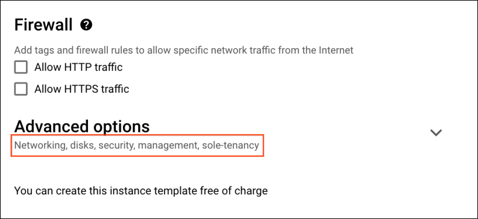

# Professional Cloud Network Engineer Certification Learning Path


# 01 - Preparing for Your Professional Cloud Network Engineer Journey 

- [Designing and planning a Google Cloud network](documents/T-GCPPCN-A-m0-l6-en-file-6.en.pdf)
- [Implementing Virtual Private Cloud (VPC) networks](documents/T-GCPPCN-A-m2-l6-en-file-16.en.pdf)
- [Implementing hybrid network interconnectivity](documents/T-GCPPCN-A-m3-l6-en-file-26.en.pdf)
- [Managing, monitoring, and troubleshooting network operations](documents/T-GCPPCN-A-m5-l6-en-file-31.en.pdf)


# 02 - Google Cloud Fundamentals: Core Infrastructure


[Module 1: Introduction to Google Cloud](documents/M1 _ Introducing Google Cloud v5.2 _ ILT.pdf)
[Module 2: Resources and Access in the Cloud](documents/M2 _ Resouces and Access in the Cloud v5.2 _ ILT.pdf)
[Module 3: Virtual Machines and Networks in the Cloud](documents/M3 _ Virtual Machines and Networks in the Cloud v5.2 _ ILT.pdf)
[Module 4: Storage in the Cloud](documents/M4 _ Storage in the Cloud v5.2 _ ILT.pdf)
[Module 5: Containers in the Cloud](documents/M5 _ Containers in the Cloud v5.2 _ ILT.pdf)
[Module 6: Applications in the Cloud](documents/M6 _ Applications in the Cloud v5.2 _ ILT.pdf)
[Module 7: Prompt Engineering](documents/M7 _ Prompt Engineering v5.2 _ ILT.pdf)
[Course Summary](documents/M8 _ Course Summary v5.2 _ ILT.pdf)

# 03 - Automate Deployment and Manage Traffic on a Google Cloud Network

## LAB - Automating the Deployment of Networks with Terraform


# 04 - Networking in Google Cloud: Fundamentals


# 05 - Networking in Google Cloud: Routing and Addressing


# 06 - Networking in Google Cloud: Network Architecture


# 07 - Networking in Google Cloud: Network Security


# 08 - Networking in Google Cloud: Load Balancing


# 09 - Networking in Google Cloud: Hybrid and Multicloud


# 10 - Logging and Monitoring in Google Cloud


# 11 - Observability in Google Cloud


# 12 - Implement Load Balancing on Compute Engine


# 13 - Configure Google Kubernetes Engine Networking


# 14 - Set Up an App Dev Environment on Google Cloud


# 15 - Build a Secure Google Cloud Network


# 16 - Implement Cloud Security Fundamentals on Google Cloud


## I - Implement Cloud Security Fundamentals on Google Cloud


## LAB-01: Cloud IAM: Qwik Start

## Overview

Google Cloud's Identity and Access Management (IAM) service lets you create and manage permissions for Google Cloud resources. Cloud IAM unifies access control for Google Cloud services into a single system and provides a consistent set of operations.

In this lab, you sign in with 2 different sets of credentials to experience how granting and revoking permissions works from Google Cloud Project Owner and Viewer roles.

### What you'll learn

- Assign a role to a second user
- Remove assigned roles associated with Cloud IAM

### Prerequisites

This is an **introductory level** lab. Little to no prior knowledge of Cloud IAM is expected. Experience with Cloud Storage is helpful to complete the tasks in this lab, but is not required. Make sure that you have a file in .txt or .html available. If you are looking for more advanced practice with Cloud IAM, be sure to check out the following Google Cloud Skills Boost lab, [IAM Custom Roles](https://www.cloudskillsboost.google/catalog_lab/955).

Once you're prepared, scroll down and follow the steps to get your lab environment set up.

## Setup and requirements

As mentioned earlier, this lab provides two sets of credentials to illustrate IAM policies and what permissions are available for specific roles.

In the **Lab Connection** panel on the left side of your lab, you see a list of credentials that resembles the following:


Notice that there are *two* usernames: Username 1 and Username 2. These represent identities in Cloud IAM, each with different access permissions allocated to them. These "roles" set constraints on what you can and cannot do with Google Cloud resources in the project you've been allocated.

### Sign in to Cloud Console as the first user

1. Click on the **Open Google Console** button. This opens a new browser tab. If you are asked to **Choose an account**, click **Use another account**.
2. The Google Cloud sign in page opens. A Sign in page opens—copy and paste the **Username 1** credential that resembles `googlexxxxxx_student@qwiklabs.net` into the "Email or phone" field and then click **Next**.
3. Copy the password from the **Lab Connection** panel and paste into the Google Sign in password field.
4. Click **Next** and then **Accept** the terms of service. The Cloud Console opens. Agree to the terms of service and click **Agree and Continue**.

### Sign in to Cloud Console as the second user

1. Click on the **Open Google Console** button again. A new browser tab opens, if you are asked to **Choose an account**, click **Use another account**.
2. The Google Cloud sign in page opens. Copy and paste the **Username 2** credential that resembles `googlexxxxxx_student@qwiklabs.net` into the **Email or phone** field and then click **Next**.
3. Copy the password from the **Lab Connection** panel and paste into the Google Sign in password field.
4. Click **Next** and then **Accept** the terms of service. The Cloud Console opens. Agree to the terms of service and click **Agree and Continue**.

You should now have two Cloud Console tabs open in your browser—one signed in with Username 1 and the other with Username 2.

### View or reset the user in a browser tab

Occasionally, a user is overwritten in a browser tab or you may be confused about which user is signed into which browser tab.

To view which user is signed into a browser tab, hover over your Avatar to view your username in that browser tab.


To reset which user is signed into a browser tab:

1. Click your Avatar and click **Sign out** to sign out.
2. In the **Lab Connection** panel, click **Open Google Console** and sign in back using the appropriate Username and Password.

## Task 1. Explore the IAM console and project level roles

1. Return to the **Username 1** Cloud Console page.
2. Select **Navigation menu** > **IAM & Admin** > **IAM**. You are now in the "IAM & Admin" console.
3. Click **+GRANT ACCESS** button at the top of the page.
4. Scroll down to **Basic** in Select a role section and mouse over.

There are three roles:

- Editor
- Owner
- Viewer

These are *primitive roles* in Google Cloud. Primitive roles set project-level permissions and unless otherwise specified, they control access and management to all Google Cloud services.

The following table pulls definitions from the Google Cloud IAM article, [Basic roles](https://cloud.google.com/iam/docs/understanding-roles#primitive_roles), which gives a brief overview of browser, viewer, editor, and owner role permissions:

| **Role Name** | **Permissions**                                              |
| ------------- | ------------------------------------------------------------ |
| roles/viewer  | Permissions for read-only actions that do not affect state, such as viewing (but not modifying) existing resources or data. |
| roles/editor  | All viewer permissions, plus permissions for actions that modify state, such as changing existing resources. |
| roles/owner   | All editor permissions and permissions for the following actions:Manage roles and permissions for a project and all resources within the project.Set up billing for a project. |

Since you are able to manage roles and permissions for this project, Username 1 has Project owner permissions.

1. Click **CANCEL** to exit out of the "Add principal" panel.

### Explore the editor role

Now switch to the **Username 2** console.

1. Navigate to the IAM & Admin console, select **Navigation menu** > **IAM & Admin** > **IAM**.
2. Search through the table to find Username 1 and Username 2 and examine the roles they are granted. The Username 1 and Username 2 roles are listed inline and to the right of each user.

You should see:

- Username 2 has the "Viewer" role granted to it.
- The **+GRANT ACCESS** button at the top is grayed out—if you try to click on it you get the message, "You need permissions for this action. Required permission(s): resource manager.projects.setIamPolicy".

This is one example of how IAM roles affect what you can and cannot do in Google Cloud.

1. Switch back to the **Username 1** console for the next step.

## Task 2. Prepare a Cloud Storage bucket for access testing

Ensure that you are in the **Username 1** Cloud Console.

### Create a bucket

1. Create a Cloud Storage bucket with a unique name. From the Cloud Console, select **Navigation menu** > **Cloud Storage** > **Buckets**.
2. Click **+CREATE**.

**Note:** If you get a permissions error for bucket creation, sign out and then sign in back in with the Username 1 credentials.

1. Update the following fields, leave all others at their default values:

| **Property**       | **Value**                                                    |
| ------------------ | ------------------------------------------------------------ |
| **Name**:          | *globally unique name (create it yourself!) and click **CONTINUE**.* |
| **Location Type:** | Multi-Region                                                 |

Note the bucket name. You will use it in a later step.

1. Click **CREATE**.
2. If prompted, Public access will be prevented, click **Confirm**.

**Note:** If you get a permissions error for bucket creation, sign out and then sign in back in with the Username 1 credentials.

### Upload a sample file

1. On the Bucket Details page click **UPLOAD FILES**.
2. Browse your computer to find a file to use. Any text or html file will do.
3. Click on the three dots at the end of the line containing the file and click **Rename**.
4. Rename the file ‘`sample.txt`'.
5. Click **RENAME**.

Click **Check my progress** to verify the objective.

Create a bucket and upload a sample file


Check my progress


### Verify project viewer access

1. Switch to the **Username 2** console.
2. From the Console, select **Navigation menu** > **Cloud Storage** > **Buckets**. Verify that this user can see the bucket.

Username 2 has the "Viewer" role prescribed which allows them read-only actions that do not affect state. This example illustrates this feature—they can view Cloud Storage buckets and files that are hosted in the Google Cloud project that they've been granted access to.

## Task 3. Remove project access

Switch to the **Username 1** console.

### Remove Project Viewer for Username 2

1. Select **Navigation menu** > **IAM & Admin** > **IAM**. Then click the pencil icon inline and to the right of **Username 2**.

**Note:** You may have to widen the screen to see the pencil icon.

1. Remove Project Viewer access for **Username 2** by clicking the trashcan icon next to the role name. Then click **SAVE**.

Notice that the user has disappeared from the Member list! The user has no access now.

**Note:** It can take up to 80 seconds for such a change to take effect as it propagates. Read more about Google Cloud IAM in the Google Cloud IAMResource Documentation, [Frequently asked questions](https://cloud.google.com/iam/docs/faq).

### Verify that Username 2 has lost access

1. Switch to **Username 2** Cloud Console. Ensure that you are still signed in with Username 2's credentials and that you haven't been signed out of the project after permissions were revoked. If signed out, sign in back with the proper credentials.
2. Navigate back to Cloud Storage by selecting **Navigation menu** > **Cloud Storage** > **Buckets**.

You should see a permission error.

**Note**: As mentioned before, it can take up to 80 seconds for permissions to be revoked. If you haven't received a permission error, wait a 2 minutes and then try refreshing the console.

Click **Check my progress** to verify the objective.

Remove project access


Check my progress


## Task 4. Add Cloud Storage permissions

1. Copy **Username 2** name from the **Lab Connection** panel.
2. Switch to **Username 1** console. Ensure that you are still signed in with Username 1's credentials. If you are signed out, sign in back with the proper credentials.
3. In the Console, select **Navigation menu** > **IAM & Admin** > **IAM**.
4. Click **+GRANT ACCESS** button and paste the **Username 2** name into the **New principals** field.
5. In the **Select a role** field, select **Cloud Storage** > **Storage Object Viewer** from the drop-down menu.
6. Click **SAVE**.

### Verify access

1. Switch to the **Username 2** console. You'll still be on the Storage page.

**Username 2** doesn't have the Project Viewer role, so that user can't see the project or any of its resources in the Console. However, this user has specific access to Cloud Storage, the Storage Object Viewer role - check it out now.

1. Click **Activate Cloud Shell**  to open the Cloud Shell command line. If prompted click **Continue**.
2. Open up a Cloud Shell session and then enter in the following command, replace `[YOUR_BUCKET_NAME]` with the name of the bucket you created earlier:

```
gsutil ls gs://[YOUR_BUCKET_NAME]
```

Copied!

You should receive a similar output:

```
gs://[YOUR_BUCKET_NAME]/sample.txt
```

**Note:** If you see `AccessDeniedException`, wait a minute and run the previous command again.

1. As you can see, you gave **Username 2** view access to the Cloud Storage bucket.

Click **Check my progress** to verify the objective.

Add Cloud Storage permissions


Check my progress


## Congratulations!


## LAB-02: IAM Custom Roles

## Overview

Cloud IAM provides the right tools to manage resource permissions with minimum fuss and high automation. You don't directly grant users permissions. Instead, you grant them roles, which bundle one or more permissions. This allows you to map job functions within your company to groups and roles. Users get access only to what they need to get the job done, and admins can easily grant default permissions to entire groups of users.

There are two kinds of roles in Cloud IAM:

- Predefined Roles
- Custom Roles

**Predefined roles** are created and maintained by Google. Their permissions are automatically updated as necessary, such as when new features or services are added to Google Cloud.

**Custom roles** are user-defined, and allow you to bundle one or more supported permissions to meet your specific needs. Custom roles are not maintained by Google; when new permissions, features, or services are added to Google Cloud, your custom roles will not be updated automatically.You create a custom role by combining one or more of the available Cloud IAM permissions. Permissions allow users to perform specific actions on Google Cloud resources.

### What you'll learn

In this lab, you create, update, delete, and restore custom roles.

### Prerequisites

Familiarity with IAM roles is recommended to optimize your learning.

## Setup and requirements

### Before you click the Start Lab button

Read these instructions. Labs are timed and you cannot pause them. The timer, which starts when you click **Start Lab**, shows how long Google Cloud resources are made available to you.

This hands-on lab lets you do the lab activities in a real cloud environment, not in a simulation or demo environment. It does so by giving you new, temporary credentials you use to sign in and access Google Cloud for the duration of the lab.

To complete this lab, you need:

- Access to a standard internet browser (Chrome browser recommended).

**Note:** Use an Incognito (recommended) or private browser window to run this lab. This prevents conflicts between your personal account and the student account, which may cause extra charges incurred to your personal account.

- Time to complete the lab—remember, once you start, you cannot pause a lab.

**Note:** Use only the student account for this lab. If you use a different Google Cloud account, you may incur charges to that account.

### How to start your lab and sign in to the Google Cloud console

1. Click the **Start Lab** button. If you need to pay for the lab, a dialog opens for you to select your payment method. On the left is the Lab Details pane with the following:

   - The Open Google Cloud console button
   - Time remaining
   - The temporary credentials that you must use for this lab
   - Other information, if needed, to step through this lab

2. Click **Open Google Cloud console** (or right-click and select **Open Link in Incognito Window** if you are running the Chrome browser).

   The lab spins up resources, and then opens another tab that shows the Sign in page.

   ***Tip:\*** Arrange the tabs in separate windows, side-by-side.

   **Note:** If you see the **Choose an account** dialog, click **Use Another Account**.

3. If necessary, copy the **Username** below and paste it into the **Sign in** dialog.

   ```
   student-02-3a6c61d48adf@qwiklabs.net
   ```

   Copied!

   You can also find the Username in the Lab Details pane.

4. Click **Next**.

5. Copy the **Password** below and paste it into the **Welcome** dialog.

   ```
   KlU6X8ZWB6EO
   ```

   Copied!

   You can also find the Password in the Lab Details pane.

6. Click **Next**.

   **Important:** You must use the credentials the lab provides you. Do not use your Google Cloud account credentials.

   **Note:** Using your own Google Cloud account for this lab may incur extra charges.

7. Click through the subsequent pages:

   - Accept the terms and conditions.
   - Do not add recovery options or two-factor authentication (because this is a temporary account).
   - Do not sign up for free trials.

After a few moments, the Google Cloud console opens in this tab.

**Note:** To access Google Cloud products and services, click the **Navigation menu** or type the service or product name in the **Search** field. 

### Activate Cloud Shell

Cloud Shell is a virtual machine that is loaded with development tools. It offers a persistent 5GB home directory and runs on the Google Cloud. Cloud Shell provides command-line access to your Google Cloud resources.

1. Click **Activate Cloud Shell**  at the top of the Google Cloud console.
2. Click through the following windows:
   - Continue through the Cloud Shell information window.
   - Authorize Cloud Shell to use your credentials to make Google Cloud API calls.

When you are connected, you are already authenticated, and the project is set to your **Project_ID**, `qwiklabs-gcp-02-6d232578e445`. The output contains a line that declares the **Project_ID** for this session:

```
Your Cloud Platform project in this session is set to qwiklabs-gcp-02-6d232578e445
```

`gcloud` is the command-line tool for Google Cloud. It comes pre-installed on Cloud Shell and supports tab-completion.

1. (Optional) You can list the active account name with this command:

```
gcloud auth list
```

Copied!

1. Click **Authorize**.

**Output:**

```
ACTIVE: *
ACCOUNT: student-02-3a6c61d48adf@qwiklabs.net

To set the active account, run:
    $ gcloud config set account `ACCOUNT`
```

1. (Optional) You can list the project ID with this command:

```
gcloud config list project
```

Copied!

**Output:**

```
[core]
project = qwiklabs-gcp-02-6d232578e445
```

**Note:** For full documentation of `gcloud`, in Google Cloud, refer to [the gcloud CLI overview guide](https://cloud.google.com/sdk/gcloud).

### Set the region for your project

Run the following command to set the region for your project:

```
gcloud config set compute/region us-east5
```

Copied!

## Introduction to IAM custom roles

Cloud IAM also provides the ability to create customized Cloud IAM roles. You can create a custom Cloud IAM role with one or more permissions and then grant that custom role to users. Cloud IAM provides a UI and API for creating and managing custom roles.

**Key Point:** Custom roles enable you to enforce the principle of least privilege, ensuring that the user and service accounts in your organization have only the permissions essential to performing their intended functions.

**Note:** You can create a custom role at the organization level and at the project level. However, you cannot create custom roles at the folder level.

You create a custom role by combining one or more of the available Cloud IAM permissions. Permissions allow users to perform specific actions on Google Cloud resources.

In the Cloud IAM world, permissions are represented in the form:

```
<service>.<resource>.<verb>
```

For example, the `compute.instances.list` permission allows a user to list the Compute Engine instances they own, while `compute.instances.stop` allows a user to stop a VM.

Permissions usually, but not always, correspond 1:1 with REST methods. That is, each Google Cloud service has an associated permission for each REST method that it has. To call a method, the caller needs that permission. For example, the caller of `topic.publish()` needs the `pubsub.topics.publish` permission.

Custom roles can only be used to grant permissions in policies for the same project or organization that owns the roles or resources under them. You cannot grant custom roles from one project or organization on a resource owned by a different project or organization.

### Required permissions and roles

To create a custom role, a caller must have the `iam.roles.create` permission.

Users who are not owners, including organization administrators, must be assigned either the Organization Role Administrator role (roles/iam.organizationRoleAdmin) or the IAM Role Administrator role (roles/iam.roleAdmin). The IAM Security Reviewer role (roles/iam.securityReviewer) enables the ability to view custom roles but not administer them.

The custom roles user interface is in the Cloud Console under IAM Roles. It is only available to users who have permissions to create or manage custom roles. By default, only project owners can create new roles. Project owners can control access to this feature by granting IAM Role Administrator role to others on the same project; for organizations, only Organization Administrators can grant the Organization Role, Administrator role.

### Prepare to create a custom role

Before you create a custom role, you might want to know:

- What permissions can be applied to a resource
- What roles are grantable on a resource
- What a role's metadata is

## Task 1. View the available permissions for a resource

Before you create a custom role, you might want to know what permissions can be applied to a resource. You can get all permissions that can be applied to a resource, and the resources below that in the hierarchy, using the gcloud command-line tool, the Cloud Console, or the IAM API. For example, you can get all permissions that you can apply on an organization and on projects in that organization.

- Run the following to get the list of permissions available for your project.:

```
gcloud iam list-testable-permissions //cloudresourcemanager.googleapis.com/projects/$DEVSHELL_PROJECT_ID
```

Copied!

Output:

```
name: appengine.applications.create
stage: GA
---
name: appengine.applications.get
stage: GA
---
name: appengine.applications.update
stage: GA
---
name: appengine.instances.delete
 stage: GA
---
name: appengine.instances.get
stage: GA
---
name: appengine.instances.list
stage: GA
---
customRolesSupportLevel: TESTING
name: appengine.memcache.addKey
stage: BETA
---
customRolesSupportLevel: TESTING
name: appengine.memcache.flush
stage: BETA
---
```

## Task 2. Get the role metadata

Before you create a custom role, you might want to get the metadata for both predefined and custom roles. Role metadata includes the role ID and permissions contained in the role. You can view the metadata using the Cloud Console or the IAM API.

- To view the role metadata, use command below, replacing `[ROLE_NAME]` with the role. For example: `roles/viewer` or `roles/editor`:

```
gcloud iam roles describe [ROLE_NAME]
```

Copied!

**Example output (for roles/viewer):**

```
description: Read access to all custom roles in the project.
etag: AA==
includedPermissions:
- iam.roles.get
- iam.roles.list
- resourcemanager.projects.get
- resourcemanager.projects.getIamPolicy
...
...
name: roles/iam.roleViewer
stage: GA
title: Viewer
```

## Task 3. View the grantable roles on resources

Use the `gcloud iam list-grantable-roles` command to return a list of all roles that can be applied to a given resource.

- Execute the following `gcloud` command to list grantable roles from your project:

```
gcloud iam list-grantable-roles //cloudresourcemanager.googleapis.com/projects/$DEVSHELL_PROJECT_ID
```

Copied!

Your output will look something like this:

```
---
description: Full management of App Engine apps (but not storage).
name: roles/appengine.appAdmin
title: App Engine Admin
---
description: Ability to view App Engine app status.
name: roles/appengine.appViewer
title: App Engine Viewer
---
description: Ability to view App Engine app status and deployed source code.
name: roles/appengine.codeViewer
title: App Engine Code Viewer
---
...
...
```

## Task 4. Create a custom role

To create a custom role, a caller must possess `iam.roles.create` permission. By default, the owner of a project or an organization has this permission and can create and manage custom roles.

Users who are not owners, including organization admins, must be assigned either the Organization Role Administrator role, or the IAM Role Administrator role.

Use the `gcloud iam roles create` command to create new custom roles in two ways:

- Provide a YAML file that contains the role definition
- Specify the role definition using flags

When creating a custom role, you must specify whether it applies to the organization level or project level by using the `--organization [ORGANIZATION_ID]` or `--project [PROJECT_ID]` flags. Each example below creates a custom role at the project level.

In the next sections you create custom roles at the project level.

### Create a custom role using a YAML file

Create a YAML file that contains the definition for your custom role. The file must be structured in the following way:

```
title: [ROLE_TITLE]
description: [ROLE_DESCRIPTION]
stage: [LAUNCH_STAGE]
includedPermissions:
- [PERMISSION_1]
- [PERMISSION_2]
```

Each of the placeholder values is described below:

- `[ROLE_TITLE]` is a friendly title for the role, such as **Role Viewer**.
- `[ROLE_DESCRIPTION]` is a short description about the role, such as **My custom role description**.
- `[LAUNCH_STAGE]` indicates the stage of a role in the launch lifecycle, such as ALPHA, BETA, or GA.
- `includedPermissions` specifies the list of one or more permissions to include in the custom role, such as **iam.roles.get**.

1. Time to get started! Create your role definition YAML file by running:

```
nano role-definition.yaml
```

Copied!

1. Add this custom role definition to the YAML file:

```
title: "Role Editor"
description: "Edit access for App Versions"
stage: "ALPHA"
includedPermissions:
- appengine.versions.create
- appengine.versions.delete
```

Copied!

1. Then save and close the file by pressing **CTRL+X**, **Y** and then **ENTER**.
2. Execute the following `gcloud` command:

```
gcloud iam roles create editor --project $DEVSHELL_PROJECT_ID \
--file role-definition.yaml
```

Copied!

If the role was created successfully, the following response is returned:

```
Created role [editor].
description: Edit access for App Versions
etag: BwVs4O4E3e4=
includedPermissions:
- appengine.versions.create
- appengine.versions.delete
name: projects/qwiklabs-gcp-02-6d232578e445/roles/editor
stage: ALPHA
title: Role Editor
```

Click **Check my progress** to verify the objective.

Create a custom role using a YAML file


Check my progress


### Create a custom role using flags

Now you'll use the flag method to create a new custom role. The flags take a similar form to the YAML file, so you’ll recognize how the command is being built.

- Execute the following `gcloud` command to create a new role using flags:

```
gcloud iam roles create viewer --project $DEVSHELL_PROJECT_ID \
--title "Role Viewer" --description "Custom role description." \
--permissions compute.instances.get,compute.instances.list --stage ALPHA
```

Copied!

**Example output:**

```
Created role [viewer].
description: Custom role description.
etag: BwVs4PYHqYI=
includedPermissions:
- compute.instances.get
- compute.instances.list
name: projects/qwiklabs-gcp-02-6d232578e445/roles/viewer
stage: ALPHA
title: Role Viewer
```

Click **Check my progress** to verify the objective.

Create a custom role using flags


Check my progress


## Task 5. List the custom roles

1. Execute the following `gcloud` command to list custom roles, specifying either project-level or organization-level custom roles:

```
gcloud iam roles list --project $DEVSHELL_PROJECT_ID
```

Copied!

**Example output:**

```
---
description: Edit access for App Versions
etag: BwVxLgrnawQ=
name: projects/qwiklabs-gcp-02-6d232578e445/roles/editor
title: Role Editor
---
description: Custom role description.
etag: BwVxLg18IQg=
name: projects/qwiklabs-gcp-02-6d232578e445/roles/viewer
title: Role Viewer
```

To list deleted roles, you can also specify the `--show-deleted` flag.

1. Execute the following `gcloud` command to list predefined roles:

```
gcloud iam roles list
```

Copied!

## Task 6. Update an existing custom role

A common pattern for updating a resource's metadata, such as a custom role, is to read its current state, update the data locally, and then send the modified data for writing. This pattern could cause a conflict if two or more independent processes attempt the sequence simultaneously.

For example, if two owners for a project try to make conflicting changes to a role at the same time, some changes could fail.

Cloud IAM solves this problem using an `etag` property in custom roles. This property is used to verify if the custom role has changed since the last request. When you make a request to Cloud IAM with an etag value, Cloud IAM compares the etag value in the request with the existing etag value associated with the custom role. It writes the change only if the etag values match.

Use the `gcloud iam roles update` command to update custom roles in one of two ways:

- A YAML file that contains the updated role definition
- Flags that specify the updated role definition

When updating a custom role, you must specify whether it applies to the organization level or project level by using the `--organization [ORGANIZATION_ID]` or `--project [PROJECT_ID]` flags. Each example below creates a custom role at the project level.

The `describe` command returns the role's definition and includes an etag value that uniquely identifies the current version of the role. The etag value should be provided in the updated role definition to ensure that any concurrent role changes are not overwritten.

### Update a custom role using a YAML file

1. Get the current definition for the role by executing the following `gcloud` command, replacing `[ROLE_ID]` with **editor**.

```
gcloud iam roles describe [ROLE_ID] --project $DEVSHELL_PROJECT_ID
```

Copied!

The `describe` command returns the following output:

```
description: [ROLE_DESCRIPTION]
etag: [ETAG_VALUE]
includedPermissions:
- [PERMISSION_1]
- [PERMISSION_2]
name: [ROLE_ID]
stage: [LAUNCH_STAGE]
title: [ROLE_TITLE]
```

1. Copy the output to use to create a new YAML file in the next steps.
2. Create a `new-role-definition.yaml` file with your editor:

```
nano new-role-definition.yaml
```

Copied!

1. Paste in the output from the last command and add these two permissions under `includedPermissions`:

```
- storage.buckets.get
- storage.buckets.list
```

Copied!

Your YAML file looks like this when you're finished:

```
description: Edit access for App Versions
etag: BwVxIAbRq_I=
includedPermissions:
- appengine.versions.create
- appengine.versions.delete
- storage.buckets.get
- storage.buckets.list
name: projects/qwiklabs-gcp-02-6d232578e445/roles/editor
stage: ALPHA
title: Role Editor
```

1. Save and close the file **CTRL+X**, **Y** and then **ENTER**.
2. Now you’ll use the `update` command to update the role. Execute the following `gcloud` command, replacing `[ROLE_ID]` with **editor**:

```
gcloud iam roles update [ROLE_ID] --project $DEVSHELL_PROJECT_ID \
--file new-role-definition.yaml
```

Copied!

If the role was updated successfully, the following response is returned:

```
description: Edit access for App Versions
etag: BwVxIBjfN3M=
includedPermissions:
- appengine.versions.create
- appengine.versions.delete
- storage.buckets.get
- storage.buckets.list
name: projects/qwiklabs-gcp-02-6d232578e445/roles/editor
stage: ALPHA
title: Role Editor
```

Click **Check my progress** to verify the objective.

Update a custom role using a YAML file


Check my progress


### Update a custom role using flags

Each part of a role definition can be updated using a corresponding flag. For a list of all possible flags from the SDK reference documentation, see the topic [gcloud iam roles update](https://cloud.google.com/sdk/gcloud/reference/iam/roles/update).

Use the following flags to add or remove permissions:

- `--add-permissions`: Adds one or more comma-separated permissions to the role.
- `--remove-permissions`: Removes one or more comma-separated permissions from the role.

Alternatively, you can simply specify the new permissions using the `--permissions [PERMISSIONS]` flag and providing a comma-separated list of permissions to replace the existing permissions list.

- Execute the following `gcloud` command to add permissions to the **viewer** role using flags:

```
gcloud iam roles update viewer --project $DEVSHELL_PROJECT_ID \
--add-permissions storage.buckets.get,storage.buckets.list
```

Copied!

If the role was updated successfully, the following response is returned:

```
description: Custom role description.
etag: BwVxLi4wTvk=
includedPermissions:
- compute.instances.get
- compute.instances.list
- storage.buckets.get
- storage.buckets.list
name: projects/qwiklabs-gcp-02-6d232578e445/roles/viewer
stage: ALPHA
title: Role Viewer
```

Click **Check my progress** to verify the objective.

Update a custom role using flags


Check my progress


## Task 7. Disable a custom role

When a role is disabled, any policy bindings related to the role are inactivated, meaning that the permissions in the role will not be granted, even if you grant the role to a user.

The easiest way to disable an existing custom role is to use the `--stage` flag and set it to DISABLED.

- Execute the following `gcloud` command to disable the **viewer** role:

```
gcloud iam roles update viewer --project $DEVSHELL_PROJECT_ID \
--stage DISABLED
```

Copied!

If the role was updated successfully, the following response is returned:

```
description: Custom role description.
etag: BwVxLkIYHrQ=
includedPermissions:
- compute.instances.get
- compute.instances.list
- storage.buckets.get
- storage.buckets.list
name: projects/qwiklabs-gcp-02-6d232578e445/roles/viewer
stage: DISABLED
title: Role Viewer
```

Click **Check my progress** to verify the objective.

Disabling a custom role


Check my progress


## Task 8. Delete a custom role

- Use the `gcloud iam roles delete` command to delete a custom role. Once deleted the role is inactive and cannot be used to create new IAM policy bindings:

```
gcloud iam roles delete viewer --project $DEVSHELL_PROJECT_ID
```

Copied!

**Example output:**

```
deleted: true
description: Custom role description.
etag: BwVxLkf_epw=
includedPermissions:
- compute.instances.get
- compute.instances.list
- storage.buckets.get
- storage.buckets.list
name: projects/qwiklabs-gcp-02-6d232578e445/roles/viewer
stage: DISABLED
title: Role Viewer
```

After the role has been deleted, existing bindings remain, but are inactive. The role can be undeleted within 7 days. After 7 days, the role enters a permanent deletion process that lasts 30 days. After 37 days, the Role ID is available to be used again.

**Note:** If a role is being phased out, change its **role.stage** property to **DEPRECATED**, and set the `deprecation_message` to let users know what alternative roles should be used or where to get more information.

## Task 9. Restore a custom role

- Within the 7 days window you can restore a role. Deleted roles are in a **DISABLED** state. To make it available again, update the `--stage` flag:

```
gcloud iam roles undelete viewer --project $DEVSHELL_PROJECT_ID
```

Copied!

Click **Check my progress** to verify the objective.

Undeleting a custom role


Check my progress


## Congratulations!


## LAB-03: Service Accounts and Roles: Fundamentals

## Overview

Service accounts are a special type of Google account that grant permissions to virtual machines instead of end users. Service accounts are primarily used to ensure safe, managed connections to APIs and Google Cloud services. Granting access to trusted connections and rejecting malicious ones is a must-have security feature for any Google Cloud project. In this lab, you get hands-on practice with the ins and outs of service accounts.

### What you'll learn

In this lab, you learn how to:

- Create and manage service accounts.
- Create a virtual machine and associate it with a service account.
- Use client libraries to access BigQuery from a service account.
- Run a query on a BigQuery public dataset from a Compute Engine instance.

### Prerequisites

Some experience with Cloud IAM is recommended, but little to no prior knowledge with service accounts is assumed. If you're looking for more advanced hands-on practice in this topic area, be sure to check out the following labs:

- [VPC Network Peering](https://google.qwiklabs.com/catalog_lab/935)
- [Setting up a Private Kubernetes Cluster](https://google.qwiklabs.com/catalog_lab/908)
- [Building a High-throughput VPN](https://google.qwiklabs.com/catalog_lab/620)

## Setup and requirements

### Before you click the Start Lab button

Read these instructions. Labs are timed and you cannot pause them. The timer, which starts when you click **Start Lab**, shows how long Google Cloud resources are made available to you.

This hands-on lab lets you do the lab activities in a real cloud environment, not in a simulation or demo environment. It does so by giving you new, temporary credentials you use to sign in and access Google Cloud for the duration of the lab.

To complete this lab, you need:

- Access to a standard internet browser (Chrome browser recommended).

**Note:** Use an Incognito (recommended) or private browser window to run this lab. This prevents conflicts between your personal account and the student account, which may cause extra charges incurred to your personal account.

- Time to complete the lab—remember, once you start, you cannot pause a lab.

**Note:** Use only the student account for this lab. If you use a different Google Cloud account, you may incur charges to that account.

### How to start your lab and sign in to the Google Cloud console

1. Click the **Start Lab** button. If you need to pay for the lab, a dialog opens for you to select your payment method. On the left is the Lab Details pane with the following:

   - The Open Google Cloud console button
   - Time remaining
   - The temporary credentials that you must use for this lab
   - Other information, if needed, to step through this lab

2. Click **Open Google Cloud console** (or right-click and select **Open Link in Incognito Window** if you are running the Chrome browser).

   The lab spins up resources, and then opens another tab that shows the Sign in page.

   ***Tip:\*** Arrange the tabs in separate windows, side-by-side.

   **Note:** If you see the **Choose an account** dialog, click **Use Another Account**.

3. If necessary, copy the **Username** below and paste it into the **Sign in** dialog.

   ```
   student-02-62a08002660c@qwiklabs.net
   ```

   Copied!

   You can also find the Username in the Lab Details pane.

4. Click **Next**.

5. Copy the **Password** below and paste it into the **Welcome** dialog.

   ```
   amZxKMg7NIYW
   ```

   Copied!

   You can also find the Password in the Lab Details pane.

6. Click **Next**.

   **Important:** You must use the credentials the lab provides you. Do not use your Google Cloud account credentials.

   **Note:** Using your own Google Cloud account for this lab may incur extra charges.

7. Click through the subsequent pages:

   - Accept the terms and conditions.
   - Do not add recovery options or two-factor authentication (because this is a temporary account).
   - Do not sign up for free trials.

After a few moments, the Google Cloud console opens in this tab.

**Note:** To access Google Cloud products and services, click the **Navigation menu** or type the service or product name in the **Search** field. 

### Activate Cloud Shell

Cloud Shell is a virtual machine that is loaded with development tools. It offers a persistent 5GB home directory and runs on the Google Cloud. Cloud Shell provides command-line access to your Google Cloud resources.

1. Click **Activate Cloud Shell**  at the top of the Google Cloud console.
2. Click through the following windows:
   - Continue through the Cloud Shell information window.
   - Authorize Cloud Shell to use your credentials to make Google Cloud API calls.

When you are connected, you are already authenticated, and the project is set to your **Project_ID**, `qwiklabs-gcp-01-06307c840520`. The output contains a line that declares the **Project_ID** for this session:

```
Your Cloud Platform project in this session is set to qwiklabs-gcp-01-06307c840520
```

`gcloud` is the command-line tool for Google Cloud. It comes pre-installed on Cloud Shell and supports tab-completion.

1. (Optional) You can list the active account name with this command:

```
gcloud auth list
```

Copied!

1. Click **Authorize**.

**Output:**

```
ACTIVE: *
ACCOUNT: student-02-62a08002660c@qwiklabs.net

To set the active account, run:
    $ gcloud config set account `ACCOUNT`
```

1. (Optional) You can list the project ID with this command:

```
gcloud config list project
```

Copied!

**Output:**

```
[core]
project = qwiklabs-gcp-01-06307c840520
```

**Note:** For full documentation of `gcloud`, in Google Cloud, refer to [the gcloud CLI overview guide](https://cloud.google.com/sdk/gcloud).

### Set the region for your project

Run the following command to set the region for your project:

```
gcloud config set compute/region us-east5
```

Copied!

## What are service accounts?

A service account is a special Google account that belongs to your application or a [virtual machine](https://cloud.google.com/compute/docs/instances/) (VM) instead of an individual end user. Your application uses the service account to [call the Google API of a service](https://developers.google.com/identity/protocols/OAuth2ServiceAccount#authorizingrequests), so that the users aren't directly involved.

For example, a Compute Engine VM may run as a service account, and that account can be given permissions to access the resources it needs. This way the service account is the identity of the service, and the service account's permissions control which resources the service can access.

A service account is identified by its email address, which is unique to the account.

### Types of service accounts

#### User-managed service accounts

When you create a new Cloud project using Google Cloud console and if Compute Engine API is enabled for your project, a Compute Engine Service account is created for you by default. It is identifiable using the email:

```
PROJECT_NUMBER-compute@developer.gserviceaccount.com
```

If your project contains an App Engine application, the default App Engine service account is created in your project by default. It is identifiable using the email:

```
PROJECT_ID@appspot.gserviceaccount.com
```

#### Google-managed service accounts

In addition to the user-managed service accounts, you might see some additional service accounts in your project’s IAM policy or in the console. These service accounts are created and owned by Google. These accounts represent different Google services and each account is automatically granted IAM roles to access your Google Cloud project.

#### Google APIs service account

An example of a Google-managed service account is a Google API service account identifiable using the email:

```
PROJECT_NUMBER@cloudservices.gserviceaccount.com
```

This service account is designed specifically to run internal Google processes on your behalf and is not listed in the **Service Accounts** section of the console. By default, the account is automatically granted the project editor role on the project and is listed in the **IAM** section of the console. This service account is deleted only when the project is deleted.

**Note:** Google services rely on the account having access to your project, so you should not remove or change the service account’s role on your project.

## Understanding IAM roles

When an identity calls a Google Cloud API, Google Cloud Identity and Access Management requires that the identity has the appropriate permissions to use the resource. You can grant permissions by granting roles to a user, a group, or a service account.

### Types of roles

There are three types of roles in Cloud IAM:

- **Primitive roles**, which include the Owner, Editor, and Viewer roles that existed prior to the introduction of Cloud IAM.
- **Predefined roles**, which provide granular access for a specific service and are managed by Google Cloud.
- **Custom roles**, which provide granular access according to a user-specified list of permissions.

Learn more about roles from the [Understanding roles Guide](https://cloud.google.com/iam/docs/understanding-roles).

## Task 1. Create and manage service accounts

When you create a new Cloud project, Google Cloud automatically creates one Compute Engine service account and one App Engine service account under that project. You can create up to 98 additional service accounts to your project to control access to your resources.

### Creating a service account

Creating a service account is similar to adding a member to your project, but the service account belongs to your applications rather than an individual end user.

- To create a service account, run the following command in Cloud Shell:

```
gcloud iam service-accounts create my-sa-123 --display-name "my service account"
```

Copied!

The output of this command is the service account, which looks similar to the following:

```
Created service account [my-sa-123]
```

### Granting roles to service accounts

When granting IAM roles, you can treat a service account either as a [resource](https://cloud.google.com/iam/docs/overview#resource) or as an [identity](https://cloud.google.com/iam/docs/overview#concepts_related_to_identity).

Your application uses a service account as an identity to authenticate to Google Cloud services. For example, if you have a Compute Engine Virtual Machine (VM) running as a service account, you can grant the editor role to the service account (the identity) for a project (the resource).

At the same time, you might also want to control who can start the VM. You can do this by granting a user (the identity) the [serviceAccountUser](https://cloud.google.com/iam/docs/service-accounts#the_service_account_user_role) role for the service account (the resource).

#### Granting roles to a service account for specific resources

You grant roles to a service account so that the service account has permission to complete specific actions on the resources in your Cloud Platform project. For example, you might grant the `storage.admin` role to a service account so that it has control over objects and buckets in Cloud Storage.

- Run the following in Cloud Shell to grant roles to the service account you just made:

```
gcloud projects add-iam-policy-binding $DEVSHELL_PROJECT_ID \
    --member serviceAccount:my-sa-123@$DEVSHELL_PROJECT_ID.iam.gserviceaccount.com --role roles/editor
```

Copied!

The output displays a list of roles the service account now has:

```
bindings:
- members:
  - user:email1@gmail.com
    role: roles/owner
- members:
  - serviceAccount:our-project-123@appspot.gserviceaccount.com
  - serviceAccount:123456789012-compute@developer.gserviceaccount.com
  - serviceAccount:my-sa-123@my-project-123.iam.gserviceaccount.com
  - user:email3@gmail.com
    role: roles/editor
- members:
  - user:email2@gmail.com
role: roles/viewer
etag: BwUm38GGAQk=
version: 1
```

Click *Check my progress* to verify the objective.

Create and Manage Service Accounts


Check my progress


## Task 2. Use the client libraries to access BigQuery using a service account

In this section, you query the BigQuery public datasets from an instance with the help of a service account that has the necessary roles.

### Create a service account

First create a new service account from the console.

1. Go to **Navigation menu** > **IAM & Admin**, select **Service accounts** and click on **+ Create Service Account**.
2. Fill necessary details with:

- **Service account name:** bigquery-qwiklab

1. Now click **Create and Continue** and then add the following roles:
   - **Bigquery** > **BigQuery Data Viewer**
   - **BigQuery** > **BigQuery User**

Your console should resemble the following:


1. Click **Continue** and then click **Done**.

### Create a VM instance

1. In the console, go to **Compute Engine > VM Instances**, and click **Create Instance**.

2. In the **Machine configuration**:

   Set the following values:

   | Configuration | Value             |
   | :------------ | :---------------- |
   | Name          | bigquery-instance |
   | Region        | `us-east5`        |
   | Zone          | `us-east5-c`      |
   | Series        | `E2`              |
   | Machine Type  | `e2-medium`       |

3. Click **OS and storage**.

   Click **Change** to begin configuring your boot disk:

   - **Boot Disk**: `Debian GNU/Linux 11 (bullseye) x86/64`

   Click **Select**.

4. Click **Security**.

   Set the following values:

   | Configuration   | Value                   |
   | :-------------- | :---------------------- |
   | Service account | bigquery-qwiklab        |
   | Access scopes   | Set access for each API |
   | BigQuery        | Enabled                 |

**Note:** If the `bigquery-qwiklab` service account doesn't appear in the drop-down list, try typing the name into the "Filter" section.

1. Click **Create**.

### Put the example code on a Compute Engine instance

1. In the console, go to **Compute Engine** > **VM Instances**.
2. SSH into `bigquery-instance` by clicking on the **SSH** button.

**Note:** While connecting to SSH, you can click on **Connect without Identity-Aware Proxy**.

In the SSH window, install the necessary dependencies by running the following commands:

```
sudo apt-get update
```

Copied!

```
sudo apt-get install -y git python3-pip
```

Copied!

```
pip3 install --upgrade pip
```

Copied!

```
pip3 install google-cloud-bigquery
```

Copied!

```
pip3 install pyarrow
```

Copied!

```
pip3 install pandas
```

Copied!

```
pip3 install db-dtypes
```

Copied!

Now create the example Python file:

```
echo "
from google.auth import compute_engine
from google.cloud import bigquery

credentials = compute_engine.Credentials(
    service_account_email='YOUR_SERVICE_ACCOUNT')

query = '''
SELECT
  year,
  COUNT(1) as num_babies
FROM
  publicdata.samples.natality
WHERE
  year > 2000
GROUP BY
  year
'''

client = bigquery.Client(
    project='qwiklabs-gcp-01-06307c840520',
    credentials=credentials)
print(client.query(query).to_dataframe())
" > query.py
```

Copied!

Add the Project ID to `query.py` with:

```
sed -i -e "s/qwiklabs-gcp-01-06307c840520/$(gcloud config get-value project)/g" query.py
```

Copied!

Run the following to make sure that the `sed` command has successfully changed the Project ID in the file:

```
cat query.py
```

Copied!

**Example output** (yours may differ):

```
from google.auth import compute_engine
from google.cloud import bigquery

credentials = compute_engine.Credentials(
    service_account_email='YOUR_SERVICE_ACCOUNT')

query = '''
SELECT
  year,
  COUNT(1) as num_babies
FROM
  publicdata.samples.natality
WHERE
  year > 2000
GROUP BY
  year
'''

client = bigquery.Client(
    project=qwiklabs-gcp-01-06307c840520,
    credentials=credentials)
print(client.query(query).to_dataframe())
```

Add the service account email to `query.py` with:

```
sed -i -e "s/YOUR_SERVICE_ACCOUNT/bigquery-qwiklab@$(gcloud config get-value project).iam.gserviceaccount.com/g" query.py
```

Copied!

Run the following to make sure that the sed command has successfully changed the service account email in the file:

```
cat query.py
```

Copied!

**Example output** (yours may differ):

```
from google.auth import compute_engine
from google.cloud import bigquery
credentials = compute_engine.Credentials(
    service_account_email='bigquery-qwiklab@qwiklabs-gcp-01-06307c840520.iam.gserviceaccount.com')

query = '''
SELECT
  year,
  COUNT(1) as num_babies
FROM
  publicdata.samples.natality
WHERE
  year > 2000
GROUP BY
  year
'''

client = bigquery.Client(
    project=qwiklabs-gcp-01-06307c840520,
    credentials=credentials)
print(client.query(query).to_dataframe())
```

The application now uses the permissions that are associated with this service account. Run the query with the following Python command:

```
python3 query.py
```

Copied!

The query should return the following output (your numbers may vary):

```
Row year  num_babies
0   2008  4255156
1   2006  4273225
2   2003  4096092
3   2004  4118907
4   2002  4027376
5   2005  4145619
6   2001  4031531
7   2007  4324008
```

**Note:** Your row values might not map to the years in the above output. However, make sure that the babies per year are the same.

Awesome work! You made a request to a BigQuery public dataset with a `bigquery-qwiklab` service account.

Click *Check my progress* to verify the objective.

Access BigQuery using a Service Account


Check my progress


## Congratulations!


## LAB-04: VPC Network Peering

## Overview

Google Cloud Virtual Private Cloud (VPC) Network Peering allows private connectivity across two VPC networks regardless of whether or not they belong to the same project or the same organization.

VPC Network Peering allows you to build SaaS (Software-as-a-Service) ecosystems in Google Cloud, making services available privately across different VPC networks within and across organizations, allowing workloads to communicate in private space.

VPC Network Peering is useful for:

- Organizations with several network administrative domains.
- Organizations that want to peer with other organizations.

If you have multiple network administrative domains within your organization, VPC Network Peering allows you to make services available across VPC networks in private space. If you offer services to other organizations, VPC Network Peering allows you to make those services available in private space to those organizations.

The ability to offer services across organizations is useful if you want to offer services to other enterprises, and it is useful within your own enterprise if you have several distinct organization nodes due to your own structure or as a result of mergers or acquisitions.

VPC Network Peering gives you several advantages over using external IP addresses or VPNs to connect networks, including:

- **Network Latency:** Private networking offers lower latency than public IP networking.
- **Network Security:** Service owners do not need to have their services exposed to the public Internet and deal with its associated risks.
- **Network Cost:** Networks that are peered can use internal IPs to communicate and save Google Cloud egress bandwidth costs. Regular network pricing still applies to all traffic.

### What you'll do

- Create a custom network in two projects
- Set up a VPC network peering session

## Setup and requirements

### Before you click the Start Lab button

Read these instructions. Labs are timed and you cannot pause them. The timer, which starts when you click **Start Lab**, shows how long Google Cloud resources are made available to you.

This hands-on lab lets you do the lab activities in a real cloud environment, not in a simulation or demo environment. It does so by giving you new, temporary credentials you use to sign in and access Google Cloud for the duration of the lab.

To complete this lab, you need:

- Access to a standard internet browser (Chrome browser recommended).

**Note:** Use an Incognito (recommended) or private browser window to run this lab. This prevents conflicts between your personal account and the student account, which may cause extra charges incurred to your personal account.

- Time to complete the lab—remember, once you start, you cannot pause a lab.

**Note:** Use only the student account for this lab. If you use a different Google Cloud account, you may incur charges to that account.

### How to start your lab and sign in to the Google Cloud console

1. Click the **Start Lab** button. If you need to pay for the lab, a dialog opens for you to select your payment method. On the left is the Lab Details pane with the following:

   - The Open Google Cloud console button
   - Time remaining
   - The temporary credentials that you must use for this lab
   - Other information, if needed, to step through this lab

2. Click **Open Google Cloud console** (or right-click and select **Open Link in Incognito Window** if you are running the Chrome browser).

   The lab spins up resources, and then opens another tab that shows the Sign in page.

   ***Tip:\*** Arrange the tabs in separate windows, side-by-side.

   **Note:** If you see the **Choose an account** dialog, click **Use Another Account**.

3. If necessary, copy the **Username** below and paste it into the **Sign in** dialog.

   ```
   "Username"
   ```

   Copied!

   You can also find the Username in the Lab Details pane.

4. Click **Next**.

5. Copy the **Password** below and paste it into the **Welcome** dialog.

   ```
   "Password"
   ```

   Copied!

   You can also find the Password in the Lab Details pane.

6. Click **Next**.

   **Important:** You must use the credentials the lab provides you. Do not use your Google Cloud account credentials.

   **Note:** Using your own Google Cloud account for this lab may incur extra charges.

7. Click through the subsequent pages:

   - Accept the terms and conditions.
   - Do not add recovery options or two-factor authentication (because this is a temporary account).
   - Do not sign up for free trials.

After a few moments, the Google Cloud console opens in this tab.

**Note:** To access Google Cloud products and services, click the **Navigation menu** or type the service or product name in the **Search** field. 

### Activate Cloud Shell

Cloud Shell is a virtual machine that is loaded with development tools. It offers a persistent 5GB home directory and runs on the Google Cloud. Cloud Shell provides command-line access to your Google Cloud resources.

1. Click **Activate Cloud Shell**  at the top of the Google Cloud console.
2. Click through the following windows:
   - Continue through the Cloud Shell information window.
   - Authorize Cloud Shell to use your credentials to make Google Cloud API calls.

When you are connected, you are already authenticated, and the project is set to your **Project_ID**, `PROJECT_ID`. The output contains a line that declares the **Project_ID** for this session:

```
Your Cloud Platform project in this session is set to "PROJECT_ID"
```

`gcloud` is the command-line tool for Google Cloud. It comes pre-installed on Cloud Shell and supports tab-completion.

1. (Optional) You can list the active account name with this command:

```
gcloud auth list
```

Copied!

1. Click **Authorize**.

**Output:**

```
ACTIVE: *
ACCOUNT: "ACCOUNT"

To set the active account, run:
    $ gcloud config set account `ACCOUNT`
```

1. (Optional) You can list the project ID with this command:

```
gcloud config list project
```

Copied!

**Output:**

```
[core]
project = "PROJECT_ID"
```

**Note:** For full documentation of `gcloud`, in Google Cloud, refer to [the gcloud CLI overview guide](https://cloud.google.com/sdk/gcloud).

## Task 1. Create a custom network in both projects

Within the same organization node, a network could be hosting services that need to be accessible from other VPC networks in the same or different projects.

Alternatively, one organization may want to access services a third-party service is offering.

Project names are unique across all of Google Cloud, so you do not need to specify the organization when setting up peering. Google Cloud knows the organization based on the project name.

In this lab, you have been provisioned 2 projects, the first project is *project-A* and second is *project-B*.

1. In each project, start a new Cloud Shell by click **+** icon.
2. In the Cloud Shell for *project-A*, set the project ID for the *project-A*:

```
gcloud config set project Project ID 1
```

Copied!

1. In the Cloud Shell for *project-B*, set the project ID for the *project-B*:

```
gcloud config set project Project ID 2
```

Copied!

#### project-A:

1. Go back to first Cloud Shell and run the following to create a custom network:

```
gcloud compute networks create network-a --subnet-mode custom
```

Copied!

1. Create a subnet within this VPC and specify a region and IP range by running:

```
gcloud compute networks subnets create network-a-subnet --network network-a \
    --range 10.0.0.0/16 --region "REGION 1"
```

Copied!

1. Create a VM instance:

```
gcloud compute instances create vm-a --zone "ZONE 1" --network network-a --subnet network-a-subnet --machine-type e2-small
```

Copied!

1. Run the following to enable SSH and `icmp`, because you'll need a secure shell to communicate with VMs during connectivity testing:

```
gcloud compute firewall-rules create network-a-fw --network network-a --allow tcp:22,icmp
```

Copied!

Next you set up Project-B in the same way.

Click *Check my progress* to verify the objective.

Create a custom network in project-A


Check my progress


#### project-B:

1. Switch to the second Cloud Shell and create a custom network:

```
gcloud compute networks create network-b --subnet-mode custom
```

Copied!

1. Create a subnet within this VPC and specify a region and IP range by running:

```
gcloud compute networks subnets create network-b-subnet --network network-b \
    --range 10.8.0.0/16 --region "REGION 2"
```

Copied!

1. Create a VM instance:

```
gcloud compute instances create vm-b --zone "ZONE 2" --network network-b --subnet network-b-subnet --machine-type e2-small
```

Copied!

1. Run the following to enable SSH and `icmp`, because you'll need a secure shell to communicate with VMs during connectivity testing:

```
gcloud compute firewall-rules create network-b-fw --network network-b --allow tcp:22,icmp
```

Copied!

Click *Check my progress* to verify the objective.

Create a custom network in project-B


Check my progress


## Task 2. Set up a VPC network peering session

Consider an organization which needs VPC Network Peering to be established between network-A in project-A, and network-B in project-B. In order for VPC Network Peering to be established successfully, administrators of network-A and network-B must separately configure the peering association.

### Peer network-A with network-B:


Select the correct project in the console before you apply the setting by clicking the down arrow next to the Project ID at the top of the screen, then select which project ID you need.


**project-A**

Go to the `VPC Network Peering` in the Cloud Console by navigating to the Networking section and clicking **VPC Network** > **VPC network peering** in the left menu. Once you're there:

1. Click **Create connection**.
2. Click **Continue**.
3. Type "peer-ab" as the **Name** for this side of the connection.
4. Under **Your VPC network**, select the network you want to peer (network-a).
5. Set the **Peered VPC network** radio buttons to **In another project**.
6. Paste in the **Project ID** of the second project.

```
"PROJECT ID 2"
```

Copied!

1. Type in the **VPC network name** of the other network (network-b).
2. Click **Create**.

At this point, the peering state remains INACTIVE because there is no matching configuration in network-b in project-B. You should see the Status message, `Waiting for peer network to connect`.

Click *Check my progress* to verify the objective.

Peer network-a with network-b


Check my progress


### Peer network-b with network-a


**Note:** Switch to the second project in the console.

**project-B**

1. Click **Create connection**.
2. Click **Continue**.
3. Type "peer-ba" as the **Name** for this side of the connection.
4. Under **Your VPC network**, select the network you want to peer (network-b).
5. Set the **Peering VPC network** radio buttons to **In another project**, unless you wish to peer within the same project.
6. Specify the **Project ID** of the first project.

```
"PROJECT ID 1"
```

Copied!

1. Specify **VPC network name** of the other network (network-a).
2. Click **Create**.

In the VPC network peering, you should now see `peer-ba` listed in the property list.

VPC Network Peering becomes ACTIVE and routes are exchanged As soon as the peering moves to an ACTIVE state, traffic flows are set up:

- Between VM instances in the peered networks: Full mesh connectivity.
- From VM instances in one network to Internal Load Balancing endpoints in the peered network.


The routes to peered network CIDR prefixes are now visible across the VPC network peers. These routes are implicit routes generated for active peerings. They don't have corresponding route resources. The following command lists routes for all VPC networks for project-A.

```
gcloud compute routes list --project 
```

Copied!

**Example output:**

```
NAME                              NETWORK    DEST_RANGE     NEXT_HOP                  PRIORITY
default-route-2a865a00fa31d5df    network-a  0.0.0.0/0      default-internet-gateway  1000
default-route-8af4732e693eae27    network-a  10.0.0.0/16                              1000
peering-route-4732ee69e3ecab41    network-a  10.8.0.0/16    peer-ab                   1000
```

Click *Check my progress* to verify the objective.

Peer network-b with network-a


Check my progress


## Task 3. Test connectivity

In this task, you perform a connectivity test.

### project-A

1. Navigate to VM instances console by clicking **Navigation Menu** > **Compute Engine** > **VM instances**.
2. Copy the **INTERNAL_IP** for `vm-a`.

### project-B

1. Click **Navigation Menu** > **Compute Engine** > **VM instances**.

**SSH** into `vm-b` instance.

1. In the SSH shell of `vm-b`, run the following command replacing `<INTERNAL_IP_OF_VM_A>` with the vm-a instance INTERNAL_IP:

```
ping -c 5 <INTERNAL_IP_OF_VM_A>
```

Copied!

**Example output:**

```
PING 10.8.0.2 (10.8.0.2) 56(84) bytes of data.
64 bytes from 10.8.0.2: icmp_seq=1 ttl=64 time=1.07 ms
64 bytes from 10.8.0.2: icmp_seq=2 ttl=64 time=0.364 ms
64 bytes from 10.8.0.2: icmp_seq=3 ttl=64 time=0.205 ms
64 bytes from 10.8.0.2: icmp_seq=4 ttl=64 time=0.216 ms
64 bytes from 10.8.0.2: icmp_seq=5 ttl=64 time=0.164 ms

--- 10.8.0.2 ping statistics ---
5 packets transmitted, 5 received, 0% packet loss, time 4065ms
rtt min/avg/max/mdev = 0.164/0.404/1.072/0.340 ms
```

## Congratulations!


## LAB-05: User Authentication: Identity-Aware Proxy


## Overview

In this lab, you build a minimal web application with Google App Engine, then explore various ways to use Identity-Aware Proxy (IAP) to restrict access to the application and provide user identity information to it. Your app will:

- Display a welcome page
- Access user identity information provided by IAP
- Use cryptographic verification to prevent spoofing of user identity information

### What you'll learn

- How to write and deploy a simple App Engine app using Python
- How to enable and disable IAP to restrict access to your app
- How to get user identity information from IAP into your app
- How to cryptographically verify information from IAP to protect against spoofing

### Prerequisites

A basic knowledge of the Python programming language will enhance your learning experience.

This lab is focused on Google App Engine and IAP. Non-relevant concepts and code blocks are glossed over and are provided for you to simply copy and paste.

## Introduction to Identity-Aware Proxy

Authenticating users of your web app is often necessary, and usually requires special programming in your app. For Google Cloud apps you can hand those responsibilities off to the [Identity-Aware Proxy](https://cloud.google.com/iap/) service. If you only need to restrict access to selected users there are no changes necessary to the application. Should the application need to know the user's identity (such as for keeping user preferences server-side) Identity-Aware Proxy can provide that with minimal application code.

### What is Identity-Aware Proxy?

Identity-Aware Proxy (IAP) is a Google Cloud service that intercepts web requests sent to your application, authenticates the user making the request using the Google Identity Service, and only lets the requests through if they come from a user you authorize. In addition, it can modify the request headers to include information about the authenticated user.

## Setup and requirements

### Before you click the Start Lab button

Read these instructions. Labs are timed and you cannot pause them. The timer, which starts when you click **Start Lab**, shows how long Google Cloud resources are made available to you.

This hands-on lab lets you do the lab activities in a real cloud environment, not in a simulation or demo environment. It does so by giving you new, temporary credentials you use to sign in and access Google Cloud for the duration of the lab.

To complete this lab, you need:

- Access to a standard internet browser (Chrome browser recommended).

**Note:** Use an Incognito (recommended) or private browser window to run this lab. This prevents conflicts between your personal account and the student account, which may cause extra charges incurred to your personal account.

- Time to complete the lab—remember, once you start, you cannot pause a lab.

**Note:** Use only the student account for this lab. If you use a different Google Cloud account, you may incur charges to that account.

### How to start your lab and sign in to the Google Cloud console

1. Click the **Start Lab** button. If you need to pay for the lab, a dialog opens for you to select your payment method. On the left is the Lab Details pane with the following:

   - The Open Google Cloud console button
   - Time remaining
   - The temporary credentials that you must use for this lab
   - Other information, if needed, to step through this lab

2. Click **Open Google Cloud console** (or right-click and select **Open Link in Incognito Window** if you are running the Chrome browser).

   The lab spins up resources, and then opens another tab that shows the Sign in page.

   ***Tip:\*** Arrange the tabs in separate windows, side-by-side.

   **Note:** If you see the **Choose an account** dialog, click **Use Another Account**.

3. If necessary, copy the **Username** below and paste it into the **Sign in** dialog.

   ```
   "Username"
   ```

   Copied!

   You can also find the Username in the Lab Details pane.

4. Click **Next**.

5. Copy the **Password** below and paste it into the **Welcome** dialog.

   ```
   "Password"
   ```

   Copied!

   You can also find the Password in the Lab Details pane.

6. Click **Next**.

   **Important:** You must use the credentials the lab provides you. Do not use your Google Cloud account credentials.

   **Note:** Using your own Google Cloud account for this lab may incur extra charges.

7. Click through the subsequent pages:

   - Accept the terms and conditions.
   - Do not add recovery options or two-factor authentication (because this is a temporary account).
   - Do not sign up for free trials.

After a few moments, the Google Cloud console opens in this tab.

**Note:** To access Google Cloud products and services, click the **Navigation menu** or type the service or product name in the **Search** field. 

### Activate Cloud Shell

Cloud Shell is a virtual machine that is loaded with development tools. It offers a persistent 5GB home directory and runs on the Google Cloud. Cloud Shell provides command-line access to your Google Cloud resources.

1. Click **Activate Cloud Shell**  at the top of the Google Cloud console.
2. Click through the following windows:
   - Continue through the Cloud Shell information window.
   - Authorize Cloud Shell to use your credentials to make Google Cloud API calls.

When you are connected, you are already authenticated, and the project is set to your **Project_ID**, `PROJECT_ID`. The output contains a line that declares the **Project_ID** for this session:

```
Your Cloud Platform project in this session is set to "PROJECT_ID"
```

`gcloud` is the command-line tool for Google Cloud. It comes pre-installed on Cloud Shell and supports tab-completion.

1. (Optional) You can list the active account name with this command:

```
gcloud auth list
```

Copied!

1. Click **Authorize**.

**Output:**

```
ACTIVE: *
ACCOUNT: "ACCOUNT"

To set the active account, run:
    $ gcloud config set account `ACCOUNT`
```

1. (Optional) You can list the project ID with this command:

```
gcloud config list project
```

Copied!

**Output:**

```
[core]
project = "PROJECT_ID"
```

**Note:** For full documentation of `gcloud`, in Google Cloud, refer to [the gcloud CLI overview guide](https://cloud.google.com/sdk/gcloud).

### Download the code

Click the command line area in the Cloud Shell so you can type commands.

Download the code from a public storage bucket and then change to the code folder:

```
gsutil cp gs://spls/gsp499/user-authentication-with-iap.zip .
```

Copied!

```
unzip user-authentication-with-iap.zip
```

Copied!

```
cd user-authentication-with-iap
```

Copied!

This folder contains one subfolder for each step of this lab. You will change to the correct folder to perform each step.

## Task 1. Deploy the application and protect it with IAP

This is an App Engine Standard application written in Python that simply displays a "Hello, World" welcome page. We will deploy and test it, then restrict access to it using IAP.

### Review the application code

- Change from the main project folder to the `1-HelloWorld` subfolder that contains code for this step.

```
cd 1-HelloWorld
```

Copied!

The application code is in the `main.py` file. It uses the [Flask](http://flask.pocoo.org/) web framework to respond to web requests with the contents of a template. That template file is in `templates/index.html`, and for this step contains only plain HTML. A second template file contains a skeletal example privacy policy in `templates/privacy.html`.

There are two other files: `requirements.txt` lists all the non-default Python libraries the application uses, and `app.yaml` tells Google Cloud that this is a Python App Engine application.

You can list each file in the shell using the cat command, as in:

```
cat main.py
```

Copied!

Or you can launch the Cloud Shell code editor by clicking the Pencil icon at the top right-hand side of the Cloud Shell window, and examine the code that way.

You do not need to change any files for this step.

### Deploy to App Engine

1. Update python runtime to `python39`.

```
sed -i 's/python37/python39/g' app.yaml
```

Copied!

1. Deploy the app to the App Engine Standard environment for Python.

```
gcloud app deploy
```

Copied!

1. Select a region `REGION`.
2. When you are asked if you want to continue, enter **Y** for yes.

**Note:** If you get a **Gaia propagation** related error message, re-run the `gcloud app deploy` command.

In a few minutes the deployment completes. You will see a message that you can view your application with `gcloud app browse`.

1. Enter that command:

```
gcloud app browse
```

Copied!

1. Click the displayed link to open it in a new tab, or copy it to a manually opened new tab if necessary. Since this is the first time this app is run, it will take a few seconds to appear while a cloud instance is started, and you should see the following window.


You can open that same URL from any computer connected to the Internet to see that web page. Access is not yet restricted.

Click **Check my progress** to verify the objective.

Deploy an App Engine application


Check my progress


### Restrict access with IAP

1. In the cloud console window, click the **Navigation menu**  > **Security** > **Identity-Aware Proxy**.

2. Click **ENABLE API**.

3. Click **GO TO IDENTITY-AWARE PROXY**.

4. Click **CONFIGURE CONSENT SCREEN**.

5. Click **GET STARTED**.

6. For **App name**, enter `IAP Example`.

7. Click **User support email**, and then click the student email and then click **Next**.

8. For **Audience**, select **Internal**, and then click **Next**.

   Users with access to the project should be able to log in to the app.

9. On the left panel of the lab instructions, copy the **Username**.

10. For **Contact information**, paste the copied username.

11. Click **Next**.

12. Click **Checkbox** to agree the User Data Policy and click **Continue** and then click **Create.**

    The consent screen is now set up.

13. In Cloud Shell, run this command to disable the Flex API:

```
gcloud services disable appengineflex.googleapis.com
```

Copied!

**Note:** App Engine has its standard and flexible environments which are optimized for different application architectures. Currently, when enabling IAP for App Engine, if the Flex API is enabled, Google Cloud will look for a Flex Service Account. Your lab project comes with a multitude of APIs already enabled for the purpose of convenience. However, this creates a unique situation where the Flex API is enabled without a Service Account created.

1. Return to the Identity-Aware Proxy page and refresh it. You should now see a list of resources you can protect.

Click the toggle button in the IAP column in the **App Engine app** row to turn **IAP** on.

1. The domain will be protected by IAP. Click **Turn On**.

### Test that IAP is turned on

1. Open a browser tab and navigate to the URL for your app. A Sign in with Google screen opens and requires you to log in to access the app.
2. Sign in with the account you used to log into the console. You will see a screen denying you access.

You have successfully protected your app with IAP, but you have not yet told IAP which accounts to allow through.

1. Return to the Identity-Aware Proxy page of the console, select the checkbox next to **App Engine app**, and see the App Engine sidebar to the right.

Each email address (or Google Group address, or Workspace domain name) that should be allowed access needs to be added as a Member.

1. Click **Add Principal**.
2. Enter your **Student** email address.
3. Then, pick the **Cloud IAP** > **IAP-Secured Web App User** role to assign to that address.

You may enter more addresses or Workspace domains in the same way.


1. Click **Save**.

The message "Policy Updated" will appear at the bottom of the window.

Click **Check my progress** to verify the objective.

Enable and add policy to IAP


Check my progress


### Test access

Navigate back to your app and reload the page. You should now see your web app, since you already logged in with a user you authorized.

If you still see the "You don't have access" page, IAP did not recheck your authorization. In that case, do the following steps:

1. Open your web browser to the home page address with `/_gcp_iap/clear_login_cookie` added to the end of the URL, as in `https://iap-example-999999.appspot.com/_gcp_iap/clear_login_cookie`.
2. You will see a new Sign in with Google screen, with your account already showing. Do not click the account. Instead, click Use another account, and re-enter your credentials.

**Note:** It takes a minute for the role change to take effect. If the page still shows the "You don't have access" message after following the previous steps, wait a minute and try refreshing the page.

These steps cause IAP to recheck your access and you should now see your application's home screen.

If you have access to another browser or can use Incognito Mode in your browser, and have another valid Gmail or Workspace account, you can use that browser to navigate to your app page and log in with the other account. Since that account has not been authorized, it will see the "You Don't Have Access" screen instead of your app.

## Task 2. Access user identity information

Once an app is protected with IAP, it can use the identity information that IAP provides in the web request headers it passes through. In this step, the application will get the logged-in user's email address and a persistent unique user ID assigned by the Google Identity Service to that user. That data will be displayed to the user in the welcome page.

- In Cloud Shell, change to the folder for this step:

```
cd ~/user-authentication-with-iap/2-HelloUser
```

Copied!

### Deploy to App Engine

1. Update python runtime to `python39`.

```
sed -i 's/python37/python39/g' app.yaml
```

Copied!

1. Since deployment takes a few minutes, start by deploying the app to the App Engine Standard environment for Python:

```
gcloud app deploy
```

Copied!

1. When you are asked if you want to continue, enter **Y** for yes.

In a few minutes the deployment should complete. While you are waiting you can examine the application files as described below.

Click **Check my progress** to verify the objective.

Access User Identity Information


Check my progress


### Examine the application files

This folder contains the same set of files as seen in the previous app you deployed, `1-HelloWorld`, but two of the files have been changed: `main.py` and `templates/index.html`. The program has been changed to retrieve the user information that IAP provides in request headers, and the template now displays that data.

There are two lines in `main.py` that get the IAP-provided identity data:

```
user_email = request.headers.get('X-Goog-Authenticated-User-Email')
user_id = request.headers.get('X-Goog-Authenticated-User-ID')
```

The **X-Goog-Authenticated-User-** headers are provided by IAP, and the names are case-insensitive, so they could be given in all lower or all upper case if preferred. The render_template statement now includes those values so they can be displayed:

```
page = render_template('index.html', email=user_email, id=user_id)
```

The index.html template can display those values by enclosing the names in double curly braces:

```
Hello, {{ email }}! Your persistent ID is {{ id }}.
```

As you can see, the provided data is prefixed with `accounts.google.com`, showing where the information came from. Your application can remove everything up to and including the colon to get the raw values if desired.

### Test the updated IAP

Going back to the deployment, when it is ready, you will see a message that you can view your application with `gcloud app browse`.

1. Enter that command:

```
gcloud app browse
```

Copied!

1. If a new tab does not open on your browser, copy the displayed link and open it in a new tab normally. You should see a page similar to the following:


You may need to wait a few minutes for the new version of your application to replace the prior version. Refresh the page if needed to see a page similar to the above.

### Turn off IAP

What happens to this app if IAP is disabled, or somehow bypassed (such as by other applications running in your same cloud project)? Turn off IAP to see.

1. In the cloud console window, click **Navigation menu** > **Security** > **Identity-Aware Proxy**.
2. Click the **IAP** toggle switch next to App Engine app to turn **IAP** off. Click **TURN OFF**.

You will be warned that this will allow all users to access the app.

1. Refresh the application web page. You should see the same page, but without any user information:


Since the application is now unprotected, a user could send a web request that appeared to have passed through IAP. For example, you can run the following curl command from the Cloud Shell to do that (replace `<your-url-here>` with the correct URL for your app):

```
curl -X GET <your-url-here> -H "X-Goog-Authenticated-User-Email: totally fake email"
```

Copied!

The web page will be displayed on the command line, and look like the following:

```
<!doctype html>
<html>
<head>
  <title>IAP Hello User</title>
</head>
<body>
  <h1>Hello World</h1>

  <p>
    Hello, totally fake email! Your persistent ID is None.
  </p>

  <p>
    This is step 2 of the <em>User Authentication with IAP&lt;/em&gt;
    codelab.
 &lt;/p&gt;

&lt;/body&gt;
&lt;/html&gt;
</em>
```

There is no way for the application to know that IAP has been disabled or bypassed. For cases where that is a potential risk, Cryptographic Verification shows a solution.

## Task 3. Use Cryptographic Verification

If there is a risk of IAP being turned off or bypassed, your app can check to make sure the identity information it receives is valid. This uses a third web request header added by IAP, called `X-Goog-IAP-JWT-Assertion`. The value of the header is a cryptographically signed object that also contains the user identity data. Your application can verify the digital signature and use the data provided in this object to be certain that it was provided by IAP without alteration.

Digital signature verification requires several extra steps, such as retrieving the latest set of Google public keys. You can decide whether your application needs these extra steps based on the risk that someone might be able to turn off or bypass IAP, and the sensitivity of the application.

- In Cloud Shell, change to the folder for this step:

```
cd ~/user-authentication-with-iap/3-HelloVerifiedUser
```

Copied!

### Deploy to App Engine

1. Update python runtime to `python39`.

```
sed -i 's/python37/python39/g' app.yaml
```

Copied!

1. Deploy the app to the App Engine Standard environment for Python:

```
gcloud app deploy
```

Copied!

1. When you are asked if you want to continue, enter **Y** for yes.

In a few minutes the deployment should complete. While you are waiting you can examine the application files as described below.

Click **Check my progress** to verify the objective.

Use Cryptographic Verification


Check my progress


### Examine the application files

This folder contains the same set of files as seen in `2-HelloUser`, with two files altered and one new file. The new file is `auth.py`, which provides a `user()` method to retrieve and verify the cryptographically signed identity information. The changed files are `main.py` and `templates/index.html`, which now use the results of that method. The unverified headers as found in the last deployment are also shown for comparison.

- The new functionality is primarily in the `user()` function:

```
def user():
    assertion = request.headers.get('X-Goog-IAP-JWT-Assertion')
    if assertion is None:
        return None, None

    info = jwt.decode(
        assertion,
        keys(),
        algorithms=['ES256'],
        audience=audience()
    )

    return info['email'], info['sub']
```

Copied!

The `assertion` is the cryptographically signed data provided in the specified request header. The code uses a library to validate and decode that data. Validation uses the public keys that Google provides for checking data it signs, and knowing the audience that the data was prepared for (essentially, the Google Cloud project that is being protected). Helper functions `keys()` and `audience()` gather and return those values.

The signed object has two pieces of data we need: the verified email address, and the unique ID value (provided in the `sub`, for subscriber, standard field).

This completes Step 3.

### Test the Cryptographic Verification

When the deployment is ready you will see a message that you can view your application with `gcloud app browse`.

- Enter that command:

```
gcloud app browse
```

Copied!

If a new tab does not open on your browser, copy the displayed link and open it in a new tab normally.

Recall that you previously disabled IAP, so the application provides no IAP data. You should see a page similar to the following:


As before, you may need to wait a few minutes for the newest version to be live to see the new version of the page.

Since IAP is disabled, no user information is available. Now turn IAP back on.

1. In the cloud console window, click the **Navigation menu** > **Security** > **Identity-Aware Proxy**.
2. Click the **IAP** toggle switch next to App Engine app to turn IAP on again. Click **TURN ON**.
3. Refresh the page. The page should look like the following:


Notice that the email address provided by the verified method does not have the `accounts.google.com:` prefix.

If IAP is turned off or bypassed, the verified data would either be missing, or invalid, since it cannot have a valid signature unless it was created by the holder of Google's private keys.

## Congratulations!


## LAB-06: Getting Started with Cloud KMS

## Overview

In this lab, you learn how to use some advanced features of Google Cloud Security and Privacy APIs, including:

- Setting up a secure Cloud Storage bucket
- Managing keys and encrypted data using Key Management Service
- Viewing Cloud Storage audit logs

You use abridged data from the Enron Corpus, encrypt it, and load it into Cloud Storage.

### What you'll learn

- How to encrypt data and manage encryption keys using Cloud Key Management Service (KMS).

## Setup and requirements

### Before you click the Start Lab button

Read these instructions. Labs are timed and you cannot pause them. The timer, which starts when you click **Start Lab**, shows how long Google Cloud resources are made available to you.

This hands-on lab lets you do the lab activities in a real cloud environment, not in a simulation or demo environment. It does so by giving you new, temporary credentials you use to sign in and access Google Cloud for the duration of the lab.

To complete this lab, you need:

- Access to a standard internet browser (Chrome browser recommended).

**Note:** Use an Incognito (recommended) or private browser window to run this lab. This prevents conflicts between your personal account and the student account, which may cause extra charges incurred to your personal account.

- Time to complete the lab—remember, once you start, you cannot pause a lab.

**Note:** Use only the student account for this lab. If you use a different Google Cloud account, you may incur charges to that account.

### How to start your lab and sign in to the Google Cloud console

1. Click the **Start Lab** button. If you need to pay for the lab, a dialog opens for you to select your payment method. On the left is the Lab Details pane with the following:

   - The Open Google Cloud console button
   - Time remaining
   - The temporary credentials that you must use for this lab
   - Other information, if needed, to step through this lab

2. Click **Open Google Cloud console** (or right-click and select **Open Link in Incognito Window** if you are running the Chrome browser).

   The lab spins up resources, and then opens another tab that shows the Sign in page.

   ***Tip:\*** Arrange the tabs in separate windows, side-by-side.

   **Note:** If you see the **Choose an account** dialog, click **Use Another Account**.

3. If necessary, copy the **Username** below and paste it into the **Sign in** dialog.

   ```
   "Username"
   ```

   Copied!

   You can also find the Username in the Lab Details pane.

4. Click **Next**.

5. Copy the **Password** below and paste it into the **Welcome** dialog.

   ```
   "Password"
   ```

   Copied!

   You can also find the Password in the Lab Details pane.

6. Click **Next**.

   **Important:** You must use the credentials the lab provides you. Do not use your Google Cloud account credentials.

   **Note:** Using your own Google Cloud account for this lab may incur extra charges.

7. Click through the subsequent pages:

   - Accept the terms and conditions.
   - Do not add recovery options or two-factor authentication (because this is a temporary account).
   - Do not sign up for free trials.

After a few moments, the Google Cloud console opens in this tab.

**Note:** To access Google Cloud products and services, click the **Navigation menu** or type the service or product name in the **Search** field. 

### Activate Cloud Shell

Cloud Shell is a virtual machine that is loaded with development tools. It offers a persistent 5GB home directory and runs on the Google Cloud. Cloud Shell provides command-line access to your Google Cloud resources.

1. Click **Activate Cloud Shell**  at the top of the Google Cloud console.
2. Click through the following windows:
   - Continue through the Cloud Shell information window.
   - Authorize Cloud Shell to use your credentials to make Google Cloud API calls.

When you are connected, you are already authenticated, and the project is set to your **Project_ID**, `PROJECT_ID`. The output contains a line that declares the **Project_ID** for this session:

```
Your Cloud Platform project in this session is set to "PROJECT_ID"
```

`gcloud` is the command-line tool for Google Cloud. It comes pre-installed on Cloud Shell and supports tab-completion.

1. (Optional) You can list the active account name with this command:

```
gcloud auth list
```

Copied!

1. Click **Authorize**.

**Output:**

```
ACTIVE: *
ACCOUNT: "ACCOUNT"

To set the active account, run:
    $ gcloud config set account `ACCOUNT`
```

1. (Optional) You can list the project ID with this command:

```
gcloud config list project
```

Copied!

**Output:**

```
[core]
project = "PROJECT_ID"
```

**Note:** For full documentation of `gcloud`, in Google Cloud, refer to [the gcloud CLI overview guide](https://cloud.google.com/sdk/gcloud).

## Task 1. Create a Cloud Storage bucket

In order to store the data for this lab you need to create your own Cloud Storage bucket.

1. Pick a name for your Cloud Storage bucket, such as **`<filled in at lab start>`-enron_corpus**. For more information on naming buckets, see the Cloud Storage bucket [naming guidelines](https://cloud.google.com/storage/docs/naming). Run the following command in Cloud Shell to set a variable to your bucket name:

```
BUCKET_NAME="-enron_corpus"
```

Copied!

1. Now create the bucket by running the following command:

```
gsutil mb gs://${BUCKET_NAME}
```

Copied!

Running this command should also help to verify that you've got the `gsutil` command line client set up correctly, authentication is working, and you have write access to the cloud project you're operating under.

1. After your bucket has been created, move on to the next step to download the Enron Corpus.

Click **Check my progress** to verify the objective.

Create a Cloud Storage bucket.


Check my progress


## Task 2. Review the data

The [Enron Corpus](https://en.wikipedia.org/wiki/Enron_Corpus) is a large database of over 600,000 emails generated by 158 employees of the Enron Corporation. This data has been copied to the Cloud Storage bucket `gs://enron_emails/`.

1. Download one of the source files locally so that you can see what it looks like by running:

```
gsutil cp gs://enron_emails/allen-p/inbox/1. .
```

Copied!

1. Now `tail` the downloaded file to verify the email text is there:

```
tail 1.
```

Copied!

You should receive the following output:

```
Attached is the Delta position for 1/18, 1/31, 6/20, 7/16, 9/24

 << File: west_delta_pos.xls >>

Let me know if you have any questions.
```

This should display the contents of a plaintext mail file. There are two types of files you'll be looking for: plaintext mail files and image files. If you're interested, use the same mechanism to check out what is in those other files.

## Task 3. Enable Cloud KMS

[Cloud KMS](https://cloud.google.com/kms/) is a cryptographic key management service on Google Cloud. Before using KMS you need to enable it in your project. In this lab you have been provisioned KMS should already have been enabled. You can make sure of this by using one of the `gcloud` CLI commands.

- Run the following in your Cloud Shell session:

```
gcloud services enable cloudkms.googleapis.com
```

Copied!

**Note:** KMS and other services can also be enabled on your project using the [Cloud Console UI](https://console.cloud.google.com/apis/api/cloudkms.googleapis.com) as well.

You shouldn't have received any output. Cloud KMS is now enabled in your project!

## Task 4. Create a Keyring and Cryptokey

In order to encrypt the data, you need to create a KeyRing and a CryptoKey. KeyRings are useful for grouping keys. Keys can be grouped by environment (like **test**, **staging**, and **prod**) or by some other conceptual grouping. For this lab, your KeyRing will be called `test` and your CryptoKey will be called `qwiklab`.

1. Run the following command in Cloud Shell to set environment variables:

```
KEYRING_NAME=test CRYPTOKEY_NAME=qwiklab
```

Copied!

1. Execute the `gcloud` command to create the KeyRing. For this lab you will be using a global location, but it could also be set to a specific region:

```
gcloud kms keyrings create $KEYRING_NAME --location global
```

Copied!

1. Next, using the new KeyRing, create a CryptoKey named `qwiklab`:

```
gcloud kms keys create $CRYPTOKEY_NAME --location global \
      --keyring $KEYRING_NAME \
      --purpose encryption
```

Copied!

**Note:** CryptoKeys and KeyRings cannot be deleted in Cloud KMS!

You shouldn't see any output. Just like that, you've created a KeyRing and CryptoKey!

1. Open the [Key management](https://console.cloud.google.com/security/kms) through the Console by going to the **Navigation menu** > **Security** > **Key Management**.

The Key Management web UI allows you to view and manage your CryptoKeys and KeyRings. You will use this UI later when you manage permissions.

Click **Check my progress** to verify the objective.

Create a Keyring and Crypto key.


Check my progress


## Task 5. Encrypt your data

Next, try to encrypt some data!

1. Take the contents of the email you looked at earlier and `base64` encode it by running the following:

```
PLAINTEXT=$(cat 1. | base64 -w0)
```

Copied!

**Note**: Base64 encoding allows binary data to be sent to the API as plaintext. This command works for images, videos, or any other kind of binary data.

Using the encrypt endpoint, you can send the base64-encoded text you want to encrypt to the specified key.

1. Run the following:

```
curl -v "https://cloudkms.googleapis.com/v1/projects/$DEVSHELL_PROJECT_ID/locations/global/keyRings/$KEYRING_NAME/cryptoKeys/$CRYPTOKEY_NAME:encrypt" \
  -d "{\"plaintext\":\"$PLAINTEXT\"}" \
  -H "Authorization:Bearer $(gcloud auth application-default print-access-token)"\
  -H "Content-Type: application/json"
```

Copied!

**Note:** The `encrypt` action will return a different result each time even when using the same text and key.

The response will be a JSON payload containing the encrypted text in the attribute `ciphertext`.

1. Now that your data is encrypted, you can save it to a file and upload it to your Cloud Storage bucket. To grab the encrypted text from the JSON response and save it to a file, use the command-line utility [jq](https://stedolan.github.io/jq/). The response from the previous call can be piped into jq, which can parse out the `ciphertext` property to the file `1.encrypted`. Run the following:

```
curl -v "https://cloudkms.googleapis.com/v1/projects/$DEVSHELL_PROJECT_ID/locations/global/keyRings/$KEYRING_NAME/cryptoKeys/$CRYPTOKEY_NAME:encrypt" \
  -d "{\"plaintext\":\"$PLAINTEXT\"}" \
  -H "Authorization:Bearer $(gcloud auth application-default print-access-token)"\
  -H "Content-Type:application/json" \
| jq .ciphertext -r > 1.encrypted
```

Copied!

1. To verify the encrypted data can be decrypted, call the `decrypt` endpoint to verify the decrypted text matches the original email. The encrypted data has information on which CryptoKey version was used to encrypt it, so the specific version is never supplied to the decrypt endpoint. Run the following:

```
curl -v "https://cloudkms.googleapis.com/v1/projects/$DEVSHELL_PROJECT_ID/locations/global/keyRings/$KEYRING_NAME/cryptoKeys/$CRYPTOKEY_NAME:decrypt" \
  -d "{\"ciphertext\":\"$(cat 1.encrypted)\"}" \
  -H "Authorization:Bearer $(gcloud auth application-default print-access-token)"\
  -H "Content-Type:application/json" \
| jq .plaintext -r | base64 -d
```

Copied!

**Note:** Usually decryption is performed at the application layer. For a walkthrough on how to encrypt and decrypt data in multiple programming languages, read the [Cloud KMS Quickstart](https://cloud.google.com/kms/docs/quickstart).

1. Now that you have verified the text has been encrypted successfully, upload the encrypted file to your Cloud Storage bucket.

```
gsutil cp 1.encrypted gs://${BUCKET_NAME}
```

Copied!

Click **Check my progress** to verify the objective.

Encrypt Your Data with the Cloud KMS key and upload it on the storage bucket.


Check my progress


## Task 6. Configure IAM permissions

In KMS, there are two major permissions to focus on. One permissions allows a user or service account to **manage KMS resources**, the other allows a user or service account to use keys to **encrypt and decrypt** data.

The permission to manage keys is `cloudkms.admin`, and allows anyone with the permission to create KeyRings and create, modify, disable, and destroy CryptoKeys. The permission to encrypt and decrypt is `cloudkms.cryptoKeyEncrypterDecrypter`, and is used to call the encrypt and decrypt API endpoints.

For this exercise, you will use the current authorized user to assign IAM permissions.

1. To get the current authorized user, run the command below:

```
USER_EMAIL=$(gcloud auth list --limit=1 2>/dev/null | grep '@' | awk '{print $2}')
```

Copied!

1. Next, assign that user the ability to manage KMS resources. Run the following `gcloud` command to assign the IAM permission to manage the KeyRing you just created:

```
gcloud kms keyrings add-iam-policy-binding $KEYRING_NAME \
    --location global \
    --member user:$USER_EMAIL \
    --role roles/cloudkms.admin
```

Copied!

Since CryptoKeys belong to KeyRings, and KeyRings belong to Projects, a user with a specific role or permission at a higher level in that hierarchy inherits the same permissions on the child resources. For example, a user who has the role of Owner on a Project is also an Owner on all the KeyRings and CryptoKeys in that project. Similarly, if a user is granted the `cloudkms.admin` role on a KeyRing, they have the associated permissions on the CryptoKeys in that KeyRing.

Without the `cloudkms.cryptoKeyEncrypterDecrypter` permission, the authorized user will not be able to use the keys to encrypt or decrypt data.

1. Run the following `gcloud` command to assign the IAM permission to encrypt and decrypt data for any CryptoKey under the KeyRing you created:

```
gcloud kms keyrings add-iam-policy-binding $KEYRING_NAME \
    --location global \
    --member user:$USER_EMAIL \
    --role roles/cloudkms.cryptoKeyEncrypterDecrypter
```

Copied!

Now you can view the assigned permissions in the Cryptographic Keys section of [Key Management](https://console.cloud.google.com/security/kms).

1. Check the box by the name of the key ring (`test`), then click **Principals** in the right info panel.

This will open up a menu where you can see the accounts and permissions for the key ring you just added.

## Task 7. Back up data on the command line

Now that you have an understanding of how to encrypt a single file, and have permission to do so, you can run a script to backup all files in a directory. For this example, copy all emails for **allen-p**, encrypt them, and upload them to a Cloud Storage bucket.

1. First, copy all emails for **allen-p** into your current working directory:

```
gsutil -m cp -r gs://enron_emails/allen-p .
```

Copied!

1. Now copy and paste the following into Cloud Shell to back up and encrypt all the files in the **allen-p** directory to your Cloud Storage bucket:

```
MYDIR=allen-p
FILES=$(find $MYDIR -type f -not -name "*.encrypted")
for file in $FILES; do
  PLAINTEXT=$(cat $file | base64 -w0)
  curl -v "https://cloudkms.googleapis.com/v1/projects/$DEVSHELL_PROJECT_ID/locations/global/keyRings/$KEYRING_NAME/cryptoKeys/$CRYPTOKEY_NAME:encrypt" \
    -d "{\"plaintext\":\"$PLAINTEXT\"}" \
    -H "Authorization:Bearer $(gcloud auth application-default print-access-token)" \
    -H "Content-Type:application/json" \
  | jq .ciphertext -r > $file.encrypted
done
gsutil -m cp allen-p/inbox/*.encrypted gs://${BUCKET_NAME}/allen-p/inbox
```

Copied!

This script loops over all the files in a given directory, encrypts them using the KMS API, and uploads them to Cloud Storage.

Click **Check my progress** to verify the objective.

Encrypt multiple files using KMS API and upload to Cloud Storage.


Check my progress


After the script completes, you can view the encrypted files when you click Storage from the Console's left menu.

1. To find the files, go to **Navigation menu** > **Cloud Storage** > **Buckets** > **YOUR_BUCKET** > **allen-p** > **inbox**. You should see something like this:


**Note:** Cloud Storage supports [Server Side Encryption](https://cloud.google.com/storage/docs/encryption), which supports key rotation of your data and is the recommended way to encrypt data in Cloud Storage. The above example is for demonstration purposes only.

## Task 8. View Cloud Audit logs

Google Cloud Audit Logging consists of two log streams, Admin Activity and Data Access, which are generated by Google Cloud services to help you answer the question "who did what, where, and when?" within your Google Cloud projects.

- To view the activity for any resource in KMS, go to **Navigation menu > Cloud Overview > Activity** tab. This will take you to the **Cloud Activity UI** and then click on **View Log Explorer**, Select **Cloud KMS Key Ring** as the `Resource Type` and you should see the creation and all modifications made to the KeyRing.

You've now encrypted and uploaded data using KMS and Cloud Storage!

### **What was covered**

- Using IAM to manage KMS permissions.
- Using KMS to encrypt data.
- Using Cloud Storage to store encrypted data.
- Using Cloud Audit Logging to view all activity for CryptoKeys and KeyRings.

## Task 9. Test your knowledge

Test your knowledge about Cloud KMS by taking this quiz.


Cloud KMS is integrated with Cloud IAM and Cloud Audit Logging so that you can manage permissions on individual keys and monitor how these are used.


True


False


## Congratulations!


## LAB-07: Setting up a Private Kubernetes Cluster


## Overview

In Kubernetes Engine, a private cluster is a cluster that makes your master inaccessible from the public internet. In a private cluster, nodes do not have public IP addresses, only private addresses, so your workloads run in an isolated environment. Nodes and masters communicate with each other using VPC peering.

In the Kubernetes Engine API, address ranges are expressed as Classless Inter-Domain Routing (CIDR) blocks.

In this lab, you learn how to create a private Kubernetes cluster.

### What you'll do

- Create a Private Kubernetes Cluster.

### Prerequisites

- Student should already have experience creating and launching Kubernetes Clusters and be thoroughly versed in IP addressing in CIDR Range formats.

## Setup and requirements

### Before you click the Start Lab button

Read these instructions. Labs are timed and you cannot pause them. The timer, which starts when you click **Start Lab**, shows how long Google Cloud resources are made available to you.

This hands-on lab lets you do the lab activities in a real cloud environment, not in a simulation or demo environment. It does so by giving you new, temporary credentials you use to sign in and access Google Cloud for the duration of the lab.

To complete this lab, you need:

- Access to a standard internet browser (Chrome browser recommended).

**Note:** Use an Incognito (recommended) or private browser window to run this lab. This prevents conflicts between your personal account and the student account, which may cause extra charges incurred to your personal account.

- Time to complete the lab—remember, once you start, you cannot pause a lab.

**Note:** Use only the student account for this lab. If you use a different Google Cloud account, you may incur charges to that account.

### How to start your lab and sign in to the Google Cloud console

1. Click the **Start Lab** button. If you need to pay for the lab, a dialog opens for you to select your payment method. On the left is the Lab Details pane with the following:

   - The Open Google Cloud console button
   - Time remaining
   - The temporary credentials that you must use for this lab
   - Other information, if needed, to step through this lab

2. Click **Open Google Cloud console** (or right-click and select **Open Link in Incognito Window** if you are running the Chrome browser).

   The lab spins up resources, and then opens another tab that shows the Sign in page.

   ***Tip:\*** Arrange the tabs in separate windows, side-by-side.

   **Note:** If you see the **Choose an account** dialog, click **Use Another Account**.

3. If necessary, copy the **Username** below and paste it into the **Sign in** dialog.

   ```
   "Username"
   ```

   Copied!

   You can also find the Username in the Lab Details pane.

4. Click **Next**.

5. Copy the **Password** below and paste it into the **Welcome** dialog.

   ```
   "Password"
   ```

   Copied!

   You can also find the Password in the Lab Details pane.

6. Click **Next**.

   **Important:** You must use the credentials the lab provides you. Do not use your Google Cloud account credentials.

   **Note:** Using your own Google Cloud account for this lab may incur extra charges.

7. Click through the subsequent pages:

   - Accept the terms and conditions.
   - Do not add recovery options or two-factor authentication (because this is a temporary account).
   - Do not sign up for free trials.

After a few moments, the Google Cloud console opens in this tab.

**Note:** To access Google Cloud products and services, click the **Navigation menu** or type the service or product name in the **Search** field. 

### Activate Cloud Shell

Cloud Shell is a virtual machine that is loaded with development tools. It offers a persistent 5GB home directory and runs on the Google Cloud. Cloud Shell provides command-line access to your Google Cloud resources.

1. Click **Activate Cloud Shell**  at the top of the Google Cloud console.
2. Click through the following windows:
   - Continue through the Cloud Shell information window.
   - Authorize Cloud Shell to use your credentials to make Google Cloud API calls.

When you are connected, you are already authenticated, and the project is set to your **Project_ID**, `PROJECT_ID`. The output contains a line that declares the **Project_ID** for this session:

```
Your Cloud Platform project in this session is set to "PROJECT_ID"
```

`gcloud` is the command-line tool for Google Cloud. It comes pre-installed on Cloud Shell and supports tab-completion.

1. (Optional) You can list the active account name with this command:

```
gcloud auth list
```

Copied!

1. Click **Authorize**.

**Output:**

```
ACTIVE: *
ACCOUNT: "ACCOUNT"

To set the active account, run:
    $ gcloud config set account `ACCOUNT`
```

1. (Optional) You can list the project ID with this command:

```
gcloud config list project
```

Copied!

**Output:**

```
[core]
project = "PROJECT_ID"
```

**Note:** For full documentation of `gcloud`, in Google Cloud, refer to [the gcloud CLI overview guide](https://cloud.google.com/sdk/gcloud).

## Task 1. Set the region and zone

1. Set the project region for this lab:

```
gcloud config set compute/zone "Zone"
```

Copied!

1. Create a variable for region:

```
export REGION=Region
```

Copied!

1. Create a variable for zone:

```
export ZONE=Zone
```

Copied!

Learn more from the [Regions & Zones documentation](https://cloud.google.com/compute/docs/regions-zones/regions-zones).

**Note:** When you run `gcloud` on your own machine, the config settings are persisted across sessions. But in Cloud Shell, you need to set this for every new session or reconnection.

## Task 2. Creating a private cluster

1. When you create a private cluster, you must specify a `/28` CIDR range for the VMs that run the Kubernetes master components and you need to enable IP aliases.

Next you'll create a cluster named `private-cluster`, and specify a CIDR range of `172.16.0.16/28` for the masters. When you enable IP aliases, you let Kubernetes Engine automatically create a subnetwork for you.

You'll create the private cluster by using the `--private-cluster`, `--master-ipv4-cidr`, and `--enable-ip-alias` flags.

1. Run the following to create the cluster:

```
gcloud beta container clusters create private-cluster \
    --enable-private-nodes \
    --master-ipv4-cidr 172.16.0.16/28 \
    --enable-ip-alias \
    --create-subnetwork ""
```

Copied!

**Test completed task**

Click **Check my progress** to verify your performed task. If you have successfully created a private cluster, you will see an assessment score.

Create a private cluster


Check my progress


## Task 3. View your subnet and secondary address ranges

1. List the subnets in the default network:

```
gcloud compute networks subnets list --network default
```

Copied!

1. In the output, find the name of the subnetwork that was automatically created for your cluster. For example, `gke-private-cluster-subnet-xxxxxxxx`. Save the name of the cluster, you'll use it in the next step.
2. Now get information about the automatically created subnet, replacing `[SUBNET_NAME]` with your subnet by running:

```
gcloud compute networks subnets describe [SUBNET_NAME] --region=$REGION
```

Copied!

The output shows you the primary address range with the name of your GKE private cluster and the secondary ranges:

```
...
ipCidrRange: 10.0.0.0/22
kind: compute#subnetwork
name: gke-private-cluster-subnet-163e3c97
...
privateIpGoogleAccess: true
...
secondaryIpRanges:
- ipCidrRange: 10.40.0.0/14
  rangeName: gke-private-cluster-pods-163e3c97
- ipCidrRange: 10.0.16.0/20
  rangeName: gke-private-cluster-services-163e3c97
...
```

In the output you can see that one secondary range is for **pods** and the other secondary range is for **services**.

Notice that `privateIPGoogleAccess` is set to `true`. This enables your cluster hosts, which have only private IP addresses, to communicate with Google APIs and services.

## Task 4. Enable master authorized networks

At this point, the only IP addresses that have access to the master are the addresses in these ranges:

- The primary range of your subnetwork. This is the range used for nodes.
- The secondary range of your subnetwork that is used for pods.

To provide additional access to the master, you must authorize selected address ranges.

### Create a VM instance

1. Create a source instance which you'll use to check the connectivity to Kubernetes clusters:

```
gcloud compute instances create source-instance --zone=$ZONE --scopes 'https://www.googleapis.com/auth/cloud-platform'
```

Copied!

**Test completed task**

Click **Check my progress** to verify your performed task. If you have successfully created a VM instance, you will see an assessment score.

Create a VM instance


Check my progress


1. Get the `<External_IP>` of the `source-instance` with:

```
gcloud compute instances describe source-instance --zone=$ZONE | grep natIP
```

Copied!

**Example Output:**

```
natIP: 35.192.107.237
```

1. Copy the `<nat_IP>` address and save it to use in later steps.
2. Run the following to Authorize your external address range, replacing `[MY_EXTERNAL_RANGE]` with the CIDR range of the external addresses from the previous output (your CIDR range is `natIP/32`). With CIDR range as `natIP/32`, we are allowlisting one specific IP address:

```
gcloud container clusters update private-cluster \
    --enable-master-authorized-networks \
    --master-authorized-networks [MY_EXTERNAL_RANGE]
```

Copied!

**Note:** In a production environment replace `[MY_EXTERNAL_RANGE]` with your network external address CIDR range.

**Test completed task**

Click **Check my progress** to verify your performed task. If you have successfully authorized external address range, you will see an assessment score.

Authorize your external address range


Check my progress


Now that you have access to the master from a range of external addresses, you'll install `kubectl` so you can use it to get information about your cluster. For example, you can use `kubectl` to verify that your nodes do not have external IP addresses.

1. SSH into `source-instance` with:

```
gcloud compute ssh source-instance --zone=$ZONE
```

Copied!

1. Press `Y` to continue. **Enter** through the passphrase questions.
2. In SSH shell install `kubectl` component of Cloud-SDK:

```
sudo apt-get install kubectl
```

Copied!

1. Configure access to the Kubernetes cluster from SSH shell with:

```
sudo apt-get install google-cloud-sdk-gke-gcloud-auth-plugin
gcloud container clusters get-credentials private-cluster --zone=$ZONE
```

Copied!

**Note:** Please make sure that the assigned zone has been exported in the `ZONE` variable.

1. Verify that your cluster nodes do not have external IP addresses:

```
kubectl get nodes --output yaml | grep -A4 addresses
```

Copied!

The output shows that the nodes have internal IP addresses but do not have external addresses:

```
...
addresses:
- address: 10.0.0.4
  type: InternalIP
- address: ""
  type: ExternalIP
...
```

1. Here is another command you can use to verify that your nodes do not have external IP addresses:

```
kubectl get nodes --output wide
```

Copied!

The output shows an empty column for `EXTERNAL-IP`:

```
STATUS ... VERSION        EXTERNAL-IP   OS-IMAGE ...
Ready      v1.8.7-gke.1                 Container-Optimized OS from Google
Ready      v1.8.7-gke.1                 Container-Optimized OS from Google
Ready      v1.8.7-gke.1                 Container-Optimized OS from Google
```

1. Close the SSH shell by typing:

```
exit
```

Copied!

## Task 5. Clean Up

1. Delete the Kubernetes cluster:

```
gcloud container clusters delete private-cluster --zone=$ZONE
```

Copied!

1. Press `Y` to continue.

**Test completed task**

Click **Check my progress** to verify your performed task. If you have successfully deleted the Kubernetes cluster, you will see an assessment score.

Delete the Kubernetes cluster


Check my progress


## Task 6. Create a private cluster that uses a custom subnetwork

In the previous section Kubernetes Engine automatically created a subnetwork for you. In this section, you'll create your own custom subnetwork, and then create a private cluster. Your subnetwork has a primary address range and two secondary address ranges.

1. Create a subnetwork and secondary ranges:

```
gcloud compute networks subnets create my-subnet \
    --network default \
    --range 10.0.4.0/22 \
    --enable-private-ip-google-access \
    --region=$REGION \
    --secondary-range my-svc-range=10.0.32.0/20,my-pod-range=10.4.0.0/14
```

Copied!

**Test completed task**

Click **Check my progress** to verify your performed task. If you have successfully created a subnetwork and secondary ranges in ``region, you will see an assessment score.

Create a subnetwork and secondary ranges in `filled in at lab start` region


Check my progress


1. Create a private cluster that uses your subnetwork:

```
gcloud beta container clusters create private-cluster2 \
    --enable-private-nodes \
    --enable-ip-alias \
    --master-ipv4-cidr 172.16.0.32/28 \
    --subnetwork my-subnet \
    --services-secondary-range-name my-svc-range \
    --cluster-secondary-range-name my-pod-range \
    --zone=$ZONE
```

Copied!

**Test completed task**

Click **Check my progress** to verify your performed task. If you have successfully created a private cluster that uses your subnetwork, you will see an assessment score.

Create a private cluster that uses your subnetwork


Check my progress


1. Retrieve the external address range of the source instance:

```
gcloud compute instances describe source-instance --zone=$ZONE | grep natIP
```

Copied!

**Example Output:**

```
natIP: 35.222.210.67
```

1. Copy the `<nat_IP>` address and save it to use in later steps.
2. Run the following to Authorize your external address range, replacing `[MY_EXTERNAL_RANGE]` with the CIDR range of the external addresses from the previous output (your CIDR range is `natIP/32`). With CIDR range as `natIP/32`, we are allowlisting one specific IP address:

```
gcloud container clusters update private-cluster2 \
    --enable-master-authorized-networks \
    --zone=$ZONE \
    --master-authorized-networks [MY_EXTERNAL_RANGE]
```

Copied!

**Test completed task**

Click **Check my progress** to verify your performed task. If you have successfully authorized your external address range for a private cluster in a custom subnetwork, you will see an assessment score.

Authorize your external address range for private cluster in custom subnetwork


Check my progress


1. SSH into `source-instance` with:

```
gcloud compute ssh source-instance --zone=$ZONE
```

Copied!

1. Configure access to the Kubernetes cluster from SSH shell with:

```
gcloud container clusters get-credentials private-cluster2 --zone=$ZONE
```

Copied!

**Note:** Please make sure that the assigned zone has been exported in the `ZONE` variable.

1. Verify that your cluster nodes do not have external IP addresses:

```
kubectl get nodes --output yaml | grep -A4 addresses
```

Copied!

The output shows that the nodes have internal IP addresses but do not have external addresses:

```
...
addresses:
- address: 10.0.4.3
  type: InternalIP
...
```

At this point, the only IP addresses that have access to the master are the addresses in these ranges:

- The primary range of your subnetwork. This is the range used for nodes. In this example, the range for nodes is `10.0.4.0/22`.
- The secondary range of your subnetwork that is used for pods. In this example, the range for pods is `10.4.0.0/14`.

## Congratulations!


## LAB-08: Implement Cloud Security Fundamentals on Google Cloud: Challenge Lab


## Overview

In a challenge lab you’re given a scenario and a set of tasks. Instead of following step-by-step instructions, you will use the skills learned from the labs in the course to figure out how to complete the tasks on your own! An automated scoring system (shown on this page) will provide feedback on whether you have completed your tasks correctly.

When you take a challenge lab, you will not be taught new Google Cloud concepts. You are expected to extend your learned skills, like changing default values and reading and researching error messages to fix your own mistakes.

To score 100% you must successfully complete all tasks within the time period!

This lab is recommended for students who have enrolled in the [Implement Cloud Security Fundamentals on Google Cloud](https://www.cloudskillsboost.google/course_templates/645) skill badge. Are you ready for the challenge?

### Topics tested

- Create a custom security role.
- Create a service account.
- Bind IAM security roles to a service account.
- Create a private Kubernetes Engine cluster in a custom subnet.
- Deploy an application to a private Kubernetes Engine cluster

## Setup and requirements

### Before you click the Start Lab button

Read these instructions. Labs are timed and you cannot pause them. The timer, which starts when you click **Start Lab**, shows how long Google Cloud resources are made available to you.

This hands-on lab lets you do the lab activities in a real cloud environment, not in a simulation or demo environment. It does so by giving you new, temporary credentials you use to sign in and access Google Cloud for the duration of the lab.

To complete this lab, you need:

- Access to a standard internet browser (Chrome browser recommended).

**Note:** Use an Incognito (recommended) or private browser window to run this lab. This prevents conflicts between your personal account and the student account, which may cause extra charges incurred to your personal account.

- Time to complete the lab—remember, once you start, you cannot pause a lab.

**Note:** Use only the student account for this lab. If you use a different Google Cloud account, you may incur charges to that account.

## Challenge scenario

You have started a new role as a junior member of the security team for the Orca team in Jooli Inc. Your team is responsible for ensuring the security of the Cloud infrastructure and services that the company's applications depend on.

You are expected to have the skills and knowledge for these tasks, so don't expect step-by-step guides to be provided.

### Your challenge

You have been asked to deploy, configure, and test a new Kubernetes Engine cluster that will be used for application development and pipeline testing by the Orca development team.

As per the organization's security standards you must ensure that the new Kubernetes Engine cluster is built according to the organization's most recent security standards and thereby must comply with the following:

- The cluster must be deployed using a dedicated service account configured with the least privileges required.
- The cluster must be deployed as a Kubernetes Engine private cluster, with the public endpoint disabled, and the master authorized network set to include only the ip-address of the Orca group's management jumphost.
- The Kubernetes Engine private cluster must be deployed to the `orca-build-subnet` in the Orca Build VPC.

From a previous project you know that the minimum permissions required by the service account that is specified for a Kubernetes Engine cluster is covered by these three built in roles:

- `roles/monitoring.viewer`
- `roles/monitoring.metricWriter`
- `roles/logging.logWriter`

These roles are specified in the Google Kubernetes Engine (GKE)'s Harden your cluster's security guide in the [Use least privilege Google service accounts](https://cloud.google.com/kubernetes-engine/docs/how-to/hardening-your-cluster#use_least_privilege_sa) section.

You must bind the above roles to the service account used by the cluster as well as a custom role that you must create in order to provide access to any other services specified by the development team. Initially you have been told that the development team requires that the service account used by the cluster should have the permissions necessary to add and update objects in Google Cloud Storage buckets. To do this you will have to create a new custom IAM role that will provide the following permissions:

- `storage.buckets.get`
- `storage.objects.get`
- `storage.objects.list`
- `storage.objects.update`
- `storage.objects.create`

Once you have created the new private cluster you must test that it is correctly configured by connecting to it from the jumphost, `orca-jumphost`, in the management subnet `orca-mgmt-subnet`. As this compute instance is not in the same subnet as the private cluster you must make sure that the master authorized networks for the cluster includes the internal ip-address for the instance, and you must specify the `--internal-ip` flag when retrieving cluster credentials using the `gcloud container clusters get-credentials` command.

All new cloud objects and services that you create should include the "orca-" prefix.

Your final task is to validate that the cluster is working correctly by deploying a simple application to the cluster to test that management access to the cluster using the `kubectl` tool is working from the `orca-jumphost` compute instance.

For all tasks in this lab, use the `Region` region and the `Zone` zone.

## Task 1. Create a custom security role

Your first task is to create a new custom IAM security role called `Custom Securiy Role` that will provide the Google Cloud storage bucket and object permissions required to be able to create and update storage objects.

Check that a Custom security role has been created.

#### Solution

**Create a Role Definition File**:

```
cat > role-definition.yaml <<EOF_END
title: "$CUSTOM_SECURIY_ROLE"
description: "Permissions"
stage: "ALPHA"
includedPermissions:
- storage.buckets.get
- storage.objects.get
- storage.objects.list
- storage.objects.update
- storage.objects.create
EOF_END
```

Here, we create a YAML file that defines the custom IAM role. This file specifies the title, description, stage, and included permissions for the role.

**Create the Custom Security Role**:

```
gcloud iam roles create $CUSTOM_SECURIY_ROLE --project $DEVSHELL_PROJECT_ID --file role-definition.yaml
```

Check my progress


## Task 2. Create a service account

Your second task is to create the dedicated service account that will be used as the service account for your new private cluster. You must name this account `Service Account`.

Check that a new service account has been created.

#### Solution

```
gcloud iam service-accounts create orca-private-cluster-523-sa --display-name "Orca Private Cluster Service Account"
```

Check my progress


## Task 3. Bind a custom security role to a service account

You must now bind the Cloud Operations logging and monitoring roles that are required for Kubernetes Engine Cluster service accounts as well as the custom IAM role you created for storage permissions to the Service Account you created earlier.

Check that a the correct built in and custom security roles have been bound to the new service account.

#### Solution 

**Bind IAM Policy Roles:**

```
gcloud projects add-iam-policy-binding qwiklabs-gcp-01-6a35e4735fdc --member=serviceAccount:orca-private-cluster-324-sa@qwiklabs-gcp-01-6a35e4735fdc.iam.gserviceaccount.com --role projects/qwiklabs-gcp-01-6a35e4735fdc/roles/orca_storage_editor_460
```

```
gcloud projects add-iam-policy-binding qwiklabs-gcp-02-7589d0814713 --member serviceAccount:orca-private-cluster-523-sa@qwiklabs-gcp-02-7589d0814713.iam.gserviceaccount.com --role roles/monitoring.viewer

gcloud projects add-iam-policy-binding qwiklabs-gcp-02-7589d0814713 --member serviceAccount:orca-private-cluster-523-sa@qwiklabs-gcp-02-7589d0814713.iam.gserviceaccount.com --role roles/monitoring.metricWriter

gcloud projects add-iam-policy-binding qwiklabs-gcp-02-7589d0814713 --member serviceAccount:orca-private-cluster-523-sa@qwiklabs-gcp-02-7589d0814713.iam.gserviceaccount.com --role roles/logging.logWriter

gcloud projects add-iam-policy-binding qwiklabs-gcp-02-7589d0814713 --member serviceAccount:orca-private-cluster-523-sa@qwiklabs-gcp-02-7589d0814713.iam.gserviceaccount.com --role roles/logging.logWriter
```

These commands bind various IAM roles to the service account. The roles `monitoring.viewer`, `monitoring.metricWriter`, and `logging.logWriter` provide monitoring and logging capabilities. The custom role created in Task 1 is also bound to the service account.

Check my progress


## Task 4. Create and configure a new Kubernetes Engine private cluster

You must now use the service account you have configured when creating a new Kubernetes Engine private cluster. The new cluster configuration must include the following:

- The cluster must be called `Cluster Name`
- The cluster must be deployed to the subnet `orca-build-subnet`
- The cluster must be configured to use the `Service Account` service account.
- The private cluster options `enable-master-authorized-networks`, `enable-ip-alias`, `enable-private-nodes`, and `enable-private-endpoint` must be enabled.

Once the cluster is configured you must add the internal ip-address of the `orca-jumphost` compute instance to the master authorized network list.

Confirm that a Kubernetes Engine private cluster has been deployed correctly.

**Create the GKE Cluster**:

```
gcloud container clusters create $CLUSTER_NAME --num-nodes 1 --master-ipv4-cidr=172.16.0.64/28 --network orca-build-vpc --subnetwork orca-build-subnet --enable-master-authorized-networks --master-authorized-networks 192.168.10.2/32 --enable-ip-alias --enable-private-nodes --enable-private-endpoint --service-account $SERVICE_ACCOUNT@$DEVSHELL_PROJECT_ID.iam.gserviceaccount.com --zone $ZONE
```

This command creates a private Google Kubernetes Engine (GKE) cluster. Key configurations include enabling private nodes and endpoints, setting master authorized networks, and specifying the service account for the cluster.

Check my progress


## Task 5. Deploy an application to a private Kubernetes Engine cluster

You have a simple test application that can be deployed to any cluster to quickly test that basic container deployment functionality is working and that basic services can be created and accessed. You must configure the environment so that you can deploy this simple demo to the new cluster using the jumphost `orca-jumphost`.

**Note:** Make sure to properly install the `gke-gcloud-auth-plugin` before running any `kubectl` commands. This is detailed below in **Tip 1**.

```
kubectl create deployment hello-server --image=gcr.io/google-samples/hello-app:1.0
```

Copied!

This deploys an application that listens on port 8080 that can be exposed using a basic load balancer service for testing.

Check that an application has been deployed to a private Kubernetes Engine cluster.

#### Solution

**Connect to the orca-jumphost VM**

```
gcloud compute ssh --zone "$ZONE" "orca-jumphost" --project qwiklabs-gcp-02-7589d0814713 
```

**Run this command to orca-jumphost VM**

```
gcloud config set compute/zone europe-west4-b 

gcloud container clusters get-credentials orca-cluster-455 --project qwiklabs-gcp-02-7589d0814713 --internal-ip --location europe-west4

sudo apt-get install google-cloud-sdk-gke-gcloud-auth-plugin

kubectl create deployment hello-server --image=gcr.io/google-samples/hello-app:1.0
```

Check my progress


## Tips and Tricks

- **Tip 1**. Make sure to use the `gke-gcloud-auth-plugin`, which is needed for continued use of `kubectl`. You can install it by running the following commands. Make sure to replace your GKE cluster name and zone, as well as your Project ID.

```
sudo apt-get install google-cloud-sdk-gke-gcloud-auth-plugin
echo "export USE_GKE_GCLOUD_AUTH_PLUGIN=True" >> ~/.bashrc
source ~/.bashrc
gcloud container clusters get-credentials <your cluster name> --internal-ip --project=<project ID> --zone <cluster zone>
```

Copied!

- **Tip 2**. When adding the internal ip-address of the `orca-jumphost` machine to the list of authorized addresses for the private Kubernetes Engine cluster you should use a `/32` netmask to ensure that only the specific compute instance is authorized.
- **Tip 3**. You cannot connect directly to a Kubernetes Engine private cluster from a VPC or other network outside of the VPC the private cluster has been deployed to if the `enable-private-endpoint` option has been specified. This represents the highest security option for a private cluster and you must use a jumphost, or a proxy within the same VPC as the cluster, and you must use that jumphost or proxy to connect to the internal managment ip-address for the cluster.

## Congratulations!


## 03 - Automate Deployment and Manage Traffic on a Google Cloud Network


## Automate Deployment and Manage Traffic on a Google Cloud Network


## II - Securing your Network with Cloud Armor


## LAB-01: Bot Management with Google Cloud Armor and reCAPTCHA

## Overview

Google Cloud HTTP(S) load balancing is deployed at the edge of Google's network in Google points of presence (POP) around the world. User traffic directed to an HTTP(S) load balancer enters the POP closest to the user and is then load balanced over Google's global network to the closest backend that has sufficient capacity available.

Cloud Armor is Google's distributed denial of service and web application firewall (WAF) detection system. Cloud Armor is tightly coupled with the Google Cloud HTTP Load Balancer and safeguards applications of Google Cloud customers from attacks from the internet.

[reCAPTCHA Enterprise](https://cloud.google.com/recaptcha-enterprise/docs) is a service that builds on the reCAPTCHA API and protects your site from spam and abuse using advanced risk analysis techniques to tell humans and bots apart. Cloud Armor Bot Management provides an end-to-end solution integrating reCAPTCHA Enterprise bot detection and scoring with enforcement by Cloud Armor at the edge of the network to protect downstream applications.

In this lab, you configure an HTTP Load Balancer with a backend, as shown in the diagram below. You set up a reCAPTCHA session token site key and embed it in your website. You also set up redirection to reCAPTCHA Enterprise manual challenge. You then configure a Cloud Armor bot management policy to see how bot detection protects your application from malicious bot traffic.


### What you'll learn

In this lab, you learn how to:

- Set up a HTTP Load Balancer with appropriate health checks
- Create a reCAPTCHA WAF challenge-page site key and associated it with Cloud Armor security policy
- Create a reCAPTCHA session token site key and install it on your web pages
- Create a Cloud Armor bot management policy
- Validate that the bot management policy is handling traffic based on the rules configured

## Setup and requirements

### Before you click the Start Lab button

Read these instructions. Labs are timed and you cannot pause them. The timer, which starts when you click **Start Lab**, shows how long Google Cloud resources are made available to you.

This hands-on lab lets you do the lab activities in a real cloud environment, not in a simulation or demo environment. It does so by giving you new, temporary credentials you use to sign in and access Google Cloud for the duration of the lab.

To complete this lab, you need:

- Access to a standard internet browser (Chrome browser recommended).

**Note:** Use an Incognito (recommended) or private browser window to run this lab. This prevents conflicts between your personal account and the student account, which may cause extra charges incurred to your personal account.

- Time to complete the lab—remember, once you start, you cannot pause a lab.

**Note:** Use only the student account for this lab. If you use a different Google Cloud account, you may incur charges to that account.

### How to start your lab and sign in to the Google Cloud console

1. Click the **Start Lab** button. If you need to pay for the lab, a dialog opens for you to select your payment method. On the left is the Lab Details pane with the following:

   - The Open Google Cloud console button
   - Time remaining
   - The temporary credentials that you must use for this lab
   - Other information, if needed, to step through this lab

2. Click **Open Google Cloud console** (or right-click and select **Open Link in Incognito Window** if you are running the Chrome browser).

   The lab spins up resources, and then opens another tab that shows the Sign in page.

   ***Tip:\*** Arrange the tabs in separate windows, side-by-side.

   **Note:** If you see the **Choose an account** dialog, click **Use Another Account**.

3. If necessary, copy the **Username** below and paste it into the **Sign in** dialog.

   ```
   student-04-bdf2c3110e03@qwiklabs.net
   ```

   Copied!

   You can also find the Username in the Lab Details pane.

4. Click **Next**.

5. Copy the **Password** below and paste it into the **Welcome** dialog.

   ```
   YYqEHGw83zdM
   ```

   Copied!

   You can also find the Password in the Lab Details pane.

6. Click **Next**.

   **Important:** You must use the credentials the lab provides you. Do not use your Google Cloud account credentials.

   **Note:** Using your own Google Cloud account for this lab may incur extra charges.

7. Click through the subsequent pages:

   - Accept the terms and conditions.
   - Do not add recovery options or two-factor authentication (because this is a temporary account).
   - Do not sign up for free trials.

After a few moments, the Google Cloud console opens in this tab.

**Note:** To access Google Cloud products and services, click the **Navigation menu** or type the service or product name in the **Search** field. 

### Before you begin

- In Cloud Shell, set up your project ID:

```
export PROJECT_ID=$(gcloud config get-value project)
echo $PROJECT_ID
gcloud config set project $PROJECT_ID
```

Copied!

### Enable APIs

- Enable all necessary services:

```
gcloud services enable compute.googleapis.com
gcloud services enable logging.googleapis.com
gcloud services enable monitoring.googleapis.com
gcloud services enable recaptchaenterprise.googleapis.com
```

Copied!

You're now set up to begin the first task.

## Task 1. Configure firewall rules to allow HTTP and SSH traffic to backends

For this lab, you use the ***default\*** VPC network created in your project when the lab spun up.

In this section, you configure firewall rules to allow HTTP traffic to the backends from the Google Cloud health checks and the Load Balancer. You then configure a firewall rule to allow SSH into the instances.

### Create a firewall rule to allow HTTP traffic to the backends.

Health checks determine which instances of a load balancer can receive new connections. For HTTP load balancing, the health check probes to your load balanced instances come from addresses in the ranges **130.211.0.0/22 and 35.191.0.0/16**. Your VPC firewall rules must allow these connections. Also, the load balancers talk to the backend on the same IP range.

To create a firewall rule to allow HTTP traffic to the backends:

1. In the console, navigate to **Navigation menu () > VPC network > Firewall**.
2. Notice the existing **ICMP**, **internal**, **RDP**, and **SSH** firewall rules. Each Google Cloud project starts with the default network and these firewall rules.
3. Click **Create Firewall Rule**.
4. Set the following values, leave all other values at their defaults:

| Property                | Value (type value or select option as specified)             |
| :---------------------- | :----------------------------------------------------------- |
| **Name**                | default-allow-health-check                                   |
| **Network**             | default                                                      |
| **Targets**             | Specified target tags                                        |
| **Target tags**         | allow-health-check                                           |
| **Source filter**       | IPv4 Ranges                                                  |
| **Source IPv4 ranges**  | 130.211.0.0/22, 35.191.0.0/16                                |
| **Protocols and ports** | Specified protocols and ports, and then check `tcp`. Type `80` for the port number |

**Note:** Be sure to enter the two **Source IPv4 ranges** one-by-one and press SPACE in between them.

1. Click **Create**.

Alternatively, in the gCloud command line, use the following command:

```
gcloud compute firewall-rules create default-allow-health-check --direction=INGRESS --priority=1000 --network=default --action=ALLOW --rules=tcp:80 --source-ranges=130.211.0.0/22,35.191.0.0/16 --target-tags=allow-health-check
```

Copied!

1. Similarly, create a firewall rule to allow SSH-ing into the instances:

```
gcloud compute firewall-rules create allow-ssh --direction=INGRESS --priority=1000 --network=default --action=ALLOW --rules=tcp:22 --source-ranges=0.0.0.0/0 --target-tags=allow-health-check
```

Copied!

Click **Check my progress** to verify the objective.

Configure firewall rules to allow HTTP and SSH traffic to backends


Check my progress


## Task 2. Configure instance templates and create managed instance groups

A managed instance group uses an instance template to create a group of identical instances. Use these to create the backend of the HTTP Load Balancer.

### Configure the instance templates

An instance template is a resource that you use to create VM instances and managed instance groups. Instance templates define the machine type, boot disk image, subnet, labels, and other instance properties.

To create an instance template:

1. In the console, navigate to **Navigation menu () > Compute Engine > Instance templates**, and then click **Create instance template**.
2. For **Name**, type **lb-backend-template**.
3. For **Location**, Select **Global**.
4. For Series, select **N1**.
5. Click **Networking, Disks, Security, Management, Sole-Tenancy** under **Advanced options**.
6. Go to the **Management** section and insert the following script into the **Startup script** field:

```
#! /bin/bash
sudo apt-get update
sudo apt-get install apache2 -y
sudo a2ensite default-ssl
sudo a2enmod ssl
sudo su
vm_hostname="$(curl -H "Metadata-Flavor:Google" \
http://metadata.google.internal/computeMetadata/v1/instance/name)"
echo "Page served from: $vm_hostname" | \
tee /var/www/html/index.html
```

Copied!

1. Click on the **Networking** tab and add the network tag: **allow-health-check**
2. Set the following values and leave all other values at their defaults:

| Property                                  | Value (type value or select option as specified) |
| :---------------------------------------- | :----------------------------------------------- |
| **Network (Under Network Interfaces)**    | default                                          |
| **Subnetwork (Under Network Interfaces)** | default (`us-east1`)                             |
| **Network tags**                          | allow-health-check                               |

**Note:** The network tag **allow-health-check** ensures that the HTTP Health Check and SSH firewall rules apply to these instances.

1. Click **Create**.

Wait for the instance template to be created.

### Create the managed instance group

To Create the managed instance group:

1. Still in **Compute Engine** page, click **Instance groups** in the left pane.
2. Click **Create instance group**.
3. Select **New managed instance group (stateless)**.
4. Set the following values, leave all other values at their defaults:

| Property                       | Value (type value or select option as specified)      |
| :----------------------------- | :---------------------------------------------------- |
| **Name**                       | lb-backend-example                                    |
| **Location**                   | Single zone                                           |
| **Region**                     | `us-east1`                                            |
| **Zone**                       | `us-east1-b`                                          |
| **Instance template**          | lb-backend-template                                   |
| **Autoscaling**                | Set **Autoscaling mode** to **Off: do not autoscale** |
| **Minimum number of instance** | 1                                                     |

1. Click **Create**.

### Add a named port to the instance group

- For your instance group, in Cloud Shell, define an HTTP service and map a port name to the relevant port:

```
gcloud compute instance-groups set-named-ports lb-backend-example \
--named-ports http:80 \
--zone us-east1-b
```

Copied!

The load balancing service forwards traffic to the named port.

Click **Check my progress** to verify the objective.

Configure instance templates and create managed instance groups


Check my progress


## Task 3. Configure the HTTP Load Balancer

In this section, you configure the HTTP Load Balancer to send traffic to your backend **lb-backend-example**.

### Start the configuration

1. In the console, click **Navigation menu** () > click **Network Services** > **Load balancing**, and then click **Create load balancer**.
2. Select **Application Load Balancer (HTTP/HTTPS)** and **Next**.
3. Select **Public facing (external)** and **Next**.
4. Select **Best for global workloads** and **Next**.
5. Select **Global external Application Load Balancer** and **Next**.
6. Select **Configure**.
7. Set the **Name** to `http-lb`.

### Configure the frontend

1. Click **Frontend configuration**.
2. Specify the following, leaving all other values at their defaults:

| Property       | Value (type value or select option as specified) |
| :------------- | :----------------------------------------------- |
| **Protocol**   | HTTP                                             |
| **IP version** | IPv4                                             |
| **IP address** | Ephemeral                                        |
| **Port**       | 80                                               |

1. Click **Done**.

### Configure the backend

Backend services direct incoming traffic to one or more attached backends. Each backend is composed of an instance group and additional serving capacity metadata.

1. Click on **Backend configuration**.
2. For **Backend services & backend buckets**, click **Create a backend service**.
3. Set the following values, leave all other values at their defaults:

| Property           | Value (select option as specified) |
| :----------------- | :--------------------------------- |
| **Name**           | http-backend                       |
| **Protocol**       | HTTP                               |
| **Named Port**     | http                               |
| **Instance group** | lb-backend-example                 |
| **Port numbers**   | 80                                 |

1. Click **Done**.
2. For **Cloud CDN**, set the **Cache mode** to **Use origin settings based on Cache-Control headers**.
3. For **Health Check**, select **Create a health check**.


1. Set the following values, leave all other values at their defaults:

| Property     | Value (select option as specified) |
| :----------- | :--------------------------------- |
| **Name**     | http-health-check                  |
| **Protocol** | TCP                                |
| **Port**     | 80                                 |

**Note:** Health checks determine which instances receive new connections.


This HTTP health check polls instances every 5 seconds, waits up to 5 seconds for a response and treats 2 successful or 2 failed attempts as healthy or unhealthy, respectively.

1. Click **Save**.
2. Check the **Enable Logging box**.
3. Set the **Sample rate** to `1`.
4. Click **Create** to create the backend service and click **ok**.

### Review and create the HTTP Load Balancer

Host and path rules determine how your traffic is directed. For example, you could direct video traffic to one backend and static traffic to another backend. However, you are not configuring the Host and path rules in this lab.

1. Click on **Review and finalize**.


1. Review the **Backend services** and **Frontend**.
2. Click on **Create**.

Wait for the load balancer to be created.

1. Click on the name of the load balancer (**http-lb**).
2. Note the IPv4 address of the load balancer for the next task. In this lab, refer to it as `[LB_IP_v4]`.

Click **Check my progress** to verify the objective.

Configure the HTTP Load Balancer


Check my progress


### Test the HTTP Load Balancer

Now that you created the HTTP Load Balancer for your backends, verify that traffic is forwarded to the backend service.

- To test IPv4 access to the HTTP Load Balancer, open a new tab in your browser and navigate to **http://[LB_IP_v4]**. Be sure to replace `[LB_IP_v4]` with the IPv4 address of the load balancer.

**Note:** It might take up to 5 minutes to access the HTTP Load Balancer. In the meantime, you might get a 404 or 502 error. Keep trying until you see the page load.

## Task 4. Create and deploy reCAPTCHA session token and challenge-page site key

reCAPTCHA Enterprise for WAF and Google Cloud Armor integration offers the following features: [reCAPTCHA challenge page](https://cloud.google.com/recaptcha-enterprise/docs/usecase#redirect), [reCAPTCHA action-tokens](https://cloud.google.com/recaptcha-enterprise/docs/usecase#action-token), and [reCAPTCHA session-tokens](https://cloud.google.com/recaptcha-enterprise/docs/usecase#session-token). In this task, you implement the reCATCHA session token site key and reCAPTCHA WAF challenge-page site.

### Create reCAPTCHA session token and WAF challenge-page site key

Before you create the session token site key and challenge page site key, double-check that you've enabled the reCAPTCHA Enterprise API as indicated in the previous *Enable API* section.

The reCAPTCHA JavaScript sets a reCAPTCHA session-token as a cookie on the end-user's browser after the assessment. The end-user's browser attaches the cookie and refreshes the cookie as long as the reCAPTCHA JavaScript remains active.

1. Create the reCAPTCHA session token site key and enable the WAF feature for the key:

```
gcloud recaptcha keys create --display-name=test-key-name \
  --web --allow-all-domains --integration-type=score --testing-score=0.5 \
  --waf-feature=session-token --waf-service=ca
```

Copied!

The output of the above command gives you the session token site key you created. Record it to use later in this task.

You also set the WAF service to Cloud Armor to enable the Cloud Armor integration.

**Note:** You are using the integration type **score** which is leveraged in the Cloud Armor policy. You can alternatively use **checkbox** and **invisible**.


You also set a **testing score** when you create the key to validate that the bot management policies created with Cloud Armor are working as intended. Replicating bot traffic is not easy, so this is a good way to test the feature.

1. Create the reCAPTCHA WAF challenge-page site key and enable the WAF feature for the key. You can use the reCAPTCHA challenge page feature to redirect incoming requests to reCAPTCHA Enterprise to determine whether each request is potentially fraudulent or legitimate. Later, you associate this key with the Cloud Armor security policy to enable the manual challenge. This lab refers to this key as `CHALLENGE-PAGE-KEY` in the later steps.

```
gcloud recaptcha keys create --display-name=challenge-page-key \
--web --allow-all-domains --integration-type=INVISIBLE \
--waf-feature=challenge-page --waf-service=ca
```

Copied!

1. Navigate to **Navigation menu () > Security > reCAPTCHA Enterprise**. You should see the keys you created in the **reCAPTCHA Keys** list:

### Implement reCAPTCHA session token site key

1. Navigate to **Navigation menu () > Compute Engine > VM Instances**. Locate the VM in your instance group and SSH to it.


1. Go to the webserver root directory and change user to root:

```
cd /var/www/html/
sudo su
```

Copied!

1. Update the landing `index.html` page and embed the reCAPTCHA session token site key. The session token site key (that you recorded earlier) is set in the head section of your landing page as below:

```
src="https://www.google.com/recaptcha/enterprise.js?render=<SESSION_TOKEN_SITE_KEY>&waf=session" async defer>
```

Remember to replace `<SESSION_TOKEN_SITE_KEY>` with the site token before you run the following command:

```
echo '<!doctype html><html><head><title>ReCAPTCHA Session Token</title><script src="https://www.google.com/recaptcha/enterprise.js?render=<SESSION_TOKEN_SITE_KEY>&waf=session" async defer></script></head><body><h1>Main Page</h1><p><a href="/good-score.html">Visit allowed link</a></p><p><a href="/bad-score.html">Visit blocked link</a></p><p><a href="/median-score.html">Visit redirect link</a></p></body></html>' > index.html
```

Copied!

1. Create three other sample pages to test out the bot management policies:

- **good-score.html**

```
echo '<!DOCTYPE html><html><head><meta http-equiv="Content-Type" content="text/html; charset=windows-1252"></head><body><h1>Congrats! You have a good score!!</h1></body></html>' > good-score.html
```

Copied!

- **bad-score.html**

```
echo '<!DOCTYPE html><html><head><meta http-equiv="Content-Type" content="text/html; charset=windows-1252"></head><body><h1>Sorry, You have a bad score!</h1></body></html>' > bad-score.html
```

Copied!

- **median-score.html**

```
echo '<!DOCTYPE html><html><head><meta http-equiv="Content-Type" content="text/html; charset=windows-1252"></head><body><h1>You have a median score that we need a second verification.</h1></body></html>' > median-score.html
```

Copied!

Validate that you are able to access all the webpages by opening them in your browser. Be sure to replace `[LB_IP_v4]` with the IPv4 address of the load balancer:

1. Open `http://[LB_IP_v4]/index.html`. You verify that the reCAPTCHA implementation is working when you see "protected by reCAPTCHA" at the **bottom right corner** of the page:


1. Click into each of the links.


1. Validate you are able to access all the pages.


Click **Check my progress** to verify the objective.

Deploy reCAPTCHA session token and challenge-page site key


Check my progress


## Task 5. Create Cloud Armor security policy rules for Bot Management

In this section, you use Cloud Armor bot management rules to allow, deny and redirect requests based on the reCAPTCHA score.

1. In Cloud Shell, create security policy via gcloud:

```
gcloud compute security-policies create recaptcha-policy \
    --description "policy for bot management"
```

Copied!

1. To use reCAPTCHA Enterprise manual challenge to distinguish between human and automated clients, associate the reCAPTCHA WAF challenge site key (CHALLENGE-PAGE-KEY) you previously created for a manual challenge with the security policy. In the following script, remember to replace "CHALLENGE-PAGE-KEY" with the key you previously created:

```
gcloud compute security-policies update recaptcha-policy \
  --recaptcha-redirect-site-key "CHALLENGE-PAGE-KEY"
```

Copied!

1. Add a bot management rule to allow traffic if the url path matches good-score.html and has a score greater than 0.4:

```
gcloud compute security-policies rules create 2000 \
    --security-policy recaptcha-policy\
    --expression "request.path.matches('good-score.html') &&    token.recaptcha_session.score > 0.4"\
    --action allow
```

Copied!

1. Add a bot management rule to deny traffic if the url path matches bad-score.html and has a score less than 0.6:

```
gcloud compute security-policies rules create 3000 \
    --security-policy recaptcha-policy\
    --expression "request.path.matches('bad-score.html') && token.recaptcha_session.score < 0.6"\
    --action "deny-403"
```

Copied!

1. Add a bot management rule to redirect traffic to Google reCAPTCHA if the url path matches median-score.html and has a score equal to 0.5:

```
gcloud compute security-policies rules create 1000 \
    --security-policy recaptcha-policy\
    --expression "request.path.matches('median-score.html') && token.recaptcha_session.score == 0.5"\
    --action redirect \
    --redirect-type google-recaptcha
```

Copied!

1. Attach the security policy to the backend service `http-backend`:

```
gcloud compute backend-services update http-backend \
    --security-policy recaptcha-policy --global
```

Copied!

1. In the console, navigate to **Navigation menu > Network Security > Cloud Armor policies**.
2. Click `recaptcha-policy`.

Your policy should resemble the following:


Click **Check my progress** to verify the objective.

Create Cloud Armor security policy rules for Bot Management


Check my progress


## Task 6. Validate Bot Management with Cloud Armor

1. Open up a browser and enter the url `http://[LB_IP_v4]/index.html`. Navigate to **"Visit allowed link"**.


1. Open a **new window in Incognito mode** to ensure you have a new session.
2. Enter the url `http://[LB_IP_v4]/index.html` and navigate to **"Visit blocked link"**. You should receive a **HTTP 403** error:


**Note:** If you are not shown a *403 Forbidden* error you may need to wait long for recaptcha rules to take effect. Please wait 5 minutes then try this step again. Ensure you are using a new Incognito Window for testing each link.

1. Open a **new window in Incognito mode** to ensure you have a new session.
2. Enter the url `http://[LB_IP_v4]/index.html` and navigate to **"Visit redirect link"**. You should see the redirection to Google reCAPTCHA and the manual challenge page as below:


**Note:** If the user interaction passes the assessment, reCAPTCHA Enterprise issues an exemption cookie. The browser attaches this exemption cookie to the user's subsequent requests to the same site until the cookie expires. By default, the exemption cookie expires after three hours.

**Note:** To prevent automated software from participating in abusive actions on your site, reCAPTCHA uses an advanced risk analysis engine and adaptive CAPTCHAs. It accomplishes this while allowing your valid users to pass through with ease. If the algorithm believes you are a human, it will validate the reCaptcha without additional action from you. If not, it will display a variety of images that you must categorize before proceeding. Only the most suspect traffic will be requested to solve a captcha by default. If you are not served with a challenge to solve, you can still check the policy logs and verify that you were exempted from solving a challenge.

### Verify Cloud Armor logs

Explore the security policy logs to validate bot management worked as expected.

1. In the console, navigate to **Navigation menu > Network Security > Cloud Armor**.
2. Click **recaptcha-policy**.
3. Click **Logs**.
4. Click **View policy logs**.
5. Below is the MQL(monitoring query language) query, copy and paste into the query editor:

```
resource.type:(http_load_balancer) AND jsonPayload.enforcedSecurityPolicy.name:(recaptcha-policy)
```

Copied!

1. Now click **Run Query**.
2. Look for a log entry in Query results where the request is for `http://[LB_IP_v4]/good-score.html`. Expand jsonPayload.Expand enforcedSecurityPolicy.


**Note:** If you are not seeing log entries, wait a couple of minutes for the policy to propagate, refresh the URLs you used earlier, then check the logs again.

1. Repeat the same for `http://[LB_IP_v4]/bad-score.html` and `http://[LB_IP_v4]/median-score.html`.


Notice that the `configuredAction` is set to **ALLOW, DENY or GOOGLE_RECAPTCHA** with the name **recaptcha-policy**.

**Note:** Cloud Armor security policies create logs that can be explored to determine when traffic is denied and when it is allowed, along with the source of the traffic.

Click **Check my progress** to verify the objective.

Validate bot management with Cloud Armor


Check my progress


## Congratulations!


## LAB-02: Rate Limiting with Cloud Armor

## Overview

Google Cloud HTTP(S) load balancing is implemented at the edge of Google's network in Google's points of presence (POP) around the world. User traffic directed to an HTTP(S) load balancer enters the POP closest to the user and is then load balanced over Google's global network to the closest backend that has sufficient capacity available.

Cloud Armor IP allowlist/denylist enable you to restrict or allow access to your HTTP(S) load balancer at the edge of the Google Cloud, as close as possible to the user and to malicious traffic. This prevents malicious users or traffic from consuming resources or entering your virtual private cloud (VPC) networks.

In this lab, you configure an HTTP Load Balancer with global backends, as shown in the diagram below. Then, you'll stress test the Load Balancer and add a Cloud Armor rate limiting policy to restrict based on IP.


### What you'll learn

In this lab, you learn how to perform the following tasks:

- Create HTTP and health check firewall rules
- Configure two instance templates
- Create two managed instance groups
- Configure an HTTP Load Balancer with IPv4 and IPv6
- Stress test an HTTP Load Balancer
- Add a Cloud Armor rate limiting policy to restrict based on IP
- Verify that traffic is getting blocked when running a stress test from a VM

## Setup and requirements

### Before you click the Start Lab button

Read these instructions. Labs are timed and you cannot pause them. The timer, which starts when you click **Start Lab**, shows how long Google Cloud resources are made available to you.

This hands-on lab lets you do the lab activities in a real cloud environment, not in a simulation or demo environment. It does so by giving you new, temporary credentials you use to sign in and access Google Cloud for the duration of the lab.

To complete this lab, you need:

- Access to a standard internet browser (Chrome browser recommended).

**Note:** Use an Incognito (recommended) or private browser window to run this lab. This prevents conflicts between your personal account and the student account, which may cause extra charges incurred to your personal account.

- Time to complete the lab—remember, once you start, you cannot pause a lab.

**Note:** Use only the student account for this lab. If you use a different Google Cloud account, you may incur charges to that account.

### How to start your lab and sign in to the Google Cloud console

1. Click the **Start Lab** button. If you need to pay for the lab, a dialog opens for you to select your payment method. On the left is the Lab Details pane with the following:

   - The Open Google Cloud console button
   - Time remaining
   - The temporary credentials that you must use for this lab
   - Other information, if needed, to step through this lab

2. Click **Open Google Cloud console** (or right-click and select **Open Link in Incognito Window** if you are running the Chrome browser).

   The lab spins up resources, and then opens another tab that shows the Sign in page.

   ***Tip:\*** Arrange the tabs in separate windows, side-by-side.

   **Note:** If you see the **Choose an account** dialog, click **Use Another Account**.

3. If necessary, copy the **Username** below and paste it into the **Sign in** dialog.

   ```
   student-02-62a08002660c@qwiklabs.net
   ```

   Copied!

   You can also find the Username in the Lab Details pane.

4. Click **Next**.

5. Copy the **Password** below and paste it into the **Welcome** dialog.

   ```
   amZxKMg7NIYW
   ```

   Copied!

   You can also find the Password in the Lab Details pane.

6. Click **Next**.

   **Important:** You must use the credentials the lab provides you. Do not use your Google Cloud account credentials.

   **Note:** Using your own Google Cloud account for this lab may incur extra charges.

7. Click through the subsequent pages:

   - Accept the terms and conditions.
   - Do not add recovery options or two-factor authentication (because this is a temporary account).
   - Do not sign up for free trials.

After a few moments, the Google Cloud console opens in this tab.

**Note:** To access Google Cloud products and services, click the **Navigation menu** or type the service or product name in the **Search** field. 

### Activate Cloud Shell

Cloud Shell is a virtual machine that is loaded with development tools. It offers a persistent 5GB home directory and runs on the Google Cloud. Cloud Shell provides command-line access to your Google Cloud resources.

1. Click **Activate Cloud Shell**  at the top of the Google Cloud console.
2. Click through the following windows:
   - Continue through the Cloud Shell information window.
   - Authorize Cloud Shell to use your credentials to make Google Cloud API calls.

When you are connected, you are already authenticated, and the project is set to your **Project_ID**, `qwiklabs-gcp-02-ba149d26728a`. The output contains a line that declares the **Project_ID** for this session:

```
Your Cloud Platform project in this session is set to qwiklabs-gcp-02-ba149d26728a
```

`gcloud` is the command-line tool for Google Cloud. It comes pre-installed on Cloud Shell and supports tab-completion.

1. (Optional) You can list the active account name with this command:

```
gcloud auth list
```

Copied!

1. Click **Authorize**.

**Output:**

```
ACTIVE: *
ACCOUNT: student-02-62a08002660c@qwiklabs.net

To set the active account, run:
    $ gcloud config set account `ACCOUNT`
```

1. (Optional) You can list the project ID with this command:

```
gcloud config list project
```

Copied!

**Output:**

```
[core]
project = qwiklabs-gcp-02-ba149d26728a
```

**Note:** For full documentation of `gcloud`, in Google Cloud, refer to [the gcloud CLI overview guide](https://cloud.google.com/sdk/gcloud).

## Task 1. Configure HTTP and health check firewall rules

Configure firewall rules to allow HTTP traffic to the backends and TCP traffic from the Google Cloud health checker.

### **Create the HTTP firewall rule**

Create a firewall rule to allow HTTP traffic to the backends.

1. In the Cloud Console, navigate to **Navigation menu** () > **VPC network** > **Firewall**.

2. Notice the existing **ICMP**, **internal**, **RDP**, and **SSH** firewall rules.

   Each Google Cloud project starts with the **default** network and these firewall rules.

3. Click **Create Firewall Rule**.

4. Set the following values, leave all other values at their defaults:

   | Property            | Value (type value or select option as specified)             |
   | :------------------ | :----------------------------------------------------------- |
   | Name                | default-allow-http                                           |
   | Network             | default                                                      |
   | Targets             | Specified target tags                                        |
   | Target tags         | http-server                                                  |
   | Source filter       | IPv4 Ranges                                                  |
   | Source IP ranges    | 0.0.0.0/0                                                    |
   | Protocols and ports | Specified protocols and ports, and then *check* tcp, *type:* 80 |

   **Note:** Make sure to include the **/0** in the **Source IP ranges** to specify all networks.

5. Click **Create**.

### **Create the health check firewall rules**

Health checks determine which instances of a load balancer can receive new connections. For HTTP load balancing, the health check probes to your load balanced instances come from addresses in the ranges `130.211.0.0/22` and `35.191.0.0/16`. Your firewall rules must allow these connections.

1. Still in the **Firewall rules** page, click **Create Firewall Rule**.

2. Set the following values, leave all other values at their defaults:

   | Property            | Value (type value or select option as specified)    |
   | :------------------ | :-------------------------------------------------- |
   | Name                | default-allow-health-check                          |
   | Network             | default                                             |
   | Targets             | Specified target tags                               |
   | Target tags         | http-server                                         |
   | Source filter       | IPv4 Ranges                                         |
   | Source IP ranges    | `130.211.0.0/22`, `35.191.0.0/16`                   |
   | Protocols and ports | Specified protocols and ports, and then *check* tcp |

   **Note:** Make sure to enter the two **Source IP ranges** one-by-one and press SPACE in between them.

3. Click **Create**.

Click **Check my progress** to verify the objective.

Configure HTTP and health check firewall rules


Check my progress


## Task 2. Configure instance templates and create instance groups

A managed instance group uses an instance template to create a group of identical instances. Use these to create the backends of the HTTP Load Balancer.

### Configure the instance templates

An instance template is an API resource that you use to create VM instances and managed instance groups. Instance templates define the machine type, boot disk image, subnet, labels, and other instance properties. Create one instance template for **`us-east4`** and one for **`europe-west4`**.

1. In the Cloud Console, navigate to **Navigation menu** () > **Compute Engine** > **Instance templates**, and then click **Create instance template**.
2. For **Name**, type **`us-east4`-template**.
3. For **Location**, Select **Global**.
4. For **Series**, select **E2**.
5. Click **Networking, disks, security, management, sole-tenancy**.



1. Click the **Management** tab.


1. Under **Metadata**, click **+ADD ITEM** specify the following:

   | Key                | Value                                        |
   | :----------------- | :------------------------------------------- |
   | startup-script-url | gs://cloud-training/gcpnet/httplb/startup.sh |

**Note:** The `startup-script-url` specifies a script that executes when instances are started. This script installs Apache and changes the welcome page to include the client IP and the name, region, and zone of the VM instance. Feel free to explore [this script](https://storage.googleapis.com/cloud-training/gcpnet/httplb/startup.sh).

1. Click **Networking**, for **Network tags**, type `http-server`.

2. For **Network interfaces** expand default network and set the following values.

   | Property | Value (type value or select option as specified) |
   | :------- | :----------------------------------------------- |
   | Network  | default                                          |
   | Subnet   | default (`us-east4`)                             |

**Note:** The network tag **http-server** ensures that the **HTTP** and **Health Check** firewall rules apply to these instances.

1. Click **Create**.
2. Wait for the instance template to be created.

Now create another instance template for **subnet-b** by copying **`us-east4`-template**:

1. Click on **`us-east4`-template** and then click on the **CREATE SIMILAR** option from the top.
2. For **Name**, type **`europe-west4`-template**.
3. For **Location**, Select **Global**.
4. Click **Networking, disks, security, management, sole-tenancy**.
5. Click **Networking**, expand `default` network.
6. For **Subnet**, select **default (`europe-west4`)**.
7. Click **Create**.

### Create the managed instance groups

Create a managed instance group in **`us-east4`** and one in **`europe-west4`**.

1. In the **Navigation menu** () click **Compute Engine > Instance groups** in the left menu.

2. Click **Create instance group**.

3. Set the following values, leave all other values at their defaults:

   | Property                                                     | Value (type value or select option as specified) |
   | :----------------------------------------------------------- | :----------------------------------------------- |
   | Name                                                         | `us-east4`-mig                                   |
   | Location                                                     | Multiple zones                                   |
   | Region                                                       | `us-east4`                                       |
   | Instance template                                            | `us-east4`-template                              |
   | Autoscaling > Autoscaling signals (click the dropdown icon to edit) > Signal type | CPU utilization                                  |
   | Target CPU utilization                                       | 80, click **Done**.                              |
   | Initialization period                                        | 45                                               |
   | Minimum number of instances                                  | 1                                                |
   | Maximum number of instances                                  | 5                                                |

   **Note:** Managed instance groups offer **autoscaling** capabilities that allow you to automatically add or remove instances from a managed instance group based on increases or decreases in load. Autoscaling helps your applications gracefully handle increases in traffic and reduces cost when the need for resources is lower. You just define the autoscaling policy and the autoscaler performs automatic scaling based on the measured load.

4. Click **Create**.

Now repeat the same procedure for create a second instance group for **`europe-west4`-mig** in **`europe-west4`**:

1. Click **Create Instance group**.

2. Set the following values, leave all other values at their defaults:

   | Property                                                     | Value (type value or select option as specified) |
   | :----------------------------------------------------------- | :----------------------------------------------- |
   | Name                                                         | `europe-west4`-mig                               |
   | Location                                                     | Multiple zones                                   |
   | Region                                                       | `europe-west4`                                   |
   | Instance template                                            | `europe-west4`-template                          |
   | Autoscaling > Autoscaling signals (click the dropdown icon to edit) > Signal type | CPU utilization                                  |
   | Target CPU utilization                                       | 80, click **Done**.                              |
   | Initialization period                                        | 45                                               |
   | Minimum number of instances                                  | 1                                                |
   | Maximum number of instances                                  | 5                                                |

3. Click **Create**.

Click **Check my progress** to verify the objective.

Configure instance templates and instance group


Check my progress


### Verify the backends

Verify that VM instances are being created in both regions and access their HTTP sites.

1. Still in **Compute Engine**, click **VM instances** in the left menu.

2. Notice the instances that start with `us-east4-mig` and `europe-west4-mig`.

   These instances are part of the managed instance groups.

3. Click on the **External IP** of an instance of `us-east4-mig`.

   You should see the **Client IP** (your IP address), the **Hostname** (starts with `us-east4-mig`) and the **Server Location** (a zone in `us-east4`).

4. Click on the **External IP** of an instance of `europe-west4-mig`.

   You should see the **Client IP** (your IP address), the **Hostname** (starts with `europe-west4-mig`) and the **Server Location** (a zone in `europe-west4`).

**Note:** The **Hostname** and **Server Location** identifies where the HTTP Load Balancer sends traffic.


Which of these fields identify the region of the backend?


Hostname


Client IP


Server Location


Submit


## Task 3. Configure the HTTP Load Balancer

Configure the HTTP Load Balancer to balance traffic between the two backends (**`us-east4`-mig** in `us-east4` and **`europe-west4`-mig** in `europe-west4`), as illustrated in the network diagram:


### Start the configuration

1. In the Cloud Console, click **Navigation menu** () > click **Network Services** > **Load balancing**, and then click **Create load balancer**.
2. Under **Application Load Balancer (HTTP/S)**, click **Next**.
3. Under **Under Public facing or internal only**, select **Public facing (external)**, click **Next**.
4. Under **Global or single region deployment**, select **Best for global workloads**, click **Next**.
5. Under **Load balancer generation**, select **Global external Application Load Balancer**, click **Next**.
6. Click **Configure**.
7. For **Load Balancer Name**, type **http-lb**.

### Configure the backend

Backend services direct incoming traffic to one or more attached backends. Each backend is composed of an instance group and additional serving capacity metadata.

1. Click on **Backend configuration**.

2. Click **Backend services & backend buckets** dropdown, click **Create a backend service**.

3. Set the following values, leave all other values at their defaults:

   | Property       | Value (select option as specified) |
   | :------------- | :--------------------------------- |
   | Name           | http-backend                       |
   | Instance group | `us-east4`-mig                     |
   | Port numbers   | 80                                 |
   | Balancing mode | Rate                               |
   | Maximum RPS    | 50                                 |
   | Capacity       | 100                                |

   **Note:** This configuration means that the load balancer attempts to keep each instance of **`us-east4`-mig** at or below 50 requests per second (RPS).

4. Click **Done**.

5. Click **Add a backend**.

6. Set the following values, leave all other values at their defaults:

   | Property                    | Value (select option as specified) |
   | :-------------------------- | :--------------------------------- |
   | Instance group              | `europe-west4`-mig                 |
   | Port numbers                | 80                                 |
   | Balancing mode              | Utilization                        |
   | Maximum backend utilization | 80                                 |
   | Capacity                    | 100                                |

   **Note:** This configuration means that the load balancer attempts to keep each instance of **`europe-west4`-mig** at or below 80% CPU utilization.

7. Click **Done**.

8. For **Health Check**, select **Create a health check**.

9. Set the following values, leave all other values at their defaults:

   | Property | Value (select option as specified) |
   | :------- | :--------------------------------- |
   | Name     | http-health-check                  |
   | Protocol | TCP                                |
   | Port     | 80                                 |

   **Note:** Health checks determine which instances receive new connections. This HTTP health check polls instances every 5 seconds, waits up to 5 seconds for a response and treats 2 successful or 2 failed attempts as healthy or unhealthy, respectively.

10. Click **Save**.

11. Check the **Enable Logging** box.

12. Set the **Sample Rate** to `1`:

13. Click **Create** to create the backend service, click **OK**.

### Configure the frontend

The host and path rules determine how your traffic will be directed. For example, you could direct video traffic to one backend and static traffic to another backend. However, you are not configuring the Host and path rules in this lab.

1. Click on **Frontend configuration**.

2. Specify the following, leaving all other values at their defaults:

   | Property   | Value (type value or select option as specified) |
   | :--------- | :----------------------------------------------- |
   | Protocol   | HTTP                                             |
   | IP version | IPv4                                             |
   | IP address | Ephemeral                                        |
   | Port       | 80                                               |

3. Click **Done**.

4. Click **Add Frontend IP and port**.

5. Specify the following, leaving all other values at their defaults:

   | Property   | Value (type value or select option as specified) |
   | :--------- | :----------------------------------------------- |
   | Protocol   | HTTP                                             |
   | IP version | IPv6                                             |
   | IP address | Auto-allocate                                    |
   | Port       | 80                                               |

6. Click **Done**.

**Note:** HTTP(S) load balancing supports both IPv4 and IPv6 addresses for client traffic. Client IPv6 requests are terminated at the global load balancing layer, then proxied over IPv4 to your backends.

### Review and create the HTTP Load Balancer

1. Click **Review and finalize**.

   

2. Review the **Backend services** and **Frontend**.

   

3. Click **Create**.

4. Wait for the load balancer to be created.

5. Click on the name of the load balancer (**http-lb**).

6. Note the IPv4 and IPv6 addresses of the load balancer for the next task. They will be referred to as `[LB_IP_v4]` and `[LB_IP_v6]`, respectively.

**Note:** The IPv6 address is the one in hexadecimal format.

Click **Check my progress** to verify the objective.

Configure the HTTP Load Balancer


Check my progress


## Task 4. Test the HTTP Load Balancer

Now that you created the HTTP Load Balancer for your backends, verify that traffic is forwarded to the backend service.


The HTTP load balancer should forward traffic to the region that is closest to you.


True


False


### Access the HTTP Load Balancer

- To test IPv4 access to the HTTP Load Balancer, open a new tab in your browser and navigate to `http://[LB_IP_v4]`. Make sure to replace `[LB_IP_v4]` with the IPv4 address of the load balancer.

**Note:** It might take up to 5 minutes to access the HTTP Load Balancer. In the meantime, you might get a 404 or 502 error. Keep trying until you see the page of one of the backends.

**Note:** Depending on your proximity to **`us-east4`** and **`europe-west4`**, your traffic is either forwarded to a **`us-east4`-mig** or **`europe-west4`-mig** instance.

If you have a local IPv6 address, try the IPv6 address of the HTTP Load Balancer by navigating to `http://[LB_IP_v6]`. Make sure to replace `[LB_IP_v6]` with the IPv6 address of the load balancer.

### Stress test the HTTP Load Balancer

Create a new VM to simulate a load on the HTTP Load Balancer using `siege`. Then, determine if traffic is balanced across both backends when the load is high.

1. In the Console, navigate to **Navigation menu** () > **Compute Engine** > **VM instances**.

2. Click **Create instance**.

3. Set the following values, leave all other values at their defaults:

   | Property | Value (type value or select option as specified) |
   | :------- | :----------------------------------------------- |
   | Name     | siege-vm                                         |
   | Region   | `us-east1`                                       |
   | Zone     | `us-east1-c`                                     |
   | Series   | E2                                               |

**Note:** Given that **`us-east1`** is closer to **`us-east4`** than to **`europe-west4`**, traffic should be forwarded only to **`us-east4`-mig** (unless the load is too high).

1. Click **Create**.
2. Wait for the **siege-vm** instance to be created.
3. For **siege-vm**, click **SSH** to launch a terminal and connect.
4. Run the following command, to install siege:

```
sudo apt-get -y install siege
```

Copied!

Click **Check my progress** to verify the objective.

Test the HTTP Load Balancer


Check my progress


1. To store the IPv4 address of the HTTP Load Balancer in an environment variable, run the following command, replacing `[LB_IP_v4]` with the IPv4 address:

```
export LB_IP=[LB_IP_v4]
```

Copied!

1. To simulate a load, run the following command:

```
siege -c 250 http://$LB_IP
```

Copied!

The output should look like this:

```
New configuration template added to /home/cloudcurriculumdeveloper/.siege
Run siege -C to view the current settings in that file
```

1. In the Cloud Console, on the **Navigation menu** (), click **Network Services > Load balancing**.
2. Click **Backends**.
3. Click **http-backend**.
4. Navigate to `http-lb`.
5. Click on the **Monitoring** tab.
6. Monitor the **Frontend Location (Total inbound traffic)** between North America and the two backends for 2 to 3 minutes.

At first, traffic should just be directed to **`us-east4`-mig** but as the RPS increases, traffic is also directed to **`europe-west4`-mig**.


This demonstrates that by default traffic is forwarded to the closest backend but if the load is very high, traffic can be distributed across the backends.

1. Return to the **SSH** terminal of **siege-vm**.
2. Press CTRL+C to stop the siege.

## Task 5. Create Cloud Armor rate limiting policy

In this section you will use Cloud Armor to denylist the **siege-vm** from accessing the HTTP Load Balancer by setting a rate limiting policy.

1. In Cloud Shell, create security policy via gcloud:

```
gcloud compute security-policies create rate-limit-siege \
    --description "policy for rate limiting"
```

Copied!

1. Next, add a rate limiting rule:

```
gcloud beta compute security-policies rules create 100 \
    --security-policy=rate-limit-siege     \
    --expression="true" \
    --action=rate-based-ban                   \
    --rate-limit-threshold-count=50           \
    --rate-limit-threshold-interval-sec=120   \
    --ban-duration-sec=300           \
    --conform-action=allow           \
    --exceed-action=deny-404         \
    --enforce-on-key=IP
```

Copied!

1. Attach the security policy to the backend service http-backend:

```
gcloud compute backend-services update http-backend \
    --security-policy rate-limit-siege --global
```

Copied!

1. In the Console, navigate to **Navigation menu** > **Network Security** > **Cloud Armor**.
2. Click `rate-limit-siege`. Your policy should resemble the following:


Click **Check my progress** to verify the objective.

Create Cloud Armor Rate Limiting Policy


Check my progress


## Task 6. Verify the security policy

1. Return to the SSH terminal of siege-vm.
2. Run a curl against the LB IP to verify you can still connect to it, should receive a 200 response:

```
curl http://$LB_IP
```

Copied!

1. In the SSH terminal of siege-vm, to simulate a load, run the following command:

```
siege -c 250 http://$LB_IP
```

Copied!

The command will not generate any output.

1. Explore the security policy logs to determine if this traffic is also blocked.

2. In the Console, navigate to **Navigation menu > Network Security > Cloud Armor policies**.

3. Click **rate-limit-siege**.

4. Click **Logs**.

5. Click **View policy logs**.

6. On the Logging page, make sure to clear all the text in the Query preview.

7. Select resource to **Application Load Balancer > http-lb-forwarding-rule > http-lb** then click **Apply**.

8. Now click **Run Query**.

9. Expand a log entry in Query results.

   

10. Expand **httpRequest**.

The request should be from the **siege-vm** IP address. If not, expand another log entry.

1. Expand `jsonPayload`.

2. Expand `enforcedSecurityPolicy`.

   

Notice that the `configuredAction` is to **DENY** with the name **rate-limit-siege**.

**Note:** Cloud Armor security policies create logs that can be explored to determine when traffic is denied and when it is allowed, along with the source of the traffic.

## Congratulations!