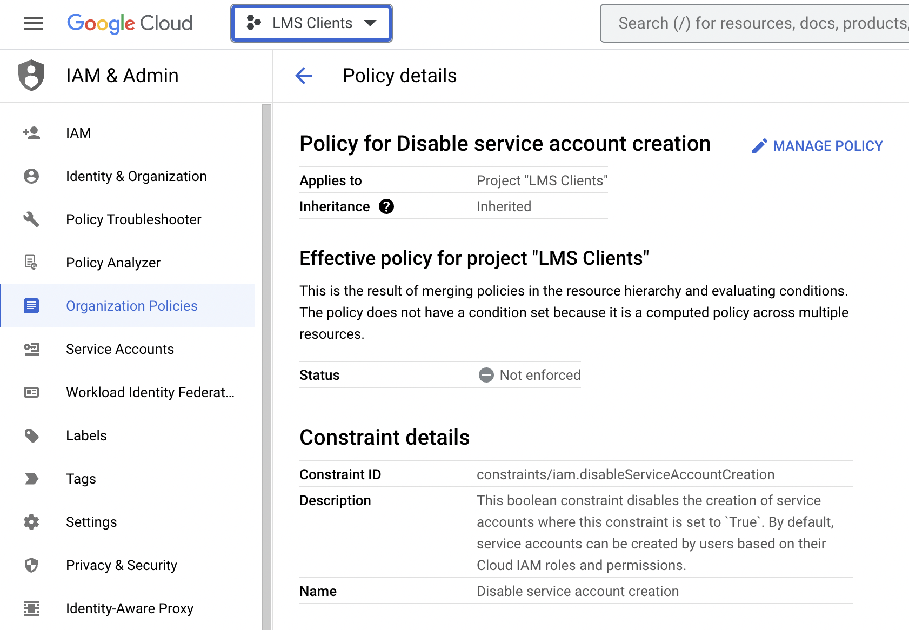
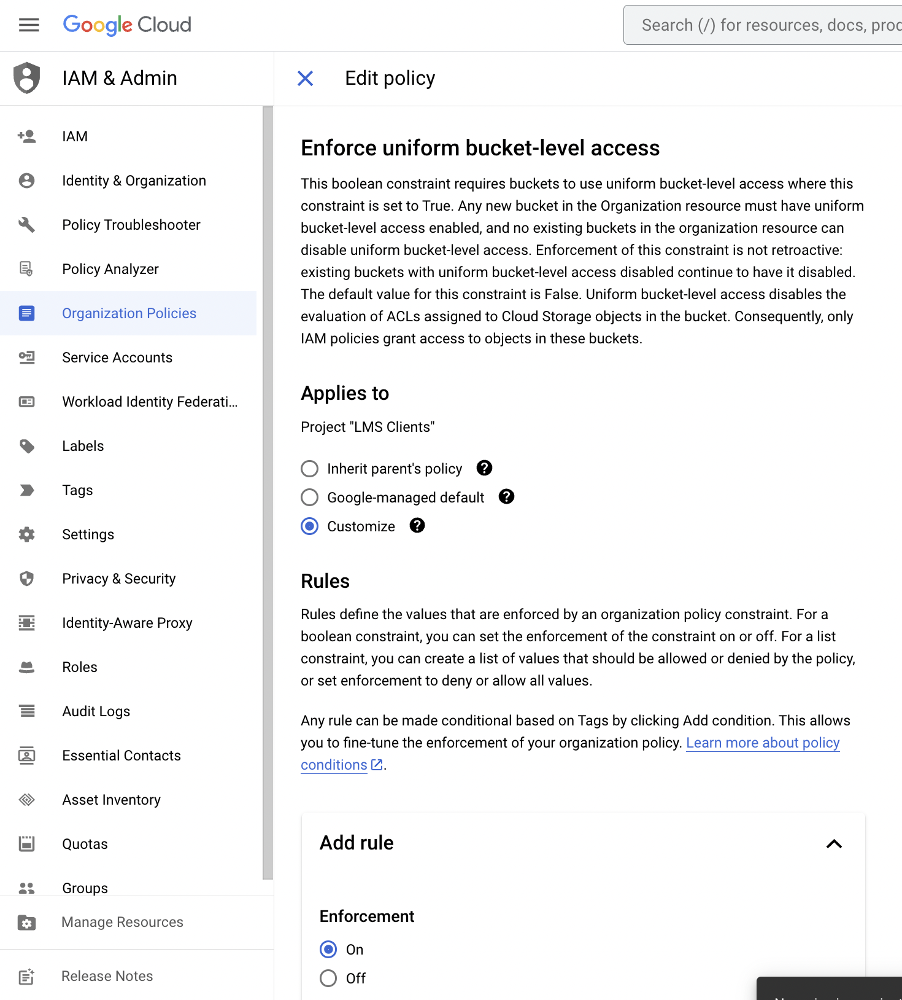
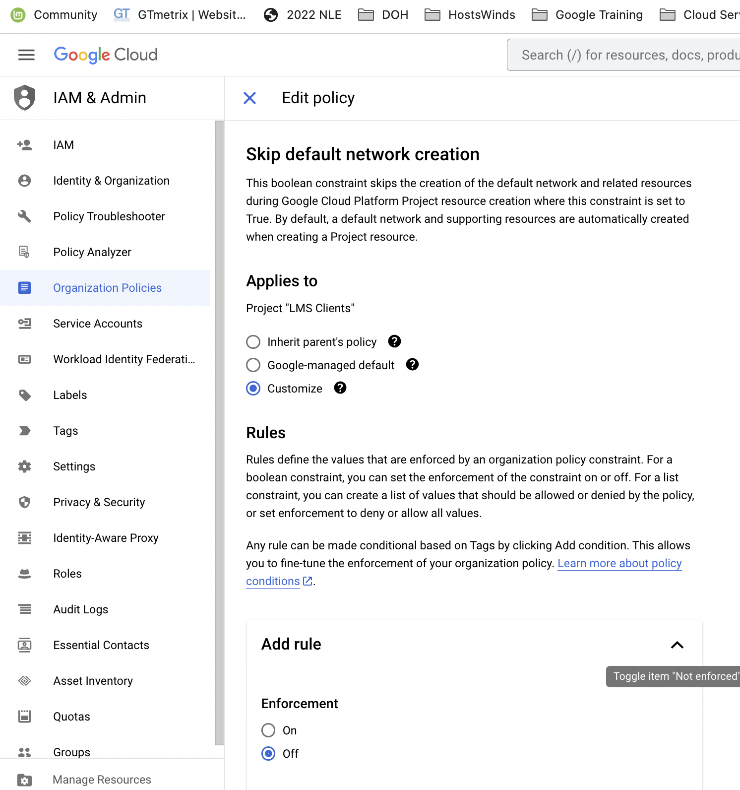
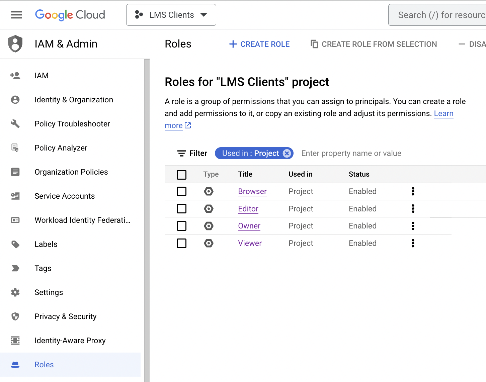
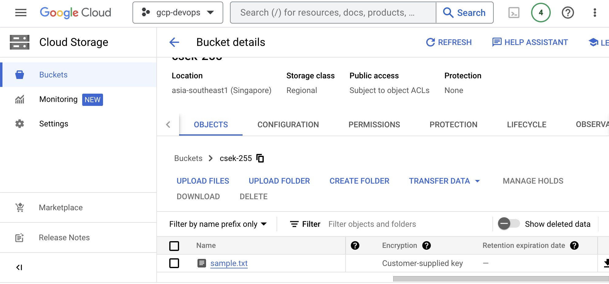

# Google Certified Professional Security Engineer

# Organization Policies

## Disable service account creation

Goto > IAM & Admin > Organization Poilicies > Disable service account creation



## Enforce uniform bucket-level access

Goto > IAM & Admin > Organization Poilicies > Enforce uniform bucket-level access



## Skip default network creation

Goto > IAM & Admin > Organization Poilicies > Skip default network creation




# Cloud IAM

## Primitive Roles

- Too much Broad access
- Not recommended
- Does not follow principal of least privilege 
- Reader=Read only permission for all resource inside project
- Editor= Reader + Modification
- Owner= editor + manage user, groups, billing


Goto IAM & Admin > Roles

- Filter: Used in Project



## Pre-Defined Roles

- GCP defined Role
- Maintained by GCP
- For each product/services –Different sets of Roles defined
- Like : 
  - Compute Admin
  - Network viewer
  - Big query Job user


# Service Accounts

**Lists credential accounts.**

```
$ gcloud auth list
                  Credentialed Accounts
ACTIVE  ACCOUNT
*       102439239747-compute@developer.gserviceaccount.com

To set the active account, run:
    $ gcloud config set account `ACCOUNT`
```

**Impersonate service account to user**

```
$ gcloud compute instances list --project [project_name] --impersonate-service-account [service_account_name]
```

**Service Accout RSA private keys**

1. Create service account 
2. Give roles to the service account
3. Create new key

```
$ gcloud config unset project
```

Activate service account using keys created

```
$ gcloud auth activate-service-account --key-file=gcp-devops-379408-8a0d9c5f201c.json
Activated service account credentials for: [sa-demo@gcp-devops-379408.iam.gserviceaccount.com]

$ gcloud auth list
                  Credentialed Accounts
ACTIVE  ACCOUNT
*       sa-demo@gcp-devops-379408.iam.gserviceaccount.com
        sherwin@mybusybee.net

To set the active account, run:
    $ gcloud config set account `ACCOUNT`
```

```
$ gcloud compute instances list --project gcp-devops
```


# Data Loss Prevention

1. Create Infotypes

   Goto > Security > Data Loss Prevention

2. Create Template inspect

3. Create job or job trigger for inspection

4. Create Template de-identify


# Data Encryption

## Cloud KMS - Google Managed Encryption keys

- By Default Encryption
- Server side encryption –before data written to disk
- No Additional Configuration required
- Encrypt data using AES-256
- Google manage rotation policy

## Customer-managed encryption keys

1. Create key ring 

   Goto > Security > Key Management > Create key ring


## Customer-supplied encryption keys

- Complete control over encryption keys
- If keys lost, data can not be recovered
- To generate keys, 
- opensslrand -base64 32
- Can not create bucket from Cloud console
- gsutil-o 'GSUtil:encryption_key='**keys**


1. Create cloud storage bucket

   ```
   $ gsutil mb -c regional -l asia-southeast1 gs://csek-255
   Creating gs://csek-255/...
   ```

2. Generate key

   ```
   $ openssl rand -base64 32
   72aZSTvuc5F8amsxoN3bQt5Coxcunuj2+t5NNrFmVWA=
   ```

3. Create sample.txt file

   sample.txt

   ``` 
   This file is using CSEK.
   ```

4. Copy sample.txt file to cloud storage bucket

   ```
   $ gsutil -o 'GSUtil:encryption_key='72aZSTvuc5F8amsxoN3bQt5Coxcunuj2+t5NNrFmVWA= cp sample.txt gs://csek-255
   Copying file://sample.txt [Content-Type=text/plain]...
   / [1 files][   25.0 B/   25.0 B]                                                
   Operation completed over 1 objects/25.0 B.                     
   ```

   

5. Try to read the sample.txt file

   **Without encrption key**

   ```
   $ gsutil cat gs://csek-255/sample.txt
       return command_runner.RunNamedCommand(command_name,
     File "/usr/lib/google-cloud-sdk/platform/gsutil/gslib/command_runner.py", line 421, in RunNamedCommand
     File "/usr/lib/google-cloud-sdk/platform/gsutil/gslib/cloud_api_delegator.py", line 319, in GetObjectMetadata
       return self._GetApi(provider).GetObjectMetadata(bucket_name,
     File "/usr/lib/google-cloud-sdk/platform/gsutil/gslib/gcs_json_api.py", line 1058, in GetObjectMetadata
       raise EncryptionException(
   gslib.cloud_api.EncryptionException: Missing decryption key with SHA256 hash b'/C4MfaYSgNrPh2X2D/2mxQH9T5qaM3yIJvX9bCeN83I='. No decryption key matches object gs://csek-255/sample.txt
   ```

   **With encryption key**

   ```
   $ gsutil -o 'GSUtil:encryption_key='72aZSTvuc5F8amsxoN3bQt5Coxcunuj2+t5NNrFmVWA= cat gs://csek-255/sample.txt
   This file is using CSEK.
   ```

   

   # Secret Manager

   

   Install secret manager

   ```
   $ pip3 install google-cloud-secret-manager
   ```

   

   ```
   from google.cloud import secretmanager
   client = secretmanager.SecretManagerServiceClient()
   name = f"projects/gcp-devops/secrets/owen-secret/versions/latest"
   response = client.access_secret_version(request={"name": name})
   payload = response.payload.data.decode("UTF-8")
   print("Plaintext: {}".format(payload))
   ```

    

