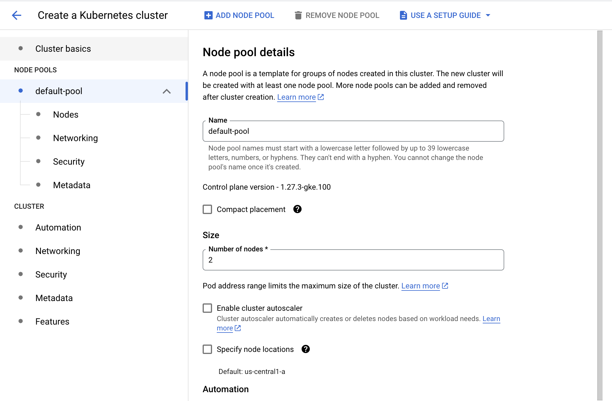
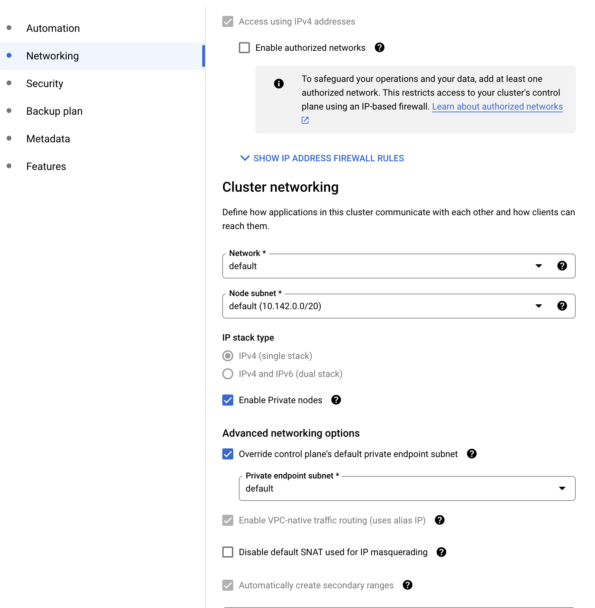

# Architecting with Google Kubernetes Engine: Workloads


## Workloads: Deployments and Jobs


[Workloads: Deployments and Jobs PDF file](./documents/M1 _ T-AK8S-I _ Architecting with GKE _ Workloads_ Deployments and Jobs [v2.0].pdf)


## LAB: Creating Google Kubernetes Engine Deployments 

## Overview

In this lab, you explore the basics of using deployment manifests. Manifests are files that contain configurations required for a deployment that can be used across different Pods. Manifests are easy to change.

## Objectives

In this lab, you learn how to perform the following tasks:

- Create deployment manifests, deploy to cluster, and verify Pod rescheduling as nodes are disabled.
- Trigger manual scaling up and down of Pods in deployments.
- Trigger deployment rollout (rolling update to new version) and rollbacks.
- Perform a Canary deployment.

## Lab setup

### **Access the lab**

For each lab, you get a new Google Cloud project and set of resources for a fixed time at no cost.

1. Sign in to Qwiklabs using an **incognito window**.
2. Note the lab's access time (for example, `1:15:00`), and make sure you can finish within that time.
   There is no pause feature. You can restart if needed, but you have to start at the beginning.
3. When ready, click **Start lab**.
4. Note your lab credentials (**Username** and **Password**). You will use them to sign in to the Google Cloud Console.
5. Click **Open Google Console**.
6. Click **Use another account** and copy/paste credentials for **this** lab into the prompts.
   If you use other credentials, you'll receive errors or **incur charges**.
7. Accept the terms and skip the recovery resource page.

**Note:** Do not click **End Lab** unless you have finished the lab or want to restart it. This clears your work and removes the project.

After you complete the initial sign-in steps, the project dashboard appears.

### Activate Google Cloud Shell

Google Cloud Shell is a virtual machine that is loaded with development tools. It offers a persistent 5GB home directory and runs on the Google Cloud.

Google Cloud Shell provides command-line access to your Google Cloud resources.

1. In Cloud console, on the top right toolbar, click the Open Cloud Shell button.

   

2. Click **Continue**.

It takes a few moments to provision and connect to the environment. When you are connected, you are already authenticated, and the project is set to your *PROJECT_ID*. For example:


**gcloud** is the command-line tool for Google Cloud. It comes pre-installed on Cloud Shell and supports tab-completion.

- You can list the active account name with this command:

```
gcloud auth list
```


**Output:**

```
Credentialed accounts:
 - <myaccount>@<mydomain>.com (active)
</mydomain></myaccount>
```

**Example output:**

```
Credentialed accounts:
 - google1623327_student@qwiklabs.net
```

- You can list the project ID with this command:

```
gcloud config list project
```


**Output:**

```
[core]
project = <project_id>
</project_id>
```

**Example output:**

```
[core]
project = qwiklabs-gcp-44776a13dea667a6
```

**Note:** Full documentation of **gcloud** is available in the [gcloud CLI overview guide ](https://cloud.google.com/sdk/gcloud).

## Task 1. Create deployment manifests and deploy to the cluster

In this task, you create a deployment manifest for a Pod inside the cluster.

### **Connect to the lab GKE cluster**

1. In Cloud Shell, type the following command to set the environment variable for the zone and cluster name:

```
export my_region=REGION
export my_cluster=autopilot-cluster-1
```


1. Configure kubectl tab completion in Cloud Shell:

```
source <(kubectl completion bash)
```


1. In Cloud Shell, configure access to your cluster for the kubectl command-line tool, using the following command:

```
gcloud container clusters get-credentials $my_cluster --region $my_region
```


### **Create a deployment manifest**

You will create a deployment using a sample deployment manifest called `nginx-deployment.yaml`. This deployment is configured to run three Pod replicas with a single nginx container in each Pod listening on TCP port 80.

1. Create and open a file called `nginx-deployment.yaml` with **nano** using the following command:

```
nano nginx-deployment.yaml
```


1. Once nano has opened, paste the following into the `nginx-deployment.yaml` file:

```
apiVersion: apps/v1
kind: Deployment
metadata:
  name: nginx-deployment
  labels:
    app: nginx
spec:
  replicas: 3
  selector:
    matchLabels:
      app: nginx
  template:
    metadata:
      labels:
        app: nginx
    spec:
      containers:
      - name: nginx
        image: nginx:1.7.9
        ports:
        - containerPort: 80
```


1. Press **Ctrl+O**, and then press **Enter** to save your edited file.
2. Press **Ctrl+X** to exit the nano text editor.
3. To deploy your manifest, execute the following command:

```
kubectl apply -f ./nginx-deployment.yaml
```


1. To view a list of deployments, execute the following command:

```
kubectl get deployments
```


The output should look like this example.

**Output:**

```
NAME               READY      UP-TO-DATE   AVAILABLE   AGE
nginx-deployment   0/3        3            0           3s
```

1. Wait a few minutes, and repeat the command until the number listed for CURRENT deployments reported by the command matches the number of DESIRED deployments.

The final output should look like the example.

**Output:**

```
NAME               READY   UP-TO-DATE   AVAILABLE   AGE
nginx-deployment   3/3     3            3           42s
```

Click *Check my progress* to verify the objective.

Create and deploy manifest nginx deployment


Check my progress


## Task 2. Manually scale up and down the number of Pods in deployments

Sometimes, you want to shut down a Pod instance. Other times, you want ten Pods running. In Kubernetes, you can scale a specific Pod to the desired number of instances. To shut them down, you scale to zero.

In this task, you scale Pods up and down in the Google Cloud Console and Cloud Shell.

### **Scale Pods up and down in the console**

1. Switch to the Google Cloud Console tab.
2. On the **Navigation menu** ( ), click **Kubernetes Engine** > **Workloads**.
3. Click **nginx-deployment** (your deployment) to open the Deployment details page.
4. At the top, click **ACTIONS > Scale > Edit Replicas**.
5. Type **1** and click **SCALE**.

This action scales down your cluster. You should see the Pod status being updated under **Managed Pods**. You might have to click **Refresh**.

### **Scale Pods up and down in the shell**

1. Switch back to the Cloud Shell browser tab.
2. In the Cloud Shell, to view a list of Pods in the deployments, execute the following command:

```
kubectl get deployments
```


**Output:**

```
NAME               READY   UP-TO-DATE   AVAILABLE   AGE
nginx-deployment   1/1     1            1           3m
```

1. To scale the Pod back up to three replicas, execute the following command:

```
kubectl scale --replicas=3 deployment nginx-deployment
```


1. To view a list of Pods in the deployments, execute the following command:

```
kubectl get deployments
```


**Output:**

```
NAME               READY   UP-TO-DATE   AVAILABLE   AGE
nginx-deployment   3/3     3            3           4m
```

## Task 3. Trigger a deployment rollout and a deployment rollback

A deployment's rollout is triggered if and only if the deployment's Pod template (that is, `.spec.template`) is changed, for example, if the labels or container images of the template are updated. Other updates, such as scaling the deployment, do not trigger a rollout.

In this task, you trigger deployment rollout, and then you trigger deployment rollback.

### **Trigger a deployment rollout**

1. To update the version of nginx in the deployment, execute the following command:

```
kubectl set image deployment.v1.apps/nginx-deployment nginx=nginx:1.9.1 
```


This updates the container image in your Deployment to `nginx v1.9.1`.

1. To annotate the rollout with details on the change, execute the following command:

```
kubectl annotate deployment nginx-deployment kubernetes.io/change-cause="version change to 1.9.1" --overwrite=true
```


1. To view the rollout status, execute the following command:

```
kubectl rollout status deployment.v1.apps/nginx-deployment
```


The output should look like the example.

**Output:**

```
Waiting for rollout to finish: 1 out of 3 new replicas updated...
Waiting for rollout to finish: 1 out of 3 new replicas updated...
Waiting for rollout to finish: 1 out of 3 new replicas updated...
Waiting for rollout to finish: 2 out of 3 new replicas updated...
Waiting for rollout to finish: 2 out of 3 new replicas updated...
Waiting for rollout to finish: 2 out of 3 new replicas updated...
Waiting for rollout to finish: 1 old replicas pending termination...
Waiting for rollout to finish: 1 old replicas pending termination...
deployment "nginx-deployment" successfully rolled out
```

1. To verify the change, get the list of deployments:

```
kubectl get deployments
```


The output should look like the example.

**Output:**

```
NAME               READY   UP-TO-DATE   AVAILABLE   AGE
nginx-deployment   3/3     3            3           6m
```

Click *Check my progress* to verify the objective.

Update version of nginx in the deployment


Check my progress


1. View the rollout history of the deployment:

```
kubectl rollout history deployment nginx-deployment
```


The output should look like the example. Your output might not be an exact match.

**Output:**

```
deployments "nginx-deployment"
REVISION  CHANGE-CAUSE
1         <none>
2         version change to 1.9.1
</none>
```

### Trigger a deployment rollback

To roll back an object's rollout, you can use the `kubectl rollout undo` command.

1. To roll back to the previous version of the nginx deployment, execute the following command:

```
kubectl rollout undo deployments nginx-deployment
```


1. View the updated rollout history of the deployment:

```
kubectl rollout history deployment nginx-deployment
```


The output should look like the example. Your output might not be an exact match.

**Output:**

```
deployments "nginx-deployment"
REVISION  CHANGE-CAUSE
2        version change to 1.9.1
3         <none>
</none>
```

**Note:** The most recent update is blank for the **CHANGE-CAUSE** as we did not use the **kubectl annotate** command .

1. View the details of the latest deployment revision:

```
kubectl rollout history deployment/nginx-deployment --revision=3
```


The output should look like the example. Your output might not be an exact match but it will show that the current revision has rolled back to `nginx:1.7.9`.

**Output:**

```
deployments "nginx-deployment" with revision #3
Pod Template:
  Labels:       app=nginx
        pod-template-hash=3123191453
  Containers:
   nginx:
    Image:      nginx:1.7.9
    Port:       80/TCP
    Host Port:  0/TCP
    Environment:        <none>
    Mounts:     <none>
  Volumes:      <none>
</none></none></none>
```

## Task 4. Define the service type in the manifest

In this task, you create and verify a service that controls inbound traffic to an application. Services can be configured as ClusterIP, NodePort or LoadBalancer types. In this lab, you configure a LoadBalancer.

### **Define service types in the manifest**

A manifest file called `service-nginx.yaml` that deploys a LoadBalancer service type has been provided for you. This service is configured to distribute inbound traffic on TCP port 60000 to port 80 on any containers that have the label `app: nginx`.

1. Create and open a file called `service-nginx.yaml` with **nano** using the following command:

```
nano service-nginx.yaml
```


1. Once nano has opened, paste the following into the `service-nginx.yaml` file:

```
apiVersion: v1
kind: Service
metadata:
  name: nginx
spec:
  type: LoadBalancer
  selector:
    app: nginx
  ports:
  - protocol: TCP
    port: 60000
    targetPort: 80
```


1. Press **Ctrl+O**, and then press **Enter** to save your edited file.
2. Press **Ctrl+X** to exit the nano text editor.
3. In the Cloud Shell, to deploy your manifest, execute the following command:

```
kubectl apply -f ./service-nginx.yaml
```


This manifest defines a service and applies it to Pods that correspond to the selector. In this case, the manifest is applied to the nginx container that you deployed in task 1. This service also applies to any other Pods with the `app: nginx` label, including any that are created after the service.

### **Verify the LoadBalancer creation**

1. To view the details of the nginx service, execute the following command:

```
kubectl get service nginx
```


The output should look like the example.

**Output:**

```
NAME      CLUSTER_IP      EXTERNAL_IP      PORT(S)   SELECTOR    AGE
nginx     10.X.X.X        X.X.X.X          60000/TCP    run=nginx   1m
```

1. When the external IP appears, open `http://[EXTERNAL_IP]:60000/` in a new browser tab to see the server being served through network load balancing.

**Note:** It may take a few seconds before the **ExternalIP** field is populated for your service. This is normal. Just re-run the `kubectl get services nginx` command every few seconds until the field is populated.

Click *Check my progress* to verify the objective.

Deploy manifest file that deploys LoadBalancer service type


Check my progress


## Task 5. Perform a canary deployment

A canary deployment is a separate deployment used to test a new version of your application. A single service targets both the canary and normal deployments. And it can direct a subset of users to the canary version to mitigate the risk of new releases.

In this task, you create a canary deployment to deploys a single pod running a newer version of nginx than your main deployment.

1. Create and open a file called `nginx-canary.yaml` with **nano** using the following command:

```
nano nginx-canary.yaml
```


1. Once nano has opened, paste the following into the `nginx-canary.yaml` file:

```
apiVersion: apps/v1
kind: Deployment
metadata:
  name: nginx-canary
  labels:
    app: nginx
spec:
  replicas: 1
  selector:
    matchLabels:
      app: nginx
  template:
    metadata:
      labels:
        app: nginx
        track: canary
        Version: 1.9.1
    spec:
      containers:
      - name: nginx
        image: nginx:1.9.1
        ports:
        - containerPort: 80
```


1. Press **Ctrl+O**, and then press **Enter** to save your edited file.
2. Press **Ctrl+X** to exit the nano text editor.

The manifest for the nginx Service you deployed in the previous task uses a label selector to target the Pods with the `app: nginx` label. Both the normal deployment and this new canary deployment have the `app: nginx` label. Inbound connections will be distributed by the service to both the normal and canary deployment Pods. The canary deployment has fewer replicas (Pods) than the normal deployment, and thus it is available to fewer users than the normal deployment.

1. Create the canary deployment based on the configuration file:

```
kubectl apply -f ./nginx-canary.yaml
```


1. When the deployment is complete, verify that both the nginx and the nginx-canary deployments are present:

```
kubectl get deployments
```


1. Switch back to the browser tab that is connected to the external LoadBalancer service ip and refresh the page. You should continue to see the standard `Welcome to nginx` page.
2. Switch back to the Cloud Shell and scale down the primary deployment to 0 replicas:

```
kubectl scale --replicas=0 deployment nginx-deployment
```


1. Verify that the only running replica is now the Canary deployment:

```
kubectl get deployments
```


1. Switch back to the browser tab that is connected to the external LoadBalancer service ip and refresh the page. You should continue to see the standard `Welcome to nginx` page showing that the Service is automatically balancing traffic to the canary deployment.

Click *Check my progress* to verify the objective.

Create a Canary Deployment


Check my progress


### **Session affinity**

The service configuration used in the lab does not ensure that all requests from a single client will always connect to the same Pod. Each request is treated separately and can connect to either the normal nginx deployment or to the nginx-canary deployment.

This potential to switch between different versions may cause problems if there are significant changes in functionality in the canary release. To prevent this you can set the `sessionAffinity` field to `ClientIP` in the specification of the service if you need a client's first request to determine which Pod will be used for all subsequent connections.

For example:

```
apiVersion: v1
kind: Service
metadata:
  name: nginx
spec:
  type: LoadBalancer
  sessionAffinity: ClientIP
  selector:
    app: nginx
  ports:
  - protocol: TCP
    port: 60000
    targetPort: 80
```


## End your lab


## Google Kubernetes Engine Networking


[Google Kubernetes Engine Networking PDF file](./documents/M2 _ T-AK8S-I _ Architecting with GKE _ Google Kubernetes Engine Networking [v2.0].pdf)


## LAB: Configuring Google Kubernetes Engine (GKE) Networking


## Overview

In this lab, you will create a private cluster, add an authorized network for API access to it, and then configure a network policy for Pod security.

**Note:** For this lab, GKE Standard Mode will be used. The lab explores cluster network policies and these are enabled by default in GKE Autopilot.

### Objectives

In this lab, you learn how to perform the following tasks:

- Create and test a private cluster.
- Configure a cluster for authorized network control plane access.
- Configure a Cluster network policy.

## Setup and requirements

For each lab, you get a new Google Cloud project and set of resources for a fixed time at no cost.

1. Sign in to Qwiklabs using an **incognito window**.
2. Note the lab's access time (for example, `1:15:00`), and make sure you can finish within that time.
   There is no pause feature. You can restart if needed, but you have to start at the beginning.
3. When ready, click **Start lab**.
4. Note your lab credentials (**Username** and **Password**). You will use them to sign in to the Google Cloud Console.
5. Click **Open Google Console**.
6. Click **Use another account** and copy/paste credentials for **this** lab into the prompts.
   If you use other credentials, you'll receive errors or **incur charges**.
7. Accept the terms and skip the recovery resource page.

**Note:** Do not click **End Lab** unless you have finished the lab or want to restart it. This clears your work and removes the project.

After you complete the initial sign-in steps, the project dashboard appears.

### Activate Google Cloud Shell

Google Cloud Shell is a virtual machine that is loaded with development tools. It offers a persistent 5GB home directory and runs on the Google Cloud.

Google Cloud Shell provides command-line access to your Google Cloud resources.

1. In Cloud console, on the top right toolbar, click the Open Cloud Shell button.

   

2. Click **Continue**.

It takes a few moments to provision and connect to the environment. When you are connected, you are already authenticated, and the project is set to your *PROJECT_ID*. For example:


**gcloud** is the command-line tool for Google Cloud. It comes pre-installed on Cloud Shell and supports tab-completion.

- You can list the active account name with this command:

```
gcloud auth list
```


**Output:**

```
Credentialed accounts:
 - <myaccount>@<mydomain>.com (active)
</mydomain></myaccount>
```

**Example output:**

```
Credentialed accounts:
 - google1623327_student@qwiklabs.net
```

- You can list the project ID with this command:

```
gcloud config list project
```


**Output:**

```
[core]
project = <project_id>
</project_id>
```

**Example output:**

```
[core]
project = qwiklabs-gcp-44776a13dea667a6
```

**Note:** Full documentation of **gcloud** is available in the [gcloud CLI overview guide ](https://cloud.google.com/sdk/gcloud).

## Task 1. Create a private cluster

In this task, you create a private cluster, consider the options for how private to make it, and then compare your private cluster to your original cluster.

In a private cluster, the nodes have internal RFC 1918 IP addresses only, which ensures that their workloads are isolated from the public Internet. The nodes in a non-private cluster have external IP addresses, potentially allowing traffic to and from the internet.

### Set up a private cluster

1. On the **Navigation menu** (), click **Kubernetes Engine > Clusters**.
2. Click **Create** and select **SWITCH TO STANDARD CLUSTER** for the cluster.
3. Name the cluster `private-cluster`.
4. Select `ZONE` as the Zone.
5. In the left pane, in **Node Pools** click **default-pool**.
6. In **Number of nodes** type **2**.



1. In the left pane, in **Cluster** click on **Networking**.
2. Ensure **Enable authorized networks** is not selected.
3. Select the checkbox to **Enable Private nodes**.
4. Select the checkbox to **Override control plane’s default private endpoint subnet**.
5. Under **Private endpoint subnet** select as **default**.



**Note:** Google Cloud uses VPC peering to connect the VPC of the cluster with your default VPC network.

You may have to scroll down to see this option.

This setting allows you the range of addresses that can access the cluster externally. When this checkbox is not selected, you can access `kubectl` only from within the Google Cloud network. In this lab, you will only access `kubectl` through the Google Cloud network but you will modify this setting later.

1. Click **Create**.

**Note:** You need to wait a few minutes for the cluster deployment to complete.

### Inspect your cluster

- In the Cloud Shell, enter the following command to review the details of your new cluster:

```
gcloud container clusters describe private-cluster --zone ZONE
```


The following values appear only under the private cluster:

- privateEndpoint, an internal IP address. Nodes use this internal IP address to communicate with the cluster control plane.
- publicEndpoint, an external IP address. External services and administrators can use the external IP address to communicate with the cluster control plane.

You have several options to lock down your cluster to varying degrees:

- The whole cluster can have external access.
- The whole cluster can be private.
- The nodes can be private while the cluster control plane is public, and you can limit which external networks are authorized to access the cluster control plane.

Without public IP addresses, code running on the nodes can't access the public internet unless you configure a NAT gateway such as Cloud NAT.

You might use private clusters to provide services such as internal APIs that are meant only to be accessed by resources inside your network. For example, the resources might be private tools that only your company uses. Or they might be backend services accessed by your frontend services, and perhaps only those frontend services are accessed directly by external customers or users. In such cases, private clusters are a good way to reduce the surface area of attack for your application.

Click *Check my progress* to verify the objective.

Create a private cluster


Check my progress


## Task 2. Add an authorized network for cluster control plane access

After cluster creation, you might want to issue commands to your cluster from outside Google Cloud. For example, you might decide that only your corporate network should issue commands to your cluster control plane. Unfortunately, you didn't specify the authorized network on cluster creation.

In this task, you add an authorized network for cluster control plane access.

**Note:** In this task, you make the Kubernetes control plane API accessible to a specific range of network addresses. In a real-world use of GKE, this connection would be used by IT staff and automated processes, not end-users.

1. In the Google Cloud Console **Navigation menu** (), click **Kubernetes Engine > Clusters**.
2. Click **private-cluster** to open the Clusters details page.
3. In **Details** tab, under **Control Plane Networking** section, click on **Edit**().
4. Select **Enable authorized networks**.
5. Click **Add an authorized network**.
6. For **Name**, type the name for the network, use `Corporate`.
7. For **Network**, type a CIDR range that you want to grant whitelisted access to your cluster control plane. As an example, you can use `192.168.1.0/24`.
8. Click **Done**.
9. Ensure the following parameters are enabled:
   - Access using the control plane's external IP address
   - Access using the control plane's internal IP address from any region
   - Enforce authorized networks on the control plane's internal endpoint
   - Add Google Cloud external IP addresses to authorized networks

Multiple networks can be added here if necessary, but no more than 50 CIDR ranges.

**Note:** Outside this lab environment, a practical example might be to whitelist only the public, outside address of your corporate firewall. For example, if your corporate firewall's IP address were 8.8.8.14, you could whitelist access to 8.8.8.14/32.

1. Click **Save changes** at the bottom of the menu.

Click *Check my progress* to verify the objective.

Add an authorized network for cluster control plane access


Check my progress


## Task 3. Create a cluster network policy

In this task, you create a cluster network policy to restrict communication between the Pods. A zero-trust zone is important to prevent lateral attacks within the cluster when an intruder compromises one of the Pods.

### Create a GKE cluster

1. In Cloud Shell, type the following command to set the environment variable for the zone and cluster name:

```
export my_zone=ZONE
export my_cluster=standard-cluster-1
```


1. Configure kubectl tab completion in Cloud Shell:

```
source <(kubectl completion bash)
```


1. In Cloud Shell, type the following command to create a Kubernetes cluster. Note that this command adds the additional flag `--enable-network-policy` to the parameters you have used in previous labs. This flag allows this cluster to use cluster network policies:

```
gcloud container clusters create $my_cluster --num-nodes 3 --enable-ip-alias --zone $my_zone --enable-network-policy
```


1. In Cloud Shell, configure access to your cluster for the kubectl command-line tool, using the following command:

```
gcloud container clusters get-credentials $my_cluster --zone $my_zone
```


1. Run a simple web server application with the label `app=hello`, and expose the web application internally in the cluster:

```
kubectl run hello-web --labels app=hello \
  --image=gcr.io/google-samples/hello-app:1.0 --port 8080 --expose
```


### Restrict incoming traffic to Pods

Let's create a sample NetworkPolicy manifest file called `hello-allow-from-foo.yaml` . This manifest file defines an ingress policy that allows access to Pods labeled `app: hello` from Pods labeled `app: foo`.

1. Create and open a file called `hello-allow-from-foo.yaml` with **nano** using the following command:

```
nano hello-allow-from-foo.yaml
```


1. Once nano has opened, paste the following into the `hello-allow-from-foo.yaml` file:

```
kind: NetworkPolicy
apiVersion: networking.k8s.io/v1
metadata:
  name: hello-allow-from-foo
spec:
  policyTypes:
  - Ingress
  podSelector:
    matchLabels:
      app: hello
  ingress:
  - from:
    - podSelector:
        matchLabels:
          app: foo
```


1. Press **Ctrl+O**, and then press **Enter** to save your edited file.
2. Press **Ctrl+X** to exit the nano text editor.
3. Create an ingress policy:

```
kubectl apply -f hello-allow-from-foo.yaml
```


1. Verify that the policy was created:

```
kubectl get networkpolicy
```


**Output:**

```
NAME                   POD-SELECTOR   AGE
hello-allow-from-foo   app=hello      7s
```

### Validate the ingress policy

1. Run a temporary Pod called `test-1` with the label `app=foo` and get a shell in the Pod:

```
kubectl run test-1 --labels app=foo --image=alpine --restart=Never --rm --stdin --tty
```


**Note:** The kubectl switches used here in conjunction with the run command are important to note.


`--stdin` ( alternatively `-i` ) creates an interactive session attached to STDIN on the container.


`--tty` ( alternatively `-t` ) allocates a TTY for each container in the pod.


`--rm` instructs Kubernetes to treat this as a temporary Pod that will be removed as soon as it completes its startup task. As this is an interactive session it will be removed as soon as the user exits the session.


`--label` ( alternatively `-l` ) adds a set of labels to the pod.


`--restart` defines the restart policy for the Pod.

1. Make a request to the hello-web:8080 endpoint to verify that the incoming traffic is allowed:

```
wget -qO- --timeout=2 http://hello-web:8080
```


**Output:**

```
If you don't see a command prompt, try pressing enter.
/ # wget -qO- --timeout=2 http://hello-web:8080
Hello, world!
Version: 1.0.0
Hostname: hello-web-8b44b849-k96lh
/ #
```

1. Type **exit** and press **ENTER** to leave the shell.
2. Now you will run a different Pod using the same Pod name but using a label, `app=other`, that does not match the podSelector in the active network policy. This Pod should not have the ability to access the hello-web application.

```
kubectl run test-1 --labels app=other --image=alpine --restart=Never --rm --stdin --tty
```


1. Make a request to the hello-web:8080 endpoint to verify that the incoming traffic is not allowed:

```
wget -qO- --timeout=2 http://hello-web:8080
```


The request times out.

**Output:**

```
If you don't see a command prompt, try pressing enter.
/ # wget -qO- --timeout=2 http://hello-web:8080
wget: download timed out
/ #
```

1. Type **exit** and press **ENTER** to leave the shell.

### Restrict outgoing traffic from the Pods

You can restrict outgoing (egress) traffic as you do incoming traffic. However, in order to query internal hostnames (such as hello-web) or external hostnames (such as www.example.com), you must allow DNS resolution in your egress network policies. DNS traffic occurs on port 53, using TCP and UDP protocols.

Let's create a NetworkPolicy manifest file `foo-allow-to-hello.yaml`. This file defines a policy that permits Pods with the label `app: foo` to communicate with Pods labeled `app: hello` on any port number, and allows the Pods labeled `app: foo` to communicate to any computer on UDP port 53, which is used for DNS resolution. Without the DNS port open, you will not be able to resolve the hostnames.

1. Create and open a file called `foo-allow-to-hello.yaml` with **nano** using the following command:

```
nano foo-allow-to-hello.yaml
```


1. Once nano has opened, paste the following into the `foo-allow-to-hello.yaml` file:

```
kind: NetworkPolicy
apiVersion: networking.k8s.io/v1
metadata:
  name: foo-allow-to-hello
spec:
  policyTypes:
  - Egress
  podSelector:
    matchLabels:
      app: foo
  egress:
  - to:
    - podSelector:
        matchLabels:
          app: hello
  - to:
    ports:
    - protocol: UDP
      port: 53
```


1. Press **Ctrl+O**, and then press **Enter** to save your edited file.
2. Press **Ctrl+X** to exit the nano text editor.
3. Create an egress policy:

```
kubectl apply -f foo-allow-to-hello.yaml
```


1. Verify that the policy was created:

```
kubectl get networkpolicy
```


**Output:**

```
NAME                   POD-SELECTOR   AGE
foo-allow-to-hello     app=foo        7s
hello-allow-from-foo   app=hello      5m
```

### Validate the egress policy

1. Deploy a new web application called hello-web-2 and expose it internally in the cluster:

```
kubectl run hello-web-2 --labels app=hello-2 \
  --image=gcr.io/google-samples/hello-app:1.0 --port 8080 --expose
```


1. Run a temporary Pod with the `app=foo` label and get a shell prompt inside the container:

```
kubectl run test-3 --labels app=foo --image=alpine --restart=Never --rm --stdin --tty
```


1. Verify that the Pod can establish connections to hello-web:8080:

```
wget -qO- --timeout=2 http://hello-web:8080
```


**Output:**

```
If you don't see a command prompt, try pressing enter.
/ # wget -qO- --timeout=2 http://hello-web:8080
Hello, world!
Version: 1.0.0
Hostname: hello-web
/ #
```

1. Verify that the Pod cannot establish connections to hello-web-2:8080:

```
wget -qO- --timeout=2 http://hello-web-2:8080
```


This fails because none of the Network policies you have defined allow traffic to Pods labeled `app: hello-2`.

1. Verify that the Pod cannot establish connections to external websites, such as www.example.com:

```
wget -qO- --timeout=2 http://www.example.com
```


This fails because the network policies do not allow external http traffic (tcp port 80).

1. Type **exit** and press **ENTER** to leave the shell.

Click *Check my progress* to verify the objective.

Run web server applications


Check my progress


## End your lab


## Persistent Data and Storage

[Persistent Data and Storage PDF file](./documents/M3 _ T-AK8S-I _ Architecting with GKE _ Persistent Data and Storage [v2.0].pdf)


## LAB: Configuring Persistent Storage for Google Kubernetes Engine

## Overview

In this lab, you set up PersistentVolumes and PersistentVolumeClaims. PersistentVolumes are storage that is available to a Kubernetes cluster. PersistentVolumeClaims enable Pods to access PersistentVolumes. Without PersistentVolumeClaims Pods are mostly ephemeral, so you should use PersistentVolumeClaims for any data that you expect to survive Pod scaling, updating, or migrating.

## Objectives

In this lab, you learn how to perform the following tasks:

- Create manifests for PersistentVolumes (PVs) and PersistentVolumeClaims (PVCs) for Google Cloud persistent disks (dynamically created or existing)
- Mount Google Cloud persistent disk PVCs as volumes in Pods
- Use manifests to create StatefulSets
- Mount Google Cloud persistent disk PVCs as volumes in StatefulSets
- Verify the connection of Pods in StatefulSets to particular PVs as the Pods are stopped and restarted

## Lab setup

### Access the lab

For each lab, you get a new Google Cloud project and set of resources for a fixed time at no cost.

1. Sign in to Qwiklabs using an **incognito window**.
2. Note the lab's access time (for example, `1:15:00`), and make sure you can finish within that time.
   There is no pause feature. You can restart if needed, but you have to start at the beginning.
3. When ready, click **Start lab**.
4. Note your lab credentials (**Username** and **Password**). You will use them to sign in to the Google Cloud Console.
5. Click **Open Google Console**.
6. Click **Use another account** and copy/paste credentials for **this** lab into the prompts.
   If you use other credentials, you'll receive errors or **incur charges**.
7. Accept the terms and skip the recovery resource page.

**Note:** Do not click **End Lab** unless you have finished the lab or want to restart it. This clears your work and removes the project.

### Activate Google Cloud Shell

Google Cloud Shell is a virtual machine that is loaded with development tools. It offers a persistent 5GB home directory and runs on the Google Cloud.

Google Cloud Shell provides command-line access to your Google Cloud resources.

1. In Cloud console, on the top right toolbar, click the Open Cloud Shell button.

   

2. Click **Continue**.

It takes a few moments to provision and connect to the environment. When you are connected, you are already authenticated, and the project is set to your *PROJECT_ID*. For example:


**gcloud** is the command-line tool for Google Cloud. It comes pre-installed on Cloud Shell and supports tab-completion.

- You can list the active account name with this command:

```
gcloud auth list
```


**Output:**

```
Credentialed accounts:
 - <myaccount>@<mydomain>.com (active)
</mydomain></myaccount>
```

**Example output:**

```
Credentialed accounts:
 - google1623327_student@qwiklabs.net
```

- You can list the project ID with this command:

```
gcloud config list project
```


**Output:**

```
[core]
project = <project_id>
</project_id>
```

**Example output:**

```
[core]
project = qwiklabs-gcp-44776a13dea667a6
```

**Note:** Full documentation of **gcloud** is available in the [gcloud CLI overview guide ](https://cloud.google.com/sdk/gcloud).

## Task 1. Create PVs and PVCs

In this task, you create a PVC, which triggers Kubernetes to automatically create a PV.

### Connect to the lab GKE cluster

1. In Cloud Shell, type the following command to set the environment variable for the zone and cluster name:

```
export my_region=Region
export my_cluster=autopilot-cluster-1
```


1. Configure tab completion for the kubectl command-line tool:

```
source <(kubectl completion bash)
```


1. Configure access to your cluster for kubectl:

```
gcloud container clusters get-credentials $my_cluster --region $my_region
```


### Create and apply a manifest with a PVC

Most of the time, you don't need to directly configure PV objects or create Compute Engine persistent disks. Instead, you can create a PVC, and Kubernetes automatically provisions a persistent disk for you.

Let's creates a 30 gigabyte PVC called `hello-web-disk` that can be mounted as a read-write volume on a single node at a time.

1. Create and open a file called `pvc-demo.yaml` with **nano** using the following command:

```
nano pvc-demo.yaml
```


1. Once nano has opened, paste the following into the `pvc-demo.yaml` file:

```
apiVersion: v1
kind: PersistentVolumeClaim
metadata:
  name: hello-web-disk
spec:
  accessModes:
    - ReadWriteOnce
  resources:
    requests:
      storage: 30Gi
```

1. Press **Ctrl+O**, and then press **Enter** to save your edited file.
2. Press **Ctrl+X** to exit the nano text editor.
3. To show that you currently have no PVCs, execute the following command:

```
kubectl get persistentvolumeclaim
```


**Output:**

```
No resources found in default namespace.
```

1. To create the PVC, execute the following command:

```
kubectl apply -f pvc-demo.yaml
```


1. To show your newly created PVC, execute the following command:

```
kubectl get persistentvolumeclaim
```


**Partial output:**

```
NAME           STATUS    VOLUME       CAPACITY   ACCESS MODES   STORAGE CLASS   AGE
hello-web-disk Pending                                          standard-rwo    15s
```

**Note:** The status will remain pending until after the next step.

Click **Check my progress** to verify the objective.

Create PVs and PVCs


Check my progress


## Task 2. Mount and verify Google Cloud persistent disk PVCs in Pods

In this task, you attach your persistent disk PVC to a Pod. You mount the PVC as a volume as part of the manifest for the Pod.

### Mount the PVC to a Pod

Create a manifest file `pod-volume-demo.yaml` to deploy an nginx container, attache the `pvc-demo-volume` to the Pod and mount that volume to the path `/var/www/html` inside the nginx container. Files saved to this directory inside the container will be saved to the persistent volume and persist even if the Pod and the container are shutdown and recreated.

1. Create and open a file called `pod-volume-demo.yaml` with **nano** using the following command:

```
nano pod-volume-demo.yaml
```


1. Once nano has opened, paste the following into the `pod-volume-demo.yaml` file:

```
kind: Pod
apiVersion: v1
metadata:
  name: pvc-demo-pod
spec:
  containers:
    - name: frontend
      image: nginx
      volumeMounts:
      - mountPath: "/var/www/html"
        name: pvc-demo-volume
  volumes:
    - name: pvc-demo-volume
      persistentVolumeClaim:
        claimName: hello-web-disk
```

1. Press **Ctrl+O**, and then press **Enter** to save your edited file.
2. Press **Ctrl+X** to exit the nano text editor.
3. To create the Pod with the volume, execute the following command:

```
kubectl apply -f pod-volume-demo.yaml
```


1. List the Pods in the cluster:

```
kubectl get pods
```


**Output:**

```
NAME          READY    STATUS              RESTARTS   AGE
pvc-demo-pod  0/1      ContainerCreating   0          18s
```

If you do this quickly after creating the Pod, you will see the status listed as "ContainerCreating" while the volume is mounted before the status changes to "Running".

1. To verify the PVC is accessible within the Pod, you must gain shell access to your Pod. To start the shell session, execute the following command:

```
kubectl exec -it pvc-demo-pod -- sh
```


1. To create a simple text message as a web page in the Pod enter the following commands:

```
echo Test webpage in a persistent volume!>/var/www/html/index.html
chmod +x /var/www/html/index.html
```


1. Verify the text file contains your message:

```
cat /var/www/html/index.html
```


**Output:**

```
Test webpage in a persistent volume!
```

1. Enter the following command to leave the interactive shell on the nginx container:

```
exit
```


### Test the persistence of the PV

You will now delete the Pod from the cluster, confirm that the PV still exists, then redeploy the Pod and verify the contents of the PV remain intact.

1. Delete the pvc-demo-pod:

```
kubectl delete pod pvc-demo-pod
```


1. List the Pods in the cluster:

```
kubectl get pods
```


**Output:**

```
No resources found in default namespace.
```

There should be no Pods on the cluster.

1. To show your PVC, execute the following command:

```
kubectl get persistentvolumeclaim
```


**Partial output:**

```
NAME           STATUS    VOLUME       CAPACITY   ACCESS MODES   STORAGE CLASS   AGE
hello-web-disk Bound     pvc-8...34   30Gi       RWO            standard-rwo    22m
```

Your PVC still exists, and was not deleted when the Pod was deleted.

1. Redeploy the pvc-demo-pod:

```
kubectl apply -f pod-volume-demo.yaml
```


1. List the Pods in the cluster:

```
kubectl get pods
```


**Output:**

```
NAME           READY     STATUS    RESTARTS   AGE
pvc-demo-pod   1/1       Running   0          15s
```

The Pod will deploy and the status will change to "Running" faster this time because the PV already exists and does not need to be created.

1. To verify the PVC is still accessible within the Pod, you must gain shell access to your Pod. To start the shell session, execute the following command:

```
kubectl exec -it pvc-demo-pod -- sh
```


1. To verify that the text file still contains your message execute the following command:

```
cat /var/www/html/index.html
```


**Output:**

```
Test webpage in a persistent volume!
```

The contents of the persistent volume were not removed, even though the Pod was deleted from the cluster and recreated.

1. Enter the following command to leave the interactive shell on the nginx container:

```
exit
```


Click **Check my progress** to verify the objective.

Mount and verify Google Cloud persistent disk PVCs in Pods


Check my progress


## Task 3. Create StatefulSets with PVCs

In this task, you use your PVC in a StatefulSet. A StatefulSet is like a Deployment, except that the Pods are given unique identifiers.

### Release the PVC

1. Before you can use the PVC with the statefulset, you must delete the Pod that is currently using it. Execute the following command to delete the Pod:

```
kubectl delete pod pvc-demo-pod
```


1. Confirm the Pod has been removed:

```
kubectl get pods
```


**Output:**

```
No resources found in default namespace.
```

### Create a StatefulSet

Let's create a manifest file `statefulset-demo.yaml` that creates a StatefulSet that includes a LoadBalancer service and three replicas of a Pod containing an nginx container and a volumeClaimTemplate for 30 gigabyte PVCs with the name `hello-web-disk`. The nginx containers mount the PVC called `hello-web-disk` at `/var/www/html` as in the previous task.

1. Create and open a file called `statefulset-demo.yaml` with **nano** using the following command:

```
nano statefulset-demo.yaml
```


1. Once nano has opened, paste the following into the `statefulset-demo.yaml` file:

```
kind: Service
apiVersion: v1
metadata:
  name: statefulset-demo-service
spec:
  ports:
  - protocol: TCP
    port: 80
    targetPort: 9376
  type: LoadBalancer
---

apiVersion: apps/v1
kind: StatefulSet
metadata:
  name: statefulset-demo
spec:
  selector:
    matchLabels:
      app: MyApp
  serviceName: statefulset-demo-service
  replicas: 3
  updateStrategy:
    type: RollingUpdate
  template:
    metadata:
      labels:
        app: MyApp
    spec:
      containers:
      - name: stateful-set-container
        image: nginx
        ports:
        - containerPort: 80
          name: http
        volumeMounts:
        - name: hello-web-disk
          mountPath: "/var/www/html"
  volumeClaimTemplates:
  - metadata:
      name: hello-web-disk
    spec:
      accessModes: [ "ReadWriteOnce" ]
      resources:
        requests:
          storage: 30Gi
```

1. Press **Ctrl+O**, and then press **Enter** to save your edited file.
2. Press **Ctrl+X** to exit the nano text editor.

- To create the StatefulSet with the volume, execute the following command:

```
kubectl apply -f statefulset-demo.yaml
```


**Output:**

```
service "statefulset-demo-service" created
statefulset.apps "statefulset-demo" created
```

You now have a statefulset running behind a service named `statefulset-demo-service`.

### Verify the connection of Pods in StatefulSets

1. Use "kubectl describe" to view the details of the StatefulSet:

```
kubectl describe statefulset statefulset-demo
```


Note the event status at the end of the output. The service and statefulset created successfully.

```
Normal  SuccessfulCreate  10s   statefulset-controller
Message: create Claim hello-web-disk-statefulset-demo-0 Pod statefulset-demo-0 in StatefulSet statefulset-demo success

Normal  SuccessfulCreate  10s   statefulset-controller
Message: create Pod statefulset-demo-0 in StatefulSet statefulset-demo successful
```

1. List the Pods in the cluster:

```
kubectl get pods
```


**Output:**

```
NAME                 READY     STATUS    RESTARTS   AGE
statefulset-demo-0   1/1       Running   0          6m
statefulset-demo-1   1/1       Running   0          3m
statefulset-demo-2   1/1       Running   0          2m
```

1. To list the PVCs, execute the following command:

```
kubectl get pvc
```


**Output:**

```
NAME                          STATUS    VOLUME           CAPACITY ACCESS
hello-web-disk                Bound     pvc-86117ea6-...34   30Gi    RWO
hello-web-disk-st...-demo-0   Bound     pvc-92d21d0f-...34   30Gi    RWO
hello-web-disk-st...-demo-1   Bound     pvc-9bc84d92-...34   30Gi    RWO
hello-web-disk-st...-demo-2   Bound     pvc-a526ecdf-...34   30Gi    RWO
```

The original hello-web-disk is still there and you can now see the individual PVCs that were created for each Pod in the new statefulset Pod.

1. Use "kubectl describe" to view the details of the first PVC in the StatefulSet:

```
kubectl describe pvc hello-web-disk-statefulset-demo-0
```


Click **Check my progress** to verify the objective.

Create StatefulSets with PVCs


Check my progress


## Task 4. Verify the persistence of Persistent Volume connections to Pods managed by StatefulSets

In this task, you verify the connection of Pods in StatefulSets to particular PVs as the Pods are stopped and restarted.

1. To verify that the PVC is accessible within the Pod, you must gain shell access to your Pod. To start the shell session, execute the following command:

```
kubectl exec -it statefulset-demo-0 -- sh
```


1. Verify that there is no `index.html` text file in the `/var/www/html` directory:

```
cat /var/www/html/index.html
```


1. To create a simple text message as a web page in the Pod enter the following commands:

```
echo Test webpage in a persistent volume!>/var/www/html/index.html
chmod +x /var/www/html/index.html
```


1. Verify the text file contains your message:

```
cat /var/www/html/index.html
```


**Output:**

```
Test webpage in a persistent volume!
```

1. Enter the following command to leave the interactive shell on the nginx container:

```
exit
```


1. Delete the Pod where you updated the file on the PVC:

```
kubectl delete pod statefulset-demo-0
```


1. List the Pods in the cluster:

```
kubectl get pods
```


You will see that the StatefulSet is automatically restarting the `statefulset-demo-0` Pod.

**Note:** You need to wait until the Pod status shows that it is running again.

1. Connect to the shell on the new `statefulset-demo-0` Pod:

```
kubectl exec -it statefulset-demo-0 -- sh
```


1. Verify that the text file still contains your message:

```
cat /var/www/html/index.html
```


**Output:**

```
Test webpage in a persistent volume!
```

The StatefulSet restarts the Pod and reconnects the existing dedicated PVC to the new Pod, ensuring that the data for that Pod is preserved.

1. Enter the following command to leave the interactive shell on the nginx container:

```
exit
```


## End your lab
