# Architecting with Google Kubernetes Engine: Production


## Access Control and Security in Kubernetes and Google Kubernetes Engine


#### [Access Control and Security in Kubernetes and Google Kubernetes Engine PDF file](./documents/M4 _ T-AK8S-I _ Architecting with GKE _ Access Control and Security in Kubernetes and Google Kubernetes Engine [v2.0].pdf)


## LAB: Securing Google Kubernetes Engine with IAM and Pod Security Admission

## Overview

You will control access to GKE clusters using IAM. You will create a pod security policy to restrict privileged Pod creation, and you will test that policy. You will also perform IP address and credential rotation.

**Note:** For this lab, GKE Standard Mode will be used. The lab expores Pod Security Policies and it is not possible to create policies that override the built-in security settings in GKE Autopilot.

## Objectives

In this lab, you learn how to perform the following tasks:

- Use IAM to control GKE access
- Create and use Pod security policies to control Pod creation
- Perform IP address and credential rotation

**Note:** For this lab, Google Cloud Skills Boost has provisioned you with two user names available in the Connection Details dialog.


In this lab, we will refer to these accounts as **Username 1** and **Username 2**.

## Task 1. Use IAM roles to grant administrative access to all the GKE clusters in the project

### Sign in to the Google Cloud Console as the first user

1. Sign in to the Google Cloud Console in an Incognito window as usual with the **Username 1** provided. Note that both user names use the same password.
2. On the Google Cloud Console title bar, click **Activate Cloud Shell** ().
3. Click **Continue**.

After a moment of provisioning, the Cloud Shell prompt appears.

**Note:** If you sign out of the **Username 1** account, the **Username 2** account may be deleted by Google Cloud Skills Boost. So, please remain signed in to **Username 1** until you are finished with this lab.

### Sign in and explore the Google Cloud Console as the second user

1. Open another tab in your incognito window.
2. Browse to [console.cloud.google.com](http://console.cloud.google.com/).
3. Click on the user icon in the top-right corner of the screen, and then click **Add account**.
4. Sign in to the Google Cloud Console with the **Username 2** provided. Again, note that both user names use the same password.

**Note:** Make sure you are on the **Username 2** Google Cloud Console tab.

1. While logged in as **Username 2**, on the **Navigation menu** (), click **Kubernetes Engine > Clusters**.
2. Make sure that your lab Project ID is selected at the top of the page.

Notice that the option to create a cluster is disabled.

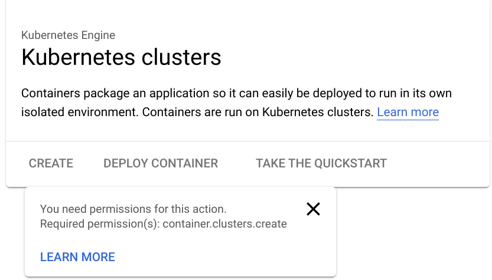

**Note:** **Username 2** currently has access to the project, but only possess the **Viewer** role, which makes all resources in the project visible, but read-only.

### Grant the GKE Admin IAM role to Username 2

You will now allow **Username 2** to create a GKE cluster and deploy workloads by using primitive roles to grant a user permissions to administer all GKE clusters and manage resources inside those clusters in this project. The **Username 1** account has project owner rights and you will use that account to grant **Username 2** more rights.

1. Switch back to the **Username 1** Google Cloud Console tab.

**Note:** Make sure you are on the **Username 1** Google Cloud Console tab.

1. On the **Navigation menu** (), click **IAM & admin > IAM**.
2. In the **IAM console**, locate the row that corresponds to **Username 2**, and then click on the pencil icon at the right-end of that row to edit that user's permissions.
3. Notice that **Username 2** currently has the **Viewer** role, which provides read access to all resources within the project.
4. Click **ADD ANOTHER ROLE** to add another dropdown selection for roles.
5. In the **Select a role** dropdown box, choose **Kubernetes Engine > Kubernetes Engine Cluster Admin**.
6. Click **SAVE**.

**Note:** **Username 2** now has access to administer all GKE clusters in the project and to manage resources within those clusters.


If this level of access is too broad for your organization, you can restrict the user's authority within a GKE cluster by using Kubernetes Role-based Access Control.

Click **Check my progress** to verify the objective.

Grant the GKE Admin IAM Role to username 2


Check my progress


### Test the access of Username 2

You will now verify your work by using **Username 2** to create a GKE cluster.

1. Switch back to the **Username 2** Google Cloud Console tab.

**Note:** Make sure you are on the **Username 2** Google Cloud Console tab.

1. While logged in as **Username 2**, on the **Navigation menu** (), click **Kubernetes Engine > Clusters**.

You should now see that the option to create a cluster is now enabled. You may need to refresh the web browser tab for **Username 2** to see the changes.

1. Click **Create** to begin creating a GKE cluster.
2. Click **Switch to Standard Cluster** and confirm the same on next pop-up.

**Remember:** For this lab, GKE Standard Mode must be used.

1. Set the name of the cluster to **standard-cluster-1**, if that is not the default.
2. Confirm that a zonal, rather than regional, cluster is selected.
3. Choose zone `ZONE` for the cluster, if that is not the default.
4. Leave all other values at their defaults and click **Create**.

The cluster begins provisioning, but soon fails.

**Note:** This step of the lab is intended to fail.

1. Click the notification icon in the toolbar at the top of the screen to view the error message.

Username 2 still lacks some of the rights necessary to deploy a cluster. This is because GKE leverages Google Cloud Compute Engine instances for the nodes.

To deploy a GKE cluster, a user must also be assigned the iam.serviceAccountUser role on the Compute Engine default service account.

### Grant the ServiceAccountUser IAM role to Username 2

You will now use IAM to grant **Username 2** the iam.serviceAccountUser role so that **Username 2** may successfully deploy a GKE cluster.

1. Switch back to the **Username 1** Google Cloud Console tab.

**Note:** Make sure you are on the **Username 1** Google Cloud Console tab.

1. On the **Navigation menu** (), click **IAM & admin > Service accounts**.
2. In the **IAM console**, click the row that corresponds to the **Compute Engine default service account** to select it.
3. Click on **Permission** to open the permissions information panel.
4. On the Permission page, click on **Grant access**.

The permissions information panel will open on the right side of the window.

1. Type the username for **Username 2** into the **New principals** box. You can copy this name from the Lab Details page.
2. In the **Select a role** box, make sure **Service Accounts > Service Account User** is selected.
3. Click **Save**.

Click **Check my progress** to verify the objective.

Grant the Service Account User IAM Role to Username 2


Check my progress


### Verify that Username 2 can create a GKE cluster

You will now verify your work by using **Username 2** to create a GKE cluster.

1. Switch back to the **Username 2** Google Cloud Console tab.

**Note:** Make sure you are on the **Username 2** Google Cloud Console tab.

1. While logged in as **Username 2**, on the **Navigation menu** (), click **Kubernetes Engine > Clusters**. You may need to refresh your web browser.
2. Click **Create** to begin creating a GKE cluster.
3. Click **Switch to Standard Cluster** and confirm the same on next pop-up.
4. Set the name of the cluster to **standard-cluster-1**, if that is not the default.
5. Confirm that a zonal, rather than regional, cluster is selected.
6. Choose zone `ZONE` for the cluster, if that is not the default.
7. Leave all other values at their defaults and click **Create**.

**Note:** You need to wait a few minutes for the cluster deployment to complete.

The cluster will successfully deploy this time.

Click **Check my progress** to verify the objective.

Create a GKE cluster


Check my progress


## Task 2. Define and use pod security admission

PodSecurity is a Kubernetes admission controller that lets you apply Pod Security Standards to Pods running on your GKE clusters. Pod Security Standards are predefined security policies that cover the high-level needs of Pod security in Kubernetes. These policies range from being highly permissive to highly restrictive.

In this task, you create a pod security policy that allows the creation of unprivileged Pods in the default namespace of the cluster. Unprivileged Pods do not allow users to execute code as root, and have limited access to devices on the host.

You create a ClusterRole that can then be used in a role binding that ties the policy to accounts that require the ability to deploy pods with unprivileged access.

Users that require the ability to deploy privileged Pods can be granted access to the built in PSP that is provided to allow admin users to deploy pods after Pod Security Policies are enabled.

When you have the components configured you will enable the PodSecurityPolicy controller, which enforces these policies, and then test how they impact users with different privileges.

### Connect to the GKE cluster

1. Switch back to the **Username 1** Google Cloud Console tab.

**Note:** Make sure you are on the **Username 1** Google Cloud Console tab.

1. In Cloud Shell, type the following command to create environment variables for the Google Cloud zone and cluster name that were used to create the cluster for this lab:

```
export my_zone=us-central1-a
export my_cluster=standard-cluster-1
```


1. Configure tab completion for the kubectl command-line tool:

```
source <(kubectl completion bash)
```


1. Configure access to your cluster for kubectl:

```
gcloud container clusters get-credentials $my_cluster --zone $my_zone
```


### Apply Pod Security Standards using PodSecurity

To use the PodSecurity admission controller, you must apply specific Pod Security Standards in specific modes to specific namespaces

### Create new namespaces

Create namespaces in your cluster:

```
 kubectl create ns baseline-ns
 kubectl create ns restricted-ns
```


This command creates the following namespaces:

- baseline-ns: For permissive workloads
- restricted-ns: For highly restricted workloads

### Use labels to apply security policies

Apply the following Pod Security Standards:

- baseline: Apply to baseline-ns in the warn mode
- restricted: Apply to restricted-ns in the enforce mode

```
 kubectl label --overwrite ns baseline-ns pod-security.kubernetes.io/warn=baseline
 kubectl label --overwrite ns restricted-ns pod-security.kubernetes.io/enforce=restricted
```


These commands achieve the following result:

- Workloads in the baseline-ns namespace that violate the baseline policy are allowed, and the client displays a warning message.
- Workloads in the restricted-ns namespace that violate the restricted policy are rejected, and GKE adds an entry to the audit logs.

Verify that the labels were added:

```
 kubectl get ns --show-labels
```


The output is similar to the following:

```
 baseline-ns       Active   74s   kubernetes.io/metadata.name=baseline-ns,pod-security.kubernetes.io/warn=baseline
 restricted-ns     Active   18s   kubernetes.io/metadata.name=restricted-ns,pod-security.kubernetes.io/enforce=restricted
 default           Active   57m   kubernetes.io/metadata.name=default
 kube-public       Active   57m   kubernetes.io/metadata.name=kube-public
 kube-system       Active   57m   kubernetes.io/metadata.name=kube-system
```

Click **Check my progress** to verify the objective.

Create the namespaces and labels


Check my progress


### Test the configured policies

To verify that the PodSecurity admission controller works as intended, deploy a workload that violates the baseline and the restricted policy to both namespaces. The following example manifest deploys an nginx container that allows privilege escalation.

1. Create and open a file called `psa-workload.yaml` with **nano** using the following command:

```
nano psa-workload.yaml
```


1. Once nano has opened, paste the following into the `psa-workload.yaml` file:

```
 apiVersion: v1
 kind: Pod
 metadata:
   name: nginx
   labels:
     app: nginx
 spec:
   containers:
   - name: nginx
     image: nginx
     securityContext:
       privileged: true
```


1. Press **Ctrl+O**, and then press **Enter** to save your edited file.
2. Press **Ctrl+X** to exit the nano text editor.
3. Apply the manifest to the baseline-ns namespace:

```
 kubectl apply -f psa-workload.yaml --namespace=baseline-ns
```


The output is similar to the following:

```
 Warning: would violate PodSecurity "baseline:latest": privileged (container "nginx" must not set securityContext.privileged=true)
 pod/nginx created
```

The baseline policy allows the Pod to deploy in the namespace.

1. Verify that the Pod deployed successfully:

```
 kubectl get pods --namespace=baseline-ns -l=app=nginx
```


1. Apply the manifest to the restricted-ns namespace:

```
 kubectl apply -f psa-workload.yaml --namespace=restricted-ns
```


The output is similar to the following:

```
Error from server (Forbidden): error when creating "workload.yaml": pods "nginx"
is forbidden: violates PodSecurity "restricted:latest": allowPrivilegeEscalation
!= false (container "nginx" must set securityContext.allowPrivilegeEscalation=false),
unrestricted capabilities (container "nginx" must set securityContext.capabilities.drop=["ALL"]),
runAsNonRoot != true (pod or container "nginx" must set securityContext.runAsNonRoot=true),
seccompProfile (pod or container "nginx" must set securityContext.seccompProfile.type
to "RuntimeDefault" or "Localhost")
```

The Pod won't deploy in the namespace. An audit entry is added to the log.

Click **Check my progress** to verify the objective.

Apply the manifest to the 'restricted-ns' namespace


Check my progress


### View policy violations in the audit logs

Policy violations in the audit and enforce modes are recorded in the audit logs for your cluster. You can view these logs using the Logs Explorer in the Google Cloud console.

1. On the Google Cloud console title bar, type **Logs Explorer** in the **Search** field, then click **Logs Explorer** in the search results.
2. In the **Query** field, specify the following:

```
 resource.type="k8s_cluster"
 protoPayload.response.reason="Forbidden"
 protoPayload.resourceName="core/v1/namespaces/restricted-ns/pods/nginx"
```


1. Click **Run query**.
2. In the Query results section, expand the Forbidden log entry. The details are similar to the following:

```
 {
 ...
 protoPayload: {
   @type: "type.googleapis.com/google.cloud.audit.AuditLog"
   authenticationInfo: {1}
   authorizationInfo: [1]
   methodName: "io.k8s.core.v1.pods.create"
   request: {6}
   requestMetadata: {2}
   resourceName: "core/v1/namespaces/restricted-ns/pods/nginx"
   response: {
     @type: "core.k8s.io/v1.Status"
     apiVersion: "v1"
     code: 403
     details: {2}
     kind: "Status"
     message: "pods "nginx" is forbidden: violates PodSecurity "restricted:latest": privileged
             (container "nginx" must not set securityContext.privileged=true),
             allowPrivilegeEscalation != false (container "nginx" must set
             securityContext.allowPrivilegeEscalation=false), unrestricted capabilities 
             (container "nginx" must set securityContext.capabilities.drop=["ALL"]),
             runAsNonRoot != true (pod or container "nginx" must set securityContext.runAsNonRoot=true),
             seccompProfile (pod or container "nginx" must set securityContext.seccompProfile.type
             to "RuntimeDefault" or "Localhost")"
     metadata: {0}
     reason: "Forbidden"
     status: "Failure"
     }
     serviceName: "k8s.io"
     status: {2}
   }
   receiveTimestamp: "2022-12-01T19:19:25.353235326Z"
   resource: {2}
   timestamp: "2022-12-01T19:19:21.469360Z"
 }
```

## (Optional) Task 3. Rotate IP Address and Credentials

You perform IP and credential rotation on your cluster. It is a secure practice to do so regularly to reduce credential lifetimes. While there are separate commands to rotate the serving IP and credentials, rotating credentials **additionally** rotates the IP as well.

1. On Cloud Shell, execute the following command:

```
gcloud container clusters update $my_cluster --zone $my_zone --start-credential-rotation
```


1. Enter `Y` to continue.
2. Leave the Cloud Shell open until the operation is complete.

After the command completes in the Cloud Shell the cluster will initiate the process to update each of the nodes. That process can take `up to 15 minutes` for your cluster. The process also automatically updates the kubeconfig entry for the current user.

1. The cluster master now temporarily serves the new IP address in addition to the original address.

**Note:** You must update the kubeconfig file on any other system that uses kubectl or API to access the master before completing the rotation process to avoid losing access.

1. To complete the credential and IP rotation tasks execute the following command:

```
gcloud container clusters update $my_cluster --zone $my_zone --complete-credential-rotation
```


This finalizes the rotation processes and removes the original cluster ip-address.

**Note:** If the credential rotation fails to complete and returns an error message, run the below command.

```
gcloud container clusters upgrade $my_cluster     --node-pool=default-pool   --zone $my_zone
```


1. Enter `Y` to continue.
2. After the cluster has successfully upgraded, re-execute the following command:

```
gcloud container clusters update $my_cluster --zone $my_zone --complete-credential-rotation
```


## End your lab


## Google Kubernetes Engine Logging and Monitoring


### [Google Kubernetes Engine Logging and Monitoring PDF file](./documents/M5 _ T-AK8S-I _ Architecting with GKE _ Google Kubernetes Engine Logging and Monitoring [v2.0].pdf)


## LAB: Configuring GKE-Native Monitoring and Logging

## Overview

In this lab, you build a GKE cluster and then deploy pods for use with Kubernetes Engine Monitoring. You will create charts and a custom dashboard, work with custom metrics, and create and respond to alerts.

**Note:** For this lab, GKE Standard Mode will be used. The lab explores System logging and monitoring and these are enabled by default in GKE Autopilot.

### Objectives

In this lab, you learn how to perform the following tasks:

- Use Kubernetes Engine Monitoring to view cluster and workload metrics
- Use Cloud Monitoring Alerting to receive notifications about the cluster’s health

## Lab setup

### Access Qwiklabs

For each lab, you get a new Google Cloud project and set of resources for a fixed time at no cost.

1. Click the **Start Lab** button. If you need to pay for the lab, a pop-up opens for you to select your payment method. On the left is the **Lab Details** panel with the following:

   - The **Open Google Cloud console** button
   - Time remaining
   - The temporary credentials that you must use for this lab
   - Other information, if needed, to step through this lab

2. Click **Open Google Cloud console** (or right-click and select **Open Link in Incognito Window** if you are running the Chrome browser).

   The lab spins up resources, and then opens another tab that shows the **Sign in** page.

   ***Tip:\*** Arrange the tabs in separate windows, side-by-side.

   **Note:** If you see the **Choose an account** dialog, click **Use Another Account**.

3. If necessary, copy the **Username** below and paste it into the **Sign in** dialog.

   ```
   "Username"
   ```

   

   You can also find the **Username** in the **Lab Details** panel.

4. Click **Next**.

5. Copy the **Password** below and paste it into the **Welcome** dialog.

   ```
   "Password"
   ```

   

   You can also find the **Password** in the **Lab Details** panel.

6. Click **Next**.

   **Important:** You must use the credentials the lab provides you. Do not use your Google Cloud account credentials.

   **Note:** Using your own Google Cloud account for this lab may incur extra charges.

7. Click through the subsequent pages:

   - Accept the terms and conditions.
   - Do not add recovery options or two-factor authentication (because this is a temporary account).
   - Do not sign up for free trials.

After a few moments, the Google Cloud console opens in this tab.

**Note:** To view a menu with a list of Google Cloud products and services, click the **Navigation menu** at the top-left, or type the service or product name in the **Search** field. 

### Activate Google Cloud Shell

Google Cloud Shell is a virtual machine that is loaded with development tools. It offers a persistent 5GB home directory and runs on the Google Cloud.

Google Cloud Shell provides command-line access to your Google Cloud resources.

1. In Cloud console, on the top right toolbar, click the Open Cloud Shell button.

   

2. Click **Continue**.

It takes a few moments to provision and connect to the environment. When you are connected, you are already authenticated, and the project is set to your *PROJECT_ID*. For example:


**gcloud** is the command-line tool for Google Cloud. It comes pre-installed on Cloud Shell and supports tab-completion.

- You can list the active account name with this command:

```
gcloud auth list
```


**Output:**

```
Credentialed accounts:
 - <myaccount>@<mydomain>.com (active)
</mydomain></myaccount>
```

**Example output:**

```
Credentialed accounts:
 - google1623327_student@qwiklabs.net
```

- You can list the project ID with this command:

```
gcloud config list project
```


**Output:**

```
[core]
project = <project_id>
</project_id>
```

**Example output:**

```
[core]
project = qwiklabs-gcp-44776a13dea667a6
```

**Note:** Full documentation of **gcloud** is available in the [gcloud CLI overview guide ](https://cloud.google.com/sdk/gcloud).

## Task 1. Using Kubernetes Engine Monitoring

Google Kubernetes Engine includes managed support for Monitoring.

In this task, you will create a new cluster with Kubernetes Engine Monitoring support and then perform typical monitoring tasks using the Kubernetes Engine monitoring and logging interface.

### Configuring a GKE cluster with Kubernetes Engine Monitoring

In this task, you will create a GKE cluster with Kubernetes Engine Monitoring enabled. Then you will deploy sample workloads to your GKE cluster for later use in this exercise.

1. In Cloud Shell, type the following command to create environment variables for the Google Cloud zone and cluster name that will be used to create the cluster for this lab:

```
export my_zone="Zone"
export my_cluster=standard-cluster-1
```


1. Configure tab completion for the kubectl command-line tool:

```
source <(kubectl completion bash)
```


1. Create a VPC-native Kubernetes cluster with native Kubernetes monitoring enabled:

```
gcloud container clusters create $my_cluster \
   --num-nodes 3 --enable-ip-alias --zone $my_zone  \
   --logging=SYSTEM \
   --monitoring=SYSTEM
```


**Note:** You need to wait a few minutes for the cluster deployment to complete.

1. Configure access to your cluster for kubectl:

```
gcloud container clusters get-credentials $my_cluster --zone $my_zone
```


### Use the Google Cloud console to verify monitoring's configuration

1. In the Google Cloud console, in the **Navigation menu** (), click **Kubernetes Engine** > **Clusters**.
2. Click the cluster name **standard-cluster-1** to view the cluster details.

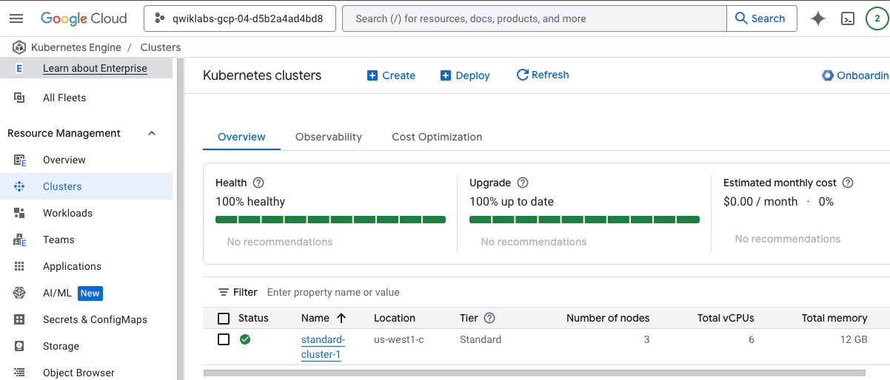

You can scroll down the page to view more details.

Under the **Features** heading, you can see the **Logging** and **Cloud Monitoring** settings that set the logging type to **System**.

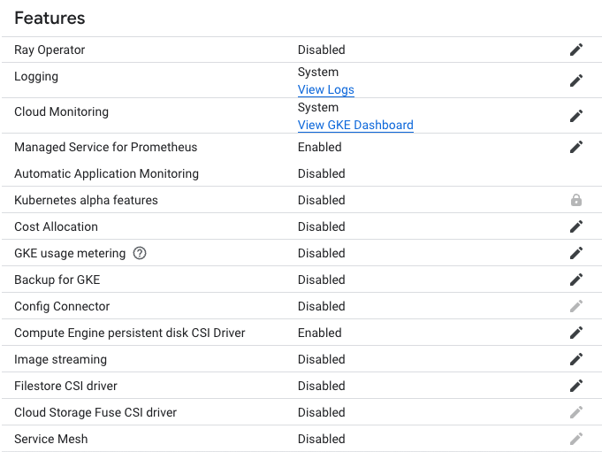

### Deploy a sample workload to your GKE cluster

You will now deploy a sample workload to the default namespace of your GKE cluster. This workload consists of a deployment of three pods running a simple Hello World demo application. Later in this lab exercise, you will be able to monitor the health of this workload in Monitoring.

1. In Cloud Shell, enter the following command to clone the lab repository to the lab Cloud Shell:

```
git clone https://github.com/GoogleCloudPlatform/training-data-analyst
```


1. Create a soft link as a shortcut to the working directory:

```
ln -s ~/training-data-analyst/courses/ak8s/v1.1 ~/ak8s
```


1. Change to the directory that contains the sample files for this lab:

```
cd ~/ak8s/Monitoring/
```


1. In the Cloud Shell, execute the following command to deploy a manifest that creates a sample deployment that will provide some items for you to monitor later in this lab exercise using Monitoring:

```
kubectl create -f hello-v2.yaml
```

hell0-v2.yaml

```
apiVersion: apps/v1
kind: Deployment
metadata:
  name: hello-v2
spec:
  replicas: 3
  selector:
    matchLabels:
      run: hello-v2
  template:
    metadata:
      labels:
        run: hello-v2
        name: hello-v2
    spec:
      containers:
      - image: gcr.io/google-samples/hello-app:2.0
        name: hello-v2
        ports:
        - containerPort: 8080
          protocol: TCP
```


This deployment manifest creates three Pods running a simple Hello World demo application.

1. In the Cloud Shell, execute the following command to verify the deployment exists:

```
kubectl get deployments
```


The output of this command will show that the `hello-v2` application is running in the default namespace:

```
NAME       READY   UP-TO-DATE   AVAILABLE   AGE
hello-v2   3/3     3            3           6s
```

Click *Check my progress* to verify the objective.

Configuring a GKE cluster with Kubernetes Engine Monitoring and deploy a sample workload


Check my progress


### Deploy the GCP-GKE-Monitor-Test application

You will now deploy the GCP-GKE-Monitor-Test application to the default namespace of your GKE cluster. This workload has a deployment consisting of a single pod that is then exposed to the internet via a LoadBalancer service.

1. In the Cloud Shell, execute the following command to store the current Project ID in an environment variable:

```
export PROJECT_ID="$(gcloud config get-value project -q)"
```


1. In the Cloud Shell, execute the following command to change to the load application directory:

```
cd gcp-gke-monitor-test
```


1. In the Cloud Shell, execute the following command to build the Docker image for the load testing application and push the image to the Google **gcr.io** registry for your lab project:

```
gcloud builds submit --tag=gcr.io/$PROJECT_ID/gcp-gke-monitor-test .
```


Alternatively, you can also use Docker directly to build and push an image to **gcr.io**:

```
docker build -t gcr.io/${PROJECT_ID}/gcp-gke-monitor-test .
```


1. In the Cloud Shell, execute the following command to change back to the main working directory for the lab:

```
cd ..
```


1. In the Cloud Shell, execute the following command to replace a placeholder value in the `gcp-gke-monitor-test.yaml` file with the Docker image you just pushed to **gcr.io**:

```
sed -i "s/\[DOCKER-IMAGE\]/gcr\.io\/${PROJECT_ID}\/gcp-gke-monitor-test\:latest/" gcp-gke-monitor-test.yaml
```

gcp-gke-monitor-test.yaml

```
apiVersion: apps/v1
kind: Deployment
metadata:
  labels:
    name: gcp-gke-monitor-test
  name: gcp-gke-monitor-test
  namespace: default
spec:
  replicas: 1
  selector:
    matchLabels:
      name: gcp-gke-monitor-test
  template:
    metadata:
      labels:
        name: gcp-gke-monitor-test
    spec:
      containers:
      - image: gcr.io/dev-staging-337304/gcp-gke-monitor-test:latest
        name: gcp-gke-monitor-test
        ports:
        - containerPort: 8080
          protocol: TCP
        env:
        - name: POD_ID
          valueFrom:
            fieldRef:
              fieldPath: metadata.uid
        - name: POD_NAME
          valueFrom:
            fieldRef:
              fieldPath: metadata.name
        - name: NAMESPACE_NAME
          valueFrom:
            fieldRef:
              fieldPath: metadata.namespace

---
apiVersion: v1
kind: Service
metadata:
  labels:
    name: gcp-gke-monitor-test
  name: gcp-gke-monitor-test-service
  namespace: default
spec:
  ports:
  - port: 80
    protocol: TCP
    targetPort: 8080
  selector:
    name: gcp-gke-monitor-test
  type: LoadBalancer
```


**Note:** The **sed** command in UNIX stands for **stream editor** and it can perform many functions on files such as replace, insertion, or deletion. Though most common use of **sed** is for substitution.


By using **sed** you can edit files even without opening them, which is much quicker way to find and replace something in file, than first opening that file in an editor and then changing it.

1. In Cloud Shell, enter the following command to deploy the manifest you just updated to create the deployment and service you will use to test Kubernetes Engine Monitoring:

```
kubectl create -f gcp-gke-monitor-test.yaml
```


1. In the Cloud Shell, execute the following command to verify that the deployment exists:

```
kubectl get deployments
```


The output of this command will show that the `hello-v2` application is running in the default namespace:

```
NAME                   READY   UP-TO-DATE   AVAIL   AGE
gcp-gke-monitor-test   1/1     1            0       1s
hello-v2               3/3     3            3       38s
```

1. In the Cloud Shell, execute the following command to verify the service exists:

```
kubectl get service
```


The output of this command will show that the `gcp-gke-monitor-test-service` is running in the default namespace. You may need to run this command multiple times until this service is assigned an external IP address.

Click *Check my progress* to verify the objective.

Deploy the GCP-GKE-Monitor-Test application


Check my progress


## Task 2. Using the GCP-GKE-Monitor-Test application

In this task, you will use the GCP-GKE-Monitor-Test application to explore different aspects of Kubernetes Engine Monitoring. The tool is composed of four sections:

- Generate CPU Load
- Custom Metrics
- Log Test
- Crash the Pod

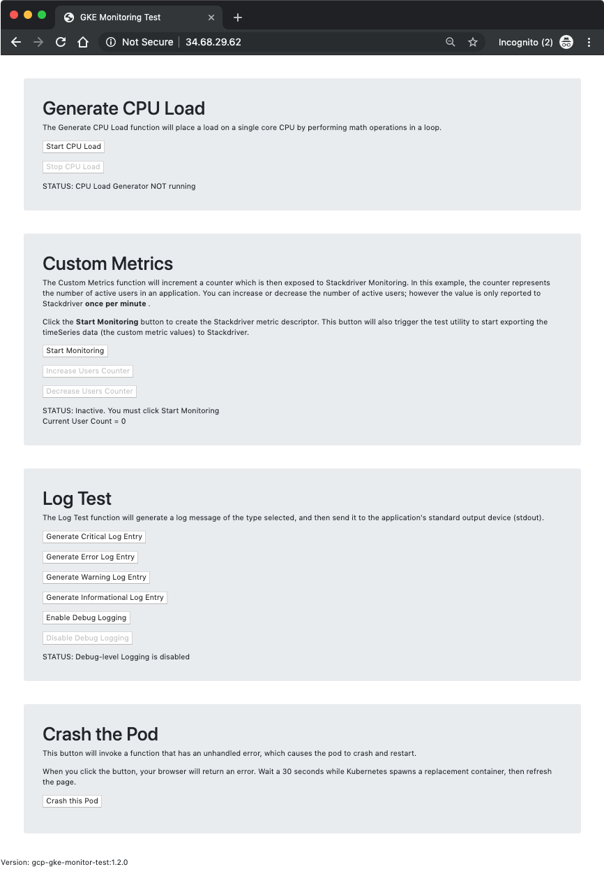

In the first section, **Generate CPU Load**, you have buttons to start and stop a CPU Load Generator. The tool starts a loop of math operations which will consume an entire CPU core. To prevent losing control of the pod due to CPU saturation, the loop yields the processor periodically for 100 nanoseconds. This allows you to quickly stop the CPU Load Generator without killing the pod.

The second section, **Custom Metrics**, allows you to explore custom metric monitoring within Cloud Monitoring. When you click Start Monitoring, the tool first creates the necessary Custom Metric Descriptor, and then starts a loop which sends the custom metric values to Monitoring every 60 seconds. The custom metrics coded into this tool are designed to simulate an application that can keep track of the number of active users connected, and then report that number to an external service.

To take advantage of these custom metrics, some additional instrumentation may be required within your application's code. In this lab exercise you can simulate users connecting and disconnecting by clicking the Increase and Decrease Users buttons.

Also keep in mind that although the web tool will allow you to change the number of users in real time (just as users may connect and disconnect in real life), the Cloud Monitoring APIs only allow the tool to send its current value once per minute. This means your Cloud Monitoring charts will not reflect changes which occur between the per-minute updates.

The third section, **Log Test**, allows you to send different text strings to the container's standard output (the console), which is then periodically collected by Cloud Monitoring and stored as log messages associated with the pod and container. You can optionally enable Debug-level logging to see more entries in the logs. This will allow you to see messages in the logs when you increase the number of users in the Custom Metrics section, or when you enable or disable the CPU Load Generator. Note that these logs are sent in plain-text format to simulate legacy applications which do not support JSON formatted messages. When you view the logs in Logging you will notice that your pod's JSON-based Kubernetes event logs have much more robust filtering and querying options than what is available for the unstructured logs.

The fourth and final section, **Crash the Pod**, allows you to crash the pod with the click of a button. The tool executes a section of code with an unhandled error, which crashes the pod and triggers the deployment to restart a new pod in its place. You can use this tool to see how quickly Kubernetes Engine can recover from errors. It is also an opportunity to see the loss of session state in action because each pod maintains its own session instead of storing it in a central location. When the pod restarts, all your toggle buttons and settings return to their default values.

### Start the CPU Load Generator

You will now open a web browser, connect to the GCP-GKE-Monitor-Test tool, and start the CPU load generator.

1. In Cloud Shell, enter the following command to get the EXTERNAL-IP address of the gcp-gke-monitor-test-service:

```
kubectl get service
```


1. Open your web browser and navigate to the EXTERNAL-IP address of the service.
2. In the **Generate CPU Load** section, click the **Start CPU Load** button. Note that the STATUS text will change when the load generator starts running.

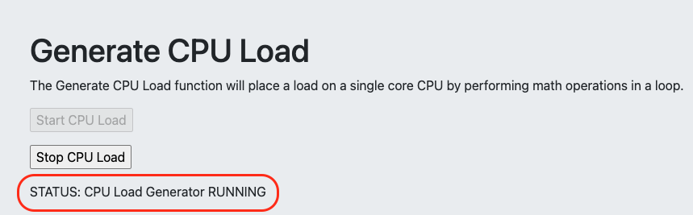

### Start collecting custom metrics

You will now start a process within the GCP-GKE-Monitor-Test tool which creates a Custom Metric Descriptor within Cloud Monitoring. Later, when the tool begins sending the custom metric data, Monitoring will associate the data with this metric descriptor. Note that Monitoring can often automatically create the custom metric descriptors for you when you send the custom metric data, but creating the descriptor manually gives you more control over the text that appears in the Monitoring interface, making it easier for you to find your data in the Metric Explorer.

1. In the GCP-GKE-Monitor-Test tool, in the **Custom Metrics** section, click the **Start Monitoring** button.

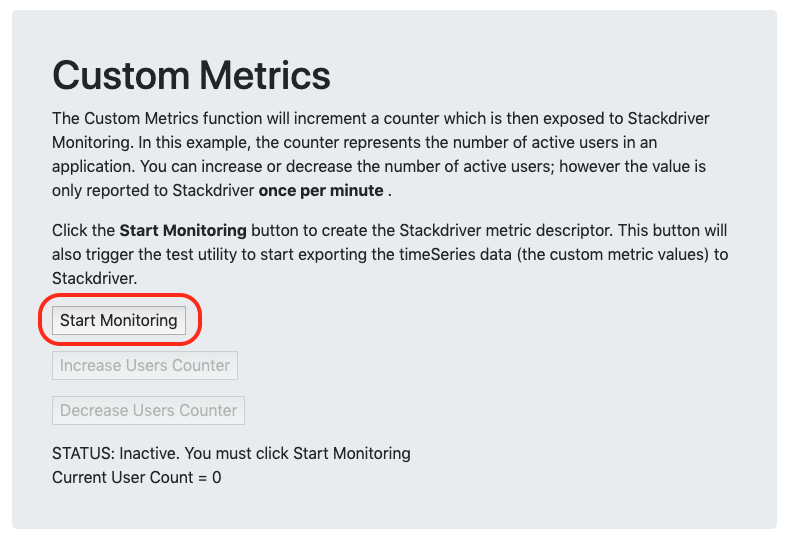

You can now click the Increase and Decrease Users buttons to change the Current User Count displayed below the STATUS text.

1. Click **Increase Users Counter** and repeat until the **Current User Count** is set to 10 users.

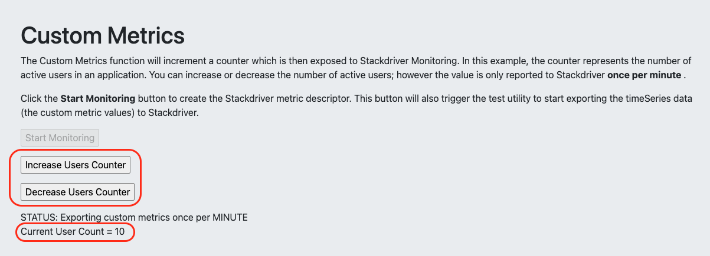

It may take 2-3 minutes for the first data point to appear in Monitoring. You will check this custom metric in Cloud Monitoring in a later step.

### Generate test log messages

You will now use the GCP-GKE-Monitor-Test tool to create sample text-based logs which you will later view in Cloud Monitoring.

1. In the GCP-GKE-Monitor-Test tool, in the **Log Test** section, click the **Enable Debug Logging** button to increase the number of logs the tool generates.

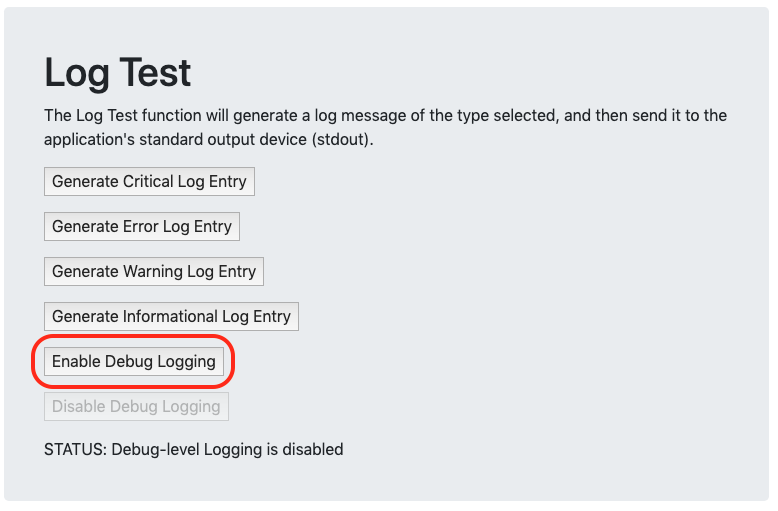

1. Click the other four log entry buttons to generate some additional sample log messages. It's important to select a variety of severity levels so that you can see how the different message types are displayed in Monitoring.

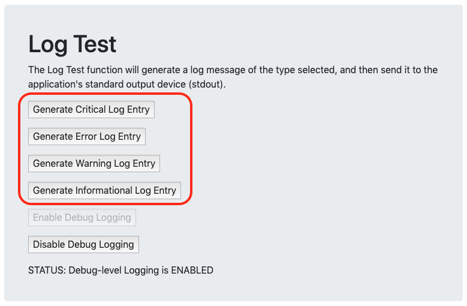

## Task 3. Using Kubernetes Engine Monitoring

In this task, you will use Kubernetes Engine Monitoring to view the current health of your GKE cluster and the two workloads running on it.

### Create a Monitoring workspace

You will now setup a Monitoring workspace that's tied to your Google Cloud Project. The following steps create a new account that has a free trial of Monitoring.

1. On the Google Cloud console title bar, type **Monitoring** in the **Search** field, then click **Monitoring (Infrastructure and application quality checks)** in the search results.
2. Click **Pin** next to **Observability Monitoring**.
3. Wait for your workspace to be provisioned.

When the Monitoring dashboard opens, your workspace is ready.

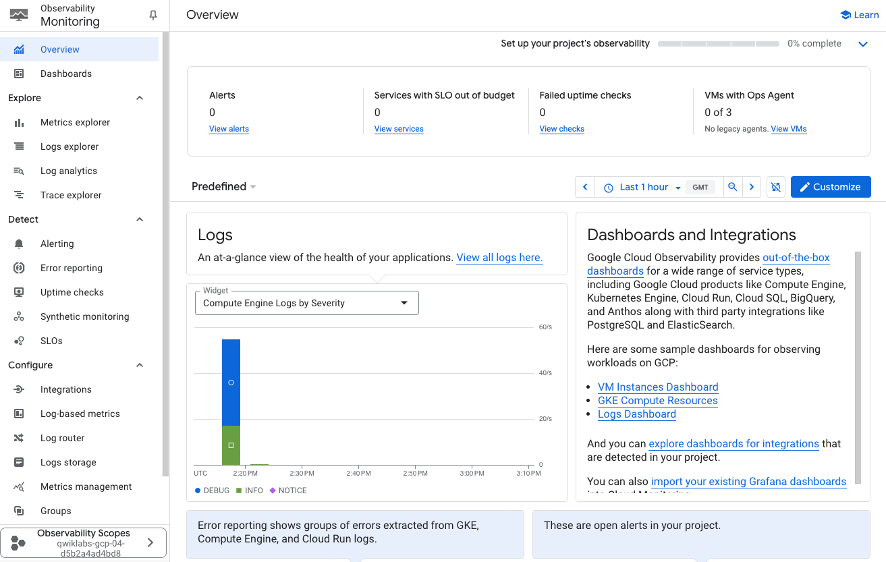

### Review the Kubernetes Engine monitoring interface

You will now open and browse the three different sections of the Kubernetes Engine Monitoring interface. The three sections are: Infrastructure, Workloads, and Services.

**Note:** The **GKE** option might not appear immediately in the Monitoring menus. It might take 5 to 10 minutes to enable the cluster for the new features. Refresh your page periodically until the option appears.

1. In the Monitoring interface, click **GKE** in the **Dashboards** section to view the new monitoring interface.
2. Review the monitoring interface. This is a dashboard which shows the health of your GKE clusters and their workloads. Take note of the following:

- A dynamic **Timeline** is displayed in the top portion of the interface. If required, expand it by clicking on the dropdown icon. You can adjust the **Time Span** from the top of the screen: 1h, 6h, 1d, 1w, 1m, 6w, or custom. This timeline will include markers that indicate the occurrence of alerts (also known as incidents).

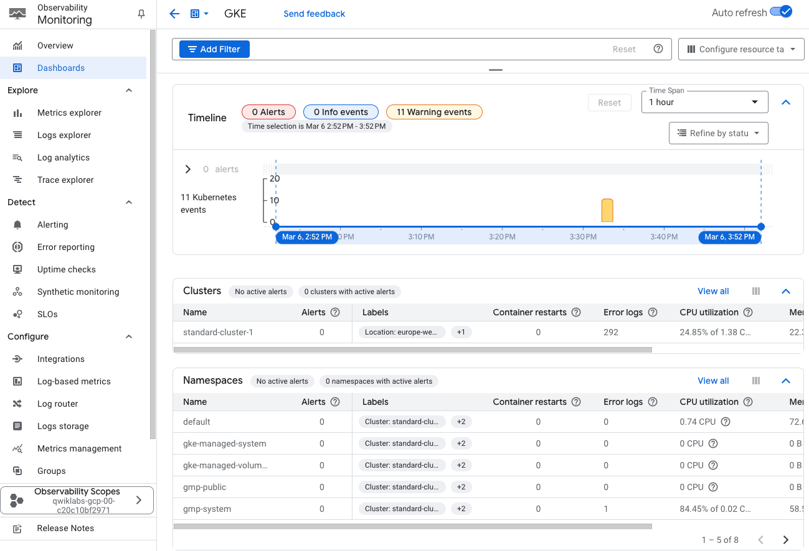

- The Auto refresh button (toggle button to the left of the screen): **Click the \*Auto refresh\* button to allow the screen to update as new events are received**.
- The lower portion of this dashboard contains a multiple section views of your clusters and their workloads. The interface is divided into several sections: Clusters, Namespaces, Nodes, Workloads, Kubernetes services, Pods, and Containers.

#### Examine each section in the interface:

- The **Clusters**, **Nodes**, and **Pods** sections allow you to check the health of particular elements in the cluster. You can also use this to inspect the pods which are running on a particular node in the cluster.
- To see the details of your cluster, click on the cluster element.
- The **Workloads** section is very helpful, especially when looking for workloads which do not have services exposed.
- The **Kubernetes services** section organizes the services configured in your environment by cluster, then by namespace (the administrative barrier or partition within the cluster), and then shows the various services available to users within that namespace. You can see more details on each service by clicking on their name.
- The **Namespaces** section shows the list of namespaces within the cluster.

The monitoring interface can provide even more detail about the deployments and pods.

1. In the **Pods** section, click the pod beginning with **fluentbit-gke-xxxx** (If required, click on `View all`), and then click on **Metrics** tab to see more metrics.

Note the value of your pod's CPU request utilization. That number represents the amount of CPU resources the pod is consuming relative to what it originally requested from the cluster.

1. Click the **X** in the upper right corner of the Pod Details window.
2. Now, click the pod beginning with **gcp-gke-monitor-test** to view more detail about it.

Note that you will see slightly different information if you selected the Namespaces instead of the Pod.

1. Click on the **Metrics** tab to see more metrics such as CPU request utilization and CPU Usage Time.
2. In the Pod Details window, click the **Logs** tab to view the log activity for the pod.

This shows the log messages the pod has generated as well as a graph indicating the logging activity of the pod over time. Here you can see some of the sample logs you generated in the tool.

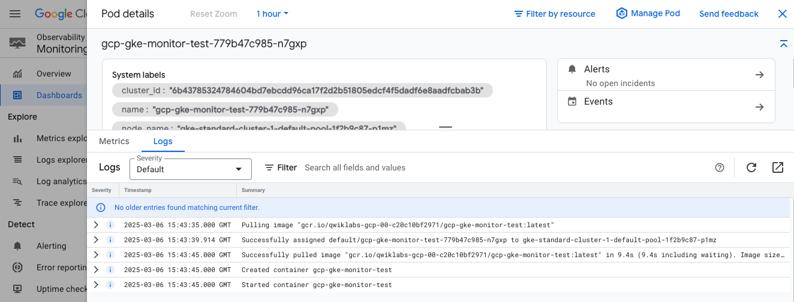

1. Click the **X** in the upper right corner of the Pod Details window to return to the Monitoring interface.

### Create a custom Monitoring dashboard to monitor your pods

In Monitoring, you can create custom dashboards to display important metrics such as CPU utilization, container restarts, and more such as our custom metric for the number of connected users.

1. In the navigation bar at the left of the Observability Monitoring page, click on **Metrics Explorer** to begin building your dashboard.
2. Click on **Select a metric**.

This will filter the list to the resource types supported by the new Kubernetes Engine Monitoring tools.

1. Select **Kubernetes Container > Popular Metrics > CPU request utilization**.
2. Click **Apply**.

This is the same CPU request utilization chart we saw earlier when we examined the **fluentbit-gke-xxxx** pod, but now the chart will display that metric for all the pods.

1. Now click the **Save Chart** button in the upper right corner of the screen.
2. Give the chart title a name such as **Container CPU Request**, and then click **Dashboard**.

The chart name should represent only this chart. You'll be able to give the entire dashboard a name in the next step.

1. Click **New Dashboard**.
2. Name your dashboard **Container Dashboard**.
3. Click **Save Chart**.
4. Now you can launch your dashboard by clicking **Dashboards** in the navigation pane, and then selecting the name of your new dashboard.

You now have a dashboard showing a single chart with a standard Monitoring metric. Next, you will create a chart for our custom Monitoring metric and then add it to this dashboard.

1. Click **Metrics explorer**.
2. Click on **Select a metric**.
3. Select **Kubernetes Pod > Custom metrics > Web App - Active Users**.
4. Click **Apply**.
5. Click on **Save Chart**.
6. Give the new chart a name, such as **Active Users**.
7. Select **Container Dashboard** from the dashboards dropdown.
8. Click **Save Chart**.
9. Navigate back to your *Container* dashboard and click the **Gear** icons to display the settings menu.
10. Then click **Legends > Table** to display the text under each chart.
11. Click the three vertical bars next to the word **Value** at the right of each chart.

This displays a popup which contains the various labels which were included in the timeSeries data sent by our application server. You can use this information to filter or even aggregate the data in the chart.

## Task 4. Creating alerts with Kubernetes Engine Monitoring

In this task, you will configure an alert within Kubernetes Engine Monitoring and then use the dashboard to identify and respond to the incident.

### Create an Alert Policy

You will now create an alert policy to detect high CPU utilization among the containers.

1. In the Cloud console, from the **Navigation menu**, select **Monitoring > Alerting**.

2. Click **+ Create Policy**.

3. Click on **Select a metric** dropdown.

4. Uncheck the **Active** option.

5. Type **Kubernetes Container** in filter by resource and metric name.

6. Click on **Kubernetes Container > Container**.

7. Select **CPU request utilization**.

8. Click **Apply**.

   **Note:** If you cannot locate the **Kubernetes Container** resource type, you might have to refresh the page.

9. Set **Rolling windows** to 1 min.

10. Click **Next**.

11. Set Threshold position to **Above Threshold**.

12. Set **0.99** as your **Threshold value**.

13. Click **Next**.

### Configure notifications and finish the alerting policy

1. Click on dropdown arrow next to **Notification Channels**, then click on **Manage Notification Channels**, then click on **Notification channels** page will open in new tab.
2. Scroll down the page and click on **ADD NEW** for **Email**.
3. Enter your personal email in the **Email Address** field and a **Display name**.
4. Click **Save**.
5. Go back to the previous **Create alerting policy** tab.
6. Click on **Notification Channels** again, then click on the **Refresh icon** to get the display name you mentioned in the previous step. Click **Notification Channels** again if needed.
7. Now, select your **Display name** and click **OK**.
8. Name the alert `CPU request utilization`.
9. Click **Next**.
10. Review the alert and click **Create Policy**.

Click *Check my progress* to verify the objective.

Creating Alerts with Kubernetes Engine Monitoring


Check my progress


### Respond to an Incident

Now, you will return to the monitoring dashboard where an incident is being reported on one of the containers.

1. In the Observability Monitoring page, select **Overview** > **GKE**. On the Kubernetes Engine Monitoring dashboard, you should see an incident reported on the container.
2. In the **Containers** tab, click on the container name which shows the alert. It will take a minute or two to register the alert and you may need to refresh the page to see the alert.
3. Go to **Alerting** page.
4. Click the alert name **CPU request utilization** to view additional details.
5. Open the incident and click on the **Incident summary** entry.
6. Click on **Acknowledge Incident**. The incident status now shows Acknowledged, but that doesn't solve the problem. You need to fix the root cause of the problem; the CPU Load Generator container.
7. Open the web interface for the GCP-GKE-Monitor-Test tool.
8. In the **Generate CPU Load** section, click the **Stop CPU Load** button to resolve the issue by stopping the CPU Load Generator.
9. You may now close the GCP-GKE-Monitor-Test web browser window.

## End your lab


## Using Google Cloud Managed Storage Services with Google Kubernetes Engine


### [Using Google Cloud Managed Storage Services with Google Kubernetes Engine PDF file](./documents/M6 _ T-AK8S-I _ Architecting with GKE _ Using Google Cloud Managed Storage Services with Google Kubernetes Engine [v2.0].pdf)


## LAB: Using Cloud SQL with Google Kubernetes Engine and Workload Identity

## Overview

In this lab, you set up a Kubernetes Deployment of WordPress connected to Cloud SQL via the SQL Proxy. The SQL Proxy lets you interact with a Cloud SQL instance as if it were installed locally (localhost:3306), and even though you are on an unsecured port locally, the SQL Proxy makes sure you are secure over the wire to your Cloud SQL Instance.

To complete this lab you'll create several components. First you create a GKE cluster, next you create a Cloud SQL Instance to connect to, and a Service Account to provide permission for your Pods to access the Cloud SQL Instance, this will be authenticated using Workload Identity. Finally you deploy WordPress on your GKE cluster, with the SQL Proxy as a Sidecar, connected to your Cloud SQL Instance.

## Objectives

In this lab, you learn how to perform the following tasks:

- Create a Cloud SQL instance and database for Wordpress.
- Create credentials and Kubernetes Secrets for application authentication.
- Configure Workload Identity.
- Configure a Deployment with a Wordpress image to use SQL Proxy.
- Install SQL Proxy as a sidecar container and use it to provide SSL access to a CloudSQL instance external to the GKE Cluster.

## Lab setup

### **Access Qwiklabs**

For each lab, you get a new Google Cloud project and set of resources for a fixed time at no cost.

1. Click the **Start Lab** button. If you need to pay for the lab, a pop-up opens for you to select your payment method. On the left is the **Lab Details** panel with the following:

   - The **Open Google Cloud console** button
   - Time remaining
   - The temporary credentials that you must use for this lab
   - Other information, if needed, to step through this lab

2. Click **Open Google Cloud console** (or right-click and select **Open Link in Incognito Window** if you are running the Chrome browser).

   The lab spins up resources, and then opens another tab that shows the **Sign in** page.

   ***Tip:\*** Arrange the tabs in separate windows, side-by-side.

   **Note:** If you see the **Choose an account** dialog, click **Use Another Account**.

3. If necessary, copy the **Username** below and paste it into the **Sign in** dialog.

   ```
   "Username"
   ```

   

   You can also find the **Username** in the **Lab Details** panel.

4. Click **Next**.

5. Copy the **Password** below and paste it into the **Welcome** dialog.

   ```
   "Password"
   ```

   

   You can also find the **Password** in the **Lab Details** panel.

6. Click **Next**.

   **Important:** You must use the credentials the lab provides you. Do not use your Google Cloud account credentials.

   **Note:** Using your own Google Cloud account for this lab may incur extra charges.

7. Click through the subsequent pages:

   - Accept the terms and conditions.
   - Do not add recovery options or two-factor authentication (because this is a temporary account).
   - Do not sign up for free trials.

After a few moments, the Google Cloud console opens in this tab.

**Note:** To view a menu with a list of Google Cloud products and services, click the **Navigation menu** at the top-left, or type the service or product name in the **Search** field. 

After you complete the initial sign-in steps, the project dashboard appears.

### Activate Google Cloud Shell

Google Cloud Shell is a virtual machine that is loaded with development tools. It offers a persistent 5GB home directory and runs on the Google Cloud.

Google Cloud Shell provides command-line access to your Google Cloud resources.

1. In Cloud console, on the top right toolbar, click the Open Cloud Shell button.

   

2. Click **Continue**.

It takes a few moments to provision and connect to the environment. When you are connected, you are already authenticated, and the project is set to your *PROJECT_ID*. For example:


**gcloud** is the command-line tool for Google Cloud. It comes pre-installed on Cloud Shell and supports tab-completion.

- You can list the active account name with this command:

```
gcloud auth list
```


**Output:**

```
Credentialed accounts:
 - <myaccount>@<mydomain>.com (active)
</mydomain></myaccount>
```

**Example output:**

```
Credentialed accounts:
 - google1623327_student@qwiklabs.net
```

- You can list the project ID with this command:

```
gcloud config list project
```


**Output:**

```
[core]
project = <project_id>
</project_id>
```

**Example output:**

```
[core]
project = qwiklabs-gcp-44776a13dea667a6
```

**Note:** Full documentation of **gcloud** is available in the [gcloud CLI overview guide ](https://cloud.google.com/sdk/gcloud).

## Task 1. Connect to the lab GKE cluster

1. In Cloud Shell, type the following command to set the environment variable for the Google Cloud zone and cluster name:

```
export my_cluster=autopilot-cluster-1
export my_project=$(gcloud config get-value project)
export my_region="Region"
```


1. Configure tab completion for the `kubectl` command-line tool:

```
source <(kubectl completion bash)
```


1. Configure access to your cluster for kubectl:

```
gcloud container clusters get-credentials $my_cluster --region $my_region
```


## Task 2. Enable Cloud SQL APIs

1. In the Google Cloud console, in the **Navigation menu** (), click **APIs & Services**.
2. Click **+ Enable APIs and Services**.
3. For **Search for APIs & Services**, type **SQL** and then click the **Cloud SQL** API tile.
4. Click **Enable** to enable Cloud SQL API.

If the API is already enabled, a **Manage** button appears instead, with an **API enabled** message. In that case, no action is required.

1. Repeat the above step to enable **sqladmin API**.

## Task 3. Create a Cloud SQL instance

1. In the Cloud Shell, run the following command to create the instance:

```
gcloud sql instances create sql-instance --tier=db-n1-standard-2 --region=$my_region
```


1. In the Google Cloud console, navigate to **SQL**.
2. You should see `sql-instance` listed , click on the name, and then click on the **Users** menu.

**Note:** You have to wait a few minutes for the Cloud SQL instance to be provisioned.

When you see the existing `root` user listed you can proceed to the next step.

1. Go to **Users** and click **Add User Account** and create an account, using `sqluser` as the username and `sqlpassword` as the password.
2. Leave the **Host name** option set to **Allow any host (%).** and click **ADD**.
3. Go back to **Overview** menu, still in your instance (`sql-instance`), and copy your Instance connection name.

You will probably need to scroll down a bit to see it.

1. Create an environment variable to hold your Cloud SQL instance name, substituting the placeholder with the name you copied in the previous step:

```
export SQL_NAME=[Cloud SQL Instance Name]
```


1. Your command should look similar to the following:

```
$ export SQL_NAME=qwiklabs-gcp-d03ee58ad9ad507e:us-central1:sql-instance
```

1. Connect to your Cloud SQL instance:

```
gcloud sql connect sql-instance
```


1. When prompted to enter the root password press enter. The root SQL user password is blank by default.

The `mysql>` prompt appears indicating that you are now connected to the Cloud SQL instance using the MySQL client.

1. Create the database required for Wordpress. This is called `wordpress` by default:

```
create database wordpress;
```


1. Select the wordpress database:

```
use wordpress;
```


1. Select the wordpress database:

```
show tables;
```


This will report Empty set as you have not created any tables yet.

1. Exit the MySQL client:

```
exit;
```


Click Check my progress to verify the objective.

Create a Cloud SQL Instance.


Check my progress


## Task 4. Prepare a Service Account with permission to access Cloud SQL

1. To create a Service Account, in the Google Cloud console navigate to **IAM & Admin**> **Service Accounts**.
2. Click **+ Create Service Account**.
3. Specify the **Service account name** called `sql-access` then click **Create and Continue**.
4. Click **Select a role.**
5. Search for **Cloud SQL**, select **Cloud SQL Client** and click **Continue**.
6. Click **Done**.

Click Check my progress to verify the objective.

Create Service Account.


Check my progress


## Task 5. Create Kubernetes Service Account and configure Workload Identity

1. In the Cloud Shell, run the following command to create the Kubernetes Service Account:

```
kubectl create serviceaccount gkesqlsa
```


1. In the Cloud Shell, run the following command to bind the Google Cloud service account with the Kubernetes Service Account you just created:

```
gcloud iam service-accounts add-iam-policy-binding \
--role="roles/iam.workloadIdentityUser" \
--member="serviceAccount:$my_project.svc.id.goog[default/gkesqlsa]" \
sql-access@$my_project.iam.gserviceaccount.com
```


1. In the Cloud Shell, run the following command to annotate the Kubernetes Service Account with the details of the Google Cloud service account:

```
kubectl annotate serviceaccount \
gkesqlsa \
iam.gke.io/gcp-service-account=sql-access@$my_project.iam.gserviceaccount.com
```


## Task 6. Create Secrets

You create two Kubernetes Secrets: one to provide the MySQL credentials and one to provide the Google credentials (the service account).

1. To create a Secret for your MySQL credentials, enter the following in the Cloud Shell:

```
kubectl create secret generic sql-credentials \
   --from-literal=username=sqluser\
   --from-literal=password=sqlpassword
```


If you used a different username and password when creating the Cloud SQL user accounts substitute those here.

Click Check my progress to verify the objective.

Create Secrets.


Check my progress


## Task 7. Deploy the SQL Proxy agent as a sidecar container

Let's create a deployment manifest file called `sql-proxy.yaml` that deploys a demo Wordpress application container with the SQL Proxy agent as a sidecar container.

In the Wordpress container environment settings the WORDPRESS_DB_HOST is specified using the localhost IP address. The `cloudsql-proxy` sidecar container is configured to point to the Cloud SQL instance you created in the previous task. The database username and password are passed to the Wordpress container as secret keys, and Workload Identity is configured. A Service is also created to allow you to connect to the Wordpress instance from the internet.

Create and open a file called `sql-proxy.yaml` with **nano** using the following command:

```
nano sql-proxy.yaml
```


1. Once nano has opened, paste the following into the `sql-proxy.yaml` file:

```
apiVersion: apps/v1
kind: Deployment
metadata:
  name: wordpress
  labels:
    app: wordpress
spec:
  selector:
    matchLabels:
      app: wordpress
  template:
    metadata:
      labels:
        app: wordpress
    spec:
      serviceAccountName: gkesqlsa
      containers:
        - name: web
          image: gcr.io/cloud-marketplace/google/wordpress:6.1
          #image: wordpress:5.9
          ports:
            - containerPort: 80
          env:
            - name: WORDPRESS_DB_HOST
              value: 127.0.0.1:3306
            # These secrets are required to start the pod.
            # [START cloudsql_secrets]
            - name: WORDPRESS_DB_USER
              valueFrom:
                secretKeyRef:
                  name: sql-credentials
                  key: username
            - name: WORDPRESS_DB_PASSWORD
              valueFrom:
                secretKeyRef:
                  name: sql-credentials
                  key: password
            # [END cloudsql_secrets]
        # Change '<INSTANCE_CONNECTION_NAME>' here to include your Google Cloud
        # project, the region of your Cloud SQL instance and the name
        # of your Cloud SQL instance. The format is
        # $PROJECT:$REGION:$INSTANCE
        # [START proxy_container]
        - name: cloudsql-proxy
          image: gcr.io/cloud-sql-connectors/cloud-sql-proxy:2.8.0
          args: 
           - "--structured-logs"
           - "--port=3306"
           -  "<INSTANCE_CONNECTION_NAME>" 
          securityContext:
            runAsNonRoot: true 
---
apiVersion: "v1"
kind: "Service"
metadata:
  name: "wordpress-service"
  namespace: "default"
  labels:
    app: "wordpress"
spec:
  ports:
  - protocol: "TCP"
    port: 80
  selector:
    app: "wordpress"
  type: "LoadBalancer"
  loadBalancerIP: ""
```


1. Press **Ctrl+O**, and then press **Enter** to save your edited file.
2. Press **Ctrl+X** to exit the nano text editor.

The important sections to note in this manifest are:

- In the `spec` section the Kubernetes Service Account is configured.
- In the Wordpress env section the variable `WORDPRESS_DB_HOST` is set to `127.0.0.1:3306.` This will connect to a container in the same Pod listening on port 3306. This is the port that the SQL-Proxy listens on by default.
- In the Wordpress `env` section the variables `WORDPRESS_DB_USER` and `WORDPRESS_DB_PASSWORD` are set using values stored in the `sql-credential` Secret you created in the last task.
- In the `cloudsql-proxy` container section the command switch that defines the SQL Connection name, `"INSTANCE_CONNECTION_NAME>` contains a placeholder variable that is not configured using a ConfigMap or Secret and so must be updated directly in this example manifest to point to your Cloud SQL instance.
- The Service section at the end creates an external LoadBalancer called `"wordpress-service`" that allows the application to be accessed from external internet addresses.

1. Use `sed` to update the placeholder variable for the SQL Connection name to the instance name of your Cloud SQL instance:

```
sed -i 's/<INSTANCE_CONNECTION_NAME>/'"${SQL_NAME}"'/g'\
   sql-proxy.yaml
```


**Note:** The **sed** command in UNIX is stands for **stream editor** and it can perform many functions on files such as replace, insertion, or deletion. Though most common use of **sed** is for substitution. By using **sed** you can edit files even without opening them, which is much quicker way to find and replace something in file, than first opening that file in an editor and then changing it.

1. Deploy the application:

```
kubectl apply -f sql-proxy.yaml
```


1. Query the status of the Deployment:

```
kubectl get deployment wordpress
```


**Note:** You need to repeat this command until you see that an instance is available.

**Output:**

```
NAME        READY   UP-TO-DATE   AVAILABLE   AGE
wordpress   1/1     1            1           45s
```

1. List the services in your GKE cluster:

```
kubectl get services
```


The external LoadBalancer ip-address for the wordpress-service is the address you use to connect to your Wordpress blog.

1. Repeat the command until you get an external address as shown here.

```
NAME              TYPE         CLUSTER-IP   EXTERNAL-IP    PORT(S)
kubernetes        ClusterIP    10.12.0.1    <none>         443/TCP
wordpress-service LoadBalancer 10.12.3.17   35.238.218.6   80:31095/TCP
</none>
```

Click Check my progress to verify the objective.

Deploy the SQL Proxy agent as a sidecar container.


Check my progress


## Task 8. Connect to your Wordpress instance

1. Open a new browser tab and connect to your Wordpress site using the external LoadBalancer ip-address. This will start the initial Wordpress installation wizard.
2. Select **English (United States)** and click **Continue**.
3. Enter a sample name for the **Site Title**.
4. Enter a **Username** and **Password** to administer the site.
5. Enter an email address.

None of these values are particularly important, you will not need to use them.

1. Click **Install Wordpress**.

After a few seconds you will see the **Success!** Notification. You can log in if you wish to explore the Wordpress admin interface but it is not required for the lab.

The initialization process has created new database tables and data in the wordpress database on your Cloud SQL instance. You will now validate that these new database tables have been created using the SQL proxy container.

1. Switch back to the Cloud Shell and connect to your Cloud SQL instance:

```
gcloud sql connect sql-instance
```


1. When prompted to enter the root password press enter. The root SQL user password is blank by default.

The `mysql>` prompt appears indicating that you are now connected to the Cloud SQL instance using the MySQL client.

1. Select the wordpress database:

```
use wordpress;
```


1. Select the wordpress database:

```
show tables;
```


This will now show a number of new database tables that were created when Wordpress was initialized demonstrating that the sidecar SQL Proxy container was configured correctly:

```
MySQL [wordpress]> show tables;
+-----------------------+
| Tables_in_wordpress   |
+-----------------------+
| wp_commentmeta        |
| wp_comments           |
| wp_links              |
| wp_options            |
| wp_postmeta           |
| wp_posts              |
| wp_term_relationships |
| wp_term_taxonomy      |
| wp_termmeta           |
| wp_terms              |
| wp_usermeta           |
| wp_users              |
+-----------------------+
12 rows in set (0.19 sec)
```

1. List all of the Wordpress user table entries:

```
select * from wp_users;
```


This will list the database record for the Wordpress admin account showing the email you chose when initializing Wordpress.

1. Exit the MySQL client:

```
exit;
```


## End your lab


## Using CI/CD with Google Kubernetes Engine


### [Using CI/CD with Google Kubernetes Engine PDF file](./documents/M7 _ T-AK8S-I _ Architecting with GKE _ Using CI_CD with Google Kubernetes Engine.pdf)


## LAB: Continuous Delivery with Google Cloud Deploy

## Overview

Google Cloud Deploy is a managed service that automates delivery of your applications to a series of target environments in a defined promotion sequence. When you want to deploy your updated application, you create a release, whose lifecycle is managed by a delivery pipeline.

In this lab, you will create a delivery pipeline using Google Cloud Deploy. You will then create a release for a basic application and promote the application through a series of Google Kubernetes Engine (GKE) targets.

The sample application is a simple web app that listens to a port, provides an HTTP response code and adds a log entry.

### **Objectives**

In this lab, you learn how to perform the following tasks:

- Deploy a container image to Google Cloud Artifact Registry using Skaffold
- Create a Google Cloud Deploy delivery pipeline
- Create a release for the delivery pipeline
- Promote the application through the targets in the delivery pipeline

## Lab setup

### **Access Qwiklabs**

For each lab, you get a new Google Cloud project and set of resources for a fixed time at no cost.

1. Click the **Start Lab** button. If you need to pay for the lab, a pop-up opens for you to select your payment method. On the left is the **Lab Details** panel with the following:

   - The **Open Google Cloud console** button
   - Time remaining
   - The temporary credentials that you must use for this lab
   - Other information, if needed, to step through this lab

2. Click **Open Google Cloud console** (or right-click and select **Open Link in Incognito Window** if you are running the Chrome browser).

   The lab spins up resources, and then opens another tab that shows the **Sign in** page.

   ***Tip:\*** Arrange the tabs in separate windows, side-by-side.

   **Note:** If you see the **Choose an account** dialog, click **Use Another Account**.

3. If necessary, copy the **Username** below and paste it into the **Sign in** dialog.

   ```
   "Username"
   ```

   

   You can also find the **Username** in the **Lab Details** panel.

4. Click **Next**.

5. Copy the **Password** below and paste it into the **Welcome** dialog.

   ```
   "Password"
   ```

   

   You can also find the **Password** in the **Lab Details** panel.

6. Click **Next**.

   **Important:** You must use the credentials the lab provides you. Do not use your Google Cloud account credentials.

   **Note:** Using your own Google Cloud account for this lab may incur extra charges.

7. Click through the subsequent pages:

   - Accept the terms and conditions.
   - Do not add recovery options or two-factor authentication (because this is a temporary account).
   - Do not sign up for free trials.

After a few moments, the Google Cloud console opens in this tab.

**Note:** To view a menu with a list of Google Cloud products and services, click the **Navigation menu** at the top-left, or type the service or product name in the **Search** field. 

After you complete the initial sign-in steps, the project dashboard appears.

### Activate Google Cloud Shell

Google Cloud Shell is a virtual machine that is loaded with development tools. It offers a persistent 5GB home directory and runs on the Google Cloud.

Google Cloud Shell provides command-line access to your Google Cloud resources.

1. In Cloud console, on the top right toolbar, click the Open Cloud Shell button.

   

2. Click **Continue**.

It takes a few moments to provision and connect to the environment. When you are connected, you are already authenticated, and the project is set to your *PROJECT_ID*. For example:


**gcloud** is the command-line tool for Google Cloud. It comes pre-installed on Cloud Shell and supports tab-completion.

- You can list the active account name with this command:

```
gcloud auth list
```


**Output:**

```
Credentialed accounts:
 - <myaccount>@<mydomain>.com (active)
</mydomain></myaccount>
```

**Example output:**

```
Credentialed accounts:
 - google1623327_student@qwiklabs.net
```

- You can list the project ID with this command:

```
gcloud config list project
```


**Output:**

```
[core]
project = <project_id>
</project_id>
```

**Example output:**

```
[core]
project = qwiklabs-gcp-44776a13dea667a6
```

**Note:** Full documentation of **gcloud** is available in the [gcloud CLI overview guide ](https://cloud.google.com/sdk/gcloud).

## Task 1. Create three GKE clusters

In this task you will create the three GKE clusters that will be targets for the delivery pipeline.

Three GKE clusters will be created, denoting the three targets for the delivery pipeline:

- **test**
- **staging**
- **prod**

1. Declare the environment variables that will be used by various commands:

```
export PROJECT_ID=$(gcloud config get-value project)
export REGION="REGION"
gcloud config set compute/region $REGION
```


1. Enable the Google Kubernetes Engine API:

```
gcloud services enable \
container.googleapis.com \
clouddeploy.googleapis.com
```


1. Configure kubectl tab completion in Cloud Shell:

```
source <(kubectl completion bash)
```


1. Create the three GKE clusters:

```
gcloud container clusters create-auto test --async
gcloud container clusters create-auto staging --async
gcloud container clusters create-auto prod --async
```


**Note:** The **--async** flag also the clusters to provision in the background, while the user can continue to setup other elements of the pipeline.

1. Check the status of the three clusters:

```
gcloud container clusters list --format="csv(name,status)"
```


**Note:** Since we are using the **--async** flag this command is a way of getting the status of the cluster deployment.

**Output**

```
name,status
prod,PROVISIONING
staging,PROVISIONING
test,RUNNING
```

Creating the clusters can take a few minutes. You don't need to wait for the clusters to be ready. Continue the lab.

Click **Check my progress** to verify the objective.

Create three GKE clusters


Check my progress


## Task 2. Prepare the web application container image

In this task you'll create a repository in Artifact Registry to hold the web application's container images.

1. Enable the Artifact Registry API:

```
gcloud services enable artifactregistry.googleapis.com
```


1. Create the web-app repository for holding container images:

```
gcloud artifacts repositories create web-app \
--description="Image registry for sample web app" \
--repository-format=docker \
--location=$REGION
```


Click **Check my progress** to verify the objective.

Create the web-app repository


Check my progress


## Task 3. Build and deploy the container images to the Artifact Registry

In this task you will clone the git repository containing the web application and deploy the application's container images to Artifact Registry.

### Prepare the application configuration

1. Clone the repository for the lab into your home directory:

```
cd ~/
git clone https://github.com/GoogleCloudPlatform/cloud-deploy-tutorials.git
cd cloud-deploy-tutorials
git checkout c3cae80 --quiet
cd tutorials/base
```


1. Create the `skaffold.yaml` configuration:

```
envsubst < clouddeploy-config/skaffold.yaml.template > web/skaffold.yaml
cat web/skaffold.yaml
```


**Note:** The **envsubst** command is a find and replace command.

The web directory now contains the `skaffold.yaml` configuration file, which provides instructions for Skaffold to build a container image for your application. This configuration describes the following items.

The build section configures:

- The two container images that will be built (artifacts)
- The Google Cloud Build project used to build the images

The `deploy` section configures the Kubernetes manifests needed in deploying the workload to a cluster.

The `portForward` configuration is used to define the Kubernetes service for the deployment.

**Output**

```
apiVersion: skaffold/v2beta7
kind: Config
build:
  artifacts:
    - image: leeroy-web
      context: leeroy-web
    - image: leeroy-app
      context: leeroy-app
  googleCloudBuild:
    projectId: {{project-id}}
deploy:
  kubectl:
    manifests:
      - leeroy-web/kubernetes/*
      - leeroy-app/kubernetes/*
portForward:
  - resourceType: deployment
    resourceName: leeroy-web
    port: 8080
    localPort: 9000
```

**Note:** To view the files, use vi, emacs, nano or the Cloud Shell Code Editor by clicking on the **Open Editor** icon in Cloud Shell.

### Build the web application

The skaffold tool will handle submission of the codebase to Cloud Build.

1. Enable the Cloud Build API:

```
gcloud services enable cloudbuild.googleapis.com
```


1. Run the skaffold command to build the application and deploy the container image to the Artifact Registry repository previously created:

```
cd web
skaffold build --interactive=false \
--default-repo $REGION-docker.pkg.dev/$PROJECT_ID/web-app \
--file-output artifacts.json
cd ..
```


1. Once the skaffold build has completed, check for the container images in Artifact Registry:

```
gcloud artifacts docker images list \
$REGION-docker.pkg.dev/$PROJECT_ID/web-app \
--include-tags \
--format yaml
```


The `--format` yaml parameter returns the output as YAML for readability. The output should look like this:

**Output**

```
---
createTime: '2024-09-11T02:07:54.995807Z'
package: us-central1-docker.pkg.dev/{{project-id}}/web-app/leeroy-app
tags: '9181623'
updateTime: '2024-09-11T02:07:54.995807Z'
version: sha256:6af6a0a72d13dd6597c0fc0191f697e2da2c3892d1bf8e87a3df8d96612e1495
---
createTime: '2024-09-11T02:07:53.629263Z'
package: us-central1-docker.pkg.dev/{{project-id}}/web-app/leeroy-web
tags: '9181623'
updateTime: '2024-09-11T02:07:53.629263Z'
version: sha256:a0179673d1876f205875b223557c83162e56e91c5e3313f5e99465a224adb6c9
```

By default, Skaffold sets the tag for an image to its related git tag if one is available. Similar information can be found in the `artifacts.json` file that was created by the skaffold command.

Skaffold generates the `web/artifacts.json` file with details of the deployed images:

```
cat web/artifacts.json | jq
```


**Output**

```
{
    "builds": [
        {
            "imageName": "leeroy-web",
            "tag": "us-central1-docker.pkg.dev/{{project-id}}/web-app/leeroy-web:9181623@sha256:a0179673d1876f205875b223557c83162e56e91c5e3313f5e99465a224adb6c9"
        },
        {
            "imageName": "leeroy-app",
            "tag": "us-central1-docker.pkg.dev/{{project-id}}/web-app/leeroy-app:9181623@sha256:6af6a0a72d13dd6597c0fc0191f697e2da2c3892d1bf8e87a3df8d96612e1495"
        }
    ]
```

Click **Check my progress** to verify the objective.

Build and deploy the container images to the Artifact Registry


Check my progress


## Task 4. Create the delivery pipeline

In this task you will set up the delivery pipeline. The pipeline will promote apps from **test** to **staging** and from **staging** to **prod**.

1. Enable the Google Cloud Deploy API:

```
gcloud services enable clouddeploy.googleapis.com
```


1. Create the delivery-pipeline resource using the `delivery-pipeline.yaml` file:

```
gcloud config set deploy/region $REGION
cp clouddeploy-config/delivery-pipeline.yaml.template clouddeploy-config/delivery-pipeline.yaml
gcloud deploy apply --file=clouddeploy-config/delivery-pipeline.yaml
```


1. Verify the delivery pipeline was created:

```
gcloud deploy delivery-pipelines describe web-app
```


The delivery pipeline will appear similar to the following output:

**Output**

```
Unable to get target test
Unable to get target staging
Unable to get target prod
Delivery Pipeline:
  createTime: '2024-09-11T14:03:18.294884547Z'
  description: web-app delivery pipeline
  etag: 2539eacd7f5c256d
  name: projects/{{project-id}}/locations/us-central1/deliveryPipelines/web-app
  serialPipeline:
    stages:
    - targetId: test
    - targetId: staging
    - targetId: prod
  uid: eb0601aa03ac4b088d74c6a5f13f36ae
  updateTime: '2024-09-11T14:03:18.680753520Z'
Targets: []
```

Notice the first three lines of the output. The delivery pipeline currently references three target environments that haven't been created yet. In the next task you will create those targets.

Click **Check my progress** to verify the objective.

Create the delivery pipeline


Check my progress


## Task 5. Configure the deployment targets

Three delivery pipeline targets will be created - one for each of the GKE clusters.

### Ensure that the clusters are ready

The three GKE clusters should now be running, but it's useful to verify this.

- Run the following to get the status of the clusters:

```
gcloud container clusters list --format="csv(name,status)"
```


All three clusters should be in the RUNNING state, as indicated in the output below. If they are not yet marked as RUNNING, retry the command above until their status has changed to RUNNING.

**Output**

```
name,status
prod,RUNNING
staging,RUNNING
test,RUNNING
```

Once all the clusters have the "RUNNING" status continue the lab.

### Create a context for each cluster

Use the commands below to get the credentials for each cluster and create an easy-to-use `kubectl` context for referencing the clusters later:

```
CONTEXTS=("test" "staging" "prod")
for CONTEXT in ${CONTEXTS[@]}
do
    gcloud container clusters get-credentials ${CONTEXT} --region ${REGION}
    kubectl config rename-context gke_${PROJECT_ID}_${REGION}_${CONTEXT} ${CONTEXT}
done
```


### Create a namespace in each cluster

Use the commands below to create a Kubernetes namespace (web-app) in each of the three clusters:

```
for CONTEXT in ${CONTEXTS[@]}
do
    kubectl --context ${CONTEXT} apply -f kubernetes-config/web-app-namespace.yaml
done
```


The application will be deployed to the (web-app) namespace.

### Create the delivery pipeline targets

1. Submit a target definition for each of the targets:

```
for CONTEXT in ${CONTEXTS[@]}
do
    envsubst < clouddeploy-config/target-$CONTEXT.yaml.template > clouddeploy-config/target-$CONTEXT.yaml
    gcloud deploy apply --file clouddeploy-config/target-$CONTEXT.yaml
done
```


The targets are described in a yaml file. Each target configures the relevant cluster information for the target. The test and staging target configurations are mostly the same.

1. Display the details for the test Target:

```
cat clouddeploy-config/target-test.yaml
```


**Output**

```
apiVersion: deploy.cloud.google.com/v1beta1
kind: Target
metadata:
  name: test
description: test cluster
gke:
  cluster: projects/{{project-id}}/locations/us-central1/clusters/test
```

The prod target is slightly different as it requires approval (see the `requireApproval` setting in the output) before a release can be promoted to the cluster.

1. Display the details for the prod Target:

```
cat clouddeploy-config/target-prod.yaml
```


**Output**

```
apiVersion: deploy.cloud.google.com/v1beta1
kind: Target
metadata:
  name: prod
description: prod cluster
requireApproval: true
gke:
  cluster: projects/{{project-id}}/locations/us-central1/clusters/prod
```

1. Verify the three targets (test, staging, prod) have been created:

```
gcloud deploy targets list
```


All Google Cloud Deploy targets for the delivery pipeline have now been created.

Click **Check my progress** to verify the objective.

Configure the deployment targets


Check my progress


## Task 6. Create a release

In this task you create a release of the application.

A Google Cloud Deploy release is a specific version of one or more container images associated with a specific delivery pipeline. Once a release is created, it can be promoted through multiple targets (the promotion sequence). Additionally, creating a release renders your application using skaffold and saves the output as a point-in-time reference that's used for the duration of that release.

Since this is the first release of your application, you'll name it `web-app-001`.

1. Run the following command to create the release:

```
gcloud deploy releases create web-app-001 \
--delivery-pipeline web-app \
--build-artifacts web/artifacts.json \
--source web/
```


The `--build-artifacts` parameter references the `artifacts.json` file created by skaffold earlier. The `--source parameter` references the application source directory where skaffold.yaml can be found.

When a release is created, it will also be automatically rolled out to the first target in the pipeline (unless approval is required, which will be covered in a later step of this lab).

1. To confirm the test target has your application deployed, run the following command:

```
gcloud deploy rollouts list \
--delivery-pipeline web-app \
--release web-app-001
```


**Output**

```
---
approvalState: DOES_NOT_NEED_APPROVAL
createTime: '2024-09-11T14:05:21.961604Z'
deployEndTime: '2024-09-11T14:06:35.278604Z'
deployStartTime: '2024-09-11T14:06:22.420091744Z'
deployingBuild: projects/{{project-id}}/locations/us-central1/builds/4815b788-ec5e-4185-9141-a5b57c71b001
enqueueTime: '2024-09-11T14:06:21.760830Z'
etag: 5cb7b6c342b5f29b
name: projects/{{project-id}}/locations/us-central1/deliveryPipelines/web-app/releases/web-app-001/rollouts/web-app-001-to-test-0001
state: SUCCEEDED
targetId: test
uid: cccd9525d3a0414fa60b2771036841d9
```

The first rollout of a release will take several minutes because Google Cloud Deploy renders the manifests for all targets when the release is created. The GKE cluster may also take a few minutes to provide the resources required by the deployment.

If you do not see `state: SUCCEEDED` in the output from the previous command, please wait and periodically re-run the command until the rollout completes.

1. Confirm your application was deployed to the test GKE cluster by running the following commands:

```
kubectx test
kubectl get all -n web-app
```


**Output**

```
NAME                              READY   STATUS    RESTARTS   AGE
pod/leeroy-app-5547cf9d9b-rgc2l   1/1     Running   0          3m27s
pod/leeroy-web-6768b49c46-w7vt9   1/1     Running   0          3m27s
NAME                 TYPE        CLUSTER-IP   EXTERNAL-IP   PORT(S)     AGE
service/leeroy-app   ClusterIP   None         <none>        50051/TCP   3m28s
NAME                         READY   UP-TO-DATE   AVAILABLE   AGE
deployment.apps/leeroy-app   1/1     1            1           3m28s
deployment.apps/leeroy-web   1/1     1            1           3m28s
NAME                                    DESIRED   CURRENT   READY   AGE
replicaset.apps/leeroy-app-5547cf9d9b   1         1         1       3m28s
replicaset.apps/leeroy-web-6768b49c46   1         1         1       3m28s
```

**Note:** The **kubectx** command allows us to switch between contexts easily.

Click **Check my progress** to verify the objective.

Create a release


Check my progress


## Task 7. Promote the application to staging

In this task you will promote the application from test and into the staging target.

1. Promote the application to the staging target:

```
gcloud deploy releases promote \
--delivery-pipeline web-app \
--release web-app-001
```


You will be prompted to continue before the promotion commences.

- Press ENTER to accept the default (Y = yes).

1. To confirm the staging Target has your application deployed, run the following command:

```
gcloud deploy rollouts list \
--delivery-pipeline web-app \
--release web-app-001
```


### Review the output

Look for the section marked `targetId: staging`. As before, if you do not see `state: SUCCEEDED` in the output from the previous command, wait and periodically re-run the command until the rollout completes.

**Output**

```
---
approvalState: DOES_NOT_NEED_APPROVAL
createTime: '2024-09-11T02:19:32.539468Z'
deployEndTime: '2024-09-11T02:19:45.970949Z'
deployStartTime: '2024-09-11T02:19:33.111948770Z'
deployingBuild: projects/743805075658/locations/us-central1/builds/2316517c-3a2f-4cd3-80ad-6d133b653746
etag: 1109b802ff586df5
name: projects/{{project-id}}/locations/us-central1/deliveryPipelines/web-app/releases/web-app-001/rollouts/web-app-001-to-staging-0001
state: SUCCEEDED
targetId: staging
uid: 80a35a5f044844708d2050f8c556e07e
```

Click **Check my progress** to verify the objective.

Promote the application to staging


Check my progress


## Task 8. Promote the application to prod

In this task you will again promote the application but will also provide approval.

1. Promote the application to the prod target:

```
gcloud deploy releases promote \
--delivery-pipeline web-app \
--release web-app-001
```


You will be prompted to continue before the promotion commences.

- Press ENTER to accept the default (Y = yes).

1. To review the status of the prod target, run the following command:

```
gcloud deploy rollouts list \
--delivery-pipeline web-app \
--release web-app-001
```


In the output, note that the `approvalState` is `NEEDS_APPROVAL` and the state is `PENDING_APPROVAL`.

**Output**

```
---
approvalState: NEEDS_APPROVAL
createTime: '2024-09-11T14:12:07.466989Z'
etag: 6e9303e5a1b04084
name: projects/{{project-id}}/locations/us-central1/deliveryPipelines/web-app/releases/web-app-001/rollouts/web-app-001-to-prod-0001
state: PENDING_APPROVAL
targetId: prod
uid: a5c7d6007fee4d80904d49142581aaa7
```

1. Approve the rollout with the following:

```
gcloud deploy rollouts approve web-app-001-to-prod-0001 \
--delivery-pipeline web-app \
--release web-app-001
```


You will be prompted to approve the rollout before the promotion commences.

- Press ENTER to accept the default (Y = yes).

1. To confirm the prod target has your application deployed, run the following command:

```
gcloud deploy rollouts list \
--delivery-pipeline web-app \
--release web-app-001
```


As for previous rollouts, locate the entry for the target (`targetId: prod`) and check that the rollout has completed (`state: SUCCEEDED`). Periodically re-run the command until the rollout completes.

1. Use `kubectl` to check on the status of the deployed application:

```
kubectx prod
kubectl get all -n web-app
```


Click **Check my progress** to verify the objective.

Promote the application to prod


Check my progress


## Congratulations!