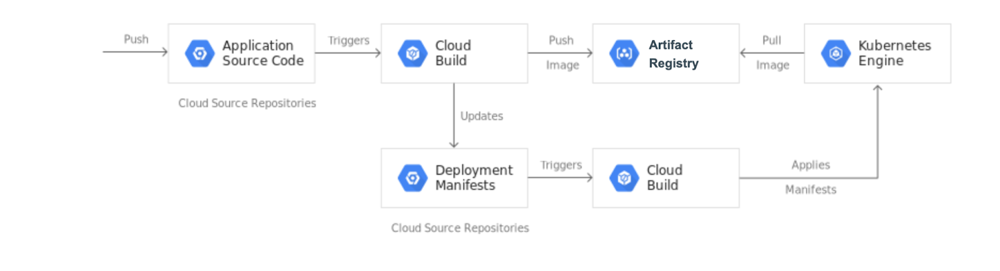
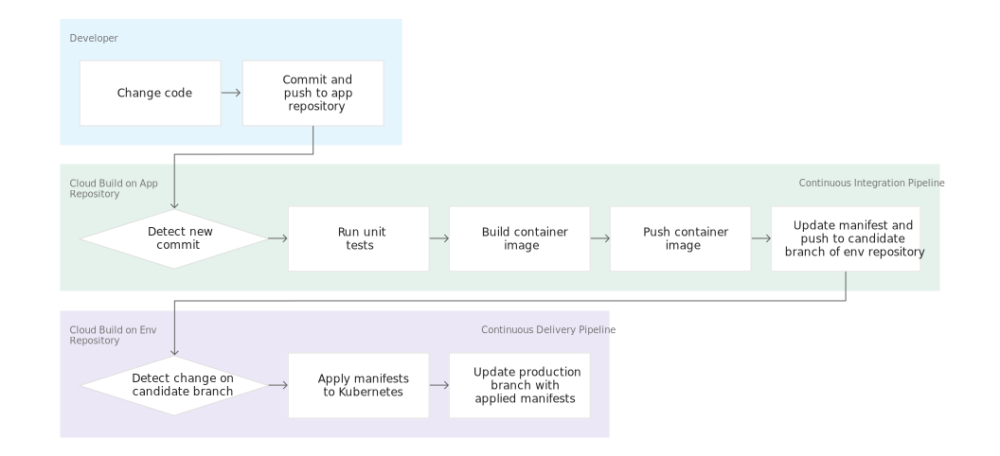
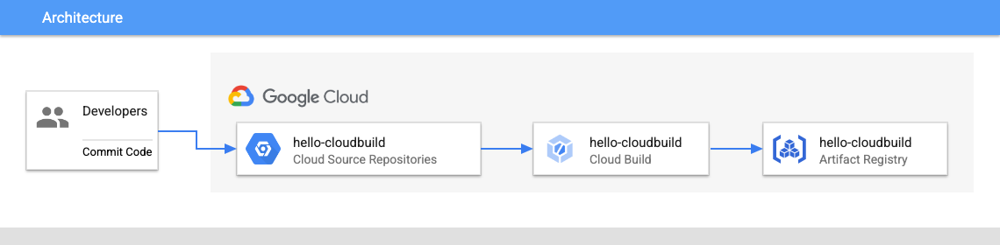
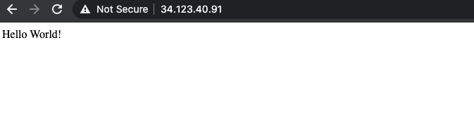
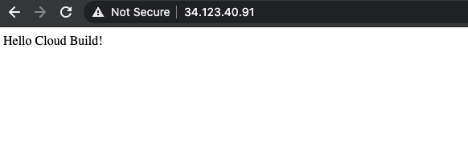
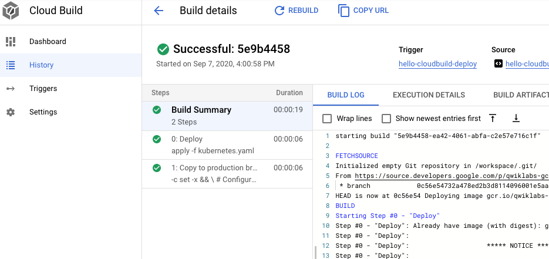

# Google Kubernetes Engine Lab

# Introduction to Docker

## Overview

Docker is an open platform for developing, shipping, and running applications. With Docker, you can separate your applications from your infrastructure and treat your infrastructure like a managed application. Docker helps you ship code faster, test faster, deploy faster, and shorten the cycle between writing code and running code.

Docker does this by combining kernel containerization features with workflows and tooling that helps you manage and deploy your applications.

Docker containers can be directly used in Kubernetes, which allows them to be run in the Kubernetes Engine with ease. After learning the essentials of Docker, you will have the skillset to start developing Kubernetes and containerized applications.

## Objectives

In this lab, you will learn how to:

- Build, run, and debug Docker containers.
- Pull Docker images from Docker Hub and Google Artifact Registry.
- Push Docker images to Google Artifact Registry.

### Prerequisites

This is an **introductory level** lab. Little to no prior experience with Docker and containers is assumed. Familiarity with Cloud Shell and the command line is suggested, but not required.

## Setup and requirements

### Before you click the Start Lab button

Read these instructions. Labs are timed and you cannot pause them. The timer, which starts when you click **Start Lab**, shows how long Google Cloud resources are made available to you.

This hands-on lab lets you do the lab activities in a real cloud environment, not in a simulation or demo environment. It does so by giving you new, temporary credentials you use to sign in and access Google Cloud for the duration of the lab.

To complete this lab, you need:

- Access to a standard internet browser (Chrome browser recommended).

**Note:** Use an Incognito (recommended) or private browser window to run this lab. This prevents conflicts between your personal account and the student account, which may cause extra charges incurred to your personal account.

- Time to complete the lab—remember, once you start, you cannot pause a lab.

**Note:** Use only the student account for this lab. If you use a different Google Cloud account, you may incur charges to that account.

### How to start your lab and sign in to the Google Cloud console

1. Click the **Start Lab** button. If you need to pay for the lab, a dialog opens for you to select your payment method. On the left is the Lab Details pane with the following:

   - The Open Google Cloud console button
   - Time remaining
   - The temporary credentials that you must use for this lab
   - Other information, if needed, to step through this lab

2. Click **Open Google Cloud console** (or right-click and select **Open Link in Incognito Window** if you are running the Chrome browser).

   The lab spins up resources, and then opens another tab that shows the Sign in page.

   ***Tip:\*** Arrange the tabs in separate windows, side-by-side.

   **Note:** If you see the **Choose an account** dialog, click **Use Another Account**.

3. If necessary, copy the **Username** below and paste it into the **Sign in** dialog.

   ```
   "Username"
   ```

   

   You can also find the Username in the Lab Details pane.

4. Click **Next**.

5. Copy the **Password** below and paste it into the **Welcome** dialog.

   ```
   "Password"
   ```

   

   You can also find the Password in the Lab Details pane.

6. Click **Next**.

   **Important:** You must use the credentials the lab provides you. Do not use your Google Cloud account credentials.

   **Note:** Using your own Google Cloud account for this lab may incur extra charges.

7. Click through the subsequent pages:

   - Accept the terms and conditions.
   - Do not add recovery options or two-factor authentication (because this is a temporary account).
   - Do not sign up for free trials.

After a few moments, the Google Cloud console opens in this tab.

**Note:** To access Google Cloud products and services, click the **Navigation menu** or type the service or product name in the **Search** field. 

### Activate Cloud Shell

Cloud Shell is a virtual machine that is loaded with development tools. It offers a persistent 5GB home directory and runs on the Google Cloud. Cloud Shell provides command-line access to your Google Cloud resources.

1. Click **Activate Cloud Shell**  at the top of the Google Cloud console.
2. Click through the following windows:
   - Continue through the Cloud Shell information window.
   - Authorize Cloud Shell to use your credentials to make Google Cloud API calls.

When you are connected, you are already authenticated, and the project is set to your **Project_ID**, `PROJECT_ID`. The output contains a line that declares the **Project_ID** for this session:

```
Your Cloud Platform project in this session is set to "PROJECT_ID"
```

`gcloud` is the command-line tool for Google Cloud. It comes pre-installed on Cloud Shell and supports tab-completion.

1. (Optional) You can list the active account name with this command:

```
gcloud auth list
```


1. Click **Authorize**.

**Output:**

```
ACTIVE: *
ACCOUNT: "ACCOUNT"

To set the active account, run:
    $ gcloud config set account `ACCOUNT`
```

1. (Optional) You can list the project ID with this command:

```
gcloud config list project
```


**Output:**

```
[core]
project = "PROJECT_ID"
```

**Note:** For full documentation of `gcloud`, in Google Cloud, refer to [the gcloud CLI overview guide](https://cloud.google.com/sdk/gcloud).

## Task 1. Hello world

1. In Cloud Shell enter the following command to run a hello world container to get started:

```
docker run hello-world
```


(Command Output)

```
Unable to find image 'hello-world:latest' locally
latest: Pulling from library/hello-world
9db2ca6ccae0: Pull complete
Digest: sha256:4b8ff392a12ed9ea17784bd3c9a8b1fa3299cac44aca35a85c90c5e3c7afacdc
Status: Downloaded newer image for hello-world:latest

Hello from Docker!
This message shows that your installation appears to be working correctly.
...
```

This simple container returns `Hello from Docker!` to your screen. While the command is simple, notice in the output the number of steps it performed. The Docker daemon searched for the hello-world image, didn't find the image locally, pulled the image from a public registry called Docker Hub, created a container from that image, and ran the container for you.

1. Run the following command to take a look at the container image it pulled from Docker Hub:

```
docker images
```


(Command Output)

```
REPOSITORY     TAG      IMAGE ID       CREATED       SIZE
hello-world   latest    feb5d9fea6a5   14 months ago   13.3kB
```

This is the image pulled from the Docker Hub public registry. The Image ID is in [SHA256 hash](https://www.movable-type.co.uk/scripts/sha256.html) format—this field specifies the Docker image that's been provisioned. When the Docker daemon can't find an image locally, it will by default search the public registry for the image.

1. Run the container again:

```
docker run hello-world
```


(Command Output)

```
Hello from Docker!
This message shows that your installation appears to be working correctly.

To generate this message, Docker took the following steps:
...
```

Notice the second time you run this, the Docker daemon finds the image in your local registry and runs the container from that image. It doesn't have to pull the image from Docker Hub.

1. Finally, look at the running containers by running the following command:

```
docker ps
```


(Command Output)

```
CONTAINER ID        IMAGE               COMMAND             CREATED             STATUS              PORTS               NAMES
```

There are no running containers. You already exited the hello-world containers you previously ran.

1. In order to see all containers, including ones that have finished executing, run `docker ps -a`:

```
docker ps -a
```


(Command Output)

```
CONTAINER ID      IMAGE           COMMAND      ...     NAMES
6027ecba1c39      hello-world     "/hello"     ...     elated_knuth
358d709b8341      hello-world     "/hello"     ...     epic_lewin
```

This shows you the `Container ID`, a UUID generated by Docker to identify the container, and more metadata about the run. The container `Names` are also randomly generated but can be specified with `docker run --name [container-name] hello-world`.

## Task 2. Build

In this section, you will build a Docker image that's based on a simple node application.

1. Execute the following command to create and switch into a folder named `test`.

```
mkdir test && cd test
```


1. Create a `Dockerfile`:

```
cat > Dockerfile <<EOF
# Use an official Node runtime as the parent image
FROM node:lts

# Set the working directory in the container to /app
WORKDIR /app

# Copy the current directory contents into the container at /app
ADD . /app

# Make the container's port 80 available to the outside world
EXPOSE 80

# Run app.js using node when the container launches
CMD ["node", "app.js"]
EOF
```


This file instructs the Docker daemon on how to build your image.

- The initial line specifies the base parent image, which in this case is the official Docker image for node version long term support (lts).
- In the second, you set the working (current) directory of the container.
- In the third, you add the current directory's contents (indicated by the `"."` ) into the container.
- Then expose the container's port so it can accept connections on that port and finally run the node command to start the application.

**Note:** Spend some time reviewing the [Dockerfile command references](https://docs.docker.com/engine/reference/builder/#known-issues-run) to understand each line of the `Dockerfile`.

Now you'll write the node application, and after that you'll build the image.

1. Run the following to create the node application:

```
cat > app.js << EOF;
const http = require("http");

const hostname = "0.0.0.0";
const port = 80;

const server = http.createServer((req, res) => {
	res.statusCode = 200;
	res.setHeader("Content-Type", "text/plain");
	res.end("Hello World\n");
});

server.listen(port, hostname, () => {
	console.log("Server running at http://%s:%s/", hostname, port);
});

process.on("SIGINT", function () {
	console.log("Caught interrupt signal and will exit");
	process.exit();
});
EOF
```


This is a simple HTTP server that listens on port 80 and returns "Hello World".

Now build the image.

1. Note again the `"."`, which means current directory so you need to run this command from within the directory that has the Dockerfile:

```
docker build -t node-app:0.1 .
```


It might take a couple of minutes for this command to finish executing. When it does, your output should resemble the following:

```
+] Building 0.7s (8/8) FINISHED                                                                                                                                              docker:default
 => [internal] load .dockerignore                                                                                                                                                       0.0s
 => => transferring context: 2B                                                                                                                                                         0.0s
 => [internal] load build definition from Dockerfile                                                                                                                                    0.0s
 => => transferring dockerfile: 397B                                                                                                                                                    0.0s
 => [internal] load metadata for docker.io/library/node:lts
```

The `-t` is to name and tag an image with the `name:tag` syntax. The name of the image is `node-app` and the `tag` is `0.1`. The tag is highly recommended when building Docker images. If you don't specify a tag, the tag will default to `latest` and it becomes more difficult to distinguish newer images from older ones. Also notice how each line in the `Dockerfile` above results in intermediate container layers as the image is built.

1. Now, run the following command to look at the images you built:

```
docker images
```


Your output should resemble the following:

```
REPOSITORY     TAG      IMAGE ID        CREATED            SIZE
node-app       0.1      f166cd2a9f10    25 seconds ago     656.2 MB
node           lts      5a767079e3df    15 hours ago       656.2 MB
hello-world    latest   1815c82652c0    6 days ago         1.84 kB
```

Notice `node` is the base image and `node-app` is the image you built. You can't remove `node` without removing `node-app` first. The size of the image is relatively small compared to VMs. Other versions of the node image such as `node:slim` and `node:alpine` can give you even smaller images for easier portability. The topic of slimming down container sizes is further explored in Advanced Topics. You can view all versions in the official repository [in node](https://hub.docker.com/_/node).

## Task 3. Run

1. Use this code to run containers based on the image you built:

```
docker run -p 4000:80 --name my-app node-app:0.1
```


(Command Output)

```
Server running at http://0.0.0.0:80/
```

The `--name` flag allows you to name the container if you like. The `-p` instructs Docker to map the host's port 4000 to the container's port 80. Now you can reach the server at `http://localhost:4000`. Without port mapping, you would not be able to reach the container at localhost.

1. Open another terminal (in Cloud Shell, click the `+` icon), and test the server:

```
curl http://localhost:4000
```


(Command Output)

```
Hello World
```

The container will run as long as the initial terminal is running. If you want the container to run in the background (not tied to the terminal's session), you need to specify the `-d` flag.

1. Close the initial terminal and then run the following command to stop and remove the container:

```
docker stop my-app && docker rm my-app
```


1. Now run the following command to start the container in the background:

```
docker run -p 4000:80 --name my-app -d node-app:0.1

docker ps
```


(Command Output)

```
CONTAINER ID   IMAGE          COMMAND        CREATED         ...  NAMES
xxxxxxxxxxxx   node-app:0.1   "node app.js"  16 seconds ago  ...  my-app
```

1. Notice the container is running in the output of `docker ps`. You can look at the logs by executing `docker logs [container_id]`.

**Note:** You don't have to write the entire container ID, as long as the initial characters uniquely identify the container. For example, you can execute `docker logs 17b` if the container ID is `17bcaca6f....`

```
docker logs [container_id]
```


(Command Output)

```
Server running at http://0.0.0.0:80/
```

Now modify the application.

1. In your Cloud Shell, open the test directory you created earlier in the lab:

```
cd test
```


1. Edit `app.js` with a text editor of your choice (for example nano or vim) and replace "Hello World" with another string:

```
....
const server = http.createServer((req, res) => {
    res.statusCode = 200;
    res.setHeader('Content-Type', 'text/plain');
    res.end('Welcome to Cloud\n');
});
....
```


1. Build this new image and tag it with `0.2`:

```
docker build -t node-app:0.2 .
```


(Command Output)

```
[+] Building 0.7s (8/8) FINISHED                                                                                                                                              docker:default
 => [internal] load .dockerignore                                                                                                                                                       0.0s
 => => transferring context: 2B                                                                                                                                                         0.0s
 => [internal] load build definition from Dockerfile                                                                                                                                    0.0s
 => => transferring dockerfile: 397B                                                                                                                                                    0.0s
 => [internal] load metadata for docker.io/library/node:lts                                                                                                                             0.5s
```

Notice in Step 2 that you are using an existing cache layer. From Step 3 and on, the layers are modified because you made a change in `app.js`.

1. Run another container with the new image version. Notice how we map the host's port 8080 instead of 80. You can't use host port 4000 because it's already in use.

```
docker run -p 8080:80 --name my-app-2 -d node-app:0.2
docker ps
```


(Command Output)

```
CONTAINER ID     IMAGE             COMMAND            CREATED
xxxxxxxxxxxx     node-app:0.2      "node app.js"      53 seconds ago      ...
xxxxxxxxxxxx     node-app:0.1      "node app.js"      About an hour ago   ...
```

1. Test the containers:

```
curl http://localhost:8080
```


(Command Output)

```
Welcome to Cloud
```

1. And now test the first container you made:

```
curl http://localhost:4000
```


(Command Output)

```
Hello World
```

## Task 4. Debug

Now that you're familiar with building and running containers, go over some debugging practices.

1. You can look at the logs of a container using `docker logs [container_id]`. If you want to follow the log's output as the container is running, use the `-f` option.

```
docker logs -f [container_id]
```


(Command Output)

```
Server running at http://0.0.0.0:80/
```

Sometimes you will want to start an interactive Bash session inside the running container.

1. You can use `docker exec` to do this. Open another terminal (in Cloud Shell, click the + icon) and enter the following command:

```
docker exec -it [container_id] bash
```


The `-it` flags let you interact with a container by allocating a pseudo-tty and keeping stdin open. Notice bash ran in the `WORKDIR` directory (/app) specified in the `Dockerfile`. From here, you have an interactive shell session inside the container to debug.

(Command Output)

```
root@xxxxxxxxxxxx:/app#
```

1. Look at the directory

```
ls
```


(Command Output)

```
Dockerfile  app.js
```

1. Exit the Bash session:

```
exit
```


1. You can examine a container's metadata in Docker by using Docker inspect:

```
docker inspect [container_id]
```


(Command Output)

```
[
    {
        "Id": "xxxxxxxxxxxx....",
        "Created": "2017-08-07T22:57:49.261726726Z",
        "Path": "node",
        "Args": [
            "app.js"
        ],
...
```

1. Use `--format` to inspect specific fields from the returned JSON. For example:

```
docker inspect --format='{{range .NetworkSettings.Networks}}{{.IPAddress}}{{end}}' [container_id]
```


(Example Output)

```
192.168.9.3
```

Be sure to check out the following **Docker documentation** resources for more information on debugging:

- [Docker inspect reference](https://docs.docker.com/engine/reference/commandline/inspect/#examples)
- [Docker exec reference](https://docs.docker.com/engine/reference/commandline/exec/)

## Task 5. Publish

Now you're going to push your image to the [Google Artifact Registry](https://cloud.google.com/artifact-registry). After that you'll remove all containers and images to simulate a fresh environment, and then pull and run your containers. This will demonstrate the portability of Docker containers.

To push images to your private registry hosted by Artifact Registry, you need to tag the images with a registry name. The format is `<regional-repository>-docker.pkg.dev/my-project/my-repo/my-image`.

### Create the target Docker repository (Using Cloud Console)

You must create a repository before you can push any images to it. Pushing an image can't trigger creation of a repository and the Cloud Build service account does not have permissions to create repositories.

1. From the **Navigation Menu**, under CI/CD navigate to **Artifact Registry** > **Repositories**.
2. Click the **+CREATE REPOSITORY** icon next to repositories.
3. Specify `my-repository` as the repository name.
4. Choose **Docker** as the format.
5. Under Location Type, select **Region** and then choose the location : `REGION`.
6. Click **Create**.

### Configure authentication

Before you can push or pull images, configure Docker to use the Google Cloud CLI to authenticate requests to Artifact Registry.

1. To set up authentication to Docker repositories in the region `REGION`, run the following command in Cloud Shell:

```
gcloud auth configure-docker "REGION"-docker.pkg.dev
```


1. Enter `Y` when prompted.

The command updates your Docker configuration. You can now connect with Artifact Registry in your Google Cloud project to push and pull images.

**Note:** Alternately you can use gcloud CLI for a streamlined command-line approach.

### Create an Artifact Registry repository (Using CLI)

1. Run the following commands to create an Artifact Repository.

```
gcloud artifacts repositories create my-repository --repository-format=docker --location="REGION" --description="Docker repository"
```


**Note:** When you make a Google Cloud API call or use a command-line tool that requires credentials (such as the gcloud CLI, bq, or gsutil) with Cloud Shell for the first time, Cloud Shell prompts you with the [Authorize Cloud Shell](https://cloud.google.com/shell/docs/auth) dialog. To allow the tool to use your credentials to make calls, click **Authorize**.

### Push the container to Artifact Registry

1. Change into the directory with your Dockerfile.

```
cd ~/test
```


1. Run the command to tag `node-app:0.2`.

```
docker build -t "REGION"-docker.pkg.dev/"PROJECT_ID"/my-repository/node-app:0.2 .
```


1. Run the following command to check your built Docker images.

```
docker images
```


(Command Output)

```
REPOSITORY                      TAG         IMAGE ID          CREATED
node-app                        0.2         76b3beef845e      22 hours
"REGION"-....node-app:0.2    0.2         76b3beef845e      22 hours
node-app                        0.1         f166cd2a9f10      26 hours
node                            lts         5a767079e3df      7 days
hello-world                     latest      1815c82652c0      7 weeks
```

1. Push this image to Artifact Registry.

```
docker push "REGION"-docker.pkg.dev/"PROJECT_ID"/my-repository/node-app:0.2
```


Command output (yours may differ):

```
The push refers to a repository ["REGION"-docker.pkg.dev/"PROJECT_ID"/my-repository/node-app:0.2]
057029400a4a: Pushed
342f14cb7e2b: Pushed
903087566d45: Pushed
99dac0782a63: Pushed
e6695624484e: Pushed
da59b99bbd3b: Pushed
5616a6292c16: Pushed
f3ed6cb59ab0: Pushed
654f45ecb7e3: Pushed
2c40c66f7667: Pushed
0.2: digest: sha256:25b8ebd7820515609517ec38dbca9086e1abef3750c0d2aff7f341407c743c46 size: 2419
```

1. After the push finishes, from the **Navigation Menu**, under CI/CD navigate to **Artifact Registry** > **Repositories**.
2. Click on **my-repository**. You should see your `node-app` Docker container created:


### Test the image

You could start a new VM, ssh into that VM, and install gcloud. For simplicity, just remove all containers and images to simulate a fresh environment.

1. Stop and remove all containers:

```
docker stop $(docker ps -q)
docker rm $(docker ps -aq)
```


You have to remove the child images (of `node:lts`) before you remove the node image.

1. Run the following command to remove all of the Docker images.

```
docker rmi "REGION"-docker.pkg.dev/"PROJECT_ID"/my-repository/node-app:0.2
docker rmi node:lts
docker rmi -f $(docker images -aq) # remove remaining images
docker images
```


(Command Output)

```
REPOSITORY          TAG                 IMAGE ID            CREATED             SIZE
```

At this point you should have a pseudo-fresh environment.

1. Pull the image and run it.

```
docker run -p 4000:80 -d "REGION"-docker.pkg.dev/"PROJECT_ID"/my-repository/node-app:0.2
```


1. Run a curl against the running container.

```
curl http://localhost:4000
```


(Command Output)

```
Welcome to Cloud
```

### Test completed task

Click **Check my progress** to verify your performed task. If you have successfully published a container image to Artifact Registry, you'll see an assessment score.

Publish your container image to Artifact Registry


Check my progress


Here the portability of containers is showcased. As long as Docker is installed on the host (either on-premise or VM), it can pull images from public or private registries and run containers based on that image. There are no application dependencies that have to be installed on the host except for Docker.

## Congratulations!

Congratulations! In this lab, you engaged in various practical activities, including running containers based on public images from Docker Hub. You also built your own container images and successfully pushed them to Google Artifact Registry. Additionally, the lab equipped you with skills to debug running containers effectively. Furthermore, you gained experience in running containers based on images that were pulled from Google Artifact Registry, enhancing your understanding and proficiency in Docker.


# Google Kubernetes Engine: Qwik Start

## Task 1. Set a default compute zone

Your [compute zone](https://cloud.google.com/compute/docs/regions-zones/#available) is an approximate regional location in which your clusters and their resources live. For example, `us-central1-a` is a zone in the `us-central1` region.

In your Cloud Shell session, run the following commands.

1. Set the default compute region:

   ```
   gcloud config set compute/region "REGION"
   ```

   **Expected output:**

   ```
   Updated property [compute/region].
   ```

2. Set the default compute zone:

   ```
   gcloud config set compute/zone "ZONE"
   ```

   **Expected output:**

   ```
   Updated property [compute/zone].
   ```

## Task 2. Create a GKE cluster

A [cluster](https://cloud.google.com/kubernetes-engine/docs/concepts/cluster-architecture) consists of at least one **cluster master** machine and multiple worker machines called **nodes**. Nodes are [Compute Engine virtual machine (VM) instances](https://cloud.google.com/compute/docs/instances/) that run the Kubernetes processes necessary to make them part of the cluster.

**Note:** Cluster names must start with a letter and end with an alphanumeric, and cannot be longer than 40 characters.

Run the following command:

- Create a cluster:

  ```
  gcloud container clusters create --machine-type=e2-medium --zone=ZONE lab-cluster
  ```

You can ignore any warnings in the output. It might take several minutes to finish creating the cluster.

**Expected output:**

```
NAME: lab-cluster
LOCATION: ZONE
MASTER_VERSION: 1.22.8-gke.202
MASTER_IP: 34.67.240.12
MACHINE_TYPE: e2-medium
NODE_VERSION: 1.22.8-gke.202
NUM_NODES: 3
STATUS: RUNNING
```


## Task 3. Get authentication credentials for the cluster

After creating your cluster, you need authentication credentials to interact with it.

- Authenticate with the cluster:

  ```
  gcloud container clusters get-credentials lab-cluster
  ```

  **Expected output:**

  ```
  Fetching cluster endpoint and auth data.
  kubeconfig entry generated for my-cluster.
  ```

## Task 4. Deploy an application to the cluster

You can now deploy a containerized application to the cluster. For this lab, you'll run `hello-app` in your cluster.

GKE uses Kubernetes objects to create and manage your cluster's resources. Kubernetes provides the [Deployment](https://kubernetes.io/docs/concepts/workloads/controllers/deployment/) object for deploying stateless applications like web servers. [Service](https://kubernetes.io/docs/concepts/services-networking/service/) objects define rules and load balancing for accessing your application from the internet.

1. To **create a new Deployment** `hello-server` from the `hello-app` container image, run the following `kubectl create` command:

   ```
   kubectl create deployment hello-server --image=gcr.io/google-samples/hello-app:1.0
   ```

   **Expected output:**

   ```
   deployment.apps/hello-server created
   ```

   This Kubernetes command creates a deployment object that represents `hello-server`. In this case, `--image` specifies a container image to deploy. The command pulls the example image from a [Container Registry](https://cloud.google.com/container-registry/docs) bucket. `gcr.io/google-samples/hello-app:1.0` indicates the specific image version to pull. If a version is not specified, the latest version is used.

   Click **** to verify the objective.

   Create a new Deployment: hello-server

2. To create a Kubernetes Service, which is a Kubernetes resource that lets you expose your application to external traffic, run the following `kubectl expose` command:

   ```
   kubectl expose deployment hello-server --type=LoadBalancer --port 8080
   ```

   In this command:

   - `--port` specifies the port that the container exposes.
   - `type="LoadBalancer"` creates a Compute Engine load balancer for your container.

   **Expected output:**

   ```
   service/hello-server exposed
   ```

3. To inspect the `hello-server` Service, run `kubectl get`:

   ```
   kubectl get service
   ```

   **Expected output:**

   ```
   NAME             TYPE            CLUSTER-IP      EXTERNAL-IP     PORT(S)           AGE
   hello-server     loadBalancer    10.39.244.36    35.202.234.26   8080:31991/TCP    65s
   kubernetes       ClusterIP       10.39.240.1                     433/TCP           5m13s
   ```

   **Note:** It might take a minute for an external IP address to be generated. Run the previous command again if the `EXTERNAL-IP` column status is **pending**.

4. To view the application from your web browser, open a new tab and enter the following address, replacing `[EXTERNAL IP]` with the `EXTERNAL-IP` for `hello-server`.

   ```
   http://[EXTERNAL-IP]:8080
   ```

   **Expected output:** The browser tab displays the message **Hello, world!** as well as the version and hostname.

   Click **** to verify the objective.

   Create a Kubernetes Service

   

## Task 5. Delete the cluster

1. To **delete** the cluster, run the following command:

   ```
   gcloud container clusters delete lab-cluster
   ```

2. When prompted, type `Y` and press **Enter** to confirm.

   Deleting the cluster can take a few minutes. For more information, refer to the Google Kubernetes Engine (GKE) article on [Deleting a cluster](https://cloud.google.com/kubernetes-engine/docs/how-to/deleting-a-cluster).

   Click **** to verify the objective.


# Hello Node Kubernetes

## Overview

The goal of this hands-on lab is for you to turn code that you have developed into a replicated application running on [Kubernetes](http://kubernetes.io/), which is running on [Kubernetes Engine](https://cloud.google.com/container-engine/). For this lab the code will be a simple Hello World node.js app.

Here's a diagram of the various parts in play in this lab, to help you understand how the pieces fit together with one another. Use this as a reference as you progress through the lab; it should all make sense by the time you get to the end (but feel free to ignore this for now).


Kubernetes is an open source project (available on [kubernetes.io](http://kubernetes.io/)) which can run on many different environments, from laptops to high-availability multi-node clusters; from public clouds to on-premise deployments; from virtual machines to bare metal.

For the purpose of this lab, using a managed environment such as Kubernetes Engine (a Google-hosted version of Kubernetes running on Compute Engine) will allow you to focus more on experiencing Kubernetes rather than setting up the underlying infrastructure.

### What you'll learn

- Create a Node.js server.
- Create a Docker container image.
- Create a container cluster.
- Create a Kubernetes pod.
- Scale up your services.

### Prerequisites

- Familiarity with standard Linux text editors such as `vim`, `emacs`, or `nano` will be helpful.

Students are to type the commands themselves, to help encourage learning of the core concepts. Many labs will include a code block that contains the required commands. You can easily copy and paste the commands from the code block into the appropriate places during the lab.

## Setup and requirements

### Before you click the Start Lab button

Read these instructions. Labs are timed and you cannot pause them. The timer, which starts when you click **Start Lab**, shows how long Google Cloud resources are made available to you.

This hands-on lab lets you do the lab activities in a real cloud environment, not in a simulation or demo environment. It does so by giving you new, temporary credentials you use to sign in and access Google Cloud for the duration of the lab.

To complete this lab, you need:

- Access to a standard internet browser (Chrome browser recommended).

**Note:** Use an Incognito (recommended) or private browser window to run this lab. This prevents conflicts between your personal account and the student account, which may cause extra charges incurred to your personal account.

- Time to complete the lab—remember, once you start, you cannot pause a lab.

**Note:** Use only the student account for this lab. If you use a different Google Cloud account, you may incur charges to that account.

### How to start your lab and sign in to the Google Cloud console

1. Click the **Start Lab** button. If you need to pay for the lab, a dialog opens for you to select your payment method. On the left is the Lab Details pane with the following:

   - The Open Google Cloud console button
   - Time remaining
   - The temporary credentials that you must use for this lab
   - Other information, if needed, to step through this lab

2. Click **Open Google Cloud console** (or right-click and select **Open Link in Incognito Window** if you are running the Chrome browser).

   The lab spins up resources, and then opens another tab that shows the Sign in page.

   ***Tip:\*** Arrange the tabs in separate windows, side-by-side.

   **Note:** If you see the **Choose an account** dialog, click **Use Another Account**.

3. If necessary, copy the **Username** below and paste it into the **Sign in** dialog.

   ```
   "Username"
   ```

   

   You can also find the Username in the Lab Details pane.

4. Click **Next**.

5. Copy the **Password** below and paste it into the **Welcome** dialog.

   ```
   "Password"
   ```

   

   You can also find the Password in the Lab Details pane.

6. Click **Next**.

   **Important:** You must use the credentials the lab provides you. Do not use your Google Cloud account credentials.

   **Note:** Using your own Google Cloud account for this lab may incur extra charges.

7. Click through the subsequent pages:

   - Accept the terms and conditions.
   - Do not add recovery options or two-factor authentication (because this is a temporary account).
   - Do not sign up for free trials.

After a few moments, the Google Cloud console opens in this tab.

**Note:** To access Google Cloud products and services, click the **Navigation menu** or type the service or product name in the **Search** field. 

### Activate Cloud Shell

Cloud Shell is a virtual machine that is loaded with development tools. It offers a persistent 5GB home directory and runs on the Google Cloud. Cloud Shell provides command-line access to your Google Cloud resources.

1. Click **Activate Cloud Shell**  at the top of the Google Cloud console.
2. Click through the following windows:
   - Continue through the Cloud Shell information window.
   - Authorize Cloud Shell to use your credentials to make Google Cloud API calls.

When you are connected, you are already authenticated, and the project is set to your **Project_ID**, `PROJECT_ID`. The output contains a line that declares the **Project_ID** for this session:

```
Your Cloud Platform project in this session is set to "PROJECT_ID"
```

`gcloud` is the command-line tool for Google Cloud. It comes pre-installed on Cloud Shell and supports tab-completion.

1. (Optional) You can list the active account name with this command:

```
gcloud auth list
```


1. Click **Authorize**.

**Output:**

```
ACTIVE: *
ACCOUNT: "ACCOUNT"

To set the active account, run:
    $ gcloud config set account `ACCOUNT`
```

1. (Optional) You can list the project ID with this command:

```
gcloud config list project
```


**Output:**

```
[core]
project = "PROJECT_ID"
```

**Note:** For full documentation of `gcloud`, in Google Cloud, refer to [the gcloud CLI overview guide](https://cloud.google.com/sdk/gcloud).

## Task 1. Create your Node.js application

1.Using Cloud Shell, write a simple Node.js server that you'll deploy to Kubernetes Engine:

```
vi server.js
```


1. Start the editor:

```
i
```


1. Add this content to the file:

```
var http = require('http');
var handleRequest = function(request, response) {
  response.writeHead(200);
  response.end("Hello World!");
}
var www = http.createServer(handleRequest);
www.listen(8080);
```


**Note:** `vi` is used here, but `nano` and `emacs` are also available in Cloud Shell. You can also use the Web-editor feature of CloudShell as described in the [How Cloud Shell works guide](https://cloud.google.com/shell/docs/features#web_editor).

1. Save the `server.js` file by pressing **Esc** then:

```
:wq
```


1. Since Cloud Shell has the `node` executable installed, run this command to start the node server (the command produces no output):

```
node server.js
```


1. Use the built-in [Web preview](https://cloud.google.com/cloud-shell/docs/features#web_preview) feature of Cloud Shell to open a new browser tab and proxy a request to the instance you just started on port `8080`.


A new browser tab will open to display your results:


1. Before continuing, return to Cloud Shell and type CTRL+C to stop the running node server.

Next you will package this application in a Docker container.

## Task 2. Create a Docker container image

1. Next, create a `Dockerfile` that describes the image you want to build. Docker container images can extend from other existing images, so for this image, we'll extend from an existing Node image:

```
vi Dockerfile
```


1. Start the editor:

```
i
```


1. Add this content:

```
FROM node:6.9.2
EXPOSE 8080
COPY server.js .
CMD node server.js
```


This "recipe" for the Docker image will:

- Start from the `node` image found on the Docker hub.
- Expose port `8080`.
- Copy your `server.js` file to the image.
- Start the node server as we previously did manually.

1. Save this `Dockerfile` by pressing ESC, then type:

```
:wq
```


1. Build the image with the following, replacing `PROJECT_ID` with your Project ID, found in the Console and the **Lab Details** section of the lab:

```
docker build -t gcr.io/PROJECT_ID/hello-node:v1 .
```


It'll take some time to download and extract everything, but you can see the progress bars as the image builds.

Once complete, test the image locally by running a Docker container as a daemon on port 8080 from your newly-created container image.

1. Run the following command replacing `PROJECT_ID` with your Project ID, found in the Console and the **Lab Details** section of the lab:

```
docker run -d -p 8080:8080 gcr.io/PROJECT_ID/hello-node:v1
```


Your output should look something like this:

```
325301e6b2bffd1d0049c621866831316d653c0b25a496d04ce0ec6854cb7998
```

1. To see your results, use the web preview feature of Cloud Shell. Alternatively use `curl` from your Cloud Shell prompt:

```
curl http://localhost:8080
```


This is the output you should see:

```repl
Hello World!
```

**Note:** Full documentation for the `docker run` command can be found in the [Docker run reference](https://docs.docker.com/engine/reference/run/).

Next, stop the running container.

1. Find your Docker container ID by running:

```
docker ps
```


Your output you should look like this:

```
CONTAINER ID        IMAGE                              COMMAND
2c66d0efcbd4        gcr.io/PROJECT_ID/hello-node:v1    "/bin/sh -c 'node
```

1. Stop the container by running the following, replacing the `[CONTAINER ID]` with the value provided from the previous step:

```
docker stop [CONTAINER ID]
```


Your console output should resemble the following (your container ID):

```
2c66d0efcbd4
```

Now that the image is working as intended, push it to the [Google Container Registry](https://cloud.google.com/tools/container-registry/), a private repository for your Docker images, accessible from your Google Cloud projects.

1. Run the following command to configure docker authentication.

```
gcloud auth configure-docker
```


If Prompted, Do you want to continue (Y/n)?. Enter **Y**.

1. Run this command, replacing `PROJECT_ID` with your Project ID, found in the Console or the **Lab Details** section of the lab:

```
docker push gcr.io/PROJECT_ID/hello-node:v1
```


The initial push may take a few minutes to complete. You'll see the progress bars as it builds.

```
The push refers to a repository [gcr.io/qwiklabs-gcp-6h281a111f098/hello-node]
ba6ca48af64e: Pushed
381c97ba7dc3: Pushed
604c78617f34: Pushed
fa18e5ffd316: Pushed
0a5e2b2ddeaa: Pushed
53c779688d06: Pushed
60a0858edcd5: Pushed
b6ca02dfe5e6: Pushed
v1: digest: sha256:8a9349a355c8e06a48a1e8906652b9259bba6d594097f115060acca8e3e941a2 size: 2002
```

1. The container image will be listed in your Console. Click **Navigation menu > Container Registry**.

Now you have a project-wide Docker image available which Kubernetes can access and orchestrate.

**Note:** A generic domain is used for the registry (`gcr.io`). In your own environment you can be more specific about which zone and bucket to use. To learn more, refer to .

## Task 3. Create your cluster

Now you're ready to create your Kubernetes Engine cluster. A cluster consists of a Kubernetes master API server hosted by Google and a set of worker nodes. The worker nodes are Compute Engine virtual machines.

1. Make sure you have set your project using `gcloud` (replace `PROJECT_ID` with your Project ID, found in the console and in the **Lab Details** section of the lab):

```
gcloud config set project PROJECT_ID
```


1. Create a cluster with two [n1-standard-1](https://cloud.google.com/compute/docs/machine-types) nodes (this will take a few minutes to complete):

```
gcloud container clusters create hello-world \
                --num-nodes 2 \
                --machine-type e2-medium \
                --zone "ZONE"
```


You can safely ignore warnings that come up when the cluster builds.

The console output should look like this:

```
Creating cluster hello-world...done.
Created [https://container.googleapis.com/v1/projects/PROJECT_ID/zones/"ZONE"/clusters/hello-world].
kubeconfig entry generated for hello-world.
NAME         ZONE           MASTER_VERSION  MASTER_IP       MACHINE_TYPE   STATUS
hello-world  "ZONE"  1.5.7           146.148.46.124  n1-standard-1  RUNNING
```

Alternatively, you can create this cluster through the Console by opening the Navigation menu and selecting **Kubernetes Engine > Kubernetes clusters > Create**.

**Note:** It is recommended to create the cluster in the same zone as the storage bucket used by the container registry (see previous step).

If you select **Navigation menu > Kubernetes Engine**, you'll see that you have a fully-functioning Kubernetes cluster powered by Kubernetes Engine.

It's time to deploy your own containerized application to the Kubernetes cluster! From now on you'll use the `kubectl` command line (already set up in your Cloud Shell environment).

Click **Check my progress** below to check your lab progress.

Create your cluster.


Check my progress


## Task 4. Create your pod

A Kubernetes **pod** is a group of containers tied together for administration and networking purposes. It can contain single or multiple containers. Here you'll use one container built with your Node.js image stored in your private container registry. It will serve content on port 8080.

1. Create a pod with the `kubectl run` command (replace `PROJECT_ID` with your Project ID, found in the console and in the **Connection Details** section of the lab):

```
kubectl create deployment hello-node \
    --image=gcr.io/PROJECT_ID/hello-node:v1
```


**Output:**

```
deployment.apps/hello-node created
```

As you can see, you've created a **deployment** object. Deployments are the recommended way to create and scale pods. Here, a new deployment manages a single pod replica running the `hello-node:v1` image.

1. To view the deployment, run:

```
kubectl get deployments
```


**Output:**

```
NAME         READY   UP-TO-DATE   AVAILABLE   AGE
hello-node   1/1     1            1           1m36s
```

1. To view the pod created by the deployment, run:

```
kubectl get pods
```


**Output:**

```
NAME                         READY     STATUS    RESTARTS   AGE
hello-node-714049816-ztzrb   1/1       Running   0          6m
```

Now is a good time to go through some interesting `kubectl` commands. None of these will change the state of the cluster. To view the full reference documentation, refer to [Command line tool (kubectl)](https://cloud.google.com/container-engine/docs/kubectl/):

```
kubectl cluster-info
```


```
kubectl config view
```


And for troubleshooting :

```
kubectl get events
```


```
kubectl logs &lt;pod-name&gt;
```


You now need to make your pod accessible to the outside world.

Click **Check my progress** below to check your lab progress.

Create your pod


Check my progress


## Task 5. Allow external traffic

By default, the pod is only accessible by its internal IP within the cluster. In order to make the `hello-node` container accessible from outside the Kubernetes virtual network, you have to expose the pod as a Kubernetes **service**.

1. From Cloud Shell you can expose the pod to the public internet with the `kubectl expose` command combined with the `--type="LoadBalancer"` flag. This flag is required for the creation of an externally accessible IP:

```
kubectl expose deployment hello-node --type="LoadBalancer" --port=8080
```


**Output:**

```
service/hello-node exposed
```

The flag used in this command specifies that it is using the load-balancer provided by the underlying infrastructure (in this case the [Compute Engine load balancer](https://cloud.google.com/compute/docs/load-balancing/)). Note that you expose the deployment, and not the pod, directly. This will cause the resulting service to load balance traffic across all pods managed by the deployment (in this case only 1 pod, but you will add more replicas later).

The Kubernetes master creates the load balancer and related Compute Engine forwarding rules, target pools, and firewall rules to make the service fully accessible from outside of Google Cloud.

1. To find the publicly-accessible IP address of the service, request `kubectl` to list all the cluster services:

```
kubectl get services
```


This is the output you should see:

```
NAME         CLUSTER-IP     EXTERNAL-IP      PORT(S)    AGE
hello-node   10.3.250.149   104.154.90.147   8080/TCP   1m
kubernetes   10.3.240.1     < none >   443/TCP    5m
```

There are 2 IP addresses listed for your hello-node service, both serving port 8080. The `CLUSTER-IP` is the internal IP that is only visible inside your cloud virtual network; the `EXTERNAL-IP` is the external load-balanced IP.

**Note:** The `EXTERNAL-IP` may take several minutes to become available and visible. If the `EXTERNAL-IP` is missing, wait a few minutes and run the command again.

1. You should now be able to reach the service by pointing your browser to this address: `http://<EXTERNAL_IP>:8080`


At this point you've gained several features from moving to containers and Kubernetes - you do not need to specify on which host to run your workload and you also benefit from service monitoring and restart. Now see what else can be gained from your new Kubernetes infrastructure.

Click **Check my progress** below to check your lab progress.

Create a Kubernetes Service


Check my progress


## Task 6. Scale up your service

One of the powerful features offered by Kubernetes is how easy it is to scale your application. Suppose you suddenly need more capacity. You can tell the replication controller to manage a new number of replicas for your pod.

1. Set the number of replicas for your pod:

```
kubectl scale deployment hello-node --replicas=4
```


**Output:**

```
deployment.extensions/hello-node scaled
```

1. Request a description of the updated deployment:

```
kubectl get deployment
```


**Output:**

```
NAME         READY   UP-TO-DATE   AVAILABLE   AGE
hello-node   4/4     4            4           16m
```

Re-run the above command until you see all 4 replicas created.

1. List all the pods:

```
kubectl get pods
```


This is the output you should see:

```
NAME                         READY     STATUS    RESTARTS   AGE
hello-node-714049816-g4azy   1/1       Running   0          1m
hello-node-714049816-rk0u6   1/1       Running   0          1m
hello-node-714049816-sh812   1/1       Running   0          1m
hello-node-714049816-ztzrb   1/1       Running   0          16m
```

A **declarative approach** is being used here. Rather than starting or stopping new instances, you declare how many instances should be running at all times. Kubernetes reconciliation loops make sure that reality matches what you requested and takes action if needed.

Here's a diagram summarizing the state of your Kubernetes cluster:


Click **Check my progress** below to check your lab progress.

Scale up your service


Check my progress


## Task 7. Roll out an upgrade to your service

At some point the application that you've deployed to production will require bug fixes or additional features. Kubernetes helps you deploy a new version to production without impacting your users.

1. First, modify the application by opening `server.js`:

```
vi server.js
```


```
i
```


1. Then update the response message:

```
response.end("Hello Kubernetes World!");
```


1. Save the `server.js` file by pressing **Esc** then:

```
:wq
```


Now you can build and publish a new container image to the registry with an incremented tag (`v2` in this case).

1. Run the following commands, replacing `PROJECT_ID` with your lab project ID:

```
docker build -t gcr.io/PROJECT_ID/hello-node:v2 .
```


```
docker push gcr.io/PROJECT_ID/hello-node:v2
```


**Note:** Building and pushing this updated image should be quicker since caching is being taken advantage of.

Kubernetes will smoothly update your replication controller to the new version of the application. In order to change the image label for your running container, you will edit the existing `hello-node deployment` and change the image from `gcr.io/PROJECT_ID/hello-node:v1` to `gcr.io/PROJECT_ID/hello-node:v2`.

1. To do this, use the `kubectl edit` command:

```
kubectl edit deployment hello-node
```


It opens a text editor displaying the full deployment yaml configuration. It isn't necessary to understand the full yaml config right now, just understand that by updating the `spec.template.spec.containers.image` field in the config you are telling the deployment to update the pods with the new image.

1. Look for `Spec` > `containers` > `image` and change the version number from **v1** to **v2**:

```
# Please edit the object below. Lines beginning with a '#' will be ignored,
# and an empty file will abort the edit. If an error occurs while saving this file will be
# reopened with the relevant failures.
#
apiVersion: extensions/v1beta1
kind: Deployment
metadata:
  annotations:
    deployment.kubernetes.io/revision: "1"
  creationTimestamp: 2016-03-24T17:55:28Z
  generation: 3
  labels:
    run: hello-node
  name: hello-node
  namespace: default
  resourceVersion: "151017"
  selfLink: /apis/extensions/v1beta1/namespaces/default/deployments/hello-node
  uid: 981fe302-f1e9-11e5-9a78-42010af00005
spec:
  replicas: 4
  selector:
    matchLabels:
      run: hello-node
  strategy:
    rollingUpdate:
      maxSurge: 1
      maxUnavailable: 1
    type: RollingUpdate
  template:
    metadata:
      creationTimestamp: null
      labels:
        run: hello-node
    spec:
      containers:
      - image: gcr.io/PROJECT_ID/hello-node:v1 ## Update this line ##
        imagePullPolicy: IfNotPresent
        name: hello-node
        ports:
        - containerPort: 8080
          protocol: TCP
        resources: {}
        terminationMessagePath: /dev/termination-log
      dnsPolicy: ClusterFirst
      restartPolicy: Always
      securityContext: {}
      terminationGracePeriodSeconds: 30
```


1. After making the change, save and close this file: Press ESC, then:

```
:wq
```


This is the output you should see:

```
deployment.extensions/hello-node edited
```

1. Run the following to update the deployment with the new image:

```
kubectl get deployments
```


New pods will be created with the new image and the old pods will be deleted.

This is the output you should see (you may need to rerun the above command to see the following):

```
NAME         READY   UP-TO-DATE   AVAILABLE   AGE
hello-node   4/4     4            4           1h
```

While this is happening, the users of your services shouldn't see any interruption. After a little while they'll start accessing the new version of your application. You can find more details on rolling updates in the [Performing a Rolling Update documentation](https://cloud.google.com/container-engine/docs/rolling-updates).

Hopefully with these deployment, scaling, and updated features, once you've set up your Kubernetes Engine cluster, you'll agree that Kubernetes will help you focus on the application rather than the infrastructure.


## Task 8. Test your knowledge

Test your knowledge about Google cloud Platform by taking our quiz. (Please select multiple correct options.)


Which of the following are features of the Kubernetes Engine?

- **Identity and Access Management**
- **Integrated Logging and Monitoring**
- None of these

- **Stateful Application Support**


# Continuous Delivery with Jenkins in Kubernetes Engine

## Overview

Dev Ops practices will regularly make use of multiple deployments to manage application deployment scenarios such as "Continuous deployment", "Blue-Green deployments", "Canary deployments" and more. This lab teaches you how to scale and manage containers so you can accomplish these common scenarios where multiple heterogeneous deployments are being used.

## Objectives

In this lab, you will learn how to perform the following tasks:

- Use the `kubectl` tool
- Create deployment `yaml` files
- Launch, update, and scale deployments
- Update deployments and learn about deployment styles

### Prerequisites

To maximize your learning, the following is recommended for this lab:

- You've taken these Google Cloud Skills Boost labs:
  - [Introduction to Docker](https://google.qwiklabs.com/catalog_lab/944)
  - [Hello Node Kubernetes](https://google.qwiklabs.com/catalog_lab/468)
- You have Linux System Administration skills.
- You understand DevOps theory, concepts of continuous deployment.

## Introduction to deployments

Heterogeneous deployments typically involve connecting two or more distinct infrastructure environments or regions to address a specific technical or operational need. Heterogeneous deployments are called "hybrid", "multi-cloud", or "public-private", depending upon the specifics of the deployment.

For this lab, heterogeneous deployments include those that span regions within a single cloud environment, multiple public cloud environments (multi-cloud), or a combination of on-premises and public cloud environments (hybrid or public-private).

Various business and technical challenges can arise in deployments that are limited to a single environment or region:

- **Maxed out resources**: In any single environment, particularly in on-premises environments, you might not have the compute, networking, and storage resources to meet your production needs.
- **Limited geographic reach**: Deployments in a single environment require people who are geographically distant from one another to access one deployment. Their traffic might travel around the world to a central location.
- **Limited availability**: Web-scale traffic patterns challenge applications to remain fault-tolerant and resilient.
- **Vendor lock-in**: Vendor-level platform and infrastructure abstractions can prevent you from porting applications.
- **Inflexible resources**: Your resources might be limited to a particular set of compute, storage, or networking offerings.

Heterogeneous deployments can help address these challenges, but they must be architected using programmatic and deterministic processes and procedures. One-off or ad-hoc deployment procedures can cause deployments or processes to be brittle and intolerant of failures. Ad-hoc processes can lose data or drop traffic. Good deployment processes must be repeatable and use proven approaches for managing provisioning, configuration, and maintenance.

Three common scenarios for heterogeneous deployment are:

- multi-cloud deployments
- fronting on-premises data
- continuous integration/continuous delivery (CI/CD) processe

The following exercises practice some common use cases for heterogeneous deployments, along with well-architected approaches using Kubernetes and other infrastructure resources to accomplish them.

## Setup and requirements

### Before you click the Start Lab button

Read these instructions. Labs are timed and you cannot pause them. The timer, which starts when you click **Start Lab**, shows how long Google Cloud resources are made available to you.

This hands-on lab lets you do the lab activities in a real cloud environment, not in a simulation or demo environment. It does so by giving you new, temporary credentials you use to sign in and access Google Cloud for the duration of the lab.

To complete this lab, you need:

- Access to a standard internet browser (Chrome browser recommended).

**Note:** Use an Incognito (recommended) or private browser window to run this lab. This prevents conflicts between your personal account and the student account, which may cause extra charges incurred to your personal account.

- Time to complete the lab—remember, once you start, you cannot pause a lab.

**Note:** Use only the student account for this lab. If you use a different Google Cloud account, you may incur charges to that account.

### How to start your lab and sign in to the Google Cloud console

1. Click the **Start Lab** button. If you need to pay for the lab, a dialog opens for you to select your payment method. On the left is the Lab Details pane with the following:

   - The Open Google Cloud console button
   - Time remaining
   - The temporary credentials that you must use for this lab
   - Other information, if needed, to step through this lab

2. Click **Open Google Cloud console** (or right-click and select **Open Link in Incognito Window** if you are running the Chrome browser).

   The lab spins up resources, and then opens another tab that shows the Sign in page.

   ***Tip:\*** Arrange the tabs in separate windows, side-by-side.

   **Note:** If you see the **Choose an account** dialog, click **Use Another Account**.

3. If necessary, copy the **Username** below and paste it into the **Sign in** dialog.

   ```
   "Username"
   ```

   

   You can also find the Username in the Lab Details pane.

4. Click **Next**.

5. Copy the **Password** below and paste it into the **Welcome** dialog.

   ```
   "Password"
   ```

   

   You can also find the Password in the Lab Details pane.

6. Click **Next**.

   **Important:** You must use the credentials the lab provides you. Do not use your Google Cloud account credentials.

   **Note:** Using your own Google Cloud account for this lab may incur extra charges.

7. Click through the subsequent pages:

   - Accept the terms and conditions.
   - Do not add recovery options or two-factor authentication (because this is a temporary account).
   - Do not sign up for free trials.

After a few moments, the Google Cloud console opens in this tab.

**Note:** To access Google Cloud products and services, click the **Navigation menu** or type the service or product name in the **Search** field. 

### Activate Cloud Shell

Cloud Shell is a virtual machine that is loaded with development tools. It offers a persistent 5GB home directory and runs on the Google Cloud. Cloud Shell provides command-line access to your Google Cloud resources.

1. Click **Activate Cloud Shell**  at the top of the Google Cloud console.
2. Click through the following windows:
   - Continue through the Cloud Shell information window.
   - Authorize Cloud Shell to use your credentials to make Google Cloud API calls.

When you are connected, you are already authenticated, and the project is set to your **Project_ID**, `PROJECT_ID`. The output contains a line that declares the **Project_ID** for this session:

```
Your Cloud Platform project in this session is set to "PROJECT_ID"
```

`gcloud` is the command-line tool for Google Cloud. It comes pre-installed on Cloud Shell and supports tab-completion.

1. (Optional) You can list the active account name with this command:

```
gcloud auth list
```


1. Click **Authorize**.

**Output:**

```
ACTIVE: *
ACCOUNT: "ACCOUNT"

To set the active account, run:
    $ gcloud config set account `ACCOUNT`
```

1. (Optional) You can list the project ID with this command:

```
gcloud config list project
```


**Output:**

```
[core]
project = "PROJECT_ID"
```

**Note:** For full documentation of `gcloud`, in Google Cloud, refer to [the gcloud CLI overview guide](https://cloud.google.com/sdk/gcloud).

## Set the zone

Set your working Google Cloud zone by running the following command, substituting the local zone as `ZONE`:

```
gcloud config set compute/zone ZONE
```


## Get sample code for this lab

1. Get the sample code for creating and running containers and deployments:

```
gsutil -m cp -r gs://spls/gsp053/orchestrate-with-kubernetes .
cd orchestrate-with-kubernetes/kubernetes
```


1. Create a cluster with 3 nodes (this will take a few minutes to complete):

```
gcloud container clusters create bootcamp \
  --machine-type e2-small \
  --num-nodes 3 \
  --scopes "https://www.googleapis.com/auth/projecthosting,storage-rw"
```


## Task 1. Learn about the deployment object

To get started, take a look at the deployment object.

1. The `explain` command in `kubectl` can tell us about the deployment object:

```
kubectl explain deployment
```


1. You can also see all of the fields using the `--recursive` option:

```
kubectl explain deployment --recursive
```


1. You can use the explain command as you go through the lab to help you understand the structure of a deployment object and understand what the individual fields do:

```
kubectl explain deployment.metadata.name
```


## Task 2. Create a deployment

1. Update the `deployments/auth.yaml` configuration file:

```
vi deployments/auth.yaml
```


1. Start the editor:

```
i
```


1. Change the `image` in the containers section of the deployment to the following:

```
...
containers:
- name: auth
  image: "kelseyhightower/auth:1.0.0"
...
```


1. Save the `auth.yaml` file: press `<Esc>` then type:

```
:wq
```


1. Press `<Enter>`. Now create a simple deployment. Examine the deployment configuration file:

```
cat deployments/auth.yaml
```


Output:

```
apiVersion: apps/v1
kind: Deployment
metadata:
  name: auth
spec:
  replicas: 1
  selector:
    matchLabels:
      app: auth
  template:
    metadata:
      labels:
        app: auth
        track: stable
    spec:
      containers:
        - name: auth
          image: "kelseyhightower/auth:1.0.0"
          ports:
            - name: http
              containerPort: 80
            - name: health
              containerPort: 81
...
```

Notice how the deployment is creating one replica and it's using version 1.0.0 of the auth container.

When you run the `kubectl create` command to create the auth deployment, it will make one pod that conforms to the data in the deployment manifest. This means you can scale the number of Pods by changing the number specified in the `replicas` field.

1. Go ahead and create your deployment object using `kubectl create`:

```
kubectl create -f deployments/auth.yaml
```


1. Once you have created the deployment, you can verify that it was created:

```
kubectl get deployments
```


1. Once the deployment is created, Kubernetes will create a `ReplicaSet` for the deployment. You can verify that a `ReplicaSet` was created for the deployment:

```
kubectl get replicasets
```


You should see a `ReplicaSet` with a name like `auth-xxxxxxx`

1. View the Pods that were created as part of the deployment. The single Pod is created by the Kubernetes when the `ReplicaSet` is created:

```
kubectl get pods
```


It's time to create a service for the auth deployment. You've already seen service manifest files, so the details won't be shared here.

1. Use the `kubectl create` command to create the auth service:

```
kubectl create -f services/auth.yaml
```


1. Now, do the same thing to create and expose the `hello` deployment:

```
kubectl create -f deployments/hello.yaml
kubectl create -f services/hello.yaml
```


1. And one more time to create and expose the `frontend` deployment:

```
kubectl create secret generic tls-certs --from-file tls/
kubectl create configmap nginx-frontend-conf --from-file=nginx/frontend.conf
kubectl create -f deployments/frontend.yaml
kubectl create -f services/frontend.yaml
```


**Note:** You created a `ConfigMap` for the frontend.

1. Interact with the frontend by grabbing its external IP and then curling to it:

```
kubectl get services frontend
```


**Note:** It may take a few seconds before the External-IP field is populated for your service. This is normal. Just re-run the above command every few seconds until the field is populated.

```
curl -ks https://<EXTERNAL-IP>
```


And you get the hello response back.

1. You can also use the output templating feature of `kubectl` to use curl as a one-liner:

```
curl -ks https://`kubectl get svc frontend -o=jsonpath="{.status.loadBalancer.ingress[0].ip}"`
```


### Test completed task

Click **Check my progress** below to check your lab progress. If you successfully created Kubernetes cluster and Auth, Hello and Frontend deployments, you'll see an assessment score.

Create a Kubernetes cluster and deployments (Auth, Hello, and Frontend)


Check my progress


### Scale a deployment

Now that you have a deployment created, you can scale it. Do this by updating the `spec.replicas` field.

1. Look at an explanation of this field using the `kubectl explain` command again:

```
kubectl explain deployment.spec.replicas
```


1. The replicas field can be most easily updated using the `kubectl scale` command:

```
kubectl scale deployment hello --replicas=5
```


**Note:** It may take a minute or so for all the new pods to start up.

After the deployment is updated, Kubernetes will automatically update the associated `ReplicaSet` and start new Pods to make the total number of Pods equal 5.

1. Verify that there are now 5 `hello` Pods running:

```
kubectl get pods | grep hello- | wc -l
```


1. Now scale back the application:

```
kubectl scale deployment hello --replicas=3
```


1. Again, verify that you have the correct number of Pods:

```
kubectl get pods | grep hello- | wc -l
```


Now you know about Kubernetes deployments and how to manage & scale a group of Pods.

## Task 3. Rolling update

Deployments support updating images to a new version through a rolling update mechanism. When a deployment is updated with a new version, it creates a new `ReplicaSet` and slowly increases the number of replicas in the new `ReplicaSet` as it decreases the replicas in the old `ReplicaSet`.


### Trigger a rolling update

1. To update your deployment, run the following command:

```
kubectl edit deployment hello
```


1. Change the `image` in the containers section of the deployment to the following:

```
...
containers:
  image: kelseyhightower/hello:2.0.0
...
```


1. **Save** and **exit**.

The updated deployment will be saved to your cluster and Kubernetes will begin a rolling update.

1. See the new `ReplicaSet` that Kubernetes creates.:

```
kubectl get replicaset
```


1. You can also see a new entry in the rollout history:

```
kubectl rollout history deployment/hello
```


### Pause a rolling update

If you detect problems with a running rollout, pause it to stop the update.

1. Run the following to pause the rollout:

```
kubectl rollout pause deployment/hello
```


1. Verify the current state of the rollout:

```
kubectl rollout status deployment/hello
```


1. You can also verify this on the Pods directly:

```
kubectl get pods -o jsonpath --template='{range .items[*]}{.metadata.name}{"\t"}{"\t"}{.spec.containers[0].image}{"\n"}{end}'
```


### Resume a rolling update

The rollout is paused which means that some pods are at the new version and some pods are at the older version.

1. Continue the rollout using the `resume` command:

```
kubectl rollout resume deployment/hello
```


1. When the rollout is complete, you should see the following when running the `status` command:

```
kubectl rollout status deployment/hello
```


Output:

```
deployment "hello" successfully rolled out
```

### Roll back an update

Assume that a bug was detected in your new version. Since the new version is presumed to have problems, any users connected to the new Pods will experience those issues.

You will want to roll back to the previous version so you can investigate and then release a version that is fixed properly.

1. Use the `rollout` command to roll back to the previous version:

```
kubectl rollout undo deployment/hello
```


1. Verify the roll back in the history:

```
kubectl rollout history deployment/hello
```


1. Finally, verify that all the Pods have rolled back to their previous versions:

```
kubectl get pods -o jsonpath --template='{range .items[*]}{.metadata.name}{"\t"}{"\t"}{.spec.containers[0].image}{"\n"}{end}'
```


Great! You learned how to do a rolling update for Kubernetes deployments and how to update applications without downtime.

## Task 4. Canary deployments

When you want to test a new deployment in production with a subset of your users, use a canary deployment. Canary deployments allow you to release a change to a small subset of your users to mitigate risk associated with new releases.

### Create a canary deployment

A canary deployment consists of a separate deployment with your new version and a service that targets both your normal, stable deployment as well as your canary deployment.


1. First, create a new canary deployment for the new version:

```
cat deployments/hello-canary.yaml
```


Output:

```
apiVersion: apps/v1
kind: Deployment
metadata:
  name: hello-canary
spec:
  replicas: 1
  selector:
    matchLabels:
      app: hello
  template:
    metadata:
      labels:
        app: hello
        track: canary
        # Use ver 2.0.0 so it matches version on service selector
        version: 2.0.0
    spec:
      containers:
        - name: hello
          image: kelseyhightower/hello:2.0.0
          ports:
            - name: http
              containerPort: 80
            - name: health
              containerPort: 81
...
```

1. Now create the canary deployment:

```
kubectl create -f deployments/hello-canary.yaml
```


1. After the canary deployment is created, you should have two deployments, `hello` and `hello-canary`. Verify it with this `kubectl` command:

```
kubectl get deployments
```


On the `hello` service, the `app:hello` selector will match pods in **both** the prod deployment and canary deployment. However, because the canary deployment has a fewer number of pods, it will be visible to fewer users.

### Verify the canary deployment

1. You can verify the `hello` version being served by the request:

```
curl -ks https://`kubectl get svc frontend -o=jsonpath="{.status.loadBalancer.ingress[0].ip}"`/version
```


1. Run this several times and you should see that some of the requests are served by hello 1.0.0 and a small subset (1/4 = 25%) are served by 2.0.0.

#### Test completed task

Click **Check my progress** below to check your lab progress. If you successfully created Canary deployment, you'll see an assessment score.

Canary Deployment


Check my progress


### Canary deployments in production - session affinity

In this lab, each request sent to the Nginx service had a chance to be served by the canary deployment. But what if you wanted to ensure that a user didn't get served by the canary deployment? A use case could be that the UI for an application changed, and you don't want to confuse the user. In a case like this, you want the user to "stick" to one deployment or the other.

You can do this by creating a service with session affinity. This way the same user will always be served from the same version. In the example below, the service is the same as before, but a new `sessionAffinity` field has been added, and set to `ClientIP`. All clients with the same IP address will have their requests sent to the same version of the `hello` application.

```
kind: Service
apiVersion: v1
metadata:
  name: "hello"
spec:
  sessionAffinity: ClientIP
  selector:
    app: "hello"
  ports:
    - protocol: "TCP"
      port: 80
      targetPort: 80
```

Due to it being difficult to set up an environment to test this, you don't need to here, but you may want to use `sessionAffinity` for canary deployments in production.

## Task 5. Blue-green deployments

Rolling updates are ideal because they allow you to deploy an application slowly with minimal overhead, minimal performance impact, and minimal downtime. There are instances where it is beneficial to modify the load balancers to point to that new version only after it has been fully deployed. In this case, blue-green deployments are the way to go.

Kubernetes achieves this by creating two separate deployments; one for the old "blue" version and one for the new "green" version. Use your existing `hello` deployment for the "blue" version. The deployments will be accessed via a service which will act as the router. Once the new "green" version is up and running, you'll switch over to using that version by updating the service.


**Note:** A major downside of blue-green deployments is that you will need to have at least 2x the resources in your cluster necessary to host your application. Make sure you have enough resources in your cluster before deploying both versions of the application at once.

### The service

Use the existing hello service, but update it so that it has a selector `app:hello`, `version: 1.0.0`. The selector will match the existing "blue" deployment. But it will not match the "green" deployment because it will use a different version.

- First update the service:

```
kubectl apply -f services/hello-blue.yaml
```


**Note:** Ignore the warning that says `resource service/hello is missing` as this is patched automatically.

### Updating using Blue-Green deployment

In order to support a blue-green deployment style, you will create a new "green" deployment for the new version. The green deployment updates the version label and the image path.

```
apiVersion: apps/v1
kind: Deployment
metadata:
  name: hello-green
spec:
  replicas: 3
  selector:
    matchLabels:
      app: hello
  template:
    metadata:
      labels:
        app: hello
        track: stable
        version: 2.0.0
    spec:
      containers:
        - name: hello
          image: kelseyhightower/hello:2.0.0
          ports:
            - name: http
              containerPort: 80
            - name: health
              containerPort: 81
          resources:
            limits:
              cpu: 0.2
              memory: 10Mi
          livenessProbe:
            httpGet:
              path: /healthz
              port: 81
              scheme: HTTP
            initialDelaySeconds: 5
            periodSeconds: 15
            timeoutSeconds: 5
          readinessProbe:
            httpGet:
              path: /readiness
              port: 81
              scheme: HTTP
            initialDelaySeconds: 5
            timeoutSeconds: 1
```

1. Create the green deployment:

```
kubectl create -f deployments/hello-green.yaml
```


1. Once you have a green deployment and it has started up properly, verify that the current version of 1.0.0 is still being used:

```
curl -ks https://`kubectl get svc frontend -o=jsonpath="{.status.loadBalancer.ingress[0].ip}"`/version
```


1. Now, update the service to point to the new version:

```
kubectl apply -f services/hello-green.yaml
```


1. When the service is updated, the "green" deployment will be used immediately. You can now verify that the new version is always being used:

```
curl -ks https://`kubectl get svc frontend -o=jsonpath="{.status.loadBalancer.ingress[0].ip}"`/version
```


### Blue-Green rollback

If necessary, you can roll back to the old version in the same way.

1. While the "blue" deployment is still running, just update the service back to the old version:

```
kubectl apply -f services/hello-blue.yaml
```


1. Once you have updated the service, your rollback will have been successful. Again, verify that the right version is now being used:

```
curl -ks https://`kubectl get svc frontend -o=jsonpath="{.status.loadBalancer.ingress[0].ip}"`/version
```


You did it! You learned about blue-green deployments and how to deploy updates to applications that need to switch versions all at once.

## Congratulations!

You've had the opportunity to work more with the `kubectl` command-line tool, and many styles of deployment configurations set up in YAML files to launch, update, and scale your deployments. With this foundation of practice you should feel comfortable applying these skills to your own DevOps practice.


# Google Kubernetes Engine Pipeline using Cloud Build


## Overview

Cloud Build is a service that executes your builds on Google Cloud. It can import source code, execute builds, and more.

In this lab, you create a continuous integration and continuous deployment (CI/CD) pipeline that automatically builds a container image from committed code, stores the image in Artifact Registry, updates a Kubernetes manifest in a Git repository, and deploys the application to Google Kubernetes Engine using that manifest.



For this lab you create 2 Git repositories:

- `app`: contains the application source code
- `env`: contains the Kubernetes deployment manifests

When you push a change to the `app` repository, the Cloud Build pipeline runs tests, builds a container image, and pushes the change to Artifact Registry. After pushing the image, Cloud Build updates the deployment manifest and pushes it to the `env` repository. This triggers another Cloud Build pipeline that applies the manifest to the GKE cluster and, if successful, stores the manifest in another branch of the `env` repository.

The `app` and `env` repositories are kept separate because they have different lifecycles and uses. The `app` repository is dedicated to a specific application, and is used mostly by actual humans. The `env` repository may be shared by several applications and is used by automated systems (such as Cloud Build). The `env` repository can have several branches, each mapping to a specific environment and reference a specific container image; the `app` repository does not.

When you finish this lab, your system can easily:

- Distinguish between failed and successful deployments by looking at the Cloud Build history.
- Access the manifest currently used by looking at the production branch of the `env` repository.
- Rollback to any previous version by re-executing the corresponding Cloud Build build.



## Objectives

In this lab, you learn how to perform the following:

- Create Kubernetes Engine clusters.
- Create GitHub repositories.
- Trigger Cloud Build from GitHub repositories.
- Automate tests and publish a deployable container image via Cloud Build.
- Manage resources deployed in a Kubernetes Engine cluster via Cloud Build.

## Setup and requirements

### Before you click the Start Lab button

Read these instructions. Labs are timed and you cannot pause them. The timer, which starts when you click **Start Lab**, shows how long Google Cloud resources are made available to you.

This hands-on lab lets you do the lab activities in a real cloud environment, not in a simulation or demo environment. It does so by giving you new, temporary credentials you use to sign in and access Google Cloud for the duration of the lab.

To complete this lab, you need:

- Access to a standard internet browser (Chrome browser recommended).

**Note:** Use an Incognito (recommended) or private browser window to run this lab. This prevents conflicts between your personal account and the student account, which may cause extra charges incurred to your personal account.

- Time to complete the lab—remember, once you start, you cannot pause a lab.

**Note:** Use only the student account for this lab. If you use a different Google Cloud account, you may incur charges to that account.

### How to start your lab and sign in to the Google Cloud console

1. Click the **Start Lab** button. If you need to pay for the lab, a dialog opens for you to select your payment method. On the left is the Lab Details pane with the following:

   - The Open Google Cloud console button
   - Time remaining
   - The temporary credentials that you must use for this lab
   - Other information, if needed, to step through this lab

2. Click **Open Google Cloud console** (or right-click and select **Open Link in Incognito Window** if you are running the Chrome browser).

   The lab spins up resources, and then opens another tab that shows the Sign in page.

   ***Tip:\*** Arrange the tabs in separate windows, side-by-side.

   **Note:** If you see the **Choose an account** dialog, click **Use Another Account**.

3. If necessary, copy the **Username** below and paste it into the **Sign in** dialog.

   ```
   student-00-b39a17d33d57@qwiklabs.net
   ```

   

   You can also find the Username in the Lab Details pane.

4. Click **Next**.

5. Copy the **Password** below and paste it into the **Welcome** dialog.

   ```
   AwOEJkdSEDQp
   ```

   

   You can also find the Password in the Lab Details pane.

6. Click **Next**.

   **Important:** You must use the credentials the lab provides you. Do not use your Google Cloud account credentials.

   **Note:** Using your own Google Cloud account for this lab may incur extra charges.

7. Click through the subsequent pages:

   - Accept the terms and conditions.
   - Do not add recovery options or two-factor authentication (because this is a temporary account).
   - Do not sign up for free trials.

After a few moments, the Google Cloud console opens in this tab.

**Note:** To access Google Cloud products and services, click the **Navigation menu** or type the service or product name in the **Search** field. 

### Activate Cloud Shell

Cloud Shell is a virtual machine that is loaded with development tools. It offers a persistent 5GB home directory and runs on the Google Cloud. Cloud Shell provides command-line access to your Google Cloud resources.

1. Click **Activate Cloud Shell**  at the top of the Google Cloud console.
2. Click through the following windows:
   - Continue through the Cloud Shell information window.
   - Authorize Cloud Shell to use your credentials to make Google Cloud API calls.

When you are connected, you are already authenticated, and the project is set to your **Project_ID**, `qwiklabs-gcp-02-1ad0ec9ad40b`. The output contains a line that declares the **Project_ID** for this session:

```
Your Cloud Platform project in this session is set to qwiklabs-gcp-02-1ad0ec9ad40b
```

`gcloud` is the command-line tool for Google Cloud. It comes pre-installed on Cloud Shell and supports tab-completion.

1. (Optional) You can list the active account name with this command:

```
gcloud auth list
```


1. Click **Authorize**.

**Output:**

```
ACTIVE: *
ACCOUNT: student-00-b39a17d33d57@qwiklabs.net

To set the active account, run:
    $ gcloud config set account `ACCOUNT`
```

1. (Optional) You can list the project ID with this command:

```
gcloud config list project
```


**Output:**

```
[core]
project = qwiklabs-gcp-02-1ad0ec9ad40b
```

**Note:** For full documentation of `gcloud`, in Google Cloud, refer to [the gcloud CLI overview guide](https://cloud.google.com/sdk/gcloud).

## Task 1. Initialize your lab

In this task, you set up your environment:

- Import your project ID and project number as variables
- Enable the APIs for GKE, Cloud Build, Secret Manager, and Artifact Analysis
- Create an Artifact Registry Docker repository
- Create a GKE cluster to deploy the sample application of this lab

1. In Cloud Shell, run the following command to set your project ID and project number. Save them as `PROJECT_ID` and `PROJECT_NUMBER` variables:

```
export PROJECT_ID=$(gcloud config get-value project)
export PROJECT_NUMBER=$(gcloud projects describe $PROJECT_ID --format='value(projectNumber)')
export REGION=us-west1
gcloud config set compute/region $REGION
```


Next, you prepare your Google Cloud Project for use by enabling the required APIs, initializing the git configuration in Cloud Shell, and downloading the sample code used later in the lab.

1. Run the following command to enable the APIs for GKE, Cloud Build, Secret Manager and Artifact Analysis:

```
gcloud services enable container.googleapis.com \
    cloudbuild.googleapis.com \
    secretmanager.googleapis.com \
    containeranalysis.googleapis.com
```


1. Create an Artifact Registry Docker repository named `my-repository` in the `us-west1` region to store your container images:

```
gcloud artifacts repositories create my-repository \
  --repository-format=docker \
  --location=$REGION
```


1. Create a GKE cluster to deploy the sample application of this lab:

```
  gcloud container clusters create hello-cloudbuild --num-nodes 1 --region $REGION
```


1. Run the following command to configure Git and GitHub in Cloud Shell:

   ```
   curl -sS https://webi.sh/gh | sh 
   gh auth login 
   gh api user -q ".login"
   GITHUB_USERNAME=$(gh api user -q ".login")
   git config --global user.name "${GITHUB_USERNAME}"
   git config --global user.email "${USER_EMAIL}"
   echo ${GITHUB_USERNAME}
   echo ${USER_EMAIL}
   ```

   

Press ENTER to accept the default options. Read the instructions in the CLI tool to GitHub Login with a web browser. If you have logged in successfully, it shows your GitHub username.

Click **Check my progress** to verify the objective.

Enable services, create an artifact registry and the GKE cluster


Check my progress


## Task 2. Create the Git repositories in GitHub repositories

GitHub is a platform where you can store, share, and work together with others to write code. Git is a version control system. When you upload files to GitHub, you store them in a "Git repository." This means that when you make changes (or "commits") to your files in GitHub, Git automatically starts to track and manage your changes. For more detail, refer to [About GitHub and Git](https://docs.github.com/en/enterprise-server@3.15/get-started/start-your-journey/about-github-and-git).

In this task, you create the two Git repositories (`hello-cloudbuild-app` and `hello-cloudbuild-env`) and initialize `hello-cloudbuild-app` with some sample code.

1. In Cloud Shell, run the following commands to create the two Git repositories:

```
gh repo create  hello-cloudbuild-app --private 
```


```
gh repo create  hello-cloudbuild-env --private
```


1. Download the sample code from Cloud Storage:

```
cd ~
mkdir hello-cloudbuild-app
```


```
gcloud storage cp -r gs://spls/gsp1077/gke-gitops-tutorial-cloudbuild/* hello-cloudbuild-app
```


1. Configure the GitHub repository as a remote:

```
cd ~/hello-cloudbuild-app
```


```
export REGION=us-west1
sed -i "s/us-central1/$REGION/g" cloudbuild.yaml
sed -i "s/us-central1/$REGION/g" cloudbuild-delivery.yaml
sed -i "s/us-central1/$REGION/g" cloudbuild-trigger-cd.yaml
sed -i "s/us-central1/$REGION/g" kubernetes.yaml.tpl
```


```
PROJECT_ID=$(gcloud config get-value project)
```


```
git init
git config credential.helper gcloud.sh
git remote add google https://github.com/${GITHUB_USERNAME}/hello-cloudbuild-app
git branch -m master
git add . && git commit -m "initial commit"
```


The code you just cloned contains a simple "Hello World" application:

```
from flask import Flask
app = Flask('hello-cloudbuild')
@app.route('/')
def hello():
  return "Hello World!\n"
if __name__ == '__main__':
  app.run(host = '0.0.0.0', port = 8080)
```

## Task 3. Create a container image with Cloud Build

In this task, with an existing Dockerfile, you use Cloud Build to create and store a container image.

The code you previously cloned contains the Docker file:

```
FROM python:3.7-slim
RUN pip install flask
WORKDIR /app
COPY app.py /app/app.py
ENTRYPOINT ["python"]
CMD ["/app/app.py"]
```

With this Dockerfile, you can use Cloud Build to create a container image and store it in Artifact Registry.

1. In Cloud Shell, create a Cloud Build build based on the latest commit with the following command:

```
cd ~/hello-cloudbuild-app
```


```
COMMIT_ID="$(git rev-parse --short=7 HEAD)"
```


```
gcloud builds submit --tag="${REGION}-docker.pkg.dev/${PROJECT_ID}/my-repository/hello-cloudbuild:${COMMIT_ID}" .
```


Cloud Build streams the logs generated by the creation of the container image to your terminal when you execute the command.

1. After the build finishes, in the Google title bar, enter **Artifact Registry** in the **Search** field, and then click **Artifact Registry** in the search results. Verify that your new container image is indeed available in Artifact Registry. Click **my-repository** to see the `hello-cloudbuild` image in the **Image** list.

Click **Check my progress** to verify the objective.

Create the container image with Cloud Build


Check my progress


## Task 4. Create the Continuous Integration (CI) pipeline

In this task, you configure Cloud Build to automatically run a small unit test, build the container image, and then push it to Artifact Registry. Pushing a new commit to GitHub repositories triggers this pipeline automatically.



The `cloudbuild.yaml` file, already included in the code, is the pipeline's configuration.

1. In the console title bar, enter **Cloud Build triggers** in the **Search** field, and then click **Triggers, Cloud Build** in the search results.

2. Click **Create Trigger**.

3. For **Name**, type `hello-cloudbuild`. Set **Region** to `us-west1`.

4. Set **Event** to **Push to a branch**.

5. Under **Source**, for **Repository**, click **Connect new repository**.

   a. Select **GitHub (Cloud Build GitHub App)**. Click **Continue**.

   b. Authenticate to your source repository with your username and password.

   c. If you get the pop up "The GitHub App is not installed on any of your repositories", follow these steps.

   ```
   i. Click **Install Google Cloud Build**. Install the Cloud Build GitHub App in your personal account. Permit the installation using your GitHub account.
   
   ii. Under **Repository access**. Choose **Only select repositories**. Click the **Select the repositories** menu and select `${GITHUB_USERNAME}/hello-cloudbuild-app` and `${GITHUB_USERNAME}/hello-cloudbuild-env`.
   
   iii. Click **Install**.
   ```

   

   d. Select **${GITHUB_USERNAME}/hello-cloudbuild-app** for **Repository**. Click **OK**.

   e. Accept **I understand that GitHub content for the selected repositories...**.

   f. Click **Connect**.

6. If the Cloud Build GitHub App is already installed in your account, you get the option to **Edit Repositories** on GitHub.

   a. Under **Repository access** choose **Only select repositories**. Click the **Select repositories** menu and select the repository **$${GITHUB_USERNAME}/hello-cloudbuild-app** and **$${GITHUB_USERNAME}/hello-cloudbuild-env**.

   b. Click **Save**.

7. On the Trigger page, from the **Repository list**, click **${GITHUB_USERNAME}/hello-cloudbuild-app**.

8. For **Branch** type `.* (any branch)`.

9. In the **Configuration** section, set **Type** to **Cloud Build configuration file**.

10. In the **Location** field, type `cloudbuild.yaml` after the /.

11. Set **Service account** to the **Compute Engine default service account**.

12. Click **Create**.

When the trigger is created, return to the Cloud Shell. You now need to push the application code to GitHub repositories to trigger the CI pipeline in Cloud Build.

1. To start this trigger, run the following command:

```
cd ~/hello-cloudbuild-app
```


```
git add .
```


```
git commit -m "Type Any Commit Message here"
```


```
git push google master
```


1. In the left pane, click **Dashboard**.
2. You should see a build running or having recently finished. You can click the build to follow its execution and examine its logs.

Click **Check my progress** to verify the objective.

Create the Continuous Integration (CI) Pipeline


Check my progress


## Task 5. Accessing GitHub from a build via SSH keys

In this step use the Secret Manager with Cloud Build to access private GitHub repositories.

### Create a SSH key

1. In Cloud Shell, change to the home directory.

   ```
   cd ~
   ```

   

2. Create a new directory named `workingdir` and navigate to it:

   ```
   mkdir workingdir
   cd workingdir
   ```

   

3. Create a new GitHub SSH key, replace [*your-github-email*] with your personal GitHub email address:

   ```
   ssh-keygen -t rsa -b 4096 -N '' -f id_github -C [your-github-email]
   ```

   

This step creates two files, `id_github` and `id_github.pub`.

1. In the Cloud Shell action bar, click **More** () and then **Download > Toggle file browser** and select the `dropdown` and `workingdir` folder to download the `id_github` file on your local machine.

### Store the private SSH key in Secret Manager

1. In the console title bar, enter **Secret Manager**, and then click **Secret Manager** in the search results.
2. Click **Create Secret**.
3. Set **Name** to **ssh_key_secret**.
4. Set **Secret value** to **Upload** and upload your `id_github` file.
5. Leave other settings at their defaults.
6. Click **Create secret**.

This uploads your `id_github` file to Secret Manager.

### Add the public SSH key to your private repository's deploy keys

1. Login to your personal [GitHub](https://github.com/) account

2. In the top right corner, click your profile photo, then click **Your profile**.

3. On your profile page, click **Repositories**, then click the `hello-cloudbuild-env` repository.

4. From your repository, click **Settings**.

5. In the left pane, click **Deploy Keys**, then click **Add deploy key**.

6. Provide the title **SSH_KEY**, paste your public SSH key from `workingdir/id_github.pub` from Cloud Shell.

7. Select **Allow write access** so this key has write access to the repository. A deploy key with write access lets a deployment push to the repository.

8. Click **Add key**.

9. Delete the SSH key from your disk:

   ```
   rm id_github*
   ```

   

### Grant the service account permission to access Secret Manager

Enter the following command to give the service account access to Secret Manager:

```
gcloud projects add-iam-policy-binding ${PROJECT_NUMBER} \
--member=serviceAccount:${PROJECT_NUMBER}-compute@developer.gserviceaccount.com \
--role=roles/secretmanager.secretAccessor
```


Click **Check my progress** to verify the objective.

Accessing GitHub from a build via SSH keys


Check my progress


## Task 6. Create the test environment and CD pipeline

You can also use Cloud Build for the continuous delivery pipeline. The pipeline runs each time a commit is pushed to the candidate branch of the `hello-cloudbuild-env` repository. The pipeline applies the new version of the manifest to the Kubernetes cluster and, if successful, copies the manifest over to the production branch. This process has the following properties:

- The candidate branch is a history of the deployment attempts.
- The production branch is a history of the successful deployments.
- You have a view of successful and failed deployments in Cloud Build.
- You can rollback to any previous deployment by re-executing the corresponding build in Cloud Build. A rollback also updates the production branch to truthfully reflect the history of deployments.

Next, you modify the continuous integration pipeline to update the candidate branch of the `hello-cloudbuild-env` repository, triggering the continuous delivery pipeline.

### Grant Cloud Build access to GKE

To deploy the application in your Kubernetes cluster, Cloud Build needs the Kubernetes Engine Developer Identity and the Access Management role.

1. In Cloud Shell, execute the following command:

```
cd ~
PROJECT_NUMBER="$(gcloud projects describe ${PROJECT_ID} --format='get(projectNumber)')"
```


```
gcloud projects add-iam-policy-binding ${PROJECT_NUMBER} \
--member=serviceAccount:${PROJECT_NUMBER}@cloudbuild.gserviceaccount.com \
--role=roles/container.developer
```


You need to initialize the `hello-cloudbuild-env` repository with two branches (production and candidate) and a Cloud Build configuration file describing the deployment process.

The first step is to clone the `hello-cloudbuild-env` repository and create the production branch, which is still empty.

1. In Cloud Shell, download the sample code from Cloud Storage:

```
mkdir hello-cloudbuild-env
gcloud storage cp -r gs://spls/gsp1077/gke-gitops-tutorial-cloudbuild/* hello-cloudbuild-env
```


```
cd hello-cloudbuild-env
export REGION=us-west1
sed -i "s/us-central1/$REGION/g" cloudbuild.yaml
sed -i "s/us-central1/$REGION/g" cloudbuild-delivery.yaml
sed -i "s/us-central1/$REGION/g" cloudbuild-trigger-cd.yaml
sed -i "s/us-central1/$REGION/g" kubernetes.yaml.tpl
```


1. For Cloud Build to connect to GitHub, you must add the public SSH key to the `known_hosts` file in Cloud Build's build environment. In your `hello-cloudbuild-env` directory, create a file named `known_hosts.github`, add the public SSH key to this file, and provide the necessary permission to the file:

```
cd ~/hello-cloudbuild-env
ssh-keyscan -t rsa github.com > known_hosts.github
chmod +x known_hosts.github
```


```
git init
git config credential.helper gcloud.sh
git remote add google https://github.com/${GITHUB_USERNAME}/hello-cloudbuild-env
git branch -m master
git add . && git commit -m "initial commit"
git push google master
```


```
cd ~/hello-cloudbuild-env
```


```
git checkout -b production
```


1. Next, replace the `cloudbuild.yaml` file available in the `hello-cloudbuild-env` repository and commit the change:

```
cd ~/hello-cloudbuild-env
```


1. Replace the `cloudbuild.yaml` in the `hello-cloudbuild-env` repository with the code below. Replace `{GITHUB-USERNAME}` with your personal GitHub username:

```
# Copyright 2018 Google LLC
#
# Licensed under the Apache License, Version 2.0 (the "License");
# you may not use this file except in compliance with the License.
# You may obtain a copy of the License at
#
#     https://www.apache.org/licenses/LICENSE-2.0
#
# Unless required by applicable law or agreed to in writing, software
# distributed under the License is distributed on an "AS IS" BASIS,
# WITHOUT WARRANTIES OR CONDITIONS OF ANY KIND, either express or implied.
# See the License for the specific language governing permissions and
# limitations under the License.

# [START cloudbuild-delivery]
steps:
# This step deploys the new version of our container image
# in the hello-cloudbuild Kubernetes Engine cluster.
- name: 'gcr.io/cloud-builders/kubectl'
  id: Deploy
  args:
  - 'apply'
  - '-f'
  - 'kubernetes.yaml'
  env:
  - 'CLOUDSDK_COMPUTE_REGION=us-west1'
  - 'CLOUDSDK_CONTAINER_CLUSTER=hello-cloudbuild'

# Access the id_github file from Secret Manager, and setup SSH
- name: 'gcr.io/cloud-builders/git'
  secretEnv: ['SSH_KEY']
  entrypoint: 'bash'
  args:
  - -c
  - |
    echo "$$SSH_KEY" >> /root/.ssh/id_rsa
    chmod 400 /root/.ssh/id_rsa
    cp known_hosts.github /root/.ssh/known_hosts
  volumes:
  - name: 'ssh'
    path: /root/.ssh

# Clone the repository
- name: 'gcr.io/cloud-builders/git'
  args:
  - clone
  - --recurse-submodules
  - git@github.com:${GITHUB-USERNAME}/hello-cloudbuild-env.git
  volumes:
  - name: ssh
    path: /root/.ssh

# This step copies the applied manifest to the production branch
# The COMMIT_SHA variable is automatically
# replaced by Cloud Build.
- name: 'gcr.io/cloud-builders/gcloud'
  id: Copy to production branch
  entrypoint: /bin/sh
  args:
  - '-c'
  - |
    set -x && \
    cd hello-cloudbuild-env && \
    git config user.email $(gcloud auth list --filter=status:ACTIVE --format='value(account)')
    sed "s/GOOGLE_CLOUD_PROJECT/${PROJECT_ID}/g" kubernetes.yaml.tpl | \
    git fetch origin production && \
    # Switch to the production branch and copy the kubernetes.yaml file from the candidate branch
    git checkout production && \
    git checkout $COMMIT_SHA kubernetes.yaml && \
    # Commit the kubernetes.yaml file with a descriptive commit message
    git commit -m "Manifest from commit $COMMIT_SHA
    $(git log --format=%B -n 1 $COMMIT_SHA)" && \
    # Push the changes back to Cloud Source Repository
    git push origin production
  volumes:
  - name: ssh
    path: /root/.ssh

availableSecrets:
  secretManager:
  - versionName: projects/${PROJECT_NUMBER}/secrets/ssh_key_secret/versions/1
    env: 'SSH_KEY'

# [END cloudbuild-delivery]
options:
  logging: CLOUD_LOGGING_ONLY
```


```
git add .
```


```
git commit -m "Create cloudbuild.yaml for deployment"
```


The `cloudbuild.yaml` file describes the deployment process to be run in Cloud Build. It has two steps:

- Cloud Build applies the manifest to the GKE cluster.
- If successful, Cloud Build copies the manifest on the production branch.

1. Create a candidate branch and push both branches for them to be available in GitHub Repositories:

```
git checkout -b candidate
```


```
git push google production
```


```
git push google candidate
```


### Create the trigger for the continuous delivery pipeline

1. In the console title bar, enter **Cloud Build Triggers**, and then click **Triggers, Cloud Build**.

2. Click **Create Trigger**.

3. Set **Name** to **hello-cloudbuild-deploy**. Set **Region** to `us-west1`.

4. Under **Event**, select **Push to a branch**.

5. Under **Source**, for **Repository** click **Connect new repository**.

   a. Select **GitHub (Cloud Build GitHub App)**. Click **Continue**.

   b. Authenticate to your source repository with your GitHub username and password.

   c. Select **${GITHUB_USERNAME}/hello-cloudbuild-env** repository. Click **OK**.

   d. Select **I understand that GitHub content for the selected repositories..**

   e. Click **Connect**.

6. Under **Repository** select **${GITHUB_USERNAME}/hello-cloudbuild-env**.

7. Under **Source**, select `^candidate$` as your **Branch**.

8. Under **Build configuration**, select **Cloud Build configuration file**.

9. In the **Cloud Build configuration file location** field, type `cloudbuild.yaml` after the /.

10. Set **Service account** to the Compute Engine default service account.

11. Click **Create**.

12. In your `hello-cloudbuild-app` directory, create a file named `known_hosts.github`, add the public SSH key to this file and provide the necessary permission to the file:

```
cd ~/hello-cloudbuild-app
ssh-keyscan -t rsa github.com > known_hosts.github
chmod +x known_hosts.github
```


```
git add .
git commit -m "Adding known_host file."
git push google master
```


### Modify the continuous integration pipeline to trigger the continuous delivery pipeline

Next, add some steps to the continuous integration pipeline that generated a new version of the Kubernetes manifest and push it to the `hello-cloudbuild-env` repository to trigger the continuous delivery pipeline.

- Copy the extended version of the `cloudbuild.yaml` file for the `app` repository:

```
cd ~/hello-cloudbuild-app
```


The `cloudbuild.yaml` file adds the steps that generate the new Kubernetes manifest and trigger the continuous delivery pipeline.

### Configure the build

1. Replace the `cloudbuild.yaml` in the `hello-cloudbuild-app` repository with the code below. Replace `${GITHUB-USERNAME}` with your GitHub username.

```
# Copyright 2018 Google LLC
#
# Licensed under the Apache License, Version 2.0 (the "License");
# you may not use this file except in compliance with the License.
# You may obtain a copy of the License at
#
#     https://www.apache.org/licenses/LICENSE-2.0
#
# Unless required by applicable law or agreed to in writing, software
# distributed under the License is distributed on an "AS IS" BASIS,
# WITHOUT WARRANTIES OR CONDITIONS OF ANY KIND, either express or implied.
# See the License for the specific language governing permissions and
# limitations under the License.

# [START cloudbuild]
steps:
# This step runs the unit tests on the app
- name: 'python:3.7-slim'
  id: Test
  entrypoint: /bin/sh
  args:
  - -c
  - 'pip install flask && python test_app.py -v'

# This step builds the container image.
- name: 'gcr.io/cloud-builders/docker'
  id: Build
  args:
  - 'build'
  - '-t'
  - 'us-west1-docker.pkg.dev/$PROJECT_ID/my-repository/hello-cloudbuild:$SHORT_SHA'
  - '.'

# This step pushes the image to Artifact Registry
# The PROJECT_ID and SHORT_SHA variables are automatically
# replaced by Cloud Build.
- name: 'gcr.io/cloud-builders/docker'
  id: Push
  args:
  - 'push'
  - 'us-west1-docker.pkg.dev/$PROJECT_ID/my-repository/hello-cloudbuild:$SHORT_SHA'
# [END cloudbuild]

# Access the id_github file from Secret Manager, and setup SSH
- name: 'gcr.io/cloud-builders/git'
  secretEnv: ['SSH_KEY']
  entrypoint: 'bash'
  args:
  - -c
  - |
    echo "$$SSH_KEY" >> /root/.ssh/id_rsa
    chmod 400 /root/.ssh/id_rsa
    cp known_hosts.github /root/.ssh/known_hosts
  volumes:
  - name: 'ssh'
    path: /root/.ssh

# Clone the repository
- name: 'gcr.io/cloud-builders/git'
  args:
  - clone
  - --recurse-submodules
  - git@github.com:${GITHUB-USERNAME}/hello-cloudbuild-env.git
  volumes:
  - name: ssh
    path: /root/.ssh

# [START cloudbuild-trigger-cd]
# This step clones the hello-cloudbuild-env repository
- name: 'gcr.io/cloud-builders/gcloud'
  id: Change directory
  entrypoint: /bin/sh
  args:
  - '-c'
  - |
    cd hello-cloudbuild-env && \
    git checkout candidate && \
    git config user.email $(gcloud auth list --filter=status:ACTIVE --format='value(account)')
  volumes:
  - name: ssh
    path: /root/.ssh

# This step generates the new manifest
- name: 'gcr.io/cloud-builders/gcloud'
  id: Generate manifest
  entrypoint: /bin/sh
  args:
  - '-c'
  - |
     sed "s/GOOGLE_CLOUD_PROJECT/${PROJECT_ID}/g" kubernetes.yaml.tpl | \
     sed "s/COMMIT_SHA/${SHORT_SHA}/g" > hello-cloudbuild-env/kubernetes.yaml
  volumes:
  - name: ssh
    path: /root/.ssh

# This step pushes the manifest back to hello-cloudbuild-env
- name: 'gcr.io/cloud-builders/gcloud'
  id: Push manifest
  entrypoint: /bin/sh
  args:
  - '-c'
  - |
    set -x && \
    cd hello-cloudbuild-env && \
    git add kubernetes.yaml && \
    git commit -m "Deploying image us-west1-docker.pkg.dev/$PROJECT_ID/my-repository/hello-cloudbuild:${SHORT_SHA}
    Built from commit ${COMMIT_SHA} of repository hello-cloudbuild-app
    Author: $(git log --format='%an <%ae>' -n 1 HEAD)" && \
    git push origin candidate
  volumes:
  - name: ssh
    path: /root/.ssh
availableSecrets:
  secretManager:
  - versionName: projects/${PROJECT_NUMBER}/secrets/ssh_key_secret/versions/1
    env: 'SSH_KEY'

# [END cloudbuild-trigger-cd]
options:
  logging: CLOUD_LOGGING_ONLY
```


**Note:** This pipeline uses a simple `sed` to render the manifest template. In reality, you benefit from using a dedicated tool such as kustomize or skaffold as they allow more control over manifest template rendering.

1. Commit the modifications and push them to GitHub Repositories:

```
cd ~/hello-cloudbuild-app
```


```
git add cloudbuild.yaml
```


```
git commit -m "Trigger CD pipeline"
```


```
git push google master
```


This triggers the continuous integration pipeline in Cloud Build.

Click **Check my progress** to verify the objective.

Create the Test Environment and CD Pipeline


Check my progress


## Task 7. Review Cloud Build pipeline

In this task, you review the Cloud Build pipeline in the console.

1. In the console, still in the Cloud Build page, click **Dashboard** in the left pane.
2. Click the **hello-cloudbuild-app** trigger to follow its execution and examine its logs. The last step of this pipeline pushes the new manifest to the `hello-cloudbuild-env` repository, which triggers the continuous delivery pipeline.
3. Return to the main **Dashboard**.
4. You should see a build either running or recently finished for the `hello-cloudbuild-env` repository.

You can click on the build to follow its execution and examine its logs.

## Task 8. Test the complete pipeline

You've now configured the complete CI/CD pipeline. In this task you perform an end to end test.

1. In the console, in the **Navigation menu** (), click **Kubernetes Engine > Gateways, Services & Ingress > Services**.

There should be a single service called **hello-cloudbuild** in the list. It has been created by the continuous delivery build that just ran.

1. Click on the endpoint for the **hello-cloudbuild** service. You should see "Hello World!". If there is no endpoint, or if you see a load balancer error, you may have to wait a few minutes for the load balancer to completely initialize. If needed, click **Refresh** to update the page.



1. In Cloud Shell, replace "Hello World" with "Hello Cloud Build", both in the application and in the unit test:

```
cd ~/hello-cloudbuild-app
```


```
sed -i 's/Hello World/Hello Cloud Build/g' app.py
```


```
sed -i 's/Hello World/Hello Cloud Build/g' test_app.py
```


1. Commit and push the change to GitHub repositories:

```
git add app.py test_app.py
```


```
git commit -m "Hello Cloud Build"
```


```
git push google master
```


1. This triggers the full CI/CD pipeline.

After a few minutes, reload the application in your browser. You should now see "Hello Cloud Build!".



## Task 9. Test the rollback

In this task, you rollback to the version of the application that said "Hello World!".

1. In the console title bar, type **Cloud Build Dashboard** in the **Search** field, and then click `Cloud Build` in the search results. Be sure **Dashboard** is selected in the left pane.
2. Click the **View all** link under **Build History** for the `hello-cloudbuild-env` repository.
3. Click on the second most recent build available.
4. Click **Rebuild**.



When the build is finished, reload the application in your browser. You should now see "Hello World!" again.


# Orchestrating the Cloud with Kubernetes


## Overview

Kubernetes is an open source project (available on [kubernetes.io](http://kubernetes.io/)) which can run on many different environments, from laptops to high-availability multi-node clusters, from public clouds to on-premise deployments, from virtual machines to bare metal.

For this lab, using a managed environment such as Kubernetes Engine allows you to focus on experiencing Kubernetes rather than setting up the underlying infrastructure. Kubernetes Engine is a managed environment for deploying containerized applications. It brings the latest innovations in developer productivity, resource efficiency, automated operations, and open source flexibility to accelerate your time to market.

**Note:** [App](https://github.com/kelseyhightower/app) is hosted on GitHub and provides an example 12-Factor application. During this lab you will be working with the following Docker images:[kelseyhightower/monolith](https://hub.docker.com/r/kelseyhightower/monolith) - Monolith includes auth and hello services.[kelseyhightower/auth](https://hub.docker.com/r/kelseyhightower/auth) - Auth microservice. Generates JWT tokens for authenticated users.[kelseyhightower/hello](https://hub.docker.com/r/kelseyhightower/hello) - Hello microservice. Greets authenticated users.[nginx](https://hub.docker.com/_/nginx) - Frontend to the auth and hello services.

## Objectives

In this lab you will learn how to:

- Provision a complete [Kubernetes](http://kubernetes.io/) cluster using [Kubernetes Engine](https://cloud.google.com/container-engine).
- Deploy and manage Docker containers using `kubectl`.
- Break an application into microservices using Kubernetes' Deployments and Services.

## Setup and requirements

### Before you click the Start Lab button

Read these instructions. Labs are timed and you cannot pause them. The timer, which starts when you click **Start Lab**, shows how long Google Cloud resources are made available to you.

This hands-on lab lets you do the lab activities in a real cloud environment, not in a simulation or demo environment. It does so by giving you new, temporary credentials you use to sign in and access Google Cloud for the duration of the lab.

To complete this lab, you need:

- Access to a standard internet browser (Chrome browser recommended).

**Note:** Use an Incognito (recommended) or private browser window to run this lab. This prevents conflicts between your personal account and the student account, which may cause extra charges incurred to your personal account.

- Time to complete the lab—remember, once you start, you cannot pause a lab.

**Note:** Use only the student account for this lab. If you use a different Google Cloud account, you may incur charges to that account.

### How to start your lab and sign in to the Google Cloud console

1. Click the **Start Lab** button. If you need to pay for the lab, a dialog opens for you to select your payment method. On the left is the Lab Details pane with the following:

   - The Open Google Cloud console button
   - Time remaining
   - The temporary credentials that you must use for this lab
   - Other information, if needed, to step through this lab

2. Click **Open Google Cloud console** (or right-click and select **Open Link in Incognito Window** if you are running the Chrome browser).

   The lab spins up resources, and then opens another tab that shows the Sign in page.

   ***Tip:\*** Arrange the tabs in separate windows, side-by-side.

   **Note:** If you see the **Choose an account** dialog, click **Use Another Account**.

3. If necessary, copy the **Username** below and paste it into the **Sign in** dialog.

   ```
   student-02-b03f64c00834@qwiklabs.net
   ```

   

   You can also find the Username in the Lab Details pane.

4. Click **Next**.

5. Copy the **Password** below and paste it into the **Welcome** dialog.

   ```
   rVcf6juGvxXb
   ```

   

   You can also find the Password in the Lab Details pane.

6. Click **Next**.

   **Important:** You must use the credentials the lab provides you. Do not use your Google Cloud account credentials.

   **Note:** Using your own Google Cloud account for this lab may incur extra charges.

7. Click through the subsequent pages:

   - Accept the terms and conditions.
   - Do not add recovery options or two-factor authentication (because this is a temporary account).
   - Do not sign up for free trials.

After a few moments, the Google Cloud console opens in this tab.

**Note:** To access Google Cloud products and services, click the **Navigation menu** or type the service or product name in the **Search** field. 

### Activate Cloud Shell

Cloud Shell is a virtual machine that is loaded with development tools. It offers a persistent 5GB home directory and runs on the Google Cloud. Cloud Shell provides command-line access to your Google Cloud resources.

1. Click **Activate Cloud Shell**  at the top of the Google Cloud console.
2. Click through the following windows:
   - Continue through the Cloud Shell information window.
   - Authorize Cloud Shell to use your credentials to make Google Cloud API calls.

When you are connected, you are already authenticated, and the project is set to your **Project_ID**, `qwiklabs-gcp-03-d4533511b04a`. The output contains a line that declares the **Project_ID** for this session:

```
Your Cloud Platform project in this session is set to qwiklabs-gcp-03-d4533511b04a
```

`gcloud` is the command-line tool for Google Cloud. It comes pre-installed on Cloud Shell and supports tab-completion.

1. (Optional) You can list the active account name with this command:

```
gcloud auth list
```


1. Click **Authorize**.

**Output:**

```
ACTIVE: *
ACCOUNT: student-02-b03f64c00834@qwiklabs.net

To set the active account, run:
    $ gcloud config set account `ACCOUNT`
```

1. (Optional) You can list the project ID with this command:

```
gcloud config list project
```


**Output:**

```
[core]
project = qwiklabs-gcp-03-d4533511b04a
```

**Note:** For full documentation of `gcloud`, in Google Cloud, refer to [the gcloud CLI overview guide](https://cloud.google.com/sdk/gcloud).

### **Google Kubernetes Engine**

1. In the cloud shell environment type the following command to set the zone:

```
gcloud config set compute/zone us-east4-a
```


1. Start up a cluster for use in this lab:

```
gcloud container clusters create io --zone us-east4-a
```


You are automatically authenticated to your cluster upon creation. If you lose connection to your Cloud Shell for any reason, run the `gcloud container clusters get-credentials io` command to re-authenticate.

**Note:** It will take a while to create a cluster - Kubernetes Engine is provisioning a few Virtual Machines behind the scenes for you to play with!

## Task 1. Get the sample code

1. Copy the source code from the Cloud Shell command line:

```
gsutil cp -r gs://spls/gsp021/* .
```


1. Change into the directory needed for this lab:

```
cd orchestrate-with-kubernetes/kubernetes
```


1. List the files to see what you're working with:

```
ls
```


The sample has the following layout:

```
deployments/  /* Deployment manifests */
  ...
nginx/        /* nginx config files */
  ...
pods/         /* Pod manifests */
  ...
services/     /* Services manifests */
  ...
tls/          /* TLS certificates */
  ...
cleanup.sh    /* Cleanup script */
```

Now that you have the code -- it's time to give Kubernetes a try!

## Task 2. Quick Kubernetes Demo

The easiest way to get started with Kubernetes is to use the `kubectl create` command.

1. Use it to launch a single instance of the nginx container:

```
kubectl create deployment nginx --image=nginx:1.10.0
```


Kubernetes has created a deployment -- more about deployments later, but for now all you need to know is that deployments keep the pods up and running even when the nodes they run on fail.

In Kubernetes, all containers run in a pod.

1. Use the `kubectl get pods` command to view the running nginx container:

```
kubectl get pods
```


1. Once the nginx container has a Running status you can expose it outside of Kubernetes using the `kubectl expose` command:

```
kubectl expose deployment nginx --port 80 --type LoadBalancer
```


So what just happened? Behind the scenes Kubernetes created an external Load Balancer with a public IP address attached to it. Any client who hits that public IP address will be routed to the pods behind the service. In this case that would be the nginx pod.

1. List our services now using the `kubectl get services` command:

```
kubectl get services
```


**Note:** It may take a few seconds before the `ExternalIP` field is populated for your service. This is normal -- just re-run the `kubectl get services` command every few seconds until the field populates.

1. Add the External IP to this command to hit the Nginx container remotely:

```
curl http://<External IP>:80
```


And there you go! Kubernetes supports an easy to use workflow out of the box using the `kubectl` run and expose commands.

### Test completed task

Click **Check my progress** below to check your lab progress. If you successfully created a Kubernetes cluster and deploy a Nginx container, you'll see an assessment score.

Create a Kubernetes cluster and launch Nginx container


Check my progress


Now that you've seen a quick tour of kubernetes, it's time to dive into each of the components and abstractions.

## Task 3. Pods

At the core of Kubernetes is the [Pod](https://kubernetes.io/docs/concepts/workloads/pods/).

Pods represent and hold a collection of one or more containers. Generally, if you have multiple containers with a hard dependency on each other, you package the containers inside a single pod.


In this example there is a pod that contains the monolith and nginx containers.

Pods also have [Volumes](https://kubernetes.io/docs/concepts/storage/volumes/). Volumes are data disks that live as long as the pods live, and can be used by the containers in that pod. Pods provide a shared namespace for their contents which means that the two containers inside of our example pod can communicate with each other, and they also share the attached volumes.

Pods also share a network namespace. This means that there is one IP Address per pod.

Next, a deeper dive into pods.

## Task 4. Creating pods

Pods can be created using pod configuration files. Take a moment to explore the monolith pod configuration file.

1. Go to directory:

```
cd ~/orchestrate-with-kubernetes/kubernetes
```


1. Run the following:

```
cat pods/monolith.yaml
```


The output shows the open configuration file:

```
apiVersion: v1
kind: Pod
metadata:
  name: monolith
  labels:
    app: monolith
spec:
  containers:
    - name: monolith
      image: kelseyhightower/monolith:1.0.0
      args:
        - "-http=0.0.0.0:80"
        - "-health=0.0.0.0:81"
        - "-secret=secret"
      ports:
        - name: http
          containerPort: 80
        - name: health
          containerPort: 81
      resources:
        limits:
          cpu: 0.2
          memory: "10Mi"
```

There's a few things to notice here. You'll see that:

- Your pod is made up of one container (the monolith).
- You're passing a few arguments to our container when it starts up.
- You're opening up port 80 for http traffic.

1. Create the monolith pod using `kubectl`:

```
kubectl create -f pods/monolith.yaml
```


1. Examine your pods. Use the `kubectl get pods` command to list all pods running in the default namespace:

```
kubectl get pods
```


**Note:** It may take a few seconds before the monolith pod is up and running. The monolith container image needs to be pulled from the Docker Hub before you can run it.

1. Once the pod is running, use `kubectl describe` command to get more information about the monolith pod:

```
kubectl describe pods monolith
```


You'll see a lot of the information about the monolith pod including the Pod IP address and the event log. This information will come in handy when troubleshooting.

Kubernetes makes it easy to create pods by describing them in configuration files and easy to view information about them when they are running. At this point you have the ability to create all the pods your deployment requires!

## Task 5. Interacting with pods

By default, pods are allocated a private IP address and cannot be reached outside of the cluster. Use the `kubectl port-forward` command to map a local port to a port inside the monolith pod.

**Note:** From this point on the lab will ask you to work in multiple cloud shell tabs to set up communication between the pods. Any commands that are executed in a second or third command shell will be denoted in the command's instructions.

1. Open a second Cloud Shell terminal. Now you have two terminals, one to run the `kubectl port-forward` command, and the other to issue `curl` commands.
2. In the **2nd terminal**, run this command to set up port-forwarding:

```
kubectl port-forward monolith 10080:80
```


1. Now in the **1st terminal** start talking to your pod using `curl`:

```
curl http://127.0.0.1:10080
```


Yes! You got a very friendly "hello" back from your container.

1. Now use the `curl` command to see what happens when you hit a secure endpoint:

```
curl http://127.0.0.1:10080/secure
```


Uh oh.

1. Try logging in to get an auth token back from the monolith:

```
curl -u user http://127.0.0.1:10080/login
```


1. At the login prompt, use the super-secret password `password` to login.

Logging in caused a JWT token to print out.

1. Since Cloud Shell does not handle copying long strings well, create an environment variable for the token.

```
TOKEN=$(curl http://127.0.0.1:10080/login -u user|jq -r '.token')
```


1. Enter the super-secret password `password` again when prompted for the host password.
2. Use this command to copy and then use the token to hit the secure endpoint with `curl`:

```
curl -H "Authorization: Bearer $TOKEN" http://127.0.0.1:10080/secure
```


At this point you should get a response back from our application, letting us know everything is right in the world again.

1. Use the `kubectl logs` command to view the logs for the `monolith` Pod.

```
kubectl logs monolith
```


1. **Open a 3rd terminal** and use the `-f` flag to get a stream of the logs happening in real-time:

```
kubectl logs -f monolith
```


1. Now if you use `curl` in the **1st terminal** to interact with the monolith, you can see the logs updating (in the **3rd terminal**):

```
curl http://127.0.0.1:10080
```


1. Use the `kubectl exec` command to run an interactive shell inside the Monolith Pod. This can come in handy when you want to troubleshoot from within a container:

```
kubectl exec monolith --stdin --tty -c monolith -- /bin/sh
```


1. For example, once you have a shell into the monolith container you can test external connectivity using the `ping` command:

```
ping -c 3 google.com
```


1. Be sure to log out when you're done with this interactive shell.

```
exit
```


As you can see, interacting with pods is as easy as using the `kubectl` command. If you need to hit a container remotely, or get a login shell, Kubernetes provides everything you need to get up and going.

## Task 6. Services

Pods aren't meant to be persistent. They can be stopped or started for many reasons - like failed liveness or readiness checks - and this leads to a problem:

What happens if you want to communicate with a set of Pods? When they get restarted they might have a different IP address.

That's where [Services](https://kubernetes.io/docs/concepts/services-networking/service/) come in. Services provide stable endpoints for Pods.


Services use labels to determine what Pods they operate on. If Pods have the correct labels, they are automatically picked up and exposed by our services.

The level of access a service provides to a set of pods depends on the Service's type. Currently there are three types:

- `ClusterIP` (internal) -- the default type means that this Service is only visible inside of the cluster,
- `NodePort` gives each node in the cluster an externally accessible IP and
- `LoadBalancer` adds a load balancer from the cloud provider which forwards traffic from the service to Nodes within it.

Now you'll learn how to:

- Create a service
- Use label selectors to expose a limited set of Pods externally

## Task 7. Creating a service

Before you can create services, first create a secure pod that can handle https traffic.

1. If you've changed directories, make sure you return to the `~/orchestrate-with-kubernetes/kubernetes` directory:

```
cd ~/orchestrate-with-kubernetes/kubernetes
```


1. Explore the monolith service configuration file:

```
cat pods/secure-monolith.yaml
```


1. Create the secure-monolith pods and their configuration data:

```
kubectl create secret generic tls-certs --from-file tls/
kubectl create configmap nginx-proxy-conf --from-file nginx/proxy.conf
kubectl create -f pods/secure-monolith.yaml
```


Now that you have a secure pod, it's time to expose the secure-monolith Pod externally.To do that, create a Kubernetes service.

1. Explore the monolith service configuration file:

```
cat services/monolith.yaml
```


(Output):

```
kind: Service
apiVersion: v1
metadata:
  name: "monolith"
spec:
  selector:
    app: "monolith"
    secure: "enabled"
  ports:
    - protocol: "TCP"
      port: 443
      targetPort: 443
      nodePort: 31000
  type: NodePort
```

**Things to note:**

\* There's a selector which is used to automatically find and expose any pods with the labels `app: monolith` and `secure: enabled`.

\* Now you have to expose the nodeport here because this is how you'll forward external traffic from port 31000 to nginx (on port 443).

1. Use the `kubectl create` command to create the monolith service from the monolith service configuration file:

```
kubectl create -f services/monolith.yaml
```


(Output):

```
service/monolith created
```

### Test completed task

Click **Check my progress** below to check your lab progress. If you successfully created Monolith pods and service, you'll see an assessment score.

Create Monolith pods and service


Check my progress


You're using a port to expose the service. This means that it's possible to have port collisions if another app tries to bind to port 31000 on one of your servers.

Normally, Kubernetes would handle this port assignment. In this lab you chose a port so that it's easier to configure health checks later on.

1. Use the `gcloud compute firewall-rules` command to allow traffic to the monolith service on the exposed nodeport:

```
gcloud compute firewall-rules create allow-monolith-nodeport \
  --allow=tcp:31000
```


### Test completed task

Click **Check my progress** below to check your lab progress. If you successfully created a firewall rule to allow TCP traffic on the 31000 port, you'll see an assessment score.

Allow traffic to the monolith service on the exposed nodeport


Check my progress


Now that everything is set up you should be able to hit the secure-monolith service from outside the cluster without using port forwarding.

1. First, get an external IP address for one of the nodes.

```
gcloud compute instances list
```


1. Now try hitting the secure-monolith service using `curl`:

```
curl -k https://<EXTERNAL_IP>:31000
```


Uh oh! That timed out. What's going wrong?

**Note:** It's time for a quick knowledge check.

Use the following commands to answer the questions below:

```
kubectl get services monolith
kubectl describe services monolith
```

**Questions:**

Why are you unable to get a response from the monolith service?

How many endpoints does the monolith service have?

What labels must a Pod have to be picked up by the monolith service?

**Hint**: it has to do with labels. You'll fix the issue in the next section.

## Task 8. Adding labels to pods

Currently the monolith service does not have endpoints. One way to troubleshoot an issue like this is to use the `kubectl get pods` command with a label query.

1. You can see that you have quite a few pods running with the monolith label.

```
kubectl get pods -l "app=monolith"
```


1. But what about "app=monolith" and "secure=enabled"?

```
kubectl get pods -l "app=monolith,secure=enabled"
```


Notice this label query does not print any results. It seems like you need to add the "secure=enabled" label to them.

1. Use the `kubectl label` command to add the missing `secure=enabled` label to the secure-monolith Pod. Afterwards, you can check and see that your labels have been updated.

```
kubectl label pods secure-monolith 'secure=enabled'
kubectl get pods secure-monolith --show-labels
```


1. Now that your pods are correctly labeled, view the list of endpoints on the monolith service:

```
kubectl describe services monolith | grep Endpoints
```


And you have one!

1. Test this out by hitting one of our nodes again.

```
gcloud compute instances list
curl -k https://<EXTERNAL_IP>:31000
```


Bam! Houston, we have contact.

### Test completed task

Click **Check my progress** below to check your lab progress. If you successfully added labels to monolith pods, you'll see an assessment score.

Adding Labels to Pods


Check my progress


## Task 9. Deploying applications with Kubernetes

The goal of this lab is to get you ready for scaling and managing containers in production. That's where [Deployments](https://kubernetes.io/docs/concepts/workloads/controllers/deployment/#what-is-a-deployment) come in. Deployments are a declarative way to ensure that the number of Pods running is equal to the desired number of Pods, specified by the user.

The main benefit of Deployments is in abstracting away the low level details of managing Pods. Behind the scenes Deployments use [Replica Sets](https://kubernetes.io/docs/concepts/workloads/controllers/replicaset/) to manage starting and stopping the Pods. If Pods need to be updated or scaled, the Deployment will handle that. Deployment also handles restarting Pods if they happen to go down for some reason.

Look at a quick example:


Pods are tied to the lifetime of the Node they are created on. In the example above, Node3 went down (taking a Pod with it). Instead of manually creating a new Pod and finding a Node for it, your Deployment created a new Pod and started it on Node2.

That's pretty cool!

It's time to combine everything you learned about Pods and Services to break up the monolith application into smaller Services using Deployments.

## Task 10. Creating deployments

You're going to break the monolith app into three separate pieces:

- **auth** - Generates JWT tokens for authenticated users.
- **hello** - Greet authenticated users.
- **frontend** - Routes traffic to the auth and hello services.

You are ready to create deployments, one for each service. Afterwards, you'll define internal services for the auth and hello deployments and an external service for the frontend deployment. Once finished you'll be able to interact with the microservices just like with Monolith only now each piece will be able to be scaled and deployed, independently!

1. Get started by examining the auth deployment configuration file.

```
cat deployments/auth.yaml
```


(Output)

```
apiVersion: apps/v1
kind: Deployment
metadata:
  name: auth
spec:
  selector:
    matchlabels:
      app: auth
  replicas: 1
  template:
    metadata:
      labels:
        app: auth
        track: stable
    spec:
      containers:
        - name: auth
          image: "kelseyhightower/auth:2.0.0"
          ports:
            - name: http
              containerPort: 80
            - name: health
              containerPort: 81
...
```

The deployment is creating 1 replica, and you're using version 2.0.0 of the auth container.

When you run the `kubectl create` command to create the auth deployment it will make one pod that conforms to the data in the Deployment manifest. This means you can scale the number of Pods by changing the number specified in the Replicas field.

1. Anyway, go ahead and create your deployment object:

```
kubectl create -f deployments/auth.yaml
```


1. It's time to create a service for your auth deployment. Use the `kubectl create` command to create the auth service:

```
kubectl create -f services/auth.yaml
```


1. Now do the same thing to create and expose the hello deployment:

```
kubectl create -f deployments/hello.yaml
kubectl create -f services/hello.yaml
```


1. And one more time to create and expose the frontend Deployment.

```
kubectl create configmap nginx-frontend-conf --from-file=nginx/frontend.conf
kubectl create -f deployments/frontend.yaml
kubectl create -f services/frontend.yaml
```


**Note:** There is one more step to creating the frontend because you need to store some configuration data with the container.

1. Interact with the frontend by grabbing its External IP and then curling to it:

```
kubectl get services frontend
```


**Note:** It might take a minute for the external IP address to be generated. Run the above command again if the `EXTERNAL-IP` column status is pending.

```
curl -k https://<EXTERNAL-IP>
```


And you get a hello response back!

### Test completed task

Click **Check my progress** below to check your lab progress. If you successfully created Auth, Hello and Frontend deployments, you'll see an assessment score.

Creating Deployments (Auth, Hello and Frontend)


Check my progress


## Congratulations!

Congratulations! You've developed a multi-service application using Kubernetes. The skills you've learned here will allow you to deploy complex applications on Kubernetes using a collection of deployments and services.


# Setting up Jenkins on Kubernetes Engine


In this hands-on lab, you'll learn how to set up Jenkins on Google Kubernetes Engine to help orchestrate your software delivery pipeline.

### Objectives

- Creating a Kubernetes cluster with Kubernetes Engine.
- Creating a Jenkins deployment and services.
- Connecting to Jenkins.

## Setup and requirements

### Before you click the Start Lab button

Read these instructions. Labs are timed and you cannot pause them. The timer, which starts when you click **Start Lab**, shows how long Google Cloud resources are made available to you.

This hands-on lab lets you do the lab activities in a real cloud environment, not in a simulation or demo environment. It does so by giving you new, temporary credentials you use to sign in and access Google Cloud for the duration of the lab.

To complete this lab, you need:

- Access to a standard internet browser (Chrome browser recommended).

**Note:** Use an Incognito (recommended) or private browser window to run this lab. This prevents conflicts between your personal account and the student account, which may cause extra charges incurred to your personal account.

- Time to complete the lab—remember, once you start, you cannot pause a lab.

**Note:** Use only the student account for this lab. If you use a different Google Cloud account, you may incur charges to that account.

### How to start your lab and sign in to the Google Cloud console

1. Click the **Start Lab** button. If you need to pay for the lab, a dialog opens for you to select your payment method. On the left is the Lab Details pane with the following:

   - The Open Google Cloud console button
   - Time remaining
   - The temporary credentials that you must use for this lab
   - Other information, if needed, to step through this lab

2. Click **Open Google Cloud console** (or right-click and select **Open Link in Incognito Window** if you are running the Chrome browser).

   The lab spins up resources, and then opens another tab that shows the Sign in page.

   ***Tip:\*** Arrange the tabs in separate windows, side-by-side.

   **Note:** If you see the **Choose an account** dialog, click **Use Another Account**.

3. If necessary, copy the **Username** below and paste it into the **Sign in** dialog.

   ```
   student-02-b03f64c00834@qwiklabs.net
   ```

   

   You can also find the Username in the Lab Details pane.

4. Click **Next**.

5. Copy the **Password** below and paste it into the **Welcome** dialog.

   ```
   rVcf6juGvxXb
   ```

   

   You can also find the Password in the Lab Details pane.

6. Click **Next**.

   **Important:** You must use the credentials the lab provides you. Do not use your Google Cloud account credentials.

   **Note:** Using your own Google Cloud account for this lab may incur extra charges.

7. Click through the subsequent pages:

   - Accept the terms and conditions.
   - Do not add recovery options or two-factor authentication (because this is a temporary account).
   - Do not sign up for free trials.

After a few moments, the Google Cloud console opens in this tab.

**Note:** To access Google Cloud products and services, click the **Navigation menu** or type the service or product name in the **Search** field. 

### Activate Cloud Shell

Cloud Shell is a virtual machine that is loaded with development tools. It offers a persistent 5GB home directory and runs on the Google Cloud. Cloud Shell provides command-line access to your Google Cloud resources.

1. Click **Activate Cloud Shell**  at the top of the Google Cloud console.
2. Click through the following windows:
   - Continue through the Cloud Shell information window.
   - Authorize Cloud Shell to use your credentials to make Google Cloud API calls.

When you are connected, you are already authenticated, and the project is set to your **Project_ID**, `qwiklabs-gcp-03-0a2de255bfea`. The output contains a line that declares the **Project_ID** for this session:

```
Your Cloud Platform project in this session is set to qwiklabs-gcp-03-0a2de255bfea
```

`gcloud` is the command-line tool for Google Cloud. It comes pre-installed on Cloud Shell and supports tab-completion.

1. (Optional) You can list the active account name with this command:

```
gcloud auth list
```


1. Click **Authorize**.

**Output:**

```
ACTIVE: *
ACCOUNT: student-02-b03f64c00834@qwiklabs.net

To set the active account, run:
    $ gcloud config set account `ACCOUNT`
```

1. (Optional) You can list the project ID with this command:

```
gcloud config list project
```


**Output:**

```
[core]
project = qwiklabs-gcp-03-0a2de255bfea
```

**Note:** For full documentation of `gcloud`, in Google Cloud, refer to [the gcloud CLI overview guide](https://cloud.google.com/sdk/gcloud).

## Task 1. Prepare the environment

First, you'll prepare your deployment environment and download a sample application.

1. Set the default Compute Engine zone to `us-west1-a`:

```
gcloud config set compute/zone us-west1-a
```


1. Clone the sample code:

```
git clone https://github.com/GoogleCloudPlatform/continuous-deployment-on-kubernetes.git
```


1. Navigate to the sample code directory:

```
cd continuous-deployment-on-kubernetes
```


### Creating a Kubernetes cluster

Now you'll use the Kubernetes Engine to create and manage your Kubernetes cluster.

1. Next, provision a Kubernetes cluster using Kubernetes Engine. This step can take several minutes to complete:

```
gcloud container clusters create jenkins-cd \
--num-nodes 2 \
--scopes "https://www.googleapis.com/auth/projecthosting,cloud-platform"
```


The extra scopes enable Jenkins to access Artifact Registry.

### Test completed task

Click **Check my progress** to verify your performed task. If you have completed the task successfully you will granted with an assessment score.

Create a Kubernetes cluster (zone: `us-west1-a`)


Check my progress


1. Confirm that your cluster is running:

```
gcloud container clusters list
```


**Example Output:**

Look for `RUNNING` in the `STATUS` column:

```
NAME        LOCATION                      MASTER_VERSION  MASTER_IP      MACHINE_TYPE   NODE_VERSION  NUM_NODES  STATUS
jenkins-cd  us-west1-a  1.9.7-gke.3     35.237.126.84  e2-medium      1.9.7-gke.3   2          RUNNING
```

1. Get the credentials for your cluster. Kubernetes Engine uses these credentials to access your newly provisioned cluster.

```
gcloud container clusters get-credentials jenkins-cd
```


1. Confirm that you can connect to your cluster:

```
kubectl cluster-info
```


**Example output:** If the cluster is running, the URLs of where your Kubernetes components are accessible display:

```
Kubernetes master is running at https://130.211.178.38
GLBCDefaultBackend is running at https://130.211.178.38/api/v1/proxy/namespaces/kube-system/services/default-http-backend
Heapster is running at https://130.211.178.38/api/v1/proxy/namespaces/kube-system/services/heapster
KubeDNS is running at https://130.211.178.38/api/v1/proxy/namespaces/kube-system/services/kube-dns
kubernetes-dashboard is running at https://130.211.178.38/api/v1/proxy/namespaces/kube-system/services/kubernetes-dashboard
```

## Task 2. Configure Helm

In this lab, you will use Helm to install Jenkins from the Charts repository. Helm is a package manager that makes it easy to configure and deploy Kubernetes applications. Your Cloud Shell will already have a recent, stable version of Helm pre-installed.

If curious, you can run `helm version` in Cloud Shell to check which version you are using and also ensure that Helm is installed.

1. Add Helm's `jenkins` chart repository:

```
helm repo add jenkins https://charts.jenkins.io
```


1. Update the repo to ensure you get the latest list of charts:

```
helm repo update
```


## Task 3. Configure and install Jenkins

You will use a custom values file to add the Google Cloud specific plugin necessary to use service account credentials to reach Source Repository.

1. Use the Helm CLI to deploy the chart with your configuration set:

```
helm upgrade --install -f jenkins/values.yaml myjenkins jenkins/jenkins
```


### Test completed task

Click **Check my progress** to verify your performed task. If you have completed the task successfully you will granted with an assessment score.

Configure and Install Jenkins


Check my progress


1. Once that command completes ensure the Jenkins pod goes to the Running state and the container is in the READY state. This may take about 2 minutes:

```
kubectl get pods
```


**Example output:**

```
  NAME          READY     STATUS    RESTARTS   AGE
  myjenkins-0   2/2       Running   0          1m
```

1. Run the following command to setup port forwarding to the Jenkins UI from the Cloud Shell:

```
echo http://127.0.0.1:8080
kubectl --namespace default port-forward svc/myjenkins 8080:8080 >> /dev/null &
```


1. Now, check that the Jenkins Service was created properly:

```
kubectl get svc
```


**Example output:**

```
  NAME               CLUSTER-IP     EXTERNAL-IP   PORT(S)     AGE
  myjenkins          10.35.249.67   <none>        8080/TCP    3h
  myjenkins-agent    10.35.248.1    <none>        50000/TCP   3h
  kubernetes         10.35.240.1    <none>        443/TCP     9h
 </none></none></none>
```

We are using the [Kubernetes Plugin](https://wiki.jenkins-ci.org/display/JENKINS/Kubernetes+Plugin) so that our builder nodes will be automatically launched as necessary when the Jenkins master requests them. Upon completion of their work, they will automatically be turned down and their resources added back to the clusters resource pool.

Notice that this service exposes ports `8080` and `50000` for any pods that match the `selector`. This will expose the Jenkins web UI and builder/agent registration ports within the Kubernetes cluster.

Additionally, the `jenkins-ui` service is exposed using a ClusterIP so that it is not accessible from outside the cluster.

## Task 4. Connect to Jenkins

1. The Jenkins chart will automatically create an admin password for you. To retrieve it, run:

```
kubectl exec --namespace default -it svc/myjenkins -c jenkins -- /bin/cat /run/secrets/additional/chart-admin-password && echo
```


1. To get to the Jenkins user interface, click on the **Web Preview** button in cloud shell, then click **Preview on port 8080**:


1. You should now be able to log in with the username `admin` and your auto-generated password.

You may also be automatically logged in as well.

You now have Jenkins set up in your Kubernetes cluster!


## Test your understanding

Below are multiple-choice questions to reinforce your understanding of this lab's concepts. Answer them to the best of your abilities.

The additional scope enables access to Kubernetes cluster for interacting with other Google Cloud services.

- **True**

- False


The role-based access control (RBAC) is an approach to restricting system access to authorized users.

- **True**

- False


## Congratulations!

### Next steps / learn more

Here are some follow-up steps :

- Learn more about Jenkins on [Kubernetes Engine best practices](https://cloud.google.com/solutions/jenkins-on-kubernetes-engine).
- Learn about how to configure [Jenkins for Kubernetes Engine](https://cloud.google.com/solutions/configuring-jenkins-kubernetes-engine).
- Learn about how to set up [continuous deployment to Kubernetes Engine using Jenkins](https://cloud.google.com/solutions/continuous-delivery-jenkins-kubernetes-engine).


# Continuous Delivery with Jenkins in Kubernetes Engine


## Overview

In this lab, you learn how to set up a continuous delivery pipeline with `Jenkins` on Kubernetes engine. Jenkins is the go-to automation server used by developers who frequently integrate their code in a shared repository. The solution you build in this lab is similar to the following diagram:


In the Cloud Architecture Center, see [Jenkins on Kubernetes Engine](https://cloud.google.com/solutions/jenkins-on-container-engine) to learn more about running Jenkins on Kubernetes.

### What you'll learn

In this lab, you complete the following tasks to learn about running Jenkins on Kubernetes:

- Provision a Jenkins application into a Kubernetes Engine cluster
- Set up your Jenkins application using Helm Package Manager
- Explore the features of a Jenkins application
- Create and exercise a Jenkins pipeline

### Prerequisites

This is an **advanced level** lab. Before taking it, you should be comfortable with at least the basics of shell programming, Kubernetes, and Jenkins. Here are some labs that can get you up to speed:

- [Introduction to Docker](https://google.qwiklabs.com/catalog_lab/944?_gl=1*i9ak56*_ga*MTgzMzUzODA3NS4xNzI3MDc0MTM0*_ga_2X30ZRBDSG*MTc0MTkyMjI1NS4yNzEuMS4xNzQxOTI1MjM4LjYwLjAuMA..)
- [Hello Node Kubernetes](https://google.qwiklabs.com/catalog_lab/468?_gl=1*s9anxa*_ga*MTgzMzUzODA3NS4xNzI3MDc0MTM0*_ga_2X30ZRBDSG*MTc0MTkyMjI1NS4yNzEuMS4xNzQxOTI1NDM1LjU0LjAuMA..)
- [Managing Deployments Using Kubernetes Engine](https://google.qwiklabs.com/catalog_lab/572?_gl=1*1a44l9k*_ga*MTgzMzUzODA3NS4xNzI3MDc0MTM0*_ga_2X30ZRBDSG*MTc0MTkzNTY2MC4yNzMuMC4xNzQxOTM1NjYwLjYwLjAuMA..)
- [Setting up Jenkins on Kubernetes Engine](https://google.qwiklabs.com/catalog_lab/1093)

Once you are prepared, scroll down to learn more about Kubernetes, Jenkins, and Continuous Delivery.

### What is Kubernetes Engine?

Kubernetes Engine is Google Cloud's hosted version of `Kubernetes` - a powerful cluster manager and orchestration system for containers. Kubernetes is an open source project that can run on many different environments—from laptops to high-availability multi-node clusters; from virtual machines to bare metal. As mentioned before, Kubernetes apps are built on `containers` - these are lightweight applications bundled with all the necessary dependencies and libraries to run them. This underlying structure makes Kubernetes applications highly available, secure, and quick to deploy—an ideal framework for cloud developers.

### What is Jenkins?

[Jenkins](https://jenkins.io/) is an open-source automation server that lets you flexibly orchestrate your build, test, and deployment pipelines. Jenkins allows developers to iterate quickly on projects without worrying about overhead issues that can stem from continuous delivery.

### What is Continuous Delivery / Continuous Deployment?

When you need to set up a continuous delivery (CD) pipeline, deploying Jenkins on Kubernetes Engine provides important benefits over a standard VM-based deployment.

When your build process uses containers, one virtual host can run jobs on multiple operating systems. Kubernetes Engine provides `ephemeral build executors`—these are only utilized when builds are actively running, which leaves resources for other cluster tasks such as batch processing jobs. Another benefit of ephemeral build executors is *speed*—they launch in a matter of seconds.

Kubernetes Engine also comes pre-equipped with Google's global load balancer, which you can use to automate web traffic routing to your instance(s). The load balancer handles SSL termination and utilizes a global IP address that's configured with Google's backbone network—coupled with your web front, this load balancer always sets your users on the fastest possible path to an application instance.

Now that you've learned a little bit about Kubernetes, Jenkins, and how the two interact in a CD pipeline, it's time to go build one.

## Setup and requirements

### Before you click the Start Lab button

Read these instructions. Labs are timed and you cannot pause them. The timer, which starts when you click **Start Lab**, shows how long Google Cloud resources are made available to you.

This hands-on lab lets you do the lab activities in a real cloud environment, not in a simulation or demo environment. It does so by giving you new, temporary credentials you use to sign in and access Google Cloud for the duration of the lab.

To complete this lab, you need:

- Access to a standard internet browser (Chrome browser recommended).

**Note:** Use an Incognito (recommended) or private browser window to run this lab. This prevents conflicts between your personal account and the student account, which may cause extra charges incurred to your personal account.

- Time to complete the lab—remember, once you start, you cannot pause a lab.

**Note:** Use only the student account for this lab. If you use a different Google Cloud account, you may incur charges to that account.

### How to start your lab and sign in to the Google Cloud console

1. Click the **Start Lab** button. If you need to pay for the lab, a dialog opens for you to select your payment method. On the left is the Lab Details pane with the following:

   - The Open Google Cloud console button
   - Time remaining
   - The temporary credentials that you must use for this lab
   - Other information, if needed, to step through this lab

2. Click **Open Google Cloud console** (or right-click and select **Open Link in Incognito Window** if you are running the Chrome browser).

   The lab spins up resources, and then opens another tab that shows the Sign in page.

   ***Tip:\*** Arrange the tabs in separate windows, side-by-side.

   **Note:** If you see the **Choose an account** dialog, click **Use Another Account**.

3. If necessary, copy the **Username** below and paste it into the **Sign in** dialog.

   ```
   "Username"
   ```

   

   You can also find the Username in the Lab Details pane.

4. Click **Next**.

5. Copy the **Password** below and paste it into the **Welcome** dialog.

   ```
   "Password"
   ```

   

   You can also find the Password in the Lab Details pane.

6. Click **Next**.

   **Important:** You must use the credentials the lab provides you. Do not use your Google Cloud account credentials.

   **Note:** Using your own Google Cloud account for this lab may incur extra charges.

7. Click through the subsequent pages:

   - Accept the terms and conditions.
   - Do not add recovery options or two-factor authentication (because this is a temporary account).
   - Do not sign up for free trials.

After a few moments, the Google Cloud console opens in this tab.

**Note:** To access Google Cloud products and services, click the **Navigation menu** or type the service or product name in the **Search** field. 

### Activate Cloud Shell

Cloud Shell is a virtual machine that is loaded with development tools. It offers a persistent 5GB home directory and runs on the Google Cloud. Cloud Shell provides command-line access to your Google Cloud resources.

1. Click **Activate Cloud Shell**  at the top of the Google Cloud console.
2. Click through the following windows:
   - Continue through the Cloud Shell information window.
   - Authorize Cloud Shell to use your credentials to make Google Cloud API calls.

When you are connected, you are already authenticated, and the project is set to your **Project_ID**, `PROJECT_ID`. The output contains a line that declares the **Project_ID** for this session:

```
Your Cloud Platform project in this session is set to "PROJECT_ID"
```

`gcloud` is the command-line tool for Google Cloud. It comes pre-installed on Cloud Shell and supports tab-completion.

1. (Optional) You can list the active account name with this command:

```
gcloud auth list
```


1. Click **Authorize**.

**Output:**

```
ACTIVE: *
ACCOUNT: "ACCOUNT"

To set the active account, run:
    $ gcloud config set account `ACCOUNT`
```

1. (Optional) You can list the project ID with this command:

```
gcloud config list project
```


**Output:**

```
[core]
project = "PROJECT_ID"
```

**Note:** For full documentation of `gcloud`, in Google Cloud, refer to [the gcloud CLI overview guide](https://cloud.google.com/sdk/gcloud).

## Task 1. Download the source code

In this task, you download the source code for this lab.

1. To get set up, open a new session in Cloud Shell and run the following command to set your zone `<filled in at lab start>`:

```
gcloud config set compute/zone 
```


1. Then copy the lab's sample code:

```
gsutil cp gs://spls/gsp051/continuous-deployment-on-kubernetes.zip .
```


```
unzip continuous-deployment-on-kubernetes.zip
```


1. Now change to the correct directory:

```
cd continuous-deployment-on-kubernetes
```


## Task 2. Provision Jenkins

Create a Kubernetes cluster and enable Jenkins to access GitHub repository and Google Container Registry.

### Create a Kubernetes cluster

1. Now, run the following command to provision a Kubernetes cluster:

```
gcloud container clusters create jenkins-cd \
--num-nodes 2 \
--machine-type e2-standard-2 \
--scopes "https://www.googleapis.com/auth/source.read_write,cloud-platform"
```


This step can take up to several minutes to complete. The extra scopes enable Jenkins to access GitHub Repository and Google Container Registry.

Click **Check my progress** to verify your performed task. If you have successfully created a Kubernetes cluster, you see an assessment score.

Create a Kubernetes cluster (zone: `<filled in at lab start>`)


Check my progress


1. Before continuing, confirm that your cluster is running by executing the following command:

```
gcloud container clusters list
```


### Credential your cluster

1. Get the credentials for your cluster:

```
gcloud container clusters get-credentials jenkins-cd
```


1. Kubernetes Engine uses these credentials to access your newly provisioned cluster—confirm that you can connect to it by running the following command:

```
kubectl cluster-info
```


## Task 3. Set up Helm

Helm is a package manager that makes it easy to configure and deploy Kubernetes applications. Once you install Jenkins, you can set up your CI/CD pipeline.

In this task, you use Helm to install Jenkins from the Charts repository.

1. Add Helm's stable chart repo:

```
helm repo add jenkins https://charts.jenkins.io
```


1. Ensure the repo is up to date:

```
helm repo update
```


## Task 4. Install and configure Jenkins

When installing Jenkins, a `values` file can be used as a template to provide values that are necessary for setup.

You use a custom `values` file to automatically configure your Kubernetes Cloud and add the following necessary plugins:

- Kubernetes:latest
- Workflow-multibranch:latest
- Git:latest
- Configuration-as-code:latest
- Google-oauth-plugin:latest
- Google-source-plugin:latest
- Google-storage-plugin:latest

This allows Jenkins to connect to your cluster and your Google Cloud project.

1. Use the Helm CLI to deploy the chart with your configuration settings:

```
helm install cd jenkins/jenkins -f jenkins/values.yaml --wait
```


This command may take a couple minutes to complete.

Click **Check my progress** to verify your performed task. If you have successfully configured a Jenkins chart you see an assessment score.

Configure and install Jenkins


Check my progress


1. Once that command completes ensure the Jenkins pod goes to the `Running` state and the container is in the READY state:

```
kubectl get pods
```


**Example Output:**

```
NAME                          READY     STATUS    RESTARTS   AGE
cd-jenkins-7c786475dd-vbhg4   2/2       Running   0          1m
```

1. Configure the Jenkins service account to be able to deploy to the cluster:

```
kubectl create clusterrolebinding jenkins-deploy --clusterrole=cluster-admin --serviceaccount=default:cd-jenkins
```


You should receive the following output:

```
clusterrolebinding.rbac.authorization.k8s.io/jenkins-deploy created
```

1. Run the following command to set up port forwarding to the Jenkins UI from Cloud Shell:

```
export POD_NAME=$(kubectl get pods --namespace default -l "app.kubernetes.io/component=jenkins-master" -l "app.kubernetes.io/instance=cd" -o jsonpath="{.items[0].metadata.name}")
kubectl port-forward $POD_NAME 8080:8080 >> /dev/null &
```


1. Now, check that the Jenkins Service was created properly:

```
kubectl get svc
```


**Example Output:**

```
  NAME               CLUSTER-IP     EXTERNAL-IP   PORT(S)     AGE
  cd-jenkins         10.35.249.67   <none>        8080/TCP    3h
  cd-jenkins-agent   10.35.248.1    <none>        50000/TCP   3h
  kubernetes         10.35.240.1    <none>        443/TCP     9h
  </none></none></none>
```

You are using the [Kubernetes Plugin](https://wiki.jenkins-ci.org/display/JENKINS/Kubernetes+Plugin) so that the builder nodes are automatically launched as necessary when the Jenkins master requests them. Upon completion of their work, builder nodes automatically turn down and their resources are added back to the cluster's resource pool.

Notice that this service exposes ports `8080` and `50000` for any pods that match the `selector`. This exposes the Jenkins web UI and builder/agent registration ports within the Kubernetes cluster. Additionally, the `jenkins-ui` service is exposed using a ClusterIP so that it is not accessible from outside the cluster.

## Task 5. Connect to Jenkins

Retrieve the admin password and log into the Jenkins interface.

1. The Jenkins chart automatically creates an admin password for you. To retrieve it, run:

```
printf $(kubectl get secret cd-jenkins -o jsonpath="{.data.jenkins-admin-password}" | base64 --decode);echo
```


1. To get to the Jenkins user interface, in the Cloud Shell action bar, click **Web Preview () Preview on port 8080**:
2. If asked, log in with username `admin` and your auto-generated password.

You now have Jenkins set up in your Kubernetes cluster! Jenkins drives your automated CI/CD pipelines in the next sections.

## Task 6. Understand the application

In this task, you deploy the sample application, `gceme`, in your continuous deployment pipeline. The application is written in the Go language and is located in the repo's sample-app directory. When you run the gceme binary on a Compute Engine instance, the app displays the instance's metadata in an info card.

The application mimics a microservice by supporting two operation modes.

- In **backend mode**: gceme listens on port 8080 and returns Compute Engine instance metadata in JSON format.
- In **frontend mode**: gceme queries the backend gceme service and renders the resulting JSON in the user interface.


## Task 7. Deploy the application

Deploy the application into two different environments:

- **Production**: The live site that your users access.
- **Canary**: A smaller-capacity site that receives only a percentage of your user traffic. Use this environment to validate your software with live traffic before it's released to all your users.

1. In Google Cloud Shell, navigate to the sample application directory:

```
cd sample-app
```


1. Create the Kubernetes namespace to logically isolate the deployment:

```
kubectl create ns production
```


1. Create the production and canary deployments, and the services using the `kubectl apply` commands:

```
kubectl apply -f k8s/production -n production
```


```
kubectl apply -f k8s/canary -n production
```


```
kubectl apply -f k8s/services -n production
```


Click **Check my progress** to verify your performed task. If you have successfully created deployments you see an assessment score.

Create the production and canary deployments


Check my progress


By default, only one replica of the frontend is deployed. Use the `kubectl scale` command to ensure that there are at least 4 replicas running at all times.

1. Scale up the production environment front ends by running the following command:

```
kubectl scale deployment gceme-frontend-production -n production --replicas 4
```


1. Now confirm that you have 5 pods running for the frontend, 4 for production traffic and 1 for canary releases (changes to the canary release affects only 1 out of 5 (20%) of users):

```
kubectl get pods -n production -l app=gceme -l role=frontend
```


1. Also confirm that you have 2 pods for the backend, 1 for production and 1 for canary:

```
kubectl get pods -n production -l app=gceme -l role=backend
```


1. Retrieve the external IP for the production services:

```
kubectl get service gceme-frontend -n production
```


**Note:** It can take several minutes before you see the load balancer external IP address.

**Example Output:**

```
NAME            TYPE          CLUSTER-IP     EXTERNAL-IP     PORT(S)  AGE
gceme-frontend  LoadBalancer  10.79.241.131  104.196.110.46  80/TCP   5h
```

Paste **External IP** into a browser to see the info card displayed on a card—you should get a similar page:


1. Now, store the frontend service load balancer IP in an environment variable for use later:

```
export FRONTEND_SERVICE_IP=$(kubectl get -o jsonpath="{.status.loadBalancer.ingress[0].ip}" --namespace=production services gceme-frontend)
```


1. Confirm that both services are working by opening the frontend external IP address in your browser.
2. Check the version output of the service by running the following command (it should read *1.0.0*):

```
curl http://$FRONTEND_SERVICE_IP/version
```


You have successfully deployed the sample application! Next, you set up a pipeline to deploy your changes continuously and reliably.

## Task 8. Create the Jenkins pipeline

In this task, you create the Jenkins pipeline as follows:

- Create a repository to host the source code
- Add credentials to give Jenkins access to the code repository
- Configure Jenkins Cloud for Kubernetes
- Authenticate Jenkins with the GitHub private repo
- Create the Jenkins job

### Create a repository to host the sample app source code

1. Create a copy of the `gceme` sample app and push it to a [GitHub Repository](https://docs.github.com/en/repositories):

In Cloud Shell, run the following commands to configure Git and GitHub:

```
curl -sS https://webi.sh/gh | sh
gh auth login
gh api user -q ".login"
GITHUB_USERNAME=$(gh api user -q ".login")
git config --global user.name "${GITHUB_USERNAME}"
git config --global user.email "${USER_EMAIL}"
echo ${GITHUB_USERNAME}
echo ${USER_EMAIL}
```


- Press ENTER to accept the default options.
- Read the instructions in the command output to log in to GitHub with a web browser.

When you have successfully logged in, your GitHub username appears in the output in Cloud Shell.

```
gh repo create default --private 
```


You can ignore the warning as you are not billed for this repository.

```
git init
```


1. Initialize the sample-app directory as its own Git repository:

```
git config credential.helper gcloud.sh
```


1. Run the following command:

```
git remote add origin https://github.com/${GITHUB_USERNAME}/default
```


1. Add, commit, and push the files:

```
git add .
```


```
git commit -m "Initial commit"
```


```
git push origin master
```


### Add your service account credentials

Configure your credentials to allow Jenkins to access the code repository. Jenkins uses your cluster's service account credentials to download code from the GitHub repository.

1. In the Jenkins user interface, click **Manage Jenkins** in the left navigation then click **Security > Credentials**.
2. Click **System**.


1. Click **Global credentials (unrestricted)**.
2. Click **Add Credentials** in the top right corner.
3. Select **Google Service Account from metadata** from the **Kind** drop-down.
4. Under the **ID** field enter the **Project ID** and click **Create**.

**Note:** `Project ID` found in the `CONNECTION DETAILS` section of the lab.

The global credentials have been added.


### Configure Jenkins Cloud for Kubernetes

1. In the Jenkins user interface, select **Manage Jenkins** > **Nodes**.
2. Click **Clouds** in the left navigation pane.
3. Click **New cloud**.
4. Type any name under **Cloud name** and then select **Kubernetes** for **Type**.
5. **Click Create**.
6. In the **Jenkins URL** field, enter the following value: `http://cd-jenkins:8080`
7. In the **Jenkins tunnel** field, enter the following value: `cd-jenkins-agent:50000`
8. Click **Save**.

### Authenticate Jenkins with a GitHub private repo using an SSH key

To authenticate Jenkins with a GitHub private repository using an SSH key follow below steps:

a. **Generate the SSH Key**

1. Create a new GitHub SSH key, where github-email is your GitHub email address:

```
ssh-keygen -t rsa -b 4096 -N '' -f id_github -C [your-github-email]
```


1. To download the private key(id_github) and public key(id_github.pub) from your local machine, in the Cloud Shell action bar, click **More** () and select the folder **continuous-deployment-on-kubernetes/sample-app**.

b. **Add the public key to GitHub**

After generating the SSH key, you need to add the public key to GitHub so Jenkins can access your repositories.

1. Go to your [GitHub account](https://github.com/). Click your github profile and navigate to **Settings**.
2. From the side menu, select **SSH and GPG keys**.
3. Click **New SSH key**.
4. Enter the title **SSH_KEY_LAB**.
5. Paste the contents of your public key (id_github.pub) downloaded from path (**~/continuous-deployment-on-kubernetes/sample-app/id_github.pub**) into the Key field. You can also add a descriptive name in the Title field.
6. Click **Add SSH key**.

c. **Configure the Jenkins to use the SSH key**

1. Go to **Jenkins** and select **Manage Jenkins** from the main dashboard.
2. Select the **Credentials** option.
3. Under **Stores scoped to Jenkins**. click **System**.
4. Click **Global credentials (unrestricted)**.
5. Click **Add Credentials**.
6. In the **Kind** dropdown, select **SSH Username with private key**.
7. For ID enter `<filled in at lab start>`_ssh_key.
8. Under Username enter username **${GITHUB_USERNAME}**.
9. Choose **Enter directly** for the private key and click **Add**. Enter the private key(**id_github**) downloaded from path (**~/continuous-deployment-on-kubernetes/sample-app/id_github**).
10. Click **Create**.

d. **Add the public SSH key to known hosts**

In Cloud Shell create a file named **known_hosts.github** and add the public SSH key to this file.

```
cd continuous-deployment-on-kubernetes/sample-app
ssh-keyscan -t rsa github.com > known_hosts.github
chmod +x known_hosts.github
```


**Note:** If you are seeing any errors in Cloud Shell press CTRL+C and then execute the above command.

e. **Configure known host key**

1. Click **Dashboard > Manage Jenkins** in the left panel.
2. Under **Security**. Click **Security**.
3. Under **Git Host Key Verification Configuration** for **Host Key Verification Strategy** select **Manually provided keys** from drop down.
4. Paste the **known hosts.github** file content in **Approved Host Keys**.
5. Click **Save**.

### Create the Jenkins job

Navigate to your Jenkins user interface and follow these steps to configure a Pipeline job.

1. Click **Dashboard** > **New Item** in the left panel.
2. Name the project **sample-app**, then choose the **Multibranch Pipeline** option and click **OK**.
3. On the next page, in the **Branch Sources** section, select **Git** from **Add Source** dropdown.
4. Paste the **HTTPS clone URL** of your sample-app repo under the **Project Repository** field. Replace `{GITHUB_USERNAME}` with your **Github username**:

```
git@github.com:${GITHUB_USERNAME}/default.git
```


1. From the **Credentials** menu options, select the **github credentials** name.
2. Under the **Scan Multibranch Pipeline Triggers** section, check the **Periodically if not otherwise run** box and set the **Interval** value to **1 minute**.
3. Leave all other options at their defaults and click **Save**.

After you complete these steps, a job named `Branch indexing` runs. This meta-job identifies the branches in your repository and ensures changes haven't occurred in existing branches. If you click sample-app in the top left, the `master` job should be seen.

**Note:** The first run of the master job might fail until you make a few code changes in the next step.

You have successfully created a Jenkins pipeline! Next, you create the development environment for continuous integration.

## Task 9. Create the development environment

Development branches are a set of environments your developers use to test their code changes before submitting them for integration into the live site. These environments are scaled-down versions of your application, but need to be deployed using the same mechanisms as the live environment.

### Create a development branch

To create a development environment from a feature branch, you can push the branch to the Git server and let Jenkins deploy your environment.

**Note:** If you are seeing errors in Cloud Shell, press CTRL+C and then execute the below command.

- Create a development branch and push it to the Git server:

```
git checkout -b new-feature
```


### Modify the pipeline definition

The `Jenkinsfile` that defines that pipeline is written using the [Jenkins Pipeline Groovy syntax](https://jenkins.io/doc/book/pipeline/syntax/). Using a `Jenkinsfile` allows an entire build pipeline to be expressed in a single file that lives alongside your source code. Pipelines support powerful features like parallelization and require manual user approval.

For the pipeline to work as expected, you need to modify the `Jenkinsfile` to set your project ID.

1. Open the Jenkinsfile in your terminal editor, for example `vi`:

```
vi Jenkinsfile
```


1. Start the editor:

```
i
```


1. Add your `PROJECT_ID` to the `REPLACE_WITH_YOUR_PROJECT_ID` value. (Your `PROJECT_ID` is your Project ID found in the `CONNECTION DETAILS` section of the lab. You can also run `gcloud config get-value project` to find it.
2. Change the value of `CLUSTER_ZONE` to `<filled in at lab start>`. You can get this value by running `gcloud config get compute/zone`.

```
PROJECT = "REPLACE_WITH_YOUR_PROJECT_ID"
APP_NAME = "gceme"
FE_SVC_NAME = "${APP_NAME}-frontend"
CLUSTER = "jenkins-cd"
CLUSTER_ZONE = ""
IMAGE_TAG = "gcr.io/${PROJECT}/${APP_NAME}:${env.BRANCH_NAME}.${env.BUILD_NUMBER}"
JENKINS_CRED = "${PROJECT}"
```

1. Save the `Jenkinsfile` file: press ESC then (for `vi` users):

```
:wq
```


### Modify the site

To demonstrate changing the application, you change the gceme cards from **blue** to **orange**.

1. Open `html.go:`

```
vi html.go
```

1. Start the editor:

```
i
```

1. Change the two instances of `<div class="card blue">` with following:

```
<div class="card orange">
```

1. Save the `html.go` file: press ESC then:

```
:wq
```

1. Open `main.go:`

```
vi main.go
```


1. Start the editor:

```
i
```


1. The version is defined in this line:

```
const version string = "1.0.0"
```

Update it to the following:

```
const version string = "2.0.0"
```

1. Save the main.go file one more time: ESC then:

```
:wq
```


## Task 10. Start deployment

In this task you deploy your development environment.

1. Commit and push your changes:

```
git add Jenkinsfile html.go main.go
```


```
git commit -m "Version 2.0.0"
```


```
git push origin new-feature
```


This starts a build of your development environment.

After the change is pushed to the Git repository, navigate to the Jenkins user interface where you can see that your build started for the `new-feature` branch. It can take up to a minute for the changes to be picked up.

1. After the build is running, click the down arrow next to the **build** in the left navigation and select **Console output**:


1. Track the output of the build for a few minutes and watch for the `kubectl --namespace=new-feature apply...` messages to begin. Your new-feature branch is now deployed to your cluster.

**Note:** In a development scenario, you wouldn't use a public-facing load balancer. To help secure your application, you can use [kubectl proxy](https://kubernetes.io/docs/tasks/extend-kubernetes/http-proxy-access-api/). The proxy authenticates itself with the Kubernetes API and proxies requests from your local machine to the service in the cluster without exposing your service to the Internet.

If you didn't see anything in `Build Executor`, don't worry. Just go to the Jenkins homepage > sample app. Verify that the `new-feature` pipeline has been created.

1. Once that's all taken care of, start the proxy in the background:

```
kubectl proxy &
```


1. If it stalls, press CTRL+C to exit. Verify that your application is accessible by sending a request to `localhost` and letting `kubectl` proxy forward it to your service:

```
curl \
http://localhost:8001/api/v1/namespaces/new-feature/services/gceme-frontend:80/proxy/version
```


You should see it respond with 2.0.0, which is the version that is now running.

If you receive a similar error:

```
{
  "kind": "Status",
  "apiVersion": "v1",
  "metadata": {
  },
  "status": "Failure",
  "message": "no endpoints available for service \"gceme-frontend:80\"",
  "reason": "ServiceUnavailable",
  "code": 503
```

1. It means your frontend endpoint hasn't propagated yet—wait a little bit and try the `curl` command again. Move on when you get the following output:

```
2.0.0
```

You have set up the development environment! Next, build on what you learned in the previous module by deploying a canary release to test out a new feature.

Click **Check my progress** to verify your performed task. If you have successfully started the build for the new-feature branch, you see an assessment score.

Build for the `new-feature` branch


Check my progress


## Task 11. Deploy a canary release

You have verified that your app is running the latest code in the development environment, so now deploy that code to the canary environment.

1. Create a canary branch and push it to the Git server:

```
git checkout -b canary
```


```
git push origin canary
```


1. In Jenkins, you should see the **canary** pipeline has kicked off. Once complete, you can check the service URL to ensure your new version is serving some some of the traffic. You should see about 1 in 5 requests (in no particular order) returning version `2.0.0`:

```
export FRONTEND_SERVICE_IP=$(kubectl get -o \
jsonpath="{.status.loadBalancer.ingress[0].ip}" --namespace=production services gceme-frontend)
```


```
while true; do curl http://$FRONTEND_SERVICE_IP/version; sleep 1; done
```


1. If you keep seeing 1.0.0, try running the above commands again. Once you've verified that the above works, end the command with CTRL+C.

That's it! You have deployed a canary release. Next you deploy the new version to production.

Click **Check my progress** to verify your performed task. If you have successfully deployed the canary release, you see an assessment score.

Deploying a canary release


Check my progress


## Task 12. Deploy to production

Now that our canary release was successful and we haven't heard any customer complaints, deploy to the rest of your production fleet.

1. Create a canary branch and push it to the Git server:

```
git checkout master
```


```
git merge canary
```


```
git push origin master
```


In Jenkins, you should see the master pipeline has kicked off.

Click **Check my progress** to verify your performed task. If you have successfully started the master pipeline, you see an assessment score.

Deploying to production


Check my progress


1. Once complete (which may take a few minutes), you can check the service URL to ensure your new version, 2.0.0 is serving all of the traffic.

```
export FRONTEND_SERVICE_IP=$(kubectl get -o \
jsonpath="{.status.loadBalancer.ingress[0].ip}" --namespace=production services gceme-frontend)
```


```
while true; do curl http://$FRONTEND_SERVICE_IP/version; sleep 1; done
```


1. Once again, if you see instances of `1.0.0` try running the above commands again. To stop this command press CTRL+C.

**Example output:**

```
gcpstaging9854_student@qwiklabs-gcp-df93aba9e6ea114a:~/continuous-deployment-on-kubernetes/sample-app$ while true; do curl http://$FRONTEND_SERVICE_IP/version; sleep 1; done
2.0.0
2.0.0
2.0.0
2.0.0
2.0.0
2.0.0
^C
```

You can also navigate to site on which the gceme application displays the info cards. The card color changed from blue to orange.

1. Here's the command again to get the external IP address. Paste the **External IP** into a new tab to see the info card displayed:

```
kubectl get service gceme-frontend -n production
```


**Example output:**


## Task 13. Test your understanding

Below are multiple-choice questions to reinforce your understanding of this lab's concepts. Answer them to the best of your abilities.


Which are the following Kubernetes namespaces used in the lab?

- helm

- jenkins

- kube-system

- production

- default

Submit


The Helm chart is a collection of files that describe a related set of Kubernetes resources.

- True

- False


**You're done!**

Awesome job, you have successfully deployed your application to production!

## Congratulations!

This concludes this hands-on lab deploying and working with Jenkins in Kubernetes Engine to enable a Continuous Delivery / Continuous Deployment pipeline. You've had the opportunity to deploy a **significant** DevOps tool in Kubernetes Engine and configure it for production use. You've worked with the kubectl command-line tool and deployment configurations in YAML files, and have learned a bit about setting up Jenkins pipelines for a development / deployment process. With this practical hands-on experience you should feel comfortable applying these tools in your own DevOps shop.