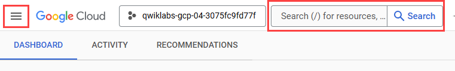

# Implement CI/CD Pipelines on Google Cloud

## LAB: Working with Artifact Registry

## Overview

As the evolution of Container Registry, [Artifact Registry](https://cloud.google.com/artifact-registry) is a single place for your organization to manage container images and language packages (such as Maven and npm). It is fully integrated with Google Cloud's tooling and runtimes and comes with support for native artifact protocols. This makes it simple to integrate it with your CI/CD tooling to set up automated pipelines.

In this lab you will learn about some of the features available in Artifact Registry.

## Objectives

In this lab, you learn how to:

- Create repositories for Containers and Language Packages
- Manage container images with Artifact Registry
- Integrate Artifact Registry with Cloud Code
- Configure Maven to use Artifact Registry for Java Dependencies

## Setup and requirement

### Before you click the Start Lab button

Read these instructions. Labs are timed and you cannot pause them. The timer, which starts when you click **Start Lab**, shows how long Google Cloud resources are made available to you.

This hands-on lab lets you do the lab activities in a real cloud environment, not in a simulation or demo environment. It does so by giving you new, temporary credentials you use to sign in and access Google Cloud for the duration of the lab.

To complete this lab, you need:

- Access to a standard internet browser (Chrome browser recommended).

**Note:** Use an Incognito (recommended) or private browser window to run this lab. This prevents conflicts between your personal account and the student account, which may cause extra charges incurred to your personal account.

- Time to complete the lab—remember, once you start, you cannot pause a lab.

**Note:** Use only the student account for this lab. If you use a different Google Cloud account, you may incur charges to that account.

### How to start your lab and sign in to the Google Cloud console

1. Click the **Start Lab** button. If you need to pay for the lab, a dialog opens for you to select your payment method. On the left is the Lab Details pane with the following:

   - The Open Google Cloud console button
   - Time remaining
   - The temporary credentials that you must use for this lab
   - Other information, if needed, to step through this lab

2. Click **Open Google Cloud console** (or right-click and select **Open Link in Incognito Window** if you are running the Chrome browser).

   The lab spins up resources, and then opens another tab that shows the Sign in page.

   ***Tip:\*** Arrange the tabs in separate windows, side-by-side.

   **Note:** If you see the **Choose an account** dialog, click **Use Another Account**.

3. If necessary, copy the **Username** below and paste it into the **Sign in** dialog.

   ```
   "Username"
   ```

   

   You can also find the Username in the Lab Details pane.

4. Click **Next**.

5. Copy the **Password** below and paste it into the **Welcome** dialog.

   ```
   "Password"
   ```

   

   You can also find the Password in the Lab Details pane.

6. Click **Next**.

   **Important:** You must use the credentials the lab provides you. Do not use your Google Cloud account credentials.

   **Note:** Using your own Google Cloud account for this lab may incur extra charges.

7. Click through the subsequent pages:

   - Accept the terms and conditions.
   - Do not add recovery options or two-factor authentication (because this is a temporary account).
   - Do not sign up for free trials.

After a few moments, the Google Cloud console opens in this tab.

**Note:** To access Google Cloud products and services, click the **Navigation menu** or type the service or product name in the **Search** field. 

### Activate Cloud Shell

Cloud Shell is a virtual machine that is loaded with development tools. It offers a persistent 5GB home directory and runs on the Google Cloud. Cloud Shell provides command-line access to your Google Cloud resources.

1. Click **Activate Cloud Shell**  at the top of the Google Cloud console.
2. Click through the following windows:
   - Continue through the Cloud Shell information window.
   - Authorize Cloud Shell to use your credentials to make Google Cloud API calls.

When you are connected, you are already authenticated, and the project is set to your **Project_ID**, `PROJECT_ID`. The output contains a line that declares the **Project_ID** for this session:

```
Your Cloud Platform project in this session is set to "PROJECT_ID"
```

`gcloud` is the command-line tool for Google Cloud. It comes pre-installed on Cloud Shell and supports tab-completion.

1. (Optional) You can list the active account name with this command:

```
gcloud auth list
```


1. Click **Authorize**.

**Output:**

```
ACTIVE: *
ACCOUNT: "ACCOUNT"

To set the active account, run:
    $ gcloud config set account `ACCOUNT`
```

1. (Optional) You can list the project ID with this command:

```
gcloud config list project
```


**Output:**

```
[core]
project = "PROJECT_ID"
```

**Note:** For full documentation of `gcloud`, in Google Cloud, refer to [the gcloud CLI overview guide](https://cloud.google.com/sdk/gcloud).

You must wait for the lab to provision before making any changes to the environment! The pre-configured parts of the environment that you need to work with will be available to you as soon as the lab indicates it is ready.

## Task 1. Prepare the lab environment

### Set up variables

- In Cloud Shell, set your project ID and project number. Save them as `PROJECT_ID` and `PROJECT_NUMBER` variables:

```
export PROJECT_ID=$(gcloud config get-value project)
export PROJECT_NUMBER=$(gcloud projects describe $PROJECT_ID --format='value(projectNumber)')
export REGION="REGION"
gcloud config set compute/region $REGION
```


### Enable Google services

- Run the following to enable necessary Google services:

```
gcloud services enable \
  cloudresourcemanager.googleapis.com \
  container.googleapis.com \
  artifactregistry.googleapis.com \
  containerregistry.googleapis.com \
  containerscanning.googleapis.com
```


### Get the source code

The source code for this lab is located in the GoogleCloudPlatform org on GitHub.

- Clone the source code with the command below, then change into the directory.

```
git clone https://github.com/GoogleCloudPlatform/cloud-code-samples/
cd ~/cloud-code-samples
```


### Provision the infrastructure used in this lab

In this lab you will deploy code to Kubernetes Engine (GKE).

- Run the setup script below to prepare this infrastructure:

```
gcloud container clusters create zon	 --zone="ZONE"
```


Click **Check my progress** to verify the objective.

Enable Google Services and create GKE cluster


Check my progress


## Task 2. Working with container images

### Create a Docker Repository on Artifact registry

Artifact Registry supports managing container images and language packages. Different artifact types require different specifications. For example, the requests for Maven dependencies are different from requests for Node dependencies.

To support the different API specifications, Artifact Registry needs to know what format you want the API responses to follow. To do this you will create a repository and pass in the `--repository-format` flag indicating the type of repository desired.

1. From Cloud Shell run the following command to create a repository for Docker images:

```
gcloud artifacts repositories create container-dev-repo --repository-format=docker \
  --location=$REGION \
  --description="Docker repository for Container Dev Workshop"
```


Click **Authorize** if the Cloud Shell authorization prompt appears.

1. In the Cloud console, go to **Artifact Registry** > **Repositories** and notice your newly created Docker repository named `container-dev-repo`. If you click on it you can see that it's empty at the moment.

Click **Check my progress** to verify the objective. (It may take a minute to validate. If you have completed successfully and it is not validating, wait a minute and try again.)

Working with container images


Check my progress


### Configure Docker Authentication to Artifact Registry

When connecting to Artifact Registry credentials are required in order to provide access. Rather than set up separate credentials, Docker can be configured to use your `gcloud` credentials seamlessly.

1. From Cloud Shell run the following command to configure Docker to use the Google Cloud CLI to authenticate requests to Artifact Registry in the `<filled in at lab start>` region:

```
gcloud auth configure-docker "Filled in at lab start"-docker.pkg.dev
```


1. The command will prompt for a confirmation to change the Cloud Shell docker configuration, click **ENTER**.

### Explore the sample Application

A sample application is provided in the git repository you cloned.

- Change into the java directory and review the application code:

```
cd ~/cloud-code-samples/java/java-hello-world
```


The folder contains an example Java application that renders a simple web page: in addition to various files not relevant for this specific lab, it contains the source code, under the `src` folder, and a Dockerfile you will use to build a container image locally.

### Build the Container Image

Before you can store container images in Artifact Registry you need to create one.

- Run the following command to build the container image and tag it properly:

```
docker build -t "REGION"-docker.pkg.dev/"PROJECT_ID"/container-dev-repo/java-hello-world:tag1 .
```


### Push the Container Image to Artifact Registry

- Run the following command to push the container image to the repository you created:

```
docker push "REGION"-docker.pkg.dev/"PROJECT_ID"/container-dev-repo/java-hello-world:tag1
```


### Review the image in Artifact Registry

1. In **Artifact Registry > Repositories**, click into `container-dev-repo` and check that the `java-hello-world` image is there.
2. Click on the image and note the image tagged `tag1`. You can see that Vulnerability Scanning is running or already completed and the number of vulnerabilities detected is visible.


Click on the number of vulnerabilities and you will see the list of vulnerabilities detected in the image, with the CVE bulletin name and the severity. Click **VIEW** on each listed vulnerability to get more details:


## Task 3. Integration with Cloud Code

In this section you use the Artifact Registry Docker image repository with [Cloud Code](https://cloud.google.com/code).

### Deploy the Application to GKE Cluster from Cloud Code

1. From the `java-hello-world` folder run the following command to open Cloud Shell Editor and add the application folder to this workspace:

```
cd ~/cloud-code-samples/
cloudshell workspace .
```


The Cloud Shell editor will open with the explorer in the application folder.

1. From the left menu, select **Cloud Code** and then expand the **COMPUTE ENGINE** option and click on **Select a Project** and choose the project ID provided in the Lab Instruction.


Also, expand the **KUBERNETES** option. You will be able to see the cluster loading.

Wait until you see the cluster listed under **KUBERNETES** as well as under **COMPUTE ENGINE**.

1. The following steps will require you to enter your Artifact Registry repository location. The format for the location is:

```
"REGION"-docker.pkg.dev/"PROJECT_ID"/container-dev-repo
```

Click **Navigation menu** under the Cloud Shell Editor **View > Command Palette...** and type **Run on Kubernetes** and select **Cloud Code: Run on Kubernetes**.


1. Choose **cloud-code-samples/java/java-hello-world/skaffold.yaml** and then **dockerfile**.
2. If Prompted for a context, select **Yes** to use the current context.
3. In the prompt for the image registry select **Enter the address of an image repository** and put the address location you located below and press **Enter**.


```
"REGION"-docker.pkg.dev/"PROJECT_ID"/container-dev-repo
```


1. When you execute **Run on Kubernetes** for the first time Cloud Code prompts you for the target image repository location. Once provided, the repository url is stored in the file `.vscode/launch.json` which is created in the application folder.

In the output pane you see that the build starts for the application image `java-hello-world,` the image is uploaded to the Artifact Registry repository configured previously.

1. In **Artifact Registry > Repositories** click into `container-dev-repo` and check that the `java-hello-world` image and note a new image tagged `latest`.

### Review the Deployed Application

1. Go back to Cloud Shell Editor. When deployment is complete Skaffold/Cloud Code will print the exposed url where the service have been forwarded, click on the link - **Follow link**:


In the new browser window you see the hello world app page.


### Update application code

Now update the application to see the change implemented immediately in the deployment on the cluster:

1. Open the `HelloWorldController.java` by clicking on the **Navigation menu** under the Cloud Shell Editor  **View > Command Palette...** and then click one backspace and then enter the path **src/main/java/cloudcode/helloworld/web** and click the option starting with `Hello..` .
2. Change the text in row 20 from "It's running!" to "It's updated!". You should see the build and deployment process starting immediately.
3. At the end of the deploy click again on the forwarded url or refresh the browser window with the application to see your change deployed:


1. In the Cloud console go to **Navigation Menu > Artifact Registry > Repositories** and click into `container-dev-repo` to check that the `java-hello-world` image and note the new image.

Click **Check my progress** to verify the objective.

Integration with Cloud Code


Check my progress


## Task 4. Working with language packages

In this section you will set up an Artifact Registry Java repository and upload packages to it, leveraging them in different applications.

### Create a Java package repository

1. From Cloud Shell run the following command to create a repository for Java artifacts:

```
gcloud artifacts repositories create container-dev-java-repo \
    --repository-format=maven \
    --location="REGION" \
    --description="Java package repository for Container Dev Workshop"
```


1. Click Authorize if the Cloud Shell authorization prompt appears
2. In the Cloud console go to **Artifact Registry > Repositories** and notice your newly created Maven repository named `container-dev-java-repo`, if you click on it you can see that it's empty at the moment.

Click **Check my progress** to verify the objective.

Create a Java package repository


Check my progress


### Set up authentication to Artifact Repository

- Use the following command to update the well-known location for Application Default Credentials (ADC) with your user account credentials so that the Artifact Registry credential helper can authenticate using them when connecting with repositories:

```
gcloud auth login --update-adc
```


If prompted to authenticate:

- Choose **Y**.
- Paste the code into a browser window.
- Select Google Sign In and sign in using the credentials in the lab.
- Copy the authentication code from the browser back into the console to complete the authentication.

### Configure Maven for Artifact Registry

1. Run the following command to print the repository configuration to add to your Java project:

```
gcloud artifacts print-settings mvn \
    --repository=container-dev-java-repo \
    --location="REGION"
```


1. Open the `pom.xml` in Cloud Shell Editor and add the returned settings to the appropriate sections in the file:

- Add the **distributionManagement** section.

```
  <distributionManagement>
    <snapshotRepository>
      <id>artifact-registry</id>
      <url>artifactregistry://"REGION"-maven.pkg.dev/"PROJECT_ID"/container-dev-java-repo</url>
    </snapshotRepository>
    <repository>
      <id>artifact-registry</id>
      <url>artifactregistry://"REGION"-maven.pkg.dev/"PROJECT_ID"/container-dev-java-repo</url>
    </repository>
  </distributionManagement>
```


- Add the **repositories** section.

```
 <repositories>
   <repository>
     <id>artifact-registry</id>
     <url>artifactregistry://"REGION"-maven.pkg.dev/"PROJECT_ID"/container-dev-java-repo</url>
     <releases>
       <enabled>true</enabled>
     </releases>
     <snapshots>
       <enabled>true</enabled>
     </snapshots>
   </repository>
 </repositories>
```


- Update the **extensions in the Builds** section.

```
<extensions>
     <extension>
       <groupId>com.google.cloud.artifactregistry</groupId>
       <artifactId>artifactregistry-maven-wagon</artifactId>
       <version>2.1.0</version>
     </extension>
   </extensions>
```


Here's an example of the complete file for your reference.

```
<?xml version="1.0" encoding="UTF-8"?>
<project xmlns="http://maven.apache.org/POM/4.0.0" xmlns:xsi="http://www.w3.org/2001/XMLSchema-instance"
       xsi:schemaLocation="http://maven.apache.org/POM/4.0.0 http://maven.apache.org/xsd/maven-4.0.0.xsd">
 <modelVersion>4.0.0</modelVersion>

 <artifactId>hello-world</artifactId>
 <packaging>jar</packaging>
 <name>Cloud Code Hello World</name>
 <description>Getting started with Cloud Code</description>
 <version>1.0.0</version>
<distributionManagement>
   <snapshotRepository>
     <id>artifact-registry</id>
     <url>artifactregistry://"REGION"-maven.pkg.dev/"PROJECT_ID"/container-dev-java-repo</url>
   </snapshotRepository>
   <repository>
     <id>artifact-registry</id>
     <url>artifactregistry://"REGION"-maven.pkg.dev/"PROJECT_ID"/container-dev-java-repo</url>
   </repository>
 </distributionManagement>

 <repositories>
   <repository>
     <id>artifact-registry</id>
     <url>artifactregistry://"REGION"-maven.pkg.dev/"PROJECT_ID"/container-dev-java-repo</url>
     <releases>
       <enabled>true</enabled>
     </releases>
     <snapshots>
       <enabled>true</enabled>
     </snapshots>
   </repository>
 </repositories>

 <parent>
   <groupId>org.springframework.boot</groupId>
   <artifactId>spring-boot-starter-parent</artifactId>
   <version>2.6.3</version>
 </parent>

 <properties>
   <java.version>1.8</java.version>
   <checkstyle.config.location>./checkstyle.xml</checkstyle.config.location>
 </properties>

 <build>
   <plugins>
     <plugin>
       <groupId>com.google.cloud.tools</groupId>
       <artifactId>jib-maven-plugin</artifactId>
       <version>3.2.0</version>
     </plugin>
     <plugin>
       <groupId>org.springframework.boot</groupId>
       <artifactId>spring-boot-maven-plugin</artifactId>
     </plugin>
     <plugin>
       <groupId>org.apache.maven.plugins</groupId>
       <artifactId>maven-checkstyle-plugin</artifactId>
       <version>3.1.2</version>
     </plugin>
   </plugins>
   <extensions>
     <extension>
       <groupId>com.google.cloud.artifactregistry</groupId>
       <artifactId>artifactregistry-maven-wagon</artifactId>
       <version>2.1.0</version>
     </extension>
   </extensions>
 </build>

 <!-- The Spring Cloud GCP BOM will manage spring-cloud-gcp version numbers for you. -->
 <dependencyManagement>
   <dependencies>
     <dependency>
       <groupId>org.springframework.cloud</groupId>
       <artifactId>spring-cloud-gcp-dependencies</artifactId>
       <version>1.2.8.RELEASE</version>
       <type>pom</type>
       <scope>import</scope>
     </dependency>
   </dependencies>
 </dependencyManagement>

 <dependencies>

   <dependency>
     <groupId>org.springframework.boot</groupId>
     <artifactId>spring-boot-starter</artifactId>
   </dependency>

   <dependency>
     <groupId>org.springframework.boot</groupId>
     <artifactId>spring-boot-starter-jetty</artifactId>
   </dependency>

   <dependency>
     <groupId>org.springframework</groupId>
     <artifactId>spring-webmvc</artifactId>
   </dependency>

   <dependency>
     <groupId>org.springframework.boot</groupId>
     <artifactId>spring-boot-starter-thymeleaf</artifactId>
   </dependency>

   <dependency>
     <groupId>org.springframework.boot</groupId>
     <artifactId>spring-boot-starter-test</artifactId>
     <scope>test</scope>
   </dependency>

   <dependency>
     <groupId>org.springframework.cloud</groupId>
     <artifactId>spring-cloud-gcp-starter-logging</artifactId>
   </dependency>

 </dependencies>

</project>
```


### Upload your Java package to Artifact Registry

With Artifact Registry configured in Maven, you can now use Artifact Registry to store Java Jars for use by other projects in your organization.

- Enter the below command to change to `java-hello-world` folder.

```
cd ~/cloud-code-samples/java/java-hello-world
```


- Run the following command to upload your Java package to Artifact Registry:

```
mvn deploy
```


### Check the Java package in Artifact Registry

In the Cloud console go to **Artifact Registry > Repositories** and click into `container-dev-java-repo` to check that the `hello-world` binary artifact is there:


## Congratulations!


## LAB: Google Kubernetes Engine Pipeline using Cloud Build

## Overview

Cloud Build is a service that executes your builds on Google Cloud. It can import source code, execute builds, and more.

In this lab, you create a continuous integration and continuous deployment (CI/CD) pipeline that automatically builds a container image from committed code, stores the image in Artifact Registry, updates a Kubernetes manifest in a Git repository, and deploys the application to Google Kubernetes Engine using that manifest.


For this lab you create 2 Git repositories:

- `app`: contains the application source code
- `env`: contains the Kubernetes deployment manifests

When you push a change to the `app` repository, the Cloud Build pipeline runs tests, builds a container image, and pushes the change to Artifact Registry. After pushing the image, Cloud Build updates the deployment manifest and pushes it to the `env` repository. This triggers another Cloud Build pipeline that applies the manifest to the GKE cluster and, if successful, stores the manifest in another branch of the `env` repository.

The `app` and `env` repositories are kept separate because they have different lifecycles and uses. The `app` repository is dedicated to a specific application, and is used mostly by actual humans. The `env` repository may be shared by several applications and is used by automated systems (such as Cloud Build). The `env` repository can have several branches, each mapping to a specific environment and reference a specific container image; the `app` repository does not.

When you finish this lab, your system can easily:

- Distinguish between failed and successful deployments by looking at the Cloud Build history.
- Access the manifest currently used by looking at the production branch of the `env` repository.
- Rollback to any previous version by re-executing the corresponding Cloud Build build.


## Objectives

In this lab, you learn how to perform the following:

- Create Kubernetes Engine clusters.
- Create GitHub repositories.
- Trigger Cloud Build from GitHub repositories.
- Automate tests and publish a deployable container image via Cloud Build.
- Manage resources deployed in a Kubernetes Engine cluster via Cloud Build.

## Setup and requirements

### Before you click the Start Lab button

Read these instructions. Labs are timed and you cannot pause them. The timer, which starts when you click **Start Lab**, shows how long Google Cloud resources are made available to you.

This hands-on lab lets you do the lab activities in a real cloud environment, not in a simulation or demo environment. It does so by giving you new, temporary credentials you use to sign in and access Google Cloud for the duration of the lab.

To complete this lab, you need:

- Access to a standard internet browser (Chrome browser recommended).

**Note:** Use an Incognito (recommended) or private browser window to run this lab. This prevents conflicts between your personal account and the student account, which may cause extra charges incurred to your personal account.

- Time to complete the lab—remember, once you start, you cannot pause a lab.

**Note:** Use only the student account for this lab. If you use a different Google Cloud account, you may incur charges to that account.

### How to start your lab and sign in to the Google Cloud console

1. Click the **Start Lab** button. If you need to pay for the lab, a dialog opens for you to select your payment method. On the left is the Lab Details pane with the following:

   - The Open Google Cloud console button
   - Time remaining
   - The temporary credentials that you must use for this lab
   - Other information, if needed, to step through this lab

2. Click **Open Google Cloud console** (or right-click and select **Open Link in Incognito Window** if you are running the Chrome browser).

   The lab spins up resources, and then opens another tab that shows the Sign in page.

   ***Tip:\*** Arrange the tabs in separate windows, side-by-side.

   **Note:** If you see the **Choose an account** dialog, click **Use Another Account**.

3. If necessary, copy the **Username** below and paste it into the **Sign in** dialog.

   ```
   "Username"
   ```

   

   You can also find the Username in the Lab Details pane.

4. Click **Next**.

5. Copy the **Password** below and paste it into the **Welcome** dialog.

   ```
   "Password"
   ```

   

   You can also find the Password in the Lab Details pane.

6. Click **Next**.

   **Important:** You must use the credentials the lab provides you. Do not use your Google Cloud account credentials.

   **Note:** Using your own Google Cloud account for this lab may incur extra charges.

7. Click through the subsequent pages:

   - Accept the terms and conditions.
   - Do not add recovery options or two-factor authentication (because this is a temporary account).
   - Do not sign up for free trials.

After a few moments, the Google Cloud console opens in this tab.

**Note:** To access Google Cloud products and services, click the **Navigation menu** or type the service or product name in the **Search** field. 

### Activate Cloud Shell

Cloud Shell is a virtual machine that is loaded with development tools. It offers a persistent 5GB home directory and runs on the Google Cloud. Cloud Shell provides command-line access to your Google Cloud resources.

1. Click **Activate Cloud Shell**  at the top of the Google Cloud console.
2. Click through the following windows:
   - Continue through the Cloud Shell information window.
   - Authorize Cloud Shell to use your credentials to make Google Cloud API calls.

When you are connected, you are already authenticated, and the project is set to your **Project_ID**, `PROJECT_ID`. The output contains a line that declares the **Project_ID** for this session:

```
Your Cloud Platform project in this session is set to "PROJECT_ID"
```

`gcloud` is the command-line tool for Google Cloud. It comes pre-installed on Cloud Shell and supports tab-completion.

1. (Optional) You can list the active account name with this command:

```
gcloud auth list
```


1. Click **Authorize**.

**Output:**

```
ACTIVE: *
ACCOUNT: "ACCOUNT"

To set the active account, run:
    $ gcloud config set account `ACCOUNT`
```

1. (Optional) You can list the project ID with this command:

```
gcloud config list project
```


**Output:**

```
[core]
project = "PROJECT_ID"
```

**Note:** For full documentation of `gcloud`, in Google Cloud, refer to [the gcloud CLI overview guide](https://cloud.google.com/sdk/gcloud).

## Task 1. Initialize your lab

In this task, you set up your environment:

- Import your project ID and project number as variables
- Enable the APIs for GKE, Cloud Build, Secret Manager, and Artifact Analysis
- Create an Artifact Registry Docker repository
- Create a GKE cluster to deploy the sample application of this lab

1. In Cloud Shell, run the following command to set your project ID and project number. Save them as `PROJECT_ID` and `PROJECT_NUMBER` variables:

```
export PROJECT_ID=$(gcloud config get-value project)
export PROJECT_NUMBER=$(gcloud projects describe $PROJECT_ID --format='value(projectNumber)')
export REGION=us-central1
gcloud config set compute/region $REGION
```


Next, you prepare your Google Cloud Project for use by enabling the required APIs, initializing the git configuration in Cloud Shell, and downloading the sample code used later in the lab.

1. Run the following command to enable the APIs for GKE, Cloud Build, Secret Manager and Artifact Analysis:

```
gcloud services enable container.googleapis.com \
    cloudbuild.googleapis.com \
    secretmanager.googleapis.com \
    containeranalysis.googleapis.com
```


1. Create an Artifact Registry Docker repository named `my-repository` in the `<filled in at lab start>` region to store your container images:

```
gcloud artifacts repositories create my-repository \
  --repository-format=docker \
  --location=$REGION
```


1. Create a GKE cluster to deploy the sample application of this lab:

```
gcloud container clusters create hello-cloudbuild --num-nodes 3 --region $REGION
```


1. Run the following command to configure Git and GitHub in Cloud Shell:

   ```
   curl -sS https://webi.sh/gh | sh 
   gh auth login 
   gh api user -q ".login"
   GITHUB_USERNAME=$(gh api user -q ".login")
   git config --global user.name "${GITHUB_USERNAME}"
   git config --global user.email "${USER_EMAIL}"
   echo ${GITHUB_USERNAME}
   echo ${USER_EMAIL}
   ```

   

Press ENTER to accept the default options. Read the instructions in the CLI tool to GitHub Login with a web browser. If you have logged in successfully, it shows your GitHub username.

Click **Check my progress** to verify the objective.

Enable services, create an artifact registry and the GKE cluster


Check my progress


## Task 2. Create the Git repositories in GitHub repositories

GitHub is a platform where you can store, share, and work together with others to write code. Git is a version control system. When you upload files to GitHub, you store them in a "Git repository." This means that when you make changes (or "commits") to your files in GitHub, Git automatically starts to track and manage your changes. For more detail, refer to [About GitHub and Git](https://docs.github.com/en/enterprise-server@3.15/get-started/start-your-journey/about-github-and-git).

In this task, you create the two Git repositories (`hello-cloudbuild-app` and `hello-cloudbuild-env`) and initialize `hello-cloudbuild-app` with some sample code.

1. In Cloud Shell, run the following commands to create the two Git repositories:

```
gh repo create hello-cloudbuild-app --private 
```


```
gh repo create hello-cloudbuild-env --private
```


1. Download the sample code from Cloud Storage:

```
cd ~
mkdir hello-cloudbuild-app
```


```
gcloud storage cp -r gs://spls/gsp1077/gke-gitops-tutorial-cloudbuild/* hello-cloudbuild-app
```


1. Configure the GitHub repository as a remote:

```
cd ~/hello-cloudbuild-app
```


```
export REGION="REGION"
sed -i "s/us-central1/$REGION/g" cloudbuild.yaml
sed -i "s/us-central1/$REGION/g" cloudbuild-delivery.yaml
sed -i "s/us-central1/$REGION/g" cloudbuild-trigger-cd.yaml
sed -i "s/us-central1/$REGION/g" kubernetes.yaml.tpl
```


```
PROJECT_ID=$(gcloud config get-value project)
```


```
git init
git config credential.helper gcloud.sh
git remote add google https://github.com/${GITHUB_USERNAME}/hello-cloudbuild-app
git branch -m master
git add . && git commit -m "initial commit"
```


The code you just cloned contains a simple "Hello World" application:

```
from flask import Flask
app = Flask('hello-cloudbuild')
@app.route('/')
def hello():
  return "Hello World!\n"
if __name__ == '__main__':
  app.run(host = '0.0.0.0', port = 8080)
```

## Task 3. Create a container image with Cloud Build

In this task, with an existing Dockerfile, you use Cloud Build to create and store a container image.

The code you previously cloned contains the Docker file:

```
FROM python:3.7-slim
RUN pip install flask
WORKDIR /app
COPY app.py /app/app.py
ENTRYPOINT ["python"]
CMD ["/app/app.py"]
```

With this Dockerfile, you can use Cloud Build to create a container image and store it in Artifact Registry.

1. In Cloud Shell, create a Cloud Build build based on the latest commit with the following command:

```
cd ~/hello-cloudbuild-app
```


```
COMMIT_ID="$(git rev-parse --short=7 HEAD)"
```


```
gcloud builds submit --tag="${REGION}-docker.pkg.dev/${PROJECT_ID}/my-repository/hello-cloudbuild:${COMMIT_ID}" .
```


Cloud Build streams the logs generated by the creation of the container image to your terminal when you execute the command.

1. After the build finishes, in the Google title bar, enter **Artifact Registry** in the **Search** field, and then click **Artifact Registry** in the search results. Verify that your new container image is indeed available in Artifact Registry. Click **my-repository** to see the `hello-cloudbuild` image in the **Image** list.

Click **Check my progress** to verify the objective.

Create the container image with Cloud Build


Check my progress


## Task 4. Create the Continuous Integration (CI) pipeline

In this task, you configure Cloud Build to automatically run a small unit test, build the container image, and then push it to Artifact Registry. Pushing a new commit to GitHub repositories triggers this pipeline automatically.


The `cloudbuild.yaml` file, already included in the code, is the pipeline's configuration.

1. In the console title bar, enter **Cloud Build triggers** in the **Search** field, and then click **Triggers, Cloud Build** in the search results.

2. Click **Create Trigger**.

3. For **Name**, type `hello-cloudbuild`. Set **Region** to `<filled in at lab start>`.

4. Set **Event** to **Push to a branch**.

5. Under **Source**, for **Repository**, click **Connect new repository**.

   a. Select **GitHub (Cloud Build GitHub App)**. Click **Continue**.

   b. Authenticate to your source repository with your username and password.

   c. If you get the pop up "The GitHub App is not installed on any of your repositories", follow these steps.

   ```
   i. Click **Install Google Cloud Build**. Install the Cloud Build GitHub App in your personal account. Permit the installation using your GitHub account.
   
   ii. Under **Repository access**. Choose **Only select repositories**. Click the **Select the repositories** menu and select `${GITHUB_USERNAME}/hello-cloudbuild-app` and `${GITHUB_USERNAME}/hello-cloudbuild-env`.
   
   iii. Click **Install**.
   ```

   

   d. Select **${GITHUB_USERNAME}/hello-cloudbuild-app** for **Repository**. Click **OK**.

   e. Accept **I understand that GitHub content for the selected repositories...**.

   f. Click **Connect**.

6. If the Cloud Build GitHub App is already installed in your account, you get the option to **Edit Repositories** on GitHub.

   a. Under **Repository access** choose **Only select repositories**. Click the **Select repositories** menu and select the repository **$${GITHUB_USERNAME}/hello-cloudbuild-app** and **$${GITHUB_USERNAME}/hello-cloudbuild-env**.

   b. Click **Save**.

7. On the Trigger page, from the **Repository list**, click **${GITHUB_USERNAME}/hello-cloudbuild-app**.

8. For **Branch** type `.* (any branch)`.

9. In the **Configuration** section, set **Type** to **Cloud Build configuration file**.

10. In the **Location** field, type `cloudbuild.yaml` after the /.

11. Set **Service account** to the **Compute Engine default service account**.

12. Click **Create**.

When the trigger is created, return to the Cloud Shell. You now need to push the application code to GitHub repositories to trigger the CI pipeline in Cloud Build.

1. To start this trigger, run the following command:

```
cd ~/hello-cloudbuild-app
```


```
git add .
```


```
git commit -m "Type Any Commit Message here"
```


```
git push google master
```


1. In the left pane, click **Dashboard**.
2. You should see a build running or having recently finished. You can click the build to follow its execution and examine its logs.

Click **Check my progress** to verify the objective.

Create the Continuous Integration (CI) Pipeline


Check my progress


## Task 5. Accessing GitHub from a build via SSH keys

In this step use the Secret Manager with Cloud Build to access private GitHub repositories.

### Create a SSH key

1. In Cloud Shell, change to the home directory.

   ```
   cd ~
   ```

   

2. Create a new directory named `workingdir` and navigate to it:

   ```
   mkdir workingdir
   cd workingdir
   ```

   

3. Create a new GitHub SSH key, replace [*your-github-email*] with your personal GitHub email address:

   ```
   ssh-keygen -t rsa -b 4096 -N '' -f id_github -C [your-github-email]
   ```

   

This step creates two files, `id_github` and `id_github.pub`.

1. In the Cloud Shell action bar, click **More** () and then **Download > Toggle file browser** and select the `dropdown` and `workingdir` folder to download the `id_github` file on your local machine.

### Store the private SSH key in Secret Manager

1. In the console title bar, enter **Secret Manager**, and then click **Secret Manager** in the search results.
2. Click **Create Secret**.
3. Set **Name** to **ssh_key_secret**.
4. Set **Secret value** to **Upload** and upload your `id_github` file.
5. Leave other settings at their defaults.
6. Click **Create secret**.

This uploads your `id_github` file to Secret Manager.

### Add the public SSH key to your private repository's deploy keys

1. Login to your personal [GitHub](https://github.com/) account

2. In the top right corner, click your profile photo, then click **Your profile**.

3. On your profile page, click **Repositories**, then click the `hello-cloudbuild-env` repository.

4. From your repository, click **Settings**.

5. In the left pane, click **Deploy Keys**, then click **Add deploy key**.

6. Provide the title **SSH_KEY**, paste your public SSH key from `workingdir/id_github.pub` from Cloud Shell.

7. Select **Allow write access** so this key has write access to the repository. A deploy key with write access lets a deployment push to the repository.

8. Click **Add key**.

9. Delete the SSH key from your disk:

   ```
   rm id_github*
   ```

   

### Grant the service account permission to access Secret Manager

Enter the following command to give the service account access to Secret Manager:

```
gcloud projects add-iam-policy-binding ${PROJECT_NUMBER} \
--member=serviceAccount:${PROJECT_NUMBER}-compute@developer.gserviceaccount.com \
--role=roles/secretmanager.secretAccessor
```


Click **Check my progress** to verify the objective.

Accessing GitHub from a build via SSH keys


Check my progress


## Task 6. Create the test environment and CD pipeline

You can also use Cloud Build for the continuous delivery pipeline. The pipeline runs each time a commit is pushed to the candidate branch of the `hello-cloudbuild-env` repository. The pipeline applies the new version of the manifest to the Kubernetes cluster and, if successful, copies the manifest over to the production branch. This process has the following properties:

- The candidate branch is a history of the deployment attempts.
- The production branch is a history of the successful deployments.
- You have a view of successful and failed deployments in Cloud Build.
- You can rollback to any previous deployment by re-executing the corresponding build in Cloud Build. A rollback also updates the production branch to truthfully reflect the history of deployments.

Next, you modify the continuous integration pipeline to update the candidate branch of the `hello-cloudbuild-env` repository, triggering the continuous delivery pipeline.

### Grant Cloud Build access to GKE

To deploy the application in your Kubernetes cluster, Cloud Build needs the Kubernetes Engine Developer Identity and the Access Management role.

1. In Cloud Shell, execute the following command:

```
cd ~
PROJECT_NUMBER="$(gcloud projects describe ${PROJECT_ID} --format='get(projectNumber)')"
```


```
gcloud projects add-iam-policy-binding ${PROJECT_NUMBER} \
--member=serviceAccount:${PROJECT_NUMBER}@cloudbuild.gserviceaccount.com \
--role=roles/container.developer
```


You need to initialize the `hello-cloudbuild-env` repository with two branches (production and candidate) and a Cloud Build configuration file describing the deployment process.

The first step is to clone the `hello-cloudbuild-env` repository and create the production branch, which is still empty.

1. In Cloud Shell, download the sample code from Cloud Storage:

```
mkdir hello-cloudbuild-env
gcloud storage cp -r gs://spls/gsp1077/gke-gitops-tutorial-cloudbuild/* hello-cloudbuild-env
```


```
cd hello-cloudbuild-env
export REGION="REGION"
sed -i "s/us-central1/$REGION/g" cloudbuild.yaml
sed -i "s/us-central1/$REGION/g" cloudbuild-delivery.yaml
sed -i "s/us-central1/$REGION/g" cloudbuild-trigger-cd.yaml
sed -i "s/us-central1/$REGION/g" kubernetes.yaml.tpl
```


1. For Cloud Build to connect to GitHub, you must add the public SSH key to the `known_hosts` file in Cloud Build's build environment. In your `hello-cloudbuild-env` directory, create a file named `known_hosts.github`, add the public SSH key to this file, and provide the necessary permission to the file:

```
cd ~/hello-cloudbuild-env
ssh-keyscan -t rsa github.com > known_hosts.github
chmod +x known_hosts.github
```


```
git init
git config credential.helper gcloud.sh
git remote add google https://github.com/${GITHUB_USERNAME}/hello-cloudbuild-env
git branch -m master
git add . && git commit -m "initial commit"
git push google master
```


```
cd ~/hello-cloudbuild-env
```


```
git checkout -b production
```


1. Next, replace the `cloudbuild.yaml` file available in the `hello-cloudbuild-env` repository and commit the change:

```
cd ~/hello-cloudbuild-env
```


1. Replace the `cloudbuild.yaml` in the `hello-cloudbuild-env` repository with the code below. Replace `{GITHUB-USERNAME}` with your personal GitHub username:

```
# Copyright 2018 Google LLC
#
# Licensed under the Apache License, Version 2.0 (the "License");
# you may not use this file except in compliance with the License.
# You may obtain a copy of the License at
#
#     https://www.apache.org/licenses/LICENSE-2.0
#
# Unless required by applicable law or agreed to in writing, software
# distributed under the License is distributed on an "AS IS" BASIS,
# WITHOUT WARRANTIES OR CONDITIONS OF ANY KIND, either express or implied.
# See the License for the specific language governing permissions and
# limitations under the License.

# [START cloudbuild-delivery]
steps:
# This step deploys the new version of our container image
# in the hello-cloudbuild Kubernetes Engine cluster.
- name: 'gcr.io/cloud-builders/kubectl'
  id: Deploy
  args:
  - 'apply'
  - '-f'
  - 'kubernetes.yaml'
  env:
  - 'CLOUDSDK_COMPUTE_REGION='
  - 'CLOUDSDK_CONTAINER_CLUSTER=hello-cloudbuild'

# Access the id_github file from Secret Manager, and setup SSH
- name: 'gcr.io/cloud-builders/git'
  secretEnv: ['SSH_KEY']
  entrypoint: 'bash'
  args:
  - -c
  - |
    echo "$$SSH_KEY" >> /root/.ssh/id_rsa
    chmod 400 /root/.ssh/id_rsa
    cp known_hosts.github /root/.ssh/known_hosts
  volumes:
  - name: 'ssh'
    path: /root/.ssh

# Clone the repository
- name: 'gcr.io/cloud-builders/git'
  args:
  - clone
  - --recurse-submodules
  - git@github.com:${GITHUB-USERNAME}/hello-cloudbuild-env.git
  volumes:
  - name: ssh
    path: /root/.ssh

# This step copies the applied manifest to the production branch
# The COMMIT_SHA variable is automatically
# replaced by Cloud Build.
- name: 'gcr.io/cloud-builders/gcloud'
  id: Copy to production branch
  entrypoint: /bin/sh
  args:
  - '-c'
  - |
    set -x && \
    cd hello-cloudbuild-env && \
    git config user.email $(gcloud auth list --filter=status:ACTIVE --format='value(account)')
    sed "s/GOOGLE_CLOUD_PROJECT/${PROJECT_ID}/g" kubernetes.yaml.tpl | \
    git fetch origin production && \
    # Switch to the production branch and copy the kubernetes.yaml file from the candidate branch
    git checkout production && \
    git checkout $COMMIT_SHA kubernetes.yaml && \
    # Commit the kubernetes.yaml file with a descriptive commit message
    git commit -m "Manifest from commit $COMMIT_SHA
    $(git log --format=%B -n 1 $COMMIT_SHA)" && \
    # Push the changes back to Cloud Source Repository
    git push origin production
  volumes:
  - name: ssh
    path: /root/.ssh

availableSecrets:
  secretManager:
  - versionName: projects/${PROJECT_NUMBER}/secrets/ssh_key_secret/versions/1
    env: 'SSH_KEY'

# [END cloudbuild-delivery]
options:
  logging: CLOUD_LOGGING_ONLY
```


```
git add .
```


```
git commit -m "Create cloudbuild.yaml for deployment"
```


The `cloudbuild.yaml` file describes the deployment process to be run in Cloud Build. It has two steps:

- Cloud Build applies the manifest to the GKE cluster.
- If successful, Cloud Build copies the manifest on the production branch.

1. Create a candidate branch and push both branches for them to be available in GitHub Repositories:

```
git checkout -b candidate
```


```
git push google production
```


```
git push google candidate
```


### Create the trigger for the continuous delivery pipeline

1. In the console title bar, enter **Cloud Build Triggers**, and then click **Triggers, Cloud Build**.

2. Click **Create Trigger**.

3. Set **Name** to **hello-cloudbuild-deploy**. Set **Region** to `<filled in at lab start>`.

4. Under **Event**, select **Push to a branch**.

5. Under **Source**, for **Repository** click **Connect new repository**.

   a. Select **GitHub (Cloud Build GitHub App)**. Click **Continue**.

   b. Authenticate to your source repository with your GitHub username and password.

   c. Select **${GITHUB_USERNAME}/hello-cloudbuild-env** repository. Click **OK**.

   d. Select **I understand that GitHub content for the selected repositories..**

   e. Click **Connect**.

6. Under **Repository** select **${GITHUB_USERNAME}/hello-cloudbuild-env**.

7. Under **Source**, select `^candidate$` as your **Branch**.

8. Under **Build configuration**, select **Cloud Build configuration file**.

9. In the **Cloud Build configuration file location** field, type `cloudbuild.yaml` after the /.

10. Set **Service account** to the Compute Engine default service account.

11. Click **Create**.

12. In your `hello-cloudbuild-app` directory, create a file named `known_hosts.github`, add the public SSH key to this file and provide the necessary permission to the file:

```
cd ~/hello-cloudbuild-app
ssh-keyscan -t rsa github.com > known_hosts.github
chmod +x known_hosts.github
```


```
git add .
git commit -m "Adding known_host file."
git push google master
```


### Modify the continuous integration pipeline to trigger the continuous delivery pipeline

Next, add some steps to the continuous integration pipeline that generated a new version of the Kubernetes manifest and push it to the `hello-cloudbuild-env` repository to trigger the continuous delivery pipeline.

- Copy the extended version of the `cloudbuild.yaml` file for the `app` repository:

```
cd ~/hello-cloudbuild-app
```


The `cloudbuild.yaml` file adds the steps that generate the new Kubernetes manifest and trigger the continuous delivery pipeline.

### Configure the build

1. Replace the `cloudbuild.yaml` in the `hello-cloudbuild-app` repository with the code below. Replace `${GITHUB-USERNAME}` with your GitHub username.

```
# Copyright 2018 Google LLC
#
# Licensed under the Apache License, Version 2.0 (the "License");
# you may not use this file except in compliance with the License.
# You may obtain a copy of the License at
#
#     https://www.apache.org/licenses/LICENSE-2.0
#
# Unless required by applicable law or agreed to in writing, software
# distributed under the License is distributed on an "AS IS" BASIS,
# WITHOUT WARRANTIES OR CONDITIONS OF ANY KIND, either express or implied.
# See the License for the specific language governing permissions and
# limitations under the License.

# [START cloudbuild]
steps:
# This step runs the unit tests on the app
- name: 'python:3.7-slim'
  id: Test
  entrypoint: /bin/sh
  args:
  - -c
  - 'pip install flask && python test_app.py -v'

# This step builds the container image.
- name: 'gcr.io/cloud-builders/docker'
  id: Build
  args:
  - 'build'
  - '-t'
  - '-docker.pkg.dev/$PROJECT_ID/my-repository/hello-cloudbuild:$SHORT_SHA'
  - '.'

# This step pushes the image to Artifact Registry
# The PROJECT_ID and SHORT_SHA variables are automatically
# replaced by Cloud Build.
- name: 'gcr.io/cloud-builders/docker'
  id: Push
  args:
  - 'push'
  - '-docker.pkg.dev/$PROJECT_ID/my-repository/hello-cloudbuild:$SHORT_SHA'
# [END cloudbuild]

# Access the id_github file from Secret Manager, and setup SSH
- name: 'gcr.io/cloud-builders/git'
  secretEnv: ['SSH_KEY']
  entrypoint: 'bash'
  args:
  - -c
  - |
    echo "$$SSH_KEY" >> /root/.ssh/id_rsa
    chmod 400 /root/.ssh/id_rsa
    cp known_hosts.github /root/.ssh/known_hosts
  volumes:
  - name: 'ssh'
    path: /root/.ssh

# Clone the repository
- name: 'gcr.io/cloud-builders/git'
  args:
  - clone
  - --recurse-submodules
  - git@github.com:${GITHUB-USERNAME}/hello-cloudbuild-env.git
  volumes:
  - name: ssh
    path: /root/.ssh

# [START cloudbuild-trigger-cd]
# This step clones the hello-cloudbuild-env repository
- name: 'gcr.io/cloud-builders/gcloud'
  id: Change directory
  entrypoint: /bin/sh
  args:
  - '-c'
  - |
    cd hello-cloudbuild-env && \
    git checkout candidate && \
    git config user.email $(gcloud auth list --filter=status:ACTIVE --format='value(account)')
  volumes:
  - name: ssh
    path: /root/.ssh

# This step generates the new manifest
- name: 'gcr.io/cloud-builders/gcloud'
  id: Generate manifest
  entrypoint: /bin/sh
  args:
  - '-c'
  - |
     sed "s/GOOGLE_CLOUD_PROJECT/${PROJECT_ID}/g" kubernetes.yaml.tpl | \
     sed "s/COMMIT_SHA/${SHORT_SHA}/g" > hello-cloudbuild-env/kubernetes.yaml
  volumes:
  - name: ssh
    path: /root/.ssh

# This step pushes the manifest back to hello-cloudbuild-env
- name: 'gcr.io/cloud-builders/gcloud'
  id: Push manifest
  entrypoint: /bin/sh
  args:
  - '-c'
  - |
    set -x && \
    cd hello-cloudbuild-env && \
    git add kubernetes.yaml && \
    git commit -m "Deploying image -docker.pkg.dev/$PROJECT_ID/my-repository/hello-cloudbuild:${SHORT_SHA}
    Built from commit ${COMMIT_SHA} of repository hello-cloudbuild-app
    Author: $(git log --format='%an <%ae>' -n 1 HEAD)" && \
    git push origin candidate
  volumes:
  - name: ssh
    path: /root/.ssh
availableSecrets:
  secretManager:
  - versionName: projects/${PROJECT_NUMBER}/secrets/ssh_key_secret/versions/1
    env: 'SSH_KEY'

# [END cloudbuild-trigger-cd]
options:
  logging: CLOUD_LOGGING_ONLY
```


**Note:** This pipeline uses a simple `sed` to render the manifest template. In reality, you benefit from using a dedicated tool such as kustomize or skaffold as they allow more control over manifest template rendering.

1. Commit the modifications and push them to GitHub Repositories:

```
cd ~/hello-cloudbuild-app
```


```
git add cloudbuild.yaml
```


```
git commit -m "Trigger CD pipeline"
```


```
git push google master
```


This triggers the continuous integration pipeline in Cloud Build.

Click **Check my progress** to verify the objective.

Create the Test Environment and CD Pipeline


Check my progress


## Task 7. Review Cloud Build pipeline

In this task, you review the Cloud Build pipeline in the console.

1. In the console, still in the Cloud Build page, click **Dashboard** in the left pane.
2. Click the **hello-cloudbuild-app** trigger to follow its execution and examine its logs. The last step of this pipeline pushes the new manifest to the `hello-cloudbuild-env` repository, which triggers the continuous delivery pipeline.
3. Return to the main **Dashboard**.
4. You should see a build either running or recently finished for the `hello-cloudbuild-env` repository.

You can click on the build to follow its execution and examine its logs.

## Task 8. Test the complete pipeline

You've now configured the complete CI/CD pipeline. In this task you perform an end to end test.

1. In the console, in the **Navigation menu** (), click **Kubernetes Engine > Gateways, Services & Ingress > Services**.

There should be a single service called **hello-cloudbuild** in the list. It has been created by the continuous delivery build that just ran.

1. Click on the endpoint for the **hello-cloudbuild** service. You should see "Hello World!". If there is no endpoint, or if you see a load balancer error, you may have to wait a few minutes for the load balancer to completely initialize. If needed, click **Refresh** to update the page.


1. In Cloud Shell, replace "Hello World" with "Hello Cloud Build", both in the application and in the unit test:

```
cd ~/hello-cloudbuild-app
```


```
sed -i 's/Hello World/Hello Cloud Build/g' app.py
```


```
sed -i 's/Hello World/Hello Cloud Build/g' test_app.py
```


1. Commit and push the change to GitHub repositories:

```
git add app.py test_app.py
```


```
git commit -m "Hello Cloud Build"
```


```
git push google master
```


1. This triggers the full CI/CD pipeline.

After a few minutes, reload the application in your browser. You should now see "Hello Cloud Build!".


## Task 9. Test the rollback

In this task, you rollback to the version of the application that said "Hello World!".

1. In the console title bar, type **Cloud Build Dashboard** in the **Search** field, and then click `Cloud Build` in the search results. Be sure **Dashboard** is selected in the left pane.
2. Click the **View all** link under **Build History** for the `hello-cloudbuild-env` repository.
3. Click on the second most recent build available.
4. Click **Rebuild**.


When the build is finished, reload the application in your browser. You should now see "Hello World!" again.


## Congratulations!


## LAB: Continuous Delivery with Google Cloud Deploy

## Overview

Google Cloud Deploy is a managed service that automates delivery of your applications to a series of target environments in a defined promotion sequence. When you want to deploy your updated application, you create a release, whose lifecycle is managed by a delivery pipeline.

In this lab, you will create a delivery pipeline using Google Cloud Deploy. You will then create a release for a basic application and promote the application through a series of Google Kubernetes Engine (GKE) targets.

The sample application is a simple web app that listens to a port, provides an HTTP response code and adds a log entry. This lab is derived from a tutorial published by Google: https://cloud.google.com/deploy/docs/tutorials.

## Objectives

In this lab, you learn how to perform the following tasks:

- Deploy a container image to Google Cloud Artifact Registry using Skaffold
- Create a Google Cloud Deploy delivery pipeline
- Create a release for the delivery pipeline
- Promote the application through the targets in the delivery pipeline

## Setup

### Before you click the Start Lab button

Read these instructions. Labs are timed and you cannot pause them. The timer, which starts when you click **Start Lab**, shows how long Google Cloud resources are made available to you.

This hands-on lab lets you do the lab activities in a real cloud environment, not in a simulation or demo environment. It does so by giving you new, temporary credentials you use to sign in and access Google Cloud for the duration of the lab.

To complete this lab, you need:

- Access to a standard internet browser (Chrome browser recommended).

**Note:** Use an Incognito (recommended) or private browser window to run this lab. This prevents conflicts between your personal account and the student account, which may cause extra charges incurred to your personal account.

- Time to complete the lab—remember, once you start, you cannot pause a lab.

**Note:** Use only the student account for this lab. If you use a different Google Cloud account, you may incur charges to that account.

### How to start your lab and sign in to the Google Cloud console

1. Click the **Start Lab** button. If you need to pay for the lab, a dialog opens for you to select your payment method. On the left is the Lab Details pane with the following:

   - The Open Google Cloud console button
   - Time remaining
   - The temporary credentials that you must use for this lab
   - Other information, if needed, to step through this lab

2. Click **Open Google Cloud console** (or right-click and select **Open Link in Incognito Window** if you are running the Chrome browser).

   The lab spins up resources, and then opens another tab that shows the Sign in page.

   ***Tip:\*** Arrange the tabs in separate windows, side-by-side.

   **Note:** If you see the **Choose an account** dialog, click **Use Another Account**.

3. If necessary, copy the **Username** below and paste it into the **Sign in** dialog.

   ```
   "Username"
   ```

   

   You can also find the Username in the Lab Details pane.

4. Click **Next**.

5. Copy the **Password** below and paste it into the **Welcome** dialog.

   ```
   "Password"
   ```

   

   You can also find the Password in the Lab Details pane.

6. Click **Next**.

   **Important:** You must use the credentials the lab provides you. Do not use your Google Cloud account credentials.

   **Note:** Using your own Google Cloud account for this lab may incur extra charges.

7. Click through the subsequent pages:

   - Accept the terms and conditions.
   - Do not add recovery options or two-factor authentication (because this is a temporary account).
   - Do not sign up for free trials.

After a few moments, the Google Cloud console opens in this tab.

**Note:** To access Google Cloud products and services, click the **Navigation menu** or type the service or product name in the **Search** field. 

### Activate Cloud Shell

Cloud Shell is a virtual machine that is loaded with development tools. It offers a persistent 5GB home directory and runs on the Google Cloud. Cloud Shell provides command-line access to your Google Cloud resources.

1. Click **Activate Cloud Shell**  at the top of the Google Cloud console.
2. Click through the following windows:
   - Continue through the Cloud Shell information window.
   - Authorize Cloud Shell to use your credentials to make Google Cloud API calls.

When you are connected, you are already authenticated, and the project is set to your **Project_ID**, `PROJECT_ID`. The output contains a line that declares the **Project_ID** for this session:

```
Your Cloud Platform project in this session is set to "PROJECT_ID"
```

`gcloud` is the command-line tool for Google Cloud. It comes pre-installed on Cloud Shell and supports tab-completion.

1. (Optional) You can list the active account name with this command:

```
gcloud auth list
```


1. Click **Authorize**.

**Output:**

```
ACTIVE: *
ACCOUNT: "ACCOUNT"

To set the active account, run:
    $ gcloud config set account `ACCOUNT`
```

1. (Optional) You can list the project ID with this command:

```
gcloud config list project
```


**Output:**

```
[core]
project = "PROJECT_ID"
```

**Note:** For full documentation of `gcloud`, in Google Cloud, refer to [the gcloud CLI overview guide](https://cloud.google.com/sdk/gcloud).

## Task 1. Set variables

- Declare the environment variables that will be used by various commands:

```
export PROJECT_ID=$(gcloud config get-value project)
export REGION="us-central1"
gcloud config set compute/region $REGION
```


## Task 2. Create three GKE clusters

In this task you will create the three GKE clusters that will be targets for the delivery pipeline.

Three GKE clusters will be created, denoting the three targets for the delivery pipeline:

- **test**
- **staging**
- **prod**

1. Enable the Google Kubernetes Engine API:

```
gcloud services enable \
container.googleapis.com \
clouddeploy.googleapis.com
```


2. Create the three GKE clusters:

```
gcloud container clusters create test --region us-central1 --node-locations="us-central1-a" --num-nodes=1  --async
gcloud container clusters create staging --region us-central1 --node-locations="us-central1-b" --num-nodes=1  --async
gcloud container clusters create prod --region us-central1 --node-locations="us-central1-c" --num-nodes=1  --async
```


3. Check the status of the three clusters:

```
gcloud container clusters list --format="csv(name,status)"
```


**Output**

```
name,status
prod,PROVISIONING
staging,PROVISIONING
test,RUNNING
```

Creating the clusters can take a few minutes. You don't need to wait for the clusters to be ready. Continue the lab.

Click **Check my progress** to verify the objective.

Create three GKE clusters


Check my progress


## Task 3. Prepare the web application container image

In this task you'll create a repository in Artifact Registry to hold the web application's container images.

1. Enable the Artifact Registry API:

```
gcloud services enable artifactregistry.googleapis.com
```


2. Create the web-app repository for holding container images:

```
gcloud artifacts repositories create web-app \
--description="Image registry for tutorial web app" \
--repository-format=docker \
--location=$REGION
```


Click **Check my progress** to verify the objective.

Create the web-app repository


Check my progress


## Task 4. Build and deploy the container images to the Artifact Registry

In this task you will clone the git repository containing the web application and deploy the application's container images to Artifact Registry.

### Prepare the application configuration

1. Clone the repository for the lab into your home directory:

```
cd ~/
git clone https://github.com/GoogleCloudPlatform/cloud-deploy-tutorials.git
cd cloud-deploy-tutorials
git checkout c3cae80 --quiet
cd tutorials/base
```


2. Create the `skaffold.yaml` configuration:

```
envsubst < clouddeploy-config/skaffold.yaml.template > web/skaffold.yaml
cat web/skaffold.yaml
```


The web directory now contains the `skaffold.yaml` configuration file, which provides instructions for Skaffold to build a container image for your application. This configuration describes the following items.

The build section configures:

- The two container images that will be built (artifacts)
- The Google Cloud Build project used to build the images

The `deploy` section configures the Kubernetes manifests needed in deploying the workload to a cluster.

The `portForward` configuration is used to define the Kubernetes service for the deployment.

**Output**

```
apiVersion: skaffold/v2beta7
kind: Config
build:
  artifacts:
    - image: leeroy-web
      context: leeroy-web
    - image: leeroy-app
      context: leeroy-app
  googleCloudBuild:
    projectId: {{project-id}}
deploy:
  kubectl:
    manifests:
      - leeroy-web/kubernetes/*
      - leeroy-app/kubernetes/*
portForward:
  - resourceType: deployment
    resourceName: leeroy-web
    port: 8080
    localPort: 9000
```

**Note:** To view the files, use vi, emacs, nano or the Cloud Shell Code Editor by clicking on the **Open Editor** icon in Cloud Shell.

### Build the web application

The skaffold tool will handle submission of the codebase to Cloud Build.

1. Enable the Cloud Build API:

```
gcloud services enable cloudbuild.googleapis.com
```


2. Run the skaffold command to build the application and deploy the container image to the Artifact Registry repository previously created:

```
cd web
skaffold build --interactive=false \
--default-repo $REGION-docker.pkg.dev/$PROJECT_ID/web-app \
--file-output artifacts.json
cd ..
```


3. Once the skaffold build has completed, check for the container images in Artifact Registry:

```
gcloud artifacts docker images list \
$REGION-docker.pkg.dev/$PROJECT_ID/web-app \
--include-tags \
--format yaml
```


The `--format` yaml parameter returns the output as YAML for readability. The output should look like this:

**Output**

```
---
createTime: '2022-01-14T02:07:54.995807Z'
package: us-central1-docker.pkg.dev/{{project-id}}/web-app/leeroy-app
tags: '9181623'
updateTime: '2022-01-14T02:07:54.995807Z'
version: sha256:6af6a0a72d13dd6597c0fc0191f697e2da2c3892d1bf8e87a3df8d96612e1495
---
createTime: '2022-01-14T02:07:53.629263Z'
package: us-central1-docker.pkg.dev/{{project-id}}/web-app/leeroy-web
tags: '9181623'
updateTime: '2022-01-14T02:07:53.629263Z'
version: sha256:a0179673d1876f205875b223557c83162e56e91c5e3313f5e99465a224adb6c9
```

By default, Skaffold sets the tag for an image to its related git tag if one is available. Similar information can be found in the `artifacts.json` file that was created by the skaffold command.

Skaffold generates the `web/artifacts.json` file with details of the deployed images:

```
cat web/artifacts.json | jq
```


**Output**

```
{
    "builds": [
        {
            "imageName": "leeroy-web",
            "tag": "us-central1-docker.pkg.dev/{{project-id}}/web-app/leeroy-web:9181623@sha256:a0179673d1876f205875b223557c83162e56e91c5e3313f5e99465a224adb6c9"
        },
        {
            "imageName": "leeroy-app",
            "tag": "us-central1-docker.pkg.dev/{{project-id}}/web-app/leeroy-app:9181623@sha256:6af6a0a72d13dd6597c0fc0191f697e2da2c3892d1bf8e87a3df8d96612e1495"
        }
    ]
```

Click **Check my progress** to verify the objective.

Build and deploy the container images to the Artifact Registry


Check my progress


## Task 5. Create the delivery pipeline

In this task you will set up the delivery pipeline.

1. Enable the Google Cloud Deploy API:

```
gcloud services enable clouddeploy.googleapis.com
```


2. Create the delivery-pipeline resource using the `delivery-pipeline.yaml` file:

```
gcloud config set deploy/region $REGION
cp clouddeploy-config/delivery-pipeline.yaml.template clouddeploy-config/delivery-pipeline.yaml
gcloud beta deploy apply --file=clouddeploy-config/delivery-pipeline.yaml
```


3. Verify the delivery pipeline was created:

```
gcloud beta deploy delivery-pipelines describe web-app
```


The delivery pipeline will appear similar to the following output:

**Output**

```
Unable to get target test
Unable to get target staging
Unable to get target prod
Delivery Pipeline:
  createTime: '2021-08-16T14:03:18.294884547Z'
  description: web-app delivery pipeline
  etag: 2539eacd7f5c256d
  name: projects/{{project-id}}/locations/us-central1/deliveryPipelines/web-app
  serialPipeline:
    stages:
    - targetId: test
    - targetId: staging
    - targetId: prod
  uid: eb0601aa03ac4b088d74c6a5f13f36ae
  updateTime: '2021-08-16T14:03:18.680753520Z'
Targets: []
```

Notice the first three lines of the output. The delivery pipeline currently references three target environments that haven't been created yet. In the next task you will create those targets.

Click **Check my progress** to verify the objective.

Create the delivery pipeline


Check my progress


## Task 6. Configure the deployment targets

Three delivery pipeline targets will be created - one for each of the GKE clusters.

### Ensure that the clusters are ready

The three GKE clusters should now be running, but it's useful to verify this.

- Run the following to get the status of the clusters:

```
gcloud container clusters list --format="csv(name,status)"
```


All three clusters should be in the RUNNING state, as indicated in the output below. If they are not yet marked as RUNNING, retry the command above until their status has changed to RUNNING.

**Output**

```
name,status
prod,RUNNING
staging,RUNNING
test,RUNNING
```

Once all the clusters have the "RUNNING" status continue the lab.

### Create a context for each cluster

Use the commands below to get the credentials for each cluster and create an easy-to-use `kubectl` context for referencing the clusters later:

```
CONTEXTS=("test" "staging" "prod")
for CONTEXT in ${CONTEXTS[@]}
do
    gcloud container clusters get-credentials ${CONTEXT} --region ${REGION}
    kubectl config rename-context gke_${PROJECT_ID}_${REGION}_${CONTEXT} ${CONTEXT}
done
```


### Create a namespace in each cluster

Use the commands below to create a Kubernetes namespace (web-app) in each of the three clusters:

```
for CONTEXT in ${CONTEXTS[@]}
do
    kubectl --context ${CONTEXT} apply -f kubernetes-config/web-app-namespace.yaml
done
```


The application will be deployed to the (web-app) namespace.

### Create the delivery pipeline targets

1. Submit a target definition for each of the targets:

```
for CONTEXT in ${CONTEXTS[@]}
do
    envsubst < clouddeploy-config/target-$CONTEXT.yaml.template > clouddeploy-config/target-$CONTEXT.yaml
    gcloud beta deploy apply --file clouddeploy-config/target-$CONTEXT.yaml
done
```


The targets are described in a yaml file. Each target configures the relevant cluster information for the target. The test and staging target configurations are mostly the same.

2. Display the details for the test Target:

```
cat clouddeploy-config/target-test.yaml
```


**Output**

```
apiVersion: deploy.cloud.google.com/v1beta1
kind: Target
metadata:
  name: test
description: test cluster
gke:
  cluster: projects/{{project-id}}/locations/us-central1/clusters/test
```

The prod target is slightly different as it requires approval (see the `requireApproval` setting in the output) before a release can be promoted to the cluster.

3. Display the details for the prod Target:

```
cat clouddeploy-config/target-prod.yaml
```


**Output**

```
apiVersion: deploy.cloud.google.com/v1beta1
kind: Target
metadata:
  name: prod
description: prod cluster
requireApproval: true
gke:
  cluster: projects/{{project-id}}/locations/us-central1/clusters/prod
```

4. Verify the three targets (test, staging, prod) have been created:

```
gcloud beta deploy targets list
```


All Google Cloud Deploy targets for the delivery pipeline have now been created.

Click **Check my progress** to verify the objective.

Configure the deployment targets


Check my progress


## Task 7. Create a release

In this task you create a release of the application.

A Google Cloud Deploy release is a specific version of one or more container images associated with a specific delivery pipeline. Once a release is created, it can be promoted through multiple targets (the promotion sequence). Additionally, creating a release renders your application using skaffold and saves the output as a point-in-time reference that's used for the duration of that release.

Since this is the first release of your application, you'll name it `web-app-001`.

1. Run the following command to create the release:

```
gcloud beta deploy releases create web-app-001 \
--delivery-pipeline web-app \
--build-artifacts web/artifacts.json \
--source web/
```


The `--build-artifacts` parameter references the `artifacts.json` file created by skaffold earlier. The `--source parameter` references the application source directory where skaffold.yaml can be found.

When a release is created, it will also be automatically rolled out to the first target in the pipeline (unless approval is required, which will be covered in a later step of this lab).

2. To confirm the test target has your application deployed, run the following command:

```
gcloud beta deploy rollouts list \
--delivery-pipeline web-app \
--release web-app-001
```


**Output**

```
---
approvalState: DOES_NOT_NEED_APPROVAL
createTime: '2021-08-16T14:05:21.961604Z'
deployEndTime: '2021-08-16T14:06:35.278604Z'
deployStartTime: '2021-08-16T14:06:22.420091744Z'
deployingBuild: projects/{{project-id}}/locations/us-central1/builds/4815b788-ec5e-4185-9141-a5b57c71b001
enqueueTime: '2021-08-16T14:06:21.760830Z'
etag: 5cb7b6c342b5f29b
name: projects/{{project-id}}/locations/us-central1/deliveryPipelines/web-app/releases/web-app-001/rollouts/web-app-001-to-test-0001
state: SUCCESS
targetId: test
uid: cccd9525d3a0414fa60b2771036841d9
```

The first rollout of a release will take several minutes because Google Cloud Deploy renders the manifests for all targets when the release is created. The GKE cluster may also take a few minutes to provide the resources required by the deployment.

If you do not see `state: SUCCESS` in the output from the previous command, please wait and periodically re-run the command until the rollout completes.

3. Confirm your application was deployed to the test GKE cluster by running the following commands:

```
kubectx test
kubectl get all -n web-app
```


**Output**

```
NAME                              READY   STATUS    RESTARTS   AGE
pod/leeroy-app-5547cf9d9b-rgc2l   1/1     Running   0          3m27s
pod/leeroy-web-6768b49c46-w7vt9   1/1     Running   0          3m27s
NAME                 TYPE        CLUSTER-IP   EXTERNAL-IP   PORT(S)     AGE
service/leeroy-app   ClusterIP   None         <none>        50051/TCP   3m28s
NAME                         READY   UP-TO-DATE   AVAILABLE   AGE
deployment.apps/leeroy-app   1/1     1            1           3m28s
deployment.apps/leeroy-web   1/1     1            1           3m28s
NAME                                    DESIRED   CURRENT   READY   AGE
replicaset.apps/leeroy-app-5547cf9d9b   1         1         1       3m28s
replicaset.apps/leeroy-web-6768b49c46   1         1         1       3m28s
```

Click **Check my progress** to verify the objective.

Create a release


Check my progress


## Task 8. Promote the application to staging

In this task you will promote the application from test and into the staging target.

1. Promote the application to the staging target:

```
gcloud beta deploy releases promote \
--delivery-pipeline web-app \
--release web-app-001
```


You will be prompted to continue before the promotion commences.

- Press ENTER to accept the default (Y = yes).

2. To confirm the staging Target has your application deployed, run the following command:

```
gcloud beta deploy rollouts list \
--delivery-pipeline web-app \
--release web-app-001
```


### Review the output

Look for the section marked `targetId: staging`. As before, if you do not see `state: SUCCEEDED` in the output from the previous command, wait and periodically re-run the command until the rollout completes.

**Output**

```
---
approvalState: DOES_NOT_NEED_APPROVAL
createTime: '2022-01-05T02:19:32.539468Z'
deployEndTime: '2022-01-05T02:19:45.970949Z'
deployStartTime: '2022-01-05T02:19:33.111948770Z'
deployingBuild: projects/743805075658/locations/us-central1/builds/2316517c-3a2f-4cd3-80ad-6d133b653746
etag: 1109b802ff586df5
name: projects/{{project-id}}/locations/us-central1/deliveryPipelines/web-app/releases/web-app-001/rollouts/web-app-001-to-staging-0001
state: SUCCEEDED
targetId: staging
uid: 80a35a5f044844708d2050f8c556e07e
```

Click **Check my progress** to verify the objective.

Promote the application to staging


Check my progress


## Task 9. Promote the application to prod

In this task you will again promote the application but will also provide approval.

1. Promote the application to the prod target:

```
gcloud beta deploy releases promote \
--delivery-pipeline web-app \
--release web-app-001
```


You will be prompted to continue before the promotion commences.

- Press ENTER to accept the default (Y = yes).

2. To review the status of the prod target, run the following command:

```
gcloud beta deploy rollouts list \
--delivery-pipeline web-app \
--release web-app-001
```


In the output, note that the `approvalState` is `NEEDS_APPROVAL` and the state is `PENDING_APPROVAL`.

**Output**

```
---
approvalState: NEEDS_APPROVAL
createTime: '2021-08-16T14:12:07.466989Z'
etag: 6e9303e5a1b04084
name: projects/{{project-id}}/locations/us-central1/deliveryPipelines/web-app/releases/web-app-001/rollouts/web-app-001-to-prod-0001
state: PENDING_APPROVAL
targetId: prod
uid: a5c7d6007fee4d80904d49142581aaa7
```

3. Approve the rollout with the following:

```
gcloud beta deploy rollouts approve web-app-001-to-prod-0001 \
--delivery-pipeline web-app \
--release web-app-001
```


You will be prompted to approve the rollout before the promotion commences.

- Press ENTER to accept the default (Y = yes).

4. To confirm the prod target has your application deployed, run the following command:

```
gcloud beta deploy rollouts list \
--delivery-pipeline web-app \
--release web-app-001
```


As for previous rollouts, locate the entry for the target (`targetId: prod`) and check that the rollout has completed (`state: SUCCEEDED`). Periodically re-run the command until the rollout completes.

5. Use `kubectl` to check on the status of the deployed application:

```
kubectx prod
kubectl get all -n web-app
```


Click **Check my progress** to verify the objective.

Promote the application to prod


Check my progress


## Congratulations!


## LAB: Implement CI/CD Pipelines on Google Cloud: Challenge Lab

## Overview

In a challenge lab you’re given a scenario and a set of tasks. Instead of following step-by-step instructions, you will use the skills learned from the labs in the course to figure out how to complete the tasks on your own! An automated scoring system (shown on this page) will provide feedback on whether you have completed your tasks correctly.

When you take a challenge lab, you will not be taught new Google Cloud concepts. You are expected to extend your learned skills, like changing default values and reading and researching error messages to fix your own mistakes.

To score 100% you must successfully complete all tasks within the time period!

This lab is recommended for students enrolled in the [Implement CI/CD Pipelines on Google Cloud](https://www.cloudskillsboost.google/course_templates/691) course. Are you ready for the challenge?

### Topics tested

- Using Cloud Build and Artifact Registry for containers.
- Setting up Cloud Deploy pipelines using Skaffold.
- Deploying to multiple environments with promotion approvals.
- Rolling back deployments.

## Setup

### Before you click the Start Lab button

Read these instructions. Labs are timed and you cannot pause them. The timer, which starts when you click **Start Lab**, shows how long Google Cloud resources are made available to you.

This hands-on lab lets you do the lab activities in a real cloud environment, not in a simulation or demo environment. It does so by giving you new, temporary credentials you use to sign in and access Google Cloud for the duration of the lab.

To complete this lab, you need:

- Access to a standard internet browser (Chrome browser recommended).

**Note:** Use an Incognito (recommended) or private browser window to run this lab. This prevents conflicts between your personal account and the student account, which may cause extra charges incurred to your personal account.

- Time to complete the lab—remember, once you start, you cannot pause a lab.

**Note:** Use only the student account for this lab. If you use a different Google Cloud account, you may incur charges to that account.

You must wait for the lab to provision before making any changes to the environment! The pre-configured parts of the environment that you need to work with will be available to you as soon as the lab indicates it is ready.

## Challenge Scenario

You have started a new role as a Cloud Engineer for Jooli Inc. New management has decided to modernize and believe it's best to completely replace their legacy systems with managed infrastructure and automated integration and delivery pipelines. They have tasked you with finding and testing the best tools and services to achieve this.

By the end of the day, management would like to see a proof of concept that can address all of the following:

- Container images stored in a secure and reliable registry.
- Automatic container image scanning with detailed reports on security vulnerabilities.
- A test web application running on managed infrastructure.
- A CI/CD pipeline defined as code in order to eliminate manual errors.
- A reliable, easy, and quick way to deploy code and promote to a production-like environment or rollback if necessary.

You're expected to help manage the Cloud infrastructure and deployment tools at Jooli. Common tasks include provisioning resources for projects and implementing new products and services to ensure Jooli Inc. is modernizing effectively and following best practices.

You are expected to have the skills and knowledge for these tasks, so step-by-step guides won't be provided.

Some Jooli Inc. standards you should follow:

- Create all resources in the `<filled in at lab start>` region, unless otherwise directed.
- Use the project default VPC.
- Allocate cost effective resource sizes. Projects are monitored and excessive resource use will result in the containing project's termination (and possibly yours), so beware. This is the guidance the monitoring team is willing to share; unless directed, use the default machine types.

### Your challenge

As soon as you sit down at your desk and open your new laptop, you receive the following request to complete a set of tasks. Good luck!

1. PRE-WORK - Enable APIs, Create GKE clusters and create an docker repository in Artifact Registry.
2. Clone source code, build image, and push to artifact registry.
3. Create delivery pipeline, targets, and release.
4. Rebuild and push image, tag with latest.
5. Create new release with latest version.
6. Promote the latest release to second cluster.
7. Rollback changes to second cluster, modify, and re-release.

## Task 1. Prework - Set up environment, enable APIs and create clusters

1. Set up environment variables for your Project ID (this is important as it is used in several of the configuration files below). You can use the commands below:

```
export PROJECT_ID=$(gcloud config get-value project)
export PROJECT_NUMBER=$(gcloud projects describe $PROJECT_ID --format='value(projectNumber)')
export REGION=
gcloud config set compute/region $REGION
```

Copied!

2. Enable the following services in your Google Cloud project using the following commands:

- container.googleapis.com
- clouddeploy.googleapis.com
- artifactregistry.googleapis.com
- cloudbuild.googleapis.com

```
gcloud services enable \
container.googleapis.com \
clouddeploy.googleapis.com \
artifactregistry.googleapis.com \
cloudbuild.googleapis.com
```

Copied!

3. Enable permissions for both Kubernetes and Cloud Deploy using the following commands:

```
gcloud projects add-iam-policy-binding $PROJECT_ID \
--member=serviceAccount:$(gcloud projects describe $PROJECT_ID \
--format="value(projectNumber)")-compute@developer.gserviceaccount.com \
--role="roles/clouddeploy.jobRunner"

gcloud projects add-iam-policy-binding $PROJECT_ID \
--member=serviceAccount:$(gcloud projects describe $PROJECT_ID \
--format="value(projectNumber)")-compute@developer.gserviceaccount.com \
--role="roles/container.developer"
```

Copied!

4. Create an Artifact Repository

Create a repository for storing your Docker containers.

Name the repository: `cicd-challenge`

```
gcloud artifacts repositories create cicd-challenge \
--description="Image registry for tutorial web app" \
--repository-format=docker \
--location=$REGION
```

Copied!

5. Create the Google Kubernetes Engine clusters

Create two GKE clusters for Staging and Production named `cd-staging` and `cd-production`. Clusters should be single zone and single node.

```
gcloud container clusters create cd-staging --node-locations= --num-nodes=1 --async
gcloud container clusters create cd-production --node-locations= --num-nodes=1 --async
```

Copied!

## Task 2. Build the images and upload to the repository

1. Clone the repository for the lab into your home directory using the commands below:

```
cd ~/
git clone https://github.com/GoogleCloudPlatform/cloud-deploy-tutorials.git
cd cloud-deploy-tutorials
git checkout c3cae80 --quiet
cd tutorials/base
```

Copied!

2. Create the skaffold.yaml configuration using the command below:

```
envsubst < clouddeploy-config/skaffold.yaml.template > web/skaffold.yaml
cat web/skaffold.yaml
```

Copied!

The web directory now contains the skaffold.yaml configuration file, which provides instructions for Skaffold to build a container image for your application.

3. Run the skaffold command to build the application and deploy the container image to the Artifact Registry repository previously created:

**HINT: use the full path to the repository you created earlier**

```
cd web
skaffold build --interactive=false \
--default-repo <INSERT YOUR ARTIFACT REPOSITORY HERE> \
--file-output artifacts.json
cd ..
```

Copied!

Validate that the container was created and added to the repository


Check my progress


## Task 3. Create the Delivery Pipeline

Run the following commands to copy the pipeline template file:

1. Create the delivery-pipeline resource using the delivery-pipeline.yaml file:

```
cp clouddeploy-config/delivery-pipeline.yaml.template clouddeploy-config/delivery-pipeline.yaml
sed -i "s/targetId: staging/targetId: cd-staging/" clouddeploy-config/delivery-pipeline.yaml
sed -i "s/targetId: prod/targetId: cd-production/" clouddeploy-config/delivery-pipeline.yaml
sed -i "/targetId: test/d" clouddeploy-config/delivery-pipeline.yaml
```

Copied!

2. **Set the deployment region using the `deploy/region` configuration parameter.**

3. **Apply the pipeline configuration you created above using thef `gcloud beta deploy` command**

4. Verify the delivery pipeline was created using the command below:

```
gcloud beta deploy delivery-pipelines describe web-app
```

Copied!

### Configure the deployment targets

Two delivery pipeline targets will be created - one for each of the GKE clusters.

#### Ensure that the clusters are ready

The two GKE clusters should now be running but it's useful to verify this.

- Get the status of the clusters:

```
gcloud container clusters list --format="csv(name,status)"
```

Copied!

All clusters should be in the RUNNING state, as indicated in the output below. If they are not yet marked as RUNNING, retry the command above until their status has changed to RUNNING.

#### Create a context for each cluster

- Use the commands below to get the credentials for each cluster and create an easy-to-use kubectl context for referencing the clusters later:

```
CONTEXTS=({INSERT YOUR TARGETS HERE})
for CONTEXT in ${CONTEXTS[@]}
do
    gcloud container clusters get-credentials ${CONTEXT} --region ${REGION}
    kubectl config rename-context gke_${PROJECT_ID}_${REGION}_${CONTEXT} ${CONTEXT}
done
```

Copied!

#### Create a namespace in each cluster

- Use the commands below to create a Kubernetes namespace (web-app) in each of the clusters:

```
for CONTEXT in ${CONTEXTS[@]}
do
    kubectl --context ${CONTEXT} apply -f kubernetes-config/web-app-namespace.yaml
done
```

Copied!

#### Create the delivery pipeline targets

1. Create a target definition file for each of the targets using the commands below (no changes needed):

```
envsubst < clouddeploy-config/target-staging.yaml.template > clouddeploy-config/target-cd-staging.yaml
envsubst < clouddeploy-config/target-prod.yaml.template > clouddeploy-config/target-cd-production.yaml

sed -i "s/staging/cd-staging/" clouddeploy-config/target-cd-staging.yaml
sed -i "s/prod/cd-production/" clouddeploy-config/target-cd-production.yaml
```

Copied!

2. **Apply the target files to Cloud Deploy.**

The targets are described in a yaml file. Each target configures the relevant cluster information for the target.

Display the details for the staging target:

```
cat clouddeploy-config/target-cd-staging.yaml
```

Copied!

Verify that the Cloud Deploy targets have been created.


Check my progress


## Task 4. Create a Release

1. Create a release using the `gcloud beta deploy releases` command and the skaffold and artifacts.json files you created earlier.

- Name the release `web-app-001` and use the delivery-pipeline `web-app`.

**HINT: your source directory should be web/**

- Verify that your application has been deployed to the staging environment (**cd-staging**) via the command below or in the console.

```
gcloud beta deploy rollouts list \
--delivery-pipeline web-app \
--release web-app-001
```

Copied!


Verify the release to the Staging environment


Check my progress


## Task 5. Promote your application to production

- Promote your application from the Staging (**cd-staging**) environment to the Production (**cd-production**) environment.

**HINT: Don't forget to approve the deployment!**

Verify the release to the Production environment


Check my progress


## Task 6. Make a change to the application and redeploy it

1. Using the editor, open the `cloud-deploy-tutorials/tutorials/base/web/leeroy-app/` directory and modify the `app.go` file. Change line 24 to say: `fmt.Fprintf(w, "leeroooooy app v2!!\n")`
2. **Build the application and push to the Artifact Registry.**
3. **Create a new release on your pipeline you created earlier. Name the release `web-app-002`**
4. Verify the new version has been deployed to the staging environment.

```
gcloud beta deploy rollouts list \
--delivery-pipeline web-app \
--release web-app-002
```

Copied!

## Task 7. Rollback The Change

Oh No! Your QA Engineers have found a bug in your release to staging so you will need to rollback to the previous version.

1. **Use Cloud Deploy to rollback to the original version of the application - `web-app-001`**
2. Verify that the original version is running.

Verify the rollback ran successfully


Check my progress


## Congratulations!